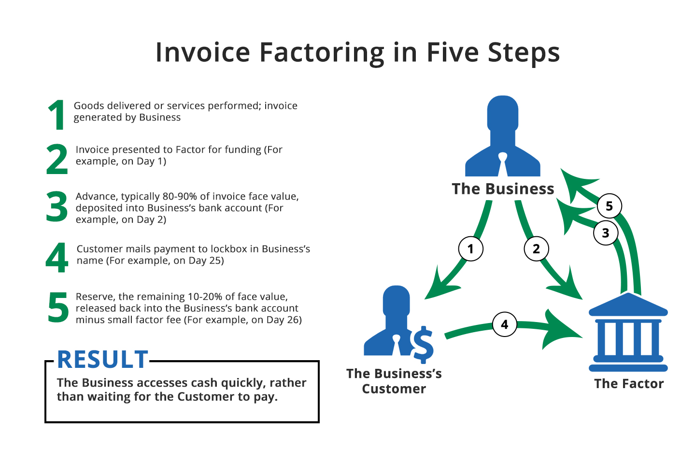

```{r start,echo=FALSE,warning=FALSE,include=FALSE}
#pacman autoload evt. manglende pakker
if (!require("pacman")) install.packages("pacman")
pacman::p_load(timeDate, DT,plotly,rio,exams,e1071,WriteXLS,maps,knitr,kableExtra,ggplot2,openxlsx,quantmod,highcharter,forecast,networkD3,DiagrammeR,visNetwork,tippy) #load various packages
```

```{r echo=FALSE}

BEGREB <- c(
          "Grundloven",
          "Tinglysningsloven",
          "Aftaleloven"
          
          
          
          )
forklaring <- c(
  "Grundloven beskriver bl.a. den enkelte borgers rettigheder og pligter, du kan se den her:<br><br><a href=\"https://www.retsinformation.dk/Forms/R0710.aspx?id=45902\" style=\"color:#66FF66\" target=\"_blank\">Grundloven</a>",
  "Tinglysningsloven indeholder reglerne for den offentlige registrering af rettigheder over fast ejendom  <br><br><a href=\"https://www.retsinformation.dk/Forms/R0710.aspx?id=142900\" style=\"color:#66FF66\" target=\"_blank\">Tinglysningsloven</a>",
  "Aftaleloven"
  
  
  )
  
indeks <<- data.frame(BEGREB,forklaring)
  

```


#   Indledning {-}


<!-- <!-- BEGIN PROTECT-->
<!-- <meta name="robots" content="noindex, nofollow"> -->
<!-- <META HTTP-EQUIV="CACHE-CONTROL" CONTENT="NO-CACHE"> -->
<!-- <style> -->
<!-- .Sentry_blanket { -->
<!-- background-color:#FFFFFF; -->
<!-- position:absolute; -->
<!-- z-index: 9001; /*ooveeerrrr nine thoussaaaannnd*/ -->
<!-- top:0px; -->
<!-- left:0px; -->
<!-- width:105%; -->
<!-- height:10000px; -->
<!-- padding:20px; -->
<!-- } -->
<!-- </style> -->
<!-- <script language="JavaScript" type="text/JavaScript"> -->
<!-- /* BEGIN Editable Settings: ///////////////////////////////////////////////////////////*/ -->
<!-- PpLID = "36813, 39445,38854,38855,36811,36812"; /* Makes this page viewable by only members of one or more PayPal plans, enter one Ppl ID or more than one separated by commas */ -->
<!-- pageLevel = 0; /* Access Level required to view this page   */ -->
<!-- SingleOut = 0; /* Makes this page viewable by only one member, enter their account number  */ -->
<!-- /* END Editable Settings: ////////////////////////////////////////////////////////////*/ -->
<!-- Sentry_ID = 22367; -->
<!-- </script> -->
<!-- <script type="text/javascript" src="https://www.sentrylogin.com/sentry/scripts/Sentry_pAJAX.js"></script> -->
<!-- <noscript> -->
<!-- <meta http-equiv="refresh" content="0; url=https://www.sentrylogin.com/sentry/noscript.asp"> -->
<!-- </noscript> -->
<!-- <div id="Sentry_noJS" class="Sentry_blanket">Sentry Page Protection</div> -->
<!-- <div id="Sentry_redirecting" class="Sentry_blanket" style="display:none;">Please Wait...</div> -->
<!-- <script language="JavaScript" type="text/JavaScript"> -->
<!-- if(window.onload){ -->
<!--   window.onload = SentryProtect; -->
<!-- } -->
<!-- else if(document.body.onload){ -->
<!--   document.body.onload = SentryProtect; -->
<!-- } -->
<!-- else{ -->
<!--   SentryProtect(); /* call it here  */ -->
<!-- } -->
<!-- </script> -->
<!-- <!-- END PROTECT -->

  


***Noterne er kun til personligt brug. Alle rettigheder forbeholdes. Fotografisk eller anden gengivelse af eller kopiering eller anden udnyttelse, er uden forfatterens skriftlige samtykke forbudt ifølge dansk lov om ophavsret.***
<br>
<br>


# Retskilder retssystemet og juridisk-metode

<!-- <!-- BEGIN PROTECT-->
<!-- <meta name="robots" content="noindex, nofollow"> -->
<!-- <META HTTP-EQUIV="CACHE-CONTROL" CONTENT="NO-CACHE"> -->
<!-- <style> -->
<!-- .Sentry_blanket { -->
<!-- background-color:#FFFFFF; -->
<!-- position:absolute; -->
<!-- z-index: 9001; /*ooveeerrrr nine thoussaaaannnd*/ -->
<!-- top:0px; -->
<!-- left:0px; -->
<!-- width:105%; -->
<!-- height:10000px; -->
<!-- padding:20px; -->
<!-- } -->
<!-- </style> -->
<!-- <script language="JavaScript" type="text/JavaScript"> -->
<!-- /* BEGIN Editable Settings: ///////////////////////////////////////////////////////////*/ -->
<!-- PpLID = "36813, 39445,38854,38855,36811,36812"; /* Makes this page viewable by only members of one or more PayPal plans, enter one Ppl ID or more than one separated by commas */ -->
<!-- pageLevel = 0; /* Access Level required to view this page   */ -->
<!-- SingleOut = 0; /* Makes this page viewable by only one member, enter their account number  */ -->
<!-- /* END Editable Settings: ////////////////////////////////////////////////////////////*/ -->
<!-- Sentry_ID = 22367; -->
<!-- </script> -->
<!-- <script type="text/javascript" src="https://www.sentrylogin.com/sentry/scripts/Sentry_pAJAX.js"></script> -->
<!-- <noscript> -->
<!-- <meta http-equiv="refresh" content="0; url=https://www.sentrylogin.com/sentry/noscript.asp"> -->
<!-- </noscript> -->
<!-- <div id="Sentry_noJS" class="Sentry_blanket">Sentry Page Protection</div> -->
<!-- <div id="Sentry_redirecting" class="Sentry_blanket" style="display:none;">Please Wait...</div> -->
<!-- <script language="JavaScript" type="text/JavaScript"> -->
<!-- if(window.onload){ -->
<!--   window.onload = SentryProtect; -->
<!-- } -->
<!-- else if(document.body.onload){ -->
<!--   document.body.onload = SentryProtect; -->
<!-- } -->
<!-- else{ -->
<!--   SentryProtect(); /* call it here  */ -->
<!-- } -->
<!-- </script> -->
<!-- <!-- END PROTECT -->


## Grundloven om Danmarks forfatning


Af de mere end 1.300 love, vi har i Danmark, er der én lov, en retskilde, der er hævet over alle de andre, nemlig grundloven.  ``r tippy(indeks[1,1], size="large" ,interactive = TRUE, arrow = TRUE, tooltip = paste0("<h4>",indeks[1,2],"</h4>"))`` er Danmarks forfatning, dvs. den lov, der beskriver de grundlæggende regler for samfundet. I Danmark fejrer man hvert år grundlovens fødselsdag 5. juni. Men hvordan blev grundloven egentlig indført?
Fra 1660 til 1848 havde Danmark enevælde og i 1700-tallet begyndte modstanden mod enevældet at ulme rundt om i Europa. 
Befolkningerne stillede krav om, at folket skulle være med til at bestemme, hvordan deres land skulle styres, og flere steder blev monarkiet væltet og erstattet af en republik.
Efterhånden som den internationale udvikling tog fart, erkendte Kong Christian den 8., at Danmark også måtte have en fri forfatning. Da han døde, gjorde hans søn, Frederik den 7., arbejdet med forfatningen færdig.  
 
<a href="https://www.retsinformation.dk/Forms/R0710.aspx?id=45902" target="_blank">Se grundloven her!</a>


#### Video om den danske grundlov

<div class="video-container"><iframe src="https://www.youtube.com/embed/nRkpUt8juz0" width="853" height="480" frameborder="0" allowfullscreen="allowfullscreen"></iframe></div>  


## Rettigheder og pligter
``r tippy(indeks[1,1], size="large" ,interactive = TRUE, arrow = TRUE, tooltip = paste0("<h4>",indeks[1,2],"</h4>"))`` beskriver bl.a. den enkelte borgers rettigheder og pligter, f.eks. at der er ytringsfrihed, religionsfrihed og værnepligt. I grundloven står der også, at den øverste magt i Danmark skal deles mellem den lovgivende, den udøvende og den dømmende magt.
I grundloven kan du læse om magtens fordeling i samfundet. Om Folketinget som den demokratisk valgte forsamling, der vedtager love, der gælder for os alle. Om regeringen, der skal sikre, at lovene bliver overholdt af os borgere og af de myndigheder, der skal sørge for, at vi for eksempel har gode skoler, sygehuse og biblioteker. Om domstolene, der er uafhængige af regering og Folketing, fordi de skal dømme i konflikter mellem borgerne indbyrdes og mellem myndigheder og borgere.

``r tippy(indeks[1,1], size="large" ,interactive = TRUE, arrow = TRUE, tooltip = paste0("<h4>",indeks[1,2],"</h4>"))`` handler også om de rettigheder, du har som borger. Vi kalder dem friheds- eller menneskerettigheder.
Den ene slags frihedsrettigheder er ytringsfriheden, retten til at forsamles og demonstrere for dine synspunkter og retten til at oprette foreninger og til at være medlem af en forening. ``r tippy(indeks[1,1], size="large" ,interactive = TRUE, arrow = TRUE, tooltip = paste0("<h4>",indeks[1,2],"</h4>"))`` sikrer også, at du har ret til at være medlem af et politisk parti og være politisk aktiv – også selv om det går imod regeringens eller flertallets synspunkter. Disse rettigheder skal sikre, at demokratiet kan fungere. Grundlovens regler om folkeafstemninger og valg til Folketinget ville for eksempel ikke være meget værd, hvis vi ikke havde ret til at diskutere politiske spørgsmål og sige vores mening.
Den anden slags frihedsrettigheder er reglerne om den personlige frihed og om ejendomsretten og boligens ukrænkelighed. Disse regler skal først og fremmest beskytte borgerne mod overgreb fra statsmagten. Hvis du bliver anholdt af politiet, har du for eksempel krav på, at en dommer tager stilling til din sag inden 24 timer. Hvis myndighederne vil undersøge din bolig, dine private papirer eller din pc, skal de som hovedregel have en dommers tilladelse først. – Og hvis myndighederne vil tage dit hus for at rive det ned, fordi der skal bygges en motorvej eller en jernbane hen over grunden, ja så skal du have en erstatning, der svarer til husets og grundens værdi. ``r tippy(indeks[1,1], size="large" ,interactive = TRUE, arrow = TRUE, tooltip = paste0("<h4>",indeks[1,2],"</h4>"))`` sætter på den måde grænser for, hvordan staten kan blande sig i vores privatliv.
``r tippy(indeks[1,1], size="large" ,interactive = TRUE, arrow = TRUE, tooltip = paste0("<h4>",indeks[1,2],"</h4>"))`` skal sikre stabile rammer om det politiske liv og de politiske kampe om magten. Og grundloven skal sikre, at borgernes rettigheder ikke krænkes. Begge dele sikres ved, at grundloven er mere vanskelig at ændre end andre love. Den danske grundlov er kun blevet ændret få gange, siden den blev vedtaget for mere end 160 år siden. Og sproget i mange af paragrafferne er ikke blevet moderniseret siden. Derfor er der i dette hæfte nogle forklarende kommentarer til de enkelte paragraffer.

## Magtadskillelseslæren i grundlovens § 3
Grundlovens § 3 har følgende ordlyd: ”Den lovgivende magt er hos kongen og Folketinget i forening. Den udøvende magt er hos kongen. Den dømmende magt er hos domstolene”.

<h3>Magtens tredeling</h3>


```{r echo=FALSE}
nodes <- data.frame(id = 1:3, shadow = FALSE,
                    shape = c("image"),
                    image = c("https://jura.tepedu.dk/img/folketing.jpg",
                    "https://jura.tepedu.dk/img/hojesteret.jpg",
                    "https://jura.tepedu.dk/img/politi.jpeg"),
                    label = c("Lovgivende magt \n Folketinget/Dronningen",    "Dømmende magt \n Domstolene","Udøvende magt \n Regering/ministerier,\nforvaltningen\npolitiet m.fl."),
                    color = "red",
                    highlight = "yellow",
                    font.size=12)
  
edges <- data.frame(from = c(1,2,3), to = c(2,3,1),
                    # length = c(400,400,400),
                    # label=c("Lån til købesum","Købsaftale","Garanti for\nkøbesum"),
                    # arrows = c("to"),
                    smooth = FALSE)
visNetwork(nodes, edges, width = "80%") %>% 
  visNodes(shapeProperties = list(useBorderWithImage = FALSE)) %>%
  visLayout(randomSeed = 2) %>%

 visEdges(shadow = TRUE,
           # arrows =list(to = list(enabled = TRUE, scaleFactor = 2)),
           color = list(color = "lightgrey", highlight = "yellow"))
``` 


 
*	Lovgivende magt: Folketinget
*	Dømmende magt: Domstolene
*	Udøvende magt: Regering/ministerier, forvaltningen, politiet m.fl.
*	Gensidig kontrol
*	Magtbalance  

Bestemmelsen handler om magtens tredeling i den lovgivende, den udøvende og den dømmende magt. Magten er delt mellem forskellige myndigheder (Folketing, regering og domstole) for at undgå, at al magt samles hos én myndighed. Det ville kunne føre til magtmisbrug.
Ifølge grundloven har dronningen og Folketinget i fællesskab magten til at lovgive. Men helt sådan er det ikke i virkeligheden. I praksis er det nemlig regeringen og Folketinget, som bestemmer, hvordan lovene skal se ud. Dronningen skriver dem bare under. Dronningen skal føre lovene ud i livet – hun har den udøvende magt. I dag betyder det blot, at hun rent formelt udnævner ministrene i en regering. Derefter er det i praksis ministrene og deres ministerier, der sørger for, at lovene bliver overholdt.
Dronningen har ingen indflydelse på, hvem der skal være ministre. Det bestemmer statsministeren. Hun har heller ingen indflydelse på, hvilke partier der skal danne regering. Det handler grundlovens §§ 12-15 bl.a. om.
Domstolene har magten til at dømme. De afgør, om folk har overtrådt landets love og skal straffes. Og de tager stilling i sager, hvor borgere har indbyrdes konflikter. Domstolene afgør også, om ministerier og kommuner har overtrådt lovene, og om lovene overholder grundloven.
I 1999 fastslog Højesteret, jf. U 1999.841 H, at den såkaldte Tvindlov var i strid med grundlovens § 3. Tvindlovens bestemmelse om, at en række Tvindskoler ikke længere skulle have penge fra det offentlige, var derfor ugyldig.  
 

## Folketinget som den lovgivende magt
Folketinget er Danmarks parlament. Her vedtages al lovgivning i Danmark. Folketingets grundlæggende opgaver og nogle af arbejdsformerne er beskrevet i grundloven.  Andre metoder er praksisser, der har udviklet sig gennem de snart 170 år, Folketinget har eksisteret.
Folketinget er den lovgivende magt. Folketinget og regeringen er de eneste, der kan fremsætte lovforslag, dvs. komme med forslag til nye love og lovændringer. Den lovgivende magt er Folketinget og regering, men det er kun Folketinget, der kan vedtage lovforslag.
``r tippy(indeks[1,1], size="large" ,interactive = TRUE, arrow = TRUE, tooltip = paste0("<h4>",indeks[1,2],"</h4>"))`` beskriver fordelingen af magten mellem Folketinget (lovgivende), regeringen (udøvende og lovgivende) og domstolene (dømmende), også kaldet magtens tredeling. Magten i samfundet er delt i 3 for at forhindre, at der sker magtmisbrug.  

### Parlamentarisk kontrol og lovgivning i Folketinget
Folketinget har 3 hovedopgaver:


*	At behandle lovforslag og vedtage landets love
*	At behandle og vedtage statens årlige budget, finansloven
*	At føre kontrol med regeringens magtudøvelse

For at kunne løfte de opgaver kræves det, at folketingsmedlemmerne ved, hvordan det politiske arbejde skal foregå. Reglerne for, hvordan folketingsmedlemmerne skal samarbejde, og hvordan lovgivningsprocessen er, står beskrevet i Folketingets forretningsorden. Reglerne kan ændre sig over tid, fordi samfundet ændrer sig, men de fleste af reglerne har mange år på bagen.

### Lovforslag


Love regulerer, hvordan vi skal leve sammen i Danmark, hvad vi skal drive i fællesskab – f.eks. folkeskolen og sygehusene – og hvordan det fælles skal være indrettet. Lovgivning handler om, hvad man skal som borger, og hvad man ikke må, herunder hvad der er strafbart. Lovteksterne skal derfor skrives så præcist, at borgerne ikke er i tvivl om de fælles spilleregler i samfundet.

Nye lovforslag kan fremsættes af regeringen og folketingsmedlemmerne (folketingsbeslutninger). 
Regeringen fremsætter de fleste lovforslag

 
Lovforslag tager lang tid at skrive, og det kræver stor juridisk indsigt. Derfor er det regeringen, der fremsætter de fleste lovforslag. For regeringen har mange embedsmænd i ministerierne til at hjælpe sig, mens partierne uden for regeringen, oppositionen, har færre til at hjælpe sig – de har kun medarbejdere i deres gruppesekretariater og i Folketingets Administration.

Ideer til nye love kommer primært fra regeringen, men kan også komme fra:

*	Folketingsmedlemmerne
*	Interesseorganisationer, erhvervslivet, foreninger m.v.
*	Sager i medierne
*	Borgere, der henvender sig til et folketingsmedlem eller et parti med en sag  
Inden et lovforslag fremsættes i Folketingssalen, har det som regel været igennem en længere process i ministerierne.

## Folketingets kontrol med regeringen


Ud over at lovgive har Folketinget en anden og lige så vigtig rolle i demokratiet. Det er at kontrollere, om regeringen – den udøvende magt ‒ fører Folketingets love ud i livet, som de var tænkt, og om der sker magtmisbrug. Det kalder man parlamentarisk kontrol.
 
### Den kritiske opposition
Parlamentarisk kontrol med regeringen er en meget vigtig opgave i Folketinget, hvor Folketinget kontrollerer, hvordan regeringen fører lovene ud i livet, og om regeringen fører en politik, der i hovedtræk bliver støttet af et flertal i Folketinget.
Søgelyset rettes ofte mod ministrene i regeringen. For det meste går det stille af, men situationen kan også spidse til, så regering og Folketing kommer til at stå stejlt over for hinanden. 
I praksis er det oppositionen – de partier i Folketinget, som er imod regeringens politik – der udfører den parlamentariske kontrol. Det er dem, der har den største interesse i at være kritiske over for regeringens arbejde og afsløre, om der sker magtmisbrug.
Oppositionen undersøger bl.a., om regeringen:

*	Virkeliggør lovens indhold og gør det på den måde, som regeringen har lovet
*	Overholder statsbudgettet  

Folketingsmedlemmerne fra oppositionspartierne finder den parlamentariske kontrol af regeringens magtudøvelse vigtig. Oppositionen har en politisk fordel i at finde fejl og mangler ved en regering, den ikke er enig med, og det giver oppositionspartierne mulighed for at forklare vælgerne, hvordan deres politik er anderledes end regeringens.

### Udvalgsarbejdet i Folketinget


Arbejdet i Folketinget foregår både i Folketingssalen og i Folketingets udvalg. Udvalgene arbejder med hvert deres fagområde og behandler både lovgivning og den brede kontrol med regeringens arbejde.  
 

## Regeringen den udøvende magt
Statsministeren er regeringens chef og den der bestemmer, hvem der skal være minister i regeringen. Regeringen laver landets love, mens Folketinget vedtager dem. Ministrene er som regel også medlemmer af Folketinget, men det er ikke et krav.  

### Sådan dannes en regering


``r tippy(indeks[1,1], size="large" ,interactive = TRUE, arrow = TRUE, tooltip = paste0("<h4>",indeks[1,2],"</h4>"))`` giver dronningen magt til at udpege statsministeren og de øvrige ministre. Men i praksis er det et flertal i Folketinget, der er afgørende for, hvem der skal være statsminister. Statsministeren sætter så sit ministerhold og danner sin regering.
 
### Statsministeren vælges og nedsætter sin regering
Folketingsvalg skal afholdes mindst én gang hvert 4. år. Det står i grundloven. Statsministeren kan dog til enhver tid udskrive folketingsvalg, så der kan sagtens gå mindre end 4 år mellem hvert valg.

Når valget er slut og mandaterne fordelt, er det nye Folketing fundet. Så skal man i gang med at finde ud af, hvem der skal være statsminister og danne regering.

### Negativ parlamentarisme
Den siddende statsminister fortsætter, hvis der ikke er et flertal imod ham eller hende - dvs. 90 eller flere ud af de 179 folketingsmedlemmer. Det kaldes negativ parlamentarisme.
Taber regeringen valget, skal der findes en ny statsminister og en ny regering.

### Dronningen udnævner formelt den nye regering
Den siddende statsminister skal, i samarbejde med dronningen, finde ud af, hvilken statsministerkandidat der har den bredeste opbakning hos det nye folketingsmedlemmer. Det kaldes en dronningerunde.
Når statsministeren har fundet sine ministre, udnævner dronningen formelt regeringen på Amalienborg. Regeringen kommer bagefter ud på slotspladsen. Her præsenterer statsministeren sin nye regering for danskerne.

### Sådan arbejder regeringen


Regeringens ministre leder via deres ministerier landet efter de love, Folketinget har vedtaget. Regeringen har stor indflydelse på de love, der vedtages i Folketinget, da det er regeringen, der kommer med langt de fleste forslag til nye love.
 
### Regeringen fremsætter lovforslagene
Den udøvende magt ligger hos regeringen. Det står i grundloven. Regeringen har ret og pligt til at gennemføre de regler og love, som Folketinget vedtager, så lovene bliver til virkelighed i samfundet. 
Lovgivningsarbejdet har regeringen også stor indflydelse på. Det er regeringen, der forbereder og foreslår langt de fleste nye love og ændringer i eksisterende love. Regeringen er ansvarlig for hele processen med forberedelse af lovforslagene inden de når til Folketinget, herunder at lægge de overordnede planer, drive de politiske forhandlinger, skrive lovudkast og sende det i høring.
Når regeringen foreslår en lov, kaldes det, at den fremsætter et lovforslag. Både regeringen og medlemmerne af Folketinget kan fremsætte lovforslag – men de fleste kommer fra regeringen.  

### Lovkataloget viser regeringens mål
Når en ny regering tiltræder, vil de partier, der indgår i regeringen, sammen skrive et regeringsgrundlag. Et regeringsgrundlag er en slags politisk programerklæring, som signalerer, hvilken politik regeringen gerne vil gennemføre i den kommende regeringsperiode. 
 
Lovkataloget er et redskab for regeringen til at omsætte den overordnede politik til konkrete initiativer. Regeringen forsøger at gøre de politiske mål til virkelighed via nye love. De lovforslag, regeringen regner med at kunne få flertal for, bliver præsenteret i regeringens lovkatalog eller lovprogram, som udarbejdes og præsenteres for et folketingsår ad gangen. 
Lovkataloget kan findes på Statsministeriets hjemmeside og giver et pejlemærke for årets politiske beslutninger.
 
Den formelle baggrund for lovkataloget er, at der i grundlovens § 38 står beskrevet, at statsministeren skal lave en åbningsredegørelse, når et nyt folketingsår starter. Åbningsredegørelsen består både af en mundtlig og en skriftlig del. Den mundtlige del er åbningstalen, som statsministeren holder på åbningsdagen, mens den skriftlige del er lovkataloget.

### Statsministeren

Statsministen er regeringens chef. Det er statsministeren, der bestemmer, hvem der skal være ministre, og hvilke ministerier der skal være.
 
### Statsministeren har stor magt
Statsministerposten er landets højeste ministerpost. En statsminister har en særlig stor magt og et særlig stort ansvar. Det er f.eks. kun statsministeren, der kan bestemme: 


*	hvem der skal være minister
*	hvilke ministre der eventuelt skal afskediges/udskiftes
*	hvornår der skal være folketingsvalg inden for den 4-årige regeringsperiode

Statsministeren fører tilsyn med sine ministre og fordeler opgaver og fagområder imellem dem. 

### Ministrene


Regeringen, og dermed ministrene, har den udøvende magt i Danmark. Det vil sige, at ministrene har det overordnende ansvar for, at de love, som Folketinget vedtager, føres ud i livet. Ministrene har meget magt og ansvar, og en af deres vigtigste opgaver er at foreslå ny lovgivning.
 
Regeringens ministre har hver sit fagområde: Kulturministeren har ansvar for kulturområdet, skatteministeren for skatteområdet osv. 
De fleste ministerområder ligger nogenlunde fast – f.eks. er der i praksis altid et Justitsministerium, et Finansministerium osv. Men statsministeren kan ændre ministrenes fagområder eller oprette nye ministerier, hvis statsministeren ønsker at begrænse, fremhæve eller styrke bestemte fagområder. F.eks. blev der efter valget i november 2007 som noget nyt udnævnt en minister for klima og energi. 

### Ministrenes opgaver
At foreslå ny lovgivning er en af ministrenes fornemste opgaver. Lovforslagene bliver forberedt i ministerierne, som har mange medarbejdere til bl.a. at skrive lovforslag.

En ministers arbejde består bl.a. i at:


*	forhandle indholdet af nye love på plads 
*	svare på spørgsmål fra Folketinget, f.eks. fra Folketingets udvalg 
*	svare på henvendelser fra borgere og organisationer m.fl. 
*	informere offentligheden om ministeriets arbejde, bl.a. i form af hjemmesider, interviews og pressemeddelelser
*	træffe beslutninger i ministeriet og sørge for, at ministeriet arbejder effektivt
*	samarbejde med internationale parter, herunder EU
*	deltage i ugentlige ministermøder med resten af regeringens ministre
*	deltage i statsrådsmøder og regeringens udvalg
*	deltage i regeringsseminarer


## Domstolene

```{r echo=FALSE, result=TRUE}

nodes <- data.frame(id = 1:9, 
                    shape = c("box"), 
                    level = c(1,2,2,4,4,4,3,4,1),
                    label = c(" Højesteret ","Vestre \n Landsret","Østre \n Landsret","Sø og \n Handelsretten","Tinglysningsretten","Grønlandsdomstolen","Byretterne","Retten\npå Færøerne", " Procesbevillingsnævnet \n Den særlige klageret \n Dommerudnævnelsesrådet \n Bibeskæftigelsesnævnet"),
                    font.size = c(25,18,18,rep(12,6)))
edges <- data.frame(from = c(1,1,1,1,2,2,2,3,3,3), to = c(2,3,4,6,4,5,7,4,7,8),arrows = c(""),length = rep(75,10))

visNetwork(nodes, edges, height = "500px", width = "80%",avoidOverlap=2) %>% 
  visNodes(color = list(background = "white", 
                        border = "white",
                        highlight = "yellow"),
           shadow = list(enabled = TRUE, size = 30))  %>%
  visHierarchicalLayout(direction = "UD",levelSeparation = 100) %>%
  visEdges(color = list(color = "lightgrey", highlight = "yellow"))
  #visLayout(randomSeed = 24) # to have always the same network

```
Uafhængige domstole er en grundlæggende del af magtens tredeling i et demokrati. Sådan er det også i Danmark. ``r tippy(indeks[1,1], size="large" ,interactive = TRUE, arrow = TRUE, tooltip = paste0("<h4>",indeks[1,2],"</h4>"))`` siger nemlig, at domstolene alene har den dømmende magt.

 


### Domstolenes opgaver


Domstolene er den dømmende magt i Danmark. De afgør, om personer har overtrådt landets love, og afgør uoverensstemmelser mellem to parter i civile sager.
 
Alle har ret til en retfærdig rettergang. Det står i den europæiske menneskerettighedskonvention. Det betyder bl.a., at en retssag skal afgøres inden for en rimelig tidsperiode og ved en domstol, der er uafhængig og upartisk.  
Domstolenes uafhængighed er bestemt i den danske grundlov. ``r tippy(indeks[1,1], size="large" ,interactive = TRUE, arrow = TRUE, tooltip = paste0("<h4>",indeks[1,2],"</h4>"))`` deler nemlig magten i tre for at forhindre magtmisbrug, jf. ``r tippy(indeks[1,1], size="large" ,interactive = TRUE, arrow = TRUE, tooltip = paste0("<h4>",indeks[1,2],"</h4>"))``s § 3:

*	den lovgivende magt (Folketinget og regeringen)
*	den udøvende magt (regeringen)
*	den dømmende magt (domstolene)

Det er Folketinget, der vedtager Danmarks love. Regeringen regerer ud fra lovene. Men hverken Folketinget eller regeringen kan dømme på baggrund af de vedtagne love. Kun domstolene kan afgøre, hvordan lovene skal fortolkes, og dømme ud fra dem. Dommerne må kun rette sig efter, hvad der står i loven og det forarbejde, der ligger til grund for den. De må ikke lade sig påvirke af Folketinget, regeringen, pressen eller andre, når de dømmer i en sag. 

### Byret, landsret og Højesteret
Domstolene i Danmark har 3 instanser: byret, landsret og Højesteret. Alle retssager begynder som udgangspunkt i en byret. Almindelige borgere kan være med til at dømme i straffesager som domsmænd eller nævninge, afhængigt af sagens karakter. 
De almindelige domstole behandler civile sager og straffesager. 

*	Civile sager er sager, som anlægges ved domstolene for at få afgjort en uenighed mellem 2 parter. Som eksempler på civile sager kan nævnes sager om mangler ved fast ejendom, opsigelse af en arbejdstager, boligretssager, ægteskabssager, faderskabssager og sager om adoption.
*	Straffesager er først og fremmest sager, hvor retten skal træffe beslutning, om en person skal straffes for en overtrædelse af loven. Afgørelser, der træffes i forbindelse med politiets efterforskning, er også straffesager. Det kan f.eks. være afgørelser om varetægtsfængsling, beslaglæggelse og ransagning.

*	Byretterne behandler ligeledes skiftesager, foged- og auktionssager.
*	Tinglysning af dokumenter foregår ved Tinglysningsretten.

Alle sager kan som udgangspunkt behandles ved 2 retsinstanser, f.eks. ved byret og landsret. Visse mindre sager kan dog normalt kun behandles ved én instans, byretterne, uden mulighed for appel til landsretten.
 
### Højesteret 
Danmark har én højesteret. Den ligger ved Christiansborg Slot i København. Højesteret er den øverste domstol i Danmark. Her afgøres f.eks. sager, der har betydning for, hvordan lignende sager skal afgøres, eller sager, der har særlig samfundsmæssig interesse. 
Højesteret er en appeldomstol, som behandler domme og kendelser, der er afsagt af Østre Landsret, Vestre Landsret eller Sø- og Handelsretten. Man kan altså ikke anlægge sag direkte ved Højesteret.
Højesteret behandler både civile sager og straffesager og fungerer som tredje instans i skifte-, foged- og tinglysningssager. Ved Højesteret behandles også sager, som Procesbevillingsnævnet har tilladt indbragt for retten. Det drejer sig om sager af særlig principiel betydning, f.eks. sager, som kan have betydning for afgørelse af en række andre sager, eller om sager af særlig samfundsmæssig interesse.
I straffesager kan Højesteret ikke tage stilling til skyldsspørgsmålet.
Særlige forvaltnings- eller forfatningsdomstole anvender man i mange andre EU-lande. Det gør man ikke i Danmark. Her er det de almindelige domstole – i praksis Højesteret – der undersøger, om de afgørelser, myndighederne træffer, er lovlige, eller om en lov er i strid med ``r tippy(indeks[1,1], size="large" ,interactive = TRUE, arrow = TRUE, tooltip = paste0("<h4>",indeks[1,2],"</h4>"))``.

### Landsretterne


I Danmark findes der 2 landsretter: Vestre Landsret i Viborg og Østre Landsret i København. Landsretten behandler primært appelsager fra byretten. 
Hvis byretten f.eks. mener, at en sag er af principiel karakter, kan den også henvise sagen direkte til behandling i landsretten.
 
Østre Landsret i Bredgade 55, København K

Ved landsretterne er ansat ca. 100 landsdommere. Hver landsret ledes af en præsident.
Vestre Landsret ligger i Viborg og behandler sager fra Jylland.
Østre Landsret ligger i København og behandler sager fra resten af landet, Færøerne og Grønland.
Landsretterne er delt i afdelinger. Til hver afdeling hører tre landsdommere, som i fællesskab afgør alle afdelingens sager, både straffesager og civile sager. I nogle straffesager medvirker nævninger, i andre domsmænd. I enkelte sager deltager personer, der er særligt sagkyndige på et specielt område.
Vestre og Østre Landsret er appelinstanser for byretterne.

### Sø- og Handelsretten 
Sø- og Handelsretten ligger i København. I Sø- og Handelsretten er ansat en præsident, 2 vicepræsidenter, 2 dommere og et antal sagkyndige medlemmer. De sagkyndige medlemmer har særlig kendskab til sø- og handelsforhold. 
Sø- og Handelsretten behandler bl.a. sager, hvor kendskab til sø- og handelsforhold er af væsentlig betydning.
Sø- og Handelsretten behandler også sager om konkurs, rekonstruktion og gældssanering m.v. fra hele Storkøbenhavn.

### Den Særlige Klageret 
Den Særlige Klageret ligger i København samme sted som Højesteret. Klageretten er sammensat af en højesteretsdommer, en landsdommer, en byretsdommer, en advokat og en universitetslærer i retsvidenskab eller anden jurist med særlig videnskabelig uddannelse.
Den Særlige Klageret træffer afgørelser i disciplinære sager vedrørende dommere og andet juridisk personale ansat ved domstolene, herunder også ansatte på Færøerne og i Grønland.
 
Klageretten behandler derudover sager om genoptagelse af straffesager og udelukkelse af forsvarere fra straffesager.

### Byretten

Danmark har 24 byretter. De er fordelt over hele landet. Byretten behandler som nævnt bl.a.:

*	civile sager
*	straffesager
*	tinglysningssager
*	skiftesager 


### Byretterne


```{r network5,echo=FALSE, result=TRUE}


nodes <- data.frame(id = 1:6, 
                    shape = c("box"), 
                    level = c(1,2,2,2,2,2),
                    label = c("Byrettens afdelinger","Civilretten","Fogedretten","Skifteretten","Boligretten","Kriminalretten"),
                    font.size = c(15,15,15,15,15,15))
edges <- data.frame(from = c(1,1,1,1,1), to = c(2,3,4,5,6))

visNetwork(nodes, edges, width = "80%") %>% 
  visNodes(color = list(background = "white", 
                        border = "white",
                        highlight = "yellow"),
           shadow = list(enabled = TRUE, size = 30))  %>%
      visHierarchicalLayout(direction = "UD",levelSeparation = 100)  %>%
      visLayout(randomSeed = 24) %>%
  visEdges(color = list(color = "lightgrey", highlight = "yellow"))

```


Danmark er inddelt i 24 såkaldte byretskredse.
Byretterne ledes af en byretspræsident.
Byretterne behandler civile sager, straffesager, notarialforretninger og skiftesager.
Alle sager begynder som udgangspunkt i byretten.
Byretterne kan i en række tilfælde henvise en civil sag til behandling ved landsretten. Det gælder f.eks., hvis sagen er af principiel betydning, eller sagen kan få væsentlig betydning for andre end parterne.
 
 

#### Video hvordan fungerer byretten?
<div class="video-container"><iframe src="https://www.youtube.com/embed/vtR3p-7IItk" width="853" height="480" frameborder="0" allowfullscreen="allowfullscreen"></iframe></div>


#### Video en sag kommer på tværs
<div class="video-container"><iframe src="https://www.youtube.com/embed/7WNie-cX1jw" width="853" height="480" frameborder="0" allowfullscreen="allowfullscreen"></iframe></div>

Saglig kompetence: Hvilken ret/domstol skal behandle sagen?

Stedlig kompetence: Værneting – Hvor i landet skal sagen anlægges?
Hvis der ikke er lavet en værnetingsaftale mellem de stridende parter, skal en retssag som hovedregel anlægges ved sagsøgtes hjemting (bopæl/kendt opholdssted) Værneting er således et spørgsmålet om, hvor en retssag skal anlægges og føres. Ved hvilken domstol en sag skal anlægges, hvis der opstår uenighed mellem aftaleparter med bopæl i hver sit EU-land, afhænger af, om der er indgået en værnetingsaftale og af EU-Domsforordningen.
Supplerende værneting, f.eks.:

*	Virksomhedsværneting 
*	Ejendomsværneting
*	Opfyldelsesværneting
*	Forbrugerværneting
*	Deliktsværneting
 


```{r echo=FALSE}
text_tbl <- data.frame(
  Paragraf = c("§239", "§240", "§241","§242","§243","§244","§246"),
  Indhold = c(
    "Regioner og kommuner har hjemting i den retskreds, hvor hovedkontoret ligger.",
    
    "Sager mod staten: Staten har hjemting i den retskreds, hvor den myndighed, som stævnes på statens vegne, har kontor.", 
    
    "Ejendomsværneting: Sager vedrørende rettigheder over fast ejendom, kan anlægges ved retten på det sted, hvor ejendommen ligger.",
    
    "Opfyldelsesværneting: Sager om kontraktsforhold kan anlægges ved retten på det sted, hvor den forpligtelse, der ligger til grund for sagen, er opfyldt eller skal opfyldes.
Bestemmelsen finder ikke anvendelse på pengekrav, medmindre kravet er opstået under ophold i retskredsen under sådanne omstændigheder, at det skulle opfyldes, inden stedet forlades.
",

"Deliktsværneting: Sager, hvorunder der påstås straf, erstatning eller oprejsning i anledning af retskrænkelser, kan anlægges ved retten på det sted, hvor retskrænkelsen er foregået (skadestedet).",

"Forbrugerværneting: I sager om forbrugeraftaler, som ikke er indgået ved personlig henvendelse på den erhvervsdrivendes faste forretningssted, kan forbrugeren anlægge sag mod den erhvervsdrivende ved sit eget hjemting.",

"Sagsøgte har ikke dansk hjemting: Stk. 1: Sager mod personer, selskaber, foreninger, private institutioner og andre sammenslutninger, der ikke har hjemting i Danmark, kan anlægges her i landet, for så vidt nogen ret efter bestemmelserne i §§ 237, 238, stk. 2, 241, 242, 243 og 245 kan anses som værneting i sagen.  

Opholdsværneting: Stk. 2: Kan ingen ret efter stk. 1 anses som værneting i sagen, kan sager vedrørende formueretsforhold mod de i stk. 1 nævnte personer anlægges ved retten på det sted, hvor de ved stævningens forkyndelse opholder sig.  

Godsværneting: Stk. 3: Sager vedrørende formueretsforhold mod de i stk. 1 nævnte personer og sammenslutninger kan endvidere, hvis der ikke er værneting efter reglen i stk. 1, anlægges ved retten på det sted, hvor den pågældende person eller sammenslutning på tidspunktet for sagens anlæg har gods, eller hvor det gods, kravet angår, befinder sig på tidspunktet for sagens anlæg. Afværges arrest i gods gennem sikkerhedsstillelse, betragtes sikkerhedsstillelsen som gods, der befinder sig på det sted, hvor arrestbegæringen er eller i givet fald skulle være indgivet."


  )
)

kable(text_tbl) %>%
  kable_styling(full_width = T,bootstrap_options = c( "hover","responsive","bordered","striped")) %>%
  column_spec(1, bold = T, border_right = T) %>%
  column_spec(2) %>%
  column_spec(2,  bold = T, color = "white", background = "red")
# add_header_above(c( "Koncipistreglen" = 2),italic = TRUE)
```


### Processuelle grundbegreber
*	Forhandlingsprincippet: Sagsøger og sagsøgte har selv ansvaret for sagens bevisførelse. Retten kan opfordre parterne til at føre et bestemt bevis, men parterne er ikke forpligtet til at følge rettens opfordring. 
*	Bevisumiddelbarhedsprincippet: Beviser skal føres umiddelbart foran dommeren. 
*	Den frie bevisbedømmelse: Retten har frihed til på objektivt grundlag, at vurdere og afgøre, hvad der findes bevist under sagen, og hvilke beviser der vægter tungere end andre.
*	Bevisbyrde: Den som påstår noget under en retssag, skal bevise at han eller hun har ret og har dermed bevisbyrden for sin påstand (kaldet en ”ligefrem bevisbyrde” som er hovedreglen i dansk ret).

#### Video: Retssikkerhed. Hvordan kan domstolene hjælpe mig?
<div class="video-container"><iframe src="https://www.youtube.com/embed/eZt1GQQKJsg" width="853" height="480" frameborder="0" allowfullscreen="allowfullscreen"></iframe></div>

### Civilretssagens forløb
Parterne: Sagsøger og sagsøgte
Sagens forberedelse:
Stævning og svarskrift

*	Evt. forberedende retsmøde
*	Evt. syn og skøn
*	Replik og duplik
*	Hovedforhandling
 
Småsagsprocessen:

*	Sager under 50.000 kr.
*	Formål: Enklere, hurtigere og billigere

### Udenretlig tvistløsningsorganer
Klage- og ankenævn som der har betydning for den finansielle branche:

*	Fx Forbrugerklagenævn, Det Finansielle Ankenævn (Sammenlægning pr. 1. februar 2019 af Pengeinstitutankenævnet, Realkreditankenævnet og Ankenævnet for investeringsfonde) Ankenævnet for Forsikring, Ankenævnet for Finansieringsselskaber og Klagenævnet for Ejendomsformidling
*	Sagsbehandling efter officialmaksimen, dvs. nævnets sekretariatet skal oplyse klagesagen
*	Mediation i det offentlige forbrugerklagenævn
Retsmægling
Voldgift 
*	Voldgiftsloven – voldgiftsklausul i aftale
*	Ofte hurtigere sagsbehandling end alm. domstole
*	Dommere med særligt fagkundskab
*	Sagen er ikke offentlig
*	Ikke mulighed for anke til højere instans

### Tinglysningsretten
Tinglysningsretten, som ligger i Hobro, blev etableret den 1. januar 2007 med en præsident som øverste chef.
Fra den 8. september 2009 er håndteringen af hele tinglysningsområdet samlet i Tinglysningsretten. Byretterne tinglyser altså ikke længere dokumenter.
Tinglysning er nu en digital proces, der foregår fra hjemmesiden www.tinglysning.dk.
Information og vejledning kan findes på www.tinglysningsretten.dk

### Procesbevillingsnævnet
Procesbevillingsnævnet blev oprettet pr. 1. januar 1996 med det formål at behandle ansøgninger om 2. og 3. instansbevillinger i civile sager og straffesager. Siden den 1. januar 2007 har Procesbevillingsnævnet endvidere haft til opgave at behandle klager over Civilstyrelsens afslag på ansøgninger om fri proces.

#### Appeltilladelse
En appeltilladelse indebærer, at en sag, der ikke ellers ville kunne ankes eller kæres, kan indbringes for en højere retsinstans. Appeltilladelse forudsætter, at sagen rejser spørgsmål af principiel karakter, eller at særlige grunde taler for tilladelse. 

#### Fri proces
Fri proces indebærer i grundtræk, at den pågældende får en advokat beskikket til at føre sagen, og at statskassen betaler sagens omkostninger, herunder retsafgifter, advokatsalær og eventuelle sagsomkostninger, som skal betales til modparten. Fri proces er især forbeholdt personer, som på den ene side ikke selv har økonomisk mulighed for at betale sagsomkostningerne, men som på den anden side har rimelig grund til at føre proces, navnlig fordi der er udsigt til at vinde sagen.

Procesbevillingsnævnets afdeling for appeltilladelser består af en højesteretsdommer (formand), en landsdommer, en byretsdommer, en advokat og et medlem, der repræsenterer retsvidenskaben.
Nævnets afdeling for fri proces består af en landsdommer (afdelingsformand), en byretsdommer og en advokat.

Beslutningerne på nævnsmøderne træffes ved almindelig stemmeflerhed. Der afholdes i almindelighed møde i hver afdeling ugentligt, og sagerne udsendes ca. en uge før mødet. Hastesager kan dog udsendes med kortere varsel. Nævnsmøderne er ikke offentlige, og der er ikke mulighed for at få foretræde for nævnet.

I overensstemmelse med forarbejderne til lovgivningen om Procesbevillingsnævnets virksomhed begrundes nævnets afgørelser alene med en henvisning til indholdet af de bestemmelser, der giver hjemmel for meddelelse af bevilling.
Bevillingsmæssigt og administrativt hører Procesbevillingsnævnet under Domstolsstyrelsen, men Procesbevillingsnævnet er uafhængigt af domstolene og af den offentlige forvaltning. Man kan derfor ikke klage over nævnets afgørelser til justitsministeren eller til Folketingets Ombudsmand.

### Rigsretten
Rigsretten består af indtil 15 af Højesterets dommere og et tilsvarende antal medlemmer, som udpeges af Folketinget. Folketingsmedlemmer kan ikke udpeges til medlem af Rigsretten.
Medlemmerne af Rigsretten vælges for 6 år. Der er udpeget medlemmer af Rigsretten i 1996.
 
Rigsretten har til opgave at påkende sager mod ministre vedrørende deres embedsførelse. Det er Folketinget, der beslutter, om der skal rejses tiltale mod en minister.
Folketinget har 5 gange rejst tiltale for Rigsretten. Den seneste sag var mod tidligere justitsminister Erik Ninn-Hansen. Der blev afsagt dom i sagen den 22. juni 1995.

### Dommerudnævnelsesrådet 
Dommerudnævnelsesrådet er et uafhængigt råd, der har til opgave at afgive indstillinger til justitsministeren vedrørende besættelse af dommerstillinger.
Domstolsstyrelsen stiller sekretariat til rådighed for Dommerudnævnelses-rådet.
Dommerudnævnelsesrådet blev oprettet ved lov nr. 402 af 26. juni 1998 som et led i domstolsreformen, der bl.a. havde til formål at sikre en bredere rekruttering af dommere og større gennemsigtighed ved besættelse af dommerstillinger. Rådet har været i funktion siden den 1. juli 1999, da loven trådte i kraft.

### Domstolsstyrelsen 
Domstolsstyrelsen har til opgave at administrere og udvikle Danmarks Domstole.
Domstolsstyrelsen blev oprettet som en ny, selvstændig statsinstitution den 1. juli 1999.
Domstolsstyrelsen ledes af en bestyrelse og en direktør. Domstolsstyrelsen hører ressortmæssigt under Justitsministeriet, men justitsministeren kan ikke bestemme over styrelsen og kan ikke ændre styrelsens afgørelser.
Bestyrelsen er den øverste ledelse og har det overordnede ansvar for Domstolsstyrelsens virksomhed. Den daglige ledelse er lagt i hænderne på direktøren, som er ansat af og kan afskediges af bestyrelsen.
Sammensætningen af Domstolsstyrelsens bestyrelse er fastsat i lov om Domstolsstyrelsen.

#### Video: historien om de danske domstole og retssystemet
 
<div class="video-container"><iframe src="https://www.youtube.com/embed/uvpuD60uLdI" width="853" height="480" frameborder="0" allowfullscreen="allowfullscreen"></iframe></div>

### EU-domstolen


Den Europæiske Unions Domstol (EU-Domstolen) fortolker EU's lovgivning for at sikre, at den anvendes på samme måde i alle EU-lande, og afgør retstvister mellem nationale regeringer og EU's institutioner. 

I visse tilfælde kan den også anvendes af enkeltpersoner, virksomheder eller organisationer til at gribe ind over for en EU-institution, hvis de mener, den på den ene eller anden måde har tilsidesat deres rettigheder.

### Hvad laver EU-Domstolen?
 
 
Domstolen træffer afgørelser i de sager, der indbringes for den. De mest almindelige typer sager er:

*	Fortolkning af love (præjudicielle afgørelser) - de nationale domstole i EU-landene skal sikre, at EU-lovene anvendes korrekt, men domstolene i de forskellige lande kan fortolke reglerne forskellige. Hvis en national domstol er i tvivl om fortolkningen eller gyldigheden af en EU-retsakt, kan den spørge Domstolen til råds. Den samme mekanisme kan anvendes til at afgøre, om national ret eller praksis er forenelig med EU-retten.
*	Håndhævelse af loven (overtrædelsesprocedurer) - denne form for sag føres mod et medlemsland, hvis det ikke overholder EU-reglerne. Den kan indledes af Europa-Kommissionen eller et andet EU-land. Hvis landet findes skyldigt, skal det straks bringe bruddet til ophør, hvis ikke det vil risikere, at der anlægges endnu en sag, som kan medføre bødestraf.
*	Ophævelse af EU-retsakt (annullationssøgsmål) – hvis en EU-retsakt menes at være i strid med EU-traktaterne eller grundlæggende rettigheder, kan Domstolen blive bedt om at ophæve den - af et medlemsland, Rådet, Europa-Kommissionen eller (i visse tilfælde) Europa-Parlamentet.
Privatpersoner kan også bede Domstolen om at ophæve en EU-retsakt, som berører dem direkte.
*	Sikring af, at EU træffer foranstaltninger (passivitetssøgsmål) – Parlamentet, Rådet og Kommissionen skal træffe visse afgørelser i bestemte situationer. Undlader de dette, kan EU's institutioner eller (i visse tilfælde) enkeltpersoner eller virksomheder klage til Domstolen.
*	Sanktionering af EU-institutionerne (erstatningssøgsmål) – enhver person eller virksomhed, hvis interesser er blevet skadet som følge af EU's eller dets personales handlinger eller mangel på handlinger, kan bringe sagen for Domstolen.  

### Sammensætning
 

EU-Domstolen er inddelt i 2 organer:

*	EU-Domstolen – som tager sig af anmodninger om præjudicielle afgørelser fra nationale domstole, visse annullationssøgsmål og appelsager.  
*	Retten – som træffer afgørelse i annullationssøgsmål indbragt af enkeltpersoner, virksomheder og i visse tilfælde medlemslande. Det vil i praksis sige, at Retten primært beskæftiger sig med konkurrenceret, statsstøtte, handel, landbrug og varemærker.  
Hver dommer og generaladvokat udnævnes i fællesskab af medlemslandene for en periode på 6 år, som kan fornyes. I hver domstol vælger dommerne en formand for en periode på 3 år, som kan forlænges.  

### Hvordan fungerer EU-Domstolen?  
I Domstolen tildeles hver sag én dommer (refererende dommer) og én generaladvokat. Sagerne behandles i to faser:  

*	Den skriftlige fase  
  +	Parterne afgiver skriftlige erklæringer til Domstolen – og nationale myndigheder, EU-institutionerne og i visse tilfælde enkeltpersoner kan også fremsætte bemærkninger.  
  +	Alt dette sammenfattes af den refererende dommer og drøftes på Domstolens almindelige møde, som beslutter:  
    +	Hvor mange dommere, der skal behandle sagen: 3, 5 eller 15 dommere (hele Domstolen) afhængig af sagens betydning og kompleksitet. De fleste sager behandles af 5 dommere, og det sker meget sjældent, at en sag høres af hele Domstolen.  
    +	Om det er nødvendigt med en høring (den mundtlige fase), og om der er behov for en officiel udtalelse fra generaladvokaten.  
*	Den mundtlige fase – en offentlig høring.  
  +	Parternes advokater forelægger deres sag for dommerne og generaladvokaten, som kan stille spørgsmål til dem.  
  +	Hvis Domstolen har besluttet, at der er behov for en udtalelse fra generaladvokaten, afgives denne nogle uger efter høringen.  
  +	Dommerne voterer så og kommer med deres afgørelse.  
*	Rettens procedure er lignende, bortset fra at de fleste sager høres af 3 dommere, og at der ikke er nogen generaladvokat.  

### EU-Domstolen og dig
Hvis du – som privatperson eller virksomhed – har lidt skade som følge af handlinger eller mangel på handlinger fra EU's institutioners eller ansattes side, kan du indbringe en sag for Domstolen på to måder:  

*	Indirekte gennem nationale domstole (som kan beslutte at henvise sagen til EU-Domstolen)  
*	Direkte for Retten – hvis en afgørelse truffet af en EU-institution har berørt dig direkte og individuelt.  
Hvis du mener, at myndighederne i et medlemsland har overtrådt EU-reglerne, skal du følge den officielle klageprocedure. (link) 

#### Video: EU-domstolen:
<div class="video-container"><iframe src="https://www.youtube.com/embed/M3LPCK1eWBs" width="853" height="480" frameborder="0" allowfullscreen="allowfullscreen"></iframe></div>


Med ikrafttrædelsen af Lissabontraktaten den 1. december 2009 har Den Europæiske Union fået status som juridisk person og har overtaget de beføjelser, som tidligere var tildelt Det Europæiske Fællesskab. Fællesskabsretten er således blevet til unionsretten, som også omfatter alle de bestemmelser, der tidligere er blevet vedtaget i medfør af traktaten om Den Europæiske Union som affattet forud for Lissabontraktaten. I den præsentation, som følger, vil udtrykket fællesskabsretten ikke desto mindre blive anvendt, når der henvises til Domstolens praksis før ikrafttrædelsen af Lissabontraktaten.
Ved siden af Den Europæiske Union fortsætter Det Europæiske Atomenergifællesskab (Euratom) med at eksistere. Eftersom Domstolens beføjelser vedrørende Euratom i princippet er de samme som dem, der udøves inden for rammerne af Den Europæiske Union, og for at gøre præsentationen mere læsevenlig, vil enhver henvisning til unionsretten ligeledes omfatte Euratomretten.

 
### Sammensætning
	 

Domstolen består af 28 dommere og 11 generaladvokater. Dommerne og generaladvokaterne udnævnes for en periode af 6 år af medlemsstaternes regeringer efter fælles overenskomst efter høring af et udvalg, som har til opgave at udtale sig om, hvorvidt de indstillede kandidater er egnede til at varetage de omhandlede opgaver. De kan genudnævnes. Til dommere og generaladvokater ved Domstolen 
udnævnes personer, hvis uafhængighed er uomtvistelig. De skal i deres hjemland opfylde betingelserne 
for at indtage de højeste dommerembeder eller have faglige kvalifikationer, som er almindeligt anerkendt.
Domstolens dommere vælger af deres midte Domstolens præsident og vicepræsident for et tidsrum af tre år. Begge kan genvælges. Præsidenten forestår Domstolens arbejde og administration og leder retsmøderne og Domstolens voteringer i sager, der er henvist til behandling i et af de største dommerkollegier. Vicepræsidenten bistår præsidenten i udførelsen af dennes opgaver og træder i præsidentens sted, hvis denne har forfald.
Generaladvokaterne bistår Domstolen og er den behjælpelig ved udførelsen af dens opgaver. De har til opgave, fuldstændig upartisk og uafhængigt, offentligt at fremsætte forslag til afgørelse af de sager, som de forelægges.
Justitssekretæren er institutionens generalsekretær og leder dens tjenestegrene under tilsyn af Domstolens præsident.
Domstolen kan sættes af samtlige medlemmer (plenum), i Den Store Afdeling (15 dommere) eller i afdelinger med 3 eller 5 dommere.
Domstolen sættes af samtlige medlemmer i særlige tilfælde, der er opregnet i statutten for Domstolen (bl.a. når den skal afskedige Den Europæiske Ombudsmand eller et medlem af Europa-Kommissionen, som har tilsidesat sine forpligtelser), og når Domstolen finder, at en sag er af særlig vigtighed.
Den sættes i Den Store Afdeling, når en medlemsstat eller en institution, som er part i sagen, anmoder herom samt i særligt omfattende eller betydelige sager.
De øvrige sager behandles i afdelinger med 5 eller 3 dommere. Formændene for afdelinger med 5 dommere vælges for en periode af 3 år, og formændene for afdelinger med 3 dommere for en periode af 1 år.
Beføjelser
For at kunne varetage sit hverv er Domstolen tillagt vide retlige beføjelser, som den udøver ved de præjudicielle forelæggelser og i de forskellige typer af søgsmål.

## De forskellige sagstyper
###	 Præjudicielle forelæggelser

Domstolen samarbejder med samtlige retsinstanser i medlemsstaterne, som er de ordinære retter, på unionsrettens område. For at sikre en effektiv og ensartet anvendelse af unionsretten og for at undgå forskelle i fortolkningen heraf kan - og i visse tilfælde skal - de nationale retter forelægge Domstolen præjudicielle spørgsmål vedrørende fortolkningen af unionsretten, f.eks. med henblik på, at den nationale ret kan efterprøve de nationale bestemmelsers overensstemmelse med unionsretten. Den præjudicielle forelæggelse kan også vedrøre spørgsmål om en unionsretsakts lovlighed.
Domstolen besvarer ikke sådanne spørgsmål ved blot at afgive en udtalelse, men i en dom eller en begrundet kendelse. Den forelæggende ret er bundet af Domstolens fortolkning. Domstolens dom binder på samme måde de øvrige nationale domstole, som måtte skulle træffe afgørelse vedrørende et identisk spørgsmål.
Det er ligeledes gennem præjudicielle forelæggelser, at enhver europæisk borger kan få afklaring på spørgsmål om de bestemmelser i unionsretten, der vedrører ham. Selv om et præjudicielt spørgsmål kun kan forelægges af en national domstol, har parterne i den sag, der verserer for den nationale domstol, medlemsstaterne og EU-institutionerne adgang til at deltage i proceduren for Domstolen. En række af unionsrettens hovedprincipper er blevet defineret på baggrund af præjudicielle spørgsmål, der også er blevet forelagt af nationale domstole, som træffer afgørelse i første instans.

####	 Traktatbrudssøgsmål

Domstolen har herigennem adgang til at kontrollere, om medlemsstaterne overholder de forpligtelser, der påhviler dem i medfør af unionsretten. Forud for sagens anlæg ved Domstolen har Kommissionen gennemført en procedure, hvorunder vedkommende medlemsstat har fået lejlighed til at svare på de klagepunkter, som er rejst imod den. Hvis denne procedure ikke fører til, at medlemsstaten bringer traktatbruddet til ophør, kan der anlægges en traktatbrudssag ved Domstolen.
En sådan sag kan anlægges enten af Kommissionen - hvilket i praksis er det hyppigst forekommende - eller af en anden medlemsstat. Hvis Domstolen fastslår, at der foreligger et traktatbrud, skal medlemsstaten straks bringe det til ophør. Hvis Domstolen, efter at Kommissionen på ny har indbragt sagen for den, fastslår, at den pågældende medlemsstat ikke har efterkommet dens dom, kan Domstolen pålægge medlemsstaten at betale et fast beløb eller en tvangsbøde. Hvis Kommissionen ikke er blevet underrettet om foranstaltninger til gennemførelse af et direktiv, kan Domstolen imidlertid efter anmodning herom fra Kommissionen pålægge medlemsstaten en økonomisk sanktion allerede fra tidspunktet for afsigelsen af den første traktatbrudsdom.

#### Annullationssøgsmål
I en sådan sag nedlægger sagsøgeren påstand om annullation af en retsakt, der er udstedt af Unionens institutioner, organer, kontorer eller agenturer (bl.a. forordninger, direktiver og beslutninger). Domstolen er forbeholdt kompetencen i sager, der anlægges af en medlemsstat mod Europa-Parlamentet og/eller Rådet (med undtagelse af Rådets retsakter, der vedrører statsstøtte, antidumping og gennemførelsesbeføjelser), eller sager, der anlægges af en EU-institution mod en anden institution. Retten er kompetent til at træffe afgørelse, i første instans, i alle andre sager af denne art, herunder navnlig i sager, der er anlagt af private.

####	Passivitetssøgsmål
Domstolen og Retten har herigennem adgang til at kontrollere, om det er lovligt, at en fællesskabsinstitution forholder sig passivt i en given situation. En sådan sag kan imidlertid først anlægges, efter at institutionen er blevet opfordret til at handle. Når det er fastslået, at undladelsen var ulovlig, har den pågældende institution pligt til at træffe egnede foranstaltninger til at bringe passiviteten til ophør. Beføjelsen til at påkende passivitetssøgsmål er opdelt mellem Domstolen og Retten efter de samme kriterier, som gælder ved annullationssøgsmål.

####	Appelsager
Endelig kan domme og kendelser afsagt af Retten appelleres til Domstolen for så vidt angår retsspørgsmål. Såfremt appellen admitteres, og Domstolen giver appellanten medhold i realiteten, ophæver den Rettens afgørelse. Hvis sagen er moden til påkendelse, kan Domstolen selv træffe afgørelse i sagen. Finder Domstolen ikke, at sagen er moden til påkendelse, hjemviser den sagen til Retten. I tilfælde af hjemvisning er Retten bundet af de afgørelser, som er truffet af Domstolen under appelsagen.

### Sagsbehandling
Uanset hvilken sagstype der er tale om, omfatter den en skriftlig fase og i givet fald en mundtlig fase, der er offentlig. Der er imidlertid forskel på sagsbehandlingen for så vidt angår præjudicielle forelæggelser og i de øvrige sager(direkte søgsmål og appelsager).

### Sagens anlæg og den skriftlige forhandling

####	Præjudicielle forelæggelser
Den nationale domstol forelægger Domstolen spørgsmål om fortolkningen eller gyldigheden af en bestemmelse i unionsretten, hvilket sædvanligvis sker i form af en retsafgørelse, alt efter de nationale retsplejeregler. Når anmodningen af Domstolens oversættelsestjeneste er oversat til alle unionssprogene, forkynder justitssekretæren den for parterne i hovedsagen samt for medlemsstaterne og EU-institutionerne. Justitssekretæren lader en meddelelse, der indeholder de pågældende parters navne samt spørgsmålene, offentliggøre i Den Europæiske Unions Tidende. Parterne, medlemsstaterne og institutionerne har herefter en frist på to måneder til at indgive skriftlige indlæg til Domstolen.
Den nationale domstol forelægger Domstolen spørgsmål om fortolkningen eller gyldigheden af en bestemmelse i unionsretten, hvilket sædvanligvis sker i form af en retsafgørelse, alt efter de nationale retsplejeregler. Når anmodningen af Domstolens oversættelsestjeneste er oversat til alle unionssprogene, forkynder justitssekretæren den for parterne i hovedsagen samt for medlemsstaterne og EU-institutionerne. Justitssekretæren lader en meddelelse, der indeholder de pågældende parters navne samt spørgsmålene, offentliggøre i Den Europæiske Unions Tidende. Parterne, medlemsstaterne og institutionerne har herefter en frist på to måneder til at indgive skriftlige indlæg til Domstolen.

####	Direkte søgsmål og appelsager
Sagen anlægges ved Domstolen ved indlevering af en stævning til justitskontoret. Justitssekretæren lader en meddelelse om sagsanlægget offentliggøre i Den Europæiske Unions Tidende, hvori sagsøgerens søgsmålsgrunde og argumenter kort angives. Stævningen forkyndes for de øvrige parter, der har en frist på to måneder til at indgive svarskrift eller replik. I givet fald har sagsøgeren ret til at indgive replik og sagsøgte duplik. Den frist, der er fastsat for fremlæggelse af disse dokumenter skal overholdes.

I begge sagstyper udpeges der af henholdsvis præsidenten og førstegeneraladvokaten en refererende dommer og en generaladvokat, der følger sagen under hele forløbet.

### Sagens oplysning
Når den skriftlige forhandling er afsluttet, opfordres parterne til inden for en frist på tre uger at tilkendegive, om og hvorfor de ønsker, at der afholdes en mundtlig forhandling. Domstolen beslutter på grundlag af den refererende dommers indstilling, og efter at have hørt generaladvokaten, om der skal ske bevisoptagelse, til hvilket dommerkollegium sagen skal henvises, og om der er grund til at afholde en mundtlig forhandling, for hvilken præsidenten i givet fald fastsætter en dato for.

#### Offentligt retsmøde og generaladvokatens forslag til afgørelse
Besluttes det at afholde en mundtlig forhandling, procederes sagen i et offentligt retsmøde, hvori dommerkollegiet og generaladvokaten deltager. Dommerne og generaladvokaten kan stille parterne de spørgsmål, som de finder hensigtsmæssige. Nogle uger senere fremsætter generaladvokaten i et nyt offentligt retsmøde sit forslag til afgørelse for Domstolen. Generaladvokaten behandler navnlig sagens retlige aspekter i enkeltheder og foreslår i al uafhængighed Domstolen, hvorledes problemet efter hans eller hendes opfattelse skal løses. Hermed er den mundtlige del af sagsbehandlingen afsluttet. Hvis det vurderes, at sagen ikke rejser nye retsspørgsmål, kan Domstolen efter at have hørt generaladvokaten bestemme, at sagen skal påkendes uden forslag til afgørelse.

## Dommene

Dommerne voterer på grundlag af et domsudkast, som den refererende dommer har udarbejdet. Enhver af dommerne i det pågældende dommerkollegium kan foreslå ændringer. Domstolens afgørelser træffes med stemmeflerhed, og en eventuel dissens anføres ikke. Dommene underskrives kun af de dommere, der har deltaget i den mundtlige votering, hvorunder dommen er blevet vedtaget, med forbehold af reglen om, at den dommer i dommerkollegiet, der har den laveste anciennitet, ikke underskriver dommen, såfremt dette dommerkollegium består af et lige antal dommere. Dommene afsiges i offentligt retsmøde. På Domstolens websted CURIA offentliggøres dommene og generaladvokaternes forslag til afgørelse på afsigelsesdagen, henholdsvis fremsættelsesdagen. I de fleste tilfælde offentliggøres de efterfølgende i Samling af Afgørelser.

## Særlige rettergangsformer

###	Den forenklede procedure

Såfremt et præjudicielt spørgsmål er identisk med et spørgsmål, Domstolen allerede har afgjort, såfremt besvarelsen af et sådant spørgsmål ikke giver anledning til nogen rimelig tvivl, eller såfremt besvarelsen af spørgsmålet klart kan udledes af retspraksis, kan Domstolen efter at have hørt generaladvokaten træffe afgørelse ved begrundet kendelse, i givet fald under henvisning til den tidligere afsagte dom eller den relevante retspraksis.

###	Den fremskyndede procedure
Den fremskyndede procedure giver Domstolen mulighed for at træffe hurtig afgørelse i uopsættelige sager ved i videst muligt omfang at behandle sagerne hurtigt og tillægge dem absolut prioritet. Efter begæring fra en af parterne kan Domstolens præsident efter forslag fra den refererende dommer og efter at have hørt generaladvokaten og de øvrige parter beslutte at anvende den fremskyndede procedure, når sagens særlige uopsættelighed kræver det. De præjudicielle forelæggelser kan ligeledes underkastes en fremskyndet procedure. I så fald fremsættes begæring herom af den forelæggende ret, som i begæringen skal angive de faktiske omstændigheder, som bevirker, at afgørelsen af det præjudicielle spørgsmål er uopsættelig.

###	Den præjudicielle hasteprocedure (PPU)

Denne procedure gør det muligt for Domstolen inden for en væsentligt afkortet frist at behandle de mest følsomme spørgsmål vedrørende området for frihed, sikkerhed og retfærdighed (politisamarbejde og retligt samarbejde i civile sager og i kriminalsager samt visum, asyl, indvandring og andre politikker i forbindelse med den fri bevægelighed for personer). PPU-sagerne behandles i en afdeling med fem dommere, som er særligt udpeget, og den skriftlige fase gennemføres i praksis elektronisk, og er i væsentligt omfang begrænset, både hvad angår varigheden og antallet af aktører, som har ret til at indgive skriftlige indlæg. De fleste aktører deltager under den mundtlige fase, der er obligatorisk.

###	Begæring om foreløbige forholdsregler
Der kan ligeledes indgives begæring om udsættelse af gennemførelsen af en retsakt, der er udstedt af en institution, eller om enhver anden foreløbig forholdsregel, som er nødvendig for at forhindre, at en part lider et alvorligt og uopretteligt tab.

### Sagsomkostninger
Sagsbehandlingen ved Domstolen er fritaget omkostninger. Til gengæld dækkes omkostningerne til en advokat, der har beskikkelse i en medlemsstat, ved hvilken parterne kan lade sig repræsentere, ikke af Domstolen. Hvis en part er ude af stand til helt eller delvis at betale de omkostninger, der er forbundet med sagen, kan han dog uden at være repræsenteret ved en advokat, ansøge om retshjælp. Ansøgningen skal vedlægges alle de nødvendige oplysninger, som godtgør behovet for retshjælp.

### Sprogordning
I direkte søgsmål bliver det sprog, som stævningen er affattet på (hvilket kan være ethvert af Den Europæiske Unions 24 officielle sprog) i princippet sagens processprog, dvs. det sprog, som sagen behandles på. I appelsager anvendes samme processprog som i den appellerede dom eller kendelse fra Retten. For så vidt angår præjudicielle forelæggelser, er processproget det, som den nationale ret har henvendt sig til Domstolen på. Under den mundtlige forhandling i retsmøder er der efter behov simultantolkning til forskellige af Den Europæiske Unions officielle sprog. Dommerne voterer uden brug af tolke på et fælles sprog, der normalt vil være fransk.

### Oversigt over rettergangsmåden

 


### Domstolen i Den Europæiske Unions retsorden
Med henblik på at opbygge Europa som fællesskab indgik en række stater (i dag i alt 28) indbyrdes en række traktater om oprettelse af De Europæiske Fællesskaber og herefter Den Europæiske Union, udstyret med institutioner, som vedtager retsregler på bestemte områder.
Den Europæiske Unions Domstol udgør Unionens og Det Europæiske Atomenergifællesskabs dømmende myndighed. Den består af Domstolen og Retten, hvis opgave i det væsentlige består i at prøve lovligheden af Fællesskabets retsakter og at sikre en ensartet fortolkning og anvendelse af EU-retten.  

Hele vejen gennem sin praksis har Domstolen knæsat pligten for forvaltninger og domstole på nationalt plan til fuldt ud at gennemføre EU-retten på deres kompetenceområder og at beskytte de rettigheder, som EU-retten tildeler borgerne (direkte anvendelse af EU-retten), hvorved en herimod stridende regel i national ret bliver uvirksom, hvad enten den er yngre eller ældre end EU-normen (EU-rettens forrang for national ret).
Domstolen har ligeledes anerkendt princippet om medlemsstaternes ansvar for tilsidesættelse af unionsretten, som udgør dels et element, der på afgørende måde beskytter de rettigheder, som er tillagt private ved unionsrettens bestemmelser, dels en faktor, der bidrager til en mere omhyggelig gennemførelse af disse bestemmelser i medlemsstaterne. De retskrænkelser, som disse gør sig skyldige i, vil således kunne medføre erstatningspligt, der i visse tilfælde kan få alvorlige konsekvenser for deres offentlige finanser. Desuden vil enhver manglende overholdelse fra en medlemsstats side af unionsretten kunne indbringes for Domstolen, og denne vil, i tilfælde af manglende opfyldelse af en dom, som fastslår et sådant retsbrud, kunne pålægge staten en tvangsbøde og/eller betaling af et fast beløb. Hvis Kommissionen ikke er blevet underrettet om foranstaltningerne til gennemførelse af et direktiv, kan Domstolen imidlertid efter anmodning herom fra Kommissionen pålægge medlemsstaten en økonomisk sanktion allerede fra tidspunktet for afsigelsen af den første traktatbrudsdom.
Domstolen arbejder tæt sammen med de nationale retter, som er unionsrettens ordinære domstole. Enhver national ret, der skal afgøre en tvist med berøring til unionsretten, kan, og skal undertiden, forelægge Domstolen præjudicielle spørgsmål. Domstolen får således lejlighed til at fremlægge sin fortolkning af en unionsretlig regel eller til at kontrollere dens lovlighed.
Udviklingen i Domstolens praksis illustrerer dens bidrag til skabelsen af et retsområde, der angår borgerne, idet den beskytter de rettigheder, som EU-lovgivningen tildeler dem på forskellige områder af deres dagligdag.

### Grundsætninger fastslået i retspraksis
Ved en serie domme (begyndende med dommen i sagen Van Gend & Loos i 1963) indførte Domstolen i sin retspraksis princippet om fællesskabsrettens direkte virkning i medlemsstaterne, som nu gør det muligt for Europas borgere direkte at påberåbe sig bestemmelserne i unionsretten for deres nationale retter.
I forbindelse med indførsel fra Tyskland til Nederlandene skulle transportvirksomheden Van Gend & Loos betale told, som firmaet fandt stridende mod EØF-traktatens regel om forbud til medlemsstaterne mod at forhøje tolden i deres gensidige handelssamkvem. Sagen rejste spørgsmålet om konflikten mellem en national lovgivning og EØF-traktatens regler. En nederlandsk ret forelagde sagen for Domstolen, og den afgjorde spørgsmålet ved at hævde doktrinen om direkte virkning, således at transportvirksomheden fik en direkte sikkerhed for sine rettigheder i henhold til fællesskabsretten for den nationale ret.
I 1964 blev det i Costa-dommen fastslået, at fællesskabsretten har forrang for intern lovgivning. I denne sag havde en italiensk ret spurgt Domstolen, om en italiensk lov om nationalisering i sektoren for fremstilling og distribution af elektricitet var forenelig med en række regler i EØF-traktaten. Domstolen indførte doktrinen om fællesskabsrettens forrang, som den begrundede med den særlige karakter af Fællesskabets retsorden, der må anvendes ensartet i samtlige medlemsstater.
I 1991 udviklede Domstolen i dommen i sagen Francovich m.fl. et andet grundbegreb, nemlig grundbegrebet om medlemsstatens ansvar over for private for den skade, de måtte lide på grund af, at staten har tilsidesat fællesskabsretten. Siden 1991 står der altså et erstatningssøgsmål til rådighed for de europæiske borgere, som de kan rejse mod den stat, der overtræder en EF-regel.
To italienske borgere, som havde løntilgodehavender hos deres konkursramte arbejdsgivere, havde indledt sag, hvorunder de påberåbte sig den italienske stats passivitet, idet den ikke havde gennemført EF-reglerne om beskyttelse af arbejdstagere i tilfælde af deres arbejdsgivers insolvens. Efter at en italiensk ret havde forelagt sagen for Domstolen, udtalte denne, at det pågældende direktiv tog sigte på at tillægge private rettigheder, som de var blevet afskåret fra at udnytte som følge af, at staten havde udvist passivitet, da den ikke havde gennemført direktivet, og hermed gjorde Domstolen vejen fri for et erstatningssøgsmål mod staten selv.

### Domstolens rolle i unionsborgerens liv
Blandt de tusinder af domme, Domstolen har afsagt, har størstedelen, navnlig de, der er afsagt under den præjudicielle procedure, helt åbenbart betydelige virkninger for de europæiske borgeres dagligliv. Heraf skal nævnes nogle stykker som eksempel på de væsentligste af fællesskabsrettens områder.  

####	Frie varebevægelser
Efter dommen i sagen Cassis de Dijon, der blev afsagt i 1979 vedrørende grundsætningen om frie varebevægelser, kan de erhvervsdrivende til deres land indføre enhver vare med oprindelse i et andet unionsland - på den betingelse, at varen dér er blevet fremstillet lovligt og bragt i omsætning, og at ingen tvingende grund, f.eks. forbundet med beskyttelsen af sundhed og miljø, er til hinder for varens indførsel til forbrugslandet.

####	Fri bevægelighed for personer
Adskillige domme er blevet afsagt på området for fri bevægelighed for personer.
I Kraus-dommen (1993) fastslog Domstolen, at retstillingen for en EF-borger, der er indehaver af et bevis for afsluttet universitetseksamen, som er erhvervet i en anden medlemsstat, og som letter adgangen til en profession eller udøvelsen af en økonomisk virksomhed, er reguleret af fællesskabsretten, endog hvad angår den pågældende borgers forhold til sin hjemstat. Det gælder således, at selv om en medlemsstat kan betinge anvendelsen af eksamensbeviset på sit område af en administrativ godkendelse, må godkendelsesproceduren alene have det formål at klarlægge, om beviset er blevet lovligt udstedt.

Blandt de øvrige domme afsagt på dette område er en af de mest kendte Bosman-dommen (1995), hvori Domstolen efter anmodning fra en belgisk ret tog stilling til spørgsmålet, om fodboldforbunds regler kunne anses for forenelige med arbejdskraftens frie bevægelighed. Domstolen udtalte, at professionel sport er en økonomisk virksomhed, hvis udøvelse ikke kan hindres af reglerne om spillertransfert eller ved en begrænsning af antallet af spillere med statsborgerskab i en andre medlemsstater. Sidstnævnte udtalelse er ved senere domme blevet udvidet til at gælde retsstillingen for professionelle sportsudøvere med oprindelse i tredjelande, der har indgået en associerings- (dommen i sagen Deutscher Handballbund fra 2003) eller partnerskabsaftale (Simutenkov-dommen 2005) med De Europæiske Fællesskaber.

####	Fri udveksling af tjenesteydelser
En dom fra 1989 vedrørende fri udveksling af tjenesteydelser angik en britisk turist, der var blevet overfaldet og alvorligt såret i den parisiske metro. Efter en forelæggelse fra en fransk ret fastslog Domstolen, at den pågældende i sin egenskab af turist havde adgang til tjenesteydelser uden for sit land og principielt var omfattet af det grundlæggende forbud mod forskelsbehandling på grundlag af nationalitet, der er knæsat i fællesskabsretten. Turisten havde følgelig ret til samme erstatning, som en fransk statsborger kunne gøre krav på (Cowan-dommen).
Efter en præjudiciel anmodning fra luxembourgske retter fastslog Domstolen, at en national lovgivning med den virkning, at en forsikringstager får afslag på godtgørelse af udgifter ved tandbehandling med den begrundelse, at denne har fundet sted i en anden medlemsstat, udgør en uberettiget hindring for den frie udveksling af tjenesteydelser (Kohll-dommen, 1998), og at et afslag på godtgørelse af udgifter til køb af briller i udlandet må bedømmes som en uberettiget hindring for de frie varebevægelser (Decker-dommen, 1998).

####	Ligebehandling og sociale rettigheder
En flystewardesse anlagde sag mod sin arbejdsgiver på grund af forskelsbehandling vedrørende den løn, hun oppebar i forhold til sine mandlige kolleger, der udførte samme arbejde. En belgisk ret forelagde sagen for Domstolen, som i 1976 fastslog, at traktatreglen med påbuddet om principiel ligebehandling med hensyn til løn til kvindelige og mandlige arbejdstagere for samme arbejde havde direkte virkning (Defrenne-dommen).

Ved en fortolkning af EF-reglerne vedrørende ligebehandling af mænd og kvinder har Domstolen bidraget til at beskyttelsen af kvinderne mod afskedigelse i forbindelse med barsel. En kvinde, der ikke længere kunne arbejde som følge af besværligheder forbundet med graviditet, blev afskediget. I 1998 kendte Domstolen afskedigelsen stridende mod fællesskabsretten. Afskedigelse af en kvinde under graviditet som følge af fravær, forårsaget af en sygdom på grund af selve graviditeten, er en forbudt forskelsbehandling på grundlag af køn (Brown-dommen).

Med henblik på at sikre arbejdstagernes sikkerhed og sundhed er det nødvendigt, at disse har adgang til betalt årlig ferie. I 1999 rejste den britiske fagforening BECTU tvivl om britiske regler, som fratog arbejdstagere med arbejdskontrakter af kort varighed denne ret med den begrundelse, at reglerne ikke var i overensstemmelse med et EF-direktiv vedrørende fastlæggelse af arbejdstiden. Domstolen nåede til det resultat (BECTU-dommen, 2001), at retten til betalt årlig ferie er en social ret, som direkte er tillagt samtlige arbejdstagere i fællesskabsretten, og at ingen arbejdstager kan afskæres herfra.

####	Grundlæggende rettigheder
Med en udtalelse om, at overholdelsen af grundlæggende rettigheder er en integrerende del af de almindelige retsgrundsætninger, som Domstolen skal søge overholdt, har Domstolen bidraget væsentligt til højere standarder i relation til beskyttelsen af de nævnte rettigheder. Herved tager Domstolen hensyn til de for medlemsstaternes fælles forfatningstraditioner og folkeretlige aftaler om beskyttelse af menneskerettighederne, navnlig den europæiske konvention til beskyttelse af menneskerettigheder, som medlemsstaterne har samarbejdet om eller tiltrådt. Efter ikrafttrædelsen af Lissabontraktaten vil Domstolen kunne anvende og fortolke Den Europæiske Unions charter om grundlæggende rettigheder af 7. december 2000, som i medfør af Lissabontraktaten tillægges samme retsværdi som traktaterne. 
Efter talrige terroristattentater mod politiembedsmænd indførte man i Nordirland bevæbning af politistyrkerne. Af hensyn til den offentlige sikkerhed tillod man imidlertid ikke bevæbning (på grundlag af en attest udstedt af vedkommende minister, som ikke kunne anfægtes ved domstolene) af kvinder ansat i politiet. Som følge heraf var der ikke længere mulighed for fuldtidsansættelse af kvinder i det nordirske politi. Efter en præjudiciel forelæggelse fra en ret i Det Forenede Kongerige afgjorde Domstolen, at udelukkelsen af enhver domstolsprøvelse af en attest fra en national myndighed er i strid med princippet om en effektiv domstolsbeskyttelse, der tilkommer enhver, som finder sig ramt af kønsdiskriminering (Johnston-dommen, 1986).

#### Unionsborgerskab
Vedrørende unionsborgerskabet, som ifølge traktaten om Den Europæiske Unions virkemåde tilkommer enhver statsborger i medlemsstaterne, har Domstolen bekræftet, at dette indebærer retten til ophold på en anden medlemsstats område. Således har en mindreårig statsborger i en medlemsstat, som er sygeforsikret og har tilstrækkelige midler til sit underhold, også ret til ophold. Domstolen fremhævede, at fællesskabsretten ikke kræver af den mindreårige, at han selv har de nødvendige midler, og at afslaget på samtidig at meddele den mindreåriges moder, med statsborgerskab i tredjeland, ret til ophold, vil bevirke, at barnets opholdsret bliver uden enhver effektiv virkning (dommen i sagen Zhu og Chen, 2004).  
I samme dom præciserede Domstolen, at en medlemsstat - selv i det tilfælde, hvor erhvervelse af statsborgerskab i en medlemsstat har til formål at opnå en opholdsret i henhold til fællesskabsretten for en statsborger i en medlemsstat - ikke kan indskrænke virkningerne af tildeling af statsborgerskab i en anden medlemsstat.  

## Retskilderne
Retskilder, de faktorer, som danner grundlaget for at opnå viden om, hvad der er gældende ret. 
Lovgivningen er den primære retskilde, som altid skal tages i betragtning ved fastlæggelse af retsstillingen, men retspraksis er også en vigtig retskilde, især hvis der foreligger en afgørelse fra Højesteret (se præjudikat) eller en afgørelse fra EU-Domstolen eller fra Menneskerettighedsdomstolen vedrørende Den Europæiske Menneskerettighedskonvention. 
Andre faktorer, der kan anvendes som retskilder, er fx retssædvaner, aftaler, lovforarbejder, administrativ praksis, administrative retsforskrifter, udtalelser fra Folketingets Ombudsmand samt retsvidenskabens analyser. Herudover anvendes traditionelt også forholdets natur som retskilde.  
Der kan ikke opstilles en fast prioritering af retskilderne, idet de i konkrete tilfælde alle kan have betydning for, hvad der er gældende ret.
Der er stor forskel på retskildeopfattelsen inden for forskellige retssystemer, se fx case law.  

### Case law
Case law, judge-made law, dommerskabt ret.  I common law-lande har domstolene en mere vidtgående funktion end den dømmende magt i andre retssystemer. Common law-domstolen skal ikke kun fortolke og anvende lovgiverens retsregler, statutory law, men skaber også sin egen ret, case law eller judge-made law. En domstolsafgørelse har således ikke alene betydning for parterne i en konkret tvist; afgørelsen skaber præcedens, dvs. at en lignende sag i fremtiden med stor sandsynlighed vil blive afgjort på samme måde, den såkaldte stare decisis-doktrin.
Betegnelsen case law er engelsk, af case 'tilfælde' og law 'lov'.
I England er de afgørelser, der hidrører fra samme eller en højere domstol, bindende. Andre afgørelser har kun vejledende karakter. Der sondres desuden mellem den tidligere afgørelses egentlige begrundelse, ratio decidendi, og andre udtalelser i afgørelsen, obiter dicta. Et obiter dictum er kun vejledende, uanset fra hvilken domstol det måtte hidrøre.
Selv bindende afgørelser bliver fra tid til anden tilsidesat (overruled); fx kan der bag afgørelsen ligge en forældet tankegang, og i 1966 udtalte Englands højeste domstol, House of Lords, at den ikke fremover ville betragte sig som evigt bundet af sine egne tidligere afgørelser.
I USA håndhæves stare-decisis mindre strengt end i England. USA's højesteret har enkelte gange tilsidesat sine tidligere afgørelser, selv i sager om fortolkning af USA's forfatning. Fx gav United States Supreme Court i 1954 sorte elever adgang til skoler og universiteter, som tidligere havde været forbeholdt de hvide, og tilsidesatte herved sin egen ældre afgørelse, der havde anerkendt doktrinen om "separate but equal", dvs. at man i undervisningen adskilte sorte og hvide.  

### Retskildepolycentri
Retskildepolycentri er en nyere retsvidenskabelig erkendelse af, at dannelsen af retskilder i forskellige fora i det moderne samfund kan resultere i, at en retskilde kan have forskellig virkning for forskellige retsanvendere. Teorien bryder med den hierarkiske retskildeopfattelse. Teoriens ophavsmand er den danske juraprofessor Henrik Zahle.  

## Juridisk metode
Juridisk metode, fremgangsmåde ved stillingtagen til juridiske problemer.  Metoden består for det første af en beskrivelse og identifikation af de retskilder, som gyldigt kan inddrages i en juridisk argumentation; for det andet af læren om, hvordan retskilderne fortolkes. Juridisk metode består af 3 hovedelementer:  

Et faktum (Hændelsesforløbet fx der er sket økonomisk misbrug af en kortholderens mistede dankort)  
+  
Et retsfaktum (Hvilken retsregel i betalingsloven skal anvendes i forhold til tredjemandsmisbruget af Dankortet)  
=  
En retsfølge (Afgørelsen, hvem der kommer til at betale for misbruget af dankortet banken eller kortholderen)  

Se f.eks. i henhold til bestemmelsen i betalingslovens § 100, stk. 4, nr. 3, hæfter betaleren for op til 8.000 kr. af misbrug, som finder sted som følge af betalerens groft uforsvarlige adfærd. 
Begrebet groft uforsvarlig adfærd er ikke nærmere afgrænset i betalingsloven, men traditionelt anvendes begrebet »grov uagtsomhed« som betegnelse for »tilsidesættelse af den agtpågivenhed, som selv skødesløse personer plejer at udvise.« Med anvendelsen af begrebet groft uforsvarlig adfærd er det således præciseret, at grov uagtsomhed i sædvanlig forstand ikke er tilstrækkeligt til at pådrage betaleren hæftelse efter bestemmelsen. Der skal altså mere til. Groft uforsvarlig adfærd må herefter forstås som sløseri, der er præget af ligegyldighed i forbindelse med opbevaring af bl.a. pinkoden. Der skal derfor meget til efter praksis i Pengeinstitutankenævnet, før der statueres groft uforsvarlig adfærd.

---


*PIA 78/2006: »Det forhold, at misbrugeren på klagerens bopæl tilfældigt fik mulighed for at overhøre klageren oplyse sin kode til dankortet til kæresten sammenholdt med, at dankortet opbevaredes i hendes pung, der lå i hendes jakke på bopælen, kan ikke betegnes som groft uforsvarlig adfærd, heller ikke selv om klageren havde givet T adgang til sin bopæl, uanset om hun måtte have kendskab til T’s kriminelle baggrund« *

*PIA 205/2005: »Klagerens Visa/Dankort blev opbevaret i en pung, som lå i en jakke, der var anbragt bag disken i klagerens butik og ikke var synlig for kunderne. Selvom det må bebrejdes klageren, at pinkoden til kortet var anført på en seddel, der lå i pungen sammen med kortet, findes klageren efter en samlet vurdering ikke at have udvist en groft uforsvarlig adfærd som omhandlet i lov om visse betalingsmidler § 11, stk. 3, nr. 3. Ankenævnet har herved også lagt vægt på, at det i lovens forarbejder er forudsat, at det udvidede ansvar kun ville kunne gøres gældende i et fåtal af tilfælde«.*  

*Selvforskyldt beruselse kan blive betragtet som uforsvarlig adfærd, jf. PIA 281/2013 Spørgsmål om misbrug af kort var muliggjort ved groft uforsvarlig adfærd som følge af beruselse: »Som sagen foreligger oplyst, lægger vi til grund, at klageren ikke ved, hvad han foretog sig fra ca. kl. 00.30 til ca. kl. 02.00, da han vågnede i en bil, som han formoder var en pirattaxa. Vi finder ikke grundlag for at antage, at klagerens tilstand skyldes andre forhold end indtagelse af alkohol. Under disse omstændigheder finder vi, at misbruget af klagerens betalingskort er muliggjort, fordi han var stærkt påvirket af alkohol. Vi finder, at klageren under de beskrevne omstændigheder har udvist groft uforsvarlig adfærd. Vi stemmer derfor for at lade klageren hæfte med 8.000 kr. af det tab, der opstod som følge af den uberettigede brug af kortet, jf. lov om betalingstjenester § 62, stk. 3 nr. 3«.*  

*Det er en konkret vurdering, om der bliver statueret groft uforsvarlig adfærd, jf. fx PIA 436/1993: Natten mellem den 12. og 13. juni 1993 blev klageren, medens han opholdt sig på en restauration, frastjålet sit dankort, som var opbevaret i klagerens tegnebog. Klageren anmeldte den 13. juni 1993 kl. 11.10 telefonisk tyveriet til kriminalpolitiet i Sønderborg efter forinden telefonisk at have spærret dankortet ved meddelelse til PBS. Det viste sig efterfølgende, at der ved anvendelse af dankortet og korrekt pinkode den 13. juni 1993 mellem kl. 9.25 og 9.28 var hævet 3 x 2.000 kr. i tre forskellige dankortautomater. Efter de foreliggende oplysninger lagde Pengeinstitutankenævnet til grund, at tyveriet af dankortet var blevet forøvet af to unge piger, som senere blev dømt for tyveri ved den 13. juni 1993 kl. 9.25-9.28 under anvendelse af dankortet at have stjålet de 3 x 2.000 kr. fra dankortautomaterne. Det fremgik af en retsbogsudskrift fra straffesagen, at de sigtede havde forklaret, at den ene af dem, A, snakkede med klageren, mens den anden sigtede, B, tog pungen op af lommen på ham. Herefter gik de ud på toilettet, hvor de tog pengene og kortet. A forklarede videre, at hun havde spurgt klageren om koden, og han havde givet hende den. Han sagde noget om, at han skulle ringe til banken for at få kortet spærret, og hun tilbød at gøre det for ham. Hun lod, som om hun telefonerede til banken, og sagde i den forbindelse til klageren, at hun skulle bruge pinkoden, hvorefter han gav hende den. Klageren indbragte sagen for Ankenævnet med påstand om, at indklagede var tilpligtet at anerkende, at klageren ikke hæftede for de 6.000 kr. Ankenævnet traf følgende afgørelse: »Efter betalingskortlovens § 21, stk. 2, hæfter kortindehaveren uden beløbsbegrænsning for tab, der opstår som følge af andres uberettigede brug af betalingskortet og den dertil hørende personlige hemmelige kode, såfremt kortudstederen godtgør, at kortindehaveren har oplyst koden til den, der har foretaget den uberettigede brug. Ankenævnet finder imidlertid ikke, at bestemmelsen er anvendelig på et tilfælde som det foreliggende. Ankenævnet finder på den anden side, at klageren udviste groft uforsvarlig adfærd ved i det foreliggende tilfælde at oplyse sin PIN-kode. Han hæfter derfor med op til 8.000 kr. for det tab, der opstod som følge af det uberettigede brug af kortet, jf. betalingskortlovens § 21, stk. 3, nr. 2, (nu § 11, stk. 3, nr. 3). Som følge af det anførte bestemmes: Den indgivne klage tages ikke til følge«.*  

---

Den juridiske metode indeholder væsentlige elementer af vurdering og skøn og er derfor mindre eksakt end de metoder, der anvendes inden for mange andre fagområder.
I juridisk Ordbog defineres juridisk metode som følger: 

 


# Aftaleret

## Aftaleloven

Aftalelovens principper har betydning på hele aftaleområdet, fx i:

* Forsikringsaftaleloven, kreditaftaleloven, forbrugeraftaleloven, AB 18, købeloven, E-handelsloven m.fl.
*	Aftaleindgåelse - aftaleloven §§2-9
  + Deklaratorisk, dvs. parterne kan aftale anden fremgangsmåde ved aftaleindgåelse, end den der er beskrevet i aftaleloven.


```{r network7,echo=FALSE, result=TRUE}

nodes <- data.frame(id = 1:7, 
                    shape = c("box"), 
                    label = c(" Aftalelov "," Forsikringsaftalelov "," Kreditaftalelov "," Forbrugeraftalelov "," AB92 "," Købelov "," E-handelslov "),
                    font.size = c(50,25,25,25,25,25,25))
edges <- data.frame(from = c(1,1,1,1,1,1), to = c(2,3,4,5,6,7),arrows = c("to"),length = rep(20,6))

visNetwork(nodes, edges) %>% 
  visNodes(color = list(background = "white", 
                        border = "white",
                        highlight = "yellow"),
           shadow = list(enabled = TRUE, size = 30))  %>%
  visHierarchicalLayout(direction = "LR",levelSeparation = 400) %>%
visEdges(color = list(color = "lightgrey", highlight = "yellow") )
  # visLayout(randomSeed = 24) # to have always the same network

```


## Aftaleindgåelse

HR: Aftalefrihed – vi kan frit aftale hvad vi vil

*	U1: Begrænsninger i præceptive lovregler, fx
      +	Funktionærlovens regler om opsigelsesvarsler
      +	Forbrugeraftalelovens regler om fortrydelsesret
*	U2: Urimelige aftaler, aftalelovens §§ 38c, jf. 36
*	U3: Lov og ærbarhed


### Hvad er en aftale?

Ordet ”aftale”: En aftale - jf. aftalelovens titel - består af viljeserklæringer, som to eller flere personer afgiver indbyrdes, og hvoraf mindst én erklæring er et løfte, som har karakter tilbud. Aftalebegrebet bruges oftest om et tilbud, som er accepteret af modparten, f.eks. en pagt, traktat, kontrakt, charter, overenskomst, vedtægt, vedtagelse, konvention og studehandel. Aftaler er bindende, uanset om de er mundtlige eller skriftlige, jf. aftalelovens § 1. Mundtlige aftaler er således lige så bindende som skriftlige, jf. DL 5–1–2 og forudsætningsvis § 3, stk. 2, som fastslår, at tilbud, der fremsættes mundtligt skal accepteres straks. De mundtlige kan bare være sværere at bevise, hvis parterne bliver uenige om aftalens indhold. Kontrakten er skriftlig og kan håndhæves i retssystemet. Bevisbyrde - Den part der hævder en mundtlig aftale er indgået, har bevisbyrden (som er hovedreglen i dansk ret; en ligefrem bevisbyrde).


Mundtlige aftaler ctr. skriftlige aftaler:

*	Aftaler er bindende, uanset om de er mundtlige eller skriftlige. De mundtlige kan bare være sværere at bevise, hvis parterne bliver uenige om aftalens indhold. Kontrakten er skriftlig
*	Bevisbyrde - Den part der hævder en mundtlig aftale er indgået, har bevisbyrden
  
Ensidigt løfte ctr. gensidigt løfte se figurer.  
Udtrykkeligt løfte ctr. stiltiende løfte.


```{r faicon, echo=FALSE}
nodes <- data.frame(id = 1:2, group = c("B", "A"),label = c(" Sælger "," Køber "))
edges <- data.frame(from = c(1), 
                    to = c(2),
                    arrows = c("to","from"),
                    length = c(800,500),
                    label=c("Varer/Ydelser","Penge/modydelse"),
                    smooth = TRUE
                    )
 visNetwork(nodes, edges,main = "Gensidigt løfte") %>%
 visGroups(groupname = "A", shape = "icon", 
           icon = list(code = "f007", size = 150)) %>%
 visGroups(groupname = "B", shape = "icon", 
           icon = list(code = "f007", size = 150, color = "red",highlight = "yellow")) %>%
 addFontAwesome() %>%
 
 visEdges(shadow = TRUE,
           arrows =list(to = list(enabled = TRUE, scaleFactor = 2)),
           color = list(color = "lightblue", highlight = "red"))
```


```{r faicon2, echo=FALSE}
nodes <- data.frame(id = 1:2, group = c("B", "A"),label = c(" Testator "," Arving "))
edges <- data.frame(from = c(1), 
                    to = c(2),
                    arrows = c("to"),
                    length = c(300),
                    label=c(" ARV "),
                    smooth = TRUE
                    )
 visNetwork(nodes, edges, main = "Ensidigt løfte") %>%
 visGroups(groupname = "A", shape = "icon", 
           icon = list(code = "f007", size = 150, color = "red")) %>%
 visGroups(groupname = "B", shape = "icon", 
           icon = list(code = "f007", size = 150, color = "black")) %>%
 addFontAwesome() %>%
 
 visEdges(shadow = TRUE,
           arrows =list(to = list(enabled = TRUE, scaleFactor = 2)),
           color = list(color = "lightblue", highlight = "red"))
```

### Parterne og juridisk terminologi


##### Ejendomsmægleren tager initiativ til en formidlingsaftale om salg af et hus:  

*	Tilbudsgiver (ejendomsmægleren): Den der afsender/giver et tilbud til en anden.
*	Tilbudsmodtager (boligsælgeren): Den som modtager et tilbud.   

##### En kunde tager initiativ til en forsikringsaftale:  


*	Tilbudsgiver (kunden): En interesseret kunde sender en begæring til et forsikringsselskab med ønske om en forsikring.
*	Tilbudsmodtager (sælger): Sælger modtager en ordre eller ønske om køb fra interesseret køber.
*	Et løfte: En ensidig erklæring fra en person om at ville påtage sig en pligt. Løftet skaber en forventning hos modtager. Løftet har følgende retsvirkninger: Dels at løftegiveren har pligt enten til at opfylde løftet efter dets indhold (såkaldt naturalopfyldelse) eller til at erstatte løftemodtagerens økonomiske interesse i løftets opfyldelse, dvs. erstatning i form af såkaldt positiv opfyldelsesinteresse (forudsat naturligvis, at der foreligger et ansvarsgrundlag).
*	Tilbud: Et tilbud er et løfte, som taber sin virkning, hvis det ikke accepteres i rette tid. F.eks. et løfte om at levere en vare eller tjenesteydelse til en bestemt pris og et bestemt sted på et bestemt tidspunkt.
*	Accept: En erklæring, som har karakter af antagende svar på tilbud. Et svar, hvori man siger ja til et tilbud. Accepten er både et løfte der binder acceptanten, når modtageren har hørt/læst accepten (kundskabsøjeblikket), og det er samtidig et påbud der binder modtageren, når det er kommet frem, dvs. når et svar (tilbud eller accept) er modtaget i modtagerens brevkasse, indbakke eller lignende, men indholdet er endnu ikke læst. Kommet til kundskab: Det øjeblik modtageren er blevet bekendt med indholdet af tilbud eller accept, dvs. har hørt eller læst.
*	Kommet frem: Når et svar (tilbud eller accept) er modtaget i modtagerens brevkasse, indbakke eller lignende, men indholdet er endnu ikke læst.
*	Kommet til kundskab: Det øjeblik modtageren er blevet bekendt med indholdet af tilbud eller accept, dvs. har hørt eller læst.
*	Opfordring til at gøre tilbud: er en ikke-bindende henvendelse til andre om at give tilbud.
*	Påbud er en erklæring: som går ud på at lægge bånd på adressaten.
*	Reklamation: er en indsigelse i anledning af et retsforhold.
*	Pligtmæssig reklamation: er en reklamation, som afgives af hensyn til adressaten og forsendes på adressatens risiko, jf. aftalelovens § 40 (og tilsvarende købelovens § 61). Aftaleloven bruger herom udtrykket »give meddelelse«.


### Aftalemodellen

*	Tilbudsgiver sender sit tilbud
………….fremsendelsestid
*	Tilbudsmodtager modtager tilbud (kommet frem)
*	Tilbudsmodtager læser tilbud (kommet til kundskab)
………….betænkningstid
*	Tilbudsmodtager accepterer tilbud/sender accept
………….tilbagesendelsestid
*	Accept når frem til tilbudsgiver (kommet frem)
*	Tilbudsgiver læser accepten (kommet til kundskab)

Resultat: Der er indgået en juridisk bindende aftale


```{r faicon3, echo=FALSE}
nodes <- data.frame(id = 1:2, group = c("B", "A"),label = c("Sælger \n tilbudsgiver ","Køber \n tilbudsmodtager "))
edges <- data.frame(from = c(1), 
                    to = c(2),
                    arrows = c("to","from"),
                    length = c(800,500),
                    label=c("1. Sælger sender tilbud til køber","2. Køber sender accept/ordre"),
                    smooth = TRUE
                    )
 visNetwork(nodes, edges,main = "Aftale sælgers initiativ") %>%
 visGroups(groupname = "A", shape = "icon", 
           icon = list(code = "f007", size = 150)) %>%
 visGroups(groupname = "B", shape = "icon", 
           icon = list(code = "f007", size = 150, color = "red",highlight = "yellow")) %>%
 addFontAwesome() %>%
 
 visEdges(shadow = TRUE,
           arrows =list(to = list(enabled = TRUE, scaleFactor = 2)),
           color = list(color = "lightblue", highlight = "red"))
```


```{r faicon4, echo=FALSE}
nodes <- data.frame(id = 1:2, group = c("B", "A"),label = c("Sælger \n tilbudsmodtager ","Køber \n tilbudsgiver "))
edges <- data.frame(from = c(1), 
                    to = c(2),
                    arrows = c("to","from"),
                    length = c(800,500),
                    label=c("2. Sælger sender accept/ordrebekræftelse","1. Køber sender købstilbud/ordre"),
                    smooth = TRUE
                    )
 visNetwork(nodes, edges,main = "Aftale købers initiativ") %>%
 visGroups(groupname = "A", shape = "icon", 
           icon = list(code = "f007", size = 150)) %>%
 visGroups(groupname = "B", shape = "icon", 
           icon = list(code = "f007", size = 150, color = "red",highlight = "yellow")) %>%
 addFontAwesome() %>%
 
 visEdges(shadow = TRUE,
           arrows =list(to = list(enabled = TRUE, scaleFactor = 2)),
           color = list(color = "lightblue", highlight = "red"))
```

#### Tilbud eller opfordring til tilbud

Hovedregel: Tilbud er bindende for afgiveren, jf. aftalelovens § 1:

*	Tilbuddet bliver bindende for tilbudsgiver, når tilbudsmodtager får kendskab til tilbuddets indhold.
    +	Tilbud er bindende i butikker og butiksvinduer, medmindre køber burde indse, at der var tale om en fejl
    +	Tilbud er bindende i web-butikker, når sælger selv har råderet over websitet

Undtagelser: Opfordring til tilbud, jf. aftalelovens § 9:

*	Nogle typer tilbud er ikke bindende for sælger, fx:
    + Slagtilbud og ”så længe lager haves”, tilbud og priser i aviser og kataloger, på plakater, annoncer, TV- og radioreklamer, priser og tilbud på internettet, når sælger ikke selv har råderet over websitet
 
#### Afslag på tilbud


*	Hvis tilbudsmodtager forholder sig passiv, bortfalder tilbuddet når acceptfristen er udløbet, og sælger kan frit sælge til anden side.
*	Hvis tilbudsmodtager afslår tilbuddet, er det bortfaldet, selvom acceptfristen ikke er udløbet, jf. aftalelovens § 5. Sælger kan frit sælge til anden side.  

Situation: Tilbagekaldelse af afslag. Tilbudsmodtager (potentiel køber) sender et afslag til sælger, men han fortryder sit afslag.
– Tilbuddet er stadig bindende for sælger, hvis købers tilbagekaldelse kommer til tilbudsgivers (sælgers) kundskab, senest samtidig med at sælger læser afslaget.

  

#### Accept

Acceptfrist er fastsat i tilbuddet

*	Når tilbudsmodtager har læst eller hørt om tilbuddet, har han en frist til at overveje, om han vil acceptere, fx i form af en ordrebekræftelse.
*	Accepten er rettidig, hvis den er kommet frem til tilbudsgiver inden acceptfristens udløb, jf. aftalelovens § 2.
*	Hvis acceptfristen er angivet til 8 dage, regnes fristen fra tilbuddets datering.


#### Accept – den legale acceptfrist
Ingen acceptfrist i tilbud

*	Den legale acceptfrist, jf. aftalelovens § 3
Fremsendelsestid + rimelig betænkningstid + tilbagesendelsestid

*	Rimelig betænkningstid” afhænger af de konkrete omstændigheder. Betænkningstid er:
    +	Kort, hvis prisen på salgsproduktet svinger meget
    +	Kort, hvis der er tale om letfordærvelige varer
    +	Længere, hvis der er tale om komplekse og større tilbud
*	Mundtlige tilbud der gives uden acceptfrist, skal accepteres
straks, ellers er det bortfaldet, jf. aftalelovens § 3, stk. 2.

#### Accept - forsinket

Accepten kommer for sent frem – fristen er sprunget -
Aftalelovens § 4:

* HR: § 4, stk. 1: Forsinket accept betragtes som et nyt tilbud, som den oprindelige tilbudsgiver skal acceptere, før der er indgået en bindende aftale.
* U: § 4, stk. 2: Accepten er OK, hvis tilbudsgiver må indse at acceptanten tror at accepten er rettidig, fx hvis accept er sendt inden fristens udløb, men bliver forsinket hos postvæsen - tjek datostempel.
* NB !! Hvis tilbudsgiver ikke vil være bundet af en forsinket accept, skal han uden ugrundet ophold give acceptanten meddelelse om forsinkelsen. Lader han som ingenting, risikerer han at være bundet	og skal opfylde aftalen.
”Give meddelelse” se aftalelovens § 40


#### Tilbagekaldelse af tilbud/accept

Aftalelovens § 7
Situation: Tilbudsgiver vil annullere sit tilbud

*	Tilbud kan tilbagekaldes af tilbudsgiver, hvis tilbagekaldelsen kommer frem inden eller samtidig med, at det oprindelige tilbud kommer til tilbudsmodtagers kundskab.

Situation: Acceptanten vil annullere sin accept

*	Svar/accept kan tilbagekaldes af acceptanten, hvis tilbagekaldelsen kommer frem inden eller samtidig med, at accepten kommer til tilbudsgivers kundskab.


Re integra-reglen - aftalelovens § 39, 2. pkt.:  
Under særlige omstændigheder kan tilbagekaldelse alligevel ske efter fristens udløb, hvis to betingelser er opfyldt:  

1.	Tilbuddet eller accepten må ikke have virket bestemmende på modtagerens handlemåde, fx har tilbudsgiver sat produktion af ordren i gang på baggrund af accepten?
2.	Årsagen til at tilbagekaldelsen er kommet for sent frem, skyldes særlige omstændigheder.
Re integra-reglen kan ikke påberåbes bare fordi man har fortrudt. Der skal noget særligt til.


 
#### Uoverensstemmende accept

Accepten skal være i overensstemmelse med tilbuddet – spejlbillede, jf. aftalelovens § 6:

* HR: § 6, stk. 1: En uoverensstemmende accept er et afslag, og vil blive betragtet som et modbud (nyt tilbud), men fra acceptantens side.
* U: § 6, stk. 2 – En uoverensstemmende accept betragtes ikke som et modbud (nyt tilbud), hvis afsenderen tror,	at accepten er i overensstemmelse med tilbuddet og tilbudsgiveren må indse at acceptanten tror at accepten er ok.  

NB !! Hvis tilbudsgiver ikke vil være bundet af indholdet i den ”forkerte”
accept, skal han uden ugrundet ophold give acceptanten besked. Lader han som ingenting, er tilbudsgiver bundet af aftalen og skal levere i henhold til indholdet af den uoverensstemmende accept.
”Give meddelelse” se aftalelovens § 40


#### Aftaleindgåelse på internettet

*	Aftaleloven gælder også her
*	Afsender bærer selv risiko for at e-mailen kommer frem til modtager
*	”kommet frem”- når mailen ligger i indbakken
*	”kommet til kundskab”- når mailen åbnes og læses
*	Aftalelovens § 40 om at ”give meddelelse” omfatter også e-mails


#### Aftalers ugyldighed


1.	Aftalen er bindende, men den kan alligevel bortfalde, hvis aftalen rammes af ugyldighed:

Ugyldighed som kan ramme aftalen kan opstå pga:

*	Tilblivelsesmangler – omstændigheder ved aftalens indgåelse, fx svig, forfalskning, voldelig tvang, udnyttelse mv. (sondres mellem svage og stærke ugyldighedsgrunde)
*	Habilitetsmangler – en af parterne mangler habilitet eller evne til at indgå aftaler, fx pga. umyndighed, sindssygdom, demens.
*	Indholdsmangler – indholdet er i strid med loven, moral, almindelig hæderlighed mv.
*	Bristende forudsætninger


```{r echo=FALSE}
options(knitr.table.format = "html")
collapse_rows_dt <- data.frame(Mangeltype = c(rep("Tilblivelsesmangler", 4), rep("Indholdsmangler",3 ),rep("Habilitetsmangler",2 )),
                 Årsag = c("Ugyldighed pga. omstændigheder ved aftalens indgåelse (tilblivelse), fx:
","falsk, forfalskning, forvanskning, fuldmagtsoverskridelse, voldelig tvang, mekanisk tvang
","svig, udnyttelse, simpel tvang, fejltagelse (fejlskrift),
pro forma
","tilblivelse i strid med almindelig hæderlighed og
redelig handlemåde, AFTL §§ 33 og 36
","Ugyldighed pga. mangler ved selve aftalens indhold, fx:","i strid med loven","i strid med almindelig moral, almindelig hæderlighed,
redelig handlemåde
","Ugyldighed pga. manglende evne eller habilitet, fx:","inhabilitet, umyndighed, værgemål, fornuftsmangel"))
                 
kable(collapse_rows_dt, align = "l") %>%
  kable_styling(full_width = T,bootstrap_options = c( "hover","responsive","bordered","striped")) %>%
  column_spec(1, bold = T) %>%
  collapse_rows(columns = 1:2, valign = "top") %>%
row_spec(c(1,5,8), bold = T, color = "white", background = "#428bca") %>%

add_header_above(c( "Oversigt over mangler og ugyldighedsgrunde" = 2),italic = TRUE)

```


```{r echo=FALSE}
options(knitr.table.format = "html")
collapse_rows_dt <- data.frame(Ugyldighedsgrunde = c(rep("Stærke ugyldighedsgrunde", 4), rep("Svage ugyldighedsgrunde",5 ) ),
                 Årsag = c("Falsk og forfalskning.",
                  "Forvanskning, AFTL § 32, stk. 2.",
                  "Voldelig tvang, AFTL § 28, stk. 1.",
                  "Umyndighed, værgemål, fornuftsmangel, værgemålsloven.",
                  "Simpel tvang, AFTL § 29.",
                  "Svig, AFTL § 30.",
                  "Udnyttelse, AFTL § 31.",
                  "Fejlskrift eller anden fejltagelse, AFTL § 32, stk. 1.",
                  "I strid med almindelig hæderlighed, AFTL § 33."))
                 
kable(collapse_rows_dt, align = "l") %>%
  kable_styling(full_width = T,bootstrap_options = c( "hover","responsive","bordered","striped")) %>%
  column_spec(1, bold = T) %>%
  collapse_rows(columns = 1:2, valign = "top") %>%
row_spec(1:4, bold = T, color = "white", background = "red") %>%
row_spec(5:9, bold = T, color = "Black", background = "yellow") %>%
add_header_above(c( "Oversigt over stærke og svage ugyldighedsgrunde" = 2),italic = TRUE)

```

De stærke ugyldighedsgrunde:

*	Falsk
*	Forfalskning
*	Forvanskning, aftalelovens § 32, stk. 2.
*	Voldelig tvang, aftalelovens § 28, stk. 1
*	Umyndighed, værgemål, fornuftsmangel (Værgemålsloven)
De svage ugyldighedsgrunde:

*	Simpel tvang, aftalelovens § 29
*	Svig, aftalelovens § 30
*	Udnyttelse, aftalelovens § 31
*	Fejlskrift eller anden fejltagelse, aftalelovens § 32, stk. 1 
*	Falsk: Dokumentet er falsk, fx ved falsk underskrift på  en selvskyldnerkaution. Løftet er ikke ægte.
*	Forfalskning: Lånedokumentet er forfalsket, hvis der er ændret i dokumentet, fx et beløb – ændret fra 250.000 kr. til 550.000 kr. Løftet er ægte fra starten, men indholdet af løftet ændres. Eller der bliver forfalsket en underskrift.
*	Forvanskning: Aftaler eller beskeder der under fremsendelsen ændres eller forvanskes ved en fejl, hvorved aftalen får et andet indhold, aftalelovens § 32, stk. 2, fx af et bud eller i en fax.
    + Hvis afsenderen ikke vil være bundet af indholdet i den fejlagtige erklæring, skal han uden ugrundet ophold efter at han har opdaget fejlen, give besked til modtageren om, at han ikke vil være bundet. Gør han ikke det, er han bundet af indholdet i den fejlagtige aftale.
    
Hvad er voldelig tvang?  

*	Voldelig tvang, aftalelovens § 28, stk. 1:
    +	Aftalen ugyldig hvis løftet fra løftegiver er fremkaldt ved vold eller trussel om øjeblikkelig anvendelse af vold, fx holder en pistol for panden af løftegiver.
    +	Hvis det er tredjemand, som truer for at fremprovokere et løfte, og løftegiver ikke vil være bundet af løftet/aftalen, skal han uden ugrundet ophold give løftemodtager besked om, at han er blevet truet til at afgive løftet. Gør løftegiver ikke det, bliver han bundet af sit løfte og aftalen er bindende, jf. aftalelovens § 28, stk. 2.


#### Umyndighed

Personer under 18 år:

* HR: Kan ikke indgå retshandler eller råde over deres formue, fx købe på kredit, sælge sine ting, pantsætte sine ting – aftale vil være ugyldig, uanset om løftemodtager var i god tro.
* U: Værgemålslovens § 42 – der kan indgås gyldige aftaler med umyndige, hvis der er tale om:
    1.	Selverhvervelsesreglen (kontantreglen)
    2.	Pengereglen

Selverhvervelsesreglen:   
Personer over 15 år kan råde over deres egne penge som de selv har tjent, eller fået ved arv/gave, og hvad værgen har givet dem. !!NB – kun kontantkøb (ej kreditaftaler)

Pengereglen:  
En aftale med en umyndig, fx en 8-årig, er gyldig, hvis pengereglen er opfyldt:  

*	Pengene modtages kontant til fuld betaling, dvs. ej kreditkøb
*	Der er sammenhæng mellem varens art, den umyndiges alder og beløbets størrelse.  

Sælgers gode tro er afgørende. Er sælger i tvivl, skal han bede om værgens samtykke, jf. værgemålslovens § 44.


Situation: Aftale med mindreårig indgås i god tro, men aftalen rammes af ugyldighed.

*	Hver part skal tilbagelevere hvad de hver især har modtaget. Hvis det er muligt.
*	Kan den umyndige ikke tilbagelevere, og der er tale om en genstand, som har været den umyndige til nytte, fx cykel eller computer, kan den umyndige risikere at skulle betale erstatning til løftemodtager efter nyttereglen, jf. værgemålslovens § 45.
*	Har den umyndige fremvist falsk ID ved aftalens indgåelse, skal den umyndige erstatte løftemodtagers tab, uden hensyn til nyttereglen.
*	Derudover gælder de almindelige erstatningsretlige regler


#### Værgemål og fornuftsmangel

*	Personer over 18 år kan komme under værgemål/umyndiggøres, fx pga. svær demens, sindssygdom, psykisk handicap mv.
*	Ude af stand til at varetage deres økonomiske anliggender, og hvor der er en risiko for forringelse eller økonomisk udnyttelse.
*	Loven taler om ”Manglende evne til at handle fornuftsmæssigt”
*	Der beskikkes en værge, som får ansvaret for økonomien.
*	Aftaler indgået med voksne under værgemål er ugyldige, jf. VML § 46, uanset om løftemodtager var i god tro.


#### De svage ugyldighedsgrunde 

*	Simpel tvang, aftalelovens § 29
*	Svig, aftalelovens § 30
*	Udnyttelse, aftalelovens § 31
*	Fejlskrift/anden fejltagelse, aftalelovens § 32, stk. 1


#### Aftalers ugyldighed simpel tvang, jf. aftalelovens § 29

Anden tvang en voldelig tvang:  

Kompulsiv tvang/psykisk tvang, fx trusler om boykot, skandalisering og afpresning

*	Løfter der er motiveret af simpel tvang er ikke bindende for løftegiver, hvis løftemodtager selv har udøvet tvangen.
*	Hvis løftet er motiveret simpel tvang udøvet af tredjemand, er løftegiver ikke bundet af sit løfte, hvis løftemodtager indså eller burde have indset at løftet blev afgivet som følge af simpel tvang.
*	Hvis løftemodtager derimod var i god tro, dvs. ikke indså eller burde have indset at løftet blev afgivet som følge af tredjemands simple tvang, er løftegiver bundet af sit løfte.


#### Aftalers ugyldighed

Svig, AFTL § 30

Svig: Fejlinformation, urigtige oplysninger og  fortielser, der bruges eller tilbageholdes, for at få en aftale i hus.


Situation: Sælger af en båd påstår urigtigt, at båden har været ejet af en berømthed, og på den baggrund meddeler køber, at han vil købe båden, trods den høje købesum.

* Løftet om køb af båden kan erklæres ugyldigt, hvis modtageren af løftet var i ond tro bådesælgeren. Løftet er så ikke bindende for bådekøberen.
* Bådesælgeren er i ond tro, hvis: han vidste eller burde vide om et forhold og alligevel vælger imod bedrevidende, at bruge urigtige oplysninger eller fortie sandheden, for at få en aftale i hus

Svig udøvet af tredjemand

Situation: Peter (tredjemand) har sin båd til salg hos Bo Bådesælger. Peter møder en interesseret køber på Bos parkeringsplads, og fortæller at båden har været A P Møllers i 1990’erne. På den baggrund bliver båden solgt med det samme.

* Bo Bådesælger (løftemodtager) er i god tro, idet han intet ved om Peters fejlinformation. Aftalen mellem bådekøberen og Bo Bådesælger er bindende. 

Svig, er en form vildledelse med det formål at få nogen til at foretage en juridisk disposition , fx indgå en aftale, på et urigtigt grundlag, så personen lider et tab eller udsættes for en uventet risiko for et tab. Svig kan bestå i, at forhold forties, eller at der siges noget urigtigt mod bedre vidende. Da svigagtig optræden er skadelig for det økonomiske samliv, knytter retssystemet alvorlige sanktioner hertil. Et løfte, der er fremkaldt ved svig, kan erklæres ugyldigt i medfør af aftaleloven § 30. Dertil kommer, at svig som udgangspunkt er udtryk for forsæt til formueskade, hvorved den svigagtige adfærd resulterer i en erstatningspligt.


#### Aftalers ugyldighed udnyttelse, jf. aftalelovens § 31

Situation: Bent låner Anders penge og Bent kræver urimeligt høje renter (åger-renter). Bent er vidende om at A er i økonomiske vanskeligheder, og ikke kan låne penge andre steder.  

Når Bent i aftaleøjemed udnytter viden om Anders´ vanskeligheder, eller manglende viden/indsigt mv., er der tale om udnyttelse. Bent er i ond tro og aftalen er ugyldig.  

#### Fejlskrift/anden fejltagelse, jf. aftalelovens § 32, stk. 1


Fejlskrift: Fx en skrivelse får et andet indhold end tilsigtet. Løftet i skrivelsen er ikke bindende for løftegiver, hvis løftemodtager indså eller burde have indset, at der var tale om en fejl, idet løftemodtager så ville være i ond tro.

Modsætningsvis: Hvis løftemodtager ikke indså eller burde have kunnet indse, at det var en fejl, er løftemodtager i god tro og aftalen er gyldig.

#### God og ond tro

*	God tro
      + Løftemodtager(LM) havde ikke viden om ugyldighedsgrunden.
      + Løftemodtager(LM) vidste ikke eller burde have vidst, at løftet fra løftegiver(LG) var mangelfuldt, fx afgivet pga. ulovlig tvang eller at løftegiver var umyndig
*	Ond tro
      + Løftemodtager havde en viden om ugyldighedsgrunden. Løftemodtager indså eller burde have indset, at løftet fra løftegiver var mangelfuldt, fx afgivet pga. ulovlig tvang eller at løftegiver var umyndig
 
* Ved stærke ugyldighedsgrunde:
      +	LM er i ond tro = LG er ikke bundet af løftet (aftalen
      erklæres ugyldig
      +	LM er i god tro = LG er ikke bundet af løftet (aftalen erklæres ugyldig)

* Ved svage ugyldighedsgrunde:
      +	LM er i ond tro = LG er ikke bundet af løftet (aftalen erklæres ugyldig
      +	LM er i god tro = LG er bundet af løftet (aftalen fortsat bindende)


 
#### Urimelige aftaler
Indholdsmangler - Hvis aftalen har fået et urimeligt indhold, kan den tilsidesættes helt eller delvist

*	Aftalelovens § 33: I strid med almindelig hæderlighed
*	Generalklausulen, aftalelovens § 36: Aftalen kan tilsidesættes helt eller delvis, hvis det ville være urimeligt eller i strid med redelig handlemåde at gøre den gældende. Ved forbrugeraftaler gælder yderligere aftalelovens § 38c, stk. 2!

I vurderingen indgår:

*	Forholdene ved aftalens indgåelse
*	Aftalens indhold og
*	Senere indtrufne omstændigheder


#### Bristende forudsætninger

*	Et løfte kan afgives på baggrund af nogle forudsætninger, som ikke nødvendigvis er diskuteret eller udtrykt klart mellem parterne i en aftale.
*	Hvis forudsætningen ikke holder, taler man om bristende, svigtende eller urigtige forudsætninger, hvilket i nogle tilfælde kan medføre at aftalen ophæves.

Ophævelse kræver at 3 betingelser skal være opfyldt:

1.	Forudsætningen skal have været væsentlig for løftegiver.
2.	Forudsætningen skal være kendt for løftemodtager.
3.	Forudsætningen skal være relevant og rimelig efter forholdene og i forhold til løftemodtagers risiko og byrde, hvis forudsætningen svigter.


En ugyldig aftale – Parterne er ikke forpligtet af det løfte de har afgivet og aftalen ophæves.

*	Tilbagelevere allerede udvekslede ydelser (penge/varer)
*	Evt. erstatning til den part, der har handlet i tillid til aftalen, og ved ophævelsen lider et økonomisk tab.
      + Negativ kontraktsinteresse: Erstatningskrav, hvor man i økonomisk henseende stilles som om aftalen slet ikke var indgået – tilbage til status quo.
      

### Aftalens omfang og fortolkning

#### Standardkontrakter/vilkår

Standardvilkår ses eksempelvis i fortrykt lejekontrakt, salgsaftale for biler, lånedokumenter, forsikringsaftaler.

* HR: Standardvilkår trykt på eller vedlagt kontrakten, anses for vedtaget ved kundens underskrift.
        Betingelse: Standardvilkårene skal være påtrykt eller vedhæftet kontrakten. Vilkår der eftersendes efter underskrift gælder ikke, da vilkårene så ikke er gensidigt vedtaget.
* U: Et standardvilkår kan tilsidesættes, hvis det vurderes som urimeligt for kunden (aftalelovens § 36 og § 38 a-d)
 


*	Salgs- og leveringsbetingelser skal præsenteres for kunden inden eller i forbindelse med aftalens indgåelse. Fremsendelse sammen med faktura anses ikke for vedtaget
*	Usædvanlige vilkår skal fremhæves i en kontrakt, hvis de skal anses for vedtaget – må ikke gemmes blandt ”de små bogstaver.” Risiko for tilsidesættelse, jf. AFTALELOVENS § 36.
*	Forbrugeraftaler – Den erhvervsdrivende, som indgår aftaler med forbrugere, skal lave aftaler på en klar og forståelig måde, jf. AFTALELOVENS § 38b, stk. 2.   


*Fortolkningsprincipper:* Ved tvivl om indholdet af en aftale.  
*Koncipistreglen:* Aftalen fortolkes til skade for ham, som har udarbejdet aftalen.  
*Minimumsreglen:* Aftalen fortolkes til fordel for løftegiver.  
*Prioritetsreglen:* Aftalen fortolkes til fordel for det specielle vilkår frem for det generelle.  
*Gyldighedsreglen:* Aftalen fortolkes med henblik på at opnå en gyldig aftale, som vil kunne gennemføres.  
*Rimelighedsreglen:* Aftalen fortolkes i overensstemmelse med hvad der er rimeligt og hensigtsmæssigt.  


```{r echo=FALSE}
options(knitr.table.format = "html")
collapse_rows_dt <- data.frame(Regel = c("Koncipistreglen", "Minimumsreglen","Prioritetsreglen", "Gyldighedsreglen","Rimelighedsreglen"),
                 Tolkning = c("Dette fortolkningsprincip kaldes også for uklarhedsreglen og betyder, at den part som har konciperet (skrevet) kontrakten må bære risikoen for tvetydighed. Er der en uklarhed i kontrakten, tolkes aftalen til skade eller ugunst for koncipisten og dermed mindst tyngende for den anden part, som ikke har haft indflydelse på aftalens formulering. Uklarhedsreglen er særlig relevant ved fortolkning af standardaftaler, der er udarbejdet af en stærk part.",
                              "Hvis der er tvivl om, hvad løftegiveren har forpligtet sig til i aftalen, vælges den forståelse af aftalen, som er
mest gunstig for løftegiveren. Hvis der fx er tvivl, om der er aftalt simpel kaution eller selvskyldnerkaution, vælges simpel kaution, der er mest gunstig for forbrugeren. Særligt hvad angår forbrugeraftaler, har minimumsreglen fundet en plads i AFTL § 38b. Bestemmelsen beskytter forbrugeren i de tilfælde, hvor et tyngende aftalevilkår ikke har været til forhandling med en erhvervsdrivende aftalepart. En sådan aftale skal tolkes på den måde, som er mest gunstig for forbrugeren.
",
                              "Ved fortolkning efter prioritetsreglen går et specielt vilkår forud for et generelt vilkår. Man kan også kalde det en fortolkning efter et lex specialis-princip, hvor en speciel og udspecificeret bestemmelse vejer tungere end en generel formuleret bestemmelse",
                              "Hvis man står overfor et valg, om aftalen er gyldig og kan gennemføres, eller ugyldig og må bortfalde, er gyldighedsreglen et fortolkningsprincip, hvor aftalen tolkes med henblik på at opnå en gyldig aftale, som vil kunne gennemføres.",
                              "Efter rimelighedsreglen fortolker man ud fra hensigtsmæssigheds- og rimelighedsbetragtninger. Ved tvivl om forståelsen af en aftale, tolkes aftalen i overensstemmelse med, hvad der er rimeligt."))
                 
kable(collapse_rows_dt, align = "l") %>%
  kable_styling(full_width = T,bootstrap_options = c( "hover","responsive","bordered","striped")) %>%
  column_spec(1, bold = T) %>%
  collapse_rows(columns = 1:2, valign = "top") %>%
  column_spec(2,  bold = T, color = "white", background = "red")
  # row_spec(1, bold = T, color = "white", background = "red") %>%
# row_spec(5:9, bold = T, color = "Black", background = "yellow") %>%
# add_header_above(c( "Koncipistreglen" = 2),italic = TRUE)

```


## Quiz  

<h3><a href="https://quiz.tepedu.dk/juraaftale2" target="_blank">Quiz Aftaleindgåelse   </a></h3>

<h3><a href="https://quiz.tepedu.dk/juraaftale" target="_blank">Quiz Aftalers fortolkning og udfyldning   </a></h3>


# Fuldmagter og mellemmænd


* Fuldmagt (er reguleret af aftaleloven: Lovbekendtgørelse nr. 193 af 2. marts 2016 om aftaler og andre retshandler på formuerettens område)  
  + Fuldmagt med særlig tilværelse
  + Fuldmagt uden særlig tilværelse
* Kommission (Kommisionsloven Lovbekendtgørelse nr. 332 af 31. marts 2014) 
* Handelsagenter (Lov nr. 272 af 2. maj 1990 om handelsagenter og handelsrejsende)

## Fuldmagtsforhold og aftaleindgåelse 


```{r network4,echo=FALSE, result=TRUE}

nodes <- data.frame(id = 1:3, 
                    shape = c("box"), 
                    label = c(" Fuldmagtsgiver "," Fuldmægtig "," Trediemand "),
                    font.size = c(35,35,35))
edges <- data.frame(from = c(1,2,3),
                    to = c(2,3,1),
                    label = c("Fuldmagt", "Aftale indgås",""),
                    # arrows = c("middle"),
                    length = c(300,300,200)
                    )

visNetwork(nodes, edges, width = "100%",avoidOverlap=2) %>% 
  visNodes(color = list(background = "white", 
                        border = "white",
                        highlight = "yellow"),
           shadow = list(enabled = TRUE, size = 30))  %>%
  # visHierarchicalLayout()
  visLayout(randomSeed = 24) %>% # to have always the same network
visEdges(color = list(color = "lightgrey", highlight = "yellow"))
```

*Fuldmagt:* Aftaleloven afsnit II, jf. aftalelovens §§ 10-27

*HR:* Fuldmagtsgiver bliver bundet af de aftaler, som fuldmægtigen indgår på fuldmagtsgivers vegne, jf. aftalelovens § 10, stk. 1:  
”Den, som har givet en anden fuldmagt til at foretage en retshandel, bliver umiddelbart berettiget og forpligtet overfor tredjemand ved retshandel, som fuldmægtigen foretager i fuldmagtsgiverens navn og indenfor fuldmagtens grænser”.

 


Fuldmagtsforholdet hviler normalt på en aftale mellem en fuldmagtsgiver og fuldmægtig, men kan herudover gives til kende ved en viljeserklæring til en eller flere tredjemænd eller ved en konkludent  handling, der tillader tredjemand at slutte, at fuldmagtsgiveren har udstyret fuldmægtigen med en fuldmagt (således som det er tilfældet ved stillingsfuldmagten). Aftalelovens lovbestemmelser indeholder ikke nogen udtømmende opregning af de måder, hvorpå en fuldmagt kan skabes. Anden optræden eller adfærd fra hovedmandens side end en viljeserklæring kan skabe fuldmagt, f.eks. overgivelse af dokumenter eller ved passivitet.

Speak23

En fuldmagt skabt ved passivitet kaldes ofte adfærdsfuldmagt. Adfærdsfuldmagt foreligger også, når hovedmanden i et tidsrum har tolereret, at en person har foretaget retshandler for ham, og hovedmanden har opfyldt de indgåede aftaler, idet tredjemand her er bibragt den opfattelse, at denne person faktisk har en fuldmagt.

En aftale kan i nogle tilfælde rammes af ugyldighed, hvis der er handlet i strid med en fuldmagt.

### I fuldmagt sondres mellem bemyndigelse og legitimation:

Aftaleloven sondrer mellem på den ene side »fuldmagt« og på den anden side »beføjelse«. Ved »fuldmagt« forstås den magt eller kompetence (legitimation), fuldmægtigen har til inden for visse grænser at foretage retshandler med bindende virkning for fuldmagtsgiveren. Ved »beføjelse« (bemyndigelse) den ret eller tilladelse, fuldmægtigen iht. det mellem ham og fuldmagtsgiveren bestående retsforhold har til at optræde på dennes vegne:

* Bemyndigelse/beføjelse: Den interne instruks mellem fuldmagtsgiver og fuldmægtig. Indholdet af denne instruks er som udgangspunkt ikke kendt for omverdenen.
* Legitimation: Den ydre fuldmagt er synlig og kendt for omverdenen.
 


 
 
```{r echo=FALSE}
options(knitr.table.format = "html")

dt23 <- data.frame(Indenfor=c("Indenfor fuldmagtens grænser","legitimation (ydre forhold)","Bemyndigelse","(indre forhold)"),Udenfor= c(rep("Udenfor fuldmagtens grænser", 4))
                 )
kable(dt23, align = "l",col.names = NA) %>%
  kable_styling(full_width = T,bootstrap_options = c( "hover","responsive","striped")) %>%
  collapse_rows(columns = 1:2, valign = "top") %>%
row_spec(c(1), bold = T, color = "white", background = "red") %>%
  # column_spec(2,  bold = T, color = "white", background = "red") %>%
  column_spec(1,  bold = T, color = "white", background = "green") %>%

add_header_above(c( "Oversigt over mangler og ugyldighedsgrunde" = 2),italic = TRUE)

```
 
 
 


## De 2 fuldmagtsformer

* Fuldmagt med særlig tilværelse:
  + Stillingsfuldmagt, jf. aftalelovens § 10, stk. 2
  + Specialfuldmagt, jf. § aftalelovens § 13
  + Offentlig bekendtgjort fuldmagt, jf. aftalelovens § 14, stk. 1
  + Skriftlig fuldmagt/forevisningsfuldmagt, jf. aftalelovens § 16, stk. 1

#### Fuldmagt uden særlig tilværelse

* Kaldes også § 18-fuldmagt


  

### Fuldmagt med særlig tilværelse

#### Stillingsfuldmagt, jf. aftalelovens § 10, stk. 2:

> *”Indtager nogen ifølge aftale med en anden en stilling, som efter lov eller sædvane medfører beføjelse for ham til indenfor visse grænser at handle på den andens vegne, anses han befuldmægtiget til at foretage retshandler, som falder indenfor disse grænser”.*  


Når du (fuldmagtsgiver) giver en anden (fuldmægtig) fuldmagt til at handle på dine vegne, bliver du som hovedregel bundet af den aftale din fuldmægtig indgår med tredjemand. Der er kun tale om en stillingsfuldmagt i § 10’s forstand, når du efter aftale med en anden (fuldmagtsgiver/arbejdsgiveren) indtager en stilling, dvs. er ansat hos den pågældende. Stillingsfuldmagten stiftes ved, at du efter aftale med fuldmagtsgiver indtager en vis stilling og faktisk indtager denne fx, at du er ansat i en bank eller forsikringsselskab. Deraf følger så, at en advokat ikke har en stillingsfuldmagt for sin klient, og en tilsynsførende arkitekt eller ingeniør ingen stillingsfuldmagt fra bygherren. Tredjemand fx kunden kan påberåbe sig stillingsfuldmagten, selv om han ikke kender til ansættelsen af fuldmægtigen hos fuldmagtsgiveren.

* En ansat, har således via sin stilling, fuldmagt til at handle på vegne af fuldmagtsgiver (arbejdsgiver).
* Fuldmægtigen (den ansatte) har udadtil fuldmagt til at handle inden for stillingens grænser, dvs. den ansatte kan indgå de aftaler med tredjemand, som er sædvanlige for stillingen, fx en ejendomsmægler kan indgå en formidlingsaftale med en sælger af et hus.
* En kunderådgiver i en bank kan i sagens natur indgå aftaler om lån fra banken, men hun kan ikke indgå aftaler med et reklamebureau om ny markedsføringskampagne af bankens lån, medmindre hun har fået en udvidet bemyndigelse/særlig tilladelse fra fuldmagtsgiver fx hendes områdechef.

Situation: Fuldmægtigen indgår en aftale med tredjemand, der overskrider bemyndigelsen (den interne instruks fra fuldmagtsgiver).

* Fuldmagtsgiver er bundet af de aftaler fuldmægtigen indgår med tredjemand i strid med den interne instruks, hvis tredjemand var i god tro, jf. aftalelovens § 11, stk. 1.
God tro: Hvis det vurderes at tredjemand ikke indså eller burde have indset, at fuldmægtigen indgik en aftale der lå uden for sine beføjelser (den interne instruks).

Situation: Fuldmægtigen indgår en aftale med tredjemand, der ligger uden for legitimationen (stillingsfuldmagtens sædvanlige grænser).

* Fuldmagtsgiver er ikke bundet af de aftaler fuldmægtigen indgår med tredjemand, hvis de ligger uden for stillingens grænser, uanset tredjemands gode tro, fx at bankrådgiveren til en bankkunde giver tilsagn om et privat forbrugslån uden at lånet er bliver forrentet og uden stiftelsesomkostninger.

Stillingsfuldmagtens særlige tilværelse viser sig bl.a. derved, at fuldmagtsgiver bliver bundet over for en tredjemand i god tro, selv om fuldmagtsgiver ved konkret tilkendegivelse til fuldmægtigen har indskrænket dennes bemyndigelse, idet fuldmægtigen desuagtet stadig besidder den fuldmagt, der ifølge lov eller sædvane er forbundet med den stilling, fuldmægtigen besidder. Vil fuldmagtsgiveren indskrænke stillingsfuldmagten, må han degradere fuldmægtigen, dvs. afskedige ham fra stillingen og give ham en stilling med en mindre vidtgående stillingsfuldmagt, og dette må være kendeligt for omverdenen.
Det fastslås undertiden også ved en lov, at et hverv ikke indebærer en fuldmagt, jf. således lov om omsætning af fast ejendom § 21, hvorefter ejendomsformidleren ikke kan forpligte opdragsgiveren (sælgeren) uden særlig fuldmagt hertil, og handelsagentloven § 16, der fastslår noget tilsvarende.


Sædvanens betydning er mange gange større end aftalelovens, når det gælder stillingsfuldmagt, men det er i sagens natur mindre sikkert, hvad der er sædvanligt, end hvad der står i loven. Efter almindelige bevisbyrderegler må den, der hævder, at der foreligger en fuldmagt, formentlig skulle godtgøre dennes rækkevidde, men da fuldmagtsgiver normalt er den, der sidder inde med oplysninger om stillingsbeskrivelsen, branchen, virksomheden og dens organisation og praksis, må fuldmagtsgiver være undergivet en betydelig forpligtelse til at bidrage til sagens oplysning. Domstolene må antages i hovedsagen at anse spørgsmålet om fuldmagtens rækkevidde som et retsspørgsmål, som det tilkommer domstolene at afgøre, jf maksimen jura novit curia (retten kender retsreglerne og ved, hvordan de anvendes, og gør det ex officio; af egen drift)., og ikke som et spørgsmål om faktum, som det påhviler den ene part at føre bevis for.

 

Stillingsfuldmagtens grænser afhænger i første række af, hvilken stilling der er tale om, idet sædvanerne for forskellige stillinger er forskellige. En bankdirektør har en vidererækkende stillingsfuldmagt end en områdekundechef, og en områdekundechef en vidererækkende stillingsfuldmagt end en lokalafdelingschef. 

Erstatning: Hvis fuldmagtsgiver lider et dokumenteret økonomisk tab, fordi fuldmægtigen har handlet groft uagtsom eller forsætligt, kan fuldmægtigen i sjældne grove tilfælde blive erstatningsansvarlig over for arbejdsgiveren/fuldmagtsgiveren.


Ophør:

* En stillingsfuldmagt ophører og tilbagekaldes ved at fuldmægtigen fjernes fra stillingen, fx opsiges eller bortvises.
* Arbejdsgiveren bliver bundet af de aftaler  den opsagte indgår med tredjemand i opsigelsesperioden.
* I en opsigelsesperiode bør fuldmagtsgiver tage stilling til om fuldmægtigen stadig skal have  fuldmagt til at indgå de samme aftaler udadtil, eller der skal laves en ændring frem til fratrædelsestidspunktet.

    

#### Specialfuldmagt, jf. aftalelovens § 13:  

”En fuldmagt, som er bragt til tredjemands kundskab ved en til ham særskilt rettet erklæring fra fuldmagtsgiveren, er tilbagekaldt, når særskilt erklæring om, at fuldmagten ikke længere skal gælde, er kommet frem til tredjemand”

* Kaldes også for legitimationsfuldmagt.
* Fuldmagten er en særskilt erklæring, der meddeles direkte fra fuldmagtsgiver til tredjemand.
* Tredjemand får direkte besked om fuldmagtens indhold
* Erklæringens form er ligegyldig
* Kan være både mundtlig og skriftlig
* Erklæringens fremkomst kan bevises, og dets indhold om tilbagekaldelse er klart
* En specialfuldmagt ophører/tilbagekaldes på samme måde som den blev stiftet.
* Tilbagekaldelsen får virkning når den er kommet frem – behøver ikke komme til tredjemands kundskab.
 

#### Offentlig bekendtgjort fuldmagt, jf. aftalelovens § 14:

” En fuldmagt, som af fuldmagtsgiveren er offentlig bekendtgjort i bladene eller på anden måde, tilbagekaldes ved en erklæring, som bekendtgøres på samme måde. 
Stk. 2. Er dette ikke muligt, skal tilbagekaldelsen tilkendegives på anden ligeså virksom måde. Fuldmagtsgiveren kan forlange, at den i § 17 omtalte myndighed skal afgøre, hvad han i så henseende har at foretage.
Stk. 3. Fuldmagten anses ikke som offentlig bekendtgjort, fordi den er tinglæst”.

* Offentlig bekendtgjort fuldmagt - fx kuratorfuldmagt, der får fuldmagt til at behandle et konkursbo og varetage boets interesser eller udstedelse af prokura om at kunne handle på vegne af fx et selskab eller en forening.
* Fuldmagtsgiver oplyser om fuldmagten til almen- heden, fx i massemedier, avis, tidsskrifter, Statstidende, i en cirkulæreskrivelse mv.
* Fuldmagten ophører/tilbagekaldes på samme måde som den blev stiftet.

Aftaleloven har ikke afgjort, fra hvilket tidspunkt bekendtgørelse f.eks. i et blad virker, men over for tredjemand, der bor andetsteds, end hvor bladet udkommer, kan bekendtgørelsen formentlig først virke, når bladet er kommet frem til det sted, hvor han bor. Fuldmagter tinglyses ikke efter tinglysningslovens § 1 om rettigheder, men indføres i Tinglysningsrettens fuldmagtsregister, jf. tinglysningslovens § 49. En tinglyst fuldmagt kan give adgang til at foretage flere dispositioner i op til et år fra udstedelsen, jf adgangsbekendtgørelsens § 8. En tinglyst fuldmagt tilbagekaldes efter lovreglen i aftalelovens § 16.

  

#### Skriftlig fuldmagt/forevisningsfuldmagt, jf. aftalelovens § 16:

”En skriftlig fuldmagt, som er overgivet fuldmægtigen, og som må anses bestemt til at være i hans besiddelse og at forevises for tredjemand, tilbagekaldes derved, at den på fuldmagtsgiverens forlangende tilbagegives ham eller tilintetgøres. 
Stk. 2. Fuldmægtigen er pligtig til på forlangende at give fuldmagten tilbage til fuldmagtsgiveren”

* En skriftlig fuldmagt, der er beregnet til forevisning for andre – fx ”hent min pakke- fuldmagt”, generalfuldmagt.
* Ophører når fuldmagten tilbagegives til fuldmagtsgiver eller fuldmagten tilintetgøres.
 

 


 

 
## Fuldmagt uden særlig tilværelse, jf. aftalelovens § 18

* Denne type fuldmagt er kendetegnet ved, at den ikke er kendt eller synlig for omverdenen.
* Kaldes også for en aftalelovens § 18-fuldmagt: ”En fuldmagt, der alene hviler på fuldmagtsgiverens erklæring til fuldmægtigen, er tilbagekaldt, når erklæringen om, at fuldmagten ikke længere skal gælde, er kommet frem til fuldmægtigen”.
* Fuldmagten/instruksen gives ofte mundtligt,         men kan også gives skriftligt.
* Der sondres ikke mellem bemyndigelse og legitimation, da fuldmagtens omfang og bemyndigelsen er sammenfaldende.
 

* Aftaler i strid med fuldmagten: Fuldmagtsgiver er ikke bundet af aftaler som fuldmægtigen indgår i strid med en § 18-fuldmagt, uanset om tredjemand var i god tro, jf. aftalelovens § 11, stk. 2.
* Tilbagekaldelse af fuldmagten kan ske på samme måde som den er givet.
* En tilbagekaldelse får virkning når den er kommet frem – behøver ikke at komme til kundskab.
 

## Aftalelovens § 25 – erstatning til tredjemand:
>***“Den, der optræder som fuldmægtig for en anden, indestår for, at han har fornøden fuldmagt.  Oplyser han ikke, at han havde sådan eller at hans retshandel er godkendt af den opgivne fuldmagtsgiver eller af andre grunde er bindende for denne, skal han erstatte den skade, tredjemand lider ved, at retshandelen ikke kan gøres gældende mod den opgivne fuldmagtsgiver.
Stk. 2. Denne bestemmelse kommer ikke til anvendelse, når tredjemand vidste eller burde vide, at den, som foretog retshandelen, ikke havde fornøden fuldmagt. Ej heller kommer den til anvendelse, når den, som foretog retshandelen, handlede i henhold til en fuldmagt, der var ugyldig eller uvirksom af grunde, som han var uvidende om, og som tredjemand ikke kunne påregne, at han vidste besked om”***

* Den der udadtil optræder som fuldmægtig for en anden, indestår for, at han rent faktisk har fornøden fuldmagt til at handle og indgå aftaler på vegne af fuldmagtsgiver.
* Fuldmægtigen er ved aftalens indgåelse garant for at:
* Fuldmagten eksisterer,
* Fuldmagten ikke er tilbagekaldt og
* Fuldmagten ikke er overskredet

Aftalelovens § 25 – erstatning til tredjemand (fortsat):
HR: Hvis fuldmægtigen ikke havde den fornødne fuldmagt til at handle, og aftalen derfor falder til jorden, kan tredjemand forlange erstatning hos fuldmægtigen, hvis han lider et økonomisk tab.

* Undtagelse: Erstatning kan ikke komme på tale, hvis tredjemand vidste eller burde vide, at fuldmægtigen ikke havde den fornødne fuldmagt.
* Undtagelse: Erstatning kan ikke komme på tale, hvis fuldmægtigen indgår aftaler, og ikke ved at fuldmagten i mellemtiden er blevet tilbagekaldt.

Fuldmægtigen indestår for, at han har den fornødne fuldmagt til at foretage den retshandel, han foretager (f.eks. afgivelse af tilbud eller accept af et banklån). Fuldmægtigen indestår efter alm regler ikke for, at fuldmagtsgiveren opfylder kontrakten, medmindre medkontrahenten har føje til at tro, at fuldmægtigen garanterer herfor. Fuldmægtigen kan blive ansvarlig over for medkontrahenten, hvis han undlader at give medkontrahenten meddelelser, fortier fuldmagtsgiverens insolvens for ham eller i øvrigt anvender svig.

Fuldmægtigen er altså i almindelighed ubetinget erstatningsansvarlig (objektivt ansvarlig), hvis det viser sig, at fuldmagten ikke var i orden. Dette stemmer med de almindelige regler om ansvaret i vanhjemmelslignende tilfælde af misligholdelse. Hvis fuldmægtigen er umyndig, kan et sådant ansvar ikke pålægges ham, men han kan ifalde erstatningspligt efter den almindelige culparegel, og medkontrahenten kan i så fald kræve erstatning for den negative kontraktsinteresse (det tab, han lider ved at stole på kontrakten), hvis fuldmægtigen har skuffet ham med forsæt eller uagtsomhed.

Aftalelovens § 25 indebærer, at tredjemand ikke selv behøver at undersøge fuldmagtens eksistens eller at forlange udtrykkelig garanti for, at fornøden fuldmagt foreligger, idet han er berettiget til at gå ud fra, at den, der optræder som fuldmægtig, også har den fornødne fuldmagt.
 


Fuldmægtigen skal erstatte tredjemand den positive opfyldelsesinteresse, dvs. tredjemand skal stilles som om aftalen var blevet indgået og ikke alene den negative kontraktsinteresse, dvs. stilles som om aftalen ikke var blevet indgået. Tredjemand kan altså kræve erstatning for det fulde tab, han lider ved, at løftet ikke kan gøres gældende imod den opgivne fuldmagtsgiver, inkl. fortjeneste. Tredjemand er ikke henvist til at nøjes med en erstatning for det tab, han har lidt ved at handle i tillid til fuldmagtens eksistens, han har krav på at blive stillet økonomisk, som om fuldmagten eksisterede. Hvis den opgivne fuldmagtgiver er kommet under konkurs, følger det af det anførte, at tredjemand kun kan kræve det beløb, som han, hvis fuldmagten havde været i orden, ville have erholdt af konkursboet.

## Fuldmagtens grænser:

<div class="video-container"><iframe src="https://www.youtube.com/embed/08Bm3t_CR9s" width="853" height="480" frameborder="0" allowfullscreen="allowfullscreen"></iframe></div>


 


# Forbrugeraftaler


## Introduktion til forbrugeraftaleloven
Lovens formål:

* Beskyttelsespræceptiv – loven kan ikke fraviges til skade for forbrugeren, FBL § 33, men forbrugeren kan godt stilles bedre end, hvad lovgivningen tilsiger.

Speak23

Forbrugeraftale: Indgås mellem to parter, hvor den erhvervsdrivende indgår aftalen som led i sit erhverv, mens den anden part (forbrugeren) handler uden for sit erhverv, jf. FBL § 2, stk. 1.

Speak 23

Erhvervsdrivende formidlere: En erhvervsdrivende formidler, der skaber kontakt imellem private handlende, skal også overholde forbrugeraftaleloven
– se sag om QXL (internet-auktionsudbyder).

Speak23 

 
 


Skærpede krav ved B2C ift B2B: Virksomheder, der handler med forbrugere, skal overholde forbrugeraftaleloven.
Bevisbyrde - aftaletype: Den erhvervsdrivende, som påstår aftalen ikke er en forbrugeraftale, har bevisbyrden, jf. FBL § 2, stk. 2.

Speak23:


 
Forbrugerombudsmanden(FOB): Særligt FOB fører
tilsyn med at forbrugeraftaleloven overholdes – se www.forbrug.dk
 


 

## Forbud mod uanmodet henvendelse

Hovedregel: Forbud mod uanmodet telefonisk eller direkte personlig henvendelse til forbrugere på deres bopæl, arbejdsplads, skoler, gymnasier, universiteter eller andre steder, hvor der ikke er almindelig adgang, fx også foreninger, hvis henvendelsen fra virksomheden har til formål at opnå en aftale med forbrugeren, jf. FBL § 4, stk. 1.
 
Speak 23

Undtagelser: FBL § 4, Stk. 2 – telefoniske henvendelse må gerne ske hvis det handler om:

* Bestilling af bøger,
* Tegning af abonnement på aviser, ugeblade og tidsskrifter
* Formidling af forsikringsaftaler og
* Tegning af abonnement, der omfatter redningstjeneste eller sygetransport.
 
( Telefonsalg)
 
Ved telefoniske henvendelser omfattet af FBL § 4, Stk. 2, bestilling af bøger, abonnementer på aviser mv. skal forbrugeren ved hvert opkald have oplysning om:
 
* Den erhvervsdrivendes identitet
* Navnet på den person, som forbrugeren er i kontakt med i telefonen
* Telefonsælgerens forbindelse til den erhvervsdrivende, og
* Det kommercielle formål med telefonhenvendelsen.

 
Virksomheden bør tjekke	Robinson-listen inden henvendelse  
Derudover gælder markedsføringslovens § 10, stk. 6: Den erhvervsdrivende skal ved den første henvendelse til forbrugeren, oplyse om retten til at frabede sig uanmodede henvendelser fra den erhvervsdrivende i fremtiden.

 

 

Henvendelse fra en erhvervsdrivende må gerne ske:

* På offentlige steder, hvortil der er almindelig adgang, fx gader, veje, pladser og andre steder som fx togstationer og restauranter. Der kan dog være andre forbudsregler på de steder.
* Til virksomheder og offentlige institutioner, hvis henvendelse vedrører tilbud om bestilling af varer og ydelser, der anvendes i virksomheden/institutionen.
* På bopælen, hvis det ikke har med erhvervsmæssigt salg at gøre, fx henvendelser vedrørende religion, indsamlinger til velgørende formål, salg af lodsedler, spørgsmål i forbindelse med markedsundersøgelser mv.

 
 


Aftalen er ugyldig: Aftaler indgået i strid med FBL § 4 er ugyldig, jf. FBL § 5. Forbrugeren kan godt fastholde aftalen uanset ugyldighed
Bødestraf: Det kan være forbundet med bødestraf, for virksomheden, at handle i strid med forbrugeraftaleloven, jf. FBL § 34 - se H&M sag om opringninger på mobiltelefoner.
Speak23

 
Robinson-listen: En forbrugers tilmelding til Robinson-listen skal forhindre henvendelser fr virksomheder om produkter omfattet af FBL § 4, stk. 2. Overtrædelse straffes med bøde.

 
## Forbud mod negativ aftalebinding

* En forbruger kan som udgangspunkt ikke blive bundet ved sin passivitet, jf. fbl § 6.
* Ses særligt inden for TV/sattelitaftaler,IT/internetforbindelser, avis- og blad abonnementer
* Hvis en forbruger modtager en vare fra en virksomhed, som han ikke har bestilt, og det ikke skyldes en fejl, kan forbrugeren beholde varen uden at skulle betale.
* Det samme gælder for tjenesteydelser/arbejde som
en erhvervsdrivende udfører, uden at forbrugeren har bedt om det.
* Området er tæt forbundet med princippet om god markedsføringsskik, jf. markedsføringslovens § 3 og god erhvervsskik i denne lovs § 4. Det kan også være en vildledning af forbrugerens retsstilling, jf. markedsføringslovens § 5.

Speak23


 
## Forbrugerens fortrydelsesret i forbrugeraftaleloven
Fortrydelsesret: En ret for forbrugeren til uden angivelse af begrundelse, at træde tilbage fra e aftale, som ellers ville være bindende for forbrugeren.
 

HR: Ingen fortrydelsesret i dansk ret
Undtagelse: FBL § 18, stk. 1.

* Forbrugeraftaler indgået ved fjernsalg.
* Forbrugeraftaler indgået uden for fast forretningssted.
 

Fortrydelsesret: Andre særregler
Fortrydelsesret ved køb af fast ejendom, jf. lov om forbrugerbeskyttelse ved erhvervelse af fas ejendom.

* 	En køber kan fortryde et køb af en fast ejendom i 6 hverdage fra aftalens indgåelse mod samtidig betaling af en godtgørelse til sælger på 1% af kontantkøbesummen.

Fortrydelsesret ved indgåelse af forsikringsaftaler

* 14 dage fra forsikringsaftalens indgåelse, og 30 dage hvis aftale om livsforsikring eller individuelle pensionsordninger, FAL § 34i-k
 

Fortrydelsesfristen 14 dages beregning

 
Fortrydelsesfristen beregnes fra forskellige tidspunkter, jf. FBL § 19, stk. 2 – aftale om køb af:

* Tjenesteydelse – beregnes fra aftalens indgåelse
* Flere varer der leveres enkeltvis – beregnes når den sidste vare er i forbrugerens fysiske besiddelse
* Flere varer der leveres i partier – beregnes fra det sidste parti er i forbrugerens fysiske besiddelse
* Varer der leveres regelmæssigt over en periode – beregnes fra den første vare er i forbrugerens besiddelse
* Levering af vand, gas , elektricitet m.v. samt varer med digitalt indhold – beregnes fra aftalens indgåelse
* Den dag, hvor forbrugeren har modtaget de oplysninger om fortrydelsesret mv., som det påhviler den erhvervsdrivende at give forbrugeren på papir eller andet varigt medium.
 


Forbrugeren har fortrydelsesret i:

* Forbrugeraftaler indgået ved fjernsalg
* Forbrugeraftaler indgået uden for den erhvervsdrivendes forretningssted fx på en messe i Bellacentreret

 

 
### Aftaler indgået uden for forretningssted

Aftalen er indgået et andet sted end der hvor den erhvervsdrivende sælger har sit forretningssted, fx

* Homeparties, salgsdemonstrationer under udflugter, udstilling/messe, marked.
 
Den erhvervsdrivende har pligt til at give tydelig skriftlig oplysning om fortrydelsesretten og hvortil henvendelse kan ske. 
Oplysning skal gives:

* Ved mødet med forbrugeren.
* Ved varesalg – når varen overgives eller leveres fysisk til forbrugeren.

Fortrydelsesfristen begynder først at løbe, fra det tidspunkt forbrugeren modtager oplysningerne, hvis de ikke modtages, så udskydes fortrydelsesfristens begyndelsestidspunkt med 12 måneder.

 
### Fjernsalg

* Fjernsalg er en aftale om salg af varer eller salg af tjenesteydelser, eller aftale om løbende levering af varer eller tjenesteydelser.
* Aftalen indgås på afstand ved fjernkommunikation,
fx e-handel, aftale indgået pr. e-mail, telefonsalg, katalog- og postordresalg.
* Den erhvervsdrivende og forbrugeren mødes ikke fysisk ved aftalens indgåelse. Forbrugeren har ikke haft mulighed for at afprøve eller undersøge salgsgenstanden.
* Aftalen skal være indgået, som led i et system for
fjernsalg, og den skal drives af den erhvervsdrivende, fx en aftale om køb, indgået via virksomhedens hjemmeside.
 

I rimelig tid inden aftalen indgås,	skal den erhvervsdrivende give forbrugeren oplysninger, fx om:

* Den erhvervsdrivendes navn og forretningsadresse, tlf. numre-mailadresse m.v.
* Varens eller tjenesteydelsens vigtigste egenskaber.
* Den samlede pris, inkl. gebyrer, moms og afgifter, øvrige ekstra-omkostninger, fx til levering, bestillingstakster, servicetakst.
* Betalingsvilkår, leveringsvilkår, aftaleperiode, eventuel uopsigelighedsperiode og opsigelsesvilkår.
* Oplysninger om der er fortrydelsesret og hvordan den kan udøves, herunder om forbrugeren skal betale for tilbagelevering af en vare
Oplysningerne skal være klare og forståelige.
 

 
* Oplysningerne skal meddeles på papir eller andet varigt medium.
* Snarest muligt efter aftalens indgåelse, skal der gives oplysninger om:
* Fortrydelsesfristens begyndelsestidspunkt
* Betingelserne for at fortryde
* Fremgangsmåden ved forbrugerens brug af fortrydelsesretten og
* Hvortil/til hvem fortrydelse kan meddeles
Ved køb af varer som skal sendes til forbrugeren, skal oplysning om fortrydelsesfristen gives senest ved varen overgivelse.
Hvis oplysning først kommer frem senere, løber fristen fra oplysningerne er modtaget. 
Hvis der ikke modtages nogen oplysninger om fortrydelsesretten så udskydes fortrydelsesrettens begyndelsestidspunkt med 12 måneder
 


 
Varer og ikke-finansielle tjenesteydelser: 
Forsinkelse med levering

 
* Hvis leveringstidspunkt ikke er aftalt: Varen/tjenesteydelsen skal leveres inden 30 dage fra bestillingen, jf. FBL § 27, stk. 1.
* Forbrugeren kan hæve aftalen hvis forsinkelsen er væsentlig for forbrugerne og den erhvervsdrivende burde forudsætte dette.
* Forbrugeren kan vælge at give en frist for levering, overholdes den ikke, kan aftalen hæves
* Hvis en aftale hæves skal hver part tilbagelevere hvad de hver især har modtaget.
* Den erhvervsdrivende skal tilbagebetale penge til forbrugeren, senest 30 dage fra den erhvervsdrivende har modtaget besked om, at forbrugeren vil fortryde

 
### Varer - Udøvelse af fortrydelsesretten
 
* Forbrugeren skal meddele sin fortrydelse ved en utvetydig erklæring evt. bruge standardfortrydelsesformular
* Meddelelse om fortrydelse skal være afsendt inden fristens udløb
* Forbrugerne skal have sine penge tilbage
* Forbrugeren skal sende varen tilbage senest 14 dage efter at den erhvervsdrivende har modtaget besked om fortrydelse
* Forbrugeren bærer risikoen for varen
* Ved værdiforringelse (forskellen mellem ny-pris og gensalgspris) skal forbrugeren betale. Der kan fradrages i den købesum den erhvervsdrivende skal tilbagebetale til kunden

 

 
### Retsvirkning ved fortrydelse
Ved tilbagetræden fra aftalen inden fortrydelsesfristens udløb, bortfalder aftalen, og:
 
* Hver part tilbageleverer ydelse/modydelse.
* Hvis forbrugeren har betalt helt eller delvis, skal det modtagne tilbagebetales til forbrugeren.
* Tilbagebetaling skal ske snarest muligt og
senest 30 dage efter, at den erhvervsdrivende har modtaget forbrugerens meddelelse om ophævelse.
* Den erhvervsdrivende kan vente indtil varen er returneret eller indtil forbrugeren har dokumenteret at varen er tilbagesendt

 

 
### Fjernsalg - Finansielle tjenesteydelser 

#### Oplysningspligt, FBL § 14
Den erhvervsdrivende skal bl.a. give oplysninger om:

* CVR-nummer, eller andet relevant identifikationsnummer
* Klageadgang og fremgangsmåden ved klage, herunder oplysning om en fysisk adresse.
* Fortrydelsesfristens begyndelsestidspunkt, varighed og betingelserne for og fremgangsmåden ved brug af fortrydelsesretten.
* Eventuelle særlige risici ved tjenesteydelsen som følge af ydelsens særlige karakter.
* En eventuel lovvalgs- eller værnetingsklausul i aftalen. 
* Forbrugeren skal have oplysningerne på papir eller et andet varigt medie.

En manglende overholdelse af pligten, kan straffes med bøde.

 

 
#### Fortrydelse - Fjernsalg af finansielle tjenesteydelser
Finansiel tjenesteydelse:

* Enhver tjeneste, der har karakter af bank-, kredit, forsikrings-, individuel pensions-, investerings- eller betalingstjenesteydelse.
Fortrydelsesfristen
* 14 dage fra aftalens indgåelse, eller fra det tidspunkt forbrugeren har modtaget oplysning om fortrydelsesret.
* 30 dage ved aftaler om individuel pensionsordning, FBL § 19, stk. 1.

 

Tilbagebetale

* Den erhvervsdrivende skal tilbagebetale eventuelt modtagne beløb snarest mulig og inden 30 dage efter forbrugerens underretning om fortrydelse er kommet frem.

 


#### Fjernsalg - Finansielle tjenesteydelser: Fremgangsmåde ved fortrydelse

 
* Underrette den erhvervsdrivende om at forbrugeren vil bruge fortrydelsesretten. Underretning skal være afsendt inden udløb af fortrydelsesfristen.
* Forbrugeren har bevisbyrden for at meddelelsen er sendt
* Meddelelsen om forbrugerens fortrydelse, skal være utvetydig – standardfortrydelsesformular
 

## Urimelige aftaler
Urimelige aftaler kan tilsidesættes helt eller delvis 
Generelle betragtninger- vurdering:

* Stridende mod hæderlig forretningsskik, jf. aftalelovens §§ 38c, stk 1, jf. 36.
* Redelig handlemåde.
AFTL §§ 38a – 38 d – særligt kapitel om forbrugeraftaler:
* Ved tvivl om indholdet af en forbrugeraftale, tolkes aftalen til fordel for forbrugeren (koncipistreglen).
* Aftaler skal være udarbejdet på en klar og tydelig måde, jf. aftalelovens § 38b.
* Aftalelovens § 36 – redelig handlemåde.
 


## Løbende tjenesteydelser/abonnementer
En forbruger kan opsige en aftale om løbende levering af varer eller tjenesteydelser med 1 måneds varsel til udgangen af en måned, når der er gået 5 måneder efter aftalens indgåelse, jf. FBL § 28, stk. 1, fx abonnementslignende aftaler.
Speak23:

## Quiz

##### Quiz: E-handel
Kan du fortryde dit køb, når du handler på nettet? Hvad gælder for levering? Og hvad kan du gøre, hvis varen ikke dukker op? <a href="https://www.forbrug.dk/quiz/ehandelsquizzen/?rn=43716" target="_blank">Tag quizzen fra forbrug.dk, og få svar.</a>


##### Quiz: E-handel og rejser
Bestiller du rejser på nettet? Der gælder særlige regler ved handel på nettet, som du skal være opmærksom på. <a href="https://www.forbrug.dk/quiz/e-handel-og-rejser/?rn=43716" target="_blank">Få styr på reglerne med forbrug.dk's quiz.</a>

##### Quiz: Elektronik
I forbrug.dk’s quiz kan du teste, hvad du har ret til, hvis dit elektroniske udstyr, fx dit kamera, din computer eller din mobiltelefon, går i stykker. <a href="https://www.forbrug.dk/quiz/elektronik/?rn=43716" target="_blank">Tag testen her.</a>

##### Quiz: Forbrugerrettigheder
Har du styr på, hvad du har ret til som forbruger? Jo mere du ved, jo bedre er du klædt på, når du står i butikken eller handler på nettet. <a href="https://www.forbrug.dk/quiz/forbrugerquizzen/?rn=43716" target="_blank">Test din viden her.</a>


##### Quiz: Kopivarer
Har du styr på, om du må eje kopivarer i Danmark? Eller om du må tage dem med hjem fra et andet land? <a href="https://www.forbrug.dk/quiz/kopivarequizzen/?rn=43716" target="_blank">Prøv forbrug.dks quiz om kopivarer, og bliv klogere her.</a>


# Erstatning og den forsikringsmæssige afdækning


## Erstatningsansvar uden lovgivning
Ofte findes der ingen lovgivning, som kan fortælle, hvornår man som privatperson er ansvarlig for en skade. I stedet er der ud af mange års domspraksis udledt en erstatningsregel, der kaldes “den almindelige erstatningsregel”. Denne regel fastslår, at man er ansvarlig for den økonomiske skade, som man har forvoldt ved uagtsomhed eller med vilje. Reglen hedder også culpa- eller skyldreglen. Culpa, er den grundlæggende betingelse for at pålægge erstatningsansvar uden for kontraktforhold. En skadevolder har udvist culpa, optrådt culpøst, overtrådt culpareglen, hvis han eller hun har handlet enten forsætligt, dvs. med vilje og viden om handlingens elementer, eller uagtsomt. Se f.eks. følgende domme:  


---


*FED 2012.2: Landsretten fandt, at en tilskuer, der ved strafbar handling løb ind på fodboldbane og afbrød landskamp, var erstatningsansvarlig for DBU’s tab ved, at næste landskamp blev flyttet til en mindre  bane samt ved betaling af bøde til UEFA (1.869.269 kr. plus renter). Der forelå ikke egen skyld eller anledning til at reducere ansvaret efter EAL (erstatningsansvarsloven) § 24.*


*FED 2006.78: Ansvarspådragende efter culpareglen, at en person, der kørte i en lånt bil, ikke sikrede sig, at der var olie og vand på bilen, uagtet temperaturlampen  lyste og uagtet, at han kort forinden med få dages mellemrum havde været nødsaget til at påfylde olie og vand. (Utrykt)*


*U 2015.572 H (U: Ugeskrift for Retsvæsen): Tobaksselskaber ikke ansvarlige for varigt mén som følge af mangeårigt forbrug af cigaretter.*

---

Man er kun erstatningsansvarlig for skader, der kan gøres op i penge (økonomisk tab, som den skadelidte skal kunne bevise). Ved tingsskader vil det være værdien af eller reparation af det ødelagte. Ved personskader bliver det økonomiske tab beregnet efter reglerne i Lov om erstatningsansvar (erstatningsansvarsloven). Det er f.eks. erstatning for varige mén, tabt arbejdsfortjeneste eller tab af forsørger. Se følgende domme, hvor der i dømmes erstatningsansvar i forskellige situationer:  

---

*FED 2012.3: A, der sad uden for golfbanens cafeteria, blev ramt i hovedet af golfbold, da B – som deltager i en polterabend – under golfspil kom til at slå bolden for langt. B, der kun én gang tidligere havde prøvet at spille golf og ikke havde modtaget undervisning heri, fandtes erstatningsansvarlig.*


*FED 2009.114: En kvinde, som faldt i søvn som fører af en bil, påkørte og dræbte en modkørende bilist. Hun blev idømt en fængselsstraf på 10 måneder, men hendes kørsel kunne ikke karakteriseres som særlig hensynsløs, hvorfor afdødes ægtefælle ikke havde krav på godtgørelse i medfør af EAL (erstatningsansvarsloven) § 26 a.*  


*FED 2008.1: En mandlig stripteasedanser B ansvarlig for øjenskade på deltager A i kvindelig polterabend, da B affyrede konfettirør. Ikke grundlag for at nedsætte erstatningen som følge af egen skyld eller accept af risiko.*


---

## Hændeligt uheld


Har skadevolderen derimod opført sig som en såkaldt bonus pater familias (latin; 'den gode familiefader'), har han eller hun ikke gjort noget forkert og er ikke ansvarlig for skaden. Man skal heller ikke erstatte noget. Det kaldes et hændeligt uheld. Åbner en hotelgæst eksempelvis døren til sit værelse indefra, i det øjeblik en tjener går forbi på gangen med en bakke med glas, og døren rammer bakken, så glassene falder på gulvet og knuses, er der tale om et hændeligt uheld. Uheldet kan ikke bebrejdes hotelgæsten, da han ikke havde mulighed for at undgå det. Han havde opført sig som “den gode hotelgæst” og ikke begået nogen fejl. Se afgørelserne fra retspraksis og Forsikringsankenævnet om spørgsmålet om hændelige skader:

---

*U.1961.167 H: At en 11-årig dreng kom til at ramme en anden dreng med en kæp i øjet, blev anset for et hændeligt uheld og derfor ikke noget erstatningsansvar.*


*FED 1998.584: Ejeren af sommerhus til udlejning havde ikke pådraget sig erstatningspligt ved, at en lejers barn kom til skade, da et sofabord, der var en del af sommerhusets møblement, væltede.*


*Ankenævnskendelse i sag nr. 35.936 – 30.12.94: Klagers “griben ud efter” sit 15 måneder gamle barn, der var ved at falde, hvorved cigaretglød ødelagde en sofa, ikke anset som uagtsom adfærd, derfor ikke nogen erstatningspligt for sofaen.*


*Ankenævnskendelse i sag nr. 39.737 – 22.01.1996: Gæstebudsskade at tabe kaffebakke under forsøg på at undgå at træde på et barn. Ikke erstatningsansvar, men dækket som gæstebudsskade over personens ansvarsforsikring.*


*Ankenævnskendelse i sag nr. 51.809 – 29. maj 2000: 8-årigt barn faldt over egne ben og væltede vase. Ikke erstatningsansvar, men dækket som gæstebudsskade.*


*FED 2003.1091: Hønseejer var ikke ansvarlig for cyklists tilskadekomst, da cykel på landevej ramte fritgående høne.*


*U 2013.84 V: Motionscyklist, der sammen med andre cyklister kørte i en gruppe, og som efter at være kommet ud i rabatten prøvede at komme op på vejen igen, hvorved han væltede, og der skete sammenstød med bagfrakommende cyklister, havde ikke handlet ansvarspådragende.*


*H.K. af 24. juni 2002. Sag: 206/2002: Museum var ikke ansvarligt for tilskadekomst, da gæst under privat besøg gled i hundeekskrementer og faldt.*

---


## Handlet forkert eller undladt at handle
Har skadevolder handlet forkert – dvs. er ansvarlig – er det vigtigt at finde ud af, om skaden er forvoldt ved en simpel uagtsomhed, grov uagtsomhed eller med forsæt (med vilje). Denne vurdering af handlingen eller undladelsen har bl.a. betydning for, om skadevolderens ansvarsforsikring skal betale for skaden hos skadelidte. Se her afgørelserne fra retspraksis:  


---

*FED 2016.122: Diskotek erstatningsansvarlig for personskade opstået ved, at diskotekets dørmand gik ud over det nødvendige og forsvarlige ved at skubbe eller kaste skadelidte ud af diskotekets dør.*


*Ø.L.D. af 12. maj 2005. Sag: 20. afd., a.s. nr. B-2581-04: Værtinde ifaldt erstatningsansvar, fordi hun bar et sofabord ned ad en trappe iført højhælede sko og uden at fjerne noget nips, der indskrænkede trappearealet, hvilket forårsagede, at hun tabte bordet, som ramte en gæst i hovedet. (Utrykt)*

---


### Den gode familiefader
Når en domstol bedømmer, om skadevolder har handlet forkert, sammenligner domstolen skadevolderens handling med, hvordan en “bonus pater familias” ville have handlet i samme situation.
Bonus pater familias (latin for den gode familiefader) er en fiktiv person, som aldrig begår fejl, fordi han eller hun altid tænker sig grundigt om, før denne handler. I nogle situationer vil denne fiktive person være “den gode forældre”, “det gode barn”, “den gode lærer”, “den gode håndværker” osv. Begrebet repræsenterer en uagtsomhed en adfærd, der afviger fra de adfærdsnormer, der gælder inden for det pågældende område.
Kommer en domstol til det resultat, at en skadevolder har handlet anderledes, end en bonus pater familias ville have gjort i samme situation, har skadevolderen handlet forkert og vil blive pålagt et erstatningsansvar.
Det skal bevises af skadelidte (kaldet en ”ligefrem bevisbyrde”). Det er hovedreglen i dansk ret; Den der vil gøre noget gældende, har også bevisbyrden herfor.
For at kunne få erstatning fra en skadevolder skal skadelidte ifølge retspraksis (domstolene) bevise følgende over for retten:  

*	Der er sket en skade og lidt et tab.  
*	Det er skadevolders skyld – skadevolder har handlet uagtsomt eller med forsæt.  
*	Der er årsagssammenhæng (kausalitet) mellem den skete skade og det lidte tab, dvs. at tabet er en direkte følge af skaden.  
*	Der er påregnelighed (adækvans) mellem skaden og tabet, dvs., at skadevolder burde kunne forudse, at skaden ville ske.  

Kan skadelidte ikke bevise det, er det ikke muligt at få erstatning fra en skadevolder eller dennes ansvarsforsikring:

---

*FED 2007.111: Forsikringstager havde ikke dokumenteret, at der var årsagsforbindelse mellem nogle anførte lidelser og et færdselsuheld.*

---


### Ansvar for ikke at gøre noget
Det er ikke kun handlinger, man kan blive erstatningsansvarlig for. I visse tilfælde kan man også blive erstatningsansvarlig for sine undladelser. Det sker oftest i situationer, hvor der er pligt til at handle. Eksempler er husejeren, der ikke gruser et isglat fortov, eller forældre, der ikke holder øje med deres børn.

### Ansvar for psykiske personskader
Udover at der kan tilkendes erstatningsansvar ved tingsskader samt fysiske personskader, så kan der være erstatningspligt for psykiske personskader. Se her nævnte domme:  

---

*U.2012.524 H: A blev sygemeldt efter et begivenhedsforløb på en personaleweekend og rejste krav om godtgørelse for svie og smerte mod kommunen K som arbejdsgiver. Begivenhedsforløbet vedrørte en følelsesladet drøftelse i plenum af A’s sygdomsfravær, som ifølge A endte med, at hun i overværelse af sine kollegaer reelt blev fyret. K bestred ikke, at A var blevet påført en psykisk skade som følge af begivenhedsforløbet, og parterne var enige om opgørelsen af godtgørelseskravet. Højesteret udtalte bl.a., at udtrykket “personskade” i erstatningsansvarslovens § 1 må forstås i overensstemmelse med dansk rets almindelige erstatningsregler, og den psykiske skade, som A var blevet påført, var omfattet af bestemmelsen. Højesteret fandt endvidere, at personaleweekenden i forhold til A blev afviklet på en uforsvarlig måde, og at dette var ansvarspådragende for K som arbejdsgiver. Den uforsvarlige afvikling af personaleweekenden medførte en betydelig forøgelse af risikoen for en psykisk skade hos en medarbejder, som ledelsen må have forstået befandt sig i en psykisk anspændt situation, og Højesteret fandt, at A’s psykiske skade var en påregnelig følge. A var direkte skadelidt som følge af den ansvarspådragende adfærd, og der var ikke grundlag for at anse den psykiske skade for at falde uden for, hvad der var omfattet af kommunens erstatningspligt. K skulle herefter betale 50.000 kr. til A for svie og smerte. Landsretten havde frifundet K.*

*U 2010.1609 H: Psykisk personskade anset for omfattet af ulykkesbegrebet i ulykkesforsikring*

---

### Simpel uagtsomhed
Ved simpelt uagtsomhed (culpa levis), har skadevolder handlet mere skødesløst end en bonus pater familias – den lille dagligdags uagtsomhed – er skadevolder erstatningsansvarlig. Simpel uagtsomhed er en uagtsomhed som ikke kan betegnes som grov. Culpareglen omfatter som hovedregel begge former for uagtsomhed. Forsikringsankenævnet og domstolene foretager et konkret skøn, om skadevolder har handlet simpelt uagtsomt. Hvis eksempelvis en fodgænger træder ud på vejbanen uden at se sig for og rammer en forbikørende cyklist, der vælter, kan uheldet bebrejdes fodgængeren, der har været mere skødesløs end “den gode fodgænger”. Derfor er fodgængeren erstatningsansvarlig for cyklistens økonomiske tab. Se følgende sager fra retspraksis og Forsikringsankenævnet, om spørgsmålet, om der er simpel uagtsomhed hos skadevolder:

---

*U 1915.242 H: (Uagtsom Brandstiftelse). En Tiltalt færdedes en Nat i et straatækket Udhus, hvor der henlaa Fourage og Halm, med en to Tommer lang; Lysestump, som han under sit Ophold i Udhuset tændte. Under sit Ophold i Udhuset røg han derhos Cigaret. Umiddelbart efter at Tiltalte havde forladt Udhuset, viste det sig, at der var Ild i dette, der nedbrændte. Antaget, at Tiltalte havde foraarsaget Ilden, og at der forelaa Tilsidesættelse af almindelig Forsigtighed.*

*Ankenævnskendelse i sag nr. 03.256 – 03.09.79: Da forsikringstageren, som under pasning af skadelidtes blomster havde forvoldt skade på dennes gulvtæppe, ikke fandtes at have udvist et så uforsvarligt forhold, at han ville kunne gøres ansvarlig for skaden, var selskabet berettiget til at afslå at erstatte denne. (Utrykt)*

*Ankenævnskendelse i sag nr. 03.308 – 03.09.79: Da forsikringstageren, som under arbejde i sin svigerfars lejlighed forvoldte skade på el-hovedkablet, ikke fandtes at have udvist et så uforsvarligt forhold, at han ville kunne gøres ansvarlig for skaden, var selskabet berettiget til at afslå at erstatte denne (utrykt).*

---

### Grov uagtsomhed
Grov uagtsomhed (latin; culpa lata) er en betydelig form for uagtsomhed. Nyere retspraksis lægger vægt på, om skadevolderens adfærd indebar en ”indlysende fare”, for den indtrådte skade. Skadevolderens bevidsthed om faren kan indgå i vurderingen af, om uagtsomheden er grov. Går en fodgænger over for rødt og vælter en cyklist, er fodgængeren nu mere uforsigtig end selv en skødesløs fodgænger. Det kan betegnes som grov uagtsomhed, og fodgængeren er erstatningsansvarlig. Det er en skønsmæssig vurdering, om domstolene og Ankenævnet for Forsikring anser en person for at have handlet groft uagtsomt, se her nævnte domme og ankenævnsafgørelser:

---


*U 1998.1693 H: Opbevaring af nøglen til sikringsboksen i et auktionshus på et kontor i samme bygning var grov uagtsomhed.*

*U 1999.1706 H: Død ved fald på ca. 6 meter fra et tag ikke omfattet af ulykkesforsikring, da faldet var fremkaldt ved forsikredes forsæt eller grove uagtsomhed.*

*U.1993.955 V: Da kortvarig efterladelse af kuffert ved bagagebånd i lufthavn ikke var groft uagtsom, var tyveri af kufferten dækket af tyveriforsikringen.*


*FED 2013.9: Den 16-årige A ville ved ungdomsfest hjælpe værtinden med at tænde op i en udendørs pejs. I den forbindelse hældte han væske fra en dunk, som også værtinden havde benyttet i sit forsøg på at tænde op i pejsen, direkte ind i pejsen. Herved slog ilden tilbage og antændte A’s tøj samt dunken, som han i panik kastede fra sig. Den brændende dunk ramte en trækonstruktion og huset nedbrændte. Det viste sig, at væsken var benzin. Landsretten fandt, at A havde handlet groft uagtsomt, hvorfor hans ansvar ikke bortfaldt i medfør af erstatningsanvarslovens (EAL) § 19.*

*FED 2010.93: Forsikringsselskab fik ikke medhold i, at en 13-årig dreng udviste grov uagtsomhed da han startede en bygningsbrand ved at tænde en lighter samtidig med, at en kammerat to meter derfra hældte benzin på en knallert. Tillagt betydning bl.a., at benzindampe har en forholdsvis svag lugt og løber langs gulvet, og at der er store individuelle forskelle på menneskers lugtesans.*

*FED 2001.2121: Passager, som blev dræbt under bilkørsel med beruset fører, fandtes at have handlet groft uagtsomt, hvorfor hans livsarvinger ikke var berettiget til dødsfaldsdækning fra ulykkesforsikring.*

*FED 2001.2255: Bilist, som kørte ud foran tog i jernbaneoverskæring uden at være opmærksom på lys- og lydsignaler, havde handlet groft uagtsomt. DSB var derfor berettiget til at reducere personskadeerstatningen med 1/3.*

*FED 1998.224: 16-årig rulleskøjteløber havde udvist grov uagtsomhed ved at køre ud på kørebanen foran bil. Under henvisning til alder, til at handlingen var udført i kådhed samt til områdets karakter, fandtes der dog ikke grundlag for at nedsætte personskadeerstatningen.*


*FED 2018.01 Ø.L.D. af 11. januar 2018. Sag: 20. afd. nr. B-583-17: Den 14-årige A satte ild til papir i en affaldscontainer i en skolegård og forlod herefter stedet med den 13-årige B, der forholdt sig passivt til A's aktiviteter. Skolen brændte, og forsikringsselskabet F afholdt skadeudgifter på over 10 mio. kr. F gjorde regres med krav på 3 mio. kr. over for A og B. A fandtes at have handlet groft uagtsomt, men erstatningen blev reduceret til 1 mio. kr. efter EAL § 24a. B havde ikke handlet groft uagtsomt og blev derfor frifundet. [Processbevilingsnævnet har givet tilladelse til anke til Højesteret].*

*Ankenævnskendelse i sag nr. 20.217 – 26.08.87J: Kørsel på motorcykel med 1 hånd ikke grov uagtsomhed i familie-/indboforsikring, og selskabet skulle dække beskadiget tøj efter færdselsskade. (utrykt).*

*Ankenævnskendelse i sag nr. 48.636 – 12. april 1999: Hasarderet kørsel under flugt fra politiet anset for grov uagtsomhed.*

*Ankenævnskendelse i sag nr. 63.558 – 14. februar 2005: Groft uagtsomt at efterlade ulåst bil med nøgler i tændingslås i flere timer på privat vej, men forholdsvis tæt på befærdet vej. (Utrykt)*

---

### Forsæt (med vilje)
Forsæt, er en handling der er foretaget med vilje, er ikke i dansk ret en betingelse for at ifalde erstatningsansvar. At skadevolderen har udvist uagtsomhed, dvs. tilsidesat den agtpågivenhed, som kræves på det pågældende område, er som hovedregel tilstrækkeligt til at pålægge erstatningsansvar, Kaster en person en sten efter en cyklist for at ramme denne, og det lykkes, er skaden på cyklisten lavet med vilje – med forsæt. Skadevolderen er selvfølgelig også her erstatningsansvarlig. Hovedreglen er i dansk ret, at kun forsætlige forhold er strafbare, dog en vigtig undtagelse uagtsom drab. Ved forsætlige handlinger afviser skadevolders ansvarsforsikring at udbetale erstatning, se her nævnte sager om vurderingen om skadevolder har handlet med forsæt – med vilje:


---

*Forsikringsankenævnskendelse i sag nr. 15.569 – 26.04.85: Skade på skolelokaler, forårsaget af 15-årig dreng ved udtømning af to pulverslukkere, anset forsætligt forvoldt, og derfor ikke dækket af ansvarsforsikringen. (utrykt)*

---


Ved simpel og grov uagtsomhed er det hovedreglen, at en ansvarsforsikring dækker (se dog afsnittet nedenfor om generelt bortfald af ansvar). Forsætlige skader dækker forsikringen ikke, med mindre skadevolder er under 14 år:


---

*H.D. 19 december 2016 i sag 235/2015 (1. afdeling): Skadelidte, der var sindssyg, forsøgte at begå selvmord ved at køre ind i en modkørende lastbil. Retten til erstatning for personskade bortfaldt som følge af forsætlig medvirken.*

---

### Objektivt ansvar
I dansk ret kan der også gælde et såkaldt “objektivt ansvar”, hvorefter skadevolderen pålægges erstatningsansvar, selv om der ikke er handlet uagtsomt (uden skyld). Med andre ord er der situationer, hvor man kan blive ansvarlig, selv om skaden sker ved et hændeligt uheld. Objektivt ansvar er bl.a. lovfæstet i produktansvarsloven, jernbaneloven, luftfartsloven, lov om drift af nukleare anlæg, søloven, hundeloven, færdselsloven og lov om formidling af fast ejendom:  


---

*FED 1997.92: I medfør af (dagældende) lov om omsætning af fast ejendom § 24 (nu § 47) måtte en ejendomsmægler på objektivt grundlag godtgøre en forbruger (sælger) forskellen mellem det beregnede provenu og et korrekt beregnet provenu, selv om forskellen skyldtes en forkert oplysning om kursen på et lån fra et realkreditinstitut, som havde oplysningen fra Københavns Fondsbørs officielle kursliste.*

---

Men det objektive ansvar kan også være ulovhjemlet (ikke fastsat i loven). Domstolene har i visse tilfælde pålagt skadevoldere objektivt ansvar uden lovhjemmel, når skaden er indtrådt som følge af materialesvigt, f.eks. skader, der er forvoldt af brud på fjernvarmerør, el og gasledninger mv.  


---

*FED 2014.77: Bygherre og entreprenører var erstatningsansvarlig for udgravnings- og funderingsarbejde, der gjorde mur på nabogrund ustabil med efterfølgende sammenstyrtning til følge. Ved sammenstyrtningen skete der skader på tilgrænsende ejendom, hvorved denne bygnings ejer blandt andet led et huslejetab. Murens ejer havde inden sammenstyrtningen accepteret, at muren kunne fjernes, hvorfor murens værdi ikke skulle erstattes.*

*FED 2004.507: Kommune og underentreprenør solidarisk ansvarlige for skade på nedgravede kabler, som under udboring til stikledninger blev ødelagt. Ligedeling af ansvaret i det indbyrdes forhold.*

---

## Generelt bortfald af ansvar
Selv om skadevolder har handlet forkert – været uagtsom – er der nogle situationer, hvor skadevolder alligevel ikke er erstatningsansvarlig.
Er den skade, der er sket, i forvejen dækket af en tingsforsikring eller en driftstabsforsikring, er skadevolder ikke erstatningsansvarlig. Det gælder dog kun, hvis skaden ikke er forvoldt med vilje eller ved grov uagtsomhed. Det fremgår af Lov om erstatningsansvar (Lovbekendtgørelse nr. 1070 af 24. august 2018). Smadrer en dreng eksempelvis naboens glasrude, der er forsikret, ved en simpel uagtsomhed, er drengen ikke erstatningsansvarlig. Vinduet bliver betalt af glasforsikringen.
Lov om erstatningsansvar fastslår også, at hvis staten, en kommune eller en anden offentlig institution er selvforsikrende, skal de erstatningsmæssigt betragtes på samme måde, som hvis de havde tegnet forsikring. Det betyder, at der ikke er forskel på, om drengen ved en simpel uagtsomhed, smadrer naboens glasforsikrede rude eller en rude i kommunens skole, hvor kommunen er selvforsikret. I ingen af tilfældene er drengen erstatningsansvarlig. For kommunens vedkommende betyder det, at den selv må betale ruden.
Man kan ikke blive erstatningsansvarlig over for sig selv. De ting, som man ødelægger af sine egne ting, udløser ikke et erstatningsansvar, som der kan dækkes på ens ansvarsforsikring. Se f.eks. her nævnte sag:

---

*FED 2003.836: Som følge af identitet mellem forsikringstageren og ejeren af et sommerhus, var der ikke dækning på en erhvervsansvarsforsikring for skade forvoldt af forsikringstagerens ansatte under udførelse af entreprise på sommerhuset.*

---

## Erstatningskravet og erstatningsbeløbet
I Lov om erstatningsansvar kan man læse, hvad der kan kræves i erstatning af en erstatningsansvarlig skadevolders forsikringsselskab. Man kan som skadelidt kræve erstatning for følgende:

*	Udgifter til behandling
*	Tabt arbejdsfortjeneste
*	Svie og smerte
*	Varigt mén
*	Tab af erhvervsevne
*	Dødsfald
*	Skader på ejendele
*	Advokatomkostninger.

### Anmeldelse af erstatningskrav
Skadelidte skal henvende sig til den, der er skyld i skaden. Har skadevolder en ansvarsforsikring, kan vedkommende anmelde skaden til sit eget forsikringsselskab. Har skadevolderen ingen forsikring, må skadevolderen selv betale. Skadelidte må eventuelt rejse sit krav om erstatning gennem en retssag.

#### Sådan bliver man erstatningsansvarlig i relation til ansvarsforsikringen
Flere forsikringer indeholder automatisk en ansvarsforsikring, der dækker, hvis en af de forsikrede bliver erstatningsansvarlig for en skade. For mange er det svært at vurdere, hvornår de er ansvarlige for en skade, og hvornår ansvarsforsikringen dækker. Derfor vil reglerne for, hvornår der er ansvar, kort blive gennemgået nedenfor.

Har man forvoldt en skade, er det naturligt, at man føler skyld og mener, at skadelidte skal have erstatning, enten fra en selv eller fra det forsikringsselskab, hvor man er ansvarsforsikret.

At føle skyld for en skade er ikke det samme som, at man juridisk er ansvarlig, og at skadelidte dermed har ret til erstatning. I nogle tilfælde vil det fremgå af lovgivningen, om man er erstatningsansvarlig, mens det i tilfælde, hvor der ikke er lovgivet, vil være retspraksis (domstolene), der afgør, om man er erstatningsansvarlig.

#### Udgifter til behandling

Man kan få erstattet de udgifter til behandling, som ikke bliver betalt fra anden side (f.eks. den offentlige sygesikring eller sin egen ulykkesforsikring). Det kan være udgifter til medicin, fysioterapi, kiropraktorbehandling, hjælpemidler og hjemmehjælp, som lægen har ordineret, eller rimelige udgifter til transport til og fra et behandlingssted.
Fremtidige helbredelsesudgifter bliver erstattet med et kapitalbeløb, der udbetales på én gang og udregnes efter regler, der er fastsat i loven.

*	Erstatning for tabt arbejdsfortjeneste
*	Erstatning for erhvervsevnetab, hvis denne udbetales som en løbende ydelse
*	Renter, uanset om beløbet, de vedrører, er skattepligtigt eller ej. Erstatningen er skattefri, men der skal betales skat af eventuelle renter.

#### Tabt arbejdsfortjeneste
Har man tab af indtægt som følge af uheldet, kan man kræve hele tabet erstattet. Man får erstatning fra det tidspunkt, hvor uheldet skete, og indtil man kan begynde at arbejde igen. Medfører skaden, at man vil få et varigt erhvervsevnetab, får man erstatning frem til det tidspunkt, hvor det er muligt midlertidigt eller endeligt at skønne over ens fremtidige erhvervsevne.


---

*U 2009.485 H: Erstatning for fremtidig tabt arbejdsfortjeneste efter ulykke, der forsinkede studerendes uddannelsesforløb.*

---

#### Svie og smerte
Godtgørelse for svie og smerte ydes som kompensation for det ubehag og de smerter, som et uheld medfører. Godtgørelsen kan kræves for perioden fra tidspunktet for uheldet, og normalt så længe man er sygemeldt. Godtgørelsen bliver givet efter en fast takst.

#### Godtgørelse for varigt mén
Hvis man får varige gener i sin dagligdag på grund af uheldet, kan man kræve godtgørelse for varigt mén.

Størrelsen af ens mén angives i ménprocent. Det er et lægeligt skøn, der afgør, hvor stort ens mén bliver. Det skal være mindst 5 procent, for at man kan få godtgørelse. Er man fyldt 40 år, bliver godtgørelsen reduceret i forhold til ens alder. Godtgørelsen for varigt mén har intet med ens (evt. tidligere) erhverv at gøre. Derfor vil man måske opleve, at man sagtens kan passe et kontorjob, selv om man har fået erstatning for varigt mén, hvorimod man måske ville have svært ved at passe et job, der var fysisk hårdere.

#### Erhvervsevnetabserstatning
Hvis uheldet betyder, at man mister mindst 15 procent af ens evne til at erhverve indtægt ved arbejde, kan man få erstatning for tab af erhvervsevne. Erstatningens størrelse afhænger af ens løn lige før uheldet, ens alder på uheldstidspunktet og størrelsen af ens erhvervsevnetab. Erstatningen bliver udregnet efter regler fastsat i loven.

Var man fyldt 30 år på tidspunktet for uheldet, bliver ens erstatning nedsat i forhold til ens alder.

Man kan også kræve erstatning, selv om man ikke har nogen egentlig indtægt. For børn, der normalt ingen indtægt har, bliver erstatningen fastsat ved, at ménprocenten bliver ganget med en “normalårsløn”, der er fastsat i loven. Dette resultat bliver herefter ganget med 10. For hjemmearbejdende og studerende bliver erstatningen fastsat ud fra et skøn over den økonomiske værdi af deres arbejdskraft på det tidspunkt, hvor de kom til skade.

Erhvervsevnetabserstatningen bliver udbetalt på én gang.

#### Dødsfald

Der gives erstatning for rimelige begravelsesudgifter. En efterladt ægtefælle eller samlever har desuden krav på et såkaldt “overgangsbeløb”. Dette beløb skal gøre den økonomiske overgang fra gift/samlevende til enlig nemmere. Beløbets størrelse er fastsat i loven. Der kan dog ikke både gives erstatning for begravelsesudgifter og betales overgangsbeløb.

#### Afdøde havde forsørgerpligt
Forsørgertabserstatning til ægtefælle eller samlever udgør 30 procent af den erstatning, som afdøde ville have fået udbetalt ved fuldstændigt tab af erhvervsevnen. Der er dog fastsat et minimum- og et maksimumbeløb.

Efterlevende børn får en erstatning, der svarer til summen af de børnebidrag, som afdøde på skadetidspunktet kunne være pålagt at betale. Erstatningen bliver fordoblet, hvis afdøde var eneforsørger.

## Ansvaret og dækningen på ansvarsforsikringen
Følgende betragtninger og oplysninger om det private ansvar, husejeransvaret, ansvaret for ens hund, skader på arbejdet samt skader ved udøvelse af sportsaktiviteter bygger hovedsageligt på Forsikringsankenævnets oplysninger i ankenævnets ”klageguide” samt Forsikringsankenævnets praksis, herunder på retspraksis, samt viden fra Forsikringsoplysningen.

### Privatansvarsforsikring
Privatansvarsforsikringen er normalt er en del af ens familie/indboforsikring. Forsikringen dækker den erstatning, man skal betale, hvis man som privatperson forvolder skade på andre personer eller på andres genstande. Der er også knyttet en ansvarsforsikring til en række andre forsikringer, bl.a. en bygningsforsikring. 

Privatansvarsforsikringen dækker kun, hvis man juridisk set er erstatningsansvarlig for den indtrufne skade. Forsikringen dækker således normalt ikke, hvis man ønsker at betale erstatning ud fra et “rimelighedssynspunkt” eller ud fra ens moralske opfattelse.

Efter dansk ret er man juridisk set ansvarlig for en skade, hvis man har udvist en uforsvarlig adfærd (handling eller undladelse), hvis adfærden kan tilregnes en som forsætlig eller uagtsom, og hvis den skade, som man har forvoldt, må anses for at være en forventelig (påregnelig) følge af ens adfærd. Denne såkaldte culparegel står ikke skrevet i nogen lov, men er udviklet gennem en langvarig retspraksis.

Hændelige skader er man ikke ansvarlig for, se f.eks. her fra retspraksis:


---


*FED 2018.05 V.L.D. af 6. juli 2018. Sag: B-1381-17: 2-årigt barn A, der blev passet af gudmor B, kom alvorligt til skade, da A fik fingre i skål med skoldhed suppe, der væltede ned over A. A og B opholdt sig i et køkken, og B havde vendt ryggen til A i ca. 2 sek. Det var ikke oplyst, hvor på køkkenbordet skålen var placeret, og A havde herefter ikke bevist, at B havde udvist ansvarspådragende uagtsomhed. *


*I sag 86059 fandt Forsikringsnævnet eksempelvis, at klageren havde handlet ansvarspådragende ved at lade en veninde til sin datter benytte en trampolin, hvis sikkerhedsnet ikke var monteret korrekt. Nedenfor ses desuden Forsikringsankenævnets sag 88426 om en 12-årig dreng, der skubber en voksen i ryggen, samt Forsikringsankenævnets sager 87739, 86992, 86059 og 85472:*


*Sag 88426: Klager over afslag på dækning for en ansvarsskade, hvor klagers 12-årige søn var skadevolder. Efter afsluttet fodboldspil, hvor de var på vej ud for at samle bolde ind, gav sønnen faderen et hårdt skub i ryggen, så han faldt forover og beskadigede knæet. Selskabet henviste til, at sønnen ikke var ansvarlig for skaden. Nævnet fandt, at sønnen havde udvist en adfærd, som kunne tilregnes ham som uagtsom. Klagers tilskadekomst var derfor omfattet af hjemforsikringens dækning for ansvar ved personskade. Nævnet lagde vægt på, at skubbet ikke kunne anses for at være sket under et igangværende fodboldspil eller under farlig leg. Klager medhold.*


*Sag 87739: Klager over afslag på at dække en ansvarsskade forvoldt af klagers søn. Sønnen beskadigede gulvet i sit værelse på efterskolen, da han tabte et tændt heksehyl, som han ville smide ud af vinduet. Forsikringen dækkede ikke ansvar på skader på ting, som den sikrede havde i sin varetægt. Nævnet fandt derfor ikke at kunne kritisere selskabets afgørelse. Selskab medhold.*

*Sag 86992: Klager over afslag på dækning for en anmeldt ansvarsskade. Klager anmeldte, at der var sket skade på hendes nabos gulv i forbindelse med, at hun havde passet naboens hus og have og ikke havde fået lukket tilstrækkeligt for vandet efter vanding af blomster. Herved var vandet løbet gennem en haveslange dryppet ned i en spand, hvor haveslangens frie ende var placeret, hvorefter vandet løb ud på gulvet. Selskabet anførte, at der var tale om en hændelig skade. Nævnet fandt, at skaden opstod ved klagers udførelse af en vennetjeneste for naboen, hvor hun ikke fik lukket forsvarligt for vandet. Nævnet fandt, at klager herved havde handlet ansvarspådragende, og lagde bl.a. vægt på, haveslangen var placeret i stuen, og at huset henstod ubeboet på tidspunktet for skadens indtræden. Det forhold, at klagers kortfattede mail af 12/8 2014 kunne give anledning til usikkerhed om, hvem der placerede spanden i stuen, kunne efter nævnets opfattelse ikke føre til andet resultat. Selskabet skulle derfor anerkende, at klager var erstatningsansvarlig. Klager medhold.*


*Sag 86059: Klager over afvisning af dækning for en knæskade, som klagers datters veninde (12 år) pådrog sig under et hop på klagers trampolin den 3/6 2013. Selskabet afviste dækning med henvisning til, at der var tale om et hændeligt uheld, og at klager ikke var ansvarlig for den skete skade. Nævnet fandt, at klager havde handlet ansvarspådragende ved at lade datterens veninde benytte en trampolin med et sikkerhedsnet, der ikke var monteret korrekt. Nævnet fandt det godtgjort, at den mangelfulde montering af sikkerhedsnettet var medvirkende årsag til, at venindens fod satte sig fast, så hun kom til skade. Selskabet skulle derfor anerkende, at klager var ansvarlig for de skader, som veninden måtte have pådraget sig. Det forhold, at skadelidte og skadelidtes mor var bekendt med sikkerhedsnettets tilstand, kunne ikke føre til andet resultat. Klager medhold.*


*Sag 85472: Klager over afvisning af dækning for en ansvarsskade over en familieforsikring. Klager havde etableret et stort hul i gulvet i sin ejerlejlighed med henblik på at opsætte vindeltrappe. En maler faldt ned gennem hullet og kom til skade. Selskabet afviste ansvarsdækning med henvisning til, at der var tale om et grundejeransvar, som ikke var dækket af forsikringen. Nævnets flertal fandt, klagers eventuelle ansvar var et culpaansvar uden for kontrakt, og at han havde ageret som privatperson. Det eventuelle ansvar var derfor dækningsberettigende. Betingelsernes punkt 8.1.4 vedrørende grundejeransvar kunne alene anses for et tillæg til, og ikke en indskrænkning af, den dækning, der ydedes efter hovedreglen i punkt 8.1.1 om ansvar som privatperson. Mindretallet fandt, at betingelsernes 8.1.4 udtømmende gjorde op med dækningen for grundejeransvar, og at den anmeldte skade ikke kunne henføres herunder. Mindretallet bemærkede, at klager kunne have tegnet en entrepriseforsikring. Klager medhold.*

---

Forsikringen dækker normalt ikke, hvis man har handlet forsætligt (med vilje). Det ses eksempelvis i Forsikringsankenævnets sag 86464:

---


*Sag 86464: Klager over dækning for erstatningsansvar som følge af brand i solcenter. Klager og en veninde havde i et solcenter sat ild til papirstykker i kabinerne, som fik fat i en papirdispenser, der begyndte at brænde. Pigerne forlod solcentret og den rygende papirdispenser. Der var efterfølgende sket brandskader for 2,3 mio. kr. Klager blev idømt solidarisk ansvar med veninden for skaderne. Selskabet afviste at yde dækning med henvisning til at skaderne var sket med forsæt. Klager gjorde gældende, at det ikke var hende, der konkret havde sat ild til det papirstykke, der førte til ild i papirdispenseren og de efterfølgende brandskader. Nævnet fandt, at skaderne var sket med forsæt fra klager og lagde navnlig vægt på, at et solidarisk ansvar var omfattet af dækningsundtagelsen, og at klager ved sin medvirken og ved at forlade stedet med en rygende papirdispenser, der havde været ild i måtte have indset, at der herved var nærliggende risiko for yderligere skader. Selskab medhold.*

---

Har forsikringstageren handlet forsætligt, må han eller hun selv betale erstatning til den skadelidte. Har et barn under 14 år handlet forsætligt, dækker ansvarsforsikringen dog som udgangspunkt også sådanne forsætlige skader. Det samme er tilfældet, hvis man – da man forvoldte skaden – på grund af ens sindstilstand manglede evnen til at handle fornuftsmæssigt.

Man kan efter omstændighederne pålægges erstatningsansvar, hvis andre personer lider tab som følge af redningsaktioner til fordel for en selv. Privatansvarsforsikringen dækker også et sådant ansvar, i det omfang kravet ikke dækkes af lov om arbejdsskadeforsikring, og i det omfang redningsaktionen ikke sker som et led i redningsmandens erhverv.


Man bør som forsikringstager være tilbageholdende med at anerkende et erstatningsansvar på egen hånd, da man risikerer, at forsikringsselskabet er uenigt og derfor ikke vil dække skaden. Man bør derfor normalt kontakte sit forsikringsselskab og bede forsikringsselskabet om at tage stilling til, om man har pådraget sig et ansvar efter dansk rets almindelige erstatningsregler, som forsikringsselskabet vil dække i henhold til policen og forsikringsbetingelserne.

Bliver man sagsøgt af en person, der mener, at man er erstatningssvarlig som privatperson, kan det være hensigtsmæssigt at få en advokat til at føre ens sag. Hvis forsikringsselskabet er enigt i, at man ikke er erstatningsansvarlig, dækker forsikringen normalt også sådanne sagsomkostninger til en advokat.

Mener man, at forsikringsselskabets afvisning af at dække en skade – som man har forvoldt på andres ejendom eller på andre personer – er forkert, er det er en god ide at drøfte med sagsbehandleren i forsikringsselskabet, hvad der skal til, for at man kan bevise, at man har ret. Er man stadig utilfreds, kan man kontakte forsikringsselskabets klageansvarlige, hvis man mener, at sagsbehandleren, er nået til et forkert resultat i sagen.

Man skal altid have klaget til forsikringsselskabet over dets afgørelse, før man har adgang til at klage til Forsikringsankenævnet.

Det er værd at bemærke, at Forsikringsankenævnet ikke kan behandle en klage, hvis man som skadelidt mener, at skadevolderens forsikringsselskab skal erstatte de skader/tab, som skadevolderen har påført en som skadelidt. Det skyldes, at ankenævnet kun kan behandle klager over forsikringer, som man selv eller en i ens husstand har købt. Og da det ikke er skadelidtes forsikring, der rettes krav imod, kan Forsikringsankenævnet ikke behandle sagen.

Hvis man som skadelidt ikke kan blive enig med skadevolderen eller med vedkommendes forsikringsselskab, er skadelidte nødt til at anlægge en retssag ved domstolene mod skadevolderen. Skadelidte kan eventuelt få retshjælpsdækning til at føre en sådan retssag. Se f.eks. nævnte ankenævnssag:

---

*FED 2013.16: Skadelidtes krav mod skadevolders ansvarsforsikring omfattede ikke policemæssig selvrisiko.*

---

Ofte kan der være oplysninger i en sag om erstatningsansvar, som ikke giver et entydigt billede af, hvad der er sket. Hvis der er tvivl om, hvad der er sket, vil forsikringsankenævnet altid vil foretage en konkret vurdering af validiteten af de oplysninger, som klageren (forsikringstageren) og forsikringsselskabet er fremkommet med. Forsikringsankenævnet vil normalt lægge størst vægt på de oplysninger, der er fremkommet fra uvildige parter. Og ankenævnet vil ofte lægge betydelig vægt på de forklaringer, som forsikringstageren eller en anden person først har givet til forsikringsselskabet eller til en tredjemand.

### Uagtsom, forsætlig og hændelig skade samt gæstebudsskade
Privatansvarsforsikringen dækker som nævnt, hvis forsikringstageren juridisk set har pådraget sig et erstatningsansvar. For at pådrage sig et erstatningsansvar skal man bl.a. have udvist en uforsvarlig adfærd (handling eller undladelse), som kan tilregnes én som forsætlig eller uagtsom, og den skade, man har forvoldt, skal være en påregnelig følge af ens adfærd. Denne såkaldte culparegel står ikke skrevet i nogen lov, men er udviklet gennem langvarig retspraksis.

#### Uagtsom
Man har handlet uagtsomt, hvis en almindelig, fornuftig person (bonus pater) ved almindelig agtpågivenhed ville have indset, at skaden kunne indtræde som følge af ens adfærd. Ens adfærd vil med andre ord blive betragtet som uagtsom, hvis den afviger fra de i samfundet almindeligt anerkendte, forsvarlige handlemønstre. Det ses eksempelvis – som allerede nævnt – i Forsikringsankenævnets sag 86059, hvor ankenævnet fandt, at klageren havde handlet ansvarspådragende ved at lade en veninde til sin datter benytte en trampolin, hvis sikkerhedsnet ikke var monteret korrekt. Ligeledes er Forsikringsankenævnets sag 88426 om en 12-årig dreng, der skubber en voksen i ryggen, samt sagerne 87739, 86992 og 85472 relevante.  

#### Forsætlig

Man har handlet forsætligt, hvis man havde vilje til at forårsage den skade, der indtrådte, hvis man havde indset, at skaden ville indtræde, eller hvis man ikke ville have handlet anderledes, selv om man havde indset, at skaden med stor sandsynlighed ville indtræde. Det ses eksempelvis i tidligere nævnte Forsikringsankenævns sag 86464, hvor nævnet fandt, at brandskaderne på et solcenter var sket med forsæt, da skadevolderen måtte have indset, at der var nærliggende risiko for skade, idet en papirdispenser røg, da skadevolderen forlod solcentret.

Privatansvarsforsikringen dækker ikke, hvis man har forvoldt skaden forsætligt. Har man handlet forsætligt, bliver man selvfølgelig erstatningsansvarlig over for skadelidte, men det er ikke noget, som ansvarsforsikringen dækker. Her må skadevolder selv betale. Dette gælder dog ikke for børn under 14 år, der handler forsætligt, medmindre det klart fremgår af forsikringsbetingelserne, at børns forsætlige handlinger ikke dækkes. Det følger af forsikringsaftalelovens (Lovbekendtgørelse nr. 1237 af 9. november 2015) § 19, stk. 1:


Bestemmelserne i § 18 om bortfald eller begrænsning af selskabets ansvar finder ikke anvendelse, når den sikrede var under 14 år eller på grund af sindssygdom, åndssvaghed, forbigående sindsforvirring eller lignende tilstand har manglet evnen til at handle fornuftsmæssigt.


Se fra retspraksis:


---


*U 1964.786 H: To 7-årige drenge havde begået hærværk på en bigård og herved pådraget sig erstatningsansvar. Deres forældre havde tegnet familieansvarsforsikringer. Da de i de pågældende selskabers policer indeholdte vilkår ikke med tilstrækkelig klarhed udelukkede anvendelse af den særlige bestemmelse i forsikringsaftalelovens. § 19, stk. 1, jfr. § 18, tilpligtedes selskaberne at friholde drengene for erstatningsansvaret.*

*U 1954 746 H: Hvor en mand fik udbetalt en ulykkeserstatning for hustruen uanset, at han havde dræbt hende og deres 6 børn. Da han var sindssyg i gerningsøjeblikket, lidende af en psykogen sindssygdom, måtte det antages, at han ved begåelsen af drabet på grund af sindssygdom havde manglet evnen til at handle fornuftsmæssigt og da drabet måtte anses for en af forsikringen omfattet begivenhed, fandtes han i medfør af forsikringsaftalelovens § 19, stk. 1, at have krav på forsikringsydelsen.*

*U 1982 528 H: Hvor en mand dræbte sin hustru og hund, hvorefter han satte ild på sit hus, hvorved han indebrændte. Det var ubestridt, at han havde handlet forsætligt, jf. forsikringsaftalelovens § 18, stk. 1. Retslægerådet mente, at der ikke var sikre holdepunkter for, at mandens handling skyldtes sindssygdom eller lignende tilstand. Retten antog – på grund af det abnorme handlingsforløb – at manden havde befundet sig i en sygelig sindstilstand, hvorfor forsikringsselskabet skulle udbetale forsikringssummen.*


*U 2006 1961 Ø: Hvor en mand satte i suicidal øjemed ild til sin ejendom. Retslægerådet skønnede at han ikke var sindssyg og heller ikke var det på gerningstidspunktet. Rådet fandt dog – med henvisning til omfattende alkoholmisbrug – at manden mest sandsynlig var omfattet af straffelovens § 69. Landsretten bemærkede, at forsikringsaftalelovens § 19, stk. 1, har et bredere anvendelsesområde end straffelovens § 16, idet forsikringsaftalelovens § 19, stk. 1, blandt andet omfatter »forbigående sindsforvirring eller lignende tilstand«. Bevisbyrden for, at den sikrede ved fremkaldelse af forsikringsbegivenheden opfylder det psykiske kriterium, ligger hos kravstilleren, jf. U 1982 528 H, nævnt ovenfor. Det er en relativ tung bevisbyrde.*

---

Et eksempel på en forsætlig skade er Forsikringsankenævnets sag 86048, hvor nævnet fandt, at klagerens søn havde handlet forsætligt, da han – mens han stod med ryggen til og i irritation over at være blevet låst ude af nogle klassekammerater – sparkede bagud mod en dør og en siderude. Nævnet fandt, at det var overvejende sandsynligt, at ruden ville gå i stykker ved en sådan handling.

#### Hændelig
Forvolder man en skade hændeligt, dækker ens ansvarsforsikring heller ikke. At det er hændeligt, betyder, at skaden indtræffer tilfældigt, og uden at det skyldes uagtsomhed eller forsømmelse fra ens side. I den situation bliver man ikke juridisk erstatningsansvarlig efter dansk ret. Derfor må skadelidte i en sådan situation selv bære tabet, med mindre skadevolder alligevel betaler, fordi skadevolder føler, at skadevolder er moralsk ansvarlig. Men dette er ansvarsforsikringen uvedkommende. Af relevante sager kan nævnes Forsikringssankenævnets sag 86248, hvor en kvinde tissede i en seng, samt forsikringsankenævnets sag 81840 om en kajak, der i en carport faldt ned på en bil:

---


*Sag 86248: Klager over afvisning af dækning for en skade på klagers vens seng forårsaget af klagers ufrivillige vandladning. Selskabet henviste til, at uheldet var hændeligt, og at klager ikke havde handlet uagtsomt, hvorfor selskabet ikke kunne anerkende, at hun havde handlet ansvarspådragende. Nævnet fandt, at klager ikke havde udvist fejl eller forsømmelser forud for skadens indtræden, hvorfor klager ikke kunne pålægges et ansvar for den indtrufne skade. Nævnet fandt endvidere, at klagers lejlighedsvise brug af et præparat mod ufrivillig vandladning ikke kunne ændre herpå. Selskab medhold.*


*Sag 81840: Klager over afvisning af at dækning af ansvarsskade. Klagers kajak, der var opmagasineret i hans tidligere udlejers carport, blæste under storm ned fra sin placering mellem to bjælker og forårsagede herved skade på udlejers bil. Selskabet afviste dækning med henvisning til, at skaden var hændelig. Selskab medhold.*

---

#### Gæstebudsskade
Forvolder man skaden under almindeligt privat samvær – typisk af selskabelig karakter – dækker ansvarsforsikringen i en række situationer, hvor domstolene vil være tilbageholdende med at pålægge en et juridisk erstatningsansvar. Disse skader kaldes normalt for “gæstebudsskader”. Et eksempel er Forsikringsankenævnets sag 75029, hvor klagerens datter – mens hun var på besøg – beskadigede et trægulv med sine spidse stilethæle. Der kan også henvises til Forsikringsankenævnets sag 75365, samt sammenstød af cykler under en fælles motionsaktivitet, jf. forsikringsankenævnets sag 91226:.

---

*Sag 91226: Klager over afvisning af dækning for skade ved sammenstød af cykler. Klager og skadelidte havde deltaget i en fælles cykeltur, hvor klager var stødt ind i baghjulet på skadelidtes cykel. Klager ønskede, at selskabet skulle erstatte skade på baghjulet med henvisning til, at han havde handlet ansvarspådragende ved at se bagud under kørslen, alternativt at selskabet dækkede skaden som gæstebudsskade. Selskabet anførte, at klagers erstatningsansvar skulle vurderes på baggrund af den milde ansvarsvurdering, der skete ved skader forvoldt idrætsudøvere imellem under udøvelse af sportsaktiviteter. Selskabet anførte yderligere, at gæstebudsdækningen ikke var relevant, da formålet med cykelturen havde været motion og ikke den personlige relation eller samværet. Nævnet fandt, at klageren ikke havde handlet ansvarspådragende, hvorfor selskabet ikke skulle dække efter den almindelige regel om erstatningsansvar. Nævnet fandt, at der måtte sondres mellem selve motionscyklingen - som ikke ville være omfattet af reglen om gæstebudsskade - og det efterfølgende sociale samvær, hvor man ifølge klageren "får en kop kaffe og en øl til en snak efterfølgende", idet denne del af samværet ville være omfattet af den særlige dækning, som forsikringen yder ved gæstebudsskader, idet dette samvær falder ind under begrebet "almindeligt privat samvær". Klageren havde derfor ikke krav på, at skaden på cyklen blev dækket efter reglen om gæstebudsskade. Selskab medhold.*


---


| Hvordan er handlingen forvoldt?     | Er der juridisk set erstatningsansvar?            | Dækker ansvarsforsikringen?                      | 
|:-------------:|:------------------:|:----------------------------------:|
| Forsætligt   | Ja     | Nej^[Hvis skadevolder er under 14 år eller er utilregnelig, kan der dog være dækning.]                 |
| Uagtsomt | Ja     | Ja                 |
| Gæstebudsskade   | Ja  | Ja |
| Hændeligt  | Nej | Nej |
Kilde: Forsikringsankenævnets klageguide  


Er skaden dækket af en tingsforsikring tegnet af skadelidte, f.eks. en indboforsikring eller en kaskoforsikring på hus eller bil, er skadevolder som udgangspunkt ikke erstatningsansvarlig for skaden, og skadevolders ansvarsforsikring skal derfor ikke dække. Skadelidte må i stedet rette henvendelse til sit eget forsikringsselskab.

Der gælder visse undtagelser fra dette princip. Eksempelvis er der alligevel erstatningsansvar – og dækning hos ens ansvarsforsikringsselskab – hvis man har forvoldt skaden ved grov uagtsomhed. Ved grov uagtsomhed forstås normalt, at den udviste adfærd indebar en indlysende fare for den skade, som faktisk skete. Der er ligeledes erstatningsansvar, hvis man har forvoldt skaden forsætligt, men i de tilfælde dækker ens ansvarsforsikring som ovenfor anført ikke.

### Ansvarsforsikringens undtagelser
Privatansvarsforsikringen indeholder en række undtagelser, hvor ansvarsforsikringen ikke dækker. De mest almindelige undtagelser er ifølge Forsikringsankenævnet følgende:

Ansvar for skade, der rammer den sikrede personkreds
Ansvarsforsikringen dækker normalt ikke, hvis man kommer til at forvolde skade på en af de personer, som familie-/indboforsikringen omfatter. Det vil typisk være tilfældet, hvis man forvolder skade på ejendele, der tilhører en selv, da man ikke kan være erstatningsansvarlig over for sig selv, ens ægtefælle/samlevende eller ens børn. Dog dækker ansvarsforsikringen normalt, hvis man forvolder personskade på dem.

Ansvarsforsikringen dækker som regel kun ansvar, man pådrager sig i privatlivet
Forvolder man skade i forbindelse med sit erhverv, skal dækning søges på en eventuel erhvervsansvarsforsikring. Hvis det erhvervsmæssige aspekt i aktiviteten er helt underordnet – f.eks. hvis man kommer til at ødelægge en stol, mens man er til et bestyrelsesmøde i andelsboligforeningen, der afholdes hos en anden andelshaver – vil ens ansvarsforsikring normalt dække.

Ansvar for arbejde for andre
Hvis man arbejder for andre og får løn for det, så dækker privatansvarsforsikringen ikke de skader, man forvolder som ansat.

Hvis man ikke får løn, dækker ansvarsforsikringen i nogle tilfælde. Man ser på, om man selv har en interesse i det arbejde, som man udfører, eller om det er en vennetjeneste. Herudover ser man på omfanget og intensiteten af ens arbejdsindsats. Hvis man kortvarigt hjælper ens nabo med f.eks. at støvsuge og taber støvsugerrøret ned på et glasbord, der smadres, vil ansvarsforsikringen normalt dække. Lignende sager ses i Forsikringsankenævnet i sagerne 39930 og 60013:

___

*Sag 39930: Ansvar – ansvar. Klagers søn forvolder skade på sin brors linoliegulv, da han forsøger at fjerne tæpperester med ovnrens – anset for arbejde for andre.*

*Sag 60013: Ansvar – vennetjeneste. Selskabet afviser dækning for ansvarsskade. Klageren ville være sød og støvsuge et værelse hos udlejer. Smadrede glasbord. Selskabet gør gældende, at klageren ikke er erstatningsansvarlig for den skete skade, der er sket ved simpel uagtsomhed under udøvelse af en tjeneste i skadelidtes interesse. Nævnet finder, at klageren, der ikke kan henføres under undtagelsesbestemmelsen om arbejde for andre, har handlet uagtsomt. Klageren er derved erstatningsansvarlig for den forvoldte skade. Klageren medhold.*

---

Ansvar i kontraktforhold
Hvis man bliver erstatningsansvarlig, fordi man ikke overholder en aftale eller en kontrakt, dækker ansvarsforsikringen ikke.

Ansvar for ting, der er i ens varetægt
Ofte dækker ansvarsforsikringen ikke ansvar for skade på ting, som man har til låns, leje eller opbevaring, afbenyttelse, befordring, eller som af andre grunde befinder sig i ens varetægt. Låner man eksempelvis en iPad af en ven i længere tid, vil iPaden være i ens varetægt, og ansvarsforsikringen dækker ikke.

Her skal det bemærkes, at nogle ansvarsforsikringer dækker eksempelvis i den første måned, hvor man låner eller lejer en genstand.

Ens råden over genstanden skal være af en vis intensitet, for at man kan siges at have den i sin varetægt. Cykler man eksempelvis over til en ven med hans iPad, som han har glemt hjemme hos en, og taber man den på vejen, vil der typisk være forsikringsdækning. Ved kortvarig råden over en genstand med ejerens accept vil der som udgangspunkt også være dækning på ansvarsforsikringen.

Forsikringsankenævnet har i sagen 85614 taget stilling til, om undervisningsmateriale udleveret af en skole – herunder en iPad – er omfattet af den private ansvarsforsikring. Nævnet fandt, at dette ikke var tilfældet, da lånet af undervisningsmaterialerne ikke udelukkende var i elevens interesse:

---

*Sag 85614: Klager over afslag dækning for en iPad og skolebøger. Genstandene lå i klagers skoletaske, der blev stjålet. Klager anførte, at de var udlånt af gymnasiet i hendes interesse til brug for uddannelsen, hvorfor hun bar risikoen for dem. Hun henviste til både DL 5-8-1 (Danske Lov fra 1683) og en underskrevet kontrakt med skolen om lån af iPad. Selskabet henviste til, at genstandene tilhørte skolen, samt til udtalelser fra Folketingets Ombudsmand og Undervisningsministeriet, hvoraf fremgik, at DL 5-8-1 ikke fandt anvendelse ved skolers udlån af undervisningsmidler, og at der ikke gyldigt kunne indgås aftale om et mere vidtrækkende ansvar for de lånte genstande, end hvad der fulgte af den almindelige erstatningsretlige culparegel. Nævnet fandt, at klager ikke ejede genstandene og heller ikke bar risikoen for disse. Nævnet måtte lægge til grund, at kontraktens vilkår om, at klager bar tyveririsikoen for iPaden var ugyldigt, da vilkåret gik videre end dansk rets almindelige regler om erstatning. Nævnet fandt, at ansvar for skader på lånte genstande efter betingelserne var undtaget dækning, når der var gået mere end 30 dage efter overtagelsen. Selskabet var derfor ikke forpligtet til at dække tyveriet. Selskab medhold.*

---

Skader som f.eks. tyveri, brand og lignende, der kan overgå genstande, man har lånt, lejet, eller som på anden måde er i ens varetægt, vil være omfattet af ens indboforsikring.

Det samme gælder genstande, som børn kommer til at ødelægge, fordi de har en naturlig opdagetrang. Et vidtgående eksempel er U 1980.1082 Ø. Her skulle forsikringsselskabet erstatte, at to 16-årige drenge havde formået at starte en bulldozer med en skruetrækker, hvorefter bulldozeren kørte i havnen:

---


*U 1980.1082 Ø: To 16-årige drenge A og B brugsstjal en bulldozer på et havneområde. Kort efter at A ved hjælp af en skruetrækker, som B rakte ham, havde startet bulldozeren, kørte den i havnen. hvorved der opstod betydelig skade på bulldozeren. B’s fader havde i et forsikringsselskab tegnet en privatforsikring. Undtaget fra selskabets ansvar var “forsætlige skader”, “skader på ting, der var i den sikredes varetægt” og “skader forvoldt under benyttelse af motordrevet køretøj”. B fandtes erstatningsansvarlig efter almindelige regler, da han ansås for forsætligt at have medvirket til, at bulldozeren begyndte at køre, og da han og A ved uagtsomt forhold havde forvoldt skaden, der måtte anses for påregnelig. Skaden ansås dækket af forsikringspolicen, da skaden ikke var forårsaget ved forsæt, da et varetægtsforhold ikke ansås for opstået ved den kortvarige benyttelse af bulldozeren, og da undtagelsesbestemmelsen vedrørende motordrevet køretøj efter sit indhold ikke klart omfattede skaden på det benyttede køretøj. Erstatningen omfattede skadelidtes “egne leverancer” og et beløb til dækning af administrationsudgifter.*

---

Ansvar forvoldt ved brug af motorkøretøjer, ens ansvar som husejer eller som hundeejer
Sådanne skader dækkes ikke, og man skal således købe en autoansvarsforsikring, en husejerforsikring med ansvarsdækning eller en hundeforsikring.

## Quiz  

<h3><a href="https://quiz.tepedu.dk/juraerstatning" target="_blank">Quiz Erstatning   </h3>
</a>

# Køb


### Introduktion til Lovbekendtgørelse nr. 140 af 17. februar 2014 Købelov (KBL) 

KBL opstiller ikke en definition af, hvad der forstås ved køb. Køb forstås traditionelt som en aftale om overdragelse af et formuegode mod vederlag i penge).  

Der skal være tale om en gensidigt bebyrdende aftale, dvs. at både køberens og sælgerens ydelse forholder sig som vederlag for modydelsen. Sælgerens ydelse er et formuegode, dvs. en ejendomsgenstand. Der er hyppigst tale om overdragelse af ejendomsretten til løsøre (dvs. ting), men der kan også være tale om overdragelse af fordringsrettigheder (f.eks. aktier og skriftlige rentebærende fordringer), ophavsrettigheder eller andre immaterielle rettigheder, goodwill, valuta (dvs. penge af en anden mønt end betalingsstedets), overdragelse af en begrænset rettighed, jf. f.eks. U 1952.288/3 H (om køb af udnyttelsesretten til et mergelleje) osv. Selv om loven udtrykkeligt angiver kun at regulere »køb«, er loven i vidt omfang udtryk for almindelige obligationsretlige grundsætninger. Dette indebærer, at lovens principper i mange henseender også finder anvendelse på andre, ulovregulerede kontraktstyper fx afgrænsningsbegrebet ved tjenesteydelser, håndværksydelser og køb af fast ejendom.

 

 
 


## Købeloven og dens begreber

Hovedregel: Købeloven gælder for alle køb.

Undtagelse: Køb af fast ejendom og tjenesteydelser eller ved opførelse af bygning eller andet anlæg på fast ejendom, samt internationale køb 
(Den internationale købelov CISG -Convention on Contracts for the International Sale of Goods).  
 
 

Hovedregel: Købeloven er deklaratorisk i handelskøb

* Kan fraviges ved aftale
* Må vige for handelsbrug eller sædvane - se U 1984.525 H – Den ufrugtbare orne
 
Speak23

Undtagelse: Købeloven kan ikke fraviges i forbrugerkøb, medmindre fravigelsen er til forbrugerens fordel. Dvs. forbrugeren bliver stillet bedre end, hvad der følger af købelovens ufravigelige forbrugerkøbsregler
 


#### Købelovens begreber ved handelskøb
 
* Et køb, der indgås mellem handlende, der handler i eller for deres bedrift, jf. KBL § 4, stk. 1.
* Et køb, hvor både køber og sælger er erhvervsdrivende, og hvor købet indgås i forbindelse med deres virksomhed eller deres erhvervsmæssige aktiviteter.
* Det købte skal hovedsageligt anvendes i erhvervsøjemed.
* KBL opstiller i en række sammenhænge særlige regler for handelskøb, jf. fx. KBL §§ 6 og 16, § 21, stk. 3, og § 28, stk. 1, §§ 27, 32, 51 og § 52, stk. 1. 
* Det er karakteristisk for de særlige regler om handelskøb, at parternes forpligtelser skærpes i forhold til, hvad der gælder i civile køb. Det er dog ikke udelukket, at man i nogle typer af civile køb, som har et betydeligt merkantilt præg, efter omstændighederne kan skærpe parternes forpligtelser, således at der f.eks. pålægges køberen en streng reklamationsforpligtelse ligesom i handelskøb, hvor KBH § 54’s reklamationsfrist på 2 år fraviges ved aftale.
* Det er ikke en betingelse i KBH, af det købte skal anvendes til videresalg. Køb af inventar, kontormøbler, kontorrekvisitter, biler til brug for transport af varer eller kundebesøg udgør fx. handelskøb, når køberen og sælgeren er handlende
* Landbrug eller fiskeri konstituerer ikke handelskøb. Heller ikke aftaler, som indgås af erhvervsdrivende, som driver liberalt erhverv, f.eks. advokater, rådgivnings- og konsulentvirksomheder mv., anses for handelskøb.
* Den handel, hvorved en forretningsdrivende etablerer sig ved køb af en forretning, er hverken et handelskøb eller et forbrugerkøb, men derimod et civilkøb, jf. dommen i U 1988.76 V:
U 1988.76 V: Forsinkelse med betaling af ydelse. Efter en i 1982 indgået kontrakt med ejendomsforbehold om salg af en restauration forfaldt restkøbesummen til betaling, hvis ydelser udeblev ud over 5 dage efter forfaldsdag. I juli 1986 videresolgtes restaurationen til K, der overtog gælden i henhold til købekontrakten, men ikke rettidigt betalte en den 1. august 1986 forfalden ydelse til den oprindelige ejer E. Efter at E den 12. august 1986 havde opsagt restgælden, betalte K dagen efter den forfaldne ydelse. - Da det ikke kunne udelukkes, at E, der havde været bekendt med salget til K, måtte have indset, at den manglende betaling af ydelsen måtte bero på en fejltagelse, havde forsinkelsen ikke berettiget E til at kræve restgælden betalt.

 

#### Købelovens begreber ved forbrugerkøb:


* Et køb, der foretages af en forbruger hos en erhvervsdrivende, der handler som led i sit erhverv, og hvor køberen hovedsagelig handler uden for sit erhverv, jf. KBL § 4 a, stk. 1.
* Tilsvarende definitioner på forbrugeraftaler findes bl.a. i aftalelovens § 38 a, stk. 2, kreditaftalelovens § 1, jf. § 4, nr. 1–3, forbrugeraftalelovens § 2, stk. 1, rentelovens § 7, stk. 1, og betalingslovens § 7, nr. 15, jf. også forbrugerklagelovens § 2.
* Det købte skal hovedsageligt bruges privat.
* Det er transaktionsfomålet med det købte i aftaleøjeblikket, der er afgørende for om der er tale om et forbrugerkøb. Dvs. man ser på formålet med det købte og ikke den faktiske anvendelse af det købte. Det afgørende for, om en aftale har karakter af en forbrugeraftale, er derfor, om den erhvervsdrivendes ydelse på tidspunktet for aftalens indgåelse var bestemt til ikke-erhvervsmæssig anvendelse for medkontrahenten.
* Det er ikke udelukket at anse et køb for et forbrugerkøb, selv om køberen skal anvende genstanden i såvel privat som erhvervsmæssigt øjemed. Det afgørende er, om genstanden hovedsagelig er bestemt til ikke-erhvervsmæssig anvendelse.
* Lønmodtageres indkøb af genstande anses for forbrugerkøb, også selv om det købte skal benyttes ifm. lønmodtagerens udførelse af sit arbejde
* Købeaftaler, som indgås mellem to ikke-erhvervsdrivende, er som udgangspunkt ikke forbrugerkøb, men et civilkøb, medmindre et erhvervsdrivende mellemled indgår eller formidler aftaleindgåelsen for den ikke-erhvervsdrivende sælger, jf. KBL § 4a, stk. 2.
* Er ydelsen indkøbt mhp. anvendelse i offentlig virksomhed, f.eks. stat og kommune, er der ikke tale om forbrugerkøb.


Et link til min artikel i U 2011.256.B ”Afgrænsning af det civilretlige forbrugerbegreb”
 
Speak23

* Både fysiske og juridiske personer kan i dansk ret anses som forbrugere i lovens forstand,

 
Speak23

* Som »erhvervsdrivende« i forbrugerkøbet anses personer, der udøver selvstændig, privat, økonomisk erhvervsvirksomhed inden for handel, industri, håndværk, transport, liberale erhverv, i den finansielle sektor mv., jf. også markedsføringslovens § 2, nr. 2. 
* Det er ikke afgørende, om der er tale om en hoved- eller bibeskæftigelse, men aktiviteten skal have et erhvervsmæssigt præg, dvs. en fortsat karakter og et ikke helt ubetydeligt omfang. Et enkeltstående salg vil dermed som udgangspunkt ikke være tilstrækkeligt til at anse forbrugerens medkontrahent for erhvervsdrivende. 
* En person, som i et enkelt eller enkelte lejlighedsvise tilfælde videresælger en vare med fortjeneste, vil således ikke alene på det grundlag kunne anses for erhvervsdrivende. Der lægges med andre ord bl.a. vægt på transaktionshyppighed og kontinuitet. 
* Det er ikke en forudsætning for at blive anset som erhvervsdrivende, at man har fast forretningssted, men det kan indgå som et moment i vurderingen. 
* Det er heller ikke afgørende, om der med virksomheden tilstræbes en økonomisk gevinst. 
* Det kan være vejledende, men ikke afgørende, om vedkommende sælger er momsregistreret, bogføringspligtig, registreret i CVR-registeret, er omfattet af selskabsskatteloven eller foretager skattemæssige afskrivninger. 
* Der kan desuden lægges vægt på, om den pågældende har en erhvervsmæssig markedsføring i form af annoncering, firmabrevpapir o.lign. 
* Foreninger, organisationer og sammenslutninger kan efter omstændighederne være erhvervsdrivende, hvis de udøver erhvervsprægede aktiviteter.
* Organisationer, hvis formål udelukkende er velgørende, almennyttigt, politisk eller religiøst, anses som udgangspunkt ikke for erhvervsdrivende, hvad angår deres indsamlingsaktiviteter. Sådanne organisationer kan imidlertid anses som erhvervsdrivende for så vidt angår organisationernes kommercielle aktiviteter, f.eks. hvis der drives forlagsvirksomhed, arrangeres medlemsrejser, drives butikker mv.
* Sportsklubber vil ofte have karakter af almennyttige foreninger, men efter en konkret vurdering af klubbernes aktiviteter og omsætning kan de undertiden anses for erhvervsdrivende.
* Fagforeninger og a-kasser er som udgangspunkt ikke omfattet af begrebet »erhvervsdrivende«, men sådanne organisationers aktiviteter kan efter en konkret vurdering anses for at være erhvervsmæssige.
* Andelsbolig-, grundejer- og ejerlejlighedsforeninger, gårdlav, almennyttige boligforeninger, bofællesskaber, kolonihaveforeninger, kollegier o.lign. anses som udgangspunkt ikke som erhvervsdrivende, hvad angår de dispositioner, som har til formål at varetage medlemmernes interesser i henhold til organisationens/foreningens formål. Se Forbrugerredegørelse 2002–2003 6.6.1 (en ejerlejlighedsforening, der fordelte varmeudgifterne mellem medlemmerne, ansås ikke for erhvervsdrivende). 
* Se om boligforeninger mv. og deres evt. status som forbrugere, jf. Sonny Kristoffersen i ET 2018 102 ff.:

Link til min artikel

 
#### Civile køb (Ej defineret i KBL):


* Et køb, hvor begge parter er privat personer, og hvor der ikke bruges en erhvervsdrivende mellemmand til at formidle salget. Man anvender handelskøbsreglerne analogt, som har et betydeligt merkantilt præg, medmindre andet er blevet aftalt mellem parterne. Et civilt køb kan fx foregå på ”Den Blå Avis” eller på et loppemarked, hvor private udveksler genstande og penge samtidigt. 
 

 
Genuskøb: 


* Køb af genstande, bestemt efter art, jf. KBL § 3.
* Ved et genuskøb, købes en vis mængde af en angiven art eller type genstande.
* Sælger har valgfrihed med hensyn til, hvilke varer i det pågældende parti, han vil levere til køber for at opfylde aftalen.
 
Speak23

 
Specieskøb:

* Køb af en individuelt bestemt genstand.
* Genstanden kan være unik, og måske findes der kun den ene.
* Der kan ikke ske omlevering med en tilsvarende vare, hvis den første vare går til grunde.
* Aftalen er indgået om en specificeret salgsgenstand eller specifikke genstande
- et bestemt parti varer. Køber har valgt.
* Sælger har ikke valgfrihed med hensyn til, hvilken vare han vil levere til køber for at opfylde aftalen.


Speak23
 
 
Bestillingskøb/fremstillingskøb:
Et bestillingskøb kan også kaldes et fremstillingskøb, da købet vedrører bestilling af genstande, som først skal fremstilles, jf. KBL § 2, stk. 1. som indeholder et element af værksleje, nemlig aftaler, hvor den ene part har påtaget sig mod vederlag at fremstille en ny genstand (i modsætning til aftaler om f.eks. reparation af en allerede eksisterende genstand). 

 

Skabelsen af en ny vare fx ved en ændring af en eksisterende bryllupskjole til en ny dåbskjole, er således omfattet af købelovens regler. Men ikke blot en reparation af en allerede eksisterende genstand, fx det at få lagt et bukseben op, eller at få udført en serviceydelse. Reparationer og tjenesteydelser er omfattet af forældelseslovens regler, jf. den 3 årige-forældelse i forældelseslovens § 3, stk. 1.  

 
Fixkøb:
Betegnelsen fixkøb bruges om et køb, hvor køber har betinget sig, at levering sker på et helt bestemt tidspunkt, fx en fødselsdagsskage, der skal leveres om formiddagen den 3. august 2019.
  
 
Samtidighedsgrundsætningen: Sælgeren har ikke pligt til at levere salgsgenstanden, medmindre købesummen samtidig betales, og køber har ikke pligt til at betale købesummen, medmindre salgsgenstanden samtidig stilles til hans rådighed, jf. KBL § 14 (kontantkøb).
 

Modtages betaling ikke samtidig med levering, overgår købet fra kontantkøb til et kreditkøb.
 


Speak23
 

### Sælgers og købers forpligtelser ved køb
 
 
Sælgers forpligtelser består i at:

* Levere den solgte vare i rette tid og på rette sted (leveringstidspunkt og leveringssted).
* Levere den solgte vare i rette stand (uden faktiske og retlige mangler).
Købers forpligtelser består i modtage varen og at betale den aftalte købesum:
* I rette tid
* På rette sted
* Med rette betalingsmiddel
 

### Levering og risikoens overgang
 
Hvornår er levering er sket?:

* Indtil levering er sket, bærer sælgeren risikoen for salgsgenstandens hændelige undergang eller forringelse.
* Når levering har fundet sted overgår risikoen fra sælger til køber.
* NB! Levering kan ske inden salgsgenstanden er kommet i købers besiddelse

Leveringstidspunktet og risikoens overgang er forskellig og afhænger af, om der er tale om et:

* Afhentningskøb
* Pladskøb
* Afsendelseskøb/forsendelseskøb 

Afhentningskøb
Hvis intet er aftalt om levering, er det som hovedregel et afhentningskøb. Køber henter varen på sælgers forretningssted eller bopæl, jf. KBL § 9.

* Handelskøb/specieskøb: Risikoen overgår fra sælger til køber på det aftalte afhentningstidspunkt, dvs. det tidspunkt hvor varen er klar til afhentning, også selvom varen ikke bliver afhentet af køber til tiden.
* Handelskøb/genuskøb: Risikoen overgår fra sælger til køber på det aftalte afhentningstidspunkt, også selvom varen ikke bliver afhentet af køber til tiden.
* Betingelse: Varerne skal være individualiseret/udskilte fra andre varer, som står hos sælger.


Speak23:
 


Pladskøb og afsendelseskøb/forsendelseskøb

* Pladskøb – udbringelseskøb: Levering inden for sælgers geografiske udbringningsområde. Ofte sælger egne folk der bringer varen ud.
* Levering sker og risikoen overgår fra sælger til køber, når køber har varen i sin besiddelse, jf. KBL § 11.

Speak23

Det fremgår af bestemmelsen, at levering er sket, når genstanden er kommet i køberens »besiddelse«,

* Afsendelseskøb/forsendelseskøb, jf. KBL § 10
* Levering sker og risikoen overgår fra sælger til køber, når varen overgives til første fremmede fragtfører. Ved søtransport sker levering når varen er bragt inden for skibssiden.

 
Speak23
 


Afsendelseskøb med klausuler
Købelovens leveringsklausuler:

* FOB (Free on board), KBL § 62
* CF (Cost & freight), KBL § 63, jf. § 10
* Cif (Cost, insurance, freight), KBL § 64, jf. § 63 og § 10
* Franco (Frit leveret), KBL § 65

Til internationale køb anvendes INCOTERMS 2010. 

### Sælgers misligholdelse
Sælger kan som udgangspunkt misligholde en aftale på tre måder:

* Forsinkelse med levering (afsnit 6.2.1.)
* Faktiske mangler - mangler ved den leverede vare (afsnit 6.2.2.)
* Retlige mangler – vanhjemmel (afsnit 6.2.3).


#### Forsinkelse med leveringen 

* Hvis leveringstidspunkt ikke er aftalt – Levering skal ske efter påkrav, jf. KBL § 12.
* Hvis der er aftalt levering:
* Primo maj/begyndelsen af maj = 1. til 10. maj
* Medio maj/midten af maj = 11. til 20. maj
* Ultimo maj/slutningen af maj = 21. til 31. maj
* Er der anvendt udtryk som f.eks. »straks«, »omgående«, »prompte« eller »snarest muligt«, beror det bl.a. på brancheforhold mv., hvad der ligger heri,

* Hvis der er aftalt levering 1. oktober og levering sker senere, er der tale om misligholdelse i form af forsinkelse.
 

Hovedregel: Leveres varen ikke i rette tid, er der tale om forsinkelse, og køber kan gøre misligholdelsesbeføjelser gældende, jf. KBL § 21, stk. 1.      

* KBH § 21, stk. 1 gælder for både genus- og specieskøb. Det er først og fremmest aftalen, der er afgørende for, om levering er sket rettidigt eller ej.
* Lovbestemmelsen finder anvendelse, uanset om sælgeren faktisk leverer, men leverer for sent, eller om sælgeren slet ikke leverer, fx fordi en speciesgenstand er gået til grunde. Sælgeren har almindeligvis bevisbyrden for, at der er leveret rettidigt.
* Leverer sælgeren før det aftalte leveringstidspunkt, kan køberen afvise at modtage genstanden og kræve fornyet levering i rette tid, hvis afvigelsen fra sælgerens frigørelsestid er væsentlig,


Undtagelser: KBH § 21, stk. 1 gælder dog ikke:

* Hvis forsinkelsen skyldes købers forhold, fx fordringshavermora eller
* Hvis forsinkelsen skyldes en hændelig begivenhed, som sælger ikke bærer risikoen for.
 

* Tilbageholde købesummen, jf. KBL § 14
* Kræve naturalopfyldelse/fastholde købet, jf. KBL § 21, stk. 1
* Ophæve købet/annullere, jf. KBL § 21, stk. 1
* Betingelse: væsentlig forsinkelse – i handelskøb er enhver forsinkelse væsentlig, jf. KBL § 21, stk. 3
* Kræve erstatning, jf. KBL § 23 (species) og § 24 (genus – et strengt ansvar) – eventuelt dækningskøb, jf. KBL § 25

Speak23

* Sælgeren har bevisbyrden for, at der foreligger ansvarsfritagende omstændigheder

  
Speak23

 
* Hvis køber vil fastholde købet, har køberen reklamationspligt, jf. KBL § 26.
* Dvs. skal køber uden ugrundet ophold meddele sælger, at han eller hun forlanger naturalopfyldelse - køber fastholder købet og kræver levering, selvom levering er forsinket.
* Hvis køber ikke reagerer på sælgers information om forsinkelsen, mister køber sin ret til at kræve levering. Hvis levering ikke er sket som aftalt, og sælger ikke har informeret køber om forsinkelsen, skal køber reagere overfor sælger inden rimelig tid, hvis køber vil fastholde købet. Køber kan ikke lade som ingenting – der skal reklameres.
* Hvis køberen meddeler, at han vil fastholde, kan han sætte en rimelig frist for levering og herefter hæve købet, hvis sælgeren ikke leverer rettidigt.
* Det er et grundlæggende princip, at køberen skal reklamere, hvis han vil ændre status quo, dvs. vil skabe en forandring i den tilstand, der består.
* Købelovens reklamationsbestemmelser findes i §§ 26–27 (om køberens reklamationspligt ved sælgerens forsinkelse), §§ 31–32 (om sælgerens reklamationspligt ved køberens forsinkelse), §§ 52–54 (om køberens reklamationspligt ved mangler ved salgsgenstanden) og §§ 81–85 (om forbrugerkøberens reklamationspligt ved mangler ved salgsgenstanden).
* Købelovens reklamationsbestemmelser suppleres af almindelige regler om passivitet mv. Dette indebærer bl.a., at en reklamation kan tillægges retsvirkning, hvis modtageren ikke gør indsigelse mod reklamationen, eller hvis der indledes forhandlinger vedr. levering el.lign., uden at der tages forbehold for, at reklamationen er for sen.
* Såfremt en part over for den misligholdende part tilkendegiver, hvilke(n) misligholdelsesbeføjelse(r) han vil påberåbe sig, kan parten som udgangspunkt ikke omgøre sit valg

  

Hvis sælger skal levere over flere gange (successiv levering), dvs. at sælgeren skal erlægge sin ydelse i rater el.lign.

Situation: Én leverance bliver forsinket

* HR: Delvis ophævelse.
* Hver enkelt leverance behandles for sig.
* Køber kan hæve købet vedrørende den ene forsinkede leverance. Køber kan ikke hæve de kommende leverancer, jf. KBL §§ 22, 1. pkt.
* U1: Hæve kommende aftalte leverancer, hvis de senere leverancer også ventes at blive forsinkede, jf. KBL § 22, 2. pkt.
* U2: Købet kan hæves i sin helhed, hvis det er begrundet i sammenhængen mellem leveringerne, jf. KBL § 22, 2. pkt.


### Mangler ved salgsgenstanden

* Sælgerens forpligtelse iht. købeaftalen består i at erlægge salgsgenstanden i rette tid og på rette sted samt i rette stand og mængde.
* KBl §§ 21–27 regulerer de tilfælde, hvor sælgeren ikke leverer i rette tid og på rette sted (og dette ikke skyldes køberens forhold).
* KBL §§ 42–54 regulerer de tilfælde, hvor sælgeren ikke leverer i rette stand og mængde, dvs. at der foreligger faktiske (kvalitative eller kvantitative) mangler.
* Om retlige mangler, herunder vanhjemmel, og rådighedsmangler, dvs. de tilfælde, hvor køberen ikke får den rådighed over salgsgenstanden, som er aftalt, eller som køberen måtte forudsætte, se KBL § 59.

Speak23


* Loven indeholder ikke uden for forbrugerkøb en definition af, hvad der forstås ved en faktisk (kvalitativ) mangel. Det antages imidlertid, at den definition af mangler i forbrugerkøb, som fremgår af § 76, også kan være vejledende for mangelsbedømmelsen i ikke-forbrugerkøb.
* Køberen har bevisbyrden for, at salgsgenstanden er mangelfuld, jf. dog i forbrugerkøb KBL § 77a, stk. 3 formodningsreglen, hvor denne bevisbyrde er sælgeren de første 6 måneder efter købet.


  

* Kvantitetsmangel: Mængde – leveret for lidt i forhold til det aftalte.
* Kvalitetsmangel: Varen lever ikke op til hvad køber kunne forvente.
* Vurderingstidspunkt: Salgsgenstandens tilstand vurderes på tidspunktet for levering - dvs. tidspunktet for risikoens overgang, jf. KBL § 44.
* Hvad er en mangel?: Se principperne i KBL § 76, § 75a, ved vurdering af kvalitetsmangel. Varen skal være i overensstemmelse med det aftalte.
 

* Køberen kan fastholde købet og kræve omlevering:
* Specieskøb (kan i sagens natur ikke omleveres)
* Genuskøb, KBL § 43, stk. 1.
* Køberen kan fastholde og kræve forholdsmæssigt afslag/nedslag i købesummen:
* Specieskøb, KBL § 42, stk. 1.
* Genuskøb, KBL § 43, stk. 1.
* Køberen kan ophæve købet / annullere:
* Specieskøb, KBL § 42, stk. 1 – Betingelse: Væsentlig mangel ved salgsgenstanden
* Genuskøb, KBL § 43, stk. 1. – Betingelse: Væsentlig mangel ved salgsgenstanden
* samt kræve erstatning for købers tab:
* Specieskøb, KBL § 42, stk. 2.
* Genuskøb, KBL § 43, stk. 3.
 

Sælger har ret til at omlevere eller at afhjælpe manglen, fx ved reparation, jf. KBL § 49, hvis:

* Det kan ske uden ulempe for køber
* Det kan ske uden omkostninger for køber
* Køber kan ikke hæve eller forlange prisnedslag hvis sælger tilbyder afhjælpning eller omlevering, jf. KBL § 78, stk. 3.
* Køber kan forlange erstatning selvom der tilbydes afhjælpning eller omlevering, hvis erstatningsbetingelserne er opfyldt, jf. KBL § 80.
 

Hvis sælger skal levere over flere gange
Situation: Én leverance ud af en række er mangelfuld

* HR: Delvis ophævelse.
* Hver enkelt leverance behandles for sig.
* Køber kan hæve købet vedrørende den ene mangelfulde leverance. Køber kan ikke hæve de kommende leverancer, jf. KBL §§ 42,43 og 46.
* U1: Hæve kommende aftalte leverancer, hvis de senere leverancer også ventes at blive mangelfulde, jf. KBL § 46, stk. 2
* U2: Købet kan hæves i sin helhed, hvis det er begrundet i sammenhængen mellem leveringerne, jf. KBL § 46, stk. 2
 

Købers undersøgelsespligt, KBL § 51:

* Når salgsgenstanden er leveret har køber pligt til at undersøge varen, i overensstemmelse med ordentlig forretningsbrug, ellers mister han sine misligholdelsesbeføjelser.
Købers reklamation, KBL § 52-54:
* Ved mangler skal køber reklamere straks, ellers mister han sine misligholdelsesbeføjelser.
* Hvis køber vil hæve købet eller kræve efterlevering eller omlevering, skal han reklamere overfor sælger uden ugrundet ophold, ellers taber køber sin ret til at afvise salgsgenstanden eller kræve efterlevering.
 

### Vanhjemmel – retslig mangel
Når køber ikke opnår den forventede ejendomsret ved købet.
FX hvis sælger ikke har ret til at sælge salgsgenstanden –

* genstanden tilhører tredjemand,
* er pantsat, lånt, lejet,
* købt med ejendomsforbehold mv, jf. kreditaftalelovens § 34, stk. 1.
 

Fastholde købet

* tredjemands ret fjernes – pant i bil indfries af sælger eller køber, ellers kan tredjemand kræve bilen tilbage fra køber

Ophæve købet/annullere

* En retlig mangel er væsentlig, og købet kan ophæves. Hver part skal tilbagelevere, hvad de hver især har modtaget.

Kræve erstatning for tab

* Uanset om køber fastholder købet eller annullerer, kan han forlange erstatning, hvis han har lidt et tab – positive opfyldelsesinteresse
* Sælgers ansvarsgrundlag er objektivt ansvar over for køber, hvis køber er i god tro, dvs. hverken vidste eller burde vide, at der var retlige mangler.
 

### Købers misligholdelse

#### Købers forsinkelse med købesummens betaling

Købers forpligtelse:
Køber skal modtage varen som aftalt betale den aftalte købesum til tiden.
Købers misligholdelse:

* Forsinkelse med betaling af købesummen
* Anteciperet (forventede) forsinkelse med betaling af købesummen
* Fordringshavermora - Manglende modtagelse af varen (ikke en misligholdelse)
 

* Fastholde købet og forlange betaling, jf. KBL § 28, stk. 1
* Hæve købet, jf. KBL § 28, stk. 1
* Forsinkelsen skal være væsentlig. I handelskøb er enhver forsinkelse væsentlig.

* Kræve erstatning ved ophævelse, jf. KBL § 30
* Skadeserstatning efter KBL § 24
* Hvis sælger foretager et dækningssalg i rimelig tid efter ophævelsen, og salget indbringer færre penge, end det ville have gjort, hvis aftalen med den oprindelige køber var blevet opfyldt korrekt, kan sælger forlange differencebeløbet erstattet af køber, jf. KBL § 30, stk. 2.
 

Situation: Hvis sælger allerede har leveret uden at der samtidig er sket betaling

* Hovedregel: Kreditkøb - ikke hæve og få det solgte tilbage
* Sælger må iværksætte inkasso og evt. tvangsinddrivelse
* Undtagelser, fx hvis:
* Det solgte afvises af køber.
* Der er taget et kontantforbehold/ejendomsforbehold.
* Hvis det solgte er leveret til en køber på et tidspunkt, hvor køber er taget under konkursbehandling, og konkursboet ikke indtræder i aftalen eller stiller sikkerhed for købesummens betaling.
 

Særligt om delleverancer, KBL § 29, jf. § 28
Situation: Flere leverancer, og køber er forsinket med betaling af en enkelt leverance

* Sælger kan hæve købet for de følgende leveringer, medmindre der ikke er grund til at frygte yderligere forsinkelser med betaling.
 

Anteciperet forsinkelse, KBL §§ 39-41
Situation: Endnu ikke forsinkelse, men sælger må forvente at forsinkelse vil opstå – fx hvis køber er insolvent, kommer under konkursbehandling, rekonstruktion mv.
Sælger har tilbageholdsret – undlade at afsende varen Holde varen tilbage indtil køber eller købers bo har stillet sikkerhed for betaling.
Sælger har standsningsret – hindre overgivelse
Det solgte er på vej til køber. Sælger kan hindre overgivelsen til køber indtil køber eller købers bo har stillet sikkerhed for betaling.
Hæve købet: Når det er blevet tid til at levere, kan sælger hæve købet, hvis køber eller købers bo ikke har stillet sikkerhed for betaling, jf. KBL § 39, stk. 1. 

#### Fordringshavermora, KBL §§ 33-37
Betragtes ikke som misligholdelse, men situationen udløser en række krav og valgmuligheder for sælgeren, der ikke kan ”komme af med” varen.

* Sælger har pligt til at drage omsorg for varen for købers regning
* Sælger har tilbageholdsret indtil udgifterne er betalt
* Sælger har ret og pligt til at sælge varen til anden side
* Sælger er berettiget til at bortskaffe varen
 

 

 

## Forbrugerkøb


  

* Retskilde: Købelovens forbrugerafsnit KBL §§ 72-87
* Loven er beskyttelsespræceptiv: Reglerne om forbrugerkøb kan ikke fraviges til skade for forbrugeren, men forbrugeren kan godt stilles bedre
* Forbrugerkøb: når en erhvervsdrivende som led i sit erhverv, sælger en vare, hvor formålet er til hovedsagelig privat anvendelse, jf. KBL § 4a.
* Bevisbyrde: Hvis der opstår uenighed om hvorvidt købet er et forbrugerkøb, er det den erhvervsdrivende, der har bevisbyrden for, at købet ikke er et forbrugerkøb, jf. KBL § 4a, stk. 1.
 

### Købers og sælgers forpligtelser

 
Sælgers forpligtelser:

* Levere den solgte vare i rette tid og på rette sted
* Levere den solgte varer i rette stand - uden mangler

 
Købers forpligtelser:

* Modtage varen som der er aftalt
* Betale købesummen som er aftalt
* Rette tid i henhold til aftalen
* Rette sted i henhold til aftalen
* Rette betalingsmiddel i henhold til aftalen 

### Levering af varen og risikoens overgang


Hvis intet er aftalt om levering, skal den erhvervsdrivende stille varen til rådighed for køber på den erhvervsdrivendes forretningssted – afhentningskøb, jf. KBL § 9, som er udtryk for hovedreglen, nemlig at leveringsstedet er hos sælgeren (eller der, hvor salgsgenstanden med parternes vidende befinder sig, jf. KBL § 9, stk. 2), dvs. at lovens udgangspunkt er, at der er tale om afhentningskøb - også i forbrugerkøb, jf. KBL § 1, stk. 2 e.c.

* Afhentningskøb: Køber henter varen på sælgers forretningssted eller bopæl, jf. KBL § 9. Risikoen for varen overgår fra sælger til køber, når varen er stillet til rådighed og klar til afhentning.
* Udbringningskøb: Varen bringes ud til køber. Levering sker og risikoen for varen overgår fra sælger til køber (forbrugeren), når forbrugeren har varen i sin besiddelse.
* Forsendelseskøb: Levering sker når, når varen er i købers besiddelse. Risikoen for varens forringelse eller hændelige undergang ligger hos sælger, indtil varen er i købers besiddelse, jf. KBL § 73.   Denne bestemmelse finder kun anvendelse, såfremt sælgeren ved aftalen har påtaget sig at sende salgsgenstanden til køberen. Bestemmelsen gælder også, hvis sælgeren først efter aftalens indgåelse påtager sig at sende genstanden til køberen. En pligt til at sende genstanden kan også følge af sædvane. Levering er ikke sket, såfremt sælgeren f.eks., uden at køberen har anmodet herom, overgiver genstanden til køberens nabo eller henstiller den uden for køberens bopæl, fordi køberen ikke træffes hjemme. 

### Sælgers misligholdelse af aftalen
Sælger kan som udgangspunkt misligholde en aftale på tre måder:

* Forsinkelse med levering af den aftalte vare
* Faktiske mangler - mangler ved den leverede vare
* Retlige mangler – vanhjemmel


Køber kan:

 
* Tilbageholde købesummen, jf. KBL § 14
* Samtidighedsgrundsætningen
* Kræve levering, dvs. fastholde købet, jf. KBL § 21, stk. 1
* Ophæve købet/annullere, jf. KBL § 74, stk. 2
* Hvis forsinkelse har væsentlig betydning
* Køber har reklameret med eller uden frist
* Kræve erstatning for dokumenteret økonomisk tab, KBL § 80
 

### Mangler ved salgsgenstanden

* Kvantitetsmangel: Mængde – leveret for lidt i forhold til det aftalte.
* Kvalitetsmangel: Varen lever ikke op til, hvad køber kunne forvente i forhold til aftalen.
* Hvornår skal der foreligge en mangel? Ved leveringen til køberen, dvs. på tidspunktet for risikoens overgang, jf. KBL § 77a.
* Hvad er en mangel?: – se grundprincipperne i KBL §§ 75a og 76.


  

Speak23
 

### Købers misligholdelsesbeføjelser ved mangler

Kræve naturalopfyldelse/fastholde købet og kræve:

* Afhjælpning (reparation), KBL § 78, stk. 1, nr. 1
* Omlevering til en tilsvarende vare, KBL § 78, stk. 1, nr. 2 (ej speciesvare)
* Forholdsmæssigt/passende afslag, KBL § 78, stk. 1, nr. 3
Tilbageholde købesum indtil mangelfri vare er leveret – samtidighedsgrundsætningen, jf. KBL § 14
 
Ophæve købet/annullere, jf. KBL § 78, stk. 1, nr. 4

* Hvis manglen er væsentlig
* Køber har reklameret med eller uden frist, jf. KBL §§ 81 og 83

Kræve erstatning for økonomisk tab ved en mangel

* Skadeserstatning, jf. KBL § 80

 
 


Undersøgelsespligt:
Køber har en mindre undersøgelsespligt, jf. KBL § 77b

Reklamation:

* Køber skal reklamere rettidigt, dvs. mindst 2 måneder efter manglen er opdaget, jf. KBL § 81 – ellers mister køber sine misligholdelsesbeføjelser
* Hvis man ikke kan finde bonnen for købet, kan man anvende et bankudskrift, som kvittering
* Den absolutte reklamationsfrist er 24 måneder fra salgsgenstandens overgivelse, jf. § 83, stk. 1, medmindre at sælgeren har påtaget sig at indestår for salgsgenstanden i længere tid ved et garantitilsagn (tilsikring).

  


Formodningsreglen, jf. købelovens § 77a, stk. 3:

* Hvis en mangel viser sig i de første 6 måneder efter levering, formodes det, at genstanden var mangelfuld ved levering.
* Køber skal ikke bevise at manglen var tilstede ved leveringen – det formodes, at manglen var tilstede ved leveringen.
* Køber skal dog bevise, at der er en mangel ved varen
* Hvis en mangel viser sig efter 6 måneder fra levering, og inden udløbet af den absolutte reklamationsfrist på de 24 måneder, er det køber som skal bevise, at manglen var tilstede på leveringstidspunktet.
 

### Købers misligholdelse med købesummens betaling

Sælgers misligholdelsesbeføjelser

* Fastholde købet og forlange betaling
* Hæve købet/annullere
* Sælger skal reklamere uden ugrundet ophold
* NB! Hvis levering er sket – kreditkøb
* Krav om erstatning ved økonomisk tab
* Dækningssalg
* Tilbageholdsret og standsningsret
 

### Fordringshavermora - Køber modtager ikke den købte vare
Fordringshavermora: Købers forhold bevirker at sælger ikke kan levere varen til tiden

* Betragtes ikke som misligholdelse i købelovens forstand
* Risikoen for salgsgenstanden overgår til køber selvom købers forhold bevirker at sælger ikke kan levere
* Sælger har omsorgspligt, og under visse betingelser salgspligt og ret til at sælge købers varer til anden side

## Quiz

#### Quiz om køb af håndværkerydelser
Hvad er AB-forbruger? Hvad har du ret til, hvis der er fejl ved håndværkerarbejdet? Og hvad gør du,hvis håndværkeren ikke går i gang med arbejdet til tiden? 
<a href="https://www.forbrug.dk/quiz/quiz-haandvaerkere/?rn=43716" target="_blank"> Tag testen her.</a>


#### Quiz: Aktiv forbruger
De fleste kan hente en gevinst ved at skifte leverandør eller forhandle om pris/produkt. Men kun få gør det. Quiz om, hvordan du opnår det bedste produkt til prisen. <a href="https://www.forbrug.dk/quiz/aktiv-forbruger/?rn=43716" target="_blank">Tag testen her.</a>

#### Quiz: Bus, tog og Metro
Hvert år rejser danskerne mange tusinde kilometer med bus, tog og Metro. Men kender du fx dine rettigheder, hvis toget er forsinket? Test din viden her.

<a href="https://www.forbrug.dk/quiz/quiz-bus-tog-og-metro/?rn=43716" target="_blank"> Tag testen her.</a>

#### Quiz: El
Må elselskabet ringe til dig med tilbud? Hvad koster det at skifte elselskab? Og hvem skal du kontakte, hvis strømmen pludselig går? Test dig selv i vores quiz.

<a href="https://www.forbrug.dk/quiz/el/?rn=43716" target="_blank"> Tag testen her.</a>

#### Quiz: Julehandel
Julen står for døren, og det fejrer forbrug.dk med en julequiz! Test din viden om reglerne for gavekort, fortrydelsesret og køb af julegaver på nettet. <a href="https://www.forbrug.dk/quiz/julequiz/?rn=43716" target="_blank"> Tag testen her.</a>

#### Quiz: Udsalg
Tag forbrug.dks udsalgsquiz, og find ud af, om du har styr på dine rettigheder, når du skal på udsalg. Bagefter kan du udfordre dine venner og familie på Facebook.<a href="https://www.forbrug.dk/quiz/udsalgsquizzen/?rn=43716" target="_blank"> Tag testen her.</a>


 


## Quiz  
<h3><a href="https://quiz.tepedu.dk/jurakoeb" target="_blank">Quiz Køb</a></h3>


# Markedsføring


 
 
Introduktion til markedsføringsloven 
Lov nr. 426 af 3. maj 2017 om markedsføring  

<div class="video-container"><iframe src="https://www.youtube.com/embed/FtVlOzjQitY" width="853" height="480" frameborder="0" allowfullscreen="allowfullscreen"></iframe></div>  

## Markedsføringslovens formål, opbygning og EU-regulering

* Formålet med markedsføringsloven er, at den skal understøtte fair konkurrence samt gode forbrugerforhold
* Markedsføringsloven udgør således en væsentlig rammebetingelse for alle virksomheder og forbrugere i Danmark 
* Fair konkurrence, og en hensigtsmæssig forbrugerbeskyttelse, hvor forbrugerne er beskyttet mod fx at blive vildledt eller udsat for aggressiv markedsføring, understøtter velfungerende markeder
* Målet er at lave en forenklet markedsføringslov, som, inden for rammerne af EU-reguleringen, gør op med unødige byrder for erhvervslivet og understøtter velfungerende markeder
* Samtidigt skal markedsføringsloven sikre gode og ensartede forbrugerforhold, der er opdaterede i forhold til den teknologiske udvikling
* Markedsføringsloven berører alle danske forbrugere og virksomheder. Loven skal både sikre, at virksomheder kan konkurrere effektivt, og at forbrugerne er hensigtsmæssigt beskyttet mod for eksempel meget aggressiv markedsføring 
* Den skal også sikre en god balance mellem, at forbrugerne får den relevante information, de har behov for, så de kan træffe aktive valg, og samtidig skal virksomhederne ikke pålægges overdrevne og overflødige oplysningskrav  

Opbygningen af markedsføringsloven:

* § 1 Anvendelsesområde 
* § 2 Definitionsbestemmelse 
* §§ 3 og 4 om god markedsføringsskik og god erhvervsskik 
* §§ 5, 6, 7, 8 og 20 Vildledningsbestemmelserne 
* § 9 Specifikke former for handelspraksis, som altid anses for vildledende eller aggressive 
* § 10 Uanmodet henvendelse til bestemte aftagere § 
* § 11 Handelspraksis rettet mod børn og unge
* § 12 Mærkning og emballering 
* § 13 Dokumentation af faktiske forhold 
* § 14 Oplysningsforpligtelser vedr. priser m.v. 
* § 15 Faktureringspligt for regningsarbejder 
* § 16 Gebyrer 
* § 17 om garanti 
* § 18 Markedsføring af kreditaftaler 
* § 19 Markedsføring af boligkreditaftaler 
* § 20 Vildledende og utilbørlig handelspraksis mellem erhvervsdrivende 
* § 21 Sammenlignende reklame 
* § 22 Forretningskendetegn 
* § 24 Retsmidler 
* § 25 Forbrugerombudsmanden 
* § 26 Digitalisering af Forbrugerombudsmandens virksomhed 
* § 27 Kontrolundersøgelser på stedet 
* § 28 Forhandlingsprincippet 
* § 29 Retningslinjer 
* § 30 Forhåndsbesked 
* § 31 Konkurrence- og Forbrugerstyrelsens virksomhed 
* § 32 Retsforfølgning m.v. 
* § 33 Informationspligt om forældelse 
* § 34 Erstatningssøgsmål 
* § 35 Gruppesøgsmål 
* § 36 Foreløbigt forbud 
* § 37 Straf og påtale 
* § 38 Bødeforlæg 
* § 39 Henlæggelsesbeføjelser 

Reklame


 
 
Markedsføringsloven er tæt forbundet med konkurrenceret, immaterialret, købelov, aftaleloven, kreditaftaleloven, betalingsloven, lov om finansiel virksomhed, forbrugeraftalelov, og e-handelslov m.fl..

EU-regulering af relevans for markedsføringsloven

* Enhedsprismærkningsdirektivet (Direktiv 98/6/EF)
* Forbrugerkøbsdirektivet (Direktiv 99/44/EF)
* Direktivet om databeskyttelse inden for elektronisk kommunikation (Direktiv 2002/58/EF) og e-Privacydirektivet (Direktiv 2009/136/EF)
* Direktivet om urimelig handelspraksis (Direktiv 2005/29/E)
* Direktivet om vildledende og sammenlignende reklame (Direktiv 2006/114/EF)
* Forordningen om forbrugerbeskyttelsessamarbejde (Forordning nr. 2006/2004)
* Servicedirektivet (Direktiv 2006/123/EF)
* Forbrugerkreditdirektivet (Direktiv 2008/48/EF)
* Boligkreditdirektivet (Direktiv 2014/17/EU)

 


## Generalklausulen, jf. MFL § 3:
Markedsføringsloven har til formål at fastlægge normerne for erhvervsdrivendes adfærd på det danske marked, herunder i forholdet til andre erhvervsdrivende, konkurrenter, forbrugere, almene samfundsinteresser og øvrige interessenter.
Den såkaldte norm eller retlige standard er i dag udtrykt i markedsføringslovens § 3, hvorefter alle erhvervsdrivende skal udvise ”god markedsføringsskik”. Herudover indeholder markedsføringsloven en række bestemmelser med et særligt sigte eller fokus, eksempelvis at beskytte forbrugere og børn og unge, jf. MFL § 11.

Den nærmere afgrænsning af, hvad der skal forstås ved ”god markedsføringsskik” er i vid udstrækning overladt til domstolene. Normen er ikke statisk og udvikler sig således i takt med markederne, teknologien og samfundet i øvrigt.

I praksis har bestemmelsen blandt andet været anvendt i forhold til aggressiv eller utilbørlig reklame, urimelig handelspraksis, udnyttelse af konkurrenter, efterligninger, urimelige forbrugeraftalevilkår og beskyttelse af privatlivets fred.

Det er fx god markedsføringskik, at det fremgår tydeligt af markedsføringen, hvis et produkt eller en ydelse over for en forbruger er betinget af særlige vilkår. Hvis du bruger bannerannoncering eller tv-reklame skal betingelserne fremgå allerede i første skærmbillede.

* Markedsføringslovens overordnede norm er, at ”Erhvervsdrivende skal udvise god markedsføringsskik under hensyntagen til forbrugere, erhvervsdrivende og almene samfundsinteresser”, jf. MFL § 3, stk. 1
* Bestemmelsen sætter de ydre rammer og grænser for, hvad der er god markedsføringsskik.
* Bestemmelsen supplerer specialbestemmelserne i markedsføringsloven.


Speak23
 

Den erhvervsdrivende skal udvise god markedsføringsskik (MFL § 3) under hensyntagen til:

* Forbrugerne
* Erhvervsdrivende
* Almene samfundsinteresser
* Markedsføring, der angår forbrugernes økonomiske interesser, må ikke være egnet til mærkbart at forvride forbrugernes økonomiske adfærd – strid med god erhvervsskik
* ”God markedsføringsskik” ændrer sig i takt med den samfundsmæssige, tekniske og økonomiske udvikling.
* Overtrædelse må vurderes konkret fra sag til sag.
 

Eksempler:
Hensynet til forbrugerne og almene samfundsinteresser:

***


>En reklameavis for ure indeholdt selvmord som blikfang og sloganet "Why kill time, when you can kill yourself". Forbrugerombudsmanden fandt, at reklamen var i strid med god markedsføringsskik. Den erhvervsdrivende trak reklameavisen tilbage og underskrev et tilsagn.


>I november 1997 udsendte et urfirma som et led i en større markedsføringskampagne en reklameavis, hvor man anvendte selvmord som blikfang for reklamen for ure. Reklameavisen, der var emballeret i en "ligpose", indeholdt billeder af 8 iscenesatte selvmord og skulle omdeles på 400 caféer og restauranter landet over. Sloganet for reklameavisen var "Why kill time, when you can kill yourself".
Forbrugerombudsmanden blev gennem pressen opmærksom på reklameavisen og meddelte urfirmaet, at materialet fandtes i strid med markedsføringslovens §1 om god markedsføringsskik, idet det hos forbrugerne ville fremkalde stærke virkninger og dermed måtte anses for uetisk og utilbørlig. Forbrugerombudsmanden meddelte samtidig, at et foreløbigt forbud i henhold til markedsføringslovens § 21 [nu § 29] ville blive nedlagt, med mindre firmaet straks trak reklameavisen tilbage.
Efter forhandling med urfirmaet samt reklamebureauet blev reklameavisen trukket tilbage inden for den af Forbrugerombudsmanden angivne tidsfrist, og urfirmaet gav et tilsagn i henhold til markedsføringslovens §16 [nu § 23] om ikke at anvende reklameavisen.
I forbindelse med forhandlingerne indleverede urfirmaet en revideret udgave af reklameavisen, som Forbrugerombudsmanden blev anmodet om at tage stilling til, jf. markedsføringslovens §18 [nu § 25] (forhåndsbesked). I den reviderede udgave var billederne af de iscenesatte selvmord revet ud, men på en sådan måde at man tydeligt kunne se, at noget var revet ud af reklameavisen.
Forbrugerombudsmanden tilkendegav, at idet den reviderede udgave af reklameavisen måtte opfattes som en fortsættelse af den oprindelige kampagne, var denne tillige i strid med god markedsføringsskik. Den reviderede udgave blev på den baggrund ikke distribueret. Juridisk Årbog 1997, side 35. Sagsnummer: 1997-641/5-5.

***

>Juridisk Årbog 1993-94.119 – ”Følgende stoffer fås ikke på Christiania”:  
Følgende stoffer fås ikke på Christiania  
01. januar 1994  
Sag

>Forbrugerombudsmanden fandt, at en erhvervsdrivendes annonce med teksten ”følgende stoffer fås ikke på Christiania” var i strid med god markedsføringsskik, og at stofmisbrug i øvrigt ikke egner sig til markedsføringskampagner, uanset om det sker på en humoristisk måde.


>En forretningskæde solgte tekstiler i metermål under overskriften "Følgende stoffer fås ikke på Christiania".
Forbrugerombudsmanden fandt, at den pågældende annoncering i dagblade var i strid med god markedsføringsskik, jf. markedsføringslovens § 1, idet der i annoncen på en usmagelig og uansvarlig måde skete en sammenkædning mellem uautoriseret salg af euforiserende stoffer og salg af tekstiler, samtidig med, at annoncen havde et humoristisk tilsnit.
Efter Forbrugerombudsmandens opfattelse er stofmisbrug et samfundsproblem, som ikke egner sig til markedsføringskampagner, uanset om det sker på en humoristisk måde. Den erhvervsdrivende tog påtalen til efterretning. Juridisk Årbog 1993-1994, side 119. Sagsnummer: 1993-65/5-49.

***

Hensynet til de erhvervsdrivende interesser:

* U 2004.1561 H – BR legetøj – domænenavn
* U 1992.909 SH – Superellipsebordet
Speak23
 
Reklamer der forbydes efter markedsføringsloven og internationale markedsføringsregler:

>Normdannelse og praksis i henhold 
til markedsføringslovens § 3

>* Urimelige aftalevilkår
* Farlige eller underlødige produkter Påtrængende, overrumplende, udnyttende, generende, krænkende eller besværliggørende markedsføringsforanstaltninger
* Beskyttelse af den personlige integritet og privatlivets fred
* Kønsdiskriminerende markedsføring
* Racediskriminerende markedsføring 
* Usømmelighed, manglende respekt for almen sikkerhed, mangel på social ansvarsfølelse i markedsføringen og samfundsinteresser

 
***Det er forbudt at vise undervægtige modeller***


 
***Det er forbudt at bringe billede af barn med seksuelle fantasier.***


 

 ***Det er forbudt at vise kvinder som seksuelle objekter, hvor der er fare for at børn vil se reklamen***
 

***Ryanair reklame der var for seksuel til aviserne ***


***Reklamer med børn i farlige situationer er forbudt***


***For meget airbrush retouche er forbudt***


## God erhvervsskik, jf. MFL § 4
En virksomhed overtræder god erhvervsskik, jf. MFL § 4, hvis der er tale om adfærd på markedet, som på en forkert måde påvirker forbrugernes økonomiske interesser, fx vildledende reklamekampagne, der får folk til at købe varen på et forkert grundlag.

* Hæderlig markedspraksis, smag, anstændighed
* God tro - vurdering
* Dynamisk begreb, der testes og ændrer sig i takt med tiden og samfundets udvikling


Speak23

 

## Vildledning, jf. MFL §§ 5-7
Afsender må ikke bruge vildledende og urigtige oplysninger i sin markedsføring, eller udelade vigtige informationer, hvis det er medvirkende til at forvride modtagerens økonomiske adfærd på markedet.

* Pejlepunkt: Hvis modtageren (forbruger eller erhvervsdrivende) træffer en beslutning, som han måske ellers ikke ville have truffet, hvis oplysningen havde været korrekt, taler det for, at der er tale om vildledende markedsføring.
 

Vildledende oplysninger - forkerte oplysninger om fx (MFL § 5):

* produktets eksistens og art
* varens kvaliteter og egenskaber, specifikationer, geografiske elle handelsmæssige oprindelse.
* mærkningsordninger på en vare, fx øko-mærket, svanemærket, og varen ikke lever op til kravene i mærkningsordningen.
* prisangivelser, førpriser, rabatter og tilbud. 
* En virksomhed må ikke give forbrugerne det indtryk, at prisen er sat ned, hvis det rent faktisk ikke er tilfældet.
* behov for eftersyn, reservedele, udskiftning eller reparation
* forbrugerens rettigheder til fx omlevering eller tilbagebetaling
* forveksling med en konkurrents produkt, varemærke eller forretningskendetegn

 
### Væsentlige oplysninger skal på en forståelig måde, fx (MFL § 5):

* Produktets væsentligste karakteristika
* Den erhvervsdrivendes fysiske adresse og navn
* Forhold vedrørende betaling og levering, hvis det fraviger fra hvad der er sædvanligt i branchen
* Fortrydelsesret, afbestillingsret eller returret, hvis det fraviger fra hvad der er sædvanligt i branchen
* Pris inklusive moms og afgifter
* Omkostninger til fragt, levering, porto m.v.


Speak23


 


## Forbud mod skjult reklame, jf. MFL § 6, stk. 4 

* En reklame skal kunne identificeres som en reklame, uanset form og uanset i hvilket medium den bringes.
* Ikke skjule reklamen i sit budskab, for at påvirke eller manipulere modtagerne til at købe.
* Forbuddet gælder i alle typer medier, såsom de skrevne og trykte medier (advertorial), tv- og radioprogrammer, film (productplacement), sponsorering, internettet (bannerreklamer m.v.), kunstværker, duftmarkedsføring mv.

>En erhvervsdrivende skal klart oplyse den kommercielle hensigt med enhver form for handelspraksis, herunder reklame. 
>Markedsføringslovens $6
 
 
Se eksempler i Nordisk standpunkt om skjult reklame, maj 2016 (www.forbrugerombudsmanden.dk)

* Blogs: Det skal fremgå tydeligt for læseren/seeren, hvis der er tale om reklame. Se notat om ”Gode råd til bloggere om skjult reklame” på www.forbrugerombudsmanden.dk
* YouTube mv.: Tydeligt oplyses, hvis videoen er en reklame
* Instagram: Tydeligt skrive ”reklame”, #reklame..”
* Facebook: Tydeligt markere, hvis opslag er en reklame

Skjult reklame:  
<div class="video-container"><iframe src="https://www.youtube.com/embed/0v3K7pusbD4" width="853" height="480" frameborder="0" allowfullscreen="allowfullscreen"></iframe></div>  


Influencer marketing. Hvad er reglerne?  
<div class="video-container"><iframe src="https://www.youtube.com/embed/KzSLGxLrPWs" width="853" height="480" frameborder="0" allowfullscreen="allowfullscreen"></iframe></div>  

Speak23


Er skjulte reklamer på YouTube et problem?

<div class="video-container"><iframe src="https://www.youtube.com/embed/x3hB3ACOb2g" width="853" height="480" frameborder="0" allowfullscreen="allowfullscreen"></iframe></div>  

***En sag om skjult reklame for Den Blå Planet***


  
## Markedsføring rettet mod børn og unge, jf. MFL § 11


* Særlig hensyntagen til børn og unges naturlige godtroenhed, manglende erfaring og kritiske sans, som bevirker, at de er lette at påvirke og nemme at præge
* Ikke udnytte den særlige godtroenhed og mangel på erfaring, der karakteriserer målgruppen børn og unge. Har ikke det samme skeptiske eller analytiske filter som voksne.
* Ikke direkte eller indirekte opfordre til vold, anvendelse af rusmidler, herunder alkohol, eller anden farlig eller hensynsløs adfærd, eller på utilbørlig måde benytte sig af vold, frygt, mobning eller overtro som virkemidler, jf. MFL § 11, stk. 2
* 	Forbrugerombudsmandens vejledning om ”Børn, unge    og markedsføring”, juli 2014.

Speak23
 
## Aggressiv handelspraksis, jf. MFL § 7
Bestemmelsen i § 7 finder anvendelse på erhvervsdrivendes urimelige handelspraksis over for forbrugerne før, under og efter en handelstransaktion i forbindelse med et produkt. Det foreslås, at en erhvervsdrivende i sin handelspraksis ikke må benytte chikane, ulovlig tvang, herunder vold eller utilbørlig påvirkning, der er egnet til væsentligt at indskrænke forbrugerens valgfrihed i forbindelse med et produkt. Ulovlig tvang og vold er også reguleret i straffeloven.

Der er ikke blot forbud mod at anvende vildledende og urigtige angivelser, men forbuddet omfatter også markedsføring, som i sit indhold, sin form eller den anvendte fremgangsmåde er vildledende, aggressiv eller udsætter forbrugeren for en utilbørlig påvirkning.

Chikane skal forstås som bevidst, ondskabsfuldt drilleri eller forfølgelse.

Markedsføring betragtes som værende aggressiv, hvis den i forhold til den faktuelle sammenhæng, hvori den indgår, ved chikane, tvang, herunder fysisk vold eller anden utilbørlig påvirkning er egnet til at indskrænke forbrugerens valgfrihed eller ændre forbrugerens økonomiske adfærd, så vedkommende udviser en adfærd, vedkommende ellers ikke ville have udvist. Ved vurderingen af, om der foreligger en aggressiv markedsføring, skal der tages hensyn til følgende omstændigheder:

a) Tidspunktet for markedsføringen og stedet hvor den har fundet sted. Det kan tillægges betydning, om den pågældende handelspraksis foregår i det offentlige rum eller i den erhvervsdrivendes forretningslokaler, hvorfra forbrugeren let kan fjerne sig, eller på steder, hvor man som forbruger som udgangspunkt ikke forventer at blive udsat for den pågældende handelspraksis, f.eks. på forbrugerens bopæl, arbejds- sted eller på andre steder, hvortil der ikke er offentlig adgang.

b) Anvendelse af truende eller utilbørligt sprog eller adfærd.

Dette kan for eksempel være, hvis den erhvervsdrivende foranlediger forbrugeren til at betale et vederlag ved at true med inkasso eller registrering i et kreditoplysningsbureau, selvom de lovgivningsmæssige betingelser for at tage sådanne skridt ikke er opfyldt. I nr. 24-31 i bilag 1 til loven er oplistet en række former for aggressiv handelspraksis, som altid vil være ulovlig efter lovens § 9.

c) At en erhvervsdrivende har kendskab til og udnytter en konkret uheldig situation eller omstændighed, som har en så alvorlig karakter, at den indskrænker forbrugerens vurderingsevne, til at påvirke forbrugeren.

Det kan eksempelvis omfatte situationer, hvor en erhvervsdrivende udnytter, at forbrugeren står midt i en skilsmisse, eller i en begravelsessituation, ved en nærtståendes død.

d) At den erhvervsdrivende opstiller byrdefulde og uforholdsmæssig omfattende hindringer, som ikke er af kontraktuel karakter, når forbrugeren ønsker at udøve sine rettigheder i forbindelse med en kontrakt, herunder at ophæve denne eller vælge en anden vare eller tjenesteydelse eller en anden leverandør.

Som eksempel kan nævnes erhvervsdrivende, som kun har en meget kort åbningstid, eller som det i praksis er umuligt at kommunikere med, fordi vedkommende ikke tager sin telefon og nægter at modtage breve eller uden saglig grund stiller krav om, at en opsigelse f.eks. kun kan ske via telefax.

Det bemærkes, at anvendelse af ulovlig tvang og vold også er reguleret i straffeloven jf. staffelovens § 244-245, § 246 samt § 260. Der kan straffes i sammenstød med disse bestemmelser.

Utilbørlig påvirkning er defineret i lovens § 2, nr. 11, som udnyttelse af magtposition i forhold til forbrugeren til at udøve pres selv uden anvendelse eller trusler om anvendelse af fysisk vold på en måde, som væsentligt begrænser forbrugerens evne til at træffe en informeret beslutning.

Bestemmelsen omfatter aggressive salgsmetoder som f.eks. gentagende fremsendelse af produkter, som forbrugeren ikke har bestilt og pyramidesalg.

Som efter stk. 1 er det et krav, at markedsføringen har en kommerciel effekt, således at den er egnet til mærkbart at forvride modtagerens økonomiske adfærd. Se nærmere noten til stk. 1. Se hertil U 2013 2396 SH (moderselskab til producent af isoleringsmateriale baseret på stenuld havde overtrådt markedsføringslovens §§ 1, 3 og 5 ved i to artikler i et nyhedsbrev at have omtalt brandfaren ved skumplastisolering med brug af bl.a. dramatiske ord- og billedvalg og et unødigt skræmmende tekstindhold med følelsesladede ord og udsagn).

Bilag 1 til markedsføringsloven kommer med en række ikke udtømmende eksempler:

* Forbrugeren bringes til at tro, at han ikke kan forlade lokalerne, før en kontrakt er indgået
* Der aflægges personlige besøg på forbrugerens bopæl, uden at forbrugeren har ønsket det
* Der foretages vedholdende og uønskede henvendelser pr. telefon der ikke er omfattet af forbuddet i forbrugeraftalelovens § 4, eller pr. telefax, e-mail eller andre fjernkommunikationsmedier
* En reklame opfordrer direkte børn til at købe eller til at overtale deres forældre eller andre voksne til at købe de produkter til dem
* Der skabes det fejlagtige indtryk, at forbrugeren allerede har vundet, vil vinde eller ved udførelse af en bestemt handling vil vinde en præmie eller et andet tilsvarende gode

  
## Uanmodet henvendelse – spam, jf. MFL § 10, stk. 1  


Hovedreglen: Den erhvervsdrivende må ikke sende reklamer, tilbud og øvrigt markedsføringsmateriale via fjernkommunikation, dvs. ved brug af e-mail, sms, mms, fax og automatisk opkaldesystem med indtalt reklame, hvis modtager ikke har bedt om det. Det gælder uanset om modtager er en forbruger eller en erhvervsdrivende.

* Undtagelse 1: Hvis modtageren af reklamen forudgående har accepteret eller anmodet om at få reklamen tilsendt på den måde.
* Undtagelse 2: Hvis kunden tidligere har købt varer eller tjenesteydelser hos virksomheden, og kunden har givet sin e-mailadresse eller mobiltelefonnummer, og har accepteret at modtage nyhedsbreve og tilbud. MEN kunden skal have mulighed for at frabede sig yderligere henvendelser.
* Adresseløse husstandsomdelte reklamer kan lovligt sendes.
* Ved direkte markedsføring/adresseret reklame til en person eller virksomhed, skal virksomheden sikre sig, at der ikke sendes materiale til personer, der er på Robinson-listen.
* Robinson-listen: Virksomheden må ikke rette direkte henvendelse til forbrugeren der er registreret på Robinson-listen
* Undtagelse: Hvis forbrugeren selv har anmodet om henvendelsen
* Sammenhold med forbrugeraftalelov § 4, stk. 2

Speak23
 
## Mærkning (MFL § 12), dokumentation (MFL § 13) og priser (MFL § 14)
* Forbud mod forkert brug af mærkning, fx øko-mærket, fair trade, svanemærket m.v.
* Den erhvervsdrivende er forpligtet til at dokumentere rigtigheden af faktuelle oplysninger om det produkt der markedsføres, fx miljømæssige påstande ”Denne vare er CO2-neutral

Speak23
	Anprisninger og salgsgas - tilladt og skal ikke dokumenteres
	
* Et udtryk, som skamroser et produkt på en sådan måde at forbrugeren godt kan gennemskue, at udsagnet ikke er dokumenterbart, fx ”Danmarks kønneste campingplads” eller ”byens bedste frisør.”
* ”Vi udbyder Danmarks sikreste internetforbindelse” eller ”Hvert fjerde parforhold starter på netdating.dk” - skal kunne dokumenteres.

 
## Gebyrer (MFL § 16) og garantier (MFL § 17)

* Gebyrer skal være aftalt og senere ændringer i gebyrer skal varsles
* Ved brug af ord som ”garanti”, ”tilsikre”, ”vi indestår”, skal den erhvervsdrivende give forbrugeren en væsentlig bedre retsstilling, end han ellers ville have haft uden ”garantien”, jf. MFL § 17
* Den erhvervsdrivende skal informere forbrugeren om garantiens indhold på klar og tydelig måde, fx:
* Om garantiens varighed, begrænsninger, garantigivers navn og adresse.
* At forbrugerens ufravigelige rettigheder efter lovgivningen ikke berøres af garantien, fx ufravigelige regler i købeloven eller anden lovgivning.
* Forbrugeren kan bede den erhvervsdrivende udlevere garantien skriftligt, og 
* Vilkårene for garantien skal være affattet på dansk, såfremt markedsføringen er sket på dansk
 
7.11. Sammenlignelige reklamer, jf. MFL § 21

Definition: En reklame som direkte eller indirekte henviser til en konkurrent eller til varer og tjenesteydelser, som udbydes af en konkurrent.

* Budskabet være korrekt og relevant, og det skal ske loyalt for at være lovligt.
* Ikke kritisere, latterliggøre eller omtale konkurrentens produkter på en nedsættende måde (misrekommandering).
* Betingelserne for en lovlig, sammenlignende reklame	- se MFL § 21


Hvad er sammenlignende reklame?

<div class="video-container"><iframe src="https://www.youtube.com/embed/hQvnE8iPuXw" width="853" height="480" frameborder="0" allowfullscreen="allowfullscreen"></iframe></div>
  

## Standardoplysninger ved kreditaftaler, jf. MFL § 18


* Debitorrenten, herunder om den er fast eller variabel eller begge, samt oplysninger om omkostninger, der indgår i forbrugerens samlede omkostninger i forbindelse med kreditten.
* Det samlede kreditbeløb.
* De årlige omkostninger i procent (ÅOP), som beregnet efter lov om kreditaftaler.
* Kreditaftalens løbetid.
* Kontantprisen og størrelsen af en eventuel forudbetaling ved kredit i form af henstand med betalingen for en specifik vare eller tjenesteydelse.
* Det samlede beløb, som skal betales af forbrugeren, og ydelsernes størrelse.
 

Speak23

 

## Standardoplysninger ved boligkreditaftaler, jf. MFL § 19  


* Boligkreditgivers eller boligkreditformidlers identitet.
* Det pant eller anden sikkerhed, som ligger til grund for boligkreditaftalen.
* Debitorrenten, og hvorvidt den er fast eller variabel eller begge dele, tillige med oplysninger om de gebyrer, der indgår i omkostningerne i forbindelse med boligkreditaftalen.
* Det samlede kreditbeløb.
* De årlige omkostninger i procent (ÅOP)
* Boligkreditaftalens løbetid.
* Ydelsernes størrelse.
* Det samlede beløb og antallet af ydelser, der skal betales
* Advarsel om, at eventuelle udsving i valutakursen kan påvirke det beløb, der skal betales, hvis der markedsføres lån i Danmark i en anden valuta end danske kroner.


Speak23


 
## Forretningskendetegn (MFL § 22) og forretningshemmeligheder
Erhvervsdrivende må ikke benytte forretningskendetegn og lignende, der ikke tilkommer dem, eller benytte egne kendetegn på en måde, der er egnet til at fremkalde forveksling med andres, jf. MFL § 22.

* Forretningskendetegn: Logo, en udsmykning, en uniform, et slogan eller et firmanavn mv.
* Registreret som varemærke eller indarbejdet, opnået et særpræg. Se fx dommen U2004.1561H om BR’s legetøjs domænenavn.

En krænkelse kræver, at der er en vis forvekslingsrisiko,. Vurderes konkret fra sag til sag.

* Se dommen U1997.253H om pølsemanden ”McAllan”.


Speak23
 

### En virksomheds forretningshemmeligheder er beskyttet mod misbrug og uberettiget benyttelse
 

Lovreglerne, som beskytter virksomheder mod uberettiget benyttelse af deres forretningshemmeligheder findes i Lov nr. 309 af 25. april 2018 om forretningshemmeligheder.
Loven indeholder et forbud (§ 4) mod, at en person (fysisk eller juridisk) ulovligt erhverver, bruger eller videregiver fortrolig viden om en virksomhed.

Reglerne, som beskytter virksomheder mod uberettiget benyttelse af deres forretningshemmeligheder findes i lov om forretningshemmeligheder.
Loven indeholder et forbud (§ 4) mod, at en person (fysisk eller juridisk) ulovligt erhverver, bruger eller videregiver fortrolig viden om en virksomhed.
 

 
### Hvad er en forretningshemmelighed?
 

Der er 3 lovbetingelser, som alle skal være opfyldte for, at der er tale om en forretningshemmelighed. Oplysningerne skal iflg. Lovens § 2:

1.	være hemmelige forstået på den måde, at de ikke er almindeligt kendt
2.	have en handelsværdi, fordi de er hemmelige
3.	være underlagt rimelige foranstaltninger til hemmeligholdelse

En forretningshemmelighed kan fx være produktudvikling og opfindelser, kundeforhold, driftstekniske og produktionsmæssige forhold, kommercielle og strategiske forhold mv. Et godt eksempel er fx opskriften på Coca Cola eller en virksomheds kundekartotek.
 

Hvis en person (fysisk eller juridisk) ulovligt erhverver, bruger eller videregiver en forretningshemmelighed kan domstolene sanktionere overtrædelsen på følgende måde:

* Domstolene kan tilkende virksomheden erstatning
* Domstolene kan nedlægge et midlertidigt eller endeligt forbud eller påbud mod at bruge eller videregive forretningshemmeligheden.
 
Speak23

 
##  Forbrugerombudsmandens virksomhed, jf. MFL §§ 25-30  

* FOBs tilsyn har særligt fokus på forbrugerinteresser, men kan dog også håndhæve almene samfundsmæssige interesser og erhvervsinteresser.
* FOB fører bl.a. tilsyn med overholdelse af markedsføringsloven, tobaksreklameloven, forbrugeraftaleloven, e-handelsloven, købeloven, aftaleloven, kreditaftaleloven, betalingsloven, lov om juridisk rådgivning  mv.
* FOB kan starte en sag på eget initiativ, som følge af en klage fra en forbruger, eller en klage fra en anden erhvervsdrivende.
* En afgørelse truffet af FOB, kan indbringes til bedømmelse ved domstolene.
 

### Forbrugerombudsmandens opgaver og beføjelser
 

* FOB kan i særlige tilfælde foretage kontrolundersøgelser i en virksomhed, jf. MFL § 27.
* Forhandlingsprincippet: FOB har adgang til gennem forhandling med de erhvervsdrivende, at forsøge at påvirke virksomhederne, jf. MFL § 28.
* Via relevante erhvervs- og forbrugerorganisationer at påvirke de erhvervsdrivendes adfærd gennem udarbejdelse af retningslinjer og vejledninger for markedsføring inden for væsentlige områder, jf. MFL § 29.
* Forhåndsbesked/vurdering til virksomheden om et planlagt, men endnu ikke lanceret markedsføringstiltag er lovligt, jf. MFL § 30.
 
7.14.2. Forbrugerombudsmanden (FOB) Sanktioner
 

* De fleste overtrædelser af markedsføringsloven straffes med bøde.
* Retsforfølgning: Retssager kan anlægges af FOB. Der kan anlægges sag om forbud, påbud, erstatning og vederlag, jf. MFL § 32.
* Forbud: Handlinger, som er i strid med MFL kan forbydes ved dom. Foreløbigt forbud mod et tiltag kan gennemføres hurtigere via fogedretten.
* Påbud: FOB kan meddele et påbud, fx om at genoprette den tilstand, som var der inden den ulovlige handling blev foretaget, herunder tilintetgørelse eller tilbagekaldelse af produkter, udsende oplysninger der berigtiger forholdet osv.
* Erstatning: Oftest en erhvervsdrivende, som har lidt et tab på grund af en anden erhvervsdrivendes utilbørlige opførsel. Den erhvervsdrivende anlægger retssagen uden om FOB.

##### Quiz: Markedsføringsloven
Markedsføringsloven sætter rammerne for, hvornår og hvordan virksomheder må markedsføre sig over for dig som forbruger. <a href="https://www.forbrug.dk/quiz/markedsfoeringslov/?rn=43716" target="_blank">Men hvor godt kender du egentlig reglerne?</a>  


##### Quiz: Spam og reklamer
Bliver du konstant kontaktet af telefonsælgere, eller er din indbakke ramt af spam? <a href="https://www.forbrug.dk/quiz/spam-og-reklamer/?rn=43716" target="_blank">Forbrug.dk sætter med denne quiz fokus på reglerne for spam og reklamer.</a>  

## Kursus: Regler for online handel og markedsføring
 
Ekstra materiale som ikke er en del af pensum om advokatefteruddannelseskursus om ”Online handel og markedsføring ”  


<a href="https://vimeo.com/advokurser/review/302818663/7d55f9cf50" target="_blank">Intro/teaser til kurset.</a>  

<a href="https://vimeo.com/advokurser/review/302817925/6dbacf556f" target="_blank">Lektion 1</a>  
  
  
<a href="https://vimeo.com/advokurser/review/302818130/6be23a8255" target="_blank">Lektion 2</a>  


<a href="https://vimeo.com/advokurser/review/302818495/bb990da2b0" target="_blank">Lektion 3</a>


# Persondatabeskyttelse og hvidvask

## Databeskyttelse og bekæmpelse af hvidvask og terrorfinansiering
 


#### Databeskyttelsesforordningen stiller krav i praksis

<div class="video-container"><iframe src="https://www.youtube.com/embed/5OwWsQHpsDc" width="853" height="480" frameborder="0" allowfullscreen="allowfullscreen"></iframe></div>


#### Databeskyttelsesreglerne på 7 minutter

<div class="video-container"><iframe src="https://www.youtube.com/embed/AXnQQyVvmuM" width="853" height="480" frameborder="0" allowfullscreen="allowfullscreen"></iframe></div>


## Databeskyttelse ved behandling af personoplysninger


Enhver person har ret til beskyttelse af sine personoplysninger, og enhver, der behandler personoplysninger om andre i ikke-privat sammenhæng, er forpligtet til at iagttage disse rettigheder og til at beskytte disse personoplysninger.^[Følgende afsnit om databeskyttelsesreglerne bygger på Sonny Kristoffersen: ”Kend databeskyttelsesreglerne”, 2019, Samfundslitteratur.]  

Disse rettigheder og forpligtelser går samlet under betegnelsen "databeskyttelse". 

Enhver behandling af andres personoplysninger, der ikke sker i en rent privat sammenhæng, skal ske i overensstemmelse med reglerne på databeskyttelsesområdet, jf. databeskyttelsesforordningen (også kaldet; ”GDPR” General Data Protection Regulation), som har direkte virkning i Danmark. 
 

  

Den supplerende databeskyttelseslovs  formål er identisk med formålet i databeskyttelsesforordningen, nemlig beskyttelse af fysiske personer i forbindelse med behandling af personoplysninger og fri udveksling af personoplysninger i EU.

Når en virksomhed behandler personoplysninger er den underlagt reglerne i persondataforordningen og databeskyttelsesloven.

Persondataforordningen pålægger virksomhederne en række forpligtelser, når de behandler personoplysninger.

Omvendt får den, der behandles oplysninger om (den registrerede) en række rettigheder.

Intro Databeskyttelsesloven

<div class="video-container"><iframe src="https://www.youtube.com/embed/bEh-vF-C5-A" width="853" height="480" frameborder="0" allowfullscreen="allowfullscreen"></iframe></div>


Hvad er persondata?

<div class="video-container"><iframe src="https://www.youtube.com/embed/jmVTmSLkkh0" width="853" height="480" frameborder="0" allowfullscreen="allowfullscreen"></iframe></div>


 


### Hvad er ”behandling” i persondataretten?


Enhver form for oplysning, der knytter sig til en bestemt fysisk person, som gør personen identificerbar. Det kan fx være et personnummer, en bopælsadresse, et journalnummer, et bilregistreringsnummer, en IP-adresse osv.
Hvis oplysninger om fysiske personer er fuldstændig anonymiserede, er der ikke tale om personoplysninger.
Ifølge databeskyttelsesforordningens artikel 4, nr. 2, skal begrebet ”behandling” forstås som enhver aktivitet eller række af aktiviteter - med eller uden brug af automatisk behandling - som personoplysninger eller en samling af personoplysninger gøres til genstand for, f.eks. indsamling, registrering, organisering, systematisering, opbevaring, tilpasning eller ændring, genfinding, søgning, brug, videregivelse ved transmission, formidling eller enhver anden form for overladelse, sammenstilling eller samkøring, begrænsning, sletning eller tilintetgørelse.
 
Begrebet “automatisk databehandling” er sammenfaldende med “edb” eller “elektronisk behandling”, som blev anvendt i dagældende databeskyttelsesdirektivets artikel 3, stk. 1. Bestemmelsen i databeskyttelsesforordningens artikel 2 svarer således til det tidligere gældende databeskyttelsesdirektivs materielle anvendelsesområde.
Privates aktiviteter på Facebook er ikke omfattet af databeskyttelsesforordningen.  Anderledes med fansider på Facebook, hvor Facebook og administratoren af en fanside har et fælles dataansvar for behandlingen af personoplysninger, som bliver indsamlet i forbindelse med besøg på den pågældende fanside.  
Behandlingsbegrebet skal forstås meget bredt og dækker over enhver form for håndtering af personoplysninger, såsom:  

* Indsamling
* Registrering
* Systematisering
* Opbevaring
* Søgning
* Tilpasning
* Sletning
* Videregivelse
 

### Opdelingen af personoplysningerne

Databeskyttelsesforordningen opdeler personoplysninger i tre typer:  

* Almindelige ikke-følsomme oplysninger,
* Særlige kategorier af oplysninger (følsomme oplysninger) og
* Oplysninger om straffedomme og lovovertrædelser eller tilknyttede sikkerhedsforanstaltninger. Der findes to kategorier af personoplysninger
Almindelige ikke-følsomme personoplysninger fx:
* Fx navn, adresse, telefonnummer, køn, alder

Følsomme personoplysninger fx:

* Race og etnisk baggrund
* Politisk, religiøs og filosofisk overbevisning
* Fagforeningsmæssigt tilhørsforhold, helbred, seksuel orientering


Kategorier af personoplysninger

<div class="video-container"><iframe src="https://www.youtube.com/embed/gn5QEtgZcVc" width="853" height="480" frameborder="0" allowfullscreen="allowfullscreen"></iframe></div>


<h3>Beskyttelse af personoplysninger</h3>
```{r echo=FALSE}

mydf <- data.frame(
  S1 = c("Følsomme personoplysninger" ,"Race, etnisk 
oprindelse, 
politisk, religiøs el. 
filosofisk overbevisning, 
fagforeningsmæssige 
tilhørsforhold, genetiske data, 
biometriske data mhp. entydig 
identifikation, helbredsoplysninger, 
seksuelle forhold eller orientering "),
  S2 = c("" ,
  "Straffedomme og lovovertrædelser"),
  S3 = c("Almindelige personoplysninger",
    "Væsentlige sociale problemer, andre rent private 
forhold, økonomi, skat, gæld, sygedage, tjenstlige forhold, 
familieforhold, bolig, bil, eksamen, ansøgning, CV, 
ansættelsesdato, stilling, arbejdsområde, 
arbejdstelefon, navn, adresse, fødselsdato"
  )
)
names(mydf) <- NULL

mydf %>%
  kable("html", escape = FALSE) %>%
  kable_styling(full_width = T,font_size = 10,bootstrap_options = c("responsive","bordered","striped")) %>%
  column_spec(1, bold = T, border_right = T, color = "white", background = "red") %>%
  column_spec(2, bold = T, border_right = T, color = "white", background = "black") %>%
  column_spec(3, bold = T, border_right = T, color = "white", background = "green") %>%
  row_spec(1,italic = T,bold = T,font_size = 12) %>%
  # column_spec(0, angle = -45)%>%
  # scroll_box(width = "500px") %>%
  footnote(general = "Databeskyttelsesforordningen",general_title = "Kilde:")
```


 


En anden måde at se de forskellige kategorier af personoplysninger på. Jo højere oppe i trekanten oplysningerne er, desto strengere betingelser for at behandle dem. Pjecen: Databeskyttelsesforordningen - En introduktion til de kommende, nye regler om beskyttelse af personoplysninger

#### Hvornår kan der ske behandling af ikke-følsomme oplysninger?
Almindelige personoplysninger omfatter alle oplysninger, der ikke er klassificeret som særlige kategorier af oplysninger (følsomme personoplysninger). Det kan for eksempel være identifikationsoplysninger som navn og adresse eller oplysninger om økonomi, skat, gæld, væsentlige sociale problemer, andre rent private forhold, sygedage, tjenstlige forhold, familieforhold, bolig, bil, eksamen, ansøgning, CV, ansættelsesdato og -stilling, arbejdsområde og arbejdstelefon. 
En virksomhed må kun behandle almindelige ikke- følsomme personoplysninger, hvis en af følgende betingelser er opfyldt:

* Virksomheden har et lovligt samtykke
* Behandling er nødvendig for at opfylde en aftale med den registrerede
* Virksomheden er iht. lov forpligtet til at behandle oplysningerne
* Hvis virksomheden har en saglig interesse i at behandle oplysningerne, som overstiger den registreredes interesser

”Hvordan håndterer I personoplysninger i jeres virksomhed?”

<div class="video-container"><iframe src="https://www.youtube.com/embed/idYfVNZbQeU" width="853" height="480" frameborder="0" allowfullscreen="allowfullscreen"></iframe></div>


<div class="video-container"><iframe src="https://www.youtube.com/embed/qBkWNv9_vsc" width="853" height="480" frameborder="0" allowfullscreen="allowfullscreen"></iframe></div>


#### Hvornår kan der ske behandling af følsomme oplysninger?
 

Særlige kategorier af personoplysninger (følsomme personoplysninger) følger af databeskyttelsesforordningens artikel 9, stk. 1. Følsomme personoplysninger er udtrykkelig afgrænset i databeskyttelsesforordningen, og adgangen til at behandle sådanne oplysninger er snævrere end ved almindelige personoplysninger. 
Følsomme oplysninger er nærmere oplysninger om:

* Race og etnisk oprindelse
* Politisk overbevisning
* Religiøs eller filosofisk overbevisning
* Fagforeningsmæssige tilhørsforhold
* Genetiske data
* Biometriske data med henblik på entydig identifikation
* Helbredsoplysninger
* Seksuelle forhold eller seksuel orientering.
* Kun de oplysninger, der er nævnt ovenfor, er følsomme personoplysninger.

Af databeskyttelsesforordningen fremgår det, hvornår der må ske behandling af følsomme oplysninger.  De følsomme oplysninger omfattet af databeskyttelsesforordningens artikel 9, stk. 1, må dog behandles, hvis der er hjemmel til det i forordningen, hvilket særligt vil sige i databeskyttelsesforordningens artikel 9, stk. 2, litra a-j: 

*  Behandling af de pågældende oplysninger kan således ske på betingelse af, at den registrerede har givet et klart og udtrykkeligt samtykke til behandling af sådanne personoplysninger (litra a) Der skal således være tale om en frivillig, specifik og informeret viljestilkendegivelse. Et samtykke skal meddeles på en sådan måde, at det klart og utvetydigt fremgår, at den registrerede har meddelt sit samtykke til behandlingen. Herudover skal samtykket være udtrykkeligt.  Heraf følger, at den dataansvarlige ikke vil kunne opnå stiltiende eller indirekte tilslutning til behandling af de i artikel 9, stk. 1 nævnte oplysninger. Et egentligt krav om skriftlighed følger ikke af bestemmelsen. Der bør dog i videst muligt omfang søges indhentet et skriftligt samtykke fra den registrerede, idet der herved opnås klarhed omkring samtykkets rækkevidde.
 
*  at behandling er nødvendig for at overholde den dataansvarliges eller den registreredes arbejds-, sundheds- og socialretlige forpligtelser og specifikke rettigheder, for så vidt den har hjemmel i EU-retten eller medlemsstaternes nationale ret eller en kollektiv overenskomst i medfør af medlemsstaternes nationale ret, som giver fornødne garantier for den registreredes grundlæggende rettigheder og interesser (litra b), 

*  at behandling er nødvendig for at beskytte den registreredes eller en anden fysisk persons vitale interesser i tilfælde, hvor den registrerede fysisk eller juridisk ikke er i stand til at give samtykke (litra c), 

*  at behandling foretages af en stiftelse, en sammenslutning eller et andet organ, som ikke arbejder med gevinst for øje, og hvis sigte er af politisk, filosofisk, religiøs eller fagforeningsmæssig art, som led i organets legitime aktiviteter og med de fornødne garantier, og på betingelse af at behandlingen alene vedrører organets medlemmer, tidligere medlemmer eller personer, der på grund af organets formål er i regelmæssig kontakt hermed, og at personoplysningerne ikke videregives uden for organet uden den registreredes samtykke (litra d), 

*  at behandling vedrører personoplysninger, som tydeligvis er offentliggjort af den registrerede (litra e),
 
*  at behandling er nødvendig, for at retskrav kan fastlægges, gøres gældende eller forsvares, eller når domstole handler i deres egenskab af domstol (litra f), 

*  at behandling er nødvendig af hensyn til væsentlige samfundsinteresser på grundlag af EU-retten eller medlemsstaternes nationale ret og står i rimeligt forhold til det mål, der forfølges, respekterer det væsentligste indhold af retten til databeskyttelse og sikrer passende og specifikke foranstaltninger til beskyttelse af den registreredes grundlæggende rettigheder og interesser (litra g), 

*  at behandling er nødvendig med henblik på forebyggende medicin  eller arbejdsmedicin til vurdering af arbejdstagerens erhvervsevne, medicinsk diagnose, ydelse af social- og sundhedsomsorg eller -behandling eller forvaltning af social- og sundhedsomsorg og -tjenester på grundlag af EU-retten eller medlemsstaternes nationale ret eller i henhold til en kontrakt med en sundhedsperson og underlagt de betingelser og garantier, der er omhandlet i databeskyttelsesforordningens artikel 9, stk. 3 (litra h), 

*  at behandling er nødvendig af hensyn til samfundsinteresser på folkesundhedsområdet (litra i), eller
 
*  at behandling er nødvendig til arkivformål i samfundets interesse, til videnskabelige eller historiske forskningsformål eller til statistiske formål på grundlag af EU-retten eller medlemsstaternes nationale ret og står i rimeligt forhold til det mål, der forfølges, respekterer det væsentligste indhold af retten til databeskyttelse og sikrer passende og specifikke foranstaltninger til beskyttelse af den registreredes grundlæggende rettigheder og interesser (litra j).
 


<h3>Hvordan må man opsamle og behandle personoplysninger?</h3>
```{r echo=FALSE}

mydf <- data.frame(
  S1 = c("Følsomme personoplysninger" ,"Som udgangspunkt ikke, medmindre:<br><br>
- Der er givet samtykke<br><br>
- Det sker for at sikre personens vitale interesser, og der ikke kan indhentes samtykke (Sygdomsreglen)<br><br>
- Der er tale om en forening der behandler oplysningerne som led i deres aktiviteter<br><br>
- Hvis man selv har offentliggjort oplysningen<br><br>
- For at kunne fastlægge et retskrav<br><br>
- For at kunne overholde arbejdsretlige forpligtelser"),
  S2 = c("Personoplysninger med særlig beskyttelse" ,
  "Hvis:<br><br>
    - Der er givet samtykke<br><br>
    - Det følger af lovgivningen<br><br>
    - Det sker som til statistiske formål<br><br>
    - Et af kriterierne fra de følsomme oplysninger er opfyldt"),
  S3 = c("Andre personoplysninger",
    "Hvis:<br><br> 
    - Der er givet samtykke<br><br>
    - Det sker for at opfylde en kontrakt<br><br>
    - Det sker for at opfylde en retlig forpligtelse<br><br>
    - Det sker for at sikre personens vitale interesser, og der ikke kan indhentes samtykke (Sygdomsreglen)<br><br>
    - Det sker for at udføre en opgave i samfundets interesse<br><br>
    - Der er en legitim interesse hos virksomheden)"
  )
)
names(mydf) <- NULL

mydf %>%
  kable("html", escape = FALSE) %>%
  kable_styling(full_width = T,font_size = 10,bootstrap_options = c("responsive","bordered","striped")) %>%
  column_spec(1, bold = T, border_right = T, color = "white", background = "red") %>%
  column_spec(2, bold = T, border_right = T, color = "black", background = "yellow") %>%
  column_spec(3, bold = T, border_right = T, color = "white", background = "green") %>%
  row_spec(1,italic = T,bold = T,font_size = 12) %>%
  # column_spec(0, angle = -45)%>%
  # scroll_box(width = "500px") %>%
  footnote(general = "Datatilsynet",general_title = "Kilde:")
```


 


### Virksomhederne skal overholde god databehandlingsskik
God databehandlingsskik er en retlig standard, som udfyldes af Datatilsynet. Begrebet indebærer bl.a., at behandlingen af oplysninger skal være rimelig og lovlig.
Standarden anses efter praksis fra Datatilsynet for bl.a. at omfatte krav til den dataansvarlige om forudgående underretning af den registrerede om visse behandlingsaktiviteter, en pligt til at notere den registreredes indsigelser i forhold til rigtigheden af de registrerede oplysninger og underretning af berørte personer ved brud på datasikkerheden. God databehandlingsskik supplerer således navnlig databeskyttelseslovens regler om den registreredes rettigheder:

* Persondatabehandlingen skal være lovlig og rimelig.
* Formålet skal være sagligt.
* Oplysningerne skal være korrekte og opdaterede.
* Ukorrekte oplysninger bør slettes eller rettes - også når der ikke længere er behov for dem i forhold til det definerede formål.

### Virksomhederne har en oplysningspligt når de behandler personoplysninger

* Den registrerede skal kende virksomhedens identitet og skal vide, hvordan han eller hun kommer i kontakt med virksomheden.
* Den registrerede oplyses om formålet med at behandle persondata og grundlaget (fx samtykke)

### Nærmere om kravet til samtykke for, at der kan behandles personoplysninger

Behandlingshjemlen

<div class="video-container"><iframe src="https://www.youtube.com/embed/TmYVGZ_al8M" width="853" height="480" frameborder="0" allowfullscreen="allowfullscreen"></iframe></div>


Ved spørgsmålet om, hvornår personoplysninger kan behandles, er den altovervejende hovedregel, at personoplysninger vil kunne behandles, såfremt der er det fornødne samtykke fra den registrerede til behandlingen. 

Det følger af databeskyttelsesforordningens artikel 7, stk. 3, at den registrerede til enhver tid har ret til at trække sit samtykke tilbage. Tilbagetrækning af samtykke berører ikke lovligheden af den behandling, der er baseret på samtykke inden tilbagetrækningen. Inden der gives samtykke, skal den registrerede oplyses om, at samtykket kan trækkes tilbage. 

Det skal være lige så let at trække sit samtykke tilbage som at give det. Oplysning om, at samtykket kan trækkes tilbage er således nu efter 25. maj 2018 en gyldighedsbetingelse for det afgivne samtykke. 

For både almindelige og følsomme data gælder i begge sektorer privat som offentlig, at der kan ske behandling, såfremt den registrerede samtykker hertil. 

Tidspunkt
Den registreredes samtykke skal være på plads inden, den dataansvarlige påbegynder behandling af de oplysninger, som samtykket angår.

Formkrav
Et samtykke kan både afgives mundtligt, skriftligt og digitalt. Det afgørende er, at den registreredes erklæring eller handling tydeligt tilkendegiver den registreredes hensigt, og et samtykke kan derfor ikke gives stiltiende eller være underforstået. 

Den dataansvarlige skal endvidere som nævnt kunne bevise, at den registrerede har givet sit samtykke til behandlingen af personoplysninger og kunne bevise, hvad det meddelte samtykke omfatter. 

Et samtykke bør derfor bør i videst mulige omfang afgives skriftligt eller på anden måde, som kan bevises. 

Kan den dataansvarlige ikke bevise, at der foreligger et gyldigt samtykke, er konsekvensen, at samtykket ikke kan anses for at være i overensstemmelse med forordningen og kan dermed ikke udgøre et lovligt behandlingsgrundlag.

Frivilligt
Et samtykke skal være frivilligt. Formålet med et samtykke er at give de registrerede et valg og ikke mindst kontrol over personoplysninger om dem selv. 

Et samtykke anses derfor ikke for at være afgivet frivilligt, hvis den registrerede ikke har et reelt eller frit valg. Et samtykke må f.eks. ikke være afgivet under tvang. Dette gælder, uanset om det er den dataansvarlige eller andre, der udøver tvang over for den registrerede. 

Den omstændighed, at den registrerede er i den dataansvarliges varetægt, f.eks. indsat i fængsel, undergivet værnepligt mv., udelukker ikke, at vedkommende kan give et gyldigt samtykke.
Eksempel - En privat sportsforening beder sine medlemmer om samtykke til at tage portrætbilleder af dem for at offentliggøre billederne på sportsforeningens hjemmeside. Medlemmerne anses for at have et reelt og frit valg, så længe et nægtet samtykke ikke medfører negative konsekvenser (f.eks. ekskludering af foreningen).^[Jf. Datatilsynets og Justitsministeriets pjece om vejledning om Samtykke, november 2017, s. 4.] 

Speak 23


#### Tjekliste for samtykke
Datatilsynet og Justitsministeriet har udarbejdet følgende nedenstående tjekliste, herunder kan den liste tjene som en rettesnor for, om man som dataansvarlig er på linje med kravene i databeskyttelsesforordningen eller ej:^[Jf. Datatilsynets og Justitsministeriets pjece om vejledning om Samtykke, november 2017, s. 18.]

* Den dataansvarlige har taget stilling til, at samtykke er den mest hensigtsmæssige hjemmel til at behandle data i den givne situation
* Samtykkeanmodningen er tydelig og adskilt fra øvrig tekst, som f.eks. salgs- og leveringsbetingelsesvilkår
* Den dataansvarlige indhenter altid samtykke via et aktivt tilvalg fra den samtykkendes side
* Den dataansvarlige indhenter aldrig samtykke via forudafkrydsede samtykkefelter eller på anden vis, der baserer sig på den samtykkendes passivitet
* Samtykket er formuleret i et klart og enkelt sprog, som er letforståeligt for en person i målgruppen
* Samtykket specificerer formålet med den påtænkte behandling af data
* Hvis den dataansvarlige ønsker samtykke til flere forskellige formål, spørges der om separat samtykke for hvert formål
* Navnet på den/de dataansvarlige fremgår af samtykketeksten
* Den dataansvarlige oplyser om muligheden for at trække samtykket tilbage Der er ikke negative konsekvenser forbundet med ikke at give samtykke
* Samtykke er ikke en betingelse for levering af en vare/ydelse
* Hvis den dataansvarlige udbyder online tjenester direkte rettet mod børn  under 13 år, anvendes der kun samtykke i det omfang, det er muligt at tjekke barnets alder, og den dataansvarlige indhenter forældresamtykke, hvis barnet er under 13 år.
* Den dataansvarlige kan dokumentere, hvem der har givet samtykke, hvornår og hvordan samtykket blev givet, hvad den enkelte har samtykket til, og at samtykket reelt er afgivet frivilligt
* Den dataansvarlige følger regelmæssigt op på, at samtykket stadig er aktuelt og korrekt, og at formålet med behandlingen eller selve behandlingen ikke har ændret sig.


Et overblik for virksomheden over databeskyttelsesreglerne

<div class="video-container"><iframe src="https://www.youtube.com/embed/gzAiH6jpGVM" width="853" height="480" frameborder="0" allowfullscreen="allowfullscreen"></iframe></div>


 

### Hvad er den registreredes rettigheder?
 
Når der behandles oplysninger om en person, kaldes personen "den registrerede". Den registrerede har i den forbindelse en række rettigheder over for den dataansvarlige, som behandler ens oplysninger.^[[Jf. Datatilsynets oplysninger: ](https://www.datatilsynet.dk/generelt-om-databeskyttelse/hvad-er-dine-rettigheder/){target="_blank"}.]


Når den registreredes oplysninger bliver behandlet, bør den registrerede først gøre sig klart, hvem der faktisk er ansvarlig for den registrerede oplysninger. Det er i denne forbindelse afgørende, hvem der er den "dataansvarlige". 

Den dataansvarlige er den person, virksomhed, forening eller myndighed m.v., som afgør, med hvilket formål og med hvilke hjælpemidler den registreredes personoplysninger behandles. "Databehandleren" er den, der behandler den registreredes personoplysninger på vegne af den dataansvarlige. 

Databeskyttelsesreglerne indeholder en række rettigheder, som den registrerede kan påberåbe sig over for den dataansvarlige. Som registreret har man således blandt andet følgende rettigheder.  

#### Ret til indsigt  
Den registrerede har ret til at se de personoplysninger, den dataansvarlige behandler om den registrerede, og få en række oplysninger om behandlingen.^[F.eks. it-systemer, men det kan også være tv-overvågningsbilleder, hvor den registrerede optræder eller oplysninger om den registreredes teletrafik mv.]  Det fremgår f.eks. af forordningens præambelbetragtning nr. 63, at en registreret bør have ret til indsigt i personoplysninger, der er indsamlet om vedkommende, og til let og med rimelige mellemrum at udøve denne ret med henblik på at forvisse sig om og kontrollere en behandlings lovlighed. 
Dette omfatter registreredes ret til indsigt i deres helbredsoplysninger, f.eks. data i deres lægejournaler om diagnoser, undersøgelsesresultater, lægelige vurderinger samt enhver behandling og ethvert indgreb, der er foretaget.

#### Ret til berigtigelse 
Den registrerede har ret til at få urigtige/forkerte personoplysninger om sig rettet. 

Speak 23

#### Ret til sletning eller "retten til at blive glemt"  
Det fremgår af bestemmelsen i forordningens artikel 17, stk. 1, hvornår en registreret har ret til at få personoplysninger om sig slettet af den dataansvarlige uden unødig forsinkelse, og den dataansvarlige samtidig har pligt til at slette personoplysninger uden unødig forsinkelse. 
Bestemmelsen i forordningens artikel 17, stk. 1, må skulle forstås således, at forpligtelsen for den dataansvarlige til at slette som udgangspunkt alene opstår, når den registrerede gør brug af sin ret. 
Dette ændrer dog ikke på, at den dataansvarlige til stadighed skal overholde principperne i forordningens artikel 5 om bl.a. formålsbegrænsning, dataminimering, rigtighed og opbevaringsbegrænsning. 
Bestemmelsen gælder for enhver, men i præambelbetragtning nr. 65 fremhæves, at retten navnlig er relevant, når den registrerede har givet sit samtykke som barn og ikke fuldt ud var bekendt med risiciene i forbindelse med behandling, og senere ønsker at fjerne sådanne oplysninger, særligt på internettet.^[Jf. betænkning nr. 1565/2017, afsnit 4.7.3.1. Ret til sletning - artikel 17, stk. 1.]  
Det fremgår desuden, at den registrerede bør kunne udøve denne rettighed, uanset om vedkommende ikke længere er barn. 
Speak 23

#### Ret til begrænsning af behandling
  
Den registrerede har ret til at få begrænset behandlingen af sine personoplysninger, hvis én af en række betingelser er opfyldt:
a) Den registrerede bestrider rigtigheden af personoplysningerne. Den dataansvarlige skal i dette tilfælde begrænse behandlingen af oplysningerne i perioden indtil, den dataansvarlige har haft mulighed for at fastslå, om personoplysningerne er korrekte. 
b) Den dataansvarlige behandler oplysningerne ulovligt, og den registrerede modsætter sig sletning af oplysningerne, men anmoder om begrænsning af anvendelsen. Den registrerede kan f.eks. foretrække begrænset behandling, hvis den registrerede ønsker, at det skal kunne dokumenteres, hvilke oplysninger, der har indgået i behandlingen af en sag. 
c) Den dataansvarlige har ikke længere brug for personoplysningerne til en behandling, men de er nødvendige for, at et retskrav kan fastlægges, gøres gældende eller forsvares. 
d) Den registrerede har gjort indsigelse mod din behandling. Den dataansvarlige skal begrænse behandlingen af oplysningerne i den periode, hvor det kontrolleres, om den dataansvarlige legitime interesser går forud for den registreredes legitime interesser.

Speak23

#### Ret til dataportabilitet 
Retten til dataportabilitet indebærer en ret for den registrerede til at modtage egne personoplysninger, som den registrerede har givet til den dataansvarlige, i et struktureret, almindeligt anvendt og maskinlæsbart format til personlig brug uden hindring. Den registrerede har i visse tilfælde ret til at modtage sine personoplysninger og til at anmode om, at personoplysningerne overføres fra én dataansvarlig til en anden. 
Ved forordningens artikel 20 er der dermed indført en ny rettighed for den registrerede til dataportabilitet, som indebærer en ret til i visse tilfælde at modtage personoplysninger - som vedkommende har givet til en dataansvarlig - om sig selv i et struktureret, almindeligt anvendt og maskinlæsbart format. 
Herudover indebærer retten til dataportabilitet en rettighed for den registrerede til i visse tilfælde at få transmitteret disse oplysninger om sig selv fra én dataansvarlig til anden uden hindring fra den dataansvarlige, som personoplysningerne er blevet givet til. 
Formålet med denne nye rettighed er at øge den registreredes kontrol over egne personoplysninger ved at fremme mulighederne for let at få flyttet, kopieret eller overført vedkommendes personoplysninger til sig selv eller fra én tjenesteudbyder til en anden. 
Retten til dataportabilitet finder ikke anvendelse på behandling, der er nødvendig for at udføre en opgave i samfundets interesse, eller som henhører under offentlig myndighedsudøvelse, som den dataansvarlige har fået pålagt, jf. databeskyttelsesforordningens artikel 20, stk. 3, 2. pkt.
Speak 23

#### Ret til indsigelse 
Den registrerede har ret til at gøre indsigelse mod en ellers lovlig behandling af sine personoplysninger. 
Speak 23

#### Ret til ikke at være genstand for en automatisk afgørelse 
Den registrerede har ret til ikke at være genstand for en automatisk afgørelse udelukkende baseret på automatisk behandling, herunder profilering, jf. nærmere databeskyttelsesforordningens artikel 22, stk. 1.
Speak 23
 

 
Det er Datatilsynet, som påser at virksomhederne overholder reglerne i databeskyttelsesforordningen og databeskyttelsesloven. Derudover udsteder Datatilsynet retningslinjer og anbefalinger for behandling og beskyttelse af persondata.
Hvis databeskyttelsesforordningens regler overtrædes, kan virksomheden blive straffet med meget store administrative bøder.
Overtrædelser kan medføre bøder på op til 20.000.000 EUR, eller hvis det drejer sig om en virksomhed, med op til 4% af virksomhedens samlede globale omsætning i det forudgående regnskabsår, hvis dette beløb er højere end 20.000.000 EUR.
 


Resumé af databeskyttelsesreglerne

<div class="video-container"><iframe src="https://www.youtube.com/embed/cnPsjUIThK8" width="853" height="480" frameborder="0" allowfullscreen="allowfullscreen"></iframe></div>


GDPR For Dummies

<div class="video-container"><iframe src="https://www.youtube.com/embed/jaYdR_cPpq8" width="853" height="480" frameborder="0" allowfullscreen="allowfullscreen"></iframe></div>


 

## Bekæmpelse af hvidvask og terrorfinansiering


Lov nr. 651 af 8. juni om forebyggende foranstaltninger mod hvidvask og finansiering af terrorisme (hvidvaskloven) er et regelsæt, som skal sikre, at de virksomheder, som er omfattet af loven, kender deres kunder og de transaktioner, som de foretager. Lovens formål er at sikre, at Danmark bidrager til den internationale kamp mod hvidvask af penge og finansiering af terrorisme.

Sådan foregår hvidvask?

<div class="video-container"><iframe src="https://www.youtube.com/embed/67jlG9dPs54" width="853" height="480" frameborder="0" allowfullscreen="allowfullscreen"></iframe></div>


 

 
 

### Hvidvasklovens formål og indhold
 
Loven indfører en opmærksomhedspligt, som består i, at de af loven omfattede virksomheder og personer generelt skal være opmærksomme på kundernes aktiviteter, som på grund af deres særlige karakter menes at kunne have tilknytning til hvidvask eller finansiering af terrorisme.

Loven stiller skærpede krav i forhold til den tidligere lov for så vidt angår de af loven omfattede virksomheders og personers kendskab til deres kunder. Loven stiller krav om legitimation af kunderne med henblik på identifikation af disse med navn og cpr-nr./cvr-nr., herunder stiller loven krav om kendskab til virksomhedskunders fysiske ejerkreds med kontrollerende indflydelse (reelle ejere) over disse. Endvidere skal der indhentes oplysninger om kundens formål med forretningsforbindelsen samt om omfanget heraf, ligesom kundeforholdet løbende skal overvåges.


Loven giver mulighed for at foretage legitimationsproceduren, herunder tilvejebringelse af kundekendskabet, ud fra en risikobaseret tilgangsvinkel, således at der ikke i alle tilfælde stilles de sammen krav dertil.

Loven stiller dog skærpede krav til kundekendskabet ud fra en vurdering af, at der i visse tilfælde er en særlig risiko for hvidvask eller terrorfinansiering. De skærpede krav gælder især over for kunder, der er såkaldte politisk udsatte personer, dvs. personer, som er bosiddende i udlandet og bestrider eller har bestredet højere politiske poster. De øgede krav gælder også i tilfælde, hvor kunden ikke har været fysisk til stede for at legitimere sig samt over for korrespondentbanker i lande uden for EU. 

Loven giver mulighed for at undtage fra kravene til legitimation og kundekendskab, hvor risikoen for hvidvask og terrorfinansiering vurderes at være lille. Endvidere giver loven mulighed for under særlige betingelser at benytte sig af identitetsoplysninger mv., der er indhentet af tredjemand.

Underretningspligten er udvidet i forhold til den tidligere lov på den måde, at de af loven omfattede virksomheder og personer ikke kun skal underrette Statsadvokaten for Særlig Økonomisk og International Kriminalitet ved mistanke om, at en transaktion har tilknytning til overtrædelse af strfl. Der skal også ske underretning ved mistanke om overtrædelse af speciallovgivningen. Underretningspligten er dog begrænset til overtrædelser, der kan straffes med fængsel i over ét år.

Tilsynet med de personer og virksomheder, der er omfattet af loven, er delt mellem Finanstilsynet, Erhvervsstyrelsen og Advokatrådet. Loven gennemfører dele af EP/Rdir 2015/849 om forebyggende foranstaltninger mod anvendelse af det finansielle system til hvidvaskning af penge og finansiering af terrorisme (4. hvidvaskdirektiv). Reglerne i direktivet om spillekasinoer er gennemført i spilleloven. De øvrige dele blev gennemført ved L 2016 262, Indførelse af register over reelle ejere, der trådte i kraft den 23. maj 2017.

Loven viderefører bestemmelser fra den tidligere lov, der gennemfører FATF’s særlige anbefalinger til bekæmpelse af terrorfinansiering, som blev vedtaget efter terrorangrebene den 11. september 2001.

Loven tager højde for store dele af forslagene i betænkning nr.  1447/2004 om hvidvasklovgivningen afgivet af Justitsministeriets udvalg om økonomisk kriminalitet og datakriminalitet.

Loven viderefører bestemmelser fra den tidligere lov, der gennemfører de forpligtelser, der følger af FN-konventionen af 9. december 1999 til bekæmpelse af finansiering af terrorisme samt FN’s Sikkerhedsråds resolution nr. 1373 af 28. september 2001 om bekæmpelse af terrorisme og finansiering af terrorisme. Ifølge konventionen skal finansielle virksomheder og andre virksomheder, der er involveret i finansielle transaktioner, pålægges en forpligtelse til at indberette til de kompetente myndigheder i landet alle komplicerede og usædvanlige store transaktioner og usædvanlige transaktionsmønstre, som ikke har noget tilsyneladende økonomisk eller lovligt formål. Sikkerhedsrådets resolution pålægger staterne at forbyde at der stilles finansielle midler til rådighed for personer, som begår eller har til hensigt at begå eller deltage i udførelsen af terrorhandlinger.

Ved mistanke om at en kunde er i gang med at hvidvaske penge eller finansiere terrorisme, er virksomheden forpligtet til at indberette denne mistanke til Statsadvokaten for Særlig Økonomisk og International Kriminalitet (SØIK).

Finanstilsynet fører tilsyn med de finansielle virksomheder og kontrollerer, at virksomhederne overholder hvidvasklovens regler.
 

### Definition af begrebet ”hvidvask”
 

Definitionen af ”hvidvask” fremgår af lovens § 3, stk. 1. Hvidvask er uberettiget at modtage eller skaffe sig eller andre del i økonomisk udbytte eller midler, der er opnået ved en strafbar lovovertrædelse. Lovbestemmelsen beskriver udtrykket »hvidvask«. Beskrivelsen tager udgangspunkt i straffelovens § 290 om hæleri. Direktivets definition af hvidvask findes i art. 1, stk. 3.
Efter hvidvasklovens § 3, stk. 2 er hvidvask også uberettiget at skjule, opbevare, transportere, hjælpe til afhændelse eller på anden måde efterfølgende virke til at sikre det økonomiske udbytte eller midlerne fra en strafbar lovovertrædelse. Strafbar overtrædelse omfatter både overtrædelse og forsøg på af straffeloven og af speciallovgivningen samt tilsvarende strafbare forhold begået i udlandet.
Hvidvask er at sikre udbytte fra en strafbar handling. 
Der kan være tale om penge eller andre værdier, som stammer fra handel med narko, menneskesmugling, våbensmugling, røveri, eller penge som er opnået gennem f.eks. underslæb, skatteunddragelse, bedrageri, korruption eller insiderhandel.
For at kunne bruge udbyttet fra en strafbar handling skal de personer, som har begået handlingen, sørge for at få udbyttet til at se ud, som om at det er erhvervet på lovlig vis.
Derfor skal udbyttets ulovlige oprindelse skjules.
Dette kan f.eks. ske ved at sløre pengenes oprindelse eller ændre pengenes identitet ved f.eks. at veksle til en anden valuta. 
Det kan eksempelvis også ske ved at flytte udbyttet til et sted, hvor det ikke vil få nærmere opmærksomhed.
Hvidvask omfatter både det at skaffe sig selv eller andre del i udbyttet af en strafbar handling. 
Hvidvask omfatter også gerningsmandens egne dispositioner over udbyttet (selvhvidvask).
Af hvidvasklovens § 3, stk. 2, omfatter hvidvask således også gerningsmandens egne dispositioner over udbyttet, der i dansk ret ikke straffes som hæleri, fordi straf for før forbrydelsen udtømmende gør op med strafansvar for også de senere tilknyttede dispositioner. Hvidvaskbegrebet i i lovens § 3, stk. 1 omfatter således både handlinger, der er udført af den, der har begået før forbrydelsen (tredjemand), og handlinger udført af gerningsmanden.
Hvidvask er ikke nødvendigvis en kompliceret proces. 
Der er tale om hvidvask fra den første fase, hvor man f.eks. indsætter kontanter på en bankkonto eller veksler til en anden valuta eller køber fast ejendom. 
Det vil eksempelvis også være tilstrækkeligt, at en person kortvarigt tillader en anden person at deponere penge på sin konto eller i en boks.
Det er vigtigt at bekæmpe hvidvask, da denne type kriminalitet gør det vanskeligt at opdage strafbare handlinger. 
Derudover er det stødende for den almindelige retsopfattelse, at kriminelle skal kunne nyde godt af udbytte, der er opnået gennem strafbare handlinger.
En effektiv bekæmpelse af hvidvask vil virke forebyggende for alt økonomisk kriminalitet, da det vil vanskeliggøre kriminelles muligheder for at sikre udbyttet.

  

### Hvilke person og virksomheder er omfattet af hvidvaskloven?
 

* Finansielle virksomheder, herunder pengeinstitutter, realkreditinstitutter, fondsmæglerselskaber, pensionskasser
* Advokater
* Revisorer
* Ejendomsmægler og ejendomsmæglervirksomheder
* Virksomheder, der eksempelvis har til formål at oprette selskaber, administrere eller forvalte selskaber og fonde samt udøvelse af lignende aktiviteter
* Valutavekslingsvirksomheder
* Spiludbydere
 
Danske Bank Hvidvask/Tæt på sandheden

<div class="video-container"><iframe src="https://www.youtube.com/embed/1q0K01SQavk" width="853" height="480" frameborder="0" allowfullscreen="allowfullscreen"></iframe></div>


Hvidvasklovens stiller krav om, at virksomheder, der får nye kunder, gennemfører kundekendskabsprocedurer (KYC). Procedurerne i en finansiel virksomhed består blandt andet af:

1)	Identificering og legitimering af kunden
2)	Vurdering af formål med og omfang af det kommende kundeforhold
3)	Risikovurdering af kunden


 

Speak23

Virksomhederne har pligt til at opbevare den dokumentation, som de har indsamlet om kunderne i mindst 5 år 

<h3>Hvidvask i praksis</h3>
```{r echo=FALSE}
library(kableExtra)

fr <- data.frame(
  Aktivitet = c(rep("Anbringelse<br><br>Det ulovlige udbytte anbringes, Det kan fx. være i det finansielle system.", 1), rep("Sløring<br><br>Det ulovlige udbytte adskilles fra dets kilde. Det kan f.eks. ske gennem (finansielle) transaktioner.",1 ),rep("Anvendelse<br><br>Udbytte tilbageføres til gerningsrmanden. Det kan f.eks. være i en form, hvor udbyttet er ændret til midler eller aktiver, der ser ud til at være lovlige.",1)),
  EksempelA = c(
    "Indbetaling af kontanter i en bank (evt. blandet med midler fra lovlig virksomhed)",
    "Elektronisk overførsel til udlandet (ofte ved brug af selskaber uden reel aktivitet. eller midlerne maskeres som udbytte fra lovlige forretninger)", 
    "Tilbageførsel som betaling for (fiktive) lån eller betaling af (fiktive) fakturaer"
  ),
  EksempelB = c(
    "Udførsel af kontanter til udlandet",
    "Indsættelse af kontanter i en bank i udlandet ", 
    "Et kompliceret net af overførsler nationalt og internationalt, der gør det næsten umuligt at spore midlernes oprindelige kilde"
  ),
  EksempelC = c(
    "Anvendelse af kontanter til køb af højværdivarer, fast ejendom eller aktiver til erhvervsvirksomhed ",
    "Salg af de købte varer/aktiver", 
    "Indtægt fra fast ejendom eller virksomhed, der fremstår som lovlig"
  )
)
names(fr) <- c("Aktivitet" ,"Eksempel 1" , "Eksempel 2" , "Eksempel 3")
kable(fr,  format = "html", escape = FALSE) %>%
  kable_styling(full_width = T,font_size = 10,bootstrap_options = c("responsive","bordered","striped")) %>%
  column_spec(1, bold = T, border_right = T, color = "white", background = "black") %>%
  row_spec(0,italic = T, color = "white", background = "grey",font_size = 12) %>%
  # column_spec(0, angle = -45)%>%
  # scroll_box(width = "500px") %>%
  scroll_box(width = "100%") %>%
footnote(general = "Hvidvasksekretariatet",general_title = "Kilde: ")
```


```{r echo=FALSE}
library(kableExtra)

fr <- data.frame(
  
  A = "",
  B = "",
  C = ""
)
names(fr) <- c("" , "" , "")
kable(fr,  format = "html", escape = FALSE) %>%
  kable_styling(full_width = T,font_size = 10,bootstrap_options = c("responsive")) %>%
  column_spec(1, bold = T, border_right = F, color = "black", background = "white") %>%
  row_spec(0,italic = T, color = "black", background = "white",font_size = 12) %>%
  add_header_above(c(" ", "Hello" = 1, "World" = 1)) %>%
  add_header_above(c("Den refererende dommer udfærdiger foreløbig rapport<br>Møde mellem dommere og generaladvokater" = 3))
  # column_spec(0, angle = -45)%>%
  # scroll_box(width = "500px") %>%
  

```


### Beskyttelse af medarbejderen
Direktivet indeholder i art. 61 en bestemmelse om beskyttelse af medarbejdere hos de personer og virksomheder, der er omfattet af direktivet, mod trusler og repressalier, når de indberetter mistanke om hvidvask og terrorfinansiering. Dette forhold er reguleret ved lovens §§ 35-36, og Politimesterforeningen udsendte i forbindelse med den tidligere lov en beskrivelse af, hvordan sagerne skal behandles, optrykt i »Aktuel Orientering« 6/2000 af 4. juli 2000, der sendes til politikredsene. Se betænkning nr. 1447/2004, s. 70.

Det fremgår af »Aktuel Orientering«, at politiet skal tage særligt hensyn til de finansielle virksomheder og deres medarbejdere, når de behandler underretninger efter hvidvaskloven. Baggrunden herfor er, at medarbejderne er forpligtede til at foretage indberetning. Den særlige hensyntagen sker for det første ved, at den kunde, der er indgivet underretning om, i videst muligt omfang ikke orienteres om underretningen. Hvis kunden sigtes i sagen, er underretningen dog en del af straffesagens akter, som den sigtede har adgang til.

Udgangspunktet efter retsplejeloven er, at der er vidnepligt. Imidlertid fremgår det af »Aktuel Orientering«, at den medarbejder, der har fået mistanke, kun indkaldes som vidne i en straffesag mod kunden, såfremt den overordnede medarbejder i den finansielle virksomhed ikke kan besvare spørgsmålene i sagen.

### Kontantforbud
Loven viderefører det tidligere gældende kontantforbud. Således er det forbudt for »erhvervsdrivende«, der ikke er omfattet af hvidvaskloven, jf. dennes § 1, at modtage kontantbetalinger på 50.000 kr. eller derudover, hvad enten betalingen sker på én gang eller som flere betalinger, der ser ud til at være indbyrdes forbundet.


### Falskmøntneri


Loven indeholder bestemmelser svarende til Rfo 1338/2001 om fastlæggelse af de foranstaltninger, der er nødvendige for at beskytte euroen mod falskmøntneri (offentliggjort i EFT 2001 L 181/6), samt Rfo 1339/2001, der udvider bestemmelserne i ovennævnte forordning 1338/2001 til også at gælde for EU-lande uden for eurosamarbejdet, herunder Danmark (offentliggjort i EFT 2001 L 181/11). Forordninger gælder umiddelbart i hver medlemsstat. Gengivelsen af forordningen i loven er alene begrundet i praktiske hensyn og berører ikke forordningens gyldighed i Danmark. 

### Andre forpligtelser, som finansielle virksomheder skal overholde
Løbende overvågning af virksomhedens kunderne

* Skal sikre at kundens transaktioner er i overensstemmelse med de oplysninger, som kunden oprindelig gav virksomheden
Undersøgelsespligt for virksomheden
* Hvis virksomheder konstaterer usædvanlige transaktioner, har virksomheden en pligt til at undersøge transaktionerne nærmere, evt. ved at kontakte kunden og bede om yderligere oplysninger
Underretningspligt for virksomheden
* Kan en mistanke ikke afkræftes, har virksomheden en forpligtelse til at underrette SØIK


### Hvad er Hvidvasksekretariatet
Hvidvasksekretariatet hører under Statsadvokaten for Særlig Økonomisk og International Kriminalitet (SØIK) og er oprettet i 1993. Sekretariatet er den danske FIU (Financial Intelligence Unit), dvs. den danske finansielle efterretningsenhed.

Hvidvasksekretariatet er oprettet med henblik på at modtage, analysere og videreformidle underretninger om mulig hvidvask af udbytte fra strafbare forhold eller finansiering af terrorisme fra de virksomheder og personer, som er omfattet af hvidvaskloven. 

Sekretariatet modtager også underretninger fra offentlige myndigheder.

 

[På Finanstilsynets hjemmeside her findes flere informationer om hvidvask](https://www.finanstilsynet.dk/Tilsyn/Information-om-udvalgte-tilsynsomraader/Hvidvask)

### Et eksempel om ejendomsmægleren og hvidvaskreglerne
Speak23

Den enkelte ejendomsmægler og ejendomsmæglervirksomhed skal foretage en analyse af, hvor stor risikoen er, for at de kan blive misbrugt til hvidvask af en kunde; af køber som af sælger. 


# Virksomhedsformer og hæftelser


## Hæftelse - begreber

* Juridisk person
* Fysisk person
* Personlig/ubegrænset hæftelse
* Begrænset hæftelse
* Solidarisk hæftelse
* Pro-rata hæftelse
* Direkte og indirekte hæftelse
 

### Juridisk person


* En juridisk person er en retlig enhed, der opstår af en sammenslutning af personer, fx et selskab, en andelsboligforening, fonde, kommunen, staten, en organisation, et konkursbo eller dødsbo.
* En juridisk person har retsevne, dv.s har evnen til at være part i et retsforhold og agere i retssager.
* En juridisk person er adskilt fra enkeltpersoner.
* Hæfter for gæld med sine aktiver, fx aktiverne i et
aktieselskab.

### Fysisk person

* Enkeltpersoner.
* Hæfter for gæld med deres personlige formue.
 

### Personlig/ubegrænset hæftelse

* Hæfter for samtlige forpligtelser i virksomheden.
* Ved personlig hæftelse, stiller man sikkerhed med hele sin personlige formue, dvs. med alt, hvad man ejer og fremtidig erhverver.

### Begrænset hæftelse

* Skyldneren eller selskabsdeltagerens hæftelse er begrænset til bestemt angivne aktiver eller et pengebeløb, fx i form af sit indskud i virksomheden. Skyldneren risikerer således kun at miste en del af sin formue, da hæftelsen vedrører et begrænset beløb.
 

### Solidarisk hæftelse

* ”Én for alle og alle for én,” fx ved drift af interessentskab (I/S).
* Når flere personer driver en virksomhed sammen med solidarisk hæftelse og virksomheden ikke betaler sine regninger, kan kreditor kræve hele gælden betalt af én eller flere af de hæftende virksomhedsejere.

### Pro-rata hæftelse

* Hver enkelt skyldner hæfter kun for en på forhånd fastsat andel af gældsforpligtelsen.
* Man kan kalde det forholdsmæssig hæftelse, hvor hver enkelt skyldner kun er forpligtet til at indfri egen andel af gælden og ikke kan forpligtes til at betale de andres.
 

### Direkte hæftelse

* Kreditorer, som har penge til gode, kan rette pengekravet direkte mod selskabsdeltagerne og forlange betaling hos dem, uden først at skulle rette kravet mod selskabet.

### Indirekte hæftelse

* Kreditorer kan ikke rette kravet direkte mod selskabsdeltagerne, men må først rette kravet mod selskabet.
Viser det sig, at selskabet ikke kan betale, kan kravet så rettes mod selskabsdeltageren, der fx har kautioneret for selskabets kassekredit.
 
## Virksomhedsformer

<h3>Opstart af virksomhed og valg af virksomhedsformer</h3>

<div class="video-container"><iframe src="https://www.youtube.com/embed/UTLgb0phl28" width="853" height="480" frameborder="0" allowfullscreen="allowfullscreen"></iframe></div>


### Enkeltmandsvirksomhed

* Ejes af én ejer, og han tager alle nødvendige beslutninger om virksomhedens drift alene.
* Enkeltmandsvirksomheden tegnes af ejeren, men der kan udstedes prokura og fuldmagt til ansatte eller andre, der herefter kan handle og indgå aftaler på virksomhedens vegne.
* Eneejeren bærer tabet eller gevinsten alene.
* Virksomhedens navn er navneretligt beskyttet, jf. LEV § 6, stk. 2
Hæftelse: Personligt, ubegrænset og direkte, med alt hvad han ejer
Lovgivning: Lov om visse erhvervsdrivende virksomheder (Lovbekendtgørelse nr. 1295 af 15. november 2013 om visse erhvervsdrivende virksomheder; LEV).
 
### Interessentskab I/S

* Interessentskaber består af to eller flere ejere. Ejerne hæfter personligt, hvorfor man skal være påpasselig med oprettelse af denne type selskab.
* Der er ingen stiftelseskrav ved oprettelse af et interessentskab og det kræver ingen form for startkapital. Dog kan det være en god idé at udarbejde en interessentskabsaftale parterne imellem - i samråd med en advokat. Dette for at sikre at reglerne imellem interessenterne overholdes.

* Hæftelse i interessentskaber: Det er vigtigt at have en kontrakt med regler, da ejerne af interessentskabet hæfter solidarisk – altså efter ”de tre musketerer princippet”. At hæfte solidarisk vil sige, at hvis selskabet går konkurs, så har kreditorerne ret til selv at bestemme hvilken ejer de vil hente deres udestående hos. De kan vælge at hente lige meget fra alle parter, eller hente mere hos den ene end de resterende, hvis denne ene person nu besidder en stor personlig formue.

* Generelle krav til et I/S: Et I/S hører under loven om erhvervsdrivende virksomheder, og skal derfor sørge for at vælge et selskabsnavn, som skiller sig ud fra de eksisterende. Derudover skal selskabet overholde bogføringsloven. Om der skal udarbejdes et årsregnskab eller ej, afhænger af om interessentskabet er registreret hos Erhvervs- og Selskabsstyrelsen. Hvis selskabet er registreret, skal der udarbejdes et årsregnskab, og ellers er det ikke et krav. Derudover har SKAT også ret til at kræve at et årsregnskab udarbejdes, og så er man nødt til at sørge for det.

* Beskatning af interessentskaber: Beskatningsmæssigt vil den forholdsmæssige andel af interessentskabets indkomst og egenkapital blive beskattet ved opgørelsen af den skattepligtige indkomst i privat regi. Altså beskattes interessentskaber typisk som personlig indkomst, men kan også beskattes gennem ordninger som virksomhedsskatteordningen eller kapitalafkastordningen.

* Definition I/S: En virksomhed, hvor alle deltagerne hæfter personligt, uden begrænsning og solidarisk over for selskabets kreditorer, jf. LEV § 2, stk. 1.
* ”En for alle og alle for en”: Interessenterne har hver for sig påtaget sig at hæfte for hele kreditors tilgodehavende, uanset gældens størrelse.
* Regres: En interessent som har måttet betale hele kreditors tilgodehavende, har efterfølgende et regreskrav mod de øvrige interessenter.
* Ved udtræden/indtræden af I/S, hæfter interessenten kun for den gæld, som interessentskabet havde på udtrædelsestidspunktet/indtrædelsestidspunktet.
* Beslutninger: Skal ske i enighed, medmindre andet aftales.
 
#### Udarbejdelsen af Interessentskabskontrakten

* Selskabets navn (i overensstemmelse med LEV § 6)
* Selskabets adresse, formål, hjemsted
* Ejerforhold og arbejdsindsats
* Loyalitetspligt, tavshedspligt, konkurrenceklausul, erhvervshemmeligheder osv.
* Ledelsesstruktur og beslutninger
* Overskuds- og underskudsdeling
* Kapitalkonti/økonomiske mellemværende med selskabet
* Hæftelse – eksternt solidarisk, men hvad med internt? – pro-rata, regres, hæftelse ved indtræden/udtræden osv.
* Overdragelse af ejerandel, salg af andel (internt eller til 3M), overtagelse af andel fra dødsbo
* Opsigelse af partnerskab, samarbejdsumulighed
* Tvister og værneting
 


### ApS og A/S (kapitalselskaber)

Efter selskabsloven, § 1, stk. 1, jf. Lovbekendtgørelse nr. 1089 af 14. september 2015 om aktie- og anpartsselskaber, finder loven anvendelse alle aktieselskaber og anpartsselskaber (kapitalselskaber). Det omfatter Bestemmelsen i § 1, stk. 1 angiver selskabslovens anvendelsesområde.
Ikke blot A/S’er og ApS’er, men også partnerselskaber (P/S’er), jf. kapitel 22, er omfattet af begrebet kapitalselskaber. 
Andelsselskabet (AMBA’et) er ikke omfattet af selskabsloven. Den tidligere definition i selskabsloven er udgået og definitionen findes nu i lov om erhvervsdrivende virksomheder § 4. 
Det er fundet unødvendigt at medtage en negativ afgrænsning heraf også i selskabsloven, hvor heller ikke andre juridiske personer, der falder uden for selskabsloven (eksempelvis fonde og foreninger) er negativt afgrænset.
Finansielle virksomheder er som udgangspunkt omfattet af selskabsloven, men er i øvrigt undergivet omfattende særregulering, jf. især lov om finansiel virksomheder. Selskabsloven gælder tillige for andre juridiske enheder i kraft af krydshenvisninger fra særlovgivningen, se eksempelvis lov om finansiel virksomhed § 23, hvorefter kapital 3 i selskabsloven med de nødvendige tilpasninger finder anvendelse på gensidige forsikringsselskaber og tværgående pensionskasser.
Udenlandsk indregistrerede selskaber omfattes ikke. En betingelse for selskabets registrering i Danmark er, at dets hjemsted er beliggende her.  

Om advokatselskaber og advokatholdingselskaber henvises til Bekendtgørelse nr. 1427 11. december 2007
om advokatselskaber.


* Stiftelse af et kapitalselskab:
* Erhvervsstyrelsen
* Stiftelsesdokument, vedtægter, tegning af selskabskapital

* Kontant indskud – kapitalkrav, jf. selskabslovens § 4:
* ApS: 50.000 kr.
* A/S: 400.000 kr.
* Om minimumskapitalkravet i henholdsvis aktie- og anpartsselskaber skal to forhold fremhæves:

1. På den ene side kan det ikke heraf uden videre udledes, at ejerne (eller stiftere og ledelse) under alle omstændigheder kan påberåbe sig den begrænsede hæftelse, der er aktie- og anpartsselskabsformens kendemærke ifølge selskabslovens § 1, stk. 2. Det påhviler nemlig ud over opfyldelse af minimumskapitalkravet stifterne/anpartshaverne (under hensyn til den påtænkte virksomhed) og senere ledelsen (under hensyn til den konkrete økonomiske situation) løbende at vurdere, hvor stor en selskabskapital det konkrete anpartsselskab skal have. For så vidt angår ledelsen påhviler pligten til løbende at udøve dette skøn forsvarligt af loven:

Kapitalberedskabet skal således til enhver tid være forsvarligt, dvs. stå i rimeligt forhold til selskabets aktiviteter. Ledelsen er personligt ansvarlig for dette forhold. Pligten er for hvert enkelt relevant ledelsesorgan fastslået henholdsvis i § 115, nr. 5 (som en af bestyrelsens opgaver), i § 116, nr. 5 (som en af tilsynsrådets opgaver), og i § 118, stk. 2 (som en af direktionens opgaver).

2. Det nævnte forhold må på den anden side ikke lede til den misforståelse, at hvis den beholdne egenkapital i et anpartsselskab kommer under minimumskravet, er der indbygget et automatisk ejer- og/eller ledelsesansvar, hvis anpartsselskabets kreditorer lider tab ved dets efterfølgende økonomiske sammenbrud.

Der gælder en lovbestemt reaktionspligt, hvis egenkapitalen i anpartsselskabet kommer under halvdelen af selskabskapitalen, jf. § 119, men der er ingen pligt til at bringe nettoegenkapitalen op på niveau med selskabskapitalen (der består altså ingen retableringspligt), hvis ledelse og ejere overholder det ovenfor beskrevne forsvarlighedskrav. Bryder anpartsselskabets økonomi sammen, efter at selskabet gennem længere tid ikke har opfyldt minimumskapitalkravet, kan det dog blive en for ejere og ledelse ansvarsmæssigt belastende omstændighed, hvis der har foreligget såkaldt underkapitalisering.

* Begrænset hæftelse

* Apportindskud – indskud af andre værdier end kontanter:
* Revisorvurdering af aktiver der indskydes
* Værdien af det indskudte skal minimum svare til kapitalkravet

* Til gengæld for kapitalindskud modtager selskabsdeltagerne:
* ApS: Anparter - anpartshaver
* A/S: Aktier – aktionær
 

Ledelsesstruktur og beslutninger:

• Bestyrelse	&rarr; direktion  
• Tilsynsråd	&rightarrow; direktion

Generalforsamlingen:
• Et kapitalselskabs øverste myndighed. Kredsen af kapitalejerne træffer beslutning om de overordnede forhold i kapitalselskabet, herunder valg af medlemmer til bestyrelse/tilsynsråd i kapitalselskabet.
 
Tegningsret:
• Hvilke personer kan handle og indgå aftaler på kapitalselskabets vegne.
• En tegningsudskrift eller et sammenskrevet resumé fra Erhvervs- og Selskabsstyrelsen.

Ejeraftale:
Regulerer det interne forhold mellem kapitalejerne (aktionær- overenskomst/anpartshaveroverenskomst)

<h3>Indgåelse af en ejeraftale</h3>
 
<div class="video-container"><iframe src="https://www.youtube.com/embed/7ZWXsGAW2ho" width="853" height="480" frameborder="0" allowfullscreen="allowfullscreen"></iframe></div>


#### Selskabskapital


* Begrebet selskabskapital, der er defineret i selskabslovens § 5, nr. 30, udgøres af det indskud, som kapitalejernes hæftelse er begrænset til i medfør af selskabslovens § 4, stk. 2.
* Garantikapital, hvad enten denne er indbetalt eller ej, er ikke en del af selskabskapitalen.
* Ansvarlig lånekapital eller ansvarlig indskudskapital er ikke en del af selskabskapitalen. Hverken garantikapital eller ansvarlig lånekapital/indskudskapital skal anmeldes til registrering i Erhvervsstyrelsen, men kan oplyses i årsregnskabet i noterne som et samlet tal angivende selskabskapitalen og optaget ansvarlig lånekapital, hvilket så skal ske under en anden betegnelse som f.eks. »samlet ansvarlig kapital«.
* Et lån, der er ydet til selskabet på vilkår, at det skal stå tilbage for alle eksisterende og eller kommende selskabskreditorer, skal særskilt opregnes med noteoplysning herom i årsregnskabet, jf. årsregnskabsloven § 93, stk. 3 (der gælder for virksomheder i regnskabsklasse C (mellemstore og store selskaber) og regnskabsklasse D (navnlige statslige og børnoterede aktieselskaber). En årsregnskabsoplysning om, at låntagerselskabet er rådig over et ansvarligt lån, er et løfte til almenheden om at lånet indestår »indtil videre«.


Koncern, jf. selskabslovens § 6:

* Et moderselskab er karakteriseret ved at selskabet ejer en stor del af aktierne eller anparterne i et andet selskab, som kaldes et datterselskab.
* Hvert selskab inden for koncernen er en  juridisk person, som har sit ”eget liv”.
* I koncerner hæfter de enkelte koncernselskaber ikke for hinandens forpligtelser. Dette gælder også med hensyn til modregning.
* Koncernforbundne selskaber kan indgå aftaler    og handle med hinanden på sædvanlige vilkår.


  
#### Aktieselskaber A/S 


Efter selskabslovens § 5, nr. 1 er et aktieselskab et kapitalselskab, herunder et partnerselskab, hvor kapitalejernes indskudskapital er fordelt på aktier. Aktier kan udbydes til offentligheden. Kapitalejerne hæfter alene med deres indskud i selskabet. Kun kapitalsselskabets formue hæfter for kapitalsselskabets gæld og øvrige forpligtelser, jf. også selskabslovens § 1, stk. 2:” I et aktie- eller anpartsselskab hæfter aktionærerne og anpartshaverne (kapitalejerne) ikke personligt for kapitalselskabets forpligtelser, men alene med deres indskud.  Kapitalejerne har ret til andel i kapitalselskabets overskud i forhold til deres ejerandel, medmindre andet er fastsat i selskabets vedtægter.”

Tilsvarende gælder, at når en kapitalejer har indbetalt sine kapitalandele fuldt ud, jf. selskabslovens §§ 33-34, er kapitalejeren ikke selskabsretligt forpligtet til at tilføre selskabet yderligere kapital.

Udover at kapitalselskabets ejere og ledelse kan ifalde erstatningsansvar efter reglerne i selskabslovens kapitel 22, der i vidt omfang er modelleret over dansk rets almindelige erstatningsreger og omtales i forbindelse med det nævnte kapitels enkelte bestemmelser, kan der tænkes en såkaldt gennembrudshæftelse – som dog er meget sjældent set i praksis, men hvis grundsynspunkt kan føre til hæftelse på objektivt grundlag, altså hvor kapitalejere/ledelse ikke har handlet ansvarspådragende.
Retstilstanden kan for det i praksis mest interessante områdes vedkommende – koncerner/hovedaktionærforhold m.v. – antagelig sammenfattes i et udsagn om, at et moderselskab/en hovedaktionær på objektivt grundlag kommer til at betale en dattervirksomheds gæld, hvis moderselskabet/hovedaktionæren forretningsmæssigt har drevet koncernens selskaber som én virksomhed, hvori ligger, at moderselskabet/hovedaktionæren klart har ladet datterselskabet leve på koncernens goodwill og kreditværdighed, og at driften af datterselskabets virksomhed kun er forretningsmæssig mulig under forudsætning af, at moderselskabet/hovedaktionæren til stadighed tilfører den nødvendige kapital.
Den første danske højesteretsdom om gennembrudshæftelse er U 1997 1642 H. Dommen vedrører gennembrudshæftelse i forhold til et »søsterselskab«:

Speak23


#### Anpartsselskab ApS


Efter selskabslovens § 5, nr. 2 er et anpartsselskab, et kapitalselskab, hvor kapitalejernes indskudskapital er fordelt på anparter. Anpartsselskaber kan ikke udbyde deres kapitalandele til offentligheden, jf. selskabslovens § 1, stk. 3. Kapitalejerne hæfter alene med deres indskud i selskabet.

Når man stifter et ApS skal man, ifølge selskabsloven fra 2013, indskyde kr. 50.000 i anpartskapital (tidligere kr. 80.000). Startkapitalen kan indskydes kontant eller i aktiver. Hvis der indskydes aktiver, kræver disse en vurderingsberetning, der laves af en revisor.

En af de helt store fordele ved at stifte et ApS er, at man har begrænset hæftelse. Hvis virksomheden går konkurs, mister man kun de 50.000 kroner, man har indskudt i anpartskapital. Det betyder, at man ikke nødvendigvis skal gå fra hus og hjem, hvis virksomheden går ned.

Et anpartsselskab kan have én eller flere ejere. Ejerne af selskabet kan være privatpersoner, eller det kan være selskaber. Ejerandelen af selskabet bestemmes af, hvor stor en del af anpartsselskabets kapital personen eller selskabet har indskudt.

* Krav ved stiftelse af anpartsselskab: Ved stiftelsen af et ApS er der visse krav, som skal overholdes. Det kræves, at der oprettes et stiftelsesdokument, en anpartshaverfortegnelse og en protokol. Stiftelsesdokumentet indeholder selskabets vedtægter, der fortæller om regler, navn, hjemsted, formål med selskabet og lignende forhold. Der er et krav om, at selskabet skal ledes af en direktion og/eller en bestyrelse. Det er direktionen eller bestyrelsen som underskriver årsregnskabet hvert år og dermed påtager sig ansvaret for, at regnskabet er retvisende og udarbejdet korrekt. Årsregnskabet skal være udarbejdet senest 5 måneder efter regnskabsårets afslutning.
* Beskatning af et anpartsselskab: Der skal betales 25 procent selskabsskat af årets resultat, mens der betales 28 procent udbytteskat ved et udbytte på under 48.300 kroner, og 42 procent udbytteskat for resterende udbytte derover. Et anpartsselskab skal udarbejde og offentliggøre regnskabet, der som hovedregel skal revideres af en revisor.
* Pligt i forbindelse med bogføringsloven: Et anpartsselskab er underlagt en pligt om at følge bogføringsloven, dvs. bogholderiet skal udarbejdes efter gældende lov. Hvis dette ikke overholdes, kan det føre til krav om supplerende oplysninger eller forbehold i årsregnskabet.

### Kommanditselskab K/S

Ejerne og hæftelse:
Ejerne i et K/S kan både være virksomheder (juridiske personer) og enkeltpersoner (fysiske personer).
• Komplementar: Hæfter personligt, uden begrænsning og solidarisk for virksomhedens forpligtelser.
• Kommanditist: Hæfter begrænset for virksomhedens forpligtelser og kommanditisten kan ikke miste mere end det beløb der er indskudt i kommanditselskabet.
 
### Partnerselskab P/S

* Kaldes også kommanditaktieselskab
* 2 typer selskabsdeltagere: Mindst én komplementar og mindst én kommanditist
* Kommanditisterne har indskudt kapital, som er fordelt på aktier.
* Både fysiske og juridiske personer kan være komplementar i e partnerselskab.
* Hæftelse:
* Komplementaren hæfter personligt og direkte, og hvis der er flere komplementarer hæfter de solidarisk.
* Kommanditaktionæren hæfter begrænset.
* Partnerselskabet adskiller sig blandt andet fra et K/S ved at der skal indbetales selskabskapital. Kommanditaktionærerne skal som minimum tegne kommanditaktier for kr. 400.000.


 
### Partrederi og partselskab

Partrederi:

* Særligt inden for småskibsfarten, hvor 2 eller flere ejer et skib.
* Partrederne hæfter personligt, direkte og pro-rata for partrederiets gæld, dvs. i forhold til deres andel i skibet Partselskab:
* Ikke særlig udbredt, men ses dog særligt inden for tidsbegrænsede projekter, fx byggeprojekter, hvor der er et tidsbegrænset samarbejde mellem de involverede håndværkere.
* Partselskabsdeltageren hæfter pro-rata med hele sin formue, men kun for sin egen del af selskabets gæld.
 
### Andelsselskab A.M.B.A

 
 
* Formål: At fremme deltagernes fælles interesser gennem deres deltagelse i virksomheden som aftagere, leverandører eller på anden lignende måde, og hvor virksomhedens afkast fordeles blandt medlemmerne eller forbliver indestående i virksomheden, jf. LEV § 4.
* Ses inden for landbrug, indkøbs- og brugsforeninger, vandværk, varme- og elforsyningsselskaber mv.
* Hæftelsen i et andelsselskab er ikke lovreguleret. Hæftelsesformen fremgår af selskabets  vedtægter.
* Oftest er der begrænset hæftelse for ejerne, som er subsidiær eller indirekte, dvs. at kreditorerne først skal have udtømt alle muligheder for inddrivelse hos andelsselskabet, før de kan gå efter andelshaverne.
 


# Insolvensret


   				

## Regler og definitioner
Retsplejeloven og Konkursloven regulerer:

* Individualforfølgning:
  +	Hver kreditor for sig, den kreditor, der kommer først, bliver først betalt af skyldner
  +	Reguleret i Retsplejeloven (RPL; Lovbekendtgørelse nr. 1284 af 14. november 2018) og omfatter bl.a. udlæg, tvangsauktion og tvangsbeneficeret (retten til et beskedent hjem) 
* Universalforfølgning:
  +	Reguleret i konkursloven (KKL; Lovbekendtgørelse nr. 11 af 6. januar 2014), og omfatter konkurs, rekonstruktion og gældssanering
  +	Formålet er at stille kreditorerne lige i konkursboet
  +	Kun hvis skyldner er insolvent, jf. KKL § 17: ”Er en skyldner insolvent, skal hans bo tages under konkursbehandling, når det begæres af skyldneren eller en fordringshaver. Stk. 2 En skyldner er insolvent, hvis han ikke kan opfylde sine forpligtelser, efterhånden som de forfalder, medmindre betalingsudygtigheden må antages blot at være forbigående”.
 


Ordet ”insolvent”


* Defineret i KKL § 17
* Skyldner kan ikke betale sin gæld, efterhånden som den forfalder til betaling
* Skifteretten vurderer, om insolvensen er til stede
* Hvis skyldner selv erklærer sig insolvent, forventes det at være rigtigt


#### Video om udlæg og trangsbeneficium
<div class="video-container"><iframe src="https://www.youtube.com/embed/kxa-lYBFCDk" width="853" height="480" frameborder="0" allowfullscreen="allowfullscreen"></iframe></div>
<br>
<br>  


*Konkurslovens § 17*


Der må ved afgørelsen om skyldnerens insolvens og dermed en konkursbehandling tages der hensyn til en række momenter i praksis:

* En rigtigt opgjort status er et vægtigt indicium om skyldnerens betalingsevne, jf. U 2001 2592 Ø (skyldner, der siden 2000-02-10 ved (delvis) betaling havde afværget 15 konkursbegæringer, var insolvent, da han ikke kunne betale 50.798 kr. ifølge en udeblivelsesdom, og da han havde yderligere gældsposter), hør nærmere omtale om dommen. 

* Det må kræves, at der består en fordring mod skyldneren, men ikke at den er forfalden. Fordringen må endvidere tilkomme den, der indleverer konkursbegæringen til skifteretten.

* At fordringen er genstand for en ikke afsluttet retssag, udelukker ikke i sig selv, at den kan tjene som grundlag for konkurs, se f.eks. U 1973 673 H.

* Kreditor skal have en retlig interesse i konkursbehandlingen. Denne vil normalt bestå i, at der er udsigt til dividende. Det forhold, at kreditor aktuelt ikke kan forvente dividende i boet, udelukker ikke konkurs. Den retlige interesse kan bestå i, at konkursbehandlingen kan tænkes at tilvejebringe yderligere aktiver.

* Enhver fysisk person kan uanset (u)myndighed være »skyldner« i den anførte betydning i KKL § 17.

* En juridisk person kan som »skyldner« erklæres konkurs, hvis enten ingen deltager i sammenslutningen hæfter personligt for sammenslutningens gæld, eller hvis samtlige personligt hæftende er under konkurs.

* Pengeinstitutter kan erklæres konkurs, men beskikkelse af kurator sker efter forhandling med Finanstilsynet, se lov om finansiel virksomhed § 246, stk. 3. 

* Om forsikringsselskabers konkurs, se lov om finansiel virksomhed §§ 264-265, hvorefter bl.a. beskikkelse af kurator sker efter forhandling med Finanstilsynet.

* Ansvarlige interessentskabers boer behandles som konkursboer, når samtlige interessenter er under konkurs.


Insolvens antages i almindelighed at foreligge efter KKL § 18, hvis:

* skyldneren erkender at være insolvent, 
* skyldneren er under rekonstruktionsbehandling,
* skyldneren har standset sine betalinger  eller
* der ved udlæg inden for de sidste tre måneder før skifterettens modtagelse af konkursbegæringen ikke har kunnet opnås dækning hos skyldneren. 
 
Speak 23
 


## Inkasso


<h3>Gode råd og gæld: Inkasso</h3>

<div class="video-container"><iframe src="https://www.youtube.com/embed/XbxO46Oeizw" width="853" height="480" frameborder="0" allowfullscreen="allowfullscreen"></iframe></div>


Inkasso reguleres af Lovbekendtgørelse nr. 1018 af 9. september 2014 om inkassovirksomhed. Formålet med inkassoloven er at sikre, at privat inkassovirksomhed, dvs. den inddrivelse af fordringer på andres vegne, der sker uden fogedretternes medvirken som led i privat inkassovirksomhed, foregår på en rimelig og forsvarlig måde. 
Dette søges navnlig opnået ved en autorisationsordning for inkassofirmaer, ved krav om godkendelse af personale, der retter personlig henvendelse til skyldnere, og ved krav om, at inkassofirmaer mv. skal stille sikkerhed for pengekrav, som måtte opstå som følge af udøvelsen af deres virksomhed. 
Lovens formål søges også opnået ved regler om, at inkassovirksomhed skal udøves i overensstemmelse med god inkassoskik i forhold til både skyldnere og kunder, jf. inkassolovens § 9. 

 

Speak 23

* Inkassolovens kap. 1 fastlægger anvendelsesområdet for loven. 
* I kap. 2 fastsættes autorisationsordningen for inkassofirmaer og visse andre virksomheder. 
* Endvidere indeholder kap. 2 regler om sikkerhedsstillelse. 
* I kap. 3 fastsættes regler om godkendelse af personale, som retter personlige henvendelser til skyldnere. 
* Kap. 4 indeholder regler om, hvorledes inkassovirksomhed skal udøves. 
* Kap. 5 indeholder kompetence- og bemyndigelsesbestemmelser. 
* I kap. 6 fastsættes regler om tilbagekaldelse og bortfald af autorisation mv. 
* Kap. 7 indeholder regler om tilsyn. 
* Kap. 8 indeholder straffe- og ikrafttrædelsesbestemmelser.

### Inkassoprocessen


* Gælden sendes til inkasso, hvis skyldner ikke betaler, efter kreditor har sendt en eller flere rykkere
* Inkasso kan foretages af:
  +	Kreditor selv
  +	Inkassofirma
  +	Advokat
* Inkassobrev med diverse oplysninger sendes til skyldner
* Formålet med inkasso er at få betalt gælden eller opnå en afdragsordning, som kaldes et frivilligt forlig
* Betaler skyldner stadig ikke, må kreditor overveje at fortsætte med tvangsinddrivelse


Forældelsesfristen for gæld


<div class="video-container"><iframe src="https://www.youtube.com/embed/krDpzh9ugJ0" width="853" height="480" frameborder="0" allowfullscreen="allowfullscreen"></iframe></div>

 
## Tvangsinddrivelse


Ordet ”tvangsinddrivelse”:

* Kreditor kan via fogedretten få udlæg i skyldners aktiver og sælge dem på tvangsauktion
* Provenuet fra tvangsauktionen nedbringer skyldners gæld


<h3>Mødet i fogedretten</h3>

<div class="video-container"><iframe src="https://www.youtube.com/embed/ozjrbeuLrTU" width="853" height="480" frameborder="0" allowfullscreen="allowfullscreen"></iframe></div>

<h3>Gode råd om gæld: Fogedretten</h3>

<div class="video-container"><iframe src="https://www.youtube.com/embed/th9E-UvXijE" width="853" height="480" frameborder="0" allowfullscreen="allowfullscreen"></iframe></div>

Tvangsinddrivelse kræver et fundament, jf. RPL § 478 fx:

* Dom eller retsforlig
* Frivillige forlig, hvis der står, det kan tvangsfuldbyrdes
* Gældsbreve, hvis der står, det kan tvangsfuldbyrdes
* Pantebreve
* Afgørelser fra Forbrugerklagenævnet og de private godkendte tvistløsningsorganger efter 30 dage
* Krav fra offentlige myndigheder fx Skat

<h3>Gode råd og gæld: SKAT</h3>

<div class="video-container"><iframe src="https://www.youtube.com/embed/gNK1K_cpsSw" width="853" height="480" frameborder="0" allowfullscreen="allowfullscreen"></iframe></div>


<h3>Gode råd om gæld: Budget</h3>

 
<div class="video-container"><iframe src="https://www.youtube.com/embed/V_ZxNcRklxE" width="853" height="480" frameborder="0" allowfullscreen="allowfullscreen"></iframe></div>


### Betalingspåkrav
Hvis kreditor ikke har et fundament, skal kreditor:

* Have en dom for kravet eller
* Udfylde et betalingspåkrav, jf. RPL kap. 44a 
* Betalingspåkravet udfyldes af kreditor og indgives til Fogedretten
* Betalingspåkravet kan kun anvendes hvis:
  +	Kreditor har et pengekrav på højst 100.000 kr.
  +	Kravet er ubetinget og ubestridt af skyldner
  +	Skyldner har fået et ”inkassobrev”
* Kan med Fogedrettens påtegning på betalingspåkravet anvendes som fundament
 

### Udlæg


HR: Kreditor kan få udlæg i alle skyldners aktiver, medmindre følgende undtagelser:

* U1: Tredjemands rettigheder skal respekteres
* U2: Særlige indlån i pengeinstitut fx bil købt på afbetaling som et kreditkøb med ejendomsforbehold
* U3: Endnu ikke udbetalt løn, RPL § 511
* U4: Udbetalt erstatning fx fra ulykkesforsikring, RPL § 513 Erstatningen skal være holdt adskilt fra øvrige midler
* U5: Personlige aktiver med beskeden værdi, RPL § 515, stk. 1
* U6: Personlige hjælpemidler, RPL § 515, stk. 2
* U7: Båndlagte gaver, RPL § 514
* U8: Trangsbeneficiet, RPL § 509
 
Trangsbeneficiet, jf. RPL § 509:

* Kreditor kan ikke få udlæg i aktiver omfattet af trangsbeneficiet
* Omfatter aktiver, der hører til et beskedent hjem, fx seng, bord, stol, sofa
* Almindelig hvidevarer hører til et beskedent hjem, fx køleskab, fryser, almindeligt tv og almindelig computer


Smykker, malerier, smart TV eller fjernsyn med surround sound og subwoofer og andre værdifulde aktiver er ikke omfattet af trangsbeneficiet

Spørgsmål er i et hvilket omfan,g der kan foretages udlæg i følgende genstande og værdier: 

* Boliginventar (Opretholdelse af et beskedent hjem)
* Bil
* Kontanter (rede penge)
* Indestående på konti
* Depositum (lejebolig)
* Kæledyr
* Gaver
* Værdier med affektionsværdi
* Personskadeerstatning (Udbetalinger ved kritisk/ livstruende sygdom)
* Feriepenge

Speak 23 

## Tvangsauktion

Kreditor kan begære tvangsauktion:

* Kun aktiver, som kreditor i forvejen har udlæg i
* Begæring indgives til Fogedretten sammen med fogedgebyr
* Auktionen skal annonceres, fast ejendom bekendtgøres i Statstidende
* Auktionen holdes i Fogedretten, og aktivet bliver solgt til den, der byder højest
* Provenuet fra auktionen går til at betale gælden hos kreditor efter omkostningerne ved auktionen er betalt
* Panterettigheder i aktivet bliver slettet efter tvangsauktionen er holdt
 


## Konkurs


* Konkurs er en universalforfølgning, formålet er at dele skyldners aktiver ud til kreditorerne, så alle kreditorer stilles lige
* Begæring kan indgives til skifteretten af skyldner eller kreditor, jf. KKL § 17, stk. 1
* Skyldner mister rådighed over sine aktiver ved dekretets afsigelse, jf. KKL § 29
* Skifteretten udpeger kurator (advokat), som handler på vegne af konkursboet
* Annoncering i Statstidende - virkning for enhver, jf. KKL § 30
 

### Konkursbehandling

 

* Separatistkrav bliver fyldestgjort før konkursmassen gøres op
* Kurator skal sælge og opgøre alle konkursboets aktiver
* Konkursboet skal overveje, om det vil indtræde i gensidigt bebyrdende aftaler
* Konkursboet vurderer, om der kan være omstødelige dispositioner
* Kurator opgør alle kreditorernes krav og placerer dem i konkursordenen
* Når konkursboets aktiver og passiver er gjort op bliver kreditorerne fyldestgjort efter konkursordenen
 
### Konkursmassen
Boets aktiver (konkursmassen) omfatter:
HR:	Alt hvad skyldner ejer ved konkursdekrets afsigelse og under konkursen tilfalder ham, jf. KL § 32  
U1:	Aktiver, som kreditor ikke kan få udlæg i, KL § 36  
U2:	Skyldners arbejdsindtægter under konkursen   
U3:	Separatistkrav (fx aktiver solgt med ejendomsforbehold) Boets passiver omfatter:  

* Alle kreditorer kan anmelde deres krav, uanset om kravet er forfaldent, jf. KL § 38
 
De vigtigste niveauer i konkursordenen er i rækkefølge Konkurslovens kap. 10:

* Massekrav, dvs. krav, som er opstået ved selve konkursbehandlingen, fx kuratorsalær,
* Privilegerede krav, fx krav opstået under forsøg på at afværge en konkurs og lønkrav fra visse af skyldnerens ansatte, samt
* Simple krav, dvs. krav fra skyldnerens almindelige kreditorer og derfor i  almindelighed den største post.
 
### Konkursordenen

* Konkursordenen inddeler alle boets kreditorer i klasser
* Hver konkursklasse bliver fyldestgjort fuldt ud, før der udloddes til næste klasse
* Først dækkes omkostninger i forbindelse med konkursen (massekrav), og herefter de øvrige klasser
* Hvis der ikke er dækning til hele klassen, fx de simple krav, bliver der udloddet en dividende. Efterstående konkursklasser får ingen dækning.
 
### Udlodning af dividende

* En dividende på 10 % til simple krav betyder, at kreditor med et krav på 100.000 kr. får en dækning på 10.000 kr.

Udækket gæld:

* Kreditor har stadig et restkrav på 90.000 kr. efter konkursen er afsluttet
* Kreditorernes udækkede gæld følger skyldner, hvis skyldner er en fysisk person
* Hvis skyldner er et selskab har kreditor ingen at rette kravet mod efter konkursen. Den udækkede gæld kan ikke blive fyldestgjort
 
##	Konkurskarantæne

* Formål: At forhindre personer i gentagne gange at spekulere i at tjene penge ved hjælp af en virksomheds konkurs
* Personen må ikke i karantæneperioden deltage i ledelsen af en virksomhed, medmindre personen hæfter personligt og ubegrænset
* Gælder som udgangspunkt i tre år, men perioden kan gøres kortere, jf. KL § 158
* Kurator eller rekonstruktør skal vurdere om de ledende personer i virksomheden har været uegnede til at drive virksomheden på grund af groft uforsvarlig forrretningsførelse, jf. KL § 157
 
## Omstødelse

* Konkursens formål er at alle kreditorer stilles lige
* Omstødelsesreglerne forhindrer, at kreditorer kan få en meget bedre retsstilling kort før konkursen indtræder
* Omstødelse medfører at den begunstigede skal betale det omstødelige beløb tilbage.
* Fristdagen er den dag Skifteretten har modtaget begæring om:
  +	Konkurs
  +	Rekonstruktion
  +	Gældssanering
* Beregning af omstødelsesperioden tager udgangspunkt i fristdagen (se fig. 15.1)
 


 

Hvilke dispositioner kan fx omstødes:

* Gaver, der ikke er lejlighedsgaver, jf. KL § 64
* Betaling af gæld, jf. KL § 67, hvis betaling er sket:
  +	I omstødelsesperioden og
  +	Betalingen ikke er ordinær Derudover skal betaling enten være:
  +	Med usædvanlige betalingsmidler eller
  +	Sket før normal forfaldstid eller
  +	Med et beløb der afgørende har forringet skyldners betalingsevne
 

* Pant for gammel gæld, jf. KL § 70
  +	Pant for samtidig stiftet gæld er ok, hvis sikringsakten er foretaget med det samme
* Udlæg, jf. KL § 71
  +	alle udlæg, hvor sikringsakten er foretaget de seneste 3 måneder før fristdagen, kan omstødes
* Utilbørlige dispositioner, jf. KL § 74, hvis den begunstigede er i ond tro om:
  +	Skyldners insolvens og
  +	Utilbørligheden
 


 


 


## Rekonstruktion 

Udenretlig rekonstruktion

* Baseret på aftaler med en eller flere kreditorer
* Kan bl.a. omfatte en frivillig akkordordning, hvor gælden nedsættes
Rekonstruktion efter KL
* Omfatter alle kreditorer
* Kan indeholde:
  +	tvangsakkord eller
  +	virksomhedsoverdragelse
 

* Begæring kan indgives af skyldner eller en kreditor til Skifteretten
* Er skyldner en personligt ejet virksomhed er skyldners samtykke nødvendigt for at gennemføre rekonstruktionen
* Skifteretten udpeger en rekonstruktør (advokat)
 
### Rekonstruktion gennemførelse og indhold

* Rekonstruktionen kan indeholde:
  +	Tvangsakkord, som nedsætter skyldners gæld. En tvangsakkord på 25 % betyder, at kreditor med et krav på 100.000 kr. bliver dækket med
25.000 kr.
  +	Virksomhedsoverdragelse, hvis det er muligt at sælge hele eller dele af virksomheden til en ny ejer. Muligvis vil den tilbageværende del af virksomheden gå konkurs.
*	Forslaget om rekonstruktion skal til afstemning blandt kreditorerne
 


 
## Gældssanering

Skifteretten kan efter en skyldners begæring afsige kendelse om gældssanering, såfremt skyldneren godtgør, at skyldneren ikke er i stand til og inden for de nærmeste år ingen udsigt har til at kunne opfylde sine gældsforpligtelser, og det må antages, at gældssanering vil føre til en varig forbedring af skyldnerens økonomiske forhold, jf. KKL § 197, stk. 1.

* Kun for fysiske personer, som selv skal indgive begæring
* Skyldner skal have en større gæld, end det er muligt for ham at betale tilbage, jf. KL § 197
* Det er en betingelse for gældssanering, at skyldneren er håbløst forgældet.
* Gældssanering bliver nægtet, hvis gælden skyldes ”dårlig opførsel”´, jf. KL § 197, stk. 2
* Kreditorer skal anmelde deres krav efter offentliggørelse i Statstidende, ellers bortfalder kravet
* Skyldner lægger et budget, som viser hvor meget af gælden, der kan betales

* Budget skal udarbejdes efter faste regler
* Skyldner skal leve på et eksistensminimum i 5 år, resten af skyldners indtægt går til betaling af kreditorer
* Hvis skyldner overholder betalingerne, er skyldner gældfri efter 5 år

Speak 23

Omstødelsesreglerne finder anvendelse i gældssanering Skifteretten kan ophæve kendelsen om gældssanering, hvis skyldner:
  +	Har handlet svigagtigt i forbindelse med sagens behandling
  +	Groft har tilsidesat sine pligter efter gældssaneringskendelsen

* Overholder skyldner betingelserne for gældssaneringen efter bedste evne, er skyldner gældfri
* Kreditorerne har ikke længere krav på skyldner efter gældssaneringsperioden
* Gældssanering i forbindelse med en konkursbehandling sker på lempeligere vilkår, og perioden er på 3 år i stedet for 5 år


# Kreditaftaler


 
## Introduktion til kreditaftaleloven 


    
* Kreditaftaleloven (KAL) anvendes i de fleste aftaler om lån, kredit eller køb på kredit. Lovens anvendes både i forbrugerkøb, handelskøb og civilkøb. 
* Ordet ”kreditaftale” er defineret i KAL § 4, stk. 1, nr. 3:  
”En aftale, hvorved en kreditgiver yder eller giver tilsagn om at yde kredit…”
* Kreditaftaleloven regulere lån og kreditkøb. En kreditaftale kan indgås via en kreditformidler.  


En kreditgiver defineres nærmere i KAL § 4, nr. 2. KAL § 1, stk. 1, indeholder det civilretlige forbrugerbegreb, det indebærer, at KALs hovedområde er forbrugerkreditaftaler. Definitionen er overensstemmende med definitionerne af forbrugeraftaler/køb i aftalelovens § 38 a, stk. 2, købeloven § 4 a, stk. 1, 1. pkt., forbrugeraftalelovens § 1, stk. 2, og rentelovens § 7, stk. 1.  

En »kreditgiveren« forstås som forbrugerens modpart. Kreditgiver er først og fremmest den (typisk juridiske person), der i forhold til forbrugeren yder kredit. Ved aftaler om ydelse af pengelån/kredit, der skal tilbagebetales, er långiver kreditgiver. De finansielle institutioners udlån til forbrugere er derfor omfattet af loven (pengeinstitutter, kreditinstitutter, finansieringsselskaber, realkreditinstitutter, låneforeninger, livsforsikringsselskaber (policelån), pensionskasser, erhvervsdrivende udlånsfonde osv).  

 

Speak23

  


  

Kreditgiver skal være erhvervsdrivende, jf. dog KAL § 1, stk. 2, og for ikke-forbrugerkøb KAL § 2. Erhvervsdrivende er enhver, der driver en privat erhvervsvirksomhed, hvad enten der er tale om hoved- eller bibeskæftigelse. Virksomheden må dog have et vist omfang og være af en vis varighed. Er vedkommende bogføringspligtig, momspligtig m.v. vil vedkommende normalt være erhvervsdrivende i lovens forstand. Det er uden betydning, om der tilstræbes økonomisk gevinst med virksomheden. Offentlig virksomhed, som kan sidestilles med privat erhvervsvirksomhed, f.eks. levering af vand, transport af personer og gods, er også at betragte som erhvervsvirksomhed i lovens forstand, jf. herved princippet i markedsføringslovens § 1. Foreninger og sammenslutninger, hvis formål udelukkende er velgørenhed eller almennyttigt, politisk eller religiøst, kan i almindelighed ikke anses for erhvervsdrivende.  

 

Forarbejderne betoner, at en arbejdsgiver, som yder kredit til en medarbejder, normalt ikke kan anses som kreditgiver i lovens forstand, medmindre arbejdsgiveren yder kreditten som led i sin erhvervsmæssige virksomhed, f.eks. et pengeinstitut.  

KAL gælder også for kreditaftaler, hvor kreditten ydes af en ikke-erhvervsdrivende, hvis aftalen er indgået eller formidlet for kreditgiveren af en erhvervsdrivende.  

Kreditgiveren har bevisbyrden for, at der ikke foreligger en forbrugerkreditaftale, at en kreditaftale er omfattet af KAL § 2, stk. 2.  


  

 
## Krav til kreditaftalen

* Før kreditaftalen indgås skal en forbruger have oplysninger om vilkår og omkostninger på et varigt medie (fx papir, CD-rom, netbank)
* Kreditgiver skal bl.a. oplyse om ÅOP (årlige omkostninger i procent; kan betegnes for ”kiloprisen for lånet”)
* Kreditaftalen skal indgås på varigt medie og opfylde tilsvarende oplysningskrav 
* Opfylder kreditgiver ikke oplysningspligten:
  +	Skal forbrugeren evt. betale færre omkostninger
  +	Løber fortrydelsesretten først fra oplysningspligten er opfyldt
  +	Kreditgiver kan blive pålagt en bøde
 
* Kreditgiver skal vurdere forbrugerens kreditværdighed før kreditaftalen bliver indgået
* I forbindelse med optagelse af realkreditlån har forbrugeren krav på en 7 dages acceptfrist, jf. KAL § 7d
* Et kortfristet forbrugslån kræver at forbruger afventer mindst 48 timer med at acceptere tilbuddet, jf. KAL § 8c
* Forbrugeren har ret til at fortryde en kreditaftale, jf. KAL § 19
* En forbruger har altid ret til at indfri lånet før tid og dermed spare yderligere renteudgifter
  +	Undtaget pantebreve med pant i fast ejendom
*	Urimelige vilkår kan blive tilsidesat, jf. KAL § 22

### Kreditgiverens oplysningspligt mv.


Kreditaftalelovens forbrugerbeskyttende sigte  kommer til udtryk i lovens bestemmelser om, at forbrugeren senest i forbindelse med kreditaftalens indgåelse skal have en række oplysninger om prisen og vilkårene for kreditten. 
Loven indeholder derfor en række formkrav til kreditaftaler og bestemmelser om, at manglende eller urigtig opfyldelse af oplysningspligten kan medføre såvel civilretlige som strafferetlige sanktioner, jf. KAL §§ 23 og 24 samt 56, stk. 2. Det påhviler som nævnt domstolene – i praksis navnlig fogedretterne – ex officio (af egen drift) at iagttage, om det dokument, der fremlægges i en (foged-)sag, er omfattet af loven, og at de foreskrevne kreditoplysninger er givet på behørigt vis, jf. U 2000.461 V.

Kapitel 2 i KAL regulerer 10 områder, der vedrører kreditgiverens oplysningspligt og andre forpligtelser, som det påhviler kreditgiveren at iagttage forud for og i forbindelse med indgåelse af en kreditaftale. Disse områder er:  

1. Oplysningspligt forud for aftaleindgåelsen, jf. KAL § 7 a.
2. Oplysningspligt forud for aftaleindgåelsen i forbindelse med visse særlige former for kreditaftaler, jf. KAL § 7 b.
3. Vurdering af forbrugerens kreditværdighed, jf. KAL § 7 c.
4. Krav til kreditaftalen, jf. KAL § 8.
5. Pantsikrede lån i fast ejendom, jf. KAL § 8 a.
6. Overtræk, jf. KAL § 8 b.
7. Underretning om ændring af debitorrenten, jf. KAL § 9.
8. Kontoudtog og underretning om ændringer i debitorrenten ved kassekreditter, jf. KAL § 10.
9. Beregning af de årlige omkostninger i procent, jf. KAL § 16 og endelig,
10. En særlig bestemmelse om kreditformidlere i KAL § 17.

Bestemmelserne i KAL §§ 7 a, 7 b og 7 c vedrører oplysninger, der skal gives i god tid før der indgås en kreditaftale, og bestemmelsen i KAL § 7 c vedrører den pligt, der påhviler kreditgivere til at foretage en kreditvurdering af forbrugeren, før der indgås en kreditaftale.  

Bestemmelsen i KAL § 8 vedrører formkrav til en kreditaftale og oplysninger, der skal gives i selve kreditaftalen. De øvrige oven for nævnte bestemmelser vedrører oplysninger, der skal gives efterfølgende samt bestemmelser om beregning af de årlige omkostninger i procent og om kreditformidlere.  

#### Oplysningspligt forud for aftaleindgåelsen

Før en forbruger bindes af en kreditaftale eller et kredittilbud, skal kreditgiveren – eller kreditformidleren, hvis aftalen formidles af denne – i god tid give forbrugeren de oplysninger, der er nødvendige for, at denne kan sammenligne forskellige tilbud, således at forbrugerens beslutning om at indgå en kreditaftale kan træffes på et informeret grundlag, jf. KAL § 7 a, stk. 1. Oplysningerne skal gives dels på grundlag af de kreditvilkår og betingelser, som kreditgiveren tilbyder, dels på grundlag af de præferencer og oplysninger, som forbrugeren måtte have fremført. 

Oplysningerne skal gives i så god tid, før en eventuel aftale indgås, at forbrugeren har tid til at sætte sig ind i de udleverede oplysninger. Hvis en kreditgiver ikke ønsker at indgå en aftale, er kreditgiveren ikke pligtig at udlevere kreditoplysninger. Oplysningerne gives på papir eller på et andet varigt medium ved hjælp af formularen i lovens bilag 2.

Det er kreditgiveren, der må tåle de civilretlige sanktioner, jf. KAL § 34 og § 24, der kan bringes i anvendelse, hvor formidleren ikke retmæssigt har opfyldt sin oplysningspligt. Kreditgiveren ofte vil have et regreskrav mod den formidler, som ikke har opfyldt sin oplysningspligt over for forbrugeren.


De oplysninger, som kreditgiveren skal give forud for indgåelse af en aftale, er ifølge KAL § 7 a, stk. 2 følgende:  

1. Kredittypen. (fx lån eller en kassekreditaftale)
2. Navn og fysisk adresse på kreditgiveren og i givet fald navn og fysisk adresse på den involverede kreditformidler, jf. definitionen i KAL § 4, nr. 6.
3. Det samlede kreditbeløb og betingelserne for at udnytte kreditmuligheden, jf. lovens § 4, nr. 12 om definitionen af det samlede kreditbeløb. Det lånebeløb som forbrugeren kan råde over (låneprovenuet). 
4. Kreditaftalens løbetid.
5. Ved kredit i form af henstand med betalingen for en specifik vare eller tjenesteydelse og tilknyttede kreditaftaler, varen eller tjenesteydelsen og kontantprisen herfor. 
6. Debitorrenten, betingelserne for anvendelsen af debitorrenten og et eventuelt indeks eller en eventuel referencesats, der skal anvendes på den oprindelige debitorrente, og tidspunkter, betingelser og procedurer for ændring af debitorrenten. Hvis der anvendes forskellige debitorrenter under forskellige omstændigheder, angives de nævnte oplysninger for alle de relevante debitorrenter. 
7. De årlige omkostninger i procent og det samlede beløb, som skal betales af forbrugeren, illustreret ved et repræsentativt eksempel, som angiver alle de antagelser, der er lagt til grund for at beregne procentsatsen. Hvis forbrugeren har informeret kreditgiveren om et eller flere elementer i den kredit, vedkommende foretrækker, som f.eks. kreditaftalens løbetid og det samlede kreditbeløb, skal kreditgiveren tage hensyn til disse elementer. Hvis en kreditaftale giver forskellige muligheder for at udnytte kreditmuligheden med forskellige omkostninger eller debitorrenter, og kreditgiveren derfor anvender det loft for kreditten, som fremgår af antagelsen i lovens bilag 1, skal kreditgiveren angive, at andre muligheder for at udnytte kreditmuligheden for denne type kreditaftale kan medføre højere årlige omkostninger i procent. 
8. Størrelse, antal og hyppighed af de betalinger, der skal foretages af forbrugeren, og i givet fald den rækkefølge, hvori betalingerne henføres til forskellige udestående saldi til forskellige debitorrenter med henblik på tilbagebetaling.
9. Hvor det er relevant, omkostningerne i forbindelse med forvaltning af en eller flere konti til registrering af både betalingstransaktioner og udnyttelser af kreditmuligheden, medmindre det ikke er obligatorisk at åbne en konto, tillige med omkostningerne ved anvendelse af et betalingsmiddel i forbindelse med både betalingstransaktioner og udnyttelser af kreditmuligheden, andre omkostninger i forbindelse med kreditaftalen og betingelserne for en eventuel ændring af disse omkostninger.
10. Hvor det er relevant, om der er omkostninger, som forbrugeren skal betale til en notar ved indgåelsen af kreditaftalen.
11. Den eventuelle forpligtelse til at indgå en aftale om en accessorisk tjenesteydelse i forbindelse med kreditaftalen, navnlig en forsikringspolice, såfremt indgåelsen af en aftale om en sådan accessorisk tjenesteydelse er obligatorisk for at opnå kreditten eller for at opnå kreditten på de annoncerede vilkår og betingelser. 
12. Den gældende sats for morarenter og måden, denne sats tilpasses på, og, hvor det er relevant, eventuelle omkostninger i forbindelse med misligholdelse. 
13. Oplysning om følgerne af manglende betalinger.
14. Hvor det er relevant, den sikkerhedsstillelse, som kræves.
15. Hvorvidt en fortrydelsesret finder anvendelse eller ej. 
16. Retten til førtidig tilbagebetaling og, hvor det er relevant, oplysninger om kreditgiverens ret til kompensation og om, hvordan denne kompensation fastsættes i overensstemmelse med KAL § 26.
17. Forbrugerens ret til omgående underretning uden omkostninger i henhold til KAL § 7 c, stk. 3, om resultatet af databasesøgninger, der er foretaget med henblik på vurdering af den pågældendes kreditværdighed.
18. Forbrugerens ret til efter anmodning og uden omkostninger at få udleveret en kopi af udkastet til kreditaftale, finder ikke anvendelse, hvis kreditgiveren på tidspunktet for anmodningen ikke er villig til at indgå kreditaftalen med forbrugeren.
19. Hvis det er relevant, hvor længe oplysningerne, der er afgivet forud for aftaleindgåelsen, er bindende for kreditgiveren.  

Speak23

#### Vurdering af forbrugerens kreditværdighed

Før en kreditgiver indgår en kreditaftale med en forbruger, skal kreditgiveren ifølge KAL § 7 c foretage en vurdering af forbrugerens kreditværdighed. Vurderingen skal ske på grundlag af fyldestgørende oplysninger, der, hvor det er relevant, indhentes hos forbrugeren og, hvor det er nødvendigt, ved søgning i relevante databaser; det vil i praksis sige hos et kreditoplysningsbureau.  

Kreditvurderingspligten har til formål at beskytte forbrugeren og skal som følge heraf foretages med sigte på at vurdere, om forbrugeren på baggrund af dennes økonomiske situation ved hjælp af fx løbende indtægter, låneomlægning eller realisation af aktiver vil være i stand til at betale de forudsatte ydelser på kreditten – og altså ikke med henblik på at vurdere kreditgiverens risiko for tab.  


#### Nærmere kravene til selve kreditaftalen
De ovenfor omtalte bestemmelser i KAL §§ 7 a, 7 b og 7 c vedrører som tidligere anført oplysninger, der skal gives, og kreditvurderinger, der skal foretages, før der indgås en kreditaftale. Bestemmelsen i lovens § 8 regulerer de formkrav og de oplysninger, som skal fremgå af selve kreditaftalen.  

Formkrav


En kreditaftale skal ifølge § 8, stk. 1, udfærdiges på papir eller på et andet varigt medium. Endvidere er det et krav, at alle aftalens parter skal have et eksemplar af aftalen.  

Indhold vedrørende oplysninger
Ifølge KAL § 8, stk. 2, skal en kreditaftale indeholde oplysning om:

1. Kredittypen.
2. Navn og fysisk adresse på aftaleparterne og i givet fald på den involverede kreditformidler.
3. Kreditaftalens løbetid.
4. Det samlede kreditbeløb og betingelserne for at udnytte kreditmuligheden.
5. Den erhvervede vare eller tjenesteydelse og kontantprisen herfor, såfremt der er tale om en kredit i form af henstand med betalingen for en specifik vare eller tjenesteydelse eller om tilknyttede kreditaftaler.
6. Debitorrenten, betingelserne for anvendelsen af debitorrenten og et eventuelt indeks eller en eventuel referencesats, der skal anvendes på den oprindelige debitorrente, samt tidspunkter, betingelser og procedurer for ændring af debitorrenten. Hvis der anvendes forskellige debitorrenter under forskellige omstændigheder, angives de nævnte oplysninger med hensyn til alle de relevante debitorrenter.
7. De årlige omkostninger i procent og det samlede beløb, som skal betales af forbrugeren, beregnet på tidspunktet for indgåelse af kreditaftalen. Alle de antagelser, der er lagt til grund ved beregningen af denne procentsats, angives.
8. Størrelse, antal og hyppighed af de betalinger, der skal foretages af forbrugeren, og i givet fald den rækkefølge, hvori betalingerne henføres til forskellige udestående saldi til forskellige debitorrenter med henblik på tilbagebetaling.
9. Forbrugerens ret til på anmodning, til enhver tid i løbet af kreditaftalens varighed uden omkostninger, at modtage en opgørelse i form af en amortiseringsplan, såfremt der er tale om amortisation af kapitalen i forbindelse med en kreditaftale med fast løbetid. Amortiseringsplanen skal angive skyldige betalinger, tidspunkter og betingelser for betaling af sådanne beløb. Desuden skal den indeholde en specificering af den enkelte tilbagebetaling, som viser amortiseringen af kapitalen, renterne beregnet på grundlag af debitorrenten og, hvor det er relevant, eventuelle yderligere omkostninger. Hvis rentesatsen ikke er fast eller de yderligere omkostninger kan ændres i kreditaftalens løbetid, skal amortiseringsplanen klart og tydeligt angive, at oplysningerne i planen kun er gyldige indtil næste ændring af debitorrenten eller af de yderligere omkostninger i henhold til kreditaftalen.
10. En opgørelse over tidspunkter og betingelser for betaling af renter og eventuelle dermed forbundne faste omkostninger og engangsomkostninger, såfremt der skal betales omkostninger og renter uden amortisation af hovedstolen.
11. Omkostningerne i forbindelse med forvaltning af en eller flere konti til registrering af både betalingstransaktioner og udnyttelser af kreditmuligheden, medmindre det ikke er obligatorisk at åbne en konto, tillige med omkostningerne ved anvendelse af et betalingsmiddel i forbindelse med både betalingstransaktioner og udnyttelser af kreditmuligheden, andre omkostninger i forbindelse med kreditaftalen og betingelserne for en eventuel ændring af disse omkostninger, hvor det er relevant.
12. Den gældende sats for morarenter som er fastsat på tidspunktet for indgåelse af aftalen og måden, hvorpå denne sats tilpasses, og, hvor det er relevant, andre omkostninger i forbindelse med misligholdelse.
13. Oplysning om følgerne af manglende betalinger.
14. Hvor det er relevant, at der skal betales notarialgebyrer.
15. Den sikkerhedsstillelse og de forsikringer, som eventuelt kræves.
16. En eventuel fortrydelsesret og fristen for udøvelse af en sådan fortrydelsesret samt andre betingelser for udøvelsen, herunder oplysninger om forbrugerens forpligtelse til at tilbagebetale den udnyttede kapital med renter i overensstemmelse med § 19, stk. 4, og det rentebeløb, der påløber pr. dag.
17. Oplysninger om forbrugerens rettigheder i medfør af § 20 og betingelserne for udøvelse af disse.
18. Retten til førtidig tilbagebetaling, proceduren for førtidig tilbagebetaling og, hvor det er relevant, oplysninger om kreditgiverens ret til kompensation og den måde, hvorpå denne kompensation fastsættes.
19. Proceduren for udøvelse af retten til at opsige kreditaftalen.
20. Hvorvidt der er klageadgang og adgang til udenretslig bilæggelse af tvister for forbrugeren, og, hvis dette er tilfældet, hvorledes forbrugeren kan gøre brug deraf.
21. Hvor det er relevant, andre aftalevilkår og -betingelser.
22. Navn og adresse på den kompetente tilsynsmyndighed.


Særligt om kassekreditter
Kassekreditaftaler skal ifølge KAL § 8, stk. 5, indeholde en klar og tydelig angivelse af:

1. Kredittypen.
2. Navn og fysisk adresse på aftaleparterne og i givet fald på den involverede kreditformidler.
3. Kreditaftalens løbetid.
4. Det samlede kreditbeløb og betingelserne for at udnytte kreditmuligheden.
5. Debitorrenten, betingelserne for anvendelsen af debitorrenten og et eventuelt indeks eller en eventuel referencesats, der skal anvendes på den oprindelige debitorrente, samt tidspunkter, betingelser og procedurer for ændring af debitorrenten. Hvis der anvendes forskellige debitorrenter under forskellige omstændigheder, angives de nævnte oplysninger med hensyn til alle de relevante debitorrenter. 
6. De årlige omkostninger i procent og de samlede omkostninger, som skal betales af forbrugeren, beregnet på tidspunktet for indgåelse af kreditaftalen. Alle de antagelser, der er lagt til grund ved beregningen af denne procentsats, jf. § 16, stk. 3 og 4, og § 4, nr. 7 og 9, angives. 
7. En angivelse af, at forbrugeren til enhver tid kan blive anmodet om at betale hele kreditbeløbet tilbage.
8.Oplysninger om de omkostninger, der påløber fra sådanne kreditaftalers indgåelse, og, når det er relevant, om betingelserne for ændring af de pågældende omkostninger.
9. Proceduren for udøvelse af retten til at opsige kreditaftalen.  

Oplysning om variabel rente og andre variable kreditomkostninger  
Kreditaftaleloven indeholde ikke begrænsninger af godkendte pengeinstitutters, realkreditinstitutters eller andre godkendte kreditinstitutters ret til at variere den rente og de andre omkostninger, som en forbruger skal betale for en given kredit. Derimod er der fastsat regler, som fastlægger andre kreditgiveres ret til at foretage ændringer i den rente og de eventuelle andre omkostninger, som en forbruger skal betale for en given kredit. Ifølge KAL § 8, stk. 6, kan der i en kreditaftale kun aftales, at renten helt eller delvist skal variere med størrelsen af Nationalbankens diskonto eller lignende forhold, som kreditgiveren er uden indflydelse på. Den samme begrænsning gælder ifølge KAL § 8, stk. 7, for andre kreditomkostninger end renten.  

Særligt om pantsikrede lån i fast ejendom  
I KAL § 8 a, stk. 1, er det bestemt, at ved kreditaftaler, der sikres ved pant i fast ejendom, skal de oplysninger, der er nævnt i § 8, og aftalens øvrige væsentlige vilkår gives forud for kreditaftalens indgåelse, jf. KAL § 7 a.

For så vidt angår sælgerpantebreve er det ved KAL § 8 a, stk. 2, bestemt, at hvis en sælger af en fast ejendom yder kredit mod udstedelse af (sælger-)pantebrev i den faste ejendom, skal de oplysninger, der er nævnt i stk. 1, gives i aftalen om ejendommens overdragelse; almindeligvis købsaftalen. Denne aftale skal endvidere indeholde oplysning om, hvilket beløb der skal betales, hvis forbrugeren kan betale kontant hos sælgeren, alias kreditgiveren, i stedet for at udstede pantebrev.

Som følge af at en aftale om ejendommens overdragelse, en købsaftale, jævnligt er af foreløbig karakter, er det ved KAL § 8 a, stk. 3, bestemt, at hvis de oplysninger, der er givet efter stk. 1 eller 2, er af foreløbig karakter, skal kreditgiveren snarest muligt sende meddelelse om de endelige kreditoplysninger til forbrugeren.

Som en ordensforskrift er det ved KAL § 8 a, stk. 4, bestemt, at KAL § 8 finder tilsvarende anvendelse på kreditaftaler efter stk. 1 og 2. 

Særligt om overtræk  


Hvor en kreditgiver og en forbruger har indgået aftale om oprettelse af en løbende konto, hvor det eventuelt vil kunne tillades forbrugeren at overtrække kontoen, skal aftalen ifølge KAL § 8 b, stk. 1, indeholde de oplysninger, der er omhandlet i KAL § 7 b, stk. 2, nr. 5. Det vil sige debitorrenten, betingelserne for anvendelsen af debitorrenten og et eventuelt indeks eller en eventuel referencesats, der skal anvendes på den oprindelige debitorrente, de omkostninger, der anvendes fra det tidspunkt, hvor kreditaftalen indgås, og i givet fald betingelserne for ændring af disse omkostninger.

En sådan kreditaftale kan være en kassekredit, men kan også være en anden konto, fx en løn- eller budgetkonto med overtræksret. Oplysningerne skal gives regelmæssigt på papir eller på et andet varigt medium.

Hvor der er tale om et væsentligt overtræk (konkret vurdering) i en periode på over 1 kalendermåned skal kreditgiveren ifølge KAL § 8 b, stk. 2, straks på papir eller på et andet varigt medium underrette forbrugeren om følgende: Overtrækket, det involverede beløb, debitorrenten og en eventuel bod og eventuelle omkostninger eller morarenter. 

Underretning om ændring af debitorrenten
Ifølge KAL § 9, stk. 1, skal kreditgiveren underrette forbrugeren om enhver ændring i debitorrenten. Underretningen skal ske på papir eller på et andet varigt medium. Underretningen skal ifølge KAL § 9, stk. 2, indeholde oplysning om betalingernes størrelse, efter at den nye debitorrente er trådt i kraft. Hvis betalingernes antal eller hyppighed ændres, skal underretningen tillige indeholde oplysning herom.

Underretningen skal ifølge stk. 1 som hovedregel gives, før ændringerne træder i kraft. Dog kan kreditgiveren og forbrugeren i kreditaftalen have fastsat en bestemmelse om, at oplysninger efter KAL § 9, stk. 1 og 2, gives til forbrugeren med jævne mellemrum i de tilfælde, hvor 1) ændringen i debitorrenten skyldes en ændring i en referencesats (fx Nationalbankens diskonto eller udlånsrente), 2) hvor den nye referencesats er gjort tilgængelig for offentligheden på passende vis, og 3) hvor oplysninger om den nye referencesats også er tilgængelige hos kreditgiveren.
For så vidt angår refinansiering af variabelt forrentede lån med pant i fast ejendom, der ydes på baggrund af obligationsudstedelse, kan underretning om en ændring i debitorrenten efter stk. 1 og 2 ifølge KAL § 9, stk. 4, ske, efter at ændringen er trådt i kraft. 

Kontoudtog og underretning om ændringer i debitorrenten ved kassekreditter 
Bestemmelsen i KAL § 10 regulerer kreditgiverens pligt til at udsende kontoudtog og underrette forbrugeren om ændringer i debitorrenten, når kreditaftalen er en kassekredit. Ifølge KAL § 10, stk. 1, skal kreditgiveren jævnligt orientere forbrugeren ved at sende forbrugeren et kontoudtog på papir eller på et andet varigt medium. Denne forpligtelse kan ikke opfyldes ved, at forbrugeren eksempelvis via adgang til netbank selv kan generere et kontoudtog, hvorimod et automatisk genereret kontoudtog, der er tilgængeligt via forbrugerens netbank, anses for at være i overensstemmelse med underretningspligten ifølge stk. 1, hvis det indeholder de foreskrevne oplysninger.

Ifølge KAL § 10, stk. 2, skal et kontoudtog indeholde oplysninger om:

1. Den nøjagtige periode, som kontoudtoget dækker.
2.	Størrelsen på de udnyttede kreditmuligheder og datoerne for udnyttelserne.
3.	Saldoen på det foregående kontoudtog og dettes dato.
4.	Den nye saldo.
5.	Datoerne for betalinger og betalingernes størrelse.
6.	Den anvendte debitorrente.
7.	Eventuelle omkostninger, der er pålagt.
8.	Det eventuelle minimumsbeløb, der skal betales.

Ifølge KAL § 10, stk. 3, skal kreditgiveren endvidere underrette forbrugeren om enhver stigning i debitorrenten eller andre omkostninger, inden den pågældende ændring træder i kraft. Også denne underretning skal ske på papir eller andet varigt medium. Dog kan det ifølge KAL § 10, stk. 4, fastsættes i en kreditaftale, at underretning om ændring i debitorrenten gives på kontoudtog efter stk. 1 i de tilfælde, hvor ændringen i debitorrenten skyldes en ændring i en referencesats, hvor den nye referencesats er gjort tilgængelig for offentligheden, og hvor oplysning om den nye referencesats tillige er tilgængelig hos kreditgiveren. 

Beregning af de årlige omkostninger i procent
 
Ved de årlige omkostninger i procent (også betegnet som ÅOP) forstås ifølge KAL § 16, stk. 1, en procentsats, der på årsbasis svarer til nutidsværdien af alle fremtidige eller eksisterende forpligtelser i form af udnyttede kreditmuligheder, tilbagebetalinger og omkostninger, der er aftalt mellem kreditgiveren og forbrugeren. Sagt med andre ord betyder ÅOP, hvor meget det samlet koster at låne 100 kr. i ét år. De årlige omkostninger i procent beregnes ud fra den matematiske formel, som er i lovens bilag 1.
 


Kreditformidlere  
I visse tilfælde skal en forbruger betale et gebyr til en kreditformidler for den (tjeneste-)ydelse, som formidleren har præsteret i forbindelse med indgåelse af en kreditaftale.


### Kreditgiverens tilsidesættelse af oplysningspligten


Manglende opfyldelse af visse oplysningsforpligtelser, er civilretligt sanktioneret i KAL § 23, såfremt der ikke er givet behørig oplysning om ÅOP og de samlede omkostninger, som forbrugeren skal betale, jf. KAL § 8, stk. 2, nr. 7, eller stk. 5, nr. 6, jf. KAL § 23, stk. 1, jf. dog § 23, stk. 3, at forbrugeren ikke kan afkræves andre kreditomkostninger end en årlig rente svarende til den officielle udlånsrente med et tillæg på 5 %, se fx Juridisk Årbog 1999, s. 188 (møbler på kredit).

KAL § 23, stk. 1, medfører således ikke blot en reduktion af den aftalte rente til en rente, der svarer til den officielle udlånsrente med et tillæg på p.t. 5 %. Bestemmelsen medfører tillige, at kreditgiveren selv må afholde samtlige omkostninger, fx kurstab, provisioner, tinglysningsafgift og alle andre stiftelsesomkostninger, som har været forbundet med at stifte kreditten, da forbrugeren kun er pligtig at betale lånebeløbet. 

Sanktionsreglen i KAL § 23, stk. 1, gælder ikke, hvis kreditgiveren kan godtgøre, at forbrugeren på trods af de manglende eller urigtige oplysninger har haft et forsvarligt grundlag for at bedømme kreditomkostningerne, jf. KAL § 23, stk. 3. I betragtning af den høje detaljeringsgrad, der er i lovens bestemmelser om kreditgiverens oplysningspligt, kan det ikke antages, at bestemmelsen i KAL § 23, stk. 3, har væsentlig betydning. Det er desuden hensigten med bestemmelsen, at denne skal have et snævert anvendelsesområde, således at den altovervejende hovedregel er, at en tilsidesættelse af oplysningspligten fører til, at der skal ske en regulering, jf. nærmere præmisserne i U 2004.317 H om aftale om leje af videoapparat med ret til at købe for 1 kr. efter 5 år. Dette var i strid med kreditaftaleloven.


Den reduktion af det samlede beløb, som en forbruger skal betale, såfremt sanktionsreglerne i KAL § 23, stk. 1 og 2, finder anvendelse, sker ved en reduktion af den sidste eller om fornødent i de sidste ydelser, som forbrugeren skal betale, jf. § 23, stk. 4, og ikke ved en reduktion af størrelsen af de fremtidige ydelser. Såfremt forbrugeren har betalt mere end det, denne er pligtig at betale ifølge en korrektion af kreditaftalen, jf. lovens § 23, stk. 1 har forbrugeren som hovedregel krav på tilbagebetaling af det for meget betalte. Forbrugerens retsstilling fastsættes i sådanne tilfælde efter dansk rets almindelige regler om condictio indebiti (tilbagesøgning). 

Har sælgeren i et kreditkøb ikke givet oplysninger som foreskrevet i KAL § 8, kan kreditgiveren i almindelighed ikke kræve godtgørelse for omkostninger, som ellers ville påløbe i anledning af forbrugerens misligholdelse, jf. KAL § 24.


Grove eller gentagne overtrædelser af KAL §§ 7 a, 7 b, 8, 8 a, 8 b, 9, 10 eller 17 straffes med bøde, jf. KAL § 56, stk. 2.

### Urimelige vilkår som der kan tilsidesættes
Det følger af KAL § 22: “Er det beløb, som forbrugeren efter aftalen skal betale som vederlag eller omkostninger, urimeligt, skal det nedsættes til, hvad der skønnes rimeligt. Medmindre andet bestemmes af retten, sker afkortningen i det eller de sidste beløb, der skal betales efter aftalen. Er der afkrævet forbrugeren et urimeligt vederlag for at give den pågældende henstand eller andre lempelser i de aftalte vilkår, sker afkortningen på samme måde”.


Reduktion af en rentesats rejser ligesom andre rettelser af en kontrakt spørgsmålet om, hvor vidtgående rettelsen bør være. Dommen i U 1960.631 H tyder på, men fastslår dog ikke udtrykkeligt, at rentefoden er blevet nedsat til en høj sats, måske den højeste sats som ikke kunne være tilsidesat, men ikke til den lavere sats, som er almindelig eller gennemsnitlig praksis på markedet.

## Trepartsforhold 


Lånesituationer med tre parter:
1.	Oprindeligt trepartsforhold
2.	Efterfølgende trepartsforhold
3.	Fritstående lån

Vigtigt at skelne mellem de tre situationer for at afgøre, hvilke regler, der finder anvendelse
 
Trepartsforhold: Oprindeligt trepartsforhold

* Forbrugeren opnår lån hos en tredjemand gennem en kreditformidler, jf. KAL § 4, stk. 1, nr. 15 litra b
* Typisk situation: Forbruger køber en vare i en butik og indgår i butikken en låneaftale med en kreditgiver
* Hvis varen er mangelfuld kan forbrugeren gøre krav gældende overfor finansieringsselskabet
* Kreditgiver kan få ejendomsforbehold i det solgte men ikke pant

 


 

 
Trepartsforhold: Efterfølgende trepartsforhold

* Forbrugeren indgår kreditaftale med sælger, jf. KAL § 4, stk. 1, nr. 15 litra a. Sælger overdrager efterfølgende aftalen til en tredjemand (Se fig. 16.5)
* Typisk situation: Forbruger køber en vare i en butik og indgår en afdragsordning med butikken. Butikken sælger kravet på forbrugeren videre til et finansieringsselskab
* Hvis varen er mangelfuld kan forbrugeren gøre samme krav gældende overfor finansieringsselskabet som overfor sælger (se fig. 16.7)
* Kreditgiver kan få ejendomsforbehold i det solgte men ikke pant
 
 
 
Trepartsforhold og fritstående lån

* Ikke et trepartsforhold fordi sælger ikke har kontakt med långiver
* Forbrugeren opnår lån hos en långiver. Låneprovenuet bliver brug til et kontantkøb (Se fig. 16.6)
* Typisk situation: Forbruger optager lån i sin bank. Lånet bliver brugt til køb af fx bil. Bilsælger kender ikke til finansieringen
* Hvis varen er mangelfuld kan forbrugeren ikke gøre krav gældende overfor banken – lånet skal tilbagebetales
* Det er ikke et kreditkøb og banken kan få pant i bilen
 


Kreditaftaleloven indeholder en række bestemmelser, som skal beskytte forbrugerne i såvel oprindelige som efterfølgende trepartsforhold. 

### Oprindeligt trepartsforhold


I det oprindelige trepartsforhold er der fra starten tre aftaleparter involveret, idet forbrugeren dels indgår aftale med en sælger eller tjenesteyder om køb eller om præstation af en tjenesteydelse, dels indgår aftale med långiver (finansieren) om ydelse af lån til betaling af vederlaget. Der foreligger dog kun et oprindeligt trepartsforhold, hvis der tillige foreligger en aftalerelation mellem finansieren og sælgeren eller tjenesteyderen, således at kreditten ydes på grundlag heraf, jf. KAL § 4, nr. 15, litra b, jf. KAL § 33, stk. 4, for så vidt angår tjenesteydelser. 

Som eksempel på oprindelige trepartsforhold kan nævnes de eksterne kontosystemer, hvor en særlig kontoorganisation – kontoring eller lignende – ved aftale med en række handlende mv. har forpligtet sig til gennem ydelse af kredit at finansiere de aftaler, som kunder, der er tilsluttet organisationen, og som typisk er udstyret med et særligt kontokort, foretager hos de pågældende handlende mv. Endvidere kan nævnes de såkaldte lånekøb, hvor købesummen helt eller delvis tilvejebringes ved lån til forbrugeren fra tredjemand, fx et finansieringsselskab, med hvem sælgeren har truffet aftale om finansiering af købet.  En sådan aftale kan også foreligge stiltiende, fx ved at der har udviklet sig et fast samarbejde mellem sælgeren og finansieringsselskabet. Fogedretten har statueret oprindeligt trepartsforhold, selv om skyldner havde haft forudgående kontakt til finansieringsselskabet. 

### Efterfølgende trepartsforhold
Begrebet efterfølgende trepartsforhold omfatter de tilfælde, hvor den oprindelige kreditgivers rettigheder i henhold til kreditaftalen tiltransporteres en tredjemand. Begrebet er en kreditaftaleretlig term, der dækker over begreber som factoring, kontraktbelåning, kontraktsdiscontering o.lign. Begrebets materielle indhold er reguleret ved reglerne om personskifte i skyldforhold, herunder navnlig reglerne om kreditorskifte. Mens det oprindelige trepartsforhold er kendetegnet ved, at tredjemanden finansierer forbrugeren, er det efterfølgende trepartsforhold kendetegnet ved, at tredjemanden finansierer sælgeren.
Forholdet mellem forbrugeren i et kreditkøb og tredjemanden i det efterfølgende trepartsforhold reguleres dels ved de almindelige regler om kreditorskifte i skyldforhold, dels ved kreditaftalelovens §§ 31-33. Forholdet mellem sælgeren/kreditgiveren i det oprindelige trepartsforhold og tredjemanden i det efterfølgende trepartsforhold er navnlig, men ikke kun, reguleret ved gældsbrevslovens §§ 9 og 10 og ved gældsbrevslovens §§ 29-31 samt den righoldige retspraksis, der foreligger vedrørende factoring, fakturabelåning og selskabsopsplitning mv. 
 

### Fritstående lån i forhold til det oprindelige trepartsforhold
Såfremt et køb eller en tjenesteydelse finansieres ved, at forbrugeren opnår et lån hos kreditgiver, som ikke har nogen forbindelse til sælgeren eller tjenesteyderen, foreligger der ikke et oprindeligt trepartsforhold, men derimod et såkaldt fritstående lån. En sådan kreditaftale omfattes nok af kreditaftalelovens generelle bestemmelser om oplysningspligt, forbrugerens betalinger, efterfølgende trepartsforhold, mv., hvorimod lovens bestemmelser vedrørende oprindeligt trepartsforhold og kreditkøb ikke finder anvendelse. Finansieres et køb eller tjenesteydelse ved et fritstående lån, har kreditaftaleloven således ingen betydning for retsforholdet mellem forbrugeren og sælgeren eller tjenesteyderen. 
 
Når det skal afgøres, om der foreligger et fritstående lån eller et kreditkøb (oprindeligt trepartsforhold), som er omfattet af KAL § 4, nr. 15, litra b, er det efter lovforarbejderne afgørende, om der foreligger en sådan grad af forbindelse – et sådant samvirke mellem køb og lån – mellem sælger og långiver, at forholdet med rimelighed bør anses for et kreditkøb med de i loven angivne konsekvenser, mens lovteksten i KAL § 4, nr. 15, litra b kræver en aftale om finansiering mellem sælger og tredjemand. Der skal ikke efter retspraksis meget til før at en sådan aftale foreligger mellem sælgeren og tredjemand, hør om U 1995.192/2 H (Vandsengedommen):
 

Selv om U 1995.192/2 H er udtryk for, at KAL § 4, nr. 15, litra b, har et bredt anvendelsesområde, medfører bestemmelsen ikke, at alle lån, der anvendes til løsørekøb, må anses for omfattet af KAL § 4, nr. 15, litra b. Lånetilsagn, der gives af et pengeinstitut/finansieringsselskab, inden den kommende køber henvender sig til sælgeren, er eksempelvis ikke omfattet, medmindre lånetilsagnet er opnået i en institution, der har en aftale med vedkommende forhandler, og køber opnår lånet på grundlag af denne aftale. Det kan heller ikke antages, at sælgers medvirken – eksempelvis at han hjælper køberen med en telefonisk henvendelse til banken – i sig selv bevirker, at lånet er omfattet af KAL § 4, nr. 15, litra b. 

 
Lån, der ydes af eksterne kontosystemer (og selskabskonstruktioner, der må ligestilles hermed) må antages at være omfattet af KAL § 4, nr. 15, litra b«.  Konkurrence- og Forbrugerstyrelsen antager på baggrund af de enkelte internationale kortsystemer, at i hvert fald systemerne Eurocard, MasterCard samt Diners Club-kortet er omfattet af reglerne om oprindelige trepartsforhold. For så vidt angår VISA vil afgørelsen af dette spørgsmål bero på, hvorvidt der sker en sådan forsinkelse af debiteringen efter anvendelse af kortet, at der må siges at blive ydet kredit fra kortudsteders side. Dette resultat er i overensstemmelse med kreditkøbsudvalgets intentioner om, at de forbrugerbeskyttende regler i loven skal omfatte hele kreditkøbsområdet, og ud fra en mere overordnet betragtning synes ulemperne for kortudsteder at være overskuelige. Først og fremmest vil risikoen for, at der statueres oprindeligt trepartsforhold, virke som et incitament for kortudsteder til at vælge respektable og fornuftige samarbejdspartnere. Endvidere har kortudsteder mulighed for at tage højde for denne risiko i forhold til det indbyrdes opgør med betalingsmodtager fx i form af modregning ved efterfølgende betalingsanmodninger fra samme betalingsmodtager. Endelig kan der næppe herske tvivl om, at kreditelementet indgår som et væsentligt beslutningsparameter ved kortindehavers beslutning om at anskaffe sig et af de pågældende betalingskort. 

### Forbrugerens adgang til at fremsætte indsigelser over for anden kreditor


I KAL kapitel 9 om kreditorskifte er der fastsat regler til beskyttelse af forbrugeren i trepartsforhold.
Når en kreditgiver har overdraget sine rettigheder i henhold til en kreditaftale til tredjemand, har forbrugeren ifølge KAL § 33, stk. 1, over for erhververen ret til at gøre enhver indsigelse gældende, som forbrugeren kunne gøre gældende over for den oprindelige kreditgiver. Erhververen har de samme rettigheder og forpligtelser over for forbrugeren, som den oprindelige kreditgiver.

Ifølge KAL § 33, stk. 2, skal forbrugeren underrettes om en sådan overdragelse efter stk. 1. Dette gælder ikke, hvis den oprindelige kreditgiver efter aftale med erhververen fortsat står for kreditten i forhold til forbrugeren. 
I tilfælde af kreditorskifte (ved det efterfølgende trepartsforhold) er reglen en gentagelse af princippet i gældsbrevslovens § 27, men reglen kan – i modsætning til gældsbrevslovens § 27 – ikke fraviges ved aftale. 
I det oprindelige trepartsforhold, hvor fordringen mod forbrugeren hidrører fra, at en tredjemand efter aftale med sælgeren eller tjenesteyderen har ydet forbrugeren et lån til finansiering af ydelsen, indebærer § 33, stk. 1, en nydannelse i forhold til gældsbrevslovens § 27, idet bestemmelsen sikrer, at forbrugeren over for en sådan tredjemand kan gøre de samme indsigelser gældende, som han kunne mod sælgeren eller tjenesteyderen.

Realindholdet af KAL § 33, stk. 1, er, at der sker en køberetlig identifikation mellem tredjemand og den oprindelige kreditgiver (sælgeren). I lovforarbejderne betegnes trepartsforholdet som sælgers og tredjemands solidariske hæftelse over for forbrugeren.  Bestemmelsen medfører, at forbrugeren fx i tilfælde, hvor der foreligger forsinkelse eller mangler ved det købte, kan afvise at betale til anden kreditor i samme omfang, som han kunne afvise at betale til sælgeren. Har forbrugeren hævet købet, er han ikke pligtig at betale til anden kreditor. 

Efter de almindelige obligationsretlige grundsætninger får forbrugeren ikke en bedre retsstilling over for den finansierende tredjemand, end den forbrugeren havde over for sælgeren. Forbrugerens adgang til at udøve køberetlige beføjelser – eksempelvis at hæve købet eller påberåbe sig en mangel – er betinget af, at forbrugeren ikke har fortabt retten hertil efter den relative eller absolutte reklamationsfrist, jf. købelovens § 81 og § 83. Såfremt forbrugeren har hæveadgang i henhold til købelovens § 78, må forbrugeren efter lovens § 33, stk. 1 og 3, tilbagelevere løsøret, jf. Juridisk Årbog 1994-94, s. 212 om kreditkøb af en sofagruppe.

#### Forbrugerens adgang til at fremsætte pengekrav over for anden kreditor
Efter KAL § 33, stk. 3 og 4, kan forbrugeren i det oprindelige trepartsforhold i et nærmere angivet omfang gøre et pengekrav gældende over for såvel den finansierende tredjemand som over for den eller dem, der måtte have erhvervet den finansierende tredjemands fordring ved transport. Betingelserne for, at forbrugeren kan gøre et pengekrav gældende mod de nævnte tredjemænd, er, at forbrugeren har et pengekrav mod sælgeren eller tjenesteyderen i anledning af aftalen (fx krav på hel eller delvis tilbagebetaling af vederlaget eller på erstatning), at forbrugeren sandsynliggør, at sælgeren eller tjenesteyderen ikke opfylder sine forpligtelser, samt at beløbet ikke overstiger, hvad forbrugeren har betalt den pågældende finansierende tredjemand i anledning af aftalen. 

Ordlyden af bestemmelsen i KAL § 33, stk. 3, 2. pkt., hvorefter »forbrugeren må dog først sandsynliggøre, at sælgeren ikke opfylder sine forpligtelser«, er imidlertid ikke særlig klar. Der er ikke grundlag for at antage, at der foreligger en fuldstændig solidarisk hæftelse i sædvanlig forstand, hvor fordringshaveren kan kræve hele ydelsen af enhver af de forpligtede. KAL § 33, stk. 3, synes i stedet at bygge på en selvskyldnerkautionslignende ordning, hvorefter forbrugeren skal have rettet henvendelse til sælgeren eller (typisk) dennes bo, forinden kravet rejses mod en finansierende tredjemand. 

Krav om naturapræstationer i form af levering, omlevering eller afhjælpning kan ikke gøres gældende mod den finansierende tredjemand. Sådanne naturakrav kan, hvis de ikke opfyldes af sælger, imidlertid konverteres til pengekrav gennem udnyttelse af adgangen til at hæve, kræve forholdsmæssigt afslag eller erstatning for afhjælpningsudgiften. 

Forbrugerens krav mod den finansierende tredjemand kan som nævnt højst andrage det beløb, som denne har modtaget fra forbrugeren i anledning af købet, jf. KAL § 33, stk. 2, 2. pkt. Det afgørende ved beregningen af kravet er således ikke, at forbrugeren har et køberetligt krav på sælgeren på fx. 100.000 kr., men at forbrugeren har betalt eksempelvis 50.000 kr. til den pågældende tredjemand.  Princippet er praktiseret i en række afgørelser ved Forbrugerklagenævnet, jf. fx Juridisk Årbog 1998, s. 153 og 155, Juridisk Årbog 1999, s. 214 og 216, samt Juridisk Årbog 2001, s. 112.

Det er tvivlsomt, om den finansierende tredjemand over for forbrugeren hæfter for produktskader i helt samme omfang som sælgeren. 

## Køb med ejendomsforbehold


* Ejendomsforbehold er en aftale mellem køber og sælger om, at sælger kan tage varen tilbage, hvis køber ikke betaler afdrag efter kreditaftalen, jf. KAL § 34, stk. 1
* Ejendomsforbehold kan være en del af kreditaftalen, men sælger kan også vælge ikke at tage ejendomsforbehold
* I aftaler om kreditkøb er det udelukkende muligt at bruge ejendomsforbehold, der kan ikke tages underpant i varen
 
Formkrav til et gyldigt ejendomsforbehold

 
Et gyldigt ejendomsforbehold skal efter KAL § 34, stk. 1 være:

* Aftalt skriftligt
* Senest ved overgivelsen af varen
* Købet skal udgøre mindst 2.000 kr.
* Kreditaftalen må ikke være en kontoaftale
* Ingen krav om udbetaling i handelskøb og civilkøb
 

Ingen krav om udbetaling i handelskøb og civilkøb
 
* Forbrugeren skal betale en udbetaling på mindst 20 % Ellers er ejendomsforbeholdet ugyldigt, jf. KAL § 34, stk. 1, nr. 4
* Desuden skal ejendomsforbehold i motorkøretøjer tinglyses i bilbogen, jf. TL § 42d, stk. 1

 

 
Konflikt med senere rettigheder ved et gyldigt ejendomsforbehold
HR: Et gyldigt stiftet ejendomsforbehold beskytter sælgers ejendomsret til aktivet overfor købers andre kreditorer og aftaleerhververe (Se fig. 16.8)  
U: Hvis en godtroende forbruger har købt aktivet med ejendomsforbehold, kan køber ekstinkvere (udslette) sælger ejendomsforbehold hvis:  

* U1: Sælger har givet tilladelse til videresalg  
* U2: Sælger har opført sig passivt eller særlig uforsigtigt, og aktivet er udleveret til køber
* U3: Forhandlergrundsætningen – sælger er klar over, at køber er forhandler af aktivet, og aktivet er udleveret til køber


### Særregler for forbrugerkøb med ejendomsforbehold
Formålet med reglerne om køb med ejendomsforbehold er at give sælgeren mulighed for at få sikkerhed for købesummens betaling og derved beskytte sine legitime fordringsrettigheder over for forbrugerens andre kreditorer og aftaleerhververe.  Endvidere har reglerne til formål at varetage forbrugerens interesser i tilfælde af konflikt med sælgeren. Kreditaftalelovens regler om køb med ejendomsforbehold søger at afbalancere hensynet til forbrugerens interesse i at komme ud af et kreditkøb med ejendomsforbehold uden at efterlade sig gæld til kreditgiveren samt forbrugerens interesse i fortsat at kunne benytte det købte trods en mindre væsentlig misligholdelse af sin betalingsforpligtelse med hensynet til sælgerens interesse i at kunne sikre sig over for såvel forbrugerens faktiske som retlige dispositioner over det solgte.   

Køb med ejendomsforbehold er defineret i KAL § 4, nr. 16, hvorefter der ved køb med ejendomsforbehold forstås et kreditkøb, hvor det er aftalt, at sælgeren kan tage det solgte tilbage, hvis forbrugeren ikke opfylder sine forpligtelser.  

En indehaver af et ejendomsforbehold skal som hovedregel ikke foretage nogen sikringsakt for at opnå omsætnings- og kreditorbeskyttelse. Dog er det ved tinglysningslovens § 42 d bestemt, at ejendomsforbehold i køretøjer mv., jf. tinglysningslovens § 42 c, skal tinglyses i bilbogen for at opnå omsætnings- og kreditorbeskyttelse.  Et ejendomsforbehold i fx en bil kan udmærket være gyldigt mellem parterne, selv om det ikke er tinglyst, og selv om de formkrav, der stilles for at få det tinglyst, ikke er opfyldt. Tinglysning af et ejendomsforbehold, der ikke er gyldigt stiftet, medfører ikke, at ejendomsforbeholdet bliver gyldigt.  

Som køb med ejendomsforbehold anses også en aftale, der er betegnet som lejekontrakt, eller en aftale, hvorefter betalingen i øvrigt fremtræder som vederlag for brug af tingen, såfremt det må antages at have været meningen, at modtageren af tingen skal blive ejer af den, jf. § 4, nr. 16, jf. Fona-sagerne i U 2004.317 H.  

### Krav til aftalen om ejendomsforbehold
Definitorisk stilles der ikke krav om, at et ejendomsforbehold skal aftales skriftligt. Da en forbrugerkreditaftale efter bestemmelsen i KAL § 8 skal udfærdiges skriftligt, og da en betingelse for, at kreditgiveren – såvel i forbrugerkøb som ikke-forbrugerkøb med ejendomsforbehold – kan tage det solgte tilbage ifølge KAL § 36, er, at ejendomsforbeholdet er indeholdt i en skriftlig kontrakt, må et ejendomsforbehold de facto aftales skriftligt. 

Der foreligger et gyldigt ejendomsforbehold, når et sådant udtrykkeligt og klart er aftalt mellem parterne,  og når betingelserne i KAL § 34 i øvrigt er opfyldt. Et ejendomsforbehold skal være så klart udtrykt, at køberen har mulighed for at forstå, at sælgeren har forbeholdt sig ejendomsretten til det solgte. Det kræves ikke, at den konkrete køber faktisk har forstået dette, men at den almindelige køber vil være i stand til at forstå dette.  

Sælgeren kan ikke tage et ensidigt ejendomsforbehold – fx i en faktura eller i leveringsbetingelserne, jf. U 1977.29 SH, U 1978.373 V (et ejendomsforbehold, der var fortrykt på kontraktens bagside, fandtes ikke at være aftalt, da kontrakten var underskrevet på forsiden) og U 1983.311 H – og i hvert fald i forbrugerkøb er et sådant forbehold ikke gyldigt, selv om køber ikke reklamerer over det pågældende kontraktvilkår.  

### Krav til individualisering af det solgte
En betingelse for, at et ejendomsforbehold kan gøres gældende, er, at den solgte genstand er specificeret således, at den ikke er forvekslelig med en anden genstand. Kravet gælder såvel inter partes som i forhold til tredjemand. Der er enighed i teori og praksis om, at en rettighedshaver skal kunne godtgøre sin ret, fx i fogedretten, men der er til gengæld ikke enighed om, hvilke krav der skal stilles til salgsgenstandens individualisering i købekontrakten.  

Kravet kunne være, at det solgte skal være individualiseret på en sådan måde i købekontrakten, at det fx i forbindelse med en fogedsag kan identificeres, uanset at det måtte befinde sig sammen med sammenlignelige genstande og genstande af tilsvarende art. I praksis vurderes kravene konkret på grundlag af de givne forhold og omstændigheder.  Det kunne imidlertid også være nærliggende at henvise til, at domstolene ved tinglysning af pantebreve i løsøre stiller krav om, at den pantsatte genstand skal være individualiseret – beskrevet med en sådan klarhed, at der ikke kan indskydes andre genstande under panteaftalen. Kravet må efter forholdets natur afhænge af, hvilken løsøregenstand (der fx også omfatter dyr) der er tale om. 

Det er kreditgiveren, der i det enkelte tilfælde må løfte bevisbyrden for, hvilken genstand han har ejendomsforbehold i. 

Et ejendomsforbehold gælder kun for den konkrete genstand, der er taget ejendomsforbehold i. Findes genstanden ikke længere, eller kan den ikke identificeres, kan sælgeren ikke hævde sin rettighed. Forbrugeren skal foretage en normal vedligeholdelse af den genstand, der er ejendomsforbehold i.

Hvis genstanden ikke længere findes hos forbrugeren, fx fordi den er solgt eller byttet væk, kan sælgeren som hovedregel ikke gøre ejendomsforbeholdet gældende i den eventuelle nye genstand. Spørgsmålet om, hvorvidt sælgeren kan vindicere genstanden fra tredjemand,  må afgøres efter almindelige regler om eksstinktion.  Udgangspunktet i dansk ret er, at kreditgiveren (sælgeren) kan vindicere genstanden fra en senere erhverver. Ifølge domspraksis fraviges dette udgangspunkt, såfremt kreditgiveren har udvist uforsigtighed eller passivitet, jf. fx U 1984.846 V (om videresalg af en motorcykel).

### Betingelser for gyldigheden af et ejendomsforbehold


Et ejendomsforbehold i forbrugerkøb er kun gyldigt efter lovens § 34, stk. 1, såfremt:

1.	det er aftalt senest ved overgivelsen af det købte til forbrugeren,
2.	det samlede beløb, der skal betales, jf. § 9, stk. 1, nr. 5, overstiger 2.000 kr.,
3.	kreditkøbet ikke er sket i henhold til en aftale om kredit med variabelt lånebeløb, og
4.	sælgeren ved overgivelsen af det købte er fyldestgjort for mindst 20 % af kontantprisen.

#### Krav til aftaletidspunktet
Efter KAL § 34, stk. 1, nr. 1, skal et ejendomsforbehold således være aftalt senest ved overgivelsen af det købte til forbrugeren. Dette krav harmonerer med den almindelige regel i køberetten, hvorefter sælgerens ret til at hæve (sælgerens standsningsret) går tabt, når salgsgenstanden er overgivet til køberen, jf. købelovens § 28, stk. 2 og § 39. Kriteriet for, at der er sket overgivelse af genstanden, er, at genstanden faktisk befinder sig hos forbrugeren, dennes repræsentant eller under forhold, der ganske må ligestilles hermed, jf. U 1957.324 H.  Er en overgivelse oprindelig sket i henhold til en aftale om lån, leje, prøve eller udvalg mv., er det tilstrækkeligt, at ejendomsforbeholdet aftales senest samtidig med aftalen om køb, jf. herved U 1967.805 H. 
Kravet om, at ejendomsforbeholdet skal være aftalt senest ved overgivelsen, gælder både inter partes og i forhold til køberens kreditorer. 

#### Kreditprisen skal overstige 2.000 kr.
Et yderligere krav for, at der foreligger et gyldigt ejendomsforbehold, er, at kreditprisen skal overstige 2.000 kr., jf. KAL § 34, stk. 1, nr. 2.  Kravet er opfyldt, når det samlede beløb, der skal betales, overstiger 2.000 kr., også selv om kontrakten omfatter flere genstande, der hver for sig er prissat til et beløb under det angivne minimumsbeløb, jf. U 1991.124 V.  Det samlede beløb, der skal betales af forbrugeren, beregnes på tidspunktet for indgåelsen af kreditaftalen, jf. KAL § 8, stk. 2, nr. 7.

####  Købet må ikke være sket i henhold til kreditaftale med -variabelt lånebeløb
Efter KAL § 34, stk. 1, nr. 3, kan et ejendomsforbehold ikke gyldigt aftales, såfremt kreditkøbet sker i henhold til en aftale om kredit med variabelt lånebeløb, dvs. en kassekredit eller en kontoaftale med eller uden kort.
Begrundelsen for reglen er navnlig, at Kreditkøbsudvalget dels fandt køb med ejendomsforbehold uforeneligt med begrebet kontokøb, dels fandt det ønskeligt at holde den juridiske regulering af køb med ejendomsforbehold uden for reguleringen af kontokøb bl.a. af hensyn til afviklingen af kreditgiverens krav i tilfælde af køberens misligholdelse af købet. Ved at tillade køb med ejendomsforbehold i henhold til kreditaftale med variabelt lånebeløb (kontoaftaler) vanskeliggøres muligheden for at påvirke efterspørgsel og forbrug ved ændringer i kravet til udbetalingens størrelse. 

Bestemmelsen i KAL § 34, stk. 1, nr. 3, udelukker ikke, at en køber kan indgå en aftale om køb med ejendomsforbehold i en forretning, hvor han i forvejen har en kontoaftale; blot skal købet med ejendomsforbehold finansieres efter reglerne om kreditaftaler med fast lånebeløb. 

#### Udbetalingskrav på mindst 20 % af kontantprisen
Efter KAL § 34, stk. 1, nr. 4, er det ydermere en betingelse for et gyldigt ejendomsforbehold, at sælgeren er fyldestgjort for mindst 20 % af kontantprisen, hvilket vil sige den pris, som genstanden kunne være købt til ved kontant betaling på tidspunktet for aftalens indgåelse.  

Det er uden videre givet, at begrebet kontantprisen omfatter moms, jf. U 1970.688 Ø og U 1980.624 V. Et eksempel herpå er fx stempelafgift. 

Reglerne om mindsteudbetalingen er basalt set en social/forbrugerbeskyttende foranstaltning, medens mindsteudbetalingens vekslende størrelse imidlertid allerede fra 1950’erne først og fremmest har været dikteret af finanspolitiske hensyn, jf. fx kartoffelkuren i 1986, hvor udbetalingskravet blev forhøjet fra 20 % til 30 %.  Udbetalingskravet er ved lov nr. 226 af 6. april 1994 blevet ændret fra 30 % til 20 % af kontantprisen.
Selvom kravets tilsidesættelse medfører, at ejendomsforbeholdet er ugyldigt, fratager det ikke forbrugeren de særlige beskyttelsesregler i kapitlet, jf. KAL § 30, stk. 2.  

Sælgeren har bevisbyrden for, at der foreligger et ikke-forbrugerkøb, jf. KAL § 1, stk. 3, og dermed for, at ejendomsforbeholdet er gyldigt, uanset at udbetalingskravet ikke er opfyldt.  

Kravet om en mindsteudbetaling på 20 % af kontantprisen er objektiv og skal tages bogstaveligt. Selv om der kun mangler et beskedent beløb førend, at sælgeren er fyldestgjort for 20 % af kontantprisen, er ejendomsforbeholdet ugyldigt.  

 

### Betingelser for tilbagetagelse fra forbrugeren
Såfremt kreditor har et dokument, som opfylder kravene i KAL § 36, stk. 1, idet dokumentet  

1. er underskrevet af forbrugeren og overgivet til den pågældende i genpart og 
2. indeholder et gyldigt ejendomsforbehold, kan kreditor tage det solgte tilbage ved en umiddelbar fogedforretning.  

Såfremt kreditor ikke er i besiddelse af et sådant dokument, må han på sædvanlig vis først opnå en dom over skyldneren, som i overensstemmelse med KAL § 35 skal lyde på, at kreditor har krav på tilbagetagelse af det solgte.  Er den solgte genstand omfattet af retsplejelovens § 509, stk. 1, eller § 515, stk. 2 (Trangsbeneficiet), kan tilbagetagelse dog ikke ske, jf. KAL § 36, stk. 2. 


 
## Forbud mod pantsætning

  
 Speak23


## Køber misligholder kreditaftalen


Opsigelse af en kreditkøbsaftale, jf. KAL § 29

*	Kreditgiver kan kun opsige hele aftalen, hvis forbrugeren er i kvalificeret misligholdelse, dvs. køber skal være i restance i mindst 30 dage og:
  +	Restancen skal udgøre mindst 1/10 af det samlede beløb
  +	Hvis flere afdrag mangler at blive betalt, skal de tilsammen
  udgøre mindst 1/20
  +	Hele restgælden er i restance
 
Køber misligholder kreditaftalen og der er et gyldigt ejendomsforbehold  
HR: Er kreditaftalen opsagt kan sælger med ejendomsforbehold tage aktivet tilbage  
U: Aktiver omfattet af trangsbeneficiet kan ikke tages tilbage, jf. RPL § 509  

HR: Sælger kan kun blive fyldestgjort i det solgte aktiv uden mulighed for at få betalt en evt. restgæld  
U: Har køber misligholdt aktivet eller lagt hindringer i vejen for tilbagetagelsen, kan sælger kræve restgælden betalt, jf. KAL § 41  
   
Speak23

Køber misligholder kreditaftalen og der er ikke noget gyldigt ejendomsforbehold
HR: Er kreditaftalen opsagt kan sælger uden ejendomsforbehold få udlæg i alle købers aktiver
U: Fogedretten kan henvise sælger til at tage det solgte tilbage


* En sælger uden ejendomsforbehold kan kræve hele restgælden betalt uanset værdien af det solgte aktiv
Køb med ugyldigt ejendomsforbehold:
Sælger kan:
  +	Ikke få aktivet tilbage
  +	Kun kræve gæld udover aktivets værdi tilbagebetalt, hvis køber har misligholdt aktivet


#### Quiz: Forbrugslån
Hvad betyder ÅOP? Har du mulighed for at fortryde et forbrugslån? Og hvor lang tid har du til at tilbagebetale lånet? <a href="https://www.forbrug.dk/quiz/forbrugslaan/?rn=43716" target="_blank">Test din viden i forbrug.dk’s quiz.</a>


#### Quiz: Realkreditlån
Hvad er kursskæring og bidragssats? Hvad er et F3-lån? Og hvad sker der, når du konverterer et realkreditlån? <a href="https://www.forbrug.dk/quiz/realkreditlaan/?rn=43716" target="_blank">Test dig selv i vores quiz om realkreditlån.</a>


# Kautionsforhold


 


## Kautionsbegreber


Kaution, betyder overtagelse af en økonomisk risiko, som bæres af en kreditor i et skyldforhold, med den virkning, at kautionisten sammen med debitor hæfter for opfyldelsen af debitors betalingspligt. Ordet kaution kommer af latin cautio 'forsigtighed, sikkerhed', af cavere 'passe på, sikre'.

* Kaution er en sikkerhedsstillelse for et gældsforhold
* Der er tre parter i kautionsforhold (Se figuren nedenfor):
  +	Låntager = hovedskyldner
  +	Långiver = kreditor
  +	Kautionist
* Kautionsaftalen indgås mellem kautionisten og kreditor
* Kautionisten har typisk en relation til låntager i forvejen:
  +	Forældre &lrarr;	børn
  +	Virksomhedsejer	&lrarr; virksomhed
  +	Moderselskab &lrarr; datterselskab


  

  
```{r echo=FALSE}
nodes <- data.frame(id = 1:3, shadow = FALSE,
                    shape = c("image"),
                    image = c("https://jura.tepedu.dk/img/kaution.svg",
                    "https://jura.tepedu.dk/img/piggybank.svg",
                    "https://jura.tepedu.dk/img/firm.svg"),
                    label = c("Kautionist\nEneanpartshaver","Bank","Debitor\nApS"),
                    color = "red",
                    highlight = "yellow")
  
edges <- data.frame(from = c(1,2,3), to = c(2,3,1),
                    length = c(400,400,400),
                    label=c("Kautionsaftale","Lån","100% anparter"),
                    # arrows = c("to"),
                    smooth = TRUE)
visNetwork(nodes, edges, width = "80%",main = "Eneanpartshaver stiller kaution overfor banken til sikkerhed for virksomhedens lån") %>% 
  visNodes(shapeProperties = list(useBorderWithImage = FALSE)) %>%
  visLayout(randomSeed = 2) %>%

 visEdges(shadow = TRUE,
           arrows =list(to = list(enabled = TRUE, scaleFactor = 2)),
           color = list(color = "lightgrey", highlight = "red"))
```


  


## Stiftelse af kaution

* Kautionsaftale indgås mellem kreditor og kautionist
* Aftalelovens regler gælder også for kautionsaftaler, fx:
  +	Stærke og svage ugyldighedsgrunde
  +	Forudsætningslæren
  +	Generalklausulen i aftalelovens §§ 38c, jf. 36
* Kaution er også reguleret i Lov om finansiel virksomhed, se Lovbekendtgørelse nr. 1140 af 26. september 2017 om finansiel virksomhed (FIL), jf. §§ 47 (erhvervskaution) og 48 (privat kaution), hvis kaution gives overfor en finansiel virksomhed
* Vigtigt at skelne mellem erhvervskaution og privat kaution

Generalklausulen på kautionsforhold
Om anvendelse af aftalelovens § 36 på kautionsforhold findes en del retspraksis på området:  


I U 1993.949 V blev en kautionsaftale tilsidesat i medfør af aftalelovens § 36. En 73-årig kvinde K, der var nervesvækket og uden indsigt i økonomiske anliggender, havde over for en sparekasse S påtaget sig selvskyldnerkaution på indtil 100.000 kr. for sin stedsøn P’s ældre og fremtidige gæld til S. Ved kautionsløftets afgivelse var P’s engagement med S nødlidende på grund af overtræk på ca. 124.000 kr. og ville blive opsagt, hvis der ikke blev skaffet yderligere sikkerhed, fx ved kaution. K var ikke af S blevet informeret om P’s engagement og overtrækkene.   

I U 1994.126 V blev en kautionsforpligtelse ligeledes tilsidesat i medfør af aftalelovens § 36.   

I U 1997.522 Ø fandtes det ikke urimeligt eller i strid med redelig handlemåde, at et pengeinstitut gjorde en låneaftale gældende, da pengeinstituttet ved et låns oprettelse ikke burde have vidst, at en 18-årig ikke inden overskuelig tid ville kunne betale de månedlige ydelser. Der blev overført godt 170.000 kr. til en bilsælger, uden at banken sikrede sig, at låntager var indforstået hermed. Selvom dette kunne anses som en fejl, fandtes det, under hensyn til at låntager havde indgået en endelig handel og modtaget bilen, ikke urimeligt eller i strid med redelig handlemåde, at pengeinstituttet gjorde aftalen gældende, jf. aftalelovens § 36.   

U 2010.1628 H: Kautionsaftale delvist tilsidesat efter aftalelovens § 36.
 
### Privat kaution eller erhvervskaution
* Privatkaution stilles typisk af en fysisk person overfor en person eller virksomhed
* Der vil ofte være en nær relation mellem debitor og kautionist
* Erhvervskaution stilles både af fysiske og juridiske personer, men typisk er debitor en virksomhed
* I vurderingen erhvervskaution eller privat kaution indgår følgende
parametre (Se figuren nedenfor):
  + Ejerandel i virksomhed, der kautioneres for
  + Stilling i virksomheden
  + Indsigt i virksomhedens økonomi
  + Bestemmende indflydelse i virksomheden samlet set

#### Erhvervskaution i et pengeinstitut


Med hensyn til erhvervskaution i et pengeinstitut følger det af FIL § 47: ”Er der inden for erhvervsforhold stillet kaution for lån ydet af et pengeinstitut, og udebliver låntager med betaling af hovedstol, afdrag eller renter, skal der senest 6 måneder efter de pågældende ydelsers forfaldsdag skriftligt gives meddelelse til enhver af kautionisterne eller til den eller dem af disse, der er bemyndiget til at modtage meddelelsen på samtlige kautionisters vegne. Undladelse heraf medfører, at pengeinstituttet taber sit krav over for kautionisterne, i det omfang disses regreskrav mod låntageren er blevet forringet ved undladelsen.
§ 48”. Skriftlighedskravet kan opfyldes i såvel papirformat som elektronisk format.

Se følgende domme:  
U 1992 442 (der kunne ikke ses bort fra, at kautionisten ved underretning kunne have gennemført sit regreskrav helt eller delvis mod hovedskyldneren. Finansieringsselskabet var afskåret fra nu at gøre kautionsforpligtelsen gældende).   

U 1995 77 (da låntagers formue måtte antages at være negativ allerede inden udløbet af seksmånedersfristen, fandtes kautionisternes regreskrav ikke at være forringet ved den undladte underretning, og kautionisterne skulle indfri kautionen).


#### Privatkaution i et pengeinstitut


Der er i FIL § 48 lovbestemmelser vedrørende privatkaution i et pengeinstitut. Herved forstås kaution, der ikke indgår i en erhvervsmæssig relation mellem låntager og kautionist. Er kautionen eksempelvis stillet for en virksomheds gæld af ejeren af virksomheden, vil forholdet ikke være omfattet af bestemmelsen i FIL § 48, men § FIL § 47. Kaution fra ejerens forældre vil derimod være omfattet, da der i dette tilfælde vil være tale om en kaution uden for erhvervsforhold. 

I FIL § 48 er der indsat en forpligtelse til at informere kautionisten, ligesom det er præciseret, hvilke forhold der skal oplyses om, forinden der indgås en aftale om en kautionsforpligtelse. Ved tilstrækkeligt informeret forstås, at informationen skal være udformet, så en kautionist uden for erhvervsforhold har mulighed for at forstå indholdet og konsekvenserne ved at påtage sig kautionsforpligtelsen. Der vil derfor kunne være behov for at supplere en udleveret pjece med yderligere information over for kautionister, der har svært ved at forstå indholdet og konsekvenserne ved en kautionsforpligtelse.

[Se pjecen om privatkaution af december 2017 her.](https://finansdanmark.dk/media/19183/information-om-privat-kaution-og-tredjemandspant.pdf)


Informationen kan som tidligere gives ved udlevering af denne pjece til kautionisten, der er udarbejdet i fællesskab mellem Finansrådet (nu Finans Danmark) og ForbrugerrådetTænk, for så vidt angår kaution for lån ydet af pengeinstitutter. Der er dog ikke krav om, at pjecen skal udleveres. Det står således långiver frit for at udarbejde andet informationsmateriale, så længe dette forklarer, hvad en kautionsforpligtelse indebærer og indeholder en afbalanceret beskrivelse af de risici, der er forbundet med at kautionere.


Der er endvidere indsat regler om, at kautionsforpligtelser, som står i misforhold til kautionistens økonomi, skal kunne tilsidesættes helt eller delvist. Derudover er bestemmelsen udvidet til at omfatte tredjemandspant og realkreditlån, jf. FIL § 53 a. Med hensyn til privatkaution i et pengeinstitut følger det således af FIL § 48, stk. 1, at inden der indgås aftale om en kautionsforpligtelse uden for erhvervsforhold for lån eller kreditter ydet af et pengeinstitut, skal pengeinstituttet sikre sig, at kautionisten er tilstrækkeligt informeret om indholdet af aftalen og konsekvenserne af at påtage sig en kautionsforpligtelse. Denne information skal indeholde oplysninger om, hvad den konkrete kautionsforpligtelse indebærer, og indeholde en afbalanceret beskrivelse af de risici, der er forbundet hermed. Endvidere skal pengeinstituttet for den debitor, hvis gæld kautionsforpligtelsen skal sikre, med samtykke fra debitor udlevere: 

* Den seneste årsopgørelse fra SKAT, 
* De seneste tre lønsedler eller det seneste årsregnskab, hvis der kautioneres for en erhvervsdrivendes gæld.

Samtykke til videregivelse af oplysninger skal afgives i overensstemmelse med kravene i databeskyttelseslovgivningen. Et samtykke kan efter databeskyttelsesforordningen både afgives mundtligt, skriftligt og digitalt. Det er endvidere et krav, jf. databeskyttelsesforordningens artikel 7, at den dataansvarlige kan påvise, at den registrerede har givet samtykke til behandlingen af sine personoplysninger. Hvis et pengeinstitut ikke får et samtykke fra debitor til at videregive de nævnte oplysninger, kan instituttet ikke efterleve informationsforpligtelsen efter dette stykke. Hvis instituttet alligevel indgår en kautionsaftale, beror det på en vurdering efter FIL § 48, stk. 2, om kautionsforpligtelsen kan gøres gældende.

Et pengeinstitut, som ikke har overholdt FIL § 48, stk. 1, kan kun gøre kautionsforpligtelsen gældende, såfremt kautionisten på anden vis har haft et forsvarligt grundlag for at bedømme de risici, der var forbundet med at indgå kautionsforpligtelsen, jf. FIL § 48, stk. 2. 

Det beror på en konkret vurdering, om kautionisten har haft et forsvarligt grundlag for at bedømme de risici, der er forbundet med at indgå kautionsforpligtelsen. Er der tvivl om, hvorvidt kautionisten har haft et forsvarligt grundlag for at bedømme de risici, der er forbundet med at indgå kautionsforpligtelsen, vil reglen føre til, at kautionsaftalen bliver tilsidesat. Udleverer et pengeinstitut f.eks. kun den 4., 3. og næstsidste lønseddel, men ikke den seneste lønseddel, vil der dog næppe ske tilsidesættelse af kautionsaftalen, medmindre de udeladte oplysninger har indeholdt oplysninger om, at debitors økonomiske situation er blevet forringet, og at kautionisten derved er blevet frataget et forsvarligt grundlag for at bedømme de risici, der er forbundet med at indgå kautionsforpligtelsen. Hvis der derimod slet ikke er udleveret nogen af de i stk. 1 anførte oplysninger, vil det som udgangspunkt være vanskeligt at føre bevis for, at kautionisten har haft et forsvarligt grundlag for at bedømme de risici, der er forbundet med kautionsforpligtelsen. I disse tilfælde må kautionsforpligtelsen derfor forventes tilsidesat.


Kautionsaftaler efter FIL § 48, stk. 1 skal udfærdiges på papir eller andet varigt medium for at kunne gøres gældende, jf. FIL § 48, stk. 3. Ved varigt medium forstås i overensstemmelse med § 4, nr. 13, i kreditaftaleloven en indretning, som sætter forbrugeren i stand til at lagre oplysninger rettet til forbrugeren personligt på en måde, der muliggør senere søgning i et tidsrum, som er afpasset efter oplysningernes formål, og som giver mulighed for uændret gengivelse af de lagrede oplysninger.

En kautionist kan ikke hæfte for et beløb, der er større end lånets hovedstol eller kredittens maksimum ved kautionsaftalens indgåelse., jf. FIL § 48, stk. 4. Bestemmelsen medfører, at der kun kan stilles kaution for fordringer med et maksimum, og sætter således en begrænsning for anvendelsen af alskyldserklæringer.

Ved kautionsaftaler efter FIL § 48, stk. 1 skal pengeinstituttet årligt skriftligt meddele kautionisten størrelsen af den gældspost, som kautionen er stillet til sikkerhed for, jf. FIL § 48, stk. 5. Meddelelsen er en undtagelse til reglerne om tavshedspligt i FIL § 117.

Hvis låntageren udebliver med betaling af hovedstol, afdrag eller renter, skal der senest 3 måneder efter de pågældende ydelsers forfaldsdag gives meddelelse herom til kautionisten på papir eller andet varigt medium. 1. pkt. finder tilsvarende anvendelse, hvis pengeinstituttet giver låntageren henstand, uden at kautionisten har givet samtykke hertil, jf. FIL § 48, stk. 6. Underretningspligten indtræder, når låntager har været i restance gennem en sammenhængende periode ved lån med en aftalt afdragsordning og ved kassekreditter, når der igennem en sammenhængende periode på 3 måneder har været ikke bevilgede overtræk. Underretningspligten indtræder således, uanset om låntager har foretaget indbetalinger efter tidspunktet for overtrækkets henholdsvis restancens indtræden og for så vidt angår lån, skal restancen således ikke udgøre et beløb svarende til 3 måneders ydelser. I modsætning til reglen i FIL § 47 om kaution inden for erhvervsforhold er det ikke muligt at give meddelelsen til »den eller dem af disse, der er bemyndiget til at modtage meddelelsen på disse kautionisters vegne«. Hvis der er flere kautionister, skal der som udgangspunkt gives meddelelse til hver af kautionisterne. Dette udelukker dog ikke, at meddelelse kan gives til andre, hvor der er en rimelig begrundelse herfor, eksempelvis hvis en blandt flere kautionister har bopæl i udlandet. Bestemmelsen i FIL § 48, stk. 6 in fine indebærer, at der, som det antages i gældende ret, ikke kan lægges vægt på en generel forhåndstilladelse til at indrømme henstand, der er indeholdt i kautionsaftalen.


Overskrides fristen i FIL § 48, stk. 6, kan kautionsforpligtelsen kun gøres gældende over for kautionisten for det beløb, som låntagerens gæld efter den sikrede fordring ville have udgjort, hvis låntageren havde betalt alle ydelser rettidigt indtil det tidspunkt, som ligger 3 måneder forud for det tidspunkt, hvor meddelelse gives, jf. FIL § 48, stk. 7. Fristen regnes fra kautionistens modtagelse af underretningen. Det er ikke et krav, at kautionisten kan påvise et tab som følge af manglende overholdelse af fristen. Hvis eksempelvis et pengeinstitut har et misligholdt lån, hvor der mangler ydelser fra en 8 måneders periode inden fremkomst af meddelelsen efter stk. 6, kan pengeinstituttet ikke kræve renter, afdrag, gebyrer o. lign., der skulle have været betalt i de 5 måneder inden perioden på 3 måneder. Kautionisten vil stadig skulle hæfte for den resterende hovedstol.

Overskridelse af fristen i FIL § 48, stk. 6 medfører uanset § 48, stk. 7, at pengeinstituttet taber sit krav over for kautionisten, i det omfang dennes regreskrav mod låntageren er blevet forringet, jf. FIL § 48, stk. 8. Dette medfører, at kautionsforpligtelsen kan nedsættes yderligere end efter FIL § 48, stk. 7.

En kautionsforpligtelse efter FIL § 48, stk. 1 bortfalder efter 10 år eller, hvis kautionsaftalen er indgået til sikkerhed for en kredit med variabelt beløb eller for et lån uden fast forfaldstidspunkt, efter 5 år, medmindre forpligtelsen forinden er gjort gældende af pengeinstituttet. 1. pkt. finder ikke anvendelse på lån, der efter deres vilkår kan finansieres ved udstedelse af særligt dækkede obligationer (også for lån ydet af realkreditinstitutter, jf. § 53 a.), såfremt kautionisten udtrykkeligt er oplyst herom og om virkningen heraf, jf. FIL § 48, stk. 9. Det vil sige, at kautionisten skal oplyses om, at lånet er finansieret på den nævnte måde, og at dette betyder, at den tidsmæssige begrænsning af kautionsforpligtelsen ikke finder anvendelse.

Er kautionen stillet for flere fordringer af forskellig karakter, vil kautionsdækningen af de enkelte fordringer bortfalde på forskellige tidspunkter. Tidsbegrænsningen regnes fra kautionsaftalens indgåelse. Efter udløb af en kautionsaftale er det muligt at aftale en forlængelse af kautionen ved at iagttage de krav, der gælder i forbindelse med en kautionsaftales indgåelse, jf. § 48, stk. 1. Den fastsatte tidsbegrænsning omfatter ikke tilfælde, hvor anden lovgivning har forudsat eller foreskriver kautionsaftaler, der løber længere tid end foreskrevet i dette stykke. Bestemmelsen berører ikke reglerne om forældelse i forældelsesloven. Forældelsesreglerne finder anvendelse, når kravet efter kautionsløftet forfalder. Når en fordring er sikret ved kaution, bestemmes forældelsesfristen over for kautionisten efter de regler, der gælder for forældelse af fordringen mod hovedskyldneren jf. § 11 i forældelsesloven. 

 

En aftale om en kautionsforpligtelse efter FIL § 48, stk. 1 kan tilsidesættes helt eller delvis, hvis den står i misforhold til kautionistens økonomi, jf. FIL § 48, stk. 10.

Ved vurderingen af, om en kaution står i misforhold til kautionistens økonomi, skal der foretages en vurdering af både kautionistens formue og betalingsevne. Denne vurdering skal som udgangspunkt foretages på baggrund af forholdene på tidspunktet for kautionens påtagelse. Hvis kautionisten kun har beskedne indtægter, bør der kun lægges vægt på formueforholdene. Der skal kun i særlige tilfælde tages hensyn til efterfølgende ændringer i kautionistens økonomi. 

Fremtidige, kendte indtægtsstigninger kan indgå i vurderingen sammen med kendte mærkbare formueforøgelser inden for rimelig tid efter påtagelsen af kautionsforpligtelsen. 

 

Ved kautionister med større indtægter eller ved forventninger om større indtægtsstigninger, bør de fremtidige indtægter og indtægtsforventninger indgå i vurderingen af, om kautionen står i misforhold til kautionistens økonomi. I sådanne tilfælde vil der kunne lægges mindre vægt på kautionistens formue. 

Ved vurderingen af, om der er et »misforhold«, skal der ses på kautionistens reelle risiko ved kautionen, dvs. hvad kautionsforpligtelsen reelt dækker over. Ved denne vurdering kan indgå værdien af eventuelle pantesikkerheder eller øvrige sikkerheder, der er stillet af hovedskyldneren til sikkerhed for den kautionssikrede fordring. 

Der kan endvidere efter omstændighederne lægges vægt på sikkerheder, herunder kautioner, stillet af tredjemand. Også her ses der som udgangspunkt på forholdene på tidspunktet for kautionsaftalens indgåelse. Der skal kun i særlige tilfælde tages hensyn til efterfølgende ændringer i værdien af pantsikkerheder. 

Vurderingen efter bestemmelsen sker som udgangspunkt alene på baggrund af forholdene mellem kreditor, debitor og kautionist. Der tages således kun hensyn til, at kautionisten har påtaget sig kautions-, pantsætnings- eller debitorforpligtelser over for andre kreditorer, hvis kreditor kender til sådanne forpligtelser. Generalklausulen i aftalelovens §§ 36 og 38 c vil herudover forsat kunne bringes i anvendelse i øvrigt i forhold til kautionsforpligtelser.

FIL § 48, stk. 1-10 finder tilsvarende anvendelse på tredjemandspant uden for erhvervsforhold, jf. FIL § 48, stk. 11.
 

Tredjemandspant stillet af en privatperson minder på flere punkter om privat kaution. Både ved kaution og tredjemandspant er der tale om, at en fordringshaver opnår sikkerhed for en fordring ved, at en tredjemand afgiver et løfte om at indestå for, at skylderens forpligtelse opfyldes. I modsætning til kaution hæfter en tredjemandspantsætter dog ikke personligt for den sikrede fordring, men derimod kun med det stillede pant, medmindre andet er aftalt.


  

Speak23

### Oplysningspligt


* Krav om at Finansielle virksomheder giver oplysninger til private kautionister (tilsvarende regler for tredjemandspant), jf. FIL § 48 om:
* Hvad en kautionsforpligtelse indebærer
* Beskrivelse af risikoen
* Låntagers økonomi
  + Årsopgørelser fra Skat
  + Lønsedler
  + Evt. årsregnskab
* Låntagers gæld til den finansielle virksomhed
* Gennemgå pjece om kaution
* Kautionen må ikke stå i misforhold til kautionisten økonomi

Hvis oplysningspligten ikke er overholdt kan kautionen   eventuelt tilsidesættes efter FIL § 48, stk. 2

 
## Kautionens indhold

* Hvornår kautionen kan gøres gældende afhænger af kautionstypen:
  + Simpel kaution – når det er dokumenteret at debitor ikke kan betale lånet
  + Selvskyldnerkaution – når debitor har misligholdt lånet
  + Tabskaution – efter udtømmende retsforfølgning
* Hvilket beløb kautionen kan gøres gældende for afhænger af kautionstypen:
  + Alskyld – for hele lånet
  + Begrænset kaution – for et maksimalt beløb
  + Delkaution – for en bestemt del af lånet

(Se figuren nedenfor)
 
<h3>Kautionsoversigt</h3>
```{r echo=FALSE}

mydf <- data.frame(
  S1 = c("Kautionstype" ,"Simpel kaution", 
"Selvskyldnerkaution", 
"Tabskaution", 
"Begrænset kaution", 
"Delkaution", 
"Samkaution", 
"Medkaution", 
"Efterkaution"),
  S2 = c("Definition" ,
  "Kan først gøres gældende, når det er dokumenteret, at 
debitor ikke kan betale gælden.", 
"Kan gøres gældende, når debitor misligholder lånet. ",
"Kan gøres gældende efter udtømmende retsforfølgning.",
"Omfatter hele gælden med et maksimalt beløb.",
"Kautionen omfatter en bestemt del af gælden.",
"Flere kautionister for samme gældsforhold under forudsætning af, at andre kautionister også har kautioneret.", 
"Flere kautionister for samme gældsforhold stillet uafhængigt af hinanden.",
"Kaution stillet overfor kreditor som effektueres, når hovedkautionist ikke kan betale")
  
)
names(mydf) <- NULL

mydf %>%
  kable("html", escape = FALSE) %>%
  kable_styling(full_width = T,font_size = 10,bootstrap_options = c("responsive","bordered","striped")) %>%
  column_spec(1, bold = T, border_right = T, color = "black", background = "lightgrey") %>%
  column_spec(2, bold = T, border_right = T, color = "black", background = "lightgrey") %>%
  row_spec(1,italic = T,bold = T,font_size = 12,color = "white", background = "darkgrey")
  # row_spec(1,italic = T,bold = T,font_size = 12)
  # column_spec(0, angle = -45)%>%
  # scroll_box(width = "500px") %>%
  # footnote(general = "Databeskyttelsesforordningen",general_title = "Kilde:")
```


Pantesikkerhed eller kaution

Hvis en person eller bank skal yde et lån, er det ofte en forudsætning, at låntager kan stille sikkerhed for gældens tilbagebetaling.
Helt grundlæggende findes der to former for sikkerhed. 

Pantesikkerhed betyder, at låntager eller en tredjemand stiller sikkerhed ved at give långiver pant i en genstand af værdi (f.eks. fast ejendom), der kan tvangssælges via fogedretten, hvis låntager ikke tilbagebetaler lånet som aftalt.

Kaution betyder, at låntager stiller sikkerhed for lånets tilbagebetaling ved at anvise én eller flere kautionister, der hæfter for gældens betaling sammen med låntager.

Der findes forskellige former for hæftelse og kautioner, som vil blive beskrevet i det følgende.

Pro rata hæftelse

Pro rata hæftelse indebærer, at hver person alene hæfter for en bestemt andel af den samlede gæld.

Det kan eksempelvis være aftalt, at to kautionister hver især alene hæfter for 50.000 kr. af en samlet gæld på 100.000 kr.

Långiver kan i dette tilfælde alene kræve 50.000 kr. fra hver af de to kautionister.

Ved ren pro rata hæftelse har det ingen betydning for den ene kautionist, om den anden kautionist betaler sin del af gælden, da hver kautionist hæfter for en begrænset del af den samlede gæld.

Det kan dog være aftalt, at kautionisterne har regres over for hinanden, selv om de hæfter pro rata over for långiver. En sådan aftale minder om solidarisk hæftelse.

Solidarisk hæftelse

Solidarisk hæftelse betyder, at kautionisterne hæfter for hele eller en del af gælden i fællesskab ud fra devisen én for alle, alle for én.

Der vil være solidarisk hæftelse mellem to kautionister, hvis ikke andet er aftalt eller følger af lovgivningen.

Der findes to former for solidarisk hæftelse - fuldstændig solidarisk hæftelse og delvis solidarisk hæftelse.

Fuldstændig solidarisk hæftelse
Ved fuldstændig solidarisk hæftelse hæfter kautionisterne for hele gælden i fællesskab.

Långiver kan kræve hele gælden betalt af enhver af kautionisterne, men långiver kan naturligvis ikke samlet kræve mere end det samlede skyldige beløb.

Delvis solidarisk hæftelse
Ved delvis solidarisk hæftelse hæfter flere kautionister alene for en del af den samlede gæld.

Eksempelvis kan det være aftalt, at to kautionister hæfter for 50.000 kr. af en samlet gæld på 100.000 kr.

Her kan långiver altså ikke kræve hele lånet tilbagebetalt af kautionisten, men alene en del af det samlede lån.

Da flere kautionister hæfter for en del af det samlede lån, bortfalder den ene kautionists hæftelsesforpligtelse over for långiver, hvis den anden kautionist betaler det samlede skyldige beløb.

Dette er ikke tilfældet ved pro rata hæftelse, hvor hver enkelt kautionist hæfter for hver sin del af låntagers gæld.

Simpel kaution eller selvskyldnerkaution


Selvskyldnerkaution er den strengeste form for kaution set fra kautionistens synspunkt. Selvskyldnerkaution indebærer, at kautionisten hæfter allerede fra den dag, hvor låntageren misligholder sin betalingsforpligtelse.

Hvis kravet ikke er betalt, kan långiver allerede fra forfaldsdagen kræve betaling fra kautionisterne uden at dokumentere, at låntager er insolvent og derfor ikke kan betale gælden.

Ved simpel kaution skal långiver derimod dokumentere, at låntager ikke kan betale gælden, før der kan kræves betaling fra kautionisterne.

Simpel kaution finder anvendelse, medmindre andet er aftalt eller følger af lov.

Professionelle långivere som banker vil imidlertid normalt kræve, at en kaution stilles som selvskyldnerkaution.

Privat kaution for lån i pengeinstitutter
Hvis en privatperson kautionerer for en anden privatperson eller en erhvervsvirksomhed for et lån i et pengeinstitut gælder der nogle særlige beskyttelsesregler.

Der er bl.a. nogle krav til hvilke informationer en privat kautionist skal have både før man kautionerer og under lånets løbetid. Desuden er der grænser for hvor længe en kaution stillet af en privat kautionist kan løbe, og pengeinstituttet skal sikre, at kautionsaftalen ikke står i misforhold til kautionistens økonomi.

De samme beskyttelsesregler gælder, hvis en privatperson stiller pantesikkerhed for en anden persons eller en virksomheds gæld til et pengeinstitut.

### Flere kautionister

* Er der flere kautionister kan det være (Se figuren nedenfor)
  + Samkaution – afhængigt af hinanden
  + Medkaution – uafhængigt af hinanden
* Flere kautionister hæfter solidarisk, hvis ikke andet er aftalt
* Hvis det er aftalt kan kautionisterne hæfte pro rata (Se figuren nedenfor)
* Samkautionister har efter betaling af gælden regresret mod de andre kautionister
 
 
```{r echo=FALSE}
nodes <- data.frame(id = 1:6, shadow = FALSE,
                    shape = c("image"),
                    image = c("https://jura.tepedu.dk/img/piggybank.svg",
                    "https://jura.tepedu.dk/img/kaution.svg",
                    "https://jura.tepedu.dk/img/kaution.svg",
                    "https://jura.tepedu.dk/img/kaution.svg",
                    "https://jura.tepedu.dk/img/kaution.svg",
                    "https://jura.tepedu.dk/img/poor.svg"),
                    label = c("Kreditor","Kautionist 1","Kautionist 2","Kautionist 3","Kautionist 4","Debitor\nHovedskyldner"),
                    color = "red",
                    highlight = "yellow")
  
edges <- data.frame(from = c(2,3,4,5,1), to = c(1,1,1,1,6),
                    length = c(100,100,100,100,130),
                    # label=c("Kautionsaftale","Lån","100% anparter"),
                    # arrows = c("to"),
                    smooth = FALSE)
visNetwork(nodes, edges, width = "80%",main = "Flere kautionister kan kautionere, enten som sam- eller medkautionister.") %>% 
  visNodes(shapeProperties = list(useBorderWithImage = FALSE)) %>%
  visLayout(randomSeed = 2) %>%

 visEdges(shadow = TRUE,
           arrows =list(to = list(enabled = TRUE, scaleFactor = 2)),
           color = list(color = "red", highlight = "yellow"))
```


```{r echo=FALSE}
nodes <- data.frame(id = 1:5, shadow = FALSE,
                    shape = c("image"),
                    image = c("https://jura.tepedu.dk/img/piggybank.svg",
                    "https://jura.tepedu.dk/img/kaution.svg",
                    "https://jura.tepedu.dk/img/kaution.svg",
                    "https://jura.tepedu.dk/img/kaution.svg",
                    "https://jura.tepedu.dk/img/poor.svg"),
                    label = c("Kreditor","Kautionist 1 50%","Kautionist 2 25%","Kautionist 3 25%","Debitor"),
                    color = "red",
                    highlight = "yellow")
  
edges <- data.frame(from = c(2,3,4,1), to = c(1,1,1,5),
                    # length = c(100,100,100,130),
                    label=c("Hæftelse\n500.000","Hæftelse\n250.000","Hæftelse\n250.000","Lån 1 mio"),
                    # arrows = c("to"),
                    smooth = FALSE)
visNetwork(nodes, edges, width = "80%",main = "Pro rata hæftelse.") %>% 
  visNodes(shapeProperties = list(useBorderWithImage = FALSE)) %>%
  visLayout(randomSeed = 2) %>%

 visEdges(shadow = TRUE,
           arrows =list(to = list(enabled = TRUE, scaleFactor = 2)),
           color = list(color = "red", highlight = "yellow"))
```
  

 
```{r echo=FALSE}
nodes <- data.frame(id = 1:4, shadow = FALSE,
                    shape = c("image"),
                    image = c("https://jura.tepedu.dk/img/piggybank.svg",
                    "https://jura.tepedu.dk/img/kaution.svg",
                    "https://jura.tepedu.dk/img/kaution.svg",
                    "https://jura.tepedu.dk/img/poor.svg"),
                    label = c("Kreditor","Hovedkautionist\nEneanpartshaver","Efterkautionist\nÆgtefælle","Debitor\nBank"),
                    color = "red",
                    highlight = "yellow")
  
edges <- data.frame(from = c(2,3,1), to = c(1,1,4),
                    # length = c(100,100,100,130),
                    label=c("Hæftelse 1","Hæftelse 2","Lån"),
                    # arrows = c("to"),
                    smooth = FALSE)
visNetwork(nodes, edges, width = "80%",main = "Efterkaution.") %>% 
  visNodes(shapeProperties = list(useBorderWithImage = FALSE)) %>%
  visLayout(randomSeed = 2) %>%

 visEdges(shadow = TRUE,
           arrows =list(to = list(enabled = TRUE, scaleFactor = 2)),
           color = list(color = "red", highlight = "yellow"))
``` 
  
```{r echo=FALSE}
nodes <- data.frame(id = 1:5, shadow = FALSE,
                    shape = c("image"),
                    image = c("https://jura.tepedu.dk/img/piggybank.svg",
                    "https://jura.tepedu.dk/img/poor.svg",
                    "https://jura.tepedu.dk/img/piggybank.svg",
                    "https://jura.tepedu.dk/img/kaution.svg",
                    "https://jura.tepedu.dk/img/poor.svg"),
                    label = c("Banken har krav\npå låntager","Låntager\nmisligholder","Banken kræver\nkautionen indfriet","Kautionisten betaler\nbanken","Kautionisten har\nkrav på låntager"),
                    color = "red",
                    highlight = "yellow")
  
edges <- data.frame(from = c(1,2,3,4), to = c(2,3,4,5),
                    # length = c(100,100,100,130),
                    # label=c("Hæftelse 1","Hæftelse 2","Lån"),
                    # arrows = c("to"),
                    smooth = FALSE)
visNetwork(nodes, edges, width = "80%",main = "Kautionistens regresret mod") %>% 
  visNodes(shapeProperties = list(useBorderWithImage = FALSE)) %>%
  visLayout(randomSeed = 2) %>%

 visEdges(shadow = TRUE,
           arrows =list(to = list(enabled = TRUE, scaleFactor = 2)),
           color = list(color = "red", highlight = "yellow"))
``` 


### Kautionens ophør

* Kautionen ophører, når gælden bliver betalt eller eftergivet
* Privat kaution bortfalder efter 5 år eller 10 år, hvis kautionen ikke forlænges
* Kautionen kan bortfalde ved kreditors henstand
  + Privat kaution – kreditor skal give kautionisten besked inden for 3 måneder
  + Erhvervskaution – kreditor skal give kautionisten besked inden for 6 måneder
* Kautionen forældes sammen med hovedfordring, hvis ikke andet er aftalt
 
## Kautionistens krav på låntager


  

  
* Når kautionisten har betalt kreditor det skyldige beløb, har kautionisten regresret overfor debitor
* HR: Kautionisten indtræder i kreditors rettigheder også i fx en panteret
  + U1: Kautionisten var klar over, at fordringen var ugyldig på grund af låntagers umyndighed
  + U: Fordringen er eftergivet helt eller delvist ved tvangsakkord


### Regresret
Låntager fritages ikke fra sin gæld, fordi én af kautionisterne indbetaler de skyldige penge til långiver. Låntager er nemlig forpligtet til at betale gælden til de kautionister, der har betalt de skyldige penge til långiver. Kautionisterne har såkaldt regres over for låntager.

Det er ikke kun fra låntager en kautionist kan kræve betaling. Hvis der er flere kautionister, og de hæfter solidarisk, er det også muligt at kræve betaling fra de øvrige kautionister, der hæfter for den samme del af gælden. Hvis ikke andet er aftalt vil man gå ud fra, at to kautionister skal bære kravet 50/50.

Hvis kautionist A hæfter for 50.000 kr. af en gæld på 100.000 kr. sammen med kautionist B, og kautionist A indbetaler 50.000 kr. til långiver, kan kautionist A kræve 25.000 kr. fra kautionist B.

Herefter kan kautionist A og B kræve 25.000 kr. hver fra låntager (Se figuren nedenfor).

Det viser sig dog ofte særdeles svært at få penge fra den misligholdende låntager, da låntagers misligholdelse ofte skyldes insolvens. På samme måde viser det sig ofte at det ikke er alle kautionister, der faktisk har mulighed for at betale. 


  
### Hvad nu hvis kautionisten dør?
  

Min mand har kautioneret for sin datter. Overtager jeg denne forpligtelse ved min mands død ?
Med venlig hilsen X

Hvis kautionsforpligtelsen stadig er gældende, når din mand afgår ved døden, vil kreditor anmelde kravet i dødsboet efter din mand. De gældsforpligtelser, som din mand har på dødsfaldstidspunktet, overtager du ikke, med mindre du vælger at sidde i uskiftet bo.

Gældsforpligtelserne skal som udgangspunkt indfries i forbindelse med bobehandlingen. Da din mand har kautioneret over for sin datter, vil der måske være mulighed for, at din datter som en del af sin arv efter sin far udtager kautionsforpligtelsen.

Hermed menes, at kautionsforpligtelsen indfries af den del af arven, som tilkommer datteren. Hvis boet efter din mand viser sig at være insolvent (negativ nettoformue), vil kreditor i henhold til kautionsforpligtelsen ikke kunne rette kravet mod dig som det længstlevende ægtefælle. Kreditor vil alene kunne rette kravet mod datteren.

Med venlig hilsen
Advokat Y

## Tredjemandspant

 

* Når låntager og pantsætter ikke er samme person
* Kreditor har pant i tredjemands aktiv, som ligger til sikkerhed for lånet (Se figuren nedenfor)
* Hvis der ikke er tale om et erhvervsforhold og kreditor er bank eller realkreditinstitut, skal kreditor opfylde samme oplysningsforpligtelse, som ved privatkaution, jf. FIL § 48, stk. 11
  + Hvad tredjemandspant indebærer
  + Beskrivelse af risikoen
  + Låntagers økonomi
  + Låntagers gæld til den finansielle virksomhed
  + Gennemgå pjece om kaution
  + Kautionen må ikke stå i misforhold til kautionistens økonomi
  

```{r echo=FALSE}
nodes <- data.frame(id = 1:4, shadow = FALSE,
                    shape = c("image"),
                    image = c("https://jura.tepedu.dk/img/kaution.svg",
                    "https://jura.tepedu.dk/img/piggybank.svg",
                    "https://jura.tepedu.dk/img/poor.svg",
                    "https://jura.tepedu.dk/img/kaution.svg"),
                    label = c("Pantsætter","Bank","Låntager\nSelskab","Kautionisten"),
                    color = "red",
                    highlight = "yellow")
  
edges <- data.frame(from = c(1,2,4), to = c(2,3,2),
                    # length = c(100,100,100,130),
                    label=c("Pant","Lån","Kaution"),
                    # arrows = c("to"),
                    smooth = FALSE)
visNetwork(nodes, edges, width = "80%",main = "Trediemandspant") %>% 
  visNodes(shapeProperties = list(useBorderWithImage = FALSE)) %>%
  visLayout(randomSeed = 2) %>%

 visEdges(shadow = TRUE,
           arrows =list(to = list(enabled = TRUE, scaleFactor = 2)),
           color = list(color = "red", highlight = "yellow"))
``` 
 

  
## Garantier
 
* Garanti er en sikkerhedsstillelse for betaling på samme måde som kaution
  + Fx købesumsgaranti i ejendomshandel = garanti købers bank stiller som sikkerhed for købesummens betaling
* Parterne i garantistillelse er garantirekvirent, garant og beneficiant (Se figuren nedenfor).
* To typer af garantier
  + Anfordringsgaranti – kommer til udbetaling på anfordring
  + Betinget garanti – kommer til udbetaling når den stillede betingelse er opfyldt
 


 
```{r echo=FALSE}
nodes <- data.frame(id = 1:3, shadow = FALSE,
                    shape = c("image"),
                    image = c("https://jura.tepedu.dk/img/piggybank.svg",
                    "https://jura.tepedu.dk/img/man.svg",
                    "https://jura.tepedu.dk/img/man.svg"),
                    label = c("Garant\nBank","Garantirekvirent\nKøber","Beneficiant\nSælger"),
                    color = "red",
                    highlight = "yellow")
  
edges <- data.frame(from = c(1,2,1), to = c(2,3,3),
                    # length = c(100,100,100,130),
                    label=c("Lån til købesum","Købsaftale","Garanti for\nkøbesum"),
                    # arrows = c("to"),
                    smooth = FALSE)
visNetwork(nodes, edges, width = "80%",main = "Garantistillelse") %>% 
  visNodes(shapeProperties = list(useBorderWithImage = FALSE)) %>%
  visLayout(randomSeed = 2) %>%

 visEdges(shadow = TRUE,
           arrows =list(to = list(enabled = TRUE, scaleFactor = 2)),
           color = list(color = "red", highlight = "yellow"))
``` 


# Fordringer gældsbreve og pantebreve


Om overdragelse af fordringer, se kapitel 14 og ophør af fordringer i kapitel 15
 

## Generelle regler for fordringer og gældsbreve


*Hvad er en fordring?*  

En fordring er et krav, som en person eller et selskab (kreditor) har mod en anden part (debitor). En fordring består typisk i et pengebeløb, men den kan også bestå i andet^[Herværende gennemgang af reglerne om fordringer, gældsbreve og pantebreve bygger bl.a. på oplysninger fra SKAT og Lars Hedegaard Kristensen: Karnovkommentaren til gældsbrevsloven].  Den kan fx bestå i, at debitor skylder en arbejdsydelse, eller i at der skal leveres en ting. Et gaveløfte betyder, at man skal give den lovede gave, som fx kan være en ting.

*Bemærk*    
I relation til retsplejelovens regler er en fordring et krav på betaling af en pengeydelse.  
En lang række af fordringer er baseret på dokumenter i form af pantebreve, fakturaer og kontrakter mv., mens andre krav ikke foreligger i skriftlig form. Fælles for alle fordringer er, at de indeholder et krav om, at debitor skal betale eller give en ting/ydelse. Der er ikke i lovgivningen stillet formkrav til fordringer.  
Efter RPL (retsplejeloven) § 508 skal en fordring kunne identificeres, for at man kan foretage udlæg i den. Det betyder kun, at der er et krav om, at man kan bevise, at fordringen eksisterer, men ikke at den fx foreligger i skriftlig form mv. 
Eksempel
Som eksempler på fordringer kan nævnes:  

* obligationer og præmieobligationer
* pantebreve i fast ejendom eller løsøre
* indeståender i pengeinstitutter
* udestående ifølge fakturaer
* tilgodehavende ifølge gensidigt bebyrdende kontrakt
* tilgodehavender ifølge afregninger
* arvekrav
* tilgodehavender bestående af gevinster
* erstatningskrav for såvel tingsskade som for personskade
* lån af penge
* koncerninterne skattekrav, fx et datterselskabs tilgodehavende hos administrationsselskabet i form af ikke-betalt skatteværdi af et udnyttet underskud  

*Hvad er et gældsbrev?*  
 
Principperne i gældsbrevsloven finder anvendelse både for gældsbreve og simple fordringer, jf. (Lovbekendtgørelse nr. 333 af 31. marts 2014 om gældsbreve; forkortet her ”GBL”). Denne lov indeholder ikke nogen direkte definition af begrebet ”gældsbrev”. 

Gældsbrevslovens forarbejder henholder sig til den gængse juridiske forståelse, nemlig at der ved et gældsbrev forstås »en skriftlig Erklæring, der hjemler en i Hovedsagen, ubetinget, ensidig Fordring på et bestemt Pengebeløb«. Kravet om, at der skal foreligge en skriftlig erklæring, indebærer, at der skal foreligge et dokument. 

Det kræves endvidere, at erklæringen er dispositiv, hvilket indebærer, at der efter almindelige regler skal foreligge et løfte. For at være et gældsbrev skal erklæringen gå ud på at forpligte underskriveren. En betalingsanvisning, der alene indeholder en anmodning til tredjemand om at betale (og altså ikke går ud på at forpligte underskriveren selv) er ikke et gældsbrev. 

Som hovedregel må erklæringen være forsynet med udstederens (eller hans fuldmægtigs) underskrift. Dette krav fraviges, hvor det er sædvanligt, at dokumentet ikke underskrives, f.eks. ved rente- og udbyttekuponer. I øvrigt kan underskriften være stemplet eller trykt.


Checks og veksler er ikke omfattet af gældsbrevsbegrebet, dels fordi disse dokumenttyper er reguleret i deres egne love (Checklov: Lovbekendtgørelse nr. 558 af 25. august 1986 og Veksellov: Lovbekendtgørelse nr. 1661 af 12. december 2018), dels grundet deres særegne karakter.
 
 

Erklæringen på gældsbrevet skal være i hovedsagen ubetinget. Det er uden betydning, at forfaldstiden eller det beløb, der skal betales, til dels er afhængig af en fremtidig uvis begivenhed, når det dog til sin tid kan afgøres, hvilket beløb der skal betales.

Da erklæringen skal være selvstændig foreligger der dog ikke et gældsbrev, hvis der i et almindeligt brev findes en udtalelse, som isoleret set indeholder et løfte om betaling af en pengesum.

Kravet om, at erklæringen skal være ensidig, indebærer at f.eks. en købekontrakt ikke et gældsbrev: Sælgers krav på købesummen er afhængig af ikke-misligholdelse fra hans side.


Ud fra tilsvarende synspunkter falder også lejekontrakter uden for begrebet.
 

En forsikringspolice er ikke et gældsbrev, da sikredes krav er afhængig af hans opfyldelse af sine forpligtelser bl.a. præmiebetaling.
 

Erklæringen skal gå ud på at forpligte underskriveren til at betale et bestemt pengebeløb. Det er uden betydning, om beløbet er angivet i dansk eller fremmed valuta, eller begge dele jf. GBL § 7, om det er bestemt efter guldværdi, jf. U 1933.703 H, eller om det er pristalsreguleret.
Beløbet må dog ikke være helt ubestemt, hvorfor udbyttekuponer til aktier ikke er gældsbreve.
Vurderingen af, om et dokument er simpelt eller negotiabelt, foretages uafhængigt af GBL § 1, jf.  GBL § 11.

Ifølge GBL § 1 er det udgangspunktet, at den, der udsteder et gældsbrev, ikke derved mister indsigelser fra det retsforhold, der gav anledning til gældsbrevets udstedelse.

Når en person i anledning af et retsforhold mellem ham og en anden udsteder et gældsbrev, er det altså hovedreglen, at han ikke påtager sig en forpligtelse, der er uafhængig af det pågældende retsforhold. Skyldneren bevarer dermed over for kreditor indsigelser om mangler, manglende levering eller ugyldighed mv. i det retsforhold, som gav anledning til gældsbrevets udstedelse. Skyldneren bevarer også den indsigelse, at han ikke har modtaget det lån, som skulle tilbagebetales med det beløb, som gældsbrevet lyder på. Alt i alt udtrykkes dette ofte på den måde, at gældsbrevet ikke er udtryk for en novation (afløsning af en gammel gæld gennem etablering af en ny) af skyldforholdet.  


Fra den nævnte hovedregel om, at der ikke indtræder novation (dvs. stiftelse af en ny fordring), må der ifølge ordlyden af GBL § 1 gøres undtagelse, hvis det er aftalt, at det retsforhold, der har givet anledning til gældsbrevets udstedelse, skal ophøre med at have nogen betydning og skal erstattes af retsforholdet ifølge gældsbrevet.


Udstederen kan miste indsigelser over for den, til hvem gældsbrevet er overdraget, jf. navnlig GBL §§ 15-17 om negotiable gældsbreve, hvorimod han ifølge GBL § 1 ikke mister indsigelser over for den, til hvem gældsbrevet er udstedt. Det fordrer efteromstændighederne en afgørende stillingtagen til, om der er tale om en indsigelse over for en person, til hvem gældsbrevet er overdraget, eller om en indsigelse over for en person, til hvem gældsbrevet er udstedt. Spørgsmålet om der foreligger en overdragelsessituation eller en udstedelsessituation opstår navnlig, hvor der mellem en person, D, og en anden person, K1, består et retsforhold, og hvor D i anledning af retsforholdet udsteder et gældsbrev, men efter aftale med K1 ikke udsteder gældsbrevet til K1, men til en tredjemand, K2. Selvom der i så fald formelt foreligger en overdragelsessituation, kan der reelt være tale om en udstedelsessituation, således at D ikke mister eventuelle indsigelser over for K2.

 


### Flere skyldnere hæfter solidarisk
Flere skyldnere hæfter solidarisk, hvis ikke andet er aftalt, GBL § 2:

*	Kreditor kan vælge at kræve hele gælden betalt af hver enkelt solidarisk skyldner
*	Har en solidarisk skyldner betalt hele gælden til kreditor, har han regresret mod de øvrige skyldnere

### Skyldnerens forpligtelser

En skyldner er forpligtet til at betale et bestemt beløb:

*  I rette tid 
  +	Forfaldstid, seneste betalingstidspunkt
  +	Frigørelsestid, tidligste betalingstidspunkt
*  På rette sted 
  +	Pengeskyld er bringeskyld, pengene skal være kommet frem til kreditor inden forfaldstid
*  På rette måde
  +	Betalingsmiddel – betalingskort, kontanter, bankoverførsel, sms afhængig af hvad der er aftalt
*  Til rette kreditor – obs. på deponeringsloven
*  Betaling med betalingskort eller andre betalingstjenester (netbank, mobiltelefon mm.) er reguleret i betalingsloven (BTL)
*  En betalingstransaktion med kort går gennem betalingsmodtagers bank og kortholders bank 
*  Bliver kortet brugt uberettiget skelnes mellem
  +	Kortholders træk uden dækning (kortet kan måske spærres og transaktionen kan evt. tilbageføres)
  +	Kortmisbrug begået af andre end kortholder


### Tredjemandsbrug af kortholders betalingskort


Tredjemandsbrug af kortholders betalingskort er reguleret af betalingsloven (forkortet; ”BTL”), jf. Lov nr. 652 af 6. juni 2017 om betalinger

Kortmisbrug her er, hvor kortholder ikke selv har brugt kortet

* HR: Banken hæfter for misbruget og skal dække kortholders tab, jf. BTL § 99
  +  U1: Kortholder hæfter ubegrænset, hvis han har handlet svigagtigt eller med vilje ikke overholdt kortreglerne fx omkring sikkerhed, jf. BTL § 100, stk. 2
  + U2: Har kort og pinkode været brugt, hæfter kortholder for 375 kr., jf. BTL § 100, stk. 3
  + U3: Kortholder kan hæfte for op til 8.000 kr., jf. BTL § 100, stk. 4, hvis kort og pinkode har været brugt og:
    +	Kortet ikke er spærret med det samme
    +	Kortholder selv har givet pinkoden til misbrugeren, og
    +	Kortholder ved groft uforsvarlig (nærmest sløseri) adfærd har gjort misbruget muligt
  + U4: Kortholder hæfter ubegrænset, jf. BTL § 100, stk. 5, hvis kort og pinkode er anvendt og:
    +	Kortholder selv har oplyst koden til misbrugeren og
    +	Kortholder burde have indset risikoen for misbrug
 

Efter kortet er spærret er banken ansvarlig for al misbrug af kortholders betalingskort.

<h3>Hæftelse ved kortmisbrug</h3>
```{r echo=FALSE}

mydf <- data.frame(
  S1 = c("Hæftelse i kr" ,"0", 
"0", 
"375", 
"Højst 8000", 
"Ubegrænset"
),
  S2 = c("Paragraf" ,
  "BL S 100, stk. 8",
"BL S 100, stk. 6",
"BL S 100, stk. 3",
"BL S 100, stk. 4",
"BL S 100, stk. 5"),
  S3 = c("Hændelse",
         "Misbrug efter kortet er 
spærret. ",
         "Misbrug hvor kortet og 
          pinkoden er brugt. ",
         "Hæftelse hvis kortet og 
      den pinkoden er brugt. Kunden har som minimum har handlet simpelt uagtsomt. ",
         "Misbrug af kortet, hvor pinkoden har været anvendt samt et af følgende:<br>1. Kunden har ikke oplyst at kortet er   mistet<br>
          2. Kunden selv har givet en anden kortet<br>
          3. Kunden har haft en anden groft uforsvarlig adfærd",
         "Misbrug af kort og pinkode, og kunden selv har udleveret kort og kode til misbrugeren samt at kunden              burde have indset at. der var risiko for misbrug."),
  S4 = c("Eksempel",
         "En dame har tabt sit kort og 
          spærret dette, så snart hun opdagede tabet.<br>Efter kortet blev 
          spærret blev kortet brugt til 
          køb på internettet.",
          "En kunde har mistet sit kort
          og pinkode, og der er 
          intet at bebrejde kunden i 
          forbindelse med tab og misbrug",
         "En fortravlet mand har glemt sit dankort 
          i en hæveautomat, inden kortet 
          bliver spærret bliver det 
          brugt til betaling i en forretning med den 
          rigtige pinkode. ",
         "En cafegæst får stjålet sin pung med både kort og pinkode, fra sin efterladte taske, under toiletbesøg. Kortet misbruges til hævninger og køb for i alt 25.000,- kr.",
         "En pige låner en ven sit kort og pinkode, til trods for denne tidligere har misbrugt kort. Han fester på barer og diskoteker for 38.000,- kr.")
)
names(mydf) <- NULL

mydf %>%
  kable("html", escape = FALSE) %>%
  kable_styling(full_width = T,font_size = 10,bootstrap_options = c("responsive","bordered","striped")) %>%
  column_spec(1, bold = T, border_right = T, color = "black", background = "lightgrey") %>%
  column_spec(2, bold = T, border_right = T, color = "black", background = "lightgrey") %>%
  column_spec(3, bold = T, border_right = T, color = "black", background = "lightgrey") %>%
  column_spec(4, bold = T, border_right = T, color = "black", background = "lightgrey") %>%
  row_spec(1,italic = T,bold = T,font_size = 12,color = "white", background = "darkgrey")
  # row_spec(1,italic = T,bold = T,font_size = 12)
  # column_spec(0, angle = -45)%>%
  # scroll_box(width = "500px") %>%
  # footnote(general = "Databeskyttelsesforordningen",general_title = "Kilde:")
```


#### Quiz om betalingskort  
<a href="https://www.forbrug.dk/quiz/betalingskort/?rn=43716" target="_blank">Test din viden i forbrug.dk’s quiz om betalingskort</a>  


## Forskellige typer af pengekrav og fordringer  


Alle pengekrav og fordringer kan deles op i 5 slags:  

*  Simple fordringer
*  Simple gældsbreve
*  Omsætningsgældsbreve
*  Tinglyste negotiable pantebreve
*  Tinglyste simple pantebreve

Ad. Simple fordringer er almindeligt pengekrav, hvor der ikke er lavet et gældsbrev, fx fakturakrav (regninger) eller en kassekredit
Ad. Simple gældsbreve er gældsbreve, som ikke er omsætningsgældsbreve, jf. GBL §26, jf. GBL § 11, stk. 2, fx lånedokumenter (familielån og banklån)
 


Ad. Omsætningsgældsbreve, er gældsbreve som beskrevet i GBL § 11, stk. 2, fx hvis det tydeligt fremgår, at det er et omsætningsgældsbrev
AD. Tinglyste negotiable pantebreve – typisk pantebreve med pant i fast ejendom
Ad. Tinglyste simple pantebreve – typisk pantebrev med pant i andet end fast ejendom
  


```{r network,echo=FALSE, result=TRUE}

nodes <- data.frame(id = 1:7, 
                    level = c(1,2,2,3,3,3,3),
                    shape = c(rep("box",7)), 
                    label = c("Gældsbrev?\nUnderskrevet ensidig\nubetinget skyldnererklæring",
                              "Pantebrev?\nGælden er sikret ved pant i et aktiv",
                              "Simpel fordring",
                              "Omsætningsgældsbrev\nTilhører de 4 kategorier\nfra GBL §11 stk. 2",
                              "Simpelt gældsbrev\nTilhører ikke de 4 kategorier\nfra GBL §11 stk. 2",
                              "Simpelt pantebrev\nPant i andet end\nfast ejendom",
                              "Negotiabelt pantebrev\nPant i fast ejendom"
                              ),
                    font.size = c(rep(8,7)))
          edges <- data.frame(from = c(1,1,2,2,2,2),
                              to = c(2,3,4,5,6,7),
                              label = c("Ja","Nej","Nej","Nej","Ja","Ja"),
                              # arrows = c(""),
                              # length = rep(10,6),
                              color = list(color = "lightgrey", highlight = "yellow"),
                              font.size = c(rep(8,6))
                              
                              )

visNetwork(nodes, edges, height = "500px", width = "80%",avoidOverlap=2) %>% 
  visNodes(color = list(background = "white", 
                        border = "white",
                        highlight = "yellow"),
           shadow = list(enabled = TRUE, size = 30))  %>%
  visHierarchicalLayout(direction = "UD",levelSeparation = 100) %>%
  visLayout(hierarchical = TRUE)

```


## Reguleringen af simple gældsbreve, simple fordringer og omsætningsgældsbreve (negotiable gældsbreve)
### Reguleringen af simple gældsbreve og simple fordringer  


Dette afsnit med beskriver nærmere reguleringen af simple gældsbreve og simple fordringer.
Afsnittet indeholder:   

* Lovgrundlag
* Sikringsakt
* Legitimationsvirkning
* Udlæg i borttransporterede fordringer, factoring
* Udlæg i Dankort-betalinger
* Udlæg i bankindeståender
* Sikring af et udlæg i bankindeståender
* Slutafregning
* Legitimationsvirkning ved udlæg i bankindeståender  

Lovgrundlag
Alle gældsbreve og fordringer, hvad enten de er skriftlige eller mundtlige, er omfattet af gældsbrevslovens kapitel 3 om simple fordringer.

Dette gælder dog ikke for:  

* de gældsbreve og fordringer, der er nævnt i GBL § 11, stk. 2 
* digitale pantebreve efter tinglysningslovens regler
* fondsaktiver. 

#### Sikringsakten ved simple gældsbreve og simple fordringer?


Når man foretager udlæg i simple gældsbreve eller simple fordringer, er der som udgangspunkt intet krav om, at man foretager en sikringsakt. Den, der foretager udlægget, er sikret både over for skyldnerens øvrige kreditorer og godtroende aftaleerhververe fra udlæggets foretagelse. Se RPL § 526, stk. 1 og 2.
I modsætning til tidligere skal der dog nu foretages en sikringsakt ved udlæg i ikkenegotiable tinglyste digitale pantebreve, nemlig tinglysning af udlægget. Ved overdragelse af ikkenegotiable tinglyste digitale pantebreve er sikringsakten tinglysning ligesom ved de øvrige pantebreve. Se fx TL § 47, stk. 6, hvad angår løsørepantebreve.
 
Hvis der foretages udlæg i et papirbaseret pantebrev, skal fogeden tage dette med og sende pantebrevet til tinglysningskontoret i forbindelse med tinglysning af udlægget. Se § 15, stk. 3 i lov nr. 539 af 8. juni 2006, som er ændret ved § 2 i lov nr. 504 af 12. juni 2009, hvoraf fremgår, at pantebrevet ved tinglysningen skal konverteres til et digitalt pantebrev.
Hvis det simple gældsbrev eller den simple fordring er knyttet til et dokument, bør fogeden tage dokumentet i forvaring. Se RPL § 523, stk. 2. Dette er ikke for at iagttage en sikringsakt, men derimod af hensyn til legitimationsvirkningen hvor fratagelse af rådigheden kan få betydning. Se RPL § 524.

#### Sikringsakt ved overdragelse af simpelt gældsbrev eller simpel fordring, herunder sekundære udlæg


Den, der får overdraget et simpelt gældsbrev eller en simpel fordring til eje eller pant, skal derimod foretage en sikringsakt for at være beskyttet mod overdragerens retsforfølgende kreditorer.
Sikringsakten består i, at fordringsskyldneren får besked om overdragelsen fra overdrageren eller erhververen. Se GBL § 31, stk. 1.  

Hvis fordringsskyldneren får denne meddelelse fra en erhverver, før RIM  foretager udlæg i fordringen, får erhververen førsteprioritet til fordringen. RIM bliver så sekundært berettiget til fordringen, fordi der godt kan foretages udlæg i allerede behæftede aktiver. Se RPL § 508. RIM bør i denne situation meddele erhververen, at RIM er sekundært berettiget til fordringen som følge af vores udlæg.  

Det sekundære udlæg bliver naturligvis kun interessant i det omfang, at der rent faktisk er en "friværdi" i fordringen. Dette er tilfældet, hvis aftaleerhververen får udbetalt hele beløbet, men kun har krav på en del af det, eller hvis han kun får udbetalt en del af fordringen, og RIM derfor har krav på udbetaling af resten af fordringen.  

*Dobbeltoverdragelse af fordring*    

I tilfælde af at en fordring bliver overdraget flere gange, er den erhverver, der først meddeler fordringsskyldneren om overdragelsen af fordringen, sikret retten til fordringen. Det er under forudsætning af, at han var i god tro om, at der ikke var andre rettighedshavere ved underretningen til fordringsskyldneren. Se GBL § 31, stk. 2. Dette gælder, selvom han først fik overdraget fordringen efter, at en anden havde erhvervet fordringen.
Ved overdragelse af simple gældsbreve eller simple fordringer får erhververen ikke bedre ret end overdrageren, hverken over for gældsbrevets eller fordringens skyldner eller over for en tidligere indehaver af fordringen. Se GBL § 27. En overdragelse kan derfor ikke føre til, at skyldneren mister sine indsigelser. De indsigelser, skyldneren havde mod overdrageren, kan han også gøre gældende mod erhververen, selv om erhververen var i god tro. Det gælder også, når der er foretaget udlæg i fordringen. Se GBL § 27.  

*Legitimationsvirkning*  

Skyldneren frigøres uanset overdragelsen af det simple gældsbrev eller den simple fordring ved betaling til overdrageren. Det gælder dog ikke, hvis skyldneren vidste, at overdrageren ikke længere havde ret til at modtage betalingen, eller hvis skyldneren ikke har udvist den agtpågivenhed, som forholdene krævede. Se GBL § 29.

*Udlæg i borttransporterede fordringer – factoring*     


Som et led i finansieringen af en virksomheds drift sker der ofte belåning af debitorerne (den såkaldte "factoring"-ordning). Ordningen indebærer, at fakturaerne forsynes med en transportpåtegning om, at betaling med frigørende virkning kun kan ske til transporthaveren. Ordningen kan etableres med fx:  

* et factoring-firma
* virksomhedens sædvanlige pengeinstitut
* et søster- eller datterselskab (såkaldt intern factoring).
  
Som betingelse for at virksomhedens kreditorer skal respektere fakturabelåningen, kræves det, at hver enkelt faktura til kunderne er forsynet med en tekst (eventuelt et stempel), der klart angiver, at fordringen er borttransporteret. Se GBL § 31, stk. 1.  
En ordning om at belåne fakturaer medfører normalt ikke, at pantefogeden er afskåret fra at foretage udlæg i allerede udførte, men endnu ikke fakturerede arbejder eller leverancer.  

Specielt om udlæg i dankort-betalinger  
Udlæg kan foretages i dankort-betalinger. Hør nærmere her om dommen i U 2000.715 Ø, hvor en pantefoged havde foretaget udlæg for et skattekrav hos en forretningsindehaver:  

Speak 23

*Specielt om udlæg i bankindeståender, hør nærmere her:*    

Speak23

*Sikringsakt ved udlæg i bankindeståender?*  
Hør nærmere her:  
Speak 23

### Reguleringen af omsætningsgældsbreve


Omsætningsgældsbreve kaldes også for negotiable gældsbreve. Hvis et gældsbrev ikke er et omsætningsgældsbrev, er det et simpelt gældsbrev. I forbindelse med indførelsen af reglerne om digital tinglysning blev der i tinglysningsloven indsat regler om omsætningsgældsbreve. Der findes herefter regler om omsætningsgældsbreve to steder i lovgivningen.  
 
Reglerne om omsætningsgældsbreve står herefter i følgende to love:  

A) Gældsbrevsloven(GBL), hvor det i GBL § 11, stk. 2, fastslås, hvad der er omsætningsgældsbreve:   
1.	Gældsbreve, der lyder på betaling til ihændehaveren eller som ikke angiver, hvem gælden skal betales til (ihændehavergældsbreve).
2.	Gældsbreve, der lyder på betaling til en bestemt person eller ordre (ordregældsbreve).
3.	Gældsbreve, der giver pant i registreret skib eller luftfartøj, medmindre der i gældsbrevet er indføjet ordene »ikke til ordre« eller tilsvarende forbehold.
4.	Gældsbreve, der lyder på betaling til en bestemt person (navnegældsbreve), når de tydeligt angiver, at de skal være omsætningsgældsbreve.

B) ``r tippy(indeks[2,1], size="large" ,interactive = TRUE, arrow = TRUE, tooltip = paste0("<h4>",indeks[2,2],"</h4>"))`` (TL), hvor der står, at:  
1. Et tinglyst pantebrev, bortset fra et skadesløsbrev, der giver pant i fast ejendom, er negotiabelt, medmindre der i pantebrevet er indføjet ordene »ikke til ordre« eller tilsvarende forbehold, jf. TL § 27, stk. 2.
2. Et tinglyst pantebrev, herunder et ejerpantebrev, der giver pant i motorkøretøjer er ikke negotiabelt, medmindre dette klart fremgår af pantebrevet, jf. TL § 42 c. Skadesløsbreve er ikke negotiable pantebreve, jf. TL § 42g, stk. 3, 2. og 3. pkt.  
3. Et tinglyst pantebrev, herunder et ejerpantebrev, der giver pant i andele i andelsboligforeninger som nævnt i TL § 42 i, er ikke negotiabelt, medmindre dette klart fremgår af pantebrevet. Skadesløsbreve er ikke negotiable pantebreve: Se TL § 42m, stk. 2, 2. og 3. pkt.  
4. Et tinglyst pantebrev, herunder et ejerpantebrev, der giver pant i løsøre, er ikke negotiabelt, medmindre dette klart fremgår af pantebrevet. Skadesløsbreve er ikke negotiable pantebreve: Se TL § 47, stk. 7, 2. og 3. pkt.  
 

Bemærk  
Hvis et gældsbrev ikke falder ind under definitionen i henholdsvis GBL eller TL, og det klart fremgår af gældsbrevet, at det ikke skal være negotiabelt, er det et simpelt gældsbrev: Se GBL § 11, stk. 2 og TL § 27, stk. 2, § 42g, stk. 3, 2. og 3. pkt., § 42m, stk. 2, 2. og 3. pkt. og § 47, stk. 7, 2. og 3. pkt.  

*Tinglysning af simple (ikkenegotiable) pantebreve:*  


Et simpelt (ikkenegotiabelt) pantebrev skal dog også tinglyses digitalt for at opnå omsætningsbeskyttelse. Se fx TL § 47, stk. 6, hvad angår løsørepantebreve, der som udgangspunkt er ikkenegotiable. Gældsbrevslovens kapitel 3, bortset fra § 31, bruges også på tinglyste digitale ikkenegotiable (simple) pantebreve: Se GBL § 26, stk. 2.
Gældsbrevslovens kapitel 2 gælder ikke (længere) for tinglyste digitale pantebreve: Se GBL § 11, stk. 3. Det betyder dog ikke, at den hidtidige retstilstand er brudt, da reglerne i GBL §§ 15-17 om ekstinktion (en rettigheds ophør, ved at den fortrænges af en senere rettighed) af indsigelser finder direkte anvendelse: Se TL § 27a. Reglerne om ekstinktion af rettigheder er også uforandret overført til tinglysningsloven: Se TL § 27b. Reglerne er dog rettet til, fordi sikringsakten nu sker ved tinglysning i modsætning til tidligere, hvor sikringsakten skete ved rådighedsberøvelse. Se nedenfor.

#### Sikringsakten ved de forskellige omsætningsgældsbreve
Når man foretager udlæg i omsætningsgældsbreve, er sikringsakten forskellig, afhængig af hvilken type omsætningsgældsbrev der er tale om. Nedenstående afsnit er derfor opdelt så sikringsakten for omsætningsgældsbreve, der ikke er pantebreve, beskrives først, og herefter beskrives sikringsakten ved udlæg i negotiable pantebreve.  


Sikringsakt ved udlæg i omsætningsgældsbreve, der ikke også er pantebreve  
En aftaleerhververs ret til et omsætningsgældsbrev kan ikke anfægtes af andre, hvis aftaleerhververen har fået gældsbrevet i hænde og er i god tro om overdragerens ret. Se GBL § 14.  

Sikringsakten over for aftaleerhververe er derfor rådighedsberøvelse, hvad angår disse gældsbreve. Det vil sige, at man ved udlæg i disse omsætningsgældsbreve efter RPL § 523, stk. 2, altid skal tage gældsbrevet i forvaring.  

Et udlæg i fordringer, herunder omsætningsgældsbreve, er beskyttet over for andre retsforfølgende kreditorer straks fra dets foretagelse. Udlægshaver skal derfor ikke foretage nogen særlig sikringsakt i forhold til andre kreditorer. Se RPL § 526, stk. 1 og 2.  

Sikringsakt ved udlæg i negotiable pantebreve:  
 
Efter den digitale tinglysning er indført, skal stiftelse og ændring af rettigheder over alle pantebreve, der tinglyses digitalt, ske ved tinglysning. Derfor skal pantebreve, der vedrører fast ejendom, biler, andelsboliger og løsøre tinglyses, hvis man vil sikre sig de rettigheder, der knytter sig til pantebrevet. Se TL § 1, TL § 42j, stk. 7, (andelsboligbogen), TL § 42d, stk. 7, (bilbogen) og TL § 47, stk. 6 (løsøre).  
 

Når man foretager udlæg i tinglyste digitale pantebreve, skal udlægget derfor tinglyses for at opnå beskyttelse mod aftaler om pantebrevet og mod retsforfølgning. Se TL § 1 (fast ejendom), TL § 42j, stk. 7 (andelsboligbogen), TL § 42d, stk. 7 (bilbogen) og TL § 47, stk. 6 (løsøre). Det gælder derfor også de digitale pantebreve, der er negotiable.  
 

Hvis man foretager udlæg i et papirbaseret pantebrev, skal fogeden tage dette med og sende pantebrevet til tinglysningskontoret i forbindelse med tinglysning af udlægget. Se § 15, stk. 3 i lov nr. 539 af 8. juni 2006, som ændret ved § 2 i lov nr. 504 af 12. juni 2009, hvoraf fremgår, at pantebrevet ved tinglysningen skal konverteres til et digitalt pantebrev.  

Hvad angår de tinglyste digitale pantebreve, kan en aftaleerhververs ret til et pantebrev ikke anfægtes af andre, hvis aftaleerhververen har fået tinglyst sin ret og er i god tro om overdragerens ret. Se TL § 27 b. Dette gælder også bilbogen (TL § 42g stk. 3, 1. pkt.), andelsboligbogen (TL § 42m, stk. 2, 1. pkt.) og personbogen (TL § 47, stk. 7, 1. pkt.).  

Legitimationsvirkning, hvornår er man over for omverdenen angivet som berettiget til at gøre fordringen gældende?
Den, der på lovlig vis har fået omsætningsgældsbrevet i hænde, har ret til at gøre fordringen gældende. Se GBL § 13.  

For tinglyste digitale pantebreve er den, der er berettiget ifølge tingbogen, legitimeret til at gøre fordringen gældende. Se TL § 27a, stk. 1. Tilsvarende gælder for bilbogen (TL § 42g, stk. 3, 1. pkt., jf. TL § 27a, stk. 1), andelsboligbogen (TL § 42m, stk. 2, 1. pkt, jf. TL § 27a, stk.1) og personbogen (TL § 47, stk. 7, 1. pkt., jf. TL § 27a, stk. 1).  


Reglen om overdragelse af omsætningsgældsbreve og reglen om legitimationen over for skyldner bygger på GBL § 13. Se GBL § 14 og 19. Når skyldneren betaler til den, der er legitimeret efter GBL § 13, frigøres skyldneren, såfremt skyldneren er i god tro. Se GBL § 19. Betalingen har frigørende virkning, selv om ihændehaverens inkompetence skyldes, at han ikke har erhvervet ret til omsætningsgældsbrevet, eller at det var overdraget eller gjort til genstand for udlæg. Legitimationen omfatter også andre dispositioner end betaling, fx meddelelse af henstand eller ændring af betalingsvilkårene. Hvad angår tinglyste digitale pantebreve er reglerne de samme, dog med den forskel, at der ikke er krav om, at man har pantebrevet, men derimod, at man har tinglyst det. Se TL § 27b. Samme bestemmelse gælder også bilbogen (TL § 42g, stk. 3, 1. pkt.), andelsboligbogen (TL § 42m, stk. 2, 1. pkt.) og personbogen (TL § 47, stk. 7, 1. pkt.).  

For at udlægshaver kan blive legitimeret over for gældsbrevsdebitor, skal han derfor have gældsbrevet i hænde og for de tinglyste digitale pantebreves vedkommende have tinglyst sin ret. Se RPL § 523, stk. 2 og TL § 27a. Reglen gælder også bilbogen, andelsboligbogen og personbogen.  

Hvis et omsætningsgældsbrev er overdraget, men skyldneren har betalt forfaldne renter eller forfaldne, tidsfæstede afdrag til overdrageren, kan han gøre dette gældende over for en senere erhverver af omsætningsgældsbrevet. Se GBL § 16. Samme regel gælder for de tinglyste digitale pantebreve. Se TL § 27a, stk. 2, 1. pkt. Udstederen af et gældsbrev bevarer også sine indsigelser om, at gældsbrevet er udstedt under tvang, ved forfalskning m.v., og om at gældsbrevet er ophørt ved forældelse m.v. Se GBL § 17 og TL § 27a, stk. 2, 2. pkt. Bestemmelserne gælder også bilbogen, andelsboligbogen og personbogen.  

Hvis et omsætningsgældsbrev er overdraget, kan skyldneren med frigørende virkning betale forfaldne renter og forfaldne, tidsfæstede afdrag til overdrageren, medmindre skyldneren vidste, at denne ikke længere havde ret til at modtage betaling eller havde grund til mistanke derom. Se GBL § 20. En tilsvarende regel gælder for de tinglyste digitale pantebreve. Se TL § 29, stk. 2.  

Legitimationsvirkningen indtræder derfor, når udlægshaver meddeler gældsbrevsdebitor, at betaling med frigørende virkning kun kan ske til udlægshaveren. Udlæg i omsætningsgældsbreve skal derfor altid meddeles over for gældsbrevsdebitor. Dette gælder også for udlæg i de tinglyste digitale pantebreve. Debitor skal anmodes om kvittering for, at han har modtaget underretningen.  

Gældsbrevsdebitor bliver ved betaling til udlægshaver frigjort under samme betingelser som ved betaling efter overdragelse af et gældsbrev. Se RPL § 524.  

## Oversigt over sikringsakter på fordringer, omsætningsgældsbreve og pantebreve

*  Sikringsakt foretages for at sikre erhververen mod overdragerens aftaleerhververe og kreditorer
*  Simple fordringer – sikringsakten for overdragelse er denunciation (meddelelse)
*  Omsætningsgældsbreve – sikringsakten for overdragelse er rådighedsberøvelse
*  Pantebreve – sikringsakten for overdragelse er tinglysning


# Overdragelse af fordringer


 
 
Hvad er en fordring?


En fordring er et krav, som en person eller et selskab (kreditor) har mod en anden part (debitor). En fordring består typisk i et pengebeløb, men den kan også bestå i andet. Den kan fx bestå i, at debitor skylder en arbejdsydelse, eller i at der skal leveres en ting. Et gaveløfte betyder, at man skal give den lovede gave, som fx kan være en ting.  

*Bemærk*
I relation til retsplejelovens regler er en fordring et krav på betaling af en pengeydelse.
En lang række af fordringer er baseret på dokumenter i form af pantebreve, fakturaer og kontrakter mv., mens andre krav ikke foreligger i skriftlig form. Fælles for alle fordringer er, at de indeholder et krav om, at debitor skal betale eller give en ting/ydelse. Der er ikke i lovgivningen stillet formkrav til fordringer.
Efter RPL § 508 skal en fordring kunne identificeres, for at man kan foretage udlæg i den. Det betyder kun, at der er et krav om, at man kan bevise, at fordringen eksisterer, men ikke at den fx foreligger i skriftlig form mv.
Som eksempler på fordringer kan nævnes:


*  obligationer og præmieobligationer
*  pantebreve i fast ejendom eller løsøre
*  indeståender i pengeinstitutter
*  udestående ifølge fakturaer
*  tilgodehavende ifølge gensidigt bebyrdende kontrakt
*  tilgodehavender ifølge afregninger
*  arvekrav
*  tilgodehavender bestående af gevinster
*  erstatningskrav for såvel tingsskade som for personskade
*  lån af penge
*  koncerninterne skattekrav, fx et datterselskabs tilgodehavende hos administrationsselskabet i form af ikke-betalt skatteværdi af et udnyttet underskud


#### Video Hvordan laver jeg et gældsbrev?
<div class="video-container"><iframe src="https://www.youtube.com/embed/8ufuecp-wXA" width="853" height="480" frameborder="0" allowfullscreen="allowfullscreen"></iframe></div>

#### Video Opret et gældsbrev online
<div class="video-container"><iframe src="https://www.youtube.com/embed/J88adaVemVQ" width="853" height="480" frameborder="0" allowfullscreen="allowfullscreen"></iframe></div>

#### Video Sådan laver du en låneaftale
<div class="video-container"><iframe src="https://www.youtube.com/embed/PPqd-fYRCg0" width="853" height="480" frameborder="0" allowfullscreen="allowfullscreen"></iframe></div>


## Skyldners indsigelser over for den oprindelige kreditor (A-B)

 

*Lovbekendtgørelse nr. 333 af 31. marts 2014 om gældsbreve*  

*  Skyldner kan gøre alle indsigelser gældende overfor oprindelig kreditor, jf. GBL § 1. Skyldneren bevarer dermed over for kreditor indsigelser om mangler, manglende levering eller ugyldighed mv. i det retsforhold, som gav anledning til gældsbrevets udstedelse. Skyldneren bevarer også den indsigelse, at han ikke har modtaget det lån, som skulle tilbagebetales med det beløb, som gældsbrevet lyder på.  

Fx følgende indsigelser over for kreditor bevares:
–	Indsigelse efter aftaleloven – ugyldighedsgrunde, fx svig
–	Indsigelse om mangler efter købeloven, jf. KBL §§ 76 og 75a

Det har ikke betydning om kravet er en simpel fordring, et gældsbrev eller et pantebrev

*  Skyldnerens indsigelsen over for kreditor kan betyde, at skyldner skal betale mindre end der står i gældsbrevet eller måske slet ingenting
 
### Forholdet mellem overdrager og erhverver (B-C)
 
 

Juridisk karakteriseret som *”det efterfølgende trepartsforhold”*   
Hvad er et efterfølgende trepartsforhold?  
	
Begrebet efterfølgende trepartsforhold omfatter de tilfælde, hvor den oprindelige kreditgivers rettigheder i henhold til kreditaftalen tiltransporteres en tredjemand. Begrebet er en kreditaftaleretlig term, der dækker over begreber som factoring, kontraktbelåning, kontraktsdiscontering o.lign. Begrebets materielle indhold er reguleret ved reglerne om personskifte i skyldforhold, herunder navnlig reglerne om kreditorskifte. Mens det oprindelige trepartsforhold er kendetegnet ved, at tredjemanden finansierer forbrugeren, er det efterfølgende trepartsforhold kendetegnet ved, at tredjemanden finansierer sælgeren.
Forholdet mellem forbrugeren i et kreditkøb og tredjemanden i det efterfølgende trepartsforhold reguleres dels ved de almindelige regler om kreditorskifte i skyldforhold, dels ved kreditaftalelovens §§ 31-33. Forholdet mellem sælgeren/kreditgiveren i det oprindelige trepartsforhold og tredjemanden i det efterfølgende trepartsforhold er navnlig, men ikke kun, reguleret ved gældsbrevslovens §§ 9 og 10 og ved gældsbrevslovens §§ 29-31 samt den righoldige retspraksis, der foreligger vedrørende factoring, fakturabelåning og selskabsopsplitning mv. For en nærmere gennemgang af det oprindelige trepartsforhold, jf. kreditaftalelovens § 4, nr. 15, 2. pkt. og det efterfølgende trepartsforhold, [se kapitel 5 i min bog Forbrugerretten II, den civilretlige forbrugerbeskyttelse:](https://shop.karnovgroup.dk/products/forbrugerretten-ii-5-udgave)  

 
*  Fordringer kan overdrages til en anden kreditor (sælges eller pantsættes) som andre aktiver
*  Fx kan købekontrakt med gyldigt ejendomsforbehold sælges til en anden kreditor (erhverver):
 

1. Kunden (skyldneren) køber en bil og underskriver købekontrakt til bilsælgeren (overdrageren)
2. Bilsælgeren (overdrageren) sælger købekontrakten til et finansieringsselskab (erhververen)
3. Kunden (skyldneren) skal nu betale til finansieringsselskabet (erhververen), som har købt købekontrakten af bilsælgeren (overdrageren)
4. Overdrager (bilsælgeren) indestår for, at fordringen består jf. GBL § 9. Bestemmelsen er gældsbrevslovens regel om overdragerens objektive ansvar for, at fordringen består, dvs. »nomen esse verum«. Det objektive ansvar gælder ikke når manglende betaling skyldes debitors manglende betalingsevne, dvs. »nomen esse bonum«, jf. GBL § 10.


#### Video Slå op i Bilbogen
<div class="video-container"><iframe src="https://www.youtube.com/embed/jS9HN8OxvgI" width="853" height="480" frameborder="0" allowfullscreen="allowfullscreen"></iframe></div>

Speak23
	

*  Overdrager (bilsælgeren) indestår således ikke for skyldners (bilkøberens) betalingsevne fremover jf. GBL § 10

Speak 23
 
### Betalingslegitimation

Hvad er en *”betalingslegitimation”* også kaldet legitimationsvirkningen?  
Den korte forklaring: Hvem kan skyldner betale til med frigørende virkning, når fordringen er overdraget – eller udtrykt på en anden måde: Debitor kan med frigørende virkning betale til den person som har betalingslegitimation. Som udgangspunkt frigøres debitor ved betaling i god tro, til den der er berettiget efter GBL § 13, jf. GBL § 19.  

Hvem kan skyldner betale til med frigørende virkning, når fordringen er overdraget?  

Betaler skyldner ikke med frigørende virkning, kan han risikere at skulle betale igen  

-	svaret afhænger af, hvilket type kravet er.  
 
### Skyldners indsigelser overfor erhverver af fordringen (A-C)

Hvad sker der med skyldners indsigelser, når kreditor har overdraget fordringen til erhverver?

Skyldner kan gøre alle indsigelser gældende over for kreditor – men ikke, når kreditor har overdraget kravet til en erhverver

-	Løsningen afhænger af, hvilken type krav, der er tale om, se nedenfor
 
### Konflikter mellem senere erhververe (C-D)
Når en fordring overdrages flere gange kan der opstå konflikter mellem de forskellige erhververe  
–	Kædeoverdragelse  

*  Fx hvis der er en indsigelse om svig i den tidligere overdragelse, så den sælger, man har købt fordringen af, ikke rigtigt ejede den
–	Dobbeltoverdragelse
*  Fx hvis den samme fordring er overdraget to gange til forskellige erhververe

Løsningen afhænger af, hvilken type krav der er tale om, se nedenfor  
 
## Hvordan løses konflikterne med de forskellige fordringer

Løsningen af de forskellige konflikter løses forskelligt afhængigt af fordringens type, der skelnes mellem:  

*  Simple fordringer/simple gældsbreve
*  Omsætningsgældsbreve
*  Simple pantebreve
*  Omsætningspantebreve

Gældsbreve, der ikke er omsætningsgældsbreve er simple gældsbreve.  
Læs og hør mere om de enkelte typer af fordringer i kapitel 13.  
 
### Simple fordringer og simple gældsbreve

*  Simple fordringer og simple gældsbreve behandles ens efter reglerne i gældsbrevsloven om simple gældsbreve, jf. reglerne i kap. 3 i gældsbrevsloven, som omhandler gældsbreve, der ikke er omsætningspapirer. Disse regler kan således anvendes analogt på fordringer, for hvilke der ikke er udstedt gældsbrev (såkaldte simple fordringer)
*  Overdragelse af fordringer kan ske til eje eller pant
–	Fakturabelåning er ofte overdragelse af enkelte (større) fordringer til en bank (Se figur 14.5)

 
–	Den korte forklaring: Factoring er typisk overdragelse af alle virksomhedens krav til et finansieringsselskab
–	Den lange forklaring: Factoring, er en aftale, der går ud på, at en virksomhed mod betaling overlader sine kortfristede fordringer til en anden, som derefter inddriver fordringerne. Aftalen kan enten gå ud på, at factoringselskabet yder virksomheden et lån med sikkerhed i de nævnte tilgodehavender, såkaldt fakturabelåning, eller at factoringselskabet køber virksomhedens debitorportefølje og betaler et beløb til fuld og endelig afgørelse.


 
 
*  Factoring kan have forskellige formål:
  +	Administration af debitorportefølje, kundebogholderi mv.
  +	Inddrivelse af fordringer, der ikke bliver betalt til tiden – inkasso
  +	Forsikring eller risikoafdækning, hvis det er aftalt, at factoringselskabet skal have risikoen for, om kunderne betaler
  +	Likviditet; factoringselskabet stiller likviditet til rådighed mod at få sikkerhed i fordringer eller ved at købe fordringerne
 
### Betalingslegitimation

*  Betaling til overdrager GBL § 29, så længe skyldner er i god tro. Skyldneren frigøres uanset overdragelsen af det simple gældsbrev eller den simple fordring ved betaling til overdrageren. Det gælder dog ikke, hvis skyldneren vidste, at overdrageren ikke længere havde ret til at modtage betalingen, eller hvis skyldneren ikke har udvist den agtpågivenhed, som forholdene krævede. GBL § 29 er udtryk for den naturlige retsstilling, at den, der skylder penge til en anden, skal kunne betale med frigørende virkning til denne. Det samme gælder omvendt, at den der skylder penge til en person ikke kan betale med frigørende virkning til en anden. Reglen indeholder dog en modifikation, da skyldner ikke bliver frigjort, når han betaler til den oprindelige kreditor, hvis skyldneren vidste, at overdrageren ikke længere havde ret til at modtaget betalingen, eller hvis skyldneren ikke har udvist den agtpågivenhed, som forholdene krævede.
	Eksempel:	Hvis en person, der er legitimeret som fordringshaver, overdrager en simpel fordring til først A og dernæst B, og fordringsskyldneren ikke har kendskab og ikke burde have kendskab til overdragelsen til A, men derimod først får meddelelse om overdragelsen fra B, frigøres fordringsskyldneren ved betaling til B, selv om fordringen i virkeligheden tilkom A, fordi B var i ond tro, da han gav underretningen til fordringsskyldneren. Se GBL § 31, stk. 2.
*  Overdrager og erhverver skal denuntiere (give meddelelse) til skyldner, GBL § 31
*  Betaling til erhverver er med frigørende virkning medmindre der er en stærk ugyldighedsgrund mellem overdrager og erhverver, jf. GBL § 30 (se nedenfor fig. 14.7)
*  Gælder både ordinære og ekstraordinære afdrag
*  Hvis skyldneren ikke ved, til hvem fordringen er overdraget eller ikke har modtaget betryggende meddelelse herom, men han dog ikke kan betale til den tidligere kreditor, kan han frigøre sig ved at deponere efter Lovbekendtgørelse nr. 339 af 2. februar 2014 om skyldneres ret til at frigøre sig ved deponering (deponeringsloven)
 
 
### Skyldners indsigelser (A-C)

Hvad sker der med skyldners indsigelser, når kreditor har overdraget fordringen til erhverver?

*  Erhververen får som hovedregel ikke større ret end overdrageren havde, dvs. der indtræder ikke ekstinktion (udslettelse) af indsigelser eller rettigheder
*  Skyldner kan gøre samme indsigelser gældende overfor erhverver, som han eller hun kunne gøre gældende over for kreditor (overdrageren), jf. GBL § 27 (Se fig. 14.8)
*  Grundlæggende er formålet med reglerne om overdragelse af simple fordringer at undgå, at skylderens byrde øges ved overdragelse. Dette har særligt fundet udtryk i GBL § 27, hvorefter skyldnerens indsigelser mod at være helt eller delvis forpligtet over for kreditor, også kan gøres gældende over for en senere erhverver af fordringen
*  *»Overdragelse«* omfatter enhver overførelse i levende live. GBL § 27 tager ikke stilling til, om et simpelt gældsbrev kan overdrages. Hovedreglen er, at dette kan ske. Overdragelse kan være afskåret eller begrænset ved aftale mellem skyldneren og kreditor, hvilket i givet fald må respekteres af erhververen.
*  Når skyldneren har betalt til erhververen, består der ikke længere nogen fordring, som der kan gøres indsigelse imod. Opdager skyldneren eksempelvis efter betaling, at han eller hun kan gøre misligholdelsesbeføjelser gældende i anledning af kontraktsforholdet med overdrageren, kan sådanne misligholdelsesbeføjelser ikke som et pengekrav rettes mod erhververen efter GBL § 27
*  Med hensyn til skyldnerens indsigelser: Hvis en fordring ikke er blevet gyldig over for den oprindelige kreditor - eller fordringen efter stiftelsen er ændret eller bragt til ophør - bevarer skyldneren indsigelsen herom over for en senere erhverver, selvom denne er i god tro. Typiske indsigelser er f.eks. beføjelser som skyldneren i anledning af mangler eller forsinkelse kan gøre gældende som misligholdelse over for overdrageren (realdebitor), og som han tilsvarende kan gøre gældende over for erhververen som indsigelser mod at betale beløbet (eller en del heraf).
 
*  Skyldner kan kun kræve nedsættelse af gælden over for erhververen ikke fx afhjælpning eller omlevering af den mangelfulde ydelse fra overdrageren
*  Skyldner kan ikke kræve flere penge tilbage, end erhverver har modtaget, jf. nærmere kreditaftalelovens (KAL) § 33, stk. 3

### Konflikt mellem senere erhververe (B-D eller C-D)

*  	Kædeoverdragelse
  +	Erhverver ikke bedre ret end overdrager, jf. nærmere den obligationsretlige grundsætning i GBL § 27

 

 
*  	Dobbeltoverdragelse
HR: Først i tid bedst i ret (uskreven hoveregel i dansk ret)
 

 

U1: En erhverver ifølge aftale kan vinde over en anden aftaleerhververs ret ved at foretage sikringsakt først i god tro.  
U2: Udlæg får førsteret, når det er foretaget før aftaleerhververens meddelelse er kommet frem  
U3: Et udlæg i fordringen er beskyttet mod andre kreditorer og aftaleerhververe i et år fra udlæg er foretaget
Eksempel: Tømrermester Hansen pantsætter en kreditkøbskontrakt til sin bank som sikkerhed for sin kassekredit. Hansen er i pengenød og sætter samme kontrakt til sikkerhed for et køb hos sin leverandør af byggematerialer. Afgørende for, hvem der har sikkerhed i købekontrakten, er, hvem der først denuncierer. Det vil sige hvis denunciation der først kommer frem til debitor.


Dobbeltoverdragelse af fordring:  
I tilfælde af at en fordring bliver overdraget flere gange, er den erhverver, der først meddeler fordringsskyldneren om overdragelsen af fordringen, sikret retten til fordringen. Det er under forudsætning af, at han var i god tro om, at der ikke var andre rettighedshavere ved underretningen til fordringsskyldneren, jf. GBL § 31, stk. 2. Dette gælder, selvom han først fik overdraget fordringen efter, at en anden havde erhvervet fordringen.  

Ved overdragelse af simple gældsbreve eller simple fordringer får erhververen ikke bedre ret end overdrageren, hverken over for gældsbrevets eller fordringens skyldner eller over for en tidligere indehaver af fordringen, jf. GBL § 27. En overdragelse kan derfor ikke føre til, at skyldneren mister sine indsigelser. De indsigelser, skyldneren havde mod overdrageren, kan han også gøre gældende mod erhververen, selv om erhververen var i god tro. Det gælder også, når der er foretaget udlæg i fordringen, jf. GBL § 27.  

### Udlæg i en simple gældsbrev eller den simple fordring 
Hvis det simple gældsbrev eller den simple fordring er knyttet til et dokument, bør fogeden tage dokumentet i forvaring, jf. RPL § 523, stk. 2. Dette er ikke for at iagttage en sikringsakt, men derimod af hensyn til legitimationsvirkningen hvor fratagelse af rådigheden kan få betydning, jf. RPL § 524.

Sikringsakt ved overdragelse af simpelt gældsbrev eller simpel fordring, herunder sekundære udlæg:
Den, der får overdraget et simpelt gældsbrev eller en simpel fordring til eje eller pant, skal derimod foretage en sikringsakt for at være beskyttet mod overdragerens retsforfølgende kreditorer. Sikringsakten består i, at fordringsskyldneren får besked om overdragelsen fra overdrageren eller erhververen, jf. GBL § 31, stk. 1.  

## Omsætningsgældsbreve

### Betalingslegitimation

*  Betaling til den, der har gældsbrevet i hænde (besiddelse), jf. her GBL § 13
*  Skyldner kan betale ordinære afdrag til overdrager, hvis:
*  Skyldner er i god tro om overdragelse til erhverver og
*  Afdrag og evt. renter er forfaldne til betaling, jf. her GBL § 20
*  Skyldner skal betale restgæld og ekstraordinære afdrag til ihændehaveren, jf. her GBL § 19
*  Skyldner kan kræve gældsbrevet udleveret ved indfrielse af gælden
*  Skyldner kan kræve at gældsbrevet får en påtegning om ekstraordinære afdrag, jf. her GBL § 21, stk. 3

Den lidt længere forklaring om betalingslegitimation (legitimationsvirkningen) ved omsætningsgældsbreve: 
Den, der på lovlig vis har fået omsætningsgældsbrevet i hænde, har ret til at gøre fordringen gældende, jf. GBL § 13.


For tinglyste digitale pantebreve er den, der er berettiget ifølge tingbogen, legitimeret til at gøre fordringen gældende, jf. TL § 27a, stk. 1.   

*  Tilsvarende gælder for bilbogen (TL § 42g, stk. 3, 1. pkt., jf. TL § 27a, stk. 1), 
*  andelsboligbogen (TL § 42m, stk. 2, 1. pkt, jf. TL § 27a, stk.1) og 
*  personbogen (TL § 47, stk. 7, 1. pkt., jf. TL § 27a, stk. 1).  


Reglen om overdragelse af omsætningsgældsbreve og reglen om legitimationen over for skyldner bygger på GBL § 13, jf. GBL §§ 14 og 19. Når skyldneren betaler til den, der er legitimeret efter GBL § 13, frigøres skyldneren, såfremt skyldneren er i god tro, jf. GBL § 19. Betalingen har frigørende virkning, selv om ihændehaverens inkompetence skyldes, at han ikke har erhvervet ret til omsætningsgældsbrevet, eller at det var overdraget eller gjort til genstand for udlæg. Legitimationen omfatter også andre dispositioner end betaling, fx meddelelse af henstand eller ændring af betalingsvilkårene. Hvad angår tinglyste digitale pantebreve er reglerne de samme, dog med den forskel, at der ikke er krav om, at man har pantebrevet, men derimod, at man har tinglyst det, jf. TL § 27b.  

*  Samme bestemmelse gælder også bilbogen (TL § 42g, stk. 3, 1. pkt.), 
*  andelsboligbogen (TL § 42m, stk. 2, 1. pkt.) og 
*  personbogen (TL § 47, stk. 7, 1. pkt.).  


For at udlægshaver kan blive legitimeret over for gældsbrevsdebitor, skal han derfor have gældsbrevet i hænde og for de tinglyste digitale pantebreves vedkommende have tinglyst sin ret, jf. RPL § 523, stk. 2 og TL § 27a. Reglen gælder også bilbogen, andelsboligbogen og personbogen.  


Hvis et omsætningsgældsbrev er overdraget, men skyldneren har betalt forfaldne renter eller forfaldne, tidsfæstede afdrag til overdrageren, kan han gøre dette gældende over for en senere erhverver af omsætningsgældsbrevet, jf. GBL § 16. Samme regel gælder for de tinglyste digitale pantebreve, jf. TL § 27a, stk. 2, 1. pkt. Udstederen af et gældsbrev bevarer også sine indsigelser om, at gældsbrevet er udstedt under tvang, ved forfalskning m.v., og om at gældsbrevet er ophørt ved forældelse m.v., jf. GBL § 17 og TL § 27a, stk. 2, 2. pkt. Bestemmelserne gælder også bilbogen, andelsboligbogen og personbogen.  


Hvis et omsætningsgældsbrev er overdraget, kan skyldneren med frigørende virkning betale forfaldne renter og forfaldne, tidsfæstede afdrag til overdrageren, medmindre skyldneren vidste, at denne ikke længere havde ret til at modtage betaling eller havde grund til mistanke derom, jf. GBL § 20. En tilsvarende regel gælder for de tinglyste digitale pantebreve, jf. TL § 29, stk. 2.  

Legitimationsvirkningen indtræder derfor, når udlægshaver meddeler gældsbrevsdebitor, at betaling med frigørende virkning kun kan ske til udlægshaveren. Udlæg i omsætningsgældsbreve skal derfor altid meddeles over for gældsbrevsdebitor. Dette gælder også for udlæg i de tinglyste digitale pantebreve. Debitor skal anmodes om kvittering for, at han har modtaget underretningen.  

Gældsbrevsdebitor bliver ved betaling til udlægshaver frigjort under samme betingelser som ved betaling efter overdragelse af et gældsbrev, jf. RPL § 524.  
 
### Skyldners indsigelser (A-C)

*  Svage indsigelser går tabt for skyldner, når gældsbrevet er overdraget, jf. GBL § 15 hvis
(Se nedenfor fig. 14.11) :
  +	Overdragelsen til erhverver er sket ved gyldig aftale
  +	Erhverver er i god tro om indsigelsen
  +	Den gode tro er tilstede på det tidspunkt gældsbrevet bliver overdraget fysisk
*  Skyldner bevarer stærke indsigelser også overfor en erhverver i god tro, jf. GBL § 17

 
 
### Konflikt mellem senere erhververe (B-D eller C-D)

*  Kædeoverdragelse, jf. GBL § 14 (se nedenfor fig. 14.12)
En aftaleerhverver (ikke retsforfølgende kreditor) kan fortrænge en tidligere indsigelse, hvis aftaleerhverver:
  +	Er i god tro om indsigelsen
  +	Har fået gældsbrevet udleveret
  +	Har en berettiget forventning om at overdragelsen er gyldig

En aftaleerhververs ret til et omsætningsgældsbrev kan således ikke anfægtes af andre, hvis aftaleerhververen har fået gældsbrevet i hænde og er i god tro om overdragerens ret, jf. her GBL § 14.
Sikringsakten over for aftaleerhververe er derfor rådighedsberøvelse, hvad angår disse gældsbreve. Det vil sige, at man ved udlæg i disse omsætningsgældsbreve efter RPL § 523, stk. 2, altid skal tage gældsbrevet i forvaring.
Et udlæg i fordringer, herunder omsætningsgældsbreve, er beskyttet over for andre retsforfølgende kreditorer straks fra dets foretagelse. Udlægshaver skal derfor ikke foretage nogen særlig sikringsakt i forhold til andre kreditorer, jf. RPL § 526, stk. 1 og 2.

 


*  Dobbeltoverdragelse, jf. GBL §14 ved salg samt GBL § 22 ved pant


HR: Først i tid bedst i ret.  
U1: En aftaleerhverver kan vinde over en andens ret ved at foretage sikringsakten først i god tro.  
U2: Et udlæg i gældsbrevet er beskyttet mod andre kreditorer fra udlægget er foretaget.    

 
 

En lidt længere forklaring om GBL § 14:   
En aftaleerhververs ret til et omsætningsgældsbrev kan ikke anfægtes af andre, hvis aftaleerhververen har fået gældsbrevet i hænde og er i god tro om overdragerens ret, jf. GBL § 14.  

Bestemmelsen i GBL § 14 indeholder regler om eksstinktion af rettigheder ved overdragelse af et omsætningsgældsbrev til en godtroende erhverver og omfatter alle former for omsætningsgældsbreve. Om eksstinktion af indsigelser henvises til GBL §§ 15-17.  

En erhverver af et omsætningsgældsbrev, som afleder ret fra en legitimeret overdrager, opnår – på visse betingelser - ret til gældsbrevet, selv om overdrageren var materielt uberettiget til at råde herover, jf. GBL § 14.  

Reglen i GBL § 14 gælder, uanset af hvilken grund gældsbrevet er kommet bort fra dets virkelige ejer. Det kan eksempelvis tænkes, at gældsbrevet er blevet stjålet fra ejeren og forsynet med en falsk transportpåtegning, hvorefter det er bragt i omsætning.  

Der antages normalt at gælde fem betingelser for ekstinktion af rettigheder i medfør af GBL § 14:  

Det er for det første en betingelse, at overdragelsen er sket i levende live ad omsætningsvejen, dvs. ved aftale (herunder ved gaveaftale). Der sker derimod ikke ekstinktion til fordel for en arving eller en retsforfølgende kreditor. Der kan heller ikke ske ekstinktion ved, at omsætningsgældsbrevet erhverves ved subrogation (en anden part indtræder i et eksisterende retsforhold).  

Det er for det andet en betingelse, at overdragelsen er gyldig. Er gældsbrevet stjålet fra A og af tyven B overdraget til C, vinder C altså kun ret, hvis aftalen mellem ham og B er gyldig. A er altså ikke afhængig af, at B (evt. dennes konkursbo) gør ugyldigheden gældende. A kan i et sådant tilfælde i kraft af den såkaldte genvejsregel rette et vindikationskrav direkte mod C. Dog hindrer det ikke erhververens ret, at overdrageren var umyndig, hvis erhververen var i god tro om umyndigheden.  

Det er for det tredje en betingelse, at erhververen selv har fået gældsbrevet i hænde. § 14 må dog forstås således, at det er tilstrækkeligt, at gældsbrevet overgives til en tredjemand, der besidder det på erhververens vegne.   

Det er for det fjerde en betingelse, at erhververen er i god tro, når han får gældsbrevet i hænde. Dette er i § 14 udtrykt således, at erhververen vinder ret, medmindre han vidste, at overdrageren manglede ret til at råde over gældsbrevet, eller han ikke har udvist den agtpågivenhed, som forholdene krævede. I almindelighed kan det forlanges, at erhververen foretager en undersøgelse af selve gældsbrevet. Den, der vil bestride erhververens ret, må bevise, at erhververen ikke har udvist den fornødne agtpågivenhed.  

Det er for det femte en betingelse, at omsætningsgældsbrevet erhverves fra en legitimeret person. Ved ihændehavergældsbreve er overdrageren legitimeret, blot han sad inde med gældsbrevet, jf. GBL § 14, stk. 1. Ved andre omsætningsgældsbreve skal overdrageren ifølge GBL § 14, stk. 2, være legitimeret ifølge GBL § 13, dvs. at gældsbrevet skal være udstedt til overdrageren, eller at overdrageren skal være legitimeret ved skriftlige overdragelser, der fremtræder som en sammenhængende række.  

Bestemmelsen kan medføre ekstinktion af enhver ret over et omsætningsgældsbrev. Ikke blot en ejendomsret, men også en panteret eller et udlæg, kan fortrænges, hvis erhververen opfylder ekstinktionsbetingelserne. Er ejeren af et omsætningsgældsbrev gået konkurs, må dokumentet fratages ham. Sker dette ikke, og råder fallenten over gældsbrevet på en måde, som opfylder ekstinktionsbetingelserne, vinder en godtroende erhverver ret til gældsbrevet, jf. således konkurslovens § 30, stk. 2. Dette gælder, selv om konkursen er bekendtgjort, jf. konkurslovens § 30, stk. 1. Er en ret til omsætningsgældsbrevet ekstingveret af en godtroende aftaleerhverver, vågner retten ikke op igen, fordi gældsbrevet senere overdrages til en erhverver, som kendte eller burde kende den ekstingverede ret. Dette almindelige princip er begrundet i hensynet til den godtroende erhverver, som har ekstingveret retten, og som derfor ikke skal tåle nogen indskrænkning i sine muligheder for at omsætte gældsbrevet.  

Selv om GBL § 14's betingelser ikke er opfyldt, må man være opmærksom på, at erhververen altid får den ret, som overdrageren havde, og som han naturligvis kan videregive.  

 


## Simple pantebreve

Ved tinglyste digitale simple gældsbreve forstås dels pantebreve, der giver pant i fast ejendom, og som indeholder en rektaklausul, jf. tinglysningslovens § 27, stk. 2, dvs. en klausul med ordene "ikke til ordre". Klausulen medfører, at dokumentet er unegotiabelt og efter reglerne om simple gældsbreve ikke kan overdrages. Endvidere er simple pantebreve dels tinglyste digitale pantebreve,  

*  der giver pant i motorkøretøjer,
*  andele i andelsboligforeninger og 
*  løsøre

medmindre de efter deres indhold er gjort negotiable, jf. tinglysningslovens §§ 42 g, stk. 3, 42 m, stk. 2 og 47, stk. 7.

### Betalingslegitimation

*  Som simple gældsbreve, jf. GBL § 26, stk. 2
*  Betaling til overdrager jf. GBL § 29, så længe skyldner er i god tro. 
*  Skyldneren frigøres uanset overdragelsen af det simple gældsbrev eller den simple fordring ved betaling til overdrageren. Det gælder dog ikke, hvis skyldneren vidste, at overdrageren ikke længere havde ret til at modtage betalingen, eller hvis skyldneren ikke har udvist den agtpågivenhed, som forholdene krævede, jf. GBL § 29
*  Når erhverver har foretaget sin sikringsakt (tinglysning), kan skyldner betale med frigørende virkning til den nu tinglyste erhverver, således at gælden nedskrives eller forsvinder
*  Gælder både i forhold til ordinære og ekstraordinære afdrag på gælden


 
### Skyldners indsigelser (A-C)

*  Som simple gældsbreve, jf. GBL § 26, stk. 2
*  Erhverver kan ikke få bedre ret end overdrager
*  Skyldner kan gøre samme indsigelser gældende overfor erhverver, som han eller hun kunne gøre gældende over for kreditor, jf. GBL § 27  
 
### Konflikt mellem senere erhververe (B-D eller C-D)

*  Kædeoverdragelse (se fig. 14.15)
  +	Som et simpelt gældsbrev, jf. GBL § 26, stk. 2
  +	Erhverver ikke bedre ret end overdrager, jf. GBL § 27

 


*  Dobbeltoverdragelse (se fig. 14.16)

 

HR: Først i tid bedst i ret  
U:	En senere rettighedshaver kan fortrænge en tidligere stiftet ret, hvis:  
*  Senere rettighedshaver har tinglyst først. En aftaleerhverver skal være i god tro på tinglysningstidspunktet, jf. TL § 5


### Sikringsakt ved udlæg i simple pantebreve

Se tinglysningsloven, hvor der står:  
Et tinglyst pantebrev, bortset fra et skadesløsbrev, der giver pant i fast ejendom, er negotiabelt, medmindre der i pantebrevet er indføjet ordene »ikke til ordre« eller tilsvarende forbehold, jf. TL § 27, stk. 2
Et tinglyst pantebrev, herunder et ejerpantebrev, der giver pant i motorkøretøjer er ikke negotiabelt, medmindre dette klart fremgår af pantebrevet, jf. TL § 42 c. Skadesløsbreve er ikke negotiable pantebreve, jf. TL § 42g, stk. 3, 2. og 3. pkt.  

Et tinglyst pantebrev, herunder et ejerpantebrev, der giver pant i andele i andelsboligforeninger som nævnt i TL § 42 i, er ikke negotiabelt, medmindre dette klart fremgår af pantebrevet. Skadesløsbreve er ikke negotiable pantebreve, jf. TL § 42m, stk. 2, 2. og 3. pkt.  

Et tinglyst pantebrev, herunder et ejerpantebrev, der giver pant i løsøre, er ikke negotiabelt, medmindre dette klart fremgår af pantebrevet. Skadesløsbreve er ikke negotiable pantebreve, jf. TL § 47, stk. 7, 2. og 3. pkt.

*Bemærk*
Hvis et gældsbrev ikke falder ind under definitionen i henholdsvis GBL eller TL, og det klart fremgår af gældsbrevet, at det ikke skal være negotiabelt, er det et simpelt gældsbrev, jf. GBL § 11, stk. 2 og TL § 27, stk. 2, § 42g, stk. 3, 2. og 3. pkt., § 42m, stk. 2, 2. og 3. pkt. og § 47, stk. 7, 2. og 3. pkt.  


*Tinglysning af simple (ikkenegotiable) pantebreve*  
Et simpelt (ikkenegotiabelt) pantebrev skal dog også tinglyses digitalt for at opnå omsætningsbeskyttelse, jf. fx TL § 47, stk. 6, hvad angår løsørepantebreve, der som udgangspunkt er ikkenegotiable. Gældsbrevslovens kapitel 3, bortset fra GBL § 31, bruges også på tinglyste digitale ikkenegotiable (simple) pantebreve, jf. GBL § 26, stk. 2.
Gældsbrevslovens kapitel 2 gælder ikke (længere) for tinglyste digitale pantebreve, jf. GBL § 11, stk. 3. Det betyder dog ikke, at den hidtidige retstilstand er brudt, da reglerne i GBL §§ 15-17 om ekstinktion (en rettigheds ophør, ved at den fortrænges af en senere rettighed) af indsigelser finder direkte anvendelse, jf. TL § 27a. Reglerne om ekstinktion af rettigheder er også uforandret overført til tinglysningsloven, jf. TL § 27b. Reglerne er dog rettet til, fordi sikringsakten nu sker ved tinglysning i modsætning til tidligere, hvor sikringsakten skete ved rådighedsberøvelse.   

I modsætning til tidligere skal der dog nu foretages en sikringsakt ved udlæg i ikkenegotiable tinglyste digitale pantebreve, nemlig tinglysning af udlægget. Ved overdragelse af ikkenegotiable tinglyste digitale pantebreve er sikringsakten tinglysning ligesom ved de øvrige pantebreve, jf. fx TL § 47, stk. 6, hvad angår løsørepantebreve.

Hvis der foretages udlæg i et papirbaseret pantebrev, skal fogeden tage dette med og sende pantebrevet til tinglysningskontoret i forbindelse med tinglysning af udlægget, jf. § 15, stk. 3 i lov nr. 539 af 8. juni 2006, som er ændret ved § 2 i lov nr. 504 af 12. juni 2009, hvoraf fremgår, at pantebrevet ved tinglysningen skal konverteres til et digitalt pantebrev.


#### Video Digital tinglysning af underskrift på dokumenter og skøde
<div class="video-container"><iframe src="https://www.youtube.com/embed/CBUM8aybRQU" width="853" height="480" frameborder="0" allowfullscreen="allowfullscreen"></iframe></div>

#### Video Forstå tinglysning på 45 sekunder
<div class="video-container"><iframe src="https://www.youtube.com/embed/6Spl32wXXco" width="853" height="480" frameborder="0" allowfullscreen="allowfullscreen"></iframe></div>


## Negotiable pantebreve

### Betalingslegitimation

*  Betaling til den tinglyste kreditor, TL § 29, stk. 1,
*  Skyldner kan betale ordinære afdrag til overdrager, jf. TL § 29, stk. 2, hvis:
  +	Skyldner er i god tro om overdragelse til erhverver og
  +	Afdrag og evt. renter er forfaldne til betaling
*  Ved betaling af hele gælden kan skyldner krævet, at pantet skal aflyses, TL § 29a
*  Skyldner kan kræve at pantebrevet bliver nedlyst ved betaling af ekstraordinære afdrag, TL § 29b, stk. 1
 
### Skyldners indsigelser (A-C)

*  Som ved omsætningsgældsbreve, jf. TL § 27a
*  Svage indsigelser går tabt for skyldner, når gældsbrevet er overdraget, jf. nærmere GBL § 15 hvis:
  +	Overdragelsen er blevet tinglyst
  +	Erhverver er i god tro om indsigelsen
  +	Den gode tro er tilstede på det tidspunktet hvor erhverver får tinglyst sin ret, jf. nærmere TL § 5
  +	Overdragelsen til erhverver er fra den person, der havde ret til at disponere ifølge tingbogen
*  Skyldner bevarer stærke indsigelser også over for en erhverver i god tro, jf. TL § 27a, stk. 2 og GBL § 17
 
### Konflikt mellem senere erhververe (B-D eller C-D)

*  Som ved omsætningsgældsbrev, jf. TL § 27b
*  Kædeoverdragelse (se nedenfor fig. 14.17)

En aftaleerhverver (ikke kreditor) kan fortrænge en tidligere indsigelse hvis:
  +	Aftaleerhverver er i god tro om indsigelsen
  +	Aftaleerhverver har tinglyst sin ret til pantebrevet
  +	Overdrager havde tinglyst ret til pantebrevet
*  Dobbeltoverdragelse
  +	Som ovenfor beskrevet ved simple pantebreve

 

####  Video Tingbogens historie overgangen fra realregistrene til digital registrering:
<div class="video-container"><iframe src="https://www.youtube.com/embed/2EwMrDiABD8" width="853" height="480" frameborder="0" allowfullscreen="allowfullscreen"></iframe></div>


# Pant og tinglysning
# Tingsretlige konflikter
# Handel med fast ejendom
# Rådgiveransvar og god skik
# Familie og arveret
# Forsikring
# Lejeret
# De finansielle tvistløsningsorganer

# Lovsamling

<h3><a href="https://www.retsinformation.dk/Forms/R0710.aspx?id=177079" target="_blank">Aftaleloven</a></h3>
<h3><a href="https://www.retsinformation.dk/Forms/R0710.aspx?id=2664" target="_blank">Arveloven</a></h3>
<h3><a href="https://www.retsinformation.dk/Forms/R0710.aspx?id=131457" target="_blank">Betalingsloven</a></h3>
<h3><a href="https://www.retsinformation.dk/Forms/R0710.aspx?id=84351" target="_blank">Checkloven</a></h3>
<h3><a href="https://www.retsinformation.dk/Forms/R0710.aspx?id=59516" target="_blank">Datasammenskrivning af Kong Christian den femtis danske lov</a></h3>
<h3><a href="https://www.retsinformation.dk/Forms/R0710.aspx?id=25854" target="_blank">E-handelsloven</a></h3>
<h3><a href="https://www.retsinformation.dk/Forms/R0710.aspx?id=28596" target="_blank">Erstatningsansvarsloven</a></h3>
<h3><a href="https://www.retsinformation.dk/Forms/R0710.aspx?id=160666" target="_blank">Forbrugeraftaleloven</a></h3>
<h3><a href="https://www.retsinformation.dk/Forms/R0710.aspx?id=164748" target="_blank">Forbrugerbeskyttelse ved erhvervelse af fast ejendom mv</a></h3>
<h3><a href="https://www.retsinformation.dk/Forms/R0710.aspx?id=143090" target="_blank">Forsikringsaftaleloven</a></h3>
<h3><a href="https://www.retsinformation.dk/Forms/R0710.aspx?id=45902" target="_blank">Grundloven</a></h3>
<h3><a href="https://www.retsinformation.dk/Forms/R0710.aspx?id=143107" target="_blank">Gældsbrevsloven</a></h3>
<h3><a href="https://www.retsinformation.dk/Forms/R0710.aspx?id=158134" target="_blank">Konkursloven</a></h3>
<h3><a href="https://www.retsinformation.dk/Forms/R0710.aspx?id=172910" target="_blank">Kreditaftaleloven</a></h3>
<h3><a href="https://www.retsinformation.dk/Forms/R0710.aspx?id=142961" target="_blank">Købeloven</a></h3>
<h3><a href="https://www.retsinformation.dk/Forms/R0710.aspx?id=173642" target="_blank">Lejeloven</a></h3>
<h3><a href="https://www.retsinformation.dk/Forms/R0710.aspx?id=203465" target="_blank">Lov om andelsboligforeninger og andre bofællesskaber</a></h3>
<h3><a href="https://www.retsinformation.dk/Forms/R0710.aspx?id=193767" target="_blank">Lov om finansiel virksomhed</a></h3>
<h3><a href="https://www.retsinformation.dk/Forms/R0710.aspx?id=163284" target="_blank">Lov om formidling af fast ejendom</a></h3>
<h3><a href="https://www.retsinformation.dk/Forms/R0710.aspx?id=191368" target="_blank">Lov om ægtefællers økonomiske forhold</a></h3>
<h3><a href="https://www.retsinformation.dk/Forms/R0710.aspx?id=188880" target="_blank">Markedsføringsloven</a></h3>
<h3><a href="https://www.retsinformation.dk/Forms/R0710.aspx?id=174205" target="_blank">Selskabsloven</a></h3>
<h3><a href="https://www.retsinformation.dk/Forms/R0710.aspx?id=142900" target="_blank">Tinglysningsloven</a></h3>
<h3><a href="https://www.retsinformation.dk/Forms/R0710.aspx?id=2681" target="_blank">Værgemålsloven</a></h3>


# Bibliotek


<h3><a href="https://www.dropbox.com/s/cgyhh147uodqo5o/Den%20publicerede%20udg.%20af%20Refleksioner%20om%20almene%20boligorg.%20og%20boligforeninger%20er%20omfattet%20af%20forbrugerbegrebet.pdf?dl=1">Den publicerede udg. af Refleksioner om almene boligorg. og boligforeninger er omfattet af forbrugerbegrebet</a></h3>

<h3><a href="https://www.dropbox.com/s/7uvp4rvqlcgkakt/Erhvervsjuridisk%20Tidsskrift%20-%202016%3A3.pdf?dl=1">Erhvervsjuridisk Tidsskrift - 2016/3</a></h3>

<h3><a href="https://www.dropbox.com/s/ch87qcsrfcdjush/Forbrugeraftaleloven%20med%20kommenter%203.%20udg..pdf?dl=1">Forbrugeraftaleloven med kommenter 3. udg.</a></h3>

<h3><a href="https://www.dropbox.com/s/a8u59da0ebs3zd7/Forbrugerk%C3%B8b%2C%202.%20udg..pdf?dl=1">Forbrugerkøb, 2. udg.</a></h3>

<h3><a href="https://www.dropbox.com/s/2giwowq7jtp916u/Forbrugerretten%201%2C%203.%20udg..pdf?dl=1">Forbrugerretten 1, 3. udg.</a></h3>

<h3><a href="https://www.dropbox.com/s/ojupbeq3643uxsy/Forbrugerretten%20III.pdf?dl=1">Forbrugerretten III</a></h3>

<h3><a href="https://www.dropbox.com/s/ksbuiowttivejkf/Lov%20om%20juridisk%20r%C3%A5dgivning.pdf?dl=1">Lov om juridisk rådgivning</a></h3>

<h3><a href="https://www.dropbox.com/s/w7q69j6lvyvirsf/Presseskik.pdf?dl=1">Presseskik</a></h3>

<h3><a href="https://www.dropbox.com/s/uhrw1ipfhn8g82e/U_2011.B.258%5B1%5D.pdf?dl=1">U_2011.B.258</a></h3>

<h3><a href="https://hansreitzel.dk/soeg/introduktion-til-forsikringsreglerne-bog-47916-9788741272849" target="_blank">Introduktion til forsikringsreglerne</a></h3>

<h3><a href="https://hansreitzel.dk/soeg/ejendomsmaglere-og-ejendomsvirksomhed-bog-47707-9788741272382" target="_blank">Ejendomsmæglere og ejendomsvirksomhed</a></h3>


# Materialer

# Podcasts
<script async src="https://widget.spreaker.com/widgets.js"></script>  


<a class="spreaker-player" href="https://www.spreaker.com/show/erhvervs-og-finansjura" data-resource="show_id=3422958" data-width="100%" data-height="350px" data-theme="light" data-playlist="show" data-playlist-continuous="true" data-autoplay="false" data-live-autoplay="false" data-chapters-image="false" data-episode-image-position="right" data-hide-logo="true" data-hide-likes="true" data-hide-comments="true" data-hide-sharing="true" data-hide-download="true" >Listen to "Erhvervs- og finansjura" on Spreaker.</a>

<br>

<a class="spreaker-player" href="https://www.spreaker.com/show/erhvervs-og-finansjura" data-resource="show_id=3422958" data-width="100%" data-height="200px" data-theme="light" data-playlist="false" data-playlist-continuous="false" data-autoplay="false" data-live-autoplay="false" data-chapters-image="false" data-episode-image-position="right" data-hide-logo="true" data-hide-likes="true" data-hide-comments="true" data-hide-sharing="true" data-hide-download="true" >Listen to "Erhvervs- og finansjura" on Spreaker.</a>


<br>

# Indeks


``r tippy(indeks[1,1], size="large" ,interactive = TRUE, arrow = TRUE, tooltip = paste0("<h4>",indeks[1,2],"</h4>"))``

``r tippy(indeks[2,1], size="large" ,interactive = TRUE, arrow = TRUE, tooltip = paste0("<h4>",indeks[2,2],"</h4>"))``


```{r echo=FALSE}

mydf <- indeks[order(BEGREB,forklaring),]
row.names(mydf) <- NULL
names(mydf) <- c("BEGREB","HVAD BETYDER DET?")


mydf %>%
  kable("html", escape = FALSE) %>%
  kable_styling(full_width = T,font_size = 12,bootstrap_options = c("responsive","bordered","striped")) %>%
  column_spec(1, bold = T, border_right = T, color = "black", background = "lightgrey") %>%
  column_spec(2, bold = T, border_right = T, color = "black", background = "lightgrey") %>%
  # column_spec(3, bold = T, border_right = T, color = "black", background = "lightgrey") %>%
  # column_spec(4, bold = T, border_right = T, color = "black", background = "lightgrey") %>%
  # row_spec(1,italic = T,bold = T,font_size = 12,color = "white", background = "darkgrey") %>%
  row_spec(0,italic = T,bold = T,font_size = 14,color = "white", background = "darkgrey")
  # row_spec(1,italic = T,bold = T,font_size = 12)
  # column_spec(0, angle = -45)%>%
  # scroll_box(width = "500px") %>%
  # footnote(general = "Databeskyttelsesforordningen",general_title = "Kilde:")
```


