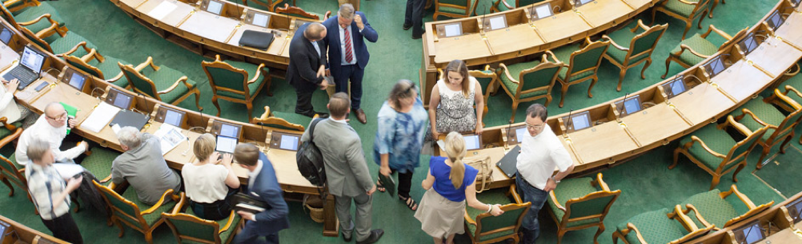
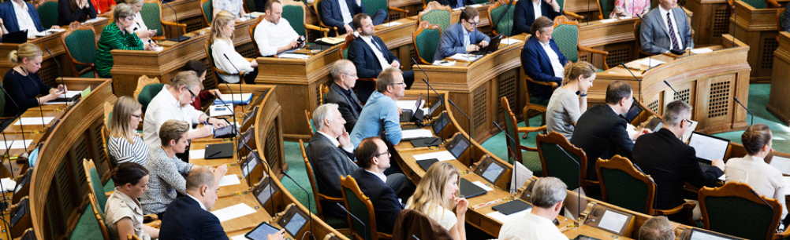
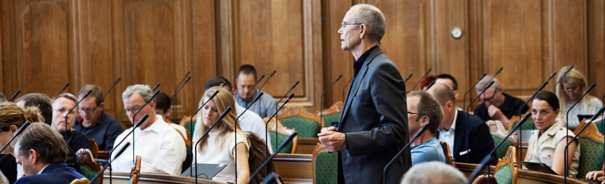
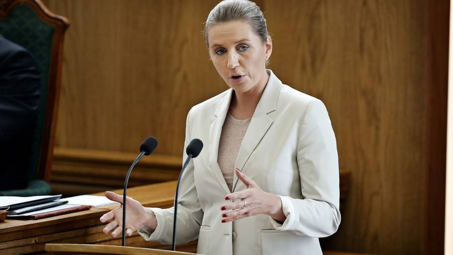
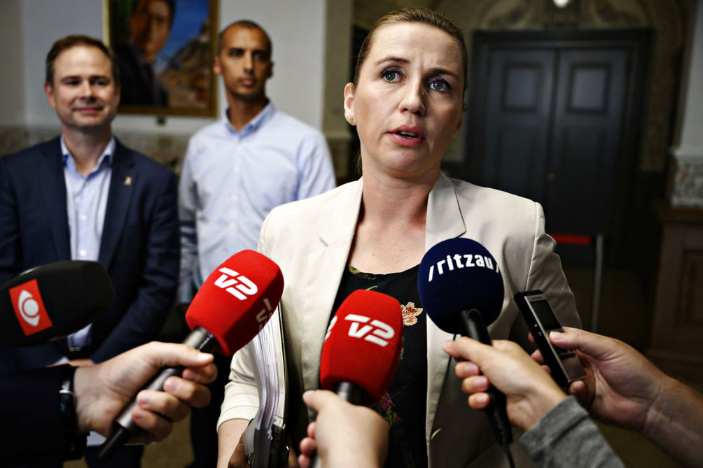
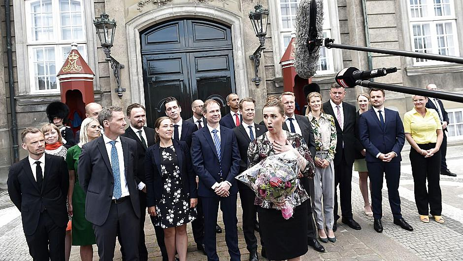

```{r echo=FALSE}

BEGREB <- c(
          "Grundloven",
          "Tinglysningsloven",
          "Aftaleloven"
          # ,
          # "h test"
          
          
          
          )
forklaring <- c(
  "Grundloven beskriver bl.a. den enkelte borgers rettigheder og pligter, du kan se den her:><a href=\"https://www.retsinformation.dk/Forms/R0710.aspx?id=45902\" style=\"color:#3088fc\" target=\"_blank\">Grundloven</a>",
  "Tinglysningsloven indeholder reglerne for den offentlige registrering af rettigheder over fast ejendom<br><a href=\"https://www.retsinformation.dk/Forms/R0710.aspx?id=142900\" style=\"color:#3088fc\" target=\"_blank\">Tinglysningsloven</a>",
  "Aftaleloven"
#   ,
#   "Vi tester hypotesen
#   <br>H<sub>0</sub>: &mu;=34
#   <br>H<sub>1</sub>: &mu;&ne;34<br>
# <br>H<sub>0</sub>: &mu;≤34
#   <br>H<sub>1</sub>: &mu;>34<br>
#   <a href=\"https://www.retsinformation.dk/Forms/R0710.aspx?id=142900\" style=\"color:#3088fc\" target=\"_blank\">Tinglysningsloven</a>"
#   
  
  )
  
indeks <<- data.frame(BEGREB,forklaring)
  

```


#   Indledning {-}


`r source('/cloud/project/script2.R')`


<h3>***Vigtigt bemærk***</h3>

***Dette materiale er kun til personligt brug. Alle rettigheder forbeholdes. Fotografering, kopiering eller anden gengivelse af dette materiale, er uden forfatterens skriftlige samtykke,  forbudt, ifølge dansk lov om ophavsret.***


***E-bogens videoer og quizer er ikke at betragte som en del af pensum, men er et supplement til pensum for at fremme din yderligere forståelse for Erhvervs- og Finansjuraen***


<!-- `r icon::fa("medal")`  -->


# Retsstaten 

```{r, echo=FALSE, results='asis'}
#cat(readLines('np.html'))
```

***Kapitel 1 skal kun læses i hovedtræk*** 

## Grundloven om Danmarks forfatning


Af de mere end 1.300 love, vi har i Danmark, er der én lov, en retskilde, der er hævet over alle de andre, nemlig grundloven.  ``r tippy(indeks[1,1], size="large" ,interactive = TRUE, arrow = TRUE, tooltip = paste0("<h4>",indeks[1,2],"</h4>"))`` er Danmarks forfatning, dvs. den lov, der beskriver de grundlæggende regler for samfundet. 

EU-retten står over dansk ret, sådan at en dansk lov kan være ulovlig, nemlig, hvis den enten strider mod EU-retten eller mod grundloven.

I Danmark fejrer man hvert år grundlovens fødselsdag 5. juni. Men hvordan blev grundloven egentlig indført?

Fra 1660 til 1848 havde Danmark enevælde og i 1700-tallet begyndte modstanden mod enevældet at ulme rundt om i Europa. 

Befolkningerne stillede krav om, at folket skulle være med til at bestemme, hvordan deres land skulle styres, og flere steder blev monarkiet væltet og erstattet af en republik.

Efterhånden som den internationale udvikling tog fart, erkendte Kong Christian den 8., at Danmark også måtte have en fri forfatning. Da han døde, gjorde hans søn, Frederik den 7., arbejdet med forfatningen færdig.  
 
 
---

**Video om den danske grundlov**

<div class="video-container"><iframe src="https://www.youtube.com/embed/nRkpUt8juz0" width="853" height="480" frameborder="0" allowfullscreen="allowfullscreen"></iframe></div>  

---


## Rettigheder og pligter


``r tippy(indeks[1,1], size="large" ,interactive = TRUE, arrow = TRUE, tooltip = paste0("<h4>",indeks[1,2],"</h4>"))`` beskriver bl.a. den enkelte borgers rettigheder og pligter, f.eks. at der er ytringsfrihed, religionsfrihed og værnepligt. 

I grundloven står der også, at den øverste magt i Danmark skal deles mellem den lovgivende, den udøvende og den dømmende magt.

I grundloven kan du læse om magtens fordeling i samfundet. Om Folketinget som den demokratisk valgte forsamling, der vedtager love, der gælder for os alle. 

Om regeringen, der skal sikre, at lovene bliver overholdt af os borgere og af de myndigheder, der skal sørge for, at vi for eksempel har gode skoler, sygehuse og biblioteker. 

Om domstolene, der er uafhængige af regering og Folketing, fordi de skal dømme i konflikter mellem borgerne indbyrdes og mellem myndigheder og borgere.

``r tippy(indeks[1,1], size="large" ,interactive = TRUE, arrow = TRUE, tooltip = paste0("<h4>",indeks[1,2],"</h4>"))`` handler også om de rettigheder, du har som borger. Vi kalder dem friheds- eller menneskerettigheder.

Den ene slags frihedsrettigheder er ytringsfriheden, retten til at forsamles og demonstrere for dine synspunkter og retten til at oprette foreninger og til at være medlem af en forening. 

``r tippy(indeks[1,1], size="large" ,interactive = TRUE, arrow = TRUE, tooltip = paste0("<h4>",indeks[1,2],"</h4>"))`` sikrer også, at du har ret til at være medlem af et politisk parti og være politisk aktiv – også selv om det går imod regeringens eller flertallets synspunkter. 

Disse rettigheder skal sikre, at demokratiet kan fungere. 

Grundlovens regler om folkeafstemninger og valg til Folketinget ville for eksempel ikke være meget værd, hvis vi ikke havde ret til at diskutere politiske spørgsmål og sige vores mening.

Den anden slags frihedsrettigheder er reglerne om den personlige frihed og om ejendomsretten og boligens ukrænkelighed. 

Disse regler skal først og fremmest beskytte borgerne mod overgreb fra statsmagten. 

Hvis du bliver anholdt af politiet, har du for eksempel krav på, at en dommer tager stilling til din sag inden 24 timer. 

Hvis myndighederne vil undersøge din bolig, dine private papirer eller din pc, skal de som hovedregel have en dommers tilladelse først. 

Og hvis myndighederne vil tage dit hus for at rive det ned, fordi der skal bygges en motorvej eller en jernbane hen over grunden, ja så skal du have en erstatning, der svarer til husets og grundens værdi.

``r tippy(indeks[1,1], size="large" ,interactive = TRUE, arrow = TRUE, tooltip = paste0("<h4>",indeks[1,2],"</h4>"))`` sætter på den måde grænser for, hvordan staten kan blande sig i vores privatliv.

``r tippy(indeks[1,1], size="large" ,interactive = TRUE, arrow = TRUE, tooltip = paste0("<h4>",indeks[1,2],"</h4>"))`` skal sikre stabile rammer om det politiske liv og de politiske kampe om magten. Og grundloven skal sikre, at borgernes rettigheder ikke krænkes. 

Begge dele sikres ved, at grundloven er mere vanskelig at ændre end andre love. Den danske grundlov er kun blevet ændret få gange, siden den blev vedtaget for mere end 160 år siden. 

Og sproget i mange af paragrafferne er ikke blevet moderniseret siden. 

Derfor er der i dette hæfte nogle forklarende kommentarer til de enkelte paragraffer.
<br>

## Magtadskillelseslæren i grundlovens § 3


Grundlovens § 3 har følgende ordlyd: 

*”Den lovgivende magt er hos kongen og Folketinget i forening. Den udøvende magt er hos kongen. Den dømmende magt er hos domstolene”.*


```{r magtenstredeling, echo=FALSE,fig.cap=("Magtens tredeling")}
nodes <- data.frame(id = 1:3, shadow = FALSE,
                    shape = c("image"),
                    image = c("https://jura.tepedu.dk/img/folketing.jpg",
                    "https://jura.tepedu.dk/img/hojesteret.jpg",
                    "https://jura.tepedu.dk/img/politi.jpeg"),
                    label = c("Lovgivende magt \n Folketinget/Dronningen",    "Dømmende magt \n Domstolene","Udøvende magt \n Regering/ministerier,\nforvaltningen\npolitiet m.fl."),
                    color = "red",
                    highlight = "yellow",
                    font.size=12)
  
edges <- data.frame(from = c(1,2,3), to = c(2,3,1),
                    # length = c(400,400,400),
                    # label=c("Lån til købesum","Købsaftale","Garanti for\nkøbesum"),
                    # arrows = c("to"),
                    smooth = FALSE)
visNetwork(nodes, edges, width = "80%") %>% 
  visNodes(shapeProperties = list(useBorderWithImage = FALSE)) %>%
  visLayout(randomSeed = 2) %>%

 visEdges(shadow = TRUE,
           # arrows =list(to = list(enabled = TRUE, scaleFactor = 2)),
           color = list(color = "lightgrey", highlight = "yellow"))
``` 


 
*	Lovgivende magt: Folketinget

*	Dømmende magt: Domstolene

*	Udøvende magt: Regering/ministerier, forvaltningen, politiet m.fl.

*	Gensidig kontrol

*	Magtbalance  


Bestemmelsen handler om magtens tredeling i den lovgivende, den udøvende og den dømmende magt. 

Magten er delt mellem forskellige myndigheder (Folketing, regering og domstole) for at undgå, at al magt samles hos én myndighed. Det ville kunne føre til magtmisbrug.


Ifølge grundloven har dronningen og Folketinget i fællesskab magten til at lovgive. 

Men helt sådan er det ikke i virkeligheden. 

I praksis er det nemlig regeringen og Folketinget, som bestemmer, hvordan lovene skal se ud. 

Dronningen skriver dem bare under. 

Dronningen skal føre lovene ud i livet – hun har den udøvende magt. 

I dag betyder det blot, at hun rent formelt udnævner ministrene i en regering. 

Derefter er det i praksis ministrene og deres ministerier, der sørger for, at lovene bliver overholdt.


Dronningen har ingen indflydelse på, hvem der skal være ministre. Det bestemmer statsministeren. 

Hun har heller ingen indflydelse på, hvilke partier der skal danne regering. 

Det handler grundlovens §§ 12-15 bl.a. om.

Domstolene har magten til at dømme. De afgør, om folk har overtrådt landets love og skal straffes. Og de tager stilling i sager, hvor borgere har indbyrdes konflikter. 

Domstolene afgør også, om ministerier og kommuner har overtrådt lovene, og om lovene overholder grundloven.


*I 1999 fastslog Højesteret, jf. U 1999.841 H, at den såkaldte Tvindlov var i strid med grundlovens § 3. Tvindlovens bestemmelse om, at en række Tvindskoler ikke længere skulle have penge fra det offentlige, var derfor ugyldig.*  


## Folketinget som den lovgivende magt


Folketinget er Danmarks parlament. Her vedtages al lovgivning i Danmark. 

Folketingets grundlæggende opgaver og nogle af arbejdsformerne er beskrevet i grundloven.  

Andre metoder er praksisser, der har udviklet sig gennem de snart 170 år, Folketinget har eksisteret.


Folketinget er den lovgivende magt. 

Folketinget og regeringen er de eneste, der kan fremsætte lovforslag, dvs. komme med forslag til nye love og lovændringer. 

Den lovgivende magt er Folketinget og regering, men det er kun Folketinget, der kan vedtage lovforslag.


``r tippy(indeks[1,1], size="large" ,interactive = TRUE, arrow = TRUE, tooltip = paste0("<h4>",indeks[1,2],"</h4>"))`` beskriver fordelingen af magten mellem Folketinget (lovgivende), regeringen (udøvende og lovgivende) og domstolene (dømmende), også kaldet magtens tredeling. 

Magten i samfundet er delt i 3 for at forhindre, at der sker magtmisbrug. 


### Parlamentarisk kontrol og lovgivning i Folketinget


Folketinget har 3 hovedopgaver:




*	At behandle lovforslag og vedtage landets love

*	At behandle og vedtage statens årlige budget, finansloven

*	At føre kontrol med regeringens magtudøvelse


For at kunne løfte de opgaver kræves det, at folketingsmedlemmerne ved, hvordan det politiske arbejde skal foregå. 

Reglerne for, hvordan folketingsmedlemmerne skal samarbejde, og hvordan lovgivningsprocessen er, står beskrevet i Folketingets forretningsorden. 

Reglerne kan ændre sig over tid, fordi samfundet ændrer sig, men de fleste af reglerne har mange år på bagen.


### Lovforslag




Love regulerer, hvordan vi skal leve sammen i Danmark, hvad vi skal drive i fællesskab – f.eks. folkeskolen og sygehusene – og hvordan det fælles skal være indrettet. 

Lovgivning handler om, hvad man skal som borger, og hvad man ikke må, herunder hvad der er strafbart. 

Lovteksterne skal derfor skrives så præcist, at borgerne ikke er i tvivl om de fælles spilleregler i samfundet.


Nye lovforslag kan fremsættes af regeringen og folketingsmedlemmerne (folketingsbeslutninger).


Regeringen fremsætter de fleste lovforslag, da regeringen har statsadministrationen (ministerierne og styrelser) til at hjælpe sig med udformning af lovforslag mv.


 
Lovforslag tager lang tid at skrive, og det kræver stor juridisk indsigt. 

Derfor er det regeringen, der fremsætter de fleste lovforslag. For regeringen har mange embedsmænd i ministerierne til at hjælpe sig, mens partierne uden for regeringen, oppositionen, har færre til at hjælpe sig – de har kun medarbejdere i deres gruppesekretariater og i Folketingets Administration.


Ideer til nye love kommer primært fra regeringen, men kan også komme fra:


*	Folketingsmedlemmerne

*	Interesseorganisationer, erhvervslivet, foreninger m.v.

*	Sager i medierne

*	Borgere, der henvender sig til et folketingsmedlem eller et parti 
  med en sag 
  
  
Inden et lovforslag fremsættes i Folketingssalen, har det som regel været igennem en længere process i ministerierne.


## Folketingets kontrol med regeringen



<br>

Ud over at lovgive har Folketinget en anden og lige så vigtig rolle i demokratiet. Det er at kontrollere, om regeringen – den udøvende magt ‒ fører Folketingets love ud i livet, som de var tænkt, og om der sker magtmisbrug. Det kalder man parlamentarisk kontrol.

 
### Den kritiske opposition

Parlamentarisk kontrol med regeringen er en meget vigtig opgave i Folketinget, hvor Folketinget kontrollerer, hvordan regeringen fører lovene ud i livet, og om regeringen fører en politik, der i hovedtræk bliver støttet af et flertal i Folketinget.

Søgelyset rettes ofte mod ministrene i regeringen. For det meste går det stille af, men situationen kan også spidse til, så regering og Folketing kommer til at stå stejlt over for hinanden. 

I praksis er det oppositionen – de partier i Folketinget, som er imod regeringens politik – der udfører den parlamentariske kontrol. 

Det er dem, der har den største interesse i at være kritiske over for regeringens arbejde og afsløre, om der sker magtmisbrug.


Oppositionen undersøger bl.a., om regeringen:


*	Virkeliggør lovens indhold og gør det på den måde, som regeringen    har lovet

*	Overholder statsbudgettet  

Folketingsmedlemmerne fra oppositionspartierne finder den parlamentariske kontrol af regeringens magtudøvelse vigtig. 

Oppositionen har en politisk fordel i at finde fejl og mangler ved en regering, den ikke er enig med, og det giver oppositionspartierne mulighed for at forklare vælgerne, hvordan deres politik er anderledes end regeringens.


### Udvalgsarbejdet i Folketinget

<br>


Arbejdet i Folketinget foregår både i Folketingssalen og i Folketingets udvalg. 

Udvalgene arbejder med hvert deres fagområde og behandler både lovgivning og den brede kontrol med regeringens arbejde.  
<br>

## Regeringen den udøvende magt


Statsministeren er regeringens chef og den der bestemmer, hvem der skal være minister i regeringen. 

Regeringen laver landets love, mens Folketinget vedtager dem. 

Ministrene er som regel også medlemmer af Folketinget, men det er ikke et krav. 


### Sådan dannes en regering


``r tippy(indeks[1,1], size="large" ,interactive = TRUE, arrow = TRUE, tooltip = paste0("<h4>",indeks[1,2],"</h4>"))`` giver dronningen magt til at udpege statsministeren og de øvrige ministre. 

Men i praksis er det et flertal i Folketinget, der er afgørende for, hvem der skal være statsminister. 

Statsministeren sætter så sit ministerhold og danner sin regering.
<br>

### Statsministeren vælges og nedsætter sin regering


Folketingsvalg skal afholdes mindst én gang hvert 4. år. 

Det står i grundloven. Statsministeren kan dog til enhver tid udskrive folketingsvalg, så der kan sagtens gå mindre end 4 år mellem hvert valg.


Når valget er slut og mandaterne fordelt, er det nye Folketing fundet. 

Så skal man i gang med at finde ud af, hvem der skal være statsminister og danne regering.


### Negativ parlamentarisme


Den siddende statsminister fortsætter, hvis der ikke er et flertal imod ham eller hende - dvs. 90 eller flere ud af de 179 folketingsmedlemmer. Det kaldes negativ parlamentarisme.

Taber regeringen valget, skal der findes en ny statsminister og en ny regering.
<br>

### Dronningen udnævner formelt den nye regering


Den siddende statsminister skal, i samarbejde med dronningen, finde ud af, hvilken statsministerkandidat der har den bredeste opbakning hos det nye folketingsmedlemmer. Det kaldes en dronningerunde.Der kan også udnævnes af dronningen en "kongelig undersøgere", som ikke nødvendigvis er den siddeende statsminister, se f.eks. udnævelsen af Mette Frderiksen som kongelig undersøger efter folketingsvalget i  2019.

Når statsministeren har fundet sine ministre, udnævner dronningen formelt regeringen på Amalienborg. Regeringen kommer bagefter ud på slotspladsen. Her præsenterer statsministeren sin nye regering for danskerne.


### Sådan arbejder regeringen




Regeringens ministre leder via deres ministerier landet efter de love, Folketinget har vedtaget. 

Regeringen har stor indflydelse på de love, der vedtages i Folketinget, da det er regeringen, der kommer med langt de fleste forslag til nye love.


### Regeringen fremsætter lovforslagene


Den udøvende magt ligger hos regeringen. 

Det står i grundloven. Regeringen har ret og pligt til at gennemføre de regler og love, som Folketinget vedtager, så lovene bliver til virkelighed i samfundet. 


Lovgivningsarbejdet har regeringen også stor indflydelse på. Det er regeringen, der forbereder og foreslår langt de fleste nye love og ændringer i eksisterende love. 

Regeringen er ansvarlig for hele processen med forberedelse af lovforslagene inden de når til Folketinget, herunder at lægge de overordnede planer, drive de politiske forhandlinger, skrive lovudkast og sende det i høring.


Når regeringen foreslår en lov, kaldes det, at den fremsætter et lovforslag. 

Både regeringen og medlemmerne af Folketinget kan fremsætte lovforslag – men de fleste kommer fra regeringen.
<br>

### Lovkataloget viser regeringens mål


Når en ny regering tiltræder, vil de partier, der indgår i regeringen, sammen skrive et regeringsgrundlag eller anden form for fælleserklæring. 

Et regeringsgrundlag er en slags politisk programerklæring, som signalerer, hvilken politik regeringen gerne vil gennemføre i den kommende regeringsperiode. 

<br>
Lovkataloget er et redskab for regeringen til at omsætte den overordnede politik til konkrete initiativer. 

Regeringen forsøger at gøre de politiske mål til virkelighed via nye love. 

De lovforslag, regeringen regner med at kunne få flertal for, bliver præsenteret i regeringens lovkatalog eller lovprogram, som udarbejdes og præsenteres for et folketingsår ad gangen. 

Lovkataloget kan findes på Statsministeriets hjemmeside og giver et pejlemærke for årets politiske beslutninger.

Den formelle baggrund for lovkataloget er, at der i grundlovens § 38 står beskrevet, at statsministeren skal lave en åbningsredegørelse, når et nyt folketingsår starter. 

Åbningsredegørelsen består både af en mundtlig og en skriftlig del. Den mundtlige del er åbningstalen, som statsministeren holder på åbningsdagen, mens den skriftlige del er lovkataloget.


### Statsministeren



Statsministen er regeringens chef. Det er statsministeren, der bestemmer, hvem der skal være ministre, og hvilke ministerier der skal være.
<br>

### Statsministeren har stor magt


Statsministerposten er landets højeste ministerpost. En statsminister har en særlig stor magt og et særlig stort ansvar. Det er f.eks. kun statsministeren, der kan bestemme: 


*	hvem der skal være minister

*	hvilke ministre der eventuelt skal afskediges/udskiftes

*	hvornår der skal være folketingsvalg inden for den 4-årige    
  regeringsperiode


Statsministeren fører tilsyn med sine ministre og fordeler opgaver og fagområder imellem dem. 


### Ministrene




Regeringen, og dermed ministrene, har den udøvende magt i Danmark. 

Det vil sige, at ministrene har det overordnende ansvar for, at de love, som Folketinget vedtager, føres ud i livet. 

Ministrene har meget magt og ansvar, og en af deres vigtigste opgaver er at foreslå ny lovgivning.


Regeringens ministre har hver sit fagområde: Kulturministeren har ansvar for kulturområdet, skatteministeren for skatteområdet osv. 

De fleste ministerområder ligger nogenlunde fast – f.eks. er der i praksis altid et Justitsministerium, et Finansministerium osv. 

Men statsministeren kan ændre ministrenes fagområder eller oprette nye ministerier, hvis statsministeren ønsker at begrænse, fremhæve eller styrke bestemte fagområder. 

F.eks. blev der efter valget i november 2007 som noget nyt udnævnt en minister for klima og energi. 


### Ministrenes opgaver


At foreslå ny lovgivning er en af ministrenes fornemste opgaver. Lovforslagene bliver forberedt i ministerierne, som har mange medarbejdere til bl.a. at skrive lovforslag.

En ministers arbejde består bl.a. i at:


*	forhandle indholdet af nye love på plads 
*	svare på spørgsmål fra Folketinget, f.eks. fra Folketingets udvalg 
*	svare på henvendelser fra borgere og organisationer m.fl. 
*	informere offentligheden om ministeriets arbejde, bl.a. i form af 
  hjemmesider, interviews og pressemeddelelser
*	træffe beslutninger i ministeriet og sørge for, at ministeriet 
  arbejder effektivt
*	samarbejde med internationale parter, herunder EU
*	deltage i ugentlige ministermøder med resten af regeringens    
  ministre
*	deltage i statsrådsmøder og regeringens udvalg
*	deltage i regeringsseminarer


## Domstolene


```{r domstolene,echo=FALSE, result=TRUE, fig.cap=("Oversigt over domstolene")}

nodes <- data.frame(id = 1:9, 
                    shape = c("box"), 
                    level = c(1,2,2,4,4,4,3,4,1),
                    label = c(" Højesteret ","Vestre \n Landsret","Østre \n Landsret","Sø og \n Handelsretten","Tinglysningsretten","Grønlandsdomstolen","Byretterne","Retten\npå Færøerne", " Procesbevillingsnævnet \n Den særlige klageret \n Dommerudnævnelsesrådet \n Bibeskæftigelsesnævnet"),
                    font.size = c(25,18,18,rep(12,6)))
edges <- data.frame(from = c(1,1,1,1,2,2,2,3,3,3), to = c(2,3,4,6,4,5,7,4,7,8),arrows = c(""),length = rep(75,10))

visNetwork(nodes, edges, height = "500px", width = "80%",avoidOverlap=2) %>% 
  visNodes(color = list(background = "white", 
                        border = "white",
                        highlight = "yellow"),
           shadow = list(enabled = TRUE, size = 30))  %>%
  visHierarchicalLayout(direction = "UD",levelSeparation = 100) %>%
  visEdges(color = list(color = "lightgrey", highlight = "yellow"))
  #visLayout(randomSeed = 24) # to have always the same network

```
Uafhængige domstole er en grundlæggende del af magtens tredeling i et demokrati. Sådan er det også i Danmark. ``r tippy(indeks[1,1], size="large" ,interactive = TRUE, arrow = TRUE, tooltip = paste0("<h4>",indeks[1,2],"</h4>"))`` siger nemlig, at domstolene alene har den dømmende magt.


### Domstolenes opgaver


Domstolene er den dømmende magt i Danmark. De afgør, om personer har overtrådt landets love, og afgør uoverensstemmelser mellem to parter i civile sager.

Alle har ret til en retfærdig rettergang. Det står i den europæiske menneskerettighedskonvention. Det betyder bl.a., at en retssag skal afgøres inden for en rimelig tidsperiode og ved en domstol, der er uafhængig og upartisk. 

Domstolenes uafhængighed er bestemt i den danske grundlov. ``r tippy(indeks[1,1], size="large" ,interactive = TRUE, arrow = TRUE, tooltip = paste0("<h4>",indeks[1,2],"</h4>"))`` deler nemlig magten i tre for at forhindre magtmisbrug, jf. ``r tippy(indeks[1,1], size="large" ,interactive = TRUE, arrow = TRUE, tooltip = paste0("<h4>",indeks[1,2],"</h4>"))``s § 3:


*	den lovgivende magt (Folketinget og regeringen)
*	den udøvende magt (regeringen)
*	den dømmende magt (domstolene)


Det er Folketinget, der vedtager Danmarks love. Regeringen regerer ud fra lovene. Men hverken Folketinget eller regeringen kan dømme på baggrund af de vedtagne love. 

Kun domstolene kan afgøre, hvordan lovene skal fortolkes, og dømme ud fra dem. Dommerne må kun rette sig efter, hvad der står i loven og det forarbejde, der ligger til grund for den. De må ikke lade sig påvirke af Folketinget, regeringen, pressen eller andre, når de dømmer i en sag. 


### Byret, landsret og Højesteret

<br>
Domstolene i Danmark har 3 instanser: byret, landsret og Højesteret. Alle retssager begynder som udgangspunkt i en byret. 

Almindelige borgere kan være med til at dømme i straffesager som domsmænd eller nævninge, afhængigt af sagens karakter. 

<br>
De almindelige domstole behandler civile sager og straffesager. 


*	Civile sager er sager, som anlægges ved 
  domstolene for at få afgjort en 
  uenighed mellem 2 parter. Som eksempler på 
  civile sager kan nævnes sager om 
  mangler ved fast ejendom, opsigelse af en 
  arbejdstager, boligretssager, 
  ægteskabssager, faderskabssager og sager om 
  adoption.

*	Straffesager er først og fremmest sager, hvor 
  retten skal træffe beslutning, om en person 
  skal straffes for en overtrædelse af loven. 
  Afgørelser, der træffes i forbindelse med 
  politiets efterforskning, er også straffesager. 
  Det kan f.eks. være afgørelser om 
  varetægtsfængsling, beslaglæggelse og 
  ransagning.

*	Byretterne behandler ligeledes skiftesager, 
  foged- og auktionssager.

*	Tinglysning af dokumenter foregår ved 
  Tinglysningsretten.

<br>

Alle sager kan som udgangspunkt behandles ved 2 retsinstanser, f.eks. ved byret og landsret. Visse mindre sager kan dog normalt kun behandles ved én instans, byretterne, uden mulighed for appel til landsretten.

<br>

### Højesteret   

<br>
Danmark har én højesteret. Den ligger ved Christiansborg Slot i København. Højesteret er den øverste domstol i Danmark. Her afgøres f.eks. sager, der har betydning for, hvordan lignende sager skal afgøres, eller sager, der har særlig samfundsmæssig interesse. 

Højesteret er en appeldomstol, som behandler domme og kendelser, der er afsagt af Østre Landsret, Vestre Landsret eller Sø- og Handelsretten. 

Man kan altså ikke anlægge sag direkte ved Højesteret.
Højesteret behandler både civile sager og straffesager og fungerer som tredje instans i skifte-, foged- og tinglysningssager. 

Ved Højesteret behandles også sager, som Procesbevillingsnævnet har tilladt indbragt for retten. Det drejer sig om sager af særlig principiel betydning, f.eks. sager, som kan have betydning for afgørelse af en række andre sager, eller om sager af særlig samfundsmæssig interesse.

I straffesager kan Højesteret ikke tage stilling til skyldsspørgsmålet.

Særlige forvaltnings- eller forfatningsdomstole anvender man i mange andre EU-lande. Det gør man ikke i Danmark. Her er det de almindelige domstole – i praksis Højesteret – der undersøger, om de afgørelser, myndighederne træffer, er lovlige, eller om en lov er i strid med ``r tippy(indeks[1,1], size="large" ,interactive = TRUE, arrow = TRUE, tooltip = paste0("<h4>",indeks[1,2],"</h4>"))``.
<br>

### Landsretterne


I Danmark findes der 2 landsretter: Vestre Landsret i Viborg og Østre Landsret i København. Landsretten behandler primært appelsager fra byretten.

Hvis byretten f.eks. mener, at en sag er af principiel karakter, kan den også henvise sagen direkte til behandling i landsretten.
 
Adressen: Østre Landsret i Bredgade 55, København K

Ved landsretterne er ansat ca. 100 landsdommere. Hver landsret ledes af en præsident.


Vestre Landsret ligger i Viborg og behandler sager fra Jylland.
Østre Landsret ligger i København og behandler sager fra resten af landet, Færøerne og Grønland.


Landsretterne er delt i afdelinger. 

Til hver afdeling hører tre landsdommere, som i fællesskab afgør alle afdelingens sager, både straffesager og civile sager. 

I nogle straffesager medvirker nævninger, i andre domsmænd. 

I enkelte sager deltager personer, der er særligt sagkyndige på et specielt område.

Vestre og Østre Landsret er appelinstanser for byretterne.


### Sø- og Handelsretten 


Sø- og Handelsretten ligger i København. 

I Sø- og Handelsretten er ansat en præsident, 2 vicepræsidenter, 2 dommere og et antal sagkyndige medlemmer. 

De sagkyndige medlemmer har særlig kendskab til sø- og handelsforhold. 

Sø- og Handelsretten behandler bl.a. sager, hvor kendskab til sø- og handelsforhold er af væsentlig betydning.

Sø- og Handelsretten behandler også sager om konkurs, rekonstruktion og gældssanering m.v. fra hele Storkøbenhavn.


### Den Særlige Klageret 

Den Særlige Klageret ligger i København samme sted som Højesteret. 

Klageretten er sammensat af en højesteretsdommer, en landsdommer, en byretsdommer, en advokat og en universitetslærer i retsvidenskab eller anden jurist med særlig videnskabelig uddannelse.

Den Særlige Klageret træffer afgørelser i disciplinære sager vedrørende dommere og andet juridisk personale ansat ved domstolene, herunder også ansatte på Færøerne og i Grønland.

Klageretten behandler derudover sager om genoptagelse af straffesager og udelukkelse af forsvarere fra straffesager.


### Byretten


Danmark har 24 byretter. De er fordelt over hele landet. Byretten behandler som nævnt bl.a.:

*	civile sager
*	straffesager
*	tinglysningssager
*	skiftesager 

<br>

### Byretterne


```{r byretterne,echo=FALSE, result=TRUE, fig.cap=("Byretterne")}


nodes <- data.frame(id = 1:6, 
                    shape = c("box"), 
                    level = c(1,2,2,2,2,2),
                    label = c("Byrettens afdelinger","Civilretten","Fogedretten","Skifteretten","Boligretten","Kriminalretten"),
                    font.size = c(15,15,15,15,15,15))
edges <- data.frame(from = c(1,1,1,1,1), to = c(2,3,4,5,6))

visNetwork(nodes, edges, width = "80%") %>% 
  visNodes(color = list(background = "white", 
                        border = "white",
                        highlight = "yellow"),
           shadow = list(enabled = TRUE, size = 30))  %>%
      visHierarchicalLayout(direction = "UD",levelSeparation = 100)  %>%
      visLayout(randomSeed = 24) %>%
  visEdges(color = list(color = "lightgrey", highlight = "yellow"))

```


Danmark er inddelt i 24 såkaldte byretskredse.
Byretterne ledes af en byretspræsident.
Byretterne behandler civile sager, straffesager, notarialforretninger og skiftesager.

Alle sager begynder som udgangspunkt i byretten.

Byretterne kan i en række tilfælde henvise en civil sag til behandling ved landsretten. Det gælder f.eks., hvis sagen er af principiel betydning, eller sagen kan få væsentlig betydning for andre end parterne.

**Video: hvordan fungerer byretten?**

<div class="video-container"><iframe src="https://www.youtube.com/embed/vtR3p-7IItk" width="853" height="480" frameborder="0" allowfullscreen="allowfullscreen"></iframe></div>

**Video: en sag kommer på tværs**

<div class="video-container"><iframe src="https://www.youtube.com/embed/7WNie-cX1jw" width="853" height="480" frameborder="0" allowfullscreen="allowfullscreen"></iframe></div>

---

*Saglig kompetence: Hvilken ret/domstol skal behandle sagen?*

*Stedlig kompetence: Værneting – Hvor i landet skal sagen anlægges?*

Hvis der ikke er lavet en værnetingsaftale mellem de stridende parter, skal en retssag som hovedregel anlægges ved sagsøgtes hjemting (bopæl/kendt opholdssted) 

Værneting er således et spørgsmålet om, hvor en retssag skal anlægges og føres. Ved hvilken domstol en sag skal anlægges, hvis der opstår uenighed mellem aftaleparter med bopæl i hver sit EU-land, afhænger af, om der er indgået en værnetingsaftale og af EU-Domsforordningen.

Supplerende værneting, f.eks.:

*	Virksomhedsværneting 
*	Ejendomsværneting
*	Opfyldelsesværneting
*	Forbrugerværneting
*	Deliktsværneting
 


```{r værneting, echo=FALSE, result=TRUE}


text_tbl <- data.frame(
  Paragraf = c("§239", "§240", "§241","§242","§243","§244","§246"),
  Indhold = c(
    "Regioner og kommuner har hjemting i den retskreds, hvor hovedkontoret ligger.",
    
    "Sager mod staten: Staten har hjemting i den retskreds, hvor den myndighed, som stævnes på statens vegne, har kontor.", 
    
    "Ejendomsværneting: Sager vedrørende rettigheder over fast ejendom, kan anlægges ved retten på det sted, hvor ejendommen ligger.",
    
    "Opfyldelsesværneting: Sager om kontraktsforhold kan anlægges ved retten på det sted, hvor den forpligtelse, der ligger til grund for sagen, er opfyldt eller skal opfyldes.
Bestemmelsen finder ikke anvendelse på pengekrav, medmindre kravet er opstået under ophold i retskredsen under sådanne omstændigheder, at det skulle opfyldes, inden stedet forlades.
",

"Deliktsværneting: Sager, hvorunder der påstås straf, erstatning eller oprejsning i anledning af retskrænkelser, kan anlægges ved retten på det sted, hvor retskrænkelsen er foregået (skadestedet).",

"Forbrugerværneting: I sager om forbrugeraftaler, som ikke er indgået ved personlig henvendelse på den erhvervsdrivendes faste forretningssted, kan forbrugeren anlægge sag mod den erhvervsdrivende ved sit eget hjemting.",

"Sagsøgte har ikke dansk hjemting: Stk. 1: Sager mod personer, selskaber, foreninger, private institutioner og andre sammenslutninger, der ikke har hjemting i Danmark, kan anlægges her i landet, for så vidt nogen ret efter bestemmelserne i §§ 237, 238, stk. 2, 241, 242, 243 og 245 kan anses som værneting i sagen.  

Opholdsværneting: Stk. 2: Kan ingen ret efter stk. 1 anses som værneting i sagen, kan sager vedrørende formueretsforhold mod de i stk. 1 nævnte personer anlægges ved retten på det sted, hvor de ved stævningens forkyndelse opholder sig.  

Godsværneting: Stk. 3: Sager vedrørende formueretsforhold mod de i stk. 1 nævnte personer og sammenslutninger kan endvidere, hvis der ikke er værneting efter reglen i stk. 1, anlægges ved retten på det sted, hvor den pågældende person eller sammenslutning på tidspunktet for sagens anlæg har gods, eller hvor det gods, kravet angår, befinder sig på tidspunktet for sagens anlæg. Afværges arrest i gods gennem sikkerhedsstillelse, betragtes sikkerhedsstillelsen som gods, der befinder sig på det sted, hvor arrestbegæringen er eller i givet fald skulle være indgivet."


  )
)

kable(text_tbl,caption="Værneting") %>%
  kable_styling(full_width = T,bootstrap_options = c( "hover","responsive","bordered","striped")) %>%
  column_spec(1, bold = T, border_right = T,color = "black",background = "lightgrey") %>%
  column_spec(2) %>%
  column_spec(2,  bold = T, color = "white", background = "darkgrey")
# add_header_above(c( "Koncipistreglen" = 2),italic = TRUE)
```


  
  


### Processuelle grundbegreber

*	Forhandlingsprincippet: Sagsøger og sagsøgte har selv ansvaret for sagens bevisførelse. Retten kan opfordre parterne til at føre et bestemt bevis, men parterne er ikke forpligtet til at følge rettens opfordring. 
<br>
*	Bevisumiddelbarhedsprincippet: Beviser skal føres umiddelbart foran dommeren. 
*	Den frie bevisbedømmelse: Retten har frihed til på objektivt grundlag, at vurdere og afgøre, hvad der findes bevist under sagen, og hvilke beviser der vægter tungere end andre.
*	Bevisbyrde: Den som påstår noget under en retssag, skal bevise at han eller hun har ret og har dermed bevisbyrden for sin påstand (kaldet en ”ligefrem bevisbyrde” som er hovedreglen i dansk ret).
<br>

**Video: Retssikkerhed. Hvordan kan domstolene hjælpe mig?**

<div class="video-container"><iframe src="https://www.youtube.com/embed/eZt1GQQKJsg" width="853" height="480" frameborder="0" allowfullscreen="allowfullscreen"></iframe></div>
<br>

### Civilretssagens forløb
Parterne: Sagsøger og sagsøgte
Sagens forberedelse:
Stævning og svarskrift

*	Evt. forberedende retsmøde
*	Evt. syn og skøn
*	Replik og duplik
*	Hovedforhandling
 <br>
 
### Småsagsprocessen

*	Sager under 50.000 kr.
*	Formål: Enklere, hurtigere og billigere


### Udenretlig tvistløsningsorganer
Klage- og ankenævn som der har betydning for den finansielle branche:

*	Forbrugerklagenævn, 
Det Finansielle Ankenævn (Sammenlægning pr. 1. februar 2019 af Pengeinstitutankenævnet, Realkreditankenævnet og Ankenævnet for investeringsfonde) 
Ankenævnet for Forsikring, 
Ankenævnet for Finansieringsselskaber og 
Klagenævnet for Ejendomsformidling


*	Sagsbehandling efter officialmaksimen, dvs. nævnets sekretariatet skal oplyse klagesagen


**Mediation i det offentlige forbrugerklagesystem**

Der foregår mediation i Nævnenes Hus før, at klagen kan indbringes for Forbrugerklagenævnet. Følgende fremgår af Bekendtgørelse nr. 65 af 16. januar 2019 om behandling af forbrugerklager i Nævnenes Hus samt Forbrugerklagenævnet:

*§ 2. Mediationen foretages på grundlag af parternes oplysninger.*

*Stk. 2. Nævnenes Hus lægger i mediationen særligt vægt på*

*1) at bidrage til at genskabe en god dialog mellem parterne,*

*2) at pege på muligheder, som parterne ikke har tænkt på, og*

*3) at vejlede parterne om de generelle regler på området og at vejlede parterne om Forbrugerklagenævnets praksis.*

*Stk. 3. Nævnenes Hus og sagens parter kan foreslå en mindelig løsning af sagen.*

*Stk. 4. Inden parterne accepterer et konkret forslag til en mindelig løsning efter stk. 3, skal de oplyses om*

*1) at de kan vælge, om de vil acceptere løsningen,*

*2) at den foreslåede løsning kan afvige fra udfaldet af en domstolsprøvelse eller en klage ved Forbrugerklagenævnet,*

*3) hvad retsvirkningerne af den foreslåede løsning er, og*

*4) at de har ret til rimelig betænkningstid til at vurdere, om de vil acceptere løsningen.*

*§ 3. Nævnenes Hus foretager mediation i klager, som ikke hører under et tvistløsningsorgan omfattet af forbrugerklageloven, og som indbringes for styrelsen af en forbruger. Prisen for varen eller tjenesteydelsen, som klagen vedrører, skal være mindst de beløb, som er fastsat i medfør af stk. 3 og højst 100.000 kr.*

*Stk. 2. Nævnenes Hus kan i særlige tilfælde se bort fra de i stk. 1 fastsatte undergrænser.*

*Stk. 3. Undergrænserne for varer og tjenesteydelser som nævnt i stk. 1 reguleres hvert tredje år pr. 1. januar, første gang pr. 1. januar 2019, hvor undergrænsen er 1.050 kr., dog 680 kr. for tøj og sko. Reguleringen sker i overensstemmelse med den sats for det generelle pris- og lønindeks, som er fastsat i finansloven. Beløbene afrundes til nærmeste 10 kr. De til enhver tid gældende undergrænser for varer og tjenesteydelser fremgår af Nævnenes Hus’ hjemmeside, www.naevneneshus.dk.*


**Retsmægling ved domstolene**

Alle retter bortset fra Højesteret tilbyder retsmægling i civile sager som alternativ til en løsning af tvisten ved en dom eller et traditionelt retsforlig.

*Hvad er retsmægling?*

Retsmægling er en frivillig måde at løse konflikter på, hvor en mægler i fortrolighed hjælper sagens parter til selv at finde frem til en løsning på deres problem. Mægleren kan ikke træffe afgørelse i sagen.

Retsmægleren er en dommer, en domstolsjurist eller en advokat, som har gennemgået en særlig uddannelse i retsmægling. Mægleren bliver udpeget af retten og skal være upartisk.

Det er mæglerens opgave at lede mæglingsprocessen. Mægleren hjælper parterne med at finde frem til de egentlige årsager til konflikten og hjælper parterne til at få en bedre forståelse for både deres egne og modpartens synspunkter.

Mægleren hjælper parterne til selv at finde frem til den løsning, som i størst muligt omfang tager hensyn til begge parters behov og interesser.

*Hvorfor vælge retsmægling?*

Når man finder ind til kernen, der ligger bag ved en konflikt, er det ikke altid, at en dom er den mest tilfredsstillende løsning for parterne.

Til forskel fra en retssag eller traditionel forligsmægling ved domstolene bliver der ved retsmægling sat fokus på, hvorfor parterne er uenige, og hvordan de bedst kommer videre. Det gør det lettere for parterne at fortsætte et eventuelt samarbejde efter mæglingen, og det giver bedre mulighed for at nå frem til en mere varig løsning.

Retsmægling er ofte en mindre tidskrævende måde at løse konflikter på.

*Hvordan foregår retsmægling?*

Retsmægleren holder møde med parterne. Hvis parterne har advokater, aftaler man, om advokaterne skal deltage. Gennem samtaler forsøger man i fællesskab at fastlægge omfanget af parternes konflikt og baggrunden herfor, og man taler om, hvordan parterne i fællesskab kan nå frem til en løsning.

Mæglingsmødet kan foregå i et af rettens lokaler eller et andet sted, som retsmægleren og parterne aftaler. Hvis retsmægleren er advokat, kan mødet foregå på advokatens kontor.

Retsmægleren planlægger i samråd med parterne retsmæglingens forløb. Normalt skal begge parter være personligt til stede. Det kan eventuelt aftales, at mægleren skal afholde møde med parterne hver for sig.

*Hvornår afsluttes retsmægling?*

Retsmæglingen bliver afsluttet, når parterne når frem til en løsning på konflikten, eller hvis en af parterne ønsker det. Retsmægleren kan slutte retsmæglingen, uanset om parterne ønsker at fortsætte.

Hvis parterne bliver enige om en løsning på deres konflikt, indgår de en aftale. Parterne kan vælge at forelægge løsningsforslaget for deres advokater eller andre rådgivere, inden de beslutter sig for, om de vil indgå en aftale.

Hvis retsmæglingen ikke resulterer i en løsning, fortsætter sagen ved retten som en almindelig retssag.

*Hvem kan bruge retsmægling?*

En sag kan være velegnet til retsmægling, uanset om den drejer sig om private forhold eller erhvervsforhold.

Det er en betingelse, at sagen er anlagt ved retten, og at begge parter er enige om retsmægling. Det er også en betingelse, at retten vurderer, at sagen egner sig til retsmægling.

*Hvad koster retsmægling?*
Retsmæglerens bistand er gratis, men hver part skal betale salær til egen advokat.

Retsmægling er ofte mindre tidskrævende og dermed også billigere for parterne end en retssag eller traditionel forligsmægling.


**Voldgift** 

*	Voldgiftsloven – voldgiftsklausul i aftale
*	Ofte hurtigere sagsbehandling end alm. domstole
*	Dommere med særligt fagkundskab
*	Sagen er ikke offentlig
*	Ikke mulighed for anke til højere instans
<br>

### Tinglysningsretten
<br>

Tinglysningsretten, som ligger i Hobro, blev etableret den 1. januar 2007 med en præsident som øverste chef.
Fra den 8. september 2009 er håndteringen af hele tinglysningsområdet samlet i Tinglysningsretten. Byretterne tinglyser altså ikke længere dokumenter.
<br>
Tinglysning er nu en digital proces, der foregår fra hjemmesiden www.tinglysning.dk.
<br>
Information og vejledning kan findes på www.tinglysningsretten.dk
<br>

### Procesbevillingsnævnet
<br>

Procesbevillingsnævnet blev oprettet pr. 1. januar 1996 med det formål at behandle ansøgninger om 2. og 3. instansbevillinger i civile sager og straffesager. Siden den 1. januar 2007 har Procesbevillingsnævnet endvidere haft til opgave at behandle klager over Civilstyrelsens afslag på ansøgninger om fri proces.
<br>

#### Appeltilladelse
<br>

En appeltilladelse indebærer, at en sag, der ikke ellers ville kunne ankes eller kæres, kan indbringes for en højere retsinstans. Appeltilladelse forudsætter, at sagen rejser spørgsmål af principiel karakter, eller at særlige grunde taler for tilladelse. 
<br>

#### Fri proces
<br>

Fri proces indebærer i grundtræk, at den pågældende får en advokat beskikket til at føre sagen, og at statskassen betaler sagens omkostninger, herunder retsafgifter, advokatsalær og eventuelle sagsomkostninger, som skal betales til modparten. 

<br>
Fri proces er især forbeholdt personer, som på den ene side ikke selv har økonomisk mulighed for at betale sagsomkostningerne, men som på den anden side har rimelig grund til at føre proces, navnlig fordi der er udsigt til at vinde sagen.

<br>
Procesbevillingsnævnets afdeling for appeltilladelser består af en højesteretsdommer (formand), en landsdommer, en byretsdommer, en advokat og et medlem, der repræsenterer retsvidenskaben.

Nævnets afdeling for fri proces består af en landsdommer (afdelingsformand), en byretsdommer og en advokat.

<br>
Beslutningerne på nævnsmøderne træffes ved almindelig stemmeflerhed. Der afholdes i almindelighed møde i hver afdeling ugentligt, og sagerne udsendes ca. en uge før mødet. Hastesager kan dog udsendes med kortere varsel. Nævnsmøderne er ikke offentlige, og der er ikke mulighed for at få foretræde for nævnet.

<br>
I overensstemmelse med forarbejderne til lovgivningen om Procesbevillingsnævnets virksomhed begrundes nævnets afgørelser alene med en henvisning til indholdet af de bestemmelser, der giver hjemmel for meddelelse af bevilling.
<br>
Bevillingsmæssigt og administrativt hører Procesbevillingsnævnet under Domstolsstyrelsen, men Procesbevillingsnævnet er uafhængigt af domstolene og af den offentlige forvaltning. Man kan derfor ikke klage over nævnets afgørelser til justitsministeren eller til Folketingets Ombudsmand.
<br>

### Rigsretten

<br>
Rigsretten består af indtil 15 af Højesterets dommere og et tilsvarende antal medlemmer, som udpeges af Folketinget. Folketingsmedlemmer kan ikke udpeges til medlem af Rigsretten.

Medlemmerne af Rigsretten vælges for 6 år. Der er udpeget medlemmer af Rigsretten i 1996.
 <br>
Rigsretten har til opgave at påkende sager mod ministre vedrørende deres embedsførelse. Det er Folketinget, der beslutter, om der skal rejses tiltale mod en minister.
<br>
Folketinget har 5 gange rejst tiltale for Rigsretten. Den seneste sag var mod tidligere justitsminister Erik Ninn-Hansen. Der blev afsagt dom i sagen den 22. juni 1995.
<br>

### Dommerudnævnelsesrådet
<br>
Dommerudnævnelsesrådet er et uafhængigt råd, der har til opgave at afgive indstillinger til justitsministeren vedrørende besættelse af dommerstillinger.
<br>
Domstolsstyrelsen stiller sekretariat til rådighed for Dommerudnævnelsesrådet.

<br>
Dommerudnævnelsesrådet blev oprettet ved lov nr. 402 af 26. juni 1998 som et led i domstolsreformen, der bl.a. havde til formål at sikre en bredere rekruttering af dommere og større gennemsigtighed ved besættelse af dommerstillinger. Rådet har været i funktion siden den 1. juli 1999, da loven trådte i kraft.
<br>

### Domstolsstyrelsen 
<br>
Domstolsstyrelsen har til opgave at administrere og udvikle Danmarks Domstole.

Domstolsstyrelsen blev oprettet som en ny, selvstændig statsinstitution den 1. juli 1999.
Domstolsstyrelsen ledes af en bestyrelse og en direktør. Domstolsstyrelsen hører ressortmæssigt under Justitsministeriet, men justitsministeren kan ikke bestemme over styrelsen og kan ikke ændre styrelsens afgørelser.
<br>
Bestyrelsen er den øverste ledelse og har det overordnede ansvar for Domstolsstyrelsens virksomhed. Den daglige ledelse er lagt i hænderne på direktøren, som er ansat af og kan afskediges af bestyrelsen.

Sammensætningen af Domstolsstyrelsens bestyrelse er fastsat i lov om Domstolsstyrelsen.


---

**Video: historien om de danske domstole og retssystemet**

 <br>
<div class="video-container"><iframe src="https://www.youtube.com/embed/uvpuD60uLdI" width="853" height="480" frameborder="0" allowfullscreen="allowfullscreen"></iframe></div>

---

### EU-domstolen


Den Europæiske Unions Domstol (EU-Domstolen) fortolker EU's lovgivning for at sikre, at den anvendes på samme måde i alle EU-lande, og afgør retstvister mellem nationale regeringer og EU's institutioner. 


I visse tilfælde kan den også anvendes af enkeltpersoner, virksomheder eller organisationer til at gribe ind over for en EU-institution, hvis de mener, den på den ene eller anden måde har tilsidesat deres rettigheder.


