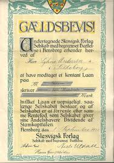

```{r echo=FALSE}

BEGREB <- c(
          "Grundloven",
          "Tinglysningsloven",
          "Aftaleloven"
          # ,
          # "h test"
          
          
          
          )
forklaring <- c(
  "Grundloven beskriver bl.a. den enkelte borgers rettigheder og pligter, du kan se den her:><a href=\"https://www.retsinformation.dk/Forms/R0710.aspx?id=45902\" style=\"color:#3088fc\" target=\"_blank\">Grundloven</a>",
  "Tinglysningsloven indeholder reglerne for den offentlige registrering af rettigheder over fast ejendom<br><a href=\"https://www.retsinformation.dk/Forms/R0710.aspx?id=142900\" style=\"color:#3088fc\" target=\"_blank\">Tinglysningsloven</a>",
  "Aftaleloven"
#   ,
#   "Vi tester hypotesen
#   <br>H<sub>0</sub>: &mu;=34
#   <br>H<sub>1</sub>: &mu;&ne;34<br>
# <br>H<sub>0</sub>: &mu;≤34
#   <br>H<sub>1</sub>: &mu;>34<br>
#   <a href=\"https://www.retsinformation.dk/Forms/R0710.aspx?id=142900\" style=\"color:#3088fc\" target=\"_blank\">Tinglysningsloven</a>"
#   
  
  )
  
indeks <<- data.frame(BEGREB,forklaring)
  

```


# Kautionsforhold

---

***Som studerende skal du være særlig opmærksom på følgende problemstillinger ved gennemgangen af sikkerhedsstillelse for gæld:***

 


**Kautionsformer især sondringen mellem simpel og selvskyldnerkaution**

**Sondring mellem privat- og erhvervskaution**

**Oplysning til kautionisterne i lov om finansiel virksomhed (LFV) § 47 og 48 i forbindelse med hoveddebitors misligholdelse af betaling**
  
**Kautionisternes hæftelse og indbyrdes regres**

**Særlige forældelsesregler**

---

## Kautionsbegreber


**Kaution**, betyder overtagelse af en økonomisk risiko, som bæres af en kreditor i et skyldforhold, med den virkning, at kautionisten sammen med debitor hæfter for opfyldelsen af debitors betalingspligt. 

Ordet kaution kommer af latin cautio 'forsigtighed, sikkerhed', af cavere 'passe på, sikre'.

* Kaution er en sikkerhedsstillelse for et gældsforhold

* Der er tre parter i kautionsforhold (Se figuren nedenfor):

  +	Låntager = hovedskyldner
  +	Långiver = kreditor
  +	Kautionist
  
* Kautionsaftalen indgås mellem kautionisten og kreditor

* Kautionisten har typisk en relation til låntager i forvejen:

  +	Forældre &lrarr;	børn
  +	Virksomhedsejer	&lrarr; virksomhed
  +	Moderselskab &lrarr; datterselskab


  

  
```{r network5, echo=FALSE, result=TRUE,fig.cap=("Eneanpartshaver stiller kaution overfor banken til sikkerhed for virksomhedens lån")}
nodes <- data.frame(id = 1:3, shadow = FALSE,
                    shape = c("image"),
                    image = c("https://jura.tepedu.dk/img/kaution.svg",
                    "https://jura.tepedu.dk/img/piggybank.svg",
                    "https://jura.tepedu.dk/img/firm.svg"),
                    label = c("Kautionist\nEneanpartshaver","Bank","Debitor\nApS"),
                    color = "red",
                    highlight = "yellow")
  
edges <- data.frame(from = c(1,2,3), to = c(2,3,1),
                    length = c(400,400,400),
                    label=c("Kautionsaftale","Lån","100% anparter"),
                    # arrows = c("to"),
                    smooth = TRUE)
visNetwork(nodes, edges, width = "80%") %>% 
  visNodes(shapeProperties = list(useBorderWithImage = FALSE)) %>%
  visLayout(randomSeed = 2) %>%

 visEdges(shadow = TRUE,
           arrows =list(to = list(enabled = TRUE, scaleFactor = 2)),
           color = list(color = "lightgrey", highlight = "red"))
```


---

  

(Kilde: Trojka)

---

## Stiftelse af kaution

* Kautionsaftale indgås mellem kreditor og kautionist

* Aftalelovens regler gælder også for kautionsaftaler, fx:

  +	Stærke og svage ugyldighedsgrunde
  +	Forudsætningslæren
  +	Generalklausulen i aftalelovens §§ 38c, jf. 36
  
* Kaution er også reguleret i Lov om finansiel virksomhed, se Lovbekendtgørelse nr. 1140 af 26. september 2017 om finansiel virksomhed (FIL), jf. §§ 47 (erhvervskaution) og 48 (privat kaution), hvis kaution gives overfor en finansiel virksomhed

* Vigtigt at skelne mellem erhvervskaution og privat kaution

## Generalklausulen på kautionsforhold

Om anvendelse af aftalelovens § 36 på kautionsforhold findes en del retspraksis (domme) på området:  


*I U 1993.949 V blev en kautionsaftale tilsidesat i medfør af aftalelovens § 36. En 73-årig kvinde K, der var nervesvækket og uden indsigt i økonomiske anliggender, havde over for en sparekasse S påtaget sig selvskyldnerkaution på indtil 100.000 kr. for sin stedsøn P’s ældre og fremtidige gæld til S. Ved kautionsløftets afgivelse var P’s engagement med S nødlidende på grund af overtræk på ca. 124.000 kr. og ville blive opsagt, hvis der ikke blev skaffet yderligere sikkerhed, fx ved kaution. K var ikke af S blevet informeret om P’s engagement og overtrækkene.*


I dommen U 1994.126 V blev en kautionsforpligtelse ligeledes tilsidesat i medfør af aftalelovens § 36.   

---

*I dommen U 1997.522 Ø fandtes det ikke urimeligt eller i strid med redelig handlemåde, at et pengeinstitut gjorde en låneaftale gældende, da pengeinstituttet ved et låns oprettelse ikke burde have vidst, at en 18-årig ikke inden overskuelig tid ville kunne betale de månedlige ydelser. Der blev overført godt 170.000 kr. til en bilsælger, uden at banken sikrede sig, at låntager var indforstået hermed. Selvom dette kunne anses som en fejl, fandtes det, under hensyn til at låntager havde indgået en endelig handel og modtaget bilen, ikke urimeligt eller i strid med redelig handlemåde, at pengeinstituttet gjorde aftalen gældende, jf. aftalelovens § 36.*


**I dommen U 2010.1628 H: Kautionsaftale delvist tilsidesat efter aftalelovens § 36**.

---

## Privat kaution eller erhvervskaution

* Privatkaution stilles typisk af en fysisk person overfor en person eller virksomhed

* Der vil ofte være en nær relation mellem debitor og kautionist

* Erhvervskaution stilles både af fysiske og juridiske personer, men typisk er debitor en virksomhed

* I vurderingen erhvervskaution eller privat kaution indgår følgendeparametre (Se figuren nedenfor):

  + Ejerandel i virksomhed, der kautioneres for
  + Stilling i virksomheden
  + Indsigt i virksomhedens økonomi
  + Bestemmende indflydelse i virksomheden samlet set

### Erhvervskaution i et pengeinstitut


Med hensyn til erhvervskaution i et pengeinstitut følger det af FIL § 47: 

*”Er der inden for erhvervsforhold stillet kaution for lån ydet af et pengeinstitut, og udebliver låntager med betaling af hovedstol, afdrag eller renter, skal der senest 6 måneder efter de pågældende ydelsers forfaldsdag skriftligt gives meddelelse til enhver af kautionisterne eller til den eller dem af disse, der er bemyndiget til at modtage meddelelsen på samtlige kautionisters vegne. Undladelse heraf medfører, at pengeinstituttet taber sit krav over for kautionisterne, i det omfang disses regreskrav mod låntageren er blevet forringet ved undladelsen.*


Skriftlighedskravet kan opfyldes i såvel papirformat som elektronisk format.

---

Se følgende domme:

*U 1992 442 (der kunne ikke ses bort fra, at kautionisten ved underretning kunne have gennemført sit regreskrav helt eller delvis mod hovedskyldneren. Finansieringsselskabet var afskåret fra nu at gøre kautionsforpligtelsen gældende).*   

*U 1995 77 (da låntagers formue måtte antages at være negativ allerede inden udløbet af seksmånedersfristen, fandtes kautionisternes regreskrav ikke at være forringet ved den undladte underretning, og kautionisterne skulle indfri kautionen).*

---

### Privatkaution i et pengeinstitut


Der er i FIL § 48 lovbestemmelser vedrørende privatkaution i et pengeinstitut. Herved forstås kaution, der ikke indgår i en erhvervsmæssig relation mellem låntager og kautionist. 

Er kautionen eksempelvis stillet for en virksomheds gæld af ejeren af virksomheden, vil forholdet ikke være omfattet af bestemmelsen i FIL § 48, men § FIL § 47. 

Kaution fra ejerens forældre vil derimod være omfattet, da der i dette tilfælde vil være tale om en kaution uden for erhvervsforhold. 

I FIL § 48 er der indsat en forpligtelse til at informere kautionisten, ligesom det er præciseret, hvilke forhold der skal oplyses om, forinden der indgås en aftale om en kautionsforpligtelse. 

Ved tilstrækkeligt informeret forstås, at informationen skal være udformet, så en kautionist uden for erhvervsforhold har mulighed for at forstå indholdet og konsekvenserne ved at påtage sig kautionsforpligtelsen. 

Der vil derfor kunne være behov for at supplere en udleveret pjece med yderligere information over for kautionister, der har svært ved at forstå indholdet og konsekvenserne ved en kautionsforpligtelse.

[Se pjecen om privatkaution af december 2017 her.](https://finansdanmark.dk/media/19183/information-om-privat-kaution-og-tredjemandspant.pdf)


Informationen kan som tidligere gives ved udlevering af denne pjece til kautionisten, der er udarbejdet i fællesskab mellem Finansrådet (nu Finans Danmark) og ForbrugerrådetTænk, for så vidt angår kaution for lån ydet af pengeinstitutter. 

Der er dog ikke krav om, at pjecen skal udleveres. 

Det står således långiver frit for at udarbejde andet informationsmateriale, så længe dette forklarer, hvad en kautionsforpligtelse indebærer og indeholder en afbalanceret beskrivelse af de risici, der er forbundet med at kautionere.


Der er endvidere indsat regler om, at kautionsforpligtelser, som står i misforhold til kautionistens økonomi, skal kunne tilsidesættes helt eller delvist. 

Derudover er bestemmelsen udvidet til at omfatte tredjemandspant og realkreditlån, jf. FIL § 53 a.

Med hensyn til privatkaution i et pengeinstitut følger det således af FIL § 48, stk. 1, at inden der indgås aftale om en kautionsforpligtelse uden for erhvervsforhold for lån eller kreditter ydet af et pengeinstitut, skal pengeinstituttet sikre sig, at kautionisten er tilstrækkeligt informeret om indholdet af aftalen og konsekvenserne af at påtage sig en kautionsforpligtelse. 

Denne information skal indeholde oplysninger om, hvad den konkrete kautionsforpligtelse indebærer, og indeholde en afbalanceret beskrivelse af de risici, der er forbundet hermed. Endvidere skal pengeinstituttet for den debitor, hvis gæld kautionsforpligtelsen skal sikre, med samtykke fra debitor udlevere: 


***Den seneste årsopgørelse fra SKAT,**

*^^De seneste tre lønsedler eller det seneste årsregnskab, hvis der kautioneres for en erhvervsdrivendes gæld.**

Samtykke til videregivelse af oplysninger skal afgives i overensstemmelse med kravene i databeskyttelseslovgivningen. 

Et samtykke kan efter databeskyttelsesforordningen både afgives mundtligt, skriftligt og digitalt. 

Det er endvidere et krav, jf. databeskyttelsesforordningens artikel 7, at den dataansvarlige kan påvise, at den registrerede har givet samtykke til behandlingen af sine personoplysninger. 

Hvis et pengeinstitut ikke får et samtykke fra debitor til at videregive de nævnte oplysninger, kan instituttet ikke efterleve informationsforpligtelsen efter dette stykke. 

Hvis instituttet alligevel indgår en kautionsaftale, beror det på en vurdering efter FIL § 48, stk. 2, om kautionsforpligtelsen kan gøres gældende.

Et pengeinstitut, som ikke har overholdt FIL § 48, stk. 1, kan kun gøre kautionsforpligtelsen gældende, såfremt kautionisten på anden vis har haft et forsvarligt grundlag for at bedømme de risici, der var forbundet med at indgå kautionsforpligtelsen, jf. FIL § 48, stk. 2. 

Det beror på en konkret vurdering, om kautionisten har haft et forsvarligt grundlag for at bedømme de risici, der er forbundet med at indgå kautionsforpligtelsen. 

Er der tvivl om, hvorvidt kautionisten har haft et forsvarligt grundlag for at bedømme de risici, der er forbundet med at indgå kautionsforpligtelsen, vil reglen føre til, at kautionsaftalen bliver tilsidesat. Udleverer et pengeinstitut f.eks. kun den 4., 3. og næstsidste lønseddel, men ikke den seneste lønseddel, vil der dog næppe ske tilsidesættelse af kautionsaftalen, medmindre de udeladte oplysninger har indeholdt oplysninger om, at debitors økonomiske situation er blevet forringet, og at kautionisten derved er blevet frataget et forsvarligt grundlag for at bedømme de risici, der er forbundet med at indgå kautionsforpligtelsen. 

Hvis der derimod slet ikke er udleveret nogen af de i stk. 1 anførte oplysninger, vil det som udgangspunkt være vanskeligt at føre bevis for, at kautionisten har haft et forsvarligt grundlag for at bedømme de risici, der er forbundet med kautionsforpligtelsen. 

I disse tilfælde må kautionsforpligtelsen derfor forventes tilsidesat.


Kautionsaftaler efter FIL § 48, stk. 1 skal udfærdiges på papir eller andet varigt medium for at kunne gøres gældende, jf. FIL § 48, stk. 3. 

Ved varigt medium forstås i overensstemmelse med § 4, nr. 13, i kreditaftaleloven en indretning, som sætter forbrugeren i stand til at lagre oplysninger rettet til forbrugeren personligt på en måde, der muliggør senere søgning i et tidsrum, som er afpasset efter oplysningernes formål, og som giver mulighed for uændret gengivelse af de lagrede oplysninger.

En kautionist kan ikke hæfte for et beløb, der er større end lånets hovedstol eller kredittens maksimum ved kautionsaftalens indgåelse., jf. FIL § 48, stk. 4. 

Bestemmelsen medfører, at der kun kan stilles kaution for fordringer med et maksimum, og sætter således en begrænsning for anvendelsen af alskyldserklæringer.

Ved kautionsaftaler efter FIL § 48, stk. 1 skal pengeinstituttet årligt skriftligt meddele kautionisten størrelsen af den gældspost, som kautionen er stillet til sikkerhed for, jf. FIL § 48, stk. 5. 

Meddelelsen er en undtagelse til reglerne om tavshedspligt i FIL § 117.

Hvis låntageren udebliver med betaling af hovedstol, afdrag eller renter, skal der senest 3 måneder efter de pågældende ydelsers forfaldsdag gives meddelelse herom til kautionisten på papir eller andet varigt medium. 1. pkt. finder tilsvarende anvendelse, hvis pengeinstituttet giver låntageren henstand, uden at kautionisten har givet samtykke hertil, jf. FIL § 48, stk. 6. 

Underretningspligten indtræder, når låntager har været i restance gennem en sammenhængende periode ved lån med en aftalt afdragsordning og ved kassekreditter, når der igennem en sammenhængende periode på 3 måneder har været ikke bevilgede overtræk. 

Underretningspligten indtræder således, uanset om låntager har foretaget indbetalinger efter tidspunktet for overtrækkets henholdsvis restancens indtræden og for så vidt angår lån, skal restancen således ikke udgøre et beløb svarende til 3 måneders ydelser. 

I modsætning til reglen i FIL § 47 om kaution inden for erhvervsforhold er det ikke muligt at give meddelelsen til »den eller dem af disse, der er bemyndiget til at modtage meddelelsen på disse kautionisters vegne«. 

Hvis der er flere kautionister, skal der som udgangspunkt gives meddelelse til hver af kautionisterne. 

Dette udelukker dog ikke, at meddelelse kan gives til andre, hvor der er en rimelig begrundelse herfor, eksempelvis hvis en blandt flere kautionister har bopæl i udlandet. 

Bestemmelsen i FIL § 48, stk. 6 in fine indebærer, at der, som det antages i gældende ret, ikke kan lægges vægt på en generel forhåndstilladelse til at indrømme henstand, der er indeholdt i kautionsaftalen.


Overskrides fristen i FIL § 48, stk. 6, kan kautionsforpligtelsen kun gøres gældende over for kautionisten for det beløb, som låntagerens gæld efter den sikrede fordring ville have udgjort, hvis låntageren havde betalt alle ydelser rettidigt indtil det tidspunkt, som ligger 3 måneder forud for det tidspunkt, hvor meddelelse gives, jf. FIL § 48, stk. 7. 

Fristen regnes fra kautionistens modtagelse af underretningen. Det er ikke et krav, at kautionisten kan påvise et tab som følge af manglende overholdelse af fristen. 

Hvis eksempelvis et pengeinstitut har et misligholdt lån, hvor der mangler ydelser fra en 8 måneders periode inden fremkomst af meddelelsen efter stk. 6, kan pengeinstituttet ikke kræve renter, afdrag, gebyrer o. lign., der skulle have været betalt i de 5 måneder inden perioden på 3 måneder. Kautionisten vil stadig skulle hæfte for den resterende hovedstol.

Overskridelse af fristen i FIL § 48, stk. 6 medfører uanset § 48, stk. 7, at pengeinstituttet taber sit krav over for kautionisten, i det omfang dennes regreskrav mod låntageren er blevet forringet, jf. FIL § 48, stk. 8. 

Dette medfører, at kautionsforpligtelsen kan nedsættes yderligere end efter FIL § 48, stk. 7.

En kautionsforpligtelse efter FIL § 48, stk. 1 bortfalder efter 10 år eller, hvis kautionsaftalen er indgået til sikkerhed for en kredit med variabelt beløb eller for et lån uden fast forfaldstidspunkt, efter 5 år, medmindre forpligtelsen forinden er gjort gældende af pengeinstituttet. 1. pkt. finder ikke anvendelse på lån, der efter deres vilkår kan finansieres ved udstedelse af særligt dækkede obligationer (også for lån ydet af realkreditinstitutter, jf. § 53 a.), såfremt kautionisten udtrykkeligt er oplyst herom og om virkningen heraf, jf. FIL § 48, stk. 9. 

Det vil sige, at kautionisten skal oplyses om, at lånet er finansieret på den nævnte måde, og at dette betyder, at den tidsmæssige begrænsning af kautionsforpligtelsen ikke finder anvendelse.

Er kautionen stillet for flere fordringer af forskellig karakter, vil kautionsdækningen af de enkelte fordringer bortfalde på forskellige tidspunkter. 

Tidsbegrænsningen regnes fra kautionsaftalens indgåelse. Efter udløb af en kautionsaftale er det muligt at aftale en forlængelse af kautionen ved at iagttage de krav, der gælder i forbindelse med en kautionsaftales indgåelse, jf. § 48, stk. 1. 

Den fastsatte tidsbegrænsning omfatter ikke tilfælde, hvor anden lovgivning har forudsat eller foreskriver kautionsaftaler, der løber længere tid end foreskrevet i dette stykke. Bestemmelsen berører ikke reglerne om forældelse i forældelsesloven. Forældelsesreglerne finder anvendelse, når kravet efter kautionsløftet forfalder. 

Når en fordring er sikret ved kaution, bestemmes forældelsesfristen over for kautionisten efter de regler, der gælder for forældelse af fordringen mod hovedskyldneren jf. § 11 i forældelsesloven. 


**En aftale om en kautionsforpligtelse efter FIL § 48, stk. 1 kan tilsidesættes helt eller delvis, hvis den står i misforhold til kautionistens økonomi, jf. FIL § 48, stk. 10.**

Ved vurderingen af, om en kaution står i misforhold til kautionistens økonomi, skal der foretages en vurdering af både kautionistens formue og betalingsevne. 

Denne vurdering skal som udgangspunkt foretages på baggrund af forholdene på tidspunktet for kautionens påtagelse. 

Hvis kautionisten kun har beskedne indtægter, bør der kun lægges vægt på formueforholdene. Der skal kun i særlige tilfælde tages hensyn til efterfølgende ændringer i kautionistens økonomi. 

Fremtidige, kendte indtægtsstigninger kan indgå i vurderingen sammen med kendte mærkbare formueforøgelser inden for rimelig tid efter påtagelsen af kautionsforpligtelsen. 


Ved kautionister med større indtægter eller ved forventninger om større indtægtsstigninger, bør de fremtidige indtægter og indtægtsforventninger indgå i vurderingen af, om kautionen står i misforhold til kautionistens økonomi. 

I sådanne tilfælde vil der kunne lægges mindre vægt på kautionistens formue. 

Ved vurderingen af, om der er et »misforhold«, skal der ses på kautionistens reelle risiko ved kautionen, dvs. hvad kautionsforpligtelsen reelt dækker over. 

Ved denne vurdering kan indgå værdien af eventuelle pantesikkerheder eller øvrige sikkerheder, der er stillet af hovedskyldneren til sikkerhed for den kautionssikrede fordring. 

Der kan endvidere efter omstændighederne lægges vægt på sikkerheder, herunder kautioner, stillet af tredjemand. 

Også her ses der som udgangspunkt på forholdene på tidspunktet for kautionsaftalens indgåelse. 

Der skal kun i særlige tilfælde tages hensyn til efterfølgende ændringer i værdien af pantsikkerheder.


Vurderingen efter bestemmelsen sker som udgangspunkt alene på baggrund af forholdene mellem kreditor, debitor og kautionist. 

Der tages således kun hensyn til, at kautionisten har påtaget sig kautions-, pantsætnings- eller debitorforpligtelser over for andre kreditorer, hvis kreditor kender til sådanne forpligtelser. 

Generalklausulen i aftalelovens §§ 36 og 38 c vil herudover forsat kunne bringes i anvendelse i øvrigt i forhold til kautionsforpligtelser.


FIL § 48, stk. 1-10 finder tilsvarende anvendelse på tredjemandspant uden for erhvervsforhold, jf. FIL § 48, stk. 11.


Tredjemandspant stillet af en privatperson minder på flere punkter om privat kaution. 

Både ved kaution og tredjemandspant er der tale om, at en fordringshaver opnår sikkerhed for en fordring ved, at en tredjemand afgiver et løfte om at indestå for, at skylderens forpligtelse opfyldes. 

I modsætning til kaution hæfter en tredjemandspantsætter dog ikke personligt for den sikrede fordring, men derimod kun med det stillede pant, medmindre andet er aftalt.


  

Speak23

## Oplysningspligt


* Krav om at Finansielle virksomheder giver oplysninger til private kautionister (tilsvarende regler for tredjemandspant), jf. FIL § 48 om:

* Hvad en kautionsforpligtelse indebærer

* Beskrivelse af risikoen

* Låntagers økonomi

  + Årsopgørelser fra Skat
  + Lønsedler
  + Evt. årsregnskab
  
* Låntagers gæld til den finansielle virksomhed

* Gennemgå pjece om kaution

* Kautionen må ikke stå i misforhold til kautionisten økonomi

Hvis oplysningspligten ikke er overholdt kan kautionen   eventuelt tilsidesættes efter FIL § 48, stk. 2

 
## Kautionens indhold

* Hvornår kautionen kan gøres gældende afhænger af kautionstypen:

  + Simpel kaution – når det er dokumenteret, at debitor ikke kan
  betale lånet
  
  + Selvskyldnerkaution – når debitor har misligholdt lånet
  
  + Tabskaution – efter udtømmende retsforfølgning
  
* Hvilket beløb kautionen kan gøres gældende for afhænger af 
  kautionstypen:
  
  + Alskyld – for hele lånet
  
  + Begrænset kaution – for et maksimalt beløb
  
  + Delkaution – for en bestemt del af lånet

(Se figuren nedenfor)
 

```{r kautionsoversigt, echo=FALSE}

mydf <- data.frame(
  S1 = c("Kautionstype" ,"Simpel kaution", 
"Selvskyldnerkaution", 
"Tabskaution", 
"Begrænset kaution", 
"Delkaution", 
"Samkaution", 
"Medkaution", 
"Efterkaution"),
  S2 = c("Definition" ,
  "Kan først gøres gældende, når det er dokumenteret, at 
debitor ikke kan betale gælden.", 
"Kan gøres gældende, når debitor misligholder lånet. ",
"Kan gøres gældende efter udtømmende retsforfølgning.",
"Omfatter hele gælden med et maksimalt beløb.",
"Kautionen omfatter en bestemt del af gælden.",
"Flere kautionister for samme gældsforhold under forudsætning af, at andre kautionister også har kautioneret.", 
"Flere kautionister for samme gældsforhold stillet uafhængigt af hinanden.",
"Kaution stillet overfor kreditor som effektueres, når hovedkautionist ikke kan betale")
  
)
names(mydf) <- NULL

mydf %>%
  kable("html", escape = FALSE,caption = "Kautionsoversigt") %>%
  kable_styling(full_width = T,font_size = 10,bootstrap_options = c("responsive","bordered","striped")) %>%
  column_spec(1, bold = T, border_right = T, color = "black", background = "lightgrey") %>%
  column_spec(2, bold = T, border_right = T, color = "black", background = "lightgrey") %>%
  row_spec(1,italic = T,bold = T,font_size = 12,color = "white", background = "darkgrey")
  # row_spec(1,italic = T,bold = T,font_size = 12)
  # column_spec(0, angle = -45)%>%
  # scroll_box(width = "500px") %>%
  # footnote(general = "Databeskyttelsesforordningen",general_title = "Kilde:")
```


## Pantesikkerhed eller kaution

Hvis en person eller bank skal yde et lån, er det ofte en forudsætning, at låntager kan stille sikkerhed for gældens tilbagebetaling.

Helt grundlæggende findes der to former for sikkerhed. 

Pantesikkerhed betyder, at låntager eller en tredjemand stiller sikkerhed ved at give långiver pant i en genstand af værdi (f.eks. fast ejendom), der kan tvangssælges via fogedretten, hvis låntager ikke tilbagebetaler lånet som aftalt.

Kaution betyder, at låntager stiller sikkerhed for lånets tilbagebetaling ved at anvise én eller flere kautionister, der hæfter for gældens betaling sammen med låntager.

Der findes forskellige former for hæftelse og kautioner, som vil blive beskrevet i det følgende.

## Pro rata hæftelse

Pro rata hæftelse indebærer, at hver person alene hæfter for en bestemt andel af den samlede gæld.

Det kan eksempelvis være aftalt, at to kautionister hver især alene hæfter for 50.000 kr. af en samlet gæld på 100.000 kr.

Långiver kan i dette tilfælde alene kræve 50.000 kr. fra hver af de to kautionister.

Ved ren pro rata hæftelse har det ingen betydning for den ene kautionist, om den anden kautionist betaler sin del af gælden, da hver kautionist hæfter for en begrænset del af den samlede gæld.

Det kan dog være aftalt, at kautionisterne har regres over for hinanden, selv om de hæfter pro rata over for långiver. En sådan aftale minder om solidarisk hæftelse.

## Solidarisk hæftelse

Solidarisk hæftelse betyder, at kautionisterne hæfter for hele eller en del af gælden i fællesskab ud fra devisen én for alle, alle for én.

Der vil være solidarisk hæftelse mellem to kautionister, hvis ikke andet er aftalt eller følger af lovgivningen.

Der findes to former for solidarisk hæftelse - fuldstændig solidarisk hæftelse og delvis solidarisk hæftelse.

### Fuldstændig solidarisk hæftelse

Ved fuldstændig solidarisk hæftelse hæfter kautionisterne for hele gælden i fællesskab.

Långiver kan kræve hele gælden betalt af enhver af kautionisterne, men långiver kan naturligvis ikke samlet kræve mere end det samlede skyldige beløb.

**Delvis solidarisk hæftelse:**

Ved delvis solidarisk hæftelse hæfter flere kautionister alene for en del af den samlede gæld.

Eksempelvis kan det være aftalt, at to kautionister hæfter for 50.000 kr. af en samlet gæld på 100.000 kr.

Her kan långiver altså ikke kræve hele lånet tilbagebetalt af kautionisten, men alene en del af det samlede lån.

Da flere kautionister hæfter for en del af det samlede lån, bortfalder den ene kautionists hæftelsesforpligtelse over for långiver, hvis den anden kautionist betaler det samlede skyldige beløb.

Dette er ikke tilfældet ved pro rata hæftelse, hvor hver enkelt kautionist hæfter for hver sin del af låntagers gæld.

## Simpel kaution eller selvskyldnerkaution


Selvskyldnerkaution er den strengeste form for kaution set fra kautionistens synspunkt. 

Selvskyldnerkaution indebærer, at kautionisten hæfter allerede fra den dag, hvor låntageren misligholder sin betalingsforpligtelse.

Hvis kravet ikke er betalt, kan långiver allerede fra forfaldsdagen kræve betaling fra kautionisterne uden at dokumentere, at låntager er insolvent og derfor ikke kan betale gælden.

Ved simpel kaution skal långiver derimod dokumentere, at låntager ikke kan betale gælden, før der kan kræves betaling fra kautionisterne.

Simpel kaution finder anvendelse, medmindre andet er aftalt eller følger af lov.

Professionelle långivere som banker vil imidlertid normalt kræve, at en kaution stilles som selvskyldnerkaution.

## Privat kaution for lån i pengeinstitutter

Hvis en privatperson kautionerer for en anden privatperson eller en erhvervsvirksomhed for et lån i et pengeinstitut gælder der nogle særlige beskyttelsesregler.

Der er bl.a. nogle krav til hvilke informationer en privat kautionist skal have både før man kautionerer og under lånets løbetid. 

Desuden er der grænser for hvor længe en kaution stillet af en privat kautionist kan løbe, og pengeinstituttet skal sikre, at kautionsaftalen ikke står i misforhold til kautionistens økonomi.

De samme beskyttelsesregler gælder, hvis en privatperson stiller pantesikkerhed for en anden persons eller en virksomheds gæld til et pengeinstitut.

## Flere kautionister

* Er der flere kautionister kan det være (Se figuren nedenfor)

  + Samkaution – afhængigt af hinanden
  + Medkaution – uafhængigt af hinanden
  
* Flere kautionister hæfter solidarisk, hvis ikke andet er aftalt

* Hvis det er aftalt kan kautionisterne hæfte pro rata (Se figuren 
  nedenfor)
  
* Samkautionister har efter betaling af gælden regresret mod de andre   kautionister
 
 
```{r network6, echo=FALSE, result=TRUE,fig.cap=("Flere kautionister kan kautionere, enten som sam- eller medkautionister.")}
nodes <- data.frame(id = 1:6, shadow = FALSE,
                    shape = c("image"),
                    image = c("https://jura.tepedu.dk/img/piggybank.svg",
                    "https://jura.tepedu.dk/img/kaution.svg",
                    "https://jura.tepedu.dk/img/kaution.svg",
                    "https://jura.tepedu.dk/img/kaution.svg",
                    "https://jura.tepedu.dk/img/kaution.svg",
                    "https://jura.tepedu.dk/img/poor.svg"),
                    label = c("Kreditor","Kautionist 1","Kautionist 2","Kautionist 3","Kautionist 4","Debitor\nHovedskyldner"),
                    color = "red",
                    highlight = "yellow")
  
edges <- data.frame(from = c(2,3,4,5,1), to = c(1,1,1,1,6),
                    length = c(100,100,100,100,130),
                    # label=c("Kautionsaftale","Lån","100% anparter"),
                    # arrows = c("to"),
                    smooth = FALSE)
visNetwork(nodes, edges, width = "80%") %>% 
  visNodes(shapeProperties = list(useBorderWithImage = FALSE)) %>%
  visLayout(randomSeed = 2) %>%

 visEdges(shadow = TRUE,
           arrows =list(to = list(enabled = TRUE, scaleFactor = 2)),
           color = list(color = "red", highlight = "yellow"))
```


```{r network11, echo=FALSE, result=TRUE,fig.cap=("Pro rata hæftelse.")}
nodes <- data.frame(id = 1:5, shadow = FALSE,
                    shape = c("image"),
                    image = c("https://jura.tepedu.dk/img/piggybank.svg",
                    "https://jura.tepedu.dk/img/kaution.svg",
                    "https://jura.tepedu.dk/img/kaution.svg",
                    "https://jura.tepedu.dk/img/kaution.svg",
                    "https://jura.tepedu.dk/img/poor.svg"),
                    label = c("Kreditor","Kautionist 1 50%","Kautionist 2 25%","Kautionist 3 25%","Debitor"),
                    color = "red",
                    highlight = "yellow")
  
edges <- data.frame(from = c(2,3,4,1), to = c(1,1,1,5),
                    # length = c(100,100,100,130),
                    label=c("Hæftelse\n500.000","Hæftelse\n250.000","Hæftelse\n250.000","Lån 1 mio"),
                    # arrows = c("to"),
                    smooth = FALSE)
visNetwork(nodes, edges, width = "80%") %>% 
  visNodes(shapeProperties = list(useBorderWithImage = FALSE)) %>%
  visLayout(randomSeed = 2) %>%

 visEdges(shadow = TRUE,
           arrows =list(to = list(enabled = TRUE, scaleFactor = 2)),
           color = list(color = "red", highlight = "yellow"))
```
  

 
```{r network7, echo=FALSE, result=TRUE,fig.cap=("Efterkaution.")}
nodes <- data.frame(id = 1:4, shadow = FALSE,
                    shape = c("image"),
                    image = c("https://jura.tepedu.dk/img/piggybank.svg",
                    "https://jura.tepedu.dk/img/kaution.svg",
                    "https://jura.tepedu.dk/img/kaution.svg",
                    "https://jura.tepedu.dk/img/poor.svg"),
                    label = c("Kreditor","Hovedkautionist\nEneanpartshaver","Efterkautionist\nÆgtefælle","Debitor\nBank"),
                    color = "red",
                    highlight = "yellow")
  
edges <- data.frame(from = c(2,3,1), to = c(1,1,4),
                    # length = c(100,100,100,130),
                    label=c("Hæftelse 1","Hæftelse 2","Lån"),
                    # arrows = c("to"),
                    smooth = FALSE)
visNetwork(nodes, edges, width = "80%") %>% 
  visNodes(shapeProperties = list(useBorderWithImage = FALSE)) %>%
  visLayout(randomSeed = 2) %>%

 visEdges(shadow = TRUE,
           arrows =list(to = list(enabled = TRUE, scaleFactor = 2)),
           color = list(color = "red", highlight = "yellow"))
``` 
  
```{r network9, echo=FALSE, result=TRUE,fig.cap=("Kautionistens regresret mod låntager")}
nodes <- data.frame(id = 1:5, shadow = FALSE,
                    shape = c("image"),
                    image = c("https://jura.tepedu.dk/img/piggybank.svg",
                    "https://jura.tepedu.dk/img/poor.svg",
                    "https://jura.tepedu.dk/img/piggybank.svg",
                    "https://jura.tepedu.dk/img/kaution.svg",
                    "https://jura.tepedu.dk/img/poor.svg"),
                    label = c("Banken har krav\npå låntager","Låntager\nmisligholder","Banken kræver\nkautionen indfriet","Kautionisten betaler\nbanken","Kautionisten har\nkrav på låntager"),
                    color = "red",
                    highlight = "yellow")
  
edges <- data.frame(from = c(1,2,3,4), to = c(2,3,4,5),
                    # length = c(100,100,100,130),
                    # label=c("Hæftelse 1","Hæftelse 2","Lån"),
                    # arrows = c("to"),
                    smooth = FALSE)
visNetwork(nodes, edges, width = "80%") %>% 
  visNodes(shapeProperties = list(useBorderWithImage = FALSE)) %>%
  visLayout(randomSeed = 2) %>%

 visEdges(shadow = TRUE,
           arrows =list(to = list(enabled = TRUE, scaleFactor = 2)),
           color = list(color = "red", highlight = "yellow"))
``` 

---


(kilde: Trojka)

---

## Kautionens ophør

* Kautionen ophører, når gælden bliver betalt eller eftergivet

* Privat kaution bortfalder efter 5 år eller 10 år, hvis kautionen ikke forlænges

* Kautionen kan bortfalde ved kreditors henstand

  + Privat kaution – kreditor skal give kautionisten besked inden for 3 måneder
  + Erhvervskaution – kreditor skal give kautionisten besked inden for 6 måneder
  
* Kautionen forældes sammen med hovedfordring, hvis ikke andet er aftalt

 
## Kautionistens krav på låntager


* Når kautionisten har betalt kreditor det skyldige beløb, har kautionisten regresret overfor debitor:

* **HR:** Kautionisten indtræder i kreditors rettigheder også i fx en panteret

  + **U1**: Kautionisten var klar over, at fordringen var ugyldig på grund af låntagers umyndighed
  
  + **U2**: Fordringen er eftergivet helt eller delvist ved tvangsakkord


## Regresret

Låntager fritages ikke fra sin gæld, fordi én af kautionisterne indbetaler de skyldige penge til långiver. 

Låntager er nemlig forpligtet til at betale gælden til de kautionister, der har betalt de skyldige penge til långiver. 

Kautionisterne har såkaldt regres over for låntager.

Det er ikke kun fra låntager en kautionist kan kræve betaling. 

Hvis der er flere kautionister, og de hæfter solidarisk, er det også muligt at kræve betaling fra de øvrige kautionister, der hæfter for den samme del af gælden. 

Hvis ikke andet er aftalt vil man gå ud fra, at to kautionister skal bære kravet 50/50.

Hvis kautionist A hæfter for 50.000 kr. af en gæld på 100.000 kr. sammen med kautionist B, og kautionist A indbetaler 50.000 kr. til långiver, kan kautionist A kræve 25.000 kr. fra kautionist B.

Herefter kan kautionist A og B kræve 25.000 kr. hver fra låntager (Se figuren nedenfor).

Det viser sig dog ofte særdeles svært at få penge fra den misligholdende låntager, da låntagers misligholdelse ofte skyldes insolvens. 

På samme måde viser det sig ofte at det ikke er alle kautionister, der faktisk har mulighed for at betale. 


  
## Hvad nu hvis kautionisten dør?

  

---

**Eksempel**:

"Min mand har kautioneret for sin datter. Overtager jeg denne forpligtelse ved min mands død ?
Med venlig hilsen X"

**Svar fra advokaten:**

Hvis kautionsforpligtelsen stadig er gældende, når din mand afgår ved døden, vil kreditor anmelde kravet i dødsboet efter din mand. 
De gældsforpligtelser, som din mand har på dødsfaldstidspunktet, overtager du ikke, med mindre du vælger at sidde i uskiftet bo.
Gældsforpligtelserne skal som udgangspunkt indfries i forbindelse med bobehandlingen. 
Da din mand har kautioneret over for sin datter, vil der måske være mulighed for, at din datter som en del af sin arv efter sin far udtager kautionsforpligtelsen.

Hermed menes, at kautionsforpligtelsen indfries af den del af arven, som tilkommer datteren. Hvis boet efter din mand viser sig at være insolvent (negativ nettoformue), vil kreditor i henhold til kautionsforpligtelsen ikke kunne rette kravet mod dig som det længstlevende ægtefælle. 
Kreditor vil alene kunne rette kravet mod datteren.

Med venlig hilsen
Advokat Y

---


## Eksamensopgavesæt om forbrugeraftaler, erstatningsret, kreditorforfølgning, konkurs, selskabsformer og kaution mv.


**Prinsessefødselsdagen.**

Peter Petersen er far til Fie som snart fylder 8 år, og han vil gerne invitere pigerne fra hendes klasse hjem til fødselsdag. Fødselsdagen må gerne have et tema – og Fie er helt vild med prinsesser, så han bestiller den helt store prinsessepakke til 1.015 kr. fra webbutikken TEMAFESTEN. 

Her kan man købe temapakker med engangsservice, pynt og tilbehør til børnefødselsdage. 

Peter modtager den 4. oktober en kasse med tilbehør til en børnefødselsdag. Den bliver ikke åbnet, men bare stillet på en hylde i værkstedet, for der er endnu 4 uger til festen skal holdes. Den 19. oktober åbner Peter pakken for at sende invitationerne ud.  

Desværre er der ikke prinsesseudstyr i pakken, men i stedet udstyr til en fødselsdag med monstertema. 

**Eksamensspørgsmålet:**

Hvilke muligheder har Peter for at fortryde sit køb eller gøre misligholdelsesbeføjelser gældenden imod Temafesten? (20%)

**Vejledenden løsning:**

Læringsmål: Anvende og formidle juridiske regler og praksis for forbrugeraftalers indgåelse og ugyldighed i relation til forskellige finanselle aftaler. Viden om grundlæggende regler om køb med henblik på at lette forståelsen for andre juridiske områder.

**Svar:** Der er tale om en distanceaftale med en forbruger, jf. forbrugeraftalelovens (FBL) § 3. 1), men da fristen herfor, i FBL § 19, er sprunget, er det for sent at fortryde købet. 

Med henvisning til almindelige køberetlige betragtninger, er varen imidlertid mangelfuld, og da sælger ikke er i stand til hverken at tilbyde udbedring eller omlevering, og da manglen ikke er uvæsentlig, må aftalen kunne hæves jf. KL (konkursloven) § 78.

Da læringsmålene i relation til spørgsmålet i relation til købeloven er begrænset til en generel viden om principperne bag misligholdelsesbeføjelserne i relation til mangler, kan der ikke kræves udtømmende svar med paragrafhenvisninger. Besvareler der afspejler en generel forståelse for de bagved liggende hensyn og principper skal belønnes.

**Svar slut**.

---

Det lykkedes ikke for Peter at blive enig med TEMAFESTEN inden Fie skulle holde fødselsdag. Da dagen nærmer sig, har han sendt monsterpakken retur til TEMAFESTEN, og han har ikke noget prinsesseudstyr. 

Han går i stedet i en hobbyforretning og køber papir, glimmer, palletter, lim mv. og laver selv udstyr til en super flot prinsessefødselsdag – fødselsdagen bliver et kæmpe hit – men materialerne koster 2.300 kr. 

**Eksamensspørgsmålet:**

2. Kan Peter få refunderet hele eller dele af udgifterne til materialerne til prinsessefesten af TEMAFESTEN? (5%)

**Vejledende løsning:**

Læringsmål Viden om grundlæggende regler om køb med henblik på at lette forståelsen for andre juridiske områder. Anvende og vurdere de grundlæggende erstatningsbetingelser ved erstatning uden for kontrakt, for derigennem at kunne vurdere reglerne for rådgivnings- og professionsansvar inden for den finansielle sektor.

Svar: I det omfang misligholdelsen har påført Peter et tab kan han søge dette erstattet med henvisning til det objektive ansvar i KL § 43, stk.3 jf. § 80, stk. 2. Erstatningen beregnes efter princippet i i KL § 25 jf. § 45.

Da læringsmålene i relation til købeloven er begrænset til en generel viden om principperne, kan der ikke kræves udtømmende svar med paragrafhenvisninger mv. Besvareler der afspejler en generel forståelse for de bagved liggende hensyn og principper skal belønnes.

**Svar slut**.

---

Peter betalte for prinsessepakken, da han bestilte den – men da han skal betale på netbank kommer han til at overføre 10.150 kr. Det opdager han først den 3.november, hvor han undrer sig over, at der står så lidt på kontoen.

Peter Petersen kontakter TEMAFESTEN telefonisk og får den besked, at de ikke lige havde opdaget det for meget overførte beløb, men at de vil undersøge sagen og få sendt det for meget indbetalte tilbage. Efter et par dage refunderes de kr. 1.015 kr. men ikke det for meget indbetalte beløb. 

Peter ringer igen til TEMAFESTEN, og de lover igen at se på sagen. Herefter har han kontakt til TEMAFESTEN omtrent hver 3. dag – de bliver ved med at love tilbagebetaling, men det sker ikke. 

Herefter kontakter Peter en advokat for at få rådgivning om hvordan beløbet kan inddrives og hvordan forløbet i en sådan inddrivelse forventes at være.


***Eksamensspørgsmålet:***

3. Hvilken rådgivning skal advokaten give ham? (10%)

**Vejledende løsning:**

Læringsmål: Udviklingsbaseret viden om anvendt teori og metoder indenfor regler og praksis for individuel kreditorforfølgning og gældssanering.

Svar: Advokaten skal fortælle Peter, at der skal indledes en individuel kreditforfølgning.

Da læringsmålet her kun er på niveauet for viden kan der ikke forventes besvarelser med detaljeret redegørelse for de forskellige uden- og indenretlige skridt og muligheder mv. Besvareler der afspejler en generel forståelse for de bagved liggende hensyn og principper skal belønnes.

**Svar slut**.


---

Peter beslutter sig for, at advokaten skal forsøge at inddrive pengene for ham. Efter ca. 2 måneder skriver advokaten til Peter, at TEMAFESTEN netop er kommet under konkursbehandling, hvorfor den individuelle inddrivelse må stoppes. Advokaten kan oplyse, at det fremgår af konkursboets cirkulærebreve, at der næsten ingen aktiver er i konkursboet - blot et mindre varelager, som endnu ikke er værdisat.

**Eksamensspørgsmålet:**

4. Hvilken stilling har Peters tilgodehavende i TEMAFESTENs konkursbo og hvad betyder det for Peters mulighed for at få sit tilgodehavende tilbage? (15%)

**Vejledende løsning:**

Læringsmål: Anvende relevante regler om konkurs og rekonstruktion og vurdere deres betydning for den finansielle sektors risiko- og kreditvurdering.

Svar: Peter er separatist jf. KL § 82. Kravet indgår derfor ikke i konkursmassen, og pengene skal udbetales, forud for alle andre krav. Der er således normalt gode udsigter til at få pengene tilbage. Overvejelser omkring vanskeligheder med at udtage et pengebeløb, hvis det viser sig ikke at være til stede i virksomheden bør honoreres. Det gælder også svar, som demonstrerer en generel forståelse af emnet.

**Svar slut**.

---

Kurator i TEMAFESTENS konkursbo mener, at tilbagebetalingen af 1.015 kr. for monsterpakken kan omstødes, idet ingen kreditorer har fået nogen former for betaling i adskillige måneder op til konkursen blev en realitet.

**Eksamensspørgsmålet:**

5. Har kuratoren ret? (15%) 

**Vejledende løsning**:

Læringsmål: Anvende relevante regler om konkurs og rekonstruktion og vurdere deres betydning for den finansielle sektors risiko- og kreditvurdering.

**Svar**: Det bærende princip i KL kap. 8, om omstødelse er, som det udtrykkes i § 74, at "dispositioner, der på utilbørlig måde begunstiger en fordringshaver på de øvriges bekostning, eller hvorved skyldnerens ejendele unddrages fra at tjene til fordringshavernes fyldestgørelse, eller hans gæld forøges til skade for disse, kan fordres omstødt." 

Nok er Peter blevet begunstiget, men det er ikke utilbørligt og ingen af omstødelsesreglerne er relevante, hvorfor kuratoren ikke har ret.

Svar, som demonstrerer en generel forståelse af emnet bør også belønnes.

**Svar slut**.

---

Fordi Peter i flere år har gået med en drøm om at blive selvstændig, og fordi hans oplevelse med selv at lave prinsesseudstyret til fødselsdagen var så god, bestemmer Peter sig for, at han vil lave sin egen webbutik med hobbyudstyr til hjemmegjorte festartikler. 

Peter har ikke ret mange penge at starte op for, og det vil kræve betydelige beløb at starte virksomheden op. Peter kan rejse kr. 10.000,00 selv. 

Peters ekskone tror også meget på Peters ide, så hun vil gerne kautionere som selvskyldnerkautionist for et lån i SPAREBANKEN på op til 250.000,00. 

Der bliver ikke udleveret nogen form for information fra pengeinstituttet omkring konsekvenserne af at kautionere til Peters ekskone, i forbindelse med kautionsaftalens oprettelse. 

Peter ønsker at løbe så lille en personlig økonomisk risiko som overhovedet muligt. 

**Eksamensspørgsmålet:**

Spm. 6. Hvilke selskabsformer bør Peter overveje og hvad skal han vælge? (10%) 

**Vejledende løsning:**

Læringsmål: Forståelse for Grundlæggende selskabsret og hæftelsesformer samt betydningen af reglerne om tegningsret.

Svar: Svaret bør overveje de hæftelsesmæssige forskelle mellem person- og kapitalselskaber, og foretrække et kapitalselskab, hvor hæftelsen begrænses til det indskudte beløb, så Peter bør vælge et ApS eller er IVS.

**Svar slut**


--- 

Der er desværre ikke ret mange, som synes så godt om Peters festudstyr, at de vil betale en god pris for det. Derfor går der kun 6 måneder, før Peters virksomhed er løbet helt tør for penge og ikke længere kan betale de regninger, som kommer. 

SPAREBANKEN giver i første omgang Peter 5 månederes henstand med tilbagebetalingen, uden dog at give kautionisten besked. Herefter mister SPAREBANKEN tålmodigheden, og beder Peters ekskone om at indbetale de 250.000 kr. som hun har kautioneret for Peters lån.


**Eksamensspørgsmålet:**

7. Gør rede for den juridiske situation vedrørende ekskonens kaution (25%)

**Vejledende løsning:**

Læringsmål: Forståelse for kaution i både private og erhvervsforhold.

**Svar:** Betalingsforpligtelsen ved selvskyldnerkaution, indtræder så snart hovedmanden, Peter, misligholder sin forpligtelse.

Svaret bør også være opmærksom på at skelne mellem privat- og erhvervskaution, og dermed betydningen af pengeinstituttets manglende opfyldelse af sin oplysningspligt over for en privatkautionist jf. lov om finansiel virksomhed (FIL) § 48, som kan gøre aftalen ugyldig. 

Den korrekte besvarelse bør endvidere berøre konsekvensen af henstanden jf.§ 48, stk. 6-8, som uden kautionestens samtykke giver adgang til en reduktion af kautionsforpligtelsen. 

Besvarelser, der demonstrerer en generel forståelse af de hensyn, der ligger bag oplysningspligten mv. i FIL § 48, bør belønnes. 
<br>
Der fremgår ikke noget af casen, der indikerer, at kautionen ikke skulle være privat, men fornuftige argumenter i relation til erhvervskaution bør også belønnes.

**Svar slut.**

---

## Tredjemandspant


* Når låntager og pantsætter ikke er samme person

* Kreditor har pant i tredjemands aktiv, som ligger til sikkerhed for lånet (Se figuren nedenfor)

* Hvis der ikke er tale om et erhvervsforhold og kreditor er bank eller realkreditinstitut, skal kreditor opfylde samme oplysningsforpligtelse, som ved privatkaution, jf. FIL § 48, stk. 11

  + Hvad tredjemandspant indebærer
  
  + Beskrivelse af risikoen
  
  + Låntagers økonomi
  
  + Låntagers gæld til den finansielle virksomhed
  
  + Gennemgå pjece om kaution
  
  + Kautionen må ikke stå i misforhold til kautionistens økonomi
  

```{r network12, echo=FALSE, result=TRUE,fig.cap=("Trediemandspant")}
nodes <- data.frame(id = 1:4, shadow = FALSE,
                    shape = c("image"),
                    image = c("https://jura.tepedu.dk/img/kaution.svg",
                    "https://jura.tepedu.dk/img/piggybank.svg",
                    "https://jura.tepedu.dk/img/poor.svg",
                    "https://jura.tepedu.dk/img/kaution.svg"),
                    label = c("Pantsætter","Bank","Låntager\nSelskab","Kautionisten"),
                    color = "red",
                    highlight = "yellow")
  
edges <- data.frame(from = c(1,2,4), to = c(2,3,2),
                    # length = c(100,100,100,130),
                    label=c("Pant","Lån","Kaution"),
                    # arrows = c("to"),
                    smooth = FALSE)
visNetwork(nodes, edges, width = "80%") %>% 
  visNodes(shapeProperties = list(useBorderWithImage = FALSE)) %>%
  visLayout(randomSeed = 2) %>%

 visEdges(shadow = TRUE,
           arrows =list(to = list(enabled = TRUE, scaleFactor = 2)),
           color = list(color = "red", highlight = "yellow"))
``` 
 

  
## Garantier
 
* Garanti er en sikkerhedsstillelse for betaling på samme måde som kaution

  + Fx købesumsgaranti i ejendomshandel = garanti købers bank stiller som sikkerhed for købesummens betaling
  
* Parterne i garantistillelse er garantirekvirent, garant og beneficiant (Se figuren nedenfor).

* To typer af garantier:

  + Anfordringsgaranti – kommer til udbetaling på anfordring
  + Betinget garanti – kommer til udbetaling når den stillede betingelse er opfyldt
 


 
```{r network13, echo=FALSE, result=TRUE,fig.cap=("Garantistillelse")}
nodes <- data.frame(id = 1:3, shadow = FALSE,
                    shape = c("image"),
                    image = c("https://jura.tepedu.dk/img/piggybank.svg",
                    "https://jura.tepedu.dk/img/man.svg",
                    "https://jura.tepedu.dk/img/man.svg"),
                    label = c("Garant\nBank","Garantirekvirent\nKøber","Beneficiant\nSælger"),
                    color = "red",
                    highlight = "yellow")
  
edges <- data.frame(from = c(1,2,1), to = c(2,3,3),
                    # length = c(100,100,100,130),
                    label=c("Lån til købesum","Købsaftale","Garanti for\nkøbesum"),
                    # arrows = c("to"),
                    smooth = FALSE)
visNetwork(nodes, edges, width = "80%") %>% 
  visNodes(shapeProperties = list(useBorderWithImage = FALSE)) %>%
  visLayout(randomSeed = 2) %>%

 visEdges(shadow = TRUE,
           arrows =list(to = list(enabled = TRUE, scaleFactor = 2)),
           color = list(color = "red", highlight = "yellow"))
``` 


---


# Gældsbreve, pantebreve og fordringer




Om overdragelse af fordringer, se kapitel 14 og ophør af fordringer i kapitel 15
 

## Generelle regler for fordringer og gældsbreve


### Hvad er en fordring? 


En fordring er et krav, som en person eller et selskab (kreditor) har mod en anden part (debitor). En fordring består typisk i et pengebeløb, men den kan også bestå i andet^[Herværende gennemgang af reglerne om fordringer, gældsbreve og pantebreve bygger bl.a. på oplysninger fra SKAT og Lars Hedegaard Kristensen: Karnovkommentaren til gældsbrevsloven].  

Den kan fx bestå i, at debitor skylder en arbejdsydelse, eller i at der skal leveres en ting. Et gaveløfte betyder, at man skal give den lovede gave, som fx kan være en ting.

*Bemærk* 

I relation til retsplejelovens regler er en fordring et krav på betaling af en pengeydelse. 

En lang række af fordringer er baseret på dokumenter i form af pantebreve, fakturaer og kontrakter mv., mens andre krav ikke foreligger i skriftlig form. Fælles for alle fordringer er, at de indeholder et krav om, at debitor skal betale eller give en ting/ydelse. 

Der er ikke i lovgivningen stillet formkrav til fordringer.

Efter RPL (retsplejeloven) § 508 skal en fordring kunne identificeres, for at man kan foretage udlæg i den. 

Det betyder kun, at der er et krav om, at man kan bevise, at fordringen eksisterer, men ikke at den fx foreligger i skriftlig form mv. 


**Som eksempler på fordringer kan nævnes**: 


* obligationer og præmieobligationer

* pantebreve i fast ejendom eller løsøre

* indeståender i pengeinstitutter

* udestående ifølge fakturaer

* tilgodehavende ifølge gensidigt bebyrdende kontrakt

* tilgodehavender ifølge afregninger

* arvekrav

* tilgodehavender bestående af gevinster

* erstatningskrav for såvel tingsskade som for personskade

* lån af penge

* koncerninterne skattekrav, fx et datterselskabs tilgodehavende hos 
  administrationsselskabet i form af ikke-betalt skatteværdi af et 
  udnyttet underskud 
  
---

**Video: Hvad er obligationer?**

<div class="video-container"><iframe src="https://www.youtube.com/embed/W8DnSJmntmY" width="853" height="480" frameborder="0" allowfullscreen="allowfullscreen"></iframe></div>  '


---
  

### Hvad er et gældsbrev?  
 
Principperne i gældsbrevsloven finder anvendelse både for gældsbreve og simple fordringer, jf. (Lovbekendtgørelse nr. 333 af 31. marts 2014 om gældsbreve; forkortet her ”GBL”). 

Denne lov indeholder ikke nogen direkte definition af begrebet ”gældsbrev”. 

Gældsbrevslovens forarbejder henholder sig til den gængse juridiske forståelse, nemlig at der ved et gældsbrev forstås »en skriftlig Erklæring, der hjemler en i Hovedsagen, ubetinget, ensidig Fordring på et bestemt Pengebeløb«. 

Kravet om, at der skal foreligge en skriftlig erklæring, indebærer, at der skal foreligge et dokument. 

Det kræves endvidere, at erklæringen er dispositiv, hvilket indebærer, at der efter almindelige regler skal foreligge et løfte. 

For at være et gældsbrev skal erklæringen gå ud på at forpligte underskriveren. 

En betalingsanvisning, der alene indeholder en anmodning til tredjemand om at betale (og altså ikke går ud på at forpligte underskriveren selv) er ikke et gældsbrev. 

Som hovedregel må erklæringen være forsynet med udstederens (eller dennes fuldmægtigs) underskrift. 

Dette krav fraviges, hvor det er sædvanligt, at dokumentet ikke underskrives, f.eks. ved rente- og udbyttekuponer. 

I øvrigt kan underskriften være stemplet eller trykt.


Checks og veksler er ikke omfattet af gældsbrevsbegrebet, dels fordi disse dokumenttyper er reguleret i deres egne love (Checklov: Lovbekendtgørelse nr. 558 af 25. august 1986 og Veksellov: Lovbekendtgørelse nr. 1661 af 12. december 2018), dels grundet deres særegne karakter.
 


Erklæringen på gældsbrevet skal være i hovedsagen ubetinget. Det er uden betydning, at forfaldstiden eller det beløb, der skal betales, til dels er afhængig af en fremtidig uvis begivenhed, når det dog til sin tid kan afgøres, hvilket beløb der skal betales.

Da erklæringen skal være selvstændig foreligger der dog ikke et gældsbrev, hvis der i et almindeligt brev findes en udtalelse, som isoleret set indeholder et løfte om betaling af en pengesum.

Kravet om, at erklæringen skal være ensidig, indebærer at f.eks. en købekontrakt ikke et gældsbrev: Sælgers krav på købesummen er afhængig af ikke-misligholdelse fra sælgers side.


Ud fra tilsvarende synspunkter falder også lejekontrakter uden for begrebet.


En forsikringspolice er ikke et gældsbrev, da sikredes krav er afhængig af sikredes opfyldelse af sine forpligtelser bl.a. præmiebetaling.


Erklæringen skal gå ud på at forpligte underskriveren til at betale et bestemt pengebeløb. Det er uden betydning, om beløbet er angivet i dansk eller fremmed valuta, eller begge dele jf. GBL § 7, om det er bestemt efter guldværdi, jf. dommen i U 1933.703 H, eller om det er pristalsreguleret.

Beløbet må dog ikke være helt ubestemt, hvorfor udbyttekuponer til aktier ikke er gældsbreve.

Vurderingen af, om et dokument er simpelt eller negotiabelt, foretages uafhængigt af GBL § 1, jf.  GBL § 11.

Ifølge GBL § 1 er det udgangspunktet, at den, der udsteder et gældsbrev, ikke derved mister indsigelser fra det retsforhold, der gav anledning til gældsbrevets udstedelse.

Når en person i anledning af et retsforhold mellem ham og en anden udsteder et gældsbrev, er det altså hovedreglen, at personen ikke påtager sig en forpligtelse, der er uafhængig af det pågældende retsforhold. 

Skyldneren bevarer dermed over for kreditor indsigelser om mangler, manglende levering eller ugyldighed mv. i det retsforhold, som gav anledning til gældsbrevets udstedelse. 

Skyldneren bevarer også den indsigelse, at skyldneren ikke har modtaget det lån, som skulle tilbagebetales med det beløb, som gældsbrevet lyder på. 

Alt i alt udtrykkes dette ofte på den måde, at gældsbrevet ikke er udtryk for en novation (afløsning af en gammel gæld gennem etablering af en ny) af skyldforholdet.  


Fra den nævnte hovedregel om, at der ikke indtræder novation (dvs. stiftelse af en ny fordring), må der ifølge ordlyden af GBL § 1 gøres undtagelse, hvis det er aftalt, at det retsforhold, der har givet anledning til gældsbrevets udstedelse, skal ophøre med at have nogen betydning og skal erstattes af retsforholdet ifølge gældsbrevet.

Udstederen kan miste indsigelser over for den, til hvem gældsbrevet er overdraget, jf. navnlig GBL §§ 15-17 om negotiable gældsbreve, hvorimod udstederen ifølge GBL § 1 ikke mister indsigelser over for den, til hvem gældsbrevet er udstedt. 

Det fordrer efteromstændighederne en afgørende stillingtagen til, om der er tale om en indsigelse over for en person, til hvem gældsbrevet er overdraget, eller om en indsigelse over for en person, til hvem gældsbrevet er udstedt. 

Spørgsmålet om der foreligger en overdragelsessituation eller en udstedelsessituation opstår navnlig, hvor der mellem en person, D, og en anden person, K1, består et retsforhold, og hvor D i anledning af retsforholdet udsteder et gældsbrev, men efter aftale med K1 ikke udsteder gældsbrevet til K1, men til en tredjemand, K2. 

Selvom der i så fald formelt foreligger en overdragelsessituation, kan der reelt være tale om en udstedelsessituation, således at D ikke mister eventuelle indsigelser over for K2.

 


## Flere skyldnere hæfter solidarisk

Flere skyldnere hæfter solidarisk, hvis ikke andet er aftalt, GBL § 2:

*	Kreditor kan vælge at kræve hele gælden betalt af hver enkelt solidarisk skyldner

*	Har en solidarisk skyldner betalt hele gælden til kreditor, har skyldneren regresret mod de øvrige skyldnere


## Skyldnerens forpligtelser


**En skyldner er forpligtet til at betale et bestemt beløb**:

*  **I rette tid** 

  +	Forfaldstid, seneste betalingstidspunkt
  +	Frigørelsestid, tidligste betalingstidspunkt
  
*  **På rette sted** 

  +	Pengeskyld er bringeskyld, pengene skal være kommet frem til 
  kreditor inden forfaldstid
  
*  **På rette måde**

  +	Betalingsmiddel – betalingskort, kontanter, bankoverførsel, sms 
  afhængig af hvad der er aftalt
  
*  **Til rette kreditor** – obs. på deponeringsloven

* Betaling med betalingskort eller andre betalingstjenester 
  (netbank, mobiltelefon mm.) er reguleret i betalingsloven (BTL)
  
*  En betalingstransaktion med kort går gennem betalingsmodtagers 
  bank og kortholders bank 
  
* Bliver kortet brugt uberettiget skelnes mellem

  +	Kortholders træk uden dækning (kortet kan måske spærres og 
  transaktionen kan evt. tilbageføres)
  
  +	Kortmisbrug begået af andre end kortholder


## Tredjemandsbrug af kortholders betalingskort


Kortmisbrug her er, hvor kortholder ikke selv har brugt kortet.

---

Betalerens eget misbrug reguleres derimod af aftalen mellem udbyderen og betaler og af de almindelige erstatningsregler. Betaler kan i medfør af almindelige kontrakt- og erstatningsretlige regler således ifalde ansvar overfor sin udbyder, hvis betaler forsætligt eller ved grov uagtsomhed har medvirket til misbruget.  

Ej heller tredjemands (misbrugerens) ansvar er reguleret af betalingslovens regler, men af straffelovens regler i kap. 18 om forbrydelser vedrørende penge, jf. §§ 166-170, se Lovbekendtgørelse nr. 1156 af 20. september 2018, se fx U 2003.432 V, fængsel i 6 måneder for pengefalsk, samt U 2003.251 Ø, bedrageri med dankort for 139.500 kr. henført under straffelovens § 286, stk. 2.

---

Tredjemandsbrug af kortholders betalingskort er reguleret af betalingsloven (forkortet; ”BTL”), jf. Lov nr. 652 af 6. juni 2017 om betalinger


* **HR:** Banken hæfter for misbruget og skal dække kortholders tab, jf. BTL § 99

 +  **U1:** Kortholder hæfter ubegrænset, hvis kortholder har handlet svigagtigt eller med vilje ikke overholdt kortreglerne fx omkring sikkerhed, jf. BTL § 100, stk. 2
 
+ **U2:** Har kort og pinkode været brugt, hæfter kortholder for 375 kr., jf. BTL § 100, stk. 3

+ **U3:** Kortholder kan hæfte for op til 8.000 kr., jf. BTL § 100, stk. 4, hvis kort og pinkode har været brugt og:

+	Kortet ikke er spærret med det samme

+	Kortholder selv har givet pinkoden til misbrugeren, og

+	Kortholder ved groft uforsvarlig (nærmest sløseri) adfærd har gjort misbruget muligt
    
+ **U4:** Kortholder hæfter ubegrænset, jf. BTL § 100, stk. 5, hvis kort og pinkode er anvendt og:
  
+	Kortholder selv har oplyst koden til misbrugeren og

+	Kortholder burde have indset risikoen for misbrug
 

Efter kortet er spærret er banken ansvarlig for al misbrug af kortholders betalingskort.

---

```{r hæftelse, echo=FALSE}

mydf <- data.frame(
  S1 = c("Hæftelse i kr" ,"0", 
"0", 
"375", 
"Højst 8000", 
"Ubegrænset"
),
  S2 = c("Paragraf" ,
  "BL S 100, stk. 8",
"BL S 100, stk. 6",
"BL S 100, stk. 3",
"BL S 100, stk. 4",
"BL S 100, stk. 5"),
  S3 = c("Hændelse",
         "Misbrug efter kortet er 
spærret. ",
         "Misbrug hvor kortet og 
          pinkoden er brugt. ",
         "Hæftelse hvis kortet og 
      den pinkoden er brugt. Kunden har som minimum har handlet simpelt uagtsomt. ",
         "Misbrug af kortet, hvor pinkoden har været anvendt samt et af følgende:<br>1. Kunden har ikke oplyst at kortet er   mistet<br>
          2. Kunden selv har givet en anden kortet<br>
          3. Kunden har haft en anden groft uforsvarlig adfærd",
         "Misbrug af kort og pinkode, og kunden selv har udleveret kort og kode til misbrugeren samt at kunden              burde have indset at. der var risiko for misbrug."),
  S4 = c("Eksempel",
         "En dame har tabt sit kort og 
          spærret dette, så snart hun opdagede tabet.<br>Efter kortet blev 
          spærret blev kortet brugt til 
          køb på internettet.",
          "En kunde har mistet sit kort
          og pinkode, og der er 
          intet at bebrejde kunden i 
          forbindelse med tab og misbrug",
         "En fortravlet mand har glemt sit dankort 
          i en hæveautomat, inden kortet 
          bliver spærret bliver det 
          brugt til betaling i en forretning med den 
          rigtige pinkode. ",
         "En cafegæst får stjålet sin pung med både kort og pinkode, fra sin efterladte taske, under toiletbesøg. Kortet misbruges til hævninger og køb for i alt 25.000,- kr.",
         "En pige låner en ven sit kort og pinkode, til trods for denne tidligere har misbrugt kort. Han fester på barer og diskoteker for 38.000,- kr.")
)
names(mydf) <- NULL

mydf %>%
  kable("html", escape = FALSE, caption = "Hæftelse ved kortmisbrug") %>%
  kable_styling(full_width = T,font_size = 10,bootstrap_options = c("responsive","bordered","striped")) %>%
  column_spec(1, bold = T, border_right = T, color = "black", background = "lightgrey") %>%
  column_spec(2, bold = T, border_right = T, color = "black", background = "lightgrey") %>%
  column_spec(3, bold = T, border_right = T, color = "black", background = "lightgrey") %>%
  column_spec(4, bold = T, border_right = T, color = "black", background = "lightgrey") %>%
  row_spec(1,italic = T,bold = T,font_size = 12,color = "white", background = "darkgrey")
  # row_spec(1,italic = T,bold = T,font_size = 12)
  # column_spec(0, angle = -45)%>%
  # scroll_box(width = "500px") %>%
  # footnote(general = "Databeskyttelsesforordningen",general_title = "Kilde:")
```

---

## Eksamensspørgsmål om tredjemandsmisbrug af kortholderes betalingsmiddel


Klokken er 9.31 mandag d. 5. februar 2018, da Andreas Andersen ringer til privatrådgiver Lærke Jensens kontor i Sparekassen Pecunia. Han får hurtigt forklaret, at grunden til, at han har ringet er, at han har mistet sit Visa/dankort og at han gerne vil have kortet spærret. Lærke spærrer straks kortet og sammen gennemgår de de seneste hævninger på kontoen og finder hurtigt ud af, at der er fem hævninger, Andreas ikke kender til. 

Søndag d. 4. februar 2018 kl. 02.32 – 2.000 kr. i andet pengeinstituts hæveautomat

Søndag d. 4. februar 2018 kl. 02.44 – 5.000 kr. i Sparekassen Pecunias hæveautomat

Søndag d. 4. februar 2018 kl. 02.46 – 3.500 kr. i Sparekassen Pecunias hæveautomat

Søndag d. 4. februar 2018 kl. 03.01 – 732 kr. Restaurant Festaben – varekøb

Søndag d. 4. februar 2018 kl. 05.32 – 418 kr. Restaurant Morgengry – varekøb

Andreas forklarer, at han mandag morgen ca. kl. 8.45, da han sad i toget på vej på arbejde, fandt ud af, at hans pung var blevet væk. I hans pung var bl.a. hans Visa/Dankort og en seddel med pinkoden. Pinkoden, 4567, stod bag på en bon og var kamufleret som en del af et telefonnummer: Pia Kjellerup – 30 45 67 87. Pungen var i hans jakke som han havde glemt på et bord, da han ca. kl. 01.00 forlod semesterstartsfesten på sit studie. Banken kan dokumentere, at pin-koden er brugt ved alle hævninger. Andreas kan dokumentere, at han på hævningstidpunkteterne var sammen med en af sine kvindelige medstuderende hjemme hos hende. 

**Eksamensspørgsmålet:**

1. Giv en begrundet redegørelse for, hvordan tabet skal fordeles mellem Andreas og Sparekassen Pecunia (20%).


**Vejledende løsning:**


Lovgrundlag: Lov om betalinger 

Område: Hæftelse for betalingstjenester

Læringsmål: Anvende reglerne om fordringers ophør, herunder hæftelse for betalingstjenester (dan‐ og kreditkort).

Det følger af lov om betalinger § 100, stk. 1, at betalerens udbyder af betalingstjenester (pengeinstituttet) hæfter i forhold til betaleren (kunden) for tab som følge af andres uberettigede anvendelse af en betalingstjeneste, medmindre andet følger af stk. 2-5. 

Det følger herefter af stk. 3, at betaleren hæfter med op til 375 kr. i situationer, hvor den personlige sikkerhedsforanstaltning (PIN-koden) har været anvendt og af stk. 4, at der hæftes med op til 8.000 kr. enten hvis PIN-koden har været anvendt og betaleren ved groft uforsvarlig adfærd har muliggjort den uberettigede anvendelse (stk. 4, nr. 3) eller PIN-koden har været anvendt og kunden ikke har anmeldt at kortet var bortkommet snarest muligt efter at have fået kendskab til det (stk. 4, nr. 1). Her er der særligt stk. 4, nr. 3-situationen, der er relevant. 

Det er ifølge praksis fra PIA Pengeinstitutankenævnet; nu Det Finansielle Ankenævn) ikke i sig selv tilstrækkeligt til at konstituere groft uforsvarlig adfærd at PIN-koden (dårligt camoufleret eller ej) har ligget i pungen sammen med kortet, men det forhold at pungen er efterladt i en jakke på et bord gør, at adfærden er groft uforsvarlig – særligt når jakken efterlades efter at Andreas forlader festen. Andreas har derfor en hæftelse på 8.000 kr. 


---

### Quiz om betalingskort 

<a href="https://www.forbrug.dk/quiz/betalingskort/?rn=43716" target="_blank">Test din viden i forbrug.dk’s quiz om betalingskort</a>  

---

## Forskellige typer af pengekrav og fordringer  

---


---

Alle pengekrav og fordringer kan deles op i 5 slags:


*  Simple fordringer

*  Simple gældsbreve

*  Omsætningsgældsbreve

*  Tinglyste negotiable pantebreve

*  Tinglyste simple pantebreve


**Simple fordringer** er almindeligt pengekrav, hvor der ikke er lavet et gældsbrev, fx fakturakrav (regninger) eller en kassekredit

**Simple gældsbreve** er gældsbreve, som ikke er omsætningsgældsbreve, jf. GBL §26, jf. GBL § 11, stk. 2, fx lånedokumenter (familielån og banklån)
 
**Omsætningsgældsbreve**, er gældsbreve som beskrevet i GBL § 11, stk. 2, fx hvis det tydeligt fremgår, at det er et omsætningsgældsbrev

**Tinglyste negotiable pantebreve** – typisk pantebreve med pant i fast ejendom

***Tinglyste simple pantebreve** – typisk pantebrev med pant i andet end fast ejendom
  
---

```{r network14, echo=FALSE, result=TRUE,fig.cap=("Typer af pengekrav og fordringer")}


nodes <- data.frame(id = 1:7, 
                    level = c(1,2,2,3,3,3,3),
                    shape = c(rep("box",7)), 
                    label = c("Gældsbrev?\nUnderskrevet ensidig\nubetinget skyldnererklæring",
                              "Pantebrev?\nGælden er sikret ved pant i et aktiv",
                              "Simpel fordring",
                              "Omsætningsgældsbrev\nTilhører de 4 kategorier\nfra GBL §11 stk. 2",
                              "Simpelt gældsbrev\nTilhører ikke de 4 kategorier\nfra GBL §11 stk. 2",
                              "Simpelt pantebrev\nPant i andet end\nfast ejendom",
                              "Negotiabelt pantebrev\nPant i fast ejendom"
                              ),
                    font.size = c(rep(8,7)))
          edges <- data.frame(from = c(1,1,2,2,2,2),
                              to = c(2,3,4,5,6,7),
                              label = c("Ja","Nej","Nej","Nej","Ja","Ja"),
                              # arrows = c(""),
                              # length = rep(10,6),
                              color = list(color = "lightgrey", highlight = "yellow"),
                              font.size = c(rep(8,6))
                              
                              )

visNetwork(nodes, edges, height = "500px", width = "80%",avoidOverlap=2) %>% 
  visNodes(color = list(background = "white", 
                        border = "white",
                        highlight = "yellow"),
           shadow = list(enabled = TRUE, size = 30))  %>%
  visHierarchicalLayout(direction = "UD",levelSeparation = 100) %>%
  visLayout(hierarchical = TRUE)

```

---

### Reguleringen af simple gældsbreve og simple fordringer  


Dette afsnit med beskriver nærmere reguleringen af simple gældsbreve og simple fordringer.

Afsnittet indeholder:   

* Lovgrundlag
* Sikringsakt
* Legitimationsvirkning
* Udlæg i borttransporterede fordringer, factoring
* Udlæg i Dankort-betalinger
* Udlæg i bankindeståender
* Sikring af et udlæg i bankindeståender
* Slutafregning
* Legitimationsvirkning ved udlæg i bankindeståender 


**Lovgrundlag**

Alle gældsbreve og fordringer, hvad enten de er skriftlige eller mundtlige, er omfattet af gældsbrevslovens kapitel 3 om simple fordringer.

Dette gælder dog ikke for:  

* de gældsbreve og fordringer, der er nævnt i GBL § 11, stk. 2 
* digitale pantebreve efter tinglysningslovens regler
* fondsaktiver. 


#### Sikringsakten ved simple gældsbreve og simple fordringer?


**Begrebet "sikringsakt":**

*Sikringsakten er den handling (akt), man skal foretage, for at ens pant er retsbeskyttet over for kreditorer eller aftaleerhververe. Sikringsakten kan være, at man skal give meddelelse (denunciere), jf. Gbl. § 31, eller sørge for tinglysning eller anden registrering eller foretage rådighedsberøvelse.*


Når man foretager udlæg i simple gældsbreve eller simple fordringer, er der som udgangspunkt intet krav om, at man foretager en sikringsakt. 

Den, der foretager udlægget, er sikret både over for skyldnerens øvrige kreditorer og godtroende aftaleerhververe fra udlæggets foretagelse. Se RPL § 526, stk. 1 og 2.

I modsætning til tidligere skal der dog nu foretages en sikringsakt ved udlæg i ikkenegotiable tinglyste digitale pantebreve, nemlig tinglysning af udlægget. 

Ved overdragelse af ikkenegotiable tinglyste digitale pantebreve er sikringsakten tinglysning ligesom ved de øvrige pantebreve. Se fx TL § 47, stk. 6, hvad angår løsørepantebreve.

Hvis der foretages udlæg i et papirbaseret pantebrev, skal fogeden tage dette med og sende pantebrevet til tinglysningskontoret i forbindelse med tinglysning af udlægget. 

Se § 15, stk. 3 i lov nr. 539 af 8. juni 2006, som er ændret ved § 2 i lov nr. 504 af 12. juni 2009, hvoraf fremgår, at pantebrevet ved tinglysningen skal konverteres til et digitalt pantebrev.

Hvis det simple gældsbrev eller den simple fordring er knyttet til et dokument, bør fogeden tage dokumentet i forvaring. Se RPL § 523, stk. 2. 

Dette er ikke for at iagttage en sikringsakt, men derimod af hensyn til legitimationsvirkningen hvor fratagelse af rådigheden kan få betydning. Se RPL § 524.


#### Sikringsakt ved overdragelse af simpelt gældsbrev eller simpel fordring, herunder sekundære udlæg


Den, der får overdraget et simpelt gældsbrev eller en simpel fordring til eje eller pant, skal derimod foretage en sikringsakt for at være beskyttet mod overdragerens retsforfølgende kreditorer.

Sikringsakten består i, at fordringsskyldneren får besked om overdragelsen fra overdrageren eller erhververen. Se GBL § 31, stk. 1.  

 

#### Dobbeltoverdragelse af fordring    

I tilfælde af at en fordring bliver overdraget flere gange, er den erhverver, der først meddeler fordringsskyldneren om overdragelsen af fordringen, sikret retten til fordringen. 

Det er under forudsætning af, at han var i god tro om, at der ikke var andre rettighedshavere ved underretningen til fordringsskyldneren. Se GBL § 31, stk. 2. 

Dette gælder, selvom han først fik overdraget fordringen efter, at en anden havde erhvervet fordringen.

Ved overdragelse af simple gældsbreve eller simple fordringer får erhververen ikke bedre ret end overdrageren, hverken over for gældsbrevets eller fordringens skyldner eller over for en tidligere indehaver af fordringen. Se GBL § 27. 

En overdragelse kan derfor ikke føre til, at skyldneren mister sine indsigelser. 

De indsigelser, skyldneren havde mod overdrageren, kan han også gøre gældende mod erhververen, selv om erhververen var i god tro. 

Det gælder også, når der er foretaget udlæg i fordringen. Se GBL § 27.  


#### Legitimationsvirkning  

Skyldneren frigøres uanset overdragelsen af det simple gældsbrev eller den simple fordring ved betaling til overdrageren. 

Det gælder dog ikke, hvis skyldneren vidste, at overdrageren ikke længere havde ret til at modtage betalingen, eller hvis skyldneren ikke har udvist den agtpågivenhed, som forholdene krævede. Se GBL § 29.


#### Udlæg i borttransporterede fordringer – factoring     


Som et led i finansieringen af en virksomheds drift sker der ofte belåning af debitorerne (den såkaldte "factoring"-ordning). 

Ordningen indebærer, at fakturaerne forsynes med en transportpåtegning om, at betaling med frigørende virkning kun kan ske til transporthaveren. 

Ordningen kan etableres med fx:  

* et factoring-firma
* virksomhedens sædvanlige pengeinstitut
* et søster- eller datterselskab (såkaldt intern factoring).
  
Som betingelse for at virksomhedens kreditorer skal respektere fakturabelåningen, kræves det, at hver enkelt faktura til kunderne er forsynet med en tekst (eventuelt et stempel), der klart angiver, at fordringen er borttransporteret. Se GBL § 31, stk. 1.

En ordning om at belåne fakturaer medfører normalt ikke, at pantefogeden er afskåret fra at foretage udlæg i allerede udførte, men endnu ikke fakturerede arbejder eller leverancer.

---

**Video: Hvad er factoring?**

<div class="video-container"><iframe src="https://www.youtube.com/embed/zNxALT0w14U" width="853" height="480" frameborder="0" allowfullscreen="allowfullscreen"></iframe></div>
<br>


---

#### Specielt om udlæg i dankort-betalinger

Udlæg kan foretages i dankort-betalinger. Hør nærmere her om dommen i U 2000.715 Ø, hvor en pantefoged havde foretaget udlæg for et skattekrav hos en forretningsindehaver:  

Speak 23

#### Specielt om udlæg i bankindeståender

hør nærmere her:    

Speak23

#### Sikringsakt ved udlæg i bankindeståender? 

Hør nærmere her:  

Speak 23


### Reguleringen af omsætningsgældsbreve


Omsætningsgældsbreve kaldes også for negotiable gældsbreve. 

Hvis et gældsbrev ikke er et omsætningsgældsbrev, er det et simpelt gældsbrev. 

I forbindelse med indførelsen af reglerne om digital tinglysning blev der i tinglysningsloven indsat regler om omsætningsgældsbreve. 

Der findes herefter regler om omsætningsgældsbreve to steder i lovgivningen.  

Reglerne om omsætningsgældsbreve står herefter i følgende to love:  

A) **Gældsbrevsloven** (GBL), hvor det i GBL § 11, stk. 2, fastslås, hvad der er omsætningsgældsbreve:

1.	Gældsbreve, der lyder på betaling til ihændehaveren eller som ikke angiver, hvem gælden skal betales til (ihændehavergældsbreve).

2.	Gældsbreve, der lyder på betaling til en bestemt person eller ordre (ordregældsbreve).

3.	Gældsbreve, der giver pant i registreret skib eller luftfartøj, medmindre der i gældsbrevet er indføjet ordene »ikke til ordre« eller tilsvarende forbehold.

4.	Gældsbreve, der lyder på betaling til en bestemt person (navnegældsbreve), når de tydeligt angiver, at de skal være omsætningsgældsbreve.


B) ``r tippy(indeks[2,1], size="large" ,interactive = TRUE, arrow = TRUE, tooltip = paste0("<h4>",indeks[2,2],"</h4>"))`` (TL), hvor der står, at:  

1. Et tinglyst pantebrev, bortset fra et skadesløsbrev, der giver pant i fast ejendom, er negotiabelt, medmindre der i pantebrevet er indføjet ordene »ikke til ordre« eller tilsvarende forbehold, jf. TL § 27, stk. 2.

2. Et tinglyst pantebrev, herunder et ejerpantebrev, der giver pant i motorkøretøjer er ikke negotiabelt, medmindre dette klart fremgår af pantebrevet, jf. TL § 42 c. Skadesløsbreve er ikke negotiable pantebreve, jf. TL § 42g, stk. 3, 2. og 3. pkt.  

3. Et tinglyst pantebrev, herunder et ejerpantebrev, der giver pant i andele i andelsboligforeninger som nævnt i TL § 42 i, er ikke negotiabelt, medmindre dette klart fremgår af pantebrevet. Skadesløsbreve er ikke negotiable pantebreve: Se TL § 42m, stk. 2, 2. og 3. pkt.  

4. Et tinglyst pantebrev, herunder et ejerpantebrev, der giver pant i løsøre, er ikke negotiabelt, medmindre dette klart fremgår af pantebrevet. Skadesløsbreve er ikke negotiable pantebreve: Se TL § 47, stk. 7, 2. og 3. pkt.  


**Bemærk** 

Hvis et gældsbrev ikke falder ind under definitionen i henholdsvis GBL eller TL, og det klart fremgår af gældsbrevet, at det ikke skal være negotiabelt, er det et simpelt gældsbrev: 

Se GBL § 11, stk. 2 og TL § 27, stk. 2, § 42g, stk. 3, 2. og 3. pkt., § 42m, stk. 2, 2. og 3. pkt. og § 47, stk. 7, 2. og 3. pkt.  

---

**Videoer om gældsbrevsloven**


<div class="video-container"><iframe src="https://www.youtube.com/embed/4SY6YPbY2YY" width="853" height="480" frameborder="0" allowfullscreen="allowfullscreen"></iframe></div>


---

<div class="video-container"><iframe src="https://www.youtube.com/embed/uODiLMSn3kg" width="853" height="480" frameborder="0" allowfullscreen="allowfullscreen"></iframe></div>

---

**Video: Om gældsbreve**

<div class="video-container"><iframe src="https://www.youtube.com/embed/nC3Sy7tBCaY" width="853" height="480" frameborder="0" allowfullscreen="allowfullscreen"></iframe></div>
<br>


---

#### Tinglysning af simple (ikke-negotiable) pantebreve  


Et simpelt (ikke-negotiabelt) pantebrev skal dog også tinglyses digitalt for at opnå omsætningsbeskyttelse. 

Se fx TL § 47, stk. 6, hvad angår løsørepantebreve, der som udgangspunkt er ikkenegotiable. 

Gældsbrevslovens kapitel 3, bortset fra § 31, bruges også på tinglyste digitale ikke-negotiable (simple) pantebreve: Se GBL § 26, stk. 2.

Gældsbrevslovens kapitel 2 gælder ikke (længere) for tinglyste digitale pantebreve: Se GBL § 11, stk. 3. 

Det betyder dog ikke, at den hidtidige retstilstand er brudt, da reglerne i GBL §§ 15-17 om ekstinktion (en rettigheds ophør, ved at den fortrænges af en senere rettighed) af indsigelser finder direkte anvendelse: Se TL § 27a. 

Reglerne om ekstinktion af rettigheder er også uforandret overført til tinglysningsloven: Se TL § 27b. 

Reglerne er dog rettet til, fordi sikringsakten nu sker ved tinglysning i modsætning til tidligere, hvor sikringsakten skete ved rådighedsberøvelse. Se nedenfor.


#### Sikringsakten ved de forskellige omsætningsgældsbreve

Når man foretager udlæg i omsætningsgældsbreve, er sikringsakten forskellig, afhængig af hvilken type omsætningsgældsbrev der er tale om. 

Nedenstående afsnit er derfor opdelt så sikringsakten for omsætningsgældsbreve, der ikke er pantebreve, beskrives først, og herefter beskrives sikringsakten ved udlæg i negotiable pantebreve.  


Sikringsakt ved udlæg i omsætningsgældsbreve, der ikke også er pantebreve

En aftaleerhververs ret til et omsætningsgældsbrev kan ikke anfægtes af andre, hvis aftaleerhververen har fået gældsbrevet i hænde og er i god tro om overdragerens ret. Se GBL § 14.  

Sikringsakten over for aftaleerhververe er derfor rådighedsberøvelse, hvad angår disse gældsbreve. 

Det vil sige, at man ved udlæg i disse omsætningsgældsbreve efter RPL § 523, stk. 2, altid skal tage gældsbrevet i forvaring.  

Et udlæg i fordringer, herunder omsætningsgældsbreve, er beskyttet over for andre retsforfølgende kreditorer straks fra dets foretagelse. 

Udlægshaver skal derfor ikke foretage nogen særlig sikringsakt i forhold til andre kreditorer. Se RPL § 526, stk. 1 og 2.  


#### Sikringsakt ved udlæg i negotiable pantebreve:  

Efter den digitale tinglysning er indført, skal stiftelse og ændring af rettigheder over alle pantebreve, der tinglyses digitalt, ske ved tinglysning. Derfor skal pantebreve, der vedrører fast ejendom, biler, andelsboliger og løsøre tinglyses, hvis man vil sikre sig de rettigheder, der knytter sig til pantebrevet. 

Se TL § 1, TL § 42j, stk. 7, (andelsboligbogen), TL § 42d, stk. 7, (bilbogen) og TL § 47, stk. 6 (løsøre).  


Når man foretager udlæg i tinglyste digitale pantebreve, skal udlægget derfor tinglyses for at opnå beskyttelse mod aftaler om pantebrevet og mod retsforfølgning. Se TL § 1 (fast ejendom), TL § 42j, stk. 7 (andelsboligbogen), TL § 42d, stk. 7 (bilbogen) og TL § 47, stk. 6 (løsøre). Det gælder derfor også de digitale pantebreve, der er negotiable.  
 

Hvis man foretager udlæg i et papirbaseret pantebrev, skal fogeden tage dette med og sende pantebrevet til tinglysningskontoret i forbindelse med tinglysning af udlægget. Se § 15, stk. 3 i lov nr. 539 af 8. juni 2006, som ændret ved § 2 i lov nr. 504 af 12. juni 2009, hvoraf fremgår, at pantebrevet ved tinglysningen skal konverteres til et digitalt pantebrev.  

Hvad angår de tinglyste digitale pantebreve, kan en aftaleerhververs ret til et pantebrev ikke anfægtes af andre, hvis aftaleerhververen har fået tinglyst sin ret og er i god tro om overdragerens ret. Se TL § 27 b. 

Dette gælder også bilbogen (TL § 42g stk. 3, 1. pkt.), andelsboligbogen (TL § 42m, stk. 2, 1. pkt.) og personbogen (TL § 47, stk. 7, 1. pkt.).  

Legitimationsvirkning, hvornår er man over for omverdenen angivet som berettiget til at gøre fordringen gældende?

Den, der på lovlig vis har fået omsætningsgældsbrevet i hænde, har ret til at gøre fordringen gældende. Se GBL § 13.  

For tinglyste digitale pantebreve er den, der er berettiget ifølge tingbogen, legitimeret til at gøre fordringen gældende. Se TL § 27a, stk. 1. 

Tilsvarende gælder for bilbogen (TL § 42g, stk. 3, 1. pkt., jf. TL § 27a, stk. 1), andelsboligbogen (TL § 42m, stk. 2, 1. pkt, jf. TL § 27a, stk.1) og personbogen (TL § 47, stk. 7, 1. pkt., jf. TL § 27a, stk. 1).  


Reglen om overdragelse af omsætningsgældsbreve og reglen om legitimationen over for skyldner bygger på GBL § 13. Se GBL § 14 og 19. 

Når skyldneren betaler til den, der er legitimeret efter GBL § 13, frigøres skyldneren, såfremt skyldneren er i god tro. Se GBL § 19. 

Betalingen har frigørende virkning, selv om ihændehaverens inkompetence skyldes, at han ikke har erhvervet ret til omsætningsgældsbrevet, eller at det var overdraget eller gjort til genstand for udlæg. 

Legitimationen omfatter også andre dispositioner end betaling, fx meddelelse af henstand eller ændring af betalingsvilkårene. 

Hvad angår tinglyste digitale pantebreve er reglerne de samme, dog med den forskel, at der ikke er krav om, at man har pantebrevet, men derimod, at man har tinglyst det. Se TL § 27b. 

Samme bestemmelse gælder også bilbogen (TL § 42g, stk. 3, 1. pkt.), andelsboligbogen (TL § 42m, stk. 2, 1. pkt.) og personbogen (TL § 47, stk. 7, 1. pkt.).  

For at udlægshaver kan blive legitimeret over for gældsbrevsdebitor, skal han derfor have gældsbrevet i hænde og for de tinglyste digitale pantebreves vedkommende have tinglyst sin ret. 

Se RPL § 523, stk. 2 og TL § 27a. Reglen gælder også bilbogen, andelsboligbogen og personbogen.  

Hvis et omsætningsgældsbrev er overdraget, men skyldneren har betalt forfaldne renter eller forfaldne, tidsfæstede afdrag til overdrageren, kan han gøre dette gældende over for en senere erhverver af omsætningsgældsbrevet. Se GBL § 16. 

Samme regel gælder for de tinglyste digitale pantebreve. Se TL § 27a, stk. 2, 1. pkt. 

Udstederen af et gældsbrev bevarer også sine indsigelser om, at gældsbrevet er udstedt under tvang, ved forfalskning m.v., og om at gældsbrevet er ophørt ved forældelse m.v. Se GBL § 17 og TL § 27a, stk. 2, 2. pkt. 

Bestemmelserne gælder også bilbogen, andelsboligbogen og personbogen.  

Hvis et omsætningsgældsbrev er overdraget, kan skyldneren med frigørende virkning betale forfaldne renter og forfaldne, tidsfæstede afdrag til overdrageren, medmindre skyldneren vidste, at denne ikke længere havde ret til at modtage betaling eller havde grund til mistanke derom. Se GBL § 20. 

En tilsvarende regel gælder for de tinglyste digitale pantebreve. Se TL § 29, stk. 2.  

Legitimationsvirkningen indtræder derfor, når udlægshaver meddeler gældsbrevsdebitor, at betaling med frigørende virkning kun kan ske til udlægshaveren. 

Udlæg i omsætningsgældsbreve skal derfor altid meddeles over for gældsbrevsdebitor. 

Dette gælder også for udlæg i de tinglyste digitale pantebreve. 

Debitor skal anmodes om kvittering for, at han har modtaget underretningen.  

Gældsbrevsdebitor bliver ved betaling til udlægshaver frigjort under samme betingelser som ved betaling efter overdragelse af et gældsbrev. Se RPL § 524.  


### Oversigt over sikringsakter på fordringer, omsætningsgældsbreve og pantebreve


Sikringsakt foretages for at sikre erhververen mod overdragerens aftaleerhververe og kreditorer:

*  Simple fordringer – sikringsakten for overdragelse er **denunciation** (meddelelse)

*  Omsætningsgældsbreve – sikringsakten for overdragelse er **rådighedsberøvelse**

*  Pantebreve – sikringsakten for overdragelse er **tinglysning**

---

## Overdragelse af fordringer


***Som studerende skal du være særlig opmærksom på følgende problemstillinger ved gennemgangen af fordringers overdragelse***:


• **Fortabelse af indsigelser og rettigheder, GBL § 27 (simple)**

•	**Prioritetskonflikt simple gældsbreve, GBL § 31** 

•	**Legitimation** 

•	**Omsætningsbeskyttelse**

•	**Begreberne vindikation og ekstinktion skal anvendes**

---


### Hvad er en fordring?


En fordring er et krav, som en person eller et selskab (kreditor) har mod en anden part (debitor). 

En fordring består typisk i et pengebeløb, men den kan også bestå i andet. 

Den kan fx bestå i, at debitor skylder en arbejdsydelse, eller i at der skal leveres en ting. 

Et gaveløfte betyder, at man skal give den lovede gave, som fx kan være en ting.


```{r fordring1,echo=FALSE, result=TRUE, fig.cap=("Skyldner, kreditor og senere erhverver eller erhververe")}


nodes <- data.frame(id = 1:4, 
                    shape = c("box"), 
                    level = c(1,2,3,4),
                    label = c("Debitor\nSkyldner","Kreditor\nOverdrager","Erhverver","Erhverver"),
                    font.size = c(15,15,15,15))
edges <- data.frame(from = c(1,2,3), to = c(2,3,4),
                    arrows = c("to"),
                    label = c("Kreditor har en fordring på debitor","Kreditor overdrager til erhverver 1","Erhverver 1 overdrager til erhverver 2"),
                    
                    shadow = TRUE)

visNetwork(nodes, edges, width = "80%") %>% 
  visNodes(color = list(background = "white", 
                        border = "white",
                        highlight = "yellow"),
           shadow = list(enabled = TRUE, size = 30))  %>%
      visHierarchicalLayout(direction = "UD",levelSeparation = 100)  %>%
      visLayout(randomSeed = 24) %>%
  visEdges(color = list(color = "lightgrey", highlight = "yellow"))

```

*Bemærk*

I relation til retsplejelovens regler er en fordring et krav på betaling af en pengeydelse.

En lang række af fordringer er baseret på dokumenter i form af pantebreve, fakturaer og kontrakter mv., mens andre krav ikke foreligger i skriftlig form. 

Fælles for alle fordringer er, at de indeholder et krav om, at debitor skal betale eller give en ting/ydelse. 

Der er ikke i lovgivningen stillet formkrav til fordringer.

Efter RPL § 508 skal en fordring kunne identificeres, for at man kan foretage udlæg i den. 

Det betyder kun, at der er et krav om, at man kan bevise, at fordringen eksisterer, men ikke at den fx foreligger i skriftlig form mv.


Som eksempler på fordringer kan nævnes:


*  obligationer og præmieobligationer
*  pantebreve i fast ejendom eller løsøre
*  indeståender i pengeinstitutter
*  udestående ifølge fakturaer
*  tilgodehavende ifølge gensidigt bebyrdende kontrakt
*  tilgodehavender ifølge afregninger
*  arvekrav
*  tilgodehavender bestående af gevinster
*  erstatningskrav for såvel tingsskade som for personskade
*  lån af penge
*  koncerninterne skattekrav, fx et datterselskabs tilgodehavende hos administrationsselskabet i form af ikke-betalt skatteværdi af et udnyttet underskud


---

**Video: Om overdragelse af fordringer**


<div class="video-container"><iframe src="https://www.youtube.com/embed/NqakMVHBPw4" width="853" height="480" frameborder="0" allowfullscreen="allowfullscreen"></iframe></div>

---

**Video: Hvordan laver jeg et gældsbrev?**

<div class="video-container"><iframe src="https://www.youtube.com/embed/8ufuecp-wXA" width="853" height="480" frameborder="0" allowfullscreen="allowfullscreen"></iframe></div>

---

**Video: Opret et gældsbrev online**

<div class="video-container"><iframe src="https://www.youtube.com/embed/J88adaVemVQ" width="853" height="480" frameborder="0" allowfullscreen="allowfullscreen"></iframe></div>

---

**Video: Sådan laver du en låneaftale**

<div class="video-container"><iframe src="https://www.youtube.com/embed/PPqd-fYRCg0" width="853" height="480" frameborder="0" allowfullscreen="allowfullscreen"></iframe></div>

---

### Skyldners indsigelser over for den oprindelige kreditor

 

*Lovbekendtgørelse nr. 333 af 31. marts 2014 om gældsbreve*  

```{r fordring2,echo=FALSE, result=TRUE, fig.cap=("Indsigelse over gældsforhold")}
nodes <- data.frame(id = 1:2, 
                    shape = c("box"), 
                    level = c(1,2),
                    label = c("Debitor\nSkyldner","Kreditor\nSælger"),
                    font.size = c(15,15))
edges <- data.frame(from = c(1), to = c(2),
                    arrows = c("to"),
                    label = c("Debitor har en indsigelse overfor kreditor"),
                    
                    shadow = TRUE)

visNetwork(nodes, edges, width = "80%") %>% 
  visNodes(color = list(background = "white", 
                        border = "white",
                        highlight = "yellow"),
           shadow = list(enabled = TRUE, size = 30))  %>%
      visHierarchicalLayout(direction = "UD",levelSeparation = 100)  %>%
      visLayout(randomSeed = 24) %>%
  visEdges(color = list(color = "lightgrey", highlight = "yellow"))
```


Skyldner kan gøre alle indsigelser gældende overfor oprindelig kreditor, jf. GBL § 1. 

Skyldneren bevarer dermed over for kreditor indsigelser om mangler, manglende levering eller ugyldighed mv. i det retsforhold, som gav anledning til gældsbrevets udstedelse. 

Skyldneren bevarer også den indsigelse, at han ikke har modtaget det lån, som skulle tilbagebetales med det beløb, som gældsbrevet lyder på.  

Fx følgende indsigelser over for kreditor bevares:

* Indsigelse efter aftaleloven – ugyldighedsgrunde, fx svig

* Indsigelse om mangler efter købeloven, jf. KBL §§ 76 og 75a

Det har ikke betydning om kravet er en simpel fordring, et gældsbrev eller et pantebrev

Skyldnerens indsigelsen over for kreditor kan betyde, at skyldner skal betale mindre end der står i gældsbrevet eller måske slet ingenting
 
### Forholdet mellem overdrager og erhverver


Juridisk karakteriseret som **”det efterfølgende trepartsforhold”:** 


 
```{r fordring3,echo=FALSE, result=TRUE, fig.cap=("Kreditor overdrager fordring til erhverver")}


nodes <- data.frame(id = 1:3, 
                    shape = c("box"), 
                    level = c(1,2,2),
                    label = c("Debitor\nSkyldner","Kreditor\nOverdrager","Erhverver"),
                    font.size = c(15,15,15))
edges <- data.frame(from = c(1,2,1), to = c(2,3,3),
                    arrows = c("to"),
                    label = c("1. Kreditor har\nen fordring på debitor","2. Kreditor overdrager\ntil erhverver","3. Debitor skal nu\nbetale erhververen"),
                    length = c(100,300,100),
                    shadow = TRUE)

visNetwork(nodes, edges, width = "80%") %>% 
  visNodes(color = list(background = "white", 
                        border = "white",
                        highlight = "yellow"),
           shadow = list(enabled = TRUE, size = 30))  %>%
      visHierarchicalLayout(direction = "UD",levelSeparation = 100)  %>%
      visLayout(randomSeed = 24) %>%
  visEdges(color = list(color = "lightgrey", highlight = "yellow"))

```


## Efterfølgende trepartsforhold  
	
Begrebet efterfølgende trepartsforhold omfatter de tilfælde, hvor den oprindelige kreditgivers rettigheder i henhold til kreditaftalen tiltransporteres en tredjemand. 

Begrebet er en kreditaftaleretlig term, der dækker over begreber som factoring, kontraktbelåning, kontraktsdiscontering o.lign. 

Begrebets materielle indhold er reguleret ved reglerne om personskifte i skyldforhold, herunder navnlig reglerne om kreditorskifte. 

Mens det oprindelige trepartsforhold er kendetegnet ved, at tredjemanden finansierer forbrugeren, er det efterfølgende trepartsforhold kendetegnet ved, at tredjemanden finansierer sælgeren.

Forholdet mellem forbrugeren i et kreditkøb og tredjemanden i det efterfølgende trepartsforhold reguleres dels ved de almindelige regler om kreditorskifte i skyldforhold, dels ved kreditaftalelovens §§ 31-33. 

Forholdet mellem sælgeren/kreditgiveren i det oprindelige trepartsforhold og tredjemanden i det efterfølgende trepartsforhold er navnlig, men ikke kun, reguleret ved gældsbrevslovens §§ 9 og 10 og ved gældsbrevslovens §§ 29-31 samt den righoldige retspraksis, der foreligger vedrørende factoring, fakturabelåning og selskabsopsplitning mv. 

For en nærmere gennemgang af det oprindelige trepartsforhold, jf. kreditaftalelovens § 4, nr. 15, 2. pkt. og det efterfølgende trepartsforhold, [se kapitel 5 i min bog Forbrugerretten II, den civilretlige forbrugerbeskyttelse:](https://shop.karnovgroup.dk/products/forbrugerretten-ii-5-udgave)  

 
Fordringer kan overdrages til en anden kreditor (sælges eller pantsættes) som andre aktiver

Fx kan købekontrakt med gyldigt ejendomsforbehold sælges til en anden kreditor (erhverver):


```{r fordring4,echo=FALSE, result=TRUE, fig.cap=("Salg af købekontrakt fx. bilkøb")}
nodes <- data.frame(id = 1:3, 
                    shape = c("box"), 
                    level = c(1,2,2),
                    label = c("Bilkøber\nDebitor\nSkyldner","Bilsælger\nKreditor\nOverdrager","Finansieringsselskab"),
                    font.size = c(10,10,10))
edges <- data.frame(from = c(1,2,1,2,3), to = c(2,3,3,1,2),
                    arrows = c("to","to","to","to","to"),
                    font.size = c(10,10,10,10,10),
                    
                    label = c("1. Bilsalg på\nkøbekontrakt","2. Bilsælger\nsælger\nkøbekontrakt\ntil finansieringsselskab","3. Debitor skal nu\nbetale\nfinansieringsselskabet","",""),
                    length = c(300,300,300,300,300),
                    shadow = TRUE
              
                    )
  visNetwork(nodes, edges, width = "80%") %>% 
  visNodes(color = list(background = "white", 
                        border = "white",
                        highlight = "yellow"),
           shadow = list(enabled = TRUE, size = 30))  %>%
      visHierarchicalLayout(direction = "UD",levelSeparation = 100)  %>%
      visLayout(randomSeed = 24) %>%
  visEdges(color = list(color = "lightgrey", highlight = "yellow"))
```


1. Kunden (skyldneren) køber en bil og underskriver købekontrakt til bilsælgeren (overdrageren)

2. Bilsælgeren (overdrageren) sælger købekontrakten til et finansieringsselskab (erhververen)

3. Kunden (skyldneren) skal nu betale til finansieringsselskabet (erhververen), som har købt købekontrakten af bilsælgeren (overdrageren)

4. Overdrager (bilsælgeren) indestår for, at fordringen består jf. GBL § 9. Bestemmelsen er gældsbrevslovens regel om overdragerens objektive ansvar for, at fordringen består, dvs. »nomen esse verum«. Det objektive ansvar gælder ikke når manglende betaling skyldes debitors manglende betalingsevne, dvs. »nomen esse bonum«, jf. GBL § 10.


---

**Video: Slå op i Bilbogen**

<div class="video-container"><iframe src="https://www.youtube.com/embed/jS9HN8OxvgI" width="853" height="480" frameborder="0" allowfullscreen="allowfullscreen"></iframe></div>

---

Speak23
	

Overdrager (bilsælgeren) indestår således ikke for skyldners (bilkøberens) betalingsevne fremover jf. GBL § 10

Speak 23
 
### Betalingslegitimation

Hvad er en *”betalingslegitimation”* også kaldet legitimationsvirkningen?  

Den korte forklaring: Hvem kan skyldner betale til med frigørende virkning, når fordringen er overdraget – eller udtrykt på en anden måde: 

Debitor kan med frigørende virkning betale til den person som har betalingslegitimation. 

Som udgangspunkt frigøres debitor ved betaling i god tro, til den der er berettiget efter GBL § 13, jf. GBL § 19.  


### Hvem kan skyldner betale til med frigørende virkning, når fordringen er overdraget?  


Betaler skyldner ikke med frigørende virkning, kan han risikere at skulle betale igen  

-	svaret afhænger af, hvilket type kravet er. 

 
**Skyldners indsigelser overfor erhverver af fordringen (A-C)**

Hvad sker der med skyldners indsigelser, når kreditor har overdraget fordringen til erhverver?

Skyldner kan gøre alle indsigelser gældende over for kreditor – men ikke, når kreditor har overdraget kravet til en erhverver

-	Løsningen afhænger af, hvilken type krav, der er tale om, se nedenfor

 
**Konflikter mellem senere erhververe (C-D)**

Når en fordring overdrages flere gange kan der opstå konflikter mellem de forskellige erhververe 

**–	Kædeoverdragelse** 

*  Fx hvis der er en indsigelse om svig i den tidligere overdragelse, så den sælger, man har købt fordringen af, ikke rigtigt ejede den

**–	Dobbeltoverdragelse**

*  Fx hvis den samme fordring er overdraget to gange til forskellige erhververe

Løsningen afhænger af, hvilken type krav der er tale om, se nedenfor  
 
### Hvordan løses konflikterne med de forskellige fordringer

Løsningen af de forskellige konflikter løses forskelligt afhængigt af fordringens type, der skelnes mellem:  

*  Simple fordringer/simple gældsbreve
*  Omsætningsgældsbreve
*  Simple pantebreve
*  Omsætningspantebreve

Gældsbreve, der ikke er omsætningsgældsbreve er simple gældsbreve.  
  
 
## Simple fordringer og simple gældsbreve

Simple fordringer og simple gældsbreve behandles ens efter reglerne i gældsbrevsloven om simple gældsbreve, jf. reglerne i kap. 3 i gældsbrevsloven, som omhandler gældsbreve, der ikke er omsætningspapirer. 

Disse regler kan således anvendes analogt på fordringer, for hvilke der ikke er udstedt gældsbrev (såkaldte simple fordringer)

Overdragelse af fordringer kan ske til eje eller pant  

*Fakturabelåning er ofte overdragelse af enkelte (større) fordringer til en bank*


```{r fordring5,echo=FALSE, result=TRUE, fig.cap=("Fakturabelåning bank får sikkerhed i udestående faktura")}
nodes <- data.frame(id = 1:3, 
                    shape = c("box"), 
                    level = c(1,2,2),
                    label = c("Rederi\nDebitor\nSkyldner","Skibsværft\nKreditor\nOverdrager","Bank"),
                    font.size = c(10,10,10))
edges <- data.frame(from = c(1,2,1,2,3), to = c(2,3,3,1,2),
                    arrows = c("to","to","to","to","to"),
                    font.size = c(10,10,10,10,10),
                    
                    label = c("1. Skibsværft sælger\nskib og udsteder\nfaktura","2. Skibsværft\noverdrager\nfakturaen\ntil bank","3. Rederiet skal nu\nbetale\nbanken","",""),
                    length = c(300,300,300,300,300),
                    shadow = TRUE
              
                    )
  visNetwork(nodes, edges, width = "80%") %>% 
  visNodes(color = list(background = "white", 
                        border = "white",
                        highlight = "yellow"),
           shadow = list(enabled = TRUE, size = 30))  %>%
      visHierarchicalLayout(direction = "UD",levelSeparation = 100)  %>%
      visLayout(randomSeed = 24) %>%
  visEdges(color = list(color = "lightgrey", highlight = "yellow"))
```


Den korte forklaring: Factoring er typisk overdragelse af alle virksomhedens krav til et finansieringsselskab.

Den lange forklaring: Factoring, er en aftale, der går ud på, at en virksomhed mod betaling overlader sine kortfristede fordringer til en anden, som derefter inddriver fordringerne. 

Aftalen kan enten gå ud på, at factoringselskabet yder virksomheden et lån med sikkerhed i de nævnte tilgodehavender, såkaldt fakturabelåning, eller at factoringselskabet køber virksomhedens debitorportefølje og betaler et beløb til fuld og endelig afgørelse.


```{r fordring6,echo=FALSE, result=TRUE, fig.cap=("Factoringselskab køber udestående fakturaer")}
nodes <- data.frame(id = 1:6, 
                    shape = c("box"), 
                    level = c(1,1,1,1,2,2),
                    label = c("Debitor\nkøber varer\naf virksomhed","Debitor\nkøber varer\naf virksomhed","Debitor\nkøber varer\naf virksomhed","Debitor\nkøber varer\naf virksomhed","Virksomhed\nsælger varer","Factoringselskab\nErhverver fordring\nog modtager betaling"),
                    font.size = c(12))
edges <- data.frame(from = c(1,2,3,4,5,1,2,3,4), to = c(5,5,5,5,6,6,6,6,6),
                    arrows = c("from","from","from","from","to","to","to","to","to"),
                    font.size = c(10,10,10,10,10,10,10,10,10),
                    label = c("1. Varesalg","1. Varesalg","1. Varesalg","1. Varesalg","2. Overdragelse\naf fordring\nfrigiver livkviditet\ntil virksomheden","\n\n\n      3. Betaling","\n\n\n    3. Betaling","3. Betaling","3. Betaling"),
                    length = c(100,100,100,100,600,100,100,100,100),
                    shadow = TRUE
              
                    )
  visNetwork(nodes, edges, width = "80%") %>% 
  visNodes(color = list(background = "white", 
                        border = "white",
                        highlight = "yellow"),
           shadow = list(enabled = TRUE, size = 30))  %>%
      visHierarchicalLayout(direction = "UD",levelSeparation = 200)  %>%
      visLayout(randomSeed = 24) %>%
  visEdges(color = list(color = "lightgrey", highlight = "yellow"))
```


 
 
*  **Factoring kan have forskellige formål**:

  +	Administration af debitorportefølje, kundebogholderi mv.
  +	Inddrivelse af fordringer, der ikke bliver betalt til tiden – inkasso
  +	Forsikring eller risikoafdækning, hvis det er aftalt, at factoringselskabet skal have risikoen for, om kunderne betaler
  +	Likviditet; factoringselskabet stiller likviditet til rådighed mod at få sikkerhed i fordringer eller ved at købe fordringerne
  
  
 
### Betalingslegitimation

Betaling til overdrager GBL § 29, så længe skyldner er i god tro. 

Skyldneren frigøres uanset overdragelsen af det simple gældsbrev eller den simple fordring ved betaling til overdrageren. 

Det gælder dog ikke, hvis skyldneren vidste, at overdrageren ikke længere havde ret til at modtage betalingen, eller hvis skyldneren ikke har udvist den agtpågivenhed, som forholdene krævede. 

GBL § 29 er udtryk for den naturlige retsstilling, at den, der skylder penge til en anden, skal kunne betale med frigørende virkning til denne. 

Det samme gælder omvendt, at den der skylder penge til en person ikke kan betale med frigørende virkning til en anden. 

Reglen indeholder dog en modifikation, da skyldner ikke bliver frigjort, når han betaler til den oprindelige kreditor, hvis skyldneren vidste, at overdrageren ikke længere havde ret til at modtaget betalingen, eller hvis skyldneren ikke har udvist den agtpågivenhed, som forholdene krævede.


**Eksempel:**

Hvis en person, der er legitimeret som fordringshaver, overdrager en simpel fordring til først A og dernæst B, og fordringsskyldneren ikke har kendskab og ikke burde have kendskab til overdragelsen til A, men derimod først får meddelelse om overdragelsen fra B, frigøres fordringsskyldneren ved betaling til B, selv om fordringen i virkeligheden tilkom A, fordi B var i ond tro, da han gav underretningen til fordringsskyldneren. Se GBL § 31, stk. 2.

Overdrager og erhverver skal denuntiere (give meddelelse) til skyldner, GBL § 31

Betaling til erhverver er med frigørende virkning medmindre der er en stærk ugyldighedsgrund mellem overdrager og erhverver, jf. GBL § 30 (se figur \@ref(fig:fordring7))

```{r fordring7,echo=FALSE, result=TRUE, fig.cap=("Stærk ugyldighedsgrund")}
nodes <- data.frame(id = 1:3, 
                    shape = c("box"), 
                    level = c(1,2,2),
                    label = c("Debitor\nSkyldner","Kreditor\nOverdrager","Erhverver\nny kreditor"),
                    font.size = c(10,10,10))
edges <- data.frame(from = c(1,2), to = c(2,3),
                    arrows = c("to","to"),
                    font.size = c(10,10),
                    label = c("Kreditor har\nfortsat krav","Stærk ugyldighedsgrund\nOverdrager har fortsat krav\nmod skyldner"),
                    length = c(300,300),
                    shadow = TRUE
              
                    )
  visNetwork(nodes, edges, width = "80%") %>% 
  visNodes(color = list(background = "white", 
                        border = "white",
                        highlight = "yellow"),
           shadow = list(enabled = TRUE, size = 30))  %>%
      visHierarchicalLayout(direction = "UD",levelSeparation = 100)  %>%
      visLayout(randomSeed = 24) %>%
  visEdges(color = list(color = "lightgrey", highlight = "yellow"))
```

Gælder både ordinære og ekstraordinære afdrag

Hvis skyldneren ikke ved, til hvem fordringen er overdraget eller ikke har modtaget betryggende meddelelse herom, men skydleren dog ikke kan betale til den tidligere kreditor, kan skyldneren frigøre sig ved at deponere efter Lovbekendtgørelse nr. 339 af 2. februar 2014 om skyldneres ret til at frigøre sig ved deponering (deponeringsloven)
 


### Skyldners indsigelser

Hvad sker der med skyldners indsigelser, når kreditor har overdraget fordringen til erhverver?

*  Erhververen får som hovedregel ikke større ret end overdrageren havde, dvs. der indtræder ikke ekstinktion (udslettelse) af indsigelser eller rettigheder
<br>
*  Skyldner kan gøre samme indsigelser gældende overfor erhverver, som han eller hun kunne gøre gældende over for kreditor (overdrageren), jf. GBL § 27 (se figur \@ref(fig:fordring8))

```{r fordring8,echo=FALSE, result=TRUE, fig.cap=("Hvem er skyldner i konflikt med? Hvilken §?")}
nodes <- data.frame(id = 1:4, 
                    shape = c("box"), 
                    level = c(1,2,2,2),
                    label = c("Debitor\nSkyldner","Kreditor\nOverdrager","Erhverver 1","Erhverver 2"),
                    font.size = c(10,10,10,10))
edges <- data.frame(from = c(1,2,3,1,1), to = c(2,3,4,3,4),
                    arrows = c("to","to","to","to","to"),
                    font.size = c(12,12,12,12,12),
                    label = c("GBL §1","Fordring\noverdrages","Fordring\noverdrages","GBL §27","GBL §27"),
                    length = c(200,100,100,200,200),
                    shadow = TRUE
              
                    )
  visNetwork(nodes, edges, width = "80%") %>% 
  visNodes(color = list(background = "white", 
                        border = "white",
                        highlight = "yellow"),
           shadow = list(enabled = TRUE, size = 30))  %>%
      visHierarchicalLayout(direction = "UD",levelSeparation = 100)  %>%
      visLayout(randomSeed = 24) %>%
  visEdges(color = list(color = "lightgrey", highlight = "yellow"))
```


*  Grundlæggende er formålet med reglerne om overdragelse af simple fordringer at undgå, at skylderens byrde øges ved overdragelse. Dette har særligt fundet udtryk i GBL § 27, hvorefter skyldnerens indsigelser mod at være helt eller delvis forpligtet over for kreditor, også kan gøres gældende over for en senere erhverver af fordringen
<br>
*  *»Overdragelse«* omfatter enhver overførelse i levende live. GBL § 27 tager ikke stilling til, om et simpelt gældsbrev kan overdrages. Hovedreglen er, at dette kan ske. Overdragelse kan være afskåret eller begrænset ved aftale mellem skyldneren og kreditor, hvilket i givet fald må respekteres af erhververen.
<br>
*  Når skyldneren har betalt til erhververen, består der ikke længere nogen fordring, som der kan gøres indsigelse imod. Opdager skyldneren eksempelvis efter betaling, at han eller hun kan gøre misligholdelsesbeføjelser gældende i anledning af kontraktsforholdet med overdrageren, kan sådanne misligholdelsesbeføjelser ikke som et pengekrav rettes mod erhververen efter GBL § 27.
<br>
*  Med hensyn til skyldnerens indsigelser: Hvis en fordring ikke er blevet gyldig over for den oprindelige kreditor - eller fordringen efter stiftelsen er ændret eller bragt til ophør - bevarer skyldneren indsigelsen herom over for en senere erhverver, selvom denne er i god tro. Typiske indsigelser er f.eks. beføjelser som skyldneren i anledning af mangler eller forsinkelse kan gøre gældende som misligholdelse over for overdrageren (realdebitor), og som han tilsvarende kan gøre gældende over for erhververen som indsigelser mod at betale beløbet (eller en del heraf).
<br>
*  Skyldner kan kun kræve nedsættelse af gælden over for erhververen ikke fx afhjælpning eller omlevering af den mangelfulde ydelse fra overdrageren
*  Skyldner kan ikke kræve flere penge tilbage, end erhverver har modtaget, jf. nærmere kreditaftalelovens (KAL) § 33, stk. 3

### Konflikt mellem senere erhververe

*  	Kædeoverdragelse (se figur \@ref(fig:fordring9))
  +	Erhverver ikke bedre ret end overdrager, jf. nærmere den 
    obligationsretlige grundsætning i GBL § 27


```{r fordring9,echo=FALSE, result=TRUE, fig.cap=("Kædeoverdragelse erhverver ikke bedre ret end overdrager")}
nodes <- data.frame(id = 1:4, 
                    shape = c("box"), 
                    level = c(1,2,2,2),
                    label = c("Debitor\nSkyldner","Kreditor\nOverdrager","Erhverver\nny kreditor","Erhverver\nseneste kreditor"),
                    font.size = c(10,10,10,10))
edges <- data.frame(from = c(1,2,3), to = c(2,3,4),
                    arrows = c("to","to","to"),
                    font.size = c(10,10,10),
                    label = c("","GBL §27","GBL §27"),
                    length = c(100,200,200),
                    shadow = TRUE
              
                    )
  visNetwork(nodes, edges, width = "80%") %>% 
  visNodes(color = list(background = "white", 
                        border = "white",
                        highlight = "yellow"),
           shadow = list(enabled = TRUE, size = 30))  %>%
      visHierarchicalLayout(direction = "UD",levelSeparation = 100)  %>%
      visLayout(randomSeed = 24) %>%
  visEdges(color = list(color = "lightgrey", highlight = "yellow"))
```

 
**Dobbeltoverdragelse**

* **HR:** Først i tid bedst i ret (uskreven hoveregel i dansk ret)
  + U1: En erhverver ifølge aftale kan vinde over en anden aftaleerhververs ret ved at foretage sikringsakt først i god tro.  
  + U2: Udlæg får førsteret, når det er foretaget før aftaleerhververens meddelelse er kommet frem  
  + U3: Et udlæg i fordringen er beskyttet mod andre kreditorer og aftaleerhververe i et år fra udlæg er foretaget

> Eksempel: Tømrermester Hansen pantsætter en kreditkøbskontrakt til sin bank som sikkerhed for sin kassekredit. Hansen er i pengenød og sætter samme kontrakt til sikkerhed for et køb hos sin leverandør af byggematerialer. Afgørende for, hvem der har sikkerhed i købekontrakten, er, hvem der først denuncierer. Det vil sige hvis denunciation der først kommer frem til debitor.


**Dobbeltoverdragelse af fordring:  **  

I tilfælde af at en fordring bliver overdraget flere gange, er den erhverver, der først meddeler fordringsskyldneren om overdragelsen af fordringen, sikret retten til fordringen. Det er under forudsætning af, at han var i god tro om, at der ikke var andre rettighedshavere ved underretningen til fordringsskyldneren, jf. GBL § 31, stk. 2. Dette gælder, selvom han først fik overdraget fordringen efter, at en anden havde erhvervet fordringen (se figur \@ref(fig:fordring10)).  

```{r fordring10,echo=FALSE, result=TRUE, fig.cap=("Dobbeltoverdragelse af fordring")}
nodes <- data.frame(id = 1:4, 
                    shape = c("box"), 
                    level = c(1,2,3,3),
                    label = c("Debitor\nSkyldner","Kreditor\nOverdrager\ndobbeltoverdrager","Erhverver\nkreditor","Erhverver\nkreditor"),
                    font.size = c(10,10,10,10))
edges <- data.frame(from = c(1,2,2), to = c(2,3,4),
                    arrows = c("to","to","to"),
                    font.size = c(10,10,10),
                    label = c("","GBL §31","GBL §31"),
                    length = c(100,100,100),
                    shadow = TRUE
              
                    )
  visNetwork(nodes, edges, width = "80%") %>% 
  visNodes(color = list(background = "white", 
                        border = "white",
                        highlight = "yellow"),
           shadow = list(enabled = TRUE, size = 30))  %>%
      visHierarchicalLayout(direction = "UD",levelSeparation = 100)  %>%
      visLayout(randomSeed = 24) %>%
  visEdges(color = list(color = "lightgrey", highlight = "yellow"))
```


Ved overdragelse af simple gældsbreve eller simple fordringer får erhververen ikke bedre ret end overdrageren, hverken over for gældsbrevets eller fordringens skyldner eller over for en tidligere indehaver af fordringen, jf. GBL § 27. 

En overdragelse kan derfor ikke føre til, at skyldneren mister sine indsigelser. 

De indsigelser, skyldneren havde mod overdrageren, kan han også gøre gældende mod erhververen, selv om erhververen var i god tro. 

Det gælder også, når der er foretaget udlæg i fordringen, jf. GBL § 27. 

---

**Begrebet: Dobbeltoverdragelse**

Hvis en rettighedshaver (A) disponerer mere end en gang over den samme rettighed, er der en rettighedskonflikt mellem de to erhververe (B og C)


(kilde; Trojka)

---


### Udlæg i en simple gældsbrev eller den simple fordring 

Hvis det simple gældsbrev eller den simple fordring er knyttet til et dokument, bør fogeden tage dokumentet i forvaring, jf. RPL (retsplejeloven) § 523, stk. 2. 

Dette er ikke for at iagttage en sikringsakt, men derimod af hensyn til legitimationsvirkningen hvor fratagelse af rådigheden kan få betydning, jf. RPL § 524.

Sikringsakt ved overdragelse af simpelt gældsbrev eller simpel fordring, herunder sekundære udlæg:

Den, der får overdraget et simpelt gældsbrev eller en simpel fordring til eje eller pant, skal derimod foretage en sikringsakt for at være beskyttet mod overdragerens retsforfølgende kreditorer. 

Sikringsakten består i, at fordringsskyldneren får besked om overdragelsen fra overdrageren eller erhververen, jf. GBL § 31, stk. 1.  

## Omsætningsgældsbreve

### Betalingslegitimation

*  Betaling til den, der har gældsbrevet i hænde (besiddelse), jf. her GBL § 13

*  Skyldner kan betale ordinære afdrag til overdrager, hvis:

*  Skyldner er i god tro om overdragelse til erhverver og
*  Afdrag og evt. renter er forfaldne til betaling, jf. her GBL § 20
*  Skyldner skal betale restgæld og ekstraordinære afdrag til ihændehaveren, jf. her GBL § 19
*  Skyldner kan kræve gældsbrevet udleveret ved indfrielse af gælden
*  Skyldner kan kræve at gældsbrevet får en påtegning om ekstraordinære afdrag, jf. her GBL § 21, stk. 3.


***Den lidt længere forklaring om betalingslegitimation (legitimationsvirkningen) ved omsætningsgældsbreve:*** 

Den, der på lovlig vis har fået omsætningsgældsbrevet i hænde, har ret til at gøre fordringen gældende, jf. GBL § 13.


For tinglyste digitale pantebreve er den, der er berettiget ifølge tingbogen, legitimeret til at gøre fordringen gældende, jf. TL § 27a, stk. 1.   

*  Tilsvarende gælder for bilbogen (TL § 42g, stk. 3, 1. pkt., jf. TL § 27a, stk. 1), 

*  andelsboligbogen (TL § 42m, stk. 2, 1. pkt, jf. TL § 27a, stk.1) og 

*  personbogen (TL § 47, stk. 7, 1. pkt., jf. TL § 27a, stk. 1).  


Reglen om overdragelse af omsætningsgældsbreve og reglen om legitimationen over for skyldner bygger på GBL § 13, jf. GBL §§ 14 og 19. 

Når skyldneren betaler til den, der er legitimeret efter GBL § 13, frigøres skyldneren, såfremt skyldneren er i god tro, jf. GBL § 19. 

Betalingen har frigørende virkning, selv om ihændehaverens inkompetence skyldes, at han eller hun ikke har erhvervet ret til omsætningsgældsbrevet, eller at det var overdraget eller gjort til genstand for udlæg. 

Legitimationen omfatter også andre dispositioner end betaling, fx meddelelse af henstand eller ændring af betalingsvilkårene. 

Hvad angår tinglyste digitale pantebreve er reglerne de samme, dog med den forskel, at der ikke er krav om, at man har pantebrevet, men derimod, at man har tinglyst det, jf. TL § 27b.  

*  Samme bestemmelse gælder også bilbogen (TL § 42g, stk. 3, 1. pkt.), 

*  andelsboligbogen (TL § 42m, stk. 2, 1. pkt.) og 

*  personbogen (TL § 47, stk. 7, 1. pkt.).  


For at udlægshaver kan blive legitimeret over for gældsbrevsdebitor, skal denne derfor have gældsbrevet i hænde og for de tinglyste digitale pantebreves vedkommende have tinglyst sin ret, jf. RPL § 523, stk. 2 og TL § 27a. 

Reglen gælder også bilbogen, andelsboligbogen og personbogen.  


Hvis et omsætningsgældsbrev er overdraget, men skyldneren har betalt forfaldne renter eller forfaldne, tidsfæstede afdrag til overdrageren, kan skyldneren gøre dette gældende over for en senere erhverver af omsætningsgældsbrevet, jf. GBL § 16. 

Samme regel gælder for de tinglyste digitale pantebreve, jf. TL § 27a, stk. 2, 1. pkt. 

Udstederen af et gældsbrev bevarer også sine indsigelser om, at gældsbrevet er udstedt under tvang, ved forfalskning m.v., og om at gældsbrevet er ophørt ved forældelse m.v., jf. GBL § 17 og TL § 27a, stk. 2, 2. pkt. 

Bestemmelserne gælder også bilbogen, andelsboligbogen og personbogen.  


Hvis et omsætningsgældsbrev er overdraget, kan skyldneren med frigørende virkning betale forfaldne renter og forfaldne, tidsfæstede afdrag til overdrageren, medmindre skyldneren vidste, at denne ikke længere havde ret til at modtage betaling eller havde grund til mistanke derom, jf. GBL § 20. En tilsvarende regel gælder for de tinglyste digitale pantebreve, jf. TL § 29, stk. 2.  

Legitimationsvirkningen indtræder derfor, når udlægshaver meddeler gældsbrevsdebitor, at betaling med frigørende virkning kun kan ske til udlægshaveren. 

Udlæg i omsætningsgældsbreve skal derfor altid meddeles over for gældsbrevsdebitor. 

Dette gælder også for udlæg i de tinglyste digitale pantebreve. 

Debitor skal anmodes om kvittering for, at han har modtaget underretningen.  

Gældsbrevsdebitor bliver ved betaling til udlægshaver frigjort under samme betingelser som ved betaling efter overdragelse af et gældsbrev, jf. RPL § 524.  


### Skyldners indsigelser

*  Svage indsigelser går tabt for skyldner, når gældsbrevet er overdraget, jf. GBL § 15 hvis

  + Overdragelsen til erhverver er sket ved gyldig aftale
  
  +	Erhverver er i god tro om indsigelsen
  
  +	Den gode tro er tilstede på det tidspunkt gældsbrevet bliver overdraget fysisk
  
* Skyldner bevarer stærke indsigelser også overfor en erhverver i god tro, jf. GBL § 17


```{r fordring11,echo=FALSE, result=TRUE, fig.cap=("Skyldners indsigelser")}
nodes <- data.frame(id = 1:4, 
                    shape = c("box"), 
                    level = c(1,2,2,2),
                    label = c("Debitor\nSkyldner","Kreditor\nOverdrager","1. Erhverver\n kreditor","2. Erhverver\nseneste kreditor"),
                    font.size = c(10,10,10,10))
edges <- data.frame(from = c(1,2,2,1,1), to = c(2,3,4,3,4),
                    arrows = c("to","to","to","to","to"),
                    font.size = c(10,10,10,10,10),
                    label = c("GBL §1","","","GBL §15-17","GBL §15-17"),
                    length = c(100,100,100,100,100),
                    shadow = TRUE
              
                    )
  visNetwork(nodes, edges, width = "80%") %>% 
  visNodes(color = list(background = "white", 
                        border = "white",
                        highlight = "yellow"),
           shadow = list(enabled = TRUE, size = 30))  %>%
      visHierarchicalLayout(direction = "UD",levelSeparation = 100)  %>%
      visLayout(randomSeed = 24) %>%
  visEdges(color = list(color = "lightgrey", highlight = "yellow"))
```
 
 
### Konflikt mellem senere erhververe

*  Kædeoverdragelse, jf. GBL § 14 

En aftaleerhverver (ikke retsforfølgende kreditor) kan fortrænge en tidligere indsigelse, hvis aftaleerhverver:

  +	Er i god tro om indsigelsen
  +	Har fået gældsbrevet udleveret
  +	Har en berettiget forventning om at overdragelsen er gyldig
  

```{r fordring12,echo=FALSE, result=TRUE, fig.cap=("Skyldners indsigelser")}
nodes <- data.frame(id = 1:4, 
                    shape = c("box"), 
                    level = c(1,2,2,2),
                    label = c("Debitor\nSkyldner","Kreditor\nOverdrager","1. Erhverver\n kreditor","2. Erhverver\nseneste kreditor"),
                    font.size = c(10,10,10,10))
edges <- data.frame(from = c(1,2,3), to = c(2,3,4),
                    arrows = c("to","to","to"),
                    font.size = c(10,10,10),
                    label = c("","GBL §14","GBL §14"),
                    length = c(100,200,200),
                    shadow = TRUE
              
                    )
  visNetwork(nodes, edges, width = "80%") %>% 
  visNodes(color = list(background = "white", 
                        border = "white",
                        highlight = "yellow"),
           shadow = list(enabled = TRUE, size = 30))  %>%
      visHierarchicalLayout(direction = "UD",levelSeparation = 100)  %>%
      visLayout(randomSeed = 24) %>%
  visEdges(color = list(color = "lightgrey", highlight = "yellow"))
```

En aftaleerhververs ret til et omsætningsgældsbrev kan således ikke anfægtes af andre, hvis aftaleerhververen har fået gældsbrevet i hænde og er i god tro om overdragerens ret, jf. her GBL § 14.

Sikringsakten over for aftaleerhververe er derfor rådighedsberøvelse, hvad angår disse gældsbreve. 

Det vil sige, at man ved udlæg i disse omsætningsgældsbreve efter RPL § 523, stk. 2, altid skal tage gældsbrevet i forvaring.

Et udlæg i fordringer, herunder omsætningsgældsbreve, er beskyttet over for andre retsforfølgende kreditorer straks fra dets foretagelse. 

Udlægshaver skal derfor ikke foretage nogen særlig sikringsakt i forhold til andre kreditorer, jf. RPL § 526, stk. 1 og 2.

 


*  Dobbeltoverdragelse, jf. GBL §14 ved salg samt GBL § 22 ved pant (se figur \@ref(fig:fordring13) og \@ref(fig:fordring13))


* **HR:** Først i tid bedst i ret.  
  + U1: En aftaleerhverver kan vinde over en andens ret ved at 
    foretage sikringsakten først i god tro.  
  + U2: Et udlæg i gældsbrevet er beskyttet mod andre kreditorer fra 
    udlægget er foretaget.    


```{r fordring13,echo=FALSE, result=TRUE, fig.cap=("Dobbeltoverdragelse salg")}
nodes <- data.frame(id = 1:4, 
                    shape = c("box"), 
                    level = c(1,2,3,3),
                    label = c("Debitor\nSkyldner","Overdrager","1. kreditor","2. Kreditor"),
                    font.size = c(10,10,10,10))
edges <- data.frame(from = c(1,2,2), to = c(2,3,4),
                    arrows = c("to","to","to"),
                    font.size = c(10,10,10),
                    label = c("","HR Først\ni tid bedst i ret","Senere kreditor"),
                    length = c(100,100,100),
                    shadow = TRUE
              
                    )
  visNetwork(nodes, edges, width = "80%") %>% 
  visNodes(color = list(background = "white", 
                        border = "white",
                        highlight = "yellow"),
           shadow = list(enabled = TRUE, size = 30))  %>%
      visHierarchicalLayout(direction = "UD",levelSeparation = 100)  %>%
      visLayout(randomSeed = 24) %>%
  visEdges(color = list(color = "lightgrey", highlight = "yellow"))
```


En lidt længere forklaring om GBL § 14:   
En aftaleerhververs ret til et omsætningsgældsbrev kan ikke anfægtes af andre, hvis aftaleerhververen har fået gældsbrevet i hænde og er i god tro om overdragerens ret, jf. GBL § 14.  
<br>
Bestemmelsen i GBL § 14 indeholder regler om eksstinktion af rettigheder ved overdragelse af et omsætningsgældsbrev til en godtroende erhverver og omfatter alle former for omsætningsgældsbreve. Om eksstinktion af indsigelser henvises til GBL §§ 15-17.  
<br>
En erhverver af et omsætningsgældsbrev, som afleder ret fra en legitimeret overdrager, opnår – på visse betingelser - ret til gældsbrevet, selv om overdrageren var materielt uberettiget til at råde herover, jf. GBL § 14.  

Reglen i GBL § 14 gælder, uanset af hvilken grund gældsbrevet er kommet bort fra dets virkelige ejer. Det kan eksempelvis tænkes, at gældsbrevet er blevet stjålet fra ejeren og forsynet med en falsk transportpåtegning, hvorefter det er bragt i omsætning.  
<br>
Der antages normalt at gælde fem betingelser for ekstinktion af rettigheder i medfør af GBL § 14:  
<br>
Det er for det første en betingelse, at overdragelsen er sket i levende live ad omsætningsvejen, dvs. ved aftale (herunder ved gaveaftale). Der sker derimod ikke ekstinktion til fordel for en arving eller en retsforfølgende kreditor. Der kan heller ikke ske ekstinktion ved, at omsætningsgældsbrevet erhverves ved subrogation (en anden part indtræder i et eksisterende retsforhold).  
<br>
Det er for det andet en betingelse, at overdragelsen er gyldig. Er gældsbrevet stjålet fra A og af tyven B overdraget til C, vinder C altså kun ret, hvis aftalen mellem ham og B er gyldig. A er altså ikke afhængig af, at B (evt. dennes konkursbo) gør ugyldigheden gældende. A kan i et sådant tilfælde i kraft af den såkaldte genvejsregel rette et vindikationskrav direkte mod C. Dog hindrer det ikke erhververens ret, at overdrageren var umyndig, hvis erhververen var i god tro om umyndigheden.  
<br>
Det er for det tredje en betingelse, at erhververen selv har fået gældsbrevet i hænde. § 14 må dog forstås således, at det er tilstrækkeligt, at gældsbrevet overgives til en tredjemand, der besidder det på erhververens vegne.   

Det er for det fjerde en betingelse, at erhververen er i god tro, når han får gældsbrevet i hænde. Dette er i § 14 udtrykt således, at erhververen vinder ret, medmindre han vidste, at overdrageren manglede ret til at råde over gældsbrevet, eller han ikke har udvist den agtpågivenhed, som forholdene krævede. 
<br>
I almindelighed kan det forlanges, at erhververen foretager en undersøgelse af selve gældsbrevet. Den, der vil bestride erhververens ret, må bevise, at erhververen ikke har udvist den fornødne agtpågivenhed.  
<br>
Det er for det femte en betingelse, at omsætningsgældsbrevet erhverves fra en legitimeret person. Ved ihændehavergældsbreve er overdrageren legitimeret, blot han sad inde med gældsbrevet, jf. GBL § 14, stk. 1. Ved andre omsætningsgældsbreve skal overdrageren ifølge GBL § 14, stk. 2, være legitimeret ifølge GBL § 13, dvs. at gældsbrevet skal være udstedt til overdrageren, eller at overdrageren skal være legitimeret ved skriftlige overdragelser, der fremtræder som en sammenhængende række.  
<br>
Bestemmelsen kan medføre ekstinktion af enhver ret over et omsætningsgældsbrev. Ikke blot en ejendomsret, men også en panteret eller et udlæg, kan fortrænges, hvis erhververen opfylder ekstinktionsbetingelserne. Er ejeren af et omsætningsgældsbrev gået konkurs, må dokumentet fratages ham. Sker dette ikke, og råder fallenten over gældsbrevet på en måde, som opfylder ekstinktionsbetingelserne, vinder en godtroende erhverver ret til gældsbrevet, jf. således konkurslovens § 30, stk. 2. Dette gælder, selv om konkursen er bekendtgjort, jf. konkurslovens § 30, stk. 1. 
<br>
Er en ret til omsætningsgældsbrevet ekstingveret af en godtroende aftaleerhverver, vågner retten ikke op igen, fordi gældsbrevet senere overdrages til en erhverver, som kendte eller burde kende den ekstingverede ret. Dette almindelige princip er begrundet i hensynet til den godtroende erhverver, som har ekstingveret retten, og som derfor ikke skal tåle nogen indskrænkning i sine muligheder for at omsætte gældsbrevet.  
<br>
Selv om GBL § 14's betingelser ikke er opfyldt, må man være opmærksom på, at erhververen altid får den ret, som overdrageren havde, og som han naturligvis kan videregive.  

 
```{r fordring14,echo=FALSE, result=TRUE, fig.cap=("Dobbeltoverdragelse pant")}
nodes <- data.frame(id = 1:4, 
                    shape = c("box"), 
                    level = c(1,2,3,3),
                    label = c("Debitor\nSkyldner","Overdrager\nPantsætter","Panthaver","Kreditor"),
                    font.size = c(10,10,10,10))
edges <- data.frame(from = c(1,2,2), to = c(2,3,4),
                    arrows = c("to","to","to"),
                    font.size = c(10,10,10),
                    label = c("","Panthavers beskyttelse mod\npansætters kreditorer er\nreguleret i GBL §22","GBL §22"),
                    length = c(100,100,100),
                    shadow = TRUE
              
                    )
  visNetwork(nodes, edges, width = "80%") %>% 
  visNodes(color = list(background = "white", 
                        border = "white",
                        highlight = "yellow"),
           shadow = list(enabled = TRUE, size = 30))  %>%
      visHierarchicalLayout(direction = "UD",levelSeparation = 100)  %>%
      visLayout(randomSeed = 24) %>%
  visEdges(color = list(color = "lightgrey", highlight = "yellow"))
```


## Simple pantebreve

Ved tinglyste digitale simple gældsbreve forstås dels pantebreve, der giver pant i fast ejendom, og som indeholder en rektaklausul, jf. tinglysningslovens § 27, stk. 2, dvs. en klausul med ordene *"ikke til ordre"*. 

Klausulen medfører, at dokumentet er unegotiabelt og efter reglerne om simple gældsbreve ikke kan overdrages. 

Endvidere er simple pantebreve dels tinglyste digitale pantebreve,  

*  der giver pant i motorkøretøjer,
*  andele i andelsboligforeninger og 
*  løsøre

medmindre de efter deres indhold er gjort negotiable, jf. tinglysningslovens §§ 42 g, stk. 3, 42 m, stk. 2 og 47, stk. 7.

### Betalingslegitimation

*  Som simple gældsbreve, jf. GBL § 26, stk. 2

*  Betaling til overdrager jf. GBL § 29, så længe skyldner er i god tro.

*  Skyldneren frigøres uanset overdragelsen af det simple gældsbrev eller den simple fordring ved betaling til overdrageren. Det gælder dog ikke, hvis skyldneren vidste, at overdrageren ikke længere havde ret til at modtage betalingen, eller hvis skyldneren ikke har udvist den agtpågivenhed, som forholdene krævede, jf. GBL § 29

*  Når erhverver har foretaget sin sikringsakt (tinglysning), kan skyldner betale med frigørende virkning til den nu tinglyste erhverver, således at gælden nedskrives eller forsvinder

*  Gælder både i forhold til ordinære og ekstraordinære afdrag på gælden


 
### Skyldners indsigelser

*  Som simple gældsbreve, jf. GBL § 26, stk. 2
*  Erhverver kan ikke få bedre ret end overdrager
*  Skyldner kan gøre samme indsigelser gældende overfor erhverver, som han eller hun kunne gøre gældende over for kreditor, jf. GBL § 27  


 
### Konflikt mellem senere erhververe

*  Kædeoverdragelse (se figur \@ref(fig:fordring15))

  +	Som et simpelt gældsbrev, jf. GBL § 26, stk. 2
  +	Erhverver ikke bedre ret end overdrager, jf. GBL § 27

```{r fordring15,echo=FALSE, result=TRUE, fig.cap=("Senere erhververe konflikt")}
nodes <- data.frame(id = 1:4, 
                    shape = c("box"), 
                    level = c(1,2,2,2),
                    label = c("Skyldner","Overdrager","Erhverver 1","Erhverver 2"),
                    font.size = c(10,10,10,10))
edges <- data.frame(from = c(1,2,3), to = c(2,3,4),
                    arrows = c("to","to","to"),
                    font.size = c(10,10,10),
                    label = c("","Overdragers indsigelse\noverfor Erhverver 2\nreguleres af GBL §27","Overdragers indsigelse\noverfor Erhverver 2\nreguleres af GBL §27"),
                    length = c(100,200,200),
                    shadow = TRUE
              
                    )
  visNetwork(nodes, edges, width = "80%") %>% 
  visNodes(color = list(background = "white", 
                        border = "white",
                        highlight = "yellow"),
           shadow = list(enabled = TRUE, size = 30))  %>%
      visHierarchicalLayout(direction = "UD",levelSeparation = 100)  %>%
      visLayout(randomSeed = 24) %>%
  visEdges(color = list(color = "lightgrey", highlight = "yellow"))
```


*  Dobbeltoverdragelse (se figur \@ref(fig:fordring16))

```{r fordring16,echo=FALSE, result=TRUE, fig.cap=("Dobbeltoverdragelse pant")}
nodes <- data.frame(id = 1:4, 
                    shape = c("box"), 
                    level = c(1,2,3,3),
                    label = c("Debitor\nSkyldner","Overdrager\nPantsætter","1. Rettighedshaver","2. Rettighedshaver"),
                    font.size = c(10,10,10,10))
edges <- data.frame(from = c(1,2,2), to = c(2,3,4),
                    arrows = c("to","to","to"),
                    font.size = c(10,10,10),
                    label = c("","Panthaver skal tinglyse\nsin ret for at sikre sig mod\ndobbeltoverdragelse jvf. TL §1",""),
                    length = c(100,100,100),
                    shadow = TRUE
              
                    )
  visNetwork(nodes, edges, width = "80%") %>% 
  visNodes(color = list(background = "white", 
                        border = "white",
                        highlight = "yellow"),
           shadow = list(enabled = TRUE, size = 30))  %>%
      visHierarchicalLayout(direction = "UD",levelSeparation = 100)  %>%
      visLayout(randomSeed = 24) %>%
  visEdges(color = list(color = "lightgrey", highlight = "yellow"))
```


* **HR:** Først i tid bedst i ret  
  + **U:**	En senere rettighedshaver kan fortrænge en tidligere stiftet ret, hvis: Senere rettighedshaver har tinglyst først. En aftaleerhverver skal være i god tro på tinglysningstidspunktet, jf. TL § 5


### Sikringsakt ved udlæg i simple pantebreve

Se tinglysningsloven, hvor der står:  

Et tinglyst pantebrev, bortset fra et skadesløsbrev, der giver pant i fast ejendom, er negotiabelt, medmindre der i pantebrevet er indføjet ordene *»ikke til ordre«* eller tilsvarende forbehold, jf. TL § 27, stk. 2

Et tinglyst pantebrev, herunder et ejerpantebrev, der giver pant i motorkøretøjer er ikke negotiabelt, medmindre dette klart fremgår af pantebrevet, jf. TL § 42 c. Skadesløsbreve er ikke negotiable pantebreve, jf. TL § 42g, stk. 3, 2. og 3. pkt.  

Et tinglyst pantebrev, herunder et ejerpantebrev, der giver pant i andele i andelsboligforeninger som nævnt i TL § 42 i, er ikke negotiabelt, medmindre dette klart fremgår af pantebrevet. Skadesløsbreve er ikke negotiable pantebreve, jf. TL § 42m, stk. 2, 2. og 3. pkt.  

Et tinglyst pantebrev, herunder et ejerpantebrev, der giver pant i løsøre, er ikke negotiabelt, medmindre dette klart fremgår af pantebrevet. 

Skadesløsbreve er ikke negotiable pantebreve, jf. TL § 47, stk. 7, 2. og 3. pkt.

*Bemærk*

Hvis et gældsbrev ikke falder ind under definitionen i henholdsvis GBL eller TL, og det klart fremgår af gældsbrevet, at det ikke skal være negotiabelt, er det et simpelt gældsbrev, jf. GBL § 11, stk. 2 og TL § 27, stk. 2, § 42g, stk. 3, 2. og 3. pkt., § 42m, stk. 2, 2. og 3. pkt. og § 47, stk. 7, 2. og 3. pkt.  


*Tinglysning af simple (ikkenegotiable) pantebreve*  

Et simpelt (ikkenegotiabelt) pantebrev skal dog også tinglyses digitalt for at opnå omsætningsbeskyttelse, jf. fx TL § 47, stk. 6, hvad angår løsørepantebreve, der som udgangspunkt er ikkenegotiable. 

Gældsbrevslovens kapitel 3, bortset fra GBL § 31, bruges også på tinglyste digitale ikkenegotiable (simple) pantebreve, jf. GBL § 26, stk. 2.

Gældsbrevslovens kapitel 2 gælder ikke (længere) for tinglyste digitale pantebreve, jf. GBL § 11, stk. 3. 

Det betyder dog ikke, at den hidtidige retstilstand er brudt, da reglerne i GBL §§ 15-17 om ekstinktion (en rettigheds ophør, ved at den fortrænges af en senere rettighed) af indsigelser finder direkte anvendelse, jf. TL § 27a. 

Reglerne om ekstinktion af rettigheder er også uforandret overført til tinglysningsloven, jf. TL § 27b. 

Reglerne er dog rettet til, fordi sikringsakten nu sker ved tinglysning i modsætning til tidligere, hvor sikringsakten skete ved rådighedsberøvelse.   

I modsætning til tidligere skal der dog nu foretages en sikringsakt ved udlæg i ikkenegotiable tinglyste digitale pantebreve, nemlig tinglysning af udlægget. 

Ved overdragelse af ikkenegotiable tinglyste digitale pantebreve er sikringsakten tinglysning ligesom ved de øvrige pantebreve, jf. fx TL § 47, stk. 6, hvad angår løsørepantebreve.

Hvis der foretages udlæg i et papirbaseret pantebrev, skal fogeden tage dette med og sende pantebrevet til tinglysningskontoret i forbindelse med tinglysning af udlægget, jf. § 15, stk. 3 i lov nr. 539 af 8. juni 2006, som er ændret ved § 2 i lov nr. 504 af 12. juni 2009, hvoraf fremgår, at pantebrevet ved tinglysningen skal konverteres til et digitalt pantebrev.


---

**Video Digital tinglysning af underskrift på dokumenter og skøde**

<div class="video-container"><iframe src="https://www.youtube.com/embed/CBUM8aybRQU" width="853" height="480" frameborder="0" allowfullscreen="allowfullscreen"></iframe></div>

---

**Video: Forstå tinglysning på 45 sekunder**

<div class="video-container"><iframe src="https://www.youtube.com/embed/6Spl32wXXco" width="853" height="480" frameborder="0" allowfullscreen="allowfullscreen"></iframe></div>


---


## Negotiable pantebreve

Et tinglyst pantebrev, bortset fra et skadesløsbrev, der giver pant i fast ejendom, er negotiabelt, medmindre der i pantebrevet er indføjet ordene »ikke til ordre« eller tilsvarende forbehold. ... Skadesløsbreve er ikke negotiable pantebreve. Se TL § 42m, stk.


### Betalingslegitimation

*  Betaling til den tinglyste kreditor, TL § 29, stk. 1

*  Skyldner kan betale ordinære afdrag til overdrager, jf. TL § 29, stk. 2, hvis:

  +	Skyldner er i god tro om overdragelse til erhverver og
  +	Afdrag og evt. renter er forfaldne til betaling
  
*  Ved betaling af hele gælden kan skyldner krævet, at pantet skal aflyses, TL § 29a

*  Skyldner kan kræve at pantebrevet bliver nedlyst ved betaling af ekstraordinære afdrag, TL § 29b, stk. 1
 
### Skyldners indsigelser

*  Som ved omsætningsgældsbreve, jf. TL § 27a
*  Svage indsigelser går tabt for skyldner, når gældsbrevet er overdraget, jf. nærmere GBL § 15 hvis:
  +	Overdragelsen er blevet tinglyst
  +	Erhverver er i god tro om indsigelsen
  +	Den gode tro er tilstede på det tidspunktet hvor erhverver får tinglyst sin ret, jf. nærmere TL § 5
  +	Overdragelsen til erhverver er fra den person, der havde ret til at disponere ifølge tingbogen
*  Skyldner bevarer stærke indsigelser også over for en erhverver i god tro, jf. TL § 27a, stk. 2 og GBL § 17


 
### Konflikt mellem senere erhververe

*  Som ved omsætningsgældsbrev, jf. TL § 27b
*  Kædeoverdragelse (se figur \@ref(fig:fordring17))

```{r fordring17,echo=FALSE, result=TRUE, fig.cap=("Konflikt mellem skyldner og senere erhververe reguleres af TL §27b")}
nodes <- data.frame(id = 1:4, 
                    shape = c("box"), 
                    level = c(1,2,2,2),
                    label = c("Debitor\nSkyldner","Overdrager","1. Erhverver\nny kreditor","2. Erhverver\nseneste kreditor"),
                    font.size = c(10,10,10,10))
edges <- data.frame(from = c(1,2,3), to = c(2,3,4),
                    arrows = c("to","to","to"),
                    font.size = c(10,10,10),
                    label = c("","TL §27b","TL §27b"),
                    length = c(100,200,200),
                    shadow = TRUE
              
                    )
  visNetwork(nodes, edges, width = "80%") %>% 
  visNodes(color = list(background = "white", 
                        border = "white",
                        highlight = "yellow"),
           shadow = list(enabled = TRUE, size = 30))  %>%
      visHierarchicalLayout(direction = "UD",levelSeparation = 100)  %>%
      visLayout(randomSeed = 24) %>%
  visEdges(color = list(color = "lightgrey", highlight = "yellow"))
```


En aftaleerhverver (ikke kreditor) kan fortrænge en tidligere indsigelse hvis:

*	Aftaleerhverver er i god tro om indsigelsen

*	Aftaleerhverver har tinglyst sin ret til pantebrevet

*	Overdrager havde tinglyst ret til pantebrevet

*  Dobbeltoverdragelse

  +	Som ovenfor beskrevet ved simple pantebreve


---


**Video: Tingbogens historie overgangen fra realregistrene til digital registrering**

<div class="video-container"><iframe src="https://www.youtube.com/embed/2EwMrDiABD8" width="853" height="480" frameborder="0" allowfullscreen="allowfullscreen"></iframe></div>

---


# Ophør af fordringer

---

***Som studerende skal du være særlig opmærksom på følgende problemstillinger ved gennemgangen af fordringer og deres ophør:***


•	**Sondring mellem almindelige fordringer, simple gældsbreve og omsætningsgældsbreve – analog anvendelse af reglerne for simple gældsbreve jf. GBL § 26 på alm. fordringer (ved afprøvningen bør der være fokus på simple fordringer/gældsbreve og tinglyste negotiable dokumenter)**

•	**Sikringsakt** 
•	**Fordringers ophør:** 

  o **Forældelse**  
  o **Modregning – almindelige betingelser + GBL § 27 og 28**
  o **Betaling med frigørende virkning, GBL § 29 og 30** 

<br>
<br>

---

## Definition og regel


**Modregning** er en måde at opfylde/afslutte krav på. Modregning bringer krav til ophør i det omfang, kravene dækker hinanden. 

Det gøres ved, at den ene parts krav fratrækkes den anden parts krav.

Modregning har karakter af betaling. Modregning er en forenkling af betalingssystemet.

Ved modregning opgiver den ene part sit krav hos den anden part. Men samtidig bringer han sin gæld til den anden til ophør. Han får således lov til at beholde den ydelse, som han ellers skulle have betalt til opfyldelse af sin skyld.

Modregning gør ikke, at parterne slipper for at overholde reglerne i lovgivningen. Lovgivningen om bogføring og anden lovgivning (beregning af moms osv.) skal naturligvis overholdes.

Modregning har også karakter af privat tvangsfuldbyrdelse. Modregning kan nemlig ske, hvis den ene part ønsker det. 

Der behøver ikke at foreligge en aftale mellem parterne eller et samtykke fra modparten. 

Modregningen indebærer altså, at fordringen bliver opfyldt, selv om en part ikke kan eller vil betale.

Modregning sker ved, at den ene part afgiver en erklæring (modregningserklæring) om modregning til den anden.

I modregning gælder en særlig sprogbrug: 


**Begreber**

**Modregneren:** Den der ønsker at modregne og derfor afgiver en modregningserklæring

**Hovedmanden**: Modtageren af modregningserklæringen

**Modfordringen**: Modregnerens tilgodehavende hos den anden part

**Hovedfordringen**: Modregnerens skyld til den anden part

**Konneksitet** betyder, at der er tale om krav, som har fælles oprindelse.

Ved tvungen ikke-konneks modregning kan modregning ske, uden at der foreligger en aftale om modregning mellem parterne.

Tvungen ikke-konneks modregning iværksættes ved, at modregneren afgiver en modregningserklæring. 

Modregningserklæringen har karakter af påbud til hovedmanden. 
Han kan derfor ikke afvise erklæringen, og den har virkning, så snart den er kommet frem til ham.

Fordringer vedbliver således med at bestå med deres fulde beløb, indtil modregning er erklæret, og ophører først, når erklæringen er nået frem til hovedmanden.

---

## Betingelser for tvungen ikke-konneks modregning

For at tvungen ikke-konneks modregning må finde sted, er der en række betingelser, der skal være opfyldte.

Disse betingelser skal alle være opfyldte på det tidspunkt, hvor den tvungne ikke-konnekse modregning iværksættes.


**Betingelserne for modregning er følgende**:

* Kravene er udjævnelige
* Kravene er afviklingsmodne
* Kravene er gensidige
* Modkravet er retskraftigt

**Ad. Kravene til udjævnelighed**

Betingelsen om udjævnelighed betyder, at kravene kan benyttes til korrekt opfyldelse af hinanden. 

Betingelsen om udjævnelighed er opfyldt, når både hovedfordringen og modfordringen er pengefordringer.

Kravene behøver ikke at være lige store, for at tvungen modregning må gennemføres. 

Blot kravene er delelige, må der modregnes over for en hovedfordring, der er større end modfordringen, og modregnes med en modfordring, der er større end hovedfordringen.

**Ad. Kravene er afviklingsmodne**

At kravene er afviklingsmodne betyder, at modfordringens forfaldstidspunkt er kommet, mens hovedfordringens frigørelsestidspunkt skal være kommet. 

Forfaldstidspunktet er det tidspunkt, hvor kreditor kan kræve, at debitor betaler, hvad han skylder. 

Frigørelsestidspunktet er det tidspunkt, hvor debitor har ret til at frigøre sig ved at betale, hvad han skylder.

Denne betingelse er begrundet i, at en kreditor kan kræve betaling, når forfaldstidspunktet er kommet, mens en debitor kan frigøre sig fra sin gæld, når frigørelsestidspunktet er kommet.

Med **"forfaldstidspunkt"** menes sidste rettidige betalingsdag, da betaling som udgangspunkt ikke må kræves før da.

**Ad. Kravene er gensidige**

Modregning må kun ske, hvor to personer (fysiske og/eller juridiske personer) har krav på hinanden, således at debitor efter den ene fordring er kreditor efter den anden fordring.

**Ad. Modkravet er retskraftigt**

At modkravet skal være retskraftigt betyder, at modfordringen ikke må være bortfaldet, fx ved *forældelse* eller *præklusion* (En ret kan ophøre ved præklusion, hvis retten ikke gøres gældende rettidigt f.eks. en kreditors krav, når der indrykkes et proklama i et dødsbo).

Hvis modfordringen er bortfaldet, er modregning udelukket.


## Ophør ved forældelse


**Der bliver behandlet følgende vigtige emner vedrørende forældelse**:


* Hvorfor forældelsesregler? (afsnit 17.3.1.)

* Retsvirkningerne af forældelse (afsnit 17.3.2.)

* Om forældelsesfrister i forældelsesloven (afsnit 17.3.3.)

* Forældelsesfrister - pengelån, indlån, kaution (afsnit 17.3.4.)

* Afbrydelse af forældelse (afsnit 17.3.5.)


### Hvorfor forældelsesregler? 

Forældelsesreglerne er nødvendige regler, der primært er til for at udelukke gamle krav, som det kan være svært at føre bevis for eksistensen af, eller krav, som de involverede parter havde indrettet sig på ikke længere eksisterede.

Uden forældelsesreglerne kunne der opstå mange uløselige, indgribende og urimelige tvister mellem mange parter.

De almindelige forældelsesregler er samlet i forældelsesloven, men der finder også en række forældelsesfrister vedrørende særlige retsforhold i andre love, fx i købeloven.

Forældelsesloven (FL; Lovbekendtgørelse nr. 1238 9. november 2015 om forældelse af fordringer) omfatter:

* Fordringer på penge eller andre ydelser, fx
   + Krav på løn
   + Krav på erstatning
   + Krav efter en faktura
* Forældelsesloven omfatter ikke:
   + Tinglyste pantebreve
   + Krav på andet end penge
* Særlige krav kan være forældet efter andre regler, fx købelovens reklamationsregler §§ 81 og 83

Skyldner skal ikke betale, hvis kravet er forældet

* Forældelsesfristen løber fra det tidligste tidspunkt kreditor kunne kræve betaling:
   + Forfaldstidspunkt, der hvor skyldner skal betale fordringen
   + Misligholdelsestidspunkt, hvis en kontrakt bliver misligholdt
   + Skadestidspunkt, hvis kravet opstår som følge af erstatningsansvar for en skade

### Retsvirkningerne af forældelse

Når forældelsen faktisk indtræder, ophører forpligtelsen helt med at eksistere – uanset om de involverede parter har kendskab til fordringen eller ej, eller om de med vilje ikke har betalt. 

Det er heller ikke nødvendigt at meddele modparten, at kravet er forældet. Man kan forholde sig passiv.

Renter mv. af en forældet fordring bliver forældede samtidig med selve fordringen, uanset hvornår de er opstået.

Det er i mange situationer muligt at aftale, at forældelsen ikke skal indtræde. Dog kan forældelsesfristerne i forældelsesloven ikke på forhånd fraviges til skade for en forbruger.

### Om forældelsesfrister i forældelsesloven 

Forældelseslovens opbygning er lavet sådan, at der er en almindelig forældelsesfrist på 3 år. 

Det fremgår af forældelseslovens § 3, stk. 1.

Denne regel er dog suppleret med en lang række andre frister og udsættelsesmuligheder, der gælder for særlige situationer og særlige retsforhold.

Alle fristerne i forældelsesloven skal som hovedregel regnes fra det tidligste tidspunkt, hvor fordringshaveren kunne kræve fordringen opfyldt. Det følger af forældelseslovens § 2, som der dog også er undtagelser til.

Forældelsesfrister (se tabel \@ref(tab:ophør1))


```{r ophør1, echo=FALSE}
mydf <- data.frame(
  S1 = c("Forældelse 3 år HR alle krav fx." ,
         "Mangler fast ejendom", 
          "Renter", 
          "Rykkergebyrer", 
          "Overtræk kontokort",
         "Rådgiveransvar",
         ""
),
  S2 = c("Forældelse 10 år, når der er en undtagelse fx." ,
  "Gældsbrev",
"Frivilligt forlig",
"Dom",
"Pengelån",
"Ubevilliget overtræk Bank",
"Kassekredit indenfor maksimum"
)
)
names(mydf) <- NULL
mydf %>%
  kable("html", escape = FALSE, caption = "Forældelse 3 og 10 år") %>%
  kable_styling(full_width = T,font_size = 10,bootstrap_options = c("responsive","bordered","striped")) %>%
  column_spec(1, bold = T, border_right = T, color = "black", background = "lightgrey") %>%
  column_spec(2, bold = T, border_right = T, color = "black", background = "lightgrey") %>%
  # column_spec(3, bold = T, border_right = T, color = "black", background = "lightgrey") %>%
  row_spec(1,italic = T,bold = T,font_size = 12,color = "white", background = "darkgrey") #%>%
  # row_spec(1,italic = T,bold = T,font_size = 12)
  # column_spec(0, angle = -45)%>%
  # scroll_box(width = "500px") %>%
  # footnote(general = "Forsikringsankenævnets klageguide",general_title = "Kilde:")%>%
# footnote(number = "Hvis skadevolder er under 14 år eller er utilregnelig, kan der dog være dækning selv om handlingen er forvoldt forsætligt")
```


### Forældelsesfrister - pengelån, indlån, kaution 

Forældelsesloven indeholder særlige frister for visse fordringer, der har særlig interesse for pengeinstitutter.

For pengelån og overtræk er forældelsesfristen 10 år. For renter og gebyrer heraf dog kun 3 år, jf. forældelseslovens § 6.

For indlån i pengeinstitutter er forældelsesfristen 20 år fra seneste kontobevægelse jf. forældelseslovens § 7.

Når en fordring er sikret ved kaution, forældes kautionen ligesom den fordring, der kautioneres for. Det vil sige, at kaution for pengelån forældes efter 10 år.

* **HR:** Alle krav forældes efter 3 år, jf. FL § 3, stk. 1, fx:
   + Krav på renter og rykkergebyrer
   + Krav som følge af mangler ved fast ejendom
   + Overtræk på et kontokort
* U: Nogle krav forældes efter 10 år, fx:
   + Underskrevet gældsbrev
   + Frivilligt forlig
   + Dom
   + Pengelån
 

### Afbrydelse af forældelse 

I forældelseslovens kapitel 5 findes der nogle regler om, hvordan forældelsen kan afbrydes. 

Det vil sige, at fristen kan komme til at løbe længere end det umiddelbare udgangspunkt.

Der skal sondres mellem egentlig afbrydelse og foreløbig afbrydelse.

Egentlig afbrydelse af en forældelsesfrist kan ske ved anerkendelse af gælden, eller ved at fordringshaverne foranstalter tvangsinddrivelse. 

Konsekvensen af afbrydelsen er, at fristen ikke løber længere.

* Når fristen afbrydes, starter den forfra
* Afbrydelse sker når
   + Skyldner erkender at skylde pengene, fx når:
* Skyldner betaler renter og afdrag
* Underskriver et frivilligt forlig
* Eller accepterer på anden måde
   + Vil skyldner ikke erkende gælden, må skyldner foretage retslige skridt, fx:
* Forfølge krav i Fogedretten
* Klage til et godkendt tvistløsningsorgan (klage- og ankenævn) ankenævn)


**Suspenderet frist:** 

* Betyder at fristen løber først fra et senere tidspunkt

* Hvis kreditor ikke kendte til kravet (fx fordi kreditor ikke er klar over, at der er en skade)

* Hvis kreditor ikke kendte til skyldner (fx fordi kreditor ikke ved, hvem der har ansvar for skaden)

* Fristen kan ikke suspenderes ud over de lange frister på 10 eller 30 år (miljø- og personskader)

...

**Video: Forældelse af erstatningskrav**


<div class="video-container"><iframe src="https://www.youtube.com/embed/3zskyjImReg" width="853" height="480" frameborder="0" allowfullscreen="allowfullscreen"></iframe></div>


---

**Video om forældelsesfrister ved gæld**

<div class="video-container"><iframe src="https://www.youtube.com/embed/krDpzh9ugJ0" width="853" height="480" frameborder="0" allowfullscreen="allowfullscreen"></iframe></div>

---

** Video: Gode råd om gæld og om forældelse**

<div class="video-container"><iframe src="https://www.youtube.com/embed/1W-4uy3N-3Q" width="853" height="480" frameborder="0" allowfullscreen="allowfullscreen"></iframe></div>

---

**Video om at få styr på sin gæld. Omkostninger og forældelse**

<div class="video-container"><iframe src="https://www.youtube.com/embed/hWILK4x7P_s" width="853" height="480" frameborder="0" allowfullscreen="allowfullscreen"></iframe></div>

---


## Deponering

Aftalt deponering eller efter deponeringsloven (Lovbekendtgørelse nr. 339 2. april 2014 om skyldneres ret til at frigøre sig ved deponering).


Loven vedrører en debitors mulighed for med frigørende virkning at deponere sin ydelse i form af penge eller værdipapirer med den virkning, at debitor stilles, som om han havde opfyldt sin forpligtelse.

* Deponering betyder, at debitor betaler til en konto i en bank med frigørende virkning


* **Deponering kan ske, når**:

   + Debitor ikke kan betale på grund af kreditors forhold, fx hvis kreditor er væk
   
   + Kreditor ikke vil opfylde debitors betingelser, fx udlevere en kvittering
   
   + Det er uvist, hvem der er rette kreditor
   
* Deponering kan ikke ske i andre tilfælde - heller ikke fx hvis debitor er utilfreds med huslejens størrelse


(kilde; Trojka)


---


# Pant i fast ejendom, løsøre og virksomhedspant


---

***Som studerende skal du være særlig opmærksom på følgende forhold ved gennemlæsning af pensum om pant i fast ejendom, løsøre og virksomhedspant***:


***Underpant i fast ejendom:***


* **Stiftelse, TL § 1**

* **Sikringsakt**  
  
* **Prioritetsrækkefølge, TL § 1 og § 1, stk. 2**

* **Underpantsætning af ejerpantebreve, TL § 1a** 
  
* **Overordnet om oprykning, § 40** 

* **Tilbehørspant, TL §§ 37-38** 

* **Prioritetskonflikt, TL § 1 (prioritetskonflikt) og TL § 5 (god tros begrebet)** 

* **Ejerpantebreve, TL § 1a**  

* **Forståelse for forskellen mellem en aftaleerhverver, arvinger og  retsforfølgende kreditorer**

* **Gyldighedsvirkningen, TL § 27 (kædekonflikt) + evt. erstatningsadgang, TL § 30 og 31**


***Underpant i løsøre:***


* **Underpant i løsøre (inkl. motorkøretøjer m.m.)**

* **Stiftelse**

* **Sikringsakt**

* **Prioriteter** 


***Virksomhedspant/fordringspant:***

* **Virksomhedspant TL § 47c - § 47f**

* **Hvad der er omfattet af virksomhedspantet også ift. til pantets omfang i fast ejendom og fordringspantet**

* **Virksomhedspant ved skadesløsbrev/ejerpantebrev (indhold, omfang, udskillelse ifølge regelmæssig drift, prioritetskonflikter, forholdet til anden pantsætning og individualforfølgning/udlæg)**

* **Fordringspant TL § 47d** 

---

## Parter, regler og definitioner


* Ejer af et aktiv har ejendomsretten

* Den der har ejendomsretten er rettighedshaver

* Ejer kan give pant i aktivet til panthaver. Så bliver ejer pantsætter, og panthaver bliver også rettighedshaver

* Pant reguleres i vidt omfang af reglerne i tinglysningsloven, jf. Lovbekendtgørelse nr. 1075 af 29. september 2014 om tinglysning

 
## Pant som sikkerhed


* Pant i et aktiv giver kreditor større sikkerhed for, at en gæld betales tilbage

* Panthaver kan tvangssælge aktivet på tvangsauktion

* Er der flere panthaver i samme aktiv opstår en prioritetsstilling:


```{r pant1, echo=FALSE}
mydf <- data.frame(
  S1 = c("Prioritetsstilling" ,
         "1", 
          "2", 
          "3", 
          "4"
),
  S0 = c("Type af\nhæftelse" ,
         "Realkreditlån", 
          "Pantebrev", 
          "Pantebrev", 
          "Pantebrev"
),
  S1 = c("Beløb" ,
         "3.000.000 DKK", 
          "172.000 DKK", 
          "150.000 DKK", 
          "170.000 DKK"
),
  S2 = c("Tinglysningsdato" ,
         "23. august 2016", 
          "16 juli 2017", 
          "2. maj 2018", 
          "27. maj 2019"
)
)
names(mydf) <- NULL
mydf %>%
  kable("html", escape = FALSE, caption = "Eksempel på prioritetsstilling for en ejendom") %>%
  kable_styling(full_width = T,font_size = 10,bootstrap_options = c("responsive","bordered","striped")) %>%
  column_spec(1:4, bold = T, border_right = T, color = "black", background = "lightgrey") %>%
  # column_spec(2, bold = T, border_right = T, color = "black", background = "lightgrey") %>%
  # # column_spec(3, bold = T, border_right = T, color = "black", background = "lightgrey") %>%
  row_spec(1,italic = T,bold = T,font_size = 12,color = "white", background = "darkgrey") %>%
scroll_box(width = "100%")
  # row_spec(1,italic = T,bold = T,font_size = 12)
  # column_spec(0, angle = -45)%>%
  # scroll_box(width = "500px") %>%
  # footnote(general = "Forsikringsankenævnets klageguide",general_title = "Kilde:")%>%
# footnote(number = "Hvis skadevolder er under 14 år eller er utilregnelig, kan der dog være dækning selv om handlingen er forvoldt forsætligt")
```

---


Pantsætter (ejer) skal passe på det pantsatte aktiv. 

Pantsætter:

   + Skal sørge for almindelig vedligeholdelse
   + Må ikke forringe pantets værdi ud over sædvanlig slid og ælde, fx:
   
* Værdiforringende ændringer

* Fjerne aktiver fra pantet

   + Skal ofte sørge for at aktivet er forsikret mod tyveri og brand
   
 
### Forskellige typer pant


* **Håndpant**

   + Kræver rådighedsberøvelse
   + Bruges ved omsætningsgældsbreve eller løsøre hvor der er fare for, at pantsætter vil forringe aktivet
   
* **Underpant**

   + Det oftest anvendte, da pantsætter kan beholde rådigheden over aktivet (fx pantsætning af hus eller bil)
   
* **Retspant** – fx udlæg

* **Lovbestemt** pant – fx ejendomsskat

 
### Pantebreve og aftaler om pant

Et pantebrev er et lån ydet mod sikkerhed i fast ejendom. 

Med et pantebrev stiller ejeren sin ejendom som sikkerhed over for en långiver, der så bliver panthaver. 

Afdrager boligejeren ikke på lånet som aftalt, kan panthaveren begære tvangsauktion over ejendommen uden først at skulle foretage udlæg.

* Pantebreve – en aftale som indeholder beskrivelse af det pantsatte og hvad det ligger til sikkerhed for

  +	Kan indeholde et gældsbrev
  +	Oprettes på baggrund af en pantebrevsformular
  +	Skal tinglyses i Tingbogen: Personbogen, Andelsboligbogen eller Bilbogen
  +	Skal være digitalt for at kunne tinglyses og underskrives med digital signatur (NemId)

	


 
### Pantebreve og aftaler om pant


***Typer af pantebreve***:  

Der findes følgende pantebrevsformer:

* **Realkreditpantebreve**, der både giver pant i en ejendom og er et gældsbrev, hvor køber erkender at skylde et beløb til realkreditinstituttet.

* **Ejerpantebreve**, hvor ejeren af en fast ejendom reserverer et pant i sin ejendom og underpantsætter dette fx til sin bank. 

Ejerpantebreve anvendes typisk som sikkerhed for lån i pengeinstitutter med tinglyst prioritetsstilling, men indebærer ikke i sig selv en pligt til forrentning og afdrag af et bestemt lånt beløb. 

**Skadesløsbreve**, hvor en ejer af en fast ejendom giver en bestemt kreditor sikkerhed i sin ejendom, når størrelsen af gælden ikke er endeligt fastlagt.

Skadesløsbrevet kan stilles som sikkerhed for et bestemt engagement - fx en kassekredit eller lignende.

**Sælgerpantebreve**, der både giver pant i en ejendom og er et gældsbrev, hvor køber erkender at skylde et beløb til kreditor (sælger).

Alle pantebreve skal tinglyses for at pantet gyldigt kan stiftes.

**Tinglysningsafgiften** for pantebreve er 1,5 % af lånets hovedstol oprundet til nærmeste 100 med tillæg af kr.1.660. 

Tinglysningsafgiften vil normalt blive medfinansieret i lånet.

---

*Eksempler på almindelige situationer:*

Da de færreste boligkøbere har mulighed for at betale boligen kontant, skal der normalt optages lån i forbindelse med boligkøbet. 

Som regel bliver der optaget realkreditlån, eventuelt suppleret med et banklån. Når realkreditinstitutter og banker yder lån, forudsættes det, at boligkøberen giver pant i boligen til sikkerhed for tilbagebetaling af lånet.

Pantet stiftes ved at der tinglyses et pantebrev.

Ved ejerlejligheder er det almindeligt, at der er tinglyst et ejerpantebrev til sikkerhed for ejers forpligtelser over for ejerforeningen. 

Da det oftest har 1. prioritet ’skubber’ det de øvrige pantebreve ned. 

Nogle ejerforeninger vælger i stedet at tinglyse vedtægterne pantstiftende for at etablere sikkerheden.

Pensionister har mulighed for at foretage indefrysning af ejendomsskatterne ved at søge lån hos kommunen. 

Her sikrer kommunen lånet ved tinglysning af skadesløsbrev på ejendommen.  

Har køber ikke mulighed for at opnå sædvanlig finansiering via bank eller realkreditinstitut, sker det at sælger tilbyder at udstede et sælgerpantebrev til sikkerhed for købesummens betaling. 

Dette indebærer i praksis, at køber afdrager på lånet direkte til sælger i stedet for banken eller realkreditinstituttet.


<a href="https://www.tinglysningsretten.dk/tinglysning/faq/pant" target="_blank">Se spørgsmål og svar om pant, fra tinglysningsrettens hjemmeside</a>


**Godt at vide inden man tinglyser:**

Al tinglysning foregår digitalt på hjemmesiden www.tinglysning.dk. Det er muligt at tinglyse i Tingbogen (fast ejendom) Bilbogen, Andelsboligbogen og Personbogen.

Alle, der har NemID, har adgang til den digitale tinglysning, men det er en god ide at gøre sig overvejelser omkring, om man har de juridiske forudsætninger for at tinglyse.

I mapperne ovenfor finder man vejledninger til de digitale tingbøger samt generelle. Sidstnævnte kategori dækker over almengyldige vejledninger til tinglysningssystemet.


**Rent praktisk er tinglysningsprocessen delt i tre faser:**

1. Vælg den relevante dokumenttype under ”Ny Anmeldelse” og udfyld alle trin. Personen, der har oprettet anmeldelsen, vil fremadrettet blive kaldt ”Anmelder”.

2. Når anmeldelsen er færdiggjort og lagt i underskriftsmappen, skal de relevante parter logge ind med deres NemID og underskrive digitalt.

3. Når alle underskrifter er på plads, skal anmelder sørge for at anmelde til tinglysning. Hvis der afkræves tinglysningsafgift for dokumenttypen, vil betalingen foregå her.

Vær opmærksom på at det er anmelder, der har det juridiske ansvar for indholdet i anmeldelsen.

**Hotline:**

Deres hotline kan være behjælpelig, hvis man har tekniske problemer. Tinglysningsretten kan – som domstol – ikke yde juridisk vejledning. Hotline kan kontaktes på tlf. 70 22 18 00.

---
 
## Sikringsakt

* Pant kræver typisk at der foretages en sikringsakt for at panthavers ret er sikret mod andre. Forholdet mellem pantsætter og panthaver kræver ikke tinglysning

* Sikringsakten afhænger af aktivet og kan være:

   + Tinglysning
   + Registrering
   + Fysisk rådighedsberøvelse
   + Meddelelse (denuntiation)
   + Ingenting

---

```{r pant2, echo=FALSE}
mydf <- data.frame(
  S1 = c("Aktivtype" ,
         "Fast ejendom", 
          "Biler", 
          "Løsøre", 
          "Simple fordringer",
         "Negotiable gældsbreve", 
          "Digitale pantebreve", 
          "Værdipapirer"
),
  S2 = c("Ejendomsret" ,
         "Tinglysning i\ntingbogen", 
          "Ingen", 
          "Ingen", 
          "Denunciation til debitorer",
         "Rådighedsberøvelse", 
          "Tinglysning", 
          "Registrering hos værdipapircentralen, VP securities"
),
  S3 = c("Underpant" ,
          "Tinglysning i\ntingbogen", 
          "Ingen", 
          "Ingen", 
          "Denunciation til debitorer",
         "", 
          "Tinglysning", 
          "Registrering hos værdipapircentralen, VP securities"
),
  S4 = c("Udlæg" ,
         "", 
          "Tinglysning\nbilbogen\nrådighedsberøvelse", 
          "Intet", 
          "Intet",
         "Rådighedsberøvelse", 
          "Tinglysning", 
          "Registrering hos værdipapircentralen, VP securities"
),
  S5 = c("Ejendomsforbehold" ,
         "", 
          "Tinglysning\nbilbogen", 
          "Intet", 
          "",
         "", 
          "", 
          ""
),
  S6 = c("Håndpant" ,
         "", 
          "", 
          "Rådighedsberøvelse", 
          "",
         "Rådighedsberøvelse", 
          "", 
          ""
)
)
names(mydf) <- NULL
mydf %>%
  kable("html", escape = FALSE, caption = "Sikringsakter for aktiver") %>%
  kable_styling(full_width = T,font_size = 10,bootstrap_options = c("responsive","bordered","striped")) %>%
  column_spec(1:6, bold = T, border_right = T, color = "black", background = "lightgrey") %>%
  # column_spec(2, bold = T, border_right = T, color = "black", background = "lightgrey") %>%
  # # column_spec(3, bold = T, border_right = T, color = "black", background = "lightgrey") %>%
  row_spec(1,italic = T,bold = T,font_size = 12,color = "white", background = "darkgrey") %>%
scroll_box(width = "100%")
  # row_spec(1,italic = T,bold = T,font_size = 12)
  # column_spec(0, angle = -45)%>%
  # scroll_box(width = "500px") %>%
  # footnote(general = "Forsikringsankenævnets klageguide",general_title = "Kilde:")%>%
# footnote(number = "Hvis skadevolder er under 14 år eller er utilregnelig, kan der dog være dækning selv om handlingen er forvoldt forsætligt")
```

---

**Formålet med sikringsakten er:**

*Prioritetskonstaterende virkning:* 

Er der flere panthaver i samme aktiv opstår en prioritetsstilling.

**Offentliggørende virkning**:  

Tinglysning af en rettighed medfører, at det bliver offentliggjort. Alle har ret til at slå op i tingbøgerne og se ejerskab, pant mv. 

*Rådighedsindskrænkende virkning:*  

Håndpantsætning medfører, at pantsætter ikke længere har adgang til aktivet. Andre pantformer indskrænker pantsætter ret til at råde over aktivet.  


 
### Hvilke aktiver kan kreditor få pant i?  

**Aktivtyper:**

* Biler
* Fast ejendom
* Andelslejlighed
* Løsøre
* Virksomhedspant
* Fordringer og fordringspant
* Værdipapirer, aktier og anparter
* Fly og skibe
 
---

```{r pant3, echo=FALSE}
mydf <- data.frame(
  S1 = c("Aktivtype" ,
         "Fast ejendom samt tilbehør", 
          "Andelslejlighed", 
          "Biler", 
          "Løsøre herunder virksomhedspant og fordringspant, erhvervsfartøjer under 5 bruttoton, fritidsskibe under 20 bruttoton",
         "Børsnoterede værdipapirer også kaldet fondsaktiver", 
          "Aktier og anparter ikke børsnoterede", 
          "Fly",
         "Erhvervsfartøjer over 5 bruttoton, fritidsskibe over 20 bruttoton"
         
),
  S2 = c("Lov" ,
         "Tinglysningsloven afsnit 1, kapitel 1-6", 
          "Tinglysningsloven kapitel 6b", 
          "Tinglysningsloven kapitel 6a", 
          "Tinglysningsloven kapitel 7",
         "Kapitalmarkedsloven", 
          "Selskabsloven", 
          "Lov om registrering af rettigheder over luftfartøjer",
         "Søloven"
)
)
names(mydf) <- NULL
mydf %>%
  kable("html", escape = FALSE, caption = "Hvilken lov regulerer  sikkerhed for aktiver") %>%
  kable_styling(full_width = T,font_size = 10,bootstrap_options = c("responsive","bordered","striped")) %>%
  column_spec(1:2, bold = T, border_right = T, color = "black", background = "lightgrey") %>%
  # column_spec(2, bold = T, border_right = T, color = "black", background = "lightgrey") %>%
  # # column_spec(3, bold = T, border_right = T, color = "black", background = "lightgrey") %>%
  row_spec(1,italic = T,bold = T,font_size = 12,color = "white", background = "darkgrey") #%>%
  # row_spec(1,italic = T,bold = T,font_size = 12)
  # column_spec(0, angle = -45)%>%
  # scroll_box(width = "500px") %>%
  # footnote(general = "Forsikringsankenævnets klageguide",general_title = "Kilde:")%>%
# footnote(number = "Hvis skadevolder er under 14 år eller er utilregnelig, kan der dog være dækning selv om handlingen er forvoldt forsætligt")
```
 
---
 
## Pant i fast ejendom

Pant i fast ejendom er en sikkerhed som bruges til opfyldelse af en forpligtelse. 

Pant i fast ejendom bruges oftest til at stille sikkerhed for et lån via et pantebrev.

Når der stilles sikkerhed for et lån ved pant i fast ejendom, kan långiver kræve ejendommen på tvangsauktion, hvis forpligtelsen om gælden ikke bliver overholdt og derigennem opnår långiver en sikkerhed, når der lånes penge ud til ejeren af boligen.

Ved udbetaling af et lån, hvor der stilles sikkerhed i den faste ejendom, bliver der lavet et pantebrev, som er det juridiske dokument der indeholder forpligtelserne omkring lånet, og viser at der er givet pant i ejendommen mod lån af penge.

Pant i fast ejendom kan både bruges som sikkerhed via et pantebrev til køb af bolig og dermed som sikkerhed for et boliglån samt ved at tage lån i friværdi.

* Alle rettigheder over fast ejendom skal tinglyses

* Tinglyses i Tingbogen med angivelse af et eller flere matrikelnumre

* Adkomst – skøde tinglyses for at sikre ejendomsretten

* Byrder/servitutter- fx en lejekontrakt, vejret, byggehøjde eller ægtepagt tinglyses for at sikre sig mod evt. køber

* Hæftelser – pant og udlæg tinglyses for at sikre prioritet på evt. tvangsauktion  

* Flere panthavere i samme ejendom – prioritetsstilling

* Skal et foranstående pant udvides, skal efterstående panthavere give tilladelse (rykningspåtegning)

* Der er oftest aftalt oprykningsret i et pantebrev, og så rykker det op i prioritetsstillingen efterhånden som gælden i foranstående pantebrev bliver nedbragt

* Kreditor kan højst give henstand med betaling på pantebrevet 1 år, ellers vil rentekravet komme sidst i prioritetsordenen

* Ejerpant kan opstå, hvis der ikke er aftalt oprykningsret, og et gælden i et foranstående pantebrev er nedbragt

---

**Video om tinglysningslovens §§ 1 og 27**


<div class="video-container"><iframe src="https://www.youtube.com/embed/hPEDQjWpyjg" width="853" height="480" frameborder="0" allowfullscreen="allowfullscreen"></iframe></div>


---


**Video: Om tinglysningslovens § 40**


<div class="video-container"><iframe src="https://www.youtube.com/embed/W-GUDkF6tIg" width="853" height="480" frameborder="0" allowfullscreen="allowfullscreen"></iframe></div>

---


*Vigtigste dokumenter, der således kan tinglyses:*

* Endeligt skøde: Ikke andre betingelser end købesummens betaling

* Betinget skøde: Endelig overdragelse er gjort betinget af andre forhold end købesummens betaling.

* Alm. pantebreve: Skal udfærdiges på standardblanket. Foranstående hæftelser skal angives.

* Skadesløsbreve/ejerpantebreve: Hvor der gives pant for et max. beløb, men skyldens størrelse fremgår ikke af selve pantebrevet, men af et under-liggende skyldforhold.

* Servitutter: Ex. servitut vedrørende lokalplaner, vejret.


**Pantebrevslån som alternativ boligfinansiering:** 

Et pantebrevslån er et privat lån, man tager uden om banken. Man kan tage et pantebrevslån, hvis man køber fast ejendom, og dermed stiller sikkerhed i den bolig man finansierer med lånet.  


### Hvad omfatter pant i fast ejendom

Hvad er omfattet af fast ejendom? Fast ejendom dækker både over jordarealer samt bygninger. 

Et stykke jord med tilhørende bygning anses som samme faste ejendom, og har derfor en samlet værdi. 

En bygning på en lejet grund kan i nogle tilfælde være særskilt fast ejendom og pantsættes uafhængigt af grunden:  

* Et afgrænset stykke jord med tilhørende beplantning og eventuelt bygninger – samme faste ejendom

* En bygning på lejet grund kan være en særskilt fast ejendom og kan pantsættes uafhængigt af grunden

* En del løsøre er tilbehør til fast ejendom og bliver en del af den samlede faste ejendom. Ejendomspant i løsøre beskrives af:

   + Tilvækstlæren
   + TL § 38 om indlagt løsøre
   + TL § 37 om erhvervsløsøre
   
---   

```{r pant5, echo=FALSE}
mydf <- data.frame(
  S1 = c("I konflikt med" ,
          "TL § 47, individuelt løsørepant", 
          "TL § 47b, stk. 2, flydende pant i driftsmateriel", 
          " TL § 47c, virksomhedspant",
         "Ejendomsforbehold", 
          "Udlæg i løsøre"
),
  S2 = c("Løsning" ,
         "Løsørepant skal aftales før aktivet kommer ind på ejendommen.", 
         "Ingen konflikt, TL § 47b, stk. 2 finder udelukkende anvendelse i virksomheder fra lejede lokaler.", 
          "TL § 37 vinder altid over virksomhedspant jf. TL § 47c stk. 4", 
         "Ejendomsforbeholdet vinder, hvis det er gyldigt", 
          "Det er ikke muligt at få udlæg i løsøre omfattet af TL $ 37 jf. rpl. § 510"
)
)
names(mydf) <- NULL
mydf %>%
  kable("html", escape = FALSE, caption = "Tilbehør til fast ejendom, løsøre omfattet af TL § 37") %>%
  kable_styling(full_width = T,font_size = 10,bootstrap_options = c("responsive","bordered","striped")) %>%
  column_spec(1:2, bold = T, border_right = T, color = "black", background = "lightgrey") %>%
  # column_spec(2, bold = T, border_right = T, color = "black", background = "lightgrey") %>%
  # # column_spec(3, bold = T, border_right = T, color = "black", background = "lightgrey") %>%
  row_spec(1,italic = T,bold = T,font_size = 12,color = "white", background = "darkgrey") #%>%
# scroll_box(width = "100%")
  # row_spec(1,italic = T,bold = T,font_size = 12)
  # column_spec(0, angle = -45)%>%
  # scroll_box(width = "500px") %>%
  # footnote(general = "Forsikringsankenævnets klageguide",general_title = "Kilde:")%>%
# footnote(number = "Hvis skadevolder er under 14 år eller er utilregnelig, kan der dog være dækning selv om handlingen er forvoldt forsætligt")
```

---


```{r pant4, echo=FALSE}
mydf <- data.frame(
  S1 = c("I konflikt med" ,
         "TL § 37, tilbehør til fast ejendom (erhverv)", 
          "TL § 47, individuelt løsørepant", 
          "TL § 47b, stk. 2, flydende pant i driftsmateriel", 
          " TL § 47c, virksomhedspant",
         "Ejendomsforbehold", 
          "Udlæg i løsøre"
),
  S2 = c("Løsning" ,
         "Benyt TL § 38", 
          "Ikke særskilt ret over TL § 38-tilbehør, hvorfor TL § 38 anvendes", 
          "Ingen konflikt, TL § 47b, stk. 2 finder udelukkende anvendelse i virksomheder fra lejede lokaler.", 
          "Ikke særskilt ret over TL § 38-tilbehør, hvorfor TL § 38 anvendes", 
         "Ikke særskilt ret over TL § 38-tilbehør, hvorfor TL § 38 anvendes", 
          "rpl § 510 udelukker udlæg i løsøre omfattet af TL § 38"
)
)
names(mydf) <- NULL
mydf %>%
  kable("html", escape = FALSE, caption = "Tilbehør til fast ejendom, løsøre omfattet af TL § 38") %>%
  kable_styling(full_width = T,font_size = 10,bootstrap_options = c("responsive","bordered","striped")) %>%
  column_spec(1:2, bold = T, border_right = T, color = "black", background = "lightgrey") %>%
  # column_spec(2, bold = T, border_right = T, color = "black", background = "lightgrey") %>%
  # # column_spec(3, bold = T, border_right = T, color = "black", background = "lightgrey") %>%
  row_spec(1,italic = T,bold = T,font_size = 12,color = "white", background = "darkgrey") #%>%
# scroll_box(width = "100%")
  # row_spec(1,italic = T,bold = T,font_size = 12)
  # column_spec(0, angle = -45)%>%
  # scroll_box(width = "500px") %>%
  # footnote(general = "Forsikringsankenævnets klageguide",general_title = "Kilde:")%>%
# footnote(number = "Hvis skadevolder er under 14 år eller er utilregnelig, kan der dog være dækning selv om handlingen er forvoldt forsætligt")
```


---


**Tilvækstlæren**  

---


---

* Omfatter løsøreaktiver, som ikke kan fjernes fra ejendommen uden at gøre skade på den

* Omfatter fx nedgravede kabler, kloaknet, vinduer, tag – alt der er ”vokset” ind i bygningen/ejendommen

* Løsøre omfattet af tilvækstlæren er en del af ejendommen og ingen kan have en særskilt ret over det. 

Dette gælder også, selvom ejeren ikke selv har betalt for løsøret.

---


(Kilde; Trojka)

---  

**TL § 38 – Indlagt løsøre**


---

* Omfatter løsøreaktiver, som er:

   + Indlagt i bygningen (installeret, boret ind i væggen mv.)
   + Til brug for bygningen (fx vaskemaskine, fryser, aircondition men ikke driftsaktiver til brug for virksomheden)
   + På ejerens bekostning (så hvis lejer eller en 3. mand har betalt er løsøret ikke omfattet af ejendomspantet)
   
* Indlagt løsøre er omfattet af ejendomspantet og særskilt ret over det kan ikke opretholdes (hverken ejendomsforbehold eller pant)


---

TL § 38 har følgende ordlyd: 

*”Når en bygning er opført, helt eller delvis, og når ledninger, varmeanlæg, husholdningsmaskiner eller lignende er blevet indlagt i bygningen på ejerens bekostning til brug for bygningen, kan særskilt ret over bygningens materialer og over nævnte tilbehør ikke forbeholdes, være sig som ejendomsret eller på anden måde. Tinglyst pantebrev i en ejendom omfatter uden særlig vedtagelse også dette tilbehør”* 

---

TL § 38 afskærer således inden for sit anvendelsesområde adgangen til at opretholde særskilte rettigheder over bestanddele og tilbehør til den faste ejendom, det være sig i form af ejendomsforbehold, løsøreunderpant, leasing eller på anden måde.

Tilbehør til en erhvervsejendom nu kun omfattes af TL § 38, såfremt tilbehøret er til brug for selve bygningen (eller grunden) modsat erhvervsvirksomheden. 

Herved er der åbnet mulighed for, at maskiner og andet tilbehør til erhvervsvirksomheden kan finansieres særskilt ved salg med ejendomsforbehold, løsøreunderpant, leasing eller på anden måde. 

Der er hermed skabt ligestilling mellem erhvervsvirksomheder, der drives fra henholdsvis ejede og lejede lokaler. 

Efter retspraksis forstås ved **»indlagt«**, at genstanden varigt er anbragt på et bestemt sted i ejendommen, og at den udgør et nødvendigt, naturligt eller hensigtsmæssigt led i erhvervsvirksomheden. 

Den nærmere afgrænsning har dog givet anledning til tvivl. 

Formuleringen i TL 38: »når en bygning er opført, helt eller delvis« gælder bestemmelsen herefter uden hensyn til, om bygningen (virksomheden) er fuldført eller taget i brug. § 38 kan anvendes analogt på tilbehør til grunden. 

---

**Domme**

Dommen U 1934 167 (centrifugalpumpe ved brønd i det fri, der anvendtes til gartneris forsyning med vand omfattet af TL § 38). 

Dommen U 1932 603 (automatisk pumpe i ejendoms gård forbundet med rør til hovedbygning og stald omfattet af TL 38). 

Men dommen VLT 1932 329 (pumpe anvendt i briketfabrik, anbragt i skur uden tilknytning til nogen bygning, ikke omfattet af TL § 38). Svinehuse, hønsehuse og mindre skure omfattes af TL § 38, selv om man ikke kan henregne dem til bygninger. 

Dommen U 1939 883 (hønsehus af tynde brædder, opstillet et stykke fra ejendommens bygninger på støbt cementramme, således at det let kunne fjernes, uden for TL § 38).

---

Det er tvivlsomt, i hvilket omfang vindmøller er omfattet af TL § 38, således at særskilt pantsætning - og andre særskilte rettigheder - er afskåret i tilfælde, hvor møllen opføres på egen ejendom:

Se dommen U 1991 447/1 V (vindmølle, der udelukkende producerede el til videresalg og ikke forsynede den ejendom, hvorpå den var beliggende, ikke omfattet af pantet i ejendommen efter TL § 38; pantsætning måtte derfor ske efter reglerne for løsøre).

Der lægges der vægt på i TL § 38, om tilbehøret er **indlagt i »bygningen«**. Hermed er det understreget, at en genstand kun kan anses for omfattet af TL § 38, hvis den kan anses som et tilbehør til selve bygningen, jf. også ordene **"til brug for bygningen"**. 

Det er således ikke tilstrækkeligt, at genstanden kan betragtes som tilbehør til en erhvervsvirksomhed, der drives i bygningen.  

Tilbehør til grunden kan også være omfattet af TL § 38, jf. ordet »delvis«. Med udtrykket »indlagt« er det bl.a. fremhævet, at der må være en vis rumlig forbindelse mellem bygning (grund) og tilbehør, selv om det ikke kræves, at anbringelsen er sket »mur- og nagelfast«. 

Generelt følger af begrebet »indlagt« dels et krav om, at genstanden skal være bestemt til stationær brug (modsat let transportabel), dels et krav om, at den skal være varigt anbragt på ejendommen (modsat blot midlertidigt): 

Se dommen U 1987 854 V (køleskabe, komfurer og elradiatorer, der var opstillet i 2 nyopførte huse, men ikke var tilsluttet elnettet, anset for omfattet af TL § 38).

Kravet om, at anskaffelsen skal være sket på ejerens bekostning. Udenfor falder herefter tilfælde, hvor anskaffelsen er bekostet af en lejer, idet det afgørende i denne henseende er, om vederlaget i realiteten betales af ejeren, ikke om betalingen formelt kommer fra ham, jf. dommen U 1941 731 H.

Er en genstand anskaffet af ejendommens ejers ægtefælle, må udgangspunktet være, at den ikke omfattes af TL § 38, jf. dommene U 1983 951 V og U 1985 227 V. 

Man vil dog formentlig stille ret strenge krav til beviset for, at genstanden reelt er bekostet af den anden ægtefælle, ligesom § 38 er anvendelig, hvis den ægtefælle, der har anskaffet genstanden, må antages reelt at være medejer af ejendommen, jf. dommen U 1984 620 V. Tilsvarende gælder ved faste samlivsforhold.

Hvis indføjelsen er foretaget af en lejer, en brugspanthaver eller anden midlertidig besidder, omfattes forholdet som nævnt ikke af TL § 38.

TL § 38 afskærer som nævnt navnlig ejendomsforbehold i genstande, der indlægges i en fast ejendom, men heller ikke andre særskilte rettigheder kan opretholdes over sådanne genstande, således ikke panterettigheder, der er stiftet efter reglerne om pant i løsøre, eller brugs- og lejerettigheder (leasingrettigheder). 


---

**TL § 37 – Erhvervstilbehør**


TL § 37, stk. 1 har følgende formulering;

**”Hvor en fast ejendom varigt er indrettet med en særlig erhvervsvirksomhed for øje, omfatter tinglyst pantebrev i ejendommen, når intet andet er aftalt, også det dertil hørende driftsinventar og driftsmateriel - derunder maskiner og tekniske anlæg af enhver art - og ved landejendomme tillige den til ejendommen hørende besætning, gødning, afgrøder og andre frembringelser, for så vidt de ikke udskilles ifølge en regelmæssig drift af den pågældende ejendom”**

---

Hvis ejendommen er:

*	En erhvervsejendom. I reglen skal indretningen fremgå af særlige bygningsforanstaltninger. 

Specielt inventar mv. kan i særlige tilfælde være tilstrækkeligt, medens faktisk anvendelse til erhverv ikke er nok. 

Ikke hele ejendommen behøver at være indrettet med henblik på erhvervsvirksomheden, når den blot ikke spiller en kun ubetydelig rolle.

*	Som er varigt indrettet. I tvivlstilfælde kan der ses hen til betydningen for pantesikkerheden, U 1934 352. 

Det er uden betydning, om ejendommen først ved senere bygningsændring er blevet indrettet til erhvervsejendom

*	**Med en særlig erhvervsvirksomhed for øje**. 

Der ligger næppe nogen begrænsning i udtrykket »særlig«. 

Ejendommens indretning til erhverv behøver således ikke at sigte til et bestemt erhverv, men er dette tilfældet, er løsøret kun omfattet af panteretten efter TL § 37 i det omfang, det hører til en virksomhed af den art, hvortil ejendommen er indrettet,

Er driftsmateriel og driftsmidler omfattet af ejendomspantet. 

Altså - med undtagelse af biler, jf. stk. 3 - alle genstande, der varigt benyttes i driften som grundlag for denne (produktionsmidler), derimod (bortset fra landejendomme) ikke råvarer, halvfabrikata og færdige produkter:

Se hertil **dommen U 1987 586 V** (køkkener, der midlertidigt var opstillet i en køkkenfabrikants detailforretninger for at fremme salget, og som var monteret på nogenlunde samme måde som i et privat hjem, men blev udskiftet ved modelskifte mv., var ikke omfattet af en panthavers panteret efter TL § 37 og TL § 47 b, stk. 2, idet køkkenerne i princippet måtte sidestilles med enhver anden form for demonstrations/udstillingsvare, der traditionelt henregnes til en virksomheds varelager), 

**Dommen U 1973 925 H** (et vaskeri drev også virksomhed med udlejning af arbejdstøj, duge og sengelinned mv. Antaget, at disse genstande nærmest måtte sidestilles med et varelager og ikke kunne anses som driftsinventar eller driftsmateriel omfattet af TL § 37).

* Bestemmelsen kan fraviges ved aftale (deklaratorisk), hvis:

   + Aftale om pant eller ejendomsforbehold indgås før løsøret bliver bragt ind på ejendommen
   + Aftale om pant bliver tiltrådt af panthaverne i ejendommen
   
* **Løsøret kan udskilles ifølge regelmæssig drift**
 
Hvis ejendommen er en landejendom omfatter pantet også:

* **Besætningen**. Dyr er i ældre retspraksis efter omstændighederne blevet opfattet som driftsmateriel, således at de ansås for omfattet af tilbehørspantet, selv om der ikke var tale om en landejendom:

**Dommen U 1981 863 V** (heste i stutteri) og dommen U 1969 961 V (høns i hønseri). 

Men se nu **dommen U 1987 807 H** (en ørredbestand på et dambrug kunne ikke anses for driftsmateriel) og 

**Dommen U 1995 362 H** (en minkfarms besætning af mink ikke anset som driftsinventar eller driftsmateriel). 

Under besætning falder alle dyr, der indgår i en normal landbrugsdrift, herunder avlsdyr samt afkom:

**Dommen U 1935 561**, således også høns, smågrise og får, 

**Dommen VLT 1957 159** (ekstraordinært stort fårehold, uanset at besætningen ikke kunne ernæres af gårdens produkter), men ikke kaniner, pelsdyr, duer, bier og lignende. 

Det må dog kræves, at dyrene har væsentlig betydning for ejendommen, hvorfor man snarere vil medtage høns ved husmandsbrug, **dommen U 1937 154, end ved større landejendomme, jf. dommen U 1935 373**.
 
* Gødning, afgrøder og andre frembringelser. En landbrugsejendoms mælkekvote er ikke omfattet af TL § 37, og det samme gælder et krav på godtgørelse for ophør med mælkeleverance, jf. **dommen U 1992 815 V**. 

Såvel den på roden værende som den indhøstede avl og afgrøde, **dommen U 1964 746 V**. 

Panthaverne i den faste ejendom må dog respektere høstpant stiftet i henhold til lov om høstpant. Om kartoffelleveringsrettigheder se **dommen U 1998 209/2 V og dommen U 2000 967 V**.

* En landejendom er oftest en traditionel gård med jordbrug og besætning. 

Der må være tale om en egentlig jordbrugsvirksomhed, **dommen U 1995 362 H** (minkfarm ikke omfattet), 

**Dommen U 1987 807 H** (dambrug ikke omfattet), 

**Dommen U 1981 863 V** (en ejendom, der var noteret som landbrugsejendom, men som gennem lang tid udelukkende havde været drevet som stutteri og var indrettet specielt hertil, var ikke omfattet), 

**Dommen U 1969 961 V** (hønseri ikke anset for landejendom), 

**Dommen U 1933 762** (ligeledes), 

**Dommen VLT 1935 58** (pant i smedje med tilhørende areal af 1 td land antoges ikke at omfatte 1 hest, 1 ko og nogle smågrise, selv om stald var indrettet i husets ene ende). 

Det er uden betydning, om ejendommens jorder er beliggende i en landkommune eller ikke. 

Det er ligeledes uden betydning, om ejendommen ligger i landzone eller er noteret som en landbrugsejendom efter loven herom. 

Muligvis kan antallet af dyr på en ejendom være så stort, at der ikke er tale om jordbrug i traditionel forstand, men om industri, der ikke er omfattet. 

Det er derimod ikke nødvendigt, at opdræt af en besætning udelukkende baseres på ejendommens egen avl af foder.

**Uden for panteretten falder personlige brugsgenstande**

jf. **dommen U 1975 323 Ø**. (udsmykningsgenstande, herunder en antik våbensamling, i restaurationsvirksomhed ikke anset for omfattet af TL § 37, hvorimod et farvefjernsyn efter sin placering og anvendelse måtte betragtes som driftsinventar i forretningen). 

Personbiler er i almindelighed ikke omfattet, selv om de er anskaffet forud for 1993-06-01 og derfor ikke er undtaget efter TL § 37, stk. 3, jf. **dommene U 1979 411/1 V, U 1978 823 V og U 1973 354 V**.

Er der tvivl om, hvorvidt genstande er omfattet af TL § 37 (eller TL § 38), kan de fremhæves udtrykkeligt i pantebrevet. Løsøregenstande, som ikke er omfattet af TL § 37, kan pantsættes særskilt efter TL § 47 (individualiserbart løsøre) eller efter TL § 47 c, virksomhedspant.


---

**Video: Om pant i fast ejendom, jf. TL §§ 37 og 38**


<div class="video-container"><iframe src="https://www.youtube.com/embed/xHy4WseYSYY" width="853" height="480" frameborder="0" allowfullscreen="allowfullscreen"></iframe></div>
 
---

### Eksamensopgavesæt om pant i fast ejendom, virksomhedspnat, pantets omfang, konkurs, omstødelse, tvangsfuldbyrdelse og rekonstruktion mv.


**Fine biler og dyre vaner**

---


---

Super Cars I/S beskæftigede sig med salg af nye og brugte, eksklusive specialbiler som Porsche, Ferrari, Maseratti, Jaguar. Desuden drev selskabet et autoværksted, der havde specialiseret sig i disse bilmærker samt faciliteter til opbevaring af kundernes biler under optimale forhold, i vinterperioden. 

Selskabet havde kreditter og lån på i alt16 mio. kr. i Erhvervsbanken, og ønskede nu at udvide engagementet til kr. 20 mio. kr. Erhvervsbanken havde oprindelig accepteret engagementet på baggrund af partnernes personlige hæftelse, da de var ganske velhavende, men forlangte nu tillige pant i selskabets aktiver, som betingelse for udvidelsen. 

Resultatet blev at Super Cars gav banken pant i sin ejendom med showroom. Værkstedet blev drevet fra en lejet ejendom, som Super Cars selvfølgelig ikke kunne pantsætte. Der blev samtidig etableret virksomhedspant med afkrydsning af alle kategorier på skadesløsbrevet. Begge aftaler blev behørigt tinglyst.

Under besøg på virksomheden havde kreditchefen fra Erhvervsbanken, set de mange fornemme sportsvogne og havde desuden hæftet sig ved det kostbare og avancerede udstyr i værkstedet. Hun var ikke i tvivl om, at sikkerheden i ejendommen sammen med virksomhedspantet ville dække engagementet.

Det var gode tider med et generelt stort forbrug i samfundet, så det gik rigtig godt for Super Cars. Desværre havde selskabet en økonomidirektør, Larsen, som også gerne ville være med på velstandsbølgen, og derfor supplerede sin løn ved at tappe selskabet ved underslæb. Det førte til at selskabet, efter egen begæring, kom under rekonstruktion.

**Eksamensspørgsmål**

A. Hvordan hæfter partnerne bag Super Cars I/S, for virksomhedens gæld?

B. Hvilke funktioner har fristdagen under rekonstruktionen?

**Rettevejledning**

Ad. A. 

Ejerne af et interessentskab hæfter personligt, solidarisk og direkte med alt hvad de ejer. Det vil sige at alle virksomhedens forpligtelser også er ejernes forpligtelser. Ejerne hæfter også for forpligtelser som ens partnere måtte have indgået. Solidarisk hæftelse betyder at, skulle interessentskabet komme i en situation, hvor det ikke er muligt at betale sin gæld, kan kreditorerne selv vælge hvem af interessenterne de vil inddrive gælden hos.

Ad. B.

Ved konkurs og rekonstruktion er fristdagen den dato hvor skifteretten modtager en begæring om konkurs eller rekonstruktion.

Når rekonstruktionsbehandlingen er indledt, kan begæringen ikke tilbagekaldes. 

Så længe en begæring om rekonstruktion er under behandling, og så længe en rekonstruktionssag verserer, kan en konkursbegæring ikke behandles.


**Eksamensspørgsmål 2:**

Ved den efterfølgende opgørelse af bankens sikkerheder opstod der diskussion mellem rekonstruktøren og banken om følgende spørgsmål: 

A. Banken gjorde gældende, at virksomhedspantet omfattede såvel virksomhedens varelager, af både nye og brugte biler, som direktørens firmabil.


**Rettevejledning:**

Emne: Virksomhedspant – panterettens omfang

Regler: Tinglysningsloven (TL) § 47c stk. 3

Læringsmål: Anvende, vurdere og formidle reglerne om kreditsikring og finansiel sikkerhedsstillelse i sammenhæng med andre juridiske emner, og i en praktisk sammenhæng med risiko- og kreditvurdering af private og erhvervskunder.


Jf. TL § 47c stk. 3, 3) og TL § 47c stk. 3, 8), er et kun den del af varelageret, der består af hhv. de nye biler, der aldrig har været indregistreret, og da der er tale om en bilforhandler, de brugte biler, der udbydes, som vil være omfattet af bankens virksomhedspant.


B. Blandt selskabets fordringer var erstatningskravet overfor Larsen, nogle købekontrakter med ejendomsforbehold i de solgte biler samt en lang række almindelige tilgodehavender fra værkstedet. Banken gjorde gældende, at alle disse fordringer var omfattet af virksomhedspantet. 

**Eksamensspørgsmålet:**

Har banken ret i disse påstande? 

**Rettevejledning**:

Emne: Virksomhedspant – panterettens omfang

Regler: TL § 47c stk. 3

Læringsmål: Anvende, vurdere og formidle reglerne om kreditsikring og finansiel sikkerhedsstillelse i sammenhæng med andre juridiske emner, og i en praktisk sammenhæng med risiko- og kreditvurdering af private og erhvervskunder.

Efter TL § 47c stk. 3, 1) er det alene simple fordringer hidrørende fra salg af varer og tjenesteydelser, der er omfattet af virksomhedspantet, hvorfor banken ikke har pant i erstatningskravet mod Larsen.

**Svar slut**.


I forbindelse med et særligt klimareguleringsanlæg til de kælderlokaler under udstillingslokalerne, hvor man opbevarede de kostbare biler under optimale temperatur- og fugtighedsforhold, opstod der uenighed om retten til anlægget mellem banken og leverandøren, som havde solgt det på kredit med gyldigt ejendomsforbehold.

**Eksamensspørgsmålet:**

Hvordan afgøres spørgsmålet?


**Rettevejledning:**

Emne: Pant i fast ejendom – panterettens omfang

Regler: TL §§ 37 og 38

Læringsmål: Anvende, vurdere og formidle reglerne om kreditsikring og finansiel sikkerhedsstillelse i sammenhæng med andre juridiske emner, og i en praktisk sammenhæng med risiko- og kreditvurdering af private og erhvervskunder.

Det kan lægges til grund at anlægget er erhvervsløsøre, der knytter sig til driften på en ejendom, varigt indrettet med særlig erhvervsvirksomhed for øje (salg og opbevaring af biler), hvorfor anlægget vil være omfattet af TL § 37. 

Bestemmelsen er deklaratorisk, hvorfor sælgers ejendomsforbehold vil gå forud for de øvrige rettigheder, såfremt aftalen er indgået inden eller samtidig med at anlægget er indført på ejendommen. (Ingen krav om sikringsakt ved ejendomsforbehold i løsøre, udover TL § 42c).

En relevant diskussion af om betingelsen om ”varig indretning med særlig erhvervsvirksomhed for øje” er opfyldt i relation til det om ejendommen oplyste (showroom /udstillingsareal og kælderareal) skal trække op ved bedømmelsen af besvarelsen.

**Svar slut**


Rekonstruktøren gjorde krav gældende overfor den ene partners datter, der som gave fra Super Cars, på hendes 18 års fødselsdag, godt 1½ år inden fristdagen, havde modtaget en temmelig kostbar Masserati.

**Eksamensspørgsmålet:**

Hvilke muligheder har rekonstruktøren for omstødelsen?


**Rettevejledning**:

Emne: Tvangsfuldbyrdelse – rekonstruktion - omstødelse

Regler: Konkursloven (KL) § 2 og § 64 stk. 2

Læringsmål: At anvende relevante regler om konkurs og rekonstruktion og vurdere deres betydning for den finansielle sektors risiko- og kreditvurdering.

Da datteren er nærtstående, jfr. KL § 2, vil der være mulighed for omstødelse af gaven efter § 64 stk. 2, 2. pkt., da den er givet senere end to år før fristdagen. Indeholder en besvarelse en relevant diskussion af undtagelsen i § 64 stk. 3 om lejlighedsgaver trækker dette op ved bedømmelsen.

**Eksamensspørgsmålet**:

5. Hvilke formål tjener omstødelse under rekonstruktion og konkurs?


**Rettevejledning:**

Emne: Tvangsfuldbyrdelse – rekonstruktion - omstødelse

Regler: KL kap. 8

Læringsmål: At anvende relevante regler om konkurs og rekonstruktion og vurdere deres betydning for den finansielle sektors risiko- og kreditvurdering.

Reglerne om omstødelse ved konkurs og rekonstruktion sikrer Konkurslovens ligedelingsprincip, således at evt. forringende og forrykkende dispositioner forud for en rekonstruktion/konkurs, kan erklæres ugyldige og en evt. berigelse tilbageføres til boet.

**Svar slut**.

---

**Video om TL §§ 37 og 38 om tilhørspant**

<div class="video-container"><iframe src="https://www.youtube.com/embed/uK1iZr2t3y8" width="853" height="480" frameborder="0" allowfullscreen="allowfullscreen"></iframe></div>

---


## Pant i løsøre

* Løsøre omfatter enkelte aktiver, fx cykel, maleri, smykker, båd eller andre genstande

* Pant i løsøre kan tinglyses

* Ejendomsret til løsøre registreres ikke i et officielt register på samme måde som fast ejendom

* Ejendomsretten sikres ved individualisering
 
### Biler


* Motorkøretøjer

Typisk: Personbiler, lastbiler, varebiler, busser, campingvogne, motorcykler, påhængs- og sættevogne Typisk ikke: Knallerter, traktorer, mejetærsker, sidevogne

* Pant eller ejendomsforbehold tinglyses i Bilbogen med angivelse af stelnummer og bilens ejer

* Flere panthavere i samme bil – prioritetsstilling

* Et pantebrev har som udgangspunkt oprykningsret, efterhånden som foranstående pantebrev bliver betalt

* Pantebrev slettes fra Bilbogen efter 10 år

 
### Pant i andet løsøre

* Pant tinglyses i Personbogen med angivelse af, hvilken genstand pantet omfatter – en klar og tydelig beskrivelse anbefales

* Flere panthavere i samme løsøre – prioritetsstilling

* Ejendomsforbehold og udlæg kan ikke tinglyses i Personbogen

* Pantebrev slettes fra Personbogen efter 10 år

 
### Flydende pant – TL § 47b, stk. 2 – pant

---

Bestemmelsen i TL § 47b, stk. 2 har følgende formulering: 

*”Når en erhvervsvirksomhed drives fra lejet ejendom, kan indehaveren uanset bestemmelsen i stk. 1 pantsætte det til virksomheden hørende driftsinventar og driftsmateriel - derunder maskiner og tekniske anlæg af enhver art - og ved landejendomme tillige den til ejendommen hørende besætning, gødning, afgrøder og andre frembringelser. Pantsætningen er ikke til hinder for, at de nævnte genstande udskilles ifølge en regelmæssig drift af virksomheden. Reglerne i 1. og 2. pkt. gælder ikke for de i § 42 c nævnte køretøjer.”*  

---

I lighed med hvad der gælder efter TL § 37, skal ejendommen være indrettet med erhvervsvirksomhed for øje, jf. U 1990 217 H. 

Det er en betingelse, at virksomheden virkelig kan siges at blive drevet fra lejet ejendom. 

Hvis virksomheden primært drives fra egen ejendom, medens den lejede ejendom alene er at betragte som et accessorium hertil, kan løsøre, der befinder sig på den lejede ejendom, derfor ikke gyldigt pantsættes under ét i medfør af TL § 47 b, stk. 2, jf. U 1983 425 V og U 1984 829/1 V.  

Der kræves ligesom ved TL § 37 en stedlig tilknytning til ejendommen, jf. U 1990 217 H, jf. U 1988 745 Ø. 

Bestemmelsen i TL § 47b, stk. 2 giver ikke hjemmel til pantsætning af varelagre og lignende, bortset fra den særlige regel om landbrugsejendomme, jf. U 1971 616 H. 

Lejekontrakt og/eller goodwill kan pantsættes sammen med driftsinventar mv. 

Se også U 1972 176 V (pantet omfattede også genstande erhvervet ved en lejekontrakt, der i et bo tilsidesattes som en omgåelse af afbetalingsloven).  

* En erhvervsvirksomhed, der drives fra lejede lokaler kan således give pant i: 

   + Driftsmidler og driftsinventar
   + Rettigheder efter lejekontrakten
   + Evt. goodwill
   
* Hvis det er en landbrugsvirksomheds kan pantet også omfatte besætning og afgrøder mm.

* Nye aktiver bliver automatisk omfattet af pantet

* Aktiver kan udskilles ifølge regelmæssig drift, se U 1972 1058 V (køberen af en opslåningsmaskine fra et bageri burde have indset, at der ikke forelå udskillelse ifølge regelmæssig drift, og dømtes til at erstatte panthaveren maskinens værdi).
 
 
### Virksomhedspant – TL § 47

---

Bestemmelsen har følgende ordlyd i TL § 47, stk. 1-2:  

**“Underpant i løsøre, som ikke er nævnt i § 42 c, skal tinglyses for at opnå beskyttelse mod aftaler, der i god tro indgås med pantets ejer, og mod retsforfølgning.**

**Stk. 2.  Underpant i ejerpantebreve, der giver pant i løsøre, skal tinglyses for at opnå beskyttelse mod aftaler, der i god tro indgås om pantebrevet, og mod aftaler om eller retsforfølgning mod løsøret.”**

---

Sikringsakten er således registrering i form af tinglysning, jf. TL § 47, stk. 2.  

TL § 47 omfatter ikke pantebreve, der giver underpant i biler mv., idet rettigheder over biler mv. er reguleret i kap. 6 a. 

Vedrørende underpant i andet løsøre som ikke er omfattet af TL § 47, bemærkes der følgende:  

* a) **Skibe** på over 5 BRT og fly:  
   
Panterettigheder i skibe på over 5 BRT og panterettigheder i fly kan ikke tinglyses efter § 47, men skal for at opnå beskyttelse registreres i skibsregistret, henholdsvis rettighedsregistret for luftfartøjer, jf. sølovens kap. 2, og lov om registrering af rettigheder over luftfartøjer § 1. 

Disse love indeholder tillige nærmere regler om bl.a. panterettens omfang og forholdet mellem flere panthavere (stort set svarende til § 40). Med henblik på afgørelse af, om pantsætning af et skib kan ske efter § 47, kan tinglysningsdommeren forlange fremlæggelse af målebrev, jf. U 1985 443 V.  

* b) **Forbud mod generalpant og pant i tingsindbegreb**: 

Se TL §§ 47 a og 47 b. Se også TL § 47 c om virksomhedspant.  

* c) **Pantsætning efter § 47 af formuegoder, der ikke har karakter af løsøre**: 

Genstande, der skal pantsættes efter reglerne om fast ejendom, kan ikke pantsættes efter TL § 47, jf. U 1962 894/1 V (træsommerhus på lejet grund bestemt til forbliven på stedet), jf. U 1966 608/2 V (tilsvarende afgørelse, selv om der i pantebrevet var angivet, at huset ikke var bestemt til varig forbliven på stedet).  

**Patenter, varemærker og mønstre** kan pantsættes efter TL§ 47. Efter varemærkelovens § 41 kan en pantsætning af et varemærke registreres i varemærkeregisteret, men dette har ikke betydning som sikringsakt.

I dommen U 1993 543 V, hvorefter en panteret i goodwill antoges at omfatte et varemærke samt mønstre og modeller m.m. Vedr. pantsætning efter TL § 47 af edb - produktionsretten, maskinel og/eller programmel, domænenavne m.v.  

**Domænenavne og rettigheder** i henhold til patentloven, varemærkeloven, designloven, brugsmodelloven, mønsterloven, ophavsretsloven og lov om beskyttelse af halvlederprodukters udformning kan pantsættes ved virksomhedspant, jf. TL § 47 c, stk. 3, nr. 7.  

Der kan tinglyses underpant i løsøre købt med ejendomsforbehold (retten til at blive ejer).  

I forbindelse med pantsætning af en løsøregenstand kan tillige pant i lejeindtægter af genstanden tinglyses efter TL § 47, jf. dommene U 1986 858 H og U 1984 1009 V, men anderledes U 1984 131/2 V. I mangel af udtrykkelig bestemmelse herom er indtægter ikke omfattet af pantet, jf. U 1983 423 V.  

Den der driver virksomhed fra egen ejendom, kan pantsætte den til virksomheden knyttede goodwill efter TL § 47, og at den, der driver virksomhed fra lejede lokaler, kan pantsætte den til virksomheden knyttede goodwill efter TL § 47, selv om det ikke sker i forbindelse med pantsætning af en overdragelig lejekontrakt, og selv om lejekontrakten ikke er overdragelig. 

Der må herefter ved forskellige pantebreve kunne ske pantsætning af henholdsvis goodwill efter TL § 47 og driftsinventar og -materiel efter TL § 47 b, stk. 2, men der kan også fortsat foretages en fælles pantsætning af goodwill samt driftsinventar og -materiel. 

Der kan ved pantsætning af goodwill næppe kræves anden specifikation end en tydelig angivelse af, til hvilken virksomhed den pågældende goodwill er knyttet, sammenlign her U 1993 543 V.  

* d) **Specifikation af det pantsatte**:

Bortset fra de særlige undtagelser fra forbuddet mod underpant i tingsindbegreb - herunder navnlig TL § 47 b, stk. 2, § 47 c og § 47 d, er det en forudsætning for tinglysning af et pantebrev, der giver underpant i løsøre, og for beskyttelsen over for tredjemand, at pantebrevet i tilstrækkelig grad specificerer (individualiserer) det pantsatte. 

Det vil kræve, at de pantsatte genstande klart adskilles fra andre genstande tilhørende pantsætteren, således at denne ikke er i stand til at underskyde ikke-pantsatte genstande under aftalen og dermed skade de øvrige kreditorer. 

---

Oversigt over, hvad der er omfattet af virksomhedspant, jf. TL § 47:   


```{r pant6, echo=FALSE}
mydf <- data.frame(
  S1 = c(
           
          "TL § 47b, stk. 2, flydende pant i driftsmateriel", 
          "TL § 47c, virksomhedspant",
         "Ejendomsforbehold", 
          "Udlæg i løsøre",
         "TL § 47c, virksomhedspant",
          "Ejendomsforbehold", 
          "Udlæg i løsøre",
         "Ejendomsforbehold", 
          "Udlæg i løsøre",
         "Udlæg i løsøre"
),
  S2 = c(
         
         "Individuelt løsørepant, tinglyst inden det kommer ind i virksomheden vil have førsteprioritet", 
          "Individuelt løsørepant, tinglyst inden det kommer ind i virksomheden vil have førsteprioritet",  
         "Ejendomsforbeholdet skal respekteres af pant", 
          "Løsørepant skal respekteres af udlæg",
         "Tinglysningstidspunktet afgør prioritetsstillingen",
         "Ejendomsforbeholdet skal respekteres af pant", 
         "Løsørepant skal respekteres af udlæg",
         "Ejendomsforbeholdet skal respekteres af pant", 
         "Ved meddelelse inden 3 dage, skal udlæg respekteres af virksomhedspant",
         "Ejendomsforbeholdet skal respekteres af udlæg"
)
)
names(mydf) <- NULL
mydf %>%
  kable("html", escape = FALSE, caption = "Virksomhedspant TL § 47") %>%
  kable_styling(full_width = T,font_size = 10,bootstrap_options = c("responsive","bordered","striped")) %>%
   column_spec(1:2, bold = T, border_right = T, color = "black", background = "lightgrey") %>%
  # column_spec(2, bold = T, border_right = T, color = "black", background = "lightgrey") %>%
   # column_spec(3, bold = T, border_right = T, color = "black", background = "lightgrey") %>%
  pack_rows(index = c( "TL § 47 Individuelt løsørepant" = 4, "TL § 47 b stk. 2 flydende pant" = 3,"TL § 47 c virksomhedspant" = 2,"Ejendomsforbehold" = 1),label_row_css = "background-color: #666; color: #fff;")


# scroll_box(width = "100%")
  # row_spec(1,italic = T,bold = T,font_size = 12)
  # column_spec(0, angle = -45)%>%
  # scroll_box(width = "500px") %>%
  # footnote(general = "Forsikringsankenævnets klageguide",general_title = "Kilde:")%>%
# footnote(number = "Hvis skadevolder er under 14 år eller er utilregnelig, kan der dog være dækning selv om handlingen er forvoldt forsætligt")
```

---

### Eksamensopgavesæt og løsning om pant i fast ejendom og løsøre, samt erstatning, kaution, ertatningsbetingelserne og huseftersynsordningen, mv.


***Musik med problemer***

Johan Tuxen-Brahe bor og driver sit pladeselskab, SoundNeed ApS, fra en tidligere landejendom syd for København. Han bor i det gamle stuehus og lejer de tidligere produktionsbygninger ud til virksomheden, der har indrettet studie, lager og administration mv. Både banken og realkreditinstituttet har pant i ejendommen.

Den 12. september 2014, er han til møde med sin bankrådgiver fra Køge Kapitalbank vedrørende finansiering af nye initiativer.

Det drejer sig om en ny stor luft/vand varmepumpe, som Johan forestillede sig kunne finansieres med kredit sikret med enten ejendomsforbehold eller pant i enten selve anlægget eller alternativt i ejendommen, til enten leverandøren eller Kapitalbanken. 


**Eksamensspørgsmålet:**

1. Hvordan skal bankrådgiveren rådgive Johan i dette spørgsmål?

Emne: Pant i fast ejendom og løsøre

Regler: Tinglysningsloven (TL) § 38 – kreditaftaleloven (KAL) § 21

Læringsmål: Anvende, vurdere og formidle reglerne om kreditsikring og finansiel sikkerhedsstillelse i sammenhæng med andre juridiske emner, og i en praktisk sammenhæng med risiko- og kreditvurdering af private og erhvervskunder.

**Vejledende løsning**

Varmepumpen er bygningstilbehør, som, når den er indlagt i ejendommen på ejerens bekostning, vil blive grebet af ejendomspantet til bank og realkredit, jfr. TL § 38. 

Da bestemmelsen er præceptiv kan særskilte rettigheder over varmepumpen i form af pant eller ejendomsforbehold ikke forbeholdes. 

Sikkerhed vil herefter alene kunne ske som tinglyst underpant i den faste ejendom med prioritet efter indestående lån. 

**Svar slut**.


Banken er også i øvrigt i tvivl om hvorvidt de har tilstrækkelig sikkerhed for SoundNeeds kassekredit, og drøfter mulighederne for i øvrigt at få pant i virksomhedens aktiver.


**Eksamensspørgsmålet:**

2. Hvilke muligheder kunne der blive tale om? 

Emne: Pant i løsøre 

Regler: TL §§ 47b stk. 2 og 47c

Læringsmål: Anvende, vurdere og formidle reglerne om kreditsikring og finansiel sikkerhedsstillelse i sammenhæng med andre juridiske emner, og i en praktisk sammenhæng med risiko- og kreditvurdering af private og erhvervskunder.


**Vejledende løsning**

Selskabet drives fra lejede lokaler, hvorfor pant i selskabets aktiver kan opnås efter TL § 47b stk. 2 eller som virksomhedspant efter TL § 47c. 

Ved besvarelsen lægges vægt på den studerendes forståelse af panterettens omfang og anvendelse i de to bestemmelser. 

**Svar slut.**


Johan nævner også, at hans gamle onkel, ”Tuxen”, der er tidligere musiker, og altid har støttet hans ambitioner indenfor branchen, og desuden ejer 5% af anparterne i SoundNeed ApS, måske kunne overtales til at kautionere overfor banken, i forbindelse med køb af varmeanlægget.


**Eksamensspørgsmålet**:

3. Hvilke overvejelser må bankrådgiveren gøre sig i forhold til denne mulighed?

Emne: Kaution

Regler: Alm. Regler om kaution – lov om finansiel virksomhed (FIL) §§ 47 og 48 – God Skik Bekg. § 22, samt kautionspjecen udarbejdet af FinansDanmark og ForbrugerrådetTænk


Læringsmål: Forståelse for kaution i både private og erhvervsforhold.

**Vejledende løsning**

Den studerende skal forholde sig til, om kautionen må anses for at være privat eller erhvervsmæssig. 

Der er tale om et lån til Johan – ikke til ApS’et - og da relationen mellem Johan og onklen således overvejende er af privat karakter, må det anses for en privat kaution. 

Banken skal i den forbindelse være opmærksom på overholdelse af reglerne om privat kaution i Fil § 48 samt i God Skik Bekg. § 22. 

Kautionen bør formuleres som en selvskyldnerkaution.

**Svar slut.**


SoundNeed har også brug for en ny mixerpult til lydstudiet, og Johan forslår, at kreditten til købet finasieres med et lån i banken sikret med pant i mixerpulten.


**Eksamensspørgsmået:**

4. Hvilke muligheder har banken for at få pant i mixerpulten?

Emne: Pant i løsøre

Regler: TL § 47

Læringsmål: Anvende, vurdere og formidle reglerne om kreditsikring og finansiel sikkerhedsstillelse i sammenhæng med andre juridiske emner, og i en praktisk sammenhæng med risiko- og kreditvurdering af private og erhvervskunder.

**Vejledende løsning**

Låntager/pantsætter er nu selskabet. Der er således ingen konflikt i forhold til TL § 37. 

Banken kan opnå underpant i mixerpulten efter TL § 47 enten ved tinglysning af et alm. løsørepantebrev eller ved tinglysning af underpant i et ejerpantebrev med tinglyst pant i mixerpulten. 

Håndpant er ligeledes en mulighed, men jo ikke interessant, da sikringsakten her er effektiv rådighedsberøvelse. 

Den gode besvarelse bør dog kobles til besvarelsen af spr. 2 og konstatere, at man ved pant efter TL § 47b stk. 2 eller TL § 47c automatisk vil få pant i mixerpulten.

**Svar slut**.

I perioder med ekstraordinær travlhed hyrer Johan lydteknikeren Lars Ravn, til at bistå med arbejdet i lydstudiet. Uheldigvis kommer Lars en sen aften, hvor han nok lidt rigelig, har søgt inspiration i noget stærkt øl fra det lokale mikrobryggeri, til at vælte et næsten fyldt glas øl, ud over den nye mixerpult, som bestemt ikke har godt af denne behandling.


**Eksamensspørgsmålet**:

5. Kan Johan, og i givet fald efter hvilke regler, kræve erstatning af Lars Ravn?

Emne: Erstatning udenfor kontrakt

Regler: De alm. Erstatningsbetingelser – EAL § 23 stk. 3

Læringsmål: Anvende og vurdere de grundlæggende erstatningsbetingelser ved erstatning udenfor kontrakt, for derigennem at kunne vurdere reglerne for rådgivnings- og professionsansvar indenfor den finansielle sektor (God skik bekendtgørelsen og LOFE § 24) samt reglerne om principalansvar.

**Vejledende løsning**

I besvarelsen skal indgå en gennemgang af de almindelige erstatningsbetingelser, der alle må anses for opfyldt. 

Da skadelidte er skadevolders arbejdsgiver, skal den studerende ligeledes forholde sig til EAL § 23 stk. 3, jfr. Stk. 1. 

Der skal her indgå en drøftelse af, hvorvidt det findes rimeligt at den ansatte bliver erstatningsansvarlig overfor arbejdsgiveren, herunder især henset til skyldgraden.

**Svar slut**.

Til Ejendommen hørte en tidligere aftægtsbolig, som Johan aldrig har haft brug for, og længe har ønsket solgt. Det har nu endelig ført til, at ejendommen via ejendomsmægler Groth, er blevet solgt til folkepensionisten Mia Andersen, der har tegnet ejerskifteforsikring. 

Desværre viser det sig, at tilstandsrapporten, ikke har medtaget en ellers oplagt sætningsskade på en skillevæg mellem stuen og køkkenet. Samtidig har det vist sig, at der ved slagregn og vind fra en ganske bestemt retning, trænger vand ind under tagkonstruktionen.

**Eksamensspørgsmålet**:

6. Hvem kan Mia Andersen rette krav imod, i forhold til de to uheldige situationer?

Emne: Overdragelse af fast ejendom - Huseftersynsordningen

Regler: Lov om forbrugerbeskyttelse ved erhvervelse af fast ejendom (LFFE) §§ 1 - 5

Læringsmål: At anvende og formidle centrale regler og praksis for køb og salg af fast ejendom med fokus på forbrugerbeskyttelse.


**Vejledende løsning**

Ifølge det oplyste er ”Huseftersynsordningen” i LFFE benyttet ved overdragelsen af ejendommen. 

Lægges det til grund, at betingelserne i ordningen er opfyldt, kan køber ikke rette krav om mangler mod sælger, jf. § 2. 

Sætningsskaden burde ifølge det oplyste fremgå af tilstandsrapporten. 

Den bygningssagkyndige har derfor tilsidesat sine pligter og køber vil kunne rette et erstatningskrav mod denne, jf. § 3. 

Vandindtrængningen er derimod næppe en skade, der burde fremgå af rapporten, og skaden må således som udgangspunkt være omfattet af ejerskifteforsikringen. 

Krav kan ikke rettes mod den bygningssagkyndige og krav mod sælger kan alene ske i det omfang denne er bekendt med fejlen og har undladt at oplyse herom i forbindelse med handelen, jf. § 2 stk. 5 (svig eller grov uagtsomhed). 

Da Johan aldrig har boet i ejendommen kunne dette tale for, at et krav ikke kan gøres gældende. 

Der lægges ved bedømmelsen vægt på den studerendes argumentation og forståelse af reglerne. 

**Svar slut.**

 
--- 
 
 
### Fordringspant for udestående og fremtidige fordringer -  TL § 47d

---

Fordringspant er et såkaldt flydende pant – TL § 47d og har følgende formulering:

**”Indehaveren af en erhvervsvirksomhed kan ved anvendelse af skadesløsbrev underpantsætte virksomhedens udestående og fremtidige simple fordringer hidrørende fra salg af varer og tjenesteydelser (fordringspant).**

**Stk. 2. Fordringspant skal tinglyses for at opnå beskyttelse mod aftaler, der i god tro indgås med pantets ejer, og mod retsforfølgning.  Skadesløsbreve som nævnt i stk. 1 kan ikke overdrages særskilt.”**

---

TL § 47d giver således en adgang til fordringspant - dvs. samlet underpantsætning af udestående og fremtidige fordringer som tingsindbegreb ved tinglysning i personbogen. 

Reglen supplerer gældsbrevslovens bestemmelser om pantsætning af simple gældsbreve, der anvendes analogt på andre simple fordringer.  

Bestemmelsen giver mulighed for et »flydende« pant i virksomhedens kundetilgodehavender således, at de enkelte fordringer omfattes af panteretten, efterhånden som de stiftes ved salg af varer m.v. på kredit, og udgår af pantet f.eks. ved indfrielse af fordringen.  

Ifølge TL § 47 e, stk. 2, kan en virksomhed ikke på samme tid pantsætte sine aktiver efter både TL § 47 c (virksomhedspant) og efter TL § 47 d (fordringspant).  

En virksomhed kan hermed give underpant i den til enhver tid værende debitorportefølje således, at virksomhedens udestående fordringer på tidspunktet for pantets stiftelse omfattes heraf, ligesom fremtidige fordringer omfattes af panteretten, efterhånden som de stiftes. 

De omhandlede fordringer hidrører fra salg af varer og tjenesteydelser og stiftes derfor ved virksomhedens indgåelse af aftaler om kreditsalg m.v. med virksomhedens kunder. 

Den enkelte fordring udgår af panteretten ved ophør, dvs. typisk ved indfrielse, herunder modregning, eller ved forældelse.  

Tinglysning i personbogen er sikringsakt for fordringspantet og giver beskyttelse mod aftaler, der i god tro indgås med pantets ejer, og mod retsforfølgning. 

Det følger heraf, at panthaveren ikke skal iagttage gældsbrevslovens § 31, stk. 1, hvorefter sikringsakten ved overdragelse til sikkerhed af simple fordringer er underretning herom til skyldner for at opnå beskyttelse mod godtroende aftaleerhververe.  

TL § 47d regulerer ikke, hvornår et utinglyst fordringspant kan ekstingveres. 

Dette må afgøres ud fra almindelige formueretlige principper om ekstinktion. 

Det følger af disse principper, at den panteret eller retsforfølgning, der skal fortrænge en utinglyst panteret, selv skal være omsætningsbeskyttet, dvs. ved tinglysning eller meddelelse i henhold til gældsbrevslovens § 31. 

Udlæg i fordringer er dog sikret ved udlæggets foretagelse. Erhververen ifølge aftale om underpant skal endvidere være i god tro på tidspunktet for aftalens anmeldelse til tinglysning.  

* TL § 47d omfatter udelukkende fordringer, som stammer fra salg af varer eller tjenesteydelser

* Kan omfatte fakturakrav, betaling for rådgivning, lejebetaling, leasingydelse mm.

* TL § 47d omfatter ikke negativt momstilsvar eller krav på erstatning

---

### Eksamensopgavesæt i køb, erstatning, god skik for finansielle virksomheder,forsikringsret, erstatningsansvarsloven, konkursret 


**Tæppehandleren fra Sorø**

---


---


Jonas Hansen ejer og driver virksomheden Hansen Tæpper ApS, der importerer og sælger ægte tæpper. 

Virksomheden drives fra en ejet ejendom med lager indrettet med læsserampe samt showroom og kontorlokaler mv. i Sorø. 

Lageret er fordelt på flere bygninger på den store grund, og da en af disse bygninger nedbrænder en kold forårsnat i januar 2017, får Jonas problemer med at opfylde en større ordre til Safir Tæpper i Roskilde. 

Det viser sig at branden er forårsaget af en defekt elektrisk radiator, som havde befundet sig i et personalerum i bygningen.

Med henvisning til købelovens § 23, kræver Safir Tæpper erstatning for det tab de lider som følge af den manglende leverance.


**Eksamensspørgsmålet**:

1.	Under hvilke betingelser har de ret til erstatning? (12%)

**Rettevejledning**

Læringsmål: Viden om grundlæggende regler om køb med henblik på at lette forståelsen for andre juridiske områder (aftalers indgåelse og opfyldelse – mangler ved fast ejendom – indsigelser ved fordringers overdragelse – forskellen på erstatning i og uden for kontrakt)

**Svar**: 

Ved køb og salg af ægte tæpper er der tale om specieskøb, da disse må antages at være unikke. 

Der er tale om et Handelskøb jf. købelovens (Kbl) § 4, stk. 1, leverer sælger ikke til tiden vil der foreligge forsinkelse, og det kan betyde misligholdelsesbeføjelser for køber. 

I handelskøb er al forsinkelse væsentlig, jf. Kbl § 21, stk. 3. For at køber kan gøre erstatning gældende, skal der reklameres straks Kbl § 27 (handelskøb). 

Når der er tale om brand og speciesvare, så kan køber ikke fastholde på grund af umulighed. 

Der er dog ikke tale om udefra kommende ekstreme forhold, hvorfor køber kan have krav på erstatning i form af positiv opfyldelsesinteresse jf. § 23. 

En speciessælger kan undgå at betale erstatning, hvis han kan bevise, at forsinkelsen ikke skyldes hans fejl eller fejl hos hans ansatte. (ansvarsgrundlaget for en speciessælger er culpa med omvendt bevisbyrde jf. Kbl § 23). 

Erstatningsbetingelserne skal være opfyldt – tab, årsagssammenhæng og påregnelighed. Jf. KL § 25 køber kan kræve positiv opfyldelsesinteresse hvis købet hæves.

**Svar slut.**


Jonas fætter, Ole André, havde dagen inden branden besøgt Jonas på virksomheden, da de skulle drøfte en kommende fætter-kusinefest. Det gjorde de under en lidt våd frokost. Herefter havde Ole efterladt sin gamle bil, der ikke var kaskoforsikret, og som nu var brændt sammen med lagerbygningen. 


**Eksamensspørgsmålet**:

2.	Under hvilke betingelser har Ole ret til erstatning? (10%)


**Rettevejledning**

Læringsmål: Anvende og vurdere de grundlæggende erstatningsbetingelser ved erstatning udenfor kontrakt, for derigennem at kunne vurdere reglerne for rådgivnings- og professionsansvar indenfor den finansielle sektor (God skik bekendtgørelsen og LOFE § 24) samt reglerne om principalansvar.

**Svar:**

Erstatningsbetingelserne skal være opfyldt for at Ole kan få erstatning for den brændte bil. 

Hvorvidt Jonas, evt. via principalansvaret, kan blive pålagt et ansvarsgrundlag, afhænger af en almindelig culpa vurdering. 

Det fremgår ikke af opgaven, om fx ovnens defekt og risiko var eller burde være kendt, hvorfor det ikke er muligt at tage endelig stilling til culpaspørgsmålet. 

Det afgørende er, at besvarelsen, i modsætning til situationen i spm 1., konstaterer alm. culpa med ligefrem bevisbyrde.

**Svar slut**.

Efterfølgende hævder forsikringsselskabet, at branden er forårsaget af grov uagtsomhed fra Hansen Tæppers ansatte, for hvem faren ved den defekte ovn måtte have været oplagt.


**Eksamensspørgsmålet**:

3.	Hvad kan det komme til at betyde hvis denne påstand er korrekt? (20%)

**Rettevejledning**

Læringsmål: Anvende og vurdere de grundlæggende erstatningsbetingelser ved erstatning udenfor kontrakt, for derigennem at kunne vurdere reglerne for rådgivnings- og professionsansvar indenfor den finansielle sektor (God skik bekendtgørelsen og lov om formdling af fast ejendom (LOFE) § 24) samt reglerne om principalansvar.

Udviklingsbaseret viden om anvendt teori og metode om grundlæggende forsikringsret. 

**Svar**:

Når arbejdstageren har gjort skade på en ting, som er dækket af en tingsforsikring, bliver hans ansvar jf. erstatningsansvarslovens (EAL) § 23, kun relevant, når skaden jf. EAL § 19, stk. 3, er forvoldt ved forsæt eller ved grov uagtsomhed, som forudsat her.

Der er identifikation mellem arbejdsgiver og arbejdstager. 

Hvis det er tilfældet at de ansatte ved grov uagtsomhed er ansvarlige for skaden på arbejdsgiverens bygning, bruges bestemmelsen i EAL § 23, stk. 3, som har samme udgangspunkt som EAL § 23, stk. 1. 

Det, betyder, at arbejdsgiver som udgangspunkt kan kræve erstatning af en ansat, men kun i det omfang det findes rimeligt under hensyn til den udviste skyld, arbejdstagerens stilling og omstændighederne i øvrigt.

Herudover siger forsikringsaftaleloven (FAL) § 18, stk. 2, at hvis forsikringstager ved grov uagtsomhed har fremkaldt forsikringsbegiveheden, så skal der under hensyn til skyldgraden og omstændighederne i øvrigt afgøres, om erstatning skal ydes og i bekræftende fald, med hvilket beløb. 

Der er identifikation mellem Jonas og hans ansatte, så forsikringsselskabet vil nok have mulighed for at nedsætte udbetalingen på grund af den ansattes grove uagtsomhed.

Det korrekte svar bør forholde sig til de tre ovenstående problemstillinger. 

Der er ikke tilstrækkelige oplysninger til at tage endelig stilling til konsekvenserne jf. EAL § 23, og FAL § 18.

**Svar slut**.


Virksomheden yder også service med rensning og vedligeholdelse af tæpper, og da en særlig tæpperensningsmaskine er gået tabt under branden måtte der indkøbes en ny. Den kostbare maskine købes d. 3. februar, på kredit med ejendomsforbehold til sælgeren.

Jonas er også nødsaget til at anskaffe en ny varevogn til selskabet. Handlen gennemføres den 6. februar, og ligeledes på kredit med ejendomsforbehold der tinglyses.

Der findes også elektriske radiatorer af ældre dato, i et par af de andre bygninger på grunden, som nu endelig udskiftes med moderne varmepumper, der også finansieres med kredit sikret med ejendomsforbehold.

Branden og nogle uheldige forretningsdispositioner fører imidlertid til store økonomiske problemer, og det kniber med at svare en hver sit. En af Hansen Tæppers vigtigste leverandører truer med at gøre udlæg, hvis han ikke modtager et anseeligt afdrag på den forfaldne gæld. På ejendommen har der tidligere været en porcelænsfabrikation, og Jonas skaffer hurtigt nogle ekstra penge ved at sælge to porcelænsovne, der er efterladt fra denne aktivitet, og trækker samtidig det sidste på kassekreditten, hvorefter han betaler afdraget d. 16. februar.

Jonas håber hermed at have klaret skærende, men da forsikringssagen trækker ud og banken ikke vil forstrække ham yderligere, må han smide håndklædet i ringen. Efter et møde med revisoren d. 13. april, indgiver han således dagen efter rekonstruktionsbegæring, hvilket skifteretten imødekommer den 18. april. Rekonstruktionen viser sig dog hurtigt udsigtsløs, hvorefter virksomheden overgår til konkurs.


**Eksamensspørgsmålet:**

4.	Hvilken dag er fristdag? (8%) 

**Rettevejledning**

Læringsmål: Anvende relevante regler om konkurs, rekonstruktion og individualforfølgning samt vurdere deres betydning for den finansielle sektors risiko- og kreditvurdering.

**Svar**: 

Fristdagen er i henhold til KL § 1, stk. 1, nr. 1 den dag, da skifteretten modtog begæring om rekonstruktion – dagen efter mødet d. 13., altså den 14. april.

**Svar slut**.


Vedrørende tæpperensningsmaskinen, varevognen og varmepumperne opstod der nu konflikt mellem realkreditinstituttet der har pant i ejendommen, banken, der har virksomhedspant, og sælgerne, der har ejendomsforbehold, om hvem der har ret til disse aktiver.


**Eksamensspørgsmålet:**

5.	Hvordan forholder det sig med rettighederne over de tre nævnte aktiver? (22%)

**Rettevejledning**

Læringsmål: Vurdere, vælge og formidle reglerne om rettigheder og pligter i forbindelse med kreditaftaler, herunder ejendomsforbehold. 

Anvende, vurder og formidle reglerne om kreditsikring og finansiel sikkerhedsstillelse i sammenhæng med andre juridiske emner, og i en praktisk sammenhæng med risiko og kreditvurdering af private og erhvervskunder.

**Svar:**

Tæpperensningsmaskinen: Der må være tale om driftsmateriel fordi tæpperensermaskinen er til brug for udførelse af virksomhedens ydelser. 

Den er derfor omfattet af pantet i ejendommen i henhold til TL § 37. (Jf. nævnelse af læsserampe mv må ejendommen formodes at være indrettet med særlig virksomhed for øje, hvorfor også driftsinventar og materiel er omfattet af ejendommens pant). 

Ejendomsforbeholdet er taget inden maskinen er indført på ejendommen og opfylder i øvrigt KAL § 34 betingelser for et gyldigt ejendomsforbehold, som derfor kan holdes udenfor pantet i ejendommen. 

Virksomhedspantet omfatter ikke genstande, som er omfattet af et pant i ejendommen, så her er det sælger som får ret til tæpperensermaskinen. 

Sælger er separatist i konkursboet og kan udtage tæpperensermaskinen i stedet for at skulle anmelde sit tilgodehavende i anledning af købet af maskinen i konkursboet jf. Kl § 82

*Varevogn*: Omfattes ikke af et virksomhedspant, da den ikke er omfattet i TL § 47 c, stk. 3. 

Varevogn omfattes ikke af pantet i ejendommen efter TL §§ 37 eller 38. Ejendomsforbehold – sikringsakten er tinglysning jf. Tl § 42 d, hvilken er foretaget og der er ikke noget der tyder på, at ejendomsforbeholdet ikke opfylder gyldighedsbetingelserne i KAL § 34.

*Varmepumperne*: Varmepumperne er indlagt i ejendommen på ejerens bekostning, til brug for bygningen og omfattes derfor at pantet i ejendommen efter TL § 38. § 38 er præceptiv, hvilket betyder, at rettigheder over de indlagte genstande ikke respekteres. 

Ejendomsforbeholdet gælder derfor ikke i denne situation, selvom ejendomsforbeholdet i øvrigt var gyldigt indgået.

Realkreditinstituttet vinder også ret i forhold til bankens virksomhedspant, der jf. TL § 47c, stk. 3, modsætningsvis, ikke omfatter varmepumperne, og fordi varmepumpen er reguleret i TL § 38 (minimumsreglen), som er præceptiv. 

Det er således Realkreditinstituttet som bevarer rettigheden over varmepumperne via pantet i ejendommen.

**Svar slut**.


Både realkreditinstituttet og banken mener desuden at have ret til de solgte procelænsovne, hvilket dog afvises af kuratoren.


**Eksamensspørgsmålet**:

6.	Hvem har ret? (12%)

**Rettevejledning**

Læringsmål: Anvende relevante regler om konkurs, rekonstruktion og individualforfølgning samt vurdere deres betydning for den finansielle sektors risiko- og kreditvurdering.

**Svar:** 

*Realkreditinstituttet:* De solgte porcelænsovne blev brugt i den virksomhed, som tidligere var i ejendommen – derfor er de ikke en del af driftsmateriellet i den omtalte virksomhed, og dermed ikke omfattet af pantet i ejendommen i henhold til TL § 37.

*Bank:*  Porcelænsovnene ikke driftsinventar til den drevne virksomhed, og dermed ikke omfattet af TL § 47 c, stk. 3, nr. 4.

Kuratoren har således ret i at hverken realkreditinstituttet eller banken har ret til de solgte porcelænsovne.


**Svar slut**.

Kuratoren mener desuden, at betalingen til leverandøren kan omstødes.


**Eksamensspørgsmålet**:
<br>
7.  Hvilke argumenter ligger der bag denne påstand, og har hun ret i det? (16%)

**Rettevejledning**

Læringsmål: Anvende relevante regler om konkurs, rekonstruktion og individualforfølgning samt vurdere deres betydning for den finansielle sektors risiko- og kreditvurdering.

**Svar:** 

Omstødelse bruges i tilfælde, hvor en betaling, der er foretaget af debitor i perioden op til rekonstruktionen/konkursen, afgørende forringer debitors betalingsevne. 

I dette tilfælde er der tale om et anseeligt afdrag til en leverandør, betalt på et tidspunkt, hvor virksomheden er i store økonomiske vanskeligheder. 

Beløbet skaffes ved salg af gammelt inventar og træk på kassekreditten. Kl § 67 vedrører skyldners usædvanlige betalinger de sidste 3 måneder før fristdagen og rammer blandet andet betalinger med beløb, som i sig selv afgørende forringer skyldners betalingsevne, og dermed står i misforhold til skyldners betalingsevne på betalingstidspunktet – det er nok tilfældet her, når det er nødvendigt at sælge ud for at betale. 

Vi må gå ud fra, at betalingen er faldet i februar måned og altså senere end 3 måneder før fristdagen. 

Dermed er der mulighed for omstødelse i henhold til Kl. § 67, stk. 1, hvilket betyder, at kuratoren har ret i sin påstand.

**Svar slut.**

---
 
## Rettigheder over fondsaktiver 

Området for værdipapirhandel reguleres af Lovbekendtgørelse nr. 12 af 8. januar 2018 om kapitalmarkeder. 

Kapitalmarkedsloven indeholder overordnet den samlede regulering, der gælder for udstedelse og handel med finansielle instrumenter på markedspladser. 

De væsentligste områder, der reguleres, er reglerne om betingelse for optagelse til handel på en markedsplads af et finansielt instrument, f.eks. reglerne om prospektkrav, om udstedernes og andres oplysningsforpligtigelser og om overtagelsestilbud. 

Derudover omfatter loven regler om organisation og virksomhedsudøvelse, som gælder for de af markedets virksomheder, som ikke er undergivet anden finansiel lovgivning, f.eks. markedspladserne. 

Disse virksomhedstyper er også undergivet et tilsyn og skal have en tilladelse, førend deres aktiviteter kan påbegyndes.  

Rettigheder over fondsaktiver (børsnoterede aktier og obligationer) skal registreres i værdipapircentral, jf. bekendtgørelse nr. 1175 af 31.oktober 2017 om registrering af fondsaktiver i en værdipapircentral (CSD). 

Dobbeltoverdragelse af børsnoterede værdipapirer – fondsaktiver er reguleret i kapitalmarkedslovens § 184.  
 
Fondsaktiver er defineret som omsættelige dematerialiserede/papirløse værdipapirer, der er registrerede i en værdipapircentral, jf. kapitalmarkedslovens § 3, nr. 34.  
 

Se nærmere kapitel 17 om regulering af dobbeltoverdragelser, jf. kapitalmarkedslovens § 184 og kædeoverdragelser i kapitalmarkedslovens § 186.  


### Om værdipapircentralen  

---
 
**Værdipapircentralens hjemmeside**

<div class="video-container"><iframe src="https://www.vp.dk/"  frameborder="0" allowfullscreen="allowfullscreen"></iframe></div>  

---

Værdipapircentraler, eller **clearing houses** på engelsk, er en vigtig del af aktiemarkedet at kende for som investor. 

Kort sagt, er centralernes opgave nemlig at passe på investorernes aktier. Det er her, de bor.  

I Danmark hedder værdipapircentralen VP Securities. 

De har monopol i Danmark på administrering og overvågning af alle danske aktier, uanset om aktierne er noterede eller ej.  

Hvad enten man handler aktier via en bank eller en børsmægler, så opbevares aktierne trygt i digitale depoter hos en værdipapircentral, der ikke har noget med de andre aktører at gøre.  

På den måde er man som investor altid sikret imod, at bank eller børsmægler går konkurs. 

Går banken ned, så overfører værdipapircentralen blot værdipapirerne til en anden udbyder.  

Speak 23


 
 
# Tinglysningssystemet<sup><font color="red"> Premium </font></sup>  


Alle tinglysninger foretages i den digitale tingbog, som administreres af Tinglysningsretten i Hobro. 


## Hjemmesiden for den digitale tinglysning klik for at besøge siden

<a href="https://www.tinglysning.dk/tinglysning/landingpage/landingpage.xhtml" target="_blank">

</a>


Den digitale tingbog beliggende i Hobro har således 4 rettighedsregistre:
  
* Tingbogen
* Andelsboligbogen
* Bilbogen
* Personbogen

Opslag i rettighedsregistrene sker på www.tinglysning.dk.


 
* Alle tinglysningsanmeldelser skal foretages digitalt med en digital underskrift

* Enkelte undtagelser fra digital anmeldelse og underskrift

* Fuldmagtsordning kan sørge for at give andre personer fuldmagt til at underskrive digitalt (om fuldmagter ved digital tinglysning, se afsnit \@ref(omfuldmagter)  

* Anmelderordning kan give professionelle aktører fx advokater adgang til at underskrive på andres vegne uden brug af fuldmagtsordning 
 
* Alle dokumenter bliver tidsstemplet ved tinglysningsanmeldelsen, og det er dette tidspunkt, der er afgørende for prioritetsstilling

* Behandling af en tinglysningsanmeldelse kan resultere i:

   + Afvisning af tinglysningen
   + Tinglysning med frist
   + Tinglysning med anmærkning
   + Tinglyst uden anmærkninger
   
* Der skal betales tinglysningsafgift i forbindelse med anmeldelse af de fleste typer af dokumenter.

* På www.tinglysning.dk har man desuden mulighed for at hente tingbogsattester samt udskrift af dokumenter tinglyst efter 7. september 2009, klik på billedet for at besøge siden hvor man henter tingbogsattester:  

<a href="https://www.tinglysningsretten.dk/attester/Pages/Fast%20ejendom.aspx" target="_blank">

</a>


## Hvad er tinglysning?


Tinglysning er en offentlig registrering af:

>Rettigheder over en fast ejendom, f.eks. ejendomsret (skøder), pant (pantebreve mv.), retsforfølgning (udlæg, konkurs mv.) og begrænsede rettigheder over en ejendom (byrder, servitutter mv.). Siden 8. september 2009 er rettigheder over fast ejendom blevet tinglyst i Det Digitale Tinglysningssystem.

>Rettigheder over biler, campingvogne mv. som f.eks. ejendomsforbehold, pant (pantebreve mv.), retsforfølgning (udlæg, konkurs mv.) og dødsfald, men ikke ejendomsret og brugsrettigheder. Siden 2. november 2010 er rettigheder over ovennævnte blevet tinglyst i Det Digitale Tinglysningssystem.  

>Rettigheder over en andel i en andelsboligforening eller en aktie eller anpart i henholdsvis et boligaktieselskab eller boliganpartsselskab omfattet af Tinglysningslovens kapitel 6 b, f.eks. pant (pantebreve mv.), retsforfølgning (udlæg, konkurs mv.), men ikke f.eks. ejendomsret og brugsrettigheder. Siden 21. marts 2011 er rettigheder over disse blevet tinglyst i Det Digitale Tinglysningssystem.  

>Rettigheder over en virksomheds aktiver og fremtidige erhvervelser (virksomhedspant), rettigheder over bl.a. løsøre og ægtepagter. Siden 21. marts 2011 er rettigheder over disse rettigheder blevet tinglyst i Det Digitale Tinglysningssystem.


 
## Tinglysning som sikringsakt

Tinglysning er en sikringsakt, hvor rettighedshaveren sikrer sin rettighed (ejendomsret, pant mv.) mod andre rettigheder, der stiftes efterfølgende, og som strider mod ens egen rettighed.

Vedrørende for eksempel fast ejendom bliver køb, pant og andre aftaler samt kreditorforfølgning (f.eks. udlæg) tinglyst for at sikre aftalen mod andre rettigheder over ejendommen. 

Når en ejendom bliver solgt, bliver skøde og købsaftale tinglyst for at sikre, at andre rettighedshavere kan se, at køber nu ejer ejendommen, hvis f.eks:

* sælgeren af ejendommen sælger ejendommen til andre og får tinglyst dette skøde,

* sælgeren af ejendommen pantsætter ejendommen og får tinglyst pantebrevet,

* sælgers kreditorer foretager udlæg i ejendommen og får tinglyst udlægget,

* sælger bliver erklæret konkurs eller

* sælger giver andre en begrænset rettighed over ejendommen (f.eks. en brugsret), og denne rettighed bliver tinglyst.

Tinglysning kan også være relevant for en kreditor, som yder lån mod pant i en fast ejendom. 

Kreditor sikrer sin prioritetsstilling over for andre utinglyste panterettigheder ved at få tinglyst sin rettighed.

Tinglysning sker med andre ord for at beskytte sig mod andres eventuelle krav. For ægtepagter er tinglysning en gyldighedsbetingelse.


  
## Tinglysning som prioritet

Rettigheder tinglyst som adkomst, pant eller byrde/servitut bliver opstillet i rangorden. 

Det vil sige i den rækkefølge, de har sikkerhed i ejendommen, køretøjet, andelsboligen eller løsøret. 

Rækkefølgen bliver afgjort dels af tidspunktet for tinglysning, dels af eventuelle tinglyste erklæringer om at ville respektere senere tinglyste rettigheder (rykningspåtegninger).

Hvis en ejendom bliver solgt til flere, er det som regel den køber, der først får tinglyst sit køb, der får ret til at beholde ejendommen. 

Hvis en ejendom bliver solgt, og der efterfølgende bliver foretaget udlæg over for sælger, har kreditor sikkerhed i ejendommen uanset det forudgående salg. 

Sikkerheden gælder dog kun, hvis udlægget bliver tinglyst før skødet.

Tingbøgerne har det, som man kalder ”negativ troværdighed”. 

Det betyder for eksempel, at en køber/panthaver mv. ikke kan blive mødt med krav, der ikke er tinglyst. 

Dette gælder, hvis køberen/panthaveren mv. ikke ad anden vej havde kendskab til kravets eksistens.

### Tinglysningsafgifter/-gebyrer (april 2019) {#tinglysningsafgifter}

Her lidt information om reglerne om tinglysningsafgifter og -gebyrer.

Tinglysningsgebyrer:

Tingbogen over fast ejendom, Andelsbolig-, Bil- og Personbogen

<a href="www.tinglysning.dk" target="_blank">Opslag på tinglysning.dk</a> er gratis.

<a href="https://www.tinglysningsretten.dk/attester/Pages/Fast%20ejendom.aspx" target="_blank">

</a>


Officielle attester i Andels-, Bil-, Person- og Tingbogen for fast ejendom koster Dkk 175 pr. stk.

Bestilling af udskrifter ved Tinglysningsretten koster Dkk 175 pr. stk. Se nærmere her:

<a href="https://www.tinglysningsretten.dk/attester/Pages/Fast%20ejendom.aspx" target="_blank">

</a>

***Tinglysningsafgifter***:

Reglerne om tinglysningsafgifter fremgår af tinglysningsafgiftsloven.

SKAT har desuden lavet en omfattende tinglysningsafgiftsvejledning, som kan findes på deres hjemmeside. 

**Aflysninger:**

Det koster ikke noget at aflyse et dokument.

Endelig indførsel af betingede dokumenter, fristforlængelser, navne- og adresseændringer, udslettelse af udækket pant efter tvangsauktion og alle registreringer vedrørende retspant er alle uden afgift.

**Ejendomsforbehold**:

1,5 % af det beløb, som ejendomsforbeholdet sikrer (oprundet til nærmeste 100) + Dkk 1.660.

**Pantebreve**:

1,5 % af pantsikret beløb (oprundet til nærmeste hundrede) + Dkk 1.660.

Forhøjelser koster 1,5 % af forskelsbeløbet (oprundet til nærmeste hundrede) + Dkk 1.660.

Dokumenttypen Anden Hæftelse koster 1,5 % af det pantsikrede beløb pr. enhed + 1 x Dkk 1.660.

**Servitutter og byrder:**

Dkk 1.660.

**Skifteretsattest**:

Koster ikke noget, hvis tinglysningen sker som led i en videreoverdragelse til en ikke-arving.                                                            

Skifteretsattest lyst som adkomst for efterlevende ægtefælle koster Dkk 1.660.

Skifteretsattest lyst som adkomst for arving(er) koster 0,6 % (oprundet til nærmeste hundrede) + Dkk 1.660.

Skifteretsattest lyst som adkomst for boet koster Dkk 1.660.

**Skøder**:

<a href="https://www.tinglysningsretten.dk/hvad/afgifter/Documents/Oplysninger%20om%20handelens%20parter%20og%20afgift%20p%C3%A5%20handler.pdf" target="_blank">Find oversigt over oplysninger om handelens parter og afgift på handler her:  </a>

**Udlæg og noteringer:**

Koster ikke noget at få tinglyst.

**Ægtepagter:**

Dkk 1.660.


### Om fuldmagter ved digital tinglysning {#omfuldmagter}
 
I de tilfælde, hvor personer ikke kan eller ikke ønsker at underskrive digitalt, kan der anvendes en fuldmagt. 

Ved fuldmagten giver fuldmagtsgiver retten til at underskrive dokumenter videre til en tredje part, f.eks. dennes advokat. Fuldmagter skal altid foreligge i original for Tinglysningsretten.

Reglerne om brug af fuldmagter i forbindelse med tinglysning findes primært i tinglysningslovens kapitel 7 a og i bekendtgørelse nr. 763 af 20. juli 2009 om adgang til tinglysningssystemet og om tinglysningsmåden (adgangsbekendtgørelsen) kapitel 3.

Fuldmagten kan enten registreres inden anmeldelsen af dokumenterne til tinglysning, eller fuldmagten kan fremsendes i forlængelse af tinglysningen af dokumentet. 

Fremsendes fuldmagten i forlængelse af tinglysning af dokumentet, skal den indeholde en henvisning til dokumentets dato-løbenummer, så fristen på dokumentet kan slettes.

For at kunne danne grundlag for automatisk tinglysning, skal fuldmagter udarbejdes efter reglen i § 7 i bekendtgørelse nr. 763 af den 20. juli 2009 om adgang til tinglysningssystemet og tinglysningsmåden (adgangsbekendtgørelsen).

Fuldmagten oprettes digitalt på tinglysning.dk enten

- med digital underskrift og automatisk digital registrering, eller

- ved udskrivning og underskrift på- og fremsendelse i papir. 

Hvis et selskab er registreret i cvr-registeret, sker der automatisk kontrol af selskabets tegningsregler i cvr-registeret. 

Derfor er det kun nødvendigt at udskrive og underskrive fuldmagten på papir, hvis fuldmagten er givet af selskaber, foreninger, dødsboer og andre juridiske enheder, der ikke har registrerede tegningsregler i cvr-registreret. 

Her skal medsendes dokumentation for tegningsregler og/eller de tegningsberettigede personer. <a href="https://www.tinglysningsretten.dk/hvad/Pages/Dokumentationfortegningsberettigelseforselskaber,foreningerogandrejuridiskepersoner.aspx" target="_blank">Se Dokumentation for tegningsberettigelse her.</a>

I ganske særlige tilfælde, hvor det ikke er muligt at oprette en fuldmagt efter reglen i § 7 – f.eks. hvis fuldmagten skal give mulighed for selvkontrahering – kan der anmeldes fuldmagt efter reglen i § 6 i adgangsbekendtgørelsen. 

Tinglysningsretten kan dog ikke anbefale brugen af fuldmagter efter § 6, da sagsbehandlingstiden, ved anvendelse af disse, forlænges væsentligt.  

Findes der allerede en fuldmagt, der ikke opfylder kravene i TL § 49 b og adgangsbekendtgørelsens § 6, skal der udstedes en tinglysningsfuldmagt efter bekendtgørelsens § 7 med hjemmel i papirfuldmagten, der skal vedlægges til dokumentation.  

Hvis fuldmægtigen skal have ret til at videregive fuldmagten til underskrift v/tredjemand, skal det fremgå direkte af fuldmagten, at fuldmægtigen må udstede en tinglysningsfuldmagt til tredjemand, eller at bemyndigelsen må videregives.  

**Skiftefuldmagter**:  

For skiftefuldmagter gælder helt særlige vilkår.  <a href="https://www.tinglysningsretten.dk/tinglysning/nyvejledninger/Documents/Tingbogen/Skiftefuldmagter%20og%20tinglysningsfuldmagter.pdf" target="_blank">Læs mere her i vejledningen ”Skiftefuldmagter og tinglysningsfuldmagter”</a>

**Vitterlighedsvidner**:

Ved salg og pantsætning skal alle fuldmagter bekræftes af to vitterlighedsvidner. 

Det skal fremgå af fuldmagten, at vitterlighedsvidnerne med deres underskrift bevidner dateringens rigtighed, underskriftens ægthed og fuldmagtsgivers myndighed, jf. TL § 49, stk. 2. 

Derfor bør vitterlighedsvidnerne skrive under umiddelbart efter fuldmagtsgiver. En efterfølgende tilføjelse af vitterlighedsvidnerne kan som udgangspunkt ikke ske.  

Vidnerne skal angive deres navn og adresse, stillingsbetegnelse, cpr-nr., datering, personlig og tydelig underskrift. 

Advokater kan skrive til vitterlighed alene.  

Hvis personer uden dansk cpr-nr. skriver under til vitterlighed, skal der anføres et tilsvarende identifikationsnummer f.eks. pas- eller kørekortnummer. 

Det skal fremgå, hvilken form for identifikation, der er anvendt. 

Der skal ikke medsendes dokumentation for vitterlighedsvidners identitet.  

Kravet om vitterlighedsvidner gælder aldrig for offentlige myndigheder.  

**Andre vejledninger til fuldmagter:**  

<a href="https://www.tinglysningsretten.dk/tinglysning/nyvejledninger/Documents/Tingbogen/Fuldmagt%20(digital)%20til%20brug%20for%20tinglysning.pdf" target="_blank">Digital fuldmagt til Tingbogen klik her</a>  


<a href="https://www.tinglysningsretten.dk/tinglysning/nyvejledninger/Documents/Andelsboligbogen/Fuldmagt%20(digital)%20til%20brug%20for%20tinglysning.pdf" target="_blank">Digital fuldmagt til Andelsboligbogen klik her</a>  


<a href="https://www.tinglysningsretten.dk/tinglysning/nyvejledninger/Documents/Bilbogen/Fuldmagt%20(digital)%20til%20brug%20for%20tinglysning.pdf" target="_blank">Digital fuldmagt til Bilbogen klik her</a>  


<a href="https://www.tinglysningsretten.dk/tinglysning/nyvejledninger/Documents/Personbogen/Fuldmagt%20(digital)%20til%20brug%20for%20tinglysning.pdf" target="_blank">Digital fuldmagt til Personbogen klik her</a>  

<a href="https://www.tinglysningsretten.dk/tinglysning/nyvejledninger/Documents/Tingbogen/Fuldmagt%20til%20brug%20for%20tinglysning%20(Tingbogen).pdf" target="_blank">Digital fuldmagt til Tingbogen klik her</a>  


<a href="https://www.tinglysningsretten.dk/tinglysning/faq/fuldmagt/Pages/default.aspx?FAQCategory=Generelt" target="_blank">Spørgsmål & svar om fuldmagter klik her</a>  


## Om Andelsboligbogen  

I Andelsboligbogen kan kreditorer registrere deres rettigheder (pant, udlæg mv.) over andele i andelsboligforeninger, og aktier og anparter i henholdsvis boligaktieselskaber og boliganpartsselskaber omfattet af tinglysningslovens kapitel 6 b.

**Hvordan får man en rettighed tinglyst i Andelsboligbogen:**

Anmeldelser til Andelsboligbogen foregår digitalt på www.tinglysning.dk

Tinglysningsretten kan ikke rådgive én om, hvordan man får en rettighed tinglyst. 

Hvis man er i tvivl om, hvordan man får en rettighed tinglyst, bør man søge professionel rådgivning, f.eks. hos en advokat. 

**Forespørgsler i Andelsboligbogen**:

Forespørgsler i Andelsboligbogen skal ske via www.tinglysning.dk. <a href="https://www.tinglysningsretten.dk/tinglysning/nyvejledninger/Documents/Andelsboligbogen/Foresp%C3%B8rg%20Andelsboligbogen%20(andelsboligbogsattest).pdf" target="_blank">Man kan finde en vejledning i at lave opslag i Den Digitale Andelsboligbog her</a>  
	

**Hvad koster det at tinglyse i Andelsboligbogen?**

Det koster som udgangspunkt 1.660 kr. at tinglyse et dokument i Andelsboligbogen. 

Desuden skal du i nogle tilfælde betale en tillægsafgift. 

Tillægsafgiftens størrelse afhænger af værdien af den rettighed, som man vil have tinglyst.  

Spørgsmål og svar om Andelsboligbogen inden for generelle områder som f.eks. fuldmagter og prøvetinglysning finder du i deres respektive kategorier. 

Denne kategori indeholder spørgsmål og svar, der udelukkende vedrører Andelsboligbogen:  

<a href="https://www.tinglysningsretten.dk/tinglysning/faq/andel/Pages/default.aspx?FAQCategory=Generelt" target="_blank">Se spørgsmål og svar om Andelsboligbogen her</a>

---

**Spændende artikel om prisfastsættelse af andelsboliger:**

*U.2019B.219: Nye regler og retspraksis om andelsboligforeninger
Af Kristian Graven Nielsen. I artiklen analyseres tre nye højesteretsdomme om valuarers erstatningsansvar for forkerte skøn og om opgørelsen af købers tilbagebetalingskrav mod sælger. Forinden analysen af dommene redegøres der for de nye regler i andelsboligforeningsloven, som trådte i kraft den 1. juli 2018.

---

## Om bilbogen
 
Få oplysninger i Bilbogen om gæld i bilen

Bilbogen er et landsdækkende centralt register, hvor kreditorer kan registrere deres rettigheder (ejendomsforbehold, pant, udlæg og ejers død eller konkurs) over motorkøretøjer (biler, motorcykler, campingvogne mv.).

**Hvordan får man en rettighed tinglyst i Bilbogen?**

Anmeldelser til Bilbogen foregår digitalt på hjemmesiden www.tinglysning.dk.

Tinglysningsretten kan ikke rådgive én om, hvordan man får en rettighed tinglyst. 

Hvis man er i tvivl om, hvordan man får en rettighed tinglyst, bør man søge professionel rådgivning, f.eks. hos en advokat.

**Oplysninger fra Bilbogen?**

Forespørgsler i Bilbogen skal ske via www.tinglysning.dk.

<a href="https://www.tinglysningsretten.dk/tinglysning/nyvejledninger/Documents/Bilbogen/Foresp%C3%B8rg%20Bilbogen%20(bilbogsattest).pdf" target="_blank">Man kan finde en vejledning i at lave opslag i Den Digitale Bilbog her</a>

**Hvad koster det at tinglyse i Bilbogen?**

Det koster som udgangspunkt en grundafgift på 1.660 kr. at tinglyse et dokument i Bilbogen. 

Desuden skal man i nogle tilfælde betale en tillægsafgift. 

Tillægsafgiftens størrelse afhænger af værdien af den rettighed, som man vil have tinglyst.


<a href="https://www.tinglysningsretten.dk/tinglysning/faq/bilbogen/Pages/default.aspx?FAQCategory=Generelt" target="_blank">Spørgsmål og svar om Bilbogen inden for generelle områder som f.eks. fuldmagter og prøvetinglysning finder du i deres respektive kategorier. 

Denne kategori indeholder spørgsmål og svar, der udelukkende vedrører Bilbogen</a>


## Om personbogen

Ægtepagter bliver registreret i Personbogen. 

I Personbogen bliver det også registreret, hvis en person kun kan råde over sin formue i begrænset omfang.

I Personbogen kan kreditorer også registrere rettigheder over andet løsøre end biler.

Notartestamenter bliver registreret i Centralregisteret for Testamenter. 
 
Hvilke rettigheder kan blive tinglyst i Personbogen?

 
**Ægtepagter**:

I et ægteskab er der som udgangspunkt fælleseje, mens almindelige pensionsordninger ikke skal deles. 

Aftaler om helt eller delvist at ændre fællesejet til særeje skal ægtefællerne skrive i en ægtepagt. 
 
Ægtepagter er kun gyldige, hvis de er tinglyst. 

Begge ægtefæller kan bede om, at en ægtepagt bliver tinglyst.
 
Afgørelser om bosondring eller om, at en ægtefælle bliver frataget retten til at disponere over sin formue, skal tinglyses.

**Værgemål mv.**

Afgørelse om værgemål med fratagelse af handlekraft for umyndige voksne bliver tinglyst.
 
**Pant i løsøre**

**Rettigheder over løsøre, pantebreve, ejerpantebreve eller skadesløsbreve tinglyses i Personbogen**.

**Fritidsfartøjer** på op til 20 bruttotonnage registreres i Personbogen. Fritidsfartøjer over 20 bruttotonnage og erhvervsfartøjer over 5 bruttotonnage registreres i Skibsregistret.

**Virksomhedspant**

Skadesløsbreve eller ejerpantebreve med pant i en virksomheds aktiver og fremtidige erhvervelser.

**Høstpant**

Pantebreve, der giver pant i årets høst, bliver tinglyst i Personbogen. 

Der sker automatisk notering på den faste ejendom, hvis den ejes af debitor.
 
**Hvordan får man en rettighed tinglyst i Personbogen?**

Anmeldelser til Personbogen foregår digitalt på hjemmesiden www.tinglysning.dk.

Tinglysningsretten kan ikke rådgive dig om, hvordan du får en rettighed tinglyst. 

Hvis du er i tvivl om, hvordan du får en rettighed tinglyst, bør du søge professionel rådgivning, f.eks. hos en advokat.

Forespørgsler i Personbogen skal ske via www.tinglysning.dk. <a href="https://www.tinglysningsretten.dk/tinglysning/nyvejledninger/Pages/default.aspx?RootFolder=/tinglysning/nyvejledninger/Documents/Andelsboligbogen&FolderCTID=&View={795E6871-897C-428B-BED7-CC5437B07F4B}" target="_blank">Find vejledning i at forespørge her</a>  

**Hvad koster det at tinglyse i Personbogen?**

Det koster som udgangspunkt en grundafgift på 1.660 kr. at tinglyse et dokument i Personbogen. 

I nogle tilfælde skal man også betale en tillægsafgift. 

Tillægsafgiftens størrelse afhænger af værdien af den rettighed, som man ønsker at få tinglyst. 

I nogle tilfælde bliver en rettighed kun noteret. Der sker i disse tilfælde ikke tinglysning, og man skal derfor ikke betale tinglysningsafgift.

Spørgsmål og svar om Personbogen inden for generelle områder som f.eks. fuldmagter og prøvetinglysning finder du i deres respektive kategorier. <a href="https://www.tinglysningsretten.dk/tinglysning/faq/person/Pages/default.aspx" target="_blank">Denne kategori indeholder spørgsmål og svar, der udelukkende vedrører Personbogen.</a>  

## Digitalisering af pantebrev 

I forbindelse med digital tinglysning kan det være nødvendigt at konvertere et eksisterende pantebrev til et digitalt pantebrev.

Det er som udgangspunkt kun nødvendigt at digitalisere, hvis der skal tinglyses en påtegning på dokumentet. 

Der er ingen 5-års frist for konvertering af pantebreve. 

Alle pantebreve (også ejerpantebreve) bevarer deres gyldighed, indtil de aflyses på helt sædvanlig vis - uanset om det er om 10, 20 eller 30 år.

Rettigheder i pantebreve er dog kun beskyttet i 5 år fra 8. september 2009, medmindre pantebrevet inden da er konverteret, og der er registreret underpant på pantebrevet. 

Dette kan f.eks. betyde, at en underpantsætning af et pantebrev kan blive fortrængt af en ny underpantsætning, hvis pantebrevet ikke er konverteret inden 5 år.

Som udgangspunkt skal man kunne forevise pantebrevet for at konvertere det.

Det betyder, at man skal sende det originale pantebrev – inklusiv eventuelle påtegnede utinglyste transporter og oplysning om eventuelle underpanthavere – til Tinglysningsretten og bede om at få pantebrevet konverteret. 

Man skal begrunde anmodningen – for eksempel med, at det sker i forbindelse med en påtegning.

Som autoriseret anmelder (læs om anmelderordning her) med mere end debitorrettigheder kan man også selv foretage konverteringen ved at bruge dokumenttypen ”Digitaliser Pantebrev”, der er afgiftsfri, eller konvertere i forbindelse med, at man alligevel anmelder en påtegning på et dokument. Her indsætter man en erklæringstekst.  

Dette koster kun den afgift påtegningen alligevel udløser.

Visse pantedokumenter kan konverteres, uden at man foreviser pantebrevet (f.eks. servitutter og skøder tinglyst pantstiftende). 

I den situation kræves der en erklæring fra kreditor, fra debitor (eventuelt flere debitorer, hvis pantet er tinglyst på flere ejendomme) og fra eventuelt tinglyste implicitte fuldmagtshavere.

**Erklæringen skal indeholde**:

bekræftelse på, at pantebrevet begæres konverteret til digitalt pantebrev, og at det ikke er overdraget til anden kreditor kreditors identitet - inkl. cpr- eller cvr-nr orientering om, hvorvidt pantet var håndpantsat (og skal være underpantsat) plus cpr- eller cvr-nr. for denne eller disse rettighedshavere.

For vedtægter til en ejerforening, der er lyst pantstiftende for under 45.000 kr. vil det i de fleste tilfælde være tilstrækkeligt, at der foreligger ovennævnte erklæring fra kreditor.

Tinglysningsretten tager konkret stilling, når vi har modtaget anmodningen om konvertering sammen med de relevante erklæringer.

Anmodningen samt de relevante erklæringer skal fremsendes per brev til Tinglysningsretten.  

OBS!

**Ejendomsret**

Det bliver registreret i Tingbogen, hvem der ejer en fast ejendom. Der er ikke lovkrav om tinglysning af en ejendomsret. 

Men det er en god idé at få ejendomsretten tinglyst:

*	da man ellers kan få sin ret fortrængt af andre rettigheder, da dokumentet kan blive væk

*	da salg, pantsætning og anden disposition over ejendommen som udgangspunkt kun kan ske, når man har tinglyst ejendomsretten.

Tinglysningsloven og tinglysningsbekendtgørelsen indeholder regler om, hvilke oplysninger dokumentet skal indeholde.

Man skal anmelde dokumentet på www.tinglysning.dk.

## Hvad er servitutter?

Servitutter er forskellige begrænsede rettigheder over fast ejendom, for eksempel færdselsret, jagtret, aftægtsret og forkøbsret tinglyses som servitut.

Servitutter kan opdeles i privatretlige rettigheder og offentligretlige rettigheder. 

Privatretlige rettigheder er, når privatpersoner har tinglyst en ret over ejendommen. 

Offentligretlige rettigheder er, når det er en myndighed, der har fået tinglyst en ret over ejendommen. 

Det kan for eksempel være i form af en fredning af bygninger på ejendommen. 

Disse rettigheder kan være gældende uden tinglysning. 

Grunden til, at myndighederne alligevel vælger at få dem tinglyst, er, at tinglysning har en stor informationsværdi for borgerne.

Efter digitaliseringen den 8. september 2009 bliver lokalplaner og byplanvedtægter ikke længere tinglyst. 

De gældende lokalplaner og byplanvedtægter er indberettet til Plandata.dk

 

Plandata.dk er et landsdækkende digitalt system, der stiller planerne til rådighed over internettet klik herunder:

<a href="https://planinfo.erhvervsstyrelsen.dk/plandatadk/" target="_blank">

</a>
 
 

En aftale mellem ejeren af ejendommen og andre kan blive tinglyst. hvis den stifter (forandrer eller ophæver) en ret over ejendommen, som forpligter ejendommen ud over den pågældende ejers ejertid. 

For eksempel vil en aftale, som medfører, at andre skal have del i et provenu ved ejerens salg af ejendommen, ikke kunne blive tinglyst som en servitut. 
 
Der skal for de fleste dokumenters vedkommende være angivet en eller flere påtaleberettigede i dokumentet. 

Det er den påtaleberettigede, der skal godkende ændringer, rykninger, eller aflysning.

## Tingsrettens historie


Tinglysningen er samlet under Tinglysningsretten i Hobro, og al tinglysning foregår nu digitalt.<a href="https://www.tinglysningsretten.dk/om/Pages/default.aspx" target="_blank">Tinglysningens historie går langt tilbage, læs mere her</a>
 

## Love og bekendtgørelser om tinglysning 
Hovedloven: Lovbekendtgørelse nr. 1075 af 30. september 2014 om tinglysning
<a href="https://www.tinglysningsretten.dk/hvad/lovgrundlag/Pages/default.aspx" target="_blank">Links til love, bekendtgørelser og cirkulærer om tinglysning.</a>


Retsinformation.dk indeholder alene de officielle sammenskrivninger i form af lovbekendtgørelser og datasammenskrivninger, der udarbejdes af ministerierne.

Som bruger af Retsinformation.dk skal man derfor være opmærksom på, eventuelle ændringer til den lov, der søges. Ændringer vil fremgå til højre på den pågældende side.


<a href="https://www.retsinformation.dk/Forms/R0710.aspx?id=17282" target="_blank">1. Bekendtgørelse af lov om stempelafgift</a>

<a href="https://www.retsinformation.dk/Forms/R0710.aspx?id=126094" target="_blank">2. Bekendtgørelse om adgang til tinglysningssystemet og om tinglysningsmåden</a>

<a href="https://www.retsinformation.dk/Forms/R0710.aspx?id=136901" target="_blank">3. Bekendtgørelse om afgift af tinglysning og registrering af ejer- og panterettigheder m.v.</a>

<a href="https://www.retsinformation.dk/Forms/R0710.aspx?id=48178" target="_blank">4. Bekendtgørelse om dokumentation og indberetningspligt ved tinglysning af dokumenter vedrørende fast ejendom for selskaber m.fl.</a>

<a href="https://www.retsinformation.dk/Forms/R0710.aspx?id=146023" target="_blank">5. Bekendtgørelse om dokumentation og tinglysning mv. af dokumenter vedrørende landbrugsejendomme</a>

<a href="https://www.retsinformation.dk/Forms/R0710.aspx?id=127178" target="_blank">6. Bekendtgørelse om tekniske krav og forskrifter for tinglysningssystemet</a>

<a href="https://www.retsinformation.dk/Forms/R0710.aspx?id=136166" target="_blank">7. Bekendtgørelse om tinglysning i Andelsboligbogen</a>


<a href="https://www.retsinformation.dk/Forms/R0710.aspx?id=133831" target="_blank">8. Bekendtgørelse om tinglysning i Bilbogen</a>


<a href="https://www.retsinformation.dk/Forms/R0710.aspx?id=136162" target="_blank">9. Bekendtgørelse om tinglysning i Personbogen</a>

<a href="https://www.retsinformation.dk/Forms/r0710.aspx?id=127168" target="_blank">10. Bekendtgørelse om tinglysning i tingbogen (fast ejendom)</a>


<a href="https://www.retsinformation.dk/Forms/R0710.aspx?id=2370" target="_blank">11. Lov om ændring af lov om tinglysning og forskellige andre love (Digital tinglysning)</a>


<a href="https://www.retsinformation.dk/Forms/R0710.aspx?id=17127" target="_blank">12. Tinglysningsafgiftsloven</a>  


<a href="https://www.retsinformation.dk/Forms/R0710.aspx?id=142900" target="_blank">13. Tinglysningsloven</a>  


 
# Tingsretlige konflikter

## Parter og de forskellige rettighedskonflikter

**Tingsretlige begreber**

*	**Aftaleerhverver** har indgået en aftale om overdragelse af aktivet fx salg eller pantsætning, se fx gældsbrevslovens kap. 2 om fortabelse af indsigelser og rettigheder til fordel for en godtroende omsætningserhverver. 

Hvis man i god tro køber et negotiabelt dokument eller får pant i det og får dokumentet i sin besiddelse, kan man fx gøre gældskravet gældende, selvom overdrageren havde stjålet dokumentet, eller skyldneren havde betalt før tiden. 

Som aftaleerhverver anses også gavemodtager, men ikke arvinger. 

Også en køber på tvangsauktion må anses som aftaleerhverver.

*	**Retsforfølgende kreditor** tvinger sit krav igennem uden aftale fx ved et udlæg.

Den aftale eller retsforfølgning, der skal kunne fortrænge en utinglyst ret, skal selv være tinglyst, og aftaleerhververen skal være i god tro, hvorimod en retsforfølgende kreditor ikke behøver at være i god tro.

*	**Arv** – her er en arving hverken at betragte som en aftaleerhverver eller som en retsforfølgende kreditor.

*	**Lovbestemt pant** er fx SKATs førsteprioritet til ejendomsskat, som ikke skal tinglyses, jf. TL § 4: 

*”De på fast ejendom hvilende skatter og afgifter til stat og kommune samt forsikringsbidrag til de af staten anerkendte brandforsikringsselskaber har gyldighed mod enhver uden tinglysning”*. 

Under skatter og afgifter falder ikke blot alm. ejendomsskatter, men også skatter og afgifter, der kun hviler på særlige grupper af ejendomme, jf. fx. udtrykkeligt miljøbeskyttelseslovens § 48, stk. 6, om gebyrer til affaldsordninger. 

Afgifter til andre offentlige myndigheder end stat og kommune er ikke omfattet af TL § 4.

---

**Video: Forstå tinglysning på 45 sekunder**


<div class="video-container"><iframe src="https://www.youtube.com/embed/6Spl32wXXco" width="853" height="480" frameborder="0" allowfullscreen="allowfullscreen"></iframe></div>
<br>

---


*	**Dobbeltoverdragelse** – når samme rettighedshaver disponerer over samme ret mere end én gang, dvs., at overdrageren uberettiget har overdraget rettigheden aktivet til flere erhververe.

* **Kædeoverdragelse** – når rettigheden over aktivet først overdrages fra A til B, hvorefter B overdrager dette aktiv videre til C


 
 

## Hvem der har ret til det pågældende aktiv i tilfælde af en rettighedskonflikt?

**Følgende skal afklares, før rettighedskonflikten kan finde sin juridiske løsning:**

* Aktivtypen
* Rettighedstypen
* Sikringsakten
* Type af rettighedskonflikt

 
### Dobbeltoverdragelse

* Hvis en rettighedshaver (A) disponerer mere end en gang over den samme rettighed, er der således en rettighedskonflikt mellem de to erhververe af samme aktiv (B og C)
(se fig.)  

*	**HR:** Først i tid bedst i ret – B fik en rettighed over aktivet før C gjorde, og derfor har B som udgangspunkt en bedre ret

  +	**U:** C kan fortrænge B’s ret, hvis:
  
    +	B ikke har foretaget den nødvendige sikringsakt
    +	C har selv foretaget sin sikringsakt
    +	Er C aftaleerhverver, skal C være i god tro om B’s ret på det tidspunkt han foretager sikringsakten

**Eksempel:** I tilfælde af at en fordring bliver overdraget flere gange, er den erhverver, der først meddeler fordringsskyldneren om overdragelsen af fordringen, sikret retten til fordringen. 

Det er under forudsætning af, at han var i god tro om, at der ikke var andre rettighedshavere ved underretningen til fordringsskyldneren, jf. GBL § 31, stk. 2. 

Dette gælder, selvom han først fik overdraget fordringen efter, at en anden havde erhvervet fordringen.

Ved overdragelse af simple gældsbreve eller simple fordringer får erhververen ikke bedre ret end overdrageren, hverken over for gældsbrevets eller fordringens skyldner eller over for en tidligere indehaver af fordringen, jf. GBL § 27. 

En overdragelse kan derfor ikke føre til, at skyldneren mister sine indsigelser. 

De indsigelser, skyldneren havde mod overdrageren, kan han også gøre gældende mod erhververen, selv om erhververen var i god tro. 

Det gælder også, når der er foretaget udlæg i fordringen, jf. GBL § 27. 

Man taler også om ”dobbeltsuccession”, når to eller flere erhververe afleder modstridende rettigheder fra samme person. 

I forholdet mellem fx en køber og en sælger giver dobbeltsalgssituationen anledning til et krav om erstatning for vanhjemmel, dvs. sælgers manglende ret til at råde over salgsgenstanden.  


**Nogle aktivtyper behandles efter særlige juridiske regler**:
 
#### Fast ejendom

Rettighedskonflikten mellem B og C skal løses efter lovbestemmelsen i TL § 1, stk. 2: 

**”Den aftale eller retsforfølgning, der skal kunne fortrænge en utinglyst ret, skal selv være tinglyst og erhververen ifølge aftalen være i god tro”**.  

*	**HR:** Først i tid bedst i ret – B har indgået aftalen med A først og har derfor først fået rettigheden over ejendommen

  + **U:** C kan fortrænge B's rettighed hvis:  
  
	B ikke har fået tinglyst sin rettighed  
  C har fået tinglyst sin rettighed  

Hvis C er aftaleerhverver skal C være i god tro om B’s rettighed på tidspunktet for anmeldelse til tinglysning, jf. TL § 5: 
  
*”Ved god tro forstås i denne lov, at erhververen ikke kender den utinglyste ret og ej heller ved grov uagtsomhed er skyld i sit ukendskab til den. God tro må være tilstede på det tidspunkt, da aftalen anmeldes til tinglysning”*.    

Det særlige godtroskrav gælder således ved ekstinktion (udslettelse) af rettigheder over både fast ejendom, ejerpantebreve, tinglyste negotiable pantebreve, motorkøretøjer, andele i andelsboligforeninger, virksomhedspant, fordringspant og løsøre^[Afsnittet bygger bl.a. på Peter Mortensens Karnovkommentar til tinglysningsloven med yderligere litteraturhenvisninger.].  

*Ond tro* hos erhververens fuldmægtig udelukker også ekstinktion. 

Det er antaget, at det er groft uagtsomt ikke at undersøge tingbogen. 

Omvendt kan *god tro* styrkes gennem tingbogens oplysninger. 

Det er næppe groft uagtsomt ikke at efterse matrikelkort eller andet kortmateriale:

*U 1965 542/2 Ø. Er der faktisk vist kortmateriale, der kan indicere eksistensen af f.eks. en vejret, er det groft uagtsomt ikke at foretage nærmere undersøgelse*.  

*U 1948 130 H (hjulspor tillige set i marken).* 

Konflikten mellem indehaveren af en utinglyst ret og en erhverver af ejendommen vil undertiden kunne ses ikke som et spørgsmål om erhververens gode eller onde tro, men som et spørgsmål om, hvorvidt erhververen overhovedet har fået tilsagt en ret, der strider mod den utinglyste ret:

*U 1991 27 H (137 m² af en byejendom på 674 m² var uden matrikulering blevet fraskilt ved hegn. En senere erhverver af ejendommen fandtes alene at have erhvervet ret til det besigtigede areal, ikke til hele det matrikulerede areal).* 

*God tro* bedømmes i dansk ret i almindelighed efter forholdene på aftalens tidspunkt. 

Efter tinglysningsloven skal god tro derimod normalt foreligge ved anmeldelsen (klokkeslættet) til tinglysning, jf. nærmere TL § 14, stk. 1.

 


#### Udlæg i fast ejendom
 
Hvis skyldner ejer fast ejendom, kan der på fogedretsmødet foretages udlæg i denne. 

Udlægget tinglyses og får den retsvirkning, at skyldner ikke kan råde over ejendommen uden udlægshavers samtykke.

I realiteten betyder det, at skyldner ikke har mulighed for at sælge eller belåne ejendommen, og det kan selvsagt have stor betydning for skyldner og på den måde være et incitament til at betale kreditors tilgodehavende.


Som udlægshaver i en ejendom, har man også mulighed for at begære ejendommen solgt på tvangsauktion. 

Dette kræver dog en såkaldt *retlig interesse*. 

Det betyder, at der skal være rimelig mulighed for, at den udlægshaver, der begærer ejendommen på tvangsauktion opnår dækning. 

Herudover kan udlægshaver blive pålagt at stille sikkerhed for, at foranstående pant- og udlægshavere opnår dækning på tvangsauktionen.

En udlægshaver, der ingen udsigt har til at opnå dækning på en tvangsauktion, kan altså ikke eller kun med stor risiko benytte dennes udlæg til at tvangsrealisere ejendommen. 

#### Bilen
 
* Konflikten om dobbeltoverdragelsen af en bil mellem B og C skal løses afhængig af, om parterne er køber, panthaver/ har ejendomsforbehold efter kreditaftalelovens § 34, stk. 1 eller er udlægshaver

  +	C kan fortrænge B’s rettighed over bilen:
  
* Som køber, hvis C får udleveret bilen først i god tro 
 
*	Som panthaver eller indehaver af ejendomsforbehold, jf. kreditaftalelovens § 34, stk. 1, hvis C først har tinglyst rettigheden i *Bilbogen* i god tro om B’s ret, jf. TL § 5 
 
*	Som udlægshaver, hvis C først har tinglyst rettigheden i Bilbogen

Se dom om forbrugers tab på godt 145.000 kr. ved bilforhandlers 
dobbeltsalg skulle dækkes:  
 
> Østre Landsret har den 13. juni 2012 afsagt dom i en ankesag mellem køberen af en bil og bilforhandleren. Bilkøberen havde ved slutseddel af 29. september 2009 hos forhandleren købt en bestemt fabriksny bil for 297.289 kr. til levering den 5. oktober 2009. Bilen havde forinden været markedsført som et "skarpt lagertilbud", hvor det var angivet, at bilen var nedsat fra en tidligere gældende listepris på 442.900 kr. til 297.289 kr., således at man sparede 145.611 kr. Et par dage efter slutsedlens underskrift meddelte forhandleren køberen, at bilen forud for slutsedlens underskrift var solgt, således at handlen ikke kunne gennemføres. Baggrunden herfor var, at bilen via bilimportøren var solgt til Sverige. Forhandleren kunne ikke skaffe en tilsvarende bil af samme fabrikat.
Køberen anlagde sag mod bilforhandleren med påstand om, at forhandleren skulle betale erstatning med 145.611 kr. Byretten tog køberens påstand til følge. Bilforhandleren ankede dommen og anførte, at bilen ikke var mere værd end den aftalte pris, som var markedsprisen. Køberen havde som følge heraf ikke lidt et tab.
Østre Landsret stadfæstede byrettens dom, idet landsretten blandt andet henviste til, at bilen var udbudt som et "skarpt lagertilbud" med en prisnedsættelse på 145.611 kr., og at der på tidspunktet, hvor bilkøberen skulle foretage køb af en anden bil af tilsvarende type som følge af forhandlerens dobbeltsalg, ikke var mulighed for at købe med en tilsvarende prisreduktion. Landsretten fandt, at køberens tab kunne opgøres til prisreduktionen, således at forhandleren skulle betale 145.611 kr. til køberen.
Sagen er behandlet i Østre Landsrets 4. afdeling under j.nr. B-1947-11.


#### Udlæg i skyldners aktiver vedrørende køretøjer
 
Hvis skyldner ikke betaler, hvad der skyldes, kan man som kreditor få fogedrettens hjælp til at inddrive tilgodehavendet.

Udlæg i køretøjer tinglyses ligeledes. 

Som ved fast ejendom, er det forholdsvist enkelt, inden fogedretsmødet, at gøre sig bekendt med, hvorvidt skyldner er indehaver af et køretøj.

Hvis der er friværdi i køretøjet, og køretøjet har en vis værdi, kan et sådant udlæg være en god og forholdsvis hurtig mulighed for, at kreditor kan få dækning for sit tilgodehavende.

Når udlægget er foretaget i fogedretten, kan køretøjet med fogedens hjælp afhentes og dernæst bortsælges på tvangsauktion. 

Provenuet fra dette salg tilfalder pant- og udlægshavere i prioritetsrækkefølgen fra tingbogen.
 

---

**Video: Mødet i fogedretten**

<div class="video-container"><iframe src="https://www.youtube.com/embed/ozjrbeuLrTU" width="853" height="480" frameborder="0" allowfullscreen="allowfullscreen"></iframe></div>
<br>

**Video: Gode råd om gæld i fogedretten**

<div class="video-container"><iframe src="https://www.youtube.com/embed/th9E-UvXijE" width="853" height="480" frameborder="0" allowfullscreen="allowfullscreen"></iframe></div>
<br>

**Video: Fogedretten og tvangsfuldbyrdelse**

<div class="video-container"><iframe src="https://www.youtube.com/embed/GyL1vMMADkQ" width="853" height="480" frameborder="0" allowfullscreen="allowfullscreen"></iframe></div>


---

 
### Løsøre

* **HR:** Først i tid bedst i ret

  +	**U:** Pant skal tinglyses for at være beskyttet mod senere rettigheder, jf. TL § 47. § 47 gælder ikke for underpant i biler mv., som er reguleret i TL kap. 6 a.
  
  +	Udlæg i løsøre er beskyttet uden tinglysning. Dvs. også løsøre kan være genstand for udlæg i fogedretten. 
  
I modsætning til udlæg i fast ejendom og køretøjer, så tinglyses sådanne udlæg ikke, og udlæggene bortfalder automatisk efter et år, hvis der ikke inden da er iværksat tvangsauktion.
  
  +	Særskilte rettigheder over løsøre skal tinglyses før det kommer ind i virksomheden, hvis der også er givet flydende pant i virksomhedens aktiver.
  
  +	Køber af aktiver, som er omfattet af flydende pant, kan fortrænge panthavers ret, hvis han er i god tro om panthavers ret.
  
  +	Udlæg fortrænger virksomhedspant, hvis udlægshaver har sendt meddelelse til panthaver inden tre dage.
 
* Konflikter mellem rettigheder over fast ejendom (tilbehør) i forhold til rettigheder over løsøre:

* Særskilte rettigheder over løsøre, skal aftales før løsøret kommer ind på ejendommen og sikringsakten skal foretages med det samme.

* TL § 37 fortrinsret over virksomhedspant. Aktiver, der er omfattet af en panteret i medfør af TL § 37, kan ikke omfattes af et virksomhedspant, uanset om panteretten i den faste ejendom er tinglyst før eller efter virksomhedspantet, jf. nærmere TL § 47 c, stk. 4, nr. 1.

* TL § 38 afskærer inden for sit anvendelsesområde adgangen til at opretholde særskilte rettigheder over bestanddele og tilbehør til den faste ejendom, det være sig i form af ejendomsforbehold, løsøreunderpant, leasing eller på anden måde.


#### Udlæg i skyldners løsøre
 
Hvis skyldner ikke betaler, hvad der skyldes, kan man som kreditor få fogedrettens hjælp til at inddrive tilgodehavendet.

Også løsøre kan være genstand for udlæg i fogedretten. 

I modsætning til udlæg i fast ejendom og køretøjer, så tinglyses sådanne udlæg ikke, og udlæggene bortfalder automatisk efter et år, hvis der ikke inden da er iværksat tvangsauktion.

Det er dog værd at bemærke, at tvangssalg af løsøre uden den store værdi, ofte ikke står mål med de omkostninger, der er forbundet hermed.

Andre udlægstyper:

Speak 23

---

**Video: Hvordan sender man et betalingspåkrav til fogedretten:**

<div class="video-container"><iframe src="https://www.youtube.com/embed/2h39KNIjA3Y" width="853" height="480" frameborder="0" allowfullscreen="allowfullscreen"></iframe></div>
<br>

**Video: Unge og gæld:**

<div class="video-container"><iframe src="https://www.youtube.com/embed/kJWmIWzhHKk" width="853" height="480" frameborder="0" allowfullscreen="allowfullscreen"></iframe></div>


---

 
### Dobbeltoverdragelser af fondsaktiver
 
**Fondsaktiv:** ”Dematerialiseret omsætteligt værdipapir, der er registreret i en værdipapircentral (CSD)”, jf. kapitalmarkedslovens § 3, nr. 34. Et fondsaktiv anses som registreret i en CSD (Central securities depository), både når den pågældende CSD opererer som issuer-CSD og forestår den første registrering af et fondsaktiv, og når CSD’en agerer som investor-CSD og foretager en teknisk registrering i sine systemer af et papir, der er udstedt af en anden CSD.
 
Om den tingsretlige regulering af dobbeltoverdragelser mv., af fondsaktivet (børsnoterede værdipapirer) se nærmere om reguleringen af registreringssystemet i kapitalmarkedslovens § 184:

* Rettigheder over fondsaktiver skal registreres i en værdipapircentral (CSD) for at opnå beskyttelse mod aftaler, der indgås om fondsaktiverne, og retsforfølgning, jf. kapitalmarkedslovens § 184, stk. 1. 

* En aftale eller retsforfølgning, der skal kunne fortrænge en ikkeregistreret ret, skal selv være registreret, og erhververen ifølge aftalen skal være i god tro ved anmeldelsen af rettigheden til det kontoførende institut, jf. kapitalmarkedslovens § 184, stk. 2.
* Registreringens retsvirkninger regnes fra tidspunktet for endelig registrering i værdipapircentralen (CSD'en), jf. kapitalmarkedslovens § 184, stk. 3. 

* Et kontoførende institut skal straks indrapportere modtagne anmeldelser til registrering i en værdipapircentral (CSD), jf. kapitalmarkedslovens § 184, stk. 5. Denne forpligtelse for det kontoførende institutter skal medvirke til at sikre, at retsvirkningen af en anmeldelse indtræder hurtigst muligt.  

Sikringsakten ved overdragelse af fondsaktiver til eje såvel som til sikkerhed og ved kreditorforfølgning er således registrering i en CSD^[Afsnittet bygger på Lars Hedegaard Kristensen og Henrik Kure Karnovkommentar til kapitalmarkedslovens § 184.].  Kapitalmarkedslovens § 184, stk. 1 svarer til TL § 1, stk. 1. Registreringen beskytter rettigheder mod at blive fortrængt (sikringsaktens værnende funktion). pant i fondsaktiver, at registreringskravet nok er en nødvendig, men ikke en tilstrækkelig, sikringsakt, idet registreringskravet (uanset at dette ikke fremgår direkte af bestemmelsen) suppleres af det sædvanlige krav om rådighedsberøvelse – og i tilfælde af, at det tillades pantsætter at udtage fondsaktiver af depotet, at der føres kontrol med, at der ikke udtages mere end det aftalte.  

Netop ved pant i fondsaktiver gælder et skærpet krav om rådighedsherøvelse, idet blot en kortvarig adgang for pantsætter sætter ham eller hende i stand til at tømme kontoen helt ved på sekunder fra sin netbank at sælge værdipapirbeholdningen i markedet henholdsvis foretage en kontooverførsel, hvorefter den i registreringen liggende offentliggørelse alene består i en mulighed for f.eks. kurator i pantsætters konkursbo at konstatere, at depotet allerede er tømt (og at pantet er borte).  

Kapitalmarkedslovens § 184, stk. 2 svarer til TL § 1, stk. 2, og vedrører sikringsaktens eksstinktive funktion (muligheden for at fortrænge uregistrede rettigheder).  

Kapitalmarkedslovens indeholder ikke en særlig definition af, hvad der skal forstås ved god tro, hvorfor dette afgøres i overensstemmelse med dansk rets almindelige regler.  

Herefter er det et krav, at en aftaleerhverver ved anmeldelsen til det kontoførende institut hverken kendte eller burde kende den uregistrerede ret. 

Dermed medfører også simpel uagtsomhed hos en aftaleerhverver om en tidligere uregistreret ret, at han anses at være i ond tro.  

Som følge af den særlige måde, hvorpå fondsaktiver normalt omsættes har en aftaleerhverver som udgangspunkt ingen undersøgelsespligt, medmindre konkrete forhold giver anledning til en sådan.

I overensstemmelse med dansk rets almindelige regler, er det ikke et krav, at retsforfølgende kreditorer (f.eks. kontohaverens udlægshaver eller konkursbo) skal være i god tro for at kunne eksstingvere.  

CSD’en fastsætter tidspunkter, hvor retsvirkningen indtræder for registrering af transaktioner med fondsaktiver, der indgår i en efterfølgende nettoafviklingsblok, transaktioner med fondsaktiver, der straksafvikles i en bruttoafvikling, og for tilskrivningen af renter, udbytte og andre af udstederen af de pågældende fondsaktiver foranledigede registreringer.  

Registreringens retsvirkninger regnes fra tidspunktet for endelig registrering i CSD’en, jf. kapitalmarkedslovens § 184, stk. 3.  

Registrering på en konto i en CSD gennemføres, når indrapportering og endelig prøvelse i den pågældende CSD er afsluttet.  

CSD’en skal undersøge, om anmelderen er berettiget til at anmelde rettigheder over fondsaktiver på en konto, om de angivne fondsaktiver er til stede på kontoen, og om der er registreret andre rettigheder, som er i konflikt med det anmeldte.  

Der bemærkes, at der herved ikke er tale om en materiel prøvelse af det anmeldte, men alene en prøvelse med udgangspunkt i de forhold, som er registreret vedrørende kontoen.  

CSD’en fastsætter tidspunkter, hvor retsvirkningen indtræder for registrering af transaktioner med fondsaktiver, der indgår i en efterfølgende nettoafviklingsblok, transaktioner med fondsaktiver, der straksafvikles i en bruttoafvikling, og for tilskrivningen af renter, udbytte og andre af udstederen af de pågældende fondsaktiver foranledigede registreringer.

Oversigtsresume af reguleringen af dobbeltoverdragelser af fondsaktiver: 

Konflikten mellem B og C skal således løses efter kapitalmarkedslovens § 184:

*	**HR:** Først i tid bedst i ret – B har indgået aftalen med A først eller har først fået foretaget udlæg og har derfor først fået rettigheden over fondsaktivet

  +	**U**: C kan fortrænge B’s ret hvis:
  
    + B ikke har registreret sin ret i CSD (Central securities depository)
    + C har registreret sin ret i CSD
    + Hvis C er aftaleerhverver skal C være i god tro om B’s ret på tidspunktet for registrering i CSD.


  
## Kædeoverdragelser  

* Hvis B overdrager en rettighed over et aktiv til C.  

* A havde oprindeligt rettigheden over aktivet og har en indsigelse mod B's ret.  

* Nu er konflikten om rettigheden mellem A og C.    

 

* **HR:** Kan A gøre indsigelsen gældende overfor B, kan samme indsigelse gøres gældende overfor C

  +	**U**: C kan fortrænge A's ret, hvis:
    +	C er aftaleerhverver
    +	A har ikke foretaget sikringsakt fx tinglyst indsigelsen
    +	C er i god tro om indsigelsen
    +	C har selv foretaget sikringsakt
    +	A's indsigelse er ikke en stærk ugyldighedsgrund

*	Nogle aktivtyper behandles efter særlige regler
 
### Kædeoverdragelser ved fast ejendom

* Rettighedskonflikten mellem A og C løses efter lovbestemmelsen i TL § 27, stk. 1. C kan fortrænge A's ret over den faste ejendom, hvis: 

* Aftalen mellem A og B er tinglyst
* C er aftaleerhverver
* C har tinglyst sin ret
* C er i god tro om A’s rettighed på tidspunktet for anmeldelse til tinglysning
* A's indsigelse ikke er en stærk ugyldighedsgrund, jf. nærmere TL § 27, stk. 2
* Hvis C mister sin rettighed til ejendommen efter TL § 27, stk. 2, kan han eller hun søge erstatning af staten, jf. TL § 31. Denne bestemmelse giver en godtroende erhverver ret til erstatning af statskassen, navnlig hvis erhververen bliver mødt af en stærk indsigelse om, at dokumentet er falsk, forfalsket, at det er fremkaldt retsstridigt ved personlig vold eller trussel om øjeblikkelig anvendelse af vold, eller en indsigelse om, at udstederen af dokumentet var umyndig jf. TL § 27, 2. pkt. I stedet for at opnå retten, opnår erhververen således erstatning.
 
### Kædeoverdragelse af en bil

* **HR:** Rettighedskonflikten mellem A og C over bilen løses som udgangspunkt til A's fordel. A's indsigelse mod B kan også gøres gældende over for C
  + **U1**: Hvis A har været uforsigtig eller meget passiv over for B, kan C fortrænge A's ret over bilen
  + **U2:** Hvis A har gyldigt ejendomsforbehold i bilen, jf. kreditaftalelovens § 34, stk. 1, men ikke tinglyst det, vil C fortrænge A's ejendomsforbehold over bilen
 
### Kædeoverdragelse af løsøre

* **HR:** Rettighedskonflikten over et løsøre mellem A og C løses som udgangspunkt til A's fordel. A's indsigelse mod B kan også gøres gældende over for C
  + **U1**: Hvis A har været uforsigtig eller meget passiv over for B, kan C fortrænge A's ret over løsøret.    

*Et gyldigt ejendomsforbehold i et løsøre, jf. kreditaftalelovens § 34, stk. 1 skal som udgangspunkt respekteres af senere rettighedshavere – selvom det ikke er tinglyst*
 
### Kædeoverdragelser af fondsaktiver på kapitalmarkedet
 

Kædeoverdragelser er reguleret af kapitalmarkedslovens § 186:

*”Når registreringen af en aftale om rettigheder over fondsaktiver er endeligt gennemført i en værdipapircentral (CSD), kan en godtroende erhverver ifølge registreret aftale ikke mødes med nogen indsigelse mod gyldigheden af aftalen. Den indsigelse, at et dokument er falsk eller forfalsket, at dets udstedelse retsstridigt er fremkaldt ved personlig vold eller ved trussel om øjeblikkelig anvendelse af sådan, eller at udstederen var umyndig ved udstedelsen, bevares over for en godtroende erhverver ifølge registreret aftale”. *^[Afsnittet bygger på Lars Hedegaard Kristensen og Henrik Kure Karnovkommentar til kapitalmarkedslovens § 186.]

Bestemmelsen i kapitalmarkedslovens § 186 er inspireret af TL § 27. Lovbestemmelsen i § 186 viderefører § 69 i værdipapirhandelsloven med visse præciseringer og ændringer omkring bevarelse af indsigelser.

Kun godtroende aftaleerhververe kan ekstingvere indsigelser, hvorimod reglen ikke kan påberåbes af retsforfølgende kreditorer.

Reglen kan således påberåbes af en panthaver og en erhverver af ejendomsret, men f.eks. ikke af en udlægshaver eller et konkursbo.

Når der er sket endelig registrering, indtræder beskyttelsen mod eksstinktion af indsigelser vedrørende gyldigheden af en aftale om rettigheder over registrerede fondsaktiver, jf. dog de stærke indsigelser i kapitalmarkedslovens § 186, 2. pkt.

Der er ikke blot tale om afskærelse af indsigelser mod gyldigheden af tidligere registrerede aftaler, men bestemmelsen yder tillige den godtroende erhverver beskyttelse mod indsigelser vedrørende hans egen aftale.

Bestemmelsen gælder derimod ikke udstederens indsigelser. 

Dog omfattes det tilfælde, at et fondsaktiv er transporteret til den oprindelige udsteder, der på ny overdrager det ved aftale, der er ramt af en af de nævnte stærke indsigelser.

Det følger af bestemmelsens 2. pkt., at de nævnte stærke ugyldighedsgrunde kan gøres gældende, også over for en aftaleerhverver, som har fået sin aftale registreret i god tro.

Det bemærkes herved, at kapitalmarkedsloven ikke indeholder en regel svarende til den tidligere værdipapirhandelslovs § 80, stk. 2, som pålagde Værdipapircentralen en objektiv erstatningspligt for den, der ramtes af de nævnte stærke indsigelser.

Om erstatningsansvar hedder det i afsnit 3.17.4 i lovforslaget til kapitalmarkedsloven, at der for såvel de tilsluttede kontoførende institutter som CSD'en gælder et almindeligt culpaansvar. 

Der gælder ikke som efter den tidligere værdipapircentrallov nogen regel om objektivt ansvar, når en materielt berettiget mister sin mulighed for at håndhæve stærke indsigelser eller for den erhverver, som kan mødes med sådanne indsigelser.
 
Oversigt:  

* Rettighedskonflikten mellem A og C løses således efter kapitalmarkedslovens § 186.

C kan fortrænge A's ret over fondsaktivet, hvis:

* Aftalen mellem A og B over fondsaktivet er registreret i CSD
* C er aftaleerhverver
* C har registreret sin ret over fondsaktivet i CSD
* C er i god tro om A's ret på tidspunktet for registrering i CSD
* A's indsigelse ikke er en stærk indsigelse (falsk, umyndig, voldelig tvang)


# Handel med fast ejendom


---

***Som studerende skal du være særlig opmærksom på følgende problemstillinger ved gennemgangen af handel med fast ejendom***:


<br>
 
<br>
<br>


•	**Købsaftalens indgåelse (aftalelovens § 1-7 og de særlige regler i lov om forbrugerbeskyttelse ved erhvervelse af fast ejendom kapitel**
  
•	**Fortrydelsesretten på 6 hverdage og betaling af en godtgørelse på 1% af den nominelle købesum. Ejendommen skal tilbageleveres i "samme stand og mængde" for atr kunne fortryde ejendomskøbet**
  
•	**Advokat – og finansieringsforbehold**  


---

## Lovgivning og aktører

Lovgivning til regulering af køb af fast ejendom:

* Aftaleloven, købeloven og markedsføringsloven

* Lov om formidling af fast ejendom, jf. Lov nr. 526 af 28. maj 2014 
	om formidling af fast ejendom m.v. (LOFE)
	
* Lov om forbrugerbeskyttelse ved erhvervelse af fast ejendom, jf. Lovbekendtgørelse nr. 1123 af 22. september 2015 om forbrugerbeskyttelse ved erhvervelse af fast ejendom mv. (LFFE)


**Aktører og funktoner ved hushandlen:**

* En sælger af huset
* En køber af huset
* En ejendomsmægler som formidler salg af huset
* En advokat som berigter huskøbet og tinglyser
* En bank som finansierer
* Et realrekitinstitut som finansierer
* En bygningssagkyndig som udarbejder tilstandsrapporten
* En elinstallatør som udarbejder elinstallationsrapporten
* Et forsikringsselskab som tegner en ejerskifteforsikring for køberen
 
--- 
 
**Video: Gode råd om køb af bolig A-Z**

<div class="video-container"><iframe src="https://www.youtube.com/embed/N-0EyS75yrg" width="853" height="480" frameborder="0" allowfullscreen="allowfullscreen"></iframe></div>

---

**Video: Webinar: Nykredit giver gode råd om boligkøb**

<div class="video-container"><iframe src="https://www.youtube.com/embed/QvUETHDp7do" width="853" height="480" frameborder="0" allowfullscreen="allowfullscreen"></iframe></div>

---

## Gennemgang af en ejendomshandel
 

* Gennemgang af en typisk handel – køb af privat bolig med hjælp fra ejendomsmægler og advokat

* Alle aktørerne har forskellige roller og skal koordinere indsatsen, før bolighandlen er på plads

* Det kan være afgørende at tingene sker i den rigtige rækkefølge, på det rigtige tidspunkt

* Køberen har en fortrydelsesret på 6 hverdage og koster 1 pct. af den nominelle købesum

---

### Eksempel på eksamensspørgsmål: Handel med fast ejendom


**”Jeg fik jobbet, mor!!”** 

Martin var i fremragende humør. Han havde netop fået besked om at han var blevet ansat som ejendomsmægler hos ”Udby Mæglerne ApS” med start den 1. februar, hvor hans opgaver hovedsagelig ville bestå af salg af huse til private.

Den 1. februar mødte Martin op på sit nye arbejde og her blev han mødt af ejeren Egild. Han bød Martin velkommen og de to blev enige om at Martin sådan set bare kunne gå i gang med arbejdet, da han jo kendte al teorien fra sin tid som Finansøkonomstuderende. 

Martins første opgave var et spørgsmål som Egild var kommet i tvivl om: Egild havde en ejendom beliggende Bygaden 1, Udby til salg for Søren for 1.995.000 kr. Den 28. januar havde Keld henvendt sig til Egild, da han gerne ville købe ejendommen til prisen. Egild skyndte sig at udarbejde en købsaftale, som Keld skrev under om aftenen den 28. januar. 

Egild skyndte sig at sende købsaftalen til Søren, som skrev den under samme aften og afleverede den fysisk tilbage til Egild om morgenen den 29. januar. Egild tænkte at nu var aftalen i hus, men for god ordens skyld ville han lige sende den underskrevne købsaftale til Keld. Egild fik det dog ikke lige gjort, da hans morgenbacon var ved at brænde på. Da Egild kom tilbage til sit skrivebord kunne han se at der netop var kommet en mail fra Keld om at han fortrød købet og ikke ville have ejendommen alligevel.

**Eksamensspørgsmålet**

1.	Er der indgået en bindende aftale mellem Keld og Søren omkring købet af ejendommen?  (10%)


**Rettevejledning:**

Lovgrundlag: Lov om forbrugerbeskyttelse ved erhvervelse af fast ejendom (LFFE), Lov om aftalers indgåelse på formuerettens område

Område: Fast ejendom, aftaleindgåelse

Læringsmål: Den studerende kan anvende centrale aftaleregler om aftalers indgåelse. Den studerende kan anvende og formidle centrale regler og praksis for køb og salg af fast ejendom med fokus på forbrugerbeskyttelse.  

Besvarelsen skal her se at det tidspunkt hvor køber bliver bundet er et senere tidspunkt ved fast ejendom, i forhold til den almindelige aftaleret, jf. LFFE §7, stk. 2, hvorefter køber kan tilbagekalde sit tilbud indtil sælger har accepteret og accepten er kommet frem til køber. 

Da Egild ikke sender den underskrevne købsaftale til Keld inden at denne tilbagekalder tilbuddet, er Keld således ikke bundet af sit tilbud. 

Keld kan således fortryde købet og skal ikke i denne forbindelse betale nogen godtgørelse.

...


### Formidlingsaftalen
 
En aftale om formidlingsopdraget skal være skriftlig. LOFE § 29, stk. 1, har videreført princippet i den tidligere omsætningslovs § 10 om, at formidlingsopdraget skal være skriftligt^[Følgende afsnit om formidlingsaftalen bygger på Sonny Kristoffersen: Ejendomsmægleren og ejendomsvirksomheden i et juridisk perspektiv, 2018 Hans Reitzels Forlag.].  

LOFE har dog indført færre formkrav til formidlingsaftalen. 

Kravet om parternes underskrift skal bl.a. sikre, at der er fuldstændig enighed om de vilkår, som fremgår af aftalen, inklusive situationer, hvor sælgeren f.eks. har anført tillægstekst i hånden.  
  


Speak 23
Eksempel

Der stilles også krav om, at vederlagets størrelse eller beregningsprincipperne herfor skal fremgå af aftalen. 

Hvis vederlagets størrelse ikke er et fast beløb, skal der i stedet angives beregningsprincipperne herfor.  

Ved beregningsprincipper forstås grundlaget for beregningen af vederlaget, således at det er muligt for forbrugeren selv at beregne den endelige pris. 

Det kan f.eks. være i form af en vis procentdel af selve købesummen eller, hvis der er aftalt vederlag efter regning, en prisliste over de tilbudte og aftalte ydelser.  
 
Som en konsekvens af LOFE § 28 om ansvarlig ejendomsmægler for hvert formidlingsopdrag skal det fremgå af formidlingsaftalen, hvem der er ansvarlig ejendomsmægler for sagen. 

Og som en konsekvens af lovens § 31 om maksimal længde for en aftaleperiode, når der er aftalt resultatafhængigt vederlag, og der skal betales vederlag ved opsigelse, stilles der efter LOFE § 29, stk. 2 krav om, at formidlingsaftalen skal indeholde en angivelse af aftaleperiodens længde.  

Ejendomsmægleren fortaber ifølge loven ikke automatisk retten til vederlag, hvis aftalen ikke er i overensstemmelse med LOFE § 29, stk. 1 og 2. 

Dette var ellers tilfældet i den tidligere omsætningslovs § 10, stk. 3.  

Konsekvensen af LOFE § 29’s bestemmelser er, at hvis en aftale ikke opfylder lovens krav, vil det skulle bedømmes ud fra en fortolkning af de almindelige aftaleretlige regler, hvad konsekvenserne heraf bør være. 

Dette er i tråd med, hvad der er gældende i Norge, hvor der ligeledes er formkrav til formidlingsaftalen, men hvor manglende overholdelse af formkrav ikke i sig selv medfører vederlagsfortabelse eller ugyldighed.  

I tilfælde, hvor ejendomsmægleren ikke har anført et vederlag, henvises til LOFE § 32, stk. 1, og bemærkningerne nedenfor.  


Tvister omkring størrelsen af ejendomsmæglernes vederlag eller retten hertil henhører under Klagenævnet for Ejendomsformidling og domstolene.  

LOFE § 29, stk. 3, er en videreførelse af den tidligere omsætningslovs § 12, stk. 2, hvorefter både sælger og ejendomsmægler har mulighed for at opsige aftalen uden varsel. 

Der er intet formkrav til bestemmelsen, men hvis sælgeren har opsagt aftalen, vil det ofte være hensigtsmæssigt for ejendomsmægleren at bekræfte opsigelsen skriftligt. 

Dermed undgås situationer, hvor der kan opstå et bevismæssigt problem om, hvem der har opsagt aftalen, hvilket kan være relevant ved aftaler med resultatafhængigt vederlag, jf. LOFE § 33, stk. 2. 

Lovens bestemmelser om mulighed for vederlag ved opsigelse følger af LOFE § 33, se nærmere nedenfor.  

Sælgers ret til at kunne opsige aftalen uden varsel kan ikke begrænses ved aftale, jf. LOFE § 2, stk. 2. 

Dette medfører blandt andet, at ejendomsmægleren ikke i forbindelse med vederlagsaftaler efter regning kan betinge sig et opsigelsesgebyr, da det vil kunne betragtes som en omgåelse af reglen.  

#### Ejendomsformidling må ikke betinges af andre ydelser
  
Bestemmelsen i LOFE § 30, stk. 1, er en videreførelse af den tidligere omsætnings lovs § 23, stk. 1, hvor det fastslås, at ejendomsformidling ikke må betinges af, at køber eller sælger aftager andre ydelser end dem, der er nødvendige for formidlingens korrekte udførelse.  

Bestemmelsen er med til at sikre, at der ikke indgås konkurrenceforvridende aftaler. 

Større finansielle koncerner, der f.eks. står i franchisegiverforhold til ejendomsmægleren, hindres herved udtrykkeligt i at stille krav om, at forbrugeren udelukkende aftager ydelser, der udbydes af selskaber inden for samme koncern som franchisegiver.  

Således kan forbrugeren ikke forpligtes til at aftage accessoriske ydelser, som f.eks. bestemte forsikringer. 

Derimod er almindelige ydelser inden for ejendomsformidling, der ikke er obligatoriske, men alligevel ganske hyppigt forekommende og efterspurgte, såsom markedsføringstiltag, herunder annoncering, fremvisninger og eftersagsbehandling, ikke omfattet af bestemmelsens forbud.  

Bestemmelsen hindrer tillige, at en aftale om formidling af sælgers nuværende bolig betinges af, at købet af ny bolig skal foregå gennem ejendomsmægleren eller med ydelser fra ejendomsmæglerens samarbejdspartnere.  

#### Aftaleperioden for en formidlingsaftale må højst være seks måneder 

Bestemmelsen i LOFE § 31 er en delvis videreførelse af den tidligere omsætnings lovs § 12, stk. 1, og lyder, at aftaleperioden for en formidlingsaftale højst må være seks måneder. 

Speak 23
Eksempel

Bestemmelsen i LOFE § 31 er dog modsat den tidligere gældende regel alene begrænset til tilfælde, hvor der er aftalt resultatafhængigt vederlag, og hvor det også er aftalt, at sælger skal betale vederlag ved opsigelse.  

Behovet for, at aftalen udløber efter et givet tidsrum, gælder alene for aftaler med resultatafhængigt vederlag, hvor sælgeren har en forventning om, at hvis der ikke leveres et resultat, skal der ikke betales vederlag. 

Aftaler af sådan karakter begrænses derfor til en periode, der maksimalt må være på seks måneder, og når perioden ophører, kan sælger vælge ikke at gå videre med aftalen uden at skulle betale ejendomsmægleren, heller ikke et opsigelsesgebyr, jf. LOFE § 33, stk. 2.   

Hvis formidlingsaftalen, som sælger har indgået med ejendomsmægleren, ikke er en resultatafhængig aftale, men en aftale om betaling ”efter regning”, følger det modsætningsvis af LOFE § 31, at formidlingsaftalen kan indgås for en periode længere end seks måneder.  

Speak 23
Eksempel

Efter udløbet af aftalen står det således forbrugeren frit at forlade aftalen. Aftalen kan endvidere højst forlænges med tre måneder ad gangen. 

I forbindelse med den oprindelige aftales udløb, kan der således aftales en ny periode på tre måneder, som herefter kan forlænges med tre måneder ad gangen. 

Udgangspunktet må dog være, at forlængelser tidligst kan aftales umiddelbart op til tidspunktet for aftalens udløb, da forlængelsen ellers ville blive en omgåelse af hovedreglen, idet forbrugeren de facto ville have indgået en aftale på f.eks. ni måneders varighed. 

Forlængelser kan også indgås inden for rimelig tid efter, at aftalen er udløbet. Hvis der er forløbet længere tid, vil der være tale om indgåelse af en ny formidlingsaftale.  

Hvis aftalen fortsætter på de oprindeligt aftalte vilkår, og det eneste, der aftales, omhandler selve forlængelsen af aftaleperioden, stilles der ingen formkrav til forlængelsen. 

Ejendomsmægleren bærer bevisbyrden for, at der reelt er sket en forlængelse eller fornyelse af aftaleperioden. 

Forbrugeren kan således tilkendegive sin tiltrædelse af forlængelsen mundtligt, skriftligt, via sms, e-mail eller på anden måde. 

Den mundtlige tilkendegivelse vil dog kunne indebære bevismæssige problemer for ejendomsmægleren, der i tvivlstilfælde skal løfte bevisbyrden for, at der rent faktisk er indgået en aftale om forlængelse.  

Hvis aftaleperioden udløber, har ejendomsmægleren dog stadig ret til vederlag, hvis der efterfølgende indgås en købsaftale på baggrund af mæglerens indsats, jf. nærmere herom i LOFE § 32, stk. 2.  

**Oversigt over processen ved gennemførelse af hushandlen**:  

* Formidlingsaftalen indgås mellem sælgeren og ejendomsmægleren

* 	Formidlingsaftalen skal indeholde betingelser om salgspris, annoncering og mæglers salær

* 	Formidlingsaftalen skal overholde reglerne i LOFE § 29 og formidlingsbekendtgørelsen § 2 og 3

* 	Formidlingsaftalen kan højst løbe i 6 måneder og kan herefter forlænges 3 måneder ad gangen, hvis vederlag er afhængig af resultatet, LOFE § 31
 
#### Vederlag

Ejendomsmæglerens vederlag reguleres af LOFE §§ 32-34. I den tidligere omsætningslovs §§ 10-12 fremgik det, at ejendomsmæglerens vederlag var begrænset til tre former, nemlig resultatafhængigt vederlag, jf.  den tidligere omsætningslovs § 11, vederlag efter regning, jf. den tidligere  omsætningslovs § 10, eller en kombination heraf^[Følgende afsnit om vederlaget bygger på *Sonny Kristoffersen*: Ejendomsmægleren og ejendomsvirksomheden i et juridisk perspektiv, 2018 Hans Reitzels Forlag.]. 

Med loven har lovgiver ophævet de tidligere begrænsninger af vederlagsformerne, som til dels har eksisteret siden den tidligere omsætningslovs ikrafttræden i 1994. 

Som følge heraf vil der i lovens bestemmelser om vederlag reguleres så lidt, som det findes nødvendigt omkring ejendomsmæglerens vederlag, da udgangspunktet er aftalefrihed.  
	
LOFE § 32, stk. 1, bestemmer, at ejendomsmægleren har ret til det vederlag, som er aftalt med sælger. 

Bestemmelsen skal ses i sammenhæng med formkravet i LOFE § 29, stk. 1, nr. 2, til formidlingsaftalen, hvorefter vederlagets størrelse eller principperne for beregningen heraf skal være anført.  
	
Som anført ovenfor i bemærkningerne til LOFE § 29, stk. 2, fortaber ejendomsmægleren ikke retten til vederlag alene på grund af manglende overholdelse af formkravene til aftalen.   

Formålet med formkravet til oplysning om vederlagets størrelse eller beregningsprincipperne herfor i LOFE § 29, stk. 1, nr. 2, er, at ejendomsmægleren dermed får et incitament til at anføre vederlaget samt vilkårene herfor allerede ved selve aftalens indgåelse, idet en manglende overholdelse af pligten vil kunne være medvirkende til nedsættelse af vederlaget, jf. LOFE § 34.  

Bestemmelsens krav i LOFE § 32, stk. 1, om, at vederlaget skal være aftalt med sælger, skal forstås i overensstemmelse med de almindelige aftaleretlige principper om aftalers indgåelse. 

Det er formålet med bestemmelsen, at ejendomsmægleren som minimum kan dokumentere, at sælger og ejendomsmægler forud for underskrift af købsaftale har været i dialog om vederlagets størrelse eller beregningsprincipperne herfor. 

Ellers vil ejendomsmægleren ikke være berettiget til at modtage vederlag.

Det er væsentligt for en sælger at kunne træffe en beslutning om salg af ejendommen på et oplyst grundlag. 

Her vil størrelsen på vederlaget til ejendomsmægleren også spille en rolle. 

Det forhold, at der har været en dialog med sælger om vederlagets størrelse eller beregningsprincipperne herfor, medfører, at når sælgeren aktivt vælger at underskrive en købsaftale om salg af sin ejendom, så skal sælgeren svare ejendomsmægleren vederlag herfor. 

Sælgers aktive tilvalg af enten at sætte et salgsformidlingsarbejde i gang eller underskrive en købsaftale er således med til at understrege, at der f.eks. på baggrund af forudgående drøftelser om vederlagets størrelse er indgået en aftale mellem ejendomsmægleren og sælger om et vederlag.  
	
Hvorvidt vederlaget med rimelighed kan siges at fremstå så tydeligt og klart for sælgeren, at det er aftalt, skal bedømmes efter aftalelovens almindelige reger – herunder aftalelovens kapitel IV, som omhandler særlige regler om forbrugeraftaler. 

Også den såkaldte koncipistregel, jf. aftalelovens § 38 b, vil være med til at sikre, at eventuelle uklarheder om vederlaget eller størrelsen herpå vil være til ulempe for ejendomsmægleren. 

Ifølge koncipistreglen skal den part, der har affattet (konciperet) de ord, der skaber tvetydighed om fortolkningen, også bære risikoen for denne tvetydighed. 

Når der er tale om forbrugeraftaler, bestemmer aftalelovens § 38 b, stk. 1, desuden, at hvis der opstår tvivl om betydningen af et aftalevilkår, som ikke har været genstand for individuel forhandling, gælder den fortolkning, som er mest gunstig for forbrugeren. 

Fortolkningsreglen skal anvendes, når det efter inddragelse af alle fortolkningsmomenter er tvivlsomt, hvordan et aftale-vilkår skal forstås.  
	
Urimelige aftalevilkår binder ikke forbrugeren, og aftalen skal forblive bindende på i øvrigt samme vilkår, hvis den kan opretholdes uden de urimelige vilkår, jf. aftalelovens §§ 38 c og 36.  

LOFE § 32, stk. 2, bestemmer, at ejendomsmæglerens ret til vederlag ikke begrænses til tilfælde, hvor en handel kommer i stand i aftaleperioden, men at ejendomsmægleren også har ret til vederlag, når en handel gennemføres efter udløbet af aftaleperioden, men på grundlag af ejendomsmæglerens indsats. 

Bestemmelsen dækker både den situation, hvor en sælger og en køber venter med at indgå en købsaftale til formidlingsaftalen er ophørt for at spare vederlaget til ejendomsmægleren, men også hvor købsaftale mellem sælger og køber indgås på baggrund af en aftale, som ejendomsmægleren har udarbejdet, men formidlingsaftalen er udløbet.  

Speak 23
Eksempel

I den situation, hvor køber og sælger bevidst holder ejendomsmægleren ude for at spare vederlag, findes LOFE § 32, stk. 1 som udgangspunkt alene relevant i det omfang, det er aftalt mellem sælger og ejendomsmægler, at ejendomsmæglerens vederlag eller en del heraf er resultatafhængigt, og dermed udløses ved indgåelse af en bindende købsaftale. 

I sådanne tilfælde vil en sælger og en køber ellers kunne udnytte ejendomsmæglerens salgsindsats, hvis de blev enige om at vente med at indgå købsaftalen, til formidlingsaftalen var ophørt, enten ved udløb af aftaleperioden eller ved opsigelse.  

I andre tilfælde, hvor ejendomsmægleren eksempelvis får ret til vederlag ved levering af ydelser efter regning, og vederlaget således ikke indeholder et resultatafhængigt element, vil det som udgangspunkt følge direkte af formidlingsaftalen, at et salg efter aftaleperiodens ophør ikke vil udløse vederlag til ejendomsmægleren, alene fordi ejendomsmægleren ikke har leveret en ydelse, der udløser ret til vederlag, jf. også bemærkningerne ovenfor til lovens § 31 om sælgers ret til at kunne opsige aftalen uden varsel.  

Bestemmelsen i LOFE § 32, stk. 2, finder endvidere anvendelse i den situation, hvor en sælger opsiger formidlingsaftalen umiddelbart efter indgåelse af bindende købsaftale, og hvor der mellem mægler og sælger er aftalt resultatafhængigt vederlag. 

I disse situationer har ejendomsmægleren ret til vederlag, uanset LOFE § 29, stk. 3, jf. LOFE § 33, stk. 2, om mæglers krav på rimeligt vederlag ved sælgers opsigelse af formidlingsaftalen. 

Formidlingsopdraget er i disse situationer ofte ikke afsluttet på dette tidspunkt, men ejendomsmægleren har leveret sin ydelse efter aftalen, nemlig en bindende købsaftale.  

LOFE § 32, stk. 2, vil f.eks. finde anvendelse, hvis ejendomsmægleren har annonceret boligen, haft kontakt og forestået forhandlingerne med køber samt udarbejdet købsaftale.  
	
Bestemmelsen i LOFE § 32, stk. 2, sikrer dog også ejendomsmægleren vederlag i tilfælde, hvor sælger og køber vælger at handle ejendommen uden om ejendomsmægleren, hvis parterne er kommet i kontakt med hinanden på baggrund af ejendomsmæglerens indsats. 

Det vil ofte være i forbindelse med mæglerens annoncering af ejendommen på internettet og evt. i aviser, at købere bliver opmærksomme på en udbudt ejendom, 

Der kan i konkrete tilfælde alene ved ejendomsmæglerens annoncering af boligen være tale om, at købsaftalen indgås på baggrund af ejendomsmæglerens indsats.


Speak 23
Eksempel

Hvorvidt salg efter udløbet af aftaleperioden er omfattet af bestemmelsen i LOFE § 32, stk. 2, må bero på en konkret vurdering. 

Formidlingsaftalens bestemmelser om aftaleperioden, ret til vederlag samt forhold omkring opsigelse vil være af særlig relevans ved en eventuel vurdering.  

Ejendomsmægleren har dog ikke krav på vederlag, hvis en anden ejendomsmægler medvirker efter aftalens ophør. 

Ved en anden ejendomsmægler forstås ikke, at der inden for samme formidlingsvirksomhed har medvirket forskellige ejendomsmæglere, men at der er tale om medvirken af en anden ejendomsmægler fra en anden formidlingsvirksomhed. 

Dette led er indsat for at beskytte den forbruger, som har valgt at indgå en formidlingsaftale med en ejendomsmægler hos én ejendomsformidlingsvirksomhed, og hvor forbrugeren eventuelt lige har haft ejendommen til salg hos en anden ejendomsmægler i en anden ejendomsformidlingsvirksomhed, mod at skulle betale vederlag til mere end en ejendomsmægler. 

Skulle ejendomsmægler nr. 2 have handlet illoyalt i forhold til ejendomsmægler nr. 1, vil denne eventuelt kunne gøre et krav gældende mod nr. 2.  

Det afgørende ved vurderingen af, om en anden ejendomsmægler har medvirket, er, om den anden ejendomsmægler har påtaget sig et formidlingsopdrag for sælger i forhold til den pågældende faste ejendom, og i hvilket omfang mægleren har iværksat eller påbegyndt salgsbestræbelser. 

Det forhold, at køber og sælger henvender sig til en advokat eller en ejendomsmægler og beder denne udføre en afgrænset del af, hvad der normalt indeholdes i et formidlingsopdrag, eksempelvis udfærdigelse af en købsaftale, vil ikke i sig selv være at anse som, at der medvirker en anden ejendomsmægler. 

Det vil dog bero på en konkret vurdering, hvorvidt der er tale om formidling eller ej, jf. LOFE § 1, stk. 1, nr. 1.  

Endvidere har ejendomsmægleren krav på vederlag, hvis ejendomsmægleren sælger ejendommen, selvom formidlingsaftalen er udløbet, såfremt købsaftalen indgås på baggrund af ejendomsmæglerens indsats. 

Der vil som udgangspunkt ikke være tvivl herom i de situationer, hvor ejendomsmægleren efter formidlingsaftalens udløb har fortsat salgsbestræbelserne og har udarbejdet købsaftalen.   

For så vidt angår betingelserne for, hvornår det kan anføres, at der er indgået en købsaftale, skal handlen være gyldig og uden forbehold og betingelser, jf. dog bemærkningerne nedenfor vedr. handel med betinget skøde. 

Foreligger der forbehold eller betingelser, skal disse være fjernet, før retten til vederlag kan udløses. 

Endvidere skal fortrydelsesfristen efter lov om forbrugerbeskyttelse ved erhvervelse af fast ejendom også være udløbet.  

En handel er i almindelighed gennemført, når der er tinglyst anmærkningsfrit endeligt skøde. 

Det forhold, at der er solgt på et betinget skøde, og at betingelsen er, at køber betaler et beløb, f.eks. om et år, fratager imidlertid ikke ejendomsmægleren krav på vederlag. 

Det forhold, at en ellers bindende handel ikke bliver gennemført på grund af købers eller sælgers forhold, f.eks. misligholdelse, fratager heller ikke ejendomsmægleren ret til vederlag. 

Ejendomsmægleren har i disse situationer krav på vederlag i overensstemmelse med det oprindeligt aftalte i formidlingsaftalen, eller hvad der i øvrigt ville kunne dokumenteres at være aftalt med sælger, jf. nærmere LOFE § 32, stk. 1.  

Kravet udløses dog kun ved indgåelse af en bindende købsaftale. Hvis forbrugeren har valgt at lade ejendomsmægleren fortsætte salgsbestræbelserne efter udløbet af formidlingsaftalen, men enten vælger at afstå fra at sælge uanset købstilbuddets størrelse eller at afbryde samarbejdet, kan ejendomsmægleren ikke kræve vederlag for arbejde foretaget efter aftaleperiodens udløb. 

Det er således kun, når ejendomsmægleren rent faktisk leverer den helt centrale ydelse i formidlingen, nemlig en bindende købsaftale, og forbrugeren dermed får den ydelse, som var hele formålet med indgåelsen af aftalen, at det udløser vederlag til ejendomsmægleren. 


#### Hvornår ejendomsmægleren har krav på vederlag ved opsigelse af formidlingsaftalen 

LOFE § 34, stk. 1, fastslår, at ejendomsmægleren ved forbrugerens eller ejendomsmæglerens opsigelse af formidlingsaftalen alene har krav på vederlag, hvis der er et vilkår herom i formidlings-aftalen.  

Ejendomsmæglerens ret til vederlag ved opsigelse opstår, uanset om det er ejendomsmægleren eller forbrugeren, der opsiger formidlingsaftalen inden for aftaleperioden, så længe det er aftalt i formidlingsaftalen. 

Se dog undtagelsen hertil i lovens § 34, stk. 2, når det gælder resultatafhængigt vederlag. 

Såfremt sælger misligholder aftalen, vil ejendomsmæglerens ret til vederlag i disse situationer skulle vurderes ud fra de almindelige aftaleretlige regler.  

Det er antaget i teorien, men følger også af Erhvervsstyrelsens vejledende udtalelse af 11. september 2009, at hvis der ifølge den tidligere omsætningslov var aftalt vederlag efter regning, så kunne ejendomsmægleren få vederlag for sit erlagte arbejde samt dokumenterede omkostninger til både annoncering og fremskaffelse af dokumenter, uanset om det var ejendomsmægleren eller forbrugeren, der opsagde aftalen. 

Dette princip videreføre LOFE § 34, stk. 1, uændret.  

Da sådanne aftaler fremover kan være fortløbende, findes det også af den grund rimeligt, at parterne har mulighed for at aftale spørgsmål om vederlag i tilfælde af opsigelse.  
	
Hvor formidlingsaftalen opsiges af ejendomsmægleren efter meget kort tid, kan det i forhold til en vurdering af evt. overtrædelse af god ejendomsmæglerskik efter omstændighederne være relevant at vurdere grundlaget for opsigelsen, herunder hvilke ydelser ejendomsmægleren har leveret, og om ydelserne har selvstændig værdi for sælger, jf. hertil også LOFE § 37 om de obligatoriske ydelser. 

Der kan i sådanne tilfælde lægges vægt på, om sælger har modarbejdet ejendomsmæglerens salgsbestræbelser eller der har været samarbejdsvanskeligheder i øvrigt.  

LOFE § 34, stk. 2, har videreført princippet om, at hvis der er aftalt et resultatafhængigt vederlag, har ejendomsmægleren alene krav på vederlag, hvis det er sælgeren, der opsiger aftalen, og hvis det er aftalt i formidlingsaftalen. 

Det findes rimeligt at videreføre denne begrænsning, når der er tale om et resultatafhængigt vederlag, som er direkte afhængig af ejendomsmæglerens præ-station og kun opnås, hvis der opnås et resultat, nemlig salg af boligen.

Ifølge den tidligere omsætningslovs § 12, stk. 3, var det kun, når forbrugeren opsagde aftalen, at ejendomsmægleren havde krav på et rimeligt vederlag, hvis formidlingsaftalen indeholdt vilkår herom. 

Udgangspunktet er, at der skal betales efter regning for det udførte arbejde, samt at prisen skal være rimelig i forhold hertil. 

Lyder regningen på et beløb, som er større end ¼ af det vederlag, der ville være udløst, hvis der var handlet, må ejendomsmægleren i almindelighed nøjes med ¼, der fungerer som en højestepris i denne situation. 

Dette gælder også, selvom regningen står i rimeligt forhold til det udførte arbejde, medmindre der foreligger særlige omstændigheder, som gør dette urimeligt.

I praksis har Klagenævnet for Ejendomsformidling f.eks. fundet, at der foreligger særlige omstændigheder i den situation, hvor ejendomsmægleren rent faktisk har en underskrevet købsaftale fra køber til udbudsprisen, men sælgeren ikke vil underskrive købsaftalen, måske fordi sælgeren har fortrudt at sælge ejendommen. 

I disse situationer har nævnet tilkendt ejendomsmægleren fuldt vederlag, kun undtaget et mindre beløb til eftersagsbehandlingen, som jo ikke skal finde sted. 

Det er med loven ikke intentionen at ændre på denne nævnspraksis, og ejendomsmæglerens ret til rimeligt vederlag i LOFE § 34, stk. 2, vil således i den ovenfor beskrevne situation udløse samme krav på vederlag som tidligere, medmindre andet er aftalt.
	
Desuden fastslås det i LOFE § 34, stk. 2, at vederlaget i disse situationer ikke kan overstige, hvad der er rimeligt i forhold til det udførte arbejde. 

Det vil således være en konkret afvejning af, hvor langt i salgsprocessen ejendomsmægleren er nået, hvor man bl.a. kan lægge vægt på, hvor lang tid ejendommen har været til salg, hvor meget den har været annonceret og udgifterne hertil, hvor mange åbne huse og fremvisninger der har været etc. 

Ejendomsmægleren bør altid kunne dokumentere det vederlag, som sælgeren bliver opkrævet.  

LOFE § 34 gælder også for så vidt angår ejendomsmæglerens ret til vederlag ved opsigelse og vil omfatte den situation, hvor forbrugeren opsiger aftalen med ejendomsmægleren på grund af ejendomsmæglerens ikke ubetydelige pligtforsømmelse.  

### Ejendomsmæglerens obligatoriske opgaver ved formidling af fast ejendom

LOFE § 37, stk. 1, er en delvis videreførelse af den tidligere omsætningslovs § 17, stk. 1, hvor minimumskravene til ejendomsmæglerens obligatoriske opgaver ved formidling af salg af fast ejendom fremgår^[Følgende afsnit om ejendomsmæglerens obligatoriske opgaver ved formidling af fast ejendom bygger på Sonny Kristoffersen: Ejendomsmægleren og ejendomsvirksomheden i et juridisk perspektiv, 2018, Hans Reitzels Forlag.].  Efter lovens § 37, stk. 1, har lovgiver nedsat antallet af de obligatoriske opgaver fra fem til fire, således at ejendomsmægleren skal:

1. værdiansætte ejendommen, 
2. beregne salgsprovenu, 
3. udarbejde salgsopstilling samt 
4. udarbejde udkast til købsaftale.

Det vil sige, at ejendomsmægleren ikke længere udarbejder forslag til finansiering samt beregne brutto- og nettoudgift, jf. LOFE § 42.  

LOFE § 37, stk. 1, har til hensigt at bidrage til at skabe klarhed om ejendomsmæglerens rolle set i forhold til de andre professionelle aktørers roller i ejendomshandlen. 

Bestemmelsen sætter fokus på, hvilke opgaver der falder inden for ejendomsmæglerens absolutte kernekompetence.  

Udgangspunktet er endvidere, at færre obligatoriske opgaver kan bidrage til at øge konkurrencen og til, at der udvikles nye koncepter. Dermed har LOFE § 37, stk. 1, samtidig til formål at bidrage til øget konkurrence på markedet for formidling af salg af fast ejendom.  

Bestemmelsen er ikke udtømmende. 

Der fremgår således også pligter af en række andre bestemmelser i loven, herunder LOFE §§ 24-26 om god ejendomsmæglerskik samt LOFE §§ 36, 39 og 41.  

Ejendomsmæglerens pligt til hhv. at værdiansætte ejendommen, beregne salgsprovenu, udfærdige en salgsopstilling samt udarbejde et udkast til en købsaftale er beskrevet i stk. 1. Kravene til fremgangsmåde, indhold m.v. fremgår af LOFE §§ 37-39 og 46.  

LOFE § 37, stk. 2, er en uændret videreførelse af den tidligere omsætningslovs § 17, stk. 3, 1. pkt. Erhvervsstyrelsen har fastsat nærmere regler om formidlingsopdragets indhold og udførelse (formidlingsbekendtgørelsen), jf. her Bekendtgørelse nr. 1230 21. november 2014 om formidling m.v. ved salg af fast ejendom.  

#### Ejendomsmægleren skal i forbindelse med udbud af en ejendom beregne et salgsprovenu til sælgeren ud fra salg til kontantprisen 

Bestemmelsen i LOFE § 38 svarer til den tidligere omsætningslovs § 20, som vedrører ejendomsmæglerens pligt til at udarbejde salgsprovenu til sælger.  

LOFE § 38, stk. 1, bestemmer, at ejendomsmægleren i forbindelse med udbud af en ejendom skal beregne et salgsprovenu til sælgeren ud fra salg til kontantprisen. 

Beregningen skal ske umiddelbart efter formidlingsaftalens indgåelse. Da beregningen ikke er endelig, skal beregningen være i form af et salgsbudget.
	
Som et typisk eksempel på indtægt for sælger ved en handel kan nævnes kontant udbetaling og erlæggelse af købesummen. 

Typiske udgifter kan være udgifter til indfrielse af realkreditlån og private pantebreve, ejerskiftegebyr, prioriteringsomkostninger, ejendomsmæglerens vederlag, her-under udlæg til tredjemand og markedsføringsomkostninger, samt udgift til tilstandsrapport, ejer-skifteforsikring, elinstallationsrapport og energimærke. 

Uanset i hvilken form sælger betales, skal salgsprovenuet beregnes og angives med et kontantbeløb.  

Beregningen af salgsprovenuet skal i øvrigt foretages i henhold til god ejendomsmæglerskik. 

Ejendomsmægleren skal udlevere beregninger af salgsbudgettet og senere salgsprovenuet til sælger.  

LOFE § 38, stk. 2, fastsætter, at hvis der undervejs aftales en ændret udbudspris, skal ejendomsmægleren udarbejde et nyt salgsbudget.

Ændringen medfører også en tilpasning af salgsop-stillingen, som mægleren også skal tilrette i nødvendigt omfang. Således kan sælgeren følge med i og være oplyst om de økonomiske konsekvenser ved en ændret udbudspris.  

Speak 23
Eksempel

LOFE § 38, stk. 3, bestemmer, at ejendomsmægleren ved salg skal udarbejde et salgsprovenu på grundlag af købsaftalens vilkår. Der henvises til bemærkningerne ovenfor til LOFE § 38, stk. 1, for så vidt angår de poster, som typisk indgår i provenuberegningen.  

Hvis der mod sædvane f.eks. er tale om en overtagelse af sælgers indestående lån, skal salgsprovenuet således beregnes ud fra denne form.  

Beregningen af salgsprovenuet udleveres til sælger samtidig med sælgers underskrift af købsaftale, da provenuet kan være afgørende for, hvorvidt sælgeren rent faktisk ønsker at acceptere købstilbuddet.  

Den gæld, der eventuelt ligger bag et ejerpantebrev, skadesløsbrev og udlæg, indgår normalt ikke i beregningen, men det skal nævnes i beregningen, at der ikke er taget hensyn dertil. 

Tilsvarende bør der gives særskilt oplysning om eventuel skattepligt af provenuet, som følge af forhold som ejertidens længde, ejendommens størrelse og andre let konstaterbare forhold.  

#### Ejendomsmægleren skal umiddelbart efter formidlingsaftalens indgåelse udarbejde en specificeret salgsopstilling og herunder oplyse om ejerudgifter

Efter den tidligere omsætningslovs § 19, stk. 1, skulle ejendommen udbydes med oplysning om de årlige ejerudgifter. 

Dette princip videreføres i LOFE § 39, stk. 1, som også bestemmer, at ejendomsmægleren umiddelbart efter formidlingsaftalens indgåelse skal udarbejde en specificeret salgsopstilling. 

Salgsopstillingen skal indeholde en udførlig beskrivelse af ejendommen, og herunder altså oplysning om de årlige ejerudgifter.  

Ved den årlige ejerudgift forstås de samlede årlige udgifter forbundet med at eje ejendommen beregnet på grundlag af foreliggende oplysninger om ejendomsskat, ejendomsforsikring, gæld uden for købesummen, som overtages af køber, fællesudgifter m.v. 

Afgrænsningen af udgifterne er fastsat i formidlingsbekendtgørelsens §§ 6 (salgsopstillingen) og 12 (ejerudgiften).  

<div class="Keats">

**Formidlingsbekendtgørelsen**  

**Salgsopstillingen**  

§ 6. Salgsopstillingen skal, ud over kravene i LOFE § 39, stk. 1, indeholde oplysning om følgende:

1.	Den skønnede kontantpris (udbudsprisen), jf. LOFE § 41, stk. 1.
2.	Den månedlige og årlige ejerudgift som angivet i § 12.
3.	Forbrugsafhængige forhold som angivet i §§ 13-16.
4.	Seneste ejendoms- og grundværdi i henhold til den offentlige ejendomsvurdering med angivelse af årstal for vurderingen.
5.	Grund-, bygnings- og boligareal (BBR-arealer) samt eventuelt fordelingstal, jf. dog § 7 om ejerlejligheder.
6.	Ejendommens matrikelnummer, beliggenhed samt nuværende benyttelse.
7.	Den hidtidige benyttelse, hvis den afviger væsentligt fra ejendommens nu-værende benyttelse, og dette er relevant.
8.	Ejendommens nuværende forsikringsforhold, herunder eventuelle særlige forhold som f.eks., at ejendommen ikke er forsikret mod svamp og insekter.
9.	Byrder og gæld, som måtte påhvile ejendommen eller sælger personligt, og som køber skal overtage uden for købesummen, jf. dog § 7, 2. pkt.
10.	Større istandsættelsesarbejder der er besluttet på generalforsamling samt evt. oplysning om finansiering heraf.
11.	Ejendommens energimærke, såfremt der påhviler sælgeren pligt til at ud-levere energimærkning til ejendomsmægleren i henhold til lov om fremme af energibesparelser i bygninger.
12.	Særlige eller væsentlige begrænsninger i udnyttelsen af ejendommen i kraft af planbestemmelser (lokalplan m.v.) og servitutter m.v.
13.	Forurening kortlagt på vidensniveau 1 eller vidensniveau 2 eller oplysninger om lettere forurenet jord efter lov om forurenet jord, jf. stk. 3.
14.	At køber skal være opmærksom på, at der vil være udgifter i forbindelse med handlen, herunder eventuelle udgifter til købers egne rådgivere, f.eks. juridiske rådgivere og bygningssagkyndige, udgifter til tinglysning af skøde og pantebreve samt udgifter til finansiering, herunder kurssikring og bankgarantistillelse.
15.	Andre forhold af væsentlig betydning.”
</div>

Speak 23
Eksempel


<div class="Keats">

**Formidlingsbekendtgørelsen ** 

---

**Ejerudgift**  

**§ 12. Ejerudgiften det første år specificeres i salgsopstillingen. Den omfatter den aktuelle ejendomsværdiskat, grundskyld og ejendomsforsikring for den pågældende ejendom. Den omfatter endvidere de aktuelle udgifter som køber er forpligtet til at afholde som ejer af ejendommen, med undtagelse af udgifter til lovpligtige eftersyn af ejendommens forsyningsanlæg, herunder varmeanlæg. Desuden omfatter ejerudgiften ydelserne på eventuel gæld, som overtages af køber uden for købesummen. Fællesudgifter til ejerforening indgår i ejerudgiften efter fradrag af forbrugsafhængige udgifter.**  

**Stk. 2. I stedet for indregning af og oplysning om den aktuelle forsikringsudgift, jf. stk. 1, kan udgiften til ejendomsforsikring baseres på et konkret tilbud eller på et anslået tilbud baseret på offentlige tilgængelige priser fra et forsikringsselskab. I forbindelse hermed skal det oplyses, om forsikringstilbuddet indeholder forbehold, samt om det dækker svamp-, insekt- og rørskader.** 

**Stk. 3. Ejendomsværdiskatten angives med normal størrelse uden hensyn til reglerne om nedsat eller begrænset ejendomsværdiskat for særlige persongrupper.**  


Speak 23
Eksempel

#### Ejendommen skal udbydes med relevante oplysninger om forbrugsafhængige forhold 

Bestemmelsen i LOFE § 40 fastsætter, at ejendommen også skal udbydes med relevante oplysninger om forbrugsafhængige forhold. 

Disse forbrugsudgifter, som er forbundet med at eje ejendommen, varierer fra ejendom til ejendom og fra bruger til bruger.
	
Ejendomsmægleren skal ikke nødvendigvis basere oplysningerne om forbrugsafhængige forhold på sælgers seneste årsforbrug, hvis der kan etableres et bedre grundlag for opfyldelse af denne oplysningspligt, jf. nærmere formidlingsbekendtgørelsens §§ 13-16 om forbrugsafhængige forhold.  

<div class="Keats">

**Formidlingsbekendtgørelsen**

**Forbrugsafhængige forhold** 

---

**§ 13. I salgsopstillinger for boliger, hvor der skal udarbejdes energimærkning for selve boligenheden, jf. lov om fremme af energibesparelser i bygninger, skal der oplyses om det årlige beregnede varmeforbrug, som fremgår af energimærkningen. Der skal angives følgende oplysninger om det beregnede forbrug:**  

**1.	udgiften til forbruget**  
**2.	størrelsen af forbruget angivet i kubikmeter for naturgas, liter for olie m.v.**
**3.	i hvilket år udgiften er beregnet**
**4.	ejendommens primære varmekilde og evt. supplerende varmekilder, jf. energimærkningen.**

**Stk. 2. For ejendomme som nævnt i stk. 1, hvis primære varmekilde er en anden end den som er angivet i energimærkningen, skal der i stedet for oplysning i stk. 1, nr. 1 og 2, op-lyses om udgiften til og størrelsen af sælgers seneste års faktiske varmeforbrug. Er det seneste års faktiske varmeforbrug ikke repræsentativt, skal der i stedet oplyses om anslået udgift til og størrelse af forbruget.**

**Stk. 3. Det skal i forlængelse af oplysningerne efter stk. 1 eller 2 tydeligt fremgå, om oplysningerne vedr. udgift og størrelse af varmeforbruget stammer fra energimærkning, er baseret på sælgers seneste års faktiske varmeforbrug eller er anslået.**  

**§ 14. I salgsopstillinger for boliger, hvor der ikke skal udarbejdes energimærkning for selve boligenheden, eller hvor der ikke er pligt til at få udarbejdet energimærkning, jf. lov om fremme af energibesparelser i bygninger, skal der oplyses om sælgers seneste års fak-tiske forbrug. Der skal angives følgende oplysninger om det faktiske varmeforbrug:**  

**1.	udgiften til forbruget**
**2.	ejendommens primære og evt. supplerende varmekilder**  

**Stk. 2. Såfremt udgiften m.v. indgår som en integreret del af fællesudgifterne, oplyses ud-giften til varme, jf. stk. 1, nr. 1, beregnet efter fordelingstal eller lignende.**

**Stk. 3. Er det seneste års faktiske udgifter ikke repræsentativt, eksempelvis hvor en ejendom har stået ubeboet eller er under opførelse, skal der i stedet oplyses om anslået udgift til forbruget**
.  
**Stk. 4. Det skal i forlængelse af oplysningerne efter stk. 1 eller 3 tydeligt fremgå, om oplysningerne vedr. udgift og størrelse af varmeforbruget er baseret på sælgers seneste års faktiske varmeforbrug eller er anslået**.  

**§ 15. I salgsopstillinger for sommerhuse og fritidshuse skal der oplyses om ejendommens primære og evt. supplerende varmekilder.**  

**§ 16. Det skal i salgsopstillingen oplyses, at der vil være udgifter til energi, vand, evt. lovpligtige eftersyn af forsyningsanlæg, evt. andre forbrugsafhængige forhold samt løbende vedligeholdelse, men at disse udgifter ikke fremgår af salgsopstillingen.**

**Stk. 2. I det omfang ejendomsmægleren har medtaget de i stk. 1 nævnte udgifter, kan oplysning efter stk. 1 dog udelades fra salgsopstillingen**.

**Stk. 3. I salgsopstillinger for sommerhuse og fritidshuse, skal det yderligere oplyses, at udgiften til og størrelsen af ejendommens varmeforbrug ikke fremgår af salgsopstillingen**.  

---

Bestemmelsen skal bibringe køber gennemsigtighed og tryghed i forbindelse med søgning af boliger i markedet og i forbindelse med forbrugerens endelige købsbeslutning.

#### Ejendommen skal udbydes til en skønnet kontantpris 

Ifølge den tidligere omsætningslovs § 4, stk. 1, skulle ejendommen udbydes til kontantprisen. 

Ejendommen kunne dog udbydes med opfordring til at afgive tilbud, men i så fald med en skønnet kontantpris.

Det er nu fastslået i LOFE i § 41, at der alene stilles krav om, at ejendommen skal udbydes til en skønnet kontantpris. 

Præciseringen skyldes, at man med den tidligere omsætningslovs formulering kunne få det indtryk, at ejendommen skulle udbydes til den kontantpris, som ejendomsmægleren havde værdiansat ejendommen til efter den tidligere omsætningslovs § 3. 

Det forholder sig dog i praksis ofte sådan, at den kontantpris, som ejendommen udbydes til, afviger fra den kontantpris, som ejendomsmægleren har vurderet ejendommen til. 

Udbudsprisen signalerer således sælgers ønske til en kontantpris og betragtes aftalemæssigt som en opfordring til køber om at afgive tilbud; et tilbud, som kan være i både opadgående eller nedadgående retning rent prismæssigt.

LOFE § 41, stk. 1, indeholder den grundlæggende regel for kontantprisprincippet, som er defineret i LOFE § 4, nr. 3.  

Bestemmelsen i LOFE § 41, stk. 1, er ikke til hinder for, at der kan sendes et signal om, at der ønskes tilbud på ejendommen, men selv i sådanne situationer skal ejendommen udbydes med en angivet, skønnet kontantpris. 
	
Ejendomsmægleren kan derfor ikke få potentielle købere til at deltage i budgivningen ved at udbyde ejendommen til en urealistisk lav pris. God ejendomsmæglerskik vil også kunne inddrages i denne vurdering.

Med LOFE § 41, stk. 2, fastslås det som en konsekvens af ønsket om at øge købernes opmærksomhed på kontantpris og ejerudgifter, at der ved annoncering og markedsføring af ejendommen skal gives oplysning om ejendommens skønnede kontantpris og årlige ejerudgifter. 

Det er ikke meningen, at ejendomsmægleren i forbindelse med udbuddet skal angive, at der er tale om en ”skønnet” kontantpris, da det forhold netop følger af ovenstående argumentation. 

Kravet om op-lysning om energimærke er bevaret på bekendtgørelsesniveau.  
	
Oplysninger i forbindelse med annoncering og markedsføring skal overholde markedsføringslovens regler. 

Markedsføringslovens §§ 5-6 bestemmer, at en erhvervsdrivendes ikke i sin handelspraksis må anvende urigtige oplysninger eller i kraft af sin fremstillingsform eller på anden måde vildlede eller kunne forventes at vildlede gennemsnitsforbrugeren, uanset om oplysningerne er faktuelt korrekte, og at en erhvervsdrivendes ikke i sin handelspraksis må vildlede ved at udelade eller skjule væsentlige oplysninger eller præsentere væsentlige oplysninger på en uklar, uforståelig, dobbelttydig eller uhensigtsmæssig måde. 

Disse bestemmelser om forbud mod vildledning gælder også inden for fast ejendom. 

Det vurderes, at markedsføringslovens bestemmelser er med til at sikre forbrugerne den fornødne beskyttelse i forbindelse med markedsføring af fast ejendom.

Hverken i Sverige, Norge, Tyskland, Storbritannien eller Holland findes der krav til omfanget af oplysninger ved markedsføring af fast ejendom.

#### Ejendomsmægleren må ikke udarbejde eller lade udarbejde finansieringsforslag

Som konsekvens af præciseringen af ejendomsmæglerens rolle samt ophævelse af ejendomsmæglerens pligt til at opgive et brutto- og nettobeløb beregnet på baggrund af et standardfinansieringsforslag er det fastsat i LOFE § 42, stk. 1, at der er indført forbud mod, at ejendomsmægleren udarbejder eller lader udarbejde finansieringsforslag for en konkret ejendom, som f.eks. kan inkluderes i annoncering og salgsopstillinger, herunder som et brutto- og nettobeløb.  

Hvis pligten til at opgive et standardiseret brutto- og nettobeløb var blevet fjernet, uden at der samtidig var blevet indført et forbud mod beregning heraf, ville ejendomsmægleren kunne an-noncere med et hvilket som helst finansieringsforslag, herunder lån, der har lavest mulige ydelser, f.eks. baseret på variabel rente og afdragsfrihed, til skade for gennemsigtigheden for forbrugerne.

Bestemmelsen i LOFE § 42, stk. 1, er derfor med til at sikre, at der ved annoncering og markedsføring af ejendomme vil være fokus på kontantpris og ejerudgifter. 

Det er herefter op til forbrugerne at søge rådgivning hos en bank eller et realkreditinstitut med henblik på at finde en egnet finansiering af boligkøbet.  
	
Forbuddet gælder ikke den situation, hvor en ejendomsmægler f.eks. via sin hjemmeside henviser til en banks eller realkreditinstituts hjemmesider, hvor en forbruger kan beregne mulige finansieringsforslag på baggrund af konkrete oplysninger om ejendommen.

Forbuddet efter denne bestemmelse samt forbuddet efter LOFE § 42, stk. 2, er heller ikke til hinder for, at ejendomsmægleren indgår samarbejdsaftaler med penge- og realkreditinstitutter med henblik på at henvise forbrugere, både sælger og køber, til disse, jf. også bemærkningerne ovenfor til LOFE § 21, stk. 1. 

Indgås sådanne aftaler, skal ejendomsmæglervirksomheden dog overholde oplysningskravene i LOFE § 21, stk. 2 og 3. Henvisningerne vurderes at være til gavn for konkurrencen på bank- og realkreditinstitutmarkedet.  

Der er i LOFE § 42, stk. 2, forbud mod, at ejendomsmæglere kan formidle finansiering til køb af fast ejendom. 

Der er alene tale om forbud mod formidling af finansiering og ikke mod, at ejendomsmægleren henviser køber til samarbejdende pengeinstitut eller realkreditinstitut, jf. ovenfor.  

Forbuddet er begrundet i at sikre en mere klar rolle for ejendomsmægleren, som ikke skal rådgive køber, heller ikke om finansiering af sit ejendomskøb.

Rådgivning herom bør gives af de rådgivere, som har forstand på alle de finansieringsformer, som i dag tilbydes på det finansielle marked. Forbuddet er desuden med til at adskille købers beslutning om køb af ejendom fra købers beslutning om finansiering af ejendommen.  

Desuden er der inden for de seneste år indført skærpede og særlige regler for finansielle virksomheder og rådgivere, herunder banker og realkreditinstitutter, om rådgivning om lån med sikkerhed i fast ejendom, herunder tilbud af visse lån med sikkerhed i fast ejendom.  

### Ejendomsmægleren er sælgers mand 

Bestemmelsen i LOFE § 26 fastlægger det overordnede princip om, at ingen må være repræsentant for sælger og køber i samme handel, og er en videreførelse af den tidligere omsætningslovs § 15, dog med lovtekniske ændringer^[Følgende afsnit om LOFE § 26 bygger på Sonny Kristoffersen: Ejendomsmægleren og ejendomsvirksomheden i et juridisk perspektiv, 2018 Hans Reitzels Forlag].  

LOFE § 26, stk. 1, svarer til den tidligere omsætningslovs § 15, stk. 1, og klargør ejendomsmæglerens rolle som sælgers repræsentant, fordi ingen ejendomsmægler kan varetage købers og sælgers interesser lige godt i den samme ejendomshandel. 

Begge parter kan have brug for at have hver deres rådgiver, som de betaler direkte hver for sig. 

Herved forstås, at ejendomsmægleren ikke må optræde som repræsentant for både sælger og køber.  

Ejendomsmægleren kan fungere som formidler af et salg, men kan også som andre erhvervsdrivende fungere som køberrådgiver, køberrepræsentant eller yde anden bistand til køber.  

Bestemmelsen i LOFE § 26 indebærer ikke, at en ejendomsmægler ikke må medvirke til at afslutte en bindende aftale, selvom køber vælger ikke at have egen rådgiver. 

Bestemmelsen i LOFE § 26 forhindrer derimod, at ejendomsmægleren optræder som rådgiver for køberen, når ejendomsmæglerens opdrag samtidig er at sælge ejendommen.  

Hvor to parter, der begge har givet deres ejendom til formidling hos samme mægler, ønsker at erhverve hinandens ejendomme, må ejendomsmægleren sikre sig, at hver af parterne er orienteret om, at ejendomsmægleren repræsenterer hver part som sælger i hvert af salgene.  

Ejendomsmægleren kan ikke repræsentere nogen af parterne som købere i nogen af salgene, heller ikke selvom mægleren opsiger sin formidlingsaftale med den ene sælger, da mægleren ellers ville kunne udnytte den viden, som mægleren har opnået i løbet af aftaleperioden om denne sælger og denne sælgers ejendom, hvilket synes urimeligt og i øvrigt i strid med god ejendomsmægler-skik.
	
Bestemmelsen i LOFE § 26 er ikke til hinder for, at en part, der ønsker at sælge, sættes i forbindelse med en part, der ønsker at købe, f.eks. via en database.  

Bestemmelsen i LOFE § 26 medfører, at ejendomsmægleren ikke må bistå køber med udførelse af berigtigelsen af ejendomshandlen, uanset om aftale herom først indgås, efter handlen er endelig. 

Den tidligere omsætningslovs § 15, stk. 4, er blevet ophævet, for at fjerne enhver tvivl om ejendomsmæglerens rolle så vidt muligt. 

Loven gør det klart, at mægler er sælgers mand, så købere i højere grad bliver tilskyndet til at skaffe sig professionel rådgivning.  

Ved en berigtigelse forstås, at handlen gennemføres i overensstemmelse med de aftalte vilkår i købsaftalen. 

Da det ikke kan udelukkes, at der efter købsaftalens indgåelse kan opstå situationer, hvor parterne har modsatrettede interesser, og da køberen ikke må misforstå karakteren af en berigtigelse kontra karakteren af reel køberrådgivning, må ejendomsmægleren derfor ikke berigtige handlen på vegne af køber, når ejendomsmægleren har formidlet salget for sælger. Køber må således antage en anden rådgiver end ejendomsmægleren til at bistå sig med berigtigelsen.  

LOFE § 26, stk. 2, bestemmer, at det ikke kun er på personniveau, at man ikke kan repræsentere både sælger og køber i samme handel. 

Dette er ikke tidligere fremgået eksplicit af omsætningsloven, men af bemærkningerne til omsætningsloven. 

Nu er det anført direkte i lovteksten, at ingen inden for samme formidlingsvirksomhed, herunder ejere, ansatte eller personer med tilsvarende tilknytning til virksomheden, kan optræde som repræsentant for køber, hvis ejendommen er solgt af en ejendomsmægler inden for samme virksomhed. 
	
Det er ikke ejendomsformidlingsvirksomhedens organisationsform, der er afgørende for, hvornår der foreligger én eller flere repræsentanter. 

En ejendomsformidlingsvirksomhed, som har flere forretningssteder, medfører således ikke, at der foreligger flere repræsentanter i bestemmelsens forstand. 

Til gengæld vil der være flere repræsentanter, hvis en række selvstændige ejendomsmæglere samarbejder i en kæde.
	
Et interessentskab skal anses som én virksomhed, således at én deltager ikke kan være sælgers ejendomsmægler samtidig med, at en anden deltager er købers repræsentant.

LOFE § 26, stk. 3, er en forlængelse af god skik-reglen og er en modificeret udgave af den tidligere omsætningslovs § 15, stk. 2, 3. pkt., idet ejendomsmægleren skal oplyse – og ikke rådgive – køber om mulighed, ikke behov, for at søge egen bistand. Sikringen af køberens interesser skal ske ved, at mægleren henviser køberen til at søge egen rådgiver

LOFE § 26, stk. 3’s ordlyd har til hensigt at tydeliggøre, at ejendomsmægleren alene kan rådgive sin opdragsgiver, dvs. sælger, og dermed kun kan oplyse køber.  

Det er med LOFE § 26, stk. 3, ikke længere op til ejendomsmægleren at skulle rådgive køber om nogle forhold, og ejendomsmæglerens rolle vil alene være at oplyse køber om alle de relevante forhold omkring ejendommen.  

Købers vurderinger og beslutninger skal herefter træffes af køber selv, eventuelt med hjælp fra en rådgiver. 

Hvorvidt køber ønsker at benytte sig af rådgiver(e), er helt op til køber selv at beslutte.  

Sikringen af købers interesser sker ved, at ejendomsmægleren henviser køber til at søge egen rådgiver. 

Ejendomsmægleren skal ikke kun oplyse køber om muligheden for at søge juridisk rådgivning, men også rådgivning af byggeteknisk karakter samt af økonomisk og finansiel karakter.  


### Værdiansættelse 

Det fremgår af LOFE § 27, stk. 1, at ejendomsmægleren skal angive, hvilken kontantpris ejendommen skønnes at kunne sælges til inden for et givet tidsrum. 

Bestemmelsen svarer til den tidligere omsætningslovs § 3^[Følgende afsnit om LOFE § 27 bygger på Sonny Kristoffersen: Ejendomsmægleren og ejendomsvirksomheden i et juridisk perspektiv, 2018 Hans Reitzels Forlag].  

Den værdiansættelse, som reguleres i bestemmelsen, er den, der sker i forbindelse med salg af fast ejendom, dvs. den værdiansættelse, som er direkte relateret til omsætningssituationen, uanset om der er indgået en formidlingsaftale. 
	
Bestemmelsen i LOFE § 27 gælder også for de værdiansættelser, som en ejendomsmægler foretager forud for eventuel indgåelse af en formidlingsaftale. 

Udenfor falder værdiansættelser af fast ejendom i andre situationer, f.eks. værdiansættelser, der foretages med henblik på skifteopgørelser og opgørelser ved dannelse af selskaber (apportindskud).  
	
Ved værdiansættelsen skal ejendomsmægleren tage hensyn til markedsforholdene, de fysiske omstændigheder omkring ejendommen samt andre relevante forhold. 

Ejendomsmægleren kan ikke tage et generelt forbehold for eventuelle synlige mangler. Sådanne fejl og mangler vil typisk fremgå af en byggeteknisk gennemgang, bl.a. en tilstandsrapport, el-installationsrapport eller lignende.  

Det må som udgangspunkt antages at være i strid med god ejendomsmæglerskik, hvis ikke ejendomsmægleren i forbindelse med værdiansættelse foretager en fysisk besigtigelse af ejendommen, jf. kendelse (103-2009) fra Disciplinærnævnet for Ejendomsmæglere afsagt i 2011. 

LOFE § 27, stk. 2, pålægger ejendomsmægleren at rådgive sælgeren om behov og mulighed for en byggeteknisk gennemgang i forbindelse med værdiansættelsen, herunder muligheden for at benytte sig af huseftersynsordningen. 

Dette indebærer, at der generelt skal være orienteret om risikoen for skjulte fejl og mangler samt reglerne om mangelsansvar og om mulighederne for at imødegå risikoen ved en byggeteknisk gennemgang og forsikringstegning. 

Tillige skal der være rådgivet om de juridiske konsekvenser af, at der ikke foreligger en rapport fra en byggeteknisk gennemgang. 

Efter indførelsen af huseftersynsordningen vil ejendomsmægleren ofte tage forbehold for en byggeteknisk gennemgang ved sin værdiansættelse af ejendommen.  

Ejendomsmæglerens pligt som formidler til at rådgive sælger om byggeteknisk gennemgang, huseftersynsordningen m.v. og til at oplyse køber om rapporten fra en byggeteknisk gennemgang samt muligheden for at tegne ejerskifteforsikring fremgår af LOFE §§ 44-45.  

---

**Video: Ejerskifteforsikring – hvorfor- og hvordan**

<div class="video-container"><iframe src="https://www.youtube.com/embed/rCSppX53zWU" width="853" height="480" frameborder="0" allowfullscreen="allowfullscreen"></iframe></div>

---

Speak 23
Eksempel 

**Oversigt over processen i en ejendomshandel:**  

Når der er indgået formidlingsaftale med sælgeren skal ejendomsmægleren:

* Varetage sælgers interesser og rådgive sælger, herunder i LOFE § 37

*	Værdiansætte ejendommen og fastsætte prisen, jf. LOFE §§ 27 og 41

*	Udarbejde et finansieringsforslag

*	Beregne sælgerens provenu, jf. LOFE § 38

*	Udarbejde salgsopstilling og udkast til købsaftale jf. LOFE §§ 39 og 46 

*	Fravigelser fra standarden skal fremhæves over for køberen

*	Der indsættes ofte et advokat og/eller et finansieringsforbehold

* Købsaftalen gennemses af køberens advokat

*	Salgsmaterialet er en opfordring til at køberen afgiver tilbud

*	Give køberen alle de relevante oplysninger for ejendomshandlen

*	Ejendomsmægler må ikke rådgive både sælger og køber, men er udelukket sælgerens mand, jf. LOFE § 26

*	Køberen skal oplyses om sin fortrydelsesretten af sælgeren/formidleren


### Køberens fortrydelsesret ved køb af fast ejendom mv.
 
I dansk ret er udgangspunktet, at der ikke gælder en almindelig fortrydelses- og ombytningsret. 

Der er i lov om forbrugerbeskyttelse ved erhvervelse af fast ejendom mv. fastsat en generel fortrydelsesret ved erhvervelse af fast ejendom og ved indgåelse af aftale om opførelse af en bolig, jf. nærmere Lov om forbrugerbeskyttelse ved erhvervelse af fast ejendom (LFFE) kapitel 2 og 3^[Følgende afsnit om fysiske mangler bygger på Sonny Kristoffersen: Forbrugerretten II, Den civilretlige forbrugerbeskyttelse, 5. udg. 2016, KarnovGroup, kap. 4 om Forbrugerbeskyttelse ved erhvervelse af fast ejendom.].   

Ifølge lovforarbejderne til loven har bevæggrunden for indførelsen af fortrydelsesretten været, at der i overvejende grad er tale om ikke-sagkyndiges indgåelse af en særdeles vidtrækkende og kompliceret aftale af afgørende betydning for de pågældendes økonomi. E

n privat person har således yderst vanskeligt ved, på en begrænset tid, at foretage en fyldestgørende overvejelse af alle en ejendomshandels økonomiske og juridiske konsekvenser.  

Fortrydelsesretten skal i denne sammenhæng begrebsmæssigt ses i modsætning til annullation, hvor effekten er, at køber frigøres fra forpligtelsen til naturalopfyldelse, men derimod ikke fra pligten til at svare positiv opfyldelsesinteresse.  
 
Reglerne om en fortrydelsesret ved køb af fast ejendom har karakter af traditionel forbrugerbeskyttelse, eftersom det alene er køberen, der har fortrydelsesret. 

Anvendelsesområdet for LFFE kapitel 2 er dog ikke, som i anden civilretlig forbrugerbeskyttelseslovgivning, afgrænset til forbrugeraftaler. 

Anvendelsesområdet for kapitel 2 er på den ene side bredere end i anden forbrugerbeskyttelseslovgivning, idet fortrydelsesretten som hovedregel gælder i alle tilfælde, hvor ejendommen er bestemt til beboelse for køberen. 

Reglerne omfatter dermed ikke kun erhvervsdrivendes salg og formidling af salg til forbrugere, men også handler, hvor både køber og sælger er forbrugere. 

Anvendelsesområdet for kapitel 2 er på den anden side også snævrere end i anden forbrugerbeskyttelseslovgivning, idet fortrydelsesretten ikke gælder i alle tilfælde, hvor køberen skal bruge ejendommen ikke-erhvervsmæssigt (fx som kolonihave), men kun hvor ejendommen er bestemt til beboelse for køberen.  

Efter LFFE § 6, stk. 1, gælder fortrydelsesretten for det første for aftaler om køb af fast ejendom, når ejendommen hovedsagelig er bestemt til beboelse for køberen. 

Reglerne om fortrydelsesret gælder, uanset om sælgeren er en privatperson, en offentlig institution eller en erhvervsvirksomhed. 

Det afgørende er, hvad køberen konkret skal bruge ejendommen til. Det er uden betydning, om ejendommen sælges med eller uden professionel bistand til en af parterne. 

Har to eller flere personer købt ejendommen i fællesskab, kan fortrydelsesretten kun udøves af køberne i fællesskab. Hvis det kun er den ene af køberne, som ønsker at træde tilbage, kan dette således ikke ske med hjemmel i loven. 

I forhold til anvendelsesområdet for lovens kapitel 1, indeholder bestemmelsen i LFFE § 6, stk. 1, den udvidelse, at fortrydelsesretten i kapitel 2 også omfatter aftaler om køb af andel i en andelsboligforening og køb af aktie eller andet adkomstdokument med tilknyttet brugsret til bolig.

Fortrydelsesretten omfatter utvivlsomt køb af andel i en eksisterende andelsboligforening, hvorimod fortrydelsesretten ikke finder anvendelse ved stiftelsen af en andelsboligforening, hvad enten foreningen stiftes med henblik på overtagelse af en eksisterende ejendom eller med henblik på overtagelse af nybyggeri, der opføres med offentligt tilskud. 

Fortrydelsesretten gælder ej heller for aftaler om køb af fast ejendom mv. på auktion, eller når der ved aftalens indgåelse er indgivet begæring om tvangsauktion, og køberen vidste eller burde vide dette, jf. LFFE § 6, stk. 2, 1. pkt. 

Fortrydelsesretten gælder endelig ikke for køb af landbrugsejendomme, der er undergivet landbrugspligt, eller for køb, som er omfattet af lov om forbrugeraftaler, der giver brugsret til fast ejendom på timesharebasis, jf. LFFE § 6, stk. 2, 2. pkt. 

Ved køb af fast ejendom på timesharebasis gælder der særlige fortrydelsesregler, jf. lov nr. 102 af 15. februar 2011 om forbrugeraftaler om brugsret til logi på timesharebasis, længerevarende ferieprodukter mv. 

Efter timesharelovens § 9 har køberen af en timesharebolig en fortrydelsesret, som skal være gjort gældende inden for en frist på 14 dage. Fortrydelse kan som udgangspunkt, jf. dog denne lovs § 10, ske inden for en periode på 14 dage fra den dag, hvor aftalen er indgået, eller fra den dag, hvor forbrugeren har modtaget aftalen, hvis sidstnævnte tidspunkt ligger senere, jf. denne lovs § 9, stk. 2.

Har sælgeren handlet som led i sit erhverv, eller er aftalen indgået eller formidlet for sælgeren af en erhvervsdrivende som led i dennes erhverv, har sælgeren bevisbyrden for, at aftalen ikke er omfattet af reglerne om fortrydelsesret, jf. LFFE § 6, stk. 3.  

Det betyder i praksis, at sælgeren navnlig skal bevise, at køberen ikke har erhvervet ejendommen hovedsageligt med henblik beboelse. 

Det forudsættes i lovforarbejderne, at bevisbyrdereglen ikke finder anvendelse i tilfælde, hvor sælgeren eller formidleren er blevet vildledt af køberen til at tro, at køberen handlede erhvervsmæssigt, dvs. hvis køberen med vilje har givet sælgeren indtryk af, at køberen handlede som led i sit erhverv.  

#### Generelt om fortrydelsesretten

Når der er indgået en aftale om køb, kan køberen træde tilbage fra aftalen på de betingelser, som er nævnt i LFFE §§ 8-11, jf. nærmere LFFE § 7, stk. 1.  

Fortrydelsesretten omfatter aftalen i sin helhed – ikke enkelte dele af aftalen. 

Købers fortrydelsesret gælder som udgangspunkt, selv om sælger som led i aftalen er fraflyttet ejendommen, og selv om køber er flyttet ind.  

Der skal være indgået en købsaftale, før fortrydelsesretten bliver aktuel. 

Det er uden betydning, om aftalen er endelig eller betinget af et eller flere forhold.

Fortrydelsesretten gælder fx ved siden af et eventuelt advokatforbehold, se nærmere nedenfor.  


#### Tilbagekaldelse af købstilbud

Det følger af aftalelovens § 7, at et tilbud normalt kan tilbagekaldes, så længe det ikke er kommet til modtagerens kundskab. 

I visse tilfælde kan et tilbud dog tilbagekaldes, selv om det er kommet til modtagerens kundskab, jf. aftalelovens § 39, 2. pkt., hvorefter et tilbud kan tilbagekaldes, hvis det endnu ikke har virket bestemmende på modtagerens handlemåde.  

Det følger af LFFE § 7, stk. 2, at så længe et tilbud om køb ikke er antaget af sælgeren, kan køberen tilbagekalde sit tilbud ved at give underretning herom til sælgeren.  

Reglen i § 7, stk. 2, fraviger således de generelle regler i aftaleloven, da der er tale om en udvidelse af retten til at tilbagekalde tilbud, hvorefter køber kan træde tilbage fra et tilbud, som efter aftaleretlige regler er bindende, så længe tilbuddet ikke er accepteret af sælger.  

Tilbagekaldelse kan ske, indtil sælgers accept er kommet frem til køber. 

Det må således antages, at tilbagekaldelse af et købstilbud efter bestemmelsen er rettidigt, hvis underretningen herom kommer frem til sælger, før dennes accept er kommet frem til køber.  

En mundtlig underretning til sælgeren herom har samme retsvirkning som en skriftlig. 

Af bevismæssige grunde bør underretningen dog gives skriftligt.  

Køber skal ikke betale en godtgørelse, hvis underretningen til sælger om, at tilbuddet tilbagekaldes, kommer rettidigt frem, jf. LFFE § 11.  

LFFE § 7, stk. 2, kan ikke ved aftale fraviges til skade for køberen, jf. LFFE § 21, stk. 2.   

#### Fortrydelsesfristen

Efter LFFE § 8, stk. 1 er fortrydelsesretten betinget af, at køberen senest 6 hele hverdage efter aftalens indgåelse giver skriftlig underretning til sælgeren om, at køberen vil træde tilbage fra aftalen. 

Underretningen skal være skriftlig og været kommet frem inden fristens udløb.  

Det er forudsat i lovforarbejderne, at den dag, hvor fortrydelsesfristen begynder at løbe, ikke tælles med, og at køberen således altid har en frist på 6 hele hverdage.  

Fristen på 6 hverdage indebærer, at køberen altid har mindst én hel weekend til rådighed, idet lørdag ikke regnes for en hverdag, jf. LFFE § 13. 

Juleaftensdag og nytårsaftensdag betragtes som hverdage, medmindre disse dage falder i en weekend.  

Bortset fra de tilfælde, hvor særlige helligdage kommer imellem, vil situationen være den, at hvis aftalen er indgået en fredag, lørdag eller søndag, skal køberens underretning være kommet frem til sælgeren eller formidleren senest den mandag, der ligger henholdsvis 10, 9 eller 8 dage frem i tiden. 

Er aftalen indgået mandag-torsdag skal underretningen være kommet frem senest 8 dage efter den pågældende dag. Underretningen skal på sidste dagen være kommet frem inden døgnets ophør.

Efter almindelige aftaleretlige regler vil underretningen være kommet frem, når sælgeren under normale forhold vil have haft lejlighed til at gøre sig bekendt med underretningens indhold. 

Et brev er fx kommet frem, når det er lagt i sælgerens postkasse eller kastet ind ad brevsprækken.

En telefaxmeddelelse, hvor modtageren har oplyst sit faxnummer, er almindeligvis kommet frem, når skrivelsen (inden for eventuel kontortid) er printet ud på modtagerapparatet, sml. herved afgørelsen i U 1992.495 V. 

I praksis har det navnlig givet anledning til tvivl, om et anbefalet brev er kommet frem, når der er lagt besked hos modtageren om, at brevet ligger klar til afhentning på posthuset. 

Dette vil som udgangspunkt ikke være tilfældet, idet det normalt ikke fremgår af meddelelsen fra posthuset, hvem der er afsender, eller hvad brevets nærmere indhold er. 

Det er køberen, der må sørge for, at underretningen om, at han vil træde tilbage, kommer frem til sælgeren.  

Hvis sælgeren har haft flere personer beskæftiget med salget, kan køber med frigørende virkning give meddelelse til den person, der kan modtage tilbagetrædelseserklæringen på sælgerens vegne – typisk en ejendomsformidler. 

Kravet om skriftlig underretning må antages at have til formål at forebygge efterfølgende bevistvivl om, hvorvidt fortrydelsesretten er gjort gældende, eller hvorvidt fortrydelsesfristen er overholdt, og bestemmelsen bør næppe fortolkes snævert. 

Underretning kan gives ved brev, telegram og telefax og må ligeledes antages at kunne gives via e-mail og sms.

Er aftalen indgået ved køberens antagelse af sælgerens tilbud om salg, skal underretning være kommet frem senest 6 hverdage efter, at tilbuddet er kommet til køberens kundskab, jf. nærmere LFFE § 8, stk. 2. 

#### Tidspunkt, hvor fortrydelsesretten begynder at løbe

I LFFE § 8 sondres der mellem to situationer: 

A)	Sælgeren afgiver et salgstilbud, som accepteres af køberen (LFFE § 8, stk. 2), eller

B)	Aftalen indgås på anden måde (LFFE § 8, stk. 1).

Ad. A. Fortrydelsesperioden kan i alle tilfælde først begynde at løbe, når købsaftalen er indgået, jf. LFFE § 7, stk. 1. 

I de tilfælde, som er omfattet af LFFE § 8, stk. 2, regnes fristen fra det tidspunkt, der ligger før aftalens indgåelse, idet fristen beregnes fra den første hverdag efter, at salgstilbuddet er kommet til køberens kundskab. 

Da der som nævnt først er noget at fortryde, når der er indgået en aftale, kan reglen beskrives sådan, at køberens betænkningstid i disse tilfælde fradrages i 6-dages fristen. 

I lovforarbejderne til LFFE anføres det: 

**»I tilfælde, hvor aftalen indgås ved, at sælgeren afgiver et tilbud om salg, løber 6-dages fristen fra det tidspunkt, hvor sælgeren efter aftaleretlige regler ikke længere kan tilbagekalde tilbuddet, dvs. når det er kommet til køberens kundskab, jf. stk. 2. I nogle af disse tilfælde vil 6-dages fristen allerede være udløbet inden aftalen indgås, således at der slet ikke bliver nogen fortrydelsesret.«** 

Et salgstilbud er kommet til købernes kundskab, når det er blevet læst eller hørt af køberen eller en anden person, der er bemyndiget til at handle på dennes vegne. 

Det kan i praksis være vanskeligt at afgøre, om der foreligger et tilbud eller opfordring til tilbud, jf. herved aftalelovens § 9. '

En salgsopstilling, som ejendomsformidleren udleverer til alle købsinteresserede, kan normalt kun anses som en opfordring til at gøre tilbud. 

LFFE § 8, stk. 2, finder kun anvendelse på det tilbud, som køberen accepterer med den virkning, at der indgås en aftale.

Ad. B. LFFE § 8, stk. 1, gælder i situationer, hvor købsaftalen indgås på enhver anden måde end ved, at køberen accepterer et tilbud om salg. 

I praksis indgås de fleste købsaftaler vedrørende erhvervelse af fast ejendom, ved at sælgeren accepterer et tilbud fra køberen, fx når køberen underskriver købsaftalen, hvorefter sælger ved sin underskrift acceptere købet. 

Fortrydelsesfristen regnes i alle disse tilfælde fra aftalens indgåelse. 

Loven indeholder imidlertid ikke regler om, hvornår en købsaftale er indgået, og dette spørgsmål afgøres efter de almindelige aftaleretlige regler. 

Om afgørelsen af, hvornår aftalen er indgået, har Justitsministeriet som ressortmyndighed i en skrivelse af 6. februar 1996 til Finansrådet (FinansDanmark) anført, at det, efter ministeriets opfattelse, er mest nærliggende, i den foreliggende sammenhæng, generelt at lægge vægt på det tidspunkt, fra hvilket køberen er bundet af sælgerens accept. Udgangspunktet er det tidspunkt, hvor accepten er kommet frem til køberen. 

Accepten anses i almindelighed for at være kommet frem, når accepten er nået så vidt, at modtageren (tilbudsgiveren eller dennes repræsentant) under normale forhold vil have lejlighed til at gøre sig bekendt med dens indhold. 

Der må dog efter omstændighederne tages hensyn til særlige forhold hos modtageren – fx at denne er bortrejst – når disse forhold var eller burde være kendt for den, der gav accepten.

Sælgers accept af et købstilbud vil normalt ikke kunne anses for at være kommet frem til køberen, hvis accepten (den underskrevne købsaftale) alene er modtaget af en ejendomsformidler, der repræsenterer sælgeren. 

#### Betingede aftaler (advokatforbehold mv.)

---

**Video: Fortrydelsesret og advokatforbehold i en bolighandel**

<div class="video-container"><iframe src="https://www.youtube.com/embed/eQqlGY1lm2M" width="853" height="480" frameborder="0" allowfullscreen="allowfullscreen"></iframe></div>

---

Efter § 8, stk. 1 regnes fortrydelsesfristen fra aftalens indgåelse. Det er uden betydning, om aftalen er endelig eller betinget. 

Dette betyder bl.a., at et sædvanligt advokatforbehold i en købsaftale ikke udskyder eller på anden måde påvirker fortrydelsesfristen, men blot gælder ved siden af denne.

I lovforarbejderne til LFFE anføres følgende om advokatforbehold: 

*»Fortrydelsesretten gælder, som ovenfor nævnt, fra aftalens indgåelse, uanset om aftalen er endelig eller betinget af et eller flere forhold, fx af, at købers advokat godkender aftalen*. 

*Hvis advokaten i det nævnte eksempel ikke godkender aftalen, er betingelsen for aftalen imidlertid ikke opfyldt, og der bliver i så fald ikke tale om at benytte fortrydelsesretten efter loven.* 

*Sådanne aftalte betingelser gælder således ved siden af fortrydelsesretten, og hvis de ikke opfyldes, falder handlen bort, uden at der, som tidligere nævnt, skal betales godtgørelse efter lovens § 11«.* 

Et advokatforbehold kan efter omstændighederne være formuleret således, at det tillægger køber en fakultativ ret til at træde tilbage fra handlen uden pligt til at betale godtgørelse efter LFFE § 11 og uden at have andre konsekvenser. 

Blot en meddelelse fra den pågældende advokat om, at handlen ikke kan godkendes, vil således efter omstændighederne medføre, at købsaftalen bortfalder i sin helhed.

Et forbehold, der ikke indeholder en sidste frist for meddelelse af godkendelse eller nægtelse heraf, mister sin gyldighed, hvis den pågældende advokat ikke reagerer inden rimelig tid. 

Speak 23
Eksempel
 

#### Tinglysning af aftale om køb

Såfremt en aftale om køb er blevet tinglyst, er fortrydelsesretten betinget af, at køberen inden udløbet af den i LFFE § 8 nævnte frist foretager det fornødne til aflysning af aftalen, jf. LFFE § 9. 

Det er uden betydning, om skødet er endeligt eller betinget. Den nævnte 6 dages frist beregnes på samme måde som efter LFFE § 8

I tilfælde, hvor køberen har taget initiativ til tinglysning, skal køberen selv sørge for at få aftalen aflyst.

Det er køberen, der bærer risikoen for, at registreringen aflyses. Går der noget galt ved registreringen, har køberen ikke opfyldt sin forpligtelse inden fortrydelsesfristens udløb, hvorfor fortrydelsen ikke får virkning. 

Hvis det er sælgeren, som har sørget for tinglysning af aftalen, er det tilstrækkeligt, at køberen leverer den fornødne dokumentation til aflysning af aftalen til sælgeren.

Køberen har 6 hverdage til at bringe de nævnte forhold i orden, selv om køberen eventuelt allerede dagen efter aftalens indgåelse har givet sælgeren underretning om, at han vil træde tilbage. 

#### Sælgerens disposition over ejendommen ved fortrydelsesretten

Har køberen taget ejendommen i brug, er fortrydelsesretten betinget af, at ejendommen inden udløbet af den i LFFE § 8 nævnte frist stilles til sælgerens disposition, jf. LFFE § 10, stk. 1. 

Det må endvidere antages, at LFFE § 10, stk. 1 også gælder i tilfælde, hvor sælgeren endnu ikke er fraflyttet, men hvor køberen har fået lov til at disponere over en del af ejendommen. 

Fortrydelsesretten er således betinget af, at ejendommen i tilfælde, hvor sælgeren er fraflyttet, og køberen har taget ejendommen i brug, stilles til sælgerens disposition på ny senest ved 6-dages fristens udløb. Køberen har 6 hverdage til at rømme ejendommen, uanset hvornår den pågældende har underrettet sælgeren om, at køberen vil træde tilbage fra aftalen, dvs. at køberen har hele fortrydelsesperioden på 6 hverdage til at rømme ejendommen, selv om køberen fx allerede efter 2 dage har underrettet sælgeren om tilbagetrædelsen. 

Har køberen, efter aftalens indgåelse, foretaget fysiske indgreb i eller forandringer på ejendommen, er fortrydelsesretten betinget af, at køberen inden udløbet af den i LFFE § 8 nævnte frist tilbagefører ejendommen til væsentlig samme tilstand som før indgrebet eller forandringen, jf. hertil LFFE § 10, stk. 2.

Reglen i LFFE § 10, stk. 2 indebærer, at køberen ikke kan træde tilbage fra aftalen, hvis det ikke er muligt at tilbageføre ejendommen til væsentlig samme tilstand som før indgrebet eller forandringen. 

Som eksempel herpå kan nævnes, at køberen straks efter aftalens indgåelse har fældet nogle gamle træer på grunden. 

I en sådan situation er det ikke muligt at bringe ejendommen tilbage til væsentlig samme stand. 

Det samme vil normalt gælde, hvis gamle, bonede parketgulve er blevet afhøvlet eller lakeret, gamle træpaneler fjernet osv.

Udtrykket væsentlig samme tilstand indebærer, at indgreb eller forandringer, der må betegnes som bagatelagtige, ikke vil kunne fratage køber retten til at træde tilbage fra aftalen.  

Om hvorvidt indgrebet må anses som bagatelagtig eller ej må afgøres ud fra en konkret vurdering. 

Der er ikke i bestemmelsen gjort undtagelse for indgreb, der består i udbedringer af mangler, eller som i øvrigt må betragtes som forbedringer. 

I disse tilfælde kan det naturligvis aftales, at køberen ikke skal tilbageføre ejendommen til tilstanden før forbedringen, jf. LFFE § 21, stk. 2, hvorefter reglerne i lovens kapitel 2 ved aftale kan fraviges til skade for sælgeren.  

En økonomisk kompensation til den fortrydende køber bliver alene aktuel, hvis der indgås aftale herom med sælger. 

Er ejendommen efter aftalens indgåelse blevet beskadiget eller forringet på anden måde som følge af, at køberen eller andre, der har haft adgang til ejendommen i køberens interesse, har udvist uagtsomhed, er fortrydelsesretten betinget af, at køberen inden udløbet af den i LFFE § 8 nævnte frist udbedrer forholdet, jf. LFFE § 10, stk. 3.

Bestemmelsen i LFFE § 10, stk. 3 drejer sig om de tilfælde, hvor køberen eller fx håndværkere, som køberen har engageret, har forvoldt skade på ejendommen i tilbagetrædelsesperioden.

Bestemmelsen indebærer, at sælgeren i tilfælde af, at køberen træder tilbage, bærer risikoen for hændelige skader i tilbagetrædelsesperioden, selv om køberen har taget ejendommen i brug. 

Efter LFFE § 10, stk. 3, 2. pkt., har køberen bevisbyrden for, at beskadigelsen eller forringelsen ikke skyldes uagtsomhed hos køberen eller skadevolderen. 

Denne bestemmelse må forstås således, at køberen skal sandsynliggøre, at køberens og skadevolderens handlemåde var i overensstemmelse med normerne for rigtig adfærd i den pågældende situation.
 
#### Betaling af godtgørelse til sælgeren

Det følger af LFFE § 11, stk. 1 at køberen, som betingelse for at kunne træde tilbage fra aftalen, skal betale en godtgørelse til sælger inden 6-dages fristens udløb. 

Der skal dog ikke betales godtgørelse, hvis sælgeren er professionel bygherre eller i øvrigt har som sit væsentligste erhverv at erhverve og videresælge fast ejendom, når sælgeren har handlet som led i dette erhverv, jf. nærmere LFFE § 11, stk. 2. 

Derimod er det uden betydning, om sælgeren har haft bistand af en ejendomsformidler.

Godtgørelsen skal beregnes som 1 pct. af den nominelle købesum. Den købesum, som angives i købsaftalen, skal således lægges til grund ved beregningen af godtgørelsen. 

Dette gælder også i tilfælde, hvor køberen efter aftalen vil have ret til at få købesummen nedsat ved at præstere en større udbetaling (fx gennem indfrielse af sælgerpant til en aftalt kurs). 

Den nominelle købesum og dermed godtgørelsens størrelse afhænger bl.a. af den aftalte finansieringsmåde og afspejler ikke altid ejendommens reelle værdi på samme måde som kontantprisen. 

Når man har valgt ikke at bruge kontantprisen som grundlag for beregningen, skyldes det navnlig, at kontantprisen ikke altid fremgår af parternes aftale, mens købsaftalen altid vil angive den nominelle købesum. 

Godtgørelsen efter LFFE § 11 skal blot være betalt inden 6-dages-fristens udløb, også selv om køberen, fx allerede dagen efter aftalens indgåelse, har givet sælgeren besked om, at fortrydelsesretten vil blive benyttet. 

Hvornår 6-dages-fristen udløber, beror som nævnt på reglen i LFFE § 8, hvorefter fristen regnes fra aftalens indgåelse, jf. LFFE § 8, stk. 1, eller på den dag, sælgerens tilbud om salg er kommet til køberens kundskab, hvis aftalen er indgået ved køberens accept af salgstilbuddet, jf. LFFE § 8, stk. 2. 

Hvis køber på grund af sælgerens forhold – fx bortrejse eller uoplyst flytning – ikke er i stand til at betale rettidigt, gælder de almindelige regler for **fordringshavermora**. 

Køberens fortrydelsesret bortfalder næppe, hvis køberen har forsøgt at betale rettidigt, men har været forhindret heri på grund af sælgerens forhold. 

På den anden side bortfalder sælgerens krav på godtgørelsen ikke, og køberen må betale, når det bliver muligt. Køberen har mulighed for at frigøre sig ved deponering i et godkendt pengeinstitut efter reglerne i deponeringsloven, jf. lov nr. 29 af 16. februar 1932. 

Det præciseres i LFFE § 11, stk. 1, 2. pkt., at køberen kan betale godtgørelsesbeløbet med frigørende virkning til sælgeren eller til den erhvervsdrivende, som har indgået eller formidlet aftalen, fx en ejendomsformidler eller en advokat. 

Køberen kan også betale godtgørelsesbeløbet med frigørende virkning til andre personer, der efter almindelige fuldmagtsregler eller særlig aftale kan modtage betalingen på sælgerens vegne. 

Hvis køberen har betalt en del af købesummen i forbindelse med aftalens indgåelse, vil godtgørelseskravet kunne dækkes ved modregning, jf. LFFE § 12. 

Sælgerens krav på godtgørelse og købernes krav på tilbagebetaling er opstået i kraft af samme retsforhold, og det må antages, at almindelige regler om konneks modregning finder anvendelse. 

Det betyder bl.a., at modregningen kan ske, selv om der ikke foreligger gensidighed (fx hvor forudbetalingen er deponeret hos en medvirkende ejendomsformidler), og køberens modregning har virkning med tilbagevirkende kraft (ex tunc). 

Det er således ikke en betingelse for tilbagetrædelsesretten, at sælgeren modtager en modregningserklæring inden 6-dages-fristens udløb, og i øvrigt kan det under hensyn til bestemmelsen i LFFE § 12 i det hele taget næppe kræves, at køberen udtrykkeligt meddeler sælgeren, at godtgørelsen kan fradrages i det forudbetalte beløb. 

Hvis der ikke kan ske modregning, og parterne ikke har aftalt noget om, hvordan en eventuel godtgørelse skal betales, gælder de almindelige regler om pengefordringer. 

Det må derfor antages, at køberen er berettiget til foruden med rede penge at betale med check eller ved indbetaling eller overførsel til sælgerens konto i et pengeinstitut eller postgiro.  

Vil trassatbanken ikke honorere checken, er betalingen ikke sket, og køber kan ikke træde tilbage fra handlen. 

Godtgørelsesbeløbet skal være kommet frem til sælgeren inden fristens udløb, jf. princippet i gældsbrevslovens § 3.  

Hvis en postanvisning er kommet frem til sælgeren inden 6-dages-fristens udløb, er betalingen rettidig, også selv om sælgeren først efter fristens udløb har mulighed for at få rede penge. 

Hvis beløbet overføres til sælgernes konto, skal beløbet blot være debiteret betalerens konto, jf. betalingstjenestelovens § 69 in fine, inden 6 dages-fristens udløb.

Efter LFFE § 11, stk. 2 skal der, som tidligere omtalt, ikke betales godtgørelse til sælgere, der har opført ejendommen med salg for øje, fx køb af et typehus fra en typehusproducent, eller hvor sælger har som hovederhverv at sælge ejendomme, dvs. »har som sit væsentligste erhverv at erhverve og videresælge fast ejendom, når sælgeren har handlet som led i dette erhverv«. 

Det kan, på grund af den beskyttelsespræceptive bestemmelse i LFFE § 21, stk. 2, ikke gyldigt aftales, at køber skal betale en større godtgørelse end foreskrevet i LFFE § 11. 

Aftaler om betaling af et mindre beløb eller slet ingen godtgørelse ved købers brug af fortrydelsesretten kan derimod indgås, da dette ikke er en fravigelse til skade for køber.

Køberens benyttelse af fortrydelsesretten giver i øvrigt ikke sælgeren andre krav end kravet på godtgørelse og eventuelle erstatningskrav for skader på ejendommen mv. Med andre ord er køberens benyttelse af den lovbestemte fortrydelsesret ikke en misligholdelse af købsaftalen. 

#### Tilbagebetaling af forudbetalte og deponerede beløb mv.

Har køberen betalt en del af købesummen, skal sælgeren ved tilbagetrædelse straks tilbagebetale det modtagne med fradrag af et eventuelt godtgørelsesbeløb efter LFFE § 11, jf. LFFE § 12, stk. 1, 1. pkt. 

Sælgerens pligt til tilbagebetaling gælder også en eventuel bankgaranti, beløb, der er indbetalt til en ejendomsformidler, samt deponerede beløb.

Denne bestemmelse betyder ikke, at køberen altid kan kræve at få det pågældende beløb tilbagebetalt samtidig med, at sælgeren underrettes om, at køberen vil benytte fortrydelsesretten, jf. LFFE § 8. 

Sælgerens pligt til at tilbagebetale indtræder først, når køberen gyldigt er trådt tilbage fra aftalen. 

Sælgeren skal således først tilbagebetale, når samtlige betingelser for, at køberen kan træde tilbage, er opfyldt, jf. LFFE §§ 8-11.

Der er i øvrigt ikke i loven knyttet særlige retsvirkninger til, at sælgeren ikke tilbagebetaler straks og der er ikke særlige regler i loven om forrentning af dette beløb. 

Det må afgøres efter de almindelige regler i renteloven.  

Efter ændringen af renteloven er det ikke længere et krav, at der – når forfaldsdagen ikke er fastsat i forvejen – fremsættes påkrav om betaling af rente. 

Efter § 3, stk. 2 i renteloven, skal der betales rente, når der er gået 30 dage efter den dag, hvor fordringshaveren har afsendt eller fremsat anmodning om betaling, og der skal således efter ændringen blot fremsættes en betalingsanmodning. Meddelelsen om brug af fortrydelsesretten må anses for en anmodning om betaling. 

I LFFE § 12, stk. 1, 2. pkt. præciseres det, at det pågældende godtgørelsesbeløb kan fradrages, selv om køberens indbetaling er sket til en ejendomsformidler eller anden mellemmand.

I praksis vil forudbetalinger mv. som regel være sket til en ejendomsformidler, en advokat eller et pengeinstitut, og der vil i så fald næppe opstå problemer for køberen med at få sine penge tilbage.

Speak 23

Sælgeren skal, når køberen gyldigt er trådt tilbage fra aftalen, straks tilbagegive eventuelle pantebreve mv. til køberen. Hvis dette ikke er muligt, fx fordi sælgeren har overdraget pantebrevet til en godtroende tredjemand, skal køberen holdes skadesløs. 

Køberen kan kræve, at sælgeren stiller en bankgaranti eller lignende sikkerhed for de pengekrav, som køberen skal opfylde i henhold til det pågældende dokument, jf. LFFE § 12, stk. 2.

Bestemmelsen beskytter ikke køberen i tilfælde, hvor sælgeren er insolvent. I så fald vil køberen lide tab.  

#### Oplysning om fortrydelsesretten

I LFFE kapitel 4 findes reglerne om oplysning om fortrydelsesretten. 

En erhvervsdrivende sælger eller formidler mv., som nævnt i LFFE § 6, stk. 3, skal, inden fortrydelsesfristen begynder at løbe, jf. LFFE § 8, i et særskilt dokument, give køberen oplysning om fortrydelsesretten efter kapitel 2, jf. LFFE § 19, stk. 1, 1. pkt. 
Oplysningspligten påhviler for det første alle sælgere, der handler som led i deres erhverv. 

Det er uden betydning, om salget sker som led i sælgernes hoved- eller bierhverv. 

Bestemmelsen er også udvidet til at omfatte fx en advokat, der uden at have formidlet kontakten mellem parterne, indgår aftalen på sælgerens eller køberens vegne. 

Ved aftale om køb eller opførelse af bygning, jf. LFFE § 14, skal entreprenøren, inden fortrydelsesfristen begynder at løbe, jf. LFFE § 16, give bestilleren oplysning om fortrydelsesretten efter kapitel 3, jf. nærmere LFFE § 19, stk. 1, 2. pkt. 

Der skal gives oplysninger om, at køberen kan træde tilbage fra aftalen, samt om størrelsen af en eventuel godtgørelse, jf. LFFE § 11. 

Kravet om anvendelse af et særskilt dokument indebærer, at det ikke er tilstrækkeligt, at oplysningen indføjes i købs- eller entrepriseaftalen, (henholdsvis i sælgerens eller entreprenørens tilbud, jf. LFFE § 8, stk. 2, og § 16, stk. 2). 

Bestemmelsen i LFFE § 19 er ikke civilretligt sanktioneret, og 6-dages fristen løber således, selv om køberen, henholdsvis bestilleren, ikke har fået oplysning om fortrydelsesretten. 
Overtrædelse af pligten til at oplyse om, at køberen har fortrydelsesret, samt af pligten til at anvende en særlig formular mv. er derimod strafsanktioneret, jf. nærmere LFFE § 22.

Strafbestemmelsen i LFFE § 22 supplerer markedsføringslovens generelle regler om god skik, jf. markedsføringslovens § 3. '

Ejendomsmæglere, der handler i strid med god skik inden for branchen, vil efter omstændighederne også kunne mødes med sanktioner efter lov om formidling af fast ejendom Såfremt overtrædelsen er begået af et selskab, en forening, en fond eller lignende, kan der pålægges den juridiske person at betale en bøde, jf. LFFE § 22, stk. 2.

Det bemærkes, at en køber, der som følge af en manglende oplysning om sin ret til tilbagetrædelse for sent bliver opmærksom på muligheden herfor, ikke personligt har nogen glæde af, at sælgeren eller formidleren kan pålægges et bødeansvar. 

Kan en køber sandsynliggøre, at han ville have benyttet sig af muligheden for tilbagetræden, hvis han havde fået behørig oplysning om denne mulighed, vil der efter almindelige erstatningsregler være mulighed for at få et tab erstattet hos den, der har tilsidesat oplysningspligten. 

Træder køberen tilbage fra en aftale efter reglerne i LFFE kapitel 2, er sælgeren med hensyn til en eventuel professionel rådgivers honorarkrav, stillet som om ejendommen ikke var solgt, jf. LFFE § 20.

Hvilke honorarregler, der gælder i denne situation, vil formentlig afhænge af, hvilken rådgivningsopgave der er tale om. 

#### Oversigt over fortrydelsesreglerne ved køb af fast ejendom:

* Fortrydelsesretten er en fravigelse af princippet om, at aftaler skal holdes, jf. aftaleloven

* En køber kan tilbagekalde sit tilbud indtil sælgers accept er kommet frem til køber, jf. LFFE § 7

* Efter aftalen er indgået kan køber fortryde handlen, jf. LFFE § 7 og § 8

  +	Meddelelse om fortrydelse skal gives til sælger/ejendomsformidler inden 6 hverdage efter aftalen er indgået, jf. LFFE § 8
  +	Køber skal samtidig betale en godtgørelse på 1 % af den nominelle købesum til sælgeren, jf. LFFE § 11
  
* Sælger har ikke tilsvarende lovmæssig fortrydelsesret over køberen ved handel med fast ejendom

 
## Mangler ved fast ejendom
 
Der skal gøres nogle generelle bemærkninger til området for »fysiske mangler ved fast ejendom«. 

Købeloven gælder ikke for køb af fast ejendom.  

Mange af købelovens regler udtrykker imidlertid almindelige køberetlige grundsætninger, og principperne i købeloven anvendes derfor i vidt omfang også analogt ved køb og salg af fast ejendom. 

Dette gælder bl.a. købelovens regler om mangler^[Følgende afsnit om fysiske mangler bygger på Sonny Kristoffersen: Forbrugerretten II, Den civilretlige forbrugerbeskyttelse, 5. udg. 2016, KarnovGroup, kap. 4 om Forbrugerbeskyttelse ved erhvervelse af fast ejendom.].  

En fysisk mangel angår ejendommens fysiske tilstand, fx fejl ved murværk, eller tag. 

Rent kosmetiske forhold som fx, at ejendommens gulv er slidt på overfladen, er plettet, har skjolder osv., er økonomisk set bagatelagtige forhold, som ikke bør udløse erstatning eller afslag, hvis forholdet ikke påvirker bygningens værdi eller brugbarhed. 

**Kosmetiske forhold påvirker heller ikke den bygningssagkyndiges erstatningsansvar, jf. f.eks. Disciplinær- og klagenævnet for beskikkede bygningssagkyndiges sagsnr.: 15145 »Vedrørende facademurens deformation/skævhed, finder nævnet, at der er tale om et forhold, som ikke er kritisk, men alene kosmetisk. Deformationen antages at være sket i årene umiddelbart efter opførelsen og må nu antages at have nået en stabil tilstand. Der er ikke tale om et forhold, som kræver udbedring. På denne baggrund, finder nævnet, at der ikke er tilstrækkeligt grundlag for at pålægge den bygningssagkyndige erstatningsvar.«, samt sagsnr.: 14148.**

Omfattet af mangler ved fast ejendom kan f.eks. også være fravigelser i boligarealet, men dette medfører ikke nødvendigvis en værdiforringelse. 

---

Der synes at være en vis usikkerhed i retspraksis, hvor meget der skal til før, at fravigelsen i boligarealet udgør en mangel ved en hushandel;
 
Jf. U 2015.3442 V Afvigelse på 13 m2 i boligs areal var en mangel, men værdiforringelsen på 65.000 kr. i forhold til en købesum på 1.465.000 kr. kunne ikke føre til et afslag i købesummen samt 

U 2015.242 V Ikke forholdsmæssigt afslag for værdiforringelse på 50.000 kr. på grund af arealmangel på 18 m2 ved køb af ejendom til 1.450.000 kr. 

Anderledes U 2013.3175 H Arealafvigelse på 17,3 m2 i forhold til det oplyste i salgsopstillingen var en mangel ved fast ejendom. Manglen var ikke omfattet af ansvarsfritagelsen for sælger i § 2, stk. 1, i lov om forbrugerbeskyttelse ved fast ejendom. Den skønnede forskel i handelsværdien på 50.000 kr. var ikke et uvæsentligt beløb, og afslag i købesummen blev fastsat til dette beløb. 

U 2013.3181 H Mangel ved fast ejendom i form af arealafvigelse på 28 m2 i forhold til det oplyste i salgsopstillingen var ikke omfattet af ansvarsfritagelsen for sælger i § 2, stk. 1, i lov om forbrugerbeskyttelse ved fast ejendom. Afslag i købesummen på 150.000 kr.  

Det følger af lov om forbrugerbeskyttelse ved erhvervelse af fast ejendom mv. (LFFE)  § 2, stk. 1, at: 

**»Har køberen fra sælgeren modtaget en tilstandsrapport og en elinstallationsrapport, jf. § 2 a, samt oplysning om ejerskifteforsikring, jf. § 5, kan køberen ikke over for sælgeren påberåbe sig, at en bygnings fysiske tilstand er mangelfuld, eller at en bygnings el-, varme-, ventilations- eller sanitetsinstallationer ikke er funktionsdygtige eller er ulovlige i henhold til offentligretlige forskrifter, jf. dog stk. 2-7. Køberen kan heller ikke over for sælgeren påberåbe sig, at en fejl burde have været nævnt i tilstands- eller elinstallationsrapporten.«**

---

Den, der køber noget, der er gammelt og brugt, kan ikke uden særlig vedtagelse forvente, at realydelsen vil besidde de samme egenskaber, som den der køber nyt. 

Nyere retspraksis vedrørende køb af fast ejendom modificerer tidligere praksis, således at ikke enhver fejl i teknisk forstand uden videre anses som en mangel i køberetlig forstand. 

Oplysninger i tilstandsrapporten kan ikke uden videre opfattes som en garanti, jf. U 1998.185 Ø 

Speak 23

Ulovlige bygningsindretninger er i retspraksis blevet behandlet på samme måde som fysiske mangler, formentlig fordi en ulovlig bygningsindretning som regel kan lovliggøres ved en fysisk udbedring. 

Efter retspraksis foreligger der en fysisk mangel ved en fast ejendom, hvis ejendommen ikke svarer til, hvad sælgeren har garanteret, eller hvad køberen over for sælgeren har forudsat.  Endvidere foreligger der en mangel, hvis ejendommen ikke svarer til, hvad køberen med rimelighed kunne forvente, jf. princippet i købelovens §§ 75 a og 76.

Det her skitserede mangelsbegreb må siges at rumme kerneindholdet af mangelsbegrebet, som i øvrigt meget vanskeligt lader sig fastlægge på området for køb og salg af fast ejendom. 

Ved bedømmelsen af, om en ejendom er mangelfuld, lægges der vægt på forholdene på tidspunktet for risikoens overgang, hvilket normalt er overtagelsesdagen, jf. købelovens §§ 44 og 77 a, stk. 1, der antages at gælde analogt ved køb af fast ejendom.

Ved afgørelsen af om der foreligger en mangel, lægges der bl.a. vægt på en række konkrete forhold som ejendommens alder, beliggenhed og bygningsmåde, købsaftalens indhold – herunder prisen – og omstændighederne ved aftalens indgåelse. Afgørelsen er skønsmæssig og konkret.

En betingelse for (ud over, at der skal kunne påvises et ansvarsgrundlag), at der overhovedet kan kræves erstatning af en sælger af fast ejendom er, at der kan konstateres en retlig relevant mangel. 

En retlig relevant mangel vurderes på baggrund af, om de konstaterede skader går ud over, hvad man som køber af en ejendom må forvente. 

Ved køb af fast ejendom er køberens mangelsbeføjelser, efter den almindelige obligationsret, retten til at hæve aftalen, at kræve forholdsmæssigt (passende) afslag i købesummen eller at kræve erstatning, jf. princippet i købelovens § 78. Efter entrepriseretlige regler kan køberen have krav på, at den pågældende entreprenør afhjælper fejl ved byggeriet.

En aftale om køb af fast ejendom kan som udgangspunkt kun hæves, hvis manglen er væsentlig, eller hvis sælgeren har handlet svigagtigt. 

Væsentlighedskravet er meget strengt ved køb af fast ejendom, fordi det normalt vil være et overordentligt indgribende retsmiddel at tvinge sælgeren til at tage ejendommen tilbage, efter at handlen er berigtiget. 

Et forholdsmæssigt afslags funktion er at korrigere den købspris, som parterne har aftalt, når det viser sig, at ejendommen ikke har den værdi, som den efter aftalen skulle have.  

Køber kan derfor have krav på et forholdsmæssigt afslag, selv om der for så vidt ikke er noget at bebrejde sælgeren, idet begrundelsen for afslaget er, at den pris, som sælgeren har fået for ejendommen, på grund af manglerne skønnes for høj. 

Efter almindelige obligationsretlige regler kan køberen som udgangspunkt kræve et forholdsmæssigt afslag i købesummen, hvis der foreligger en værdiforringende mangel.  

I retspraksis har man fraveget dette udgangspunkt, »idet der ved afgørelsen af, om køberen bør tilkendes et afslag, lægges vægt på manglens omfang og betydning for køberen.« 

Formålet med et forholdsmæssigt afslag er således at gennemføre en delvis restitution.   

Et forholdsmæssigt afslag er ikke betinget af, at der foreligger et ansvarsgrundlag eller andet særligt retsgrundlag. Udgangspunktet er således, at den pågældende mangel kan siges at være værdiforringende, idet man dog ser bort fra rene bagateller, se hertil afgørelsen U 2008.2284 V.  

Praksis om mangler ved fast ejendom (før indførelsen af lov om forbrugerbeskyttelse ved erhvervelse af fast ejendom mv.) har – med skiftende variationer – sat bagatelgrænsen forholdsvis højt, ofte op mod 5-8 % af købesummen, førend der kunne gives køberen et forholdsmæssigt afslag.  

Efter almindelige erstatningsregler kan køberen kun kræve erstatning, hvis køberen på grund af manglen har lidt et økonomisk tab. 

Tabet skal være **adækvat** for sælgeren, og der skal foreligge et ansvarsgrundlag. 

Ved køb af fast ejendom kan ansvarsgrundlaget i praksis enten være sælgers culpa, svig, vanhjemmel eller tilsidesættelse af sælgerens loyale oplysningspligt, eller en garanti. Er ejendommen opført med salg for øje, hæfter sælgeren i videre omfang, herunder for håndværksmæssige fejl begået under opførelsen. 

Sælgerens loyale oplysningspligt er et centralt begreb, som indebærer, at sælgeren skal oplyse køberen om alle ikke-bagatelagtige forhold, som sælgeren kender eller burde kende, og som den pågældende må regne med, at køberen vil lægge vægt på.

Vurderingen af, hvad en ikke-bygningssagkyndig sælger burde have været bekendt med, må foretages konkret. 

Der lægges navnlig vægt på, om sælgeren i sin ejertid har haft grund til at nære mistanke om forholdet. 

Hvis det fx flere gange har været nødvendigt at reparere revner i muren, bør sælgeren som regel få mistanke om, at revnerne kan skyldes dårlig fundering. 

Hvorvidt der er givet en garanti, beror på en konkret fortolkning af aftalens ordlyd og omstændighederne ved aftalens indgåelse.

I de tilfælde, hvor garantien er aldeles klar og utvetydig, jf. kravene i de offentlige- og civilretlige standarder i markedsføringslovens § 17 hhv. aftalelovens § 38 b, stk. 2, vil der selvsagt ikke opstå noget problem.  

For at køberen kan gøre garantien gældende, må det forlanges, at den ikke alene og bestemt angiver, hvilke egenskaber der garanteres for (eller imod); fx at »ejendommens areal med garanti udgør så og så mange tønder land«, eller at »ejendommen er garanteret fri for hussvamp«, men garantien bør også angive, hvilke beføjelser køberen skal have, såfremt garantien bliver aktuel, fx ret til erstatning, hævebeføjelse eller andet. 

Oplysninger i tilstandsrapporten fra sælgeren kan ikke uden videre anses for at være garantier: 

Speak 23

En køber har som udgangspunkt ikke pligt til af egen drift at besigtige ejendommen før købet. Såfremt køberen inden købet, af en godtroende sælger, er blevet opfordret til at undersøge et bestemt angivet forhold nærmere, vil køberen normalt ikke senere kunne påberåbe sig det pågældende forhold som en mangel ved ejendommen, hvis han undlader at følge sælgers opfordring. Helt generelt formulerede opfordringer til at besigtige ejendommen har derimod ingen retsvirkning. 

I almindelighed stilles der ikke strenge krav til en købers evne til at opdage mangler i forbindelse med en undersøgelse af en fast ejendom. Det skyldes, at køberen i langt de fleste tilfælde savner de faglige forudsætninger for, at kunne vurdere ejendommens kvalitet i detaljer. En køber kan dog normalt ikke bevare sine mangelsindsigelser ved under besigtigelsen at holde sig i uvidenhed om fejl, som er almindeligt forekommende, og som i den pågældende ejendom kunne opdages af en ikke-fagmand, navnlig ikke hvis der er tale om et brugt hus. Der stilles strengere krav til køber, hvis den pågældende er bygningskyndig eller erhvervsmæssigt beskæftiger sig med opførelse eller videresalg af ejendomme.

Køberens undersøgelsespligt må i praksis ofte vejes op mod kravet til sælger om loyalt at oplyse om de mangler, som sælgeren er eller burde være bekendt med.

Skjulte fejl og mangler ved overdragelse af fast ejendom reguleres af forældelsesloven – herunder den relative forældelsesfrist på 3 år og den absolutte forældelsesfrist 10-år:

Speak 23:

### Oversigt for fysiske mangler ved fast ejendom

* En fysisk mangel ved en fast ejendom er typisk karakteriseret ved en defekt, som ikke burde være i en ejendom med den alder til den pris. Hvad kunne køber med rimelighed forvente?
* Uanset at sælger har fået udarbejdet tilstandsrapport mv., kan sælger være ansvarlig for mangler over for køberen, fx:
* Ved ulovlige bygningsindretninger
* Hvis sælgeren har givet garanti over for køberen
* Hvis sælger har handlet svigagtigt eller groft uagtsomt fx ved oplysninger til den bygningssagkyndige eller køberen. 
Speak 23

* Køber har en undersøgelsespligt – ved siden af sælgers loyale oplysningspligt. 
Speak 23

* Mangler uden for bygningen fx at der på grunden er nedgravet en olietank eller septiktank er sælger ansvarlig over for køberen

* Er der mangler ved den faste ejendom kan køberen gøre følgende misligholdelsesbeføjelser gældende over for sælgeren:

* Erstatning, hvis de almindelige erstatningsbetingelser er opfyldt om økonomisk tab, ansvarsgrundlag, samt kausalitet og adækvans
* Forholdsmæssigt afslag, som i praksis er den normalt anvendte misligholdelsesbeføjelse for køberen
* Køberen kan undtagelsesvis hæve handlen, hvis manglen er væsentlig
* Mangler ved fast ejendom forældes 3 år efter køber har opdaget manglen eller burde have opdaget den, men maksimalt 10 år, jf. nærmere forældelseslovens § 3

### Tilstandsrapport, el-tjek og ejerskifteforsikring
 
---

**Video: Tilstandsrapport og energimærke**

<div class="video-container"><iframe src="https://www.youtube.com/embed/EToKhmr8XFo" width="853" height="480" frameborder="0" allowfullscreen="allowfullscreen"></iframe></div>

---

<div class="video-container"><iframe src="https://www.youtube.com/embed/dsA2EXsZVsg" width="853" height="480" frameborder="0" allowfullscreen="allowfullscreen"></iframe></div>

---

* Sælger kan få udarbejdet tilstandsrapport af bygningssagkyndig

* Bygningssagkyndig gennemgår bygninger, men ikke     grunden og installationer uden for bygningen

* Den bygningssagkyndige ser efter synlige mangler – ikke de skjulte   mangler, da der er tale om en visuel bygningsgennemgang

* Alle fejl og mangler gives karakter af den bygningssagkyndige i  
  tilstandsrapporten (se fig.):
  
* Sælger har en loyal oplysningspligt over for køberen og den  
  bygningssagkyndige og elinstallatøren og skal supplere  
  tilstandsrapporten og elinstallatørrapporten med alle de   '    relevante forhold, han eller hun kender til
  
* El-tjek skal foretages af autoriseret elinstallatør

* Tillæg med udlevering af Hustypebeskrivelser

---

**Video: Sådan sikrer du din hushandel**

<div class="video-container"><iframe src="https://www.youtube.com/embed/GCogSgE3ZmU" width="853" height="480" frameborder="0" allowfullscreen="allowfullscreen"></iframe></div>

---

**Video: Sådan bruger du hustypebeskrivelserne**

<div class="video-container"><iframe src="https://www.youtube.com/embed/ioTmSBDIJ6k" width="853" height="480" frameborder="0" allowfullscreen="allowfullscreen"></iframe></div>

---

* På baggrund af tilstandsrapport og elinstallationsrapport indhenter sælgeren et tilbud om ejerskifteforsikring

* Sælger er fri for ansvar for fejl og mangler ved den faste ejendom  (jf. LFFE § 2), hvis:

*	Køberen har modtaget tilstandsrapport fra sælger, som er mindre end   6 måneder gammel

*	Køberen har modtaget en elinstallationsrapport fra sælger, som er    mindre end 12 måneder gammel

* Køberen samtidig har modtaget tilbud fra sælger på en      
  ejerskifteforsikring
  
* Køberen har modtaget tilbud fra sælger om betaling af ½ præmie på 5-årig ejerskifteforsikring

---

**Video: Hvad dækker ejerskifteforsikringen**

<div class="video-container"><iframe src="https://www.youtube.com/embed/krfhBpCbbJg" width="853" height="480" frameborder="0" allowfullscreen="allowfullscreen"></iframe></div>

---

**Video: Gode råd om ejerskifteforsikringen**

<div class="video-container"><iframe src="https://www.youtube.com/embed/aLNod14h5rc" width="853" height="480" frameborder="0" allowfullscreen="allowfullscreen"></iframe></div>


**Video: Tjek huset før du køber**

 <div class="video-container"><iframe src="https://www.youtube.com/embed/O3nShnJ2w8c" width="853" height="480" frameborder="0" allowfullscreen="allowfullscreen"></iframe></div>
 
---
 
## Ejendomsmæglerens erstatningsansvar
 
Bestemmelsen i LOFE § 47 er en videreførelse af den tidligere omsætningslovs § 24. 

Dog er den tidligere omsætningslovs § 24, stk. 1, 2. pkt., samt en del af den tidligere omsætningslovs § 24, stk. 2, som vedrørte forslag til finansiering, ikke blevet videreført, idet ejendomsmægleren ikke længere kan formidle finansiering til køb af fast ejendom eller foretage beregninger heraf.

Ejendomsmægleren skal yde godtgørelse på objektivt grundlag for forkert provenuberegning eller forkert beregning af ejerudgift, 

uanset om fejlen kan bebrejdes ejendomsmægleren eller ej.

Udtrykket ”godtgørelse” er valgt frem for ”erstatning” for at markere, at forbrugerens krav udløses uden hensyn til, om der er lidt et sådant tab, som ud fra et culpasynspunkt ville kunne forlanges erstattet. 

Det vil sige, at der ikke skal dokumenteres noget økonomisk tab hos forbrugeren.

Sikkerhed for forbrugerne ved handel med fast ejendom er et væsentligt formål med loven.

Det er derfor af helt afgørende betydning, at forbrugerne kan indrette sig i tillid til rigtigheden af professionelle ejendomsformidleres værdiansættelse og beregning af salgsprovenu og ejerudgift.

Når ejendomsmæglerens oplysninger på disse centrale punkter ikke er korrekte, er ejendomsmægleren nærmere end forbrugeren til at bære risikoen og langt bedre i stand dertil, fordi risikoen via prissætning og forsikring kan fordeles til en marginalomkostning spredt ud på et stort antal opdrag.
	Ændringen i LOFE § 47 beskytter den tillid og forventning til korrektheden, som private forbrugere med føje har i kraft af, at oplysningerne er af den nævnte karakter og hidrører fra en professionel erhvervsudøver på området.
	Forbrugeren har krav på godtgørelse, hvis denne i god tro har indrettet sin økonomi i tillid til ejendomsmæglerens beregning af salgsprovenu (sælger) eller ejerudgift (køber), og ejendomsmæglerens beregning er forkert til skade for vedkommende. 

Speak 23
Eksempel

Ejendomsmægleren må, hvis forbrugeren har handlet i god tro, godtgøre forbrugeren forskellen. Det er alene provenuberegningen ved salg, der er underlagt objektivt ansvar, jf. bestemmelsens henvisning til LOFE § 39.
	Godtgørelse for fejl i oplysningerne om ejerudgiften må imidlertid fastsættes skønsmæssigt, jf. domspraksis.

Speak 23
Eksempel

Denne godtgørelse skal ikke give køberen mulighed for til evig tid at blive boende til den rigtige udgift, men alene kompensere i rimeligt omfang under hensyn til indrettelsesbetragtningen og omdisponeringsmulighederne.
	Der skal ligeledes ydes en godtgørelse, hvis forbrugeren i god tro med rimelighed har disponeret i tillid til rigtigheden af en værdiansættelse foretaget af ejendomsmægleren, og denne afviger væsentligt fra, hvad den burde være efter reglen i LOFE § 27. 
	Værdiansættelsen danner grundlag for aftalen om udbudspris, men udbudsprisen siger intet om den tilgrundliggende værdiansættelse. I øvrigt bliver det sværere at bevise, at der er tale om en afvigelse, som angivet i bestemmelsen, jo længere tid der går.
	At afvigelsen skal være væsentlig vil sige, at der skal foreligge et markant værdispring i forhold til den relevante ydergrænse for det skøn, som værdiansættelsen er udtryk for. Den forskel, som kan forlanges erstattet, fastsættes skønsmæssigt ud fra den nævnte ydergrænse.
	Nedenfor følger tre eksempler fra nyere nævnspraksis, der behandler spørgsmålet om, hvorvidt mægleren skal yde godtgørelse på objektivt grundlag for forkert provenuberegning eller for-kert beregning af ejerudgift, uanset om fejlen kan bebrejdes ejendomsmægleren eller ej.

Speak 23
Eksempel 

I alle andre forhold kan ejendomsmægleren være erstatningsansvarlig efter dansk rets almindelige regler. For eksempel vil forbrugeren (køber eller sælger) have ret til erstatning efter dansk rets al-mindelige regler, såfremt forbrugeren lider et tab som følge af ejendomsmæglerens tilsidesættelse af sine pligter efter loven eller den indgåede formidlingsaftale. 
	I almindelighed påhviler det forbrugeren, som vil kræve erstatning, at bevise, at ejendomsmæglerens indsats og rådgivning ikke har opfyldt de krav, der stilles til en sagkyndig ejendomsformidling.

Eksempel
Speak 23

* Ejendomsmæglers rådgiveransvar vurderes efter almindelige erstatningsretlige principper

  +	Professionsansvar, skærpet objektiviseret culpaansvar
  
*	Ejendomsmægler har et objektivt ansvar, jf. LOFE § 47, hvis 

  +	Provenu er beregnet forkert af ejendomsmægleren
  +	Beregning af ejerudgifter eller forslag til finansiering er forkert
  +	Værdiansættelsen afviger meget og forbrugeren er i god tro om fejlen
  
* Køberen kan klage over ejendomsmægleren til Klagenævnet for ejendomsformidling, dog ikke over værdiansættelsen af ejendommen

* Disciplinærnævnet for Ejendomsmægler træffer afgørelse i klagesager om overtrædelse af LOFE, herunder god skik for ejendomsmæglere

---

## Eksamensopgavesæt i ejendomshandel, forbrugerbeskyttelse, kreditsikring, omsætningsbeskyttelse, erstatningsret og professionsansvaret mv.

***Kalle og Silles bolighandler***


Kalle og Sille er kærester og ønsker at finde drømmehuset og flytte sammen. Og heldigvis har Kalle nu endelig efter 1½ års liggetid fået solgt sin lille 2-værelses ejerlejlighed.  Kalle har underskrevet købeaftalen torsdag den 16. oktober og køber modtog et brev fra ejendomsmægleren om Kalles accept dagen efter. Kalle og Sille er henrykte og benytter weekenden den 18. og 19. oktober til at se på udvalgte huse i området. Søndag ser de på ejendommen Lærkevej 10, som de falder pladask for. Mandag kontakter de deres bankrådgiver, som umiddelbart er positiv overfor købet af ejendommen, da de nu har fået solgt ejerlejligheden. Han tilføjer dog: ”I første omgang må I lige afvente fortrydelsesfristens udløb”.


**Eksamensspørgsmålet**:

1. Hvornår udløber fortrydelsesfristen vedr. ejerlejligheden?

**Rettevejledning**:

Emne: Ejendomshandel, forbrugerbeskyttelse

Regler: lov om forbrugerskytttelse ved erhvervelse af fast ejendom (LFFE) § 8 stk. 1.

Læringsmål: At anvende og formidle centrale regler og praksis for køb og salg af fast ejendom med fokus på forbrugerbeskyttelse

Kalles accept kommer frem til køberen fredag den 17. oktober, her indgås aftalen, hvorefter fristens seks hverdage, begynder at løbe mandag den 20., og den efterfølgende mandag den 27., bliver fristens sidste dag.

**Svar slut**.


**Eksamensspørgsmålet:**


2. Hvilke retsvirkninger har det for Kalle, hvis køberen fortryder aftalen indenfor fristen?

**Rettevejledning*:**

Emne: Ejendomshandel, forbrugerbeskyttelse

Regler: LFFE §§ 9, 10, 11 og 12.

Læringsmål: At anvende og formidle centrale regler og praksis for køb og salg af fast ejendom med fokus på forbrugerbeskyttelse


Kalle beholder ejendommen, salgsaftalen ophører med at eksistere og parterne skal tilbageføre eventuet udvekslede ydelser og situationen i øvrigt jf. LFFE §§ 9, 10 og 12. 

Derudover modtager han fra sælger boden på 1%, af den nominelle købesum, i henhold til LFFE § 11, evt. via modregning i deponeringen. Alt dette skal den fortrydende køber sørge for inden for fristen på 6 hverdage.

**Svar slut**.

Heldigvis ønsker køberen at gennemføre købet af ejerlejligheden og det betyder, at Kalle og Silles køb af Lærkevej 10, nu kan gå i opfyldelse. Ejendommen koster kr. 1.795.000 kontant, som de får finansieret ved et realkreditlån på 1.435.000, et banklån på kr. 260.000 og en kontant udbetaling på kr. 100.000. Til finansiering af et nyt køkken og div. istandsættelser af ejendommen får de endvidere et lån fra Silles forældre på kr. 250.000 mod sikkerhed i ejendommen.

**Eksamensspørgsmålet**

3. Forklar hvorledes henholdsvis realkredit, bank og forældrene kan opnå sikkerhed i ejendommen?

**Rettevejledning:**

Emne: Kreditsikring, omsætningsbeskyttelse.

Regler: Tinglysningslovens (TL) § 1.

Læringsmål: Den studerende har færdighed i at afdække den finansielle sektors behov for og gennemførelsen af en given sikkerhedsstillelse. Anvende, vurdere og formidle reglerne om kreditsikring og finansiel sikkerhedsstillelse i sammenhæng med andre juridiske emner. Anvende centrale regler om tinglysning, af relevans for den finansielle sektor. 

Panthaverne aftaler underpant i ejendommen, som herefter tinglyses for at opnå beskyttelse jf. TL § 1.

**Svar slut**.

Kalle og Sille underskriver lånedokumenterne i banken den 9. december. Banken får dog på grund af travlhed i afdelingen først tinglyst deres pantebrev den 12. december kl. 12.30 og samme dag kl. 10.15 var realkreditpantebrevet, som var underskrevet den 10. december, ligeledes blevet tinglyst. Den 11. december har Kalle og Sille underskrevet lånedokumenterne hos forældrenes advokat, som får tinglyst ejerpantebrevet samme dag. Dette medfører en række anmærkninger ved tinglysningen og der opstår derfor uenighed mellem de tre panthavere om prioritetsstillingen i ejendommen.

**Eksamensspørgsmålet**:

4. Hvorledes er prioritetsstillingen i ejendomme?

**Rettevejledning**:

Emne: Kreditsikring, omsætningsbeskyttelse.

Regler: TL § 1.

Læringsmål: Anvende centrale regler om tinglysning, af relevans for den finansielle sektor.


Hvis forældrene forudsættes at være i god tro, fortrænger de de to andre, i tid bedre, hæftelser jf. TL § 1 stk. 2, og opnår 1. prioritet. Tilsvarende kan realkredit pantebrevet fortrænge bankens pant, som altså bliver hhv. 2. og 3. prioritet.

Selv om casen strengt taget ikke giver noget konkret holdepunkt for mistanke, kan det forekomme naturligt at overveje forældrenes gode tro. 

Det er vanskeligt at forestille sig, at de under ”normale omstændigheder”, ikke indså eller burde indse, at der måtte være, i det mindste, et realkreditlån, som de skulle respektere. En diskussion heraf i besvarelsen bør belønnes. Konklusionerne betyder mindre. 

**Svar slut**.


Kalle og Sille har overtaget Lærkevej 10 og er begyndt at renovere ejendommen. De undrer sig dog over, at der ikke er en bygningstegning over værelserne på 1. salen, hvor loftshøjden også er noget lavere end i resten af huset. Ved en henvendelse til kommunens tekniske forvaltning finder de ud af, at 1. salen slet ikke er godkendt til beboelse. 

I salgsopstillingen, som var udarbejdet af ejendomsmægler Kryger fra MyHome stod der følgende: 

”Ejendommen har et boligareal på 156 m2, heraf 58 m2 udnyttet tagetage.”

Der var ikke udarbejdet nogen tilstandsrapport i forbindelse med handlen.

Lovliggørelse af 1. salen til beboelse vil ifølge en arkitekt koste 180.000. Sælger af ejendommen var et dødsbo og Kalle og Sille ønsker nu at gøre et erstatningskrav gældende mod ejendomsmægler Kryger, som de mener, ikke har undersøgt forholdene ved ejendommen tilstrækkeligt i forbindelse med salget. 

Kryger nægter at betale erstatning og siger, at de jo selv måtte have været opmærksomme på dette ved deres besigtigelse af ejendommen og modtagelsen af handelens dokumenter.

**Eksamensspørgsmålet:**

5. Giv en begrundet redegørelse for, om Kalle og Sille efter din opfattelse kan få medhold i deres krav mod ejendomsmægler Kryger.

**Rettevejledning:**

Emne: Erstatningsret, professionsansvar.

Regler: Erstatningsretlige grundregler samt LOFE § 47.

Læringsmål: Anvende og vurdere de grundlæggende erstatningsbetingelser ved erstatning udenfor kontrakt, for derigennem at kunne vurdere reglerne for rådgivnings- og professionsansvar indenfor den finansielle sektor.

Mægleren er ansvarlig jf. LOFE § 47: Culpa med skærpet uagtsomhedsvurdering, professionsansvar, der ser ud til at være fuldbyrdet, når mægleren, i det han henviser køberne til sagens dokumenter, ikke bare var forpligtet til at undersøge og oplyse, men også havde adgang hertil. Der er et tab i.f.t. købers berettigede forventning, som er en kausal følge af mæglerens fejl i salgsopstillingen, hvilket desuden må siges at være adækvat; egnet til at fremkalde den berettigede forventning.

Uden at det konkrete svar behøver at tillægges stor vægt, bør besvarelsen diskutere et eventuelt element af egen skyld. I en situation som denne, må en lægmand nok have lov til at stole på de oplysninger han modtager fra den professionelle mægler. Det kan næppe belaste ham, at han ved en nærme gennemgang af dokumenterne kunne have opdaget fejlen.

Samlet, er der altså gode udsigter for et søgsmål.

**Svar slut**.

Som var det ikke nok, opdager Kalle nogle måneder senere, at salgsopstillingen også havde en fejl vedrørende udgifterne til renovation, der årligt var angivet 600 kr. for lavt.

**Eksamensspørgsmålet**:

6. Hvordan er Kalles stilling i denne sag?

**Rettevejledning:**

Emne: Erstatningsret.

Regler: Erstatningsretlige grundregler samt LOFE § 47.

Læringsmål: Anvende og vurdere de grundlæggende erstatningsbetingelser ved erstatning udenfor kontrakt, for derigennem at kunne vurdere reglerne for rådgivnings- og professionsansvar indenfor den finansielle sektor.
Kalle har udsigt til godtgørelse. 

Mægleren er ansvarlig jf. LOFE § 47, 2. pkt.: culpaansvar ansvar i relation til forkert beregning af ejerudgift: "Er der til skade for forbrugeren foretaget en forkert beregning af ejerudgift ved køb, jf. § 39, stk. 1, og er forbrugeren i god tro, har forbrugeren krav på en rimelig godtgørelse af forskellen mellem den forkerte og den korrekte beregning." 

Det er alene provenuberegningen ved salg, der er underlagt objektivt ansvar, jf. bestemmelsens § 47) henvisning til § 39, stk. 3.

Besvarelsen bør identificere LOFE § 47, 2. pkt. som den relevante bestemmelse, konstatere culpaansvaret, samt kausaliteten.

Godtgørelsen vil jf. praksis udgøre differencen kapitaliseret over 10 år, svarende til 6.000 kr.

Den rigtig gode besvarelse bør desuden bemærke, at der er tale om et forventningstab, der her ganske usædvanligt erstattes, samt baggrunden herfor. 

---

## Kort oversigt over finansiering af køb af fast ejendom
 

**Video: Køb af fast ejendom**

<div class="video-container"><iframe src="https://www.youtube.com/embed/4jT7zb0TzZ8" width="853" height="480" frameborder="0" allowfullscreen="allowfullscreen"></iframe></div>

---

* Køberen kan forberede finansiering af huskøbet ved at få et lånebevis fra sin bank
* Banken skal yde rådgivning om finansiering af fast ejendom (se nærmere kapitel 19 om rådgivning)
* I en købsaftale kan køber og sælger vælge:
  +	Kontanthandel: Købesummen betales til sælgeren ved at købers bank deponerer beløbet i sælgers bank. Næsten alle handler gennemføres i dag som kontanthandel. Det betyder blot, at køber, udover at deponere en kontant udbetaling hos ejendomsmægleren, får sin bank til at stille en bankgaranti for restkøbesummen. Bankgarantien afløses af en kontant deponering i sælgers bank på overtagelsesdagen. Men det er dog først, når skøde og tinglysning er endeligt- og anmærkningsfrit på plads, at sælger kan disponere over beløbet. Køber optager typisk et ejerskiftelån i ejendommen for at kunne fremskaffe købesummen. Et ejerskiftelån er egentlig bare betegnelsen for et almindeligt realkreditlån. Ethvert realkreditlån kan således være et ejerskiftelån. Realkreditlån (ejerskiftelån) kan kun optages i forbindelse med køb af fast ejendom, da der stilles sikkerhed for lånet i ejendommen. Det er således ikke muligt at optage realkreditlån i forbindelse med køb af andelsbolig. Årsagen er, at man ikke som sådan ejer sin andelsbolig, men er medejer i en større forening, der har optaget et eller flere lån. 
  +	Finansieret handel: Køber overtager sælgers lån i ejendommen – evt. nye lån, som køber har optaget i sælgers navn
 
<br>
*	Realkreditbelåning kan maksimalt udgøre 80 % af ejendommens 
  værdi
* I forbindelse med optagelse af realkreditlån, skal køberen 
  overveje:
  +	Løbetid (10, 20 eller 30 år)
  +	Afdragsfrihed (der betales kun renter på lånet og ikke 
  afdrag)
  +	Fast eller variabel rente
  +	Kurssikring af lån
<br>
#### Video: Nye boliglån
<br>
<div class="video-container"><iframe src="https://www.youtube.com/embed/XLCa5kGQ2HA" width="853" height="480" frameborder="0" allowfullscreen="allowfullscreen"></iframe></div>
<br>
For en nærmere gennemgang om køberes finansiering af fast ejendom, se lærebogen "Finansiel Rådgivning - privat" Hans Reitzels Forlag.
<br>
## Oversigt over berigtigelse af skøde og refusionsopgørelse

**Video: Brug en boligadvokat når du køber bolig**


<div class="video-container"><iframe src="https://www.youtube.com/embed/3GBFrCyRmvw" width="853" height="480" frameborder="0" allowfullscreen="allowfullscreen"></iframe></div>


* Købers advokat skal rådgive køberen om hushandlen og gennemgå 
  hushandlens væsentlige dokumenter
  
* Advokaten skal sørge for at få tinglyst nyt skøde på 
  ejendommen, for at sikre købers adkomst til ejendommen
  
* Skødet vil få anmærkninger om sælgers endnu ikke aflyste lån
* Efterhånden som sælgers lån bliver indfriet, vil 
  anmærkningerne på skødet blive fjernet fra tingbogen
  
* Når skødet er anmærkningsfrit kan købesummen frigives til 
  sælgeren
  
* Advokaten skal udarbejde en refusionsopgørelse til afslutning 
  af ejendomshandlen
 
<br>

#### Quiz
https://www.forbrug.dk/quiz/boligquizzen/?rn=43716


<br>


# God skik for den finansielle virksomhed og erstatningsansvaret  

## God skik for finansielle virksomheder

## Lov om finansiel virksomhed § 43


Efter lovbestemmelsen i § 43 i lov om finansiel virksomhed^[Lovbekendtgørelse nr. 1140 af 26. september 2017 om finansiel virksomhed.] (FIL), så skal finansiel virksomhed drives i overensstemmelse med redelig forretningsskik og god praksis inden for virksomhedsområdet^[Følgende afsnit om god skik for finansielle virksomheder bygger på Sonny Kristoffersen: Introduktion til forsikringsreglerne, 2019, Hans Reitzels Forslag.].  

Finanstilsynet kan tage sager vedrørende overholdelsen af god skik og de udstedte bekendtgørelser for god skik for finansielle virksomheder op af egen drift. 

Finanstilsynet kan endvidere tage sager op efter anmodning fra Forbrugerombudsmanden. 


Finanstilsynet modtager tillige henvendelser direkte fra forbrugere, der imidlertid normalt henvises til bl.a. de private godkendte finansielle ankenævn (tvistløsningsorganger), såsom Det Finansielle Ankenævn og Forsikringsankenævnet, hvis klagen også vedrører civilretlige spørgsmål om erstatning eller tilbagebetaling af uretmæssigt opkrævede beløb. Erhvervsdrivende henvises til domstolene, da de ikke har selvstændig klageadgang til de private godkendte forbrugerklagesystem.^[Det skaber en retssikkerhedsmæssig processuel ubalance i klagesystemet mellem forbrugere og erhvervsdrivende, jf. nærmere *Sonny Kristoffersens* Ph.D. afhandling: Det offentligretlige forbrugerklagesystem i et retssikkerhedsmæssigt perspektiv, 2019, Samfundslitteratur.]   

Finanstilsynet træffer en traditionel forvaltningsretlig afgørelse med mulighed for administrativ rekurs, og Finanstilsynet har ikke en direkte søgsmålskompetence til domstolene. 

Såfremt en sag om god skik har vidtrækkende eller principiel betydning, skal Finanstilsynet forelægge sagen for Tilsynets bestyrelse, jf. Lov om finansiel virksomhed § 345, stk. 7, nr. 4.  

Forbrugerombudsmanden er også tillagt beføjelser på området for god skik. Finanstilsynets og Forbrugerombudsmandens kompetence på området er reguleret i lov om finansiel virksomhed §§ 348 og 348 a.  

Om markedsføringslovens anvendelse på finansielle virksomheder og Forbrugerombudsmandens kompetence til at tage sager op af egen drift eller efter klage, se nærmere markedsføringslovens^[Jf. Lov nr. 426 af 3. maj 2017 om markedsføring.]  § 1, stk. 2. 

Forbrugerombudsmanden kan således håndhæve markedsføringslovens strafbelagte bestemmelser om vildledning og utilbørlig markedsføring, købsopfordringer samt markedsføring af kreditter. 

Markedsføringslovens bestemmelser i § 3 om god markedsføringsskik, i § 4 om god erhvervsskik, § 9 om former for handelspraksis og § 14 om oplysningsforpligtelser vedrørende priser mv. er ikke gældende for finansielle virksomheder, i det omfang, der af erhvervsministeren er udstedt særlige regler herom.  

God skik-reglerne er såkaldte offentligretlige regler. En overtrædelse af reglerne om god skik indebærer således ikke uden videre, at den konkrete aftale mellem finansiel virksomhed og kunden er ugyldig eller uvirksom. 

Manglende overholdelse vil dog kunne have en afsmittende virkning på visse civilretlige forhold. 

Disse spørgsmål afgøres af de private finansielle ankenævn, og i den sidste ende af domstolene.  

### Bekendtgørelse om god skik for finansielle virksomheder

Af Bekendtgørelsen om god skik for finansielle virksomheder følgende regler for god skik for finansielle virksomheder (herefter; godskik-bekendtgørelsen):^[I medfør af § 43, stk. 2, og § 373, stk. 4, i lov om finansiel virksomhed, jf. Lovbekendtgørelse nr. 1140 af 26. september 2017, er fastsat: Bekendtgørelse nr. 330 af 7. april 2016 om god skik for finansielle virksomheder.]   

#### Den finansielle virksomhed skal handle redeligt og loyalt og ikke vildlede kunderne 

Efter godskik-bekendtgørelsens §§ 3-4 skal en finansiel virksomhed handle redeligt og loyalt over for sine kunder. 

En finansiel virksomhed, som et forsikringsselskab, må ikke anvende vildledende eller urigtige angivelser eller udelade væsentlige informationer, hvis dette er egnet til mærkbart at forvride kundernes økonomiske adfærd på markedet.   

Markedsføring, som i sit indhold, sin form eller den anvendte fremgangsmåde er vildledende, aggressiv eller udsætter kunderne for en utilbørlig påvirkning, og som er egnet til mærkbart at forvride deres økonomiske adfærd, er ikke tilladt. 

Rigtigheden af angivelser om faktiske forhold skal kunne dokumenteres. De former for adfærd, der er opregnet i godskik-bekendtgørelsens bilag 1, anses under alle omstændigheder for at være urimelige i private kundeforhold, og er ikke tilladt:  

**VILDLEDENDE MARKEDSFØRING**  

1)	Den finansielle virksomhed hævder at have underskrevet en adfærdskodeks, selv om det ikke er tilfældet.

2)	Den finansielle virksomhed fremviser kvalitetscertificering, kvalitetsmærke eller tilsvarende uden at have opnået den nødvendige tilladelse.

3)	Den finansielle virksomhed hævder, at en adfærdskodeks er godkendt af en offentlig myndighed eller anden myndighed, selv om det ikke er tilfældet.

4)	Den finansielle virksomhed hævder, at en erhvervsdrivende (herunder dennes handelspraksis) eller et produkt er blevet godkendt eller tilladt af en offentlig eller privat instans, selv om det ikke er tilfældet, eller fremsætter en sådan påstand uden at opfylde betingelserne for godkendelse eller tilladelse.

5)	Det angives i modstrid med sandheden, at produktet kun vil være tilgængeligt i meget begrænset tid, eller at det kun vil være tilgængeligt på visse betingelser i meget begrænset tid, for at fremkalde en umiddelbar afgørelse og fratage kunderne tilstrækkelig mulighed for eller tid til at træffe en informeret beslutning.

6)	Det angives, eller der gives på anden måde indtryk af, at et produkt kan sælges lovligt, selv om dette ikke er tilfældet.

7)	Rettigheder, som kunden har efter loven, fremstilles som et særligt kendetegn ved den finansielle virksomheds tilbud.

8)	Der promoveres et produkt, der ligner et andet produkt fremstillet af en bestemt producent, på en sådan måde, at kunden med overlæg forledes til at tro, at produktet er fremstillet af samme producent, uden at dette er tilfældet.

9)	Etablering, drift eller promovering af en salgsfremmende pyramideordning, hvor forbrugeren erlægger et vederlag og til gengæld stilles kompensation i udsigt, som hovedsageligt er afhængig af, om han har introduceret andre for ordningen og i mindre grad af salg eller forbrug af produkter, medmindre forholdet er omfattet af § 5 a i lov om offentlige indsamlinger og pyramidespil.

10)	 Det hævdes, at lukning af den finansielle virksomhed eller flytning til andre lokaler er forestående, selv om det ikke er tilfældet.

11)	 Det hævdes, at produkter kan gøre det lettere at vinde i hasardspil.

12)	 Der gives faktuelt ukorrekte oplysninger om markedsvilkår eller om muligheden for at finde produktet med henblik på at få forbrugeren til at erhverve produktet på ringere vilkår end de  normale markedsvilkår.

13)	Det hævdes som led i handelspraksis, at der afholdes en konkurrence eller et salgsfremstød med præmier, men uden de omtalte præmier eller andre rimeligt tilsvarende uddeles.

14)	Et produkt omtales som »gratis«, »vederlagsfrit«, »uden betaling« eller lignende, selv om kunden skal betale andet end de uundgåelige udgifter, der er forbundet med at reagere på den pågældende handelspraksis, samt afhentning eller betaling for levering af produktet.

15)	I markedsføringsmaterialet indgår en faktura eller et lignende dokument, der opfordrer til betaling, og som giver kunden indtryk af, at han allerede har bestilt det produkt, der markedsføres, selv om det ikke er tilfældet.

16)	En repræsentant for den finansielle virksomhed, i modstrid med sandheden, hævder eller giver indtryk af, at han ikke handler som led i sit erhverv eller han, i modstrid med sandheden, udgiver sig for at være kunde.   

**Aggressiv markedsføring**

17)	Kunden bringes til at tro, at han ikke kan forlade lokalerne, før en kontrakt er indgået.

18)	Der aflægges personlige besøg, der ikke er omfattet af forbuddet i forbrugeraftalelovens § 4, på kundens bopæl, uden at kundens ønske om, at en repræsentant for den finansielle virksomhed skal forlade stedet eller blive væk, respekteres, idet der dog gælder en undtagelse for besøg med henblik på at håndhæve en kontraktlig forpligtelse under omstændigheder og i et omfang, der er berettiget i henhold til lovgivningen.

19)	Der foretages vedholdende og uønskede henvendelser pr. telefon, der ikke er omfattet af forbuddet i forbrugeraftalelovens § 4, eller pr. telefax, e-mail eller andre fjernkommunikationsmedier, idet der dog gælder en undtagelse for henvendelser med henblik på at håndhæve en kontraktlig forpligtelse under omstændigheder og i et omfang, der er berettiget i henhold til national lovgivning.

20)	Den finansielle virksomhed kræver, at en kunde, som ønsker at anmelde en fordring i henhold til en forsikringspolice, skal fremlægge dokumenter, som ikke med rimelighed kan anses for at være relevante i forhold til fordringens gyldighed, eller den systematisk undlader at svare på korrespondance vedrørende sagen, i den hensigt at afholde kunden fra at udøve sine kontraktlige rettigheder.

21)	Der skabes det fejlagtige indtryk, at kunden allerede har vundet, vil vinde eller ved udførelse af en bestemt handling vil vinde en præmie eller et andet tilsvarende gode, selv om faktum er, at der enten

a)	ikke findes nogen præmie eller et andet tilsvarende gode, eller
b)	at den handling, som skal udføres for at indløse præmien eller et andet tilsvarende gode indebærer, at kunden skal betale et pengebeløb eller på anden måde påtage sig udgifter”.

Ved en opfordring til køb rettet mod private kunder skal en finansiel virksomhed efter godskik-bekendtgørelsens § 5 give følgende oplysninger, medmindre de allerede fremgår tydeligt af sammenhængen:

1.	Produktets væsentligste karakteristika. 

2.	Den finansielle virksomheds navn og adresse.

3.	Forhold vedrørende betaling og gennemførelse af aftalen, i det omfang disse forhold afviger fra, hvad der er sædvanligt i branchen.

4.	Den finansielle virksomheds fremgangsmåde i forbindelse med klagesagsbehandling, i det omfang den afviger fra, hvad der er sædvanligt i branchen.

5.	Fortrydelsesret, hvis kunden har en sådan ret.

6.	Prisen inklusive afgifter.  

Medfører produktets art, at prisen ikke med rimelighed kan beregnes på forhånd, angives den måde, hvorpå prisen beregnes. 

Ved en opfordring til køb forstås en kommerciel kommunikation, hvori produktets karakteristika og pris er angivet på en måde, som er passende i forhold til det anvendte kommercielle kommunikationsmiddel, og hvorved kunden sættes i stand til at foretage et køb.  

En finansiel virksomhed skal indgå eller bekræfte alle væsentlige aftaler med sine kunder i papirformat eller på andet varigt medium, jf. godskik-bekendtgørelsens § 6. 

En aftale skal indeholde en beskrivelse af parternes væsentlige rettigheder og pligter samt af de finansielle ydelser, der er omfattet af aftalen. 

Er der i forbindelse med aftalens indgåelse ydet individuel rådgivning, skal væsentlige forudsætninger for rådgivningen nedfældes i aftalen eller fremgå af bilag til aftalen i enten papirformat eller på andet varigt medium.  

Vilkår, der indgår i aftalen, kan fremgå ved en henvisning til separate dokumenter, herunder den finansielle virksomheds almindelige forretningsbetingelser.   

Vilkår om ændringer i løbende kundeforhold af renter, gebyrer, eller andet vederlag skal være klart fremhævet i aftalen og skal indeholde en angivelse af de forhold, der kan udløse en ændring, og må ikke give den finansielle virksomhed en vilkårlig adgang til at foretage ændringer.   

I løbende kundeforhold kan ændringer til ugunst for kunden af renter, gebyrer, eller andet vederlag ikke finde sted uden et forudgående varsel, der ikke må være kortere end en måned, og som indeholder en begrundelse for ændringen. 1. pkt. gælder dog ikke ændringer, der er begrundet i udefrakommende forhold, som den finansielle virksomhed ikke har indflydelse på. 

Ved væsentlige ændringer i andet vederlag eller ved opkrævning af et nyt vederlag, skal varslingen ske til kunden ved individuel kommunikation, inden ændringen får virkning. 

Såfremt kunden har ret til at opsige aftalen, skal dette fremgå af varslingen samt under hvilke betingelser, kunden kan opsige aftalen. 

Denne bestemmelse finder ikke anvendelse for varsling af ændringer i skades- og livsforsikringsprodukter.  

Opsiger en finansiel virksomhed en aftale indgået med en kunde, skal opsigelsen være sagligt begrundet og ske i papirformat eller på andet varigt medium.  

#### Rådgivning og markedsføring rettet mod børn og unge

Markedsføring og rådgivning rettet mod børn og unge skal være udformet med særlig hensyntagen til børn og unges manglende erfaring og kritiske sans, som bevirker, at de er lette at påvirke og nemme at præge, jf. godskik-bekendtgørelsens § 7.

#### Rådgivning

Ved rådgivning forstås anbefalinger, vejledninger, herunder oplysninger om risici forbundet med en disposition, og oplysninger om umiddelbare konsekvenser af kundens valgmuligheder, jf. godskik-bekendtgørelsens § 8.  

En finansiel virksomhed skal yde rådgivning, hvis kunden anmoder herom. Endvidere skal virksomheden af egen drift yde rådgivning, hvor omstændighederne tilsiger, at der er behov herfor.  

Rådgivningen skal tilgodese kundens interesser og give kunden et godt grundlag for at træffe sin beslutning. 

Rådgivningen skal være relevant, retvisende og fyldestgørende. Den finansielle virksomhed skal orientere om de risici, der er relevante for kunden.  

En finansiel virksomhed, der yder rådgivning, skal oplyse kunden om, at rådgivningen ikke er uafhængig, og at rådgivningen kun omfatter de produkter, som den finansielle virksomhed udbyder. 

Dette gælder dog ikke, hvis den finansielle virksomhed kan dokumentere, at rådgivningen er uafhængig.  

En finansiel virksomhed kan udbyde produkter med standardiseret information med lille eller ingen tilknyttet individuel rådgivning. 

I så fald skal den finansielle virksomhed gøre særskilt opmærksom på dette. Bestemmelsen gælder ikke for lån med sikkerhed i fast ejendom.  

Før en finansiel virksomhed rådgiver, skal virksomheden anmode kunden om at oplyse om sin økonomiske situation, sin erfaring med de relevante finansielle ydelser, sit formål med at få ydelsen leveret samt om sin risikovillighed, jf. godskik-bekendtgørelsens § 9. 

Omfanget og karakteren af de oplysninger, der indhentes, kan afpasses efter den viden, som kunden besidder og de oplysninger, som den finansielle virksomhed allerede har modtaget. 

Den finansielle virksomhed kan lægge kundens oplysninger til grund, medmindre de er åbenbart urigtige.  
 

Rådgivning skal tage udgangspunkt i relevante oplysninger indhentet i henhold til bekendtgørelsens § 9 og det kendskab, den finansielle virksomhed i øvrigt har til kundens forhold, jf. godskikbekendtgørelsens § 10.  

En finansiel virksomhed skal anmode kunden om at opdatere oplysninger indhentet i henhold til godskik-bekendtgørelsens § 9, i det omfang det er nødvendigt for at kunne yde kunden rådgivning i løbende kundeforhold.  

En finansiel virksomhed skal give tilstrækkelig information om egne produkter og ydelser, herunder om forskelle i priser og vilkår for alternative produkter, der kan dække kundens behov. 

For lån skal der oplyses om de årlige omkostninger i procent (ÅOP) på rådgivningstidspunktet, jf. godskik-bekendtgørelsens § 11.  

Hvis der mellem kunderne for en given ydelse er generelle forskelle i fastsættelsen af renter, bidrag eller andet vederlag til den finansielle virksomhed, skal den finansielle virksomhed oplyse en kunde herom, forinden der indgås aftale om levering af ydelsen. 

På forespørgsel fra kunden skal der oplyses om hvilke forhold hos kunden, der kan være bestemmende for dennes indplacering inden for den givne prisdifferentiering.  

En finansiel virksomhed skal på grundlag af sit generelle markedskendskab informere kunden om relevante produkttyper på markedet. 

Informationen skal dog ikke indeholde oplysninger om konkurrerende produkter eller konkrete priser.

Har den finansielle virksomhed eller dens medarbejder/rådgiver i rådgivningssituationen en særlig interesse i rådgivningens resultat ud over den almindelige indtjening, skal virksomheden inden rådgivningen informere kunden om arten og omfanget af den særlige interesse, jf. godskik-bekendtgørelsens § 12.  

Modtager den finansielle virksomhed provision eller andet vederlag som følge af formidlingen af produkter eller ydelser, skal kunden gøres opmærksom herpå. 

Det samme gælder, hvis den ekspederende medarbejder/rådgiver modtager provision eller andet vederlag, og der er en direkte sammenhæng mellem konkrete salg af ydelser eller produkter og vedkommendes aflønning.  

En finansiel virksomhed skal som led i sin rådgivning oplyse om konsekvenser af de skatteregler, som er relevante for kunden i forhold til de produkter og ydelser, som rådgivningen omfatter. 

Hvis den finansielle virksomhed er eller bliver opmærksom på andre skatteretlige spørgsmål, skal den finansielle virksomhed henvise kunden til anden rådgivning herom, såfremt den ikke rådgiver om disse spørgsmål, jf. godskik-bekendtgørelsens § 13.  

Hvis en finansiel virksomhed rådgiver om forhold, som kan være af væsentlig økonomisk betydning for kundens muligheder for at modtage offentlige tilskud eller andre økonomiske fordele, og den finansielle virksomhed er eller burde være opmærksom herpå, skal dette medtages i rådgivningen, eller kunden skal henvises til anden rådgivning.  

Hvis et forsikringsselskab ikke har kendskab til den enkelte kundes identitet, eller hvor der i en forsikringsordning er en bemyndiget, kan de krævede oplysninger udleveres til den fysiske eller juridiske person, der er bemyndiget til at modtage dette materiale.  

En finansiel virksomhed skal oplyse en kunde om de sikkerhedsforanstaltninger, der bør iagttages ved et givent produkt eller ydelse, herunder hvilke sikkerhedsmæssige krav kunden skal efterleve, og hvilket ansvar kunden kan ifalde ved tredjemands misbrug, jf. godskik-bekendtgørelsens § 14.  

### Særlige god skik regler for pengeinstitutterne

I godskik-bekendtgørelsens kapitel 5 er fastsat nærmere særlige regler for pengeinstitutter om god skik:  

Efter godskik-bekendtgørelsens § 15 kan et pengeinstitut ikke uden en individuel og saglig begrundelse nægte at oprette en basal indlånskonto til en privatkunde. 

Begrundelsen skal på anmodning gives i papirformat eller på andet varigt medium.
En basal indlånskonto skal som minimum omfatte følgende funktioner:  

*	Mulighed for at indsætte og hæve kontanter.
*	Mulighed for at gennemføre betalingstransaktioner med et debetkort med saldokontrol.
*	Mulighed for indgående kredittransaktioner.

Hvis indsættelse og hævning af kontanter, gennemføres ved personlig henvendelse i pengeinstituttets forretningslokale kan instituttet begrænse antallet af ekspeditioner til én om ugen.  

Pengeinstitutter skal tilbyde en basal indlånskonto vederlagsfrit eller mod et gebyr, der højest må udgøre 180 kr. om året, uanset antallet af transaktioner på kontoen. 

Gebyret reguleres én gang årligt pr. 10. januar efter udviklingen i Danmarks Statistiks nettoprisindeks. Beløbet afrundes til nærmeste hele kronebeløb. Første regulering finder sted med virkning fra den 1. februar 2016.  

Et pengeinstitut må ikke knytte et progressivt fordelsprogram til besiddelse af aktier i pengeinstituttet, indskud af garantkapital eller indskud af andelskapital, jf. godskik-bekendtgørelsens § 16.  

Såfremt besiddelse af aktier, indskud af garantkapital eller indskud af andelskapital gøres til et krav for at opnå kundefordele, må pengeinstituttet maksimalt stille krav om en aktiebesiddelse med en kursværdi på 30.000 kr. eller et indskud af garantkapital på 30.000 kr. på tidspunktet for kundens indtræden i fordelsprogrammet.  

#### Finanstilsynets fortolkning af begrebet god skik i forhold til pengeinstitutter

---

**Finanstilsynet har truffet bl.a. følgende afgørelser om god skik i forhold til pengeinstitutterne:**  

*Afgørelse af 24. april 2003: Et pengeinstituts markedsføring var i strid med god skik. Pengeinstituttet havde markedsført et obligationsbaseret investeringsprodukt ved indrykning af annoncer i forskellige aviser. I annoncen brugtes bl.a. udtryk som »garanti mod kurstab«, »investering uden risiko« og »fuld mulighed for gevinst«.*  

*Afgørelse af 30. september 2003: En praksis, hvorefter et pengeinstituts kunder som udgangspunkt kun kan få udbetalt 10.000 kr. kontant pr. ekspedition, var ikke i strid med god skik. Afgørelsen lagde vægt på, at der var foretaget tilstrækkelig information af kunderne, forinden ændringen blev gennemført.*  

*Afgørelse af 28. april 2004: Pengeinstituts markedsføring af lån med tilknyttet obligatorisk gruppelivsforsikring blev fundet i strid med reglerne om god skik, når instituttet ikke gjorde kunden tydeligt opmærksom på, dels at forsikringen ikke ved død blev udbetalt til nærmeste pårørende, dels at der var begrænsninger i dækningsomfanget, og endvidere ikke havde oplyst kunden om muligheder for rådgivning.*  

*Afgørelse af 24. juni 2004: Tilsynet påbød et pengeinstitut at ophæve eller ændre en ansvarsfraskrivelsesklausul vedrørende rådgivning i instituttets handelsaftaler, idet klausulerne fandtes at stride mod reglerne om god skik*.  

*Afgørelse af 25. februar 2005: En banks fremsendelse af en e-mail til kunderne med besked om, at kunden kunne hente den årlige engagementsoversigt på bankens internetbaserede handelsplatform, var ikke i strid med god skik. Afgørelsen lagde bl.a. vægt på, at banken i en e-mail underrettede kunderne om, at engagementsoversigten var tilgængelig på handelsplatformen, og at banken samtidig tilbød kunderne at få tilsendt en fysisk version af oversigten, hvis kunden måtte ønske det*.  

*Afgørelse af 27. maj 2005: Et pengeinstituts vilkår om uvarslede ændringer af renter og gebyrer var ikke i strid med reglerne om god skik. Afgørelsen lagde vægt på, at de uvarslede ændringer af renter og gebyrer til ugunst for kunderne skyldes udefrakommende omstændigheder, som lå uden for pengeinstituttets kontrol.*  

*Afgørelse af 19. oktober 2006: Det var i strid med § 3 i bekendtgørelse om god skik, at en bank stillede krav om, at kunder skulle give samtykke til at modtage markedsføring fra banken som betingelse for at indgå en aftale om et finansielt produkt*.  

*Afgørelse af 19. september 2008: I strid med god skik, at den tidligere bank efter overførslen af en NemKonto til en anden bank ændrede NemKontoen tilbage uden kundens samtykke. Se også Finanstilsynets afgørelse af 13. juni 2012.*  

*Afgørelse af 1. april 2009: Bank skulle i markedsføringsmateriale ophøre med at reklamere med en vis høj indlånsrente på en konto, når denne indlånsrente først gjaldt efter et vist højt minimumsindskud. Henvisning til bankens hjemmeside hvoraf de nærmere oplysninger om renteberegningen fremgik, var ikke tilstrækkeligt til at opfylde god skik (forbuddet mod vildledende eller urigtige angivelser eller undlade væsentlige informationer).*  

*Afgørelse af 1. april 2009: Bank skulle i markedsføringsmateriale ophøre med at reklamere med hævefrihed på en konto, hvis det kun var muligt at hæve et vist antal gange om året.*  

*Afgørelse af 27. februar 2009: Mangelfuld markedsføring af kreditkort. I markedsføringsmateriale havde banken skrevet, at den gerne ville forsøde kundernes juletid med lidt ekstra, og at kunderne derfor kunne få tilsendt en check på op til 15.000 kr. dog højst det beløb, kunderne havde på deres kreditkortkonto. Det fremgik ikke af brevet, at beløbet blev hævet på kundens konto, og at der derfor alene var tale om, at kunderne kunne spare et gebyr ved brug af kortet*.  

*Erhvervsankenævnets kendelse af 19. marts 2010: Bank påbudt at undlade at ændre principperne for rentefastsættelsen på et lån, hvor det fremgår af låneaftalen, at renten varierer med en referencerentesats, som banken ikke selv har indflydelse på, samt et eventuelt rentetillæg. I et sådant tilfælde kan principperne for rentefastsættelsen kun ændres, hvis banken i selve låneaftalen har taget et udtrykkeligt forbehold for at kunne ændre rentefastsættelsen. En generel henvisning til bankens almindelige forretningsbetingelser kan ikke udgøre et udtrykkeligt forbehold om at kunne ændre principperne for, hvorledes renten fastsættes.*  

*Afgørelse af 19. januar 2012: Bank fandtes i sin markedsføring af et højrenteprodukt ved ikke at oplyse om, at højrentekontoen var forbundet med en større produktpakke, som kunden skulle aftage, at have handlet i strid med § 4, stk. 1, i bkg 2011 769 om god skik, hvorefter en finansiel virksomhed ikke må udelade væsentlige informationer, hvis dette er egnet til mærkbart at forvride kundens økonomiske adfærd på markedet*.  

*Afgørelse af 23. november 2012: I strid med (dagældende) § 3 i bkg 2011 769 om god skik at anføre i bankens generelle vilkår, at kunden er ansvarlig for overholdelse af de til enhver tid gældende regler om anbringelse af midler*.  

*Afgørelse af 5. august 2013: I strid med (dagældende) § 3 i bkg 2013 928 om god skik ikke at oplyse om, at der lægges et tillæg på 0,4 % til den kurs, der oplyses i bankens »mobilbank valutaberegner«*.  

*Afgørelse af 10. februar 2015: Påbud til bank efter (dagældende) god skik bekendtgørelsens § 35, stk. 1, jf. § 3, om ikke at kræve indsendelse af økonomioplysninger for lån, der er optaget inden 2012-09-01, med hjemmel i forretningsbetingelsernes pkt. 11, litra f, medmindre det allerede følger af aftalegrundlaget med den enkelte kunde, at sådanne oplysninger kan indhentes.*  

*Afgørelse af 27. oktober 2016: Påtale til pengeinstitut for i strid med reglerne om kombinationssalg i § 24, stk. 2, i den dagældende bekendtgørelse om god skik for boligkredit i en periode at have stillet krav om, at kunden etablerede et helkundeforhold med banken som betingelse for at yde et prioritetslån. Finanstilsynet har over tid forholdt sig til spørgsmålet om afvisning af adgang til en basal indlånskonto, herunder i forhold til kunder registreret i RKI, kunder med anden betalingskonto og kunder, der ikke har fast adresse eller dansk cpr-nummer. En række af disse forhold er nu reguleret i lov om betalingskonti, L 2016 375, som i kapitel 4 indeholder generelle bestemmelser om adgang til en basal betalingskonto, medmindre det vil føre til overtrædelse af hvidvaskreglerne, eller forbrugeren har udøvet strafbare handlinger mod pengeinstituttet, eller forbrugeren har optrådt anstødeligt eller til gene for bankens øvrige kunder eller ansatte. Lov om betalingskonti suppleres af kravet i god skik- bekendtgørelsen (bkg 2018 1581). Lov om betalingskonti indeholder i øvrigt i § 13 vilkårene for, at en rammeaftale for en basal indlånskonto kan opsiges, herunder hvis forbrugeren ikke længere har lovligt ophold i et land inden for EU eller et land, som Unionen har ondgået aftale med på det finansielle område*.  

*Afgørelse af 30. januar 2017: Finanstilsynet påtalte, at en bank i en periode havde handlet i strid med § 24, stk. 2, i bekendtgørelse om god skik for boligkredit ved at have stillet krav om, at kunden etablerede et helkundeforhold med banken som betingelse for at yde et prioritetslån*.  

*Afgørelse af 10. oktober 2017: Finanstilsynet vurderede, at en banks aftalegrundlag for lån med referencerente ikke var i overensstemmelse med reglerne i god skik-bekendtgørelsens § 6, stk. 1, og påbød på den baggrund banken at sikre, at aftalegrundlaget for lån med referencerente indeholder fyldestgørende rentevilkår, at betingelserne for lånet har en retvisende ikrafttrædelsesdato, samt at kunden oplyses om lånets referencerente og rentetillæg i låneaftalen*.  

*Afgørelse af 18. december 2017: Påtale af, at pengeinstitut havde handlet i strid med § 3 i bekendtgørelse nr. 330 af 7. april 2016 om god skik for finansielle virksomheder, ved ikke at foretage kreditværdighedsvurderinger af forbrugere forud for fremsendelse af forhåndsgodkendte og uopfordrede lånetilbud*.  


### Særlige god skik regler for investeringsforvaltningsselskaber

Et investeringsforvaltningsselskab skal på kundens anmodning give supplerende oplysninger om den aktuelle status vedrørende de forhold, der er omfattet af § 6, nr. 3, 8-10 og 12, i bekendtgørelse om oplysninger i prospekter for danske UCITS.

Investeringsforvaltningsselskabet skal endvidere give oplysninger om den seneste udvikling for risici og afkast for de vigtigste kategorier af instrumenter, hvis kunden anmoder herom, jf. godskik-bekendtgørelsens § 17.  

#### Principielle god skik afgørelser på hele det finansielle område

**Finanstilsynet har truffet følgende retningsgivne afgørelser uden for området for pengeinstitutter:**  

*Afgørelse af 27. november 2006: Et fondsmæglerselskab handlede i strid med redelig forretningsskik og god praksis, da selskabet udsendte markedsføringsmateriale om salg af svenske præmieobligationer, som efter en samlet vurdering måtte betegnes som uigennemskueligt og egnet til at bibringe forbrugere en fejlagtig opfattelse af, at de er særligt udvalgt til at vinde en milliongevinst.*  

*Afgørelse af 7. januar 2005: Markedsføringen af en hedgeforening var i strid med reglerne om god skik, idet oplysning i salgsbrochuren om, at investorerne når som helst kunne gå ind og ud af foreningen, var urigtig og vildledende.  

*Afgørelse af 1. april 2004: Ikke i strid med reglerne om god skik, at et fondsmæglerselskab lader kunderne indgå en aftale om, at tvister skal afgøres ved voldgift, såfremt kunden får oplysninger om, at en eventuel klage kan indbringes for Klagenævnet for Fondsmæglerselskaber.*  

*Afgørelse af 4. oktober 2004: Det var i strid med § 9, stk. 2, i bkg 2004 1046 kun at oplyse om medarbejdernes provision m.v. på den finansielle virksomheds hjemmeside, idet virksomheden ikke hermed sikrede, at alle kunder fik den efter bestemmelsen krævede information.*  

*Afgørelse af 4. april 2006: Det var i strid med god skik, dels at et realkreditinstitut uden kundernes accept refinansierede et lån til en anden type end oprindelig aftalt, dels at realkreditinstituttet tilsidesatte den aftalte pligt til at forestå refinansiering til samme låntype.*  

*Afgørelse af 15. september 2008: Vilkår i almindelige forretningsbetingelser, hvorefter gebyrsatser kan ændres, såfremt markedsmæssige forhold tilsiger det, ikke i overensstemmelse med § 6, stk. 3, i god skik-bekendtgørelsen. Det følger heraf, at vilkår om ændringer skal indeholde en angivelse af de forhold, der kan udløse en ændring og ikke må give den finansielle virksomhed en vilkårlig adgang til at foretage ændringer.*  

*Afgørelse af 9. oktober 2008: I strid med god skik at rette uanmodet henvendelse til aktionærer.*  

*Afgørelse af 26. februar 2009: Medlemmer af pensionskasse ikke oplyst på redelig og loyal måde når informationsmateriale om overgang til ny pensionsordning ikke oplyser om, at forudsætningen for at give en tillægspension på 4,25 pct. beror på, at egenkapitalen kan give disse udlodninger, og at fremtidige bestyrelser beslutter at gøre dette.*  

*Afgørelse af 29. november 2010: Der var ikke tilstrækkeligt grundlag for at fastslå, at en pensionskasse havde handlet i strid med § 3 i god skik-bekendtgørelsen ved at afskaffe ydelsesgarantien ved en aftale med aftaleparterne i stedet for at give den enkelte kunde mulighed for at træffe dette valg som led i et omvalg. Samme i afgørelse den 23. august 2011.*  

*Afgørelse af 19. maj 2011: I strid med god skik at kræve samtykke fra kunden til at modtage markedsføringsmateriale som betingelse for at indgå en aftale - her fuld adgang til sit pensionsprodukt.*  
_
*Afgørelse af 21. maj 2013: I strid med § 3 i bkg 2012 1406 om god skik at udsende breve med anbefalinger, som modtageren kan opfatte som værende baseret på en konkret individuel vurdering af dennes forhold, hvis der reelt er tale om standardbreve.*  

*Afgørelse af 22. maj 2013: I strid med § 3 i den dagældende god skik-bekendtgørelse, at pensionsforsikringsselskab i et brev, hvori kunderne blev opfordret til at flytte til et andet pensionsforsikringsselskab, ikke angav, at flytningen ville betyde en overgang fra et garanteret gennemsnitsrentemiljø til et ugaranteret markedsrentemiljø*.  

*Afgørelse af 19. august 2013: I strid med § 43 og § 3 i bkg 2013 928 om god skik at anvende bindinger i forbindelse med tilbud om omvalg fra pensionsordninger med rentegarantier til markedsrenteprodukter. Afgørelsen har været forelagt Det Finansielle Råd.*  

*Afgørelse af 16. september 2013: I strid med § 3 i bkg 2013 928 om god skik at afkræve kunderne deres vurdering af, om den rådgivning, som vedkommende havde modtaget, havde været tilstrækkelig. I den konkrete sag indeholdt en sparekasses kvittering for tegning af garantkapital, som kunden underskrev, en standarderklæring, hvor kunden bekræftede at være rådgivet om de karakteristika, der knyttede sig til garantbeviser, og om de risici der var forbundet med placering af midler i garantkapital.*  

*Finanstilsynets bestyrelses afgørelse af 19. maj 2015: Finanstilsynet fandt ikke, at pensionskasse i forbindelse med fusion med en anden pensionskasse ville handle i strid med § 3 i den dagældende bekendtgørelse om god skik for finansielle virksomheder (bkg 2015 1094), hvis pensionskassen på en generalforsamling besluttede, at pensionskassens gennemsnitsrentekunder med betingede garantier uden individuelt omvalg ved en fusion overgik til et markedsrenteprodukt, idet Finanstilsynet vurderede, at beslutningen var sagligt begrundet ud fra hensynet til medlemmerne og ikke er til ugunst for nogen medlemsgrupper.*  

*Afgørelse af 27. juni 2016: Efter modtagelse af en række klager fra forbrugere over en bidragsforhøjelse gennemgik Finanstilsynet instituttets aftalegrundlag og fandt, at vilkårene heri for ændring af bidrag, gebyrer og andet vederlag ikke indeholdt vilkårlig ændringsadgang, jf. § 7, stk. 3, i god skik-bekendtgørelsen. Finanstilsynet fandt endvidere, at beskrivelsen af muligheden for at ændre bidraget i selve låneaftalen opfyldte kravet om, at vilkår om ændringer af bl.a. bidrag skal være klart fremhævet i låneaftalen, jf. § 7, stk. 3. For så vidt angik spørgsmålet om begrundelseskravet i § 7, stk. 4, tog Finanstilsynet instituttets redegørelser til efterretning og fandt ikke anledning til at foretage sig yderligere i anledning af bidragsforhøjelsen.*  

*Afgørelse af 17. oktober 2016: Påbud til pensionskasse om i medfør af § 29 i bekendtgørelse om god skik for finansielle virksomheder at tilrette selskabets informations- og markedsføringsmateriale om KundeKapital, så materialet giver en afbalanceret beskrivelse af fordele og ulemper ved KundeKapital, og ikke er egnet til at vildlede og påvirke kundernes adfærd på markedet i strid med bestemmelsen i bekendtgørelse om god skik for finansielle virksomheder § 4, stk. 1*.  

*Afgørelse af 28. maj 2018: Påbud til pensionskasse om 1) at efterleve §§ 3 og 4 i bekendtgørelse om god skik for finansielle virksomheder ved at tilrette sit medlemsmateriale, herunder prognoser, pensionsoversigter, hjemmeside, årsoversigter mv., så det tydeligt fremgår, at pensionskassen har en strategi om, at udbetalingsprofilerne i de enkelte investeringsprofiler skal være faldende eller stigende, herunder så det gøres klart for medlemmerne, hvad en faldende pensionsydelse konkret betyder, 2) at tilrette sit medlemsmateriale specifikt om invalideydelserne, således at både raske og invalidepensionister får oplyst, at invalideydelsen ændrer sig, når levetidsforudsætninger og forudsætningerne for beregningsrente ændres, og således at det fremgår, at invalideydelserne har samme risici for negativt afkast og ændrede levetidsforudsætninger som alderspensionerne, og at der dermed er risiko for, at ydelserne kan falde*.  

*Afgørelse af 29. maj 2018: Påtale til pensionskasse i forbindelse med information om lån i de individuelle særlige bonushensættelser (K-faktoren) i strid med § 3 og § 4 i bekendtgørelse om god skik for finansielle virksomheder*.  


### Særlige god skik regler for forsikringsselskaber

#### Oplysningsforpligtelser for et forsikringsselskab

Af kapitel 6 i Bekendtgørelse nr. 455 af 30/04/2018 om god skik for forsikringsdistributører (benævnt; forsikringsbekendtgørelsen) fremgår følgende oplysningsforpligtelser for et forsikringsselskab (også benævnt; ”forsikringsdistributør”)  

Efter § 12 i forsikringsbekendtgørelsen, skal et forsikringsselskab skal i forbindelse med markedsføring til forbrugere af en forsikringsaftale tegnet i et skadesforsikringsselskab oplyse om  

1) selskabets hjemland, og

2) om selskabet er omfattet af en garantiordning, der dækker kundens krav i tilfælde af selskabets konkurs, og navnet på denne garantiordning.

Efter forsikringsbekendtgørelsens § 12, stk. 2, skal et forsikringsselskabet på sin hjemmeside på dansk oplyse,

1) om en skadesforsikringsaftale til forbrugere, tegnet i et skadesforsikringsselskab, er omfattet af en garantiordning og indholdet af denne garantiordning, jf. stk. 1, nr. 2, og

2) forsikringsselskabets navn og adresse.

Efter forsikringsbekendtgørelsens § 13, skal en forsikringsformidlere og accessoriske forsikringsformidlere i forbindelse med markedsføring til forbrugere af en skadesforsikringsaftale tegnet i et skadesforsikringsselskab oplyse,

1) i hvilket forsikringsselskab forsikringen tegnes,

2) forsikringsselskabets hjemland, og

3) om forsikringsselskabet er omfattet af en garantiordning, der dækker kundens krav i tilfælde af forsikringsselskabets konkurs, og navnet på denne garantiordning.

Forsikringsformidlere og accessoriske forsikringsformidlere skal på deres hjemmeside på dansk oplyse,

1) om en skadesforsikringsaftale til forbrugere tegnet i et skadesforsikringsselskab er omfattet af en garantiordning, og indholdet af denne garantiordning, og

2) forsikringsselskabets navn og adresse.

Efter forsikringsbekendtgørelsens § 14, skal en forsikringsformidler i god tid inden indgåelse af en forsikringsaftale give kunden følgende oplysninger:

1) Forsikringsformidlerens navn og adresse, samt oplysning om, at den pågældende er forsikringsformidler.

2) Om forsikringsformidleren yder rådgivning om de solgte forsikringsprodukter.

3) Oplysning om, hvordan kunden kan klage over forsikringsformidleren.

4) Hvilket register forsikringsformidleren er optaget i, og angivelse af, hvordan det kan kontrolleres, at forsikringsformidleren er registreret.

5) Om forsikringsformidleren repræsenterer kunden eller handler på vegne af et forsikringsselskab.

6) Om forsikringsformidleren har en direkte eller indirekte andel på 10 pct. eller mere af stemmerettighederne eller kapitalen i et bestemt forsikringsselskab.

7) Om et bestemt forsikringsselskab eller moderselskabet til et bestemt forsikringsselskab har en direkte eller indirekte andel på 10 pct. eller mere af stemmerettighederne eller kapitalen i en forsikringsformidler.

8) Om forsikringsformidleren i forbindelse med den aftale, der foreslås eller rådgives om,

a) yder rådgivning på basis af en objektiv og personlig analyse,

b) har en kontraktretlig forpligtelse til udelukkende at benytte et eller flere forsikringsselskaber, og i givet fald meddele kunden navnene på disse forsikringsselskaber, eller

c) ikke har en kontraktretlig forpligtelse til udelukkende at benytte et eller flere forsikringsselskaber til sin forsikringsdistributionsvirksomhed og ikke yder rådgivning på basis af en objektiv og personlig analyse; i så fald skal forsikringsformidleren meddele navnene på de forsikringsselskaber, som forsikringsformidleren kan benytte og faktisk benytter.

9) Hvilken form for aflønning, der modtages i forbindelse med forsikringsaftalen.

10) Om forsikringsformidleren i forhold til forsikringsaftalen arbejder på basis af

a) et honorar, som er den aflønning, kunden betaler direkte,

b) en form for provision, som er den aflønning, der indgår i forsikringspræmien,

c) enhver anden form for aflønning, herunder en form for økonomisk fordel, som tilbydes eller gives i forbindelse med forsikringsaftalen, eller

d) en kombination af enhver form for aflønning i a, b eller c.

11) Om navn og adresse på det forsikringsselskab, hvori forsikringen tegnes.

12) Om hvorvidt skadesforsikringsselskabet, når der er tale om en skadesforsikringsaftale til forbrugere, er omfattet af en garantiordning, der dækker kundens krav i tilfælde af selskabets konkurs, og navnet på denne garantiordning.

Skal kunden betale honoraret direkte, oplyser forsikringsformidlere kunden om honorarets størrelse eller, hvis dette ikke er muligt, metoden til beregning af honoraret.

Efter forsikringsbekendtgørelsens § 15, skal et forsikringsselskab i god tid inden indgåelse af en forsikringsaftale give kunden følgende oplysninger:

1) Forsikringsselskabets navn og adresse.

2) Det er et forsikringsselskab.

3) Om forsikringsselskabet yder rådgivning om de solgte forsikringsprodukter.

4) Hvordan kunden kan klage over forsikringsselskabet.

5) Den lovgivning, der skal finde anvendelse på aftalen, hvis det er aftalt, at der skal anvendes anden lovgivning end dansk.

6) Hvilken form for aflønning dets ansatte modtager i forbindelse med forsikringsaftalen.

Uanset om der ydes rådgivning, og uanset om forsikringsproduktet er en del af en pakke, jf. forsikringsbekendtgørelsens § 23, skal forsikringsdistributøren inden aftalens indgåelse give kunden de relevante oplysninger om forsikringsproduktet i en form, som er forståelig og tilpasset forsikringsproduktets kompleksitet og den enkelte kundetype, så kunden kan træffe en informeret beslutning, jf. forsikringsbekendtgørelsens § 16, stk. 1.  

Efter forsikringsbekendtgørelsens § 16, stk. 2, skal dokumentet med oplysninger om forsikringsproduktet opfylde følgende:  

1) Være et kort og selvstændigt dokument.

2) Udformes og opstilles således, at det er klart og let læseligt, med brug af en læsevenlig skriftstørrelse.

3) Være lige så forståeligt, hvis det oprindeligt er affattet i farver, men udskrives eller fotokopieres i sort-hvid.

4) Affattes på de officielle sprog eller på et af de officielle sprog, der anvendes i den del af medlemslandet, hvor forsikringsproduktet tilbydes, eller på et andet sprog, hvis forbrugeren og distributøren enes herom.

5) Være nøjagtigt og ikke vildledende.

6) Indeholde titlen »dokument med oplysninger om forsikringsproduktet« øverst på første side.

7) Indeholde en meddelelse om, at fuldstændige prækontraktlige og kontraktlige oplysninger om produktet findes i andre dokumenter.  

Dokumentet med oplysninger om forsikringsproduktet skal indeholde følgende oplysninger:  

1) Oplysninger om formen for forsikring.

2) En sammenfatning af forsikringsdækningen, herunder de vigtigste forsikrede risici, den forsikrede sum og, hvor det er relevant, det geografiske anvendelsesområde og en sammenfatning af de ikke-medtagne risici.

3) Betingelser for indbetaling af præmier, herunder over hvor lang tid indbetalingerne skal ske.

4) De vigtigste undtagelser, hvor der ikke kan indgives skadesanmeldelser.

5) Forpligtelser ved aftalens begyndelse.

6) Forpligtelser i løbet af aftalens varighed.

7) Forpligtelser i tilfælde af, at der indgives en skadesanmeldelse.

8) Aftalens varighed herunder datoerne for aftalens begyndelse og udløb.

9) Betingelserne for opsigelse af aftalen.

#### Regler om indgåelse og fornyelse af forsikringsaftaler

Kapitel 7 i forsikringsbekendtgørelsen indeholder regler om indgåelse og fornyelse af forsikringsaftaler:  

Efter forsikringsbekendtgørelsens § 18, skal en forsikringsdistributør indgå eller bekræfte alle væsentlige aftaler med forbrugere på papir eller på andet varigt medium. 

En aftale skal indeholde en beskrivelse af parternes væsentlige rettigheder og pligter samt af de finansielle ydelser, der er omfattet af aftalen. 

Er der i forbindelse med aftalens indgåelse ydet rådgivning, skal væsentlige forudsætninger for rådgivningen nedfældes i aftalen eller fremgå af bilag til aftalen enten på papir eller på andet varigt medium.  

Vilkår, der indgår i aftalen, kan fremgå ved en henvisning til separate dokumenter, herunder forsikringsdistributørens almindelige forretningsbetingelser.  

Efter forsikringsbekendtgørelsens § 19, skal et forsikringsselskab senest 30 dage inden forsikringsperiodens udløb varsle enhver væsentlig ændring af forsikringsaftalen, der er til ugunst for forbrugeren. Varslet skal meddeles på papir eller på andet varigt medium.  

Varslet skal indeholde oplysning om de væsentligste karakteristika ved ændringen samt angive, hvordan forbrugeren kan opsige forsikringen.  

En ændring, der sker i henhold til anden lovgivning eller er i overensstemmelse med vilkår om ændring, der klart fremgår af forsikringsaftalen, skal ikke varsles.  


#### Regulering af kundens krav og behov

Kapitel 8 i forsikringsbekendtgørelsen regulerer kundens krav og behov:  
Efter forsikringsbekendtgørelsens § 20: 

Inden en forsikringsaftale indgås, skal forsikringsdistributøren på baggrund af oplysninger fra kunden, fastlægge kundens krav og behov. 

Forsikringsdistributøren skal give kunden objektive oplysninger om forsikringsproduktet på en forståelig måde, så kunden kan træffe en informeret beslutning.  

Alle forsikringsaftaler, der foreslås kunden, skal være i overensstemmelse med kundens forsikringskrav og -behov.  

Når en forsikringsdistributør yder rådgivning, inden en forsikringsaftale indgås, skal forsikringsdistributøren give en individuel anbefaling, der forklarer, hvorfor et bestemt produkt bedst opfylder kundens forsikringskrav og –behov, jf. forsikringsbekendtgørelsens § 21.  

#### Regler i det løbende aftaleforhold

Kapitel 10 i forsikringsbekendtgørelsen fastsætter regler i det løbende aftaleforhold:  

Et skadesforsikringsselskab skal årligt oplyse forbrugeren om de skadesforsikringer, som forbrugeren har hos selskabet. 

Selskabet skal i oversigten på tydelig måde gøre opmærksom på, at der kan være behov for ændringer, jf. forsikringsbekendtgørelsens § 24.  

Anmeldes en skade på papir eller på andet varigt medium, skal forsikringsselskabet, hvis der gives helt eller delvis afslag på forsikringsdækning, meddele dette på papir eller på andet varigt medium, medmindre det klart fremgår af omstændighederne, at afslag kan meddeles på anden måde, jf. forsikringsbekendtgørelsens § 25.  

Anmeldes en skade på anden måde, har anmelderen efter anmodning krav på afslag i papirformat eller på andet varigt medium. Forbrugeren skal informeres om denne adgang.  

#### Krav til uafhængige forsikringsformidlere

Kapitel 11 i forsikringsbekendtgørelsen fastsætter supplerende krav til uafhængige forsikringsformidlere.  

Når en uafhængig forsikringsformidler, jf. § 16 i lov om forsikringsformidling^[Lov nr. 41 af 22. januar 2018 om forsikringsformidling.],  indhenter tilbud på forsikringsaftaler for kunden hos en eller flere forsikringsdistributører, skal den uafhængige forsikringsformidler samtidig give de informationer til forsikringsdistributøren, der er nødvendige for, at forsikringsdistributøren kan fastsætte prisen på forsikringen, jf. forsikringsbekendtgørelsens § 26.  

I pensionsordninger omfattet af pensionsbeskatningslovens afsnit I skal den uafhængige forsikringsformidler i forbindelse med indhentelse af tilbud oplyse forsikringsdistributøren om størrelsen af det honorar, der er aftalt mellem kunden og den uafhængige forsikringsformidler. 

Den uafhængige forsikringsformidler skal samtidig oplyse forsikringsdistributøren om længden af den periode, hvori kunden og den uafhængige forsikringsformidler har aftalt, at honoraret skal indregnes i forsikringspræmien. 

Perioden må ikke overstige tre år. Forsikringsdistributøren skal indregne dette honorar i forsikringspræmien og betale honoraret til den uafhængige forsikringsformidler, jf. forsikringsbekendtgørelsens § 27.   

#### Forsikringsformidlerens aftalevilkår for samarbejdet med kunden

Om samarbejdsaftale og fuldmagt, jf. forsikringsbekendtgørelsens §§ 29 og 30:  

Inden en konkret forsikringsaftale indgås, skal en uafhængig forsikringsformidler aftalevilkår for samarbejdet med kunden på papir eller andet varigt medium.  

Vilkårene skal som minimum indeholde oplysning om,  

1) hvilke ydelser den uafhængige forsikringsformidler skal levere,

2) størrelsen af det beløb, som kunden eller ejere af en forsikringsordning hos kunden skal betale for den uafhængige forsikringsformidlers ydelser,

3) aftalens løbetid, herunder frist for parternes opsigelse, og

4) i hvilket omfang den uafhængige forsikringsformidlers ansvarsforsikring ikke dækker de aftalte ydelser.

Opsiger den uafhængige forsikringsformidler samarbejdet med en kunde, skal opsigelsen ske på papir eller andet varigt medium. 

Den uafhængige forsikringsformidler skal samtidig underrette kunden om eventuelle konsekvenser af opsigelsen.  

I det omfang en uafhængig forsikringsformidler har modtaget fuldmagt fra kunden, skal fuldmagten udfærdiges på papir eller andet varigt medium. Fuldmagten skal gennemgås med kunden.  

Fuldmagten skal som minimum indeholde oplysning om,  

1) hvilke forsikringstyper fuldmagten omfatter,

2) i hvilket omfang den uafhængige forsikringsformidler er bemyndiget til at handle på kundens vegne, herunder om den uafhængige forsikringsformidler kan opsige eksisterende forsikringsaftaler,

3) at oplysninger afgivet af den uafhængige forsikringsformidler sidestilles med oplysninger afgivet af kunden selv, og

4) at fuldmagten til enhver tid af kunden kan tilbagekaldes på samme måde, som den er indgået, og at fuldmagten ophører senest samtidig med samarbejdsaftalens ophør.

Fuldmagten kan, på samme måde som den er indgået, til enhver tid tilbagekaldes af kunden og ophører senest samtidig med samarbejdsaftalens ophør.  

Kapitel 12 indeholder supplerende regler for distribution af forsikringsbaserede investeringsprodukter:

#### Forebyggelse af interessekonflikter

En forsikringsformidler eller et forsikringsselskab, der udøver distribution af forsikringsbaserede investeringsprodukter, skal have effektive organisatoriske og administrative ordninger med henblik på at træffe alle rimelige forholdsregler til forebyggelse af, at interessekonflikter, jf. forsikringsbekendtgørelsens §§ 32 og 33, skader kundens interesser, jf. § forsikringsbekendtgørelsens 31.  

Ordningerne skal være forholdsmæssigt afpasset den udførte virksomhed, de solgte forsikringsprodukter og typen af distributør.  

Forsikringsformidlere og forsikringsselskaber træffer alle relevante forholdsregler for at kunne påvise interessekonflikter mellem dem, herunder deres ledere og ansatte eller enhver anden person, der direkte eller indirekte er tilknyttet forsikringsformidleren eller forsikringsselskabet, og deres kunder, eller mellem kunderne indbyrdes, som opstår ved udøvelsen af forsikringsdistributionsvirksomhed, jf. forsikringsbekendtgørelsens § 32.  

Hvis de organisatoriske eller administrative ordninger, jf. forsikringsbekendtgørelsens § 30, ikke er tilstrækkelige til med rimelig sikkerhed at kunne forebygge risikoen for, at kunders interesser skades, skal forsikringsformidleren eller forsikringsselskabet klart oplyse kunden om interessekonflikternes generelle karakter eller årsager i god tid inden indgåelsen af en forsikringsaftale, jf. forsikringsbekendtgørelsens § 32, stk. 2.  

Oplysningerne i forsikringsbekendtgørelsens § 32, stk. 2, skal  

1) gives på et varigt medium, og

2) være tilstrækkelig detaljerede afhængig af kundetypen, så kunden kan træffe en informeret beslutning inden indgåelse af en aftale med en forsikringsdistributionsvirksomhed omfattet af forsikringsbekendtgørelsens § 32, stk. 2.

#### Oplysningskrav ved distribution af forsikringsbaserede investeringsprodukter

Supplerende oplysningskrav, jf. forsikringsbekendtgørelsens § 34  

Inden indgåelsen af en aftale om distribution af forsikringsbaserede investeringsprodukter, skal der mindst gives følgende oplysninger:  

1) Forsikringsformidlere og forsikringsselskaber, der yder rådgivning, skal oplyse, om de giver kunden en periodisk vurdering af de anbefalede forsikringsbaserede investeringsprodukters egnethed, jf. forsikringsbekendtgørelsens §§ 36-39. 

2) Relevant vejledning og relevante advarsler om de risici, der er forbundet med de forsikringsbaserede investeringsprodukter eller i forbindelse med særlige foreslåede investeringsstrategier.

3) Alle omkostninger og tilknyttede gebyrer i forbindelse med distributionen af det forsikringsbaserede investeringsprodukt, herunder udgifterne til rådgivning, og hvor det er relevant, udgifter til det forskningsbaserede investeringsprodukt, som anbefales eller afsættes til kunden, og oplysninger om, hvordan kunden kan betale for det, herunder eventuelle tredjemandsbetalinger.  

Oplysningerne om alle omkostninger og gebyrer, herunder omkostninger og gebyrer i forbindelse med distribution af det forsikringsbaserede investeringsprodukt, som ikke skyldes tilstedeværelsen af underliggende markedsrisici, skal foreligge i sammenfattet form, så kunden får et overblik over de samlede omkostninger og den samlede effekt på afkastet af investeringen og, hvis kunden måtte anmode herom, skal en specificeret opgørelse af omkostningerne og gebyrerne leveres. 

Sådanne oplysninger leveres i givet fald regelmæssigt og mindst én gang om året for kunden under investeringens livscyklus.  

Oplysningerne skal gives i en form, som er forståelig på en sådan måde, at kunder eller potentielle kunder i rimeligt omfang kan forstå det tilbudte forsikringsbaserede investeringsprodukts art og risici og dermed træffe informerede investeringsbeslutninger. Disse oplysninger kan gives i et standardiseret format.  

Efter forsikringsbekendtgørelsens § 35 kan forsikringsformidlere eller forsikringsselskaber betale eller modtage honorarer, provisioner, eller naturalieydelser i forbindelse med distribution af et forsikringsbaseret investeringsprodukt eller en accessorisk tjenesteydelse, til eller fra andre parter end kunden eller en person, som handler på vegne af kunden, hvis betalingen eller ydelsen  

1) ikke har en skadelig indvirkning på kvaliteten af den pågældende tjenesteydelse til kunden, og 

2) ikke hindrer forsikringsformidlerens eller forsikringsselskabets opfyldelse af pligten til at handle ærligt, redeligt og professionelt i overensstemmelse med kundens bedste interesse.

Om egnethedstest, jf. forsikringsbekendtgørelsens § 36:  

Når en forsikringsformidler eller et forsikringsselskab yder rådgivning om et forsikringsbaseret investeringsprodukt, skal formidleren eller selskabet indhente de nødvendige oplysninger om kundens kendskab til og erfaring på det investeringsområde, som er relevant for den specifikke form for produkt eller tjenesteydelse, samt for kundens finansielle situation, herunder den pågældende persons evne til at bære et tab, investeringsmål, og den pågældende persons risikovillighed, så forsikringsformidleren eller forsikringsselskabet kan anbefale kunden de forsikringsbaserede investeringsprodukter, der egner sig for vedkommende.  

Hvis et forsikringsbaseret investeringsprodukt indgår i en pakke af tjenesteydelser eller produkter sammensat i henhold til forsikringsbekendtgørelsens § 23 skal vurderingen af, om produktet egner sig for kunden, omfatte den samlede pakke.  

Om *hensigtsmæssighedstest*, jf. forsikringsbekendtgørelsens § 37:  

Når en forsikringsformidler eller et forsikringsselskab distribuerer et forsikringsbaseret investeringsprodukt uden at yde rådgivning, skal formidleren eller forsikringsselskabet udbede sig oplysninger fra kunden om dennes kendskab til og erfaring på det investeringsområde, som er relevant for den specifikke form for produkt eller tjenesteydelse, der udbydes eller efterspørges. 

På baggrund af oplysningerne skal forsikringsformidleren eller forsikringsselskabet vurdere, om den påtænkte forsikringsydelse eller det påtænkte forsikringsprodukt er hensigtsmæssigt for kunden.  


Udelukkende ordreudførelse (execution only), jf. forsikringsbekendtgørelsens § 38  

Når en forsikringsformidler eller et forsikringsselskab ikke yder rådgivning om forsikringsbaserede investeringsprodukter (execution only), kan formidleren eller selskabet undlade at opfylde forpligtelserne i forsikringsbekendtgørelsens § 37, stk. 1, når følgende betingelser er opfyldt:  

1) Virksomheden vedrører et af følgende forsikringsbaserede investeringsprodukter:  

a) Aftaler, som kun medfører investeringseksponering over for finansielle instrumenter, der anses for at være ikke-komplekse i henhold til bekendtgørelse om investorbeskyttelse ved værdipapirhandel og ikke indebærer en struktur, som gør det vanskeligt for kunden at forstå de involverede risici.  

b) Andre ikke-komplekse forsikringsbaserede investeringer.  

2) Forsikringsdistributionsvirksomheden udøves på kundens foranledning.  

3) Kunden er blevet oplyst om, at forsikringsformidleren eller forsikringsselskabet ikke ved ydelsen af denne forsikringsdistributionsvirksomhed er forpligtet til at vurdere, hvorvidt det forsikringsbaserede investeringsprodukt, der leveres eller tilbydes, er hensigtsmæssigt, og at kunden ikke nyder godt af den tilsvarende beskyttelse i henhold til de relevante regler om god forretningsskik. Denne information kan gives i et standardiseret format.  

4) Forsikringsformidleren eller forsikringsselskabet opfylder forpligtelserne i forsikringsbekendtgørelsens §§ 31-33.  

Rapportering til kunder efter forsikringsbekendtgørelsens § 39:  

Forsikringsformidleren eller forsikringsselskabet forelægger kunden fyldestgørende rapporter om den leverede tjenesteydelse på et varigt medium. Rapporterne skal omfatte periodiske meddelelser til kunden, hvori der tages hensyn til de involverede forsikringsbaserede investeringsprodukters form og kompleksitet og karakteren af den tjenesteydelse, der er leveret til kunden. Hvor det er relevant, skal rapporterne desuden omfatte omkostninger i forbindelse med de transaktioner og tjenesteydelser, der er gennemført for kundens regning.  

Ved ydelse af rådgivning om et forsikringsbaseret investeringsprodukt giver forsikringsformidleren eller forsikringsselskabet inden indgåelse af aftalen kunden en egnethedserklæring på et varigt medium, hvori den ydede rådgivning specificeres, og det specificeres, hvordan denne rådgivning opfylder kundens præferencer, mål og andre karakteristika. forsikringsbekendtgørelsens § 3, stk. 1 og 2, finder tilsvarende anvendelse, jf. forsikringsbekendtgørelsens § 39, stk. 2.  

Indgås aftalen telefonisk eller på anden måde, hvor kunden ikke umiddelbart kan få oplysninger omfattet af stk. 2, kan forsikringsformidleren eller forsikringsselskabet afgive egnethedserklæringen på et varigt medium umiddelbart efter, at kunden er bundet af en aftale, såfremt begge følgende betingelser er opfyldt:  

1) Kunden har indvilliget i at modtage egnethedserklæringen uden unødig forsinkelse efter indgåelsen af aftalen.  

2) Forsikringsformidleren eller forsikringsselskabet har givet kunden mulighed for at udskyde indgåelsen af aftalen for at modtage egnethedserklæringen forud for indgåelsen af aftalen.  

Hvis en forsikringsformidler eller et forsikringsselskab har underrettet kunden om, at formidleren eller selskabet vil gennemføre en periodisk vurdering af egnetheden, skal den periodiske rapport indeholde en ajourført erklæring om, hvordan det forsikringsbaserede investeringsprodukt opfylder kundens præferencer og mål og andre af kundens karakteristika.  


#### Finanstilsynets fortolkning af begrebet god skik i forhold til forsikringsselskaber
Når Finanstilsynet træffer en afgørelse om, at en finansiel virksomhed har overtrådt reglerne om god skik på virksomhedsområdet, vil Finanstilsynet pålægge finansiel virksomhed at berigtige forholdet. 

Dette indebærer, at finansiel virksomhed tilkendegiver over for Finanstilsynet snarest muligt at ændre den kritisable handlemåde, og at finansiel virksomhed indretter fremtidig praksis i overensstemmelse med Finanstilsynets afgørelse, jf. Lov om finansiel virksomhed § 348, stk. 2. Undladelse heraf er sanktioneret med bøde, jf. Lov om finansiel virksomhed § 373, stk. 3. 

**Fra Finanstilsynets praksis om forsikrings- og pensionsselskaber kan nævnes følgende afgørelser:** 

*Finanstilsynets afgørelse af 11. marts 2003: Det var ikke i strid med god skik, at et forsikringsselskab havde en politik om kun at betjene dansktalende personer, specielt herunder når der er tale om en praktisk foranstaltning som i det foreliggende tilfælde, hvor man ikke havde ressourcer til at ansætte personer, der var forsikringskyndige i andre sprog end dansk.*  

*Finanstilsynets afgørelse af 27. december 2004: Det var i strid med reglerne om god skik, at et forsikringsselskab uopfordret sendte breve til kunder med garanterede fripolicer med tilbud om flytning af deres pensionsordninger uden flyttegebyr, idet der ikke var givet oplysninger om de økonomiske konsekvenser ved at ophæve den eksisterende ordning, ligesom brevet ikke indeholdt en opfordring til kunderne om at søge yderligere information eller rådgivning.*

*Finanstilsynets afgørelse af 3. august 2006: Finanstilsynet har i en række sager vurderet, at et forsikringsselskab ikke må afvise at tegne lovpligtige hundeansvarsforsikringer med følgende begrundelser: At vedkommende ikke har en fast bopælsadresse, at kunden ikke har den lovpligtige forsikring tilknyttet betalingsservice, at de pågældende selskaber fortrinsvis tegner forsikringer for specielle kundegrupper. Derimod fandt tilsynet, at et forsikringsselskab kan forlange, at de forsikringssøgende enten møder op på selskabet adresse, eller at selskabet beder de forsikringssøgende oplyse en c/o-adresse eller poste restante-adresse, hvis finansiel virksomhed skal kunne tilbyde at tegne lovpligtige hundeansvarsforsikringer. Endelig tilkendegav tilsynet, at det er lovligt, når forsikringsselskaber, som kun tegner forsikringer i lokalområder af landet, afviser kunder, som ikke er tilknyttet de pågældende områder. Tilknytningen kan for hjemløse eksempelvis være en sagsbehandler i en kommune, som er inden for finansiel virksomheds område*.

*Finanstilsynets afgørelse af 10. oktober 2006: Et forsikringsselskab handlede ikke i strid med god skik, da det meddelte kunder, som havde tegnet forsikring via to forsikringsagenter, at de ikke kunne fortsætte forsikringen, hvis ikke de gav samtykke til at finansiel virksomhed videregiver fortrolige oplysninger til brug for administration og rådgivning til forsikringsagenten.*

*Finanstilsynets afgørelse af 10. juli 2009: Påbud til forsikringsselskab om at træffe afgørelse, når der anmeldes skader, selv om kunden ikke ønsker at give samtykke til, at selskabet selv indhenter helbredsoplysninger.*

*Finanstilsynets afgørelse af 25. februar 2008: Forsikringsselskab kan ikke nægte at acceptere fuldmagter, som finansiel virksomheds kunder har givet til en forsikringsmægler.*  

*Finanstilsynets afgørelse af 4. april 2008: Et forsikringsselskab blev påbudt at ændre sin markedsføring af et produkt på internettet, så det ikke fremstod som et produkt fra et andet selskab.*

*Finanstilsynets afgørelse af 26. februar 2009: Medlemmer af pensionskasse ikke oplyst på redelig og loyal måde når informationsmateriale om overgang til ny pensionsordning ikke oplyser om, at forudsætningen for at give en tillægspension på 4,25 pct. beror på, at egenkapitalen kan give disse udlodninger, og at fremtidige bestyrelser beslutter at gøre dette.*

*Finanstilsynets afgørelse af 29. november 2010: ”Der var ikke tilstrækkelig grundlag for at fastslå, at en pensionskasse havde handlet i strid med § 3 i god skik-bekendtgørelsen ved at afskaffe ydelsesgarantien ved en aftale med aftaleparterne i stedet for at give den enkelte kunde mulighed for at træffe dette valg som led i et omvalg”.* 

*Finanstilsynets afgørelse af 22. maj 2013: I strid med § 3 i den dagældende god skik-bekendtgørelse, at pensionsforsikringsselskab i et brev, hvori kunderne blev opfordret til at flytte til et andet pensionsforsikringsselskab, ikke angav, at flytningen ville betyde en overgang fra et garanteret gennemsnitsrentemiljø til et ugaranteret markedsrentemiljø*
.  
*Finanstilsynets afgørelse af 19. august 2013: I strid med § 43 og § 3 i bkg 2013 928 om god skik at anvende bindinger i forbindelse med tilbud om omvalg fra pensionsordninger med rentegarantier til markedsrenteprodukter. Afgørelsen har været forelagt Det Finansielle Råd.*

*Finanstilsynets afgørelse af 26. marts 2019: Truffet to afgørelser om, at Arkitekternes Pensionskasse og Pensionskassen for Jordbrugsakademikere og Dyrlæger vil handle i strid med § 4 i bekendtgørelse nr. 445 af 30. april 2018 om god skik for forsikringsdistributører, hvis pensionskasserne beslutter, at medlemmer med et betinget garanteret gennemsnitsrenteprodukt uden individuelt omvalg overgår til et markedsrentebaseret livscyklusprodukt.*

*Se afgørelse af Pensionskunder skal altid have korrekt og saglig information Pensionskunder, der ønsker at skifte selskab, må ikke udsættes for vildledende information fra det selskab, de ønsker at forlade. Det understreger Finanstilsynet på baggrund af en konkret sag.*  


### God skik ved boligkredit

Bekendtgørelsen om god skik for boligkredit fastsætter regler for, hvordan finansielle virksomheder her i landet skal yde rådgivning i forbindelse med ydelse af lån med sikkerhed i fast ejendom. 

Her gælder bekendtgørelse nr. 1581 af 17 af december 2018 om god skik for boligkredit (herefter benævnt; boligkreditbekendtgørelsen). 

Den finansielle virksomhed er omfattet af boligkreditbekendtgørelsens regler, hvis den finansielle virksomhed yder lån til en forbruger mod pant i fast ejendom og andelsbolig. 

Boligkreditbekendtgørelsen gælder ved markedsføring og alle indgåelser af boligkreditaftaler.  

Boligkreditbekendtgørelsen regulerer detaljeret hvilke oplysninger, forbrugeren skal have i forbindelse med markedsføring og indgåelse af en boligkreditaftale. Det er fx fordele og ulemper i forhold til kundens situation, årlige omkostninger i procent, opsigelses- og indfrielsesvilkår, omkostninger ved omlægning og førtidig indfrielse, evt. forskelle i renter, bidrag eller andet vederlag mv. Desuden regulerer boligkreditbekendtgørelsen, hvilken rådgivning der skal ydes i forbindelse med indgåelse af aftalen.  

Boligkreditbekendtgørelsen definerer endvidere standardforudsætninger, som skal anvendes som repræsentativt eksempel. Ligeledes skal kunden kunne godkendes til at optage et 30-årigt lån med fast rente uden afdragsfrihed, før et lån med variabel rente og/eller afdragsfrihed kan tilbydes.  

I bilag 1, 2 og 3 til boligkreditbekendtgørelsen kan man finde tjeklister for hhv.  

1.	Former for adfærd, som under alle omstændigheder anses for urimelige i private kundeforhold,
2.	Dokumentation for rådgivning om en boligkreditaftale
3.	Standardforudsætninger  

#### Rådgivningspligt ved boligkredit
Efter boligkreditbekendtgørelsens § 17, skal en boligkreditgiver eller boligkreditformidler inden indgåelse af en boligkreditaftale udtrykkeligt meddele låntageren, hvorvidt der ydes eller kan ydes rådgivning til låntageren.
En boligkreditgiver eller boligkreditformidler skal inden ydelsen af rådgivning eller i givet fald inden indgåelsen af en aftale om ydelse af rådgivning på varigt medium give låntageren følgende oplysninger:  
1.	hvorvidt rådgivningen udelukkende ydes på grundlag af eget produktudvalg i overensstemmelse med boligkreditbekendtgørelsens § 17, stk. 4, nr. 2, eller på grundlag af andre produkter på markedet i overensstemmelse med boligkreditbekendtgørelsens § 17, stk. 5, så låntageren kan forstå grundlaget for anbefalingen, og
2.	størrelsen på det gebyr, låntageren eventuelt skal betale for rådgivningen eller, hvis beløbet ikke kan fastlægges på meddelelsestidspunktet, den anvendte metode til beregningen heraf.  

Oplysningerne kan gives til låntageren i form af yderligere oplysninger forud for aftaleindgåelsen.  

En boligkreditgiver eller boligkreditformidler, der yder rådgivning, skal:  

1.	Indhente de nødvendige oplysninger om låntagerens personlige og finansielle situation samt låntagerens præferencer og målsætninger for således at kunne anbefale egnede boligkreditaftaler. Sådanne overvejelser baseres på oplysninger, der er aktuelle på det pågældende tidspunkt, og tager højde for rimelige antagelser med hensyn til risici for låntagerens situation i den foreslåede boligkreditaftales løbetid.  
2.	Tage et tilstrækkeligt stort antal boligkreditaftaler i deres produktudvalg i betragtning og anbefale den eller de bedst egnede kreditaftaler blandt deres produktudvalg i forhold til låntagernes behov, finansielle situation og personlige forhold.  

En ikke-bunden boligkreditformidler skal tage et tilstrækkeligt stort antal boligkreditaftaler på markedet i betragtning og anbefale den eller de egnede boligkreditaftaler på markedet i forhold til låntagernes behov, finansielle situation og personlige forhold.  

En boligkreditgiver eller boligkreditformidler skal handle i låntagerens interesse ved at: 

1.	holde sig underrettet om låntagerens behov og forhold,  
2.	anbefale egnede boligkreditaftaler i overensstemmelse med boligkreditbekendtgørelsens § 17, stk. 4-5, og  
3.	forsyne låntageren med en kopi af den fremsatte anbefaling på papir eller andet varigt medium.  

#### Vejledningspligt ved boligkredit  
Den finansielle virksomhed har en vejledningspligt efter boligkreditbekendtgørelsens § 16 overfor en kunde, som vil optage et boliglån. Efter boligkreditbekendtgørelsens § 16 skal en boligkreditgiver eller boligkreditformidler skal give låntageren vejledning om den foreslåede boligkreditaftale samt om eventuelle accessoriske tjenesteydelser, sådan at låntageren kan vurdere, om det foreslåede produkt passer til dennes behov og finansielle situation.  

En boligkreditgiver eller boligkreditformidler skal, hvis låntageren kan få råderet over udstedte realkreditobligationer og selv forestå salget heraf, oplyse låntageren herom, og vejlede om risici forbundet hermed.  

Vejledningen i stk. 1 skal blandt andet indeholde:  

1.	oplysningerne som følger af kreditaftalelovens § 7 a for så vidt angår boligkreditgivere og kreditaftalelovens § 7 a og denne bekendtgørelses § 12 for så vidt angår boligkreditformidlere,
2.	de væsentlige karakteristika ved det foreslåede produkt,
3.	de specifikke konsekvenser, som det foreslåede produkt kan have for låntageren, herunder betydningen af låntagerens betalingsmisligholdelse, og
4.	oplysning om hvorvidt hver komponent kan afvikles separat og konsekvenserne herved for låntageren, hvis accessoriske tjenesteydelser indgår i en pakke med kreditaftalen.  


Vejledningen består således i at bringe et boliglånsprodukt i forslag, som passer på kundens behov og finansielle situation. Der må ikke give en personlig anbefaling.  


Der er et krav om skriftlighed i boligkreditbekendtgørelsens § 10, hvorefter væsentlige aftaler bekræftes skriftligt: ”En boligkreditgiver eller boligkreditformidler skal indgå eller bekræfte alle væsentlige aftaler med låntagere i papirformat eller på andet varigt medium. En aftale skal indeholde en beskrivelse af parternes væsentlige rettigheder og pligter samt af de finansielle ydelser, der er omfattet af aftalen”  

Krav om vurdering af kundens kreditværdighed, se boligkreditbekendtgørelsens §§ 18 og 19: En boligkreditgiver skal før indgåelse af en boligkreditaftale foretage en grundig vurdering af låntagerens kreditværdighed, og heri inddrage de relevante oplysninger for at fastslå sandsynligheden for, at låntageren har vilje og evne til at opfylde sine forpligtelser i henhold til boligkreditaftalen. En boligkreditgiver må alene indgå en boligkreditaftale med en låntager, hvis resultatet af kreditværdighedsvurderingen sandsynliggør at låntageren kan overholde boligkreditaftalen.  

Vurderingen af kreditværdighed foretages på grundlag af oplysninger om låntagerens indtægter og udgifter og andre finansielle og økonomiske forhold, der er nødvendige, tilstrækkelige og forholdsmæssigt afpassede. Oplysninger skal indhentes fra relevante kilder, herunder fra låntageren. Boligkreditgiveren gør låntageren opmærksom på, at retsvirkningen af utilstrækkelige oplysninger, som indebærer, at kreditværdighedsvurderingen ikke kan foretages, er, at boligkreditten ikke kan bevilges. Kreditværdighedsvurderingen må ikke basere sig alene på værdien af en fast ejendom.  

En boligkreditgiver skal forud for indgåelse af boligkreditaftalen underrette låntageren, hvis der i forbindelse med kreditværdighedsvurderingen vil blive foretaget søgning i en database, jf. boligkreditbekendtgørelsens § 22, stk. 1, 2. pkt.  

Krav til budget/rådighedsbeløb og til passende udbetaling ved boligkøb, se boligkreditbekendtgørelsens § 20, stk. 1: § 20
En boligkreditgiver må som udgangspunkt kun tilbyde boligkreditaftaler med pant i fast ejendom med variabel rente til låntagere, der har en økonomi, som efter boligkreditgiverens vurdering medfører, at låntageren kan godkendes til at optage et 30-årigt lån med fast rente uden afdragsfrihed. 1. pkt. finder tilsvarende anvendelse på lån med afdragsfrihed.  

#### Afgørelse fra Finanstilsynet om boligkredit  

Se Finanstilsynets afgørelse om påtale for manglende overholde af regler om kombinationssalg i dagældende boligkreditbekendtgørelsens § 24, stk. 2 (nu § 29, stk. 2)  

**Afgørelse**
*"Finanstilsynet påtaler, at Jyske Bank har handlet i strid med § 24, stk. 2, i bekendtgørelse om god skik for boligkredit ved i perioden fra den 9. maj 2016 til den 7. november 2016 at have stillet krav om, at kunden etablerede et helkundeforhold med banken som betingelse for at yde et prioritetslån (Jyske Bankboliglån).*
**Baggrund**  
*Finanstilsynet modtog den 28. september 2016 en klage fra en forbruger over, at Jyske Bank krævede, at klager skulle flytte alle sine bankforretninger til Jyske Bank som betingelse for at yde et Jyske Bankboliglån.*
*Finanstilsynet bad på denne baggrund den 27. oktober 2016 Jyske Bank om en redegørelse.*
*Finanstilsynet modtog den 17. november 2016 Jyske Banks redegørelse 2016 og modtog yderligere oplysninger fra banken i sagen den 1. december 2016 og 12. januar 2017.  *
*Det fremgår af oplysningerne, at Jyske Bank var opmærksom på de nye regler om kombinationssalg i bekendtgørelsen om god skik for boligkredit, og at forretningsgangene for prioritetslån (også kaldet Jyske Bankboliglån) nu var blevet tilrettet i overensstemmelse hermed.  *
*Tilretningen af forretningsgangen og orientering af rådgiverne skete imidlertid først i forbindelse med en nødvendig udvikling af it-systemerne i banken. Løsningen var derfor først klar til implementering i forhold til bankens rådgivere den 7. november 2016. Det fremgår nu af den gældende forretningsgang, at prioritetslånene kan tilbydes til såvel hel- som delkunder på de vilkår, som er beskrevet i forretningsgangen.  *
*I perioden fra den 9. maj 2016 til 7. november 2016 stillede Jyske Bank i henhold til sin forretningsgang krav om etablering af et helkundeforhold som betingelse for at yde et prioritetslån (Jyske Bankboliglån).  *
**Retlig grundlag**  
*Det følger af bekendtgørelse nr. 332 af 7. april 2016 om god skik for boligkredit § 24, stk. 2, at en boligkreditgiver ikke må udbyde produkter gennem kombinationssalg, dog med de undtagelser der følger af § 24, stk. 3-5.*
*Ved kombinationssalg forstås, jf. samme bekendtgørelses § 3, nr. 8, et tilbud om eller salg af en boligkreditaftale i en pakke med andre særskilte finansielle produkter eller tjenesteydelser, hvor boligkreditaftalen ikke stilles individuelt til rådighed for forbrugeren.*  
**Finanstilsynets vurdering**  
*Efter det oplyste må det lægges til grund, at Jyske Bank først efter den 7. november 2016 har haft it-systemer og forretningsgange, som har sikret at prioritetslån (Jyske Bankboliglån) også kan tilbydes til delkunder. Før denne dato fremgik det af forretningsgangene, at der skulle være et helkundeforhold mellem Jyske Bank og kunden for, at banken kunne yde et prioritetslån (Jyske Bankboliglån). Ligeledes har Finanstilsynet modtaget en klage, der viser at kravet om helkundeforhold, også er blevet stillet overfor potentielle kunder.*
*Det er Finanstilsynets vurdering, at Jyske Bank ved i perioden fra den 9. maj 2016 til den 7. november 2016 at have betinget ydelsen af Jyske Bankboliglån af, at kunden etablerer et helkundeforhold med banken, og ved at Jyske Bankboliglån ikke før efter den 7. november 2016, jf. bankens forretningsgange, kunne ydes til delkunder, har overtrådt forbuddet mod kombinationssalg i § 24, stk. 2, i bekendtgørelsen om god skik for boligkredit. Finanstilsynet har vurderet, at ingen af undtagelserne til forbuddet mod kombinationssalg i § 24, stk. 3-5, er relevante i forbindelse med vurderingen af, om der er sket en overtrædelse af § 24, stk. 2.  *
*På baggrund af dette påtaler Finanstilsynet, at Jyske Bank har handlet i strid med § 24, stk. 2, i bekendtgørelse om god skik for boligkredit ved i perioden fra den 9. maj 2016 til den 7. november 2016 at have stillet krav om, at kunden etablerede et helkundeforhold med banken som betingelse for at yde et prioritetslån.*
*Finanstilsynet har vurderet, at Jyske Bank efter den 7. november 2016 har tilrettet sine it-systemer og forretningsgange således, at Jyske Bankboliglån tilbydes til såvel helkunder som delkunder, og at ydelsen af lånet derfor ikke længere betinges af et helkundeforhold i banken”.*     


## Investorbeskyttelse ved handel med værdipapirer 

 

Investorbeskyttelse ved handel med værdipapirer reguleres af Bekendtgørelse nr. 1580 af 17. december 2018 om investorbeskyttelse ved værdipapirhandel (herefter investorbekendtgørelsen)  


En kort bagrund for reglerne om investorbeskyttelse ved værdipapirhandel:  


*	Uheldige rådgivningssager
*	MIFID (2), som er nye EU-regler, som skaber:
*	Højere investorbeskyttelse, mere gennemsigtighed og fælles spilleregler på tværs af grænserne
*	Nye bekendtgørelsesregler for investeringsrådgivning
*	Større krav til hvordan der rådgives om investeringer


MiFID (the Markets in Financial Instruments Directive) er et EU-direktiv, som regulerer handel med værdipapirer på tværs af landegrænserne. EU-direktivet har bl.a. til formål at øge gennemsigtigheden for de forskellige investeringsprodukter, sikre en højere beskyttelse af investorer samt standardisere reglerne for god rådgivning. Reglerne er implementeret i hele EU.  
”Bekendtgørelse om investorbeskyttelse ved værdipapirhandel” (”investorbekendtgørelsen”) gennemfører EU-direktivet i Danmark.  
 

 

En kort oversigt over god skik og informationskrav til værdipapirhandleren:  

* Værdipapirhandleren skal handle ærligt, redeligt og professionelt og i sine kunders bedste interesse. Det følger af generalklausulen i investorbekendtgørelsens § 3.
* Al kommunikation med kunderne skal være tydelig, ikke- vildledende og forståelig. Informationen skal kunne forstås af en almindelig forbruger.
* Information om investeringsprodukter/investeringsstrategi, skal have særlig fokus på risici og ikke kun fokusere på mulighed for gevinst.


 
**Kort oversigt over ”risikomærkningsordningen”**

* Som et supplement til informationskravene i investorbekendtgørelsen skal detailkunder desuden i forbindelse med investeringsrådgivning have nærmere oplysninger om risikomærkningen af det produkt, der investeres i:  

*	Grøn: Risiko for at tabe hele det investerede beløb er lille

*	Gul: Risiko for at tabe hele det investerede beløb, men produktet er gennemskueligt

*	Rød: Risiko for at tabe mere end det investerede beløb eller vanskeligt at gennemskue produktet


```{r invest1, echo=FALSE}
mydf <- data.frame(
  S1 = c("Kategori" ,
         "1. Grøn", 
          "2. Gul", 
          "3. Rød"
),
  S2 = c("Beskrivelse" ,
         "Investeringsprodukter, hvor risikoen for at tabe hele det investerede beløb må betragtes som meget lille. Produkttypen er ikke vanskelig at gennemskue.", 
          "Investeringsprodukter, hvor der er risiko for at det investerede beløb kan tabes helt eller delvist. Produkttypen er ikke vanskelig at gennemskue.", 
          "Investeringsprodukter, hvor der er risiko for at tabe mere end det investerede beløb, eller produkttyper, som er vanskelige at gennemskue."
          
),
  S3 = c("Produkt
", 
"Danske statsobligationer udstedt i DKK og EUR<br>
Skatkammerbeviser<br>
Statsobligationer udstedt af eurolande i EUR og DKK<br>
Realkreditobligationer udstedt af danske realkreditinstitutter<br>
Særligt dækkede realkreditobligationer (SDRO) udstedt af danske realkreditinstitutter<br>
Særligt dækkede obligationer (SDO) udstedt af danske penge- og realkreditinstitutter<br>
Junior covered bonds og seniorgæld udstedt af danske penge- og realkreditinstitutter til finansiering af supplerende kapital til dækning af SDO'er og SDRO'er<br>
Skibskreditobligationer og kasseobligationer udstedt af et skibsfinansieringsinstitut<br>
Obligationer udstedt af Kommunekredit",


"Andelsbeviser<br>
Aktier, der er optaget til handel på et reguleret marked<br>
ADR'er (American depositary receipt), ADS'er, GDR'er og andre depot-/aktiebeviser, som er optaget til handel på et reguleret marked<br>
Erhvervsobligationer, der er handlet på et reguleret marked<br>
Certifikater, hvor der ikke kan tabes mere end det investerede beløb<br>
Exchange Traded Notes, hvor der ikke kan tabes mere end det investerede beløb<br>
Statsobligationer udstedt i andre valutaer end DKK og EUR<br>
Udenlandske realkreditobligationer<br>
Investeringsforeningsbeviser (UCITS)<br>
Exchange Traded Funds (ETF'er), som er UCITS-godkendte<br>
Specialforeningsbeviser<br>
Tegningsretter på investeringsprodukter i gul kategori
",

"Hedgefondbeviser uanset det underliggende investeringsprodukt<br>
Aktier, som ikke er optaget til handel på et reguleret marked (herunder handel på multilaterale handelsfaciliteter (MHF) og alternative markedspladser)<br>
ADR'er (American depositary receipt), ADS'er, GDR'er og andre depot-/aktiebeviser, som ikke er optaget til handel på et reguleret marked<br>
Erhvervsobligationer, som ikke er handlet på et reguleret marked (herunder handel på multilaterale handelsfaciliteter (MHF) og alternative markedspladser)<br>
Non-UCITS<br>
Strukturerede obligationer<br>
Optioner, futures, og terminsforretninger på fx: valuta, aktier, obligationer, andre værdipapirer, afkast, renter, indeks og råvarer<br>
Exchange Traded Funds (ETF'er), som ikke er UCITS-godkendte<br>
Tegningsretter på investeringsprodukter i rød kategori"
          
)
)
names(mydf) <- NULL
mydf %>%
  kable("html", escape = FALSE, caption = "Sikringsakter for aktiver") %>%
  kable_styling(full_width = T,font_size = 10,bootstrap_options = c("responsive","bordered","striped")) %>%
  # column_spec(1, bold = T, border_right = T, color = "black", background = "lightgrey") %>%
  # column_spec(2, bold = T, border_right = T, color = "black", background = "lightgrey") %>%
  # # column_spec(3, bold = T, border_right = T, color = "black", background = "lightgrey") %>%
  row_spec(1,italic = T,bold = T,font_size = 12,color = "white", background = "darkgrey") %>%
  row_spec(2,italic = F,bold = T,font_size = 10,color = "white", background = "green") %>%
  row_spec(3,italic = F,bold = T,font_size = 10,color = "black", background = "yellow") %>%
  row_spec(4,italic = F,bold = T,font_size = 10,color = "white", background = "red") %>%
  
scroll_box(width = "100%")
  # row_spec(1,italic = T,bold = T,font_size = 12)
  # column_spec(0, angle = -45)%>%
  # scroll_box(width = "500px") %>%
  # footnote(general = "Forsikringsankenævnets klageguide",general_title = "Kilde:")%>%
# footnote(number = "Hvis skadevolder er under 14 år eller er utilregnelig, kan der dog være dækning selv om handlingen er forvoldt forsætligt")
```


 

 


### Oplysningspligten for værdipapirhandleren
En værdipapirhandler skal give kunden relevante oplysninger om værdipapirhandleren og dennes tjenesteydelser. 
Når en værdipapirhandler yder investeringsrådgivning, skal værdipapirhandleren i god tid inden rådgivningen oplyse kunden om følgende efter investorbekendtgørelsens § 6:   

”En værdipapirhandler skal give kunden relevante oplysninger om værdipapirhandleren og dennes tjenesteydelser.  

Stk. 2. Når en værdipapirhandler yder investeringsrådgivning, skal værdipapirhandleren i god tid inden rådgivningen oplyse kunden om følgende:  

Om rådgivningen ydes på et uafhængigt grundlag eller ej, jf. § 2, nr. 4, i bekendtgørelse om tredjepartsbetalinger m.v.
Om rådgivningen er baseret på en generel eller på en mere begrænset analyse af forskellige typer finansielle instrumenter, herunder om udvalget er begrænset til finansielle instrumenter, der udstedes eller leveres af juridiske enheder, der har nære forbindelser til værdipapirhandleren eller andre juridiske eller økonomiske forbindelser, der kan svække det uafhængige grundlag for rådgivningen.  

Om værdipapirhandleren periodisk vil vurdere egnetheden af de finansielle instrumenter, som kunden er blevet anbefalet.
Stk. 3. En værdipapirhandler skal i god tid inden en aftale indgås oplyse kunden om de finansielle instrumenter og de investeringsstrategier, som værdipapirhandleren tilbyder, herunder:  

1.	give relevant vejledning og advarsler om de risici, der er forbundet med investering i de pågældende finansielle instrumenter og særlige investeringsstrategier, og  
2.	oplyse om det finansielle instrument er målrettet detailkunder eller professionelle kunder, jf. § 4 i bekendtgørelse om produktgodkendelsesprocedurer.  

Stk. 4. Oplysningerne i stk. 1-3 skal gives på en forståelig måde, der sætter kunder i stand til at forstå tjenesteydelsens og den specifikke type finansielle instruments art og risici. Oplysningerne kan gives på en standardiseret måde”.  


Se følgende afgørelse som har været forelagt Det Finansielle Råd. Finanstilsynets beslutning af 23. oktober 2013:
Finanstilsynet har efter forelæggelse for Det Finansielle Råd politianmeldt Danske Andelskassers Bank for i mindst 12 tilfælde at have lånefinansieret kunders køb af bankens aktier.  
Det er forbudt for et pengeinstitut at yde lån til køb af aktier i pengeinstituttet.  
Finanstilsynet har i forbindelse med en undersøgelse i banken – blandt andet på baggrund af henvendelser fra kunder og omtale i presse – fundet en række sammenfald mellem kunders køb af aktier og ydelse af lån.
I minimum 12 tilfælde er det Finanstilsynets vurdering, at banken har lånefinansieret kunders køb af DAB-aktier. Banken har overfor Finanstilsynet tilkendegivet, at man enten er enig i tilsynets vurdering, eller at man ikke kan afvise, at der er tale om overtrædelser af lånefinanisieringsforbuddet.  
Danske Andelskassers Bank foretog i juni 2011 en aktieemission som led i en fusion mellem Sammenslutningen af Danske Andelskasser, Omdannelsesselskabet DAB A/S /SDA Bank A/S og Danske Andelskassers Bank og gennemførte i den forbindelse en omfattende markedsføringskampagne af aktien overfor primært eksisterende kunder og andelshavere.  

### ”Kend din kunde-princippet”


 


#### Kundekategorisering

 

Investeringskunder skal efter investorbekendtgørelsens § 4 samt dennes bilag opdeles i følgende 3 kategorier:

*	Godkendte modparter (andre finansielle virksomheder fx pensionsinstitut)
*	Professionelle kunder (større virksomheder)
*	Detailkunder (resten – dvs. de fleste kunder – både virksomheder og privatpersoner)

 

#### Egnethedstest og egnethedserklæring mv.

Det følger af investorbekendtgørelsens § 10, at når en værdipapirhandler yder investeringsrådgivning eller porteføljepleje, skal værdipapirhandleren indhente de nødvendige oplysninger om en kundes:  

Kendskab til og erfaring på det investeringsområde, som er relevant for det specifikke type produkt eller tjenesteydelse,
finansielle situation, herunder kundens evne til at bære tab, og investeringsformål, herunder kundens risikovillighed.  

Når en værdipapirhandler yder investeringsrådgivning og porteføljepleje skal værdipapirhandleren, med udgangspunkt i de i § 10, stk. 1 nævnte oplysninger, anbefale kunden den tjenesteydelse og de finansielle instrumenter, der egner sig for kunden og som er i overensstemmelse med vedkommendes risikovillighed og evne til at bære et tab.  

Når en værdipapirhandler yder investeringsrådgivning, som munder ud i en anbefaling om krydssalg, skal værdipapirhandleren sikre, at den samlede pakke af tjenesteydelser eller produkter er egnet for kunden.  

Det følger af investorbekendtgørelsens § 11, at når en værdipapirhandler udøver investeringsrådgivning til en detailkunde, skal værdipapirhandleren, inden transaktionen foretages, udarbejde en erklæring om egnethed, hvoraf det fremgår, hvilken type investeringsrådgivning der er ydet, og hvordan denne rådgivning stemmer overens med kundens præferencer, mål og andre karakteristika. Erklæringen skal gives på et varigt medium.  

Når en aftale om at købe eller sælge et finansielt instrument indgås ved hjælp af fjernkommunikation, som forhindrer en forudgående afgivelse af en erklæring om egnethed, kan værdipapirhandleren afgive den skriftlige erklæring om egnethed på et varigt medium umiddelbart efter, at kunden er bundet af en aftale, forudsat at følgende betingelser er opfyldt:  

Kunden har indvilliget i at modtage erklæringen om egnethed uden unødig forsinkelse efter gennemførelsen af transaktionen.
Investeringsselskabet har givet kunden mulighed for at udskyde transaktionen for at modtage erklæringen om egnethed på forhånd.  

**Hensigtsmæssighedstest:**    

Når en værdipapirhandler udfører eller formidler ordrer for en detailkunde uden at yde investeringsrådgivning eller porteføljepleje, skal værdipapirhandleren udbede sig oplysninger fra kunden om dennes kendskab til og erfaring på det investeringsområde, som er relevant for den type produkt eller tjenesteydelse, der udbydes eller efterspørges, jf. investorbekendtgørelsens. § 12.  På baggrund af oplysningerne skal værdipapirhandleren vurdere, om det påtænkte produkt eller den påtænkte tjenesteydelse er hensigtsmæssig for kunden, jf. dog investorbekendtgørelsens § 13.  

Ved krydssalg, jf. investorbekendtgørelsens § 7, skal værdipapirhandleren vurdere den samlede hensigtsmæssighed for kunden af de tjenesteydelser eller produkter, der indgår i pakken.  

Finder værdipapirhandleren på grundlag af de oplysninger, som er modtaget i medfør af stk. 1, at produktet eller tjenesteydelsen ikke er hensigtsmæssig for kunden, skal kunden gøres udtrykkeligt opmærksom herpå.  

Hvis kunden giver utilstrækkelige oplysninger om sit kendskab og sine erfaringer, jf. investorbekendtgørelsens § 12, stk. 1, skal kunden gøres udtrykkeligt opmærksom på, at værdipapirhandleren på grund af den mangelfulde information ikke kan afgøre, om produktet eller tjenesteydelsen er hensigtsmæssig for vedkommende.  

Informationen i investorbekendtgørelsens § 12 kan gives på en standardiseret måde.  

**Udelukkende ordreudførelse (»execution only«)**    

Når en værdipapirhandler alene modtager, formidler eller udfører en kundes ordrer med eller uden accessoriske tjenesteydelser, dog med undtagelse af kredit- eller långivning, jf. Bilag 4, afsnit b, nr. 2, i lov om finansiel virksomhed, der ikke omfatter eksisterende kreditgrænser for lån, løbende konti og kassekreditter for kunder, kan værdipapirhandleren undlade at opfylde forpligtelserne i § 12 hvis betingelserne i nr. 1-4 er opfyldt:  

**Tjenesteydelsen skal vedrøre:**

Aktier, der er optaget til handel på et reguleret marked eller i en multilateral handelsfacilitet (MHF) her i landet, i andre lande inden for Den Europæiske Union eller lande, som Fællesskabet har indgået aftale med på det finansielle område, eller  på et tilsvarende tredjelandsmarked, med undtagelse af aktier i institutter for kollektiv investering, som ikke er UCITS, og aktier, som omfatter et afledt instrument, pengemarkedsinstrumenter som ikke omfatter et afledt instrument eller en struktur, som gør det vanskeligt for kunden at forstå den involverede risiko, gældsinstrumenter, der er optaget til handel på et reguleret marked eller i en multilateral handelsfacilitet (MHF) her i landet, i andre lande inden for Den Europæiske Union eller lande, som Fællesskabet har indgået aftale med på det finansielle område, eller på et tilsvarende tredjelandsmarked, der ikke omfatter et afledt instrument eller en struktur, som gør det vanskeligt for kunden at forstå den involverede risiko, andele i investeringsforeninger eller tilsvarende investeringsinstitutter omfattet af lov om investeringsforeninger (UCITS), bortset fra strukturerede investeringsinstitutter som omhandlet i artikel 36, stk. 1, 2. afsnit, i forordning (EU) nr. 583/2010, strukturerede indlån, bortset fra dem, der omfatter en struktur, som gør det vanskeligt for kunden at forstå afkastrisikoen eller omkostningerne forbundet med opsigelse af produktet før tid, eller andre ikke-komplekse finansielle instrumenter.  

**Tjenesteydelsen skal ydes på kundens initiativ:**

Kunden er underrettet om, at værdipapirhandleren ikke har pligt til at vurdere det leverede eller tilbudte instruments eller den ydede eller tilbudte tjenesteydelses hensigtsmæssighed, og at kunden derfor ikke nyder godt af beskyttelsen efter reglerne i § 12. Denne information kan gives på en standardiseret måde.  

Værdipapirhandleren opfylder forpligtelserne i § 72, stk. 2, nr. 2, i lov om finansiel virksomhed, samt bekendtgørelser udstedt i medfør af § 72, stk. 5, i lov om finansiel virksomhed.  
 

 


  


### Typer af investeringsservice

* **Investeringsrådgivning**  
  +	Anbefaling rettet til en kunde personligt om transaktioner i specifikke finansielle instrumenter og baseret på kundens individuelle forhold
  +	*Medfører pligt til at udarbejde investeringsprofil og udføre en egnethedstest*
*	Porteføljepleje
  +	Fuldmagt til at foretage investeringer på kundens vegne
  +	Medfører pligt til at udarbejde investeringsprofil og udføre en egnethedstest
*	Udførelse/formidling af ordrer for detailkunder
  +	Værdipapirhandel uden personlig investeringsrådgivning
  +	*Medfører pligt til at udarbejde investeringsprofil og udføre en hensigtsmæssighedstest*
*	Execution only transaktioner for detailkunder
  +	En undtagelse til ”udførelse og formidling af ordre”. Kan kun anvendes hvis følgende er opfyldt: a) Ikke komplekse værdipapirer b) Kunden tager selv initiativ til at investere c) Kunden oplyses om, at hensigtsmæssighedstest ikke udføres d) Værdipapirhandler opfylder interessekonfliktregler.
  +	*Der skal ikke fastlægges en investeringsprofil eller udføres test*
  
### Værdipapirhandleres udførelse af ordrer
Der opstilles krav til gennemførelse af værdipapirhandlerne. Det kaldes for ”Best Execution” (bedste udførelse af ordrer)
Der er krav om, at en værdipapirhandler skal etablere og anvende effektive forretningsgange og systemer til at overholde sin best executionforpligtelse, herunder opstille og anvende en ordreudførelsespolitik. Ordreudførelsespolitikken skal indeholde oplysninger om vægtning af faktorer, handelssteder mv. En værdipapirhandler skal indhente sine kunders forudgående samtykke til ordreudførelsespolitikken.  

Hvad indebærer nærmere best execution-forpligtelsen?  

*	Værdipapirhandler skal træffe alle rimelige foranstaltninger for at opnå det efter omstændighederne bedst mulige resultat i overensstemmelse med ordreudførelsespolitikken
*	Værdipapirhandler skal blandt andet ved valg af handelssted inddrage følgende faktorer:
  +	Pris
  +	Omkostninger
  +	Hurtighed
  +	Gennemførelses- og afregningssandsynlighed
*	Værdipapirhandler skal lægge vægt på følgende kriterier:
  +	Kundens karakteristika, herunder detail- eller professionel kunde
  +	Kundeordrens karakteristika
  +	De finansielle instrumenters karakteristika
  +	Handelsstedernes karakteristika


### Afgørelser fra Finanstilsynet vedrørende investorbekendtgørelsen

**Finanstilsynets afgørelse af 15. maj 2009: Bekendtgørelse om investorbeskyttelse ved værdipapirhandel (dagældende) § 8 om påtale for vildledende markedsføring - Formuepleje A/S Fondsmæglerselskab:**

”Afgørelse  
Formuepleje A/S Fondsmæglerselskab har fået en påtale af Finanstilsynet for en bestemt form for markedsføring, som Finanstilsynet finder vildledende.  
Finanstilsynet modtog i april 2009 en klage over Formuepleje A/S Fondsmæglerselskabs markedsføring af aktier i investeringsselskab, herunder Formuepleje A/S Fondsmæglerselskabs annonce med ordlyden:  
"Få 8 % udbytte på investering i danske obligationer".  
Finanstilsynet finder efter en samlet vurdering, at Formuepleje A/S Fondsmæglerselskabs markedsføring af investeringsproduktet har været i strid med § 8 i bekendtgørelse nr. 809 af 29. juni 2007 om investorbeskyttelse ved værdipapirhandel. Finanstilsynet vurderer, at markedsføringsmaterialet ikke giver investorerne et afbalanceret indtryk af potentielle afkast og tab. Finanstilsynet lægger i vurderingen vægt på, at Formuepleje A/S Fondsmæglerselskab ikke kan garantere et årligt udbytte på 8 %. Dette bør derfor oplyses i umiddelbar forlængelse heraf i annoncer og salgsbrochure. Ligeledes burde det i salgsmaterialet have været fremhævet, at der er tale om en gearet investering, hvor investorerne kan risikere, at miste hele det beløb de investerer”.  

**Finanstilsynets afgørelse af 26. september 2008: Bekendtgørelse om investorbeskyttelse ved værdipapirhandel (dagældende) § 8 - Østjydsk Bank A/S får påtale for vildledende markedsføring:**  

”Østjydsk Bank A/S har fået en påtale af Finanstilsynet for en bestemt form for markedsføring, som Finanstilsynet finder vildledende. Endvidere har Østjydsk Bank A/S fået en påtale for, at banken ved anprisningen af kursudvikling de senere år undladt at medtage oplysninger om afkast for de fem foregående år, ligesom banken har undladt at gøre opmærksom på, at tallene er historiske, og at tidligere afkast ikke kan anvendes som en pålidelig indikator for fremtidige afkast.
Finanstilsynet fik den 10. september 2008 henledt opmærksomheden på Østjydsk Bank A/S' hjemmeside, hvorpå der var mulighed for at købe Østjydsk Bank aktier ved at udfylde en bestillingskupon. Endvidere fremgik samme sted, at aktionærer i Østjydsk Bank A/S de senere år er blevet belønnet med særdeles store afkast, ligesom banken er inde i en meget positiv udvikling, som ser ud til at fortsætte. Endelig fremgik det, at man kunne få del i denne udvikling, herunder i form af fremtidige stigninger i aktiekursen samt eventuelt aktieudbytte.  
En anprisning af bankens meget positive udvikling, herunder at udviklingen ser ud til at fortsætte, finder Finanstilsynet sker på en sådan måde, som er egnet til at forskyde kundens fokus fra aktiekøbet, så kunden ikke er så opmærksom på de risici, der er forbundet med en aktieinvestering, fordi opmærksomheden fuldt ud er rettet mod de fordele, kunden kan opnå ved at købe aktierne. Det er Finanstilsynets vurdering, at en sådan forskydning af fokus er i strid med § 8, stk. 1 i bekendtgørelse om investorbeskyttelse ved værdipapirhandel.  
En angivelse af, at aktionærer i Østjydsk Bank A/S de senere år er blevet belønnet med særdeles store afkast uden oplysninger om de foregående 5 års afkast og uden angivelse af, at dette ikke kan anvendes som en pålidelig indikator for fremtidige afkast, vurderes at være i strid med reglerne i § 8, stk. 3, nr. 1 og 3 i bekendtgørelse om investorbeskyttelse ved værdipapirhandel”.  

**Finanstilsynets afgørelse af 26. juni 2013. Bekendtgørelse om investorbeskyttelse § 16, stk. 1 - Salg af kapitalbeviser i form af hybrid kernekapital - Totalbanken A/S**  

”Finanstilsynet har undersøgt Totalbanken A/S’ efterlevelse af reglerne for investorbeskyttelse i forbindelse med, at banken har rådgivet om og solgt kapitalbeviser i form af hybrid kernekapital til sine kunder. I undersøgelsen har Finanstilsynet bl.a. vurderet bankens markedsførings- og rådgivningsmateriale, og derudover er 20 tilfældigt udvalgte kundemapper blevet gennemgået.   
Finanstilsynet konkluderer, at Totalbanken ikke i tilstrækkeligt omfang har sikret sig, at der er sket en opdatering af investorernes egnethedstests i forbindelse med, at banken har ydet investeringsrådgivning om produktet. Banken kan derved ikke dokumentere, at have afdækket om investeringen var egnet for kunden inden banken har anbefalet kunden at investere i kapitalbeviserne. Dette er i strid med investorbeskyttelsesbekendtgørelsens § 16, stk. 1, og Finanstilsynet påbyder Totalbanken at indføre procedurer, der sikrer, at kundernes egnethedstest opdateres, når det er relevant.
Finanstilsynet fandt derudover, at der i flere tilfælde tilsyneladende er blevet solgt kapitalbeviser til kunder, uden at kunderne havde fået rådgivning inden. Dette er et brud på bankens interne instruks til medarbejderne, og Finanstilsynet påbyder derfor Totalbanken at indføre procedurer til at sikre, at ledelsens instrukser til de ansatte efterleves i praksis.  
Endelig kunne Finanstilsynet konstatere, at Totalbanken ikke i tilstrækkeligt omfang havde gennemført hensigtsmæssighedstest af de kunder, som har ønsket at investere i produktet uden at modtage rådgivning. Dette er et brud på § 17, stk. 1 i investorbeskyttelsesbekendtgørelsen, og Finanstilsynet har derfor påbudt Totalbanken at tilpasse sine procedurer, så dette imødegås fremadrettet”.  

**Påtale til Danske Bank for mangler vedr. investorbeskyttelse i digital investeringsløsning (June) af 26. april 2018:**

”Finanstilsynet har gennemført en undersøgelse af investeringsrådgivningen og gennemførelsen af egnethedstesten i Danske Banks digitale investeringsløsning June. Finanstilsynet påtaler, at banken på fire punkter ikke har efterlevet reglerne om investorbeskyttelse.  
Undersøgelsen er gennemført på baggrund af, at der sker stor udvikling af nye digitale løsninger på det finansielle område, herunder også investeringsløsninger. Finanstilsynet lægger i forhold til digitale rådgivningsløsninger vægt på, at de regler, der gælder for rådgivning, også bliver overholdt, når rådgivningen sker på en digital platform.
Finanstilsynet har påtalt følgende fire forhold:  
Banken havde ikke i tilstrækkelig grad indhentet pålidelige oplysninger om kundens investeringshorisont og havde ikke i tilstrækkelig grad sikret, at June var egnet til at indsamle disse kundeoplysninger.
Banken havde ikke indhentet de nødvendige oplysninger om kundens kendskab til det relevante investeringsområde og havde ikke inddraget dette i vurderingen af, hvilken investeringsanbefaling kunden skulle have.
Banken havde ikke sikret pålideligheden af de oplysninger, som banken modtog fra kunderne i June, herunder havde banken ikke tilstrækkelige procedurer, der kunne identificere relevante åbenlyse unøjagtigheder.
Banken havde ikke foretaget en vurdering af, om det finansielle instrument, der blev anbefalet, var egnet for kunden ud fra kundens individuelle forhold.
Danske Bank har overfor Finanstilsynet redegjort for, at der er rettet op på manglerne”.

**Påbud til Saxo Bank A/S for utilstrækkelig oplysning om provisionsbetalinger i strid med § 7, stk. 2, i bekendtgørelse om investorbeskyttelse:**  

”Finanstilsynet har den 22. juni 2017 meddelt påbud til Saxo Bank at ændre deres oplysninger om provisionsbetaling, idet banken hidtil havde givet kunder utilstrækkelige oplysninger om præmieringens størrelse i strid med § 7, stk. 2, i bekendtgørelse nr. 623 af 24. april 2016.  
Saxo Bank A/S har en henvisningsaftale med Blue Screen Media, hvor banken løbende betaler et beløb pr. henvist kunde. Henvisningshonoraret er afhængig af bankens indtjening på kunden i de første 24 måneder af kundeforholdet.  
Banken oplyste kunderne om, at de modtog en henvisningsprovision, når de registrerede sig som kunder i banken, men banken oplyste ikke kunderne om størrelsen på henvisningshonoraret med mindre kunden anmodede om det, og banken oplyste heller ikke umiddelbart om, at størrelsen på honoraret var afhængig af banken indtjening på kunden.  
Det følger af § 7, stk. 2 i investorbeskyttelsesbekendtgørelsen, at en bank kun må modtage præmiering, hvis det ikke berører dennes forpligtelse til at handle i overensstemmelse med kunden bedste interesse, og hvis kunde er blevet oplyst om præmieringens eksistens, større og karakter forud for aftalens opfyldelse. Hvis ikke man kan oplyse størrelsen på præmieringen skal beregningsmetoden oplyses.  
Finanstilsynet vurderede, at Saxo Bank A/S sumariske oplysninger om henvisningshonoraret også skal opfatte en angivelse af størrelsen på præmieringen, så kunderne kan få et rimeligt indtryk af niveauet for præmieringen og, der med i hvilken grad denne virker incitamentsskabende for banken og /eller Blue Screen Media”.  


### Bekendtgørelse om risikomærkning af investeringsprodukter

Bekendtgørelse nr. 553 af 1. juni 2016 om risikomærkning af investeringsprodukter:  

Skemaet nedenfor fordeler typer af investeringsprodukter i de tre mærkningskategorier grøn, gul og rød.

```{r invest2, echo=FALSE}
mydf <- data.frame(
  S1 = c("Kategori" ,
         "1. Grøn", 
          "2. Gul", 
          "3. Rød"
),
  S2 = c("Beskrivelse" ,
         "Investeringsprodukter, hvor risikoen for at tabe hele det investerede beløb må betragtes som meget lille. Produkttypen er ikke vanskelig at gennemskue.", 
          "Investeringsprodukter, hvor der er risiko for at det investerede beløb kan tabes helt eller delvist. Produkttypen er ikke vanskelig at gennemskue.", 
          "Investeringsprodukter, hvor der er risiko for at tabe mere end det investerede beløb, eller produkttyper, som er vanskelige at gennemskue."
          
),
  S3 = c("Investeringsprodukter" ,
          "Danske statsobligationer udstedt i DKK og EUR.
Junior covered bonds og seniorgæld udstedt af danske penge- og realkreditinstitutter til finansiering af supplerende kapital til dækning af RO’er, SDO’er og SDRO’er.
Obligationer udstedt af Kommune Kredit.<br>
Danske statsobligationer udstedt i DKK og EUR.<br>
Junior covered bonds og seniorgæld udstedt af danske penge- og realkreditinstitutter til finansiering af supplerende kapital til dækning af RO’er, SDO’er og SDRO’er.
Obligationer udstedt af Kommune Kredit.<br>
Obligationer udstedt af multilaterale udviklingsbanker i DKK og EUR, som har nulvægt ved opgørelsen af eksponeringens risiko efter standardmetoden, jf. kapitaldækningsbekendtgørelsens bilag 3, okt. 5.<br>
Realkreditobligationer udstedt af danske realkreditinstitutter.<br>
Skatkammerbeviser.<br>
Skibskreditobligationer og kasseobligationer udstedt af et skibsfinansieringsinstitut.
Statsgaranterede erhvervsobligationer, garanteret af et euroland med bruttogæld på mindre end 110 procent af landets BNP.<br>
Statsobligationer udstedt af EU-lande i EUR og DKK med en bruttogæld på mindre end 110 procent af landets BNP.<br>
Særligt dækkede obligationer (SDO) udstedt af danske penge- og realkreditinstitutter.<br>
Særligt dækkede realkreditobligationer (SDRO) udstedt af danske realkreditinstitutter.
", 

"Aktier, der er optaget til handel på et reguleret marked eller en alternativ markedsplads.<br>
Andele i kapitalforeninger, som investerer i henhold til investeringsbegrænsningerne i medfør af §§ 157 a og 157 b i lov om finansiel virksomhed.<br>
Andele i kollektive investeringsordninger (herunder Exchange Traded Funds (ETF’er)) der er godkendt efter UCITS direktivet.<br>
Andele i udenlandske investeringsinstitutter, som investerer i henhold til investeringsbegrænsningerne i medfør af §§ 157 a og 157 b i lov om finansiel virksomhed.<br>
Andelsbeviser.<br>
Erhvervsobligationer, der er handlet på et reguleret marked eller en alternativ markedsplads.<br>
Garantbeviser.<br>
Obligationer udstedt af multilaterale udviklingsbanker i andre valutaer end DKK og EUR, som har nulvægt ved opgørelsen af eksponeringens risiko efter standardmetoden, jf. kapitaldækningsbekendtgørelsens bilag 3, okt. 5.<br>
Statsgaranterede erhvervsobligationer, garanteret af et Euroland med en bruttogæld på 110 procent og derover af landets BNP.<br>
Statsobligationer udstedt i andre valutaer end DKK og EUR.<br>
Statsobligationer udstedt i EUR og DKK af EU-lande med en bruttogæld på 110 procent og derover af landets BNP.<br>
Strukturerede indlån der hverken har en kompleks afkaststruktur eller vanskeligt gennemskuelige omkostninger forbundet med førtidig opsigelse.<br>
Tegningsretter på investeringsprodukter i gul kategori.<br>
Udenlandske realkreditobligationer.<br>

",

"Aktier, som ikke er optaget til handel på et reguleret marked (herunder handel på multilaterale handelsfaciliteter (MHF)).<br>
Aktieswaps og swaps på aktieindeks.<br>
Andele i alternative investeringsfonde (AIF’er).<br>
Andele i kapitalforeninger, som ikke investerer i henhold til investeringsbegrænsningerne i medfør af § 157 a og 157 b i lov om finansiel virksomhed
Andele i udenlandske investeringsinstitutter, som ikke investerer i henhold til investeringsbegrænsning-erne i medfør af §§ 157 a og 157 b i lov om finansiel virksomhed.<br>
Anparter i eksempelvis skibe, ejendomsprojekter m.v.<br>
Certifikater.<br>
Contingent convertibles (CoCo’s).<br>
Contract For Difference (CFD’er).<br>
Credit Default Swap (CDS’er).<br>
Enhver anden derivataftale, som vedrører klimatiske variabler, fragtrater, emissionstilladelser eller inflationsrater eller andre økonomiske statistikker.<br>
Erhvervsobligationer, som ikke er handlet på et reguleret marked (herunder handel på multilaterale handelsfaciliteter (MHF)).<br>
Ethvert andet instrument omfattet af bilag 5, nr. 4)- nr. 11) i lov om finansiel virksomhed.<br>
Andele i kollektive investeringsordninger (herunder Exchange Traded Funds (ETF’er)), der ikke er godkendt efter UCITS direktivet.<br>
Exchange Traded Notes.<br>
Fremtidige renteaftaler (FRA’er).<br>
Inflationsswaps.<br>
Strukturerede indlån, der enten har en kompleks afkaststruktur og/eller vanskeligt gennemskuelige omkostninger forbundet med førtidig opsigelse.<br>
Optioner, futures, og terminsforretninger på f. eks. : valuta, aktier, obligationer, andre værdipapirer, afkast, renter, indeks og råvarer.<br>
Pantebreve.<br>
Renteswaps.<br>
Repo’er.<br>
Råvareswaps.<br>
Strukturerede obligationer.<br>
Strukturerede UCITS.<br>
Swaptioner.<br>
Tegningsretter på investeringsprodukter i rød kategori.<br>
Total Return Swaps.<br>
Valutaswaps (udveksling af betalinger i forskellige valutaer).<br>
Warrents.
"
          
)
)
names(mydf) <- NULL
mydf %>%
  kable("html", escape = FALSE, caption = "Risikomærkningsordningen") %>%
  kable_styling(full_width = T,font_size = 10,bootstrap_options = c("responsive","bordered","striped")) %>%
  # column_spec(1, bold = T, border_right = T, color = "black", background = "lightgrey") %>%
  # column_spec(2, bold = T, border_right = T, color = "black", background = "lightgrey") %>%
  # # column_spec(3, bold = T, border_right = T, color = "black", background = "lightgrey") %>%
  row_spec(1,italic = T,bold = T,font_size = 12,color = "white", background = "darkgrey") %>%
  row_spec(2,italic = F,bold = T,font_size = 10,color = "white", background = "green") %>%
  row_spec(3,italic = F,bold = T,font_size = 10,color = "black", background = "yellow") %>%
  row_spec(4,italic = F,bold = T,font_size = 10,color = "white", background = "red") %>%
  
scroll_box(width = "100%")
  # row_spec(1,italic = T,bold = T,font_size = 12)
  # column_spec(0, angle = -45)%>%
  # scroll_box(width = "500px") %>%
  # footnote(general = "Forsikringsankenævnets klageguide",general_title = "Kilde:")%>%
# footnote(number = "Hvis skadevolder er under 14 år eller er utilregnelig, kan der dog være dækning selv om handlingen er forvoldt forsætligt")
```


  


### Bekendtgørelse om kompetencekrav til ansatte, der yder investeringsrådgivning og formidler information om visse investeringsprodukter 

 

Reguleres efter Bekendtgørelse nr. 864 af 23. juni 2017 om kompetencekrav til ansatte, der yder investeringsrådgivning og formidler information om visse investeringsprodukter (også kaldet ”Certificeringsordningen”).  


#### Hvem der er omfattet af kompetencekravene

Bekendtgørelsen finder anvendelse på pengeinstitutter og fondsmæglerselskaber her i landet, som yder følgende til detailkunder:  

*	Investeringsrådgivning om investeringsprodukter eller porteføljer  
  af investeringsprodukter, jf. dog stk. 3.
  
*	Rådgivning om puljer, jf. § 2, stk. 1, nr. 3, i bekendtgørelse om 
  visse skattebegunstigende opsparingsformer i pengeinstitutter.
  
*	Formidling af information om investeringsprodukter.

Ved *investeringsprodukt* forstås:

*	Instrumenter jf. bilag 5 i lov om finansiel virksomhed

*	Strukturerede indlånsprodukter

*	Garantbeviser

*	Andelsbeviser

*	Pantebreve 


#### Kompetencekrav til de ansatte

Den ansatte skal have 6 måneders dokumenteret fuldtidserfaring med ydelsen af den tjenesteydelse, som den ansatte yder og kompetencer inden for følgende områder:  

*	Relevant lovgivning

  +	Bekendtgørelse om investorbeskyttelse ved værdipapirhandel med  
    vejledning
    
  +	Bekendtgørelse om værdipapirhandleres udførelse af ordrer med  
    vejledning
    
  +	Bekendtgørelse om god skik for finansielle virksomheder med  
    vejledning
    
  +	Bekendtgørelse om risikomærkning med vejledning
  
  +	Udvalgte dele af lov om værdipapirhandel i form af et overordnet     kendskab til reglerne om markedsmisbrug
  
  +	Udvalgte dele af lov om finansiel virksomhed i form af kendskab  
    til, hvilke finansielle instrumenter, som er omfattet af loven,      jf. bilag 5.
    
*	Investeringsprodukter 

*	Økonomisk forståelse 


Virksomheden skal sikre, at de af dens ansatte, der yder investeringsrådgivning, rådgivning om puljer eller formidler information om investeringsprodukter.  

#### Dokumentation
 
Virksomheden skal udarbejde en forretningsgang for et systematisk uddannelsesforløb, der sikrer, at alle virksomhedens ansatte, der yder investeringsrådgivning om investeringsprodukter, har de kompetencer som der kræves. 

Virksomhederne skal sikre, at disse ansatte har gennemgået dette uddannelsesforløb, inden de begynder at yde investeringsrådgivning eller rådgivning om puljer.  

Ved udarbejdelsen af forretningsgangen for et systematisk uddannelsesforløb, skal virksomheden endvidere sikre, at alle virksomhedens ansatte, der formidler information om investeringsprodukter, har de fornødne kompetencer. 

Virksomhederne skal sikre, at disse ansatte har gennemgået dette uddannelsesforløb, inden de begynder at formidle information om investeringsprodukter.  

Med tre års mellemrum skal den ansatte bestå en ny prøve, der dokumenterer, at den ansatte fortsat besidder de fornødne kompetencer.  


## Erstatningsansvaret for fejlagtig rådgivning

En professionel rådgiver kan pådrage sig et professionsansvar – inden for alle finansielle brancher. 

Og ejendomsmægler og ejendomsadministrationsbranchen. 

Der er ikke resultatansvar men et bestræbelsesansvar. 

Dvs. risikoen for at opnå et bestemt resultat er kundens. Hvis rådgiveren har tilsikret (garanteret) et bestemt resultat, er rådgiveren resultatansvarlig. 

For det ansvar er der i praksis statuereret et skærpet culpa-bedømmelse, der skal derfor ikke meget til før rådgiveren begår erstatningspådragende fejl over for kunden og sammenligningsgrundlag er ”den gode rådgiver”, som følger nidkært branchenormen (god pengeinstitutpraksis, god ejendomsmæglerskik, god revisorskik og advokatskik osv.). 

Det har indflydelse på culpabedømmelsen, om god-skik regler er overholdt – men det er ikke afgørende efter praksis. 

Der skal være sammenhæng (kausalitet) mellem den mangelfulde rådgivning og det økonomiske tab. Det skal være muligt for rådgiveren at forudse det økonomiske tab. 

Rådgiveren pådrager sig efter praksis ikke et erstatningsretligt ansvar, hvis kunden udviser egen skyld, så kan erstatningen nedsættes eller helt bortfalde, eller, hvis kunden let selv kunne have set en regnefejl, eller hvis kunden ikke har kontrolleret sit kontoudtog eller udtrykkeligt har bedt rådgiveren om den mest risikofyldte investering.  
 

En af betingelserne for erstatningsansvar for rådgiveren er, at skadelidte kunde skal have lidt et realiserbart økonomisk tab. 

Dette tab kan opgøres som:  

*	positiv opfyldelsesinteresse – skadelidte kunde stilles som om der   var givet rigtig rådgivning

*	Negativ kontraktsinteresse – skadelidte kunde stilles som før  
  rådgivningen fandt sted

Der er ingen erstatning for skuffede forventninger i den finansielle branche fx:  

+	Forventninger om et bestemt låneprovenu (kunden skulle have lånt et   større beløb for at få det ønskede provenu)

+	Forventninger om et bestemt rådighedsbeløb (kunden har ikke fået  
  færre penge af det manglende rådighedsbeløb)
  
+	Forventninger til, at værdipapirernes kurs stiger

 

Men hvis fx bankrådgiveren har garanteret et bestemt rådighedsbeløb, vil bankkunden have lidt et økonomisk tab  

Ejendomsmægler kan være ansvarlig for skuffede forventninger, således at der kan rejses et godtgørelseskrav over for ejendomsmægleren, uagtet der ikke er lidt noget økonomisk tab, jf. Lov nr. 526 28. maj 2014 om formidling af fast ejendom m.v se § 47:  

*”Er der til skade for forbrugeren foretaget en forkert beregning af provenu ved salg, jf. § 38, stk. 3, og er forbrugeren i god tro, har forbrugeren krav på godtgørelse af forskellen mellem den forkerte og den korrekte beregning. Er der til skade for forbrugeren foretaget en forkert beregning af ejerudgift ved køb, jf. § 39, stk. 1, og er forbrugeren i god tro, har forbrugeren krav på en rimelig godtgørelse af forskellen mellem den forkerte og den korrekte beregning. Har forbrugeren i god tro handlet i tillid til rigtigheden af en værdiansættelse, og afviger denne væsentligt fra en korrekt værdiansættelse, har forbrugeren krav på en rimelig godtgørelse af forskellen.”*  

*FED1996.1322: Ejendomsmægler ikke ansvarlig for sælgers skuffede forventninger til salgsbudget, i hvilket mægleren havde lagt en forkert indfrielseskurs på et pantebrev til grund. Ejendomsmægleren blev frakendt salæret.*


## Professionsansvaret

Professionsansvar, ansvar for skader, der er forvoldt af personer med særlig faglig uddannelse, fx håndværkere, advokater, ejendomsmæglere, revisorer, ingeniører og læger. 

Ansvarsgrundlaget er culpa, men ved bedømmelsen af, om der er handlet ansvarspådragende, indgår de forskrifter og sædvaner, der gælder for faget. 

Hvor der ikke foreligger forskrifter eller sædvaner, er vurderingsgrundlaget fagets dygtige, veluddannede udøvere. 

Den professionelle fagudøver er forpligtet til at præstere en god faglig indsats, dvs. opfylde de krav, der kan stilles til en sagkyndig på området.   

Erstatningsansvar for rådgivning kræver at almindelige erstatningsansvarsbetingelser er opfyldt, 

Hvis en rådgiver nogle af reglerne har det indflydelse på vurderingen af ansvarsgrundlaget, jf. FIL § 43a.^[FIL; Lov om finansiel virksomhed. 

Aktuelt er der udstedt bkg 2016 330 om god skik for finansielle virksomheder, bkg 2018 1581 om god skik for boligkredit og bkg 2017 747 om investorbeskyttelse ved værdipapirhandel.]  

Manglende overholdelse af reglerne betyder ikke nødvendigvis, at rådgiveren er erstatningsansvarlig. Manglende overholdelse af reglerne vil have en afsmittende effekt på culpa-bedømmelsen. 

Det vil sige, at de almindelige erstatningsretlige betingelser skal være opfyldt. 

Den finansielle virksomhed eller finansielle rådgiver skal således have optrådt uagtsomt (culpøst). 

Kunden skal have lidt et økonomisk tab, der skal være årsagssammenhæng (kausalitet) mellem den culpøse adfærd og det lidte tab, ligesom tabet skal være påregneligt (adækvat), og den skadelidte kunde skal ikke have udvist egen skyld. 

Bestemmelsen i FIL § 43a har betydning for vurderingen af, om det fornødne ansvarsgrundlag er til stede, men berører derimod ikke de øvrige erstatningsretlige betingelser. 

Bestemmelsen i FIL § 43a berører ikke mulighederne for at anvende aftaleretlige sanktioner ved overtrædelse af de omfattede regler, såfremt betingelserne herfor er opfyldt. 

Hvorvidt en handling i strid med den de udstedte bekendtgørelser medfører aftaleretlige konsekvenser, afhænger således af dansk rets almindelige aftaleretlige regler, herunder aftalelovens § 36 og § 38 c. 

Spørgsmålet om ansvarsgrundlagets tilstedeværelse er alene aktuelt i de situationer, hvor regler, der har private interesser som beskyttelsesformål, er overtrådt, eksempelvis de formelle krav til bekræftelse af alle væsentlige aftaler i papirformat eller på andet varigt medium, krav til rådgivning samt dokumentation herfor, gennemførelse af en hensigtsmæssighedstest m.v. 

Det vil næppe i sig selv kunne medføre erstatningsansvar, hvis overtrædelsen vedrører en regel, der må betragtes som en ren ordensforskrift. 

Det beror på en konkret vurdering hos domstolene eller ved de finansielle ankenævn, om en overtrædelse af reglerne i god skik bekendtgørelserne medfører erstatningsansvar.  


# Familieret


---

***Som studerende skal du være særlig opmærksom på følgende problemstillinger ved gennemgangen af familieretten:***


**Relateres til rådgivning af privatkunder**  


**Ægtefællernes hæftelse for lån, ÆL § 3** 

**Ægtefællers særråden, ÆL § 1** 

**Skilsmissebodelingers betydning for privatøkonomien (delingsformue og særeje)** 

---


## Ægtefællernes rådighed under ægteskabet  

 


---

Lov nr. 548 af 30 maj 2017 om ægtefællers økonomiske forhold om ægtefællers økonomiske forhold (ÆL)– gælder for ægtefæller – ikke for ugifte samlevende – og regulerer ægtefællernes økonomiske forhold indbyrdes. Under ægteskabet er ægtefællerne to selvstændige personer med hver sin økonomi. 

**Ægtefællerne har særråden og særhæften**. 

Særråden betyder, at uanset ægteskabets indgåelse så råder hver ægtefælle stadig over de aktiver, som den pågældende står som ejer af. 

Står bilen i mandens navn kan manden altså frit sælge den uden at spørge sin ægtefælle. Står bilen derimod i hans ægtefælles navn er det kun hans ægtefælle, der kan sælge bilen.  

På samme måde betyder princippet om særhæften, at hver ægtefælle, uanset ægteskabets indgåelse, alene hæfter for sin egen gæld. 

Det, at man indgår ægteskab betyder altså som klart udgangspunkt ikke, at man kommer til at hæfte for sin ægtefælles gæld. 

En enkelt generel undtagelse fra denne hovedregel er dog skattegæld, som den ene part opbygger under ægteskabet. Her er den anden part medhæftende på grund af princippet om sambeskatning af ægtefæller.  

I alle øvrige forhold har det til gengæld stor betydning hvem af ægtefællerne der står som ejer af de enkelte aktiver og hvem der hæfter for gælden..^[Følgende afsnit om arve og familieret bygger på Linda Nielsens Karnovkommentar til arveloven og lov om ægtefællers øknomisk forhold, KarnovGroup.] 

---

**Video: Familieliv og jura**


<div class="video-container"><iframe src="https://www.youtube.com/embed/lXw-hdped28" width="853" height="480" frameborder="0" allowfullscreen="allowfullscreen"></iframe></div>

---

## Ægtefællelovens inddeling

Lov om ægtefællers økonomiske forhold om ægtefællers økonomiske forhold (forkortet; ÆL) er inddelt i 7 afsnit:  

Afsnit I indeholder almindelige bestemmelser om ægtefællers økonomiske forhold. 

Afsnittet indledes med kapitel 1, der indeholder regler om ægtefællers ret til at råde over deres formue, om aftaler mellem ægtefæller, om hæftelse for gæld og om forsørgelsespligt under ægteskabet. 

Kapitlet indeholder også den centrale bestemmelse om formuedelingen, der fastslår, at ægtefællers formue som udgangspunkt deles lige mellem dem ved separation, skilsmisse og død.

Afsnit I indeholder endvidere regler om forbud mod salg m.v. af familiens helårsbolig uden den anden ægtefælles samtykke (kapitel 2) og om gaver til og andre aftaler med tredjemand (kapitel 3).  

Afsnit II indeholder reglerne om særeje og forhåndsaftaler om formuedelingen. 

I kapitel 4 og 5 fastlægges ægtefællers muligheder for ved ægtepagt at indgå aftaler om særeje og andre forhåndsaftaler om formuedelingen, mens kapitel 6 indeholder formkrav til ægtepagter. 

Regler om særejebestemmelser om arv og gave fra tredjemand findes i kapitel 7, og kapitel 8 indeholder generelle regler for særeje, herunder om surrogater for og indtægter af særeje.  

---

**Video: Tinglysning af ægtepagt**

<div class="video-container"><iframe src="https://www.youtube.com/embed/NNG8jga_q_Y" width="853" height="480" frameborder="0" allowfullscreen="allowfullscreen"></iframe></div>

---

**Video: Sådan laver du selv en ægtepagt**

<div class="video-container"><iframe src="https://www.youtube.com/embed/DQmRSVrdmrY" width="853" height="480" frameborder="0" allowfullscreen="allowfullscreen"></iframe></div>

---

Afsnit III indeholder reglerne om formuedelingen ved separation og skilsmisse. I kapitel 9 findes de grundlæggende regler om formuedelingen, herunder en oversigt over de aktiver m.v., der ikke indgår i delingen, fastlæggelse af ophørsdagen, fradrag af gæld, aftaler om formuedelingen og fravigelse af ligedelingen ved kortvarige ægteskaber. Aktiver, der ikke indgår i formuedelingen, er reguleret i kapitel 10. Kapitel 11-13 indeholder regler om regulerings- og misbrugskrav (de nuværende vederlagskrav), om kompensationskrav (medvirken til formueforøgelse og urimeligt økonomisk stillet) samt pensionskompensation. Endelig indeholder kapitel 14 regler om ægtefællernes ret til at udtage aktiver, der indgår i formuedelingen.  

Afsnit IV (kapitel 15) indeholder særregler om formuedeling ved en ægtefælles død og ved deling af uskiftet bo.  

Afsnit V (kapitel 16) indeholder regler om fastsættelse og ændring af ægtefællebidrag under ægteskabet, om statsforvaltningens og Ankestyrelsens sagsbehandling samt om klage over statsforvaltningens afgørelser.  

Afsnit VI (kapitel 18) indeholder regler om internationale forhold, navnlig om lovvalget for ægtefællers økonomiske forhold.  

Endelig fastlægges tidspunktet for lovens ikrafttræden (den 1. januar 2018) i afsnit VII, der også indeholder overgangsregler og bestemmelser om loven territoriale anvendelse (kapitel 19-21).
Behandlingen af sager om formuedelingen ved separation og skilsmisse er fortsat reguleret i ægtefælleskifteloven, og arveloven og dødsboskifteloven indeholder regler om skifte af dødsboer og uskiftede boer.  

## Almindelige bestemmelser om ægtefællers økonomiske forhold

Det følger af ÆL § 1: *”Under ægteskabet råder hver ægtefælle over sin formue, uanset om formuen er erhvervet før eller efter indgåelsen af ægteskabet, dog med de begrænsninger, som følger af stk. 2, § 2 og kapitel 2 og 3”.* 

Det betyder, at hver ægtefælle har i levende live rådigheden over alt, hvad ægtefællen har indført i fællesboet. Denne råderet kaldes særråden. 

En ægtefælle kan således som udgangspunkt frit sælge, bortgive og pantsætte sine aktiver uden at spørge den anden ægtefælle om lov.  

Efter ÆL § 1, stk. 1, råder hver ægtefælle under ægteskabet over sin formue, uanset om formuen er erhvervet før eller efter indgåelsen af ægteskabet, dog med de begrænsninger som følger af § 1, stk. 2 (forringelse af formuen), og ÆL § 2 (begrænsninger i ægtefællers adgang til at indgå aftaler med hinanden), samt kapitel 2 (beskyttelse af familiens helårsbolig) og kapitel 3 (gaver til og aftaler med tredjemand).  

Efter ÆL § 1, stk. 2 skal en ægtefælle råde over sin formue på en sådan måde, at den ikke utilbørligt forringes til skade for den anden ægtefælle. 

Bestemmelsen omfatter ikke kun råden over ægtefællens delingsformue, men hele ægtefællens formue, herunder navnlig særeje. 

Baggrunden herfor er, at forringelse af en ægtefælles særeje m.v. kan får betydning ved formuedelingen, f.eks. hvis den ene ægtefælle har et regulerings- og misbrugskrav efter lovens kapitel 11, der bl.a. kan rettes mod den anden ægtefælles særeje.   


Overtrædelse af ÆL § 1, stk. 2 er ikke selvstændigt sanktioneret, men misbrug af formuen kan udløse misbrugskrav efter ÆL § 40, og efter ÆL § 10 kan gaver til tredjemand i visse situationer kræves tilbage.  

Bestemmelsen i ÆL § 1, stk. 2 omhandler en ægtefælles ret til at råde i forhold til tredjemand. 

Bestemmelsen vedrører adgangen til at råde i levende live, da en ægtefælles ret til at råde over sin formue ved sin død er reguleret i arveloven.  


Efter ÆL § 1, stk. 3 kan en ægtefælle under samlivet foretage dispositioner, der ikke uden ulempe kan udsættes, hvis den anden ægtefælle er forhindret i at varetage sine interesser på grund af fravær eller sygdom. 

Dette omfatter også afhændelse og pantsætning, når dette af hensyn til familiens underhold er uomgængeligt nødvendigt. Fast ejendom kan dog ikke afhændes eller pantsættes uden statsforvaltningens tilladelse.  

Anvendelse af bestemmelsen i ÆL § 1, stk. 3 forudsætter, at samlivet mellem ægtefællerne består. 

Bestemmelsen finder således ikke anvendelse, hvis samlivet er ophævet på grund af uoverensstemmelse, mens bestemmelsen finder anvendelse, selvom ægtefællerne lever adskilt af andre grunde. 

Hvis samlivet har været ophævet på grund af uoverensstemmelse, men senere genoptages, finder bestemmelsen anvendelse igen.  

Efter ÆL § 1, stk. 3 er en ægtefælle ikke forhindret i at varetage sine interesser, hvis den pågældende er i fængsel, på hospital eller institution eller på udlandsrejse, i det omfang det er muligt at komme i kontakt med den pågældende ægtefælle med henblik på at få samtykke til den omhandlede retshandel, eventuelt pr. telefon eller e-mail. 

Bestemmelsen omhandler både ægtefællens bemyndigelse i forhold til den anden ægtefælle til at handle på dennes vegne og ægtefællens legitimation til at handle i forhold til tredjemand. 

Bestemmelsen finder også anvendelse, selvom der er formuefællesskab i ægteskabet, og selvom der er tale om en disposition vedrørende et særejeaktiv. 

Dispositionsadgangen gælder ikke, hvis en anden er bemyndiget til at foretage dispositionen, eksempelvis ved en almindelig fuldmagt eller ved en fremtidsfuldmagt efter lov nr. 618 af 8. juni 2016 om fremtidsfuldmagter. 

Bemyndigelsen til at foretage dispositionen kan også tilkomme en værge, der er beskikket efter værgemålsloven.  

Ægtefællernes adgang til at indgå aftaler og pådrage sig forpligtelser over for hinanden reguleres af ÆL § 2. 

Efter § 2, stk. 1, kan ægtefæller under ægteskabet indgå aftaler med hinanden, give hinanden gaver og pådrage sig forpligtelser over for hinanden med de undtagelser, der følger af ÆL § 2, stk. 2 og 3 samt konkurslovens § 64. 

Der kan f.eks. ske overdragelse af aktiver fra den ene ægtefælle til den anden ægtefælle, leje af hinandens aktiver, ydelse af lån og ansættelse af den ene ægtefælle i den anden ægtefælles virksomhed. 

Det gælder, uanset om de har særeje eller delingsformue, at de fx med juridisk gyldighed kan købe hinandens ting eller pantsætte dem til hinanden, indgå lejeaftaler og arbejdsaftaler mv., se dommene U 1943 947, U 1931 294 H og U 1930 1 H. 

Da ægtefæller ofte tager ret formløst på de aftaler, de indgår under ægteskabet, kan det i praksis være vanskeligt at afgrænse lån, gaver, sameje og forsørgelse. Spørgsmålet har konsekvenser dels over for ægtepars kreditorer, dels over for ægtefællerne selv i en senere bodelingssituation, især for ægtefæller med særeje. Den ægtefælle, der hævder at have et gældskrav på den anden, må føre bevis herfor, idet der som udgangspunkt er en formodning for, at overførsel af pengebeløb til ægtefællen sker til opfyldelse af forsørgelsespligten. 

Ægtefællerne kan også pådrage sig forpligtelser over for hinanden uden aftale, f.eks. som følge af, at en ægtefælle uagtsomt eller forsætligt forvolder skade på den anden ægtefælles ejendele eller person. 

Der kan være tale om erstatnings- eller kontraktsforpligtelser, jf. dommene i 

*U 1986 212 (erstatningsansvar for uberettiget afhændelse); U 1966 151 H; U 1963 1056 (drabsforsøg, personskade); U 1954 825 (regreskrav for tab af forsørger ikke anerkendt); U 1959 403 (færdselsuheld) og U 1936 636 (færdselsuheld). Ægtefællerne kan have en interesse i at få erstatningsansvaret fastlagt, hvor skaden er dækket af en forsikring, f.eks. ansvarsforsikring for en bil.*  

Efter ÆL § 2, stk. 2 kan ægtefæller ikke ved aftale fravige reglerne i loven, medmindre andet følger af lovens kapitler 4-6 (aftaler om særeje og andre aftaler om formuedeling samt krav om ægtepagt for sådanne aftaler) samt ÆL § 25, stk. 2, (aftaler om surrogater for og indtægter af særeje og ÆL § 32 (aftaler om formuedeling i forbindelse med separation og skilsmisse).

Ægtefæller kan således navnlig ikke give afkald på retten til forsørgelse efter ÆL § 4, stk. 1, eller på forhånd aftale fravigelse af reglerne om samtykke til dispositioner over familiens helårsbolig (lovens kapitel 2).  

Ægtefæller kan ligeledes ikke indgå forhåndsaftaler om formuedelingen ved separation, skilsmisse og død (lovens afsnit III og IV), om regulerings- og misbrugskrav (lovens kapitel 11), om retten til kompensation (lovens kapitel 12), om pensionskompensation (lovens kapitel 13) og om udtagelse af aktiver (lovens kapitel 14).  

Efter ÆL § 2, stk. 3 kan ægtefæller ikke gyldigt aftale, at det, som den ene ægtefælle fremtidigt erhverver, uden vederlag skal tilfalde den anden ægtefælle.  

Efter ÆL § 3 hæfter hver af ægtefællerne med den del af delingsformuen, hvorover den pågældende ægtefælle råder, og med sit særeje for de forpligtelser, der påhviler ægtefællen, hvad enten forpligtelserne er opstået før eller under ægteskabet. 

Bestemmelsen medfører, at en ægtefælle alene hæfter for sin egen gæld. Dette kaldes særhæften. 

En ægtefælle hæfter således som udgangspunkt ikke for den anden ægtefælles gæld. Ægtefæller hæfter dog sammen for forpligtelser, som de har påtaget sig sammen, f.eks. ved i fællesskab at optage et lån. 

Ægtefæller hæfter også sammen for forpligtigelser, der følger af, at de sammen ejer et aktiv (sameje), f.eks. ejendomsskatter vedrørende en fast ejendom, som de begge er medejere af.  

Ægtefæller hæfter efter almindelige formueretlige regler sammen for forpligtelser, som de har påtaget sig sammen, f.eks. ved i fællesskab at optage et lån, herunder et realkreditlån i fast ejendom. 

Ægtefæller hæfter også sammen for forpligtigelser, der følger af, at de ejer et aktiv i sameje. Hvis de f.eks. sammen ejer fast ejendom, hæfter de begge for f.eks. ejendomsskatter. 

Fælles hæftelse kan også følge af fuldmagt, kaution mv. 

Overladelse af kreditkort eller kontokort kan efter omstændighederne anses som en særlig form for fuldmagt. 

Retspraksis har ud fra stiltiende accept eller passivitet statueret fælles hæftelse for reparationer mv. udført på en ægtefælles ejendom, selvom den anden ægtefælle har bestilt arbejdet,  se f.eks. dommene U 1994 328, U 1991 343 og U 1987 43.  

Hæftelse for den anden ægtefælles gæld kan også følge af lovgivningen, bl.a. § 12 i lov om inddrivelse af gæld til det offentlige, hvorefter en ægtefælle under visse betingelser hæfter for den anden ægtefælles skattegæld, og § 92, stk. 2, i aktivloven, hvorefter ægtefæller hæfter solidarisk for krav på tilbagebetaling af hjælp til betaling af renter og afdrag på lån i fast ejendom, selv om kun den ene ægtefælle er ejer af ejendommen.  

Det følger af ÆL § 4, at ægtefællerne har en gensidig forsørgelsespligt. ”Under ægteskabet har ægtefæller pligt til at forsørge hinanden”, jf. ÆL § 4, stk. 1. 

Hvad en ægtefælle modtager fra den anden ægtefælle som forsørgelse efter ÆL § 4, stk. 1, tilhører modtageren. 

Forsørgelsespligten efter § 4 er en grundlæggende del af ægteskabet. 

Der er tale om en egentlig retlig forpligtelse. 

Det er imidlertid i høj grad overladt til ægtefællerne selv at indrette deres indbyrdes forsørgelse efter ønsker, behov og evner. 

Ægtefællerne aftaler således selv den indbyrdes fordeling af familiens udgifter og af forsørgelsens form. 

En ægtefælle kan således opfylde sin forsørgelsespligt ved pengeydelser, ved arbejde i hjemmet, pasning af børnene eller arbejde i en virksomhed, som den anden ægtefælle ejer, ligesom der kan være tale om forbrug af formue. 

Forsørgelsespligten omfatter i almindelighed navnlig mad, bolig, transport, forsikringer, almindelige forbrugsgoder m.v. Hertil kommer tøj, medicin, tandlæge- og lægeregninger, foreningskontingenter, ferie mv.  

Det, den ene ægtefælle overfører til den anden ægtefælle, er ikke et lån, der kan kræves tilbage, og der er heller ikke tale om en gave. Det kan således ikke kræves tilbage af en ægtefælle i forbindelse med en separation eller skilsmisse.  

Har en ægtefælle overladt den anden et pengebeløb eller afholdt udgifter for denne, vil det undertiden være vanskeligt at afgøre, om der var tale om en ydelse til fyldestgørelse af forsørgelsespligten efter ÆL § 4, et lån eller en gave. 

Spørgsmålet har konsekvenser dels over for ægtepars kreditorer, dels over for ægtefællerne selv i en senere bodelingssituation, især for ægtefæller med særeje. 

Den ægtefælle, der hævder at have et gældskrav på den anden, må føre bevis herfor, idet der som udgangspunkt er en formodning for, at overførsel af pengebeløb til ægtefællen sker til opfyldelse af forsørgelsespligten.  

Forsørgelsespligten får for boligen den konsekvens, at den ægtefælle, der har skødet på den pågældende faste ejendom eller har lejekontrakt på lejligheden, ikke kan få den anden ægtefælle udsat af boligen ved en umiddelbar fogedforretning, jf. herved U 2001 2184.  

Lejebolig er også beskyttet, jf. lejelovens § 81, stk. 2: 

*”Lejeren må dog ikke uden sin ægtefælles samtykke opsige lejemål om familiens bolig eller om lokaler, hvortil ægtefællernes eller den anden ægtefælles virksomhed er knyttet”.* 

Denne bestemmelse er ufravigelig, jf. lejelovens § 92, stk. 2, se nærmere nedenfor afsnit 20.1.2.  

Forsørgelsespligten gælder kun under ægteskabet og ophører ved separation, skilsmisse og død. Der er i ÆL § 56, stk. 3, indført en begrænset udvidelse af forsørgelsespligten, idet adgangen til at få fastsat bidrag også skal gælde under behandlingen af en sag om separation og skilsmisse, indtil spørgsmålet om bidragspligt efter separation eller skilsmisse er endeligt afgjort.  

Den privatretlige forsørgelsespligt går fortsat forud for offentligretlig forsørgelse. 

Det betyder, at de socialretlige regler først bliver relevante, hvis der ikke er mulighed for, at forsørgelsen kan rummes ægtefællerne imellem. 

Den offentligretlige forsørgelse er reguleret i aktivlovens §§ 2 og 97.  

Forsørgelsen af ægtefællernes fælles børn er (fortsat) reguleret af reglerne i lov om børns forsørgelse.  

I forbindelse med ægteskabets indgåelse stiftes formuefællesskab (delingsformue), jf. ÆL § 5, som regulerer formuedelingen ved separation, skilsmisse og død. Ægtefællernes legale formueordning er den ordning, der gælder for ægtefællers økonomiske forhold, i det omfang ægtefællerne ikke har aftalt andet (se lovens kapitel 4 og 5), eller andet er bestemt af tredjemand (se lovens kapitel 7). 

Formueordningen indebærer overordnet set, at ægtefællernes formuer deles lige ved separation, skilsmisse og død.  

Efter ÆL § 5, stk. 1, 1. pkt., deler ægtefæller ved separation eller skilsmisse deres formuer lige, medmindre de har indgået en aftale om delingen af deres formue efter ÆL § 32, eller andet følger af ÆL § 26 om formuedelingen ved separation og skilsmisse. 

Denne bestemmelse fastlægger navnlig, hvilke af ægtefællernes aktiver der indgår i ligedelingen, og som dermed er delingsformue, og hvilke aktiver, der ikke indgår i ligedelingen.  

ÆL § 5, stk. 1, 2. pkt. fastlægger formuedelingen ved en ægtefælles død. 

Det følger af bestemmelsen, at ved en ægtefælles død eller ved skifte af et uskiftet bo deles ægtefællernes formuer lige mellem den længstlevende ægtefælle eller dennes dødsbo og førstafdødes dødsbo, medmindre andet følger af ÆL § 51 om formuedelingen ved den første ægtefælles død og ved skifte af uskiftet bo i den længstlevende ægtefælles levende live. 

Denne bestemmelse fastlægger navnlig, hvilke af ægtefællernes aktiver der indgår henholdsvis ikke indgår i ligedelingen af ægtefællernes formue i forbindelse med dødsboskiftet ved førstafdødes død og ved skifte af uskiftet bo i den længstlevende ægtefælles levende live.  

Det fremgår af ÆL § 5, stk. 2, at en ægtefælles formue, der efter ÆL § 5, stk. 1 ligeledes, betegnes delingsformue. 

Ægtefællernes delingsformuer udgør et formuefællesskab mellem ægtefællerne. 


## Dispositioner over familiens helårsbolig

Efter ÆL § 6, stk. 1, må en ægtefælle ikke uden den anden ægtefælles samtykke indgå aftale om at overdrage, pantsætte, udleje eller bortforpagte familiens helårsbolig eller en bolig, der er bestemt til familiens helårsbolig, når boligen helt eller delvist helt eller delvist indgår i ligedelingen efter ÆL § 5, stk. 1, 1. pkt. 

Bestemmelsen i § 6, stk. 1 omfatter alle helårsboliger, bortset fra lejeboliger, hvor lejerægtefællens ret til at disponere over lejligheden er reguleret af lejelovens § 81, stk. 2, og almenlejelovens § 84, jf. § 87. 

Reglen er således i forhold til den gældende bestemmelse udvidet til også at omfatte andelsboliger og andre boliger omfattet af andelsboliglovens § 1 a, der blandt andet omfatter boligaktieselskaber, boliganpartsselskaber, boligsamejer, boliginteressentskaber og boligkommanditselskaber. 

Er ægtefællernes helårsbolig f.eks. en husbåd eller en campingvogn, er den også omfattet.  

I forhold til den gældende bestemmelse er bestemmelsen også begrænset, idet den ikke omfatter erhvervsejendomme og heller ikke fritidshuse, medmindre de tillige anvendes som helårsbolig.  

Ikke kun en ejendom, som familien aktuelt bor i, er omfattet af bestemmelsen i § 6, stk. 1, men bestemmelsen omfatter f.eks. også en nyindkøbt ejendom eller et hus under opførelse, som familien endnu ikke har nået at flytte ind i, hvilket fremgår af ordene "bestemt til“. 

Også en ejendom, der midlertidigt er udlejet under f.eks. en udstationering i udlandet, er omfattet af bestemmelsen, hvis det er hensigten, at familien skal vende tilbage til boligen efter det midlertidige ophold. 

Det afgørende er, hvor familien faktisk bor eller har til hensigt at bo, og ikke boligens status af helårs- eller fritidshus. Anvendes et helårshus faktisk som fritidshus, er det ikke omfattet af bestemmelsen, og anvendes et fritidshus faktisk som helårsbolig, er det omfattet. 

Flere ejendomme tilhørende ægtefællerne kan være omfattet af bestemmelsen, f.eks. hvis familien bor i ét hus i sommerhalvåret og et andet i vinterhalvåret, eller hvis familien bor i et hus, mens et nyt hus er under opførelse.  

ÆL § 6, stk. 1 beskytter kun selve helårsboligen. Det er således fortsat tilladt uden samtykke f.eks. at frasælge eller bortforpagte et jordstykke fra en ejendom. 

Det afgørende for, om salg af en del af en ejendom kræver samtykke, vil som efter hidtidig praksis være, om den del, der ønskes frasolgt, udgør en naturlig bestanddel af den faste ejendom, og dermed om ejendommen efter afhændelsen af en del af den stadig kan anvendes til familiens bolig.  

ÆL § 6, stk. 1 omfatter også ejendomme med mere end en beboelseslejlighed, hvis familien bor i en af lejlighederne. 

Det afgørende er, om dispositionen omfatter familiens helårsbolig. 

Bor familien f.eks. i en lejlighed i en udlejningsejendom, som den ene ægtefælle ejer, kan de andre lejligheder udlejes uden samtykke fra den, der ikke ejer ejendommen. 

Udstykkes en sådan ejendom i ejerlejligheder, kan de øvrige lejligheder sælges uden samtykke. Salg af hele ejendommen kræver derimod samtykke.  

Beskyttelsen af familiens bolig, kun skal omfatte bolig, hvor der er delingsformue (formuefællesskab). 

Beskyttelsen skal således alene omfatte boliger, der helt eller delvist indgår i ligedelingen efter ÆL § 5, stk. 1, 1. pkt. 

Dette indebærer, at en bolig ikke er omfattet af beskyttelsen i ÆL § 6, stk. 1, når boligen helt er særeje (skilsmissesæreje, fuldstændigt særeje eller kombinationssæreje), erhvervet for midler fra en pensionsrettighed omfattet af ÆL §§ 34 og 35, for personlige erstatninger omfattet af ÆL § 36, eller for midler omfattet af ÆL § 37 om overdragelige og personlige rettigheder.  

Hvis boligen er erhvervet for både delingsformue og særeje, er den efter ÆL § 24, stk. 1, brøkdelssæreje. Den del af boligen, der er delingsformue, indgår i formuedelingen efter ÆL § 5, stk. 1, 1. pkt., og dermed indgår boligen i formuedelingen, også selvom delingsformuen kun udgør en beskeden del af boligens værdi. 

Boligen er således omfattet af beskyttelsen efter ÆL § 6.  

Hvis hele ejerægtefællens formue er brøkdelssæreje, sumsæreje, eller sumdeling efter ÆL § 12, stk. 2, nr. 3-5, er ægtefællens enkelte aktiver ikke fuldt ud særeje, hvorfor boligen ligeledes er omfattet af beskyttelsen efter ÆL § 6. 

Tilsvarende gælder ved retten til at udtage den anden ægtefælles ejendele efter ÆL § 48.   

I modsætning til den tidligere gældende lovs § 18, stk. 1, 3. pkt., i retsvirkningsloven, er værgens beføjelser ikke udtrykkeligt reguleret. 

Det indebærer, at de almindelige regler om værgemål finder anvendelse. Er en ægtefælle frataget den retlige handleevne efter værgemålslovens § 6, kan værgen give samtykke på ægtefællens vegne. 

Dette forudsætter selvsagt, at værgen ikke er inhabil, f.eks. fordi ejerægtefællen selv er værge. I sådanne tilfælde kan der beskikkes en særlig værge efter værgemålslovens § 47.  

Efter ÆL § 6, stk. 2, kræves samtykke efter ÆL § 6, stk. 1, selv om ægtefællerne har ophævet samlivet, og efter det ÆL § 6, stk. 3 kræves samtykke efter § 6, stk. 1 også efter separation eller skilsmisse, indtil der efter almindelige formueretlige principper er indgået aftale, eller der er truffet endelig afgørelse om boligen efter ÆL § 48 om ægtefællernes ret til at udtage aktiver ved formuedeling i forbindelse med separation og skilsmisse. 

Hvis der ikke er taget stilling til, hvad der skal ske med ejendommen, skal ejerægtefællen også efter separation eller skilsmisse have den anden ægtefælles samtykke for at kunne foretage dispositioner omfattet af ÆL § 6, stk. 1.  

Hvis samtykke nægtes, kan ejerægtefællen anmode om tilladelse fra statsforvaltningen eller skifteretten efter ÆL § 7.  

En ægtefælle kan beskytte sig mod, at den anden ægtefælle sælger eller pantsætter en ejendom uden samtykke ved at få sin vielsesattest noteret på ejendommens blad i tingbogen. 

Dette vil efter loven også kunne ske i tilfælde, hvor ejendommen er delvis særeje.  

Har en ægtefælle indgået en aftale, der er omfattet af ÆL § 6, uden samtykke fra den anden ægtefælle og uden tilladelse efter ÆL § 7, kan aftalen efter anmodning fra den anden ægtefælle omstødes ved dom. 

Dette gælder dog ikke, hvis den anden part i aftalen godtgør, at parten ikke vidste eller burde have vidst, at den ægtefælle, der ejer boligen, ikke var berettiget til at indgå aftalen, jf. ÆL § 8, stk. 1.  

Bestemmelsen i ÆL § 9 fastslår, at beskyttelsesreglerne i ÆL §§ 6-8 kun finder anvendelse på boliger, der befinder sig i Danmark. 

Dette skyldes, at en afgørelse om dispositioner over boliger i andre lande bør træffes af myndighederne i det pågældende land, ikke mindst fordi danske afgørelser herom ikke kan forventes at blive anerkendt i andre lande.  


## Aftaler med tredjemand om erhvervsløsøre

I det tilfælde, hvor en ægtefælle har givet tredjemand en gave. 

Hvis bortgivelsen af gaven medfører nærliggende risiko for, at den anden ægtefælle ikke vil kunne få dækket sine krav ved en formuedeling, og tredjemand (gavemodtageren) vidste eller burde vide dette, giver bestemmelsen i ÆL § 10 denne ægtefælle mulighed for at kræve, at tredjemand giver gaven tilbage. 

De krav, som efter ÆL § 10 kan danne grundlag at kræve gaven tilbage, er navnlig regulerings- og misbrugskrav (lovens kapitel 11), krav på kompensation i særlige situationer (lovens kapitel 12) og krav på pensionskompensation (lovens kapitel 13).  

Gaven kan ikke kræves tilbage, hvis gavegiver ved gaven ikke blev insolvent (konkurslovens § 17, stk. 2), og gavegiver utvivlsomt havde tilstrækkelige midler til at dække sine forpligtelser, dvs. ikke blev insufficient. 

Efter konkurslovens § 17, stk. 2, er en skyldner insolvent, hvis den pågældende ikke kan opfylde sine forpligtelser, efterhånden som de forfalder, medmindre betalingsudygtigheden må antages blot at være forbigående.  

Gavegiver skal ikke som i konkurslovens § 64 godtgøre at have været sufficient og likvid trods gaven, men alene at gaven ikke medførte begrundet risiko for insufficiens og insolvens.  

Det forudsættes, at ÆL § 10 kun anvendes ved gaver af stor økonomisk værdi, hvilket udelukker lejlighedsgaver. 

De gaver, der kan kræves tilbage, vil typisk stå i misforhold til gavegivers økonomiske forhold, hvilket beror på en konkret vurdering af gavegivers formue- og indtægtsforhold.  

Også motivet for gaven indgår i vurderingen. 

Der vil således navnlig være grund til at kunne kræve gaven tilbage, hvis gavegiver som forberedelse af eller i forbindelse med en samlivsophævelse giver værdifulde gaver til sin nye partner eller andre familiemedlemmer eller venner, med henblik på at unddrage den anden ægtefælle fra at få dækket sine krav.  

Gaven kan ikke kræves tilbage, hvis den er givet af midler, der ikke ville være indgået i formuedelingen, typisk fordi midlerne var særeje. 

At give en gave af sit særeje m.v. kan dog være til skade for den anden ægtefælle, hvis gavegiver står tilbage med en betydelig gæld, der efter ÆL § 29, stk. 2, ville være blevet dækket helt eller delvist af gaven, men nu skal dækkes af delingsformuen. 

Det samme gælder, hvis den anden ægtefælle har regulerings- og misbrugskrav efter lovens kapitel 11, der på grund af bortgivelsen ikke kan dækkes af gavegivers resterende formue.  

Endelig kræves det, at gavemodtageren vidste eller burde vide, at gaven var givet under de foreliggende omstændigheder. 

Dette vil f.eks. være tilfældet, hvis gavegivers nye partner er klar over, at gavegiver er i færd med at overføre sin formue til partneren inden samlivsophævelse.  

Det er den ægtefælle, der kræver gaven tilbage, der har bevisbyrden herfor.  

Adgangen til at kræve en gave tilbage tilkommer kun ægtefællen selv, herunder den længstlevende ægtefælle efter gavegivers død, men ikke ægtefællens arvinger eller kreditorer. 

Bestemmelsen finder således anvendelse i relation til formuedeling ved separation og skilsmisse (lovens afsnit III) og formuedeling ved en ægtefælles død (lovens afsnit IV).  

Det er ikke en betingelse for at anvende bestemmelsen, at ægtefællerne bliver separeret eller skilt, og bestemmelsen kan således anvendes, uden at der sker formuedeling. 

Uden formuedeling kan det dog være vanskeligt for den pågældende at godtgøre, at gaven medførte nærliggende risiko for, at ægtefællen ikke ville kunne få dækket sine krav i forbindelse med formuedelingen.  

Efter bestemmelsen gives gaven tilbage til gavegiveren sådan, at den anden ægtefælle kan få dækket sine krav ved formuedelingen i gavegiverens formue.  

Hvis gavegiver erklæres konkurs, finder omstødelsesreglerne i konkursloven anvendelse.

Efter ÆL § 10, stk. 2 skal retssag om krav efter § 10, stk. 1 anlægges inden 1 år efter, at den anden ægtefælle har fået kendskab til gaven, og inden 3 år efter det tidspunkt, hvor gaven blev givet. 

Hvis tinglysning eller anden sikringsakt er nødvendig for, at gavemodtager opnår beskyttelse mod retsforfølgning fra gavegivers kreditorer, anses gaven for givet på det tidspunkt, hvor sikringsakten blev foretaget.  

Har en ægtefælle overladt løsøre til brug i den anden ægtefælles erhvervsvirksomhed, bliver den ægtefælle, der ejer løsøret, bundet af aftaler om løsøret, som den anden ægtefælle har indgået med tredjemand. 

Dette gælder dog ikke, hvis tredjemand vidste eller burde vide, at ægtefællen ikke var berettiget til at indgå aftalen, jf. ÆL § 11.  


## Særeje og forhåndsaftaler om formuefordelingen

Efter ÆL § 12 kan ægtefæller ved ægtepagt indgå følgende aftaler om særeje. 

En ægtepagt om særeje er en skriftlig aftale mellem to ægtefæller. 

Aftalen bestemmer, at der ikke skal gælde formuefællesskab i ægteskabet, som man ellers automatisk får, når man gifter sig. 

Formuefællesskab betyder kort sagt, at man som ægtefæller skal dele formuer i tilfælde af separation, skilsmisse eller død.  

## Særeje

Særeje er en formueordning, der betyder, at man ikke nødvendigvis skal dele alt i tilfælde af skilsmisse eller død. Der findes flere forskellige særejeformer:

* fuldstændigt særeje, 

* skilsmissesæreje, 

* kombinationssæreje, 

* brøkdelssæreje og 

* tidsbegrænset særeje. 


Skilsmissesæreje gælder kun ved skilsmisse.  


### Fuldstændigt særeje

Hvis man har aftalt et fuldstændigt særeje, indebærer dette at der er særejevirkning under ægteskabet, ved separation og skilsmisse, samt ved en eller begge ægtefællers død. 

Med andre ord betyder det, at det man har som sit fuldstændige særeje ikke skal deles med den anden ægtefælle i forbindelse med skilsmisse. 

Har man ikke oprettet særeje vil det betyde, at i forbindelse med en skilsmisse skal der ske en deling og derved skal hver part opgøre sin bodel i form af aktiver fratrukket passiver. 

Af sin positive bodel skal man give halvdelen til sin ægtefælle – begge parter ender derved med at gå ud af ægteskabet med lige mange penge, forudsat at begge parter har en positiv bodel og derfor ikke er insolvente. 

Har man oprettet fuldstændigt særeje vil denne deling i form af bodele ikke ske hverken i tilfælde af skilsmisse eller død. 

Hvis ægteskabet ophører ved død vil den længstlevende ægtefælle dog stadig modtage arv af det fuldstændige særeje. 

Det skal dog bemærkes, at den længstlevende ægtefælle ikke har mulighed for at sidde i uskiftet bo med de midler der er fuldstændigt særeje.  


### Skilsmissesæreje

Skilsmissesærejet er en kombination af de to formueretlige grundformer fælleseje og fuldstændigt særeje. 

Der er særejevirkninger under ægteskabet, samt ved separation og skilsmisse, men fællesejevirkninger ved død, uanset hvem af ægtefællerne, der dør først. Der er mulighed for at sidde i uskiftet bo. 

Ulempen ved skilsmissesærejet er, at fællesejet opstår uanset hvem af ægtefællerne, der dør først. 

Dette kan være uheldigt i de tilfælde, hvor det er den ægtefælle med megen gæld, der dør som den første. 

Den længstlevende ægtefælle er nemlig i denne situation forpligtet til at lade sin formue indgå i delingen med den førstafdøde ægtefælles kreditorer eller særarvinger. 

Derfor bør man normalt aldrig bruge et rent skilsmissesæreje, men derimod aftale et ægtefællebegunstigende kombinationssæreje.  


### Kombinationssæreje

Kombinationssæreje er således en kombination af skilsmissesæreje og fuldstændigt særeje. 

Ved kombinationssæreje er der altid særeje ved separation og skilsmisse (skilsmissesæreje), og dette skilsmissesæreje bliver i bestemte situationer særeje ved en ægtefælles død (dvs. fuldstændigt særeje).  

Ægtefællerne kan aftale, i hvilke situationer der skal være særeje ved en ægtefælles død afhængigt af, hvem af ægtefællerne der dør først. 

Skilsmissesæreje kan således kombineres med særeje ved død på en række forskellige måder. 

Kombinationssærejets betydning på et dødsboskifte afhænger derfor dels af den valgte kombination af skilsmissesæreje og fuldstændigt særeje og dels af, hvem af ægtefællerne der dør først.  

Valget af, i hvilke situationer der skal være særeje ved en ægtefælles død, afhænger af, om ægtefællerne ønsker at begunstige den ene af ægtefællerne ved dødsfaldet frem for førstafdødes eller længstlevendes arvinger (ægtefællebegunstigende kombinationssæreje), eller om de ønsker at begunstige deres arvinger (arvingsbegunstigende kombinationssæreje).  


### Ægtefællebegunstigende kombinationssæreje

For de fleste er det mest fordelagtige at aftale et såkaldt ægtefællebegunstigende kombinationssæreje. 

Dette indebærer, at der er særeje i tilfælde af separation og skilsmisse. 

Men når den første ægtefælle dør, bliver dennes særeje til fælleseje og skal således deles med den længstlevende. 

Den længstlevende ægtefælles særeje opretholdes imidlertid og bliver altså til fuldstændigt særeje. 

Det er derfor kun førstafdødes skilsmissesæreje, der bliver til fælleseje ved død.  

Det ægtefællebegunstigende kombinationssæreje er en særejeform, der tiltaler de fleste, idet formen kombinerer fordelene ved skilsmissesæreje og fuldstændigt særeje, således at den længstlevende ægtefælle sikres bedst muligt i forhold til førstafdødes arvinger og eventuelle kreditorer.  

Ægtefællebegunstigende kombinationssæreje anvendes således i tilfælde, hvor ægtefællerne ønsker at tilgodese den længstlevende ægtefælle fremfor ægtefællernes sær- og/eller fællesbørn. 

Ægtefæller aftaler ofte et ægtefællebegunstigende kombinationssæreje, hvor ægtefællerne har skilsmissesæreje, der skal være fuldstændigt særeje for længstlevende ved førstafdødes død, uanset hvem af ægtefællerne der dør først. 

Dette indebærer, at førstafdødes formue er delingsformue. 

Fordelene for den længstlevende er, at længstlevende har mulighed for enten at sidde i uskiftet bo med førstafdødes formue eller modtage boslod og arv af førstafdødes formue, samtidig med at længstlevendes egen formue bliver særeje og dermed ikke skal deles med førstafdødes arvinger, navnlig førstafdødes særbørn og ægtefællernes fællesbørn. 


### Arvingsbegunstigende kombinationssæreje

Arvingsbegunstigende kombinationssæreje anvendes i tilfælde, hvor ægtefællerne ønsker at tilgodese enten førstafdødes eller længstlevendes arvinger frem for ægtefællen. 

Ved arvingsbegunstigende kombinationssæreje kan eksempelvis førstafdødes arvinger tilgodeses ved, at førstafdødes formue er fuldstændigt særeje, mens længstlevendes formue er delingsformue. 

Dette indebærer, at førstafdødes formue ikke deles med længstlevende, inden formuen deles med førstafdødes arvinger (ægtefællen og førstafdødes børn). 

Samtidig skal længstlevendes formue, der er delingsformue, deles lige mellem førstafdødes arvinger og længstlevende. Længstlevende har ikke mulighed for at sidde i uskiftet bo.  

### Dødsfaldssæreje ikke muligt

Det er ikke muligt at etablere et såkaldt dødsfaldssæreje, hvor der er fælleseje ved skilsmisse men fuldstændigt særeje ved død. Hvis man vil have fuldstændigt særeje i tilfælde af død må man også have særeje i tilfælde af skilsmisse.  

### Tidsbegrænset særeje

Man har mulighed for at tidsbegrænse særejet, således at man f.eks. har særeje de første 10 år af ægteskabet, hvorefter særejet automatisk bliver til fælleseje.  

**Brøkdelssæreje**

Det er muligt at aftale, at en bestemt brøkdel af ens formue eller af et bestemt aktiv skal være særeje. Der kan dog være en del praktiske vanskeligheder forbundet med en sådan særejeform. For som tiden går, kan midlerne blive blandet sammen eller nyt blive anskaffet, og det kan blive svært at udskille hvad der er fælleseje og hvad der er særeje.  

### *Hvad kan man aftale særeje om?*  
Det er muligt at aftale, at alt hvad man hver for sig ejer på nuværende tidspunkt, samt alt hvad man erhverver i fremtiden skal være særeje. Man kan også aftale, at alt hvad ægtefællerne bringer ind i ægteskabet skal være deres særeje, men alt hvad der erhverver under ægteskabet skal være fælleseje.

Det er også muligt at aftale særeje vedrørende bestemte ejendele, f.eks. sommerhuset, båden eller motorcyklen.  

*Hvordan etableres særeje?*   
Som tidligere nævnt er udgangspunktet, at man automatisk får fælleseje ved indgåelse af ægteskab. Derfor er det nødvendigt at oprette en ægtepagt, hvis man ønsker særeje.

Særeje kan også opstå, hvis det er bestemt af en gavegiver eller I forbindelse med et arveforskud, hvor det særskilt bestemmes at arveforskuddet skal være særeje. En arvelader kan også i et testamente bestemme, at arven skal tilfalde arvingen som særeje. Dette kan gælde både tvangsarv og friarv.  

Endelig kan man også i en begunstigelsesklausul i livs- og ulykkesforsikringer indsætte særejebestemmelser.  

### Hvordan særeje stiftes  

  Særeje stiftes ved:
  *	Ægtepagt, jf. § 12 og § 20
  *	Gave, jf. ÆL § 23
  *	Testamente, jf. ÆL § 23
  *	Begunstigelse i forsikring, jf. forsikringsaftalelovens § 103,        stk. 2
  *	Begunstigelse i pension, jf. Pensionsopsparingslovens  § 3, stk. 2  

Ægtefæller kan ved ægtepagt aftale, at en pensionsrettighed skal være særeje, jf. ÆL § 12. En sådan aftale kan også omfatte fremtidige indbetalinger på pensionsrettigheden, jf. ÆL § 13. Efter ÆL § 13 kan ægtefællerne ved ægtepagt aftale, at en pensionsrettighed skal være særeje i overensstemmelse med de muligheder for særeje, der findes i ÆL § 12. Pensionsrettigheden kan således gøres til skilsmissesæreje, fuldstændigt særeje, kombinationssæreje osv., ligesom særejet kan gøres tidsbegrænset.  

ÆL § 13 omfatter både privatpension og pension oprettet som led i ansættelsesforhold.  

Da rimelige pensioner efter ÆL § 34 ikke indgår i formuedelingen, vil det som udgangspunkt ikke være nødvendigt at aftale, at en pensionsrettighed er særeje, for at kunne holde rettigheden uden for formuedelingen. Der er imidlertid to situationer, hvor særejebestemmelsen især kan få betydning.  

For det første undgås, at den del af en pensionsrettighed, der overstiger det rimelige, efter ÆL § 34, stk. 4 skal indgå i formuedelingen. Særejet bevirker med andre ord, at den overskydende pension - ekstra pension - ikke indgår i ligedelingen.  
For det andet bevirker særejebestemmelsen, at reglerne om pensionkompensation i lovens kapitel 13 ikke kan finde anvendelse. Der kan således ikke ved særeje blive tale om fællesskabskompensation efter ÆL § 44 eller rimelighedskompensation efter ÆL § 45. Derimod kan der godt blive tale om rimelighedskompensation efter ÆL § 42, hvis betingelserne heri er opfyldt.  

Ægtefællerne kan aftale, at allerede foretagne indbetalinger skal være særeje. Herudover kan de aftale, at også fremtidige indbetalinger skal være særeje. Aftaler ægtefællerne, at pensionsrettigheden skal være særeje, vil dette ifølge motiverne som udgangspunkt også omfatte fremtidige indbetalinger.

Ægtefæller kan ved ægtepagt aftale, at særeje bestemt af tredjemand helt eller delvis skal være en anden form for særeje, jf. § 12, eller skal være delingsformue, jf. ÆL § 14. Ved ægtepagt kan ægtefællerne ikke træffe nogen bestemmelse, der strider mod gavegivers eller arveladers bestemmelse om særeje. Det fremgår indirekte af ÆL § 14, at ægtefæller ved ægtepagt kan aftale ændringer af tredjemandsbestemt særeje, forudsat at aftalen er i overensstemmelse med særejebestemmelsen, eksempelvis hvis tredjemand har bestemt, at ægtefællerne kan ophæve en særejebestemmelse, når de har været gift i et vist antal år. Tredjemandsbestemt særeje kan således kun ændres, hvis tredjemand har bestemt, at dette kan ske. I relation til gaver kan tredjemand efter fuldbyrdelsen af gaven give samtykke til ændring af den oprindelige særejebestemmelse. Hvis ægtefællerne opretter en ægtepagt i strid med tredjemands bestemmelser, er ægtepagten ugyldig.  

**Video: Hvilket særeje skal du vælge?**


<div class="video-container"><iframe src="https://www.youtube.com/embed/u3qv7qhAn14" width="853" height="480" frameborder="0" allowfullscreen="allowfullscreen"></iframe></div>
<br>

### Eksamensopgave om bodeling med løsning
<br>

Bo og Jette er glade for hinanden og for deres ægteskab, men alle de økonomiske drøftelser har alligevel givet Bo anledning til at overveje, hvorledes deres økonomiske situation ville være, hvis de blev skilt. De har fælleseje i ægteskabet.
<br>
Foruden Jettes tøjbutik med tilhørende gæld har de en lejlighed med en friværdi på 500.000 kr. og almindeligt indbo for 600.000 kr. Lejligheden havde Bo købt og finansieret inden de blev gift. Jette har en guldkæde til en værdi af 10.000 kr. Kæden fik hun for nogle år siden i gave af sin bedstemor kort tid inden hendes død. Desuden har Jette for nylig vundet et rejsegavekort på 50.000 kr. Jette har ingen pensionsopsparing. Bo har heller ikke nogen pensionsordning i sit job, men han har til gengæld sparet 170.000 kr. op på sin private ratepension. Desuden har de en leaset Mercedes, hvor de hver måned betaler 2.900 kr. i leasingafgift. 
<br>
Spørgsmål: Lav en bodelingsopgørelse for Bo og Jette, hvis de skulle skilles nu og læg til grund, at Jette har købt tøjbutikken for 350.000 kr. og forsat den som personlig virksomhed med en tilhørende gæld på 400.000 kr. 
<br>
Løsning på eksamensopgaven

<br>
Bilen tilhører leasingselskabet og indgår ikke i bodelingen. Bo's pensionsopsparing er ikke en arbejdsmarkedspension, men en privat pensionsopspring. Pensionen er sparet op over nogle år og er af rimelig størrelse og skal ikke indgå i bodelingen, jf. ægtefælleloven § 34 stk.1. Jettes smykker er til hendes personlige brug og står ikke i misforhold til hendes økonomi og skal derfor heller ikke indgå i bodelingen, jf. ægtefællelovens § 31. Øvrige aktiver og passiver fordeles således jf. Ægteskabslovens § 5.
<br>
Jette			                 Bo	
<br>
AKTIVER	
<br>
Tøjbutik	350.000		      Lejlighed	500.000
<br>
½ indbo	300.000		        ½ indbo	  300.000
<br>
Gavekort	50.000
<br>
Aktiver i alt	700.000		  Aktiver i alt	800.000
<br>
PASSIVER				        
<br>
                          0
Bankgæld 	400.000			
<br>
Bodel	300.000		          Bodel	800.000
<br>
Deling		150.000/400.000		
<br>
Boslod	550.000 kr.	 	    Boslod	550.000 kr.

<br>

## Forhåndsaftaler om formuedelingen  

### Alders-, kapital- og ratepensioner
Ægtefæller kan ved ægtepagt aftale, at værdien af en alders-, kapital- eller ratepension skal indgå i formuedelingen ved separation eller skilsmisse, jf. ÆL § 15. Denne bestemmelse omfatter ikke aftaler om deling af pensionsrettigheder ved en ægtefælles død, da den længstlevende ægtefælles pensionsrettigheder og lignende rettigheder efter ÆL § 52, stk. 1, ikke indgår i formuedelingen ved en ægtefælles død.  

Denne regel er affødt af, at en ægtefælles rimelige pensionsrettigheder efter ÆL § 34, stk. 1, ikke indgår i formuedelingen. Ønsker ægtefællerne at fravige dette, giver bestemmelsen dem mulighed for ved ægtepagt at aftale, at værdien af alders-, kapital- og ratepensioner skal indgå i formuedelingen ved en separation og skilsmisse. Det er værdien af pensionen og ikke selve pensionen, der indgår i formuedelingen.  

ÆL § 15 omfatter ikke andre pensionsrettigheder end alders-, kapital- og ratepensioner. § 15 giver således ikke mulighed for at aftale, at værdien af en rentepension, herunder en kollektiv pensionsrettighed i fx en tværgående pensionskasse, løbende renteforsikring i et forsikringsselskab eller en tjenestemandspension skal være delingsformue. Der kan heller ikke efter ÆL § 15 aftales deling af privattegnede livrenter, hvilket har været kritiseret.  

En aftale efter ÆL § 15, vedrører ikke værdien af pensionsordningen ved aftalens indgåelse, men den til enhver tid værende værdi, dvs. i praksis værdien ved formuedelingen.  

Der kan også aftales deling af udbetalte alders-, kapital- og ratepensioner samt indtægter og surrogater. Det er uafklaret, om det er muligt at aftale, at delingen af alders-, kapital- eller ratepensioner alene skal ske i det omfang værdien af den ene ægtefælles samlede pensioner, herunder rentepensioner, overstiger værdien af den anden ægtefælles pensioner, herunder rentepensioner. Der kan formentlig oprettes ægtepagt om sådan deling af »overskydende pension«, således at hver af ægtefællerne får lige meget pension forlods, hvorefter resten deles.  

### Personlige erstatninger
Ægtefæller kan ved ægtepagt aftale, at en personlig erstatning, godtgørelse eller forsikringsudbetaling, jf. ÆL § 36, stk. 1 og 2, helt eller delvis skal indgå i formuedelingen. Aftalen kan begrænses til at gælde formuedelingen ved en ægtefælles død, herunder hvis en bestemt ægtefælle dør først, eller til at omfatte førstafdødes eller længstlevendes rettigheder, jf. ÆL § 16.  

Herved får en ægtefælle, der har modtaget eksempelvis en personskadeerstatning, mulighed for at sikre den anden ægtefælle, der måske har indrettet sin tilværelse ud fra hensynet til den tilskadekomne ægtefælle, en kompensation i form af andel i erstatningen.  

Aftalen kan således begrænses til at gælde formuedelingen ved en ægtefælles død, herunder hvis en bestemt ægtefælle dør først, eller til at omfatte førstafdødes eller længstlevendes rettigheder.

Retten til forlods udtagelse af personskadeerstatning mv. fremgår af ÆL § 36.  

## Uoverdragelige og personlige rettigheder 
Ægtefæller kan ved ægtepagt aftale, at værdien af en rettighed omfattet af ÆL § 37 helt eller delvis skal indgå i formuedelingen. Aftalen kan begrænses til at gælde formuedelingen ved en ægtefælles død, herunder hvis en bestemt ægtefælle dør først, eller til at omfatte førstafdøde eller længstlevende ægtefælles rettigheder, jf. ÆL § 17. Sådanne aftaler kan indgås for alle typer af uoverdragelige og personlige rettigheder. Ægtefæller kan f.eks. aftale, at værdien af en personlig goodwill, som tilhører den ene ægtefælle, skal indgå i delingen ved separation eller skilsmisse med den virkning, at værdien skal gøres op og indgå i formuedelingen.  

En aftale efter ÆL § 17 vedrører ikke værdien af den pågældende rettighed ved aftalens indgåelse, men den til enhver tid værende værdi, dvs. i praksis værdien ved formuedelingen.  

### Gæld
Ægtefæller kan ved ægtepagt aftale, i hvilket omfang gæld skal fradrages i delingsformuen ved formuedeling ved separation, skilsmisse og død, jf. ÆL § 18, stk. 1.  

Adgangen til at aftale fradrag for gæld er begrænset ved ÆL § 18, stk. 2-4 og ÆL § 30. En aftale om, at en gældspost ikke skal kunne fradrages ved opgørelsen af delingsformuen, får den virkning, at gælden bæres af ægtefællens særejeaktiver eller andre aktiver, der ikke indgår i formuedelingen, herunder navnlig personlige erstatninger, jf. ÆL § 36. Har den ægtefælle, hvis gældspost efter aftalen skal holdes udenfor delingen, ikke aktiver, der kan holdes uden for delingen, og som kan dække gælden, vil aftalen indebære, at den formue, der skal deles, deles skævt til fordel for den anden ægtefælle, således at denne bliver stillet, som om gælden ikke fandtes.  

Ægtefæller kan med denne bestemmelse holde bestemte gældsposter udenfor delingen. Ægtefæller kan eksempelvis aftale, at den enes studiegæld ikke skal kunne fradrages i delingsformuen, eller at halvdelen af gælden på den anden ægtefælles kontokort skal fradrages i delingsformuen.  

Der er som udgangspunkt fri adgang til at aftale, hvilken gæld der skal fradrages i delingsformuen, og hvilken gæld der ikke kan fradrages. Det er med de undtagelser, der følger af ÆL § 18, stk. 2, endvidere muligt at indgå aftaler om fremtidig sikret gæld, der skal fradrages i delingsformuen, og hvilken der ikke kan fradrages. Ægtefæller kan således f.eks. aftale, at den studiegæld, en af dem stifter fremover, ikke skal kunne fradrages i delingsformuen.  

Efter ÆL § 18, stk. 2 kan ægtefællerne ikke aftale, at gæld, som ikke er stiftet ved aftalens indgåelse eller stiftes i forbindelse med aftalen, og som efter ÆL § 29, stk. 2, ville skulle fradrages i formue, der ikke indgår i delingen, skal fradrages i delingsformuen. Denne bestemmelse har til formål at forhindre, at ægtefæller indgår aftale om, at fremtidig gæld, der efter ÆL § 29, stk. 2, påhviler særeje, skal fratrækkes i delingsformue. Ægtefæller kan således f.eks. ikke aftale, at al gæld, som manden fremtidig optager med sikkerhed i sin særejeejendom, skal fradrages i delingsformuen.  

Ved aftale om, at gæld, der påhviler særeje, efter ÆL § 29, stk. 2, skal fratrækkes i delingsformuen, er det således et krav, at den gæld, aftalen vedrører, er stiftet senest i forbindelse med aftalens indgåelse, således at ægtefællerne har mulighed for at overskue, hvilken gæld der er omfattet af aftalen. At gælden skal være stiftet "i forbindelse med aftalen" indebærer, at gælden ikke behøver at være stiftet inden indgåelsen af aftalen. Der er ikke noget til hinder for, at gælden først stiftes efter indgåelsen af aftalen, således gældsstiftelsen sker i forlængelse af aftalen. Selvom et lån først bevilges nogen tid efter aftalen, kan lånet være omfattet af bestemmelsen, hvis ægtefællen ansøgte om lånet i forbindelse med aftalen om gælden, men sagen trak ud, f.eks. på vurdering af ægtefællens kreditværdighed.  

For så vidt angår usikret gæld, der ikke er knyttet til et bestemt aktiv, og som efter ÆL § 29, stk. 3, skal fradrages med en forholdsmæssig andel i henholdsvis delingsformuen og den formue, der ikke indgår i delingen, kan ægtefæller frit aftale en anden fordeling også for gæld, der endnu ikke er stiftet. Ægtefællerne kan således f.eks. aftale, at hele mandens fremtidige studiegæld ikke skal kunne fradrages i delingsformuen, eller at intet af studiegælden skal fratrækkes i delingsformuen.  

Efter ÆL § 18, stk. 3 kan ægtefæller endvidere ikke aftale, at gæld skal fradrages i delingsformuen ved en ægtefælles død, men ikke ved separation eller skilsmisse. Ægtefællerne kan således ikke f.eks. aftale, at pantegælden i den ene ægtefælles særejeejendom skal fradrages i delingsformuen, hvis ægteskabet ophører ved en ægtefælles død, men ikke hvis ægtefællerne bliver separeret eller skilt.  

Efter ÆL § 18, stk. 4 kan en aftale efter ÆL § 18, stk. 1 ikke tidsbegrænses.  

Med henvisningen i ÆL § 18, stk. 1 til Æl § 30 kan en aftale om fordelingen af gæld ikke medføre, at en ægtefælle ved formuedelingen skal aflevere så meget af sin formue til den anden ægtefælle, at den pågældende ikke har tilstrækkelige midler til at dække sine forpligtelser og kreditorer.  


##  Ægtepagter og kravet om tinglysning
I overensstemmelse med ÆL § 19 er det lovfæstet, at såvel ægtefæller som kommende ægtefæller kan oprette en ægtepagt. Ægtepagt er et nødvendigt formkrav for etablering af særeje, jf. ÆL § 12, stk. 1. Ægtepagt er derimod ikke længere et formkrav for gaveoverdragelser. Herefter er gaver mellem ægtefæller gyldige såvel inter partes som i forhold til kreditorerne, også selvom der ikke er oprettet ægtepagt. Givers kreditorer er henvist til at søge gaven omstødt efter konkurslovens § 64. Kun hvis gaven skal gøres til særeje kræves ægtepagt, jf. ÆL § 12, stk. 1.  

En ægtepagt er kun gyldig, når den er underskrevet af begge ægtefæller og tinglyst i personbogen efter reglerne herom i lov om tinglysning. Skal en ægtefælles værge efter værgemålsloven give samtykke til ægtepagten, er ægtepagten kun gyldig, hvis også værgen har underskrevet den, jf. ÆL § 20.  

Ægtepagter anmeldes digitalt til tinglysning på samme måde som dokumenter om overdragelse og belåning af fast ejendom mv. I det digitale tinglysningssystem kan ægtefæller underskrive en ægtepagt digitalt samtidig med, at ægtepagten med digital underskrift anmeldes til tinglysning i tinglysningssystemet.  

Hvis ægtefællerne underskriver en ægtepagt i hånden, kan den indlægges (uploades) i tinglysningssystemet, og ægtefællerne kan herefter i fællesskab anmelde den til tinglysning med digital underskrift. Hvis kun den ene ægtefælle underskriver anmeldelsen af en ægtepagt, tinglyses ægtepagten med frist til fremvisning af den originalt underskrevne ægtepagt.  

Udover de formelle betingelser, der skal være opfyldt for en korrekt digital tinglysning, foretager Tinglysningsretten en prøvelse af ægtepagten. Ved prøvelsen påser Tinglysningsretten, at de aktiver, som ægtepagten vedrører, klart kan identificeres, og at aftalen i ægtepagten er i overensstemmelse med de muligheder, som retsvirkningsloven giver ægtefæller til at indgå aftale om formueordningen i deres ægteskab. Tinglysningsrettens prøvelse af ægtepagter følger ikke direkte af tinglysningsloven, men er udviklet i retspraksis. Ved tinglysning sikres, at eventuelle ægtepagter kommer frem ved ægtefællernes separation, skilsmisse og død, og at en ægtefælle ikke kan destruere en ægtepagt, som er til skade for den pågældende.  

Der gælder ingen tidsfrist efter underskrivningen af en ægtepagt til at anmelde den til tinglysning. En anmeldelse til tinglysning efter separation, skilsmisse eller den ene ægtefælles død har dog ingen retsvirkninger, heller ikke selvom ægtepagten skulle blive tinglyst. Dette gælder også i tilfælde, hvor en ægtepagt er anmeldt før en ægtefælles død, men afvist ved en fejl og efter dødsfaldet anmeldt på ny.  

En ægtepagts retsvirkninger regnes fra den dag, hvor den anmeldes til tinglysning. Tinglysning af en ægtepagt medfører ikke, at den ved en senere bodeling skal anses for materielt gyldig. Der er således ikke noget til hinder for, at en ægtefælle senere gør gældende, at eksempelvis en særejebestemmelse i en tinglyst ægtepagt er ugyldig, fordi den falder uden for, hvad ægtefællerne gyldigt kan aftale efter loven. Endvidere er tinglysning ikke til hinder for, at en ægtepagt tilsidesættes efter de almindelige ugyldighedsregler i aftaleloven.  

Ofte opretter ægtefæller et testamente og en ægtepagt samtidig. Der er ikke noget til hinder for, at ægtefællerne underskriver ægtepagten for notaren samtidig med testamentet, blot de derefter sørger for, at ægtepagten anmeldes digitalt til tinglysning.  

Der er i tinglysningslovens § 50 c, stk. 7 gennemført ændringer i offentlighedens adgang til indholdet af ægtepagter, sådan at de alene kan videregives til brug i konkrete retsforhold. Fuldstændige oplysninger skal dog efter anmodning videregives til den, som oplysningerne angår.  
En ægtepagt kan kun ændres eller ophæves ved ægtepagt. Enhver af ægtefællerne kan anmode om, at en ægtepagt tinglyses, jf. nærmere ÆL §§ 21 og 22.  

## Arveladers og gavegivers bestemmelser om særeje  

Bestemmelsen i ÆL § 23 indebærer, at arv og gave indgår i formuedelingen, medmindre arvelader og gavegiver har bestemt, at arven og gaven skal være særeje.  

En særejebestemmelse gælder også, selvom ægtefællen modtog arven eller gaven inden ægteskabet.  

Arvelader og gavegiver kan som udgangspunkt træffe samme bestemmelse om særeje, som ægtefæller selv kan aftale efter ÆL § 12, som jo udtømmende gør op med, hvilke særejeaftaler, der gyldigt kan indgås. Ægtefællerne kan dog ikke træffe bestemmelse om sumsæreje eller sumdeling efter ÆL § 12, stk. 2, nr. 4 og 5. Dette skyldes, at en bestemmelse om sumsæreje bl.a. vil betyde, at en arving vil kunne forbruge hele arven og stadig kunne udtage sumsærejet ved formuedelingen. Tilsvarende vil arvingen ved bestemmelse om sumdeling kunne forbruge arven og alligevel ved formuedeling kunne udtage den del af arven, der oversiger delingsformuen.  

Arvelader kan således i testamente gøre arven til særeje, og det sker ofte i praksis.  

Arveforskud må behandles som gave; ikke som arv, jf. U 1975 473. En bestemmelse om, at arveforskud skal være særeje, skal være truffet senest samtidig med, at arveforskuddet ydes. Det er ikke tilstrækkeligt, at det er bestemt i et testamente, at den arv, der ydes forskud på, skal være særeje.  

Generelt gælder der ingen formkrav til gaver. Bestemmelse om, at en gave skal være særeje, skal træffes senest samtidigt med gaveløftet eller gavens overgivelse til gavemodtageren.  

Afgrænsningen mellem gaver og gensidigt bebyrdende aftaler giver i praksis anledning til vanskeligheder, især hvor det overdragne aktiv enten er behæftet med gæld, eller hvor modtageren direkte eller indirekte præsterer en modydelse. Spørgsmålet har været, om aktivet kan siges at være givet som gave med den virkning, at det fulde aktiv omfattes af særejet.  Praksis, som især vedrører fast ejendom, hvor friværdien gives som gave, er ikke entydig. Se fra praksis f.eks. U 1987 763 H, hvor der lægges vægt på et kvantitativt kriterium knyttet til gavemomentets omfang. (Uanset kun ca. 13 % af ejendommens værdi blev berigtiget som gave, og gavemodtager skulle overtage rentegæld samt optage ejerskiftelån m.m., statueredes, at landbrugsejendommen i sin helhed blev særeje). Af motiverne til ÆL § 24 stk. 2 fremgår, at der ikke stilles krav til udbetalingens størrelse, se nærmere ÆL § 24. Der skal imidlertid være tale om en gave, for at der er hjemmel til at bestemme særeje som gavegiver. Formentlig må der således stilles krav om, at gavemomentet er utvivlsomt.   

Det, der træder i stedet for særeje, og indtægter af særeje er særeje, jf. ÆL § 25.  

## Formuedeling ved separation og skilsmisse


**Video: Guide til separation og skilsmisse**


<div class="video-container"><iframe src="https://www.youtube.com/embed/-ZXmo3X8GOQ" width="853" height="480" frameborder="0" allowfullscreen="allowfullscreen"></iframe></div>


**Video: Guide til bodeling ved skilsmisse**

<div class="video-container"><iframe src="https://www.youtube.com/embed/cKeZZuNhIaw" width="853" height="480" frameborder="0" allowfullscreen="allowfullscreen"></iframe></div>

---

Ligedelingsprincippet i forbindelse med formuedeling ved separation og skilsmisse er fastslået i ÆL § 5, stk. 1, 1. pkt. Det er de aktiver og passiver, som ægtefællerne besidder på ophørsdagen, der indgår i formuedelingen, se ÆL § 27, mens værdien efter ÆL § 28 fastsættes på udlægstidspunktet eller ved skiftets slutning. Børns ejendele ikke indgår i ægtefællernes bodeling.  

 


Reglerne i denne lov omhandler de materielle regler om formuedelingen ved separation og skilsmisse. De tidligere materielle regler om formuedeling i ægtefælleskifteloven er flyttet til ægtefælleloven (ÆL). Reglerne om behandling af sager om deling af ægtefællers formue findes fortsat i ægtefælleskifteloven,  suppleret af regler i retsplejeloven. Reglerne om formuedeling ved en ægtefælles død findes i ÆL, kapitel 15.  

 
 
 

 
 


 

Følgende aktiver og krav indgår ikke i ligedelingen af ægtefællernes delingsformue ved separation eller skilsmisse efter ÆL § 5, stk. 1, 1. pkt., jf. ÆL § 26, stk. 1:  

1.	Særeje.

2.	Personlige genstande omfattet af ÆL § 31.

3.	Pensionsrettigheder omfattet af ÆL §§ 34 og 35.

4.	Personlige erstatninger omfattet af ÆL § 36.

5.	Uoverdragelige og personlige rettigheder omfattet af ÆL § 37.

6.	Regulerings- og misbrugskrav efter kapitel 11.

7.	Kompensationskrav efter kapitel 12 og 13.

8.	En ægtefælles krav på underholdsbidrag fra den anden ægtefælle efter denne lov eller efter lov om ægteskabs indgåelse og opløsning  


Ved formuedelingen indgår de aktiver og passiver, som hver ægtefælle havde ved udgangen af det døgn, hvor ”Familieretshuset” modtog anmodning om separation eller skilsmisse, jf. ÆL § 27.  

### Tidspunktet for værdiansættelsen  
Ægtefællernes aktiver og passiver indgår i formuedelingen med værdien på udlægstidspunktet eller ved skiftets afslutning, hvis de ikke er udlagt forinden, jf. ÆL § 28.  

### Gæld  
Ved opgørelsen af delingsformuen fradrages gæld, der har sikkerhed i aktiver, der er delingsformue. Endvidere fradrages usikret gæld, der er stiftet til brug for anskaffelse, forbedring eller vedligeholdelse af aktiver, der er delingsformue, eller i øvrigt kan henføres til sådanne aktiver, jf. ÆL § 29, stk. 1.  

### Personlige genstande  
En ægtefælle kan inden formuedelingen udtage aktiver, som udelukkende tjener til ægtefællens personlige brug, i det omfang aktivernes værdi ikke står i misforhold til ægtefællernes økonomiske forhold. Dette gælder også aktiver, som tilhører den anden ægtefælles delingsformue, jf. ÆL § 31.  


### Video: Skilsmisse i børnehøjde

<div class="video-container"><iframe src="https://www.youtube.com/embed/M2Av7OqKLtw" width="853" height="480" frameborder="0" allowfullscreen="allowfullscreen"></iframe></div>

## Aftaler om formuedelingen


Med ÆL § 32 lovfæstes mulighed for, at ægtefæller i forbindelse med en separation eller skilsmisse kan indgå aftale om delingen af deres formue, som anses indeholdt indirekte i ægteskabslovens § 58.  

Når en separation eller skilsmisse er aktuel, kan ægtefællerne som udgangspunkt frit indgå aftaler om, hvordan deres formue skal deles. De kan derfor aftale deling af formue, der ellers ikke skulle deles, og de kan aftale betaling af og afkald på kompensationer. De kan også indgå aftaler om, hvem af dem der skal udtage de enkelte aktiver.  

Efter bestemmelsen i ÆL § 32 indtræder aftalefriheden, når en separation eller skilsmisse er aktuel, og den således indgås med henblik på en forestående formuedeling. Det beror på en konkret vurdering, om en aftale er indgået med henblik på en forestående formuedeling. Der lægges navnlig vægt på, om der er indgivet en anmodning til statsforvaltningen om separation eller skilsmisse, eller om dette sker umiddelbart efter, at aftalen er indgået. Aftaler om en eventuel kommende formuedeling, når separation eller skilsmisse ikke er aktuel, kan kun indgås ved ægtepagt og inden for rammerne af bestemmelserne i lovens afsnit II.  

Aftaler om delingen af ægtefællernes ejendele, der tillige har virkning ved død, kan kun indgås ved ægtepagt efter bestemmelserne i lovens afsnit II. Herudover kan ægtefællerne hver for sig eller sammen træffe bestemmelse herom ved testamente efter arvelovens regler.   

## Fravigelse af ligedelingen  

Tilhørte den væsentligste del af ægtefællernes delingsformue den ene ægtefælle ved indgåelsen af ægteskabet, eller har den ene ægtefælle under ægteskabet erhvervet den væsentligste del af delingsformuen ved arv eller gave, og vil ligedeling af formuen efter ÆL § 5, stk. 1, 1. pkt., være åbenbart urimelig, navnlig fordi ægteskabet har været kortvarigt og uden økonomisk fællesskab af betydning, kan det ved formuedeling bestemmes, at denne ægtefælle helt eller delvis kan beholde værdien af egen formue, jf. ÆL § 33.  

Betingelserne om, at ligedeling vil være åbenbart urimelig, og at ægteskabet skal have været uden økonomisk fællesskab af betydning, medfører, at bestemmelsens anvendelsesområde i praksis er snævert.  

Hvis betingelserne for skævdeling er opfyldt, fastsættes det beløb, der holdes uden for formuedelingen, skønsmæssigt.  

At indbringe den væsentligste del af fællesboet ved ægteskabets indgåelse - eller efterfølgende erhvervelser i form af arv, gave - betyder ikke nødvendigvis, at de indbragte aktiver udgør mere end halvdelen af fællesboets værdi, se hertil også U 1980 463 Ø. Afgørende er, om den ene ægtefælle har indbragt væsentligt mere end den anden, jf. TFA 2009 92 V, og at denne værdiforskel er et væsentligt beløb set i forhold til fællesboets samlede værdi. I U 1976 752 V nævnes boets forholdsvis beskedne værdi som argument mod skævdeling (ikke tillagt M ret til forlods udtagelse efter 1½ års ægteskab; væsentligste aktiv var en af ham indbragt sommerhusgrund ansat til 50.000 kr. Begge ægtefæller havde bidraget til den fælles husholdning). Men heraf kan næppe udledes, at skævdeling ikke kan komme på tale, hvis boet er under 100.000 kr.  

## Aktiver, der ikke indgår i formuedelingen  

### Pensioner  
En ægtefælles rimelige pensionsrettigheder indgår ikke i formuedelingen, jf. ÆL § 34.  

Skal boet deles i tilfælde af død, kan længstlevende ægtefælle udtage sine pensioner forlods, jf. ÆL § 52  

Deling i tilfælde af ægtefællernes separation/skilsmisse:  
Hovedreglen er at ægtefæller kan forlods udtage rimelige pensionsordninger, jf. ÆL § 34. Alle sædvanlige arbejdsmarkedspensioner anses for at være rimelige. Pensioner, som svarer til sædvanlig arbejdsmarkedspension er rimelig.  
”Rimelig” vurderes i forhold til økonomien på indbetalingstidspunktet, og tidspunkt for indbetaling i forhold til bodelingen
Pensioner kan udtages forlods af ægtefællerne, hvis ægteskabet har været af kortere varighed, jf. ÆL § 35

Udtages pensionerne af ægtefællen, skal der evt. betales fællesskabskompensation, til den ægtefælle der f.eks. har været på børneorlov og derfor har en mindre pension, jf. ÆL § 44
Er der stor forskel på pensionerne, kan den ene ægtefælle bliver pålagt at betale rimelighedskompensation, men kun hvis ægteskabet har varet i mere end 15 år, jf. nærmere ÆL § 45

Bestemmelsen om pensioners behandling ved formuedeling i anledning af separation eller skilsmisse bygger på en afvejning af det familiepolitiske hensyn, der taler for, at pensionsrettigheder behandles som traditionel formue, over for det pensionspolitiske hensyn, der taler for, at ægtefæller udtager deres egne pensionsrettigheder forlods, når fællesboet skiftes.  

Loven indebærer, at ægtefæller på skifte i tilfælde af separation og skilsmisse kan udtage egne rimelige pensionsrettigheder forlods.  

Der skal være tale om "pensionsrettigheder", og disse skal være "rimelige", for at der kan ske forlods udtagelse.  
"Pensionsrettigheder " omfatter alle pensionsordninger uanset art, dvs. uanset om pensionsordningen er oprettet som led i ansættelsesforhold eller privat, uanset om den er obligatorisk eller frivillig, uanset om den er oprettet i pensionskasse, livsforsikringsselskab eller pengeinstitut og uanset om udbetalingsvilkårene giver ret til løbende udbetaling, (rentepension), rateudbetalinger (ratepension) eller engangsudbetaling (kapitalpension og alderspension).  

Således omfatter begrebet pensionsrettigheder i ÆL § 34, stk. 1 tjenestemandspensioner og lignende offentlige tilsagnsordninger, alle typer arbejdsmarkedspensioner i pensionskasser, i livs- og pensionsforsikringsselskaber og i pengeinstitutter, alle typer individuelt oprettede eller videreførte ordninger i pensionskasser og i livs- og pensionsforsikringsselskaber, ATP (Arbejdsmarkedets Tillægs Pension) samt tilsvarende udenlandske ordninger. Desuden omfatter begrebet pensionsrettigheder pensionsopsparingsordninger i pengeinstitutter. Den tidligere så almindelige kapitalpension er afløst af aldersopsparing i pengeinstitutter eller aldersforsikring i forsikringsselskaber. Sådanne aldersopsparinger er også omfattet af begrebet pensionsrettigheder.  

Der er dog nogle klare udgangspunkter. Alle sædvanlige arbejdsmarkedspensioner er rimelige, idet ordninger aftalt mellem arbejdsmarkedets parter, f.eks. aftalt ved overenskomst, lokal overenskomst eller fastlagt ved firmaaftale, må anses som udtryk for det pensionsopsparingsniveau, der er almindeligt accepteret som svarende til de pågældendes uddannelses- eller arbejdsmæssige situation. Der vil typisk være tale om kollektive ordninger. Når det gælder individuelle og private pensionsordninger er billedet ikke helt så tydeligt. Ægtefæller, der ikke er omfattet af en pensionsordning som led i ansættelsen, kan dog normalt indbetale tilsvarende regelmæssige pensionsbidrag til f.eks. en alders-, kapital-, rate- eller rentepension med den virkning, at pensionsordningen er rimelig.  

Også pensionsordninger for mindre grupper, der har et kortere eller anderledes opsparingsforløb end sædvanligt, som f.eks. piloter, balletdansere, sangere og lignende, falder efter motiverne ind under begrebet rimelige pensionsrettigheder, hvis ordningen må anses for rimelig i forhold til den pågældende ægtefælles økonomiske situation og forventede pensioneringstidspunkt.  

Selvstændige erhvervsdrivende vil ofte også have et andet pensionsopsparingsforløb end lønmodtagere. Ved vurderingen af, om en pensionsordning for en selvstændig erhvervsdrivende kan holdes uden for formuedelingen, må der lægges vægt på, om ordningen må anses for rimelig ud fra virksomhedens økonomiske forhold. Denne vurdering kan være vanskelig.  

Ved vurderingen af, om en pensionsordning må anses for rimelig, må der ud over den pågældende ægtefælles egen situation og indtjeningsforhold også lægges vægt på ægtefællernes samlede situation.

Pensionsindbetalinger udover en sædvanlig arbejdsmarkedspension, som har til formål at bringe den i pensionsmæssig henseende ringest stillede ægtefælle op på niveau med den anden ægtefælle, vil derfor som udgangspunkt skulle anses som en del af en rimelig pensionsordning, hvis ægtefællernes økonomiske forhold i øvrigt tilsiger en sådan ekstra opsparing. 

Ægtefællen med de mindste pensionsrettigheder kan således inden for rimelighedsbegrebet foretage såkaldt »opfyldningsopsparing« der bringer ægtefællens pensionsniveau på linje med den anden ægtefælles pensionsniveau. Se fra retspraksis dommen TFA 2017 49 Ø, hvor en pensionsindbetaling på 339.000 kr. blev anset at overskride grænsen for opfyldningspension. Indbetalingen blev anset for ekstraordinær, da den i væsentlig grad oversteg, hvad M ellers havde indbetalt og skete på et tidspunkt, hvor M og H havde diskuteret separation. Se tillige dommen TFA 2017 229 Ø om en ægtefælle, der var selvstændig. Indbetalinger i en årrække ud over 18 % skulle indgå i formuedelingen. Engangssum fra gruppelivsforsikring udbetalt til H i forbindelse med bevilling af førtidspension skulle indgå i formuedelingen.  

Pensionsordninger, som er etableret ved gældsstiftelse kan i almindelighed ikke betragtes som rimelige ordninger. Som udgangspunkt vil indbetalinger til en pensionsordning, der er større end de på et givet tidspunkt sædvanlige arbejdsmarkedspensionsindbetalinger inden for det pågældende område, eller hvad der svarer hertil, ikke kunne holdes uden for formuedelingen.   

Selvom en pensionsordning anses for rimelig og derfor kan udtages forlods ved separation og skilsmisse, kan en ægtefælle blive pålagt at betale et beløb til den anden ægtefælle efter reglerne om pensionskompensation i ÆL §§ 44 og 45. 

Endvidere indgår pensionsrettigheder, der holdes uden for formuedelingen efter ÆL § 34, efter motiverne i vurderingen af, om en ægtefælle er berettiget til kompensation efter ÆL § 42, fordi ægtefællen er stillet urimeligt økonomisk. Derimod omtales muligheden for kompensation efter ÆL § 43 om medvirken ikke i motiverne.  

Ægtefællerne kan ved ægtepagt aftale, at ratepension, alderspension eller kapitalpension, der kan udtages forlods som rimelig, alligevel skal inddrages i ligedelingen. De kan derimod ikke aftale dette med hensyn til rentepension.  

Bestemmelsen om forlods udtagelse af rimelige pensionsrettigheder i ÆL § 34 suppleres af bestemmelsen i ÆL § 35 om behandlingen af pensionsrettigheder ved kortvarige ægteskaber. I disse situationer udtager ægtefællerne efter stk. 1, alle pensionsrettigheder forlods, også selvom de ikke er rimelige efter ÆL § 34. Ved de korterevarende ægteskaber indgår ingen pensionsrettigheder således i formuedelingen.  

Et ægteskab anses som udgangspunkt for at være af kortere varighed, hvis det har varet i mindre end 5 år. Der skal ved opgørelsen af ægteskabets varighed normalt ikke tages hensyn til et forudgående samliv. Der kan dog forekomme situationer, hvor det vil være rimeligt også at lægge vægt på et forudgående samliv med økonomisk fællesskab af nogen længde.  

I dommen TFA 2017 39 V blev et ægteskab på 4 år og 10 måneder anset for kortvarigt, således at parterne kunne udtage alle deres egne pensionsrettigheder forlods.  

### Personlig erstatninger  
Værdien af en ægtefælles erstatninger, godtgørelser og forsikringsudbetalinger m.v., der skyldes erhvervsevnetab, varigt men, svie og smerte, kritisk sygdom og tort m.v. som følge af personskade, indgår ikke i formuedelingen, i det omfang det modtagne er i behold. Det modtagne anses også for at være i behold, hvis det er anvendt til betaling af gæld, der bestod på tidspunktet for modtagelsen, og som ville kunne fratrækkes i delingsformuen, jf. ÆL § 36. 

Det afgørende fællestræk ved disse udbetalinger er ifølge motiverne, at de kompenserer for et fremtidigt indtægtstab eller for en mere ideel skade i form af fysisk eller psykisk lidelse eller integritetskrænkelse, som f.eks. ved voldtægt eller frihedsberøvelse. Sådanne erstatninger er således tæt knyttet til skadelidte selv, og skadelidte bør derfor kunne beholde dem efter separation og skilsmisse. På samme måde er en forsørgertabserstatning, der ligeledes vedrører fremtiden, knyttet til den berettigedes person.  

Med ÆL § 36 foreslås det således, at der indføres en samlet bestemmelse om hvilke erstatninger m.v., der ikke indgår i formuedelingen. De erstatninger, der efter bestemmelsen ikke indgår i formuedelingen, betegnes personlige erstatninger.  

Med ÆL § 36, stk. 1, fastsættes det, at værdien af en ægtefælles erstatninger, godtgørelser og forsikringsudbetalinger m.v., der skyldes erhvervsevnetab, varigt mén, svie og smerte, kritisk sygdom og tort m.v. som følge af personskade, ikke indgår i formuedelingen.  

Personskadeerstatninger kompenserer for selve skaden på skadelidtes person, herunder den lidelse der er forbundet hermed, og for et eventuelt fremtidigt indtægtstab. Det afgørende fællestræk ved disse udbetalinger er, at de kompenserer for et fremtidigt indtægtstab eller for en mere ideel skade i form af fysisk eller psykisk lidelse eller integritetskrænkelse, som f.eks. ved voldtægt eller frihedsberøvelse. Sådanne erstatninger er således tæt knyttet til skadelidte selv, og skadelidte bør derfor kunne beholde dem efter separation og skilsmisse. På samme måde er en forsørgertabserstatning, der ligeledes vedrører fremtiden, knyttet til den berettigedes person.  

Ud over de erstatninger, m.v., der i dag er omfattet af erstatningsansvarslovens § 18, stk. 2, omfatter bestemmelsen i ÆL § 36 også bl.a. erstatning efter arbejdsskadeforsikringsloven for tab af erhvervsevne, godtgørelse for varigt mén og erstatning for tab af forsørger, godtgørelser efter patientforsikringsloven og til Hiv-smittede blødere, ulykkesforsikringer samt erstatninger for arbejdsskader og patientskader.  

Livsforsikringer, der udbetales til en begunstiget fra en tredjemand (forsikringstager), er ikke omfatter af bestemmelsen. Det samme gælder ulykkes- og sygeforsikringer fra tredjemand. Disse forsikringer m.v. er ikke på samme måde knyttet til modtagerens person, men har mere karakter af arv og gave. Efter forsikringsaftalelovens § 103, stk. 2, jf. § 122, kan en forsikringstager bestemme, at forsikringssummen skal være den begunstigedes særeje.  

De ovennævnte nævnte personlige erstatninger holdes efter ÆL § 36, stk. 1 kun uden for formuedelingen, i det omfang det modtagne er i behold. Det modtagne anses også for at være i behold, hvis det er anvendt til betaling af gæld, der bestod på tidspunktet for modtagelsen, og som ville kunne fratrækkes i delingsformuen efter ÆL § 29, stk. 1.  

Efter ÆL § 36, stk. 2 gælder det samme for værdien af en forsørgertabserstatning, som en ægtefælle har modtaget, samt for værdien af andre personlige erstatninger, der ikke nødvendigvis har tilknytning til en personskade. Det drejer sig om godtgørelser efter erstatningsansvarslovens §§ 26 og 26 a, og godtgørelser for overtrædelse af lov om etnisk ligebehandling og ligestillingsloven.  

I ÆL § 36, stk. 3 fastsættes det, at ÆL § 36, stk. 1 og 2 ikke skal finde anvendelse på erstatninger for tabt arbejdsfortjeneste, godtgørelser for uberettiget afskedigelse og lignende godtgørelser, der udbetales i tilknytning til et ansættelsesforhold. De erstatninger, der er omfattet af § 36, stk. 3, har overordnet set til formål at kompensere for et tab af indtægt, der allerede er lidt, når erstatningen udbetales. Den indtægt, som erstatningen skal dække, ville være indgået i formuedelingen, og erstatning for indtægten skal derfor ligeledes indgå i formuedelingen.  

Opregningen ovenfor af erstatninger m.v., der er omfattet af ÆL § 36, stk. 1, 2 og 3, er ikke udtømmende. Der skal således foretages en vurdering af, om en erstatning er omfattet af de nævnte bestemmelser.  

  

## Uoverdragelige og personlige rettigheder  

Rettigheder, som ikke kan overdrages eller i øvrigt har personlig karakter, indgår kun i formuedelingen, i det omfang det er foreneligt med de regler, der gælder for disse rettigheder, jf. ÆL § 37.  

Personlige og uoverdragelige rettigheder omfatter bl.a. ophavsrettigheder, ret til biblioteksafgifter, bundne opsparinger, båndlagt arv og gave samt goodwill.  

Nogle af disse rettigheders behandling ved formuedelingen er reguleret i anden lovgivning, herunder ophavsretsloven, biblioteksafgiftsloven og arveloven for så vidt angår båndlagt arv (arvelovens §§ 53-58). For så vidt angår rettigheder, der ikke er særligt lovreguleret, er der i nogle tilfælde taget stilling i retspraksis, mens andre alene er omtalt i litteraturen.  

Selvom det bliver fastslået, at en rettighed er uoverdragelig eller af personlig art, er det ikke givet, hvordan rettigheden skal behandles ved formuedelingen. Det afgøres ud fra en fortolkning af den enkelte rettigheds karakter. Fravigelse af udgangspunktet om ligedeling kan ske med støtte i en anden lov, forvaltningsakt, privat viljeserklæring, retspraksis og den juridiske litteratur.  

Det følger således af fortolkningen af andre love, private viljeserklæringer m m, i hvilket omfang sådanne fravigelser skal ske. I visse tilfælde udtages den pågældende rettighed forlods på skifte ved separation eller skilsmisse af den berettigede, i andre tilfælde fraviges reglen om formuedeling kun i mindre omfang.  

Indtægter og surrogater af personlige rettigheder er i almindelighed delingsformue og undergivet den almindelige ligedelingsnorm.  

## Regulering og misbrugskrav efter loven

Hvis en ægtefælle ved misbrug af rådigheden over sin formue eller på anden uforsvarlig måde væsentligt har reduceret delingsformuen, har den anden ægtefælle krav på at blive stillet, som om formindskelsen ikke havde fundet sted. Sådanne krav betegnes misbrugskrav, jf. ÆL § 40, stk. 1.  

Misbrugskravet kan kun gøres gældende ved formuedelingen. Overstiger misbrugskravet delingsformuen, udtages halvdelen af den manglende del af kravet af særeje eller alders- og kapitalpension, supplerende engangssum og supplerende engangsydelse, jf. ÆL § 34, stk. 2, og ÆL § 35, stk. 2, der tilhører den ægtefælle, der har foretaget misbruget, jf. § 40, stk. 1.  

Misbrugskrav, der ikke er blevet dækket ved formuedelingen, kan senere gøres gældende mod den anden ægtefælle for halvdelen af den del af kravet, der ikke er blevet dækket. 

Misbrug kan bl.a. være uforholdsmæssigt stort forbrug enten af kapital eller ved optagelse af lån, påtagelse af kautionsforpligtelser, tab ved spekulationsprægede forretninger eller lignende. 

Andre dispositioner, der kan udgøre misbrug, kan være pådragelse af erstatningsansvar ved forsætligt eller groft uagtsomme forhold, spirituskørsel, vanrøgt af en ejendom eller forsætlig eller grov uagtsom ødelæggelse af egne aktiver. Også gaver til tredjemand kan være misbrug, navnlig hvis ægtefællerne har ophævet samlivet, eller en samlivsophævelse er nært forestående.  

Rimelige indbetalinger på pensionsordninger, jf. ÆL § 34, kan ifølge motiverne aldrig være misbrug, mens indbetalinger af uforholdsmæssigt store beløb på pensionsordninger, der kan udtages forlods i medfør af ÆL § 35 om kortvarige ægteskaber, derimod efter omstændighederne kan være misbrug. Ved vurderingen heraf må der lægges vægt på størrelsen af indbetalingerne, om de afviger fra et hidtidigt indbetalingsmønster, og om der er særligt store indbetalinger lige op til anmodningen om separation eller skilsmisse. Det kan f.eks. være relevant i tilfælde, hvor en ægtefælle på illoyal måde ved en nærtstående separation eller skilsmisse tegner en privat livrente mod et større engangsindskud, selvom ægtefællen ikke tidligere har foretaget sådanne engangsindskud.  

**HR:** Delingsformuen skal deles lige (hvis formuen er positiv), jf. ÆL § 5
U1: Har den ene ægtefælle misbrugt delingsformuen, kan den anden ægtefælle have et misbrugskrav, jf. ÆL § 40  
U2: Har en ægtefælle overført midler fra delingsformuen til sit særeje, kan den anden ægtefælle have et reguleringskrav, jf. ÆL § 38  
U3:  Har en ægtefælle overført midler fra sit særeje til delingsformuen kan denne ægtefælle have et reguleringskrav, jf. ÆL § 39   

Reglerne om misbrugskrav finder anvendelse på dispositioner, der er foretaget under hele ægteskabet og ikke kun på dispositioner, der er foretaget i tiden op imod separation eller skilsmisse, men det kan påvirke vurderingen om dette er tilfældet.  

Ved vurderingen af, om der er grundlag for et misbrugskrav, foretages der en samlet bedømmelse af den pågældende ægtefælles dispositioner. Det er ikke tilstrækkeligt at bedømme den misbrugsfremkaldende disposition isoleret. Der ses også på baggrunden for dispositionen, og hvornår den blev foretaget. Jo tættere ægtefællerne er på separation og skilsmisse, jo lavere vil grænsen være for, at der er tale om misbrug. Navnlig når der er tale om gaver til en ny partner, vil der skulle mindre til, før der er tale om misbrug. Der kan også foreligge misbrug, selvom der ikke er foretaget en, men en række dispositioner. Misbrug, der ligger langt tilbage i tiden vil, hvis krav overhovedet rejses, formentlig ofte kunne anses for at være stiltiende accepteret af den anden ægtefælle, hvis denne har haft kendskab til dispositionen.  

Ved misbrug forstås stort personligt forbrug i form af kostbare udlandsrejser, køb af dyr bil, påtagelse af kautionsforpligtelser, pådragelse af uforholdsmæssig stor gæld, tab ved spekulation og spil og vanrøgt i form af undladelser. Der må foretages en samlet bedømmelse af ægtefællens dispositioner set i forhold til ægtefællens indtægts- og formueforhold, udgifternes omfang, forbrugets karakter, hensigten med udgifterne og den tidsmæssige sammenhæng med en skiftesituation. Forretningsfolk i vid forstand har en bred margin, således at kun forretningsspekulationer, der i høj grad er letsindige eller åbenbart uforsvarlige kan begrunde vederlagskrav.  

Som eksempler på bestemmelsens anvendelse, se fra retspraksis dommen i TFA 2016 116 Ø (misbrugskrav afvist. Forbrug på ejendom i Spanien i form af ca. 1,3 mio. kr. til istandsættelse og køb af indbo); dommen i U 2006 2792 (boets nettobeholdning var 1,7 mio. I 1998 og 1999 var H’s privatforbrug 986.000 kr. Misbrugskrav på 200.000 kr.); dommen i TFA 2006 119 (salg af andelsbolig i 2-familie hus. Ikke misbrugskrav); dommen i TFA 2001 305 (ikke misbrugskrav); dommen i U 1965 820 (betydelige gaver fra M til K, som han senere giftede sig med, ej misbrug, da de var afholdt af hans løbende indtægter); dommen i U 1964 174 (forbrug på 14.000 kr. i 5 mdr.-periode lige før samlivsophævelse anset som misbrug. M’s bodel var 21.000 kr.; H’s 6.000 kr.) samt dommen i TFA 1997 96 (forbrug på ca. 236.000 kr. på ½ år fra samlivsophævelsen; krav på 127.500 kr.). Misbrug foreligger også, hvor ægtefællen har ydet gaver til tredjemand af en vis, relativ størrelse. Misbrugstærsklen vil være lav, hvor gaven ydes til en ny samlivspartner, særlig hvor en skiftesituation er aktualiseret. Meget betydelige arveforskud til et særbarn i en aktuel skiftesituation vil formentlig også kunne udløse misbrugskrav. Bodelen må være formindsket væsentligt - i form af forringelse af aktiver eller forøgelse af passiver. Der må udøves et samlet skøn over fællesejets værdi før og efter forringelsen, motivet for dispositionen og graden af uforsvarlighed og evt. sammenhæng med en skiftesituation.  

For at der kan rettes et misbrugskrav mod den anden ægtefælle kræves, at delingsformuen er formindsket i væsentlig grad. Om formindskelsen er så væsentlig, at der kan kræves misbrugskrav afgøres ved at sammenligne størrelsen af ægtefællens delingsformue før og efter den pågældende disposition. Kan der rejses misbrugskrav, er det afgørende for kravets størrelse, hvor stort boslodstab den anden ægtefælle har lidt ved dispositionen. Tabet kan derfor først opgøres, når delingsformuerne gøres op og deles mellem ægtefællerne.  

Der opstår ikke misbrugskrav, hvis den ægtefælle, der foretog dispositionen, havde en negativ delingsformue, da dispositionen blev foretaget, da den anden ægtefælle ikke lider tab ved dispositionen.  

Misbrugskrav vil altid stå tilbage for eventuelle kreditorers krav.  

En ægtefælle er stillet urimeligt økonomisk
Har en ægtefælle formue, der ikke indgår i formuedelingen, kan den anden ægtefælle ved formuedelingen få tilkendt en kompensation for at sikre, at denne ægtefælle ikke bliver stillet urimeligt økonomisk. Ved vurderingen lægges vægt på ægteskabets varighed, et eventuelt forudgående samliv, ægtefællernes indtægts-, formue- og pensionsforhold og omstændighederne i øvrigt., jf. ÆL § 42.  

## Pensionskompensation  
Efter ÆL § 44 kan der ved formuedelingen tilkendes en ægtefælle en kompensation, hvis ægtefællen under ægteskabet har foretaget en mindre pensionsopsparing, end hvad der svarer til en rimelig pensionsordning for den pågældende, og dette skyldes, at ægtefællen af hensyn til familien eller den anden ægtefælle helt eller delvis har været uden for arbejdsmarkedet, haft orlov eller arbejdet på nedsat tid. Kompensationen kan højst udgøre halvdelen af forskellen mellem værdien af den pensionsopsparing, hver af ægtefællerne har foretaget under ægteskabet af delingsformue.  
<br>

## Rimelighedskompensation
<br>

Der kan ved formuedelingen efter ÆL § 45 tilkendes en ægtefælle en kompensation for at sikre, at denne ikke stilles urimeligt i pensionsmæssig henseende, hvis  
<br>
1.	ægteskabet har været af længere varighed og 
2.	der er stor forskel i værdierne af ægtefællernes pensionsrettigheder

<br>


<br>  

## Udtagelse af aktiver
Hver ægtefælle kan efter vurdering efter ÆL § 48 udtage aktiver, der helt eller delvis indgår i ligedelingen efter § 5, stk. 1, 1. pkt. Dette gælder også aktiver, der tilhører den anden ægtefælle.
Anmoder begge ægtefæller om at udtage samme aktiv, udtages aktivet af den ægtefælle, der ejer aktivet, jf. dog § 48, stk. 3, hvoraf fremgår, at uanset ÆL § 48, stk. 2 udtager den anden ægtefælle et aktiv, hvis aktivet for denne har den væsentligste betydning for opretholdelsen af hjemmet eller fortsættelse af erhverv eller i øvrigt. Retten til at udtage et aktiv efter 1. pkt. omfatter følgende aktiver:  

*	Bolig, der udelukkende eller hovedsagelig er bestemt til familiens helårsbolig.
*	Fast ejendom med to beboelseslejligheder, hvoraf den ene udelukkende eller hovedsagelig er bestemt til familiens helårsbolig.
*	Fast ejendom, der er bestemt til familiens fritidsbolig.
*	Indbo i fælles hjem og fritidsbolig.
*	Løsøre, der særlig har tjent den pågældende ægtefælles behov.
*	Erhvervsvirksomhed og erhvervsløsøre.
*	Transportmidler.

## Formuedeling ved en ægtefælles død
Hovedreglen er, at delingsformuen skal deles lige, jf. ÆL § 51, med følgende undtagelser:  
U1: Særejeaktiver  
U2: Personlige rettigheder mm., jf. ÆL §37  
U3: Pensionsordninger, jf. ÆL § 52  
U4: Førstafdøde ægtefælles pensioner, som tilfalder en begunstiget  
U4: Regulerings-, misbrugs- eller kompensationskrav, jf. ÆL § 53 

<br>

## Andre aspekter af skilsmissen

---

**Video: Når det går galt ved en skilsmisse: Familieretten**

<div class="video-container"><iframe src="https://www.youtube.com/embed/ZvS2L4wIKPo" width="853" height="480" frameborder="0" allowfullscreen="allowfullscreen"></iframe></div>

**Video: Regler for samvær**  


<div class="video-container"><iframe src="https://www.youtube.com/embed/tEDkwMk96r8" width="853" height="480" frameborder="0" allowfullscreen="allowfullscreen"></iframe></div>


 


**Video: Hvordan møder man skilsmissen?**

<div class="video-container"><iframe src="https://www.youtube.com/embed/o3E7r1JbvpA" width="853" height="480" frameborder="0" allowfullscreen="allowfullscreen"></iframe></div>  


 

# Arveretten


## Introduktion til arveretten

Med arvelovsrevisionen er der blevet gennemført en styrkelse af den længstlevende ægtefælles retsstilling. 

Ægtefæller vil typisk have et ønske om, at længstlevende så vidt muligt kan fortsætte sin livsførelse. 

Arveloven (AL) er derfor søgt indrettet, så dette ønske i højere grad kan realiseres, uden at ægtefællerne behøver at oprette et testamente om begrænsning af børnenes arv. 

Dette er navnlig sket ved en forhøjelse af den legale arveret, fra 1/3 til ½ af arveladerens ejendele, når arveladeren samtidig efterlader sig børn (livsarvinger).  

Arveloven indebærer endvidere, at arvelader har fået større frihed til at disponere over sin formue ved testamente. 

Livsarvingernes tvangsarv er således nedsat fra ½ til ¼ af den legale arv. Også ægtefællens tvangsarv udgør fremover ¼ af den legale arv.  

Endvidere er indført en adgang for arvelader til at begrænse en livsarvings tvangsarv til 1 mio. kr., ligesom arveladeren har fået mulighed for at bestemme, at en livsarving skal have sin tvangsarv udbetalt kontant. 

Dette indebærer, at det bl.a. bliver lettere at ligestille sammenbragte børn i arveretlig henseende, og at gennemførelsen af generationsskifter af erhvervsvirksomheder lettes.  

Herudover giver loven mulighed for, at ugifte samlevende på en særlig nem måde kan oprette testamente om gensidig arveret (et udvidet samlevertestamente). 

I sammenhæng med revisionen af arveloven er gennemført en række ændringer i forsikringsaftalelovens og pensionsopsparingslovens regler om indsættelse af begunstigede.  

De aktiver og passiver, som en afdød efterlader sig, kaldes et dødsbo. Afviklingen af dødsboet mellem arvinger og kreditorer kaldes et skifte.  

De arveretlige regler i arveloven fastlægger, hvem der er arvinger, og hvor meget og hvad den enkelte arving skal arve af det, der er i behold i boet. 

Efterlader afdøde sig ingen gæld, men alene aktiver, og ses der bort fra de forskellige regler om arveafgift (se boafgift og gaveafgift) mv., bliver det de arveretlige regler, der afgør, hvem arvebeholdningen, dvs. boets formue, skal tilfalde. 

De arveretlige regler medfører således en overgang af ejendomsretten til afdødes formue fra den afdøde til arvingerne. Arv er en erhvervelsesmåde på linje med aftale, frembringelse mv.  

En betingelse for at arve er, at arvingen har overlevet arveladeren. 

Bevis for arveladerens død vil i almindelighed let kunne føres ved fremlæggelse af en dødsattest. 

Hvis en sådan ikke kan tilvejebringes, kan en domstol undertiden statuere, at en person er død eller må anses for død (såkaldt dødsformodningsdom).  

Beviset for, at arvingen har overlevet den afdøde, kan give vanskeligheder i visse tilfælde. 

Er der ikke vished for, at en bortebleven person har overlevet afdøde, afsættes kun arv til den pågældende, hvis der er nogen sandsynlighed for, at han/hun er i live. 

Er der vished for, at arvingen har overlevet afdøde, afsættes derimod arvelod, uanset om arvingens opholdssted måtte være ukendt.  

Hvis to personer, som havde arveret efter hinanden, er døde, uden at det vides, hvem der er død først, anses den ene ikke for at have overlevet den anden. 

Reglen har praktisk betydning f.eks. ved trafikulykker, hvor ægtefæller omkommer. 

Et barn, som er avlet forinden dødsfaldet og senere fødes levende, har også arveret. Den gravide kvindes foster er således arveberettiget.  

Det siges, at "arven er faldet", når kravet på arv kan overføres ved aftale, tilegnes af arvingens kreditorer, falde i arv ved arvingens død eller indgå i arvingens eventuelle separations- eller skilsmissebo. 

Dette tidspunkt indtræder som regel ved arveladers død. 

Der gælder særregler, når arveladerens efterlevende ægtefælle overtager et fællesbo til hensidden i uskiftet bo med den førstafdødes livsarvinger.  

Arvinger kan inddeles i tre hovedgrupper: slægtninge, ægtefæller og testamentsarvinger.  

## Oversigt over arveloven

KAP. 1 SLÆGTNINGES ARVERET  
KAP. 2 ÆGTEFÆLLENS ARVERET  
KAP. 4 USKIFTET BO  
KAP. 7 AFTALE OM ARV SAMT ARVEFORSKUD  
KAP. 8 UDELUKKELSE OG BORTFALD AF ARVERET  
KAP. 9 TESTAMENTARISK BESTEMMELSE OVER TVANGSARV  
KAP. 10 TESTAMENTARISK BESTEMMELSE OVER FRIARV  
Kap. 11 OPRETTELSE OG TILBAGEKALDELSE AF TESTAMENTE  
Kap. 12 TESTAMENTES UGYLDIGHED OG ANFÆGTELSE  
 
## Arvens fordeling til arveklasser

Arven fordeles til arveklasse 1, 2 eller 3. Er der ingen arvinger i arveklasse 1 går man videre til arveklasse 2, og er der ingen arvinger i arveklasse 2, arver arveklasse 3.  

Ægtefælle har også legal arveret. Arvelader kan selv få indflydelse på fordeling af arven ved at oprette testamente. Er der ingen arvinger efter arvelov eller testamente tilfalder arven statskassen, jf. AL § 94.  

### Arveklasse 1  

Arveklasse 1 er livsarvinger, som er børn, børnebørn, oldebørn osv., jf. AL § 1. 

Børnene arver lige. 

Er et af børnene døde, træder dette barns livsarvinger i stedet og arver lige ¼ af arven er tvangsarv, jf. AL § 5. 

Børns arv kan begrænses til 1 mio. kr., jf. AL § 5, stk. 2. (1.290.000 kr. i 2019).   

AL § 1 omhandler således arv til 1. arveklasse, dvs. arveladerens livsarvinger (tvangsarvinger), som er arveladerens nærmeste slægtsarvinger. 

Børnelinjen omfatter børn, børnebørn, oldebørn osv. Slægtskab foreligger mellem en mor og hendes barn og mellem barnet og den mand, der er barnets retlige far. 

Det er en forudsætning at faderskabet er fastslået inden dødsfaldet eller efterfølgende bliver det. arver lige.  

Er et barn død, træder dets børn i dets sted og arver indbyrdes lige. På tilsvarende måde arver fjernere livsarvinger. 

Denne såkaldte stirpal-grundsætning betyder, at arven inden for hver arveklasse fordeles i »stammer« og ikke efter »hoveder«. 

Børnebørn arver således ikke, så længe barnet lever. 

Når børnebørnene arver, må de »deles« om det afdøde barns arv - det såkaldte »repræsentationsprincip«. 

På tilsvarende måde arver fjernere livsarvinger (oldebørn mv.).  

 
### Arveklasse 2  

Arveklasse 2 er arveladers forældre, jf. AL § 2. Forældrene arver lige. 

Er en af forældrene død, træder dennes børn (arveladers søskende) i stedet og arver lige. Der bliver på denne måde forskel på hel- og halvsøskende. 

Arveklasse 2 er ikke tvangsarvinger. 

Bestemmelsen i AL § 2 omhandler således arv til 2. arveklasse - forældrelinjen. 

Hvis arveladeren ikke efterlader sig livsarvinger, tilfalder arven anden arveklasse, som også kaldes udarvinger. 

Denne arveklasse udgøres af afdødes forældre og disses efterkommere, dvs. arveladerens søskende, nevøer og niecer osv. 

Lever begge arveladerens forældre, arver de hver halvdelen.  

 
### Arveklasse 3

Arveklasse 3 er arveladers bedsteforældre, jf. AL § 3. 

Arven fordeles med halvdelen til moderens forældre og halvdelen til faderens forældre. Er en af bedsteforældrene døde, træder dennes børn (arveladers faster, moster osv.) i stedet og arver lige. 

Bedsteforældre børnebørn (fætre og kusiner) arver ikke. 

Arveklasse 3 er ikke tvangsarvinger.  

Lever alle 4 bedsteforældre deles arven i 4 portioner. 

Er en af bedsteforældrene død, træder dennes børn i stedet efter repræsentationsprincippet. 

Arveladers farbrødre, fastre, mostre og morbrødre kan således være legale arvinger. Er farfaren død og efterlader sig to børn, arver disse således 1/8. 

Derimod falder arven ikke videre til fjernere livsarvinger. 

Arveladerens kusiner og fætre samt deres børn er således ikke legale arvinger.  
 
Arven mellem bedsteforældrelinien på fædrene side og bedsteforældrene på mødrene side sker efter stirpal-grundsætningen i § 2, og fordeles således ud i ¼ til hhv. farfaren eller dennes børn, farmoren eller dennes børn, mormoren eller dennes børn samt morfaren eller dennes børn. 

Er der kun arvinger på fædrene eller mødrene side, deles arven ud med ½ til hver af disse eller deres børn. 

Efterlades en mormor og to fastre, arver mormoren således ½ og fastrene ¼, mens fætre og kusiner ikke arver.  

  
--- 
 


**Video: Sådan fordeles arven**

<div class="video-container"><iframe src="https://www.youtube.com/embed/EIgZkPOF0_E" width="853" height="480" frameborder="0" allowfullscreen="allowfullscreen"></iframe></div>


---

## Længstlevendes ægtefælles arveret

Her en oversigt over længstlevendes ægtefælles arveret:  

*	Ægtefællen arver ½, hvis arvelader har børn, jf. AL § 9, stk. 1, ellers det hele jf. § 9, stk. 2. 
*	¼ af arven er tvangsarv jf. AL § 10 
*	Længstlevende ægtefælles har mulighed for at sidde i uskiftet bo
*	Suppleringsarv AL § 11, stk. 2 op til 780.000 kr. (2019) – inklusive:
  +	Boslod og særeje for længstlevende ægtefælle
  +	Arvelod for længstlevende ægtefælle
  +	Forsørgertabserstatning, livsforsikring, pension efter førstafdøde ægtefælle
  +	Ægtefællepension og ægtefælleydelse
  +	Ved længstlevende ægtefælles død, skal arven (som udgangspunkt) fordeles mellem begge ægtefællers arvinger, jf. AL § 16, stk. 2 
 
 
## Uskiftet bo for den længstlevendes ægtefælle
Vælger ægtefællen at sidde i uskiftet bo, får ægtefællen rådighed over alle aktiver og overtager afdødes gældsforpligtelser, jf. AL §§ 24 og 25. Kan kun sidde i uskiftet bo med delingsformue – særejet skal skiftes, jf. AL § 17. Man kan ikke sidde i uskiftet bo, hvis man ikke har været gift. Særbørn skal give samtykke til uskiftet bo, jf. AL § 18. Hvis længstlevende misbruger det uskiftede bos midler, kan børnene kræve skifte, jf. AL § 29.  

---

**Video: Fordeling af arv: Ægtepar med stedbørn**

https://www.youtube.com/watch?v=MQ6i9G5NxUc
<div class="video-container"><iframe src="https://www.youtube.com/embed/lXw-hdped28" width="853" height="480" frameborder="0" allowfullscreen="allowfullscreen"></iframe></div>

---

Længstlevende ægtefælle kan således forbruge det uskiftede bos midler og give gaver mv., men kan af hensyn til førstafdøde ægtefælles arvinger ikke råde frit. 

Spørgsmål om misbrug kan indbringes for skifteretten af førstafdødes arvinger, jf. AL §§ 29-32. 

Længstlevende ægtefælle har rådighed uden at være egentlig ejer. 

Den pågældende kan således f.eks. stille sikkerhed, sælge aktiver hørende til det uskiftede bo og give gaver, men skal på den anden side tage hensyn til førstafdøde ægtefælles livsarvinger, idet længstlevende også råder over livsarvingernes potentielle arv efter førstafdødes ægtefælle.  

Når længstlevende dør, skal arven fordeles til begge ægtefællers livsarvinger, men der regnes ikke arv til ægtefællen, jf. AL § 28.  


## Arveladers testationskompetence

Testamenter giver arvelader mulighed for at få indflydelse på, hvem der skal arve, og hvad de skal arve.  

**Oversigt over arveladers testationskompetence**: 

Hovedreglen er, at arvelader kan ved testamente råde over hele sin formue. 

Undtagelsen er, hvis arvelader er gift og/eller har børn, er testationskompetencen begrænset af tvangsarven, jf. AL § 50  
Tvangsarven er som udgangspunkt ¼ af arveladers formue.  

**OBS: Suppleringsarv er også tvangsarv**. 

Der er tale om en tvangsarveret, der ikke kan fratages ved testamente. Retten til forlods udtagelse indebærer, at udtagelsen ikke belaster den længstlevende ægtefælles boslodskrav ved opgørelsen af fællesboet, og heller ikke kravet i henhold til retten til suppleringsarv. 

En længstlevende ægtefælles påberåbelse af AL § 11, stk. 1 vil kunne medføre, at et dødsbo kan sluttes uden skiftebehandling. 

Reglen vil derfor også i praksis blive påberåbt af en længstlevende ægtefælle, der som enearving ville kunne overtage hele boet efter AL § 9, stk. 2. 

---
 
**Video:Hvordan opretter du et testamente?**

<div class="video-container"><iframe src="https://www.youtube.com/embed/TcZb7VCClcQ" width="853" height="480" frameborder="0" allowfullscreen="allowfullscreen"></iframe></div>

---

## Kravet til et gyldigt testamente  

*	at testator er fyldt 18 år (15 år for midler den umyndige selv kan råde over)
*	At testator kan handle fornuftsmæssigt
*	At testamentet opfylder kravene til:
*	Notartestamente
*	Vidnetestamente
*	Nødtestamente

### Notartestamente, jf. AL § 63

*	Notaren (i Byretten) påtegner testamentet og kontrollerer testators identitet, fornuft, mv.
*	Registrerer testamentet i Centralregistret for testamenter
*	Notartestamentet er svært at anfægte

### Vidnetestamente, jf. AL § 64

*	To vitterlighedsvidner, som ikke selv må være begunstiget i testamentet
*	Vidnerne kontrollerer testators underskrift, fornuft mv.

### Nødtestamente, jf. AL § 65

*	Kræver en nødsituation
*	Ingen formkrav
*	Bortfalder efter tre måneder

---

**Video: Fordeling af arv uden børn**

<div class="video-container"><iframe src="https://www.youtube.com/embed/bNa7tt460bY" width="853" height="480" frameborder="0" allowfullscreen="allowfullscreen"></iframe></div>

**Video: Fordeling af arv med fællesbørn**

<div class="video-container"><iframe src="https://www.youtube.com/embed/TXaWe8-jz9s" width="853" height="480" frameborder="0" allowfullscreen="allowfullscreen"></iframe></div>


### Udvidet samlevertestamente

*	Samlevende har ingen legal arveret, kræver oprettelse af testamente
*	Samleverne kan arve hinanden – maksimalt 7/8 af formuen i konkurrence med børn 
*	Samleveren kan udtage suppleringsarv
*	Der kan udloddes svogerskabsarv efter længstlevende samlever
*	Samlevende kan ikke sidde i uskiftet bo
*	Udvidet samlevertestamente skal ændres ved nyt testamente
*	Udvidet samlevertestamente bortfalder ved indgåelse af ægteskab


Hvis et testamente skal ændres eller tilbagekaldes, skal ændringen overholde formkravene til testamenter, jf. AL § 67.  
Et uigenkaldeligt testamente indskrænker testators testationskompetence – arvelader har ikke mulighed for at ændre testamentet. Hvis forudsætningerne for at oprette et uigenkaldeligt testamente brister eller var urigtige, kan testamentet være ugyldigt, jf. AL § 77. 

---
  
**Video: Arv mellem sammenlevende**

<div class="video-container"><iframe src="https://www.youtube.com/embed/WVec5BYeu34" width="853" height="480" frameborder="0" allowfullscreen="allowfullscreen"></iframe></div>


---


# Forsikring, pension og ankenævn  

---

***Som studerende skal du være særlig være opmærksom på følgende ved gennemgangen af forsikring:***


•	**Urigtige oplysninger ved aftalens indgåelse, FAL § 4-6**

•	**Forsætlig eller uagtsom fremkaldelse af forsikringsbegivenheden, FAL § 18-20** 
•	**Underforsikring, FAL § 40**

---

**Relevant lovgivning**  

*Forsikringer og pensioner er især reguleret i*  

*	Lov om finansiel virksomhed (FIL)  
*	Forsikringsaftaleloven (FAL)  
*	Pensionsbeskatningsloven (PBL)  
*	Pensionsopsparingsloven (POL)  

---

*Video: Forstå forsikring på 3 minutter*

<div class="video-container"><iframe src="https://www.youtube.com/embed/jhoZCUQd-n8" width="853" height="480" frameborder="0" allowfullscreen="allowfullscreen"></iframe></div>

---

*Video: Birgitte sælger forsikringer*

<div class="video-container"><iframe src="https://www.youtube.com/embed/C5MKa1y1r8I" width="853" height="480" frameborder="0" allowfullscreen="allowfullscreen"></iframe></div>

---

*Video: Bliv skadesbehandler I forsikringsselskab*

<div class="video-container"><iframe src="https://www.youtube.com/embed/j-qLQu7qECw" width="853" height="480" frameborder="0" allowfullscreen="allowfullscreen"></iframe></div>

---

## Indgåelse af en forsikringsaftale


Forsikringsaftalen omfatter enhver aftale, som indgås mellem på den ene side en forsikringsgiver (forsikringsselskabet) og på den anden side for sikringstageren.  

En forsikringsaftale kan således defineres som en aftale, hvor forsikringsselskabet (forsikringsgiver) overtager den økonomiske risiko for en uvis begivenheds indtræden mod et vederlag (præmie), der kan beregnes statistisk af forsikringsselskabet.  

Det kan ikke antages, at den, der tegner forsikring, har en egentlig oplysningspligt, medmindre det må antages, at oplysningen vedrører forhold som forsikrede  må vide har betydning for risikobedømmelsen, jf. FAL § 7. 

Forsikrede vil i almindelighed kunne indskrænke sig til redeligt at besvare de stillede spørgsmål i ”forsikringsbegæringen”, se nedenfor.  
 
En forsikringsaftale er normalt en standardkontrakt og vil blive fortolket imod forsikringsselskabet, hvis indholdet er uklart, jf. nærmere koncipistreglen i aftalelovens § 38 b.  

Om indgåelse af en forsikringsaftale gælder aftalelovens almindelige regler.

Se nævnspraksis i Forsikringsankenævnet:

*Sagsnr.: 83897. Klager over afvisning af dækning for feriekompensation. Klager anmeldte, at hun var blevet syg under en ferierejse i Guadeloupe, der var et oversøisk fransk departement. Selskabet henviste til, at Guadeloupe ikke var omfattet af forsikringens geografiske dækningsområde, EU/EØS. Selskabet henviste til policen og påpegede bl.a., at forsikringen alene dækkede i de lande, der var omtalt i forsikringens definition af EU/EØS. Nævnet fandt, at policen og forsikringsbetingelserne var udformet på en sådan måde, at forsikringstageren ikke kunne få et klart og entydigt svar på, hvilke geografiske områder, der var dækket. Nævnet bemærkede, at opstod der tvivl om forståelsen af en aftale, og havde det pågældende aftalevilkår ikke været genstand for individuel forhandling, fortolkedes vilkåret på den måde, som var mest gunstig for forbrugeren, jf. aftalelovens § 38 b. Da Guadeloupe var en del af Frankrig, var selskabet ikke berettiget til at afvise at yde forsikringsdækning. Klager medhold.*  

*U 1990.426 Ø: En bils bagagerum bag bagsædet var dækket af et vandret siddende gardin, som løftedes, når bagklappen åbnedes. Der skete tyveri fra bagagerummet. Bilens døre havde været låst. Ifølge vilkårene dækkede forsikring, hvis det stjålne lå i »låst bagagerum og ikke var synligt udefra«. Antaget, at vilkårenes ordlyd ikke med tilstrækkelig klarhed angav, at der – som påstået af forsikringsselskabet – skulle være adskillelse mellem bilens kabine og bagagerummet på en sådan måde, at adgang til bagagerummet fra kabinen alene var mulig ved voldelig opbrydning. Forsikringsvilkårene var derfor opfyldt. Ifølge lov om forsikringsvirksomhed kan forsikring kun drives i selskabsform, og kun selskaber, som har opnået koncession, dvs. tilladelse, fra Finanstilsynet til at drive forsikringsvirksomhed, kan indgå forsikringsaftaler. Forsikringsaftaler er endvidere – med få undtagelser, eksempelvis arbejdsskadeforsikring – omfattet af forsikringsaftaleloven, der indeholder en række ufravigelige bestemmelser, der har til formål at beskytte forsikringstagerne mod urimelige aftalevilkår.*  
 

Ved en forbrugerforsikring forstås en forsikringsaftale, hvor forsikringstageren (forbrugeren) ved aftalens indgåelse hovedsagelig handler uden for sit erhverv.  

 

*Video: Unge og Forsikringer | Gode råd om forsikringer*

<div class="video-container"><iframe src="https://www.youtube.com/embed/sixGZPICtew" width="853" height="480" frameborder="0" allowfullscreen="allowfullscreen"></iframe></div>
 
 
### Bevisbyrderegler

Forsikringsselskabet har bevisbyrden for, at en forsikringsaftale ikke er en forbrugerforsikring. Dette er svarende til, hvad der gælder efter bl.a. aftaleloven, købeloven og forbrugeraftaleloven.  

Det er som udgangspunkt forsikringstageren, der skal bevise, at man har ret til at få erstatning fra ens forsikringsselskab. Dermed er det forsikringstageren, der har bevisbyrden.  

I nogle tilfælde er det forsikringsselskabet, der har bevisbyrden. 

Mener selskabet, at en forsikringsbegivenhed (tyveri, skade mv.) ikke er dækket af forsikringen, fordi den er omfattet af en undtagelse i forsikringsbetingelserne, skal selskabet bevise dette. 

Mener selskabet, at man ved købet af forsikringen har givet forkerte (urigtige) oplysninger, skal selskabet bevise
dette. 

Har man afgivet urigtige oplysninger, kan det betyde, at selskabet opsiger ens forsikringer tilbage til tegningstidspunktet.   

Tilsvarende har selskabet bevisbyrden, hvis selskabet mener, at man er underforsikret, eller at forsikringen er ophørt, fordi selskabet har opsagt ens forsikring. 

Mener selskabet, at en anden person skulle stå som ejer eller bruger af bilen i din forsikringspolice, er det også selskabet, der skal bevise, at den pågældende person er rette ejer eller bruger. Det har betydning for størrelsen af præmien og for erstatningen, hvis der ikke er betalt korrekt præmie.  

Selskabet har også bevisbyrden, hvis det anfører, at man har undladt at sikre genstande på passende måde (det vil sige at der fareforøgelse), eller at man har undladt at begrænse ens tab, efter at skaden er sket. 

Eksempelvis skal forsikringsselskabet bevise, at man har kørt alkoholpåvirket, at man har kørt over for rødt, at man har kørt alt for hurtigt eller på anden måde har handlet forsætligt eller groft uagtsomt.  

Hvis selskabet gør gældende, at ens krav er forældet, er det selskabet, der skal bevise dette. I alle sager gælder, at det kan have betydning for beviset, hvis en af parterne ikke vil eller kan fremlægge visse oplysninger. 

Det kan således indgå i bevisvurderingen, hvis man ikke vil give samtykke til, at selskabet indhenter lægelige eller kommunale akter, teleoplysninger eller lignende, som er af væsentlig betydning for ens sag.  

Hvad menes der med ordet »forsikringstager«? Den (person eller virksomhed), der har indgået aftale om forsikring med forsikringsselskabet (forsikringsgiver). 

I livsforsikring er forsikringstager den person, der betaler og ejer forsikringen, mens „forsikrede“ er den person, hvis liv eller helbred er forsikret. 

Ved livsforsikring dog kaldet den »den begunstigede«.

Det vil – medmindre andet er aftalt – være forsikringstageren, der får forsikringen udbetalt. 

Ofte er forsikringstager og forsikrede samme person.  

### Har man pligt til at tegne forsikring?
Der er en lovbestemt pligt til at tegne forsikringer inden for en række retsområder. 

Der er forsikringspligt indenfor bl.a. arbejdsskadeloven, færdselsloven, hundeloven og jagtloven.

Se domspraksis om en sag vedrørende jagtansvarsforsikringen:

*Forsikrings- og Erstatningsretlig Domsamling; (herefter FED), jf. FED 2012.14: Jagt blev afbrudt og deltagerne kørte et andet sted hen for at spise frokost. Efter frokost ville jægerne A og B justere A's riffel, men ved et uheld blev A dræbt, da B utilsigtet affyrede riflen. Den lovpligtige jagtansvarsforsikring, F1, afviste at dække skaden med henvisning til, at denne forsikring kun dækker under „jagt eller i umiddelbar forbindelse med jagtens påbegyndelse eller afslutning“. B's almindelige ansvarsforsikring, F2, dækkede skaden, men gjorde regres over for F1 og gjorde bl.a. gældende, at vådeskudsulykken skete i en for jagten naturlig tilknyttet situation, hvor der blev håndteret jagtvåben. Landsretten fandt ikke, at ulykken var sket under jagt, eller at den havde haft en sådan tæt tidsmæssig og stedlig tilknytning til jagt, at ulykken kunne anses som sket i umiddelbart forbindelse med jagtens påbegyndelse eller afslutning. F1 blev derfor frifundet.*  

*Video: Kan alle få almindelige forsikringer?*

<div class="video-container"><iframe src="https://www.youtube.com/embed/asAt_30Pd_o" width="853" height="480" frameborder="0" allowfullscreen="allowfullscreen"></iframe></div>


## Forsikring og pension<sup><font color="red"> Premium </font></sup>

**Hvordan ansøger man om en forsikring?**

Det sker via et skema kaldet en „forsikringsbegæring“, hvor man giver forsikringsselskabet de oplysninger, som danner grundlag for forsikringens art, størrelse, risiko og antagelsesvilkår. 

Forsikringsbegæringen vil normalt indeholde oplysninger om ens person m.m. og omfatte en række spørgsmål, som man skal besvare til belysning af risikoforholdene. 

Disse spørgsmål har man pligt til at besvare i nøje overensstemmelse med de faktiske forhold. 

Forsikringsselskabet må ikke i forbindelse med eller efter indgåelse af forsikringsaftaler anmode om, indhente eller modtage og bruge oplysninger, der kan belyse en persons arveanlæg og risiko for at udvikle eller pådrage sig sygdomme, herunder kræve undersøgelser, som er nødvendige for at tilvejebringe sådanne oplysninger. 

Det gælder dog ikke oplysninger om den pågældendes nuværende eller tidligere helbredstilstand. 

Dette indebærer bl.a., at forsikringsselskaber og pensionskasser ikke må betinge indgåelsen af en aftale af, at der fremlægges såkaldte prædiktive genetiske test, og heller ikke senere må anmode om at få foretaget sådanne undersøgelser med henblik på eventuel ændring af aftalevilkårene eller opsigelse af aftalen. 

Ved prædiktive genetiske test forstås undersøgelser af en persons arvemasse, som belyser en sygdomsrisiko og gør det muligt at drage slutninger med hensyn til den pågældendes fremtidige helbredstilstand, som ikke direkte og på kortere sigt afspejler en udvikling i en allerede opstået sygdom. 

Eksempler på sådanne test er DNA-analyser, RNA-analyser, vævstype- og blodtypeundersøgelser.  

Forsikringsselskaberne og pensionskasserne må heller ikke spørge om, hvorvidt den pågældende tidligere har fået foretaget en prædiktiv undersøgelse.  

Et forsikringsselskab eller en pensionskasse må derimod gerne indhente oplysninger om forebyggende undersøgelser hos læger eller sygehuse, hvis oplysningerne vedrører sygdomme, forsikrings- eller pensionstager tidligere har haft, eller som allerede er i udbrud. 

Et forsikringsselskab eller en pensionskasse må ligeledes anmode om og bruge oplysninger om tidligere eller aktuelle sygdomme hos andre personer, herunder forsikrings- eller pensionstagers slægtninge. 

Forsikringsaftalen kommer i stand, ved at forsikringsselskabet accepterer ens forsikringsbegæring, enten i form af et antagende svar eller eventuelt blot ved fremsendelse af en police til forsikringstageren.

Et forsikringselskabs afslag på at tegne en forsikring som begæret og forsikringsselskabets opsigelse af en forsikringsaftale skal efter anmodning begrundes. 

Begrundelsen i FAL § 3 b skal indeholde en henvisning til de relevante retsregler samt en kort redegørelse for, hvorfor forsikringen ikke kan tegnes, eller hvorfor forsikringsaftalen opsiges. 

Begrundelsen skal efter anmodning være skriftlig.  

### Rettigheder og forpligtelser i forsikringsretten

Hvis man graver længere ind i forsikringsretten kommer det tydeligt frem, hvilke rettigheder og forpligelser forsikringstageren og hhv. Forsikringsselskabet har efter forsikringsaftaleloven (FAL):


#### Forsikringsselskabets begrundelsespligt

Begrundelsespligten ved forsikringsselskabets afslag på at tegne en forsikring omfatter således i første række tilfælde, hvor selskabet helt afviser at tegne en forsikring. 

Reglen i FAL § 3 b omfatter imidlertid også tilfælde, hvor selskabet ikke umiddelbart kan acceptere forsikringsbegæringen, men hvor selskabet tilbyder at tegne forsikringen på andre vilkår, f.eks. til en højere præmie eller med særlige undtagelser fra forsikringsdækningen, jf. ordene i FAL § 3 b »som begæret«.   

Forsikringsselskabet skal endvidere efter anmodning begrunde enhver opsigelse af forsikringsaftalen. 

Opsigelsen skal således begrundes, uanset om den har hjemmel i lovgivningen (f.eks. forsikringsaftaleloven) eller i forsikringsbetingelserne. 

Opsigelsen skal endvidere begrundes, uanset om den foretages i forsikringstiden eller til forsikringstidens udløb (f.eks. ved etårige forsikringer, der fornys for et år ad gangen, medmindre forsikringen inden da opsiges af selskabet eller forsikringstageren).  

Begrundelsen kun skal gives efter anmodning, dvs. fra den, der har ønsket forsikringen (ved afslag) eller fra forsikringstageren (ved opsigelse). 

Det er alene selskabets (potentielle) aftalepart (forsikringstageren), der kan kræve en begrundelse. 

Begrundelsen skal indeholde en henvisning til relevante retsregler, herunder i forsikringsaftaleloven eller i forsikringsbetingelserne, jf. FAL § 3 b, stk. 2, 1. pkt. 

Dette vil navnlig have betydning ved opsigelse, hvor det skal anføres i begrundelsen, hvilke bestemmelser f.eks. i forsikringsbetingelserne der giver selskabet mulighed for at opsige forsikringen. 

Der skal kun henvises til retsregler, der er relevante for selskabets beslutning. 

Hvis selskabets afvisning af at tegne en forsikring f.eks. er begrundet i en ren risikovurdering, vil der således normalt ikke være retsregler at henvise til i selskabets begrundelse.  

Begrundelsen skal endvidere indeholde en kort redegørelse for, hvorfor forsikringen ikke kan tegnes, eller hvorfor forsikringsaftalen opsiges.  

Begrundelsen skal udformes på en sådan måde, at den fremtræder som en forklaring på, hvorfor selskabet har afvist at tegne eller har opsagt forsikringen. 

Begrundelsen skal angive de væsentligste forhold, herunder navnlig de væsentligste faktiske omstændigheder, der ligger til grund for selskabets beslutning, og skal være udformet sådan, at den må anses for egnet til i hovedtræk at give den forsikringssøgende/forsikringstageren en forståelse af baggrunden for forsikringsselskabets beslutning.

Det skal fremgå af begrundelsen, hvilke forhold der i det konkrete tilfælde gør, at selskabet ikke (længere) ønsker at tegne den pågældende forsikring, f.eks. ved angivelse af de konkrete helbredsforhold, der gør, at forsikringen ikke kan tegnes eller kun kan tegnes på skærpede vilkår. 

En generel henvisning alene til »de afgivne helbredsoplysninger« vil normalt ikke være tilstrækkelig.

Selskabets afvisning af at tegne en forsikring eller opsigelse af en allerede indgået forsikringsaftale vil i nogle tilfælde skyldes en samlet vurdering af det pågældende kundeforhold. 

I disse tilfælde behøver begrundelsen ikke at angive samtlige de forhold, som selskabet har lagt vægt på, men skal blot angive de væsentligste elementer, som ligger til grund for
selskabets beslutning.

Begrundelsen skal efter anmodning gives skriftligt, jf. FAL § 3b, stk. 2, 2. pkt., hvilket også vil kunne ske f.eks. via e-mail.

Ved afslag på at tegne en forsikring, som er begrundet i alvorlig sygdom eller lignende, anmoder forsikringsselskabet i dag i visse tilfælde f.eks. den forsikringssøgendes egen læge om over for den pågældende at redegøre nærmere for indholdet af de lægeerklæringer mv., som selskabet har modtaget. 

Selskabet vil kunne henvise den forsikringssøgende til i første omgang at få gennemgået de lægelige oplysninger hos sin egen læge, men således at selskabet efterfølgende må give en skriftlig begrundelse, hvis den forsikringssøgende ønsker det. 

Det forudsættes, at forsikringsselskabet i fornødent omfang orienterer den forsikringssøgende/forsikringstageren om muligheden for at få en begrundelse, herunder at denne vil kunne fås skriftligt. 
Dette vil navnlig være relevant, hvis den pågældende giver udtryk for utilfredshed med selskabets beslutning, men af en eller anden grund ikke udtrykkeligt beder om en (skriftlig) begrundelse.

Reglen indeholder ikke et krav om, at selskabet på statistisk eller andet videnskabeligt grundlag skal kunne dokumentere sin risikovurdering, eller i øvrigt skal redegøre nærmere for indholdet af sin almindelige forretningspolitik eller for den risikovurdering, der ligger til grund for selskabets beslutning. 

Det vil f.eks. således normalt være tilstrækkeligt, at selskabet henviser til et eller flere konkrete elementer i de afgivne helbredsoplysninger og meddeler, at selskabet på denne baggrund ikke ønsker at tegne forsikringen eller kun at tegne den på skærpede vilkår.

Begrundelsen giver den forsikringssøgende/forsikringstageren mulighed for at vurdere, om afvisningen/opsigelsen skyldes forhold, der kan ændres af den pågældende, således at forsikringen alligevel kan tegnes eller opretholdes (eventuelt på andre vilkår), ligesom den pågældende kan undersøge mulighederne for at tegne forsikringen i et andet selskab. 

En nærmere begrundelse for selskabets beslutning giver endvidere den forsikringssøgende/ forsikringstageren mulighed for at rette eventuelle misforståelser hos selskabet.

Reglen indebærer, at den forsikringssøgende/forsikringstageren skal gøres bekendt med grundlaget og baggrunden for forsikringsselskabets beslutning, men giver ikke den pågældende mulighed for i den konkrete situation at anfægte selskabets risikovurdering, forretningspolitik mv. 

Der er på denne baggrund ikke knyttet særlige aftaleretlige retsvirkninger til selskabets tilsidesættelse af begrundelsespligten. Det betyder imidlertid ikke, at overtrædelse af begrundelsespligten er usanktioneret. 

Et selskabs tilsidesættelse af begrundelsespligten må således anses for at være i strid med redelig forretningsskik og god praksis, jf. lov om finansiel virksomhed § 43.  

Dette indebærer bl.a., at Finanstilsynet kan påbyde selskabet at ændre adfærd, og overtrædelse af et sådant påbud kan straffes med bøde. 

Finanstilsynet vil dog i almindelighed ikke behandle konkrete tvister mellem et forsikringsselskab og forsikringstageren, men alene gribe ind over for en generel adfærd hos selskabet.  


#### Urigtige oplysninger ved forsikringsaftalens indgåelse

Forsikringsselskabets vurdering af, om det vil tegne en forsikring, afhænger i vidt omfang af de risikooplysninger, som selskabet modtager fra forsikringstageren. 

Det er væsentligt, at selskabet modtager så korrekte oplysninger som muligt – dels for at selskabet kan beregne den korrekte præmie og fastsætte de korrekte vilkår for forsikringen, dels for at forsikringstageren/ sikrede undgår, at selskabet senere påberåber sig, at der er afgivet urigtige oplysninger med den virkning, at selskabet helt eller delvist bliver fri for ansvar.  

Har forsikringstageren ved forsikringens tegning svigagtig givet urigtig oplysning om eller fortiet en omstændighed, som må antages at være af betydning for forsikringsselskabet, er forsikringsaftalen ikke bindende for dette, jf. FAL § 4. 

Det samme gælder, hvis hans eller hendes forhold i øvrigt har været af en sådan art, at det ville stride mod almindelig hæderlighed at gøre forsikringsaftalen gældende. 

Det forsikringsretlige svigbegreb kan ikke sammenlignes med det aftaleretlige svigbegreb, der kan være situationer, hvor det accepteres, at forsikringstageren har afgivet urigtige oplysninger.  

Se retspraksis:

*U 2012.1031 Ø: Ikke uagtsomt ved tegning af forsikring ikke at oplyse om ikke belastende skade og om overholdt afdragsordning i tidligere selskab.*  

Svig i forsikringsretlig forstand forudsætter, at forsikringstageren bevidst har afgivet urigtige oplysninger for at opnå forsikringen eller opnå denne på mere fordelagtige vilkår. 

Den udviste svig skal være relevant, dvs. at den skal være af betydning for forsikringsselskabet. 

Angår svigen derimod et betydningsløst forhold, kan forsikringsselskabet ikke påberåbe sig FAL § 4. 

Det synes uafklaret, i hvilket omfang selskabet kan påberåbe sig svig, som kun har mindre betydning for selskabet, f.eks. i tilfælde, hvor selskabet normalt ville have tegnet forsikringen på ændrede vilkår, f.eks. til en forhøjet præmie eller med særlige klausuler i forsikringsbetingelserne.  

Forsikringsselskabet har bevisbyrden for, at forsikringstageren har udvist svig, og at den udviste svig er af betydning for forsikringsselskabet. 

Svigsbegrebet er ikke helt det samme som i den almindelige aftaleret. Forsikringstageren kan være i en situation, hvor det er menneskeligt forståeligt og juridisk acceptabelt, at han giver urigtige oplysninger. 

Se følgende Højesteretsdom fra retspraksis: 

*U 1952.278 H: Ved tegning af en livsforsikring havde A i forsikringsbegæringen fortiet, at han led af følgerne af en skudlæsion i kæben, hidrørende fra krigstjeneste i „Frikorps Danmark“. Ca. ½ år senere blev han, der ved dette tidspunkt brugte chloral mod smerter fra læsionen, fundet død i sengen med en tom chloralflaske på natbordet. Det fandtes ikke godtgjort, at han udover nævnte fortielse, der ikke kunne antages sket i svigtagtig hensigt, havde givet urigtige oplysninger, og det fandtes ikke antageliggjort, at forsikringsselskabet ikke ville have overtaget forsikringen eller kun overtaget den på særlige vilkår, hvis der havde været givet rigtig oplysning. Selskabets påstand om frifindelse i henhold til FAL 1. §§ 4 og 6 for at udbetale forsikringssummen kunne herefter ikke tages til følge.*


Har forsikringstageren i andre tilfælde forsætligt eller uagtsomt afgivet urigtige risikooplysninger, kan forsikringsselskabet helt eller delvist blive fri for ansvar efter FAL § 6. 

Må det antages, at forsikringstageren ved forsikringens tegning hverken vidste eller burde vide, at en af ham eller hende given oplysning var urigtig, hæfter forsikringsselskabet, som om den urigtige oplysning ikke forelå. 

Situationen er den, at forsikringstageren ikke har handlet uagtsomt ved afgivelse af oplysningen til forsikringsselskabet.

Det følger af FAL § 7, at forsikringstagerens undladelse af at give oplysning har ingen indflydelse på selskabets ansvar, medmindre han burde være klar over, at den ikke oplyste omstændighed var af betydning for selskabet, og hans forhold kan tilregnes ham som grov uagtsomhed. I så fald anses han, som om han havde givet urigtig oplysning, jf. FAL § 6

**Domme om fortolkningen af FAL §§ 4-7**  

*U 1973.616 Ø: Forsikringstagers godtroende stillingsangivelse som »husmoder« afskar ikke erstatning for skade opstået på vej til deltids rengøringsjob. Har forsikringstageren, uden at forholdet omfattet af ovenstående forhold, givet urigtig oplysning, er forsikringsselskabet fri for ansvar, hvis det kan antages ikke at ville have overtaget forsikringen, om det rette forhold havde været oplyst. I denne situation har forsikringstageren handlet uagtsomt i forbindelse med afgivelse af oplysninger på forsikringsbegæringen til forsikringsselskabet ved forsikringstegning, jf. FAL § 6.*

*U 1932.1014 H: Ulykkesforsikring ej bindende, da forsikringstageren urigtigt havde benægtet, at han var forsikret andetsteds, og at andre selskaber havde nægtet at forsikre ham.*

*U 2000.1567: Ikke erstatning for tyveri af båd, da forsikringstager uagtsomt havde afgivet urigtig oplysning ved tegningen. Begæringen var affattet på engelsk og forsikringstageren oplyste, at han havde overladt udfyldelsen til bådsælgeren, da han i vidt omfang ikke forstod den engelske tekst).*

*U 1997.683 H undlod forsikrede ved tegning af en ulykkesforsikring at oplyse om kraniebrud efter to tidligere færdselsuheld. Retten fandt, at afgivelsen af de urigtige oplysninger kunne tilregnes forsikrede som uagtsom. Assurandør- Societetet (nu Forsikring & Pension) udtalte, at de fleste forsikringsselskaber ville have antaget den pågældende ulykkesforsikring, selv om de havde været bekendt med de rigtige oplysninger. Det fandtes herefter ikke antageliggjort, at selskabet ikke ville have tegnet forsikringen eller kun ville have tegnet den på ændrede vilkår, hvis de rigtige oplysninger var blevet givet.*

*I FED 2000.1608 Ø havde forsikringstageren ikke oplyst om en erklæring fra Teknologisk Institut i forbindelse med tegning af en bygningsforsikring. Det fandtes imidlertid ikke godtgjort, at selskabet ville have taget forbehold, hvis selskabet ved tegningen havde haft kendskab til erklæringen, navnlig fordi forsikringen blev tegnet som en puljeforsikring omfattende 225 ejendomme. Forsikringstagerens undladelse af at give oplysning ved forsikringstegningen har ingen indflydelse på forsikringsselskabets ansvar, medmindre forsikringstageren burde være klar over, at den ikke oplyste omstændighed var af betydning for forsikringsselskabet, og forsikringstagerens forhold kan tilregnes forsikringstageren som grov uagtsomhed. I så fald anses forsikringstageren, som om forsikringstageren havde givet urigtig oplysning, Det antages ikke i praksis, at forsikringstageren har en egentlig oplysningspligt medmindre det må antages, at oplysningen vedrører forhold som forsikringstageren må vide, at det har en betydning for forsikringsselskabets risikobedømmelse. Han eller hun vil i almindelighed kunne indskrænke sig til redeligt at besvare de stillede spørgsmål i forsikringsbegæringen.*

*Se Højesteretsdom H.D. af 17. maj 2002. Sag: I 220/2001: Nyfødt barn var omfattet af forældrenes ulykkesforsikring. Forsikringsselskabet skulle imidlertid ikke dække sygdom i form af blindhed, idet forældrene under de konkrete omstændigheder burde have underrettet selskabet om sygdommen, før forsikringen blev antaget, jf. FAL  § 7.*  

### Police og forsikringsbetingelserne

Forsikringstageren police er et forsikringsdokument, der indeholder de generelle og specielle vilkår for en indgået forsikringsaftale. 

En police er således en af forsikringsselskabet udstedt bekræftelse på, at der er indgået en forsikringsaftale.  

Policen består normalt af en „forside“, hvor de helt individuelle oplysninger fremgår, f.eks. forsikringstager, -sted, -genstand og -omfang. 

Endvidere fremhæves sædvanligt forsikringsbetingelsernes nummer og særlige for forsikringen gældende klausuler, hvis fulde ordlyd oftest er anført på policens „bagside“.  

Den resterende del af policen er forsikringsbetingelserne – som oftest fortrykte standardvilkår – gældende for pågældende forsikringsart på tegningstidspunktet.  

Sagt med andre ord: De nøjagtige regler, som er gældende mellem forsikringstageren og forsikringsselskabet.  


#### Fortrydelsesret, ved tegning af forsikring 

Når man køber en ny forsikring, kan man fortryde købet af forsikringen. Det gælder også, selv om forsikringstiden er startet. *"Forsikringstid“* er det tidsrum, forsikringen er aftalt for.

Ved forsikringsaftaler, der er indgået ved fjernsalg (dvs. aftaler, der bliver indgået uden, at parterne fysisk mødes), bliver ens fortrydelsesfrist på 14 dage regnet fra det seneste af følgende tidspunkter:  

* den dag, hvor forsikringstageren og forsikringsselskabet indgår  
  aftalen eller
* den dag, hvor forsikringstageren har modtaget de oplysninger, som  
  forsikringsselskabet, efter reglerne om oplysningspligt (jf. FAL §§   34 d-34f), har pligt til at give forsikringstageren på papir eller 
  andet varigt medium.  

For livsforsikring og individuel pensionsordning er fristen dog 30 dage. 

Har man fortrudt sit køb, skal man give skriftlig besked om det til sit forsikringsselskab. 

For livsforsikring og individuel pensionsordning er fristen dog 30 dage.  

Fortryder man aftalen, har forsikringsselskabet ikke krav på præmie. Fortryder man aftalen, og har anmeldt en skade til forsikringen, er der ingen dækning for skaden. 

Det gælder også, hvis det er en lovpligtig ansvarsforsikring, man fortryder – for eksempel en bil- eller hundeansvarsforsikring.  

**Video: Bilforsikring**

<div class="video-container"><iframe src="https://www.youtube.com/embed/6JfjVjptXGs" width="853" height="480" frameborder="0" allowfullscreen="allowfullscreen"></iframe></div>

<div class="video-container"><iframe src="https://www.youtube.com/embed/H9PzSmkhC48" width="853" height="480" frameborder="0" allowfullscreen="allowfullscreen"></iframe></div>

Retten til at fortryde gælder ikke ved ændring af en forsikring, man har i forvejen. 

Det gælder heller ikke for rejse- eller bagageforsikringer eller lignende forsikringer, der har en begrænset løbetid på højest en måned.  

*Eksempel:*

Man køber en ulykkesforsikring, der skal gælde fra den 1. februar. Da man modtager policen forsikringsbetingelserne den 4. februar, ønsker man alligevel ikke forsikringen. Man har nu en frist til og med den 18. februar til at fortælle forsikringsselskabet, at man ikke ønsker forsikringen. Det betyder, at oplysningen fra én skal ligge hos forsikringsselskabet den 18. februar. Det er for sent, at forsikringsselskabet først modtager henvendelse den 19. februar eller senere. Sker det, kan aftalen ikke fortrydes.  

**Video: Hvordan dækker en ulykkesforsikring**

<div class="video-container"><iframe src="https://www.youtube.com/embed/gsK8tssPiZ0" width="853" height="480" frameborder="0" allowfullscreen="allowfullscreen"></iframe></div>

#### Indtrædelse af forsikringsselskabets ansvar

Er forsikringsaftale sluttet, uden at det er bestemt, når ansvaret skal begynde, anses forsikringsselskabets ansvar at indtræde allerede på det tidspunkt, da selskabet eller forsikringstageren afsender meddelelse om, at den anden parts tilbud antages.

Se fra sager fra praksis:

*FED 2000.2067: Telefonisk bestilt forsikring trådte i kraft ved fremsendelse af girokort, selv om skaden skete inden dette var betalt.*

*FED 1999.1405: Forsikringsselskab pålagt at dække en brandskade uanset generelle acceptregler, idet det blev anset for godtgjort, at en indsendt forsikringsbegæring ville være blevet antaget, hvis selskabet havde været uden kendskab til en indtruffet skade*.  

#### Præmien (betalingen) for forsikringen

Præmiens størrelse og hvornår den skal betales af forsikringstageren fastlægges i overensstemmelse med den enkelte forsikringsaftale, hvor det f.eks. kan bestemmes, at præmien forfalder til betaling hvert år den 1. januar, således at forsikringsselskabet kan kræve præmien betalt pr. denne dato. 

Forsikringstageren kan også vælge kvartalsvis, halvårlig eller helårlig betaling af præmien.  

Betales præmien ikke rettidigt, kan forsikringsselskabet opsige forsikringsaftalen med den virkning, at aftalen ophører, hvis præmien ikke er betalt senest 21 dage efter opsigelsen.   

Forsikringsselskabet kan påberåbe sig manglende betaling af præmien, uanset om den manglende betaling beror på undskyldelige forhold hos forsikringstageren. 

Forsikringsselskabet kan opsige forsikringen ved for sen betaling af præmien. Forsikringstagerens manglende præmiebetaling kan i sig selv, dvs. uden at opsigelse er nødvendig, medføre, at forsikringsselskabets ansvar og dermed forsikringsdækningen ophører.  

En typisk forbrugerforsikring som Familiens Basisforsikring indeholder f.eks. følgende vilkår:   

*"Påkrav om betaling sendes til den opgivne betalingsadresse. Ændres betalingsadressen, skal selskabet straks underrettes. Betales præmien ikke, sender selskabet en påmindelse om betaling af præmien. Påmindelsen fremsendes tidligst 14 dage efter forfaldsdagen. Denne påmindelse indeholder oplysning om, at forsikringens dækning ophører, hvis præmien ikke er blevet betalt senest 14 dage efter afsendelsen af påmindelsen. Hvis selskabet har udsendt en sådan påmindelse, er det berettiget til at opkræve et ekspeditionsgebyr«.*  

Forsikring & Pension (brancheorganisationen bag forsikring- og pensionsselskaber) har endvidere udtalt, at det må anses for usædvanligt og i strid med god forsikringsskik, hvis forsikringsbetingelserne ikke indeholder bestemmelser om, at der ved manglende præmiebetaling sendes forsikringstageren en påmindelse med indrømmelse af yderligere betalingsfrist.

De ovenfor citerede forsikringsbetingelser indebærer, at forsikringstageren to gange bliver mindet om betaling af præmien, ligesom han eller hun får en betalingsfrist på mindst 2 gange 14 dage. 

Der stilles samtidig krav om, at det i påmindelsen om manglende betaling udtrykkeligt er anført, at forsikringsdækningen ophører, hvis præmien ikke betales. 

Hvis forsikringsselskabet ikke overholder disse betingelser i forsikringsaftalen, indtræder retsvirkningerne af manglende præmiebetaling ikke.    

#### Opsigelse af forsikringen

Der er flere måder, man kan opsige sine private forsikringer på. 

Man kan benytte sig af det korte opsigelsesvarsel, som betyder, at man kan opsige forsikringen med 30 dages varsel til den 1. i en måned. 

Bruger man den korte opsigelse, koster det normalt et gebyr. Har man haft forsikringen i mere end 1 år, vil gebyret være omkring 50 kroner. 

Har man derimod haft forsikringen i mindre end 1 år, kan gebyret være væsentlig højere, f.eks. 500 kroner. Grunden til, at der er et gebyr,
er, at forsikringsselskaberne har haft udgifter, da de oprettede forsikringen. 

Det er altid gratis at opsige sin forsikring til det normale udløb ved hovedforfald. Man skal bare huske at kontakte sit forsikringsselskab mindst 1 måned før hovedforfaldet. 

Opsigelsen skal være skriftlig.  

Har man været udsat for en skade, har både forsikringstageren og forsikringsselskabet mulighed for at opsige forsikringen med 14 dages varsel. 

Denne skriftlige opsigelse kan først laves efter, at man har lavet en skriftlig skadeanmeldelse til selskabet, og skal være lavet senest 1 måned efter, at man har modtaget erstatning eller afslag fra sit forsikringsselskab.  

#### Begrebet "forsikringstid“

Forsikringstiden er den periode, i hvilken forsikringsselskabet er ansvarlig for betaling af dine eller andres skader, enten fordi årsagen til skaden er indtrådt i forsikringstiden, fordi virkningen af skaden har vist sig i forsikringstiden, eller fordi kravet er rejst i forsikringstiden. 

Det afhænger af, hvilket princip der finder anvendelse. Det vil fremgå af de almindelige forsikringsbetingelser (det med det småtrykte), som er blevet udleveret i forbindelse med tegningen af forsikringen.  

Eksempel fra retspraksis:

*FED 2008.290: Uagtet en forsikringsbegæring vedrørende ansvarsforsikring af en bil angav ikrafttræden som 19. maj, blev aftalen anset for at være trådt i kraft den 18. maj, idet assurandøren under et møde den 18. gav forsikringstager et forsikringsbevis, hvoraf ikke fremgik, at forsikringen første trådte i kraft dagen efter. Datoen var indført af assurandøren uden drøftelse med forsikringstager. Selskabet dømtes til at dække det erstatningsansvar, som forsikringstager pådrog sig ved et færdselsuheld, som han var involveret i samme aften.*  

#### Forsikringstagerens pligter over for forsikringsselskabet

Man har i visse situationer pligt til at tegne forsikring, enten i henhold til lov, obligatoriske vedtægter eller i henhold til en aftale. F.eks. er der pligt til at tegne ansvarsforsikring for motordrevne køretøjer, og besidderen/ ejeren af en hund er pligtig til at tegne ansvarsforsikring for hunden.  

#### Fareforøgelse

Forsikringens vilkår og præmie er bestemt ud fra de risikooplysninger, der er givet ved forsikringens tegning. 

Hvis risikoforholdene ændrer sig i forsikringens løbetid, ændres forudsætningerne for forsikringen også. 

Det vil derfor i forsikringsaftalen være anført, at den forsikrede skal anmelde ændringer om nærmere bestemte forhold. 

Det kan være ændring af tagbeklædning for et forsikret hus, flytning til et dyrere risikoområde vedrørende bilforsikring eller ændring af erhvervsmæssig beskæftigelse på en ulykkesforsikring. 

Det er derfor en god idé at se i policen under "fareforøgelse"
eller "risikoændring" for at sætte sig ind i, hvilke ændringer selskabet skal orienteres om.  

Ligesom ved risikooplysninger ved tegningen er der i forsikringsaftaleloven fastsat regler for, hvordan erstatningen skal gøres op, i tilfælde af at der er sket fareforøgelse. 

Reglerne svarer til dem, der gælder ved forsikringens tegning. 

Dvs. hvis selskabet trods ændringen ville have beholdt forsikringen – men til en højere præmie – beregnes erstatningen ud fra forholdet
mellem den præmie, selskabet har fået, og den præmie, der skulle have været betalt.  

Hvis forsikringsselskabet ikke ville have fortsat forsikringen, hvis det havde kendt til risikoændringen (fareforøgelsen), skal forsikringsselskabet ikke betale erstatning. (Reglerne findes i FAL § 45 (skadesforsikring) og FAL § 121. (ulykkesforsikring)).  

Fareomstændigheden skal være tydeligt angivet i policen.

Se retspraksis:

*U 1996 294 H: En bestemmelse i en hesteforsikring om, at der skulle gives meddelelse om, hvis der skete ændringer i de forsikrede dyrs forhold, opstaldning og anvendelse, opfyldte ikke kravet for så vidt angik en knælidelse, som den forsikrede hest pådrog sig.* 

En hyppigste fareforøgelse forekommer i forhold til ulykkesforsikringer, hvor sikrede skifter erhverv, jf. Forsikringsankenævnet sagsnr.: 73227, 71829, 71784, 70448, 68172, 68550 og 67175.  

#### Forsikringsselskabets pligter

Forsikringsselskabets pligt eller modydelse kaldes forsikringsydelsen. 

Dvs. erstatningen skal udbetales af selskabet, når der er indtrådt en erstatningsberettiget forsikringsbegivenhed – eller sagt på en anden måde, når der er sket en skade, som er dækket af forsikringen.  

#### Anmeldelse af forsikringsbegivenheden

Af forsikringsbetingelserne fremgår, at man skal anmelde enhver skade så hurtigt som muligt til forsikringsselskabet. 

På den måde kan forsikringsselskabet danne sig et overblik over skadens omfang og sørge for at indhente supplerende oplysninger om skaden, hvis det er nødvendigt. Det kan også være, at skadede genstande bør „sikres“, så det senere er utvivlsomt,hvad skaden omfatter.  

#### Urigtige risikooplysninger

Ved forsikringsaftalens indgåelse skal man afgive risikooplysninger, således at forsikringsselskabet kan vurdere risikoen og fastsætte præmie og vilkår. 

Det er derfor vigtigt, at risikooplysningerne er korrekte. Hvis oplysningerne ikke er rigtige, kan det føre til nedsat erstatning eller slet ingen erstatning, hvis forsikringsselskabet annullerer forsikringen helt.  

Risikooplysningerne afgives sædvanligvis i et spørgeskema (begæringen). 

I en begæring om familieforsikring spørges der bl.a. om tidligere skadesforløb, og om man tidligere er sagt op af et andet forsikringsselskab. Forsikringsselskaberne går ud fra, at oplysninger, der afgives, er rigtige, men undersøger det stikprøvevis i skadesituationen. 

Hvis der er afgivet urigtige oplysninger ved tegningen, medfører det som regel, at forsikringen annulleres med tilbagevirkende kraft, hvis selskabet kan godtgøre, at det ifølge sin acceptpolitik ikke ville have tegnet forsikringen, hvis det havde kendt til de rigtige oplysninger. 

Konsekvensen er, at der heller ikke bliver udbetalt erstatning. Se nærmere i FAL § 6 samt nedenfor.

Se retspraksis:

*FED 2015.120: A havde ikke oplyst F om de rigtige brugerforhold af hendes bil, hvilket var groft uagtsomt i henhold til FAL §§ 6 og 7. F kunne derfor rette et forholdsmæssigt krav mod A*.  


**Video: Hvordan dækker familieforsikringen**

<div class="video-container"><iframe src="https://www.youtube.com/embed/FfIcQgcMKn4" width="853" height="480" frameborder="0" allowfullscreen="allowfullscreen"></iframe></div>

#### Risikoforøgelse skal anmeldes til forsikringsselskabet

Præmien for en forsikring beregnes ud fra risikoforholdene på tidspunktet for forsikringens tegning. 

Ifølge policen/forsikringsbetingelserne skal det anmeldes til selskabet, såfremt der sker ændringer i fx en bygnings benyttelse.  
Manglende anmeldelse af ændringer kan derfor resultere i, at der enten – hvis en risikoforøgelse bortfalder – betales for meget i præmie, eller at forsikringen – hvis risikoen forøges – yder utilstrækkelig dækning.   

#### Overholdelse af sikkerhedsforskrifter

Hvis forsikringsselskabet i forsikringstiden har betinget sig, at forsikringstageren skal iagttage visse forholdsregler, der skal forebygge risikoen for skade eller formindske en eventuel skades omfang, foreligger der en *sikkerhedsforskrift*. 

Der kan fx være tale om forbud mod tobaksrygning, pligt til at tilslutte tyverialarm uden for åbningstid o.l. 

Forsikringsselskabet vil normalt afslå at tegne forsikringen, hvis man nægter at imødekomme disse krav. 

Som følge heraf vil det være en væsentlig forudsætning for forsikringsselskabet, at sikkerhedsforskrifterne overholdes. 

En sikkerhedsforskrift skal være præcist bekrevet i policen, og såfremt forsikringsselskabet kan bevise, at forsikringstageren forsætligt eller uagtsomt har overtrådt en sikkerhedsforskrift, der medfører skade eller forøger skadens omfang, er forsikringsselskabet fri for ansvar, medmindre forsikringstageren kan bevise, at det forhold, der er udvist, har været uden betydning for forsikringsbegivenhedens indtræden og skadens størrelse.  

#### Betalingsproceduren omkring forsikringspræmien

I forsikringsvilkårene vil det være aftalt, at forsikringsselskabet skal sende et påkrav (typisk fremsendelse af et girokort) til den betalingsadresse, man har opgivet til selskabet. 

(Hvis man skifter adresse, skal man huske at meddele forsikringsselskabet om adresseændringen. 

Selskabet har med få undtagelser ingen pligt til at finde ud af, hvor man er flyttet hen).

Påkravet (girokortet) sendes som regel ud i slutningen af måneden forud for forfaldsdagen, der som regel er fastsat til den 1. i måneden. 

I påkravet vil det være anført, at præmien skal betales senest 21 dage efter forsikringsselskabets påkrav herom.  

Hvis betaling ikke er sket rettidigt, kan forsikringsselskabet, når der er gået yderligere 14 dage, opsige aftalen. Dog får man i den forbindelse en frist på endnu 21 dage til at betale i henhold til påkravet. 

I praksis vil en forsikringstager således have i alt 8 uger (3 uger + 2 uger + 3 uger) til at få præmiebetalingen bragt i orden, uden at det får dækningsmæssige konsekvenser.  

Er der tale om en nytegnet forsikring, kan det være aftalt, at forsikringsaftalen ophører uden opsigelse, hvis betaling ikke er sket inden en kortere frist (typisk 1 uge).  

#### Generelle forhold mellem forsikringstageren og forsikringsselskabet

Udbetaler forsikringsselskabet ikke erstatning til forsikringstageren inden 14 dage efter, at selskabet har modtaget de nødvendige oplysninger til at afgøre forsikringstagerens krav, skal selskabet betale renter af erstatningen fra denne dato. Det fremgår af FAL § 24.   

**Se eksempler fra retspraksis:**   

*U 2001 1143 V: Da forsikringsselskabet hæftede for skadelidtes krav efter færdselsulykke umiddelbart i medfør af den lovpligtige ansvarsforsikring, og da selskabet 1995-11-17 kunne vurdere stationærtidspunktet, var kravet omfattet af § 24 og skulle forrentes fra 1995-12-07.*

*U 2003.2269H – Grov uagtsomhed ikke godtgjort ved kollision efter overskridelse af dobbelt optrukket spærrelinje. Krav mod lovpligtig ansvarsforsikring ikke omfattet af forsikringsaftalelovens § 24 om forrentning eller § 29 om forældelse.*

*U 2005 635 H: Invaliderente, der var betinget af tilkendelse af offentlig invalidepension svarende til nedsættelse af erhvervsevnen med 2/3, forfaldt først til betaling 14 dage efter, at forsikringsselskabet havde modtaget meddelelse om, at der var tilkendt sådan pension.*
  
*FED 2000.70: Nedbrændt stald omfattet af bygningsbrandforsikring. Reparationsudgifterne måtte antages at overstige 50% af nyværdien, hvorfor sikrede havde været berettiget til at nedrive stalden og kræve genopførelseserstatning, som dog blev reduceret med 50% pga. slid og ælde. Erstatningen skulle forrentes fra 14 dage efter skadedatoen, da forsikringsselskabet, der fejlagtigt havde afvist skaden, selv kunne have tilvejebragt de fornødne oplysninger.*


Skal forsikringsselskabet erstatte skaden således, at selskabet betaler indkomne fakturaer fra f.eks. håndværkere, tandlæge eller kiropraktor, skal selskabet normalt ikke betale renter til forsikringstageren. 

Betaler forsikringstageren derimod selv eksempelvis håndværkeren, og forsikringsselskabet skal erstatte forsikringstagerens udlæg, forrentes forsikringstagerens krav som udgangspunkt 14 dage efter, at forsikringsselskabet har modtaget fakturaen og forsikringstagerens meddelelse om, at forsikringstageren har betalt (forudsat, at de øvrige betingelser er opfyldt).  

Forsikringsselskabet skal udbetale aconto-erstatning til forsikringstageren, hvis en del af erstatningen kan opgøres, og det er sikkert, at selskabet under alle omstændigheder skal udbetale dette beløb i erstatning til forsikringstageren.  

Forsikringsselskabet kan altså ikke tilbageholde hele erstatningen, fordi der stadig er genstande, hvor erstatningen ikke kan fastsættes. Det fremgår nærmere af FAL § 24, stk. 1, og § 25.  

#### Sikkerhedsforholdsregler/sikkerhedsforskrifter

Police og forsikringsbetingelser kan indeholde krav om, at forsikringstageren skal modvirke/forebygge, at der sker skade på hans eller hendes ting. 

Den type regler kaldes sikkerhedsforholdsregler eller sikkerhedsforskrifter. 

Reglerne findes i FAL § 51. Det er forsikringsselskabets bevisbyrde, hvis selskabet mener, at sikkerhedsforskrifterne er blevet ovetrådt af forsikringstageren.  

*Eksempler på sikkerhedsforholdsregler, som nævnes af Forsikringsankenævnet, kan være:*

* Krav i familie-/indboforsikringen om, at ens bolig skal være  
  forsvarligt aflåst, for at man har ret til erstatning efter  
  reglerne om indbrudstyveri.  
  
* Krav i bygningsforsikringen om, at bygningen skal være forsvarligt   vedligeholdt. 

* Krav i motorkøretøjsforsikringen om, at føreren skal have gyldigt  
  kørekort.  

**Video: Jørgen har styr på det**

<div class="video-container"><iframe src="https://www.youtube.com/embed/Oi1NnFx8NB4" width="853" height="480" frameborder="0" allowfullscreen="allowfullscreen"></iframe></div>

**Se praksis fra Forsikringsankenævnet og retspraksis omkring FAL § 51**  

*FED 1994 52. (Krav om aflåsning kunne ikke anses som krav om vedvarende aflåsning. Dækning af tyveri fra skab trods uaflåst hoveddør). Den manglende aflåsning skal kunne tilregnes den pågældende som en forsømmelse.*

*Forsikringsankenævnet sagsnr.: 42671. Tyveri sker fra uaflåst bygning, mens klager for en kort periode er inde hos naboen, som har skåret sig i foden og råbt om hjælp. Den manglende aflåsning af huset i denne situation findes ikke at kunne tilregnes klageren som uagtsom, og hun havde derfor krav på erstatning.*

*Forsikringsankenævnet sagsnr.: 58950. Klager over selskabets afvisning af tyveri samt over størrelsen af tilbudt erstatning. Klagerens mor fik frastjålet ur, guldarmlænke og høreapparat. Selskabet mener ikke, at der er tale om indbrudstyveri. Genstandene forsvundet fra plejehjem efter moderens død. Selskabet mener ikke, at værelset har været forsvarligt aflåst, da flere har haft adgang til boligen. Nævnet finder, at effekterne er bortkommet ved tyveri efter forsikringstagerens død. Tyveriet er muligt begået fra ikke forsvarligt aflåst bygning eller lokale, men dette forhold kan ikke bebrejdes afdøde og heller ikke nogen, med hvem afdøde må tåle identifikation. Da sikkerhedsforskriften i forsikringsaftalelovens § 51 herefter ikke er overtrådt ved en forsømmelse af afdøde eller nogen, med hvem hun må tåle identifikation, finder nævnet, at boet efter forsikringstageren er berettiget til erstatning i henhold til reglerne om indbrudstyveri. Klageren fik medhold.*

*Se U 2004 993 H: Forsikringsselskab kunne ikke nægte udbetaling af brandforsikringssum under henvisning til, at forsikringstageren havde tilsidesat sikkerhedsforholdsregler ved halmfyring. Under fyring med halmfyr på en landbrugsejendom opstod der brand, hvorved der opstod skade på ejendommen for ca. 3,7 mio. kr. Forsikringsselskabet F, der havde brandforsikret ejendommen, nægtede at udbetale erstatning til gårdejeren G under henvisning til, at det af forsikringspolicen fremgik, at det var en betingelse, at halmfyringsanlæggets indretning og drift var i overensstemmelse med reglerne i Brandteknisk vejledning, og at disse regler på flere punkter ikke var blevet overholdt. Der havde således været gennemtæringer af lågen til fyret, og der var under branden blevet konstateret halmspild i kedelrummet. Landsretten lagde til grund, at fyrets låge ikke havde været i overensstemmelse med forskrifterne i Brandteknisk vejledning, og at halmspildet ligeledes indebar en overtrædelse heraf, og frifandt F for G's krav om udbetaling af forsikringssummen. Højesteret fandt det betænkeligt at anse det for godtgjort, at G's manglende vedligeholdelse af lågen havde været af en sådan karakter, at den kunne tilregnes ham som en forsømmelse, og fandt det tillige betænkeligt at anse det for godtgjort, at der umiddelbart før branden havde været halmspild i kedelrummet i et sådant omfang, at G havde gjort sig skyldig i forsømmelse med hensyn til overholdelse af sikkerhedsforholdsreglen herom. Højesteret dømte derfor F til at udbetale sædvanlig bygningsbrandskadeerstatning til G.*


*Forsikringsselskabets bevisbyrde*

Forsikringsselskabet skal bevise, at forsikringstageren ikke har overholdt sikkerhedsforholdsreglen – eksempelvis at døren til lejligheden eller huset ikke var forsvarligt aflåst, eller at bygningen ikke var forsvarligt vedligeholdt.  

Det er også et krav, at forsikringstageren har overtrådt sikkerhedsforholdsreglen ved forsømmelse (uagtsomhed/culpa), og at der er årsagssammenhæng mellem forsikringstagerens forsømmelse og den opståede skade. 

Glemmer forsikringstageren at låse yderdøren, vil der være tale om en forsømmelse i forsikringsretlig forstand. 

Kommer tyven ind gennem den ulåste dør, er der årsagssammenhæng mellem forsikringstagerens forsømmelse og tyveriet. 

Forsikringsselskabet skal derfor ikke betale erstatning efter reglerne om indbrudstyveri. Det betyder, at forsikringstageren ikke får dækket eksempelvis de kontanter og smykker, som er blevet stjålet.  

*Se sagsnr.: 91904. Klager over, at selskabet havde behandlet et anmeldt indbrudstyveri som simpelt tyveri og afvist at dække stjålne smykker. Tyven var kommet ind ad vindue på 1. sal, mens der ikke var nogen hjemme. Ifølge forsikringsbetingelserne var det et krav, at vinduer var lukkede og tilhaspede, når boligen var forladt. Nævnet fandt, at selskabet havde bevist, at vinduet ikke havde været lukket og tilhaspet, og at et vindue anbragt i udluftningsposition ikke opfyldte kravet til „lukket og tilhaspet“. Da den manglende overholdelse af sikkerhedsforskriften måtte tilregnes klageren som uagtsom, og da der var årsagssammenhæng mellem tyveriet og forskriftens tilsidesættelse, kunne nævnet ikke kritisere selskabets afgørelse. Selskab medhold.*  

Der vil ikke være tale om en forsømmelse, hvis man på vej ud ad døren får et epilepsianfald og besvimer, og en tyv i samme øjeblik begår tyveri i ens bolig: 

*Sagsnr.: 41133. Klager får et epilepsianfald, lige efter hun har låst sin dør op for at gå ud. Hun må lægge sig og falder i søvn, hvorefter hendes taske indeholdende bl.a. guldur og kontanter bliver stjålet fra den uaflåste bolig. Den manglende overholdelse af sikkerhedsforskriften fandtes ikke at kunne tilregnes klageren som uagtsom*. 

Overser tyven, at døren er ulåst, og smadrer tyven et vindue og kravler ind gennem vinduet, er der ikke årsagssammenhæng mellem, at forsikringstageren glemte at låse døren, og tyveriet. Forsikringsselskabet skal derfor udbetale erstatning:  

*Sagsnr.: 84958. Klager over erstatningsopgørelse. Klager anmeldte et indbrudstyveri fra sit hus. Selskabet udbetalte 11.228 kr. i erstatning, men afviste dækning for smykker og kontanter med henvisning til, at huset ikke var forsvarligt aflåst på tyveritidspunktet. Selskabet anførte desuden, at klager havde handlet groft uagtsomt, idet hun ikke havde omkodet husets låse efter et tasketyveri 5 måneder forinden, hvor identifikationspapirer og en husnøgle blev stjålet. Nævnet fandt, at klager havde tilsidesat sikkerhedsforskriften om forsvarlig aflåsning mht. en uaflåst kælderdør, men at selskabet ikke havde bevist, at der var årsagssammenhæng mellem tilsidesættelsen og det skete tyveri. Nævnet fandt det ikke bevist, at klager i øvrigt havde tilsidesat sikkerhedsforskriften om forsvarlig aflåsning. Selskabet var derfor ikke berettiget til at betragte tyveriet som et simpelt tyveri. Nævnet fandt, at selskabet ikke havde bevist, at klager ved grov uagtsomhed havde tilsidesat sin tabsbegrænsningspligt ved ikke at få omkodet sine låse efter tasketyveriet. Klager fik dermed medhold.*  

Har forsikringsselskabet formuleret dækningsbetingelsen helt objektivt, er der ikke tale om en sikkerhedsforholdsregel. Eksempelvis kan selskabet i en familie-/indboforsikring skrive, at der ved indbrudstyveri skal være "tegn på voldeligt opbrud". 

Står dette tydeligt i forsikringstagerens forsikringsbetingelser, får forsikringstageren kun erstatning efter reglerne om indbrudstyveri, hvis forsikringstageren kan bevise, at der er tegn på voldeligt opbrud af ens bolig, og det er uden betydning, om forsikringstageren har udvist nogen forsømmelse eller ej.  


#### Risikooplysninger og urigtige oplysninger

Når man tegner en forsikring, skal man som tidligere nævnt normalt give forsikringsselskabet en række oplysninger, så selskabet kan vurdere, hvor stor en risiko det løber ved at forsikre én. 

Disse oplysninger bruger selskabet blandt andet til at afgøre, om selskabet vil forsikre én, og hvad man skal betale for forsikringen. 

Det er derfor vigtigt, at ens oplysninger er korrekte. 

Hvis ens oplysninger ikke er rigtige, kan det betyde, at man får nedsat erstatningen (fordi man har betalt for lidt for forsikringen), eller at man slet ikke får nogen erstatning (fordi selskabet ikke ville have haft en som kunde), jf. FAL § 6.

Man kan også risikere, at forsikringsselskabet opsiger forsikringen, så man ikke længere er forsikret, eller ophæver forsikringen med tilbagevirkende kraft til det tidspunkt, hvor forsikringsaftalen blev indgået. 

Forsikringsselskabet kan kun ophæve forsikringen med tilbagevirkende kraft og helt afvise at betale erstatning til forsikringstageren, hvis selskabet kan sandsynliggøre, at selskabet slet ikke ville have indgået forsikringsaftalen med forsikringstageren, hvis forsikringstageren havde givet korrekte oplysninger.  

Man skal derfor være meget omhyggelig med at svare rigtigt på spørgsmålene, når man indgår en forsikringsaftale. 

Og kontrollér nøje, hvilke oplysninger – f.eks. om antal skader mv. – der fremgår af det forsikringstilbud, man får fra forsikringsselskabet. Husk, at det, man mundtligt oplyser til en sælger (assurandør), også skal fremgå af de papirer, man skriver under på, idet man senere hen vil have meget vanskeligt ved at bevise, at man oplyste noget andet til sælgeren end det, man skrev under på. 

Tegner man flere forsikringer på samme tid i forsikringsselskabet, kan man risikere, at de urigtige oplysninger – som man afgav for én forsikring – får betydning for alle de forsikringer, man tegnede samtidig. 

Se eksempelvis Forsikringsankenævnets sagsnr.: 99.208:  

*Sagsnr.: 99208. Hvor klageren i forbindelse med køb af indbo-, bil- og ulykkesforsikring i selskabet havde sat kryds i "nej" som svar på spørgsmålet: "Har et selskab over for en i husstanden inden for de seneste tre år stillet krav om skærpede vilkår (f.eks. forhøjet præmie og/eller selvrisiko) efter anmeldelse af skade(r)?". Klagerens tidligere bilforsikringsselskab havde 4 måneder før sendt et brev til klageren, hvor det oplyste, at det forhøjede selvrisikoen. Nævnet fandt, at selskabet ved fremlæggelse af sine interne acceptregler kunne sandsynliggøre, at det, såfremt klageren havde afgivet korrekte oplysninger, ikke ville have tegnet andre forsikringer end den lovpligtige ansvarsforsikring for bilen. Nævnet kunne derfor ikke kritisere, at selskabet havde ophævet alle forsikringerne – bortset fra ansvarsforsikringen for bilen – med tilbagevirkende kraft til tegningstidspunktet. Klageren fik som konsekvens heraf ikke udbetalt erstatning for et indbrudstyveri.*

Risikooplysningerne afgives ofte i et spørgeskema (forsikringsbegæringen). 

I begæringen om familieforsikring spørger selskabet blandt andet om tidligere skadesforløb, og om man tidligere har fået sine forsikringer opsagt af et forsikringsselskab. 

Forsikringsselskabet kan også spørge, om man er registreret som dårlig betaler. 

I stedet for begæringer stiller en del selskaber telefonisk spørgsmålene til én og beder om, at man på en mail bekræfter, at de svar, selskabet har noteret, er korrekte. 

Forsikringsselskaberne går ud fra, at ens oplysninger er rigtige. Forsikringsselskaberne undersøger kun stikprøvevis, om ens oplysninger er korrekte. 

Oftest undersøger selskabet først, om ens oplysninger var korrekte, når man har anmeldt én eller flere skader til selskabet. 

Afgiver man oplysningerne telefonisk til forsikringsselskabet, uden at der foreligger et dokument med ens svar, som man efterfølgende har set og godkendt, skal selskabet bevise, at man telefonisk afgav urigtige oplysninger. 

Se Forsikringsankenævnets sagsnr.: 83753 og 78797:  

*Sagsnr.: 83753 om en arbejdsløshedsforsikring, hvor selskabet ikke kunne bevise, at det havde spurgt klageren, om han var ansat i fleksjob. Selskabet skulle derfor udbetale arbejdsløshedsydelser til klageren, selv om forsikringsselskabet normalt ikke solgte forsikringer, hvis man var ansat i fleksjob.*

*I sagsnr.: 78797 kunne selskabet ikke bevise, at klageren telefonisk havde afgivet urigtige oplysninger. „Her var det ikke nok, at selskabet i policen, som klageren modtog efter at have indgået aftalen med selskabet, under et punkt, der hed "Øvrige forhold ved forsikringen", blandt andet havde skrevet "Du har ikke haft skader de sidste 3 år" og "Du er ikke opsagt af – eller har fået skærpede vilkår – i andet selskab". Nævnet henviste her til forsikringsaftalelovens § 10, stk. 3, hvor det fremgår, at hvis selskabet i policen har beskrevet et faktisk forhold uden at have indhentet oplysning om det fra forsikringstageren, kan det ikke komme forsikringstageren til skade, hvis det viser sig, at oplysningen var urigtig“. Reglerne om ens og forsikringsselskabets rettigheder, hvis man har givet urigtige oplysninger, finder man i FAL §§ 4-10.*  


#### Erstatning og renter

Udbetaler forsikringsselskabet ikke erstatning til dig inden 14 dage efter, at selskabet har modtaget de nødvendige oplysninger til at afgøre ens krav, skal selskabet betale renter af erstatningen fra denne dato. Det fremgår af FAL § 24.  

Skal forsikringsselskabet erstatte skaden således, at selskabet betaler indkomne fakturaer fra f.eks. håndværkere, tandlæge eller kiropraktor, skal selskabet normalt ikke betale renter til forsikringstageren. 

Betaler man derimod selv eksempelvis håndværkeren, og selskabet skal erstatte ens udlæg, forrentes ens krav som udgangspunkt 14 dage efter, at selskabet har modtaget fakturaen og forsikringstagerens meddelelse om, at man har betalt (forudsat, at de øvrige betingelser er opfyldt).  

Forsikringsselskabet skal udbetale aconto-erstatning til forsikringstageren, hvis en del af erstatningen kan opgøres, og det er sikkert, at selskabet under alle omstændigheder skal udbetale dette beløb i erstatning til forsikringstageren. 

Selskabet kan altså ikke tilbageholde hele erstatningen, fordi der stadig er genstande, hvor erstatningen ikke kan fastsættes. Det fremgår af FAL § 24, stk. 1, og § 25  


#### Under- og dobbeltforsikring

Forsikringssummen på dens forsikring skal altid mindst svare til forsikringsværdien af f.eks. indboet. 

Dvs. hvad det vil koste at genanskaffe alt dit indbo i tilfælde af en totalskade – fx en brand. 

Forsikringstageren er selv ansvarlig for, at forsikringssummen er rigtig. 

Man er underforsikret, når forsikringssummen er mindre en værdien af ens indbo. 

I tilfælde af en skade betyder det, at erstatningen bliver mindre, end hvad det koster at genanskaffe det ødelagte. 

Ved underforsikring bliver erstatningen regnet ud efter denne formel:  

Skade x forsikringssum = Erstatning  
forsikringsværdi  

*Eksempel:*   
Er forsikringsværdien af ens indbo 800.000 kr. og ens forsikringssum kun på 400.000 kr., vil der blive udbetalt halv erstatning for ens skade.

Er ens forsikringssum større end ens værdier, er man overforsikret.

Forsikringsselskabet betaler i den situation alene erstatning for ens skade og ikke for det, man har betalt for meget i forsikring.  

#### Forældelse af forsikringskrav

For at man kan få fyldestgjort sit krav, skal man fremsætte det, inden det er forældet. Som udgangspunkt sker der forældelse efter 3 år, jf. forældelseslovens § 3, stk. 1. 

Det betyder, at man skal have fremsat sit krav overfor selskabet indenfor 3 år. 

Fristen regnes fra skadetidspunktet. 

Hvis skaden ikke kan konstateres med det samme, regnes 3-årsfristen fra det tidspunkt, hvor skaden opdages eller konstateres, dog således, at der under alle omstændigheder sker forældelse senest 30 år efter skadetidspunktet for så vidt angår erstatning og godtgørelse i anledning af personskade. For tingsskade er denne frist 10 år.  

Når en sag indbringes for Ankenævnet for Forsikring inden for forældelsesfristen, forældes sagen ikke, mens nævnet behandler sagen. 

Når nævnets afgørelse foreligger, har man en tillægsfrist på 1 år til at gå videre med sagen til domstolene, hvis man stadig ikke har fået sit krav opfyldt.  

Denne 1-årsfrist løber sideløbende med den almindelige 3-årsfrist, og den længste af de to frister gælder. 

I praksis skal man derfor være opmærksom på, at det ikke kan udelukkes, at ens krav mod forsikringsselskabet kan blive forældet, hvis man ikke anlægger sag mod selskabet ved domstolene inden et år fra afgørelsen i ens sag blev afsendt fra nævnet (datoen på fremsendelsesbrevet til forbrugeren). 

Har nævnet i afgørelsen afgjort, at ens krav mod selskabet allerede var forældet, betyder den omtalte 1 års frist naturligvis ikke, at man kan gøre en allerede indtruffet forældelse virkningsløs. 

Hvis man selv hæver klagesagen ved nævnet, inden nævnet træffer afgørelse i sagen, eller hvis nævnet af formelle grunde helt afviser at behandle sagen, gælder tillægsfristen på 1 år ikke.  

Reglerne kan ikke fraviges af selskabet til skade for forsikringstageren. 

Dog kan selskabet gyldigt aftale en anmeldelsesfrist i forbindelse med forsikringens ophør, hvis denne frist er mindst 6 mdr.  


#### Klage over forsikringsselskabets afgørelse

Ankenævnet for Forsikring er et privat klagenævn oprettet i 1975 af Forbrugerrådet Tænk og brancheforeningen Forsikring & Pension. Ankenævnet er godkendt af Erhvervsministeren og derfor "autoriseret" til at behandle forsikringsklager udenretligt.  

**Kriterier for at klage**  

Klagen skal vedrøre ens forsikringer. Man kan således ikke klage over en afgørelse truffet af modpartens forsikringsselskab.  

Klagen skal vedrøre privatlivets forsikringsforhold: 

Klager vedrørende erhvervslivets forsikringsforhold falder som udgangspunkt uden for Ankenævnets område.  

Klagen skal angå et konkret økonomisk mellemværende: 

Klagen skal altså angå et spørgsmål af økonomisk betydning. 

Ankenævnet kan ikke behandle klager over f.eks. ansattes opførsel, et forsikringsselskabs markedsføring eller andre generelle forhold. Ankenævnet er således ikke et disciplinærnævn eller en tilsynsmyndighed. 


**Afvisning af klage**

Af ankenævnets vedtægter fremgår følgende:

"Afvisning af klagesager

§ 4. Nævnet skal afvise klager, der hører under, er under behandling ved eller har været behandlet af et andet privat tvistløsningsorgan, et lovbestemt alternativt tvistløsningsorgan, eller et udenlandsk tvistløsningsorgan, som er anmeldt til Europa-Kommissionen, Konkurrence- og Forbrugerstyrelsen eller en domstol. Er klagen ikke indgivet på en dertil af sekretariatet udarbejdet eller godkendt formular, jf. § 7, eller er klagegebyret, jf. § 23, stk. 1, ikke betalt, afviser sekretariatet at behandle sagen.

Stk. 2. Nævnet kan afvise at behandle en klage over en erhvervsdrivende, der er etableret i såvel Danmark som i et eller flere andre lande, hvis sagen har en større tilknytning til et andet land.

Stk. 3. Nævnet kan afvise at behandle en klage, hvis

1) forbrugeren ikke forudgående over for den erhvervsdrivende har klaget over den erhvervsdrivendes afgørelse eller sagsbehandling,

2) klagen ikke angår et konkret økonomisk mellemværende mellem parterne eller i øvrigt er useriøs eller unødig,

3) klagen på grund af den principielle juridiske karakter, manglende oversættelse af det af parterne indsendte materiale, usikkerheden om bedømmelsen af de fremkomne faktiske oplysninger eller af andre grunde ikke skønnes egnet til behandling ved nævnet, eller

4) behandlingen af klagen i alvorlig grad vil hindre nævnet i at fungere effektivt.

Stk. 4. Er det åbenbart, at klagen ikke kan behandles af nævnet, skal nævnet afvise klagen senest 3 uger efter modtagelsen. I andre tilfælde skal nævnet afvise sagen hurtigst muligt.

Stk. 5. En afvisning skal begrundes, og forbrugeren skal oplyses om muligheden for at indbringe sagen for domstolene og for at få retshjælp og for at søge fri proces. Forbrugeren skal derudover, når det er relevant, oplyses om, at der kan ske forældelse af kravet.

§ 5. Er det åbenbart, at sagen falder uden for nævnets kompetence, kan sekretariatet afvise klagen. En sådan afgørelse skal kunne indbringes for nævnet på forbrugerens anmodning. Nævnets formand kan på nævnets vegne afgøre en sådan anmodning fra forbrugeren.

Stk. 2. Nævnets formand kan på nævnets vegne afvise sager, som ikke skønnes egnede til behandling ved nævnet i medfør af § 4, stk. 3, jf. forbrugerklagelovens § 16, stk. 2".


**Behandling af klage** 

Ankenævnet kan ikke behandle klagen, hvis behandling hører under offentlige myndigheder, f.eks. Finanstilsynet, eller andre anke- eller klagenævn. 

Nævnet kan heller ikke behandle klagen, hvis ens sag er afgjort ved endelig dom, gyldigt bindende voldgift eller retsforlig.  


**Hvornår kan man klage**  

Man kan først klage til Ankenævnet, når man har klaget til forsikringsselskabet over afgørelsen, og forsikringsselskabet har fastholdt sin afgørelse eller har undladt at besvare ens klage.  


**Klagegebyr**

Man skal betale et klagegebyr på 200 kr. Hvis man får medhold i sin klage, får man gebyret retur. Det samme gælder, hvis Forsikringsankenævnet ikke kan afgøre ens sag.  


**Sagsbehandlingstid** 

Den typiske sagsbehandlingstid er 6-8 måneder. Sagsbehandlingstiden afhænger i høj grad af, hvor mange gange klageren og forsikringsselskabet ønsker at indsende nye oplysninger eller synspunkter til sagen. 

Europæiske klageorganer: Ankenævnet for Forsikring er optaget på Europa-Kommissionens liste over alternative tvistbilæggelsesorganer (ATB-instanser) og kan modtage klager via Europa-Kommissionens online-tvistbilæggelsesplatform (OTB-platform). 

OTB-platformen kan med fordel anvendes, hvis man ønsker at klage over et forsikringsselskab, som er etableret i et andet land end Danmark, og som dermed har leveret en grænseoverskridende tjenesteydelse til forsikringstageren. 

Vil man klage over et dansk forsikringsselskab, anbefaler Forsikringsankenævnet, at man benytter denne hjemmeside. 

Ankenævnet for Forsikring er også tilsluttet FIN-NET – et europæisk netværk af klageorganer i Europa inden for det finansielle område. Klik ind på FIN-NET for at læse nærmere.  

Kontaktoplysninger:  
Ankenævnet for Forsikring  
Anker Heegaards Gade 2  
1572 København V  
Tlf. 33 15 89 00, telefontid 10-13  
www.ankeforsikring.dk  

Hvis klagen falder uden for Ankenævnet for Forsikrings område – det vil navnlig vedrøre klager over modpartens forsikringsselskab og erhvervsforsikring – kan forbrugeren kontakte Forsikringsoplysningen,
Konkurrence- og Forbrugerstyrelsen/Forbrugerklagenævnet eller i den sidste ende starte en sag op ved domstolene. 


#### Andre finansielle tvistløsningsorganer

##### Det finansielle ankenævn

**1. Hvad er Det finansielle ankenævn?**

Det finansielle ankenævn er i medfør af lov om forbrugerklager godkendt til at behandle klager over pengeinstitutter, realkreditinstitutter og investeringsfonde.

Ankenævnet er pr. 1. februar 2019 sammensat af Pengeinstitutankenævnet (1988), Realkreditankenævnet (1992) og Ankenævnet for investeringsfonde (2002).

**2. Hvem kan klage?**

Ankenævnet behandler klager vedrørende private kundeforhold. Ankenævnet kan behandle klager fra erhvervsdrivende, der ikke adskiller sig væsentligt fra klager vedrørende private kundeforhold. Ankenævnet behandler ikke klager indgivet af selskaber.

**3. Hvem kan man klage over?**

Ankenævnet behandler klager over danske og færøske pengeinstitutter, realkreditinstitutter og investeringsfonde og deres herværende datterselskaber f.eks. finansieringsselskaber. 

Se en ikke-udtømmende liste over pengeinstitutejede finansieringsselskaber ved brug af følgende link:

https://fanke.dk/det-finansielle-ankenaevn/oversigt-over-finansieringsselskaber-ejet-af-pengeinstitutter/

Man kan klage over et finansieringsselskab, der ikke er ejet af et pengeinstitut, til Ankenævnet for Finansieringsselskaber, www.finansanke.dk. 

Ankenævnet behandler ikke klager over finansielle institutters datterselskaber, der er et forsikringsselskab.

Hvis man ønsker at klage over et forsikringsselskab, kan man
klage til Ankenævnet for Forsikring, www.ankeforsikring.dk.

Ankenævnet kan imidlertid behandle ens klage, hvis den vedrører et instituts rådgivning om forsikringer.

Ankenævnet behandler desuden klager over danske filialer af udenlandske pengeinstitutter, realkreditinstitutter og investeringsfonde.

Klager over grønlandske pengeinstitutter falder uden for Ankenævnets kompetence. 

**4. Hvad kan man klage over?**

Ens klage kan angå samtlige omstændigheder mellem penge- og realkreditinstituttet samt investeringsfonden og kunden.

Ankenævnet behandler dog ikke klager over eksempelvis ansattes opførsel, et instituts markedsføring eller andre generelle forhold.

Ens klage kan også vedrøre omstændigheder, der er opstået, inden et egentligt kundeforhold blev etableret.

Ankenævnet kan afvise ens klage, hvis den ikke vedrører et konkret økonomisk mellemværende.

Hvis man ønsker at klage over et instituts tilsidesættelse af reglerne om god skik for finansielle virksomheder (bekendtgørelse nr. 1094 af 14. september 2015) skal man klage til Finanstilsynet, Århusgade 110, 2100 København Ø. Se følgende link:

https://www.finanstilsynet.dk/


Ankenævnet afviser klager, der allerede er afgjort af en domstol. Se øvrige afvisningsgrunde, hvorefter Ankenævnet kan eller skal afvise klager, der følger af Ankenævnets vedtægter §§ 3-6:

"§ 3

Stk. 1. Ankenævnet kan ikke behandle sager, som er afgjort ved endelig dom, gyldig bindende voldgift eller retsforlig eller sager, der kan forventes afgjort i forbindelse med en straffesag.

Stk. 2. En voldgiftskendelse er kun bindende, såfremt klageren forinden voldgiftssagen er blevet orienteret om muligheden for ankenævnsbehandling.

Stk. 3. Så længe en klagesag verserer for Ankenævnet, kan sagens parter ikke anlægge sag ved domstolene eller voldgiftsret om de spørgsmål, som klagen omfatter.

§ 4

Sager, hvis behandling i henhold til lovgivningen er henlagt til offentlige myndigheder eller andre tvistløsningsorganer, falder uden for Ankenævnets kompetence.

**Afvisning af klagesager**

§ 5

Stk. 1. Ankenævnet skal afvise at behandle en klage, hvis klagen hører under, er under behandling ved, eller har været behandlet af

a) et andet privat tvistløsningsorgan, som er anmeldt til Europa-Kommissionen,

b) et lovbestemt alternativt tvistløsningsorgan, som er anmeldt til Europa-Kommissionen,

c) et udenlandsk tvistløsningsorgan, som er anmeldt til Europa-Kommissionen,

d) Nævnenes Hus eller

e) en domstol.

Stk. 2. Ankenævnet kan afvise at behandle en klage over en finansiel virksomhed, der er etableret i såvel Danmark som i et eller flere andre lande, hvis sagen har en større tilknytning til et andet land end Danmark.

Stk. 3. Ankenævnet kan afvise at behandle en klage, hvis

klageren ikke forudgående har klaget til den person eller afdeling, der i den finansielle virksomhed er ansvarlig for behandlingen af klagesager, eller hvis den finansielle virksomheds klagebehandling ikke er afsluttet. Ankenævnet kan indlede behandling af en klagesag, såfremt den finansielle virksomhed har afvist klagen, eller der ikke forinden 5 uger fra modtagelsen af en klage er opnået forlig mellem klageren og den finansielle virksomhed,

1. klagen ikke vedrører et konkret økonomisk mellemværende,

2. klagen er useriøs eller unødig,

3. klagen på grund af dens principielle juridiske karakter, usikkerheden om bedømmelsen af de fremkomne faktiske oplysninger eller af andre særlige grunde ikke skønnes egnet til behandling i Ankenævnet, eller

4. behandlingen af klagen i alvorlig grad vil hindre Ankenævnet i at fungere effektivt.
 
Stk. 4. Er det åbenbart, at en klage ikke kan behandles af Ankenævnet, afviser Ankenævnet klagen senest 3 uger efter modtagelsen. I andre tilfælde skal Ankenævnet afvise sagen hurtigst muligt.

Stk. 5. En afvisning skal begrundes, og klageren skal oplyses om muligheden for at indbringe sagen for domstolene og for at få retshjælp og for at søge fri proces. Klageren skal derudover, når det er relevant, oplyses om, at der kan ske forældelse af kravet, hvis sagen ikke indbringes for domstolene senest et år efter afvisningen.

§ 6

Stk. 1. Er det åbenbart, at sagen falder uden for Ankenævnets kompetence, kan sekretariatet afvise klagen. Afvisningen skal begrundes over for klageren, der samtidig gøres opmærksom på, at afgørelsen vil kunne indbringes for Ankenævnet, hvilket sker ved sekretariatets foranstaltning, såfremt klageren fremsætter ønske herom.

Stk. 2. De stiftende organisationer kan bemyndige Ankenævnets formand til på Ankenævnets vegne at afvise sager, som ikke skønnes egnede til behandling ved Ankenævnet i medfør af § 5, stk. 3".


**5. Hvordan indgiver man en klage?**

Før man klager til Det finansielle ankenævn, skal man have klaget til instituttet og fået afslag, et utilfredsstillende svar eller ikke modtaget svar inden fem uger, efter instituttet har modtaget din klage. 

I alle institutter er der en klageansvarlig. Ens finansielle institut kan oplyse, hvem der er klageansvarlig.

Når man er klar til at indgive sin klage, udfylder man et klageskema via denne hjemmeside. 

Man skal betale et klagegebyr på 200 kr. Ankenævnet sender gebyret tilbage, hvis man enten får helt eller delvis medhold i sin klage, hvis man tilbagekalder sin klage, eller hvis Ankenævnet ikke kan behandle ens klage.

Ankenævnet har tilrettelagt sagsbehandlingen således, at det ikke er nødvendigt at benytte en advokat eller en juridisk rådgiver. 

Sekretariatet er dermed de facto underlagt officialmaksimen og skal dermed oplyse sagen.

Men man kan altid vælge at søge uafhængig rådgivning eller lade sig repræsentere eller bistå af tredjemand. 

Hvis man vælger at lade en advokat føre ens sag, skal man være opmærksom på, at ingen af parterne i klagesagen betaler omkostninger til den anden part i forbindelse ankenævnsbehandlingen.

Man kan starte klagesagen ved anvendelse af dette link:

https://fanke.dk/det-finansielle-ankenaevn/indgivelseafklage/

Hvis man ikke har mulighed for at indgive sin klage via ankenævnets hjemmeside, kan man kontakte Sekretariatet for Det finansielle ankenævn på telefon 3543 6333. Telefontid mandag – fredag kl. 9.30-12.30. 

**6. Hvordan arbejder Ankenævnet?**

Når forberedelsen af sagen er afsluttet, behandler Ankenævnet ens klage på et ankenævnsmøde.

Man skal indgive sine indlæg skriftligt og uploade dem til Ankenævnets klageportal, som man får adgang til umiddelbart efter opstart af ens klagesag.

Klagen og sagens dokumenter kan indsendes på dansk eller på engelsk. 

Sagsbehandlingen foregår på dansk, ligesom afgørelserne udfærdiges på dansk.

Den gennemsnitlige sagsbehandlingstid afhænger af den tid, der medgår til sagens forberedelse. 

Når sagen er fuldt oplyst, forventes Ankenævnet at træffe afgørelse inden for 90 dage. 

Den gennemsnitlige sagsbehandlingstid er for tiden 6 måneder, fra klagen er indgivet. 

Parterne er ikke bundet af Ankenævnets afgørelse. Instituttet skal dog, når en afgørelse går instituttet imod, inden 30 dage efter afgørelsen er forkyndt, meddele Ankenævnet, hvis instituttet ikke vil opfylde afgørelsen. 

Hvis instituttet ikke foretager sig noget, kan man, efter udløb af de 30 dage fra forkyndelsen er sket, få afgørelsen tvangsfuldbyrdet over for instituttet.

Ønsker den finansielle virksomhed ikke at opfylde afgørelsen, får man meddelelse herom fra Ankenævnet, og man vil samtidig blive orienteret om, hvilke muligheder der er for at gå videre med sagen ved domstolene, herunder om mulighederne for at få Nævnenes Hus, Toldboden 2, 8800 Viborg til at indbringe sagen for domstolene på vegne af én, og om mulighederne for at tvangsfuldbyrde afgørelsen.

Den finansielle virksomhed skal således følge Ankenævnets afgørelse, medmindre den finansielle virksomhed inden 30 kalenderdage meddeler Ankenævnet, at den ikke ønsker at være bundet af afgørelsen eller ønsker sagen genoptaget. 

Hvis den finansielle virksomhed ikke opfylder afgørelsen, kan fogedretten hjælpe én. 

Man kan læse mere om muligheden for såkaldt tvangsfuldbyrdelse/udlæg gennem fogedretten på www.domstol.dk. 

Hvis man anmoder fogedretten om tvangsfuldbyrdelse, skal man vedlægge Ankenævnets afgørelse og en erklæring fra Ankenævnet om, at den finansielle virksomhed ikke rettidigt har meddelt, at den ikke ønsker at være bundet af afgørelsen. 

Nævnenes Hus kan i visse tilfælde efter ansøgning dække udgifter i forbindelse med en tvangsfuldbyrdelse.

Man skal være opmærksom på, at sagen kan blive forældet, hvis man anmoder fogedretten om at foretage udlæg senere end ét år efter Ankenævnets afgørelse.

Hvis man ikke får medhold i sagen vil man, når det er relevant, blive vejledt om mulighederne for at få sagen genoptaget eller gå videre med sagen ved domstolene. 

Man skal som klager være opmærksom på, at sagen kan blive forældet, hvis man anlægger en eventuel retssag senere end ét år efter Ankenævnets afgørelse.

På ankenævnets hjemmeside finder man samtlige afgørelser, som Ankenævnet har truffet.

**7. Hvordan er ankenævnet sammensat?**

Ankenævnets formandskab er sammensat af en højesteretsdommer (formand) og to næstformænd, henholdsvis en højesteretsdommer og en landsdommer.

Ankenævnets medlemmer er i øvrigt udpeget af henholdsvis Finans Danmark, Realkreditrådet, Investering Danmark og Forbrugerrådet Tænk. Oversigt over Ankenævnets medlemmer kan ses her ved dette link:

https://fanke.dk/omankenaevnet/oversigt-over-naevnsmedlemmer/

Ankenævnets medlemmer udpeges for en 3-årig periode og kan genudpeges.  

Ved behandling af en klage deltager formanden eller en af næstformændene, to medlemmer fra de finansielle virksomheder 
og to medlemmer fra forbrugersiden. (paritetsprincippet; lige mange repræsentanter fra forbruger- og erhvervssiden ved en afgørelse)

---

#### Forsikringsoplysningen  

https://www.forsikringogpension.dk/presse/publikationer/  

https://da-dk.facebook.com/Forsikringsnoerden/  

https://forsikringsguiden.dk/forsikringsoplysningen/om-os/stil-spoergsmaal/  

https://www.forsikringogpension.dk/presse/tilmeld-nyhedsbrev/  

Godt råd:  
På forsikringsguiden, https://forsikringsguiden.dk/#!/,  
kan man sammenligne forsikringsvilkår og priser fra op til 15 forsikringsselskaber.  

Forsikringsoplysningen  
Philip Heymans Alle 1,  
2900 Hellerup  
Tlf. 33 43 55 00  
fax 33 43 55 01  
www.forsikringsoplysningen.dk  
e-mail: fp@forsikringogpension.dk  


***Ekstramateriale***

---

**Video: Sådan sikrer du din hushandel**

<div class="video-container"><iframe src="https://www.youtube.com/embed/GCogSgE3ZmU" width="853" height="480" frameborder="0" allowfullscreen="allowfullscreen"></iframe></div>

---

**Video: Forsikringsguiden - Husforsikring:** 

<div class="video-container"><iframe src="https://www.youtube.com/embed/Q1DLpo0fPUo" width="853" height="480" frameborder="0" allowfullscreen="allowfullscreen"></iframe></div>

---

**Video: Dagsgebyr for manglende ansvarsforsikring:**

<div class="video-container"><iframe src="https://www.youtube.com/embed/9kHkH-8HxZI" width="853" height="480" frameborder="0" allowfullscreen="allowfullscreen"></iframe></div>

---

Efter § 43 i lov om finansiel virksomhed skal forsikringsvirksomhed udøves i overensstemmelse med redelig forretningsskik og god praksis inden for forsikringsområdet. 

Vil forsikringstageren klage over forsikringsselskabers tilsidesættelse af god forsikringsskik, skal Finanstilsynet kontaktes.  

#### Finanstilsynet  

Finanstilsynet kan tage sager vedrørende overholdelsen af god skik og de udstedte bekendtgørelser op af egen drift, f.eks. i forbindelse med inspektionsbesøg eller temaundersøgelser. 

Finanstilsynet kan endvidere tage sager op efter anmodning fra Finanstilsynets bestyrelse eller Forbrugerombudsmanden. 

Finanstilsynet modtager tillige henvendelser direkte fra forbrugere, der imidlertid normalt henvises til de finansielle tvistløsningsorganer, hvis klagen også vedrører civilretlige spørgsmål om erstatning eller tilbagebetaling af uretmæssigt opkrævede beløb. 

Erhvervsdrivende henvises til domstolene. Finanstilsynet træffer en traditionel forvaltningsretlig afgørelse med mulighed for administrativ rekurs, og tilsynet har ikke en direkte søgsmålskompetence til domstolene. 

Såfremt en sag om god skik har vidtrækkende eller principiel betydning, skal Finanstilsynet forelægge sagen for Tilsynets bestyrelse.  

Se følgende kontaktoplysninger:  
Finanstilsynet  
Århusgade 110,  
2100 København Ø  
Tlf. 33 55 82 82  
www.finanstilsynet.dk  

e-mail: finanstilsynet@ftnet.dk 

Det kan anbefales, at du tilmelder dig Finanstilsynets nyhedsbreve!

---

**Video: Årsmødet I Forsikring og Pension 2018**

<div class="video-container"><iframe src="https://www.youtube.com/embed/HHljb90aVsk" width="853" height="480" frameborder="0" allowfullscreen="allowfullscreen"></iframe></div>  

---

**Video: Mandrilaftalen – Forsikringer**

<div class="video-container"><iframe src="https://www.youtube.com/embed/EGj0tVWtr6g" width="853" height="480" frameborder="0" allowfullscreen="allowfullscreen"></iframe></div> 

---

Der følger nu nogle udvalgte forsikringstyper:

### Ansvarsforsikring

Følgende betragtninger og oplysninger om det private ansvar, husejeransvaret, ansvaret for ens hund, skader på arbejdet samt skader ved udøvelse af sportsaktiviteter bygger hovedsageligt på Forsikringsankenævnets oplysninger i ankenævnets ”klageguide” samt Forsikringsankenævnets praksis, herunder på retspraksis, samt viden fra Forsikringsoplysningen.


#### Privatansvarsforsikring 

Privatansvarsforsikringen er normalt er en del af ens familie/indboforsikring. 

Forsikringen dækker den erstatning, man skal betale, hvis man som privatperson forvolder skade på andre personer eller på andres genstande. 

Der er også knyttet en ansvarsforsikring til en række andre forsikringer, bl.a. en bygningsforsikring. 

Privatansvarsforsikringen dækker kun, hvis man juridisk set er erstatningsansvarlig for den indtrufne skade. 

Forsikringen dækker således normalt ikke, hvis man ønsker at betale erstatning ud fra et “rimelighedssynspunkt” eller ud fra ens moralske opfattelse.

Efter dansk ret er man juridisk set ansvarlig for en skade, hvis man har udvist en uforsvarlig adfærd (handling eller undladelse), hvis adfærden kan tilregnes en som forsætlig eller uagtsom, og hvis den skade, som man har forvoldt, må anses for at være en forventelig (påregnelig) følge af ens adfærd. Denne såkaldte culparegel står ikke skrevet i nogen lov, men er udviklet gennem en langvarig retspraksis.

Hændelige skader er man ikke ansvarlig for, se f.eks. her fra retspraksis følgende afsagte domme:


---


*FED 2018.05 V.L.D. af 6. juli 2018. Sag: B-1381-17: 2-årigt barn A, der blev passet af gudmor B, kom alvorligt til skade, da A fik fingre i skål med skoldhed suppe, der væltede ned over A. A og B opholdt sig i et køkken, og B havde vendt ryggen til A i ca. 2 sek. Det var ikke oplyst, hvor på køkkenbordet skålen var placeret, og A havde herefter ikke bevist, at B havde udvist ansvarspådragende uagtsomhed.*

*I sag 86059 fandt Forsikringsnævnet eksempelvis, at klageren havde handlet ansvarspådragende ved at lade en veninde til sin datter benytte en trampolin, hvis sikkerhedsnet ikke var monteret korrekt. Nedenfor ses desuden Forsikringsankenævnets sag 88426 om en 12-årig dreng, der skubber en voksen i ryggen, samt Forsikringsankenævnets sager 87739, 86992, 86059 og 85472:*

*Sag 88426: Klager over afslag på dækning for en ansvarsskade, hvor klagers 12-årige søn var skadevolder. Efter afsluttet fodboldspil, hvor de var på vej ud for at samle bolde ind, gav sønnen faderen et hårdt skub i ryggen, så han faldt forover og beskadigede knæet. Selskabet henviste til, at sønnen ikke var ansvarlig for skaden. Nævnet fandt, at sønnen havde udvist en adfærd, som kunne tilregnes ham som uagtsom. Klagers tilskadekomst var derfor omfattet af hjemforsikringens dækning for ansvar ved personskade. Nævnet lagde vægt på, at skubbet ikke kunne anses for at være sket under et igangværende fodboldspil eller under farlig leg. Klager medhold.*


*Sag 87739: Klager over afslag på at dække en ansvarsskade forvoldt af klagers søn. Sønnen beskadigede gulvet i sit værelse på efterskolen, da han tabte et tændt heksehyl, som han ville smide ud af vinduet. Forsikringen dækkede ikke ansvar på skader på ting, som den sikrede havde i sin varetægt. Nævnet fandt derfor ikke at kunne kritisere selskabets afgørelse. Selskab medhold.*

*Sag 86992: Klager over afslag på dækning for en anmeldt ansvarsskade. Klager anmeldte, at der var sket skade på hendes nabos gulv i forbindelse med, at hun havde passet naboens hus og have og ikke havde fået lukket tilstrækkeligt for vandet efter vanding af blomster. Herved var vandet løbet gennem en haveslange dryppet ned i en spand, hvor haveslangens frie ende var placeret, hvorefter vandet løb ud på gulvet. Selskabet anførte, at der var tale om en hændelig skade. Nævnet fandt, at skaden opstod ved klagers udførelse af en vennetjeneste for naboen, hvor hun ikke fik lukket forsvarligt for vandet. Nævnet fandt, at klager herved havde handlet ansvarspådragende, og lagde bl.a. vægt på, haveslangen var placeret i stuen, og at huset henstod ubeboet på tidspunktet for skadens indtræden. Det forhold, at klagers kortfattede mail af 12/8 2014 kunne give anledning til usikkerhed om, hvem der placerede spanden i stuen, kunne efter nævnets opfattelse ikke føre til andet resultat. Selskabet skulle derfor anerkende, at klager var erstatningsansvarlig. Klager medhold.*


*Sag 86059: Klager over afvisning af dækning for en knæskade, som klagers datters veninde (12 år) pådrog sig under et hop på klagers trampolin den 3/6 2013. Selskabet afviste dækning med henvisning til, at der var tale om et hændeligt uheld, og at klager ikke var ansvarlig for den skete skade. Nævnet fandt, at klager havde handlet ansvarspådragende ved at lade datterens veninde benytte en trampolin med et sikkerhedsnet, der ikke var monteret korrekt. Nævnet fandt det godtgjort, at den mangelfulde montering af sikkerhedsnettet var medvirkende årsag til, at venindens fod satte sig fast, så hun kom til skade. Selskabet skulle derfor anerkende, at klager var ansvarlig for de skader, som veninden måtte have pådraget sig. Det forhold, at skadelidte og skadelidtes mor var bekendt med sikkerhedsnettets tilstand, kunne ikke føre til andet resultat. Klager medhold.*


*Sag 85472: Klager over afvisning af dækning for en ansvarsskade over en familieforsikring. Klager havde etableret et stort hul i gulvet i sin ejerlejlighed med henblik på at opsætte vindeltrappe. En maler faldt ned gennem hullet og kom til skade. Selskabet afviste ansvarsdækning med henvisning til, at der var tale om et grundejeransvar, som ikke var dækket af forsikringen. Nævnets flertal fandt, klagers eventuelle ansvar var et culpaansvar uden for kontrakt, og at han havde ageret som privatperson. Det eventuelle ansvar var derfor dækningsberettigende. Betingelsernes punkt 8.1.4 vedrørende grundejeransvar kunne alene anses for et tillæg til, og ikke en indskrænkning af, den dækning, der ydedes efter hovedreglen i punkt 8.1.1 om ansvar som privatperson. Mindretallet fandt, at betingelsernes 8.1.4 udtømmende gjorde op med dækningen for grundejeransvar, og at den anmeldte skade ikke kunne henføres herunder. Mindretallet bemærkede, at klager kunne have tegnet en entrepriseforsikring. Klager medhold.*

---

Forsikringen dækker normalt ikke, hvis man har handlet forsætligt (med vilje). Det ses eksempelvis i Forsikringsankenævnets sag 86464:

---


*Sag 86464: Klager over dækning for erstatningsansvar som følge af brand i solcenter. Klager og en veninde havde i et solcenter sat ild til papirstykker i kabinerne, som fik fat i en papirdispenser, der begyndte at brænde. Pigerne forlod solcentret og den rygende papirdispenser. Der var efterfølgende sket brandskader for 2,3 mio. kr. Klager blev idømt solidarisk ansvar med veninden for skaderne. Selskabet afviste at yde dækning med henvisning til at skaderne var sket med forsæt. Klager gjorde gældende, at det ikke var hende, der konkret havde sat ild til det papirstykke, der førte til ild i papirdispenseren og de efterfølgende brandskader. Nævnet fandt, at skaderne var sket med forsæt fra klager og lagde navnlig vægt på, at et solidarisk ansvar var omfattet af dækningsundtagelsen, og at klager ved sin medvirken og ved at forlade stedet med en rygende papirdispenser, der havde været ild i måtte have indset, at der herved var nærliggende risiko for yderligere skader. Selskab medhold.*

---

Har forsikringstageren handlet forsætligt, må han eller hun selv betale erstatning til den skadelidte. Har et barn under 14 år handlet forsætligt, dækker ansvarsforsikringen dog som udgangspunkt også sådanne forsætlige skader. 

Det samme er tilfældet, hvis man – da man forvoldte skaden – på grund af ens sindstilstand manglede evnen til at handle fornuftsmæssigt.

Man kan efter omstændighederne pålægges erstatningsansvar, hvis andre personer lider tab som følge af redningsaktioner til fordel for en selv. 

Privatansvarsforsikringen dækker også et sådant ansvar, i det omfang kravet ikke dækkes af lov om arbejdsskadeforsikring, og i det omfang redningsaktionen ikke sker som et led i redningsmandens erhverv.

Man bør som forsikringstager være tilbageholdende med at anerkende et erstatningsansvar på egen hånd, da man risikerer, at forsikringsselskabet er uenigt og derfor ikke vil dække skaden. 

Man bør derfor normalt kontakte sit forsikringsselskab og bede forsikringsselskabet om at tage stilling til, om man har pådraget sig et ansvar efter dansk rets almindelige erstatningsregler, som forsikringsselskabet vil dække i henhold til policen og forsikringsbetingelserne.

Bliver man sagsøgt af en person, der mener, at man er erstatningssvarlig som privatperson, kan det være hensigtsmæssigt at få en advokat til at føre ens sag. 

Hvis forsikringsselskabet er enigt i, at man ikke er erstatningsansvarlig, dækker forsikringen normalt også sådanne sagsomkostninger til en advokat.

Mener man, at forsikringsselskabets afvisning af at dække en skade – som man har forvoldt på andres ejendom eller på andre personer – er forkert, er det er en god ide at drøfte med sagsbehandleren i forsikringsselskabet, hvad der skal til, for at man kan bevise, at man har ret. 

Er man stadig utilfreds, kan man kontakte forsikringsselskabets klageansvarlige, hvis man mener, at sagsbehandleren, er nået til et forkert resultat i sagen.

Man skal altid have klaget til forsikringsselskabet over dets afgørelse, før man har adgang til at klage til Forsikringsankenævnet.

Det er værd at bemærke, at Forsikringsankenævnet ikke kan behandle en klage, hvis man som skadelidt mener, at skadevolderens forsikringsselskab skal erstatte de skader/tab, som skadevolderen har påført en som skadelidt. 

Det skyldes, at ankenævnet kun kan behandle klager over forsikringer, som man selv eller en i ens husstand har købt. Og da det ikke er skadelidtes forsikring, der rettes krav imod, kan Forsikringsankenævnet ikke behandle sagen.

Hvis man som skadelidt ikke kan blive enig med skadevolderen eller med vedkommendes forsikringsselskab, er skadelidte nødt til at anlægge en retssag ved domstolene mod skadevolderen. 

Skadelidte kan eventuelt få retshjælpsdækning til at føre en sådan retssag. Se f.eks. nævnte ankenævnssag:

Ofte kan der være oplysninger i en sag om erstatningsansvar, som ikke giver et entydigt billede af, hvad der er sket. 

Hvis der er tvivl om, hvad der er sket, vil forsikringsankenævnet altid vil foretage en konkret vurdering af validiteten af de oplysninger, som klageren (forsikringstageren) og forsikringsselskabet er fremkommet med. 

Forsikringsankenævnet vil normalt lægge størst vægt på de oplysninger, der er fremkommet fra uvildige parter. 

Og ankenævnet vil ofte lægge betydelig vægt på de forklaringer, som forsikringstageren eller en anden person først har givet til forsikringsselskabet eller til en tredjemand.


##### Uagtsom, forsætlig og hændelig skade samt gæstebudsskade

Privatansvarsforsikringen dækker som nævnt, hvis forsikringstageren juridisk set har pådraget sig et erstatningsansvar. 

For at pådrage sig et erstatningsansvar skal man bl.a. have udvist en uforsvarlig adfærd (handling eller undladelse), som kan tilregnes én som forsætlig eller uagtsom, og den skade, man har forvoldt, skal være en påregnelig følge af ens adfærd. 

Denne såkaldte culparegel står ikke skrevet i nogen lov, men er udviklet gennem langvarig retspraksis.

##### Uagtsom

Man har handlet uagtsomt, hvis man har handlet anderledes en almindelig, fornuftig person, dvs man har handlet i strid med almindelige normer for adfærd i den pågældende situation. 

Ens adfærd vil med andre ord blive betragtet som uagtsom, hvis den afviger fra de i samfundet almindeligt anerkendte, forsvarlige handlemønstre. 

*Det ses eksempelvis – som allerede nævnt – i Forsikringsankenævnets sag 86059, hvor ankenævnet fandt, at klageren havde handlet ansvarspådragende ved at lade en veninde til sin datter benytte en trampolin, hvis sikkerhedsnet ikke var monteret korrekt.* 

*Ligeledes er Forsikringsankenævnets sag 88426 om en 12-årig dreng, der skubber en voksen i ryggen, samt sagerne 87739, 86992 og 85472 relevante.*  

---

##### Forsætlig


Man har handlet forsætligt, hvis man havde vilje til at forårsage den skade, der indtrådte, hvis man havde indset, at skaden ville indtræde, eller hvis man ikke ville have handlet anderledes, selv om man havde indset, at skaden med stor sandsynlighed ville indtræde. 

*Det ses eksempelvis i tidligere nævnte Forsikringsankenævns sag 86464, hvor nævnet fandt, at brandskaderne på et solcenter var sket med forsæt, da skadevolderen måtte have indset, at der var nærliggende risiko for skade, idet en papirdispenser røg, da skadevolderen forlod solcentret.*

Privatansvarsforsikringen dækker ikke, hvis man har forvoldt skaden forsætligt. 

Har man handlet forsætligt, bliver man selvfølgelig erstatningsansvarlig over for skadelidte, men det er ikke noget, som ansvarsforsikringen dækker. Her må skadevolder selv betale. 

Dette gælder dog ikke for børn under 14 år, der handler forsætligt, medmindre det klart fremgår af forsikringsbetingelserne, at børns forsætlige handlinger ikke dækkes. 

Det følger af forsikringsaftalelovens (Lovbekendtgørelse nr. 1237 af 9. november 2015) § 19, stk. 1:

Bestemmelserne i FAL§ 18 om bortfald eller begrænsning af selskabets ansvar finder ikke anvendelse, når den sikrede var under 14 år eller på grund af sindssygdom, åndssvaghed, forbigående sindsforvirring eller lignende tilstand har manglet evnen til at handle fornuftsmæssigt.


---

Se fra retspraksis følgende domme:


*U 1964.786 H: To 7-årige drenge havde begået hærværk på en bigård og herved pådraget sig erstatningsansvar. Deres forældre havde tegnet familieansvarsforsikringer. Da de i de pågældende selskabers policer indeholdte vilkår ikke med tilstrækkelig klarhed udelukkede anvendelse af den særlige bestemmelse i forsikringsaftalelovens. § 19, stk. 1, jfr. § 18, tilpligtedes selskaberne at friholde drengene for erstatningsansvaret.*

*U 1954 746 H: Hvor en mand fik udbetalt en ulykkeserstatning for hustruen uanset, at han havde dræbt hende og deres 6 børn. Da han var sindssyg i gerningsøjeblikket, lidende af en psykogen sindssygdom, måtte det antages, at han ved begåelsen af drabet på grund af sindssygdom havde manglet evnen til at handle fornuftsmæssigt og da drabet måtte anses for en af forsikringen omfattet begivenhed, fandtes han i medfør af forsikringsaftalelovens § 19, stk. 1, at have krav på forsikringsydelsen.*

*U 1982 528 H: Hvor en mand dræbte sin hustru og hund, hvorefter han satte ild på sit hus, hvorved han indebrændte. Det var ubestridt, at han havde handlet forsætligt, jf. forsikringsaftalelovens § 18, stk. 1. Retslægerådet mente, at der ikke var sikre holdepunkter for, at mandens handling skyldtes sindssygdom eller lignende tilstand. Retten antog – på grund af det abnorme handlingsforløb – at manden havde befundet sig i en sygelig sindstilstand, hvorfor forsikringsselskabet skulle udbetale forsikringssummen.*


*U 2006 1961 Ø: Hvor en mand satte i suicidal øjemed ild til sin ejendom. Retslægerådet skønnede at han ikke var sindssyg og heller ikke var det på gerningstidspunktet. Rådet fandt dog – med henvisning til omfattende alkoholmisbrug – at manden mest sandsynlig var omfattet af straffelovens § 69. Landsretten bemærkede, at forsikringsaftalelovens § 19, stk. 1, har et bredere anvendelsesområde end straffelovens § 16, idet forsikringsaftalelovens § 19, stk. 1, blandt andet omfatter »forbigående sindsforvirring eller lignende tilstand«. Bevisbyrden for, at den sikrede ved fremkaldelse af forsikringsbegivenheden opfylder det psykiske kriterium, ligger hos kravstilleren, jf. U 1982 528 H, nævnt ovenfor. Det er en relativ tung bevisbyrde.*

*Et eksempel på en forsætlig skade er Forsikringsankenævnets sag 86048, hvor nævnet fandt, at klagerens søn havde handlet forsætligt, da han – mens han stod med ryggen til og i irritation over at være blevet låst ude af nogle klassekammerater – sparkede bagud mod en dør og en siderude. Nævnet fandt, at det var overvejende sandsynligt, at ruden ville gå i stykker ved en sådan handling.*

---

##### Hændelig

Forvolder man en skade hændeligt, dækker ens ansvarsforsikring heller ikke. At det er hændeligt, betyder, at skaden indtræffer tilfældigt, og uden at det skyldes uagtsomhed eller forsømmelse fra ens side. I den situation bliver man ikke juridisk erstatningsansvarlig efter dansk ret. 

Derfor må skadelidte i en sådan situation selv bære tabet, med mindre skadevolder alligevel betaler, fordi skadevolder føler, at skadevolder er moralsk ansvarlig. Men dette er ansvarsforsikringen uvedkommende. 

*Af relevante sager kan nævnes Forsikringssankenævnets sag 86248, hvor en kvinde tissede i en seng, samt forsikringsankenævnets sag 81840 om en kajak, der i en carport faldt ned på en bil:*

---


*Sag 86248: Klager over afvisning af dækning for en skade på klagers vens seng forårsaget af klagers ufrivillige vandladning. Selskabet henviste til, at uheldet var hændeligt, og at klager ikke havde handlet uagtsomt, hvorfor selskabet ikke kunne anerkende, at hun havde handlet ansvarspådragende. Nævnet fandt, at klager ikke havde udvist fejl eller forsømmelser forud for skadens indtræden, hvorfor klager ikke kunne pålægges et ansvar for den indtrufne skade. Nævnet fandt endvidere, at klagers lejlighedsvise brug af et præparat mod ufrivillig vandladning ikke kunne ændre herpå. Selskab medhold.*


*Sag 81840: Klager over afvisning af at dækning af ansvarsskade. Klagers kajak, der var opmagasineret i hans tidligere udlejers carport, blæste under storm ned fra sin placering mellem to bjælker og forårsagede herved skade på udlejers bil. Selskabet afviste dækning med henvisning til, at skaden var hændelig. Selskab medhold.*

---

##### Gæstebudsskade

Forvolder man skaden under almindeligt privat samvær – typisk af selskabelig karakter – dækker ansvarsforsikringen i en række situationer, hvor domstolene vil være tilbageholdende med at pålægge en et juridisk erstatningsansvar. Disse skader kaldes normalt for *“gæstebudsskader”.* 

*Et eksempel er Forsikringsankenævnets sag 75029, hvor klagerens datter – mens hun var på besøg – beskadigede et trægulv med sine spidse stilethæle. Der kan også henvises til Forsikringsankenævnets sag 75365, samt sammenstød af cykler under en fælles motionsaktivitet, jf. forsikringsankenævnets sag 91226:*

---

*Sag 91226: Klager over afvisning af dækning for skade ved sammenstød af cykler. Klager og skadelidte havde deltaget i en fælles cykeltur, hvor klager var stødt ind i baghjulet på skadelidtes cykel. Klager ønskede, at selskabet skulle erstatte skade på baghjulet med henvisning til, at han havde handlet ansvarspådragende ved at se bagud under kørslen, alternativt at selskabet dækkede skaden som gæstebudsskade. Selskabet anførte, at klagers erstatningsansvar skulle vurderes på baggrund af den milde ansvarsvurdering, der skete ved skader forvoldt idrætsudøvere imellem under udøvelse af sportsaktiviteter. Selskabet anførte yderligere, at gæstebudsdækningen ikke var relevant, da formålet med cykelturen havde været motion og ikke den personlige relation eller samværet. Nævnet fandt, at klageren ikke havde handlet ansvarspådragende, hvorfor selskabet ikke skulle dække efter den almindelige regel om erstatningsansvar. Nævnet fandt, at der måtte sondres mellem selve motionscyklingen - som ikke ville være omfattet af reglen om gæstebudsskade - og det efterfølgende sociale samvær, hvor man ifølge klageren "får en kop kaffe og en øl til en snak efterfølgende", idet denne del af samværet ville være omfattet af den særlige dækning, som forsikringen yder ved gæstebudsskader, idet dette samvær falder ind under begrebet "almindeligt privat samvær". Klageren havde derfor ikke krav på, at skaden på cyklen blev dækket efter reglen om gæstebudsskade. Selskab medhold.*


---


```{r ansvarsforsikringen, echo=FALSE}
mydf <- data.frame(
  S1 = c("Hvordan er handlingen forvoldt?" ,
         "Forsætligt", 
          "Uagtsomt", 
          "Gæstebudsskade", 
          "Hændeligt"
),
  S2 = c("Er der juridisk set erstatningsansvar?" ,
  "Ja",
"Ja",
"Ja",
"Nej"
),
  S3 = c("Dækker ansvarsforsikringen?",
         "Nej",
         "Ja",
         "Ja",
         "Nej"
)
)
names(mydf) <- NULL
mydf %>%
  kable("html", escape = FALSE, caption = "Er skaden dækket af ansvarsforsikringen?") %>%
  kable_styling(full_width = T,font_size = 10,bootstrap_options = c("responsive","bordered","striped")) %>%
  column_spec(1, bold = T, border_right = T, color = "black", background = "lightgrey") %>%
  column_spec(2, bold = T, border_right = T, color = "black", background = "lightgrey") %>%
  column_spec(3, bold = T, border_right = T, color = "black", background = "lightgrey") %>%
  row_spec(1,italic = T,bold = T,font_size = 12,color = "white", background = "darkgrey") %>%
  # row_spec(1,italic = T,bold = T,font_size = 12)
  # column_spec(0, angle = -45)%>%
  # scroll_box(width = "500px") %>%
  footnote(general = "Forsikringsankenævnets klageguide",general_title = "Kilde:")%>%
footnote(number = "Hvis skadevolder er under 14 år eller er utilregnelig, kan der dog være dækning selv om handlingen er forvoldt forsætligt")
```


Er skaden dækket af en tingsforsikring tegnet af skadelidte, f.eks. en indboforsikring eller en kaskoforsikring på hus eller bil, er skadevolder som udgangspunkt ikke erstatningsansvarlig for skaden, og skadevolders ansvarsforsikring skal derfor ikke dække. Skadelidte må i stedet rette henvendelse til sit eget forsikringsselskab.

Der gælder visse undtagelser fra dette princip. Eksempelvis er der alligevel erstatningsansvar – og dækning hos ens ansvarsforsikringsselskab – hvis man har forvoldt skaden ved grov uagtsomhed. 

Ved grov uagtsomhed forstås normalt, at den udviste adfærd indebar en indlysende fare for den skade, som faktisk skete. 

Der er ligeledes erstatningsansvar, hvis man har forvoldt skaden forsætligt, men i de tilfælde dækker ens ansvarsforsikring som ovenfor anført ikke.

##### Ansvarsforsikringens undtagelser

Privatansvarsforsikringen indeholder en række undtagelser, hvor ansvarsforsikringen ikke dækker. De mest almindelige undtagelser er ifølge Forsikringsankenævnet følgende:

Ansvar for skade, der rammer den sikrede personkreds
Ansvarsforsikringen dækker normalt ikke, hvis man kommer til at forvolde skade på en af de personer, som familie-/indboforsikringen omfatter. 

Det vil typisk være tilfældet, hvis man forvolder skade på ejendele, der tilhører en selv, da man ikke kan være erstatningsansvarlig over for sig selv, ens ægtefælle/samlevende eller ens børn. Dog dækker ansvarsforsikringen normalt, hvis man forvolder personskade på dem.

Ansvarsforsikringen dækker som regel kun ansvar, man pådrager sig i privatlivet.

Forvolder man skade i forbindelse med sit erhverv, skal dækning søges på en eventuel erhvervsansvarsforsikring. Hvis det erhvervsmæssige aspekt i aktiviteten er helt underordnet – f.eks. hvis man kommer til at ødelægge en stol, mens man er til et bestyrelsesmøde i andelsboligforeningen, der afholdes hos en anden andelshaver – vil ens ansvarsforsikring normalt dække.

**Ansvar for arbejde for andre**

Hvis man arbejder for andre og får løn for det, så dækker privatansvarsforsikringen ikke de skader, man forvolder som ansat.

Hvis man ikke får løn, dækker ansvarsforsikringen i nogle tilfælde. Man ser på, om man selv har en interesse i det arbejde, som man udfører, eller om det er en vennetjeneste. Herudover ser man på omfanget og intensiteten af ens arbejdsindsats. 

Hvis man kortvarigt hjælper ens nabo med f.eks. at støvsuge og taber støvsugerrøret ned på et glasbord, der smadres, vil ansvarsforsikringen normalt dække. Lignende sager ses i Forsikringsankenævnet i sagerne 39930 og 60013:

___

*Sag 39930: Ansvar – ansvar. Klagers søn forvolder skade på sin brors linoliegulv, da han forsøger at fjerne tæpperester med ovnrens – anset for arbejde for andre.*

*Sag 60013: Ansvar – vennetjeneste. Selskabet afviser dækning for ansvarsskade. Klageren ville være sød og støvsuge et værelse hos udlejer. Smadrede glasbord. Selskabet gør gældende, at klageren ikke er erstatningsansvarlig for den skete skade, der er sket ved simpel uagtsomhed under udøvelse af en tjeneste i skadelidtes interesse. Nævnet finder, at klageren, der ikke kan henføres under undtagelsesbestemmelsen om arbejde for andre, har handlet uagtsomt. Klageren er derved erstatningsansvarlig for den forvoldte skade. Klageren medhold.*

---

##### Ansvar i kontraktforhold

Hvis man bliver erstatningsansvarlig, fordi man ikke overholder en aftale eller en kontrakt, dækker ansvarsforsikringen ikke.

**Ansvar for ting, der er i ens varetægt**

Ofte dækker ansvarsforsikringen ikke ansvar for skade på ting, som man har til låns, leje eller opbevaring, afbenyttelse, befordring, eller som af andre grunde befinder sig i ens varetægt. Låner man eksempelvis en iPad af en ven i længere tid, vil iPaden være i ens varetægt, og ansvarsforsikringen dækker ikke.

Her skal det bemærkes, at nogle ansvarsforsikringer dækker eksempelvis i den første måned, hvor man låner eller lejer en genstand.

Ens råden over genstanden skal være af en vis intensitet, for at man kan siges at have den i sin varetægt. 

Cykler man eksempelvis over til en ven med hans iPad, som han har glemt hjemme hos en, og taber man den på vejen, vil der typisk være forsikringsdækning. 

Ved kortvarig råden over en genstand med ejerens accept vil der som udgangspunkt også være dækning på ansvarsforsikringen.

Forsikringsankenævnet har i sagen 85614 taget stilling til, om undervisningsmateriale udleveret af en skole – herunder en iPad – er omfattet af den private ansvarsforsikring. Nævnet fandt, at dette ikke var tilfældet, da lånet af undervisningsmaterialerne ikke udelukkende var i elevens interesse:

---

*Sag 85614: Klager over afslag dækning for en iPad og skolebøger. Genstandene lå i klagers skoletaske, der blev stjålet. Klager anførte, at de var udlånt af gymnasiet i hendes interesse til brug for uddannelsen, hvorfor hun bar risikoen for dem. Hun henviste til både DL 5-8-1 (Danske Lov fra 1683) og en underskrevet kontrakt med skolen om lån af iPad. Selskabet henviste til, at genstandene tilhørte skolen, samt til udtalelser fra Folketingets Ombudsmand og Undervisningsministeriet, hvoraf fremgik, at DL 5-8-1 ikke fandt anvendelse ved skolers udlån af undervisningsmidler, og at der ikke gyldigt kunne indgås aftale om et mere vidtrækkende ansvar for de lånte genstande, end hvad der fulgte af den almindelige erstatningsretlige culparegel. Nævnet fandt, at klager ikke ejede genstandene og heller ikke bar risikoen for disse. Nævnet måtte lægge til grund, at kontraktens vilkår om, at klager bar tyveririsikoen for iPaden var ugyldigt, da vilkåret gik videre end dansk rets almindelige regler om erstatning. Nævnet fandt, at ansvar for skader på lånte genstande efter betingelserne var undtaget dækning, når der var gået mere end 30 dage efter overtagelsen. Selskabet var derfor ikke forpligtet til at dække tyveriet. Selskab medhold.*

---

Skader som f.eks. tyveri, brand og lignende, der kan overgå genstande, man har lånt, lejet, eller som på anden måde er i ens varetægt, vil være omfattet af ens indboforsikring.

Det samme gælder genstande, som børn kommer til at ødelægge, fordi de har en naturlig opdagetrang. 

Et vidtgående eksempel er U 1980.1082 Ø. Her skulle forsikringsselskabet erstatte, at to 16-årige drenge havde formået at starte en bulldozer med en skruetrækker, hvorefter bulldozeren kørte i havnen:

---


*U 1980.1082 Ø: To 16-årige drenge A og B brugsstjal en bulldozer på et havneområde. Kort efter at A ved hjælp af en skruetrækker, som B rakte ham, havde startet bulldozeren, kørte den i havnen. hvorved der opstod betydelig skade på bulldozeren. B’s fader havde i et forsikringsselskab tegnet en privatforsikring. Undtaget fra selskabets ansvar var “forsætlige skader”, “skader på ting, der var i den sikredes varetægt” og “skader forvoldt under benyttelse af motordrevet køretøj”. B fandtes erstatningsansvarlig efter almindelige regler, da han ansås for forsætligt at have medvirket til, at bulldozeren begyndte at køre, og da han og A ved uagtsomt forhold havde forvoldt skaden, der måtte anses for påregnelig. Skaden ansås dækket af forsikringspolicen, da skaden ikke var forårsaget ved forsæt, da et varetægtsforhold ikke ansås for opstået ved den kortvarige benyttelse af bulldozeren, og da undtagelsesbestemmelsen vedrørende motordrevet køretøj efter sit indhold ikke klart omfattede skaden på det benyttede køretøj. Erstatningen omfattede skadelidtes “egne leverancer” og et beløb til dækning af administrationsudgifter.*

---

**Ansvar forvoldt ved brug af motorkøretøjer, ens ansvar som husejer eller som hundeejer**

Sådanne skader dækkes ikke, og man skal således købe en autoansvarsforsikring, en husejerforsikring med ansvarsdækning eller en hundeforsikring.

---

##### Quiz  

<h3><a href="https://quiz.tepedu.dk/juraerstatning" target="_blank">Quiz Erstatning   </h3>
</a>


### Pensionsforsikringer


**Video: Hvad indeholder min pensionsordning?** 

<div class="video-container"><iframe src="https://www.youtube.com/embed/Vcf8Ckorb5s" width="853" height="480" frameborder="0" allowfullscreen="allowfullscreen"></iframe></div>

**Video: Pension forklaret så man faktisk fatter det**


<div class="video-container"><iframe src="https://www.youtube.com/embed/W6i8F73jeRE" width="853" height="480" frameborder="0" allowfullscreen="allowfullscreen"></iframe></div>

**Video: Pensionsopsparing‐ Skal jeg vælge Livrente som en del af min pension?** 

<div class="video-container"><iframe src="https://www.youtube.com/embed/vdSRTFzuhjo" width="853" height="480" frameborder="0" allowfullscreen="allowfullscreen"></iframe></div>
 
#### Det danske pensionssystem består af tre dele  

* Sociale ordninger

Det drejer sig om folkepension, førtidspension, ATP (Arbejdsmarkedets Tillægspension) og SP (Den Særlige Pensionsopsparing), LD (Lønmodtagernes Dyrtidsfond) og efterløn.  

* Arbejdsmarkedspensioner, herunder firmapensioner  

Disse pensionsordninger er aftalt mellem parterne på arbejdsmarkedet som led i overenskomsterne eller som en individuel aftale mellem en virksomhed og dens ansatte.  

* Private ordninger  

Her er der tale om pensionsordninger, man selv kan oprette i forsikringsselskaber og pengeinstitutter.  

 

#### Generelt for de tre dele i pensionssystemet

For alle tre dele gælder, at man typisk er sikret i forbindelse med dødsfald, invaliditet og ved pensionering. 

De sociale ordninger skal sikre en indtægt, så man ikke lider nød, når man når pensionsalderen. 

Arbejdsmarkedspensionerne skal sikre et rimeligt forhold mellem det, man kan få i pension, og det, man tjener, mens man er erhvervsaktiv. Og endelig giver de private ordninger mulighed for selv og på egen hånd at skaffe sig yderligere indtægt, når man bliver pensioneret.  
 

##### Pension og erhvervsevnetab
 
Følgende afdækning af pension og erhvervsevnetab bygger især på Forsikringsankenævnets informative oplysninger, herunder Ankenævnets praksis på området for pension og erhvervsevnetab.  

Man kan være omfattet af en eller flere forsikringer, der udbetaler løbende ydelser og/eller et engangsbeløb til én, hvis man mister en betydelig del af sin erhvervsevne.  

Forsikringsdækningen findes typisk i livsforsikringer eller i pensionsordninger. 

Forsikringerne kan være oprettet både privat og som led i et ansættelsesforhold. 

Det kan være individuelle pensionsordninger, firmapensionsordninger eller arbejdsmarkedspensionsordninger.  

Har man som forsikringstager flere forsikringer, der dækker ens erhvervsevnetab, har man som udgangspunkt ret til at få udbetalt ydelser fra hver enkelt forsikring.  

Har man en erhvervsevnetabsforsikring, kan man få økonomisk kompensation, hvis man på grund af sine helbredsmæssige forhold ikke længere er i stand til at varetage et arbejde på normale vilkår. 

Dækning for tab af erhvervsevne er betinget af, at ens erhvervsevne er nedsat med en bestemt brøkdel – typisk 1/2 eller 2/3. 

Nogle forsikringer giver halve ydelser, hvis ens erhvervsevne er nedsat med ½, og fulde ydelser, hvis ens erhvervsevne er nedsat med 2/3.  
 
Har man et dækningsberettigende erhvervsevnetab, vil man typisk også have ret til hel eller delvis præmiefritagelse. 

Det betyder, at det er forsikringsselskabet, der afholder ens udgifter til præmie i den periode, hvor ens erhvervsevne er nedsat. 

På denne måde kan man bevare hele eller dele af de aftalte dækninger – eksempelvis retten til dødsfaldsdækning eller til pensionsydelser, når man når pensionsalderen.  
 

Det er normalt en betingelse, at ens erhvervsevnetab opstår i forsikringstiden, det vil sige, mens man er omfattet af den pågældende forsikring eller indbetaler til en pensionsordning. 

Ophører man med at indbetale til en pensionsordning, vil ens erhvervsevnetabsforsikring typisk ophøre – eventuelt efter en vis overgangsperiode.  

Har man eksempelvis en arbejdsgiverbetalt pensionsordning, og ophører man med at arbejde – f.eks. fordi man bliver arbejdsløs – er det vigtigt, at man undersøger, hvordan man fremover vil være dækket. 

Mange forsikringspensionsselskaber giver mulighed for, at man kan fortsætte med selv at indbetale til pensionen og på den måde opretholde sin forsikring mod erhvervsevnetab. 

Kontakt derfor forsikringsselskabet, hvis arbejdsgiver ophører med at indbetale til ens pensionsordning.  
 

##### Nævnspraksis og fortolkninger af erhvervsevnetab
 
Nogle forsikringsselskaber kræver, at ens erhvervsevne ikke må være nedsat med den fastsatte brøkdel, når man optages i ordningen. 

Det vil være en konkret vurdering, om ens erhvervsevne allerede på optagelsestidspunktet er nedsat i en sådan grad, at man ikke kan få dækning ved erhvervsevnetab. 

Se eksempelvis Forsikringsankenævnets sag 85493 (erhvervsevnetabet var indtrådt forud for optagelsen i en ny pensionsordning), 

*Sagsnr.: 73915 (ikke grundlag for at fastslå, at erhvervsevnen var nedsat ved indtræden i ordningen),* 

*Sagsnr.: 83438 (ikke bevist, at erhvervsevnen var nedsat ved tidspunktet for optagelse i pensionsordningen)* 

*Sagsnr.: 85493: Klager over afvisning af at anerkende et erhvervsevnetab på 2/3, og at hun ikke blev anset for omfattet af nye forsikringsbetingelser. Klager pådrog sig en diskusprolaps i 2009 og blev opereret 3 gange i 2009 og 1 gang i 2011. Hun var sygemeldt frem til den 1/6 2012, hvor hun genoptog sit arbejde. Hun blev pr. 1/10 2013 tilkendt fleksjob med 12-14 timer/uge. Pr. 1/1 2013 fusionerede hendes selskab med AP Pension. Hun anførte, at hun ved fusionen blev omfattet af AP Pensions mere lempelige betingelser, og at selskabet derfor skulle yde fuld invalidepension og præmiefritagelse. Hun gjorde gældende, at hendes erhvervsevne var nedsat med 2/3. Selskabet afviste, at klager blev omfattet af de mere lempelige betingelser pr.  1/1 2013, da hendes erhvervsevne allerede var nedsat i dækningsberettigende grad fra den 1/2 2012, og at hun derfor ikke var fuldt arbejdsdygtig på fusionstidspunktet. Selskabet anførte også, at klagers erhvervsevne alene var nedsat med mellem 1/2 og 2/3. Nævnet fandt, at klagers erhvervsevnetab var indtrådt allerede i 2012, og at klagers sag derfor skulle vurderes efter de dagældende betingelser. Nævnet fandt, at klager ikke havde dokumenteret, at hendes erhvervsevne var nedsat med mindst 2/3. Selskab medhold.*  

*Sagsnr.: 73915: Klager over afslag på dækning og præmiefritagelse ved tab af erhvervsevne. Klager arbejdede som butiksansat men sygemeldte sig d. 13/3 2007 pga. smerter, der viste sig at stamme fra leddegigt.  Da klager tidligere havde været sygemeldt, mente selskabet, at leddegigten allerede var opstået inden tegningstidspunktet d. 1/3 2007, og afviste dækning. På baggrund af sagens oplysning fandt nævnet det betænkeligt at fastslå, at klagers generelle erhvervsevnetab var nedsat i dækningsberettigende grad på tegningstidspunktet, men havde ikke grundlag for at afgøre, hvorvidt det var tilfældet. Nævnet fandt, at selskabet skulle anerkende klagers påstand og genoptage sagsbehandlingen på dette grundlag. Klager medhold.*

*Sagsnr.: 83438: Selskabet har i henhold til § 15 og 16 i nævnets vedtægter meddelt, at selskabet ikke ønsker at være bundet af kendelsen. Af nævnets årsberetning for 2013 fremgår: Der verserer retssag. Klager over afvisning af dækning for erhvervsevnetab. Klager led af hukommelsesproblemer, hovedpine og hyppig migræne. Hun led desuden af smerter i ryggen og var blevet diskusopereret 3 gange.  Hun blev ansat den 1/4 2009 på ordinære vilkår 37 timer om ugen. I december 2010 blev hun deltidssygemeldt og i juni 2011 fuldtidssygemeldt, efter at hun i februar 2011 brækkede bækkenet og fik et tilbagefald til et stort forbrug af smertestillende medicin pga.  lændesmerter.  Hun blev tilkendt førtidspension med virkning fra den 1/3 2012. Selskabet afviste dækning med henvisning til, at klagers erhvervsevne var nedsat med 2/3, da hun blev optaget i pensionsordningen den 1/4 2009. Nævnet fandt, at selskabet ikke havde bevist, at klagers erhvervsevne allerede på optagelsestidspunktet var varigt nedsat til 1/3 eller derunder, eller at klagers lidelser havde en sådan sammenhæng med det erhvervsevnetab, som hun havde ved optagelsen i pensionsordningen. Nævnet fandt, at selskabet derfor ikke havde været berettiget til at afvise dækning. Klager medhold.* 

*Sagsnr.:  84064:  Klager over afvisning af dækning for erhvervsevnetab. Klager blev opsagt fra et lederjob i forbindelse med en sygemelding for stress. Hun arbejdede fra 2008 til februar 2011 i butik samt i en kontorfunktion, indtil hun blev opsagt pga. nedskæringer. Hun blev sygemeldt i maj 2011 pga. stress og pr. 1/8 2012 tilkendt offentlig førtidspension. Selskabet afviste dækning med henvisning til, at klagers generelle erhvervsevne allerede var nedsat med halvdelen den 1/5 2010, hvor hun blev optaget i pensionsordningen. Nævnet fandt, at selskabet havde godtgjort, at klagers erhvervsevne som følge af hendes psykiske lidelser var betydeligt nedsat ved optagelsen i pensionsordningen pr. 1/5 2010. Nævnet fandt, at klager senere blev sygemeldt på grund af en udvikling af de samme lidelser, som udgjorde hovedårsagen til hendes erhvervsevnetab. Nævnet kunne på den baggrund ikke kritisere selskabets afgørelse. Selskab medhold.*

---

Andre forsikringsselskaber dækker ikke, hvis man på optagelsestidspunktet er i eksempelvis fleksjob. 

*Sagsnr.:  85325:  Klager over afvisning af dækning ved førtidspension. Klageren anførte, at hun i 2007 blev bevilliget fleksjob på grund af nakke- og skuldersmerter, og at hun i 2013 blev tilkendt førtidspension som følge af akut opståede lændesmerter. Selskabet henviste til, at de aktuelle gener havde sammenhæng med klagerens lidelser, der bestod før tilkendelsen af fleksjob. Med henvisning til bl.a. en speciallægeerklæring fra 2006 fandt nævnet, at klagerens lidelser, der havde medført arbejdsudygtighed, allerede bestod forud for hendes optagelse i pensionsordningen den 1/6 2008. Selskab medhold.*

---

Det vil fremgå af ens police og/eller ens forsikringsbetingelser, hvilke betingelser man skal opfylde, for at man kan modtage dækning ved tab af erhvervsevne. 

Disse betingelser kan være ganske vanskelige at forstå, og det er derfor vigtigt, at man læser dem grundigt igennem. 

Bed eventuelt forsikringsselskabet om at forklare betingelserne, og bed eventuelt om at få pjecer eller lignende, hvori selskabet mere populært forklarer, hvordan man er dækket som forsikringstager.  

Når forsikringsselskabet vurderer ens erhvervsevne, vurderer selskabet typisk, hvor mange timer man skønnes at kunne arbejde om ugen, når man tager hensyn til helbredsmæssige begrænsninger og de mulige hjælpeforanstaltninger, man kan have til sin rådighed. 

På den baggrund vurderer forsikringsselskabet, hvor meget man vil være i stand til at tjene ved at arbejde. 

Det kan fremgå af forsikringsbetingelserne, at offentlige ydelser mv. skal medregnes, når selskabet vurderer, hvad man er i stand til at tjene.  

Denne skønnede indtjening sammenholdes herefter med, hvad raske personer på samme alder og med samme uddannelsesmæssige baggrund typisk tjener i det område, hvor man bor (sammenlignelige personer). Skønnes det, at  man  kun   vil  kunne  tjene  mindre  end  en  tredjedel  af, hvad sammenlignelige personer typisk tjener, er ens erhvervsevnetab 2/3. Skønnes det, at man kan tjene mindre end halvdelen af, hvad sammenlignelige personer typisk tjener, er ens erhvervsevnetab 1/2.  

En særlig form for erhvervsevnetabsforsikring består i, at det alene vurderes, om man er i stand til at varetage sit hidtidige (eller nært beslægtede) erhverv, og hvad man er i stand til at tjene ved at arbejde (på nedsat tid) i sådanne erhverv. 

Dette kaldes en vurdering af ens faginvaliditet. Man kan kun kræve at blive vurderet ud fra faginvaliditet, hvis dette kriterium klart fremgår af ens police eller af ens forsikringsbetingelser. 

---

Nogle forsikringer kan give ret til, at man i en periode – eksempelvis 3 år – vurderes ud fra *faginvaliditet*. 

Se eksempelvis Forsikringsankenævnssager sagsnr.: 86821 (revisorassistent, ordning med dækning ved faginvaliditet) og 

Sagsnr.: 78427 (tandlæge, ordning med dækning ved faginvaliditet):  

*Sagsnr.:  86821:  Klager over afvisning af helbredsbetingede ydelser.  Klager, født i 1975, og arbejdede op til sin sygemelding som revisorassistent. Hun var sygemeldt på grund af piskesmæld. Forsikringen indeholdt en form for faginvaliditetsdækning. Der var ikke oplysninger om, at klager havde været arbejdsprøvet. Selskabet lagde til grund, at den indtægt, der udgjorde sammenligningsgrundlaget i henhold til forsikringsbetingelserne, var 28.800 kr.  månedligt.  Klager oplyste, at hun forsøgte at arbejde som revisorassistent 2-3 timer hver anden dag, hvorefter hun oplevede forværring af symptomer. Nævnet fandt, at klager ikke inden for sit fagområde var i stand til at tjene ca. halvdelen af sin tidligere indkomst. I forhold til generel erhvervsevne fandt nævnet, at klager ikke havde bevist, at hun kunne tjene mindst 14.400 kr. om måneden med relevante skånehensyn. Klager delvis medhold.*  

*Sagsnr.:  78427:  Klager, der havde gruppeerhvervsudygtighedsforsikring som tandlæge, klager over, at selskabet ikke længere anså hendes erhvervsevne som tandlæge nedsat med 2/3, men kun med halvdelen og derfor havde nedsat hendes ydelser. Klager anmodede første gang om udbetaling af ydelser i maj 1998, da hun som følge af slidgigt i ryggen var sygemeldt. Selskabet tilkendte klager ydelser og havde gennem årene løbende fulgt op på sagen. Selskabet havde pr. 1/1 2009 ændret udbetalingen med henvisning til, at klagers fagspecifikke erhvervsevne ikke længere ansås nedsat med mindst 2/3, men kun med halvdelen.  Nævnet havde gennemgået indholdet af det lægelige materiale og fandt ikke holdepunkter for at antage, at klagers helbredstilstand havde ændret sig til det bedre i et sådant omfang, at hun ikke længere havde mistet 2/3 af sin specifikke erhvervsevne som tandlæge. Nævnet fandt derfor, at selskabet var uberettiget til at nedsætte klagers ydelser som sket og skulle udbetale hende det manglende beløb med tillæg af renter. Klager medhold.*

---

Det mest normale er, at forsikringsselskabet vurderer ens generelle erhvervsevne. 

Ved vurderingen af ens generelle erhvervsevne fastlægger selskabet, hvilke erhverv eller jobfunktioner, man – med de rette skåne- hensyn – kan varetage, og hvor mange timer man skønnes at kunne arbejde. Vurderingen sker uden at tage hensyn til ens uddannelse og ens hidtidige arbejdsfunktioner.  

Hvis man eksempelvis er uddannet som og har arbejdet som tømrer, men man rammes af en sygdom eller ulykke, der medfører, at man ikke længere kan udføre tømrerarbejde, er dette ikke ensbetydende med, at man ikke kan arbejde med eksempelvis undervisning, kontorarbejde, som pedel, chauffør eller lignende.  

Er man – med sine helbredsmæssige begrænsninger – i stand til at varetage et andet arbejde/jobfunktioner eventuelt på nedsat tid, vurderer forsikringsselskabet, hvad man vil være i stand til at tjene med en sådan arbejdsindsats. 

Er man i stand til at tjene mere end 1/3 (respektive 1/2) af, hvad personer med tilsvarende alder og uddannelse tjener i det område, hvor man bor, så er ens erhvervsevne ikke nedsat med 2/3 (respektive 1/2). 

Når man bliver ramt af en ulykke eller bliver alvorligt syg, vil der ofte være en periode i starten af ens sygeperiode, hvor det er vanskeligt at afgøre, om man kan komme tilbage til sit hidtidige job. 

Det kan fremgå af forsikringsbetingelserne, at forsikringsselskabet i denne periode laver en midlertidig vurdering af ens erhvervsevne. 

I denne periode vil selskabet skønne, i hvor høj grad man er i stand til at passe sit hidtidige arbejde. 

En vurdering af den midlertidige erhvervsevne er derfor sammenlignelig med den vurdering, der foretages ved faginvaliditet.  
Forsikringsselskabet vil normalt kun foretage en vurdering af ens midlertidige erhvervsevnetab i en begrænset periode – eksempelvis 18 måneder. 

Når denne periode er udløbet, eller hvis ens tilstand inden da er blevet stationær, vil selskabet overgå til at foretage en vurdering af ens generelle erhvervsevne. 

---

Som eksempler på klagesager om midlertidig dækning er bl.a. Forsikringsankenævnets sagsnr.: 84592 (murer havde ret til midlertidige ydelser), 

Sagsnr.: 85259 (midlertidige ydelser i en længere periode), 

Sagsnr.: 84592, samt sagsnr.: 81873 (praksis for midlertidige udbetalinger): 

*Sagsnr.: 85259: Klager over afvisning af dækning for erhvervsevnetab. Klager var den 28/4 2011 impliceret i et færdselsuheld, hvor hun pådrog sig en whiplash-læsion. Hun blev fuldtidssygemeldt i august 2011 pga. helbredsmæssige gener efter ulykken i form af smerter og problemer med støj og koncentration. Af speciallægeerklæringer fremgik, at hun havde pådraget sig et vrid af halshvirvelsøjlen, og at hun havde brug for skånehensyn i form af bl.a. nedsat arbejdstid. Hun kom i praktik fra den 26/6 2012 og var i perioden frem til februar 2013 højst i stand til at yde en ugentlig effektiv arbejdstid på 6 timer. Selskabet udbetalte midlertidige ydelser fra den 1/11 2011 til den 1/3 2012 og afviste at dække yderligere med henvisning til, at klager ikke havde godtgjort, at hendes erhvervsevne var nedsat med mindst halvdelen. Næv net fandt, at klager ikke var i stand til at varetage sit arbejde på grund af generne fra trafikuheldet, og at det var godtgjort, at hendes erhvervsevne midlertidigt var nedsat i dækningsberettigende grad, og at klager havde krav på fulde midlertidige ydelser efter den 1/3 2012 og frem til den 3/4 2013, hvor klager blev bevilget fleksjob, og den generelle erhvervsevne måtte anses for nedsat med mellem 1/2 og 2/3. Klager delvis medhold.*

*Sagsnr.: 84592: Klager over afvisning af dækning for erhvervsevnetab i perioden 26/10 2010 til 1/5 2013. Klager, der var murer og født i 1957, blev sygemeldt på grund af rygsmerter. Selskabet anerkendte, at hans generelle erhvervsevne var nedsat til 1/3 fra 2013. Nævnet fandt, at klagers erhvervsevne skulle bedømmes i hans erhverv som murer frem til den 4/5 2011, og at han således var berettiget til dækning for sit midlertidige, specifikke erhvervsevnetab fra karensperiodens udløb i 2010 indtil den 4/5 2011. For så vidt angår den efterfølgende periode frem til den 1/5 2013, fandt nævnet, at klager ikke havde bevist, at hans generelle erhvervsevne var nedsat i dækningsberettigende grad. Klager delvis medhold.*  

*Sagsnr.: 81873: Klager over afvisning af dækning ved tab af erhvervsevne fra 1/4 2011. Selskabet har henvist til, at hans erhvervsevne ikke er nedsat med mindst 2/3 førend 1/2 2012. Klageren, der er født i 1955, har været syg siden 1/4 2011 grundet slidte led i fod, hofte og ryg. Nævnet udtaler, at der er praksis for at udbetale midlertidige ydelser på baggrund af forsikringstagers erhvervsevne inden for dennes specifikke erhverv, indtil der foreligger tilstrækkelige oplysninger, der kan danne grundlag for vurderingen af den generelle erhvervsevne. Nævnet finder, at klageren har krav på midlertidige ydelser og præmiefritagelse fra 1/7 2011 til den 22/5 2012, fra hvilket tidspunkt nævnet på baggrund af oplysningerne om hans arbejdsprøvning vurderer, at den generelle erhvervsevne ikke er nedsat med mindst 67 %. Nævnet finder, at der kun skal beregnes én karensperiode. Klager medhold.*

---


Udbetalinger af løbende ydelser ved nedsat erhvervsevne begynder normalt først 3 måneder efter, at ens erhvervsevnetab er indtrådt. Det vil sige, at ens erhvervsevne har været nedsat med den aftalte brøkdel i alle 3 måneder. 

Denne periode kaldes *karenstiden*.

Bemærk, at så længe man får fuld løn fra sit hidtidige job, vil ens indtjening ikke være nedsat, og man vil derfor ikke have et erhvervsevnetab i forsikringsbetingelsernes forstand.  

Man har kun ret til forsikringsdækning, hvis dens helbred er årsagen til, at man ikke kan arbejde og tjene, hvad andre personer – som man kan sammenlignes med – kan tjene. 

Ved vurderingen af ens erhvervsevne lægges der derfor ikke vægt på sociale, praktiske og andre personlige hensyn. 

Vurderingen af, om man opfylder forsikringsbetingelserne, vil altid bero på et konkret skøn, der baseres især på lægelige og økonomiske oplysninger samt på oplysninger om arbejdsprøvninger mv.  

Det kan være, at man er blevet tilkendt førtidspension eller fleksjob af kommunen. Forsikringsselskabet er – medmindre det direkte fremgår af forsikringsbetingelserne – ikke bundet af kommunens vurdering af ens arbejdsevne. 

Det skyldes, at kriterierne for tildeling af førtidspension og fleksjob er forskellige fra den vurdering, som selskabet efter forsikringsbetingelserne foretager.  

Det er vigtigt at være opmærksom på, at man i en klagesag mod forsikringsselskabet har bevisbyrden for, at man opfylder forsikringsbetingelserne for at få dækning for tabt erhvervsevne. 

Den tvivl, der kan fremgå af eksempelvis forskellige lægelige erklæringer, kan derfor i nogle tilfælde gøre det vanskeligt for forsikringstageren at bevise, at ens erhvervsevne er nedsat med 1/2 eller 2/3. Det er derfor vigtigt, at man deltager i arbejdsprøvninger, og at der bliver foretaget alle relevante lægelige undersøgelser mv.

Forsikringsselskabet har som udgangspunkt mulighed for at foretage en fornyet vurdering af ens sag/helbred, selvom man i en årrække har modtaget dækning for erhvervsevnetab.  

Har man afgivet urigtige oplysninger til forsikringsselskabet ved tegningen af forsikringen, jf. FAL § 6, er der risiko for, at selskabet på et senere tidspunkt – ofte, når man anmelder et erhvervsevnetab – ophæver forsikringen med tilbagevirkende kraft og samtidig afviser at udbetale erstatning. 

---

**Video: Jakob oplysning: Pension**  

<div class="video-container"><iframe src="https://www.youtube.com/embed/fLnGjz9729U" width="853" height="480" frameborder="0" allowfullscreen="allowfullscreen"></iframe></div>

---

#####	Hvordan oplyses sagen i forsikringsselskabet, og hvilke forhold der indgår i deres vurdering

Det er mange forskellige oplysninger, der indgår i forsikringsselskabets vurdering af ens erhvervsevne. 

Der indgår bl.a. ens egne oplysninger om ens helbred, som man og ens læger giver til selskabet. 

Dette er bl.a. journalmateriale fra praktiserende læge og sygehuse samt udfyldte statusattester.  

For nærmere afdækning af, hvordan sagen oplyses i forsikringsselskaberne, og hvilke forhold der indgår i vurderingen, bygger følgende især på Forsikringsankenævnets oplysninger, herunder nævnets praksis.  

Forsikringsselskaberne vil ofte indhente en eller flere speciallægeerklæringer, der udarbejdes på baggrund af en undersøgelse af og samtale med forsikringstageren. 

Speciallægeerklæringen vil typisk indeholde oplysninger om ens tidligere sygdomme, den aktuelle lidelse, der har bevirket erhvervsevnetabet, og hvilke fund speciallægen har gjort i forbindelse med undersøgelsen. 

Der oplyses om de behandlinger og den medicin, man har fået, og resultatet heraf. 

Herudover vurderes det, om der er mulighed for yderligere behandling, medicinering eller lignende, og om lidelsen indebærer nogle indskrænkninger i ens aktuelle erhverv og andre erhverv. 

Det vurderes også, om ens tilstand er stationær/varig, eller om der er mulighed for fremtidige forbedringer af ens helbred.  

Arbejder man eksempelvis som tømrer, og man kommer til skade med sin ryg, kan en speciallæge på baggrund af en undersøgelse udtale, at man ikke længere er i stand til at udføre almindeligt tømrerarbejde, men at man godt kan varetage andre jobfunktioner, hvor der tages hensyn til ens rygskade.  

Forsikringsselskaberne vil også typisk indhente oplysninger fra ens kommune. Kommunens oplysninger vil ofte bestå af ressourceprofiler, journalrapporter, lægeskøn og rapporter vedrørende arbejdsprøvningsforløb og virksomhedspraktikker.  

Alle disse oplysninger indgår i vurderingen af ens erhvervsevne, og det vil være på baggrund af en samlet vurdering, at det konkluderes, om ens erhvervsevne er nedsat i en sådan grad, at man har ret til dækning.  

Kommunen kan på et tidspunkt i ens sygeforløb vurdere, at man ikke længere er i stand til at varetage et arbejde på normale vilkår. Kommunen har i den forbindelse mulighed for at bevilge en fleksjob. 

Fleksjob kan bevilges på forskellige vilkår og med forskellige antal timer ugentligt. 

Bevilling af fleksjob vil typisk være baseret på ens helbredsoplysninger samt oplysninger om en eller flere arbejdsprøvninger og virksomhedspraktikker, som man har deltaget i. 

Formålet med arbejdsprøvningerne er at finde ud af, i hvilke funktioner man kan arbejde, og hvor meget man kan arbejde. Fleksjob kan tilkendes med ned til ganske få timer om ugen.  


##### Nævnspraksis om erhvervsevnetabsforsikringen 

Det forhold, at man bevilges fleksjob med eksempelvis 10 timer om ugen, medfører ikke automatisk, at ens erhvervsevnetabsforsikring vil vurdere, at ens erhvervsevne er nedsat med mere end 2/3. 

Det skyldes, at forsikringsselskabet foretager en konkret og selvstændig vurdering af forsikringstagerens erhvervsevne. 

Se f.eks. klagesagerne fra Forsikringsankenævnet i sagsnr.: 86746 (8 timers fleksjob, erhvervsevne var ikke nedsat med 2/3), 

Sagsnr.: 85017 (10 timers fleksjob, erhvervsevne nedsat med mindst 1/2), 

Sagsnr.: 87666 (12 timers fleksjob, erhvervsevne ikke nedsat med mindst 1/2) og 

Sagsnr.: 86639 (12 timers fleksjob, erhvervsevne var nedsat med 2/3), 

*Sagsnr.: 86746: Klager over afslag på dækning ved tab af erhvervsevne. Klager, der blev født i 1965 og var kontoruddannet, var involveret i et trafikuheld, hvor hun som passager i en bil blev påkørt bagfra med ca. 40 km/t. Hun havde efterfølgende gener i form af hovedpine, koncentrationsbesvær og svimmelhed. Efter kommunale praktikforløb blev hun godkendt til fleksjob, med 12-15 timer ugentligt. Pr. 1/1 2014 blev hun ansat i fleksjob med 8 timer ugentligt på sin tidligere arbejdsplads. Med henvisning til bl.a. begrænsede objektive fund ved lægelige undersøgelser samt klagers sociale forhold afviste selskabet at yde dækning. Efter en gennemgang af sagen fandt nævnet ikke grundlag for at kritisere selskabets afgørelse. Selskab medhold.*

*Sagsnr.: 85017: Klager over afslag på erhvervsevnetabsdækning. Klageren var den 31/12 2011 udsat for en faldulykke, hvor han pådrog sig et knusningsbrud i skinnebenet. Selskabet ydede midlertidig dækning for erhvervsevnetab i perioden mellem den 1/4 2011 og den 31/5 2012, hvorefter selskabet overgik til vurdering af klagers generelle erhvervsevne og standsede ydelserne med henvisning til, at denne ikke var nedsat i dækningsberettigende grad. Efter sin gennemgang af sagen fandt nævnet, at klagers erhvervsevne var nedsat med mindst halvdelen efter den 1/6 2012. Nævnet havde bl.a. lagt vægt på, at der var vedvarende smerter og nedsat bevægelighed i klagers fod, og at der opstod daglige hævelser i hans underben, også når han forholdt sig i ro. Nævnet lagde endvidere vægt på, at klager til trods for en række skånehensyn kun magtede 10 ugentlige arbejdstimer i sit eksterne virksomhedspraktikforløb. Klager medhold.*  

*Sagsnr.: 87666: Klager over afslag på udbetaling af erhvervsevnetabsydelser efter den 1/4 2015. Klager havde smerter i højre del af overkroppen. Han fik bl.a. stillet diagnoserne dobbeltsidig tennisalbue og myofascielt syndrom. Han arbejdede 12 timer om ugen i flexjob med maskinbetjening. Nævnets flertal fandt efter en samlet vurdering, at klager ikke havde bevist, at hans generelle erhvervsevne var nedsat med mindst halvdelen efter den 1/4 2015. Flertallet lagde vægt på, at han ikke var blevet arbejdsprøvet i en funktion, hvor hans skånehensyn blev varetaget tilstrækkeligt. Mindretallet fandt, at klagers erhvervsevne var nedsat med halvdelen. Selskab medhold.* 

*Sagsnr.: 86639: Klager over afslag på at udbetale invaliderente samt fritagelse for betaling af præmie ved tab af erhvervsevne. Klager fik endeligt konstateret Parkinsons i 2013 efter symptomer og behandling herfor siden 2011. Han blev sygemeldt i 2013 og fik i 2014 et fastholdelsesfleksjob som chauffør på 16 timer om ugen, 12 timers effektiv arbejdstid, og ansøgte selskabet om udbetaling af invaliderente samt fritagelse for betaling af præmie. Selskabet afslog anmodningen og henviste til, at klagers erhvervsevne ikke var nedsat med mindst 2/3. Selskabet lagde blandt andet vægt på, at klagers fleksjob var på 16 timer om ugen, og at han ikke var søgt arbejdsprøvet i mindre fysisk krævende stillinger. Nævnet fandt, at klagers erhvervsevne var nedsat med 2/3. Nævnet lagde blandt andet vægt på, at Parkinsonslidelsen havde forværret klagers tilstand gennem årene, og at nedtrapningen i arbejdstid blandt andet skete efter forslag fra hans læger. Derudover fandt nævnet, at det ikke kunne antages, at han kunne tjene mere i en anden stilling og lagde herved vægt på, at fleksjobbet fremstod med betydelig fleksibilitet og ikke kunne anses for at være fysisk krævende. Endelig har nævnet lagt vægt på, at klager i fleksjobbet har en effektiv arbejdstid på 12 timer ugentligt. Selskabet havde derfor ikke været berettiget til at afslå anmodningen om udbetaling af invaliderente og præmiefritagelse. Klager medhold.*

---

Kommunen kan også vurdere, at man ikke vil være i stand til at forsørge sig selv ved arbejde, og kan på denne baggrund tildele førtidspension. 

Ved den kommunale vurdering af, om man skal indstilles til førtidspension, lægger kommunen vægt på ens arbejdsevne, mens forsikringsselskabet vurderer ens erhvervsevne.  

Det kommunale arbejdsevnebegreb er bredere end det forsikringsretlige erhvervsevnebegreb, idet kommunen inddrager flere momenter end blot ens helbred. 

Således vil kommunen ud over ens helbred også lægge vægt på bl.a. ens sociale forhold, interesser, arbejdsrelevante ønsker mv. 

Derfor kan man ikke konkludere, at man har ret til dækning for tab af erhvervsevne, fordi man er blevet tilkendt førtidspension. 

Se eksempelvis klagesagerne i Forsikringsankenævnet i sagsnr.: 85836 (bevilget førtidspension, men ikke ret til forsikringsdækning), 

Sagsnr.: 84499 (bevilget førtidspension, erhvervsevne nedsat med 1/2) og 

Sagsnr.: 85876 (bevilget førtidspension og erhvervsevne nedsat med 2/3),  

*Sagsnr.: 85836: Klager over, at selskabet afviste dækning ved tab af erhvervsevne. Klager, født i 1959 og ufaglært, blev sygemeldt den 9/1 2009 grundet en knæoperation og smerter i ryggen. Den 10/1 2009 blev hun afskediget pga. nedskæringer. Hun var i virksomhedspraktikker i en kantine og som pædagogmedhjælper, hvor hun arbejdede mellem 15 og 20 timer ugentligt. Ved et højere timeantal blev smerterne forværret. Hun blev tilkendt førtidspension pr. 1/7 2012. Selskabet afviste, at klagers erhvervsevne var nedsat i dækningsberettigende grad, og henviste bl.a. til de foretagne arbejdsprøvninger og de lægelige oplysninger. Nævnet fandt det ikke dokumenteret, at klagers erhvervsevne var nedsat i dækningsberettigende grad. Selskab medhold.*

*Sagsnr.: 84499: Klager over afvisning af dækning for erhvervsevnetab. Klager blev sygemeldt i 2009 fra sit arbejde som dagplejemor på grund af smerter i leddene. Hun led desuden af astmatisk bronchitis. Fra 21/9 2010 til den 18/1 2011 var hun i kommunalt afklaringsforløb og praktik, og pr. 1/7 2011 fik hun tilkendt offentlig førtidspension. Selskabet anerkendte, at klagers erhvervsevne var nedsat med halvdelen. Selskabet afviste at udbetale invalidesum med henvisning til, at hendes erhvervsevne ikke var nedsat til 1/3. Nævnet fandt, at klager ikke havde bevist, at hendes generelle erhvervsevne varigt var nedsat til 1/3 eller derunder. Nævnet lagde bl.a. vægt på, at der var tale om flere relativt diffuse lidelser, at hendes funktionsniveau i indstillingen til førtidspension blev vurderet nedsat i moderat til svær grad, samt på forløbet af hendes arbejdsprøvning, hvor hun havde arbejdet 13,5 timer om ugen. Selskab medhold.*

*Sagsnr.: 85876: Klager over afslag på dækning ved tab af erhvervsevne. Selskabet anførte, at klagers generelle erhvervsevne ikke var nedsat med mindst 2/3 efter den 1/3 2010. Klager, der var født i 1961 og arbejdede som kommunal dagplejer, blev i maj 2008 sygemeldt grundet smerter i bevægeapparatet og blev i 2009 diagnosticeret med fibromyalgi i svær grad. Efter et længere arbejdsprøvningsforløb blev klager tilkendt førtidspension fra 1/4 2013. Nævnet fandt det efter en samlet bedømmelse sandsynliggjort, at klagers erhvervsevne var nedsat med mindst 2/3 efter den 1/4 2013. Klager medhold.*  

Højesteret har i en dom i Ugeskrift for Retsvæsen U 2011.2223 H taget stilling til, at det er forsikringstageren, der skal bevise, at hans (generelle) erhvervsevne er nedsat, og at det forhold, at der var tilkendt fleksjob med 2/3 tilskud, ikke i sig selv gav en formodning for, at der forelå en nedsættelse af erhvervsevnen: 

*U 2011.2223 H: A, der var landmand, var i 2000 udsat for en arbejdsulykke, hvorved han pådrog sig en skulderlidelse, og pådrog sig i 2002 sygdom ved udslæt. Han fik herudover en række symptomer i form af bl.a. smerter, træthed, hjertebanken mv., der ikke kunne påvises ved objektive fund. Fra 2004 var A i fleksjobbeskæftigelse med 2/3 løntilskud. A havde ifølge forsikringspolicen med Alm. Brand Liv og Pension ret til invaliderente, hvis han på grund af sygdom eller ulykke mistede 2/3 af sin erhvervsevne, og nedsættelse af erhvervsevnen forelå ifølge policen, »når den forsikrede ikke længere skønnes at være i stand til . . . at tjene mere end 1/3 af, hvad der i samme egn er sædvanligt for fuldt arbejdsdygtige personer med lignende uddannelse og alder«. Højesteret udtalte, at A havde bevisbyrden for, at hans generelle erhvervsevne var nedsat til 1/3 eller mindre som følge af ulykke eller sygdom, og bevillingen af fleksjob med 2/3 løntilskud skabte ikke i sig selv en formodning for en sådan nedsættelse af erhvervsevnen. Højesteret fandt, at A ikke havde godtgjort en nedsættelse af erhvervsevnen, der opfyldte betingelserne. Højesteret lagde vægt på, at Retslægerådet havde udtalt, at det ikke var muligt at angive mere præcist, i hvilket omfang A's funktionsniveau var nedsat, at skulderlidelsen begrænse de hans arbejdskapacitet som landmand med højst 30 %, og at han kunne arbejde på fuld tid, hvis han fik et lettere fysisk arbejde. Landsretten var nået til samme resultat.*  

---

#####	Lidelser, der er opstået, før erhvervsevnetabsforsikringen trådte i kraft

Det fremgår ofte af forsikringsbetingelserne, at man ikke har ret til erhvervstabsdækning, hvis ens erhvervsevne allerede var nedsat med den relevante brøkdel, da man blev omfattet af forsikringen.  

Måske har kommunen bevilget en et fleksjob, og som følge af fleksjobansættelsen bliver man optaget i en pensionsordning, hvor der er tilknyttet en forsikring ved tab af erhvervsevne. 

I nogle forsikringsbetingelser fremgår det, at man ikke bliver omfattet af forsikringen ved tab af erhvervsevne, hvis man på optagelsestidspunktet er i fleksjob. 

I andre forsikringsbetingelser fremgår det alene, at ens erhvervsevne ikke må være nedsat med den fastsatte brøkdel, når man optages i ordningen. 

I sidstnævnte tilfælde vil det være en konkret vurdering, om ens erhvervsevne må anses for at være tilstrækkeligt nedsat allerede ved optagelsestidspunktet. 

Se f.eks. Forsikringsankenævnets sagsnr.: 85493 (erhvervsevnetabet var indtrådt forud for optagelsen i en ny pensionsordning):  

*Sagsnr.: 85493: Klager over afvisning af at anerkende et erhvervsevnetab på 2/3, og at hun ikke blev anset for omfattet af nye forsikringsbetingelser. Klager pådrog sig en diskusprolaps i 2009 og blev opereret 3 gange i 2009 og 1 gang i 2011. Hun var sygemeldt frem til den 1/6 2012, hvor hun genoptog sit arbejde. Hun blev pr. 1/10 2013 tilkendt fleksjob med 12-14 timer/uge. Pr. 1/1 2013 fusionerede hendes selskab med AP Pension. Hun anførte, at hun ved fusionen blev omfattet af AP Pensions mere lempelige betingelser, og at selskabet derfor skulle yde fuld invalidepension og præmie fritagelse. Hun gjorde gældende, at hendes erhvervsevne var nedsat med 2/3. Selskabet afviste, at klager blev omfattet af de mere lempelige betingelser pr. 1/1 2013, da hendes erhvervsevne allerede var nedsat i dækningsberettigende grad fra den 1/2 2012, og at hun derfor ikke var fuldt arbejdsdygtig på fusionstidspunktet. Selskabet anførte også, at klagers erhvervsevne alene var nedsat med mellem 1/2 og 2/3. Nævnet fandt, at klagers erhvervsevnetab var indtrådt allerede i 2012, og at klagers sag derfor skulle vurderes efter de dagældende betingelser. Nævnet fandt, at klager ikke havde dokumenteret, at hendes erhvervsevne var nedsat med mindst 2/3. Selskab medhold.*

---

I nogle ordninger gælder det dog, at et dækningsforbehold – som generelt gælder for de lidelser, man havde, da man indtrådte i pensionsordningen –	bortfalder 10 år efter, at man er indtrådt.  


##### Forsikringsselskabets muligheder for at standse udbetalingerne 

Dækningen for tab af erhvervsevne ydes løbende af forsikringsselskabet. 

Det betyder, at forsikringsselskabet som udgangspunkt har mulighed for at foretage en fornyet vurdering af ens sag/helbred, selvom man i en årrække har modtaget dækning for erhvervsevnetab.  

Ved en fornyet vurdering vil forsikringsselskabet ofte indhente nye kommunale og lægelige oplysninger – herunder nye speciallægeerklæringer – således, at det er opdaterede oplysninger, der danner grundlag for vurderingen.  

Om forsikringsselskabet må standse dækningen, afhænger af en konkret vurdering, hvor det på samme måde som ved den oprindelige tilkendelse af dækningen er en kombination af de foreliggende oplysninger vedrørende forsikringstagerens helbred og arbejde, der er afgørende for, om man fortsat har ret til dækning. 

---

Se eksempelvis klagesagerne i Forsikringsankenævnet i sagsnr.: 86100 (ikke ret til fortsatte ydelser efter 9 år), 

Sagsnr.: 87050 (udbetalinger stoppet efter ca. 15 år), 

Sagsnr.: 87506 (ikke grundlag for at standse dækning) og 

Sagsnr.: 84071 (ikke grundlag for at standse dækning),

*Sagsnr.: 86100: Klager over, at selskabet standsede udbetalinger og præmiefritagelse pr. 1/1 2013 efter 9 år. Klager anførte endvidere, at selskabet havde givet tilsagn om udbetalinger indtil 2034. Selskabet afviste fortsatte udbetalinger og præmiefritagelse med henvisning til, at klager ikke havde sandsynliggjort, at han ikke kunne tjene langt mere som procesteknolog/sælger, end hvad der var sædvanligt. Nævnet fandt, at selskabet ikke havde givet tilsagn om fortsatte udbetalinger og præmiefritagelse, ligesom nævnet fandt, at klagers indtægt oversteg halvdelen af, hvad fuldt arbejdsdygtige personer med tilsvarende uddannelse og alder ville være i stand til at oppebære. Selskab medhold.*

*Sagsnr.: 87050: Klager over ophør med udbetaling af invalidepension efter 1/2 2015. Klager, der blev født i 1969, havde modtaget invalidepension siden december 1999, efter han var blevet overfaldet og slået i hoved og nakke. Han led efterfølgende af nakkesmerter, hovedpine og lændesmerter. Hertil havde han perioder med psykisk belastning og symptomer på PTSD. Han havde været gennem flere afklaringsforløb, og i 2007 blev han tilkendt fleksjob. Han havde varetaget forskellige jobfunktioner med timeantal mellem 12 og 25 timer. Selskabet stoppede dækningen med henvisning til, at erhvervsevnen ikke længere var nedsat i dækningsberettigende grad, og henviste bl.a. til manglende lægelig dokumentation samt klagers sociale og familiemæssige forhold. Nævnet fandt det ikke bevist, at klagers erhvervsevne også var nedsat med mindst halvdelen efter den 1/2 2015, hvorfor selskabets afgørelse ikke kunne kritiseres. Selskab medhold.* 

*Sagsnr.: 87506: Klager over, at selskabet standsede udbetalinger og præmiefritagelse pr. 1/8 2014. Klager, der var født i 1958 og uddannet socialpædagog, anmeldte, at hendes erhvervsevne var nedsat grundet depression som følge af en voldsom arbejdsrelateret hændelse i 2009. Hun havde siden hændelsen været arbejdsprøvet og blev den 28/3 2014 tilkendt et fleksjob af kommunen. Fra den 1/8 2014 var hun i et praktikforløb 9 timer ugentligt med en effektiv arbejdstid på 6 timer ugentligt. Selskabet fandt det ikke dokumenteret, at hendes erhvervsevne var nedsat til mindst halvdelen. Nævnet fandt, at klager havde bevist, at hendes generelle erhvervsevne var nedsat med halvdelen eller derover. Klager medhold.*

*Sagsnr.: 84071: Klager over afvisning af fortsat dækning for erhvervsevnetab. Klager blev sygemeldt den 9/9 2002 på grund af smerter i arme, skuldre og nakke, og den 1/5 2004 blev hun tilkendt førtidspension. Selskabet udbetalte midlertidige ydelser fra den 9/12 2003 og meddelte den 10/6 2004, at hendes generelle erhvervsevne vurderedes at være nedsat med mindst 2/3, og at udbetalingerne ikke længere var midlertidige. Selskabet meddelte den 5/7 2012, at ydelserne nu ville standse, idet klager var aktiv som kunstner og IT-ansvarlig i en kunstforening. Nævnet fandt, at det ikke var godtgjort, at der var sket sådanne ændringer i klagers helbredstilstand, at de kunne begrunde ophør af forsikringsdækning. Nævnet fandt, at klagers generelle erhvervsevne måtte anses for at være nedsat med mindst halvdelen. Klager medhold.*

---


##### Helbredsoplysninger

Nogle forsikringsselskaber kræver, at man afgiver helbredsoplysninger, når man tegner en forsikring mod erhvervsevnetab. 

Er forsikringen en integreret del af ens pensionsordning, kan selskabet bede om oplysningerne i forbindelse med, at man optages i pensionsordningen, eller når man senere udvider dækningerne. 

Disse helbredsoplysninger bruges til at vurdere, hvor stor en risiko der er for, at man senere bliver alvorligt syg. 

Det er vigtigt, at man læser spørgsmålene grundigt, og at man svarer korrekt og fyldestgørende på spørgsmålene fra forsikringsselskabet.  

Hvis man afgiver urigtige oplysninger til forsikringsselskabet ved tegningen af forsikringen, er der risiko for, at selskabet på et senere tidspunkt – ofte når man anmelder et erhvervsevnetab – ophæver forsikringen med tilbagevirkende kraft og samtidig afviser at udbetale erstatning. 

---

**Video: Styr på arven: Hvem får pensionen?**  

<div class="video-container"><iframe src="https://www.youtube.com/embed/F6Yourieo0Q" width="853" height="480" frameborder="0" allowfullscreen="allowfullscreen"></iframe></div>

**Video: Pensionsopsparing ‐ Aldersopsparing er afløseren for kapitalpension

<div class="video-container"><iframe src="https://www.youtube.com/embed/XlRPMMEtnOI" width="853" height="480" frameborder="0" allowfullscreen="allowfullscreen"></iframe></div>

**Video: Pensionsopsparing‐Hvad får du med en ratepension?** 


<div class="video-container"><iframe src="https://www.youtube.com/embed/uM9qeWfdZfE" width="853" height="480" frameborder="0" allowfullscreen="allowfullscreen"></iframe></div>

---

### Livsforsikringer

Man kan tegne en livsforsikring, hvis man ønsker at sikre sine efterladte økonomisk. 

Mange har en livsforsikring via deres arbejdsplads, fagforening, pensionsselskab eller lign.  

Er man i tvivl, om man har en livsforsikring, kan man tjekke det på „Pensionsinfo.dk“ eller spørge hos sin arbejdsgiver, fagforening eller pensionsselskab m.v.  

Forsikringsselskaberne gør i stort omfang brug af den lægelige viden, som landets læger og hospitaler kan byde på.

Det sker fx:  

*	når forsikringer ikke kan oprettes uden en helbredsvurdering 

*	hvor helbredet er afgørende for en udbetaling – enten ved tab af 
  erhvervsevnen eller en diagnose, der giver ret til udbetaling fra 
  en forsikring ved visse kritiske sygdomme  
  
*	hvis der er anledning til at undersøge, om der er afgivet rigtige 
  helbredsoplysninger, da forsikringen blev oprettet.  

Brugen af lægernes ekspertise og viden er i vidt omfang reguleret af lovgivning og aftaler. 

Det er primært for at beskytte borgerne mod et helt ufiltreret samarbejde, men også for at have klare regler for, hvad lægerne kan og skal medvirke til og på hvilke betingelser.  

Herudover er der et væsentligt element af forbrugerbeskyttelse, så der ikke indhentes oplysninger uden den forsikredes samtykke, og at man har ret til at fortryde forsikringsaftalen i op til 14 dage – for visse forsikringer 1 måned.  


#### Når man skal give oplysninger om ens helbred 

Tegner man en privat livsforsikring, skal man besvare en række spørgsmål om sit helbred. 

Svarene bruger forsikringsselskabet til at vurdere den helbredsmæssige risiko. 

I de fleste tilfælde får oplysningerne om helbredet ingen betydning for forsikringstegningen, men har man helbredsforhold, der medfører øget risiko for kortere levetid, sygelighed eller uarbejdsdygtighed, kan det betyde, at forsikringen bliver tilbudt på skærpede vilkår - enten med en højere præmie eller med en klausul for helbredsforholdet. 

For visse forsikringstyper, f.eks. nogle gruppelivsforsikringer, er det ikke muligt at tilbyde forsikring på skærpede vilkår. 

En helbredsmæssig forøget risiko vil derfor i nogle tilfælde betyde, at man ikke kan tegne forsikringen. 

Forsikringsselskabet kan have brug for flere oplysninger om den forsikredes helbred fra dennes læge, og i sjældnere tilfælde fra et sygehus eller en speciallæge. 

Forsikringsselskabet kan indhente lægelige oplysninger, hvis man har givet tilladelse til det ved at underskrive et samtykke. 

I nogle tilfælde skriver man også under på, at ens helbredsoplysninger kan blive registreret i „Videncenter for Helbred & Forsikring“.  

Når et forsikringsselskab har behov for at få oplysninger om helbredet, sker det i form af attester (aftalt mellem Lægeforeningen, andre sundhedsfaglige organisationer og Forsikring & Pension) eller erklæringer og skemaer, som udfyldes af den forsikringssøgende.  

Svar korrekt og fyldestgørende på spørgsmål om helbredet.

Helbredsoplysningerne bør besvares omhyggeligt. 

Det er ens eget ansvar, at svarene er korrekte og fyldestgørende. En bevidst undladt oplysning er det samme som en urigtig oplysning, og resultatet kan blive, at der ikke er ret til nogen udbetaling, når man selv eller ens efterladte får brug for forsikringen.  

#### Udbetaling af forsikringer   
Hvem får pengene udbetalt, hvis man dør uventet?  
Når der sker vigtige ændringer i ens liv, fx at man får en samlever, bliver gift, skilt eller får børn, bør man tjekke, om ens pension skal tilpasses ens nye livssituation. 

For hvem skal have pengene fra en forsikring, hvis man pludselig dør?  

I de fleste forsikringer er "nærmeste pårørende" automatisk indsat, som modtager af forsikringsudbetalingen ved død.  

**Nærmeste pårørende findes i to udgaver**

Dette begreb har to betydninger. 

Og det skal man være meget opmærksom på. Også fordi man sagtens kan have pensioner eller livsforsikringer med „nærmeste pårørende“, som ikke har samme betydning. 

Det gælder også, hvis man har alders- og ratepensioner i et pengeinstitut.  


**Begrebet "nærmeste pårørende“**

Betydningen af begrebet „nærmeste pårørende“ blev ændret den 1. januar 2008. 

Hvad der gælder, afhænger af, hvornår man blev forsikret, eller hvornår man selv eller en pensionsleverandør har valgt „nærmeste pårørende“ som begunstiget. 

Man kan se i sin forsikringsoversigt/police, hvilken definition af „nærmeste pårørende“ der gælder.  

Man kan også se det i „PensionsInfo.dk“.

Er man kommet med 1. januar 2008 eller senere, så betyder „nærmeste pårørende“:  

1.	Ægtefælle
    + Hvis man ikke efterlader ægtefælle/registreret partner:
    
2.	Samlever i ægteskabslignende forhold, hvor et af følgende 
    gælder:
    
    + Ved dødsfaldet bor I sammen og har boet sammen i to år inden 
    dødsfaldet.
    
    +	Ved dødsfaldet bor I sammen og har, har haft eller venter barn     sammen.
    
    + Hvis man heller ikke efterlader samlever i ægteskabslignende 
    forhold:
    
3.	Børn eller deres efterkommere (livsarvinger)
    + Hvis man heller ikke efterlader børn eller deres efterkommere:
    
4.	Arvinger ifølge testamente


**Hvis man heller ikke har oprettet testamente:**

5.	Øvrige arvinger efter loven:

  + Forældre og deres efterkommere
  
  +	Bedsteforældre og deres børn
  
  +	Foretag et hurtigt tjek på Forenede Gruppeliv og se, om man skal     gøre noget.

Er man kommet med før 1. januar 2008 og er der ikke senere aftalt „ny nærmeste pårørende“, så betyder „nærmeste pårørende“: 

Samme regler som fra 1. januar 2008 eller senere, dog med den undtagelse, at reglerne om samlever i ægteskabslignende forhold ikke gælder.  


**Passer "nærmeste pårørende" til ens liv?** 

Man skal overveje, om man vil have „nærmeste pårørende“ med eller uden samlever. Hvis man vil ændre, skal man give forsikringsselskab/pengeinstitut skriftlig besked herom. 

Og man skal huske at tjekke alle sine forsikringer og pensioner.  

Det kan også være, at ingen af de to definitioner af nærmeste pårørende passer, fx fordi man ønsker at begunstige et barn i stedet for ægtefællen. 

En sådan ændring skal også ske skriftligt til forsikringsselskab/pengeinstitut. 


**Giv forsikringsselskabet besked om ens ønsker**

Det er altså forsikringsselskabet/pengeinstituttet, der skal have skriftlig besked om ens ønske. 

Det dur ikke at lægge beskeden i ens skrivebordsskuffe, og det er heller ikke gældende i forhold til forsikringsudbetaling at skrive ens ønske i et testamente.

Normalt kan man frit bestemme, hvem der skal være begunstiget. 

Der er dog visse begrænsninger, hvis man har haft fradragsret for indbetalinger til forsikringen/pensionen.  

**Samlever arver ikke automatisk**

Man skal være opmærksom på, at en samlever ikke får andel i den øvrige formue, uanset hvor mange år man har boet sammen og uanset, hvor mange børn man har sammen. 

Hvis en samlever skal arve efter en, skal man oprette et testamente.  

Udbetalinger fra ATP, hvis man registrer en samlever i ATP  
Hvis man er registreret som samlever hos ATP, kan man under visse betingelser få op til 50.000 kroner før afgift på 40 pct., hvis en samlever dør.  


**Reglerne for ret til udbetaling har mange undtagelser**

Reglerne er følgende:  

*	Man skal være registreret som samlevere hos ATP

*	Man skal have boet sammen på fælles folkeregisteradresse i mindst 
  2 år forud for dødsfaldet
  
*	Man skal kunne have indgået ægteskab med hinanden de seneste 2 år 
  forud for dødsfaldet
  
*	Den afdøde har været med i ATP Livslang Pension i mindst to år 
  efter 1. januar 2002
  
*	Den afdøde har indbetalt siden 1. januar 2002, hvad der svarer til   mindst to års fulde indbetalinger til ATP livslang Pension 

*	Har man en samlever, som man ønsker, skal have en sum penge fra 
  ATP, hvis man dør inden en vis alder, så registrer jer nu. Flytter   man fra hinanden, bortfalder samlevers ret til   
  engangsudbetalingen.
  
---

**Video: Ole Møgdahl Vil tegne livsforsikring for sin kone**

<div class="video-container"><iframe src="https://www.youtube.com/embed/UKGAt8fcHaU" width="853" height="480" frameborder="0" allowfullscreen="allowfullscreen"></iframe></div>

---


<!-- # Lejeret<sup><font color="red"> Premium </font></sup> -->
<!-- # De finansielle tvistløsningsorganer<sup><font color="red"> Premium </font></sup> -->
<!-- # Hvordan man skriver en god eksamensopgave -->
<!-- # Eksamensopgaver -->


# Lovsamling (Retsinformation)

**(Der kan også henvises til Karnovs Lovsamling)**

<h3><a href="https://www.retsinformation.dk/Forms/R0710.aspx?id=177079" target="_blank">Aftaleloven</a></h3>
<h3><a href="https://www.retsinformation.dk/Forms/R0710.aspx?id=2664" target="_blank">Arveloven</a></h3>
<h3><a href="https://www.retsinformation.dk/Forms/R0710.aspx?id=131457" target="_blank">Betalingsloven</a></h3>
<h3><a href="https://www.retsinformation.dk/Forms/R0710.aspx?id=84351" target="_blank">Checkloven</a></h3>
<h3><a href="https://www.retsinformation.dk/Forms/R0710.aspx?id=59516" target="_blank">Datasammenskrivning af Kong Christian den femtis danske lov</a></h3>
<h3><a href="https://www.retsinformation.dk/Forms/R0710.aspx?id=25854" target="_blank">E-handelsloven</a></h3>
<h3><a href="https://www.retsinformation.dk/Forms/R0710.aspx?id=28596" target="_blank">Erstatningsansvarsloven</a></h3>
<h3><a href="https://www.retsinformation.dk/Forms/R0710.aspx?id=160666" target="_blank">Forbrugeraftaleloven</a></h3>
<h3><a href="https://www.retsinformation.dk/Forms/R0710.aspx?id=164748" target="_blank">Forbrugerbeskyttelse ved erhvervelse af fast ejendom mv</a></h3>
<h3><a href="https://www.retsinformation.dk/Forms/R0710.aspx?id=143090" target="_blank">Forsikringsaftaleloven</a></h3>
<h3><a href="https://www.retsinformation.dk/Forms/R0710.aspx?id=45902" target="_blank">Grundloven</a></h3>
<h3><a href="https://www.retsinformation.dk/Forms/R0710.aspx?id=143107" target="_blank">Gældsbrevsloven</a></h3>
<h3><a href="https://www.retsinformation.dk/Forms/R0710.aspx?id=158134" target="_blank">Konkursloven</a></h3>
<h3><a href="https://www.retsinformation.dk/Forms/R0710.aspx?id=172910" target="_blank">Kreditaftaleloven</a></h3>
<h3><a href="https://www.retsinformation.dk/Forms/R0710.aspx?id=142961" target="_blank">Købeloven</a></h3>
<h3><a href="https://www.retsinformation.dk/Forms/R0710.aspx?id=173642" target="_blank">Lejeloven</a></h3>
<h3><a href="https://www.retsinformation.dk/Forms/R0710.aspx?id=203465" target="_blank">Lov om andelsboligforeninger og andre bofællesskaber</a></h3>
<h3><a href="https://www.retsinformation.dk/Forms/R0710.aspx?id=193767" target="_blank">Lov om finansiel virksomhed</a></h3>
<h3><a href="https://www.retsinformation.dk/Forms/R0710.aspx?id=163284" target="_blank">Lov om formidling af fast ejendom</a></h3>
<h3><a href="https://www.retsinformation.dk/Forms/R0710.aspx?id=191368" target="_blank">Lov om ægtefællers økonomiske forhold</a></h3>
<h3><a href="https://www.retsinformation.dk/Forms/R0710.aspx?id=188880" target="_blank">Markedsføringsloven</a></h3>
<h3><a href="https://www.retsinformation.dk/Forms/R0710.aspx?id=174205" target="_blank">Selskabsloven</a></h3>
<h3><a href="https://www.retsinformation.dk/Forms/R0710.aspx?id=142900" target="_blank">Tinglysningsloven</a></h3>
<h3><a href="https://www.retsinformation.dk/Forms/R0710.aspx?id=2681" target="_blank">Værgemålsloven</a></h3>


# Bibliotek


<h3><a href="https://www.dropbox.com/s/cgyhh147uodqo5o/Den%20publicerede%20udg.%20af%20Refleksioner%20om%20almene%20boligorg.%20og%20boligforeninger%20er%20omfattet%20af%20forbrugerbegrebet.pdf?dl=1">Den publicerede udg. af Refleksioner om almene boligorg. og boligforeninger er omfattet af forbrugerbegrebet</a></h3>

<h3><a href="https://www.dropbox.com/s/7uvp4rvqlcgkakt/Erhvervsjuridisk%20Tidsskrift%20-%202016%3A3.pdf?dl=1">Erhvervsjuridisk Tidsskrift - 2016/3</a></h3>

<h3><a href="https://www.dropbox.com/s/ch87qcsrfcdjush/Forbrugeraftaleloven%20med%20kommenter%203.%20udg..pdf?dl=1">Forbrugeraftaleloven med kommenter 3. udg.</a></h3>

<h3><a href="https://www.dropbox.com/s/a8u59da0ebs3zd7/Forbrugerk%C3%B8b%2C%202.%20udg..pdf?dl=1">Forbrugerkøb, 2. udg.</a></h3>

<h3><a href="https://www.dropbox.com/s/2giwowq7jtp916u/Forbrugerretten%201%2C%203.%20udg..pdf?dl=1">Forbrugerretten 1, 3. udg.</a></h3>

<h3><a href="https://www.dropbox.com/s/ojupbeq3643uxsy/Forbrugerretten%20III.pdf?dl=1">Forbrugerretten III</a></h3>

<h3><a href="https://www.dropbox.com/s/ksbuiowttivejkf/Lov%20om%20juridisk%20r%C3%A5dgivning.pdf?dl=1">Lov om juridisk rådgivning</a></h3>

<h3><a href="https://www.dropbox.com/s/w7q69j6lvyvirsf/Presseskik.pdf?dl=1">Presseskik</a></h3>

<h3><a href="https://www.dropbox.com/s/uhrw1ipfhn8g82e/U_2011.B.258%5B1%5D.pdf?dl=1">U_2011.B.258</a></h3>

<h3><a href="https://hansreitzel.dk/soeg/introduktion-til-forsikringsreglerne-bog-47916-9788741272849" target="_blank">Introduktion til forsikringsreglerne</a></h3>

<h3><a href="https://hansreitzel.dk/soeg/ejendomsmaglere-og-ejendomsvirksomhed-bog-47707-9788741272382" target="_blank">Ejendomsmæglere og ejendomsvirksomhed</a></h3>


# Materialer

# Podcasts
<script async src="https://widget.spreaker.com/widgets.js"></script>  
<br>
<a class="spreaker-player" href="https://www.spreaker.com/show/jura" data-resource="show_id=3421279" data-width="100%" data-height="350px" data-theme="light" data-playlist="show" data-playlist-continuous="true" data-autoplay="false" data-live-autoplay="false" data-chapters-image="true" data-episode-image-position="right" data-hide-logo="true" data-hide-likes="true" data-hide-comments="true" data-hide-sharing="true" data-hide-download="true" data-cover="https://d1bm3dmew779uf.cloudfront.net/cover/82d497d128ab0adc306278c68db0041d.jpg"></a>

<br>
<a class="spreaker-player" href="https://www.spreaker.com/show/kapitel-2-aftaleloven" data-resource="show_id=3543307" data-width="100%" data-height="350px" data-theme="light" data-playlist="show" data-playlist-continuous="true" data-autoplay="false" data-live-autoplay="false" data-chapters-image="true" data-episode-image-position="right" data-hide-logo="true" data-hide-likes="true" data-hide-comments="true" data-hide-sharing="true" data-hide-download="true" data-cover="https://d1bm3dmew779uf.cloudfront.net/cover/bb453683459dec52bf6b9b83a3192674.jpg"></a>

<br>
<br>

# Indeks


<!-- ``r tippy(indeks[1,1], size="large" ,interactive = TRUE, arrow = TRUE, tooltip = paste0("<h4>",indeks[1,2],"</h4>"))`` -->

<!-- ``r tippy(indeks[2,1], size="large" ,interactive = TRUE, arrow = TRUE, tooltip = paste0("<h4>",indeks[2,2],"</h4>"))`` -->

<!-- ``r tippy(indeks[4,1], size="large" ,interactive = TRUE, arrow = TRUE, tooltip = paste0("<h4>",indeks[4,2],"</h4>"))``   -->


```{r begrebsoversigt, echo=FALSE}

mydf <- indeks[order(BEGREB,forklaring),]
row.names(mydf) <- NULL
names(mydf) <- c("BEGREB","HVAD BETYDER DET?")


mydf %>%
  kable("html", escape = FALSE, caption = "Begrebsoversigt") %>%
  kable_styling(full_width = T,font_size = 12,bootstrap_options = c("responsive","bordered","striped")) %>%
  column_spec(1, bold = T, border_right = T, color = "black", background = "lightgrey") %>%
  column_spec(2, bold = T, border_right = T, color = "black", background = "lightgrey") %>%
  # column_spec(3, bold = T, border_right = T, color = "black", background = "lightgrey") %>%
  # column_spec(4, bold = T, border_right = T, color = "black", background = "lightgrey") %>%
  # row_spec(1,italic = T,bold = T,font_size = 12,color = "white", background = "darkgrey") %>%
  row_spec(0,italic = T,bold = T,font_size = 14,color = "white", background = "darkgrey")
  # row_spec(1,italic = T,bold = T,font_size = 12)
  # column_spec(0, angle = -45)%>%
  # scroll_box(width = "500px") %>%
  # footnote(general = "Databeskyttelsesforordningen",general_title = "Kilde:")
```


