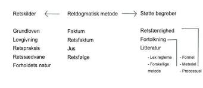
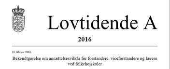

# Retskilderne

```{r, echo=FALSE, results='asis'}
cat(readLines('np.html'))
```

---

**Kapitel 2 skal kun læses i hovedtræk** 

---

Retskilder er de faktorer, som danner grundlaget for at opnå viden om, hvad der er gældende ret.^[Følgende afsnit om retskilderne bygger bl.a. på http://juridiskmetode.dk/retskilderne/index.html og http://denstoredanske.dk/Samfund,_jura_og_politik/Jura/Almindelig_retsl%C3%A6re,_retsfilosofi_og_terminologi/retskilder.] 

I bred betydning kan man definere begrebet *retskilde* som enhver tankegang, der leder retsanvenderen frem mod en konklusion om, hvad der er gældende ret på et givent område. 

I praksis anvendes begrebet retskilde om den præmis i en konklusion om gældende ret, som foreligger i autoritativ form, enten i form af et dokument udstedt af en kompetent instans (f.eks. en lov, en bekendtgørelse eller en dom) eller i form af en udtalelse om, hvad der er praksis inden for et område, afgivet af en institution med en særlig kompetence inden for området.

---

## Retskildehirakiet

Retskilderne præsenteres i dansk ret traditionelt i et hierarki med grundloven og lovene som øverste retskilder og "forholdets natur" som den laveste.



Lovgivningen er den primære retskilde, som altid skal tages i betragtning ved fastlæggelse af retsstillingen, men retspraksis er også en vigtig retskilde, især hvis der foreligger en afgørelse fra Højesteret (se præjudikat) eller en afgørelse fra EU-Domstolen eller fra Menneskerettighedsdomstolen vedrørende Den Europæiske Menneskerettighedskonvention. 

Andre faktorer, der kan anvendes som retskilder, er fx retssædvaner, aftaler, lovforarbejder, administrativ praksis, administrative retsforskrifter, udtalelser fra Folketingets Ombudsmand samt retsvidenskabens analyser. 

Herudover anvendes traditionelt også forholdets natur som retskilde.

Der kan ikke opstilles en fast prioritering af retskilderne, idet de i konkrete tilfælde alle kan have betydning for, hvad der er gældende ret.

I den juridiske argumentation og fortolkning indtager retskilderne den vægtigste position.

---

Man kan også opdele retskilderne i 3 hovedkategorier:

 
1. National lovgivningen og EU-lovgivningen

2. National retspraksis og EU-praksis

3. Øvrige retskilder:


Retssædvaner

Aftaler

Forholdets natur

Kutymer

Retsgrundsætninger

God skik regler

---

### Lov


En lov er underlagt grundloven for 1953 og må ikke stride mod grundloven.

En lov er heirarkisk højere rangeret end en bekendtgørelse. jf. herom forneden. Love er bindende for private, virksomheder og myndigheder. 

Før en lov kan blive vedtaget, skal den behandles 3 gange i folketinget. 

Det er regeringen, der fremsætter lovforslaget, og det er folketinget, der vedtager eller forkaster den.

Der gælder et retssikkerhedsmæssigt princip i Danmark om lighed for loven, uanset om man er fattig eller rig.


 
---

### Bekendtgørelse



En bekendtgørelse er en administrativ forskrift udstedt af en forvaltningsmyndighed med hjemmel (støtte) i lov. 

Bekendtgørelser er bindende for borgere, virksomheder og myndigheder, medmindre andet følger af bekendtgørelsen.

---

### Cirkulære

*Cirkulærer* er kun bindende for myndighederne og kan ikke påberåbes af borgerne. 

Cirkulærer udstedes af centrale administrative myndigheder med underordnede myndigheder som adressater. 

Et cirkulære kan ikke forpligte borgerne, og disse kan normalt heller ikke retligt støtte sig på et cirkulære alene.

--- 

### Dommenes retsskildværdi (præjudikat)


En dom er en form for retsafgørelse, der i modsætning til kendelser og beslutninger afslutter sagens behandling ved retten.

Domstolsafgørelser og domstolskendelser kan have *præjudikatsværdi*. 

Det betyder, at afgørelsen kan have betydning for, hvordan fremtidige afgørelser inden for det pågældende område skal bedømmes. 

Præjudikatsværdien kan være underlagt en række indskrænkninger, hvilket betyder, at præjudikatsværdiens rækkevidde kan være begrænset.

Der findes ikke i dansk ret et klart princip, der angiver, hvornår og i hvilket omfang domme har præjudikatsværdi; det afhænger af den konkrete problemstilling.

Følgende momenter kan indgå i vurderingen af, hvilken præjudikatsværdi en afgørelse kan tillægges:

Hvor konkret er afgørelsen, og kan den være anvendelig på lignende afgørelser.

Højesteretsdomme har generelt større præjudikatsværdi end landsretsdomme, der igen har større præjudikatsværdi end byretsdomme. 

Endvidere har nye domme større præjudikatsværdi end ældre domme. 

Dommes præjudikatsværdi begrænses, når deres begrundelser gøres meget konkrete.

---

### God skik regler


Undertiden støder man i lovgivningen på, at en handlemåde skal være overensstemmelse med en branchebestemt *”god skik”*, en såkaldt *adfærdsnorm.* 

Eksempler herpå er god advokatskik, god ejendomsmæglerskik, god skik for de finansielle virksomheder, god markedsføringsskik, god revisionsskik, god inkassoskik og god forvaltningsskik m.v. 

God skik regler findes i begrænset omfang på lov- eller bekendtgørelsesniveau (eksempel herpå er bekendtgørelse om god skik for finansielle virksomheder), mens normerne for god skik i andre tilfælde er fastsat af domstolene mv. 

God skik er som udgangspunkt branchebestemt, og de vage rammer sikrer en tidsvarende standardnorm, der udvikles i takt med samfundsudviklingen.


---

### Retsædvane

Retssædvaner er ulovreguleret, men selv om retssædvanerne er ulovreguleret har de som retskilde samme betydning, som de var på lovniveau. 

Nogle retssædvaner er udviklet af domstolene. 

Domslæsning, læsning af anerkendte juridiske grundsætninger og søgning i retslitteraturen er nogle af svarene på, hvor retssædvaner kan findes. 

Imidlertid er retssædvaner ikke vilkårlige, hvorfor der er flere elementer, der skal være opfyldt, før retssædvanen overhovedet kan tillægges betydning. 

Et klassisk eksempel på retssædvane er *culpareglen*.

I den juridiske litteratur er der opstillet rammer for, hvornår der er tale om en retssædvane. 

Den traditionelle opfattelse er, at det være en handlemåde, der er 

1) fulgt almindeligt, 
2) stadigt og 
3) længe ud fra 
4) den overbevisning, at man er retligt forpligtet til det.

---

### Kutyme

Kutyme er defineret ved at være en sædvane. 

Den har ikke samme retskildeværdi som retssædvane, da retssædvane svarer til lovniveau. Kutyme må derfor betragtes som trin-lavere. 

Kutyme er en alment kendt handlemåde i en bestemt branche, hvilket aktørerne i den pågældende branche har eller bør have viden om. 

I juridisk litteratur er sædvane undertiden beskrevet som en handelssædvane, og der kan derfor være forskel på kutymerne i de forskellige brancher. 

Kutyme er tæt beslægtet med god-skik regler. 

Hvad der er kutymer, kan indhentes informationer om fra brancheforeninger såsom Dansk Erhverv og Dansk Industri.

---

### Aftalen

Aftaler (f.eks. en kontrakt) der er indgået mellem parter, anses for en af de vigtigste retskilder. 

Imidlertid er der ikke tale om en "lov", men reguleringen af aftalen kan være underlagt lovgivningen. Det skal derfor afdækkes, om aftalen er underlagt præceptive (ufravigelige) lovregler og regler, der er deklaratoriske (fravigelige), 


om aftalen er i strid mod lov og ærbarhed (Danske Lovs 5-1-2), og om aftalen, uden et gyldigt grundlag binder en tredjemand.

Præceptive regler er kendetegnet ved, at de ikke kan fraviges ved aftale. Aftaler i strid mod lov og ærbarhed er kendetegnet ved, at aftalen er i strid med ufravigelige regler. 

Eksempelvis kan man ikke håndhæve en aftale om sort arbejde. 

Beskyttelsespræceptive er kendetegnet ved, at de efter aftale kan stille den svage part bedre end loven (f.eks. en arbejdstager), men hvor denne ret ikke tilkommer den stærke part (f.eks. en arbejdsgiver). 

Det samme gælder ved forbrugerkøb. Forbrugerbrugen kan godt stilles bedre, men ikke dårligere efter købeloven.

Deklaratoriske regler er regler fx. i handelskøb, der kan fraviges ved aftale, og kommer i anvendelse, hvis der ikke foreligger aftale om andet.

 
---

### Forholdets natur

Det er i juridisk litteratur omdiskuteret, om hvorvidt forholdets natur overhovedet er en retskilde, og der kan i den juridiske litteratur findes flere argumenter for og imod. 

Forholdets natur er kendetegnet ved, at der tages hensyn til nogle retlige relevante hensyn og principper og rimelighedsbetragtninger. 

---

## Romerretten


Dansk ret er påvirket af romerrettens begrebsapparat fx. at man som jurist eller jurainteresseret skal kunne forstå elementer af romerretten samt de klassisk latinsk-juridiske begreber som f.eks. actio, bona fide, caveat emptor, conditio sine qua non, reformatio in pejus, dolus eventualis, depositum, ex offio, ex nunc, ex tunc, in extenso, in dubio pro reo, in absentia, insolvens, de lege lata, de lege feranda, et cetera, et cetera.


---

## EU-rettens retskilder

De mål, der er fastsat i traktaterne, nås gennem forskellige typer retsakter. Nogle er bindende, andre er ikke. 

Nogle angår alle EU-lande, mens andre kun angår nogle stykker.

---

### Forordninger

En "forordning" er en bindende retsakt, som er direkte gældende i EU-medlemsstaterne - parallet til en national lov, se fx forordning 241/2004 om flypassagers rettigheder. Derfor skal de enklet EU-medlemsstater følge forordningen i alle dens enkeltheder. 

Da EU f.eks. ønskede at garantere fælles sikkerhedsforanstaltninger for varer importeret fra lande uden for EU, vedtog Rådet en forordning.

---

### Direktiver


Et "direktiv" er en retsakt, der fastsætter et mål, som EU-landene skal opnå. 

Det er dog op til de enkelte lande at lave deres egne love for, hvordan disse mål skal opnås. 

Et eksempel er EU's direktiv om forbrugerrettigheder, som styrker forbrugernes rettigheder i EU, f.eks. ved at fjerne skjulte afgifter og omkostninger på internettet og forlænge den periode, som forbrugere kan fortryde en købsaftale i.

---

### Afgørelser

En "afgørelse" er bindende for dem, den er rettet til (f.eks. et EU-land eller en individuel virksomhed) og er direkte gældende. 

F.eks. har Kommissionen udstedt en afgørelse om EU's deltagelse i forskelige antiterrororganisationers arbejde. Afgørelsen vedrører kun sådanne organisationer.

---

### Henstillinger

En "henstilling" er ikke bindende. 

Da EU-Kommissionen rettede en henstilling til EU-landenes myndigheder om at forbedre deres brug af videokonferencer for at hjælpe domstolstjenester med at arbejde bedre sammen på tværs af grænserne, havde den ingen retslige virkninger. 

En henstilling giver institutionerne mulighed for at give deres mening til kende og foreslå en retningslinje, uden derved at pålægge dem, den er rettet til, nogen retlige forpligtelser.

---

### Udtalelser

En "udtalelse" er et instrument, der giver institutionerne mulighed for at fremsætte en ikkebindende erklæring, dvs. at den ikke pålægger dem, den er rettet mod, nogen forpligtelser. 

En udtalelse er ikke bindende. Den kan afgives af de vigtigste EU-institutioner (Kommissionen, Rådet, Parlamentet), Regionsudvalget og Det Europæiske Økonomiske og Sociale Udvalg. 

Mens lovene udformes, afgiver udvalgene udtalelser fra deres særlige regionale eller økonomiske og sociale synspunkt. For eksempel afgav Regionsudvalget en udtalelse om pakken om en politik for ren luft i Europa.

---

## Case law


Der er stor forskel på retskildeopfattelsen inden for forskellige retssystemer, se fx case law.^[Følgende afsnit om Case Law bygger på http://denstoredanske.dk/Samfund,_jura_og_politik/Jura/Retssammenligning,_komparativ_ret/case_law.]

Case law, judge-made law, dommerskabt ret.  

I common law-lande har domstolene en mere vidtgående funktion end den dømmende magt i andre retssystemer. 

Common law-domstolen skal ikke kun fortolke og anvende lovgiverens retsregler, statutory law, men skaber også sin egen ret, case law eller judge-made law. 

En domstolsafgørelse har således ikke alene betydning for parterne i en konkret tvist; afgørelsen skaber præcedens, dvs. at en lignende sag i fremtiden med stor sandsynlighed vil blive afgjort på samme måde, den såkaldte **stare decisis-doktrin**.

Betegnelsen case law er engelsk, af case 'tilfælde' og law 'lov'.
I England er de afgørelser, der hidrører fra samme eller en højere domstol, bindende. 

Andre afgørelser har kun vejledende karakter. Der sondres desuden mellem den tidligere afgørelses egentlige begrundelse, *"ratio decidendi"*, og andre udtalelser i afgørelsen, *"obiter dicta"*. 

Et *"obiter dictum" er kun vejledende*, uanset fra hvilken domstol det måtte hidrøre.


Selv bindende afgørelser bliver fra tid til anden tilsidesat (overruled); fx kan der bag afgørelsen ligge en forældet tankegang, og i 1966 udtalte Englands højeste domstol, House of Lords, at den ikke fremover ville betragte sig som evigt bundet af sine egne tidligere afgørelser.

I USA håndhæves stare-decisis mindre strengt end i England. USA's højesteret har enkelte gange tilsidesat sine tidligere afgørelser, selv i sager om fortolkning af USA's forfatning. 

Fx gav United States Supreme Court i 1954 sorte elever adgang til skoler og universiteter, som tidligere havde været forbeholdt de hvide, og tilsidesatte herved sin egen ældre afgørelse, der havde anerkendt doktrinen om "separate but equal", dvs. at man i undervisningen adskilte sorte og hvide.  


---

## Retskildepolycentri


Retskildepolycentri er en nyere retsvidenskabelig erkendelse af, at dannelsen af retskilder i forskellige fora i det moderne samfund kan resultere i, at en retskilde kan have forskellig virkning for forskellige retsanvendere. 

Teorien bryder med den hierarkiske retskildeopfattelse. 

Teoriens ophavsmand er den danske juraprofessor Henrik Zahle.  

---

## Juridisk metode


Juridisk metode, fremgangsmåde ved stillingtagen til juridiske problemer.  

Metoden består for det første af en beskrivelse og identifikation af de retskilder, som gyldigt kan inddrages i en juridisk argumentation; for det andet af læren om, hvordan retskilderne fortolkes. 

Juridisk metode består af 3 hovedelementer:

---

Et faktum (Hændelsesforløbet fx der er sket økonomisk misbrug af en kortholderens mistede Dankort)  
+  
Et retsfaktum (Hvilken retsregel i betalingsloven skal anvendes i forhold til tredjemandsmisbruget af Dankortet)  
=  
En retsfølge (Afgørelsen, hvem der kommer til at betale for misbruget af Dankortet banken eller kortholderen)  

---

Se f.eks. bestemmelsen i betalingslovens § 100, stk. 4, nr. 3, hvorefter betaleren hæfter for op til 8.000 kr. af misbrug, som finder sted som følge af betalerens groft uforsvarlige adfærd.

Begrebet groft uforsvarlig adfærd er ikke nærmere afgrænset i betalingsloven, men traditionelt anvendes begrebet »grov uagtsomhed« som betegnelse for »tilsidesættelse af den agtpågivenhed, som selv skødesløse personer plejer at udvise.« 

Med anvendelsen af begrebet groft uforsvarlig adfærd er det således præciseret, at grov uagtsomhed i sædvanlig forstand ikke er tilstrækkeligt til at pådrage betaleren hæftelse efter bestemmelsen. 

Der skal altså mere til. 

Groft uforsvarlig adfærd må herefter forstås som sløseri, der er præget af ligegyldighed i forbindelse med opbevaring af bl.a. pinkoden. 

Der skal derfor meget til efter praksis i Pengeinstitutankenævnet (nu Det finansielle Ankenævn), før der statueres groft uforsvarlig adfærd.


---


<br>

---

**PIA 78/2006**

»Det forhold, at misbrugeren på klagerens bopæl tilfældigt fik mulighed for at overhøre klageren oplyse sin kode til dankortet til kæresten sammenholdt med, at dankortet opbevaredes i hendes pung, der lå i hendes jakke på bopælen, kan ikke betegnes som groft uforsvarlig adfærd, heller ikke selv om klageren havde givet T adgang til sin bopæl, uanset om hun måtte have kendskab til T’s kriminelle baggrund«.

---

**PIA 205/2005:**

»Klagerens Visa/Dankort blev opbevaret i en pung, som lå i en jakke, der var anbragt bag disken i klagerens butik og ikke var synlig for kunderne. Selv om det må bebrejdes klageren, at pinkoden til kortet var anført på en seddel, der lå i pungen sammen med kortet, findes klageren efter en samlet vurdering ikke at have udvist en groft uforsvarlig adfærd som omhandlet i (dagældende) lov om visse betalingsmidler § 11, stk. 3, nr. 3. Ankenævnet har herved også lagt vægt på, at det i lovens forarbejder er forudsat, at det udvidede ansvar kun ville kunne gøres gældende i et fåtal af tilfælde«.  

---

Selvforskyldt beruselse kan blive betragtet som uforsvarlig adfærd, jf. **PIA 281/2013** Spørgsmål om misbrug af kort var muliggjort ved groft uforsvarlig adfærd som følge af beruselse: 

»Som sagen foreligger oplyst, lægger vi til grund, at klageren ikke ved, hvad han foretog sig fra ca. kl. 00.30 til ca. kl. 02.00, da han vågnede i en bil, som han formoder var en pirattaxa. 

Vi finder ikke grundlag for at antage, at klagerens tilstand skyldes andre forhold end indtagelse af alkohol. Under disse omstændigheder finder vi, at misbruget af klagerens betalingskort er muliggjort, fordi han var stærkt påvirket af alkohol. Vi finder, at klageren under de beskrevne omstændigheder har udvist groft uforsvarlig adfærd. 

Vi stemmer derfor for at lade klageren hæfte med 8.000 kr. af det tab, der opstod som følge af den uberettigede brug af kortet, jf. (dagældende) lov om betalingstjenester § 62, stk. 3 nr. 3«. 

---

Det er en konkret vurdering, om der bliver statueret groft uforsvarlig adfærd, jf. fx **PIA 436/1993:**:

Natten mellem den 12. og 13. juni 1993 blev klageren, medens han opholdt sig på en restauration, frastjålet sit dankort, som var opbevaret i klagerens tegnebog. 

Klageren anmeldte den 13. juni 1993 kl. 11.10 telefonisk tyveriet til kriminalpolitiet i Sønderborg efter forinden telefonisk at have spærret dankortet ved meddelelse til PBS. 

Det viste sig efterfølgende, at der ved anvendelse af dankortet og korrekt pinkode den 13. juni 1993 mellem kl. 9.25 og 9.28 var hævet 3 x 2.000 kr. i tre forskellige dankortautomater. 

Efter de foreliggende oplysninger lagde Pengeinstitutankenævnet til grund, at tyveriet af dankortet var blevet forøvet af to unge piger, som senere blev dømt for tyveri ved den 13. juni 1993 kl. 9.25-9.28 under anvendelse af dankortet at have stjålet de 3 x 2.000 kr. fra dankortautomaterne. 

Det fremgik af en retsbogsudskrift fra straffesagen, at de sigtede havde forklaret, at den ene af dem, A, snakkede med klageren, mens den anden sigtede, B, tog pungen op af lommen på ham. 

Herefter gik de ud på toilettet, hvor de tog pengene og kortet. 

A forklarede videre, at hun havde spurgt klageren om koden, og han havde givet hende den. Han sagde noget om, at han skulle ringe til banken for at få kortet spærret, og hun tilbød at gøre det for ham. 

Hun lod, som om hun telefonerede til banken, og sagde i den forbindelse til klageren, at hun skulle bruge pinkoden, hvorefter han gav hende den. Klageren indbragte sagen for Ankenævnet med påstand om, at indklagede var tilpligtet at anerkende, at klageren ikke hæftede for de 6.000 kr. 

Ankenævnet traf følgende afgørelse: 

»Efter (dagældende) betalingskortlovens § 21, stk. 2, hæfter kortindehaveren uden beløbsbegrænsning for tab, der opstår som følge af andres uberettigede brug af betalingskortet og den dertil hørende personlige hemmelige kode, såfremt kortudstederen godtgør, at kortindehaveren har oplyst koden til den, der har foretaget den uberettigede brug. 

Ankenævnet finder imidlertid ikke, at bestemmelsen er anvendelig på et tilfælde som det foreliggende. Ankenævnet finder på den anden side, at klageren udviste groft uforsvarlig adfærd ved i det foreliggende tilfælde at oplyse sin PIN-kode. Han hæfter derfor med op til 8.000 kr. for det tab, der opstod som følge af det uberettigede brug af kortet, jf. (dagældende) betalingskortlovens § 21, stk. 3, nr. 2. Som følge af det anførte bestemmes: Den indgivne klage tages ikke til følge«.  


---

Den juridiske metode indeholder væsentlige elementer af vurdering og skøn og er derfor mindre eksakt end de metoder, der anvendes inden for mange andre fagområder.


I juridisk Ordbog (***Bo von Eyben***, 14. udg.) defineres juridisk metode som følger:"den metode, der skal anvendes for at afgøre, hvilken regel der er gældende for et bestemt retsområde. Dette forudsætter kendskab til læren om retskilderne og evne til herudfra at finde de relevante retskilder og at anvende dem korrekt på det givne forhold..." 

---
