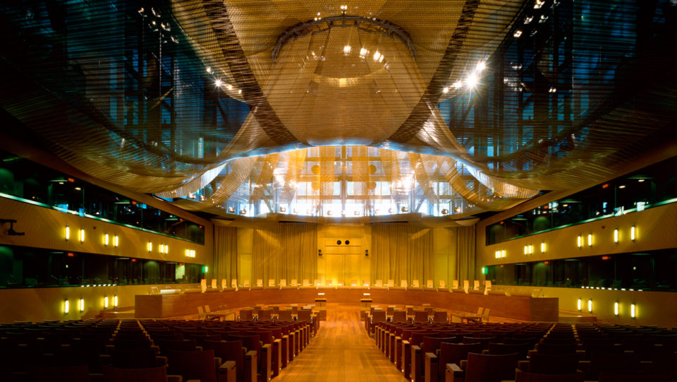

# EU-Domstolen Premium   

 

Domstolen træffer afgørelser i de sager, der indbringes for den. De mest almindelige typer sager er:

*	Fortolkning af love (præjudicielle afgørelser) - de nationale domstole i EU-landene skal sikre, at EU-lovene anvendes korrekt, men domstolene i de forskellige lande kan fortolke reglerne forskellige. Hvis en national domstol er i tvivl om fortolkningen eller gyldigheden af en EU-retsakt, kan den spørge Domstolen til råds. Den samme mekanisme kan anvendes til at afgøre, om national ret eller praksis er forenelig med EU-retten.

*	Håndhævelse af loven (overtrædelsesprocedurer) - denne form for sag føres mod et medlemsland, hvis det ikke overholder EU-reglerne. Den kan indledes af Europa-Kommissionen eller et andet EU-land. Hvis landet findes skyldigt, skal det straks bringe bruddet til ophør, hvis ikke det vil risikere, at der anlægges endnu en sag, som kan medføre bødestraf.

*	Ophævelse af EU-retsakt (annullationssøgsmål) – hvis en EU-retsakt menes at være i strid med EU-traktaterne eller grundlæggende rettigheder, kan Domstolen blive bedt om at ophæve den - af et medlemsland, Rådet, Europa-Kommissionen eller (i visse tilfælde) Europa-Parlamentet.

Privatpersoner kan også bede Domstolen om at ophæve en EU-retsakt, som berører dem direkte.
*	Sikring af, at EU træffer foranstaltninger (passivitetssøgsmål) – Parlamentet, Rådet og Kommissionen skal træffe visse afgørelser i bestemte situationer. Undlader de dette, kan EU's institutioner eller (i visse tilfælde) enkeltpersoner eller virksomheder klage til Domstolen.

*	Sanktionering af EU-institutionerne (erstatningssøgsmål) – enhver person eller virksomhed, hvis interesser er blevet skadet som følge af EU's eller dets personales handlinger eller mangel på handlinger, kan bringe sagen for Domstolen.  

## Sammensætning Premium 
  
 

EU-Domstolen er inddelt i 2 organer:

*	EU-Domstolen – som tager sig af anmodninger om præjudicielle afgørelser fra nationale domstole, visse annullationssøgsmål og appelsager. 

*	Retten – som træffer afgørelse i annullationssøgsmål indbragt af enkeltpersoner, virksomheder og i visse tilfælde medlemslande. Det vil i praksis sige, at Retten primært beskæftiger sig med konkurrenceret, statsstøtte, handel, landbrug og varemærker.  

Hver dommer og generaladvokat udnævnes i fællesskab af medlemslandene for en periode på 6 år, som kan fornyes. I hver domstol vælger dommerne en formand for en periode på 3 år, som kan forlænges.  

## Hvordan fungerer EU-Domstolen? Premium 
I Domstolen tildeles hver sag én dommer (refererende dommer) og én generaladvokat. Sagerne behandles i to faser:  

*	Den skriftlige fase  
  +	Parterne afgiver skriftlige erklæringer til Domstolen – og nationale myndigheder, EU-institutionerne og i visse tilfælde enkeltpersoner kan også fremsætte bemærkninger.  
  +	Alt dette sammenfattes af den refererende dommer og drøftes på Domstolens almindelige møde, som beslutter:  
    +	Hvor mange dommere, der skal behandle sagen: 3, 5 eller 15 dommere (hele Domstolen) afhængig af sagens betydning og kompleksitet. De fleste sager behandles af 5 dommere, og det sker meget sjældent, at en sag høres af hele Domstolen.  
    +	Om det er nødvendigt med en høring (den mundtlige fase), og om der er behov for en officiel udtalelse fra generaladvokaten.  
*	Den mundtlige fase – en offentlig høring.  
  +	Parternes advokater forelægger deres sag for dommerne og generaladvokaten, som kan stille spørgsmål til dem.  
  +	Hvis Domstolen har besluttet, at der er behov for en udtalelse fra generaladvokaten, afgives denne nogle uger efter høringen.  
  +	Dommerne voterer så og kommer med deres afgørelse.  
*	Rettens procedure er lignende, bortset fra at de fleste sager høres af 3 dommere, og at der ikke er nogen generaladvokat.  

## EU-Domstolen og dig Premium 
 

Hvis du – som privatperson eller virksomhed – har lidt skade som følge af handlinger eller mangel på handlinger fra EU's institutioners eller ansattes side, kan du indbringe en sag for Domstolen på to måder:  

*	Indirekte gennem nationale domstole (som kan beslutte at henvise sagen til EU-Domstolen)  
*	Direkte for Retten – hvis en afgørelse truffet af en EU-institution har berørt dig direkte og individuelt.  
Hvis du mener, at myndighederne i et medlemsland har overtrådt EU-reglerne, skal du følge den officielle klageprocedure. (link) 

**Video: EU-domstolen**

<iframe src="https://www.youtube.com/embed/M3LPCK1eWBs" width="853" height="480" frameborder="0" allowfullscreen="allowfullscreen"></iframe>

Med ikrafttrædelsen af Lissabontraktaten den 1. december 2009 har Den Europæiske Union fået status som juridisk person og har overtaget de beføjelser, som tidligere var tildelt Det Europæiske Fællesskab. Fællesskabsretten er således blevet til unionsretten, som også omfatter alle de bestemmelser, der tidligere er blevet vedtaget i medfør af traktaten om Den Europæiske Union som affattet forud for Lissabontraktaten. I den præsentation, som følger, vil udtrykket fællesskabsretten ikke desto mindre blive anvendt, når der henvises til Domstolens praksis før ikrafttrædelsen af Lissabontraktaten.

Ved siden af Den Europæiske Union fortsætter Det Europæiske Atomenergifællesskab (Euratom) med at eksistere. Eftersom Domstolens beføjelser vedrørende Euratom i princippet er de samme som dem, der udøves inden for rammerne af Den Europæiske Union, og for at gøre præsentationen mere læsevenlig, vil enhver henvisning til unionsretten ligeledes omfatte Euratomretten.

 
## Sammensætning Premium 
 
	 

Domstolen består af 28 dommere og 11 generaladvokater. Dommerne og generaladvokaterne udnævnes for en periode af 6 år af medlemsstaternes regeringer efter fælles overenskomst efter høring af et udvalg, som har til opgave at udtale sig om, hvorvidt de indstillede kandidater er egnede til at varetage de omhandlede opgaver. De kan genudnævnes. Til dommere og generaladvokater ved Domstolen 
udnævnes personer, hvis uafhængighed er uomtvistelig. De skal i deres hjemland opfylde betingelserne for at indtage de højeste dommerembeder eller have faglige kvalifikationer, som er almindeligt anerkendt.

Domstolens dommere vælger af deres midte Domstolens præsident og vicepræsident for et tidsrum af tre år. Begge kan genvælges. Præsidenten forestår Domstolens arbejde og administration og leder retsmøderne og Domstolens voteringer i sager, der er henvist til behandling i et af de største dommerkollegier.

Vicepræsidenten bistår præsidenten i udførelsen af dennes opgaver og træder i præsidentens sted, hvis denne har forfald.

Generaladvokaterne bistår Domstolen og er den behjælpelig ved udførelsen af dens opgaver. De har til opgave, fuldstændig upartisk og uafhængigt, offentligt at fremsætte forslag til afgørelse af de sager, som de forelægges.
Justitssekretæren er institutionens generalsekretær og leder dens tjenestegrene under tilsyn af Domstolens præsident.

Domstolen kan sættes af samtlige medlemmer (plenum), i Den Store Afdeling (15 dommere) eller i afdelinger med 3 eller 5 dommere.

Domstolen sættes af samtlige medlemmer i særlige tilfælde, der er opregnet i statutten for Domstolen (bl.a. når den skal afskedige Den Europæiske Ombudsmand eller et medlem af Europa-Kommissionen, som har tilsidesat sine forpligtelser), og når Domstolen finder, at en sag er af særlig vigtighed.
Den sættes i Den Store Afdeling, når en medlemsstat eller en institution, som er part i sagen, anmoder herom samt i særligt omfattende eller betydelige sager.

De øvrige sager behandles i afdelinger med 5 eller 3 dommere. Formændene for afdelinger med 5 dommere vælges for en periode af 3 år, og formændene for afdelinger med 3 dommere for en periode af 1 år.

Beføjelser
For at kunne varetage sit hverv er Domstolen tillagt vide retlige beføjelser, som den udøver ved de præjudicielle forelæggelser og i de forskellige typer af søgsmål.

## De forskellige sagstyper Premium 
 

###	 Præjudicielle forelæggelser Premium 
 

Domstolen samarbejder med samtlige retsinstanser i medlemsstaterne, som er de ordinære retter, på unionsrettens område. For at sikre en effektiv og ensartet anvendelse af unionsretten og for at undgå forskelle i fortolkningen heraf kan - og i visse tilfælde skal - de nationale retter forelægge Domstolen præjudicielle spørgsmål vedrørende fortolkningen af unionsretten, f.eks. med henblik på, at den nationale ret kan efterprøve de nationale bestemmelsers overensstemmelse med unionsretten. 

Den præjudicielle forelæggelse kan også vedrøre spørgsmål om en unionsretsakts lovlighed.
Domstolen besvarer ikke sådanne spørgsmål ved blot at afgive en udtalelse, men i en dom eller en begrundet kendelse. Den forelæggende ret er bundet af Domstolens fortolkning. Domstolens dom binder på samme måde de øvrige nationale domstole, som måtte skulle træffe afgørelse vedrørende et identisk spørgsmål.

Det er ligeledes gennem præjudicielle forelæggelser, at enhver europæisk borger kan få afklaring på spørgsmål om de bestemmelser i unionsretten, der vedrører ham. Selv om et præjudicielt spørgsmål kun kan forelægges af en national domstol, har parterne i den sag, der verserer for den nationale domstol, medlemsstaterne og EU-institutionerne adgang til at deltage i proceduren for Domstolen. En række af unionsrettens hovedprincipper er blevet defineret på baggrund af præjudicielle spørgsmål, der også er blevet forelagt af nationale domstole, som træffer afgørelse i første instans.

###	 Traktatbrudssøgsmål Premium 
 

Domstolen har herigennem adgang til at kontrollere, om medlemsstaterne overholder de forpligtelser, der påhviler dem i medfør af unionsretten. Forud for sagens anlæg ved Domstolen har Kommissionen gennemført en procedure, hvorunder vedkommende medlemsstat har fået lejlighed til at svare på de klagepunkter, som er rejst imod den. Hvis denne procedure ikke fører til, at medlemsstaten bringer traktatbruddet til ophør, kan der anlægges en traktatbrudssag ved Domstolen.

En sådan sag kan anlægges enten af Kommissionen - hvilket i praksis er det hyppigst forekommende - eller af en anden medlemsstat. Hvis Domstolen fastslår, at der foreligger et traktatbrud, skal medlemsstaten straks bringe det til ophør. Hvis Domstolen, efter at Kommissionen på ny har indbragt sagen for den, fastslår, at den pågældende medlemsstat ikke har efterkommet dens dom, kan Domstolen pålægge medlemsstaten at betale et fast beløb eller en tvangsbøde. Hvis Kommissionen ikke er blevet underrettet om foranstaltninger til gennemførelse af et direktiv, kan Domstolen imidlertid efter anmodning herom fra Kommissionen pålægge medlemsstaten en økonomisk sanktion allerede fra tidspunktet for afsigelsen af den første traktatbrudsdom.

### Annullationssøgsmål Premium 
 

I en sådan sag nedlægger sagsøgeren påstand om annullation af en retsakt, der er udstedt af Unionens institutioner, organer, kontorer eller agenturer (bl.a. forordninger, direktiver og beslutninger). 

Domstolen er forbeholdt kompetencen i sager, der anlægges af en medlemsstat mod Europa-Parlamentet og/eller Rådet (med undtagelse af Rådets retsakter, der vedrører statsstøtte, antidumping og gennemførelsesbeføjelser), eller sager, der anlægges af en EU-institution mod en anden institution. 

Retten er kompetent til at træffe afgørelse, i første instans, i alle andre sager af denne art, herunder navnlig i sager, der er anlagt af private.

###	Passivitetssøgsmål Premium 
 
Domstolen og Retten har herigennem adgang til at kontrollere, om det er lovligt, at en fællesskabsinstitution forholder sig passivt i en given situation. 

En sådan sag kan imidlertid først anlægges, efter at institutionen er blevet opfordret til at handle. 

Når det er fastslået, at undladelsen var ulovlig, har den pågældende institution pligt til at træffe egnede foranstaltninger til at bringe passiviteten til ophør. 

Beføjelsen til at påkende passivitetssøgsmål er opdelt mellem Domstolen og Retten efter de samme kriterier, som gælder ved annullationssøgsmål.

###	Appelsager Premium 
 

Endelig kan domme og kendelser afsagt af Retten appelleres til Domstolen for så vidt angår retsspørgsmål. 

Såfremt appellen admitteres, og Domstolen giver appellanten medhold i realiteten, ophæver den Rettens afgørelse. 

Hvis sagen er moden til påkendelse, kan Domstolen selv træffe afgørelse i sagen. 

Finder Domstolen ikke, at sagen er moden til påkendelse, hjemviser den sagen til Retten. 

I tilfælde af hjemvisning er Retten bundet af de afgørelser, som er truffet af Domstolen under appelsagen.

## Sagsbehandling Premium 
 

Uanset hvilken sagstype der er tale om, omfatter den en skriftlig fase og i givet fald en mundtlig fase, der er offentlig. 

Der er imidlertid forskel på sagsbehandlingen for så vidt angår præjudicielle forelæggelser og i de øvrige sager(direkte søgsmål og appelsager).

### Sagens anlæg og den skriftlige forhandling Premium 

##	Præjudicielle forelæggelser Premium 
Den nationale domstol forelægger Domstolen spørgsmål om fortolkningen eller gyldigheden af en bestemmelse i unionsretten, hvilket sædvanligvis sker i form af en retsafgørelse, alt efter de nationale retsplejeregler. 

Når anmodningen af Domstolens oversættelsestjeneste er oversat til alle unionssprogene, forkynder justitssekretæren den for parterne i hovedsagen samt for medlemsstaterne og EU-institutionerne. Justitssekretæren lader en meddelelse, der indeholder de pågældende parters navne samt spørgsmålene, offentliggøre i Den Europæiske Unions Tidende. 

Parterne, medlemsstaterne og institutionerne har herefter en frist på to måneder til at indgive skriftlige indlæg til Domstolen.

Den nationale domstol forelægger Domstolen spørgsmål om fortolkningen eller gyldigheden af en bestemmelse i unionsretten, hvilket sædvanligvis sker i form af en retsafgørelse, alt efter de nationale retsplejeregler. Når anmodningen af Domstolens oversættelsestjeneste er oversat til alle unionssprogene, forkynder justitssekretæren den for parterne i hovedsagen samt for medlemsstaterne og EU-institutionerne. 

Justitssekretæren lader en meddelelse, der indeholder de pågældende parters navne samt spørgsmålene, offentliggøre i Den Europæiske Unions Tidende. 

Parterne, medlemsstaterne og institutionerne har herefter en frist på to måneder til at indgive skriftlige indlæg til Domstolen.

##	Direkte søgsmål og appelsager Premium 
Sagen anlægges ved Domstolen ved indlevering af en stævning til justitskontoret. 

Justitssekretæren lader en meddelelse om sagsanlægget offentliggøre i Den Europæiske Unions Tidende, hvori sagsøgerens søgsmålsgrunde og argumenter kort angives. Stævningen forkyndes for de øvrige parter, der har en frist på to måneder til at indgive svarskrift eller replik. 

I givet fald har sagsøgeren ret til at indgive replik og sagsøgte duplik. Den frist, der er fastsat for fremlæggelse af disse dokumenter skal overholdes.

I begge sagstyper udpeges der af henholdsvis præsidenten og førstegeneraladvokaten en refererende dommer og en generaladvokat, der følger sagen under hele forløbet.

## Sagens oplysning Premium 
 

Når den skriftlige forhandling er afsluttet, opfordres parterne til inden for en frist på tre uger at tilkendegive, om og hvorfor de ønsker, at der afholdes en mundtlig forhandling. 

Domstolen beslutter på grundlag af den refererende dommers indstilling, og efter at have hørt generaladvokaten, om der skal ske bevisoptagelse, til hvilket dommerkollegium sagen skal henvises, og om der er grund til at afholde en mundtlig forhandling, for hvilken præsidenten i givet fald fastsætter en dato for.

### Offentligt retsmøde og generaladvokatens forslag til afgørelse Premium 
 

Besluttes det at afholde en mundtlig forhandling, procederes sagen i et offentligt retsmøde, hvori dommerkollegiet og generaladvokaten deltager. Dommerne og generaladvokaten kan stille parterne de spørgsmål, som de finder hensigtsmæssige. 

Nogle uger senere fremsætter generaladvokaten i et nyt offentligt retsmøde sit forslag til afgørelse for Domstolen. 

Generaladvokaten behandler navnlig sagens retlige aspekter i enkeltheder og foreslår i al uafhængighed Domstolen, hvorledes problemet efter hans eller hendes opfattelse skal løses. 

Hermed er den mundtlige del af sagsbehandlingen afsluttet. 

Hvis det vurderes, at sagen ikke rejser nye retsspørgsmål, kan Domstolen efter at have hørt generaladvokaten bestemme, at sagen skal påkendes uden forslag til afgørelse.

## Dommene Premium 
 

 

Dommerne voterer på grundlag af et domsudkast, som den refererende dommer har udarbejdet. 

Enhver af dommerne i det pågældende dommerkollegium kan foreslå ændringer. 

Domstolens afgørelser træffes med stemmeflerhed, og en eventuel dissens anføres ikke. 

Dommene underskrives kun af de dommere, der har deltaget i den mundtlige votering, hvorunder dommen er blevet vedtaget, med forbehold af reglen om, at den dommer i dommerkollegiet, der har den laveste anciennitet, ikke underskriver dommen, såfremt dette dommerkollegium består af et lige antal dommere. 

Dommene afsiges i offentligt retsmøde. 

På Domstolens websted CURIA offentliggøres dommene og generaladvokaternes forslag til afgørelse på afsigelsesdagen, henholdsvis fremsættelsesdagen. 

I de fleste tilfælde offentliggøres de efterfølgende i Samling af Afgørelser.

## Særlige rettergangsformer Premium 
 

###	Den forenklede procedure Premium 
 

Såfremt et præjudicielt spørgsmål er identisk med et spørgsmål, Domstolen allerede har afgjort, såfremt besvarelsen af et sådant spørgsmål ikke giver anledning til nogen rimelig tvivl, eller såfremt besvarelsen af spørgsmålet klart kan udledes af retspraksis, kan Domstolen efter at have hørt generaladvokaten træffe afgørelse ved begrundet kendelse, i givet fald under henvisning til den tidligere afsagte dom eller den relevante retspraksis.

###	Den fremskyndede procedure Premium 
 

Den fremskyndede procedure giver Domstolen mulighed for at træffe hurtig afgørelse i uopsættelige sager ved i videst muligt omfang at behandle sagerne hurtigt og tillægge dem absolut prioritet. 

Efter begæring fra en af parterne kan Domstolens præsident efter forslag fra den refererende dommer og efter at have hørt generaladvokaten og de øvrige parter beslutte at anvende den fremskyndede procedure, når sagens særlige uopsættelighed kræver det. 

De præjudicielle forelæggelser kan ligeledes underkastes en fremskyndet procedure. I så fald fremsættes begæring herom af den forelæggende ret, som i begæringen skal angive de faktiske omstændigheder, som bevirker, at afgørelsen af det præjudicielle spørgsmål er uopsættelig.

###	Den præjudicielle hasteprocedure (PPU) Premium 

Denne procedure gør det muligt for Domstolen inden for en væsentligt afkortet frist at behandle de mest følsomme spørgsmål vedrørende området for frihed, sikkerhed og retfærdighed (politisamarbejde og retligt samarbejde i civile sager og i kriminalsager samt visum, asyl, indvandring og andre politikker i forbindelse med den fri bevægelighed for personer). 

PPU-sagerne behandles i en afdeling med fem dommere, som er særligt udpeget, og den skriftlige fase gennemføres i praksis elektronisk, og er i væsentligt omfang begrænset, både hvad angår varigheden og antallet af aktører, som har ret til at indgive skriftlige indlæg. 

De fleste aktører deltager under den mundtlige fase, der er obligatorisk.

###	Begæring om foreløbige forholdsregler Premium 
 

Der kan ligeledes indgives begæring om udsættelse af gennemførelsen af en retsakt, der er udstedt af en institution, eller om enhver anden foreløbig forholdsregel, som er nødvendig for at forhindre, at en part lider et alvorligt og uopretteligt tab.

### Sagsomkostninger Premium 
 

Sagsbehandlingen ved Domstolen er fritaget omkostninger. Til gengæld dækkes omkostningerne til en advokat, der har beskikkelse i en medlemsstat, ved hvilken parterne kan lade sig repræsentere, ikke af Domstolen. 

Hvis en part er ude af stand til helt eller delvis at betale de omkostninger, der er forbundet med sagen, kan han dog uden at være repræsenteret ved en advokat, ansøge om retshjælp. Ansøgningen skal vedlægges alle de nødvendige oplysninger, som godtgør behovet for retshjælp.

### Sprogordning Premium 
 

I direkte søgsmål bliver det sprog, som stævningen er affattet på (hvilket kan være ethvert af Den Europæiske Unions 24 officielle sprog) i princippet sagens processprog, dvs. det sprog, som sagen behandles på. 

I appelsager anvendes samme processprog som i den appellerede dom eller kendelse fra Retten. 

For så vidt angår præjudicielle forelæggelser, er processproget det, som den nationale ret har henvendt sig til Domstolen på. Under den mundtlige forhandling i retsmøder er der efter behov simultantolkning til forskellige af Den Europæiske Unions officielle sprog. 

Dommerne voterer uden brug af tolke på et fælles sprog, der normalt vil være fransk.

## Oversigt over rettergangsmåden Premium 
 

 

### Domstolen i Den Europæiske Unions retsorden Premium 
 

Med henblik på at opbygge Europa som fællesskab indgik en række stater (i dag i alt 28) indbyrdes en række traktater om oprettelse af De Europæiske Fællesskaber og herefter Den Europæiske Union, udstyret med institutioner, som vedtager retsregler på bestemte områder.

Den Europæiske Unions Domstol udgør Unionens og Det Europæiske Atomenergifællesskabs dømmende myndighed. Den består af Domstolen og Retten, hvis opgave i det væsentlige består i at prøve lovligheden af Fællesskabets retsakter og at sikre en ensartet fortolkning og anvendelse af EU-retten.  

Hele vejen gennem sin praksis har Domstolen knæsat pligten for forvaltninger og domstole på nationalt plan til fuldt ud at gennemføre EU-retten på deres kompetenceområder og at beskytte de rettigheder, som EU-retten tildeler borgerne (direkte anvendelse af EU-retten), hvorved en herimod stridende regel i national ret bliver uvirksom, hvad enten den er yngre eller ældre end EU-normen (EU-rettens forrang for national ret).

Domstolen har ligeledes anerkendt princippet om medlemsstaternes ansvar for tilsidesættelse af unionsretten, som udgør dels et element, der på afgørende måde beskytter de rettigheder, som er tillagt private ved unionsrettens bestemmelser, dels en faktor, der bidrager til en mere omhyggelig gennemførelse af disse bestemmelser i medlemsstaterne. 

De retskrænkelser, som disse gør sig skyldige i, vil således kunne medføre erstatningspligt, der i visse tilfælde kan få alvorlige konsekvenser for deres offentlige finanser. 

Desuden vil enhver manglende overholdelse fra en medlemsstats side af unionsretten kunne indbringes for Domstolen, og denne vil, i tilfælde af manglende opfyldelse af en dom, som fastslår et sådant retsbrud, kunne pålægge staten en tvangsbøde og/eller betaling af et fast beløb. 

Hvis Kommissionen ikke er blevet underrettet om foranstaltningerne til gennemførelse af et direktiv, kan Domstolen imidlertid efter anmodning herom fra Kommissionen pålægge medlemsstaten en økonomisk sanktion allerede fra tidspunktet for afsigelsen af den første traktatbrudsdom.

Domstolen arbejder tæt sammen med de nationale retter, som er unionsrettens ordinære domstole. Enhver national ret, der skal afgøre en tvist med berøring til unionsretten, kan, og skal undertiden, forelægge Domstolen præjudicielle spørgsmål. Domstolen får således lejlighed til at fremlægge sin fortolkning af en unionsretlig regel eller til at kontrollere dens lovlighed.
Udviklingen i Domstolens praksis illustrerer dens bidrag til skabelsen af et retsområde, der angår borgerne, idet den beskytter de rettigheder, som EU-lovgivningen tildeler dem på forskellige områder af deres dagligdag.

## Grundsætninger fastslået i retspraksis Premium 
 

Ved en serie domme (begyndende med dommen i sagen Van Gend & Loos i 1963) indførte Domstolen i sin retspraksis princippet om fællesskabsrettens direkte virkning i medlemsstaterne, som nu gør det muligt for Europas borgere direkte at påberåbe sig bestemmelserne i unionsretten for deres nationale retter.

I forbindelse med indførsel fra Tyskland til Nederlandene skulle transportvirksomheden Van Gend & Loos betale told, som firmaet fandt stridende mod EØF-traktatens regel om forbud til medlemsstaterne mod at forhøje tolden i deres gensidige handelssamkvem. 

Sagen rejste spørgsmålet om konflikten mellem en national lovgivning og EØF-traktatens regler. 

En nederlandsk ret forelagde sagen for Domstolen, og den afgjorde spørgsmålet ved at hævde doktrinen om direkte virkning, således at transportvirksomheden fik en direkte sikkerhed for sine rettigheder i henhold til fællesskabsretten for den nationale ret.

I 1964 blev det i Costa-dommen fastslået, at fællesskabsretten har forrang for intern lovgivning. 

I denne sag havde en italiensk ret spurgt Domstolen, om en italiensk lov om nationalisering i sektoren for fremstilling og distribution af elektricitet var forenelig med en række regler i EØF-traktaten. 

Domstolen indførte doktrinen om fællesskabsrettens forrang, som den begrundede med den særlige karakter af Fællesskabets retsorden, der må anvendes ensartet i samtlige medlemsstater.

I 1991 udviklede Domstolen i dommen i sagen Francovich m.fl. et andet grundbegreb, nemlig grundbegrebet om medlemsstatens ansvar over for private for den skade, de måtte lide på grund af, at staten har tilsidesat fællesskabsretten. 

Siden 1991 står der altså et erstatningssøgsmål til rådighed for de europæiske borgere, som de kan rejse mod den stat, der overtræder en EF-regel.

To italienske borgere, som havde løntilgodehavender hos deres konkursramte arbejdsgivere, havde indledt sag, hvorunder de påberåbte sig den italienske stats passivitet, idet den ikke havde gennemført EF-reglerne om beskyttelse af arbejdstagere i tilfælde af deres arbejdsgivers insolvens. 

Efter at en italiensk ret havde forelagt sagen for Domstolen, udtalte denne, at det pågældende direktiv tog sigte på at tillægge private rettigheder, som de var blevet afskåret fra at udnytte som følge af, at staten havde udvist passivitet, da den ikke havde gennemført direktivet, og hermed gjorde Domstolen vejen fri for et erstatningssøgsmål mod staten selv.

### Domstolens rolle i unionsborgerens liv Premium 
 

Blandt de tusinder af domme, Domstolen har afsagt, har størstedelen, navnlig de, der er afsagt under den præjudicielle procedure, helt åbenbart betydelige virkninger for de europæiske borgeres dagligliv. 

Heraf skal nævnes nogle stykker som eksempel på de væsentligste af fællesskabsrettens områder.  

###	Frie varebevægelser Premium 
 

Efter dommen i sagen Cassis de Dijon, der blev afsagt i 1979 vedrørende grundsætningen om frie varebevægelser, kan de erhvervsdrivende til deres land indføre enhver vare med oprindelse i et andet unionsland - på den betingelse, at varen dér er blevet fremstillet lovligt og bragt i omsætning, og at ingen tvingende grund, f.eks. forbundet med beskyttelsen af sundhed og miljø, er til hinder for varens indførsel til forbrugslandet.

###	Fri bevægelighed for personer Premium 
 

Adskillige domme er blevet afsagt på området for fri bevægelighed for personer.

I Kraus-dommen (1993) fastslog Domstolen, at retstillingen for en EF-borger, der er indehaver af et bevis for afsluttet universitetseksamen, som er erhvervet i en anden medlemsstat, og som letter adgangen til en profession eller udøvelsen af en økonomisk virksomhed, er reguleret af fællesskabsretten, endog hvad angår den pågældende borgers forhold til sin hjemstat. Det gælder således, at selv om en medlemsstat kan betinge anvendelsen af eksamensbeviset på sit område af en administrativ godkendelse, må godkendelsesproceduren alene have det formål at klarlægge, om beviset er blevet lovligt udstedt.

Blandt de øvrige domme afsagt på dette område er en af de mest kendte Bosman-dommen (1995), hvori Domstolen efter anmodning fra en belgisk ret tog stilling til spørgsmålet, om fodboldforbunds regler kunne anses for forenelige med arbejdskraftens frie bevægelighed. 

Domstolen udtalte, at professionel sport er en økonomisk virksomhed, hvis udøvelse ikke kan hindres af reglerne om spillertransfert eller ved en begrænsning af antallet af spillere med statsborgerskab i en andre medlemsstater. Sidstnævnte udtalelse er ved senere domme blevet udvidet til at gælde retsstillingen for professionelle sportsudøvere med oprindelse i tredjelande, der har indgået en associerings- (dommen i sagen Deutscher Handballbund fra 2003) eller partnerskabsaftale (Simutenkov-dommen 2005) med De Europæiske Fællesskaber.

###	Fri udveksling af tjenesteydelser Premium 

En dom fra 1989 vedrørende fri udveksling af tjenesteydelser angik en britisk turist, der var blevet overfaldet og alvorligt såret i den parisiske metro. 

Efter en forelæggelse fra en fransk ret fastslog Domstolen, at den pågældende i sin egenskab af turist havde adgang til tjenesteydelser uden for sit land og principielt var omfattet af det grundlæggende forbud mod forskelsbehandling på grundlag af nationalitet, der er knæsat i fællesskabsretten. 

Turisten havde følgelig ret til samme erstatning, som en fransk statsborger kunne gøre krav på (Cowan-dommen).

Efter en præjudiciel anmodning fra luxembourgske retter fastslog Domstolen, at en national lovgivning med den virkning, at en forsikringstager får afslag på godtgørelse af udgifter ved tandbehandling med den begrundelse, at denne har fundet sted i en anden medlemsstat, udgør en uberettiget hindring for den frie udveksling af tjenesteydelser (Kohll-dommen, 1998), og at et afslag på godtgørelse af udgifter til køb af briller i udlandet må bedømmes som en uberettiget hindring for de frie varebevægelser (Decker-dommen, 1998).

###	Ligebehandling og sociale rettigheder Premium 

En flystewardesse anlagde sag mod sin arbejdsgiver på grund af forskelsbehandling vedrørende den løn, hun oppebar i forhold til sine mandlige kolleger, der udførte samme arbejde. 

En belgisk ret forelagde sagen for Domstolen, som i 1976 fastslog, at traktatreglen med påbuddet om principiel ligebehandling med hensyn til løn til kvindelige og mandlige arbejdstagere for samme arbejde havde direkte virkning (Defrenne-dommen).

Ved en fortolkning af EF-reglerne vedrørende ligebehandling af mænd og kvinder har Domstolen bidraget til at beskyttelsen af kvinderne mod afskedigelse i forbindelse med barsel. En kvinde, der ikke længere kunne arbejde som følge af besværligheder forbundet med graviditet, blev afskediget. 

I 1998 kendte Domstolen afskedigelsen stridende mod fællesskabsretten. Afskedigelse af en kvinde under graviditet som følge af fravær, forårsaget af en sygdom på grund af selve graviditeten, er en forbudt forskelsbehandling på grundlag af køn (Brown-dommen).

Med henblik på at sikre arbejdstagernes sikkerhed og sundhed er det nødvendigt, at disse har adgang til betalt årlig ferie. 

I 1999 rejste den britiske fagforening BECTU tvivl om britiske regler, som fratog arbejdstagere med arbejdskontrakter af kort varighed denne ret med den begrundelse, at reglerne ikke var i overensstemmelse med et EF-direktiv vedrørende fastlæggelse af arbejdstiden. 

Domstolen nåede til det resultat (BECTU-dommen, 2001), at retten til betalt årlig ferie er en social ret, som direkte er tillagt samtlige arbejdstagere i fællesskabsretten, og at ingen arbejdstager kan afskæres herfra.

###	Grundlæggende rettigheder Premium 
 

Med en udtalelse om, at overholdelsen af grundlæggende rettigheder er en integrerende del af de almindelige retsgrundsætninger, som Domstolen skal søge overholdt, har Domstolen bidraget væsentligt til højere standarder i relation til beskyttelsen af de nævnte rettigheder. 

Herved tager Domstolen hensyn til de for medlemsstaternes fælles forfatningstraditioner og folkeretlige aftaler om beskyttelse af menneskerettighederne, navnlig den europæiske konvention til beskyttelse af menneskerettigheder, som medlemsstaterne har samarbejdet om eller tiltrådt. Efter ikrafttrædelsen af Lissabontraktaten vil Domstolen kunne anvende og fortolke Den Europæiske Unions charter om grundlæggende rettigheder af 7. december 2000, som i medfør af Lissabontraktaten tillægges samme retsværdi som traktaterne. 

Efter talrige terroristattentater mod politiembedsmænd indførte man i Nordirland bevæbning af politistyrkerne. 

Af hensyn til den offentlige sikkerhed tillod man imidlertid ikke bevæbning (på grundlag af en attest udstedt af vedkommende minister, som ikke kunne anfægtes ved domstolene) af kvinder ansat i politiet. 

Som følge heraf var der ikke længere mulighed for fuldtidsansættelse af kvinder i det nordirske politi. 

Efter en præjudiciel forelæggelse fra en ret i Det Forenede Kongerige afgjorde Domstolen, at udelukkelsen af enhver domstolsprøvelse af en attest fra en national myndighed er i strid med princippet om en effektiv domstolsbeskyttelse, der tilkommer enhver, som finder sig ramt af kønsdiskriminering (Johnston-dommen, 1986).

### Unionsborgerskab Premium 
 

Vedrørende unionsborgerskabet, som ifølge traktaten om Den Europæiske Unions virkemåde tilkommer enhver statsborger i medlemsstaterne, har Domstolen bekræftet, at dette indebærer retten til ophold på en anden medlemsstats område. 

Således har en mindreårig statsborger i en medlemsstat, som er sygeforsikret og har tilstrækkelige midler til sit underhold, også ret til ophold. 

Domstolen fremhævede, at fællesskabsretten ikke kræver af den mindreårige, at han selv har de nødvendige midler, og at afslaget på samtidig at meddele den mindreåriges moder, med statsborgerskab i tredjeland, ret til ophold, vil bevirke, at barnets opholdsret bliver uden enhver effektiv virkning (dommen i sagen Zhu og Chen, 2004).  

I samme dom præciserede Domstolen, at en medlemsstat - selv i det tilfælde, hvor erhvervelse af statsborgerskab i en medlemsstat har til formål at opnå en opholdsret i henhold til fællesskabsretten for en statsborger i en medlemsstat - ikke kan indskrænke virkningerne af tildeling af statsborgerskab i en anden medlemsstat.  

