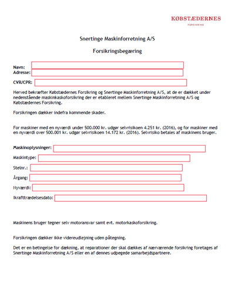

# Aftaleret

```{r, echo=FALSE, results='asis'}
cat(readLines('np.html'))
```


---

**Video: introduktion til aftaleretten**


<div class="video-container"><iframe src="https://www.youtube.com/embed/QdPllNiV5Ck" width="853" height="480" frameborder="0" allowfullscreen="allowfullscreen"></iframe></div>


---


*Hvilke problemstillinger og aftaleretlige lovregler, du som studerende særlig skal være opmærksom på vedrørende eksamensspørgsmål indenfor aftaleretten:*


• *Opfordring contra tilbud*, aftalelovens § 9, herunder prisangivelser på nettet, netbutikker og i fysiske butikker
  
• *Aftaleindgåelse*, aftalelovens § 2-7 og § 40

• *Ugyldighed* (svig, aftalelovens § 30 fejl, aftalelovens § 32, stk. 1, udnyttelse, aftalelovens § 31)

• *Falsk/forfalskning*

• *Urimelighed* - §§ 38c, jf. 36

• *Fuldmagtstyper* (især stillingsfuldmagt, aftalelovens § 10, stk. 2), fuldmagtens omfang og konsekvenser, aftalelovens § 10, 11, 15 og 25, modificeret ved erstatningsansvarslovens § 23


---

Aftaleretten beskæftiger sig med reglerne for indgåelse af aftaler, fuldmagtsforhold og aftalefortolkning mv.

---


Et grundlæggende aftaleretligt princip er:

"Pacta sunt servanda" (latin: Aftaler skal holdes) er det grundlæggende juridiske princip inden for aftaleret, civilret og international ret om, at aftaler skal holdes.

---


Aftalelovens principper har betydning på hele aftaleområdet,^[Følgene bygger tildels på *Torsten Iversen og Lars Hedegaard Kristensens* karnovkommentar til aftaleloven] fx i:


* Forsikringsaftaleloven, kreditaftaleloven, forbrugeraftaleloven, AB 18, købeloven, E-handelsloven m.fl.

*	Aftaleindgåelse reguleres af aftalelovens §§ 2-9.

+ Deklaratorisk, dvs. parterne kan aftale anden fremgangsmåde ved aftaleindgåelse, end den der er beskrevet i aftaleloven.


---


```{r aftalelov,echo=FALSE,fig.height=4, result=TRUE,fig.cap=("Oversigt over aftalelove")}


nodes <- data.frame(id = 1:7, 
                    shape = c("box"), 
                    label = c(" Aftalelov "," Forsikringsaftalelov "," Kreditaftalelov "," Forbrugeraftalelov "," Aftale om pant "," Købelov "," Kautionsaftale "),
                    font.size = c(50,25,25,25,25,25,25))
edges <- data.frame(from = c(1,1,1,1,1,1), to = c(2,3,4,5,6,7),arrows = c("to"),length = rep(40,6))

visNetwork(nodes, fig.width=4,edges,  width = "100%") %>% 
  visInteraction(dragNodes = TRUE, 
                 dragView = TRUE, 
                 zoomView = FALSE) %>%
  visNodes(color = list(background = "white", 
                        border = "white",
                        highlight = "yellow"),
           shadow = list(enabled = TRUE, size = 30))  %>%
  visHierarchicalLayout(direction = "LR",levelSeparation = 300) %>%
visEdges(color = list(color = "lightgrey", highlight = "yellow") )
  # visLayout(randomSeed = 24) # to have always the same network

```


---

## Aftaleindgåelse

Hovedreglen er, at der er aftalefrihed – vi kan frit aftale, hvad vi vil.

Undtagelse (U1): Begrænsninger i præceptive lovregler.  

Se fx:

+	Funktionærlovens regler om opsigelsesvarsler.

+	Forbrugeraftalelovens regler om fortrydelsesret.
      
U2: Urimelige aftaler, aftalelovens §§ 38c, jf. 36

U3: "En aftale bliver også ugyldig, hvis den strider mod "lov og ærbarhed", jf. allerede Christian 5.s Danske Lov fra 1683. 

Fx et løfte om at ville betale en anden persons fartbøde ugyldig eller, at et forsikringsselskab skulle udbyde forsikringer mod fatbøder eller, at retssystemet skulle håndhæve mangler i forbindelse med udførelsen af sort arbejde. 

Men en aftale bliver ikke ugyldig, blot fordi der er overtrådt offentligretlige forskrifter. 

Fx er en aftale om køb af drikkevarer uden for den tilladte åbningstid bindende trods lovovertrædelsen.

---

I nyere tid har ugyldighed med held været påberåbt af mange, der tegnede anparter i investeringsprojekter med vindmøller, containere, hoteller mv., idet anpartstegnerne var blevet vildledt om projektets bæredygtighed.^[Jf. *Erik Werlauff*, *Karsten Revsbech*: ugyldighed i Den Store Danske, Gyldendal] 

---


### Hvad er en aftale?


Ordet ”aftale”: En aftale - jf. aftalelovens titel - består af viljeserklæringer, som to eller flere personer afgiver indbyrdes, og hvoraf mindst én erklæring er et løfte, som har karakter tilbud. 

Aftalebegrebet bruges oftest om et tilbud, som er accepteret af modparten, f.eks. en pagt, traktat, kontrakt, charter, overenskomst, vedtægt, vedtagelse, konvention og studehandel. 

Aftaler er bindende, uanset om de er mundtlige eller skriftlige, jf. aftalelovens § 1. 

Mundtlige aftaler er således lige så bindende som skriftlige, jf. Danske Lov, DL 5–1–2 og forudsætningsvis aftalelovens § 3, stk. 2, som fastslår, at tilbud, der fremsættes mundtligt skal accepteres straks.

De mundtlige kan bare være sværere at bevise, hvis parterne bliver uenige om aftalens indhold. 

Bevisbyrde - Den part der hævder en mundtlig aftale er indgået, har bevisbyrden (som er hovedreglen i dansk ret; en ligefrem bevisbyrde).

Kontrakten er skriftlig, og den kan håndhæves i retssystemet. 

---


Ensidigt løfte ctr. gensidigt løfte se figurer.

Udtrykkeligt løfte ctr. stiltiende løfte.

---

*Hvad er forskellen på en aftale og en kontrakt?:*  


En aftale kan også være mundtlig. 

En kontrakt er skriftlig og kan således påberåbes ved domstolene.  


---


```{r gensidigtloefte, echo=FALSE, fig.height=4,result=TRUE,fig.cap=("Gensidigt løfte")}


nodes <- data.frame(id = 1:2, shape = c("box"),label = c(" Sælger "," Køber "),font.size = c(30,30))
edges <- data.frame(from = c(1), 
                    to = c(2),
                    arrows = c("to","from"),
                    length = c(600,500),
                    label=c("Varer/Ydelser","Penge/modydelse"),
                    font.size = c(15,15),
                    smooth = c(TRUE,TRUE)
                    )

visNetwork(nodes, edges,  width = "100%") %>% 
  visInteraction(dragNodes = TRUE, 
                 dragView = TRUE, 
                 zoomView = FALSE) %>%
  visNodes(color = list(background = "white", 
                        border = "white",
                        highlight = "yellow"),
           
           shadow = list(enabled = TRUE, size = 30))  %>%
  visHierarchicalLayout(direction = "LR",levelSeparation = 300) %>%
  
visEdges(color = list(color = "lightgrey", highlight = "yellow") )
```


```{r faicon2, echo=FALSE, fig.height=1,result=TRUE,fig.cap=("Ensidigt løfte")}

nodes <- data.frame(id = 1:2, shape = c("box"),label = c(" Testator "," Arving "),font.size = c(30,30))
edges <- data.frame(from = c(1), 
                    to = c(2),
                    arrows = c("to"),
                    length = c(300),
                    font.size = c(15),
                    label=c(" ARV "),
                    smooth = FALSE
                    )
 visNetwork(nodes, edges,  width = "100%") %>% 
   visInteraction(dragNodes = TRUE, 
                 dragView = TRUE, 
                 zoomView = FALSE) %>%
  visNodes(color = list(background = "white", 
                        border = "white",
                        highlight = "yellow"),
           shadow = list(enabled = TRUE, size = 30))  %>%
   visHierarchicalLayout(direction = "LR",levelSeparation = 300) %>%
  visEdges(color = list(color = "lightgrey", highlight = "yellow") )
```


---

*Eksempler på indgåelse af juridiske aftaler mellem parter* 


Ejendomsmægleren tager initiativ til en formidlingsaftale om salg af et hus:  

Tilbudsgiver (ejendomsmægleren): Den, der afsender/giver et tilbud til en anden.
  
Tilbudsmodtager (boligsælgeren): Den, som modtager et tilbud. 

---



*En kunde tager initiativ til en forsikringsaftale:*  


"Tilbudsgiver" (kunden): En interesseret kunde sender en begæring til et forsikringsselskab med ønske om en forsikring.

---

*Aftaleretlige begreber:*

*"Tilbudsmodtager"* (sælger): Sælger modtager en ordre eller ønske om køb fra interesseret køber.


Et *"løfte":* En ensidig erklæring fra en person om at ville påtage sig en pligt. 

Løftet skaber en forventning hos modtager. 

*Løftet har følgende retsvirkninger:* 

Dels at løftegiveren har pligt enten til at opfylde løftet efter dets indhold (såkaldt naturalopfyldelse) eller 

til at erstatte løftemodtagerens økonomiske interesse i løftets opfyldelse, dvs. erstatning i form af såkaldt "positiv opfyldelsesinteresse" (forudsat naturligvis, at der foreligger et ansvarsgrundlag).


*"Tilbud":* Et tilbud er et løfte, som taber sin virkning, hvis det ikke accepteres i rette tid. 

F.eks. et løfte om at levere en vare eller tjenesteydelse til en bestemt pris og et bestemt sted på et bestemt tidspunkt.


*"Accept"*: En erklæring, som har karakter af antagende svar på tilbud. 

Et *"svar"*, hvori man siger ja til et tilbud. 

*"Accepten"* er både et løfte, der binder acceptanten, når modtageren har hørt/læst accepten (kundskabsøjeblikket), og det er samtidig et påbud der binder modtageren, når det er kommet frem, dvs. når et svar (tilbud eller accept) er modtaget i modtagerens brevkasse, indbakke eller lignende, men indholdet er endnu ikke læst. 

*"Kommet frem":* Når et svar (tilbud eller accept) er modtaget i modtagerens brevkasse, indbakke eller lignende, men indholdet er endnu ikke læst.

*Kommet til kundskab:* Det øjeblik, modtageren er blevet bekendt med indholdet af tilbud eller accept, dvs. har hørt eller læst indholdet. 

Der er ikke noget krav om, at modtageren skal have forstået indholdet.


---


*"Opfordring til at gøre tilbud":* er en ikke-bindende henvendelse til andre om at give tilbud.

Hvis en erhvervsdrivende i overensstemmelse med aftalelovens § 9 vil fravige det almindelige aftaleretlige udgangspunkt om, at tilbud i en internet butik er bindende, skal det fremgå meget tydeligt af siden, at tilbuddene på hjemmesiden alene er ”en opfordring til at give et tilbud”, og at der ikke er indgået en bindende aftale, før sælgeren har accepteret køberens tilbud.

---

Se fra retspraksis:

**U.2003.907 V** (U: Ugeskrift for Retsvæsen): Annoncering af brugt bil på internettet var alene opfordring til at gøre tilbud. S havde på en hjemmeside på internettet annonceret en brugt bil til salg til en pris af 119.900 kr. Den rigtige pris var imidlertid 349.900 kr. A, der efter at have set annoncen, havde ringet og skrevet til S vedrørende bilen, anlagde retssag mod S med påstand om betaling af 230.000 kr., under anbringende af at S havde pådraget sig erstatningsansvar. Landsretten fandt, at annonceringen af den brugte bil på internettet i det foreliggende tilfælde alene kunne anses som en opfordring til at gøre tilbud. Da S straks ved A's telefoniske henvendelse havde gjort A bekendt med den fejlagtigt angivne pris, var der således ikke indgået nogen aftale om køb af bilen, og S blev frifundet for A's krav om erstatning.

---

*"Påbud"* er en erklæring: som går ud på at lægge bånd på adressaten.

*"Reklamation":* er en indsigelse i anledning af et retsforhold.

*"Pligtmæssig reklamation":* er en reklamation, som afgives af hensyn til adressaten og forsendes på adressatens risiko, jf. aftalelovens § 40 (og tilsvarende købelovens § 61). Aftaleloven bruger herom udtrykket »give meddelelse«.

---


## Aftalemodellen


En bindende aftale kommer i stand via den såkaldte aftalemodel:

*	Tilbudsgiver sender sit tilbud ………….fremsendelsestid

*	Tilbudsmodtager modtager tilbud (kommet frem)

*	Tilbudsmodtager læser tilbud (kommet til kundskab) ………….betænkningstid
  
*	Tilbudsmodtager accepterer tilbud/sender accept …………tilbagesendelsestid
  
*	Accept når frem til tilbudsgiver (kommet frem)

*	Tilbudsgiver læser accepten (kommet til kundskab)


Resultat: Der er indgået en juridisk bindende aftale mellem parterne.


---

**Video: Om aftalemodellen**


<div class="video-container"><iframe src="https://www.youtube.com/embed/DvV2yhetl8M" width="853" height="480" frameborder="0" allowfullscreen="allowfullscreen"></iframe></div>


---

**Video: Om aftalers indgåelse**

<div class="video-container"><iframe src="https://www.youtube.com/embed/WbgTUpCLz00" width="853" height="480" frameborder="0"allowfullscreen="allowfullscreen"></iframe></div>


---


```{r faicon3, echo=FALSE, result=TRUE,fig.height=4,fig.cap=("Aftale sælgers initiativ")}
nodes <- data.frame(id = 1:2, shape = c("box"),label = c("Sælger \n tilbudsgiver ","Køber \n tilbudsmodtager "),font.size = c(15,15))
edges <- data.frame(from = c(1), 
                    to = c(2),
                    arrows = c("to","from"),
                    length = c(800,500),
                    font.size = c(12,12),
                    label=c("1. Sælger sender tilbud til køber","2. Køber sender accept/ordre"),
                    smooth = TRUE
                    )
  visNetwork(nodes, edges,  width = "100%") %>% 
    visInteraction(dragNodes = TRUE, 
                 dragView = TRUE, 
                 zoomView = FALSE) %>%
  visNodes(color = list(background = "white", 
                        border = "white",
                        highlight = "yellow"),
           shadow = list(enabled = TRUE, size = 30))  %>%
  visHierarchicalLayout(direction = "LR",levelSeparation = 400) %>%
visEdges(color = list(color = "lightgrey", highlight = "yellow") )
```


---


```{r faicon4, echo=FALSE,fig.height=4, result=TRUE,fig.cap=("Aftale købers initiativ")}
nodes <- data.frame(id = 1:2, shape = c("box"),label = c("Sælger \n tilbudsmodtager ","Køber \n tilbudsgiver "),font.size = c(20,20))
edges <- data.frame(from = c(1), 
                    to = c(2),
                    arrows = c("to","from"),
                    length = c(800,500),
                    label=c("2. Sælger sender \n accept/ordrebekræftelse","1. Køber sender købstilbud/ordre"),
                    smooth = TRUE
                    )
 visNetwork(nodes, edges,  width = "100%") %>% 
   visInteraction(dragNodes = TRUE, 
                 dragView = TRUE, 
                 zoomView = FALSE) %>%
  visNodes(color = list(background = "white", 
                        border = "white",
                        highlight = "yellow"),
           shadow = list(enabled = TRUE, size = 30))  %>%
  visHierarchicalLayout(direction = "LR",levelSeparation = 400) %>%
visEdges(color = list(color = "lightgrey", highlight = "yellow") )
```

---

### Tilbud eller opfordring til tilbud


HR: Tilbud er bindende for afgiveren, jf. aftalelovens § 1.

Tilbuddet bliver bindende for tilbudsgiver, når tilbudsmodtager får kendskab til tilbuddets indhold.

Tilbud er bindende i butikker og butiksvinduer, medmindre køber burde indse, at der var tale om en fejl.
    
Tilbud er fx bindende i web-butikker, når sælger selv har råderet over websitet og muligvis, at der også er en indkøbsfunktion på websitet.

Der er ingen formkrav til udformningen af tilbuddet, og det kan fremsættes ved mundtlige og elektroniske erklæringer/aftaler.

Tilbuddet må ikke være tilbagekaldt helt eller delvist (ændret).

---

*Tilbuddet kan tilbagekaldes*, såfremt tilbagekaldelsen kommer frem til modtageren senest samtidig med, at modtageren får kundskab herom, jf. aftalelovens § 7, se senere.

Hvis tilbuddet afslås af tilbudsmodtager, bortfalder tilbuddet og kan ikke accepteres senere, jf. aftalelovens § 5.

*Afslaget kan tilbagekaldes*, såfremt tilbagekaldelsen kommer frem til modtageren senest samtidig med, at modtageren får kundskab herom, jf. aftalelovens § 7.


    
---

Undtagelser: *"Opfordring til tilbud"*, jf. aftalelovens § 9:


Nogle typer tilbud er ikke bindende for sælger, kaldet "opfordring til tilbud", fx:
  
+ *Slagtilbud* og *”så længe lager haves”*, tilbud og priser i aviser og kataloger, på plakater, annoncer, TV- og radioreklamer, køtilbud, priser og tilbud på internettet, når sælger ikke selv har råderet over websitet.

---


Se dommen i **U 2002.631 V** Sælgers direktørs notering af kundes ønske om køb af allerede solgt kø-tilbudsvare havde skabt berettiget forventning hos kunden om køb af varen. Erstatning for prisdifferencen:
"Sælger S havde i en annonce i en reklameavis under overskriften »KØ-TILBUD« reklameret med, at man lørdag den 6. maj 2000 kl. 9 kunne købe en nærmere angiven rotorklipper, der før havde kostet 4.995 kr., for 2.995 kr. Det fremgik af annoncen bl.a., at der kun var 1 stk., og at der ikke var andre plæneklippere til salg som køtilbud. Kunde K stillede sig som nr. 5 i køen og konstaterede ved henvendelse til de foranstående, at ingen af dem ønskede at købe plæneklipperen. S' direktør D noterede - uden at være opmærksom på, at K's ønske om køb vedrørte et allerede inden den 6. maj ved en fejl solgt køtilbud - K's ønske om køb ned. Lidt efter fik K, mens K stadig stod i køen, af D at vide, at plæneklipperen var solgt et par dage i forvejen. K anlagde retssag mod S med -endelig - påstand om betaling af 2.000 kr. Landsretten udtalte, at prisangivelser i reklamer, der er rettet mod en større kreds, som udgangspunkt alene kan anses som opfordringer til at afgive tilbud og ikke som tilbud. Landsretten anførte videre, at plæneklipperen var annonceret på forsiden af en reklameavis som et af flere køtilbud, og at det af annoncen fremgik, at der kun var et eksemplar til salg, og at der ikke var andre plæneklippere til salg som køtilbud, samt at plæneklipperen ved en fejl fra S' side var solgt inden tidspunktet for salget af køtilbuddene. Selv om der som følge af salget ikke var nogen plæneklipper til salg som køtilbud, noterede D K's ønske om køb heraf under sin gennemgang af køen uden for forretningen og gjorde først senere K bekendt med, at plæneklipperen var solgt. Det blev lagt til grund, at K ikke havde kendskab til et opslag i forretningen om salget, og at K var den første i køen, som ønskede at købe plæneklipperen, der endvidere ikke kunne anses for omfattet af reklameavisens forbehold om udsolgte varer. Under disse omstændigheder havde K ved S' notering af K's ønske om køb fået en berettiget forventning om, at K havde købt plæneklipperen, og S skulle betale K 2.000 kr."
    
---

**Video: Tilbud contra opfordring til tilbud**


<div class="video-container"><iframe src="https://www.youtube.com/embed/j36H6TAo7Us" width="853" height="480" frameborder="0" allowfullscreen="allowfullscreen"></iframe></div>


---

### Afslag på tilbud


Hvis tilbudsmodtager forholder sig passiv, bortfalder tilbuddet, når acceptfristen er udløbet, og sælger kan frit sælge til anden side.

Hvis tilbudsmodtager afslår tilbuddet, er det bortfaldet, selv om acceptfristen ikke er udløbet, jf. aftalelovens § 5. 

Sælger kan frit sælge til anden side.  

Situation: Tilbagekaldelse af afslag. Tilbudsmodtager (potentiel køber) sender et afslag til sælger, men køber fortryder sit afslag.


Tilbuddet er stadig bindende for sælger, hvis købers tilbagekaldelse kommer til tilbudsgivers (sælgers) kundskab, senest samtidig med at sælger læser afslaget.


---

**Video: Afslag**


<div class="video-container"><iframe src="https://www.youtube.com/embed/Noq0xWiKryg" width="853" height="480" frameborder="0" allowfullscreen="allowfullscreen"></iframe></div>


---

### Accept

Der er ingen formkrav til accepten i aftaleloven.

Accepten kan ikke ske ved passivitet, jf. aftalelovens § 8.

Man kan derfor ikke ved frafald af accept forpligte adressaten, f.eks. ved uopfordret at fremsende varer eller andre ydelser til adressaten. 

Ved forbrugeraftaler er dette særligt reguleret i forbrugeraftalelovens § 6's forbud mod *negativ aftalebinding*.

Accepten kan ske ved handling, f.eks. køre med DSB eller modtage varen.

---

*Tilbuddet skal være accepteret i rette tid:*

Acceptfristen kan være fastsat i tilbuddet efter aftalelovens § 2.

Er acceptfristen ikke fastsat i tilbuddet, beregnes denne efter aftalelovens § 3, stk. 1. Den såkaldte »legale acceptfrist«. 

Den legale acceptfrist er sammensat af tre bestanddele nemlig (1) den påregnelige fremsendelsestid for tilbuddet + (2) en rimelig betænkningstid + (3) den påregnelige fremsendelsestid for accepten. 

*Mundtlige tilbud* skal accepteres straks, jf. aftalelovens § 3, stk. 2.

Når acceptfristen er udløbet, falder tilbuddet bort. Ved for sen accept er der derfor ingen aftale, men accepten bliver til et nyt tilbud, jf. aftalelovens § 4, stk. 1.

---

*Når acceptfristen er fastsat i tilbuddet:*

Når tilbudsmodtager har læst eller hørt om tilbuddet, har tilbudsmodtager en frist til at overveje, om tilbudsmodtager vil acceptere, fx i form af en ordrebekræftelse.

Accepten er rettidig, hvis den er kommet frem til tilbudsgiver inden acceptfristens udløb, jf. aftalelovens § 2.

Hvis acceptfristen er angivet til 8 dage, regnes fristen fra tilbuddets datering.

---

### Accept – den legale acceptfrist


*Ingen acceptfrist i tilbuddet, så gælder*:

Den legale acceptfrist, jf. aftalelovens § 3:

Fremsendelsestid + rimelig betænkningstid + tilbagesendelsestid.

Rimelig betænkningstid” afhænger af de konkrete omstændigheder. 

---

*Betænkningstiden er*:


+	Den er kort, hvis prisen på salgsproduktet svinger meget.
    
+	Den er kort, hvis der er tale om letfordærvelige varer.
    
+	Den er længere, hvis der er tale om komplekse og større tilbud.
    
*	Mundtlige tilbud, der gives uden acceptfrist, skal accepteres straks, ellers er det bortfaldet, jf. aftalelovens § 3, stk. 2.

---

### Accept - forsinket


Accepten kommer for sent frem – fristen er sprunget - Aftalelovens § 4:

HR: Aftalelovens § 4, stk. 1: Forsinket accept betragtes som et nyt tilbud, som den oprindelige tilbudsgiver skal acceptere, før der er indgået en bindende aftale.

U: Aftalelovens § 4, stk. 2: Accepten er OK, hvis tilbudsgiver må indse at acceptanten tror, at accepten er rettidig, fx hvis accept er sendt inden fristens udløb, men bliver forsinket hos postvæsen - tjek datostempel.

NB: Hvis tilbudsgiver ikke vil være bundet af en forsinket accept, skal tilbudsgiver uden ugrundet ophold give acceptanten *meddelelse* om forsinkelsen, jf. aftalelovens § 40. 

Lader tilbudsgiver som ingenting, risikerer tilbudsgiver at være bundet	og skal opfylde aftalen.


---


*”Det at give meddelelse”* se nærmere aftalelovens § 40:

"Når nogen, som efter denne lov skal »give meddelelse« har indleveret meddelelsen til befordring med telegraf eller post eller, hvor andet forsvarligt befordringsmiddel benyttes, har afgivet den til befordring dermed, går det ikke ud over ham, at meddelelsen forsinkes eller ikke kommer frem".


---

**Video: Tilbagekaldelse efter aftalelovens § 40**


<div class="video-container"><iframe src="https://www.youtube.com/embed/w5HtkYrMXDg" width="853" height="480" frameborder="0" allowfullscreen="allowfullscreen"></iframe></div>

---

**Video: For sen accept**


<div class="video-container"><iframe src="https://www.youtube.com/embed/xoiUi_ShUJc" width="853" height="480" frameborder="0" allowfullscreen="allowfullscreen"></iframe></div>


---

**Video: Rettidig accept**


<div class="video-container"><iframe src="https://www.youtube.com/embed/dJmhJTwJzhg" width="853" height="480" frameborder="0" allowfullscreen="allowfullscreen"></iframe></div>

---

**Video: Om uoverensstemmende accept**

<div class="video-container"><iframe src="https://www.youtube.com/embed/xGnZFVV1H74" width="853" height="480" frameborder="0" allowfullscreen="allowfullscreen"></iframe></div>


---


### Tilbagekaldelse af tilbud/accept


*Aftalelovens § 7*

Situation: Tilbudsgiver vil annullere sit tilbud:

Tilbud kan tilbagekaldes af tilbudsgiver, hvis tilbagekaldelsen kommer frem inden eller samtidig med, at det oprindelige tilbud kommer til tilbudsmodtagers kundskab.


*Situation: Acceptanten vil annullere sin accept*

Svar/accept kan tilbagekaldes af acceptanten, hvis tilbagekaldelsen kommer frem inden eller samtidig med, at accepten kommer til tilbudsgivers kundskab.


U: Se den såkaldte *"Re integra-reglen"* - aftalelovens § 39, 2. pkt.: 

Under særlige omstændigheder kan tilbagekaldelse alligevel ske efter fristens udløb, hvis to betingelser er opfyldt:  

1. Tilbuddet eller accepten må ikke have virket bestemmende på modtagerens handlemåde, fx sådan, at tilbudsgiver har sat produktion af ordren i gang på baggrund af accepten.

2.	Årsagen til, at tilbagekaldelsen er kommet for sent frem, skyldes særlige omstændigheder.

Re integra-reglen kan ikke påberåbes, bare fordi man har fortrudt. Der skal således noget særligt til.

---

*Se domspraksis vedrørende anvendelsen af aftalelovens § 39, 2. pkt.:* 

**U 1929.1084**: En sælger S modtog fra køberen K et brev om annullation af en ordre, men næste morgen modtog han telegram om, at brevet var bestemt til et andet firma. Skønt S ikke havde eller burde have indset, at der forelå en fejltagelse, fandtes brevet dog ikke bindende for K, da S ikke, inden fejltagelsen oplystes, havde foretaget andet end at bestemme sig til at levere varen til en anden kunde.

---

**U 1969.579 Ø:** En køber, der telefonisk havde bestilt en vaskemaskine, indfandt sig fejlagtigt i en anden nærliggende forretning, hvor hun mod kvittering betalte for en vaskemaskine af den pågældende type. Da hun 4 dage senere opdagede fejlen, nægtede forretningen at tilbagebetale købesummen under påberåbelse af, at der var indgået en endelig handel. Det fandtes ikke godtgjort, at forretning nr. 2, da betalingen fandt sted, indså eller burde indse, at der forelå en fejltagelse, men da køberen havde reklameret tilstrækkeligt hurtigt, og da handelens indgåelse og tilbagekaldelse ikke havde påført forretningen arbejde eller udgift, fandtes aftalelovens § 39, 2. pkt., at måtte anvendes.

---

**U 1989.561 H:** En annullation af en slutseddel, der var underskrevet under medvirken af en ejendomsmægler, om morgenen dagen efter købet tillagt retsvirkning efter princippet i § 39, 2. pkt., idet slutsedlen blev underskrevet umiddelbart efter den første besigtigelse af ejendommen, uden at ejendomsmægleren, der var klar over den vanskelige situation som køberen befandt sig i pga. forestående tvangauktion over sit hus, forinden havde søgt klarlagt, om køberen havde økonomisk mulighed for at opfylde handelen.

---

**Video: Om tilbagekaldelse**


<div class="video-container"><iframe src="https://www.youtube.com/embed/Pf2unCK7tME" width="853" height="480" frameborder="0" allowfullscreen="allowfullscreen"></iframe></div>
<br>

---

### Uoverensstemmende accept i forhold til tilbuddet


Accepten skal være i overensstemmelse med tilbuddet – *som et spejlbillede*, jf. aftalelovens § 6:

HR: § 6, stk. 1: En uoverensstemmende accept er et afslag, og vil blive betragtet som et modbud (nyt tilbud), men fra acceptantens side.

U: § 6, stk. 2 – En uoverensstemmende accept betragtes ikke som et modbud (nyt tilbud), hvis afsenderen tror,	at accepten er i overensstemmelse med tilbuddet og tilbudsgiveren må indse at acceptanten tror at accepten er ok.  

NB: Hvis tilbudsgiver ikke vil være bundet af indholdet i den ”forkerte” accept, skal denne uden ugrundet ophold give acceptanten besked. 

Lader tilbudsgiver som ingenting, er tilbudsgiver bundet af aftalen og skal levere i henhold til indholdet af den uoverensstemmende accept.


---

*”Give meddelelse”* se igen aftalelovens § 40.

---

**Eksamensopgave i aftaleret**


*Bord og stol A/S*


*Eksamensopgave om aftaleindgåelse og handelskøb*


Firmaet ”Bord og stol A/S” producerer og handler med alle former for møbler, men har i de senere år specialiseret sig i møbler til hoteller. ”Bord og stol A/S”s indkøber har fundet nogle meget elegante møbler i Østen lavet i et nyt og anderledes design. 

Indkøberen har på vegne ”Bord og stol A/S” fået forhandlet sig frem til en god pris mod garanti, om at aftage et vist minimum af varerne.
 
”Bord og stol A/S” sender et tilbud ud til de kunder, der skal til at renovere deres hotel, med en acceptfrist til d. 10.04. 

Tilbuddet lyder på indkøb af min. 20 sæt, og leveringstidstidspunktet er sat til d. 1.05. 

Prisen angives til 11.995 kr. for et sæt bestående af en seng, et skab, et bord og to stole. Der kommer en del ordre ind inden d. 10.04. 

”Bord og stol A/S” undrer sig, dog over, at en kunde, ”Parkhotellet” ikke har afgivet bestilling, da man telefonisk havde fået indtryk af, at hotellet helt sikkert ville have varerne. 

På grund af travlhed reagerer ”Bord og stol A/S” ikke. D. 20.04. kommer så accepten fra kunden. 

Af den fremgår, at ”Parkhotellet” ønsker 20 sæt. Firmaet ”Bord og stol A/S” reagerer ikke på accepten, da den er kommet for sent frem. 

Da der d. 01.05. ikke kommer nogen møbler, kontakter ”Parkhotellet” ”Bord og stol A/S”, der meddeler, at accepten kom for sent frem. ”Parkhotellet” kan ikke forstå det og undersøger sagen. 

Accepten er afsendt i god tid, nemlig allerede d. 07.04. Firmaet ”Bord og stol A/S” oplyser, at ”Parkhotellet” kan få møblerne, men nu til 13.600 kr. pr. sæt. 

Efterspørgslen har nemlig vist sig at være stor. ”Parkhotellet” fastholder sin accept og forlanger havemøblerne leveret snarest. 

Bord og stol A/S modtager også en accept fra en anden kunde, nemlig Strand Hotellet. Stand Hotellet har imidlertid angivet en pris på 1.995 kr. 

Bord og Stol A/S reagerer heller ikke på denne accept, da de ikke ønsker at sælge møblerne til 1.995 kr. 

Det viser sig senere, at Stand Hotellet havde lavet en fejl, og ønskede møblerne til 11.995 kr. Bord og stol giver samme melding som til Parkhotellet, nemlig at prisen nu er 13.600 kr. 

3 måneder efter levering af møbler til Hotel Golf reklamerer Hotel Golf over mangler ved møblerne, idet flere af stoleryggene er gået løs.  

Bord og stol afviser reklamationen, da der står på bagsiden af fakturaen, at der skal reklameres inden 8 dage fra leveringen.


*Eksamenspørgsmålene og rettevejledningen*

1.	Redegør for om Parkhotellet har krav på at få møblerne til 11.995 kr. 

*Svar*: Her er Bord & Stol forpligtet, jf. AFTL § 4, stk. 2 til at levere stolene til kr. 11.995 til Parkhotellet, da Parkhotellet har accepteret rettidigt og Bord & Stol må indse dette.
 
2.	Redegør for om Strand Hotellet har krav på at få møblerne til 11.995 kr. 

*Svar*: Strandhotellet har ikke krav på møblerne, jf. AFTL § 6, stk. 2, da prisforskellen fra kr. 11.995 til kr. 1.995 ikke medfører, at Bord & Stol måtte indse, at Strandhotellet ville købe møblerne til kr. 11.995 og blot havde lavet en fejl. 

3.	Redegør for hvilke rettigheder Hotel Golf har i forhold til de løse stolerygge. 

*Svar*: Faktura-teksten på bagsiden er næppe gjort klart for Hotel Golf i forbindelse med Bord & Stols fremsendelse af tilbuddet og dermed slet ikke en del af aftalen. Hotel Golf kan dermed se bort fra kravet, og har reklameret rettidigt jf KBL § 54. 

---


### Aftaleindgåelse på internettet


Aftaleloven gælder også ved aftaler og køb på nettet.

Afsender bærer selv risiko for, at mailen kommer frem til modtageren.

---

Den er *”kommet frem”* - når mailen ligger i indbakken.

Den er *”kommet til kundskab”* - når mailen åbnes og læses.

Aftalelovens § 40 om at *”give meddelelse”* omfatter også e-mails.

---

**Video om køb på nettet**


<div class="video-container"><iframe src="https://www.youtube.com/embed/l1rc2FBSjss" width="853" height="480" frameborder="0" allowfullscreen="allowfullscreen"></iframe></div>


---

**Video: Hvad er e-mærket?**

<div class="video-container"><iframe src="https://www.youtube.com/embed/SGvg5W3JRzQ" width="853" height="480" frameborder="0" allowfullscreen="allowfullscreen"></iframe></div>


---

*Video: Taler i samme sprog?*


<iframe title="vimeo-player" src="https://player.vimeo.com/video/311879724" width="640" height="336" frameborder="0" allowfullscreen></iframe>

---

## Aftalers ugyldighed


Hovedreglen er, at aftalen er bindende, men den kan alligevel bortfalde, hvis aftalen rammes af ugyldighed.

---

Ugyldighed som kan ramme aftalen kan opstå pga. bl.a. følgende forhold:

*"Tilblivelsesmangler"* – omstændigheder ved aftalens indgåelse, fx svig, forfalskning, voldelig tvang, udnyttelse mv. (sondres mellem svage og stærke ugyldighedsgrunde)

*"Habilitetsmangler"* – en af parterne mangler habilitet eller evne til at indgå aftaler, fx pga. umyndighed, sindssygdom, demens.

*"Indholdsmangler"* – indholdet er i strid med loven, moral, almindelig hæderlighed mv.

*"Bristende forudsætninger"* - et løfte kan afgives på baggrund af nogle forudsætninger, som ikke nødvendigvis er diskuteret eller udtrykt klart mellem parterne i en aftale.

---

*Aftalens ugyldighed kan skyldes følgende forhold:

*Oversigt:*

Umyndige (under 18 år og under lavværgemål), jf.
værgemålsloven § 44.

---

Fornuftsmangel – Værgemålslovens § 46.

---

Falsk, tiltrådt uden bemyndigelse.

---

Forfalskning, rettet i gyldig dokument.

---

Voldelig tvang, vold eller trussel derom mod løftegiveren, jf. aftalelovens § 28.

---

Forvanskning, løftet er undergået forandring, jf. aftalelovens § 32, stk. 2.

---

Simpel tvang, anden tvang end vold mod løftegiver hvis ond tro, jf. aftalelovens § 29.

---

Svig, urigtige oplysninger eller bevidst fortielse af sandheden ved ond tro, jf. aftalelovens § 30.

---

Udnyttelse/åger, misforhold ved udnyttelse hvis ond tro, jf. aftalelovens § 31.

---

Fejltagelse, løftet har fået et andet indhold end tilsigtet hvis ond tro, jf. aftalelovens § 32, stk. 1.

---

Stridende mod almindelig hæderlighed hvis ond tro, jf. aftalelovens § 33 smhl. § 39.

---

Urimeligt/i strid med redelig handlemåde (generalklausulen), jf. aftalelovens § 36 og ved forbrugeraftaler aftalelovens §§ 38a-c.

---

Bristende forudsætninger.

---

### Forskellen på de stærke og svage ugyldighedsgrunde


*Ugyldighedsgrunde*

Der skelnes mellem stærke og svage ugyldighedsgrunde. 

De stærke ugyldighedsgrunde kan gøres gældende også over for en kontraktpart, der var i god tro ved aftalens indgåelse. 

Stærke ugyldighedsgrunde er bl.a. forfalskning af indhold eller underskrift, underskriverens mindreårighed eller værgemål samt voldelig tvang. 

De svage ugyldighedsgrunde kan ikke gøres gældende over for en kontraktpart i god tro, og den godtroende part kan således fastholde aftalen trods ugyldighedsgrunden. 

Hvis A fx giver B et løfte pga. svigagtige oplysninger fra C, binder løftet A trods svigen, såfremt B ikke burde være klar over, at der var udvist svig.

---

### De stærke ugyldighedsgrunde

De stærke ugyldighedsgrunde omfatter følgende grunde eller årsager:

*Falsk*

*Forfalskning*

*Forvanskning*, jf. aftalelovens § 32, stk. 2.

*Voldelig tvang*, jf. aftalelovens § 28, stk. 1

*Umyndighed*, omfattende værgemål, fornuftsmangel (Værgemålsloven).


---


*Nærmere om de stærke ugyldighedsgrunde:*


*Falsk:* Dokumentet er falsk, fx ved falsk underskrift på en selvskyldnerkaution. Løftet er ikke ægte.


---

*Forfalskning:* Lånedokumentet er forfalsket, hvis der er ændret i dokumentet, fx et beløb – ændret fra 250.000 kr. til 550.000 kr. 


Løftet er ægte fra starten, men indholdet af løftet ændres. Eller der bliver forfalsket en underskrift.

---

*Forvanskning:* Aftaler eller beskeder der under fremsendelsen ændres eller forvanskes ved en fejl, hvorved aftalen får et andet indhold, aftalelovens § 32, stk. 2, fx af et bud eller i en fax:

"Bliver en afgiven viljeserklæring, som befordres ved telegraf eller mundtlig fremføres ved bud, forvansket ved fejl fra telegrafvæsenets side eller ved urigtig gengivelse af budet, er afgiveren ikke bundet ved erklæringen i den skikkelse hvori den kom frem, selv om den, til hvem erklæringen er afgivet, var i god tro. Vil afgiveren gøre gældende at erklæringen er uforbindende, har han dog at give meddelelse derom uden ugrundet ophold, efter at forvanskningen er kommet til hans kundskab. Undlader han det, er han bundet ved erklæringen i den skikkelse, hvori den kom frem, såfremt den, til hvem erklæringen er afgivet, var i god tro".


Det antages, at ordene »befordres ved telegraf« ved en analogislutning omfatter telefax, email og SMS.

I forarbejderne til bestemmelsen fremhæves følgende: »Ved Forvanskning tænkes […] naturligvis kun paa Realitetsændringer; Forandringer, som ikke indvirke paa Erklæringens Forstaaelse, ere selvfølgelig uden Betydning«.

Hvis afsenderen ikke vil være bundet af indholdet i den fejlagtige erklæring, skal afsenderen uden ugrundet ophold efter at vedkommende har opdaget fejlen, give besked til modtageren om, at afsenderen ikke vil være bundet. 

Gør afsenderen ikke det, er vedkommende bundet af indholdet i den fejlagtige aftale.


Bestemmelsen i aftalelovens § 32, stk. 2 tager ikke stilling til, om afsenderen har pligt til at erstatte den godtroende erklæringsmodtager det tab, denne lider ved at stole på erklæringen. Her må gælde almindelige erstatningsregler, således afsenderen er erstatningspligtig, når forvanskningen skyldes hans fejl, eller ansvar kan støttes på DL 3-19-2, jf. fx. dommen i **U 1920 355 H:**

En Mand (A) telegraferede fra København til Kristiania om Køb af nogle Aktier og adresserede Telegrammet til Andresbank (Telegramadresse for Andresens Bank). Dette blev læst og telegraferet som Andelsbank, og da ingen saadan fandtes i Kristiania, antog Telegrafvæsnet dér, at H var udfaldet, tilføjede dette og udleverede Telegrammet til Handelsbanken, som saa udførte Ordren. Da A ikke vilde anerkende dette (han anførte, at Andresens Bank, da Kurserne var faldende, ikke vilde have købt), solgte Banken Aktierne med Tab, og dette Tab blev A dømt til at erstatte, da Fejltagelsen skyldtes, at han havde skrevet Adressen i høj Grad utydeligt.


Se **U 2018.553 V**: Aftalelovens §§ 32 og 39 anvendelig på fejl i pensionsselskabs tilbud til kunde om månedlige udbetalinger på en ratepension, idet de månedlige udbetalinger ved en fejlskrift var angivet til 84.429 kr. i stedet for 74.429 kr.

**U 2007.640 V** Forretning var ikke bundet af forkert priskiltning:
"A og B henvendte sig i november 2003 i en tæppeforretning, T, hvor de så et ægte tæppe ophængt på væggen. På bagsiden af tæppet var der et prismærke, som angav, at prisen var nedsat fra 2.999 kr. til 2.499 kr. Efter indtastning af varenummeret viste det sig, at tæppets korrekte pris var 24.990 kr., hvorefter T nægtede at sælge tæppet for 2.499 kr. A og B nedlagde under sagen påstand om betaling af prisdifferencen 22.491 kr. Naturalopfyldelse ville ikke være mulig, da tæppet i mellemtiden var stjålet i forretningen. Efter bevisførelsen blev det lagt til grund, at der var tale om et ægte tæppe, og at det var et sted i forretningen, hvor der var udstillet andre ægte tæpper i forskellige størrelser, og at A og B så et tæppe umiddelbart ved siden af det omhandlede tæppe, som var mindre end dette, og som kostede ca. 4.000 kr. Under disse omstændigheder fandt både byretten og landsretten, at det for A og B måtte have stået som en nærliggende mulighed, at angivelsen af prisen kunne skyldes en fejl. Herefter, og da A og B allerede i forbindelse med købet af tæppet blev gjort opmærksom på, at prisen ikke var korrekt, blev T frifundet for A's og B's krav".

**U 2000.1218 V** Part ikke bundet af modparts accept, da modparten burde have indset, at der forelå en fejltagelse, jf. aftalelovens § 32:
"I et retsmøde den 18. juni 1998 godkendtes et honorar på 12.146,25 kr. til en skønsmand i forbindelse med et udenretligt syn og skøn. Sagsøgerens advokat forespurgte herefter skriftligt den 29. s.m. sagsøgtes advokat, om sagsøgte ville forlige sagen f.s.v. angik omkostninger således, at sagsøgte betalte et beløb på 7.000 kr. inkl. moms. Den 14. juli accepterede sagsøgte forligsforslaget og indbetalte samtidig 7.000 kr. til fuld og endelig afgørelse af omkostningsspørgsmålet. Den 15. juli meddelte sagsøgerens advokat, at de 7.000 kr. kun dækkede advokatomkostninger, og at sagsøgte yderligere skulle betale skønsomkostningerne på 12.146,25 kr. Sagsøgte nægtede at betale dette beløb. Da sagsøgte måtte have indset, at der forelå en fejltagelse, og da sagsøgeren straks efter modtagelsen af de 7.000 kr. gjorde sagsøgte opmærksom på fejlen, var sagsøgeren ikke bundet af sagsøgtes accept af betaling af 7.000 kr. til fuld og endelig afgørelse af omkostningsspørgsmålet, jf. aftalelovens § 32".

**U 1996.459 Ø** Bud på tvangsauktion uforbindende efter aftalelovens § 32:
"Et bud på en tvangsauktion over fast ejendom afgivet under misforståelse af et spørgsmål om omkostningerne uden for budsummen og tilbagekaldt straks inden hammerslag anset for uforbindende efter aftalelovens § 32".

**U 1989.273 V** Fejl i skøde vedrørende betaling af tilslutningsafgifter. Aftalelovens § 32:
"Ifølge slutsedlen om køb af et sommerhus var der ikke indlagt el eller vand i huset. Oplysningen herom gentoges i skødet, hvori det imidlertid ved en fejl tillige anførtes, at tilslutningsafgift til elforsyningsværk og vandværk var betalt. - Der fandtes ikke at være modstrid mellem slutseddel og skøde, og da det ikke fandtes bevist, at køberen vidste eller burde vide, at der var sket en fejl ved skødeskrivningen, var sælgeren bundet af skødet, jfr. aftalelovens § 32, og måtte erstatte køberen tilslutningsafgifterne".
    
---

*Hvad er voldelig tvang?*


Voldelig tvang, er en stærk ugyldighedsgrund, det følger af aftalelovens § 28, stk. 1:

"Er en viljeserklæring  retsstridigt fremkaldt ved personlig vold eller ved trussel om øjeblikkelig anvendelse af sådan, er den ikke bindende for den tvungne".

---


Aftalen er ugyldig hvis løftet fra løftegiver er fremkaldt ved vold eller trussel om øjeblikkelig anvendelse af mekanisk vold, fx holder en pistol for panden af løftegiver, eller en kniv for halsen.


Tvangen (truslen) skal have henblik på løftets afgivelse, således at det tilfælde, at en retshandel er fremkaldt ved en i spøg fremsat trussel, ligesom når løftet er afgivet af frygt, der ikke er fremkaldt ved nogen derpå rettet trussel, falder uden for tvangsbegrebet. 

Sådanne løfte kan dog efter omstændighederne tilsidesættes efter aftalelovens §§ 33 eller 36.

Den retsstridige trussel kan både forekomme i ord eller gerning. 

Om trusselen går ud på at påføre personen fysisk skade er uden betydning. 

Om trusselen fremsættes direkte over for den, der tilsigtes tvunget, eller en anden person med henblik på, at denne viderebringer trusselen, er ligeledes uden betydning. 

Om trusselen rent faktisk er båret af en vilje til at udføre den retsstridige handling er også uden betydning, når den truede må antages at anse trusselen for alvorligt ment. 

Også trusselens styrke er principielt uden betydning for dens retsstridighed (men kan influere på adressatens beføjede tro på, at trusselen er alvorligt ment).

Ordene »personlig vold« taler for, at der alene tænkes på vold - eller trussel herom - som er rettet direkte mod erklæringsgiverens person.

---


Om udøvelse af vold i forbindelse med indgåelse af en aftale overtrædes straffelovens bestemmelser (Lovbekendtgørelse 2018-09-20 nr. 1156), jf. straffelovens § 244-246 om de mere om mindre kvalificerede former for strafbar vold. Se også straffelovens § 288 om røveri, samt straffelovens § 260 om ulovlig tvang.

---

Hvis det er tredjemand, som truer for at fremprovokere et løfte, og løftegiver ikke vil være bundet af løftet/aftalen, skal løftegiver uden ugrundet ophold give løftemodtager besked om, at denne er blevet truet til at afgive løftet. 

Gør løftegiver ikke det, bliver vedkommende bundet af sit løfte og aftalen er bindende, jf. aftalelovens § 28, stk. 2.

---

Reglerne i aftalelovens §§ 28-29 omfatter den såkaldte kompulsive tvang, dvs. at erklæringsgiveren er bevæget til at afgive løftet ved trussel om påførelse af et onde.

Mens aftalelovens § 28 omfatter den voldelige kompulsive tvang, omfatter § 29 den ikke-voldelige kompulsive tvang.

*Kompulsiv*: Fremkaldt ved trusler.

Ved voldelig kompulsiv tvang i § 28 er retshandelen ugyldig, selv om løftemodtageren var i god tro. 

Bestemmelsen omhandler en såkaldt stærk ugyldighedsgrund, der som udgangspunkt bevares selv over for en erklæringsmodtager i god tro, jf. dog aftalelovens § 28, stk. 2 om manglende reklamation.


Se dommen i **U 2010.1819 Ø** Bruger af betalingskort hæftede for samlevers misbrug:
"A havde erhvervet et betalingskort med tilhørende pinkode. Hendes samlever, S, tvang hende ved vold og trussel om vold til at udlevere betalingskortet og pinkoden til sig, hvorefter han benyttede kortet til indkøb, til kortet blev spærret ca. 10 dage senere. Kortudsteder
krævede herefter betaling af A for de foretagne indkøb. Landsretten fandt, at A havde udleveret koden til kortet til S under omstændigheder, hvor hun måtte have indset, at der var risiko for misbrug, jf. den dagældende betalingsmiddellovs § 11, stk. 6. Udtalt, at betalingsmiddellovens § 11, stk. 6, i overensstemmelse med forarbejderne må fortolkes således, at den ikke finder anvendelse, når kort og kode er fratvunget indehaveren ved voldsanvendelse eller trussel herom. Dette må imidlertid forudsætte, at kortindehaveren i overensstemmelse med princippet i aftalelovens § 28, stk. 2, underretter kortudsteder uden ugrundet ophold, efter at tvangen er ophørt. A hæftede derefter for S' misbrug af kortet efter det tidspunkt, hvor A havde mulighed for at underrette kortudstederen om misbruget".

---

Om betydningen her i visse overdragelsestilfælde, se fx gældsbrevsloven § 17 og tinglysningsloven § 27.

Gældsbrevslovens § 17:

"Udstederen kan selv over for en erhverver i god tro påberåbe sig, at gældsbrevet var falsk eller forfalsket,  underskrevet på hans vegne uden fuldmagt dertil, eller ugyldigt på grund af voldelig tvang (lov nr. 242 af 8. maj 1917 om aftaler og andre retshandler på formuerettens område § 28) umyndighed som følge af mindreårighed og tinglyst værgemål med fratagelse af den retlige handleevne, jf. værgemålslovens § 6, eller manglende evne til at handle fornuftsmæssigt, jf. værgemålslovens § 46, at gældsbrevet var erklæret dødt og magtesløst,  eller at fordringen var ophørt eller forandret efter lovgivningens regler om deponering, forældelse, præklusion, tvangsakkord eller gældssanering".

---


Ved ikke-voldelig kompulsiv tvang fx afpresning, er retshandelen derimod gyldig, hvis løftemodtageren var i god tro, da løftet kom til hans kundskab, jf. aftalelovens § 29. Denne bestemmelse omhandler en såkaldt svag ugyldighedsgrund, som kan fortabes over for en godtroende erklæringsmodtager, se nærmere nedenfor.


---

*Umyndighed*


---

Personer under 18 år:

Det er hovedregken i dansk ret, at umyndige ikke kan indgå retshandler eller råde over deres formue, fx købe på kredit, sælge sine ting, pantsætte sine ting – aftale vil være ugyldig, uanset om løftemodtager var i god tro, jf. værgemålslovens §§ 44 og 45.

---

Undtagelserne for denne hovedregel findes i værgemålslovens § 42 – hvorefter der kan indgås gyldige aftaler med umyndige, hvis der er tale om:

1.	*Selverhvervelsesreglen* (kontantreglen)

2.	*Pengereglen*

---

*Selverhvervelsesreglen:* 


Personer over 15 år kan råde over deres egne penge, som de selv har tjent fx ved at gå med aviser eller fået ved arv/gave, og hvad værgen har givet dem. !!NB – kun ved kontantkøb (dog ikke ved kreditaftaler, da den umyndige ikke kan binde sig for fremtiden).


<br>
<br>


---

<br>
<br>


*Pengereglen:* 

<br>


Pengereglen er en uskreven retsgrundsætning, hvorefter penge, der uberettiget er betalt af en umyndig, ikke kan forlanges tilbagebetalt fra en modtager fx købmanden, der har modtaget pengene i god tro.

En aftale med en umyndig, fx en 8-årig, er gyldig, hvis pengereglen er opfyldt:  

Pengene modtages kontant til fuld betaling, dvs. ej kreditkøb.

Sælgers gode tro er afgørende. 

Er sælgeren i tvivl, skal sælgeren bede om værgens samtykke, jf. værgemålslovens § 44.

---

*Situation:* Aftale med mindreårig indgås i god tro, men aftalen rammes af ugyldighed.

Hver part skal tilbagelevere, hvad de hver især har modtaget. Hvis det er muligt.

Kan den umyndige ikke tilbagelevere, og der er tale om en genstand, som har været den umyndige til nytte, fx cykel eller computer, kan den umyndige risikere at skulle betale erstatning til løftemodtager efter nyttereglen, jf. værgemålslovens § 45.

Har den umyndige fremvist falsk ID ved aftalens indgåelse, skal den umyndige erstatte løftemodtagers tab, uden hensyn til nyttereglen.

Derudover gælder de almindelige erstatningsretlige regler.

---

Forbrugerklagenævnspraksis om pengereglen:^[Se nævnte afgørelser hos *Anne-Dorte Bruun Nielsen*: U.2016B.197 om " Mindreårige, pengereglen og elektroniske betalingsmidler". Artiklen behandler mindreåriges betaling med elektroniske betalingsmidler og analyserer begrebet »kontant« dels i relation til pengereglen, dels i relation til forbuddet imod gældsstiftelse.]

I **Forbrugerklagenævnets Årsberetning 1982, s. 75** (1), havde en 12-årig dreng købt elektroniske spil for 398 kr. Han betalte spillet kontant. Pengene havde han fået ved uden forældrenes tilladelse at hæve 400 kr. på en bankbog. Forbrugerklagenævnet fandt, at det måtte anses som sædvanligt, at mindreårige på egen hånd købte varer som den pågældende, og fandt ikke, at der var et sådant misforhold mellem drengens alder og købesummens størrelse, at sælgeren burde have indset, at drengen ikke havde ret til at råde over pengene. Trods drengens manglende ret til at råde over pengene, måtte aftalen derfor efter Nævnets opfattelse anses for bindende. (**Afgørelsessagsnr.: 82-340-36**).

---

Se ligeledes samme sted, s. 75 (2). En 13-årig dreng købte en legetøjsbil til 1.080 kr. uden forældrenes tilladelse. Her fandt Forbrugerklagenævnet, at legetøjsbilen havde så høj en pris, at forhandleren burde have undersøgt, om drengen havde tilladelse til købet, inden han solgte bilen. Da forældrene ikke havde givet denne tilladelse, var den indgåede aftale ikke gyldig, og legetøjsforhandleren måtte tilbagebetale købesummen mod at få legetøjsbilen tilbage. (**Afgørelsessagsnr.: 82-340-5**).

---

I **Juridisk Årbog 2000, s. 98**, er refereret en afgørelse vedrørende en 13-årig dreng, der ved kontant betaling købte et stereoanlæg med tilhørende cd-brænder og forsikring for i alt 6.088 kr. Anlægget blev købt over i alt 3 dage, idet alt udstyret ikke blev anskaffet på én gang. Købet blev betalt med penge, den umyndige ikke var berettiget til at råde over, idet de var hævet fra hans mors sparekassebog uden hendes samtykke eller viden. Sælger gjorde gældende, at det i dagens Danmark er almindeligt, at unge mennesker i teenagealderen selv køber stereoanlæg, videomaskiner og lignende elektronisk udstyr i alle prisniveauer, dels at det forhold, at handlen var foregået over flere dage, og at det største enkeltstående kontantbeløb, der således var modtaget, udgjorde 2.199 kr., ikke gav sælgeren anledning til at fatte mistanke om, at den mindreårige ikke var berettiget til at foretage købet. Forbrugerklagenævnet fandt, at det måtte anses for usædvanligt, at en 13-årig selv foretager kontantkøb for mere end 6.000 kr., og at den erhvervsdrivende ikke kunne have rimelig grund til uden videre at gå ud fra, at den mindreårige betalte med midler, som han selv havde rådighed over. Forbrugerklagenævnet bemærkede, at omstændighederne i forbindelse med købet – herunder drengens alder og beløbets størrelse – burde have givet den erhvervsdrivende anledning til nærmere at overveje den mindreåriges adkomst til selv at råde over pengene. Det burde derfor have stået den erhvervsdrivende klart, at den mindreårige ikke var berettiget til at råde over godt 6.000 kr. til indkøb af stereoanlæg, hvorfor købet fandtes ugyldigt, og den erhvervsdrivende måtte tilbagebetale det samlede beløb, han havde modtaget, imod udlevering af stereoanlægget. (**Afgørelsessagsnr.: 2000-4011/7-222**).

---

I **Juridisk Årbog 2000, s. 99**, er refereret en sag om en umyndig forbruger, der indgik aftale om køb af en høretelefonforstærker for midler, han havde erhvervet til sin konfirmation. Forbrugerklagenævnet fandt derfor, at aftalen ikke kunne anses for ugyldig. Der var i sagen ikke oplysning om beløbsstørrelsen, men dette er jo også irrelevant, når den umyndige faktisk disponerede over penge, han havde til fri rådighed. Sagen vedrører herudover købelovens § 75 om sælgerens leveringsforbehold. (**Afgørelsessagsnr.: 1999-4011/7-209**).


---

*Værgemål og fornuftsmangel:*


Personer over 18 år kan komme under værgemål/umyndiggøres, fx pga. svær demens, sindssygdom, psykisk handicap mv.

Er ude af stand til at varetage deres økonomiske anliggender, og hvor der er en risiko for forringelse eller økonomisk udnyttelse.

Loven taler om *”manglende evne til at handle fornuftsmæssigt".*

Der beskikkes en værge, som får ansvaret for økonomien.

Aftaler indgået med voksne under værgemål er ugyldige, jf. værgemålslovens § 46, uanset om løftemodtager var i god tro.


---

### De svage ugyldighedsgrunde


De svage ugyldighedsgrunde omfatter følgende grunde eller årsager:


*Aftalers ugyldighed ved simpel tvang*, jf. aftalelovens § 29.

*Svig*, jf. aftalelovens § 30.

*Udnyttelse*, jf. aftalelovens § 31.

*Fejlskrift/anden fejltagelse*, jf. aftalelovens § 32, stk. 1.


---

*Aftalers ugyldighed ved simpel tvang, jf. aftalelovens § 29:*

*Hvad er simpel tvang?*

Simpel tvang, som en svag ugyldighedsgrund, følger af aftalelovens § 29:

"Er en viljeserklæring retsstridigt fremkaldt ved anden tvang end i § 28 omtalt, er den ikke bindende for den tvungne, hvis den, til hvem erklæringen er afgivet selv har udøvet tvangen eller har indset eller burdet indse, at erklæringen retsstridigt var fremkaldt ved tvang fra tredjemands side".

---

Den ikke-voldelige kompulsiv tvang/psykisk tvang, er fx trusler om boykot, skandalisering og afpresning. 

---

For det første skal den handling, der trues med, være lovlig, jf. herved dommen i **U 1928.47 H**.

For det andet skal den handling, der trues til, være lovlig.

For det tredje skal der være en rimelig/saglig sammenhæng mellem dét, der trues med, og dét, der trues til (altså søges opnået fra den truendes side).

---

Retsstridighedsbetingelsen opfylder så at sige »sig selv«, når viljeserklæringen er fremkaldt ved trussel om personlig vold eller fremkaldt ved udøvelse af sådan, jf. herom til § 28, der er en stærk ugyldighedsgrund.

Derimod er det naturligvis retmæssigt at true en skyldner med inkasso eller retslig kreditorforfølgning, hvis skyldneren ikke betaler, dog under hensyntagen til god inkassoskik i inkassolovens § 9: 
"Inkassovirksomhed skal udøves i overensstemmelse med god inkassoskik. Det er i strid med god inkassoskik at anvende metoder, der udsætter nogen for urimelig pression, skade eller ulempe".

Se Lovbekendtgørelse 2014-09-19 nr. 1018 om inkassovirksomhed.

---

Det er ligeledes retmæssigt at true en butikstyv med politianmeldelse, hvis ikke tyven betaler købesummen (altså ikke blot den lavere indkøbspris) for den stjålne vare. Det er derimod retsstridigt under trussel om politianmeldelse at true butikstyven til at betale et større beløb, jf. dommene i **U 1968.512 V** og **U 1975.656 V**:

**U 1968.512 V** Butiksbestyrers handlemåde over for butikstyv bedømt som afpresning og straffet med dagbøder, jf. strfl. § 287:
"T havde som bestyrer af en selvbetjeningsbutik ved trussel om politianmeldelse formået en kunde K, der blev grebet i tyveri af varer for i alt 96 kr. til at betale indehaveren af F 3.000 kr. T fandtes ikke at have haft grundlag for at antage, at K's tyverier tilnærmelsesvis havde haft et til dette beløb svarende omfang og fandtes skyldig i afpresning, strfl. § 281 nr. 2. Straffen fastsattes i medfør af strfl. § 287, stk. 1, til 10 dagbøder a 30 kr."

**U 1975.656 V** Betinget dom uden straffastsættelse samt bøde for at afpresse butikstyve for store beløb under trusler om politianmeldelse:
"T, der var ejer af flere supermarkeder, havde i flere tilfælde under trussel om politianmeldelse formået eller forsøgt at formå kunder, som havde begået butikstyveri i forretninger, til at betale beløb, svarende til 20 gange værdien af de stjålne varer. T ansås skyldig efter straffelovens § 281, nr. 2, og forholdene fandtes, navnlig under hensyn til størrelsen af de beløb, som T havde søgt at afpresse kunderne, og til, at der i en række forhold var fulgt en systematisk fremgangsmåde, at måtte henføres under straffelovens § 285, stk. 1. T ansås med betinget dom uden straffastsættelse og en bøde i medfør af straffelovens § 58 på 10.000 kr."


---

Løfter, der er motiveret af simpel tvang er ikke bindende for løftegiver, hvis løftemodtager selv har udøvet tvangen.
  
Hvis løftet er motiveret simpel tvang udøvet af tredjemand, er løftegiver ikke bundet af sit løfte, hvis løftemodtager indså eller burde have indset, at løftet blev afgivet som følge af simpel tvang.
  
Hvis løftemodtager derimod var i god tro, dvs. ikke indså eller burde have indset at løftet blev afgivet som følge af tredjemands simple tvang, er løftegiver bundet af sit løfte.

---

*Bevisbyrden* for, at det er den retsstridige tvang, som har fremkaldt løftet, ligger hos den løftegiver, der nu vil påberåbe sig ugyldighed.

---


*Svig*, jf. aftalelovens § 30:

*Hvad er svig?*


*Svig*, se nærmere ordlyden i aftalelovens § 30:

"En viljeserklæring er ikke bindende for afgiveren, hvis den, til hvem erklæringen er afgivet, har fremkaldt den ved svig eller har indset eller burdet indse , at den var fremkaldt ved svig fra tredjemands side.
Stk. 2. Har den, til hvem erklæringen er afgivet, svigagtigt givet urigtige oplysninger om omstændigheder, som kan antages at være af betydning for erklæringen, eller gjort sig skyldig i svigagtig fortielse af sådanne omstændigheder, anses erklæringen for at være fremkaldt ved den således udviste svig, medmindre det gøres antageligt, at denne ikke har indvirket på erklæringen".

---

Ved *svig* forstås et retsstridigt forhold, bestående i, at en person mod bedre vidende giver urigtige oplysninger eller fortier sandheden med forsæt til derved at fremkalde en viljeserklæring.

Svig, er således en form vildledelse med det formål at få nogen til at foretage en juridisk disposition, fx indgå en aftale, på et urigtigt grundlag, så personen lider et tab eller udsættes for en uventet risiko for et tab. 

---

Svig kan bestå i, at forhold forties, eller at der siges noget urigtigt mod bedre vidende, jf. også overtrædelser af det offentligretlige vildledningsforbud i markedsføringslovens §§ 5-7, samt det civilretlige vildledningsforbud i købelovens § 76, stk, 1 nr. 1-2.

---

Da svigagtig optræden er skadelig for det økonomiske samliv, knytter retssystemet alvorlige sanktioner hertil. 

Et løfte, der er fremkaldt ved svig, kan erklæres ugyldigt i medfør af aftaleloven § 30. 

Dertil kommer, at svig som udgangspunkt er udtryk for forsæt til en formueskade, hvorved den svigagtige adfærd resulterer i en erstatningspligt.


---

Se **U 1991.523/3 H** om svig ved kreditforsikringer:
"Forsikringsaftaleloven er anvendelig på kreditforsikringer også for så vidt angår forholdet mellem den sikrede kreditor og forsikringsselskabet. Spørgsmålet om eventuel svig må imidlertid afgøres efter aftalelovens § 30 og ikke efter forsikringsaftalelovens § 4, således at svig udøvet af forsikringstageren ikke kan gøres gældende over for kreditor, såfremt denne er i god tro. Forsikringsselskab alligevel frifundet, da det efter bevisførelsen måtte lægges til grund, at kreditor vidste eller burde vide, at der forelå et svigagtigt forhold.  (Dissens af 1 dommer, der ikke kunne tiltræde, at det blev lagt til grund, at kreditor var i ond tro)".

---

Svig kan i almindelighed ikke medføre ugyldighed, når adressaten er i god tro (på kundskabstidspunktet).

Såvel urigtige oplysning som fortielser kan medføre, at der foreligger svig. I begge henseender gælder et krav om *forsæt* (at det er sket med vilje). 

Svig kan således være fejlinformation, urigtige oplysninger og fortielser, der bruges eller tilbageholdes for at få en aftale i hus eller få solgt en brugt bil:


*Situation:* Sælger af en båd påstår urigtigt, at båden har været ejet af en berømthed, og på den baggrund meddeler køber, at han vil købe båden, trods den høje købesum.

Løftet om køb af båden kan erklæres ugyldigt, hvis modtageren af løftet var i ond tro bådesælgeren. Løftet er så ikke bindende for bådekøberen

Bådesælgeren er i ond tro, hvis: han vidste eller burde vide om et forhold og alligevel vælger imod bedrevidende at bruge urigtige oplysninger eller fortie sandheden, for at få en aftale i hus.

---

*Svig udøvet af tredjemand:*


Situation: 


Peter (tredjemand) har sin båd til salg hos Bo Bådesælger. Peter møder en interesseret køber på Bo's parkeringsplads, og fortæller, at båden har været A P Møllers i 1990’erne. På den baggrund bliver båden solgt med det samme.

Bo Bådesælger (løftemodtager) er i god tro, idet han intet ved om Peters fejlinformation. Aftalen mellem bådekøberen og Bo Bådesælger er derfor bindende. 

---


*Aftalers ugyldighed udnyttelse*, jf. indholdet af aftalelovens § 31:

"Har nogen udnyttet en andens betydelige økonomiske eller personlige vanskeligheder, manglende indsigt, letsind eller et bestående afhængighedsforhold til at opnå eller betinge en ydelse, der står i væsentligt misforhold til modydelsen, eller som der ikke skal ydes vederlag for, er den, der således er udnyttet, ikke bundet ved den af ham afgivne viljeserklæring.
Stk. 2. Det samme gælder, hvis tredjemand har gjort sig skyldig i et sådant forhold som omtalt i stk. 1 og den, til hvem viljeserklæringen er afgivet indså eller burde indse dette".

---

*Situation:*

Bent låner Anders penge og Bent kræver urimeligt høje renter (åger-renter). 

Bent er vidende om at A er i økonomiske vanskeligheder og ikke kan låne penge andre steder.  

Når Bent i aftaleøjemed udnytter viden om Anders´ vanskeligheder eller manglende viden/indsigt mv., er der tale om udnyttelse. 

Bent er i ond tro og aftalen er ugyldig. 

---

Det er navnlig ved erklæringens afgivelse, om der er bestående en underlegenhedstilstand hos erklæringsgiveren i forhold til erklæringsmodtageren, som er i fokus, når der skal tages stilling til, om aftalelovens § 31 kan anvendes.

---

Se dommen i **U 1985.672 V**, hvor en aftale med 79 årlig lejer om pligt til fraflytning blev tilsidesat: "Mellem en 79-årig lejer af en ejerlejlighed L og K, som den 18. oktober 1983 købte lejligheden på en tvangsauktion, var der den foregående dag indgået en skriftlig aftale, hvorefter L kunne blive boende i lejligheden til den 31. oktober 1984. Aftalen blev den 3. november 1983 gentaget ved et tillæg til lejekontrakten, men L blev boende i lejligheden, som K herefter påstod hende dømt til at fraflytte. - Det blev lagt til grund, at K før den 17. oktober 1983 af sin advokat var blevet vejledet om sin og L's retsstilling, hvis han købte lejligheden, hvorimod L var uden kendskab hertil. Herefter og under hensyn til det i øvrigt foreliggende om L's personlige forhold, herunder hendes alder og helbredstilstand, fandtes aftalen at burde tilsidesættes som ugyldig i medfør af aftalelovens § 31".

---

Se dommen i **U 1951.486 H**, hvor et testamente og pantebrev blev anset uforbindende efter aftalelovens § 31: "Den i 1863 fødte fru E, hvis væsentligste formue bestod i en beboelsesejendom, indsatte i 1937 ved testamente en halvsøsters datter fru A som enearving og overdrog i 1940 ejendommen til fru A, der for restkøbesummen 42.825 kr., udstedte pantebrev til E. Senere blev forholdet til fru A og dennes ægtefælle mindre godt, og E ændrede testamentet. Et af E i 1947 oprettet testamente, hvorved fru A uigenkaldeligt indsattes som hovedarving, og en påtegning på pantebrevet, hvorefter dette skulle være uopsigeligt fra E's side og efter hendes død udlægges fru A, ansås fremkaldte ved utilbørlig udnyttelse af E's situation og afhængighedsfølelse overfor fru A og dennes ægtefælle og ansås som omfattede af aftalelovens § 31 uforbindende for E".

---

Har løftemodtageren ligefrem været ude af stand til at handle fornuftsmæssigt, bør det selvsagt rutinemæssigt overvejes at påberåbe sig værgemålslovens § 46 »ved siden af« aftalelovens § 31.

---

Se dommen i **U 1957.129 H**, hvor en 66-årig gårdejers salg af gård til ung husbestyrerinde blev anset uforbindende (ugyldig) pga. manglende evne til at handle fornuftsmæssigt: "En 66-årig gårdejer G, der kort efter sin hustrus død solgte sin landejendom til sin 18-årige husbestyrerinde, var ifølge en af Retslægerådet afgivet erklæring åndssvag i lettere grad og hans psykiske habitus så ringe, at det ikke kunne antages, at han havde været i stand til at forstå usædvanlige dispositioners rækkevidde. Under hensyn hertil, til sagens øvrige oplysninger og de for G uheldige vilkår i salgsaftalen statueredes denne i medfør af myndighedslovens § 65, stk. 1, at være uforbindende for G".

---

Det skal have været løftemodtageren bevidst, både at der forelå en af de nævnte underlegenhedstilstande, at en udnyttelse af den pågældende tilstand fandt sted, samt at udnyttelsen var utilbørlig.

Det er tidspunktet for aftalens indgåelse, der er afgørende for, om der foreligger et relevant »væsentlig misforhold« mellem ydelse og modydelse. 

Om løftemodtageren har betinget sig fordelen til sig selv eller andre er irrelevant. 

Der må ved afgørelsen af, om et relevant misforhold foreligger, tages hensyn til den risiko, løftemodtageren løb ved aftalens indgåelse.

Det løftegiveren har valget mellem, om løftegiver vil have viljeserklæringen kendt ugyldig som helhed, eller om løftegiver - eventuelt i forbindelse med en påstand om ugyldighed og tilbagegivelse af ydelserne - vil kræve vederlaget nedsat, således at misforholdet mellem de to ydelser fjernes.

Den udnyttede kan også vælge at fastholde retshandelen, hvis denne nu på grund af f.eks. en prisstigning eller en rentestigning kan se sin fordel herved.


---

*Fejlskrift/anden fejltagelse*, jf. ordlyden i aftalelovens § 32, stk. 1:

"Den, der har afgivet en viljeserklæring, som ved fejlskrift eller anden fejltagelse fra hans side har fået et andet indhold end tilsigtet, er ikke bundet ved erklæringens indhold, hvis den, til hvem erklæringen er afgivet, indså eller burde indse, at der forelå en fejltagelse."

---

Reglen i aftalelovens § 32, stk. 1, omfatter kun tilfælde, hvor uoverensstemmelsen mellem vilje og erklæring skyldes en vildfarelse hos den erklærende. 


*Fejlskrift* er fx en mail, der får et andet indhold end tilsigtet fra den der afgiver viljeserklæringen, dvs. den der sender mailen. 

Løftet i mailen er ikke bindende for løftegiver, hvis løftemodtager indså eller burde have indset, at der var tale om en fejl, idet løftemodtager så ville være i ond tro.

Modsætningsvis: Hvis løftemodtager ikke indså eller burde have kunnet indse, at det var en fejl, er løftemodtager i god tro og aftalen er gyldig.

---


Er erklæringen udformet af en anden, men har et andet indhold end erklæringsgiveren forestillede sig, finder bestemmelsen anvendelse.

Se dommen i **U 1972.568 H**, hvor en 75-årig kvindes underskrivelse på skøde i den tro, at det var et testamente, blev tilsidesat efter aftalelovens § 32, stk. 1: "En 75-årig kvinde S tilkaldte under en sygdom K for at tale med ham om oprettelse af et testamente, hvori hun ville begunstige K og hans familie. K fik hos en advokat udfærdiget et testamente og et skøde hvorved S overdrog sin ejendom til ham, og i forbindelse hermed et sælgerpantebrev med transport til K's børn. Hun underskrev disse dokumenter, uden at de blev oplæst for hende. Hun gjorde senere gældende, at hun havde underskrevet skødet og transportpåtegningen i den tro, at det var et testamente, der blev forelagt hende. Da K havde varetaget sine egne interesser uden på behørig måde at sikre sig, at S var indforstået med dispositionerne, fandtes de uforbindende for hende i medfør af aftalelovens § 32, stk. 1". 


---

Sammenfattende må det antages, at reglen i aftalelovens § 32, stk. 1 dækker både tilfælde om, hvor løftegiveren har afgivet en viljeserklæring, løftegiver overhovedet ikke ville have afgivet, samt de tilfælde, hvor løftegiveren vel ville afgive viljeserklæringen, men denne ikke har det indhold, løftegiver regnede med.

---

**Video om fejlskrift**


<div class="video-container"><iframe src="https://www.youtube.com/embed/-xVEbZDAZZ8" width="853" height="480" frameborder="0" allowfullscreen="allowfullscreen"></iframe></div>


---


### God og ond tro

*God tro* er:

+ Løftemodtager(LM) havde ikke viden om ugyldighedsgrunden.
      
+ Løftemodtager(LM) vidste ikke eller burde ikke have vidst, at løftet fra løftegiver (LG) var mangelfuldt, fx afgivet pga. ulovlig tvang, eller at løftegiver var umyndig.

      
*Ond tro* er:

+ Løftemodtager (LM) havde en viden om ugyldighedsgrunden. 
      
+ Løftemodtager indså eller burde have indset, at løftet fra løftegiver var mangelfuldt, fx afgivet pga. ulovlig tvang eller at løftegiver var umyndig.
      
---

**Videoer om god og ond tro**


<div class="video-container"><iframe src="https://www.youtube.com/embed/Ax4X9V-kdGw" width="853" height="480" frameborder="0" allowfullscreen="allowfullscreen"></iframe></div>


---

*Ved stærke ugyldighedsgrunde:*

+	LM er i ond tro = LG er ikke bundet af løftet (aftalen erklæres ugyldig).
      
+	LM er i god tro = LG er ikke bundet af løftet (aftalen erklæres ugyldig).

---      

Ved svage ugyldighedsgrunde:

+	LM er i ond tro = LG er ikke bundet af løftet (aftalen erklæres ugyldig).
      .
+	LM er i god tro = LG er bundet af løftet (aftalen fortsat bindende).


---

Retsvirkningen af at en aftale er ugyldig:

-	Parterne fritages for at opfylde aftalen. 

-	Evt. leverede ydelser skal tilbageleveres.

-	Evt. erstatning til den forurettede part, hvis der er lidt et økonomisk tab. 


---

## Urimelige aftaler

*Urimelige aftaler* kan omfatte følgende forhold:

*"Indholdsmangler"* - Hvis aftalen har fået et urimeligt indhold, kan den tilsidesættes helt eller delvist.

Se:

*	Aftalelovens § 33: Hvis aftalen er i *"strid med almindelig hæderlighed"*.

*	*Generalklausulen*, jf. aftalelovens § 36: "Aftalen kan tilsidesættes helt eller delvis, hvis det ville være urimeligt eller i strid med redelig handlemåde at gøre den gældende". 

Ved forbrugeraftaler gælder yderligere aftalelovens § 38c, stk. 2.

---

I urimelighedsvurderingen indgår:

*	Forholdene ved aftalens indgåelse

*	Aftalens indhold og

*	Senere indtrufne omstændigheder

---

**Video: Forudsætningslæren**

<div class="video-container"><iframe src="https://www.youtube.com/embed/VliOntGAvUU" width="853" height="480" frameborder="0" allowfullscreen="allowfullscreen"></iframe></div>


---

## Bristende forudsætninger

Et løfte kan afgives på baggrund af nogle forudsætninger, som ikke nødvendigvis er diskuteret eller udtrykt klart mellem parterne i en aftale.

Hvis forudsætningen ikke holder, taler man om bristende, svigtende eller urigtige forudsætninger, hvilket i nogle tilfælde kan medføre, at aftalen ophæves.

En bristende forudsætning: Løftegivers vildfarelse vedrører fremtidige forhold, fx køb af en bryllupskage til bryllup, der bliver aflyst.


Ophævelse af aftalen kræver at 3 betingelser skal være opfyldt:

1.	Forudsætningen skal have været væsentlig for løftegiver.

2.	Forudsætningen skal være kendt for løftemodtager.

3.	Forudsætningen skal være relevant og rimelig efter forholdene og i forhold til løftemodtagers risiko og byrde, hvis forudsætningen svigter.

---

Eller benævnt på en anden kort måde:

Bristende forudsætninger, hvis *afgørende/væsentligt, kendeligt og relevant/rimeligt*.

---

En *ugyldig aftale* er, når parterne ikke er forpligtet af det løfte de har afgivet, og aftalen ophæves.

*	Tilbagelevere allerede udvekslede ydelser (penge/varer)

*	Evt. erstatning til den part, der har handlet i tillid til aftalen, og ved ophævelsen lider et økonomisk tab.


Kaldet den *negativ kontraktsinteresse*:
      
Erstatningskrav, hvor man i økonomisk henseende stilles, som om aftalen slet ikke var indgået – tilbage til status quo.
      
---

## Standardkontrakter/vilkår

Standardvilkår ses eksempelvis i fortrykt lejekontrakt, salgsaftale for biler, lånedokumenter, forsikringsaftaler.

Hovedreglen er, at standardvilkår trykt på eller vedlagt kontrakten, anses for vedtaget ved kundens underskrift.

Det er en betingelse, at standardvilkårene skal være påtrykt eller vedhæftet kontrakten. 

Vilkår der eftersendes efter underskrift gælder ikke, da vilkårene så ikke er gensidigt vedtaget.
        
Undtagelsen til hovedreglen er, at et standardvilkår kan tilsidesættes, hvis det vurderes som urimeligt for kunden (aftalelovens § 36 og § 38 a-d).

Se fra retspraksis:


Se dommen i **U 2005.2960 S** Vilkår om forlængelse af abonnementsaftale medmindre forbrugeren opsagde inden 30 dage før abonnementsperiodens udløb, tilsidesat:
"V solgte tv-signaler til forbrugere. I henhold til abonnementsaftalerne var de gældende for 12 måneder, og de fortsatte efter V's opfattelse medmindre de blev opsagt med 30 dages varsel til udgangen af en abonnementsperiode. I sager anlagt af Forbrugerrådet for to forbrugere fandt retten på grundlag af aftalernes udformning, herunder formuleringen af vilkårene for opsigelse, manglende definition af abonnementsperiode og parternes forklaringer at aftalernes vilkår om opsigelse, herunder om abonnementsperiode, manglede fornøden klarhed og forståelighed, hvorfor opsigelsesvilkårene skulle fortolkes i overensstemmelse med aftalelovens § 38b, stk. 1. Efter udløbet af en første bindingsperiode fandtes aftalerne derfor at kunne opsiges med et normalt, kort varsel svarende til 30 dages varsel til udgangen af en måned. Endvidere fandt retten efter en af Forbrugerombudsmanden nedlagt subsidiær påstand at vilkåret om automatisk forlængelse af kontrakten var i strid med god markedsføringsskik, jf. markedsføringslovens § 1, og hæderlig forretningsskik, jf. aftalelovens § 38c, jf. § 36. Vilkåret bevirkede en betydelig skævhed i parternes rettigheder og forpligtigelser til skade for forbrugeren og indebar at forbrugeren påførtes en betydelig risiko for af tilfældige årsager og imod eget ønske at komme til at få et abonnement forlænget i et år med en overflødig, ikke ubetydelig udgift til følge. Det blev derfor forbudt V i aftaler om løbende tjenesteydelser vedrørende levering af tv-signaler over for forbrugere at anvende en kontrakt som indeholdt følgende eller lignende vilkår: »Hvis kunden ikke opsiger aftalen med mindst 30 dages skriftligt varsel til udgangen af en abonnementsperiode, forlænges aftalen automatisk med en tilsvarende abonnementsperiode og så fremdeles«. Derimod kunne mere generelle påstande nedlagt af Forbrugerombudsmanden om forbud mod visse bindingsperioder ikke tages til følge, da spørgsmålet om en fastsættelse af almindelige, tvingende regler om adgangen til at opsige abonnementsaftaler med et vist varsel måtte afgøres af lovgivningsmagten (dissens). Endvidere blev V påbudt at underrette nærmere angivne kunder om at det pågældende vilkår ikke kunne håndhæves, og at kunderne havde et tilbagebetalingskrav mod V. Endelig blev det pålagt V at tilbagebetale allerede modtagne beløb der var opkrævet med urette".

---

**U 2003.1883 V** Forbruger fritaget for TDC's krav om betaling af opkald til St. Helena, jf. aftalelovens § 38 c, jf. § 36:
"Der var via A's telefonforbindelse i tiden fra 14. til 27. juli 2000 foretaget 74 udlandsopkald til St. Helena, og TDC afkrævede A et beløb på 30.969,26 kr. herfor. Udlandsopkaldene var gennemført via et opkaldsprogram, der var blevet downloadet på A's pc, og opkaldsprogrammet havde foretaget opkaldene. A havde ikke godtgjort, at opkaldene havde haft karakter af uanmodede opkald, og det blev lagt til grund, at A's søn S havde udløst de enkelte opkald gennem accepterende kommandoer via tastaturet til computeren og dermed - i hvert fald rent teknisk - godkendt opkaldene. Det var ikke umiddelbart synligt i forbindelse med internettet, at opkaldet ikke foregik via den sædvanlige forbindelse til almindelig takst, men derimod via en telefonforbindelse til et land til en minuttakst, der i det foreliggende tilfælde havde vist sig at være mange gange større end den sædvanlige. Det måtte efter bevisførelsen antages, at det for den almindelige forbruger uden særlige forudsætninger ved udførelsen af de pågældende accepterende kommandoer kunne fremstå som ganske uklart, hvilke nærmere konsekvenser accepten ville få, og det havde formodningen mod sig, at S ville have foretaget de pågældende opkald, hvis han havde haft nogen ide om, at det kunne udløse et krav som det foreliggende, der måtte anses for at kunne være velfærdstruende for en almindelig forbruger. Det sås ikke at være oplyst over for A ved tegningen af internetabonnementet, at forbindelsen kunne føre til foretagelsen af opkald til en anden og langt højere takst end den almindelige takst for internetforbindelsen. Det måtte antages, at TDC havde haft indtægter ved opkald til den pågældende sextjeneste, og at TDC forud for de omstridte opkald var klar over, at der var problemer med bl.a. opkald til sexnumre på St. Helena i forbindelse med surfing på internettet, og der havde været klager over regninger på for store beløb vedrørende brug af sextjenester som den foreliggende. TDC burde på den baggrund have taget effektive skridt til at sørge for en løsning eller i det mindste en begrænsning af problemerne, men havde ikke på det relevante tidspunkt iværksat tiltag, f.eks. ved etablering af automatisk udlandsspærring m.v. På den anførte baggrund fandt landsretten det urimeligt og stridende mod redelig handlemåde i medfør af abonnementsvilkårene at opkræve de beløb, der vedrørte opkald til St. Helena, jf. aftalelovens § 38 c, jf. 36, og A blev frifundet for TDC's krav".

---

En andelsboligforening opfattes som forbrugere og kan derfor påberåbe sig urimelighedsreglerne i aftalelovens §§ 38 c og 36 og dermed få tilsidesat eller ændret kontraktsindgåelser med tredjemand.

Se dommen i **U 2019.2389 V**. Andelsboligforening skulle i relation til aftale om juridisk rådgivning anses som forbruger. Aftalen om honorering var åbenbart i strid med god skik-bekendtgørelsens § 3, stk. 4, og andelsboligforeningen kunne kræve en stor del af honoraret tilbagebetalt: 
"Andelsboligforeningen A indgik en aftale med anpartsselskabet R om juridisk rådgivning med henblik på nedsættelse af ejendomsskat. Honoraret for konsulentydelsen udgjorde første hele års ejendomsskattebesparelse til amt og kommune, og såfremt ejendomsskattebesparelsen også omfattede tidligere år endvidere 25 % af ejendomsskattebesparelsen for de tidligere år. Hvis der ikke blev opnået en ejendomsskattebesparelse, blev der ikke opkrævet honorar. I 2011 fik A tilbagebetalt i alt 372.012,10 kr. på baggrund af en ændret beregning af ejendomsskatten. R fremsendte herefter en opkrævning på 162.344,35 kr. i honorar, som A betalte. Honoraraftalen blev efterfølgende ændret, således at honoraret for konsulentydelsen udgjorde 30 % af skattebesparelsen og et tilsvarende honorar for den samlede besparelse for tidligere år, der måtte være omfattet af sagen. I 2014 fik A tilbagebetalt 1.072.412, 13 kr. i ejendomsskat. R opkrævede herefter A et honorar på 440.004,04 kr., hvoraf A havde betalt 162.344,35 kr., hvilket A betalte. R havde opgjort sit tidsforbrug til 93,5 timer. A anlagde efterfølgende sag mod R med påstand om tilbagebetaling af 400.000 kr. Landsretten anførte, at A i relation til den indgåede aftale om juridisk rådgivning skulle anses som forbruger, og at rådgivningsaftalens bestemmelser om honorering var i strid med § 3, stk. 4, i bekendtgørelse nr. 684 af 22. juni 2006 om god skik for juridisk rådgivning (god skik-bekendtgørelsen). Lov nr. 419 af 5. september 2006 om juridisk rådgivning og god skik-bekendtgørelsen, der er udstedt i medfør af loven, indeholder en offentligretlig regulering af de juridiske rådgiveres forhold, der er strafsanktioneret. Der er ikke ved loven taget stilling til eventuelle civilretlige konsekvenser af en overtrædelse, og sådanne må derfor skulle bedømmes ud fra en fortolkning og anvendelse af de almindelige aftaleretlige regler, herunder aftalelovens § 38 c, jf. § 36. Den oprindelige bestemmelse om honorering var indeholdt i en standardaftale udarbejdet af R, der foruden bestemmelsen om honorering bl.a. indeholdt et vilkår om uopsigelighed. Både den oprindelige honorering og den ændrede honorering ifølge allongen var åbenbart i strid med god skik-bekendtgørelsens § 3, stk. 4. Landsretten fandt, at et samlet honorar på 440.004,04 kr. efter oplysningerne om karakteren og omfanget af det rådgivningsarbejde, som konkret havde været udført af R for A, væsentligt oversteg et rimeligt honorar for juridisk rådgivning. På den anførte baggrund havde honoraraftalen ikke kunnet gøres gældende af R over for A, hvorfor A som udgangspunkt var berettiget til tilbagebetaling af den del, som oversteg et rimeligt honorar for det udførte arbejde. Opkrævningen på 162.344,35 kr. i 2011 faldt i forlængelse af en gennemført regulering af ejendomsskatten hos ,A, der havde resulteret i en tilbagebetaling. Efter formuleringen af rådgivningsaftalen og allongen blev det lagt til grund, at der var tale om en endelig fakturering for udført rådgivningsarbejde og ikke alene opkrævning af aconto honorar. Forældelsesfristen for A’s tilbagesøgningskrav skulle regnes fra betalingen af fakturaen primo februar 2012, jf. forældelseslovens § 2, hvorfor denne del af tilbagesøgningskravet var forældet. Da et rimeligt honorar for R’s rådgivning ikke oversteg det betalte beløb på 162.344,35 kr., tog landsretten A’s påstand delvis til følge med 268.290,45 kr. svarende til den resterende del af A’s tilbagesøgningkrav".
 
---

*Salgs- og leveringsbetingelser* skal præsenteres for kunden inden eller i forbindelse med aftalens indgåelse. 

Fremsendelse sammen med faktura anses ikke for vedtaget af kunden.

Usædvanlige vilkår skal fremhæves i en kontrakt, hvis de skal anses for vedtaget – må ikke gemmes blandt ”de små bogstaver.” Risiko for tilsidesættelse, jf. nærmere aftalelovens §§ 38c, jf. 36.

*Forbrugeraftaler* – Den erhvervsdrivende, som indgår aftaler med forbrugere, skal lave aftaler på en klar og forståelig måde, jf. kravet i aftalelovens § 38b, stk. 2. 

---

Se fra retspraksis:

**U.2019.2389 V:** Andelsboligforening skulle i relation til aftale om juridisk rådgivning anses som forbruger. Aftalen om honorering var åbenbart i strid med bekendtgørelsens § 3, stk. 4 til lov om juridisk rådgivning, og andelsboligforeningen kunne kræve en stor del af honoraret tilbagebetalt.Der er ikke ved lov om juridisk rådgivning taget stilling til eventuelle civilretlige konsekvenser af en overtrædelse af loven, og sådanne må derfor skulle bedømmes ud fra en fortolkning og anvendelse af de almindelige aftaleretlige regler, herunder aftalelovens § 38 c, jf. § 36.

---

## Aftalens omfang og fortolkning


*Fortolkningsprincipper:* Ved tvivl om indholdet af en aftale.  

*Koncipistreglen:* Aftalen fortolkes til skade for den, som har udarbejdet aftalen, jf. aftalelovens § 38b.

*Minimumsreglen:* Aftalen fortolkes til fordel for løftegiver. 
*Prioritetsreglen:* Aftalen fortolkes til fordel for det specielle vilkår frem for det generelle.  

*Gyldighedsreglen:* Aftalen fortolkes med henblik på at opnå en gyldig aftale, som vil kunne gennemføres.  

*Rimelighedsreglen:* Aftalen fortolkes i overensstemmelse med, hvad der er rimeligt og hensigtsmæssigt.  


---


**Video: Om fortolkning af aftaler**


<div class="video-container"><iframe src="https://www.youtube.com/embed/DdFmNJpY3dE" width="853" height="480" frameborder="0" allowfullscreen="allowfullscreen"></iframe></div>


---


```{r regler og fortolkninger,echo=FALSE}
options(knitr.table.format = "html")
collapse_rows_dt <- data.frame(Regel = c("Koncipistreglen", "Minimumsreglen","Prioritetsreglen", "Gyldighedsreglen","Rimelighedsreglen"),
                 Fortolkning = c("Dette fortolkningsprincip er også benævnt som uklarhedsreglen og betyder, at den part, som har konciperet (skrevet) kontrakten må bære risikoen for tvetydighed. Er der en uklarhed i kontrakten, tolkes aftalen til skade eller ugunst for koncipisten og dermed mindst tyngende for den anden part, som ikke har haft indflydelse på aftalens formulering. Uklarhedsreglen er særlig relevant ved fortolkning af standardaftaler, der er udarbejdet af en stærk part.",
                              "Hvis der er tvivl om, hvad løftegiveren har forpligtet sig til i aftalen, vælges den forståelse af aftalen, som er
mest gunstig for løftegiveren. Hvis der fx er tvivl, om der er aftalt simpel kaution eller selvskyldnerkaution, vælges simpel kaution, der er mest gunstig for forbrugeren. Særligt hvad angår forbrugeraftaler, har minimumsreglen fundet en plads i aftalelovens § 38b. Lovbestemmelsen beskytter forbrugeren i de tilfælde, hvor et tyngende aftalevilkår ikke har været til forhandling med en erhvervsdrivende aftalepart. En sådan aftale skal tolkes på den måde, som er mest gunstig for forbrugeren.
",
                              "Ved fortolkning efter prioritetsreglen går et specielt vilkår forud for et generelt vilkår. Man kan også kalde det en fortolkning efter et lex specialis-princip, hvor en speciel og udspecificeret bestemmelse vejer tungere end en generel formuleret bestemmelse",
                              "Hvis man står overfor et valg, om aftalen er gyldig og kan gennemføres, eller ugyldig og må bortfalde, er gyldighedsreglen et fortolkningsprincip, hvor aftalen tolkes med henblik på at opnå en gyldig aftale, som vil kunne gennemføres.",
                              "Efter rimelighedsreglen fortolker man ud fra hensigtsmæssigheds- og rimelighedsbetragtninger. Ved tvivl om forståelsen af en aftale, tolkes aftalen i overensstemmelse med, hvad der er rimeligt."))
                 
kable(collapse_rows_dt, align = "l",caption = "Regler og tolkning") %>%
  kable_styling(full_width = T,bootstrap_options = c( "hover","responsive","bordered","striped")) %>%
  column_spec(1, bold = F) %>%
  collapse_rows(columns = 1:2, valign = "top") %>%
  column_spec(1:2,  bold = F, color = "black", background = "lightgrey")%>%
  column_spec(1,  bold = T,italic = TRUE)%>%
  row_spec(0, bold = T, color = "white", background = "darkgrey") 
# row_spec(5:9, bold = T, color = "Black", background = "yellow") %>%
# add_header_above(c( "Koncipistreglen" = 2),italic = TRUE)

```


---

**Quiz**


<h3><a href="https://quiz.tepedu.dk/juraaftale2" target="_blank">Quiz Aftaleindgåelse   </a></h3>

<h3><a href="https://quiz.tepedu.dk/juraaftale" target="_blank">Quiz Aftalers fortolkning og udfyldning   </a></h3>


---
