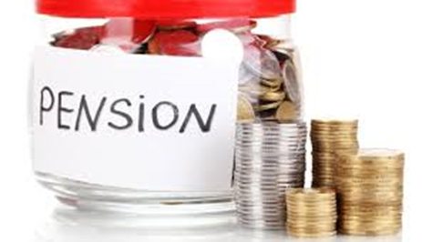

# Forbrugeraftaler og forbrugerbeskyttelse

---

***Indledningsvis skal du som studerende være særlig opmærksom på følgende problemstillinger ved gennemgangen af "forbrugeraftaler og forbrugerbeskyttelse":***

•	**Forbrugerbeskyttelse ved erhvervelse af fast ejendom; fortrydelsesret og tilbud, tilbagekaldelse og sælgers accept, LFFE kapitel 2** 
  
•	**Forbrugeraftaleloven, §§ 3-6** 

•	**Fortrydelsesret, §§ 18-24** 

•	**Uanmodet henvendelse (forbrugeraftalelovens § 4 og markedsføringslovens § 10)**
  
--- 

## Introduktion til forbrugeraftaleloven

Forbrugeraftalelovens (FBL) formål:.^[Følgende afsnit om forbrugeraftaler bygger på *Sonny Kristoffersen*: ”Kend forbrugerkøbsreglerne”, 2018, Samfundslitteratur.]

* Beskyttelsespræceptiv – loven kan ikke fraviges til skade for forbrugeren, FBL § 33, men forbrugeren kan godt stilles bedre end, hvad lovgivningen tilsiger.

Speak 4-1

Forbrugeraftale: Indgås mellem to parter, hvor den erhvervsdrivende indgår aftalen som led i sit erhverv, mens den anden part (forbrugeren) handler uden for sit erhverv, jf. FBL § 2, stk. 1.

Speak 4-2

Erhvervsdrivende formidlere: En erhvervsdrivende formidler, der skaber kontakt imellem private handlende, skal også overholde forbrugeraftaleloven

– se sag om QXL (internet-auktionsudbyder).

Speak 4-3 

 
Skærpede krav ved B2C ift B2B: Virksomheder, der handler med forbrugere, skal overholde forbrugeraftaleloven.

**Bevisbyrde** - aftaletype: Den erhvervsdrivende, som påstår aftalen ikke er en forbrugeraftale, har bevisbyrden, jf. FBL § 2, stk. 2.

Speak 4-4:

 
Forbrugerombudsmanden(FOB): Særligt FOB fører tilsyn med at FBL overholdes – se www.forbrug.dk
 

 

## Forbud mod uanmodet henvendelse

**Hovedregel**: Forbud mod uanmodet telefonisk eller direkte personlig henvendelse til forbrugere på deres bopæl, arbejdsplads, skoler, gymnasier, universiteter eller andre steder, hvor der ikke er almindelig adgang, fx også foreninger, hvis henvendelsen fra virksomheden har til formål at opnå en aftale med forbrugeren, jf. FBL § 4, stk. 1.
 
Speak 4-5

**Undtagelser**: FBL § 4, Stk. 2 – telefoniske henvendelse må gerne ske hvis det handler om:

* Bestilling af bøger,
* Tegning af abonnement på aviser, ugeblade og tidsskrifter
* Formidling af forsikringsaftaler og
* Tegning af abonnement, der omfatter redningstjeneste eller sygetransport.

 
## Telefonsalg
 
Ved telefoniske henvendelser omfattet af FBL § 4, Stk. 2, bestilling af bøger, abonnementer på aviser mv. skal forbrugeren ved hvert opkald have oplysning om:
 
* Den erhvervsdrivendes identitet

* Navnet på den person, som forbrugeren er i kontakt med i telefonen

* Telefonsælgerens forbindelse til den erhvervsdrivende, og

* Det kommercielle formål med telefonhenvendelsen.

 
Virksomheden skal tjekke	Robinson-listen inden henvendelse ellers er det en overtrædelse af markedsføringslovens § 10, stk. 4, nr. 2 og 3.

Derudover gælder markedsføringslovens § 10, stk. 6: Den erhvervsdrivende skal ved den første henvendelse til forbrugeren, oplyse om retten til at frabede sig uanmodede henvendelser fra den erhvervsdrivende i fremtiden.

## Salg uden for den erhvervsdrivendes faste forretningssted

Henvendelse fra en erhvervsdrivende må gerne ske:

* På offentlige steder, hvortil der er almindelig adgang, fx gader, veje, pladser og andre steder som fx togstationer og restauranter. Der kan dog være andre forbudsregler på de steder.

* Til virksomheder og offentlige institutioner, hvis henvendelse vedrører tilbud om bestilling af varer og ydelser, der anvendes i virksomheden/institutionen.

* På bopælen, hvis det ikke har med erhvervsmæssigt salg at gøre, fx henvendelser vedrørende religion, indsamlinger til velgørende formål, salg af lodsedler, spørgsmål i forbindelse med markedsundersøgelser mv.

 
**Aftalen er ugyldig**: Aftaler indgået i strid med FBL § 4 er ugyldig, jf. FBL § 5. Forbrugeren kan godt fastholde aftalen uanset ugyldighed

**Bødestraf**: Det kan være forbundet med bødestraf, for virksomheden, at handle i strid med forbrugeraftaleloven, jf. FBL § 34 - se H&M sag om opringninger på mobiltelefoner.

Speak 4-6

 
**Robinson-listen**: En forbrugers tilmelding til Robinson-listen skal forhindre henvendelser fr virksomheder om produkter omfattet af FBL § 4, stk. 2. Overtrædelse straffes med bøde.

 
## Forbud mod negativ aftalebinding

* En forbruger kan som udgangspunkt ikke blive bundet ved sin passivitet, jf. fbl § 6.

* Ses særligt inden for TV/sattelitaftaler,IT/internetforbindelser, avis- og blad abonnementer

* Hvis en forbruger modtager en vare fra en virksomhed, som han ikke har bestilt, og det ikke skyldes en fejl, kan forbrugeren beholde varen uden at skulle betale.

* Det samme gælder for tjenesteydelser/arbejde som
en erhvervsdrivende udfører, uden at forbrugeren har bedt om det.

* Området er tæt forbundet med princippet om god markedsføringsskik, jf. markedsføringslovens § 3 og god erhvervsskik i denne lovs § 4. 

Det kan også være en vildledning af forbrugerens retsstilling, jf. markedsføringslovens § 5.

Speak 4-7

 

 
## Aftaler indgået uden for den erhvervsdrivendes forretningssted

Aftalen er indgået et andet sted end der hvor den erhvervsdrivende sælger har sit forretningssted, fx

* Homeparties, salgsdemonstrationer under udflugter, 
  udstilling/messe, marked.
 
Den erhvervsdrivende har pligt til at give tydelig skriftlig oplysning om fortrydelsesretten og hvortil henvendelse kan ske. 

Oplysning skal gives:

* Ved mødet med forbrugeren.

* Ved varesalg – når varen overgives eller leveres fysisk til  
  forbrugeren.

Fortrydelsesfristen begynder først at løbe, fra det tidspunkt forbrugeren modtager oplysningerne, hvis de ikke modtages, så udskydes fortrydelsesfristens begyndelsestidspunkt med 12 måneder, se nærmere nedenfor.

 
### Fjernsalg

* Fjernsalg er en aftale om salg af varer eller salg af 
  tjenesteydelser, eller aftale om løbende levering af varer eller 
  tjenesteydelser.
  
* Aftalen indgås på afstand ved fjernkommunikation, fx e-handel, 
  aftale indgået pr. e-mail, telefonsalg, katalog- og 
  postordresalg.
  
* Den erhvervsdrivende og forbrugeren mødes ikke fysisk ved aftalens   indgåelse. Forbrugeren har ikke haft mulighed for at afprøve eller   undersøge salgsgenstanden.

* Aftalen skal være indgået, som led i et system for fjernsalg, og 
  den skal drives af den erhvervsdrivende, fx en aftale om køb, 
  indgået via virksomhedens hjemmeside.
 

I rimelig tid inden aftalen indgås,	skal den erhvervsdrivende give forbrugeren oplysninger, fx om:

* Den erhvervsdrivendes navn og forretningsadresse, tlf. 
  numre-mailadresse m.v.
  
* Varens eller tjenesteydelsens vigtigste egenskaber.

* Den samlede pris, inkl. gebyrer, moms og afgifter, øvrige 
  ekstraomkostninger, fx til levering, bestillingstakster, 
  servicetakst.
  
* Betalingsvilkår, leveringsvilkår, aftaleperiode, eventuel 
  uopsigelighedsperiode og opsigelsesvilkår.
  
* Oplysninger om der er fortrydelsesret og hvordan den kan udøves, 
  herunder om forbrugeren skal betale for tilbagelevering af en vare
  
* Oplysningerne skal være klare og forståelige.
 
* Oplysningerne skal meddeles på papir eller andet varigt medium.

* Snarest muligt efter aftalens indgåelse, skal der gives 
  oplysninger om:
  
* Fortrydelsesfristens begyndelsestidspunkt

* Betingelserne for at fortryde

* Fremgangsmåden ved forbrugerens brug af fortrydelsesretten og

* Hvortil/til hvem fortrydelse kan meddeles

Ved køb af varer som skal sendes til forbrugeren, skal oplysning om fortrydelsesfristen gives senest ved varen overgivelse. Hvis oplysning først kommer frem senere, løber fristen fra oplysningerne er modtaget.

Hvis der ikke modtages nogen oplysninger om fortrydelsesretten så udskydes fortrydelsesrettens begyndelsestidspunkt med 12 måneder
 

***Varer og ikke-finansielle tjenesteydelser:***  

**Forsinkelse med levering**

 
* Hvis leveringstidspunkt ikke er aftalt: Varen/tjenesteydelsen skal 
  leveres inden 30 dage fra bestillingen, jf. FBL § 27, stk. 1.

* Forbrugeren kan hæve aftalen hvis forsinkelsen er væsentlig for 
  forbrugerne og den erhvervsdrivende burde forudsætte dette.

* Forbrugeren kan vælge at give en frist for levering, overholdes den ikke, kan aftalen hæves.

* Hvis en aftale hæves skal hver part tilbagelevere hvad de hver især har modtaget.

* Den erhvervsdrivende skal tilbagebetale penge til forbrugeren, 
  senest 30 dage fra den erhvervsdrivende har modtaget besked om, at   forbrugeren vil fortryde

 

### Forbrugerens fortrydelsesret i forbrugeraftaleloven

Fortrydelsesret: En ret for forbrugeren til uden angivelse af begrundelse, at træde tilbage fra e aftale, som ellers ville være bindende for forbrugeren.
 

**HR:** Ingen fortrydelsesret i dansk ret i den fysiske handel.

**Undtagelse: FBL § 18, stk. 1**.

* Forbrugeraftaler indgået ved fjernsalg.
* Forbrugeraftaler indgået uden for fast forretningssted.
 

Fortrydelsesret: Andre særregler
Fortrydelsesret ved køb af fast ejendom, jf. lov om forbrugerbeskyttelse ved erhvervelse af fas ejendom.

* En køber kan fortryde et køb af en fast ejendom i 6 hverdage fra aftalens indgåelse mod samtidig betaling af en godtgørelse til sælger på 1% af kontantkøbesummen.

Fortrydelsesret ved indgåelse af forsikringsaftaler

* 14 dage fra forsikringsaftalens indgåelse, og 30 dage hvis aftale om livsforsikring eller individuelle pensionsordninger, FAL § 34i-k
 

Fortrydelsesfristen 14 dages beregning

 
Fortrydelsesfristen beregnes fra forskellige tidspunkter, jf. FBL § 19, stk. 2 – aftale om køb af:

* Tjenesteydelse – beregnes fra aftalens indgåelse

* Flere varer der leveres enkeltvis – beregnes når den sidste vare 
  er i forbrugerens fysiske besiddelse

* Flere varer der leveres i partier – beregnes fra det sidste parti 
  er i forbrugerens fysiske besiddelse

* Varer der leveres regelmæssigt over en periode – beregnes fra den 
  første vare er i forbrugerens besiddelse

* Levering af vand, gas , elektricitet m.v. samt varer med digitalt 
  indhold – beregnes fra aftalens indgåelse

* Den dag, hvor forbrugeren har modtaget de oplysninger om 
  fortrydelsesret mv., som det påhviler den erhvervsdrivende at give   forbrugeren på papir eller andet varigt medium.
 

Forbrugeren har fortrydelsesret i:

* Forbrugeraftaler indgået ved fjernsalg
* Forbrugeraftaler indgået uden for den erhvervsdrivendes forretningssted fx på en messe i Bellacentreret
 
* Forbrugeren skal meddele sin fortrydelse ved en utvetydig 
  erklæring evt. bruge standardfortrydelsesformular
  
* Meddelelse om fortrydelse skal være afsendt inden fristens udløb

* Forbrugerne skal have sine penge tilbage

* Forbrugeren skal sende varen tilbage senest 14 dage efter at den 
  erhvervsdrivende har modtaget besked om fortrydelse
  
* Forbrugeren bærer risikoen for varen

* Ved værdiforringelse (forskellen mellem ny-pris og gensalgspris) 
  skal forbrugeren betale. Der kan fradrages i den købesum den 
  erhvervsdrivende skal tilbagebetale til kunden

 
### Retsvirkning ved fortrydelse

Ved tilbagetræden fra aftalen inden fortrydelsesfristens udløb, bortfalder aftalen, og:

* Hver part tilbageleverer ydelse/modydelse.

* Hvis forbrugeren har betalt helt eller delvis, skal det modtagne 
  tilbagebetales til forbrugeren.
  
* Tilbagebetaling skal ske snarest muligt og senest 30 dage efter, 
  at den erhvervsdrivende har modtaget forbrugerens meddelelse om  
  ophævelse.
  
* Den erhvervsdrivende kan vente indtil varen er returneret eller 
  indtil forbrugeren har dokumenteret at varen er tilbagesendt

 

### Fjernsalg - Finansielle tjenesteydelser

#### Oplysningspligt, FBL § 14

Den erhvervsdrivende skal bl.a. give oplysninger om:

* CVR-nummer, eller andet relevant identifikationsnumme.r

* Klageadgang og fremgangsmåden ved klage, herunder oplysning om en 
  fysisk adresse.
  
* Fortrydelsesfristens begyndelsestidspunkt, varighed og 
  betingelserne for og fremgangsmåden ved brug af 
  fortrydelsesretten.
  
* Eventuelle særlige risici ved tjenesteydelsen som følge af 
  ydelsens særlige karakter.
  
* En eventuel lovvalgs- eller værnetingsklausul i aftalen. 

* Forbrugeren skal have oplysningerne på papir eller et andet varigt   medie.

En manglende overholdelse af pligten, kan straffes med bøde.

#### Fortrydelse - Fjernsalg af finansielle tjenesteydelser

**Finansiel tjenesteydelse:**

* Enhver tjeneste, der har karakter af bank-, kredit, forsikrings-, 
  individuel pensions-, investerings- eller betalingstjenesteydelse.

**Fortrydelsesfristen**

* 14 dage fra aftalens indgåelse, eller fra det tidspunkt 
  forbrugeren har modtaget oplysning om fortrydelsesret.

* 30 dage ved aftaler om individuel pensionsordning, FBL § 19, stk. 1.
  

**Tilbagebetale**  

* Den erhvervsdrivende skal tilbagebetale eventuelt modtagne beløb snarest mulig og inden 30 dage efter forbrugerens underretning om fortrydelse er kommet frem.

 

#### Fjernsalg - Finansielle tjenesteydelser: Fremgangsmåde ved fortrydelse

 
* Underrette den erhvervsdrivende om at forbrugeren vil bruge 
  fortrydelsesretten. Underretning skal være afsendt inden udløb af 
  fortrydelsesfristen.
  
* Forbrugeren har bevisbyrden for at meddelelsen er sendt.

* Meddelelsen om forbrugerens fortrydelse, skal være utvetydig – 
  standardfortrydelsesformular
 

## Urimelige aftaler

Urimelige aftaler kan tilsidesættes helt eller delvis. 

Generelle betragtninger- vurdering:

* Stridende mod hæderlig forretningsskik, jf. aftalelovens §§ 38c, 
  stk 1, jf. 36.
  
* Redelig handlemåde.

AFTL §§ 38a – 38 d – særligt kapitel om forbrugeraftaler:

* Ved tvivl om indholdet af en forbrugeraftale, tolkes aftalen til 
  fordel for forbrugeren (koncipistreglen).

* Aftaler skal være udarbejdet på en klar og tydelig måde, jf. 
  aftalelovens § 38b.
  
* Aftalelovens § 36 – redelig handlemåde.
 

## Løbende tjenesteydelser/abonnementer

En forbruger kan opsige en aftale om løbende levering af varer eller tjenesteydelser med 1 måneds varsel til udgangen af en måned, når der er gået 5 måneder efter aftalens indgåelse, jf. FBL § 28, stk. 1, fx abonnementslignende aftaler.

Speak 4-8:

---

## Quiz

### Quiz: E-handel

Kan du fortryde dit køb, når du handler på nettet? Hvad gælder for levering? Og hvad kan du gøre, hvis varen ikke dukker op? <a href="https://www.forbrug.dk/quiz/ehandelsquizzen/?rn=43716" target="_blank">Tag quizzen fra forbrug.dk, og få svar.</a>

---

### Quiz: E-handel og rejser

Bestiller du rejser på nettet? Der gælder særlige regler ved handel på nettet, som du skal være opmærksom på. <a href="https://www.forbrug.dk/quiz/e-handel-og-rejser/?rn=43716" target="_blank">Få styr på reglerne med forbrug.dk's quiz.</a>

---

### Quiz: Elektronik

I forbrug.dk’s quiz kan du teste, hvad du har ret til, hvis dit elektroniske udstyr, fx dit kamera, din computer eller din mobiltelefon, går i stykker. <a href="https://www.forbrug.dk/quiz/elektronik/?rn=43716" target="_blank">Tag testen her.</a>

---

### Quiz: Forbrugerrettigheder

Har du styr på, hvad du har ret til som forbruger? Jo mere du ved, jo bedre er du klædt på, når du står i butikken eller handler på nettet. <a href="https://www.forbrug.dk/quiz/forbrugerquizzen/?rn=43716" target="_blank">Test din viden her.</a>

---

### Quiz: Kopivarer

Har du styr på, om du må eje kopivarer i Danmark? Eller om du må tage dem med hjem fra et andet land? <a href="https://www.forbrug.dk/quiz/kopivarequizzen/?rn=43716" target="_blank">Prøv forbrug.dks quiz om kopivarer, og bliv klogere her.</a>

