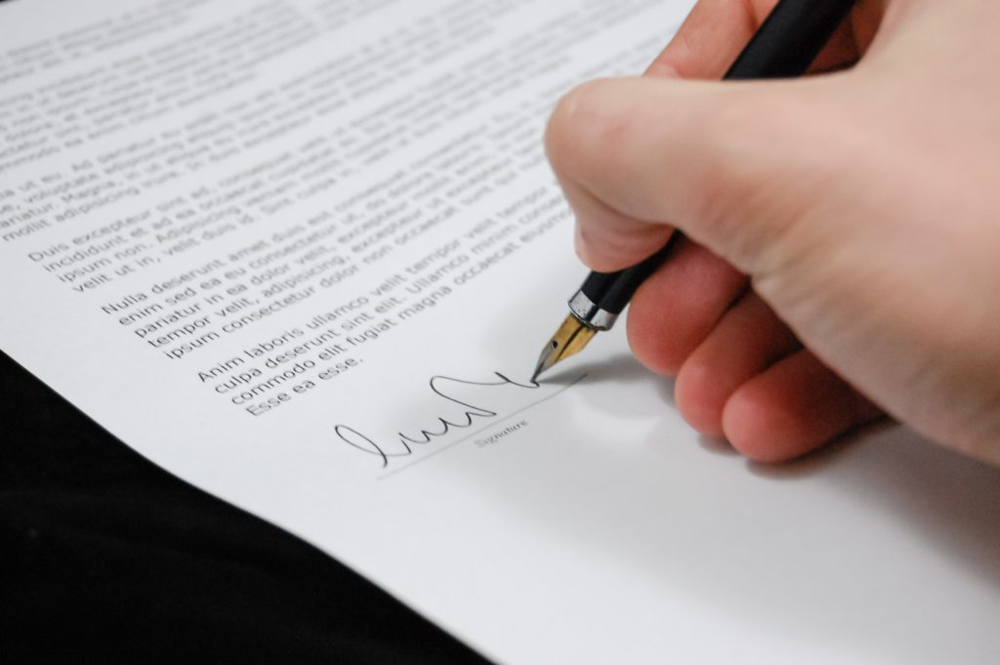
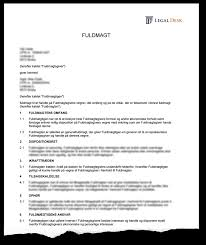

# Fuldmagter og mellemmænd


<script async src="https://widget.spreaker.com/widgets.js"></script>

<br>

<div class="video-container"><iframe src="https://www.youtube.com/embed/ugJt8-E7xJY" width="853" height="480" frameborder="0" allowfullscreen="allowfullscreen"></iframe></div> 


<a class="spreaker-player" href="https://www.spreaker.com/show/kapitel-2-aftaleloven" data-resource="show_id=3543307" data-width="100%" data-height="350px" data-theme="light" data-playlist="show" data-playlist-continuous="true" data-autoplay="false" data-live-autoplay="false" data-chapters-image="true" data-episode-image-position="right" data-hide-logo="true" data-hide-likes="true" data-hide-comments="true" data-hide-sharing="true" data-hide-download="true" data-cover="https://d1bm3dmew779uf.cloudfront.net/cover/bb453683459dec52bf6b9b83a3192674.jpg"></a>





* **Fuldmagt** (er reguleret af aftaleloven: Lovbekendtgørelse nr. 193 af 2. marts 2016 om aftaler og andre retshandler på formuerettens område) 

+ *Fuldmagt med særlig tilværelse*
  
+ *Fuldmagt uden særlig tilværelse*
  
* *Kommission* (Kommisionsloven Lovbekendtgørelse nr. 332 af 31. marts 2014) 
  
* *Handelsagenter* (Lov nr. 272 af 2. maj 1990 om                handelsagenter og handelsrejsende)


## Fuldmagtsforhold og aftaleindgåelse 


<script async src="https://widget.spreaker.com/widgets.js"></script>


```{r network4, echo=FALSE, result=TRUE,fig.cap=("Fuldmagtsforhold og aftaleindgåelse ")}

nodes <- data.frame(id = 1:3, 
                    shape = c("box"), 
                    label = c(" Fuldmagtsgiver "," Fuldmægtig "," Trediemand "),
                    font.size = c(35,35,35))
edges <- data.frame(from = c(1,2,3),
                    to = c(2,3,1),
                    label = c("Fuldmagt", "Aftale indgås",""),
                    # arrows = c("middle"),
                    length = c(300,300,200)
                    )

visNetwork(nodes, edges, width = "80%",avoidOverlap=2) %>% 
  visNodes(color = list(background = "white", 
                        border = "white",
                        highlight = "yellow"),
           shadow = list(enabled = TRUE, size = 30))  %>%
  # visHierarchicalLayout()
  visLayout(randomSeed = 24) %>% # to have always the same network
visEdges(color = list(color = "lightgrey", highlight = "yellow"))
```


*Fuldmagt:* Aftaleloven afsnit II, jf. aftalelovens §§ 10-27 ^[Følgende bygger tildels på *Torsten Iversens og Lars Hedegaard Kristensen* karnovkommentar til aftaleloven om fuldmagtsforhold]

**HR:** Fuldmagtsgiver bliver bundet af de aftaler, som fuldmægtigen indgår på fuldmagtsgivers vegne, jf. aftalelovens § 10, stk. 1:  

*”Den, som har givet en anden fuldmagt til at foretage en retshandel, bliver umiddelbart berettiget og forpligtet overfor tredjemand ved retshandel, som fuldmægtigen foretager i fuldmagtsgiverens navn og indenfor fuldmagtens grænser”*.


Fuldmagtsforholdet hviler normalt på en aftale mellem en fuldmagtsgiver og fuldmægtig, men kan herudover gives til kende ved en viljeserklæring til en eller flere tredjemænd eller ved en konkludent  handling, der tillader tredjemand at slutte, at fuldmagtsgiveren har udstyret fuldmægtigen med en fuldmagt (således som det er tilfældet ved stillingsfuldmagten ved et ansættelsesforhold). 

Aftalelovens bestemmelser indeholder ikke nogen udtømmende opregning af de måder, hvorpå en fuldmagt kan skabes. 

Anden optræden eller adfærd fra hovedmandens side end en viljeserklæring kan skabe fuldmagt, f.eks. overgivelse af dokumenter eller ved passivitet.

Speak23

En fuldmagt skabt ved passivitet kaldes ofte **adfærdsfuldmagt**. 

Adfærdsfuldmagt foreligger også, når hovedmanden i et tidsrum har tolereret, at en person har foretaget retshandler for ham, og hovedmanden har opfyldt de indgåede aftaler, idet tredjemand her er bibragt den opfattelse, at denne person faktisk har en fuldmagt.

En aftale kan i nogle tilfælde rammes af ugyldighed, hvis der er handlet i strid med en fuldmagt.

### Sondringen mellem bemyndigelse og legitimation


Aftaleloven sondrer mellem på den ene side **»legitimation«** og på den anden side **»beføjelse«**. 

Ved *»fuldmagt«* forstås således den magt eller kompetence (**legitimation**), fuldmægtigen har til inden for visse grænser at foretage retshandler med bindende virkning for fuldmagtsgiveren. 

Ved **»beføjelse«** (**bemyndigelse**) den ret eller tilladelse, fuldmægtigen iht. det mellem ham og fuldmagtsgiveren bestående retsforhold har til at optræde på dennes vegne:

* *Bemyndigelse/beføjelse:* Er således den interne instruks mellem fuldmagtsgiver og fuldmægtig. Indholdet af denne instruks er som udgangspunkt ikke kendt for omverdenen.

* *Legitimation:* Den ydre fuldmagt er synlig og kendt for omverdenen.  
 


 


 

 


## De 2 fuldmagtsformer


Der findes to fuldmagtsformer

1. Fuldmagt med særlig ttilværelse
2. Fuldmagt med uden særlig tilværelse

* **Fuldmagt med særlig tilværelse:**

  + Stillingsfuldmagt, jf. aftalelovens § 10, stk. 2
  + Specialfuldmagt, jf. aftalelovens § 13
  + Offentlig bekendtgjort fuldmagt, jf. aftalelovens § 14, stk. 1
  + Skriftlig fuldmagt/forevisningsfuldmagt, jf. aftalelovens § 16, stk. 1

### Fuldmagt uden særlig tilværelse


* Kaldes også **§ 18-fuldmagt**


  

### Fuldmagt med særlig tilværelse

#### Stillingsfuldmagt, jf. aftalelovens § 10, stk. 2:

> *”Indtager nogen ifølge aftale med en anden en stilling, som efter lov eller sædvane medfører beføjelse for ham til indenfor visse grænser at handle på den andens vegne, anses han befuldmægtiget til at foretage retshandler, som falder indenfor disse grænser”.* 





---

**Video om stillingsfuldmagten, jf. aftalelovens § 10, stk. 2**


<div class="video-container"><iframe src="https://www.youtube.com/embed/Zrg3TkUcot0" width="853" height="480" frameborder="0" allowfullscreen="allowfullscreen"></iframe></div>


---


Når du (fuldmagtsgiver) giver en anden (fuldmægtig) fuldmagt til at handle på dine vegne, bliver du som hovedregel bundet af den aftale din fuldmægtig indgår med tredjemand. 

Der er kun tale om en stillingsfuldmagt i § 10’s forstand, når du efter aftale med en anden (fuldmagtsgiver/arbejdsgiveren) indtager en stilling, dvs. er ansat hos den pågældende. 

Stillingsfuldmagten stiftes ved, at du efter aftale med fuldmagtsgiver indtager en vis stilling og faktisk indtager denne fx, at du er ansat i en bank, ejendomsmæglerkæde eller i et forsikringsselskab. 

Deraf følger så, at en advokat ikke har en stillingsfuldmagt for sin klient, og en tilsynsførende arkitekt eller ingeniør ingen stillingsfuldmagt fra bygherren. 

Tredjemand fx kunden kan påberåbe sig stillingsfuldmagten, selv om han ikke kender til ansættelsen af fuldmægtigen hos fuldmagtsgiveren.

* En ansat, har således via sin stilling, fuldmagt til at handle på vegne af fuldmagtsgiver (arbejdsgiver).

* Fuldmægtigen (den ansatte) har udadtil fuldmagt til at handle inden for stillingens grænser, dvs. den ansatte kan indgå de aftaler med tredjemand, som er sædvanlige for stillingen, fx en ejendomsmægler kan indgå en formidlingsaftale med en sælger af et hus.

* En kunderådgiver i en bank kan i sagens natur indgå aftaler om lån fra banken, men hun kan ikke indgå aftaler med et reklamebureau om ny markedsføringskampagne af bankens lån, medmindre hun har fået en udvidet bemyndigelse/særlig tilladelse fra fuldmagtsgiver fx hendes områdechef.

Situation: Fuldmægtigen indgår en aftale med tredjemand, der overskrider bemyndigelsen (den interne instruks fra fuldmagtsgiver).

* Fuldmagtsgiver er bundet af de aftaler fuldmægtigen indgår med tredjemand i strid med den interne instruks, hvis tredjemand var i god tro, jf. aftalelovens § 11, stk. 1.

**God tro:** Hvis det vurderes at tredjemand ikke indså eller burde have indset, at fuldmægtigen indgik en aftale der lå uden for sine beføjelser (den interne instruks).

Situation: Fuldmægtigen indgår en aftale med tredjemand, der ligger uden for legitimationen (stillingsfuldmagtens sædvanlige grænser).

* Fuldmagtsgiver er ikke bundet af de aftaler fuldmægtigen indgår med tredjemand, hvis de ligger uden for stillingens grænser, uanset tredjemands gode tro, fx at bankrådgiveren til en bankkunde giver tilsagn om et privat forbrugslån uden at lånet er bliver forrentet og uden stiftelsesomkostninger.

Stillingsfuldmagtens særlige tilværelse viser sig bl.a. derved, at fuldmagtsgiver bliver bundet over for en tredjemand i god tro, selv om fuldmagtsgiver ved konkret tilkendegivelse til fuldmægtigen har indskrænket dennes bemyndigelse, idet fuldmægtigen desuagtet stadig besidder den fuldmagt, der ifølge lov eller sædvane er forbundet med den stilling, fuldmægtigen besidder. 

Vil fuldmagtsgiveren indskrænke stillingsfuldmagten, må han degradere fuldmægtigen, dvs. afskedige ham fra stillingen og give ham en stilling med en mindre vidtgående stillingsfuldmagt, og dette må være kendeligt for omverdenen.


Sædvanens betydning er mange gange større end aftalelovens, når det gælder stillingsfuldmagt, men det er i sagens natur mindre sikkert, hvad der er sædvanligt, end hvad der står i loven. 

Efter almindelige bevisbyrderegler må den, der hævder, at der foreligger en fuldmagt, formentlig skulle godtgøre dennes rækkevidde, men da fuldmagtsgiver normalt er den, der sidder inde med oplysninger om stillingsbeskrivelsen, branchen, virksomheden og dens organisation og praksis, må fuldmagtsgiver være undergivet en betydelig forpligtelse til at bidrage til sagens oplysning. 

Domstolene må antages i hovedsagen at anse spørgsmålet om fuldmagtens rækkevidde som et retsspørgsmål, som det tilkommer domstolene at afgøre, jf maksimen *jura novit curia* (retten kender retsreglerne og ved, hvordan de anvendes, og gør det *ex officio*; af egen drift), og ikke som et spørgsmål om faktum, som det påhviler den ene part at føre bevis for.

Stillingsfuldmagtens grænser afhænger i første række af, hvilken stilling der er tale om, idet sædvanerne for forskellige stillinger er forskellige. 

En bankdirektør har en mere vidererækkende stillingsfuldmagt end en områdekundechef, og en områdekundechef en mere vidererækkende stillingsfuldmagt end en lokalafdelingschef. 

**Erstatning**: Hvis fuldmagtsgiver lider et dokumenteret økonomisk tab, fordi fuldmægtigen har handlet groft uagtsom eller forsætligt, kan fuldmægtigen i sjældne grove tilfælde blive erstatningsansvarlig over for arbejdsgiveren/fuldmagtsgiveren, jf. – erstatningsansvarslovens § 23, stk. 1:

**Erstatning, som en arbejdsgiver har måttet udrede som følge af en arbejdstagers uforsvarlige adfærd, kan kun kræves betalt af denne i det omfang, det findes rimeligt  under hensyn til den udviste skyld, arbejdstagerens stilling og omstændighederne i øvrigt.**

De vigtigste momenter i vurderingen af, om og i hvilket omfang arbejdsgiveren kan gøre regres mod arbejdstageren, er skyldgraden (normalt ikke regres ved skader, der er forvoldt ved simpel uagtsomhed; i modsætning til erstatningsansvarslovens § 19, stk. 3, indebærer forsæt eller især grov uagtsomhed dog ikke nødvendigvis fuldt ansvar for arbejdstageren, se herved U 2016 3069 V (regres ved betydelig uagtsomhed) og U 2006 356 V om regres ved en forsætligt forvoldt skade) og arbejdstagerens stilling (indtagelse af en overordnet stilling med ledelsesfunktioner vil f.eks. kunne tale for regres).


**Ophør af fuldmagtsforholdet:**

* En stillingsfuldmagt ophører og tilbagekaldes ved at fuldmægtigen fjernes fra stillingen, fx opsiges eller bortvises.

* Arbejdsgiveren bliver bundet af de aftaler  den opsagte indgår med tredjemand i opsigelsesperioden.

* I en opsigelsesperiode bør fuldmagtsgiver tage stilling til om fuldmægtigen stadig skal have  fuldmagt til at indgå de samme aftaler udadtil, eller der skal laves en ændring frem til fratrædelsestidspunktet.

---    

#### Specialfuldmagt, jf. aftalelovens § 13:  

”En fuldmagt, som er bragt til tredjemands kundskab ved en til ham særskilt rettet erklæring fra fuldmagtsgiveren, er tilbagekaldt, når særskilt erklæring om, at fuldmagten ikke længere skal gælde, er kommet frem til tredjemand”

* Kaldes også for legitimationsfuldmagt

* Fuldmagten er en særskilt erklæring, der meddeles direkte fra fuldmagtsgiver til tredjemand
  
* Tredjemand får direkte besked om fuldmagtens indhold
  
* Erklæringens form er ligegyldig

* Kan være både mundtlig og skriftlig

* Erklæringens fremkomst kan bevises, og dets indhold om tilbagekaldelse er klart
  
* En specialfuldmagt ophører/tilbagekaldes på samme måde som den blev stiftet
  
* Tilbagekaldelsen får virkning når den er kommet   frem – behøver ikke komme til tredjemands kundskab.
 
---

#### Offentlig bekendtgjort fuldmagt, jf. aftalelovens § 14:


Bestemmelsen har følgende ordlyd:

*”En fuldmagt, som af fuldmagtsgiveren er offentlig bekendtgjort i bladene eller på anden måde, tilbagekaldes ved en erklæring, som bekendtgøres på samme måde.* 

*Stk. 2. Er dette ikke muligt, skal tilbagekaldelsen tilkendegives på anden ligeså virksom måde. Fuldmagtsgiveren kan forlange, at den i § 17 omtalte myndighed skal afgøre, hvad han i så henseende har at foretage.*

*Stk. 3. Fuldmagten anses ikke som offentlig bekendtgjort, fordi den er tinglæst”.*

* Offentlig bekendtgjort fuldmagt - fx kuratorfuldmagt, der får fuldmagt til at behandle et konkursbo og varetage boets interesser eller udstedelse af prokura om at kunne handle på vegne af fx et selskab eller en forening.


#### Skriftlig fuldmagt/forevisningsfuldmagt, jf. aftalelovens § 16:

*”En skriftlig fuldmagt, som er overgivet fuldmægtigen, og som må anses bestemt til at være i hans besiddelse og at forevises for tredjemand, tilbagekaldes derved, at den på fuldmagtsgiverens forlangende tilbagegives ham eller tilintetgøres*.

*Stk. 2. Fuldmægtigen er pligtig til på forlangende at give fuldmagten tilbage til fuldmagtsgiveren”*.


* En skriftlig fuldmagt, der er beregnet til forevisning for andre – fx ”hent min pakke- fuldmagt”, generalfuldmagt.

* Ophører når fuldmagten tilbagegives til fuldmagtsgiver eller fuldmagten tilintetgøres.
 

 
## Fuldmagt uden særlig tilværelse, jf. aftalelovens § 18

* Denne type fuldmagt er kendetegnet ved, at den ikke er kendt eller synlig for omverdenen.

* Kaldes også for en aftalelovens § 18-fuldmagt:

*”En fuldmagt, der alene hviler på fuldmagtsgiverens erklæring til fuldmægtigen, er tilbagekaldt, når erklæringen om, at fuldmagten ikke længere skal gælde, er kommet frem til fuldmægtigen”*.

* Fuldmagten/instruksen gives ofte mundtligt, men kan også gives skriftligt.

* Der sondres ikke mellem bemyndigelse og legitimation, da fuldmagtens omfang og bemyndigelsen er sammenfaldende.
 

* Aftaler i strid med fuldmagten: Fuldmagtsgiver er ikke bundet af aftaler som fuldmægtigen indgår i strid med en § 18-fuldmagt, uanset om tredjemand var i god tro, jf. aftalelovens § 11, stk. 2.

* Tilbagekaldelse af fuldmagten kan ske på samme måde som den er givet.

* En tilbagekaldelse får virkning når den er kommet frem – behøver ikke at komme til kundskab.

---

**Video: Aftalelovens § 19 tilbagekaldelse af fuldmagt**


<div class="video-container"><iframe src="https://www.youtube.com/embed/JKyH0smEY9I" width="853" height="480" frameborder="0" allowfullscreen="allowfullscreen"></iframe></div>


---

### Aftalelovens § 25 – erstatning til tredjemand:


Bestemmelsen har følgende ordlyd:

*“Den, der optræder som fuldmægtig for en anden, indestår for, at han har fornøden fuldmagt.  Oplyser han ikke, at han havde sådan eller at hans retshandel er godkendt af den opgivne fuldmagtsgiver eller af andre grunde er bindende for denne, skal han erstatte den skade, tredjemand lider ved, at retshandelen ikke kan gøres gældende mod den opgivne fuldmagtsgiver*.

*Stk. 2. Denne bestemmelse kommer ikke til anvendelse, når tredjemand vidste eller burde vide, at den, som foretog retshandelen, ikke havde fornøden fuldmagt. Ej heller kommer den til anvendelse, når den, som foretog retshandelen, handlede i henhold til en fuldmagt, der var ugyldig eller uvirksom af grunde, som han var uvidende om, og som tredjemand ikke kunne påregne, at han vidste besked om"*

* Den der udadtil optræder som fuldmægtig for en anden, indestår for, at han rent faktisk har fornøden fuldmagt til at handle og indgå aftaler på vegne af fuldmagtsgiver.

* Fuldmægtigen er ved aftalens indgåelse garant for at:

* Fuldmagten eksisterer,

* Fuldmagten ikke er tilbagekaldt og

* Fuldmagten ikke er overskredet

Aftalelovens § 25 – erstatning til tredjemand (fortsat):

**HR:** Hvis fuldmægtigen ikke havde den fornødne fuldmagt til at handle, og aftalen derfor falder til jorden, kan tredjemand forlange erstatning hos fuldmægtigen, hvis han lider et økonomisk tab.

* **U1:** Erstatning kan ikke komme på tale, hvis tredjemand vidste eller burde vide, at fuldmægtigen ikke havde den fornødne fuldmagt.

* **U2:** Erstatning kan ikke komme på tale, hvis fuldmægtigen indgår aftaler, og ikke ved at fuldmagten i mellemtiden er blevet tilbagekaldt.

Fuldmægtigen indestår for, at han har den fornødne fuldmagt til at foretage den retshandel, han foretager (f.eks. afgivelse af tilbud eller accept af et banklån). 

Fuldmægtigen indestår efter alm regler ikke for, at fuldmagtsgiveren opfylder kontrakten, medmindre medkontrahenten har føje til at tro, at fuldmægtigen garanterer herfor. 

Fuldmægtigen kan blive ansvarlig over for medkontrahenten, hvis han undlader at give medkontrahenten meddelelser, fortier fuldmagtsgiverens insolvens for ham eller i øvrigt anvender svig.

Fuldmægtigen er altså i almindelighed ubetinget erstatningsansvarlig (objektivt ansvarlig), hvis det viser sig, at fuldmagten ikke var i orden. 

Dette stemmer med de almindelige regler om ansvaret i vanhjemmelslignende tilfælde af misligholdelse. 

Hvis fuldmægtigen er umyndig, kan et sådant ansvar ikke pålægges ham, men han kan ifalde erstatningspligt efter den almindelige culparegel, og medkontrahenten kan i så fald kræve erstatning for den **negative kontraktsinteresse** (det tab, han lider ved at stole på kontrakten), hvis fuldmægtigen har skuffet ham med forsæt eller uagtsomhed.

Aftalelovens § 25 indebærer, at tredjemand ikke selv behøver at undersøge fuldmagtens eksistens eller at forlange udtrykkelig garanti for, at fornøden fuldmagt foreligger, idet han er berettiget til at gå ud fra, at den, der optræder som fuldmægtig, også har den fornødne fuldmagt.

---

**Video: Erstatning efter aftalelovens § 25**


<div class="video-container"><iframe src="https://www.youtube.com/embed/pg3C6fbVoTs" width="853" height="480" frameborder="0" allowfullscreen="allowfullscreen"></iframe></div>


---


<br>

---

Fuldmægtigen skal erstatte tredjemand den positive opfyldelsesinteresse, dvs. tredjemand skal stilles som om aftalen var blevet indgået og ikke alene den negative kontraktsinteresse, dvs. stilles som om aftalen ikke var blevet indgået. 

Tredjemand kan altså kræve erstatning for det fulde tab, han lider ved, at løftet ikke kan gøres gældende imod den opgivne fuldmagtsgiver, inkl. fortjeneste. 

Tredjemand er ikke henvist til at nøjes med en erstatning for det tab, han har lidt ved at handle i tillid til fuldmagtens eksistens, han har krav på at blive stillet økonomisk, som om fuldmagten eksisterede. 

Hvis den opgivne fuldmagtgiver er kommet under konkurs, følger det af det anførte, at tredjemand kun kan kræve det beløb, som han, hvis fuldmagten havde været i orden, ville have erholdt af konkursboet.

---

**Video om fuldmagtens grænser**


<div class="video-container"><iframe src="https://www.youtube.com/embed/08Bm3t_CR9s" width="853" height="480" frameborder="0" allowfullscreen="allowfullscreen"></iframe></div>

---

### Eksamensopgave og løsning om fuldmagt/mellemmandsaftaler og ansættelsesret


***Eksamensopgave - Fix og Hjem***  


Kim er ansat i firmaet Fix og Hjem i Odense. Han blev ansat som salgsassistent den 1. januar 2013. 
Han er meget dygtig og meget omhyggelig med sit arbejde og bliver efterhånden meget vellidt af kunderne - både de lokale håndværkere og de private kunder. 

Den 1. januar 2014 bliver Kim forfremmet til butikschef for afdelingen i Odense.

En af hans gamle klassekammerater Andreas er flyttet til Odense, hvor han har købt et helt nyt hus og skal til at etablere haven. 

Andreas kommer til Fix og Hjem og møder Kim. De får snakket om gamle dage, og Andreas afgiver en ordre på fliser til en stor terrasse, materialer til et flot plankeværk og et sæt havemøbler i træ til 8 personer.

Andreas mener, at Kim må give en god rabat på sådan en stor ordre. Andreas får forhandlet sig frem til 25 % i rabat. 

Kim er egentlig ikke så glad bagefter, for han har en aftale med hovedkontoret om, at der max. må gives 10 % i rabat.

Andreas har lige startet sit eget firma, Swim der sælger havebassiner. Andreas præsenterer Kim for produkterne, og han får solgt 5 stk. havebassiner til Fix og Hjem til en samlet pris på 15.000 kr. 

Kim må ellers slet ikke købe varer ind, da det skal foregå centralt.

Karina blev ansat den 1. april 2012 som salgsassistent. 

Hun er nu i maj 2014 begyndt at sygemelde sig om mandagen og passer ikke sit job, som hun plejer. Kim kalder Karina ind til en samtale. 

Han forklarer hende, at det ikke kan fortsætte, og hun lover at tage sig sammen, men hun har haft nogle problemer med sin mave. 

Hun mener, det skyldes den travlhed, der er i firmaet. 

Kim lægger mærke til, at Karina forbedrer sig i de næste par måneder. 

Men i august 2014 er den gal igen. Karina har endnu mere fravær og er blevet endnu dårligere til sit arbejde. Kim vil gerne af med hende nu.

Sanne blev ansat som ansvarlig for afdelingens lager den 1. marts 2011. 

Hun er rigtig god til sit job og har ikke fravær og går ikke altid til tiden. Hendes beføjelser drejer sig om at styre lageret – altså hvor varerne skal være og sikre, at der gives besked til indkøbsafdelingen, hvis en vare er ved at være udsolgt.
 
Sanne bor sammen med Torben. Hendes svigerforældre har inviteret hende og Torben 1 uge til Paris i den sidste uge af juni. Det er hun meget glad for, da det altid har været en af hendes drømme at komme til Paris. 

Sanne spørger Kim om at få ferie i den uge. Kim bliver helt ude af den, da det er den uge, de kører et stort tema om haven, og de har en masse gode tilbud. Af erfaring ved Kim, at der er meget travlt.

**Eksamensspørgsmålene:**

1.	Er Fix og Hjem bundet af de aftaler som Kim 
    har indgået med Andreas?
2.	Hvilke muligheder har Fix og Hjem for at 
    opsige Karina?
3.	Har Sanne krav på at holde ferie så hun kan 
    komme til Paris? 
    

**Vejledende løsning fyld gerne selv på**:

1.	Er Fix og Hjem bundet af de aftaler som Kim har indgået med Andreas? Rabatten er Fix & Hjem bundet af, da inden for stillingsfuldmagten, men udenfor bemyndigelsen, men Andreas i god tro. De 5 havebassiner er måske også indenfor stillingsfuldmagten, men udenfor bemyndigelsen, og spørgsmålet er om Andreas er i god eller ond tro. Næppe OK.
<br>

2.	Hvilke muligheder har Fix og Hjem for at opsige Karina? Sygdom er jo lovligt forfald, men er de utilfredse med hende, bør hun have skriftlig advarsel, og hvis forholdene ikke forbedres, kan hun afskediges senere. Hvis hun afskediges nu, er hun formentligt berettiget til funktionærlovens § 2b-godtgørelse + 3 mdrs. opsigelsesvarsel. 
<br>

3.	Har Sanne krav på at holde ferie så hun kan komme til Paris? Det kommer an på, hvornår hun spørger om at få fri. Ferien ligger jo i hovedferien og det skal normalt varsles af medarbejderen med mindst 3 ugers varsel (som jeg husker det) og gør hun det, har hun krav på at komme afsted. I øvrigt dårlig stil at nægte hende at tage af sted pga. travlhed, da det jo egt. ikke er hendes problem. 
---
