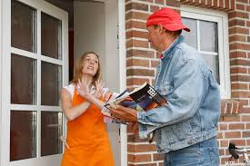

# Forbrugeraftaler og forbrugerbeskyttelse

```{r, echo=FALSE, results='asis'}
cat(readLines('np.html'))
```


---

*Indledningsvis skal du som studerende være særlig opmærksom på følgende problemstillinger ved gennemgangen af "forbrugeraftaler og forbrugerbeskyttelse":*


•	*Forbrugerbeskyttelse ved erhvervelse af fast ejendom; fortrydelsesret og tilbud, tilbagekaldelse og sælgers accept, Lov om forbrugerbeskyttelse ved erhvervelse af fast ejendom (LFFE) kapitel 2, se nærmere ebogens kap. 21* 
  
•	*Forbrugeraftaleloven, om det civilretlige forbrugerbegreb, om forbud mod uanmodet henvendelser og om forbud mod negativ aftaleindgåelse, jf. §§ 3-6* 

•	*Fortrydelsesretten på 14 dage, forbrugeraftaleloven §§ 18-24* 


--- 

## Introduktion til forbrugeraftaleloven


Forbrugeraftalelovens (FBL) formål:.^[Følgende afsnit om forbrugeraftaler bygger på *Sonny Kristoffersen*: ”Kend forbrugerkøbsreglerne”, 2018, Samfundslitteratur.]

Forbrugeraftaleloven kan vel karakteriseres som forbrugernes grundlov. Eller angivet som "færdselsloven" for den erhvervsdrivende, hvordan den erhvervsdrivende skal behandle forbrugeren, når der indgåes forbrugeraftaler.

Forbrugeraftaleloven er *beskyttelsespræceptiv* – loven kan ikke fraviges til skade for forbrugeren, FBL § 33, men forbrugeren kan godt stilles bedre end, hvad lovgivningen tilsiger, fx 6 måneders fortrydelsesretten i forhold til den lovpligtige fortrydelsesret på 14 dage.

En forbrugeraftale indgås mellem to parter, hvor den erhvervsdrivende indgår aftalen som led i sit erhverv, mens den anden part (forbrugeren) handler hovedsagelig uden for sit erhverv, jf. FBL § 2, stk. 1. Det kaldes for det *civilrelige forbrugerbegreb*.^[Se *Sonny Kristoffersen* artikel i U.2011B.258: Afgrænsning af det civilretlige forbrugerbegreb, se nærmere ebogens bibliotek.]

En erhvervsdrivende formidler er en, der skaber kontakt imellem private handlende, fx et internetauktionsfirma, som også skal overholde forbrugeraftaleloven.

---


Se sagen om QXL (internet-auktionsudbyder):

**Sø- og Handelsrettens dom afsagt den 18. juni 2009 i sag N-1-07:** QXL Ricardo Danmark A/S (QXL) er formidler som nævnt i forbrugeraftalelovens § 3, stk. 3, i forbindelse med salg på www.qxl.dk, når sælgeren er ikkeerhvervsdrivende, og køberen hovedsagelig handler uden for sit erhverv. QXL har derfor pligt til at give købere oplysning om fortrydelsesretten efter lovens § 11, stk. 1, nr. 5, og § 12, stk. 2, nr. 2, og til at modtage køberes underretning om brug af fortrydelsesretten efter lovens § 19, stk. 1. Ved ikke at have overholdt QXLs oplysningspligt efter forbrugeraftaleloven og ved ikke at have ført kontrol med, at erhvervsdrivende sælgere på deres website overholder deres pligter efter forbrugeraftaleloven, havde QXL handlet i strid med god markedsføringsskik, jf. markedsføringslovens § 3.


---

Den erhvervsdrivende, som påstår, aftalen ikke er en forbrugeraftale, har bevisbyrden, jf. FBL § 2, stk. 2.

Bedømmelsen i stk. 2 beror på en konkret vurdering. 

Se **Forbrugerklagenævnets sagsnr: 17/02094**, hvorefter køb af tilretning af brudekjole ikke blev anset som forbrugerkøb: "... Det er den erhvervsdrivende, der skal godtgøre, at der ikke er tale om en forbrugeraftale (forbrugeraftalelovens § 2, stk. 2). Bedømmelsen beror på en konkret vurdering. Nævnet vurderer, at den erhvervsdrivende ikke kan anses for at være erhvervsdrivende, da der er tale om et civilt køb. Nævnet har ved afgørelsen lagt vægt på, at den erhvervsdrivende ikke er CVR-registreret, at hun ikke har fast forretningssted som skrædder, og at hun ikke markedsfører sig selv som skrædder. Herudover har nævnet lagt vægt på, at parterne må antages at have indgået aftalen på baggrund af et privat bekendtskab, og at det herved er uklart om tilretning af brudekjoler skulle ske mod betaling. Der er således ikke tale om et forbrugerkøb, og Forbrugerklagenævnet har derfor ikke kompetence til at behandle sagen”.

---


Forbrugerombudsmanden (FOB) tilsyn med at FBL overholdes. 

De fleste konflikter afgøres af Forbrugerklagenævnet.^[Se nærmere *Sonny Kristoffersen* Ph.D-afhandling: "Det offentlige forbrugerklagesystem i et retssikkerhedsmæssigt perspektiv", 2019, Samfundslitteratur.]
 
---

## Forbud mod uanmodet henvendelse


Der er et forbud mod uanmodet telefonisk eller direkte personlig henvendelse til forbrugere på deres bopæl, arbejdsplads, skoler, gymnasier, erhvervsakademier, universiteter eller andre steder, hvor der ikke er almindelig adgang, fx også foreninger, hvis henvendelsen fra virksomheden har til formål at opnå en aftale med forbrugeren, jf. FBL § 4, stk. 1.



Forbuddet er især begrundet med privatlivets fred og for at imødegå overraskelsesmomentet, så forbrugeren ikke føler sig tvunget til at indgå en aftale. Evt. aftaler der er indgået ved dørtrinet er ugyldige, jf. fbl § 5.
 
Undtagelserne finder vi i FBL § 4, stk. 2, hvorefter telefoniske henvendelse gerne må ske, hvis det handler om:

* Bestilling af bøger,

* Tegning af abonnement på aviser, ugeblade og tidsskrifter

* Formidling af forsikringsaftaler og

* Tegning af abonnement, der omfatter redningstjeneste eller sygetransport.


---

## Telefonsalg


 
Ved telefoniske henvendelser omfattet af FBL § 4, stk. 2, om bestilling af bøger, abonnementer på aviser mv. skal forbrugeren ved hvert opkald have oplysning i telefonsamtalen om:
 
* Den erhvervsdrivendes identitet

* Navnet på den person, som forbrugeren er i kontakt med i telefonen

* Telefonsælgerens forbindelse til den erhvervsdrivende, og

* Det kommercielle formål med telefonhenvendelsen.


Virksomheden der gerne må ringe uanmodet, skal tjekke	*Robinson-listen* inden henvendelse, ellers er det en overtrædelse af markedsføringslovens § 10, stk. 4, nr. 2 og 3.

Derudover gælder markedsføringslovens § 10, stk. 6: 

"Den erhvervsdrivende skal derfor ved den første henvendelse til forbrugeren, oplyse denne om retten til at frabede sig uanmodede henvendelser fra den erhvervsdrivende i fremtiden".

---

## Salg uden for den erhvervsdrivendes faste forretningssted

Henvendelse fra en erhvervsdrivende må gerne ske:


På offentlige steder, hvortil der er almindelig adgang, fx gader, veje, pladser og andre steder som fx togstationer og restauranter. 

Der kan dog være andre forbudsregler på de steder.

Til virksomheder og offentlige institutioner, hvis henvendelse vedrører tilbud om bestilling af varer og ydelser, der anvendes i virksomheden/institutionen.


På bopælen, hvis det ikke har med erhvervsmæssigt salg at gøre, fx henvendelser vedrørende religion, indsamlinger til velgørende formål (reguleret af indsamlingsloven), salg af lodsedler, spørgsmål i forbindelse med markedsundersøgelser mv.

---


## Forbrugeraftalers ugyldighed og bødestraf

*Aftalen er ugyldig*: Aftaler indgået i strid med FBL § 4 er ugyldige, jf. FBL § 5. Forbrugeren kan godt fastholde aftalen uanset ugyldighed. 

Den erhvervsdrivende kan ikke påberåbe sig ugyldigheden.

*Bødestraf*: Det kan være forbundet med bødestraf, for virksomheden, at handle i strid med forbrugeraftaleloven, jf. FBL § 34 - se H&M sag om opringninger på mobiltelefoner.

*Robinson-listen*: En forbrugers tilmelding til Robinson-listen skal forhindre henvendelser fra virksomheder om produkter omfattet af FBL § 4, stk. 2. Overtrædelse straffes med bøde.

--- 

## Forbud mod negativ aftalebinding (-aftaleindgåelse)

En forbruger kan som udgangspunkt ikke blive bundet ved sin passivitet, jf. fbl § 6.

Ses særligt inden for TV/sattelitaftaler,IT/internetforbindelser, avis- og bladabonnementer

Hvis en forbruger modtager en vare fra en virksomhed, som forbrugeren ikke har bestilt, og det ikke skyldes en fejl, kan forbrugeren beholde varen uden at skulle betale.

Det samme gælder for tjenesteydelser/arbejde som en erhvervsdrivende udfører, uden at forbrugeren har bedt om det. Fx en vinduspudser, der går i gang med at vaske ens vinduer uden en aftale, er forbrugeren ikke bundet af. 


Området er tæt forbundet med princippet om god markedsføringsskik, jf. markedsføringslovens § 3 og god erhvervsskik i denne lovs § 4. 

Det kan også være en vildledning af forbrugerens retsstilling, jf. markedsføringslovens § 5.

---

## Aftaler indgået uden for den erhvervsdrivendes forretningssted


Aftalen er indgået et andet sted end der, hvor den erhvervsdrivende sælger har sit forretningssted, fx homeparties, salgsdemonstrationer under udflugter, udstilling/messe, marked.
 
Den erhvervsdrivende har pligt til at give tydelig skriftlig oplysning om fortrydelsesretten og hvortil henvendelse kan ske. 

Oplysningen skal gives:

Ved mødet med forbrugeren.

Ved varesalg – når varen overgives eller leveres fysisk til  forbrugeren.

Fortrydelsesfristen begynder først at løbe fra det tidspunkt, forbrugeren modtager oplysningerne, hvis de ikke modtages, så udskydes fortrydelsesfristens begyndelsestidspunkt med 12 måneder.


---

## Fjernsalg


*"Fjernsalg"* er en aftale om salg af varer eller salg af tjenesteydelser, eller aftale om løbende levering af varer eller  tjenesteydelser.
  
Aftalen indgås på afstand ved fjernkommunikation, fx e-handel, aftale indgået pr. e-mail, telefonsalg, katalog- og postordresalg.
  
Den erhvervsdrivende og forbrugeren mødes ikke fysisk ved aftalens indgåelse. 

Forbrugeren har ikke haft mulighed for at afprøve eller   undersøge salgsgenstanden.

Aftalen skal være indgået som led i et system for fjernsalg, og den skal drives af den erhvervsdrivende, fx en aftale om køb, indgået via virksomhedens hjemmeside.
 
---


---

I rimelig tid inden aftalen indgås,	skal den erhvervsdrivende give forbrugeren oplysninger, fx om:

Den erhvervsdrivendes navn og forretningsadresse, tlf. numre, mailadresse m.v.
  
Varens eller tjenesteydelsens vigtigste egenskaber.

Den samlede pris, inkl. gebyrer, moms og afgifter, øvrige ekstraomkostninger, fx til levering, bestillingstakster, servicetakst.
  
Betalingsvilkår, leveringsvilkår, aftaleperiode, eventuel uopsigelighedsperiode og opsigelsesvilkår.
  
Oplysninger om, hvorvidt der er fortrydelsesret og hvordan den kan udøves, herunder om forbrugeren skal betale for tilbagelevering af en vare
  
Oplysningerne skal være klare og forståelige.
 
Oplysningerne skal meddeles på papir eller andet varigt medium.

---

Snarest muligt efter aftalens indgåelse, skal der gives oplysninger om:
  
Fortrydelsesfristens begyndelsestidspunkt.

Betingelserne for at fortryde.

Fremgangsmåden ved forbrugerens brug af fortrydelsesretten og

Hvortil/til hvem fortrydelse kan meddeles.

---

Ved køb af varer som skal sendes til forbrugeren, skal oplysning om fortrydelsesfristen gives senest ved varens overgivelse. 

Hvis oplysning først kommer frem senere, løber fristen, fra oplysningerne er modtaget.

Hvis der ikke modtages nogen oplysninger om fortrydelsesretten, så udskydes fortrydelsesrettens begyndelsestidspunkt med 12 måneder. 

Hvis man slet ikke får oplysning om fortrydelsesretten, så er fortrydelsesfristen 12 måneder plus 14 dage.
 
---

*Varer og ikke-finansielle tjenesteydelser:*  

*Forsinkelse med levering*


Hvis leveringstidspunkt ikke er aftalt: Varen/tjenesteydelsen skal leveres inden 30 dage fra bestillingen, jf. FBL § 27, stk. 1.

Forbrugeren kan hæve aftalen, hvis forsinkelsen er væsentlig for forbrugeren, og den erhvervsdrivende burde forudsætte dette.

Forbrugeren kan vælge at give en frist for levering, overholdes den ikke, kan aftalen hæves.

Hvis en aftale hæves, skal hver part tilbagelevere, hvad de hver især har modtaget.

Den erhvervsdrivende skal tilbagebetale penge til forbrugeren, senest 30 dage fra den erhvervsdrivende har modtaget besked om, at forbrugeren vil fortryde

 
---

## Forbrugerens fortrydelsesret i forbrugeraftaleloven

---

**Video**

<iframe src="https://player.vimeo.com/video/309252373" width="640" height="360" frameborder="0" allow="autoplay; fullscreen" allowfullscreen></iframe>
<p><a href="https://vimeo.com/309252373">Hvad betyder 14 dages fortrydelsesret?</a> from <a href="https://vimeo.com/forbrugdk">Forbrug.dk</a> on <a href="https://vimeo.com">Vimeo</a>.</p>


---

*Fortrydelsesret* er en ret for forbrugeren til uden angivelse af begrundelse at træde tilbage fra en aftale, som ellers ville være bindende for forbrugeren.
 
Hovedreglen i dansk ret er, at der ingen fortrydelsesret er ved køb i den fysiske handel, medmindre den er aftalt mellem forbrugeren og den erhvervsdrivende, fx har Elgiganten en aftalt returret på 14 dage i sine fysiske butikker, som dog ikke må forveksles med den lovpligtige fortrydelsesret efter forbrugeraftaleloven.


Se her FBL § 18, stk. 1, hvor der er lovgivet om en fortrydelsesret:

* Forbrugeraftaler, der indgået ved fjernsalg, fx på nettet.

* Forbrugeraftaler, der indgået uden for fast forretningssted, fx i Bellacenteret.


 
---

*Fortrydelsesret: Andre særregler:*

Fortrydelsesret ved køb af fast ejendom, jf. lov om forbrugerbeskyttelse ved erhvervelse af fas ejendom:

En køber kan fortryde et køb af en fast ejendom i 6 hverdage fra aftalens indgåelse mod samtidig betaling af en godtgørelse til sælger på 1% af den nominelle købesummen, se nærmere ebogens kap. 21.

---

*Fortrydelsesret ved indgåelse af forsikringsaftaler:*

14 dage fra forsikringsaftalens indgåelse, dog 30 dage ved aftale om livsforsikring eller individuelle pensionsordninger, jf. FAL (forsikringsaftaleloven) § 34 i-k
 
---

*Fortrydelsesfristen 14 dages beregning*:

 
Fortrydelsesfristen beregnes fra forskellige tidspunkter, jf. FBL § 19, stk. 2 – aftale om køb af:

Tjenesteydelse – beregnes fra aftalens indgåelse

Flere varer der leveres enkeltvis – beregnes når den sidste vare er i forbrugerens fysiske besiddelse

Flere varer der leveres i partier – beregnes fra det sidste parti er i forbrugerens fysiske besiddelse

Varer der leveres regelmæssigt over en periode – beregnes fra den første vare er i forbrugerens besiddelse

Levering af vand, gas , elektricitet m.v. samt varer med digitalt indhold – beregnes fra aftalens indgåelse

Den dag, hvor forbrugeren har modtaget de oplysninger om fortrydelsesret mv., som det påhviler den erhvervsdrivende at give forbrugeren på papir eller andet varigt medium.
 
---

*Forbrugeren har således 14 dages fortrydelsesret i disse situationer:*

Forbrugeraftaler indgået ved fjernsalg.

Forbrugeraftaler indgået uden for den erhvervsdrivendes forretningssted, fx på en messe i Bellacenteret.

*Hvordan fortryder forbrugeren:*
 
Forbrugeren skal meddele sin fortrydelse ved en utvetydig erklæring evt. bruge standardfortrydelsesformular.
  
Meddelelse om fortrydelse skal være afsendt inden fristens udløb.

Forbrugerne skal have sine penge tilbage.

Forbrugeren skal sende varen tilbage senest 14 dage efter, at den erhvervsdrivende har modtaget besked om fortrydelse.
  
Forbrugeren bærer risikoen for varen.

Ved værdiforringelse (forskellen mellem ny-pris og gensalgspris) skal forbrugeren betale. 

Der kan fradrages i den købesum, den erhvervsdrivende skal tilbagebetale til kunden.

---

## Retsvirkning ved fortrydelse

Ved tilbagetræden fra aftalen inden fortrydelsesfristens udløb, bortfalder aftalen, og:

Hver part tilbageleverer ydelse/modydelse.

Hvis forbrugeren har betalt helt eller delvis, skal det modtagne tilbagebetales til forbrugeren.
  
Tilbagebetaling skal ske snarest muligt og senest 30 dage efter, at den erhvervsdrivende har modtaget forbrugerens meddelelse om ophævelse.
  
Den erhvervsdrivende kan vente, indtil varen er returneret, eller indtil forbrugeren har dokumenteret, at varen er tilbagesendt.

--- 

## Fjernsalg - Finansielle tjenesteydelser


### Oplysningspligt, FBL § 14


*Den erhvervsdrivende skal bl.a. give oplysninger om:*

CVR-nummer eller andet relevant identifikationsnummer.

Klageadgang og fremgangsmåden ved klage, herunder oplysning om en fysisk adresse.
  
Fortrydelsesfristens begyndelsestidspunkt, varighed og betingelserne for og fremgangsmåden ved brug af fortrydelsesretten.
  
Eventuelle særlige risici ved tjenesteydelsen som følge af ydelsens særlige karakter.
  
En eventuel lovvalgs- eller værnetingsklausul i aftalen. 

Forbrugeren skal have oplysningerne på papir eller et andet varigt medie.

En manglende overholdelse af oplysningspligten kan straffes med bøde.

---

### Fortrydelse - Fjernsalg af finansielle tjenesteydelser


*Finansiel tjenesteydelse:*

* Enhver tjeneste, der har karakter af bank-, kredit, forsikrings-, individuel pensions-, investerings- eller betalingstjenesteydelse.

---

*Fortrydelsesfristen*

Der er 14 dages fortrydelsesret fra aftalens indgåelse eller fra det tidspunkt, forbrugeren har modtaget oplysning om fortrydelsesretten.


Der er 30 dages fortrydelsesret ved aftaler om individuel pensionsordning, FBL § 19, stk. 1.

Fristerne skal beregnes i kalenderdage. 

---

*Tilbagebetale*  

Den erhvervsdrivende skal tilbagebetale eventuelt modtagne beløb snarest muligt og inden 30 dage efter, forbrugerens underretning om fortrydelse er kommet frem.

 
---

### Fjernsalg - Finansielle tjenesteydelser: Fremgangsmåde ved fortrydelse

Der skal ske underretning til den erhvervsdrivende om, at forbrugeren vil bruge fortrydelsesretten. 

Underretning skal være afsendt inden udløb af fortrydelsesfristen.
  
Forbrugeren har bevisbyrden for, at meddelelsen er sendt.

Meddelelsen om forbrugerens fortrydelse skal være utvetydig.

Der kan anvendes en standardfortrydelsesformular.
 
---

## Urimelige aftaler

Urimelige aftaler kan tilsidesættes helt eller delvis eller ændres efter aftalelovens § 36. 

Generelle betragtninger- vurdering:

Hvis det er stridende mod hæderlig forretningsskik, jf. aftalelovens §§ 38c, stk 1, jf. 36:

"En aftale kan ændres eller tilsidesættes helt eller delvis, hvis det vil være urimeligt eller i strid med redelig handlemåde at gøre den gældende. Det samme gælder andre retshandler.
Stk. 2. Ved afgørelsen efter stk. 1 tages hensyn til forholdene ved aftalens indgåelse,  aftalens indhold og senere indtrufne omstændigheder".

---
  
Hvis der er i strid med redelig handlemåde.

Aftalelovens §§ 38a – 38 d – særligt kapitel om forbrugeraftaler:

Ved tvivl om indholdet af en forbrugeraftale tolkes aftalen til fordel for forbrugeren (koncipistreglen), jf. aftalelovens § 38b.

Aftaler skal være udarbejdet på en klar og tydelig måde, jf. aftalelovens § 38b:

"Opstår der tvivl om forståelsen af en aftale, og har det pågældende aftalevilkår ikke været genstand for individuel forhandling, fortolkes vilkåret på den måde, som er mest gunstig for forbrugeren. Den erhvervsdrivende har bevisbyrden for, at et aftalevilkår har været genstand for individuel forhandling.

Stk. 2. En skriftlig aftale, der tilbydes forbrugeren,  skal af den erhvervsdrivende være udarbejdet på en klar og forståelig måde".
  
Se retspraksis:


**U.2005.2960 S** om vilkår om forlængelse af abonnementsaftale medmindre forbrugeren opsagde inden 30 dage før abonnementsperiodens udløb, blev tilsidesat af Sø- og Handelsretten:

"V solgte tv-signaler til forbrugere. I henhold til abonnementsaftalerne var de gældende for 12 måneder, og de fortsatte efter V's opfattelse medmindre de blev opsagt med 30 dages varsel til udgangen af en abonnementsperiode. I sager anlagt af Forbrugerrådet for to forbrugere fandt retten på grundlag af aftalernes udformning, herunder formuleringen af vilkårene for opsigelse, manglende definition af abonnementsperiode og parternes forklaringer at aftalernes vilkår om opsigelse, herunder om abonnementsperiode, manglede fornøden klarhed og forståelighed, hvorfor opsigelsesvilkårene skulle fortolkes i overensstemmelse med aftalelovens § 38b, stk. 1. Efter udløbet af en første bindingsperiode fandtes aftalerne derfor at kunne opsiges med et normalt, kort varsel svarende til 30 dages varsel til udgangen af en måned. Endvidere fandt retten efter en af Forbrugerombudsmanden nedlagt subsidiær påstand at vilkåret om automatisk forlængelse af kontrakten var i strid med god markedsføringsskik, jf. markedsføringslovens § 1, og hæderlig forretningsskik, jf. aftalelovens § 38c, jf. § 36. Vilkåret bevirkede en betydelig skævhed i parternes rettigheder og forpligtigelser til skade for forbrugeren og indebar at forbrugeren påførtes en betydelig risiko for af tilfældige årsager og imod eget ønske at komme til at få et abonnement forlænget i et år med en overflødig, ikke ubetydelig udgift til følge. Det blev derfor forbudt V i aftaler om løbende tjenesteydelser vedrørende levering af tv-signaler over for forbrugere at anvende en kontrakt som indeholdt følgende eller lignende vilkår: »Hvis kunden ikke opsiger aftalen med mindst 30 dages skriftligt varsel til udgangen af en abonnementsperiode, forlænges aftalen automatisk med en tilsvarende abonnementsperiode og så fremdeles«. Derimod kunne mere generelle påstande nedlagt af Forbrugerombudsmanden om forbud mod visse bindingsperioder ikke tages til følge, da spørgsmålet om en fastsættelse af almindelige, tvingende regler om adgangen til at opsige abonnementsaftaler med et vist varsel måtte afgøres af lovgivningsmagten (dissens). Endvidere blev V påbudt at underrette nærmere angivne kunder om at det pågældende vilkår ikke kunne håndhæves, og at kunderne havde et tilbagebetalingskrav mod V. Endelig blev det pålagt V at tilbagebetale allerede modtagne beløb der var opkrævet med urette".


---

## Løbende tjenesteydelser/abonnementer


En forbruger kan opsige en aftale om løbende levering af varer eller tjenesteydelser med 1 måneds varsel til udgangen af en måned, når der er gået 5 måneder efter aftalens indgåelse, jf. FBL § 28, stk. 1, fx abonnementslignende aftaler.

---

**Video**

<iframe src="https://player.vimeo.com/video/309251096" width="640" height="360" frameborder="0" allow="autoplay; fullscreen" allowfullscreen></iframe>
<p><a href="https://vimeo.com/309251096">Hvad er et abonnement?</a> from <a href="https://vimeo.com/forbrugdk">Forbrug.dk</a> on <a href="https://vimeo.com">Vimeo</a>.</p>


---


---


Se Forbrugerklagenævnets sagsnr.: *18/11554*, hvor et vilkår om fysisk fremmøde for opsigelse af fitnessabonnement var urimeligt. I henhold til den erhvervsdrivendes aftalevilkår skulle opsigelse af fitnessabonnementet ske ved, at forbrugeren ved fysisk fremmøde i det center, hvor han var indmeldt, udfyldte af en blanket. Forbrugeren havde fremsendt sin opsigelse til den erhvervsdrivende per mail. Nævnet vurderede, at vilkåret om krav om fysisk fremmøde, som betingelse for opsigelse af fitnessabonnementsaftalen, måtte anses for at være urimeligt og lagde herved vægt på, at der som udgangspunkt ikke kan stilles formkrav til en opsigelse, og at der ikke foreligger oplysninger om saglige hensyn, der i tilstrækkelig grad kan begrunde vilkåret.


---

*VIdeo: Hvis du skal købe en brugt bil*

<iframe title="vimeo-player" src="https://player.vimeo.com/video/309274737" width="640" height="360" frameborder="0" allowfullscreen></iframe>

---

**Video**

<iframe src="https://player.vimeo.com/video/305926728" width="640" height="360" frameborder="0" allow="autoplay; fullscreen" allowfullscreen></iframe>
<p><a href="https://vimeo.com/305926728">S&aring;dan handler du trygt p&aring; nettet i EU</a> from <a href="https://vimeo.com/forbrugdk">Forbrug.dk</a> on <a href="https://vimeo.com">Vimeo</a>.</p>


---

**Quiz: E-handel**


Kan du fortryde dit køb, når du handler på nettet? Hvad gælder for levering? Og hvad kan du gøre, hvis varen ikke dukker op? <a href="https://www.forbrug.dk/quiz/ehandelsquizzen/?rn=43716" target="_blank">Tag quizzen fra forbrug.dk, og få svar.</a>

---

Nethandel #heltsikkert giver dig én samlet indgang til information om, hvordan du handler sikkert på nettet, og hvad du kan gøre, hvis det er gået galt.  >>

https://www.forbrug.dk/nethandel/

---

**Video**

<iframe src="https://player.vimeo.com/video/309249919" width="640" height="360" frameborder="0" allow="autoplay; fullscreen" allowfullscreen></iframe>
<p><a href="https://vimeo.com/309249919">K&oslash;ber du brugt p&aring; nettet?</a> from <a href="https://vimeo.com/forbrugdk">Forbrug.dk</a> on <a href="https://vimeo.com">Vimeo</a>.</p>


---

**Video**

<iframe src="https://player.vimeo.com/video/305939499" width="640" height="360" frameborder="0" allow="autoplay; fullscreen" allowfullscreen></iframe>
<p><a href="https://vimeo.com/305939499">Skal du rejse i juletiden?</a> from <a href="https://vimeo.com/forbrugdk">Forbrug.dk</a> on <a href="https://vimeo.com">Vimeo</a>.</p>


---


**Quiz: E-handel og rejser**


Bestiller du rejser på nettet? Der gælder særlige regler ved handel på nettet, som du skal være opmærksom på. <a href="https://www.forbrug.dk/quiz/e-handel-og-rejser/?rn=43716" target="_blank">Få styr på reglerne med forbrug.dk's quiz.</a>

---

**Quiz: Elektronik**


I forbrug.dk’s quiz kan du teste, hvad du har ret til, hvis dit elektroniske udstyr, fx dit kamera, din computer eller din mobiltelefon, går i stykker. <a href="https://www.forbrug.dk/quiz/elektronik/?rn=43716" target="_blank">Tag testen her.</a>

---

**Quiz: Forbrugerrettigheder**


Har du styr på, hvad du har ret til som forbruger? Jo mere du ved, jo bedre er du klædt på, når du står i butikken eller handler på nettet. <a href="https://www.forbrug.dk/quiz/forbrugerquizzen/?rn=43716" target="_blank">Test din viden her.</a>

---

**Video**

<iframe src="https://player.vimeo.com/video/309251933" width="640" height="360" frameborder="0" allow="autoplay; fullscreen" allowfullscreen></iframe>
<p><a href="https://vimeo.com/309251933">Hvad er en kopivare?</a> from <a href="https://vimeo.com/forbrugdk">Forbrug.dk</a> on <a href="https://vimeo.com">Vimeo</a>.</p>


---

**Quiz: Kopivarer**


Har du styr på, om du må eje kopivarer i Danmark? Eller om du må tage dem med hjem fra et andet land? <a href="https://www.forbrug.dk/quiz/kopivarequizzen/?rn=43716" target="_blank">Prøv forbrug.dks quiz om kopivarer, og bliv klogere her.</a>


---


