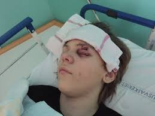
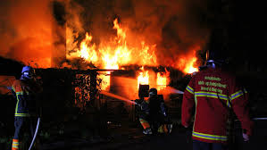
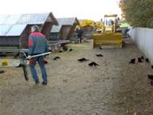

# Erstatningsreglerne og den forsikringsmæssige afdækning

```{r, echo=FALSE, results='asis'}
cat(readLines('np.html'))
```


*Indledningsvis skal du som studerende være særlig opmærksom på følgende i forbindelse med gennemgangen af erstatningsansvar og den forsikringsmæssige dækning i forhold til eksamen:*


•	*Grundlæggende erstatningsbetingelser; ansvarsgrundlag, årsagsforbindelse, påregnelighed, økonomisk tab og værnet interesse*

  
•	*Principalansvar (arbejdsgiverens hæftelsesansvar i DL 3-19-2)*

•	*Ansvarets sammenhæng med forsikringsdækning, erstatningsansvarslovens (forkortet; EAL) §§ 19 – 23*

*OBS: Videoerne, domme og Forsikringsankenævnets afgørelser i herværende afsnit er ikke en del af pensum, men tjener udelukkende det formål at bidrage med en bedre forståelse for emnerne om erstatningsansvaret og den forsikringsmæssige afdækning.*

---

**Video: Introduktion til erstatningsretten**


<div class="video-container"><iframe src="https://www.youtube.com/embed/aUJNx9bEge4" width="853" height="480" frameborder="0" allowfullscreen="allowfullscreen"></iframe></div>


---

## Erstatningsansvar uden en lovgivning

Tegning af en forsikring kan påvirke ens erstatningsansvar. Ligesom manglende tegning af en forsikring kan påvirke ens erstatningsansvar.^[Følgende afsnit om erstatningsansvaret og den forsikringsmæssige afdækning bygger hovedsagelig på *Sonny Kristoffersen* bøger "Kend Erstatningsreglerne", på forlaget Samfundslitteratur, se e-bogens bibiotek, samt "Introduktion til forsikringsreglerne", på forlaget Hans Reitzel, se nedenfor bibliotek.]


Et ansvarsforsikringsselskab beskæfter sig indgående med erstatningsreglerne for at vurdere, om skadevolderen (dvs. forsikringstageren) har pådraget sig et erstatningsansvar over for en skadelidt. 

Ofte findes der ingen lovgivning, som kan fortælle, hvornår man som privatperson er ansvarlig for en skade. 

I stedet er der ud af mange års domspraksis udledt en erstatningsregel, der kaldes *“den almindelige erstatningsregel”*. 

Denne regel fastslår, at man er ansvarlig for den økonomiske skade, som man har forvoldt ved uagtsomhed eller med vilje. 

Reglen hedder også culpa- eller skyldreglen ("culpa" betyder "skyld" på latin eller brøde, uagtsomhed, forseelse, synd), som kan føres tilbage romerrettens culparegel. 

Culpa er den grundlæggende betingelse for at pålægge erstatningsansvar uden for kontraktforhold. 

En skadevolder har udvist culpa, optrådt culpøst, overtrådt culpareglen, hvis skadevolder har handlet enten forsætligt, dvs. med vilje og viden om handlingens elementer, eller uagtsomt. 

Se følgende domme om erstatningsansvaret:  


---  


Se dommen *"FED 2012.2*: Landsretten fandt, at en tilskuer, der ved strafbar handling løb ind på fodboldbane og afbrød landskamp, var erstatningsansvarlig for DBU’s tab ved, at næste landskamp blev flyttet til en mindre  bane samt ved betaling af bøde til UEFA (1.869.269 kr. plus renter). Der forelå ikke egen skyld eller anledning til at reducere ansvaret efter EAL (erstatningsansvarsloven) § 24.

---


Se dommen **FED 2006.78:** Ansvarspådragende efter culpareglen, at en person, der kørte i en lånt bil, ikke sikrede sig, at der var olie og vand på bilen, uagtet temperaturlampen  lyste og uagtet, at han kort forinden med få dages mellemrum havde været nødsaget til at påfylde olie og vand. (Utrykt)


Se dommen **U 2015.572 H**: Tobaksselskaber ikke ansvarlige for varigt mén som følge af mangeårigt forbrug af cigaretter.

---     

Man er kun erstatningsansvarlig for skader, der kan gøres op i penge (økonomisk tab, som den skadelidte skal kunne bevise). 

Ved tingsskader vil det være værdien af eller reparation af det ødelagte. 

Ved personskader bliver det økonomiske tab beregnet efter reglerne i Lov om erstatningsansvar (forkortet; EAL). 

Det er f.eks. erstatning for varige mén, tabt arbejdsfortjeneste eller tab af forsørger. 

Se følgende domme, hvor der idømmes erstatningsansvar i forskellige situationer:  

---  


Se dommen **FED 2012.3:** A, der sad uden for golfbanens cafeteria, blev ramt i hovedet af golfbold, da B – som deltager i en polterabend – under golfspil kom til at slå bolden for langt. B, der kun én gang tidligere havde prøvet at spille golf og ikke havde modtaget undervisning heri, fandtes erstatningsansvarlig.*


Se dommen **FED 2009.114:**^[FED: Forsikring og Erstatningsretlig Domsamling.] En kvinde, som faldt i søvn som fører af en bil, påkørte og dræbte en modkørende bilist. Hun blev idømt en fængselsstraf på 10 måneder, men hendes kørsel kunne ikke karakteriseres som særlig hensynsløs, hvorfor afdødes ægtefælle ikke havde krav på godtgørelse i medfør af EAL § 26 a.

---

Se dommen i **FED 2008.1:**   En mandlig stripteasedanser B ansvarlig for øjenskade på deltager A i kvindelig polterabend, da B affyrede konfettirør. Ikke grundlag for at nedsætte erstatningen som følge af egen skyld eller accept af risiko.

<br><br><br><br>


---     

## Hændeligt uheld - uden ansvar


Er skaden forvoldt ved et *hændeligt uheld*, har vedkommende ikke gjort noget forkert og er ikke ansvarlig for skaden. 

Man skal heller ikke erstatte noget.


Åbner en hotelgæst eksempelvis døren til sit værelse indefra, i det øjeblik en tjener går forbi på gangen med en bakke med glas, og døren rammer bakken, så glassene falder på gulvet og knuses, er der tale om et hændeligt uheld. Uheldet kan ikke bebrejdes hotelgæsten, da han ikke havde mulighed for at undgå det. Han havde opført sig som “den gode hotelgæst” og ikke begået nogen fejl. 

Se afgørelserne fra retspraksis og Forsikringsankenævnet om spørgsmålet om hændelige skader:

---   



**U 1961.167 H**: At en 11-årig dreng kom til at ramme en anden dreng med en kæp i øjet, blev anset for et hændeligt uheld og derfor ikke noget erstatningsansvar.

**FED 1998.584:** Ejeren af sommerhus til udlejning havde ikke pådraget sig erstatningspligt ved, at en lejers barn kom til skade, da et sofabord, der var en del af sommerhusets møblement, væltede.

**FED 2019.04:** A kom til skade til en julefrokost, da hun faldt som følge af, at dansegulvet var vådt. Det var dokumenteret, at gulvet ikke i sig selv var glat, at det var blevet vasket i løbet af aften og forud for uheldet, og at det var første gang arbejdsgiveren afholdt julefrokost i lokalet. På denne baggrund fastslog landsretten, at det forhold, at nogle festdeltagere spildte drikkevarer på gulvet, ikke kunne føre til, at arbejdsgiveren havde handlet uforsvarligt. B blev derfor frifundet.

---

Afgørelser fra Ankenævnet for Forsikring:

**Ankenævnskendelse i sagsnr.: 35.936:** Klagers “griben ud efter” sit 15 måneder gamle barn, der var ved at falde, hvorved cigaretglød ødelagde en sofa, ikke anset som uagtsom adfærd, derfor ikke nogen erstatningspligt for sofaen.

**Ankenævnskendelse i sagsnr.: 39.737:** Gæstebudsskade at tabe kaffebakke under forsøg på at undgå at træde på et barn. Ikke erstatningsansvar, men dækket som gæstebudsskade over personens ansvarsforsikring.

**Ankenævnskendelse i sagsnr.: 51.809**: 8-årigt barn faldt over egne ben og væltede vase. Ikke erstatningsansvar, men dækket som gæstebudsskade.

---

*Gæstebudskade*: Hvis en gæst kommer til at ødelægge noget hjemme hos værten, fx vælter en dyr vase eller spilder rødvin på et tæppe, kaldes det for en gæstebudsskade. 

Ved gæstebudsskader er gæsten normalt ikke erstatningsansvarlig. Værten har derfor ikke krav på erstatning fra gæsten. 

Som vært må man altså acceptere, at der er en vis risiko, når man har nogen på besøg.

Nogle indboforsikringer – bl.a. Topdanmarks – dækker gæstebudsskader alligevel, selv om der ikke er noget ansvar for gæsten efter domstolspraksis. 

Det anbefales derfor, at man som vært beder gæsten kontakte sit forsikringsselskab, da de måske dækker skaden. I så fald vil man få erstattet skaden fratrukket forsikringens selvrisiko.

Hvs gæsten smadder værtens indbo i vrede, så er der selvfølgelig ikke tale om en gæstebudskade, men gæsten har et et erstatningsansvar.


---

Se dommen **FED 2003.1091:** Hønseejer var ikke ansvarlig for cyklists tilskadekomst, da cykel på landevej ramte fritgående høne.

Se dommen **U 2013.84 V:** Motionscyklist, der sammen med andre cyklister kørte i en gruppe, og som efter at være kommet ud i rabatten prøvede at komme op på vejen igen, hvorved han væltede, og der skete sammenstød med bagfrakommende cyklister, havde ikke handlet ansvarspådragende.

**H.K. af 24. juni 2002. Sag: 206/2002:** Museum var ikke ansvarligt for tilskadekomst, da gæst under privat besøg gled i hundeekskrementer og faldt.


---          

## Handlet forkert eller undladt at handle

Har skadevolder handlet forkert – dvs. er ansvarlig – er det vigtigt at finde ud af, om skaden er forvoldt ved en simpel uagtsomhed, grov uagtsomhed eller med forsæt (med vilje). 

Denne vurdering af handlingen eller undladelsen har bl.a. betydning for, om skadevolderens ansvarsforsikring skal betale for skaden hos skadelidte. 

---

Se her følgende domsafgørelser:  


**FED 2016.122:** Diskotek erstatningsansvarlig for personskade opstået ved, at diskotekets dørmand gik ud over det nødvendige og forsvarlige ved at skubbe eller kaste skadelidte ud af diskotekets dør.

**Ø.L.D. af 12. maj 2005. Sag: 20. afd., a.s. nr. B-2581-04:** Værtinde ifaldt erstatningsansvar, fordi hun bar et sofabord ned ad en trappe iført højhælede sko og uden at fjerne noget nips, der indskrænkede trappearealet, hvilket forårsagede, at hun tabte bordet, som ramte en gæst i hovedet. (Utrykt)


---     


## Den almindelige fornuftige person


Når en domstol bedømmer, om skadevolder har handlet forkert, sammenligner domstolen skadevolderens handling med, hvordan en almindelig fornuftig person ville have handlet i samme situation.

Begrebet afgrænser en uagtsomhed/en adfærd, der afviger fra de adfærdsnormer, der gælder inden for det pågældende område.

Kommer en domstol til det resultat, at en skadevolder har handlet anderledes, end hvad en alimindelig fornuftig person ville have gjort i samme situation, har skadevolderen handlet forkert og vil blive pålagt et erstatningsansvar.

Det skal bevises af skadelidte (kaldet en ”*ligefrem bevisbyrde*”). Det er hovedreglen i dansk ret; Den der vil gøre noget gældende, har også bevisbyrden herfor.

For at kunne få erstatning fra en skadevolder skal skadelidte ifølge retspraksis (domstolene) bevise følgende over for retten: 


*	Der er sket en skade og lidt et tab. 

*	Det er skadevolders skyld – skadevolder har handlet uagtsomt eller med forsæt.  

*	Der er årsagssammenhæng ("*kausalitet*") mellem den skete skade og det lidte tab, dvs. at tabet er en direkte følge af skaden.  

*	Der er påregnelighed ("*adækvans*") mellem skaden og tabet, dvs., at skadevolder burde kunne forudse, at skaden ville ske.  

Kan skadelidte ikke bevise det, er det ikke muligt at få erstatning fra en skadevolder eller dennes ansvarsforsikring, se følgende dom:

---     

Se dommen **FED 2007.111:** Forsikringstager havde ikke dokumenteret, at der var årsagsforbindelse mellem nogle anførte lidelser og et færdselsuheld.


---     


## Ansvar for ikke at gøre noget

Det er ikke kun handlinger, man kan blive erstatningsansvarlig for. 

I visse tilfælde kan man også blive erstatningsansvarlig for sine undladelser. 

Det sker oftest i situationer, hvor der er pligt til at handle. 

Eksempler er husejeren, der ikke gruser et isglat fortov, eller forældre, der ikke holder øje med deres børn.

---

Se dommen i **U 2019.1382 V**, hvor en spiludbyder havde handlet ansvarspådragende over for spiller og skulle erstatte tab, der skønsmæssigt blev fastsat til 1.200.000 kr.:
"A oprettede i 2010 en spilkonto hos en spiludbyder, U, der lukkede kontoen den 2. september 2013. I en sag anlagt af A mod U om erstatning for det tab, A havde lidt ved at spille, blev det lagt til grund, at spilkontoen blev lukket, da A selv havde givet udtryk for, at han led af ludomani. A forklarede, at han ret tidligt i forløbet havde fortalt, at han havde fået en erstatning som følge af en arbejdsskade, og at han også fortalte om sine psykiske problemer. Det blev lagt til grund, at der siden sommeren 2012 havde været en tæt og løbende kontakt mellem A og en ansat i U, og A havde i en mail af 7. september 2012 anført, at han indtil videre havde spillet for ca. 1,5 mio. kr. hos U. Den 11. oktober 2012 skrev han bl.a., at han ikke helt hyggede sig med at spille længere, men at det nu var lidt mere desperation for at prøve at vinde lidt af det tabte tilbage. Hans spilforbrug steg i perioden fra juni 2012 til november 2012 fra 0 kr. om måneden til 428.000 kr. om måneden. Fra maj 2012 til november 2012 forhøjede A flere gange sin grænse for indbetaling på sin spilkonto, som var 100 kr. i maj 2012 og 600.000 kr. i november 2012. Landsretten fandt under disse omstændigheder, at U i hvert fald omkring oktober 2012 burde have indset, at der var en betydelig risiko for, at A havde et alvorligt spilproblem, og at U burde have iværksat foranstaltninger med henblik på at søge dette afklaret og i givet fald f.eks. have taget yderligere skridt til at søge at motivere ham til at anvende forskellige beskyttelsesforanstaltninger, som kunne medvirke til at begrænse hans spil og eventuelt i sidste ende lukke spilkontoen. U havde ikke taget sådanne initiativer, og kundeforholdet og kontakten til A var fortsat efter oktober 2012 i det væsentlige uændret, herunder med løbende tildeling af forskellige former for bonus, der var med til at fastholde A i sit spil. U fandtes herefter i perioden fra oktober 2012 og indtil kontoens lukning at have handlet ansvarspådragende over for A og skulle erstatte det lidte tab. Efter oplysningerne om A’s spilforbrug i denne periode, og da der var den fornødne årsagssammenhæng, blev erstatningen skønsmæssigt fastsat til 1.200.000 kr."

---

## Ansvar for psykiske personskader


Udover at der kan tilkendes erstatningsansvar ved tingsskader, samt fysiske personskader, så kan der være erstatningspligt for psykiske personskader. 


---

Se her nævnte domme:  


**U 2012.524 H:** A blev sygemeldt efter et begivenhedsforløb på en personaleweekend og rejste krav om godtgørelse for svie og smerte mod kommunen K som arbejdsgiver. "Begivenhedsforløbet vedrørte en følelsesladet drøftelse i plenum af A’s sygdomsfravær, som ifølge A endte med, at hun i overværelse af sine kollegaer reelt blev fyret. K bestred ikke, at A var blevet påført en psykisk skade som følge af begivenhedsforløbet, og parterne var enige om opgørelsen af godtgørelseskravet. Højesteret udtalte bl.a., at udtrykket “personskade” i erstatningsansvarslovens § 1 må forstås i overensstemmelse med dansk rets almindelige erstatningsregler, og den psykiske skade, som A var blevet påført, var omfattet af bestemmelsen. Højesteret fandt endvidere, at personaleweekenden i forhold til A blev afviklet på en uforsvarlig måde, og at dette var ansvarspådragende for K som arbejdsgiver. Den uforsvarlige afvikling af personaleweekenden medførte en betydelig forøgelse af risikoen for en psykisk skade hos en medarbejder, som ledelsen må have forstået befandt sig i en psykisk anspændt situation, og Højesteret fandt, at A’s psykiske skade var en påregnelig følge. A var direkte skadelidt som følge af den ansvarspådragende adfærd, og der var ikke grundlag for at anse den psykiske skade for at falde uden for, hvad der var omfattet af kommunens erstatningspligt. K skulle herefter betale 50.000 kr. til A for svie og smerte. Landsretten havde frifundet K".


**U 2010.1609 H:** Psykisk personskade anset for omfattet af ulykkesbegrebet i ulykkesforsikring.

---

## Simpel uagtsomhed

Ved simpelt uagtsomhed (latin; *culpa levis*), har skadevolder handlet mere skødesløst, end hvad en almindelig fornuftig personen ville have handlet i den samme situation – den lille dagligdags uagtsomhed – er skadevolder erstatningsansvarlig. 

Simpel uagtsomhed er en uagtsomhed, som ikke kan betegnes som grov. 

Culpareglen omfatter som hovedregel begge former for uagtsomhed.

Forsikringsankenævnet og domstolene foretager et konkret skøn, om skadevolder har handlet simpelt uagtsomt. 

Hvis eksempelvis en fodgænger træder ud på vejbanen uden at se sig for og rammer en forbikørende cyklist, der vælter, kan uheldet bebrejdes fodgængeren, der har været mere skødesløs end “den gode fodgænger”. 

Derfor er fodgængeren erstatningsansvarlig for cyklistens økonomiske tab. 

---

Se følgende sager fra retspraksis og Forsikringsankenævnet, om spørgsmålet, om der er simpel uagtsomhed hos skadevolder:


Se dommen **U 1915.242 H**: (Uagtsom Brandstiftelse). En Tiltalt færdedes en Nat i et straatækket Udhus, hvor der henlaa Fourage og Halm, med en to Tommer lang; Lysestump, som han under sit Ophold i Udhuset tændte. Under sit Ophold i Udhuset røg han derhos Cigaret. Umiddelbart efter at Tiltalte havde forladt Udhuset, viste det sig, at der var Ild i dette, der nedbrændte. Antaget, at Tiltalte havde foraarsaget Ilden, og at der forelaa Tilsidesættelse af almindelig Forsigtighed.

---

Ankenævnet for Forsikring:


**Ankenævnskendelse i sagsnr.: 03.256**: Da forsikringstageren, som under pasning af skadelidtes blomster havde forvoldt skade på dennes gulvtæppe, ikke fandtes at have udvist et så uforsvarligt forhold, at han ville kunne gøres ansvarlig for skaden, var selskabet berettiget til at afslå at erstatte denne. (Utrykt).


**Ankenævnskendelse i sagsnr.: 03.308:** Da forsikringstageren, som under arbejde i sin svigerfars lejlighed forvoldte skade på el-hovedkablet, ikke fandtes at have udvist et så uforsvarligt forhold, at han ville kunne gøres ansvarlig for skaden, var selskabet berettiget til at afslå at erstatte denne (utrykt).

---

## Grov uagtsomhed

Grov uagtsomhed (latin; "*culpa lata*") er en betydelig form for uagtsomhed. 

Nyere retspraksis lægger vægt på, om skadevolderens adfærd indebar en ”indlysende fare” for den indtrådte skade. 

Skadevolderens bevidsthed om faren kan indgå i vurderingen af, om uagtsomheden er grov. 


Går en fodgænger over for rødt og vælter en cyklist, er fodgængeren nu mere uforsigtig end selv en skødesløs fodgænger. 

Det kan betegnes som grov uagtsomhed, og fodgængeren er erstatningsansvarlig. 

Det er en skønsmæssig vurdering, om domstolene og Ankenævnet for Forsikring anser en person for at have handlet groft uagtsomt.

---

Se her nævnte domme og ankenævnsafgørelser:

---


**U 1998.1693 H:** Opbevaring af nøglen til sikringsboksen i et auktionshus på et kontor i samme bygning var grov uagtsomhed.


**U 1999.1706 H:** Død ved fald på ca. 6 meter fra et tag ikke omfattet af ulykkesforsikring, da faldet var fremkaldt ved forsikredes forsæt eller grove uagtsomhed.


**U 1993.955 V:** Da kortvarig efterladelse af kuffert ved bagagebånd i lufthavn ikke var groft uagtsom, var tyveri af kufferten dækket af tyveriforsikringen.


**FED 2013.9:** Den 16-årige A ville ved ungdomsfest hjælpe værtinden med at tænde op i en udendørs pejs. I den forbindelse hældte han væske fra en dunk, som også værtinden havde benyttet i sit forsøg på at tænde op i pejsen, direkte ind i pejsen. Herved slog ilden tilbage og antændte A’s tøj samt dunken, som han i panik kastede fra sig. Den brændende dunk ramte en trækonstruktion og huset nedbrændte. Det viste sig, at væsken var benzin. Landsretten fandt, at A havde handlet groft uagtsomt, hvorfor hans ansvar ikke bortfaldt i medfør af erstatningsanvarslovens (EAL) § 19.




**FED 2010.93:** Forsikringsselskab fik ikke medhold i, at en 13-årig dreng udviste grov uagtsomhed da han startede en bygningsbrand ved at tænde en lighter samtidig med, at en kammerat to meter derfra hældte benzin på en knallert. Tillagt betydning bl.a., at benzindampe har en forholdsvis svag lugt og løber langs gulvet, og at der er store individuelle forskelle på menneskers lugtesans.

**FED 2001.2121:** Passager, som blev dræbt under bilkørsel med beruset fører, fandtes at have handlet groft uagtsomt, hvorfor hans livsarvinger ikke var berettiget til dødsfaldsdækning fra ulykkesforsikring.


**FED 2001.2255:** Bilist, som kørte ud foran tog i jernbaneoverskæring uden at være opmærksom på lys- og lydsignaler, havde handlet groft uagtsomt. DSB var derfor berettiget til at reducere personskadeerstatningen med 1/3.


**FED 1998.224:** 16-årig rulleskøjteløber havde udvist grov uagtsomhed ved at køre ud på kørebanen foran bil. Under henvisning til alder, til at handlingen var udført i kådhed samt til områdets karakter, fandtes der dog ikke grundlag for at nedsætte personskadeerstatningen.


**FED 2018.01 Ø.L.D. af 11. januar 2018. Sag: 20. afd. nr. B-583-17:** Den 14-årige A satte ild til papir i en affaldscontainer i en skolegård og forlod herefter stedet med den 13-årige B, der forholdt sig passivt til A's aktiviteter. Skolen brændte, og forsikringsselskabet F afholdt skadeudgifter på over 10 mio. kr. F gjorde regres med krav på 3 mio. kr. over for A og B. A fandtes at have handlet groft uagtsomt, men erstatningen blev reduceret til 1 mio. kr. efter EAL § 24a. B havde ikke handlet groft uagtsomt og blev derfor frifundet. [Processbevilingsnævnet har givet tilladelse til anke til Højesteret].

---

*Uagtsomhedsbegrebet* findes også i straffeloven:

**U 2019.2748 V** 3 års fængsel for bl.a. uagtsomt manddrab ved som fører af en personbil i spirituspåvirket tilstand og under særligt hensynsløs kørsel at have forvoldt 3 personers død. Godtgørelser til de efterladte i medfør af erstatningsansvarslovens § 26 a:
T, født 1994, der var lettisk statsborger, blev fundet skyldig i overtrædelse af straffelovens § 241, 2. pkt., jf. 1. pkt., og § 249, 2. pkt., jf. 1. pkt., samt bestemmelser i færdselsloven ved, som fører af en personbil i spiritupåvirket tilstand og under særligt hensynsløs kørsel, at have påkørt en personbil og forvoldt 3 personers død, ligesom en fjerde person, K, pådrog sig betydelig skade på legeme eller helbred, herunder talrige ribbensbrud og forskudt brud på højre overarmsknogle og underarmsknogler. Byretten lagde til grund, at T havde kørt med en hastighed på mindst 137 km/t, hvor højest tilladte hastighed var 80 km/t, da han stødte sammen med den bil, der blev ført af F, og med tre passagerer, og at T havde overskredet vejens midterafmærkning med bilens venstre for- og baghjul. Vejens forløb og vejrforholdene måtte betegnes som gode, og T havde haft gode muligheder for at se den bil, som han stødte sammen med, længe inden sammenstødet skete. Under disse omstændigheder fandt byretten, at T’s kørsel kunne karakteriseres som hasarderet og var udtryk for, at T havde kørt med en stor grad af uagtsomhed/uansvarlighed. Hans alkoholpromille i blodet havde været på mindst 1,46. Når dette blev sammenholdt med, at han ikke havde erhvervet kørekort, og at han knap 2 år tidligere var straffet i Letland for spirituskørsel med en alkoholpromille i blodet på 1,03, forelå der fuldt tilstrækkeligt grundlag for at karakterisere hans kørsel som særligt hensynsløs (vanvidskørsel). Byretten fastsatte straffen til fængsel i 3 år. Han blev endvidere frakendt førerretten i 10 år og udvist af Danmark med indrejseforbud for bestandig. Anklagemyndigheden ankede dommen med påstand om skærpelse. T påstod formildelse. Ankesagen omfattede ikke spørgsmålet om udvisning. Landsretten fandt straffen passende fastsat til fængsel i 3 år og tiltrådte, at T var frakendt førerretten i 10 år. Landsretten anførte, at T’s uagtsomme manddrab af tre personer under de foreliggende særligt skærpende omstændigheder, hvor T havde gjort sig skyldig i spirituskørsel med karakter af vanvidskørsel, indebar, at de efterlevende var blevet påført en sådan lidelse og krænkelse, at de havde krav på godtgørelse i henhold til erstatningsansvarslovens § 26 a. A, der var henholdsvis ægtefælle og far til to af de afdøde, blev tilkendt en godtgørelse på 150.000 kr. K, der var henholdsvis datter og søster til de samme to afdøde, blev ligeledes tilkendt 150.000 kr. i godtgørelse. Endvidere blev forældrene til en af de afdøde tilkendt 150.000 kr.

---

Samt *forsætlig* findes i straffeloven, dvs. med vilje:

**U 2019.2688 Ø**: 8 års fængsel for forsætlig påkørsel med døden til følge, jf. straffelovens § 245, stk. 1, jf. § 246. Endvidere udvisning for bestandig.

---

Nævnsafgørelser (kendelser) fra Ankenævnet for Forsikring:


**Ankenævnskendelse i sagsnr.: 20.217**: Kørsel på motorcykel med 1 hånd ikke grov uagtsomhed i familie-/indboforsikring, og selskabet skulle dække beskadiget tøj efter færdselsskade. (utrykt).


**Ankenævnskendelse i sagsnr.: 48.636**: Hasarderet kørsel under flugt fra politiet anset for grov uagtsomhed.


**Ankenævnskendelse i sagsnr.: 63.558**: Groft uagtsomt at efterlade ulåst bil med nøgler i tændingslås i flere timer på privat vej, men forholdsvis tæt på befærdet vej. (Utrykt)

**Quiz**

Tøj og sko får en hård medfart hver dag. Selvom sælgeren ikke kan gøres ansvarlig for, at tøjet eller skoene bliver slidt, kan du stille visse krav til kvaliteten. <a href="https://www.forbrug.dk/quiz/toej-og-sko/" target="_blank"> Tag testen her.</a>


---

## Forsæt (med vilje)

Forsæt er en handling, der er foretaget med vilje, er ikke i dansk ret en betingelse for at ifalde erstatningsansvar. 

At skadevolderen har udvist uagtsomhed, dvs. tilsidesat den agtpågivenhed, som kræves på det pågældende område, er som hovedregel tilstrækkeligt til at pålægge erstatningsansvar, 

Kaster en person en sten efter en cyklist for at ramme denne, og det lykkes, er skaden på cyklisten lavet med vilje – med forsæt. 

Skadevolderen er selvfølgelig også her erstatningsansvarlig. 

Hovedreglen er i dansk ret, at kun forsætlige forhold er strafbare, dog er der en vigtig undtagelse ved uagtsomt drab:

Straffelovens § 241: "Den, som uagtsomt forvolder en andens død, straffes med bøde eller fængsel indtil 4 måneder eller under særligt skærpende omstændigheder med fængsel indtil 8 år. Er forholdet begået i forbindelse med spirituskørsel, overtrædelse af færdselslovens § 54, stk. 1 eller 2, eller særligt hensynsløs kørsel, anses dette som en særligt skærpende omstændighed".

Ved forsætlige handlinger afviser skadevolders ansvarsforsikring at udbetale erstatning, se her nævnte sager om vurderingen af, om skadevolder har handlet med forsæt – med vilje.


---


**Forsikringsankenævnskendelse i sagsnr.: 15.569**: Skade på skolelokaler, forårsaget af 15-årig dreng ved udtømning af to pulverslukkere, anset forsætligt forvoldt, og derfor ikke dækket af ansvarsforsikringen. (utrykt)

---


Ved simpel og grov uagtsomhed er det hovedreglen, at en ansvarsforsikring dækker (se dog afsnittet nedenfor om generelt bortfald af ansvar). 

---

Forsætlige skader dækker forsikringen ikke, medmindre skadevolder er under 14 år.

---


Se Højesteretsdom **H.D. 19 december 2016 i sag 235/2015 (1. afdeling):** Skadelidte, der var sindssyg, forsøgte at begå selvmord ved at køre ind i en modkørende lastbil. Retten til erstatning for personskade bortfaldt som følge af forsætlig medvirken.

---

## Objektivt ansvar


I dansk ret kan der også gælde et såkaldt “*objektivt ansvar*”, hvorefter skadevolderen pålægges erstatningsansvar, selv om der ikke er handlet uagtsomt (uden skyld). 

Med andre ord er der situationer, hvor man kan blive ansvarlig, selv om skaden sker ved et hændeligt uheld. 

Objektivt ansvar er bl.a. lovfæstet i produktansvarsloven, jernbaneloven, luftfartsloven, lov om drift af nukleare anlæg, søloven, hundeloven, færdselsloven og lov om formidling af fast ejendom.

---

Se følgende dom over en ejendomsmægler:  

Se dommen **FED 1997.92:** I medfør af (dagældende) lov om omsætning af fast ejendom § 24 (nu § 47) måtte en ejendomsmægler på objektivt grundlag godtgøre en forbruger (sælger) forskellen mellem det beregnede provenu og et korrekt beregnet provenu, selv om forskellen skyldtes en forkert oplysning om kursen på et lån fra et realkreditinstitut, som havde oplysningen fra Københavns Fondsbørs officielle kursliste.

---

Men det objektive ansvar kan også være ulovhjemlet (ikke fastsat i loven). 

Domstolene har i visse tilfælde pålagt skadevoldere objektivt ansvar uden lovhjemmel, når skaden er indtrådt som følge af materialesvigt, f.eks. skader, der er forvoldt af brud på fjernvarmerør, el og gasledninger mv. 


---

Se følgende domme: 


**FED 2014.77:** Bygherre og entreprenører var erstatningsansvarlig for udgravnings- og funderingsarbejde, der gjorde mur på nabogrund ustabil med efterfølgende sammenstyrtning til følge. Ved sammenstyrtningen skete der skader på tilgrænsende ejendom, hvorved denne bygnings ejer blandt andet led et huslejetab. Murens ejer havde inden sammenstyrtningen accepteret, at muren kunne fjernes, hvorfor murens værdi ikke skulle erstattes.

**FED 2004.507:** Kommune og underentreprenør solidarisk ansvarlige for skade på nedgravede kabler, som under udboring til stikledninger blev ødelagt. Ligedeling af ansvaret i det indbyrdes forhold.

---

Lejeloven indeholder et objektiv ansvar for installationer, som kan finde analogt anvendelse på en andelshaver:

**TBB2014.722**: Andelshaver ansvarlig efter analogi fra lejelovens § 29, stk. 10, overfor andelsboligforening for vandskade hidrørende fra vandtilslutning til vaskemaskine:
"Andelshaveren A fik en bekendt til at installere en vaskemaskine for sig i sin lejlighed. Kort tid efter kunne underboen konstatere en vandskade, der viste sig at skyldes udsivende vand i A's lejlighed. Årsagen til vandskaden var en utæthed mellem spulehanen og aquastoppet. Andelsboligforeningen G lod skaden udbedre og afkrævede herefter A betaling herfor. A gjorde gældende, at der ikke forelå et ansvarsgrundlag, og at risikoen for skaden ikke påhvilede hende. G anførte, at tvisten måtte afgøres efter en analogi fra lejelovens § 29, stk. 10, således at A var objektivt ansvarlig for installationer, som hun har ladet foretage, og at A i øvrigt måtte være den nærmeste til at bære risikoen i et sådant tilfælde. Såvel byret som landsret fandt, at da forholdet ikke var reguleret af G's vedtægter, kunne lejelovens bestemmelse om objektivt ansvar for installationer finde analog anvendelse. A blev derfor pålagt at betale en skønsmæssigt fastsat erstatning på 75.000 kr.".


---

## Generelt bortfald af ansvar

Selv om skadevolder har handlet forkert – været uagtsom – er der nogle situationer, hvor skadevolder alligevel ikke er erstatningsansvarlig.

Er den skade, der er sket, i forvejen dækket af en tingsforsikring eller en driftstabsforsikring, er skadevolder ikke erstatningsansvarlig. 

Det gælder dog kun, hvis skaden ikke er forvoldt med vilje eller ved grov uagtsomhed. 

Det fremgår af Lov om erstatningsansvar (Lovbekendtgørelse nr. 1070 af 24. august 2018). 


Smadrer en dreng eksempelvis naboens glasrude, der er forsikret, ved en simpel uagtsomhed, er drengen ikke erstatningsansvarlig. Vinduet bliver betalt af glasforsikringen.

Lov om erstatningsansvar fastslår også, at hvis staten, en kommune eller en anden offentlig institution er selvforsikrende, skal de erstatningsmæssigt betragtes på samme måde, som hvis de havde tegnet forsikring. 

Det betyder, at der ikke er forskel på, om drengen ved en simpel uagtsomhed smadrer naboens glasforsikrede rude eller en rude i kommunens skole, hvor kommunen er selvforsikret. 

I ingen af tilfældene er drengen erstatningsansvarlig. For kommunens vedkommende betyder det, at den selv må betale ruden.

---

*Objektive ansvarsfrihedsgrunde* er forhold, som efter culpareglen gør, at en skadevolder alligevel ikke er pligtig til at betale erstatning for et tab eller en skade, selv om der foreligger culpa, kausalitet, og adækvans.

De objektive ansvarsfrihedsgrunde består af:

*Nødværge*, jf. straffelovens § 13. Nødværge betegner en handling, som foretages i et forsøg på at afværge et angreb, og hvor den person, der foretager nødværget handler på en måde, som medfører indgreb i den angribendes retsgoder.

Såfremt nødværgehandlingerne er nødvendige for at afværge eller modstå et påbegyndt eller overhængende angreb, og handlingerne ikke åbenbart går ud over, hvad der under hensyn til angrebets farlighed, angriberens person og det angrebne retsgodes betydning er forsvarligt, er nødværget lovligt

*Nødret*, jf. straffelovens § 14. Et juridisk udtryk for talemåden "nød bryder alle love"; udsagnet gælder imidlertid kun under visse betingelser. En handling, der ellers ville være en strafbar lovovertrædelse, straffes ifølge straffeloven § 14 ikke, hvis den var nødvendig for at afværge truende skade på mennesker eller andre værdier; det er ikke afgørende, hvordan nødsituationen er opstået. Nødretshandlingen er ikke straffri, hvis det truede gode kunne være reddet med lovlige midler. Handlingen kan foretages af den person, hvis værdier er truet, eller af andre, og den kan være rettet mod en tredje persons værdier. For at være straffri skal handlingen endvidere være af væsentlig mindre betydning end den skade, der ville være sket uden indgriben.

Visse værdier af ikke-økonomisk art kan aldrig ofres i en nødsituation; det er fx ikke tilladt at dræbe et menneske for at redde et eller flere menneskeliv. Se også nødværge.

I erstatningsretten gælder, at den part, som nødretten udøves til fordel for, skal erstatte de skader, som er sket ved nødretshandlingen; ansvarsgrundlaget er objektivt ansvar. 

*Negotiorum gestio* Begrebet betyder uanmodet forretningsførelse og betegner den situation, hvor en person på en andens vegne, men uden bemyndigelse fra den anden, varetager den andens interesser, mens den anden selv er forhindret i at varetagne sine egne interesser.

Hvis en handling, som udføres på en ansvarlig måde, er nødvendig for at afværge et formuetab, ifalder skadevolderen ikke erstatningsansvar for skade, han forvolder på den hvis ting, han forsøger at redde, og 

*Samtykke*, herunder 

*Accept af risiko*.

Fælles for de objektive ansvarsfrihedsgrunde er, at de fritager for erstatningsansvar. Selv om den adfærd, der har ført til skaden, almindeligvis ville være retsstridig, så anses adfærden alligevel ikke for retsstridig, fordi adfærden i det konkrete tilfælde anses for at have en nytteevne, som er vigtigere end skadeevnen.

---

Se fx dommen om nødret i **U 2019.1874 V**, hvor en voksen person greb i nakken på en 10-årig dreng, der stod med en brandsprøjte i hænderne, det var en overtrædelse af voldsbestemmelsen i straffelovens § 244, men straffrit efter straffelovens § 13, stk. 1, om nødværge:
"T, der var officer på en NATO-base i Tyskland, var tiltalt for overtrædelse af straffelovens § 244 ved Sankt Hans aften på basen at have grebet fat i nakken på en 10-årig dreng A med blå mærker på begge sider af halsen til følge. Landsretten anførte, at T’s handling i form af greb på få sekunders varighed i nakken på A var omfattet af gerningsindholdet i straffelovens § 244, og at T havde haft forsæt til at udføre grebet. Det blev lagt til grund, at en brandmand stod i en afstand på ca. 3 m fra A og talte med en anden på det tidspunkt, hvor T tog fat i A, og at C på dette tidspunkt stod et stykke bagved A, uden at det kunne lægges fast, hvor stor afstanden var mellem T og A. A havde på dette tidspunkt fat med begge hænder om en brandsprøjtes greb, som han holdt ind mod sit bryst, og T havde verbalt opfordret A til at stoppe, inden han tog fat i A. Efter en erklæring, der var afgivet af en brigadechef fra Beredskabsstyrelsen, blev det lagt til grund, at der er risiko for øjenskader, hvis man rammes af en stråle fra et højtryksrør, at risikoen forstærkes jo tættere afstanden er mellem strålerør og øje, og at risikoen ved en afstand mellem strålerør og øje på få meter er meget høj. Landsretten fandt efter denne erklæring sammenholdt med en vurdering af den måde, som A havde holdt brandsprøjten på, at hans handling havde været et overhængende angreb over for de personer, der stod relativt tæt på ham, og at angrebet var uretmæssigt. T havde derfor været i en situation, hvor det var nødvendigt at handle for at afværge det overhængende uretmæssige angreb. Efter en samlet vurdering af situationen var T’s handling ikke gået åbenbart ud over, hvad der under hensyn til angrebets farlighed, angriberens person og det angrebne retgodes betydning havde været forsvarligt. T’s handling var derfor straffri, jf. straffelovens § 13, stk. 1, og T blev herefter frifundet".

---

En lovlig politiforretning kan undtage politiet et erstatningsansvar:

Se **U 2019.1069 V** Politiet ikke erstatningsansvarlig over for udlejer for ødelagt dør, som politiet havde måttet sparke ind for at anholde eftersøgt person, da der havde været tale om en lovlig politiforretning, og politiet havde ikke handlet ansvarspådragende

---

*Man kan ikke blive erstatningsansvarlig over for sig selv*. 

De ting, som man ødelægger af sine egne ting, udløser ikke et erstatningsansvar, som der kan dækkes på ens ansvarsforsikring. Se f.eks. her nævnte dom:

---

Se dommen **FED 2003.836:** Som følge af identitet mellem forsikringstageren og ejeren af et sommerhus, var der ikke dækning på en erhvervsansvarsforsikring for skade forvoldt af forsikringstagerens ansatte under udførelse af entreprise på sommerhuset.

---

## Børns erstatningsansvar


Mange forældre tænker ikke umiddelbart over det, men ligesom voksne kan børn blive pålagt at betale erstatning for de skader, de forvolder på andre mennesker eller deres ting.^[Følgende afsnit om børns erstatningsansvar bygger på Justitsministeriets pjece: "Børn skal også betale - Om børns erstatningsansvar".] 

Den skadelidte kan kræve erstatning, hvis barnet har handlet mere uforsigtigt, end fornuftige børn på samme alder normalt ville have gjort. 

Børn helt ned til fire-fem år kan stilles til ansvar for de skader, de forvolder. 

Barnet skal være skyld i uheldet. Hvis der er sammenhæng mellem et barns adfærd og en skade, kan barnet blive afkrævet erstatning, hvis man kan bebrejde barnet, at skaden er sket.

Den skadelidte kan rejse erstatningskrav, hvis skaden medfører et økonomisk tab, og der kan herudover i visse særlige tilfælde rejses krav om godtgørelse for ikke-økonomisk skade. 

Der kan for eksempel kræves erstatning for tingsskade i form af ødelagte ejendele eller personskade i form af tabt arbejdsfortjeneste, udgifter til helbredelse og godtgørelse for svie og smerte eller varigt mén.

Der kan dog ved tingsskade ikke gøres erstatningsansvar gældende over for et barn, hvis skadelidte har tegnet en tingsforsikring (f.eks. en indbo- eller kaskoforsikring), der dækker skaden.

Det gælder dog ikke, hvis barnet har forvoldt forsætligt eller ved grov uagtsomhed.

Når en domstol skal afgøre, om en skadevolder skal betale erstatning, ser den på, hvordan en fornuftig borger ville have handlet i en tilsvarende situation.

Hvis skadevolder har handlet anderledes og mere uforsigtigt end en fornuftig borger, har skadevolder begået en fejl og skal som udgangspunkt betale erstatning.

---

*Fire typer ansvar*

Når det drejer sig om et barn under 15 år, sammenligner man ikke med en voksen. 

Derimod ser man på, hvordan et barn på samme alder normalt ville handle i en tilsvarende situation.

---

Situationer:

En pige åbner en dør og rammer én på den anden side, der får ødelagt sit ur. Pigen kan ikke gøre for, at hun rammer uret. Det kaldes hændeligt uheld, og den, der har lidt skaden (den skadelidte), har ikke krav på erstatning.

To piger pjatter på fortovet. De ser sig ikke for, og den ene går ud foran en cyklist, som vælter og brækker armen. Pigen handlede uforsigtigt. Det kaldes simpel uagtsomhed. Derfor skal hun betale erstatning.

En dreng snupper en telefon fra en kammerat og kaster den op i luften. Han taber telefonen, og den går i stykker. Drengen ved, at han risikerer at tabe telefonen. Alligevel kaster han rundt med den. Det kaldes grov uagtsomhed. Derfor skal han erstatte telefonen.


En dreng kaster en sten gennem en rude på skolen, fordi han er sur over, at en lærer har skældt ham ud. Drengen ødelægger ruden med vilje. Det kaldes forsæt, og han skal betale erstatning.

Den skadelidte kan rejse erstatningskrav, hvis skaden medfører et økonomisk tab, og der kan herudover i visse særlige tilfælde rejses krav om godtgørelse for ikke-økonomisk skade. 

Der kan for eksempel kræves erstatning for tingsskade i form af ødelagte ejendele eller personskade i form af tabt arbejdsfortjeneste, udgifter til helbredelse og godtgørelse for svie og smerte eller varigt mén.

Der kan dog ved tingsskade ikke gøres erstatningsansvar gældende over for et barn, hvis skadelidte har tegnet en tingsforsikring (f.eks. en indbo- eller kaskoforsikring), der dækker skaden.

Det gælder dog ikke, hvis barnet har forvoldt forsætligt eller ved grov uagtsomhed. 

---

*Skader under leg*

Der opstår let skader, når børn kommer i kropskontakt, for eksempel når de leger og dyrker sport, og her er det sjældent, at nogen af børnene kan gøres ansvarlige. 

Dels indebærer deltagelse i leg i sig selv en vis risiko, dels er det svært at placere ansvaret
blandt børnene.

Opstår skaden under en leg, der må betegnes som farlig, vil børnene dog kunne gøres ansvarlige, for eksempel hvis de slås med køller, og den ene slår den anden i hovedet. 

Da de to børn begge har handlet uagtsomt ved at deltage i den fælles leg, vil den skadelidte som udgangspunkt kun få halvdelen af sit tab erstattet.

---

*Nedsættelse eller bortfald af børns erstatningsansvar*

I nogle tilfælde kan et barns erstatningsansvar blive nedsat eller helt falde bort. Det kan for
eksempel ske på grund af:

* Manglende udvikling hos barnet. 

*Eksempel:* Er et seksårigt barn kun udviklet som en treårig, bliver barnet sammenlignet med, hvad et treårigt barn burde vide.

* Handlingens beskaffenhed. For eksempel hvis skaden er sket på en for barnet kompliceret måde. 

*Eksempel:* Hvis to otteårige drenge leger med en drage, der vikler sig ind i nogle luftledninger, så de kortslutter, vil drengenes erstatningsansvar falde bort. Drengene er ikke gamle nok til, at de burde indse, hvad der får ledninger til at kortslutte.

---

*Forældre skal føre tilsyn*


Børns erstatningsansvar overføres ikke til forældrene, men forældrene kan idømmes et selvstændigt ansvar, hvis deres adfærd har haft betydning for, at barnet har forvoldt skaden. Det sker:

Hvis de ikke har ført et rimeligt tilsyn med barnet eller ikke har fortalt barnet, hvordan det skal opføre sig.

Og denne forsømmelse har været årsag eller medvirkende årsag til, at barnet forvoldte skaden.

Ingen kan holde øje med deres børn hele tiden, men jo mindre barnet er, desto større tilsynspligt har forældrene. 

Børn, som er ældre end 10-11 år, er ofte selv i stand til at overskue følgerne af deres handlinger.

Om tilsynspligten anses for at være tilsidesat, vurderes i hvert enkelt tilfælde. 

Da der er tale om et selvstændigt ansvar for forældrene, er det ikke en forudsætning, at man også kan pålægge barnet et ansvar for skaden.

---

*Skader i skolen*


I skolen overtager de ansatte pligten til at føre tilsyn med børnene. Hvis en skade på en elev eller elevens ting skyldes, at en ansat ikke har holdt godt nok øje med eleverne, vil skolen kunne gøres ansvarlig. 

---

*Forældrene skal betale*

Hvis et barn er skyld i en skade, kan den, det er gået ud over, kræve en erstatning på op til 7.500 kroner pr. skadegørende handling af den, der har forældremyndigheden.


Det gælder, selv om forælderen ikke kan bebrejdes, at skaden er sket. Har forældrene fælles forældremyndighed, hæfter de solidarisk for de 7.500 kr. 

Hvis forældrene selv kan bebrejdes noget – f.eks. manglende tilsyn – kan forældrene gøres erstatningsansvarlige for hele den skade, deres barn forvolder.

Reglen om, at forældre hæfter for de første 7.500 kr. af barnets erstatningsansvar, har været gældende siden lov om hæftelse for børns erstatningsansvar trådte i kraft den 1. juli 2009. 

Udsigten til at skulle betale, hvis børnene forvolder skader, skal motivere forældre til at fokusere på deres rolle som opdragere og på opdragelsens betydning for børnenes trivsel og adfærd.

Forældrene hæfter alene for de første 7.500 kroner. Hvis der er sket skade for et mindre beløb, skal forældrene kun betale et beløb svarende til det faktiske tab. 

Er skaden større, skal barnet selv betale resten.

---


*En eller flere skader*

Hvis en mindreårig, for eksempel i forbindelse med gadeuroligheder, både skader en person med et stenkast og sætter ild til en bil, er der tale om to skadegørende handlinger. 


Det betyder, at forældrene hæfter med indtil 7.500 kroner for hver skadegørende handling.


Hvis barnet sætter ild til en bil, og ilden breder sig til andre biler, er der tale om én skadegørende handling. Dermed hæfter forældrene for højst 7.500 kroner.


Er en skade forvoldt af to søskende i forening, hæfter forældrene for i alt 15.000 kroner.

---

*Indboforsikringen kan dække*

En indboforsikring indeholder typisk også en ansvarsforsikring for både forældre og børn.

Det betyder, at ansvarsforsikringen ofte dækker både den del af en skade, forældrene hæfter for (indtil 7.500 kroner), og den del, barnet eventuelt selv skal betale. 

Uden en forsikring skal barnet og forældrene selv betale. Forældrene har dog kun pligt til at betale op til 7.500 kroner.

Når et barn er under 14 år, kan det være vanskeligt at afgøre, om en skade forvoldes med vilje, eller om den skyldes tankeløshed. 

Derfor dækker familiens ansvarsforsikring typisk skader, som børn under 14 år har forvoldt uagtsomt, og skader, som de har forvoldt med vilje ("*forsætligt*"). Det gælder også hærværk.


---

*Når barnet fylder 14 år*

Sætter et barn på 14 år eller derover ild til en bil, smider en sten igennem en rude på skolen eller laver andre skader med vilje (forsætligt), betaler ansvarsforsikringen kun de 7.500 kroner, forældrene hæfter for. 

Det er jo ikke forældrene, der har gjort noget forsætligt.

Resten må den skadelidte kræve, at barnet betaler.


---



Se fx. dommen **U 1989.278 V**: To brødre på 4 og 6 år, S og L, klatrede over hegnet til M's minkfarm og åbnede her 979 bure, hvorfra 1882 dyr løb ud. Deres ansvarsforsikringsselskab havde alene villet anerkende erstatningsansvaret for M's udgifter til indfangning af løsslupne mink (23.500 kr.), og S og L gjorde gældende, at den øvrige skade. (600.845 kr.) havde været psykologisk upåregnelig for dem og derfor ikke kunne kræves erstattet. Heri fik de ikke medhold af Vestre Landsret, idet der ikke var tale om atypiske skader, som det var rimeligt at lade M bære risikoen for. Der fandtes heller ikke grundlag for at nedsætte erstatningen efter myndighedslovens § 63, 2. led.

---

## Erstatningsansvaret og EAL § 19

I det omfang en skade er dækket af en tingsforsikring eller en driftstabsforsikring, er der ikke erstatningsansvar, jf. EAL § 19, stk. 1

Hovedreglen om, at der ikke er erstatningsansvar for en forsikringsdækket skade, gælder uanset ansvarsgrundlagets karakter. 

Ansvaret bortfalder både i forhold til forsikringsselskabet og i forhold til skadelidte. 

Sammenholdt med undtagelserne i EAL § 19, stk. 2 og i § 21 omfatter hovedreglen imidlertid kun følgende tilfældegrupper:

1) ansvar for skader i privatlivet, der er forvoldt ved simpel uagtsomhed;

2) ansvar for skader i privatlivet, der hviler på strengere ansvarsregler end culpareglen bortset fra de i § 21 nævnte (f.eks. DL 3-19-2 ved private tjenesteforhold, hundelovens § 8);

3) arbejdstageres personlige ansvar for skader, der er forvoldt ved simpel uagtsomhed, jf. stk. 3.

Reglen gælder ikke enhver skadesforsikring, der omfattes af forsikringsaftaleloven, men kun forsikringer, hvor forsikringsydelsen bestemmes enten af tingens værdi eller af dens afkastningsinteresse i relation til en virksomheds drift. Kreditforsikringer, kautionsforsikringer og lign. falder derfor udenfor.

---

**Video: Vidnition 3.2 - Forsikring, erstatning og arbejdsgiveransvar**

<div class="video-container"><iframe src="https://www.youtube.com/embed/0MInd7t_dHw" width="853" height="480" frameborder="0" allowfullscreen="allowfullscreen"></iframe></div>


---

## Erstatningskravet og erstatningsbeløbet

I Lov om erstatningsansvar kan man læse, hvad der kan kræves i erstatning af en erstatningsansvarlig skadevolders forsikringsselskab. Man kan som skadelidt kræve erstatning for følgende:

*	*Udgifter til behandling*

*	*Tabt arbejdsfortjeneste*

*	*Svie og smerte**

*	**Varigt mén*

*	*Tab af erhvervsevne*

*	*Dødsfald*

*	*Skader på ejendele*

*	*Advokatomkostninger*.

---

## Anmeldelse af erstatningskrav

Skadelidte skal henvende sig til den, der er skyld i skaden. 

Har skadevolder en ansvarsforsikring, kan vedkommende anmelde skaden til sit eget forsikringsselskab. 

Har skadevolderen ingen forsikring, må skadevolderen selv betale. 

Skadelidte må eventuelt rejse sit krav om erstatning gennem en retssag.

---

## Sådan bliver man erstatningsansvarlig i relation til ansvarsforsikringen

Flere forsikringer indeholder automatisk en ansvarsforsikring, der dækker, hvis en af de forsikrede bliver erstatningsansvarlig for en skade. 

For mange er det svært at vurdere, hvornår de er ansvarlige for en skade, og hvornår ansvarsforsikringen dækker. 

Derfor vil reglerne for, hvornår der er ansvar, kort blive gennemgået nedenfor.

Har man forvoldt en skade, er det naturligt, at man føler skyld og mener, at skadelidte skal have erstatning, enten fra en selv eller fra det forsikringsselskab, hvor man er ansvarsforsikret.

At føle skyld for en skade er ikke det samme som, at man juridisk er ansvarlig, og at skadelidte dermed har ret til erstatning. 

I nogle tilfælde vil det fremgå af lovgivningen, om man er erstatningsansvarlig, mens det i tilfælde, hvor der ikke er lovgivet, vil være retspraksis (domstolene), der afgør, om man er erstatningsansvarlig.

---

## Udgifter til behandling


Man kan få erstattet de udgifter til behandling, som ikke bliver betalt fra anden side (f.eks. den offentlige sygesikring eller sin egen ulykkesforsikring). 

Det kan være udgifter til medicin, fysioterapi, kiropraktorbehandling, hjælpemidler og hjemmehjælp, som lægen har ordineret, eller rimelige udgifter til transport til og fra et behandlingssted.

Fremtidige helbredelsesudgifter bliver erstattet med et kapitalbeløb, der udbetales på én gang og udregnes efter regler, der er fastsat i loven.

---

Se om følgende udbetalingerne efter EAL:

*	*Erstatning for tabt arbejdsfortjeneste*

*	*Erstatning for erhvervsevnetab, hvis denne udbetales som en løbende ydelse*

*	*Renter, uanset om beløbet, de vedrører, er skattepligtigt eller ej. Erstatningen er skattefri, men der skal betales skat af eventuelle renter.*

---

## Tabt arbejdsfortjeneste


Har man tab af indtægt som følge af uheldet, kan man kræve hele tabet erstattet. 

Man får erstatning fra det tidspunkt, hvor uheldet skete, og indtil man kan begynde at arbejde igen. 

Medfører skaden, at man vil få et varigt erhvervsevnetab, får man erstatning frem til det tidspunkt, hvor det er muligt midlertidigt eller endeligt at skønne over ens fremtidige erhvervsevne, se følgende dom:

**U 2009.485 H:** Erstatning for fremtidig tabt arbejdsfortjeneste efter ulykke, der forsinkede studerendes uddannelsesforløb.

---

## Svie og smerte


Godtgørelse for svie og smerte ydes som kompensation for det ubehag og de smerter, som et uheld medfører. 

Godtgørelsen kan kræves for perioden fra tidspunktet for uheldet, og normalt så længe man er sygemeldt. Godtgørelsen bliver givet efter en fast takst.

---

Der er også mulighed for som ofre at få udbetalt en *tortgodtgørelse* i forbindelse med en forbrydelse:

(TfK – Tidsskrift for Kriminalret)

**TfK 2015.1100:** Fængsel i 1 år og betinget udvisning for forsøg på voldtægt. Tortgodtgørelse på 30.000 kr.

**TfK 2015.729:** Fængsel i 1 år og 3 måneder for at have tiltvunget sig oralt samleje uden kondom med prostitueret. T var tidligere straffet for voldtægt. F blev tilkendt 40.000 kr. i tortgodtgørelse.

**TfK 2015.575:** 6 måneders fængsel for overtrædelse af straffelovens § 210, stk. 1, ved mors samleje med 17-årig biologisk søn. Tortgodtgørelse på 20.000 kr.

**TfK 2016.1271:** Fængsel i 5 måneder til T, der havde skaffet sig andet seksuelt forhold end samleje med F, der var i en tilstand, hvor hun ikke kunne modsætte sig handlingen. Tortgodtgørelse 15.000 kr.

---

Tortgodtgørelse kan også kræves udbetalt i andre retsforhold:

Se **U 2019.2972 Ø:** Udlejer pålagt at betale tortgodtgørelse til lejer for på ny at have begæret udsættelse af beboelseslejemål på et mangelfuldt grundlag, jf. retsplejelovens § 598, stk. 2, jf. 505, stk. 1.

---

## Godtgørelse for varigt mén


Hvis man får varige gener i sin dagligdag på grund af uheldet, kan man kræve godtgørelse for varigt mén.

Størrelsen af ens mén angives i ménprocent. 

Det er et lægeligt skøn, der afgør, hvor stort ens mén bliver. 

Det skal være mindst 5 procent, for at man kan få godtgørelse. 

Er man fyldt 40 år, bliver godtgørelsen reduceret i forhold til ens alder. Godtgørelsen for varigt mén har intet med ens (evt. tidligere) erhverv at gøre. 

Derfor vil man måske opleve, at man sagtens kan passe et kontorjob, selv om man har fået erstatning for varigt mén, hvorimod man måske ville have svært ved at passe et job, der var fysisk hårdere.

---

## Erhvervsevnetabserstatning


Hvis uheldet betyder, at man mister mindst 15 procent af ens evne til at erhverve indtægt ved arbejde, kan man få erstatning for tab af erhvervsevne. 

Erstatningens størrelse afhænger af ens løn lige før uheldet, ens alder på uheldstidspunktet og størrelsen af ens erhvervsevnetab. 

Erstatningen bliver udregnet efter regler fastsat i loven.

Var man fyldt 30 år på tidspunktet for uheldet, bliver ens erstatning nedsat i forhold til ens alder.

Man kan også kræve erstatning, selv om man ikke har nogen egentlig indtægt. 

For børn, der normalt ingen indtægt har, bliver erstatningen fastsat ved, at ménprocenten bliver ganget med en “normalårsløn”, der er fastsat i loven. Dette resultat bliver herefter ganget med 10. 

For hjemmearbejdende og studerende bliver erstatningen fastsat ud fra et skøn over den økonomiske værdi af deres arbejdskraft på det tidspunkt, hvor de kom til skade.

Erhvervsevnetabserstatningen bliver udbetalt på én gang.

---

## Dødsfald


Der gives erstatning for rimelige begravelsesudgifter. 

En efterladt ægtefælle eller samlever har desuden krav på et såkaldt “overgangsbeløb”. 

Dette beløb skal gøre den økonomiske overgang fra gift/samlevende til enlig nemmere. 

Beløbets størrelse er fastsat i loven. Der kan dog ikke både gives erstatning for begravelsesudgifter og betales overgangsbeløb.

---

## Afdøde havde forsørgerpligt

Forsørgertabserstatning til ægtefælle eller samlever udgør 30 procent af den erstatning, som afdøde ville have fået udbetalt ved fuldstændigt tab af erhvervsevnen. 

Der er dog fastsat et minimum- og et maksimumbeløb.

Efterlevende børn får en erstatning, der svarer til summen af de børnebidrag, som afdøde på skadetidspunktet kunne være pålagt at betale. 

Erstatningen bliver fordoblet, hvis afdøde var eneforsørger.

---

*Eksamensspørgsmål indenfor erstatningsretten mv.*

*Eksamensopgave og løsning - Om ejendomsmæglerens erstatningsansvar uden for kontrakt*

*Ejendomsmæglerens støvler*


(fiktiv)

En fredag eftermiddag var Martin taget ud til en fremvisning af et hus beliggende i nabobyen Indby. Huset tilhørte Pernille. Martin havde i dagens anledning taget sine nye og meget dyre Armani® støvler på. 

Desværre havde han fået købt dem i en lidt for lille størrelse, men havde valgt at tage dem på alligevel selv om Egild ikke havde ment at det var en god idé, da han syntes at de ikke rigtig udstrålede det image som ”Udby Mæglerne ApS” gerne ville stå for.

Da Martin kommer ind i huset vil han tage støvlerne af, men finder ud af at de sidder rigtig godt fast. Han kæmper noget med støvlerne, men til sidst får han dem revet af. 

Desværre rammer han med sin voldsomme bevægelse det spejl der hænger i gange. Spejlet falder ned og smadrer mod gulvet. 

Ude i køkkenet står Pernille og er ved at lave kaffe. 

Hun bliver så forskrækket at hun taber den meget varme kaffe ned over sin hun ”Guffe”. 

”Guffe”, der var en præmiehund med en værdi på 10.000 kr, måtte efterfølgende aflives.

*Eksamensspørgsmålet:*

1.	Er nogen, og i givet fald hvem, erstatningspligtig over for Pernille for tabet af ”Guffe” og det smadrede spejl? (25 %)

*Vejledende løsning:*

Lovgrundlag: Lov om erstatningsansvar

Område: Erstatningsansvar, Principalansvar

Læringsmål: Du skal som studerende anvende og kunne vurdere de grundlæggende erstatningsbetingelser ved erstatning udenfor kontrakt, for derigennem at kunne vurdere reglerne for rådgivnings- og professionsansvar indenfor den finansielle sektor (God skik bekendtgørelsen og lov om formidling af fast ejendom § 24) samt reglerne om principalansvar, jf. DL (Danske Lov fra 1683) 3-19-2.

*Spørgsmålet kan løses med forskellige systematikker*. 

Besvarelsen bør dog gøre opmærksom på at erstatning i alle tilfælde kræver at de 4 grundbetingelser er opfyldt.

Der kan først ses på om Pernille har lidt et økonomisk tab. Dette må antages for både spejlet og ”Guffe”. 

Der er ligeledes kausalitet i forbindelse med begge skader. 

Det kan dog formodentlig ikke antages at der er adækvans i relation til skaden på ”Guffe”. 

Det er næppe påregneligt for Lars at hans kamp med at tage støvlerne af vil lede til en begivenhedsrække, der slutter med at Pernille hælder varm kaffe ned over sin hund. 

Pernille kan derfor nok ikke få erstatning for tabet af ”Guffe”.

---

*Eksamensopgave og løsning - Om erstatning og kaution*

*Murermester Madsen*


(fiktiv)

Madsen, der er murer, står sammen med sin ansat, murerlærling Anton oppe på et stillads. De er ved at lave reparationer på Knudsens hus’ ydermurer.
 
Madsen benytter opgaven til at undervise Anton i, hvordan arbejdet bør udføres fagligt korrekt, og han forklarer også i detaljer, om sikkerhed på en farlig arbejdsplads, som en byggeplads jo er. Anton er en lærenem elev, og han udfører snart arbejdet til punkt og prikke. 

Men på et tidspunkt smider Anton en murske hen mod spanden med mørtel, men han rammer uheldigvis ved siden af. 

Skeen falder ud over stilladsets kant og rammer Knudsen, der netop passerer forbi med sin trillebør nedenfor. 

Knudsen rammes på næsen, der brækker, og pga. slaget og chokket falder Knudsen bagover, og i faldet forvrider han sin skulder. Hans dyre solbriller er også ødelagt. 

Knudsens hustru står samtidig inde i køkkenet. 

Hustruen ser ikke murskeen ramme Knudsen, men hun ser ud af vinduet lige da han falder bagover. 

Hun tror, at han er faldet om af et hjerteslag og styrter ud til telefonen i entreen for at ringe 112. 

I sit hastværk glider hun i et tæppe på entrégulvet og falder. 

Desværre er hun faldet så uheldigt, at hun slår sin ryg så slemt, at hun senere viser sig at miste sin førlighed delvist.

I det Madsen går hen for at hjælpe hustruen, bliver han bidt af Knudsens hund, der tror, han vil gøre hustruen noget. 

Bidet er ikke alvorligt, men det ødelægger dog Madsens jakke. 

Madsen ønsker at udvide sin forretning men det kræver en del kapital. Banken vil gerne låne ham pengene men de kræver sikkerhed i form af to kautionister. 

Madsen spurgte sin far der efterhånden var en ældre herre og som havde en betydelig formue. Faren afviste, da han havde en forestilling om at sønnen ingen økonomisk sans havde. 

Madsen skrev derfor under i sin fars navn.

Derefter spurgte han sin ansatte murelæring, der netop havde arvet, om han ville kautionere. Madsen lod ham – mellem linjerne – forstå, at hvis han afviste, ville det få ”uheldige konsekvenser” for Antons fremtidige ansættelse. 

Anton følte sig presset og skrev under.   

*Eksamensspørgsmålene*

1.	Kan Hr. Knudsen kræve erstatning og i givet fald for hvad og af hvem? 
    
2.	Kan Hr. Knudsens hustru kræve erstatning og i givet fald for hvad og af hvem?
    
3.	Kan Madsen kræve erstatning og i givet fald for hvad og af hvem?

4.	Hvis banken ønsker penge af kautionisterne, hvordan er de to kautionister så stillet? 
    
*Vejledende løsning:*    

1.	Kan Hr. Knudsen kræve erstatning og i givet fald for hvad og af hvem? Ja, betingelserne opfyldt. I henhold til DL 3-19-2 skal arbejdsgiver betale, idet skaden skete som et led i arbejdet. 
    
2.	Kan Hr. Knudsens hustru kræve erstatning og i givet fald for hvad og af hvem? Nej, ikke adækvat. 
    
3.	Kan Madsen kræve erstatning og i givet fald for hvad og af hvem? Ja, svie og smerte, evt. personskade og tingsskade hos Knudsen, jf. hundelovens § 8.
    
4.	Hvis banken ønsker penge af kautionisterne, hvordan er de to kautionister så stillet? De går begge fri. Faren pga. dokumentfalsk fra Madsens side og Madsen pga.kompulsiv, jf.    aftaleloven (stærk ugyldighedsindsigelse). 

---

*Eksamensopgave og løsning - Erstatning uden for kontrakt og forbrugeraftaler*


*Randers Boldklub*

Hans bor i Randers og har 2 teenagedrenge. De spiller fodbold, og de kommer sammen med deres far til samtlige af Randers fodboldkampe. 

Randers har kæmpet sig op i rækkerne og spiller rigtig godt, og de er godt med i slutspillet i SAS-ligaen. Hans vil gerne støtte dem, så han køber fantrøjer og kasketter til sig selv og drengene over Internettet. 

De skal have trøjerne og kasketterne på til næste kamp.

Hans skriver på bestillingen, at han skal bruge det inden 14 dage men varerne når ikke at komme inden kampen.

Hans og drengene drager af sted til kampen mod Nordsjælland. 

Der er en god stemning på stadion. Randers spiller godt, men kommer bagud, da der bliver afsagt en tvivlsom kendelse. 

I bar frustration over den tvivlsomme kendelse og ikke at have fået trøjerne og kasketterne løber han ind på banen og slår ud efter dommeren, Albert. 

Albert når at undvige, men falder uheldigt lige ind i målstolpen, og han slår sit hoved ret kraftigt. Han får en dyb flænge i panden og mister bevidstheden i 10 minutter. 

Albert bliver kørt på hospitalet, og han får konstateret en hjernerystelse, der medfører, at han sygemeldes i 1 måned. 

Albert skulle have været på skiferie dagen efter kampen, men på grund af hjernerystelsen bliver han nødt til at aflyse sin ferie. 

Han har ikke tegnet nogen rejseforsikring, så han må betale for rejsen selv om han ikke kommer af sted.

Alberts søster, Emilie, der overværede det hele, gik i chok. Hun besvimede, faldt og pådrog sig en brækket arm.

Hans og drengene skynder sig hjem. De løber ned af vejen. Henne ved hjørne står fru Olsen med sin hund Rufus. Rufus er en ret stor hund. Da Hans og drengene kommer løbende, bliver Rufus bange og går til angreb på Hans. Rufus bider Hans i benet og har dermed ødelagt hans bukser, og der er et stort åbent sår, som skal sys på skadestuen. 

En uge efter kampen kommer trøjerne og kasketterne men nu vil Hans ikke længere have dem.

*Eksamensspørgsmålene:*

1.	Kan Albert få erstatning og hvilke krav kan han i givet fald 
    rejse?
    
2.	Er Emilie berettiget til erstatning?

3.	Er Hans berettiget til erstatning fra fru Olsen? 

4.	Er Hans bundet af aftalen om køb af trøjerne og kasketterne?

5.  Kan Hans rejse krav om erstatning mod sælger, hvis han er bundet af aftalen om køb af trøjerne og kasketterne?


*Vejledende løsning:*

1.	Kan Albert få erstatning og hvilke krav kan han i givet fald rejse? Ja. I henhold til EAL kan han rejse personskade, tabt arbejdsfortjeneste, svie og smerte samt erstatning for rejsen, idet krav om kausalitet og adækvans er opfyldt. Adækvans dog på grænsen.
    
2.	Er Emilie berettiget til erstatning? Nej, adækvans ikke opfyldt.

3.	Er Hans berettiget til erstatning fra fru Olsen? Ja. hundelovens § 8. Næppe nedslag i erstatningen. 
    
4.	Er Hans bundet af aftalen om køb af trøjerne og kasketterne? 14 dages fortrydeælsesret.
    
5.	Kan Hans rejse krav om erstatning mod sælger, hvis han er bundet af aftalen om køb af trøjerne og kasketterne? Ingen erstatning fra sælger af trøjerne som følge af for sen levering, da intet økonomisk tab lidt af Hans. 

---

## Introduktion til forsikringsretten

For en mere væsentlig uddybning af forsikringsretten for de studerende, som der vil vælge forsikringsvejen, se nærmere e-bogens kapitel 25, samt bogen hos Hans Reitszels Forlag: Introduktion til forsikringsreglerne:


*Forsikringer og pensioner er især reguleret i*  

*	Lov om finansiel virksomhed (FIL) 

*	Forsikringsaftaleloven (FAL)  

*	Pensionsbeskatningsloven (PBL)  

*	Pensionsopsparingsloven (POL)  


---

*Video: Forstå forsikring på 3 minutter*

<div class="video-container"><iframe src="https://www.youtube.com/embed/jhoZCUQd-n8" width="853" height="480" frameborder="0" allowfullscreen="allowfullscreen"></iframe></div>

---

**Video: Birgitte sælger forsikringer**

<div class="video-container"><iframe src="https://www.youtube.com/embed/C5MKa1y1r8I" width="853" height="480" frameborder="0" allowfullscreen="allowfullscreen"></iframe></div>

---

**Video: Bliv skadesbehandler I forsikringsselskab**

<div class="video-container"><iframe src="https://www.youtube.com/embed/j-qLQu7qECw" width="853" height="480" frameborder="0" allowfullscreen="allowfullscreen"></iframe></div>

---


## Indgåelse af en forsikringsaftale

Forsikringsaftalen omfatter enhver aftale, som indgås mellem på den ene side en forsikringsgiver (forsikringsselskabet) og på den anden side forsikringstageren.^[Følgende afsnit bygger især på *Sonny Kristoffersen:* Introduktion til forsikringsreglerne, 2019, Hans Reitzels Forlag, jf. link: https://hansreitzel.dk/products/introduktion-til-forsikringsreglerne-bog-47916-9788741272849, samt materialer og afgørelser fra Ankenævnet for Forsikring og informationer fra Forsikringsoplysningen og domme fra UfR og FED udgivet af KarnovGroup.] 


En forsikringsaftale kan således defineres som en aftale, hvor forsikringsselskabet (forsikringsgiver) overtager den økonomiske risiko for en uvis begivenheds indtræden mod et vederlag (præmie), der kan beregnes statistisk af forsikringsselskabet.  

Det kan ikke antages, at den, der tegner forsikring, har en egentlig oplysningspligt, medmindre det må antages, at oplysningen vedrører forhold som forsikrede  må vide har betydning for risikobedømmelsen, jf. FAL § 7. 

Forsikrede vil i almindelighed kunne indskrænke sig til redeligt at besvare de stillede spørgsmål i ”forsikringsbegæringen”, se nedenfor.  
 
En forsikringsaftale er normalt en standardkontrakt og vil blive fortolket imod forsikringsselskabet, hvis indholdet er uklart, jf. nærmere koncipistreglen i aftalelovens § 38 b.  

For indgåelse af en forsikringsaftale gælder aftalelovens almindelige regler.

Det er relevant at nævne, at der er pligt til at brandforsikre en ejendom, såfremt man ønsker den finansieret.


---

Se nævnspraksis i Forsikringsankenævnet:


**Sagsnr.: 83897:** Klager over afvisning af dækning for feriekompensation. Klager anmeldte, at hun var blevet syg under en ferierejse i Guadeloupe, der var et oversøisk fransk departement. Selskabet henviste til, at Guadeloupe ikke var omfattet af forsikringens geografiske dækningsområde, EU/EØS. Selskabet henviste til policen og påpegede bl.a., at forsikringen alene dækkede i de lande, der var omtalt i forsikringens definition af EU/EØS. Nævnet fandt, at policen og forsikringsbetingelserne var udformet på en sådan måde, at forsikringstageren ikke kunne få et klart og entydigt svar på, hvilke geografiske områder, der var dækket. Nævnet bemærkede, at opstod der tvivl om forståelsen af en aftale, og havde det pågældende aftalevilkår ikke været genstand for individuel forhandling, fortolkedes vilkåret på den måde, som var mest gunstig for forbrugeren, jf. aftalelovens § 38 b. Da Guadeloupe var en del af Frankrig, var selskabet ikke berettiget til at afvise at yde forsikringsdækning. Klager medhold.  

---


**U 1990.426 Ø:** En bils bagagerum bag bagsædet var dækket af et vandret siddende gardin, som løftedes, når bagklappen åbnedes. Der skete tyveri fra bagagerummet. Bilens døre havde været låst. Ifølge vilkårene dækkede forsikring, hvis det stjålne lå i »låst bagagerum og ikke var synligt udefra«. Antaget, at vilkårenes ordlyd ikke med tilstrækkelig klarhed angav, at der – som påstået af forsikringsselskabet – skulle være adskillelse mellem bilens kabine og bagagerummet på en sådan måde, at adgang til bagagerummet fra kabinen alene var mulig ved voldelig opbrydning. Forsikringsvilkårene var derfor opfyldt. Ifølge lov om forsikringsvirksomhed kan forsikring kun drives i selskabsform, og kun selskaber, som har opnået koncession, dvs. tilladelse, fra Finanstilsynet til at drive forsikringsvirksomhed, kan indgå forsikringsaftaler. Forsikringsaftaler er endvidere – med få undtagelser, eksempelvis arbejdsskadeforsikring – omfattet af forsikringsaftaleloven, der indeholder en række ufravigelige bestemmelser, der har til formål at beskytte forsikringstagerne mod urimelige aftalevilkår. 
 
---


Ved en forbrugerforsikring forstås en forsikringsaftale, hvor forsikringstageren (forbrugeren) ved aftalens indgåelse hovedsagelig handler uden for sit erhverv.  

---

**Video: Unge og Forsikringer | Gode råd om forsikringer**

<div class="video-container"><iframe src="https://www.youtube.com/embed/sixGZPICtew" width="853" height="480" frameborder="0" allowfullscreen="allowfullscreen"></iframe></div>
 
---


## Bevisbyrderegler 


Forsikringsselskabet har bevisbyrden for, at en forsikringsaftale ikke er en forbrugerforsikring. 

Dette er svarende til, hvad der gælder efter bl.a. aftaleloven, købeloven og forbrugeraftaleloven.  

Det er som udgangspunkt forsikringstageren, der skal bevise, at man har ret til at få erstatning fra ens forsikringsselskab. Dermed er det forsikringstageren, der har bevisbyrden.  

I nogle tilfælde er det forsikringsselskabet, der har bevisbyrden. 

Mener selskabet, at en forsikringsbegivenhed (tyveri, skade mv.) ikke er dækket af forsikringen, fordi den er omfattet af en undtagelse i forsikringsbetingelserne, skal selskabet bevise dette. 

Mener selskabet, at man ved købet af forsikringen har givet forkerte (urigtige) oplysninger, skal selskabet bevise dette. 

Har man afgivet urigtige oplysninger, kan det betyde, at selskabet opsiger ens forsikringer tilbage til tegningstidspunktet.   

Tilsvarende har selskabet bevisbyrden, hvis selskabet mener, at man er underforsikret, eller at forsikringen er ophørt, fordi selskabet har opsagt ens forsikring. 

Mener selskabet, at en anden person skulle stå som ejer eller bruger af bilen i din forsikringspolice, er det også selskabet, der skal bevise, at den pågældende person er rette ejer eller bruger. 

Det har betydning for størrelsen af præmien og for erstatningen, hvis der ikke er betalt korrekt præmie.  

Selskabet har også bevisbyrden, hvis det anfører, at man har undladt at sikre genstande på passende måde (det vil sige at der fareforøgelse), eller at man har undladt at begrænse ens tab, efter at skaden er sket. 

Eksempelvis skal forsikringsselskabet bevise, at man har kørt alkoholpåvirket, at man har kørt over for rødt, at man har kørt alt for hurtigt eller på anden måde har handlet forsætligt eller groft uagtsomt.  

Hvis selskabet gør gældende, at ens krav er forældet, er det selskabet, der skal bevise dette. I alle sager gælder, at det kan have betydning for beviset, hvis en af parterne ikke vil eller kan fremlægge visse oplysninger. 

Det kan således indgå i bevisvurderingen, hvis man ikke vil give samtykke til, at selskabet indhenter lægelige eller kommunale akter, teleoplysninger eller lignende, som er af væsentlig betydning for ens sag.  

---

Hvad menes der med ordet »forsikringstager«? Den (person eller virksomhed), der har indgået aftale om forsikring med forsikringsselskabet (forsikringsgiver). 

I livsforsikring er forsikringstager den person, der betaler og ejer forsikringen, mens „forsikrede“ er den person, hvis liv eller helbred er forsikret. 

Ved livsforsikring dog kaldet den »den begunstigede«.

Det vil – medmindre andet er aftalt – være forsikringstageren, der får forsikringen udbetalt. 

Ofte er forsikringstager og forsikrede samme person. 

---

## Har man pligt til at tegne forsikring? 


Der er en lovbestemt pligt til at tegne forsikringer inden for en række retsområder. 

Der er forsikringspligt indenfor bl.a. arbejdsskadeloven, færdselsloven, jagtloven og hundeloven.


---

Se domspraksis om en sag vedrørende jagtansvarsforsikringen:

**Forsikrings- og Erstatningsretlig Domsamling; (herefter FED), jf. FED 2012.14:** Jagt blev afbrudt og deltagerne kørte et andet sted hen for at spise frokost. Efter frokost ville jægerne A og B justere A's riffel, men ved et uheld blev A dræbt, da B utilsigtet affyrede riflen. Den lovpligtige jagtansvarsforsikring, F1, afviste at dække skaden med henvisning til, at denne forsikring kun dækker under „jagt eller i umiddelbar forbindelse med jagtens påbegyndelse eller afslutning“. B's almindelige ansvarsforsikring, F2, dækkede skaden, men gjorde regres over for F1 og gjorde bl.a. gældende, at vådeskudsulykken skete i en for jagten naturlig tilknyttet situation, hvor der blev håndteret jagtvåben. Landsretten fandt ikke, at ulykken var sket under jagt, eller at den havde haft en sådan tæt tidsmæssig og stedlig tilknytning til jagt, at ulykken kunne anses som sket i umiddelbart forbindelse med jagtens påbegyndelse eller afslutning. F1 blev derfor frifundet.* 

---

*Video: Kan alle få almindelige forsikringer?*

<div class="video-container"><iframe src="https://www.youtube.com/embed/asAt_30Pd_o" width="853" height="480" frameborder="0" allowfullscreen="allowfullscreen"></iframe></div>

---


## Hvordan man ansøger om en forsikring?


Det sker via et skema kaldet en „forsikringsbegæring“, hvor man giver forsikringsselskabet de oplysninger, som danner grundlag for forsikringens art, størrelse, risiko og antagelsesvilkår. 

Forsikringsbegæringen vil normalt indeholde oplysninger om ens person m.m. og omfatte en række spørgsmål, som man skal besvare til belysning af risikoforholdene. 

Disse spørgsmål har man pligt til at besvare i nøje overensstemmelse med de faktiske forhold. 

Forsikringsselskabet må ikke i forbindelse med eller efter indgåelse af forsikringsaftaler anmode om, indhente eller modtage og bruge oplysninger, der kan belyse en persons arveanlæg og risiko for at udvikle eller pådrage sig sygdomme, herunder kræve undersøgelser, som er nødvendige for at tilvejebringe sådanne oplysninger. 

Det gælder dog ikke oplysninger om den pågældendes nuværende eller tidligere helbredstilstand. 

Dette indebærer bl.a., at forsikringsselskaber og pensionskasser ikke må betinge indgåelsen af en aftale af, at der fremlægges såkaldte *prædiktive genetiske tests*, og heller ikke senere må anmode om at få foretaget sådanne undersøgelser med henblik på eventuel ændring af aftalevilkårene eller opsigelse af aftalen. 

Ved prædiktive genetiske test forstås undersøgelser af en persons arvemasse, som belyser en sygdomsrisiko og gør det muligt at drage slutninger med hensyn til den pågældendes fremtidige helbredstilstand, som ikke direkte og på kortere sigt afspejler en udvikling i en allerede opstået sygdom. 


Eksempler på sådanne test er DNA-analyser, RNA-analyser, vævstype- og blodtypeundersøgelser.  

Forsikringsselskaberne og pensionskasserne må heller ikke spørge om, hvorvidt den pågældende tidligere har fået foretaget en prædiktiv undersøgelse.  

Et forsikringsselskab eller en pensionskasse må derimod gerne indhente oplysninger om forebyggende undersøgelser hos læger eller sygehuse, hvis oplysningerne vedrører sygdomme, forsikrings- eller pensionstager tidligere har haft, eller som allerede er i udbrud. 

Et forsikringsselskab eller en pensionskasse må ligeledes anmode om og bruge oplysninger om tidligere eller aktuelle sygdomme hos andre personer, herunder forsikrings- eller pensionstagers slægtninge. 

---

Forsikringsaftalen kommer i stand, ved at forsikringsselskabet accepterer ens forsikringsbegæring, enten i form af et antagende svar eller eventuelt blot ved fremsendelse af en police til forsikringstageren.

Et forsikringselskabs afslag på at tegne en forsikring som begæret og forsikringsselskabets opsigelse af en forsikringsaftale skal efter anmodning begrundes. 

Begrundelsen i FAL § 3 b skal indeholde en henvisning til de relevante retsregler samt en kort redegørelse for, hvorfor forsikringen ikke kan tegnes, eller hvorfor forsikringsaftalen opsiges. 

Begrundelsen skal efter anmodning være skriftlig.  

---


