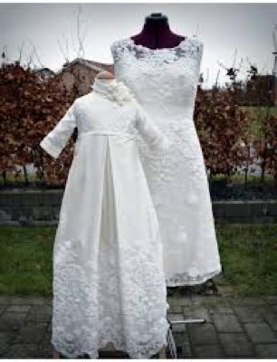
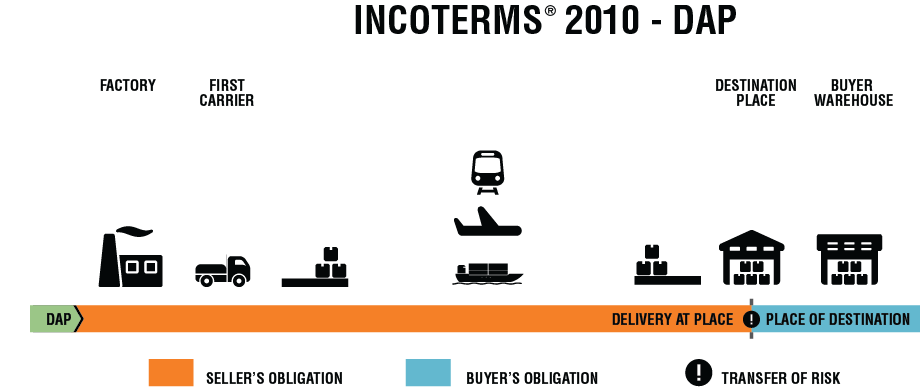

# Køb

***Kapitel 8 om køb skal kun læses i hovedtræk***

## Hvad er et køb? 

KBL (Lovbekendtgørelse nr. 140 af 17. februar 2014 Købelov) opstiller ikke en definition af, hvad der forstås ved køb. 

Køb forstås traditionelt som en aftale om overdragelse af et formuegode mod vederlag i penge).  

Der skal være tale om en gensidigt bebyrdende aftale, dvs. at både køberens og sælgerens ydelse forholder sig som vederlag for modydelsen. 

Sælgerens ydelse er et formuegode, dvs. en ejendomsgenstand. 

Der er hyppigst tale om overdragelse af ejendomsretten til løsøre (dvs. ting), men der kan også være tale om overdragelse af fordringsrettigheder (f.eks. aktier og skriftlige rentebærende fordringer), ophavsrettigheder eller andre immaterielle rettigheder, goodwill, valuta (dvs. penge af en anden mønt end betalingsstedets), overdragelse af en begrænset rettighed, jf. f.eks. U 1952.288/3 H (om køb af udnyttelsesretten til et mergelleje) osv. 

Selv om loven udtrykkeligt angiver kun at regulere »køb«, er købeloven i vidt omfang udtryk for almindelige *obligationsretlige grundsætninger*. 

Dette indebærer, at lovens principper i mange henseender også finder anvendelse på andre, ulovregulerede kontraktstyper fx afgrænsningsbegrebet ved tjenesteydelser, håndværksydelser og køb af fast ejendom.

 

## Købeloven og dens begreber

Hovedregel: Købeloven gælder for alle køb.

Undtagelse: Køb af fast ejendom og tjenesteydelser eller ved opførelse af bygning eller andet anlæg på fast ejendom, samt internationale køb (Den internationale købelov CISG -Convention on Contracts for the International Sale of Goods).  
 
 

*Hovedregel: Købeloven er deklaratorisk i handelskøb*

* Kan fraviges ved aftale

* Må vige for handelsbrug eller sædvane - 

Se *U 1984.525 H – Den ufrugtbare orne: En leveret orne viste sig ufrugtbar, og der skete omlevering. Køberen rejste krav om erstatning for produktionstab, men ved erklæringer fra forskellige organisationer ansås godtgjort en sædvane inden for handelen med avlsorner for, at driftstab ikke kunne kræves erstattet.*

 
Speak23

Undtagelse: Købeloven kan ikke fraviges i forbrugerkøb, medmindre fravigelsen er til forbrugerens fordel. Dvs. forbrugeren bliver stillet bedre end, hvad der følger af købelovens ufravigelige forbrugerkøbsregler
 

## Købelovens begreber ved handelskøb
 
* Et køb, der indgås mellem handlende, der handler i eller for deres bedrift, jf. KBL § 4, stk. 1.

* Et køb, hvor både køber og sælger er erhvervsdrivende, og hvor købet indgås i forbindelse med deres virksomhed eller deres erhvervsmæssige aktiviteter.

* Det købte skal hovedsageligt anvendes i erhvervsøjemed.

* KBL opstiller i en række sammenhænge særlige regler for handelskøb, jf. fx. KBL §§ 6 og 16, § 21, stk. 3, og § 28, stk. 1, §§ 27, 32, 51 og § 52, stk. 1. 

* Det er karakteristisk for de særlige regler om handelskøb, at parternes forpligtelser skærpes i forhold til, hvad der gælder i civile køb (handel mellem to private fx. i Den Blå Avis). 

* Det er dog ikke udelukket, at man i nogle typer af civile køb, som har et betydeligt merkantilt præg, efter omstændighederne kan skærpe parternes forpligtelser, således at der f.eks. pålægges køberen en streng reklamationsforpligtelse ligesom i handelskøb, hvor KBL § 54’s reklamationsfrist på 2 år fraviges ved aftale.

* Det er ikke en betingelse i KBL, af det købte skal anvendes til videresalg. Køb af inventar, kontormøbler, kontorrekvisitter, biler til brug for transport af varer eller kundebesøg udgør fx. handelskøb, når køberen og sælgeren er handlende

* Landbrug eller fiskeri konstituerer ikke handelskøb. Heller ikke aftaler, som indgås af erhvervsdrivende, som driver liberalt erhverv, f.eks. advokater, rådgivnings- og konsulentvirksomheder mv., anses for handelskøb.

* Den handel, hvorved en forretningsdrivende etablerer sig ved køb af en forretning, er hverken et handelskøb eller et forbrugerkøb, men derimod et civilkøb, jf. dommen i U 1988.76 V:

*U 1988.76 V: Forsinkelse med betaling af ydelse. Efter en i 1982 indgået kontrakt med ejendomsforbehold om salg af en restauration forfaldt restkøbesummen til betaling, hvis ydelser udeblev ud over 5 dage efter forfaldsdag. I juli 1986 videresolgtes restaurationen til K, der overtog gælden i henhold til købekontrakten, men ikke rettidigt betalte en den 1. august 1986 forfalden ydelse til den oprindelige ejer E. Efter at E den 12. august 1986 havde opsagt restgælden, betalte K dagen efter den forfaldne ydelse. - Da det ikke kunne udelukkes, at E, der havde været bekendt med salget til K, måtte have indset, at den manglende betaling af ydelsen måtte bero på en fejltagelse, havde forsinkelsen ikke berettiget E til at kræve restgælden betalt.*

 

## Købelovens begreber ved forbrugerkøb:

* Et køb, der foretages af en forbruger hos en erhvervsdrivende, der handler som led i sit erhverv, og hvor køberen hovedsagelig handler uden for sit erhverv, jf. *det civilretlige forbrugerbegreb* i KBL § 4 a, stk. 1.

* Tilsvarende definitioner på forbrugeraftaler findes bl.a. i aftalelovens § 38 a, stk. 2, kreditaftalelovens § 1, jf. § 4, nr. 1–3, forbrugeraftalelovens § 2, stk. 1, rentelovens § 7, stk. 1, og betalingslovens § 7, nr. 15, jf. også forbrugerklagelovens § 2.

* Det købte skal hovedsageligt bruges privat.

* Det er transaktionsfomålet med det købte i aftaleøjeblikket, der er afgørende for, om der er tale om et forbrugerkøb. Dvs. man ser på formålet med det købte og ikke den faktiske anvendelse af det købte. 

* Det afgørende for, om en aftale har karakter af en forbrugeraftale, er derfor, om den erhvervsdrivendes ydelse på tidspunktet for aftalens indgåelse var bestemt til ikke-erhvervsmæssig anvendelse for medkontrahenten.

* Det er ikke udelukket at anse et køb for et forbrugerkøb, selv om køberen skal anvende genstanden i såvel privat som erhvervsmæssigt øjemed. Det afgørende er, om genstanden hovedsagelig er bestemt til ikke-erhvervsmæssig anvendelse.

* *Lønmodtageres indkøb* af genstande anses for forbrugerkøb, også selv om det købte skal benyttes ifm. lønmodtagerens udførelse af sit arbejde

* Købeaftaler, som indgås mellem to ikke-erhvervsdrivende, er som udgangspunkt ikke forbrugerkøb, men et *civilkøb*, medmindre et erhvervsdrivende mellemled indgår eller formidler aftaleindgåelsen for den ikke-erhvervsdrivende sælger, jf. KBL § 4a, stk. 2.

* Er ydelsen indkøbt mhp. anvendelse i *offentlig virksomhed*, f.eks. stat og kommune, er der ikke tale om forbrugerkøb.

Et link til min artikel i U 2011.256.B ”Afgrænsning af det civilretlige forbrugerbegreb”
 
Speak23

* Både fysiske og juridiske personer kan i dansk ret anses som forbrugere i lovens forstand.

 
Speak23

* Som »erhvervsdrivende« i forbrugerkøbet anses personer, der udøver selvstændig, privat, økonomisk erhvervsvirksomhed inden for handel, industri, håndværk, transport, liberale erhverv, i den finansielle sektor mv., jf. også markedsføringslovens § 2, nr. 2. 

* Det er ikke afgørende, om der er tale om en hoved- eller bibeskæftigelse, men aktiviteten skal have et erhvervsmæssigt præg, dvs. en fortsat karakter og et ikke helt ubetydeligt omfang. Et enkeltstående salg vil dermed som udgangspunkt ikke være tilstrækkeligt til at anse forbrugerens medkontrahent for erhvervsdrivende. 

* En person, som i et enkelt eller enkelte lejlighedsvise tilfælde videresælger en vare med fortjeneste, vil således ikke alene på det grundlag kunne anses for erhvervsdrivende. Der lægges med andre ord bl.a. vægt på transaktionshyppighed og kontinuitet. 

* Det er ikke en forudsætning for at blive anset som erhvervsdrivende, at man har fast forretningssted, men det kan indgå som et moment i vurderingen. 

* Det er heller ikke afgørende, om der med virksomheden tilstræbes en økonomisk gevinst. 

* Det kan være vejledende, men ikke afgørende, om vedkommende sælger er momsregistreret, bogføringspligtig, registreret i CVR-registeret, er omfattet af selskabsskatteloven eller foretager skattemæssige afskrivninger. 

* Der kan desuden lægges vægt på, om den pågældende har en erhvervsmæssig markedsføring i form af annoncering, firmabrevpapir o.lign. 

* Foreninger, organisationer og sammenslutninger kan efter omstændighederne være erhvervsdrivende, hvis de udøver erhvervsprægede aktiviteter.

* Organisationer, hvis formål udelukkende er velgørende, almennyttigt, politisk eller religiøst, anses som udgangspunkt ikke for erhvervsdrivende, hvad angår deres indsamlingsaktiviteter. Sådanne organisationer kan imidlertid anses som erhvervsdrivende for så vidt angår organisationernes kommercielle aktiviteter, f.eks. hvis der drives forlagsvirksomhed, arrangeres medlemsrejser, drives butikker mv.

* Sportsklubber vil ofte have karakter af almennyttige foreninger, men efter en konkret vurdering af klubbernes aktiviteter og omsætning kan de undertiden anses for erhvervsdrivende.

* Fagforeninger og a-kasser er som udgangspunkt ikke omfattet af begrebet »erhvervsdrivende«, men sådanne organisationers aktiviteter kan efter en konkret vurdering anses for at være erhvervsmæssige.

* Andelsbolig-, grundejer- og ejerlejlighedsforeninger, gårdlav, almennyttige boligforeninger, bofællesskaber, kolonihaveforeninger, kollegier o.lign. anses som udgangspunkt ikke som erhvervsdrivende, hvad angår de dispositioner, som har til formål at varetage medlemmernes interesser i henhold til organisationens/foreningens formål. Se Forbrugerredegørelse 2002–2003 6.6.1 (en ejerlejlighedsforening, der fordelte varmeudgifterne mellem medlemmerne, ansås ikke for erhvervsdrivende). 

* Se om boligforeninger mv. og deres evt. status som forbrugere, jf. Sonny Kristoffersen i ET 2018 102 ff.:

 
## Civile køb (Ej defineret i KBL):

* Et køb, hvor begge parter er privat personer, og hvor der ikke bruges en erhvervsdrivende mellemmand til at formidle salget. 

Man anvender handelskøbsreglerne analogt, som har et betydeligt merkantilt præg, medmindre andet er blevet aftalt mellem parterne. 

Et civilt køb kan fx foregå på ”Den Blå Avis” eller på et loppemarked, hvor private udveksler genstande og penge samtidigt. 

 
## Handelskøb

Et handelskøb er et køb, hvor både køber og sælger er erhvervsdrivende, og hvor aftalen om købet indgås som led i en virksomhed. "B2B". Købelovens regler ved handelskøb er deklaratoriske dvs., de kan fraviges ved aftale mellem de to erhvervsdrivende.

 

Der findes forskellige former for køb under handelskøbet:

**Genuskøb:** 

* Køb af genstande, bestemt efter art, jf. KBL § 3.
* Ved et genuskøb, købes en vis mængde af en angiven art eller type genstande.
* Sælger har valgfrihed med hensyn til, hvilke varer i det pågældende parti, han vil levere til køber for at opfylde aftalen.
 
Speak23

 

**Specieskøb:**

* Køb af en individuelt bestemt genstand.

* Genstanden kan være unik, og måske findes der kun den ene.
* Der kan ikke ske omlevering med en tilsvarende vare, hvis den første vare går til grunde.

* Aftalen er indgået om en specificeret salgsgenstand eller specifikke genstande
- et bestemt parti varer. Køber har valgt.

* Sælger har ikke valgfrihed med hensyn til, hvilken vare han vil levere til køber for at opfylde aftalen.

Speak23
 
 

**Bestillingskøb/fremstillingskøb**:

Et bestillingskøb kan også kaldes et fremstillingskøb, da købet vedrører bestilling af genstande, som først skal fremstilles, jf. KBL § 2, stk. 1. som indeholder et element af værksleje, nemlig aftaler, hvor den ene part har påtaget sig mod vederlag at fremstille en ny genstand (i modsætning til aftaler om f.eks. reparation af en allerede eksisterende genstand). 

Skabelsen af en ny vare fx ved en ændring af en eksisterende bryllupskjole til en ny dåbskjole, er således omfattet af købelovens regler. 

Men ikke blot en reparation af en allerede eksisterende genstand, fx det at få lagt et bukseben op, eller at få udført en serviceydelse. 

Reparationer og tjenesteydelser er omfattet af forældelseslovens regler, jf. den 3 årige-forældelse i forældelseslovens § 3, stk. 1.  

 

**Fixkøb:**

Betegnelsen fixkøb bruges om et køb, hvor køber har betinget sig, at levering sker på et helt bestemt tidspunkt, fx en fødselsdagsskage, der skal leveres om formiddagen den 3. august 2019.
  
 
Samtidighedsgrundsætningen: Sælgeren har ikke pligt til at levere salgsgenstanden, medmindre købesummen samtidig betales, og køber har ikke pligt til at betale købesummen, medmindre salgsgenstanden samtidig stilles til hans rådighed, jf. KBL § 14 (kontantkøb).
 

Modtages betaling ikke samtidig med levering, overgår købet fra kontantkøb til et kreditkøb.
 

Speak23
 

#### Sælgers og købers forpligtelser under handelskøbet
 
 
Sælgers forpligtelser består i at:

* Levere den solgte vare i rette tid og på rette sted (leveringstidspunkt og leveringssted).
* Levere den solgte vare i rette stand (uden faktiske og retlige mangler).

Købers forpligtelser består i modtage varen og at betale den aftalte købesum:

* I rette tid
* På rette sted
* Med rette betalingsmiddel
 

#### Levering og risikoens overgang ved handelskøbet
 
*Hvornår er levering er sket?:*

* Indtil levering er sket, bærer sælgeren risikoen for salgsgenstandens hændelige undergang eller forringelse.
* Når levering har fundet sted overgår risikoen fra sælger til køber.
* NB! Levering kan ske inden salgsgenstanden er kommet i købers besiddelse

**Video om risikoens overgang**

<iframe src="https://www.youtube.com/embed/oqJcGNfpdY0" width="853" height="480" frameborder="0" allowfullscreen="allowfullscreen"></iframe>

Leveringstidspunktet og risikoens overgang er forskellig og afhænger af, om der er tale om et:

* Afhentningskøb
* Pladskøb
* Afsendelseskøb/forsendelseskøb 

**Afhentningskøb**

Hvis intet er aftalt om levering, er det som hovedregel et afhentningskøb. Køber henter varen på sælgers forretningssted eller bopæl, jf. KBL § 9.

* Handelskøb/specieskøb: Risikoen overgår fra sælger til køber på det aftalte afhentningstidspunkt, dvs. det tidspunkt hvor varen er klar til afhentning, også selvom varen ikke bliver afhentet af køber til tiden.

* Handelskøb/genuskøb: Risikoen overgår fra sælger til køber på det aftalte afhentningstidspunkt, også selvom varen ikke bliver afhentet af køber til tiden.

* Betingelse: Varerne skal være individualiseret/udskilte fra andre varer, som står hos sælger.

Speak23:
 

**Pladskøb og afsendelseskøb/forsendelseskøb**

* Pladskøb – udbringelseskøb: Levering inden for sælgers geografiske udbringningsområde. Ofte sælger egne folk der bringer varen ud.

* Levering sker og risikoen overgår fra sælger til køber, når køber har varen i sin besiddelse, jf. KBL § 11.

Speak23

Det fremgår af bestemmelsen, at levering er sket, når genstanden er kommet i køberens »besiddelse«,

* Afsendelseskøb/forsendelseskøb, jf. KBL § 10

* Levering sker og risikoen overgår fra sælger til køber, når varen overgives til første fremmede fragtfører. Ved søtransport sker levering når varen er bragt inden for skibssiden.

 
Speak23
 

**Afsendelseskøb med klausuler**

*Købelovens leveringsklausuler:*

* FOB (Free on board), KBL § 62
* CF (Cost & freight), KBL § 63, jf. § 10
* Cif (Cost, insurance, freight), KBL § 64, jf. § 63 og § 10
* Franco (Frit leveret), KBL § 65

Til internationale køb anvendes INCOTERMS 2010. 

### Sælgers misligholdelse

Sælger kan som udgangspunkt misligholde en aftale på tre måder:

* **Forsinkelse med levering** (afsnit 8.8.1.)
* **Faktiske mangler - mangler ved den leverede vare** (afsnit 8.8.2.) 
* **Retlige mangler – vanhjemmel** (afsnit 8.8.3.)

#### Forsinkelse med leveringen 

* Hvis leveringstidspunkt ikke er aftalt – Levering skal ske efter påkrav, jf. KBL § 12.

* Hvis der er aftalt levering:
* Primo maj/begyndelsen af maj = 1. til 10. maj
* Medio maj/midten af maj = 11. til 20. maj
* Ultimo maj/slutningen af maj = 21. til 31. maj

* Er der anvendt udtryk som f.eks. »straks«, »omgående«, »prompte« eller »snarest muligt«, beror det bl.a. på brancheforhold mv., hvad der ligger heri,

* Hvis der er aftalt levering 1. oktober og levering sker senere, er der tale om misligholdelse i form af forsinkelse.
 

**Hovedregel:** Leveres varen ikke i rette tid, er der tale om forsinkelse, og køber kan gøre misligholdelsesbeføjelser gældende, jf. KBL § 21, stk. 1.      

* KBL § 21, stk. 1 gælder for både genus- og specieskøb. Det er først og fremmest aftalen, der er afgørende for, om levering er sket rettidigt eller ej.

* Lovbestemmelsen finder anvendelse, uanset om sælgeren faktisk leverer, men leverer for sent, eller om sælgeren slet ikke leverer, fx fordi en speciesgenstand er gået til grunde. Sælgeren har almindeligvis bevisbyrden for, at der er leveret rettidigt.

* Leverer sælgeren før det aftalte leveringstidspunkt, kan køberen afvise at modtage genstanden og kræve fornyet levering i rette tid, hvis afvigelsen fra sælgerens frigørelsestid er væsentlig,

**Undtagelser:** KBL § 21, stk. 1 gælder dog ikke:

* Hvis forsinkelsen skyldes købers forhold, fx fordringshavermora eller
* Hvis forsinkelsen skyldes en hændelig begivenhed, som sælger ikke bærer risikoen for.
 

* Tilbageholde købesummen, jf. KBL § 14

* Kræve naturalopfyldelse/fastholde købet, jf. KBL § 21, stk. 1

* Ophæve købet/annullere, jf. KBL § 21, stk. 1

* Betingelse: væsentlig forsinkelse – i handelskøb er enhver forsinkelse væsentlig, jf. KBL § 21, stk. 3

* Kræve erstatning, jf. KBL § 23 (species) og § 24 (genus – et strengt ansvar) – eventuelt dækningskøb, jf. KBL § 25

Speak23

* *Sælgeren har bevisbyrden* for, at der foreligger ansvarsfritagende omstændigheder

  
Speak23

 
* Hvis køber vil fastholde købet, har køberen reklamationspligt, jf. KBL § 26.

* Dvs. skal køber uden ugrundet ophold meddele sælger, at han eller hun forlanger naturalopfyldelse - køber fastholder købet og kræver levering, selvom levering er forsinket.

* Hvis køber ikke reagerer på sælgers information om forsinkelsen, mister køber sin ret til at kræve levering. Hvis levering ikke er sket som aftalt, og sælger ikke har informeret køber om forsinkelsen, skal køber reagere overfor sælger inden rimelig tid, hvis køber vil fastholde købet. Køber kan ikke lade som ingenting – der skal reklameres.

* Hvis køberen meddeler, at han vil fastholde, kan han sætte en rimelig frist for levering og herefter hæve købet, hvis sælgeren ikke leverer rettidigt.

* Det er et grundlæggende princip, at køberen skal reklamere, hvis han vil ændre status quo, dvs. vil skabe en forandring i den tilstand, der består.

* Købelovens reklamationsbestemmelser findes i §§ 26–27 (om køberens reklamationspligt ved sælgerens forsinkelse), §§ 31–32 (om sælgerens reklamationspligt ved køberens forsinkelse), §§ 52–54 (om køberens reklamationspligt ved mangler ved salgsgenstanden) og §§ 81–85 (om forbrugerkøberens reklamationspligt ved mangler ved salgsgenstanden).

* Købelovens reklamationsbestemmelser suppleres af almindelige regler om passivitet mv. Dette indebærer bl.a., at en reklamation kan tillægges retsvirkning, hvis modtageren ikke gør indsigelse mod reklamationen, eller hvis der indledes forhandlinger vedr. levering el.lign., uden at der tages forbehold for, at reklamationen er for sen.

* Såfremt en part over for den misligholdende part tilkendegiver, hvilke(n) misligholdelsesbeføjelse(r) han vil påberåbe sig, kan parten som udgangspunkt ikke omgøre sit valg

Hvis sælger skal levere over flere gange (successiv levering), dvs. at sælgeren skal erlægge sin ydelse i rater el.lign.

Situation: Én leverance bliver forsinket

* **HR:** Delvis ophævelse.

* Hver enkelt leverance behandles for sig.

* Køber kan hæve købet vedrørende den ene forsinkede leverance. Køber kan ikke hæve de kommende leverancer, jf. KBL §§ 22, 1. pkt.

* **U1:** Hæve kommende aftalte leverancer, hvis de senere leverancer også ventes at blive forsinkede, jf. KBL § 22, 2. pkt.

* **U2:** Købet kan hæves i sin helhed, hvis det er begrundet i sammenhængen mellem leveringerne, jf. KBL § 22, 2. pkt.

#### Mangler ved salgsgenstanden

* Sælgerens forpligtelse iht. købeaftalen består i at erlægge salgsgenstanden i rette tid og på rette sted samt i rette stand og mængde.

* KBl §§ 21–27 regulerer de tilfælde, hvor sælgeren ikke leverer i rette tid og på rette sted (og dette ikke skyldes køberens forhold).

* KBL §§ 42–54 regulerer de tilfælde, hvor sælgeren ikke leverer i rette stand og mængde, dvs. at der foreligger faktiske (kvalitative eller kvantitative) mangler.

* Om retlige mangler, herunder vanhjemmel, og rådighedsmangler, dvs. de tilfælde, hvor køberen ikke får den rådighed over salgsgenstanden, som er aftalt, eller som køberen måtte forudsætte, se KBL § 59.

Speak23

* Købeloven indeholder ikke uden for forbrugerkøb en definition af, hvad der forstås ved en faktisk (kvalitativ) mangel. 

Det antages imidlertid, at den definition af mangler i forbrugerkøb, som fremgår af § 76, også kan være vejledende for mangelsbedømmelsen i ikke-forbrugerkøb.

* Køberen har bevisbyrden for, at salgsgenstanden er mangelfuld, jf. dog i forbrugerkøb KBL § 77a, stk. 3 formodningsreglen, hvor denne bevisbyrde er sælgerens de første 6 måneder efter købet.

**Kvantitetsmangel:* Mængde – leveret for lidt i forhold til det aftalte.

**Kvalitetsmangel:* Varen lever ikke op til hvad køber kunne forvente.

* Vurderingstidspunkt: Salgsgenstandens tilstand vurderes på tidspunktet for levering - dvs. tidspunktet for risikoens overgang, jf. KBL § 44.

* **Hvad er en mangel?:** 

Se principperne i KBL § 76, § 75a, ved vurdering af kvalitetsmangel. Varen skal være i overensstemmelse med, hvad der er blevet aftalt mellem køber og sælger.
 

* *Køberen kan fastholde købet og kræve omlevering:*

* Specieskøb (kan i sagens natur ikke omleveres, da der kun er én)
* Genuskøb, KBL § 43, stk. 1.

* *Køberen kan fastholde og kræve forholdsmæssigt afslag/nedslag i købesummen:*

* Specieskøb, KBL § 42, stk. 1.
* Genuskøb, KBL § 43, stk. 1.

* *Køberen kan ophæve købet / annullere:*

* Specieskøb, KBL § 42, stk. 1 – Betingelse: Væsentlig mangel ved salgsgenstanden

* Genuskøb, KBL § 43, stk. 1. – Betingelse: Væsentlig mangel ved salgsgenstanden

* samt kræve erstatning for købers tab:
* Specieskøb, KBL § 42, stk. 2.
* Genuskøb, KBL § 43, stk. 3.
 

Sælger har ret til at omlevere eller at afhjælpe manglen, fx ved reparation, jf. KBL § 49, hvis:

* Det kan ske uden ulempe for køber

* Det kan ske uden omkostninger for køber

* Køber kan ikke hæve eller forlange prisnedslag hvis sælger tilbyder afhjælpning eller omlevering, jf. KBL § 78, stk. 3.

* Køber kan forlange erstatning selvom der tilbydes afhjælpning eller omlevering, hvis erstatningsbetingelserne er opfyldt, jf. KBL § 80.
 

Hvis sælger skal levere over flere gange
Situation: Én leverance ud af en række er mangelfuld

* **HR:** Delvis ophævelse.

* Hver enkelt leverance behandles for sig.
* Køber kan hæve købet vedrørende den ene mangelfulde leverance. Køber kan ikke hæve de kommende leverancer, jf. KBL §§ 42,43 og 46.

* U1: Hæve kommende aftalte leverancer, hvis de senere leverancer også ventes at blive mangelfulde, jf. KBL § 46, stk. 2
* U2: Købet kan hæves i sin helhed, hvis det er begrundet i sammenhængen mellem leveringerne, jf. KBL § 46, stk. 2
 

*Købers undersøgelsespligt, KBL § 51:*

* Når salgsgenstanden er leveret har køber pligt til at undersøge varen, i overensstemmelse med ordentlig forretningsbrug, ellers mister han sine misligholdelsesbeføjelser.

Købers reklamation, KBL § 52-54:

* Ved mangler skal køber reklamere straks, ellers mister han sine misligholdelsesbeføjelser.
* Hvis køber vil hæve købet eller kræve efterlevering eller omlevering, skal han reklamere overfor sælger uden ugrundet ophold, ellers taber køber sin ret til at afvise salgsgenstanden eller kræve efterlevering.
 

#### Vanhjemmel – retslig mangel

Når køber ikke opnår den forventede ejendomsret ved købet. Fx. hvis sælger ikke har ret til at sælge salgsgenstanden, fordi: 

* genstanden tilhører tredjemand,
* er pantsat, lånt, lejet,
* købt med ejendomsforbehold mv, jf. kreditaftalelovens § 34, stk. 1.
 

*Fastholde købet*

* tredjemands ret fjernes – pant i bil indfries af sælger eller køber, ellers kan tredjemand kræve bilen tilbage fra køber

*Ophæve købet/annullere*

* En retlig mangel er væsentlig, og købet kan ophæves. Hver part skal tilbagelevere, hvad de hver især har modtaget.

*Kræve erstatning for økonomisk tab:*

* Uanset om køber fastholder købet eller annullerer, kan han forlange erstatning, hvis han har lidt et tab – *positive opfyldelsesinteresse*
* Sælgers ansvarsgrundlag er objektivt ansvar over for køber, hvis køber er i god tro, dvs. hverken vidste eller burde vide, at der var retlige mangler.
 

#### Købers misligholdelse

#### Købers forsinkelse med købesummens betaling

**Købers forpligtelse:**

*Køber skal modtage varen som aftalt betale den aftalte købesum til tiden.

**Købers misligholdelse:**

* Forsinkelse med betaling af købesummen
* Anteciperet (forventede) forsinkelse med betaling af købesummen
* Fordringshavermora - Manglende modtagelse af varen (ikke en misligholdelse)
 

* Fastholde købet og forlange betaling, jf. KBL § 28, stk. 1
* Hæve købet, jf. KBL § 28, stk. 1
* Forsinkelsen skal være væsentlig. I handelskøb er enhver forsinkelse væsentlig.

* Kræve erstatning ved ophævelse, jf. KBL § 30
* Skadeserstatning efter KBL § 24
* Hvis sælger foretager et dækningssalg i rimelig tid efter ophævelsen, og salget indbringer færre penge, end det ville have gjort, hvis aftalen med den oprindelige køber var blevet opfyldt korrekt, kan sælger forlange differencebeløbet erstattet af køber, jf. KBL § 30, stk. 2.
 

Situation: Hvis sælger allerede har leveret uden at der samtidig er sket betaling

* **Hovedregel:** Kreditkøb - ikke hæve og få det solgte tilbage
* Sælger må iværksætte inkasso og evt. tvangsinddrivelse

* **Undtagelser**, fx hvis:
* Det solgte afvises af køber.
* Der er taget et kontantforbehold/ejendomsforbehold.
* Hvis det solgte er leveret til en køber på et tidspunkt, hvor køber er taget under konkursbehandling, og konkursboet ikke indtræder i aftalen eller stiller sikkerhed for købesummens betaling.
 

Særligt om delleverancer, KBL § 29, jf. § 28
Situation: Flere leverancer, og køber er forsinket med betaling af en enkelt leverance

* Sælger kan hæve købet for de følgende leveringer, medmindre der ikke er grund til at frygte yderligere forsinkelser med betaling.
 

**Anteciperet forsinkelse, KBL §§ 39-41:**

Situation: Endnu ikke forsinkelse, men sælger må forvente at forsinkelse vil opstå – fx hvis køber er insolvent, kommer under konkursbehandling, rekonstruktion mv.

Sælger har tilbageholdsret – undlade at afsende varen Holde varen tilbage indtil køber eller købers bo har stillet sikkerhed for betaling.

Sælger har standsningsret – hindre overgivelse.

Det solgte er på vej til køber. Sælger kan hindre overgivelsen til køber indtil køber eller købers bo har stillet sikkerhed for betaling.

Hæve købet: Når det er blevet tid til at levere, kan sælger hæve købet, hvis køber eller købers bo ikke har stillet sikkerhed for betaling, jf. KBL § 39, stk. 1. 

#### Fordringshavermora, KBL §§ 33-37

Betragtes ikke som misligholdelse, men situationen udløser en række krav og valgmuligheder for sælgeren, der ikke kan ”komme af med” varen.

* Sælger har pligt til at drage omsorg for varen for købers regning
* Sælger har tilbageholdsret indtil udgifterne er betalt
* Sælger har ret og pligt til at sælge varen til anden side
* Sælger er berettiget til at bortskaffe varen
 

 

 

## Forbrugerkøb

  

* Retskilde: Købelovens forbrugerafsnit KBL §§ 72-87.

* **Købelovens regler om forbrugerkøb er beskyttelsespræceptiv:** 

Reglerne om forbrugerkøb kan ikke fraviges til skade for forbrugeren, men forbrugeren kan godt stilles bedre.

* Forbrugerkøb: når en erhvervsdrivende som led i sit erhverv, sælger en vare, hvor formålet er til hovedsagelig privat anvendelse, jf. KBL § 4a.

* *Bevisbyrde:* Hvis der opstår uenighed om hvorvidt købet er et forbrugerkøb, er det den erhvervsdrivende, der har bevisbyrden for, at købet ikke er et forbrugerkøb, jf. KBL § 4a, stk. 1.
 

#### Købers og sælgers forpligtelser

 
**Sælgers forpligtelser**:

* Levere den solgte vare i rette tid og på rette sted
* Levere den solgte varer i rette stand - uden mangler

 
**Forbrugerkøberens forpligtelser:**

* Modtage varen som der er aftalt
* Betale købesummen som er aftalt
* Rette tid i henhold til aftalen
* Rette sted i henhold til aftalen
* Rette betalingsmiddel i henhold til aftalen 

#### Levering af varen og risikoens overgang

Hvis intet er aftalt om levering, skal den erhvervsdrivende stille varen til rådighed for køber på den erhvervsdrivendes forretningssted – afhentningskøb, jf. KBL § 9, som er udtryk for hovedreglen, nemlig at leveringsstedet er hos sælgeren (eller der, hvor salgsgenstanden med parternes vidende befinder sig, jf. KBL § 9, stk. 2), dvs. at lovens udgangspunkt er, at der er tale om afhentningskøb - også i forbrugerkøb, jf. KBL § 1, stk. 2 e.c.

* Afhentningskøb: Køber henter varen på sælgers forretningssted eller bopæl, jf. KBL § 9. Risikoen for varen overgår fra sælger til køber, når varen er stillet til rådighed og klar til afhentning.

* Udbringningskøb: Varen bringes ud til køber. Levering sker og risikoen for varen overgår fra sælger til køber (forbrugeren), når forbrugeren har varen i sin besiddelse.

* Forsendelseskøb: Levering sker når, når varen er i købers besiddelse. Risikoen for varens forringelse eller hændelige undergang ligger hos sælger, indtil varen er i købers besiddelse, jf. KBL § 73: 

- Denne bestemmelse finder kun anvendelse, såfremt sælgeren ved aftalen har påtaget sig at sende salgsgenstanden til køberen. 

- Bestemmelsen gælder også, hvis sælgeren først efter aftalens indgåelse påtager sig at sende genstanden til køberen. En pligt til at sende genstanden kan også følge af sædvane. 

- Levering er ikke sket, såfremt sælgeren f.eks., uden at køberen har anmodet herom, overgiver genstanden til køberens nabo eller henstiller den uden for køberens bopæl, fordi køberen ikke træffes hjemme. 

#### Sælgers misligholdelse af aftalen

Sælger kan som udgangspunkt misligholde en aftale på tre måder:

* Forsinkelse med levering af den aftalte vare
* Faktiske mangler - mangler ved den leverede vare
* Retlige mangler – vanhjemmel

*Køber kan:*

 
* Tilbageholde købesummen, jf. KBL § 14
* Samtidighedsgrundsætningen
* Kræve levering, dvs. fastholde købet, jf. KBL § 21, stk. 1
* Ophæve købet/annullere, jf. KBL § 74, stk. 2
* Hvis forsinkelse har væsentlig betydning
* Køber har reklameret med eller uden frist
* Kræve erstatning for dokumenteret økonomisk tab, KBL § 80
 

#### Mangler ved salgsgenstanden

* *Kvantitetsmangel*: Mængde – leveret for lidt i forhold til det aftalte.
* *Kvalitetsmangel*: Varen lever ikke op til, hvad køber kunne forvente i forhold til aftalen.

**Hvornår skal der foreligge en mangel?** 

Ved leveringen til køberen, dvs. på tidspunktet for risikoens overgang, jf. KBL § 77a.

**Hvad er en mangel?** 

Se grundprincipperne i KBL §§ 75a og 76.

  

Speak23
 

#### Købers misligholdelsesbeføjelser ved mangler

*Kræve naturalopfyldelse/fastholde købet og kræve*:

* Afhjælpning (reparation), KBL § 78, stk. 1, nr. 1.

* Omlevering til en tilsvarende vare, KBL § 78, stk. 1, nr. 2 (ej speciesvare).

* Forholdsmæssigt/passende afslag, KBL § 78, stk. 1, nr. 3:

* Tilbageholde købesum indtil mangelfri vare er leveret – samtidighedsgrundsætningen, jf. KBL § 14.
 
Ophæve købet/annullere, jf. KBL § 78, stk. 1, nr. 4.

**Hvis manglen er væsentlig**

* Køber har reklameret med eller uden frist, jf. KBL §§ 81 og 83

Kræve erstatning for økonomisk tab ved en mangel

* Skadeserstatning ved en mangel for et økonomisk tab, jf. KBL § 80

 
 

**Undersøgelsespligt**

Køber har en mindre undersøgelsespligt, jf. KBL § 77b

**Reklamation**

* Køber skal reklamere rettidigt, dvs. mindst 2 måneder efter manglen er opdaget, jf. KBL § 81 – ellers mister køber sine misligholdelsesbeføjelser.

* Hvis man ikke kan finde bonnen for købet, kan man anvende et bankudskrift, som kvittering.

* Den absolutte reklamationsfrist er 24 måneder fra salgsgenstandens overgivelse, jf. § 83, stk. 1, medmindre at sælgeren har påtaget sig at indestår for salgsgenstanden i længere tid ved et garantitilsagn (tilsikring).

  

**Formodningsreglen, jf. købelovens § 77a, stk. 3**:

* Hvis en mangel viser sig i de første 6 måneder efter levering, formodes det, at genstanden var mangelfuld ved levering.

* Køber skal ikke bevise at manglen var tilstede ved leveringen – det formodes, at manglen var tilstede ved leveringen.

* Køber skal dog bevise, at der er en mangel ved varen.

* Hvis en mangel viser sig efter 6 måneder fra levering, og inden udløbet af den absolutte reklamationsfrist på de 24 måneder, er det køber som skal bevise, at manglen var tilstede på leveringstidspunktet.
 

#### Købers misligholdelse med købesummens betaling

**Sælgers misligholdelsesbeføjelser**

* Fastholde købet og forlange betaling
* Hæve købet/annullere
* Sælger skal reklamere uden ugrundet ophold
* NB! Hvis levering er sket – kreditkøb
* Krav om erstatning ved økonomisk tab
* Dækningssalg
* Tilbageholdsret og standsningsret

**Video om forholdsmæssig afalag**

<iframe src="https://www.youtube.com/embed/2HE6yDTD0tQ" width="853" height="480" frameborder="0" allowfullscreen="allowfullscreen"></iframe>

#### Fordringshavermora - Køber modtager ikke den købte vare

**Fordringshavermora**: 

Købers forhold bevirker at sælger ikke kan levere varen til tiden

* Betragtes ikke som misligholdelse i købelovens forstand.

* Risikoen for salgsgenstanden overgår til køber selvom købers forhold     
  bevirker at sælger ikke kan levere.
  
* Sælger har omsorgspligt, og under visse betingelser salgspligt og ret til at sælge købers varer til anden side.
  
---

#### Eksamensopgave og løsning om forbrugerkøb, kreditsikring og inkasso

**Børge Brugtvognsforhandler** 

Børge Johansen har i mange år haft skiftende jobs. Han har svært ved at fastholde sine jobs, da han bedst kan lide selv at bestemme arbejdstempo mv. Han interesserer sig meget for biler og er ret god til at reparere biler, da en del jobs har været på bilværksteder. 

En af hans venner, Kasper har en 5 år gammel bil og Børge tilbyder at sælge den for ham. Børge sætter straks bilen til salg og får den solgt til den aftalte pris i løbet af 3 dage.

Nu har Børge fundet sit nye job. Han vil til at sælge brugte biler. Han vil købe dem hos private, shine dem op og sælge dem videre. Børge lejer sig ind på et værksted i et industrikvarter. Han får hurtigt gang i salget, da han sælger bilerne til rimeligt lave priser. 

Børge har bl.a. solgt en 10 år gammel bil til Merete for 15.000 kr. Hun har haft bilen i 5 dage, da den går i stykker, og nu vil Merete have sine penge tilbage. Børge afviser hende med den begrundelse, at der ikke er nogen reklamationsret da det er en ældre bil og da den er solgt som den er og forefindes og at Merete i øvrigt tog en prøvetur i bilen inden hun købte den. Da Merete fastholder sit krav tilbyder Børge, at han vil reparerer bilen, men så må hun også selv betale de nødvendige reservedele – hun skal nok få dem til indkøbspris.

Kaj har også købt en bil hos Børge - for 180.000 kr. Børge har ændret lidt i bilens papirer og det viser sig senere, at den er 2 år ældre end der står i papirerne. Børge lover at tage bilen tilbage, og så skal Kaj få sine penge tilbage. Men Børge kan ikke betale, da han har brugt alle sine penge på bil opkøb. 

Derudover har banken sendt et brev om, at der er overtræk på kassekreditten og at de ønsker sikkerhed for deres tilgodehavende. 

***Eksamensspørgsmålene***

1.	Redegør for hvilke rettigheder – om nogen - Merete har?  
2.	Redegør for hvad Kaj kan gøre for at få sine penge?
3.  Redegør for hvad kan banken gøre for at sikre kassekreditten?

***Vejledende løsning***

1.	Redegør for hvilke rettigheder – om nogen - Merete har?  Hun har     sædvanlige 2 års reklamationsret, jf. købelovens § 83, stk. 1, uanset brugt vare. Årsagen til problemet er afgørende, for bilen er jo 10 år gammel, så ingen forventning af ”ny-kvalitets-bil”, men reparation er OK, medmindre uforholdsmæssig dyr for Børge. Børge må dokumentere.

2.	Redegør for hvad Kaj kan gøre for at få sine penge? Vanhjemmelskrav, så hævebegrundende mangel, jf. købelovens § 78, stk. 1, nr. 4. Kaj er bare en simpel kreditor, men kan tilbageholde bilen indtil købesummen tilbagebetalt (KBL § 57 og § 55). Sagen kan indbringes for Ankenævnet for biler, og evt.  pant/sikkerhedsstillelse i varelageret. 

3.	Redegør for hvad kan banken gøre for at sikre kassekreditten – få     virksomhedspant og evt. transport salgspriser på bilerne.  

---
  
### Quizeer

#### Quiz om køb af håndværkerydelser
Hvad er AB-forbruger? Hvad har du ret til, hvis der er fejl ved håndværkerarbejdet? Og hvad gør du,hvis håndværkeren ikke går i gang med arbejdet til tiden? 

<a href="https://www.forbrug.dk/quiz/quiz-haandvaerkere/?rn=43716" target="_blank"> Tag testen her.</a>

#### Quiz: Aktiv forbruger

De fleste kan hente en gevinst ved at skifte leverandør eller forhandle om pris/produkt. Men kun få gør det. Quiz om, hvordan du opnår det bedste produkt til prisen. <a href="https://www.forbrug.dk/quiz/aktiv-forbruger/?rn=43716" target="_blank">Tag testen her.</a>

#### Quiz: Bus, tog og Metro

Hvert år rejser danskerne mange tusinde kilometer med bus, tog og Metro. Men kender du fx dine rettigheder, hvis toget er forsinket? Test din viden her.

<a href="https://www.forbrug.dk/quiz/quiz-bus-tog-og-metro/?rn=43716" target="_blank"> Tag testen her.</a>

#### Quiz: El

Må elselskabet ringe til dig med tilbud? Hvad koster det at skifte elselskab? Og hvem skal du kontakte, hvis strømmen pludselig går? Test dig selv i vores quiz.

<a href="https://www.forbrug.dk/quiz/el/?rn=43716" target="_blank"> Tag testen her.</a>

#### Quiz: Julehandel

Julen står for døren, og det fejrer forbrug.dk med en julequiz! Test din viden om reglerne for gavekort, fortrydelsesret og køb af julegaver på nettet. <a href="https://www.forbrug.dk/quiz/julequiz/?rn=43716" target="_blank"> Tag testen her.</a>

#### Quiz: Udsalg

Tag forbrug.dks udsalgsquiz, og find ud af, om du har styr på dine rettigheder, når du skal på udsalg. Bagefter kan du udfordre dine venner og familie på Facebook.<a href="https://www.forbrug.dk/quiz/udsalgsquizzen/?rn=43716" target="_blank"> Tag testen her.</a>

#### Quiz om køb

<h3><a href="https://quiz.tepedu.dk/jurakoeb" target="_blank">Quiz Køb</a></h3>

---
