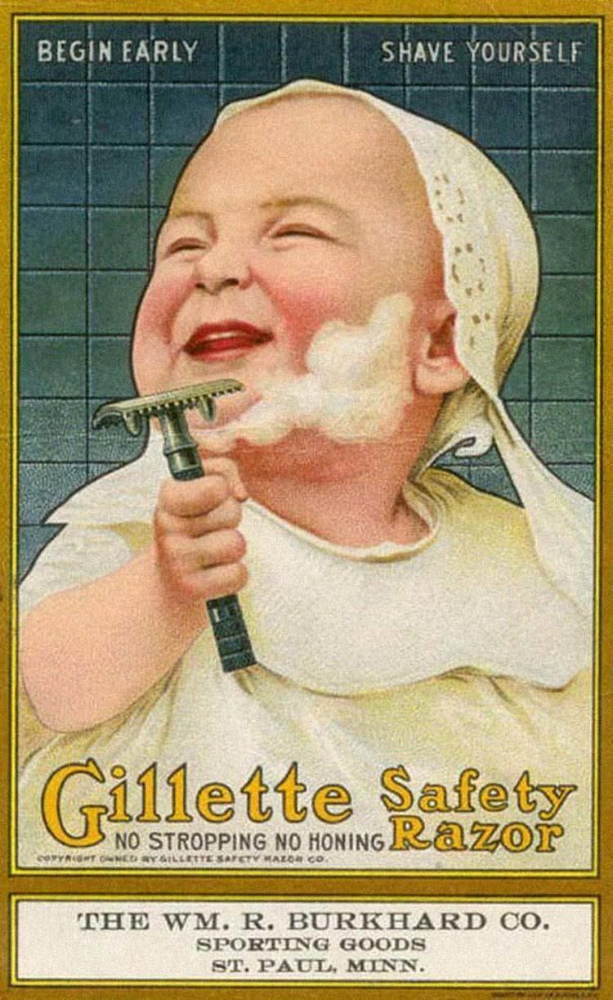

# Markedsføring Premium 

---

**Introduktion til markedsføringsloven**

Lov nr. 426 af 3. maj 2017 om markedsføring  

<iframe src="https://www.youtube.com/embed/FtVlOzjQitY" width="853" height="480" frameborder="0" allowfullscreen="allowfullscreen"></iframe>
  

 

## Markedsføringslovens formål, opbygning og EU-regulering Premium 

* Formålet med markedsføringsloven er, at den skal understøtte fair konkurrence samt gode forbrugerforhold.^[Følgende afsnit om markedsføringsloven bygger på Sonny Kristoffersen: ”Forbrugerretten I. Markedsføringsloven anno 2017 i en civil- og offentligretlig kontekst, 6. udg., KarnovGroup”, 2017.]

* Markedsføringsloven udgør således en væsentlig rammebetingelse for alle virksomheder og forbrugere i Danmark 

* Fair konkurrence, og en hensigtsmæssig forbrugerbeskyttelse, hvor forbrugerne er beskyttet mod fx at blive vildledt eller udsat for aggressiv markedsføring, understøtter velfungerende markeder

* Målet er at lave en forenklet markedsføringslov, som, inden for rammerne af EU-reguleringen, gør op med unødige byrder for erhvervslivet og understøtter velfungerende markeder

* Samtidigt skal markedsføringsloven sikre gode og ensartede forbrugerforhold, der er opdaterede i forhold til den teknologiske udvikling

* Markedsføringsloven berører alle danske forbrugere og virksomheder. Loven skal både sikre, at virksomheder kan konkurrere effektivt, og at forbrugerne er hensigtsmæssigt beskyttet mod for eksempel meget aggressiv markedsføring 

* Den skal også sikre en god balance mellem, at forbrugerne får den relevante information, de har behov for, så de kan træffe aktive valg, og samtidig skal virksomhederne ikke pålægges overdrevne og overflødige oplysningskrav  

## Opbygningen af markedsføringsloven Premium 

* § 1 Anvendelsesområde 
* § 2 Definitionsbestemmelse 
* §§ 3 og 4 om god markedsføringsskik og god erhvervsskik 
* §§ 5, 6, 7, 8 og 20 Vildledningsbestemmelserne 
* § 9 Specifikke former for handelspraksis, som altid anses for vildledende eller aggressive 
* § 10 Uanmodet henvendelse til bestemte aftagere § 
* § 11 Handelspraksis rettet mod børn og unge
* § 12 Mærkning og emballering 
* § 13 Dokumentation af faktiske forhold 
* § 14 Oplysningsforpligtelser vedr. priser m.v. 
* § 15 Faktureringspligt for regningsarbejder 
* § 16 Gebyrer 
* § 17 om garanti 
* § 18 Markedsføring af kreditaftaler 
* § 19 Markedsføring af boligkreditaftaler 
* § 20 Vildledende og utilbørlig handelspraksis mellem erhvervsdrivende 
* § 21 Sammenlignende reklame 
* § 22 Forretningskendetegn 
* § 24 Retsmidler 
* § 25 Forbrugerombudsmanden 
* § 26 Digitalisering af Forbrugerombudsmandens virksomhed 
* § 27 Kontrolundersøgelser på stedet 
* § 28 Forhandlingsprincippet 
* § 29 Retningslinjer 
* § 30 Forhåndsbesked 
* § 31 Konkurrence- og Forbrugerstyrelsens virksomhed 
* § 32 Retsforfølgning m.v. 
* § 33 Informationspligt om forældelse 
* § 34 Erstatningssøgsmål 
* § 35 Gruppesøgsmål 
* § 36 Foreløbigt forbud 
* § 37 Straf og påtale 
* § 38 Bødeforlæg 
* § 39 Henlæggelsesbeføjelser 

Markedsføringsloven er tæt forbundet med konkurrenceret, immaterialret, købelov, aftaleloven, kreditaftaleloven, betalingsloven, lov om finansiel virksomhed, forbrugeraftalelov, og e-handelslov m.fl..

EU-regulering af relevans for markedsføringsloven:

* Enhedsprismærkningsdirektivet (Direktiv 98/6/EF)
* Forbrugerkøbsdirektivet (Direktiv 99/44/EF)
* Direktivet om databeskyttelse inden for elektronisk kommunikation (Direktiv 2002/58/EF) og e-Privacydirektivet (Direktiv 2009/136/EF)
* Direktivet om urimelig handelspraksis (Direktiv 2005/29/E)
* Direktivet om vildledende og sammenlignende reklame (Direktiv 2006/114/EF)
* Forordningen om forbrugerbeskyttelsessamarbejde (Forordning nr. 2006/2004)
* Servicedirektivet (Direktiv 2006/123/EF)
* Forbrugerkreditdirektivet (Direktiv 2008/48/EF)
* Boligkreditdirektivet (Direktiv 2014/17/EU)

## Generalklausulen, jf. MFL § 3 Premium 

Markedsføringsloven har til formål at fastlægge normerne for erhvervsdrivendes adfærd på det danske marked, herunder i forholdet til andre erhvervsdrivende, konkurrenter, forbrugere, almene samfundsinteresser og øvrige interessenter.

Den såkaldte norm eller retlige standard er i dag udtrykt i markedsføringslovens § 3, hvorefter alle erhvervsdrivende skal udvise *”god markedsføringsskik”.* 

Herudover indeholder markedsføringsloven en række bestemmelser med et særligt sigte eller fokus, eksempelvis at beskytte forbrugere og børn og unge, jf. MFL § 11.

Den nærmere afgrænsning af, hvad der skal forstås ved ”god markedsføringsskik” er i vid udstrækning overladt til domstolene. 

Normen er ikke statisk og udvikler sig således i takt med markederne, teknologien og samfundet i øvrigt.

I praksis har bestemmelsen blandt andet været anvendt i forhold til aggressiv eller utilbørlig reklame, urimelig handelspraksis, udnyttelse af konkurrenter, efterligninger, urimelige forbrugeraftalevilkår og beskyttelse af privatlivets fred.

Det er fx god markedsføringskik, at det fremgår tydeligt af markedsføringen, hvis et produkt eller en ydelse over for en forbruger er betinget af særlige vilkår. 

Hvis du bruger bannerannoncering eller tv-reklame skal betingelserne fremgå allerede i første skærmbillede.

* Markedsføringslovens overordnede norm er, at *”Erhvervsdrivende skal udvise god markedsføringsskik under hensyntagen til forbrugere, erhvervsdrivende og almene samfundsinteresser”*, jf. MFL § 3, stk. 1

* Bestemmelsen sætter de ydre rammer og grænser for, hvad der er god markedsføringsskik.

* Bestemmelsen supplerer specialbestemmelserne i markedsføringsloven.

Speak23
 

Den erhvervsdrivende skal udvise god markedsføringsskik (MFL § 3) under hensyntagen til:

* Forbrugerne
* Erhvervsdrivende
* Almene samfundsinteresser
* Markedsføring, der angår forbrugernes økonomiske interesser, må ikke være egnet til mærkbart at forvride forbrugernes økonomiske adfærd – strid med god erhvervsskik
* ”God markedsføringsskik” ændrer sig i takt med den samfundsmæssige, tekniske og økonomiske udvikling.
* Overtrædelse må vurderes konkret fra sag til sag.
 

Eksempler:
Hensynet til forbrugerne og almene samfundsinteresser:

***

>En reklameavis for ure indeholdt selvmord som blikfang og sloganet "Why kill time, when you can kill yourself". Forbrugerombudsmanden fandt, at reklamen var i strid med god markedsføringsskik. Den erhvervsdrivende trak reklameavisen tilbage og underskrev et tilsagn.

>I november 1997 udsendte et urfirma som et led i en større markedsføringskampagne en reklameavis, hvor man anvendte selvmord som blikfang for reklamen for ure. Reklameavisen, der var emballeret i en "ligpose", indeholdt billeder af 8 iscenesatte selvmord og skulle omdeles på 400 caféer og restauranter landet over. Sloganet for reklameavisen var "Why kill time, when you can kill yourself".
Forbrugerombudsmanden blev gennem pressen opmærksom på reklameavisen og meddelte urfirmaet, at materialet fandtes i strid med markedsføringslovens §1 om god markedsføringsskik, idet det hos forbrugerne ville fremkalde stærke virkninger og dermed måtte anses for uetisk og utilbørlig. Forbrugerombudsmanden meddelte samtidig, at et foreløbigt forbud i henhold til markedsføringslovens § 21 [nu § 29] ville blive nedlagt, med mindre firmaet straks trak reklameavisen tilbage.
Efter forhandling med urfirmaet samt reklamebureauet blev reklameavisen trukket tilbage inden for den af Forbrugerombudsmanden angivne tidsfrist, og urfirmaet gav et tilsagn i henhold til markedsføringslovens §16 [nu § 23] om ikke at anvende reklameavisen.
I forbindelse med forhandlingerne indleverede urfirmaet en revideret udgave af reklameavisen, som Forbrugerombudsmanden blev anmodet om at tage stilling til, jf. markedsføringslovens §18 [nu § 25] (forhåndsbesked). I den reviderede udgave var billederne af de iscenesatte selvmord revet ud, men på en sådan måde at man tydeligt kunne se, at noget var revet ud af reklameavisen.
Forbrugerombudsmanden tilkendegav, at idet den reviderede udgave af reklameavisen måtte opfattes som en fortsættelse af den oprindelige kampagne, var denne tillige i strid med god markedsføringsskik. Den reviderede udgave blev på den baggrund ikke distribueret. Juridisk Årbog 1997, side 35. Sagsnummer: 1997-641/5-5.

***

>Juridisk Årbog 1993-94.119 – ”Følgende stoffer fås ikke på Christiania”:  

>Forbrugerombudsmanden fandt, at en erhvervsdrivendes annonce med teksten ”følgende stoffer fås ikke på Christiania” var i strid med god markedsføringsskik, og at stofmisbrug i øvrigt ikke egner sig til markedsføringskampagner, uanset om det sker på en humoristisk måde.

>En forretningskæde solgte tekstiler i metermål under overskriften "Følgende stoffer fås ikke på Christiania".
Forbrugerombudsmanden fandt, at den pågældende annoncering i dagblade var i strid med god markedsføringsskik, jf. markedsføringslovens § 1, idet der i annoncen på en usmagelig og uansvarlig måde skete en sammenkædning mellem uautoriseret salg af euforiserende stoffer og salg af tekstiler, samtidig med, at annoncen havde et humoristisk tilsnit.
Efter Forbrugerombudsmandens opfattelse er stofmisbrug et samfundsproblem, som ikke egner sig til markedsføringskampagner, uanset om det sker på en humoristisk måde. Den erhvervsdrivende tog påtalen til efterretning. Juridisk Årbog 1993-1994, side 119. Sagsnummer: 1993-65/5-49.

***

Hensynet til de erhvervsdrivende interesser:

* U 2004.1561 H – BR legetøj – domænenavn
* U 1992.909 SH – Superellipsebordet

Speak23
 
Reklamer der forbydes efter markedsføringsloven og internationale markedsføringsregler:

>Normdannelse og praksis i henhold til markedsføringslovens § 3

>* Urimelige aftalevilkår
* Farlige eller underlødige produkter Påtrængende, overrumplende, udnyttende, generende, krænkende eller besværliggørende markedsføringsforanstaltninger
* Beskyttelse af den personlige integritet og privatlivets fred
* Kønsdiskriminerende markedsføring
* Racediskriminerende markedsføring 
* Usømmelighed, manglende respekt for almen sikkerhed, mangel på social ansvarsfølelse i markedsføringen og samfundsinteresser

 
**Det er forbudt at vise undervægtige modeller**

 
**Det er forbudt at bringe billede af barn med seksuelle fantasier.**

 

 **Det er forbudt at vise kvinder som seksuelle objekter, hvor der er fare for at børn vil se reklamen**
 
 
 

**Ryanair reklame der var for seksuel til aviserne **

**Reklamer med børn i farlige situationer er forbudt**

**For meget airbrush retouche er forbudt**

## God erhvervsskik, jf. MFL § 4 Premium 

En virksomhed overtræder god erhvervsskik, jf. MFL § 4, hvis der er tale om adfærd på markedet, som på en forkert måde påvirker forbrugernes økonomiske interesser, fx vildledende reklamekampagne, der får folk til at købe varen på et forkert grundlag.

* Hæderlig markedspraksis, smag, anstændighed
* God tro - vurdering
* Dynamisk begreb, der testes og ændrer sig i takt med tiden og samfundets udvikling

Speak23

 

## Vildledning, jf. MFL §§ 5-7 Premium 
Afsender må ikke bruge vildledende og urigtige oplysninger i sin markedsføring, eller udelade vigtige informationer, hvis det er medvirkende til at forvride modtagerens økonomiske adfærd på markedet.

* Pejlepunkt: Hvis modtageren (forbruger eller erhvervsdrivende) træffer en beslutning, som vedkommende måske ellers ikke ville have truffet, hvis oplysningen havde været korrekt, taler det for, at der er tale om vildledende markedsføring.
 

**Vildledende oplysninger - forkerte oplysninger om fx (MFL § 5):**

* produktets eksistens og art
* varens kvaliteter og egenskaber, specifikationer, geografiske elle handelsmæssige oprindelse.
* mærkningsordninger på en vare, fx øko-mærket, svanemærket, og varen ikke lever op til kravene i mærkningsordningen.
* prisangivelser, førpriser, rabatter og tilbud. 
* En virksomhed må ikke give forbrugerne det indtryk, at prisen er sat ned, hvis det rent faktisk ikke er tilfældet.
* behov for eftersyn, reservedele, udskiftning eller reparation
* forbrugerens rettigheder til fx omlevering eller tilbagebetaling
* forveksling med en konkurrents produkt, varemærke eller forretningskendetegn

 
### Væsentlige oplysninger skal på en forståelig måde, fx (MFL § 5): Premium 

* Produktets væsentligste karakteristika
* Den erhvervsdrivendes fysiske adresse og navn
* Forhold vedrørende betaling og levering, hvis det fraviger fra hvad der er sædvanligt i branchen
* Fortrydelsesret, afbestillingsret eller returret, hvis det fraviger fra hvad der er sædvanligt i branchen
* Pris inklusive moms og afgifter
* Omkostninger til fragt, levering, porto m.v.

Speak23

 

## Forbud mod skjult reklame, jf. MFL § 6, stk. 4 Premium 

* En reklame skal kunne identificeres som en reklame, uanset form og uanset i hvilket medium den bringes.
* Ikke skjule reklamen i sit budskab, for at påvirke eller manipulere modtagerne til at købe.
* Forbuddet gælder i alle typer medier, såsom de skrevne og trykte medier (advertorial), tv- og radioprogrammer, film (productplacement), sponsorering, internettet (bannerreklamer m.v.), kunstværker, duftmarkedsføring mv.

>En erhvervsdrivende skal klart oplyse den kommercielle hensigt med enhver form for handelspraksis, herunder reklame. 
>Markedsføringslovens $6
 
 
Se eksempler i Nordisk standpunkt om skjult reklame, maj 2016 (www.forbrugerombudsmanden.dk)

* Blogs: Det skal fremgå tydeligt for læseren/seeren, hvis der er tale om reklame. Se notat om ”Gode råd til bloggere om skjult reklame” på www.forbrugerombudsmanden.dk
* YouTube mv.: Tydeligt oplyses, hvis videoen er en reklame
* Instagram: Tydeligt skrive ”reklame”, #reklame..”
* Facebook: Tydeligt markere, hvis opslag er en reklame

---

**Video: Skjult reklame**  

<iframe src="https://www.youtube.com/embed/0v3K7pusbD4" width="853" height="480" frameborder="0" allowfullscreen="allowfullscreen"></iframe>
  

**Video: Influencer marketing. Hvad er reglerne?**

<iframe src="https://www.youtube.com/embed/KzSLGxLrPWs" width="853" height="480" frameborder="0" allowfullscreen="allowfullscreen"></iframe>
  

Speak23

**Video: Er skjulte reklamer på YouTube et problem?**

<iframe src="https://www.youtube.com/embed/x3hB3ACOb2g" width="853" height="480" frameborder="0" allowfullscreen="allowfullscreen"></iframe>

---

**En sag om skjult reklame for Den Blå Planet**

  
## Markedsføring rettet mod børn og unge, jf. MFL § 11 Premium 

* Særlig hensyntagen til børn og unges naturlige godtroenhed, manglende erfaring og kritiske sans, som bevirker, at de er lette at påvirke og nemme at præge.

* Ikke udnytte den særlige godtroenhed og mangel på erfaring, der karakteriserer målgruppen børn og unge. Har ikke det samme skeptiske eller analytiske filter som voksne.

* Ikke direkte eller indirekte opfordre til vold, anvendelse af rusmidler, herunder alkohol, eller anden farlig eller hensynsløs adfærd, eller på utilbørlig måde benytte sig af vold, frygt, mobning eller overtro som virkemidler, jf. MFL § 11, stk. 2.

* Forbrugerombudsmandens vejledning om ”Børn, unge og markedsføring”, juli 2014.

Speak23
 
## Aggressiv handelspraksis, jf. MFL § 7 Premium 

Bestemmelsen i § 7 finder anvendelse på erhvervsdrivendes urimelige handelspraksis over for forbrugerne før, under og efter en handelstransaktion i forbindelse med et produkt. 

Det foreslås, at en erhvervsdrivende i sin handelspraksis ikke må benytte chikane, ulovlig tvang, herunder vold eller utilbørlig påvirkning, der er egnet til væsentligt at indskrænke forbrugerens valgfrihed i forbindelse med et produkt. 

Ulovlig tvang og vold er også reguleret i straffeloven.

Der er ikke blot forbud mod at anvende vildledende og urigtige angivelser, men forbuddet omfatter også markedsføring, som i sit indhold, sin form eller den anvendte fremgangsmåde er vildledende, aggressiv eller udsætter forbrugeren for en utilbørlig påvirkning.

Chikane skal forstås som bevidst, ondskabsfuldt drilleri eller forfølgelse.

Markedsføring betragtes som værende aggressiv, hvis den i forhold til den faktuelle sammenhæng, hvori den indgår, ved chikane, tvang, herunder fysisk vold eller anden utilbørlig påvirkning er egnet til at indskrænke forbrugerens valgfrihed eller ændre forbrugerens økonomiske adfærd, så vedkommende udviser en adfærd, vedkommende ellers ikke ville have udvist. Ved vurderingen af, om der foreligger en aggressiv markedsføring, skal der tages hensyn til følgende omstændigheder:

a) Tidspunktet for markedsføringen og stedet hvor den har fundet sted. Det kan tillægges betydning, om den pågældende handelspraksis foregår i det offentlige rum eller i den erhvervsdrivendes forretningslokaler, hvorfra forbrugeren let kan fjerne sig, eller på steder, hvor man som forbruger som udgangspunkt ikke forventer at blive udsat for den pågældende handelspraksis, f.eks. på forbrugerens bopæl, arbejds- sted eller på andre steder, hvortil der ikke er offentlig adgang.

b) Anvendelse af truende eller utilbørligt sprog eller adfærd.

Dette kan for eksempel være, hvis den erhvervsdrivende foranlediger forbrugeren til at betale et vederlag ved at true med inkasso eller registrering i et kreditoplysningsbureau, selvom de lovgivningsmæssige betingelser for at tage sådanne skridt ikke er opfyldt. I nr. 24-31 i bilag 1 til loven er oplistet en række former for aggressiv handelspraksis, som altid vil være ulovlig efter lovens § 9.

c) At en erhvervsdrivende har kendskab til og udnytter en konkret uheldig situation eller omstændighed, som har en så alvorlig karakter, at den indskrænker forbrugerens vurderingsevne, til at påvirke forbrugeren.

Det kan eksempelvis omfatte situationer, hvor en erhvervsdrivende udnytter, at forbrugeren står midt i en skilsmisse, eller i en begravelsessituation, ved en nærtståendes død.

d) At den erhvervsdrivende opstiller byrdefulde og uforholdsmæssig omfattende hindringer, som ikke er af kontraktuel karakter, når forbrugeren ønsker at udøve sine rettigheder i forbindelse med en kontrakt, herunder at ophæve denne eller vælge en anden vare eller tjenesteydelse eller en anden leverandør.

Som eksempel kan nævnes erhvervsdrivende, som kun har en meget kort åbningstid, eller som det i praksis er umuligt at kommunikere med, fordi vedkommende ikke tager sin telefon og nægter at modtage breve eller uden saglig grund stiller krav om, at en opsigelse f.eks. kun kan ske via telefax.

Det bemærkes, at anvendelse af ulovlig tvang og vold også er reguleret i straffeloven jf. staffelovens § 244-245, § 246 samt § 260. Der kan straffes i sammenstød med disse bestemmelser.

Utilbørlig påvirkning er defineret i lovens § 2, nr. 11, som udnyttelse af magtposition i forhold til forbrugeren til at udøve pres selv uden anvendelse eller trusler om anvendelse af fysisk vold på en måde, som væsentligt begrænser forbrugerens evne til at træffe en informeret beslutning.

Bestemmelsen omfatter aggressive salgsmetoder som f.eks. gentagende fremsendelse af produkter, som forbrugeren ikke har bestilt og pyramidesalg.

Som efter stk. 1 er det et krav, at markedsføringen har en kommerciel effekt, således at den er egnet til mærkbart at forvride modtagerens økonomiske adfærd. Se nærmere noten til stk. 1. 

*Se hertil U 2013 2396 SH (moderselskab til producent af isoleringsmateriale baseret på stenuld havde overtrådt markedsføringslovens §§ 1, 3 og 5 ved i to artikler i et nyhedsbrev at have omtalt brandfaren ved skumplastisolering med brug af bl.a. dramatiske ord- og billedvalg og et unødigt skræmmende tekstindhold med følelsesladede ord og udsagn).*

Bilag 1 til markedsføringsloven kommer med en række ikke udtømmende eksempler:

* Forbrugeren bringes til at tro, at vedkommende ikke kan forlade lokalerne, før en kontrakt er indgået.

* Der aflægges personlige besøg på forbrugerens bopæl, uden at forbrugeren har ønsket det.

* Der foretages vedholdende og uønskede henvendelser pr. telefon der ikke er omfattet af forbuddet i forbrugeraftalelovens § 4, eller pr. telefax, e-mail eller andre fjernkommunikationsmedier.

* En reklame opfordrer direkte børn til at købe eller til at overtale deres forældre eller andre voksne til at købe de produkter til dem.

* Der skabes det fejlagtige indtryk, at forbrugeren allerede har vundet, vil vinde eller ved udførelse af en bestemt handling vil vinde en præmie eller et andet tilsvarende gode.

  
## Uanmodet henvendelse – spam, jf. MFL § 10, stk. 1 Premium 

Hovedreglen: Den erhvervsdrivende må ikke sende reklamer, tilbud og øvrigt markedsføringsmateriale via fjernkommunikation, dvs. ved brug af e-mail, sms, mms, fax og automatisk opkaldesystem med indtalt reklame, hvis modtager ikke har bedt om det. Det gælder uanset om modtager er en forbruger eller en erhvervsdrivende.

* Undtagelse 1: Hvis modtageren af reklamen forudgående har accepteret eller anmodet om at få reklamen tilsendt på den måde.

* Undtagelse 2: Hvis kunden tidligere har købt varer eller tjenesteydelser hos virksomheden, og kunden har givet sin e-mailadresse eller mobiltelefonnummer, og har accepteret at modtage nyhedsbreve og tilbud. MEN kunden skal have mulighed for at frabede sig yderligere henvendelser.

* Adresseløse husstandsomdelte reklamer kan lovligt sendes.

* Ved direkte markedsføring/adresseret reklame til en person eller virksomhed, skal virksomheden sikre sig, at der ikke sendes materiale til personer, der er på Robinson-listen.

* Robinson-listen: Virksomheden må ikke rette direkte henvendelse til forbrugeren der er registreret på Robinson-listen.

* Undtagelse: Hvis forbrugeren selv har anmodet om henvendelsen
* Sammenhold med forbrugeraftalelov § 4, stk. 2.

Speak23
 
## Mærkning (MFL § 12), dokumentation (MFL § 13) og priser (MFL § 14) Premium 

* Forbud mod forkert brug af mærkning, fx øko-mærket, fair trade, svanemærket m.v.

* Den erhvervsdrivende er forpligtet til at dokumentere rigtigheden af faktuelle oplysninger om det produkt der markedsføres, fx miljømæssige påstande ”Denne vare er CO2-neutral

Speak23
	Anprisninger og salgsgas - tilladt og skal ikke dokumenteres
	
* Et udtryk, som skamroser et produkt på en sådan måde at forbrugeren godt kan gennemskue, at udsagnet ikke er dokumenterbart, fx ”Danmarks kønneste campingplads” eller ”byens bedste frisør.”

* ”Vi udbyder Danmarks sikreste internetforbindelse” eller ”Hvert fjerde parforhold starter på netdating.dk” - skal kunne dokumenteres.

 
## Gebyrer (MFL § 16) og garantier (MFL § 17) Premium 

* Gebyrer skal være aftalt og senere ændringer i gebyrer skal varsles.

* Ved brug af ord som ”garanti”, ”tilsikre”, ”vi indestår”, skal den erhvervsdrivende give forbrugeren en væsentlig bedre retsstilling, end forbrugeren ellers ville have haft uden ”garantien”, jf. MFL § 17.

* Den erhvervsdrivende skal informere forbrugeren om garantiens indhold på klar og tydelig måde, fx:

* Om garantiens varighed, begrænsninger, garantigivers navn og adresse.
* At forbrugerens ufravigelige rettigheder efter lovgivningen ikke berøres af garantien, fx ufravigelige regler i købeloven eller anden lovgivning.
* Forbrugeren kan bede den erhvervsdrivende udlevere garantien skriftligt, og 
* Vilkårene for garantien skal være affattet på dansk, såfremt markedsføringen er sket på dansk
 
## Sammenlignelige reklamer, jf. MFL § 21 Premium 

Definition: En reklame som direkte eller indirekte henviser til en konkurrent eller til varer og tjenesteydelser, som udbydes af en konkurrent.

* Budskabet være korrekt og relevant, og det skal ske loyalt for at være lovligt.
* Ikke kritisere, latterliggøre eller omtale konkurrentens produkter på en nedsættende måde (misrekommandering).
* Betingelserne for en lovlig, sammenlignende reklame	- se MFL § 21

**Hvad er sammenlignende reklame?**

<iframe src="https://www.youtube.com/embed/hQvnE8iPuXw" width="853" height="480" frameborder="0" allowfullscreen="allowfullscreen"></iframe>

  

## Standardoplysninger ved kreditaftaler, jf. MFL § 18 Premium 

* Debitorrenten, herunder om den er fast eller variabel eller begge, samt oplysninger om omkostninger, der indgår i forbrugerens samlede omkostninger i forbindelse med kreditten.

* Det samlede kreditbeløb.

* De årlige omkostninger i procent (ÅOP), som beregnet efter lov om kreditaftaler.

* Kreditaftalens løbetid.

* Kontantprisen og størrelsen af en eventuel forudbetaling ved kredit i form af henstand med betalingen for en specifik vare eller tjenesteydelse.
* Det samlede beløb, som skal betales af forbrugeren, og ydelsernes størrelse.

 

Speak23

 

## Standardoplysninger ved boligkreditaftaler, jf. MFL § 19 Premium 

* Boligkreditgivers eller boligkreditformidlers identitet.

* Det pant eller anden sikkerhed, som ligger til grund for boligkreditaftalen.

* Debitorrenten, og hvorvidt den er fast eller variabel eller begge dele, tillige med oplysninger om de gebyrer, der indgår i omkostningerne i forbindelse med boligkreditaftalen.

* Det samlede kreditbeløb.

* De årlige omkostninger i procent (ÅOP)

* Boligkreditaftalens løbetid.

* Ydelsernes størrelse.

* Det samlede beløb og antallet af ydelser, der skal betales.

* Advarsel om, at eventuelle udsving i valutakursen kan påvirke det beløb, der skal betales, hvis der markedsføres lån i Danmark i en anden valuta end danske kroner.

Speak23

 
## Forretningskendetegn (MFL § 22) og forretningshemmeligheder Premium 

Erhvervsdrivende må ikke benytte forretningskendetegn og lignende, der ikke tilkommer dem, eller benytte egne kendetegn på en måde, der er egnet til at fremkalde forveksling med andres, jf. MFL § 22.

* Forretningskendetegn: Logo, en udsmykning, en uniform, et slogan eller et firmanavn mv.

* Registreret som varemærke eller indarbejdet, opnået et særpræg. Se fx dommen U2004.1561H om BR’s legetøjs domænenavn.

En krænkelse kræver, at der er en vis forvekslingsrisiko,. Vurderes konkret fra sag til sag.

**Se dommen U1997.253H om pølsemanden ”McAllan”.**

Speak23
 

### En virksomheds forretningshemmeligheder er beskyttet mod misbrug og uberettiget benyttelse Premium 

 

Lovreglerne, som beskytter virksomheder mod uberettiget benyttelse af deres forretningshemmeligheder findes i Lov nr. 309 af 25. april 2018 om forretningshemmeligheder.

Loven indeholder et forbud (§ 4) mod, at en person (fysisk eller juridisk) ulovligt erhverver, bruger eller videregiver fortrolig viden om en virksomhed.

Reglerne, som beskytter virksomheder mod uberettiget benyttelse af deres forretningshemmeligheder findes i lov om forretningshemmeligheder.

Loven indeholder et forbud (§ 4) mod, at en person (fysisk eller juridisk) ulovligt erhverver, bruger eller videregiver fortrolig viden om en virksomhed.
 

 
### Hvad er en forretningshemmelighed? Premium 

 

Der er 3 lovbetingelser, som alle skal være opfyldte for, at der er tale om en forretningshemmelighed. Oplysningerne skal iflg. Lovens § 2:

1.	være hemmelige forstået på den måde, at de ikke er almindeligt kendt
2.	have en handelsværdi, fordi de er hemmelige
3.	være underlagt rimelige foranstaltninger til hemmeligholdelse

En forretningshemmelighed kan fx være produktudvikling og opfindelser, kundeforhold, driftstekniske og produktionsmæssige forhold, kommercielle og strategiske forhold mv. 

Et godt eksempel er fx opskriften på Coca Cola eller en virksomheds kundekartotek.
 
Hvis en person (fysisk eller juridisk) ulovligt erhverver, bruger eller videregiver en forretningshemmelighed kan domstolene sanktionere overtrædelsen på følgende måde:

* Domstolene kan tilkende virksomheden erstatning

* Domstolene kan nedlægge et midlertidigt eller endeligt forbud eller påbud mod at bruge eller videregive forretningshemmeligheden.
 
Speak23

 
##  Forbrugerombudsmandens virksomhed, jf. MFL §§ 25-30 Premium 

* FOBs tilsyn har særligt fokus på forbrugerinteresser, men kan dog også håndhæve almene samfundsmæssige interesser og erhvervsinteresser.
* FOB fører bl.a. tilsyn med overholdelse af markedsføringsloven, tobaksreklameloven, forbrugeraftaleloven, e-handelsloven, købeloven, aftaleloven, kreditaftaleloven, betalingsloven, lov om juridisk rådgivning  mv.

* FOB kan starte en sag på eget initiativ, som følge af en klage fra en forbruger, eller en klage fra en anden erhvervsdrivende.

* En afgørelse truffet af FOB, kan indbringes til bedømmelse ved domstolene.
 

### Forbrugerombudsmandens opgaver og beføjelser Premium 

 

* FOB kan i særlige tilfælde foretage *kontrolundersøgelser i en virksomhed*, jf. MFL § 27.

* *Forhandlingsprincippet*: FOB har adgang til gennem forhandling med de erhvervsdrivende, at forsøge at påvirke virksomhederne, jf. MFL § 28.

* Via relevante erhvervs- og forbrugerorganisationer at påvirke de erhvervsdrivendes adfærd gennem udarbejdelse af retningslinjer og vejledninger for markedsføring inden for væsentlige områder, jf. MFL § 29.
* Forhåndsbesked/vurdering til virksomheden om et planlagt, men endnu ikke lanceret markedsføringstiltag er lovligt, jf. MFL § 30.
 
7.14.2. Forbrugerombudsmanden (FOB) Sanktioner
 

* De fleste overtrædelser af markedsføringsloven straffes med bøde.
* Retsforfølgning: Retssager kan anlægges af FOB. Der kan anlægges sag om forbud, påbud, erstatning og vederlag, jf. MFL § 32.
* Forbud: Handlinger, som er i strid med MFL kan forbydes ved dom. Foreløbigt forbud mod et tiltag kan gennemføres hurtigere via fogedretten.
* Påbud: FOB kan meddele et påbud, fx om at genoprette den tilstand, som var der inden den ulovlige handling blev foretaget, herunder tilintetgørelse eller tilbagekaldelse af produkter, udsende oplysninger der berigtiger forholdet osv.
* Erstatning: Oftest en erhvervsdrivende, som har lidt et tab på grund af en anden erhvervsdrivendes utilbørlige opførsel. Den erhvervsdrivende anlægger retssagen uden om FOB.

---

#### Quiz: Markedsføringsloven Premium 

Markedsføringsloven sætter rammerne for, hvornår og hvordan virksomheder må markedsføre sig over for dig som forbruger. <a href="https://www.forbrug.dk/quiz/markedsfoeringslov/?rn=43716" target="_blank">Men hvor godt kender du egentlig reglerne?</a>  

#### Quiz: Spam og reklamer Premium 

Bliver du konstant kontaktet af telefonsælgere, eller er din indbakke ramt af spam? <a href="https://www.forbrug.dk/quiz/spam-og-reklamer/?rn=43716" target="_blank">Forbrug.dk sætter med denne quiz fokus på reglerne for spam og reklamer.</a>  

---

## E-Kursus: Regler for online handel og markedsføring Premium 

 
Ekstra materiale som ikke er en del af pensum om advokatefteruddannelseskursus om ”Online handel og markedsføring ”  

<a href="https://vimeo.com/advokurser/review/302818663/7d55f9cf50" target="_blank">Intro/teaser til kurset.</a>  

<a href="https://vimeo.com/advokurser/review/302817925/6dbacf556f" target="_blank">Lektion 1</a>  
  
  
<a href="https://vimeo.com/advokurser/review/302818130/6be23a8255" target="_blank">Lektion 2</a>  

<a href="https://vimeo.com/advokurser/review/302818495/bb990da2b0" target="_blank">Lektion 3</a>

---

