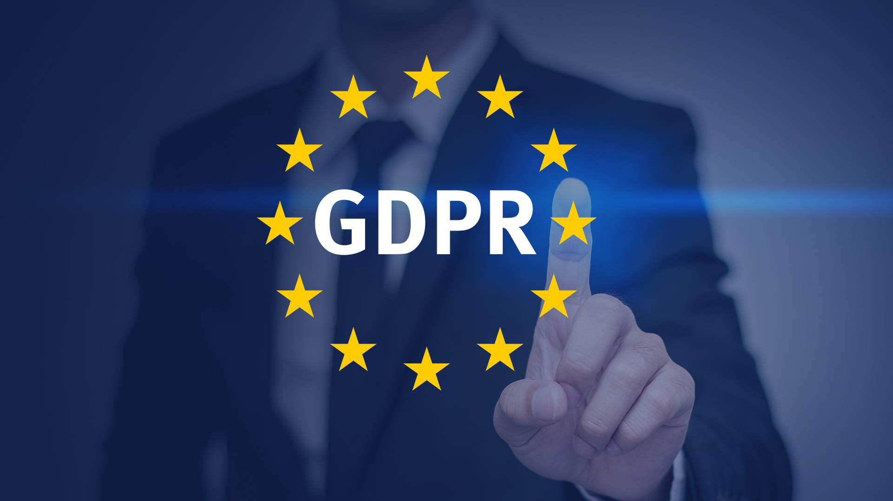
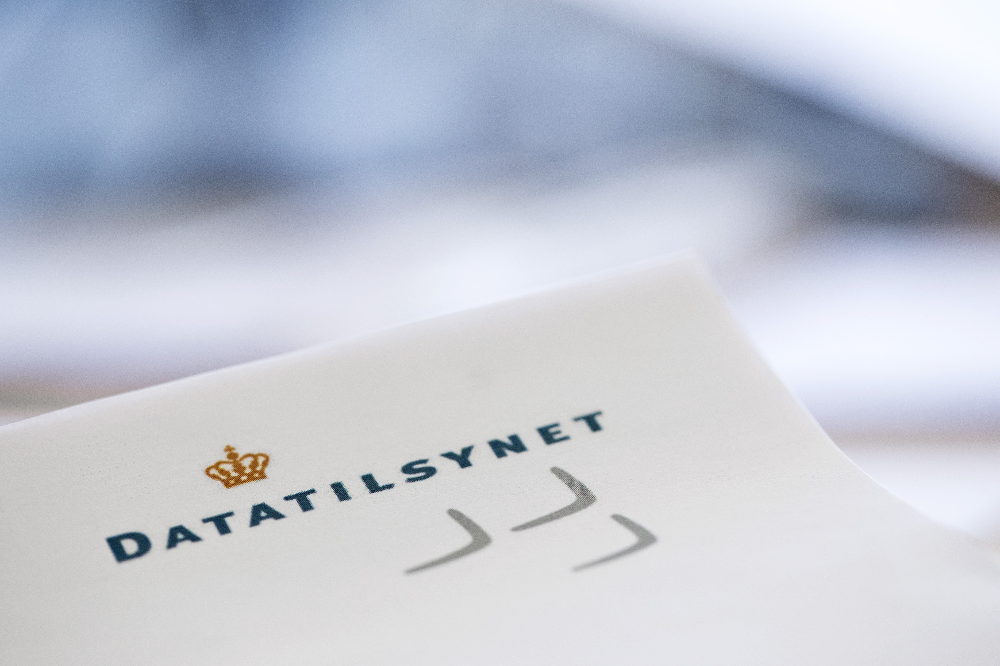

# Persondatabeskyttelse<sup><font color="red"> Premium </font></sup>

## Hvad er databeskyttelse?


Enhver har ret til beskyttelse af sine personoplysninger, og enhver, der behandler personoplysninger om andre i ikke-privat sammenhæng, er forpligtet til at iagttage disse rettigheder og til at beskytte personoplysningerne. 

Disse rettigheder og forpligtelser går samlet under betegnelsen "databeskyttelse".

Enhver behandling af andres personoplysninger, der ikke sker i en rent privat sammenhæng, skal ske i overensstemmelse med reglerne på databeskyttelsesområdet.

Personoplysninger er alle oplysninger, der vedrører en identificeret eller identificerbar fysisk person. 

Den, der behandles personoplysninger om, kaldes som regel *"den registrerede"*, mens den, der behandler personoplysninger om andre, er den *"dataansvarlige*  eller *"databehandleren"*, alt efter hvilken rolle vedkommende har i behandlingen af persondata. 

Den registrerede har en række rettigheder over for den dataansvarlige. 

Det er den registreredes rettigheder, der skal beskyttes, og den dataansvarlige og databehandleren, der har ansvaret for denne beskyttelse. 

Rettighederne har til formål at gøre det gennemsigtigt for den registrerede, hvornår der behandles oplysninger om vedkommende, og hvilke oplysninger, der behandles. Herudover giver rettighederne den registrerede kontrol over sine egne personoplysninger. 

Den dataansvarlige skal sikre sig, at behandlingen af personoplysninger er i overensstemmelse med en række grundprincipper, ligesom der skal være et lovligt grundlag til at behandle oplysningerne. 

Reglerne på databeskyttelsesområdet indebærer også, at den dataansvarlige skal foretage en række mere generelle vurderinger og overvejelser i forhold til selve beskyttelsen af de oplysninger.


Når du som registreret stiller spørgsmålstegn ved en behandling af oplysninger om dig, eller du påberåber dig dine rettigheder over for den dataansvarlige, skal den dataansvarlige reagere på henvendelsen.

Gør den dataansvarlige ikke det - eller er du ikke tilfreds med den dataansvarliges svar, kan du rette henvendelse til Datatilsynet, der kan vejlede dig yderligere om dine rettigheder, herunder dine muligheder for at klage.

---

**Video: Databeskyttelsesforordningen stiller krav til den finansielle sektor**

<div class="video-container"><iframe src="https://www.youtube.com/embed/5OwWsQHpsDc" width="853" height="480" frameborder="0" allowfullscreen="allowfullscreen"></iframe></div>


---

**Video: Databeskyttelsesreglerne på 7 minutter**

<div class="video-container"><iframe src="https://www.youtube.com/embed/AXnQQyVvmuM" width="853" height="480" frameborder="0" allowfullscreen="allowfullscreen"></iframe></div>


---

## Databeskyttelse ved behandling af personoplysninger


Enhver person har således ret til beskyttelse af sine personoplysninger, og enhver, der behandler personoplysninger om andre i ikke-privat sammenhæng, er forpligtet til at iagttage disse rettigheder og til at beskytte disse personoplysninger.^[Følgende afsnit om databeskyttelsesreglerne bygger på Sonny Kristoffersen: ”Kend databeskyttelsesreglerne”, 2019, Samfundslitteratur.]  

Disse rettigheder og forpligtelser går samlet under betegnelsen *"databeskyttelse"*. 

Enhver behandling af andres personoplysninger, der ikke sker i en rent privat sammenhæng, skal ske i overensstemmelse med reglerne på databeskyttelsesområdet, jf. databeskyttelsesforordningen (også kaldet; *”GDPR”* General Data Protection Regulation), som har direkte virkning i Danmark. 
 
Den supplerende databeskyttelseslovs formål er identisk med formålet i databeskyttelsesforordningen, nemlig beskyttelse af fysiske personer i forbindelse med behandling af personoplysninger og fri udveksling af personoplysninger i EU.

Når en virksomhed behandler personoplysninger er den underlagt reglerne i persondataforordningen og databeskyttelsesloven.

Persondataforordningen pålægger virksomhederne en række forpligtelser, når de behandler personoplysninger.

Omvendt får den, der behandles oplysninger om (den registrerede) en række rettigheder.

---

**Video: Intro Databeskyttelsesloven**


<div class="video-container"><iframe src="https://www.youtube.com/embed/bEh-vF-C5-A" width="853" height="480" frameborder="0" allowfullscreen="allowfullscreen"></iframe></div>


**Video: Hvad er persondata?**


<div class="video-container"><iframe src="https://www.youtube.com/embed/jmVTmSLkkh0" width="853" height="480" frameborder="0" allowfullscreen="allowfullscreen"></iframe></div>


---
 


## Hvad er ”behandling” i persondataretten?





Enhver form for oplysning, der knytter sig til en bestemt fysisk person, som gør personen identificerbar. 

Det kan fx være et personnummer, en bopælsadresse, et journalnummer, et bilregistreringsnummer, en IP-adresse osv.

Hvis oplysninger om fysiske personer er fuldstændig anonymiserede, er der ikke tale om personoplysninger.

Ifølge databeskyttelsesforordningens artikel 4, nr. 2, skal begrebet *”behandling”* forstås som enhver aktivitet eller række af aktiviteter - med eller uden brug af automatisk behandling - som personoplysninger eller en samling af personoplysninger gøres til genstand for, f.eks.: 

* indsamling, 
* registrering, 
* organisering, 
* systematisering, 
* opbevaring, 
* tilpasning eller ændring, 
* *genfinding, 
* søgning, 
* brug, 
* videregivelse ved transmission, 
* formidling eller enhver anden form for overladelse, 
* sammenstilling eller samkøring, 
* begrænsning, 
* sletning eller tilintetgørelse.
 

Begrebet *“automatisk databehandling”* er sammenfaldende med *“edb”* eller *“elektronisk behandling”*, som blev anvendt i dagældende databeskyttelsesdirektivets artikel 3, stk. 1. 

Bestemmelsen i databeskyttelsesforordningens artikel 2 svarer således til det tidligere gældende databeskyttelsesdirektivs materielle anvendelsesområde.

Privates aktiviteter på Facebook er ikke omfattet af databeskyttelsesforordningen.  

Anderledes med *fansider på Facebook*, hvor Facebook og administratoren af en fanside har et fælles dataansvar for behandlingen af personoplysninger, som bliver indsamlet i forbindelse med besøg på den pågældende fanside.  
Behandlingsbegrebet skal forstås meget bredt og dækker over enhver form for håndtering af personoplysninger, såsom:  

* Indsamling
* Registrering
* Systematisering
* Opbevaring
* Søgning
* Tilpasning
* Sletning
* Videregivelse
 

## Opdelingen af personoplysningerne

*Databeskyttelsesforordningen opdeler personoplysninger i tre typer:*  

* Almindelige ikke-følsomme oplysninger,
* Særlige kategorier af oplysninger (følsomme oplysninger) og
* Oplysninger om straffedomme og lovovertrædelser eller tilknyttede sikkerhedsforanstaltninger. Der findes to kategorier af personoplysninger
Almindelige ikke-følsomme personoplysninger fx:
* Fx navn, adresse, telefonnummer, køn, alder

*Følsomme personoplysninger fx:*

* Race og etnisk baggrund
* Politisk, religiøs og filosofisk overbevisning
* Fagforeningsmæssigt tilhørsforhold, helbred, seksuel orientering


---

**Video: Kategorier af personoplysninger**

<div class="video-container"><iframe src="https://www.youtube.com/embed/gn5QEtgZcVc" width="853" height="480" frameborder="0" allowfullscreen="allowfullscreen"></iframe></div>


---


```{r personoplysninger, echo=FALSE}

mydf <- data.frame(
  S1 = c("Følsomme personoplysninger" ,"Race, etnisk 
oprindelse, 
politisk, religiøs el. 
filosofisk overbevisning, 
fagforeningsmæssige 
tilhørsforhold, genetiske data, 
biometriske data mhp. entydig 
identifikation, helbredsoplysninger, 
seksuelle forhold eller orientering "),
  S2 = c("" ,
  "Straffedomme og lovovertrædelser"),
  S3 = c("Almindelige personoplysninger",
    "Væsentlige sociale problemer, andre rent private 
forhold, økonomi, skat, gæld, sygedage, tjenstlige forhold, 
familieforhold, bolig, bil, eksamen, ansøgning, CV, 
ansættelsesdato, stilling, arbejdsområde, 
arbejdstelefon, navn, adresse, fødselsdato"
  )
)
names(mydf) <- NULL

mydf %>%
  kable("html", escape = FALSE, caption = "Beskyttelse af personoplysninger" ) %>%
  kable_styling(full_width = T,font_size = 10,bootstrap_options = c("responsive","bordered","striped")) %>%
  column_spec(1, bold = T, border_right = T, color = "white", background = "darkgrey") %>%
  column_spec(2, bold = T, border_right = T, color = "white", background = "black") %>%
  column_spec(3, bold = T, border_right = T, color = "white", background = "grey") %>%
  row_spec(1,italic = T,bold = T,font_size = 12) %>%
  # column_spec(0, angle = -45)%>%
  # scroll_box(width = "500px") %>%
  footnote(general = "Databeskyttelsesforordningen",general_title = "Kilde:")
```


---


---

En anden måde at se de forskellige kategorier af personoplysninger på. Jo højere oppe i trekanten oplysningerne er, desto strengere betingelser for at behandle dem. 


## Hvornår kan der ske behandling af ikke-følsomme oplysninger?

Almindelige personoplysninger omfatter alle oplysninger, der ikke er klassificeret som særlige kategorier af oplysninger (følsomme personoplysninger). 

Det kan for eksempel være identifikationsoplysninger som navn og adresse eller oplysninger om økonomi, skat, gæld, væsentlige sociale problemer, andre rent private forhold, sygedage, tjenstlige forhold, familieforhold, bolig, bil, eksamen, ansøgning, CV, ansættelsesdato og -stilling, arbejdsområde og arbejdstelefon. 

En virksomhed må kun behandle almindelige ikke- følsomme personoplysninger, hvis en af følgende betingelser er opfyldt:

* Virksomheden har et lovligt samtykke
* Behandling er nødvendig for at opfylde en aftale med den registrerede
* Virksomheden er iht. lov forpligtet til at behandle oplysningerne
* Hvis virksomheden har en saglig interesse i at behandle oplysningerne, som overstiger den registreredes interesser.

---

**Videoer: ”Hvordan håndterer I personoplysninger i jeres virksomhed?”**

<div class="video-container"><iframe src="https://www.youtube.com/embed/idYfVNZbQeU" width="853" height="480" frameborder="0" allowfullscreen="allowfullscreen"></iframe></div>


---

<div class="video-container"><iframe src="https://www.youtube.com/embed/qBkWNv9_vsc" width="853" height="480" frameborder="0" allowfullscreen="allowfullscreen"></iframe></div>

---

## Hvornår kan der ske behandling af følsomme oplysninger?
 

Særlige kategorier af personoplysninger (følsomme personoplysninger) følger af databeskyttelsesforordningens artikel 9, stk. 1. 

Følsomme personoplysninger er udtrykkelig afgrænset i databeskyttelsesforordningen, og adgangen til at behandle sådanne oplysninger er snævrere end ved almindelige personoplysninger. 

*Følsomme oplysninger er nærmere oplysninger om*:

* Race og etnisk oprindelse
* Politisk overbevisning
* Religiøs eller filosofisk overbevisning
* Fagforeningsmæssige tilhørsforhold
* Genetiske data
* Biometriske data med henblik på entydig identifikation
* Helbredsoplysninger
* Seksuelle forhold eller seksuel orientering.
* Kun de oplysninger, der er nævnt ovenfor, er følsomme personoplysninger.

Af databeskyttelsesforordningen fremgår det, hvornår der må ske behandling af følsomme oplysninger.  

De følsomme oplysninger omfattet af databeskyttelsesforordningens artikel 9, stk. 1, må dog behandles, hvis der er hjemmel til det i forordningen, hvilket særligt vil sige i databeskyttelsesforordningens artikel 9, stk. 2, litra a-j: 

*  Behandling af de pågældende oplysninger kan således ske på betingelse af, at den registrerede har givet et klart og udtrykkeligt samtykke til behandling af sådanne personoplysninger (litra a) 

Der skal således være tale om en frivillig, specifik og informeret viljestilkendegivelse. 

Et samtykke skal meddeles på en sådan måde, at det klart og utvetydigt fremgår, at den registrerede har meddelt sit samtykke til behandlingen. 

Herudover skal samtykket være udtrykkeligt.  

Heraf følger, at den dataansvarlige ikke vil kunne opnå stiltiende eller indirekte tilslutning til behandling af de i artikel 9, stk. 1 nævnte oplysninger. 

Et egentligt krav om skriftlighed følger ikke af bestemmelsen. 

Der bør dog i videst muligt omfang søges indhentet et skriftligt samtykke fra den registrerede, idet der herved opnås klarhed omkring samtykkets rækkevidde.

Det kan skyldes følgende begrundelser:
 
*  at behandling er nødvendig for at overholde den dataansvarliges eller den registreredes arbejds-, sundheds- og socialretlige forpligtelser og specifikke rettigheder, for så vidt den har hjemmel i EU-retten eller medlemsstaternes nationale ret eller en kollektiv overenskomst i medfør af medlemsstaternes nationale ret, som giver fornødne garantier for den registreredes grundlæggende rettigheder og interesser (litra b), 

*  at behandling er nødvendig for at beskytte den registreredes eller en anden fysisk persons vitale interesser i tilfælde, hvor den registrerede fysisk eller juridisk ikke er i stand til at give samtykke (litra c), 

*  at behandling foretages af en stiftelse, en sammenslutning eller et andet organ, som ikke arbejder med gevinst for øje, og hvis sigte er af politisk, filosofisk, religiøs eller fagforeningsmæssig art, som led i organets legitime aktiviteter og med de fornødne garantier, og på betingelse af at behandlingen alene vedrører organets medlemmer, tidligere medlemmer eller personer, der på grund af organets formål er i regelmæssig kontakt hermed, og at personoplysningerne ikke videregives uden for organet uden den registreredes samtykke (litra d), 

*  at behandling vedrører personoplysninger, som tydeligvis er offentliggjort af den registrerede (litra e),
 
*  at behandling er nødvendig, for at retskrav kan fastlægges, gøres gældende eller forsvares, eller når domstole handler i deres egenskab af domstol (litra f), 

*  at behandling er nødvendig af hensyn til væsentlige samfundsinteresser på grundlag af EU-retten eller medlemsstaternes nationale ret og står i rimeligt forhold til det mål, der forfølges, respekterer det væsentligste indhold af retten til databeskyttelse og sikrer passende og specifikke foranstaltninger til beskyttelse af den registreredes grundlæggende rettigheder og interesser (litra g), 

*  at behandling er nødvendig med henblik på forebyggende medicin  eller arbejdsmedicin til vurdering af arbejdstagerens erhvervsevne, medicinsk diagnose, ydelse af social- og sundhedsomsorg eller -behandling eller forvaltning af social- og sundhedsomsorg og -tjenester på grundlag af EU-retten eller medlemsstaternes nationale ret eller i henhold til en kontrakt med en sundhedsperson og underlagt de betingelser og garantier, der er omhandlet i databeskyttelsesforordningens artikel 9, stk. 3 (litra h), 

*  at behandling er nødvendig af hensyn til samfundsinteresser på folkesundhedsområdet (litra i), eller
 
*  at behandling er nødvendig til arkivformål i samfundets interesse, til videnskabelige eller historiske forskningsformål eller til statistiske formål på grundlag af EU-retten eller medlemsstaternes nationale ret og står i rimeligt forhold til det mål, der forfølges, respekterer det væsentligste indhold af retten til databeskyttelse og sikrer passende og specifikke foranstaltninger til beskyttelse af den registreredes grundlæggende rettigheder og interesser (litra j).
 


---


```{r echo=FALSE}

mydf <- data.frame(
  S1 = c("Følsomme personoplysninger" ,"Som udgangspunkt ikke, medmindre:<br><br>
- Der er givet samtykke<br><br>
- Det sker for at sikre personens vitale interesser, og der ikke kan indhentes samtykke (Sygdomsreglen)<br><br>
- Der er tale om en forening der behandler oplysningerne som led i deres aktiviteter<br><br>
- Hvis man selv har offentliggjort oplysningen<br><br>
- For at kunne fastlægge et retskrav<br><br>
- For at kunne overholde arbejdsretlige forpligtelser"),
  S2 = c("Personoplysninger med særlig beskyttelse" ,
  "Hvis:<br><br>
    - Der er givet samtykke<br><br>
    - Det følger af lovgivningen<br><br>
    - Det sker som til statistiske formål<br><br>
    - Et af kriterierne fra de følsomme oplysninger er opfyldt"),
  S3 = c("Andre personoplysninger",
    "Hvis:<br><br> 
    - Der er givet samtykke<br><br>
    - Det sker for at opfylde en kontrakt<br><br>
    - Det sker for at opfylde en retlig forpligtelse<br><br>
    - Det sker for at sikre personens vitale interesser, og der ikke kan indhentes samtykke (Sygdomsreglen)<br><br>
    - Det sker for at udføre en opgave i samfundets interesse<br><br>
    - Der er en legitim interesse hos virksomheden)"
  )
)
names(mydf) <- NULL

mydf %>%
  kable("html", escape = FALSE,caption = "Hvordan må man opsamle og behandle personoplysninger?") %>%
  kable_styling(full_width = T,font_size = 10,bootstrap_options = c("responsive","bordered","striped")) %>%
  column_spec(1, bold = T, border_right = T, color = "white", background = "black") %>%
  column_spec(2, bold = T, border_right = T, color = "white", background = "grey") %>%
  column_spec(3, bold = T, border_right = T, color = "black", background = "lightgrey") %>%
  row_spec(1,italic = T,bold = T,font_size = 12) %>%
  # column_spec(0, angle = -45)%>%
  # scroll_box(width = "500px") %>%
  footnote(general = "Datatilsynet",general_title = "Kilde:")
```


---


## Virksomhederne skal overholde god databehandlingsskik

**God databehandlingsskik** er en retlig standard, som udfyldes af Datatilsynet. 

Begrebet indebærer bl.a., at behandlingen af oplysninger skal være rimelig og lovlig.

Standarden anses efter praksis fra Datatilsynet for bl.a. at omfatte krav til den dataansvarlige om forudgående underretning af den registrerede om visse behandlingsaktiviteter, en pligt til at notere den registreredes indsigelser i forhold til rigtigheden af de registrerede oplysninger og underretning af berørte personer ved brud på datasikkerheden. 

God databehandlingsskik supplerer således navnlig databeskyttelseslovens regler om den registreredes rettigheder:

* Persondatabehandlingen skal være lovlig og rimelig.
* Formålet skal være sagligt.
* Oplysningerne skal være korrekte og opdaterede.
* Ukorrekte oplysninger bør slettes eller rettes - også når der ikke længere er behov for dem i forhold til det definerede formål.


## Virksomhederne har en oplysningspligt når de behandler personoplysninger

* Den registrerede skal kende virksomhedens identitet og skal vide, hvordan han eller hun kommer i kontakt med virksomheden.
* Den registrerede oplyses om formålet med at behandle persondata og grundlaget (fx samtykke).


## Nærmere om kravet til samtykke for, at der kan behandles personoplysninger

---

**VIdeo: Behandlingshjemlen**

<div class="video-container"><iframe src="https://www.youtube.com/embed/TmYVGZ_al8M" width="853" height="480" frameborder="0" allowfullscreen="allowfullscreen"></iframe></div>

---

Ved spørgsmålet om, hvornår personoplysninger kan behandles, er den altovervejende hovedregel, at personoplysninger vil kunne behandles, såfremt der er det fornødne samtykke fra den registrerede til behandlingen. 

Det følger af databeskyttelsesforordningens artikel 7, stk. 3, at den registrerede til enhver tid har ret til at trække sit samtykke tilbage. 

Tilbagetrækning af samtykke berører ikke lovligheden af den behandling, der er baseret på samtykke inden tilbagetrækningen. 

Inden der gives samtykke, skal den registrerede oplyses om, at samtykket kan trækkes tilbage. 

Det skal være lige så let at trække sit samtykke tilbage som at give det. 

Oplysning om, at samtykket kan trækkes tilbage er således nu efter 25. maj 2018 en gyldighedsbetingelse for det afgivne samtykke. 

For både almindelige og følsomme data gælder i begge sektorer privat som offentlig, at der kan ske behandling, såfremt den registrerede samtykker hertil. 

**Tidspunkt**

Den registreredes samtykke skal være på plads inden, den dataansvarlige påbegynder behandling af de oplysninger, som samtykket angår.

**Formkrav**

Et samtykke kan både afgives mundtligt, skriftligt og digitalt. Det afgørende er, at den registreredes erklæring eller handling tydeligt tilkendegiver den registreredes hensigt, og et samtykke kan derfor ikke gives stiltiende eller være underforstået. 


Den dataansvarlige skal endvidere som nævnt kunne bevise, at den registrerede har givet sit samtykke til behandlingen af personoplysninger og kunne bevise, hvad det meddelte samtykke omfatter. 

Et samtykke bør derfor bør i videst mulige omfang afgives skriftligt eller på anden måde, som kan bevises. 

Kan den dataansvarlige ikke bevise, at der foreligger et gyldigt samtykke, er konsekvensen, at samtykket ikke kan anses for at være i overensstemmelse med forordningen og kan dermed ikke udgøre et lovligt behandlingsgrundlag.

**Frivilligt**

Et samtykke skal være frivilligt. Formålet med et samtykke er at give de registrerede et valg og ikke mindst kontrol over personoplysninger om dem selv. 

Et samtykke anses derfor ikke for at være afgivet frivilligt, hvis den registrerede ikke har et reelt eller frit valg. Et samtykke må f.eks. ikke være afgivet under tvang. 

Dette gælder, uanset om det er den dataansvarlige eller andre, der udøver tvang over for den registrerede. 

Den omstændighed, at den registrerede er i den dataansvarliges varetægt, f.eks. indsat i fængsel, undergivet værnepligt mv., udelukker ikke, at vedkommende kan give et gyldigt samtykke.

Eksempel - En privat sportsforening beder sine medlemmer om samtykke til at tage portrætbilleder af dem for at offentliggøre billederne på sportsforeningens hjemmeside. 

Medlemmerne anses for at have et reelt og frit valg, så længe et nægtet samtykke ikke medfører negative konsekvenser (f.eks. ekskludering af foreningen).^[Jf. Datatilsynets og Justitsministeriets pjece om vejledning om Samtykke, november 2017, s. 4.] 

Speak 23




### Tjekliste for samtykke

Datatilsynet og Justitsministeriet har udarbejdet følgende nedenstående tjekliste, herunder kan den liste tjene som en rettesnor for, om man som dataansvarlig er på linje med kravene i databeskyttelsesforordningen eller ej:^[Jf. Datatilsynets og Justitsministeriets pjece om vejledning om Samtykke, november 2017, s. 18.]

**Tjeklisten for samtykke:**

* Den dataansvarlige har taget stilling til, at samtykke er den mest hensigtsmæssige hjemmel til at behandle data i den givne situation
* Samtykkeanmodningen er tydelig og adskilt fra øvrig tekst, som f.eks. salgs- og leveringsbetingelsesvilkår
* Den dataansvarlige indhenter altid samtykke via et aktivt tilvalg fra den samtykkendes side
* Den dataansvarlige indhenter aldrig samtykke via forudafkrydsede samtykkefelter eller på anden vis, der baserer sig på den samtykkendes passivitet
* Samtykket er formuleret i et klart og enkelt sprog, som er letforståeligt for en person i målgruppen
* Samtykket specificerer formålet med den påtænkte behandling af data
* Hvis den dataansvarlige ønsker samtykke til flere forskellige formål, spørges der om separat samtykke for hvert formål
* Navnet på den/de dataansvarlige fremgår af samtykketeksten
* Den dataansvarlige oplyser om muligheden for at trække samtykket tilbage Der er ikke negative konsekvenser forbundet med ikke at give samtykke
* Samtykke er ikke en betingelse for levering af en vare/ydelse
* Hvis den dataansvarlige udbyder online tjenester direkte rettet mod børn  under 13 år, anvendes der kun samtykke i det omfang, det er muligt at tjekke barnets alder, og den dataansvarlige indhenter forældresamtykke, hvis barnet er under 13 år.
* Den dataansvarlige kan dokumentere, hvem der har givet samtykke, hvornår og hvordan samtykket blev givet, hvad den enkelte har samtykket til, og at samtykket reelt er afgivet frivilligt
* Den dataansvarlige følger regelmæssigt op på, at samtykket stadig er aktuelt og korrekt, og at formålet med behandlingen eller selve behandlingen ikke har ændret sig.

---

**Video: Et overblik for virksomheden om databeskyttelsesreglerne**

<div class="video-container"><iframe src="https://www.youtube.com/embed/gzAiH6jpGVM" width="853" height="480" frameborder="0" allowfullscreen="allowfullscreen"></iframe></div>


--- 

## Hvad er den registreredes rettigheder?
 
Når der behandles oplysninger om en person, kaldes personen *"den registrerede"*. 

Den registrerede har i den forbindelse en række rettigheder over for den dataansvarlige, som behandler ens oplysninger.^[[Jf. Datatilsynets oplysninger: ](https://www.datatilsynet.dk/generelt-om-databeskyttelse/hvad-er-dine-rettigheder/){target="_blank"}.]


Når den registreredes oplysninger bliver behandlet, bør den registrerede først gøre sig klart, hvem der faktisk er ansvarlig for den registrerede oplysninger. 

Det er i denne forbindelse afgørende, hvem der er den *"dataansvarlige"*. 

Den dataansvarlige er den person, virksomhed, forening eller myndighed m.v., som afgør, med hvilket formål og med hvilke hjælpemidler den registreredes personoplysninger behandles. 

*"Databehandleren"* er den, der behandler den registreredes personoplysninger på vegne af den dataansvarlige. 

Databeskyttelsesreglerne indeholder en række rettigheder, som den registrerede kan påberåbe sig over for den dataansvarlige. 

Som registreret har man således blandt andet følgende persondatarettigheder.  


### Ret til indsigt  

Den registrerede har ret til at se de personoplysninger, den dataansvarlige behandler om den registrerede, og få en række oplysninger om behandlingen.^[F.eks. it-systemer, men det kan også være tv-overvågningsbilleder, hvor den registrerede optræder eller oplysninger om den registreredes teletrafik mv.]  

Det fremgår f.eks. af databeskyttelsesforordningens præambelbetragtning (forord) nr. 63, at en registreret bør have ret til indsigt i personoplysninger, der er indsamlet om vedkommende, og til let og med rimelige mellemrum at udøve denne ret med henblik på at forvisse sig om og kontrollere en behandlings lovlighed. 

Dette omfatter registreredes ret til indsigt i deres helbredsoplysninger, f.eks. data i deres lægejournaler om diagnoser, undersøgelsesresultater, lægelige vurderinger samt enhver behandling og ethvert indgreb, der er foretaget.

### Ret til berigtigelse 
Den registrerede har ret til at få urigtige/forkerte personoplysninger om sig rettet. 

Speak 23

### Ret til sletning eller "retten til at blive glemt"

Det fremgår af bestemmelsen i forordningens artikel 17, stk. 1, hvornår en registreret har *ret* til at få personoplysninger om sig slettet af den dataansvarlige uden unødig forsinkelse, og den dataansvarlige samtidig har *pligt* til at slette personoplysninger uden unødig forsinkelse. 

Bestemmelsen i forordningens artikel 17, stk. 1, må skulle forstås således, at forpligtelsen for den dataansvarlige til at slette som udgangspunkt alene opstår, når den registrerede gør brug af sin ret. 

Dette ændrer dog ikke på, at den dataansvarlige til stadighed skal overholde principperne i forordningens artikel 5 om bl.a. formålsbegrænsning, dataminimering, rigtighed og opbevaringsbegrænsning. 

Bestemmelsen gælder for enhver, men i præambelbetragtning nr. 65 fremhæves, at retten navnlig er relevant, når den registrerede har givet sit samtykke som barn og ikke fuldt ud var bekendt med risiciene i forbindelse med behandling, og senere ønsker at fjerne sådanne oplysninger, særligt på internettet.^[Jf. betænkning nr. 1565/2017, afsnit 4.7.3.1. Ret til sletning - artikel 17, stk. 1.]  

Det fremgår desuden, at den registrerede bør kunne udøve denne rettighed, uanset om vedkommende ikke længere er barn. 

Speak 23

### Ret til begrænsning af behandling
  
Den registrerede har ret til at få begrænset behandlingen af sine personoplysninger, hvis én af en række betingelser er opfyldt:

a) Den registrerede bestrider rigtigheden af personoplysningerne. Den dataansvarlige skal i dette tilfælde begrænse behandlingen af oplysningerne i perioden indtil, den dataansvarlige har haft mulighed for at fastslå, om personoplysningerne er korrekte.

b) Den dataansvarlige behandler oplysningerne ulovligt, og den registrerede modsætter sig sletning af oplysningerne, men anmoder om begrænsning af anvendelsen. Den registrerede kan f.eks. foretrække begrænset behandling, hvis den registrerede ønsker, at det skal kunne dokumenteres, hvilke oplysninger, der har indgået i behandlingen af en sag. 

c) Den dataansvarlige har ikke længere brug for personoplysningerne til en behandling, men de er nødvendige for, at et retskrav kan fastlægges, gøres gældende eller forsvares. 

d) Den registrerede har gjort indsigelse mod din behandling. Den dataansvarlige skal begrænse behandlingen af oplysningerne i den periode, hvor det kontrolleres, om den dataansvarlige legitime interesser går forud for den registreredes legitime interesser.

Speak23

### Ret til dataportabilitet 

Retten til *dataportabilitet* indebærer en ret for den registrerede til at modtage egne personoplysninger, som den registrerede har givet til den dataansvarlige, i et struktureret, almindeligt anvendt og maskinlæsbart format til personlig brug uden hindring. 

Den registrerede har i visse tilfælde ret til at modtage sine personoplysninger og til at anmode om, at personoplysningerne overføres fra én dataansvarlig til en anden. 

Ved forordningens artikel 20 er der dermed indført en ny rettighed for den registrerede til dataportabilitet, som indebærer en ret til i visse tilfælde at modtage personoplysninger - som vedkommende har givet til en dataansvarlig - om sig selv i et struktureret, almindeligt anvendt og maskinlæsbart format. 

Herudover indebærer retten til dataportabilitet en rettighed for den registrerede til i visse tilfælde at få transmitteret disse oplysninger om sig selv fra én dataansvarlig til anden uden hindring fra den dataansvarlige, som personoplysningerne er blevet givet til.

Formålet med denne nye rettighed er at øge den registreredes kontrol over egne personoplysninger ved at fremme mulighederne for let at få flyttet, kopieret eller overført vedkommendes personoplysninger til sig selv eller fra én tjenesteudbyder til en anden. 

Retten til dataportabilitet finder ikke anvendelse på behandling, der er nødvendig for at udføre en opgave i samfundets interesse, eller som henhører under offentlig myndighedsudøvelse, som den dataansvarlige har fået pålagt, jf. databeskyttelsesforordningens artikel 20, stk. 3, 2. pkt.


Speak 23

### Ret til indsigelse 

Den registrerede har ret til at gøre indsigelse mod en ellers lovlig behandling af sine personoplysninger. 


Speak 23

### Ret til ikke at være genstand for en automatisk afgørelse

Den registrerede har ret til ikke at være genstand for en automatisk afgørelse udelukkende baseret på automatisk behandling, herunder profilering, jf. nærmere databeskyttelsesforordningens artikel 22, stk. 1.
Speak 23
 
Det er Datatilsynet, som påser at virksomhederne overholder reglerne i databeskyttelsesforordningen og databeskyttelsesloven. 

Derudover udsteder Datatilsynet retningslinjer og anbefalinger for behandling og beskyttelse af persondata.

## Bøder for overtrædelse


Hvis databeskyttelsesforordningens regler overtrædes, kan virksomheden blive straffet af domstolene med meget store bøder.

Overtrædelser kan medføre bøder på op til 20.000.000 EUR, eller hvis det drejer sig om en virksomhed, med op til 4% af virksomhedens samlede globale omsætning i det forudgående regnskabsår, hvis dette beløb er højere end 20.000.000 EUR.

Datatilsynets kompetence til at udstede administrative bødeforelæg er begrænset til tilfælde, hvor sagen er egnet hertil. 

Det vil sige i ukomplicerede sager, hvor der ikke er bevismæssige tvivlsspørgsmål. 

Det er endvidere en forudsætning, at der i retspraksis er fastlagt et tilstrækkeligt præcist bødeniveau for den pågældende overtrædelse.

Som eksempler på sager, der kan anses for egnede til at blive afsluttet ved udstedelse af et administrativt bødeforelæg, kan nævnes sager om utilsigtet offentliggørelse af oplysninger på internettet. 

Sådanne sager er karakteriseret ved, at man ved en fejl er kommet til at offentliggøre oplysninger på internettet. 

Udstedelse af administrative bødeforelæg kan også tænkes anvendt i sager om overtrædelse af reglerne om de registreredes rettigheder, herunder oplysningspligten.

**De første bøder sager er begyndt at komme:**


*Datatilsynet fandt efter tilsyn hos møbelvirksomheden, IDdesign A/S, i oktober 2018, at der var sket behandling af ca. 385.000 kunders personoplysninger i strid med databeskyttelsesforordningens krav om opbevaringsbegrænsning, jf. Datatilsynets j.nr.: 2018-41-0015.*

*Datatilsynet rettede i sin afgørelse kritik mod i alt fire forhold vedrørende sletning hos møbelvirksomheden. Indgivelse af politianmeldelse mod IDdesign og indstilling til bøde på 1,5 mio. kr. skete alene på baggrund af det første forhold. For så vidt angår de sidste tre, udtalte Datatilsynet "alvorlig kritik".*

*Det første forhold rettede sig mod møbelvirksomhedens behandling af kundernes personoplysninger i et ældre ERP-system, der på tidspunktet for tilsyn kun blev brugt i tre butikker. I systemet behandledes oplysninger om kundernes navn, adresse, telefonnummer, e-mail og købshistorik.* 

*I alt blev mere end 820.000 kunders personoplysninger behandlet i det gamle ERP-system. Over halvdelen af disse kunders personoplysninger blev opbevaret i henhold til bogføringslovens § 10 om opbevaring af regnskabsmateriale. Derudover blev personoplysninger om en mindre gruppe på 448 kunder opbevaret, fordi der forelå et mellemværende mellem kunden og IDdesign.* 

*For de resterende kunder forelå der efter Datatilsynets vurdering ikke længere et gyldigt behandlingsformål, og disse kunders personoplysninger blev derfor behandlet i strid med kravet om opbevaringsbegrænsning.*

*De sidste tre forhold omhandlede henholdsvis manglende fastsættelse og dokumentation af slettefrister i det gamle ERP-system, manglende efterlevelse af egne fastsatte slettefrister for personoplysningerne i det nye ERP-system samt manglende dokumentation for sletteprocedurer for virksomhedens rekrutterings- og HR-system.*


**Datatilsynet indstiller taxaselskab til bøde på 1,2 mio. kr. Knap 9 mio. personhenførbare taxature er blevet gemt uden et sagligt formål, vurderer Datatilsynet, jf. j.nr.: 2018-41-0016:**

*Resume*

*Datatilsynet var i efteråret 2018 på et tilsynsbesøg hos Taxa 4x35 , hvor der bl.a. blev set på, om taxaselskabet har fastsat frister for sletning af kundernes oplysninger - og om fristerne bliver efterlevet.*

*Ifølge Taxa 4x35 anonymiseres de oplysninger, der anvendes til kundens bestilling og afvikling af taxature, efter to år, da der herefter ikke længere er behov for at kunne identificere kunden.*

*Det er imidlertid kun kundens navn, der slettes efter de to år - men ikke kundens telefonnummer. Oplysninger om kundens taxature (herunder opsamlings- og afleveringsadresser) kan derfor fortsat henføres til en fysisk person via telefonnummeret, som først slettes efter fem år.*

*Grunden til, at telefonnummeret ikke slettes, er ifølge taxaselskabet, at nummeret er nøglen til systemets database og derfor er nødvendigt i forhold til virksomhedens produkt- og forretningsudvikling.*

*Efter Datatilsynets opfattelse kan man imidlertid ikke fastsætte en slettefrist, som er tre år længere end nødvendigt, blot fordi virksomhedens system gør det besværligt at efterleve reglerne i databeskyttelsesforordningen.*
 
---

**Video: Resumé af databeskyttelsesreglerne**

<div class="video-container"><iframe src="https://www.youtube.com/embed/cnPsjUIThK8" width="853" height="480" frameborder="0" allowfullscreen="allowfullscreen"></iframe></div>

---

**Video: GDPR For Dummies**

<div class="video-container"><iframe src="https://www.youtube.com/embed/jaYdR_cPpq8" width="853" height="480" frameborder="0" allowfullscreen="allowfullscreen"></iframe></div>

---

**Litteratur om databeskyttelsesreglerne:**

*Sonny Kristoffersen*: Kend databeskyttelsesreglerne (2019), *Henrik Waaben* og *Kristian Korfits Nielsen*: Lov om behandling af personoplysninger med kommentarer, 3. udg. (2015), *Peter Blume*: Den nye persondataret – persondataforordningen (2016), og samme: Databeskyttelsesret, 4. udg. (2013), *Peter Blume* og *Jens Kristiansen*: Persondataret i ansættelsesforhold (2011), samt – med særlig henblik på behandling af personoplysninger i den offentlige forvaltning – kapitel 8 i *Niels Fenger*, Forvaltningsloven med kommentarer (2013).


---

 
