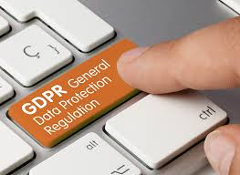
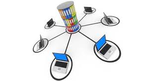
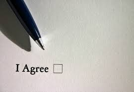
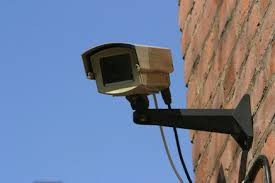
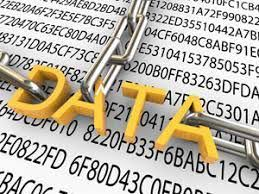
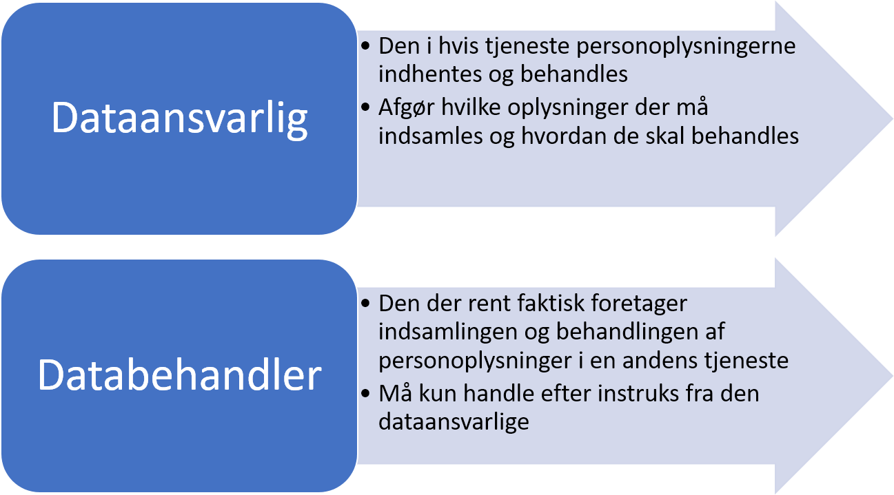

# <font color="red">Databeskyttelse<sup> Premium </font></sup>

```{r, echo=FALSE, results='asis'}
cat(readLines('npp.html'))
```


http://samfundslitteratur.dk/bog/kend-databeskyttelsesreglerne^[Følgende afsnit om databeskyttelsesreglerne bygger på *Sonny Kristoffersen*: ”Kend databeskyttelsesreglerne”, 2019, Samfundslitteratur.]  

---

## <font color="red">Hvad er databeskyttelse?<sup> Premium </font></sup>


Enhver har ret til beskyttelse af sine personoplysninger, og enhver, der behandler personoplysninger om andre i ikke-privat sammenhæng, er forpligtet til at iagttage disse rettigheder og til at beskytte personoplysningerne. 

Disse rettigheder og forpligtelser går samlet under betegnelsen *"databeskyttelse"*.

Enhver behandling af andres personoplysninger, der ikke sker i en rent privat sammenhæng, skal ske i overensstemmelse med reglerne på databeskyttelsesområdet.

Personoplysninger er alle oplysninger, der vedrører en identificeret eller identificerbar fysisk person. 

Den, der behandles personoplysninger om, kaldes som regel *"den registrerede"*, mens den, der behandler personoplysninger om andre, er den *"dataansvarlige*  eller *"databehandleren"*, alt efter hvilken rolle vedkommende har i behandlingen af persondata. 

---

Den registrerede har en række rettigheder over for den dataansvarlige. 

Det er den registreredes rettigheder, der skal beskyttes, og den dataansvarlige og databehandleren, der har ansvaret for denne beskyttelse. 

Rettighederne har til formål at gøre det gennemsigtigt for den registrerede, hvornår der behandles oplysninger om vedkommende, og hvilke oplysninger, der behandles. 

Herudover giver rettighederne den registrerede kontrol over sine egne personoplysninger. 

Den dataansvarlige skal sikre sig, at behandlingen af personoplysninger er i overensstemmelse med en række grundprincipper, ligesom der skal være et lovligt grundlag til at behandle oplysningerne. 

Reglerne på databeskyttelsesområdet indebærer også, at den dataansvarlige skal foretage en række mere generelle vurderinger og overvejelser i forhold til selve beskyttelsen af de oplysninger.

Når du som registreret stiller spørgsmålstegn ved en behandling af oplysninger om dig, eller du påberåber dig dine rettigheder over for den dataansvarlige, skal den dataansvarlige reagere på henvendelsen.

Gør den dataansvarlige ikke det - eller er du ikke tilfreds med den dataansvarliges svar, kan du rette henvendelse til Datatilsynet, der kan vejlede dig yderligere om dine rettigheder, herunder dine muligheder for at klage.

---


**Video: Baggrund for databeskyttelsesregler - kort**

<div class="video-container"><iframe src="https://www.youtube.com/embed/0YMD87kp9_g" width="853" height="480" frameborder="0" allowfullscreen="allowfullscreen"></iframe></div>

---


**Video: Top 5 things to consider for your GDPR preparation**

<div class="video-container"><iframe src="https://www.youtube.com/embed/6fITStJ-4Es" width="853" height="480" frameborder="0" allowfullscreen="allowfullscreen"></iframe></div>


---

**Video: Databeskyttelsesreglerne på 7 minutter**

<div class="video-container"><iframe src="https://www.youtube.com/embed/AXnQQyVvmuM" width="853" height="480" frameborder="0" allowfullscreen="allowfullscreen"></iframe></div>

---

**Video: Databeskyttelsesforordningen stiller krav til den finansielle sektor**

<div class="video-container"><iframe src="https://www.youtube.com/embed/5OwWsQHpsDc" width="853" height="480" frameborder="0" allowfullscreen="allowfullscreen"></iframe></div>


---

## <font color="red">Databeskyttelse ved behandling af personoplysninger<sup> Premium </font></sup>


Enhver person har således ret til beskyttelse af sine personoplysninger, og enhver, der behandler personoplysninger om andre i ikke-privat sammenhæng, er forpligtet til at iagttage disse rettigheder og til at beskytte disse personoplysninger.

Disse rettigheder og forpligtelser går samlet under betegnelsen *"databeskyttelse"*. 

Enhver behandling af andres personoplysninger, der ikke sker i en rent privat sammenhæng, skal ske i overensstemmelse med reglerne på databeskyttelsesområdet, jf. databeskyttelsesforordningen (også kaldet; *”GDPR”* General Data Protection Regulation), som har direkte virkning i Danmark. 





---


**Video: GDPR: What Is It and How Might It Affect You?**

<div class="video-container"><iframe src="https://www.youtube.com/embed/j6wwBqfSk-o" width="853" height="480" frameborder="0" allowfullscreen="allowfullscreen"></iframe></div>

---

**Video: What is the GDPR? | A summary of the EU GDPR**

<div class="video-container"><iframe src="https://www.youtube.com/embed/Assdm6fIHlE" width="853" height="480" frameborder="0" allowfullscreen="allowfullscreen"></iframe></div>


---
 
Den supplerende databeskyttelseslovs formål er identisk med formålet i databeskyttelsesforordningen, nemlig beskyttelse af fysiske personer i forbindelse med behandling af personoplysninger og fri udveksling af personoplysninger i EU.

Når en virksomhed behandler personoplysninger er den underlagt reglerne i persondataforordningen og databeskyttelsesloven.

Persondataforordningen pålægger virksomhederne en række forpligtelser, når de behandler personoplysninger.

Omvendt får den, der behandles oplysninger om (den registrerede) en række rettigheder.

---

**Video: Introduktion til databeskyttelsesloven**


<div class="video-container"><iframe src="https://www.youtube.com/embed/bEh-vF-C5-A" width="853" height="480" frameborder="0" allowfullscreen="allowfullscreen"></iframe></div>

---

**Video: Hvad er persondata?**


<div class="video-container"><iframe src="https://www.youtube.com/embed/jmVTmSLkkh0" width="853" height="480" frameborder="0" allowfullscreen="allowfullscreen"></iframe></div>


---
 


## <font color="red">Hvad er ”behandling” i persondataretten?<sup> Premium </font></sup>


Enhver form for oplysning, der knytter sig til en bestemt fysisk person, som gør personen identificerbar. 

Det kan fx være et personnummer, en bopælsadresse, et journalnummer, et bilregistreringsnummer, en IP-adresse osv.

Hvis oplysninger om fysiske personer er fuldstændig anonymiserede, er der ikke tale om personoplysninger.

Ifølge databeskyttelsesforordningens artikel 4, nr. 2, skal begrebet *”behandling”* forstås som enhver aktivitet eller række af aktiviteter - med eller uden brug af automatisk behandling - som personoplysninger eller en samling af personoplysninger gøres til genstand for, f.eks.: 

* Indsamling. 

* Registrering.

* Organisering.

* Systematisering.

* Opbevaring. 

* Tilpasning eller ændring. 

* Genfinding. 

* Søgning. 

* Brug. 

* Videregivelse ved transmission. 

* Formidling eller enhver anden form for overladelse. 

* Sammenstilling eller samkøring.

* Begrænsning. 

* Sletning eller tilintetgørelse.

---
 



Begrebet *“automatisk databehandling”* er sammenfaldende med *“edb”* eller *“elektronisk behandling”*, som blev anvendt i dagældende databeskyttelsesdirektivets artikel 3, stk. 1. 

Bestemmelsen i databeskyttelsesforordningens artikel 2 svarer således til det tidligere gældende databeskyttelsesdirektivs materielle anvendelsesområde.

Privates aktiviteter på Facebook er ikke omfattet af databeskyttelsesforordningen.  


Anderledes med *fansider på Facebook*, hvor Facebook og administratoren af en fanside har et fælles dataansvar for behandlingen af personoplysninger, som bliver indsamlet i forbindelse med besøg på den pågældende fanside.  

Behandlingsbegrebet skal således forstås meget bredt og dækker over enhver form for håndtering af personoplysninger, såsom:  

* Indsamling.

* Registrering.

* Systematisering.

* Opbevaring.

* Søgning.

* Tilpasning.

* Sletning.

* Videregivelse.
 
---

## <font color="red">Opdelingen af personoplysningerne<sup> Premium </font></sup>


*Databeskyttelsesforordningen opdeler personoplysninger i tre typer:*  

Almindelige ikke-følsomme oplysninger.

Særlige kategorier af oplysninger (følsomme oplysninger) og

Oplysninger om straffedomme og lovovertrædelser eller tilknyttede sikkerhedsforanstaltninger. 

---

Der findes to kategorier af personoplysninger:

Almindelige ikke-følsomme personoplysninger fx:

Navn, adresse, telefonnummer, køn, alder.

---

*Følsomme personoplysninger er fx:*

Race og etnisk baggrund.

Politisk, religiøs og filosofisk overbevisning.

Fagforeningsmæssigt tilhørsforhold, helbred, seksuel orientering.


---

**Video: Kategorier af personoplysninger**

<div class="video-container"><iframe src="https://www.youtube.com/embed/gn5QEtgZcVc" width="853" height="480" frameborder="0" allowfullscreen="allowfullscreen"></iframe></div>


---


```{r personoplysninger, echo=FALSE}

mydf <- data.frame(
  S1 = c("Følsomme personoplysninger" ,"Race, etnisk 
oprindelse, 
politisk, religiøs el. 
filosofisk overbevisning, 
fagforeningsmæssige 
tilhørsforhold, genetiske data, 
biometriske data mhp. entydig 
identifikation, helbredsoplysninger, 
seksuelle forhold eller orientering "),
  S2 = c("" ,
  "Straffedomme og lovovertrædelser"),
  S3 = c("Almindelige personoplysninger",
    "Væsentlige sociale problemer, andre rent private 
forhold, økonomi, skat, gæld, sygedage, tjenstlige forhold, 
familieforhold, bolig, bil, eksamen, ansøgning, CV, 
ansættelsesdato, stilling, arbejdsområde, 
arbejdstelefon, navn, adresse, fødselsdato"
  )
)
names(mydf) <- NULL

mydf %>%
  kable("html", escape = FALSE, caption = "Beskyttelse af personoplysninger" ) %>%
  kable_styling(full_width = T,font_size = 10,bootstrap_options = c("responsive","bordered","striped")) %>%
  column_spec(1, bold = T, border_right = T, color = "white", background = "darkgrey") %>%
  column_spec(2, bold = T, border_right = T, color = "white", background = "black") %>%
  column_spec(3, bold = T, border_right = T, color = "white", background = "grey") %>%
  row_spec(1,italic = T,bold = T,font_size = 12) %>%
  # column_spec(0, angle = -45)%>%
  # scroll_box(width = "500px") %>%
  footnote(general = "Databeskyttelsesforordningen",general_title = "Kilde:")
```


---


---


---

En anden måde at se de forskellige kategorier af personoplysninger på. Jo højere oppe i trekanten oplysningerne er, desto strengere betingelser for at behandle dem. 


---

## <font color="red">Hvornår kan der ske behandling af ikke-følsomme oplysninger?<sup> Premium </font></sup>


Almindelige personoplysninger omfatter alle oplysninger, der ikke er klassificeret som særlige kategorier af oplysninger (følsomme personoplysninger). 

Det kan for eksempel være identifikationsoplysninger som navn og adresse eller oplysninger om økonomi, skat, gæld, væsentlige sociale problemer, andre rent private forhold, sygedage, tjenstlige forhold, familieforhold, bolig, bil, eksamen, ansøgning, CV, ansættelsesdato og -stilling, arbejdsområde og arbejdstelefon. 

En virksomhed må kun behandle almindelige ikke-følsomme personoplysninger, hvis en af følgende betingelser er opfyldt:

Virksomheden har et lovligt samtykke.

Behandling er nødvendig for at opfylde en aftale med den registrerede.

Virksomheden er iht. lov forpligtet til at behandle oplysningerne.

Hvis virksomheden har en saglig interesse i at behandle oplysningerne, som overstiger den registreredes interesser.

---

**Videoer: ”Hvordan håndterer I personoplysninger i jeres virksomhed?”**


<div class="video-container"><iframe src="https://www.youtube.com/embed/idYfVNZbQeU" width="853" height="480" frameborder="0" allowfullscreen="allowfullscreen"></iframe></div>


---

<div class="video-container"><iframe src="https://www.youtube.com/embed/qBkWNv9_vsc" width="853" height="480" frameborder="0" allowfullscreen="allowfullscreen"></iframe></div>

---

## <font color="red">Hvornår kan der ske behandling af følsomme oplysninger?<sup> Premium </font></sup>


Særlige kategorier af personoplysninger (følsomme personoplysninger) følger af databeskyttelsesforordningens artikel 9, stk. 1. 

Følsomme personoplysninger er udtrykkelig afgrænset i databeskyttelsesforordningen, og adgangen til at behandle sådanne oplysninger er snævrere end ved almindelige personoplysninger. 

---

*Følsomme oplysninger er nærmere oplysninger om*:

* Race og etnisk oprindelse.

* Politisk overbevisning.

* Religiøs eller filosofisk overbevisning.

* Fagforeningsmæssige tilhørsforhold.

* Genetiske data.

* Biometriske data med henblik på entydig identifikation.

* Helbredsoplysninger.

* Seksuelle forhold eller seksuel orientering.

* Kun de oplysninger, der er nævnt ovenfor, er følsomme personoplysninger.

---

Af databeskyttelsesforordningen fremgår det, hvornår der må ske behandling af følsomme oplysninger.  

De følsomme oplysninger omfattet af databeskyttelsesforordningens artikel 9, stk. 1, må dog behandles, hvis der er hjemmel til det i forordningen, hvilket særligt vil sige i databeskyttelsesforordningens artikel 9, stk. 2, litra a-j: 

Behandling af de pågældende oplysninger kan således ske på betingelse af, at den registrerede har givet et klart og udtrykkeligt samtykke til behandling af sådanne personoplysninger (litra a). 

Der skal således være tale om en frivillig, specifik og informeret. viljestilkendegivelse. 



Et samtykke skal meddeles på en sådan måde, at det klart og utvetydigt fremgår, at den registrerede har meddelt sit samtykke til behandlingen. 

Herudover skal samtykket være udtrykkeligt.  

Heraf følger, at den dataansvarlige ikke vil kunne opnå stiltiende eller indirekte tilslutning til behandling af de i artikel 9, stk. 1 nævnte oplysninger. 

Et egentligt krav om skriftlighed følger ikke af bestemmelsen. 

Der bør dog i videst muligt omfang søges indhentet et skriftligt samtykke fra den registrerede, idet der herved opnås klarhed omkring samtykkets rækkevidde.

---

*Det kan skyldes følgende begrundelser*:
 
*At* behandling er nødvendig for at overholde den dataansvarliges eller den registreredes arbejds-, sundheds- og socialretlige forpligtelser og specifikke rettigheder, for så vidt den har hjemmel i EU-retten eller medlemsstaternes nationale ret eller en kollektiv overenskomst i medfør af medlemsstaternes nationale ret, som giver fornødne garantier for den registreredes grundlæggende rettigheder og interesser (litra b). 

*At* behandling er nødvendig for at beskytte den registreredes eller en anden fysisk persons vitale interesser i tilfælde, hvor den registrerede fysisk eller juridisk ikke er i stand til at give samtykke (litra c). 

*At* behandling foretages af en stiftelse, en sammenslutning eller et andet organ, som ikke arbejder med gevinst for øje, og hvis sigte er af politisk, filosofisk, religiøs eller fagforeningsmæssig art, som led i organets legitime aktiviteter og med de fornødne garantier, og på betingelse af at behandlingen alene vedrører organets medlemmer, tidligere medlemmer eller personer, der på grund af organets formål er i regelmæssig kontakt hermed, og at personoplysningerne ikke videregives uden for organet uden den registreredes samtykke (litra d).

*At* behandling vedrører personoplysninger, som tydeligvis er offentliggjort af den registrerede (litra e).
 
*At* behandling er nødvendig, for at retskrav kan fastlægges, gøres gældende eller forsvares, eller når domstole handler i deres egenskab af domstol (litra f), 

*At* behandling er nødvendig af hensyn til væsentlige samfundsinteresser på grundlag af EU-retten eller medlemsstaternes nationale ret og står i rimeligt forhold til det mål, der forfølges, respekterer det væsentligste indhold af retten til databeskyttelse og sikrer passende og specifikke foranstaltninger til beskyttelse af den registreredes grundlæggende rettigheder og interesser (litra g). 

*At* behandling er nødvendig med henblik på forebyggende medicin eller arbejdsmedicin til vurdering af arbejdstagerens erhvervsevne, medicinsk diagnose, ydelse af social- og sundhedsomsorg eller -behandling eller forvaltning af social- og sundhedsomsorg og -tjenester på grundlag af EU-retten eller medlemsstaternes nationale ret eller i henhold til en kontrakt med en sundhedsperson og underlagt de betingelser og garantier, der er omhandlet i databeskyttelsesforordningens artikel 9, stk. 3 (litra h), 

*At* behandling er nødvendig af hensyn til samfundsinteresser på folkesundhedsområdet (litra i), eller
 
*At* behandling er nødvendig til arkivformål i samfundets interesse, til videnskabelige eller historiske forskningsformål eller til statistiske formål på grundlag af EU-retten eller medlemsstaternes nationale ret og står i rimeligt forhold til det mål, der forfølges, respekterer det væsentligste indhold af retten til databeskyttelse og sikrer passende og specifikke foranstaltninger til beskyttelse af den registreredes grundlæggende rettigheder og interesser (litra j).

---
 


---


```{r echo=FALSE}

mydf <- data.frame(
  S1 = c("Følsomme personoplysninger" ,"Som udgangspunkt ikke, medmindre:<br><br>
- Der er givet samtykke<br><br>
- Det sker for at sikre personens vitale interesser, og der ikke kan indhentes samtykke (Sygdomsreglen)<br><br>
- Der er tale om en forening der behandler oplysningerne som led i deres aktiviteter<br><br>
- Hvis man selv har offentliggjort oplysningen<br><br>
- For at kunne fastlægge et retskrav<br><br>
- For at kunne overholde arbejdsretlige forpligtelser"),
  S2 = c("Personoplysninger med særlig beskyttelse" ,
  "Hvis:<br><br>
    - Der er givet samtykke<br><br>
    - Det følger af lovgivningen<br><br>
    - Det sker som til statistiske formål<br><br>
    - Et af kriterierne fra de følsomme oplysninger er opfyldt"),
  S3 = c("Andre personoplysninger",
    "Hvis:<br><br> 
    - Der er givet samtykke<br><br>
    - Det sker for at opfylde en kontrakt<br><br>
    - Det sker for at opfylde en retlig forpligtelse<br><br>
    - Det sker for at sikre personens vitale interesser, og der ikke kan indhentes samtykke (Sygdomsreglen)<br><br>
    - Det sker for at udføre en opgave i samfundets interesse<br><br>
    - Der er en legitim interesse hos virksomheden)"
  )
)
names(mydf) <- NULL

mydf %>%
  kable("html", escape = FALSE,caption = "Hvordan må man opsamle og behandle personoplysninger?") %>%
  kable_styling(full_width = T,font_size = 10,bootstrap_options = c("responsive","bordered","striped")) %>%
  column_spec(1, bold = T, border_right = T, color = "white", background = "black") %>%
  column_spec(2, bold = T, border_right = T, color = "white", background = "grey") %>%
  column_spec(3, bold = T, border_right = T, color = "black", background = "lightgrey") %>%
  row_spec(1,italic = T,bold = T,font_size = 12) %>%
  # column_spec(0, angle = -45)%>%
  # scroll_box(width = "500px") %>%
  footnote(general = "Datatilsynet",general_title = "Kilde:")
```


---


## <font color="red">Virksomhederne skal overholde god databehandlingsskik<sup> Premium </font></sup>


**God databehandlingsskik** er en retlig standard, som udfyldes af Datatilsynet. 

Begrebet indebærer bl.a., at behandlingen af oplysninger skal være rimelig og lovlig.

Standarden anses efter praksis fra Datatilsynet for bl.a. at omfatte krav til den dataansvarlige om forudgående underretning af den registrerede om visse behandlingsaktiviteter, en pligt til at notere den registreredes indsigelser i forhold til rigtigheden af de registrerede oplysninger og underretning af berørte personer ved brud på datasikkerheden. 

---

God databehandlingsskik supplerer således navnlig databeskyttelseslovens regler om den registreredes rettigheder:

* Persondatabehandlingen skal være lovlig og rimelig.

* Formålet skal være sagligt.

* Oplysningerne skal være korrekte og opdaterede.

* Ukorrekte oplysninger bør slettes eller rettes - også når der ikke længere er behov for dem i forhold til det definerede formål.

---

**Video: God behandlingsskik**

<div class="video-container"><iframe src="https://www.youtube.com/embed/3QSmFgl4V2E" width="853" height="480" frameborder="0" allowfullscreen="allowfullscreen"></iframe></div>


---

## <font color="red">Virksomhederne har en oplysningspligt når de behandler personoplysninger<sup> Premium </font></sup>

Den registrerede skal kende virksomhedens identitet og skal vide, hvordan han eller hun kommer i kontakt med virksomheden.

Den registrerede oplyses om formålet med at behandle persondata og grundlaget (fx samtykke).

---

**Video: Oplysningspligt**

<div class="video-container"><iframe src="https://www.youtube.com/embed/NMB734l1XfM" width="853" height="480" frameborder="0" allowfullscreen="allowfullscreen"></iframe></div>

---


## <font color="red">Nærmere om kravet til samtykke for, at der kan behandles personoplysninger<sup> Premium </font></sup>

---

**Video: Samtykket**

<div class="video-container"><iframe src="https://www.youtube.com/embed/7sQbAZSHRFU" width="853" height="480" frameborder="0" allowfullscreen="allowfullscreen"></iframe></div>

---

**Video: Behandlingshjemlen**

<div class="video-container"><iframe src="https://www.youtube.com/embed/TmYVGZ_al8M" width="853" height="480" frameborder="0" allowfullscreen="allowfullscreen"></iframe></div>

---

Ved spørgsmålet om, hvornår personoplysninger kan behandles, er den altovervejende hovedregel, at personoplysninger vil kunne behandles, såfremt der er det fornødne samtykke fra den registrerede til behandlingen. 

Det følger af databeskyttelsesforordningens artikel 7, stk. 3, at den registrerede til enhver tid har ret til at trække sit samtykke tilbage. 

Tilbagetrækning af samtykke berører ikke lovligheden af den behandling, der er baseret på samtykke inden tilbagetrækningen. 

Inden der gives samtykke, skal den registrerede oplyses om, at samtykket kan trækkes tilbage. 

Det skal være lige så let at trække sit samtykke tilbage som at give det. 

Oplysning om, at samtykket kan trækkes tilbage er således nu efter 25. maj 2018 en gyldighedsbetingelse for det afgivne samtykke. 

For både almindelige og følsomme data gælder i begge sektorer privat som offentlig, at der kan ske behandling, såfremt den registrerede samtykker hertil. 

---

*Tidspunkt*

Den registreredes samtykke skal være på plads inden, den dataansvarlige påbegynder behandling af de oplysninger, som samtykket angår.

*Formkrav*


Et samtykke kan både afgives mundtligt, skriftligt og digitalt. 

Det afgørende er, at den registreredes erklæring eller handling tydeligt tilkendegiver den registreredes hensigt, og et samtykke kan derfor ikke gives stiltiende eller være underforstået. 

Den dataansvarlige skal endvidere som nævnt kunne bevise, at den registrerede har givet sit samtykke til behandlingen af personoplysninger og kunne bevise, hvad det meddelte samtykke omfatter. 

Et samtykke bør derfor bør i videst mulige omfang afgives skriftligt eller på anden måde, som kan bevises. 

Kan den dataansvarlige ikke bevise, at der foreligger et gyldigt samtykke, er konsekvensen, at samtykket ikke kan anses for at være i overensstemmelse med forordningen og kan dermed ikke udgøre et lovligt behandlingsgrundlag.

---

*Frivilligt*

Et samtykke skal være frivilligt. Formålet med et samtykke er at give de registrerede et valg og ikke mindst kontrol over personoplysninger om dem selv. 

Et samtykke anses derfor ikke for at være afgivet frivilligt, hvis den registrerede ikke har et reelt eller frit valg. Et samtykke må f.eks. ikke være afgivet under tvang. 

Dette gælder, uanset om det er den dataansvarlige eller andre, der udøver tvang over for den registrerede. 

Den omstændighed, at den registrerede er i den dataansvarliges varetægt, f.eks. indsat i fængsel, undergivet værnepligt mv., udelukker ikke, at vedkommende kan give et gyldigt samtykke.

Eksempel - En privat sportsforening beder sine medlemmer om samtykke til at tage portrætbilleder af dem for at offentliggøre billederne på sportsforeningens hjemmeside. 

Medlemmerne anses for at have et reelt og frit valg, så længe et nægtet samtykke ikke medfører negative konsekvenser (f.eks. ekskludering af foreningen).^[Jf. Datatilsynets og Justitsministeriets pjece om vejledning om Samtykke, november 2017, s. 4.] 


---

### <font color="red">Tjekliste for samtykke<sup> Premium </font></sup>


Datatilsynet og Justitsministeriet har udarbejdet følgende nedenstående tjekliste, herunder kan den liste tjene som en rettesnor for, om man som dataansvarlig er på linje med kravene i databeskyttelsesforordningen eller ej:^[Jf. Datatilsynets og Justitsministeriets pjece om vejledning om Samtykke, november 2017, s. 18.]

---

*Tjeklisten for samtykke:*

Den dataansvarlige har taget stilling til, at samtykke er den mest hensigtsmæssige hjemmel til at behandle data i den givne situation.

Samtykkeanmodningen er tydelig og adskilt fra øvrig tekst, som f.eks. salgs- og leveringsbetingelsesvilkår.

Den dataansvarlige indhenter altid samtykke via et aktivt tilvalg fra den samtykkendes side.

Den dataansvarlige indhenter aldrig samtykke via forudafkrydsede samtykkefelter eller på anden vis, der baserer sig på den samtykkendes passivitet.

Samtykket er formuleret i et klart og enkelt sprog, som er letforståeligt for en person i målgruppen.

Samtykket specificerer formålet med den påtænkte behandling af data.

Hvis den dataansvarlige ønsker samtykke til flere forskellige formål, spørges der om separat samtykke for hvert formål.

Navnet på den/de dataansvarlige fremgår af samtykketeksten.

Den dataansvarlige oplyser om muligheden for at trække samtykket tilbage Der er ikke negative konsekvenser forbundet med ikke at give samtykke.

Samtykke er ikke en betingelse for levering af en vare/ydelse.

Hvis den dataansvarlige udbyder online tjenester direkte rettet mod børn under 13 år, anvendes der kun samtykke i det omfang, det er muligt at tjekke barnets alder, og den dataansvarlige indhenter forældresamtykke, hvis barnet er under 13 år.

Den dataansvarlige kan dokumentere, hvem der har givet samtykke, hvornår og hvordan samtykket blev givet, hvad den enkelte har samtykket til, og at samtykket reelt er afgivet frivilligt.

Den dataansvarlige følger regelmæssigt op på, at samtykket stadig er aktuelt og korrekt, og at formålet med behandlingen eller selve behandlingen ikke har ændret sig.

---

**Video: Et overblik for virksomheden om databeskyttelsesreglerne**

<div class="video-container"><iframe src="https://www.youtube.com/embed/gzAiH6jpGVM" width="853" height="480" frameborder="0" allowfullscreen="allowfullscreen"></iframe></div>


--- 

## <font color="red">Hvad er den registreredes rettigheder?<sup> Premium </font></sup>


 
Når der behandles oplysninger om en person, kaldes personen *"den registrerede"*. 

Den registrerede har i den forbindelse en række rettigheder over for den dataansvarlige, som behandler ens oplysninger.^[[Jf. Datatilsynets oplysninger: ](https://www.datatilsynet.dk/generelt-om-databeskyttelse/hvad-er-dine-rettigheder/){target="_blank"}.]


Når den registreredes oplysninger bliver behandlet, bør den registrerede først gøre sig klart, hvem der faktisk er ansvarlig for den registrerede oplysninger. 

Det er i denne forbindelse afgørende, hvem der er den *"dataansvarlige"*. 

Den dataansvarlige er den person, virksomhed, forening eller myndighed m.v., som afgør, med hvilket formål og med hvilke hjælpemidler den registreredes personoplysninger behandles. 

*"Databehandleren"* er den, der behandler den registreredes personoplysninger på vegne af den dataansvarlige. 

Databeskyttelsesreglerne indeholder en række rettigheder, som den registrerede kan påberåbe sig over for den dataansvarlige. 

Som registreret har man således blandt andet følgende persondatarettigheder.  

---

### <font color="red">Ret til indsigt<sup> Premium </font></sup>




Den registrerede har ret til at se de personoplysninger, den dataansvarlige behandler om den registrerede, og få en række oplysninger om behandlingen.^[F.eks. it-systemer, men det kan også være tv-overvågningsbilleder, hvor den registrerede optræder eller oplysninger om den registreredes teletrafik mv.].  

Det fremgår f.eks. af databeskyttelsesforordningens præambelbetragtning (forord) nr. 63, at en registreret bør have ret til indsigt i personoplysninger, der er indsamlet om vedkommende, og til let og med rimelige mellemrum at udøve denne ret med henblik på at forvisse sig om og kontrollere en behandlings lovlighed. 

Dette omfatter registreredes ret til indsigt i deres helbredsoplysninger, f.eks. data i deres lægejournaler om diagnoser, undersøgelsesresultater, lægelige vurderinger samt enhver behandling og ethvert indgreb, der er foretaget.

---


### <font color="red">Ret til berigtigelse<sup> Premium </font></sup>



Den registrerede har ret til at få urigtige/forkerte personoplysninger om sig rettet. 


---

### <font color="red">Ret til sletning eller "retten til at blive glemt"<sup> Premium </font></sup>


---

**Video: Indsigelsesret og anmodning om sletning**

<div class="video-container"><iframe src="https://www.youtube.com/embed/bJAmhsu0Xjg" width="853" height="480" frameborder="0" allowfullscreen="allowfullscreen"></iframe></div>

---

Det fremgår af bestemmelsen i forordningens artikel 17, stk. 1, hvornår en registreret har *ret* til at få personoplysninger om sig slettet af den dataansvarlige uden unødig forsinkelse, og den dataansvarlige samtidig har *pligt* til at slette personoplysninger uden unødig forsinkelse. 

Bestemmelsen i forordningens artikel 17, stk. 1, må skulle forstås således, at forpligtelsen for den dataansvarlige til at slette som udgangspunkt alene opstår, når den registrerede gør brug af sin ret. 

Dette ændrer dog ikke på, at den dataansvarlige til stadighed skal overholde principperne i forordningens artikel 5 om bl.a. formålsbegrænsning, dataminimering, rigtighed og opbevaringsbegrænsning. 

Bestemmelsen gælder for enhver, men i præambelbetragtning nr. 65 fremhæves, at retten navnlig er relevant, når den registrerede har givet sit samtykke som barn og ikke fuldt ud var bekendt med risiciene i forbindelse med behandling, og senere ønsker at fjerne sådanne oplysninger, særligt på internettet.^[Jf. betænkning nr. 1565/2017, afsnit 4.7.3.1. Ret til sletning - artikel 17, stk. 1.].  

Det fremgår desuden, at den registrerede bør kunne udøve denne rettighed, uanset om vedkommende ikke længere er barn. 


---

### <font color="red">Ret til begrænsning af behandling<sup> Premium </font></sup>


  
Den registrerede har ret til at få begrænset behandlingen af sine personoplysninger, hvis én af en række betingelser er opfyldt:

a) Den registrerede bestrider rigtigheden af personoplysningerne. 

Den dataansvarlige skal i dette tilfælde begrænse behandlingen af oplysningerne i perioden indtil, den dataansvarlige har haft mulighed for at fastslå, om personoplysningerne er korrekte.

b) Den dataansvarlige behandler oplysningerne ulovligt, og den registrerede modsætter sig sletning af oplysningerne, men anmoder om begrænsning af anvendelsen. 

Den registrerede kan f.eks. foretrække begrænset behandling, hvis den registrerede ønsker, at det skal kunne dokumenteres, hvilke oplysninger, der har indgået i behandlingen af en sag. 

c) Den dataansvarlige har ikke længere brug for personoplysningerne til en behandling, men de er nødvendige for, at et retskrav kan fastlægges, gøres gældende eller forsvares. 

d) Den registrerede har gjort indsigelse mod din behandling. Den dataansvarlige skal begrænse behandlingen af oplysningerne i den periode, hvor det kontrolleres, om den dataansvarlige legitime interesser går forud for den registreredes legitime interesser.


---

### <font color="red">Ret til dataportabilitet<sup> Premium </font></sup>


Retten til *dataportabilitet* indebærer en ret for den registrerede til at modtage egne personoplysninger, som den registrerede har givet til den dataansvarlige, i et struktureret, almindeligt anvendt og maskinlæsbart format til personlig brug uden hindring. 

Den registrerede har i visse tilfælde ret til at modtage sine personoplysninger og til at anmode om, at personoplysningerne overføres fra én dataansvarlig til en anden. 

Ved forordningens artikel 20 er der dermed indført en ny rettighed for den registrerede til dataportabilitet, som indebærer en ret til i visse tilfælde at modtage personoplysninger - som vedkommende har givet til en dataansvarlig - om sig selv i et struktureret, almindeligt anvendt og maskinlæsbart format. 

Herudover indebærer retten til dataportabilitet en rettighed for den registrerede til i visse tilfælde at få transmitteret disse oplysninger om sig selv fra én dataansvarlig til anden uden hindring fra den dataansvarlige, som personoplysningerne er blevet givet til.

Formålet med denne nye rettighed er at øge den registreredes kontrol over egne personoplysninger ved at fremme mulighederne for let at få flyttet, kopieret eller overført vedkommendes personoplysninger til sig selv eller fra én tjenesteudbyder til en anden. 

Retten til dataportabilitet finder ikke anvendelse på behandling, der er nødvendig for at udføre en opgave i samfundets interesse, eller som henhører under offentlig myndighedsudøvelse, som den dataansvarlige har fået pålagt, jf. databeskyttelsesforordningens artikel 20, stk. 3, 2. pkt.


---

**Video: Indsigtsbegæring**

<div class="video-container"><iframe src="https://www.youtube.com/embed/TeJ1xbrjDJU" width="853" height="480" frameborder="0" allowfullscreen="allowfullscreen"></iframe></div>


---

### <font color="red">Ret til indsigelse<sup> Premium </font></sup>


Den registrerede har ret til at gøre indsigelse mod en ellers lovlig behandling af sine personoplysninger. 

---

### <font color="red">Ret til ikke at være genstand for en automatisk afgørelse<sup> Premium </font></sup>


Den registrerede har ret til ikke at være genstand for en automatisk afgørelse udelukkende baseret på automatisk behandling, herunder profilering, jf. nærmere databeskyttelsesforordningens artikel 22, stk. 1.

Det er Datatilsynet, som påser at virksomhederne overholder reglerne i databeskyttelsesforordningen og databeskyttelsesloven. 

Derudover udsteder Datatilsynet retningslinjer og anbefalinger for behandling og beskyttelse af persondata.


---

### <font color="red">Dataansvarlig og databehandler<sup> Premium </font></sup>  

---




---

**Video: Dataansvarlig og databehandler**

<div class="video-container"><iframe src="https://www.youtube.com/embed/L49BE_nqLKU" width="853" height="480" frameborder="0" allowfullscreen="allowfullscreen"></iframe></div>

---

**Video: Data Protection Officer (DPO)**

<div class="video-container"><iframe src="https://www.youtube.com/embed/JlRCfJKrAi0" width="853" height="480" frameborder="0" allowfullscreen="allowfullscreen"></iframe></div>

---

**Video om dataansvarlig og databehandler**

<div class="video-container"><iframe src="https://www.youtube.com/embed/a23YoOgb2h0" width="853" height="480" frameborder="0" allowfullscreen="allowfullscreen"></iframe></div>


---

**Video: Fortegnelse**

<div class="video-container"><iframe src="https://www.youtube.com/embed/-M8bYIHlbBA" width="853" height="480" frameborder="0" allowfullscreen="allowfullscreen"></iframe></div>

---


## <font color="red">Bøder for overtrædelse<sup> Premium </font></sup>

---

**Video: Bøder**

<div class="video-container"><iframe src="https://www.youtube.com/embed/RBKJ6SBtEIY" width="853" height="480" frameborder="0" allowfullscreen="allowfullscreen"></iframe></div>

---

**Video: GDPR Compliance 2019 Summary - 10 Steps in 10 Minutes to Avoid Fines**

<div class="video-container"><iframe src="https://www.youtube.com/embed/WPwG-MNMuBQ" width="853" height="480" frameborder="0" allowfullscreen="allowfullscreen"></iframe></div>


---

Hvis databeskyttelsesforordningens regler overtrædes, kan virksomheden blive straffet af domstolene med meget store bøder.

Overtrædelser kan medføre bøder på op til 20.000.000 EUR, eller hvis det drejer sig om en virksomhed, med op til 4% af virksomhedens samlede globale omsætning i det forudgående regnskabsår, hvis dette beløb er højere end 20.000.000 EUR.

Datatilsynets kompetence til at udstede administrative bødeforelæg er begrænset til tilfælde, hvor sagen er egnet hertil. 

Det vil sige i ukomplicerede sager, hvor der ikke er bevismæssige tvivlsspørgsmål. 

Det er endvidere en forudsætning, at der i retspraksis er fastlagt et tilstrækkeligt præcist bødeniveau for den pågældende overtrædelse.

Som eksempler på sager, der kan anses for egnede til at blive afsluttet ved udstedelse af et administrativt bødeforelæg, kan nævnes sager om utilsigtet offentliggørelse af oplysninger på internettet. 

Sådanne sager er karakteriseret ved, at man ved en fejl er kommet til at offentliggøre oplysninger på internettet. 

Udstedelse af administrative bødeforelæg kan også tænkes anvendt i sager om overtrædelse af reglerne om de registreredes rettigheder, herunder oplysningspligten.

---

*De første bøder sager er begyndt at komme:*


Datatilsynet fandt efter tilsyn hos møbelvirksomheden, IDdesign A/S, i oktober 2018, at der var sket behandling af ca. 385.000 kunders personoplysninger i strid med databeskyttelsesforordningens krav om opbevaringsbegrænsning, jf. **Datatilsynets sagsnr.: 2018-41-0015:**

"Datatilsynet rettede i sin afgørelse kritik mod i alt fire forhold vedrørende sletning hos møbelvirksomheden. Indgivelse af politianmeldelse mod IDdesign og indstilling til bøde på 1,5 mio. kr. skete alene på baggrund af det første forhold. For så vidt angår de sidste tre, udtalte Datatilsynet "alvorlig kritik".

Det første forhold rettede sig mod møbelvirksomhedens behandling af kundernes personoplysninger i et ældre ERP-system, der på tidspunktet for tilsyn kun blev brugt i tre butikker. I systemet behandledes oplysninger om kundernes navn, adresse, telefonnummer, e-mail og købshistorik. 

I alt blev mere end 820.000 kunders personoplysninger behandlet i det gamle ERP-system. Over halvdelen af disse kunders personoplysninger blev opbevaret i henhold til bogføringslovens § 10 om opbevaring af regnskabsmateriale. Derudover blev personoplysninger om en mindre gruppe på 448 kunder opbevaret, fordi der forelå et mellemværende mellem kunden og IDdesign.

For de resterende kunder forelå der efter Datatilsynets vurdering ikke længere et gyldigt behandlingsformål, og disse kunders personoplysninger blev derfor behandlet i strid med kravet om opbevaringsbegrænsning.

De sidste tre forhold omhandlede henholdsvis manglende fastsættelse og dokumentation af slettefrister i det gamle ERP-system, manglende efterlevelse af egne fastsatte slettefrister for personoplysningerne i det nye ERP-system samt manglende dokumentation for sletteprocedurer for virksomhedens rekrutterings- og HR-system.

---

Datatilsynet indstiller taxaselskab til bøde på 1,2 mio. kr. Knap 9 mio. personhenførbare taxature er blevet gemt uden et sagligt formål, vurderer **Datatilsynets sagsnr.: 2018-41-0016:**

*Resume*


Datatilsynet var i efteråret 2018 på et tilsynsbesøg hos Taxa 4x35 , hvor der bl.a. blev set på, om taxaselskabet har fastsat frister for sletning af kundernes oplysninger - og om fristerne bliver efterlevet.

"Ifølge Taxa 4x35 anonymiseres de oplysninger, der anvendes til kundens bestilling og afvikling af taxature, efter to år, da der herefter ikke længere er behov for at kunne identificere kunden.

Det er imidlertid kun kundens navn, der slettes efter de to år - men ikke kundens telefonnummer. Oplysninger om kundens taxature (herunder opsamlings- og afleveringsadresser) kan derfor fortsat henføres til en fysisk person via telefonnummeret, som først slettes efter fem år.

Grunden til, at telefonnummeret ikke slettes, er ifølge taxaselskabet, at nummeret er nøglen til systemets database og derfor er nødvendigt i forhold til virksomhedens produkt- og forretningsudvikling.

Efter Datatilsynets opfattelse kan man imidlertid ikke fastsætte en slettefrist, som er tre år længere end nødvendigt, blot fordi virksomhedens system gør det besværligt at efterleve reglerne i databeskyttelsesforordningen."
 
---

## <font color="red">Spørgsmål og svar på databeskyttelsesreglerne<sup> Premium </font></sup>


Ofte stillede spørgsmål til datatilsynet:^[Følgende afsnit om spørgsmål og svar, jf. Datatilsynets hjemmeside: https://www.datatilsynet.dk/generelt-om-databeskyttelse/ofte-stillede-spoergsmaal/.]

---

*Generelt:*

*Betragtes et billede som en personoplysning?*

Ja, hvis det drejer sig om et billede af en genkendelig person, vil der være tale om en personoplysning omfattet af databeskyttelsesreglerne.

---

*Skal jeg have Datatilsynets tilladelse til at behandle personoplysninger?*

Oftest nej.

I nogle meget få tilfælde skal private virksomheder mv. dog indhente Datatilsynets tilladelse, inden behandlingen påbegyndes.

---

*Hvem er den dataansvarlige?*

Databeskyttelsesforordningen definerer ”den dataansvarlige” som den fysiske eller juridiske person, offentlige myndighed, institution mv., der alene eller sammen med andre afgør, til hvilket formål og med hvilke hjælpemidler der må foretages behandling af oplysninger.

Det afgørende er, hvem der faktisk afgør, hvordan oplysningerne skal behandles.

---

*Har jeg efter de databeskyttelsesretlige regler pligt til at udlevere oplysninger om mig?*

Nej, databeskyttelsesreglerne handler kun om, hvornår en offentlig myndighed, privat virksomhed mv. kan og må behandle personoplysninger.

Reglerne fastslår ikke, hvornår en offentlig myndighed, privat virksomhed mv. har krav på at få oplysninger om dig.

Du skal imidlertid være opmærksom på, at det i en konkret situation kan følge af anden lovgivning, at du har pligt til at udlevere oplysninger om dig, og hvilke konsekvenser det har, hvis du ikke ønsker at udlevere oplysningerne.

---

*Jeg er blevet opmærksom på, at diverse hjemmesider har oplysninger om mig, fx om min bil eller min bolig. Hvad gør jeg?*

Private virksomheder mv. kan som udgangspunkt lovligt indsamle, registrere, bearbejde og videregive personoplysninger, der er indhentet fra et eller flere offentligt tilgængelige registre såsom Statstidende, CVR, Bilbogen, Motorregistret og lignende.

Der findes ingen specifikke regler i databeskyttelsesforordningen og databeskyttelsesloven om private virksomheders mv. behandling af sådanne oplysninger, men Datatilsynet har i konkrete tilfælde tidligere vurderet lovligheden af sådanne behandlinger ud fra den såkaldte interesseafvejningsregel, hvor tilsynet har lagt særlig vægt på, at oplysningerne stammer fra offentligt tilgængelige kilder.

Du har ret til at gøre indsigelse over for den private virksomhed mv. mod dennes behandling af oplysninger om dig.

Det skal dog bemærkes, at idet behandlingen af sådanne oplysninger som udgangspunkt er lovlig, vil din indsigelse kun blive anset for berettiget, hvis særligt tungtvejende grunde, der vedrører din særlige situation, taler for, at behandlingen af dine oplysninger (alligevel) ikke må finde sted.

---

*Kan jeg få erstatning, hvis oplysninger om mig er blevet behandlet i strid med de databeskyttelsesretlige regler?*

Hvis du har lidt et økonomisk tab ved en behandling, der er sket i strid med databeskyttelsesreglerne, kan det være, at du har ret til erstatning.

Økonomisk tab som følge af overtrædelser af databeskyttelsesreglerne kan bl.a. forekomme ved ukorrekt databehandling i forbindelse med kreditoplysning, e-handel og i ansættelsessituationer.

Datatilsynet kan dog ikke hjælpe dig, hvis du mener, at du har krav på erstatning. Du skal i stedet indbringe sagen for domstolene.

---

*Kan man blive straffet, hvis man ikke overholder den databeskyttelsesretlige lovgivning?*

Ja. Du kan blive straffet med bøde eller fængsel i indtil 6 måneder, hvis du overtræder visse af databeskyttelsesreglerne.

--- 

*Foreninger*

*Jeg sidder i bestyrelsen for en lille forening. Er vi omfattet af den databeskyttelsesretlige lovgivning?*

Ja. Databeskyttelsesreglerne gælder for behandling af personoplysninger, uanset størrelsen af den organisation eller virksomhed, der foretager behandlingen.

---

*Hvilke oplysninger må man registrere om foreningens medlemmer?*

Foreningers registrering af oplysninger om medlemmerne er omfattet af databeskyttelsesreglerne.

Det er i orden, at en forening registrerer almindelige oplysninger som f.eks. indmeldelsesdato, id-oplysninger, evt. tillids- eller hvervsposter m.m. 

En forening vil som udgangspunkt også kunne registrere oplysninger af mere speciel karakter som f.eks. oplysninger om et medlems bedste score, golfhandicap, certifikat niveau m.m.

---

*Må jeg videregive oplysninger om, hvem der er medlem af foreningen?*

Du må som udgangspunkt gerne videregive sådanne oplysninger internt i foreningen, fx i form af en medlemsliste i et medlemsblad, der alene distribueres internt i foreningen, eller på en lukket internetside, hvor kun foreningens medlemmer har adgang.

Det kræver dog et samtykke fra det enkelte medlem, hvis du ønsker at offentliggøre en medlemsliste på det åbne internet.

Efter Datatilsynets opfattelse er et medlemskab af en forening, uanset at denne måtte være en ukontroversiel, fx en sportsforening, en privat sag.

---

*Skal jeg være opmærksom på noget, når jeg sender e-mails til foreningens medlemmer?*

Hvis du masseudsender en e-mail med informationer mv. til alle foreningens medlemmer, skal du være opmærksom på, hvor du angiver modtagernes e-mailadresser.

E-mailadresser på modtagere af en sådan masseudsendelse bør ikke fremgå af selve e-mailen, og du bør derfor placere modtagernes e-mailadresser i e-mailens bcc-felt, således at modtagerne ikke kan se hinandens e-mailadresser.

---

*Forskning*

*Hvem er dataansvarlig for et forskningsprojekt?*

Ved afgørelsen af hvem der er dataansvarlig for personoplysninger i et forskningsprojekt, kan der bl.a. lægges vægt på:

Hvem har taget initiativ til projektet?

Hvem finansierer projektet?

Aflønnes forskeren af f.eks. den offentlige myndighed?

På hvilket it-udstyr vil der ske behandling af forskningsoplysningerne?

Hvem har instruktionsbeføjelser i projektet?

Hvad vil der ske, hvis forskeren finder et nyt job – vil den pågældende fortsætte projektet efterfølgende?

Hvem kan tage skridt til sletning?

Hvem deltager i projektet?

Hvor længe skal forskningsprojektet forløbe?

---

*Må jeg anvende oplysninger fra et forskningsprojekt til andre formål, fx sagsbehandling eller markedsføring?*

Nej. Oplysninger, der behandles med henblik på at udføre en undersøgelse af væsentlig samfundsmæssig betydning (forskningsdata), må ikke senere behandles i andet end statistisk eller videnskabeligt øjemed.

Det betyder, at oplysningerne ikke kan anvendes til fx markedsføring, sagsbehandling eller patientbehandling.

---

*Må vi videregive personoplysninger til et forskningsprojekt?*

Oftest ja. Videregivelse af personoplysninger forudsætter dog, at databeskyttelsesreglerne overholdes, herunder at der er hjemmel til videregivelsen, og at de grundlæggende behandlingsregler om saglighed, nødvendighed og proportionalitet er overholdt.

*Har vi som privat virksomhed, offentlig myndighed mv. pligt til at videregive personoplysninger til et forskningsprojekt?*

Nej, databeskyttelsesreglerne fastlægger kun, hvornår offentlige myndigheder, private virksomheder mv. kan og må behandle personoplysninger.

Reglerne siger ikke noget om, hvornår en offentlig myndighed, privat virksomhed mv. er forpligtet til at udlevere personoplysninger til andre.

---

*Må vi indhente oplysninger fra patientjournaler til et forskningsprojekt?*

Der findes særlige regler om videregivelse af oplysninger fra patientjournaler mv. til en forsker til brug for et konkret sundhedsvidenskabeligt forskningsprojekt i sundhedsloven.

Styrelsen for Patientsikkerhed skal under visse omstændigheder godkende en videregivelse fra patientjournaler mv.

Du bedes kontakte Styrelsen for Patientsikkerhed, hvis du har spørgsmål herom.

---

*Hvad gælder for multinationale forskningsprojekter?*

Databeskyttelsesreglerne skal overholdes i forbindelse med gennemførelse af multinationale forskningsprojekter.

Oftest er det afgørende at få afklaret, hvor dataansvaret er placeret, samt hvorvidt der anvendes databehandlere.

---

*Hvornår skal oplysningerne i et projekt slettes?*

Oplysningerne i et projekt skal slettes, når det ikke længere er nødvendigt at behandle oplysningerne i personhenførbar form i forhold til projektets gennemførelse.

Oplysningerne skal senest slettes ved undersøgelsens afslutning, eller når en statistik er udarbejdet. 

Alternativt kan oplysningerne anonymiseres, så det ikke længere er muligt at identificere de registrerede personer, eller overføres til arkiv efter arkivlovens regler.

---

*Internet og apps*

*Kan jeg kræve, at oplysninger om mig bliver slettet fra en hjemmeside?*

Du kan gøre indsigelse mod behandling, fx en offentliggørelse, af oplysninger om dig.

Du skal i første omgang gøre indsigelse over for den private virksomhed, privatperson, offentlige myndighed mv., som har offentliggjort oplysninger om dig på en hjemmeside.

Hvis du har svært ved at finde ud af, hvem der står bag en hjemmeside, kan du eventuelt slå hjemmesiden op i DK Hostmasters WHOIS-database. 

Det er en database over alle registrerede, danske hjemmesider. Du kan finde den her.

Hvis den private virksomhed mv. ikke vil slette oplysningerne, kan du klage til Datatilsynet.

---

*Kan jeg kræve, at forkerte oplysninger om mig bliver rettet eller slettet?*

Efter databeskyttelsesreglerne har du krav på, at forkerte oplysninger om dig bliver rettet eller slettet.

Hvis du mener, at der er registreret forkerte oplysninger om dig hos en privat virksomhed, offentlig myndighed mv., skal du i første omgang kontakte virksomheden, myndigheden mv.

Hvis den private virksomhed, offentlige myndighed mv. ikke vil rette eller slette oplysningerne om dig, kan du klage til Datatilsynet. 

Der gælder dog særlige regler for det offentlige. Kommuner og andre offentlige myndigheder er normalt forpligtet til at opbevare sagsoplysninger sådan, at en sags forløb kan dokumenteres. 

Datatilsynet har afgjort en række sager, hvor det har betydet, at oplysninger hos en offentlig myndighed ikke kunne kræves slettet.

Myndigheden skal notere dine protester ned, så det ses i sagen, at du har en anden opfattelse end myndigheden.

---

*Må jeg lægge billeder af andre op på internettet uden deres samtykke?*

Det afhænger af billedet. 

Ved offentliggørelse af billeder på internettet skelnes overordnet set mellem situationsbilleder og portrætbilleder.

Som altovervejende udgangspunkt kræver det personens samtykke at offentliggøre et portrætbillede af vedkommende på internettet.

Et situationsbillede kan som udgangspunkt offentliggøres uden samtykke, hvis det er harmløst.

Her kan du læse mere om, hvornår et billede betragtes som et situations- eller portrætbillede, og hvad du i øvrigt skal være opmærksom på, når du offentliggør billeder på internettet:

https://www.datatilsynet.dk/emner/internet-og-apps/billeder-paa-internettet/

---

*Er der oplysninger om andre, som jeg ikke må offentliggøre på internettet?*

Ja. Visse oplysninger anses som følsomme oplysninger. 

Det kan fx være at en anden person lider af en bestemt sygdom, eller at en anden person har en bestemt politisk overbevisning.

Du må normalt kun offentliggøre den slags oplysninger, hvis du har et klart og tydeligt samtykke fra den person, som oplysningerne vedrører, eller hvis oplysningerne tidligere er blevet offentliggjort af personen selv.

Oplysninger om race eller etnisk oprindelse, politisk, religiøs eller filosofisk overbevisning eller fagforeningsmæssigt tilhørsforhold, helbredsoplysninger eller oplysninger om seksuelle forhold eller seksuel orientering betragtes som følsomme personoplysninger. 

Tilsvarende betragtes genetisk og biometrisk data med det formål entydigt at identificere en fysisk person som følsomme personoplysninger.

Vær i øvrigt opmærksom på, at hvis det, du skriver, er meget krænkende, kan det være, at du overtræder straffeloven.

---

*Klagemuligheder*

*Hvordan kan jeg klage?*

Datatilsynet fører tilsyn med, at offentlige myndigheder, private virksomheder mv. behandler personoplysninger i overensstemmelse med databeskyttelsesforordningen og databeskyttelsesloven.

Det er som udgangspunkt i første omgang op til den ansvarlige virksomhed, myndighed mv. at vurdere, hvorvidt behandling af oplysninger sker inden for rammerne af databeskyttelsesreglerne.

Hvis du mener, at en offentlig myndighed, privat virksomhed eller lignende behandler oplysninger om dig i strid med databeskyttelsesreglerne, bør du derfor i første omgang rette henvendelse til dem, få deres forklaring på sagen og bede dem om at tage stilling til din henvendelse.

Hvis det drejer sig om personoplysninger i forbindelse med et opslag på Facebook eller et andet socialt medie eller en debattråd på et debatforum, bør du kontakte den pågældende person, der står bag opslaget, få deres syn på sagen og bede dem om at slette eller fjerne oplysningerne.

Efterfølgende kan du overveje, om du fortsat har brug for at få Datatilsynets vurdering af sagen.

Du kan kun klage over behandling af oplysninger om dig selv og ikke om andre. 

Du kan dog altid lade en anden klage på dine vegne, hvis du giver vedkommende en fuldmagt, ligesom du kan klage på en andens vegne, hvis du har en fuldmagt fra vedkommende.

Du kan finde Datatilsynets kontaktoplysninger og telefontider her:

https://www.datatilsynet.dk/kontakt/

---

*Hvordan klager jeg over et opslag på et socialt medie?*

Hvis du ønsker at klage over behandling af personoplysninger i forbindelse med et opslag på Facebook eller et andet socialt medie eller en debattråd på et debatforum, bør du kontakte den pågældende person, der står bag opslaget, få deres syn på sagen og bede dem om at slette eller fjerne oplysningerne.

Efterfølgende kan du overveje, om du fortsat har brug for at få Datatilsynets vurdering af sagen.

Du kan kontakte Datatilsynet telefonisk, per e-mail eller brevpost, hvis du ønsker at blive vejledt om dine muligheder eller ønsker at klage over en behandling af personoplysninger om dig.

Du finder Datatilsynets kontaktoplysninger og telefontider:

https://www.datatilsynet.dk/kontakt/

---

*Kan jeg klage over oplysninger om mig i medierne?*

Mediernes behandling af personoplysninger er i vidt omfang undtaget fra databeskyttelsesreglerne og Datatilsynets tilsynskompetence.

I nogle tilfælde kan Pressenævnet behandle en klage. Du kan læse mere herom på Pressenævnets hjemmeside:

https://www.pressenaevnet.dk/


---

*Hvem skal jeg kontakte, hvis mit hemmelige telefonnummer er blevet offentliggjort af en nummeroplysningstjeneste?*

Hvis en nummeroplysningstjeneste, fx De Gule Sider, Krak mv., offentliggør oplysninger om hemmeligt telefonnummer, skal du rette henvendelse til dit teleselskab eller den pågældende nummeroplysningstjeneste, hvis du vil have stoppet offentliggørelsen.

Hvis du har spørgsmål til eller ønsker at klage over en nummeroplysningstjeneste, skal du rette henvendelse til Energistyrelsen.

Du finder Energistyrelsens kontaktinformation her:

https://ens.dk/

---

*Hvem skal jeg kontakte vedrørende helbredsoplysninger i patientjournaler?*

Hvis du ønsker at klage over en sag om aktindsigt (indsigt) eller videregivelse af helbredsoplysninger efter reglerne i sundhedsloven, kan du kontakte Styrelsen for Patientsikkerhed.

Du kan læse mere om mulighederne for at klage til Styrelsen for Patientsikkerhed her:

https://stps.dk/

---

*Mine oplysninger er blevet brugt i forbindelse med en sag ved domstolene**.

Hvis du har spørgsmål til domstolenes behandling af personoplysninger kan du kontakte Domstolsstyrelsen for at høre nærmere.

Du kan læse mere på Domstolsstyrelsens hjemmeside:

http://www.domstol.dk/OM/ORGANISATION/DOMSTOLSSTYRELSEN/Pages/default.aspx

---

*Jeg er blevet udsat for identitetstyveri. Kan I hjælpe?*

Hvis du har været udsat for identitetstyveri, fx ved at en anden person har misbrugt dit navn eller personnummer til at optage et lån, kan Datatilsynet ikke hjælpe dig. Du bør i stedet anmelde forholdet til politiet.

Du kan læse mere om identitetstyveri på www.borger.dk, hvor du også kan se 10 gode råd til, hvordan du minimerer risikoen for identitetstyveri.

---

*Personnummer*

*Skal jeg oplyse mit personnummer (CPR) til en privat virksomhed, hvis de beder om det?*

Private må efter databeskyttelsesloven bl.a. behandle oplysninger om personnummer (CPR), når det følger af lov eller bestemmelser fastsat i henhold til lov, eller når den registrerede har givet sit udtrykkelige samtykke hertil.

Du kan bede virksomheden oplyse, hvad der er grunden til, at du bliver bedt om personnummer, herunder om brugen af dit personnummer har et relevant og sagligt formål, eller om det er lovgivning, som kræver, at virksomheden registrerer dit personnummer.

Databeskyttelsesregler bestemmer dog kun, om private må registrere dit personnummer. Reglerne bestemmer ikke, hvornår en virksomhed har krav på at få dit personnummer.

Datatilsynet kan derfor ikke sige, om det i en konkret situation har konsekvenser, at du ikke ønsker at give samtykke til registrering af dit personnummer.

---

*Må en virksomhed påføre mit personnummer i deres brevpost til mig?*

Det anses almindeligvis for at være en tilstrækkelig sikker fremgangsmåde at fremsende oplysninger per brevpost.

Det er derfor ikke i strid med databeskyttelsesreglerne, at et brev indeholder et personnummer, medmindre det kan læses, fx i brevruden.

Det er i øvrigt strafbart efter straffeloven at bryde brevhemmeligheden.

---

*Rettigheder*

*Kan jeg få indsigt i, hvilke oplysninger en offentlig myndighed, privat virksomhed mv. behandler om mig?*

Du har ret til at få oplyst, hvilke oplysninger en offentlig myndighed, privat virksomhed mv. har registreret om dig elektronisk.

Du har krav på at få oplyst bl.a. hvilke oplysninger om dig, der behandles, formålet med behandlingen, kategorierne af modtagere af oplysningerne og tilgængelig information om, hvor oplysningerne kommer fra.

Du kan læse meget mere om emnet i Datatilsynets vejledning om de registreredes rettigheder:

https://www.datatilsynet.dk/media/6893/registreredes-rettigheder.pdf

---

*Hvordan kan jeg bede om indsigt?*

Der gælder ingen regler for, hvordan du skal bede om indsigt. Det kan både gøres telefonisk, per brev eller per e-mail.

---

*Hvad gør jeg, hvis en offentlig myndighed, privat virksomhed mv. behandler forkert oplysninger om mig?*

Hvis du mener, der er registreret forkerte oplysninger om dig, kan du kontakte den offentlige myndighed, private virksomhed mv., som efter din opfattelse behandler forkerte oplysninger.

Det vil være en god idé tydeligt at skrive, hvilke oplysninger, du mener, er forkerte – og hvorfor.

Du kan både henvende dig telefonisk, per brev eller per e-mail.

Når den offentlige myndighed, private virksomhed mv. har modtaget din henvendelse, skal de vurdere, om oplysningerne skal slettes, blokeres eller rettes.

Hvis de ikke vil slette, blokere eller rette oplysningerne, kan du klage til Datatilsynet.

Blokering er en særlig markering af oplysningerne, som indebærer, at man fortsat må opbevare oplysningerne, men ikke behandle eller bruge oplysningerne i øvrigt. Blokering bruges dog sjældent.

Normalt kan oplysninger hos offentlige myndigheder dog ikke slettes på grund af særlige regler i offentlighedsloven og arkivloven.

---

*Samtykke*

*Kan der ske behandling af personoplysninger uden et samtykke?*

Ja. Behandling af oplysninger kan ske på en række andre grundlag end den registreredes samtykke. 

Det konkrete grundlag afhænger af, hvilken type oplysninger, der ønskes behandlet.

---

*Kan jeg tilbagekalde mit samtykke?*

Ja, et samtykke kan til enhver tid tilbagekaldes.

Hvis et samtykke tilbagekaldes, skal behandlingen af oplysninger om den registrerede ophøre, hvis oplysningerne ikke kan behandles på et andet grundlag.

En tilbagekaldelse af et samtykke har ikke tilbagevirkende kraft, og tilbagekaldelsen påvirker derfor ikke den behandling af oplysninger, der er sket forud for tilbagekaldelsen.

Udgangspunktet er, at den dataansvarlige skal ophøre med at behandle oplysningerne så hurtigt som muligt, hvis den registrerede tilbagekalder sit samtykke.

Det er vigtigt at være opmærksom på, at opbevaring af den registreredes oplysninger også er en behandling, som derfor skal ophøre ved tilbagekaldelsen. 

Det gælder dog kun de oplysninger, der er behandlet på grundlag af samtykket, men derimod ikke oplysninger, hvor behandlingsgrundlaget er et andet end samtykke – eksempelvis en kontrakt mellem den dataansvarlige og den registrerede. 
 
Den registrerede har ret til at få oplysninger om sig selv slettet, når et samtykke er tilbagekaldt. 

Selvom den registrerede ikke selv anmoder om det, bør den dataansvarlige tage stilling til spørgsmålet om at slette oplysningerne, hvis behandlingen alene hviler på samtykke, idet der ikke længere er et lovligt grundlag i forhold til opbevaring af den registreredes oplysninger. 
 
I nogle tilfælde vil det dog være muligt at fortsætte en behandling, selvom den registrerede har tilbagekaldt sit samtykke.  
 
En fortsat behandling må således kunne finde sted, hvis den er rimelig i forhold til den registrerede. 

Vælger den dataansvarlige at fortsætte behandlingen, kan den registreredes uvilje tale imod at anse den dataansvarliges interesse for at være berettiget, og en afvejning af de modstridende interesser vil derfor kunne falde ud til den registreredes fordel. 
 
Har den dataansvarlige et andet lovligt grundlag for behandling end samtykke med et selvstændigt formål – eksempelvis opbevaring af oplysninger af hensyn til overholdelse af reglerne om bogføring – vil denne behandling endvidere fortsat kunne finde sted. 
 
Fortsættes behandlingen på et andet grundlag, skal den registrerede have information om behandlingsgrundlag, formål mv.

Du kan læse mere om emnet i Datatilsynets vejledning om samtykke:

https://www.datatilsynet.dk/media/6562/samtykke.pdf

---

*Tv-overvågning*

*Må jeg som privatperson opsætte tv-overvågning?*

Det kommer først og fremmest an på, hvilke områder, du ønsker at tv-overvåge.

Private må ikke foretage tv-overvågning af områder, der benyttes til almindelig færdsel. Det står i tv-overvågningsloven.

For andre områder regulerer loven derimod ikke, hvornår tv-overvågning er tilladt. For sådanne områder har tv-overvågningsloven kun betydning for, om der er pligt til at oplyse om, at der sker tv-overvågning.

Derudover skal tv-overvågningsbilleder opbevares, slettes mv. i overensstemmelse med databeskyttelsesreglerne. Databeskyttelsesreglerne gælder dog ikke for private personer, der foretager tv-overvågning som led i rent personlige eller familiemæssige aktiviteter.  

Som eksempel på en rent personlig eller familiemæssig aktivitet kan nævnes:

Efter gentagne indbrud vil en familie for at få billeder af tyvene sætte kameraer op i haven og i indkørslen til deres parcelhus. 

Tv-overvågningen er lovlig, da der ikke er tale om områder, som benyttes til almindelig færdsel. 

Kameraerne skal sættes op, så de ikke filmer uden for grunden, f.eks. fortovet. Familiens opbevaring af optagelserne er undtaget fra databeskyttelsesreglerne.

Det er dog vigtigt at være opmærksom på, at tv-overvågningen ikke længere vil være som led i rent personlige eller familiemæssige aktiviteter, hvis familien deler tv-overvågningsbillederne med andre end politiet.

OBS: Datatilsynet er ikke tilsynsmyndighed i forhold til tv-overvågningsloven. Hvis du mener, at der er tale om overtrædelse af tv-overvågningslovens regler, kan henvendelse ske til politiet.

---

*Kan en arbejdsgiver opsætte tv-overvågning på arbejdspladsen?*

Der gælder visse begrænsninger i arbejdsgiverens adgang til at indføre kontrolforanstaltninger, herunder tv-overvågning af ansatte. De vigtigste begrænsninger er:

Der skal foreligge et driftsmæssigt formål.

Det må ikke være krænkende for de ansatte.

Der skal søges opnået en aftale med de ansatte.

Enkeltmandskontorer må ikke tv-overvåges uden den ansattes samtykke. Det følger af straffeloven.

Den, der foretager tv-overvågning af en arbejdsplads, skal ved skiltning eller på anden tydelig måde oplyse om, at området er tv-overvåget. Det følger af tv-overvågningsloven.

Udover tv-overvågningslovens krav om skiltning mv. skal arbejdsgiveren sørge for at give medarbejdere og andre med regelmæssig gang på arbejdspladsen, fx rengøringspersonale, oplysninger som påkrævet efter databeskyttelsesreglerne. 

De ansatte skal bl.a. oplyses om formålet med tv-overvågningen og om, i hvilke tilfælde optagelserne vil blive gennemgået og videregivet til politiet. Oplysningerne kan fx gives i retningslinjer for arbejdspladsen eller i en personalehåndbog.

Informationen skal være forudgående, så f.eks. nyansatte skal have besked i forbindelse med deres ansættelse, eller når de begynder at arbejde i tv-overvågede lokaler.

OBS: Datatilsynet er ikke tilsynsmyndighed i forhold til tv-overvågningsloven. Hvis du mener, at der er tale om overtrædelse af tv-overvågningslovens regler, kan henvendelse ske til politiet.

---

*Skal der informeres om, at et område er tv-overvåget?*

Offentlige myndigheder, private virksomheder mv., der foretager tv-overvågning af steder eller lokaler, hvortil der er almindelig adgang, eller af arbejdspladser, skal ved skiltning eller på anden tydelig vis give oplysning herom. Det følger af tv-overvågningsloven.

Uanset en eventuel skiltning gælder databeskyttelsesforordningens regler om oplysningspligt. 

Det betyder, at selv om den offentlige myndighed, private virksomhed mv. informerer om tv-overvågning ved at opsætte skilte herom, så skal de også være opmærksomme på i fornødent omfang at give oplysninger som krævet i databeskyttelsesforordningen.

OBS: Datatilsynet er ikke tilsynsmyndighed i forhold til tv-overvågningsloven. Hvis du mener, at der er tale om overtrædelse af tv-overvågningslovens regler, kan henvendelse ske til politiet.

---

*Må man optage lyd i forbindelse med tv-overvågning?*

Straffeloven forbyder bl.a. hemmelig aflytning eller optagelse af samtaler mellem andre.

Forbuddet gælder overalt og altså også fx på områder, som benyttes til almindelig færdsel (vej, sti, plads mv.), i butikker og befordringsmidler mv., på kontorer og arbejdspladser og i private hjem.

Straffeloven indebærer, at det normalt vil være forbudt i tilknytning til en tv-overvågning også at aflytte eller optage lyd, medmindre aflytningen eller optagelsen sker med samtykke fra mindst en af deltagerne i den samtale, der aflyttes eller optages.

---

*Whistleblowerordninger*

*Hvad er en whistleblowerordning?*

En whistleblowerordning har til formål, at personer med tilknytning til virksomheden kan orientere en virksomhed hurtigt og fortroligt om alvorlige forseelser – eller mistanke herom – der kan få betydning for virksomheden som helhed eller enkeltpersoners liv eller helbred.

---

*Er det lovpligtigt at oprette en whistleblowerordning?*

Det er lovpligtigt for nogle virksomheder at oprette en whistleblowerordning, mens det for andre virksomheder er frivilligt.

Visse typer af finansielle virksomheder skal efter lov om finansiel virksomhed have en whistleblowerordning. 

Tilsvarende gælder for visse revisionsvirksomheder efter lov om godkendte revisorer og revisionsvirksomheder.

Derudover er visse erhvervsdrivende efter den nye hvidvasklov, der trådte i kraft den 26. juni 2017, forpligtet til at oprette en whistleblowerordning.

Ovenstående er blot eksempler på lovpligtige whistleblowerordninger, og Datatilsynet henviser herudover til den øvrige særlovgivning.

---

*Kræver det en tilladelse fra Datatilsynet, hvis en virksomhed vil oprette en whistleblowerordning?*

Nej. Tidligere krævedes det Datatilsynet tilladelse, når man ønskede at behandle følsomme personoplysninger i forbindelse med en whistleblowerordning, men det er ikke længere tilfældet efter databeskyttelsesforordningen og databeskyttelsesloven.

---

**Video: Resumé af databeskyttelsesreglerne**

<div class="video-container"><iframe src="https://www.youtube.com/embed/cnPsjUIThK8" width="853" height="480" frameborder="0" allowfullscreen="allowfullscreen"></iframe></div>

---

**Video: GDPR For Dummies**

<div class="video-container"><iframe src="https://www.youtube.com/embed/jaYdR_cPpq8" width="853" height="480" frameborder="0" allowfullscreen="allowfullscreen"></iframe></div>

---

**Video:Persondata og personaleadministration**

<div class="video-container"><iframe src="https://www.youtube.com/embed/1XFvmzxlrwo" width="853" height="480" frameborder="0" allowfullscreen="allowfullscreen"></iframe></div>


---

## <font color="red">Podcasts databeskyttelse<sup> Premium </font></sup>


**GDPR Podcastserie #1 - Bliv 100 metermester i GDPR på "10 minutter"**

<iframe width="100%" height="300" scrolling="no" frameborder="no" allow="autoplay" src="https://w.soundcloud.com/player/?url=https%3A//api.soundcloud.com/tracks/434422440&color=%23a8a89c&auto_play=false&hide_related=false&show_comments=true&show_user=true&show_reposts=false&show_teaser=true&visual=true"></iframe>


---

**GDPR Podcastserie #2 - Op og ned om databehandleraftaler (i og uden for EU)**

<iframe width="100%" height="300" scrolling="no" frameborder="no" allow="autoplay" src="https://w.soundcloud.com/player/?url=https%3A//api.soundcloud.com/tracks/434422758&color=%23a8a89c&auto_play=false&hide_related=false&show_comments=true&show_user=true&show_reposts=false&show_teaser=true&visual=true"></iframe>

---

**GDPR Podcastserie #3 - Videregivelse og opbevaring af informationer om dine kunder**

<iframe width="100%" height="300" scrolling="no" frameborder="no" allow="autoplay" src="https://w.soundcloud.com/player/?url=https%3A//api.soundcloud.com/tracks/439222899&color=%23a8a89c&auto_play=false&hide_related=false&show_comments=true&show_user=true&show_reposts=false&show_teaser=true&visual=true"></iframe>

---

**GDPR Podcastserie #4 - GDPR ift. brugeranmeldelser, nyhedsbreve og SOME**

<iframe width="100%" height="300" scrolling="no" frameborder="no" allow="autoplay" src="https://w.soundcloud.com/player/?url=https%3A//api.soundcloud.com/tracks/444258768&color=%23a8a89c&auto_play=false&hide_related=false&show_comments=true&show_user=true&show_reposts=false&show_teaser=true&visual=true"></iframe>

---

**GDPR Podcastserie #5 - Retten til at blive ”glemt”**

<iframe width="100%" height="300" scrolling="no" frameborder="no" allow="autoplay" src="https://w.soundcloud.com/player/?url=https%3A//api.soundcloud.com/tracks/448490415&color=%23a8a89c&auto_play=false&hide_related=false&show_comments=true&show_user=true&show_reposts=false&show_teaser=true&visual=true"></iframe>

---


**GDPR Podcastserie #6 – Den store opsamling**

<iframe width="100%" height="300" scrolling="no" frameborder="no" allow="autoplay" src="https://w.soundcloud.com/player/?url=https%3A//api.soundcloud.com/tracks/518638341&color=%23a8a89c&auto_play=false&hide_related=false&show_comments=true&show_user=true&show_reposts=false&show_teaser=true&visual=true"></iframe>

---

**Litteratur om databeskyttelsesreglerne:**

*Sonny Kristoffersen*: Kend databeskyttelsesreglerne (2019), *Henrik Waaben* og *Kristian Korfits Nielsen*: Lov om behandling af personoplysninger med kommentarer, 3. udg. (2015), *Peter Blume*: Den nye persondataret – persondataforordningen (2016), og samme: Databeskyttelsesret, 4. udg. (2013), *Peter Blume* og *Jens Kristiansen*: Persondataret i ansættelsesforhold (2011), samt – med særlig henblik på behandling af personoplysninger i den offentlige forvaltning – kapitel 8 i *Niels Fenger*: Forvaltningsloven med kommentarer (2013).

---


 
