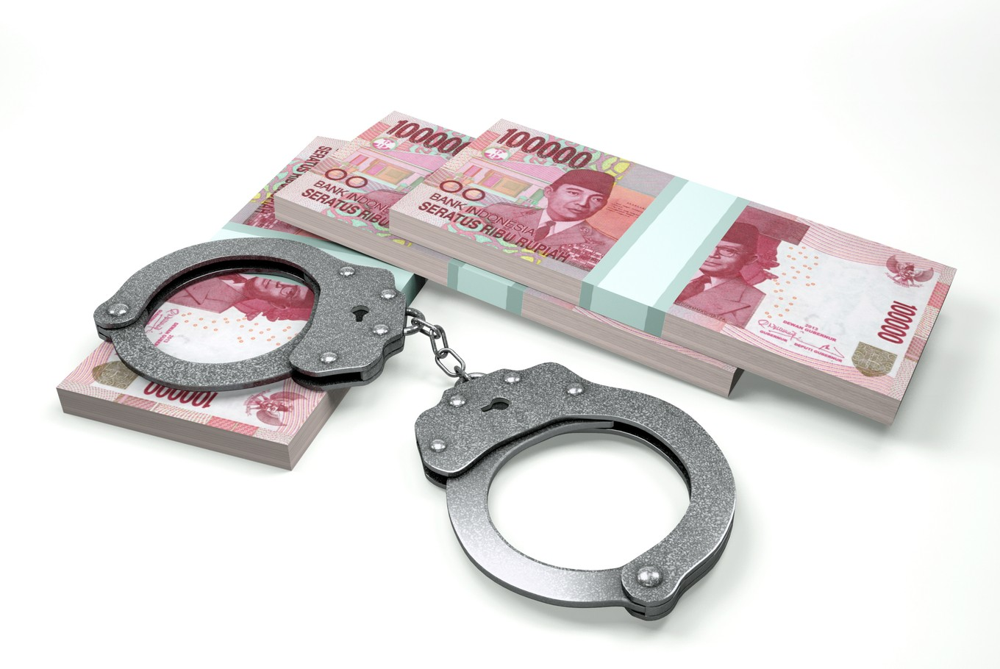
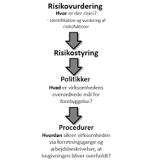

# Bekæmpelse af hvidvask og terrorfinansiering<sup><font color="red"> Premium </font></sup>


## Intro til hvidvaskloven

Lov nr. 651 af 8. juni 2017 om forebyggende foranstaltninger mod hvidvask og finansiering af terrorisme (hvidvaskloven) er et regelsæt, som skal sikre, at de virksomheder, som er omfattet af loven, kender deres kunder og de transaktioner, som de foretager. 

Hvidvasklovens formål er at sikre, at Danmark bidrager til den internationale kamp mod hvidvask af penge og finansiering af terrorisme.

---

**Video: Sådan foregår hvidvask?**

<div class="video-container"><iframe src="https://www.youtube.com/embed/67jlG9dPs54" width="853" height="480" frameborder="0" allowfullscreen="allowfullscreen"></iframe></div>

---

 
**Video: Danske Bank Hvidvask/Tæt på sandheden**

<div class="video-container"><iframe src="https://www.youtube.com/embed/1q0K01SQavk" width="853" height="480" frameborder="0" allowfullscreen="allowfullscreen"></iframe></div>

---


### Begrebet "hvidvask"

---

**Video:How does money laundering work? - Delena D. Spann**

<div class="video-container"><iframe src="https://www.youtube.com/embed/257wV-AbKaE" width="853" height="480" frameborder="0" allowfullscreen="allowfullscreen"></iframe></div>


---

Definitionen af ”hvidvask” fremgår af lovens § 3, stk. 1. 

Hvidvask er uberettiget at modtage eller skaffe sig eller andre del i økonomisk udbytte eller midler, der er opnået ved en strafbar lovovertrædelse. 

Lovbestemmelsen beskriver udtrykket »hvidvask«. 

Beskrivelsen tager udgangspunkt i straffelovens § 290 om hæleri. Direktivets definition af hvidvask findes i art. 1, stk. 3.

Efter hvidvasklovens § 3, stk. 2 er hvidvask også uberettiget at skjule, opbevare, transportere, hjælpe til afhændelse eller på anden måde efterfølgende virke til at sikre det økonomiske udbytte eller midlerne fra en strafbar lovovertrædelse. 

Strafbar overtrædelse omfatter både overtrædelse og forsøg på af straffeloven og af speciallovgivningen samt tilsvarende strafbare forhold begået i udlandet.

Hvidvask er at sikre udbytte fra en strafbar handling.

Der kan være tale om penge eller andre værdier, som stammer fra handel med narko, menneskesmugling, våbensmugling, røveri, eller penge som er opnået gennem f.eks. underslæb, skatteunddragelse, bedrageri, korruption eller insiderhandel.


For at kunne bruge udbyttet fra en strafbar handling skal de personer, som har begået handlingen, sørge for at få udbyttet til at se ud, som om at det er erhvervet på lovlig vis.

Derfor skal udbyttets ulovlige oprindelse skjules.

Dette kan f.eks. ske ved at sløre pengenes oprindelse eller ændre pengenes identitet ved f.eks. at veksle til en anden valuta. 

Det kan eksempelvis også ske ved at flytte udbyttet til et sted, hvor det ikke vil få nærmere opmærksomhed.

Hvidvask omfatter både det at skaffe sig selv eller andre del i udbyttet af en strafbar handling. 

Hvidvask omfatter også gerningsmandens egne dispositioner over udbyttet (selvhvidvask).

Af hvidvasklovens § 3, stk. 2, omfatter hvidvask således også gerningsmandens egne dispositioner over udbyttet, der i dansk ret ikke straffes som hæleri, fordi straf for før forbrydelsen udtømmende gør op med strafansvar for også de senere tilknyttede dispositioner. 

Hvidvaskbegrebet i i lovens § 3, stk. 1 omfatter således både handlinger, der er udført af den, der har begået før forbrydelsen (tredjemand), og handlinger udført af gerningsmanden.

Hvidvask er ikke nødvendigvis en kompliceret proces. 

Der er tale om hvidvask fra den første fase, hvor man f.eks. indsætter kontanter på en bankkonto eller veksler til en anden valuta eller køber fast ejendom. 

Det vil eksempelvis også være tilstrækkeligt, at en person kortvarigt tillader en anden person at deponere penge på sin konto eller i en boks.

Det er vigtigt at bekæmpe hvidvask, da denne type kriminalitet gør det vanskeligt at opdage strafbare handlinger. 

Derudover er det stødende for den almindelige retsopfattelse, at kriminelle skal kunne nyde godt af udbytte, der er opnået gennem strafbare handlinger.

En effektiv bekæmpelse af hvidvask vil virke forebyggende for alt økonomisk kriminalitet, da det vil vanskeliggøre kriminelles muligheder for at sikre udbyttet.

---


```{r echo=FALSE}
library(kableExtra)

fr <- data.frame(
  Aktivitet = c(rep("Anbringelse<br><br>Det ulovlige udbytte anbringes, Det kan fx. være i det finansielle system.", 1), rep("Sløring<br><br>Det ulovlige udbytte adskilles fra dets kilde. Det kan f.eks. ske gennem (finansielle) transaktioner.",1 ),rep("Anvendelse<br><br>Udbytte tilbageføres til gerningsrmanden. Det kan f.eks. være i en form, hvor udbyttet er ændret til midler eller aktiver, der ser ud til at være lovlige.",1)),
  EksempelA = c(
    "Indbetaling af kontanter i en bank (evt. blandet med midler fra lovlig virksomhed)",
    "Elektronisk overførsel til udlandet (ofte ved brug af selskaber uden reel aktivitet. eller midlerne maskeres som udbytte fra lovlige forretninger)", 
    "Tilbageførsel som betaling for (fiktive) lån eller betaling af (fiktive) fakturaer"
  ),
  EksempelB = c(
    "Udførsel af kontanter til udlandet",
    "Indsættelse af kontanter i en bank i udlandet ", 
    "Et kompliceret net af overførsler nationalt og internationalt, der gør det næsten umuligt at spore midlernes oprindelige kilde"
  ),
  EksempelC = c(
    "Anvendelse af kontanter til køb af højværdivarer, fast ejendom eller aktiver til erhvervsvirksomhed ",
    "Salg af de købte varer/aktiver", 
    "Indtægt fra fast ejendom eller virksomhed, der fremstår som lovlig"
  )
)
names(fr) <- c("Aktivitet" ,"Eksempel 1" , "Eksempel 2" , "Eksempel 3")
kable(fr,  format = "html", escape = FALSE,caption = "Hvidvask i praksis") %>%
  kable_styling(full_width = T,font_size = 10,bootstrap_options = c("responsive","bordered","striped")) %>%
  column_spec(1, bold = T, border_right = T, color = "white", background = "black") %>%
  row_spec(0,italic = T, color = "white", background = "grey",font_size = 12) %>%
  # column_spec(0, angle = -45)%>%
  # scroll_box(width = "500px") %>%
  scroll_box(width = "100%") %>%
footnote(general = "Hvidvasksekretariatet",general_title = "Kilde: ")
```

---

### Kontantforbud

Hvidvaskloven viderefører det tidligere gældende kontantforbud, jf. lovens § 5. 

Således er det forbudt for »erhvervsdrivende«, der ikke er omfattet af hvidvaskloven, jf. dennes § 1, at modtage kontantbetalinger på 50.000 kr. eller derudover, hvad enten betalingen sker på én gang eller som flere betalinger, der ser ud til at være indbyrdes forbundet.

Bestemmelsen omfatter således ikke private. 

Ikke kun erhvervsdrivendes salg af genstande, men også f.eks. deres levering af tjenesteydelser og salg af fast ejendom er omfattet af forbuddet mod at modtage kontantbetalinger på eller over beløbsgrænsen.

Se Højesteretsdom i U.2019.2445 H om overtrædelse af kontantforbuddet:

**"Hvidvasklovens kontantforbud overtrådt i forbindelse med kontantsalg af brugte biler. T ApS solgte i perioden fra januar 2015 til marts 2016 mere end 500 brugte biler til udenlandske opkøbere mod kontant betaling. I langt de fleste tilfælde var prisen for den enkelte bil under 50.000 kr., men i 19 tilfælde var der sket salg af en enkelt bil til en enkelt kunde, som havde betalt mere end 50.000 kr. kontant for bilen. I ni yderligere tilfælde var der sket kontantsalg af en bil til en pris af mere end 50.000 kr., men i disse tilfælde havde T også solgt andre biler for mindre end 50.000 kr. til samme kunde. I de resterende tilfælde havde T ApS foretaget kontantsalg af flere biler til samme kunde den samme dag, hvor prisen for den enkelte bil var mindre end 50.000 kr., men hvor summen af de kontante beløb havde været større end 50.000 kr. T ApS blev i landsretten idømt en bøde på 190.000 kr. for de 19 tilfælde af salg af en enkelt bil for en kontant betaling af mere end 50.000 kr., men i øvrigt frifundet. Højesteret skulle alene tage stilling til de forhold, hvori T ApS var blevet frifundet. Højesteret fandt, at der også ved salget af de ni biler til en pris af mere end 50.000 kr., men som var solgt sammen med andre biler, var sket en overtrædelse af kontantforbuddet i hvidvaskloven, og idømte T ApS en bøde på 90.000 kr. for disse forhold, jf. hvidvasklovens § 78, stk. 4, jf. stk. 1, jf. § 5. På baggrund af landsrettens bevisbedømmelse, som Højesteret ikke kunne efterprøve, jf. retsplejelovens § 933, stk. 2, jf. § 912, stk. 1, nr. 4, modsætningsvis, lagde Højesteret til grund, at T ApS ikke i videre udstrækning end ved salget af de 28 biler havde modtaget kontant betaling af 50.000 kr. eller derover på én gang eller havde modtaget flere kontantbetalinger på under 50.000 kr., som var eller så ud til at være indbyrdes forbundet på en måde, som indebar overtrædelse af hvidvasklovens kontantforbud. Højesteret stadfæstede herefter landsrettens dom med den ændring, at bødestraffen til T ApS blev forhøjet med 90.000 kr. til 280.000 kr."**

Kontantforbuddet vil således kun ramme betaling af f.eks. leje af hus eller husrum, leje af bil eller levering af vand, varme og gas eller elektricitet, hvis betalingen for en enkelt periode udgør 50.000 kr. eller derover. 

Hvis der derimod er tale om ratevis betaling, eksempelvis i forbindelse med køb af en løsøregenstand eller en fast ejendom eller i forbindelse med betaling for en entrepriseydelse eller en rejse, vil de enkelte rater være indbyrdes forbundne, og kontantforbuddet vil dermed ramme tilfælde, hvor den samlede betaling udgør 50.000 kr. eller derover.


### Falskmøntneri


Det følger af hvidvasklovens § 6, stk. 1, at: 

*virksomheder og personer, der som led i deres virksomhed deltager i håndtering og udlevering af pengesedler og mønter til offentligheden, herunder personer og virksomheder, hvis aktivitet består i at veksle pengesedler og mønter i forskellig valuta, har pligt til at tage alle sedler og mønter, som de ved eller har grund til at tro er falske, ud af omløb. Sedler og mønter, der er taget ud af omløb i overensstemmelse med 1. pkt., skal straks overgives til politiet*.

Lovens bestemmelser er svarende til Rfo 1338/2001 om fastlæggelse af de foranstaltninger, der er nødvendige for at beskytte euroen mod falskmøntneri (offentliggjort i EFT 2001 L 181/6), samt Rfo 1339/2001, der udvider bestemmelserne i ovennævnte forordning 1338/2001 til også at gælde for EU-lande uden for eurosamarbejdet, herunder Danmark (offentliggjort i EFT 2001 L 181/11). 

Forordninger gælder umiddelbart i hver medlemsstat. Gengivelsen af forordningen i loven er alene begrundet i praktiske hensyn og berører ikke forordningens gyldighed i Danmark. 

Overtrædelse af pligten til at tage falske penge ud af omløb anses for omfattet af straffelovens §§ 166-170 om forbrydelser vedrørende penge.


## Kriminalitetsforebyggelse i de finansielle virksomheder

---

**Video: Hvidvask-skandalen: Så mange advarsler fik Danske Bank**

<div class="video-container"><iframe src="https://www.youtube.com/embed/b94ktmFWP6c" width="853" height="480" frameborder="0" allowfullscreen="allowfullscreen"></iframe></div>


---

Hvidvasklovens overordnede formål er, at Danmark bidrager med reguleringsmæssige tiltag, der kan styrke indsatsen mod, at kriminelle misbruger danske virksomheder og det finansielle system til hvidvask af penge og terrorfinansiering, og at forhindre, at den finansielle stabilitet og tilliden til det finansielle system skades som følge af misbrug af finansielle institutioner til hvidvask og finansiering af terrorisme.^[Følgende afsnit bygger på Finanstilsynets vejledning om lov om forebyggende foranstaltninger mod hvidvask og finansiering af terrorisme (hvidvaskloven) af oktober 2018.] 

Hvidvask af penge og finansiering af terrorisme foregår ofte i internationalt regi, og hvidvaskloven gennemfører derfor dele af de seneste internationale standarder fra Financial Action Task Force (FATF) fra 2012 og dele af Europa-Parlamentets og Rådets direktiv 2015/849/EU af 20. maj 2015 om forebyggende foranstaltninger mod anvendelse af det finansielle system til hvidvask af penge eller finansiering af terrorisme (herefter 4. hvidvaskdirektiv).


De virksomheder og personer, der til dagligt håndterer pengeoverførsler og andre finansielle transaktioner, er væsentlige aktører i kampen mod hvidvask og terrorfinansiering. 

Der påhviler dem således et stort samfundsansvar med henblik på at begrænse risikoen for, at de bliver udnyttet til hvidvask af ulovlige midler eller terrorfinansiering. 

Med henblik på at sikre, at dette ikke sker, har virksomhederne og personerne et ansvar for og en pligt til at gennemføre de rette foranstaltninger for at forhindre, at de misbruges til hvidvask og terrorfinansiering.

---


---

Med hvidvaskloven ændres den tidligere gældende regulering fra at være primært regelbaseret til at blive mere *risikobaseret*. 

Hermed sikres grundlaget for en mere målrettet og effektiv indsats baseret på en risikobaseret tilgang til bekæmpelse af hvidvask- og terrorfinansiering hos både myndigheder og omfattede virksomheder og personer.

Ved at hvidvaskreglerne ændres til at være mere risikobaserede, sættes rammerne for et mere fleksibelt system, der giver virksomhederne mulighed for at fokusere indsatsen mod de egentlige risikoområder. 

Virksomheder og personer skal herefter individuelt vurdere, om et kundeforhold kan kategoriseres som henholdsvis begrænset, almindelig eller øget risiko. 

Det overlades således til erhvervslivet at identificere og håndtere risici, så disse har mulighed for at prioritere ressourcer til områder med øget risiko for hvidvask eller finansiering af terrorisme. 

Dog opretholdes identificerede højrisikoområder.

Et *risikobaseret system* medfører også, at tilsynsmyndighederne efter loven skal udøve et risikobaseret tilsyn. 

Dette betyder blandt andet, at der ved udførelse af tilsynet skal tages hensyn til det skøn, som den enkelte virksomhed eller person overlades i medfør af hvidvaskloven.

Hvidvaskloven indfører en *opmærksomhedspligt*, som består i, at de af loven omfattede virksomheder og personer generelt skal være *opmærksomme på kundernes aktiviteter*, som på grund af deres særlige karakter menes at kunne have tilknytning til hvidvask eller finansiering af terrorisme.

Hvidvaskloven stiller skærpede krav i forhold til den tidligere hvidvasklov for så vidt angår de af loven omfattede virksomheders og personers kendskab til deres kunder. 

Hvidvaskloven stiller krav om legitimation af kunderne med henblik på identifikation af disse med navn og cpr-nr./cvr-nr., herunder stiller hvidvaskloven krav om *kendskab til virksomhedskunders fysiske ejerkreds med kontrollerende indflydelse (reelle ejere) over disse*. 

Endvidere skal der indhentes oplysninger om kundens formål med *forretningsforbindelsen* samt om omfanget heraf, ligesom *kundeforholdet* løbende skal overvåges.

Hvidvaskloven giver mulighed for at foretage *legitimationsproceduren*, herunder tilvejebringelse af *kundekendskabet*, ud fra en risikobaseret tilgangsvinkel, således at der ikke i alle tilfælde stilles de sammen krav dertil.

Hvidvaskloven stiller dog skærpede krav til *kundekendskabet* ud fra en vurdering af, at der i visse tilfælde er en særlig risiko for hvidvask eller terrorfinansiering. 

De skærpede krav gælder især over for kunder, der er såkaldte *politisk udsatte personer*, dvs. personer, som er bosiddende i udlandet og bestrider eller har bestredet højere politiske poster. 

De øgede krav gælder også i tilfælde, hvor kunden ikke har været fysisk til stede for at legitimere sig samt over for korrespondentbanker i lande uden for EU.

Hvidvaskloven giver mulighed for at undtage fra kravene til legitimation og kundekendskab, hvor risikoen for hvidvask og terrorfinansiering vurderes at være lille. 

Endvidere giver loven mulighed for under særlige betingelser at benytte sig af identitetsoplysninger mv., der er indhentet af tredjemand.

*Underretningspligten er udvidet* i forhold til den tidligere lov på den måde, at de af loven omfattede virksomheder og personer ikke kun skal underrette Statsadvokaten for Særlig Økonomisk og International Kriminalitet ved mistanke om, at en transaktion har tilknytning til overtrædelse af straffeloven. 

Der skal også ske underretning ved mistanke om overtrædelse af særlovgivningen. 

Underretningspligten er dog begrænset til overtrædelser, der kan straffes med fængsel i over ét år.

Tilsynet med de personer og virksomheder, der er omfattet af hvidvaskloven, er delt mellem Finanstilsynet, Erhvervsstyrelsen og Advokatrådet.

## Hvem er omfattet af hvidvaskloven

Efter hvidvasklovens § 1, stk. 1, nr. 1, er pengeinstitutter omfattet af lovens anvendelsesområde. 

*Pengeinstitutter* er virksomheder, der udøver virksomhed, som består i at modtage indlån eller andre midler fra offentligheden, der skal tilbagebetales, samt i at yde lån for egen regning. 

Sådanne virksomheder skal have tilladelse som pengeinstitut i henhold til § 7 i lov om finansiel virksomhed.

*Realkreditinstitutter* er omfattet af lovens anvendelsesområde, jf. lovens § 1, stk. 1, nr. 2. 

Realkreditinstitutter er virksomheder, der yder lån mod registreret pant i fast ejendom på grundlag af udstedelse af realkreditobligationer og særligt dækkede realkreditobligationer eller særligt dækkede obligationer. 

Sådanne virksomheder skal have tilladelse som realkreditinstitut i henhold til § 8 i lov om finansiel virksomhed.

*Fondsmæglerselskaber* er omfattet af lovens anvendelsesområde, jf. § 1, stk. 1, nr. 3. 

Fondsmæglerselskaber er virksomheder, der over for tredjemand udøver aktiviteter, som omfatter værdipapirer i nærmere angivet omfang, og som ikke har tilladelse som pengeinstitut, realkreditinstitut eller *investeringsforvaltningsselskab*. 

Sådanne virksomheder skal have tilladelse som *værdipapirhandler* i henhold til § 9 i lov om finansiel virksomhed.

Efter hvidvasklovens § 1, stk., 1, nr. 4, er *livsforsikringsselskaber og tværgående pensionskasser* omfattet af lovens anvendelsesområde. Sådanne virksomheder skal have tilladelse som forsikringsvirksomhed i henhold til § 11 i lov om finansiel virksomhed. 

Det er alene livsforsikringsselskabernes og de tværgående pensionskassers livs- og pensionsforsikringer, der er omfattet af loven. 

Selv om der siden 1995 har været hjemmel for livsforsikringsselskaber til at tegne forsikringer inden for skadesforsikringsklasserne 1 og 2, dvs. syge- og ulykkesforsikringer, er tegning af disse forsikringer ikke omfattet.

Tværgående pensionskasser er i § 304 i lov om finansiel virksomhed defineret som foreninger eller sammenslutninger, hvis medlemmer enten er uddannet inden for bestemte uddannelsesområder eller er ansat i virksomheder af en bestemt art, og som har til formål som led i ansættelsesvilkårene eller som led i en anden tilknytning til en virksomhed at sikre pension efter ensartede regler for alle medlemmerne, eller hvis medlemmer er selvstændige erhvervsdrivende inden for samme branche, og som har til formål at sikre pension efter ensartede regler for alle medlemmer. 

Sådanne virksomheder skal have tilladelse efter lov om finansiel virksomhed og behandles i det væsentlige efter samme regler som forsikringsselskaber, der driver livsforsikringsvirksomhed.

Efter hvidvasklovens § 1, stk. 1, nr. 5, er *sparevirksomheder* omfattet af lovens anvendelsesområde. Sparevirksomheder udøver virksomhed, som består i erhvervsmæssigt eller som et væsentligt led i deres drift at modtage indlån eller andre midler, der skal tilbagebetales fra offentligheden. 

Sådanne virksomheder skal have tilladelse som sparevirksomhed i henhold til § 334 i lov om finansiel virksomhed, hvis virksomheden ikke har tilladelse som pengeinstitut, realkreditinstitut eller *investeringsforvaltningsselskab* eller er oprettet i henhold til særlig lov, eller hvis oprettelse ikke er godkendt i henhold til særlig lov.

*Udbydere af betalingstjenester og udstedere af elektroniske penge* er omfattet af lovens anvendelsesområde, jf. § 1, stk. 1, nr. 6. Udøvelse af denne type virksomhed kræver tilladelse i henhold til betalingslovens § 9.  

En betalingstjeneste er f.eks. en tjeneste, der muliggør, at kontantbeløb placeres på en betalingskonto, og alle transaktioner, der er nødvendige for drift af en betalingskonto. 

*Pengeoverførselsvirksomhed er også en betalingstjeneste*. 

Ved *elektroniske penge* forstås en elektronisk eller magnetisk lagret pengeværdi, der repræsenterer et krav på udstederen, som udstedes ved modtagelse af betaling af midler medhenblik på at gennemføre betalingstransaktioner, og som accepteres som betalingsmiddel af andre end udstederen af elektroniske penge. 

Det omfatter blandt andet bredt anvendelige gavekort og forudbetalte kort, f.eks. til offentlig transport.

Efter lovens § 1, stk. 1, nr. 7, er *forsikringsmæglere* omfattet, når de formidler livsforsikring eller andre investeringsrelaterede forsikringer, er omfattet af lovens anvendelsesområde. 

*Forsikringsmæglervirksomhed* defineres i henhold til lov om forsikringsmæglervirksomhed som den aktivitet, der består i at yde kunden rådgivning på basis af en analyse af et så stort antal af de på markedet disponible forsikringsløsninger som muligt, og den aktivitet, der består i at præsentere kunden for forsikringsløsninger fra et eller flere forsikringsselskaber, uden at der er indgået udtrykkelig aftale med forsikringsselskaberne herom. 

Forsikringsmæglere skal have tilladelse i henhold til § 4 i lov om forsikringsformidling. 

Forsikringsmæglere er kun omfattet af hvidvaskloven, når de formidler livsforsikring eller andre investeringsrelaterede forsikringer.

I hvidvasklovens § 1, stk. 1, nr. 8, er øvrige virksomheder og personer, der erhvervsmæssigt udøver aktiviteter som nævnt i lovens bilag 1, omfattet af lovens anvendelsesområde. 

Virksomheder og personer, der er omfattet af nr. 8, er forpligtet til at lade sig registrere hos Finanstilsynet, som betingelse for at kunne udøve den nævnte virksomhed. 

Det er karakteristisk for denne type af erhvervsmæssig virksomhed, at der ikke i henhold til lov om finansiel virksomhed eller anden finansiel regulering er et krav om tilladelse, men at aktiviteten er omfattet af 4. hvidvaskdirektivs definition af *finansieringsinstitut*. 

Det er ikke en forudsætning, at aktiviteten udøves som hovedaktivitet, men der skal være tale om erhvervsmæssig virksomhed. 

Ved *erhvervsmæssig* skal forstås, at aktiviteten i denne sammenhæng udbydes til tredjemand, eller at aktiviteten i øvrigt antager et sådant omfang, at der bliver tale om en ikke ubetydelig del af virksomhedens omsætning. 

Det vil alene være aktiviteten, som nævnt i lovens bilag 1, der er omfattet af lovens anvendelsesområde. 

I det omfang der i øvrigt udøves anden aktivitet, som f.eks. en udbyder af finansiel leasing, der også udbyder operationel leasing, vil udbuddet af operationel leasing ikke være omfattet af hvidvasklovens anvendelsesområde. 

Nr. 8 omfatter bl.a. *factoringselskaber, leasingselskaber, kreditkortselskaber og forbrugerkreditselskaber*. 

I sjældne tilfælde vil en virksomhed ikke have mere end én kunde. Dette er i praksis set i tilfælde, f.eks. hvor en virksomhed alene er oprettet til at foretage finansiel leasing til virksomhedens reelle ejer. 

I sådanne tilfælde, hvor der alene er én kunde, der samtidigt er virksomhedens reelle ejer, ses det ikke hensigtsmæssigt at omfatte virksomheden af lovens anvendelsesområde, og en sådan virksomhed eller person vil heller ikke være registreringspligtig i Finanstilsynet.

*Udenlandske virksomheders filialer, agenter og distributører her i landet*, er omfattet af lovens anvendelsesområde, jf. § 1, stk. 1, nr. 9, hvis disse udøver virksomhed omfattet af lovens § 1, stk. 1, nr. 1-7, 10-11 og 19. 

For agenters og distributørers vedkommende forudsættes det dog, at aktiviteten har et sådant omfang, at den udenlandske virksomhed kan anses at være etableret her i landet. Filialer, agenter og distributører er omfattet, uanset om den udenlandske virksomhed har hjemsted i et land inden for EU/EØS eller et tredjeland.

Bestemmelsen indebærer, at de kompetente myndigheder her i landet i tilfælde af en agents, filials eller distributørs overtrædelse af hvidvaskloven kan strafforfølge agenten, filialen eller distributøren. 

De af virksomhedens kunder, der betjenes af agenten m.v., skal i denne sammenhæng tillige opfattes som den pågældendes kunder i relation til overholdelse af hvidvasklovens krav.

Har en finansiel virksomhed opnået tilladelse til at drive virksomhed i et EU- eller EØS-land (hjemlandet), er der i visse tilfælde mulighed for, at denne virksomhed tillige kan udøves i et andet EU- eller EØS-land (værtslandet) uden særskilt tilladelse fra værtslandet, hvis værtslandets myndigheder forinden er blevet underrettet herom (notifikation) af hjemlandets tilsynsmyndighed. 

Udøvelse af grænseoverskridende virksomhed kan i denne sammenhæng ske enten med eller uden etablering. 

Hvis der ikke er sket etablering via filial, distributør eller agent, har hjemlandets myndigheder ansvar for overholdelse af regler om forebyggende foranstaltninger mod hvidvask og finansiering af terrorisme samt tilsyn.

Hvis etablering har fundet sted, har værtslandets myndigheder ansvar for tilsynet med filialen, distributøren eller agentens overholdelse af regler om forebyggende foranstaltninger mod hvidvask og finansiering af terrorisme, mens hjemlandet bevarer tilsynet med den virksomhed, der udbyder den grænseoverskridende aktivitet, herunder at sikre at koncernen har politikker og procedurer, se herom i §§ 9 og 31 i hvidvaskloven. 4. hvidvaskdirektiv forudsætter i disse tilfælde et tæt samarbejde mellem hjemlandets og værtslandets tilsynsmyndigheder, jf. betragtning 52 i 4. hvidvaskdirektivs præambel.

Udtrykket *agent* skal forstås i overensstemmelse med § 6, nr. 34, i betalingsloven. I henhold hertil defineres en agent som en fysisk eller juridisk person, som handler på vegne af et betalingsinstitut ved udbuddet af betalingstjenester. 

Det fremgår af bemærkningerne til § 6, nr. 18, jf. Folketingstidende 2008/2009, tillæg A, s. 3525, at det forudsættes, at agenten er legitimeret til juridisk at forpligte instituttet, idet det ikke er tilstrækkeligt, at den pågældende alene bistår med markedsføring. 

For agenter af betalingsinstitutter gælder visse særregler om beføjelser for værtslandets tilsynsmyndighed. 

Dette skal ses i sammenhæng med, at beføjelserne til at give og tilbagekalde tilladelser til betalingsinstitutter og *e-pengeinstitutte*r i henhold til de bagvedliggende direktiver tilkommer hjemlandets tilsynsmyndighed.

Efter lovens § 1, stk. 1, nr. 10, er *investeringsforvaltningsselskaber* og forvaltere af alternative investeringsfonde er omfattet af hvidvasklovens anvendelsesområde, hvis disse virksomheder har direkte kundekontakt. 

Investeringsforvaltningsselskaber meddeles tilladelse i henhold til § 9 i lov om finansiel virksomhed, og forvaltere af alternative investeringsfonde skal enten registreres efter § 9 eller have tilladelse i henhold til § 11 i lov om forvaltere af alternative investeringsfonde m.v.

Disse virksomheder kan have direkte kontakt med kunder, hvis selskabet eller forvalteren indgår aftale med en kunde om køb og salg af andele i danske UCITS eller alternative investeringsfonde. 

Generelt kommunikerer investeringsforvaltningsselskaber – med den struktur der er her i landet – ikke direkte med kunder om salg af andele i de investeringsforeninger eller andre danske *UCITS* (Undertakings for Collective Investments in Transferable Securities. jf. nærmere nedenfor), som investeringsforvaltningsselskabet administrerer, da investeringsforvaltningsselskaberne typisk har indgået aftale med et eller flere pengeinstitutter om at varetage dette. 

En del forvaltere af *alternative investeringsfonde* har på samme måde indgået aftaler med pengeinstitutter eller fondsmæglere om salg af andelene i de fonde, som forvalteren har under forvaltning.

Investeringsforvaltningsselskaber og forvaltere indgår aftaler med depositarer og forskellige samarbejdspartnere om *investeringsrådgivning*, porteføljeforvaltning, market making og lignende. 

Sådanne aftaler anses ikke for direkte kunderelationer omfattet af loven.

Både investeringsforvaltningsselskaber og forvaltere af alternative investeringsfonde kan få tilladelse til at udføre forskellige investeringsserviceydelser, herunder investeringsrådgivning og skønsmæssig porteføljepleje, hvilket kan indebære direkte kundekontakt. 

Selskaberne vil i forbindelse med udøvelse heraf være omfattet af kravene i hvidvaskloven.

Der er i dag kun ganske få investeringsforvaltningsselskaber og forvaltere af alternative investeringsfonde, der har tilladelse til at udføre disse ydelser.

I hvidvasklovens § 1, stk. 1, nr. 11, er danske UCITS (Undertakings for Collective Investments in Transferable Securities) og alternative investeringsfonde er omfattet af hvidvasklovens anvendelsesområde, hvis disse virksomheder har direkte kundekontakt.

En UCITS er et investeringsinstitut omfattet af Europa- Parlamentets og Rådets direktiv 2009/65/EF af 13. juli 2009 om samordning af love og administrative bestemmelser om visse institutter for kollektiv investering i værdipapirer (investeringsinstitutter).

Danske UCITS er investeringsforeninger, *SIKAV’er* (selskaber for investering med variabel kapital) og værdipapirfonde, der reguleres i lov om investeringsforeninger m.v. 

*Investeringsforeninger* er i udgangspunktet selvadministrerende foreninger, der skal have en bestyrelse og en direktion. 

Bestyrelsen kan vælge i stedet at delegere den daglige ledelse til et investeringsforvaltningsselskab, hvilket langt de fleste investeringsforeninger har gjort. 

SIKAV’er har en bestyrelse og skal udpege et investeringsforvaltningsselskab til at varetage administrationen af selskabet.

En værdipapirfond administreres af et investeringsforvaltningsselskab og er ikke en selvstændig juridisk enhed.

*Alternative investeringsfonde er kollektive investeringsordninger*, som rejser kapital fra investorer med henblik på at investere kapitalen i overensstemmelse med en defineret investeringspolitik til fordel for disse investorer, og som ikke er en UCITS. 

Alternative investeringsfonde skal udpege en forvalter, der skal forvalte fonden, herunder udføre porteføljepleje og risikostyring i fonden. 

Såfremt fonden ikke udpeger en ekstern forvalter, betragtes fonden som selvforvaltende.

Forvaltere af alternative investeringsfonde og selvforvaltende alternative investeringsfonde er reguleret i lov om forvaltere af alternative investeringsfonde m.v.

Danske UCITS og alternative investeringsfonde vil være omfattet, hvis den danske UCITS eller den alternative investeringsfond har direkte kontakt med kunden. 

Det vil f.eks. kunne opstå i forbindelse med investeringsrådgivning af kunden eller salg af andele i den danske UCITS eller i fonden til kunden. 

Det vil blive betragtet som en direkte kunderelation, hvis den danske UCITS eller fonden selv markedsfører sine andele og aktier og i den forbindelse har kontakt med kunden. 

Kundekontakten er afgørende, idet f.eks. den omstændighed, at fonden har en hjemmeside, ikke i sig selv er nok til, at fonden omfattes af kravene i hvidvaskloven.

En investor vil skulle betragtes som den alternative investeringsfonds kunde, indtil en investering i den alternative investeringsfond er foretaget. 

Herefter vil den pågældende investor skulle betragtes som reel ejer, jf. definitionen af reel ejer i hvidvasklovens § 2, nr. 9, hvis investor i øvrigt opfylder betingelserne herfor. 

Kundeforholdet i forhold til hvidvaskreglerne anses derfor for afsluttet, når transaktionen er gennemført. 

En eksisterende investor i en dansk UCITS eller alternativ investeringsfond er at betragte som kunde, hvis investoren foretager fornyet henvendelse til den pågældende danske UCITS eller alternative investeringsfond, selvom investoren allerede har investeret i den samme danske UCIT Seller alternative investeringsfond. 

Dette svarer til gældende praksis. Langt de fleste danske UCITS og danske alternative investeringsfonde har indgået en forvaltningsaftale med et investeringsforvaltningsselskab eller en forvalter af alternative investeringsfonde, herunder aftale om markedsføring af andele i den danske UCITS eller fonden, hvorfor kun ganske få UCITS og alternative investeringsfonde vil være omfattet af loven. 

Som nævnt under hvidlovens § 1, stk. 1, nr. 10, vil investeringsforvaltningsselskabet eller forvalteren af alternative investeringsfonde herefter typisk indgå aftale med et eller flere pengeinstitutter eller fondsmæglere om at påtage sig disse ydelser.

Investeringsforeninger kan vælge at være selvadministrerende, og danske alternative investeringsfonde kan vælge at være selvforvaltende, jf. henholdsvis § 6 i lov om investeringsforeninger og § 4 i lov om forvaltere af alternative investeringsfonde m.v. 

Er en investeringsforening eller en alternativ investeringsfond enten selvadministrerende eller selvforvaltende, udføres alle funktionerne i foreningen eller fonden. 

Der findes kun få af disse foreninger og fonde. 

En selvadministrerende forening eller en selvforvaltende fond kan have indrettet sig således, at de udøver rådgivning og/ eller salg af investeringsforeningsbeviser og andele i fonden, hvorved de omfattes af hvidvaskloven. 

Hovedparten af de selvadministrerende investeringsforeninger og selvforvaltende fonde har imidlertid indrettet sig således, at de henviser investorer til pengeinstitutter, og derfor ikke selv har kundekontakten.

Hvis der i en alternativ investeringsfond udøves aktiviteter, der ikke relaterer sig til selve den kollektive investering men f.eks. til driften af en ejendom i en ejendomsfond, vil denne aktivitet ikke være omfattet af hvidvaskloven.

Det følger af lovens § 1, stk. 1, nr. 12, at operatører af regulerede markeder, der har fået tilladelse her i landet til at være auktionsplatform i henhold til Kommissionens forordning 2010/1031/EU af 12. november 2010 om det tidsmæssige og administrative forløb af *auktioner over kvoter for drivhusgasemissioner* og andre aspekter i forbindelse med sådanne
auktioner i medfør af Europa-Parlamentets og Rådets direktiv 2003/87/EF om en ordning for handel med kvoter for drivhusgasemissioner i Fællesskabet (herefter CO2-auktioneringsforordningen), er omfattet af lovens anvendelsesområde.

En operatør af en markedsplads er herefter omfattet af hvidvaskloven, når operatøren handler via sin tilladelse til at være auktionsplatform i henhold til CO2-auktioneringsforordningen. 

Bestemmelsen medvirker til at gennemføre dele af CO2-auktioneringsforordningen.

Efter lovens § 1, stk. 1, nr. 13, er aktører, som har tilladelse til at byde direkte på auktioner, der er omfattet af Europa-Kommissionens forordning 2010/1031/EU af 12. november 2010 om det tidsmæssige og administrative forløb af auktioner over kvoter for drivhusgasemissioner og andre aspekter i forbindelse med sådanne auktioner i medfør af Europa-Parlamentets og Rådets direktiv 2003/87/EF om en ordning for handel med kvoter for drivhusgasemissioner i Fællesskabet, og som ikke er et fondsmæglerselskab eller et pengeinstitut med tilladelse som værdipapirhandler, omfattet af hvidvasklovens anvendelsesområde.

Finanstilsynet skal i henhold til CO2-auktioneringsforordningen give tilladelse til fondsmæglerselskaber, pengeinstitutter med tilladelse som værdipapirhandler og CO2-kvotebydere til at byde direkte på auktioner.

Fondsmæglerselskaber og pengeinstitutter med tilladelse som værdipapirhandler er allerede omfattet af hvidvaskloven i medfør af § 1, stk. 1, nr. 1 og 3. 

Denne her bestemmelse sikrer, at juridiske personer, der har fået tilladelse til at byde på auktioner for CO2-kvoter, der er omfattet af CO2- auktioneringsforordningen, også bliver omfattet af hvidvaskloven.

Tilladelse kan gives til virksomheder, der handler for egen regning med finansielle instrumenter eller yder investeringsservice med råvarederivater eller derivataftaler, jf. bilag 5, nr. 10, til lov om finansiel virksomhed, til kunder i deres hovederhverv, dog under forudsætning af, at dette er en accessorisk aktivitet til deres hovederhverv på koncernniveau, og såfremt dette hovederhverv ikke er investeringsservice eller virksomhed som pengeinstitut eller realkreditinstitut i henhold til lov om finansiel virksomhed. 

Det kan f.eks. være et energiselskab, hvis hovederhverv er handel med el og gas (for egen regning), der som en accessorisk aktivitet yder investeringsservice med råvarederivater til kunder for at afdække kundernes risici i relation til energipriserne, eller en grovvarevirksomhed, der handler med korn.

Efter hvidvasklovens § 1, stk. 1, nr. 14, er advokater er omfattet af lovens anvendelsesområde, når de udøver de i litra a og b, opregnede
aktiviteter. 

*Advokater er kun omfattet af loven i relation til klienter*. 

Det antages, at et klientforhold som altovervejende hovedregel kommer i stand ved en udtrykkelig aftale om advokatens udførelse af det pågældende opdrag. 

Et klientforhold kan endvidere komme i stand ved, at advokaten udfører opdraget som led i en offentlig beskikkelsesordning eller i kraft af en testamentarisk bestemmelse, f.eks. når en advokat ved testamente er indsat som bobestyrer.

Derimod er der ikke tale et klientforhold, hvis der alene foreligger en henvendelse fra en person eller virksomhed med anmodning om advokatens bistand. 

Der kan f.eks. være tale om, at advokaten kontaktes telefonisk af en person, der ikke i forvejen er klient hos advokaten, men som ønsker advokatens hjælp i forbindelse med en forestående transaktion, men hvor advokaten ikke ønsker at påtage sig opgaven.

Hvidvasklovens § 1, stk. 1, nr. 14, litra a, omfatter advokater af lovens anvendelsesområde, når de yder bistand ved rådgivning om eller udførelse af transaktioner for deres klienter i forbindelse med køb og salg af fast ejendom eller virksomheder, forvaltning af klienters penge, værdipapirer eller andre aktiver, åbning eller forvaltning af bankkonti eller værdipapirdepoter, tilvejebringelse af nødvendig kapital til oprettelse, drift eller ledelse af virksomheder, eller oprettelse, drift eller ledelse af virksomheder, fonde m.v. 

*Advokaters ejendomsformidlingsvirksomhed* er omfattet af bestemmelsen i det omfang, der udføres forvaltning af klienters aktiver. 

Ejendomsformidlingsvirksomhed, der udøves af en advokat, men ikke i dennes egenskab af at være advokat eller som et led i dennes advokatvirksomhed eller advokatselskab, vil ikke være omfattet af lovens anvendelsesområde, jf. lovens § 1, stk. 1, nr. 17. 

§ 1, stk. 1, nr. 14, litra b, omfatter advokater af lovens anvendelsesområde i de situationer, hvor advokaten foretager en finansiel transaktion eller en transaktion vedrørende fast ejendom på vegne af klienten. For definition af finansiel transaktion og transaktion henvises til lovens § 2, nr. 2 og 10.

Som udgangspunkt er civile retssager, inkassovirksomhed og straffesager ikke omfattet af hvidloven, idet de typisk ikke omfatter bistand til transaktioner af den i lovens § 1, stk. 1, nr. 14, litra a og b, nævnte karakter. 

Tilsvarende gælder voldgiftssager, mediation m.v. og rådgivning om indgåelse af et frivilligt forlig.

Efter hvidvasklovens § 1, stk. 1, nr. 15, er revisorer og revisionsvirksomheder godkendt i henhold til revisorloven er omfattet af lovens anvendelsesområde. 

Bestemmelsen indebærer, at også den revisionsvirksomhed, som en revisor er tilknyttet som ansat eller partner, er omfattet af hvidvaskloven.

Pligterne efter bestemmelsen omfatter kun forhold, der ligger inden for rammerne af den opgave, som revisoren har påtaget sig. 

Revisionsvirksomhed omfatter en bred vifte af opgaver til en bred skare af kunder. 

Opgaver, der kan betegnes som en revisors kerneopgaver, kan blandt andet omfatte revision, afgivelse af andre erklæringer med sikkerhed, bogholderi, forberedelse af årsregnskaber og perioderegnskaber, skatte-, selskabs- og investeringsrådgivning, opgaver hvor kravet om revisorattestation er pålagt kunden ifølge lovgivning eller ifølge private aftaler, opgaver i forbindelse med insolvensbehandling og rådgivning om risikostyring, interne kontroller, bogholderi, regnskabsførelse m.v.

Hvis en revisor i forbindelse med revision af et årsregnskab for en virksomhed får mistanke om, at virksomheden er involveret i hvidvask eller finansiering af terrorisme, vil revisoren således være omfattet af reglerne om undersøgelses og underretningspligt som nævnt i lovens kapitel 5.

En revisionsvirksomhed kan have opgaver, der ikke omfatter revisionsopgaver, og i det tilfælde falder disse opgaver uden for lovens anvendelsesområde. 

Det kunne eksempelvis være, hvis revisionsvirksomhedens HR-afdeling står for rekrutteringer til lederstillinger hos en kunde.

Hvis revisor på baggrund af oplysninger fra en potentiel kunde vælger ikke at påtage sig opgaven, er revisor ikke omfattet af krav om kundekendskabsprocedurer, men underretningspligten i henhold til lovens § 26 gælder fra den potentielle kundes første henvendelse. 

---


---

*Ejendomsmæglere og ejendomsmæglervirksomheder* er omfattet af hvidvasklovens § 1, stk. 1, nr. 16. Begrebet ejendomsmæglere omfatter enhver erhvervsmæssig formidling af køb og salg af fast ejendom, uanset om det er til eller for forbrugere eller til eller for erhvervsdrivende. Advokaters ejendomsformidlingsvirksomhed er omfattet af lovens § 1, stk. 1, nr. 14, litra a, pkt. i.

Hvidvaskloven indebærer, at alle typer af opgaver, som ejendomsmæglere udfører for deres kunder i forbindelse med hvervet som ejendomsmægler, er omfattet af loven, herunder når ejendomsmæglere foretager værdiansættelser mod vederlag eller formidler lejemål.

Efter hvidvasklovens § 1, stk. 1, nr. 17, er virksomheder og personer, der i øvrigt erhvervsmæssigt leverer samme ydelser som de i nr. 14-16 nævnte persongrupper, herunder *revisorer*, som ikke er godkendt i henhold til revisorloven, skatterådgivere og eksterne bogholdere, omfattet af lovens anvendelsesområde.

Disse virksomheder og personer er derfor omfattet, i det omfang virksomheden eller personen i øvrigt ikke er omfattet af § 1, stk. 1. 

Omfattet er f.eks. *revisorer og revisionsvirksomheder*, der ikke er godkendt i henhold til revisorloven, skatterådgivere, eksterne bogholdere og ejendomsadministratorer, i det omfang de erhvervsmæssigt udøver samme aktivitet som en ejendomsmægler, herunder køb og salg af ejendomme, samt ejendomsformidling, der udøves af en advokat, men ikke i dennes egenskab af advokat eller som et led i dennes advokatvirksomhed eller advokatselskab, jf. oven for bemærkningerne til § 1, stk. 1, nr. 14 og 16. 

Virksomheder og personer, der erhvervsmæssigt formidler lejemål, er ikke omfattet af § 1, stk. 1, nr. 17, uanset at en ejendomsmæglers udlejning er omfattet af § 1, stk. 1, nr. 16.

Betegnelsen ”erhvervsmæssigt” skal forstås på tilsvarende måde som nævnt i stk. 1, nr. 8. Herved tydeliggøres det, at mere enkeltstående dispositioner falder uden for betegnelsen.

Også dispositioner, som ligger uden for det job, en person er ansat til, f.eks. hvis en rengøringsassistent eller hjemmehjælper bistår med betaling af regninger, falder uden for betegnelsen. 

For så vidt angår udtrykket ”samme ydelser” henvises til de ydelser, som medfører, at persongrupperne i § 1, stk. 1, nr. 14-16 er omfattet af lovens anvendelsesområde.

Det fremgår af hvidvasklovens § 1, stk. 1, nr. 18, at udbydere af tjenesteydelser til virksomheder er omfattet af lovens anvendelsesområde. Udbydere af tjenesteydelser til virksomheder er defineret i lovens § 2, nr. 12. 

Udbydere af tjenesteydelser til virksomheder er forpligtede til at lade sig registrere hos Erhvervsstyrelsen,

Bestemmelsen i nr. 18 er subsidiær i forhold til bestemmelserne i lovens § 1, nr. 14 og 15, som vedrører advokater og godkendte revisorer. 

Det medfører, at hvis en advokat eller godkendt revisor udøver virksomhed, der falder under ordlyden i såvel § 1, stk. 1, nr. 14 eller 15, og § 1, stk. 1, nr. 18, vil advokaten eller den godkendte revisor være omfattet af hvidvaskloven i henhold til § 1, stk. 1, nr. 14 eller 15 og ikke i henhold til bestemmelsen i nr. 18.

Det er også her et krav, at de omhandlede tjenesteydelser udbydes erhvervsmæssigt. 

Det indebærer, at ydelserne udbydes på markedslignende vilkår, og at virksomheden normalt modtager vederlag som modydelse for udbud af den pågældende tjenesteydelse. 

Det er ikke afgørende, om den pågældende tjenesteydelse er overskudsgivende, eller om der i den konkrete situation ikke betales vederlag. 

Enkeltstående udbud af de omhandlede tjenesteydelser, som ikke kan karakteriseres som erhvervsmæssigt, vil ikke være omfattet.

Efter hvidvasklovens § 1, stk. 1, nr. 19, at *valutavekslingsvirksomhed* er omfattet af lovens anvendelsesområde. 

---


---

Valutavekslingsvirksomheder er forpligtet til at lade sig registrere hos Erhvervsstyrelsen.

Valutaveksling dækker enhver form for veksling af valuta, hvor valutavekslingen udøves erhvervsmæssigt. 

De almindelige tilfælde, hvor en butik modtager betaling i fremmed valuta og giver tilbage idanske kroner, er derfor ikke omfattet. 

Det er dog ikke et krav, at valutaveksling er hovedaktiviteten.

Efter lovens § 1, stk. 1, nr. 20, er udbydere af spil er omfattet af hvidvasklovens anvendelsesområde. 

---


---

Hermed gennemføres artikel 2, stk.1, litra f, i 4. hvidvaskdirektiv.

En udbyder af spil defineres som en juridisk eller fysisk person etableret her i landet, der udbyder spil erhvervsmæssigt i eget navn. 

Loven omfatter ikke udbydere af spil, der ikke er etableret her i landet, og heller ikke spil udbudt ikke-erhvervsmæssigt, som f.eks. spil omfattet af lov om offentligt hasardspil i turneringsform, jf. lovbekendtgørelse nr. 83 af 22. januar 2016.

Alle *udbydere af spil*, som er omfattet af lov om spil, anses for at drive erhvervsmæssig virksomhed. Det er udbyderen af spil, der er omfattet af loven. 

De enkelte forhandlere af spil i butikker, kiosker m.v., som forhandler spillet i spiludbyderens navn, er ikke omfattet af lovens anvendelsesområde.

Har en udbyder af spil en filial, f.eks. et landbaseret kasino, eller egen butik, hvor (hovedsageligt) kun spiludbyderens spilprodukter sælges, bliver udbyderen af spil omfattet af loven, da spiludbyderen dermed betragtes som etableret her i landet.

---


---

Er en udbyder af spil etableret her i landet men udbyder spil online til et andet EU- eller EØS-land, skal Spillemyndigheden i henhold til artikel 45, stk. 2 og 3, i 4. hvidvaskdirektiv, jf. lovens § 31, sikre, at virksomheden overholder lovens regler om forebyggende foranstaltninger om hvidvask og finansiering af terrorisme ved spiludbuddet. 

På tilsvarende måde hvor en spiludbyder ikke er etableret her i landet, skal tilsynsmyndigheden i etableringslandet sikre, at spiludbyderen ved online udbud af spil her i landet overholder etableringslandets regler om forebyggende foranstaltninger om hvidvask og finansiering af terrorisme.

Efter lovens § 1, stk. 1, nr. 21, er Danmarks Nationalbank, i det
omfang den udøver tilsvarende virksomhed som de i § 1, stk. 1, nr. 1 nævnte institutter, er omfattet af lovens anvendelsesområde.

Centralbanker er ikke omfattet af 4. hvidvaskdirektivs anvendelsesområde, idet 4. hvidvaskdirektivs definition af kreditinstitutter ikke omfatter centralbanker. 

Danmarks Nationalbank har imidlertid selv ønsket at være omfattet af loven, da Danmarks Nationalbank f.eks. foretager omveksling af kontanter. Danmarks Nationalbank er ikke underlagt tilsyn i medfør af hvidvaskloven.


Hvidvaskloven indfører en opmærksomhedspligt, som består i, at de af loven omfattede virksomheder og personer generelt skal være opmærksomme på kundernes aktiviteter, som på grund af deres særlige karakter menes at kunne have tilknytning til hvidvask eller finansiering af terrorisme.

Hvidvaskloven stiller skærpede krav i forhold til den tidligere lov for så vidt angår de af loven omfattede virksomheders og personers kendskab til deres kunder. 

Loven stiller krav om legitimation af kunderne med henblik på identifikation af disse med navn og cpr-nr./cvr-nr., herunder stiller loven krav om kendskab til virksomhedskunders fysiske ejerkreds med kontrollerende indflydelse (reelle ejere) over disse. 

Endvidere skal der indhentes oplysninger om kundens formål med forretningsforbindelsen samt om omfanget heraf, ligesom kundeforholdet løbende skal overvåges.


Hvidvaskloven giver mulighed for at foretage legitimationsproceduren, herunder tilvejebringelse af *kundekendskabet*, ud fra en *risikobaseret tilgangsvinkel*, således at der ikke i alle tilfælde stilles de sammen krav dertil.

Loven stiller dog skærpede krav til kundekendskabet ud fra en vurdering af, at der i visse tilfælde er en særlig risiko for hvidvask eller terrorfinansiering. 

De skærpede krav gælder især over for kunder, der er såkaldte *politisk udsatte personer*, dvs. personer, som er bosiddende i udlandet og bestrider eller har bestredet højere politiske poster. 

De øgede krav gælder også i tilfælde, hvor kunden ikke har været fysisk til stede for at legitimere sig samt over for korrespondentbanker i lande uden for EU. 

Hvidvaskloven giver mulighed for at undtage fra kravene til legitimation og kundekendskab, hvor risikoen for hvidvask og terrorfinansiering vurderes at være lille. 

Endvidere giver loven mulighed for under særlige betingelser at benytte sig af identitetsoplysninger mv., der er indhentet af tredjemand.

*Underretningspligten* er udvidet i forhold til den tidligere lov på den måde, at de af loven omfattede virksomheder og personer ikke kun skal underrette Statsadvokaten for Særlig Økonomisk og International Kriminalitet ved mistanke om, at en transaktion har tilknytning til overtrædelse af strfl. 

Der skal også ske underretning ved mistanke om overtrædelse af speciallovgivningen. 

Underretningspligten er dog begrænset til overtrædelser, der kan straffes med fængsel i over ét år.

Tilsynet med de personer og virksomheder, der er omfattet af loven, er delt mellem Finanstilsynet, Erhvervsstyrelsen og Advokatrådet. 

Hvidvaskloven gennemfører dele af EP/Rdir 2015/849 om forebyggende foranstaltninger mod anvendelse af det finansielle system til hvidvaskning af penge og finansiering af terrorisme (4. hvidvaskdirektiv). 

Reglerne i direktivet om spillekasinoer er gennemført i spilleloven. 

De øvrige dele blev gennemført ved L 2016 262, Indførelse af register over reelle ejere, der trådte i kraft den 23. maj 2017.

Loven viderefører bestemmelser fra den tidligere lov, der gennemfører FATF’s særlige anbefalinger til bekæmpelse af terrorfinansiering, som blev vedtaget efter terrorangrebene den 11. september 2001.

Loven tager højde for store dele af forslagene i betænkning nr.  1447/2004 om hvidvasklovgivningen afgivet af Justitsministeriets udvalg om økonomisk kriminalitet og datakriminalitet.

Loven viderefører bestemmelser fra den tidligere lov, der gennemfører de forpligtelser, der følger af FN-konventionen af 9. december 1999 til bekæmpelse af finansiering af terrorisme samt FN’s Sikkerhedsråds resolution nr. 1373 af 28. september 2001 om bekæmpelse af terrorisme og finansiering af terrorisme. 

Ifølge konventionen skal finansielle virksomheder og andre virksomheder, der er involveret i finansielle transaktioner, pålægges en forpligtelse til at indberette til de kompetente myndigheder i landet alle komplicerede og usædvanlige store transaktioner og usædvanlige transaktionsmønstre, som ikke har noget tilsyneladende økonomisk eller lovligt formål. Sikkerhedsrådets resolution pålægger staterne at forbyde at der stilles finansielle midler til rådighed for personer, som begår eller har til hensigt at begå eller deltage i udførelsen af terrorhandlinger.

Ved mistanke om at en kunde er i gang med at hvidvaske penge eller finansiere terrorisme, er virksomheden forpligtet til at indberette denne mistanke til Statsadvokaten for Særlig Økonomisk og International Kriminalitet (SØIK).

Finanstilsynet fører tilsyn med de finansielle virksomheder og kontrollerer, at virksomhederne overholder hvidvasklovens regler.
 


 



## Krav om gennemførelse af kundskabsprocedurer (KYC)

Hvidvasklovens § 10 stiller krav om, at virksomheder, der får nye kunder, gennemfører kundekendskabsprocedurer (KYC). 

Procedurerne i en finansiel virksomhed består blandt andet af:

1)	Identificering og legitimering af kunden
2)	Vurdering af formål med og omfang af det kommende kundeforhold
3)	Risikovurdering af kunden

Det er et grundlæggende krav i hvidvaskloven, at virksomheden eller personen skal have kendskab til sine kunder. 

Hvidvasklovens § 10 indeholder bestemmelser om, hvornår virksomheden eller personen skal gennemføre kundekendskabsprocedurer (kundekendskabskrav). 

Indholdet af kundekendskabsprocedurerne er nærmere beskrevet i lovens §§ 11-21. 

Kundebegrebet omfatter retssubjekter af enhver art, dvs. fysiske og juridiske personer, herunder selskaber, foreninger og fonde m.v., samt offentlige myndigheder. 

Hvidvaskloven anvender generelt betegnelsen "kundekendskabsprocedurer" i modsætning til den tidligere lov, der talte om "legitimationsprocedurer". 

Hermed markedes, at kundeforhold skal overvåges til stadighed, og at oplysninger skal opdateres, når der indtræder relevante ændringer i kundens forhold.

En kundes relevante omstændigheder kan f.eks. ændre sig, ved at der fremkommer oplysninger om, at en virksomhedskunde har ændret ejer- og kontrolstruktur. 

Hvis formålet eller omfanget af forretningsforbindelsen med kunden ændres væsentligt, skal der ud fra en risikovurdering tages stilling til, om der skal indhentes nye oplysninger om kunden og eventuelt de reelle ejere, herunder identifikationsoplysninger og kontrol af disse.

At der efter loven skal gennemføres kundekendskabsprocedurer på passende tidspunkter i kundeholdet, betyder, at der med et passende interval skal gennemføres kundekendskabsprocedurer for at sikre, at de oplysninger, en virksomhed eller person har om en eksisterende kunde, er korrekte og tilstrækkelige. 

Kravet kan ikke fraviges, heller ikke for kunder med begrænset risiko for hvidvask og terrorfinansiering, men f.eks. hvis forretningsforbindelsen er af begrænset varighed, kan en risikovurdering føre til, at det ikke er nødvendigt at gennemføre fornyede kundekendskabsprocedurer. 

### Kravet skal gennemføres på et risikobaseret grundlag 

Intervallet kan dermed fastsættes ud fra en risikovurdering, og der kan differentieres mellem kunder med begrænset og øget risiko, jf. hvidvasklovens § 11, stk. 4. 

Det overordnede formål er, at virksomheder anvender deres ressourcer på områder med øget risiko, mens der specielt i kundeforhold med begrænset risiko ikke er behov for omfattende og jævnligt gentagne procedurer. 

I alle tilfælde vil det som oftest ikke være relevant at kontrollere en fysisk kundes cpr-nr. igen, men det kan være relevant at kontrollere, om kunden er blevet en politisk eksponeret person, om en virksomhed har fået nye reelle ejere m.v. 

Omfanget af en gentagen kundekendskabsprocedure fastlægges ud fra risikovurderingen af kundeforholdet, der også skal opdateres ved gennemførelsen af den gentagne kundekendskabsprocedure.

Der skal gennemføres kundekendskabsprocedurer, hvis kunden ønsker at dele transaktioner f.eks. i et forsøg på at undgå kundekendskabsproceduren. 

Ved konkret mistanke om hvidvask af penge eller finansiering af terrorisme skal der altid gennemføres kundekendskabsprocedurer. 

Dette gælder også ved transaktioner under 15.000 euro, henholdsvis 1.000 euro, se nærmere hvidvasklovens § 10.


---


## Risikovurderingen som skal foretages af virksomhederne og personer

**Risikovurdering, hvidvasklovens § 7, stk. 1** 

Efter hvidvasklovens § 7, stk. 1 fremgår følgende risikovurdering der skal foretages af virksomhderne og personer:

*”Virksomheder og personer omfattet af denne lov skal identificere og vurdere risikoen for, at virksomheden eller personen kan blive misbrugt til hvidvask eller finansiering af terrorisme. Risikovurderingen skal foretages med udgangspunkt i virksomhedens eller personens forretningsmodel og omfatte vurderingen af risikofaktorer, der er forbundet med kunder, produkter, tjenesteydelser og transaktioner samt leveringskanaler og lande eller geografiske områder, hvor forretningsaktiviteterne udøves. Risikovurderingen skal dokumenteres og løbende opdateres.”*

### Baggrund og begrundelse for en risikovurdering
 
Virksomheder og personer omfattet af hvidvaskloven (i det følgende virksomheder) skal således foretage en risikovurdering af virksomhedens iboende risiko for hvidvask og finansiering af terrorisme.  

Med *”iboende risiko”* menes i denne forbindelse den risiko, der er for, at virksomheden kan blive misbrugt til hvidvask eller terrorfinansiering. 

Der tages således i første omgang ikke højde for de foranstaltninger, som virksomheden har iværksat for at begrænse risikoen. 

Risikovurderingen skal foretages med udgangspunkt i *virksomhedens forretningsmodel*, og den skal klarlægge hvilke forretningsområder i virksomheden, der er eksponeret for hvidvask- og/eller terrorfinansieringsrisici, hvor store disse risici er, og hvordan de kan manifestere sig. 

Med en virksomheds forretningsmodel menes i denne forbindelse en kombination af 

• de kundetyper, som virksomheden har 
• de produkter, tjenesteydelser og transaktioner, som virksomheden tilbyder kunderne 
• virksomhedens leveringskanaler til at tilbyde og/eller udføre produkterne og tjenesteydelserne 
• lande eller geografiske områder hvor forretningsaktiviteterne udøves og 
• virksomhedens organisation 
• virksomhedens koncernstruktur 

Risikovurderingen danner grundlag for, at virksomheden kan vurdere hvilke forretningsområder, der skal prioriteres for at undgå, at virksomheden kan misbruges til hvidvask og finansiering af terrorisme samt hvilke operationelle procedurer, der skal iværksættes for de enkelte forretningsområder. 

Risikovurderingen skal dermed danne grundlaget for, *hvordan virksomheden tilrettelægger sine politikker, procedurer og kontroller*, jf. nærmere nedenfor. 

Konkret betyder den *risikobaserede tilgang*, at virksomheden skal identificere og vurdere og derfor også forstå den iboende risiko for, at virksomheden kan blive misbrugt til hvidvask eller finansiering af terrorisme. 

Virksomheden kan dermed fokusere sine ressourcer der, hvor risikoen er størst. 

Risikovurderingen skal bygge på relevante dokumenter, herunder f.eks. den supranationale og den nationale risikovurdering, erfaringer opnået via medier og samarbejde med myndigheder mv. og ikke mindst virksomhedens egne erfaringer fra kundeovervågning etc. 

På Finanstilsynets hjemmeside findes links til nationale og supranationale risikovurderinger og en række andre links til dokumenter, der i øvrigt med fordel kan indgå i risikovurderingen.

Risikovurderingens indhold og omfang skal være proportional med virksomhedens risikofaktorer, virksomhedens størrelse og forretningsomfang. Den skal holdes opdateret, så den afspejler virksomhedens aktuelle risikoprofil. 

Virksomheden skal vurdere, hvornår risikovurderingen skal opdateres. 

Som udgangspunkt skal risikovurderingen opdateres en gang årligt. 

Derudover skal den opdateres, når virksomhedens forretningsmodel ændres væsentligt, eller når der udgives nye nationale eller supranationale vurderinger. 

Nedenstående figur illustrerer processen fra konstateringen af den iboende risiko til konstateringen af den risiko, der er tilbage, når virksomheden har truffet beslutning om poltikker og procedurer mv. 

Den risiko, der er tilbage, efter de risikobegrænsende foranstaltninger er taget med i vurderingen, kan betegnes den residuale risiko, se beskrivelse nedenfor. 

Som figuren nedenfor illustrerer, er der i en virksomheds forretningsmodel en iboende risiko for at blive misbrugt til hvidvask eller terrorfinansiering. 

Denne kan ændres, hvis virksomheden beslutter at ændre forretningsmodellen, f.eks. hvis virksomheden beslutter at ændre sammensætningen af kundetyper, produkttyper eller leveringskanaler mv. 

Hvis virksomheden på denne vis vælger overordnet at fjerne nogle risikofaktorer fra forretningsmodellen, kan det påvirke den iboende risiko i nedadgående retning. 

Omvendt gør det sig gældende, hvis virksomheden som følge af nye produkter eller nye kundetyper får nye eller højere risikofaktorer. 

Hvis og når forretningsmodellen er ændret og ligger fast, er det den nye aktuelle iboende risiko, som virksomheden skal lægge til grund for udarbejdelsen af sine procedurer, politikker og kontroller. 
 
Virksomhedens politikker, procedurer og kontroller er virksomhedens *mitigerende tiltag*, dvs. det virksomheden gør for at få en effektiv forebyggelse, begrænsning og styring af risici for hvidvask og finansiering af terrorisme. 

Den residuale risiko, som virksomheden løber for at blive misbrugt til hvidvask og finansiering af terrorisme, er den risiko, der kan være tilbage, selv med en effektiv forebyggelse, begrænsning og styring. 

Risikovurderingen behøver ikke at være kompleks eller omfattende, særligt ikke for virksomheder med en enkel forretningsmodel f.eks. virksomheder, som kun udbyder få og simple produkter. 

Det væsentlige er, at virksomheden kommer omkring alle risiciene. 

Målet er, at vurderingen kan fungere som et operationelt og anvendeligt værktøj, der skaber et overblik og en forståelse for virksomhedens iboende risici og for hvilke tiltag, der er nødvendige for at begrænse risiciene. 

---

**Video: Sådan bekæmper vi hvidvask**

<div class="video-container"><iframe src="https://www.youtube.com/embed/nbVbQdu2RTg" width="853" height="480" frameborder="0" allowfullscreen="allowfullscreen"></iframe></div>


...


### Metode og dokumentation 

Virksomheden skal identificere sine risikofaktorer og vurdere hver enkelt af disse og den sammenhæng, der er mellem risikofaktorerne. 

Ved vurderingen skal virksomheden fastlægge, i hvilken grad de identificerede risikofaktorer påvirker den overordnede iboende risiko. 

Virksomheden skal hermed ud fra en holistisk betragtning konkret vurdere hvor og i hvilken grad, at disse faktorer kan bevirke, at virksomheden kan blive misbrugt til hvidvask eller finansiering af terrorisme. 

En måde, hvorpå virksomheden kan vurdere sine samlede risici, kan være ved at vægte de enkelte risikofaktorer. 

Vurderingen af risikofaktorerne skal tage udgangspunkt i risikoen separat for hvidvask og for finansiering af terrorisme, da disse kan være forskellige. 

Virksomheden skal dermed i sin risikovurdering have forholdt sig til begge forhold. 

Eksempelvis kan et produkt have begrænset risiko i forhold til hvidvask men øget risiko i forhold til finansiering af terrorisme. 

Et eksempel er *små pengeoverførsler til udlandet*. Små enkeltvise pengeoverførsler vil som udgangspunkt ikke udgøre en stor risiko for hvidvask af penge, da det er små beløb. 

Finansiering af terrorisme er derimod kendetegnet ved, at det kan være små overførsler, der foretages til lande eller geografiske områder, hvor der foregår terroraktivitet. 

Det illegitime formål med overførslerne er lettere at skjule, når det er små beløb. 

Det er derfor vigtigt, når virksomheden vurderer sine risici, at virksomheden holder sig for øje, at risikofaktorerne for henholdsvis hvidvask og finansiering af terrorisme ikke altid har samme karakter. 

Virksomheden skal indsamle tilstrækkelige oplysninger til at kunne identificere alle virksomhedens risikofaktorer. 

Hvidvasklovens § 7, stk. 1, opregner som nævnt risikofaktorer, som virksomheden skal vurdere i sin samlede vurdering. 

Hvidvasklovens oplistning af risikofaktorer er ikke udtømmende, hvorfor virksomheden selv i fornødent omfang kan identificere andre relevante risikofaktorer. 

Virksomheden kan også i sin vurdering af de enkelte risikofaktorer finde frem til, at nogle risikofaktorer ikke er relevante for virksomheden, og at virksomheden derfor har en meget begrænset eller slet ingen iboende risiko i forhold til disse konkrete risikofaktorer. 

Det er derfor relevant, at virksomheden sammenholder disse begrænsede risici med andre risikofaktorer i virksomheden for at vurdere, hvorvidt risikofaktorerne kan påvirke hinanden. 

Virksomheden skal dokumentere sin vurdering af risikofaktorerne. Dokumentationen skal knyttes til virksomhedens forretningsmodel, som også danner grundlaget for vurderingen. Risikovurderingen kræver derfor en tilstrækkelig grundig analyse af forretningsmodellen.

Virksomheden kan lægge sin egen viden og erfaring fra indsamlede data, kundekendskab, efterspurgte produkter mv. til grund som en del af dokumentationen for den overordnede vurdering. 

Endvidere skal dokumentationen for risikovurderingen tage udgangspunkt i virksomhedens overvejelser og beslutninger på baggrund af den supranationale og nationale risikovurdering og/eller i andre relevante former for dokumentation på området f.eks. information udsendt af FATF (Financial Action Task Force), Den Europæiske Banktilsynsmyndighed (EBA;The **European Banking Authority**) og brancheorganisationer f.eks. FinansDanmark, landerapporter om f.eks. korruption, informationer fra troværdige offentlige eller kommercielle kilder og Finanstilsynets praksis vedrørende reglerne om risikovurdering og risikostyring på hvidvaskområdet. 

Virksomheden kan få inspiration til relevant materiale på Finanstilsynets hjemmeside. 

**Dokumentationen** kan ske ved, at virksomheden gemmer alle oplysninger og dokumenter, som virksomheden lægger til grund for de vurderinger, den foretager, samt notere de konklusioner, der er foretaget. 

Dette kan dokumenteres i interne oplysninger, observationer, dokumentationer mv. såvel som i nationale eller internationale vurderinger, rapporter, statistiker mv. 

Virksomheden kan f.eks. i sin vurdering, af hvorledes et produkt indebærer en risiko for hvidvask eller finansiering af terrorisme, benytte den supranationale risikovurdering af den specifikke produkttype, og hermed vurdere og dokumentere produktets indflydelse på virksomhedens risikoprofil.

**Retsgrundlaget:**

**Henvisning til hvidvaskloven: § 7, stk. 1, sidste pkt**
**Henvisning til hvidvaskloven: § 7, stk. 1, sidste pkt.**
**Henvisning til 4. hvidvaskdirektiv: Art. 8, stk. 2, 1. pkt.**

---

**Video: Sådan snyder banker og rigmænd borgerne med hvidvask og skattely**


<div class="video-container"><iframe src="https://www.youtube.com/embed/nPXIOxi1QxE" width="853" height="480" frameborder="0" allowfullscreen="allowfullscreen"></iframe></div>


---

### Risikofaktorer 

Når virksomheden vurderer sine risikofaktorer, kan virksomheden bl.a. søge hjælp til at foretage vurderingerne i hvidvasklovens bilag 2 og 3, som opremser situationer, der kan være indikation for henholdsvis begrænset og høj risiko. Bilagene er ikke udtømmende. 

Virksomheden kan vurdere sine risikofaktorer som uddybet i det følgende. Uanset om en risikofaktor som udgangspunkt er høj eller lav, skal virksomheden foretage sine egne vurderinger og overvåge kunderne i overensstemmelse med hvidvasklovens regler.


#### Kundetyper

Virksomheden skal vurdere sine kundetyper som en af virksomhedens risikofaktorer. 

Risikovurderingen efter hvidvasklovens § 7 baseres på virksomheden og dennes overordnede risikoprofil, hvorimod risikovurderingen efter hvidvasklovens § 11 foretages på virksomhedens enkelte kunder. 

Virksomheden kan inddrage faktorer og overordnede erfaringer fra virksomhedens § 11-vurderinger i sin overordnede risikovurdering, men det er vigtigt, at virksomheden sondrer mellem bestemmelsernes forskellige udgangspunkter og derfor foretager selvstændige vurderinger ud fra begge bestemmelser. 

Risikovurderingen i § 7 skal derfor ikke baseres på konkrete vurderinger af enkeltkunder. 

Vurderingen kan overordnet tage udgangspunkt i, i hvilket omfang kundetyperne er fysiske eller juridiske personer og herefter i kundetypernes professionelle og erhvervsmæssige aktiviteter, omdømme og adfærd og for juridiske personer også deres reelle ejere. 

Vurderingen skal ske på et overordnet plan. 

Virksomheden skal derfor til brug for § 7-vurderingen f.eks. ikke vurdere den enkelte kunde eller reelle ejer. 

Virksomheden skal f.eks. vurdere, i hvilken grad en kundeportefølje af juridiske personer med reelle ejere placeret i udlandet påvirker den overordnede risikoprofil. 

Hvis kunderne er juridiske personer (virksomheder mv.), er det relevant at se på virksomhedstyperne og hvilke regler, som disse typer er underlagt. 

F.eks. kan børsnoterede selskaber generelt betragtes som begrænset risiko bl.a. med baggrund i, at børsnoterede selskaber er undergivet en særlig oplysningspligt i overensstemmelse med EU-retten, hvor pengeoverførselsvirksomheder eller valutavekslingsvirksomheder generelt betragtes som højere risiko. 

Flere faktorer er relevante, når virksomheden foretager analysen af sit *kundesegment som en risikofaktor*. Det kan bl.a. vurderes, hvorvidt en kundetype: 

- har forbindelse til en sektor, der er forbundet med højere risiko for hvidvask eller terrorfinansiering 
- har forbindelse til en sektor, hvor der er store kontantbeløb i omløb 
- omfatter politisk eksponerede personer eller er nærtstående eller nære samarbejdspartnere til politisk eksponerede personer 

Ved en analyse af kundetyper kan virksomheden i øvrigt lægge vægt på: 

- formålet med etableringen af virksomheden 
- om kundetypen i anden lov er underlagt oplysningskrav, som sikrer større gennemsigtighed omkring virksomhedstypen 
- om virksomheden har kundetyper med transaktioner i/til/fra eller som er etableret i et land, som vurderes til ikke at have effektive regler til bekæmpelse af hvidvask og finansiering af terrorisme 
- om virksomheden har kundetyper, der er virksomheder etableret i et land med højere korruptionsniveau. 

Ovenstående undersøgelsespunkter er en inspiration til risikovurderingen og er ikke udtryk for hverken en obligatorisk eller udtømmende liste. Virksomheden er ansvarlig for at fastlægge de nødvendige undersøgelsespunkter.


#### Produkter, tjenesteydelser og transaktioner

Når virksomheden skal risikovurdere sine produkter, tjenesteydelser og/eller transaktioner, kan virksomheden bl.a. afdække, om de kan tænkes at blive brugt til hvidvask eller terrorfinansiering, herunder: 

- i hvilken grad produkterne, tjenesteydelserne og transaktionerne er egnede til at fremme anonymitet 
- i hvilken grad produkterne, tjenesteydelserne og transaktionerne er komplekse, 
- produkterne, tjenesteydelserne og transaktionernes værdi og størrelse. 

Ved fastlæggelse af om produktet, tjenesteydelsen eller transaktionens er egnet til at fremme anonymitet, kan virksomheden vurdere, i hvilket omfang modtager, ved at anvende produktet, har mulighed for at skjule sin identitet. 

Dette kan f.eks. være tilfældet, hvis produktet eller tjenesteydelsen angår køb og/eller *salg af ihændehaveraktier eller transaktioner uden direkte kontakt eller kendskab til den endelige modtager af værdipapirer eller kontante midler mv.*

Ved produkternes, tjenesteydelsernes og transaktionernes kompleksitet kan virksomheden vurdere: 

- om transaktionerne med produktet involverer flere parter eller flere jurisdiktioner 
- om produkterne, tjenesteydelserne eller transaktionerne giver kunderne mulighed for at modtage betalinger fra tredjemand, og at dette kan ske fra en ukendt eller ikkeassocieret tredjemand 
- om der kan foretages betalinger, som ikke er regelmæssige, og som ikke beror på et fast mønster. 

Ved fastlæggelse af produkternes, tjenesteydelsernes og transaktionernes værdi og størrelse kan virksomheden vurdere, i hvilket omfang produkterne eller tjenesteydelserne angår kontanthåndteringer/kontante betalinger og i hvor stor grad der er høje transaktionsværdier/mange transaktioner eller mulighed herfor, f.eks. om der er bestemt et præmieniveau eller et loft, som kan begrænse risikoen. 

Produkter, tjenesteydelser eller transaktioner, der som udgangspunkt er af **begrænset risiko**, kan eksempelvis være: 

- livsforsikringer med en årlig lav præmie. 
- pensionsordninger til ansatte, hvor bidragene betales direkte via fradrag i lønnen 
- porteføljepleje hvor der alene er fuldmagt til at handle på vegne af kunden, og hvor kunden har konto eller depot i en anden finansiel virksomhed. 
- Produkter, hvor risikoen kontrolleres af andre faktorer f.eks. gennemsigtighed i forhold til ejerskab. 

Et eksempel på dette er f.eks. realkreditlån. 

For yderligere eksempler se bilag 2 til hvidvaskloven. 

Produkter, tjenesteydelser eller transaktioner, der potentielt er af **høj risiko**, kan eksempelvis være: 

- **private banking, wealth management** eller lignende, fordi det er en produkttype, der normalt tilbydes kunder med høj formue. 

Det kan også være en betegnelse for et kundesegment, der spænder fra standardprodukter til kunder med skræddersyede produkter med komplekse selskabsprodukter. 

Faktorer inden for private banking, wealth management eller lignende, der kan være forbundet med højere risiko kan være hyppige indskud og udtræk af midler. 

Det kan således være lettere at skjule et illegitimt beløb i en stor formue og erfaringsmæssigt søges sorte penge ofte vasket hvide ved at omdanne dem til afkast af værdipapirer. 

Endvidere er det en produkttype, der ofte kan skabe meget tæt kontakt og loyalitet mellem rådgiveren og kunden, som kan besværliggøre den øgede overvågning, som et risikoprodukt kræver. 

Det vil eksempelvis også være komplekst i de tilfælde, hvor det skræddersyes til den konkrete kunde og angår store transaktionssummer. 

For denne produkttype vil det derfor bl.a. vil være relevant at sikre et kendskab til midlernes oprindelse og til kundens formål med de ønskede transaktioner og investeringer mv. 

- **enkeltstående pengeoverførsler eller pengeoverførsler**, hvor der ikke etableres et reelt kundeforhold og dermed ikke opnås et godt kundekendskab eller kundeovervågning. Misbrug af produktet kan bl.a. sløres ved at foretage flere små overførsler, som enkeltvist ikke ser mistænkelige ud. Erfaringsmæssigt er denne produkttype benyttet til finansiering af terrorisme. 

- **valutaveksling**, fordi det er et produkt, hvor der oftest ikke indgås en fast forretningsforbindelse, og der er derfor ikke sikret et godt kendskab til kundens formål og til midlernes oprindelse. 

Derudover er der tale om transaktioner, hvor der ofte indgår kontanter. Valutaveksling anvendes erfaringsmæssigt til terrorfinansiering ved at veksle danske kroner til euro eller amerikanske dollars, som sendes fysisk til brug for terrorfinansiering. 

- **produkter og tjenesteydelser, der anvender nye teknologier**, og hvor der endnu ikke er erfaring med disse, og derfor heller ikke et tilstrækkeligt kendskab til de potentielle risici. 

For yderligere eksempler henvises til bilag 3 til hvidvaskloven, ligesom de nationale og supranationale risikovurderinger indeholder angivelser af, hvordan hvidvask og terrorfinansiering kan ske og hvor risiciene er store.


#### Leveringskanaler

Virksomhedens transaktions- og leveringskanaler har også afgørende betydning for virksomhedens risikovurdering. I identifikationen af virksomhedens leveringskanaler kan virksomheden overordnet klarlægge:

- hvordan forretningsforbindelsen med kunderne bliver indgået og 
- hvordan virksomheden leverer produktet eller tjenesteydelsen til kunderne. 

**Virksomheden kan endvidere vurdere:**

- i hvilket omfang forretningsforbindelsen består uden fysisk kontakt med kunden eller modparter og uden f.eks. digitale sikkerhedsforanstaltninger. En fysisk kontakt med en juridisk person kan eksempelvis være, når den juridiske person repræsenteres af en anden person med prokura/fuldmagt.

- hvilke eksterne parter/modparter, der er behov for, for at kunne levere produktet eller udføre tjenesteydelsen 

- eventuelle introducerende parter eller formidlere, virksomhedens brugere og karakteren af deres forbindelse til virksomheden. 

Herunder kan virksomheden f.eks. vurdere, om kunden er introduceret af en tredjemand, og hvad virksomhedens kendskab er til denne. 

Har denne tredjemand effektive procedurer til bekæmpelse af hvidvask og finansiering af terror, er denne tredjemand baseret inden for EU, er denne tredjemand underlagt et effektivt tilsyn i det land, er denne tredjemand underlagt regler om forebyggelse af hvidvask eller finansiering af terrorisme. 

Leveringskanaler, der isoleret set kan indikere begrænset risiko, kan eksempelvis være: 

- en forretningsforbindelse, der er indgået med fysisk kontakt med kunden eller med elektroniske løsninger, der er stor tillid. 
- almindeligt indlån, hvor der ikke er en ekstern leveringskanal, dvs. hvor indskud sker som indbetaling af løn og træk sker via normale betalingstransaktioner. 
- realkreditlån, hvor formidlingen af kundeforholdet til realkreditinstituttet sker via kundens pengeinstitut. 

For yderligere eksempler se bilag 2 til hvidvaskloven.

#### Lande og geografiske områder

Virksomheden skal vurdere de risici, som kan være forbundet med lande eller geografiske områder, hvortil virksomheden har en tilknytning. 

Hvor virksomheden har positiv viden om et kundesegment eller kunders reelle ejere i relation til lande og geografiske forhold, kan virksomheden eksempelvis inddrage: 

- I hvilket land som kundetyperne og/eller de reelle ejere er baseret - I hvilket land som kundetyperne og/eller de reelle ejere har deres forretninger 
- I hvilke lande kundetyperne har relevante personlige eller forretningsmæssige forbindelser. 

Virksomheden skal ikke i den overordnede risikovurdering vurdere konkrete kunder, men virksomheden skal inddrage sin viden om sine kundetyper og kunders reelle ejere. 

Har virksomheden f.eks. et kundesegment, hvor de reelle ejere er placeret i højrisikolande, bør det indgå i risikovurderingen af virksomhedens risikofaktorer i relation til lande og geografiske områder. 

Det er således ikke nødvendigt, at virksomheden undersøger enkelte kunder eller reelle ejere for at kunne udarbejde virksomhedens risikovurdering.

I forbindelse med kendskab til virksomhedens kundetyper og analysen af, hvilke lande kundetyperne er baseret i eller har deres personlige eller forretningsmæssige forbindelser i, kan virksomheden vurdere de geografiske forhold, eksempelvis: 

- om landet har tilstrækkelige regler, der forebygger og bekæmper hvidvask og finansiering af terrorisme 
- om landet har en effektiv tilsynsmyndighed på området 
- om kunder har relationer til et land eller geografisk område, hvor der genereres penge med store hvidvaskrisici eller med mange prædikatforbrydelser på området 
- om der i relation til kunder sendes penge til lande, hvor det vides at være terroraktiviteter 
- om virksomheden har udenlandsk politisk eksponerede personer som kunder, og hvorledes disses geografisk tilknytning kan vurderes at være tegn på en øget risiko for hvidvask og finansiering af terrorisme 
- om virksomheden har kunder, der fremgår af EU's sanktionslister. 

Når virksomheden skal vurdere landets regler og tilsynsmyndigheders effektivitet, kan virksomheden bl.a. anvende FATF’s rapporter, sorte og grå lister, rapporter udarbejdet af bl.a. FSRB og OECD, Transparency Internationals korruptionsliste m.fl.


#### Sektorspecifikke eksempler fra den finansielle sektor

Dette afsnit beskriver nogle konkrete eksempler. 

Eksemplerne er ikke udtømmende, og de er ikke bindende. Derudover er eksemplerne ikke kun indikator for høj risiko, men generelt for situationer, der viser en risiko, herunder en begrænset risiko. 

Disse er relevante, fordi også en begrænset risiko er grundlag for, at virksomheden skal foretage konkrete risikovurderinger.


##### Fondsmæglervirksomheder 

For **fondsmæglervirksomheder**, kan nedenstående eksempel illustrere en konkret vurdering. 

Fondsmæglere skal vurdere de produkter eller tjenesteydelser, som de udbyder. For fondsmæglere er lov om finansiel virksomheds bilag 4 og 5 derfor relevant i identifikationen af disse. 

Flere produkter og tjenesteydelser vil isoleret set være begrænset risiko, og derfor skal de vurderes i forhold til de andre risikofaktorer, herunder fondsmæglerens kundetyper og eventuelle geografiske tilknytninger. 

F.eks. kan en fondsmægler udbyde skønsmæssig porteføljepleje, hvor transaktionerne alene sker via et pengeinstitut hvor fondsmægleren har tilstrækkelig tillid til, at der er effektive procedurer til bekæmpelse af hvidvask og finansiering af terrorisme. 

---


---

Dette produkt vil som udgangspunkt vurderes til at være begrænset risiko, men hvis produktet udbydes til PEP’er eller andre højt profillerede kunder eller udenlandske kunder, vil selve kundetypen kunne medføre en højere risiko, hvorfor der vil være behov for kundekendskabsprocedurer, der sikrer et godt og ajourført kendskab til kunderne og til midlernes oprindelse.


##### Finansiel leasing
 
For virksomheder, der udbyder **finansiel leasing**, kan nedenstående eksempel illustrere en konkret vurdering. 

Ved finansiel leasing af biler skal virksomheden være opmærksom på, at denne type produkt/tjenesteydelse kan misbruges til finansiering af terrorisme. 

En person kan lease en bil uden intention om at aflevere den tilbage og herefter melde bilen stjålet med formål f.eks. at benytte et salg af bilen til finansiering af terrorisme. 

Der kan også være tale om, at personen beholder bilen, for at en terrororganisation kan benytte den i kampe i konfliktzoner eller til terrorangreb i vestlige lande. 

Hvis hensigten med at lease en bil er at transportere den til en konfliktzone, vil der oftest være tale om en større bil, der er velegnet til brug i konfliktområder, f.eks. en stor SUV, 4x4 eller lignende. 

En indikator for denne kundetype kan f.eks. være personer, der går efter en bestemt type bil til brug i konfliktområder, som beskrevet ovenfor, og/eller ikke tidligere har ejet en bil. 

En faktor, der kan indikere en begrænset risiko ved leasing af produkter/tjenesteydelser, er, hvis der er tale om et produkt med lav værdi. 

##### Liv- og pensionsvirksomheder

For **virksomheder, der udbyder pensionsordninger**, kan nedenstående eksempel illustrere en konkret vurdering: Pensionsordninger oprettet som led i ansættelsen oprettes altid via arbejdsgiver. 

Det er arbejdsgiver, som indbetaler både arbejdsgiverens og arbejdstagerens bidrag til pensionsordningen. 

Der er generelt set derfor en meget begrænset risiko for, at obligatoriske pensionsordninger oprettet som led i et ansættelsesforholdet kan anvendes til hvidvask. 

Dette billede ændres ikke, selvom ordningen giver muligheder for supplerende frivillige indbetalinger og evt. genkøb, hvilket primært kan begrundes med beskatningsmæssige forhold. 

Det er pensionsforsikringsselskabet der sørger for at afregne arbejdsmarkedsbidrag ved indbetaling af skat eller afgifter ved udbetaling. For pensionsordninger, der ikke er skattebegunstigede, er der en højere risiko for, at disse kan blive udnyttet til hvidvask end skattebegunstige ordninger. 

Som et eksempel på en ikke-skattebegunstiget ordning er en pensionsordning efter pensionsbeskatningsloven § 53 A, såkaldte § 53 A ordninger. 

§ 53 A ordninger anvendes ofte i forbindelse med udstationering og lignende, hvor en medarbejder fortsætter sine indbetalinger selv på en tidligere arbejdsgiverindbetalt ordning, men ikke længere har en indkomst i Danmark at anvende fradraget i. 

Ordningen kan dog også tegnes privat, men ordningen er mindre attraktiv for personer, der er skattepligtige i Danmark. 

Da der er tale om beskattede midler, som derfor ikke skal beskattes på udbetalingstidspunktet, står det forsikringstager og pensionsselskab friere eventuelt at aftale en kortere løbetid for udbetalingen. 

Heri ligger der således en risiko for, at pensionstageren søger at udnytte indbetalinger på ordningen til hvidvask af midler som hidrør fra kriminel aktivitet, herunder skatteunddragelse. 

Dette sammenholdt med en mulig kortere løbetid gør, at ordningen kan være mere attraktiv til forsøg på hvidvask end øvrige pensionsprodukter. 

##### Livsforsikring

For virksomheder, der udbyder livsforsikringer, kan nedenstående eksempel illustrere en konkret vurdering: Lav præmie på en livsforsikring, som anført i hvidvasklovens bilag 2, kan anskues ud fra virksomhedens profil, produktet og den konkrete kunde. 

Det vil derfor være forskelligt, hvad der en lav præmie i det ene selskab henholdsvis det andet. 

Gruppelivsordninger for private er kendetegnet ved større ordninger med lav præmie, til gengæld stilles der ofte krav til helbred ved indtegning. Risikoen forbundet med gruppelivsforsikringer er desuden begrænset som følge af, at der skal indtræde en forsikringsbegivenhed, før der kan ske udbetaling. 

Det samme gør sig gældende for arbejdsmarkedspensionsordninger/firmapensionsordninger.

### Opdatering af risikovurderingen

Virksomhedens risikovurdering skal løbende holdes opdateret. Det betyder, at den skal afspejle virksomhedens aktuelle risikoprofil. Virksomheden vurderer, hvor ofte den skal revideres. 

Det beror dog på en konkret risikovurdering i forhold til forretningsmodellen. 

Som udgangspunkt skal den opdateres mindst en gang om året. 

Undtagelsesvist kan virksomheden opdatere sin risikovurdering med længere mellemrum, hvis forholdene og risikofaktorerne er statiske og umiddelbart ikke ændrer sig.

Virksomheden kan beslutte, at risikovurderingen skal opdateres ved faste intervaller. 

Den bør dog som minimum opdateres i forbindelse med væsentlige ændringer i forretningsmodellen og/eller risikoforholdene, og når der foreligger nye nationale eller supranationale risikovurderinger med nye vurderinger, også selvom virksomheden har fastsat et fast interval for opdatering. 

Virksomheden kan afvige fra det fastsatte interval, f.eks. hvis virksomheden udskyder opdateringer få måneder, når virksomheden har en viden om, at der inden for kort tid kommer en ny national risikovurdering eller lignende. 

Hvis en virksomhed har en forretningsmodel, hvor risikofaktorerne ofte ændrer sig, som er kompleks eller hvor den foregående risikovurdering har vist, at virksomheden har en høj iboende risiko for hvidvask eller finansiering af terrorisme, skal risikovurderingen alt andet lige opdateres oftere sådan, at det sikres, at den er overensstemmende med den aktuelle risikoprofil. 

Udgangspunktet om opdatering en gang årligt betyder, at virksomheden som minimum skal vurdere, om der er behov for en opdatering af risikovurderingen. 

Når risikovurderingen opdateres, skal virksomheden vurdere, hvorvidt og hvorledes virksomhedens politikker, procedurer og kontroller også skal opdateres, så de er overensstemmende med virksomhedens overordnede og aktuelle risikoprofil. 

Hvis virksomheden ikke har ændret forretningsmodel, og der ikke er ændrede ydre risikofaktorer, som begrunder det, vil virksomheden formentlig ikke have behov for at ændre sine politikker og måske heller ikke sine procedurer og kontroller. 

Virksomheden bør løbende gennemgå sine risikofaktorer, herunder f.eks. om virksomheden har indgået forretningsforbindelser med nye kundetyper, om virksomheden har udviklet nye produkter, om virksomheden har udviklet nye systemer, eller om virksomheden udbyder tjenesteydelser i et nyt geografisk område. 

Virksomheden skal hermed vurdere risikofaktorerne for at afklare, om der er ændringer i risiciene, som påvirker den aktuelle risikoprofil. 

Dette bør ligeledes ske løbende i takt med, at virksomheden f.eks. foretager risikovurderinger som led af deres kundekendskabsprocedurer i henhold til hvidvasklovens kapitel 3. 

Virksomheden skal være opmærksom på, at hvis der sker ændringer i virksomhedens forretningsmodel, f.eks. hvis virksomheden begynder at udbyde nye produkter, tjenesteydelser eller leveringskanaler, skal der ske en opdatering af risikovurderingen, før virksomheden begynder at udbyde disse nye teknologier. Virksomhedens procedurer og kontroller skal bl.a. sikre, at nye overordnede tendenser eller ændring i virksomhedens risikofaktorer opdages, samt at relevante informationskilder gennemgås.

**Retsgrundlaget**

*Henvisning til hvidvaskloven: § 7, stk. 1, 1-2. pkt.* 
*Henvisning til 4. hvidvaskdirektiv: Art. 8, stk. 1.*


## Politikker, procedurer og kontroller hvidvasklovens § 8 

### Baggrund

Hvidvasklovens § 8 stiller krav om, at virksomheden skal udarbejde skriftlige politikker, procedurer og kontroller. 

**”Politikker”** er i denne sammenhæng virksomhedens overordnede beslutninger om, hvordan virksomheden skal indrettes, og hvordan opgaver i relation til forebyggelse af hvidvask og finansiering af terrorisme skal løses på baggrund af den forståelse for virksomhedens risikoprofil, som er opnået i risikovurderingen. 

**”Procedurer”** er virksomhedens konkrete og operationelle udmøntning af politikkerne, således bliver vurderingerne f.eks. til forretningsgange og arbejdsbeskrivelser. 

**”Kontroller”** er virksomhedens kontrol af, at virksomhedens beslutninger og procedurer overholdes på hvidvaskområdet. 

Endvidere skal der være uafhængig intern kontrol med, at kontrollerne foretages, og at de er egnede og effektive. 

Kontrollerne skal være beskrevet i virksomhedens politikker og procedurer. Se figuren nedenfor, der illustrerer processen i forhold hvidvasklovens krav om risikovurdering og risikostyring. Processen er forsimplet ved overordnet at opdele den i tre led.





 
Politikkerne på hvidvaskområdet skal udarbejdes med grundlag i risikovurderingen, som virksomheden har foretaget i henhold til hvidvasklovens § 7, stk. 1. 

Der gælder ingen formkrav for virksomhedens politikker og procedurer, men de skal være tilgængelige og effektive for virksomheden, og de skal minimum omfatte politikker og procedurer for: 

- Risikostyring 
- Kundekendskabsprocedurer 
- Undersøgelses-, noterings-, og underretningspligt 
- Opbevaring af oplysninger 
- Screening af medarbejdere 
- Intern kontrol.

Idet der ikke gælder formkrav, er der derfor heller ikke krav om, at politikker og procedurer for de enkelte led skal udformes i særskilte dokumenter. 

Det overordnede mål er, at virksomheden har vurderet og dokumenteret sin iboende risiko, har fastsat sine overordnede strategiske mål og sine operationelle fremgangsmåder i opnåelse af disse mål og kontroller af, at de efterleves. 

Virksomhedens politikker, procedurer og kontroller på hvidvaskområdet skal godkendes af den hvidvaskansvarlige med henblik på, om de er tilstrækkelige til at opfylde kravene i hvidvaskloven. 

Virksomheden skal være opmærksom på, at der i anden lovgivning kan være krav om, at politikkerne også godkendes af bestyrelsen. 

Virksomheder, der i henhold til anden lovgivning er forpligtet til at have en compliancefunktion, skal udpege en complianceansvarlig, som skal være forpligtet til uafhængigt at vurdere om virksomhedens politikker, procedurer og kontroller er effektive til forebyggelse og bekæmpelse af hvidvask og finansiering af terrorisme. 

For virksomheder, der har en uafhængig revisionsfunktion, skal denne sikre overholdelsen af virksomhedens § 8, stk. 1-forpligtelse. 

Virksomheder, hvor det er relevant, skal desuden udpege et medlem af direktionen, som skal sikre, at virksomheden overholder hvidvasklovgivningen, herunder dermed også at § 8 opfyldes. 

Opsummerende betyder dette, at virksomheden kan have op til fire led i sin sikring af at politikkerne, procedurerne og kontrollerne er effektive, og at virksomheden overholder hvidvaskloven. 

For nogle små virksomheder er det kun relevant med en § 7, stk. 2 ansvarlig, og for små virksomheder med krav om en compliancefunktion, kan den § 7, stk. 2 ansvarlige også være den complianceansvarlige, hvis virksomheden har en berettiget begrundelse i virksomhedens størrelse eller sammensætning af aktiviteter. 

I sådanne tilfælde skal virksomheden dog have fokus på, at de opgaver, som vedkommer den hvidvaskansvarlige, som udgangspunkt ikke er opgaver, der skal varetages af virksomhedens compliancefunktion. 

Det skal derfor som minimum altid sikres, at medarbejdere ikke er involveret i udførelsen af opgaver, som de kontrollerer som led i deres compliance-opgaver.

### Politikker 

*Virksomhedens politikker* på hvidvaskområdet skal indeholde *identifikation, vurdering og afgrænsning af virksomhedens risikofaktorer* som konklusion på virksomhedens risikovurdering, samt de overordnede strategiske mål til forebyggelse af hvidvask og finansiering af terrorisme for virksomhedens identificerede risici.

Virksomhedens iboende risiko og efterfølgende residuale risiko afspejler virksomhedens risikoprofil på hvidvaskområdet. 

Virksomhedens risikovillighed ligger derfor i den forretningsmodel, som virksomheden har opbygget. 

Med risikovillighed skal her forstås, at virksomheden i sit valg og indretning af sin forretningsmodel vælger af acceptere nogle iboende risici. 

Det betyder, at virksomheden med risikobegrænsende foranstaltninger skal nedbringe risiciene for at kunne blive misbrugt til hvidvask og finansiering af terrorisme, så de residuale risici bliver på et acceptabelt niveau. 

Den residuale risiko, som virksomheden løber for at blive misbrugt til hvidvask og terrorisme, er den risiko, der kan være tilbage, selv med en effektiv forebyggelse, begrænsning og styring. 

Et eksempel på ovenstående er, hvis virksomheden vælger at udbyde tjenesteydelser til lande uden for EU, da skal virksomheden sikre effektive procedurer, som tager højde for den øgede eksponering for risici, som virksomheden får ved at udbyde tjenesteydelser uden for EU. 

Det skal ikke forstås sådan, at det er forkert at have en forretningsmodel med en høj iboende risiko, men det betyder, at virksomheden skal have passende ressourcer og tilrettelagt effektive politikker, der reducerer de risici, som forretningsmodellen medfører, til et acceptabelt niveau. 

Endvidere skal virksomheden sikrer, at der iværksættes kundeovervågning, som står i proportionalt forhold til de risici, virksomheden har. 

Kort opsummerende skal virksomhedens poltikker derfor indeholde beskrivelser af de risikofaktorer, som virksomheden ønsker at påtage sig og anvisninger på, hvorledes virksomhedens strategiske mål opnås. 

Risikovilligheden kan som ovenfor beskrevet konkret være virksomhedens stillingtagen til, om der f.eks. er produkttyper, som virksomheden ikke vil udbyde, eller om der er særlige geografiske områder, som virksomheden ikke ønsker at basere sig i.

Virksomhedens politikker skal bl.a. omfatte en stillingtagen til: 

- Identifikation og afgrænsning af de risici, som virksomheden i sin forretningsmodel påtager sig 
- Principperne for risikostyringen 
- Risikostyringens formål 
- Virksomhedens risikoområder 
- Risikovillighed 
- Ansvarsfordeling 
- Risikoledelse
- og styring organisatorisk i virksomheden. 

Virksomhedens politikker kan skrives i et eller flere dokumenter.

### Procedurer

*Procedurer* på hvidvaskområdet består af en beskrivelse af de aktiviteter, som virksomheden udfører med henblik på at sikre, at lovgivningen bliver overholdt, samt at virksomhedens politikker og retningslinjer efterleves. 

Procedurerne skal tage udgangspunkt i virksomhedens forretningsmodel, politikker og de særlige forhold, der gælder for den enkelte virksomhed. 

De skal være et let anvendeligt værktøj for ansatte i virksomheden, og de skal derfor på en klar og tydelig måde beskrive forretningsområdet, ansvarsplacering, herunder hvem der er ansvarlig for de enkelte opgaver, samt hvordan opgaverne skal udføres. 

Procedurerne skal beskrive, hvordan følgende områder bliver håndteret i praksis: 

- Risikostyring 
- Kundekendskabsprocedurer 
- Undersøgelses-, noterings-, og underretningspligt 
- Opbevaring af oplysninger 
- Screening af medarbejdere 
- Intern kontrol

Procedurerne skal beskrive de enkelte aktiviteter i opgaveudførelsen af hvert område. 

Et eksempel på dette i forhold til *noteringspligten* kan være en beskrivelse af, hvor de ansatte i virksomheden skal foretage deres noteringer, f.eks. på kundens profil i virksomhedens sagsstyringssystem, og hvilke typer observationer og informationer, der skal noteres. 

Det er et krav, at dokumentationen af procedurerne (f.eks. forretningsgange) er lettilgængelige og overskuelig for de ansatte, jf. de regler, der gælder herfor i ledelsesbekendtgørelserne og tilsvarende regler.

##### Risikostyring 

Virksomhedens risikostyring på hvidvaskområdet skal tage udgangspunkt i virksomhedens forretningsmodel og de risici, som virksomheden har fundet frem til i sin risikovurdering. 

Risikostyring er virksomhedens opmærksomhed på risici, og hvordan virksomheden reagerer på og indarbejder nye konstaterede risici. 

Virksomheden skal sikre sig, at dens organisering er opbygget, så den sikrer klare definerede ansvarsområder, og at der samtidig er effektive procedurer til at identificere, overvåge og rapportere om risici for, at virksomheden er eller kan blive misbrugt til hvidvask eller terrorfinansiering. 

Derudover skal virksomheden have procedurer for, hvordan den håndterer konstaterede overtrædelser af virksomhedens politikker og procedurer. 

I risikostyring ligger der også, at virksomheden skal følge risikoudviklingen inden for hvidvask og terrorfinansiering og tage højde for, hvordan denne påvirker virksomhedens risikovurdering, og dermed også politikker, procedurer og kontroller.

##### Screening af medarbejdere 

Virksomheden skal forebygge, at ansatte kan misbruge deres stilling til hvidvask og finansiering af terrorisme eller medvirken hertil. 

**Screening af ansatte består af to dele:** 

**1) Sikre at den ansatte ikke er dømt for et strafbart forhold, der øger risiciene for, at personen kan misbruge sin stilling.** 

**2) Sikre at den ansatte har tilstrækkelige kvalifikationer på hvidvaskområdet til at varetage stillingen.**

**Ad. 1)** Screening af ansatte, hvor der er en risiko for misbrug af stillingen til hvidvask eller finansiering af terrorisme, herunder medvirken hertil, skal ske forud for ansættelsen. 

Virksomheden kan f.eks. kontrollere dette ved at bede den ansatte om at indlevere sin private straffeattest. 

Der er ikke tale om, at alle strafbare forhold øger risiciene for, at personen kan misbruge sin stilling. 

For eksempel vil domme for økonomisk kriminalitet og groft skattesvig som udgangspunkt vil medføre øget risiko. 

Der kan således foretages en væsentlighedsbetragtning i forhold til hvilke domme, der medfører en øget risiko. 

Det er dog vigtigt, at screeningen altid foretages på baggrund af en risikobaseret tilgang og er proportional med ansættelsesforholdet og den konkrete funktion, som den ansatte skal varetage eller varetager. Virksomheden skal forholde sig til hvilke funktioner, der konkret er relevante at underlægge screeningsprocedurer. 

Det er ikke et krav, at alle ansatte skal screenes, men der skal ses på, hvilken funktion den ansatte skal varetage. 

Det vil for eksempel ikke være relevant for ansatte, der ikke varetager funktioner, der sikrer opfyldelse af hvidvaskloven. 

Screening af ansatte vil dog altid være relevant i tilfælde, hvor den ansatte varetager en funktion, hvor denne direkte eller indirekte kan misbruge sin stilling til at medvirke til hvidvask eller terrorfinansiering. 

Det er eksempelvis relevant ved:

- Ansatte, der udfører kundekendskabsprocedurer 
- Ansatte, der har adgang til at foretage transaktioner 
- Ansatte, der har fået uddelegeret opgaver fra den hvidvaskansvarlige 
- Ansatte, der arbejder i virksomhedens compliancefunktion 
- Ansatte, der arbejder i virksomhedens interne revision eller interne audit funktion. 

Medarbejdere i ledende og/eller betroede stillinger vil desuden være særligt relevante at screene. 

Virksomheden skal også på et risikobaseret grundlag sikre, at den bliver bekendt med, hvis en ansat i løbet af ansættelsen bliver dømt for et strafbart forhold, der øger risiciene for, at personen kan misbruge sin stilling. 

Dette kan for eksempel gøres ved: 

1) At virksomheden indsætter en oplysningspligt i sine ansættelseskontrakter, så den ansatte skal oplyse, hvis personen bliver dømt for et strafbart forhold under ansættelsen eller 

2) At virksomheden med et vist interval eller ved stikprøver beder den ansatte om at fremvise sin private straffeattest og gemmer dokumentation på, at straffeattesten er blevet fremvist. 

De foreslåede procedurer er eksempler, og de er derfor ikke udtryk for en praksis, som virksomheden er forpligtet til at følge. 

Virksomheden skal selv vurdere hvilken procedure, der er mest hensigtsmæssig for virksomheden i forhold til at opnå formålet med reglerne om screening, og som er overensstemmende med persondatalovgivningen. Hvis virksomheden screener med et vist interval, kan virksomheden fastsætte intervallet ud fra en risikovurdering. 

En ansats interne skift i virksomheden vil kunne begrunde screening af den ansatte, hvis dette ikke tidligere er sket.

Ansatte kan bestille en privat straffeattest digitalt via politiets hjemmeside, hvis de har NemID. 

**Ad. 2)** Kravet om screening indebærer også, at virksomheden skal sikre, at ansatte besidder de nødvendige kvalifikationer på hvidvaskområdet til at varetage stillingen på betryggende vis. 

Dette kan dog ske gennem uddannelse efter ansættelsen. 

Virksomheden skal dybest set sikre sig, at de ansatte har de nødvendige evner, viden og ekspertise til at udføre deres funktion i virksomheden effektivt. 

Sikring mod, at en ansat kan misbruge sin stilling, skal yderligere indarbejdes i virksomhedernes procedurer og interne kontroller og tages højde for ved udarbejdelse af disse og ved uddannelse.

##### Intern kontrol 

Virksomheden skal etablere intern kontrol, hvilket betyder at virksomheden skal sikre, at der foretages kontrol af, om virksomheden overholder lovens krav på hvidvaskområdet. 

Virksomheden skal i sine procedurer beskrive sine kontrolforanstaltninger, og samtidig skal virksomheden dokumentere de foretagne kontroller. 

Der skal således være angivelse af, hvad kontrollen skal sikre, hvor hyppigt den skal foretages, hvordan den skal foretages, og hvordan der skal rapporteres fra kontrollen til ledelsen og andre organisatoriske enheder. 

Der henvises til bestemmelser om intern kontrol i ledelsesbekendtgørelserne og lignede regler for de virksomheder, hvor det er relevant. 

For virksomheder, der har en complianceansvarlig, skal kontrol både udføres i virksomhedens drift og også af den complianceansvarlige. 

For andre virksomheder eller personer skal det fastlægges, hvordan kontrollen udføres. Se afsnit 2.2.4.2 om complianceansvarlig. 

For at der kan være tale om en effektiv kontrol, skal der være en tilstrækkelig uafhængighed mellem den, der foretager kontrollen, og den, der kontrolleres. 

I små virksomheder kan det være tilstrækkeligt, at den direkte leder kontrollerer den ansatte, mens det i større virksomheder kan være nødvendigt, at kontrollen foretages af en anden afdeling end den udførende. 

Intern kontrol består af to dele: 

1) Kontrol af, at virksomhedens politikker og procedurer overholdes 
2) Kontrol af, at kontrollerne bliver udført 

Der skal foretages kontroller med et passende interval med, at politikker, procedurer og kontroller overholdes. 

Kontroller skal foretages på følgende områder:

- Risikostyring 
- Kundekendskabsprocedurer 
- Undersøgelses-, noterings- og underretningspligt 
- Opbevaring af oplysninger 
- Screening af medarbejdere 

Kontrollerne kan for eksempel blive udført ved, at virksomheden udtager stikprøver på de forskellige områder og kontrollerer, at procedurerne på det enkelte område bliver overholdt.

**Retsgrundlaget**

**Henvisning til hvidvaskloven: § 8, stk. 1.** 
**Henvisning til 4. hvidvaskdirektiv: Art. 8, stk. 3 og 4.** 
**Bekendtgørelse nr. 1016 af 30. juni 2016 om ledelse og styring af pengeinstitutter m.fl.** 
**Bekendtgørelse nr. 1723 af 16. december 2015 om ledelse og styring i forsikringsselskaber m.v.**

---

**Video: Digital AML - På sporet af hvidvask**

<div class="video-container"><iframe src="https://www.youtube.com/embed/0tWTknimQt4" width="853" height="480" frameborder="0" allowfullscreen="allowfullscreen"></iframe></div>

---

## Koncerner

Hvidvasklovens § 9 omhandler *koncernforbundne virksomheder*. 

Denne bestemmelse dækker forholdet mellem flere virksomheder i en koncern, mens § 8 regulerer den enkelte virksomhed i koncernen. 

Kravene i § 9 gælder kun de dele af koncernen, som hvidvaskloven finder anvendelse på, se hvidvasklovens § 1, stk. 1. 

Det betyder, at hvis et datterselskab ikke er omfattet af hvidvaskloven, er der ikke krav om, at de koncernfælles politikker og procedurer gælder for det pågældende datterselskab. 

Kravene i § 9 gælder ikke for koncerner, hvor kun datterselskaber er omfattet af hvidvaskloven.


### Udveksling af oplysninger i koncerner 

Virksomheder i koncerner skal have tilstrækkelige: 

- Skriftlige politikker for databeskyttelse 
- Skriftlige politikker og procedurer for udveksling af oplysninger inden for koncernen, der udveksles med det formål at bekæmpe hvidvask og terrorfinansiering 

Kravene er et supplement til databeskyttelseslovens regler om behandlingssikkerhed. 

Med reglerne er der adgang til, at virksomheder i en koncern kan udveksle oplysninger, hvis de overholder koncernens procedurer herom, som skal overholde kravene i hvidvaskloven. 

Procedurer for udveksling af oplysninger i en koncern skal udarbejdes i overensstemmelse med databeskyttelsesretten. 

### Koncernfælles risikovurdering, politikker og procedurer 

Risikovurdering, politikker og procedurer i et moderselskab skal dække hele koncernen. 

Det betyder, at risikovurdering, politikker og procedurer kan udarbejdes af en central enhed i koncernen, for eksempel moderselskabet. 

Det er dog et krav, at disse er tilpasset den enkelte juridiske enheds forhold. Herunder den juridiske enheds forretningsmodel og etableringslandets risikoforhold og regler.

Det er moderselskabets ansvar, at risikovurdering, politikker og procedurer på koncernniveau bliver udarbejdet. 

Virksomheder, der er en del af en koncern, skal gennemføre koncernens politikker og procedurer. 

Helt overordnet skal den enkelte juridiske enheds politikker og procedurer være i overensstemmelse med moderselskabets. 

Udenlandske virksomheders politikker og procedurer, der har datterselskaber eller filialer etableret i Danmark, skal leve op til kravene i hvidvaskloven for så vidt angår forhold, der specifikt angår danske forhold. 

Det betyder for eksempel, at der skal inddrages risikobetragtninger, der vedrører Danmark. 

Omvendt skal danske koncerner, der har datterselskaber eller filialer i andre lande, sikre, at koncernens politikker og procedurer overholder etableringslandets regler om forebyggende foranstaltninger mod hvidvask og finansiering af terrorisme. 

Med reglerne om grænseoverskridende virksomhed følger et krav om, at moderselskabet sikrer, at den etablerede virksomheds politikker, procedurer og kontroller om risikostyring, kundekendskabsprocedurer, undersøgelses-, noterings- og underretningspligt, opbevaring af oplysninger, screening af medarbejdere og intern kontrol overholder de nationale bestemmelser i etablerings landet. 

Endvidere skal moderselskabet sikre, at der med faste intervaller føres kontrol med, at poltikker, procedurer og kontroller overholdes i den etablerede virksomhed. Dette kan ske ved stikprøve eller ved besøg i den etablerede virksomhed.

**Retsgrundlaget**

**Henvisning til hvidvaskloven: § 9, stk. 1 og 2 og § 31**
**Henvisning til 4. hvidvaskdirektiv: Art. 45, stk. 1**.


## Ansvarlige personer og funktioner 

Hvidvaskloven stiller krav om, at en række ansvarlige personer og funktioner varetager forskellige funktioner i forhold til krav i loven. 

Nogle af disse gælder alle virksomheder, der er underlagt lovens krav, mens andre kun gælder finansielle virksomheder. 

I det følgende kapitel er de forskellige ansvarlige personer og funktioner beskrevet.


### Hvidvaskansvarlig - den § 7,2-udpegede person 

Den daglige ledelse, som oftest er virksomhedens direktion, skal udpege en ansat, der har fuldmagt til at træffe beslutninger på virksomhedens vegne om godkendelse af virksomheden politikker, procedurer og kontroller og vedrørende godkendelse af særlige kundeforhold. 

Kravet gælder følgende typer virksomheder: 

- Pengeinstitutter 
- Realkreditinstitutter 
- Fondsmæglerselskaber 
- Livsforsikringsselskaber og tværgående pensionskasser 
- Sparevirksomheder 
- Udbydere af betalingstjenester og udstedere af elektroniske penge 
- Forsikringsmæglere, når de formidler livsforsikringer eller andre investeringsrelaterede forsikringer 
- Virksomheder, der erhvervsmæssigt udøver aktiviteter som fremgår af hvidvasklovens bilag 1 
- Investeringsforvaltningsselskaber og forvaltere af alternative investeringsfonde, hvis disse virksomheder har direkte kundekontakt. 
- Danske UCITS og alternative investeringsfonde, hvis disse virksomheder har direkte kundekontakt. 
- Valutavekslingsvirksomheder

Filialer af udenlandske virksomheder er ikke omfattet af kravet. 

For at opfylde kravet skal den udpegede person reelt være involveret i virksomhedens arbejde med forebyggelse af hvidvask og finansiering af terrorisme. 

Den hvidvaskansvarlige kan være et medlem af virksomhedens daglige ledelse eller en anden ansat. 

Den hvidvaskansvarlige skal kunne træffe beslutninger, som vedrører virksomhedens risikoeksponering på hvidvaskområdet. 

Den hvidvaskansvarliges ansvarsopgaver og fuldmagt til godkendelse fratager ikke virksomhedens ledelse sit overordnede ansvar. 

Men fuldmagten sikrer, at den hvidvaskansvarlige, hvor denne ikke indgår i ledelsen, får en beslutningskompetence på ledelsesniveau. 

Der kan være tilfælde, hvor den hvidvaskansvarlige i sin beslutning om godkendelse af f.eks. en forretningsforbindelse med en politisk eksponeret person vælger at indhente yderligere godkendelse fra den daglige ledelse, fordi den politisk eksponerede persons risikoprofil udgør en væsentlig risiko for hvidvask eller finansiering af terrorisme. 

Hvidvasklovens krav er, at personen skal have tilstrækkelig kendskab til virksomhedens risikoprofil og specifikke risikofaktorer. 

I større virksomheder vil den administrerende direktør ikke kunne udpeges, da denne vil forestå en for omfattende opgaveportefølje og fungere på et for høj niveau til samtidig effektivt at kunne opfylde forpligtelsen i hvidvasklovens § 7, stk. 2. 

De konkrete rammer for personens involvering skal fastlægges af virksomheden. 

Det er vigtigt, at personen, for at kunne varetage ansvaret, har adgang til virksomhedens kundedatabaser og øvrige relevante oplysninger, herunder bestyrelses- og revisionsprotokoller.

### Den hvidvaskansvarliges ansvarsområder

Den hvidvaskansvarlige skal: 

- *have fuldmagt til træffe beslutninger* på virksomhedens vegne til godkendelse af følgende: 

- politikker, procedurer og kontroller (§ 8, stk. 2) 
- etablering og videreførelse af forretningsforbindelser med PEP’er (politisk eksponerede personer) og deres nærtstående og nære samarbejdspartnere (§ 18, stk. 3) 
- etablering af grænseoverskridende korrespondentforbindelser (§ 19, stk. 1, nr. 3) 

- *have viden og indsigt i virksomhedens risici* på hvidvaskområdet og derfor kunne træffe beslutningerne, som er gavnlige for virksomheden bekæmpelse af hvidvask og finansiering af terrorisme.

Virksomheden bør tilrettelægge den hvidvaskansvarliges arbejde sådan, at medarbejdere såvel som den øverste ledelse kan konsultere den hvidvaskansvarlige på alle relevante områder og orientere, så snart der er ny viden, som den hvidvaskansvarlige bør være bekendt med. 

Endvidere skal den hvidvaskansvarlige have en tilstrækkelig grad af uafhængighed samt mulighed for at kunne rapportere direkte til direktion og direkte til bestyrelsen om forhold på området for hvidvask og finansiering af terrorisme. 

Det er vigtigt at understrege, at det er en mulighed, som den hvidvaskansvarlige kan benytte, hvis den hvidvaskansvarlige skønner det er nødvendigt. 

Det er derfor ikke en generel pligt til, at den hvidvaskansvarlige rapporterer til bestyrelsen. 

Den hvidvaskansvarlige skal følge de procedurer, som virksomheden har tilrettelagt på området for hvidvask og finansiering af terrorisme. 

Det er virksomhedens complianceansvarlige, i virksomheder, der er pålagt at have en compliancefunktion, der skal undersøge og føre uafhængig kontrol med, at den hvidvaskansvarliges procedurer og forretningsgange er effektive.

### Uddelegering

Den hvidvaskansvarlige har mulighed for at uddelegere de opgaver, der følger af bestemmelsen, til en eller flere medarbejdere med tilstrækkeligt kendskab til virksomhedens risikoprofil i forhold til hvidvask og finansiering af terrorisme. 

En eventuel uddelegering skal omfatte en eller flere navngivne personer eller navnegivne stillinger. 

Der må aldrig kunne opstå tvivl om, hvilken person eller stilling, som opgaven er uddelegeret til. 

Der kan ikke ske uddelegering af de opgaver, der skal varetages efter hvidvasklovens § 7, stk. 2, til en enhed i virksomheden, f.eks. virksomhedens compliancefunktion. 

En uddelegering til en eller flere personer vil særligt være relevant i større virksomheder med flere afdelinger, hvis arbejde omfattes af hvidvaskloven. 

Det er vigtigt at bemærke, at ansvaret i lovens § 7, stk. 2 ikke kan uddelegeres, men påhviler den person, der er udpeget i henhold til bestemmelsen.

Fordi ansvaret altid ligger hos den hvidvaskansvarlige, vil der ved uddelegering af opgaver til en eller flere andre navngivne personer eller stillinger f.eks. kunne fastlægges et rapporteringskrav eller lignende til den hvidvaskansvarlige, sådan han eller hun fortsat kan bære det endelige ansvar.

**Retsgrundlaget**

**Henvisning til hvidvaskloven: § 7, stk. 2, § 8, stk. 2, § 18, stk. 3 og § 19, stk. 1, nr. 3**

**Henvisning til 4. hvidvaskdirektiv: Art. 3, nr. 12 og art. 8, stk. 5, art. 19, stk. 1, litra c og art. 20, stk. 1, litra b, (i).**

### Complianceansvarlig § 8, stk. 3

Hvis en virksomhed i forbindelse med anden lovgivning er forpligtet til at have en compliancefunktion, skal virksomheden udpege en complianceansvarlig på ledelsesniveau. 

Formålet med kravet om complianceansvarlig er alene at fastlægge, at finansielle virksomheder, der allerede har en forpligtelse til at have en complianceansvarlig i anden lovgivning, at den complianceansvarliges funktion også dækker forpligtelser efter hvidvasklovgivningen. 

Kravet gælder kun for følgende virksomheder, hvis de har en compliancefunktion: 

- Pengeinstitutter 
- Realkreditinstitutter 
- Fondsmæglerselskaber 
- Livsforsikringsselskaber og tværgående pensionskasser 
- Sparevirksomheder 
- Udbydere af betalingstjenester og udstedere af elektroniske penge 
- Forsikringsmæglere, når de formidler livsforsikringer eller andre investeringsrelaterede forsikringer 

Filialer af udenlandske virksomheder er ikke omfattet af kravet. 

Den complianceansvarlige skal fungere uafhængigt. Den complianceansvarlige skal kontrollere og vurdere, at virksomheden overholder hvidvaskloven og regler udstedt i medfør heraf. 

Det betyder, at personen skal kontrollere og vurdere, om virksomhedens procedurer og metoder for bekæmpelse af hvidvask og terrorfinansiering er effektive. 

Derudover skal den complianceansvarlige også kontrollere og vurdere, om de foranstaltninger, der iværksættes for at afhjælpe eventuelle mangler, er effektive. 

Den complianceansvarlige skal som en del af virksomhedens interne kontrol foretage kontrol af, om kontrollen foretaget af virksomheden er tilstrækkelig. Se afsnit 2.3.3 om intern kontrol. 

Det kan også være den complianceansvarlige i egenskab af sin uafhængighed af den daglige ledelse, der håndterer indberetning af overtrædelser eller potentielle overtrædelser fra ansatte (whistleblower-ordning) efter lovens § 35, stk. 1.

**Retsgrundlaget**

**Henvisning til hvidvaskloven: § 8, stk. 3** 
**Henvisning til 4. hvidvaskdirektiv: Art. 8, stk. 4(a)** 

**Om kravene til en complianceansvarlig henvises til:** 

**Bekendtgørelse nr. 1026 af 30. juni 2016 om ledelse og styring af pengeinstitutter m.fl. og** 
**bekendtgørelse nr. 1723 af 16. december 2015 om ledelse og styring af forsikringsselskaber m.v.**

### Ansvarligt direktionsmedlem § 8, stk. 5 

Virksomheder skal, hvor det er vurderes relevant, udpege et medlem af direktionen, der er ansvarlig for gennemførelse af kravene i hvidvaskloven og regler udstedt i medfør heraf. 

Dette betyder, at virksomheder, der ikke har en direktion, ikke er forpligtet til at udpege en person i henhold til den foreslåede bestemmelse. Bestemmelsen tilsigter derfor ikke at indføre krav om, at virksomheder skal foretage organisatoriske ændringer. 

Virksomheders indretning og drift foretages af direktionen i virksomheder, der har en direktion. Kravet om at udpege et ansvarligt direktionsmedlem har dermed til formål, at hensynet og formålet med bestemmelsen forankres ledelsesmæssigt. 

Der er ikke krav om, at virksomheder, der ikke har en direktion (f.eks. personligt ejede virksomheder), udpeger et direktionsmedlem. 

Det ansvarlige direktionsmedlem har en særlig forpligtelse til at sikre, at virksomheden efterlever reglerne i hvidvaskloven. 

Personens opgave er at sikre ledelsesmæssig forankring af og ledelsesmæssig fokus på forebyggende foranstaltninger mod hvidvask og terrorfinansiering. Dette fratager dog ikke den øvrige daglige ledelse for ansvar. 

Det ansvarlige direktionsmedlem kan f.eks. varetage opgaven ved løbende at have møder med den hvidvask- og complianceansvarlige og få status på virksomhedens overholdelse af reglerne i hvidvasklovgivningen, implementering af nye regler på hvidvaskområdet. 

Hvis virksomheden har mangler i forhold til overholdelse af hvidvasklovgivningen, skal det ansvarlige direktionsmedlem sørge for opfølgning på, at disse mangler bliver udbedret. 

Der kan i mindre virksomheder være personsammenfald mellem personen udpeget i henhold til denne bestemmelse og personen i § 7, stk. 2, eller den complianceansvarlige i § 8, stk. 3. 

Filialer i Danmark af udenlandske virksomheder Der skal ikke i en filial i Danmark af en udenlandsk virksomhed udpeges en person efter hvidvasklovens § 8, stk. 5.

*Filialer i udlandet af danske virksomheder*

Hvis en dansk virksomhed har filialer i udlandet, skal de være opmærksomme på, at det ansvarlige direktionsmedlem også er ansvarlig i forhold til eventuelle filialer beliggende i udlandet.

**REtsgrundlaget**

**Henvisning til hvidvaskloven: § 8, stk. 5**
**Henvisning til 4. hvidvaskdirektiv: Art. 46, stk. 4.**


### Intern revision § 8, stk. 4 

Hvis en virksomhed har en *intern revision*, skal bestyrelsen i virksomheden sikre, at den interne revision vurderer, om virksomhedens politikker, procedurer og kontroller på hvidvaskområdet er tilrettelagt og fungerer på betryggende vis. 

Formålet med kravet til intern revision er alene at fastlægge, at finansielle virksomheder, der allerede har en forpligtelse til at have en uafhængig revision, at denne funktion også varetager revision med kravene i hvidvaskloven og regler udstedt i medfør heraf. 

Det betyder, at funktionsbeskrivelsen for den interne revision skal indeholde bestemmelser om, at den interne revision skal sikre virksomhedens overholdelse af skriftlige politikker, procedurer og kontroller på området for hvidvask og finansiering af terrorisme. 

Kravet gælder følgende virksomheder, hvis de har en intern revision: 

- Pengeinstitutter 
- Realkreditinstitutter 
- Fondsmæglerselskaber 
- Livsforsikringsselskaber og tværgående pensionskasser 
- Sparevirksomheder 
- Udbydere af betalingstjenester og udstedere af elektroniske penge 
- Forsikringsmæglere, når de formidler livsforsikringer eller andre investeringsrelaterede forsikringer

### Intern audit 

En *intern auditfunktion* i en virksomhed er ikke direkte omfattet af forpligtelsen i hvidvasklovens § 8, stk. 4. 

Ledelsesbekendtgørelsen for forsikringsselskaber stiller dog en række krav til intern auditfunktionen, der kan sidestilles med forpligtelsen i hvidvaskloven. 

Intern audit har i medfør af § 21 bekendtgørelsen om ledelse og styring af forsikringsselskaber m.v. bl.a. til opgave at vurdere, om virksomhedens interne kontrolsystem, der omfatter de administrative procedurer, og andre dele af ledelsessystemet er tilstrækkelige og effektive. 

Ligesom den interne auditfunktionen bl.a. også er underlagt krav om årlig rapportering til direktionen og evt. bestyrelsen. 

En intern auditfunktion i en virksomhed vil derfor også skulle forholde sig til hvorvidt virksomhedens politikker, procedurer og kontroller fungerer i overensstemmelse med hvidvaskloven.

**Retsgrundlaget**

**Henvisning til hvidvaskloven: § 8, stk. 4**
**Henvisning til 4. hvidvaskdirektiv: Art. 8, stk. 4(b)**

**Om kravene til intern revision henvises til:**

**Bekendtgørelse nr. 1912 af 22. december 2015 om revisionens gennemførelse i finansielle virksomheder m.v. samt finansielle koncerner.**

**Om kravene til intern audit henvises til:**

**Bekendtgørelse nr. 1723 af 16. december 2015 om ledelse og styring af forsikringsselskaber m.v.**

## Uddannelse 

Virksomheden skal sikre, at de ansatte har modtaget tilstrækkelig undervisning i kravene i hvidvaskloven. 

Kravet gælder også undervisning af den del af virksomhedens ledelse, der beskæftiger sig med forebyggelse af hvidvask og terrorfinansiering. Kravet gælder på virksomhedens daglige og øverste ledelse. 

Det følger herudover af anden lovgivning, at bestyrelsesmedlemmer i et pengeinstitut, et realkreditinstitut eller i et forsikringsselskab skal gennemføre et grundkursus bl.a. inden for hvidvaskforebyggelse, se bekendtgørelse om grundkursus for medlemmer af bestyrelsen i pengeinstitutter, realkreditinstitutter og forsikringsselskaber. 

Virksomheden er ikke forpligtet til at undervise ansatte, der varetager funktioner, der ikke relaterer sig til hvidvask eller terrorfinansiering. 

For så vidt angår undervisning af ledelsen ligger der heri ikke et generelt krav om undervisning af hele virksomhedsledelsen men på samme måde som ved medarbejderne et krav om, at den del af en virksomhedsledelse, der beskæftiger sig med forebyggelse af hvidvask og terrorfinansiering, herunder virksomhedens daglige ledelse og øverste ledelse, har modtaget tilstrækkelig undervisning på området 

Der er krav om, at virksomheden har et egentligt undervisningsprogram. 

Virksomhedens procedurer og kontroller skal samtidig sikre, at undervisningen gennemføres i forhold til ansatte, der har med behandling af kundehold at gøre. Det er ikke tilstrækkeligt at udlevere og gennemgå virksomhedens skriftlige politikker og procedurer med de ansatte. 

Det vil ligeledes heller ikke være tale om tilstrækkelig undervisning, hvis undervisningen alene gennemgår lovgivningens krav, men denne ikke er relateret til for eksempel virksomhedens forretningsmodel, herunder dens produktudbud, kundetyper m.v. 

Virksomheden kan vælge, at de enkelte ansatte kun modtager undervisning inden for deres relevante arbejdsområde. 

Undervisningen skal sikre, at de ansatte har et betryggende kendskab til de krav, der er på området for hvidvask og terrorfinansiering, samt hvilken betydning kravene har for den enkelte ansattes varetagelse af hendes eller hans arbejdsopgaver. 

Den ansatte skal dybest set kunne varetage sin jobfunktion på fuld forsvarlig måde og sikre, at virksomheden overholder lovens krav. 

Virksomheden skal sikre, at de ansatte deltager i undervisningen. 

For særlige forretningsområder skal undervisningen være tilpasset de ansattes særlige funktioner, herunder fremhævelse af de indikatorer på hvidvask og terrorfinansiering, der kan tænkes at forekomme på disse områder. 

Sådanne særlige områder er for eksempel værdipapirhandel, import-eksportfinansiering og grænseoverskridende korrespondentforbindelser. 

Virksomhedens ansatte skal også modtage uddannelse i relevante bestemmelser om databeskyttelse for at sikre, at personoplysninger bliver behandlet i overensstemmelse med persondatalovgivningen. 

Dette skal være med til at sikre, at personoplysninger indhentet efter reglerne i hvidvaskloven alene sker med henblik på at efterleve kravene i hvidvaskloven. 

Kravet om tilstrækkelig undervisning indebærer, at virksomheden med passende intervaller skal efteruddanne sine ansatte og ledelsen. 

Ved opdatering af virksomhedens procedurer skal der ske efteruddannelse af ansatte, hvor dette har betydning for de pågældende ansattes arbejdsfunktion.

**Retsgrundlaget**

**Henvisning til hvidvaskloven: § 8, stk. 6.**
**Henvisning til 4. hvidvaskdirektiv: Art. 46, stk. 1.**

**Om kravene til grundkursus for bestyrelsesmedlemmer henvises til:**

**Bekendtgørelse nr. 1424 af 29. november 2016 om grundkursus for medlemmer af bestyrelsen i pengeinstitutter, realkreditinstitutter og forsikringsselskaber**


## Finanstilsynets praksis vedrørende hvidvasklovens regler om kundekendskabsprocedurer

### Indledning

Finanstilsynets praksis vedrørende reglerne om kundekendskabsprocedurer på hvidvaskområdet henvender sig til virksomheder og personer, der er omfattet af hvidvaskloven.  

Den handler om, hvordan disse virksomheder og personer kan opfylde kravene til kundekendskabsprocedurer i hvidvaskloven. 

Den omfatter reglerne på hvidvaskområdet, idet der dog nogle steder er nævnt, hvordan der kan være sammenhæng til andre regelområder. 

Virksomheder og personer omfattet af hvidvaskloven (i det følgende virksomheder) skal imidlertid være opmærksom på, at der kan være krav i anden lovgivning, som de samtidig skal være opmærksomme på at overholde. 

Det er et grundlæggende princip i hvidvasklovgivningen, at virksomheden skal kende sine kunder. Reglerne om kundekendskabsprocedurer findes i hvidvasklovens kapitel 3, §§ 10-21. 

Formålet med kundekendskabsproceduren er, at virksomheder ved, hvem deres kunder er, og hvad der er kundens formål med forretningsforbindelsen eller den enkeltstående transaktion. 

Kundekendeskabsprocedurer er en forpligtigelse, der gælder kontinuerligt i hele kundeforholdet. 

Det betyder, at oplysninger om kunden skal opdateres med passende intervaller ud fra en risikovurdering, som tidligere nævnt om kundekendskabsprocedurer ved passende intervaller. 

Virksomheden skal som tidligere nævnt kunne dokumentere de oplysninger, som virksomheden indhenter i henhold til hvidvasklovens kapitel 3. 

**Hvad er en kunde?** 

*Begrebet kunde* dækker over både fysiske personer og juridiske personer (f.eks. selskaber, foreninger og offentlige myndigheder). 

Et kundeforhold opstår, når virksomheden enten etablerer en forretningsforbindelse med en kunde eller foretager en enkeltstående transaktion for en kunde, se nedenfor. 

Dette kan f.eks. omfatte, at virksomheden indgår aftale med en fysisk eller juridisk person om, f.eks. åbning af en konto (udlån, indlån, leasing mv.), et depot, en pengeoverførsel, valutaveksling, køb eller salg af værdipapirer, en rådgivningsopgave, en formidlingsopgave, f.eks. salg af fast ejendom m.v. eller en aftale om at udarbejde et regnskab eller udføre revision m.v. 

Kunden er den fysiske eller juridiske person, som virksomheden indgår et aftaleforhold med eller på hvis vegne virksomheden gennemfører en transaktion eller aktivitet for. 

**Eksempler på kundeforhold:** 

• Ved *værgemål og samværgemå*l betragtes værgen som en person, der handler på vegne af kunden. Det er den *umyndige*, den umyndiggjorte eller personen under samværgemål, som er kunden. 

• Ved en *børneopsparing* er det barnet, der er kunden. Opretteren af børneopsparingen handler derfor på vegne af kunden. 

• En *leasingtager er leasingselskabets kunde*. Den forhandler, som leasingselskabet køber udstyret af og/eller sælger udstyret til ved leasingaftalens udløb, er ikke omfattet af kundebegrebet i hvidvaskloven.

• En *kautionist* for en fordring, f.eks. et lån i et pengeinstitut eller realkreditinstitut, skal betragtes som en kunde ved indgåelse af lånet, da kautionisten har indgået en aftale med pengeinstituttet/realkreditinstituttet, og der er dermed etableret en forretningsforbindelse. 

Det betyder, at i sådan en situation er det både låntager og kautionist, der skal betragtes som kunde. 

• Ved *tredjemandspant* er det en konkret vurdering af det enkelte forhold, om der bliver etableret en forretningsforbindelse. 

Hvis der i forbindelse med tredjemandspant bliver oprettet en konto, vil der altid være tale om etablering af en forretningsforbindelse. 

• Ved *livsforsikringer og pensioner* er kunden den fysiske eller juridiske person, som selskabet indgår aftale med (forsikringstager) og som er indehaver af forsikringspolicen. 

Ved *arbejdsmarkedspensioner og firmaordninger*, hvor der udstedes selvstændige policer, er det således lønmodtageren, der skal identificeres og kontrolleres som kunde. 

Ved *gruppeforsikringsordninger*, hvor der ikke udstedes selvstændige policer, er det arbejdsgiveren/foreningen, der skal identificeres og kontrolleres som kunde. 

• En *revisor* kan indhente hjælp hos tredjemand (f.eks. en anden revisor eller en skatterådgiver mv.) til udførelsen af opgaver for en kunde. 

Tredjemand vil her som udgangspunkt skulle anses som underleverandør til revisor. 

De konkrete omstændigheder kan dog medføre, at tredjemand er indgået i et kundeforhold med revisors kunde. 

Dette vil f.eks. være tilfældet ved *revisors afgivelse af erklæringer*. 

Hvem der er tredjemands kunde beror derfor på en konkret vurdering af bl.a., hvem kundeforholdet her er indgået med, opgavens omfang og varighed, med hvem kontakten sker, samt til hvem ydelsen faktureres. 

• En *ejendomsmægler (sælgermægler)* som bistår ved salg af en fast ejendom skal anse både sælger og køber som kunder. 

Såfremt køber er repræsenteret af en anden ejendomsmægler, advokat eller andre som er omfattet af hvidvaskloven, skal køber ikke anses som kunde for sælgermægler. 

• En *købermægler*, uanset om denne er registret som ejendomsmægler, som bistår ved et køb af en fast ejendom skal anse både sælger og køber som kunder. 

Såfremt sælger er repræsenteret af en ejendomsmægler eller advokat, anses sælger alene for at have indgået en forretningsforbindelse med denne. 

• Ved værdipapirhandel er kunden den fysiske eller juridiske person, som virksomheden indgår den juridisk bindende aftale med. 

• Særligt om *værdipapirhandel* kan følgende eksempler på afgrænsning af kundebegrebet anføres: 

1. En modpart, som en værdipapirhandler henvender sig til med henblik på at udføre en kundes ordre er ikke kunde hos værdipapirhandleren.

2. En værdipapirhandler, der henvender sig til en virksomhed, er kunde hos virksomheden. Værdipapirhandlerens kunder er ikke kunder hos virksomheden.

3. Hvis en kunde har depot og/eller kontor hos en virksomhed, er kunden dog stadig kunde hos virksomheden, selvom kunden henvender sig gennem en *værdipapirhandler*, f.eks. gennem en *porteføljeplejeaftale* hos værdipapirhandleren. Tilsvarende gælder, hvis værdipapirhandleres kundes ordre efterfølgende gennemføres direkte mellem kunden og virksomheden. 

4. Modparter, som en virksomhed indgår handler med via medlemsskab af et reguleret marked, og hvor der gælder *delivery versus payment*, er ikke kunder.

5. En person, der ejer værdipapirer udstedt af en virksomhed, er ikke kunde hos virksomheden af den grund. 

• *Advokaters kunder/forretningsforbindelser er deres klienter*, og et klientforhold skal betragtes som etableret ved advokatens accept af at ville repræsentere klienten. 

I mange tilfælde etableres et klientforhold i løbet af det første møde med klienten. 

I tilfælde hvor der fremsendes materiale til advokaten vil advokaten typisk skriftligt besvare henvendelsen og oplyse, at han vil repræsentere klienten.


### Hvornår skal virksomhden gennemføre kundekendskabsprocedurer

**Hvornår skal en virksomhed gennemføre kundekendskabsprocedurer?**

Hvidvasklovens § 10 beskriver, hvornår en virksomhed skal gennemføre kundekendskabsprocedurer:

- Ved etablering af en forretningsforbindelse 
- Når en kundes relevante omstændigheder ændrer sig 
- Ved passende tidspunkter 
- Ved enkeltstående transaktioner over et vist beløb 
- Ved udbud af spil, hvor indsatsen eller udbetalingen er over et vist beløb - Ved mistanke om hvidvask eller finansiering af terrorisme 
- Ved tvivl om tidligere indhentede oplysninger om kunden 

I de følgende afsnit vil de forskellige oplistede situationer blive nærmere beskrevet.  

#### Etablering af en forretningsforbindelse 

Det er udgangspunktet, at en virksomhed etablerer en forretningsforbindelse, når virksomheden udfører en ydelse eller sælger et produkt til en kunde. 

For kundeforhold hvor der ikke bliver etableret en forretningsforbindelse, se afsnittet om enkeltstående transaktioner. 

Når virksomheden etablerer et kundeforhold, hvor det på tidspunktet for etableringen forventes, at kundeforholdet bliver af en vis varighed, etableres der en forretningsforbindelse. 

Der vil derfor være tale om etablering af en forretningsforbindelse, hvis virksomheden vurderer, at kunden vil benytte sig af virksomhedens ydelser gentagne gange og dermed vil være en jævnlig tilbagevendende kunde. 

Der er altid tale om etablering af en forretningsforbindelse, hvis en kunde får oprettet en konto eller lignende hos virksomheden f.eks. i forhold til indlån, udlån, leasing, aftale om ejendomssalg mv. 

Der må ikke oprettes anonyme konti eller konti under falske navne, og derfor er det et krav, at der altid gennemføres kundekendskabsprocedurer ved etablering af en forretningsforbindelse.

#### En kundes relevante omstændigheder ændrer sig 

Hvis der er tale om en etableret forretningsforbindelse, og kundens relevante omstændigheder ændrer sig, skal kundeskabsprocedurerne gennemføres igen. 

Virksomheden skal reagere, hvis den bliver opmærksom på ændringer i kundeforholdet f.eks. en større udvidelse af kundeengagementet og/eller til ændringer i kundens virksomhed. 

Virksomheden skal i disse situationer ud fra en risikovurdering tage stilling til, om der skal indhentes nye oplysninger om kunden, herunder eksempelvis indhentelse af identitetsoplysninger på ny og kontrol af disse. 

#### Kundekendskabsprocedurer ved passende tidspunkter 

Når der er tale om en etableret forretningsforbindelse, skal virksomheden gennemføre kundekendskabsprocedurerne med passende intervaller i kundeforholdet. 

Formålet med dette er at sikre, at de oplysninger, virksomheden har om en eksisterende kunde, er korrekte og tilstrækkelige. 

Virksomheden skal derfor, ud over gennemførelse af kundekendskabsprocedurer, hvis kundens relevante omstændigheder ændres, også sikre, at de gennemføres ved faste intervaller. 

Kravet om gennemførelse af kundekendskabsprocedurer ved passende intervaller skal foretages på et risikobaseret grundlag. 

Det vil sige, at virksomheden skal fastsætte intervallet ud fra en risikovurdering af kundeforholdet. 

Virksomheden kan samle kunderne i forskellige kundekategorier, f.eks. kunder med begrænset risiko og kunder med øget risiko, og kan eksempelvis fastsatte et interval for kunder med begrænset risiko og et andet interval for kunder med øget risiko. 

Virksomheden kan dog ikke beslutte, at kundekendskabsprocedurerne ikke gennemføres. 

Det er således hensigten, at virksomheden fokuserer på kundeforhold med øget risici, mens der ved kundeforhold med begrænset risici ikke er behov for samme omfattende og hyppige procedurer. 

Der er ikke fastsat en lovbestemt metode til, hvordan virksomheden gennemfører kundekendskabsprocedurer ved passende intervaller. 

Kundekendskabsprocedurerne kan derfor gennemføres ved f.eks. en automatiseret og/eller en manuel proces. Dette skal dog ske ud fra en risikobaseret tilgang. 

Hvis der er tale om et kundeforhold med en juridisk person, kan det for eksempel være relevant i tilfælde med begrænset risici med passende tidspunkter at kontrollere, om kunden har fået nye reelle ejere.

**Retsgrundlag**

**Henvisning til hvidvaskloven: § 10, stk. 1, nr. 1.** 
**Henvisning til 4. hvidvaskdirektiv: Artikel 11, litra a.**


#### Enkeltstående transaktioner 

Udgangspunktet er, at en virksomhed etablerer en forretningsforbindelse, når den udfører transaktioner for en kunde, og der dermed skal gennemføres kundekendskabsprocedurer. 

Virksomheden kan dog udføre enkeltstående transaktioner for kunder, der ikke med jævne mellemrum benytter sig af virksomheden. 

Virksomheden skal i sine procedurer for kundekendskab sikre sig, at virksomheden er i stand til at afgrænse, hvornår en kunde går fra at være en kunde, som virksomheden gennemfører enkeltstående transaktioner for, til at være en forretningsforbindelse. 

Virksomheden kan derfor fastlægge en række kriterier for at vurdere, om der er tale om en forretningsforbindelse eller ej. 

Eksempel på sådanne kriterier kan f.eks. være: 

1. Antallet af gange kunden benytter sig af virksomheden 
2. Tidsintervallet mellem to transaktioner 
3. Antallet af transaktioner 

Når der er tale om enkeltstående transaktioner, skal virksomheden gennemføre kundekendskabsprocedurer, når virksomheden udfører transaktioner for en kunde på mindst 15.000 euro. 

For pengeoverførsel og valutaveksling gælder der andre grænser. 

Der skal ved pengeoverførsel gennemføres kundekendskabsprocedurer, når virksomheden udfører en enkeltstående transaktion på mere end 1.000 euro og ved valutaveksling skal procedurerne gennemføres, når transaktionen er 500 euro eller derover. 

Kendes transaktionens størrelse ikke på forhånd, skal der gennemføres kundekendskabsprocedurer, så snart der er en formodning om, at transaktionen eller transaktionerne samlet modsvarer et beløb på henholdsvis de 15.000 euro, 1.000 euro eller 500 euro. 

De ovennævnte grænser gælder, uanset om transaktionen sker på én gang eller som flere transaktioner, der er eller ser ud til at være indbyrdes forbundet. 

Eksempler på indbyrdes forbundne transaktioner:

- En kunde beder om at få overført henholdsvis 800 euro og 900 euro og overstiger dermed grænsen på 1.000 euro 
- En kunde kommer igen flere gange samme dag eller dagen efter og foretager samme type transaktion igen 
- En kunde kommer flere dage i træk og får vekslet beløb, der tilsammen modsvarer et beløb på 500 euro eller mere. 

Der er tale om en enkeltstående transaktion, når der ikke bliver etableret en forretningsforbindelse. 

Det vil sige, at der ikke er tale om en enkeltstående transaktion, hvis der er etableret eller bliver etableret en forretningsforbindelse på grund af andre ydelser, f.eks. kontooprettelse, rådgivning eller lignende. 

Jævnligt tilbagevendende kunder hos f.eks. valutavekselvirksomheder og pengeoverførselsvirksomheder vil skulle betragtes som forretningsforbindelser. 

Det er en konkret vurdering, hvornår en kunde, der foretager gentagne enkeltstående transaktioner skal betragtes som en etableret forretningsforbindelse, og der dermed skal gennemføres kundekendskabsprocedurer. 

Det afhænger blandt andet af, hvor ofte kunden foretager en transaktion samt hvor lang en tidsperiode, der er imellem de enkelte transaktioner. 

Se afsnittet om etablering af en forretningsforbindelse. 

Hvis der er mistanke om hvidvask eller finansiering af terrorisme, skal der altid gennemføres kundekendskabsprocedurer, se afsnittet "om mistanke om hvidvask og finansiering af terrorisme". 

Virksomheden skal være opmærksom på, at virksomheden ved pengeoverførsler skal overholde kravene i pengeoverførselsforordningen om oplysninger om betaler og betalingsmodtager. 

Dette krav gælder, selvom virksomheden ikke er forpligtet til at gennemføre kundekendskabsprocedurer efter kravene i hvidvaskloven.

**Retsgrundlaget:**

**Henvisning til hvidvaskloven: § 10, stk. 1, nr. 2. 4. hvidvaskdirektiv: Artikel 11, stk. 1, litra b.** 

**Anden lovgivning: Europa-Parlamentets og Rådets forordning (EU) 2015/847 af 20. maj 2015 om oplysninger, der skal medsendes ved pengeoverførsler, og om ophævelse af forordning (EF) nr. 1781/2006.**

---

**Video:Robotter som overvåger og misbruger betalingskort, sporeringer af penge og digital valuta mod hvidvask**

<div class="video-container"><iframe src="https://www.youtube.com/embed/7Td10SE8O_U" width="853" height="480" frameborder="0" allowfullscreen="allowfullscreen"></iframe></div>


---


#### Enkeltstående aktiviteter, der ikke er transaktioner (rådgivningsopgaver)

Hvis en virksomhed udfører en enkeltstående aktivitet, der ikke er en transaktion, kan kravene i hvidvasklovens § 11 om indhentning og kontrol af identitetsoplysninger på kunden undlades på baggrund af en risikovurdering. 

Et eksempel på en enkeltstående aktivitet er f.eks. en rådgivningsopgave, hvor der ikke umiddelbart er udsigt til, at kunden vil henvende sig med nye opgaver, f.eks. en skatterådgivningsopgave af helt generel karakter eller en enkeltstående generel rådgivningsopgave på investeringsområdet, som ikke tager kundens konkrete indtjenings- og formueforhold i betragtning. 

I sådanne tilfælde vil der ikke være etableret en forretningsforbindelse. 

Vurderingen kan derfor foretages på baggrund af, om aktivteten er af generel karakter, eller om virksomheden for at udføre aktiviteten skal forholde sig til kundens konkrete oplysninger, herunder kundens indtjenings- og formueforhold. 

Det afgørende er, at der i den konkrete situation ikke er eller bliver indgået en forretningsforbindelse. 

Virksomheden skal efterfølgende kunne godtgøre, at der i det konkrete tilfælde har været tale om en enkeltstående aktivitet, og at risikovurderingen af den konkrete kunde har ført til, at kundekendskabsprocedurer kunne undlades. 

Oprettelse af et selskab for en kunde eller salg af et tomt selskab kan ikke betragtes som en enkeltstående aktivitet, selvom kundeforholdet må forventes at blive kortvarigt. 

Udførelse af sådanne aktiviteter for en kunde vil derfor være etablering af en forretningsforbindelse. 

Hvis der er mistanke om hvidvask eller finansiering af terrorisme, skal der altid gennemføres kundekendskabsprocedurer, se afsnittet "om mistanke om hvidvask og finansiering af terrorisme".

**Retsgrundlaget:**

**Henvisning til hvidvaskloven: § 13**. 
**Henvisning til 4. hvidvaskdirektiv: Artikel 2, stk. 3.**


####Udbud af spil, hvor indsatsen eller udbetalingen er over et vist beløb 

Virksomheder, som udbyder spil, enten selv eller igennem en forhandler, skal gennemføre kundekendskabsprocedurer, når der gøres en indsats, udbetales en gevinst eller begge dele på mindst 2.000 euro. 

Hvilken del af processen, som udløser udførslen af kundekendskabsproceduren, er valgfri for virksomheden. 

Vurderingen af, om flere transaktioner er sammenhængende, kan vurderes ud fra den enkelte forhandler og inden for en periode på 24 timer.

Virksomheden skal uanset være opmærksom på, om der etableres en fast forretningsforbindelse, f.eks. ved oprettelse af loyalitetskort eller ordninger, hvorved en gevinst overføres til en bankkonti. Se afsnittet "om faste forretningsforbindelser".

**Retsgrundlaget:**

**Henvisning til hvidvaskloven: § 10, stk. 1, nr. 3.** 
**Henvisning til 4. hvidvaskdirektiv: Artikel 11, litra d"***. 


#### Mistanke om hvidvask eller finansiering af terrorisme 

Virksomheden skal altid gennemføre kundekendskabsprocedurer, når virksomheden har viden eller mistanke om hvidvask eller finansiering af terrorisme. 

Kravet gælder selvom, der kun er tale om en enkeltstående transaktion under et vist beløb, se afsnittet "om enkeltstående transaktioner", eller udbud af spil, hvor indsatsen eller udbetalingen er under 2.000 euro, se afsnittet "om udbud af spil", hvor indsatsen eller udbetaling er over et vist beløb. 

Der kan være situationer med mistanke, hvor det ikke er muligt at gennemføre kundekendskabsprocedurer, f.eks. hvis kunden nægter at give disse oplysninger eller kunden forlader virksomheden, når disse bliver efterspurgt. 

Virksomheden skal i disse tilfælde foretage en underretning med de oplysninger, som virksomheden er i besiddelse af. 

**Retsgrundlaget:**

**Henvisning til hvidvaskloven: § 10, stk. 1, nr. 4. 4**. 
**hvidvaskdirektiv: Artikel 11, stk. 1, litra e.**

#### Tidligere indhentede oplysninger om kunden 

Virksomheden skal gennemføre kundekendskabsprocedurer, hvis der er tvivl om, hvorvidt de indhentede oplysninger om kundens identitet mv. er korrekte og/eller tilstrækkelige. 

Det betyder, at hvis virksomheden får grund til at tro, at de indhentede oplysninger ikke er tilstrækkelige og/eller korrekte, skal der gennemføres kundekendskabsprocedurer på ny. 

Der ligger i kravet, at der skal ske gennemførelse af hele kundekendskabsproceduren eller ud fra en risikobetragtning dele af kundekendskabsproceduren. 

Det er derfor ikke nødvendigvis kun en opdatering af kundens identitetsoplysninger. 

Virksomheden skal foretage en konkret vurdering af, hvilke oplysninger, der skal indhentes. 

Virksomheden bør sondre mellem hvorvidt oplysninger ikke er tilstrækkelige eller ikke er korrekte. 

Behovet og omfanget af de yderligere kundekendskabsprocedurer, der gennemføres i sådanne tilfælde, kan tilrettelægges ud fra det konkrete forhold, eksempelvis: 

- er virksomheden i tvivl om hvorvidt nogle konkrete oplysninger er tilstrækkelige, kan virksomheden vurdere, at det kun er dele af kundekendskabsproceduren, der er nødvendig at gennemføre igen 
- er virksomheden i tvivl om, hvorvidt de indhentede oplysninger er korrekte, kan virksomheden vurdere, at hele kundekendskabsproceduren skal gennemføres igen. 

I tilfælde med utilstrækkelige oplysninger vil der ofte være tale om, at der mangler supplerende oplysninger om den pågældende kunde. 

Et eksempel på, hvornår de indhentede oplysninger ikke er tilstrækkelige, kan være, hvis virksomheden får oplysninger om kunden, der medfører, at kundens risikoprofil forøges eller formål og tilsigtede beskaffenhed ændrer sig. 

I tilfælde hvor det viser sig, at nogle af oplysningerne ikke er korrekte, kan det ofte være nødvendigt, at virksomheden kontrollerer alle oplysninger på ny, for at sikre sig, at alle oplysninger er korrekte. 

Det beror dog på, hvilke type oplysninger, der ikke er korrekte. Har kunden f.eks. afgivet et forket husnummer ved en fejl, vil det ikke nødvendigvis give anledning til, at hele kundekendskabsproceduren skal gennemføres igen. 

Er virksomheden f.eks. i tvivl om, hvorvidt de ukorrekte oplysninger er afgivet bevidst af kunden, skal kundekendskabsprocedurerne gennemføres igen på ny. 

Se afsnittet "om risikovurdering - kundekendskabsprocedurer".

**Retsgrundlaget:**

**Henvisning til hvidvaskloven: § 10, stk. 1, nr. 5. 4**. 
**hvidvaskdirektiv: Artikel 11, stk. 1, litra f**.

### Indholdet af kundekendskabsprocedurer 

Hvidvasklovens § 11 fastsætter de almindelige krav til kundekendskabsprocedurer. 

Kundekendskabsprocedurer er en forpligtelse gennem hele forløbet af forretningsforbindelsen med kunden og skal gennemføres på baggrund af en risikovurdering af kundeforholdet. 

Virksomheden skal således afdække relevante risikofaktorer og ændringer heri i det enkelte kundeforhold for at vurdere omfanget af de kundekendskabsprocedurer, der skal gennemføres. 

Der ligger i kravene i § 11, at virksomheden skal 

1) Indhente identitetsoplysninger på kunden 
2) Kontrollere de indhentede identitetsoplysninger ved en pålidelig og uafhængig kilde

#### Indhentning af identitetsoplysninger

Virksomheder skal altid indhente identitetsoplysninger om kunden. 

Identitetsoplysningerne kan eksempelvis indhentes gennem almindelig kundekontakt, f.eks.:

*ved kundens 
*personlige fremmøde, 
*ved skriftlig korrespondance mellem kunden og virksomheden, 
*ved telefonsamtale eller via virksomhedens it-systemer, herunder f.eks. ved videokontakt via en tilstrækkelig sikker linje eller via f.eks. netbank. 

**Fysiske personer**

Hvis kunden er en fysisk person, skal der indhentes navn og cpr-nr. 

Hvis den pågældende kunde ikke har et cpr-nr., skal der indhentes lignende identitetsoplysning, f.eks. for udlændinge et nationalt id-nummer. 

Når kunden ikke har et cpr-nr. eller lignende, skal identitetsoplysninger omfatte kundens fødselsdato. 

Udgangspunktet er, at det id-nummer, som virksomheden indhenter, skal være unikt og varigt. 

Et eksempel på et varigt id-nummer er et dansk cpr-nr., hvor der som udgangspunkt er tale om et id-nummer, der kun i meget specifikke tilfælde kan ændres. 

Der kan dog være tilfælde, hvor kunden ikke har et unikt og/eller varigt id-nummer. 

I disse tilfælde skal virksomheden sikre sig, at det id-nummer, de indhenter, er kundens aktive id-nummer. 

Dette kan f.eks. være relevant, hvor virksomheden bruger kundens pasnummer som det unikke id-nummer. I sådanne tilfælde, kan kun benyttes et pas, der ikke er udløbet på identifikationstidspunktet. 

Fødselsdato kan anvendes i det sjældne tilfælde, hvor kunden ikke har et unikt id-nummer. 

Det er som udgangspunkt kunden, der skal give identitetsoplysningerne. 

Det er derfor som udgangspunkt ikke tilstrækkeligt, at kunden alene oplyser sit cpr-nr., hvorefter virksomheden selv indhenter kundens navn i CPR (Det Centrale Personregister). 

I tilfælde med meget begrænset risiko kan det dog være tilstrækkeligt, hvis identitetsoplysninger om kunden indhentes fra kundens arbejdsgiver, f.eks. i tilfældet med arbejdsmarkedspensioner. 

Virksomheden skal indhente kundens fulde navn for at sikre, at kontrollen af, at kunden er den, som kunden udgiver sig for at være, er effektiv. 

Virksomheden kan dog i konkrete tilfælde anlægge en risikobetragtning i forhold til den procedure, virksomheden benytter ved indhentelse af identitetsoplysningerne fra kunden. 

Udgangspunktet er, at det af kunden oplyste navn og cpr-nr. skal stemme overens med kontrolkilden. 

Ved åbenlyse slåfejl kan virksomheden dog acceptere de indhentede oplysninger fra kunden. 

Mangler dele af kundens fulde navn f.eks. en af kundens fornavne, skal virksomheden indhente identitetsoplysninger igen hos kunden. 

I praksis vil det eksempelvis skulle ske, hvis virksomheden ikke møder kunden fysisk ved etableringen af forretningsforbindelsen, og kunden udfylder en formular med sine identitetsoplysninger, som derefter vil blive kontrolleret af virksomheden i CPR. 

Har kunden f.eks. kun angivet to af sine fire navne, skal virksomheden indhente oplysninger om kundens fulde navn fra kunden. 

Hvis virksomheden f.eks. indhenter identitetsoplysningerne via en formular og benytter sig af to kontrolkilder, som fremsendes af kunden samlet kan virksomheden vurdere, at kunden har fremsendt sit fulde navn ved de to kontrolkilder, og der er ikke tvivl om, at kunden er den, som kunden udgiver sig for at være. 

Et eksempel på to kontrolkilder kan f.eks. være kopi af kørekort og pas. 

Virksomheden skal, ved etableringen af en forretningsforbindelse til en kunde, registrere kundens fulde navn. 

Virksomheden skal altid kunne godtgøre over for den tilsynsmyndigheden, der fører tilsyn med virksomhedens overholdelse af hvidvaskloven, at virksomheden har et tilstrækkeligt kendskab til kunden. 

**Juridiske personer**

Hvis kunden er en juridisk person, skal der indhentes navn og cvr-nr. Hvis den pågældende kunde ikke har et cvr-nr., skal der indhentes lignende identitetsoplysninger. 

Ved udenlandske virksomheder kan anden form for identifikationsoplysning være et registreringsnummer, f.eks. TIN (Tax Identification Number), LEI (Legal Entity Identifier) eller et andet unikt registreringsnummer. 

Hvis kunden ikke har et cvr-nr. eller lignende, er det et krav, at virksomheden som minimum har oplysninger om kundens juridiske status (virksomhedsform), f.eks. om der er tale om et selskab med begrænset ansvar, fonde, trust mv. 

**Retsgrundlaget:**

**Henvisning til hvidvaskloven: § 11, stk. 1 og 4**. 
**4. hvidvaskdirektiv: Artikel 13**. 

#### Kontrol af identitetsoplysninger 

De identitetsoplysninger, som virksomheden har indhentet på en kunde, skal kontrolleres ved dokumenter, data eller oplysninger, der er indhentet fra en pålidelig og uafhængig kilde. 

Det betyder, at kontrol af kundens identitet skal ske gennem en anden kilde end kunden. 

Den pålidelige kilde kan være en offentlig myndighed, men det kan også være en anden pålidelig ekstern kilde. 

Det er samtidig vigtigt, at der er tale om en aktuel kilde. 

Dette er særlig relevant i forhold til fysiske id-dokumenter, hvor virksomheden skal være opmærksom på, om dokumentet stadig er gyldigt. 

Det er relevant at sikre, at dokumentet, der bruges til kontrol er gyldigt, da personens identitetsoplysninger kan have ændret sig, f.eks. oplysninger om nationalitet, ændring af unikt id-nummer mv. 

Virksomheden skal ud fra en risikobetragtning vurdere, om identitetsoplysningerne bør ajourføres på et senere tidspunkt, herunder om identitetsbeviser skal indhentes igen, fordi tidligere identitetsbeviser er udløbet i mellemtiden. 

Virksomheden skal indhente et nyt legitimationsdokument, hvis der er opstået tvivl om dokumentets ægthed. 

Det er en konkret vurdering, hvor meget dokumentation, data eller oplysninger der skal være for, at der er tale om en tilstrækkelig kontrol af en kundes identitetsoplysninger. 

Der må dog ikke være anledning til tvivl om, at kunden er den person, som kunden udgiver sig for at være. Virksomheden skal i den forbindelse risikovurdere sine kunder, og denne vurdering kan medføre, at der skal gennemføres skærpede kundekendskabsprocedurer. 

Hvis virksomheden vurderer, at der er øget risiko ved forretningsforbindelsen, skal virksomheden foretage yderligere handlinger, uanset om kundens identitetsoplysninger er kontrolleret. 

Virksomheden kan kræve yderligere dokumenter fra kunden, foretage opslag i eksterne kilder eller kræve, at første betaling sker fra en bankkonto i kundens navn m.v. 

Virksomheden skal således vurdere, hvilke procedurer den vil benytte for at sikre, at der ikke er tvivl om, at kunden er den, som kunden udgiver sig for at være. Se afsnittet "om skærpede kundekendskabsprocedurer".

#### Eksempler på kontrol ved en pålidelig og uafhængig kilde

En kontrol ved en pålidelig og uafhængig kilde kan f.eks. være en søgning i et pålideligt og uafhængigt register eller database eller et dokument udstedt af en offentlig myndighed. 

Udgangspunktet er, at virksomheden skal have forevist originale fysiske legitimationsdokumenter, når kunden er fysisk til stede. 

Hvis kunden er fysisk til stede, bør kunden som udgangspunkt også være i stand til at fremvise legitimationsdokumenter og ikke kun en kopi af disse. 

**Fysiske personer**

For fysiske personer kan kontrollen f.eks. bestå af opslag i CPR (Det Centrale Personregister), oplysninger fra SKAT, offentligt udstedte legitimationsdokumenter, som f.eks. pas, kørekort, NemID, legitimationskort, sundhedskort, dåbs- eller navneattest. 

Der er ikke krav om, at kunden fremviser billedlegitimation. 

I de tilfælde, hvor kunden møder fysisk op hos virksomheden, vil kontrol i form af billedlegitimation, f.eks. pas eller kørekort, dog give virksomheden en øget sikkerhed for, at kunden er den person, som kunden udgiver sig for at være.


Det vil især være aktuelt i tilfælde, hvor der er tale om høj risiko. 

**Juridiske personer**

For juridiske personer kan kontrollen f.eks. bestå af et opslag i CVR (Det Centrale Virksomhedsregister), oplysninger fra SKAT, kopi af stiftelsesdokument og vedtægter. 

Hvis kunden er etableret uden for Danmark, kan lignende oplysninger fra tilsvarende offentlige myndigheder eller registre benyttes til at kontrollere den juridiske persons identitetsoplysninger. 

For juridiske personer uden et cvr-nr., f.eks. visse foreninger, kan kontrol ske ved indhentelse af kopi af foreningens stiftelsesdokument og vedtægter, hvis sådanne findes, samt oplysninger om de personer, der kan handle på vegne af foreningen. 

Stiftelsesdokumentet kan f.eks. være kopi af referat fra den stiftende generalforsamling. Oplysninger om, hvem der kan handle på vegne af foreningen, vil typisk fremgå af vedtægterne, f.eks. formand og kasserer i forening og disses navne vil typisk fremgå af referat af foreningens sidste afholdte generalforsamling. 

Der findes mange forskellige typer foreninger, herunder interesseforeninger og frivillige foreninger. 

Disse foreninger dækker et bredt spektrum, også i forhold til risiko, og virksomheden bør derfor i forbindelse med deres kundekendskabsprocedurer tage højde for dette. 

Virksomheden skal på den baggrund ud fra en risikovurdering fastlægge, hvilke oplysninger virksomheden har behov for. 

Virksomheden kan eksempelvis vurdere den enkelte forening på baggrund af en række faktorer som f.eks. foreningens formål, herunder medlemskredsen, om foreningen er medlem af et anerkendt hovedforbund eller hovedforening, om foreningen er godkendt som en folkeoplysende forening og offentlige tilgængelig information om foreningen, samt hvordan foreningen finansieres. 

Når kunden er en juridisk person, skal virksomheden være opmærksom på, kravet om kontrol af de reelle ejeres identitet, se afsnit 2.3.2.3. om reelle ejere. 

##### Praktiske eksempler:

Uanset nedenstående eksempler er det altid en konkret vurdering i det enkelte kundeforhold, hvilke oplysninger der skal indhentes fra kunden, og hvornår disse er tilstrækkeligt kontrolleret ved uafhængige og pålidelige kilde(r). 

Virksomheden skal dog som minimum altid indhente navn og cpr-nr. eller lignende, hvis den pågældende ikke har et cpr-nr. 

Et eksempel på en proces for hvordan indhentning og kontrol af en fysisk kunde kan foregå, hvor det er valgt ud fra en risikovurdering, at kontrollen sker ved brug af to kilder: 

- Kunden oplyser sit navn og cpr-nr. til virksomheden 
- Kunden foreviser virksomheden sit kørekort 
- Virksomheden kontrollerer navn og cpr-nr. ved opslag i CPR 
- Virksomheden kontrollerer, at oplysningerne på kørekortet stemmer overens med kundens oplyste navn og cpr-nr. Samtidig kontrollerer virksomheden, at billedet på kørekortet stemmer overens med kundens udseende. 
- Virksomheden opbevarer dokumentation for kontrollen af identitetsoplysningerne, dvs. i dette tilfælde kopi af kørekort og revisionsspor for opslag i CPR. 

For nogle kunder kan det være svært at fremskaffe standard legitimationsdokumenter, som f.eks. sundhedskort og kørekort. 

Denne type kunder kan f.eks. være *arbejdstagere fra udlandet, udenlandske studerende, asylansøgere, flygtninge, hjemløse, personer under værgemål og mindreårige*. 

Virksomheden bør i den forbindelse have en tilgang til kunden, der kompenserer for de udfordringer, som en sådan kunde har ved at skulle fremskaffe dokumentation for hans/hendes identitet. 

Det kan derfor i nogle tilfælde være nødvendigt for en virksomhed at benytte sig af andre kontrolkilder end sædvanlig. 

Det kan være i form af andre kilder, som kunden er i besiddelse af, men som virksomheden almindeligvis ikke benytter sig af. 

Det kan f.eks. være en forevisning af et brev fra en offentlig myndighed til kunden sammenholdt med en opholdstilladelse. 

Der kan i nogle tilfælde også være nødvendigt at kontakte en offentlig myndighed og bede denne om at bekræfte personens identitet. 

*Udenlandske arbejdstagere og studerende* vil ikke altid fra starten af deres ophold i Danmark have deres cpr-nr. eller folkeregisterregistrering. 

Dog kan disse typer kunder have behov for at oprette en dansk bankkonto til brug for at opfylde betingelserne for deres opholdstilladelse. 

Dette er tilfældet ved arbejdstagere fra ikke EU-lande, hvor udlændingeloven i visse tilfælde stiller krav til, at de får deres løn udbetalt til en konto i Danmark som betingelse for opholdstilladelse. 

I disse tilfælde kan virksomheden f.eks. benytte kundens opholdstilladelse som kilde sammen med andre kilder, som f.eks. pas. 

I tvivlstilfælde om f.eks. gyldigheden af opholdstilladelsen for arbejdstagere fra ikke EU-lande kan virksomheden rette henvendelse til Styrelsen for International Rekruttering og Integration (SIRI), der kunne bekræfte denne.

#### Distancekunder 

Der er bedre mulighed for, at virksomheden kan sikre sig, at kunden er den person, som kunden udgiver sig for at være, når virksomheden møder kunden fysisk. 

Når kunden ikke er fysisk til stede (distanceforhold), skal virksomheden forholde sig til den potentielt øgede risiko ved dette, og billedlegitimation vil ikke give den samme sikkerhed som ved fysisk fremmøde, medmindre virksomheden f.eks. benytter sig af digitale systemer, der giver virksomheden mulighed for, at kunden fremviser sin billedlegitimation samtidig med, at virksomheden kan se kunden via digitale systemer, f.eks. via et live videolink. 

Dette vil være med til at sikre en øget sikkerhed for, at kunden er den, som kunden udgiver sig for at være. 

Omfanget af kontrollen af identitetsoplysninger om kunder, der ikke er fysisk til stede, afhænger også af egenskaber og karakteristika ved det produkt eller ydelse som forretningsforbindelsen angår i forhold til risikoen for hvidvask og finansiering af terrorisme. 

Virksomheden skal således altid ud fra en risikovurdering vurdere, hvilke kontrolkilder der er nødvendige for at sikre sig, at kendskabet til kunden er tilstrækkeligt, herunder om der skal anvendes mere end en kilde til kontrol af identitetsoplysninger eller mitigerende tiltag. 

Et eksempel på et mitigerende tiltag kan eksempelvis være, at virksomheden sender et fysisk brev med en unik kode til kundens folkeregisteradresse, som kunden efterfølgende skal oplyse virksomheden om f.eks. telefonisk eller ved at kunden logger på virksomhedens hjemmeside, se afsnit nedenfor om brug af NemID for yderligere eksempler på mitigerende tiltag.


#### Brug af NemID 

*NemID* kan bruges i forbindelse med kontrol af kundens identitetsoplysninger ved brug af PID cpr-match til kontrol af cpr-nr. og offentlig digital signatur (OCES) til kontrol af navn. 

NemID er en pålidelig og uafhængig kilde, men i de tilfælde hvor der ikke kun er tale om begrænset risiko, vil det være nødvendigt for virksomheden at benytte sig af andre kontrolkilder eller mitigerende tiltag sammen med NemID for at kunne opnå tilstrækkeligt kendskab til kunden i forbindelse med gennemførelse af kundekendskabsproceduren. 

Virksomheden skal i den forbindelse være opmærksom på den potentielt øgede risiko, der er for kundeforhold, hvor kunden ikke møder fysisk frem. Se afsnit ovenfor om distancekunder. 

Virksomheden kan kun bruge NemID som den eneste kontrolkilde i de tilfælde, hvor virksomheden har foretaget en risikovurdering af det konkrete kundeforhold og vurderet, at der kan gennemføres lempede kundekendskabsprocedurer, og at virksomheden kan opnå tilstrækkelig kendskab til kunden ved brug af NemID. 

Virksomheden skal dog også være opmærksom på, at der i forhold til det konkrete kundeforhold kan være behov for at indhente andre oplysninger, f.eks. om forretningsforbindelsens formål og tilsigtede beskaffenhed. 

Hvis forretningsforbindelsen med kunden indeholder produkter eller ydelser, hvor det fremgår af den nationale risikovurdering for henholdsvis hvidvask og finansiering af terrorisme, at der er tale om produkter eller ydelser med en høj risiko, vil NemID ofte ikke være tilstrækkeligt til at sikre tilstrækkeligt kendskab til kunderne. 

NemID som kontrolkilde kan suppleres med andre tiltag, f.eks. andre kontrolkilder. 

Det kan også være en mulighed for virksomheden at benytte sig af mitigerende tiltag i forbindelse med brug af NemID. 

Mitigerende tiltag kan f.eks. være, at den første betaling sker via kundens Nemkonto, en unik kode sendes til et mobiltelefonnummer, der er verificeret, eller telefonisk kontakt gennem et verificeret telefonnummer.

Virksomheden skal kunne godtgøre over for den myndighed, der fører tilsyn med overholdelsen af hvidvaskloven på området, at virksomhedens kendskab til kunden er tilstrækkeligt i forhold til risikoen for hvidvask og finansiering af terrorisme. 

Virksomhedens kundekendskabsprocedurer og herunder kontrollen af identitetsoplysninger skal derfor være tilrettelagt på en sådan måde, at virksomheden har et tilstrækkeligt kendskab til den konkrete kunde.

**Retsgrundlaget:**

**Henvisning til hvidvaskloven: § 11, stk. 1, nr. 2 og stk. 4**. 
**Henvisning til 4. hvidvaskdirektiv: Artikel 13, stk. 1, litra a**. 


#### Reelle ejere 

Begrebet reelle ejere anvendtes i den tidligere hvidvasklovgivning, og anvendes nu både i hvidvasklovgivningen og i regelsættet om registrering af reelle ejere. 

Begrebet i de to lovgivninger har nu samme baggrund i 4. hvidvaskdirektiv, og der er dermed tale om et fælles begreb. 

I regelsættet om registrering af reelle ejere er der krav til, at forskellige juridiske personer mv. skal registrere sine reelle ejere i et register. 

I hvidvasklovgivningen er der krav til, at virksomheder, som er omfattet af hvidvaskloven, skal identificere og kontrollere sine kunders reelle ejere. 

Nogle juridiske personer mv. er ikke omfattet af kravet om registrering af sine reelle ejere i regelsættet om registrering af reelle ejere, men denne undtagelse gælder ikke for hvidvasklovens krav til at virksomheder skal identificere og kontrollere sine kunders reelle ejere som led i sine kundekendskabsprocedurer. 

Virksomheder skal derfor også identificere reelle ejere, hvis deres kunde f.eks. er en frivillig forening eller en andelsboligforening, selvom de ikke er omfattet af reglerne om registrering af reelle ejere. 

Da reglerne om reelle ejere har samme baggrund, kan virksomheder, der efter hvidvaskloven skal identificere sine kunders reelle ejere, benytte *Erhvervsstyrelsens Vejledning om reelle ejere* til hjælp til fortolkning af begrebet og vurdering af, hvem der skal identificeres samt til fastlæggelse af ejer- og kontrolstruktur, men virksomhederne skal dog være opmærksomme på, at reglerne for kundekendskabsprocedurer er i hvidvaskloven. 

Virksomheden skal som led i sin kundekendskabsprocedurer identificere kundens reelle ejere. 

Virksomheden skal: 

- indhente identitetsoplysninger om den eller de reelle ejere 
- gennemføre rimelige foranstaltninger for at kontrollere den eller de reelle ejeres identitet og 
- hvis kunden er en juridisk person, skal virksomheden klarlægge den juridiske persons ejer- og kontrolstruktur. 

##### Definition af reelle ejer 

En kundes reelle ejer er den eller de fysiske personer, der i sidste ende ejer eller kontrollerer kunden, eller den eller de fysiske personer, på hvis vegne en transaktion eller aktivitet gennemføres. 

Reelle ejere kan kun være fysiske personer, og virksomheden skal klarlægge hele kundens ejer- og strukturkæde og finde frem til, hvem der i sidste ende ejer eller kontrollerer kunden.

Eksempelvis hvis en kunde er et selskab A, som ejes af 100 % et andet selskab B, skal virksomheden identificere den eller de fysiske personer, der ejer og kontrollerer selskab B. 

Når virksomheden skal identificere hvem der er kundens reelle ejere, skal virksomheden vurdere hvilke personer, der har en tilstrækkelig del af ejerandelene eller af kontrollen. 

En indikator for hvad der er en tilstrækkelig del vil som udgangspunkt være, at personen har mere end 25 pct. af ejerandele og/eller kontrollen. 

Det er dog vigtigt at fremhæve, at procentgrænsen kun er en indikator for reelt ejerskab eller kontrol. 

Udgangspunktet er, at kunden har reelle ejere og kan identificere dem. 

Der er dog tilfælde, hvor der ikke er nogle fysiske personer, der ejer og/eller kontrollere kunden i tilstrækkelig grad, til at de bliver omfattet af definitionen for reelle ejere. 

I disse tilfælde skal kundens daglige ledelse i stedet betragtes som den eller de reelle ejere. 

Hvis virksomheden har identificeret en eller flere reelle ejere, men der alligevel er tvivl om, hvorvidt de personer rent faktisk er de reelle ejere, skal både de identificerede personer og den daglige ledelse betragtes som reelle ejere af kunden. 

Virksomheden skal notere de foranstaltninger, som virksomheden har iværksat i forsøget på at identificerer de reelle ejere. 

Noteringen skal ske inden, virksomheden betragter den daglige ledelse som kundens reelle ejere. 

Virksomheden skal gemme de oplysninger, som virksomheden har indhentet og brugt til at identificere kundens reelle ejere. 

Det kan være, at virksomheden har udformet et diagram over den ”ejerkæde” der er fra kunden frem til kundens reelle ejere eller et udskrift af Erhvervsstyrelsens register over reelle ejere, hvis virksomheden har benyttet dette i sin undersøgelse. 

Virksomheden kan i kundeforhold, som er begrænset risiko, også indhente de oplysninger og noteringer, som kunden selv har benyttet i forbindelse med, at kunden selv har identificeret sine reelle ejere. 

Dog skal virksomheden forholde sig til kundens oplysninger og noteringer inden disse eventuelt lægges til grund som del af virksomhedens undersøgelse af kunden. 

Kravet om indhentning og kontrol af reelle ejere gælder ikke for selskaber, hvis ejerandele handles på et reguleret marked eller et tilsvarende marked, som er undergivet oplysningspligt i overensstemmelse med EU-retten eller tilsvarende internationale standarder (børsnoterede selskaber). 

I situationer, hvor kundens ejerandele handles på et sådan et marked, skal virksomheden således ikke identificere og kontrollere reelle ejere af kunden. 

##### Indhentelse af identitetsoplysninger 

Der skal altid indhentes oplysninger om den eller de reelle ejeres identitet (bortset fra ejere af børsnoterede selskaber). 

Oplysningerne skal indeholde oplysninger om navn og cpr-nr. eller lignende, hvis den pågældende ikke har et cpr-nr. Kravet gælder f.eks., når kunden er en juridisk person, eksempelvis et selskab, en fond eller et andet juridisk enhed. 

Det gælder også f.eks. i forbindelse med en nominee-ordning, hvor det er den person på hvis vegne nomineen fungerer, der er den reelle ejer. 

Virksomheden skal indhente oplysninger, som fastlægger den eller de reelle ejeres identitet. 

Det beror på en konkret vurdering, hvordan og hvilke oplysninger, som virksomheden indhenter om kundens reelle ejere, men vurdering kan aldrig føre til, at der ikke indhentes nogle identitetsoplysninger.


##### Kontrol af reelle ejeres identitetsoplysninger 

Kontrollen af de indhentede identitetsoplysninger skal foretages ud fra en risikovurdering. 

Det er en risikovurdering, hvad der konkret er rimelige foranstaltninger i forhold til kunden. 

Virksomheden skal dermed altid indhente identitetsoplysninger og derefter foretage en risikovurdering af, hvorvidt og hvorledes disse skal kontrolleres. 

At der skal gennemføres ”rimelige foranstaltninger” for at kontrollere en reel ejers identitetsoplysninger betyder, at der f.eks. ud fra en risikovurdering kan anvendes oplysninger om de reelle ejere, der udleveres af kunden, hvis virksomheden har vurderet, at kundeforholdet har begrænset risiko. 

Denne procedure er dog ikke tilstrækkelig i forhold til kontrollen af kundens egne oplysninger. Se afsnittet "om kontrol af identitetsoplysninger". 

Hvis virksomheden vurderer, at et kundeforhold er begrænset risiko, kan virksomheden dermed benytte *Erhvervsstyrelsens register over reelle ejere* som kilde til at identificere hvem kundens reelle ejere er og som kilde til kontrol. 

Det skal dog bemærkes, at den offentligt tilgængelige del af registeret over reelle ejere ikke indeholder oplysninger om den reelle ejers cpr-nr. 

Brug af registeret som kilde til kontrol er derfor kun muligt i tilfælde med begrænset risiko, hvor det er vurderet, at dette er tilstrækkeligt som rimelig foranstaltning for at kontrollere den reelle ejer. 

Det vil som udgangspunkt være i tilfælde, hvor både kunden og produktet er begrænset risiko. 

Hvis virksomheden vurderer, at der er en øget risiko ved kundeforholdet, vil det ikke være tilstrækkeligt alene at kontrollere identitetsoplysningerne ved at få dem udleveret af kunden. 

Her kan der være behov for, at den eller de reelle ejeres identitet kontrolleres ved en eller flere uafhængige kilder, f.eks. ved kopi af et offentligt udstedt identifikationsdokument, se afsnittet "om eksempler på kontrol ved en pålidelig og uafhængig kilde". 

##### Klarlæggelse af ejer- og kontrolstruktur

Når kunden er en juridisk person, skal virksomheden altid klarlægge den juridiske persons ejer- og kontrolstruktur. 

Med ejer- og kontrolstruktur skal forstås, at virksomheden indhenter oplysninger om eksempelvis kundens ledelse, tegningsregler, ejeraftaler, kapitalklasser eller lignende. 

Virksomheden skal selv vurdere hvilke oplysninger, der er relevante for at klarlægge kundens ejer- og kontrolstruktur. 

Virksomhedens klarlæggelse af en kundes ejer- og kontrolstruktur bidrager til at afdække, hvem der er kundens reelle ejere. Virksomheden kan derfor ofte med fordel klarlægge ejer- og kontrolstrukturen først, for at få klarhed over, hvem virksomheden skal identificere og eventuelt kontrollerer som kundens reeelle ejere. 

Det er derfor nødvendigt, at virksomheden altid klarlægge hele kundens ejer- og kontrolstruktur, dvs. at virksomheden skal klarlægge hele ejerkæden af eventuelle juridiske personer (virksomheder) for at finde frem til de personer, der i sidste ende ejer eller kontrollerer kunden. 

En klarlæggelse af ejer- og kontrolstukturen omfatter derfor også eventuelle udenlandske juridiske eller fysiske ejere.

Virksomheden kan ud fra en risikovurdering beslutte, hvilke undersøgelser der iværksættes for at klarlægge ejer- og kontrolstrukturen. 

Det kan derfor i tilfælde med begrænset risiko være tilstrækkeligt, at virksomheden klarlægger strukturen ved et koncerndiagram, der viser ejerandelene, eller ved at virksomheden indhenter oplysningerne via CVR (Det Centrale Virksomhedsregister), herunder om virksomhedens reelle ejere. 

I tilfælde med øget risiko kan det være nødvendigt, at virksomheden indhenter dokumentation for ejerandelene i form af vedtægter, aktiebog eller lignende. 

Der skal i alle forretningsforbindelser med juridiske personer gennemføres foranstaltninger, der klarlægger ejer- og kontrolstrukturen, men virksomheden fastlægger selv omfanget af foranstaltningerne ud fra virksomhedens risikovurdering af forretningsforbindelsen. 

**Konkrete eksempler på identifikation af reelle ejere**

Uanset følgende eksempler, er det en konkret vurdering, som virksomheden selv skal foretage ved etablering af en forretningsforbindelse i henhold til hvidvaskloven. 

Virksomheden skal dog som minimum altid indhente navn og cpr-nr. eller lignende, hvis kundens reelle ejere ikke har et cpr-nr. 

**Offentlig ejet:**

I forretningsforbindelser, hvor kunden er eller ejes 100 pct. af en offentlig myndighed, kommune, statsejet virksomhed mv., vil der ikke være fysiske personer, der ejer eller kontrollerer en kunden i et sådan omfang, at vedkommende omfattes af definitionen af reel ejer, og derfor skal den daglige ledelse betragtes som reelle ejer. 

Hvis kunden er en statslig myndighed, en styrelse eller en selvstændig offentlig ejet virksomhed, er det direktøren, der skal betragtes som reel ejer. 

Hvis kunden er et ministerium er det departementschefen, der skal betragtes som reel ejer. 

Hvis kunden f.eks. er et aktieselskab, der et 100% af en statslig myndighed, er det den daglige ledelse i aktieselskabet (direktionen), der skal betragtes som reelle ejere. 

Er kunden en offentlig/kommunalt ejet daginstitution eller lignende, skal virksomheden betragte daginstitutionens daglige ledelse, som den eller de reelle ejere i henhold til hvidvaskloven. 

Hvis en daginstitution f.eks. skal lease en kaffemaskine, er det den, der dagligt leder og træffer beslutninger på vegne af institutionen, der skal betragtes som reel ejer. 

Er det selve kommunen der er kunden, er det en konkret vurdering, hvem der varetager den daglige ledelse. 

I en kommune kan det være borgmesteren eller en anden fysisk person, der har lignende beføjelser over den del af kommunen, som indgår aftalen med virksomheden, der i dette tilfælde vil være den, der varetager den daglige ledelse. Kommuner kan have administrative strukturer, f.eks. hvor de har flere borgmestre og ikke kun en borgmester. 

Er det f.eks. børne- og ungeudvalget i Københavns Kommune, der træffer beslutning om opførsel af nye spejderhytter og dermed er bygherre, kan det vurderes, at det er borgmesteren for børne- og ungeudvalget, der skal betragtes som den reelle ejer i det konkrete eksempel. 

**Frivillige foreninger og andelsboligforeninger:**

Når virksomheden skal identificere reelle ejere af en kunde, kan virksomheden tage udgangspunkt i, hvilke type virksomhed eller anden juridisk enhed, som kunden ligner. 

Er kunden f.eks. en frivillig forening eller en andelsboligforening, kan virksomheden tage udgangspunkt i, hvordan virksomheden identificerer reelle ejere i andre typer foreninger, f.eks. visse foreninger, som er omfattet af regelsættet om registrering af reelle ejere. 

Som udgangspunkt skal virksomheden finde ud af, om der er en eller flere personer, der ejer eller kontrollerer foreningen i overensstemmelse med definitionen af reelle ejere. 

Er der ingen personer, der kan identificeres, skal den daglige ledelse betragtes som reelle ejere. 

I foreninger vil det ofte enten være foreningens bestyrelse eller direktionen, hvis foreningen har en sådan, der vil udgøre foreningens daglige ledelse, og som dermed skal betragtes som reelle ejere. 

Det er dog en konkret vurdering af den enkelte forening og dennes forhold. 

Til brug for identifikation af de reelle ejere, kan virksomheden f.eks. indhente foreningens stiftelsesdokument, vedtægter eller referater fra generalforsamlingen. 

**Investeringsforeninger:** 

Når kunden er en investeringsforening eller en afdeling i en investeringsforening, skal virksomheden identificere og gennemføre rimelige foranstaltninger for at kontrollere de fysiske personer, der i sidste ende ejer og kontrollerer den juridiske enhed, som virksomheden indgår forretningsforbindelsen med. 

I dette eksempel vil det være investeringsforeningen som juridisk person med et CVR-nr., også selvom der f.eks. kun skal leveres en ydelse til en enkelt afdeling i investeringsforeningen. 

Er der ingen personer, der ejer eller kontrollerer investeringsforeningen i en sådan grad, at de kan defineres som reelle ejere, skal foreningens daglige ledelse betragtes som reel ejer. 

Til dette kan henvises til Erhvervsstyrelsen Vejledning bilag 2. 

**Alternative investeringsfonde:**

Når kunden er en alternativ investeringsfond (AIF). En AIF kan f.eks. være en private equity fond, ejendomsfond eller andet. 

Når kunden er en AIF, skal virksomheden identificere og gennemføre rimelige foranstaltninger for at kontrollere de fysiske personer, der i sidste ende ejer og kontrollerer den juridiske enhed, som virksomheden indgår forretningsforbindelsen med. 

I dette eksempel vil det være AIF’en som juridisk person med et CVR-nr. 

Er der ingen personer, der ejer eller kontrollerer AIF’en i en sådan grad, at de kan defineres som reelle ejere, skal AIF’ens daglige ledelse betragtes som reel ejer. 

**Filialer:**

Hvis kunden er en filial, skal virksomheden klarlægge ejer- og kontrolstrukturen og finde frem til, hvilke fysiske personer, der ejer eller kontroller filialens hoved/moderselskabet. 

**Folkekirkens menighedsråd:**

For folkekirkens menighedsråd er det alle medlemmerne af menighedsrådet, der skal betragtes som reelle ejere. 

**Fonde:**

Hvis en kunde er en fond, skal virksomheden vurdere hvem der i sidste ende direkte eller indirekte kontrollerer fonden.

Fonde, herunder erhvervsdrivende og ikke-erhvervsdrivende fonde, er kendetegnet ved, at de ikke har ejere. 

Som reel ejer af en fond anses den eller de fysiske personer, der i sidste ende direkte eller indirekte kontrollerer fonden eller på anden måde har ejerskabslignende beføjelser, herunder bestyrelsen og i nogle tilfælde også særligt begunstigede personer. 

Sidstnævnte skal dog som udgangspunkt kun anses som reelle ejere, hvis de med navns nævnelse efter fondens vedtægt har et retskrav på at modtage en ikke ubetydelig andel af fondens midler. 

I dansk ret kan en stifter af en fond ikke have ejerbeføjelser over fondens midler, og stifteren er derfor som udgangspunkt ikke reel ejer. 

Det er dog en konkret vurdering, og det kan ikke udelukkes, at der kan være situationer, hvor stifteren som følge af særlige beføjelser i fondens vedtægter, kan vurderes at være reel ejer. 

Stifteren kan derudover være reel ejer, hvis vedkommende er medlem af bestyrelsen i fonden. 

**Trusts og lignende retlige arrangementer:** 

Hvis en kunde f.eks. ejes af en *udenlandsk trust*, skal virksomheden identificere og gennemføre rimelige foranstaltninger for at kontrollere kundens reelle ejere. 

Virksomheden skal derfor vurdere trusten, og herunder trustens stiftere, forvaltere (trustee(s)) og protektoren, som trustens reelle ejere. 

**Virksomheder med ejerandele, der handles på et reguleret marked:**

Er kunden ejet af en *(børsnoteret) virksomhed*, hvis ejerandele handles på et reguleret marked, vil det være kundens daglige ledelse, der skal betragtes som reelle ejere, da der ikke er reelle ejere af den (børsnoterede) virksomhed. 

Ved identifikation af, hvem der er reel ejer i andre typer juridiske personer mv. kan henvises til Erhvervsstyrelsens Vejledning om reelle ejere, som bl.a. vejleder om identifikation af reelle ejere selskaber, fonde, visse foreninger og i virksomheder, som er omfattet af finansiel lovgivning mv. Erhvervsstyrelsens Vejledning bilag 2 er et fortolkningsbidrag i forbindelse med udførelse af kundekendskabsprocedurer til, hvem der skal betragtes som reelle ejere i de situationer, hvor der ikke kan identificeres nogle fysiske personer, der ejer eller kontrollerer virksomheden i en sådan grad, at de bliver reelle ejere i hvidvasklovens forstand. 

**Retsgrundlaget:**

**Henvisning til hvidvaskloven: § 11, stk. 1, nr. 3 og § 2, stk. 1, nr. 1 og 9.** 
**Henvisning til 4. hvidvaskdirektiv: Artikel 13, stk. 1, litra b**. 
**Henvisning til Erhvervsstyrelsens vejledning: Reelle ejere, vejledningen handler om reelle ejere, herunder hvem, hvad og hvor der skal registreres**. 

#### Forretningsforbindelsens formål og tilsigtede beskaffenhed 

Virksomheden skal vurdere forretningsforbindelsens formål og tilsigtede beskaffenhed. 

Hvis det er relevant, skal virksomheden også indhente oplysninger om formålet og den tilsigtede beskaffenhed hos kunden. 

Virksomheden skal foretage en konkret vurdering af, om det er relevant at indhente oplysninger. Vurderingen kan bl.a. bero på produkttypen. 

Viden om forretningsforbindelsens formål og tilsigtede beskaffenhed hjælper virksomheden til at vurdere, om forretningsforbindelsen har et legitimt formål og til at få en dybere indsigt i forretningsforbindelsens samlede risikoprofil. 

Kravet om, at virksomheden skal vurdere forretningsforbindelsens formål, betyder, at virksomheden skal kende kundens formål med, hvorfor kunden ønsker den pågældende forretningsforbindelse, f.eks. at kunden skal bruge en indlånskonto til udbetaling af løn eller at kunden ønsker at investere i aktier og andre værdipapirer. 

Formålet med forretningsforbindelsen er relevant for virksomhedens vurdering af det konkrete kundeforhold, herunder i vurderingen af, om der er risiko for hvidvask eller finansiering af terrorisme. 

Derudover er oplysningerne relevante for virksomhedens overvågning af kundeforholdet og til virksomhedens afgørelse af, om en specifik transaktion eller lignende er udsædvanlig for kunden og for kundens formål med forretningsforbindelsen. 

Virksomheden skal have indsigt i, hvorfor kunden ønsker produktet eller ydelsen. 

Hvis virksomheden vurderer, at det er relevant at indhente oplysninger om formålet, kan virksomheden f.eks. have brug for oplysninger om: 

- hvorfor kunden ønsker et bestemt produkt eller tjenesteydelse 
- hvad der er den forventede størrelse, antal eller frekvens af transaktioner, som kunden ønsker gennemført. 

Hvis virksomheden ud fra en risikobaseret vurdering ikke indhenter oplysninger om formålet, kan virksomheden benytte sin overvågning af kunden til at vurdere, om kundens formål med forretningsforbindelsen er i overensstemmelse med virksomhedens viden herom. 

Her kan virksomheden ud fra overvågningen vurdere, hvad der er typisk eller sædvanligt for det pågældende kundetypeforhold, og om den konkrete kunde afviger fra dette. 

Kravet om, at virksomheden skal vurdere forretningsforbindelsens tilsigtede beskaffenhed, betyder, at virksomheden skal kende karakteren af forretningsforbindelsen, dvs. de egenskaber og forhold, der tilsammen giver forretningsforbindelsen sin karakter. 

Virksomheden vil oftere have behov for at indhente oplysninger om den tilsigtede beskaffenhed end om formålet, fordi formålet kan være fastlagt i eller følge af produkttypen. 

Forretningsforbindelsens tilsigtede beskaffenhed siger noget konkret om kunden og kundens anvendelse af produktet. 

Dette kan f.eks. være at forstå oprindelsen af kundens midler, eller forstå hvordan en virksomhedskunde opnår sin indtjening. 

Hvis virksomheden vurderer, at det er relevant at indhente oplysninger om den tilsigtede beskaffenhed, kan virksomheden f.eks. have brug for oplysninger om: 

- kundens konkrete forretningsmodel, hvis kunden er en juridisk person 
- kundens indtægts- og formueforhold 
- hvordan kunden påtænker at anvende midlerne.

**Retsgrundlaget:**

**Henvisning til hvidvaskloven: § 11, stk. 1, nr. 4**. 
**Henvisning til 4. hvidvaskdirektiv: Artikel 13, stk. 1, nr. c.** 

#### Løbende overvågning af forretningsforbindelsen 

Virksomheden skal løbende overvåge den etablerede forretningsforbindelse. Kravet gælder både i forhold til overvågning af de transaktioner, som kunden foretager, og i forhold til andre aktiviteter, som f.eks. den almindelige kontakt med kunden, generelt betegnet kundens adfærd. 

Formålet med overvågningen er blandt andet at afdække, om den enkelte kundes adfærd er i overensstemmelse med virksomhedens kendskab til kunden. 

Virksomheden skal således overvåge kundens adfærd for at sikre, at denne stemmer overens med kundens forretnings- og risikoprofil og samtidig også andre kunder, der har samme forretnings- og risikoprofil. 

Ved ”kundens forretningsprofil” menes der oplysninger om kundens profil på baggrund af oplysninger om f.eks. formål med forretningsforbindelsen, omfang af transaktioner, transaktioners størrelse, regelmæssighed og varighed. 

Ved ”kundens risikoprofil” menes der, at overvågningen af forretningsforbindelsen skal ske ud fra den profil af kunden, som virksomheden er kommet frem til på baggrund af sin risikovurdering af forretningsforbindelsen med kunden, se afsnittet "om risikovurdering – kundekendskabsprocedurer". 

Overvågningen skal tilrettelægges efter den enkelte kundes forhold og løbende justeres på baggrund af kundens historik og virksomhedens viden om kunden. 

Dog kan virksomheder med en simpel forretningsmodel, vælge at overvåge alle eller en gruppe af sine kunder på samme måde, f.eks. en pengeoverførselsvirksomhed, der har samme kundetyper og kun overfører penge til et geografisk område. 

Virksomheden skal ved overvågningen sikre sig, at de transaktioner og aktiviteter, som kunden foretager, er i overensstemmelse med virksomhedens viden om kunden og dennes forretnings- og risikoprofil. 

Hvis en kundes forretnings- og risikoprofil ændrer sig, skal virksomheden justere overvågningen af kunden. 

Virksomheden skal ud fra en risikovurdering søge oplysning om oprindelsen af kundens midler (midlernes oprindelse), hvis en transaktion er udsædvanlig ud fra virksomhedens viden om kundens indtjenings- og formueforhold, herunder likviditet. 

Virksomheden skal i sådanne tilfælde kende oprindelsen af de midler, som vedrører forretningsforbindelsen. 

Det vil typisk ikke være tilstrækkeligt at få en underbygget oplysning fra kunden for at afkræfte en mistanke, men virksomheden skal indhente dokumentation f.eks. en salgsaftale, lønsedler, boopgørelse eller lignende. 

Begrebet midlernes oprindelse dækker over, hvor følgende har oprindelse: 

- kundens formue, 
- midler, der indgår i transaktionen eller 
- midlerne, der er en del af forretningsforbindelsen. 

Ønsker en kunde f.eks. at indsætte/har indsat et stort beløb, som virksomheden vurderer er udsædvanlig for kunden, kan virksomhed eksempelvis indhente oplysninger og dokumentation for oprindelsen af de midler, som kunden ønsker at indsætte/har indsat. 

I forhold til kunder med en øget risiko kan det være nødvendigt at kende midlernes oprindelse, inden virksomheden foretager en transaktion eller anden aktivitet for kunden. 

Det vil f.eks. være relevant i tilfælde, hvor virksomheden ud fra deres risikovurdering af forretningsforbindelsen har vurderet, at der er tale om et kundeforhold med øget risiko for hvidvask og finansiering af terrorisme. Se afsnit 7 om skærpede kundekendskabsprocedurer. 

I forhold til forretningsforbindelser, der handler om rådgivnings- og formidlingsopgaver, skal virksomheden overvåge, om kundens forespørgsler er usædvanlige i forhold til virksomhedens oplysninger om kunden og dennes forretnings- og risikoprofil. 

Da kravet om overvågning både gælder for transaktioner og aktiviteter, kan det være relevant både at have en manuel og systembaseret overvågning. 

En manuel overvågning kan f.eks. være, at virksomheden har fastlagt, hvordan de ansatte rapporterer mistænkelig adfærd til den hvidvaskansvarlige. 

Den systembaserede overvågning kan f.eks. være et IT-system, der overvåger kundernes transaktioner og aktiviteter og ved usædvanlig eller mistænkelig adfærd, udløser en alarm. 

Der er ikke krav om, at virksomheder har et IT-system til overvågning, men i virksomheder med et stort antal af kunder og komplekse produkter og transaktioner, kan det være nødvendigt for at sikre den fornødne overvågning. 

Det kan f.eks. være aktuelt i forbindelse med et pengeinstituts overvågning af deres kunder.

**Retsgrundlaget:**


**Henvisning til hvidvaskloven: § 11, stk. 1, nr. 5**. 
**Henvisning til 4. hvidvaskdirektiv: Artikel 13, stk. 1, litra d**.


#### Løbende ajourføring af oplysninger om kunden 

Oplysninger, dokumenter og data, der er indhentet om en kunde, skal løbende ajourføres med henblik på, at virksomheden kan vurdere, om forretningsforbindelsens risiko er ændret. 

Det betyder, at der kan være behov for, at oplysninger, som virksomheden indhenter som led i sine kundekendskabsprocedurer, bliver opdateret i løbet af kundeforholdet. 

Virksomheden kan fastsætte procedurer for ajourføringen. Virksomheden kan f.eks. beslutte, at ajourføring af oplysninger om kunder, såfremt de er inddelt i forskellige risikoklassifikationer, kan fastsættes i forskellige intervaller ud fra om de f.eks. er henholdsvis begrænsede, mellem eller høj risiko. 

Se afsnittene "om en kundes relevante omstændigheder ændrer sig" og "om kundekendskabsprocedurer ved passende tidspunkter".

**Retsgrundlaget:**

**Henvisning til hvidvaskloven: § 11, stk. 1, nr. 5**. 
**Henvisning til 4. hvidvaskdirektiv: Artikel 13, stk. 1, litra d**.


### Når en person handler på vegne af en kunde

Når en person handler på vegne af en kunde eller når der er tvivl om, hvorvidt en person handler på egne vegne skal virksomheden:

- Identificere personen 
- Kontrollere personens identitet ved en pålidelig og uafhængig kilde.

Kravet opstår i de tilfælde, hvor en person selv oplyser, at vedkommende handler på vegne af en anden, eller hvor virksomheden er i tvivl om, hvorvidt personen handler på vegne af sig selv. 

Den fysiske eller juridiske person, som en anden person handler på vegne af, er kunden, og det er derfor denne person, som virksomheden skal gennemføre kundekendskabsprocedurer på. 

Den person, der handler på vegne af kunden, er virksomheden alene forpligtet til at identificere og kontrollere identiteten af. 

Det betyder, at virksomheden ikke skal gennemføre andre kundekendskabsprocedurer på denne person, herunder f.eks. formål og tilsigtede beskaffenhed. 

Når fysiske eller juridiske personer handler på vegne af en kunde, skal virksomheden sikre, at den fysiske eller juridiske person har beføjelse til dette. 

Anvendelsesområdet for bestemmelsen vedrører tredjeparter, og på denne baggrund er stillingsfuldmagter ikke omfattet af hvidvasklovens § 11, stk. 2. 

Virksomheden bør dog sikre sig, at den pågældende person handler på baggrund af en stillingsfuldmagt og inden for rammerne af denne. 

Hvis virksomheden er i tvivl, om en kunde handler på egne vegne, kan det i nogle tilfælde være tilstrækkeligt at spørge kunden. 

Hvis virksomheden ikke kan afkræfte tvivlen ved at spørge kunden, eller hvis der er tvivl om, hvorvidt kundens oplysninger er korrekte, skal virksomheden kontrollere kundens identitet. 

Ved fuldmagtsforhold er det virksomheden, der skal vurdere, hvilken dokumentation, der er nødvendig. 

Der er nogle produkter, hvor der naturligt foreligger et fuldmagtsforhold, f.eks. børneopsparinger. Dette produkt er af begrænset risiko, og barnet som kunde kan f.eks. identificeres og kontrolleres ved sin dåbsattest og forældrene eller bedsteforældrene skal identificeres og kontrolleres som fuldmagtshavere, der handler på vegne af barnet. 

Der er andre fuldmagtsforhold, hvor alene ét dokument kan være tilstrækkelig dokumentation, dette kan f.eks. være en kommunalt ansat, som kan fremvise sit identitetskort, der er udstedt af kommunen, og som dokumenterer ansættelsesforholdet. 

I situationer, hvor fuldmagtsforholdet ikke er klar, eller hvor der er tvivl om fuldmagtsforholdet, skal virksomheden have oplysninger eller dokumentation fra personen, som skal bevise, at personen har den nødvendige beføjelse til at handle på kundens vegne. 

Kravet til, at virksomheden sikrer, at den fysiske eller juridiske person, der handler på vegne af kunden, har beføjelse til dette, gælder ikke, hvis den pågældende person er en advokat med beskikkelse i Danmark eller i et EU- eller EØS-land.

**Retsgrundlaget:**

**Henvisning til hvidvaskloven: § 11, stk. 2**. 
**Henvisning til 4. hvidvaskdirektiv: Artikel 13, stk. 1**. 


### Begunstigede ved livs- og pensionsforsikringer 

Ved livs- og pensionsforsikringer skal der indhentes identitetsoplysninger på den, der er begunstiget i forhold til policen. 

Livs- og pensionsselskaber skal således som led i deres kundekendskabsprocedurer indhente navn på begunstigede. 

Hvis der er tale om en unavngiven person eller en gruppe af unavngivne personer, skal virksomheden have tilstrækkelige oplysninger til at kunne identificere de begunstigede ved udbetalingstidspunktet. 

”Tilstrækkelige oplysninger” betyder, at livs- eller pensionsforsikringsselskabet vurderer, at selskabet kan identificere den begunstigede på det tidspunkt, hvor udbetalingen finder sted. 

Indsættelse af nærmeste pårørende som begunstiget vil være tilstrækkeligt, da den begunstigede ved udbetalingstidspunkter vil kunne identificeres ud fra de gældende regler for nærmeste pårørende. 

Så snart den begunstigede er identificeret eller udpeget, skal virksomheden indhente identitetsoplysninger om vedkommende. 

Indhentning af identitetsoplysninger på den begunstigede kan f.eks. ske ved, at kunden (forsikringstager) oplyser virksomheden om navn og cpr-nr. på den pågældende. 

Formålet med at indhente oplysninger om navn på den begunstigede er, at disse oplysninger skal inddrages i risikovurderingen af kundeforholdet, herunder om der skal iværksættes skærpede kundekendskabsprocedurer. 

Hvis en begunstigede er **PEP**, skal der gennemføres skærpede kundekendskabsprocedurer, se *Finanstilsynets vejledning til reglerne om politisk eksponerede personer*. 

Kontrol af identitetsoplysninger for begunstigede Begunstigedes identitetsoplysninger skal kontrolleres på samme måde som kunder efter § 11, stk. 2.

Kontrollen skal således ske på grundlag af dokumenter, data eller oplysninger indhentet fra en pålidelig og uafhængig kilde, se afsnittet "om kontrol af identitetsoplysninger". 

Kontrollen af identitetsoplysninger skal ske før, udbetaling til den begunstigede finder sted. 

Det betyder, at kontrollen af identitetsoplysninger kan vente med at blive gennemført til et tidspunkt inden udbetalingen til den begunstigede, men indhentelse af identitetsoplysninger kan ikke vente til dette tidspunkt.

**Retsgrundlaget:**

**Henvisning til hvidvaskloven: § 12, stk.1 og 2**. 
**Henvisning til 4. hvidvaskdirektiv: Artikel 13, stk. 5.** 


### Korrespondentforbindelser 

Indgåelse af en korrespondentforbindelse med en respondent, der er del af Den Europæiske Union (EU) og/eller af Det Europæiske Økonomiske Samarbejdsområde (EØS), er omfattet af hvidvaskloven. 

Virksomheden skal ved etablering af en korrespondentforbindelse, hvor respondenten er beliggende i EU eller EØS, gennemføre almindelige kundekendskabsprocedurer, herunder foretage en risikovurdering af den konkrete forretningsforbindelse med respondenten mv. 

En korrespondentforbindelse, der indgås med en respondent i EU/EØS kan derfor f.eks. konkret vurderes at være høj risiko, og i sådan tilfælde skal virksomheden gennemfører skærpede kundekendskabsprocedurer. 


#### Grænseoverskridende korrespondentforbindelse 

Inden virksomheder omfattet af hvidvasklovens § 1, stk. 1, nr. 1-13 og 19 etablerer en grænseoverskridende korrespondentforbindelse, dvs. hvor respondenten er etableret i et land, der ikke er del af EU/EØS, skal virksomheden gennemføre en række skærpede foranstaltninger ud over de almindelige kundekendskabskrav. 

Det betyder, at en korrespondentforbindelse med en respondent uden for EU/EØS er betinget af, at skærpede foranstaltninger gennemføres. 

Som nævnt lige oven for betyder dette ikke, at korrespondentforbindelser beliggende inden for EU/EØS ikke kan være genstand for skærpede kundekendskabsprocedurer. 

Det er virksomheden, altså korrespondenten, der er underlagt kravene om at gennemføre skærpede kundekendskabsprocedurer. 

En korrespondentforbindelse defineres som: 

a) Levering af pengeinstitutydelser fra et pengeinstitut (korrespondenten) til et andet pengeinstitut (respondenten), herunder oprettelse af løbende konto eller passivkonto, samt øvrige ydelser som likviditetsstyring (cash management), international overførsel af midler m.v. 

b) En forbindelse mellem en virksomhed omfattet af § 1, stk. 1, nr. 1-13 eller 19, (korrespondenten) til en anden virksomhed omfattet af § 1, stk. 1, nr. 1-13 eller 19, (respondenten), hvor der leveres lignende ydelser, herunder forbindelser indgået med henblik på værdipapirtransaktioner eller overførsler af midler. 

En korrespondentforbindelse er ofte karakteriseret ved dens løbende og gentagne karakter. 

Der vil derfor i almindelighed ikke være etableret en korrespondentforbindelse ved gennemførelse af en enkeltstående transaktion. 

Virksomheden skal dog i vurderingen af, om der er tale om en enkeltstående transaktion eller etablering af en korrespondentforbindelse, tage højde for risikoen i transaktionen, herunder beløbsstørrelse og produkt. 

Virksomheden skal have klare procedurer for dette, herunder for hvordan det sikres, at det kun er tale om en enkeltstående transaktion. 

*Et eksempel på en korrespondentforbindelse:*

- En udenlandsk bank (respondenten), som er beliggende uden for EU/EØS, har en konto i bank X (korrespondenten), som er beliggende i Danmark. 
- Den udenlandske bank beder bank X om at overføre penge fra den udenlandske banks konto i bank X til XX-bank 
- Det er bank X, der leverer en pengeinstitutydelse til den udenlandske bank, hvorfor bank X er korrespondent og skal foretage skærpede kundekendskabsprocedurer over for den udenlandske bank”


#### Korrespondentens forpligtelser: 

Hvis en korrespondent, f.eks. et pengeinstitut eller en pengeoverførselsvirksomhed i Danmark, skal etablere en forretningsforbindelse med en respondent fra et land, som ikke er et EU- eller EØS-land, skal korrespondenten: 

- indhente tilstrækkelige oplysninger om respondenten, så korrespondenten forstår, hvori respondentens virksomhed består 
- bedømme respondentens omdømme ud fra offentligt tilgængelige oplysninger 
- bedømme kvaliteten af det tilsyn, som føres med respondenten i det pågældende land, hvor respondenten er etableret f.eks. på baggrund af evalueringsrapporter fra FATF, IMF mv. eller ved at kontakte respondentens tilsynsmyndighed 
- indhente tilstrækkelige oplysninger til at sikre, at respondenten har effektive kontrolprocedurer med henblik på at overholde regler om bekæmpelse af hvidvask og finansiering af terrorisme 
- indhente godkendelse hos den hvidvaskansvarlige 
- dokumentere korrespondentens henholdsvis respondentens ansvar for at opfylde af reglerne i hvidvaskloven. 

Ad: Indhente tilstrækkelige oplysninger om respondentens virksomhed, omdømme og underlagte tilsyn: 

Virksomheden kan f.eks. indhente oplysninger til brug for disse vurderinger via søgninger på internettet, private udbydere af information eller fra respondenten selv. 

Ad: Indhente tilstrækkelige oplysninger til at sikre, at respondenten har effektive kontrolprocedurer med henblik på at overholde regler om bekæmpelse af hvidvask og finansiering af terrorisme: 

Når virksomheden skal indhente tilstrækkelige oplysninger, skal virksomheden vurdere det på baggrund af de krav, der gælder i henhold til internationale standarder, som er svarende til de krav, som gælder i den danske hvidvasklov. 

Korrespondenten skal altid foretage vurderingen af respondenten, og korrespondenten skal derfor selv vurdere omfanget af undersøgelsen af respondenten. 

Korrespondenten kan eksempelvis, som en del af undersøgelsen af respondenten: 

- benytte Wolfsberg Group’s Standard Anti-Money Laundering Questionnaire, til den potentielle respondentforbindelse med henblik på besvarelse 
- indhente oplysninger om respondentens politik på hvidvaskområdet - undersøge, om respondenten har været dømt, involveret eller mistænkt for hvidvask eller terrorfinansiering. 
- indhente oplysninger om respondentens procedurer for kontrol, compliancefunktion eller lignende. 

Det er af afgørende betydning, at korrespondenten, ud fra en risikovurdering, ikke alene forlader sig på information levereret af respondenten selv, f.eks. via Wolfsberg Group’s Standard Anti-Money Laundering Questionnaire. 

Ad: Indhente godkendelse hos den hvidvaskansvarlige:

Den hvidvaskansvarlige skal i sin eventuelle godkendelse af en korrespondentforbindelse foretage en reel vurdering af respondentforbindelsen på baggrund af de oplysninger, som korrespondenten har indhentet om respondenten. Der gælder ingen formkrav til godkendelsen, men virksomheden skal kunne dokumentere den. 

Ad: Dokumentere korrespondentens henholdsvis respondentens ansvar for opfyldelse af reglerne i hvidvaskloven: 

Korrespondenten skal sikre sig, at der er klare aftaler mellem korrespondenten og respondenten om ansvaret for opfyldelse af kravene i hvidvaskloven i tilfælde, hvor midler tilhørende respondentens kunder vil blive indsat på en konto, der er oprettet af korrespondenten i Danmark. 

Ansvaret skal derfor være ”dokumenteret” og det betyder, at det skal være skrevet ned, hvem der har ansvaret for de enkelte forpligtelser, og at denne aftale om ansvaret er vedtaget af både korrespondenten og respondenten. 

Der er visse faktorer, der kan indikere en øget risiko, som korrespondenten skal være opmærksom på, som bl.a.: 

- hvis kontoen kan benyttes af andre enheder i respondentbankens koncern, dvs. andre enheder, der ikke selv har været underlagt korrespondentbankens kundekendskabsprocedurer 

- hvis kontoen kan bruges af andre banker eller kunder, der har et direkte forhold til respondenten, men som ikke har et direkte forhold til korrespondenten. I sådanne tilfælde, vil det betyde, at korrespondenten leverer tjenesteydelser til andre banker, end den respondent, der er indgået en korrespondentforbindelse med. 

Der er faktorer, der modsat ovenstående, kan bidrage til at begrænse risikoen, bl.a.: 

- Når virksomheder handler som på egne vegne og derfor ikke håndterer transaktioner på vegne af deres kunder, f.eks. i forbindelse med valutatransaktioner mellem to banker, hvor bankerne er ejerne og afviklingen af transaktionerne involverer ikke en tredjemand. Dvs. transaktionen sker på respondentbankens egen regning. 

- Når transaktionen vedrører salg, køb eller pantsætning af værdipapirer på regulerede markeder, f.eks. når banken optræder som eller bruger en depotbank med direkte adgang, normalt gennem en lokal deltager til et værdipapirafviklingssystem i EU eller i et tredjeland. 

Virksomheder, der indgår korrespondentforbindelser, kan bl.a. søge vejledning i konkrete risikovurderinger og risikofaktorer i EBA’s retningslinjer for risikofaktorer.


#### Gennemstrømningskonti: 

Hvis respondentforbindelsens kunde har direkte adgang til at disponere over midler indestående på en konto hos korrespondentforbindelsen, skal korrespondenten sikre sig, at respondenten gennemfører kundekendskabsprocedurer, samt at respondenten kan udlevere kundekendskabsoplysninger efter anmodning fra korrespondenten. 

Hvis respondentforbindelsens kunde har direkte adgang til at råde over midler, der indestår på en konto hos korrespondenten, såkaldt gennemstrømningskonti, skal korrespondenten sikre sig, at respondenten i det land, som respondenten er etableret i, er underlagt krav om at gennemføre kundekendskabsprocedurer. 

Korrespondenten kan f.eks. sikre dette ved at indhente stikprøver på respondentens oprettede kundeforhold. 

Det er ikke tilstrækkeligt, at respondenten i lovgivningen er underlagt krav om kundekendskabsprocedurer. 

Korrespondenten skal undersøge og dermed sikre, at respondenten faktuelt gennemfører dem. 

Derudover skal korrespondenten sikre sig, at respondenten efter anmodning kan udlevere kundekendskabsoplysninger til korrespondenten. 

Dette kan f.eks. ske i overensstemmelse med vilkår, der er fastsat i en kontrakt.  

Disse krav betyder, at korrespondenter i Danmark er ansvarlige for respondentforbindelsers kundeforbindelser på samme måde, som hvis disse kunder havde haft direkte kundeforbindelse med korrespondenten i Danmark. 


#### Virksomheden må ikke have en korrespondentforbindelse med et tomt selskab 

Et tomt selskab er i hvidvasklovens forstand et selskab, der driver samme type virksomhed som de i hvidvaskloven § 1, stk. 1, nr. 1-13 og 19, nævnte virksomheder og personer, der ikke er til stede i det land, hvor selskabet har hjemsted, ikke ledes eller administreres i det pågældende land, og som ikke indgår i en reguleret finansiel koncern. 

Virksomheden må ikke have direkte eller indirekte relationer med et tomt selskab, og derfor må virksomheden ikke etablere eller opretholde en sådan forbindelse. 

Derudover skal virksomheden træffe rimelige foranstaltninger for at undgå at etablere korrespondentforbindelser med virksomheder, hvor der foreligger offentligt tilgængelige oplysninger om, at respondentforbindelsen lader tomme bankselskaber anvende korrespondentforbindelsens konti. 

Med rimelige foranstaltninger skal forstås, at virksomheden foretager en vurdering af potentielle respondentforbindelser, inden virksomheden indgår i en forretningsforbindelse med dem. 

I vurderingen kan bl.a. indgå en afklaring af, om den potentielle respondentforbindelse tidligere har tilladt at den pågældende respondentforbindelse lader tomme selskaber anvende sine konti. 

Virksomheden må derfor f.eks. ikke oprette en korrespondentforbindelse før, virksomheden har foretaget søgninger i offentligt tilgængelige kilder om respondentforbindelsen. 

**Retsgrundlaget:**

**Henvisning til hvidvaskloven: §§ 19, 20 og 2, stk. 4**. 
**Henvisning til 4. hvidvaskdirektiv: Artikel 19 og 24***. 
**Henvisning til: European Banking Authority**, 
**Retningslinjer for risikofaktorer, JC 2017 37, 04.01.2018**


### Risikovurdering – kundekendskabsprocedurer

Virksomheden skal gennemføre kundekendskabsprocedurer i alle forretningsforbindelser. 

Kravene i hvidvasklovens § 11, stk. 1 og 2, kan derfor aldrig undlades, heller ikke i tilfælde af begrænset risiko. 

Det betyder, at der for enhver kunde skal indhentes identitetsoplysninger. Identitetsoplysningerne skal kontrolleres, kundens forretnings- og risikoprofil skal klarlægges og kundeforholdet skal overvåges. 

Ved kunder, der er juridiske personer, skal der altid også indhentes identitetsoplysninger på reelle ejere. Se afsnit 2.3.2.3. om reelle ejere. 

Virksomhedens kundekendskabsprocedurer kan gennemføres ud fra en risikovurdering af det konkrete kundeforhold. 

Kundekendskabsproceduren og risikovurderingen fastlægger kundens risikoprofil på tidspunktet for indgåelsen af forretningsforbindelsen. Risikoprofilen kan ændres i løbet af kundeforholdet, og derfor er der. 

krav til, at virksomheden gennemfører kundekendskabsprocedurer løbende med et vist interval i hele kundeforholdet, således at oplysningerne om kunden holdes ajour se afsnittet "om kundekendskabsprocedurer ved passende tidspunkter". 

I forbindelse med indgåelsen af forretningsforbindelsen eller ved senere kundekendskabsprocedurer kan der være behov for, at virksomheden også undersøger kundens midlers oprindelse for at vurdere eventuelle risici forbundet med hvidvask eller finansiering af terrorisme. 

Risikovurderingen omfatter overordnet en vurdering af: 

- risikoen for hvidvask og/eller finansiering af terrorisme 
- at kunden er den person, som kunden udgiver sig for at være. 

Virksomheden bør tilrettelægge niveauet af sine kundekendskabsprocedurer ud fra den overordnede risikovurdering, som virksomheden har foretaget af sin forretningsmodel. 

Se Finanstilsynets praksis vedrørende reglerne om risikovurdering og risikostyring på hvidvaskområdet. 

Virksomheden kan også vurdere den enkelte forretningsforbindelse til en kunde ud fra de samme risikofaktorer. 

Dog skal risikovurderingen af den enkelte kunde foretages konkret i forhold til kunden. 

Risikovurderingen kan forholde sig til: 

- Hvem er kunden? 
- Hvilke produkter eller ydelser ønsker kunden? 
- Er der med forretningsforbindelsen til kunden nogle relevante geografiske forhold, der skal tages i betragtning? 
- Hvilke leveringskanaler er der til kunden? 

De oplistede faktorer er ikke udtømmende, og der er ikke krav om, at virksomheden tager dem alle i betragtning. 

Virksomheden skal således selv fastlægge de relevante risikofaktorer. 

I risikovurderingen skal dog indgå forretningsforbindelsens: 

- formål 
- omfang 
- regelmæssighed og 
- varighed. 

Disse fire faktorer indikerer ikke i sig selv begrænset eller høj risiko. F.eks. kan en kundes formål med forretningsforbindelsen konkret indikere en høj risiko. 

På den anden side kan en forretningsforbindelse til en kunde f.eks. indikere en begrænset risiko, hvis den har regelmæssighed og er varig. 

Det er en konkret vurdering, og virksomheden må forholde sig til hver faktor, og hvad de tilsammen indikerer for kundens risikoprofil. 

Risikovurderingen skal inddrage de faktorer, som følger af hvidvasklovens bilag 2 og 3. 

Bilagene opremser faktorer, der kan være tegn på henholdsvis begrænset og øget risiko.

 I virksomhedens vurdering af ovenstående fire oplistede forhold kan virksomheden f.eks. vurdere omfanget af de aktiver, som kunden ønsker at indsætte, størrelsen af de transaktioner, som kunden ønsker at gennemføre eller kundens forventede varighed af forretningsforbindelsen med virksomheden.

Virksomheden kan fastlægge en model for sine indledende kundekendskabsprocedurer og risikovurderinger, f.eks. at kunderne placeres i kategorier som begrænset, mellem eller høj risiko. 

Dette er relevant for, at virksomheden kan vurdere, om der i forhold til den enkelte kunde skal foretages lempede eller skærpede kundekendskabsprocedurer og med hvilken frekvens den løbende ajourføring af kundekendskabsprocedurerne skal gennemføres. 

**Retsgrundlaget:**

**Henvisning til hvidvaskloven: § 11, stk. 3**. 
**Henvisning til 4. hvidvaskdirektiv: Artikel 13, stk. 2**.


### Skærpede kundekendskabsprocedurer

Skærpede kundekendskabsprocedurer skal anvendes ud over de almindelige kundekendskabsprocedurer. 

Det betyder, at de supplerer de almindelige procedurer i situationer, hvor forretningsforbindelsen er vurderet til at have en øget eller høj risiko for hvidvask og/eller finansiering af terrorisme. 

Der er ikke en udtømmende liste over, hvilke situationer der medfører skærpede kundekendskabsprocedurer, eller hvad disse ultimativt skal indebære. 

Det er virksomheden, der på baggrund af sin risikovurdering skal vurdere, hvad der i sådanne tilfælde kan betrygge virksomheden i sit kendskab til forretningsforbindelsen og i bekæmpelsen af den øgede risiko for hvidvask og/eller finansiering af terrorisme. 

Der er dog nogle lovbestemte situationer, hvor virksomhederne altid skal gennemføre skærpede kundekendskabsprocedurer: 

- hvis kunden har hjemsted i et land, der er opført på Europa-Kommissionens liste over lande, hvor der vurderes at være en øget risiko for hvidvask eller finansiering af terrorisme.

- det kan dog undlades på baggrund af en risikovurdering for en filial eller et majoritetsejet datterselskab af en juridisk person, hvor den juridiske person er etableret i et EU- eller EØS-land og underlagt krav, der følger af Europa-Parlamentets og Rådets direktiv 2015/849/EU af 20. maj 2015 om forebyggende foranstaltninger mod anvendelse af det finansielle system til hvidvask af penge eller finansiering af terrorisme, og filialen eller det majoritetsejede datterselskab overholder koncernens politikker og procedurer, jf. § 9, stk. 2. 

Hvis en virksomhed har kunder, der har hjemsted i et land, der er opført på Europa-Kommissionens liste over lande, hvor der vurderes at være en øget risiko for hvidvask eller finansiering af terrorisme, er det nødvendigt, at virksomheden sikrer, at virksomheden løbende har kendskab til Europa-Kommissionens liste. 

Det betyder ikke, at virksomheden ikke bør indgå forretningsforbindelser med sådanne kunder, men det forpligter virksomheden til, at gennemføre skærpede kundekendskabsprocedurer i sådanne kundeforhold. Virksomhedens skærpede kundekendskabsprocedurer skal virksomheden selv tilrettelægge ud fra en risikovurdering. 

Hvis det konkrete kundeforhold omfattes af undtagelsen, fordi det er en filial eller et majoritetsejet datterselskab af en juridisk person, der er etableret i et EU- eller EØS-land og underlagt krav, der følger 4. hvidvaskdirektiv, skal virksomheden f.eks. indhente koncernens politikker og procedurer og foretage stikprøver for at undersøge, om filialen eller datterselskab lever på til koncernens politikker og procedurer. 

Derudover skal der altid gennemføres skærpede kundekendskabsprocedurer: 

- hvis kunden er en politisk eksponeret person (PEP). 

Her kræves bl.a. en godkendelse af forretningsforbindelsen af virksomhedens hvidvaskansvarlige ved indgåelse af forretningsforbindelsen med kunden, se Finanstilsynets vejledning til reglerne om politisk eksponerede personer. 

- ved etablering af en grænseoverskridende korrespondentforbindelse med respondenter fra lande uden for Den Europæiske Union, som Unionen ikke har indgået aftale med på det finansielle område. 

I disse situationer skal virksomheden følge de procedurer, der følger af hvidvasklovens § 18 og § 19. Se Finanstilsynets vejledning til reglerne om politisk eksponerede personer og afsnittet "om korrespondentforbindelser". 

De foranstaltninger, der iværksættes ved øget eller høj risiko, kan bl.a. fastlægges ud fra, om der er en øget risiko for hvidvask og/eller for finansiering af terrorisme. 

Behovet kan være forskelligt ud fra hvilken risiko, som virksomheden har identificeret i sin risikovurdering af forretningsforbindelsen. 

Der er dog ikke krav om, at virksomheden skræddersyr de skærpede kundekendskabsprocedurer til hver forretningsforbindelse. 

Målet er, at virksomheden i henhold til sine politikker og procedurer varetager og forebygger de øgede risici, som forretningsforbindelsen konkret indebærer. 

De skærpede kundekendskabsprocedurer kan f.eks. være, at virksomheden: 

- Indhenter oplysninger om kundens adresse eller fødested. 
- Indhenter oplysninger fra andre kilder end fra kunden selv. 
- Indhenter yderligere oplysninger om kunden, f.eks. om kundens formål og tilsigtede beskaffenhed med forretningsforbindelsen. 
- Indhenter oplysninger om kundens formue og midlers oprindelse. 
- Kontrollerer kundens oplysninger ved flere uafhængige og pålidelige kilder. 
- Gennemfører kundekendskabsprocedurer oftere i løbet af kundeforholdet. 
- Løbende gennemgår kundens transaktioner. 
- Indhenter oplysninger om kundens forretningsaktiviteter. 
- Indhenter yderligere oplysninger om kundens reelle ejer/ejere. 
- Undersøger kundens tidligere forretningsaktiviteter. 
- Undersøger kunden eller kundens reelle ejeres relationer ved f.eks. at foretage internetsøgninger. 
- Sender en kontrakt eller et andet dokument til kundens adresse, med anmodning om, at kunden returnerer det i underskrevet stand (f.eks. relevant ved forretningsforbindelser, som ikke er indgået ved fysisk kontakt). 
- indhente den øverste ledelses godkendelse ved etablering eller fortsættelse af forretningsforbindelsen til kunden. 

Virksomheden skal allerede fra indgåelsen af forretningsforbindelsen med kunden vurdere, om der er tale om en høj risiko, men det kan også være nødvendigt i løbet af kundeforholdet som led i virksomhedens overvågning af kunden. 

Dette kan f.eks. være:

- Hvis kunden ændrer transaktionsmønster, f.eks. ved at foretage langt større transaktioner end sædvanligt eller til geografiske områder, som kunden ikke tidligere har været forbundet med. 
- Hvis kunden har et usædvanligt mønster eller kundens brug af transaktioner, produkter og/eller tjenesteydelser er væsentlig mere komplekse end andre lignende kunders ”normale” adfærd. 
- Hvis der opstår tvivl om, hvorvidt kundens angivne oplysninger er korrekte, eller hvis virksomheden får kendskab til et påviseligt formål, som ikke er overensstemmende med kundens oplysninger. 

Hvis virksomheden i ovenstående eller andre tilfælde vurderer, at kunden har høj risiko skal virksomheden iværksætte skærpede kundekendskabsprocedurer til trods for at kunden ikke tidligere har været i kategori for høj risiko.

**Retsgrundlaget:**

**Henvisning til hvidvaskloven: § 17**. 
**Henvisning til 4. hvidvaskdirektiv: Artikel 18**


### Lempede kundekendskabsprocedurer 

Virksomheden kan ud fra en risikovurdering anvende lempede kundekendskabsprocedurer i forhold til de forretningsforbindelser, der vurderes at have en begrænset risiko for hvidvask og finansiering af terrorisme. 

Lempede kundekendskabsprocedurer er en mulighed, som virksomheden kan benytte efter en konkret vurdering. 

Det er ikke et krav til virksomheden, som eksempelvis kravet til, at der i tilfælde med høj risiko skal gennemføres skærpede kundekendskabsprocedurer. 

De lempede procedurer er ikke en undtagelse til kravene til kundekendskabsprocedurer i hvidvaskloven. 

Det er derfor alene en mulighed for at justere den videre kundekendskabsprocedure og overvågning af kunden. 

Virksomheden kan fastlægge, om kunden eller transaktionen indebærer begrænset risiko. 

Det betyder, at virksomheden først skal vurdere konkret, om der i relation til kunden eller transaktionen er risikofaktorer, der kan indikere, at der ikke er begrænset risiko, før virksomheden må gennemføre de lempede kundekendskabsprocedurer. 

Vurderingen skal være en objektiv vurdering af kundens omstændigheder, herunder bl.a.:

- produktet eller ydelsen, som kunden ønsker 

- formålet, omfanget, regelmæssigheden og varigheden af forretningsforbindelsen med kunden. 

I vurderingen skal virksomheden tage de faktorer, der følger af hvidvasklovens bilag 2, i betragtning. 

Eksempler på lempede kundekendskabsprocedurer kan være:

- at virksomheden indhenter begrænsede identitetsoplysninger om kunden, dog skal det sikres, at kundens identitet kontrolleres 
- med begrænsede identitetsoplysninger forstås, at lovens minimumskrav, som er indhentelse af navn og cpr-nr. eller lignende, opfyldes, men at der f.eks. ikke indhentes yderligere identitetsoplysninger 
- at virksomheden alene kontrollerer kundens identitetsoplysninger på baggrund af NemID og opslag i CPR dvs. en kombination af disse to kilder 
- at virksomheden gennemfører kundekendskabsprocedurer med henblik på at opdatere kundens identitetsoplysninger sjældnere end for andre kunder, f.eks. sjældnere end for kunder med mellem og høj risiko 
- at virksomheden ikke indhenter oplysninger om kundens formål med forretningsforbindelsen, fordi det er givet i selve produkttypen, og fordi produkttypen ikke har høj risiko. 
- at virksomheden overvåger kunden i et mere begrænset omfang, end virksomheden f.eks. overvåger kunden med en højere risikoprofil. 

Overvågning af forretningsforbindelsen med kunden kan dog ikke undlades. 

**Undtagelse for udstedere af elektroniske penge**

Udsteder af elektroniske penge kan undtagelsesvist været undtaget for kravene til kundekendskabsprocedurer i hvidvasklovens §§ 11, 14 og 18. 

Undtagelsen er betinget af fem betingelser, der alle skal være opfyldt, for at undtagelsen er gældende: 

1) Betalingsinstrumentet er ikke genopfyldeligt eller har en maksimal månedlig betalingstransaktionsgrænse på 250 euro, som udelukkende kan anvendes i Danmark. 
2) Det maksimale elektronisk lagrede beløb må ikke overstige 250 euro. 
3) Betalingsinstrumentet kan udelukkende anvendes til køb af varer eller tjenesteydelser. 
4) Betalingsinstrumentet kan ikke finansieres med anonyme elektroniske penge. 
5) Udstederen skal foretage tilstrækkelig overvågning af transaktioner eller forretningsforbindelser til at kunne opdage usædvanlige eller mistænkelige transaktioner. 

Grænsen i nr. 2 forhøjes til 500 euro for betalingsinstrumenter, som udelukkende kan bruges i Danmark.

**Retsgrundlaget:**

**Henvisning til hvidvaskloven: § 21**. 
**Henvisning til 4. hvidvaskdirektiv: Artikel 15 og 16**. 
**Henvisning til: Bekendtgørelse nr. 1359 om lempede krav til kundekendskabsproceduren efter lov om forebyggende foranstaltninger mod hvidvask og finansiering af terrorisme (hvidvaskloven)**.


### Tidspunkt for gennemførelse af kundekendskabsprocedurer 

Virksomheden skal altid identificere og kontrollere kunden og eventuelle reelle ejere inden, at virksomheden etablerer forretningsforbindelsen til kunden eller gennemfører en enkeltstående transaktion. 

Virksomheden kan dog godt etablere forretningsforbindelsen til kunden eller gennemføre transaktionen i forbindelse med, at virksomheden opfylder kravene om indhentelse af oplysninger om kundens formål og tilsigtede beskaffenhed med forretningsforbindelse. 

Dette forudsætter dog, at de indledende kundekendskabsprocedurer, der skal sikre kontrol af identiteten af kunden eller transaktionen, ikke har vist at kunden eller transaktionen har øget risiko. 

Er dette tilfældet, skal virksomheden gennemfører skærpede kundekendskabsprocedurer inden forretningsforbindelsen etableres eller transaktionen gennemføres. 

Kravene til de indledende kundekendskabsprocedurer skal virksomheden fastsætte i forhold til den risiko for hvidvask og finansiering af terrorisme, der er forbundet med den enkelte forretningsforbindelse eller transaktion.

Hvis forretningsforbindelsen eller transaktionen har øget risiko, skal virksomheden gennemføre yderligere foranstaltningerne. 

Virksomheden skal følge de krav, som hvidvaskloven stiller til skærpede kundekendskabsprocedurer, f.eks. ved en forretningsforbindelse til en PEP. 

Er forretningsforbindelsen ikke omfattet af hvidvasklovens skærpede kundekendskabskrav i §§ 18 eller 19, skal virksomheden gennemføre skærpede kundekendskabsprocedurer, som virksomheden vurderer er nødvendige for at imødegå den øgede risiko for hvidvask og finansiering af terrorisme. 

Kundekendskabsprocedurer skal gennemføres under hele forretningsforbindelsen, dvs. i hele kundeforholdet fra etableringen til den endelige afvikling af forretningsforbindelsen. 

Kundekendskabsprocedurer kan derfor aldrig afsluttes før ved afvikling af forretningsforbindelsen. 

Virksomheden har mulighed for ved begrænset risiko, at gennemføre dele af kundekendskabsprocedurerne, herunder indhentelse af oplysninger om formål og tilsigtet beskaffenhed, efter etableringen er sket. 

Virksomhedens kundekendskabsprocedurer skal altid gennemføres på baggrund af en risikovurdering. 


#### Kontrol af identitetsoplysninger under etablering af forretningsforbindelsen 

Kravet til, at virksomheden altid foretager identifikation og kontrol af en kunde, inden forretningsforbindelsen etableres eller inden en enkeltstående transaktion gennemføres, kan undtagelsesvist fraviges. 

Kontrollen af identitetsoplysninger kan gennemføres under etableringen af forretningsforbindelsen, hvis: 

- det er nødvendigt for ikke at afbryde den normale forretningsgang og 
- der er begrænset risiko for hvidvask eller finansiering af terrorisme. 

De to betingelser skal begge være opfyldt, før undtagelsesmuligheden er gældende, og kontrollen af identitetsoplysninger skal i disse tilfælde gennemføres hurtigst muligt. 

Hvis det viser sig, at det ikke er muligt at gennemføre kontrollen, kan der være pligt for virksomheden til at afbryde eller afvikle forretningsforbindelsen. 

Undtagelsen giver alene adgang til, at de indledende kundekendskabsprocedurer kan foretages senere end hovedreglen, men der er ikke mulighed for, at de kan undlades. 

Det er dermed kun etableringen af forretningsforbindelsen der undtagelsesvist af praktiske og nødvendige årssager kan foregå før identitetsoplysningerne kontrolleres. 

Ad: Det er nødvendigt for ikke at afbryde den normale forretningsgang 
Med ”den normale forretningsgang” skal forstås den procedure, der i normale tilfælde foregår, når virksomheden etablerer en ny forretningsforbindelse med en kunde. 

Det er vigtigt at bemærke, at det kræver en vurdering af, at det i den konkrete situation er nødvendigt og at det derfor vurderes, at det ikke kan vente. 

Undtagelsen giver virksomheden mulighed for f.eks. at påbegynde etablering af en forretningsforbindelse ved f.eks. at oprette en konto eller indhente oplysninger til at påbegynde en rådgivningsopgave. 

Virksomheden kan dog ikke gå videre og f.eks. foretage en transaktion eller udføre rådgivningsopgaven før forretningsforbindelsens identitetsoplysninger indhentet og kontrolleret. 

Ad: Der ikke er risiko for hvidvask eller finansiering af terrorisme 
Denne betingelse skal ses i sammenhæng med den risikovurdering, som virksomheden foretager i forbindelse med en ny forretningsforbindelse og de indledende kundekendskabsprocedurer. 

Det er en ufravigelig betingelse, at forretningsforbindelsen er begrænset risiko, for at en eventuel etablering af en forretningsforbindelse kan påbegyndes uden identitetsoplysningerne er kontrolleret. 

#### Transaktioner med værdipapirer for en kunde 

Der er en særlig undtagelse til kravet om, at identitetsoplysninger indhentes og kontrolleres, inden en forretningsforbindelse etableres, når det vedrører oprettelse af konto, depot eller lignende, der tillader transaktioner i værdipapirer for en kunde. 

Hvis virksomheden har indført passende sikkerhedsforanstaltninger, der sikrer, at transaktionerne ikke gennemføres, før identitetsoplysningerne er indhentet og kontrolleret, kan virksomheden f.eks. oprette kontoen til transaktioner i værdipapirer. 

Det er en betingelse for undtagelsen, at der ikke gennemføres transaktioner, før forretningsforbindelsen er identificeret og kontrolleret, og derfor skal der være foranstaltninger, der sikrer dette. 

**Retsgrundlaget:**

**Henvisning til hvidvasklovens: § 14, stk. 1-4.** 
**Henvisning til 4. hvidvaskdirektiv: Artikel 10, stk. 1 og 14, stk. 4.**


### Utilstrækkelige oplysninger eller oplysninger, der ikke kan ajourføres

Hvis virksomheden bliver bekendt med, at de indhentede oplysninger er utilstrækkelige og ikke kan ajourføres, skal virksomheden træffe passende foranstaltninger for at imødegå risikoen for hvidvask og finansiering af terrorisme, herunder skal virksomheden overveje, om forretningsforbindelsen skal afvikles. 

Dette kan f.eks. være tilfældet, hvis virksomheden i sine løbende kundekendskabsprocedurer bliver bekendt med, at de indhentede oplysninger om en kunde ikke er tilstrækkelige, eller hvis virksomheden som led i sine kundekendskabsprocedurer vil ajourføre de indhentede oplysninger, og kunden ikke ønsker at udlevere dem, eller hvis virksomheden ikke kan få kontakt til kunden. 

Med passende foranstaltninger menes, at virksomheden konkret skal vurdere hvilke foranstaltninger, der skal iværksættes. 

Virksomheden bør altid forsøge at gennemfører kundekendskabsprocedurerne på en anden måde, hvis der ikke er en konkret risiko for hvidvask eller finansiering af terrorisme. 

Passende foranstaltningerne kan f.eks. være, at virksomheden:

- nægter at tilbyde kunden nye produkter 
- intensiverer overvågningen af kunden 
- sætter beløbsgrænser på kundens transaktioner 
- inddrager kundens engagement eller dele heraf, f.eks. nogle af kundens produkter. 

De foranstaltninger, som virksomheden iværksætter, skal altid være passende i forhold til den konkrete risiko der er for hvidvask og finansiering af terrorisme i forhold til kundeforholdet. 

Hvidvaskloven regulerer ikke i øvrigt regler for afvikling af et kundeforhold eller afslag af nye kundeforhold. 

I tilfælde hvor virksomheden vurderer, at kundekendskabsproceduren ikke konkret kan gennemføres på en anden måde, og at risikoen for hvidvask og finansiering af terrorisme er høj, kan virksomheden enten afbryde eller afvikle forretningsforbindelsen. 

Se afsnittet nedenfor "om virksomheders pligt til at afbryde eller afvikle et kundeforhold". 

---

**Video: Digital AML - udførlig gennemgang af hvidvasklovens krav**

<div class="video-container"><iframe src="https://www.youtube.com/embed/HIyrfFbI-7w
" width="853" height="480" frameborder="0" allowfullscreen="allowfullscreen"></iframe></div>


---


#### Virksomhedens pligt til at afbryde eller afvikle et kundeforhold 

Virksomheden har kun hjemmel på hvidvaskområdet til at afbryde eller afvikle en forretningsforbindelse, hvis virksomheden har udtømt alle muligheder for at gennemføre kundekendskabsprocedurer, og virksomheden på denne baggrund kan konkludere, at det ikke er muligt at gennemføre kundekendskabsprocedurerne i forhold til den konkrete forretningsforbindelse. 

Dette betyder, at virksomheden først skal forsøge at gennemføre kundekendskabsprocedurerne på en anden måde end det, der er virksomhedens normale procedure. 

Det er f.eks. ikke tilstrækkeligt, at kunden ikke ønsker at udlevere oplysningerne eller at kunden ikke er i besiddelse af den type identifikationsoplysninger, som virksomheden indsamler normalt i henhold til sine interne procedurer. 

I sådanne tilfælde skal virksomheden vurdere, om årssagen til at kunden nægter at udleverer oplysningerne medfører en risiko for hvidvask og finansiering for terrorisme. 

Hvis dette ikke er tilfældet, skal virksomheden forsøge at indhente oplysninger på anden vis. Det kunne eksempelvis være en situation, hvor en kunde ikke har et offentligt udstedt legitimationsdokument. I dette tilfælde, kan virksomheden i stedet bl.a. indhente kundens dåbsattest. 

Hvidvasklovens pligt til at afbryde eller afvikle en forretningsforbindelse er derfor betinget af, at kundekendskabsprocedurerne ikke kan gennemføres og at der vurderes at være en risiko for hvidvask og finansiering af terrorisme. 

Anvendelsesområdet for bestemmelsen er meget begrænset. Virksomheden vil i langt de fleste af sådanne tilfælde også skulle foretage indberetning til SØIK. 

Hvis virksomheden vurderer, at en forretningsforbindelse skal afbrydes eller afvikles, må virksomheden ikke foretage yderligere transaktioner eller aktiviteter for kunden. 

Hvis der er tale om faste lån, skal dette afvikles i forhold til den afviklingsprofil, der er er aftalt med kunden. Kreditrammen skal inddrages, eventuelt også i forhold til afviklingsaftalen. 

**Særligt i forhold til advokaters klientforhold** 

Ovenstående afsnit om muligheden for at afbryde eller afvikle et kundeforhold gælder ikke for advokater, når de fastslår en klients retsstilling eller forsvarer eller repræsenterer en klient under eller i forbindelse med en retssag, herunder rådgivning om indledning eller undgåelse af et sagsanlæg. 

Undtagelsen gælder ikke i disse tilfælde, fordi klientens ret til advokatbistand og retssikkerhed vejer tungere end hensynet til et tilstrækkeligt kundekendskab. Det er dog ikke formålet med denne bestemmelse at undtage advokater fra at gennemføre kundekendskabsprocedurer. 

Advokaten har samme pligt til at forsøge at gennemføre kundekendskabsprocedurerne på anden vis og derved også udtømme alle muligheder for dette. 

**Retsgrundlaget:**

**Henvisning til hvidvasklovens: § 14, stk. 5 og 15**. 
**Henvisning til 4. hvidvaskdirektiv: Artikel 14, stk. 4.** 

---


---


### Behandling af personoplysninger 

Behandling af personoplysninger, der er indhentet i henhold til at opfylde kravene i hvidvaskloven, må kun behandles med henblik på at forebygge hvidvask og finansiering af terrorisme. 

Personoplysninger defineres i overensstemmelse med persondatalovgivningen. 

Inden virksomheden etablerer en forretningsforbindelse eller gennemfører en enkeltstående transaktion, skal virksomheden informere kunden, hvis denne er en fysisk person, om de regler der gælder for behandling af personoplysninger med henblik på forebyggelse af hvidvask og finansiering af terrorisme. 

Informationskravet gælder ikke, når kunden er en juridisk person. 

Alle personoplysninger, som virksomheden indhenter, dvs. f.eks. om reelle ejere, må kun behandles i overensstemmelse med hvidvaskloven. 

Virksomheden skal dog være opmærksom på eventuelle oplysningsforpligtelser i persondatalovgivningen. Hvidvasklovens krav i § 16 er derfor ikke en fravigelse til persondataloven, men et supplement til denne. 

**Retsgrundlaget:**

**Henvisning til hvidvasklovens: § 16**. 
**Henvisning til 4. hvidvaskdirektiv: Artikel 43, stk. 3.**


### Beskyttelse af medarbejderen

Hvidvaskdirektivet indeholder i art. 61 en bestemmelse om beskyttelse af medarbejdere hos de personer og virksomheder, der er omfattet af direktivet, mod trusler og repressalier, når de indberetter mistanke om hvidvask og terrorfinansiering. 

Dette forhold er reguleret ved lovens §§ 35-36, og Politimesterforeningen udsendte i forbindelse med den tidligere lov en beskrivelse af, hvordan sagerne skal behandles, optrykt i »Aktuel Orientering« 6/2000 af 4. juli 2000, der sendes til politikredsene. Se betænkning nr. 1447/2004, s. 70.

Det fremgår af »Aktuel Orientering«, at politiet skal tage særligt hensyn til de finansielle virksomheder og deres medarbejdere, når de behandler underretninger efter hvidvaskloven. 

Baggrunden herfor er, at medarbejderne er forpligtede til at foretage indberetning. 

Den særlige hensyntagen sker for det første ved, at den kunde, der er indgivet underretning om, i videst muligt omfang ikke orienteres om underretningen. 

Hvis kunden sigtes i sagen, er underretningen dog en del af straffesagens akter, som den sigtede har adgang til.

Udgangspunktet efter retsplejeloven er, at der er vidnepligt. 

Imidlertid fremgår det af »Aktuel Orientering«, at den medarbejder, der har fået mistanke, kun indkaldes som vidne i en straffesag mod kunden, såfremt den overordnede medarbejder i den finansielle virksomhed ikke kan besvare spørgsmålene i sagen.


### Hvad er Hvidvasksekretariatet?

Hvidvasksekretariatet hører under Statsadvokaten for Særlig Økonomisk og International Kriminalitet (SØIK) og er oprettet i 1993. 

Sekretariatet er den danske FIU (Financial Intelligence Unit), dvs. den danske finansielle efterretningsenhed.

Hvidvasksekretariatet er oprettet med henblik på at modtage, analysere og videreformidle underretninger om mulig hvidvask af udbytte fra strafbare forhold eller finansiering af terrorisme fra de virksomheder og personer, som er omfattet af hvidvaskloven. 

Sekretariatet modtager også underretninger fra offentlige myndigheder.

[På Finanstilsynets hjemmeside her findes flere informationer om hvidvask](https://www.finanstilsynet.dk/Tilsyn/Information-om-udvalgte-tilsynsomraader/Hvidvask)


## Hvidvaskreglernes konkrete anvendelse på f.eks. ejendomsmæglervirksomheden

Hvidvaskningsloven har en direkte betydning for ejendomsmæglere og ejendomsmæglervirksomheder, jf. hvidvasklovens § 1, stk. 1, nr. 16.

Den vil f.eks. også berører *ejendomsadministratorer*, men også andre inden for ejendomsbranchen – professionelle investorer, såvel som private købere og sælgere – vil blive berørt af hvidvasklovens bestemmelser.

Det samme gælder skatterådgivere, eksterne bogholdere og ejendomsadministratorer, i det omfang de erhvervsmæssigt udøver samme aktivitet som en ejendomsmægler, herunder formidling af køb og salg af ejendomme.

Samt ejendomsformidling, der udøves af en advokat, men ikke i dennes egenskab af advokat eller som et led i dennes advokatvirksomhed eller advokatselskab, jf. hvidvaskningslovens § 1, stk. 1, nr. 14 og 16. 

Virksomheder og personer, der erhvervsmæssigt formidler lejemål, er ikke omfattet af hvidvasklovens § 1, stk. 1, nr. 17, uanset at en ejendomsmæglers udlejning er omfattet af hvidvasklovens § 1, stk. 1, nr. 16.

Efter hvidvasklovens § 7 skal ejendomsmægleren og ejendomsmæglervirksomheden identificere og vurderer risikoen for, at den kan blive misbrugt til hvidvask eller finansiering af terrorisme

Risikovurderingen skal efter hvidvaskloven § 8 bruges ved udarbejdelse af ejendomsmæglerens og ejendomsmæglervirksomhedens “Politikker, kontroller og procedure”

Risikovurderingen skal “dokumenteres”. Det betyder også, at risikovurderingen ikke blot skal bygge på ejendomsmæglerens og ejendomsmæglervirksomhedens egen opfattelse, men også skal være underbygget med eksterne kilder, som fx SØIK's risikovurdering eller lignende materiale fra EU-Kommissionen.

Kravene efter § 7 skal tages meget bogstavelige. Fx fremgår det af lovbemærkningerne, at hvis ikke alle ydelser/produkter risikovurderes, men kun nogle af dem, så står virksomheden til en bøde.

”Politikker, procedurer og kontroller” skal som hidtil være skriftlige, og kan opfyldes ved at de foreligger i papirform, men kan også lagres digitalt, være i form af videoer eller lignende.

Det understreges i lovbemærkningerne, at ”politikker, procedurer og kontrollerer” skal være udarbejdet til brug for den enkelte virksomhed og ikke have generel karakter og fx udarbejdet af en brancheorganisation som DE.

Som hidtil skal ejendomsmæglervirksomhedens krav til legitimationsprocedure fremgå af de “skriftlige politikker, procedure og kontroller”. 

De skal udarbejdes med udgangspunkt i ejendomsmæglervirksomhedens risikovurdering i forhold til kunder og produkter m.v.

Fremover betegnes legitimationsprocedurer som “kundekendskabsprocedurer” for ifølge lovbemærkningerne at understrege at legitimationsproceduren ikke alene er en procedure, som skal foretages ved ejendomsmæglerens og ejendomsmæglervirksomhedens etableringen af nye kundeforhold, men er en forpligtelse i hele kundeforholdet ud fra en risikovurdering.

Hvidvaskloven indeholder en række ændringer af kundekendskabsproceduren, som gennemgås senere. 

Desuden gennemgås senere kundekendskabsprocedurerne for politiske eksponerede personer

I den tidligere gældende hvidvasklov skulle kundens navn, adresse og cpr/cvr-nr. indhentes. Fremover skal postadresse ikke indhentes med den begrundelse at et stigende antal kundeforhold i et digitaliseret samfund etableres uden kunden er fysisk fremmødt og at virksomheden ikke på samme måde som tidligere har brug for kundens postadresse. 

2. Legitimering opfattes ofte som et krav om, at en kunde skal fremvise identitets- eller legitimationskort, som fx pas, kørekort og sygesikringsbevis. 

Det præciseres nu, at kontrollen af kundens identitetsoplysninger ikke behøver at være i form af dokumenter som identitets- eller legitimationskort, men også i form af opslag i fx cpr. eller cvr. registret. 

Ved kontrol af kunders legitimation var det tidligere tilstrækkeligt at notere pas nr. eller cpr. nr. fra forevist legitimation. 

Nu er det et krav, at der opbevares kopi af legitimationsdokumenter.

Efter den nye hvidvasklov er det fortsat ikke et krav om, at sælgeren eller køberen skal vise billedlegitimation. 

Billedlegitimation vil dog stadig være et øget bevis for kundens identitet, hvis kundeforholdet etableres ved at kunden er fysisk til stede. 

Det kommende register over reelle ejere, vil kunne anvendes i forbindelse med legitimation

Reglerne om legitimation af politisk eksponerede personer (PEP) er i princippet de samme som før, men med den væsentlige ændring, at reglerne nu ikke alene gælder for personer bosiddende i udlandet, men også i Danmark.

Politisk eksponerede personer (PEP’er) er personer, der bestrider et særligt offentligt tillidshverv og som følge af dette kan være modtagelige for bestikkelse og anden korruption. Det er i samfundets interesse at forebygge, at dette sker, og skulle det ske, er det i samfundets interesse, at det opdages i tide og herefter retsforfølges.

Der stilles fortsat krav om at skal have tilstrækkelige procedurer til at afgøre, om kunden er en politisk eksponeret person, en nærtstående eller en nær samarbejdspartner til en politisk eksponeret person


Den enkelte ejendomsmægler og ejendomsmæglervirksomhed skal foretage en analyse af, hvor stor risikoen er, for at de kan blive misbrugt til hvidvask af en kunde; af køber som af sælger. 

Finanstilsynet har offentligjort en liste over de danske politisk udsatte personer, men ikke deres pårørende eller samarbejdspartnere:

https://www.finanstilsynet.dk/Tal-og-Fakta/PEP-liste


Erhvervsministeriet har nævnt som en mulighed at abonnere på en service fra en informationsudbyder, der har specialiseret sig i at udarbejde og ajourføre lister over politisk eksponerede personer.

Det understreges dog samtidig, at det fortsat er ejendomsmæglervirksomhedens ansvar om brugen af et sådant register er tilstrækkeligt til at fastslå om kunden eventuel er en politisk eksponeret person, eller om der skal foretages yderligere handlinger.

Som det er tilfælde andre steder i hvidvaskloven, så gælder også her en risikobaseret tilgang. 

For mindre ejendomsmæglervirksomheder med et begrænset antal sælgere, vil det efter lovbemærkningerne kunne være tilstrækkelig at få den enkelte kunde til at oplyse, om denne er en politisk eksponeret person, og/eller rutinemæssigt at foretage søgninger på sælgernes navne på internettet. 

Som tidligere nævnt så beror det dog på en risikovurdering.


## ”Kundeforholdet” hos ejendomsmægleren forholdet til hvidvaskningsloven

Finanstilsynets vejledning 2013 til hvidvaskloven:

I en sædvanlig ejendomshandel, hvor en ejendomsmægler (sælgermægler) får til opgave at sælge en fast ejendom, skal ejendomsmægleren betragte både køber og sælger som kunder. 

Ejendomsmæglere skal ikke i henhold til hvidvaskloven registreres i et særligt register. 

Ejendomsmæglere er i henhold til lov om omsætning med fast ejendom særskilt registreret i Erhvervsstyrelsens ejendomsmæglerregister.

Ejeren af en ejendom er ikke kunde hos ejendomsmægleren, når der foretages vederlagsfri værdiansættelse af en ejendom uden efterfølgende indgåelse af aftale om salg af ejendommen. 

Endvidere vil personer, der optages i et køberkartotek, eller som udviser interesse for bestemte udbudte ejendomme, ikke – på dette tidspunkt – blive omfattet af begrebet kunde i forhold til hvidvaskloven. 

I de tilfælde, hvor ejendomsmægleren har indgået en salgsaftale, skal en mulig køber først betragtes som ”kunde” i forhold til hvidvaskloven fra det tidspunkt, hvor sælger accepterer købers tilbud. 

Det vil i praksis sige fra det tidspunkt, hvor sælger underskriver købsaftalen. 

I de tilfælde, hvor køber forud for købsaftalens underskrift repræsenteres af en anden ejendomsmægler eller advokat, bliver køber ikke kunde hos sælgermægler. 

Køber er i disse situationer alene i henhold til hvidvaskloven kunde hos advokaten eller egen mægler.

Er der tale om situationer, hvor en køber henvender sig til en mægler (købermægler) med henblik på, at denne skal finde en ejendom til køberen, er køberen kunde hos købermægleren fra det tidspunkt, hvor købermægler og den potentielle køber indgår aftale om opdraget. 

Finder købermægler en ejendom, som køber ønsker at erhverve, og repræsenteres sælger ikke af advokat eller mægler, bliver sælger tillige købermæglers ”kunde” i henhold til hvidvaskloven fra det tidspunkt, hvor købsaftalen underskives af den sidste underskriver. 

Har sælger selv engageret en advokat eller sælgermægler til at repræsentere sig over for købermægler/køber, bliver sælger ikke kunde hos køber-mægler. 

Hvis købermæglerens aftale med køber alene går ud på, at købermægler skal repræsentere køber over for sælger/sælgersmægler og evt. skrive skøde m.v., er kun køber kunde hos købermægler.

I sager, hvor en ejendomsmægler får til opgave at formidle udlejning af lejemål, skal ejendomsmægleren betragte både udlejer og lejer som kunde i forhold til hvidvaskloven.
 
Personer, som udviser interesse for et lejemål, er ikke ”kunder” hos ejendomsmægleren i forhold til hvidvaskloven, før en lejeaftale underskrives. 

Efter den tidligere hvidvasklov var en række juridiske personer ikke reelle ejere. Det gjaldt fx ejerforeninger og andelsboligforeninger. 

I andre situationer kan vise sig at være umuligt at få fastslået hvem som er den reelle ejer.

Efter de nye regler i hvidvaskningsloven vil den daglige ledelse i de situationer fremover skulle betragtes som den reelle ejer. 

Det betyder, at alle juridiske personer fremover vil have en eller flere reelle ejere. 

Dette gælder dog fortsat ikke børsnoterede virksomheder.


## Risikovurdering af ejendomsmæglerens kunder

En ejendomsmæglervirksomhed skal indledningsvis foretage en risikovurdering af deres forretningsmodel, som skal afspejles i ejendomsmæglervirksomhedens skriftlige politikker, procedurer og kontroller, og i forhold til kundekendskabsprocedure bruge den til at vurdere niveauet for kundekendskabsproceduren i det enkelte sælgerforhold.

Efter hvidvaskloven kan kundegrupper på forhånd inddeles i forskellige profiler – begrænset, almindelig og øget risiko for hvidvask – på baggrund af en vurdering af risikoen for hvidvask.

Profilerne kan bruges som udgangspunkt for risikovurdering af en konkret sælger.

Det er dog fortsat en konkret vurdering, hvor meget dokumentation, data eller oplysninger, der skal foreligge. 

Der må i det enkelte sælger og køberforhold ikke være tvivl om, at sælgeren af ejendommen er den person, som han eller hun udgiver sig for at være. 

Det samme gælder ved købsformidling. 

Desuden kan en risikovurdering af sælgeren kan aldrig føre til, at der ikke foretages nogen form for legitimation af sælgeren af ejendommen.

Hvis en sælger- eller køberforholdet vurderes til at have øget risiko for hvidvask, kan det være relevant også at hente oplysninger om adresse, fødested m.v.

Her er det vigtigt at huske på, at adresse oplysning ikke mere er obligatorisk at indhente, men hvis den alligevel indhentes, så kommer den til at fungere, som yderligere oplysning ud over de obligatoriske.

Normalt vil man som ejendomsmægler have brug for at kende adressen på sælgeren og eller køberen, og dermed følger der “automatisk” en yderligere oplysning med ud over de obligatoriske og som styrker legitimation af sælgeren og køberen.

Det kræver selvfølgelig, at der også fremskaffes legitimation for adressen, men det vil tit og ofte alligevel ske i forbindelse med at fremskaffe legitimation for navn og cpr. nr.– fx hvis kunden forviser sygesikringsbevis, virksomheden foretager opslag i cpr. registeret/ cvr. registret, årsopgørelser m.v. hvor adresse også fremgår.


## Beskyttelse af persondata

Det fremgår af hvidvaskloven, at sælgeren og køberen fremover skal informeres om de regler, der gælder for behandling af personoplysninger. 

Dette krav gælder kun ved etablering af nye kundeforhold efter lovens ikrafttræden og ikke kundeforhold der allerede er etableret. 

Oplysningerne skal alene gives til fysiske personer.

Det fremgår ikke detaljeret af hvidvaskloven, hvad det er for regler, der skal oplyses om, men det må formentligt dreje sig om:


1. Der indhentes oplysninger om identitets- og kontroloplysninger samt kopi af foreviste legitimationsdokumenter ved etablering af kundeforholdet.

2. Der indhentes dokumentation for og registreringer af transaktioner, der gennemføres som led i en forretningsforbindelse, eller en enkeltstående transaktion.

3. I tilfælde af mistanke om at sælgeren eller køberen begår hvidvask, vil der blive indhentet dokumenter og registreringer vedrørende undersøgelser. Punkt 3. vil nok kunne give anledning til spørgsmål fra sælgeren og køberen. Det er dog ikke oplysninger, som kunden har ret til indsigt i .

4. De indhentede oplysninger om sælgeren eller køberen vil alene blive brugt til at opfylde ejendomsmæglerens og ejendomsmæglervirksomhedens forpligtelser efter hvidvaskloven og ikke til f.eks. markedsføringsformål.

5. Oplysningerne kan blive videregivet til SØIK i tilfælde af mistanke om at sælgeren eller køberen begår hvidvask.

6. Sælgeren og køberen har ret til indsigt i de registrerede oplysninger.
7. Oplysningerne opbevares i mindst 5 år.

8. Sælgeren/køberen har ret til at få korrigeret de registrerede oplysninger, hvis de ikke er korrekte

Informationen om persondatareglerne skal give til sælgeren og køberen inden kundeforholdet etableres. 

Oplysningerne kan være i form af en generel meddelelse om de retlige forpligtelser i henhold til loven.

Det synes at være oplagt at denne information medtages i ejendomsmæglerens og ejendomsmæglervirksomhedens forretningsbetingelser, som en del af aftalen med kunden. 

Det er næppe tilstrækkeligt, at informationerne blot fremgår af ejendomsmæglervirksomhedens hjemmeside

Selvom det ikke fremgår direkte af hvidvaskloven, så må man formode at oplysningspligten ikke blot gælder fysiske kunder, men også befuldmægtige og reelle ejere i det omfang, der indhentes oplysninger om sådanne.

Det kan i øvrigt nævnes, at Datatilsynet kræver anmeldelse af den **whistleblowerordninger**, der med den nye hvidvasklov er blevet et krav for visse virksomheder (især finansielle virksomheder og ejendomsmæglerkæder)
 
Endeligt kan nævnes, at kravet om uddannelse af medarbejdere udvides til også at omfatte krav om uddannelse i relevante bestemmelser om databeskyttelse.

## Screening af medarbejderne og whistleblowerordning

For at reducere risikoen for at ansatte kan misbruge deres stilling til hvidvask, så er det fremover et krav, at nye ansatte screenes afhængig af deres funktion i virksomheden.

4. hvidvaskdirektiv definere ikke hvad screening er.

I lovbemærkninger fremgår, at screening kan bestå i, at virksomheder omfattet af hvidvaskloven undersøger, om en ansøger til en stilling er dømt for et *strafbart forhold*, der konkret øger risikoen for at vedkommende vil misbruge sin stilling og begår hvidvask.

Kravet om at det strafbare forhold skal øge risikoen for misbrug betyder, at det ikke er ethvert strafbart forhold, som er relevant. F.eks. vil en dom for spirituskørsel næppe i sig selv øge risikoen for hvidvask.

Den nye hvidvasklov har ifølge lovbemærkningerne også til formål at tydeliggøre, at definitionen af hvidvask også omfatter midler, der er opnået ved *skatteunddragelse*.

Skatteunddragelse er imidlertid ikke nævnt som sådan i lovteksten, men det der formentlig tænkes på er, at der i definitionen på hvidvask, nu ikke alene er nævnt “økonomisk udbytte” fra en forbrydelse men også “midler”


## Ejendomsmægleren og ejendomsmæglervirksomheden skal etablere en "whistleblowerordning"

Det er således nu et krav, at ejendomsmægleren og ejendomsmæglervirksomheden skal have en ordning, hvor ansatte via en *“særlig, uafhængig og selvstændig kanal”* (*whistleblowerordningen*) kan indberette overtrædelser eller potentielle overtrædelser af hvidvaskloven. 

*Kravet gælder kun, hvis virksomheden beskæftiger flere end 5 personer*.

Overtrædelserne kan være begået af ansatte, medlemmer af bestyrelsen eller af selve virksomheden.

Det er et krav, at indberetningerne kan ske anonymt uden mulighed for at opspore hvem som har foretaget indberetningen.

Indberetningerne bør som udgangspunkt alene være tilgængelige for den afdeling eller medarbejder, som behandler indberetningerne.

Dette indebærer blandt andet, at medarbejdere skal kunne indberette overtrædelser uden om for eksempel den daglige ledelse, og de skal kunne være anonyme. 

Der åbnes endvidere mulighed for at outsource håndteringen af en overtrædelse eller en potentiel overtrædelse af hvidvaskloven begået af ejendomsmæglervirksomheden eller personen, herunder af ansatte eller medlemmer af bestyrelsen, omfatter enhver overtrædelse eller potentiel overtrædelse af ejendomsmæglervirksomhedens eller personens forpligtelser i henhold til hvidvaskloven, også selvom denne ikke kan henføres til en enkelt person, men eksempelvis skyldes en grundlæggende systemfejl i ejendomsmæglervirksomheden.
 
Hvidvaskloven lægger desuden op til, at medarbejdere, der har anvendt whistleblowerordningen, skal være særligt beskyttet. 

Virksomheden må således ikke udsætte medarbejderen for ”ufordelagtig behandling” eller ”ufordelagtige følger”. 

Det kan for eksempel være afskedigelse, degradering, forflyttelse, forbigåelse eller lignende.

Såfremt en medarbejder udsættes for ufordelagtig behandling eller ufordelagtige følger, fordi at medarbejderen har foretaget en indberetning efter ordningen, vil medarbejderen efter omstændighederne have krav på en godtgørelse. 

Ved udmålingen af en sådan godtgørelse tages udgangspunkt i de principper, der gælder efter ligebehandlingsloven, og der tages hensyn til medarbejderens anciennitet og sagens øvrige omstændigheder.

Det fremgår nærmere af hvidvaskloven, at den som foretager indberetning ikke må udsættes som nævnt for “ufordelagtig” behandling eller følger. 

Dette gælder også indberetning til SØIK. 

Det fremgår ikke af loven hvilken situation, der her tænkes på, da indberetningen overtrædelser af hvidvaskloven sker anonymt og ikke kommer andre til kendskab.

Under lovbehandling har det været drøftet hvad der nærmere skal defineres ved “en ansat”. 

Det afgørende er, om den pågældende person har en ansættelseskontrakt uanset hvilken kategori af medarbejdere pågældende tilhører i virksomheden og uanset om vedkommende er på fuld tid eller deltid.

Fx vil en ansat rengøringsdame eller kok tælle med, mens de ikke tæller med, hvis de ikke er ansat af virksomheden, men af en særskilt rengøringsvirksomhed eller cateringsvirksomhed.

Indehavere af personligt ejede selskaber, interessentskaber, bestyrelsesmedlemmer eller en medarbejdende ægtefælle uden ansættelseskontrakt tæller ikke med.

Kravet om, at der skal være en særlig kanal til indberetning, skal forstås således, at kanalen skal være godkendt af Datatilsynet og være oprettet med det formål, at ansatte som minimum skal kunne indberette overtrædelser eller potentielle overtrædelser af den finansielle regulering til ordningen.

Det, at kanalen tillige skal være uafhængig og selvstændig, betyder, at der skal etableres en selvstændig funktion, der er uafhængig af den daglige ledelse, og hvor indberetning kan ske uden om de normale procedurer, f.eks. direkte til den afdeling eller medarbejder, som behandler indberetningerne.

Dette vil eksempelvis kunne være en særlig compliance-ansvarlig.

Ejendomsmæglervirksomhedernes og ejendomsmæglerens whistleblowerordning skal omfatte indberetning af såvel overtrædelser som potentielle overtrædelser af hvidvaskloven, hvilket betyder, at der kan indberettes såvel alvorlige som mindre alvorlige forseelser, og der kan ligeledes indberettes overtrædelser, som ikke er af afgørende betydning for koncernen eller virksomheden som helhed. 

Det, at indberetninger skal kunne foretages anonymt, indebærer, at den, der indberetter en overtrædelse, kan gøre dette fuldstændigt anonymt, f.eks. via en løsning på virksomhedens intranet, hvor der kan indsendes indberetninger uden angivelse af navn, uden mulighed for sporing af computerens IP-adresse og lignende. 

Indberetningerne bør som udgangspunkt alene være tilgængelige for den afdeling eller medarbejder, som behandler indberetningerne. 

Dette vil eksempelvis kunne være den compliance-ansvarlige. 

Anonyme henvendelser til en whistleblowerordning kan svække mulighederne for at bevise, at der er sket forskelsbehandling som følge af indberetningen, da kravet om anonymitet medfører, at virksomheden eller personen i tilfælde af anonyme indberetninger ikke ved, hvem der har indgivet indberetningen.

Det er imidlertid vigtigt at sikre, at ansatte, der anvender ordningen, kan være fuldstændig anonyme, idet det kan være svært for en ansat at beslutte at indberette en overtrædelse af hvidvaskloven til ejendomsmæglervirksomheden, hvis det ikke kan ske anonymt. 

En ansat kan eksempelvis være bange for at miste sit arbejde, imens andre ansatte kan føle, at de har handlet illoyalt over for en kollega eller over for ejendomsmæglervirksomheden.

En overtrædelse eller en potentiel overtrædelse af hvidvaskloven begået af ejendomsmæglervirksomheden eller personen, herunder af 

ansatte eller medlemmer af bestyrelsen, omfatter enhver overtrædelse eller potentiel overtrædelse af ejendomsmæglervirksomhedens eller personens forpligtelser i henhold til hvidvaskloven, også selvom denne ikke kan henføres til en enkelt person, men eksempelvis skyldes en grundlæggende systemfejl i ejendomsmæglervirksomheden.

Der vil tillige kunne blive indberettet overtrædelser af hvidvaskloven, der skyldes undladelser. 

Hvis ejendomsmæglervirksomheden eller person har valgt at outsource en del af de forpligtelser, der påhviler den pågældende efter hvidvaskloven til en ekstern virksomhed, vil de ansatte i virksomheden eller personen også kunne indberette til virksomhedens whistleblowerordning om manglende efterlevelse af forpligtelserne, som sker hos den eksterne virksomhed. 

Ansatte hos den eksterne virksomhed vil kunne indberette overtrædelser til den relevante tilsynsmyndighed.

En whistleblowerordning kan outsources til en ekstern leverandør. 

En virksomhed eller person kan imidlertid ikke fraskrive sig sine forpligtelser efter lovgivningen, og virksomheder eller personer, der benytter sig af outsourcing, er således fortsat ansvarlige for, at ordningerne lever op til lovgivningens krav. 

En virksomhed, som varetager, administrerer eller på anden måde håndterer en ordning på vegne af en i hvidvaskloven forpligtet virksomhed, skal være opmærksom på anden særlovgivning, der kan være til hinder herfor. 

En virksomhed, der varetager, administrerer eller på anden måde håndterer en ordning på vegne af en forpligtet virksomhed eller person, skal endvidere også være opmærksom på eventuelle lovbestemte oplysningsforpligtelser, som virksomhederne kan være underlagt efter anden lovgivning f.eks. persondatalovgivningen.

Ansattes, herunder direktionens, indberetning til whistleblowerordningen vil ikke være i strid med tavshedspligten i § 132 i selskabsloven eller særlovgivningens tavshedsregler, herunder tavshedspligten i lov om finansiel virksomhed.

Dette gælder tillige i tilfælde, hvor ordningen er outsourcet til en ekstern leverandør.

Overtrædelse af bestemmelsen i hvidvasklovens § 35 om etablering af en  whistleblowerordning er strafbelagt, jf. lovens § 78, stk. 1. 

Ansvarssubjekterne for overtrædelse af § 35, stk. 1, er de i bestemmelsen nævnte virksomheder fx ejendomsmæglerne og ejendomsmæglervirksomhederne og personer, og den strafbare handling består i ikke at have en ordning, hvor ansatte via en særlig, uafhængig og selvstændig kanal kan indberette overtrædelser eller potentielle overtrædelser af hvidvaskloven og regler udstedt i medfør heraf. 

Et eksempel på overtrædelse af bestemmelse  er en ejendomsmæglervirksomhed, hvor de ansatte alene kan foretage indberetninger til en whistleblowerordning, hvis de oplyser deres kontaktoplysninger.

Se Finanstilsynets lovsamling om hvidvask, hvor du finder de gældende love, bekendtgørelser og vejledninger:

Link: https://www.finanstilsynet.dk/Tilsyn/Information-om-udvalgte-tilsynsomraader/Hvidvask/Regler-for-hvidvask

Her finder du følgende dokumenter:

* Vejledning om lov om forebyggende foranstaltninger mod hvidvask og finansiering af terrorisme (hvidvaskloven)
* Lovsamlingen om hvidvask, herunder Finanstilsynets vejledning om lov om forebyggende foranstaltninger mod hvidvask og finansiering af terrorisme (hvidvaskloven) 9854 af 11/10/2018: Lov i pdf format:
https://www.finanstilsynet.dk/~/media/Tilsyn/hvidvask/Vejledning-til-hvidvaskloven-oktober-2018.pdf
* EU lovsamling med direktiver og forordninger 
* Forordning nr. 2015/847 om oplysninger der skal medsendes ved pengeoverførsler 
* Rådets forordning af 18. december 2008 om ændring af forordning (EF) nr. 1338/2001 om fastlæggelse af de foranstaltninger, der er nødvendige for at beskytte euroen mod falskmøntner
* Kommissionens Forordning (EU) nr. 1031/2010 af 12. november 2010 om det tidsmæssige og administrative forløb af auktioner over kvoter for drivhusgasemissioner og andre aspekter i forbindelse med sådanne auktioner i medfør af Europa-Parlamentets og Rådets direktiv 2003/87/EF om en ordning for handel med kvoter for drivhusgasemissioner i Fællesskabet

