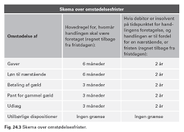

# Insolvensret

---

***Du skal som studerende være særlig opmærksom på følgende problemstillinger ved gennemgangen af insolvensretten, herunder kreditorforfølgning:*** 

•	**Forskellen på individual- og universalforfølgning = vigtigt – herunder forskellen på tvangsauktion og konkurs**

 
 

---

•	**Individualforfølgning:** 

  * Udlægsgrundlag (eksekutionsgrundlag) – herunder betalingspåkrav, 
  retsplejelovens kapitel 44a og § 478
  
  * Udlæggets genstand (trangsbeneficiet m.m.), retsplejelovens § 
  507-515
  
•	**Universalforfølgning:**

  * Hæftelse: Hæftelsestyper i enkeltmandsvirksomhed samt forskellige   selskabsformer. Emnet har relevans for opgørelse af aktivsiden i et   konkursbo samt kreditors evt. tab af restfordringen.  
  
  * Overordnet om rekonstruktion - anmodning, betingelser og 
  retsvirkning 
  
  * Konkursret – anmodning, betingelser, KL § 17-21, fristdag, KL § 
  1, nærtstående, KL § 2, konkursordenen, KL kapitel 10, separatister   og underpanthavere, KL § 8286, omstødelse, KL kapitel 8 

				

## Regler og definitioner

**Retsplejeloven og Konkursloven regulerer:**

* *Individualforfølgning:*

  +	Hver kreditor for sig, den kreditor, der kommer først, bliver først betalt af skyldner
  
  +	Reguleret i Retsplejeloven (RPL; Lovbekendtgørelse nr. 1284 af 14. november 2018) og omfatter bl.a. udlæg, tvangsauktion og tvangsbeneficeret (retten til et beskedent hjem) 
  
* *Universalforfølgning:*

  +	Reguleret i konkursloven (KKL; Lovbekendtgørelse nr. 11 af 6. januar 2014), og omfatter konkurs, rekonstruktion og gældssanering
  
  +	Formålet er at stille kreditorerne lige i konkursboet
  
  +	Kun hvis skyldner er insolvent, jf. KKL § 17:
  
  *”Er en skyldner insolvent, skal hans bo tages under konkursbehandling, når det begæres af skyldneren eller en fordringshaver. Stk. 2 En skyldner er insolvent, hvis han ikke kan opfylde sine forpligtelser, efterhånden som de forfalder, medmindre betalingsudygtigheden må antages blot at være forbigående”.*
 

Ordet **”insolvent”**

* Defineret i KKL § 17

* Skyldner kan ikke betale sin gæld, efterhånden som den forfalder til betaling

* Skifteretten vurderer, om insolvensen er til stede

* Hvis skyldner selv erklærer sig insolvent, forventes det at være rigtigt

---

**Video om udlæg og trangsbeneficium**

<iframe src="https://www.youtube.com/embed/kxa-lYBFCDk" width="853" height="480" frameborder="0" allowfullscreen="allowfullscreen"></iframe>

  
---

**Konkurslovens § 17**

Der må ved afgørelsen om skyldnerens insolvens og dermed en konkursbehandling tages der hensyn til en række momenter i praksis:

* En rigtigt opgjort status er et vægtigt indicium om skyldnerens betalingsevne, jf. dommen U 2001 2592 Ø (skyldner, der siden 2000-02-10 ved (delvis) betaling havde afværget 15 konkursbegæringer, var insolvent, da han ikke kunne betale 50.798 kr. ifølge en udeblivelsesdom, og da han havde yderligere gældsposter), hør nærmere omtale om dommen. 

* Det må kræves, at der består en fordring mod skyldneren, men ikke at den er forfalden. Fordringen må endvidere tilkomme den, der indleverer konkursbegæringen til skifteretten.

* At fordringen er genstand for en ikke afsluttet retssag, udelukker ikke i sig selv, at den kan tjene som grundlag for konkurs, se f.eks. dommen U 1973 673 H.

* Kreditor skal have en retlig interesse i konkursbehandlingen. Denne vil normalt bestå i, at der er udsigt til dividende. Det forhold, at kreditor aktuelt ikke kan forvente dividende i boet, udelukker ikke konkurs. Den retlige interesse kan bestå i, at konkursbehandlingen kan tænkes at tilvejebringe yderligere aktiver.

* Enhver fysisk person kan uanset (u)myndighed være »skyldner« i den anførte betydning i KKL § 17.

* En juridisk person kan som »skyldner« erklæres konkurs, hvis enten ingen deltager i sammenslutningen hæfter personligt for sammenslutningens gæld, eller hvis samtlige personligt hæftende er under konkurs.

* Pengeinstitutter kan erklæres konkurs, men beskikkelse af kurator sker efter forhandling med Finanstilsynet, se lov om finansiel virksomhed § 246, stk. 3. 

* Om forsikringsselskabers konkurs, se lov om finansiel virksomhed §§ 264-265, hvorefter bl.a. beskikkelse af kurator sker efter forhandling med Finanstilsynet.

* Ansvarlige interessentskabers boer behandles som konkursboer, når samtlige interessenter er under konkurs.

Insolvens antages i almindelighed at foreligge efter KKL § 18, hvis:

* skyldneren erkender at være insolvent, 

* skyldneren er under rekonstruktionsbehandling,

* skyldneren har standset sine betalinger eller

* der ved udlæg inden for de sidste tre måneder før skifterettens modtagelse af konkursbegæringen ikke har kunnet opnås dækning hos skyldneren. 
 
Speak 23
 

## Inkasso

Inkasso reguleres af Lovbekendtgørelse nr. 1018 af 9. september 2014 om inkassovirksomhed. 

Formålet med inkassoloven er at sikre, at privat inkassovirksomhed, dvs. den inddrivelse af fordringer på andres vegne, der sker uden fogedretternes medvirken som led i privat inkassovirksomhed, foregår på en rimelig og forsvarlig måde. 

Dette søges navnlig opnået ved en autorisationsordning for inkassofirmaer, ved krav om godkendelse af personale, der retter personlig henvendelse til skyldnere, og ved krav om, at inkassofirmaer mv. skal stille sikkerhed for pengekrav, som måtte opstå som følge af udøvelsen af deres virksomhed. 

Lovens formål søges også opnået ved regler om, at inkassovirksomhed skal udøves i overensstemmelse med god inkassoskik i forhold til både skyldnere og kunder, jf. inkassolovens § 9. 

 ---

<h3>Gode råd og gæld: Inkasso</h3>

<iframe src="https://www.youtube.com/embed/XbxO46Oeizw" width="853" height="480" frameborder="0" allowfullscreen="allowfullscreen"></iframe>

---

Speak 23

* Inkassolovens kap. 1 fastlægger anvendelsesområdet for loven.

* I kap. 2 fastsættes autorisationsordningen for inkassofirmaer og visse andre virksomheder. 

* Endvidere indeholder kap. 2 regler om sikkerhedsstillelse. 

* I kap. 3 fastsættes regler om godkendelse af personale, som retter personlige henvendelser til skyldnere. 

* Kap. 4 indeholder regler om, hvorledes inkassovirksomhed skal udøves. 

* Kap. 5 indeholder kompetence- og bemyndigelsesbestemmelser. 

* I kap. 6 fastsættes regler om tilbagekaldelse og bortfald af autorisation mv. 
* Kap. 7 indeholder regler om tilsyn. 

* Kap. 8 indeholder straffe- og ikrafttrædelsesbestemmelser.

### Inkassoprocessen

* Gælden sendes til inkasso, hvis skyldner ikke betaler, efter kreditor har sendt en eller flere rykkere

* Inkasso kan foretages af:

  +	Kreditor selv
  +	Inkassofirma
  +	Advokat
  
* Inkassobrev med diverse oplysninger sendes til skyldner

* Formålet med inkasso er at få betalt gælden eller opnå en afdragsordning, som kaldes et frivilligt forlig

* Betaler skyldner stadig ikke, må kreditor overveje at fortsætte med tvangsinddrivelse

---

**Video: Forældelsesfristen for gæld**

<iframe src="https://www.youtube.com/embed/krDpzh9ugJ0" width="853" height="480" frameborder="0" allowfullscreen="allowfullscreen"></iframe>

---

## Tvangsinddrivelse

Ordet **”tvangsinddrivelse”:**

* Kreditor kan via fogedretten få udlæg i skyldners aktiver og sælge dem på tvangsauktion

* Provenuet fra tvangsauktionen nedbringer skyldners gæld

---

<h3>Mødet i fogedretten</h3>

<iframe src="https://www.youtube.com/embed/ozjrbeuLrTU" width="853" height="480" frameborder="0" allowfullscreen="allowfullscreen"></iframe>

---

<h3>Gode råd om gæld: Fogedretten</h3>

<iframe src="https://www.youtube.com/embed/th9E-UvXijE" width="853" height="480" frameborder="0" allowfullscreen="allowfullscreen"></iframe>

---

Tvangsinddrivelse kræver et fundament, jf. RPL § 478 fx:

* Dom eller retsforlig
* Frivillige forlig, hvis der står, det kan tvangsfuldbyrdes
* Gældsbreve, hvis der står, det kan tvangsfuldbyrdes
* Pantebreve
* Afgørelser fra Forbrugerklagenævnet og de private godkendte tvistløsningsorganger efter 30 dage
* Krav fra offentlige myndigheder fx Skat

---

<h3>Gode råd og gæld: SKAT</h3>

<iframe src="https://www.youtube.com/embed/gNK1K_cpsSw" width="853" height="480" frameborder="0" allowfullscreen="allowfullscreen"></iframe>

---

<h3>Gode råd om gæld: Budget</h3>

 

<iframe src="https://www.youtube.com/embed/V_ZxNcRklxE" width="853" height="480" frameborder="0" allowfullscreen="allowfullscreen"></iframe>

---

### Betalingspåkrav

Hvis kreditor ikke har et fundament, skal kreditor:

* Have en dom for kravet eller
* Udfylde et betalingspåkrav, jf. RPL kap. 44a 
* Betalingspåkravet udfyldes af kreditor og indgives til Fogedretten
* Betalingspåkravet kan kun anvendes hvis:
  +	Kreditor har et pengekrav på højst 100.000 kr.
  +	Kravet er ubetinget og ubestridt af skyldner
  +	Skyldner har fået et ”inkassobrev”
* Kan med Fogedrettens påtegning på betalingspåkravet anvendes som fundament
 

### Udlæg

**HR:** Kreditor kan få udlæg i alle skyldners aktiver, medmindre følgende undtagelser:

* **U1:** Tredjemands rettigheder skal respekteres

* **U2:** Særlige indlån i pengeinstitut fx bil købt på afbetaling som et kreditkøb med ejendomsforbehold

* **U3:** Endnu ikke udbetalt løn, RPL § 511

* **U4:** Udbetalt erstatning fx fra ulykkesforsikring, RPL § 513 Erstatningen skal være holdt adskilt fra øvrige midler

* **U5:** Personlige aktiver med beskeden værdi, RPL § 515, stk. 1

* **U6:** Personlige hjælpemidler, RPL § 515, stk. 2

* **U7:** Båndlagte gaver, RPL § 514

* **U8:** Trangsbeneficiet, RPL § 509
 

*Trangsbeneficiet, jf. RPL § 509:*

* Kreditor kan ikke få udlæg i aktiver omfattet af trangsbeneficiet
* Omfatter aktiver, der hører til et beskedent hjem, fx seng, bord, stol, sofa
* Almindelig hvidevarer hører til et beskedent hjem, fx køleskab, fryser, almindeligt tv og almindelig computer

Smykker, malerier, smart TV eller fjernsyn med surround sound og subwoofer og andre værdifulde aktiver er ikke omfattet af trangsbeneficiet

Spørgsmål er i et hvilket omfan,g der kan foretages udlæg i følgende genstande og værdier: 

* Boliginventar (Opretholdelse af et beskedent hjem)
* Bil
* Kontanter (rede penge)
* Indestående på konti
* Depositum (lejebolig)
* Kæledyr
* Gaver
* Værdier med affektionsværdi
* Personskadeerstatning (Udbetalinger ved kritisk/ livstruende sygdom)
* Feriepenge

Speak 23 

## Tvangsauktion

Kreditor kan begære **tvangsauktion:**

* Kun aktiver, som kreditor i forvejen har udlæg i
* Begæring indgives til Fogedretten sammen med fogedgebyr
* Auktionen skal annonceres, fast ejendom bekendtgøres i Statstidende
* Auktionen holdes i Fogedretten, og aktivet bliver solgt til den, der byder højest
* Provenuet fra auktionen går til at betale gælden hos kreditor efter omkostningerne ved auktionen er betalt
* Panterettigheder i aktivet bliver slettet efter tvangsauktionen er holdt
 

---

**Video om tvangsauktion**

<iframe src="https://www.youtube.com/embed/drN8QtdRsfk" width="853" height="480" frameborder="0" allowfullscreen="allowfullscreen"></iframe>

---

## Konkurs

* Konkurs er en universalforfølgning, formålet er at dele skyldners aktiver ud til kreditorerne, så alle kreditorer stilles lige

* Begæring kan indgives til skifteretten af skyldner eller kreditor, jf. KKL § 17, stk. 1

* Skyldner mister rådighed over sine aktiver ved dekretets afsigelse, jf. KKL § 29

* Skifteretten udpeger kurator (advokat), som handler på vegne af konkursboet

* Annoncering i Statstidende - virkning for enhver, jf. KKL § 30
 

### Konkursbehandling

 

* Separatistkrav bliver fyldestgjort før konkursmassen gøres op
* Kurator skal sælge og opgøre alle konkursboets aktiver
* Konkursboet skal overveje, om det vil indtræde i gensidigt bebyrdende aftaler
* Konkursboet vurderer, om der kan være omstødelige dispositioner
* Kurator opgør alle kreditorernes krav og placerer dem i konkursordenen
* Når konkursboets aktiver og passiver er gjort op bliver kreditorerne fyldestgjort efter konkursordenen

 
### Konkursmassen

Boets aktiver (konkursmassen) omfatter:

**HR:**	Alt hvad skyldner ejer ved konkursdekrets afsigelse og under konkursen tilfalder ham, jf. KL § 32

**U1:**	Aktiver, som kreditor ikke kan få udlæg i, KL § 36  
**U2:**	Skyldners arbejdsindtægter under konkursen   
**U3:**	Separatistkrav (fx aktiver solgt med ejendomsforbehold) Boets passiver omfatter:  

* Alle kreditorer kan anmelde deres krav, uanset om kravet er forfaldent, jf. KL § 38
 
De vigtigste niveauer i konkursordenen er i rækkefølge Konkurslovens kap. 10:

* Massekrav, dvs. krav, som er opstået ved selve konkursbehandlingen, fx kuratorsalær,

* Privilegerede krav, fx krav opstået under forsøg på at afværge en konkurs og lønkrav fra visse af skyldnerens ansatte, samt

* Simple krav, dvs. krav fra skyldnerens almindelige kreditorer og derfor i  almindelighed den største post.
 
### Konkursordenen

* Konkursordenen inddeler alle boets kreditorer i klasser

* Hver konkursklasse bliver fyldestgjort fuldt ud, før der udloddes til næste klasse

* Først dækkes omkostninger i forbindelse med konkursen (massekrav), og herefter de øvrige klasser

* Hvis der ikke er dækning til hele klassen, fx de simple krav, bliver der udloddet en dividende. Efterstående konkursklasser får ingen dækning.
 
### Udlodning af dividende

* En dividende på 10 % til simple krav betyder, at kreditor med et krav på 100.000 kr. får en dækning på 10.000 kr.

**Udækket gæld:**

* Kreditor har stadig et restkrav på 90.000 kr. efter konkursen er afsluttet

* Kreditorernes udækkede gæld følger skyldner, hvis skyldner er en fysisk person

* Hvis skyldner er et selskab har kreditor ingen at rette kravet mod efter konkursen. Den udækkede gæld kan ikke blive fyldestgjort
 
###	Konkurskarantæne

* Formål: At forhindre personer i gentagne gange at spekulere i at tjene penge ved hjælp af en virksomheds konkurs

* Personen må ikke i karantæneperioden deltage i ledelsen af en virksomhed, medmindre personen hæfter personligt og ubegrænset

* Gælder som udgangspunkt i tre år, men perioden kan gøres kortere, jf. KL § 158

* Kurator eller rekonstruktør skal vurdere om de ledende personer i virksomheden har været uegnede til at drive virksomheden på grund af groft uforsvarlig forrretningsførelse, jf. KL § 157

 
### Omstødelse

* Konkursens formål er at alle kreditorer stilles lige

* Omstødelsesreglerne forhindrer, at kreditorer kan få en meget bedre retsstilling kort før konkursen indtræder

* Omstødelse medfører at den begunstigede skal betale det omstødelige beløb tilbage.

* Fristdagen er den dag Skifteretten har modtaget begæring om:

  +	Konkurs
  +	Rekonstruktion
  +	Gældssanering
  
* Beregning af omstødelsesperioden tager udgangspunkt i fristdagen 

**En konkurs starter med, at konkursboet selv eller en kreditor indleverer begæring / konkursbegæring til skifteretten. ... Fristdagen er derfor som udgangspunkt den dag, da skifteretten modtog begæring om rekonstruktion, konkurs eller gældssanering. Det er dagen hvor begæringen modtages, som er afgørende for fristdagen.**

---

 
 Kilde: Rentabilitet/Trojka
 
---

**Video: Hvad er forskellen på frivillig gældssanering og konkurs?**

<iframe src="https://www.youtube.com/embed/-x0_B732-Pw" width="853" height="480" frameborder="0" allowfullscreen="allowfullscreen"></iframe>

---

### Eksamensopgavesæt i konkurs og virksomhedsformer mv.

Karla Kamilla Kyrel drev ejendomsmæglerfirmaet K3 v/ Karla Kamilla Kyrel. Virksomheden, der var startet i maj 2014, havde haft svært ved at få foden indenfor på markedet og de huse, man rent faktisk havde fået til salg, havde vist sig vanskelige at sælge. D. 11. august 2015 modtog Retten i Odense Bank Skt. Knuds konkursbegæring mod Karla Kamilla Kyrel personligt og d. 14. august 2015 afsagde Retten i Odense konkursdekret. Bank Skt. Knud havde oprindeligt stillet en usikret kassekredit på 300.000 kr. til rådighed for Ejendomsmæglerfirmaet K3 v/Karla Kamilla Kyrel, men kassekreditten var blevet udvidet til 500.000 kr. d. 15. maj 2015. På udvidelsestidspunktet var den eksisterende kassekredit udnyttet fuldt ud. I forbindelse med udvidelsen havde Bank Skt. Knud fået pant for alle 500.000 kr. i Karla Kamilla Kyrels ubehæftede sommerhus, der senere – under konkursen – indbragte 1.300.000 kr. Pantet var sendt til tinglysning samme dag som aftalen om udvidelsen var lavet. Da banken anmeldte sit krav i konkursboet, meddelte kurator, at banken sikkerhed efter hans opfattelse kunne omstødes og at bankens krav skulle indgå i konkursordenen på lige fod med de i øvrigt anmeldte krav. Ved konkursen var K3s konto overtrukket en smule - der var trukket præcis 525.000 kr. på kontoen.

**Eksamensspørgsmålet:**

1. Giv en kort begrundet redegørelse for, hvilken virksomhedstype, der er tale om og hvorfor det er Karla Kamilla Kyrel, der personligt bliver ramt af konkursen? (5%) 

**Vejledende løsning**

Lovgrundlag: Lov om erhvervsdrivende virksomheder (erhvervsvirksomhedsloven)

Område: Selskabsret (virksomhedsformer)

Læringsmål: Den studerende har forståelse for grundlæggende selskabsret og hæftelsesformer samt betydningen af reglerne om tegningsret.

Der er tale om en enkeltmandsvirksomhed – derfor hæftes personligt og ubegrænset, jf. EVL §3 modsætningsvis og derfor er det Karla Kamilla Kyrel personligt, der rammes af konkursen. 

**Eksamensspørgsmål:**

2. Giv en kort begrundet redegørelse for, hvilken dag der er fristdagen. (5%) 

**Vejledende løsning:**

Lovgrundlag: Konkursloven (Kl)

Område: Konkursret

Læringsmål: Anvende relevante regler om konkurs, rekonstruktion og individualforfølgning samt vurdere deres betydning for den finansielle sektors risiko- og kreditvurdering.

Det følger af KL § 1, at fristdagen er den dag, da skifteretten modtog begæring om rekonstruktionsbehandling, konkurs eller gældssanering. I den konkrete sag modtog Retten konkursbegæringen d. 11. august 2015, der derfor er fristdagen.

**Eksamensspørgsmål:**

3. Giv en begrundet redegørelse for, om bankens sikkerhed helt eller delvist kan omstødes. (25%)

**Vejledende løsning**

Lovgrundlag: Konkursloven

Område: Konkursret - omstødelse

Læringsmål: Anvende relevante regler om konkurs, rekonstruktion og individualforfølgning samt vurdere deres betydning for den finansielle sektors risiko- og kreditvurdering.

Pant for gammel gæld – KL § 70. Omstødelse fsva. den del af pantet, der ikke er tilsagt i forbindelse med gældens stiftelse – altså de 300.000 kr. Fristen for omstødelse er 3 måneder fra sikringsakten er foretaget. De resterende 200.000 kr. kan ikke omstødes. 

**Eksamensspørgsmål:**

4. Giv en kort begrundet redegørelse for, hvor i konkursordenen den usikrede del af bankens krav skal placeres. (5%) 

**Vejledende løsning**

Lovgrundlag: Konkursloven

Område: Konkursret - konkursordenen

Læringsmål: Anvende relevante regler om konkurs, rekonstruktion og individualforfølgning samt vurdere deres betydning for den finansielle sektors risiko- og kreditvurdering.

Den usikrede del af gælden er et simpelt krav, jf. KL § 97. 
Fiona, der havde været ansat som ejendomsmægler hos K3, blev i stedet ansat som ejendomsmægler hos mæglerfirmaet VillaVillaKulla A/S, der udelukkende formidlede eksklusive huse. 

Det blev aftalt, at Fiona ville få 50% af alle salærer VillaVillaKulla A/S fik ind fra formidlingsaftaler hun skaffede firmaet. VillaVillaKulla A/S´ indehaver, Ulla Nielsen, var imidlertid meget interesserede i at fastholde firmaets eksklusive profil. 

Ud over løn og ansættelsesvilkår blev det derfor pointeret, at selvom det at indgå formidlingsaftaler var en helt normal del af en mæglers arbejde, så var det den faste regel i VillaVillaKulla, at man ikke måtte indgå formidlingsaftaler det første år af ansættelsen. Alle nye aftaler skulle i den periode indgås af Ulla.

Fiona var meget entusiastisk i forhold til sit nye arbejde og ville rigtigt gerne vise, at det i hvert fald ikke var hendes skyld, at K3 gik konkurs. Til den ugentlige træning i den lokale karateklub fortalte Fiona derfor glædestrålende om sit nye job og reklamerede voldsomt for VillaVillaKulla. Særligt over for holdkammeraten Tyra, der lå i skilsmisse, fik den hele armen og allerede et par dage efter var der bid. 

Tyra kontakte Fiona og bad hende besigtige Tyras rækkehus, hvilket skete samme dag. Da Fiona dagen efter gav Tyra om besked om, at hun mente, at huset kunne sælges for 1,4 mio. slog Tyra straks til. Samme aften kørte Fiona forbi Tyra på vej hjem fra kontoret og både Tyra og Fiona underskrev aftalen.

Næste dag da Fiona glædestrålende fortalte sin Ulla, at hun havde skaffet sin første kunde til virksomheden, blev Ulla ikke helt så glad som Fiona havde håbet. Faktisk gjorde Ulla det meget klart, at hun ikke ville have ”den slags huse” til salg og ringede straks Tyra op og gav hende samme besked. Tyra fastholdt, at de havde en aftale. 

**Eksamensspørgsmålet**

5. Er VillaVillaKulla A/S er forpligtede til at formidle salget af Tyras bolig? (20%)

**Vejledende løsning**

Lovgrundlag: Aftaleloven

Område: Aftaleindgåelse - fuldmagter

Læringsmål: Anvende centrale aftaleregler om aftalers indgåelse og fuldmagter, med udgangspunkt i den finansielle sektor

Fiona har som følge af sin ansættelse i VillaVillaKulla A/S en stillingsfuldmagt, jf. aftalelovens § 10, stk. 2. De studerende skal forholde sig til, hvad Fiona er legitimeret til i kraft af sin stilling (herunder hvordan man finder ud af, hvor langt en stillingsfuldmagt rækker) og hvad hun er bemyndiget til som følge af aftalen med Ulla. 

Det afgørende for de studerendes pointudbytte er, at de viser forståelse for reglerne og deres konkrete anvendelse. Det må antages at VillaVillaKulla forpligtes af aftalen. Fiona er klart uden for bemyndigelsen, men inden for legitimationen. Derfor bliver den afgørende diskussion om hvorvidt Tyra er i god tro, hvilket der ikke er noget, der tyder på, hun ikke er. 

Et par dage efter den uheldige situation med Tyra kaldte Ulla Fiona ind på sit kontor og bad hende være ”købermægler” for en af sine gode venner Palle Sætter. 

Palle havde i noget tid drevet en mindre robotvirksomhed, OmniRobots ApS, der producerede robotter der kunne automatisere processer inden for samling, maling, svejsning og pakning. Virksomheden blomstrede og da de var ved at vokse ud af de lokaler, de indtil da havde lejet sig ind i, var de på udkig efter noget større, de kunne købe. 

Oven på situationen med Tyra gjorde Fiona sig yderst umage med det resultat, at OmniRobots ApS i løbet af kort tid fik købt en fabriksejendom for 5 mio. kr. 

Beliggenheden var helt igennem ideel og selvom ejendommen krævede en del tilpasning for at kunne bruge til netop OmniRobots produktion, kunne de 4 måneder senere, d. 1. december 2015, flytte deres produktionsmaskiner til den nye location.  

I forbindelse med købet af ejendommen optog OmniRobots ApS et afdragsfrit lån på 3.0 mio. kr. i Realkredit Syd, der fik pant i ejendommen for beløbet. Realkredit Syds pantebrev blev anmeldt til tinglysning d. 2. november 2015. Den resterende del af købesummen samt pengene til ombygningen blev skaffet ved at bruge godt 1,7 mio. kr. OmniRobots havde stående i likvide midler samt at trække 1,2 mio. kr. på en kassekredit OmniRobots havde haft i Bank Skt. Knud, siden de købte deres produktionsmaskiner i februar 2014. 

Til sikkerhed for kassekreditten havde Bank Skt. Knud fået virksomhedspant i alle de kategorier, det er muligt at få virksomhedspant i og der var d. 13. februar 2014 tinglyst skadesløsbrev på virksomhedens blad i tingbogen. 

D. 1. november 2017 går OmniRobots ApS konkurs og de eneste aktiver på konkursboet er:

Ejendommen – værdi 2,2 mio. kr. 

Driftsmateriel, herunder de nævnte produktionsmaskiner – værdi 0,6 mio. kr.  

Tilgodehavender hos kunder – værdi 0,3 mio. kr.

En lastbil, Volvo FH 12 480 årg. 2009 – værdi 0,1 mio. kr. 

Der skyldes fortsat 3,0 mio. kr. til Realkredit Syd og 

1,2 mio. kr. til Bank Skt. Knud. 

Realkredit Syd gør med henvisning til deres pant i ejendommen krav på værdien af ejendommen, produktionsmaskinerne og lastbilen. 

Bank Skt. Knud gør med henvisning til deres virksomhedspant krav på alle fire aktiver. Konkursboet vil bare gerne have mest muligt til de øvrige kreditorer.

**Eksamensspørgsmålet:**

6. Hvem har krav på værdien af hvilke aktiver? (30%)

**Vejledende løsning**

Lovgrundlag: Tinglysningsloven (TL)

Område: Kreditsikring – pant 

Læringsmål: Anvende, vurdere og formidle reglerne om kreditsikring og finansiel sikkerhedsstillelse i sammenhæng med andre juridiske emner, og i en praktisk sammenhæng med risiko- og kreditvurdering af private og erhvervskunder

Selve værdien af ejendommen tilfalder Realkredit Syd som primær panthaver. 

Ejendomspant ctr. virksomhedspant. De studerende skal indledningsvis slå fast, at ejendommen er omfattet af TL § 37, da den er varigt indrettet med en særlig virksomhed for øje. Dermed omfatter Realkredit Syds pant i den faste ejendom ligeledes driftsinventar og driftsmateriel – i denne sammenhæng produktionsmaskinerne. 

Det følger af TL § 47c, stk. 4, at ejendomspantet vinder over virksomhedspantet uagtet, at virksomhedspantet er tinglyst før ejendomspantet. Realkredit Syd har derfor krav på værdien af ejendommen samt værdien af produktionsmaskinerne. 

Det fremgår af opgaven, at virksomhedspantet omfatter alle de mulige kategorier og det følger derfor af TL § 47c, stk. 3, nr. 1, at virksomhedspantet omfatter fordringer hidrørende fra salg af varer og tjenesteydelser. Værdien af kundetilgodehavenderne tilfalder derfor Bank. Skt. Knud. 

Virksomhedspantet omfatter derimod ikke de i § 42c nævnte køretøjer, der har været indregistreret, jf. § 47c, stk. 3, nr. 3 modsætningsvis, og da OmniRobots ApS ikke er professionel forhandler af lastbiler, jf. §47c, stk. 3, nr. 8. Lastbilen er derfor ikke omfattet af pantet og værdien tilfalder derfor konkursboet. 

Uanset hvad du har svaret i opgave 6, skal du nu lægge til grund, at Bank Skt. Knuds virksomhedspant giver dem ret til værdien af tilgodehavenderne – 300.000 kr. Forestil dig, at banken d. 6. juni 2017 havde fået besked om, at en af OmniRobots andre kreditorer, Kreditech, d. 5. juni 2017 havde fået et udlæg på 70.000 kr. i tilgodehavenderne. 

**Eksamensspørgsmål**

7. Giv en begrundet redegørelse for hvor meget af de 300.000 kr. Kreditech og Bank Skt. Knud hver ville have krav på? (10%)

**Vejledende løsning**

Lovgrundlag: Tinglysningsloven

Område: Kreditsikring – pant 

Læringsmål: Anvende, vurdere og formidle reglerne om kreditsikring og finansiel sikkerhedsstillelse i sammenhæng med andre juridiske emner, og i en praktisk sammenhæng med risiko- og kreditvurdering af private og erhvervskunder

Det følger af TL § 47c, at tinglyst virksomhedspant skal respektere senere udlæg, hvis udlægshaveren senest 3 hverdage efter udlæggets foretagelse har givet meddelelse til virksomhedspanthaver om udlægget. 

Da udlægget er meddelt mindre end 3 hverdage efter udlæggets foretagelse, vil udlægshaver have krav på de 70.000 kr. De resterende 230.000 kr. vil fortsat tilfalde banken. 

Det bemærkes for en god ordens skyld, at der er fra udlæggets foretagelse til fristdagen er gået mere end 3 måneder, hvorfor udlægget ikke bortfalder efter KL § 71. 

---

 

**Hvilke dispositioner kan fx omstødes:**

* Gaver, der ikke er lejlighedsgaver, jf. KL § 64
* Betaling af gæld, jf. KL § 67, hvis betaling er sket:

  +	I omstødelsesperioden og
  +	Betalingen ikke er ordinær 
  
  Derudover skal betaling enten være:
  
  +	Med usædvanlige betalingsmidler eller
  +	Sket før normal forfaldstid eller
  +	Med et beløb der afgørende har forringet skyldners betalingsevne
 

* Pant for gammel gæld, jf. KL § 70

  +	Pant for samtidig stiftet gæld er ok, hvis sikringsakten er foretaget med det samme
  
* Udlæg, jf. KL § 71

  +	alle udlæg, hvor sikringsakten er foretaget de seneste 3 måneder før fristdagen, kan omstødes
  
* Utilbørlige dispositioner, jf. KL § 74, hvis den begunstigede er i ond tro om:

  +	Skyldners insolvens og
  +	Utilbørligheden
 

## Rekonstruktion 

**Udenretlig rekonstruktion**

* Baseret på aftaler med en eller flere kreditorer

* Kan bl.a. omfatte en frivillig akkordordning, hvor gælden nedsættes

**Rekonstruktion efter KL**

* Omfatter alle kreditorer

* Kan indeholde:

  +	tvangsakkord eller
  +	virksomhedsoverdragelse
 

* Begæring kan indgives af skyldner eller en kreditor til Skifteretten

* Er skyldner en personligt ejet virksomhed er skyldners samtykke nødvendigt for at gennemføre rekonstruktionen

* Skifteretten udpeger en rekonstruktør (advokat)
 
### Rekonstruktion gennemførelse og indhold

* **Rekonstruktionen kan indeholde:**

  +	Tvangsakkord, som nedsætter skyldners gæld. En tvangsakkord på 25 % betyder, at kreditor med et krav på 100.000 kr. bliver dækket med
25.000 kr.

  +	Virksomhedsoverdragelse, hvis det er muligt at sælge hele eller dele af virksomheden til en ny ejer. Muligvis vil den tilbageværende del af virksomheden gå konkurs.
  
*	Forslaget om rekonstruktion skal til afstemning blandt kreditorerne

--- 

### Eksamensopgavesæt i forbrugerret, pant, handel med fast ejendom, modregning og rekonstruktion mv.

**Grosistens bekymringer**

"Kineserhviskeren" kalder man Vagn Vig, i gave og indbo branchen. Allerede mens han gik på erhvervsakademiet i Kolding, var han blevet venner med nogle af de kinesiske medstuderende, senere havde han fået en kinesisk kæreste, havde tilegnet sig noget af sproget og havde rejst i Kina. Han havde en særlig evne til at kommunikere med kinesere, som han nu udnyttede til at importere en bred vifte af gaveartikler, nips og pynt til hjemmet, som han solgte til en lang række detaijlforretninger i Nordeuropa.

Under en drøftelse med sin salgschef, Rikke Mortensen, om mulighederne for at markedsføre noget af sortimentet direkte til forbrugerne via en webshop, bemærker Vagn, at han har hørt noget om at sælgeren står rigtig dårligt over for køberen, hvis han ikke oplyser om fortrydelsesretten.

**Eksamensspørgsmålet:**

1.	Hvad er det for nogle retsvirkninger han henviser til? (15%)

**Vejledende løsning:**

Læringsmål: Anvende og formidle juridiske regler og praktis for forbrugeraftalers indgåelse og ugyldighed i relation til forskellige finansielle aftaler, herunder den erhvervsdrivendes markedsføringsbegrænsninger og oplysningspligt samt forbrugerens fortrydelsesret.

**Svar:** I henhold til Forbrugeraftalelovens § 8, stk. 1, nr. 9 skal den erhvervsdrivende inden der indgås aftale om en vare ved fjernesalg på en klar og forståelig måde give forbrugeren oplysning om hvorvidt der er en fortrydelsesret, og i givet fald, betingelser, tidsfrist og procedurer for at gøre fortrydelsesretten gældende, jf. forbrugeraftalelovens § 20.

Fortrydelsesfristen for forbrugere ved fjernsalg er 14 dage jf. Forbrugeraftalelovens § 19, stk. 1. 

Vagn henviser til at fortrydelsesfristen for forbrugeren udvides fra 14 dage til op til 12 måneder og 14 dage, hvis oplysninger om fortrydelsesfristen ikke gives INDEN fjernsalgsaftale indgås, jf. forbrugeraftaleloven § 19, stk. 4. 

Fortrydelsesfristen begynder at løbe fra det tidspunkt, hvor oplysningerne gives til forbrugeren. 

Endvidere mister den handlende muligheden for at gøre forbrugeren ansvarlig for en eventuel forringelse af af varen, hvis den erhvervsdrivende ikke har givet meddelelse om fortrydelsesretten, jf. forbrugeraftalelovens § 8, stk. 1, nr. 9.

**Slut på svaret**

Markedsføringen  over for detaijlforretningerne varetages af to salgschefer. Den ene, Rikke, varetager Jylland og Fyn, og den anden, Ole Svane, dækker Sjælland og øerne. 

På en tur til operaen i Hamburg, stopper Ole Svane i Aabenraa, hvor han kommer tilfældigt ind i en boligindretningsbutik, og bemærker, at man ikke fører nogen af Vagn Vigs produkter. 

Han henter hurtigt et katalog fra bilen, præsenterer sig med sit visitkort, og indgår en sædvanlig salgsaftale med butikkens indehaver.

Desværre viser det sig, at Vagn tidligere har mistet penge i forbindelse med indehaverens konkurs, med en anden forretning, nogle år tidligere, og derfor ikke ønsker at gøre forretninger med ham igen. Han meddeler derfor tilbage, at aftalen er ugyldig, da Ole Svane har overskredet sin fuldmagt, i det Aabenraa ligger uden for hans område.

**Eksamensspørgsmålet:**

2.	Har han ret i det? (10%)

**Vejledende løsning**:

Læringsmål: Anvende centrale aftaleregler om aftalers indgåelse og fuldmagter, med udgangspunkt i den finansielle sektor.

**Svar:** Den studerende skal gøre rede for at der er tale om en stillingsfuldmagt i henhold til aftalelovens § 10, stk. 2, og i den forbindelse for fuldmagt med særlig tilværelse. 

Den studerende skal redegøre for hvorvidt Ole handler helt uden for fuldmagtens grænse, idet Aabenraa er uden for Oles distrikt, hvilket næppe er tilfældet, hvorfor den studerende skal redegøre for betydningen af bemyndigelsen og fuldmagtens grænse og hvorvidt 3. mand her er i ond tro – samt konsekvensen heraf. 

Ole handler udenfor sin bemyndigelse, men indenfor fuldmagtens grænse, derfor er det afgørende for resultatet om 3. mand er i ond tro, jf. aftalelovens § 11, stk. 1. 

Indehaveren kender nok ikke til den interne instruks om områdefordelingen, hvorfor denne må være i god tro. Vagn kan derfor ikke træde tilbage fra aftalen.

**Eksamensspørgsmålet**

3.	Hvis aftalen er ugyldig, kan Ole så holdes ansvarlig af indehaveren? (10%)

**Vejledende løsning:**

Læringsmål: Anvende centrale aftaleregler om aftalers indgåelse og fuldmagter, med udgangspunkt i den finansielle sektor.

**Svar:** Det er fuldmægtigens objektive ansvar at fuldmagten rent faktisk eksisterer, jf. Aftl. § 25. 

Fuldmægtigen kan ifalde erstatningsansvar over for en godtroende 3. mand, såfremt fuldmagten ikke eksisterer. 

Det er omdiskuteret, om en ansat kan ifalde et ansvar efter denne bestemmelse. 

Hvorvidt 3. mand her er i god tro, afhænger af den studerendes konklusion i spm. 2. 

Relevente betragtninger i relation til spørgsmålet såvel som, om betydningen af at være ansat i denne sammenhæng skal honoreres.

**Svar slut**.

I forbindelse med planerne om etablering af en eventuel webshop overvejer Vagn, om han selv skal etablere lager og pakkeri, eller om det bedre kan betale sig at outsource denne del af virksomheden. 

I Trekandtområdet har han fundet en passende bygning til salg, tæt på motorvejen. 

Den nye bygning skal i givet fald også rumme de eksisterende lagerfunktioner og derudover ledes og administreres virksomheden fra lejede lokaler i det centrale Kolding.

Under en drøftelse om finansieringen med revisoren, foreslår denne, at et banklån til delvis finansiering af købet af den nye lagerbygning/pakkeri, samt til etableringen af webshoppen, ud over pant i ejendommen, sikkert vil kræve enten et virksomhedspant eller et fordringspant.

**Eksamensspørgsmålet:**

4.	Hvilke forskelle er der på hhv. virksomheds- og fordringspant? (15%)

**Vejledende løsning:**

Læringsmål: Anvende, vurdere og formidle reglerne om kreditsikring og finansiel sikkerhedsstillelse i sammenhæng med andre juridiske emner, og i en praktisk sammenhæng med risiko- og kreditvurdering af private- og erhvervskunder.

**Svar:** Begge dele er flydende pantformer, hvilket betyder, at også aktiver som kommer til efter pantets indgåelse er indheholdt i pantet. 

Begge pantformer er således en undtagelse til forbuddet mod tingsindbegreb og generalpant. 

Fordringspant oprettes ved tinglysning af et skadesløsbrev i personbogen jf. TL § 47 d, stk. 1 og 2. Virksomhedspant oprettes ved tinglysning af et skadesløsbrev eller et ejerpantebrev i personbogen jf. TL § 47 c, stk. 1 og 2. 

Den største forskel ligger i hvilke aktiver, der er omfattet af pantet, og efter hvilke bestemmelser panterettighederne er tinglyst. Virksomhedspant kan indeholde følgende i henhold til TL § 47 c, stk. 3: Simple fordringer, der stammer fra salg af varer og tjenesteydelser, lagre af råvarer, halvfabrikata og færdigvarer, køretøjer som ikke er indregistreret, driftsinventar og driftsmateriel, drivmidler og andre hjælpestoffer, besætning, goodwill, domænenavne og rettigheder i henhold til patentloven m.v., indregistrerede køretøjer, hvis pantsætter driver virksomhed med køb og salg af disse. 

I fordringspant er kun kundefordringer indeholdt. Fordringspant kan ikke være tinglyst samtidig med virksomhedspant jf. TL § 47 e, stk. 2.

Sidst men ikke mindst, er der den forskel, at virksomhedspant jf. TL § 47 c, stk. 5, viger for senere udlæg, hvilket ikke er tilfældet med fordringspant, som derfor udgør en bedre sikkerhed.

**Svar slut**

En af Vagns vigtigste kunder, en stor landsdækkende møbelkæde, har likviditetsmæssige problemer, og betaler ikke sine regninger for leverede varer. Vagn er løsningsorienteret, og aftaler med møbelkæden, at de kan levere nogle af de købte varer tilbage, som ikke sælger så godt. Idet der så modregnes på de udestående fordringer.

Godt to måneder senere modtager han et brev, der fortæller, at møbelkæden er kommet under rekonstruktion.

**Eksamensspørgsmålet:**

5.	Er der noget Vagn måske skal være opmærksom på i relation til modregningsaftalen? (15%)

**Vejledende løsning:**

Læringsmål: Anvende relevante regler om konkurs, rekonstruktion og individualforfølgning samt vurdere deres betydning for dne finansielle sektors risiko- og kreditvurdering.

**Svar**: Vagn skal være opmærksom på, at der i forbindelse med en rekonstruktionsbehandling kan ske omstødelse i henhold til KL § 12. 

I henhold til KL § 12j, stk. 3 har rekonstruktøren også mulighed for at sælge retten til at gøre et krav på omstødelse gældende. 

Vagn skal være opmærksom på, at en usædvanlig måde at blive betalt på, kan være grundlag for omstødelse af dispositionen.

Hvorvidt der er grundlag for omstødelse af modregningen i denne situation skal vurderes af den studerende. 

Vagn ved, at møbelkæden er i likviditetsmæssige problemer, og det er netop derfor han accepterer modregning som betaling. 

Her bør den studerende se på KL (konkursloven) § 67 om skyldneres usædvanlige betalinger de sidste tre måneder før fristdagen. 

Den studerende skal kunne vurdere hvornår der er fristdag og, hvorvidt der i dette tilfælde er tale om en – for møbelkæden – usædvanlig betaling.

**Svar slut**

Kun to dage forinden har Vagn og sælgeren begge underskrevet aftalen om køb af den kombinerede lagerbygning/pakkeri, og han overvejer nu, i lyset af denne udvikling, om han har ret til at fortryde købet.

**Eksamensspørgsmålet:**

6.	Har han det? (10%)

**Vejledende løsning:**

Læringsmål: At anvende og formidle centrale regler og praksis for køb og salg af fast ejendom med fokus på forbrugerbeskyttelse, samt  anvende centrale aftaleregler om aftalers indgåelse og fuldmagter, med udgangspunkt i den finansielle sektor.

**Svar:** 

Den studerende skal se, at der ikke er tale om et køb af en ejendom, som skal benyttes til bolig for Vagn, hvorfor fortrydelsesretten i LFFE § 7 i henhold til LFFE § 6 ikke kan bruges her. 

Andre relevente bemærkninger om aftalens status belønnes. 

Der er kun få ubehæftede aktiver i møbelkæden og stor usikret gæld til alle leverandørerne. 

Rekonstruktionsforslaget nævner, at de almindelige usikrede kreditorer, i tilfælde af en konkurs, står til at modtage en dividente på under 5%. 

Problemerne skyldes en meget uheldig valutadisposition og rekonstruktøren mener, at virksomheden kan og bør reddes, og foreslår, at Vagn og de andre leverandører, går med til at akkordere deres tilgodehavender med 65%.

**Eksamsspørgsmålet:**

7.	Hvilke elementer kan der indgå i en rekonstruktion? (10%)

**Vejledende løsning:**

Læringsmål: Anvende relevante regler om konkurs, rekonstruktion og individualforfølgning samt vurdere deres betydning for den finansielle sektors risiko- og kreditvurdering.

**Svar:** I henhold til KL § 10 skal rekonstruktion indeholde mindst en tvangsakkord eller et salg af virksomheden. 

Andre overvejelser om rekonstruktionens mulige elementer belønnes.

**Eksamensspørgsmålet:**

8.	Hvilke overvejelser bør Vagn gøre sig i relation til rekonstruktionsforslaget? (15%)

**Vejledende løsning:**

Læringsmål: Anvende relevante regler om konkurs, rekonstruktion og individualforfølgning samt vurdere deres betydning for den finansielle sektors risiko- og kreditvurdering.

**Svar:** Det er rekonstruktørens vurdering, at Vagn vil opnå langt større dækning af sit tilgodehavende, såfremt han går med til en akkord på 65%. 

Selv med en akkord vil der nok gå noget tid, før han modtager sit tilgodehavende, da debitor skal afdrage det akkorderede beløb, hvorimod en konkurs vil betyde en betaling af dividende i forbindelse med afslutningen af konkursbehandlingen. 
<
Den studerende bør afveje udsigten til at modtage under 5% overfor håbet om at modtage 35%, hvilket også virker sansynligt, henset til årsagen til likviditetsproblemerne blot er en uheldig valutadisposition.

Den studerende skal honoreres for relevante overvejelser, demonstrering af kendskab til formålet med rekonstruktion og forskellene på rekonstruktion og konkurs.

**Svar slut.**

---

## Gældssanering

Skifteretten kan efter en skyldners begæring afsige kendelse om gældssanering, såfremt skyldneren godtgør, at skyldneren ikke er i stand til og inden for de nærmeste år ingen udsigt har til at kunne opfylde sine gældsforpligtelser, og det må antages, at gældssanering vil føre til en varig forbedring af skyldnerens økonomiske forhold, jf. konkurslovens (KL) § 197, stk. 1.

**Der gælder følgende betingelser for en gældssanering**:

* Kun for fysiske personer, som selv skal indgive begæring

* Skyldner skal have en større gæld, end det er muligt for ham at betale tilbage, jf. KL § 197

* Det er en betingelse for gældssanering, at skyldneren er håbløst forgældet.

* Gældssanering bliver nægtet, hvis gælden skyldes ”dårlig opførsel”´, jf. KL § 197, stk. 2

* Kreditorer skal anmelde deres krav efter offentliggørelse i Statstidende, ellers bortfalder kravet

* Skyldner lægger et budget, som viser hvor meget af gælden, der kan betales

* Budget skal udarbejdes efter faste regler

* Skyldner skal leve på et eksistensminimum i 5 år, resten af skyldners indtægt går til betaling af kreditorer

* Hvis skyldner overholder betalingerne, er skyldner gældfri efter 5 år

Speak 23

*Omstødelsesreglerne finder anvendelse i gældssanering*

Skifteretten kan ophæve kendelsen om gældssanering, hvis skyldner:

  +	Har handlet svigagtigt i forbindelse med sagens behandling
  +	Groft har tilsidesat sine pligter efter gældssaneringskendelsen

* Overholder skyldner betingelserne for gældssaneringen efter bedste evne, er skyldner gældfri

* Kreditorerne har ikke længere krav på skyldner efter gældssaneringsperioden

* Gældssanering i forbindelse med en konkursbehandling sker på lempeligere vilkår, og perioden er på 3 år i stedet for 5 år

---

**Video: Gældssanering ja eller nej**

<iframe src="https://www.youtube.com/embed/lWPR4f96Hng" width="853" height="480" frameborder="0" allowfullscreen="allowfullscreen"></iframe>

---

**Video: Advokatråd om gældssanering**

<iframe src="https://www.youtube.com/embed/eUtA_eE8acg" width="853" height="480" frameborder="0" allowfullscreen="allowfullscreen"></iframe>

---

**Video om reglerne for gældssanering**

<iframe src="https://www.youtube.com/embed/PzVeVWnCsSw" width="853" height="480" frameborder="0" allowfullscreen="allowfullscreen"></iframe>

---

---

### Eksamenssæt om kreditforfølgning, aftaler, fuldmagt og forbrugerkøb, mv.

**LOTTOGEVINSTEN**

19-årige Karl er en drømmer, og det er hans overbevisning, at han en dag nok skal vinde et stort beløb i Lotto – så han køber hver uge en lottokupon eller to, og en lørdag aften tjekker han ugens kupon og kan se, at han har så mange tal rigtige at han står til en gevinst på 1.245.324,00 kr.

Karl ringer straks rundt til sine venner og inviterer dem i byen til en fejring af den store gevinst. Det bliver en vild omgang og Karl er gavmild, så regningen for fejringen lyder på 35.500 kr., som Karl har fået skrevet på det lokale diskotek ”Til den lyse morgen”, efter at have fortalt diskoteksejeren, Lone, om gevinsten.

Søndag har Karl det meget dårligt efter fejringen, så han kommer ikke ud af sengen før mandag morgen og i stedet for at tage i skole tager han på indkøb. Karl køber sig en komplet garderobe hos butikken ”Når mænd er bedst”. Han betaler med sit dankort – regningen lyder på 84.000,00 kr., da det er ret dyre mærker Karl bedst kan lide. Der står ikke nogen penge på hans konto, så det bliver et overtræk, men det tænker Karl jo dækkes ind, når gevinsten udbetales. 

Karl føler også stor trang til at købe sig en passende bil – han tager derfor direkte fra ”Når mænd er bedst” til BMW forhandleren. Her forelsker han sig i en rigtig fin bil til 354.000,00 kr. Karl beslutter sig straks for købet og beder forhandleren klargøre bilen med det samme, så han kan komme ud at køre i løbet af et par dage. Han fortæller om gevinsten, og at han derfor ikke har brug for finansiering, og underskriver en købsaftale, hvorefter han skal betale hele beløbet inden 30 dage.

Onsdag tænker Karl, at han nok hellere må se at få talt med banken, og med Danske Spil om at få gevinsten udbetalt – desværre kan han ikke længere finde sin lottokupon.

**Eksamensspørgsmål:**

1: Hvilke muligheder har Lone for at opkrævet de skyldige 35.500 kr. fra Karl? (15%)

Læringsmål: Udviklingsbaseret viden om anvendt teori og metoder indenfor regler og praksis for individuel kreditorforfølgning og gældssanering.

**Svar:** Lone er henvist til individualforfølgning i form af rykkere og evt. incasso, hvilket hvis det ikke lykkes, kan føres videre med retlige skridt. 

Der foreligger næppe noget eksekutionsgrundlag, så hvis hun ikke kan få Karl til at erkende fordringen, kan hun forsøge med et betalingspåkrav, som i givet fald kan føre til en sag efter småsagsproceduren. 

Herefter skulle fogedretten kunne inddrive gælden.

**Svar slut**

Karl ringer til ”Når mænd er bedst” og siger, at han har fortrudt sit indkøb og gerne vil have sine penge tilbage. Af butikken får han at vide, at de gerne tager tøjet retur, men de giver ikke pengene tilbage – han kan få et tilgodebevis. Han beder om at tale med indehaveren, Jens, men han giver ham samme besked.

Karl vil ikke have et tilgodebevis, så han går ikke ned i butikken for at aflevere tøjet.

**Eksamensspørgsmål:**

Spm. 2: Har Karl ret til at få pengene retur? (5%)

Læringsmål: Viden om grundlæggende regler om køb med henblik på at lette forståelsen for andre juridiske område.

**Svar:** Som udgangspunkt er der ikke fortrydelsesret ved almindelige forbrugerkøb. Dog tilbyder nogle butikker bytte og/eller returret, som en del af deres service. 

Så når butikken her kun tilbyder bytte, så er det deres ret. 

Spørgsmålet er på kanten af pensum, og allerede fornuftige overvejelser i relation til emnet skal belønnes.

Karl mener ikke længere, at de forudsætninger han havde for at købe bilen er til stede, og han siger derfor til BMW forhandleren, at han ikke ser sig bundet af købsaftalen. BMW forhandleren er ikke enig, specielt fordi bilen er ved at være klargjort med alle de lækre tilkøb som Karl har bestilt.

**Eksamensspørgsmål:**

3: Kan Karl fortryde sit køb af bilen og træde tilbage fra købsaftalen på grund af bristede forudsætninger? (10%)

Læringsmål: Anvende centrale aftaleregler om aftalers indgåelse og fuldmagter, med udgangspunkt i den finansielle sektor.

Anvende og formidle juridiske regler og praksis for forbrugeraftalers indgåelse og ugyldighed i relation til forskellige finanselle aftaler, herunder den erhvervsdrivendes markedsføringsbegrænsninger og oplysningspligt samt fortrydelsesret.

**Svar:** Spørgsmålet kan besvares så vel ud fra forudsætningslæren som med henvisning til AFTL § 36. 

Forudsætningen i form af lotto gevinsten, er nok både væsentlig og kendt af forhandleren, men risikoen for dens brist, kan ikke naturligt lægges på forhandleren. 

Der ses heller ikke at være sådanne, eller andre, elementer ved aftalens indgåelse eller indhold, der kunne retfærdiggøre anvendelsen af AFTL§ 36.

**Svar slut**

BMW forhandleren fastholder, at købsaftalen er bindende, men bliver nervøs for, hvorvidt Karl kan betale for bilen i det lange løb, men han tænker, at han er sikret af det ejendomsforbehold, som står som standard i købsaftalen.
Karl har ikke nogen penge at betale bilen med.

**Eksamensspørgsmål:**

4: Vil BMW forhandleren kunne søge sig fyldestgjort i bilen, på baggrund af det foretagne ejendomsforbehold? (16%)

Læringsmål: Vurdere, vælge og formidle reglerne om rettigheder og pligter i forbindelse med kreditaftaler, herunder ejendomsforbehold.

Den studerende har færdighed i at afdække den finansielle sektors behov for og gennemførelsen af en given sikkerhedsstillelse.

Den studerende har kompetence i at rådgive såvel private som erhvervskunder i forhold til sikkerheds-stillelse på et lovligt og etisk forsvarligt grundlag (god skik).

Anvende, vurdere og formidle reglerne om kreditsikring og finansiel sikkerhedsstillelse i sammenhæng med andre juridiske emner, og i en praktisk sammenhæng med risiko- og kreditvurdering af private og erhvervskunder.

**Svar**: Da Karl tilsyneladende ikke har opfyldt kravet i KAL (kreditaftalelovens) § 34, stk. 1. 4), om en udbetaling på 20 %, er aftalen om ejendomsforbehold ikke gyldig, og kan ikke umiddelbart danne grundlag for fyldestgørelse. 

Dog kan den ugyldige aftale, efter omstændighederne, når der ikke er særlige interesser, der taler imod det, lade fogedretten henvise til fyldestgørelse ved tilbagetagelse af det solgte jf. KAL § 30.

**Svar slut.**

Karl tænker, at hvis han er bundet af aftalen, så må han hellere få bilen finansieret gennem banken. 

Han beder derfor om et banklån, så han kan betale bilen. 

Banken vil gerne hjælpe ham med et lån på 354.000,00, men med en rente på 25% pr. år, og sikkerhed i form af kaution. 

Karls forældre indvilger i at kautionere for lånet, men Karl har bedt banken om ikke at fortælle om ”Lottogevinsten”, og de får heller ikke anden oplysning, end at der er tale om selvskyldnerkaution for et billån på 354.000,00 kr.

**Eksamensspørgsmål:**

5: Under hvilke betingelser kan banken få udbetalt kautionsbeløbet fra Karls forældre? (16%)

Læringsmål: Forståelse for kaution i både private og erhvervsforhold.

Den studerende har færdighed i at afdække den finansielle sektors behov for og gennemførelsen af en given sikkerhedsstillelse.

Den studerende har kompetence i at rådgive såvel private som erhvervskunder i forhold til sikkerheds-stillelse på et lovligt og etisk forsvarligt grundlag (god skik).

Anvende, vurdere og formidle reglerne om kreditsikring og finansiel sikkerhedsstillelse i sammenhæng med andre juridiske emner, og i en praktisk sammenhæng med risiko- og kreditvurdering af private og erhvervskunder.

**Svar:** Ved selvskyldnerkaution indtræder kautionistens betalingforpligtelse så snart hovedmanden misligholder. 

Da der er tale om privatkaution, og da banken ikke har opfyldt sin oplysningspligt jf. FIL § 48, stk. 1, kan banken dog jF. FIL § 48, stk. 2, kun gøre kautionsforpligtelsen gældende, såfremt kautionisten på anden vis har haft et forsvarligt grundlag for at bedømme risikoen.

**Svar slut.**

”Når mænd er bedst” er en personligt ejet virksomhed. Jens sidder selv med regnskaberne, og ser, at banken nægter at udbetale de 84.000 kr. for tøjkøbet med den begrundelse, at der ikke er dækning på Karls konto. 

Jens har i nogen tid haft svært ved at få omsat sine varer, og nu hvor han ikke ved, om og hvornår han får de 84.000 kr. for Karls indkøb af tøj, bliver han rigtig nervøs for, om en af leverandørerne, eller evt. banken, som har virksomhedspant til sikkerhed for en kassekredit, som på nuværende tidspunkt er trukket til 540.000,00 – 40.000,00 over det bevilgede maxbeløb, vil begære ham konkurs.

I virksomheden, som drives fra lejede lokaler, er der aktiver i form af et varelaget til en samlet værdi af ca. 100.000 kr., inventar til en værdi af ca. 40.000 kr., It-udstyr for omtrent 10.000 kr. samt en varevogn. 

Specielt er Jens bekymret for, at en konkurs vil betyde, at den faste ejendom, som han ejer sammen med sin hustru, hvor han bor med sin familie og hvorfra hustruen driver sin frisørsalon, risikerer at blive solgt som følge af en konkurs.

Jens ejer også en motorcykel.

**Eksamensspørgsmål:**

6: Giv en begrundet redegørelse for Jens situation i tilfælde af, at han bliver begæret konkurs. (16%)

Læringsmål: Forståelse for Grundlæggende selskabsret og hæftelsesformer samt betydningen af reglerne om tegningsret. 

**Svar:** Med et personselskab hæfter Jens direkte og personligt for virksomhedens gæld. 

Det betyder at han med få undtagelser, hæfter med alt hvad han ejer, herunder sin andel af den faste ejendom og sin motorcykel samt aktiverne i virksomheden.

**Svar slut**.

**Eksamensspørgsmål:**

7: Hvordan havde Jens situation i tilfælde af en konkurs været anderledes, hvis hans virksomhed var drevet som et ApS? (10 %)

Læringsmål: Forståelse for grundlæggende selskabsret og hæftelsesformer samt betydningen af reglerne om tegningsret.

**Svar**: Så havde der været begrænset hæftelse, således at selskabets kreditorer ville være henvist til kun at søge sig fyldestgjort i selskabets aktiver: Varelager, inventar, it-udstyr og varevogn, mens Jens hus og motorcykel ikke ville blive berørt.

**Eksamensspørgsmål:**

8: Hvad betyder det for leverandørernes krav, at banken har et virksomhedspant? (12%)

Læringsmål: Den studerende har færdighed i at afdække den finansielle sektors behov for og gennemførelsen af en given sikkerhedsstillelse.

Anvende, vurdere og formidle reglerne om kreditsikring og finansiel sikkerhedsstillelse i sammenhæng med andre juridiske emner, og i en praktisk sammenhæng med risiko- og kreditvurdering af private og erhvervskunder.

**Svar:** Det betyder at banken har pant i varelager, inventar og it-udstyr i henhold til TL § 47 c, stk. 3, og dermed som separatist skal tilgodeses først, for hele sit tilgodehavende, inden de usikrede kreditorer, herunder leverandørerne, får del i disse aktivers værdi. 

Varevognen er ikke en del af virksomhedspantet, da den ikke er omfattet af TL § 47c, stk. 3. 

Værdien af vognen kan derfor i det omfang den i øvrigt er ubehæftet, tjene til dækning af de usikrede kreditorers krav.

**Svar slut**.

---

