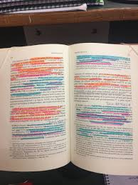

# Kreditaftaler

---

***Som finansøkonom-studerende skal du være særlig opmærksom på følgende problemstillinger ved gennemgangen af kreditaftaler:***

•	**Underpantsforbud, KAL § 21**

•	**Ejendomsforbehold – gyldighedsreglerne, KAL § 34**

•	**Ejendomsforbeholdets betydning i forbindelse med anden** 
  **sikkerhedsstillelse og tilbehørspant i fast ejendom, TL §§ 37 og 38** 
  
•	**Oprindelig trepartsforhold, KAL § 4, nr. 15, litra b,** **samt efterfølgende trepartsforhold, gældsbrevsloven**

 
 

---

---
 
## Introduktion til kreditaftaleloven 

    
* Kreditaftaleloven (KAL) anvendes i de fleste aftaler om lån, kredit eller køb på kredit. Lovens anvendes både i forbrugerkøb, handelskøb og civilkøb.

* Ordet **”kreditaftale”** er defineret i KAL § 4, stk. 1, nr. 3: 

**”En aftale, hvorved en kreditgiver yder eller giver tilsagn om at yde kredit…”**

* Kreditaftaleloven regulere lån og kreditkøb. En kreditaftale kan indgås via en kreditformidler.  

En kreditgiver defineres nærmere i KAL § 4, nr. 2. KAL § 1, stk. 1, indeholder det civilretlige forbrugerbegreb, det indebærer, at KALs hovedområde er forbrugerkreditaftaler. 

Definitionen er overensstemmende med definitionerne af forbrugeraftaler/køb i aftalelovens § 38 a, stk. 2, købeloven § 4 a, stk. 1, 1. pkt., forbrugeraftalelovens § 1, stk. 2, og rentelovens § 7, stk. 1.  

En **»kreditgiveren«** forstås som forbrugerens modpart. 

Kreditgiver er først og fremmest den (typisk juridiske person), der i forhold til forbrugeren yder kredit. 

Ved aftaler om ydelse af pengelån/kredit, der skal tilbagebetales, er långiver kreditgiver. 

De finansielle institutioners udlån til forbrugere er derfor omfattet af loven (pengeinstitutter, kreditinstitutter, finansieringsselskaber, realkreditinstitutter, låneforeninger, livsforsikringsselskaber (policelån), pensionskasser, erhvervsdrivende udlånsfonde osv).  

Speak23

  

  

Kreditgiver skal være erhvervsdrivende, jf. dog KAL § 1, stk. 2, og for ikke-forbrugerkøb KAL § 2.^[Følgende afsnit om kreditaftaleloven bygger på *Sonny Kristoffersens*: Forbrugerretten II, Den civilretlige forbrugerbeskyttelse, kap. 5 om kreditaftaler, 2016., KarnovGroup.] 

Erhvervsdrivende er enhver, der driver en privat erhvervsvirksomhed, hvad enten der er tale om hoved- eller bibeskæftigelse. 

Virksomheden må dog have et vist omfang og være af en vis varighed. 

Er vedkommende bogføringspligtig, momspligtig m.v. vil vedkommende normalt være erhvervsdrivende i lovens forstand. 

Det er uden betydning, om der tilstræbes økonomisk gevinst med virksomheden. Offentlig virksomhed, som kan sidestilles med privat erhvervsvirksomhed, f.eks. levering af vand, transport af personer og gods, er også at betragte som erhvervsvirksomhed i lovens forstand, jf. herved princippet i markedsføringslovens § 1. 

Foreninger og sammenslutninger, hvis formål udelukkende er velgørenhed eller almennyttigt, politisk eller religiøst, kan i almindelighed ikke anses for erhvervsdrivende.  

Forarbejderne til kreditaftaleloven betoner, at en arbejdsgiver, som yder kredit til en medarbejder, normalt ikke kan anses som kreditgiver i lovens forstand, medmindre arbejdsgiveren yder kreditten som led i sin erhvervsmæssige virksomhed, f.eks. et pengeinstitut.  

KAL gælder også for kreditaftaler, hvor kreditten ydes af en ikke-erhvervsdrivende, hvis aftalen er indgået eller formidlet for kreditgiveren af en erhvervsdrivende.  

Kreditgiveren har **bevisbyrden** for, at der ikke foreligger en forbrugerkreditaftale, at en kreditaftale er omfattet af KAL § 2, stk. 2.  

## Krav til kreditaftalen

* Før kreditaftalen indgås skal en forbruger have oplysninger om vilkår og omkostninger på et varigt medie (fx papir, CD-rom, netbank)

* Kreditgiver skal bl.a. oplyse om ÅOP (årlige omkostninger i procent; kan betegnes for ”kiloprisen for lånet”)

* Kreditaftalen skal indgås på varigt medie og opfylde tilsvarende oplysningskrav 

* Opfylder kreditgiver ikke oplysningspligten:

  +	Skal forbrugeren evt. betale færre omkostninger
  +	Løber fortrydelsesretten først fra oplysningspligten er opfyldt
  +	Kreditgiver kan blive pålagt en bøde
 
* Kreditgiver skal vurdere forbrugerens kreditværdighed før kreditaftalen bliver indgået

* I forbindelse med optagelse af realkreditlån har forbrugeren krav på en 7 dages acceptfrist, jf. KAL § 7d

* Et kortfristet forbrugslån kræver at forbruger afventer mindst 48 timer med at acceptere tilbuddet, jf. KAL § 8c

* Forbrugeren har ret til at fortryde en kreditaftale, jf. KAL § 19

* En forbruger har altid ret til at indfri lånet før tid og dermed spare yderligere renteudgifter

  +	Undtaget pantebreve med pant i fast ejendom
  
*	Urimelige vilkår kan blive tilsidesat, jf. KAL § 22 eller aftalelovens §§ 38c, jf. 36

## Kreditgiverens oplysningspligt mv.

Kreditaftalelovens forbrugerbeskyttende sigte  kommer til udtryk i lovens bestemmelser om, at forbrugeren senest i forbindelse med kreditaftalens indgåelse skal have en række oplysninger om prisen og vilkårene for kreditten. 

Loven indeholder derfor en række formkrav til kreditaftaler og bestemmelser om, at manglende eller urigtig opfyldelse af oplysningspligten kan medføre såvel civilretlige som strafferetlige sanktioner, jf. KAL §§ 23 og 24 samt 56, stk. 2. 

Det påhviler som nævnt domstolene – i praksis navnlig fogedretterne – ex officio (af egen drift) at iagttage, om det dokument, der fremlægges i en (foged-)sag, er omfattet af loven, og at de foreskrevne kreditoplysninger er givet på behørigt vis, jf. U 2000.461 V.

---

Kapitel 2 i KAL regulerer 10 områder, der vedrører kreditgiverens oplysningspligt og andre forpligtelser, som det påhviler kreditgiveren at iagttage forud for og i forbindelse med indgåelse af en kreditaftale. 

Disse områder er: 

1. Oplysningspligt forud for aftaleindgåelsen, jf. KAL § 7 a.

2. Oplysningspligt forud for aftaleindgåelsen i forbindelse med visse særlige former for kreditaftaler, jf. KAL § 7 b.

3. Vurdering af forbrugerens kreditværdighed, jf. KAL § 7 c.

4. Krav til kreditaftalen, jf. KAL § 8.

5. Pantsikrede lån i fast ejendom, jf. KAL § 8 a.

6. Overtræk, jf. KAL § 8 b.

7. Underretning om ændring af debitorrenten, jf. KAL § 9.

8. Kontoudtog og underretning om ændringer i debitorrenten ved kassekreditter, jf. KAL § 10.

9. Beregning af de årlige omkostninger i procent, jf. KAL § 16 og endelig,

10. En særlig bestemmelse om kreditformidlere i KAL § 17.

Bestemmelserne i KAL §§ 7 a, 7 b og 7 c vedrører oplysninger, der skal gives i god tid før der indgås en kreditaftale, og bestemmelsen i KAL § 7 c vedrører den pligt, der påhviler kreditgivere til at foretage en kreditvurdering af forbrugeren, før der indgås en kreditaftale.  

Bestemmelsen i KAL § 8 vedrører formkrav til en kreditaftale og oplysninger, der skal gives i selve kreditaftalen. 

De øvrige oven for nævnte bestemmelser vedrører oplysninger, der skal gives efterfølgende samt bestemmelser om beregning af de årlige omkostninger i procent og om kreditformidlere.  

---

#### Oplysningspligt forud for aftaleindgåelsen

Før en forbruger bindes af en kreditaftale eller et kredittilbud, skal kreditgiveren – eller kreditformidleren, hvis aftalen formidles af denne – i god tid give forbrugeren de oplysninger, der er nødvendige for, at denne kan sammenligne forskellige tilbud, således at forbrugerens beslutning om at indgå en kreditaftale kan træffes på et informeret grundlag, jf. KAL § 7 a, stk. 1. 

Oplysningerne skal gives dels på grundlag af de kreditvilkår og betingelser, som kreditgiveren tilbyder, dels på grundlag af de præferencer og oplysninger, som forbrugeren måtte have fremført. 

Oplysningerne skal gives i så god tid, før en eventuel aftale indgås, at forbrugeren har tid til at sætte sig ind i de udleverede oplysninger.

Hvis en kreditgiver ikke ønsker at indgå en aftale, er kreditgiveren ikke pligtig at udlevere kreditoplysninger. 

Oplysningerne gives på papir eller på et andet varigt medium ved hjælp af formularen i lovens bilag 2.

Det er kreditgiveren, der må tåle de civilretlige sanktioner, jf. KAL § 34 og § 24, der kan bringes i anvendelse, hvor formidleren ikke retmæssigt har opfyldt sin oplysningspligt. 

Kreditgiveren ofte vil have et regreskrav mod den formidler, som ikke har opfyldt sin oplysningspligt over for forbrugeren.

---

**De oplysninger, som kreditgiveren skal give forud for indgåelse af en aftale, er ifølge KAL § 7 a, stk. 2 følgende:**  

**1.** Kredittypen. (fx lån eller en kassekreditaftale)

**2.** Navn og fysisk adresse på kreditgiveren og i givet fald navn og fysisk adresse på den involverede kreditformidler, jf. definitionen i KAL § 4, nr. 6.

**3**. Det samlede kreditbeløb og betingelserne for at udnytte kreditmuligheden, jf. lovens § 4, nr. 12 om definitionen af det samlede kreditbeløb. Det lånebeløb som forbrugeren kan råde over (låneprovenuet). 

**4.** Kreditaftalens løbetid.

***5**. Ved kredit i form af henstand med betalingen for en specifik vare eller tjenesteydelse og tilknyttede kreditaftaler, varen eller tjenesteydelsen og kontantprisen herfor. 

**6**. Debitorrenten, betingelserne for anvendelsen af debitorrenten og et eventuelt indeks eller en eventuel referencesats, der skal anvendes på den oprindelige debitorrente, og tidspunkter, betingelser og procedurer for ændring af debitorrenten. Hvis der anvendes forskellige debitorrenter under forskellige omstændigheder, angives de nævnte oplysninger for alle de relevante debitorrenter.

**7**. De årlige omkostninger i procent og det samlede beløb, som skal betales af forbrugeren, illustreret ved et repræsentativt eksempel, som angiver alle de antagelser, der er lagt til grund for at beregne procentsatsen. Hvis forbrugeren har informeret kreditgiveren om et eller flere elementer i den kredit, vedkommende foretrækker, som f.eks. kreditaftalens løbetid og det samlede kreditbeløb, skal kreditgiveren tage hensyn til disse elementer. Hvis en kreditaftale giver forskellige muligheder for at udnytte kreditmuligheden med forskellige omkostninger eller debitorrenter, og kreditgiveren derfor anvender det loft for kreditten, som fremgår af antagelsen i lovens bilag 1, skal kreditgiveren angive, at andre muligheder for at udnytte kreditmuligheden for denne type kreditaftale kan medføre højere årlige omkostninger i procent.

**8**. Størrelse, antal og hyppighed af de betalinger, der skal foretages af forbrugeren, og i givet fald den rækkefølge, hvori betalingerne henføres til forskellige udestående saldi til forskellige debitorrenter med henblik på tilbagebetaling.

***9**. Hvor det er relevant, omkostningerne i forbindelse med forvaltning af en eller flere konti til registrering af både betalingstransaktioner og udnyttelser af kreditmuligheden, medmindre det ikke er obligatorisk at åbne en konto, tillige med omkostningerne ved anvendelse af et betalingsmiddel i forbindelse med både betalingstransaktioner og udnyttelser af kreditmuligheden, andre omkostninger i forbindelse med kreditaftalen og betingelserne for en eventuel ændring af disse omkostninger.

**10**. Hvor det er relevant, om der er omkostninger, som forbrugeren skal betale til en notar ved indgåelsen af kreditaftalen.

**11**. Den eventuelle forpligtelse til at indgå en aftale om en accessorisk tjenesteydelse i forbindelse med kreditaftalen, navnlig en forsikringspolice, såfremt indgåelsen af en aftale om en sådan accessorisk tjenesteydelse er obligatorisk for at opnå kreditten eller for at opnå kreditten på de annoncerede vilkår og betingelser. 

**12**. Den gældende sats for morarenter og måden, denne sats tilpasses på, og, hvor det er relevant, eventuelle omkostninger i forbindelse med misligholdelse. 

***13**. Oplysning om følgerne af manglende betalinger.

**14.** Hvor det er relevant, den sikkerhedsstillelse, som kræves.

**15**. Hvorvidt en fortrydelsesret finder anvendelse eller ej. 

16. Retten til førtidig tilbagebetaling og, hvor det er relevant, oplysninger om kreditgiverens ret til kompensation og om, hvordan denne kompensation fastsættes i overensstemmelse med KAL § 26.

**17**. Forbrugerens ret til omgående underretning uden omkostninger i henhold til KAL § 7 c, stk. 3, om resultatet af databasesøgninger, der er foretaget med henblik på vurdering af den pågældendes kreditværdighed.

**18**. Forbrugerens ret til efter anmodning og uden omkostninger at få udleveret en kopi af udkastet til kreditaftale, finder ikke anvendelse, hvis kreditgiveren på tidspunktet for anmodningen ikke er villig til at indgå kreditaftalen med forbrugeren.

**19**. Hvis det er relevant, hvor længe oplysningerne, der er afgivet forud for aftaleindgåelsen, er bindende for kreditgiveren.

---

Speak23

#### Vurdering af forbrugerens kreditværdighed

Før en kreditgiver indgår en kreditaftale med en forbruger, skal kreditgiveren ifølge KAL § 7 c foretage en vurdering af forbrugerens kreditværdighed. 

Vurderingen skal ske på grundlag af fyldestgørende oplysninger, der, hvor det er relevant, indhentes hos forbrugeren og, hvor det er nødvendigt, ved søgning i relevante databaser; det vil i praksis sige hos et kreditoplysningsbureau.  

Kreditvurderingspligten har til formål at beskytte forbrugeren og skal som følge heraf foretages med sigte på at vurdere, om forbrugeren på baggrund af dennes økonomiske situation ved hjælp af fx løbende indtægter, låneomlægning eller realisation af aktiver vil være i stand til at betale de forudsatte ydelser på kreditten – og altså ikke med henblik på at vurdere kreditgiverens risiko for tab.  

#### Nærmere kravene til selve kreditaftalen

De ovenfor omtalte bestemmelser i KAL §§ 7 a, 7 b og 7 c vedrører som tidligere anført oplysninger, der skal gives, og kreditvurderinger, der skal foretages, før der indgås en kreditaftale. 

Bestemmelsen i lovens § 8 regulerer de formkrav og de oplysninger, som skal fremgå af selve kreditaftalen.  

**Formkrav**

En kreditaftale skal ifølge § 8, stk. 1, udfærdiges på papir eller på et andet varigt medium. Endvidere er det et krav, at alle aftalens parter skal have et eksemplar af aftalen.  

---

**Ifølge KAL § 8, stk. 2, skal en kreditaftale indeholde oplysning om**:

1. Kredittypen.

2. Navn og fysisk adresse på aftaleparterne og i givet fald på den involverede kreditformidler.

3. Kreditaftalens løbetid.

4. Det samlede kreditbeløb og betingelserne for at udnytte kreditmuligheden.

5. Den erhvervede vare eller tjenesteydelse og kontantprisen herfor, såfremt der er tale om en kredit i form af henstand med betalingen for en specifik vare eller tjenesteydelse eller om tilknyttede kreditaftaler.

6. Debitorrenten, betingelserne for anvendelsen af debitorrenten og et eventuelt indeks eller en eventuel referencesats, der skal anvendes på den oprindelige debitorrente, samt tidspunkter, betingelser og procedurer for ændring af debitorrenten. Hvis der anvendes forskellige debitorrenter under forskellige omstændigheder, angives de nævnte oplysninger med hensyn til alle de relevante debitorrenter.

7. De årlige omkostninger i procent og det samlede beløb, som skal betales af forbrugeren, beregnet på tidspunktet for indgåelse af kreditaftalen. 

Alle de antagelser, der er lagt til grund ved beregningen af denne procentsats, angives.

8. Størrelse, antal og hyppighed af de betalinger, der skal foretages af forbrugeren, og i givet fald den rækkefølge, hvori betalingerne henføres til forskellige udestående saldi til forskellige debitorrenter med henblik på tilbagebetaling.

9. Forbrugerens ret til på anmodning, til enhver tid i løbet af kreditaftalens varighed uden omkostninger, at modtage en opgørelse i form af en amortiseringsplan, såfremt der er tale om amortisation af kapitalen i forbindelse med en kreditaftale med fast løbetid. Amortiseringsplanen skal angive skyldige betalinger, tidspunkter og betingelser for betaling af sådanne beløb. Desuden skal den indeholde en specificering af den enkelte tilbagebetaling, som viser amortiseringen af kapitalen, renterne beregnet på grundlag af debitorrenten og, hvor det er relevant, eventuelle yderligere omkostninger. Hvis rentesatsen ikke er fast eller de yderligere omkostninger kan ændres i kreditaftalens løbetid, skal amortiseringsplanen klart og tydeligt angive, at oplysningerne i planen kun er gyldige indtil næste ændring af debitorrenten eller af de yderligere omkostninger i henhold til kreditaftalen.

10. En opgørelse over tidspunkter og betingelser for betaling af renter og eventuelle dermed forbundne faste omkostninger og engangsomkostninger, såfremt der skal betales omkostninger og renter uden amortisation af hovedstolen.

11. Omkostningerne i forbindelse med forvaltning af en eller flere konti til registrering af både betalingstransaktioner og udnyttelser af kreditmuligheden, medmindre det ikke er obligatorisk at åbne en konto, tillige med omkostningerne ved anvendelse af et betalingsmiddel i forbindelse med både betalingstransaktioner og udnyttelser af kreditmuligheden, andre omkostninger i forbindelse med kreditaftalen og betingelserne for en eventuel ændring af disse omkostninger, hvor det er relevant.

12. Den gældende sats for morarenter som er fastsat på tidspunktet for indgåelse af aftalen og måden, hvorpå denne sats tilpasses, og, hvor det er relevant, andre omkostninger i forbindelse med misligholdelse.

13. Oplysning om følgerne af manglende betalinger.

14. Hvor det er relevant, at der skal betales notarialgebyrer.

15. Den sikkerhedsstillelse og de forsikringer, som eventuelt kræves.

16. En eventuel fortrydelsesret og fristen for udøvelse af en sådan fortrydelsesret samt andre betingelser for udøvelsen, herunder oplysninger om forbrugerens forpligtelse til at tilbagebetale den udnyttede kapital med renter i overensstemmelse med § 19, stk. 4, og det rentebeløb, der påløber pr. dag.

17. Oplysninger om forbrugerens rettigheder i medfør af § 20 og betingelserne for udøvelse af disse.

18. Retten til førtidig tilbagebetaling, proceduren for førtidig tilbagebetaling og, hvor det er relevant, oplysninger om kreditgiverens ret til kompensation og den måde, hvorpå denne kompensation fastsættes.

19. Proceduren for udøvelse af retten til at opsige kreditaftalen.

20. Hvorvidt der er klageadgang og adgang til udenretslig bilæggelse af tvister for forbrugeren, og, hvis dette er tilfældet, hvorledes forbrugeren kan gøre brug deraf.

21. Hvor det er relevant, andre aftalevilkår og -betingelser.

22. Navn og adresse på den kompetente tilsynsmyndighed.

---

**Særligt om kassekreditter**

Kassekreditaftaler skal ifølge KAL § 8, stk. 5, indeholde en klar og tydelig angivelse af:

1. Kredittypen.

2. Navn og fysisk adresse på aftaleparterne og i givet fald på den
involverede kreditformidler.

3. Kreditaftalens løbetid.

4. Det samlede kreditbeløb og betingelserne for at udnytte kreditmuligheden.

5. Debitorrenten, betingelserne for anvendelsen af debitorrenten og et eventuelt indeks eller en eventuel referencesats, der skal anvendes på den oprindelige debitorrente, samt tidspunkter, betingelser og procedurer for ændring af debitorrenten. Hvis der anvendes forskellige debitorrenter under forskellige omstændigheder, angives de nævnte oplysninger med hensyn til alle de relevante debitorrenter.

6. De årlige omkostninger i procent og de samlede omkostninger, som skal betales af forbrugeren, beregnet på tidspunktet for indgåelse af kreditaftalen. Alle de antagelser, der er lagt til grund ved beregningen af denne procentsats, jf. § 16, stk. 3 og 4, og § 4, nr. 7 og 9, angives. 

7. En angivelse af, at forbrugeren til enhver tid kan blive anmodet om at betale hele kreditbeløbet tilbage.

8.Oplysninger om de omkostninger, der påløber fra sådanne kreditaftalers indgåelse, og, når det er relevant, om betingelserne for ændring af de pågældende omkostninger.

9. Proceduren for udøvelse af retten til at opsige kreditaftalen.  

---

Oplysning om variabel rente og andre variable kreditomkostninger  
Kreditaftaleloven indeholde ikke begrænsninger af godkendte pengeinstitutters, realkreditinstitutters eller andre godkendte kreditinstitutters ret til at variere den rente og de andre omkostninger, som en forbruger skal betale for en given kredit. 

Derimod er der fastsat regler, som fastlægger andre kreditgiveres ret til at foretage ændringer i den rente og de eventuelle andre omkostninger, som en forbruger skal betale for en given kredit. 

Ifølge KAL § 8, stk. 6, kan der i en kreditaftale kun aftales, at renten helt eller delvist skal variere med størrelsen af Nationalbankens diskonto eller lignende forhold, som kreditgiveren er uden indflydelse på. 

Den samme begrænsning gælder ifølge KAL § 8, stk. 7, for andre kreditomkostninger end renten. 

---

**Særligt om pantsikrede lån i fast ejendom**  

I KAL § 8 a, stk. 1, er det bestemt, at ved kreditaftaler, der sikres ved pant i fast ejendom, skal de oplysninger, der er nævnt i § 8, og aftalens øvrige væsentlige vilkår gives forud for kreditaftalens indgåelse, jf. KAL § 7 a.

For så vidt angår sælgerpantebreve er det ved KAL § 8 a, stk. 2, bestemt, at hvis en sælger af en fast ejendom yder kredit mod udstedelse af (sælger-)pantebrev i den faste ejendom, skal de oplysninger, der er nævnt i stk. 1, gives i aftalen om ejendommens overdragelse; almindeligvis købsaftalen. 

Denne aftale skal endvidere indeholde oplysning om, hvilket beløb der skal betales, hvis forbrugeren kan betale kontant hos sælgeren, alias kreditgiveren, i stedet for at udstede pantebrev.

Som følge af at en aftale om ejendommens overdragelse, en købsaftale, jævnligt er af foreløbig karakter, er det ved KAL § 8 a, stk. 3, bestemt, at hvis de oplysninger, der er givet efter stk. 1 eller 2, er af foreløbig karakter, skal kreditgiveren snarest muligt sende meddelelse om de endelige kreditoplysninger til forbrugeren.

Som en ordensforskrift er det ved KAL § 8 a, stk. 4, bestemt, at KAL § 8 finder tilsvarende anvendelse på kreditaftaler efter stk. 1 og 2. 

---

**Særligt om overtræk**  

Hvor en kreditgiver og en forbruger har indgået aftale om oprettelse af en løbende konto, hvor det eventuelt vil kunne tillades forbrugeren at overtrække kontoen, skal aftalen ifølge KAL § 8 b, stk. 1, indeholde de oplysninger, der er omhandlet i KAL § 7 b, stk. 2, nr. 5. 

Det vil sige debitorrenten, betingelserne for anvendelsen af debitorrenten og et eventuelt indeks eller en eventuel referencesats, der skal anvendes på den oprindelige debitorrente, de omkostninger, der anvendes fra det tidspunkt, hvor kreditaftalen indgås, og i givet fald betingelserne for ændring af disse omkostninger.

En sådan kreditaftale kan være en kassekredit, men kan også være en anden konto, fx en løn- eller budgetkonto med overtræksret. 

Oplysningerne skal gives regelmæssigt på papir eller på et andet **varigt medium**.

Hvor der er tale om et væsentligt overtræk (konkret vurdering) i en periode på over 1 kalendermåned skal kreditgiveren ifølge KAL § 8 b, stk. 2, straks på papir eller på et andet varigt medium underrette forbrugeren om følgende:

Overtrækket, det involverede beløb, debitorrenten og en eventuel bod og eventuelle omkostninger eller morarenter. 

---

**Underretning om ændring af debitorrenten**

Ifølge KAL § 9, stk. 1, skal kreditgiveren underrette forbrugeren om enhver ændring i debitorrenten. 

Underretningen skal ske på papir eller på et andet varigt medium. Underretningen skal ifølge KAL § 9, stk. 2, indeholde oplysning om betalingernes størrelse, efter at den nye debitorrente er trådt i kraft. 

Hvis betalingernes antal eller hyppighed ændres, skal underretningen tillige indeholde oplysning herom.

Underretningen skal ifølge stk. 1 som hovedregel gives, før ændringerne træder i kraft. 

Dog kan kreditgiveren og forbrugeren i kreditaftalen have fastsat en bestemmelse om, at oplysninger efter KAL § 9, stk. 1 og 2, gives til forbrugeren med jævne mellemrum i de tilfælde, hvor: 

1) ændringen i debitorrenten skyldes en ændring i en referencesats (fx Nationalbankens diskonto eller udlånsrente), 

2) hvor den nye referencesats er gjort tilgængelig for offentligheden på passende vis, og 

3) hvor oplysninger om den nye referencesats også er tilgængelige hos kreditgiveren.

For så vidt angår refinansiering af variabelt forrentede lån med pant i fast ejendom, der ydes på baggrund af obligationsudstedelse, kan underretning om en ændring i debitorrenten efter stk. 1 og 2 ifølge KAL § 9, stk. 4, ske, efter at ændringen er trådt i kraft. 

Kontoudtog og underretning om ændringer i debitorrenten ved kassekreditter 

Bestemmelsen i KAL § 10 regulerer kreditgiverens pligt til at udsende kontoudtog og underrette forbrugeren om ændringer i debitorrenten, når kreditaftalen er en kassekredit. 

Ifølge KAL § 10, stk. 1, skal kreditgiveren jævnligt orientere forbrugeren ved at sende forbrugeren et kontoudtog på papir eller på et andet varigt medium. 

Denne forpligtelse kan ikke opfyldes ved, at forbrugeren eksempelvis via adgang til netbank selv kan generere et kontoudtog, hvorimod et automatisk genereret kontoudtog, der er tilgængeligt via forbrugerens netbank, anses for at være i overensstemmelse med underretningspligten ifølge stk. 1, hvis det indeholder de foreskrevne oplysninger.

---

**Ifølge KAL § 10, stk. 2, skal et kontoudtog indeholde oplysninger om**:

1. Den nøjagtige periode, som kontoudtoget dækker.

2.	Størrelsen på de udnyttede kreditmuligheder og datoerne for udnyttelserne.

3.	Saldoen på det foregående kontoudtog og dettes dato.

4.	Den nye saldo.

5.	Datoerne for betalinger og betalingernes størrelse.

6.	Den anvendte debitorrente.

7.	Eventuelle omkostninger, der er pålagt.

8.	Det eventuelle minimumsbeløb, der skal betales.

---

Ifølge KAL § 10, stk. 3, skal kreditgiveren endvidere underrette forbrugeren om enhver stigning i debitorrenten eller andre omkostninger, inden den pågældende ændring træder i kraft. 

Også denne underretning skal ske på papir eller andet varigt medium. 

Dog kan det ifølge KAL § 10, stk. 4, fastsættes i en kreditaftale, at underretning om ændring i debitorrenten gives på kontoudtog efter stk. 1 i de tilfælde, hvor ændringen i debitorrenten skyldes en ændring i en referencesats, hvor den nye referencesats er gjort tilgængelig for offentligheden, og hvor oplysning om den nye referencesats tillige er tilgængelig hos kreditgiveren. 

---

**Beregning af de årlige omkostninger i procent**
 
Ved de årlige omkostninger i procent (også betegnet som **ÅOP**) forstås ifølge KAL § 16, stk. 1, en procentsats, der på årsbasis svarer til nutidsværdien af alle fremtidige eller eksisterende forpligtelser i form af udnyttede kreditmuligheder, tilbagebetalinger og omkostninger, der er aftalt mellem kreditgiveren og forbrugeren. 

Sagt med andre ord betyder ÅOP, hvor meget det samlet koster at låne 100 kr. i ét år. *"kiloprisen for lånet"*

De årlige omkostninger i procent beregnes ud fra den matematiske formel, som er i lovens bilag 1.

**Kreditformidlere** 

I visse tilfælde skal en forbruger betale et gebyr til en kreditformidler for den (tjeneste-)ydelse, som formidleren har præsteret i forbindelse med indgåelse af en kreditaftale.

---

### Kreditgiverens tilsidesættelse af oplysningspligten

Manglende opfyldelse af visse oplysningsforpligtelser, er civilretligt sanktioneret i KAL § 23, såfremt der ikke er givet behørig oplysning om ÅOP og de samlede omkostninger, som forbrugeren skal betale, jf. KAL § 8, stk. 2, nr. 7, eller stk. 5, nr. 6, jf. KAL § 23, stk. 1, jf. dog § 23, stk. 3, at forbrugeren ikke kan afkræves andre kreditomkostninger end en årlig rente svarende til den officielle udlånsrente med et tillæg på 5 %, se fx Juridisk Årbog 1999, s. 188 (møbler på kredit).

KAL § 23, stk. 1, medfører således ikke blot en reduktion af den aftalte rente til en rente, der svarer til den officielle udlånsrente med et tillæg på p.t. 5 %. 

Bestemmelsen medfører tillige, at kreditgiveren selv må afholde samtlige omkostninger, fx kurstab, provisioner, tinglysningsafgift og alle andre stiftelsesomkostninger, som har været forbundet med at stifte kreditten, da forbrugeren kun er pligtig at betale lånebeløbet. 

Sanktionsreglen i KAL § 23, stk. 1, gælder ikke, hvis kreditgiveren kan godtgøre, at forbrugeren på trods af de manglende eller urigtige oplysninger har haft et forsvarligt grundlag for at bedømme kreditomkostningerne, jf. KAL § 23, stk. 3. 

I betragtning af den høje detaljeringsgrad, der er i lovens bestemmelser om kreditgiverens oplysningspligt, kan det ikke antages, at bestemmelsen i KAL § 23, stk. 3, har væsentlig betydning. 

Det er desuden hensigten med bestemmelsen, at denne skal have et snævert anvendelsesområde, således at den altovervejende hovedregel er, at en tilsidesættelse af oplysningspligten fører til, at der skal ske en regulering, jf. nærmere præmisserne i U 2004.317 H om aftale om leje af videoapparat med ret til at købe for 1 kr. efter 5 år. Dette var i strid med kreditaftaleloven.

Den reduktion af det samlede beløb, som en forbruger skal betale, såfremt sanktionsreglerne i KAL § 23, stk. 1 og 2, finder anvendelse, sker ved en reduktion af den sidste eller om fornødent i de sidste ydelser, som forbrugeren skal betale, jf. § 23, stk. 4, og ikke ved en reduktion af størrelsen af de fremtidige ydelser. 

Såfremt forbrugeren har betalt mere end det, denne er pligtig at betale ifølge en korrektion af kreditaftalen, jf. lovens § 23, stk. 1 har forbrugeren som hovedregel krav på tilbagebetaling af det for meget betalte. Forbrugerens retsstilling fastsættes i sådanne tilfælde efter dansk rets almindelige regler om condictio indebiti (tilbagesøgning). 

Har sælgeren i et kreditkøb ikke givet oplysninger som foreskrevet i KAL § 8, kan kreditgiveren i almindelighed ikke kræve godtgørelse for omkostninger, som ellers ville påløbe i anledning af forbrugerens misligholdelse, jf. KAL § 24.

**Bøder for overtrædelse af kreditaftaleoven:**

Grove eller gentagne overtrædelser af KAL §§ 7 a, 7 b, 8, 8 a, 8 b, 9, 10 eller 17 straffes med bøde, jf. KAL § 56, stk. 2.

### Urimelige vilkår som der kan tilsidesættes

Det følger af KAL § 22: “Er det beløb, som forbrugeren efter aftalen skal betale som vederlag eller omkostninger, urimeligt, skal det nedsættes til, hvad der skønnes rimeligt. 

Medmindre andet bestemmes af retten, sker afkortningen i det eller de sidste beløb, der skal betales efter aftalen. 

Er der afkrævet forbrugeren et urimeligt vederlag for at give den pågældende henstand eller andre lempelser i de aftalte vilkår, sker afkortningen på samme måde”.

Reduktion af en rentesats rejser ligesom andre rettelser af en kontrakt spørgsmålet om, hvor vidtgående rettelsen bør være. 

Dommen i U 1960.631 H tyder på, men fastslår dog ikke udtrykkeligt, at rentefoden er blevet nedsat til en høj sats, måske den højeste sats som ikke kunne være tilsidesat, men ikke til den lavere sats, som er almindelig eller gennemsnitlig praksis på markedet.

## Trepartsforhold 

Lånesituationer med tre parter:

**1.	Oprindeligt trepartsforhold**

**2.	Efterfølgende trepartsforhold**

**3.	Fritstående lån**

Vigtigt at skelne mellem de tre situationer for at afgøre, hvilke regler, der finder anvendelse
 
**Trepartsforhold: Oprindeligt trepartsforhold:**

* Forbrugeren opnår lån hos en tredjemand gennem en kreditformidler, jf. KAL § 4, stk. 1, nr. 15 litra b

* Typisk situation: Forbruger køber en vare i en butik og indgår i butikken en låneaftale med en kreditgiver

* Hvis varen er mangelfuld kan forbrugeren gøre krav gældende overfor finansieringsselskabet

* Kreditgiver kan få ejendomsforbehold i det solgte men ikke pant

 
**Trepartsforhold: Efterfølgende trepartsforhold:**

* Forbrugeren indgår kreditaftale med sælger, jf. KAL § 4, stk. 1, nr. 15 litra a. Sælger overdrager efterfølgende aftalen til en tredjemand 

* Typisk situation: Forbruger køber en vare i en butik og indgår en afdragsordning med butikken. Butikken sælger kravet på forbrugeren videre til et finansieringsselskab

* Hvis varen er mangelfuld kan forbrugeren gøre samme krav gældende overfor finansieringsselskabet som overfor sælger 
* Kreditgiver kan få ejendomsforbehold i det solgte men ikke pant
 
 
 
**Trepartsforhold og fritstående lån**

* Ikke et trepartsforhold fordi sælger ikke har kontakt med långiver

* Forbrugeren opnår lån hos en långiver. Låneprovenuet bliver brug til et kontantkøb 

* Typisk situation: Forbruger optager lån i sin bank. Lånet bliver brugt til køb af fx bil. 

Bilsælger kender ikke til finansieringen

* Hvis varen er mangelfuld kan forbrugeren ikke gøre krav gældende overfor banken – lånet skal tilbagebetales

* Det er ikke et kreditkøb og banken kan få pant i bilen
 

Kreditaftaleloven indeholder en række bestemmelser, som skal beskytte forbrugerne i såvel oprindelige som efterfølgende trepartsforhold. 

### Oprindeligt trepartsforhold

I det oprindelige trepartsforhold er der fra starten tre aftaleparter involveret, idet forbrugeren dels indgår aftale med en sælger eller tjenesteyder om køb eller om præstation af en tjenesteydelse, dels indgår aftale med långiver (finansieren) om ydelse af lån til betaling af vederlaget. 

Der foreligger dog kun et oprindeligt trepartsforhold, hvis der tillige foreligger en aftalerelation mellem finansieren og sælgeren eller tjenesteyderen, således at kreditten ydes på grundlag heraf, jf. KAL § 4, nr. 15, litra b, jf. KAL § 33, stk. 4, for så vidt angår tjenesteydelser. 

Som eksempel på oprindelige trepartsforhold kan nævnes de eksterne kontosystemer, hvor en særlig kontoorganisation – kontoring eller lignende – ved aftale med en række handlende mv. har forpligtet sig til gennem ydelse af kredit at finansiere de aftaler, som kunder, der er tilsluttet organisationen, og som typisk er udstyret med et særligt kontokort, foretager hos de pågældende handlende mv. 

Endvidere kan nævnes de såkaldte lånekøb, hvor købesummen helt eller delvis tilvejebringes ved lån til forbrugeren fra tredjemand, fx et finansieringsselskab, med hvem sælgeren har truffet aftale om finansiering af købet.  

En sådan aftale kan også foreligge stiltiende, fx ved at der har udviklet sig et fast samarbejde mellem sælgeren og finansieringsselskabet. 

Fogedretten har statueret oprindeligt trepartsforhold, selv om skyldner havde haft forudgående kontakt til finansieringsselskabet. 

### Efterfølgende trepartsforhold

Begrebet efterfølgende trepartsforhold omfatter de tilfælde, hvor den oprindelige kreditgivers rettigheder i henhold til kreditaftalen tiltransporteres en tredjemand. 

Begrebet er en kreditaftaleretlig term, der dækker over begreber som factoring, kontraktbelåning, kontraktsdiscontering o.lign. 

Begrebets materielle indhold er reguleret ved reglerne om personskifte i skyldforhold, herunder navnlig reglerne om kreditorskifte. 

Mens det oprindelige trepartsforhold er kendetegnet ved, at tredjemanden finansierer forbrugeren, er det efterfølgende trepartsforhold kendetegnet ved, at tredjemanden finansierer sælgeren.

Forholdet mellem forbrugeren i et kreditkøb og tredjemanden i det efterfølgende trepartsforhold reguleres dels ved de almindelige regler om kreditorskifte i skyldforhold, dels ved kreditaftalelovens §§ 31-33.

Forholdet mellem sælgeren/kreditgiveren i det oprindelige trepartsforhold og tredjemanden i det efterfølgende trepartsforhold er navnlig, men ikke kun, reguleret ved gældsbrevslovens §§ 9 og 10 og ved gældsbrevslovens §§ 29-31 samt den righoldige retspraksis, der foreligger vedrørende factoring, *fakturabelåning* og selskabsopsplitning mv. 
 
---

### Fritstående lån i forhold til det oprindelige trepartsforhold

Såfremt et køb eller en tjenesteydelse finansieres ved, at forbrugeren opnår et lån hos kreditgiver, som ikke har nogen forbindelse til sælgeren eller tjenesteyderen, foreligger der ikke et oprindeligt trepartsforhold, men derimod et såkaldt fritstående lån. 

En sådan kreditaftale omfattes nok af kreditaftalelovens generelle bestemmelser om oplysningspligt, forbrugerens betalinger, efterfølgende trepartsforhold, mv., hvorimod lovens bestemmelser vedrørende oprindeligt trepartsforhold og kreditkøb ikke finder anvendelse. 

Finansieres et køb eller tjenesteydelse ved et fritstående lån, har kreditaftaleloven således ingen betydning for retsforholdet mellem forbrugeren og sælgeren eller tjenesteyderen. 
 
Når det skal afgøres, om der foreligger et fritstående lån eller et kreditkøb (oprindeligt trepartsforhold), som er omfattet af KAL § 4, nr. 15, litra b, er det efter lovforarbejderne afgørende, om der foreligger en sådan grad af forbindelse – et sådant samvirke mellem køb og lån – mellem sælger og långiver, at forholdet med rimelighed bør anses for et kreditkøb med de i loven angivne konsekvenser, mens lovteksten i KAL § 4, nr. 15, litra b kræver en aftale om finansiering mellem sælger og tredjemand. 

Der skal ikke efter retspraksis meget til før at en sådan aftale foreligger mellem sælgeren og tredjemand, hør om U 1995.192/2 H (Vandsengedommen):

Speak
 

Selv om U 1995.192/2 H er udtryk for, at KAL § 4, nr. 15, litra b, har et bredt anvendelsesområde, medfører bestemmelsen ikke, at alle lån, der anvendes til løsørekøb, må anses for omfattet af KAL § 4, nr. 15, litra b. Lånetilsagn, der gives af et pengeinstitut/finansieringsselskab, inden den kommende køber henvender sig til sælgeren, er eksempelvis ikke omfattet, medmindre lånetilsagnet er opnået i en institution, der har en aftale med vedkommende forhandler, og køber opnår lånet på grundlag af denne aftale. Det kan heller ikke antages, at sælgers medvirken – eksempelvis at han hjælper køberen med en telefonisk henvendelse til banken – i sig selv bevirker, at lånet er omfattet af KAL § 4, nr. 15, litra b.

---

**Internationale betalingskort omfattet af det oprindelige trepartsforhold**
 
Lån, der ydes af eksterne kontosystemer (og selskabskonstruktioner, der må ligestilles hermed) må antages at være omfattet af KAL § 4, nr. 15, litra b«.  Konkurrence- og Forbrugerstyrelsen antager på baggrund af de enkelte internationale kortsystemer, at i hvert fald systemerne Eurocard, MasterCard samt Diners Club-kortet er omfattet af reglerne om oprindelige trepartsforhold. 

For så vidt angår VISA vil afgørelsen af dette spørgsmål bero på, hvorvidt der sker en sådan forsinkelse af debiteringen efter anvendelse af kortet, at der må siges at blive ydet kredit fra kortudsteders side. Dette resultat er i overensstemmelse med kreditkøbsudvalgets intentioner om, at de forbrugerbeskyttende regler i loven skal omfatte hele kreditkøbsområdet, og ud fra en mere overordnet betragtning synes ulemperne for kortudsteder at være overskuelige. 

Først og fremmest vil risikoen for, at der statueres oprindeligt trepartsforhold, virke som et incitament for kortudsteder til at vælge respektable og fornuftige samarbejdspartnere. 

Endvidere har kortudsteder mulighed for at tage højde for denne risiko i forhold til det indbyrdes opgør med betalingsmodtager fx i form af modregning ved efterfølgende betalingsanmodninger fra samme betalingsmodtager. 

Endelig kan der næppe herske tvivl om, at kreditelementet indgår som et væsentligt beslutningsparameter ved kortindehavers beslutning om at anskaffe sig et af de pågældende betalingskort. 

---

### Forbrugerens adgang til at fremsætte indsigelser over for anden kreditor

I KAL kapitel 9 om kreditorskifte er der fastsat regler til beskyttelse af forbrugeren i trepartsforhold.

Når en kreditgiver har overdraget sine rettigheder i henhold til en kreditaftale til tredjemand, har forbrugeren ifølge KAL § 33, stk. 1, over for erhververen ret til at gøre enhver indsigelse gældende, som forbrugeren kunne gøre gældende over for den oprindelige kreditgiver. 

Erhververen har de samme rettigheder og forpligtelser over for forbrugeren, som den oprindelige kreditgiver.

Ifølge KAL § 33, stk. 2, skal forbrugeren underrettes om en sådan overdragelse efter stk. 1. 

Dette gælder ikke, hvis den oprindelige kreditgiver efter aftale med erhververen fortsat står for kreditten i forhold til forbrugeren. 

I tilfælde af kreditorskifte (ved det efterfølgende trepartsforhold) er reglen en gentagelse af princippet i gældsbrevslovens § 27, men reglen kan – i modsætning til gældsbrevslovens § 27 – ikke fraviges ved aftale. 

I det oprindelige trepartsforhold, hvor fordringen mod forbrugeren hidrører fra, at en tredjemand efter aftale med sælgeren eller tjenesteyderen har ydet forbrugeren et lån til finansiering af ydelsen, indebærer § 33, stk. 1, en nydannelse i forhold til gældsbrevslovens § 27, idet bestemmelsen sikrer, at forbrugeren over for en sådan tredjemand kan gøre de samme indsigelser gældende, som forbrugeren kunne mod sælgeren eller tjenesteyderen.

Realindholdet af KAL § 33, stk. 1, er, at der sker en køberetlig identifikation mellem tredjemand og den oprindelige kreditgiver (sælgeren). I lovforarbejderne betegnes trepartsforholdet som sælgers og tredjemands solidariske hæftelse over for forbrugeren.  

Bestemmelsen medfører, at forbrugeren fx i tilfælde, hvor der foreligger forsinkelse eller mangler ved det købte, kan afvise at betale til anden kreditor i samme omfang, som forbrugeren kunne afvise at betale til sælgeren. Har forbrugeren hævet købet, er forbrugeren ikke pligtig at betale til anden kreditor. 

Efter de almindelige obligationsretlige grundsætninger får forbrugeren ikke en bedre retsstilling over for den finansierende tredjemand, end den forbrugeren havde over for sælgeren. 

Forbrugerens adgang til at udøve køberetlige beføjelser – eksempelvis at hæve købet eller påberåbe sig en mangel – er betinget af, at forbrugeren ikke har fortabt retten hertil efter den relative eller absolutte reklamationsfrist, jf. købelovens § 81 og § 83. 

Såfremt forbrugeren har hæveadgang i henhold til købelovens § 78, må forbrugeren efter lovens § 33, stk. 1 og 3, tilbagelevere løsøret, jf. Juridisk Årbog 1994-94, s. 212 om kreditkøb af en sofagruppe.

### Forbrugerens adgang til at fremsætte pengekrav over for anden kreditor

Efter KAL § 33, stk. 3 og 4, kan forbrugeren i det oprindelige trepartsforhold i et nærmere angivet omfang gøre et pengekrav gældende over for såvel den finansierende tredjemand som over for den eller dem, der måtte have erhvervet den finansierende tredjemands fordring ved transport. 

Betingelserne for, at forbrugeren kan gøre et pengekrav gældende mod de nævnte tredjemænd, er, at forbrugeren har et pengekrav mod sælgeren eller tjenesteyderen i anledning af aftalen (fx krav på hel eller delvis tilbagebetaling af vederlaget eller på erstatning), at forbrugeren sandsynliggør, at sælgeren eller tjenesteyderen ikke opfylder sine forpligtelser, samt at beløbet ikke overstiger, hvad forbrugeren har betalt den pågældende finansierende tredjemand i anledning af aftalen. 

Ordlyden af bestemmelsen i KAL § 33, stk. 3, 2. pkt., hvorefter »forbrugeren må dog først sandsynliggøre, at sælgeren ikke opfylder sine forpligtelser«, er imidlertid ikke særlig klar. 

Der er ikke grundlag for at antage, at der foreligger en fuldstændig solidarisk hæftelse i sædvanlig forstand, hvor fordringshaveren kan kræve hele ydelsen af enhver af de forpligtede. 

KAL § 33, stk. 3, synes i stedet at bygge på en selvskyldnerkautionslignende ordning, hvorefter forbrugeren skal have rettet henvendelse til sælgeren eller (typisk) dennes bo, forinden kravet rejses mod en finansierende tredjemand. 

Krav om naturapræstationer i form af levering, omlevering eller afhjælpning kan ikke gøres gældende mod den finansierende tredjemand. 

Sådanne naturakrav kan, hvis de ikke opfyldes af sælger, imidlertid konverteres til pengekrav gennem udnyttelse af adgangen til at hæve, kræve forholdsmæssigt afslag eller erstatning for afhjælpningsudgiften. 

Forbrugerens krav mod den finansierende tredjemand kan som nævnt højst andrage det beløb, som denne har modtaget fra forbrugeren i anledning af købet, jf. KAL § 33, stk. 2, 2. pkt. 

Det afgørende ved beregningen af kravet er således ikke, at forbrugeren har et køberetligt krav på sælgeren på fx. 100.000 kr., men at forbrugeren har betalt eksempelvis 50.000 kr. til den pågældende tredjemand.  

Princippet er praktiseret i en række afgørelser ved Forbrugerklagenævnet, jf. fx Juridisk Årbog 1998, s. 153 og 155, Juridisk Årbog 1999, s. 214 og 216, samt Juridisk Årbog 2001, s. 112.

Det er tvivlsomt, om den finansierende tredjemand over for forbrugeren hæfter for produktskader i helt samme omfang som sælgeren. 

## Køb med ejendomsforbehold

* **Ejendomsforbehold** er en aftale mellem køber og sælger om, at sælger kan tage varen tilbage, hvis køber ikke betaler afdrag efter kreditaftalen, jf. KAL § 34, stk. 1

* Ejendomsforbehold kan være en del af kreditaftalen, men sælger kan også vælge ikke at tage ejendomsforbehold

* I aftaler om kreditkøb er det udelukkende muligt at bruge ejendomsforbehold, der kan ikke tages underpant i varen

 
**Formkrav til et gyldigt ejendomsforbehold:**

 
**Et gyldigt ejendomsforbehold skal efter KAL § 34, stk. 1 være:**

**Ejendomsforbehold er kun gyldigt, såfremt** 

**1) det er aftalt senest ved overgivelsen af det købte til forbrugeren,**

**2) det samlede beløb, der skal betales, jf. § 8, stk. 2, nr. 7, inklusive den erlagte udbetaling  overstiger 2.000 kr.,**

**3) kreditkøbet ikke er sket i henhold til en aftale om kredit med variabelt lånebeløb og**

**4) sælgeren ved overgivelsen  af det købte er fyldestgjort for mindst 20 pct. af kontantprisen".**

**Desuden skal ejendomsforbehold i motorkøretøjer tinglyses i bilbogen, jf. TL § 42d, stk. 1**

**OBS: Ingen krav om udbetaling i handelskøb og civilkøb for at der er taget et gyldigt ejendomsforbehold**.
 

 
---

 
**Konflikt med senere rettigheder ved et gyldigt ejendomsforbehold**

**HR:** Et gyldigt stiftet ejendomsforbehold beskytter sælgers ejendomsret til aktivet overfor købers andre kreditorer og aftaleerhververe 

**U:** Hvis en godtroende forbruger har købt aktivet med ejendomsforbehold, kan køber ekstinkvere (udslette) sælger ejendomsforbehold hvis:  

* **U1**: Sælger har givet tilladelse til videresalg  
* **U2**: Sælger har opført sig passivt eller særlig uforsigtigt, og aktivet er udleveret til køber
* **U3:** Forhandlergrundsætningen – sælger er klar over, at køber er forhandler af aktivet, og aktivet er udleveret til køber

### Særregler for forbrugerkøb med ejendomsforbehold

Formålet med reglerne om køb med ejendomsforbehold er at give sælgeren mulighed for at få sikkerhed for købesummens betaling og derved beskytte sine legitime fordringsrettigheder over for forbrugerens andre kreditorer og aftaleerhververe.  

Endvidere har reglerne til formål at varetage forbrugerens interesser i tilfælde af konflikt med sælgeren. 

Kreditaftalelovens regler om køb med ejendomsforbehold søger at afbalancere hensynet til forbrugerens interesse i at komme ud af et kreditkøb med ejendomsforbehold uden at efterlade sig gæld til kreditgiveren samt forbrugerens interesse i fortsat at kunne benytte det købte trods en mindre væsentlig misligholdelse af sin betalingsforpligtelse med hensynet til sælgerens interesse i at kunne sikre sig over for såvel forbrugerens faktiske som retlige dispositioner over det solgte.   

Køb med ejendomsforbehold er defineret i KAL § 4, nr. 16, hvorefter der ved køb med ejendomsforbehold forstås et kreditkøb, hvor det er aftalt, at sælgeren kan tage det solgte tilbage, hvis forbrugeren ikke opfylder sine forpligtelser.  

En indehaver af et ejendomsforbehold skal som hovedregel ikke foretage nogen sikringsakt for at opnå omsætnings- og kreditorbeskyttelse. 

Dog er det ved tinglysningslovens § 42 d bestemt, at ejendomsforbehold i køretøjer mv., jf. tinglysningslovens § 42 c, skal tinglyses i bilbogen for at opnå omsætnings- og kreditorbeskyttelse.  

Et ejendomsforbehold i fx en bil kan udmærket være gyldigt mellem parterne, selv om det ikke er tinglyst, og selv om de formkrav, der stilles for at få det tinglyst, ikke er opfyldt. 

Tinglysning af et ejendomsforbehold, der ikke er gyldigt stiftet, medfører ikke, at ejendomsforbeholdet bliver gyldigt.  

Som køb med ejendomsforbehold anses også en aftale, der er betegnet som lejekontrakt, eller en aftale, hvorefter betalingen i øvrigt fremtræder som vederlag for brug af tingen, såfremt det må antages at have været meningen, at modtageren af tingen skal blive ejer af den, jf. § 4, nr. 16:

**Se Fona-sagerne i U 2004.317 H, hvorefter aftale om leje af videoapparat med ret til at købe apparatet for 1 kr. efter 5 år var i strid med kreditaftaleloven**.

### Krav til aftalen om ejendomsforbehold

Definitorisk stilles der ikke krav om, at et ejendomsforbehold skal aftales skriftligt. 

Da en forbrugerkreditaftale efter bestemmelsen i KAL § 8 skal udfærdiges skriftligt, og da en betingelse for, at kreditgiveren – såvel i forbrugerkøb som ikke-forbrugerkøb med ejendomsforbehold – kan tage det solgte tilbage ifølge KAL § 36, er, at ejendomsforbeholdet er indeholdt i en skriftlig kontrakt, må et ejendomsforbehold de facto aftales skriftligt. 

Der foreligger et gyldigt ejendomsforbehold, når et sådant udtrykkeligt og klart er aftalt mellem parterne,  og når betingelserne i KAL § 34 i øvrigt er opfyldt. 

Et ejendomsforbehold skal være så klart udtrykt, at køberen har mulighed for at forstå, at sælgeren har forbeholdt sig ejendomsretten til det solgte. Det kræves ikke, at den konkrete køber faktisk har forstået dette, men at den almindelige køber vil være i stand til at forstå dette.  

**Sælgeren kan ikke tage et ensidigt ejendomsforbehold** – fx i en faktura eller i leveringsbetingelserne, jf. U 1977.29 SH, U 1978.373 V (et ejendomsforbehold, der var fortrykt på kontraktens bagside, fandtes ikke at være aftalt, da kontrakten var underskrevet på forsiden) og U 1983.311 H – og i hvert fald i forbrugerkøb er et sådant forbehold ikke gyldigt, selv om køber ikke reklamerer over det pågældende kontraktvilkår.  

### Krav til individualisering af det solgte

En betingelse for, at et ejendomsforbehold kan gøres gældende, er, at den solgte genstand er specificeret således, at den ikke er forvekslelig med en anden genstand. Kravet gælder såvel inter partes som i forhold til tredjemand. 

Der er enighed i teori og praksis om, at en rettighedshaver skal kunne godtgøre sin ret, fx i fogedretten, men der er til gengæld ikke enighed om, hvilke krav der skal stilles til salgsgenstandens individualisering i købekontrakten.  

Kravet kunne være, at det solgte skal være individualiseret på en sådan måde i købekontrakten, at det fx i forbindelse med en fogedsag kan identificeres, uanset at det måtte befinde sig sammen med sammenlignelige genstande og genstande af tilsvarende art. 

I praksis vurderes kravene konkret på grundlag af de givne forhold og omstændigheder.  

Det kunne imidlertid også være nærliggende at henvise til, at domstolene ved tinglysning af pantebreve i løsøre stiller krav om, at den pantsatte genstand skal være individualiseret – beskrevet med en sådan klarhed, at der ikke kan indskydes andre genstande under panteaftalen. 

Kravet må efter forholdets natur afhænge af, hvilken løsøregenstand (der fx også omfatter dyr) der er tale om. 

Det er kreditgiveren, der i det enkelte tilfælde må løfte bevisbyrden for, hvilken genstand denne har ejendomsforbehold i. 

Et ejendomsforbehold gælder kun for den konkrete genstand, der er taget ejendomsforbehold i. 

Findes genstanden ikke længere, eller kan den ikke identificeres, kan sælgeren ikke hævde sin rettighed. 

Forbrugeren skal foretage en normal vedligeholdelse af den genstand, der er ejendomsforbehold i.

Hvis genstanden ikke længere findes hos forbrugeren, fx fordi den er solgt eller byttet væk, kan sælgeren som hovedregel ikke gøre ejendomsforbeholdet gældende i den eventuelle nye genstand. 

Spørgsmålet om, hvorvidt sælgeren kan vindicere genstanden fra tredjemand,  må afgøres efter almindelige regler om eksstinktion.  

Udgangspunktet i dansk ret er, at kreditgiveren (sælgeren) kan *vindicere* genstanden fra en senere erhverver. 

Ifølge domspraksis fraviges dette udgangspunkt, såfremt kreditgiveren har udvist uforsigtighed eller passivitet, jf. fx U 1984.846 V (om videresalg af en motorcykel).

### Betingelser for gyldigheden af et ejendomsforbehold

Et ejendomsforbehold i forbrugerkøb er som tidligere nævnt kun gyldigt efter lovens § 34, stk. 1, såfremt:

**1.	det er aftalt senest ved overgivelsen af det købte til forbrugeren,**

**2.	det samlede beløb, der skal betales, jf. § 9, stk. 1, nr. 5, overstiger 2.000 kr.,**

**3.	kreditkøbet ikke er sket i henhold til en aftale om kredit med variabelt lånebeløb, o**g

**4.	sælgeren ved overgivelsen af det købte er fyldestgjort for mindst 20 % af kontantprisen.**

#### Krav til aftaletidspunktet

Efter KAL § 34, stk. 1, nr. 1, skal et ejendomsforbehold således være aftalt senest ved overgivelsen af det købte til forbrugeren. 

Dette krav harmonerer med den almindelige regel i køberetten, hvorefter sælgerens ret til at hæve (sælgerens standsningsret) går tabt, når salgsgenstanden er overgivet til køberen, jf. købelovens § 28, stk. 2 og § 39. 

Kriteriet for, at der er sket overgivelse af genstanden, er, at genstanden faktisk befinder sig hos forbrugeren, dennes repræsentant eller under forhold, der ganske må ligestilles hermed, jf. U 1957.324 H.  

Er en overgivelse oprindelig sket i henhold til en aftale om lån, leje, prøve eller udvalg mv., er det tilstrækkeligt, at ejendomsforbeholdet aftales senest samtidig med aftalen om køb, jf. herved U 1967.805 H. 

Kravet om, at ejendomsforbeholdet skal være aftalt senest ved overgivelsen, gælder både inter partes og i forhold til køberens kreditorer. 

#### Kreditprisen skal overstige 2.000 kr.

Et yderligere krav for, at der foreligger et gyldigt ejendomsforbehold, er, at kreditprisen skal overstige 2.000 kr., jf. KAL § 34, stk. 1, nr. 2.  

Kravet er opfyldt, når det samlede beløb, der skal betales, overstiger 2.000 kr., også selv om kontrakten omfatter flere genstande, der hver for sig er prissat til et beløb under det angivne minimumsbeløb, jf. U 1991.124 V.  

Det samlede beløb, der skal betales af forbrugeren, beregnes på tidspunktet for indgåelsen af kreditaftalen, jf. KAL § 8, stk. 2, nr. 7.

####  Købet må ikke være sket i henhold til kreditaftale med -variabelt lånebeløb

Efter KAL § 34, stk. 1, nr. 3, kan et ejendomsforbehold ikke gyldigt aftales, såfremt kreditkøbet sker i henhold til en aftale om kredit med variabelt lånebeløb, dvs. en kassekredit eller en kontoaftale med eller uden kort.

Begrundelsen for reglen er navnlig, at Kreditkøbsudvalget dels fandt køb med ejendomsforbehold uforeneligt med begrebet kontokøb, dels fandt det ønskeligt at holde den juridiske regulering af køb med ejendomsforbehold uden for reguleringen af kontokøb bl.a. af hensyn til afviklingen af kreditgiverens krav i tilfælde af køberens misligholdelse af købet. 

Ved at tillade køb med ejendomsforbehold i henhold til kreditaftale med variabelt lånebeløb (kontoaftaler) vanskeliggøres muligheden for at påvirke efterspørgsel og forbrug ved ændringer i kravet til udbetalingens størrelse. 

Bestemmelsen i KAL § 34, stk. 1, nr. 3, udelukker ikke, at en køber kan indgå en aftale om køb med ejendomsforbehold i en forretning, hvor køberen i forvejen har en kontoaftale; blot skal købet med ejendomsforbehold finansieres efter reglerne om kreditaftaler med fast lånebeløb. 

#### Udbetalingskrav på mindst 20 % af kontantprisen

Efter KAL § 34, stk. 1, nr. 4, er det ydermere en betingelse for et gyldigt ejendomsforbehold, at sælgeren er fyldestgjort for mindst 20 % af kontantprisen, hvilket vil sige den pris, som genstanden kunne være købt til ved kontant betaling på tidspunktet for aftalens indgåelse.  

Det er uden videre givet, at begrebet kontantprisen omfatter moms, jf. U 1970.688 Ø og U 1980.624 V. 

Et eksempel herpå er fx stempelafgift. 

Reglerne om mindsteudbetalingen er basalt set en social/forbrugerbeskyttende foranstaltning, medens mindsteudbetalingens vekslende størrelse imidlertid allerede fra 1950’erne først og fremmest har været dikteret af finanspolitiske hensyn, jf. fx kartoffelkuren i 1986, hvor udbetalingskravet blev forhøjet fra 20 % til 30 %.  Udbetalingskravet er ved lov nr. 226 af 6. april 1994 blevet ændret fra 30 % til 20 % af kontantprisen.

Selvom kravets tilsidesættelse medfører, at ejendomsforbeholdet er ugyldigt, fratager det ikke forbrugeren de særlige beskyttelsesregler i kapitlet, jf. KAL § 30, stk. 2.  

Sælgeren har bevisbyrden for, at der foreligger et ikke-forbrugerkøb, jf. KAL § 1, stk. 3, og dermed for, at ejendomsforbeholdet er gyldigt, uanset at udbetalingskravet ikke er opfyldt.  

Kravet om en mindsteudbetaling på 20 % af kontantprisen er objektiv og skal tages bogstaveligt. 

Selv om der kun mangler et beskedent beløb førend, at sælgeren er fyldestgjort for 20 % af kontantprisen, er ejendomsforbeholdet ugyldigt.  

 

### Betingelser for tilbagetagelse fra forbrugeren

Såfremt kreditor har et dokument, som opfylder kravene i KAL § 36, stk. 1, idet dokumentet  

1. er underskrevet af forbrugeren og overgivet til den pågældende i genpart og 

2. indeholder et gyldigt ejendomsforbehold, kan kreditor tage det solgte tilbage ved en umiddelbar fogedforretning.  

Såfremt kreditor ikke er i besiddelse af et sådant dokument, må kreditor på sædvanlig vis først opnå en dom over skyldneren, som i overensstemmelse med KAL § 35 skal lyde på, at kreditor har krav på tilbagetagelse af det solgte.  Er den solgte genstand omfattet af retsplejelovens § 509, stk. 1, eller § 515, stk. 2 (Trangsbeneficiet), kan tilbagetagelse dog ikke ske, jf. KAL § 36, stk. 2. 

 
### Forbud mod pantsætning

  
 Speak23

### Køber misligholder kreditaftalen

Opsigelse af en kreditkøbsaftale, jf. KAL § 29

*	Kreditgiver kan kun opsige hele aftalen, hvis forbrugeren er i kvalificeret misligholdelse, dvs. køber skal være i restance i mindst 30 dage og:

  +	Restancen skal udgøre mindst 1/10 af det samlede beløb
  
  +	Hvis flere afdrag mangler at blive betalt, skal de tilsammen udgøre mindst 1/20
  
  +	Hele restgælden er i restance
  
 
**Køber misligholder kreditaftalen og der er et gyldigt ejendomsforbehold** 

**HR:** Er kreditaftalen opsagt kan sælger med ejendomsforbehold tage aktivet tilbage  

**U:** Aktiver omfattet af *trangsbeneficiet* kan ikke tages tilbage, jf. RPL § 509  

**HR:** Sælger kan kun blive fyldestgjort i det solgte aktiv uden mulighed for at få betalt en evt. restgæld  

**U:** Har køber misligholdt aktivet eller lagt hindringer i vejen for tilbagetagelsen, kan sælger kræve restgælden betalt, jf. KAL § 41  
   
Speak23

**Køber misligholder kreditaftalen og der er ikke noget gyldigt ejendomsforbehold**

**HR:** Er kreditaftalen opsagt kan sælger uden ejendomsforbehold få udlæg i alle købers aktiver

**U:** Fogedretten kan henvise sælger til at tage det solgte tilbage

* En sælger uden ejendomsforbehold kan kræve hele restgælden betalt uanset værdien af det solgte aktiv

Køb med ugyldigt ejendomsforbehold:

Sælger kan:

  +	Ikke få aktivet tilbage
  +	Kun kræve gæld udover aktivets værdi tilbagebetalt, hvis køber har misligholdt aktivet

...

#### Quiz: Forbrugslån

Hvad betyder ÅOP? Har du mulighed for at fortryde et forbrugslån? Og hvor lang tid har du til at tilbagebetale lånet? <a href="https://www.forbrug.dk/quiz/forbrugslaan/?rn=43716" target="_blank">Test din viden i forbrug.dk’s quiz.</a>

#### Quiz: Realkreditlån
Hvad er kursskæring og bidragssats? Hvad er et F3-lån? Og hvad sker der, når du konverterer et realkreditlån? <a href="https://www.forbrug.dk/quiz/realkreditlaan/?rn=43716" target="_blank">Test dig selv i vores quiz om realkreditlån.</a>

...

