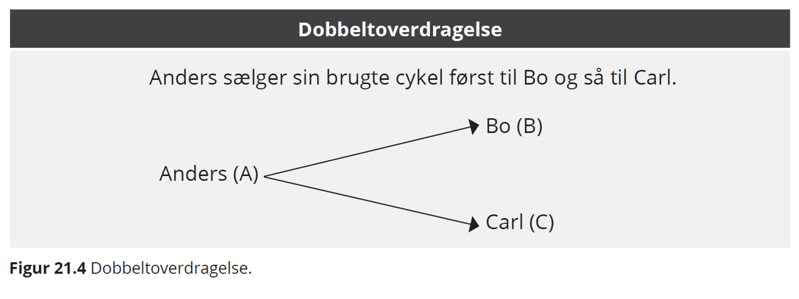

# Gældsbreve, pantebreve og fordringer


Om overdragelse af fordringer, se kapitel 14 og ophør af fordringer i kapitel 15
 

## Generelle regler for fordringer og gældsbreve


### Hvad er en fordring? 


En fordring er et krav, som en person eller et selskab (kreditor) har mod en anden part (debitor). En fordring består typisk i et pengebeløb, men den kan også bestå i andet^[Herværende gennemgang af reglerne om fordringer, gældsbreve og pantebreve bygger bl.a. på oplysninger fra SKAT og Lars Hedegaard Kristensen: Karnovkommentaren til gældsbrevsloven].  

Den kan fx bestå i, at debitor skylder en arbejdsydelse, eller i at der skal leveres en ting. Et gaveløfte betyder, at man skal give den lovede gave, som fx kan være en ting.

*Bemærk* 

I relation til retsplejelovens regler er en fordring et krav på betaling af en pengeydelse. 

En lang række af fordringer er baseret på dokumenter i form af pantebreve, fakturaer og kontrakter mv., mens andre krav ikke foreligger i skriftlig form. Fælles for alle fordringer er, at de indeholder et krav om, at debitor skal betale eller give en ting/ydelse. 

Der er ikke i lovgivningen stillet formkrav til fordringer.

Efter RPL (retsplejeloven) § 508 skal en fordring kunne identificeres, for at man kan foretage udlæg i den. 

Det betyder kun, at der er et krav om, at man kan bevise, at fordringen eksisterer, men ikke at den fx foreligger i skriftlig form mv. 


**Som eksempler på fordringer kan nævnes**: 


* obligationer og præmieobligationer

* pantebreve i fast ejendom eller løsøre

* indeståender i pengeinstitutter

* udestående ifølge fakturaer

* tilgodehavende ifølge gensidigt bebyrdende kontrakt

* tilgodehavender ifølge afregninger

* arvekrav

* tilgodehavender bestående af gevinster

* erstatningskrav for såvel tingsskade som for personskade

* lån af penge

* koncerninterne skattekrav, fx et datterselskabs tilgodehavende hos 
  administrationsselskabet i form af ikke-betalt skatteværdi af et 
  udnyttet underskud 
  
---

**Video: Hvad er obligationer?**

<div class="video-container"><iframe src="https://www.youtube.com/embed/W8DnSJmntmY" width="853" height="480" frameborder="0" allowfullscreen="allowfullscreen"></iframe></div>  '


---
  

### Hvad er et gældsbrev?  
 
Principperne i gældsbrevsloven finder anvendelse både for gældsbreve og simple fordringer, jf. (Lovbekendtgørelse nr. 333 af 31. marts 2014 om gældsbreve; forkortet her ”GBL”). 

Denne lov indeholder ikke nogen direkte definition af begrebet ”gældsbrev”. 

Gældsbrevslovens forarbejder henholder sig til den gængse juridiske forståelse, nemlig at der ved et gældsbrev forstås »en skriftlig Erklæring, der hjemler en i Hovedsagen, ubetinget, ensidig Fordring på et bestemt Pengebeløb«. 

Kravet om, at der skal foreligge en skriftlig erklæring, indebærer, at der skal foreligge et dokument. 

Det kræves endvidere, at erklæringen er dispositiv, hvilket indebærer, at der efter almindelige regler skal foreligge et løfte. 

For at være et gældsbrev skal erklæringen gå ud på at forpligte underskriveren. 

En betalingsanvisning, der alene indeholder en anmodning til tredjemand om at betale (og altså ikke går ud på at forpligte underskriveren selv) er ikke et gældsbrev. 

Som hovedregel må erklæringen være forsynet med udstederens (eller dennes fuldmægtigs) underskrift. 

Dette krav fraviges, hvor det er sædvanligt, at dokumentet ikke underskrives, f.eks. ved rente- og udbyttekuponer. 

I øvrigt kan underskriften være stemplet eller trykt.


Checks og veksler er ikke omfattet af gældsbrevsbegrebet, dels fordi disse dokumenttyper er reguleret i deres egne love (Checklov: Lovbekendtgørelse nr. 558 af 25. august 1986 og Veksellov: Lovbekendtgørelse nr. 1661 af 12. december 2018), dels grundet deres særegne karakter.
 


Erklæringen på gældsbrevet skal være i hovedsagen ubetinget. Det er uden betydning, at forfaldstiden eller det beløb, der skal betales, til dels er afhængig af en fremtidig uvis begivenhed, når det dog til sin tid kan afgøres, hvilket beløb der skal betales.

Da erklæringen skal være selvstændig foreligger der dog ikke et gældsbrev, hvis der i et almindeligt brev findes en udtalelse, som isoleret set indeholder et løfte om betaling af en pengesum.

Kravet om, at erklæringen skal være ensidig, indebærer at f.eks. en købekontrakt ikke et gældsbrev: Sælgers krav på købesummen er afhængig af ikke-misligholdelse fra sælgers side.


Ud fra tilsvarende synspunkter falder også lejekontrakter uden for begrebet.


En forsikringspolice er ikke et gældsbrev, da sikredes krav er afhængig af sikredes opfyldelse af sine forpligtelser bl.a. præmiebetaling.


Erklæringen skal gå ud på at forpligte underskriveren til at betale et bestemt pengebeløb. Det er uden betydning, om beløbet er angivet i dansk eller fremmed valuta, eller begge dele jf. GBL § 7, om det er bestemt efter guldværdi, jf. dommen i U 1933.703 H, eller om det er pristalsreguleret.

Beløbet må dog ikke være helt ubestemt, hvorfor udbyttekuponer til aktier ikke er gældsbreve.

Vurderingen af, om et dokument er simpelt eller negotiabelt, foretages uafhængigt af GBL § 1, jf.  GBL § 11.

Ifølge GBL § 1 er det udgangspunktet, at den, der udsteder et gældsbrev, ikke derved mister indsigelser fra det retsforhold, der gav anledning til gældsbrevets udstedelse.

Når en person i anledning af et retsforhold mellem ham og en anden udsteder et gældsbrev, er det altså hovedreglen, at personen ikke påtager sig en forpligtelse, der er uafhængig af det pågældende retsforhold. 

Skyldneren bevarer dermed over for kreditor indsigelser om mangler, manglende levering eller ugyldighed mv. i det retsforhold, som gav anledning til gældsbrevets udstedelse. 

Skyldneren bevarer også den indsigelse, at skyldneren ikke har modtaget det lån, som skulle tilbagebetales med det beløb, som gældsbrevet lyder på. 

Alt i alt udtrykkes dette ofte på den måde, at gældsbrevet ikke er udtryk for en novation (afløsning af en gammel gæld gennem etablering af en ny) af skyldforholdet.  


Fra den nævnte hovedregel om, at der ikke indtræder novation (dvs. stiftelse af en ny fordring), må der ifølge ordlyden af GBL § 1 gøres undtagelse, hvis det er aftalt, at det retsforhold, der har givet anledning til gældsbrevets udstedelse, skal ophøre med at have nogen betydning og skal erstattes af retsforholdet ifølge gældsbrevet.

Udstederen kan miste indsigelser over for den, til hvem gældsbrevet er overdraget, jf. navnlig GBL §§ 15-17 om negotiable gældsbreve, hvorimod udstederen ifølge GBL § 1 ikke mister indsigelser over for den, til hvem gældsbrevet er udstedt. 

Det fordrer efteromstændighederne en afgørende stillingtagen til, om der er tale om en indsigelse over for en person, til hvem gældsbrevet er overdraget, eller om en indsigelse over for en person, til hvem gældsbrevet er udstedt. 

Spørgsmålet om der foreligger en overdragelsessituation eller en udstedelsessituation opstår navnlig, hvor der mellem en person, D, og en anden person, K1, består et retsforhold, og hvor D i anledning af retsforholdet udsteder et gældsbrev, men efter aftale med K1 ikke udsteder gældsbrevet til K1, men til en tredjemand, K2. 

Selvom der i så fald formelt foreligger en overdragelsessituation, kan der reelt være tale om en udstedelsessituation, således at D ikke mister eventuelle indsigelser over for K2.

 


## Flere skyldnere hæfter solidarisk

Flere skyldnere hæfter solidarisk, hvis ikke andet er aftalt, GBL § 2:

*	Kreditor kan vælge at kræve hele gælden betalt af hver enkelt solidarisk skyldner

*	Har en solidarisk skyldner betalt hele gælden til kreditor, har skyldneren regresret mod de øvrige skyldnere


## Skyldnerens forpligtelser


**En skyldner er forpligtet til at betale et bestemt beløb**:

*  **I rette tid** 

  +	Forfaldstid, seneste betalingstidspunkt
  +	Frigørelsestid, tidligste betalingstidspunkt
  
*  **På rette sted** 

  +	Pengeskyld er bringeskyld, pengene skal være kommet frem til 
  kreditor inden forfaldstid
  
*  **På rette måde**

  +	Betalingsmiddel – betalingskort, kontanter, bankoverførsel, sms 
  afhængig af hvad der er aftalt
  
*  **Til rette kreditor** – obs. på deponeringsloven

* Betaling med betalingskort eller andre betalingstjenester 
  (netbank, mobiltelefon mm.) er reguleret i betalingsloven (BTL)
  
*  En betalingstransaktion med kort går gennem betalingsmodtagers 
  bank og kortholders bank 
  
* Bliver kortet brugt uberettiget skelnes mellem

  +	Kortholders træk uden dækning (kortet kan måske spærres og 
  transaktionen kan evt. tilbageføres)
  
  +	Kortmisbrug begået af andre end kortholder


## Tredjemandsbrug af kortholders betalingskort


Kortmisbrug her er, hvor kortholder ikke selv har brugt kortet.

---

Betalerens eget misbrug reguleres derimod af aftalen mellem udbyderen og betaler og af de almindelige erstatningsregler. Betaler kan i medfør af almindelige kontrakt- og erstatningsretlige regler således ifalde ansvar overfor sin udbyder, hvis betaler forsætligt eller ved grov uagtsomhed har medvirket til misbruget.  

Ej heller tredjemands (misbrugerens) ansvar er reguleret af betalingslovens regler, men af straffelovens regler i kap. 18 om forbrydelser vedrørende penge, jf. §§ 166-170, se Lovbekendtgørelse nr. 1156 af 20. september 2018, se fx U 2003.432 V, fængsel i 6 måneder for pengefalsk, samt U 2003.251 Ø, bedrageri med dankort for 139.500 kr. henført under straffelovens § 286, stk. 2.

---

Tredjemandsbrug af kortholders betalingskort er reguleret af betalingsloven (forkortet; ”BTL”), jf. Lov nr. 652 af 6. juni 2017 om betalinger


* **HR:** Banken hæfter for misbruget og skal dække kortholders tab, jf. BTL § 99

 +  **U1:** Kortholder hæfter ubegrænset, hvis kortholder har handlet svigagtigt eller med vilje ikke overholdt kortreglerne fx omkring sikkerhed, jf. BTL § 100, stk. 2
 
+ **U2:** Har kort og pinkode været brugt, hæfter kortholder for 375 kr., jf. BTL § 100, stk. 3

+ **U3:** Kortholder kan hæfte for op til 8.000 kr., jf. BTL § 100, stk. 4, hvis kort og pinkode har været brugt og:

+	Kortet ikke er spærret med det samme

+	Kortholder selv har givet pinkoden til misbrugeren, og

+	Kortholder ved groft uforsvarlig (nærmest sløseri) adfærd har gjort misbruget muligt
    
+ **U4:** Kortholder hæfter ubegrænset, jf. BTL § 100, stk. 5, hvis kort og pinkode er anvendt og:
  
+	Kortholder selv har oplyst koden til misbrugeren og

+	Kortholder burde have indset risikoen for misbrug
 

Efter kortet er spærret er banken ansvarlig for al misbrug af kortholders betalingskort.

---

```{r hæftelse, echo=FALSE}

mydf <- data.frame(
  S1 = c("Hæftelse i kr" ,"0", 
"0", 
"375", 
"Højst 8000", 
"Ubegrænset"
),
  S2 = c("Paragraf" ,
  "BL S 100, stk. 8",
"BL S 100, stk. 6",
"BL S 100, stk. 3",
"BL S 100, stk. 4",
"BL S 100, stk. 5"),
  S3 = c("Hændelse",
         "Misbrug efter kortet er 
spærret. ",
         "Misbrug hvor kortet og 
          pinkoden er brugt. ",
         "Hæftelse hvis kortet og 
      den pinkoden er brugt. Kunden har som minimum har handlet simpelt uagtsomt. ",
         "Misbrug af kortet, hvor pinkoden har været anvendt samt et af følgende:<br>1. Kunden har ikke oplyst at kortet er   mistet<br>
          2. Kunden selv har givet en anden kortet<br>
          3. Kunden har haft en anden groft uforsvarlig adfærd",
         "Misbrug af kort og pinkode, og kunden selv har udleveret kort og kode til misbrugeren samt at kunden              burde have indset at. der var risiko for misbrug."),
  S4 = c("Eksempel",
         "En dame har tabt sit kort og 
          spærret dette, så snart hun opdagede tabet.<br>Efter kortet blev 
          spærret blev kortet brugt til 
          køb på internettet.",
          "En kunde har mistet sit kort
          og pinkode, og der er 
          intet at bebrejde kunden i 
          forbindelse med tab og misbrug",
         "En fortravlet mand har glemt sit dankort 
          i en hæveautomat, inden kortet 
          bliver spærret bliver det 
          brugt til betaling i en forretning med den 
          rigtige pinkode. ",
         "En cafegæst får stjålet sin pung med både kort og pinkode, fra sin efterladte taske, under toiletbesøg. Kortet misbruges til hævninger og køb for i alt 25.000,- kr.",
         "En pige låner en ven sit kort og pinkode, til trods for denne tidligere har misbrugt kort. Han fester på barer og diskoteker for 38.000,- kr.")
)
names(mydf) <- NULL

mydf %>%
  kable("html", escape = FALSE, caption = "Hæftelse ved kortmisbrug") %>%
  kable_styling(full_width = T,font_size = 10,bootstrap_options = c("responsive","bordered","striped")) %>%
  column_spec(1, bold = T, border_right = T, color = "black", background = "lightgrey") %>%
  column_spec(2, bold = T, border_right = T, color = "black", background = "lightgrey") %>%
  column_spec(3, bold = T, border_right = T, color = "black", background = "lightgrey") %>%
  column_spec(4, bold = T, border_right = T, color = "black", background = "lightgrey") %>%
  row_spec(1,italic = T,bold = T,font_size = 12,color = "white", background = "darkgrey")
  # row_spec(1,italic = T,bold = T,font_size = 12)
  # column_spec(0, angle = -45)%>%
  # scroll_box(width = "500px") %>%
  # footnote(general = "Databeskyttelsesforordningen",general_title = "Kilde:")
```

---

## Eksamensspørgsmål om tredjemandsmisbrug af kortholderes betalingsmiddel


Klokken er 9.31 mandag d. 5. februar 2018, da Andreas Andersen ringer til privatrådgiver Lærke Jensens kontor i Sparekassen Pecunia. Han får hurtigt forklaret, at grunden til, at han har ringet er, at han har mistet sit Visa/dankort og at han gerne vil have kortet spærret. Lærke spærrer straks kortet og sammen gennemgår de de seneste hævninger på kontoen og finder hurtigt ud af, at der er fem hævninger, Andreas ikke kender til. 

Søndag d. 4. februar 2018 kl. 02.32 – 2.000 kr. i andet pengeinstituts hæveautomat

Søndag d. 4. februar 2018 kl. 02.44 – 5.000 kr. i Sparekassen Pecunias hæveautomat

Søndag d. 4. februar 2018 kl. 02.46 – 3.500 kr. i Sparekassen Pecunias hæveautomat

Søndag d. 4. februar 2018 kl. 03.01 – 732 kr. Restaurant Festaben – varekøb

Søndag d. 4. februar 2018 kl. 05.32 – 418 kr. Restaurant Morgengry – varekøb

Andreas forklarer, at han mandag morgen ca. kl. 8.45, da han sad i toget på vej på arbejde, fandt ud af, at hans pung var blevet væk. I hans pung var bl.a. hans Visa/Dankort og en seddel med pinkoden. Pinkoden, 4567, stod bag på en bon og var kamufleret som en del af et telefonnummer: Pia Kjellerup – 30 45 67 87. Pungen var i hans jakke som han havde glemt på et bord, da han ca. kl. 01.00 forlod semesterstartsfesten på sit studie. Banken kan dokumentere, at pin-koden er brugt ved alle hævninger. Andreas kan dokumentere, at han på hævningstidpunkteterne var sammen med en af sine kvindelige medstuderende hjemme hos hende. 

**Eksamensspørgsmålet:**

1. Giv en begrundet redegørelse for, hvordan tabet skal fordeles mellem Andreas og Sparekassen Pecunia (20%).


**Vejledende løsning:**


Lovgrundlag: Lov om betalinger 

Område: Hæftelse for betalingstjenester

Læringsmål: Anvende reglerne om fordringers ophør, herunder hæftelse for betalingstjenester (dan‐ og kreditkort).

Det følger af lov om betalinger § 100, stk. 1, at betalerens udbyder af betalingstjenester (pengeinstituttet) hæfter i forhold til betaleren (kunden) for tab som følge af andres uberettigede anvendelse af en betalingstjeneste, medmindre andet følger af stk. 2-5. 

Det følger herefter af stk. 3, at betaleren hæfter med op til 375 kr. i situationer, hvor den personlige sikkerhedsforanstaltning (PIN-koden) har været anvendt og af stk. 4, at der hæftes med op til 8.000 kr. enten hvis PIN-koden har været anvendt og betaleren ved groft uforsvarlig adfærd har muliggjort den uberettigede anvendelse (stk. 4, nr. 3) eller PIN-koden har været anvendt og kunden ikke har anmeldt at kortet var bortkommet snarest muligt efter at have fået kendskab til det (stk. 4, nr. 1). Her er der særligt stk. 4, nr. 3-situationen, der er relevant. 

Det er ifølge praksis fra PIA Pengeinstitutankenævnet; nu Det Finansielle Ankenævn) ikke i sig selv tilstrækkeligt til at konstituere groft uforsvarlig adfærd at PIN-koden (dårligt camoufleret eller ej) har ligget i pungen sammen med kortet, men det forhold at pungen er efterladt i en jakke på et bord gør, at adfærden er groft uforsvarlig – særligt når jakken efterlades efter at Andreas forlader festen. Andreas har derfor en hæftelse på 8.000 kr. 


---

### Quiz om betalingskort 

<a href="https://www.forbrug.dk/quiz/betalingskort/?rn=43716" target="_blank">Test din viden i forbrug.dk’s quiz om betalingskort</a>  

---

## Forskellige typer af pengekrav og fordringer  

---


---

Alle pengekrav og fordringer kan deles op i 5 slags:


*  Simple fordringer

*  Simple gældsbreve

*  Omsætningsgældsbreve

*  Tinglyste negotiable pantebreve

*  Tinglyste simple pantebreve


**Simple fordringer** er almindeligt pengekrav, hvor der ikke er lavet et gældsbrev, fx fakturakrav (regninger) eller en kassekredit

**Simple gældsbreve** er gældsbreve, som ikke er omsætningsgældsbreve, jf. GBL §26, jf. GBL § 11, stk. 2, fx lånedokumenter (familielån og banklån)
 
**Omsætningsgældsbreve**, er gældsbreve som beskrevet i GBL § 11, stk. 2, fx hvis det tydeligt fremgår, at det er et omsætningsgældsbrev

**Tinglyste negotiable pantebreve** – typisk pantebreve med pant i fast ejendom

***Tinglyste simple pantebreve** – typisk pantebrev med pant i andet end fast ejendom
  
---

```{r network14, echo=FALSE, result=TRUE,fig.cap=("Typer af pengekrav og fordringer")}


nodes <- data.frame(id = 1:7, 
                    level = c(1,2,2,3,3,3,3),
                    shape = c(rep("box",7)), 
                    label = c("Gældsbrev?\nUnderskrevet ensidig\nubetinget skyldnererklæring",
                              "Pantebrev?\nGælden er sikret ved pant i et aktiv",
                              "Simpel fordring",
                              "Omsætningsgældsbrev\nTilhører de 4 kategorier\nfra GBL §11 stk. 2",
                              "Simpelt gældsbrev\nTilhører ikke de 4 kategorier\nfra GBL §11 stk. 2",
                              "Simpelt pantebrev\nPant i andet end\nfast ejendom",
                              "Negotiabelt pantebrev\nPant i fast ejendom"
                              ),
                    font.size = c(rep(8,7)))
          edges <- data.frame(from = c(1,1,2,2,2,2),
                              to = c(2,3,4,5,6,7),
                              label = c("Ja","Nej","Nej","Nej","Ja","Ja"),
                              # arrows = c(""),
                              # length = rep(10,6),
                              color = list(color = "lightgrey", highlight = "yellow"),
                              font.size = c(rep(8,6))
                              
                              )

visNetwork(nodes, edges, height = "500px", width = "80%",avoidOverlap=2) %>% 
  visNodes(color = list(background = "white", 
                        border = "white",
                        highlight = "yellow"),
           shadow = list(enabled = TRUE, size = 30))  %>%
  visHierarchicalLayout(direction = "UD",levelSeparation = 100) %>%
  visLayout(hierarchical = TRUE)

```

---

### Reguleringen af simple gældsbreve og simple fordringer  


Dette afsnit med beskriver nærmere reguleringen af simple gældsbreve og simple fordringer.

Afsnittet indeholder:   

* Lovgrundlag
* Sikringsakt
* Legitimationsvirkning
* Udlæg i borttransporterede fordringer, factoring
* Udlæg i Dankort-betalinger
* Udlæg i bankindeståender
* Sikring af et udlæg i bankindeståender
* Slutafregning
* Legitimationsvirkning ved udlæg i bankindeståender 


**Lovgrundlag**

Alle gældsbreve og fordringer, hvad enten de er skriftlige eller mundtlige, er omfattet af gældsbrevslovens kapitel 3 om simple fordringer.

Dette gælder dog ikke for:  

* de gældsbreve og fordringer, der er nævnt i GBL § 11, stk. 2 
* digitale pantebreve efter tinglysningslovens regler
* fondsaktiver. 


#### Sikringsakten ved simple gældsbreve og simple fordringer?


**Begrebet "sikringsakt":**

*Sikringsakten er den handling (akt), man skal foretage, for at ens pant er retsbeskyttet over for kreditorer eller aftaleerhververe. Sikringsakten kan være, at man skal give meddelelse (denunciere), jf. Gbl. § 31, eller sørge for tinglysning eller anden registrering eller foretage rådighedsberøvelse.*


Når man foretager udlæg i simple gældsbreve eller simple fordringer, er der som udgangspunkt intet krav om, at man foretager en sikringsakt. 

Den, der foretager udlægget, er sikret både over for skyldnerens øvrige kreditorer og godtroende aftaleerhververe fra udlæggets foretagelse. Se RPL § 526, stk. 1 og 2.

I modsætning til tidligere skal der dog nu foretages en sikringsakt ved udlæg i ikkenegotiable tinglyste digitale pantebreve, nemlig tinglysning af udlægget. 

Ved overdragelse af ikkenegotiable tinglyste digitale pantebreve er sikringsakten tinglysning ligesom ved de øvrige pantebreve. Se fx TL § 47, stk. 6, hvad angår løsørepantebreve.

Hvis der foretages udlæg i et papirbaseret pantebrev, skal fogeden tage dette med og sende pantebrevet til tinglysningskontoret i forbindelse med tinglysning af udlægget. 

Se § 15, stk. 3 i lov nr. 539 af 8. juni 2006, som er ændret ved § 2 i lov nr. 504 af 12. juni 2009, hvoraf fremgår, at pantebrevet ved tinglysningen skal konverteres til et digitalt pantebrev.

Hvis det simple gældsbrev eller den simple fordring er knyttet til et dokument, bør fogeden tage dokumentet i forvaring. Se RPL § 523, stk. 2. 

Dette er ikke for at iagttage en sikringsakt, men derimod af hensyn til legitimationsvirkningen hvor fratagelse af rådigheden kan få betydning. Se RPL § 524.


#### Sikringsakt ved overdragelse af simpelt gældsbrev eller simpel fordring, herunder sekundære udlæg


Den, der får overdraget et simpelt gældsbrev eller en simpel fordring til eje eller pant, skal derimod foretage en sikringsakt for at være beskyttet mod overdragerens retsforfølgende kreditorer.

Sikringsakten består i, at fordringsskyldneren får besked om overdragelsen fra overdrageren eller erhververen. Se GBL § 31, stk. 1.  

 

#### Dobbeltoverdragelse af fordring    

I tilfælde af at en fordring bliver overdraget flere gange, er den erhverver, der først meddeler fordringsskyldneren om overdragelsen af fordringen, sikret retten til fordringen. 

Det er under forudsætning af, at han var i god tro om, at der ikke var andre rettighedshavere ved underretningen til fordringsskyldneren. Se GBL § 31, stk. 2. 

Dette gælder, selvom han først fik overdraget fordringen efter, at en anden havde erhvervet fordringen.

Ved overdragelse af simple gældsbreve eller simple fordringer får erhververen ikke bedre ret end overdrageren, hverken over for gældsbrevets eller fordringens skyldner eller over for en tidligere indehaver af fordringen. Se GBL § 27. 

En overdragelse kan derfor ikke føre til, at skyldneren mister sine indsigelser. 

De indsigelser, skyldneren havde mod overdrageren, kan han også gøre gældende mod erhververen, selv om erhververen var i god tro. 

Det gælder også, når der er foretaget udlæg i fordringen. Se GBL § 27.  


#### Legitimationsvirkning  

Skyldneren frigøres uanset overdragelsen af det simple gældsbrev eller den simple fordring ved betaling til overdrageren. 

Det gælder dog ikke, hvis skyldneren vidste, at overdrageren ikke længere havde ret til at modtage betalingen, eller hvis skyldneren ikke har udvist den agtpågivenhed, som forholdene krævede. Se GBL § 29.


#### Udlæg i borttransporterede fordringer – factoring     


Som et led i finansieringen af en virksomheds drift sker der ofte belåning af debitorerne (den såkaldte "factoring"-ordning). 

Ordningen indebærer, at fakturaerne forsynes med en transportpåtegning om, at betaling med frigørende virkning kun kan ske til transporthaveren. 

Ordningen kan etableres med fx:  

* et factoring-firma
* virksomhedens sædvanlige pengeinstitut
* et søster- eller datterselskab (såkaldt intern factoring).
  
Som betingelse for at virksomhedens kreditorer skal respektere fakturabelåningen, kræves det, at hver enkelt faktura til kunderne er forsynet med en tekst (eventuelt et stempel), der klart angiver, at fordringen er borttransporteret. Se GBL § 31, stk. 1.

En ordning om at belåne fakturaer medfører normalt ikke, at pantefogeden er afskåret fra at foretage udlæg i allerede udførte, men endnu ikke fakturerede arbejder eller leverancer.

---

**Video: Hvad er factoring?**

<div class="video-container"><iframe src="https://www.youtube.com/embed/zNxALT0w14U" width="853" height="480" frameborder="0" allowfullscreen="allowfullscreen"></iframe></div>
<br>


---

#### Specielt om udlæg i dankort-betalinger

Udlæg kan foretages i dankort-betalinger. Hør nærmere her om dommen i U 2000.715 Ø, hvor en pantefoged havde foretaget udlæg for et skattekrav hos en forretningsindehaver:  

Speak 23

#### Specielt om udlæg i bankindeståender

hør nærmere her:    

Speak23

#### Sikringsakt ved udlæg i bankindeståender? 

Hør nærmere her:  

Speak 23


### Reguleringen af omsætningsgældsbreve


Omsætningsgældsbreve kaldes også for negotiable gældsbreve. 

Hvis et gældsbrev ikke er et omsætningsgældsbrev, er det et simpelt gældsbrev. 

I forbindelse med indførelsen af reglerne om digital tinglysning blev der i tinglysningsloven indsat regler om omsætningsgældsbreve. 

Der findes herefter regler om omsætningsgældsbreve to steder i lovgivningen.  

Reglerne om omsætningsgældsbreve står herefter i følgende to love:  

A) **Gældsbrevsloven** (GBL), hvor det i GBL § 11, stk. 2, fastslås, hvad der er omsætningsgældsbreve:

1.	Gældsbreve, der lyder på betaling til ihændehaveren eller som ikke angiver, hvem gælden skal betales til (ihændehavergældsbreve).

2.	Gældsbreve, der lyder på betaling til en bestemt person eller ordre (ordregældsbreve).

3.	Gældsbreve, der giver pant i registreret skib eller luftfartøj, medmindre der i gældsbrevet er indføjet ordene »ikke til ordre« eller tilsvarende forbehold.

4.	Gældsbreve, der lyder på betaling til en bestemt person (navnegældsbreve), når de tydeligt angiver, at de skal være omsætningsgældsbreve.


B) ``r tippy(indeks[2,1], size="large" ,interactive = TRUE, arrow = TRUE, tooltip = paste0("<h4>",indeks[2,2],"</h4>"))`` (TL), hvor der står, at:  

1. Et tinglyst pantebrev, bortset fra et skadesløsbrev, der giver pant i fast ejendom, er negotiabelt, medmindre der i pantebrevet er indføjet ordene »ikke til ordre« eller tilsvarende forbehold, jf. TL § 27, stk. 2.

2. Et tinglyst pantebrev, herunder et ejerpantebrev, der giver pant i motorkøretøjer er ikke negotiabelt, medmindre dette klart fremgår af pantebrevet, jf. TL § 42 c. Skadesløsbreve er ikke negotiable pantebreve, jf. TL § 42g, stk. 3, 2. og 3. pkt.  

3. Et tinglyst pantebrev, herunder et ejerpantebrev, der giver pant i andele i andelsboligforeninger som nævnt i TL § 42 i, er ikke negotiabelt, medmindre dette klart fremgår af pantebrevet. Skadesløsbreve er ikke negotiable pantebreve: Se TL § 42m, stk. 2, 2. og 3. pkt.  

4. Et tinglyst pantebrev, herunder et ejerpantebrev, der giver pant i løsøre, er ikke negotiabelt, medmindre dette klart fremgår af pantebrevet. Skadesløsbreve er ikke negotiable pantebreve: Se TL § 47, stk. 7, 2. og 3. pkt.  


**Bemærk** 

Hvis et gældsbrev ikke falder ind under definitionen i henholdsvis GBL eller TL, og det klart fremgår af gældsbrevet, at det ikke skal være negotiabelt, er det et simpelt gældsbrev: 

Se GBL § 11, stk. 2 og TL § 27, stk. 2, § 42g, stk. 3, 2. og 3. pkt., § 42m, stk. 2, 2. og 3. pkt. og § 47, stk. 7, 2. og 3. pkt.  

---

**Videoer om gældsbrevsloven**


<div class="video-container"><iframe src="https://www.youtube.com/embed/4SY6YPbY2YY" width="853" height="480" frameborder="0" allowfullscreen="allowfullscreen"></iframe></div>


---

<div class="video-container"><iframe src="https://www.youtube.com/embed/uODiLMSn3kg" width="853" height="480" frameborder="0" allowfullscreen="allowfullscreen"></iframe></div>

---

**Video: Om gældsbreve**

<div class="video-container"><iframe src="https://www.youtube.com/embed/nC3Sy7tBCaY" width="853" height="480" frameborder="0" allowfullscreen="allowfullscreen"></iframe></div>
<br>


---

#### Tinglysning af simple (ikke-negotiable) pantebreve  


Et simpelt (ikke-negotiabelt) pantebrev skal dog også tinglyses digitalt for at opnå omsætningsbeskyttelse. 

Se fx TL § 47, stk. 6, hvad angår løsørepantebreve, der som udgangspunkt er ikkenegotiable. 

Gældsbrevslovens kapitel 3, bortset fra § 31, bruges også på tinglyste digitale ikke-negotiable (simple) pantebreve: Se GBL § 26, stk. 2.

Gældsbrevslovens kapitel 2 gælder ikke (længere) for tinglyste digitale pantebreve: Se GBL § 11, stk. 3. 

Det betyder dog ikke, at den hidtidige retstilstand er brudt, da reglerne i GBL §§ 15-17 om ekstinktion (en rettigheds ophør, ved at den fortrænges af en senere rettighed) af indsigelser finder direkte anvendelse: Se TL § 27a. 

Reglerne om ekstinktion af rettigheder er også uforandret overført til tinglysningsloven: Se TL § 27b. 

Reglerne er dog rettet til, fordi sikringsakten nu sker ved tinglysning i modsætning til tidligere, hvor sikringsakten skete ved rådighedsberøvelse. Se nedenfor.


#### Sikringsakten ved de forskellige omsætningsgældsbreve

Når man foretager udlæg i omsætningsgældsbreve, er sikringsakten forskellig, afhængig af hvilken type omsætningsgældsbrev der er tale om. 

Nedenstående afsnit er derfor opdelt så sikringsakten for omsætningsgældsbreve, der ikke er pantebreve, beskrives først, og herefter beskrives sikringsakten ved udlæg i negotiable pantebreve.  


Sikringsakt ved udlæg i omsætningsgældsbreve, der ikke også er pantebreve

En aftaleerhververs ret til et omsætningsgældsbrev kan ikke anfægtes af andre, hvis aftaleerhververen har fået gældsbrevet i hænde og er i god tro om overdragerens ret. Se GBL § 14.  

Sikringsakten over for aftaleerhververe er derfor rådighedsberøvelse, hvad angår disse gældsbreve. 

Det vil sige, at man ved udlæg i disse omsætningsgældsbreve efter RPL § 523, stk. 2, altid skal tage gældsbrevet i forvaring.  

Et udlæg i fordringer, herunder omsætningsgældsbreve, er beskyttet over for andre retsforfølgende kreditorer straks fra dets foretagelse. 

Udlægshaver skal derfor ikke foretage nogen særlig sikringsakt i forhold til andre kreditorer. Se RPL § 526, stk. 1 og 2.  


#### Sikringsakt ved udlæg i negotiable pantebreve:  

Efter den digitale tinglysning er indført, skal stiftelse og ændring af rettigheder over alle pantebreve, der tinglyses digitalt, ske ved tinglysning. Derfor skal pantebreve, der vedrører fast ejendom, biler, andelsboliger og løsøre tinglyses, hvis man vil sikre sig de rettigheder, der knytter sig til pantebrevet. 

Se TL § 1, TL § 42j, stk. 7, (andelsboligbogen), TL § 42d, stk. 7, (bilbogen) og TL § 47, stk. 6 (løsøre).  


Når man foretager udlæg i tinglyste digitale pantebreve, skal udlægget derfor tinglyses for at opnå beskyttelse mod aftaler om pantebrevet og mod retsforfølgning. Se TL § 1 (fast ejendom), TL § 42j, stk. 7 (andelsboligbogen), TL § 42d, stk. 7 (bilbogen) og TL § 47, stk. 6 (løsøre). Det gælder derfor også de digitale pantebreve, der er negotiable.  
 

Hvis man foretager udlæg i et papirbaseret pantebrev, skal fogeden tage dette med og sende pantebrevet til tinglysningskontoret i forbindelse med tinglysning af udlægget. Se § 15, stk. 3 i lov nr. 539 af 8. juni 2006, som ændret ved § 2 i lov nr. 504 af 12. juni 2009, hvoraf fremgår, at pantebrevet ved tinglysningen skal konverteres til et digitalt pantebrev.  

Hvad angår de tinglyste digitale pantebreve, kan en aftaleerhververs ret til et pantebrev ikke anfægtes af andre, hvis aftaleerhververen har fået tinglyst sin ret og er i god tro om overdragerens ret. Se TL § 27 b. 

Dette gælder også bilbogen (TL § 42g stk. 3, 1. pkt.), andelsboligbogen (TL § 42m, stk. 2, 1. pkt.) og personbogen (TL § 47, stk. 7, 1. pkt.).  

Legitimationsvirkning, hvornår er man over for omverdenen angivet som berettiget til at gøre fordringen gældende?

Den, der på lovlig vis har fået omsætningsgældsbrevet i hænde, har ret til at gøre fordringen gældende. Se GBL § 13.  

For tinglyste digitale pantebreve er den, der er berettiget ifølge tingbogen, legitimeret til at gøre fordringen gældende. Se TL § 27a, stk. 1. 

Tilsvarende gælder for bilbogen (TL § 42g, stk. 3, 1. pkt., jf. TL § 27a, stk. 1), andelsboligbogen (TL § 42m, stk. 2, 1. pkt, jf. TL § 27a, stk.1) og personbogen (TL § 47, stk. 7, 1. pkt., jf. TL § 27a, stk. 1).  


Reglen om overdragelse af omsætningsgældsbreve og reglen om legitimationen over for skyldner bygger på GBL § 13. Se GBL § 14 og 19. 

Når skyldneren betaler til den, der er legitimeret efter GBL § 13, frigøres skyldneren, såfremt skyldneren er i god tro. Se GBL § 19. 

Betalingen har frigørende virkning, selv om ihændehaverens inkompetence skyldes, at han ikke har erhvervet ret til omsætningsgældsbrevet, eller at det var overdraget eller gjort til genstand for udlæg. 

Legitimationen omfatter også andre dispositioner end betaling, fx meddelelse af henstand eller ændring af betalingsvilkårene. 

Hvad angår tinglyste digitale pantebreve er reglerne de samme, dog med den forskel, at der ikke er krav om, at man har pantebrevet, men derimod, at man har tinglyst det. Se TL § 27b. 

Samme bestemmelse gælder også bilbogen (TL § 42g, stk. 3, 1. pkt.), andelsboligbogen (TL § 42m, stk. 2, 1. pkt.) og personbogen (TL § 47, stk. 7, 1. pkt.).  

For at udlægshaver kan blive legitimeret over for gældsbrevsdebitor, skal han derfor have gældsbrevet i hænde og for de tinglyste digitale pantebreves vedkommende have tinglyst sin ret. 

Se RPL § 523, stk. 2 og TL § 27a. Reglen gælder også bilbogen, andelsboligbogen og personbogen.  

Hvis et omsætningsgældsbrev er overdraget, men skyldneren har betalt forfaldne renter eller forfaldne, tidsfæstede afdrag til overdrageren, kan han gøre dette gældende over for en senere erhverver af omsætningsgældsbrevet. Se GBL § 16. 

Samme regel gælder for de tinglyste digitale pantebreve. Se TL § 27a, stk. 2, 1. pkt. 

Udstederen af et gældsbrev bevarer også sine indsigelser om, at gældsbrevet er udstedt under tvang, ved forfalskning m.v., og om at gældsbrevet er ophørt ved forældelse m.v. Se GBL § 17 og TL § 27a, stk. 2, 2. pkt. 

Bestemmelserne gælder også bilbogen, andelsboligbogen og personbogen.  

Hvis et omsætningsgældsbrev er overdraget, kan skyldneren med frigørende virkning betale forfaldne renter og forfaldne, tidsfæstede afdrag til overdrageren, medmindre skyldneren vidste, at denne ikke længere havde ret til at modtage betaling eller havde grund til mistanke derom. Se GBL § 20. 

En tilsvarende regel gælder for de tinglyste digitale pantebreve. Se TL § 29, stk. 2.  

Legitimationsvirkningen indtræder derfor, når udlægshaver meddeler gældsbrevsdebitor, at betaling med frigørende virkning kun kan ske til udlægshaveren. 

Udlæg i omsætningsgældsbreve skal derfor altid meddeles over for gældsbrevsdebitor. 

Dette gælder også for udlæg i de tinglyste digitale pantebreve. 

Debitor skal anmodes om kvittering for, at han har modtaget underretningen.  

Gældsbrevsdebitor bliver ved betaling til udlægshaver frigjort under samme betingelser som ved betaling efter overdragelse af et gældsbrev. Se RPL § 524.  


### Oversigt over sikringsakter på fordringer, omsætningsgældsbreve og pantebreve


Sikringsakt foretages for at sikre erhververen mod overdragerens aftaleerhververe og kreditorer:

*  Simple fordringer – sikringsakten for overdragelse er **denunciation** (meddelelse)

*  Omsætningsgældsbreve – sikringsakten for overdragelse er **rådighedsberøvelse**

*  Pantebreve – sikringsakten for overdragelse er **tinglysning**

---

## Overdragelse af fordringer


***Som studerende skal du være særlig opmærksom på følgende problemstillinger ved gennemgangen af fordringers overdragelse***:


• **Fortabelse af indsigelser og rettigheder, GBL § 27 (simple)**

•	**Prioritetskonflikt simple gældsbreve, GBL § 31** 

•	**Legitimation** 

•	**Omsætningsbeskyttelse**

•	**Begreberne vindikation og ekstinktion skal anvendes**

---


### Hvad er en fordring?


En fordring er et krav, som en person eller et selskab (kreditor) har mod en anden part (debitor). 

En fordring består typisk i et pengebeløb, men den kan også bestå i andet. 

Den kan fx bestå i, at debitor skylder en arbejdsydelse, eller i at der skal leveres en ting. 

Et gaveløfte betyder, at man skal give den lovede gave, som fx kan være en ting.


```{r fordring1,echo=FALSE, result=TRUE, fig.cap=("Skyldner, kreditor og senere erhverver eller erhververe")}


nodes <- data.frame(id = 1:4, 
                    shape = c("box"), 
                    level = c(1,2,3,4),
                    label = c("Debitor\nSkyldner","Kreditor\nOverdrager","Erhverver","Erhverver"),
                    font.size = c(15,15,15,15))
edges <- data.frame(from = c(1,2,3), to = c(2,3,4),
                    arrows = c("to"),
                    label = c("Kreditor har en fordring på debitor","Kreditor overdrager til erhverver 1","Erhverver 1 overdrager til erhverver 2"),
                    
                    shadow = TRUE)

visNetwork(nodes, edges, width = "80%") %>% 
  visNodes(color = list(background = "white", 
                        border = "white",
                        highlight = "yellow"),
           shadow = list(enabled = TRUE, size = 30))  %>%
      visHierarchicalLayout(direction = "UD",levelSeparation = 100)  %>%
      visLayout(randomSeed = 24) %>%
  visEdges(color = list(color = "lightgrey", highlight = "yellow"))

```

*Bemærk*

I relation til retsplejelovens regler er en fordring et krav på betaling af en pengeydelse.

En lang række af fordringer er baseret på dokumenter i form af pantebreve, fakturaer og kontrakter mv., mens andre krav ikke foreligger i skriftlig form. 

Fælles for alle fordringer er, at de indeholder et krav om, at debitor skal betale eller give en ting/ydelse. 

Der er ikke i lovgivningen stillet formkrav til fordringer.

Efter RPL § 508 skal en fordring kunne identificeres, for at man kan foretage udlæg i den. 

Det betyder kun, at der er et krav om, at man kan bevise, at fordringen eksisterer, men ikke at den fx foreligger i skriftlig form mv.


Som eksempler på fordringer kan nævnes:


*  obligationer og præmieobligationer
*  pantebreve i fast ejendom eller løsøre
*  indeståender i pengeinstitutter
*  udestående ifølge fakturaer
*  tilgodehavende ifølge gensidigt bebyrdende kontrakt
*  tilgodehavender ifølge afregninger
*  arvekrav
*  tilgodehavender bestående af gevinster
*  erstatningskrav for såvel tingsskade som for personskade
*  lån af penge
*  koncerninterne skattekrav, fx et datterselskabs tilgodehavende hos administrationsselskabet i form af ikke-betalt skatteværdi af et udnyttet underskud


---

**Video: Om overdragelse af fordringer**


<div class="video-container"><iframe src="https://www.youtube.com/embed/NqakMVHBPw4" width="853" height="480" frameborder="0" allowfullscreen="allowfullscreen"></iframe></div>

---

**Video: Hvordan laver jeg et gældsbrev?**

<div class="video-container"><iframe src="https://www.youtube.com/embed/8ufuecp-wXA" width="853" height="480" frameborder="0" allowfullscreen="allowfullscreen"></iframe></div>

---

**Video: Opret et gældsbrev online**

<div class="video-container"><iframe src="https://www.youtube.com/embed/J88adaVemVQ" width="853" height="480" frameborder="0" allowfullscreen="allowfullscreen"></iframe></div>

---

**Video: Sådan laver du en låneaftale**

<div class="video-container"><iframe src="https://www.youtube.com/embed/PPqd-fYRCg0" width="853" height="480" frameborder="0" allowfullscreen="allowfullscreen"></iframe></div>

---

### Skyldners indsigelser over for den oprindelige kreditor

 

*Lovbekendtgørelse nr. 333 af 31. marts 2014 om gældsbreve*  

```{r fordring2,echo=FALSE, result=TRUE, fig.cap=("Indsigelse over gældsforhold")}
nodes <- data.frame(id = 1:2, 
                    shape = c("box"), 
                    level = c(1,2),
                    label = c("Debitor\nSkyldner","Kreditor\nSælger"),
                    font.size = c(15,15))
edges <- data.frame(from = c(1), to = c(2),
                    arrows = c("to"),
                    label = c("Debitor har en indsigelse overfor kreditor"),
                    
                    shadow = TRUE)

visNetwork(nodes, edges, width = "80%") %>% 
  visNodes(color = list(background = "white", 
                        border = "white",
                        highlight = "yellow"),
           shadow = list(enabled = TRUE, size = 30))  %>%
      visHierarchicalLayout(direction = "UD",levelSeparation = 100)  %>%
      visLayout(randomSeed = 24) %>%
  visEdges(color = list(color = "lightgrey", highlight = "yellow"))
```


Skyldner kan gøre alle indsigelser gældende overfor oprindelig kreditor, jf. GBL § 1. 

Skyldneren bevarer dermed over for kreditor indsigelser om mangler, manglende levering eller ugyldighed mv. i det retsforhold, som gav anledning til gældsbrevets udstedelse. 

Skyldneren bevarer også den indsigelse, at han ikke har modtaget det lån, som skulle tilbagebetales med det beløb, som gældsbrevet lyder på.  

Fx følgende indsigelser over for kreditor bevares:

* Indsigelse efter aftaleloven – ugyldighedsgrunde, fx svig

* Indsigelse om mangler efter købeloven, jf. KBL §§ 76 og 75a

Det har ikke betydning om kravet er en simpel fordring, et gældsbrev eller et pantebrev

Skyldnerens indsigelsen over for kreditor kan betyde, at skyldner skal betale mindre end der står i gældsbrevet eller måske slet ingenting
 
### Forholdet mellem overdrager og erhverver


Juridisk karakteriseret som **”det efterfølgende trepartsforhold”:** 


 
```{r fordring3,echo=FALSE, result=TRUE, fig.cap=("Kreditor overdrager fordring til erhverver")}


nodes <- data.frame(id = 1:3, 
                    shape = c("box"), 
                    level = c(1,2,2),
                    label = c("Debitor\nSkyldner","Kreditor\nOverdrager","Erhverver"),
                    font.size = c(15,15,15))
edges <- data.frame(from = c(1,2,1), to = c(2,3,3),
                    arrows = c("to"),
                    label = c("1. Kreditor har\nen fordring på debitor","2. Kreditor overdrager\ntil erhverver","3. Debitor skal nu\nbetale erhververen"),
                    length = c(100,300,100),
                    shadow = TRUE)

visNetwork(nodes, edges, width = "80%") %>% 
  visNodes(color = list(background = "white", 
                        border = "white",
                        highlight = "yellow"),
           shadow = list(enabled = TRUE, size = 30))  %>%
      visHierarchicalLayout(direction = "UD",levelSeparation = 100)  %>%
      visLayout(randomSeed = 24) %>%
  visEdges(color = list(color = "lightgrey", highlight = "yellow"))

```


## Efterfølgende trepartsforhold  
	
Begrebet efterfølgende trepartsforhold omfatter de tilfælde, hvor den oprindelige kreditgivers rettigheder i henhold til kreditaftalen tiltransporteres en tredjemand. 

Begrebet er en kreditaftaleretlig term, der dækker over begreber som factoring, kontraktbelåning, kontraktsdiscontering o.lign. 

Begrebets materielle indhold er reguleret ved reglerne om personskifte i skyldforhold, herunder navnlig reglerne om kreditorskifte. 

Mens det oprindelige trepartsforhold er kendetegnet ved, at tredjemanden finansierer forbrugeren, er det efterfølgende trepartsforhold kendetegnet ved, at tredjemanden finansierer sælgeren.

Forholdet mellem forbrugeren i et kreditkøb og tredjemanden i det efterfølgende trepartsforhold reguleres dels ved de almindelige regler om kreditorskifte i skyldforhold, dels ved kreditaftalelovens §§ 31-33. 

Forholdet mellem sælgeren/kreditgiveren i det oprindelige trepartsforhold og tredjemanden i det efterfølgende trepartsforhold er navnlig, men ikke kun, reguleret ved gældsbrevslovens §§ 9 og 10 og ved gældsbrevslovens §§ 29-31 samt den righoldige retspraksis, der foreligger vedrørende factoring, fakturabelåning og selskabsopsplitning mv. 

For en nærmere gennemgang af det oprindelige trepartsforhold, jf. kreditaftalelovens § 4, nr. 15, 2. pkt. og det efterfølgende trepartsforhold, [se kapitel 5 i min bog Forbrugerretten II, den civilretlige forbrugerbeskyttelse:](https://shop.karnovgroup.dk/products/forbrugerretten-ii-5-udgave)  

 
Fordringer kan overdrages til en anden kreditor (sælges eller pantsættes) som andre aktiver

Fx kan købekontrakt med gyldigt ejendomsforbehold sælges til en anden kreditor (erhverver):


```{r fordring4,echo=FALSE, result=TRUE, fig.cap=("Salg af købekontrakt fx. bilkøb")}
nodes <- data.frame(id = 1:3, 
                    shape = c("box"), 
                    level = c(1,2,2),
                    label = c("Bilkøber\nDebitor\nSkyldner","Bilsælger\nKreditor\nOverdrager","Finansieringsselskab"),
                    font.size = c(10,10,10))
edges <- data.frame(from = c(1,2,1,2,3), to = c(2,3,3,1,2),
                    arrows = c("to","to","to","to","to"),
                    font.size = c(10,10,10,10,10),
                    
                    label = c("1. Bilsalg på\nkøbekontrakt","2. Bilsælger\nsælger\nkøbekontrakt\ntil finansieringsselskab","3. Debitor skal nu\nbetale\nfinansieringsselskabet","",""),
                    length = c(300,300,300,300,300),
                    shadow = TRUE
              
                    )
  visNetwork(nodes, edges, width = "80%") %>% 
  visNodes(color = list(background = "white", 
                        border = "white",
                        highlight = "yellow"),
           shadow = list(enabled = TRUE, size = 30))  %>%
      visHierarchicalLayout(direction = "UD",levelSeparation = 100)  %>%
      visLayout(randomSeed = 24) %>%
  visEdges(color = list(color = "lightgrey", highlight = "yellow"))
```


1. Kunden (skyldneren) køber en bil og underskriver købekontrakt til bilsælgeren (overdrageren)

2. Bilsælgeren (overdrageren) sælger købekontrakten til et finansieringsselskab (erhververen)

3. Kunden (skyldneren) skal nu betale til finansieringsselskabet (erhververen), som har købt købekontrakten af bilsælgeren (overdrageren)

4. Overdrager (bilsælgeren) indestår for, at fordringen består jf. GBL § 9. Bestemmelsen er gældsbrevslovens regel om overdragerens objektive ansvar for, at fordringen består, dvs. »nomen esse verum«. Det objektive ansvar gælder ikke når manglende betaling skyldes debitors manglende betalingsevne, dvs. »nomen esse bonum«, jf. GBL § 10.


---

**Video: Slå op i Bilbogen**

<div class="video-container"><iframe src="https://www.youtube.com/embed/jS9HN8OxvgI" width="853" height="480" frameborder="0" allowfullscreen="allowfullscreen"></iframe></div>

---

Speak23
	

Overdrager (bilsælgeren) indestår således ikke for skyldners (bilkøberens) betalingsevne fremover jf. GBL § 10

Speak 23
 
### Betalingslegitimation

Hvad er en *”betalingslegitimation”* også kaldet legitimationsvirkningen?  

Den korte forklaring: Hvem kan skyldner betale til med frigørende virkning, når fordringen er overdraget – eller udtrykt på en anden måde: 

Debitor kan med frigørende virkning betale til den person som har betalingslegitimation. 

Som udgangspunkt frigøres debitor ved betaling i god tro, til den der er berettiget efter GBL § 13, jf. GBL § 19.  


### Hvem kan skyldner betale til med frigørende virkning, når fordringen er overdraget?  


Betaler skyldner ikke med frigørende virkning, kan han risikere at skulle betale igen  

-	svaret afhænger af, hvilket type kravet er. 

 
**Skyldners indsigelser overfor erhverver af fordringen (A-C)**

Hvad sker der med skyldners indsigelser, når kreditor har overdraget fordringen til erhverver?

Skyldner kan gøre alle indsigelser gældende over for kreditor – men ikke, når kreditor har overdraget kravet til en erhverver

-	Løsningen afhænger af, hvilken type krav, der er tale om, se nedenfor

 
**Konflikter mellem senere erhververe (C-D)**

Når en fordring overdrages flere gange kan der opstå konflikter mellem de forskellige erhververe 

**–	Kædeoverdragelse** 

*  Fx hvis der er en indsigelse om svig i den tidligere overdragelse, så den sælger, man har købt fordringen af, ikke rigtigt ejede den

**–	Dobbeltoverdragelse**

*  Fx hvis den samme fordring er overdraget to gange til forskellige erhververe

Løsningen afhænger af, hvilken type krav der er tale om, se nedenfor  
 
### Hvordan løses konflikterne med de forskellige fordringer

Løsningen af de forskellige konflikter løses forskelligt afhængigt af fordringens type, der skelnes mellem:  

*  Simple fordringer/simple gældsbreve
*  Omsætningsgældsbreve
*  Simple pantebreve
*  Omsætningspantebreve

Gældsbreve, der ikke er omsætningsgældsbreve er simple gældsbreve.  
  
 
## Simple fordringer og simple gældsbreve

Simple fordringer og simple gældsbreve behandles ens efter reglerne i gældsbrevsloven om simple gældsbreve, jf. reglerne i kap. 3 i gældsbrevsloven, som omhandler gældsbreve, der ikke er omsætningspapirer. 

Disse regler kan således anvendes analogt på fordringer, for hvilke der ikke er udstedt gældsbrev (såkaldte simple fordringer)

Overdragelse af fordringer kan ske til eje eller pant  

*Fakturabelåning er ofte overdragelse af enkelte (større) fordringer til en bank*


```{r fordring5,echo=FALSE, result=TRUE, fig.cap=("Fakturabelåning bank får sikkerhed i udestående faktura")}
nodes <- data.frame(id = 1:3, 
                    shape = c("box"), 
                    level = c(1,2,2),
                    label = c("Rederi\nDebitor\nSkyldner","Skibsværft\nKreditor\nOverdrager","Bank"),
                    font.size = c(10,10,10))
edges <- data.frame(from = c(1,2,1,2,3), to = c(2,3,3,1,2),
                    arrows = c("to","to","to","to","to"),
                    font.size = c(10,10,10,10,10),
                    
                    label = c("1. Skibsværft sælger\nskib og udsteder\nfaktura","2. Skibsværft\noverdrager\nfakturaen\ntil bank","3. Rederiet skal nu\nbetale\nbanken","",""),
                    length = c(300,300,300,300,300),
                    shadow = TRUE
              
                    )
  visNetwork(nodes, edges, width = "80%") %>% 
  visNodes(color = list(background = "white", 
                        border = "white",
                        highlight = "yellow"),
           shadow = list(enabled = TRUE, size = 30))  %>%
      visHierarchicalLayout(direction = "UD",levelSeparation = 100)  %>%
      visLayout(randomSeed = 24) %>%
  visEdges(color = list(color = "lightgrey", highlight = "yellow"))
```


Den korte forklaring: Factoring er typisk overdragelse af alle virksomhedens krav til et finansieringsselskab.

Den lange forklaring: Factoring, er en aftale, der går ud på, at en virksomhed mod betaling overlader sine kortfristede fordringer til en anden, som derefter inddriver fordringerne. 

Aftalen kan enten gå ud på, at factoringselskabet yder virksomheden et lån med sikkerhed i de nævnte tilgodehavender, såkaldt fakturabelåning, eller at factoringselskabet køber virksomhedens debitorportefølje og betaler et beløb til fuld og endelig afgørelse.


```{r fordring6,echo=FALSE, result=TRUE, fig.cap=("Factoringselskab køber udestående fakturaer")}
nodes <- data.frame(id = 1:6, 
                    shape = c("box"), 
                    level = c(1,1,1,1,2,2),
                    label = c("Debitor\nkøber varer\naf virksomhed","Debitor\nkøber varer\naf virksomhed","Debitor\nkøber varer\naf virksomhed","Debitor\nkøber varer\naf virksomhed","Virksomhed\nsælger varer","Factoringselskab\nErhverver fordring\nog modtager betaling"),
                    font.size = c(12))
edges <- data.frame(from = c(1,2,3,4,5,1,2,3,4), to = c(5,5,5,5,6,6,6,6,6),
                    arrows = c("from","from","from","from","to","to","to","to","to"),
                    font.size = c(10,10,10,10,10,10,10,10,10),
                    label = c("1. Varesalg","1. Varesalg","1. Varesalg","1. Varesalg","2. Overdragelse\naf fordring\nfrigiver livkviditet\ntil virksomheden","\n\n\n      3. Betaling","\n\n\n    3. Betaling","3. Betaling","3. Betaling"),
                    length = c(100,100,100,100,600,100,100,100,100),
                    shadow = TRUE
              
                    )
  visNetwork(nodes, edges, width = "80%") %>% 
  visNodes(color = list(background = "white", 
                        border = "white",
                        highlight = "yellow"),
           shadow = list(enabled = TRUE, size = 30))  %>%
      visHierarchicalLayout(direction = "UD",levelSeparation = 200)  %>%
      visLayout(randomSeed = 24) %>%
  visEdges(color = list(color = "lightgrey", highlight = "yellow"))
```


 
 
*  **Factoring kan have forskellige formål**:

  +	Administration af debitorportefølje, kundebogholderi mv.
  +	Inddrivelse af fordringer, der ikke bliver betalt til tiden – inkasso
  +	Forsikring eller risikoafdækning, hvis det er aftalt, at factoringselskabet skal have risikoen for, om kunderne betaler
  +	Likviditet; factoringselskabet stiller likviditet til rådighed mod at få sikkerhed i fordringer eller ved at købe fordringerne
  
  
 
### Betalingslegitimation

Betaling til overdrager GBL § 29, så længe skyldner er i god tro. 

Skyldneren frigøres uanset overdragelsen af det simple gældsbrev eller den simple fordring ved betaling til overdrageren. 

Det gælder dog ikke, hvis skyldneren vidste, at overdrageren ikke længere havde ret til at modtage betalingen, eller hvis skyldneren ikke har udvist den agtpågivenhed, som forholdene krævede. 

GBL § 29 er udtryk for den naturlige retsstilling, at den, der skylder penge til en anden, skal kunne betale med frigørende virkning til denne. 

Det samme gælder omvendt, at den der skylder penge til en person ikke kan betale med frigørende virkning til en anden. 

Reglen indeholder dog en modifikation, da skyldner ikke bliver frigjort, når han betaler til den oprindelige kreditor, hvis skyldneren vidste, at overdrageren ikke længere havde ret til at modtaget betalingen, eller hvis skyldneren ikke har udvist den agtpågivenhed, som forholdene krævede.


**Eksempel:**

Hvis en person, der er legitimeret som fordringshaver, overdrager en simpel fordring til først A og dernæst B, og fordringsskyldneren ikke har kendskab og ikke burde have kendskab til overdragelsen til A, men derimod først får meddelelse om overdragelsen fra B, frigøres fordringsskyldneren ved betaling til B, selv om fordringen i virkeligheden tilkom A, fordi B var i ond tro, da han gav underretningen til fordringsskyldneren. Se GBL § 31, stk. 2.

Overdrager og erhverver skal denuntiere (give meddelelse) til skyldner, GBL § 31

Betaling til erhverver er med frigørende virkning medmindre der er en stærk ugyldighedsgrund mellem overdrager og erhverver, jf. GBL § 30 (se figur \@ref(fig:fordring7))

```{r fordring7,echo=FALSE, result=TRUE, fig.cap=("Stærk ugyldighedsgrund")}
nodes <- data.frame(id = 1:3, 
                    shape = c("box"), 
                    level = c(1,2,2),
                    label = c("Debitor\nSkyldner","Kreditor\nOverdrager","Erhverver\nny kreditor"),
                    font.size = c(10,10,10))
edges <- data.frame(from = c(1,2), to = c(2,3),
                    arrows = c("to","to"),
                    font.size = c(10,10),
                    label = c("Kreditor har\nfortsat krav","Stærk ugyldighedsgrund\nOverdrager har fortsat krav\nmod skyldner"),
                    length = c(300,300),
                    shadow = TRUE
              
                    )
  visNetwork(nodes, edges, width = "80%") %>% 
  visNodes(color = list(background = "white", 
                        border = "white",
                        highlight = "yellow"),
           shadow = list(enabled = TRUE, size = 30))  %>%
      visHierarchicalLayout(direction = "UD",levelSeparation = 100)  %>%
      visLayout(randomSeed = 24) %>%
  visEdges(color = list(color = "lightgrey", highlight = "yellow"))
```

Gælder både ordinære og ekstraordinære afdrag

Hvis skyldneren ikke ved, til hvem fordringen er overdraget eller ikke har modtaget betryggende meddelelse herom, men skydleren dog ikke kan betale til den tidligere kreditor, kan skyldneren frigøre sig ved at deponere efter Lovbekendtgørelse nr. 339 af 2. februar 2014 om skyldneres ret til at frigøre sig ved deponering (deponeringsloven)
 


### Skyldners indsigelser

Hvad sker der med skyldners indsigelser, når kreditor har overdraget fordringen til erhverver?

*  Erhververen får som hovedregel ikke større ret end overdrageren havde, dvs. der indtræder ikke ekstinktion (udslettelse) af indsigelser eller rettigheder
<br>
*  Skyldner kan gøre samme indsigelser gældende overfor erhverver, som han eller hun kunne gøre gældende over for kreditor (overdrageren), jf. GBL § 27 (se figur \@ref(fig:fordring8))

```{r fordring8,echo=FALSE, result=TRUE, fig.cap=("Hvem er skyldner i konflikt med? Hvilken §?")}
nodes <- data.frame(id = 1:4, 
                    shape = c("box"), 
                    level = c(1,2,2,2),
                    label = c("Debitor\nSkyldner","Kreditor\nOverdrager","Erhverver 1","Erhverver 2"),
                    font.size = c(10,10,10,10))
edges <- data.frame(from = c(1,2,3,1,1), to = c(2,3,4,3,4),
                    arrows = c("to","to","to","to","to"),
                    font.size = c(12,12,12,12,12),
                    label = c("GBL §1","Fordring\noverdrages","Fordring\noverdrages","GBL §27","GBL §27"),
                    length = c(200,100,100,200,200),
                    shadow = TRUE
              
                    )
  visNetwork(nodes, edges, width = "80%") %>% 
  visNodes(color = list(background = "white", 
                        border = "white",
                        highlight = "yellow"),
           shadow = list(enabled = TRUE, size = 30))  %>%
      visHierarchicalLayout(direction = "UD",levelSeparation = 100)  %>%
      visLayout(randomSeed = 24) %>%
  visEdges(color = list(color = "lightgrey", highlight = "yellow"))
```


*  Grundlæggende er formålet med reglerne om overdragelse af simple fordringer at undgå, at skylderens byrde øges ved overdragelse. Dette har særligt fundet udtryk i GBL § 27, hvorefter skyldnerens indsigelser mod at være helt eller delvis forpligtet over for kreditor, også kan gøres gældende over for en senere erhverver af fordringen
<br>
*  *»Overdragelse«* omfatter enhver overførelse i levende live. GBL § 27 tager ikke stilling til, om et simpelt gældsbrev kan overdrages. Hovedreglen er, at dette kan ske. Overdragelse kan være afskåret eller begrænset ved aftale mellem skyldneren og kreditor, hvilket i givet fald må respekteres af erhververen.
<br>
*  Når skyldneren har betalt til erhververen, består der ikke længere nogen fordring, som der kan gøres indsigelse imod. Opdager skyldneren eksempelvis efter betaling, at han eller hun kan gøre misligholdelsesbeføjelser gældende i anledning af kontraktsforholdet med overdrageren, kan sådanne misligholdelsesbeføjelser ikke som et pengekrav rettes mod erhververen efter GBL § 27.
<br>
*  Med hensyn til skyldnerens indsigelser: Hvis en fordring ikke er blevet gyldig over for den oprindelige kreditor - eller fordringen efter stiftelsen er ændret eller bragt til ophør - bevarer skyldneren indsigelsen herom over for en senere erhverver, selvom denne er i god tro. Typiske indsigelser er f.eks. beføjelser som skyldneren i anledning af mangler eller forsinkelse kan gøre gældende som misligholdelse over for overdrageren (realdebitor), og som han tilsvarende kan gøre gældende over for erhververen som indsigelser mod at betale beløbet (eller en del heraf).
<br>
*  Skyldner kan kun kræve nedsættelse af gælden over for erhververen ikke fx afhjælpning eller omlevering af den mangelfulde ydelse fra overdrageren
*  Skyldner kan ikke kræve flere penge tilbage, end erhverver har modtaget, jf. nærmere kreditaftalelovens (KAL) § 33, stk. 3

### Konflikt mellem senere erhververe

*  	Kædeoverdragelse (se figur \@ref(fig:fordring9))
  +	Erhverver ikke bedre ret end overdrager, jf. nærmere den 
    obligationsretlige grundsætning i GBL § 27


```{r fordring9,echo=FALSE, result=TRUE, fig.cap=("Kædeoverdragelse erhverver ikke bedre ret end overdrager")}
nodes <- data.frame(id = 1:4, 
                    shape = c("box"), 
                    level = c(1,2,2,2),
                    label = c("Debitor\nSkyldner","Kreditor\nOverdrager","Erhverver\nny kreditor","Erhverver\nseneste kreditor"),
                    font.size = c(10,10,10,10))
edges <- data.frame(from = c(1,2,3), to = c(2,3,4),
                    arrows = c("to","to","to"),
                    font.size = c(10,10,10),
                    label = c("","GBL §27","GBL §27"),
                    length = c(100,200,200),
                    shadow = TRUE
              
                    )
  visNetwork(nodes, edges, width = "80%") %>% 
  visNodes(color = list(background = "white", 
                        border = "white",
                        highlight = "yellow"),
           shadow = list(enabled = TRUE, size = 30))  %>%
      visHierarchicalLayout(direction = "UD",levelSeparation = 100)  %>%
      visLayout(randomSeed = 24) %>%
  visEdges(color = list(color = "lightgrey", highlight = "yellow"))
```

 
**Dobbeltoverdragelse**

* **HR:** Først i tid bedst i ret (uskreven hoveregel i dansk ret)
  + U1: En erhverver ifølge aftale kan vinde over en anden aftaleerhververs ret ved at foretage sikringsakt først i god tro.  
  + U2: Udlæg får førsteret, når det er foretaget før aftaleerhververens meddelelse er kommet frem  
  + U3: Et udlæg i fordringen er beskyttet mod andre kreditorer og aftaleerhververe i et år fra udlæg er foretaget

> Eksempel: Tømrermester Hansen pantsætter en kreditkøbskontrakt til sin bank som sikkerhed for sin kassekredit. Hansen er i pengenød og sætter samme kontrakt til sikkerhed for et køb hos sin leverandør af byggematerialer. Afgørende for, hvem der har sikkerhed i købekontrakten, er, hvem der først denuncierer. Det vil sige hvis denunciation der først kommer frem til debitor.


**Dobbeltoverdragelse af fordring:  **  

I tilfælde af at en fordring bliver overdraget flere gange, er den erhverver, der først meddeler fordringsskyldneren om overdragelsen af fordringen, sikret retten til fordringen. Det er under forudsætning af, at han var i god tro om, at der ikke var andre rettighedshavere ved underretningen til fordringsskyldneren, jf. GBL § 31, stk. 2. Dette gælder, selvom han først fik overdraget fordringen efter, at en anden havde erhvervet fordringen (se figur \@ref(fig:fordring10)).  

```{r fordring10,echo=FALSE, result=TRUE, fig.cap=("Dobbeltoverdragelse af fordring")}
nodes <- data.frame(id = 1:4, 
                    shape = c("box"), 
                    level = c(1,2,3,3),
                    label = c("Debitor\nSkyldner","Kreditor\nOverdrager\ndobbeltoverdrager","Erhverver\nkreditor","Erhverver\nkreditor"),
                    font.size = c(10,10,10,10))
edges <- data.frame(from = c(1,2,2), to = c(2,3,4),
                    arrows = c("to","to","to"),
                    font.size = c(10,10,10),
                    label = c("","GBL §31","GBL §31"),
                    length = c(100,100,100),
                    shadow = TRUE
              
                    )
  visNetwork(nodes, edges, width = "80%") %>% 
  visNodes(color = list(background = "white", 
                        border = "white",
                        highlight = "yellow"),
           shadow = list(enabled = TRUE, size = 30))  %>%
      visHierarchicalLayout(direction = "UD",levelSeparation = 100)  %>%
      visLayout(randomSeed = 24) %>%
  visEdges(color = list(color = "lightgrey", highlight = "yellow"))
```


Ved overdragelse af simple gældsbreve eller simple fordringer får erhververen ikke bedre ret end overdrageren, hverken over for gældsbrevets eller fordringens skyldner eller over for en tidligere indehaver af fordringen, jf. GBL § 27. 

En overdragelse kan derfor ikke føre til, at skyldneren mister sine indsigelser. 

De indsigelser, skyldneren havde mod overdrageren, kan han også gøre gældende mod erhververen, selv om erhververen var i god tro. 

Det gælder også, når der er foretaget udlæg i fordringen, jf. GBL § 27. 

---

**Begrebet: Dobbeltoverdragelse**

Hvis en rettighedshaver (A) disponerer mere end en gang over den samme rettighed, er der en rettighedskonflikt mellem de to erhververe (B og C)



(kilde; Trojka)

---


### Udlæg i en simple gældsbrev eller den simple fordring 

Hvis det simple gældsbrev eller den simple fordring er knyttet til et dokument, bør fogeden tage dokumentet i forvaring, jf. RPL (retsplejeloven) § 523, stk. 2. 

Dette er ikke for at iagttage en sikringsakt, men derimod af hensyn til legitimationsvirkningen hvor fratagelse af rådigheden kan få betydning, jf. RPL § 524.

Sikringsakt ved overdragelse af simpelt gældsbrev eller simpel fordring, herunder sekundære udlæg:

Den, der får overdraget et simpelt gældsbrev eller en simpel fordring til eje eller pant, skal derimod foretage en sikringsakt for at være beskyttet mod overdragerens retsforfølgende kreditorer. 

Sikringsakten består i, at fordringsskyldneren får besked om overdragelsen fra overdrageren eller erhververen, jf. GBL § 31, stk. 1.  

## Omsætningsgældsbreve

### Betalingslegitimation

*  Betaling til den, der har gældsbrevet i hænde (besiddelse), jf. her GBL § 13

*  Skyldner kan betale ordinære afdrag til overdrager, hvis:

*  Skyldner er i god tro om overdragelse til erhverver og
*  Afdrag og evt. renter er forfaldne til betaling, jf. her GBL § 20
*  Skyldner skal betale restgæld og ekstraordinære afdrag til ihændehaveren, jf. her GBL § 19
*  Skyldner kan kræve gældsbrevet udleveret ved indfrielse af gælden
*  Skyldner kan kræve at gældsbrevet får en påtegning om ekstraordinære afdrag, jf. her GBL § 21, stk. 3.


***Den lidt længere forklaring om betalingslegitimation (legitimationsvirkningen) ved omsætningsgældsbreve:*** 

Den, der på lovlig vis har fået omsætningsgældsbrevet i hænde, har ret til at gøre fordringen gældende, jf. GBL § 13.


For tinglyste digitale pantebreve er den, der er berettiget ifølge tingbogen, legitimeret til at gøre fordringen gældende, jf. TL § 27a, stk. 1.   

*  Tilsvarende gælder for bilbogen (TL § 42g, stk. 3, 1. pkt., jf. TL § 27a, stk. 1), 

*  andelsboligbogen (TL § 42m, stk. 2, 1. pkt, jf. TL § 27a, stk.1) og 

*  personbogen (TL § 47, stk. 7, 1. pkt., jf. TL § 27a, stk. 1).  


Reglen om overdragelse af omsætningsgældsbreve og reglen om legitimationen over for skyldner bygger på GBL § 13, jf. GBL §§ 14 og 19. 

Når skyldneren betaler til den, der er legitimeret efter GBL § 13, frigøres skyldneren, såfremt skyldneren er i god tro, jf. GBL § 19. 

Betalingen har frigørende virkning, selv om ihændehaverens inkompetence skyldes, at han eller hun ikke har erhvervet ret til omsætningsgældsbrevet, eller at det var overdraget eller gjort til genstand for udlæg. 

Legitimationen omfatter også andre dispositioner end betaling, fx meddelelse af henstand eller ændring af betalingsvilkårene. 

Hvad angår tinglyste digitale pantebreve er reglerne de samme, dog med den forskel, at der ikke er krav om, at man har pantebrevet, men derimod, at man har tinglyst det, jf. TL § 27b.  

*  Samme bestemmelse gælder også bilbogen (TL § 42g, stk. 3, 1. pkt.), 

*  andelsboligbogen (TL § 42m, stk. 2, 1. pkt.) og 

*  personbogen (TL § 47, stk. 7, 1. pkt.).  


For at udlægshaver kan blive legitimeret over for gældsbrevsdebitor, skal denne derfor have gældsbrevet i hænde og for de tinglyste digitale pantebreves vedkommende have tinglyst sin ret, jf. RPL § 523, stk. 2 og TL § 27a. 

Reglen gælder også bilbogen, andelsboligbogen og personbogen.  


Hvis et omsætningsgældsbrev er overdraget, men skyldneren har betalt forfaldne renter eller forfaldne, tidsfæstede afdrag til overdrageren, kan skyldneren gøre dette gældende over for en senere erhverver af omsætningsgældsbrevet, jf. GBL § 16. 

Samme regel gælder for de tinglyste digitale pantebreve, jf. TL § 27a, stk. 2, 1. pkt. 

Udstederen af et gældsbrev bevarer også sine indsigelser om, at gældsbrevet er udstedt under tvang, ved forfalskning m.v., og om at gældsbrevet er ophørt ved forældelse m.v., jf. GBL § 17 og TL § 27a, stk. 2, 2. pkt. 

Bestemmelserne gælder også bilbogen, andelsboligbogen og personbogen.  


Hvis et omsætningsgældsbrev er overdraget, kan skyldneren med frigørende virkning betale forfaldne renter og forfaldne, tidsfæstede afdrag til overdrageren, medmindre skyldneren vidste, at denne ikke længere havde ret til at modtage betaling eller havde grund til mistanke derom, jf. GBL § 20. En tilsvarende regel gælder for de tinglyste digitale pantebreve, jf. TL § 29, stk. 2.  

Legitimationsvirkningen indtræder derfor, når udlægshaver meddeler gældsbrevsdebitor, at betaling med frigørende virkning kun kan ske til udlægshaveren. 

Udlæg i omsætningsgældsbreve skal derfor altid meddeles over for gældsbrevsdebitor. 

Dette gælder også for udlæg i de tinglyste digitale pantebreve. 

Debitor skal anmodes om kvittering for, at han har modtaget underretningen.  

Gældsbrevsdebitor bliver ved betaling til udlægshaver frigjort under samme betingelser som ved betaling efter overdragelse af et gældsbrev, jf. RPL § 524.  


### Skyldners indsigelser

*  Svage indsigelser går tabt for skyldner, når gældsbrevet er overdraget, jf. GBL § 15 hvis

  + Overdragelsen til erhverver er sket ved gyldig aftale
  
  +	Erhverver er i god tro om indsigelsen
  
  +	Den gode tro er tilstede på det tidspunkt gældsbrevet bliver overdraget fysisk
  
* Skyldner bevarer stærke indsigelser også overfor en erhverver i god tro, jf. GBL § 17


```{r fordring11,echo=FALSE, result=TRUE, fig.cap=("Skyldners indsigelser")}
nodes <- data.frame(id = 1:4, 
                    shape = c("box"), 
                    level = c(1,2,2,2),
                    label = c("Debitor\nSkyldner","Kreditor\nOverdrager","1. Erhverver\n kreditor","2. Erhverver\nseneste kreditor"),
                    font.size = c(10,10,10,10))
edges <- data.frame(from = c(1,2,2,1,1), to = c(2,3,4,3,4),
                    arrows = c("to","to","to","to","to"),
                    font.size = c(10,10,10,10,10),
                    label = c("GBL §1","","","GBL §15-17","GBL §15-17"),
                    length = c(100,100,100,100,100),
                    shadow = TRUE
              
                    )
  visNetwork(nodes, edges, width = "80%") %>% 
  visNodes(color = list(background = "white", 
                        border = "white",
                        highlight = "yellow"),
           shadow = list(enabled = TRUE, size = 30))  %>%
      visHierarchicalLayout(direction = "UD",levelSeparation = 100)  %>%
      visLayout(randomSeed = 24) %>%
  visEdges(color = list(color = "lightgrey", highlight = "yellow"))
```
 
 
### Konflikt mellem senere erhververe

*  Kædeoverdragelse, jf. GBL § 14 

En aftaleerhverver (ikke retsforfølgende kreditor) kan fortrænge en tidligere indsigelse, hvis aftaleerhverver:

  +	Er i god tro om indsigelsen
  +	Har fået gældsbrevet udleveret
  +	Har en berettiget forventning om at overdragelsen er gyldig
  

```{r fordring12,echo=FALSE, result=TRUE, fig.cap=("Skyldners indsigelser")}
nodes <- data.frame(id = 1:4, 
                    shape = c("box"), 
                    level = c(1,2,2,2),
                    label = c("Debitor\nSkyldner","Kreditor\nOverdrager","1. Erhverver\n kreditor","2. Erhverver\nseneste kreditor"),
                    font.size = c(10,10,10,10))
edges <- data.frame(from = c(1,2,3), to = c(2,3,4),
                    arrows = c("to","to","to"),
                    font.size = c(10,10,10),
                    label = c("","GBL §14","GBL §14"),
                    length = c(100,200,200),
                    shadow = TRUE
              
                    )
  visNetwork(nodes, edges, width = "80%") %>% 
  visNodes(color = list(background = "white", 
                        border = "white",
                        highlight = "yellow"),
           shadow = list(enabled = TRUE, size = 30))  %>%
      visHierarchicalLayout(direction = "UD",levelSeparation = 100)  %>%
      visLayout(randomSeed = 24) %>%
  visEdges(color = list(color = "lightgrey", highlight = "yellow"))
```

En aftaleerhververs ret til et omsætningsgældsbrev kan således ikke anfægtes af andre, hvis aftaleerhververen har fået gældsbrevet i hænde og er i god tro om overdragerens ret, jf. her GBL § 14.

Sikringsakten over for aftaleerhververe er derfor rådighedsberøvelse, hvad angår disse gældsbreve. 

Det vil sige, at man ved udlæg i disse omsætningsgældsbreve efter RPL § 523, stk. 2, altid skal tage gældsbrevet i forvaring.

Et udlæg i fordringer, herunder omsætningsgældsbreve, er beskyttet over for andre retsforfølgende kreditorer straks fra dets foretagelse. 

Udlægshaver skal derfor ikke foretage nogen særlig sikringsakt i forhold til andre kreditorer, jf. RPL § 526, stk. 1 og 2.

 


*  Dobbeltoverdragelse, jf. GBL §14 ved salg samt GBL § 22 ved pant (se figur \@ref(fig:fordring13) og \@ref(fig:fordring13))


* **HR:** Først i tid bedst i ret.  
  + U1: En aftaleerhverver kan vinde over en andens ret ved at 
    foretage sikringsakten først i god tro.  
  + U2: Et udlæg i gældsbrevet er beskyttet mod andre kreditorer fra 
    udlægget er foretaget.    


```{r fordring13,echo=FALSE, result=TRUE, fig.cap=("Dobbeltoverdragelse salg")}
nodes <- data.frame(id = 1:4, 
                    shape = c("box"), 
                    level = c(1,2,3,3),
                    label = c("Debitor\nSkyldner","Overdrager","1. kreditor","2. Kreditor"),
                    font.size = c(10,10,10,10))
edges <- data.frame(from = c(1,2,2), to = c(2,3,4),
                    arrows = c("to","to","to"),
                    font.size = c(10,10,10),
                    label = c("","HR Først\ni tid bedst i ret","Senere kreditor"),
                    length = c(100,100,100),
                    shadow = TRUE
              
                    )
  visNetwork(nodes, edges, width = "80%") %>% 
  visNodes(color = list(background = "white", 
                        border = "white",
                        highlight = "yellow"),
           shadow = list(enabled = TRUE, size = 30))  %>%
      visHierarchicalLayout(direction = "UD",levelSeparation = 100)  %>%
      visLayout(randomSeed = 24) %>%
  visEdges(color = list(color = "lightgrey", highlight = "yellow"))
```


En lidt længere forklaring om GBL § 14:   
En aftaleerhververs ret til et omsætningsgældsbrev kan ikke anfægtes af andre, hvis aftaleerhververen har fået gældsbrevet i hænde og er i god tro om overdragerens ret, jf. GBL § 14.  
<br>
Bestemmelsen i GBL § 14 indeholder regler om eksstinktion af rettigheder ved overdragelse af et omsætningsgældsbrev til en godtroende erhverver og omfatter alle former for omsætningsgældsbreve. Om eksstinktion af indsigelser henvises til GBL §§ 15-17.  
<br>
En erhverver af et omsætningsgældsbrev, som afleder ret fra en legitimeret overdrager, opnår – på visse betingelser - ret til gældsbrevet, selv om overdrageren var materielt uberettiget til at råde herover, jf. GBL § 14.  

Reglen i GBL § 14 gælder, uanset af hvilken grund gældsbrevet er kommet bort fra dets virkelige ejer. Det kan eksempelvis tænkes, at gældsbrevet er blevet stjålet fra ejeren og forsynet med en falsk transportpåtegning, hvorefter det er bragt i omsætning.  
<br>
Der antages normalt at gælde fem betingelser for ekstinktion af rettigheder i medfør af GBL § 14:  
<br>
Det er for det første en betingelse, at overdragelsen er sket i levende live ad omsætningsvejen, dvs. ved aftale (herunder ved gaveaftale). Der sker derimod ikke ekstinktion til fordel for en arving eller en retsforfølgende kreditor. Der kan heller ikke ske ekstinktion ved, at omsætningsgældsbrevet erhverves ved subrogation (en anden part indtræder i et eksisterende retsforhold).  
<br>
Det er for det andet en betingelse, at overdragelsen er gyldig. Er gældsbrevet stjålet fra A og af tyven B overdraget til C, vinder C altså kun ret, hvis aftalen mellem ham og B er gyldig. A er altså ikke afhængig af, at B (evt. dennes konkursbo) gør ugyldigheden gældende. A kan i et sådant tilfælde i kraft af den såkaldte genvejsregel rette et vindikationskrav direkte mod C. Dog hindrer det ikke erhververens ret, at overdrageren var umyndig, hvis erhververen var i god tro om umyndigheden.  
<br>
Det er for det tredje en betingelse, at erhververen selv har fået gældsbrevet i hænde. § 14 må dog forstås således, at det er tilstrækkeligt, at gældsbrevet overgives til en tredjemand, der besidder det på erhververens vegne.   

Det er for det fjerde en betingelse, at erhververen er i god tro, når han får gældsbrevet i hænde. Dette er i § 14 udtrykt således, at erhververen vinder ret, medmindre han vidste, at overdrageren manglede ret til at råde over gældsbrevet, eller han ikke har udvist den agtpågivenhed, som forholdene krævede. 
<br>
I almindelighed kan det forlanges, at erhververen foretager en undersøgelse af selve gældsbrevet. Den, der vil bestride erhververens ret, må bevise, at erhververen ikke har udvist den fornødne agtpågivenhed.  
<br>
Det er for det femte en betingelse, at omsætningsgældsbrevet erhverves fra en legitimeret person. Ved ihændehavergældsbreve er overdrageren legitimeret, blot han sad inde med gældsbrevet, jf. GBL § 14, stk. 1. Ved andre omsætningsgældsbreve skal overdrageren ifølge GBL § 14, stk. 2, være legitimeret ifølge GBL § 13, dvs. at gældsbrevet skal være udstedt til overdrageren, eller at overdrageren skal være legitimeret ved skriftlige overdragelser, der fremtræder som en sammenhængende række.  
<br>
Bestemmelsen kan medføre ekstinktion af enhver ret over et omsætningsgældsbrev. Ikke blot en ejendomsret, men også en panteret eller et udlæg, kan fortrænges, hvis erhververen opfylder ekstinktionsbetingelserne. Er ejeren af et omsætningsgældsbrev gået konkurs, må dokumentet fratages ham. Sker dette ikke, og råder fallenten over gældsbrevet på en måde, som opfylder ekstinktionsbetingelserne, vinder en godtroende erhverver ret til gældsbrevet, jf. således konkurslovens § 30, stk. 2. Dette gælder, selv om konkursen er bekendtgjort, jf. konkurslovens § 30, stk. 1. 
<br>
Er en ret til omsætningsgældsbrevet ekstingveret af en godtroende aftaleerhverver, vågner retten ikke op igen, fordi gældsbrevet senere overdrages til en erhverver, som kendte eller burde kende den ekstingverede ret. Dette almindelige princip er begrundet i hensynet til den godtroende erhverver, som har ekstingveret retten, og som derfor ikke skal tåle nogen indskrænkning i sine muligheder for at omsætte gældsbrevet.  
<br>
Selv om GBL § 14's betingelser ikke er opfyldt, må man være opmærksom på, at erhververen altid får den ret, som overdrageren havde, og som han naturligvis kan videregive.  

 
```{r fordring14,echo=FALSE, result=TRUE, fig.cap=("Dobbeltoverdragelse pant")}
nodes <- data.frame(id = 1:4, 
                    shape = c("box"), 
                    level = c(1,2,3,3),
                    label = c("Debitor\nSkyldner","Overdrager\nPantsætter","Panthaver","Kreditor"),
                    font.size = c(10,10,10,10))
edges <- data.frame(from = c(1,2,2), to = c(2,3,4),
                    arrows = c("to","to","to"),
                    font.size = c(10,10,10),
                    label = c("","Panthavers beskyttelse mod\npansætters kreditorer er\nreguleret i GBL §22","GBL §22"),
                    length = c(100,100,100),
                    shadow = TRUE
              
                    )
  visNetwork(nodes, edges, width = "80%") %>% 
  visNodes(color = list(background = "white", 
                        border = "white",
                        highlight = "yellow"),
           shadow = list(enabled = TRUE, size = 30))  %>%
      visHierarchicalLayout(direction = "UD",levelSeparation = 100)  %>%
      visLayout(randomSeed = 24) %>%
  visEdges(color = list(color = "lightgrey", highlight = "yellow"))
```


## Simple pantebreve

Ved tinglyste digitale simple gældsbreve forstås dels pantebreve, der giver pant i fast ejendom, og som indeholder en rektaklausul, jf. tinglysningslovens § 27, stk. 2, dvs. en klausul med ordene *"ikke til ordre"*. 

Klausulen medfører, at dokumentet er unegotiabelt og efter reglerne om simple gældsbreve ikke kan overdrages. 

Endvidere er simple pantebreve dels tinglyste digitale pantebreve,  

*  der giver pant i motorkøretøjer,
*  andele i andelsboligforeninger og 
*  løsøre

medmindre de efter deres indhold er gjort negotiable, jf. tinglysningslovens §§ 42 g, stk. 3, 42 m, stk. 2 og 47, stk. 7.

### Betalingslegitimation

*  Som simple gældsbreve, jf. GBL § 26, stk. 2

*  Betaling til overdrager jf. GBL § 29, så længe skyldner er i god tro.

*  Skyldneren frigøres uanset overdragelsen af det simple gældsbrev eller den simple fordring ved betaling til overdrageren. Det gælder dog ikke, hvis skyldneren vidste, at overdrageren ikke længere havde ret til at modtage betalingen, eller hvis skyldneren ikke har udvist den agtpågivenhed, som forholdene krævede, jf. GBL § 29

*  Når erhverver har foretaget sin sikringsakt (tinglysning), kan skyldner betale med frigørende virkning til den nu tinglyste erhverver, således at gælden nedskrives eller forsvinder

*  Gælder både i forhold til ordinære og ekstraordinære afdrag på gælden


 
### Skyldners indsigelser

*  Som simple gældsbreve, jf. GBL § 26, stk. 2
*  Erhverver kan ikke få bedre ret end overdrager
*  Skyldner kan gøre samme indsigelser gældende overfor erhverver, som han eller hun kunne gøre gældende over for kreditor, jf. GBL § 27  


 
### Konflikt mellem senere erhververe

*  Kædeoverdragelse (se figur \@ref(fig:fordring15))

  +	Som et simpelt gældsbrev, jf. GBL § 26, stk. 2
  +	Erhverver ikke bedre ret end overdrager, jf. GBL § 27

```{r fordring15,echo=FALSE, result=TRUE, fig.cap=("Senere erhververe konflikt")}
nodes <- data.frame(id = 1:4, 
                    shape = c("box"), 
                    level = c(1,2,2,2),
                    label = c("Skyldner","Overdrager","Erhverver 1","Erhverver 2"),
                    font.size = c(10,10,10,10))
edges <- data.frame(from = c(1,2,3), to = c(2,3,4),
                    arrows = c("to","to","to"),
                    font.size = c(10,10,10),
                    label = c("","Overdragers indsigelse\noverfor Erhverver 2\nreguleres af GBL §27","Overdragers indsigelse\noverfor Erhverver 2\nreguleres af GBL §27"),
                    length = c(100,200,200),
                    shadow = TRUE
              
                    )
  visNetwork(nodes, edges, width = "80%") %>% 
  visNodes(color = list(background = "white", 
                        border = "white",
                        highlight = "yellow"),
           shadow = list(enabled = TRUE, size = 30))  %>%
      visHierarchicalLayout(direction = "UD",levelSeparation = 100)  %>%
      visLayout(randomSeed = 24) %>%
  visEdges(color = list(color = "lightgrey", highlight = "yellow"))
```


*  Dobbeltoverdragelse (se figur \@ref(fig:fordring16))

```{r fordring16,echo=FALSE, result=TRUE, fig.cap=("Dobbeltoverdragelse pant")}
nodes <- data.frame(id = 1:4, 
                    shape = c("box"), 
                    level = c(1,2,3,3),
                    label = c("Debitor\nSkyldner","Overdrager\nPantsætter","1. Rettighedshaver","2. Rettighedshaver"),
                    font.size = c(10,10,10,10))
edges <- data.frame(from = c(1,2,2), to = c(2,3,4),
                    arrows = c("to","to","to"),
                    font.size = c(10,10,10),
                    label = c("","Panthaver skal tinglyse\nsin ret for at sikre sig mod\ndobbeltoverdragelse jvf. TL §1",""),
                    length = c(100,100,100),
                    shadow = TRUE
              
                    )
  visNetwork(nodes, edges, width = "80%") %>% 
  visNodes(color = list(background = "white", 
                        border = "white",
                        highlight = "yellow"),
           shadow = list(enabled = TRUE, size = 30))  %>%
      visHierarchicalLayout(direction = "UD",levelSeparation = 100)  %>%
      visLayout(randomSeed = 24) %>%
  visEdges(color = list(color = "lightgrey", highlight = "yellow"))
```


* **HR:** Først i tid bedst i ret  
  + **U:**	En senere rettighedshaver kan fortrænge en tidligere stiftet ret, hvis: Senere rettighedshaver har tinglyst først. En aftaleerhverver skal være i god tro på tinglysningstidspunktet, jf. TL § 5


### Sikringsakt ved udlæg i simple pantebreve

Se tinglysningsloven, hvor der står:  

Et tinglyst pantebrev, bortset fra et skadesløsbrev, der giver pant i fast ejendom, er negotiabelt, medmindre der i pantebrevet er indføjet ordene *»ikke til ordre«* eller tilsvarende forbehold, jf. TL § 27, stk. 2

Et tinglyst pantebrev, herunder et ejerpantebrev, der giver pant i motorkøretøjer er ikke negotiabelt, medmindre dette klart fremgår af pantebrevet, jf. TL § 42 c. Skadesløsbreve er ikke negotiable pantebreve, jf. TL § 42g, stk. 3, 2. og 3. pkt.  

Et tinglyst pantebrev, herunder et ejerpantebrev, der giver pant i andele i andelsboligforeninger som nævnt i TL § 42 i, er ikke negotiabelt, medmindre dette klart fremgår af pantebrevet. Skadesløsbreve er ikke negotiable pantebreve, jf. TL § 42m, stk. 2, 2. og 3. pkt.  

Et tinglyst pantebrev, herunder et ejerpantebrev, der giver pant i løsøre, er ikke negotiabelt, medmindre dette klart fremgår af pantebrevet. 

Skadesløsbreve er ikke negotiable pantebreve, jf. TL § 47, stk. 7, 2. og 3. pkt.

*Bemærk*

Hvis et gældsbrev ikke falder ind under definitionen i henholdsvis GBL eller TL, og det klart fremgår af gældsbrevet, at det ikke skal være negotiabelt, er det et simpelt gældsbrev, jf. GBL § 11, stk. 2 og TL § 27, stk. 2, § 42g, stk. 3, 2. og 3. pkt., § 42m, stk. 2, 2. og 3. pkt. og § 47, stk. 7, 2. og 3. pkt.  


*Tinglysning af simple (ikkenegotiable) pantebreve*  

Et simpelt (ikkenegotiabelt) pantebrev skal dog også tinglyses digitalt for at opnå omsætningsbeskyttelse, jf. fx TL § 47, stk. 6, hvad angår løsørepantebreve, der som udgangspunkt er ikkenegotiable. 

Gældsbrevslovens kapitel 3, bortset fra GBL § 31, bruges også på tinglyste digitale ikkenegotiable (simple) pantebreve, jf. GBL § 26, stk. 2.

Gældsbrevslovens kapitel 2 gælder ikke (længere) for tinglyste digitale pantebreve, jf. GBL § 11, stk. 3. 

Det betyder dog ikke, at den hidtidige retstilstand er brudt, da reglerne i GBL §§ 15-17 om ekstinktion (en rettigheds ophør, ved at den fortrænges af en senere rettighed) af indsigelser finder direkte anvendelse, jf. TL § 27a. 

Reglerne om ekstinktion af rettigheder er også uforandret overført til tinglysningsloven, jf. TL § 27b. 

Reglerne er dog rettet til, fordi sikringsakten nu sker ved tinglysning i modsætning til tidligere, hvor sikringsakten skete ved rådighedsberøvelse.   

I modsætning til tidligere skal der dog nu foretages en sikringsakt ved udlæg i ikkenegotiable tinglyste digitale pantebreve, nemlig tinglysning af udlægget. 

Ved overdragelse af ikkenegotiable tinglyste digitale pantebreve er sikringsakten tinglysning ligesom ved de øvrige pantebreve, jf. fx TL § 47, stk. 6, hvad angår løsørepantebreve.

Hvis der foretages udlæg i et papirbaseret pantebrev, skal fogeden tage dette med og sende pantebrevet til tinglysningskontoret i forbindelse med tinglysning af udlægget, jf. § 15, stk. 3 i lov nr. 539 af 8. juni 2006, som er ændret ved § 2 i lov nr. 504 af 12. juni 2009, hvoraf fremgår, at pantebrevet ved tinglysningen skal konverteres til et digitalt pantebrev.


---

**Video Digital tinglysning af underskrift på dokumenter og skøde**

<div class="video-container"><iframe src="https://www.youtube.com/embed/CBUM8aybRQU" width="853" height="480" frameborder="0" allowfullscreen="allowfullscreen"></iframe></div>

---

**Video: Forstå tinglysning på 45 sekunder**

<div class="video-container"><iframe src="https://www.youtube.com/embed/6Spl32wXXco" width="853" height="480" frameborder="0" allowfullscreen="allowfullscreen"></iframe></div>


---


## Negotiable pantebreve

Et tinglyst pantebrev, bortset fra et skadesløsbrev, der giver pant i fast ejendom, er negotiabelt, medmindre der i pantebrevet er indføjet ordene »ikke til ordre« eller tilsvarende forbehold. ... Skadesløsbreve er ikke negotiable pantebreve. Se TL § 42m, stk.


### Betalingslegitimation

*  Betaling til den tinglyste kreditor, TL § 29, stk. 1

*  Skyldner kan betale ordinære afdrag til overdrager, jf. TL § 29, stk. 2, hvis:

  +	Skyldner er i god tro om overdragelse til erhverver og
  +	Afdrag og evt. renter er forfaldne til betaling
  
*  Ved betaling af hele gælden kan skyldner krævet, at pantet skal aflyses, TL § 29a

*  Skyldner kan kræve at pantebrevet bliver nedlyst ved betaling af ekstraordinære afdrag, TL § 29b, stk. 1
 
### Skyldners indsigelser

*  Som ved omsætningsgældsbreve, jf. TL § 27a
*  Svage indsigelser går tabt for skyldner, når gældsbrevet er overdraget, jf. nærmere GBL § 15 hvis:
  +	Overdragelsen er blevet tinglyst
  +	Erhverver er i god tro om indsigelsen
  +	Den gode tro er tilstede på det tidspunktet hvor erhverver får tinglyst sin ret, jf. nærmere TL § 5
  +	Overdragelsen til erhverver er fra den person, der havde ret til at disponere ifølge tingbogen
*  Skyldner bevarer stærke indsigelser også over for en erhverver i god tro, jf. TL § 27a, stk. 2 og GBL § 17


 
### Konflikt mellem senere erhververe

*  Som ved omsætningsgældsbrev, jf. TL § 27b
*  Kædeoverdragelse (se figur \@ref(fig:fordring17))

```{r fordring17,echo=FALSE, result=TRUE, fig.cap=("Konflikt mellem skyldner og senere erhververe reguleres af TL §27b")}
nodes <- data.frame(id = 1:4, 
                    shape = c("box"), 
                    level = c(1,2,2,2),
                    label = c("Debitor\nSkyldner","Overdrager","1. Erhverver\nny kreditor","2. Erhverver\nseneste kreditor"),
                    font.size = c(10,10,10,10))
edges <- data.frame(from = c(1,2,3), to = c(2,3,4),
                    arrows = c("to","to","to"),
                    font.size = c(10,10,10),
                    label = c("","TL §27b","TL §27b"),
                    length = c(100,200,200),
                    shadow = TRUE
              
                    )
  visNetwork(nodes, edges, width = "80%") %>% 
  visNodes(color = list(background = "white", 
                        border = "white",
                        highlight = "yellow"),
           shadow = list(enabled = TRUE, size = 30))  %>%
      visHierarchicalLayout(direction = "UD",levelSeparation = 100)  %>%
      visLayout(randomSeed = 24) %>%
  visEdges(color = list(color = "lightgrey", highlight = "yellow"))
```


En aftaleerhverver (ikke kreditor) kan fortrænge en tidligere indsigelse hvis:

*	Aftaleerhverver er i god tro om indsigelsen

*	Aftaleerhverver har tinglyst sin ret til pantebrevet

*	Overdrager havde tinglyst ret til pantebrevet

*  Dobbeltoverdragelse

  +	Som ovenfor beskrevet ved simple pantebreve


---


**Video: Tingbogens historie overgangen fra realregistrene til digital registrering**

<div class="video-container"><iframe src="https://www.youtube.com/embed/2EwMrDiABD8" width="853" height="480" frameborder="0" allowfullscreen="allowfullscreen"></iframe></div>

---


