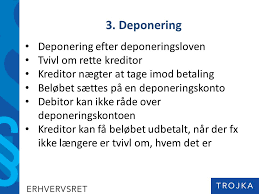

# Ophør af fordringer

---

***Som studerende skal du være særlig opmærksom på følgende problemstillinger ved gennemgangen af fordringer og deres ophør:***


•	**Sondring mellem almindelige fordringer, simple gældsbreve og omsætningsgældsbreve – analog anvendelse af reglerne for simple gældsbreve jf. GBL § 26 på alm. fordringer (ved afprøvningen bør der være fokus på simple fordringer/gældsbreve og tinglyste negotiable dokumenter)**

•	**Sikringsakt** 
•	**Fordringers ophør:** 

  o **Forældelse**  
  o **Modregning – almindelige betingelser + GBL § 27 og 28**
  o **Betaling med frigørende virkning, GBL § 29 og 30** 

<br>
<br>

---

## Definition og regel


**Modregning** er en måde at opfylde/afslutte krav på. Modregning bringer krav til ophør i det omfang, kravene dækker hinanden. 

Det gøres ved, at den ene parts krav fratrækkes den anden parts krav.

Modregning har karakter af betaling. Modregning er en forenkling af betalingssystemet.

Ved modregning opgiver den ene part sit krav hos den anden part. Men samtidig bringer han sin gæld til den anden til ophør. Han får således lov til at beholde den ydelse, som han ellers skulle have betalt til opfyldelse af sin skyld.

Modregning gør ikke, at parterne slipper for at overholde reglerne i lovgivningen. Lovgivningen om bogføring og anden lovgivning (beregning af moms osv.) skal naturligvis overholdes.

Modregning har også karakter af privat tvangsfuldbyrdelse. Modregning kan nemlig ske, hvis den ene part ønsker det. 

Der behøver ikke at foreligge en aftale mellem parterne eller et samtykke fra modparten. 

Modregningen indebærer altså, at fordringen bliver opfyldt, selv om en part ikke kan eller vil betale.

Modregning sker ved, at den ene part afgiver en erklæring (modregningserklæring) om modregning til den anden.

I modregning gælder en særlig sprogbrug: 


**Begreber**

**Modregneren:** Den der ønsker at modregne og derfor afgiver en modregningserklæring

**Hovedmanden**: Modtageren af modregningserklæringen

**Modfordringen**: Modregnerens tilgodehavende hos den anden part

**Hovedfordringen**: Modregnerens skyld til den anden part

**Konneksitet** betyder, at der er tale om krav, som har fælles oprindelse.

Ved tvungen ikke-konneks modregning kan modregning ske, uden at der foreligger en aftale om modregning mellem parterne.

Tvungen ikke-konneks modregning iværksættes ved, at modregneren afgiver en modregningserklæring. 

Modregningserklæringen har karakter af påbud til hovedmanden. 
Han kan derfor ikke afvise erklæringen, og den har virkning, så snart den er kommet frem til ham.

Fordringer vedbliver således med at bestå med deres fulde beløb, indtil modregning er erklæret, og ophører først, når erklæringen er nået frem til hovedmanden.

---

## Betingelser for tvungen ikke-konneks modregning

For at tvungen ikke-konneks modregning må finde sted, er der en række betingelser, der skal være opfyldte.

Disse betingelser skal alle være opfyldte på det tidspunkt, hvor den tvungne ikke-konnekse modregning iværksættes.


**Betingelserne for modregning er følgende**:

* Kravene er udjævnelige
* Kravene er afviklingsmodne
* Kravene er gensidige
* Modkravet er retskraftigt

**Ad. Kravene til udjævnelighed**

Betingelsen om udjævnelighed betyder, at kravene kan benyttes til korrekt opfyldelse af hinanden. 

Betingelsen om udjævnelighed er opfyldt, når både hovedfordringen og modfordringen er pengefordringer.

Kravene behøver ikke at være lige store, for at tvungen modregning må gennemføres. 

Blot kravene er delelige, må der modregnes over for en hovedfordring, der er større end modfordringen, og modregnes med en modfordring, der er større end hovedfordringen.

**Ad. Kravene er afviklingsmodne**

At kravene er afviklingsmodne betyder, at modfordringens forfaldstidspunkt er kommet, mens hovedfordringens frigørelsestidspunkt skal være kommet. 

Forfaldstidspunktet er det tidspunkt, hvor kreditor kan kræve, at debitor betaler, hvad han skylder. 

Frigørelsestidspunktet er det tidspunkt, hvor debitor har ret til at frigøre sig ved at betale, hvad han skylder.

Denne betingelse er begrundet i, at en kreditor kan kræve betaling, når forfaldstidspunktet er kommet, mens en debitor kan frigøre sig fra sin gæld, når frigørelsestidspunktet er kommet.

Med **"forfaldstidspunkt"** menes sidste rettidige betalingsdag, da betaling som udgangspunkt ikke må kræves før da.

**Ad. Kravene er gensidige**

Modregning må kun ske, hvor to personer (fysiske og/eller juridiske personer) har krav på hinanden, således at debitor efter den ene fordring er kreditor efter den anden fordring.

**Ad. Modkravet er retskraftigt**

At modkravet skal være retskraftigt betyder, at modfordringen ikke må være bortfaldet, fx ved *forældelse* eller *præklusion* (En ret kan ophøre ved præklusion, hvis retten ikke gøres gældende rettidigt f.eks. en kreditors krav, når der indrykkes et proklama i et dødsbo).

Hvis modfordringen er bortfaldet, er modregning udelukket.


## Ophør ved forældelse


**Der bliver behandlet følgende vigtige emner vedrørende forældelse**:


* Hvorfor forældelsesregler? (afsnit 17.3.1.)

* Retsvirkningerne af forældelse (afsnit 17.3.2.)

* Om forældelsesfrister i forældelsesloven (afsnit 17.3.3.)

* Forældelsesfrister - pengelån, indlån, kaution (afsnit 17.3.4.)

* Afbrydelse af forældelse (afsnit 17.3.5.)


### Hvorfor forældelsesregler? 

Forældelsesreglerne er nødvendige regler, der primært er til for at udelukke gamle krav, som det kan være svært at føre bevis for eksistensen af, eller krav, som de involverede parter havde indrettet sig på ikke længere eksisterede.

Uden forældelsesreglerne kunne der opstå mange uløselige, indgribende og urimelige tvister mellem mange parter.

De almindelige forældelsesregler er samlet i forældelsesloven, men der finder også en række forældelsesfrister vedrørende særlige retsforhold i andre love, fx i købeloven.

Forældelsesloven (FL; Lovbekendtgørelse nr. 1238 9. november 2015 om forældelse af fordringer) omfatter:

* Fordringer på penge eller andre ydelser, fx
   + Krav på løn
   + Krav på erstatning
   + Krav efter en faktura
* Forældelsesloven omfatter ikke:
   + Tinglyste pantebreve
   + Krav på andet end penge
* Særlige krav kan være forældet efter andre regler, fx købelovens reklamationsregler §§ 81 og 83

Skyldner skal ikke betale, hvis kravet er forældet

* Forældelsesfristen løber fra det tidligste tidspunkt kreditor kunne kræve betaling:
   + Forfaldstidspunkt, der hvor skyldner skal betale fordringen
   + Misligholdelsestidspunkt, hvis en kontrakt bliver misligholdt
   + Skadestidspunkt, hvis kravet opstår som følge af erstatningsansvar for en skade

### Retsvirkningerne af forældelse

Når forældelsen faktisk indtræder, ophører forpligtelsen helt med at eksistere – uanset om de involverede parter har kendskab til fordringen eller ej, eller om de med vilje ikke har betalt. 

Det er heller ikke nødvendigt at meddele modparten, at kravet er forældet. Man kan forholde sig passiv.

Renter mv. af en forældet fordring bliver forældede samtidig med selve fordringen, uanset hvornår de er opstået.

Det er i mange situationer muligt at aftale, at forældelsen ikke skal indtræde. Dog kan forældelsesfristerne i forældelsesloven ikke på forhånd fraviges til skade for en forbruger.

### Om forældelsesfrister i forældelsesloven 

Forældelseslovens opbygning er lavet sådan, at der er en almindelig forældelsesfrist på 3 år. 

Det fremgår af forældelseslovens § 3, stk. 1.

Denne regel er dog suppleret med en lang række andre frister og udsættelsesmuligheder, der gælder for særlige situationer og særlige retsforhold.

Alle fristerne i forældelsesloven skal som hovedregel regnes fra det tidligste tidspunkt, hvor fordringshaveren kunne kræve fordringen opfyldt. Det følger af forældelseslovens § 2, som der dog også er undtagelser til.

Forældelsesfrister (se tabel \@ref(tab:ophør1))


```{r ophør1, echo=FALSE}
mydf <- data.frame(
  S1 = c("Forældelse 3 år HR alle krav fx." ,
         "Mangler fast ejendom", 
          "Renter", 
          "Rykkergebyrer", 
          "Overtræk kontokort",
         "Rådgiveransvar",
         ""
),
  S2 = c("Forældelse 10 år, når der er en undtagelse fx." ,
  "Gældsbrev",
"Frivilligt forlig",
"Dom",
"Pengelån",
"Ubevilliget overtræk Bank",
"Kassekredit indenfor maksimum"
)
)
names(mydf) <- NULL
mydf %>%
  kable("html", escape = FALSE, caption = "Forældelse 3 og 10 år") %>%
  kable_styling(full_width = T,font_size = 10,bootstrap_options = c("responsive","bordered","striped")) %>%
  column_spec(1, bold = T, border_right = T, color = "black", background = "lightgrey") %>%
  column_spec(2, bold = T, border_right = T, color = "black", background = "lightgrey") %>%
  # column_spec(3, bold = T, border_right = T, color = "black", background = "lightgrey") %>%
  row_spec(1,italic = T,bold = T,font_size = 12,color = "white", background = "darkgrey") #%>%
  # row_spec(1,italic = T,bold = T,font_size = 12)
  # column_spec(0, angle = -45)%>%
  # scroll_box(width = "500px") %>%
  # footnote(general = "Forsikringsankenævnets klageguide",general_title = "Kilde:")%>%
# footnote(number = "Hvis skadevolder er under 14 år eller er utilregnelig, kan der dog være dækning selv om handlingen er forvoldt forsætligt")
```


### Forældelsesfrister - pengelån, indlån, kaution 

Forældelsesloven indeholder særlige frister for visse fordringer, der har særlig interesse for pengeinstitutter.

For pengelån og overtræk er forældelsesfristen 10 år. For renter og gebyrer heraf dog kun 3 år, jf. forældelseslovens § 6.

For indlån i pengeinstitutter er forældelsesfristen 20 år fra seneste kontobevægelse jf. forældelseslovens § 7.

Når en fordring er sikret ved kaution, forældes kautionen ligesom den fordring, der kautioneres for. Det vil sige, at kaution for pengelån forældes efter 10 år.

* **HR:** Alle krav forældes efter 3 år, jf. FL § 3, stk. 1, fx:
   + Krav på renter og rykkergebyrer
   + Krav som følge af mangler ved fast ejendom
   + Overtræk på et kontokort
* U: Nogle krav forældes efter 10 år, fx:
   + Underskrevet gældsbrev
   + Frivilligt forlig
   + Dom
   + Pengelån
 

### Afbrydelse af forældelse 

I forældelseslovens kapitel 5 findes der nogle regler om, hvordan forældelsen kan afbrydes. 

Det vil sige, at fristen kan komme til at løbe længere end det umiddelbare udgangspunkt.

Der skal sondres mellem egentlig afbrydelse og foreløbig afbrydelse.

Egentlig afbrydelse af en forældelsesfrist kan ske ved anerkendelse af gælden, eller ved at fordringshaverne foranstalter tvangsinddrivelse. 

Konsekvensen af afbrydelsen er, at fristen ikke løber længere.

* Når fristen afbrydes, starter den forfra
* Afbrydelse sker når
   + Skyldner erkender at skylde pengene, fx når:
* Skyldner betaler renter og afdrag
* Underskriver et frivilligt forlig
* Eller accepterer på anden måde
   + Vil skyldner ikke erkende gælden, må skyldner foretage retslige skridt, fx:
* Forfølge krav i Fogedretten
* Klage til et godkendt tvistløsningsorgan (klage- og ankenævn) ankenævn)


**Suspenderet frist:** 

* Betyder at fristen løber først fra et senere tidspunkt

* Hvis kreditor ikke kendte til kravet (fx fordi kreditor ikke er klar over, at der er en skade)

* Hvis kreditor ikke kendte til skyldner (fx fordi kreditor ikke ved, hvem der har ansvar for skaden)

* Fristen kan ikke suspenderes ud over de lange frister på 10 eller 30 år (miljø- og personskader)

...

**Video: Forældelse af erstatningskrav**


<div class="video-container"><iframe src="https://www.youtube.com/embed/3zskyjImReg" width="853" height="480" frameborder="0" allowfullscreen="allowfullscreen"></iframe></div>


---

**Video om forældelsesfrister ved gæld**

<div class="video-container"><iframe src="https://www.youtube.com/embed/krDpzh9ugJ0" width="853" height="480" frameborder="0" allowfullscreen="allowfullscreen"></iframe></div>

---

** Video: Gode råd om gæld og om forældelse**

<div class="video-container"><iframe src="https://www.youtube.com/embed/1W-4uy3N-3Q" width="853" height="480" frameborder="0" allowfullscreen="allowfullscreen"></iframe></div>

---

**Video om at få styr på sin gæld. Omkostninger og forældelse**

<div class="video-container"><iframe src="https://www.youtube.com/embed/hWILK4x7P_s" width="853" height="480" frameborder="0" allowfullscreen="allowfullscreen"></iframe></div>

---


## Deponering

Aftalt deponering eller efter deponeringsloven (Lovbekendtgørelse nr. 339 2. april 2014 om skyldneres ret til at frigøre sig ved deponering).


Loven vedrører en debitors mulighed for med frigørende virkning at deponere sin ydelse i form af penge eller værdipapirer med den virkning, at debitor stilles, som om han havde opfyldt sin forpligtelse.

* Deponering betyder, at debitor betaler til en konto i en bank med frigørende virkning


* **Deponering kan ske, når**:

   + Debitor ikke kan betale på grund af kreditors forhold, fx hvis kreditor er væk
   
   + Kreditor ikke vil opfylde debitors betingelser, fx udlevere en kvittering
   
   + Det er uvist, hvem der er rette kreditor
   
* Deponering kan ikke ske i andre tilfælde - heller ikke fx hvis debitor er utilfreds med huslejens størrelse



(kilde; Trojka)


---

