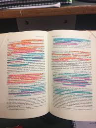

# Pant i fast ejendom, løsøre og virksomhedspant


---

***Som studerende skal du være særlig opmærksom på følgende forhold ved gennemlæsning af pensum om pant i fast ejendom, løsøre og virksomhedspant***:





***Underpant i fast ejendom:***


* **Stiftelse, TL § 1**

* **Sikringsakt**  
  
* **Prioritetsrækkefølge, TL § 1 og § 1, stk. 2**

* **Underpantsætning af ejerpantebreve, TL § 1a** 
  
* **Overordnet om oprykning, § 40** 

* **Tilbehørspant, TL §§ 37-38** 

* **Prioritetskonflikt, TL § 1 (prioritetskonflikt) og TL § 5 (god tros begrebet)** 

* **Ejerpantebreve, TL § 1a**  

* **Forståelse for forskellen mellem en aftaleerhverver, arvinger og  retsforfølgende kreditorer**

* **Gyldighedsvirkningen, TL § 27 (kædekonflikt) + evt. erstatningsadgang, TL § 30 og 31**


***Underpant i løsøre:***


* **Underpant i løsøre (inkl. motorkøretøjer m.m.)**

* **Stiftelse**

* **Sikringsakt**

* **Prioriteter** 


***Virksomhedspant/fordringspant:***

* **Virksomhedspant TL § 47c - § 47f**

* **Hvad der er omfattet af virksomhedspantet også ift. til pantets omfang i fast ejendom og fordringspantet**

* **Virksomhedspant ved skadesløsbrev/ejerpantebrev (indhold, omfang, udskillelse ifølge regelmæssig drift, prioritetskonflikter, forholdet til anden pantsætning og individualforfølgning/udlæg)**

* **Fordringspant TL § 47d** 

---

## Parter, regler og definitioner


* Ejer af et aktiv har ejendomsretten

* Den der har ejendomsretten er rettighedshaver

* Ejer kan give pant i aktivet til panthaver. Så bliver ejer pantsætter, og panthaver bliver også rettighedshaver

* Pant reguleres i vidt omfang af reglerne i tinglysningsloven, jf. Lovbekendtgørelse nr. 1075 af 29. september 2014 om tinglysning

 
## Pant som sikkerhed


* Pant i et aktiv giver kreditor større sikkerhed for, at en gæld betales tilbage

* Panthaver kan tvangssælge aktivet på tvangsauktion

* Er der flere panthaver i samme aktiv opstår en prioritetsstilling:


```{r pant1, echo=FALSE}
mydf <- data.frame(
  S1 = c("Prioritetsstilling" ,
         "1", 
          "2", 
          "3", 
          "4"
),
  S0 = c("Type af\nhæftelse" ,
         "Realkreditlån", 
          "Pantebrev", 
          "Pantebrev", 
          "Pantebrev"
),
  S1 = c("Beløb" ,
         "3.000.000 DKK", 
          "172.000 DKK", 
          "150.000 DKK", 
          "170.000 DKK"
),
  S2 = c("Tinglysningsdato" ,
         "23. august 2016", 
          "16 juli 2017", 
          "2. maj 2018", 
          "27. maj 2019"
)
)
names(mydf) <- NULL
mydf %>%
  kable("html", escape = FALSE, caption = "Eksempel på prioritetsstilling for en ejendom") %>%
  kable_styling(full_width = T,font_size = 10,bootstrap_options = c("responsive","bordered","striped")) %>%
  column_spec(1:4, bold = T, border_right = T, color = "black", background = "lightgrey") %>%
  # column_spec(2, bold = T, border_right = T, color = "black", background = "lightgrey") %>%
  # # column_spec(3, bold = T, border_right = T, color = "black", background = "lightgrey") %>%
  row_spec(1,italic = T,bold = T,font_size = 12,color = "white", background = "darkgrey") %>%
scroll_box(width = "100%")
  # row_spec(1,italic = T,bold = T,font_size = 12)
  # column_spec(0, angle = -45)%>%
  # scroll_box(width = "500px") %>%
  # footnote(general = "Forsikringsankenævnets klageguide",general_title = "Kilde:")%>%
# footnote(number = "Hvis skadevolder er under 14 år eller er utilregnelig, kan der dog være dækning selv om handlingen er forvoldt forsætligt")
```

---


Pantsætter (ejer) skal passe på det pantsatte aktiv. 

Pantsætter:

   + Skal sørge for almindelig vedligeholdelse
   + Må ikke forringe pantets værdi ud over sædvanlig slid og ælde, fx:
   
* Værdiforringende ændringer

* Fjerne aktiver fra pantet

   + Skal ofte sørge for at aktivet er forsikret mod tyveri og brand
   
 
### Forskellige typer pant


* **Håndpant**

   + Kræver rådighedsberøvelse
   + Bruges ved omsætningsgældsbreve eller løsøre hvor der er fare for, at pantsætter vil forringe aktivet
   
* **Underpant**

   + Det oftest anvendte, da pantsætter kan beholde rådigheden over aktivet (fx pantsætning af hus eller bil)
   
* **Retspant** – fx udlæg

* **Lovbestemt** pant – fx ejendomsskat

 
### Pantebreve og aftaler om pant

Et pantebrev er et lån ydet mod sikkerhed i fast ejendom. 

Med et pantebrev stiller ejeren sin ejendom som sikkerhed over for en långiver, der så bliver panthaver. 

Afdrager boligejeren ikke på lånet som aftalt, kan panthaveren begære tvangsauktion over ejendommen uden først at skulle foretage udlæg.

* Pantebreve – en aftale som indeholder beskrivelse af det pantsatte og hvad det ligger til sikkerhed for

  +	Kan indeholde et gældsbrev
  +	Oprettes på baggrund af en pantebrevsformular
  +	Skal tinglyses i Tingbogen: Personbogen, Andelsboligbogen eller Bilbogen
  +	Skal være digitalt for at kunne tinglyses og underskrives med digital signatur (NemId)

	


 
### Pantebreve og aftaler om pant


***Typer af pantebreve***:  

Der findes følgende pantebrevsformer:

* **Realkreditpantebreve**, der både giver pant i en ejendom og er et gældsbrev, hvor køber erkender at skylde et beløb til realkreditinstituttet.

* **Ejerpantebreve**, hvor ejeren af en fast ejendom reserverer et pant i sin ejendom og underpantsætter dette fx til sin bank. 

Ejerpantebreve anvendes typisk som sikkerhed for lån i pengeinstitutter med tinglyst prioritetsstilling, men indebærer ikke i sig selv en pligt til forrentning og afdrag af et bestemt lånt beløb. 

**Skadesløsbreve**, hvor en ejer af en fast ejendom giver en bestemt kreditor sikkerhed i sin ejendom, når størrelsen af gælden ikke er endeligt fastlagt.

Skadesløsbrevet kan stilles som sikkerhed for et bestemt engagement - fx en kassekredit eller lignende.

**Sælgerpantebreve**, der både giver pant i en ejendom og er et gældsbrev, hvor køber erkender at skylde et beløb til kreditor (sælger).

Alle pantebreve skal tinglyses for at pantet gyldigt kan stiftes.

**Tinglysningsafgiften** for pantebreve er 1,5 % af lånets hovedstol oprundet til nærmeste 100 med tillæg af kr.1.660. 

Tinglysningsafgiften vil normalt blive medfinansieret i lånet.

---

*Eksempler på almindelige situationer:*

Da de færreste boligkøbere har mulighed for at betale boligen kontant, skal der normalt optages lån i forbindelse med boligkøbet. 

Som regel bliver der optaget realkreditlån, eventuelt suppleret med et banklån. Når realkreditinstitutter og banker yder lån, forudsættes det, at boligkøberen giver pant i boligen til sikkerhed for tilbagebetaling af lånet.

Pantet stiftes ved at der tinglyses et pantebrev.

Ved ejerlejligheder er det almindeligt, at der er tinglyst et ejerpantebrev til sikkerhed for ejers forpligtelser over for ejerforeningen. 

Da det oftest har 1. prioritet ’skubber’ det de øvrige pantebreve ned. 

Nogle ejerforeninger vælger i stedet at tinglyse vedtægterne pantstiftende for at etablere sikkerheden.

Pensionister har mulighed for at foretage indefrysning af ejendomsskatterne ved at søge lån hos kommunen. 

Her sikrer kommunen lånet ved tinglysning af skadesløsbrev på ejendommen.  

Har køber ikke mulighed for at opnå sædvanlig finansiering via bank eller realkreditinstitut, sker det at sælger tilbyder at udstede et sælgerpantebrev til sikkerhed for købesummens betaling. 

Dette indebærer i praksis, at køber afdrager på lånet direkte til sælger i stedet for banken eller realkreditinstituttet.


<a href="https://www.tinglysningsretten.dk/tinglysning/faq/pant" target="_blank">Se spørgsmål og svar om pant, fra tinglysningsrettens hjemmeside</a>


**Godt at vide inden man tinglyser:**

Al tinglysning foregår digitalt på hjemmesiden www.tinglysning.dk. Det er muligt at tinglyse i Tingbogen (fast ejendom) Bilbogen, Andelsboligbogen og Personbogen.

Alle, der har NemID, har adgang til den digitale tinglysning, men det er en god ide at gøre sig overvejelser omkring, om man har de juridiske forudsætninger for at tinglyse.

I mapperne ovenfor finder man vejledninger til de digitale tingbøger samt generelle. Sidstnævnte kategori dækker over almengyldige vejledninger til tinglysningssystemet.


**Rent praktisk er tinglysningsprocessen delt i tre faser:**

1. Vælg den relevante dokumenttype under ”Ny Anmeldelse” og udfyld alle trin. Personen, der har oprettet anmeldelsen, vil fremadrettet blive kaldt ”Anmelder”.

2. Når anmeldelsen er færdiggjort og lagt i underskriftsmappen, skal de relevante parter logge ind med deres NemID og underskrive digitalt.

3. Når alle underskrifter er på plads, skal anmelder sørge for at anmelde til tinglysning. Hvis der afkræves tinglysningsafgift for dokumenttypen, vil betalingen foregå her.

Vær opmærksom på at det er anmelder, der har det juridiske ansvar for indholdet i anmeldelsen.

**Hotline:**

Deres hotline kan være behjælpelig, hvis man har tekniske problemer. Tinglysningsretten kan – som domstol – ikke yde juridisk vejledning. Hotline kan kontaktes på tlf. 70 22 18 00.

---
 
## Sikringsakt

* Pant kræver typisk at der foretages en sikringsakt for at panthavers ret er sikret mod andre. Forholdet mellem pantsætter og panthaver kræver ikke tinglysning

* Sikringsakten afhænger af aktivet og kan være:

   + Tinglysning
   + Registrering
   + Fysisk rådighedsberøvelse
   + Meddelelse (denuntiation)
   + Ingenting

---

```{r pant2, echo=FALSE}
mydf <- data.frame(
  S1 = c("Aktivtype" ,
         "Fast ejendom", 
          "Biler", 
          "Løsøre", 
          "Simple fordringer",
         "Negotiable gældsbreve", 
          "Digitale pantebreve", 
          "Værdipapirer"
),
  S2 = c("Ejendomsret" ,
         "Tinglysning i\ntingbogen", 
          "Ingen", 
          "Ingen", 
          "Denunciation til debitorer",
         "Rådighedsberøvelse", 
          "Tinglysning", 
          "Registrering hos værdipapircentralen, VP securities"
),
  S3 = c("Underpant" ,
          "Tinglysning i\ntingbogen", 
          "Ingen", 
          "Ingen", 
          "Denunciation til debitorer",
         "", 
          "Tinglysning", 
          "Registrering hos værdipapircentralen, VP securities"
),
  S4 = c("Udlæg" ,
         "", 
          "Tinglysning\nbilbogen\nrådighedsberøvelse", 
          "Intet", 
          "Intet",
         "Rådighedsberøvelse", 
          "Tinglysning", 
          "Registrering hos værdipapircentralen, VP securities"
),
  S5 = c("Ejendomsforbehold" ,
         "", 
          "Tinglysning\nbilbogen", 
          "Intet", 
          "",
         "", 
          "", 
          ""
),
  S6 = c("Håndpant" ,
         "", 
          "", 
          "Rådighedsberøvelse", 
          "",
         "Rådighedsberøvelse", 
          "", 
          ""
)
)
names(mydf) <- NULL
mydf %>%
  kable("html", escape = FALSE, caption = "Sikringsakter for aktiver") %>%
  kable_styling(full_width = T,font_size = 10,bootstrap_options = c("responsive","bordered","striped")) %>%
  column_spec(1:6, bold = T, border_right = T, color = "black", background = "lightgrey") %>%
  # column_spec(2, bold = T, border_right = T, color = "black", background = "lightgrey") %>%
  # # column_spec(3, bold = T, border_right = T, color = "black", background = "lightgrey") %>%
  row_spec(1,italic = T,bold = T,font_size = 12,color = "white", background = "darkgrey") %>%
scroll_box(width = "100%")
  # row_spec(1,italic = T,bold = T,font_size = 12)
  # column_spec(0, angle = -45)%>%
  # scroll_box(width = "500px") %>%
  # footnote(general = "Forsikringsankenævnets klageguide",general_title = "Kilde:")%>%
# footnote(number = "Hvis skadevolder er under 14 år eller er utilregnelig, kan der dog være dækning selv om handlingen er forvoldt forsætligt")
```

---

**Formålet med sikringsakten er:**

*Prioritetskonstaterende virkning:* 

Er der flere panthaver i samme aktiv opstår en prioritetsstilling.

**Offentliggørende virkning**:  

Tinglysning af en rettighed medfører, at det bliver offentliggjort. Alle har ret til at slå op i tingbøgerne og se ejerskab, pant mv. 

*Rådighedsindskrænkende virkning:*  

Håndpantsætning medfører, at pantsætter ikke længere har adgang til aktivet. Andre pantformer indskrænker pantsætter ret til at råde over aktivet.  


 
### Hvilke aktiver kan kreditor få pant i?  

**Aktivtyper:**

* Biler
* Fast ejendom
* Andelslejlighed
* Løsøre
* Virksomhedspant
* Fordringer og fordringspant
* Værdipapirer, aktier og anparter
* Fly og skibe
 
---

```{r pant3, echo=FALSE}
mydf <- data.frame(
  S1 = c("Aktivtype" ,
         "Fast ejendom samt tilbehør", 
          "Andelslejlighed", 
          "Biler", 
          "Løsøre herunder virksomhedspant og fordringspant, erhvervsfartøjer under 5 bruttoton, fritidsskibe under 20 bruttoton",
         "Børsnoterede værdipapirer også kaldet fondsaktiver", 
          "Aktier og anparter ikke børsnoterede", 
          "Fly",
         "Erhvervsfartøjer over 5 bruttoton, fritidsskibe over 20 bruttoton"
         
),
  S2 = c("Lov" ,
         "Tinglysningsloven afsnit 1, kapitel 1-6", 
          "Tinglysningsloven kapitel 6b", 
          "Tinglysningsloven kapitel 6a", 
          "Tinglysningsloven kapitel 7",
         "Kapitalmarkedsloven", 
          "Selskabsloven", 
          "Lov om registrering af rettigheder over luftfartøjer",
         "Søloven"
)
)
names(mydf) <- NULL
mydf %>%
  kable("html", escape = FALSE, caption = "Hvilken lov regulerer  sikkerhed for aktiver") %>%
  kable_styling(full_width = T,font_size = 10,bootstrap_options = c("responsive","bordered","striped")) %>%
  column_spec(1:2, bold = T, border_right = T, color = "black", background = "lightgrey") %>%
  # column_spec(2, bold = T, border_right = T, color = "black", background = "lightgrey") %>%
  # # column_spec(3, bold = T, border_right = T, color = "black", background = "lightgrey") %>%
  row_spec(1,italic = T,bold = T,font_size = 12,color = "white", background = "darkgrey") #%>%
  # row_spec(1,italic = T,bold = T,font_size = 12)
  # column_spec(0, angle = -45)%>%
  # scroll_box(width = "500px") %>%
  # footnote(general = "Forsikringsankenævnets klageguide",general_title = "Kilde:")%>%
# footnote(number = "Hvis skadevolder er under 14 år eller er utilregnelig, kan der dog være dækning selv om handlingen er forvoldt forsætligt")
```
 
---
 
## Pant i fast ejendom

Pant i fast ejendom er en sikkerhed som bruges til opfyldelse af en forpligtelse. 

Pant i fast ejendom bruges oftest til at stille sikkerhed for et lån via et pantebrev.

Når der stilles sikkerhed for et lån ved pant i fast ejendom, kan långiver kræve ejendommen på tvangsauktion, hvis forpligtelsen om gælden ikke bliver overholdt og derigennem opnår långiver en sikkerhed, når der lånes penge ud til ejeren af boligen.

Ved udbetaling af et lån, hvor der stilles sikkerhed i den faste ejendom, bliver der lavet et pantebrev, som er det juridiske dokument der indeholder forpligtelserne omkring lånet, og viser at der er givet pant i ejendommen mod lån af penge.

Pant i fast ejendom kan både bruges som sikkerhed via et pantebrev til køb af bolig og dermed som sikkerhed for et boliglån samt ved at tage lån i friværdi.

* Alle rettigheder over fast ejendom skal tinglyses

* Tinglyses i Tingbogen med angivelse af et eller flere matrikelnumre

* Adkomst – skøde tinglyses for at sikre ejendomsretten

* Byrder/servitutter- fx en lejekontrakt, vejret, byggehøjde eller ægtepagt tinglyses for at sikre sig mod evt. køber

* Hæftelser – pant og udlæg tinglyses for at sikre prioritet på evt. tvangsauktion  

* Flere panthavere i samme ejendom – prioritetsstilling

* Skal et foranstående pant udvides, skal efterstående panthavere give tilladelse (rykningspåtegning)

* Der er oftest aftalt oprykningsret i et pantebrev, og så rykker det op i prioritetsstillingen efterhånden som gælden i foranstående pantebrev bliver nedbragt

* Kreditor kan højst give henstand med betaling på pantebrevet 1 år, ellers vil rentekravet komme sidst i prioritetsordenen

* Ejerpant kan opstå, hvis der ikke er aftalt oprykningsret, og et gælden i et foranstående pantebrev er nedbragt

---

**Video om tinglysningslovens §§ 1 og 27**


<div class="video-container"><iframe src="https://www.youtube.com/embed/hPEDQjWpyjg" width="853" height="480" frameborder="0" allowfullscreen="allowfullscreen"></iframe></div>


---


**Video: Om tinglysningslovens § 40**


<div class="video-container"><iframe src="https://www.youtube.com/embed/W-GUDkF6tIg" width="853" height="480" frameborder="0" allowfullscreen="allowfullscreen"></iframe></div>

---


*Vigtigste dokumenter, der således kan tinglyses:*

* Endeligt skøde: Ikke andre betingelser end købesummens betaling

* Betinget skøde: Endelig overdragelse er gjort betinget af andre forhold end købesummens betaling.

* Alm. pantebreve: Skal udfærdiges på standardblanket. Foranstående hæftelser skal angives.

* Skadesløsbreve/ejerpantebreve: Hvor der gives pant for et max. beløb, men skyldens størrelse fremgår ikke af selve pantebrevet, men af et under-liggende skyldforhold.

* Servitutter: Ex. servitut vedrørende lokalplaner, vejret.


**Pantebrevslån som alternativ boligfinansiering:** 

Et pantebrevslån er et privat lån, man tager uden om banken. Man kan tage et pantebrevslån, hvis man køber fast ejendom, og dermed stiller sikkerhed i den bolig man finansierer med lånet.  


### Hvad omfatter pant i fast ejendom

Hvad er omfattet af fast ejendom? Fast ejendom dækker både over jordarealer samt bygninger. 

Et stykke jord med tilhørende bygning anses som samme faste ejendom, og har derfor en samlet værdi. 

En bygning på en lejet grund kan i nogle tilfælde være særskilt fast ejendom og pantsættes uafhængigt af grunden:  

* Et afgrænset stykke jord med tilhørende beplantning og eventuelt bygninger – samme faste ejendom

* En bygning på lejet grund kan være en særskilt fast ejendom og kan pantsættes uafhængigt af grunden

* En del løsøre er tilbehør til fast ejendom og bliver en del af den samlede faste ejendom. Ejendomspant i løsøre beskrives af:

   + Tilvækstlæren
   + TL § 38 om indlagt løsøre
   + TL § 37 om erhvervsløsøre
   
---   

```{r pant5, echo=FALSE}
mydf <- data.frame(
  S1 = c("I konflikt med" ,
          "TL § 47, individuelt løsørepant", 
          "TL § 47b, stk. 2, flydende pant i driftsmateriel", 
          " TL § 47c, virksomhedspant",
         "Ejendomsforbehold", 
          "Udlæg i løsøre"
),
  S2 = c("Løsning" ,
         "Løsørepant skal aftales før aktivet kommer ind på ejendommen.", 
         "Ingen konflikt, TL § 47b, stk. 2 finder udelukkende anvendelse i virksomheder fra lejede lokaler.", 
          "TL § 37 vinder altid over virksomhedspant jf. TL § 47c stk. 4", 
         "Ejendomsforbeholdet vinder, hvis det er gyldigt", 
          "Det er ikke muligt at få udlæg i løsøre omfattet af TL $ 37 jf. rpl. § 510"
)
)
names(mydf) <- NULL
mydf %>%
  kable("html", escape = FALSE, caption = "Tilbehør til fast ejendom, løsøre omfattet af TL § 37") %>%
  kable_styling(full_width = T,font_size = 10,bootstrap_options = c("responsive","bordered","striped")) %>%
  column_spec(1:2, bold = T, border_right = T, color = "black", background = "lightgrey") %>%
  # column_spec(2, bold = T, border_right = T, color = "black", background = "lightgrey") %>%
  # # column_spec(3, bold = T, border_right = T, color = "black", background = "lightgrey") %>%
  row_spec(1,italic = T,bold = T,font_size = 12,color = "white", background = "darkgrey") #%>%
# scroll_box(width = "100%")
  # row_spec(1,italic = T,bold = T,font_size = 12)
  # column_spec(0, angle = -45)%>%
  # scroll_box(width = "500px") %>%
  # footnote(general = "Forsikringsankenævnets klageguide",general_title = "Kilde:")%>%
# footnote(number = "Hvis skadevolder er under 14 år eller er utilregnelig, kan der dog være dækning selv om handlingen er forvoldt forsætligt")
```

---


```{r pant4, echo=FALSE}
mydf <- data.frame(
  S1 = c("I konflikt med" ,
         "TL § 37, tilbehør til fast ejendom (erhverv)", 
          "TL § 47, individuelt løsørepant", 
          "TL § 47b, stk. 2, flydende pant i driftsmateriel", 
          " TL § 47c, virksomhedspant",
         "Ejendomsforbehold", 
          "Udlæg i løsøre"
),
  S2 = c("Løsning" ,
         "Benyt TL § 38", 
          "Ikke særskilt ret over TL § 38-tilbehør, hvorfor TL § 38 anvendes", 
          "Ingen konflikt, TL § 47b, stk. 2 finder udelukkende anvendelse i virksomheder fra lejede lokaler.", 
          "Ikke særskilt ret over TL § 38-tilbehør, hvorfor TL § 38 anvendes", 
         "Ikke særskilt ret over TL § 38-tilbehør, hvorfor TL § 38 anvendes", 
          "rpl § 510 udelukker udlæg i løsøre omfattet af TL § 38"
)
)
names(mydf) <- NULL
mydf %>%
  kable("html", escape = FALSE, caption = "Tilbehør til fast ejendom, løsøre omfattet af TL § 38") %>%
  kable_styling(full_width = T,font_size = 10,bootstrap_options = c("responsive","bordered","striped")) %>%
  column_spec(1:2, bold = T, border_right = T, color = "black", background = "lightgrey") %>%
  # column_spec(2, bold = T, border_right = T, color = "black", background = "lightgrey") %>%
  # # column_spec(3, bold = T, border_right = T, color = "black", background = "lightgrey") %>%
  row_spec(1,italic = T,bold = T,font_size = 12,color = "white", background = "darkgrey") #%>%
# scroll_box(width = "100%")
  # row_spec(1,italic = T,bold = T,font_size = 12)
  # column_spec(0, angle = -45)%>%
  # scroll_box(width = "500px") %>%
  # footnote(general = "Forsikringsankenævnets klageguide",general_title = "Kilde:")%>%
# footnote(number = "Hvis skadevolder er under 14 år eller er utilregnelig, kan der dog være dækning selv om handlingen er forvoldt forsætligt")
```


---


**Tilvækstlæren**  

---


---

* Omfatter løsøreaktiver, som ikke kan fjernes fra ejendommen uden at gøre skade på den

* Omfatter fx nedgravede kabler, kloaknet, vinduer, tag – alt der er ”vokset” ind i bygningen/ejendommen

* Løsøre omfattet af tilvækstlæren er en del af ejendommen og ingen kan have en særskilt ret over det. 

Dette gælder også, selvom ejeren ikke selv har betalt for løsøret.

---


(Kilde; Trojka)

---  

**TL § 38 – Indlagt løsøre**


---

* Omfatter løsøreaktiver, som er:

   + Indlagt i bygningen (installeret, boret ind i væggen mv.)
   + Til brug for bygningen (fx vaskemaskine, fryser, aircondition men ikke driftsaktiver til brug for virksomheden)
   + På ejerens bekostning (så hvis lejer eller en 3. mand har betalt er løsøret ikke omfattet af ejendomspantet)
   
* Indlagt løsøre er omfattet af ejendomspantet og særskilt ret over det kan ikke opretholdes (hverken ejendomsforbehold eller pant)


---

TL § 38 har følgende ordlyd: 

*”Når en bygning er opført, helt eller delvis, og når ledninger, varmeanlæg, husholdningsmaskiner eller lignende er blevet indlagt i bygningen på ejerens bekostning til brug for bygningen, kan særskilt ret over bygningens materialer og over nævnte tilbehør ikke forbeholdes, være sig som ejendomsret eller på anden måde. Tinglyst pantebrev i en ejendom omfatter uden særlig vedtagelse også dette tilbehør”* 

---

TL § 38 afskærer således inden for sit anvendelsesområde adgangen til at opretholde særskilte rettigheder over bestanddele og tilbehør til den faste ejendom, det være sig i form af ejendomsforbehold, løsøreunderpant, leasing eller på anden måde.

Tilbehør til en erhvervsejendom nu kun omfattes af TL § 38, såfremt tilbehøret er til brug for selve bygningen (eller grunden) modsat erhvervsvirksomheden. 

Herved er der åbnet mulighed for, at maskiner og andet tilbehør til erhvervsvirksomheden kan finansieres særskilt ved salg med ejendomsforbehold, løsøreunderpant, leasing eller på anden måde. 

Der er hermed skabt ligestilling mellem erhvervsvirksomheder, der drives fra henholdsvis ejede og lejede lokaler. 

Efter retspraksis forstås ved **»indlagt«**, at genstanden varigt er anbragt på et bestemt sted i ejendommen, og at den udgør et nødvendigt, naturligt eller hensigtsmæssigt led i erhvervsvirksomheden. 

Den nærmere afgrænsning har dog givet anledning til tvivl. 

Formuleringen i TL 38: »når en bygning er opført, helt eller delvis« gælder bestemmelsen herefter uden hensyn til, om bygningen (virksomheden) er fuldført eller taget i brug. § 38 kan anvendes analogt på tilbehør til grunden. 

---

**Domme**

Dommen U 1934 167 (centrifugalpumpe ved brønd i det fri, der anvendtes til gartneris forsyning med vand omfattet af TL § 38). 

Dommen U 1932 603 (automatisk pumpe i ejendoms gård forbundet med rør til hovedbygning og stald omfattet af TL 38). 

Men dommen VLT 1932 329 (pumpe anvendt i briketfabrik, anbragt i skur uden tilknytning til nogen bygning, ikke omfattet af TL § 38). Svinehuse, hønsehuse og mindre skure omfattes af TL § 38, selv om man ikke kan henregne dem til bygninger. 

Dommen U 1939 883 (hønsehus af tynde brædder, opstillet et stykke fra ejendommens bygninger på støbt cementramme, således at det let kunne fjernes, uden for TL § 38).

---

Det er tvivlsomt, i hvilket omfang vindmøller er omfattet af TL § 38, således at særskilt pantsætning - og andre særskilte rettigheder - er afskåret i tilfælde, hvor møllen opføres på egen ejendom:

Se dommen U 1991 447/1 V (vindmølle, der udelukkende producerede el til videresalg og ikke forsynede den ejendom, hvorpå den var beliggende, ikke omfattet af pantet i ejendommen efter TL § 38; pantsætning måtte derfor ske efter reglerne for løsøre).

Der lægges der vægt på i TL § 38, om tilbehøret er **indlagt i »bygningen«**. Hermed er det understreget, at en genstand kun kan anses for omfattet af TL § 38, hvis den kan anses som et tilbehør til selve bygningen, jf. også ordene **"til brug for bygningen"**. 

Det er således ikke tilstrækkeligt, at genstanden kan betragtes som tilbehør til en erhvervsvirksomhed, der drives i bygningen.  

Tilbehør til grunden kan også være omfattet af TL § 38, jf. ordet »delvis«. Med udtrykket »indlagt« er det bl.a. fremhævet, at der må være en vis rumlig forbindelse mellem bygning (grund) og tilbehør, selv om det ikke kræves, at anbringelsen er sket »mur- og nagelfast«. 

Generelt følger af begrebet »indlagt« dels et krav om, at genstanden skal være bestemt til stationær brug (modsat let transportabel), dels et krav om, at den skal være varigt anbragt på ejendommen (modsat blot midlertidigt): 

Se dommen U 1987 854 V (køleskabe, komfurer og elradiatorer, der var opstillet i 2 nyopførte huse, men ikke var tilsluttet elnettet, anset for omfattet af TL § 38).

Kravet om, at anskaffelsen skal være sket på ejerens bekostning. Udenfor falder herefter tilfælde, hvor anskaffelsen er bekostet af en lejer, idet det afgørende i denne henseende er, om vederlaget i realiteten betales af ejeren, ikke om betalingen formelt kommer fra ham, jf. dommen U 1941 731 H.

Er en genstand anskaffet af ejendommens ejers ægtefælle, må udgangspunktet være, at den ikke omfattes af TL § 38, jf. dommene U 1983 951 V og U 1985 227 V. 

Man vil dog formentlig stille ret strenge krav til beviset for, at genstanden reelt er bekostet af den anden ægtefælle, ligesom § 38 er anvendelig, hvis den ægtefælle, der har anskaffet genstanden, må antages reelt at være medejer af ejendommen, jf. dommen U 1984 620 V. Tilsvarende gælder ved faste samlivsforhold.

Hvis indføjelsen er foretaget af en lejer, en brugspanthaver eller anden midlertidig besidder, omfattes forholdet som nævnt ikke af TL § 38.

TL § 38 afskærer som nævnt navnlig ejendomsforbehold i genstande, der indlægges i en fast ejendom, men heller ikke andre særskilte rettigheder kan opretholdes over sådanne genstande, således ikke panterettigheder, der er stiftet efter reglerne om pant i løsøre, eller brugs- og lejerettigheder (leasingrettigheder). 


---

**TL § 37 – Erhvervstilbehør**


TL § 37, stk. 1 har følgende formulering;

**”Hvor en fast ejendom varigt er indrettet med en særlig erhvervsvirksomhed for øje, omfatter tinglyst pantebrev i ejendommen, når intet andet er aftalt, også det dertil hørende driftsinventar og driftsmateriel - derunder maskiner og tekniske anlæg af enhver art - og ved landejendomme tillige den til ejendommen hørende besætning, gødning, afgrøder og andre frembringelser, for så vidt de ikke udskilles ifølge en regelmæssig drift af den pågældende ejendom”**

---

Hvis ejendommen er:

*	En erhvervsejendom. I reglen skal indretningen fremgå af særlige bygningsforanstaltninger. 

Specielt inventar mv. kan i særlige tilfælde være tilstrækkeligt, medens faktisk anvendelse til erhverv ikke er nok. 

Ikke hele ejendommen behøver at være indrettet med henblik på erhvervsvirksomheden, når den blot ikke spiller en kun ubetydelig rolle.

*	Som er varigt indrettet. I tvivlstilfælde kan der ses hen til betydningen for pantesikkerheden, U 1934 352. 

Det er uden betydning, om ejendommen først ved senere bygningsændring er blevet indrettet til erhvervsejendom

*	**Med en særlig erhvervsvirksomhed for øje**. 

Der ligger næppe nogen begrænsning i udtrykket »særlig«. 

Ejendommens indretning til erhverv behøver således ikke at sigte til et bestemt erhverv, men er dette tilfældet, er løsøret kun omfattet af panteretten efter TL § 37 i det omfang, det hører til en virksomhed af den art, hvortil ejendommen er indrettet,

Er driftsmateriel og driftsmidler omfattet af ejendomspantet. 

Altså - med undtagelse af biler, jf. stk. 3 - alle genstande, der varigt benyttes i driften som grundlag for denne (produktionsmidler), derimod (bortset fra landejendomme) ikke råvarer, halvfabrikata og færdige produkter:

Se hertil **dommen U 1987 586 V** (køkkener, der midlertidigt var opstillet i en køkkenfabrikants detailforretninger for at fremme salget, og som var monteret på nogenlunde samme måde som i et privat hjem, men blev udskiftet ved modelskifte mv., var ikke omfattet af en panthavers panteret efter TL § 37 og TL § 47 b, stk. 2, idet køkkenerne i princippet måtte sidestilles med enhver anden form for demonstrations/udstillingsvare, der traditionelt henregnes til en virksomheds varelager), 

**Dommen U 1973 925 H** (et vaskeri drev også virksomhed med udlejning af arbejdstøj, duge og sengelinned mv. Antaget, at disse genstande nærmest måtte sidestilles med et varelager og ikke kunne anses som driftsinventar eller driftsmateriel omfattet af TL § 37).

* Bestemmelsen kan fraviges ved aftale (deklaratorisk), hvis:

   + Aftale om pant eller ejendomsforbehold indgås før løsøret bliver bragt ind på ejendommen
   + Aftale om pant bliver tiltrådt af panthaverne i ejendommen
   
* **Løsøret kan udskilles ifølge regelmæssig drift**
 
Hvis ejendommen er en landejendom omfatter pantet også:

* **Besætningen**. Dyr er i ældre retspraksis efter omstændighederne blevet opfattet som driftsmateriel, således at de ansås for omfattet af tilbehørspantet, selv om der ikke var tale om en landejendom:

**Dommen U 1981 863 V** (heste i stutteri) og dommen U 1969 961 V (høns i hønseri). 

Men se nu **dommen U 1987 807 H** (en ørredbestand på et dambrug kunne ikke anses for driftsmateriel) og 

**Dommen U 1995 362 H** (en minkfarms besætning af mink ikke anset som driftsinventar eller driftsmateriel). 

Under besætning falder alle dyr, der indgår i en normal landbrugsdrift, herunder avlsdyr samt afkom:

**Dommen U 1935 561**, således også høns, smågrise og får, 

**Dommen VLT 1957 159** (ekstraordinært stort fårehold, uanset at besætningen ikke kunne ernæres af gårdens produkter), men ikke kaniner, pelsdyr, duer, bier og lignende. 

Det må dog kræves, at dyrene har væsentlig betydning for ejendommen, hvorfor man snarere vil medtage høns ved husmandsbrug, **dommen U 1937 154, end ved større landejendomme, jf. dommen U 1935 373**.
 
* Gødning, afgrøder og andre frembringelser. En landbrugsejendoms mælkekvote er ikke omfattet af TL § 37, og det samme gælder et krav på godtgørelse for ophør med mælkeleverance, jf. **dommen U 1992 815 V**. 

Såvel den på roden værende som den indhøstede avl og afgrøde, **dommen U 1964 746 V**. 

Panthaverne i den faste ejendom må dog respektere høstpant stiftet i henhold til lov om høstpant. Om kartoffelleveringsrettigheder se **dommen U 1998 209/2 V og dommen U 2000 967 V**.

* En landejendom er oftest en traditionel gård med jordbrug og besætning. 

Der må være tale om en egentlig jordbrugsvirksomhed, **dommen U 1995 362 H** (minkfarm ikke omfattet), 

**Dommen U 1987 807 H** (dambrug ikke omfattet), 

**Dommen U 1981 863 V** (en ejendom, der var noteret som landbrugsejendom, men som gennem lang tid udelukkende havde været drevet som stutteri og var indrettet specielt hertil, var ikke omfattet), 

**Dommen U 1969 961 V** (hønseri ikke anset for landejendom), 

**Dommen U 1933 762** (ligeledes), 

**Dommen VLT 1935 58** (pant i smedje med tilhørende areal af 1 td land antoges ikke at omfatte 1 hest, 1 ko og nogle smågrise, selv om stald var indrettet i husets ene ende). 

Det er uden betydning, om ejendommens jorder er beliggende i en landkommune eller ikke. 

Det er ligeledes uden betydning, om ejendommen ligger i landzone eller er noteret som en landbrugsejendom efter loven herom. 

Muligvis kan antallet af dyr på en ejendom være så stort, at der ikke er tale om jordbrug i traditionel forstand, men om industri, der ikke er omfattet. 

Det er derimod ikke nødvendigt, at opdræt af en besætning udelukkende baseres på ejendommens egen avl af foder.

**Uden for panteretten falder personlige brugsgenstande**

jf. **dommen U 1975 323 Ø**. (udsmykningsgenstande, herunder en antik våbensamling, i restaurationsvirksomhed ikke anset for omfattet af TL § 37, hvorimod et farvefjernsyn efter sin placering og anvendelse måtte betragtes som driftsinventar i forretningen). 

Personbiler er i almindelighed ikke omfattet, selv om de er anskaffet forud for 1993-06-01 og derfor ikke er undtaget efter TL § 37, stk. 3, jf. **dommene U 1979 411/1 V, U 1978 823 V og U 1973 354 V**.

Er der tvivl om, hvorvidt genstande er omfattet af TL § 37 (eller TL § 38), kan de fremhæves udtrykkeligt i pantebrevet. Løsøregenstande, som ikke er omfattet af TL § 37, kan pantsættes særskilt efter TL § 47 (individualiserbart løsøre) eller efter TL § 47 c, virksomhedspant.


---

**Video: Om pant i fast ejendom, jf. TL §§ 37 og 38**


<div class="video-container"><iframe src="https://www.youtube.com/embed/xHy4WseYSYY" width="853" height="480" frameborder="0" allowfullscreen="allowfullscreen"></iframe></div>
 
---

### Eksamensopgavesæt om pant i fast ejendom, virksomhedspnat, pantets omfang, konkurs, omstødelse, tvangsfuldbyrdelse og rekonstruktion mv.


**Fine biler og dyre vaner**

---


---

Super Cars I/S beskæftigede sig med salg af nye og brugte, eksklusive specialbiler som Porsche, Ferrari, Maseratti, Jaguar. Desuden drev selskabet et autoværksted, der havde specialiseret sig i disse bilmærker samt faciliteter til opbevaring af kundernes biler under optimale forhold, i vinterperioden. 

Selskabet havde kreditter og lån på i alt16 mio. kr. i Erhvervsbanken, og ønskede nu at udvide engagementet til kr. 20 mio. kr. Erhvervsbanken havde oprindelig accepteret engagementet på baggrund af partnernes personlige hæftelse, da de var ganske velhavende, men forlangte nu tillige pant i selskabets aktiver, som betingelse for udvidelsen. 

Resultatet blev at Super Cars gav banken pant i sin ejendom med showroom. Værkstedet blev drevet fra en lejet ejendom, som Super Cars selvfølgelig ikke kunne pantsætte. Der blev samtidig etableret virksomhedspant med afkrydsning af alle kategorier på skadesløsbrevet. Begge aftaler blev behørigt tinglyst.

Under besøg på virksomheden havde kreditchefen fra Erhvervsbanken, set de mange fornemme sportsvogne og havde desuden hæftet sig ved det kostbare og avancerede udstyr i værkstedet. Hun var ikke i tvivl om, at sikkerheden i ejendommen sammen med virksomhedspantet ville dække engagementet.

Det var gode tider med et generelt stort forbrug i samfundet, så det gik rigtig godt for Super Cars. Desværre havde selskabet en økonomidirektør, Larsen, som også gerne ville være med på velstandsbølgen, og derfor supplerede sin løn ved at tappe selskabet ved underslæb. Det førte til at selskabet, efter egen begæring, kom under rekonstruktion.

**Eksamensspørgsmål**

A. Hvordan hæfter partnerne bag Super Cars I/S, for virksomhedens gæld?

B. Hvilke funktioner har fristdagen under rekonstruktionen?

**Rettevejledning**

Ad. A. 

Ejerne af et interessentskab hæfter personligt, solidarisk og direkte med alt hvad de ejer. Det vil sige at alle virksomhedens forpligtelser også er ejernes forpligtelser. Ejerne hæfter også for forpligtelser som ens partnere måtte have indgået. Solidarisk hæftelse betyder at, skulle interessentskabet komme i en situation, hvor det ikke er muligt at betale sin gæld, kan kreditorerne selv vælge hvem af interessenterne de vil inddrive gælden hos.

Ad. B.

Ved konkurs og rekonstruktion er fristdagen den dato hvor skifteretten modtager en begæring om konkurs eller rekonstruktion.

Når rekonstruktionsbehandlingen er indledt, kan begæringen ikke tilbagekaldes. 

Så længe en begæring om rekonstruktion er under behandling, og så længe en rekonstruktionssag verserer, kan en konkursbegæring ikke behandles.


**Eksamensspørgsmål 2:**

Ved den efterfølgende opgørelse af bankens sikkerheder opstod der diskussion mellem rekonstruktøren og banken om følgende spørgsmål: 

A. Banken gjorde gældende, at virksomhedspantet omfattede såvel virksomhedens varelager, af både nye og brugte biler, som direktørens firmabil.


**Rettevejledning:**

Emne: Virksomhedspant – panterettens omfang

Regler: Tinglysningsloven (TL) § 47c stk. 3

Læringsmål: Anvende, vurdere og formidle reglerne om kreditsikring og finansiel sikkerhedsstillelse i sammenhæng med andre juridiske emner, og i en praktisk sammenhæng med risiko- og kreditvurdering af private og erhvervskunder.


Jf. TL § 47c stk. 3, 3) og TL § 47c stk. 3, 8), er et kun den del af varelageret, der består af hhv. de nye biler, der aldrig har været indregistreret, og da der er tale om en bilforhandler, de brugte biler, der udbydes, som vil være omfattet af bankens virksomhedspant.


B. Blandt selskabets fordringer var erstatningskravet overfor Larsen, nogle købekontrakter med ejendomsforbehold i de solgte biler samt en lang række almindelige tilgodehavender fra værkstedet. Banken gjorde gældende, at alle disse fordringer var omfattet af virksomhedspantet. 

**Eksamensspørgsmålet:**

Har banken ret i disse påstande? 

**Rettevejledning**:

Emne: Virksomhedspant – panterettens omfang

Regler: TL § 47c stk. 3

Læringsmål: Anvende, vurdere og formidle reglerne om kreditsikring og finansiel sikkerhedsstillelse i sammenhæng med andre juridiske emner, og i en praktisk sammenhæng med risiko- og kreditvurdering af private og erhvervskunder.

Efter TL § 47c stk. 3, 1) er det alene simple fordringer hidrørende fra salg af varer og tjenesteydelser, der er omfattet af virksomhedspantet, hvorfor banken ikke har pant i erstatningskravet mod Larsen.

**Svar slut**.


I forbindelse med et særligt klimareguleringsanlæg til de kælderlokaler under udstillingslokalerne, hvor man opbevarede de kostbare biler under optimale temperatur- og fugtighedsforhold, opstod der uenighed om retten til anlægget mellem banken og leverandøren, som havde solgt det på kredit med gyldigt ejendomsforbehold.

**Eksamensspørgsmålet:**

Hvordan afgøres spørgsmålet?


**Rettevejledning:**

Emne: Pant i fast ejendom – panterettens omfang

Regler: TL §§ 37 og 38

Læringsmål: Anvende, vurdere og formidle reglerne om kreditsikring og finansiel sikkerhedsstillelse i sammenhæng med andre juridiske emner, og i en praktisk sammenhæng med risiko- og kreditvurdering af private og erhvervskunder.

Det kan lægges til grund at anlægget er erhvervsløsøre, der knytter sig til driften på en ejendom, varigt indrettet med særlig erhvervsvirksomhed for øje (salg og opbevaring af biler), hvorfor anlægget vil være omfattet af TL § 37. 

Bestemmelsen er deklaratorisk, hvorfor sælgers ejendomsforbehold vil gå forud for de øvrige rettigheder, såfremt aftalen er indgået inden eller samtidig med at anlægget er indført på ejendommen. (Ingen krav om sikringsakt ved ejendomsforbehold i løsøre, udover TL § 42c).

En relevant diskussion af om betingelsen om ”varig indretning med særlig erhvervsvirksomhed for øje” er opfyldt i relation til det om ejendommen oplyste (showroom /udstillingsareal og kælderareal) skal trække op ved bedømmelsen af besvarelsen.

**Svar slut**


Rekonstruktøren gjorde krav gældende overfor den ene partners datter, der som gave fra Super Cars, på hendes 18 års fødselsdag, godt 1½ år inden fristdagen, havde modtaget en temmelig kostbar Masserati.

**Eksamensspørgsmålet:**

Hvilke muligheder har rekonstruktøren for omstødelsen?


**Rettevejledning**:

Emne: Tvangsfuldbyrdelse – rekonstruktion - omstødelse

Regler: Konkursloven (KL) § 2 og § 64 stk. 2

Læringsmål: At anvende relevante regler om konkurs og rekonstruktion og vurdere deres betydning for den finansielle sektors risiko- og kreditvurdering.

Da datteren er nærtstående, jfr. KL § 2, vil der være mulighed for omstødelse af gaven efter § 64 stk. 2, 2. pkt., da den er givet senere end to år før fristdagen. Indeholder en besvarelse en relevant diskussion af undtagelsen i § 64 stk. 3 om lejlighedsgaver trækker dette op ved bedømmelsen.

**Eksamensspørgsmålet**:

5. Hvilke formål tjener omstødelse under rekonstruktion og konkurs?


**Rettevejledning:**

Emne: Tvangsfuldbyrdelse – rekonstruktion - omstødelse

Regler: KL kap. 8

Læringsmål: At anvende relevante regler om konkurs og rekonstruktion og vurdere deres betydning for den finansielle sektors risiko- og kreditvurdering.

Reglerne om omstødelse ved konkurs og rekonstruktion sikrer Konkurslovens ligedelingsprincip, således at evt. forringende og forrykkende dispositioner forud for en rekonstruktion/konkurs, kan erklæres ugyldige og en evt. berigelse tilbageføres til boet.

**Svar slut**.

---

**Video om TL §§ 37 og 38 om tilhørspant**

<div class="video-container"><iframe src="https://www.youtube.com/embed/uK1iZr2t3y8" width="853" height="480" frameborder="0" allowfullscreen="allowfullscreen"></iframe></div>

---


## Pant i løsøre

* Løsøre omfatter enkelte aktiver, fx cykel, maleri, smykker, båd eller andre genstande

* Pant i løsøre kan tinglyses

* Ejendomsret til løsøre registreres ikke i et officielt register på samme måde som fast ejendom

* Ejendomsretten sikres ved individualisering
 
### Biler


* Motorkøretøjer

Typisk: Personbiler, lastbiler, varebiler, busser, campingvogne, motorcykler, påhængs- og sættevogne Typisk ikke: Knallerter, traktorer, mejetærsker, sidevogne

* Pant eller ejendomsforbehold tinglyses i Bilbogen med angivelse af stelnummer og bilens ejer

* Flere panthavere i samme bil – prioritetsstilling

* Et pantebrev har som udgangspunkt oprykningsret, efterhånden som foranstående pantebrev bliver betalt

* Pantebrev slettes fra Bilbogen efter 10 år

 
### Pant i andet løsøre

* Pant tinglyses i Personbogen med angivelse af, hvilken genstand pantet omfatter – en klar og tydelig beskrivelse anbefales

* Flere panthavere i samme løsøre – prioritetsstilling

* Ejendomsforbehold og udlæg kan ikke tinglyses i Personbogen

* Pantebrev slettes fra Personbogen efter 10 år

 
### Flydende pant – TL § 47b, stk. 2 – pant

---

Bestemmelsen i TL § 47b, stk. 2 har følgende formulering: 

*”Når en erhvervsvirksomhed drives fra lejet ejendom, kan indehaveren uanset bestemmelsen i stk. 1 pantsætte det til virksomheden hørende driftsinventar og driftsmateriel - derunder maskiner og tekniske anlæg af enhver art - og ved landejendomme tillige den til ejendommen hørende besætning, gødning, afgrøder og andre frembringelser. Pantsætningen er ikke til hinder for, at de nævnte genstande udskilles ifølge en regelmæssig drift af virksomheden. Reglerne i 1. og 2. pkt. gælder ikke for de i § 42 c nævnte køretøjer.”*  

---

I lighed med hvad der gælder efter TL § 37, skal ejendommen være indrettet med erhvervsvirksomhed for øje, jf. U 1990 217 H. 

Det er en betingelse, at virksomheden virkelig kan siges at blive drevet fra lejet ejendom. 

Hvis virksomheden primært drives fra egen ejendom, medens den lejede ejendom alene er at betragte som et accessorium hertil, kan løsøre, der befinder sig på den lejede ejendom, derfor ikke gyldigt pantsættes under ét i medfør af TL § 47 b, stk. 2, jf. U 1983 425 V og U 1984 829/1 V.  

Der kræves ligesom ved TL § 37 en stedlig tilknytning til ejendommen, jf. U 1990 217 H, jf. U 1988 745 Ø. 

Bestemmelsen i TL § 47b, stk. 2 giver ikke hjemmel til pantsætning af varelagre og lignende, bortset fra den særlige regel om landbrugsejendomme, jf. U 1971 616 H. 

Lejekontrakt og/eller goodwill kan pantsættes sammen med driftsinventar mv. 

Se også U 1972 176 V (pantet omfattede også genstande erhvervet ved en lejekontrakt, der i et bo tilsidesattes som en omgåelse af afbetalingsloven).  

* En erhvervsvirksomhed, der drives fra lejede lokaler kan således give pant i: 

   + Driftsmidler og driftsinventar
   + Rettigheder efter lejekontrakten
   + Evt. goodwill
   
* Hvis det er en landbrugsvirksomheds kan pantet også omfatte besætning og afgrøder mm.

* Nye aktiver bliver automatisk omfattet af pantet

* Aktiver kan udskilles ifølge regelmæssig drift, se U 1972 1058 V (køberen af en opslåningsmaskine fra et bageri burde have indset, at der ikke forelå udskillelse ifølge regelmæssig drift, og dømtes til at erstatte panthaveren maskinens værdi).
 
 
### Virksomhedspant – TL § 47

---

Bestemmelsen har følgende ordlyd i TL § 47, stk. 1-2:  

**“Underpant i løsøre, som ikke er nævnt i § 42 c, skal tinglyses for at opnå beskyttelse mod aftaler, der i god tro indgås med pantets ejer, og mod retsforfølgning.**

**Stk. 2.  Underpant i ejerpantebreve, der giver pant i løsøre, skal tinglyses for at opnå beskyttelse mod aftaler, der i god tro indgås om pantebrevet, og mod aftaler om eller retsforfølgning mod løsøret.”**

---

Sikringsakten er således registrering i form af tinglysning, jf. TL § 47, stk. 2.  

TL § 47 omfatter ikke pantebreve, der giver underpant i biler mv., idet rettigheder over biler mv. er reguleret i kap. 6 a. 

Vedrørende underpant i andet løsøre som ikke er omfattet af TL § 47, bemærkes der følgende:  

* a) **Skibe** på over 5 BRT og fly:  
   
Panterettigheder i skibe på over 5 BRT og panterettigheder i fly kan ikke tinglyses efter § 47, men skal for at opnå beskyttelse registreres i skibsregistret, henholdsvis rettighedsregistret for luftfartøjer, jf. sølovens kap. 2, og lov om registrering af rettigheder over luftfartøjer § 1. 

Disse love indeholder tillige nærmere regler om bl.a. panterettens omfang og forholdet mellem flere panthavere (stort set svarende til § 40). Med henblik på afgørelse af, om pantsætning af et skib kan ske efter § 47, kan tinglysningsdommeren forlange fremlæggelse af målebrev, jf. U 1985 443 V.  

* b) **Forbud mod generalpant og pant i tingsindbegreb**: 

Se TL §§ 47 a og 47 b. Se også TL § 47 c om virksomhedspant.  

* c) **Pantsætning efter § 47 af formuegoder, der ikke har karakter af løsøre**: 

Genstande, der skal pantsættes efter reglerne om fast ejendom, kan ikke pantsættes efter TL § 47, jf. U 1962 894/1 V (træsommerhus på lejet grund bestemt til forbliven på stedet), jf. U 1966 608/2 V (tilsvarende afgørelse, selv om der i pantebrevet var angivet, at huset ikke var bestemt til varig forbliven på stedet).  

**Patenter, varemærker og mønstre** kan pantsættes efter TL§ 47. Efter varemærkelovens § 41 kan en pantsætning af et varemærke registreres i varemærkeregisteret, men dette har ikke betydning som sikringsakt.

I dommen U 1993 543 V, hvorefter en panteret i goodwill antoges at omfatte et varemærke samt mønstre og modeller m.m. Vedr. pantsætning efter TL § 47 af edb - produktionsretten, maskinel og/eller programmel, domænenavne m.v.  

**Domænenavne og rettigheder** i henhold til patentloven, varemærkeloven, designloven, brugsmodelloven, mønsterloven, ophavsretsloven og lov om beskyttelse af halvlederprodukters udformning kan pantsættes ved virksomhedspant, jf. TL § 47 c, stk. 3, nr. 7.  

Der kan tinglyses underpant i løsøre købt med ejendomsforbehold (retten til at blive ejer).  

I forbindelse med pantsætning af en løsøregenstand kan tillige pant i lejeindtægter af genstanden tinglyses efter TL § 47, jf. dommene U 1986 858 H og U 1984 1009 V, men anderledes U 1984 131/2 V. I mangel af udtrykkelig bestemmelse herom er indtægter ikke omfattet af pantet, jf. U 1983 423 V.  

Den der driver virksomhed fra egen ejendom, kan pantsætte den til virksomheden knyttede goodwill efter TL § 47, og at den, der driver virksomhed fra lejede lokaler, kan pantsætte den til virksomheden knyttede goodwill efter TL § 47, selv om det ikke sker i forbindelse med pantsætning af en overdragelig lejekontrakt, og selv om lejekontrakten ikke er overdragelig. 

Der må herefter ved forskellige pantebreve kunne ske pantsætning af henholdsvis goodwill efter TL § 47 og driftsinventar og -materiel efter TL § 47 b, stk. 2, men der kan også fortsat foretages en fælles pantsætning af goodwill samt driftsinventar og -materiel. 

Der kan ved pantsætning af goodwill næppe kræves anden specifikation end en tydelig angivelse af, til hvilken virksomhed den pågældende goodwill er knyttet, sammenlign her U 1993 543 V.  

* d) **Specifikation af det pantsatte**:

Bortset fra de særlige undtagelser fra forbuddet mod underpant i tingsindbegreb - herunder navnlig TL § 47 b, stk. 2, § 47 c og § 47 d, er det en forudsætning for tinglysning af et pantebrev, der giver underpant i løsøre, og for beskyttelsen over for tredjemand, at pantebrevet i tilstrækkelig grad specificerer (individualiserer) det pantsatte. 

Det vil kræve, at de pantsatte genstande klart adskilles fra andre genstande tilhørende pantsætteren, således at denne ikke er i stand til at underskyde ikke-pantsatte genstande under aftalen og dermed skade de øvrige kreditorer. 

---

Oversigt over, hvad der er omfattet af virksomhedspant, jf. TL § 47:   


```{r pant6, echo=FALSE}
mydf <- data.frame(
  S1 = c(
           
          "TL § 47b, stk. 2, flydende pant i driftsmateriel", 
          "TL § 47c, virksomhedspant",
         "Ejendomsforbehold", 
          "Udlæg i løsøre",
         "TL § 47c, virksomhedspant",
          "Ejendomsforbehold", 
          "Udlæg i løsøre",
         "Ejendomsforbehold", 
          "Udlæg i løsøre",
         "Udlæg i løsøre"
),
  S2 = c(
         
         "Individuelt løsørepant, tinglyst inden det kommer ind i virksomheden vil have førsteprioritet", 
          "Individuelt løsørepant, tinglyst inden det kommer ind i virksomheden vil have førsteprioritet",  
         "Ejendomsforbeholdet skal respekteres af pant", 
          "Løsørepant skal respekteres af udlæg",
         "Tinglysningstidspunktet afgør prioritetsstillingen",
         "Ejendomsforbeholdet skal respekteres af pant", 
         "Løsørepant skal respekteres af udlæg",
         "Ejendomsforbeholdet skal respekteres af pant", 
         "Ved meddelelse inden 3 dage, skal udlæg respekteres af virksomhedspant",
         "Ejendomsforbeholdet skal respekteres af udlæg"
)
)
names(mydf) <- NULL
mydf %>%
  kable("html", escape = FALSE, caption = "Virksomhedspant TL § 47") %>%
  kable_styling(full_width = T,font_size = 10,bootstrap_options = c("responsive","bordered","striped")) %>%
   column_spec(1:2, bold = T, border_right = T, color = "black", background = "lightgrey") %>%
  # column_spec(2, bold = T, border_right = T, color = "black", background = "lightgrey") %>%
   # column_spec(3, bold = T, border_right = T, color = "black", background = "lightgrey") %>%
  pack_rows(index = c( "TL § 47 Individuelt løsørepant" = 4, "TL § 47 b stk. 2 flydende pant" = 3,"TL § 47 c virksomhedspant" = 2,"Ejendomsforbehold" = 1),label_row_css = "background-color: #666; color: #fff;")


# scroll_box(width = "100%")
  # row_spec(1,italic = T,bold = T,font_size = 12)
  # column_spec(0, angle = -45)%>%
  # scroll_box(width = "500px") %>%
  # footnote(general = "Forsikringsankenævnets klageguide",general_title = "Kilde:")%>%
# footnote(number = "Hvis skadevolder er under 14 år eller er utilregnelig, kan der dog være dækning selv om handlingen er forvoldt forsætligt")
```

---

### Eksamensopgavesæt og løsning om pant i fast ejendom og løsøre, samt erstatning, kaution, ertatningsbetingelserne og huseftersynsordningen, mv.


***Musik med problemer***

Johan Tuxen-Brahe bor og driver sit pladeselskab, SoundNeed ApS, fra en tidligere landejendom syd for København. Han bor i det gamle stuehus og lejer de tidligere produktionsbygninger ud til virksomheden, der har indrettet studie, lager og administration mv. Både banken og realkreditinstituttet har pant i ejendommen.

Den 12. september 2014, er han til møde med sin bankrådgiver fra Køge Kapitalbank vedrørende finansiering af nye initiativer.

Det drejer sig om en ny stor luft/vand varmepumpe, som Johan forestillede sig kunne finansieres med kredit sikret med enten ejendomsforbehold eller pant i enten selve anlægget eller alternativt i ejendommen, til enten leverandøren eller Kapitalbanken. 


**Eksamensspørgsmålet:**

1. Hvordan skal bankrådgiveren rådgive Johan i dette spørgsmål?

Emne: Pant i fast ejendom og løsøre

Regler: Tinglysningsloven (TL) § 38 – kreditaftaleloven (KAL) § 21

Læringsmål: Anvende, vurdere og formidle reglerne om kreditsikring og finansiel sikkerhedsstillelse i sammenhæng med andre juridiske emner, og i en praktisk sammenhæng med risiko- og kreditvurdering af private og erhvervskunder.

**Vejledende løsning**

Varmepumpen er bygningstilbehør, som, når den er indlagt i ejendommen på ejerens bekostning, vil blive grebet af ejendomspantet til bank og realkredit, jfr. TL § 38. 

Da bestemmelsen er præceptiv kan særskilte rettigheder over varmepumpen i form af pant eller ejendomsforbehold ikke forbeholdes. 

Sikkerhed vil herefter alene kunne ske som tinglyst underpant i den faste ejendom med prioritet efter indestående lån. 

**Svar slut**.


Banken er også i øvrigt i tvivl om hvorvidt de har tilstrækkelig sikkerhed for SoundNeeds kassekredit, og drøfter mulighederne for i øvrigt at få pant i virksomhedens aktiver.


**Eksamensspørgsmålet:**

2. Hvilke muligheder kunne der blive tale om? 

Emne: Pant i løsøre 

Regler: TL §§ 47b stk. 2 og 47c

Læringsmål: Anvende, vurdere og formidle reglerne om kreditsikring og finansiel sikkerhedsstillelse i sammenhæng med andre juridiske emner, og i en praktisk sammenhæng med risiko- og kreditvurdering af private og erhvervskunder.


**Vejledende løsning**

Selskabet drives fra lejede lokaler, hvorfor pant i selskabets aktiver kan opnås efter TL § 47b stk. 2 eller som virksomhedspant efter TL § 47c. 

Ved besvarelsen lægges vægt på den studerendes forståelse af panterettens omfang og anvendelse i de to bestemmelser. 

**Svar slut.**


Johan nævner også, at hans gamle onkel, ”Tuxen”, der er tidligere musiker, og altid har støttet hans ambitioner indenfor branchen, og desuden ejer 5% af anparterne i SoundNeed ApS, måske kunne overtales til at kautionere overfor banken, i forbindelse med køb af varmeanlægget.


**Eksamensspørgsmålet**:

3. Hvilke overvejelser må bankrådgiveren gøre sig i forhold til denne mulighed?

Emne: Kaution

Regler: Alm. Regler om kaution – lov om finansiel virksomhed (FIL) §§ 47 og 48 – God Skik Bekg. § 22, samt kautionspjecen udarbejdet af FinansDanmark og ForbrugerrådetTænk


Læringsmål: Forståelse for kaution i både private og erhvervsforhold.

**Vejledende løsning**

Den studerende skal forholde sig til, om kautionen må anses for at være privat eller erhvervsmæssig. 

Der er tale om et lån til Johan – ikke til ApS’et - og da relationen mellem Johan og onklen således overvejende er af privat karakter, må det anses for en privat kaution. 

Banken skal i den forbindelse være opmærksom på overholdelse af reglerne om privat kaution i Fil § 48 samt i God Skik Bekg. § 22. 

Kautionen bør formuleres som en selvskyldnerkaution.

**Svar slut.**


SoundNeed har også brug for en ny mixerpult til lydstudiet, og Johan forslår, at kreditten til købet finasieres med et lån i banken sikret med pant i mixerpulten.


**Eksamensspørgsmået:**

4. Hvilke muligheder har banken for at få pant i mixerpulten?

Emne: Pant i løsøre

Regler: TL § 47

Læringsmål: Anvende, vurdere og formidle reglerne om kreditsikring og finansiel sikkerhedsstillelse i sammenhæng med andre juridiske emner, og i en praktisk sammenhæng med risiko- og kreditvurdering af private og erhvervskunder.

**Vejledende løsning**

Låntager/pantsætter er nu selskabet. Der er således ingen konflikt i forhold til TL § 37. 

Banken kan opnå underpant i mixerpulten efter TL § 47 enten ved tinglysning af et alm. løsørepantebrev eller ved tinglysning af underpant i et ejerpantebrev med tinglyst pant i mixerpulten. 

Håndpant er ligeledes en mulighed, men jo ikke interessant, da sikringsakten her er effektiv rådighedsberøvelse. 

Den gode besvarelse bør dog kobles til besvarelsen af spr. 2 og konstatere, at man ved pant efter TL § 47b stk. 2 eller TL § 47c automatisk vil få pant i mixerpulten.

**Svar slut**.

I perioder med ekstraordinær travlhed hyrer Johan lydteknikeren Lars Ravn, til at bistå med arbejdet i lydstudiet. Uheldigvis kommer Lars en sen aften, hvor han nok lidt rigelig, har søgt inspiration i noget stærkt øl fra det lokale mikrobryggeri, til at vælte et næsten fyldt glas øl, ud over den nye mixerpult, som bestemt ikke har godt af denne behandling.


**Eksamensspørgsmålet**:

5. Kan Johan, og i givet fald efter hvilke regler, kræve erstatning af Lars Ravn?

Emne: Erstatning udenfor kontrakt

Regler: De alm. Erstatningsbetingelser – EAL § 23 stk. 3

Læringsmål: Anvende og vurdere de grundlæggende erstatningsbetingelser ved erstatning udenfor kontrakt, for derigennem at kunne vurdere reglerne for rådgivnings- og professionsansvar indenfor den finansielle sektor (God skik bekendtgørelsen og LOFE § 24) samt reglerne om principalansvar.

**Vejledende løsning**

I besvarelsen skal indgå en gennemgang af de almindelige erstatningsbetingelser, der alle må anses for opfyldt. 

Da skadelidte er skadevolders arbejdsgiver, skal den studerende ligeledes forholde sig til EAL § 23 stk. 3, jfr. Stk. 1. 

Der skal her indgå en drøftelse af, hvorvidt det findes rimeligt at den ansatte bliver erstatningsansvarlig overfor arbejdsgiveren, herunder især henset til skyldgraden.

**Svar slut**.

Til Ejendommen hørte en tidligere aftægtsbolig, som Johan aldrig har haft brug for, og længe har ønsket solgt. Det har nu endelig ført til, at ejendommen via ejendomsmægler Groth, er blevet solgt til folkepensionisten Mia Andersen, der har tegnet ejerskifteforsikring. 

Desværre viser det sig, at tilstandsrapporten, ikke har medtaget en ellers oplagt sætningsskade på en skillevæg mellem stuen og køkkenet. Samtidig har det vist sig, at der ved slagregn og vind fra en ganske bestemt retning, trænger vand ind under tagkonstruktionen.

**Eksamensspørgsmålet**:

6. Hvem kan Mia Andersen rette krav imod, i forhold til de to uheldige situationer?

Emne: Overdragelse af fast ejendom - Huseftersynsordningen

Regler: Lov om forbrugerbeskyttelse ved erhvervelse af fast ejendom (LFFE) §§ 1 - 5

Læringsmål: At anvende og formidle centrale regler og praksis for køb og salg af fast ejendom med fokus på forbrugerbeskyttelse.


**Vejledende løsning**

Ifølge det oplyste er ”Huseftersynsordningen” i LFFE benyttet ved overdragelsen af ejendommen. 

Lægges det til grund, at betingelserne i ordningen er opfyldt, kan køber ikke rette krav om mangler mod sælger, jf. § 2. 

Sætningsskaden burde ifølge det oplyste fremgå af tilstandsrapporten. 

Den bygningssagkyndige har derfor tilsidesat sine pligter og køber vil kunne rette et erstatningskrav mod denne, jf. § 3. 

Vandindtrængningen er derimod næppe en skade, der burde fremgå af rapporten, og skaden må således som udgangspunkt være omfattet af ejerskifteforsikringen. 

Krav kan ikke rettes mod den bygningssagkyndige og krav mod sælger kan alene ske i det omfang denne er bekendt med fejlen og har undladt at oplyse herom i forbindelse med handelen, jf. § 2 stk. 5 (svig eller grov uagtsomhed). 

Da Johan aldrig har boet i ejendommen kunne dette tale for, at et krav ikke kan gøres gældende. 

Der lægges ved bedømmelsen vægt på den studerendes argumentation og forståelse af reglerne. 

**Svar slut.**

 
--- 
 
 
### Fordringspant for udestående og fremtidige fordringer -  TL § 47d

---

Fordringspant er et såkaldt flydende pant – TL § 47d og har følgende formulering:

**”Indehaveren af en erhvervsvirksomhed kan ved anvendelse af skadesløsbrev underpantsætte virksomhedens udestående og fremtidige simple fordringer hidrørende fra salg af varer og tjenesteydelser (fordringspant).**

**Stk. 2. Fordringspant skal tinglyses for at opnå beskyttelse mod aftaler, der i god tro indgås med pantets ejer, og mod retsforfølgning.  Skadesløsbreve som nævnt i stk. 1 kan ikke overdrages særskilt.”**

---

TL § 47d giver således en adgang til fordringspant - dvs. samlet underpantsætning af udestående og fremtidige fordringer som tingsindbegreb ved tinglysning i personbogen. 

Reglen supplerer gældsbrevslovens bestemmelser om pantsætning af simple gældsbreve, der anvendes analogt på andre simple fordringer.  

Bestemmelsen giver mulighed for et »flydende« pant i virksomhedens kundetilgodehavender således, at de enkelte fordringer omfattes af panteretten, efterhånden som de stiftes ved salg af varer m.v. på kredit, og udgår af pantet f.eks. ved indfrielse af fordringen.  

Ifølge TL § 47 e, stk. 2, kan en virksomhed ikke på samme tid pantsætte sine aktiver efter både TL § 47 c (virksomhedspant) og efter TL § 47 d (fordringspant).  

En virksomhed kan hermed give underpant i den til enhver tid værende debitorportefølje således, at virksomhedens udestående fordringer på tidspunktet for pantets stiftelse omfattes heraf, ligesom fremtidige fordringer omfattes af panteretten, efterhånden som de stiftes. 

De omhandlede fordringer hidrører fra salg af varer og tjenesteydelser og stiftes derfor ved virksomhedens indgåelse af aftaler om kreditsalg m.v. med virksomhedens kunder. 

Den enkelte fordring udgår af panteretten ved ophør, dvs. typisk ved indfrielse, herunder modregning, eller ved forældelse.  

Tinglysning i personbogen er sikringsakt for fordringspantet og giver beskyttelse mod aftaler, der i god tro indgås med pantets ejer, og mod retsforfølgning. 

Det følger heraf, at panthaveren ikke skal iagttage gældsbrevslovens § 31, stk. 1, hvorefter sikringsakten ved overdragelse til sikkerhed af simple fordringer er underretning herom til skyldner for at opnå beskyttelse mod godtroende aftaleerhververe.  

TL § 47d regulerer ikke, hvornår et utinglyst fordringspant kan ekstingveres. 

Dette må afgøres ud fra almindelige formueretlige principper om ekstinktion. 

Det følger af disse principper, at den panteret eller retsforfølgning, der skal fortrænge en utinglyst panteret, selv skal være omsætningsbeskyttet, dvs. ved tinglysning eller meddelelse i henhold til gældsbrevslovens § 31. 

Udlæg i fordringer er dog sikret ved udlæggets foretagelse. Erhververen ifølge aftale om underpant skal endvidere være i god tro på tidspunktet for aftalens anmeldelse til tinglysning.  

* TL § 47d omfatter udelukkende fordringer, som stammer fra salg af varer eller tjenesteydelser

* Kan omfatte fakturakrav, betaling for rådgivning, lejebetaling, leasingydelse mm.

* TL § 47d omfatter ikke negativt momstilsvar eller krav på erstatning

---

### Eksamensopgavesæt i køb, erstatning, god skik for finansielle virksomheder,forsikringsret, erstatningsansvarsloven, konkursret 


**Tæppehandleren fra Sorø**

---

<br>


Jonas Hansen ejer og driver virksomheden Hansen Tæpper ApS, der importerer og sælger ægte tæpper. 

Virksomheden drives fra en ejet ejendom med lager indrettet med læsserampe samt showroom og kontorlokaler mv. i Sorø. 

Lageret er fordelt på flere bygninger på den store grund, og da en af disse bygninger nedbrænder en kold forårsnat i januar 2017, får Jonas problemer med at opfylde en større ordre til Safir Tæpper i Roskilde. 

Det viser sig at branden er forårsaget af en defekt elektrisk radiator, som havde befundet sig i et personalerum i bygningen.

Med henvisning til købelovens § 23, kræver Safir Tæpper erstatning for det tab de lider som følge af den manglende leverance.


**Eksamensspørgsmålet**:

1.	Under hvilke betingelser har de ret til erstatning? (12%)

**Rettevejledning**

Læringsmål: Viden om grundlæggende regler om køb med henblik på at lette forståelsen for andre juridiske områder (aftalers indgåelse og opfyldelse – mangler ved fast ejendom – indsigelser ved fordringers overdragelse – forskellen på erstatning i og uden for kontrakt)

**Svar**: 

Ved køb og salg af ægte tæpper er der tale om specieskøb, da disse må antages at være unikke. 

Der er tale om et Handelskøb jf. købelovens (Kbl) § 4, stk. 1, leverer sælger ikke til tiden vil der foreligge forsinkelse, og det kan betyde misligholdelsesbeføjelser for køber. 

I handelskøb er al forsinkelse væsentlig, jf. Kbl § 21, stk. 3. For at køber kan gøre erstatning gældende, skal der reklameres straks Kbl § 27 (handelskøb). 

Når der er tale om brand og speciesvare, så kan køber ikke fastholde på grund af umulighed. 

Der er dog ikke tale om udefra kommende ekstreme forhold, hvorfor køber kan have krav på erstatning i form af positiv opfyldelsesinteresse jf. § 23. 

En speciessælger kan undgå at betale erstatning, hvis han kan bevise, at forsinkelsen ikke skyldes hans fejl eller fejl hos hans ansatte. (ansvarsgrundlaget for en speciessælger er culpa med omvendt bevisbyrde jf. Kbl § 23). 

Erstatningsbetingelserne skal være opfyldt – tab, årsagssammenhæng og påregnelighed. Jf. KL § 25 køber kan kræve positiv opfyldelsesinteresse hvis købet hæves.

**Svar slut.**


Jonas fætter, Ole André, havde dagen inden branden besøgt Jonas på virksomheden, da de skulle drøfte en kommende fætter-kusinefest. Det gjorde de under en lidt våd frokost. Herefter havde Ole efterladt sin gamle bil, der ikke var kaskoforsikret, og som nu var brændt sammen med lagerbygningen. 


**Eksamensspørgsmålet**:

2.	Under hvilke betingelser har Ole ret til erstatning? (10%)


**Rettevejledning**

Læringsmål: Anvende og vurdere de grundlæggende erstatningsbetingelser ved erstatning udenfor kontrakt, for derigennem at kunne vurdere reglerne for rådgivnings- og professionsansvar indenfor den finansielle sektor (God skik bekendtgørelsen og LOFE § 24) samt reglerne om principalansvar.

**Svar:**

Erstatningsbetingelserne skal være opfyldt for at Ole kan få erstatning for den brændte bil. 

Hvorvidt Jonas, evt. via principalansvaret, kan blive pålagt et ansvarsgrundlag, afhænger af en almindelig culpa vurdering. 

Det fremgår ikke af opgaven, om fx ovnens defekt og risiko var eller burde være kendt, hvorfor det ikke er muligt at tage endelig stilling til culpaspørgsmålet. 

Det afgørende er, at besvarelsen, i modsætning til situationen i spm 1., konstaterer alm. culpa med ligefrem bevisbyrde.

**Svar slut**.

Efterfølgende hævder forsikringsselskabet, at branden er forårsaget af grov uagtsomhed fra Hansen Tæppers ansatte, for hvem faren ved den defekte ovn måtte have været oplagt.


**Eksamensspørgsmålet**:

3.	Hvad kan det komme til at betyde hvis denne påstand er korrekt? (20%)

**Rettevejledning**

Læringsmål: Anvende og vurdere de grundlæggende erstatningsbetingelser ved erstatning udenfor kontrakt, for derigennem at kunne vurdere reglerne for rådgivnings- og professionsansvar indenfor den finansielle sektor (God skik bekendtgørelsen og lov om formdling af fast ejendom (LOFE) § 24) samt reglerne om principalansvar.

Udviklingsbaseret viden om anvendt teori og metode om grundlæggende forsikringsret. 

**Svar**:

Når arbejdstageren har gjort skade på en ting, som er dækket af en tingsforsikring, bliver hans ansvar jf. erstatningsansvarslovens (EAL) § 23, kun relevant, når skaden jf. EAL § 19, stk. 3, er forvoldt ved forsæt eller ved grov uagtsomhed, som forudsat her.

Der er identifikation mellem arbejdsgiver og arbejdstager. 

Hvis det er tilfældet at de ansatte ved grov uagtsomhed er ansvarlige for skaden på arbejdsgiverens bygning, bruges bestemmelsen i EAL § 23, stk. 3, som har samme udgangspunkt som EAL § 23, stk. 1. 

Det, betyder, at arbejdsgiver som udgangspunkt kan kræve erstatning af en ansat, men kun i det omfang det findes rimeligt under hensyn til den udviste skyld, arbejdstagerens stilling og omstændighederne i øvrigt.

Herudover siger forsikringsaftaleloven (FAL) § 18, stk. 2, at hvis forsikringstager ved grov uagtsomhed har fremkaldt forsikringsbegiveheden, så skal der under hensyn til skyldgraden og omstændighederne i øvrigt afgøres, om erstatning skal ydes og i bekræftende fald, med hvilket beløb. 

Der er identifikation mellem Jonas og hans ansatte, så forsikringsselskabet vil nok have mulighed for at nedsætte udbetalingen på grund af den ansattes grove uagtsomhed.

Det korrekte svar bør forholde sig til de tre ovenstående problemstillinger. 

Der er ikke tilstrækkelige oplysninger til at tage endelig stilling til konsekvenserne jf. EAL § 23, og FAL § 18.

**Svar slut**.


Virksomheden yder også service med rensning og vedligeholdelse af tæpper, og da en særlig tæpperensningsmaskine er gået tabt under branden måtte der indkøbes en ny. Den kostbare maskine købes d. 3. februar, på kredit med ejendomsforbehold til sælgeren.

Jonas er også nødsaget til at anskaffe en ny varevogn til selskabet. Handlen gennemføres den 6. februar, og ligeledes på kredit med ejendomsforbehold der tinglyses.

Der findes også elektriske radiatorer af ældre dato, i et par af de andre bygninger på grunden, som nu endelig udskiftes med moderne varmepumper, der også finansieres med kredit sikret med ejendomsforbehold.

Branden og nogle uheldige forretningsdispositioner fører imidlertid til store økonomiske problemer, og det kniber med at svare en hver sit. En af Hansen Tæppers vigtigste leverandører truer med at gøre udlæg, hvis han ikke modtager et anseeligt afdrag på den forfaldne gæld. På ejendommen har der tidligere været en porcelænsfabrikation, og Jonas skaffer hurtigt nogle ekstra penge ved at sælge to porcelænsovne, der er efterladt fra denne aktivitet, og trækker samtidig det sidste på kassekreditten, hvorefter han betaler afdraget d. 16. februar.

Jonas håber hermed at have klaret skærende, men da forsikringssagen trækker ud og banken ikke vil forstrække ham yderligere, må han smide håndklædet i ringen. Efter et møde med revisoren d. 13. april, indgiver han således dagen efter rekonstruktionsbegæring, hvilket skifteretten imødekommer den 18. april. Rekonstruktionen viser sig dog hurtigt udsigtsløs, hvorefter virksomheden overgår til konkurs.


**Eksamensspørgsmålet:**

4.	Hvilken dag er fristdag? (8%) 

**Rettevejledning**

Læringsmål: Anvende relevante regler om konkurs, rekonstruktion og individualforfølgning samt vurdere deres betydning for den finansielle sektors risiko- og kreditvurdering.

**Svar**: 

Fristdagen er i henhold til KL § 1, stk. 1, nr. 1 den dag, da skifteretten modtog begæring om rekonstruktion – dagen efter mødet d. 13., altså den 14. april.

**Svar slut**.


Vedrørende tæpperensningsmaskinen, varevognen og varmepumperne opstod der nu konflikt mellem realkreditinstituttet der har pant i ejendommen, banken, der har virksomhedspant, og sælgerne, der har ejendomsforbehold, om hvem der har ret til disse aktiver.


**Eksamensspørgsmålet:**

5.	Hvordan forholder det sig med rettighederne over de tre nævnte aktiver? (22%)

**Rettevejledning**

Læringsmål: Vurdere, vælge og formidle reglerne om rettigheder og pligter i forbindelse med kreditaftaler, herunder ejendomsforbehold. 

Anvende, vurder og formidle reglerne om kreditsikring og finansiel sikkerhedsstillelse i sammenhæng med andre juridiske emner, og i en praktisk sammenhæng med risiko og kreditvurdering af private og erhvervskunder.

**Svar:**

Tæpperensningsmaskinen: Der må være tale om driftsmateriel fordi tæpperensermaskinen er til brug for udførelse af virksomhedens ydelser. 

Den er derfor omfattet af pantet i ejendommen i henhold til TL § 37. (Jf. nævnelse af læsserampe mv må ejendommen formodes at være indrettet med særlig virksomhed for øje, hvorfor også driftsinventar og materiel er omfattet af ejendommens pant). 

Ejendomsforbeholdet er taget inden maskinen er indført på ejendommen og opfylder i øvrigt KAL § 34 betingelser for et gyldigt ejendomsforbehold, som derfor kan holdes udenfor pantet i ejendommen. 

Virksomhedspantet omfatter ikke genstande, som er omfattet af et pant i ejendommen, så her er det sælger som får ret til tæpperensermaskinen. 

Sælger er separatist i konkursboet og kan udtage tæpperensermaskinen i stedet for at skulle anmelde sit tilgodehavende i anledning af købet af maskinen i konkursboet jf. Kl § 82

*Varevogn*: Omfattes ikke af et virksomhedspant, da den ikke er omfattet i TL § 47 c, stk. 3. 

Varevogn omfattes ikke af pantet i ejendommen efter TL §§ 37 eller 38. Ejendomsforbehold – sikringsakten er tinglysning jf. Tl § 42 d, hvilken er foretaget og der er ikke noget der tyder på, at ejendomsforbeholdet ikke opfylder gyldighedsbetingelserne i KAL § 34.

*Varmepumperne*: Varmepumperne er indlagt i ejendommen på ejerens bekostning, til brug for bygningen og omfattes derfor at pantet i ejendommen efter TL § 38. § 38 er præceptiv, hvilket betyder, at rettigheder over de indlagte genstande ikke respekteres. 

Ejendomsforbeholdet gælder derfor ikke i denne situation, selvom ejendomsforbeholdet i øvrigt var gyldigt indgået.

Realkreditinstituttet vinder også ret i forhold til bankens virksomhedspant, der jf. TL § 47c, stk. 3, modsætningsvis, ikke omfatter varmepumperne, og fordi varmepumpen er reguleret i TL § 38 (minimumsreglen), som er præceptiv. 

Det er således Realkreditinstituttet som bevarer rettigheden over varmepumperne via pantet i ejendommen.

**Svar slut**.


Både realkreditinstituttet og banken mener desuden at have ret til de solgte procelænsovne, hvilket dog afvises af kuratoren.


**Eksamensspørgsmålet**:

6.	Hvem har ret? (12%)

**Rettevejledning**

Læringsmål: Anvende relevante regler om konkurs, rekonstruktion og individualforfølgning samt vurdere deres betydning for den finansielle sektors risiko- og kreditvurdering.

**Svar:** 

*Realkreditinstituttet:* De solgte porcelænsovne blev brugt i den virksomhed, som tidligere var i ejendommen – derfor er de ikke en del af driftsmateriellet i den omtalte virksomhed, og dermed ikke omfattet af pantet i ejendommen i henhold til TL § 37.

*Bank:*  Porcelænsovnene ikke driftsinventar til den drevne virksomhed, og dermed ikke omfattet af TL § 47 c, stk. 3, nr. 4.

Kuratoren har således ret i at hverken realkreditinstituttet eller banken har ret til de solgte porcelænsovne.


**Svar slut**.

Kuratoren mener desuden, at betalingen til leverandøren kan omstødes.


**Eksamensspørgsmålet**:
<br>
7.  Hvilke argumenter ligger der bag denne påstand, og har hun ret i det? (16%)

**Rettevejledning**

Læringsmål: Anvende relevante regler om konkurs, rekonstruktion og individualforfølgning samt vurdere deres betydning for den finansielle sektors risiko- og kreditvurdering.

**Svar:** 

Omstødelse bruges i tilfælde, hvor en betaling, der er foretaget af debitor i perioden op til rekonstruktionen/konkursen, afgørende forringer debitors betalingsevne. 

I dette tilfælde er der tale om et anseeligt afdrag til en leverandør, betalt på et tidspunkt, hvor virksomheden er i store økonomiske vanskeligheder. 

Beløbet skaffes ved salg af gammelt inventar og træk på kassekreditten. Kl § 67 vedrører skyldners usædvanlige betalinger de sidste 3 måneder før fristdagen og rammer blandet andet betalinger med beløb, som i sig selv afgørende forringer skyldners betalingsevne, og dermed står i misforhold til skyldners betalingsevne på betalingstidspunktet – det er nok tilfældet her, når det er nødvendigt at sælge ud for at betale. 

Vi må gå ud fra, at betalingen er faldet i februar måned og altså senere end 3 måneder før fristdagen. 

Dermed er der mulighed for omstødelse i henhold til Kl. § 67, stk. 1, hvilket betyder, at kuratoren har ret i sin påstand.

**Svar slut.**

---
 
## Rettigheder over fondsaktiver 

Området for værdipapirhandel reguleres af Lovbekendtgørelse nr. 12 af 8. januar 2018 om kapitalmarkeder. 

Kapitalmarkedsloven indeholder overordnet den samlede regulering, der gælder for udstedelse og handel med finansielle instrumenter på markedspladser. 

De væsentligste områder, der reguleres, er reglerne om betingelse for optagelse til handel på en markedsplads af et finansielt instrument, f.eks. reglerne om prospektkrav, om udstedernes og andres oplysningsforpligtigelser og om overtagelsestilbud. 

Derudover omfatter loven regler om organisation og virksomhedsudøvelse, som gælder for de af markedets virksomheder, som ikke er undergivet anden finansiel lovgivning, f.eks. markedspladserne. 

Disse virksomhedstyper er også undergivet et tilsyn og skal have en tilladelse, førend deres aktiviteter kan påbegyndes.  

Rettigheder over fondsaktiver (børsnoterede aktier og obligationer) skal registreres i værdipapircentral, jf. bekendtgørelse nr. 1175 af 31.oktober 2017 om registrering af fondsaktiver i en værdipapircentral (CSD). 

Dobbeltoverdragelse af børsnoterede værdipapirer – fondsaktiver er reguleret i kapitalmarkedslovens § 184.  
 
Fondsaktiver er defineret som omsættelige dematerialiserede/papirløse værdipapirer, der er registrerede i en værdipapircentral, jf. kapitalmarkedslovens § 3, nr. 34.  
 

Se nærmere kapitel 17 om regulering af dobbeltoverdragelser, jf. kapitalmarkedslovens § 184 og kædeoverdragelser i kapitalmarkedslovens § 186.  


### Om værdipapircentralen  

---
 
**Værdipapircentralens hjemmeside**

<div class="video-container"><iframe src="https://www.vp.dk/"  frameborder="0" allowfullscreen="allowfullscreen"></iframe></div>  

---

Værdipapircentraler, eller **clearing houses** på engelsk, er en vigtig del af aktiemarkedet at kende for som investor. 

Kort sagt, er centralernes opgave nemlig at passe på investorernes aktier. Det er her, de bor.  

I Danmark hedder værdipapircentralen VP Securities. 

De har monopol i Danmark på administrering og overvågning af alle danske aktier, uanset om aktierne er noterede eller ej.  

Hvad enten man handler aktier via en bank eller en børsmægler, så opbevares aktierne trygt i digitale depoter hos en værdipapircentral, der ikke har noget med de andre aktører at gøre.  

På den måde er man som investor altid sikret imod, at bank eller børsmægler går konkurs. 

Går banken ned, så overfører værdipapircentralen blot værdipapirerne til en anden udbyder.  

Speak 23


 
