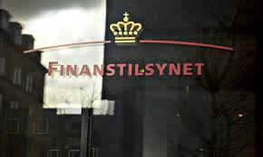
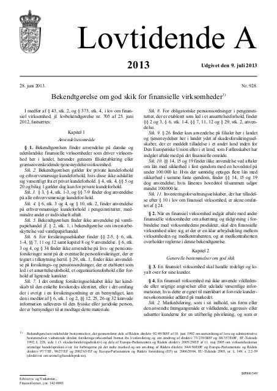
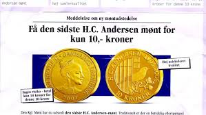
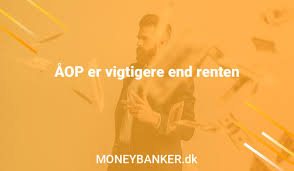
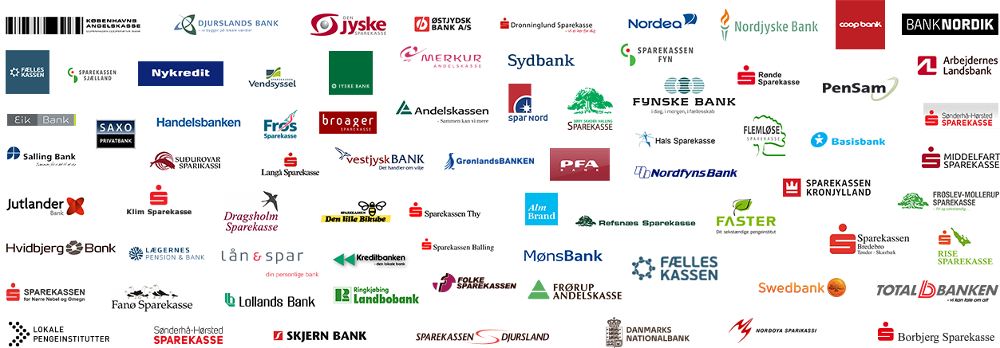
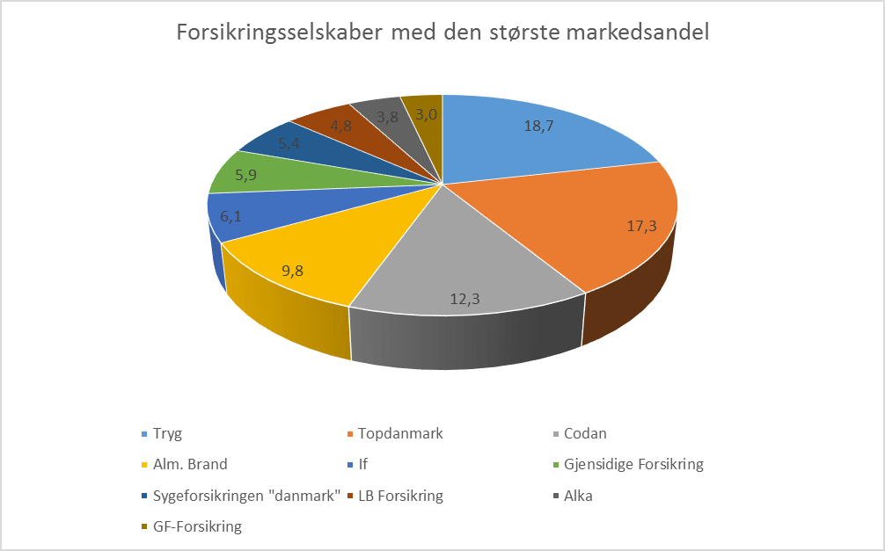
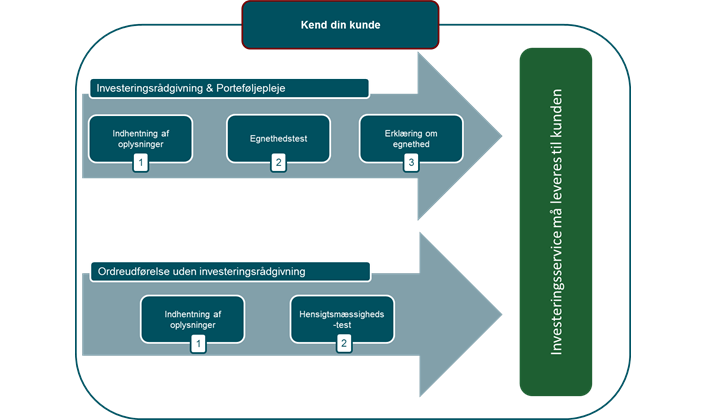
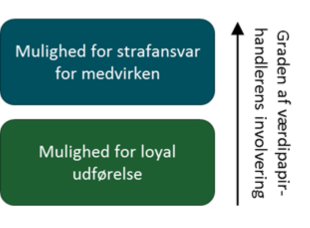

# <font color="red">God skik for den finansielle virksomhed og erstatningsansvaret<sup> Premium </font></sup>

```{r, echo=FALSE, results='asis'}
cat(readLines('npp.html'))
```
  

## <font color="red">God skik for finansielle virksomheder<sup> Premium </font></sup>


*Lov om finansiel virksomhed § 43*


Efter lovbestemmelsen i § 43 i lov om finansiel virksomhed^[Lovbekendtgørelse nr. 1140 af 26. september 2017 om finansiel virksomhed.] (FIL), så skal finansiel virksomhed drives i overensstemmelse med redelig forretningsskik og god praksis inden for virksomhedsområdet^[Følgende afsnit om god skik for finansielle virksomheder bygger på *Sonny Kristoffersen*: "Introduktion til forsikringsreglerne", 2019, Hans Reitzels Forslag.]. 



Finanstilsynet kan tage sager vedrørende overholdelsen af god skik og de udstedte bekendtgørelser for god skik for finansielle virksomheder op af egen drift. 

Finanstilsynet kan endvidere tage sager op efter anmodning fra Forbrugerombudsmanden. 


Finanstilsynet modtager tillige henvendelser direkte fra forbrugere, der imidlertid normalt henvises til bl.a. de private godkendte finansielle ankenævn (tvistløsningsorganger), såsom Det Finansielle Ankenævn og Forsikringsankenævnet, hvis klagen også vedrører civilretlige spørgsmål om erstatning eller tilbagebetaling af uretmæssigt opkrævede beløb. 

Erhvervsdrivende henvises til domstolene, da de ikke har selvstændig klageadgang til de private godkendte forbrugerklagesystem.^[Det skaber en retssikkerhedsmæssig processuel ubalance i klagesystemet mellem forbrugere og erhvervsdrivende, jf. nærmere *Sonny Kristoffersens* Ph.D. afhandling: Det offentligretlige forbrugerklagesystem i et retssikkerhedsmæssigt perspektiv, 2019, Samfundslitteratur.]   

Finanstilsynet træffer en traditionel forvaltningsretlig afgørelse med mulighed for administrativ rekurs, og Finanstilsynet har ikke en direkte søgsmålskompetence til domstolene. 

---

**Video: Rundvisning i Finanstilsynet**

<div class="video-container"><iframe src="https://www.youtube.com/embed/F0yv4eVfaxg" width="853" height="480" frameborder="0" allowfullscreen="allowfullscreen"></iframe></div>


---

Såfremt en sag om god skik har vidtrækkende eller principiel betydning, skal Finanstilsynet forelægge sagen for Tilsynets bestyrelse, jf. Lov om finansiel virksomhed § 345, stk. 7, nr. 4.  

Forbrugerombudsmanden er også tillagt beføjelser på området for god skik. Finanstilsynets og Forbrugerombudsmandens kompetence på området er reguleret i lov om finansiel virksomhed §§ 348 og 348 a.  

Om markedsføringslovens anvendelse på finansielle virksomheder og Forbrugerombudsmandens kompetence til at tage sager op af egen drift eller efter klage, se nærmere markedsføringslovens^[Jf. Lov nr. 426 af 3. maj 2017 om markedsføring.]  § 1, stk. 2. 

Forbrugerombudsmanden kan således håndhæve markedsføringslovens strafbelagte bestemmelser om vildledning og utilbørlig markedsføring, købsopfordringer samt markedsføring af kreditter. 

Markedsføringslovens bestemmelser i § 3 om god markedsføringsskik, i § 4 om god erhvervsskik, § 9 om former for handelspraksis og § 14 om oplysningsforpligtelser vedrørende priser mv. er ikke gældende for finansielle virksomheder, i det omfang, der af erhvervsministeren er udstedt særlige regler herom.

---

Se et forsikringsselskabs overtrædelse af markedsføringslovens § 10, stk. 4:

**Forsikringsselskab dømt for at ringe til forbrugere på Robinsonlisten**
31. juli 2019


Retten i Hjørring har idømt Forsikringsselskabet Vendsyssel A/S en bøde på 50.000 kroner for at have ringet til syv forbrugere, som alle stod registreret på Robinsonlisten.

Forsikringsselskabet Vendsyssel skal betale en bøde på 50.000 kroner for at have ringet til syv forbrugere, der stod registreret på Robinsonlisten.

Selvom forsikringsselskaber som udgangspunkt gerne må ringe til forbrugere og sælge forsikringer, gælder det ikke, hvis forbrugeren er registreret på Robinsonlisten.

Robinsonlisten er et register, hvor man kan frabede sig uanmodede henvendelser med markedsføring. Man kan tilmelde sig Robinsonlisten på borger.dk, som administreres af CPR-kontoret og opdateres hvert kvartal. Virksomheder skal tjekke Robinsonlisten, før de udsender reklamer med navn og adresse eller ringer forbrugere op.

I sagen havde syv forbrugere tilmeldt sig Robinsonlisten, og de havde ikke givet Forsikringsselskabet Vendsyssel særskilt samtykke til at ringe. Men det gjorde Forsikringsselskabet Vendsyssel alligevel, hvilket nu har resulteret i en bøde til selskabet, efter at Forbrugerombudsmanden gik ind i sagen.

Forbrugerombudsmand *Christina Toftegaard Nielsen*, siger:

”Når en forbruger tilmelder sig Robinsonlisten, ønsker han eller hun at blive fri for enhver form for telefonsalg. Det skal virksomhederne respektere.”

”Vi modtager mange klager over telefonsalg fra forbrugere, som er tilmeldt Robinsonlisten, men som alligevel bliver kontaktet, fordi virksomhederne ignorerer listen. Derfor er det et vigtigt signal, at retten har fastslået, at virksomhederne risikerer store bøder ved at ignorere Robinsonlisten.”

Markedsføringslovens § 10, STK. 4:

Efter markedsføringslovens § 10, stk. 4, må ingen erhvervsdrivende ringe til en bestemt fysisk person, fx en forbruger, der er tilmeldt Robinsonlisten, eller som har frabedt sig opkald fra virksomheden. Reglen gælder også for opkald til indehavere af enkeltmandsvirksomheder.

---

God skik-reglerne er såkaldte offentligretlige regler. 

En overtrædelse af reglerne om god skik indebærer således ikke uden videre, at den konkrete aftale mellem finansiel virksomhed og kunden er ugyldig eller uvirksom. 

Manglende overholdelse vil dog kunne have en afsmittende virkning på visse civilretlige forhold, jf. fx. i forhold til aftalelovens §§ 38c, jf. 36. 

Disse spørgsmål afgøres af de private finansielle ankenævn, og i den sidste ende af domstolene.


---

### <font color="red">Bekendtgørelse om god skik for finansielle virksomheder<sup> Premium </font></sup>


Af Bekendtgørelsen om god skik for finansielle virksomheder følger følgende regler for god skik for finansielle virksomheder (herefter; godskik-bekendtgørelsen):^[I medfør af § 43, stk. 2, og § 373, stk. 4, i lov om finansiel virksomhed, jf. Lovbekendtgørelse nr. 1140 af 26. september 2017, er fastsat: Bekendtgørelse nr. 330 af 7. april 2016 om god skik for finansielle virksomheder.]   

---

### <font color="red">Den finansielle virksomhed skal handle redeligt og loyalt og ikke vildlede kunderne<sup> Premium </font></sup> 




Efter godskik-bekendtgørelsens §§ 3-4 skal en finansiel virksomhed *handle redeligt og loyalt* over for sine kunder. 

En finansiel virksomhed, som et forsikringsselskab, må ikke anvende vildledende eller urigtige angivelser eller udelade væsentlige informationer, hvis dette er egnet til mærkbart at forvride kundernes økonomiske adfærd på markedet.   

Markedsføring, som i sit indhold, sin form eller den anvendte fremgangsmåde er vildledende, aggressiv eller udsætter kunderne for en utilbørlig påvirkning, og som er egnet til mærkbart at forvride deres økonomiske adfærd, er ikke tilladt. 


---


---

Rigtigheden af angivelser om faktiske forhold skal kunne dokumenteres. 

De former for adfærd, der er opregnet i godskik-bekendtgørelsens bilag 1, anses under alle omstændigheder for at være urimelige i private kundeforhold, og er ikke tilladt.  

*Ex. på følgewnde former for vildlendende markedsføring (ikke en udtømmende liste):*  

1) Den finansielle virksomhed hævder at have underskrevet en adfærdskodeks, selv om det ikke er tilfældet.

2) Den finansielle virksomhed fremviser kvalitetscertificering, kvalitetsmærke eller tilsvarende uden at have opnået den nødvendige tilladelse.

3) Den finansielle virksomhed hævder, at en adfærdskodeks er godkendt af en offentlig myndighed eller anden myndighed, selv om det ikke er tilfældet.

4) Den finansielle virksomhed hævder, at en erhvervsdrivende (herunder dennes handelspraksis) eller et produkt er blevet godkendt eller tilladt af en offentlig eller privat instans, selv om det ikke er tilfældet, eller fremsætter en sådan påstand uden at opfylde betingelserne for godkendelse eller tilladelse.

5) Det angives i modstrid med sandheden, at produktet kun vil være tilgængeligt i meget begrænset tid, eller at det kun vil være tilgængeligt på visse betingelser i meget begrænset tid, for at fremkalde en umiddelbar afgørelse og fratage kunderne tilstrækkelig mulighed for eller tid til at træffe en informeret beslutning.

6) et angives, eller der gives på anden måde indtryk af, at et produkt kan sælges lovligt, selv om dette ikke er tilfældet.

7) Rettigheder, som kunden har efter loven, fremstilles som et særligt kendetegn ved den finansielle virksomheds tilbud.

8) Der promoveres et produkt, der ligner et andet produkt fremstillet af en bestemt producent, på en sådan måde, at kunden med overlæg forledes til at tro, at produktet er fremstillet af samme producent, uden at dette er tilfældet.

9) Etablering, drift eller promovering af en salgsfremmende pyramideordning, hvor forbrugeren erlægger et vederlag og til gengæld stilles kompensation i udsigt, som hovedsageligt er afhængig af, om han har introduceret andre for ordningen og i mindre grad af salg eller forbrug af produkter, medmindre forholdet er omfattet af § 5 a i lov om offentlige indsamlinger og pyramidespil.

10) Det hævdes, at lukning af den finansielle virksomhed eller flytning til andre lokaler er forestående, selv om det ikke er tilfældet.

11) Det hævdes, at produkter kan gøre det lettere at vinde i hasardspil.

12) Der gives faktuelt ukorrekte oplysninger om markedsvilkår eller om muligheden for at finde produktet med henblik på at få forbrugeren til at erhverve produktet på ringere vilkår end de  normale markedsvilkår.

13)	Det hævdes som led i handelspraksis, at der afholdes en konkurrence eller et salgsfremstød med præmier, men uden de omtalte præmier eller andre rimeligt tilsvarende uddeles.

14)	Et produkt omtales som »gratis«, »vederlagsfrit«, »uden betaling« eller lignende, selv om kunden skal betale andet end de uundgåelige udgifter, der er forbundet med at reagere på den pågældende handelspraksis, samt afhentning eller betaling for levering af produktet.

15)	I markedsføringsmaterialet indgår en faktura eller et lignende dokument, der opfordrer til betaling, og som giver kunden indtryk af, at han allerede har bestilt det produkt, der markedsføres, selv om det ikke er tilfældet.

16)	En repræsentant for den finansielle virksomhed, i modstrid med sandheden, hævder eller giver indtryk af, at han ikke handler som led i sit erhverv eller han, i modstrid med sandheden, udgiver sig for at være kunde. 

---


*Aggressiv markedsføring*

17)	Kunden bringes til at tro, at han ikke kan forlade lokalerne, før en kontrakt er indgået.

18)	Der aflægges personlige besøg, der ikke er omfattet af forbuddet i forbrugeraftalelovens § 4, på kundens bopæl, uden at kundens ønske om, at en repræsentant for den finansielle virksomhed skal forlade stedet eller blive væk, respekteres, idet der dog gælder en undtagelse for besøg med henblik på at håndhæve en kontraktlig forpligtelse under omstændigheder og i et omfang, der er berettiget i henhold til lovgivningen.

19)	Der foretages vedholdende og uønskede henvendelser pr. telefon, der ikke er omfattet af forbuddet i forbrugeraftalelovens § 4, eller pr. telefax, e-mail eller andre fjernkommunikationsmedier, idet der dog gælder en undtagelse for henvendelser med henblik på at håndhæve en kontraktlig forpligtelse under omstændigheder og i et omfang, der er berettiget i henhold til national lovgivning.

20)	Den finansielle virksomhed kræver, at en kunde, som ønsker at anmelde en fordring i henhold til en forsikringspolice, skal fremlægge dokumenter, som ikke med rimelighed kan anses for at være relevante i forhold til fordringens gyldighed, eller den systematisk undlader at svare på korrespondance vedrørende sagen, i den hensigt at afholde kunden fra at udøve sine kontraktlige rettigheder.

21)	Der skabes det fejlagtige indtryk, at kunden allerede har vundet, vil vinde eller ved udførelse af en bestemt handling vil vinde en præmie eller et andet tilsvarende gode, selv om faktum er, at der enten

a) ikke findes nogen præmie eller et andet tilsvarende gode, eller

b) at den handling, som skal udføres for at indløse præmien eller et andet tilsvarende gode indebærer, at kunden skal betale et pengebeløb eller på anden måde påtage sig udgifter”.



---

Ved en opfordring til køb rettet mod private kunder skal en finansiel virksomhed efter godskik-bekendtgørelsens § 5 give følgende oplysninger, medmindre de allerede fremgår tydeligt af sammenhængen:

1.	Produktets væsentligste karakteristika. 

2.	Den finansielle virksomheds navn og adresse.

3.	Forhold vedrørende betaling og gennemførelse af aftalen, i det omfang disse forhold afviger fra, hvad der er sædvanligt i branchen.

4.	Den finansielle virksomheds fremgangsmåde i forbindelse med klagesagsbehandling, i det omfang den afviger fra, hvad der er sædvanligt i branchen.

5.	Fortrydelsesret, hvis kunden har en sådan ret.

6.	Prisen inklusive afgifter.  

---

Medfører produktets art, at prisen ikke med rimelighed kan beregnes på forhånd, angives den måde, hvorpå prisen beregnes. 

Ved en opfordring til køb forstås en kommerciel kommunikation, hvori produktets karakteristika og pris er angivet på en måde, som er passende i forhold til det anvendte kommercielle kommunikationsmiddel, og hvorved kunden sættes i stand til at foretage et køb.  

En finansiel virksomhed skal indgå eller bekræfte alle væsentlige aftaler med sine kunder i papirformat eller på andet varigt medium, jf. godskik-bekendtgørelsens § 6. 

En aftale skal indeholde en beskrivelse af parternes væsentlige rettigheder og pligter samt af de finansielle ydelser, der er omfattet af aftalen. 

Er der i forbindelse med aftalens indgåelse ydet individuel rådgivning, skal væsentlige forudsætninger for rådgivningen nedfældes i aftalen eller fremgå af bilag til aftalen i enten papirformat eller på andet varigt medium.  

Vilkår, der indgår i aftalen, kan fremgå ved en henvisning til separate dokumenter, herunder den finansielle virksomheds almindelige forretningsbetingelser.   

Vilkår om ændringer i løbende kundeforhold af renter, gebyrer, eller andet vederlag skal være klart fremhævet i aftalen og skal indeholde en angivelse af de forhold, der kan udløse en ændring, og må ikke give den finansielle virksomhed en vilkårlig adgang til at foretage ændringer.  

---

I løbende kundeforhold kan ændringer til ugunst for kunden af renter, gebyrer, eller andet vederlag ikke finde sted uden et forudgående varsel, der ikke må være kortere end en måned, og som indeholder en begrundelse for ændringen. 1. pkt. gælder dog ikke ændringer, der er begrundet i udefrakommende forhold, som den finansielle virksomhed ikke har indflydelse på. 

Ved væsentlige ændringer i andet vederlag eller ved opkrævning af et nyt vederlag, skal varslingen ske til kunden ved individuel kommunikation, inden ændringen får virkning. 

Såfremt kunden har ret til at opsige aftalen, skal dette fremgå af varslingen samt under hvilke betingelser, kunden kan opsige aftalen. 

Denne bestemmelse finder ikke anvendelse for varsling af ændringer i skades- og livsforsikringsprodukter.  

Opsiger en finansiel virksomhed en aftale indgået med en kunde, skal opsigelsen være sagligt begrundet og ske i papirformat eller på andet varigt medium.  

---

### <font color="red">Rådgivning og markedsføring rettet mod børn og unge<sup> Premium </font></sup>


Markedsføring og rådgivning rettet mod børn og unge skal være udformet med særlig hensyntagen til børn og unges manglende erfaring og kritiske sans, som bevirker, at de er lette at påvirke og nemme at præge, jf. godskik-bekendtgørelsens § 7.

---

### <font color="red">Rådgivning<sup> Premium </font></sup>


Ved rådgivning forstås anbefalinger, vejledninger, herunder oplysninger om risici forbundet med en disposition, og oplysninger om umiddelbare konsekvenser af kundens valgmuligheder, jf. godskik-bekendtgørelsens § 8.  

En finansiel virksomhed skal yde rådgivning, hvis kunden anmoder herom. 

Endvidere skal virksomheden af egen drift yde rådgivning, hvor omstændighederne tilsiger, at der er behov herfor.  

Rådgivningen skal tilgodese kundens interesser og give kunden et godt grundlag for at træffe sin beslutning. 

Rådgivningen skal være relevant, retvisende og fyldestgørende. 

Den finansielle virksomhed skal orientere om de risici, der er relevante for kunden.  

En finansiel virksomhed, der yder rådgivning, skal oplyse kunden om, at rådgivningen ikke er uafhængig, og at rådgivningen kun omfatter de produkter, som den finansielle virksomhed udbyder. 

Dette gælder dog ikke, hvis den finansielle virksomhed kan dokumentere, at rådgivningen er uafhængig.  

En finansiel virksomhed kan udbyde produkter med standardiseret information med lille eller ingen tilknyttet individuel rådgivning. 

I så fald skal den finansielle virksomhed gøre særskilt opmærksom på dette. Bestemmelsen gælder ikke for lån med sikkerhed i fast ejendom.  


---

Før en finansiel virksomhed rådgiver, skal virksomheden anmode kunden om at oplyse om sin økonomiske situation, sin erfaring med de relevante finansielle ydelser, sit formål med at få ydelsen leveret samt om sin risikovillighed, jf. godskik-bekendtgørelsens § 9. 

Omfanget og karakteren af de oplysninger, der indhentes, kan afpasses efter den viden, som kunden besidder og de oplysninger, som den finansielle virksomhed allerede har modtaget. 

Den finansielle virksomhed kan lægge kundens oplysninger til grund, medmindre de er åbenbart urigtige.  

---


Rådgivning skal tage udgangspunkt i relevante oplysninger indhentet i henhold til bekendtgørelsens § 9 og det kendskab, den finansielle virksomhed i øvrigt har til kundens forhold, jf. godskikbekendtgørelsens § 10.  

En finansiel virksomhed skal anmode kunden om at opdatere oplysninger indhentet i henhold til godskik-bekendtgørelsens § 9, i det omfang det er nødvendigt for at kunne yde kunden rådgivning i løbende kundeforhold.  

En finansiel virksomhed skal give tilstrækkelig information om egne produkter og ydelser, herunder om forskelle i priser og vilkår for alternative produkter, der kan dække kundens behov. 

---



For lån skal der oplyses om de årlige omkostninger i procent (ÅOP) på rådgivningstidspunktet, jf. godskik-bekendtgørelsens § 11. 

(Årlige omkostninger i procent (ÅOP) viser de samlede årlige udgifter ved et lån i forhold til det lånte beløb. 

Alle udgifter i forbindelse med lånet regnes med - oprettelsesomkostninger, rente og løbende omkostninger. ÅOP skal oplyses, hver gang du får et lån eller en kredit.)

Hvis der mellem kunderne for en given ydelse er generelle forskelle i fastsættelsen af renter, bidrag eller andet vederlag til den finansielle virksomhed, skal den finansielle virksomhed oplyse en kunde herom, forinden der indgås aftale om levering af ydelsen. 

På forespørgsel fra kunden skal der oplyses om hvilke forhold hos kunden, der kan være bestemmende for dennes indplacering inden for den givne prisdifferentiering.  

En finansiel virksomhed skal på grundlag af sit generelle markedskendskab informere kunden om relevante produkttyper på markedet. 

Informationen skal dog ikke indeholde oplysninger om konkurrerende produkter eller konkrete priser.

---


Har den finansielle virksomhed eller dens medarbejder/rådgiver i rådgivningssituationen en særlig interesse i rådgivningens resultat ud over den almindelige indtjening, skal virksomheden inden rådgivningen informere kunden om arten og omfanget af den særlige interesse, jf. godskik-bekendtgørelsens § 12.  

Modtager den finansielle virksomhed provision eller andet vederlag som følge af formidlingen af produkter eller ydelser, skal kunden gøres opmærksom herpå. 

Det samme gælder, hvis den ekspederende medarbejder/rådgiver modtager provision eller andet vederlag, og der er en direkte sammenhæng mellem konkrete salg af ydelser eller produkter og vedkommendes aflønning.  

En finansiel virksomhed skal som led i sin rådgivning oplyse om konsekvenser af de skatteregler, som er relevante for kunden i forhold til de produkter og ydelser, som rådgivningen omfatter. 

---

Hvis den finansielle virksomhed er eller bliver opmærksom på andre skatteretlige spørgsmål, skal den finansielle virksomhed henvise kunden til anden rådgivning herom, såfremt den ikke rådgiver om disse spørgsmål, jf. godskik-bekendtgørelsens § 13.  

Hvis en finansiel virksomhed rådgiver om forhold, som kan være af væsentlig økonomisk betydning for kundens muligheder for at modtage offentlige tilskud eller andre økonomiske fordele, og den finansielle virksomhed er eller burde være opmærksom herpå, skal dette medtages i rådgivningen, eller kunden skal henvises til anden rådgivning.  

Hvis et forsikringsselskab ikke har kendskab til den enkelte kundes identitet, eller hvor der i en forsikringsordning er en bemyndiget, kan de krævede oplysninger udleveres til den fysiske eller juridiske person, der er bemyndiget til at modtage dette materiale.  

En finansiel virksomhed skal oplyse en kunde om de sikkerhedsforanstaltninger, der bør iagttages ved et givent produkt eller ydelse, herunder hvilke sikkerhedsmæssige krav kunden skal efterleve, og hvilket ansvar kunden kan ifalde ved tredjemands misbrug, jf. godskik-bekendtgørelsens § 14.  

---

## <font color="red">Særlige god skik regler for pengeinstitutterne<sup> Premium </font></sup>





I godskik-bekendtgørelsens kapitel 5 er fastsat nærmere særlige regler for pengeinstitutter om god skik:  

Efter godskik-bekendtgørelsens § 15 kan et pengeinstitut ikke uden en individuel og saglig begrundelse nægte at oprette en basal indlånskonto til en privatkunde. 

Begrundelsen skal på anmodning gives i papirformat eller på andet varigt medium.

---


En basal indlånskonto skal som minimum omfatte følgende funktioner:  

*	Mulighed for at indsætte og hæve kontanter.

*	Mulighed for at gennemføre betalingstransaktioner med et debetkort med saldokontrol.

*	Mulighed for indgående kredittransaktioner.

---

Hvis indsættelse og hævning af kontanter, gennemføres ved personlig henvendelse i pengeinstituttets forretningslokale kan instituttet begrænse antallet af ekspeditioner til én om ugen.  

Pengeinstitutter skal tilbyde en basal indlånskonto vederlagsfrit eller mod et gebyr, der højest må udgøre 180 kr. om året, uanset antallet af transaktioner på kontoen. 

Gebyret reguleres én gang årligt pr. 10. januar efter udviklingen i Danmarks Statistiks nettoprisindeks. Beløbet afrundes til nærmeste hele kronebeløb. Første regulering finder sted med virkning fra den 1. februar 2016.

---

Et pengeinstitut må ikke knytte et progressivt fordelsprogram til besiddelse af aktier i pengeinstituttet, indskud af garantkapital eller indskud af andelskapital, jf. god skik-bekendtgørelsens § 16.  

Såfremt besiddelse af aktier, indskud af garantkapital eller indskud af andelskapital gøres til et krav for at opnå kundefordele, må pengeinstituttet maksimalt stille krav om en aktiebesiddelse med en kursværdi på 30.000 kr. eller et indskud af garantkapital på 30.000 kr. på tidspunktet for kundens indtræden i fordelsprogrammet.  

---

### <font color="red">Finanstilsynets fortolkning af begrebet god skik i forhold til pengeinstitutter<sup> Premium </font></sup>


*Finanstilsynet har truffet bl.a. følgende afgørelser om god skik i forhold til pengeinstitutterne:*


**Afgørelse af 24. april 2003:** Et pengeinstituts markedsføring var i strid med god skik, jf. markedsføringslovens § 3. Pengeinstituttet havde markedsført et obligationsbaseret investeringsprodukt ved indrykning af annoncer i forskellige aviser. I annoncen brugtes bl.a. udtryk som »garanti mod kurstab«, »investering uden risiko« og »fuld mulighed for gevinst«.  

---

**Afgørelse af 30. september 2003:** En praksis, hvorefter et pengeinstituts kunder som udgangspunkt kun kan få udbetalt 10.000 kr. kontant pr. ekspedition, var ikke i strid med god skik. Afgørelsen lagde vægt på, at der var foretaget tilstrækkelig information af kunderne, forinden ændringen blev gennemført.  

---

**Afgørelse af 28. april 2004:** Pengeinstituts markedsføring af lån med tilknyttet obligatorisk gruppelivsforsikring blev fundet i strid med reglerne om god skik, når instituttet ikke gjorde kunden tydeligt opmærksom på, dels at forsikringen ikke ved død blev udbetalt til nærmeste pårørende, dels at der var begrænsninger i dækningsomfanget, og endvidere ikke havde oplyst kunden om muligheder for rådgivning.  

---

**Afgørelse af 24. juni 2004:** Tilsynet påbød et pengeinstitut at ophæve eller ændre en ansvarsfraskrivelsesklausul vedrørende rådgivning i instituttets handelsaftaler, idet klausulerne fandtes at stride mod reglerne om god skik. 

---

**Afgørelse af 25. februar 2005:** En banks fremsendelse af en e-mail til kunderne med besked om, at kunden kunne hente den årlige engagementsoversigt på bankens internetbaserede handelsplatform, var ikke i strid med god skik. Afgørelsen lagde bl.a. vægt på, at banken i en e-mail underrettede kunderne om, at engagementsoversigten var tilgængelig på handelsplatformen, og at banken samtidig tilbød kunderne at få tilsendt en fysisk version af oversigten, hvis kunden måtte ønske det.  

---

**Afgørelse af 27. maj 2005:** Et pengeinstituts vilkår om uvarslede ændringer af renter og gebyrer var ikke i strid med reglerne om god skik. Afgørelsen lagde vægt på, at de uvarslede ændringer af renter og gebyrer til ugunst for kunderne skyldes udefrakommende omstændigheder, som lå uden for pengeinstituttets kontrol.  

---

**Afgørelse af 19. oktober 2006:** Det var i strid med § 3 i bekendtgørelse om god skik, at en bank stillede krav om, at kunder skulle give samtykke til at modtage markedsføring fra banken som betingelse for at indgå en aftale om et finansielt produkt.  

---

**Afgørelse af 19. september 2008:** I strid med god skik, at den tidligere bank efter overførslen af en NemKonto til en anden bank ændrede NemKontoen tilbage uden kundens samtykke. Se også Finanstilsynets afgørelse af 13. juni 2012.  

---

**Afgørelse af 1. april 2009:** Bank skulle i markedsføringsmateriale ophøre med at reklamere med en vis høj indlånsrente på en konto, når denne indlånsrente først gjaldt efter et vist højt minimumsindskud. Henvisning til bankens hjemmeside hvoraf de nærmere oplysninger om renteberegningen fremgik, var ikke tilstrækkeligt til at opfylde god skik (forbuddet mod vildledende eller urigtige angivelser eller undlade væsentlige informationer).  

---

**Afgørelse af 1. april 2009:** Bank skulle i markedsføringsmateriale ophøre med at reklamere med hævefrihed på en konto, hvis det kun var muligt at hæve et vist antal gange om året.  

---

**Afgørelse af 27. februar 2009:** Mangelfuld markedsføring af kreditkort. I markedsføringsmateriale havde banken skrevet, at den gerne ville forsøde kundernes juletid med lidt ekstra, og at kunderne derfor kunne få tilsendt en check på op til 15.000 kr. dog højst det beløb, kunderne havde på deres kreditkortkonto. Det fremgik ikke af brevet, at beløbet blev hævet på kundens konto, og at der derfor alene var tale om, at kunderne kunne spare et gebyr ved brug af kortet.  

---

**Erhvervsankenævnets kendelse af 19. marts 2010:** Bank påbudt at undlade at ændre principperne for rentefastsættelsen på et lån, hvor det fremgår af låneaftalen, at renten varierer med en referencerentesats, som banken ikke selv har indflydelse på, samt et eventuelt rentetillæg. I et sådant tilfælde kan principperne for rentefastsættelsen kun ændres, hvis banken i selve låneaftalen har taget et udtrykkeligt forbehold for at kunne ændre rentefastsættelsen. En generel henvisning til bankens almindelige forretningsbetingelser kan ikke udgøre et udtrykkeligt forbehold om at kunne ændre principperne for, hvorledes renten fastsættes. 

---

**Afgørelse af 19. januar 2012:** Bank fandtes i sin markedsføring af et højrenteprodukt ved ikke at oplyse om, at højrentekontoen var forbundet med en større produktpakke, som kunden skulle aftage, at have handlet i strid med § 4, stk. 1, i bkg 2011 769 om god skik, hvorefter en finansiel virksomhed ikke må udelade væsentlige informationer, hvis dette er egnet til mærkbart at forvride kundens økonomiske adfærd på markedet.  

---

**Afgørelse af 23. november 2012:** I strid med (dagældende) § 3 i bkg 2011 769 om god skik at anføre i bankens generelle vilkår, at kunden er ansvarlig for overholdelse af de til enhver tid gældende regler om anbringelse af midler. 

---

**Afgørelse af 5. august 2013:** I strid med (dagældende) § 3 i bkg 2013 928 om god skik ikke at oplyse om, at der lægges et tillæg på 0,4 % til den kurs, der oplyses i bankens »mobilbank valutaberegner«.  

---

**Afgørelse af 10. februar 2015:** Påbud til bank efter (dagældende) god skik bekendtgørelsens § 35, stk. 1, jf. § 3, om ikke at kræve indsendelse af økonomioplysninger for lån, der er optaget inden 2012-09-01, med hjemmel i forretningsbetingelsernes pkt. 11, litra f, medmindre det allerede følger af aftalegrundlaget med den enkelte kunde, at sådanne oplysninger kan indhentes.

---

**Afgørelse af 27. oktober 2016:** Påtale til pengeinstitut for i strid med reglerne om kombinationssalg i § 24, stk. 2, i den dagældende bekendtgørelse om god skik for boligkredit i en periode at have stillet krav om, at kunden etablerede et helkundeforhold med banken som betingelse for at yde et prioritetslån. Finanstilsynet har over tid forholdt sig til spørgsmålet om afvisning af adgang til en basal indlånskonto, herunder i forhold til kunder registreret i RKI, kunder med anden betalingskonto og kunder, der ikke har fast adresse eller dansk cpr-nummer. En række af disse forhold er nu reguleret i lov om betalingskonti, L 2016 375, som i kapitel 4 indeholder generelle bestemmelser om adgang til en basal betalingskonto, medmindre det vil føre til overtrædelse af hvidvaskreglerne, eller forbrugeren har udøvet strafbare handlinger mod pengeinstituttet, eller forbrugeren har optrådt anstødeligt eller til gene for bankens øvrige kunder eller ansatte. Lov om betalingskonti suppleres af kravet i god skik- bekendtgørelsen (bkg 2018 1581). Lov om betalingskonti indeholder i øvrigt i § 13 vilkårene for, at en rammeaftale for en basal indlånskonto kan opsiges, herunder hvis forbrugeren ikke længere har lovligt ophold i et land inden for EU eller et land, som Unionen har ondgået aftale med på det finansielle område.  

---

**Afgørelse af 30. januar 2017:** Finanstilsynet påtalte, at en bank i en periode havde handlet i strid med § 24, stk. 2, i bekendtgørelse om god skik for boligkredit ved at have stillet krav om, at kunden etablerede et helkundeforhold med banken som betingelse for at yde et prioritetslån.  

---

**Afgørelse af 10. oktober 2017:** Finanstilsynet vurderede, at en banks aftalegrundlag for lån med referencerente ikke var i overensstemmelse med reglerne i god skik-bekendtgørelsens § 6, stk. 1, og påbød på den baggrund banken at sikre, at aftalegrundlaget for lån med referencerente indeholder fyldestgørende rentevilkår, at betingelserne for lånet har en retvisende ikrafttrædelsesdato, samt at kunden oplyses om lånets referencerente og rentetillæg i låneaftalen.  

---

**Afgørelse af 18. december 2017:** Påtale af, at pengeinstitut havde handlet i strid med § 3 i bekendtgørelse nr. 330 af 7. april 2016 om god skik for finansielle virksomheder, ved ikke at foretage kreditværdighedsvurderinger af forbrugere forud for fremsendelse af forhåndsgodkendte og uopfordrede lånetilbud.  

---


**Afgørelse af 20. juni 2019:** Kunder får bevilget lån de ikke kan betale tilbage
To banker med speciale i hurtige forbrugslån fik  påbud om at foretage en ordentlig vurdering af, om kunderne kan betale tilbage, inden de får bevilget et lån. Påbuddene til Ekspres Bank og Basisbank kommer på baggrund af en større undersøgelse af temaet, som Finanstilsynet offentliggjorde tidligere i år. De to banker skulle senest til september dokumentere, at der for hver enkelt kunde sker en realistisk vurdering af, om kunden kan betale afdragene, og det vel at mærke inden, banken bevilger lånet.

Finanstilsynet havde afdækket, at begge banker havde ydet lån på op til 75.000 kr. uden at beregne kundernes rådighedsbeløb, selv om banker som hovedregel netop skal gøre dette.
Undersøgelsen viste også, at bankerne, når de faktisk beregnede rådighedsbeløb, systematisk lagde lave rådighedsbeløb til grund. Rådighedsbeløbene var på 3.000 kr. måned pr. voksen og 1.500 kr. pr. måned for børn.

---


## <font color="red">Særlige god skik regler for investeringsforvaltningsselskaber<sup> Premium </font></sup>


Et investeringsforvaltningsselskab skal på kundens anmodning give supplerende oplysninger om den aktuelle status vedrørende de forhold, der er omfattet af § 6, nr. 3, 8-10 og 12, i bekendtgørelse om oplysninger i prospekter for danske UCITS.

Investeringsforvaltningsselskabet skal endvidere give oplysninger om den seneste udvikling for risici og afkast for de vigtigste kategorier af instrumenter, hvis kunden anmoder herom, jf. godskik-bekendtgørelsens § 17.  

---

### <font color="red">Principielle god skik afgørelser på hele det finansielle område<sup> Premium </font></sup>


*Finanstilsynet har truffet følgende retningsgivne afgørelser uden for området for pengeinstitutter:*  

**Afgørelse af 27. november 2006:** Et fondsmæglerselskab handlede i strid med redelig forretningsskik og god praksis, da selskabet udsendte markedsføringsmateriale om salg af svenske præmieobligationer, som efter en samlet vurdering måtte betegnes som uigennemskueligt og egnet til at bibringe forbrugere en fejlagtig opfattelse af, at de er særligt udvalgt til at vinde en milliongevinst.  

---

**Afgørelse af 7. januar 2005:** Markedsføringen af en hedgeforening var i strid med reglerne om god skik, idet oplysning i salgsbrochuren om, at investorerne når som helst kunne gå ind og ud af foreningen, var urigtig og vildledende. 

---

**Afgørelse af 1. april 2004:** Ikke i strid med reglerne om god skik, at et fondsmæglerselskab lader kunderne indgå en aftale om, at tvister skal afgøres ved voldgift, såfremt kunden får oplysninger om, at en eventuel klage kan indbringes for Klagenævnet for Fondsmæglerselskaber.  

---

**Afgørelse af 4. oktober 2004:** Det var i strid med § 9, stk. 2, i bkg 2004 1046 kun at oplyse om medarbejdernes provision m.v. på den finansielle virksomheds hjemmeside, idet virksomheden ikke hermed sikrede, at alle kunder fik den efter bestemmelsen krævede information.  

---

**Afgørelse af 4. april 2006:** Det var i strid med god skik, dels at et realkreditinstitut uden kundernes accept refinansierede et lån til en anden type end oprindelig aftalt, dels at realkreditinstituttet tilsidesatte den aftalte pligt til at forestå refinansiering til samme låntype.  

---

**Afgørelse af 15. september 2008:** Vilkår i almindelige forretningsbetingelser, hvorefter gebyrsatser kan ændres, såfremt markedsmæssige forhold tilsiger det, ikke i overensstemmelse med § 6, stk. 3, i god skik-bekendtgørelsen. Det følger heraf, at vilkår om ændringer skal indeholde en angivelse af de forhold, der kan udløse en ændring og ikke må give den finansielle virksomhed en vilkårlig adgang til at foretage ændringer.  

---

**Afgørelse af 9. oktober 2008:** I strid med god skik at rette uanmodet henvendelse til aktionærer.  

---

**Afgørelse af 26. februar 2009:** Medlemmer af pensionskasse ikke oplyst på redelig og loyal måde når informationsmateriale om overgang til ny pensionsordning ikke oplyser om, at forudsætningen for at give en tillægspension på 4,25 pct. beror på, at egenkapitalen kan give disse udlodninger, og at fremtidige bestyrelser beslutter at gøre dette.  

---

**Afgørelse af 29. november 2010:** Der var ikke tilstrækkeligt grundlag for at fastslå, at en pensionskasse havde handlet i strid med § 3 i god skik-bekendtgørelsen ved at afskaffe ydelsesgarantien ved en aftale med aftaleparterne i stedet for at give den enkelte kunde mulighed for at træffe dette valg som led i et omvalg. Samme i afgørelse den 23. august 2011. 

---

**Afgørelse af 19. maj 2011:** I strid med god skik at kræve samtykke fra kunden til at modtage markedsføringsmateriale som betingelse for at indgå en aftale - her fuld adgang til sit pensionsprodukt.  

---

**Afgørelse af 21. maj 2013:** I strid med § 3 i bkg 2012 1406 om god skik at udsende breve med anbefalinger, som modtageren kan opfatte som værende baseret på en konkret individuel vurdering af dennes forhold, hvis der reelt er tale om standardbreve.  

---

**Afgørelse af 22. maj 2013:** I strid med § 3 i den dagældende god skik-bekendtgørelse, at pensionsforsikringsselskab i et brev, hvori kunderne blev opfordret til at flytte til et andet pensionsforsikringsselskab, ikke angav, at flytningen ville betyde en overgang fra et garanteret gennemsnitsrentemiljø til et ugaranteret markedsrentemiljø.  

---

**Afgørelse af 19. august 2013:** I strid med § 43 og § 3 i bkg 2013 928 om god skik at anvende bindinger i forbindelse med tilbud om omvalg fra pensionsordninger med rentegarantier til markedsrenteprodukter. Afgørelsen har været forelagt Det Finansielle Råd.  

---

**Afgørelse af 16. september 2013:** I strid med § 3 i bkg 2013 928 om god skik at afkræve kunderne deres vurdering af, om den rådgivning, som vedkommende havde modtaget, havde været tilstrækkelig. I den konkrete sag indeholdt en sparekasses kvittering for tegning af garantkapital, som kunden underskrev, en standarderklæring, hvor kunden bekræftede at være rådgivet om de karakteristika, der knyttede sig til garantbeviser, og om de risici der var forbundet med placering af midler i garantkapital.  

---

**Finanstilsynets bestyrelses afgørelse af 19. maj 2015:** Finanstilsynet fandt ikke, at pensionskasse i forbindelse med fusion med en anden pensionskasse ville handle i strid med § 3 i den dagældende bekendtgørelse om god skik for finansielle virksomheder (bkg 2015 1094), hvis pensionskassen på en generalforsamling besluttede, at pensionskassens gennemsnitsrentekunder med betingede garantier uden individuelt omvalg ved en fusion overgik til et markedsrenteprodukt, idet Finanstilsynet vurderede, at beslutningen var sagligt begrundet ud fra hensynet til medlemmerne og ikke er til ugunst for nogen medlemsgrupper.  

---

**Afgørelse af 27. juni 2016:** Efter modtagelse af en række klager fra forbrugere over en bidragsforhøjelse gennemgik Finanstilsynet instituttets aftalegrundlag og fandt, at vilkårene heri for ændring af bidrag, gebyrer og andet vederlag ikke indeholdt vilkårlig ændringsadgang, jf. § 7, stk. 3, i god skik-bekendtgørelsen. Finanstilsynet fandt endvidere, at beskrivelsen af muligheden for at ændre bidraget i selve låneaftalen opfyldte kravet om, at vilkår om ændringer af bl.a. bidrag skal være klart fremhævet i låneaftalen, jf. § 7, stk. 3. For så vidt angik spørgsmålet om begrundelseskravet i § 7, stk. 4, tog Finanstilsynet instituttets redegørelser til efterretning og fandt ikke anledning til at foretage sig yderligere i anledning af bidragsforhøjelsen.  

---

**Afgørelse af 17. oktober 2016:** Påbud til pensionskasse om i medfør af § 29 i bekendtgørelse om god skik for finansielle virksomheder at tilrette selskabets informations- og markedsføringsmateriale om KundeKapital, så materialet giver en afbalanceret beskrivelse af fordele og ulemper ved KundeKapital, og ikke er egnet til at vildlede og påvirke kundernes adfærd på markedet i strid med bestemmelsen i bekendtgørelse om god skik for finansielle virksomheder § 4, stk. 1. 

---

**Afgørelse af 28. maj 2018:** Påbud til pensionskasse om 1) at efterleve §§ 3 og 4 i bekendtgørelse om god skik for finansielle virksomheder ved at tilrette sit medlemsmateriale, herunder prognoser, pensionsoversigter, hjemmeside, årsoversigter mv., så det tydeligt fremgår, at pensionskassen har en strategi om, at udbetalingsprofilerne i de enkelte investeringsprofiler skal være faldende eller stigende, herunder så det gøres klart for medlemmerne, hvad en faldende pensionsydelse konkret betyder, 2) at tilrette sit medlemsmateriale specifikt om invalideydelserne, således at både raske og invalidepensionister får oplyst, at invalideydelsen ændrer sig, når levetidsforudsætninger og forudsætningerne for beregningsrente ændres, og således at det fremgår, at invalideydelserne har samme risici for negativt afkast og ændrede levetidsforudsætninger som alderspensionerne, og at der dermed er risiko for, at ydelserne kan falde. 

---

**Afgørelse af 29. maj 2018:** Påtale til pensionskasse i forbindelse med information om lån i de individuelle særlige bonushensættelser (K-faktoren) i strid med § 3 og § 4 i bekendtgørelse om god skik for finansielle virksomheder.  

---


## <font color="red">Særlige god skik regler for forsikringsselskaber<sup> Premium </font></sup>


### <font color="red">Oplysningsforpligtelser for et forsikringsselskab<sup> Premium </font></sup>


Af kapitel 6 i Bekendtgørelse nr. 455 af 30/04/2018 om god skik for forsikringsdistributører (benævnt; forsikringsbekendtgørelsen) fremgår følgende oplysningsforpligtelser for et forsikringsselskab (også benævnt; ”forsikringsdistributør”) 

---



Efter § 12 i forsikringsbekendtgørelsen, skal et forsikringsselskab skal i forbindelse med markedsføring til forbrugere af en forsikringsaftale tegnet i et skadesforsikringsselskab oplyse om:  

1) selskabets hjemland, og

2) om selskabet er omfattet af en garantiordning, der dækker kundens krav i tilfælde af selskabets konkurs, og navnet på denne garantiordning.

---

Efter forsikringsbekendtgørelsens § 12, stk. 2, skal et forsikringsselskabet på sin hjemmeside på dansk oplyse,

1) om en skadesforsikringsaftale til forbrugere, tegnet i et skadesforsikringsselskab, er omfattet af en garantiordning og indholdet af denne garantiordning, jf. stk. 1, nr. 2, og

2) forsikringsselskabets navn og adresse.

---

Efter forsikringsbekendtgørelsens § 13, skal en forsikringsformidlere og accessoriske forsikringsformidlere i forbindelse med markedsføring til forbrugere af en skadesforsikringsaftale tegnet i et skadesforsikringsselskab oplyse,

1) i hvilket forsikringsselskab forsikringen tegnes,

2) forsikringsselskabets hjemland, og

3) om forsikringsselskabet er omfattet af en garantiordning, der dækker kundens krav i tilfælde af forsikringsselskabets konkurs, og navnet på denne garantiordning.

---

Forsikringsformidlere og accessoriske forsikringsformidlere skal på deres hjemmeside på dansk oplyse:

1) om en skadesforsikringsaftale til forbrugere tegnet i et skadesforsikringsselskab er omfattet af en garantiordning, og indholdet af denne garantiordning, og

2) forsikringsselskabets navn og adresse.

---

Efter forsikringsbekendtgørelsens § 14, skal en forsikringsformidler i god tid inden indgåelse af en forsikringsaftale give kunden følgende oplysninger:

1) Forsikringsformidlerens navn og adresse, samt oplysning om, at den pågældende er forsikringsformidler.

2) Om forsikringsformidleren yder rådgivning om de solgte forsikringsprodukter.

3) Oplysning om, hvordan kunden kan klage over forsikringsformidleren.

4) Hvilket register forsikringsformidleren er optaget i, og angivelse af, hvordan det kan kontrolleres, at forsikringsformidleren er registreret.

5) Om forsikringsformidleren repræsenterer kunden eller handler på vegne af et forsikringsselskab.

6) Om forsikringsformidleren har en direkte eller indirekte andel på 10 pct. eller mere af stemmerettighederne eller kapitalen i et bestemt forsikringsselskab.

7) Om et bestemt forsikringsselskab eller moderselskabet til et bestemt forsikringsselskab har en direkte eller indirekte andel på 10 pct. eller mere af stemmerettighederne eller kapitalen i en forsikringsformidler.

8) Om forsikringsformidleren i forbindelse med den aftale, der foreslås eller rådgives om,

a) yder rådgivning på basis af en objektiv og personlig analyse,

b) har en kontraktretlig forpligtelse til udelukkende at benytte et eller flere forsikringsselskaber, og i givet fald meddele kunden navnene på disse forsikringsselskaber, eller

c) ikke har en kontraktretlig forpligtelse til udelukkende at benytte et eller flere forsikringsselskaber til sin forsikringsdistributionsvirksomhed og ikke yder rådgivning på basis af en objektiv og personlig analyse; i så fald skal forsikringsformidleren meddele navnene på de forsikringsselskaber, som forsikringsformidleren kan benytte og faktisk benytter.

9) Hvilken form for aflønning, der modtages i forbindelse med forsikringsaftalen.

10) Om forsikringsformidleren i forhold til forsikringsaftalen arbejder på basis af

a) et honorar, som er den aflønning, kunden betaler direkte,

b) en form for provision, som er den aflønning, der indgår i forsikringspræmien,

c) enhver anden form for aflønning, herunder en form for økonomisk fordel, som tilbydes eller gives i forbindelse med forsikringsaftalen, eller

d) en kombination af enhver form for aflønning i a, b eller c.

11) Om navn og adresse på det forsikringsselskab, hvori forsikringen tegnes.

12) Om hvorvidt skadesforsikringsselskabet, når der er tale om en skadesforsikringsaftale til forbrugere, er omfattet af en garantiordning, der dækker kundens krav i tilfælde af selskabets konkurs, og navnet på denne garantiordning.

Skal kunden betale honoraret direkte, oplyser forsikringsformidlere kunden om honorarets størrelse eller, hvis dette ikke er muligt, metoden til beregning af honoraret.

---

Efter forsikringsbekendtgørelsens § 15, skal et forsikringsselskab i god tid inden indgåelse af en forsikringsaftale give kunden følgende oplysninger:

1) Forsikringsselskabets navn og adresse.

2) Det er et forsikringsselskab.

3) Om forsikringsselskabet yder rådgivning om de solgte forsikringsprodukter.

4) Hvordan kunden kan klage over forsikringsselskabet.

5) Den lovgivning, der skal finde anvendelse på aftalen, hvis det er aftalt, at der skal anvendes anden lovgivning end dansk.

6) Hvilken form for aflønning dets ansatte modtager i forbindelse med forsikringsaftalen.

---

Uanset om der ydes rådgivning, og uanset om forsikringsproduktet er en del af en pakke, jf. forsikringsbekendtgørelsens § 23, skal forsikringsdistributøren inden aftalens indgåelse give kunden de relevante oplysninger om forsikringsproduktet i en form, som er forståelig og tilpasset forsikringsproduktets kompleksitet og den enkelte kundetype, så kunden kan træffe en informeret beslutning, jf. forsikringsbekendtgørelsens § 16, stk. 1. 

---


Efter forsikringsbekendtgørelsens § 16, stk. 2, skal dokumentet med oplysninger om forsikringsproduktet opfylde følgende:  

1) Være et kort og selvstændigt dokument.

2) Udformes og opstilles således, at det er klart og let læseligt, med brug af en læsevenlig skriftstørrelse.

3) Være lige så forståeligt, hvis det oprindeligt er affattet i farver, men udskrives eller fotokopieres i sort-hvid.

4) Affattes på de officielle sprog eller på et af de officielle sprog, der anvendes i den del af medlemslandet, hvor forsikringsproduktet tilbydes, eller på et andet sprog, hvis forbrugeren og distributøren enes herom.

5) Være nøjagtigt og ikke vildledende.

6) Indeholde titlen »dokument med oplysninger om forsikringsproduktet« øverst på første side.

7) Indeholde en meddelelse om, at fuldstændige prækontraktlige og kontraktlige oplysninger om produktet findes i andre dokumenter.  

---


Dokumentet med oplysninger om forsikringsproduktet skal indeholde følgende oplysninger:  

1) Oplysninger om formen for forsikring.

2) En sammenfatning af forsikringsdækningen, herunder de vigtigste forsikrede risici, den forsikrede sum og, hvor det er relevant, det geografiske anvendelsesområde og en sammenfatning af de ikke-medtagne risici.

3) Betingelser for indbetaling af præmier, herunder over hvor lang tid indbetalingerne skal ske.

4) De vigtigste undtagelser, hvor der ikke kan indgives skadesanmeldelser.

5) Forpligtelser ved aftalens begyndelse.

6) Forpligtelser i løbet af aftalens varighed.

7) Forpligtelser i tilfælde af, at der indgives en skadesanmeldelse.

8) Aftalens varighed herunder datoerne for aftalens begyndelse og udløb.

9) Betingelserne for opsigelse af aftalen.

---

### <font color="red">Regler om indgåelse og fornyelse af forsikringsaftaler<sup> Premium </font></sup>


Kapitel 7 i forsikringsbekendtgørelsen indeholder regler om indgåelse og fornyelse af forsikringsaftaler:  

Efter forsikringsbekendtgørelsens § 18, skal en forsikringsdistributør indgå eller bekræfte alle væsentlige aftaler med forbrugere på papir eller på andet varigt medium. 

En aftale skal indeholde en beskrivelse af parternes væsentlige rettigheder og pligter samt af de finansielle ydelser, der er omfattet af aftalen. 

Er der i forbindelse med aftalens indgåelse ydet rådgivning, skal væsentlige forudsætninger for rådgivningen nedfældes i aftalen eller fremgå af bilag til aftalen enten på papir eller på andet varigt medium.  

Vilkår, der indgår i aftalen, kan fremgå ved en henvisning til separate dokumenter, herunder forsikringsdistributørens almindelige forretningsbetingelser. 

---

Efter forsikringsbekendtgørelsens § 19, skal et forsikringsselskab senest 30 dage inden forsikringsperiodens udløb varsle enhver væsentlig ændring af forsikringsaftalen, der er til ugunst for forbrugeren. 

Varslet skal meddeles på papir eller på andet varigt medium.  

Varslet skal indeholde oplysning om de væsentligste karakteristika ved ændringen samt angive, hvordan forbrugeren kan opsige forsikringen.  

En ændring, der sker i henhold til anden lovgivning eller er i overensstemmelse med vilkår om ændring, der klart fremgår af forsikringsaftalen, skal ikke varsles.

---


### <font color="red">Regulering af kundens krav og behov<sup> Premium </font></sup>


Kapitel 8 i forsikringsbekendtgørelsen regulerer kundens krav og behov

Efter forsikringsbekendtgørelsens § 20: 

Inden en forsikringsaftale indgås, skal forsikringsdistributøren på baggrund af oplysninger fra kunden, fastlægge kundens krav og behov. 

Forsikringsdistributøren skal give kunden objektive oplysninger om forsikringsproduktet på en forståelig måde, så kunden kan træffe en informeret beslutning.  

Alle forsikringsaftaler, der foreslås kunden, skal være i overensstemmelse med kundens forsikringskrav og -behov.  

---

Når en forsikringsdistributør yder rådgivning, inden en forsikringsaftale indgås, skal forsikringsdistributøren give en individuel anbefaling, der forklarer, hvorfor et bestemt produkt bedst opfylder kundens forsikringskrav og –behov, jf. forsikringsbekendtgørelsens § 21. 

---

### <font color="red">Regler i det løbende aftaleforhold<sup> Premium </font></sup>


Kapitel 10 i forsikringsbekendtgørelsen fastsætter regler i det løbende aftaleforhold:  

Et skadesforsikringsselskab skal årligt oplyse forbrugeren om de skadesforsikringer, som forbrugeren har hos selskabet. 

---

Selskabet skal i oversigten på tydelig måde gøre opmærksom på, at der kan være behov for ændringer, jf. forsikringsbekendtgørelsens § 24.  

---

Anmeldes en skade på papir eller på andet varigt medium, skal forsikringsselskabet, hvis der gives helt eller delvis afslag på forsikringsdækning, meddele dette på papir eller på andet varigt medium, medmindre det klart fremgår af omstændighederne, at afslag kan meddeles på anden måde, jf. forsikringsbekendtgørelsens § 25.  

Anmeldes en skade på anden måde, har anmelderen efter anmodning krav på afslag i papirformat eller på andet varigt medium. Forbrugeren skal informeres om denne adgang.  

---

### <font color="red">Krav til uafhængige forsikringsformidlere<sup> Premium </font></sup>


Kapitel 11 i forsikringsbekendtgørelsen fastsætter supplerende krav til uafhængige forsikringsformidlere.  

Når en uafhængig forsikringsformidler, jf. § 16 i lov om forsikringsformidling^[Lov nr. 41 af 22. januar 2018 om forsikringsformidling.],  indhenter tilbud på forsikringsaftaler for kunden hos en eller flere forsikringsdistributører (forsikringsselskaber), skal den uafhængige forsikringsformidler samtidig give de informationer til forsikringsdistributøren, der er nødvendige for, at forsikringsdistributøren kan fastsætte prisen på forsikringen, jf. forsikringsbekendtgørelsens § 26.  

---

I pensionsordninger omfattet af pensionsbeskatningslovens afsnit I skal den uafhængige forsikringsformidler i forbindelse med indhentelse af tilbud oplyse forsikringsdistributøren om størrelsen af det honorar, der er aftalt mellem kunden og den uafhængige forsikringsformidler. 

Den uafhængige forsikringsformidler skal samtidig oplyse forsikringsdistributøren om længden af den periode, hvori kunden og den uafhængige forsikringsformidler har aftalt, at honoraret skal indregnes i forsikringspræmien. 

Perioden må ikke overstige tre år. Forsikringsdistributøren skal indregne dette honorar i forsikringspræmien og betale honoraret til den uafhængige forsikringsformidler, jf. forsikringsbekendtgørelsens § 27.   

---

### <font color="red">Forsikringsformidlerens aftalevilkår for samarbejdet med kunden<sup> Premium </font></sup>


Om samarbejdsaftale og fuldmagt, jf. forsikringsbekendtgørelsens §§ 29 og 30:  

Inden en konkret forsikringsaftale indgås, skal en uafhængig forsikringsformidler aftalevilkår for samarbejdet med kunden på papir eller andet varigt medium.  

---

Vilkårene skal som minimum indeholde oplysning om,  

1) hvilke ydelser den uafhængige forsikringsformidler skal levere,

2) størrelsen af det beløb, som kunden eller ejere af en forsikringsordning hos kunden skal betale for den uafhængige forsikringsformidlers ydelser,

3) aftalens løbetid, herunder frist for parternes opsigelse, og

4) i hvilket omfang den uafhængige forsikringsformidlers ansvarsforsikring ikke dækker de aftalte ydelser.

---

Opsiger den uafhængige forsikringsformidler samarbejdet med en kunde, skal opsigelsen ske på papir eller andet varigt medium. 

Den uafhængige forsikringsformidler skal samtidig underrette kunden om eventuelle konsekvenser af opsigelsen.  

I det omfang en uafhængig forsikringsformidler har modtaget fuldmagt fra kunden, skal fuldmagten udfærdiges på papir eller andet varigt medium. Fuldmagten skal gennemgås med kunden.  

---

Fuldmagten skal som minimum indeholde oplysning om,  

1) hvilke forsikringstyper fuldmagten omfatter,

2) i hvilket omfang den uafhængige forsikringsformidler er bemyndiget til at handle på kundens vegne, herunder om den uafhængige forsikringsformidler kan opsige eksisterende forsikringsaftaler,

3) at oplysninger afgivet af den uafhængige forsikringsformidler sidestilles med oplysninger afgivet af kunden selv, og

4) at fuldmagten til enhver tid af kunden kan tilbagekaldes på samme måde, som den er indgået, og at fuldmagten ophører senest samtidig med samarbejdsaftalens ophør.

Fuldmagten kan, på samme måde som den er indgået, til enhver tid tilbagekaldes af kunden og ophører senest samtidig med samarbejdsaftalens ophør.  

Kapitel 12 indeholder supplerende regler for distribution af forsikringsbaserede investeringsprodukter.

---

### <font color="red">Forebyggelse af interessekonflikter<sup> Premium </font></sup>


En forsikringsformidler eller et forsikringsselskab, der udøver distribution af forsikringsbaserede investeringsprodukter, skal have effektive organisatoriske og administrative ordninger med henblik på at træffe alle rimelige forholdsregler til forebyggelse af, at interessekonflikter, jf. forsikringsbekendtgørelsens §§ 32 og 33, skader kundens interesser, jf. § forsikringsbekendtgørelsens 31.  

Ordningerne skal være forholdsmæssigt afpasset den udførte virksomhed, de solgte forsikringsprodukter og typen af distributør.  

---

Forsikringsformidlere og forsikringsselskaber træffer alle relevante forholdsregler for at kunne påvise interessekonflikter mellem dem, herunder deres ledere og ansatte eller enhver anden person, der direkte eller indirekte er tilknyttet forsikringsformidleren eller forsikringsselskabet, og deres kunder, eller mellem kunderne indbyrdes, som opstår ved udøvelsen af forsikringsdistributionsvirksomhed, jf. forsikringsbekendtgørelsens § 32.  

---

Hvis de organisatoriske eller administrative ordninger, jf. forsikringsbekendtgørelsens § 30, ikke er tilstrækkelige til med rimelig sikkerhed at kunne forebygge risikoen for, at kunders interesser skades, skal forsikringsformidleren eller forsikringsselskabet klart oplyse kunden om interessekonflikternes generelle karakter eller årsager i god tid inden indgåelsen af en forsikringsaftale, jf. forsikringsbekendtgørelsens § 32, stk. 2. 

---

Oplysningerne i forsikringsbekendtgørelsens § 32, stk. 2, skal  

1) gives på et varigt medium, og

2) være tilstrækkelig detaljerede afhængig af kundetypen, så kunden kan træffe en informeret beslutning inden indgåelse af en aftale med en forsikringsdistributionsvirksomhed omfattet af forsikringsbekendtgørelsens § 32, stk. 2.

---

### <font color="red">Oplysningskrav ved distribution af forsikringsbaserede investeringsprodukter<sup> Premium </font></sup>


Supplerende oplysningskrav, jf. forsikringsbekendtgørelsens § 34  

Inden indgåelsen af en aftale om distribution af forsikringsbaserede investeringsprodukter, skal der mindst gives følgende oplysninger:  

1) Forsikringsformidlere og forsikringsselskaber, der yder rådgivning, skal oplyse, om de giver kunden en periodisk vurdering af de anbefalede forsikringsbaserede investeringsprodukters egnethed, jf. forsikringsbekendtgørelsens §§ 36-39. 

2) Relevant vejledning og relevante advarsler om de risici, der er forbundet med de forsikringsbaserede investeringsprodukter eller i forbindelse med særlige foreslåede investeringsstrategier.

3) Alle omkostninger og tilknyttede gebyrer i forbindelse med distributionen af det forsikringsbaserede investeringsprodukt, herunder udgifterne til rådgivning, og hvor det er relevant, udgifter til det forskningsbaserede investeringsprodukt, som anbefales eller afsættes til kunden, og oplysninger om, hvordan kunden kan betale for det, herunder eventuelle tredjemandsbetalinger.  

---

Oplysningerne om alle omkostninger og gebyrer, herunder omkostninger og gebyrer i forbindelse med distribution af det forsikringsbaserede investeringsprodukt, som ikke skyldes tilstedeværelsen af underliggende markedsrisici, skal foreligge i sammenfattet form, så kunden får et overblik over de samlede omkostninger og den samlede effekt på afkastet af investeringen og, hvis kunden måtte anmode herom, skal en specificeret opgørelse af omkostningerne og gebyrerne leveres. 

Sådanne oplysninger leveres i givet fald regelmæssigt og mindst én gang om året for kunden under investeringens livscyklus.  

Oplysningerne skal gives i en form, som er forståelig på en sådan måde, at kunder eller potentielle kunder i rimeligt omfang kan forstå det tilbudte forsikringsbaserede investeringsprodukts art og risici og dermed træffe informerede investeringsbeslutninger. Disse oplysninger kan gives i et standardiseret format.

---

Efter forsikringsbekendtgørelsens § 35 kan forsikringsformidlere eller forsikringsselskaber betale eller modtage honorarer, provisioner, eller naturalieydelser i forbindelse med distribution af et forsikringsbaseret investeringsprodukt eller en accessorisk tjenesteydelse, til eller fra andre parter end kunden eller en person, som handler på vegne af kunden, hvis betalingen eller ydelsen  

1) *ikke* har en skadelig indvirkning på kvaliteten af den pågældende tjenesteydelse til kunden, og 

2) *ikke* hindrer forsikringsformidlerens eller forsikringsselskabets opfyldelse af pligten til at handle ærligt, redeligt og professionelt i overensstemmelse med kundens bedste interesse.

---

Om egnethedstest, jf. forsikringsbekendtgørelsens § 36:  

Når en forsikringsformidler eller et forsikringsselskab yder rådgivning om et forsikringsbaseret investeringsprodukt, skal formidleren eller selskabet indhente de nødvendige oplysninger om kundens kendskab til og erfaring på det investeringsområde, som er relevant for den specifikke form for produkt eller tjenesteydelse, samt for kundens finansielle situation, herunder den pågældende persons evne til at bære et tab, investeringsmål, og den pågældende persons risikovillighed, så forsikringsformidleren eller forsikringsselskabet kan anbefale kunden de forsikringsbaserede investeringsprodukter, der egner sig for vedkommende.  

Hvis et forsikringsbaseret investeringsprodukt indgår i en pakke af tjenesteydelser eller produkter sammensat i henhold til forsikringsbekendtgørelsens § 23 skal vurderingen af, om produktet egner sig for kunden, omfatte den samlede pakke. 

---

Om *hensigtsmæssighedstest*, jf. forsikringsbekendtgørelsens § 37:  

Når en forsikringsformidler eller et forsikringsselskab distribuerer et forsikringsbaseret investeringsprodukt uden at yde rådgivning, skal formidleren eller forsikringsselskabet udbede sig oplysninger fra kunden om dennes kendskab til og erfaring på det investeringsområde, som er relevant for den specifikke form for produkt eller tjenesteydelse, der udbydes eller efterspørges. 

På baggrund af oplysningerne skal forsikringsformidleren eller forsikringsselskabet vurdere, om den påtænkte forsikringsydelse eller det påtænkte forsikringsprodukt er hensigtsmæssigt for kunden.  

---

Udelukkende ordreudførelse (execution only), jf. forsikringsbekendtgørelsens § 38  

Når en forsikringsformidler eller et forsikringsselskab ikke yder rådgivning om forsikringsbaserede investeringsprodukter (execution only), kan formidleren eller selskabet undlade at opfylde forpligtelserne i forsikringsbekendtgørelsens § 37, stk. 1, når følgende betingelser er opfyldt:  

1) Virksomheden vedrører et af følgende forsikringsbaserede investeringsprodukter:  

a) Aftaler, som kun medfører investeringseksponering over for finansielle instrumenter, der anses for at være ikke-komplekse i henhold til bekendtgørelse om investorbeskyttelse ved værdipapirhandel og ikke indebærer en struktur, som gør det vanskeligt for kunden at forstå de involverede risici.  

b) Andre ikke-komplekse forsikringsbaserede investeringer.  

2) Forsikringsdistributionsvirksomheden udøves på kundens foranledning.  

3) Kunden er blevet oplyst om, at forsikringsformidleren eller forsikringsselskabet ikke ved ydelsen af denne forsikringsdistributionsvirksomhed er forpligtet til at vurdere, hvorvidt det forsikringsbaserede investeringsprodukt, der leveres eller tilbydes, er hensigtsmæssigt, og at kunden ikke nyder godt af den tilsvarende beskyttelse i henhold til de relevante regler om god forretningsskik. Denne information kan gives i et standardiseret format.  

4) Forsikringsformidleren eller forsikringsselskabet opfylder forpligtelserne i forsikringsbekendtgørelsens §§ 31-33.

---

Rapportering til kunder efter forsikringsbekendtgørelsens § 39:  

Forsikringsformidleren eller forsikringsselskabet forelægger kunden fyldestgørende rapporter om den leverede tjenesteydelse på et varigt medium. 

Rapporterne skal omfatte periodiske meddelelser til kunden, hvori der tages hensyn til de involverede forsikringsbaserede investeringsprodukters form og kompleksitet og karakteren af den tjenesteydelse, der er leveret til kunden. 

Hvor det er relevant, skal rapporterne desuden omfatte omkostninger i forbindelse med de transaktioner og tjenesteydelser, der er gennemført for kundens regning.  

Ved ydelse af rådgivning om et forsikringsbaseret investeringsprodukt giver forsikringsformidleren eller forsikringsselskabet inden indgåelse af aftalen kunden en egnethedserklæring på et varigt medium, hvori den ydede rådgivning specificeres, og det specificeres, hvordan denne rådgivning opfylder kundens præferencer, mål og andre karakteristika. forsikringsbekendtgørelsens § 3, stk. 1 og 2, finder tilsvarende anvendelse, jf. forsikringsbekendtgørelsens § 39, stk. 2.  

Indgås aftalen telefonisk eller på anden måde, hvor kunden ikke umiddelbart kan få oplysninger omfattet af stk. 2, kan forsikringsformidleren eller forsikringsselskabet afgive egnethedserklæringen på et varigt medium umiddelbart efter, at kunden er bundet af en aftale, såfremt begge følgende betingelser er opfyldt:  

1) Kunden har indvilliget i at modtage egnethedserklæringen uden unødig forsinkelse efter indgåelsen af aftalen.  

2) Forsikringsformidleren eller forsikringsselskabet har givet kunden mulighed for at udskyde indgåelsen af aftalen for at modtage egnethedserklæringen forud for indgåelsen af aftalen.  

Hvis en forsikringsformidler eller et forsikringsselskab har underrettet kunden om, at formidleren eller selskabet vil gennemføre en periodisk vurdering af egnetheden, skal den periodiske rapport indeholde en ajourført erklæring om, hvordan det forsikringsbaserede investeringsprodukt opfylder kundens præferencer og mål og andre af kundens karakteristika.  

---


### <font color="red">Finanstilsynets fortolkning af begrebet god skik i forhold til forsikringsselskaber<sup> Premium </font></sup>


Når Finanstilsynet træffer en afgørelse om, at en finansiel virksomhed har overtrådt reglerne om god skik på virksomhedsområdet, vil Finanstilsynet pålægge finansiel virksomhed at berigtige forholdet. 

Dette indebærer, at finansiel virksomhed tilkendegiver over for Finanstilsynet snarest muligt at ændre den kritisable handlemåde, og at finansiel virksomhed indretter fremtidig praksis i overensstemmelse med Finanstilsynets afgørelse, jf. Lov om finansiel virksomhed § 348, stk. 2. Undladelse heraf er sanktioneret med bøde, jf. Lov om finansiel virksomhed § 373, stk. 3. 

---

*Fra Finanstilsynets praksis om forsikrings- og pensionsselskaber kan nævnes følgende afgørelser:* 

**Finanstilsynets afgørelse af 11. marts 2003:** Det var ikke i strid med god skik, at et forsikringsselskab havde en politik om kun at betjene dansktalende personer, specielt herunder når der er tale om en praktisk foranstaltning som i det foreliggende tilfælde, hvor man ikke havde ressourcer til at ansætte personer, der var forsikringskyndige i andre sprog end dansk.  

---

**Finanstilsynets afgørelse af 27. december 2004:** Det var i strid med reglerne om god skik, at et forsikringsselskab uopfordret sendte breve til kunder med garanterede fripolicer med tilbud om flytning af deres pensionsordninger uden flyttegebyr, idet der ikke var givet oplysninger om de økonomiske konsekvenser ved at ophæve den eksisterende ordning, ligesom brevet ikke indeholdt en opfordring til kunderne om at søge yderligere information eller rådgivning.

---

**Finanstilsynets afgørelse af 3. august 2006:** Finanstilsynet har i en række sager vurderet, at et forsikringsselskab ikke må afvise at tegne lovpligtige hundeansvarsforsikringer med følgende begrundelser: At vedkommende ikke har en fast bopælsadresse, at kunden ikke har den lovpligtige forsikring tilknyttet betalingsservice, at de pågældende selskaber fortrinsvis tegner forsikringer for specielle kundegrupper. Derimod fandt tilsynet, at et forsikringsselskab kan forlange, at de forsikringssøgende enten møder op på selskabet adresse, eller at selskabet beder de forsikringssøgende oplyse en c/o-adresse eller poste restante-adresse, hvis finansiel virksomhed skal kunne tilbyde at tegne lovpligtige hundeansvarsforsikringer. Endelig tilkendegav tilsynet, at det er lovligt, når forsikringsselskaber, som kun tegner forsikringer i lokalområder af landet, afviser kunder, som ikke er tilknyttet de pågældende områder. Tilknytningen kan for hjemløse eksempelvis være en sagsbehandler i en kommune, som er inden for finansiel virksomheds område.

---

**Finanstilsynets afgørelse af 10. oktober 2006:* Et forsikringsselskab handlede ikke i strid med god skik, da det meddelte kunder, som havde tegnet forsikring via to forsikringsagenter, at de ikke kunne fortsætte forsikringen, hvis ikke de gav samtykke til at finansiel virksomhed videregiver fortrolige oplysninger til brug for administration og rådgivning til forsikringsagenten.

---

**Finanstilsynets afgørelse af 10. juli 2009:** Påbud til forsikringsselskab om at træffe afgørelse, når der anmeldes skader, selv om kunden ikke ønsker at give samtykke til, at selskabet selv indhenter helbredsoplysninger.

---

**Finanstilsynets afgørelse af 25. februar 2008:** Forsikringsselskab kan ikke nægte at acceptere fuldmagter, som finansiel virksomheds kunder har givet til en forsikringsmægler.  

---

**Finanstilsynets afgørelse af 4. april 2008:** Et forsikringsselskab blev påbudt at ændre sin markedsføring af et produkt på internettet, så det ikke fremstod som et produkt fra et andet selskab.

---

**Finanstilsynets afgørelse af 26. februar 2009:** Medlemmer af pensionskasse ikke oplyst på redelig og loyal måde når informationsmateriale om overgang til ny pensionsordning ikke oplyser om, at forudsætningen for at give en tillægspension på 4,25 pct. beror på, at egenkapitalen kan give disse udlodninger, og at fremtidige bestyrelser beslutter at gøre dette.

---

**Finanstilsynets afgørelse af 29. november 2010:** ”Der var ikke tilstrækkelig grundlag for at fastslå, at en pensionskasse havde handlet i strid med § 3 i god skik-bekendtgørelsen ved at afskaffe ydelsesgarantien ved en aftale med aftaleparterne i stedet for at give den enkelte kunde mulighed for at træffe dette valg som led i et omvalg”. 

---

**Finanstilsynets afgørelse af 22. maj 2013:** I strid med § 3 i den dagældende god skik-bekendtgørelse, at pensionsforsikringsselskab i et brev, hvori kunderne blev opfordret til at flytte til et andet pensionsforsikringsselskab, ikke angav, at flytningen ville betyde en overgang fra et garanteret gennemsnitsrentemiljø til et ugaranteret markedsrentemiljø.

---
.  
**Finanstilsynets afgørelse af 19. august 2013:** I strid med § 43 og § 3 i bkg 2013 928 om god skik at anvende bindinger i forbindelse med tilbud om omvalg fra pensionsordninger med rentegarantier til markedsrenteprodukter. Afgørelsen har været forelagt Det Finansielle Råd.

---

**Finanstilsynets afgørelse af 26. marts 2019:** Truffet to afgørelser om, at Arkitekternes Pensionskasse og Pensionskassen for Jordbrugsakademikere og Dyrlæger vil handle i strid med § 4 i bekendtgørelse nr. 445 af 30. april 2018 om god skik for forsikringsdistributører, hvis pensionskasserne beslutter, at medlemmer med et betinget garanteret gennemsnitsrenteprodukt uden individuelt omvalg overgår til et markedsrentebaseret livscyklusprodukt.

---

Se **Finanstilsynets afgørelse af 27. februar 2019**, hvorefter Pensionskunder altid skal have korrekt og saglig information Pensionskunder, der ønsker at skifte selskab, må ikke udsættes for vildledende information fra det selskab, de ønsker at forlade.  Finanstilsynets udmelding sker på baggrund af en konkret sag, hvor selskabet AP Pension har fået tre påtaler for at have givet vildledende information til kunder, der havde anmodet om at få deres pensionsordning flyttet til et andet selskab.

Kunderne modtog et brev, hvor der bl.a. stod, at de ville pålægge sig selv en transaktionsomkostning på 1 pct. af deres opsparing i form af kursspread ved køb og salg af fonde. Der stod også, at kunderne ville gå glip af fremtidige bonustildelinger, som på det tidspunkt ikke var besluttet.

Selskabet har på baggrund af sagen fået påbud om at informere og rådgive de kunder, som på baggrund af brevet afstod fra at flytte selskab, om hvilke rettigheder og muligheder, kunderne kan have mistet.

---

## <font color="red">God skik ved boligkredit<sup> Premium </font></sup>

Bekendtgørelsen om god skik for boligkredit fastsætter regler for, hvordan finansielle virksomheder her i landet skal yde rådgivning i forbindelse med ydelse af lån med sikkerhed i fast ejendom. 

Her gælder bekendtgørelse nr. 1581 af 17 af december 2018 om god skik for boligkredit (herefter benævnt; boligkreditbekendtgørelsen). 

Den finansielle virksomhed er omfattet af boligkreditbekendtgørelsens regler, hvis den finansielle virksomhed yder lån til en forbruger mod pant i fast ejendom og andelsbolig. 

Boligkreditbekendtgørelsen gælder ved markedsføring og alle indgåelser af boligkreditaftaler.  

Boligkreditbekendtgørelsen regulerer detaljeret hvilke oplysninger, forbrugeren skal have i forbindelse med markedsføring og indgåelse af en boligkreditaftale. 

Det er fx fordele og ulemper i forhold til kundens situation, årlige omkostninger i procent, opsigelses- og indfrielsesvilkår, omkostninger ved omlægning og førtidig indfrielse, evt. forskelle i renter, bidrag eller andet vederlag mv. 

Desuden regulerer boligkreditbekendtgørelsen, hvilken rådgivning der skal ydes i forbindelse med indgåelse af aftalen.  

Boligkreditbekendtgørelsen definerer endvidere standardforudsætninger, som skal anvendes som repræsentativt eksempel. 

Ligeledes skal kunden kunne godkendes til at optage et 30-årigt lån med fast rente uden afdragsfrihed, før et lån med variabel rente og/eller afdragsfrihed kan tilbydes.  

---

I bilag 1, 2 og 3 til boligkreditbekendtgørelsen kan man finde tjeklister for hhv.  

1.	Former for adfærd, som under alle omstændigheder anses for urimelige i private kundeforhold,

2.	Dokumentation for rådgivning om en boligkreditaftale

3.	Standardforudsætninger  

---

### <font color="red">Rådgivningspligt ved boligkredit<sup> Premium </font></sup>


Efter boligkreditbekendtgørelsens § 17, skal en boligkreditgiver eller boligkreditformidler inden indgåelse af en boligkreditaftale udtrykkeligt meddele låntageren, hvorvidt der ydes eller kan ydes rådgivning til låntageren.

En boligkreditgiver eller boligkreditformidler skal inden ydelsen af rådgivning eller i givet fald inden indgåelsen af en aftale om ydelse af rådgivning på varigt medium give låntageren følgende oplysninger:  

1.	hvorvidt rådgivningen udelukkende ydes på grundlag af eget produktudvalg i overensstemmelse med boligkreditbekendtgørelsens § 17, stk. 4, nr. 2, eller på grundlag af andre produkter på markedet i overensstemmelse med boligkreditbekendtgørelsens § 17, stk. 5, så låntageren kan forstå grundlaget for anbefalingen, og

2.	størrelsen på det gebyr, låntageren eventuelt skal betale for rådgivningen eller, hvis beløbet ikke kan fastlægges på meddelelsestidspunktet, den anvendte metode til beregningen heraf.  

Oplysningerne kan gives til låntageren i form af yderligere oplysninger forud for aftaleindgåelsen. 

---

En boligkreditgiver eller boligkreditformidler, der yder rådgivning, skal:  

1. Indhente de nødvendige oplysninger om låntagerens personlige og finansielle situation samt låntagerens præferencer og målsætninger for således at kunne anbefale egnede boligkreditaftaler. 

Sådanne overvejelser baseres på oplysninger, der er aktuelle på det pågældende tidspunkt, og tager højde for rimelige antagelser med hensyn til risici for låntagerens situation i den foreslåede boligkreditaftales løbetid. 

2. Tage et tilstrækkeligt stort antal boligkreditaftaler i deres produktudvalg i betragtning og anbefale den eller de bedst egnede kreditaftaler blandt deres produktudvalg i forhold til låntagernes behov, finansielle situation og personlige forhold.  

En ikke-bunden boligkreditformidler skal tage et tilstrækkeligt stort antal boligkreditaftaler på markedet i betragtning og anbefale den eller de egnede boligkreditaftaler på markedet i forhold til låntagernes behov, finansielle situation og personlige forhold. 

---

En boligkreditgiver eller boligkreditformidler skal handle i låntagerens interesse ved at: 

1.	holde sig underrettet om låntagerens behov og forhold,

2.	anbefale egnede boligkreditaftaler i overensstemmelse med boligkreditbekendtgørelsens § 17, stk. 4-5, og  

3.	forsyne låntageren med en kopi af den fremsatte anbefaling på papir eller andet varigt medium.  

---

### <font color="red">Vejledningspligt ved boligkredit<sup> Premium </font></sup> 


Den finansielle virksomhed har en vejledningspligt efter boligkreditbekendtgørelsens § 16 overfor en kunde, som vil optage et boliglån. 

Efter boligkreditbekendtgørelsens § 16 skal en boligkreditgiver eller boligkreditformidler skal give låntageren vejledning om den foreslåede boligkreditaftale samt om eventuelle accessoriske tjenesteydelser, sådan at låntageren kan vurdere, om det foreslåede produkt passer til dennes behov og finansielle situation.  

En boligkreditgiver eller boligkreditformidler skal, hvis låntageren kan få råderet over udstedte realkreditobligationer og selv forestå salget heraf, oplyse låntageren herom, og vejlede om risici forbundet hermed. 

---

Vejledningen i stk. 1 skal blandt andet indeholde:  

1.	oplysningerne som følger af kreditaftalelovens § 7 a for så vidt angår boligkreditgivere og kreditaftalelovens § 7 a og denne bekendtgørelses § 12 for så vidt angår boligkreditformidlere,

2. de væsentlige karakteristika ved det foreslåede produkt,

3. de specifikke konsekvenser, som det foreslåede produkt kan have for låntageren, herunder betydningen af låntagerens betalingsmisligholdelse, og

4. oplysning om hvorvidt hver komponent kan afvikles separat og konsekvenserne herved for låntageren, hvis accessoriske tjenesteydelser indgår i en pakke med kreditaftalen.  

---

Vejledningen består således i at bringe et boliglånsprodukt i forslag, som passer på kundens behov og finansielle situation. 

Der må ikke give en personlig anbefaling.  


Der er et krav om skriftlighed i boligkreditbekendtgørelsens § 10, hvorefter væsentlige aftaler bekræftes skriftligt: 

”En boligkreditgiver eller boligkreditformidler skal indgå eller bekræfte alle væsentlige aftaler med låntagere i papirformat eller på andet varigt medium. En aftale skal indeholde en beskrivelse af parternes væsentlige rettigheder og pligter samt af de finansielle ydelser, der er omfattet af aftalen”  

Krav om vurdering af kundens kreditværdighed, se boligkreditbekendtgørelsens §§ 18 og 19: 

En boligkreditgiver skal før indgåelse af en boligkreditaftale foretage en grundig vurdering af låntagerens kreditværdighed, og heri inddrage de relevante oplysninger for at fastslå sandsynligheden for, at låntageren har vilje og evne til at opfylde sine forpligtelser i henhold til boligkreditaftalen. 

En boligkreditgiver må alene indgå en boligkreditaftale med en låntager, hvis resultatet af kreditværdighedsvurderingen sandsynliggør at låntageren kan overholde boligkreditaftalen.  

---

Vurderingen af kreditværdighed foretages på grundlag af oplysninger om låntagerens indtægter og udgifter og andre finansielle og økonomiske forhold, der er nødvendige, tilstrækkelige og forholdsmæssigt afpassede. 

Oplysninger skal indhentes fra relevante kilder, herunder fra låntageren. Boligkreditgiveren gør låntageren opmærksom på, at retsvirkningen af utilstrækkelige oplysninger, som indebærer, at kreditværdighedsvurderingen ikke kan foretages, er, at boligkreditten ikke kan bevilges.

Kreditværdighedsvurderingen må ikke basere sig alene på værdien af en fast ejendom.  

En boligkreditgiver skal forud for indgåelse af boligkreditaftalen underrette låntageren, hvis der i forbindelse med kreditværdighedsvurderingen vil blive foretaget søgning i en database, jf. boligkreditbekendtgørelsens § 22, stk. 1, 2. pkt.  

Krav til budget/rådighedsbeløb og til passende udbetaling ved boligkøb, se boligkreditbekendtgørelsens § 20, stk. 1: § 20.

En boligkreditgiver må som udgangspunkt kun tilbyde boligkreditaftaler med pant i fast ejendom med variabel rente til låntagere, der har en økonomi, som efter boligkreditgiverens vurdering medfører, at låntageren kan godkendes til at optage et 30-årigt lån med fast rente uden afdragsfrihed. 1. pkt. finder tilsvarende anvendelse på lån med afdragsfrihed.  

---

### <font color="red">Afgørelse fra Finanstilsynet om boligkredit<sup> Premium </font></sup>


Se Finanstilsynets afgørelse om påtale for manglende overholde af regler om kombinationssalg i dagældende boligkreditbekendtgørelsens § 24, stk. 2 (nu § 29, stk. 2):  

*Afgørelse*

"Finanstilsynet påtaler, at Jyske Bank har handlet i strid med § 24, stk. 2, i bekendtgørelse om god skik for boligkredit ved i perioden fra den 9. maj 2016 til den 7. november 2016 at have stillet krav om, at kunden etablerede et helkundeforhold med banken som betingelse for at yde et prioritetslån (Jyske Bankboliglån).

*Baggrund*

Finanstilsynet modtog den 28. september 2016 en klage fra en forbruger over, at Jyske Bank krævede, at klager skulle flytte alle sine bankforretninger til Jyske Bank som betingelse for at yde et Jyske Bankboliglån.

Finanstilsynet bad på denne baggrund den 27. oktober 2016 Jyske Bank om en redegørelse.

Finanstilsynet modtog den 17. november 2016 Jyske Banks redegørelse 2016 og modtog yderligere oplysninger fra banken i sagen den 1. december 2016 og 12. januar 2017. 

Det fremgår af oplysningerne, at Jyske Bank var opmærksom på de nye regler om kombinationssalg i bekendtgørelsen om god skik for boligkredit, og at forretningsgangene for prioritetslån (også kaldet Jyske Bankboliglån) nu var blevet tilrettet i overensstemmelse hermed.

Tilretningen af forretningsgangen og orientering af rådgiverne skete imidlertid først i forbindelse med en nødvendig udvikling af it-systemerne i banken. Løsningen var derfor først klar til implementering i forhold til bankens rådgivere den 7. november 2016. Det fremgår nu af den gældende forretningsgang, at prioritetslånene kan tilbydes til såvel hel- som delkunder på de vilkår, som er beskrevet i forretningsgangen. 

I perioden fra den 9. maj 2016 til 7. november 2016 stillede Jyske Bank i henhold til sin forretningsgang krav om etablering af et helkundeforhold som betingelse for at yde et prioritetslån (Jyske Bankboliglån).  

*Retlig grundlag*  

Det følger af bekendtgørelse nr. 332 af 7. april 2016 om god skik for boligkredit § 24, stk. 2, at en boligkreditgiver ikke må udbyde produkter gennem kombinationssalg, dog med de undtagelser der følger af § 24, stk. 3-5.

Ved kombinationssalg forstås, jf. samme bekendtgørelses § 3, nr. 8, et tilbud om eller salg af en boligkreditaftale i en pakke med andre særskilte finansielle produkter eller tjenesteydelser, hvor boligkreditaftalen ikke stilles individuelt til rådighed for forbrugeren.  

*Finanstilsynets vurdering*

Efter det oplyste må det lægges til grund, at Jyske Bank først efter den 7. november 2016 har haft it-systemer og forretningsgange, som har sikret at prioritetslån (Jyske Bankboliglån) også kan tilbydes til delkunder. Før denne dato fremgik det af forretningsgangene, at der skulle være et helkundeforhold mellem Jyske Bank og kunden for, at banken kunne yde et prioritetslån (Jyske Bankboliglån). Ligeledes har Finanstilsynet modtaget en klage, der viser at kravet om helkundeforhold, også er blevet stillet overfor potentielle kunder.
Det er Finanstilsynets vurdering, at Jyske Bank ved i perioden fra den 9. maj 2016 til den 7. november 2016 at have betinget ydelsen af Jyske Bankboliglån af, at kunden etablerer et helkundeforhold med banken, og ved at Jyske Bankboliglån ikke før efter den 7. november 2016, jf. bankens forretningsgange, kunne ydes til delkunder, har overtrådt forbuddet mod kombinationssalg i § 24, stk. 2, i bekendtgørelsen om god skik for boligkredit. Finanstilsynet har vurderet, at ingen af undtagelserne til forbuddet mod kombinationssalg i § 24, stk. 3-5, er relevante i forbindelse med vurderingen af, om der er sket en overtrædelse af § 24, stk. 2.  

På baggrund af dette påtaler Finanstilsynet, at Jyske Bank har handlet i strid med § 24, stk. 2, i bekendtgørelse om god skik for boligkredit ved i perioden fra den 9. maj 2016 til den 7. november 2016 at have stillet krav om, at kunden etablerede et helkundeforhold med banken som betingelse for at yde et prioritetslån.

Finanstilsynet har vurderet, at Jyske Bank efter den 7. november 2016 har tilrettet sine it-systemer og forretningsgange således, at Jyske Bankboliglån tilbydes til såvel helkunder som delkunder, og at ydelsen af lånet derfor ikke længere betinges af et helkundeforhold i banken”.    


---

## <font color="red">Investorbeskyttelse ved handel med værdipapirer<sup> Premium </font></sup>


Investorbeskyttelse ved handel med værdipapirer reguleres af Bekendtgørelse nr. 1580 af 17. december 2018 om investorbeskyttelse ved værdipapirhandel (herefter investorbekendtgørelsen).  


En kort bagrund for reglerne om investorbeskyttelse ved værdipapirhandel:  


*	Uheldige rådgivningssager

*	MIFID (2), som er nye EU-regler, som skaber:

*	Højere investorbeskyttelse, mere gennemsigtighed og fælles spilleregler på tværs af grænserne

*	Nye bekendtgørelsesregler for investeringsrådgivning

*	Større krav til hvordan der rådgives om investeringer

---

*MiFID (the Markets in Financial Instruments Directive)* er et EU-direktiv, som regulerer handel med værdipapirer på tværs af landegrænserne. EU-direktivet har bl.a. til formål at øge gennemsigtigheden for de forskellige investeringsprodukter, sikre en højere beskyttelse af investorer samt standardisere reglerne for god rådgivning. 

Reglerne er implementeret i hele EU. 

”Bekendtgørelse om investorbeskyttelse ved værdipapirhandel” (”investorbekendtgørelsen”) gennemfører EU-direktivet i Danmark.  
 
---
 
En kort oversigt over god skik og informationskrav til værdipapirhandleren:  

* Værdipapirhandleren skal handle ærligt, redeligt og professionelt og i sine kunders bedste interesse. Det følger af generalklausulen i investorbekendtgørelsens § 3.

* Al kommunikation med kunderne skal være tydelig, ikke- vildledende og forståelig. Informationen skal kunne forstås af en almindelig forbruger.

* Information om investeringsprodukter/investeringsstrategi, skal have særlig fokus på risici og ikke kun fokusere på mulighed for gevinst.


---
 
*Kort oversigt over ”risikomærkningsordningen”*

* Som et supplement til informationskravene i investorbekendtgørelsen skal detailkunder desuden i forbindelse med investeringsrådgivning have nærmere oplysninger om risikomærkningen af det produkt, der investeres i:  

*	Grøn: Risiko for at tabe hele det investerede beløb er lille

*	Gul: Risiko for at tabe hele det investerede beløb, men produktet er gennemskueligt

*	Rød: Risiko for at tabe mere end det investerede beløb eller vanskeligt at gennemskue produktet


```{r invest1, echo=FALSE}
mydf <- data.frame(
  S1 = c("Kategori" ,
         "1. Grøn", 
          "2. Gul", 
          "3. Rød"
),
  S2 = c("Beskrivelse" ,
         "Investeringsprodukter, hvor risikoen for at tabe hele det investerede beløb må betragtes som meget lille. Produkttypen er ikke vanskelig at gennemskue.", 
          "Investeringsprodukter, hvor der er risiko for at det investerede beløb kan tabes helt eller delvist. Produkttypen er ikke vanskelig at gennemskue.", 
          "Investeringsprodukter, hvor der er risiko for at tabe mere end det investerede beløb, eller produkttyper, som er vanskelige at gennemskue."
          
),
  S3 = c("Produkt
", 
"Danske statsobligationer udstedt i DKK og EUR<br>
Skatkammerbeviser<br>
Statsobligationer udstedt af eurolande i EUR og DKK<br>
Realkreditobligationer udstedt af danske realkreditinstitutter<br>
Særligt dækkede realkreditobligationer (SDRO) udstedt af danske realkreditinstitutter<br>
Særligt dækkede obligationer (SDO) udstedt af danske penge- og realkreditinstitutter<br>
Junior covered bonds og seniorgæld udstedt af danske penge- og realkreditinstitutter til finansiering af supplerende kapital til dækning af SDO'er og SDRO'er<br>
Skibskreditobligationer og kasseobligationer udstedt af et skibsfinansieringsinstitut<br>
Obligationer udstedt af Kommunekredit",


"Andelsbeviser<br>
Aktier, der er optaget til handel på et reguleret marked<br>
ADR'er (American depositary receipt), ADS'er, GDR'er og andre depot-/aktiebeviser, som er optaget til handel på et reguleret marked<br>
Erhvervsobligationer, der er handlet på et reguleret marked<br>
Certifikater, hvor der ikke kan tabes mere end det investerede beløb<br>
Exchange Traded Notes, hvor der ikke kan tabes mere end det investerede beløb<br>
Statsobligationer udstedt i andre valutaer end DKK og EUR<br>
Udenlandske realkreditobligationer<br>
Investeringsforeningsbeviser (UCITS)<br>
Exchange Traded Funds (ETF'er), som er UCITS-godkendte<br>
Specialforeningsbeviser<br>
Tegningsretter på investeringsprodukter i gul kategori
",

"Hedgefondbeviser uanset det underliggende investeringsprodukt<br>
Aktier, som ikke er optaget til handel på et reguleret marked (herunder handel på multilaterale handelsfaciliteter (MHF) og alternative markedspladser)<br>
ADR'er (American depositary receipt), ADS'er, GDR'er og andre depot-/aktiebeviser, som ikke er optaget til handel på et reguleret marked<br>
Erhvervsobligationer, som ikke er handlet på et reguleret marked (herunder handel på multilaterale handelsfaciliteter (MHF) og alternative markedspladser)<br>
Non-UCITS<br>
Strukturerede obligationer<br>
Optioner, futures, og terminsforretninger på fx: valuta, aktier, obligationer, andre værdipapirer, afkast, renter, indeks og råvarer<br>
Exchange Traded Funds (ETF'er), som ikke er UCITS-godkendte<br>
Tegningsretter på investeringsprodukter i rød kategori"
          
)
)
names(mydf) <- NULL
mydf %>%
  kable("html", escape = FALSE, caption = "Sikringsakter for aktiver") %>%
  kable_styling(full_width = T,font_size = 10,bootstrap_options = c("responsive","bordered","striped")) %>%
  # column_spec(1, bold = T, border_right = T, color = "black", background = "lightgrey") %>%
  # column_spec(2, bold = T, border_right = T, color = "black", background = "lightgrey") %>%
  # # column_spec(3, bold = T, border_right = T, color = "black", background = "lightgrey") %>%
  row_spec(1,italic = T,bold = T,font_size = 12,color = "white", background = "darkgrey") %>%
  row_spec(2,italic = F,bold = T,font_size = 10,color = "white", background = "green") %>%
  row_spec(3,italic = F,bold = T,font_size = 10,color = "black", background = "yellow") %>%
  row_spec(4,italic = F,bold = T,font_size = 10,color = "white", background = "red") %>%
  
scroll_box(width = "100%")
  # row_spec(1,italic = T,bold = T,font_size = 12)
  # column_spec(0, angle = -45)%>%
  # scroll_box(width = "500px") %>%
  # footnote(general = "Forsikringsankenævnets klageguide",general_title = "Kilde:")%>%
# footnote(number = "Hvis skadevolder er under 14 år eller er utilregnelig, kan der dog være dækning selv om handlingen er forvoldt forsætligt")
```


 
---

### <font color="red">Oplysningspligten for værdipapirhandleren

   
Rådgivning<sup> Premium </font></sup>

En værdipapirhandler skal give kunden relevante oplysninger om værdipapirhandleren og dennes tjenesteydelser. 

Når en værdipapirhandler yder investeringsrådgivning, skal værdipapirhandleren i god tid inden rådgivningen oplyse kunden om følgende efter investorbekendtgørelsens § 6:

”En værdipapirhandler skal give kunden relevante oplysninger om værdipapirhandleren og dennes tjenesteydelser. 

Stk. 2. Når en værdipapirhandler yder investeringsrådgivning, skal værdipapirhandleren i god tid inden rådgivningen oplyse kunden om følgende:  

Om rådgivningen ydes på et uafhængigt grundlag eller ej, jf. § 2, nr. 4, i bekendtgørelse om tredjepartsbetalinger m.v.

Om rådgivningen er baseret på en generel eller på en mere begrænset analyse af forskellige typer finansielle instrumenter, herunder om udvalget er begrænset til finansielle instrumenter, der udstedes eller leveres af juridiske enheder, der har nære forbindelser til værdipapirhandleren eller andre juridiske eller økonomiske forbindelser, der kan svække det uafhængige grundlag for rådgivningen.  

Om værdipapirhandleren periodisk vil vurdere egnetheden af de finansielle instrumenter, som kunden er blevet anbefalet.

Stk. 3. En værdipapirhandler skal i god tid inden en aftale indgås oplyse kunden om de finansielle instrumenter og de investeringsstrategier, som værdipapirhandleren tilbyder, herunder:  

1.	give relevant vejledning og advarsler om de risici, der er forbundet med investering i de pågældende finansielle instrumenter og særlige investeringsstrategier, og 

2.	oplyse om det finansielle instrument er målrettet detailkunder eller professionelle kunder, jf. § 4 i bekendtgørelse om produktgodkendelsesprocedurer.  

Stk. 4. Oplysningerne i stk. 1-3 skal gives på en forståelig måde, der sætter kunder i stand til at forstå tjenesteydelsens og den specifikke type finansielle instruments art og risici. Oplysningerne kan gives på en standardiseret måde”.  

---

Se følgende afgørelse som har været forelagt *Det Finansielle Råd*. Finanstilsynets beslutning af 23. oktober 2013:

Finanstilsynet har efter forelæggelse for Det Finansielle Råd politianmeldt Danske Andelskassers Bank for i mindst 12 tilfælde at have lånefinansieret kunders køb af bankens aktier.  

Det er forbudt for et pengeinstitut at yde lån til køb af aktier i pengeinstituttet.  

---

Finanstilsynet har i forbindelse med en undersøgelse i banken – blandt andet på baggrund af henvendelser fra kunder og omtale i presse – fundet en række sammenfald mellem kunders køb af aktier og ydelse af lån:

"I minimum 12 tilfælde er det Finanstilsynets vurdering, at banken har lånefinansieret kunders køb af DAB-aktier. Banken har overfor Finanstilsynet tilkendegivet, at man enten er enig i tilsynets vurdering, eller at man ikke kan afvise, at der er tale om overtrædelser af lånefinansieringsforbuddet.  

Danske Andelskassers Bank foretog i juni 2011 en aktieemission som led i en fusion mellem Sammenslutningen af Danske Andelskasser, Omdannelsesselskabet DAB A/S /SDA Bank A/S og Danske Andelskassers Bank og gennemførte i den forbindelse en omfattende markedsføringskampagne af aktien overfor primært eksisterende kunder og andelshavere".  

---

## <font color="red">”Kend din kunde-princippet”<sup> Premium </font></sup>


Reglerne om investorbeskyttelse i *MiFID II* indeholder krav om, at en værdipapirhandler skal kende sin kunde, når værdipapirhandleren yder investeringsrådgivning eller porteføljepleje, eller før værdipapirhandleren gennemfører ordrer for en kunde.^[Følgende afsnit om MIFID bygger på oplysninger fra Finanstilsynet.]

---

*Lidt om regelsættet:*

Europa-Parlamentets og Rådets direktiv 2014/65/EU om markeder for finansielle instrumenter (MiFID II) blev vedtaget den 15. maj 2014. 

Reglerne i direktivet blev implementeret i dansk ret den 3. juli 2017, og finder anvendelse fra den 3. januar 2018. 

Det tidligere direktiv om markeder for finansielle instrumenter, direktiv 2004/39/EF (MiFID I), blev ophævet den 3. januar 2018.

Europa-Parlamentets og Rådets forordning (EU) nr. 600/2014 om markeder for finansielle instrumenter (MiFIR) blev vedtaget den 15. maj 2014. 

Reglerne finder dog anvendelse fra den 3. januar 2018.

MiFID II og MiFIR indebærer en lang række vidtgående krav til handlen med finansielle instrumenter i EU. Der er dermed tale om en betydelig udvidelse af regelsættet i forhold til MiFID I. 

Formålet med MiFID II og MiFIR er at øge de finansielle markeders sikkerhed og effektivitet ved at øge handelsgennemsigtigheden og regelharmoniseringen, forstærke investorbeskyttelsen og udbedre de mangler, som MiFID I ansås for at have.

Mange af reglerne i MiFID II og MiFIR skal ses i lyset af begivenhederne under den finansielle krise, der blev indledt med Lehman Brothers’ konkurs i 2008. 

De skal også ses i lyset af den seneste teknologiske udvikling med blandt andet lynhurtige handler foretaget af computere, der kan give anledning til voldsomme prisudsving inden for kort tid, som f.eks. under ”lynkrakket” i USA i maj 2010.

---

 

*Hvad er formålet med ”Kend din kunde” – egnethedstest og hensigtsmæssighedstest?*

Reglerne betyder i praksis, at værdipapirhandleren skal indhente oplysninger om kundens forhold, så værdipapirhandleren kan vurdere, om handlen er egnet til eller hensigtsmæssig for kunden. 

Hvis værdipapirhandleren udøver investeringsrådgivning eller porteføljepleje, skal værdipapirhandleren gennemføre en egnethedstest af kunden. 

Til egnethedstesten skal værdipapirhandleren indhente oplysninger, der gør det muligt at vurdere kundens kendskab til og erfaring med de produkter, rådgivningen omhandler, samt at vurdere kundens finansielle situation og investeringsformål.

--- 

*Hvad er indholdet i ”Kend din kunde” – egnethedstest og hensigtsmæssighedstest?*

MiFID II indfører også krav om, at værdipapirhandleren skal udarbejde en erklæring om egnethed. 

Kunden skal have egnethedserklæringen, inden den enkelte transaktion udføres. 

I egnethedserklæringen skal værdipapirhandleren oplyse kunden om typen af den investeringsrådgivning, der er ydet, og hvordan rådgivningen stemmer overens med kundens præferencer, mål og andre karakteristika. 


Hvis værdipapirhandleren ikke udøver investeringsrådgivning, men blot gennemfører handler for en detailkunde, skal værdipapirhandleren gennemføre en hensigtsmæssighedstest af kunden. 

Med hensigtsmæssighedstesten skal værdipapirhandleren vurdere, om kundens kendskab til og erfaring med det ønskede produkt er tiltrækkeligt til, at det er hensigtsmæssigt for kunden at investere i produktet.


Værdipapirhandleren kan undlade at gennemføre hensigtsmæssighedstesten og foretage handlen som execution only, hvis værdipapirhandleren gennemfører ordrer, der udelukkende vedrører ikkekomplekse produkter. 

Det kan f.eks. være aktier, der er optaget til handel på et reguleret marked, investeringsforeningsbeviser mv. 

Med MiFID II opdateres listen over ikke-komplekse produkter. Disse fremgår af § 13 i bekendtgørelse nr. 747 af 7. juni 2017 om investorbeskyttelse ved værdipapirhandel.


---

### <font color="red">Kundekategorisering<sup> Premium </font></sup>


Investeringskunder skal efter investorbekendtgørelsens § 4 samt dennes bilag opdeles i følgende 3 kategorier:

*	Godkendte modparter (andre finansielle virksomheder fx pensionsinstitut)

*	Professionelle kunder (større virksomheder)

*	Detailkunder (resten – dvs. de fleste kunder – både virksomheder og privatpersoner)

--- 

### <font color="red">Egnethedstest og egnethedserklæring mv.<sup> Premium </font></sup>




Det følger af investorbekendtgørelsens § 10, at når en værdipapirhandler yder investeringsrådgivning eller porteføljepleje, skal værdipapirhandleren indhente de nødvendige oplysninger om en kundes:  

Kendskab til og erfaring på det investeringsområde, som er relevant for det specifikke type produkt eller tjenesteydelse, finansielle situation, herunder kundens evne til at bære tab, og investeringsformål, herunder kundens risikovillighed.  

Når en værdipapirhandler yder investeringsrådgivning og porteføljepleje skal værdipapirhandleren, med udgangspunkt i de i § 10, stk. 1 nævnte oplysninger, anbefale kunden den tjenesteydelse og de finansielle instrumenter, der egner sig for kunden og som er i overensstemmelse med vedkommendes risikovillighed og evne til at bære et tab.  

Når en værdipapirhandler yder investeringsrådgivning, som munder ud i en anbefaling om krydssalg, skal værdipapirhandleren sikre, at den samlede pakke af tjenesteydelser eller produkter er egnet for kunden.  

Det følger af investorbekendtgørelsens § 11, at når en værdipapirhandler udøver investeringsrådgivning til en detailkunde, skal værdipapirhandleren, inden transaktionen foretages, udarbejde en erklæring om egnethed, hvoraf det fremgår, hvilken type investeringsrådgivning der er ydet, og hvordan denne rådgivning stemmer overens med kundens præferencer, mål og andre karakteristika. 

---

Erklæringen skal gives på et varigt medium.  

Når en aftale om at købe eller sælge et finansielt instrument indgås ved hjælp af fjernkommunikation, som forhindrer en forudgående afgivelse af en erklæring om egnethed, kan værdipapirhandleren afgive den skriftlige erklæring om egnethed på et varigt medium umiddelbart efter, at kunden er bundet af en aftale, forudsat at følgende betingelser er opfyldt:  

Kunden har indvilliget i at modtage erklæringen om egnethed uden unødig forsinkelse efter gennemførelsen af transaktionen.
Investeringsselskabet har givet kunden mulighed for at udskyde transaktionen for at modtage erklæringen om egnethed på forhånd.  

---

*Hensigtsmæssighedstest:*  


Når en værdipapirhandler udfører eller formidler ordrer for en detailkunde uden at yde investeringsrådgivning eller porteføljepleje, skal værdipapirhandleren udbede sig oplysninger fra kunden om dennes kendskab til og erfaring på det investeringsområde, som er relevant for den type produkt eller tjenesteydelse, der udbydes eller efterspørges, jf. investorbekendtgørelsens. § 12.  

---

På baggrund af oplysningerne skal værdipapirhandleren vurdere, om det påtænkte produkt eller den påtænkte tjenesteydelse er hensigtsmæssig for kunden, jf. dog investorbekendtgørelsens § 13.  

Ved krydssalg, jf. investorbekendtgørelsens § 7, skal værdipapirhandleren vurdere den samlede hensigtsmæssighed for kunden af de tjenesteydelser eller produkter, der indgår i pakken.  

Finder værdipapirhandleren på grundlag af de oplysninger, som er modtaget i medfør af stk. 1, at produktet eller tjenesteydelsen ikke er hensigtsmæssig for kunden, skal kunden gøres udtrykkeligt opmærksom herpå.  

Hvis kunden giver utilstrækkelige oplysninger om sit kendskab og sine erfaringer, jf. investorbekendtgørelsens § 12, stk. 1, skal kunden gøres udtrykkeligt opmærksom på, at værdipapirhandleren på grund af den mangelfulde information ikke kan afgøre, om produktet eller tjenesteydelsen er hensigtsmæssig for vedkommende.  

Informationen i investorbekendtgørelsens § 12 kan gives på en standardiseret måde.  

---

*Udelukkende ordreudførelse (»execution only«)*  


Når en værdipapirhandler alene modtager, formidler eller udfører en kundes ordrer med eller uden accessoriske tjenesteydelser, dog med undtagelse af kredit- eller långivning, jf. Bilag 4, afsnit b, nr. 2, i lov om finansiel virksomhed, der ikke omfatter eksisterende kreditgrænser for lån, løbende konti og kassekreditter for kunder, kan værdipapirhandleren undlade at opfylde forpligtelserne i § 12 hvis betingelserne i nr. 1-4 er opfyldt:  

---

*Tjenesteydelsen skal vedrøre:*

Aktier, der er optaget til handel på et reguleret marked eller i en multilateral handelsfacilitet (MHF) her i landet, i andre lande inden for Den Europæiske Union

eller lande, som Fællesskabet har indgået aftale med på det finansielle område.

eller  på et tilsvarende tredjelandsmarked, med undtagelse af aktier i institutter for kollektiv investering, som ikke er UCITS, og aktier, som omfatter et afledt instrument, pengemarkedsinstrumenter som ikke omfatter et afledt instrument 

eller en struktur, som gør det vanskeligt for kunden at forstå den involverede risiko, gældsinstrumenter, der er optaget til handel på et reguleret marked 

eller i en multilateral handelsfacilitet (MHF) her i landet, i andre lande inden for Den Europæiske Union 

eller lande, som Fællesskabet har indgået aftale med på det finansielle område, 

eller på et tilsvarende tredjelandsmarked, der ikke omfatter et afledt instrument 

eller en struktur, som gør det vanskeligt for kunden at forstå den involverede risiko, andele i investeringsforeninger 

eller tilsvarende investeringsinstitutter omfattet af lov om investeringsforeninger (UCITS), bortset fra strukturerede investeringsinstitutter som omhandlet i artikel 36, stk. 1, 2. afsnit, i forordning (EU) nr. 583/2010, strukturerede indlån, bortset fra dem, der omfatter en struktur, som gør det vanskeligt for kunden at forstå afkastrisikoen eller omkostningerne forbundet med opsigelse af produktet før tid, 

eller andre ikke-komplekse finansielle instrumenter.  

---

*Tjenesteydelsen skal ydes på kundens initiativ:*

Kunden er underrettet om, at værdipapirhandleren ikke har pligt til at vurdere det leverede eller tilbudte instruments eller den ydede eller tilbudte tjenesteydelses hensigtsmæssighed, og at kunden derfor ikke nyder godt af beskyttelsen efter reglerne i § 12. 

Denne information kan gives på en standardiseret måde.  

Værdipapirhandleren opfylder forpligtelserne i § 72, stk. 2, nr. 2, i lov om finansiel virksomhed, samt bekendtgørelser udstedt i medfør af § 72, stk. 5, i lov om finansiel virksomhed.  
 

 
---

### <font color="red">Typer af investeringsservice<sup> Premium </font></sup>


*Investeringsrådgivning er en* 

+	Anbefaling rettet til en kunde personligt om transaktioner i specifikke finansielle instrumenter og baseret på kundens individuelle forhold.

+	Medfører pligt til at udarbejde investeringsprofil og udføre en *egnethedstest.*

---
  
*	Porteføljepleje

+	Fuldmagt til at foretage investeringer på kundens vegne.
+	Medfører pligt til at udarbejde investeringsprofil og udføre en egnethedstest.

*	Udførelse/formidling af ordrer for detailkunder.

---

+	Værdipapirhandel uden personlig investeringsrådgivning.

+	Medfører pligt til at udarbejde investeringsprofil og udføre en hensigtsmæssighedstest.

---
  
*	Execution only transaktioner for detailkunder.

+	En undtagelse til ”udførelse og formidling af ordre”. 


Kan kun anvendes hvis følgende er opfyldt: 

  
a) Ikke komplekse værdipapirer. 
  
b) Kunden tager selv initiativ til at investere. 
  
c) Kunden oplyses om, at hensigtsmæssighedstest ikke udføres. 
  
d) Værdipapirhandler opfylder interessekonfliktregler.
  
+	Der skal ikke fastlægges en investeringsprofil eller udføres test.

---
  
### <font color="red">Værdipapirhandleres udførelse af ordrer<sup> Premium </font></sup>


Der opstilles krav til gennemførelse af værdipapirhandlerne. Det kaldes for ”Best Execution” (bedste udførelse af ordrer).

---

**Video: Hvad er "Best Execution"?**

<div class="video-container"><iframe src="https://www.youtube.com/embed/hNMi-bqPvvM" width="853" height="480" frameborder="0" allowfullscreen="allowfullscreen"></iframe></div>

---

Der er krav om, at en værdipapirhandler skal etablere og anvende effektive forretningsgange og systemer til at overholde sin best executionforpligtelse, herunder opstille og anvende en ordreudførelsespolitik.

Ordreudførelsespolitikken skal indeholde oplysninger om vægtning af faktorer, handelssteder mv. 

En værdipapirhandler skal indhente sine kunders forudgående samtykke til ordreudførelsespolitikken.  

---

*Hvad indebærer nærmere best execution-forpligtelsen?*  

Værdipapirhandler skal træffe alle rimelige foranstaltninger for at opnå det efter omstændighederne bedst mulige resultat i overensstemmelse med ordreudførelsespolitikken

Værdipapirhandler skal blandt andet ved valg af handelssted inddrage følgende faktorer:

+	Pris
+	Omkostninger
+	Hurtighed
+	Gennemførelses- og afregningssandsynlighed
  
---
  
*	Værdipapirhandler skal lægge vægt på følgende kriterier:

+	Kundens karakteristika, herunder detail- eller professionel kunde
  
+	Kundeordrens karakteristika
  
+	De finansielle instrumenters karakteristika
  
+	Handelsstedernes karakteristika


---

### <font color="red">Afgørelser fra Finanstilsynet vedrørende investorbekendtgørelsen<sup> Premium </font></sup>


**Finanstilsynets afgørelse af 15. maj 2009**: Bekendtgørelse om investorbeskyttelse ved værdipapirhandel (dagældende) § 8 om påtale for vildledende markedsføring - Formuepleje A/S Fondsmæglerselskab:

*Afgørelse*  

"Formuepleje A/S Fondsmæglerselskab har fået en påtale af Finanstilsynet for en bestemt form for markedsføring, som Finanstilsynet finder vildledende.  

Finanstilsynet modtog i april 2009 en klage over Formuepleje A/S Fondsmæglerselskabs markedsføring af aktier i investeringsselskab, herunder Formuepleje A/S Fondsmæglerselskabs annonce med ordlyden:  
"Få 8 % udbytte på investering i danske obligationer".  

Finanstilsynet finder efter en samlet vurdering, at Formuepleje A/S Fondsmæglerselskabs markedsføring af investeringsproduktet har været i strid med § 8 i bekendtgørelse nr. 809 af 29. juni 2007 om investorbeskyttelse ved værdipapirhandel. Finanstilsynet vurderer, at markedsføringsmaterialet ikke giver investorerne et afbalanceret indtryk af potentielle afkast og tab. Finanstilsynet lægger i vurderingen vægt på, at Formuepleje A/S Fondsmæglerselskab ikke kan garantere et årligt udbytte på 8 %. Dette bør derfor oplyses i umiddelbar forlængelse heraf i annoncer og salgsbrochure. Ligeledes burde det i salgsmaterialet have været fremhævet, at der er tale om en gearet investering, hvor investorerne kan risikere, at miste hele det beløb de investerer”. 

---

**Finanstilsynets afgørelse af 26. september 2008:** Bekendtgørelse om investorbeskyttelse ved værdipapirhandel (dagældende) § 8 - Østjydsk Bank A/S får påtale for vildledende markedsføring:  

”Østjydsk Bank A/S har fået en påtale af Finanstilsynet for en bestemt form for markedsføring, som Finanstilsynet finder vildledende. Endvidere har Østjydsk Bank A/S fået en påtale for, at banken ved anprisningen af kursudvikling de senere år undladt at medtage oplysninger om afkast for de fem foregående år, ligesom banken har undladt at gøre opmærksom på, at tallene er historiske, og at tidligere afkast ikke kan anvendes som en pålidelig indikator for fremtidige afkast.

Finanstilsynet fik den 10. september 2008 henledt opmærksomheden på Østjydsk Bank A/S' hjemmeside, hvorpå der var mulighed for at købe Østjydsk Bank aktier ved at udfylde en bestillingskupon. Endvidere fremgik samme sted, at aktionærer i Østjydsk Bank A/S de senere år er blevet belønnet med særdeles store afkast, ligesom banken er inde i en meget positiv udvikling, som ser ud til at fortsætte. Endelig fremgik det, at man kunne få del i denne udvikling, herunder i form af fremtidige stigninger i aktiekursen samt eventuelt aktieudbytte.  
En anprisning af bankens meget positive udvikling, herunder at udviklingen ser ud til at fortsætte, finder Finanstilsynet sker på en sådan måde, som er egnet til at forskyde kundens fokus fra aktiekøbet, så kunden ikke er så opmærksom på de risici, der er forbundet med en aktieinvestering, fordi opmærksomheden fuldt ud er rettet mod de fordele, kunden kan opnå ved at købe aktierne. Det er Finanstilsynets vurdering, at en sådan forskydning af fokus er i strid med § 8, stk. 1 i bekendtgørelse om investorbeskyttelse ved værdipapirhandel.  

En angivelse af, at aktionærer i Østjydsk Bank A/S de senere år er blevet belønnet med særdeles store afkast uden oplysninger om de foregående 5 års afkast og uden angivelse af, at dette ikke kan anvendes som en pålidelig indikator for fremtidige afkast, vurderes at være i strid med reglerne i § 8, stk. 3, nr. 1 og 3 i bekendtgørelse om investorbeskyttelse ved værdipapirhandel”.  

---

**Finanstilsynets afgørelse af 26. juni 2013**. Bekendtgørelse om investorbeskyttelse § 16, stk. 1 - Salg af kapitalbeviser i form af hybrid kernekapital - Totalbanken A/S:  

”Finanstilsynet har undersøgt Totalbanken A/S’ efterlevelse af reglerne for investorbeskyttelse i forbindelse med, at banken har rådgivet om og solgt kapitalbeviser i form af hybrid kernekapital til sine kunder. 

I undersøgelsen har Finanstilsynet bl.a. vurderet bankens markedsførings- og rådgivningsmateriale, og derudover er 20 tilfældigt udvalgte kundemapper blevet gennemgået.   
Finanstilsynet konkluderer, at Totalbanken ikke i tilstrækkeligt omfang har sikret sig, at der er sket en opdatering af investorernes egnethedstests i forbindelse med, at banken har ydet investeringsrådgivning om produktet. 

Banken kan derved ikke dokumentere, at have afdækket om investeringen var egnet for kunden inden banken har anbefalet kunden at investere i kapitalbeviserne. Dette er i strid med investorbeskyttelsesbekendtgørelsens § 16, stk. 1, og Finanstilsynet påbyder Totalbanken at indføre procedurer, der sikrer, at kundernes egnethedstest opdateres, når det er relevant.

Finanstilsynet fandt derudover, at der i flere tilfælde tilsyneladende er blevet solgt kapitalbeviser til kunder, uden at kunderne havde fået rådgivning inden. 

Dette er et brud på bankens interne instruks til medarbejderne, og Finanstilsynet påbyder derfor Totalbanken at indføre procedurer til at sikre, at ledelsens instrukser til de ansatte efterleves i praksis.  

Endelig kunne Finanstilsynet konstatere, at Totalbanken ikke i tilstrækkeligt omfang havde gennemført hensigtsmæssighedstest af de kunder, som har ønsket at investere i produktet uden at modtage rådgivning. Dette er et brud på § 17, stk. 1 i investorbeskyttelsesbekendtgørelsen, og Finanstilsynet har derfor påbudt Totalbanken at tilpasse sine procedurer, så dette imødegås fremadrettet”.  


---

**Påtale til Danske Bank for mangler vedr. investorbeskyttelse i digital investeringsløsning (June) af 26. april 2018:**

”Finanstilsynet har gennemført en undersøgelse af investeringsrådgivningen og gennemførelsen af egnethedstesten i Danske Banks digitale investeringsløsning June. Finanstilsynet påtaler, at banken på fire punkter ikke har efterlevet reglerne om investorbeskyttelse.  

Undersøgelsen er gennemført på baggrund af, at der sker stor udvikling af nye digitale løsninger på det finansielle område, herunder også investeringsløsninger. Finanstilsynet lægger i forhold til digitale rådgivningsløsninger vægt på, at de regler, der gælder for rådgivning, også bliver overholdt, når rådgivningen sker på en digital platform.

Finanstilsynet har påtalt følgende fire forhold:  
Banken havde ikke i tilstrækkelig grad indhentet pålidelige oplysninger om kundens investeringshorisont og havde ikke i tilstrækkelig grad sikret, at June var egnet til at indsamle disse kundeoplysninger.

Banken havde ikke indhentet de nødvendige oplysninger om kundens kendskab til det relevante investeringsområde og havde ikke inddraget dette i vurderingen af, hvilken investeringsanbefaling kunden skulle have.

Banken havde ikke sikret pålideligheden af de oplysninger, som banken modtog fra kunderne i June, herunder havde banken ikke tilstrækkelige procedurer, der kunne identificere relevante åbenlyse unøjagtigheder.
Banken havde ikke foretaget en vurdering af, om det finansielle instrument, der blev anbefalet, var egnet for kunden ud fra kundens individuelle forhold.

Danske Bank har overfor Finanstilsynet redegjort for, at der er rettet op på manglerne”.

---

**Påbud til Saxo Bank A/S** for utilstrækkelig oplysning om provisionsbetalinger i strid med § 7, stk. 2, i bekendtgørelse om investorbeskyttelse:  

”Finanstilsynet har den 22. juni 2017 meddelt påbud til Saxo Bank at ændre deres oplysninger om provisionsbetaling, idet banken hidtil havde givet kunder utilstrækkelige oplysninger om præmieringens størrelse i strid med § 7, stk. 2, i bekendtgørelse nr. 623 af 24. april 2016.  

Saxo Bank A/S har en henvisningsaftale med Blue Screen Media, hvor banken løbende betaler et beløb pr. henvist kunde. Henvisningshonoraret er afhængig af bankens indtjening på kunden i de første 24 måneder af kundeforholdet.  

Banken oplyste kunderne om, at de modtog en henvisningsprovision, når de registrerede sig som kunder i banken, men banken oplyste ikke kunderne om størrelsen på henvisningshonoraret med mindre kunden anmodede om det, og banken oplyste heller ikke umiddelbart om, at størrelsen på honoraret var afhængig af banken indtjening på kunden.  
Det følger af § 7, stk. 2 i investorbeskyttelsesbekendtgørelsen, at en bank kun må modtage præmiering, hvis det ikke berører dennes forpligtelse til at handle i overensstemmelse med kunden bedste interesse, og hvis kunde er blevet oplyst om præmieringens eksistens, større og karakter forud for aftalens opfyldelse. Hvis ikke man kan oplyse størrelsen på præmieringen skal beregningsmetoden oplyses.  
Finanstilsynet vurderede, at Saxo Bank A/S summariske oplysninger om henvisningshonoraret også skal opfatte en angivelse af størrelsen på præmieringen, så kunderne kan få et rimeligt indtryk af niveauet for præmieringen og, der med i hvilken grad denne virker incitamentsskabende for banken og /eller Blue Screen Media”.  


---


### <font color="red">Bekendtgørelse om risikomærkning af investeringsprodukter<sup> Premium </font></sup>


Bekendtgørelse nr. 553 af 1. juni 2016 om risikomærkning af investeringsprodukter:  

Skemaet nedenfor fordeler typer af investeringsprodukter i de tre mærkningskategorier grøn, gul og rød.

```{r invest2, echo=FALSE}
mydf <- data.frame(
  S1 = c("Kategori" ,
         "1. Grøn", 
          "2. Gul", 
          "3. Rød"
),
  S2 = c("Beskrivelse" ,
         "Investeringsprodukter, hvor risikoen for at tabe hele det investerede beløb må betragtes som meget lille. Produkttypen er ikke vanskelig at gennemskue.", 
          "Investeringsprodukter, hvor der er risiko for at det investerede beløb kan tabes helt eller delvist. Produkttypen er ikke vanskelig at gennemskue.", 
          "Investeringsprodukter, hvor der er risiko for at tabe mere end det investerede beløb, eller produkttyper, som er vanskelige at gennemskue."
          
),
  S3 = c("Investeringsprodukter" ,
          "Danske statsobligationer udstedt i DKK og EUR.
Junior covered bonds og seniorgæld udstedt af danske penge- og realkreditinstitutter til finansiering af supplerende kapital til dækning af RO’er, SDO’er og SDRO’er.
Obligationer udstedt af Kommune Kredit.<br>
Danske statsobligationer udstedt i DKK og EUR.<br>
Junior covered bonds og seniorgæld udstedt af danske penge- og realkreditinstitutter til finansiering af supplerende kapital til dækning af RO’er, SDO’er og SDRO’er.
Obligationer udstedt af Kommune Kredit.<br>
Obligationer udstedt af multilaterale udviklingsbanker i DKK og EUR, som har nulvægt ved opgørelsen af eksponeringens risiko efter standardmetoden, jf. kapitaldækningsbekendtgørelsens bilag 3, okt. 5.<br>
Realkreditobligationer udstedt af danske realkreditinstitutter.<br>
Skatkammerbeviser.<br>
Skibskreditobligationer og kasseobligationer udstedt af et skibsfinansieringsinstitut.
Statsgaranterede erhvervsobligationer, garanteret af et euroland med bruttogæld på mindre end 110 procent af landets BNP.<br>
Statsobligationer udstedt af EU-lande i EUR og DKK med en bruttogæld på mindre end 110 procent af landets BNP.<br>
Særligt dækkede obligationer (SDO) udstedt af danske penge- og realkreditinstitutter.<br>
Særligt dækkede realkreditobligationer (SDRO) udstedt af danske realkreditinstitutter.
", 

"Aktier, der er optaget til handel på et reguleret marked eller en alternativ markedsplads.<br>
Andele i kapitalforeninger, som investerer i henhold til investeringsbegrænsningerne i medfør af §§ 157 a og 157 b i lov om finansiel virksomhed.<br>
Andele i kollektive investeringsordninger (herunder Exchange Traded Funds (ETF’er)) der er godkendt efter UCITS direktivet.<br>
Andele i udenlandske investeringsinstitutter, som investerer i henhold til investeringsbegrænsningerne i medfør af §§ 157 a og 157 b i lov om finansiel virksomhed.<br>
Andelsbeviser.<br>
Erhvervsobligationer, der er handlet på et reguleret marked eller en alternativ markedsplads.<br>
Garantbeviser.<br>
Obligationer udstedt af multilaterale udviklingsbanker i andre valutaer end DKK og EUR, som har nulvægt ved opgørelsen af eksponeringens risiko efter standardmetoden, jf. kapitaldækningsbekendtgørelsens bilag 3, okt. 5.<br>
Statsgaranterede erhvervsobligationer, garanteret af et Euroland med en bruttogæld på 110 procent og derover af landets BNP.<br>
Statsobligationer udstedt i andre valutaer end DKK og EUR.<br>
Statsobligationer udstedt i EUR og DKK af EU-lande med en bruttogæld på 110 procent og derover af landets BNP.<br>
Strukturerede indlån der hverken har en kompleks afkaststruktur eller vanskeligt gennemskuelige omkostninger forbundet med førtidig opsigelse.<br>
Tegningsretter på investeringsprodukter i gul kategori.<br>
Udenlandske realkreditobligationer.<br>

",

"Aktier, som ikke er optaget til handel på et reguleret marked (herunder handel på multilaterale handelsfaciliteter (MHF)).<br>
Aktieswaps og swaps på aktieindeks.<br>
Andele i alternative investeringsfonde (AIF’er).<br>
Andele i kapitalforeninger, som ikke investerer i henhold til investeringsbegrænsningerne i medfør af § 157 a og 157 b i lov om finansiel virksomhed
Andele i udenlandske investeringsinstitutter, som ikke investerer i henhold til investeringsbegrænsning-erne i medfør af §§ 157 a og 157 b i lov om finansiel virksomhed.<br>
Anparter i eksempelvis skibe, ejendomsprojekter m.v.<br>
Certifikater.<br>
Contingent convertibles (CoCo’s).<br>
Contract For Difference (CFD’er).<br>
Credit Default Swap (CDS’er).<br>
Enhver anden derivataftale, som vedrører klimatiske variabler, fragtrater, emissionstilladelser eller inflationsrater eller andre økonomiske statistikker.<br>
Erhvervsobligationer, som ikke er handlet på et reguleret marked (herunder handel på multilaterale handelsfaciliteter (MHF)).<br>
Ethvert andet instrument omfattet af bilag 5, nr. 4)- nr. 11) i lov om finansiel virksomhed.<br>
Andele i kollektive investeringsordninger (herunder Exchange Traded Funds (ETF’er)), der ikke er godkendt efter UCITS direktivet.<br>
Exchange Traded Notes.<br>
Fremtidige renteaftaler (FRA’er).<br>
Inflationsswaps.<br>
Strukturerede indlån, der enten har en kompleks afkaststruktur og/eller vanskeligt gennemskuelige omkostninger forbundet med førtidig opsigelse.<br>
Optioner, futures, og terminsforretninger på f. eks. : valuta, aktier, obligationer, andre værdipapirer, afkast, renter, indeks og råvarer.<br>
Pantebreve.<br>
Renteswaps.<br>
Repo’er.<br>
Råvareswaps.<br>
Strukturerede obligationer.<br>
Strukturerede UCITS.<br>
Swaptioner.<br>
Tegningsretter på investeringsprodukter i rød kategori.<br>
Total Return Swaps.<br>
Valutaswaps (udveksling af betalinger i forskellige valutaer).<br>
Warrents.
"
          
)
)
names(mydf) <- NULL
mydf %>%
  kable("html", escape = FALSE, caption = "Risikomærkningsordningen") %>%
  kable_styling(full_width = T,font_size = 10,bootstrap_options = c("responsive","bordered","striped")) %>%
  # column_spec(1, bold = T, border_right = T, color = "black", background = "lightgrey") %>%
  # column_spec(2, bold = T, border_right = T, color = "black", background = "lightgrey") %>%
  # # column_spec(3, bold = T, border_right = T, color = "black", background = "lightgrey") %>%
  row_spec(1,italic = T,bold = T,font_size = 12,color = "white", background = "darkgrey") %>%
  row_spec(2,italic = F,bold = T,font_size = 10,color = "white", background = "green") %>%
  row_spec(3,italic = F,bold = T,font_size = 10,color = "black", background = "yellow") %>%
  row_spec(4,italic = F,bold = T,font_size = 10,color = "white", background = "red") %>%
  
scroll_box(width = "100%")
  # row_spec(1,italic = T,bold = T,font_size = 12)
  # column_spec(0, angle = -45)%>%
  # scroll_box(width = "500px") %>%
  # footnote(general = "Forsikringsankenævnets klageguide",general_title = "Kilde:")%>%
# footnote(number = "Hvis skadevolder er under 14 år eller er utilregnelig, kan der dog være dækning selv om handlingen er forvoldt forsætligt")
```


  


---


### <font color="red">Bekendtgørelse om kompetencekrav til ansatte, der yder investeringsrådgivning og formidler information om visse investeringsprodukter<sup> Premium </font></sup> 


Reguleres efter Bekendtgørelse nr. 864 af 23. juni 2017 om kompetencekrav til ansatte, der yder investeringsrådgivning og formidler information om visse investeringsprodukter (også kaldet ”Certificeringsordningen”).  

---

### <font color="red">Hvem der er omfattet af kompetencekravene<sup> Premium </font></sup>


Bekendtgørelsen finder anvendelse på pengeinstitutter og fondsmæglerselskaber her i landet, som yder følgende til detailkunder:  


*	Investeringsrådgivning om investeringsprodukter eller porteføljer af investeringsprodukter, jf. dog stk. 3.

  
*	Rådgivning om puljer, jf. § 2, stk. 1, nr. 3, i bekendtgørelse om visse skattebegunstigende opsparingsformer i pengeinstitutter.

  
*	Formidling af information om investeringsprodukter.

---

Ved *investeringsprodukt* forstås:


*	Instrumenter jf. bilag 5 i lov om finansiel virksomhed


*	Strukturerede indlånsprodukter


*	Garantbeviser


*	Andelsbeviser


*	Pantebreve 

---

### <font color="red">Kompetencekrav til de ansatte<sup> Premium </font></sup>


Den ansatte skal have 6 måneders dokumenteret fuldtidserfaring med ydelsen af den tjenesteydelse, som den ansatte yder og kompetencer inden for følgende områder:  

*	Relevant lovgivning

+	Bekendtgørelse om investorbeskyttelse ved værdipapirhandel med vejledning
    
+	Bekendtgørelse om værdipapirhandleres udførelse af ordrer med vejledning
    
+	Bekendtgørelse om god skik for finansielle virksomheder med vejledning
    
+	Bekendtgørelse om risikomærkning med vejledning
  
+	Udvalgte dele af lov om værdipapirhandel i form af et overordnet kendskab til reglerne om markedsmisbrug
  
+	Udvalgte dele af lov om finansiel virksomhed i form af kendskab til, hvilke finansielle instrumenter, som er omfattet af loven, jf. bilag 5.
    
*	Investeringsprodukter 

*	Økonomisk forståelse 


Virksomheden skal sikre, at de af dens ansatte, der yder investeringsrådgivning, rådgivning om puljer eller formidler information om investeringsprodukter. 

---

### <font color="red">Dokumentation<sup> Premium </font></sup>


 
Virksomheden skal udarbejde en forretningsgang for et systematisk uddannelsesforløb, der sikrer, at alle virksomhedens ansatte, der yder investeringsrådgivning om investeringsprodukter, har de kompetencer som der kræves. 

Virksomhederne skal sikre, at disse ansatte har gennemgået dette uddannelsesforløb, inden de begynder at yde investeringsrådgivning eller rådgivning om puljer.  

Ved udarbejdelsen af forretningsgangen for et systematisk uddannelsesforløb, skal virksomheden endvidere sikre, at alle virksomhedens ansatte, der formidler information om investeringsprodukter, har de fornødne kompetencer. 

Virksomhederne skal sikre, at disse ansatte har gennemgået dette uddannelsesforløb, inden de begynder at formidle information om investeringsprodukter.  

Med tre års mellemrum skal den ansatte bestå en ny prøve, der dokumenterer, at den ansatte fortsat besidder de fornødne kompetencer.  


## <font color="red">Værdipapirhandlers ansvar ved udførelse af kundeordrer<sup> Premium </font></sup> 


Det hænder, at en værdipapirhandler, der har direkte kontakt til en kunde via telefon, e-mail, chat m.v., får begrundet mistanke eller sikker viden om, at kunden ønsker at handle på baggrund af intern viden eller ønsker at begå markedsmanipulation. 

I Finanstilsynets vejledning^[Vejledning om en værdipapirhandlers ansvar ved udførelse af kundeordrer og indberetning heraf i medfør af markedsmisbrugsforordningen af 19. august 2019.] kan en værdipapirhandler læse om Finanstilsynets vurdering af, hvornår en værdipapirhandler kan blive stillet til ansvar for medvirken til insiderhandel eller markedsmanipulation og bør afstå fra at udføre en mistænkelig kundeordre. 

Se link til vejledningen: https://www.retsinformation.dk/Forms/R0710.aspx?id=209990 


En værdipapirhandler kan også læse om, hvornår en værdipapirhandler er forpligtet til underrette Finanstilsynet om mistænkelige kundeordrer. 

Desuden indeholder vejledningen en række anbefalinger til, hvordan en værdipapirhandler undgår at pådrage sig et medvirkensansvar.



Det lægges til grund af Finanstilsynet, at en værdipapirhandler risikerer at blive straffet for medvirken til insiderhandel eller markedsmanipulation ved udførelse af mistænkelige handelsordrer eller transaktioner på vegne af en kunde i medfør af § 23 i straffeloven.

Dette gælder uanset om medvirken sker uagtsomt eller med forsæt, jf. § 19, 2. pkt., i straffeloven, dvs. både hvis værdipapirhandleren vidste eller burde have vidst, at kundens ordre udgjorde markedsmisbrug.


---

## <font color="red">Erstatningsansvaret for fejlagtig rådgivning<sup> Premium </font></sup>


En professionel rådgiver kan pådrage sig et professionsansvar – inden for alle finansielle brancher. 

Det samme er tilfældet med en ejendomsmægler og ejendomsadministrationsbranchen. 

Der er ikke resultatansvar men et bestræbelsesansvar. 

Dvs. risikoen for at opnå et bestemt resultat er kundens. 

Hvis rådgiveren har tilsikret (garanteret) et bestemt resultat, er rådgiveren resultatansvarlig. 


For det ansvar er der i praksis statueret et skærpet culpa-bedømmelse, der skal derfor ikke meget til før rådgiveren begår erstatningspådragende fejl over for kunden og sammenligningsgrundlag er ”den gode rådgiver”, som følger nidkært branchenormen (god pengeinstitutpraksis, god ejendomsmæglerskik, god revisorskik og advokatskik osv.). 

---

Det har indflydelse på culpabedømmelsen, om god-skik regler er overholdt – men det er ikke afgørende efter praksis. 

Der skal være sammenhæng (kausalitet) mellem den mangelfulde rådgivning og det økonomiske tab. Det skal være muligt for rådgiveren at forudse det økonomiske tab. 

Rådgiveren pådrager sig efter praksis ikke et erstatningsretligt ansvar, hvis kunden udviser egen skyld, så kan erstatningen nedsættes eller helt bortfalde, eller, hvis kunden let selv kunne have set en regnefejl, eller hvis kunden ikke har kontrolleret sit kontoudtog eller udtrykkeligt har bedt rådgiveren om den mest risikofyldte investering.  
 
---

En af betingelserne for erstatningsansvar for rådgiveren er, at skadelidte kunde skal have lidt et realiserbart økonomisk tab. 

Dette tab kan opgøres som:  

*	*Positiv opfyldelsesinteresse* – skadelidte kunde stilles som om der var givet rigtig rådgivning.

*	*Negativ kontraktsinteresse* – skadelidte kunde stilles som før  rådgivningen fandt sted.

---

Der er ingen erstatning for skuffede forventninger i den finansielle branche fx:  

+	Forventninger om et bestemt låneprovenu (kunden skulle have lånt et   større beløb for at få det ønskede provenu).

+	Forventninger om et bestemt rådighedsbeløb (kunden har ikke fået færre penge af det manglende rådighedsbeløb).
  
+	Forventninger til, at værdipapirernes kurs stiger.

Men hvis fx bankrådgiveren har garanteret et bestemt rådighedsbeløb, vil bankkunden have lidt et økonomisk tab  

...

Ejendomsmægler kan være ansvarlig for skuffede forventninger, således at der kan rejses et godtgørelseskrav over for ejendomsmægleren, uagtet der ikke er lidt noget økonomisk tab, jf. Lov nr. 526 28. maj 2014 om formidling af fast ejendom m.v se her § 47:  

”Er der til skade for forbrugeren foretaget en forkert beregning af provenu ved salg, jf. § 38, stk. 3, og er forbrugeren i god tro, har forbrugeren krav på godtgørelse af forskellen mellem den forkerte og den korrekte beregning. 

Er der til skade for forbrugeren foretaget en forkert beregning af ejerudgift ved køb, jf. § 39, stk. 1, og er forbrugeren i god tro, har forbrugeren krav på en rimelig godtgørelse af forskellen mellem den forkerte og den korrekte beregning. Har forbrugeren i god tro handlet i tillid til rigtigheden af en værdiansættelse, og afviger denne væsentligt fra en korrekt værdiansættelse, har forbrugeren krav på en rimelig godtgørelse af forskellen.”

---

**FED 1996.1322**: Ejendomsmægler ikke ansvarlig for sælgers skuffede forventninger til salgsbudget, i hvilket mægleren havde lagt en forkert indfrielseskurs på et pantebrev til grund. Ejendomsmægleren blev frakendt salæret.

---

Bestyrelsen og direktionen kan også pådrage sig et erstatningsansvar, jf. **U 2019.1907 H**, hvor bestyrelsesformand, bestyrelsesmedlem og direktør i bank var erstatningsansvarlige for uforsvarlig långivning i banken i relation til konkrete udlånsarrangementer:

"Sagen angik, om bestyrelsesformanden, A, et bestyrelsesmedlem, B, og en direktør, C, i en bank havde pådraget sig erstatningsansvar over for banken, der var gået konkurs og var overtaget af Finansiel Stabilitet, F, for tab på 11 konkrete udlånsengagementer bevilget i perioden 2007-2009. Højesteret fandt, at F havde kompetence til at indtale erstatningskrav som sket og havde en erstatningsretlig værnet interesse. Højesteret udtalte sig generelt om ansvarsvurderingen efter selskabsretlige regler (selskabslovens § 361) og i forbindelse med lånebevillinger, herunder om betydningen af advarsler fra Finanstilsynet, eventuelle lovovertrædelser og overtrædelser af bankens interne regler. Højesteret fandt det ikke godtgjort, at banken havde været indrettet og drevet på en måde, der i sig selv kunne begrunde et erstatningsansvar for tab på de 11 udlånsengagementer. Det beroede således på en konkret vurdering af det enkelte udlånsengagement, om de kunne pålægges erstatningsansvar. Højesteret fandt, at der forelå erstatningsansvar med hensyn til bankens tab i ni af de 11 lånearrangementer, idet ledelsesmedlemmerne havde handlet ansvarspådragende ved at bevilge lån eller foretage andre dispositioner, mens der ikke forelå et ansvarsgrundlag for så vidt angik to af arrangementerne. Erstatningsansvaret var ikke bortfaldet som følge af meddelt decharge på bankens generalforsamlinger, og der var ikke grundlag for at lempe erstatningsansvaret hverken efter selskabslovgivningen eller erstatningsansvarsloven. Højesteret opgjorde kravet til ca. 89 mio. kr., idet parterne var enige i beløbsmæssige justeringer i forhold til landsrettens dom. Højesteret stadfæstede herefter i realiteten landsrettens dom".

---

Om revisors erstatningsansvar, se **U 2019.985 V**, hvor en revisor var erstatningsansvarlig for klinikejers tab som følge af, at der løbende var indbetalt for meget moms, og for tab i forbindelse med salg af en andel af klinikken:
"I 2004 startede nogle interessenter, herunder A, en høreklinik. Klinikken blev fra starten registreret som en fuldt momspligtig virksomhed, men i 2012 - efter at A havde solgt sin andel i 2006 - blev man i høreklinikken klar over, at den del af virksomheden, der vedrørte høreprøver, tilpasning af høreapparater og rådgivning, rettelig var momsfritaget. SKAT tilbagebetalte den for meget betalte moms for perioden fra 2008, men ikke for de tidligere år, da disse krav var forældede. A anlagde herefter sag mod Revisionspartnerselskabet N, som revisor R havde været ansat i, idet hun gjorde gældende, at N var erstatningsansvarlig for A’s andel af den betalte moms i klinikken fra 2004 til 2006 (påstand 1) og for det tab, hun havde lidt, da hun solgte sin andel af klinikken, fordi den for meget betalte moms havde påvirket A’s goodwill negativt, hvorfor hun havde fået en mindre betaling ved salget (påstand 2). På baggrund af R’s involvering i opstarten af klinikken fandt byretten, at han havde påtaget sig at afklare spørgsmålet om momspligt og omfanget heraf, og det fremgik også, at han rent faktisk havde foretaget nogle undersøgelser, men at han ud fra en fortolkning af en skrivelse fra Amtsrådsforeningen havde været overbevist om, at der var fuld momspligt, hvilket senere viste sig ikke at være korrekt. R, der var professionel rådgiver, og som havde påtaget sig at afklare momsproblematikken, var herefter erstatningsansvarlig over for A for dennes tab som følge af, at der løbende var indbetalt for meget moms, hvilket ubestridt androg 152.997 kr. Det var godtgjort, at priserne for klinikkens ydelser var blevet fastsat i forhold til kunderne, så de inklusive høreprøver og andre tillægsydelser svarede til markedsprisen, dvs. til det samlede beløb, som kunderne ville have betalt for en tilsvarende ydelse på en anden klinik. Dette havde medført, at det ekstra momstilsvar, som klinikken havde betalt i forhold til andre klinikker, var gået fra klinikkens fortjeneste. Den fejlagtige momsafregning havde dermed haft betydning for fastsættelsen af den goodwill, der kunne opnås ved salg af en andel af klinikken, og byretten fandt derfor, at N var erstatningsansvarlig også for det påregnelige tab, A havde lidt som følge heraf. På baggrund af en skønserklæring og bevisførelsen i øvrigt blev dette tab - efter fradrag af den faktisk betalte goodwill - skønsmæssigt fastsat til 400.000 kr. N ankede dommen med påstand om frifindelse for påstand 2. Landsretten var enig i byrettens resultat og stadfæstede dommen".

---


## <font color="red">Professionsansvaret<sup> Premium </font></sup>


Professionsansvar, ansvar for skader, der er forvoldt af personer med særlig faglig uddannelse, fx håndværkere, advokater, ejendomsmæglere, revisorer, ingeniører og læger. 

Ansvarsgrundlaget er culpa, men ved bedømmelsen af, om der er handlet ansvarspådragende, indgår de forskrifter og sædvaner, der gælder for faget. 

Hvor der ikke foreligger forskrifter eller sædvaner, er vurderingsgrundlaget fagets dygtige, veluddannede udøvere. 

Den professionelle fagudøver er forpligtet til at præstere en god faglig indsats, dvs. opfylde de krav, der kan stilles til en sagkyndig på området.   

Erstatningsansvar for rådgivning kræver at almindelige erstatningsansvarsbetingelser er opfyldt, 

Hvis en rådgiver nogle af reglerne har det indflydelse på vurderingen af ansvarsgrundlaget, jf. FIL § 43a.^[FIL; Lov om finansiel virksomhed. 

Aktuelt er der udstedt bkg 2016 330 om god skik for finansielle virksomheder, bkg 2018 1581 om god skik for boligkredit og bkg 2017 747 om investorbeskyttelse ved værdipapirhandel.]  

Manglende overholdelse af reglerne betyder ikke nødvendigvis, at rådgiveren er erstatningsansvarlig. Manglende overholdelse af reglerne vil have en afsmittende effekt på culpa-bedømmelsen. 

Det vil sige, at de almindelige erstatningsretlige betingelser skal være opfyldt. 

Den finansielle virksomhed eller finansielle rådgiver skal således have optrådt uagtsomt (culpøst). 

Kunden skal have lidt et økonomisk tab, der skal være årsagssammenhæng (kausalitet) mellem den culpøse adfærd og det lidte tab, ligesom tabet skal være påregneligt (adækvat), og den skadelidte kunde skal ikke have udvist egen skyld. 

Bestemmelsen i FIL § 43a har betydning for vurderingen af, om det fornødne ansvarsgrundlag er til stede, men berører derimod ikke de øvrige erstatningsretlige betingelser. 

Bestemmelsen i FIL § 43a berører ikke mulighederne for at anvende aftaleretlige sanktioner ved overtrædelse af de omfattede regler, såfremt betingelserne herfor er opfyldt. 

Hvorvidt en handling i strid med den de udstedte bekendtgørelser medfører aftaleretlige konsekvenser, afhænger således af dansk rets almindelige aftaleretlige regler, herunder aftalelovens § 36 og § 38 c. 

Spørgsmålet om ansvarsgrundlagets tilstedeværelse er alene aktuelt i de situationer, hvor regler, der har private interesser som beskyttelsesformål, er overtrådt, eksempelvis de formelle krav til bekræftelse af alle væsentlige aftaler i papirformat eller på andet varigt medium, krav til rådgivning samt dokumentation herfor, gennemførelse af en hensigtsmæssighedstest m.v. 

Det vil næppe i sig selv kunne medføre erstatningsansvar, hvis overtrædelsen vedrører en regel, der må betragtes som en ren ordensforskrift. 

Det beror på en konkret vurdering hos domstolene eller ved de finansielle ankenævn, om en overtrædelse af reglerne i god skik bekendtgørelserne medfører erstatningsansvar.  

---

## <font color="red">Fintech - i en compliancemæssig belysning<sup> Premium </font></sup>


*Indledning*

Siden finanskrisen i 2008 har teknologi været en katalysator for at revolutionere den finansielle sektor. 

Ved anvendelse af højteknologiske, innovative løsninger, markedsføres og afsættes der i større og større omfang serviceydelser inden for den finansielle industri baseret på teknologi.^[Følgende afsnit om fintech bygger på en artikel i RR.4.2017.28 fra mine advokatkollegaer *Søren Brinkmann* og *Stefan Westh Wiencken*: "Finansielle services i en digital tidsalder" fra advokatfirmaet Brinkmann Kronborg Henriksen.]

Fintech er ikke længere blot et ‘hype’, men en helt ny måde at levere finansielle tjenesteydelser på, som er kommet for at blive. 

En undersøgelse i fintech-industrien fra 2017 viser således, at gennemsnitligt 50,2 % af kunder globalt køber finansielle services af en “utraditionel virksomhed”, dvs. en finansiel virksomhed, som ikke har drevet forretning i mindst fem år og ikke har en større, etableret kundebase .

Selvom fintech i dag er almindeligt anerkendt som en fast del af den finansielle industri, er fintech stadigvæk i eksplosiv udvikling, og der investeres flere og flere penge i at skabe flere og flere smarte, teknologiske løsninger til fordel for virksomheder og forbrugere. 

I 2016 blev der globalt foretaget venture capital investeringer i fintech for DKK 122.000.000.000, hvilket var en stigning på 10,9 % fra 2015 . For at sætte væksten inden for fintech i større perspektiv blev der investeret mindre end DKK 6.500.000.000 globalt i fintech i 2008.

Den hurtige teknologiske udvikling og øgede interesse i fintech har betydelig indflydelse på den eksisterende “analoge” finansielle sektor. 

En nyere undersøgelse viser f.eks., at omkring 60 % af finansansatte forventer, at hele eller del af deres arbejde vil blive automatiseret gennem ny teknologi . 

Står denne forventning til trone, vil det indebære, at den traditionelle finansielle sektor står over for en stor og hurtig omvæltning, hvor ny teknologi vil blive implementeret på bekostning af arbejdspladser, men med effektivisering og vækst som konsekvens.

Herværende afsnit beskriver den udvikling, som fintech har gennemgået, og hvilket potentiale teknologien fortsat besidder. 

Med afsæt heri beskrives fintech-miljøet i Danmark i dag samt visse udfordringer, fintech-iværksættere står over for, når de vil etablere sig som fintech-virksomhed i Danmarks finansielle sektor. 

Der vil blive inddraget regulatoriske elementer, når dette er fundet relevant.

---

### <font color="red">De traditionelle finansielle services<sup> Premium </font></sup>


Finansielle services er økonomiske tjenesteydelser, som leveres af finansielle virksomheder. 

Tjenesteydelserne er mangeartede, men de kan overordnet siges at falde ind under forretningsformålet at administrere eller håndtere penge, herunder rådgive herom. 

Finansielle services leveres traditionelt af pengeinstitutter, realkreditinstitutter, fondsmæglerselskaber (værdipapirhandlere), betalingsinstitutter, investeringsforeninger, investeringsrådgivere, forsikringsselskaber, pensionskasser mv.

Eftersom finansielle services typisk indebærer, at erhvervsdrivende behandler eller rådgiver om brugen af andres penge, er industrien tæt reguleret af såvel dansk regler som regler udstedt af den Europæiske Union (EU). 

Finansielle virksomheder reguleres mest nævneværdigt af lov om finansielle virksomheder, men der findes også anden lovgivning inden for industrien, f.eks. lov om værdipapirhandel, lov om betalingstjenester, hvidvaskloven, databeskyttelsesloven, m.fl., som kan finde anvendelse på en finansiel virksomhed.

---

### <font color="red">Hvad er fintech?<sup> Premium </font></sup>


**Definition**

Fintech er teknologi, der anvendes til at levere finansielle services (fintech er en sammenlægning af de engelske ord “financial” og “techonology”). 

Fintech-virksomheder er finansielle virksomheder, der leverer alternative løsninger til den etablerede finansielle industri. 

Processer og workflow, der tidligere blev håndteret i manuelle eller analoge processer, tilbydes og gennemføres nu i større og større omfang via digitale interfaces  – fintech.

---

**DEN MODERNE UDVIKLING AF FINTECH**


Fintech er som selvstændig industri eksploderet inden for det seneste årti.

Væksten har sine rødder i forlængelse af den økonomiske krise i 2008, hvor bankernes omdømme faldt, ligesom eksperter og forbrugere begyndte at stille spørgsmål til fremtiden for traditionel bankforretning. 

Ikke længe efter blev de første af hvad vi kender til moderne fintech-virksomheder stiftet, og ikke overraskende leverede mange af virksomhederne tjenesteydelser eller software inden for ikke-traditionelle former for finansiering, som typisk formindskede bankers involvering i finansielle transaktioner.

Udviklingen af fintech har medført en “forkælelse” af virksomheder og navnlig forbrugere. 

Hvis man har lyst til at overføre DKK 2.000 kl. 1:00 om natten, opdatere sin investeringsprofil, eller bare købe et produkt, tager vi det i 2017 som en selvfølge, at man har mulighed herfor på sin smartphone eller tablet.

Innovationen af fintech-produkter, båret af den teknologiske udvikling, er vokset stødt siden 2008, og teknologiske løsninger samt supplementer har bredt sig til alle finansielle services. 

Fælles for næsten alle fintech-virksomheder er, at de som følge af, at deres tjenesteydelser falder inden for den finansielle sektor, defineres som finansielle virksomheder i lovgivningen med den følge, at disse mindre teknologivirksomheder er underlagt samme strenge regulering som de traditionelle finansielle virksomheder, dvs. banker, forsikringsselskaber, mv., hvilket kan være svært overkommeligt for disse unge og ofte mindre virksomheder .

Under udviklingen af fintech har markedet været af den opfattelse, at den traditionelle finansielle industri ville blive revet fra hinanden. 

I dag ser man i stedet, at fintech er blevet et supplement til de traditionelle finansielle services. 

Banker, pensionskasser og forsikringsselskaber er selv hoppet med på moden – hvilket de også har været nødt til. 

Alene de fire største amerikanske og engelske banker har siden finanskrisen reduceret deres antal medarbejdere med knap 350.000, og mange forlader den traditionelle industri til fordel for teknologiske virksomheder. 

Banker, pensionskasser og forsikringsselskaber har nu investeret, og investerer stadigvæk, store summer i egne teknologiske afdelinger med fokus på udvikling af fintech-løsninger.

---

*Fintech-økosystemet i dag*

De områder af den finansielle sektor, der har set stor opmærksomhed i relation til fintech, kan opdeles som illustreret her:


(Kilde: BI Intelligence, The Fintech Ecosystem, 2016/Pinterest.com)

De typer af fintech-virksomheder, der hidtil har været meget fokus på, og som udgør fintech “økosystemet”, er inden for betalings- og overførelsestjenester, långivning og finansiering, detailbankforretning, økonomistyring og markedspladser. 

Velkendte betalingstjenester i Danmark er naturligvis de respektive bankers netbanksløsninger. 

Herudover findes der tjenester som MobilePay og Swipp, som muliggør hurtig overførsel af penge på navnlig smartphones og tablets. 

Långivning og finansiering er for forbrugere blevet nemmere, og lån kan nu optages hurtigt og ved få indtastninger på computer og telefon. 

Ikke kun lån og finansiering fra banker og andre erhvervsdrivende långivere er blevet liberaliseret af teknologien. 

Også såkaldt *peer-to-peer* lending (formidling af lån mellem en flerhed af privatpersoner og/eller virksomheder, som långiver, og en privatperson eller virksomhed, som låntager) og *equity crowdfunding/investeringscrowdfunding* (formidling af lån eller egenkapital mellem en flerhed af privatpersoner og/eller virksomheder, som investor, og en kapitalsøgende virksomhed) er blevet udbredte fænomener. 

Disse finansielle services tilbydes typisk via elektroniske platforme, der muliggør formidling af penge og kontakt mellem långiver og låntager. 

Inden for økonomistyring optræder en lang række services lige fra at tilbyde et register, hvorfra ens investeringer kan overvåges, til algoritmer, der anbefaler, hvilke værdipapirer, der skal investeres i i forhold til brugerens investeringsprofil. 

Detailbankforretningen bliver mere og mere digital og automatiseret, og pengeinstitutter kan i stigende omfang tilbyde traditionelle bankløsninger uden personlige og fysiske bankrådgivere. 

Afslutningsvist skyder der flere og flere elektroniske markedspladser op i takt med, at penge og pengesubstitutter hurtigere og hurtigere skifter hænder. Disse markedspladser anvendes til at handle med ikke mindst værdipapirer, men også f.eks. fordringer og valutaer, herunder *bitcoin*.

---


*Det fremtidige fintech-økosystem*

Fintech-industrien er i rivende udvikling, og nye kategorier skyder frem hele tiden, herunder f.eks. regtech og insurtech, som senest har tiltrukket sig en del opmærksomhed . 

*Regtech* er teknologi til sikring af overholdelse af regler, og *insurtech* er teknologi inden for forsikringsvirksomhed. 

I en McKinsey rapport fra 2016 vurderes det, at cirka 30 nye grene er vokset ud af det oprindelige fokus inden for betalingsservices, långivning og overførelsesvirksomhed, ligesom at fokus fremover vil flyttes fra frontend mod hele værdikæden.


De teknologier, der i den nærmeste fremtid forventes at ændre den finansielle sektor mest, er inden for *kunstig intelligens og blockchain*. 


Med *kunstig intelligens* menes computere, der kan “tænke selv” og således udføre opgaver, der normal kræver menneskelig intelligens. 

Kunstig intelligens anvendes i dag mest inden for adfærdsgenkendelse. 

Google anvender f.eks. en algoritme til at spore besøgendes adfærd på Internettet, hvormed søgemaskinen kan vise resultater, der umiddelbart er mest relevante eller ønskværdige for brugeren. 

I kraft med at computeres analyseevner bliver bedre og bedre, kan teknologien anvendes mere og mere i den finansielle sektor i form af f.eks. computergenereret investeringsrådgivning og screening for svindel, som der gives eksempler på nedenfor.

*Blockchain* er i forhold til kunstig intelligent et nyt fænomen. 

Blockchain er i essensen et samlet offentligt register over transaktioner. 

Hver gennemført transaktion registreres med et tidstempel og et link til den forrige udførte transaktion med det aktiv, der overføres, og med angivelse af de involverede parter. 

Registreret føres af personer på tusinder af computere online rundt omkring i verden efter fastsatte matematiske principper og formler. 

Dette vanskeliggør svindel med registrerede transaktioner, herunder sikrer ejerskab til et aktiv i registeret, da et forsøg på at påvirke registeret ét sted, vil medføre, at registeret ikke stemmer overens med den kopi af registeret, som føres de øvrige steder i verden. 

Blockchain er særligt interessant for den finansielle industri, da det er teknologien, som kryptovaluta, herunder bitcoin, bygger på.

---

**Video: What is Blockchain**

<div class="video-container"><iframe src="https://www.youtube.com/embed/93E_GzvpMA0" width="853" height="480" frameborder="0" allowfullscreen="allowfullscreen"></iframe></div>


---


*Bitcoin* er en kryptovaluta og et betalingssystem. 

Mange associerer fortsat bitcoin med et digitalt betalingsmiddel, der anvendes som betalingsmiddel på sorte markeder og til køb af ulovlige varer. 

Sikkerheden bag bitcoin og andre kryptovalutaer stiger dog, og i 2016 blev den første transaktion med Bitcoin  foretaget. 

En bitcoin kan traditionelt opdeles i 100.000.000 dele, som hver kan indkodes med hvilket som helst aktiv, hvad end det er 1 krone eller en aktie i et selskab. 

Derfor kan de fleste transaktioner foretages med bitcoins (eller “satoshis”, som en 100 milliontedel af en bitcoin populært kaldes, der er den mindste nuværende opdeling svarende til 0,00000001 BTC).

Det er fortsat uvist, hvor stor betydning en udvikling i brugen af kryptovaluater kommer til at få for den finansielle industri. 

I dag foretages der kun et begrænset antal transaktioner med kryptovalutaer. 

Selvom det er meget usandsynligt, at kryptovalutaer kommer til at erstatte nationale eller internationale valutaer, eftersom disse ikke er centraliserede fra stater eller banker, og der således ikke kan betales f.eks. skat med valutaerne, er der risiko for, at udvidet brug af kryptovalutaer kan ramme den finansielle sektor hårdt. 

Kendetegnet ved kryptovalutaer og blockchain er, at man skærer en mellemmand ud, som man med gængse valutaer normalt vil anvende til at verificere eller bistå med transaktionens gennemførsel, f.eks. en bank, revisor, advokat eller notar. 

Denne proces foretages i stedet af parterne selv, og de mange personer, som fører den identiske blockchain rundt omkring i verden.

---

**Video: What is Bitcoin?**

<div class="video-container"><iframe src="https://www.youtube.com/embed/2X9eJF1nLiY" width="853" height="480" frameborder="0" allowfullscreen="allowfullscreen"></iframe></div>

---

**Video: Bitcoin Explained Simply for Dummies**

<div class="video-container"><iframe src="https://www.youtube.com/embed/41JCpzvnn_0" width="853" height="480" frameborder="0" allowfullscreen="allowfullscreen"></iframe></div>


---

**Video: How Does Bitcoin Work?**

<div class="video-container"><iframe src="https://www.youtube.com/embed/L-Qhv8kLESY" width="853" height="480" frameborder="0" allowfullscreen="allowfullscreen"></iframe></div>


---

Brugen af kunstig intelligens og blockchain giver en masse udfordringer for samfundet, herunder lovgiver. 

De beskrevne teknologier kan svært siges at indeholdes i den eksisterende finansielle regulering, der i en høj grad bygger på kontrol og bevågenhed af den finansielle virksomhed samt beskyttelse af kundernes konkrete behov.

Det er dog ikke kun inden for den finansielle regulering, der kan opstå udfordringer. 

Adgangen til hurtigere og nemmere transaktioner, som teknologien åbner op for, kommer også hurtigt til at udfordre aktualiteten af f.eks. *skatte-, persondata- og hvidvaskreglerne, erstatningsreglerne og god skik-reglerne*.

---

### <font color="red">Hvorfor er fintech vigtigt<sup> Premium </font></sup>


*Global interesse*

Efterspørgslen for entreprenører inden for fintech er høj og har været det lige siden finanskrisen, hvor utilfredsheden med de store banker startede. 

Over 10 år efter krisen, er entreprenører tilsyneladende ikke længere helt så bange for at starte nye virksomheder, og investorer er heller ikke så tilbageholdende med at investere.

Med digitaliseringens udvikling bliver vi mere og mere forbundne, herunder især online. 

Mere og mere information kan flyttes på få øjeblikke over hele verden, og hermed menes ikke alene korrespondance, men også data. 

Billige og endda gratis forretningsværktøjer er tilgængelig online, herunder til opbevaring, programmering og analyse. 

Vi bliver også mere og mere komfortable med at håndtere vores penge og forretning online og forventer endda efterhånden disse services fra vores finansielle virksomheder mere og mere .

Disse omstændigheder er med til at danne grund for et stort vækstpotentiale inden for fintech-produkter, som både kan henvende sig til forbrugere og erhvervsdrivende. 

Set i lyset af udbredelsen af traditionelle finansielle services globalt har fintech-industrien et væsentligt kommercielt potentiale, hvilket industrielle investorer og kapitalfonde har fået øjnene op for. 

Fintech-virksomheder etableres dagligt for at redefinere næsten alle eksisterende finansielle aktiviteter – også indenfor rammerne af de eksisterende finansielle virksomheder .

Som beskrevet i indledningen, blev der investeret mindre end 6.5 milliarder kroner i fintech i 2008 , mens der i 2016 blev investeret omkring 122 milliarder kroner gennem venture capital. Dette er en stigning på cirka 1.877 %. 

Stigningen fra 2015 til 2016 alene var på 10,9 %. Det er herudover anslået, at der i de næste 3 – 5 år globalt vil blive investeret mere end 1.050 milliarder kroner i fintech, hvorfor der stadigvæk er betydeligt interesse og vækstpotentiale i fintech.

Fintech-industrien kan som en af de få industrier også prale med at være med til at vækste sig selv. 

Nye fintech løsninger inden for långivning og finansiering, f.eks. crowdfunding (f.eks. crowdinvest.dk), gør, at kapitalsøgende virksomheder får nem og hurtig adgang til kontakt med investorer. 

Når virksomheder får mulighed for at søge kapital hos flere tusinde investorer ad gangen, så øges sandsynligheden for at lykkedes med sin kapitalsøgning.

---

*Potentialet i Danmark*

Danmark bliver ofte hyldet som et af de mest digitaliserede lande i både Europa og resten af verden. 

Blandt andet optræder Danmark på lister over de lande, der rangerer højest inden for brug af digitale penge. 

Dette indebærer, at der bruges mange ressourcer på at vedligeholde og udvikle teknologien, så det bliver fortsat nemmere og mere sikkert at overføre penge. 

Den teknologiske viden, som opbygges herhjemme for at holde egne krav til teknologien ved lige, kan med fordel skaleres og således overføres til udlandet, hvor teknologien ikke har fundet sin plads i samme grad. 

Fintech er netop ikke begrænset af landegrænser, særlige brancher eller (i princippet) af lovgivning. 

Fintech-løsninger er også dukket op og under udvikling til almindelige administrative opgaver såsom varetagelse og overvågning af bankkonti, betalingskort, investeringer, lån mv. (Mint.com), bogføring (Wave) eller datahåndtering (Feedzal – en løsning som anvendes mod svindel i eCommerce). 

I Danmark er der således ikke blot højt potentiale for lokal vækst, men også eksportmuligheder på tværs af landegrænser. 

Fintech-industrien kan således have væsentlig betydning for Danmarks konkurrenceevne og medvirke til at skabe eksport og arbejdspladser.

Dette fokus i form af kapital og kommercielt potentiale berettiger spørgsmål om tilstrækkeligheden af og (uhensigtsmæssige) hindringer for fintech-virksomheder, herunder den finansielle regulering.

---

### <font color="red">Lovgivningen om fintech<sup> Premium </font></sup>


De muligheder for vækst, der ligger i fintech-industrien, kræver bevågenhed fra samfundet – ikke blot for at kunne udnytte potentialet, men også for at sikre et bæredygtigt, sundt og ikke mindst lovligt miljø for fintech-virksomheder, herunder startups. 

Der skal være større fokus på fintech hos virksomheder, investorer, på uddannelsesinstitutionerne og hos regeringen. 

Fintech er ikke særskilt reguleret i Danmark, men virksomhederne, som tilbyder fintech-ydelser, reguleres følgelig forskelligt alt afhængig af den type tjenesteydelse, de leverer. 

Reguleringen er bl.a. den finansielle lovgivning, som er meget stringent, omfattende, og som stiller høje krav til virksomhedernes kapital og løbende drift, herunder medarbejdernes uddannelse.

Af udvalgte krav, som lovgivningen stiller til finansielle virksomheder, kan nævnes:

---

*Tilladelse:*

Til lov om finansiel virksomhed er 8 bilag, som oplister et bredt udsnit af forretningsmæssige aktiviteter. 

Såfremt man ønsker at drive virksomheder med en eller flere af disse aktiviteter, driver man finansiel virksomhed som f.eks. pengeinstitut, realkreditinstitut, forsikringsselskab eller værdipapirhandler, mv. 

Udøvelse af disse aktiviteter kræver som udgangspunkt tilladelse fra Finanstilsynet, der er tilsynsførende myndighed med finansielle virksomheder.

En tilladelse gives på baggrund af en ansøgning. 

Ansøgningen skal bl.a. indeholde:

En beskrivelse af selskabets forretningsmodel,diagram over selskabets organisation samt en liste over selskabets ansatte med angivelse af den enkelte ansattes funktion i fondsmæglerselskabet, samt oplysning om den enkelte ansattes uddannelse og tidligere ansættelsesforhold, selskabets forretningsgange for hvert af de områder, der søges om tilladelse til, samt forretningsgange for opgørelse af den tilstrækkelige basiskapital for compliancefunktionen, interne regler om forebyggelse af hvidvask af udbytte og terrorfinansiering, budgetmateriale for de første tre år på månedsbasis og med angivelse af budgetteret kapital under forvaltning.

I tillæg til ovenstående skal der indsendes sådanne oplysninger, som Finanstilsynet finder nødvendige for at vurdere, om virksomheden opfylder kravene for at få en tilladelse til at drive finansiel virksomhed. 

Hvis virksomheden opfylder kravene, er Finanstilsynet forpligtet til at meddele tilladelsen, men Finanstilsynet har i dets vurdering et vist råderum til skøn . 

Finanstilsynet har som udgangspunkt seks måneder til at træffe afgørelse om, hvorvidt der skal gives tilladelse eller ej.

---

*Kapitalkrav:*

En finansiel virksomhed skal have en vis minimumkapital til rådighed både på tidspunktet for tilladelsen og under virksomhedens drift. 

Et pengeinstitut og et realkreditinstitut skal have en startkapital på minimum EUR 5 millioner. 

Et fondsmæglerselskab skal have en startkapital på EUR 730.000, EUR 125.000 eller EUR 50.000 afhængig af hvilke aktiviteter, virksomheden vil udøve. 

De fondsmæglerselskaber, som skal have en startkapital på minimum EUR 50.000, kan dog vælge i stedet at have en erhvervsansvarsforsikring eller anden tilsvarende garanti, som dækker hele EU, mod erstatningskrav som følge af pligtforsømmelse med en dækning på mindst EUR 1.000.000 for hvert erstatningskrav og samlet mindst EUR 1.500.000 i alt om året for alle krav eller kombination af startkapital og en erhvervsansvarsforsikring med nævnte dækning.

Ud over startkapital skal finansielle virksomheder også løbende have et særligt kapitalgrundlag.

---

Finanstilsynet fører løbende tilsyn med banker og sparekasser i forhold til lovens kapitalkrav.


Se fx **Finanstilsynets redegørelse af 30. august 2019 om inspektion i Sparekassen Bredebro**

"Finanstilsynet var i marts og april 2019 på inspektion i Sparekassen Bredebro, hvor de væsentligste risikoområder blev gennemgået ud fra en risikobaseret vurdering, hvor der blev lagt størst vægt på de områder, der havde den største risiko.

*Sammenfatning og risikovurdering*

Sparekassen er kendetegnet ved en høj andel af erhvervsudlån og en forholdsvis høj andel af svage kunder blandt erhvervsudlånene. 

Sparekassen har en meget høj koncentration af udlån til landbrug, særligt inden for mælkeproduktion. Sparekassen har trods ønske herom ikke formået at nedbringe den store landbrugsandel gennem de seneste år.

Sparekassen har en høj koncentration af store udlån, hvilket gør sparekassen yderligere sårbar, da forringelser på store enkeltudlån kan føre til forøgede nedskrivninger og et højere solvensbehov.

Sparekassens renterisici ligger væsentligt over renterisikoen i sammenlignelige institutter. Sparekassen er særligt sårbar over for ændringer i renteniveauet på sin obligationsbeholdning.

Samlet set har forretningsmodellen forhøjet risiko og kompleksitet, hvilket stiller større krav til indtjening, kapitaloverdækning og risikostyring.

Sparekassen har de senere år haft beskedne økonomiske resultater, og den vil derfor være yderligere udfordret ved blot et mindre tilbageslag, særligt for kunderne inden for mælkeproduktion.

Sparekassen fik på baggrund heraf påbud om at præcisere sin forretningsmodel, så den klart udtrykker bestyrelsens forventninger til fremtidig indtjening og vækst samt forventningerne til sparekassens størrelse og væsentligste forretningsområder.

Finanstilsynet gennemgik ved inspektionen 171 udlån, heraf 52 store udlån over 2 pct. af kapitalgrundlaget, en stikprøve på 43 erhvervsudlån, 74 privatudlån samt øvrige udlån til sparekassens ledelse.

Gennemgangen førte til, at 21 udlån fik en dårligere rating, særligt privatudlån. 

Dette hang bl.a. sammen med, at sparekassens løbende overvågning af overtræk og restancer blandt privatkunderne var utilstrækkelig. 

I 6 ud af de 21 udlån, som fik en dårligere rating, er der tale om rykninger mellem de to bedste kategorier af kunder.

Sparekassen fik påbud om at øge nedskrivningerne på fire store udlån med ca. 3,8 mio. kr., ligesom sparekassen fik påbud om at forbedre den løbende overvågning på privatkunderne. 

Sparekassen skal derudover nedskrive ca. 2,8 mio. kr. på to domicilejendomme.

Sparekassen fik også påbud om at præcisere kreditpolitikken samt forbedre rapporteringen på kreditområdet.

Sparekassen fik påbud om, at bestyrelsesprotokollen skulle forbedres, både i forhold til dokumentationen for de førte drøftelser, men også til sikring af, at alle bilag var korrekt indført i protokollen. 

Ligeledes fik sparekassen påbud om ikke at behandle udlån til ledelsesmedlemmer på ikke-fysiske møder, ligesom inspektionen kortlagde, at bestyrelsens brug af elektroniske møder ikke fungerede tilfredsstillende, da der var flere tilfælde, hvor flere bestyrelsesmedlemmer ikke havde svaret på det indstillede inden for den angivne tidsfrist.

Sparekassen fik også en påtale om at reducere omfanget af efterbevillinger, der i 2018 har ligget på et meget højt niveau.

Inspektionen førte også til at øge solvensbehovet med ca. 16,5 mio. kr. eller 1,8 procentpoint til 14,9 pct. 

Stigningen i solvensbehovet knyttede sig i al væsentlighed til et forøget tillæg til kunder med finansielle problemer, øvrige kreditrisici samt et tillæg for operationelle risici primært som følge af både manglende funktionsadskillelse og kompenserende foranstaltninger mellem 1. og 2. forsvarslinje, en svag 2. forsvarslinje samt utilstrækkelig kreditstyring på privatkunder. 

Svage kontroller mellem 1. og 2. forsvarslinje samt en svag 2. forsvarslinje øger risikoen for at uhensigtsmæssige fejl eller risici ikke bliver identificeret.

Sparekassen har samtidig et spinkelt kapitalgrundlag og bryder pt. med sin egen kapitalmålsætning. 

I Finanstilsynets kapitalfremskrivning under stress bryder sparekassen med det kombinerede kapitalbufferkrav i et toårigt mildt stressscenarie. 

I et toårigt hårdt stressscenarie bryder sparekassen desuden med det individuelle solvensbehov. Henset hertil er det derfor af afgørende betydning, at sparekassen øger sin indtjening og kapitaloverdækning".

---

## <font color="red">God skik og fintech<sup> Premium </font></sup>


Alle finansielle virksomheder skal overholde god skik og praksis inden for virksomhedsområdet. God skik-reglerne er mangeartede, og det er uden for artiklens formål at gennemgå dem. 

Fælles for dem alle er dog, at reglerne har til hensigt at beskytte de finansielle virksomheders kunder ved at påbyde dem oplysningsforpligtelser, løbende overvågning over kundernes behov og sætte uddannelsesmæssige krav til de finansielle virksomheders medarbejdere. 

De finansielle virksomheder skal udarbejde skriftlige forretningsgange med henblik på at overholde disse krav, og forretningsgange skal løbende evalueres og eventuelt opdateres, når der sker relevante ændringer i f.eks. virksomheden og kundekredsen.

---

*Ledelse:*

I tillæg til de uddannelsesmæssige krav til medarbejderne fastlægger lov om finansiel virksomhed krav, som medlemmer af ledelsen i finansielle virksomheder – og således en langt overvejende andel af alle finansielle fintech-virksomheder – skal opfylde til egnethed og hæderlighed. 

Et medlem af bestyrelsen eller direktionen skal til enhver tid have tilstrækkelig viden, faglig kompetence og erfaring til at kunne udøve sit hverv eller varetage sin stilling i den pågældende virksomhed. 

Herudover skal hvert ledelsesmedlem til enhver tid have et tilstrækkelig godt omdømme og udvise hæderlighed, integritet og uafhængighed for effektivt at kunne vurdere og anfægte afgørelser truffet af den daglige ledelse. 

Ligeledes opstiller loven en række mere specifikke krav, som ledelsesmedlemmerne skal opfylde. Ved vurderingen af, om et ledelsesmedlem lever op til kravene, skal der lægges vægt på hensynet til at opretholde tilliden til den finansielle sektor.

---

### <font color="red">Hvidvask og fintech<sup> Premium </font></sup>


Hvidvask og finansiel terrorisme har på global plan haft stor bevågenhed af medier og tilsynsførende myndigheder de seneste år, og det forventes, at bevågenheden øges, samt at de regulatoriske krav bliver strengere fremover. 

Formålet med reguleringen er overordnet set at bekæmpe kriminalitet, herunder terrorisme, ved at begrænse muligheden for at anvende det finansielle system til samme, samt at lette politiets efterforskning.

Hvidvaskloven gælder stort set for alle finansielle virksomheder og er derfor også relevant for fintech-virksomheder. 

Loven stiller krav om, at virksomhederne skal have en række skriftlige retningslinjer, herunder om kundelegitimation, intern kontrol, risikovurdering, risikostyring, ledelseskontrol og kommunikation, opmærksomhedspligt, undersøgelsespligt, noteringspligt, indberetningspligt samt opbevaring af registreringer. 

Det er et grundlæggende princip i reguleringen, at virksomhederne skal kende sine kunder (populært kaldet “KYC”, der er en forkortelse for Know Your Customer), se nærmere ovenfor for gennemgangen i kapitel 11. 

Virksomhederne skal også udfærdige og gennemføre uddannelses- og instruktionsprogrammer til medarbejdere i selskabet alt med det formål at sikre lovens overholdelse.

Ovenstående regler er langt fra en udtømmende gennemgang af de krav, lovgivningen stiller til driften af en finansiel virksomhed. 

Men gennemgangen støtter, at det er kompliceret og administrativt meget ressourcekrævende at drive en finansiel virksomhed – særligt for en nyopstartet fintech-virksomhed.

Kravene i den finansielle lovgivning er ikke altid forenelige med det at drive en fintech-virksomhed. Fintech-virksomheder starter typisk som alle andre teknologivirksomheder i det små og med få eller ingen penge. 

Virksomhedens produkt er typisk software, som ikke kræver produktionsanlæg eller mange medarbejdere, men alene en idé og en computer. 

Der er derfor behov for et større fokus fra lovgivers side på at sikre, at den finansielle lovgivning ikke bliver en hæmsko for iværksætteri inden for fintech, og således en forældet barriere for at anvende den teknologi, der ønskes udviklet og markedsført.

---

### <font color="red">Fintech i Danmark i dag<sup> Premium </font></sup>


Flere initiativer er etableret til at støtte op omkring den blomstrende danske fintech-industri, herunder *Dansk CrowdFunding Forening*, Copenhagen FinTech, m.fl., bl.a. med det formål at give Danmark mulighed for at påvirke eller sætte dagsordenen i fremtidens digitale agenda. 

Det danske fintech-miljø inspirerer i stigende grad unge IT-iværksættere med vidensdeling og arrangementer, hvor iværksættere har mulighed for at komme i kontakt med rådgivere, kollegaer og potentielle investorer.

De etablerede finansielle virksomheder er selv opmærksomme på det potentiale, som fintech har, men ikke alle virksomheder har det nødvendige fokus på udvikling af fintech. 

Selvom f.eks. de fleste banker investerer betydelige beløb i fintech-løsninger, kræver det en betydelig indsats at lave nye produkter. 

Årsagen er, at nye produkter i ældre banker er en stor omstilling fra bankernes ældre platforme, som svært taler sammen med nye og eksterne systemer .

Det er en væsentlig faktor for udviklingen af fintech, at de etablerede, større finansielle virksomheder, lægger de fornødne ressourcer, ikke kun finansielle, men også menneskelige og politiske, i fintech-industrien. 

Banker og forsikringsselskaber har en betydelig rolle i samfundet og har derfor også politikernes øre, og må involvere sig i fintech for at fremme industrien.

---

### <font color="red">Øget fokus på fintech fra lovgivers side<sup> Premium </font></sup>


De lovgivningsmæssige krav skal som altovervejende regel være opfyldt under hele den finansielle virksomheds drift, og hvis et eller flere krav svigtes, kan den finansielle virksomheds tilladelse inddrages af Finanstilsynet.

De lovgivningsmæssige krav er omfattende samt komplicerede, og kan derfor være uoverskuelige for fintech-iværksættere at navigere i. 

Iværksættere vil typisk ikke have væsentlig fokus på, eller have afsat ressourcer til, overholdelse af kompleks detaillovgivning. 

Lovgivningen kan derfor virke som en hæmsko for fintech-startups og være med til at begrænse udviklingen af denne væsentlige industri i Danmark.

De nye kapitalkrav for fondsmæglerselskaber er et skridt i den rigtige retning for at skabe konkurrencedygtige danske fintech-virksomheder i Europa, men lovgivningen er fortsat omfattende og svært overskuelig. 

Således gælder der også forordninger vedtaget i EU, som er umiddelbart gyldige i Danmark, og selvom f.eks. lov om finansiel virksomhed gentager visse forordningsbestemmelser af praktiske hensyn, gentages alle ikke. 

Fintech-virksomheder skal derfor ikke alene navigere i dansk ret, men også i supranational EU-ret.

Regeringens muligheder for at lave en mere liberal lovgivning for fintech-virksomheder er af samme årsager i vidt omfanget begrænset. 

Meget af den finansielle lovgivning er netop baseret på EU retsakter, som Danmark er forpligtede til at overholde. 

Regeringen vil derfor ikke kunne lave en mere lempelig finansiel lovgivning alene for fintech-virksomheder uden at krænke EU-retten.

---

**Video: FT Lab åbner**

<div class="video-container"><iframe src="https://www.youtube.com/embed/WHsjqJ6uJgE" width="853" height="480" frameborder="0" allowfullscreen="allowfullscreen"></iframe></div>


---

