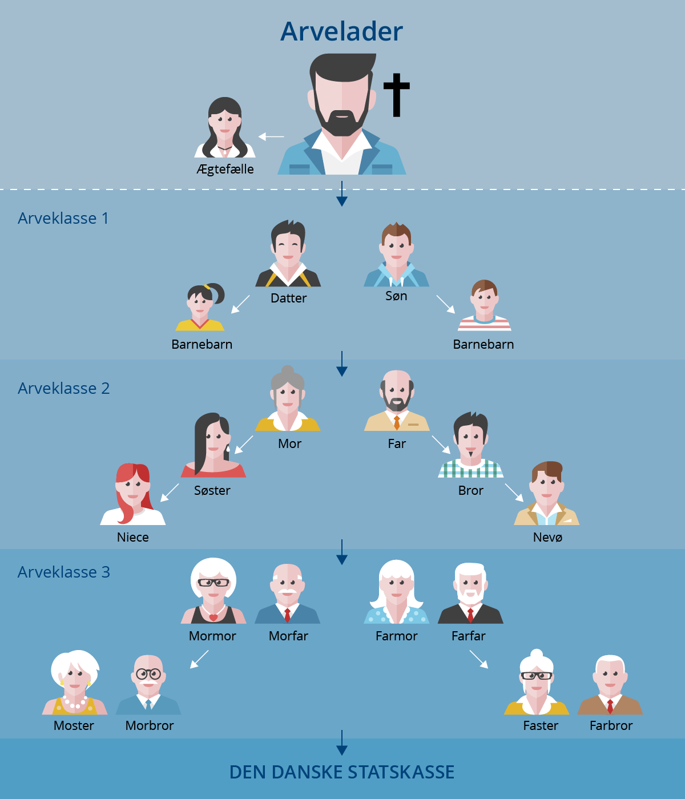
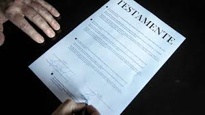
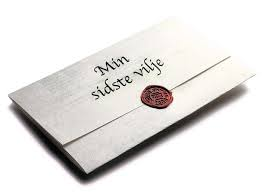
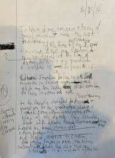

# Arveretten

```{r, echo=FALSE, results='asis'}
cat(readLines('np.html'))
```


---

**Video: Hvem arver fra dig?**

<div class="video-container"><iframe src="https://www.youtube.com/embed/ikBxcxBSBb8" width="853" height="480" frameborder="0" allowfullscreen="allowfullscreen"></iframe></div>

---


## Introduktion til arveretten

Med arvelovsrevisionen er der blevet gennemført en styrkelse af den længstlevende ægtefælles retsstilling.^[Følgende afsnit om arveretten bygger især på *Linda Nielsens* Karnovkommentar til arveloven, KarnovGroup.] 

Ægtefæller vil typisk have et ønske om, at længstlevende så vidt muligt kan fortsætte sin livsførelse. 

Arveloven (AL) er derfor søgt indrettet, så dette ønske i højere grad kan realiseres, uden at ægtefællerne behøver at oprette et testamente om begrænsning af børnenes arv. 

Dette er navnlig sket ved en forhøjelse af den legale arveret, fra 1/3 til ½ af arveladerens ejendele, når arveladeren samtidig efterlader sig børn (livsarvinger).  

Arveloven indebærer endvidere, at arvelader har fået større frihed til at disponere over sin formue ved testamente. 

Livsarvingernes tvangsarv er således nedsat fra ½ til ¼ af den legale arv. Også ægtefællens tvangsarv udgør fremover ¼ af den legale arv.  

Endvidere er indført en adgang for arvelader til at begrænse en livsarvings tvangsarv til 1 mio. kr., ligesom arveladeren har fået mulighed for at bestemme, at en livsarving skal have sin tvangsarv udbetalt kontant. 

Dette indebærer, at det bl.a. bliver lettere at ligestille sammenbragte børn i arveretlig henseende, og at gennemførelsen af generationsskifter af erhvervsvirksomheder lettes.  

Herudover giver loven mulighed for, at ugifte samlevende på en særlig nem måde kan oprette testamente om gensidig arveret (et udvidet samlevertestamente). 

I sammenhæng med revisionen af arveloven er der blevet gennemført en række ændringer i forsikringsaftalelovens og pensionsopsparingslovens regler om indsættelse af begunstigede.  

De aktiver og passiver, som en afdød efterlader sig, kaldes et dødsbo. Afviklingen af dødsboet mellem arvinger og kreditorer kaldes et skifte.  

De arveretlige regler i arveloven fastlægger, hvem der er arvinger, og hvor meget og hvad den enkelte arving skal arve af det, der er i behold i boet. 

Efterlader afdøde sig ingen gæld, men alene aktiver, og ses der bort fra de forskellige regler om arveafgift (se boafgift og gaveafgift) mv., bliver det de arveretlige regler, der afgør, hvem arvebeholdningen, dvs. boets formue, skal tilfalde. 

De arveretlige regler medfører således en overgang af ejendomsretten til afdødes formue fra den afdøde til arvingerne. Arv er en erhvervelsesmåde på linje med aftale, frembringelse mv.

---

En betingelse for at arve er, at arvingen har overlevet arveladeren. 

Bevis for arveladerens død vil i almindelighed let kunne føres ved fremlæggelse af en dødsattest. 

Hvis en sådan ikke kan tilvejebringes, kan en domstol undertiden statuere, at en person er død eller må anses for død (såkaldt dødsformodningsdom).  

Beviset for, at arvingen har overlevet den afdøde, kan give vanskeligheder i visse tilfælde. 

Er der ikke vished for, at en bortebleven person har overlevet afdøde, afsættes kun arv til den pågældende, hvis der er nogen sandsynlighed for, at han/hun er i live. 

Er der vished for, at arvingen har overlevet afdøde, afsættes derimod arvelod, uanset om arvingens opholdssted måtte være ukendt.  

Hvis to personer, som havde arveret efter hinanden, er døde, uden at det vides, hvem der er død først, anses den ene ikke for at have overlevet den anden. 

Reglen har praktisk betydning f.eks. ved trafikulykker, hvor ægtefæller omkommer. 

Et barn, som er avlet forinden dødsfaldet og senere fødes levende, har også arveret. Den gravide kvindes foster er således arveberettiget.  

Det siges, at *"arven er faldet"*, når kravet på arv kan overføres ved aftale, tilegnes af arvingens kreditorer, falde i arv ved arvingens død eller indgå i arvingens eventuelle separations- eller skilsmissebo. 

Dette tidspunkt indtræder som regel ved arveladers død. 

Der gælder særregler, når arveladerens efterlevende ægtefælle overtager et fællesbo til hensidden i uskiftet bo med den førstafdødes livsarvinger.  

Arvinger kan inddeles i tre hovedgrupper: slægtninge, ægtefæller og testamentsarvinger.  

---

## Oversigt over arveloven 

(Lov 2007-06-06 nr. 515)

*KAP. 1 SLÆGTNINGES ARVERET*  

*KAP. 2 ÆGTEFÆLLENS ARVERET*  

*KAP. 3 SVOGERSKABSARV EFTER EN LÆNGSTLEVENDE ÆGTEFÆLLE*

*KAP. 4 USKIFTET BO*  

*KAP. 7 AFTALE OM ARV SAMT ARVEFORSKUD*  

*KAP. 8 UDELUKKELSE OG BORTFALD AF ARVERET* 

*KAP. 9 TESTAMENTARISK BESTEMMELSE OVER TVANGSARV*  

*KAP. 10 TESTAMENTARISK BESTEMMELSE OVER FRIARV*  

*Kap. 11 OPRETTELSE OG TILBAGEKALDELSE AF TESTAMENTE* 

*Kap. 12 TESTAMENTES UGYLDIGHED OG ANFÆGTELSE*  

---
 
## Arvens fordeling til arveklasser



Arven fordeles til arveklasse 1, 2 eller 3. 

Er der ingen arvinger i arveklasse 1 går man videre til arveklasse 2, og er der ingen arvinger i arveklasse 2, arver arveklasse 3.  

Ægtefælle har også legal arveret. 

Arvelader kan selv få indflydelse på fordeling af arven ved at oprette testamente. 

Er der ingen arvinger efter arvelov eller testamente tilfalder arven statskassen, jf. AL § 94.  

---

### Arveklasse 1 

Arveklasse 1 er livsarvinger, som er børn, børnebørn, oldebørn osv., jf. AL § 1. 

Børnene arver lige. 

Er et af børnene døde, træder dette barns livsarvinger i stedet og arver lige ¼ af arven er tvangsarv, jf. AL § 5. 

Børns arv kan begrænses til 1 mio. kr., jf. AL § 5, stk. 2. (1.290.000 kr. i 2019).   

AL § 1 omhandler således arv til 1. arveklasse, dvs. arveladerens livsarvinger (tvangsarvinger), som er arveladerens nærmeste slægtsarvinger. 

Børnelinjen omfatter børn, børnebørn, oldebørn osv. Slægtskab foreligger mellem en mor og hendes barn og mellem barnet og den mand, der er barnets retlige far. 

Det er en forudsætning at faderskabet er fastslået inden dødsfaldet eller efterfølgende bliver det. arver lige.  

Er et barn død, træder dets børn i dets sted og arver indbyrdes lige. 

På tilsvarende måde arver fjernere livsarvinger. 

Denne såkaldte stirpal-grundsætning betyder, at arven inden for hver arveklasse fordeles i *»stammer«* og ikke efter *»hoveder«*. 

Børnebørn arver således ikke, så længe barnet lever. 

Når børnebørnene arver, må de »deles« om det afdøde barns arv - det såkaldte *»repræsentationsprincip«*. 

På tilsvarende måde arver fjernere livsarvinger (oldebørn mv.).   

---

### Arveklasse 2 


Arveklasse 2 er arveladers forældre, jf. AL § 2. Forældrene arver lige. 

Er en af forældrene død, træder dennes børn (arveladers søskende) i stedet og arver lige. Der bliver på denne måde forskel på hel- og halvsøskende. 

Arveklasse 2 er ikke tvangsarvinger. 

Bestemmelsen i AL § 2 omhandler således arv til 2. arveklasse - forældrelinjen. 

Hvis arveladeren ikke efterlader sig livsarvinger, tilfalder arven anden arveklasse, som også kaldes udarvinger. 

Denne arveklasse udgøres af afdødes forældre og disses efterkommere, dvs. arveladerens søskende, nevøer og niecer osv. 

Lever begge arveladerens forældre, arver de hver halvdelen.

---


### Arveklasse 3


Arveklasse 3 er arveladers bedsteforældre, jf. AL § 3. 

Arven fordeles med halvdelen til moderens forældre og halvdelen til faderens forældre. 

Er en af bedsteforældrene døde, træder dennes børn (arveladers faster, moster osv.) i stedet og arver lige. 

Bedsteforældre børnebørn (fætre og kusiner) arver ikke. 

Arveklasse 3 er ikke tvangsarvinger.  

Lever alle 4 bedsteforældre deles arven i 4 portioner. 

Er en af bedsteforældrene død, træder dennes børn i stedet efter *repræsentationsprincippet*. 

Arveladers farbrødre, fastre, mostre og morbrødre kan således være legale arvinger. Er farfaren død og efterlader sig to børn, arver disse således 1/8. 

Derimod falder arven ikke videre til fjernere livsarvinger. 

Arveladerens kusiner og fætre samt deres børn er således ikke legale arvinger.  
 
Arven mellem bedsteforældrelinien på fædrene side og bedsteforældrene på mødrene side sker efter stirpal-grundsætningen i § 2, og fordeles således ud i ¼ til hhv. farfaren eller dennes børn, farmoren eller dennes børn, mormoren eller dennes børn samt morfaren eller dennes børn. 

Er der kun arvinger på fædrene eller mødrene side, deles arven ud med ½ til hver af disse eller deres børn. 

Efterlades en mormor og to fastre, arver mormoren således ½ og fastrene ¼, mens fætre og kusiner ikke arver.  

  

 


---

**Video: Sådan fordeles arven**

<div class="video-container"><iframe src="https://www.youtube.com/embed/EIgZkPOF0_E" width="853" height="480" frameborder="0" allowfullscreen="allowfullscreen"></iframe></div>


---

## Længstlevendes ægtefælles arveret

Her en oversigt over længstlevendes ægtefælles arveret:  

*	Ægtefællen arver ½, hvis arvelader har børn, jf. AL § 9, stk. 1, ellers det hele jf. § 9, stk. 2. 

*	¼ af arven er tvangsarv jf. AL § 10 

*	Længstlevende ægtefælles har mulighed for at sidde i uskiftet bo

*	Suppleringsarv AL § 11, stk. 2 op til 780.000 kr. (2019) – inklusive:

+	Boslod og særeje for længstlevende ægtefælle

+	Arvelod for længstlevende ægtefælle

+	Forsørgertabserstatning, livsforsikring, pension efter førstafdøde ægtefælle

+	Ægtefællepension og ægtefælleydelse

+	Ved længstlevende ægtefælles død, skal arven (som udgangspunkt) fordeles mellem begge ægtefællers arvinger, jf. AL § 16, stk. 2 
 

---

**Video: Fordeling af arv: Ugift par uden børn**

<div class="video-container"><iframe src="https://www.youtube.com/embed/qYf2gatfAWQ" width="853" height="480" frameborder="0" allowfullscreen="allowfullscreen"></iframe></div>

---

**Video: Fordeling af arv: Ugift par med fælles børn**

<div class="video-container"><iframe src="https://www.youtube.com/embed/cDriXFDNg30" width="853" height="480" frameborder="0" allowfullscreen="allowfullscreen"></iframe></div>

---

**Video: Fordeling af arv: Ugift par med stedbørn**

<div class="video-container"><iframe src="https://www.youtube.com/embed/x7WzAOJJNXQ" width="853" height="480" frameborder="0" allowfullscreen="allowfullscreen"></iframe></div>

---


  
**Video: Arv mellem sammenlevende**

<div class="video-container"><iframe src="https://www.youtube.com/embed/WVec5BYeu34" width="853" height="480" frameborder="0" allowfullscreen="allowfullscreen"></iframe></div>

---

**Video: Fordeling af arv uden børn**

<div class="video-container"><iframe src="https://www.youtube.com/embed/bNa7tt460bY" width="853" height="480" frameborder="0" allowfullscreen="allowfullscreen"></iframe></div>

---

**Video: Fordeling af arv med fællesbørn**

<div class="video-container"><iframe src="https://www.youtube.com/embed/TXaWe8-jz9s" width="853" height="480" frameborder="0" allowfullscreen="allowfullscreen"></iframe></div>

---

**Video: Fordeling af arv: Ægtepar med stedbørn**

<div class="video-container"><iframe src="https://www.youtube.com/embed/MQ6i9G5NxUc" width="853" height="480" frameborder="0" allowfullscreen="allowfullscreen"></iframe></div>


---

**Video: Arv mellem ægtefæller**

<div class="video-container"><iframe src="https://www.youtube.com/embed/UtsI4IWmajI" width="853" height="480" frameborder="0" allowfullscreen="allowfullscreen"></iframe></div>


---

## Uskiftet bo for den længstlevendes ægtefælle

Vælger ægtefællen at sidde i uskiftet bo, får ægtefællen rådighed over alle aktiver og overtager afdødes gældsforpligtelser, jf. AL §§ 24 og 25. 

Kan kun sidde i uskiftet bo med delingsformue – særejet skal skiftes, jf. AL § 17. 

Man kan ikke sidde i uskiftet bo, hvis man ikke har været gift. 

Særbørn skal give samtykke til uskiftet bo, jf. AL § 18. 

Hvis længstlevende misbruger det uskiftede bos midler, kan børnene kræve skifte, jf. AL § 29.  

---

Længstlevende ægtefælle kan således forbruge det uskiftede bos midler og give gaver mv., men kan af hensyn til førstafdøde ægtefælles arvinger ikke råde frit. 

Spørgsmål om misbrug kan indbringes for skifteretten af førstafdødes arvinger, jf. AL §§ 29-32. 

Længstlevende ægtefælle har rådighed uden at være egentlig ejer. 

Den pågældende kan således f.eks. stille sikkerhed, sælge aktiver hørende til det uskiftede bo og give gaver, men skal på den anden side tage hensyn til førstafdøde ægtefælles livsarvinger, idet længstlevende også råder over livsarvingernes potentielle arv efter førstafdødes ægtefælle.  

Når længstlevende dør, skal arven fordeles til begge ægtefællers livsarvinger, men der regnes ikke arv til ægtefællen, jf. AL § 28.  

---

## Arveladers testationskompetence

Testamenter giver arvelader mulighed for at få indflydelse på, hvem der skal arve, og hvad de skal arve.  

---

*Oversigt over arveladers testationskompetence*: 

Hovedreglen er, at arvelader kan ved testamente råde over hele sin formue. 

Undtagelsen er, hvis arvelader er gift og/eller har børn, er testationskompetencen begrænset af tvangsarven, jf. AL § 50.

Tvangsarven er som udgangspunkt ¼ af arveladers formue.

---

*Testationskompetence*

```{r pie,echo=FALSE, message=FALSE,result=TRUE, fig.cap=("En fjerdedel af testators formue er tvangsarv hvis der er børn eller ægtefælle")}
library("chartjs")
chartjs(height = "300px") %>%
  cjsPie(labels = c("Tvangsarv 25%","Friarv 75%")) %>%
  cjsSeries(data = c(0.25,0.75))%>%
cjsLegend(position = "top")
```


---


*Eksempel: Tvangsarv med ægtefælle og 2 børn, formue: 1.200.000,-*

```{r pie2,echo=FALSE, message=FALSE,result=TRUE, fig.cap=("Formuen 1.200.000,- Ægtefællen arver 50% af 25% af formuen  i tvangsarv, børnene hver 25% af 25% af formuen i tvangsarv")}
library("chartjs")
chartjs(height = "300px") %>%
  cjsPie(labels = c("Ægtefælle: 12.5%","Barn 1: 6.25%","Barn 2: 6.25%","Friarv: 75%")) %>%
  cjsSeries(data = c(150000,75000,75000,900000))%>%
cjsLegend(position = "top")
```


---

*OBS: Suppleringsarv er også tvangsarv*. 

Der er tale om en tvangsarveret, der ikke kan fratages ved testamente. 

Retten til forlods udtagelse indebærer, at udtagelsen ikke belaster den længstlevende ægtefælles boslodskrav ved opgørelsen af fællesboet, og heller ikke kravet i henhold til retten til suppleringsarv. 

En længstlevende ægtefælles påberåbelse af AL § 11, stk. 1 vil kunne medføre, at et dødsbo kan sluttes uden skiftebehandling. 

Reglen vil derfor også i praksis blive påberåbt af en længstlevende ægtefælle, der som enearving ville kunne overtage hele boet efter AL § 9, stk. 2. 

---
 
**Video: Hvordan opretter du et testamente?**

<div class="video-container"><iframe src="https://www.youtube.com/embed/TcZb7VCClcQ" width="853" height="480" frameborder="0" allowfullscreen="allowfullscreen"></iframe></div>

---


## Kravet til et gyldigt testamente  





---


*	at testator er fyldt 18 år (15 år for midler den umyndige selv kan råde over)

*	At testator kan handle fornuftsmæssigt

*	At testamentet opfylder kravene til:

*	*Notartestamente*

*	*Vidnetestamente*

*	*Nødtestamente*

---

**Video: Hvorfor skrive et testamente**

<div style="width:100%; height:0; position: relative; padding-bottom:28.125%"><iframe src="//jyskebank.tv/v.ihtml/player.html?showDescriptions=0&source=site&photo%5fid=13036756&autoPlay=1&endOn=loop" style="width:100%; height:100%; position: absolute; top: 0; left: 0;" frameborder="0" border="0" scrolling="no" allowfullscreen="1" mozallowfullscreen="1" webkitallowfullscreen="1"></iframe></div>


---

### Notartestamente, jf. AL § 63


Notaren (i Byretten) påtegner testamentet og kontrollerer testators identitet, fornuft, mv.

Registrerer testamentet i Centralregistret for testamenter

Notartestamentet er svært at anfægte i praksis.

---

### Vidnetestamente, jf. AL § 64


---

To vitterlighedsvidner, som ikke selv må være begunstiget i testamentet

Vidnerne kontrollerer testators underskrift, fornuft mv.

*En person kan ikke være testamentsvidne, hvis:*

* testamentet begunstiger den pågældende eller dennes ægtefælle, samlever, beslægtede eller besvogrede i op- eller nedstigende linje, søskende eller andre nærstående. (Forlovede vil sammen med kærester og - efter en konkret vurdering - fjernere beslægtede blive anset for at være nærstående), 

* testamentet begunstiger en person eller institution, som den pågældende ved testamentets oprettelse har en sådan tilknytning til, at testamentsvidnet har haft en særlig interesse i begunstigelsen, eller

* der i øvrigt foreligger omstændigheder, som er egnede til at vække tvivl om den pågældendes habilitet.

Hvis et testamentsvidne har medvirket til oprettelse af et testamente i strid med al § 64, stk. 3, nr. 1-3, er testamentet således anfægteligt. Bevisbyrden påhviler den, der vil arve, hvis testamentet tilsidesættes.


---

**Video: Hvad er et vitterlighedsvidne**

<iframe src="https://player.vimeo.com/video/353723868" width="640" height="360" frameborder="0" allow="autoplay; fullscreen" allowfullscreen></iframe>
<p><a href="https://vimeo.com/353723868">Vitterlighedsvidne | Hvad skal du vide her?</a> from <a href="https://vimeo.com/dokument24">Dokument 24</a> on <a href="https://vimeo.com">Vimeo</a>.</p>


---

### Nødtestamente, jf. AL § 65

*Holografisk testamente*, i dansk ret et nødtestamente oprettet uden vidner, men skrevet og underskrevet egenhændigt af testator.




---

Betingelser ved oprettelsen af et nødtestamente:

Kræver en nødsituation.

Ingen formkrav.

Bortfalder efter tre måneder.

---

En nødsituation kunne f.eks. blodprop eller umiddelbart før en stor operation.

Andre nødstilfælde kan være et synkende skib, en naturkatastrofe, samt beslutning om selvmord, jf. nedenfor dommene om nødtestamente ved selvmord, jf. **U 1970.10 H, U 1979.108 H** og **U 2000.1340 H.**


---

**U.2019.1526 V** Testamente oprettet på dødslejet med begunstigelse af samleverske opfyldte betingelserne i arvelovens § 65 for nødtestamente:
"A, født 1938, afgik ved døden den 2. juni 2016, efter en ellers kureret kræftsygdom var vendt tilbage. A havde efter en skilsmisse siden 1984 boet sammen med S, født 1953. I slutningen af maj 2016 var det klart, at A var i den terminale fase. S havde den 23. maj 2016 ringet til en advokat, P, og bedt ham komme ud på bopælen. P, der ikke kendte A og S, kom ud til dem den 2. juni 2016 om formiddagen, og P fik at vide af en sygeplejerske, at A var i stand til at oprette testamente, men at det hastede. Der blev herefter oprettet et håndskrevet nødtestamente, hvoraf fremgik, at S skulle arve på lige fod med A’s tre børn således, at de hver især skulle arve ¼, og A underskrev testamentet. Dødsboet blev behandlet af en bobestyrer, og A’s tre børn (B1, B2, og B3) bestred, at testamentet kunne danne grundlag for skiftet. S anlagde sag mod B1, B2 og B3 med påstand om, at de skulle anerkende testamentet, idet betingelserne i arvelovens § 65 for at oprette nødtestamente havde været opfyldt. B1, B2 og B3 gjorde til støtte for frifindelsespåstanden bl.a. gældende, at S ikke havde bevist, at A havde været forhindret i at oprette et ordinært testamente, herunder et vidnetestamente, og at det var uden betydning, om testamentet var udtryk for A’s ønske. Skifteretten gav S medhold, og B1, B2 og B3 ankede dommen. Landsretten stadfæstede dommen, idet landsretten efter bevisførelsen lagde til grund, at A havde været meget afkræftet i dagene op til den 2. juni 2016, men at denne omstændighed ikke udelukkede, at han fornuftsmæssigt havde været i stand til at råde over sine ejendele på oprettelsestidspunktet. P havde forklaret, at A efter hans opfattelse var testamentshabil den 2. juni. Det kunne endvidere lægges til grund, at testamentet var udtryk for A’s vilje. S havde herefter bevisbyrden for, at A havde været forhindret i at oprette et notar- eller vidnetestamente, og denne bevisbyrde havde S løftet. Efter oplysningerne om A’s tilstand den 2. juni 2016, og da P ikke, da han kom ud på bopælen, var klar over, at testamentesoprettelsen var presserende, således at han skulle have sørget for at få en notar med, og da der ikke kunne stilles krav om, at P eller S skulle have sørget for at finde et vidne, havde betingelserne i arvelovens § 65 for at oprette et nødtestamente været opfyldt".

---

**U 1970.10 H** Holografisk testamente oprettet før selvmord blev anset for et gyldigt nødtestamente:
"En 70-årig kvinde T, der var deprimeret efter en separation, tog livet af sig. I boet fandtes et af skrevet og underskrevet testamente til fordel for en broder og dennes hustru. Et tidligere oprettet testamente til fordel for et legat var påskrevet »Annulleret«. Under en af T's øvrige søskende rejst sag antoges det, at T havde befundet sig i en nødsituation, jfr. arvelovens § 44, og at hun med føje havde anset sig for forhindret i at oprette testamente i overensstemmelse med de almindelige regler. Herefter opretholdes det holografiske testamente". 

---

**U 1979.108 H** Dokument efterladt af afdød, som havde begået selvmord, anerkendt som nødtestamente:
"A, som fra et tidligere ægteskab havde en søn, og som samlevede med B, begik selvmord og efterlod sig et af ham udfærdiget udateret dokument, der var anbragt i B's curlerpose og stilet til hende, og hvori det bl. a. hed: »Alt hvad der er, må du få« Efter det foreliggende lagdes det til grund, at A havde anbragt dokumentet i curlerposen den 12 eller 13 oktober, og det fandtes overvejende sandsynligt, af han efter at have forladt hjemmet den 13 oktober havde begået selvmord samme dag. Det lagdes herefter endvidere til grund, at A havde besluttet sig for selvmord, da han anbragte dokumentet i curlerposen, og at han da han havde befundet sig i en nødsituation som nævnt i arve lovens § 44 Dokumentet blev derfor trods indsigelse fra A's søn lagt til grund for skiftet efter A som en gyldig testamentarisk disposition vedrørende den testationsfri halvdel af A's bo". 

---

**U 2000.1340 H** Holografisk testamente anerkendt, da opretteren ikke var ude af stand til at råde fornuftsmæssigt:
"T, der var født i 1930, blev i 1985 skilt fra sin ægtefælle, med hvem han havde en datter B. I 1988 flyttede han sammen med A, og efter at han havde været indlagt på hospital, psykiatrisk afdeling, oprettede han i 1990 et notartestamente, hvorefter A forlods skulle arve 10 % af hans likvide formue, mens B skulle være hans hovedarving. Ved et notartestamente i 1994 bestemte T, hvordan nærmere bestemte genstande skulle fordeles, mens B skulle arve resten. Den 5. september 1994 opregnede T en række genstandslegater, og den 26. november 1995 begik T selvmord. I et brev til en bekendt, dateret samme dag, udtalte T, at A uanset hans testamente skulle arve alt, hvad hun ønskede, før B. Der var ikke grundlag for at antage, at T, der havde skrevet brevet efter sin beslutning om at begå selvmord, i almindelighed eller ved den testamentariske disposition til fordel for A havde manglet evnen til at handle fornuftsmæssigt. A fik derfor medhold i, at hun skulle arve mest muligt". 




---


### Udvidet samlevertestamente

Samlevende har ingen legal arveret, kræver oprettelse af testamente.

Samleverne kan arve hinanden – maksimalt 7/8 af formuen i konkurrence med børn. 

Samleveren kan udtage suppleringsarv.

Der kan udloddes svogerskabsarv efter længstlevende samlever.

Samlevende kan ikke sidde i uskiftet bo.

Udvidet samlevertestamente skal ændres ved nyt testamente.

Udvidet samlevertestamente bortfalder ved indgåelse af ægteskab.

---

**Video: Udvidet samlevertestamente**

<div class="video-container"><iframe src="https://www.youtube.com/embed/0Ss86d4klSw" width="853" height="480" frameborder="0" allowfullscreen="allowfullscreen"></iframe></div>


---

Hvis et testamente skal ændres eller tilbagekaldes, skal ændringen overholde formkravene til testamenter, jf. AL § 67.  

Et uigenkaldeligt testamente indskrænker testators testationskompetence – arvelader har ikke mulighed for at ændre testamentet. 

Hvis forudsætningerne for at oprette et uigenkaldeligt testamente brister eller var urigtige, kan testamentet være ugyldigt, jf. AL § 77. 


---

**Video: Webseminar om Arv, testamenter og pensioner**

<div class="video-container"><iframe src="https://www.youtube.com/embed/exm1sAFp0dE" width="853" height="480" frameborder="0" allowfullscreen="allowfullscreen"></iframe></div>

---

