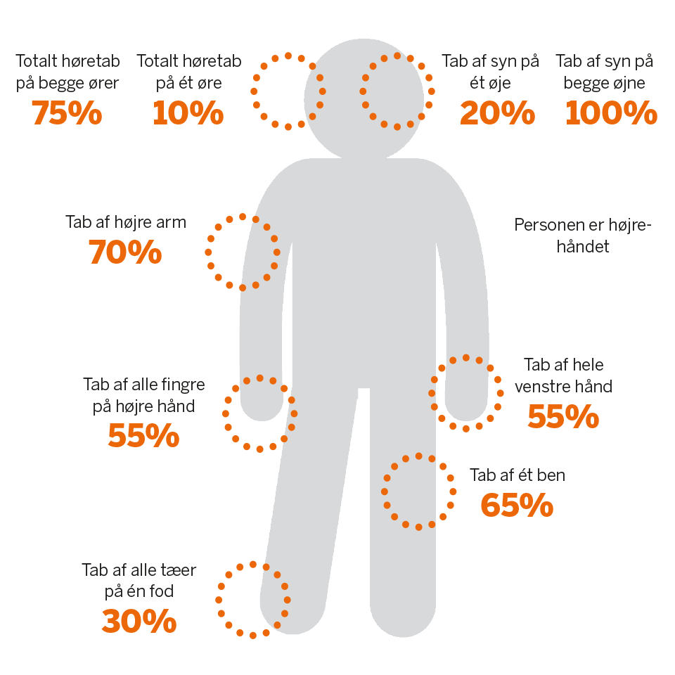
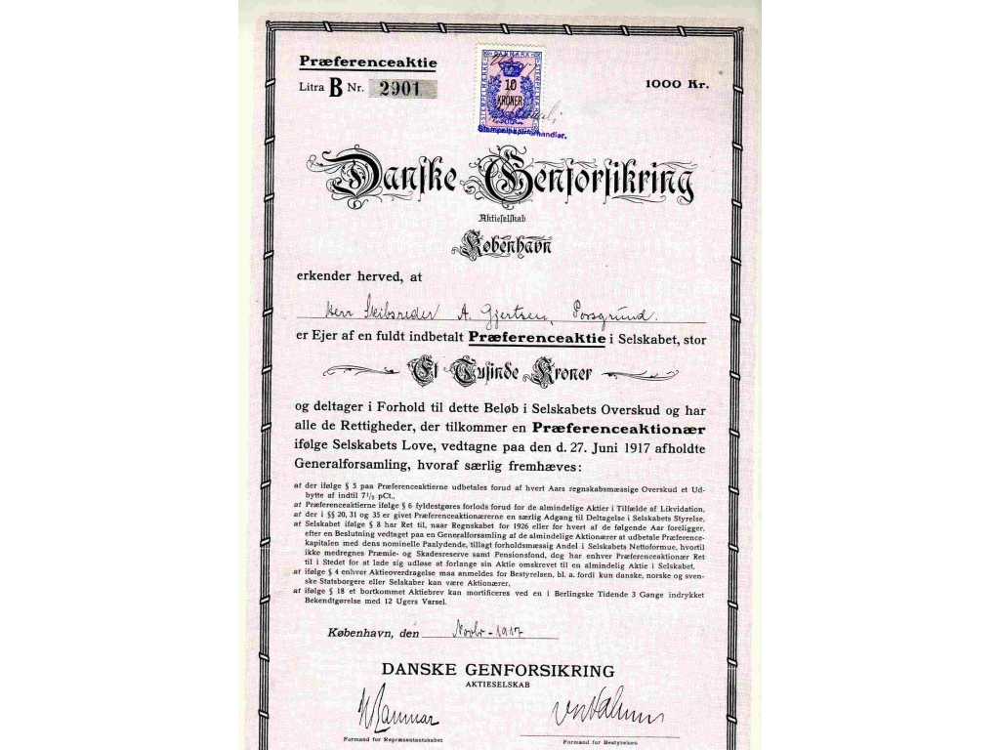

# <font color="red">Forsikring og pension<sup> Premium </font></sup>

```{r, echo=FALSE, results='asis'}

# cat(readLines('npp.html'))

```


## <font color="red">Skadesforsikring<sup> Premium </font></sup>

Skadesforsikring er en aftale, hvor et forsikringsselskab overtager den økonomiske risiko for en uvis begivenheds indtræden. 

Ved skadesforsikring forstås i denne sammenhæng en forsikring, hvor selskabet kun er pligtig at erlægge forsikringsydelsen, når den sikrede har lidt en skade, der kan måles i penge, og hvor den ydelse, forsikringselskabet skal erlægge, bestemmes af den sum penge, der skal til for at erstatte skaden

Efter forsikringsaftalelovens (FAL) § 35 kan enhver lovlig interesse, der lader sig ansætte i penge, være genstand for skadesforsikring.

Forsikringen kan tegnes for forsikringstagerens eller tredjemands interesse.

---

Der skal således være tale om en *"lovlig interesse"*, der kan forsikres. 

Justitsministeriel har i en skrivelse fra 1972 som refereret i Dansk Forsikringstidende nr. 21 af 17. juli 1972, bemærket følgende: "at den interesse, der består i at undgå de strafferetlige følger af et retsbrud, må anses for en ulovlig interesse. Forsikring kan således ikke tegnes mod faren for at blive idømt bødestraf eller konfiskation. På samme måde vil interessen i at opnå økonomisk udbytte af en strafbar handling som udgangspunkt ikke kunne anses som en lovlig interesse. Endvidere kan forsikring af en interesse være udelukket ved lov". Dvs., at fx kan et forsikringselskab ikke tilbyde forsikringer mod fartbøder.

---

Forsikringselskaberne skal ikke dække på en skadesforsikring, hvis skaden er sket i forbindelse med begået ulovligheder:

Forsikringsankenævnet har tilsyneladende strammet sin praksis, hvis det er overvejende sandsynlgt, at en stjålen genstand er hælervare:

**Forsikringsankenævnskendelse sagsnr.: 86.533:** Klagerens datter havde købt en helt ny computer via den blå avis. Computeren var købt på en finasieringsaftale med et kreditkort, der var stjålet. Ved købet fik hun udleveret fakturaen, hvor hun kunne se, at hendes sælger ikke var den person, der havde købt computeren. Hun betalte en betydelig lavere pris for computeren end den kostede i forretningen. Efter nævnets opfattelse burde klagerens datter have indset, at sælger ikke var kommet i besiddelse af computeren på lovlig vis. At der ikke blev rejst tiltale mod datteren for hæleri, kunne ikke føre til andet resultat.

---

**Forsikringsankenævnskendelse sagsnr.: 89.051:** I dette tilfælde oplyste klageren, at han havde købt en kongekæde af nogle rockere. Han ville ikke oplyse nærmere om sælgernesidenditet. Han vidste heller ikke, hvor rockerne havde kæden fra. Kongekæden til en værdi af 180.000 kr. var nu stjålet. Nævnet fandt ikke anledning til at kritisere, at selskabet havde afvist dækning med henvisning til FAL § 35.

---

**Forsikringsankenævnskendelse sagsnr.: 90.514.** Bil købt i udlandet med en registreringsattest fra et andet land:
"Bilen indgik i en sales and lease back aftale med et leasingfirma. Bilen var af politiet indkadt til idenditetskontrol, men dagen før han skulle fremvise køretøjet, meldte han det stjålet. Ifølge Interpol var registreringsattesten falsk, idet chassisnummeret vedrørte et køretøj fra et helt tredje land - et køretøj, der i øvrigt var skrottet i 2014. Selskabet mente, at der var tale om en ikke lovlig interesse. Nævnet fandt det betænkeligt at lægge dette til grund, i det forsikringen skulle dække leasingfirmaets krav mod klager for skade på bilen. Det kunne ikke tillægges afgørende betydning, at det var usikkert, om klager og siden leasingfirmaet havde opnået ejendomsret til køretøjet. Selskabet havde derfor ikke været berettiget til at ophæve forsikringen med tilbagevirkende kraft. Nævnet viile dog ikke pålægge selskabet at betale erstatning, da det ikke fandt det sandsynliggjort, at et tyveri havde fundet sted".

---


### <font color="red">Forsikringsklasser - skadesforsikring<sup> Premium </font></sup>

Ved skadesforsikring forstås dermed begrebsmæssigt forsikringer omfattet af de forsikringsklasser (forsikringstyper), der fremgår af bilag 7 til Lov om finansiel virksomhed. 

Bilag 7 oplister de forsikringsklasser (nr. 1-18), der anses for skadesforsikring, i overensstemmelse med de bagvedliggende EU-regler herom på forsikringsområdet:

BILAG 7

Forsikringsvirksomhed - skade

Klassifikation af risici ved hjælp af forsikringsklasser.

1) Ulykker (herunder arbejdsulykker og erhvervssygdomme): summaforsikring, erstatning af økonomiske tab, kombinationer heraf og personbefordring.

2) Sygdom: summaforsikring, erstatning af økonomiske tab og kombinationer heraf.

3) Kaskoforsikring for landkøretøjer (bortset fra jernbaners rullende materiel): alle skader på motordrevne landkøretøjer og ikkemotordrevne landkøretøjer.

4) Kaskoforsikring for jernbanekøretøjer: alle skader på jernbanekøretøjer.

5) Kaskoforsikring for luftfartøjer: alle skader på luftfartøjer.

6) Kaskoforsikring for fartøjer til sejlads på have, indsøer og floder: alle skader på flodfartøjer, indsøfartøjer og havfartøjer.

7) Godstransport (herunder varer, bagage og alt andet gods): alle skader på transporterede varer eller bagage uanset arten af transportmidlet.

8) Brand og naturkræfter: alle skader på ejendom (bortset fra ejendom omfattet af klasserne 3, 4, 5, 6 og 7), når de er forårsaget af brand, eksplosion, storm, naturkræfter (bortset fra storm), kerneenergi og jordskred.

9) Andre skader på ejendom: alle skader på ejendom (bortset fra ejendom omfattet af klasserne 3, 4, 5, 6 og 7), når disse skader skyldes hagl eller frost eller har andre årsager af enhver art, f.eks. tyveri, undtagen dem, der er anført under nr. 8.

10) Ansvarsforsikring for motordrevne landkøretøjer: ethvert ansvar hidrørende fra brugen af motordrevne landkøretøjer (herunder førerens ansvar).

11) Ansvarsforsikring for luftfartøjer: ethvert ansvar hidhørende fra brugen af luftfartøjer (herunder førerens ansvar).

12) Ansvarsforsikring for fartøjer til sejlads på have, indsøer og floder: ethvert ansvar hidhørende fra anvendelsen af flod-, indsø- og havfartøjer (herunder førerens ansvar).

13) Almindelig ansvarsforsikring: ethvert ansvar, der ikke er anført under numrene 10, 11 og 12.

14) Kredit: almindelig insolvens, eksportkredit, salg på afbetaling, hypotekforsikring og landbrugsforsikring.

15) Kaution: direkte kaution og indirekte kaution.

16) Diverse økonomiske tab: arbejdsløshedsrisici, inkassotab (almindeligt), dårligt vejr, tab af fortjeneste, fortsatte generalomkostninger, uforudsete handelsudgifter, tab af salgsværdi, husleje- eller indtægtstab, indirekte handelstab bortset fra de ovenfor nævnte, ikkeforretningsmæssige økonomiske tab og andre økonomiske tab.

17) Retshjælpsforsikring: retshjælpsforsikring.

18) Assistance: assistance til personer, der kommer i vanskeligheder under befordring eller under fravær fra bopælen eller det faste opholdssted.

---


Skadesforsikring er for eksempel er således bygningsforsikring, løsøreforsikring, erhvervsansvarsforsikring, indboforsikring, familieansvarsforsikring, sygeforsikring, personulykkesforsikring og retshjælpsforsikring.

---

**Video om Forsikringsoplysningen**

<div class="video-container"><iframe src="https://www.youtube.com/embed/_AfijS3r6Sk" width="853" height="480" frameborder="0" allowfullscreen="allowfullscreen"></iframe></div>


---


Det fremgår således bl.a. af bilag 7 til Lov om finansiel virksomhed, at skadesforsikring også omfatter assistance, defineret som assistance til personer, der kommer i vanskeligheder under befordring eller under fravær fra bopælen eller det faste opholdssted (forsikringsklasse 18). 

Dette omfatter fx aftaler vedrørende vejhjælp, hjemtransport eller anden assistance, fx i medfør af en rejseforsikring, eller lignende ydelser, der falder ind under denne definition.

Efter reglerne på forsikringsområdet skelnes der mellem skadesforsikring og livsforsikring. Livsforsikringer er ikke skadesforsikringer, men en *summaforsikring*, som er en, fællesbetegnelse for livs- og ulykkesforsikringer, der er karakteriseret ved, at forsikringsselskabet skal udbetale den aftalte forsikringssum ved forsikringsbegivenhedens indtræden, uanset om der kan påvises et økonomisk tab.

---

Skadesforsikringens genstand skal kunne ansættes til en økonomisk værdi før, at der kan ske dækning på skadesforsikringen:

**FED1998.942:** Konservering af fotoalbum og børnetegninger uden økonomisk værdi ansås ikke for dækket af familieforsikring, og forsikringstageren var derfor alene berettiget til erstatning for materialepriser.

---

## <font color="red">Udvalgte skadesforsikringer<sup> Premium </font></sup>^[Følgende afsnit bygger især på *Sonny Kristoffersen:* Introduktion til forsikringsreglerne, 2019, Hans Reitzels Forlag, jf. link: https://hansreitzel.dk/products/introduktion-til-forsikringsreglerne-bog-47916-9788741272849, samt materialer og afgørelser fra Ankenævnet for Forsikring og informationer fra Forsikringsoplysningen og domme fra UfR og FED udgivet af KarnovGroup.] 

---

### <font color="red">Bilforsikring<sup> Premium </font></sup> 


*Bilforsikringen*

Langt de fleste private bilejere har forsikret deres bil med en kombineret kasko- og ansvarsforsikring. 

Er der ikke gæld i bilen, og er der tale om en ældre bil, nøjes mange med den lovpligtige ansvarsforsikring. 

---

**Video: Om bilforsikringen**

<div class="video-container"><iframe src="https://www.youtube.com/embed/H9PzSmkhC48" width="853" height="480" frameborder="0" allowfullscreen="allowfullscreen"></iframe></div>

---

*Ansvar for motorkøretøjer*


Ifølge færdselsloven skal den ansvarlige for et motorkøretøj erstatte de skader, som køretøjet volder ved færdselsuheld, ved eksplosion eller ved brand. 

Det betyder, at ejeren altid er erstatningspligtig for disse uheld. 

Disse erstatningskrav vil blive betalt via motorkøretøjets lovpligtige ansvarsforsikring.

---

*Motoransvarsforsikring*


Ansvarsforsikringen for et motorkøretøj er lovpligtig og dækker det erstatningsansvar, som ejer eller bruger kan få. 

Ansvarsforsikringen dækker for et enkelt uheld personskader eller tab af forsørger op til 111 mio. kr. og tingskader op til 24 mio. kr. 

Dækningssummerne bliver reguleret hvert år pr. 1. januar. 

Ansvarsforsikringen dækker ikke skade på motorkøretøjets fører. Derimod er passagererne dækket. 

Forsikringen dækker heller ikke skade på forsikringstagerens eller brugerens ting eller skade på tilkoblet køretøj, f.eks. trailer. 

Hvis det skadevoldende køretøj ikke er forsikret eller forsvandt fra uheldsstedet (flugtbilist), har man mulighed for at få erstatning fra en fællespulje. 

Man henvender sig hos Dansk Forening for International Motorkøretøjsforsikring (DFIM). Adresse: Philip Heymans Alle 1, 2900 Hellerup, Telefon: 41 91 91 91. 

Bemærk: Er der tale om en flugtbilist, kan der også udbetales erstatning for tingskade, når der samtidig udbetales erstatning for personskade.

---

*Kaskoforsikring*

Ejere af et motordrevet køretøj (bil, motorcykler eller knallert) kan ud over den lovpligtige ansvarsforsikring også kaskoforsikre deres køretøj. 

Ordforklaring:

Ordet *”kasko”* kommer sig af det spanske ”casco”, der betyder ”skibsskrog”, og var oprindelig et ord for forsikring af skibes motorer, skrog og inventar. ... Med en kaskoforsikring, får man dækket skader på selve ens bil.

Forsikringen dækker de skader, der sker på ejerens bil. 

Har man lånt penge til at finansiere købet, er det normalt altid et krav fra bankens side, at der tegnes kaskoforsikring. 

Forsikringen dækker enhver skade på det forsikrede køretøj, samt tyveri af køretøjet, medmindre at der foreligger grov uagtsomhed hos forsikringstageren. 


---


Se **Forsikringsankenævnets sagsnr.: 73491.** Klager over afslag på dækning for en kaskoskade opstået i forbindelse med et tyveri: 
"Klager havde tegnet bilforsikring. Klagerens bil var blevet stjålet, da hendes ægtefælle havde parkeret bilen uden for en servicestation, medens han skulle handle. Bilen var ikke låst og der lå en bilnøgle i bilen. Bilen blev skadet da gerningsmanden mistede herredømmet over bilen. Nævnet fandt ifølge politirapporten at kunne lægge til grund, at klagerens ægtefælle, ved at have forladt bilen med nøgle i tændingslåsen som sket, havde forvoldt skaden ved grov uagtsomhed. Endvidere fandt nævnet, at klageren ikke havde haft kendskab til det hændte, hvorfor hun ikke derved havde udvist grov uagtsomhed. Selskabet havde dog anført i betingelserne, at der ikke var dækning, hvis den grove uagtsomhed var udvist at en ægtefælle eller en samlever. Klageren måtte således tåle at blive identificeret med sin ægtefælle. Selskab medhold".

---


Samt **Forsikringsankenævnets sagsnr.: 73618.** Klager over afslag på dækning for skade på bil: 
"Klager havde tegnet bilforsikring. Klageren punkterede og kørte herefter ca. 250 meter videre, da han ikke ville stoppe trafikken. Han parkerede herefter bilen og opdagede først der, at begge hjul var punkterede. Selskabet fandt, at klageren havde haft mulighed for, at standse langt tidligere end han havde gjort, og selskabet ville derfor ikke dække skaden. Selskabet mente, at klageren havde tilsidesat sin tabsbegrænsningspligt, og at han dermed havde fremkaldt forsikringsbegivenheden ved grov uagtsomhed. Nævnet fandt, at undladelsen af at standse efter en punktering kunne anses for en tilsidesættelse af den generelle regel i FAL § 52 om sikredes afværge- og tabsbegrænsningspligt. Nævnet fandt, at klageren havde tilsidesat pligten ved grov uagtsomhed. Selskab medhold". 

---


Endvidere **Forsikringsankenævnets sagsnr.: 73632.** Klager over afslag på dækning for kaskoskade: 
"Klager havde tegnet bilforsikring. Klager drejede af motorvejen og kørte ud i et kryds uden at registrere, at det var rødt og ramte herved 2 biler. Nævnet fandt, at klageren havde kørt over for rødt lys, og at årsagen hertil måtte være klagerens uopmærksomhed. En sådan adfærd indebar efter nævnets opfattelse en så indlysende fare for, at en skade som den omhandlende ville indtræffe, at et sådant forhold som udgangspunkt ville være at anse som groft uagtsomt, jf. FAL § 18. Efter nævnets opfattelse gav oplysningerne i sagen ikke grundlag for at fravige dette. Selskab medhold".

---

Der er dog nogle *undtagelser på bilforsikringen:* 

Kaskoforsikringen dækker ikke:

• Skader, der alene opstår i de mekaniske dele, medmindre skaden er sket ved brand, eksplosion, kortslutning, lynnedslag, røveri, tyveri og hærværk samt under transport ved hjælp af andet transportmiddel. 

• Skader sket under behandling og bearbejdning, medmindre skaden skyldes kørsel, brand eller nedstyrtning fra lift. 

• Skader opstået på grund af rust, slitage, stenslag i lak, ridser o.l.  

• Skader forvoldt med vilje eller ved grov uagtsomhed. 

• Skader forvoldt, mens køretøjet blev ført af en person, der var påvirket af spiritus, medmindre det godtgøres, at føreren var uden skyld i uheldet. 

• Skader indtrådt, mens køretøjet blev ført af en person, der ikke har kørekort, medmindre det godtgøres, at skaden ikke skyldes manglende kørefærdighed. 


---

*Se her: 10 ting ens bilforsikring ikke dækker:*

https://tv2-dk-clips.secure.footprint.net/vod/mpx/TV2dk/8/95/8r9u1xw5kc.mp4

*Gode råd om billeje*

https://fdm.dk/alt-om-biler/koer-selv-ferie/bliv-klar-til-ferien/gode-raad-om-billeje

---


Om Forsikringsankenævnets praksis ved færdselsskader som skyldes *selvforskyldt beruselse:*


**Sagsnr.: 88756.** Klager over regreskrav: 
"Klager mistede herredømmet over sin bil og påkørte en fodgænger. Der skete desuden skade på bil og et plankeværk. Selskabet rettede et regreskrav mod klager på 838.436,50 kr. med henvisning til, at klager havde forvoldt skaden ved grov hensynsløshed. Det fremgik, at klager havde haft en alkoholpromille på 1,64, og der var spor af sovemedicin og kokain i klagers blod/urin. Der var ulovlig dækmontering på bilen, som sammen med lavt dæktryk havde gjort bilen overstyret og med høj sandsynlighed medvirket til, at klager mistede kontrollen over bilen. Byretten havde i straffesagen vurderet, at klager før påkørslen af fodgængeren havde overtrådt straffelovens § 252, stk. 1, ved af grov kådhed eller lignende hensynsløshed at have forvoldt nærliggende fare for en cyklists liv og førlighed. Nævnet fandt det godtgjort, at klager havde forvoldt skaden ved grov hensynsløshed og kunne ikke pålægge selskabet at frafalde sit regreskrav. Nævnet forudsatte, at selskabet ved sin endelige opgørelse af regreskravet tog stilling til, at om der var grundlag for at lempe kravet efter erstatningsansvarslovens § 24, jf. U.2008.1332V. Selskab medhold".

---


**Sagsnr.: 83055.** Klager over afvisning af dækning for en totalskadet bil og over opkrævning af selvrisiko: 
"Klager kørte 24 km mod kørselsretningen på en motorvej i spirituspåvirket tilstand (målt promille på 1,62) og blev bragt til standsning ved, at en politipatruljebil påkørte hans bil. Selskabet afviste dækning for klagers totalskadede bil med henvisning til, at skaden var fremkaldt ved selvforskyldt beruselse og grov uagtsomhed. Selskabet fratrak selvrisiko under ansvarsforsikringen i betalingen for resterne af bilen. Nævnet fandt, at klager havde valgt ikke at standse, selv om politiet havde forsøgt at få ham til det. Han måtte derfor regne med, at han ville blive forsøgt standset, og hans handling indebar dermed en indlysende fare for, at skade kunne opstå. Klager havde derfor handlet groft uagtsomt, og nævnet kunne ikke pålægge selskabet at udbetale erstatning for hans bil, jf. betingelserne. Forsikringen var tegnet med selvrisiko for ansvarsskader, og nævnet kunne ikke kritisere, at selskabet havde fratrukket denne selvrisiko i betalingen for resterne. Selskab medhold".

---


**Sagsnr.: 91822**. Klager over selskabet afslag på at yde dækning for anmeldt uarbejdsdygtighed: 
"Klager var den 15/4 2017 udsat for et ulykkestilfælde, hvor han styrtede på sin cykel og pådrog sig hovedskader, og han var efterfølgende uarbejdsdygtig. På tidspunktet for ulykken havde klager en promille på ca. 1.3. Ulykken skete, da han cyklede hjem en aften efter en bytur, og han kørte ud over en rampe, som han ikke havde set, på et skoleområde. Selskabet anførte, at klager var uarbejdsdygtig som følge af selvforskyldt beruselse. Klager anførte, at han var beruset, men at dette ikke var hovedårsagen til ulykken. Han anførte, at han på tidspunktet for ulykken allerede havde cyklet 14 km, at det var mørkt og regnede, og at der ikke var afmærkninger eller advarsler omkring rampen. Nævnet fandt efter en gennemgang af sagen, at selskabet ikke havde bevist, at den væsentligste årsag til ulykken og uarbejdsdygtigheden var klagers beruselse. Klager medhold".


---

*Biltur i udlandet*

Ved kørsel i udlandet med et motorkøretøj med en tilladt totalvægt på højst 3,5 tons rummer kaskoforsikringen også en redningsforsikring. 

De nærmere forsikringsbetingelser fremgår af det røde servicekort, man kan få hos sit forsikringsselskab. (Tryg er ikke længere med fra 1/1 2018).

---

*Tilvalg på bilkaskoforsikring*

I tilknytning til den almindelige bilkaskoforsikring er det i de fleste forsikringsselskaber muligt at købe forskellige tilvalgsdækninger. 

Her skal de vigtigste dækninger kort nævnes:

• Friskadedækning betyder, at man undgår præmiestigning ved f.eks. skader på bilens glasdele, visse parkeringsskader, hærværk eller skader efter nedstyrtende genstande og skader som følge af tyveri og brand. 

• Bilsavnsforsikring giver mulighed for erstatning enten som et nærmere bestemt beløb af reparationsudgiften ved en kaskoskade eller som et beløb pr. dag, man må undvære bilen, hvis den er blevet stjålet. 

• Værdiforringelse betyder, at man får udbetalt en kontant erstatning, hvis ens nyere bil (normalt højst tre år gammel) kommer ud for en alvorlig skade. 

---

*Korrekt ejer/bruger af bilen*


Forsikringsankenævnet oplyser, at prisen på en autoforsikring afhænger i høj grad af, hvor gammel ejeren/brugeren af bilen er, og i hvor mange år man har kørt skadefrit. 

Det sker derfor, at en af forældrene indregistrerer en bil – som reelt ejes/bruges af barnet – i sit navn og tegner forsikringen i sit navn. 

Derved opnår barnet en billigere bilforsikring, end hvis barnet selv havde tegnet bilforsikringen.

Er barnet reelt bruger eller ejer af bilen, får forsikringsselskabet ikke den præmie, det havde krav på. 

Opdager forsikringsselskabet at ejer-/brugerforholdet ikke er korrekt – og det sker som regel, når forsikringstager anmelder en skade – kan det få store konsekvenser for erstatningen. 

Rent juridisk vil sådanne forhold efter Forsikringsankenævnets praksis blive vurderet efter forsikringsaftalelovens regler om urigtige risikooplysninger (§§4-10) eller reglerne om fareforøgelse (§§ 45-50).

---

Se eksempelvis **Forsikringsankenævnets sagsnr.: 87068 og sagsnr.:85571:**

---

**Sagsnr.: 87068.** Klager over afvisning af dækning for en totalskadet bil: 
"Nævnet fandt, at klager havde afgivet urigtige oplysninger, idet klager ikke havde oplyst til selskabet, at den reelle bruger af bilen var hendes søn. Selskabet var derfor berettiget til at opsige kaskodelen af forsikringen og undlade at dække den indtrådte kaskoskade. For så vidt angår ansvarsforsikringen - som selskabet videreførte - fandt nævnet, at selskabet var berettiget til med tilbagevirkende kraft at forhøje præmien. Selskab medhold".

---

**Sagsnr.: 85571.** Klager over præmieforhøjelse med tilbagevirkende kraft samt forhøjet selvrisiko: 
"Klagers ”bonussøn” anmeldte, at han som fører af klagers bil havde påkørt en anden bil på en parkeringsplads. Han oplyste, at han og klager skiftedes til at betale forsikringspræmien. Selskabet anførte, at klager ved grov uagtsomhed havde undladt at oplyse, at ”bonussønnen” var medbruger af bilen. Selskabet, som havde dækket ansvarsskaden, krævede forhøjet præmie med tilbagevirkende kraft og efterbetaling af selvrisikodifference. Nævnet fandt, at klager ved grov uagtsomhed havde overtrådt sin oplysningspligt vedrørende bilens brugerforhold. Nævnet fandt, at selskabet var uberettiget til at kræve præmieforhøjelse med tilbagevirkende kraft, idet en sådan retsfølge hverken var indeholdt i forsikringsaftalelovens §§ 6-7 eller §§ 45-46 eller i parternes aftale. Nævnets flertal kunne ikke kritisere, at selskabet opkrævede selvrisikodifference hos klager i medfør af forsikringsaftalelovens § 7, jf. § 6, stk. 2. Mindretallet fandt, at der ikke i § 6, stk. 2, var hjemmel til at opkræve forhøjet selvrisiko med tilbagevirkende kraft. Klager delvis medhold".

---

Hvis ens barn overtager ens gamle bil, skal man derfor huske at oplyse forsikringsselskabet herom, så selskabet kan beregne den rigtige præmie. 

Det samme gælder, hvis ens barn (eller andre) bliver fast bruger af bilen. 

Forsikringsankenævnet oplyser på deres hjemmeside, at det er svært at sige, hvornår man går fra bare at være bruger til at være fast bruger.

I nogle tilfælde bygger bilforsikringen på nogle forudsætninger om bilen (f.eks. motorstørrelse mv.) eller om forsikringstageren (f.eks. om ens kørselsbehov eller om, at man ikke er registreret i RKI). 

Har man afgivet urigtige oplysninger herom i forbindelse med tegningen af bilforsikringen, kan man efter Forsikringsankenævnets opfattelse efter omstændighederne risikere, at man ikke får erstatning eller får nedsat erstatningen, fordi man har betalt en for lav præmie på bilforsikringen. 

---


Se eksempelvis **Forsikringsankenævnets sagsnr.: 88440 og sagsnr.: 87783:**


**Sagsnr.: 88440.** Klager over afslag på dækning for en kaskoskade på en veteranbil: 
"Klager anmeldte, at hans søn var kørt galt. Selskabet konstaterede, at bilen var belagt med cyklamenfarvet film, havde sænket undervogn og fået nyt udstødningsrør. Selskabet afviste dækning og ophævede forsikringen med tilbagevirkende kraft med henvisning til, at det var en betingelse for dækning, at bilen var i original stand, og henviste til forsikringsaftalelovens § 7. Nævnet fandt, at selskabet ikke kunne påberåbe sig forsikringsaftalelovens § 7, bl.a. fordi selskabet havde afskåret sig herfra ved at fremsende en police til klager efter, at selskabet havde fået oplysninger om konstruktive ændringer på bilen. Videre fandt nævnet, at betingelsen om, at bilen skulle være i original stand alene medførte en ret for selskabet til at opsige forsikringen fremadrettet, hvis bestemmelsen blev overtrådt, ligesom forsikringsaftalelovens § 10, stk. 3, fandt anvendelse. Selskabet skulle herefter genoptage sagsbehandlingen. Klager medhold".

---

**Sagsnr.: 87783.** Klager over afvisning af dækning for tyveri af en bil: 
"Selskabet henviste til, at klager ikke havde oplyst, at der var sket en ændring af anvendelsen af bilen, hvor klager efter det oplyste fra selskabet nu benyttede bilen erhvervsmæssigt som vinduespudser. Policen indeholdt ikke oplysninger om hvilken anvendelse af bilen, der var forudsat. Af betingelserne fremgik under "ændringer af risiko", at klager skulle oplyse, hvis "der skete forandring i den i policen angivne risiko - f.eks. … anvendelse". Nævnet fandt, at bestemmelsen var for generelt og upræcist formuleret, jf. FAL § 45, og at selskabet derfor ikke kunne påberåbe sig fareforøgelse. Nævnet fandt, at selskabet ikke havde bevist, at klager havde afgivet urigtige oplysninger ved tegningen af forsikringen. Selskabet skulle derfor betale erstatning. Klager medhold".

---

### <font color="red">Forsikringer af familiens bolig<sup> Premium </font></sup>


*Familie- og indboforsikringen*

Familie-/indboforsikringen dækker skader på ens private indbo, der opstår på grund af brand, tyveri, indbrud, oversvømmelse mv. 

Det fremgår af ens police og ens forsikringsbetingelser, hvilke skader forsikringen dækker. 

Forsikringen dækker normalt ikke bedrageri, underslæb og lignende.

---

*Hvilke genstande der er omfattet af familie-/indboforsikringen*

---

**Video: Hvad dækker indboforsikringen**

<div class="video-container"><iframe src="https://www.youtube.com/embed/qF5DQPRVO3Q" width="853" height="480" frameborder="0" allowfullscreen="allowfullscreen"></iframe></div>


---

Forsikringen dækker kun skader på ens *private indbo*. 

Ved privat indbo forstås navnlig de ting, der er i ens hjem, som man kan tage med sig, hvis man skulle flytte, og som ikke har noget med ens erhverv eller med ens bil at gøre. 


Forsikringsankenævnet tog i **sagsnr.: 87984** stilling til, om en computer blev benyttet erhvervsmæssigt. Klager over afslag på erstatning for en Macbook Pro bærbar computer: 
"Klager oplyste, at han anvendte computeren til at producere musik på, men at dette ikke var hans erhverv, da han var discjockey. Han oplyste, at den producerede musik ikke havde noget at gøre med hans virke som discjockey, da han ikke optrådte med den musik, han producerede. Selskabet anførte, at klager havde oplyst, at han anvendte computeren i sit arbejde som discjockey. Nævnet fandt, at selskabet ikke havde sandsynliggjort, at computeren var anvendt erhvervsmæssigt. Klager medhold".

---

Småbåde, cykler og haveredskaber vil almindeligvis være dækket.
Forsikringen dækker genstande, som man ejer eller bærer risikoen for, jf, fx nævnssagerne **sagsnr.: 85614** og **sagsnr.:87698**: 


Forsikringsankenævnet har i **sagsnr.: 85614.** taget stilling til, om undervisningsmateriale udleveret af en skole – herunder en iPad – er omfattet af den private indboforsikring: 
"Nævnet fandt, at dette ikke var tilfældet, da genstanden ikke kunne anses for at være en privat ejendel, som klagerne eller deres datter bar risikoen for: Klager over afslag dækning for en iPad og skolebøger. Genstandene lå i klagers skoletaske, der blev stjålet. Klager anførte, at de var udlånt af gymnasiet i hendes interesse til brug for uddannelsen, hvorfor hun bar risikoen for dem. Hun henviste til både DL 5-8-1 og en underskrevet kontrakt med skolen om lån af iPad. Selskabet henviste til, at genstandene tilhørte skolen, samt til udtalelser fra Folketingets Ombudsmand og Undervisningsministeriet, hvoraf fremgik, at DL 5-8-1 ikke fandt anvendelse ved skolers udlån af undervisningsmidler, og at der ikke gyldigt kunne indgås aftale om et mere vidtrækkende ansvar for de lånte genstande, end hvad der fulgte af den almindelige erstatningsretlige culparegel. Nævnet fandt, at klager ikke ejede genstandene og heller ikke bar risikoen for disse. Nævnet måtte lægge til grund, at kontraktens vilkår om, at klager bar tyveririsikoen for iPaden var ugyldigt, da vilkåret gik videre end dansk rets almindelige regler om erstatning. Nævnet fandt, at ansvar for skader på lånte genstande efter betingelserne var undtaget dækning, når der var gået mere end 30 dage efter overtagelsen. Selskabet var derfor ikke forpligtet til at dække tyveriet. Selskab medhold". 

---


Se også **sagsnr.: 87968**, hvor Forsikringsankenævnet fandt, at en lejet jukebox (til en værdi af 37.000 kr.) var en indbogenstand: 
"Klager over afslag på dækning for en kortslutningsskade på en lejet jukebox til 37.000 kr. Selskabet anførte, at jukeboxen ikke kunne anses for at være en indbogenstand, og derfor ikke var dækket af indbo- eller ansvarsforsikringen. Nævnet fandt, at jukeboxen kunne anses for at være en indbogenstand. Nævnet fandt endvidere, at selskabet havde været berettiget til at afslå dækning af skaden i henhold til indboforsikringen, da skaden skyldtes fejlmontering. Nævnet fandt herefter, at selskabet skulle genoptage sagsbehandlingen i relation til ansvarsforsikringen, idet selskabet ikke havde vurderet om klager havde handlet ansvarspådragende i forbindelse med skaden. Klager medhold".

---

**Video: Gode råd ved indboforsikring**

<div class="video-container"><iframe src="https://www.youtube.com/embed/sWJ_F0BqvlI" width="853" height="480" frameborder="0" allowfullscreen="allowfullscreen"></iframe></div>


---

Er ens indbo ualmindeligt eller meget dyrt, skal man ofte tegne specialforsikringer eller tillægsdækninger. 

Det kan eksempelvis være tilfældet, hvis man har mange antikviteter, meget guld/sølv, værdifulde instrumenter eller mange designermøbler mv.


Sådanne genstande er mere udsat for at blive stjålet. Familie-/indboforsikringen indeholder derfor typisk særlige regler og begrænsninger for, hvornår og hvor meget man kan få i erstatning, hvis sådanne særligt tyvetækkelige genstande bliver stjålet eller beskadiget.

---

Genstande – eksempelvis værktøj – kan være af en sådan karakter, kvalitet eller omfang, at de ikke falder ind under begrebet privat indbo. 

Se en vekslende nævnspraksis i **sagsnr.: 87053, 84928 og 67965:**


I **sagsnr.: 87053** udtalte Forsikringsankenævnet, at en stor del af klagerens værktøj ikke var af en sådan karakter, at værktøjet ikke kunne karakteriseres som almindeligt privat indbo: 
"Klager over erstatningsopgørelse efter indbrud i kælderrum i beboelsesejendom. Selskabet havde anerkendt indbruddet som dækningsberettigende. Vedrørende værktøj fandt nævnet, at omfanget (anmeldt for over 100.000 kr.), men ikke karakteren af værktøjet gjorde, at ikke alt værktøjet kunne anses som omfattet som "almindeligt privat indbo". Nævnet fandt ikke, at selskabet - som ikke havde undtaget grov uagtsomhed ved indbrudstyveri - ikke havde bevist, at klager havde fremkaldt tyveriet ved grov uagtsomhed. Nævnet fandt, at klager havde dokumenteret et krav på i alt 15.000 kr. Vedr. skøjter fandt nævnet ikke grundlag for at kritisere, at selskabet havde afskrevet med 50 % pga. alder/nedsat nytteværdi. For så vidt angår fiskeudstyret fandt nævnet, at selskabet alene var berettiget til at afskrive med 30%. Klager delvis medhold".

---


Ankenævnet har i **sagsnr.: 84928** fastslået, at et stillads til en nypris på cirka 32.000 kr. var privat indbo: 
"Klager over afvisning af dækning for tyveri af et stillads. Selskabet henviste til, at et stillads ikke kunne betragtes som almindeligt privat indbo, og henviste til nævnets praksis AK 48.728. Nævnet fandt, at der siden 1999 var stadigt flere og flere private, der anskaffede sig et stillads til brug ved rensning af tagrender, småreparationer osv., og at et stillads som det pågældende i dag måtte betegnes som almindeligt privat indbo. Selskabet har derfor været uberettiget til at afvise dækning. Klager medhold".

---


Omvendt udtalte Ankenævnet i **sagsnr.: 67965**, at en gulvslibemaskine ikke var privat indbo.

---


Husdyr (f.eks. hund, kat, fugl og fisk) kan være omfattet af indboforsikringen. 

Hvis ikke husdyr er oplistet under rækken af forsikrede genstande, kan husdyr falde ind under kategorien almindeligt privat indbo. 

Efter Forsikringsankenævnets praksis afhænger det af arten og antallet, se eksempelvis **Forsikringsankenævnets sagsnr.: 85215 og 87090:**


**Sagsnr.: 85215.** Klager over selskabets afvisning af at yde erstatning for 150 afdøde fisk til en samlet værdi af 148.200 kr.: 
"Klagers fisk døde efter strømafbrydelse og derved manglende ilttilførsel til akvarierne. Nævnet fandt, at fisk i en sådan størrelsesorden og til en sådan værdi ikke kan betragtes som almindelig privat indbo, der hørte til en privat boligs normale udstyr i henhold til forsikringsbetingelserne. Selskab medhold".

---


**Sagsnr.: 87090.** Klager over erstatningsopgørelse efter brandskade: "Klagers udhus brændte. Nævnet fandt, at udhuse på grunden var omfattet af dækning. Under slukningsarbejdet smed brandfolkene tagplader i en havedam med fisk, hvorved folien i bunden af dammen blev beskadiget. Nævnet fandt, at havedammen var at anse som et bassin og derfor dækningsundtaget. Nævnet fandt, at fiskene i dammen ikke var erhvervsløsøre og var omfattet af forsikringen som husdyr. Nævnet kunne ikke afgøre, hvor stor en del af klagers plankeværk, der var nedbrændt. Klager delvis medhold”.

---

*Hvor dækker familie-/indboforsikringen?*

Forsikringen dækker genstande, som man opbevarer på forsikringsstedet – typisk ens folkeregisteradresse. 


Forsikringen dækker også genstande, som man har på sig eller med sig – eksempelvis ved taske- eller lommetyveri.

Genstande, som er i ens bil, kælder, på loftet, i udhuset mv., er normalt dækket, men der kan være en øvre grænse for, hvor meget man kan få erstattet – eksempelvis 10 % af forsikringssummen. 

Visse genstande – eksempelvis kontanter og særlige private værdigenstande – kan helt være undtaget fra dækning, hvis de ligger sådanne steder.


---

**Video: Fastsættelsen af forsikringssummen**

<div class="video-container"><iframe src="https://www.youtube.com/embed/Y9DwajelnAI" width="853" height="480" frameborder="0" allowfullscreen="allowfullscreen"></iframe></div>

Forsikringssummen er den maksimale erstatning, man kan få udbetalt, hvis ens indbo bliver beskadiget eller stjålet, og man skal købe nyt. 

Det er derfor vigtigt, at den sum, man har forsikret ens indbo for, svarer til den faktiske værdi af ens indbo.


---

Forsikringen dækker normalt også genstande, der midlertidigt befinder sig uden for forsikringsstedet. 

For så vidt angår sommerhuse, bør man tegne en fritidshusforsikring, der foruden bygningen dækker indbogenstande i fritidshuset, se nærmere nedenfor.

Ved flytning dækker forsikringen i en kortere periode (normalt en måned) genstande i både den gamle og den nye helårsbolig.


Har man indbo stående andre steder i længere tid, skal man sørge for at indgå en aftale med forsikringsselskabet om, at forsikringen også dækker dette indbo. 

Ellers risikerer man, at der ikke er forsikringsdækning.

---

*Hvem dækker familie-/indboforsikringen?*


Forsikringen dækker husstanden. Se nærmere i forsikringsbetingelser, hvordan begrebet er defineret. 

Ud over forsikringstageren er ægtefælle/samlever og børn (herunder normalt plejebørn) typisk en del af husstanden. 

Det er normalt et krav, at personerne er tilmeldt folkeregisteradresse på forsikringsstedet.

Udeboende børn under 21 år, der er ugifte og ikke lever i fast parforhold eller har fastboende børn, kan være dækket. 

Enkelte forsikringsselskaber har en dækningsgrænse helt op til 26 år for udeboende børn.

Har man hørt til husstanden, men bliver man eksempelvis skilt, er man normalt dækket i en kortere tidsperiode. 

Bliver man skilt og/eller flytter, skal man indgå en aftale med forsikringsselskabet om, at selskabet dækker på ens nye adresse. 

Ellers risikerer man, at der ikke er dækning. 

Tjek også, hvem forsikringen dækker, hvis man har personer boende i kortere eller længere tid, som ikke er en del af husstanden.

---

*Bevisbyrde og klagemulighed*

Det er forsikringstageren, der skal bevise, at der er sket en skade, der er omfattet af familie-/indboforsikringen. 

Er man uenig med forsikringsselskabet om, hvad man skal have i erstatning, er det også forsikringstageren, der skal bevise, at erstatningen skal fastsættes højere end det, forsikringsselskabet har tilbudt. 

Påberåber forsikringsselskabet sig en dækningsundtagelse – eksempelvis at forsikringstagerens bolig ikke var forsvarligt aflåst – er det dog forsikringsselskabet, der skal bevise, at en sådan dækningsundtagelse foreligger.

---


**FED 1999.57:** Tyveri af smykker og kontanter kunne efter bevisførelsen ikke antages at være sket fra forsvarligt aflåst bygning, og tyveriet var derfor ikke omfattet af forsikringen.

---


Er man uenig med forsikringsselskabet, er det en god idé, at man taler med sagsbehandleren i selskabet om, hvad man skal gøre for at bevise, at man har ret. 

Er man stadig utilfreds, kan man kontakte forsikringsselskabets klageansvarlige, hvis man mener, at sagsbehandleren er nået til et forkert resultat.

Man skal altid have klaget til sit forsikringsselskab over dets afgørelse, før man kan klage til Forsikringsankenævnet. 

Forsikringsselskabet skal med andre ord have haft en ekstra mulighed for at imødekomme ens krav.


---

*Hvilke skader er dækket af familie-/indboforsikringen?*

Det er policen og ens forsikringsbetingelser, der sætter rammen om det, man kan få dækket, og hvad man kan få i erstatning. 

Normalt dækkes skader på privat indbo, der sker ved:
 
• Brand eller tilsodning.

• Lynnedslag.

• Storm eller oversvømmelse som følge af voldsomt tø- eller skybrud, når vandet ikke kan få normalt afløb.

• Tilfældig udstrømning af væsker.

• Indbrudstyveri.


Definitionen af indbrudstyveri lyder normalt: 
"Tyveri ved indbrud i forsvarligt aflåst bygning eller lokale." 


Der findes en righoldig nævns- og retspraksis om begrebet "forsvarligt aflåst", og der henvises til kendelsesdatabasen på Forsikringsankenævnets hjemmeside:

http://ankeforsikring.dk/kendelser/Sider/kendelser.aspx#Default=%7B%22k%22%3A%22%22%2C%22o%22%3A%5B%7B%22d%22%3A%221%22%2C%22p%22%3A%22AnkeforsikringClosedDate%22%7D%5D%7D

Som udgangspunkt skal vinduer og døre være lukkede og låste/tilhaspede – også når man er hjemme.

Endvidere dækkes på forsikringen:

• Simpelt tyveri.

• Ran og røveri.

---

Ved *ran* forstås almindeligvis tyveri, som forsikringstageren eller en anden person opdager i det øjeblik, hvor gerningsmanden tager genstanden. 

Det er en betingelse, at man øjeblikkeligt gør anskrig ved ran, eller at tyveriet kan bevidnes af en anden person. 

Ordforklaring: Ran, er en ulovlig tilegnelse af løsøre, der befinder sig i en anden persons varetægt.

I middelalderens landskabslove skelnede man mellem ran og tyveri. 

Ran adskilte sig fra tyveri ved at blive foretaget åbenlyst, mens tyveri blev begået hemmeligt. 


---

Ankenævnet har flere gange taget stilling til, om definitionen af "ran" er opfyldt. 


Se eksempelvis **sagsnr.: 77996 og 75600:**

**Sagsnr.: 77996.** Klager over, at selskabet havde anset et tyveri som et simpelt tyveri: 
"Klager anmeldte, at han havde været udsat for et tyveri i Spanien. Det fremgik, at gerningsmændene havde punkteret hans ene dæk, da hans bil holdt for rødt, og derefter havde tilbudt ham at hjælpe med at skifte dækket. Dette havde klager afslået, da han følte dig truet af dem, men umiddelbart efter opdagede han, at hans taske, som befandt sig i bilen, var forsvundet. Selskabet anerkendte at dække klagers taske samt de genstande, der befandt sig i tasken, men afviste at udbetale erstatning for smykker og kontanter med henvisning til, at hændelsen blev betragtet som et simpelt tyveri. Efter klagers opfattelse var der tale om røveri, ran eller tricktyveri. Nævnet fandt, at klager allerede i forbindelse med, at dækket punkterede, og gerningsmændene parkerede deres bil og nærmede sig, følte sig truet, hvorfor han noterede bilens nummer og ringede til politiet. Henset hertil, og idet han opdagede tyveriet umiddelbart efter, at gerningsmændene havde taget tasken og var på vej væk, fandt nævnet bestemmelsen i forsikringsbetingelserne om ran opfyldt. Selskabet skulle derfor anerkende, at klager havde været udsat for et dækningsberettigende ran. Klager medhold".

---

**Sagsnr.: 75600.** Klager over, at selskabet anså tyveri som simpelt tyveri og i konsekvens deraf ikke dækkede stjålne kontanter: 
"Klager var udsat for tricktyveri og bemærkede den stjålne pung, allerede da tyvene var på vej væk fra ham. Selskabet afviste med henvisning til, at der ikke var tale om ran, idet klager ikke havde bemærket tyveriet i gerningsøjeblikket. Nævnet fandt, at der var tale om ran, når forsikringstageren eller andre har bemærket, at gerningsmanden tog det stjålne, har set pågældende være i besiddelse af det, da vedkommende forsvandt, eller har bemærket særlige omstændigheder ved tyveriet. Det er således ikke i sig selv afgørende, om blot den formodede gerningsmand er set, eller om der er gjort anskrig. Da klager hurtigt opdagede tyveriet og råbte op, fandt nævnet, at der var tale om et dækningsberettigende ran. Klagen toges derfor til følge, og selskabet skulle anerkende tyveriet som ran. Klager medhold".

---

**Video: Gode råd ved identitetstyveri**

<div class="video-container"><iframe src="https://www.youtube.com/embed/-gzZYtG_C4w" width="853" height="480" frameborder="0" allowfullscreen="allowfullscreen"></iframe></div>


---

Endvidere dækkes normalt skader på privat indbo, der sker ved:

• Hærværk, der sker i og ved den forsikredes helårsbolig.

• Færdselsuheld.

• Dybfrostskader som følge af en tilfældig strømafbrydelse.
Forsikringsankenævnet har i flere sager taget stilling til, hvornår genstande, der er angrebet af skimmelsvamp, er dækket af familie-/indboforsikringen. 

Ankenævnet afviser i nogle af sagerne dækning med henvisning til, at skimmelsvamp ikke er en dækningsberettigende skade, og at der ikke er årsagssammenhæng mellem vandskaden og følgeskaden med skimmelsvampen, og i andre sager, at der er dækning for følgeskaden for skimmelsvamp, hvis der kan påvises en årsagssammenhæng mellem vandskaden og skimmelsvampen. 

---

Se eksempelvis **sagsnr.: 87959, 86684, 85567, 85355 og 71468:**
 
**Sagsnr.: 87959.** Klager over afvisning af dækning for skimmelskadet indbo: 
"Klager gjorde gældende, at skimmelsvampen var opstået som følge af en dækningsberettigende udsivning fra et vandrør. Selskabet henviste til, at indbogenstandene ikke var blevet vandpåvirket, hvorfor der ikke var tale om en følgeskade af udsivningen. Nævnet fandt, at det var bevist, at der var årsagssammenhæng mellem skimmelsvampeangrebet og vandudsivningen, hvilket selskabet skulle anerkende. En række ubeskadigede indbogenstande blev skimmelsvampepåvirket under genhusning på anden adresse. Nævnet fandt, at den skimmelsvamp, som opstod på indboet under genhusningen, ikke kunne anses for en adækvat følge af vandudsivningen i klagers egen bolig. Selskabet skulle derfor ikke dække de indbogenstande, der havde fået skimmelsvamp under genhusning. Klager delvis medhold".

---

**Sagsnr.: 86684.** Klager over afslag på dækning for fugtskadet indbo: 
"Den 22/7 2011 trængte der i forbindelse med et skybrud vand ind i klagers kælderlejlighed, og der blev efterfølgende konstateret vækst af skimmelsvamp på en lang række af klagers indbogenstande. Nævnet fandt, at de omhandlede genstande i lejligheden ikke blev ramt af det indtrængende vand. Uanset om årsagen til, at der var sket angreb af skimmelsvamp på klagers indbogenstande i kælderen, var utilstrækkelig udtørring af kælderen efter skybruddet, fandt nævnet ikke at kunne kritisere, at selskabet havde afvist at yde forsikringsdækning. Nævnet lagde blandt andet vægt på, at skaderne var opstået på genstande, der ikke blev påvirket af vand under skybruddet, og at det ikke er ualmindeligt, at der kan komme skimmelsvamp på genstande, der opbevares i fugtige omgivelser. Selskab medhold".

---

**Sagsnr.: 85567.** Klager over selskabets afslag på at yde dækning for en anmeldt skimmelsvampeskade på klagers indbo: 
"Klager anmeldte i september 2013, at indbo, som hun opbevarede i kælderen, var ødelagt af skimmelsvamp opstået efter et skybrud den 2/7 2011. Indbogenstandene var ikke i kælderen under skybruddet. Selskabet afviste dækning med henvisning til, skimmelsvamp ikke var en dækningsberettigende skade, og at der ikke var årsagssammenhæng. Nævnet fandt ikke grundlag for at kritisere selskabets afslag på dækning under henvisning til, at der ikke indtrådt en dækningsberettigende skade. Selskab medhold".

---

**Sagsnr.: 85355.** Klager over selskabets afslag på at yde dækning for en anmeldt skimmelsvampeskade på klagers indbo: 
"Klager anmeldte i marts 2013, at indbo, som hun opbevarede i kælderen, var ødelagt af skimmelsvamp opstået efter et skybrud den 2/7 2011. Indbogenstandene var ikke blevet ramt af vandet under skybruddet. Selskabet afviste dækning med henvisning til, at skimmelsvamp ikke var en dækningsberettigende skade, og at der ikke var årsagssammenhæng. Nævnet fandt ikke grundlag for at kritisere selskabets afslag på dækning under henvisning til, at der ikke var indtrådt en dækningsberettigende skade. Selskab medhold".

---

**Sagsnr.: 71468**.Klager over afslag på dækning for skade på tøj forårsaget af mug og skimmelsvamp i garderobeskabe: 
"Nævnet finder at måtte lægge til grund, at årsagen til opfugtningen af kældervæggene og dermed skimmelsvampeskaden på klagerens tøj er en sammenbrudt kloak uden for huset. Da tilfældet efter nævnets opfattelse hermed er omfattet af dækning i henhold til forsikringsbetingelserne, finder nævnet, at skaden er erstatningsberettigende. Klager medhold".

---

Familie-/indboforsikringen dækker normalt ikke bedrageri, underslæb og lignende. 

Typisk dækker forsikringen ikke, hvis en potentiel køber af ens cykel/bil ønsker at prøvekøre ens cykel/bil, men aldrig vender tilbage med cyklen/bilen. Det skyldes, at man frivilligt har overdraget cyklen/bilen til gerningsmanden. 

Se eksempelvis **sagsnr.: 86546.** Klager over afvisning af dækning for en stjålet cykel: 
"Klager anmeldte, at hun havde haft besøg af en person, der havde henvendt sig på baggrund af en cykelsalgsannonce, at hun havde overladt ham sin cykel med henblik på prøvekørsel, og at han ikke kom tilbage med cyklen. Da det måtte formodes, at gerningsmanden ikke havde været en potentiel køber, men havde haft til hensigt at fravende klager cyklen ved at udgive sig for en sådan, forelå der hverken tyveri eller ran, men bedrageri. Tab ved bedrageri var ikke dækket af forsikringen, og nævnet fandt derfor, at selskabet havde været berettiget til at afvise dækning. Nævnet fandt, at klager ikke havde godtgjort, at en af selskabets medarbejdere i forbindelse med skadesanmeldelsen telefonisk havde givet hende et bindende dækningstilsagn. Selskab medhold".

---

Nogle familie-/indboforsikringer kan også dække visse former for *tricktyverier*. 

Om tricktyveri kan henvises til eksempelvis Forsikringsankenævnet i **sagsnr.: 86662, 86339 og 83094:**

**Sagsnr.: 86662.** Klager over afslag på dækning for tyveri af nogle smykker: 
"Klager oprettede en annonce på Den Blå Avis med henblik på at få rengøringshjælp. Hun blev kontaktet af en kvinde, der på første arbejdsdag stjal nogle af klagers smykker, mens kvinden var alene i huset. Selskabet henviste til, at der var tale om simpelt tyveri, hvorefter der ikke var dækning for smykker. Nævnets flertal fandt, at forsikringens undtagelsesbestemmelse om medhjælp førte til, at der ikke var forsikringsdækning. Mindretallet fandt, at der var tale om tricktyveri, og at klager skulle have medhold. Selskab medhold".

---

**Sagsnr.: 86339.** Klager over afvisning af dækning for et anmeldt tricktyveri: 
"Klager, der var tidligere guldsmed, gav to fremmede kvinder adgang til sin bolig. Det var hans opfattelse, at den ene via en telefon guidede en tredje til at stjæle guld og smykker fra hans uaflåste hobbyrum. Selskabet afviste dækning for tricktyveri med henvisning til, at tyveriet ikke var begået af en af de to kvinder, der havde narret klager til at give sig adgang til boligen. Nævnet fandt ikke grundlag for at kritisere denne afgørelse. Selskabet afviste at yde dækning for guldet og smykkerne med henvisning til, at særlige private værdigenstande ikke dækkes ved simpelt tyveri. Klager henviste til dækningsskemaets bestemmelse om hobbygenstande, der dækkes "uanset art". Nævnet fandt, at bestemmelsen om særlige private værdigenstande måtte gå forud for bestemmelsen om hobbygenstande. Selskab medhold".

---

**Sagsnr.: 83094.** Klager over afvisning af dækning for en stjålet guldring: 
"Klager anmeldte, at hun fik stjålet en guldring på et toilet i en lufthavn i Tyrkiet. Hun havde lagt ringen på vasken for at vaske hænder, da en person henvendte sig og fik hende til at vende sig om. Da hun kort efter kiggede tilbage, var ringen væk. Selskabet henviste til, at det anmeldte tyveri måtte karakteriseres som et simpelt tyveri, og at der ikke var dækning for simpelt tyveri af smykker. Selskabet henviste endvidere til, at tyveriet ikke omfattedes af dækningen for tricktyveri, idet tyveriet ikke var sket på forsikringsstedet. Nævnet var enig med selskabet i, at det omhandlede tyveri ikke var omfattet af dækningen for tricktyveri, idet tyveriet var sket uden for forsikringsstedet. Nævnets flertal udtalte, at et tyveri efter nævnets praksis kun blev anset for at være ran, når sikrede eller andre bemærkede, at gerningsmanden tog det stjålne, så vedkommende være i besiddelse af det stjålne, da han/hun forsvandt, eller havde bemærket særlige omstændigheder ved tyveriet. Det var således ikke i sig selv afgørende, om blot den formodede gerningsmand var set, eller om der var gjort anskrig. Flertallet fandt det ikke godtgjort, at betingelserne for dækning for ran var opfyldt i den foreliggende situation, og kunne ikke kritisere selskabets afgørelse. Mindretallet fandt efter en samlet bedømmelse, at forholdet måtte anses for ran, og stemte for at give klager medhold. Selskab medhold".

---

De enkelte forsikringsselskabers definition af, hvad der forstås ved de forskellige skadetyper, kan afvige lidt fra hinanden. 

Se derfor i forsikringsbetingelserne, hvad ens forsikringsselskab dækker, og hvad det undtager.

Man kan ofte udvide sin familie-/indboforsikring, så den dækker flere forhold. 

---

Det kan eksempelvis være: 

• Udvidet el-skadedækning. (Hvis fx udlejer har fraskrevet sig dette ansvar i lejekontrakten).

• Glas- og kummeforsikring. (Hvis fx udlejer har fraskrevet sig dette ansvar i lejekontrakten).

• Rejseforsikring.

• Dækning for windsurfere og småbåde.

• Dækning for anden pludselig skade. 

Her er det et krav, at skadevirkning og skadeårsag skal ske samtidig, og at skadeårsagen er udefrakommende. 

Skader, der sker ved almindelig brug, som f.eks. ridser, skrammer, spild af væsker osv., er som regel undtaget.

---

Bygningsdele er som udgangspunkt ikke omfattet af familie-/indboforsikringen, men af bygningsforsikringen, se nedenfor. 

Bygningsdele, man som lejer har vedligeholdelsespligten for, kan dog være tyveri- og hærværksdækket, hvis der ikke findes en bygningsforsikring, som dækker.

---

*Genstande med høj risiko for tyveri*

Nogle genstande er mere udsat for at blive stjålet end andre. 

Familie-/indboforsikringen indeholder derfor typisk særlige regler og begrænsninger for, hvornår og hvor meget man kan få i erstatning, hvis sådanne særligt tyvetækkelige genstande bliver stjålet eller beskadiget.

Familie-/indboforsikringen sondrer mellem almindeligt privat indbo, særligt privat indbo og særlige private værdigenstande. Man skal være opmærksom på, at sondringen ikke kun er relevant i forhold til tyveri. 

Se f.eks. **Ankenævnets sagsnr.: 88600** om "pludselig skade" på et guldur. Klager over afvisning af dækning for pludselig skade på guldur: 
"Nævnet fandt, at gulduret var en særlig privatværdigenstand. Der var ikke dækning for pludselig skade på særlige private værdigenstande. Selskab medhold”.

Særlige private værdigenstande er typisk guld, sølv, platin, perler og ædelstene eller ting, hvori dette indgår som væsentlig bestanddel. 

Se eksempelvis **nævnssagerne 84083 og 88600**. 

Herudover er smykker og samlinger også typisk særlige private værdigenstande: 

**Sagsnr.: 84083.** Klager over erstatningsopgørelse efter et indbrudstyveri: 
"Selskabet udbetalte 263.067,50 kr. i erstatning, herunder dækningsmaksimum på 15 % af forsikringssummen for ”særlige private værdigenstande”, idet dette dækningsmaksimum var overskredet. Klager anførte, at et guldur, et Georg Jensen-sølvkorpus samt en række antikke sølvgenstande ikke kunne henføres til punktet ”særlige private værdigenstande” og derfor skulle erstattes uden for det særlige dækningsmaksimum. Nævnet fandt, at guld og sølv indgik som en væsentlig bestanddel af de omhandlede effekter, og at forsikringsbetingelserne måtte forstås således, at effekterne dermed skulle behandles som ”særlige private værdigenstande” og være omfattet af dækningsmaksimum herfor – uanset at effekterne også kunne henføres til punktet ”særligt privat indbo”. Selskab medhold".

---

**Sagsnr.: 88600.** Klager over afvisning af dækning for pludselig skade på guldur: 
"Nævnet fandt, at gulduret var en særlig privatværdigenstand. Der var ikke dækning for pludselig skade på særlige private værdigenstande. Selskab medhold".

---

Andre tyvetækkelige eller særligt værdifulde genstande er typisk defineret som særligt privat indbo. 

Det gælder f.eks. antikviteter og ægte tæpper, ure, elektronik (af en vis værdi), skind og pelse samt vin og spiritus.

Sondringen har betydning i forhold til den dækning, man kan opnå fra forsikringsselskabet i tilfælde af blandt andet tyveri. 

For eksempel vil særlige private værdigenstande og penge oftest være dækket ved indbrudstyveri, men ikke ved simpelt tyveri.

Ved indbrudstyveri forstås normalt, at en gerningsmand bryder ind i forsvarligt aflåst bygning eller lokale. 

Der findes en rig praksis om begrebet "forsvarligt aflåst" – se kendelsesdatabasen på Forsikringsankenævnets hjemmeside. 

Som udgangspunkt efter nævnets praksis skal vinduer og døre være lukkede og låste/tilhaspede – også når man er hjemme.

**FED 2003.2505:** Tyveri fra lejlighed uden synlige spor på opbrud. Forsikringsselskabet havde ikke løftet bevisbyrden for, at lejligheden ikke havde været forsvarligt aflåst, hvorfor skaden skulle dækkes som indbrudstyveri. 

---

Er gerningsmanden kommet ind ad en dør eller et vindue – som ikke var forsvarligt aflåst, og som forsikringsselskabet kan kritisere forsikringstageren for ikke at have aflåst forsvarligt – dækker forsikringen ikke efter reglerne om indbrudstyveri, men kun efter reglerne om simpelt tyveri. 

Det kan betyde, at man ikke får dækning for eksempelvis stjålne smykker og kontanter. Se fx fra Forsikrngsankenævnets praksis, jf. **sagsnr.: 85719, 85697, 87541 og 84968:** 

Se **sagsnr.: 85719**, hvor gerningsmanden kom ind gennem et kældervindue med kattelem, men med tremmer for: 
"Klager over afvisning af dækning for stjålne smykker og kontanter. Gerningsmanden skaffede sig afgang via en kattelem i et kældervindue, der målte ca. 50x50 cm. For vinduet var der monteret jerntremmer, der indebar, at det største rum, hvor tyven kunne komme igennem, var 21x50 cm. Selskabet henviste til, at der var tale om simpelt tyveri, idet bygningen ikke var forsvarligt aflåst. Nævnets flertal fandt, at gerningsmanden uhindret havde kunnet skaffe sig adgang til boligen ved hjælp af kattelemmen. Flertallet fandt, at klager burde have kunnet indse, at en mindre person ville kunne komme igennem. Flertallet fandt derfor, at klager uagtsomt havde tilsidesat betingelsernes sikkerhedsforskrift om forsvarlig aflåsning. Mindretallet fandt, at klager ikke havde udvist uagtsomhed. Selskab medhold".

---

Se **sagsnr.: 85697**, hvor gerningsmanden kom ind gennem et åbentstående soveværelsesvindue i stueetagen, mens familien spiste morgenmad i lokalet ved siden af: 
"Klager over, at selskabet behandlede et anmeldt indbrudstyveri som simpelt tyveri. Klageren anmeldte, at der var blevet stjålet smykker, penge og en computer fra hendes lejlighed beliggende i stueetagen. Gerningsmanden var kommet ind gennem et åbenstående vindue i klagerens soveværelse, mens klageren var hjemme om morgenen. Selskabet behandlede sagen som et simpelt tyveri, da lejligheden ikke var forsvarligt aflåst på gerningstidspunktet. Nævnet fandt, at klagerens hjem ikke havde været forsvarligt aflåst, og at sikkerhedsforskriften herom i forsikringsbetingelserne ikke var overholdt. Under henvisning til at tyveriet skete, da klager spiste morgenmad sammen med sin familie i lokalet ved siden af soveværelset, og da gerningsmanden havde brugt en cykel som en stige for at skaffe sig adgang, fandt nævnet, at tilsidesættelsen af sikkerhedsforskriften ikke kunne tilregnes klager som uagtsom. Nævnet fandt derfor, at selskabet skulle yde dækning i henhold til forsikringsbetingelsernes bestemmelse om indbrudstyveri. Klager medhold".

---

Se **sagsnr.: 87541**, hvor klageren kortvarigt var ude at plukke bær i haven: 
"Klager over afslag på dækning for tyveri af smykker. Klager anmeldte, at hun den 30/7 2014 gik ud af sin havedør for at plukke bær, og at hun pludselig kunne se, at der var en fremmed person i hendes køkken. Da hun kom tilbage i huset, observerede hun endnu en fremmed person, hvorefter det lykkedes hende at jage begge personer væk. Efterfølgende konstaterede hun, at der var blevet stjålet en række guldsmykker. Nævnet lagde til grund, at der ikke havde været andre ulåste døre end havedøren, og at hun kun kortvarigt havde været ude i haven tæt ved havedøren. Nævnet fandt, at overtrædelsen af sikkerhedsforsikringen om forsvarlig aflåsning på det foreliggende grundlag ikke kunne tilregnes klager som uagtsom. Nævnet fandt, at selskabet derfor skulle opgøre klagers krav efter bestemmelserne om indbrudstyveri. Klager medhold".

---

Se **sagsnr.: 84968**, hvor Forsikringsankenævnet fandt, at der ikke var årsagssammenhæng mellem tyveriet og den ikke-forsvarlige aflåsning af boligen. Klager over erstatningsopgørelse: 
"Klager anmeldte et indbrudstyveri fra sit hus. Selskabet udbetalte 11.228 kr. i erstatning men afviste dækning for smykker og kontanter med henvisning til, at huset ikke var forsvarligt aflåst på tyveritidspunktet. Selskabet anførte desuden, at klager havde handlet groft uagtsomt, idet hun ikke havde omkodet husets låse efter et tasketyveri 5 måneder forinden, hvor identifikationspapirer og en husnøgle blev stjålet. Nævnet fandt, at klager havde tilsidesat sikkerhedsforskriften om forsvarlig aflåsning mht. en uaflåst kælderdør, men at selskabet ikke havde bevist, at der var årsagssammenhæng mellem tilsidesættelsen og det skete tyveri. Nævnet fandt det ikke bevist, at klager i øvrigt havde tilsidesat sikkerhedsforskriften om forsvarlig aflåsning. Selskabet var derfor ikke berettiget til at betragte tyveriet som et simpelt tyveri. Nævnet fandt, at selskabet ikke havde bevist, at klager ved grov uagtsomhed havde tilsidesat sin tabsbegrænsningspligt ved ikke at få omkodet sine låse efter tasketyveriet. Klager medhold".

---

Familie-/indboforsikringen vil ofte indeholde et maksimum for, hvor meget man kan få erstattet, hvis man får stjålet særlige private værdigenstande eller særligt privat indbo. 

Maksimummet kan være et beløb – eksempelvis 150.000 kr. – eller en procentdel af den forsikringssum, der gælder for ens forsikring.

Ved tyveri af eller fra en taske handler sagerne ofte om, hvorvidt det er groft uagtsomt, at man medtog særligt værdifulde genstande i tasken, og/eller at man efterlod tasken på offentlige steder uden at holde tasken under konstant opsyn. 

Handler man groft uagtsomt, får man normalt ingen erstatning. Hos nogle forsikringsselskaber får man ved grov uagtsomhed en reduceret erstatning. 

---

Se fra Ankenævnets righoldige praksis **sagsnr.: 88475, 86538, 85733, 61413 og 56609:**
 
Se **sagsnr.: 88475**, hvor klageren handlede groft uagtsomt ved at forlade sin taske med værdier for ca. 18.000 kr. på en offentlig strand i 5 minutter, mens hun talte med en mand om bådudlejning: "Klager over afslag på dækning for et anmeldt tyveri af bl.a. en iPhone 5s, Nintendo ds, smykker samt nogle kontanter (værdi i alt 18649 kr.). Nævnet fandt, at klager medbragte en taske indeholdende de pågældende genstande til en strand, hvortil der var offentlig adgang. På den baggrund - og henset til de stjålne genstandes værdi samt omstændighederne omkring disses forsvinden - fandt nævnet, at klager havde udvist grov uagtsomhed i forbindelse med tyveriet. Da selskabet i forsikringsbetingelserne havde forbeholdt sig fuldstændig ansvarsfrihed ved grov uagtsomhed, kunne nævnet ikke pålægge selskabet at udbetale erstatning. Selskab medhold".

---

Se også **sagsnr.: 86538**, hvor det var groft uagtsomt at medbringe 6.000 dollars i kontanter og for ca. 180.000 kr. smykker mv. på et vietnamesisk marked: 
"Klager over afslag på dækning for ran af bl.a. smykker og kontanter. Klager fik under et besøg på et marked i Vietnam fravristet en skuldertaske med 6.000 dollars i kontanter og genstande for ca. 180.000 kr. af to mænd på en forbipasserende mænd på scooter. Selskabet afviste bl.a. med henvisning til grov uagtsomhed. Nævnet fandt, at den anmeldte begivenhed skulle karakteriseres som ran i henhold til forsikringsbetingelserne, og at klager havde handlet groft uagtsomt jf. FAL § 18. Nævnet lagde bl.a. vægt på, at hun forud for sin afgang til markedet blev advaret om, at der var meget tyveri på det pågældende marked, og at hun desuagtet gennemførte besøget med usædvanligt værdifulde genstande i sin skuldertaske. Nævnet bemærkede, at selskabet i betingelserne ikke helt havde undtaget dækning for ran ved grov uagtsomhed, modsat hvad der gjaldt ved simpelt tyveri. Nævnet fandt, at selskabet skønsmæssigt var berettiget til afkorte 50 % i erstatningen, jf. FAL § 18, stk. 2. Nævnet tog ikke stilling til, om klager havde bevist størrelsen af sit krav. Klager delvist medhold".

---

Se **sagsnr.: 85733.** Klager over erstatningsopgørelse i forbindelse med et tyveri: 
"Klager anmeldte, at hun den 30/9 2013 fik stjålet sin taske indeholdende kr. 10.000 i kontanter og smykker for mere end kr. 100.000, da hun - på vej hen til sin bankboks - måtte stoppe i en tøjbutik. Selskabet afviste dækning for kontanter, da forsikringen ikke dækker simpelt tyveri af penge uden for den sikredes helårsbolig, og dækning for smykkerne blev afvist med henvisning til, at klager ikke havde godtgjort, at hendes taske indeholdt smykker af den oplyste værdi. Selskabet anførte også, at klager havde handlet groft uagtsomt ved tyveriet. Nævnet fandt, at klager ikke havde handlet groft uagtsomt. Nævnet fandt, at klager på tilstrækkelig vis havde bevist, at hun havde fået stjålet en taske og en pung til en værdi af henholdsvis 3.100 kr. og 700 kr. Nævnet fandt, at hun ikke havde bevist, at hun havde fået stjålet smykker til en værdi af mere end 100.000 kr. Klager delvis medhold".

---

I **sagsnr.: 61413** var det groft uagtsomt at efterlade en taske indeholdende bl.a. et kamera under et bord, mens klageren under en fredagsbar på undervisningsstedet var på toilettet: 
"Nævnet udtaler, at klageren har handlet groft uagtsomt, men at selskabet ikke har fraskrevet sig ansvaret for grov uagtsomhed i de gældende forsikringsbetingelser, hvorfor selskabet ikke har været berettiget til helt at afvise dækning. Efter graden af den udviste uagtsomhed, kan erstatningen imidlertid nedsættes til 50 %. Klager delvist medhold".

---

I **sagsnr.: 56609** fandt Forsikringsankenævnet, at det ikke var groft uagtsomt at efterlade et kamera i en barnevogn i zoo, mens klageren skiftede sit barn: Klager over selskabets afvisning af at yde dækning efter tyveri: 
"Klager var i zoo med søn. Klager skulle hurtigt skifte søn og lod taske med videokamera stå i barnevogn. Da klager kom tilbage 10 minutter efter var barnevognen incl. kamera, cd'er, sovepose mv. væk. Selskabet gør grov uagtsomhed gældende. Nævnet udtaler, at ved vurderingen af, om klager har udvist grov uagtsomhed må indgå hvilke effekter, der er tale om, hvor disse er efterladt, muligheden for at medtage effekterne, tiden og alm. handlemåde. Klagers handling var en spontan reaktion i en situation, der hverken gav anledning til særlige forudgående handlingstilrettelæggelser eller tid til nærmere overvejelser. Nævnet finder det betænkeligt at karakterisere klagers handling som grov uagtsom. Klager medhold".

---

*Hvordan man dokumenterer sit krav over for forsikringsselskabet?*

Det er forsikringstageren, der skal bevise, at der er sket en skade, der er omfattet af familie-/indboforsikringen. 

Er der tale om tyveri, skal man bevise, at en forsikret person har ejet genstanden, og at den er blevet stjålet ved dækningsberettigende tyveri. 

Er der tale om "pludselig skade", skal man bevise, at skadevirkning og skadeårsag er sket samtidigt, og at skadeårsagen er udefrakommende. 

Er der tale om brand, skal man bevise, at definitionen af brand er opfyldt.

Er man uenig med forsikringsselskabet om erstatningens størrelse, er det også forsikringstageren, der skal bevise, at erstatningen skal fastsættes højere end det, forsikringsselskabet har tilbudt. 

Det vil sige, at forsikringstageren blandt andet skal bevise, at genstandene har den alder og værdi, som der er blevet oplyst i skadesanmeldelsen.

Påberåber forsikringsselskabet sig en dækningsundtagelse – eksempelvis at forsikringstagerens bolig ikke var forsvarlig aflåst – er det dog selskabet, der skal bevise, at en sådan dækningsundtagelse foreligger.

Når forsikringstageren anmelder f.eks. et tyveri eller en brandskade, beder selskabet forsikringstageren oplyse, hvad der er stjålet eller beskadiget. 

Forsikringsselskabet vil i nogle tilfælde bede forsikringstageren om at indsende eksempelvis kvitteringer (nogle selskaber beder om originale kvitteringer) og fotos. 

Selskabet kan også bede dig om at finde ud af, hvad tilsvarende genstande koster, eller hvad prisen på en reparation er. 

Mere skal man normalt ikke gøre i første omgang.

Forsikringsselskabet tager herefter stilling til, om den anmeldte skade er dækket, hvor stor erstatningen skal være, eller om noget skal undersøges yderligere.

Hvis der er tale om en større skade eller en skade, hvor forsikringsselskabet er i tvivl om omfanget, eller om skaden er omfattet af forsikringen, sender forsikringsselskabet ofte en taksator ud til forsikringstageren for at undersøge skaden. 

Forsikringsselskabet vil også ofte bede forsikringstageren om at sende yderligere dokumentation for det beskadigede eller stjålne f.eks. i form af kvitteringer eller fotos, hvor genstandene kan ses. 

Mange mennesker smider deres kvitteringer ud ret hurtigt efter købet. Det bevirker desværre ofte, at forsikringstageren får sværere ved at bevise sit tab. 

Ved køb af dyre eller usædvanlige ting bør man altid gemme kvitteringerne. Det gælder også, hvis man køber tingene fra private.

Har forsikringstageren ikke kvitteringer, må han eller hun kunne oplyse, hvor og hvornår genstanden er købt, og hvad den cirka har kostet. 

Med de oplysninger kan forsikringsselskabet i et vist omfang kontrollere forsikringstagerens oplysninger. 

Er genstanden købt med betalingskort, kan forsikringstagerens kontoudskrifter have en vis bevisværdi.

Man må som forsikringstager regne med, at forsikringsselskabet stiller øgede krav til bevis, hvis der er tale om dyre eller nye indbogenstande. 

Man kan også blive bedt om at bevise, at der er tale om f.eks. et massivt guldsmykke, at smykket er af høj karat (og ikke plet), eller at stenene i smykket er ægte.

Der gælder også skærpede beviskrav, hvis der er omstændigheder, der forekommer mistænkelige, eller hvis forsikringstageren har købt ting, som forekommer at være væsentligt dyrere, end hvad folk med forsikringstagerens indtægtsniveau eller hans eller hendes formueforhold plejer at eje. 

Har man fået dyre gaver eller arvet værdifulde genstande, kan det være vanskeligt at bevise deres værdi. 

Forsikringstageren vil typisk blive bedt om at oplyse, hvem der har givet gaven, anledningen, eller hvornår og fra hvem man har arvet. 

Det vil ofte være en fordel, hvis man kan fremvise billeder af genstandene over en længere periode – eksempelvis et maleri eller en antikvitet, man har haft i sit hjem gennem de sidste 20 år, eller dyre smykker, som man jævnligt har båret ved festlige lejligheder.

Er genstandene blevet beskadiget – f.eks. af sod eller vand – bør forsikringstageren gemme genstandene i det omfang, det er muligt, så forsikringsselskabet kan besigtige dem og vurdere, om de kan repareres, hvilken stand de var i før skaden, og hvad de skal erstattes med. 

Smid derfor ikke noget ud, før det er aftalt med forsikringsselskabet.

Ud fra oplysningerne om genstandene vil forsikringsselskabet vurdere forsikringstagerens krav og opgøre  hans eller hendes erstatning. 
 
 Hvis forsikringsselskabet mener, at forsikringstagerens beviser ikke er gode nok, risikerer forsikringstageren, at forsikringsselskabet fastsætter en skønsmæssig erstatning for en eller flere af genstandene eller eventuelt helt afviser erstatning. 

---

Se eksempelvis Ankenævnets afgørelse i **sagsnr.: 85288**, hvor nævnet ikke havde grundlag for at kritisere de skøn, som forsikringsselskabet havde foretaget. 
 
I **sagsnr.: 86815** fandt nævnet derimod, at selskabet havde opgjort erstatningen for lavt. 

---

**Sagsnr.: 85288.** Klager over erstatningsopgørelse efter en brandskade: 
"Klager anmeldte den 12/7 2013, at der samme dag var sket en brandskade på hans hus. Klagers familie, inkl. datteren på 6 mdr., blev genhuset, mens selskabet forestod udbedring af skaden. Klager anførte, at selskabet skulle yde kompensation for en række gener, udbedre en række bygningsskader, bl.a. ridser, samt erstatte skader på løsøre. Nævnet fandt, at klager ikke beviste, at han havde krav på yderligere erstatning, men kunne ikke afvise, at en nærmere bevisførelse for en domstol kunne give et andet resultat. Selskab medhold".

---

**Sagsnr.: 86815.** "Klager over erstatningsopgørelse i forbindelse med et anmeldt indbrudstyveri: 
"Selskabet havde opgjort erstatningen skønsmæssigt for flere af de anmeldte effekter på grund af manglende dokumentation. Nævnet bemærkede, at selskabet ikke kunne skærpe det krav til dokumentation, der fremgik af forsikringsbetingelserne, men alene lade en mistanke til forsikringstager indgå som et element i skønsudøvelsen. Nævnet måtte lægge til grund, at selskabet havde anerkendt, at der forelå et dækningsberettigende indbrudstyveri, og at de anmeldte genstande havde tilhørt klager eller andre sikrede personer og ved indbrudstyveriet var blevet frastjålet ham eller disse. Nævnet fandt herefter, at selskabet for så vidt angik tv, computer og Canada Goose-jakke skulle erstatte klager i alt 4.000 kr. mere, men fandt i øvrigt ikke anledning til at kritisere selskabets skøn. Klager delvis medhold".

---

Er man uenig med forsikringsselskabet, er det en god idé, at man taler med sagsbehandleren i forsikringsselskabet om, hvad man skal gøre for at bevise, at man har ret. 

Er man stadig utilfreds, kan man kontakte forsikringsselskabets klageansvarlige, hvis man mener, at sagsbehandleren er nået til et forkert resultat.

Man skal altid have klaget til forsikringsselskabet over dets afgørelse, før man kan klage til Forsikringsankenævnet.

Forsikringsselskabet skal med andre ord have haft en ekstra mulighed for at imødekomme ens krav.

Klager man som forsikringstager til Forsikringsankenævnet, er det en god idé, at man præcist forklarer, hvad man er uenig med sit forsikringsselskab om. 

Hvis selskabet har opgjort en erstatning for mange stjålne ting, skal man nøje angive, hvilke erstatninger man er uenig med forsikringsselskabet i og hvorfor. 

Det er en stor hjælp for den videre sagsbehandling i Forsikringsankenævnet, da Ankenævnet ikke på forhånd kender ens sag.

---

*Om det den rigtige erstatning, der er blevet udbetalt*

Forsikringsselskabet kan erstatte en skade på flere forskellige måder. 

Reglerne er komplicerede og varierer fra selskab til selskab. 

Nedenstående er alene noget generelt, som Forsikringsankenævnet fremhæver, og man bør derfor læse sine egne forsikringsbetingelser grundigt.

Hvis genstanden ikke er totalskadet, kan forsikringsselskabet vælge at lade den reparere, betale for værdiforringelsen eller en kombination heraf. 

En reparation skal føre til, at genstanden bliver lige så god og anvendelig som før skaden. Forsikringstageren må normalt acceptere en vis kosmetisk ændring som følge af reparationen.


Er genstanden totalskadet (f.eks. brændt eller stjålet), kan forsikringsselskabet vælge at genlevere eller udbetale erstatning.

Erstatningen fastsættes som udgangspunkt til det beløb, som man kan købe en tilsvarende, ny genstand for på det tidspunkt, hvor skaden indtrådte. 

Erstatningen fastlægges således normalt ikke ud fra den pris, man betalte for genstanden, da man i sin tid købte den.

Hvis man mener, at forsikringsselskabets erstatning er for lav, skal man bevise, hvad man ville kunne købe en tilsvarende genstand for umiddelbart inden skaden. 

Det er derfor en god idé, at man søger efter priser hos forhandlere og sender dem til forsikringsselskabet.

Nogle selskaber har indgået rabataftaler med leverandører, som tilbyder genlevering af de beskadigede genstande, og som giver store rabatter. 

Hvis man ikke ønsker genlevering af genstanden, får man kun erstattet den rabatpris, som selskabet skulle have betalt for genstanden hos leverandøren. 

Man kan som udgangspunkt ikke kræve at få det beløb, som genstanden koster hos ens foretrukne forhandler.

Nogle selskaber har efter forsikringsbetingelserne lov til at genlevere med en tilsvarende brugt genstand. 

Det kan være tilfældet, hvis forsikringstageren selv havde købt genstanden brugt. Det kan også være tilfældet for visse særlige genstande, som selskabet har oplistet i forsikringsbetingelserne, og som har en vis alder, når de bliver beskadiget – eksempelvis at genstanden er mere end 2 år gammel.

Hvis forsikringsselskabet i en sådan situation ikke skal genlevere en brugt genstand, idet forsikringstageren i stedet ønsker at få udbetalt erstatning, kan det fremgå af forsikringsbetingelserne, at selskabet har lov til at fastsætte erstatningen til det beløb, som selskabet kunne købe en tilsvarende, brugt genstand for.

Forsikringsbetingelserne kan indeholde regler om, at selskabet kan foretage fradrag i erstatningen, fordi forsikringstagerens genstand var værdiforringet. 

Fradrag på grund af værdiforringelse kan eksempelvis ske, hvis den beskadigede genstand på skadetidspunktet var mere end (normalt) 2 år gammel, eller hvis forsikringstageren selv har købt genstanden som brugt.

Nogle elektriske apparater antages at kunne holde i ca. 10 år. Selskabet kan i så fald fradrage 50 %, når genstanden er 5 år gammel, 60 % når den er 6 år gammel osv. 

Ankenævnet for Forsikring antager i sin praksis sædvanligvis, at selskabet maksimalt kan fradrage 80 % for ting, der stadig fungerer.

Det er en betingelse, at selskabets forsikringsbetingelser er klart formuleret vedrørende fradrag på grund af værdiforringelse. 

Er dette ikke tilfældet, er selskabet omfattet af forsikringsaftalelovens § 37. 

Gælder denne bestemmelse for ens erstatning, kan selskabet kun foretage fradrag i ens erstatning, hvis genstandens nytteværdi var væsentligt nedsat før skaden. 

Se eksempelvis **sagsnr.: 87735.** Klager over erstatningsopgørelse for et indbrudstyveri: 
"Af betingelserne fremgik, at der for genstande, der ikke var indkøbt som nye inden for det sidste år før skaden, kunne "foretages et rimeligt fradrag for værdiforringelse som følge af alder, brug, mode, nedsat anvendelighed eller andre omstændigheder (dagsværdi)". Nævnet fandt, at bestemmelsen ikke på tilstrækkelig tydelig måde fraveg FAL § 37, stk. 2, jf. U.1992.360V og kendelserne 65.320 og 83.119. Nævnet fandt, at selskabet derfor skulle genoptage sagsbehandlingen og opgøre klagers erstatning i henhold til FAL § 37, stk. 2. Nævnet fandt det ikke godtgjort, at nytteværdien af en stjålet kikkert var væsentligt nedsat, hvorfor selskabet ikke var berettiget til at afskrive på den. Klager medhold".

---

Medmindre forsikringen indeholder særlige afskrivningstabeller, kan forsikringsselskabet ikke foretage fradrag på grund af genstandens alder og forventede levetid, hvis genstanden har særlig lang holdbarhed og anvendelighed – eksempelvis smykker, sølvtøj, malerier, antikviteter, designermøbler mv.


Selskabet kan i forsikringsbetingelserne have indført afskrivningstabeller for visse genstande – typisk elektriske apparater som f.eks. tv, mobiltelefoner og computere samt cykler og briller.

Forsikringsankenævnet bemærker hertil, at afskrivningen sker på den pris, som genstanden kan købes for på skadestidspunkt. 

Er dit totalskadede tv eksempelvis 5 år gammelt, og skal der efter afskrivningstabellen ske 50 % afskrivning, så har man ret til en erstatning på 50 % af den nutidige købspris. Koster et tilsvarende tv i dag 4.000 kr., får man altså 2.000 kr. i erstatning – også selvom man i sin tid betalte 10.000 kr. for sit tv.

---

Ankenævnet for Forsikring har fastslået i sin nævnspraksis, at forsikringsselskaberne ved opgørelse af erstatningen for en genstand ikke må kombinere en genleveringsrabat med en afskrivning. 

Se f.eks. **sagsnr.: 73311, 81007 og 86874:**

**Sagsnr.: 73311.** Klager over størrelsen af den erstatning, som selskabet udbetalte for et par briller: 
"Når selskabet havde afskrevet på stellet, og der dermed ikke for det udbetalte beløb kunne ske genanskaffelse, var selskabet ikke berettiget til også at fratrække rabat. Nævnet fandt derfor, at selskabet skulle udbetale rabatbeløbet til klageren. Klager medhold".

---

**Sagsnr.: 81007.** Klager over erstatningsopgørelse: 
"Klager fik stjålet sin 9-10 år gamle cykel og var efter afskrivningsreglerne berettiget til en erstatning på 39 % af nyværdien på genanskaffelsestidspunktet eller genlevering. Selskabet, der kunne indkøbe en ny cykel med en særlig rabatordning, tilbød klager at levere en fabriksny cykel, hvis han indbetalte differencebeløbet, hvilket han afslog. Selskabet opgjorde herefter erstatningen med udgangspunkt i den pris, som selskabet ville have kunnet genlevere en ny cykel for, med fradrag af afskrivning og selvrisiko. Nævnet fandt, at genlevering kun kunne gennemføres, når det stillede sikrede i samme økonomiske situation som før skaden. Når der skulle foretages afskrivning, kunne der ikke uden sikredes samtykke gennemføres genlevering, idet sikrede for at modtage genstanden ville skulle bidrage med egenbetaling. Ønskede eller havde sikrede ikke mulighed herfor, ville selskabet opnå rabat, uden at sikrede fik genoprettet sit tab. Erstatningsberegningen skulle derfor ske med udgangspunkt i genanskaffelsesprisen uden rabat. Klager medhold".

---

**Sagsnr.: 86874.** Klager over selskabets erstatningsopgørelse for en stjålen cykel: 
"Klager ønskede ikke genlevering. Selskabet tog ved erstatningsopgørelsen udgangspunkt i den af klager oplyste generhvervelsespris, fratrak 17 % i erstatningen med henvisning til selskabets rabataftale hos en samarbejdspartner og foretog derefter aldersafskrivning. Nævnets flertal fandt, at selskabet i overensstemmelse med nævnets tidligere praksis ikke kunne foretage afskrivning i forhold til den pris, som selskabet via en rabatordning kunne genanskaffe cyklen for, og at forsikringsbetingelserne ikke gav grundlag for anden afgørelse. Mindretallet fandt, at det fremgik med tilstrækkelig tydelighed af forsikringsbetingelserne, at selskabet kunne foretage afskrivning med udgangspunkt i rabatprisen. Klager medhold".

---

### <font color="red">Bygningsforsikringen<sup> Premium </font></sup> 

*Bygningsforsikringen*

En bygningsforsikring eller også benævnt som en husforsikring, villaforsikring, parcelhusforsikring eller husejerforsikring. 

Til bygningsforsikringen er også knyttet en ansvarsforsikring samt en retshjælpsforsikring. 

Man kan også have fritidshusforsikring. Bygningsforsikringen må ikke forveksles med en ejerskifteforsikring eller en såkaldt byggeskadeforsikring.  

Det er policen og forsikringsbetingelserne, der sætter rammen for, om man som forsikringstager kan få dækning, og hvad man som forsikringstager i givet fald kan få i erstatning.

Bygningsforsikringen dækker typisk skader på huset, der skyldes brand, kraftig storm, voldsomt tøbrud eller indbrud. 

Nogle forsikringer dækker også visse former for rådskader, mens andre dækker alle former for pludselig skade.

Forsikringsankenævnet opfordrer til, at man læser policen og forsikringsbetingelserne grundigt for at være sikker på, hvilke dækninger man har.

Bygningsforsikringen indeholder nogle undtagelsesbestemmelser. 

Der er ofte undtagelser for skader, som skyldes manglende vedligeholdelse af bygningen, eller hvor bygningen har konstruktionsfejl, som er hovedårsagen til skaden. 

Man skal være opmærksom på, at ens forsikringsbehov kan ændre sig med tiden. F.eks. skal man normalt tegne en tillægsforsikring, hvis man bygger om. 

Ændrer man tagbelægning, etablerer solceller eller bygger til, skal forsikringsselskabet have besked, da man i modsat fald risikerer ikke at få erstatning for en skade eller delvis erstatning.  

Når man anmelder et krav til sit bygningsforsikringsselskab, skal man bevise, at der er en skade på ens hus, som er dækket af forsikringen. 

Er man uenig med selskabet om, hvad reparationen koster, skal man også bevise, at reparationen er dyrere, end hvad selskabet har tilbudt.

Anmelder man en skade på sit hus, vil selskabets taksator ofte besigtige huset en eller flere gange eller lade det besigtige af en særlig byggesagkyndig, som kan være med til at belyse skadens forhold.

Bliver man uenig med selskabet om vurderingen af den anmeldte skade, kan der være behov for, at man selv indhenter en sagkyndig erklæring, hvori en sagkyndig beskriver fejl, udbedringsmetode og eventuelt udbedringspris.

Det er ofte et krav, at den sagkyndige har en god faglig indsigt og forholder sig sagligt til sagen. 

Det kan f.eks. være en bygningsingeniør, arkitekt eller en bygningskonstruktør. Udtalelser fra en håndværker kan også anvendes. 

Man bør være opmærksom på, at udtalelser fra håndværkere ikke altid kan tillægges samme bevismæssige værdi som en udtalelse fra en uafhængig byggesagkyndig.

Det kan være tilfældet, hvis håndværkeren udtaler sig om forhold, som han tidligere selv har været med til at udføre, eller hvis håndværkeren kan forvente, at han skal udbedre den skade, som man har bedt ham om at udtale sig om. 


Medmindre andet er aftalt med selskabet, skal man selv betale for den sagkyndige erklæring, man indhenter. 

Viser undersøgelsen, at der er en skade, som selskabet skal give erstatning for, kan man som udgangspunkt kræve, at selskabet refunderer ens udgifter til undersøgelsen i rimeligt omfang.

Anmelder man f.eks., at et skjult vandrør muligvis er læk på en udvidet rørskadeforsikring, vil selskabet normalt bede én om at kontakte en VVS-installatør og få trykprøvet sine rør. 

Viser det sig, at der ikke er utætheder i rørsystemet, skal man normalt selv betale regningen for trykprøvningen. 

Viser undersøgelsen omvendt, at der er dækningsberettigende utætheder, skal selskabet ud over reparationen af skaden også betale for udgiften til trykprøvningen.

Mange selskaber udarbejder i forbindelse med taksators besigtigelse en skriftlig aftaleseddel, så der ikke senere opstår tvivl om priser og det godkendte skadeomfang. 

Det er en fordel for forsikringstageren at bede om at få tilsagn eller lignende på skrift, så der ikke efterfølgende opstår tvivl om, hvad forsikringstageren og taksatoren er blevet enige om.

Hvis ens håndværker under reparationen finder ud af, at det bliver dyrere at reparere skaden, end hvad man har aftalt med selskabet, er det vigtigt, at man straks kontakter selskabet og får selskabets accept af de forøgede omkostninger. 

Også selvom det betyder, at reparationen midlertidigt må standses.

---

Det, som forsikringstageren opfatter som én skade, er ikke nødvendigvis én skade, men kan være flere skader, for hvilke der opkræves en selvrisiko pr. styk. 

Se eksempelvis **sagsnr.: 85631.** Klager over opkrævning af 3 gange selvrisiko. Råd i tre remender: 
"Klager anførte, at en remende var en “byggedel” og ikke en “bygningsdel”. Af forsikringsbetingelserne fremgik, at der opkrævedes 1 selvrisiko pr. bygningsdel. Selskabet anførte, at der er tale om bygningsdele. Klager havde i år 2005 haft samme skade, hvor 3 remender var ramt af råd. Samme selskab dækkede i 2005 skaden og opkrævede kun 1 selvrisiko. Nævnet udtalte, at en rem var en bygningsdel, og at selskabet i henhold til forsikringsbetingelserne havde været berettiget til at opkræve 3 x selvrisiko, uanset klageren ved tidligere oplevet skade alene blev opkrævet 1 x selvrisiko. Selskab medhold".

---

Er man som forsikringstager uenig i selskabets afgørelse, er det en god idé at tale med taksatoren eller sagsbehandleren i selskabet om, hvad man skal gøre for at bevise, at man har ret. 

Er man stadig utilfreds, kan man kontakte selskabets klageansvarlige, hvis man mener, at taksatoren og sagsbehandleren når til et forkert resultat.

Man skal altid have klaget til selskabet over dets afgørelse, før man kan klage til Ankenævnet. Forsikringsselskabet skal med andre ord have haft en ekstra mulighed for at imødekomme ens krav, før man kan klage til Forsikringsankenævnet.

Klager man til Ankenævnet, er det en stor hjælp for Ankenævnet, hvis man forklarer præcist, hvilken bygningsdel der er tale om, og hvad der er galt med den. 

Hvis der er mere end én skade, er det vigtigt, at man beskriver hver skade for sig. 

Husk, at Ankenævnet ikke kender ens hus, så det er en god ide at være så præcis i beskrivelserne som muligt over for nævnet i klagesagen. Tegninger og fotos kan være en stor hjælp for sagsbehandlingen i Ankenævnet.

---

*Hvilke skader der kan blive erstattet*

Det er policen og forsikringsbetingelserne, der sætter rammen for, om man kan få dækning på bygningsforsikringen, og hvad man i givet fald kan få i erstatning.

For at få erstatning skal man som forsikringstager bevise, at der er sket en forsikringsbegivenhed, der er omfattet af forsikringen – eksempelvis brand, storm eller pludselig skade.

Bygningsforsikringen indeholder nogle undtagelsesbestemmelser. 

Det er ofte undtagelser for skader, hvor skaden skyldes manglende vedligeholdelse af bygningen eller konstruktionsfejl. 
Det vil som udgangspunkt være et krav, at en konstruktionsfejl er hovedårsagen til skaden for anvendelsen af undtagelsesbestemmelsen.

Har man bevist, at der er sket en skade omfattet af en dækningsbestemmelse, og påberåber selskabet sig en undtagelsesbestemmelse, har forsikringsselskabet bevisbyrden for, at betingelserne i undtagelsesbestemmelsen er opfyldt.

Bygningsforsikringen dækker normalt kun skader, der sker, mens forsikringen er i kraft, og kun skader på ens hus og i visse situationer på enn grund. 

Har man fået skade på sit indbo, må man søge dækning via familieforsikringen. 

Er skaden opstået, inden man overtog huset, eller skyldes den en konstruktionsfejl, bør man kontakte sit *ejerskifteforsikringsselskab*, se om *ejerskifteforsikringen* nedenfor.

---

Sædvanligvis dækker bygningsforsikringen skader, der opstår på huset på grund af

• brand, eksplosioner og direkte lynnedslag.

• kortslutningsskader på ejendommens hårde hvidevarer og installationer.

• vejrligsskader på grund af storm, voldsomt skybrud og voldsomt tøbrud.

• udstrømning af vand fra røranlæg. 

---


Herudover kan man tegne tillægsdækning på bygningsforsikringen for eksempelvis

• skader på huset som følge af insekter, svamp og nogle gange også råd.

• brud på kloakker og stikledninger på grunden.

• vandskader fra skjulte rør inde i huset.

---


Nogle bygningsforsikringer dækker "anden pludselig skade". 

Det er et krav, at skadevirkning og skadeårsag sker pludseligt og samtidigt, og at skadeårsagen er udefra kommende. 

Skader, der sker ved almindelig brug, som f.eks. ridser, skrammer, spild af væsker osv. er som regel undtaget på bygningsforsikringen.

Hvis et vandrør udsættes for tæring og sprænges, hvorved der strømmer vand ud og forårsager vandskade, er skaden på røret ikke en pludselig skade. 

Derimod er vandskaden en pludselig skade.

---

*Om bygningsforsikringen giver den rigtige erstatning*

Forsikringstagerens erstatning skal som udgangspunkt fastsættes til reparationsprisen med fradrag af den selvrisiko, der fremgår af ens police.

Reparationsprisen fastsættes som udgangspunkt ud fra, hvad det vil koste at genoprette det beskadigede ud fra samme byggemåde og materialevalg, som oprindeligt er anvendt på ens hus. 

Man kan derfor ikke kræve en løsning, der er mere tidssvarende end den gamle, eller udtrykt som ”Man kan ikke få nyt for gammelt”. 

Ofte kan man aftale med bygningsforsikringsselskabet, at der foretages en mere tidssvarende løsning, og at man så selv betaler merprisen.

Hvis man ønsker erstatningen udbetalt til fri rådighed, kræver det normalt en særlig aftale med selskabet. 

Erstatningen opgøres i så fald efter dagsværdi, det vil sige med fradrag af værdiforringelse på grund af alder og slid, og kan ved større skader normalt heller ikke overstige handelsværdien før skaden. 

Ved større skader forudsætter udbetaling til forsikringstagerens frie rådighed normalt, at han eller hun indhenter panthavernes samtykke til, at der ikke foretages reparation eller genopførelse.

I sjældne tilfælde kan man få erstatning svarende til, at reparationen sker i overensstemmelse med det aktuelle bygningsreglement. 

Det er tilfældet, hvis man kan bevise, at der er tale om en så omfattende reparation, at byggeriet efter lovgivningen vil blive omfattet af nyeste bygningsreglement eller stærkstrømsbekendtgørelse. 

Man skal dog også bevise, at kommunen ikke vil give dispensation, således at ens byggeri ikke behøver at opfylde det nyeste lovkrav. 

Det er de færreste skader, man kan få erstattet efter disse regler, der kaldes lovliggørelseserstatning. 

Forsikringen kan indeholde et loft over, hvor stort et beløb selskabet skal udbetale i lovliggørelseserstatning.

Hvis der er tale om sliddele på huset, kan forsikringsselskabet normalt foretage fradrag i erstatningen i form af *afskrivning*, så forsikringstageren selv betaler for en andel af reparationsudgiften. 

Det skyldes, at man ved udskiftning eller reparation af nogle bygningsdele kan opnå en forbedring af huset, og at man som følge heraf vil kunne mindske sine udgifter til fremtidig vedligeholdelse af den reparerede del af huset.

Forsikringsankenævnet gør hertil opmærksom på, at det ikke kun er materialerne, forsikringsselskabet kan afskrive på, men også f.eks. arbejdsløn. 

Hvis bygningsdelens levetid ikke forlænges som følge af reparationen, eller reparationen ikke har karakter af sædvanlig løbende vedligeholdelse af bygningsdelen, kan selskabet normalt ikke afskrive. 

Skal nogle få tagsten eksempelvis udskiftes på ens tag som følge af en stormskade, vil dette ikke bevirke, at tagets levetid forlænges.

---

Bygningsforsikringsselskabet kan derfor ikke afskrive i en sådan situation. 

Se f.eks. **Ankenævnets sagsnr.: 48276** (selskabet var uberettiget til at afskrive på udgift til tapetsering af en ud af fire vægge), 

**Sagsnr.: 57310** (selskabet var uberettiget til at afskrive på udgift til 55 kvadratmeter partiel reparation af stråtag på 135 kvadratmeter), og 

**sagsnr.: 79280** (selskabet var uberettiget til at afskrive på udskiftning af ”skallen” på et spabad).

**Sagsnr.: 48276.** Hus – Reparation efter vandskade – Udstrømmende vand fra cisterne fra overbo – Selskabet kan vælge mellem to erstatningsforslag.

**Sagsnr.: 57310.** Hus – afskrivning på stråtag: 
"Klager over størrelsen af tilbudt erstatning efter stormskade på et stråtag. Klageren gør gældende, at selskabet ikke er berettiget til at opgøre skaden med udgangspunkt i, at taget var ca. 25 år, idet klageren kan dokumentere, at der har været udført tækkearbejde i 1993. Nævnet udtaler, at det lægges til grund, at der er foretaget en partiel reparation (55 m²) af den sydvendte tagflade på 135 m². Det er nævnets opfattelse, at reparationen ikke medfører en sådan forbedring (forøgelse af tagfladens levetid), at selskabet er berettiget til at foretage afskrivning. Selskab medhold".

**Sagsnr.: 79280.** Klager over selskabets afskrivning på reparationsomkostninger vedrørende et spabad: 
"Selskabet havde anerkendt skaden som dækningsberettigende, men havde afskrevet 50 % på reparationsomkostningerne med henvisning til, at der bl.a. var forudbestående skader på spabadets skal. Nævnet fandt, henset til at selskabet havde anerkendt skaden og ikke havde undersøgt skadeårsagen, at selskabet i sin erstatningsopgørelse og i sin argumentation over for nævnet ikke havde det fornødne grundlag for at lægge til grund, at skaden på spabadet var en kombination af ikke dækningsberettigende skader og dækningsberettigende skader. Selskabet var derfor uberettiget til at nedsætte erstatningen med denne begrundelse. Herefter var der alene tilbage at vurdere, om selskabet kunne foretage almindelig aldersafskrivning. Efter det oplyste, hvor det alene var skallen på spabadet, der var udskiftet, og der ikke var angivet oplysninger om, at denne udskiftning ville forlænge spabadets forventede levetid, eller reducere de forventede vedligeholdelsesudgifter væsentligt, fandt nævnet det betænkeligt at fastslå, at selskabet havde været berettiget til at foretage afskrivning. Klager medhold.
Sædvanligvis kan bygningsforsikringsselskabet kun aldersafskrive, hvis værdiforringelsen som følge af alder og slid er over 30 %. Højesteret har i afgørelsen trykt i Ugeskrift for Retsvæsen 2006.544 udtalt, at værdiforringelsesprocenten skulle beregnes på grundlag af den samlede værdi af de bygningsdele, der blev beskadiget ved forsikringsbegivenheden. Da det ikke var godtgjort, at værdiforringelsen beregnet af den samlede værdi af det beskadigede oversteg 30 % af nyværdien, var der ikke grundlag for at reducere erstatningen til dagsværdi".

---

**U 2006.544 H:** A fik i 1998 sin ejendom forsikret til fuld- og nyværdi hos et forsikringsselskab F: 
"F havde besigtiget ejendommen og ikke taget forbehold for eventuelle konstruktionsfejl. Efter en stormskade i 1999 afslog F at erstatte skader på bygningsdele, der havde konstruktionsfejl, og opgjorde erstatningen efter dagsværdi for skader på bygningsdele, hvis værdi før skaden var forringet med 30 % af nyværdien. Højesteret fastslog, at et forsikringsvilkår om dagsværdierstatning måtte forstås således, at værdiforringelsesprocenten skulle beregnes på grundlag af den samlede værdi af de bygningsdele, der blev beskadiget ved forsikringsbegivenheden. Da det ikke var godtgjort, at værdiforringelsen beregnet af den samlede værdi af det beskadigede oversteg 30 % af nyværdien, var der ikke grundlag for at reducere erstatningen til dagsværdi. Den omstændighed, at forsikringsselskabet havde besigtiget ejendommen i anledning af tegning af en sædvanlig bygningsforsikring og ikke taget forbehold for konstruktionsfejl, udelukkede ikke, at selskabet i forbindelse med en erstatningssag kunne afslå dækning under henvisning til konstruktionsfejl. Et vilkår i policen om, at erstatning udbetales, når de ødelagte bygninger var istandsat, måtte forstås som en aftale om forfaldsdagens indtræden. Da bygningerne ikke var istandsat, var der ikke grundlag for at lade erstatningen forrente".

---

Se også **sagsnr.: 85454**. Sagen vedrørte et nyere hus, der var funderet på træpæle, som var rådnet væk: 
"Selskabet ville afskrive reparationsudgiften inklusive udgiften til at fjerne gulve mv. med 80 % under henvisning til pælenes forventede levetid. ”Nævnet fandt, at der ikke kunne afskrives. Afgørelsen må forstås således, at udgiften til at fjerne i øvrigt ubeskadigede bygningsdele og ny-/genmontere dem indgår på lige vilkår med egentligt beskadigede bygningsdele i opgørelsen af, om værdiforringelsen er over 30 %".

---

Man bør læse sine forsikringsbetingelser for at se, om der er særlige regler om afskrivning. 

Nogle forsikringsselskaber har udarbejdet afskrivningstabeller, som gælder for udvalgte bygningsdele, f.eks. hårde hvidevarer. 

Forsikringsbranchen har udgivet levetidstabeller med vejledende levetider for forskellige bygningsdele.

Bygningsforsikring indeholder regler om selvrisiko. Det vil sige, at man selv skal betale en del af skaden. 

Forsikringsselskabet må derfor foretage fradrag af selvrisikoen, før de udbetaler erstatningen til forsikringstageren. 

---

Selvrisikoen fremgår af policen eller af forsikringsbetingelserne. 

Selvrisikoen gælder pr. skade.

Er ens hus totalskadet, fastsættes erstatningen som udgangspunkt til, hvad et nyt hus magen til det skadede koster at bygge. 

Man skal være opmærksom på, om der i policen er fastsat en forsikringssum for bygningen, eller om den er sumløs. 

Som regel er det kun udhuse, landbrugsbygninger og lignende, der er sumforsikrede.

De fleste bygningsforsikringer indeholder en regel, som under visse forudsætninger gør det muligt at anse bygningen for totalskadet, hvis den er mere end f.eks. 50 % skadet. 

Er dette tilfældet, har forsikringstageren valget mellem at få bygningen repareret eller få bygget en ny.

Også ved totalskadede huse kan forsikringsbetingelserne bestemme, at erstatningen fastsættes ud fra, hvad det vil koste at bygge et nyt hus ud fra samme byggemåde og materialevalg, som oprindeligt er anvendt på ens hus. 

Det nye hus skal naturligvis opfylde kravene i det aktuelle bygningsreglement, også selv om det betyder, at der må anvendes dyrere byggemåde eller dyrere materialer. 

Forsikringen kan dog også i denne situation indeholde et maksimum for, hvor stor en andel/beløb, der dækkes for at sikre, at huset er "lovligt" efter byggelovgivningen.

Som udgangspunkt udbetales der kun erstatning, hvis bygningen repareres eller genopføres. 

Dette skyldes, at der typisk er panthavere, der – ud over ejeren af huset – har interesse i at få bygningen repareret eller genopført, så den har samme værdi som før. 

Er der ikke sådanne panthavere, eller giver de alle samtykke, kan forsikringstageren normalt få erstatningen udbetalt kontant til fri rådighed. 

I disse tilfælde opgøres erstatningen dog til dagsværdi. 

*Dagsværdi* betyder, at der kan foretages fradrag på grund af alder og slid. 

En *kontanterstatning* kan ikke overstige den beskadigede bygnings handelsværdi, umiddelbart før skadens indtræden, ligesom en række tillægserstatninger som restværdi og lovliggørelse ikke udbetales.'

---

Hvis skaden på ens hus bevirker, at man ikke kan bo i det i en periode, er der normalt en dækning for genhusningsomkostninger. Det er kun rimelige meromkostninger, man kan få dækket, og man skal kunne dokumentere de afholdte meromkostninger over for forsikringsselskabet.

---

*Mangelfuldt arbejde*

Hvis der opstår uenighed om mangler ved det arbejde, som håndværkerne har udført, er det som udgangspunkt en sag mellem forsikringstageren og de pågældende håndværkere.

Forsikringsselskabets rolle er at betale regningen for reparationen. 

Man kan eventuelt klage over håndværkerne til *Byggeriets Ankenævn.*

Nogle gange anfører forsikringstageren, at det var *taksatoren* (den fra forsikringsselskabet der gør skaden op), der anbefalede håndværkeren. 

Hvis dette blot er sket, fordi forsikringstageren ikke selv har kendskab til en håndværker, der kan udbedre skaden, gør dette ingen forskel.

Har taksatoren betinget sig, at en bestemt håndværker udbedrer skaden, eller er der tale om håndværkere, som forsikringsselskabet har en samarbejdsaftale med om at udbedre forsikringsskader for dem, er det som udgangspunkt forsikringsselskabet, der må sørge for, at håndværkeren retter manglerne, eller i værste fald sørge for, at en anden håndværker retter manglerne.

---

Se mere om denne problemstilling, hvortil Forsikringsankenævnet henviser i eksempelvis **sagsnr.: 57445, 73810, 81805, 86144 og 86219:**

**Sagsnr.: 57445.** Klager over afslag på erstatning for fejl ved reparationsarbejde i forbindelse med en dækningsberettigende rørskade: "Selskabets taksator fravalgte den af klager forslåede murer, hvis overslag han fandt for højt. Herefter kontaktede taksator en anden murer, hvis tilbud han accepterede og henviste videre til klager. Mureren oplyste klager ved første henvendelse at have fået overdraget arbejdet og forestod i efterforløbet kontakten til de øvrige håndværkere, herunder elinstallatør og VVS-mand. Under disse omstændigheder finder nævnet, at det er selskabet, der har kontraheret med mureren, som efterfølgende har forestået kontakten til de øvrige håndværkere. Nævnet finder derfor, at selskabet må forestå udbedringen af fejlen. Klager medhold".

---

**Sagsnr.: 73810.** Klager over, at selskabet anså klager for bygherre i forbindelse med udført tømrerarbejde, som var udført pga. en skade: "Klager var endvidere utilfreds med omfanget af en råd- og svampeskade samt over istandsættelsen af badeværelse, der var sket med mindre fliser. Klager havde tegnet husejerforsikring. Nævnet fandt, at det ikke var praksis, at selskaber påtog sig bygherrerollen eller kontrollerede byggeriets kvalitet. Nævnet fandt det ikke godtgjort, at selskabet havde accepteret at være bygherre eller ved sin ageren havde påtaget sig rollen. Nævnet kunne derfor ikke kritisere, at selskabet havde henvist klageren til entreprenøren vedr. sine mangelindsigelser. Ifølge § 14 i nævnets vedtægter måtte hver part afholde egne omkostninger i forbindelse med en klage til nævnet, hvorfor selskabet ikke kunne pålægges at betale klagegebyret. Selskab medhold".

---

**Sagsnr.: 81805** Klager over afvisning af dækning til etablering af flisefodspark under skab samt smal fliserække langs badekar, gulvrist og kanter: "Skaderne har forbindelse med en udbedret større skade, som selskabet har erstattet. Klagerne gør gældende, at de ikke har været involveret i udbedringsarbejdet eller bestilling af håndværkere mv. Selskabet gør gældende, at der ikke er tale om dækningsberettigende skader, og at klagerne må rette kravet mod de udførende håndværkere. Nævnet finder, at selskabet har påtaget sig at forestå udførelsen af reparationsarbejdet, hvorfor selskabet som udgangspunkt må påtage sig at dække udgifter ved mangler. Nævnet finder imidlertid at måtte lægge vægt på, at der blev afholdt afleveringsforretning i januar 2008, og at klagerne først rettede henvendelse til selskabet vedrørende de – ganske synlige – påklagede forhold i december 2010, altså næsten tre år efter afleveringsforretningen. Uanset om den påklagede fugebredde mellem fliserne i badeværelset forelå på tidspunktet for overtagelsesforretningen, eller om den først opstod i forbindelse med, at badeværelsesgulvet "kort tid efter" blev lagt om, finder nævnet, at den tid, der forløb indtil anmeldelsen til selskabet, har umuliggjort selskabets eventuelle udbedringskrav over for håndværkerne, og at klagerne må bære risikoen herfor. Selskab medhold".

---

**Sagsnr.: 86144.** Klager over behandling af en vandskade. Klager mente, at udbedringen efter vandskaden var utilstrækkelig: 
"Selskabets taksator havde anvist udbedringsmetoden. Nævnet fandt, at gulvet var blevet udtørret forsvarligt, inden selve udbedringsarbejdet blev igangsat. Nævnet fandt, at selskabet ikke hæftede for de fejl og mangler, som håndværkeren havde begået i forbindelse med udbedringsarbejdet, idet de anvisninger, som det af selskabet valgte fugtteknikfirma havde givet om udbedringsmetoden, ikke kunne danne grundlag for et erstatningsansvar. Nævnet fandt, at selskabet ikke var indtrådt som ansvarlig for den øvrige udbedringsmetode eller for den håndværksmæssige udførelse af selve udbedringsarbejdet. Selskab medhold".

---

**Sagsnr.: 86219.** Klager over afvisning af erstatning for mangler ved udført udbedringsarbejde: 
"Klager fik en dækningsberettigende vandskade. Hun tog kontakt til en entreprenør, hvis tilbud selskabet godkendte. Selskabet dækkede fakturaer for ca. 572.000 kr. En ingeniørrapport påviste væsentlige mangler ved arbejdet, og klager sagsøgte entreprenøren. Han blev frifundet som forkert sagsøgte med henvisning til, at entrepriseaftalen var indgået med tømrerens Aps – stiftet efter skadedagen og nu konkurs – og ikke tømrerens personlige virksomhed. Hverken selskabet eller klager havde opdaget denne selskabskonstruktion. Selskabet afviste at hæfte for arbejdets mangler med henvisning til, at det allerede havde opfyldt sin forpligtelse. Nævnet fandt, at klager var entreprenørens kunde, og at selskabet ikke havde påtaget sig at indestå for det udførte arbejde. Nævnet fandt, at klager ikke havde godtgjort, at selskabet havde begået ansvarspådragende forsømmelser i sin sagsbehandling eller rådgivning. Nævnet kunne derfor ikke pålægge selskabet at betale yderligere erstatning. Selskab medhold".


---

### <font color="red">Ejerskifteforsikringen<sup> Premium </font></sup> 


*Ejerskifteforsikring*

Ejerskifteforsikringen er en særlig forsikringsform som køber kan tegne i forbindelse med et køb af fast ejendom.

Forsikringen omfatter ejendommens bygninger, men ikke selve grunden. 

Der er mange betingelser, som skal være opfyldt, før man som køber af fast ejendom kan få erstatning. 

Ejerskifteforsikringen, tilstandsrapporten og elinstallationsrapporten er instrumenter, som køber og sælger kan benytte sig af, når de henholdsvis køber og sælger fast ejendom.

---

*Betingelser der skal være opfyld for at køber kan få erstatning på ejerskifteforsikringen*

Følgende betingelser skal være opfyldt, for at forsikringstageren/køberen kan få erstatning via sin ejerskifteforsikring:

• Der skal være en skade eller nærliggende risiko for skade på det tidspunkt, hvor køber købte huset.

• Skaden må ikke fremgå af tilstandsrapporten, og køber må ikke på anden måde have haft kendskab til forholdet, da han eller hun købte huset.

• Forsikringsselskabet har ikke taget et konkret forbehold i policen for at dække forholdet. 

• Skaden skal nedsætte husets værdi eller brugbarhed nævneværdigt.

• Den nedsatte brugbarhed skal være væsentlig i forhold til den brugbarhed, køber ville have af et hus af samme alder i almindelig god vedligeholdelsesstand.

• Køber har ikke – forud for anmeldelsen af skaden – planlagt at foretage sådanne ændringer af huset, at skaden som led i dette arbejde må antages at ville blive udbedret.

• Udgiften til at udbedre skaden skal overstige bagatelgrænsen på 5.000 kr. for ejerskifteforsikringer tegnet efter den 1/5 2012.

Ejerskifteforsikringen kan have en udvidet dækning, eksempelvis i form af dækning for visse ulovlige bygningskonstruktioner eller forhold ved grunden og skader på eller ulovlige stik- og kloakledninger.

---

Den følgende tekst vedrører – hvor andet ikke er konkret anført – kun ejerskifteforsikringens basisdækning.

Når forsikringstageren/køberen anmelder et krav til sit ejerskifteforsikringsselskab, skal han eller hun bevise, at der er en skade på huset, som er dækket af forsikringen. 

Er forsikringstageren uenig med selskabet i, hvad reparationen koster, skal denne også bevise, at reparationen er dyrere, end hvad selskabet har tilbudt.

Anmelder forsikringstageren en skade på huset, vil selskabets taksator normalt besigtige huset en eller flere gange. 

Eventuelt kan forsikringstageren og taksatoren aftale, at forsikringsselskabet indhenter nogle vurderinger fra særlige byggesagkyndige, som kan være med til at belyse forholdene. 

Mange selskaber udarbejder i forbindelse med besigtigelsen en skriftlig aftaleseddel, så der ikke senere opstår tvivl om priser, og det godkendte skadeomfang. 

Alt afhængigt af situationen og karakteren af skaderne, kan det være en fordel, at forsikringstageren beder om at få tilsagn eller lignende på skrift, så der ikke efterfølgende opstår tvivl om, hvad forsikringstageren og taksatoren er blevet enige om.

---

*Nævnssager om købers brug af bygningssagkyndige undersøgelser ved skader*

I nogle sager kan der være behov for at få en byggesagkyndig til at besigtige huset for at beskrive fejl, udbedringsmetode og pris. 

Medmindre andet er aftalt med ejerskifteforsikringsselskabet, skal forsikringstageren selv betale for den byggesagkyndiges undersøgelse. 

Viser undersøgelsen, at der er en skade, som ejerskifteforsikringsselskabet skal erstatte, kan man som udgangspunkt kræve, at selskabet refunderer ens udgifter til byggesagkyndige undersøgelser i rimeligt omfang. 

---

I helt særlige tilfælde har Forsikringsankenævnet fastslået, at selskabet skal dække omkostninger til byggesagkyndige i videre omfang. 

Se eksempelvis ankenævnssagerne **sagsnr.: 85837 og 86324:**

**Sagsnr.:  85837.** Klager over afvisning af dækning for fugt- og skimmelskader på vægge, facader og terrændæk samt skader på skifertag. Ejendommen var fra 1900: 
"Den bygningssagkyndige var ved Disciplinær- og klagenævnet for beskikkede bygningssagkyndige fundet erstatningsansvarlig for skader på vægge, facader og tag pga. fejl i tilstandsrapporten, og han var blevet pålagt at betale erstatning – dog med fradrag for forbedringer. Nævnet fandt, at fugt og skimmel i vægge var af et omfang, så det i sig selv udgjorde en skade, og at selskabet derfor skulle erstatte klager 27.500 kr., som han ikke var blevet kompenseret for. Nævnet fandt, at forholdet vedrørende fugt i puds på facader var klart forkert anmærket i tilstandsrapporten, og at selskabet skulle erstatte klager 25.800 kr., som han ikke var kompenseret for. Selskabet kunne ved disse erstatninger ikke fratrække selvrisiko, som måtte anses for indeholdt i erstatningen fra den bygningssagkyndige. Nævnet fandt, at klager var kompenseret for skader på tag. Nævnet fandt, at klager ikke på det foreliggende grundlag havde bevist, at der var dækningsberettigende skader ved terrændækkonstruktionen uanset opfugtning af betonlag under fugtspærre. Nævnet fandt, at selskabet skulle genoptage sagsbehandlingen for så vidt angik genhusning, dække hans udgifter til advokat med indtil 20.000 kr. samt alle udgifter til sagkyndig bistand, uanset at rapporten vedrørende terrændækket ikke havde påvist dækningsberettigende skader. Klager delvis medhold".

---

**Sagsnr.: 86324.** Klager over afvisning af dækning for skæve gulve: "Nivelleringer viste skævheder på 68 mm over 842 cm. Klager anførte, at årsagen var sætninger af terrændæk og henviste til, at huset var efterfunderet for 32 år siden. Selskabet anførte, at det ikke var bevist, at forholdet udgjorde en dækningsberettigende skade. Nævnet fandt det bevist, at de skæve gulve udgjorde en skade. Nævnet lagde vægt på taksators og skønsmandens beskrivelser og på, at selskabet ved sin kommunikation til klager havde tilkendegivet, at forholdet opfyldte skadebegrebet og alene betinget dækning af, at det ikke kunne godtgøres, at klager havde kendskab til forholdet, før forsikringen blev tegnet. Nævnet fandt, at det var sandsynliggjort, at skaden meget vel også kunne omfatte terrændækket, og at der var risiko for fremtidige sætninger. Nævnet fandt, at selskabet skulle bekoste udgifterne til en bygningssagkyndig undersøgelse af terrændækket for at afdække omfanget af skaden. Klager delvis medhold".

---

Det er normalt et krav, at den sagkyndige har en god faglig indsigt og forholder sig sagligt til sagen. Udtalelser fra en håndværker kan også anvendes. 

Forsikringsankenævnet bemærker, at man bør dog være opmærksom på, at udtalelsen ikke altid kan tillægges samme bevismæssige værdi som en udtalelse fra en uafhængig byggesagkyndig. 

Det kan være tilfældet, hvis håndværkeren udtaler sig om forhold, som han tidligere selv har været med til at udføre, eller hvis håndværkeren kan forvente, at han skal udbedre den skade, som man har bedt ham om at udtale sig om.

Det er vigtigt, at forholdet belyses fyldestgørende. Har man eksempelvis skimmelsvamp i stuen i stueetagen og i et værelse på første sal, er det ikke nok, at man får undersøgt og beskrevet skimmelsvampen i stuen, og at man så antager, at man dermed også har bevist, at det samme gælder for værelset på førstesalen.

Er man uenig i forsikringsselskabets afgørelse, er det en god idé at tale med taksatoren eller sagsbehandleren i ejerskifteforsikringsselskabet om, hvad man skal gøre for at bevise, at man har ret. 

Er man stadig utilfreds, kan man kontakte selskabets klageansvarlige, hvis man mener, at sagsbehandleren er nået til et forkert resultat.

Man skal altid have klaget til forsikringsselskabet over dets afgørelse, før man kan klage til Forsikringsankenævnet. 

Ejerskifteforsikringsselskabet skal med andre ord have haft en ekstra mulighed for at imødekomme forsikringstagerens krav.


Klager man til Forsikringsankenævnet, er det en stor hjælp for nævnet, hvis man forklarer præcist, hvilken bygningsdel der er tale om, og hvad der er galt med den. 

Er der mere end én skade, er det vigtigt, at man beskriver hver skade for sig. 

Husk, at ankenævnet ikke kender ens hus, så det er en god ide at være så præcis i beskrivelserne som muligt. 

Tegninger og fotos kan være en stor hjælp for klagesagens behandling.

---

*Skader på huset som man kan få erstattet på ejerskifteforsikringen*

Ejerskifteforsikringen er en særlig forsikringsform. 

Og der gælder en række regler, som kan gøre, at man ikke får erstatning eller kun får delvis erstatning. 

Policen, forsikringsbetingelserne, tilstandsrapporten og elinstallationsrapporten indeholder regler eller beskrivelser af huset, som er afgørende for, hvad man som forsikringstager kan få erstattet. Det er derfor vigtigt, at man læser disse dokumenter grundigt – særligt, hvis man er uenig med sit forsikringsselskab.

Den tegnede ejerskifteforsikring kan som nævnt have en udvidet dækning. 

Den følgende tekst vedrører, hvor andet ikke er konkret anført, kun forsikringens basisdækning.

For at få erstatning skal der – på det tidspunkt, hvor man overtog huset – være en skade på ens hus eller nærliggende risiko for skade på ens hus. 

Det skal være en skade, som opfylder skadedefinitionen i ejerskifteforsikringen.

Man kan kun få dækning for skader og nærliggende risiko for skader, som ikke fremgår tilstrækkeligt klart af tilstandsrapporten eller elinstallationsrapporten, som forsikringsselskabet ikke har taget et konkret forbehold for i policen, og som man som køber ikke på anden måde havde kendskab til, da man købte huset.


En skade er i ejerskifteforsikringen defineret som brud, lækage, deformering, svækkelse, revnedannelse, ødelæggelse eller andre fysiske forhold i bygningen, der nedsætter husets værdi eller brugbarhed nævneværdigt i forhold til tilsvarende intakte huse af samme alder i almindelig god vedligeholdelsesstand. 

Manglende bygningsdele kan være en skade.

Det er som udgangspunkt kun skader på selve bygningen, der er dækket. 

Forhold ved grunden – herunder stik- og kloakledninger uden for fundamentet – er ikke omfattet af ejerskifteforsikringens basisdækning, men kan være omfattet af en eventuelt udvidet dækning på forsikringen.

Man kan i et vist omfang få dækket fysiske forhold ved bygningerne, der giver nærliggende risiko for skader på forsikrede bygninger eller bygningsdele. 

Vil man have erstatning for en nærliggende risiko for skade på ens hus, skal man sandsynliggøre, hvilken skade der kan indtræde, og hvorfor man mener, at risikoen for skadens indtræden er nærliggende.

En nærliggende risiko for skade foreligger, hvis forholdet erfaringsmæssigt vil udvikle sig til en skade, hvis man ikke foretager særligt omfattende vedligeholdelsesarbejde eller andre forebyggende foranstaltninger. 

Kan man undgå, at forholdet udvikler sig til en egentlig skade, hvis man udfører visse former for vedligeholdelsesarbejde eller andre forebyggende foranstaltninger, har man ikke ret til erstatning.

Forsikringsankenævnet udtaler, at der kun er tale om en skade, hvis fysiske forhold nedsætter husets værdi eller brugbarhed nævneværdigt i forhold til tilsvarende intakte huse af samme alder i almindelig god vedligeholdelsesstand.

For at noget anses som en skade, er det derfor ikke nok, at der er tale om en underlig, ulovlig eller uhensigtsmæssig konstruktion, hvis den fungerer rimeligt i forhold til, hvad man kan forvente. 

Det betyder, at man ikke kan få erstatning for kosmetiske forhold eller for forhold, som er almindeligt forekommende i huse på den alder, som man køber.

Man kan med andre ord ikke få erstatning, hvis huset er lidt mindre brugbart i forhold til den brugbarhed, der foreligger i et hus af tilsvarende alder. 

For huse af en vis alder kan eksempelvis kuldebroer, træk mv. være forhold, som ikke nedsætter brugbarheden af huset væsentligt, når man sammenligner med tilsvarende huse af samme alder. 

Et knirkende gulv eller mindre revner i gulvfliser er heller ikke nødvendigvis en skade, som nedsætter brugbarheden nævneværdigt.

På tilsvarende måde har man som udgangspunkt ikke krav på erstatning, hvis et hus – der oprindeligt har været kalket – efterfølgende er blevet malet med plastikmaling og derfor skaller eller har visse problemer med, at fugten indefra har svært ved at trænge ud gennem murene, idet husets brugbarhed – i forhold til andre tilsvarende huse af samme alder – normalt ikke vil være nedsat nævneværdigt som følge heraf.

Før 1972 var kravene til fugtsikring af kældre ikke særligt omfattende. 

Det er derfor normalt ikke en skade, hvis en kælder fra 1950 er fugtig, da det dengang var helt normalt at bygge kældre på den måde. Kan man bevise, at generne går langt ud over, hvad man kunne forvente i forhold til tidligere byggemåder, kan der dog alligevel være dækning. Man kan som udgangspunkt forvente mere af en kælder, der er godkendt til beboelse, end af en kælder, der ikke er godkendt til beboelse. 

---

Se eksempelvis **Forsikringsankenævnets sagsnr.: 86019**. Klager over afvisning af dækning for en fugtskadet kælder i en ejendom fra 1955: "Der var konstateret blankt vand i kælderen. Nævnet fandt, at et i policen taget dækningsforbehold om ubesigtigede bygningsdele var for generelt og ikke kunne påberåbes af selskabet. Nævnet lagde til grund, at kælderen var opført efter gængse byggemetoder i 1955, og at de omhandlede fugtproblemer i kælderen skyldtes den oprindelige konstruktion af ejendommen. Da kælderen var godkendt til beboelse i 1995-96, fandt nævnet, at kælderen skulle være i en sådan stand, at den var egnet til beboelse på sædvanlig vis. Nævnet fandt det bevist, at kælderen havde sådanne fugtproblemer, at det udgjorde en dækningsberettigende skade. Klager medhold".

---

Ovenstående illustrerer, at det kan være svært at gennemskue, hvornår der foreligger en skade eller nærliggende risiko for skade i ejerskifteforsikringens forstand. 

Lidt populært kan man sige, at skadesbegrebet er en relativ størrelse, som i høj grad relaterer sig til, hvad man som køber måtte være forberedt på. 

Der er derfor i 2012 indført et særligt afsnit i tilstandsrapporten med en hustypebeskrivelse. 

Den viser, hvilken type hus man er i færd med at købe, og hvad man især bør være opmærksom på. 

Man bør derfor læse denne beskrivelse grundigt, hvis man er uenig med sit forsikringsselskab om, hvorvidt man har ret til erstatning.

Endelig gælder den særlige regel, at forsikringsselskabet kun skal erstatte de udgifter, som er en følge af skaden. 

Det betyder eksempelvis, at hvis man har besluttet sig for at udskifte taget, og man i den forbindelse opdager, at eksempelvis undertaget er mørnet eller på andre måder er ødelagt, så vil man ikke kunne få dette erstattet via ejerskifteforsikringen. 

Det skyldes, at man under alle omstændigheder ville have udskiftet undertaget, og derfor er udgiften ikke en følge af skaden, men derimod en følge af ens beslutning om at få nyt tag.

Har man tegnet udvidet dækning for ulovlige bygningsindretninger, bør man læse forsikringsbetingelserne nøje for at vurdere, om man kan få erstatning.

*Ulovlighedsdækning* betyder, at forholdet skal være i strid med den bygningslovgivning – og dermed det bygningsreglement – der var gældende på opførelses- eller udførelsestidspunktet. 

Det er ikke tilstrækkeligt, at det i dag ville være ulovligt at udføre konstruktionen på den måde, eller at det på ud- eller opførelsestidspunktet var usædvanligt eller i strid med god håndværksskik. 

Man skal endvidere være opmærksom på, at det oftest er en betingelse for dækning, at man har søgt dispensation fra at skulle lovliggøre forholdet hos myndighederne og fået afslag.
Man har kun krav på at få erstatning, hvis man får udbedret skaden.

---

Endelig indeholder ejerskifteforsikringen som nævnt en *bagatelgrænse*, som betyder, at selskabet kan afvise at skadebehandle en anmeldt skade, hvis udbedringsomkostningen for den konkrete skade er under 5.000 kr. 

Bagatelgrænsen gælder pr. skade. For forsikringer tegnet inden den 1/5 2012 gælder der ikke en beløbsmæssig bagatelgrænse.
For at opsummere, så skal følgende være opfyldt, for at man kan få erstatning:

• Der skal være en skade eller nærliggende risiko for skade på det tidspunkt, hvor man købte huset.

• Skaden må ikke fremgå af tilstandsrapporten, og man må ikke på anden måde have haft kendskab til forholdet, da man købte huset.

• Forsikringsselskabet har ikke taget et konkret forbehold i policen for at dække forholdet. 

• Skaden skal nedsætte husets værdi eller brugbarhed nævneværdigt.

• Den nedsatte brugbarhed skal være væsentlig i forhold til den brugbarhed, man ville have af et hus af samme alder i almindelig god vedligeholdelsesstand.

• Man har ikke – forud for anmeldelsen af skaden – planlagt at foretage sådanne ændringer af huset, at skaden som led i dette arbejde må antages at ville blive udbedret.

• Udgiften til at udbedre skaden skal overstige bagatelgrænsen på 5.000 kr. for forsikringer tegnet efter den 1/5 2012.

---

*Nævnssager om erstatningsfastsættelsen på ejerskifteforsikringen*

Erstatning på ejerskifteforsikringen fastsættes som udgangspunkt til reparationsprisen med fradrag af den selvrisiko, der fremgår af policen. 

Man har som nævnt kun krav på erstatning, hvis man får udbedret skaden. Man kan med andre ord ikke bede om at få erstatning og så vælge at "leve med skaden".

Forsikringsankenævnet bemærker, at reparationsudgiften fastsættes som udgangspunkt ud fra, hvad det vil koste at genoprette det beskadigede ud fra samme byggemåde og materialevalg, som oprindeligt er anvendt på huset. 

Man kan derfor ikke kræve at få en løsning, der er mere tidssvarende end den gamle. Men ofte kan man aftale med forsikringsselskabet, at der senere gennemføres en mere tidssvarende løsning, og at man så selv betaler merprisen.

I særlige tilfælde kan man få erstatning svarende til, at reparationen sker i overensstemmelse med det aktuelle bygningsreglement. 

Det er tilfældet, hvis man kan bevise, at der er tale om en så omfattende reparation, at byggeriet efter lovgivningen vil blive omfattet det nyeste bygningsreglement. 

Man skal også bevise, at kommunen ikke vil give dispensation, således at byggeriet ikke behøver at opfylde det nyeste lovkrav. 

Er der tale om sliddele på huset, har forsikringsselskabet nogle gange lov til at afskrive, så forsikringstageren selv betaler for en andel af reparationsudgiften. 

Det skyldes, at man ved udskiftning eller reparation af nogle bygningsdele kan opnå en forbedring af huset, og at man som følge heraf vil kunne mindske sine udgifter til fremtidig vedligeholdelse af den reparerede del af huset.

Forsikringsankenævnet gør opmærksomhed på, at det ikke kun er materialerne, selskabet kan afskrive på, men også f.eks. arbejdsløn.

Er forsikringen tegnet efter den 1/5 2012, indeholder forsikringsbetingelserne nogle afskrivningstabeller, som bestemmer, hvornår og med hvilken procentsats forsikringsselskabet kan afskrive. 

Afskrivningen afhænger dels af bygningsdelen, dels af, hvad den er lavet af, og endelig af, hvor gammel bygningsdelen er. Selskabet kan kun afskrive, hvis der er tale om en bygningsdel, der er nævnt i afskrivningstabellerne. Afskrivningen sker bygningsdel for bygningsdel. 

---


Forsikringsankenævnet har behandlet problemstillinger om afskrivning i **sagsnr.: 85778 og 87692:**

**Sagsnr.: 85778.** Klager bl.a. over erstatningsopgørelse for en anerkendt skade på en udvendig trappe til hoveddøren til et hus fra 1942: 
"Der var skader i form af bl.a. løse sten og fuger bl.a. ved vange. Selskabet afskrev med henvisning til betingelsernes afskrivningstabel om vægkonstruktioner i murværk og dækkede 78 % af udbedringsomkostningerne. Klager var utilfreds hermed og gjorde endvidere gældende, at der var forkert fald på dele af trappen. Nævnet fandt, at det ikke var bevist, at der var forhold ved trappens konstruktion – f.eks. faldet – der udgjorde en dækningsberettigende skade. Nævnets flertal kunne ikke kritisere, at selskabet alene havde anerkendt at betale 78 % af udbedringsomkostningerne. Flertallet fandt modsat mindretallet, at trappen var integreret i murkonstruktionen, og at afskrivning derfor kunne ske i overensstemmelse med afskrivningstabellen. Flertallet fandt, at der ved indførelsen af de bindende afskrivningstabeller i ejerskifteforsikringen var givet selskaberne hjemmel til at foretage afskrivning også på udgifter, hvor der alene var tale om mindre beløb til udbedring. Selskab medhold".

---

**Sagsnr.: 87692.** Klager over størrelsen af erstatning for fugtskade i tagkonstruktion fra 1977: 
"Nævnet måtte lægge til grund, at der var trængt vand ind ved overgangen fra hovedtag til kvisttag, og at undertag, gulv i tagetage og loftlister herved var blevet beskadiget. Selskabet foretog afskrivning på 52 % på baggrund af undertagpladernes alder og afskrivningstabellerne herfor. Nævnet fandt ikke at kunne kritisere selskabets afskrivning. Selskab medhold".

---

Ejerskifteforsikringen indeholder regler om selvrisiko. Det vil sige, at man selv skal betale en del af skaden. 

Forsikringsselskabet er derfor berettiget til at foretage fradrag af selvrisikoen, før selskabet udbetaler erstatning til forsikringstageren. 

Selvrisikoen fremgår af policen eller af forsikringsbetingelserne. 

Selvrisikoen gælder pr. skade. Ved afgørelsen af, om der er tale om en eller flere skader, er hovedkriteriet, om der er tale om samme skadeårsag eller eventuelt, om der er en væsentlig sammenhæng mellem skadeårsagerne. 

---

Der beregnes normalt kun selvrisiko en gang, hvis flere forskellige bygningsdele er ramt af samme skadeårsag, jf. **sagsnr.: 51661 og 56266:**
 
**Sagsnr.: 51661**. Skader i to værelser skyldtes i henhold til en indhentet syns- og skønsrapport bevægelse i væggene. Forsikringsankenævnet fandt, at der var tale om én årsag, hvorfor selskabet alene var berettiget til at opkræve selvrisiko én gang.

I **sagsnr.: 56266** fandt Forsikringsankenævnet det bevist, at to rådskader på et gulv havde hver deres årsag, da rådskaderne var en følge af to forskellige fugtkilder. Selskabet var derfor berettiget til at opkræve to gange selvrisiko.

---

*Policeforbehold/klausuler for ejerskifteforsikringen*

Det fremgår af § 1 i bekendtgørelse om dækningsomfanget for ejerskifteforsikringer i henhold til Lov om forbrugerbeskyttelse ved erhvervelse af fast ejendom mv., at der på grundlag af oplysningerne i tilstandsrapporten kan tages forbehold for dækning af bestemte bygningsdele. 

Det er dog i forarbejderne til loven forudsat, at forbeholdet ikke er af generel karakter, og at forbeholdet har udgangspunkt i tilstandsrapporten.

Forsikringsankenævnet oplyser, at når Ankenævnet vurderer, om et forbehold er gyldigt i en klagesag, ser det blandt andet på, om forbeholdet tager udgangspunkt i oplysningerne i tilstandsrapporten, om det efter sin ordlyd er begrænset til bestemte bygningsdele eller bestemte installationer, og om det knytter sig til skadeoplysningerne, f.eks. K-bemærkningerne eller sælgeroplysningerne. 

Ankenævnet lægger også vægt på, hvor bredt forbeholdet er formuleret, og hvor vanskeligt forbeholdet er at forstå for klageren, herunder om forsikringsselskabet har forklaret, hvorfor det er sagligt at tage forbeholdet.

Forsikringsankenævnet har i nogle afgørelser underkendt forbehold, som selskaberne har indsat i policen, helt eller delvis. 

Ankenævnet har i sine afgørelser blandt andet henvist til, at forbeholdene har været formuleret for bredt, generelt, eller ikke har taget udgangspunkt i oplysningerne i tilstandsrapporten.

---

Hvis selskabet generelt har taget et forbehold for alle K-påtegninger i tilstandsrapporten – og især, hvis selskabet tager forbehold for årsagen til og følgerne af skader, der udspringer af disse – underminerer man K-systemet, da et sådant forbehold reelt bevirker, at alle K-påtegningerne virker som K3- eller UN-påtegninger og dermed er undtaget fra dækning. Sådanne forbehold er efter Forsikringsankenævnets vurdering ugyldige, da de ikke er i overensstemmelse med formålet med Huseftersynsordningen. 

Se til belysning heraf eksempelvis Forsikringsankenævnets **sagsnr.: 84782, 85886 og 88115:**

**Sagsnr.: 84782.** Klager over afslag på dækning for fugtskade under gulve: 
"Selskabet henviste til forbehold i policen. Nævnet lagde til grund, at terrændæk under stuen var fejlkonstrueret, hvilket havde medført vækst af skimmelsvamp i gulvkonstruktionen, der ville tiltage, såfremt forholdet ikke udbedredes. Selskabet havde i klausul taget forbehold for skade, følger af skade og årsagerne til skade, der konstateredes på eller udbredte sig fra en række forhold i tilstandsrapporten, herunder K1 vedrørende gulvene. Selskabet havde i klausulen taget forbehold for hovedparten af de forhold, der gav anledning til bemærkninger i tilstandsrapporten, og klausulen var efter nævnets opfattelse af en sådan generel karakter … ved erhvervelse af fast ejendom mv., hvorfor den ikke kunne opretholdes som gyldig, og forbeholdet kunne allerede derfor ikke udvides til at omfatte det fejlkonstruerede terrændæk. Klager medhold".

---

**Sagsnr.: 85886.** Klager over selskabets afvisning af at yde dækning i anledning af utætheder i husets tag: 
"Nævnet fandt, at et i policen taget dækningsforbehold var for generelt og ikke kunne opretholdes. Nævnet fandt, at det måtte lægges til grund, at det anmeldte forhold havde været til stedet på overtagelsestidspunktet. Nævnet fandt, at tilstandsrapportens beskrivelse af tagbelægningen var klart forkert, og at der var nærliggende risiko for skade. Nævnets flertal fandt, at selskabet efter bekendtgørelsen om dækningsomfanget for ejerskifteforsikringer var berettiget til at foretage afskrivning jf. tabellerne, også på udgifter, hvor der alene var tale om et mindre beløb til udbedring. Flertallet fandt modsat mindretallet, at afskrivning kunne ske, inden selvrisikoen blev fratrukket, hvorved der ikke var noget beløb til udbetaling. Selskab medhold".

---

**Sagsnr.: 88115.** Klager over afvisning af dækning for stuegulv, der bulede op: 
"Der var varmerør mellem strøer på betonlag i gulvkonstruktionen, men der manglede dampspærre. På parketgulvet var få måneder inden overtagelsen lagt nyt klikgulv i stedet for væg-til-væg-tæpper. Klikgulvet bulede voldsomt op få uger efter overtagelsen. Af byggeteknisk rapport og taksatorrapport fremgik, at undergulv var kraftigt opfugtet pga. manglende dampspærre, og fordi den nye konstruktion nu lukkede fugten inde. Der var tillige skimmel. Nævnet fandt, at forholdet udgjorde en skade, og at hele stuegulvet skulle fjernes. Nævnet fandt, at selskabet ikke kunne afvise dækning med henvisning til en K1 om let fjedrende og knirkede strøgulve samt sprækker flere steder. Nævnet fandt, at forsikringsaftalelovens §§ 4-6 ikke kunne gøres gældende over for klager i relation til oplysninger, der fremgik af tilstandsrapporten. Nævnet fandt, at klager heller ikke groft uagtsomt havde undladt at gøre selskabet opmærksom på faktuelle fejl i tilstandsrapporten angående væg-til-væg-tæpper, hvorfor forsikringsaftalelovens § 7 heller ikke kunne påberåbes af selskabet. Klager medhold".

---

Hvis en bygningsdel ikke har kunnet besigtiges af konstruktionsmæssige grunde (fx krybekælder uden lem, lukket paralleltagkonstruktion mv.), kan selskabet efter Ankenævnets opfattelse ikke på denne baggrund tage et gyldigt forbehold for bygningsdelen. 

Ved bygningskonstruktioner, der er udført uden mulighed for besigtigelse, og i det omfang, en sådan konstruktion er normal, er den skjulte konstruktion netop den risiko, ejerskifteforsikringsselskabet må påtage sig, se nærmere i **Forsikringsankenævnets sagsnr.: 85996.** Klager over afvisning af dækning for et forhold ved isoleringen mellem fundament og stueetage: 
"Det fremgik af tilstandsrapporten, at krybekælderen ikke var tilgængelig og derfor ikke var besigtiget. Selskabet havde derfor i policen taget forbehold for skader herfra. Krybekælderen havde en højde på 20 cm. Nævnet fandt, at der var tale om skjult konstruktion, hvilket var normalt for denne type af konstruktion. Normale, skjulte konstruktioner var netop den risiko, som ejerskifteforsikringsselskabet måtte påtage sig. Nævnet fandt, at forbeholdet vedrørende krybekælderen ikke var tilstrækkeligt konkret begrundet i tilstandsrapporten og af sådan generel karakter, at det ikke var i overensstemmelse med § 1 i bekendtgørelse om dækningsomfang for ejerskifteforsikringer. Nævnet fandt, at forbeholdet derfor ikke var gyldigt. Klager medhold".

---

Hvis der i tilstandsrapporten er gjort anmærkning om, at en bygningsdel ikke har kunnet besigtiges på grund af andre forhold (fx beplantning, sne, tunge møbler, tæpper), kan forsikringsselskabet efter Ankenævnets opfattelse tage et konkret forbehold. 

Forbeholdet skal være konkret og ikke omfatte yderligere bygningsdele end dem, der ikke har kunnet besigtiges.

---

### <font color="red">Forsikringsdækning under rejser<sup> Premium </font></sup> 

*Den private rejseforsikring*

Tænk rejseforsikring i god tid, før man tager af sted. Måske har man en rejseforsikring. 

Måske skal man ud at købe en. Rejs aldrig uden for Danmark, uden at man har taget stilling til en eventuel rejseforsikring.  

Det gælder, uanset om man skal på solferie, aktivferie, efterårsferie, studieophold, forretningsrejse eller udstationeres. 

Hvilken forsikring, man eventuelt skal vælge, kommer meget an på, hvorhen rejsen går, hvor lang tid rejsen varer, hvad man skal lave, og hvor godt man vil sikre sig.

Dækningen på de enkelte forsikringsselskabers rejseforsikringer kan være meget forskellig. 

Det er derfor vigtigt, at man læser din police og forsikringsbetingelserne, så man kan få klarhed over, om man kan få forsikringsdækning, og hvad man kan få i erstatning.

---
 
Der findes 3 hovedformer for forsikringsdækning i forbindelse med rejser.

*Afbestillingsforsikring*, hvor man kan få erstatning, hvis man er nødt til at afbestille rejsen på grund af sygdom eller lignende. Man bør bemærke, at en traditionel "rejseforsikring" som udgangspunkt ikke indeholder afbestillingsdækning.

*Rejseforsikring*, hvor man kan få forsikringsdækning, når man er ude at rejse. Det er typisk udgifter til lægelig behandling, erstatning for mistede feriedage, udgift til hjemtransport, udgift til erstatningsrejse mv., man kan få dækket via sin rejseforsikring.

*Rejsegodsforsikring*. De fleste har gennem deres indbo/familieforsikring en rejsegodsforsikring, der dækker f.eks. tyveri af bagage, man medbringer på rejsen. 

Nogle rejseforsikringer dækker også i denne situation.

---

Forsikringen kan indeholde væsentlige begrænsninger i dækningen. 

Ofte er forsikringen begrænset til at dække rejser i et specielt geografisk område – eksempelvis Europa. 

Og ofte gælder forsikringen kun, hvis rejsen er af begrænset varighed – eksempelvis rejser af maksimalt 1 måneds varighed. Forsikringen kan også indeholde et alderskrav – eksempelvis at man ikke er fyldt 70 år. 

Se **Forsikringsankenævnets sag 83386.** Klager over afvisning af dækning for behandlingsudgifter og hjemtransport i forbindelse med sygdom under en rejse i Tyrkiet: 
"Klagers datter bestilte den 24/8 2011 en rejse til Tyrkiet med afrejse den 17/8 2012 samt en årsrejseforsikring til sin far. Hun oplyste i den forbindelse telefonisk hans fødselsdato, og det blev fremhævet, at han var en ældre mand, der havde behov for at bo i stueplanet. Under ferierejsen blev klager syg og måtte behandles lokalt og hjemtransporteres. Selskabet afviste dækning med henvisning til, at klager, der var fyldt 70 år, ikke inden afrejsen havde indsendt en helbredserklæring, hvilket fremgik af betingelserne som et krav for at opnå dækning. Klager anførte, at hverken han eller hans datter var blevet vejledt om, at en helbredserklæring var en forudsætning for dækning. Nævnet fandt, at selskabet, her rejsebureauets medarbejder, burde have gjort klager opmærksom på dette ikke sædvanlige krav og derfor ikke burde have udstedt et forsikringsbevis uden at sikre sig, at klager var klar over, at forsikringen ikke var gyldig uden helbredsattest. At der på side 2 på billetten, der var udstedt den 31/7 2012 kort før afrejsen, var informeret om kravet, kunne ikke føre til et andet resultat. Nævnet fandt, at da selskabet således ikke havde ydet den nødvendige rådgivning om denne særlige betingelse, var selskabet forpligtet til at se bort fra kravet. Klager medhold".

---

Man bør også være opmærksom på, at forsikringen ikke nødvendigvis dækker, hvis ens rejse er helt eller delvist erhvervsmæssig – herunder hvis ens rejse er helt eller delvist betalt af din arbejdsgiver. 

Hvis man skal på en blandet arbejds- og privatrejse, kan man risikere, at ens private rejseforsikring ikke dækker nogen del af rejsen.

Hvis man er i tvivl, bør man – inden afrejsen – kontakte forsikringsselskabet og få en skriftlig bekræftelse på, at rejseforsikringen dækker i de ovennævnte situationer. 


Forsikringen dækker som oftest ikke, hvis den anmeldte skade (eksempelvis afbestilling eller hospitalsudgifter i udlandet) skyldes, at man lider af en kronisk lidelse eller af en forudbestående sygdom. 

---

Rejseforsikringen dækker normalt kun akut opstået sygdom. 

Rejseforsikringen dækker derfor ikke, hvis man inden afrejsen er syg, og man vælger at rejse alligevel, og denne sygdom gør, at man må søge dækning under rejsen. 

Se eksempelvis sagerne i **sagsnr.: 88319, 88241, 88056, 87284 og 85452.**

**Sagsnr.: 88319.** Klager over afslag på dækning i forbindelse med klagers afbestilling af to ferierejser: 
"Klager fik ved en helbredsundersøgelse konstateret en nyresten, og skulle have foretaget yderligere udredning. Han bestilte efterfølgende de to rejser. Det blev besluttet, at klagers ene nyre skulle fjernes. Klager anmodede selskabet om en forhåndsgodkendelse til dækning under rejserne. Selskabet indsatte en klausul vedrørende udgifter forbundet med nyre- og urinvejslidelser. Selskabet afbestilte herefter rejsen. Nævnet fandt, at selskabet havde været berettiget til at indsætte en klausul som sket, og at klagers sygdom var til stede på tidspunktet for bestillingen af rejsen. Selskab medhold".

---

**Sagsnr.: 88241.** Klager over afslag på dækning for afbestilt rejse. "Selskabet henviste til, at klager var under et udredningsforløb, da hun bestilte rejsen. Klager blev den 12/11 2014 af egen læge henvist til en koloskopi, som blev foretaget den 11/12 2014. Den 1/12 2014 bestilte hun rejsen. Nævnet fandt, at afgørende for afvisning af dækning var, om klager på tidspunktet for rejsens bestilling havde kendskab til den sygdom, der var skyld i afbestillingen. Da klager kun var henvist til koloskopi kunne hun ikke anses for at have kendskab til sin sygdom. Klager medhold".

---

**Sagsnr.: 88056.** Klager over afslag på dækning af afbestilt rejse: "Klagers datter havde haft mavekramper og var i et udredningsforløb for epileptiske kramper (tuberøs sklerose), da de bestilte en rejse. Inden afrejse tiltog kramperne og førte til, at klager afbestilte rejsen. Selskabet afviste at yde dækning med henvisning til, at klagers datter var i et udredningsforløb og måtte forvente et behandlingsforløb. Efter betingelserne ydes der ikke dækning, hvis en sygdom var til stede og med stor sandsynlighed kunne medføre et behandlingsbehov. Nævnet fandt, at selskabet ikke havde bevist, at der på bestillingstidspunktet med stor sandsynlighed kunne ventes behandlingsbehov inden afrejse, som ville føre til afbestilling. Klager medhold".

---

**Sagsnr.: 87284.** Klager over afslag på dækning for afbestilling af en rejse: 
"Klager var den 14/8 2014 til konsultation hos sin læge på grund af vandladningsforstyrrelser, og han blev henvist til videre udredning på mistanke om kræft i blærehalskirtlen. Samme dag bestilte han en rejse for perioden fra den 2/9 til den 14/9 2014. Idet han blev indkaldt til hospitalsundersøgelse den 2/9 2014 afbestilte han rejsen den 30/8 2014. Nævnet fandt ikke grundlag for at kritisere selskabets afslag på dækning for den afbestilte rejse, idet klager på tidspunktet for bestillingen af rejsen havde symptomer, der var egnet til at give ham mistanke om alvorlig sygdom, der krævede hospitalsudredning. Selskab medhold".

---

**Sagsnr.: 85452.** Klager over indsættelse af klausul i en rejseforsikring for sygdom i brysterne: 
"Klager ansøgte den 18/11 2013 om forhåndsgodkendelse forud for en rejse til Australien fra 6/12 2013 til 2/1 2014. Hun havde været til behandling i oktober og november, og statusscanningerne i august og november viste uændrede forhold og normale blodprøver. Selskabets lægekonsulent oplyste, at hun måtte anses for at være i en stabil fase, idet hun ikke inden for de sidste 2 måneder før afrejse havde fået ændret medicinering eller været hospitalsindlagt og havde gået til kontrol. Selskabet meddelte forhåndsgodkendelse med forbehold for udgifter, der relaterede sig til sygdom i brysterne og enhver følge heraf. Nævnet fandt, at selskabet ikke i forbindelse med en forhåndsgodkendelse kunne klausulere forsikringsdækningen i videre omfang, end hvad der fulgte af forsikringsaftalen. Nævnet fandt, at selskabet ikke havde hjemmel til at indføje klausulen. Klager medhold".

---

Er man kronisk syg eller er bekendt med, at man er syg, bør man kontakte sit forsikringsselskab for at høre, om man er dækket, eller om forsikringsselskabet kan give én et skriftligt forhåndstilsagn om, at forsikringsselskabet dækker, herunder hvad de dækker eller ikke dækker. 

Se mere om forhåndstilsagn i **sagsnr.: 86321 og 86490**.

Forsikringen dækker kun en særlig kreds af sikrede personer. De sikrede vil normalt være husstanden, men andre personer kan også være sikrede ifølge forsikringen. 

Rejser man med venner eller familiemedlemmer – der ikke er en del af husstanden – og er alle rejsedeltagerne ikke omfattet af en og samme rejseforsikring, kan man risikere, at der ikke er dækning for ødelagt ferie/rejseledsagelse mv., hvis eksempelvis ens svigerfar eller en ven bliver alvorligt syg under rejsen. Læs derfor forsikringsbetingelserne inden afrejse. 

Se også **sagsnr.: 77224 og 88471**.

---


I skadesituationer, der kræver øjeblikkelig bistand, skal man normalt kontakte forsikringsselskabets alarmcentral, der vejleder én og hjælper med at arrangere behandling, hjemtransport mv. 

Hvis man ikke koordinerer med forsikringsselskabets alarmcentral, risikerer man, at forsikringsselskabet afviser at betale eller kræver, at man skal betale prisforskellen mellem den løsning, man har fundet, og den billigere løsning, som selskabet ville have anvist. Se f.eks. **sagsnr.: 86567**.

Anmelder man et krav til sit selskab, skal man bevise, at man har været ude for en begivenhed, der er dækket af forsikringen. Hvis man er uenig med forsikringsselskabet om størrelsen af en erstatning, skal man bevise, at man har ret.

Det er vigtigt, at man sikrer sig at få relevant dokumentation fra læger, hospitaler, politi mv. i udlandet, da det ofte vil være afgørende for, at man kan bevise, at man har ret til dækning.

Kommer alarmcentralen med konkrete anbefalinger, er det en god ide at få det på skrift, eksempelvis via mail, så man senere kan bevise, hvad der er aftalt. 

Tjek eventuelt også, om alarmcentralen har optaget samtalen, og om man kan få en lydfil, hvis der er uenighed om, hvad der er aftalt.

Er man uenig med selskabet, er det en god idé, at man taler med sagsbehandleren i forsikringsselskabet om, hvad man skal gøre for at bevise, at man har ret. 

Er man stadig utilfreds, kan man kontakte forsikringsselskabets klageansvarlige, hvis man mener, at sagsbehandleren er nået til et forkert resultat.

Man skal altid have klaget til forsikringsselskabet over dets afgørelse, før man kan klage til Forsikringsankenævnet. Selskabet skal med andre ord have haft en ekstra mulighed for at imødekomme ens krav.

Klager man til Forsikringsankenævnet, er det en god ide, at man medsender forsikringsanmeldelser, lægejournaler, politirapporter, vidneforklaringer og udtalelser fra læger, hoteller, rejseledere, medrejsende mv., der viser, hvad der er sket.

Ofte kan der være oplysninger i ens sag, som ikke giver et helt entydigt billede af, hvad der er sket. 

Hvis der er tvivl om, hvad der er sket, vil Ankenævnet altid foretage en konkret vurdering af de oplysninger, som forsikringstager og selskabet fremlægger. 

Ankenævnet vil normalt lægge størst vægt på de oplysninger, der er fremkommet fra uvildige parter. 

Ankenævnet lægger ofte størst vægt på de forklaringer, som forsikringstager eller en anden person først har givet til forsikringsselskabet eller til en tredjemand fx politiet.

---

*Hvad dækker rejseforsikringen*

Der kan være stor forskel på, hvad forsikringsselskaberne dækker. Forsikringsankenævnet har oplistet en række af de mest almindelige dækninger nedenfor. 

Ens rejseforsikring kan indeholde andre dækninger, ligesom nogle af de anførte dækninger måske ikke er omfattet af den forsikring, man har. 

Tjek derfor altid policen og forsikringsbetingelser.

• Hjemtransport. Man kan få transport til Danmark, hvis sygdom, skade, krig, katastrofe eller lignende gør det nødvendigt at rejse hjem før tiden. Se eksempelvis **sagesnr.: 86567, 86484 og 84847**.

• Sygeledsagelse/tilkaldelse. Man kan få dækket merudgifter for medforsikrede ledsagere, der følger den syge, eller ved tilkaldelse til rejsedestinationen for pårørende.

• Hjemkaldelse. Man kan få dækket ekstra rejseudgifter til hjemrejse f.eks. ved pårørendes alvorlige sygdom/død i Danmark.

• Erstatningsrejse/ødelagte rejsedage. Man kan få dækket udgifterne til en ny rejse, eller man kan få erstatning for de rejsedage, der er ødelagte. Se eksempelvis **sagsnr.: 84580, 84400, 83728, 83660 og 82708**.

---

Erstatningsrejse er normalt betinget af, at man mindst har været ordineret indendørs ophold i mere end halvdelen af ferien.

Ødelagte feriedage er en økonomisk godtgørelse for de dage, hvor man f.eks. har været sengeliggende syg. 

Ødelagte feriedage er til forskel fra erstatningsrejse normalt relevant, hvis ens sygdom har varet kortere end halvdelen af ferien. 

Man skal huske at få relevant dokumentation fra læge eller lignende.

Bemærk, at det skal fremgå udtrykkeligt af policen, hvis man skal have ret til dækning i en situation, hvor man ikke har kunnet deltage i rejsens hovedaktivitet – eksempelvis skisport – men hvor man i øvrigt var rask nok til at "være på ferie". Se f.eks. **sagsnr.: 87625**.

---


*Bagage* 

Her dækkes tyveri/forsinkelse. 

Bliver ens bagage forsinket, skal man melde forsinkelsen til flyselskabet og sørge for at få en skriftlig bekræftelse i form af en PIR (Property Irregularity Report). 

Derudover skal man gemme kvitteringer for de erstatningskøb, som man foretager på destinationen, samt om muligt få dokumentation for, hvornår man modtager ens bagage fra flyselskabet
. 
Se eksempelvis **sagsnr.: 83945** – om en manglende PIR – og sag 83675 om, hvad der var nødvendige og rimelige indkøb på grund af forsinket bagage. Se også sag 86240 og 82638 om nødvendige indkøb.

I **sagsnr.: 86082** fandt Forsikringsankenævnet, at klageren ikke havde handlet groft uagtsom ved at efterlade sin rejsetaske – der blev stjålet – i reception i 45 min. 

Se også **sagsnr.: 86720** om en håndbagagetaske med værdifuldt indhold, som blev opbevaret i bagagerummet på en bus under transporten.

---

*Forsinket fremmøde* 

Man kan få dækket udgifter til at indhente rejseruten, hvis man f.eks. ikke når en flyafgang på grund af uforudsete begivenheder. 
 
Kan man ikke nå det planlagte transportmiddel, skal man normalt kontakte selskabets alarmcentral hurtigst muligt. 

Bemærk, at denne dækning ikke nødvendigvis gælder både ud- og hjemrejse.

---
 
*Forsinket afrejse* 

Bliver ens rejse betydeligt forsinket, kan man få dækket rimelige og nødvendige ekstraudgifter til hotelophold og fortæring. 

Man skal have dokumentation for forsinkelsen fra transportselskabet, og man skal bevise, hvilke rimelige ekstraomkostninger man har afholdt. 

Se eksempelvis **sagsnr.: 86931**.

---

*Privatansvar* 

Hvis man under en rejse pådrager sig et erstatningsansvar over for andre, kan erstatningen og eventuelle advokatudgifter mv. være dækket. 

Man bør hurtigst muligt kontakte ens selskab, hvis man kommer i en situation, som kan medføre et erstatningskrav mod én.

---

*Ulykkesforsikring*


Ulykkesforsikringen kan være inkluderet i ens rejseforsikring. 

Har man flere ulykkesforsikringer, kan man få dækning for varigt mén fra alle de ulykkesforsikringer, som man er dækket af. 

Man skal være opmærksom på, om ens "almindelige" ulykkesforsikringer har en geografisk begrænsning.

---

*Behandlingsudgifter/sygdom* 

Her dækkes udgifter til læge-/hospitalsbehandling, hvis man bliver akut syg under rejsen.

Man skal være opmærksom på, at en rejseforsikring ikke dækker i alle situationer. 

F.eks. er udgifter til behandling af kroniske lidelser, som man har fået konstateret før afrejsen, ofte undtaget. 

Udgifterne kan dog være dækket, hvis ens kritiske sygdom er i en stabil fase og har været det i en vis periode – eksempelvis i 2 måneder.

---
 
Forsikringen kan også indeholde regler om, at den kun dækker akut sygdom, det vil sige, at forsikringen ikke dækker, hvis man inden afrejsen er syg, og man alligevel vælger at rejse, og at denne sygdom gør, at man får brug for forsikringen.


I tvivlstilfælde bør man kontakte ens forsikringsselskab for at høre, om forsikringsselskabet kan give én et skriftligt forhåndstilsagn til, at eventuelle behandlingsudgifter dækkes. 

Nogle forsikringsselskaber vil bede én om helbredsoplysninger. De helbredsoplysninger, man afgiver, skal være korrekte. 

Ellers risikerer man, at ens erstatning bortfalder eller nedsættes. Se mere om forhåndstilsagn i **sagsnr.: 86321 og 86490**

---

*Afbestillingsforsikring*


Afbestillingsforsikring kan tegnes selvstændigt eller som tillæg til ens rejseforsikring eller ens familieforsikring.  


Hvis man er nødt til at aflyse sin rejse, kan en afbestillingsforsikring sikre én mulighed for at få erstattet rejsens pris. Hvis man afbestiller lige før afrejsen, får man nemlig sjældent penge tilbage fra rejsearrangøren.  


Afbestillingsforsikringen dækker bl.a. ved dødsfald, samt ved akut alvorlig sygdom eller tilskadekomst, når det medfører indlæggelse på hospital eller lægeordineret indendørsophold. Der er også dækning i tilfælde af indbrud eller brand i ens bolig eller ens virksomhed. 

---

*Aktiv ferie*

Skal man på aktiv ferie som f.eks. ski-, dykker- eller golfferie, er det muligt at tegne en rejseforsikring eller i nogle tilfælde få udvidet den bestående forsikring med en dækning for ødelagt ferie, hvis man ikke kan udføre de aktiviteter, der var formålet med ferien. 

Gælder ikke kun formålsbestemte aktive ferier, men typisk alle ferier.

---

*Årsrejseforsikring*

En årsrejseforsikring er en standardrejseforsikring, som kan købes hos forsikringsselskaberne, og som dækker rejser hele året. 

Forsikirngen dækker typisk kun rejser op til 30 dages varighed. Årsrejseforsikringen kan være et tilkøb til ens indboforsikring. 

Denne forsikring kan omfatte de rejsemål, som er omfattet af den offentlige rejsesygesikring. Men den kan også købes, så den dækker hele verden. 

Forsikringen kan indeholde en af flere dækninger. F.eks. erstatningsrejse og udgifter i forbindelse med hjemkaldelse, tilkaldelse, sygeledsagelse, transportforsinkelse, forsinket fremmøde og overfald. 

En erstatningsrejse kan komme på tale, når sygdom eller tilskadekomst medfører lægeordineret senge- og/eller indendørsophold, samt at opholdet er ordineret i mere end halvdelen af tiden under ferien.   

Det er således de alvorlige sygdomme/tilskadekomster, som berettiger til dækning. 

Det kan f.eks. være solskoldning, sneblindhed, barsk influenza, lungebetændelse og hospitalsindlæggelse. 

Det er vigtigt, at den behandlende læge i sin lægeerklæring til forsikringstageren beskriver diagnosen præcist og forklarer betingelserne for diagnosen. 

Hvis man ikke har en årsrejseforsikring, kan man købe en almindelig rejseforsikring, der dækker præcis de dage, man ønsker.

---

*Det blå sygesikringskort*


*Hvad er det blå EU-sygesikringskort?*

Det blå EU-sygesikringskort er et kort, der viser, at man har ret til behandling på samme vilkår som borgerne i det land, man rejser i. 

Man skal bruge det blå EU-sygesikringskort, når man rejser til et EU-land, Norge, Island, Liechtenstein eller Schweiz.
Kortet er gratis og er gyldigt i op til fem år. 

Hvis man skal bruge kortet til andet end ferie eller bor i udlandet kan gyldigheden være kortere. 

Det er vigtigt, at dit blå EU-sygesikringskort er gyldigt i hele den periode, man opholder sig i udlandet.

Når man rejser til andre lande end ovennævnte, dækker hverken det gule eller blå kort. Hvis man ønsker at være dækket af en sygeforsikring under rejse til disse lande, bør man tegne en privat rejseforsikring hos sit forsikringsselskab.

---

*Hvornår dækker det blå EU-sygesikringskort?*

Man skal have det blå EU-sygesikringskort med, hvis man opholder sig midlertidigt (op til 1 år) i et EU-land, Norge, Island, Liechtenstein eller Schweiz.

Det blå EU-sygesikringskort gælder fx når man skal på ferie skal i ulønnet praktik eller være au-pair skal studere eller følge en faglig uddannelse skal arbejde i udlandet og har en afgørelse om, at man er omfattet af dansk social sikring.

Man kan kun bruge kortet i EU-landene, Norge, Island, Liechtenstein og Schweiz. 

Man bør undersøge, hvordan man er dækket af det blå EU-sygesikringskort i det land, man skal rejse til og overveje, om man bør tegne en privat rejseforsikring. 

Skal man rejse til lande uden for EU-lande, Norge, Island, Liechtenstein og Schweiz bør man overveje at tegne en privat rejseforsikring.

---

*Hvad der er dækket på det blå EU-sygesikringskort*

EU-sygesikringskortet viser, at man har ret til de samme sundhedsydelser på de samme vilkår, som borgerne har i det land, man opholder sig i. 

Man kan derfor komme til at betale hele eller en del af behandlingen selv, hvis det samme gælder for sygeforsikrede borgere i landet. 

Man kan risikere, at man selv skal lægge ud for betaling af behandling.

Det blå EU-sygesikringskort dækker kun, hvis lægen, tandlægen eller sygehuset er tilknyttet den offentlige sygesikring i landet.

---

*Det dækker det blå EU-sygesikringskort ikke*

Det blå EU-sygesikringskort dækker ikke udgifter til hjemtransport, og i nogle lande heller ikke alle udgifter til sygetransport. 

Hvis man ønsker at få dækket alle udgifter til syge- og hjemtransport i forbindelse med sygdom eller dødsfald, skal man tegne en privat rejseforsikring. 

Der gælder særlige regler for hjemtransport fra Finland, Island, Norge og Sverige.

Kortet dækker ikke planlagt behandling, hvis behandlingen er den eneste grund til, at man er rejst til landet. 

Behandling, der med rimelighed kan vente, til man er tilbage i Danmark igen, er heller ikke dækket.

---

*Hvem kan få det blå EU-sygesikringskort*

Man kan få det blå EU-sygesikringskort, hvis man bor i Danmark, er statsborger i et EU-land, Norge, Island, Liechtenstein eller Schweiz, og man er dansk sygesikret.

Man kan i særlige tilfælde have ret til et EU-sygesikringskort, hvis man:

• bor i udlandet og arbejder i Danmark eller er udsendt af en dansk arbejdsgiver til at arbejde i udlandet.

• Derudover kan man have ret til et kort, hvis man er statsløs, konventionsflygtning eller familiemedlem til en dansk sikret. Et familiemedlem er ens ægtefælle eller samlever og ens børn under 18 år. 

• Dog har forældre til børn med statsborgerskab i et EU/EØS-land eller Schweiz ikke ret til et blåt EU-sygesikringskort.


---

## <font color="red">Forsikringsguiden<sup> Premium </font></sup> 

Forsikringsguiden er udviklet af Forsikring & Pension i samarbejde med Forbrugerrådet Tænk. Forsikringsguiden hjælper med at finde den bedste forsikring til prisen.

Se link:

https://forsikringsguiden.dk/om/om-os#!/

Forsikringsguiden giver forbrugerne et hurtigt og nemt overblik over en række forsikringsselskabers udbud af forsikringsprodukter. Formålet er at skabe gennemsigtighed i forsikringsmarkedet og derigennem hjælpe forbrugerne til at vælge den rigtige forsikring til den bedste pris.

--- 

**Det kan man på Forsikringsguiden*

Med Forsikringsguiden kan man hurtigt og nemt sammenligne dækning og priser for de mest almindelige forbrugerforsikringer. Man får ikke et forsikringstilbud, men et overblik over priser, dækninger og forsikringsvilkår.

*Pris, dækning og vilkår*

Priser, dækninger og vilkår er online og kommer direkte fra selskaberne på siden indenfor 10 sekunder. Det vil derfor altid være selskabernes opdaterede priser og dækninger man får vist. 

Har man spørgsmål til oplysningerne skal man kontakte det specifikke selskab direkte, da hjemmesiden ikke ligger inde med disse og derfor ikke kan svare på spørgsmål om pris og dækning.

Prisen på forsikringen er baseret på de risikooplysninger og dækningsønsker, som du indtaster og parametre (fx selvrisiko størrelse), som vi har valgt for dig. Parametrene kan justeres på siden, så det tilpasses dit specifikke behov.

Vælg forsikringstype på forsiden og følg vejledningen undervejs. man kan undersøge pris og dækning for én forsikringstype ad gangen, og man bestemmer selv, hvilke forskellige tilvalg man ønsker skal være en del af den pris, man får vist.

*Sammenligning af forsikringer*

For at kunne vise ligheder og forskelle på forsikringsvilkårene i forskellige selskaber, bruger Forsikringsguiden noget, man kalder sammenligningsgrundlag. 

Der er udarbejdet et sammenligningsgrundlag for hvert forsikringsprodukt: bilforsikring, husforsikring, indboforsikring, ulykkesforsikring, fritidshusforsikring og rejseforsikring (herunder årsrejse og enkeltrejse).

Sammenligningsgrundlagene er et udsnit af de forsikringsvilkår, som gælder for det pågældende forsikringsprodukt. Sammenligningsgrundlaget er ikke et sæt fuldstændige forsikringsvilkår – dem får man, når man indhenter et tilbud eller køber en forsikring hos et selskab. 

Det er derfor heller ikke alle oplysninger om forsikringens dækning, som er med i sammenligningsgrundlaget. I stedet har forsikringsguiden udvalgt de oplysninger, som guiden skønner, er mest relevante for kunderne, når man skal sammenligne forskellige selskaber.

Sammenligningsgrundlagene er udarbejdet af Forsikring & Pension og repræsentanter fra de medvirkende selskaber i fællesskab.

På Forsikringsguidens sammenligningsside (eller detaljeside for hvert enkelt selskab) kan man se en præcis oversigt over, hvordan et selskab dækker i forhold til det enkelte sammenligningsgrundlag. 

Nogle steder kan der være indsat en note, som beskriver flere detaljer om selskabets dækning.

---

**Video: Forsikringsguiden - Husforsikring:** 

<div class="video-container"><iframe src="https://www.youtube.com/embed/Q1DLpo0fPUo" width="853" height="480" frameborder="0" allowfullscreen="allowfullscreen"></iframe></div>

---

**Video: Bilforsikring**

<div class="video-container"><iframe src="https://www.youtube.com/embed/6JfjVjptXGs" width="853" height="480" frameborder="0" allowfullscreen="allowfullscreen"></iframe></div>

---

**Video: Forsikringsguiden om ulykkesforsikring**

<div class="video-container"><iframe src="https://www.youtube.com/embed/UZujcW6eRdg" width="853" height="480" frameborder="0" allowfullscreen="allowfullscreen"></iframe></div>

---

**Video: Forsikringsguiden om rejseforsikring**

<div class="video-container"><iframe src="https://www.youtube.com/embed/BGGOlYwvyrI" width="853" height="480" frameborder="0" allowfullscreen="allowfullscreen"></iframe></div>


---

**Video: Stormflodsordningen**

<div class="video-container"><iframe src="https://www.youtube.com/embed/np78UR2NMro" width="853" height="480" frameborder="0" allowfullscreen="allowfullscreen"></iframe></div>

---

**Video: Hvordan dækkes der ved stormflod**

<div class="video-container"><iframe src="https://www.youtube.com/embed/v0m1GJ63SHQ" width="853" height="480" frameborder="0" allowfullscreen="allowfullscreen"></iframe></div>


---

## <font color="red">Rettigheder og forpligtelser i forsikringsretten<sup> Premium </font></sup>

Hvis man graver længere ind i forsikringsretten kommer det tydeligt frem, hvilke rettigheder og forpligelser forsikringstageren og hhv. forsikringsselskabet (forsikringsiver) har efter forsikringsaftaleloven (FAL):^[Følgende afsnit bygger især på *Sonny Kristoffersen:* Introduktion til forsikringsreglerne, 2019, Hans Reitzels Forlag, jf. link: https://hansreitzel.dk/products/introduktion-til-forsikringsreglerne-bog-47916-9788741272849, samt materialer og afgørelser fra Ankenævnet for Forsikring og informationer fra Forsikringsoplysningen og domme fra UfR og FED udgivet af KarnovGroup.] 


---

## <font color="red">Forsikringsselskabets begrundelsespligt<sup> Premium </font></sup> 


Begrundelsespligten ved forsikringsselskabets afslag på at tegne en forsikring omfatter således i første række tilfælde, hvor selskabet helt afviser at tegne en forsikring. 

Reglen i FAL § 3 b omfatter imidlertid også tilfælde, hvor selskabet ikke umiddelbart kan acceptere forsikringsbegæringen, men hvor selskabet tilbyder at tegne forsikringen på andre vilkår, f.eks. til en højere præmie eller med særlige undtagelser fra forsikringsdækningen, jf. ordene i FAL § 3 b »som begæret«.   

Forsikringsselskabet skal endvidere efter anmodning begrunde enhver opsigelse af forsikringsaftalen. 

Opsigelsen skal således begrundes, uanset om den har hjemmel i lovgivningen (f.eks. forsikringsaftaleloven) eller i forsikringsbetingelserne. 

Opsigelsen skal endvidere begrundes, uanset om den foretages i forsikringstiden eller til forsikringstidens udløb (f.eks. ved etårige forsikringer, der fornys for et år ad gangen, medmindre forsikringen inden da opsiges af selskabet eller forsikringstageren).  

Begrundelsen kun skal gives efter anmodning, dvs. fra den, der har ønsket forsikringen (ved afslag) eller fra forsikringstageren (ved opsigelse). 

Det er alene selskabets (potentielle) aftalepart (forsikringstageren), der kan kræve en begrundelse. 

Begrundelsen skal indeholde en henvisning til relevante retsregler, herunder i forsikringsaftaleloven eller i forsikringsbetingelserne, jf. FAL § 3 b, stk. 2, 1. pkt. 

Dette vil navnlig have betydning ved opsigelse, hvor det skal anføres i begrundelsen, hvilke bestemmelser f.eks. i forsikringsbetingelserne der giver selskabet mulighed for at opsige forsikringen. 

Der skal kun henvises til retsregler, der er relevante for selskabets beslutning. 

Hvis selskabets afvisning af at tegne en forsikring f.eks. er begrundet i en ren risikovurdering, vil der således normalt ikke være retsregler at henvise til i selskabets begrundelse.  

Begrundelsen skal endvidere indeholde en kort redegørelse for, hvorfor forsikringen ikke kan tegnes, eller hvorfor forsikringsaftalen opsiges.  

Begrundelsen skal udformes på en sådan måde, at den fremtræder som en forklaring på, hvorfor selskabet har afvist at tegne eller har opsagt forsikringen. 

Begrundelsen skal angive de væsentligste forhold, herunder navnlig de væsentligste faktiske omstændigheder, der ligger til grund for selskabets beslutning, og skal være udformet sådan, at den må anses for egnet til i hovedtræk at give den forsikringssøgende/forsikringstageren en forståelse af baggrunden for forsikringsselskabets beslutning.

Det skal fremgå af begrundelsen, hvilke forhold der i det konkrete tilfælde gør, at selskabet ikke (længere) ønsker at tegne den pågældende forsikring, f.eks. ved angivelse af de konkrete helbredsforhold, der gør, at forsikringen ikke kan tegnes eller kun kan tegnes på skærpede vilkår. 

En generel henvisning alene til »de afgivne helbredsoplysninger« vil normalt ikke være tilstrækkelig.

Selskabets afvisning af at tegne en forsikring eller opsigelse af en allerede indgået forsikringsaftale vil i nogle tilfælde skyldes en samlet vurdering af det pågældende kundeforhold. 

I disse tilfælde behøver begrundelsen ikke at angive samtlige de forhold, som selskabet har lagt vægt på, men skal blot angive de væsentligste elementer, som ligger til grund for selskabets beslutning.

Begrundelsen skal efter anmodning gives skriftligt, jf. FAL § 3b, stk. 2, 2. pkt., hvilket også vil kunne ske f.eks. via e-mail.


Ved afslag på at tegne en forsikring, som er begrundet i alvorlig sygdom eller lignende, anmoder forsikringsselskabet i dag i visse tilfælde f.eks. den forsikringssøgendes egen læge om over for den pågældende at redegøre nærmere for indholdet af de lægeerklæringer mv., som selskabet har modtaget. 

Selskabet vil kunne henvise den forsikringssøgende til i første omgang at få gennemgået de lægelige oplysninger hos sin egen læge, men således at selskabet efterfølgende må give en skriftlig begrundelse, hvis den forsikringssøgende ønsker det. 

Det forudsættes, at forsikringsselskabet i fornødent omfang orienterer den forsikringssøgende/forsikringstageren om muligheden for at få en begrundelse, herunder at denne vil kunne fås skriftligt.

Dette vil navnlig være relevant, hvis den pågældende giver udtryk for utilfredshed med selskabets beslutning, men af en eller anden grund ikke udtrykkeligt beder om en (skriftlig) begrundelse.

Reglen indeholder ikke et krav om, at selskabet på statistisk eller andet videnskabeligt grundlag skal kunne dokumentere sin risikovurdering, eller i øvrigt skal redegøre nærmere for indholdet af sin almindelige forretningspolitik eller for den risikovurdering, der ligger til grund for selskabets beslutning. 

Det vil f.eks. således normalt være tilstrækkeligt, at selskabet henviser til et eller flere konkrete elementer i de afgivne helbredsoplysninger og meddeler, at selskabet på denne baggrund ikke ønsker at tegne forsikringen eller kun at tegne den på skærpede vilkår.

Begrundelsen giver den forsikringssøgende/forsikringstageren mulighed for at vurdere, om afvisningen/opsigelsen skyldes forhold, der kan ændres af den pågældende, således at forsikringen alligevel kan tegnes eller opretholdes (eventuelt på andre vilkår), ligesom den pågældende kan undersøge mulighederne for at tegne forsikringen i et andet selskab. 

En nærmere begrundelse for selskabets beslutning giver endvidere den forsikringssøgende/ forsikringstageren mulighed for at rette eventuelle misforståelser hos selskabet.

Reglen indebærer, at den forsikringssøgende/forsikringstageren skal gøres bekendt med grundlaget og baggrunden for forsikringsselskabets beslutning, men giver ikke den pågældende mulighed for i den konkrete situation at anfægte selskabets risikovurdering, forretningspolitik mv. 

Der er på denne baggrund ikke knyttet særlige aftaleretlige retsvirkninger til selskabets tilsidesættelse af begrundelsespligten. 

Det betyder imidlertid ikke, at overtrædelse af begrundelsespligten er usanktioneret. 

Et selskabs tilsidesættelse af begrundelsespligten må således anses for at være i strid med redelig forretningsskik og god praksis, jf. lov om finansiel virksomhed § 43.  

Dette indebærer bl.a., at Finanstilsynet kan påbyde selskabet at ændre adfærd, og overtrædelse af et sådant påbud kan straffes med bøde. 

Finanstilsynet vil dog i almindelighed ikke behandle konkrete tvister mellem et forsikringsselskab og forsikringstageren, men alene gribe ind over for en generel adfærd hos selskabet.  

---

## <font color="red">Urigtige oplysninger ved forsikringsaftalens indgåelse<sup> Premium </font></sup> 


Forsikringsselskabets vurdering af, om det vil tegne en forsikring, afhænger i vidt omfang af de risikooplysninger, som selskabet modtager fra forsikringstageren. 

Det er væsentligt, at selskabet modtager så korrekte oplysninger som muligt – dels for at selskabet kan beregne den korrekte præmie og fastsætte de korrekte vilkår for forsikringen, dels for at forsikringstageren/ sikrede undgår, at selskabet senere påberåber sig, at der er afgivet urigtige oplysninger med den virkning, at selskabet helt eller delvist bliver fri for ansvar.  

Har forsikringstageren ved forsikringens tegning svigagtig givet urigtig oplysning om eller fortiet en omstændighed, som må antages at være af betydning for forsikringsselskabet, er forsikringsaftalen ikke bindende for dette, jf. FAL § 4. 

Det samme gælder, hvis hans eller hendes forhold i øvrigt har været af en sådan art, at det ville stride mod almindelig hæderlighed at gøre forsikringsaftalen gældende. 

Det forsikringsretlige svigbegreb kan ikke sammenlignes med det aftaleretlige svigbegreb, der kan være situationer, hvor det accepteres, at forsikringstageren har afgivet urigtige oplysninger.  

---

Se fra retspraksis:

**U 2012.1031 Ø:** Ikke uagtsomt ved tegning af forsikring ikke at oplyse om ikke belastende skade og om overholdt afdragsordning i tidligere selskab. 

---

Svig i forsikringsretlig forstand forudsætter, at forsikringstageren *bevidst har afgivet urigtige oplysninger* for at opnå forsikringen eller opnå denne på mere fordelagtige vilkår. 

Den udviste svig skal være relevant, dvs. at den skal være af betydning for forsikringsselskabet. 

Angår svigen derimod et betydningsløst forhold, kan forsikringsselskabet ikke påberåbe sig FAL § 4. 

Det synes uafklaret, i hvilket omfang selskabet kan påberåbe sig svig, som kun har mindre betydning for selskabet, f.eks. i tilfælde, hvor selskabet normalt ville have tegnet forsikringen på ændrede vilkår, f.eks. til en forhøjet præmie eller med særlige klausuler i forsikringsbetingelserne.  

Forsikringsselskabet har bevisbyrden for, at forsikringstageren har udvist svig, og at den udviste svig er af betydning for forsikringsselskabet. 

---

*Svigsbegrebet er ikke helt det samme som i den almindelige aftaleret*. 

Forsikringstageren kan være i en situation, hvor det er menneskeligt forståeligt og juridisk acceptabelt, at han giver urigtige oplysninger.

---

Se følgende Højesteretsdom: 


**U 1952.278 H:** Ved tegning af en livsforsikring havde A i forsikringsbegæringen fortiet, at han led af følgerne af en skudlæsion i kæben, hidrørende fra krigstjeneste i „Frikorps Danmark“. Ca. ½ år senere blev han, der ved dette tidspunkt brugte chloral mod smerter fra læsionen, fundet død i sengen med en tom chloralflaske på natbordet. Det fandtes ikke godtgjort, at han udover nævnte fortielse, der ikke kunne antages sket i svigtagtig hensigt, havde givet urigtige oplysninger, og det fandtes ikke antageliggjort, at forsikringsselskabet ikke ville have overtaget forsikringen eller kun overtaget den på særlige vilkår, hvis der havde været givet rigtig oplysning. Selskabets påstand om frifindelse i henhold til FAL 1. §§ 4 og 6 for at udbetale forsikringssummen kunne herefter ikke tages til følge.

---

Har forsikringstageren i andre tilfælde forsætligt eller uagtsomt afgivet urigtige risikooplysninger, kan forsikringsselskabet helt eller delvist blive fri for ansvar efter FAL § 6. 

Må det antages, at forsikringstageren ved forsikringens tegning hverken vidste eller burde vide, at en af ham eller hende given oplysning var urigtig, hæfter forsikringsselskabet, som om den urigtige oplysning ikke forelå. 

Situationen er den, at forsikringstageren ikke har handlet uagtsomt ved afgivelse af oplysningen til forsikringsselskabet.

Det følger af FAL § 7, at forsikringstagerens undladelse af at give oplysning har ingen indflydelse på selskabets ansvar, medmindre han burde være klar over, at den ikke oplyste omstændighed var af betydning for selskabet, og hans forhold kan tilregnes ham som grov uagtsomhed. I så fald anses han, som om han havde givet urigtig oplysning, jf. FAL § 6

---

**Domme om fortolkningen af FAL §§ 4-7**  


**U 1973.616 Ø:** Forsikringstagers godtroende stillingsangivelse som »husmoder« afskar ikke erstatning for skade opstået på vej til deltids rengøringsjob. Har forsikringstageren, uden at forholdet omfattet af ovenstående forhold, givet urigtig oplysning, er forsikringsselskabet fri for ansvar, hvis det kan antages ikke at ville have overtaget forsikringen, om det rette forhold havde været oplyst. I denne situation har forsikringstageren handlet uagtsomt i forbindelse med afgivelse af oplysninger på forsikringsbegæringen til forsikringsselskabet ved forsikringstegning, jf. FAL § 6.

---


**U 1932.1014 H:** Ulykkesforsikring ej bindende, da forsikringstageren urigtigt havde benægtet, at han var forsikret andetsteds, og at andre selskaber havde nægtet at forsikre ham.

---


**U 2000.1567:** Ikke erstatning for tyveri af båd, da forsikringstager uagtsomt havde afgivet urigtig oplysning ved tegningen. Begæringen var affattet på engelsk og forsikringstageren oplyste, at han havde overladt udfyldelsen til bådsælgeren, da han i vidt omfang ikke forstod den engelske tekst).

---


**U 1997.683 H** undlod forsikrede ved tegning af en ulykkesforsikring at oplyse om kraniebrud efter to tidligere færdselsuheld. Retten fandt, at afgivelsen af de urigtige oplysninger kunne tilregnes forsikrede som uagtsom. Assurandør- Societetet (nu Forsikring & Pension) udtalte, at de fleste forsikringsselskaber ville have antaget den pågældende ulykkesforsikring, selv om de havde været bekendt med de rigtige oplysninger. Det fandtes herefter ikke antageliggjort, at selskabet ikke ville have tegnet forsikringen eller kun ville have tegnet den på ændrede vilkår, hvis de rigtige oplysninger var blevet givet.

---


**I FED 2000.1608 Ø** havde forsikringstageren ikke oplyst om en erklæring fra Teknologisk Institut i forbindelse med tegning af en bygningsforsikring: 
"Det fandtes imidlertid ikke godtgjort, at selskabet ville have taget forbehold, hvis selskabet ved tegningen havde haft kendskab til erklæringen, navnlig fordi forsikringen blev tegnet som en puljeforsikring omfattende 225 ejendomme. Forsikringstagerens undladelse af at give oplysning ved forsikringstegningen har ingen indflydelse på forsikringsselskabets ansvar, medmindre forsikringstageren burde være klar over, at den ikke oplyste omstændighed var af betydning for forsikringsselskabet, og forsikringstagerens forhold kan tilregnes forsikringstageren som grov uagtsomhed. I så fald anses forsikringstageren, som om forsikringstageren havde givet urigtig oplysning, Det antages ikke i praksis, at forsikringstageren har en egentlig oplysningspligt medmindre det må antages, at oplysningen vedrører forhold som forsikringstageren må vide, at det har en betydning for forsikringsselskabets risikobedømmelse. Han eller hun vil i almindelighed kunne indskrænke sig til redeligt at besvare de stillede spørgsmål i forsikringsbegæringen".

---


**Se Højesteretsdom H.D. af 17. maj 2002. Sagsnr.: I 220/2001:** Nyfødt barn var omfattet af forældrenes ulykkesforsikring. Forsikringsselskabet skulle imidlertid ikke dække sygdom i form af blindhed, idet forældrene under de konkrete omstændigheder burde have underrettet selskabet om sygdommen, før forsikringen blev antaget, jf. FAL  § 7. 

---

## <font color="red">Police og forsikringsbetingelserne<sup> Premium </font></sup>


Forsikringstageren police er et forsikringsdokument, der indeholder de generelle og specielle vilkår for en indgået forsikringsaftale. 


En police er således en af forsikringsselskabet udstedt bekræftelse på, at der er indgået en forsikringsaftale.  

Policen består normalt af en „forside“, hvor de helt individuelle oplysninger fremgår, f.eks. forsikringstager, -sted, -genstand og -omfang. 

Endvidere fremhæves sædvanligt forsikringsbetingelsernes nummer og særlige for forsikringen gældende klausuler, hvis fulde ordlyd oftest er anført på policens „bagside“.  

Den resterende del af policen er forsikringsbetingelserne – som oftest fortrykte standardvilkår – gældende for pågældende forsikringsart på tegningstidspunktet.  

Sagt med andre ord: De nøjagtige regler, som er gældende mellem forsikringstageren og forsikringsselskabet.  

---

## <font color="red">Fortrydelsesret ved tegning af forsikring<sup> Premium </font></sup> 


Når man køber en ny forsikring, kan man fortryde købet af forsikringen. Det gælder også, selv om forsikringstiden er startet. 

*"Forsikringstiden“* er det tidsrum, forsikringen er aftalt for.

Ved forsikringsaftaler, der er indgået ved fjernsalg (dvs. aftaler, der bliver indgået uden, at parterne fysisk mødes), bliver ens fortrydelsesfrist på 14 dage regnet fra det seneste af følgende tidspunkter:  

* den dag, hvor forsikringstageren og forsikringsselskabet indgår aftalen eller
  
* den dag, hvor forsikringstageren har modtaget de oplysninger, som  forsikringsselskabet, efter reglerne om oplysningspligt (jf. FAL §§ 34 d-34f), har pligt til at give forsikringstageren på papir eller andet varigt medium.  

For livsforsikring og individuel pensionsordning er fristen dog 30 dage. 

Har man fortrudt sit køb, skal man give skriftlig besked om det til sit forsikringsselskab. 

For livsforsikring og individuel pensionsordning er fristen dog 30 dage.  

Fortryder man aftalen, har forsikringsselskabet ikke krav på præmie. 

Fortryder man aftalen, og har anmeldt en skade til forsikringen, er der ingen dækning for skaden. 

Det gælder også, hvis det er en lovpligtig ansvarsforsikring, man fortryder – for eksempel en bil- eller hundeansvarsforsikring.


---

Retten til at fortryde gælder ikke ved ændring af en forsikring, man har i forvejen. 

Det gælder heller ikke for rejse- eller bagageforsikringer eller lignende forsikringer, der har en begrænset løbetid på højest en måned. 

---

*Eksempel:*



Man køber en ulykkesforsikring, der skal gælde fra den 1. februar. 

Da man modtager policen forsikringsbetingelserne den 4. februar, ønsker man alligevel ikke forsikringen. 

Man har nu en frist til og med den 18. februar til at fortælle forsikringsselskabet, at man ikke ønsker forsikringen. 

Det betyder, at oplysningen fra én skal ligge hos forsikringsselskabet den 18. februar. 

Det er for sent, at forsikringsselskabet først modtager henvendelse den 19. februar eller senere. Sker det, kan aftalen ikke fortrydes. 

---

**Video: Hvordan dækker en ulykkesforsikring**

<div class="video-container"><iframe src="https://www.youtube.com/embed/gsK8tssPiZ0" width="853" height="480" frameborder="0" allowfullscreen="allowfullscreen"></iframe></div>

---


## <font color="red">Indtrædelse af forsikringsselskabets ansvar<sup> Premium </font></sup>


Er forsikringsaftale sluttet, uden at det er bestemt, når ansvaret skal begynde, anses forsikringsselskabets ansvar at indtræde allerede på det tidspunkt, da selskabet eller forsikringstageren afsender meddelelse om, at den anden parts tilbud antages.

---

Se fra sager fra praksis:

**FED 2000.2067:** Telefonisk bestilt forsikring trådte i kraft ved fremsendelse af girokort, selv om skaden skete inden dette var betalt.

**FED 1999.1405:** Forsikringsselskab pålagt at dække en brandskade uanset generelle acceptregler, idet det blev anset for godtgjort, at en indsendt forsikringsbegæring ville være blevet antaget, hvis selskabet havde været uden kendskab til en indtruffet skade.  

---

## <font color="red">Præmien (betalingen) for forsikringen<sup> Premium </font></sup>


Præmiens størrelse og hvornår den skal betales af forsikringstageren fastlægges i overensstemmelse med den enkelte forsikringsaftale, hvor det f.eks. kan bestemmes, at præmien forfalder til betaling hvert år den 1. januar, således at forsikringsselskabet kan kræve præmien betalt pr. denne dato. 

Forsikringstageren kan også vælge kvartalsvis, halvårlig eller helårlig betaling af præmien.  

Betales præmien ikke rettidigt, kan forsikringsselskabet opsige forsikringsaftalen med den virkning, at aftalen ophører, hvis præmien ikke er betalt senest 21 dage efter opsigelsen.   

Forsikringsselskabet kan påberåbe sig manglende betaling af præmien, uanset om den manglende betaling beror på undskyldelige forhold hos forsikringstageren. 

Forsikringsselskabet kan opsige forsikringen ved for sen betaling af præmien. 

Forsikringstagerens manglende præmiebetaling kan i sig selv, dvs. uden at opsigelse er nødvendig, medføre, at forsikringsselskabets ansvar og dermed forsikringsdækningen ophører. 

---

Forsikringsteknisk udtryk:

*Combined ratio*, der også betegnes som erstatnings- og omkostningsprocent, er et udtryk for forholdet mellem på den ene side summen af driftsomkostninger og erstatningsudgifter og på den anden side præmieindtægter. 

Combined ratio svarer derfor til summen af erstatningsprocenten og omkostningsprocenten. 

Udgør et forsikringsselskabs combined ratio eksempelvis 100 %, betyder det, at forsikringsselskabet anvender samtlige præmieindtægter til enten erstatningsudbetalinger eller til driftsomkostninger. 

Combined ratio kan beregnes brutto eller for egen regning.

---

En typisk forbrugerforsikring som Familiens Basisforsikring indeholder f.eks. følgende vilkår:   

"Påkrav om betaling sendes til den opgivne betalingsadresse. Ændres betalingsadressen, skal selskabet straks underrettes. Betales præmien ikke, sender selskabet en påmindelse om betaling af præmien. Påmindelsen fremsendes tidligst 14 dage efter forfaldsdagen. Denne påmindelse indeholder oplysning om, at forsikringens dækning ophører, hvis præmien ikke er blevet betalt senest 14 dage efter afsendelsen af påmindelsen. Hvis selskabet har udsendt en sådan påmindelse, er det berettiget til at opkræve et ekspeditionsgebyr".

---

Forsikring & Pension (brancheorganisationen bag forsikring- og pensionsselskaber) har endvidere udtalt, at det må anses for usædvanligt og i strid med god forsikringsskik, hvis forsikringsbetingelserne ikke indeholder bestemmelser om, at der ved manglende præmiebetaling sendes forsikringstageren en påmindelse med indrømmelse af yderligere betalingsfrist.

De ovenfor citerede forsikringsbetingelser indebærer, at forsikringstageren to gange bliver mindet om betaling af præmien, ligesom han eller hun får en betalingsfrist på mindst 2 gange 14 dage. 

Der stilles samtidig krav om, at det i påmindelsen om manglende betaling udtrykkeligt er anført, at forsikringsdækningen ophører, hvis præmien ikke betales. 

Hvis forsikringsselskabet ikke overholder disse betingelser i forsikringsaftalen, indtræder retsvirkningerne af manglende præmiebetaling ikke. 

---

## <font color="red">Opsigelse af forsikringen<sup> Premium </font></sup>


Der er flere måder, man kan opsige sine private forsikringer på. 

Man kan benytte sig af det korte opsigelsesvarsel, som betyder, at man kan opsige forsikringen med 30 dages varsel til den 1. i en måned. 

Bruger man den korte opsigelse, koster det normalt et gebyr. 

Har man haft forsikringen i mere end 1 år, vil gebyret være omkring 50 kroner. 

Har man derimod haft forsikringen i mindre end 1 år, kan gebyret være væsentlig højere, f.eks. 500 kroner. 

Grunden til, at der er et gebyr, er, at forsikringsselskaberne har haft udgifter, da de oprettede forsikringen. 

Det er altid gratis at opsige sin forsikring til det normale udløb ved hovedforfald. 

Man skal bare huske at kontakte sit forsikringsselskab mindst 1 måned før hovedforfaldet. 

Opsigelsen skal være skriftlig.  

Har man været udsat for en skade, har både forsikringstageren og forsikringsselskabet mulighed for at opsige forsikringen med 14 dages varsel. 

Denne skriftlige opsigelse kan først laves efter, at man har lavet en skriftlig skadeanmeldelse til selskabet, og skal være lavet senest 1 måned efter, at man har modtaget erstatning eller afslag fra sit forsikringsselskab.  

---

## <font color="red">Begrebet "forsikringstid“<sup> Premium </font></sup>

Forsikringstiden er den periode, i hvilken forsikringsselskabet er ansvarlig for betaling af dine eller andres skader, enten fordi årsagen til skaden er indtrådt i forsikringstiden, fordi virkningen af skaden har vist sig i forsikringstiden, eller fordi kravet er rejst i forsikringstiden. 

Det afhænger af, hvilket princip der finder anvendelse. 

Det vil fremgå af de almindelige forsikringsbetingelser (det med det småtrykte), som er blevet udleveret i forbindelse med tegningen af forsikringen. 

---

Eksempel fra retspraksis:

**FED 2008.290:** Uagtet en forsikringsbegæring vedrørende ansvarsforsikring af en bil angav ikrafttræden som 19. maj, blev aftalen anset for at være trådt i kraft den 18. maj, idet assurandøren under et møde den 18. gav forsikringstager et forsikringsbevis, hvoraf ikke fremgik, at forsikringen første trådte i kraft dagen efter. Datoen var indført af assurandøren uden drøftelse med forsikringstager. Selskabet dømtes til at dække det erstatningsansvar, som forsikringstager pådrog sig ved et færdselsuheld, som han var involveret i samme aften.  

---

## <font color="red">Forsikringstagerens pligter over for forsikringsselskabet<sup> Premium </font></sup>


Man har i visse situationer pligt til at tegne forsikring, enten i henhold til lov, obligatoriske vedtægter eller i henhold til en aftale. 

F.eks. er der pligt til at tegne ansvarsforsikring for motordrevne køretøjer, og besidderen/ ejeren af en hund er pligtig til at tegne ansvarsforsikring for hunden.  

---

## <font color="red">Fareforøgelse<sup> Premium </font></sup>


Forsikringens vilkår og præmie er bestemt ud fra de risikooplysninger, der er givet ved forsikringens tegning. 

Hvis risikoforholdene ændrer sig i forsikringens løbetid, ændres forudsætningerne for forsikringen også. 

Det vil derfor i forsikringsaftalen være anført, at den forsikrede skal anmelde ændringer om nærmere bestemte forhold. 

Det kan være ændring af tagbeklædning for et forsikret hus, flytning til et dyrere risikoområde vedrørende bilforsikring eller ændring af erhvervsmæssig beskæftigelse på en ulykkesforsikring. 

Det er derfor en god idé at se i policen under *"fareforøgelse"* eller *"risikoændring"* for at sætte sig ind i, hvilke ændringer selskabet skal orienteres om.  

Ligesom ved risikooplysninger ved tegningen er der i forsikringsaftaleloven fastsat regler for, hvordan erstatningen skal gøres op, i tilfælde af at der er sket fareforøgelse. 

Reglerne svarer til dem, der gælder ved forsikringens tegning. 

Dvs. hvis selskabet trods ændringen ville have beholdt forsikringen – men til en højere præmie – beregnes erstatningen ud fra forholdet mellem den præmie, selskabet har fået, og den præmie, der skulle have været betalt.  

Hvis forsikringsselskabet ikke ville have fortsat forsikringen, hvis det havde kendt til risikoændringen (fareforøgelsen), skal forsikringsselskabet ikke betale erstatning. (Reglerne findes i FAL § 45 (skadesforsikring) og FAL § 121. (ulykkesforsikring)).  

---

*Fareomstændigheden skal være tydeligt angivet i policen*.

Se retspraksis:


**U 1996.294 H:** En bestemmelse i en hesteforsikring om, at der skulle gives meddelelse om, hvis der skete ændringer i de forsikrede dyrs forhold, opstaldning og anvendelse, opfyldte ikke kravet for så vidt angik en knælidelse, som den forsikrede hest pådrog sig. 

En hyppigste fareforøgelse forekommer i forhold til ulykkesforsikringer, hvor sikrede skifter erhverv, jf. **Forsikringsankenævnet sagsnr.: 73227, 71829, 71784, 70448, 68172, 68550 og 67175**. 

---

*Forsikringsselskabets pligter:*


Forsikringsselskabets pligt eller modydelse kaldes forsikringsydelsen. 

Dvs. erstatningen skal udbetales af selskabet, når der er indtrådt en erstatningsberettiget forsikringsbegivenhed – eller sagt på en anden måde, når der er sket en skade, som er dækket af forsikringen.

---

*Anmeldelse af forsikringsbegivenheden*

Af forsikringsbetingelserne fremgår, at man skal anmelde enhver skade så hurtigt som muligt til forsikringsselskabet. 

På den måde kan forsikringsselskabet danne sig et overblik over skadens omfang og sørge for at indhente supplerende oplysninger om skaden, hvis det er nødvendigt. 

Det kan også være, at skadede genstande bør "sikres“, så det senere er utvivlsomt,hvad skaden omfatter.  

---

## <font color="red">Urigtige risikooplysninger<sup> Premium </font></sup>


Ved forsikringsaftalens indgåelse skal man afgive risikooplysninger, således at forsikringsselskabet kan vurdere risikoen og fastsætte præmie og vilkår. 

Det er derfor vigtigt, at risikooplysningerne er korrekte. 

Hvis oplysningerne ikke er rigtige, kan det føre til nedsat erstatning eller slet ingen erstatning, hvis forsikringsselskabet annullerer forsikringen helt.  

Risikooplysningerne afgives sædvanligvis i et spørgeskema (begæringen). 

I en begæring om familieforsikring spørges der bl.a. om tidligere skadesforløb, og om man tidligere er sagt op af et andet forsikringsselskab. 

Forsikringsselskaberne går ud fra, at oplysninger, der afgives, er rigtige, men undersøger det stikprøvevis i skadesituationen. 

Hvis der er afgivet urigtige oplysninger ved tegningen, medfører det som regel, at forsikringen annulleres med tilbagevirkende kraft, hvis selskabet kan godtgøre, at det ifølge sin acceptpolitik ikke ville have tegnet forsikringen, hvis det havde kendt til de rigtige oplysninger. 

Konsekvensen er, at der heller ikke bliver udbetalt erstatning. Se nærmere i FAL § 6 samt nedenfor.

---

Se retspraksis:

**FED 2015.120:** A havde ikke oplyst F om de rigtige brugerforhold af hendes bil, hvilket var groft uagtsomt i henhold til FAL §§ 6 og 7. F kunne derfor rette et forholdsmæssigt krav mod A.  

---

**Video: Hvordan dækker familieforsikringen**

<div class="video-container"><iframe src="https://www.youtube.com/embed/FfIcQgcMKn4" width="853" height="480" frameborder="0" allowfullscreen="allowfullscreen"></iframe></div>

---

**Risikoforøgelse skal anmeldes til forsikringsselskabet**

Præmien for en forsikring beregnes ud fra risikoforholdene på tidspunktet for forsikringens tegning. 

Ifølge policen/forsikringsbetingelserne skal det anmeldes til selskabet, såfremt der sker ændringer i fx en bygnings benyttelse.  

Manglende anmeldelse af ændringer kan derfor resultere i, at der enten – hvis en risikoforøgelse bortfalder – betales for meget i præmie, eller at forsikringen – hvis risikoen forøges – yder utilstrækkelig dækning. 

---

## <font color="red">Overholdelse af sikkerhedsforskrifter<sup> Premium </font></sup>


Hvis forsikringsselskabet i forsikringstiden har betinget sig, at forsikringstageren skal iagttage visse forholdsregler, der skal forebygge risikoen for skade eller formindske en eventuel skades omfang, foreligger der en *sikkerhedsforskrift*. 

Der kan fx være tale om forbud mod tobaksrygning, pligt til at tilslutte tyverialarm uden for åbningstid o.l. 

Forsikringsselskabet vil normalt afslå at tegne forsikringen, hvis man nægter at imødekomme disse krav. 

Som følge heraf vil det være en væsentlig forudsætning for forsikringsselskabet, at sikkerhedsforskrifterne overholdes. 

En sikkerhedsforskrift skal være præcist bekrevet i policen, og såfremt forsikringsselskabet kan bevise, at forsikringstageren forsætligt eller uagtsomt har overtrådt en sikkerhedsforskrift, der medfører skade eller forøger skadens omfang, er forsikringsselskabet fri for ansvar, medmindre forsikringstageren kan bevise, at det forhold, der er udvist, har været uden betydning for forsikringsbegivenhedens indtræden og skadens størrelse. 

---

## <font color="red">Betalingsproceduren omkring forsikringspræmien<sup> Premium </font></sup>


I forsikringsvilkårene vil det være aftalt, at forsikringsselskabet skal sende et påkrav (typisk fremsendelse af et girokort) til den betalingsadresse, man har opgivet til selskabet. 

(Hvis man skifter adresse, skal man huske at meddele forsikringsselskabet om adresseændringen. 

Selskabet har med få undtagelser ingen pligt til at finde ud af, hvor man er flyttet hen).

Påkravet (girokortet) sendes som regel ud i slutningen af måneden forud for forfaldsdagen, der som regel er fastsat til den 1. i måneden. 

I påkravet vil det være anført, at præmien skal betales senest 21 dage efter forsikringsselskabets påkrav herom.  

Hvis betaling ikke er sket rettidigt, kan forsikringsselskabet, når der er gået yderligere 14 dage, opsige aftalen. 

Dog får man i den forbindelse en frist på endnu 21 dage til at betale i henhold til påkravet. 

I praksis vil en forsikringstager således have i alt 8 uger (3 uger + 2 uger + 3 uger) til at få præmiebetalingen bragt i orden, uden at det får dækningsmæssige konsekvenser.  

Er der tale om en nytegnet forsikring, kan det være aftalt, at forsikringsaftalen ophører uden opsigelse, hvis betaling ikke er sket inden en kortere frist (typisk 1 uge).  

---

Der må anses for tvivlsomt om automatisk betaling i sig selv udgør accept af ændringer i forsikringsaftale

Efter Forbrugerombudsmandens opfattelse, jf. hendes sagsnr.: **18/08244** og **18/05778** er det tvivlsomt, om en forsikringstager bindes aftaleretligt af et forsikringsselskabs ensidige ændringer blot ved at foretage en automatisk betaling via Betalingsservice.

To forsikringsselskaber havde tilføjet nogle såkaldte tilvalgsdækninger til dele af deres forsikringer.

Forsikringstagerne skulle aktivt framelde disse tilvalgsdækninger over for selskabet, hvis ikke de ønskede dækningen og den medfølgende prisstigning. Der var således tale om negativ aftalebinding/ passiv accept, jf. forbudddet i forbrugeraftalelovens § 6.

Finanstilsynet påtalte i sommeren 2017, at selskaberne ved denne fremgangsmåde havde overtrådt § 3 i bekendtgørelse om god skik for finansielle virksomheder. 

Efterfølgende blev forholdet reguleret i bekendtgørelse om god skik for forsikringsdistributører, så det efter den nugældende § 19, stk. 4, er forbudt at anvende fremgangsmåden til at indføre tilvalgsdækninger.

Forbrugerombudsmanden foretog en høring af de to selskaber og besluttede herefter ikke at foretage sig yderligere over for selskaberne. 

Forbrugerombudsmanden lagde navnlig vægt på, at selskaberne begge havde oplyst, at de efter Finanstilsynets afgørelser havde bragt den nævnte praksis til ophør.

Under høringen blev Forbrugerombudsmanden opmærksom på, at fremgangsmåden også var blevet anvendt over for de af selskabernes kunder, der var tilmeldt automatisk betaling via Betalingsservice.

Forbrugerombudsmanden udtalte i denne anledning, at Forsikringsselskaber ifølge retspraksis har en vis adgang til at foretage ændringer i løbende aftaler ved brug af negativ aftalebinding. 

Sådanne ændringer forudsætter normalt, at forsikringstageren fortsætter præmiebetalingen efter at være blevet klart og tydeligt informeret om ændringen. 

Dette skyldes, at man i dansk ret ofte anser selve betalingshandlingen som et udtryk for, at betaleren ønsker at blive bundet af aftalen. 

Efter Forbrugerombudsmandens opfattelse vil en betaling dog næppe kunne tillægges samme betydning, hvis betalingen sker automatisk via Betalingsservice, som hvis den sker som en aktiv handling fra forbrugerens side. 

Dette kan lede til tvivl om, hvorvidt en forsikringstager bliver aftaleretligt bundet af et forsikringsselskabs ændringer blot ved at foretage en automatisk betaling via Betalingsservice. 

Spørgsmålet er dog ikke prøvet ved domstolene".

 
---

## <font color="red">Generelle forhold mellem forsikringstageren og forsikringsselskabet<sup> Premium </font></sup>

Udbetaler forsikringsselskabet ikke erstatning til forsikringstageren inden 14 dage efter, at selskabet har modtaget de nødvendige oplysninger til at afgøre forsikringstagerens krav, skal selskabet betale renter af erstatningen fra denne dato. 

Det fremgår af FAL § 24.  

---

Se eksempler fra retspraksis:   

**U 2001.1143 V:** Da forsikringsselskabet hæftede for skadelidtes krav efter færdselsulykke umiddelbart i medfør af den lovpligtige ansvarsforsikring, og da selskabet 1995-11-17 kunne vurdere stationærtidspunktet, var kravet omfattet af § 24 og skulle forrentes fra 1995-12-07.

**U 2003.2269 H** – Grov uagtsomhed ikke godtgjort ved kollision efter overskridelse af dobbelt optrukket spærrelinje. Krav mod lovpligtig ansvarsforsikring ikke omfattet af forsikringsaftalelovens § 24 om forrentning eller § 29 om forældelse.

**U 2005.635 H:** Invaliderente, der var betinget af tilkendelse af offentlig invalidepension svarende til nedsættelse af erhvervsevnen med 2/3, forfaldt først til betaling 14 dage efter, at forsikringsselskabet havde modtaget meddelelse om, at der var tilkendt sådan pension.
  
**FED 2000.70:** Nedbrændt stald omfattet af bygningsbrandforsikring. Reparationsudgifterne måtte antages at overstige 50% af nyværdien, hvorfor sikrede havde været berettiget til at nedrive stalden og kræve genopførelseserstatning, som dog blev reduceret med 50% pga. slid og ælde. Erstatningen skulle forrentes fra 14 dage efter skadedatoen, da forsikringsselskabet, der fejlagtigt havde afvist skaden, selv kunne have tilvejebragt de fornødne oplysninger.

---

Skal forsikringsselskabet erstatte skaden således, at selskabet betaler indkomne fakturaer fra f.eks. håndværkere, tandlæge eller kiropraktor, skal selskabet normalt ikke betale renter til forsikringstageren. 

Betaler forsikringstageren derimod selv eksempelvis håndværkeren, og forsikringsselskabet skal erstatte forsikringstagerens udlæg, forrentes forsikringstagerens krav som udgangspunkt 14 dage efter, at forsikringsselskabet har modtaget fakturaen og forsikringstagerens meddelelse om, at forsikringstageren har betalt (forudsat, at de øvrige betingelser er opfyldt).  

---

Forsikringsselskabet skal udbetale *aconto-erstatning* til forsikringstageren, hvis en del af erstatningen kan opgøres, og det er sikkert, at selskabet under alle omstændigheder skal udbetale dette beløb i erstatning til forsikringstageren.  

Forsikringsselskabet kan altså ikke tilbageholde hele erstatningen, fordi der stadig er genstande, hvor erstatningen ikke kan fastsættes. Det fremgår nærmere af FAL § 24, stk. 1, og § 25.

---

## <font color="red">Sikkerhedsforholdsregler/sikkerhedsforskrifter<sup> Premium </font></sup>


Police og forsikringsbetingelser kan indeholde krav om, at forsikringstageren skal modvirke/forebygge, at der sker skade på hans eller hendes ting. 

Den type regler kaldes sikkerhedsforholdsregler eller sikkerhedsforskrifter. 

Reglerne findes i FAL § 51. Det er forsikringsselskabets bevisbyrde, hvis selskabet mener, at sikkerhedsforskrifterne er blevet ovetrådt af forsikringstageren.  

*Eksempler på sikkerhedsforholdsregler, som nævnes af Forsikringsankenævnet, kan være:*

* Krav i familie-/indboforsikringen om, at ens bolig skal være forsvarligt aflåst, for at man har ret til erstatning efter reglerne om indbrudstyveri.  
  
* Krav i bygningsforsikringen om, at bygningen skal være forsvarligt vedligeholdt. 

* Krav i motorkøretøjsforsikringen om, at føreren skal have gyldigt kørekort.  
  
---

**Video: Jørgen har styr på det**

<div class="video-container"><iframe src="https://www.youtube.com/embed/Oi1NnFx8NB4" width="853" height="480" frameborder="0" allowfullscreen="allowfullscreen"></iframe></div>

---

*Se praksis fra Forsikringsankenævnet og retspraksis omkring FAL § 51:*


**FED 1994.52.** (Krav om aflåsning kunne ikke anses som krav om vedvarende aflåsning. Dækning af tyveri fra skab trods uaflåst hoveddør). Den manglende aflåsning skal kunne tilregnes den pågældende som en forsømmelse.

**Forsikringsankenævnet sagsnr.: 42671:** Tyveri sker fra uaflåst bygning, mens klager for en kort periode er inde hos naboen, som har skåret sig i foden og råbt om hjælp. Den manglende aflåsning af huset i denne situation findes ikke at kunne tilregnes klageren som uagtsom, og hun havde derfor krav på erstatning.

**Forsikringsankenævnet sagsnr.: 58950:** Klager over selskabets afvisning af tyveri samt over størrelsen af tilbudt erstatning. Klagerens mor fik frastjålet ur, guldarmlænke og høreapparat. Selskabet mener ikke, at der er tale om indbrudstyveri. Genstandene forsvundet fra plejehjem efter moderens død. Selskabet mener ikke, at værelset har været forsvarligt aflåst, da flere har haft adgang til boligen. Nævnet finder, at effekterne er bortkommet ved tyveri efter forsikringstagerens død. Tyveriet er muligt begået fra ikke forsvarligt aflåst bygning eller lokale, men dette forhold kan ikke bebrejdes afdøde og heller ikke nogen, med hvem afdøde må tåle identifikation. Da sikkerhedsforskriften i forsikringsaftalelovens § 51 herefter ikke er overtrådt ved en forsømmelse af afdøde eller nogen, med hvem hun må tåle identifikation, finder nævnet, at boet efter forsikringstageren er berettiget til erstatning i henhold til reglerne om indbrudstyveri. Klageren fik medhold.

**Se U 2004.993 H:** Forsikringsselskab kunne ikke nægte udbetaling af brandforsikringssum under henvisning til, at forsikringstageren havde tilsidesat sikkerhedsforholdsregler ved halmfyring. Under fyring med halmfyr på en landbrugsejendom opstod der brand, hvorved der opstod skade på ejendommen for ca. 3,7 mio. kr. Forsikringsselskabet F, der havde brandforsikret ejendommen, nægtede at udbetale erstatning til gårdejeren G under henvisning til, at det af forsikringspolicen fremgik, at det var en betingelse, at halmfyringsanlæggets indretning og drift var i overensstemmelse med reglerne i Brandteknisk vejledning, og at disse regler på flere punkter ikke var blevet overholdt. Der havde således været gennemtæringer af lågen til fyret, og der var under branden blevet konstateret halmspild i kedelrummet. Landsretten lagde til grund, at fyrets låge ikke havde været i overensstemmelse med forskrifterne i Brandteknisk vejledning, og at halmspildet ligeledes indebar en overtrædelse heraf, og frifandt F for G's krav om udbetaling af forsikringssummen. Højesteret fandt det betænkeligt at anse det for godtgjort, at G's manglende vedligeholdelse af lågen havde været af en sådan karakter, at den kunne tilregnes ham som en forsømmelse, og fandt det tillige betænkeligt at anse det for godtgjort, at der umiddelbart før branden havde været halmspild i kedelrummet i et sådant omfang, at G havde gjort sig skyldig i forsømmelse med hensyn til overholdelse af sikkerhedsforholdsreglen herom. Højesteret dømte derfor F til at udbetale sædvanlig bygningsbrandskadeerstatning til G.

---

*Forsikringsselskabets bevisbyrde*

Forsikringsselskabet skal bevise, at forsikringstageren ikke har overholdt sikkerhedsforholdsreglen – eksempelvis at døren til lejligheden eller huset ikke var forsvarligt aflåst, eller at bygningen ikke var forsvarligt vedligeholdt.  

Det er også et krav, at forsikringstageren har overtrådt sikkerhedsforholdsreglen ved forsømmelse (uagtsomhed/culpa), og at der er årsagssammenhæng mellem forsikringstagerens forsømmelse og den opståede skade. 

Glemmer forsikringstageren at låse yderdøren, vil der være tale om en forsømmelse i forsikringsretlig forstand. 

Kommer tyven ind gennem den ulåste dør, er der årsagssammenhæng mellem forsikringstagerens forsømmelse og tyveriet. 

Forsikringsselskabet skal derfor ikke betale erstatning efter reglerne om indbrudstyveri. Det betyder, at forsikringstageren ikke får dækket eksempelvis de kontanter og smykker, som er blevet stjålet.  

---


Se **Forsikringsankenævnets sagsnr.: 91904**. En forsikringstager klager over, at selskabet havde behandlet et anmeldt indbrudstyveri som simpelt tyveri og afvist at dække stjålne smykker. Tyven var kommet ind ad vindue på 1. sal, mens der ikke var nogen hjemme. Ifølge forsikringsbetingelserne var det et krav, at vinduer var lukkede og tilhaspede, når boligen var forladt. Nævnet fandt, at selskabet havde bevist, at vinduet ikke havde været lukket og tilhaspet, og at et vindue anbragt i udluftningsposition ikke opfyldte kravet til „lukket og tilhaspet“. Da den manglende overholdelse af sikkerhedsforskriften måtte tilregnes klageren som uagtsom, og da der var årsagssammenhæng mellem tyveriet og forskriftens tilsidesættelse, kunne nævnet ikke kritisere selskabets afgørelse. Selskab medhold.  

---

Der vil ikke være tale om en forsømmelse, hvis man på vej ud ad døren får et epilepsianfald og besvimer, og en tyv i samme øjeblik begår tyveri i ens bolig: 


**Forsikringsankenævnets sagsnr.: 41133:** Klager får et epilepsianfald, lige efter hun har låst sin dør op for at gå ud. Hun må lægge sig og falder i søvn, hvorefter hendes taske indeholdende bl.a. guldur og kontanter bliver stjålet fra den uaflåste bolig. Den manglende overholdelse af sikkerhedsforskriften fandtes ikke at kunne tilregnes klageren som uagtsom. 

---

Overser tyven, at døren er ulåst, og smadrer tyven et vindue og kravler ind gennem vinduet, er der ikke årsagssammenhæng mellem, at forsikringstageren glemte at låse døren, og tyveriet. Forsikringsselskabet skal derfor udbetale erstatning:  


**Forsikringsankenævnets sagsnr.: 84958:** Klager over erstatningsopgørelse. Klager anmeldte et indbrudstyveri fra sit hus. Selskabet udbetalte 11.228 kr. i erstatning, men afviste dækning for smykker og kontanter med henvisning til, at huset ikke var forsvarligt aflåst på tyveritidspunktet. Selskabet anførte desuden, at klager havde handlet groft uagtsomt, idet hun ikke havde omkodet husets låse efter et tasketyveri 5 måneder forinden, hvor identifikationspapirer og en husnøgle blev stjålet. Nævnet fandt, at klager havde tilsidesat sikkerhedsforskriften om forsvarlig aflåsning mht. en uaflåst kælderdør, men at selskabet ikke havde bevist, at der var årsagssammenhæng mellem tilsidesættelsen og det skete tyveri. Nævnet fandt det ikke bevist, at klager i øvrigt havde tilsidesat sikkerhedsforskriften om forsvarlig aflåsning. Selskabet var derfor ikke berettiget til at betragte tyveriet som et simpelt tyveri. Nævnet fandt, at selskabet ikke havde bevist, at klager ved grov uagtsomhed havde tilsidesat sin tabsbegrænsningspligt ved ikke at få omkodet sine låse efter tasketyveriet. Klager fik dermed medhold.  

---

Har forsikringsselskabet formuleret dækningsbetingelsen helt objektivt, er der ikke tale om en sikkerhedsforholdsregel. 

Eksempelvis kan selskabet i en familie-/indboforsikring skrive, at der ved indbrudstyveri skal være "tegn på voldeligt opbrud". 

Står dette tydeligt i forsikringstagerens forsikringsbetingelser, får forsikringstageren kun erstatning efter reglerne om indbrudstyveri, hvis forsikringstageren kan bevise, at der er tegn på voldeligt opbrud af ens bolig, og det er uden betydning, om forsikringstageren har udvist nogen forsømmelse eller ej.  

---

## <font color="red">Risikooplysninger og urigtige oplysninger<sup> Premium </font></sup>


Når man tegner en forsikring, skal man som tidligere nævnt normalt give forsikringsselskabet en række oplysninger, så selskabet kan vurdere, hvor stor en risiko det løber ved at forsikre én. 

Disse oplysninger bruger selskabet blandt andet til at afgøre, om selskabet vil forsikre én, og hvad man skal betale for forsikringen. 

Det er derfor vigtigt, at ens oplysninger er korrekte. 

Hvis ens oplysninger ikke er rigtige, kan det betyde, at man får nedsat erstatningen (fordi man har betalt for lidt for forsikringen), eller at man slet ikke får nogen erstatning (fordi selskabet ikke ville have haft en som kunde), jf. FAL § 6.

Man kan også risikere, at forsikringsselskabet opsiger forsikringen, så man ikke længere er forsikret, eller ophæver forsikringen med tilbagevirkende kraft til det tidspunkt, hvor forsikringsaftalen blev indgået. 

Forsikringsselskabet kan kun ophæve forsikringen med tilbagevirkende kraft og helt afvise at betale erstatning til forsikringstageren, hvis selskabet kan sandsynliggøre, at selskabet slet ikke ville have indgået forsikringsaftalen med forsikringstageren, hvis forsikringstageren havde givet korrekte oplysninger.  

Man skal derfor være meget omhyggelig med at svare rigtigt på spørgsmålene, når man indgår en forsikringsaftale. 

Og kontrollér nøje, hvilke oplysninger – f.eks. om antal skader mv. – der fremgår af det forsikringstilbud, man får fra forsikringsselskabet. 

Husk, at det, man mundtligt oplyser til en sælger (assurandør), også skal fremgå af de papirer, man skriver under på, idet man senere hen vil have meget vanskeligt ved at bevise, at man oplyste noget andet til sælgeren end det, man skrev under på. 

Tegner man flere forsikringer på samme tid i forsikringsselskabet, kan man risikere, at de urigtige oplysninger – som man afgav for én forsikring – får betydning for alle de forsikringer, man tegnede samtidig.

---

Se eksempelvis **Forsikringsankenævnets sagsnr.: 99208.** Hvor klageren i forbindelse med køb af indbo-, bil- og ulykkesforsikring i selskabet havde sat kryds i "nej" som svar på spørgsmålet: "Har et selskab over for en i husstanden inden for de seneste tre år stillet krav om skærpede vilkår (f.eks. forhøjet præmie og/eller selvrisiko) efter anmeldelse af skade(r)?". Klagerens tidligere bilforsikringsselskab havde 4 måneder før sendt et brev til klageren, hvor det oplyste, at det forhøjede selvrisikoen. Nævnet fandt, at selskabet ved fremlæggelse af sine interne acceptregler kunne sandsynliggøre, at det, såfremt klageren havde afgivet korrekte oplysninger, ikke ville have tegnet andre forsikringer end den lovpligtige ansvarsforsikring for bilen. Nævnet kunne derfor ikke kritisere, at selskabet havde ophævet alle forsikringerne – bortset fra ansvarsforsikringen for bilen – med tilbagevirkende kraft til tegningstidspunktet. Klageren fik som konsekvens heraf ikke udbetalt erstatning for et indbrudstyveri.

---

Risikooplysningerne afgives ofte i et spørgeskema (forsikringsbegæringen). 

I begæringen om familieforsikring spørger selskabet blandt andet om tidligere skadesforløb, og om man tidligere har fået sine forsikringer opsagt af et forsikringsselskab. 

Forsikringsselskabet kan også spørge, om man er registreret som dårlig betaler. 

I stedet for begæringer stiller en del selskaber telefonisk spørgsmålene til én og beder om, at man på en mail bekræfter, at de svar, selskabet har noteret, er korrekte. 

Forsikringsselskaberne går ud fra, at ens oplysninger er rigtige.

Forsikringsselskaberne undersøger kun stikprøvevis, om ens oplysninger er korrekte. 

Oftest undersøger selskabet først, om ens oplysninger var korrekte, når man har anmeldt én eller flere skader til selskabet. 

Afgiver man oplysningerne telefonisk til forsikringsselskabet, uden at der foreligger et dokument med ens svar, som man efterfølgende har set og godkendt, skal selskabet bevise, at man telefonisk afgav urigtige oplysninger.

---

Se følgende afgørelser:  

*Forsikringsankenævnets sagsnr.: 83753** om en arbejdsløshedsforsikring, hvor selskabet ikke kunne bevise, at det havde spurgt klageren, om han var ansat i fleksjob. Selskabet skulle derfor udbetale arbejdsløshedsydelser til klageren, selv om forsikringsselskabet normalt ikke solgte forsikringer, hvis man var ansat i fleksjob.

I **Forsikringsankenævnets sagsnr.: 78797** kunne selskabet ikke bevise, at klageren telefonisk havde afgivet urigtige oplysninger. „Her var det ikke nok, at selskabet i policen, som klageren modtog efter at have indgået aftalen med selskabet, under et punkt, der hed "Øvrige forhold ved forsikringen", blandt andet havde skrevet "Du har ikke haft skader de sidste 3 år" og "Du er ikke opsagt af – eller har fået skærpede vilkår – i andet selskab". Nævnet henviste her til forsikringsaftalelovens § 10, stk. 3, hvor det fremgår, at hvis selskabet i policen har beskrevet et faktisk forhold uden at have indhentet oplysning om det fra forsikringstageren, kan det ikke komme forsikringstageren til skade, hvis det viser sig, at oplysningen var urigtig“. Reglerne om ens og forsikringsselskabets rettigheder, hvis man har givet urigtige oplysninger, finder man i FAL §§ 4-10.  

---

## <font color="red">Erstatning og renter<sup> Premium </font></sup>


Udbetaler forsikringsselskabet ikke erstatning til forsikringstageren inden 14 dage efter, at selskabet har modtaget de nødvendige oplysninger til at afgøre ens krav, skal selskabet betale renter af erstatningen fra denne dato. Det fremgår af FAL § 24.  

Skal forsikringsselskabet erstatte skaden således, at selskabet betaler indkomne fakturaer fra f.eks. håndværkere, tandlæge eller kiropraktor, skal selskabet normalt ikke betale renter til forsikringstageren. 

Betaler man derimod selv eksempelvis håndværkeren, og selskabet skal erstatte ens udlæg, forrentes ens krav som udgangspunkt 14 dage efter, at selskabet har modtaget fakturaen og forsikringstagerens meddelelse om, at man har betalt (forudsat, at de øvrige betingelser er opfyldt).  

Forsikringsselskabet skal udbetale aconto-erstatning til forsikringstageren, hvis en del af erstatningen kan opgøres, og det er sikkert, at selskabet under alle omstændigheder skal udbetale dette beløb i erstatning til forsikringstageren. 

Selskabet kan altså ikke tilbageholde hele erstatningen, fordi der stadig er genstande, hvor erstatningen ikke kan fastsættes. Det fremgår af FAL § 24, stk. 1, og § 25.

---

*Genforsikring*



Forsikringsselskabet tager ikke altid hele risikoen selv, men kan vælge at foretage en såkaldt genforsikring, dvs. risikoen bliver fordelt på flere forsikringsselskaber. 

Udtrykket genforsikring betegner således , at et forsikringsselskabs forsikringsmæssige risici delvis videregives eller afgives til et andet forsikringsselskab, der betegnes genforsikringsselskab eller reassurandør. 

Nogle forsikringsselskaber er specialiseret i genforsikring og beskæftiger sig udelukkende med at drive genforsikringsvirksomhed (indirekte forsikring), mens andre forsikringsselskaber driver både direkte og indirekte forsikring. Genforsikring involverer betaling af præmie (afgivne præmier) fra det direkte tegnende forsikringsselskab til genforsikringsselskabet. 

Til gengæld modtager det direkte tegnede forsikringsselskab delvis dækning for sine erstatningsudgifter fra genforsikringsselskabet (modtagen genforsikringsdækning). 

Genforsikringsaftaler involverer endvidere betaling af provision fra genforsikringsselskabet til det direkte tegnende selskab, og aftalen kan indebære overskudsdeling, således at genforsikringsselskabet betaler en gevinstandel til det direkte tegnende forsikringsselskab

---

## <font color="red">Under- og dobbeltforsikring<sup> Premium </font></sup>


Forsikringssummen på ens forsikring skal altid mindst svare til forsikringsværdien af f.eks. indboet. 

Dvs. hvad det vil koste at genanskaffe alt dit indbo i tilfælde af en totalskade – fx en brand. 

Forsikringstageren er selv ansvarlig for, at forsikringssummen er rigtig. 

Man er underforsikret, når forsikringssummen er mindre en værdien af ens indbo. 

I tilfælde af en skade betyder det, at erstatningen bliver mindre, end hvad det koster at genanskaffe det ødelagte. 

Ved underforsikring bliver erstatningen regnet ud efter denne formel:  

Skade x forsikringssum = Erstatning  
forsikringsværdi  

---

*Eksempel:*   

Er forsikringsværdien af ens indbo 800.000 kr. og ens forsikringssum kun på 400.000 kr., vil der blive udbetalt halv erstatning for ens skade.

Er ens forsikringssum større end ens værdier, er man overforsikret.

Forsikringsselskabet betaler i den situation alene erstatning for ens skade og ikke for det, man har betalt for meget i forsikring.  

---

## <font color="red">Forældelse af forsikringskrav<sup> Premium </font></sup>


For at man kan få fyldestgjort sit krav, skal man fremsætte det, inden det er forældet. 

Som udgangspunkt sker der forældelse efter 3 år, jf. forældelseslovens § 3, stk. 1. 

Det betyder, at man skal have fremsat sit krav overfor selskabet indenfor 3 år. 

Fristen regnes fra skadetidspunktet. 

Hvis skaden ikke kan konstateres med det samme, regnes 3-årsfristen fra det tidspunkt, hvor skaden opdages eller konstateres, dog således, at der under alle omstændigheder sker forældelse senest 30 år efter skadetidspunktet for så vidt angår erstatning og godtgørelse i anledning af personskade. 

For tingsskade er denne frist 10 år.  

Når en sag indbringes for Ankenævnet for Forsikring inden for forældelsesfristen, forældes sagen ikke, mens nævnet behandler sagen. 

Når nævnets afgørelse foreligger, har man en tillægsfrist på 1 år til at gå videre med sagen til domstolene, hvis man stadig ikke har fået sit krav opfyldt.  

Denne 1-årsfrist løber sideløbende med den almindelige 3-årsfrist, og den længste af de to frister gælder. 

I praksis skal man derfor være opmærksom på, at det ikke kan udelukkes, at ens krav mod forsikringsselskabet kan blive forældet, hvis man ikke anlægger sag mod selskabet ved domstolene inden et år fra afgørelsen i ens sag blev afsendt fra nævnet (datoen på fremsendelsesbrevet til forbrugeren). 

Har nævnet i afgørelsen afgjort, at ens krav mod selskabet allerede var forældet, betyder den omtalte 1 års frist naturligvis ikke, at man kan gøre en allerede indtruffet forældelse virkningsløs. 

Hvis man selv hæver klagesagen ved nævnet, inden nævnet træffer afgørelse i sagen, eller hvis nævnet af formelle grunde helt afviser at behandle sagen, gælder tillægsfristen på 1 år ikke.  

Reglerne kan ikke fraviges af selskabet til skade for forsikringstageren. 

Dog kan selskabet gyldigt aftale en anmeldelsesfrist i forbindelse med forsikringens ophør, hvis denne frist er mindst 6 mdr.  

---

## <font color="red">Klage over forsikringsselskabets afgørelse<sup> Premium </font></sup>


*Ankenævnet for Forsikring* er et privat klagenævn oprettet i 1975 af Forbrugerrådet Tænk og brancheforeningen Forsikring & Pension. 

Ankenævnet er godkendt af Erhvervsministeren og derfor "autoriseret" til at behandle forsikringsklager udenretligt.  

*Kriterier for at klage*  

Klagen skal vedrøre ens forsikringer. Man kan således ikke klage over en afgørelse truffet af modpartens forsikringsselskab.  

Klagen skal vedrøre privatlivets forsikringsforhold: 

Klager vedrørende erhvervslivets forsikringsforhold falder som udgangspunkt uden for Ankenævnets område.  

Klagen skal angå et konkret økonomisk mellemværende: 

Klagen skal altså angå et spørgsmål af økonomisk betydning. 

Ankenævnet kan ikke behandle klager over f.eks. ansattes opførsel, et forsikringsselskabs markedsføring eller andre generelle forhold. Ankenævnet er således ikke et disciplinærnævn eller en tilsynsmyndighed. 

---


*Afvisning af klage*

Af ankenævnets vedtægter fremgår følgende:

"Afvisning af klagesager

§ 4. Nævnet skal afvise klager, der hører under, er under behandling ved eller har været behandlet af et andet privat tvistløsningsorgan, et lovbestemt alternativt tvistløsningsorgan, eller et udenlandsk tvistløsningsorgan, som er anmeldt til Europa-Kommissionen, Konkurrence- og Forbrugerstyrelsen eller en domstol. Er klagen ikke indgivet på en dertil af sekretariatet udarbejdet eller godkendt formular, jf. § 7, eller er klagegebyret, jf. § 23, stk. 1, ikke betalt, afviser sekretariatet at behandle sagen.

Stk. 2. Nævnet kan afvise at behandle en klage over en erhvervsdrivende, der er etableret i såvel Danmark som i et eller flere andre lande, hvis sagen har en større tilknytning til et andet land.

Stk. 3. Nævnet kan afvise at behandle en klage, hvis

1) forbrugeren ikke forudgående over for den erhvervsdrivende har klaget over den erhvervsdrivendes afgørelse eller sagsbehandling,

2) klagen ikke angår et konkret økonomisk mellemværende mellem parterne eller i øvrigt er useriøs eller unødig,

3) klagen på grund af den principielle juridiske karakter, manglende oversættelse af det af parterne indsendte materiale, usikkerheden om bedømmelsen af de fremkomne faktiske oplysninger eller af andre grunde ikke skønnes egnet til behandling ved nævnet, eller

4) behandlingen af klagen i alvorlig grad vil hindre nævnet i at fungere effektivt.

Stk. 4. Er det åbenbart, at klagen ikke kan behandles af nævnet, skal nævnet afvise klagen senest 3 uger efter modtagelsen. I andre tilfælde skal nævnet afvise sagen hurtigst muligt.

Stk. 5. En afvisning skal begrundes, og forbrugeren skal oplyses om muligheden for at indbringe sagen for domstolene og for at få retshjælp og for at søge fri proces. Forbrugeren skal derudover, når det er relevant, oplyses om, at der kan ske forældelse af kravet.

§ 5. Er det åbenbart, at sagen falder uden for nævnets kompetence, kan sekretariatet afvise klagen. En sådan afgørelse skal kunne indbringes for nævnet på forbrugerens anmodning. Nævnets formand kan på nævnets vegne afgøre en sådan anmodning fra forbrugeren.

Stk. 2. Nævnets formand kan på nævnets vegne afvise sager, som ikke skønnes egnede til behandling ved nævnet i medfør af § 4, stk. 3, jf. forbrugerklagelovens § 16, stk. 2".

---

*Behandling af klage* 

Ankenævnet kan ikke behandle klagen, hvis behandling hører under offentlige myndigheder, f.eks. Finanstilsynet, eller andre anke- eller klagenævn. 

Nævnet kan heller ikke behandle klagen, hvis ens sag er afgjort ved endelig dom, gyldigt bindende voldgift eller retsforlig.  

---

*Hvornår kan man klage*  

Man kan først klage til Ankenævnet, når man har klaget til forsikringsselskabet over afgørelsen, og forsikringsselskabet har fastholdt sin afgørelse eller har undladt at besvare ens klage.  

---

*Klagegebyr*

Man skal betale et klagegebyr på 200 kr. Hvis man får medhold i sin klage, får man gebyret retur. Det samme gælder, hvis Forsikringsankenævnet ikke kan afgøre ens sag.  

---

*Sagsbehandlingstid* 

Den typiske sagsbehandlingstid er 6-8 måneder. Sagsbehandlingstiden afhænger i høj grad af, hvor mange gange klageren og forsikringsselskabet ønsker at indsende nye oplysninger eller synspunkter til sagen. 

---

Europæiske klageorganer: Ankenævnet for Forsikring er optaget på Europa-Kommissionens liste over alternative tvistbilæggelsesorganer (ATB-instanser) og kan modtage klager via Europa-Kommissionens online-tvistbilæggelsesplatform (OTB-platform). 

OTB-platformen kan med fordel anvendes, hvis man ønsker at klage over et forsikringsselskab, som er etableret i et andet land end Danmark, og som dermed har leveret en grænseoverskridende tjenesteydelse til forsikringstageren. 

Vil man klage over et dansk forsikringsselskab, anbefaler Forsikringsankenævnet, at man benytter denne hjemmeside. 

Ankenævnet for Forsikring er også tilsluttet FIN-NET – et europæisk netværk af klageorganer i Europa inden for det finansielle område. Klik ind på FIN-NET for at læse nærmere.  

Kontaktoplysninger:  
Ankenævnet for Forsikring  
Anker Heegaards Gade 2  
1572 København V  
Tlf. 33 15 89 00, telefontid 10-13  
www.ankeforsikring.dk  

Hvis klagen falder uden for Ankenævnet for Forsikrings område – det vil navnlig vedrøre klager over modpartens forsikringsselskab og erhvervsforsikring – kan forbrugeren kontakte Forsikringsoplysningen,
Konkurrence- og Forbrugerstyrelsen/Forbrugerklagenævnet eller i den sidste ende starte en sag op ved domstolene. 

---

## <font color="red">Andre finansielle tvistløsningsorganer<sup> Premium </font></sup>


### <font color="red">Det finansielle ankenævn<sup> Premium </font></sup>


*Hvad er Det finansielle ankenævn?*

Det finansielle ankenævn er i medfør af lov om forbrugerklager godkendt til at behandle klager over pengeinstitutter, realkreditinstitutter og investeringsfonde.

Ankenævnet er pr. 1. februar 2019 sammensat af Pengeinstitutankenævnet (1988), Realkreditankenævnet (1992) og Ankenævnet for investeringsfonde (2002).

*Hvem kan klage?*

Ankenævnet behandler klager vedrørende private kundeforhold. Ankenævnet kan behandle klager fra erhvervsdrivende, der ikke adskiller sig væsentligt fra klager vedrørende private kundeforhold. Ankenævnet behandler ikke klager indgivet af selskaber.

*Hvem kan man klage over?*

Ankenævnet behandler klager over danske og færøske pengeinstitutter, realkreditinstitutter og investeringsfonde og deres herværende datterselskaber f.eks. finansieringsselskaber. 

Se en ikke-udtømmende liste over pengeinstitutejede finansieringsselskaber ved brug af følgende link:

https://fanke.dk/det-finansielle-ankenaevn/oversigt-over-finansieringsselskaber-ejet-af-pengeinstitutter/

Man kan klage over et finansieringsselskab, der ikke er ejet af et pengeinstitut, til Ankenævnet for Finansieringsselskaber, www.finansanke.dk. 

Ankenævnet behandler ikke klager over finansielle institutters datterselskaber, der er et forsikringsselskab.

Hvis man ønsker at klage over et forsikringsselskab, kan man klage til Ankenævnet for Forsikring, www.ankeforsikring.dk.

Ankenævnet kan imidlertid behandle ens klage, hvis den vedrører et instituts rådgivning om forsikringer.

Ankenævnet behandler desuden klager over danske filialer af udenlandske pengeinstitutter, realkreditinstitutter og investeringsfonde.

Klager over grønlandske pengeinstitutter falder uden for Ankenævnets kompetence. 

---

*Hvad kan man klage over?*

Ens klage kan angå samtlige omstændigheder mellem penge- og realkreditinstituttet samt investeringsfonden og kunden.

Ankenævnet behandler dog ikke klager over eksempelvis ansattes opførsel, et instituts markedsføring eller andre generelle forhold.

Ens klage kan også vedrøre omstændigheder, der er opstået, inden et egentligt kundeforhold blev etableret.

Ankenævnet kan afvise ens klage, hvis den ikke vedrører et konkret økonomisk mellemværende.

Hvis man ønsker at klage over et instituts tilsidesættelse af reglerne om god skik for finansielle virksomheder (bekendtgørelse nr. 1094 af 14. september 2015) skal man klage til Finanstilsynet, Århusgade 110, 2100 København Ø. Se følgende link:

https://www.finanstilsynet.dk/


Ankenævnet afviser klager, der allerede er afgjort af en domstol. Se øvrige afvisningsgrunde, hvorefter Ankenævnet kan eller skal afvise klager, der følger af Ankenævnets vedtægter §§ 3-6:

"§ 3

Stk. 1. Ankenævnet kan ikke behandle sager, som er afgjort ved endelig dom, gyldig bindende voldgift eller retsforlig eller sager, der kan forventes afgjort i forbindelse med en straffesag.

Stk. 2. En voldgiftskendelse er kun bindende, såfremt klageren forinden voldgiftssagen er blevet orienteret om muligheden for ankenævnsbehandling.

Stk. 3. Så længe en klagesag verserer for Ankenævnet, kan sagens parter ikke anlægge sag ved domstolene eller voldgiftsret om de spørgsmål, som klagen omfatter.

§ 4

Sager, hvis behandling i henhold til lovgivningen er henlagt til offentlige myndigheder eller andre tvistløsningsorganer, falder uden for Ankenævnets kompetence.

---

*Afvisning af klagesager*

§ 5

Stk. 1. Ankenævnet skal afvise at behandle en klage, hvis klagen hører under, er under behandling ved, eller har været behandlet af

a) et andet privat tvistløsningsorgan, som er anmeldt til Europa-Kommissionen,

b) et lovbestemt alternativt tvistløsningsorgan, som er anmeldt til Europa-Kommissionen,

c) et udenlandsk tvistløsningsorgan, som er anmeldt til Europa-Kommissionen,

d) Nævnenes Hus eller

e) en domstol.

Stk. 2. Ankenævnet kan afvise at behandle en klage over en finansiel virksomhed, der er etableret i såvel Danmark som i et eller flere andre lande, hvis sagen har en større tilknytning til et andet land end Danmark.

Stk. 3. Ankenævnet kan afvise at behandle en klage, hvis

klageren ikke forudgående har klaget til den person eller afdeling, der i den finansielle virksomhed er ansvarlig for behandlingen af klagesager, eller hvis den finansielle virksomheds klagebehandling ikke er afsluttet. Ankenævnet kan indlede behandling af en klagesag, såfremt den finansielle virksomhed har afvist klagen, eller der ikke forinden 5 uger fra modtagelsen af en klage er opnået forlig mellem klageren og den finansielle virksomhed,

1. klagen ikke vedrører et konkret økonomisk mellemværende,

2. klagen er useriøs eller unødig,

3. klagen på grund af dens principielle juridiske karakter, usikkerheden om bedømmelsen af de fremkomne faktiske oplysninger eller af andre særlige grunde ikke skønnes egnet til behandling i Ankenævnet, eller

4. behandlingen af klagen i alvorlig grad vil hindre Ankenævnet i at fungere effektivt.
 
Stk. 4. Er det åbenbart, at en klage ikke kan behandles af Ankenævnet, afviser Ankenævnet klagen senest 3 uger efter modtagelsen. I andre tilfælde skal Ankenævnet afvise sagen hurtigst muligt.

Stk. 5. En afvisning skal begrundes, og klageren skal oplyses om muligheden for at indbringe sagen for domstolene og for at få retshjælp og for at søge fri proces. Klageren skal derudover, når det er relevant, oplyses om, at der kan ske forældelse af kravet, hvis sagen ikke indbringes for domstolene senest et år efter afvisningen.

§ 6

Stk. 1. Er det åbenbart, at sagen falder uden for Ankenævnets kompetence, kan sekretariatet afvise klagen. Afvisningen skal begrundes over for klageren, der samtidig gøres opmærksom på, at afgørelsen vil kunne indbringes for Ankenævnet, hvilket sker ved sekretariatets foranstaltning, såfremt klageren fremsætter ønske herom.

Stk. 2. De stiftende organisationer kan bemyndige Ankenævnets formand til på Ankenævnets vegne at afvise sager, som ikke skønnes egnede til behandling ved Ankenævnet i medfør af § 5, stk. 3".


---

*Hvordan indgiver man en klage?*

Før man klager til Det finansielle ankenævn, skal man have klaget til instituttet og fået afslag, et utilfredsstillende svar eller ikke modtaget svar inden fem uger, efter instituttet har modtaget din klage. 

I alle institutter er der en klageansvarlig. Ens finansielle institut kan oplyse, hvem der er klageansvarlig.

Når man er klar til at indgive sin klage, udfylder man et klageskema via denne hjemmeside. 

Man skal betale et klagegebyr på 200 kr. Ankenævnet sender gebyret tilbage, hvis man enten får helt eller delvis medhold i sin klage, hvis man tilbagekalder sin klage, eller hvis Ankenævnet ikke kan behandle ens klage.

Ankenævnet har tilrettelagt sagsbehandlingen således, at det ikke er nødvendigt at benytte en advokat eller en juridisk rådgiver. 

Sekretariatet er dermed de facto underlagt officialmaksimen og skal dermed oplyse sagen.

Men man kan altid vælge at søge uafhængig rådgivning eller lade sig repræsentere eller bistå af tredjemand. 

Hvis man vælger at lade en advokat føre ens sag, skal man være opmærksom på, at ingen af parterne i klagesagen betaler omkostninger til den anden part i forbindelse ankenævnsbehandlingen.

Man kan starte klagesagen ved anvendelse af dette link:

https://fanke.dk/det-finansielle-ankenaevn/indgivelseafklage/

Hvis man ikke har mulighed for at indgive sin klage via ankenævnets hjemmeside, kan man kontakte Sekretariatet for Det finansielle ankenævn på telefon 3543 6333. Telefontid mandag – fredag kl. 9.30-12.30.

---

*Hvordan arbejder Ankenævnet?*

Når forberedelsen af sagen er afsluttet, behandler Ankenævnet ens klage på et ankenævnsmøde.

Man skal indgive sine indlæg skriftligt og uploade dem til Ankenævnets klageportal, som man får adgang til umiddelbart efter opstart af ens klagesag.

Klagen og sagens dokumenter kan indsendes på dansk eller på engelsk. 

Sagsbehandlingen foregår på dansk, ligesom afgørelserne udfærdiges på dansk.

Den gennemsnitlige sagsbehandlingstid afhænger af den tid, der medgår til sagens forberedelse. 

Når sagen er fuldt oplyst, forventes Ankenævnet at træffe afgørelse inden for 90 dage. 

Den gennemsnitlige sagsbehandlingstid er for tiden 6 måneder, fra klagen er indgivet. 

Parterne er ikke bundet af Ankenævnets afgørelse. Instituttet skal dog, når en afgørelse går instituttet imod, inden 30 dage efter afgørelsen er forkyndt, meddele Ankenævnet, hvis instituttet ikke vil opfylde afgørelsen. 

Hvis instituttet ikke foretager sig noget, kan man, efter udløb af de 30 dage fra forkyndelsen er sket, få afgørelsen tvangsfuldbyrdet over for instituttet.

Ønsker den finansielle virksomhed ikke at opfylde afgørelsen, får man meddelelse herom fra Ankenævnet, og man vil samtidig blive orienteret om, hvilke muligheder der er for at gå videre med sagen ved domstolene, herunder om mulighederne for at få Nævnenes Hus, Toldboden 2, 8800 Viborg til at indbringe sagen for domstolene på vegne af én, og om mulighederne for at tvangsfuldbyrde afgørelsen.

Den finansielle virksomhed skal således følge Ankenævnets afgørelse, medmindre den finansielle virksomhed inden 30 kalenderdage meddeler Ankenævnet, at den ikke ønsker at være bundet af afgørelsen eller ønsker sagen genoptaget. 

Hvis den finansielle virksomhed ikke opfylder afgørelsen, kan fogedretten hjælpe én. 

Man kan læse mere om muligheden for såkaldt tvangsfuldbyrdelse/udlæg gennem fogedretten på www.domstol.dk. 

Hvis man anmoder fogedretten om tvangsfuldbyrdelse, skal man vedlægge Ankenævnets afgørelse og en erklæring fra Ankenævnet om, at den finansielle virksomhed ikke rettidigt har meddelt, at den ikke ønsker at være bundet af afgørelsen. 

Nævnenes Hus kan i visse tilfælde efter ansøgning dække udgifter i forbindelse med en tvangsfuldbyrdelse.

Man skal være opmærksom på, at sagen kan blive forældet, hvis man anmoder fogedretten om at foretage udlæg senere end ét år efter Ankenævnets afgørelse.

Hvis man ikke får medhold i sagen vil man, når det er relevant, blive vejledt om mulighederne for at få sagen genoptaget eller gå videre med sagen ved domstolene. 

Man skal som klager være opmærksom på, at sagen kan blive forældet, hvis man anlægger en eventuel retssag senere end ét år efter Ankenævnets afgørelse.

På ankenævnets hjemmeside finder man samtlige afgørelser, som Ankenævnet har truffet.

---

*Hvordan er ankenævnet sammensat?*

Ankenævnets formandskab er sammensat af en højesteretsdommer (formand) og to næstformænd, henholdsvis en højesteretsdommer og en landsdommer.

Ankenævnets medlemmer er i øvrigt udpeget af henholdsvis Finans Danmark, Realkreditrådet, Investering Danmark og Forbrugerrådet Tænk. Oversigt over Ankenævnets medlemmer kan ses her ved dette link:

https://fanke.dk/omankenaevnet/oversigt-over-naevnsmedlemmer/

Ankenævnets medlemmer udpeges for en 3-årig periode og kan genudpeges.  

Ved behandling af en klage deltager formanden eller en af næstformændene, to medlemmer fra de finansielle virksomheder 
og to medlemmer fra forbrugersiden. (paritetsprincippet; lige mange repræsentanter fra forbruger- og erhvervssiden ved en afgørelse)

---

## <font color="red">Forsikringsoplysningen<sup> Premium </font></sup>  


https://www.forsikringogpension.dk/presse/publikationer/  

https://da-dk.facebook.com/Forsikringsnoerden/  

https://forsikringsguiden.dk/forsikringsoplysningen/om-os/stil-spoergsmaal/  

https://www.forsikringogpension.dk/presse/tilmeld-nyhedsbrev/  

Godt råd: 

På forsikringsguiden, https://forsikringsguiden.dk/#!/,  
kan man sammenligne forsikringsvilkår og priser fra op til 15 forsikringsselskaber.  

Forsikringsoplysningen  
Philip Heymans Alle 1,  
2900 Hellerup  
Tlf. 33 43 55 00  
fax 33 43 55 01  
www.forsikringsoplysningen.dk  
e-mail: fp@forsikringogpension.dk  

*Ekstramateriale*

---

**Video: Sådan sikrer du din hushandel**

<div class="video-container"><iframe src="https://www.youtube.com/embed/GCogSgE3ZmU" width="853" height="480" frameborder="0" allowfullscreen="allowfullscreen"></iframe></div>


---

**Video: Dagsgebyr for manglende ansvarsforsikring:**

<div class="video-container"><iframe src="https://www.youtube.com/embed/9kHkH-8HxZI" width="853" height="480" frameborder="0" allowfullscreen="allowfullscreen"></iframe></div>

---

Efter § 43 i lov om finansiel virksomhed skal forsikringsvirksomhed udøves i overensstemmelse med redelig forretningsskik og god praksis inden for forsikringsområdet. 

Vil forsikringstageren klage over forsikringsselskabers tilsidesættelse af god forsikringsskik, skal Finanstilsynet kontaktes.  

---

## <font color="red">Finanstilsynet<sup> Premium </font></sup>


Finanstilsynet kan tage sager vedrørende overholdelsen af god skik og de udstedte bekendtgørelser op af egen drift, f.eks. i forbindelse med inspektionsbesøg eller temaundersøgelser. 

Finanstilsynet kan endvidere tage sager op efter anmodning fra Finanstilsynets bestyrelse eller Forbrugerombudsmanden. 

Finanstilsynet modtager tillige henvendelser direkte fra forbrugere, der imidlertid normalt henvises til de finansielle tvistløsningsorganer, hvis klagen også vedrører civilretlige spørgsmål om erstatning eller tilbagebetaling af uretmæssigt opkrævede beløb. 

Erhvervsdrivende henvises til domstolene. Finanstilsynet træffer en traditionel forvaltningsretlig afgørelse med mulighed for administrativ rekurs, og tilsynet har ikke en direkte søgsmålskompetence til domstolene. 

Såfremt en sag om god skik har vidtrækkende eller principiel betydning, skal Finanstilsynet forelægge sagen for Tilsynets bestyrelse.  

Se følgende kontaktoplysninger: 

Finanstilsynet  
Århusgade 110,  
2100 København Ø  
Tlf. 33 55 82 82  
www.finanstilsynet.dk  

e-mail: finanstilsynet@ftnet.dk 

Det kan anbefales, at du tilmelder dig Finanstilsynets nyhedsbreve!

---

**Video: Mandrilaftalen – Forsikringer**

<div class="video-container"><iframe src="https://www.youtube.com/embed/EGj0tVWtr6g" width="853" height="480" frameborder="0" allowfullscreen="allowfullscreen"></iframe></div> 

---

*Der følger nu en gennemgang af nogle udvalgte forsikringstyper:*


## <font color="red">Ansvarsforsikring<sup> Premium </font></sup>


Følgende betragtninger og oplysninger om det private ansvar, husejeransvaret, ansvaret for ens hund, skader på arbejdet samt skader ved udøvelse af sportsaktiviteter bygger hovedsageligt på Forsikringsankenævnets oplysninger i ankenævnets ”klageguide” samt Forsikringsankenævnets praksis, herunder på retspraksis, samt viden fra Forsikringsoplysningen.


*Privatansvarsforsikring* 

Privatansvarsforsikringen er normalt er en del af ens familie/indboforsikring. 

Forsikringen dækker den erstatning, man skal betale, hvis man som privatperson forvolder skade på andre personer eller på andres genstande. 

Der er også knyttet en ansvarsforsikring til en række andre forsikringer, bl.a. en bygningsforsikring. 

Privatansvarsforsikringen dækker kun, hvis man juridisk set er erstatningsansvarlig for den indtrufne skade. 

Forsikringen dækker således normalt ikke, hvis man ønsker at betale erstatning ud fra et “rimelighedssynspunkt” eller ud fra ens moralske opfattelse.

Efter dansk ret er man juridisk set ansvarlig for en skade, hvis man har udvist en uforsvarlig adfærd (handling eller undladelse), hvis adfærden kan tilregnes en som forsætlig eller uagtsom, og hvis den skade, som man har forvoldt, må anses for at være en forventelig (påregnelig) følge af ens adfærd. 

Denne såkaldte culparegel står ikke skrevet i nogen lov, men er udviklet gennem en langvarig retspraksis.

Hændelige skader er man ikke ansvarlig for, se f.eks. her fra retspraksis følgende afsagte domme:


---


**FED 2018.05:** 2-årigt barn A, der blev passet af gudmor B, kom alvorligt til skade, da A fik fingre i skål med skoldhed suppe, der væltede ned over A. A og B opholdt sig i et køkken, og B havde vendt ryggen til A i ca. 2 sek. Det var ikke oplyst, hvor på køkkenbordet skålen var placeret, og A havde herefter ikke bevist, at B havde udvist ansvarspådragende uagtsomhed.

---


I **Forsikringsankenævnetssagsnr.: 86059** fandt nævnet eksempelvis, at klageren havde handlet ansvarspådragende ved at lade en veninde til sin datter benytte en trampolin, hvis sikkerhedsnet ikke var monteret korrekt. 

---


*Forsikringsankenævnets sagsnr.: 88426.** Klager over afslag på dækning for en ansvarsskade, hvor klagers 12-årige søn var skadevolder. Efter afsluttet fodboldspil, hvor de var på vej ud for at samle bolde ind, gav sønnen faderen et hårdt skub i ryggen, så han faldt forover og beskadigede knæet. Selskabet henviste til, at sønnen ikke var ansvarlig for skaden. Nævnet fandt, at sønnen havde udvist en adfærd, som kunne tilregnes ham som uagtsom. Klagers tilskadekomst var derfor omfattet af hjemforsikringens dækning for ansvar ved personskade. Nævnet lagde vægt på, at skubbet ikke kunne anses for at være sket under et igangværende fodboldspil eller under farlig leg. Klager medhold.


---


**Forsikringsankenævnets sagsnr.: 87739.** Klager over afslag på at dække en ansvarsskade forvoldt af klagers søn. Sønnen beskadigede gulvet i sit værelse på efterskolen, da han tabte et tændt heksehyl, som han ville smide ud af vinduet. Forsikringen dækkede ikke ansvar på skader på ting, som den sikrede havde i sin varetægt. Nævnet fandt derfor ikke at kunne kritisere selskabets afgørelse. Selskab medhold.

---


**Forsikringsankenævnets sagsnr.: 86992.** Klager over afslag på dækning for en anmeldt ansvarsskade. Klager anmeldte, at der var sket skade på hendes nabos gulv i forbindelse med, at hun havde passet naboens hus og have og ikke havde fået lukket tilstrækkeligt for vandet efter vanding af blomster. Herved var vandet løbet gennem en haveslange dryppet ned i en spand, hvor haveslangens frie ende var placeret, hvorefter vandet løb ud på gulvet. Selskabet anførte, at der var tale om en hændelig skade. Nævnet fandt, at skaden opstod ved klagers udførelse af en vennetjeneste for naboen, hvor hun ikke fik lukket forsvarligt for vandet. Nævnet fandt, at klager herved havde handlet ansvarspådragende, og lagde bl.a. vægt på, haveslangen var placeret i stuen, og at huset henstod ubeboet på tidspunktet for skadens indtræden. Det forhold, at klagers kortfattede mail af 12/8 2014 kunne give anledning til usikkerhed om, hvem der placerede spanden i stuen, kunne efter nævnets opfattelse ikke føre til andet resultat. Selskabet skulle derfor anerkende, at klager var erstatningsansvarlig. Klager medhold.


**Forsikringsankenævnets sagsnr.: 86059.** Klager over afvisning af dækning for en knæskade, som klagers datters veninde (12 år) pådrog sig under et hop på klagers trampolin den 3/6 2013. Selskabet afviste dækning med henvisning til, at der var tale om et hændeligt uheld, og at klager ikke var ansvarlig for den skete skade. Nævnet fandt, at klager havde handlet ansvarspådragende ved at lade datterens veninde benytte en trampolin med et sikkerhedsnet, der ikke var monteret korrekt. Nævnet fandt det godtgjort, at den mangelfulde montering af sikkerhedsnettet var medvirkende årsag til, at venindens fod satte sig fast, så hun kom til skade. Selskabet skulle derfor anerkende, at klager var ansvarlig for de skader, som veninden måtte have pådraget sig. Det forhold, at skadelidte og skadelidtes mor var bekendt med sikkerhedsnettets tilstand, kunne ikke føre til andet resultat. Klager medhold.


**Forsikringsankenævnets sagsnr.: 85472.** Klager over afvisning af dækning for en ansvarsskade over en familieforsikring. Klager havde etableret et stort hul i gulvet i sin ejerlejlighed med henblik på at opsætte vindeltrappe. En maler faldt ned gennem hullet og kom til skade. Selskabet afviste ansvarsdækning med henvisning til, at der var tale om et grundejeransvar, som ikke var dækket af forsikringen. Nævnets flertal fandt, klagers eventuelle ansvar var et culpaansvar uden for kontrakt, og at han havde ageret som privatperson. Det eventuelle ansvar var derfor dækningsberettigende. Betingelsernes punkt 8.1.4 vedrørende grundejeransvar kunne alene anses for et tillæg til, og ikke en indskrænkning af, den dækning, der ydedes efter hovedreglen i punkt 8.1.1 om ansvar som privatperson. Mindretallet fandt, at betingelsernes 8.1.4 udtømmende gjorde op med dækningen for grundejeransvar, og at den anmeldte skade ikke kunne henføres herunder. Mindretallet bemærkede, at klager kunne have tegnet en entrepriseforsikring. Klager medhold.*

---

Forsikringen dækker normalt ikke, hvis man har handlet forsætligt (med vilje). Det ses eksempelvis i **Forsikringsankenævnets sagsnr.: 86464**:

---


**Forsikringsankenævnets sagsnr.: 86464.** Klager over dækning for erstatningsansvar som følge af brand i solcenter. Klager og en veninde havde i et solcenter sat ild til papirstykker i kabinerne, som fik fat i en papirdispenser, der begyndte at brænde. Pigerne forlod solcentret og den rygende papirdispenser. Der var efterfølgende sket brandskader for 2,3 mio. kr. Klager blev idømt solidarisk ansvar med veninden for skaderne. Selskabet afviste at yde dækning med henvisning til at skaderne var sket med forsæt. Klager gjorde gældende, at det ikke var hende, der konkret havde sat ild til det papirstykke, der førte til ild i papirdispenseren og de efterfølgende brandskader. Nævnet fandt, at skaderne var sket med forsæt fra klager og lagde navnlig vægt på, at et solidarisk ansvar var omfattet af dækningsundtagelsen, og at klager ved sin medvirken og ved at forlade stedet med en rygende papirdispenser, der havde været ild i måtte have indset, at der herved var nærliggende risiko for yderligere skader. Selskab medhold.

---

Har forsikringstageren handlet forsætligt, må han eller hun selv betale erstatning til den skadelidte. 

Har et barn under 14 år handlet forsætligt, dækker ansvarsforsikringen dog som udgangspunkt også sådanne forsætlige skader. 

Det samme er tilfældet, hvis man – da man forvoldte skaden – på grund af ens sindstilstand manglede evnen til at handle fornuftsmæssigt.

Man kan efter omstændighederne pålægges erstatningsansvar, hvis andre personer lider tab som følge af redningsaktioner til fordel for en selv. 

Privatansvarsforsikringen dækker også et sådant ansvar, i det omfang kravet ikke dækkes af lov om arbejdsskadeforsikring, og i det omfang redningsaktionen ikke sker som et led i redningsmandens erhverv.

Man bør som forsikringstager være tilbageholdende med at anerkende et erstatningsansvar på egen hånd, da man risikerer, at forsikringsselskabet er uenigt og derfor ikke vil dække skaden. 

Man bør derfor normalt kontakte sit forsikringsselskab og bede forsikringsselskabet om at tage stilling til, om man har pådraget sig et ansvar efter dansk rets almindelige erstatningsregler, som forsikringsselskabet vil dække i henhold til policen og forsikringsbetingelserne.

Bliver man sagsøgt af en person, der mener, at man er erstatningssvarlig som privatperson, kan det være hensigtsmæssigt at få en advokat til at føre ens sag. 

Hvis forsikringsselskabet er enigt i, at man ikke er erstatningsansvarlig, dækker forsikringen normalt også sådanne sagsomkostninger til en advokat.

Mener man, at forsikringsselskabets afvisning af at dække en skade – som man har forvoldt på andres ejendom eller på andre personer – er forkert, er det er en god ide at drøfte med sagsbehandleren i forsikringsselskabet, hvad der skal til, for at man kan bevise, at man har ret. 

Er man stadig utilfreds, kan man kontakte forsikringsselskabets klageansvarlige, hvis man mener, at sagsbehandleren, er nået til et forkert resultat i sagen.

Man skal altid have klaget til forsikringsselskabet over dets afgørelse, før man har adgang til at klage til Forsikringsankenævnet.

Det er værd at bemærke, at Forsikringsankenævnet ikke kan behandle en klage, hvis man som skadelidt mener, at skadevolderens forsikringsselskab skal erstatte de skader/tab, som skadevolderen har påført en som skadelidt. 

Det skyldes, at ankenævnet kun kan behandle klager over forsikringer, som man selv eller en i ens husstand har købt. 

Og da det ikke er skadelidtes forsikring, der rettes krav imod, kan Forsikringsankenævnet ikke behandle sagen.

Hvis man som skadelidt ikke kan blive enig med skadevolderen eller med vedkommendes forsikringsselskab, er skadelidte nødt til at anlægge en retssag ved domstolene mod skadevolderen. 

Skadelidte kan eventuelt få retshjælpsdækning til at føre en sådan retssag. Se f.eks. nævnte ankenævnssag:

Ofte kan der være oplysninger i en sag om erstatningsansvar, som ikke giver et entydigt billede af, hvad der er sket. 

Hvis der er tvivl om, hvad der er sket, vil forsikringsankenævnet altid vil foretage en konkret vurdering af validiteten af de oplysninger, som klageren (forsikringstageren) og forsikringsselskabet er fremkommet med. 

Forsikringsankenævnet vil normalt lægge størst vægt på de oplysninger, der er fremkommet fra uvildige parter. 

Og ankenævnet vil ofte lægge betydelig vægt på de forklaringer, som forsikringstageren eller en anden person først har givet til forsikringsselskabet eller til en tredjemand.

---

## <font color="red">Uagtsom, forsætlig og hændelig skade samt gæstebudsskade<sup> Premium </font></sup>


Privatansvarsforsikringen dækker som nævnt, hvis forsikringstageren juridisk set har pådraget sig et erstatningsansvar. 

For at pådrage sig et erstatningsansvar skal man bl.a. have udvist en uforsvarlig adfærd (handling eller undladelse), som kan tilregnes én som forsætlig eller uagtsom, og den skade, man har forvoldt, skal være en påregnelig følge af ens adfærd. 

Denne såkaldte culparegel står ikke skrevet i nogen lov, men er udviklet gennem langvarig retspraksis.

---

## <font color="red">Uagtsom<sup> Premium </font></sup>


Man har handlet uagtsomt, hvis man har handlet anderledes en almindelig, fornuftig person, dvs man har handlet i strid med almindelige normer for adfærd i den pågældende situation. 

Ens adfærd vil med andre ord blive betragtet som uagtsom, hvis den afviger fra de i samfundet almindeligt anerkendte, forsvarlige handlemønstre. 

Det ses eksempelvis – som allerede nævnt – i **Forsikringsankenævnets sagsnr.: 86059**, hvor ankenævnet fandt, at klageren havde handlet ansvarspådragende ved at lade en veninde til sin datter benytte en trampolin, hvis sikkerhedsnet ikke var monteret korrekt. 

Ligeledes er **Forsikringsankenævnets sagsnr.: 88426** om en 12-årig dreng, der skubber en voksen i ryggen, samt **Forsikringsankenævnets sagsnr.: 87739, 86992 og 85472** relevante.  

---

## <font color="red">Forsætlig<sup> Premium </font></sup>


Man har handlet forsætligt, hvis man havde vilje til at forårsage den skade, der indtrådte, hvis man havde indset, at skaden ville indtræde, eller hvis man ikke ville have handlet anderledes, selv om man havde indset, at skaden med stor sandsynlighed ville indtræde. 

Det ses eksempelvis i tidligere nævnte **Forsikringsankenævns sagsnr.: 86464**, hvor nævnet fandt, at brandskaderne på et solcenter var sket med forsæt, da skadevolderen måtte have indset, at der var nærliggende risiko for skade, idet en papirdispenser røg, da skadevolderen forlod solcentret.

Privatansvarsforsikringen dækker ikke, hvis man har forvoldt skaden forsætligt. 

Har man handlet forsætligt, bliver man selvfølgelig erstatningsansvarlig over for skadelidte, men det er ikke noget, som ansvarsforsikringen dækker. Her må skadevolder selv betale. 

Dette gælder dog ikke for børn under 14 år, der handler forsætligt, medmindre det klart fremgår af forsikringsbetingelserne, at børns forsætlige handlinger ikke dækkes. 

---

Det følger af forsikringsaftalelovens (Lovbekendtgørelse nr. 1237 af 9. november 2015) § 19, stk. 1:

"Bestemmelserne i FAL§ 18 om bortfald eller begrænsning af selskabets ansvar finder ikke anvendelse, når den sikrede var under 14 år eller på grund af sindssygdom, åndssvaghed, forbigående sindsforvirring eller lignende tilstand har manglet evnen til at handle fornuftsmæssigt".


---

Se følgende domme:


**U 1964.786 H:** To 7-årige drenge havde begået hærværk på en bigård og herved pådraget sig erstatningsansvar. Deres forældre havde tegnet familieansvarsforsikringer. Da de i de pågældende selskabers policer indeholdte vilkår ikke med tilstrækkelig klarhed udelukkede anvendelse af den særlige bestemmelse i forsikringsaftalelovens. § 19, stk. 1, jfr. § 18, tilpligtedes selskaberne at friholde drengene for erstatningsansvaret.

---


**U 1954.746 H:** Hvor en mand fik udbetalt en ulykkeserstatning for hustruen uanset, at han havde dræbt hende og deres 6 børn. Da han var sindssyg i gerningsøjeblikket, lidende af en psykogen sindssygdom, måtte det antages, at han ved begåelsen af drabet på grund af sindssygdom havde manglet evnen til at handle fornuftsmæssigt og da drabet måtte anses for en af forsikringen omfattet begivenhed, fandtes han i medfør af forsikringsaftalelovens § 19, stk. 1, at have krav på forsikringsydelsen.

---


**U 1982.528 H:** Hvor en mand dræbte sin hustru og hund, hvorefter han satte ild på sit hus, hvorved han indebrændte. Det var ubestridt, at han havde handlet forsætligt, jf. forsikringsaftalelovens § 18, stk. 1. Retslægerådet mente, at der ikke var sikre holdepunkter for, at mandens handling skyldtes sindssygdom eller lignende tilstand. Retten antog – på grund af det abnorme handlingsforløb – at manden havde befundet sig i en sygelig sindstilstand, hvorfor forsikringsselskabet skulle udbetale forsikringssummen.


**U 2006.1961 Ø:** Hvor en mand satte i suicidal øjemed ild til sin ejendom. Retslægerådet skønnede at han ikke var sindssyg og heller ikke var det på gerningstidspunktet. Rådet fandt dog – med henvisning til omfattende alkoholmisbrug – at manden mest sandsynlig var omfattet af straffelovens § 69. Landsretten bemærkede, at forsikringsaftalelovens § 19, stk. 1, har et bredere anvendelsesområde end straffelovens § 16, idet forsikringsaftalelovens § 19, stk. 1, blandt andet omfatter »forbigående sindsforvirring eller lignende tilstand«. Bevisbyrden for, at den sikrede ved fremkaldelse af forsikringsbegivenheden opfylder det psykiske kriterium, ligger hos kravstilleren, jf. **U 1982.528 H**, nævnt ovenfor. Det er en relativ tung bevisbyrde.

Et eksempel på en forsætlig skade er **Forsikringsankenævnets sagsnr.: 86048**, hvor nævnet fandt, at klagerens søn havde handlet forsætligt, da han – mens han stod med ryggen til og i irritation over at være blevet låst ude af nogle klassekammerater – sparkede bagud mod en dør og en siderude. Nævnet fandt, at det var overvejende sandsynligt, at ruden ville gå i stykker ved en sådan handling.

---

## <font color="red">Hændelig<sup> Premium </font></sup>


Forvolder man en skade hændeligt, dækker ens ansvarsforsikring heller ikke. At det er hændeligt, betyder, at skaden indtræffer tilfældigt, og uden at det skyldes uagtsomhed eller forsømmelse fra ens side. I den situation bliver man ikke juridisk erstatningsansvarlig efter dansk ret. 

Derfor må skadelidte i en sådan situation selv bære tabet, med mindre skadevolder alligevel betaler, fordi skadevolder føler, at skadevolder er moralsk ansvarlig. Men dette er ansvarsforsikringen uvedkommende. 

Af relevante sager kan nævnes **Forsikringssankenævnets sagsnr.: 86248**, hvor en kvinde tissede i en seng, samt **forsikringsankenævnets sagsnr.: 81840** om en kajak, der i en carport faldt ned på en bil:

---


**Forsikringsankenævnets sagsnr.: 86248.** Klager over afvisning af dækning for en skade på klagers vens seng forårsaget af klagers ufrivillige vandladning. Selskabet henviste til, at uheldet var hændeligt, og at klager ikke havde handlet uagtsomt, hvorfor selskabet ikke kunne anerkende, at hun havde handlet ansvarspådragende. Nævnet fandt, at klager ikke havde udvist fejl eller forsømmelser forud for skadens indtræden, hvorfor klager ikke kunne pålægges et ansvar for den indtrufne skade. Nævnet fandt endvidere, at klagers lejlighedsvise brug af et præparat mod ufrivillig vandladning ikke kunne ændre herpå. Selskab medhold.*


**Forsikringsankenævnets sagsnr.: 81840.** Klager over afvisning af at dækning af ansvarsskade. Klagers kajak, der var opmagasineret i hans tidligere udlejers carport, blæste under storm ned fra sin placering mellem to bjælker og forårsagede herved skade på udlejers bil. Selskabet afviste dækning med henvisning til, at skaden var hændelig. Selskab medhold.

---

## <font color="red">Gæstebudsskade<sup> Premium </font></sup>


Forvolder man skaden under almindeligt privat samvær – typisk af selskabelig karakter – dækker ansvarsforsikringen i en række situationer, hvor domstolene vil være tilbageholdende med at pålægge en et juridisk erstatningsansvar. Disse skader kaldes normalt for *“gæstebudsskader”.* 


Et eksempel er **Forsikringsankenævnets sagsnr.: 75029**, hvor klagerens datter – mens hun var på besøg – beskadigede et trægulv med sine spidse stilethæle. 


Der kan også henvises til **Forsikringsankenævnets sagsnr.: 75365**, samt sammenstød af cykler under en fælles motionsaktivitet, jf. **forsikringsankenævnets sagsnr.: 91226:**

---

**Forsikringsankenævnets sagsnr.: 91226.** Klager over afvisning af dækning for skade ved sammenstød af cykler. Klager og skadelidte havde deltaget i en fælles cykeltur, hvor klager var stødt ind i baghjulet på skadelidtes cykel. Klager ønskede, at selskabet skulle erstatte skade på baghjulet med henvisning til, at han havde handlet ansvarspådragende ved at se bagud under kørslen, alternativt at selskabet dækkede skaden som gæstebudsskade. Selskabet anførte, at klagers erstatningsansvar skulle vurderes på baggrund af den milde ansvarsvurdering, der skete ved skader forvoldt idrætsudøvere imellem under udøvelse af sportsaktiviteter. Selskabet anførte yderligere, at gæstebudsdækningen ikke var relevant, da formålet med cykelturen havde været motion og ikke den personlige relation eller samværet. Nævnet fandt, at klageren ikke havde handlet ansvarspådragende, hvorfor selskabet ikke skulle dække efter den almindelige regel om erstatningsansvar. Nævnet fandt, at der måtte sondres mellem selve motionscyklingen - som ikke ville være omfattet af reglen om gæstebudsskade - og det efterfølgende sociale samvær, hvor man ifølge klageren "får en kop kaffe og en øl til en snak efterfølgende", idet denne del af samværet ville være omfattet af den særlige dækning, som forsikringen yder ved gæstebudsskader, idet dette samvær falder ind under begrebet "almindeligt privat samvær". Klageren havde derfor ikke krav på, at skaden på cyklen blev dækket efter reglen om gæstebudsskade. Selskab medhold.


---


```{r ansvarsforsikringen, echo=FALSE}
mydf <- data.frame(
  S1 = c("Hvordan er handlingen forvoldt?" ,
         "Forsætligt", 
          "Uagtsomt", 
          "Gæstebudsskade", 
          "Hændeligt"
),
  S2 = c("Er der juridisk set erstatningsansvar?" ,
  "Ja",
"Ja",
"Ja",
"Nej"
),
  S3 = c("Dækker ansvarsforsikringen?",
         "Nej",
         "Ja",
         "Ja",
         "Nej"
)
)
names(mydf) <- NULL
mydf %>%
  kable("html", escape = FALSE, caption = "Er skaden dækket af ansvarsforsikringen?") %>%
  kable_styling(full_width = T,font_size = 10,bootstrap_options = c("responsive","bordered","striped")) %>%
  column_spec(1, bold = T, border_right = T, color = "black", background = "lightgrey") %>%
  column_spec(2, bold = T, border_right = T, color = "black", background = "lightgrey") %>%
  column_spec(3, bold = T, border_right = T, color = "black", background = "lightgrey") %>%
  row_spec(1,italic = T,bold = T,font_size = 12,color = "white", background = "darkgrey") %>%
  # row_spec(1,italic = T,bold = T,font_size = 12)
  # column_spec(0, angle = -45)%>%
  # scroll_box(width = "500px") %>%
  footnote(general = "Forsikringsankenævnets klageguide",general_title = "Kilde:")%>%
footnote(number = "Hvis skadevolder er under 14 år eller er utilregnelig, kan der dog være dækning selv om handlingen er forvoldt forsætligt")
```


Er skaden dækket af en tingsforsikring tegnet af skadelidte, f.eks. en indboforsikring eller en kaskoforsikring på hus eller bil, er skadevolder som udgangspunkt ikke erstatningsansvarlig for skaden, og skadevolders ansvarsforsikring skal derfor ikke dække. 

Skadelidte må i stedet rette henvendelse til sit eget forsikringsselskab.

Der gælder visse undtagelser fra dette princip. 

Eksempelvis er der alligevel erstatningsansvar – og dækning hos ens ansvarsforsikringsselskab – hvis man har forvoldt skaden ved grov uagtsomhed. 

Ved grov uagtsomhed forstås normalt, at den udviste adfærd indebar en indlysende fare for den skade, som faktisk skete. 

Der er ligeledes erstatningsansvar, hvis man har forvoldt skaden forsætligt, men i de tilfælde dækker ens ansvarsforsikring som ovenfor anført ikke.

---

**Video:ANSVARSFORSIKRINGER OG DÆKNINGSPRINCIPPER på 6 minutter**

<div class="video-container"><iframe src="https://www.youtube.com/embed/ZRS1HfnS6Y0" width="853" height="480" frameborder="0" allowfullscreen="allowfullscreen"></iframe></div>

---

## <font color="red">Ansvarsforsikringens undtagelser<sup> Premium </font></sup>


Privatansvarsforsikringen indeholder en række undtagelser, hvor ansvarsforsikringen ikke dækker. 

De mest almindelige undtagelser er ifølge Forsikringsankenævnet følgende:

* Ansvar for skade, der rammer den sikrede personkreds

* Ansvarsforsikringen dækker normalt ikke, hvis man kommer til at forvolde skade på en af de personer, som familie-/indboforsikringen omfatter. 

Det vil typisk være tilfældet, hvis man forvolder skade på ejendele, der tilhører en selv, da man ikke kan være erstatningsansvarlig over for sig selv, ens ægtefælle/samlevende eller ens børn. 

Dog dækker ansvarsforsikringen normalt, hvis man forvolder personskade på dem.

Ansvarsforsikringen dækker som regel kun ansvar, man pådrager sig i privatlivet.

Forvolder man skade i forbindelse med sit erhverv, skal dækning søges på en eventuel erhvervsansvarsforsikring. 

Hvis det erhvervsmæssige aspekt i aktiviteten er helt underordnet – f.eks. hvis man kommer til at ødelægge en stol, mens man er til et bestyrelsesmøde i andelsboligforeningen, der afholdes hos en anden andelshaver – vil ens ansvarsforsikring normalt dække.

---

*Ansvar for arbejde for andre*

Hvis man arbejder for andre og får løn for det, så dækker privatansvarsforsikringen ikke de skader, man forvolder som ansat.

Hvis man ikke får løn, dækker ansvarsforsikringen i nogle tilfælde. 

Man ser på, om man selv har en interesse i det arbejde, som man udfører, eller om det er en vennetjeneste. 

Herudover ser man på omfanget og intensiteten af ens arbejdsindsats. 

Hvis man kortvarigt hjælper ens nabo med f.eks. at støvsuge og taber støvsugerrøret ned på et glasbord, der smadres, vil ansvarsforsikringen normalt dække. 

---

Lignende sager:


**Forsikringsankenævnets sagsnr.: 39930.** Ansvar – ansvar. Klagers søn forvolder skade på sin brors linoliegulv, da han forsøger at fjerne tæpperester med ovnrens – anset for arbejde for andre.

**Forsikringsankenævnets sagsnr.: 60013.** Ansvar – vennetjeneste. Selskabet afviser dækning for ansvarsskade. Klageren ville være sød og støvsuge et værelse hos udlejer. Smadrede glasbord. Selskabet gør gældende, at klageren ikke er erstatningsansvarlig for den skete skade, der er sket ved simpel uagtsomhed under udøvelse af en tjeneste i skadelidtes interesse. Nævnet finder, at klageren, der ikke kan henføres under undtagelsesbestemmelsen om arbejde for andre, har handlet uagtsomt. Klageren er derved erstatningsansvarlig for den forvoldte skade. Klageren medhold.

---

## <font color="red">Ansvar i kontraktforhold<sup> Premium </font></sup>


Hvis man bliver erstatningsansvarlig, fordi man ikke overholder en aftale eller en kontrakt, dækker ansvarsforsikringen ikke.

*Ansvar for ting, der er i ens varetægt*

Ofte dækker ansvarsforsikringen ikke ansvar for skade på ting, som man har til låns, leje eller opbevaring, afbenyttelse, befordring, eller som af andre grunde befinder sig i ens varetægt. 

Låner man eksempelvis en iPad af en ven i længere tid, vil iPaden være i ens varetægt, og ansvarsforsikringen dækker ikke.

Her skal det bemærkes, at nogle ansvarsforsikringer dækker eksempelvis i den første måned, hvor man låner eller lejer en genstand.

Ens råden over genstanden skal være af en vis intensitet, for at man kan siges at have den i sin varetægt. 

Cykler man eksempelvis over til en ven med hans iPad, som han har glemt hjemme hos en, og taber man den på vejen, vil der typisk være forsikringsdækning. 

Ved kortvarig råden over en genstand med ejerens accept vil der som udgangspunkt også være dækning på ansvarsforsikringen.

Forsikringsankenævnet har i sagen 85614 taget stilling til, om undervisningsmateriale udleveret af en skole – herunder en iPad – er omfattet af den private ansvarsforsikring. 

Nævnet fandt, at dette ikke var tilfældet, da lånet af undervisningsmaterialerne ikke udelukkende var i elevens interesse:

---

**Forsikringsankenævnets sagsnr.: 85614.** Klager over afslag dækning for en iPad og skolebøger. Genstandene lå i klagers skoletaske, der blev stjålet. Klager anførte, at de var udlånt af gymnasiet i hendes interesse til brug for uddannelsen, hvorfor hun bar risikoen for dem. Hun henviste til både DL 5-8-1 (Danske Lov fra 1683) og en underskrevet kontrakt med skolen om lån af iPad. Selskabet henviste til, at genstandene tilhørte skolen, samt til udtalelser fra Folketingets Ombudsmand og Undervisningsministeriet, hvoraf fremgik, at DL 5-8-1 ikke fandt anvendelse ved skolers udlån af undervisningsmidler, og at der ikke gyldigt kunne indgås aftale om et mere vidtrækkende ansvar for de lånte genstande, end hvad der fulgte af den almindelige erstatningsretlige culparegel. Nævnet fandt, at klager ikke ejede genstandene og heller ikke bar risikoen for disse. Nævnet måtte lægge til grund, at kontraktens vilkår om, at klager bar tyveririsikoen for iPaden var ugyldigt, da vilkåret gik videre end dansk rets almindelige regler om erstatning. Nævnet fandt, at ansvar for skader på lånte genstande efter betingelserne var undtaget dækning, når der var gået mere end 30 dage efter overtagelsen. Selskabet var derfor ikke forpligtet til at dække tyveriet. Selskab medhold.

---

Skader som f.eks. tyveri, brand og lignende, der kan overgå genstande, man har lånt, lejet, eller som på anden måde er i ens varetægt, vil være omfattet af ens indboforsikring.

Det samme gælder genstande, som børn kommer til at ødelægge, fordi de har en naturlig opdagetrang. 

Et vidtgående eksempel er **U 1980.1082 Ø.** Her skulle forsikringsselskabet erstatte, at to 16-årige drenge havde formået at starte en bulldozer med en skruetrækker, hvorefter bulldozeren kørte i havnen:

---


**U 1980.1082 Ø:** To 16-årige drenge A og B brugsstjal en bulldozer på et havneområde. Kort efter at A ved hjælp af en skruetrækker, som B rakte ham, havde startet bulldozeren, kørte den i havnen. hvorved der opstod betydelig skade på bulldozeren. B’s fader havde i et forsikringsselskab tegnet en privatforsikring. Undtaget fra selskabets ansvar var “forsætlige skader”, “skader på ting, der var i den sikredes varetægt” og “skader forvoldt under benyttelse af motordrevet køretøj”. B fandtes erstatningsansvarlig efter almindelige regler, da han ansås for forsætligt at have medvirket til, at bulldozeren begyndte at køre, og da han og A ved uagtsomt forhold havde forvoldt skaden, der måtte anses for påregnelig. Skaden ansås dækket af forsikringspolicen, da skaden ikke var forårsaget ved forsæt, da et varetægtsforhold ikke ansås for opstået ved den kortvarige benyttelse af bulldozeren, og da undtagelsesbestemmelsen vedrørende motordrevet køretøj efter sit indhold ikke klart omfattede skaden på det benyttede køretøj. Erstatningen omfattede skadelidtes “egne leverancer” og et beløb til dækning af administrationsudgifter.

---

*Ansvar forvoldt ved brug af motorkøretøjer, ens ansvar som husejer eller som hundeejer*

Sådanne skader dækkes ikke, og man skal således købe en autoansvarsforsikring, en husejerforsikring med ansvarsdækning eller en hundeforsikring.

---

**Quiz**  

<h3><a href="https://quiz.tepedu.dk/juraerstatning" target="_blank">Quiz Erstatning   </h3>
</a>


## <font color="red">Pensionsforsikringer<sup> Premium </font></sup>


---

**Video: Hvad indeholder min pensionsordning?** 

<div class="video-container"><iframe src="https://www.youtube.com/embed/Vcf8Ckorb5s" width="853" height="480" frameborder="0" allowfullscreen="allowfullscreen"></iframe></div>

---


En *livrente* er en pension i forsikringsklæder. For med livrenten får man udbetalt en fast ydelse fra pensionsalderen og til man dør. 

---

**Video: Pension forklaret så man faktisk fatter det**


<div class="video-container"><iframe src="https://www.youtube.com/embed/W6i8F73jeRE" width="853" height="480" frameborder="0" allowfullscreen="allowfullscreen"></iframe></div>

---


**Video: Pensionsopsparing‐ Skal jeg vælge Livrente som en del af min pension?** 

<div class="video-container"><iframe src="https://www.youtube.com/embed/vdSRTFzuhjo" width="853" height="480" frameborder="0" allowfullscreen="allowfullscreen"></iframe></div>

---
 
*Det danske pensionssystem består af tre dele:*  

* Sociale ordninger

Det drejer sig om folkepension, førtidspension, ATP (Arbejdsmarkedets Tillægspension) og SP (Den Særlige Pensionsopsparing), LD (Lønmodtagernes Dyrtidsfond) og efterløn.  

* Arbejdsmarkedspensioner, herunder firmapensioner  

Disse pensionsordninger er aftalt mellem parterne på arbejdsmarkedet som led i overenskomsterne eller som en individuel aftale mellem en virksomhed og dens ansatte.  

* Private ordninger  

Her er der tale om pensionsordninger, man selv kan oprette i forsikringsselskaber og pengeinstitutter.  

 
---

## <font color="red">Generelt for de tre dele i pensionssystemet<sup> Premium </font></sup>


For alle tre dele gælder, at man typisk er sikret i forbindelse med dødsfald, invaliditet og ved pensionering. 

De sociale ordninger skal sikre en indtægt, så man ikke lider nød, når man når pensionsalderen. 

Arbejdsmarkedspensionerne skal sikre et rimeligt forhold mellem det, man kan få i pension, og det, man tjener, mens man er erhvervsaktiv. Og endelig giver de private ordninger mulighed for selv og på egen hånd at skaffe sig yderligere indtægt, når man bliver pensioneret.  
 
---

## <font color="red">Pension og erhvervsevnetab<sup> Premium </font></sup>

.

 


Følgende afdækning af pension og erhvervsevnetab bygger især på Forsikringsankenævnets informative oplysninger, herunder Ankenævnets praksis på området for pension og erhvervsevnetab.  

Man kan være omfattet af en eller flere forsikringer, der udbetaler løbende ydelser og/eller et engangsbeløb til én, hvis man mister en betydelig del af sin erhvervsevne.  

Forsikringsdækningen findes typisk i livsforsikringer eller i pensionsordninger. 

Forsikringerne kan være oprettet både privat og som led i et ansættelsesforhold. 

Det kan være individuelle pensionsordninger, firmapensionsordninger eller arbejdsmarkedspensionsordninger.  

Har man som forsikringstager flere forsikringer, der dækker ens erhvervsevnetab, har man som udgangspunkt ret til at få udbetalt ydelser fra hver enkelt forsikring.  

Har man en erhvervsevnetabsforsikring, kan man få økonomisk kompensation, hvis man på grund af sine helbredsmæssige forhold ikke længere er i stand til at varetage et arbejde på normale vilkår. 

Dækning for tab af erhvervsevne er betinget af, at ens erhvervsevne er nedsat med en bestemt brøkdel – typisk 1/2 eller 2/3. 

Nogle forsikringer giver halve ydelser, hvis ens erhvervsevne er nedsat med ½, og fulde ydelser, hvis ens erhvervsevne er nedsat med 2/3.  
 
Har man et dækningsberettigende erhvervsevnetab, vil man typisk også have ret til hel eller delvis præmiefritagelse. 

Det betyder, at det er forsikringsselskabet, der afholder ens udgifter til præmie i den periode, hvor ens erhvervsevne er nedsat. 

På denne måde kan man bevare hele eller dele af de aftalte dækninger – eksempelvis retten til dødsfaldsdækning eller til pensionsydelser, når man når pensionsalderen.  
 

Det er normalt en betingelse, at ens erhvervsevnetab opstår i forsikringstiden, det vil sige, mens man er omfattet af den pågældende forsikring eller indbetaler til en pensionsordning. 

Ophører man med at indbetale til en pensionsordning, vil ens erhvervsevnetabsforsikring typisk ophøre – eventuelt efter en vis overgangsperiode.  

Har man eksempelvis en arbejdsgiverbetalt pensionsordning, og ophører man med at arbejde – f.eks. fordi man bliver arbejdsløs – er det vigtigt, at man undersøger, hvordan man fremover vil være dækket. 

Mange forsikringspensionsselskaber giver mulighed for, at man kan fortsætte med selv at indbetale til pensionen og på den måde opretholde sin forsikring mod erhvervsevnetab. 

Kontakt derfor forsikringsselskabet, hvis arbejdsgiver ophører med at indbetale til ens pensionsordning.  
 
---

## <font color="red">Nævnspraksis og fortolkninger af erhvervsevnetab<sup> Premium </font></sup>


Nogle forsikringsselskaber kræver, at ens erhvervsevne ikke må være nedsat med den fastsatte brøkdel, når man optages i ordningen. 

Det vil være en konkret vurdering, om ens erhvervsevne allerede på optagelsestidspunktet er nedsat i en sådan grad, at man ikke kan få dækning ved erhvervsevnetab. 

---

Se eksempelvis **Forsikringsankenævnets sag 85493** (erhvervsevnetabet var indtrådt forud for optagelsen i en ny pensionsordning), 

**Forsikringsankenævnets sagsnr.: 73915** (ikke grundlag for at fastslå, at erhvervsevnen var nedsat ved indtræden i ordningen), 

**Forsikringsankenævnets sagsnr.: 83438** (ikke bevist, at erhvervsevnen var nedsat ved tidspunktet for optagelse i pensionsordningen)

**ForsikringsankenævnetsSagsnr.: 85493.** Klager over afvisning af at anerkende et erhvervsevnetab på 2/3, og at hun ikke blev anset for omfattet af nye forsikringsbetingelser. Klager pådrog sig en diskusprolaps i 2009 og blev opereret 3 gange i 2009 og 1 gang i 2011. Hun var sygemeldt frem til den 1/6 2012, hvor hun genoptog sit arbejde. Hun blev pr. 1/10 2013 tilkendt fleksjob med 12-14 timer/uge. Pr. 1/1 2013 fusionerede hendes selskab med AP Pension. Hun anførte, at hun ved fusionen blev omfattet af AP Pensions mere lempelige betingelser, og at selskabet derfor skulle yde fuld invalidepension og præmiefritagelse. Hun gjorde gældende, at hendes erhvervsevne var nedsat med 2/3. Selskabet afviste, at klager blev omfattet af de mere lempelige betingelser pr.  1/1 2013, da hendes erhvervsevne allerede var nedsat i dækningsberettigende grad fra den 1/2 2012, og at hun derfor ikke var fuldt arbejdsdygtig på fusionstidspunktet. Selskabet anførte også, at klagers erhvervsevne alene var nedsat med mellem 1/2 og 2/3. Nævnet fandt, at klagers erhvervsevnetab var indtrådt allerede i 2012, og at klagers sag derfor skulle vurderes efter de dagældende betingelser. Nævnet fandt, at klager ikke havde dokumenteret, at hendes erhvervsevne var nedsat med mindst 2/3. Selskab medhold.  

**Forsikringsankenævnets sagsnr.: 73915.** Klager over afslag på dækning og præmiefritagelse ved tab af erhvervsevne. Klager arbejdede som butiksansat men sygemeldte sig d. 13/3 2007 pga. smerter, der viste sig at stamme fra leddegigt.  Da klager tidligere havde været sygemeldt, mente selskabet, at leddegigten allerede var opstået inden tegningstidspunktet d. 1/3 2007, og afviste dækning. På baggrund af sagens oplysning fandt nævnet det betænkeligt at fastslå, at klagers generelle erhvervsevnetab var nedsat i dækningsberettigende grad på tegningstidspunktet, men havde ikke grundlag for at afgøre, hvorvidt det var tilfældet. Nævnet fandt, at selskabet skulle anerkende klagers påstand og genoptage sagsbehandlingen på dette grundlag. Klager medhold.

**Forsikringsankenævnets sagsnr.: 83438.** Selskabet har i henhold til § 15 og 16 i nævnets vedtægter meddelt, at selskabet ikke ønsker at være bundet af kendelsen. Af nævnets årsberetning for 2013 fremgår: Der verserer retssag. Klager over afvisning af dækning for erhvervsevnetab. Klager led af hukommelsesproblemer, hovedpine og hyppig migræne. Hun led desuden af smerter i ryggen og var blevet diskusopereret 3 gange.  Hun blev ansat den 1/4 2009 på ordinære vilkår 37 timer om ugen. I december 2010 blev hun deltidssygemeldt og i juni 2011 fuldtidssygemeldt, efter at hun i februar 2011 brækkede bækkenet og fik et tilbagefald til et stort forbrug af smertestillende medicin pga.  lændesmerter.  Hun blev tilkendt førtidspension med virkning fra den 1/3 2012. Selskabet afviste dækning med henvisning til, at klagers erhvervsevne var nedsat med 2/3, da hun blev optaget i pensionsordningen den 1/4 2009. Nævnet fandt, at selskabet ikke havde bevist, at klagers erhvervsevne allerede på optagelsestidspunktet var varigt nedsat til 1/3 eller derunder, eller at klagers lidelser havde en sådan sammenhæng med det erhvervsevnetab, som hun havde ved optagelsen i pensionsordningen. Nævnet fandt, at selskabet derfor ikke havde været berettiget til at afvise dækning. Klager medhold. 

**Forsikringsankenævnets sagsnr.:  8406**  Klager over afvisning af dækning for erhvervsevnetab. Klager blev opsagt fra et lederjob i forbindelse med en sygemelding for stress. Hun arbejdede fra 2008 til februar 2011 i butik samt i en kontorfunktion, indtil hun blev opsagt pga. nedskæringer. Hun blev sygemeldt i maj 2011 pga. stress og pr. 1/8 2012 tilkendt offentlig førtidspension. Selskabet afviste dækning med henvisning til, at klagers generelle erhvervsevne allerede var nedsat med halvdelen den 1/5 2010, hvor hun blev optaget i pensionsordningen. Nævnet fandt, at selskabet havde godtgjort, at klagers erhvervsevne som følge af hendes psykiske lidelser var betydeligt nedsat ved optagelsen i pensionsordningen pr. 1/5 2010. Nævnet fandt, at klager senere blev sygemeldt på grund af en udvikling af de samme lidelser, som udgjorde hovedårsagen til hendes erhvervsevnetab. Nævnet kunne på den baggrund ikke kritisere selskabets afgørelse. Selskab medhold.

---

Andre forsikringsselskaber dækker ikke, hvis man på optagelsestidspunktet er i eksempelvis fleksjob. 

**Forsikringsankenævnets sagsnr.:  85325.**  Klager over afvisning af dækning ved førtidspension. Klageren anførte, at hun i 2007 blev bevilliget fleksjob på grund af nakke- og skuldersmerter, og at hun i 2013 blev tilkendt førtidspension som følge af akut opståede lændesmerter. Selskabet henviste til, at de aktuelle gener havde sammenhæng med klagerens lidelser, der bestod før tilkendelsen af fleksjob. Med henvisning til bl.a. en speciallægeerklæring fra 2006 fandt nævnet, at klagerens lidelser, der havde medført arbejdsudygtighed, allerede bestod forud for hendes optagelse i pensionsordningen den 1/6 2008. Selskab medhold.

---

Det vil fremgå af ens police og/eller ens forsikringsbetingelser, hvilke betingelser man skal opfylde, for at man kan modtage dækning ved tab af erhvervsevne. 

Disse betingelser kan være ganske vanskelige at forstå, og det er derfor vigtigt, at man læser dem grundigt igennem. 

Bed eventuelt forsikringsselskabet om at forklare betingelserne, og bed eventuelt om at få pjecer eller lignende, hvori selskabet mere populært forklarer, hvordan man er dækket som forsikringstager.  

Når forsikringsselskabet vurderer ens erhvervsevne, vurderer selskabet typisk, hvor mange timer man skønnes at kunne arbejde om ugen, når man tager hensyn til helbredsmæssige begrænsninger og de mulige hjælpeforanstaltninger, man kan have til sin rådighed. 

På den baggrund vurderer forsikringsselskabet, hvor meget man vil være i stand til at tjene ved at arbejde. 

Det kan fremgå af forsikringsbetingelserne, at offentlige ydelser mv. skal medregnes, når selskabet vurderer, hvad man er i stand til at tjene.  

Denne skønnede indtjening sammenholdes herefter med, hvad raske personer på samme alder og med samme uddannelsesmæssige baggrund typisk tjener i det område, hvor man bor (sammenlignelige personer). 

Skønnes det, at  man  kun   vil  kunne  tjene  mindre  end  en  tredjedel  af, hvad sammenlignelige personer typisk tjener, er ens erhvervsevnetab 2/3. 

Skønnes det, at man kan tjene mindre end halvdelen af, hvad sammenlignelige personer typisk tjener, er ens erhvervsevnetab 1/2.  

En særlig form for erhvervsevnetabsforsikring består i, at det alene vurderes, om man er i stand til at varetage sit hidtidige (eller nært beslægtede) erhverv, og hvad man er i stand til at tjene ved at arbejde (på nedsat tid) i sådanne erhverv. 

Dette kaldes en vurdering af ens faginvaliditet. Man kan kun kræve at blive vurderet ud fra faginvaliditet, hvis dette kriterium klart fremgår af ens police eller af ens forsikringsbetingelser. 

---

Nogle forsikringer kan give ret til, at man i en periode – eksempelvis 3 år – vurderes ud fra *faginvaliditet*. 

Se eksempelvis **Forsikringsankenævnssager sagsnr.: 86821** (revisorassistent, ordning med dækning ved faginvaliditet) og 

**Forsikringsankenævnets sagsnr.: 78427** (tandlæge, ordning med dækning ved faginvaliditet).  

**Forsikringsankenævnets sagsnr.:  86821.**  Klager over afvisning af helbredsbetingede ydelser.  Klager, født i 1975, og arbejdede op til sin sygemelding som revisorassistent. Hun var sygemeldt på grund af piskesmæld. Forsikringen indeholdt en form for faginvaliditetsdækning. Der var ikke oplysninger om, at klager havde været arbejdsprøvet. Selskabet lagde til grund, at den indtægt, der udgjorde sammenligningsgrundlaget i henhold til forsikringsbetingelserne, var 28.800 kr.  månedligt.  Klager oplyste, at hun forsøgte at arbejde som revisorassistent 2-3 timer hver anden dag, hvorefter hun oplevede forværring af symptomer. Nævnet fandt, at klager ikke inden for sit fagområde var i stand til at tjene ca. halvdelen af sin tidligere indkomst. I forhold til generel erhvervsevne fandt nævnet, at klager ikke havde bevist, at hun kunne tjene mindst 14.400 kr. om måneden med relevante skånehensyn. Klager delvis medhold. 

**Forsikringsankenævnets sagsnr.:  78427.**  Klager, der havde gruppeerhvervsudygtighedsforsikring som tandlæge, klager over, at selskabet ikke længere anså hendes erhvervsevne som tandlæge nedsat med 2/3, men kun med halvdelen og derfor havde nedsat hendes ydelser. Klager anmodede første gang om udbetaling af ydelser i maj 1998, da hun som følge af slidgigt i ryggen var sygemeldt. Selskabet tilkendte klager ydelser og havde gennem årene løbende fulgt op på sagen. Selskabet havde pr. 1/1 2009 ændret udbetalingen med henvisning til, at klagers fagspecifikke erhvervsevne ikke længere ansås nedsat med mindst 2/3, men kun med halvdelen.  Nævnet havde gennemgået indholdet af det lægelige materiale og fandt ikke holdepunkter for at antage, at klagers helbredstilstand havde ændret sig til det bedre i et sådant omfang, at hun ikke længere havde mistet 2/3 af sin specifikke erhvervsevne som tandlæge. Nævnet fandt derfor, at selskabet var uberettiget til at nedsætte klagers ydelser som sket og skulle udbetale hende det manglende beløb med tillæg af renter. Klager medhold.

---

Det mest normale er, at forsikringsselskabet vurderer ens generelle erhvervsevne. 

Ved vurderingen af ens generelle erhvervsevne fastlægger selskabet, hvilke erhverv eller jobfunktioner, man – med de rette skåne- hensyn – kan varetage, og hvor mange timer man skønnes at kunne arbejde. Vurderingen sker uden at tage hensyn til ens uddannelse og ens hidtidige arbejdsfunktioner.  

Hvis man eksempelvis er uddannet som og har arbejdet som tømrer, men man rammes af en sygdom eller ulykke, der medfører, at man ikke længere kan udføre tømrerarbejde, er dette ikke ensbetydende med, at man ikke kan arbejde med eksempelvis undervisning, kontorarbejde, som pedel, chauffør eller lignende.  

Er man – med sine helbredsmæssige begrænsninger – i stand til at varetage et andet arbejde/jobfunktioner eventuelt på nedsat tid, vurderer forsikringsselskabet, hvad man vil være i stand til at tjene med en sådan arbejdsindsats. 

Er man i stand til at tjene mere end 1/3 (respektive 1/2) af, hvad personer med tilsvarende alder og uddannelse tjener i det område, hvor man bor, så er ens erhvervsevne ikke nedsat med 2/3 (respektive 1/2). 

Når man bliver ramt af en ulykke eller bliver alvorligt syg, vil der ofte være en periode i starten af ens sygeperiode, hvor det er vanskeligt at afgøre, om man kan komme tilbage til sit hidtidige job. 

Det kan fremgå af forsikringsbetingelserne, at forsikringsselskabet i denne periode laver en midlertidig vurdering af ens erhvervsevne. 

I denne periode vil selskabet skønne, i hvor høj grad man er i stand til at passe sit hidtidige arbejde. 

En vurdering af den midlertidige erhvervsevne er derfor sammenlignelig med den vurdering, der foretages ved faginvaliditet.  


Forsikringsselskabet vil normalt kun foretage en vurdering af ens midlertidige erhvervsevnetab i en begrænset periode – eksempelvis 18 måneder. 

Når denne periode er udløbet, eller hvis ens tilstand inden da er blevet stationær, vil selskabet overgå til at foretage en vurdering af ens generelle erhvervsevne. 

---

Som eksempler på klagesager om midlertidig dækning er bl.a. **Forsikringsankenævnets sagsnr.: 84592** (murer havde ret til midlertidige ydelser), 

**Forsikringsankenævnets sagsnr.: 85259** (midlertidige ydelser i en længere periode), 

**ForsikringsankenævnetsSagsnr.: 84592**, samt **Forsikringsankenævnets sagsnr.: 81873** (praksis for midlertidige udbetalinger): 

**Forsikringsankenævnets sagsnr.: 85259.** Klager over afvisning af dækning for erhvervsevnetab. Klager var den 28/4 2011 impliceret i et færdselsuheld, hvor hun pådrog sig en whiplash-læsion. Hun blev fuldtidssygemeldt i august 2011 pga. helbredsmæssige gener efter ulykken i form af smerter og problemer med støj og koncentration. Af speciallægeerklæringer fremgik, at hun havde pådraget sig et vrid af halshvirvelsøjlen, og at hun havde brug for skånehensyn i form af bl.a. nedsat arbejdstid. Hun kom i praktik fra den 26/6 2012 og var i perioden frem til februar 2013 højst i stand til at yde en ugentlig effektiv arbejdstid på 6 timer. Selskabet udbetalte midlertidige ydelser fra den 1/11 2011 til den 1/3 2012 og afviste at dække yderligere med henvisning til, at klager ikke havde godtgjort, at hendes erhvervsevne var nedsat med mindst halvdelen. Næv net fandt, at klager ikke var i stand til at varetage sit arbejde på grund af generne fra trafikuheldet, og at det var godtgjort, at hendes erhvervsevne midlertidigt var nedsat i dækningsberettigende grad, og at klager havde krav på fulde midlertidige ydelser efter den 1/3 2012 og frem til den 3/4 2013, hvor klager blev bevilget fleksjob, og den generelle erhvervsevne måtte anses for nedsat med mellem 1/2 og 2/3. Klager delvis medhold.

**Forsikringsankenævnets sagsnr.: 8459.**: Klager over afvisning af dækning for erhvervsevnetab i perioden 26/10 2010 til 1/5 2013. Klager, der var murer og født i 1957, blev sygemeldt på grund af rygsmerter. Selskabet anerkendte, at hans generelle erhvervsevne var nedsat til 1/3 fra 2013. Nævnet fandt, at klagers erhvervsevne skulle bedømmes i hans erhverv som murer frem til den 4/5 2011, og at han således var berettiget til dækning for sit midlertidige, specifikke erhvervsevnetab fra karensperiodens udløb i 2010 indtil den 4/5 2011. For så vidt angår den efterfølgende periode frem til den 1/5 2013, fandt nævnet, at klager ikke havde bevist, at hans generelle erhvervsevne var nedsat i dækningsberettigende grad. Klager delvis medhold. 

**Forsikringsankenævnets sagsnr.: 81873.** Klager over afvisning af dækning ved tab af erhvervsevne fra 1/4 2011. Selskabet har henvist til, at hans erhvervsevne ikke er nedsat med mindst 2/3 førend 1/2 2012. Klageren, der er født i 1955, har været syg siden 1/4 2011 grundet slidte led i fod, hofte og ryg. Nævnet udtaler, at der er praksis for at udbetale midlertidige ydelser på baggrund af forsikringstagers erhvervsevne inden for dennes specifikke erhverv, indtil der foreligger tilstrækkelige oplysninger, der kan danne grundlag for vurderingen af den generelle erhvervsevne. Nævnet finder, at klageren har krav på midlertidige ydelser og præmiefritagelse fra 1/7 2011 til den 22/5 2012, fra hvilket tidspunkt nævnet på baggrund af oplysningerne om hans arbejdsprøvning vurderer, at den generelle erhvervsevne ikke er nedsat med mindst 67 %. Nævnet finder, at der kun skal beregnes én karensperiode. Klager medhold.

---


Udbetalinger af løbende ydelser ved nedsat erhvervsevne begynder normalt først 3 måneder efter, at ens erhvervsevnetab er indtrådt. Det vil sige, at ens erhvervsevne har været nedsat med den aftalte brøkdel i alle 3 måneder. 

Denne periode kaldes *karenstiden*.

Bemærk, at så længe man får fuld løn fra sit hidtidige job, vil ens indtjening ikke være nedsat, og man vil derfor ikke have et erhvervsevnetab i forsikringsbetingelsernes forstand.  

Man har kun ret til forsikringsdækning, hvis dens helbred er årsagen til, at man ikke kan arbejde og tjene, hvad andre personer – som man kan sammenlignes med – kan tjene. 

Ved vurderingen af ens erhvervsevne lægges der derfor ikke vægt på sociale, praktiske og andre personlige hensyn. 

Vurderingen af, om man opfylder forsikringsbetingelserne, vil altid bero på et konkret skøn, der baseres især på lægelige og økonomiske oplysninger samt på oplysninger om arbejdsprøvninger mv.  

Det kan være, at man er blevet tilkendt førtidspension eller fleksjob af kommunen. Forsikringsselskabet er – medmindre det direkte fremgår af forsikringsbetingelserne – ikke bundet af kommunens vurdering af ens arbejdsevne. 

Det skyldes, at kriterierne for tildeling af førtidspension og fleksjob er forskellige fra den vurdering, som selskabet efter forsikringsbetingelserne foretager.  

Det er vigtigt at være opmærksom på, at man i en klagesag mod forsikringsselskabet har bevisbyrden for, at man opfylder forsikringsbetingelserne for at få dækning for tabt erhvervsevne. 

Den tvivl, der kan fremgå af eksempelvis forskellige lægelige erklæringer, kan derfor i nogle tilfælde gøre det vanskeligt for forsikringstageren at bevise, at ens erhvervsevne er nedsat med 1/2 eller 2/3. Det er derfor vigtigt, at man deltager i arbejdsprøvninger, og at der bliver foretaget alle relevante lægelige undersøgelser mv.

Forsikringsselskabet har som udgangspunkt mulighed for at foretage en fornyet vurdering af ens sag/helbred, selvom man i en årrække har modtaget dækning for erhvervsevnetab.  

Har man afgivet urigtige oplysninger til forsikringsselskabet ved tegningen af forsikringen, jf. FAL § 6, er der risiko for, at selskabet på et senere tidspunkt – ofte, når man anmelder et erhvervsevnetab – ophæver forsikringen med tilbagevirkende kraft og samtidig afviser at udbetale erstatning. 

---

**Video: Jakob oplysning: Pension**  

<div class="video-container"><iframe src="https://www.youtube.com/embed/fLnGjz9729U" width="853" height="480" frameborder="0" allowfullscreen="allowfullscreen"></iframe></div>

---

##	<font color="red">Hvordan oplyses sagen i forsikringsselskabet, og hvilke forhold der indgår i deres vurdering<sup> Premium </font></sup>


Det er mange forskellige oplysninger, der indgår i forsikringsselskabets vurdering af ens erhvervsevne. 

Der indgår bl.a. ens egne oplysninger om ens helbred, som man og ens læger giver til selskabet. 

Dette er bl.a. journalmateriale fra praktiserende læge og sygehuse samt udfyldte statusattester.  

For nærmere afdækning af, hvordan sagen oplyses i forsikringsselskaberne, og hvilke forhold der indgår i vurderingen, bygger følgende især på Forsikringsankenævnets oplysninger, herunder nævnets praksis.  

Forsikringsselskaberne vil ofte indhente en eller flere speciallægeerklæringer, der udarbejdes på baggrund af en undersøgelse af og samtale med forsikringstageren. 

Speciallægeerklæringen vil typisk indeholde oplysninger om ens tidligere sygdomme, den aktuelle lidelse, der har bevirket erhvervsevnetabet, og hvilke fund speciallægen har gjort i forbindelse med undersøgelsen. 

Der oplyses om de behandlinger og den medicin, man har fået, og resultatet heraf. 

Herudover vurderes det, om der er mulighed for yderligere behandling, medicinering eller lignende, og om lidelsen indebærer nogle indskrænkninger i ens aktuelle erhverv og andre erhverv. 

Det vurderes også, om ens tilstand er stationær/varig, eller om der er mulighed for fremtidige forbedringer af ens helbred.  

Arbejder man eksempelvis som tømrer, og man kommer til skade med sin ryg, kan en speciallæge på baggrund af en undersøgelse udtale, at man ikke længere er i stand til at udføre almindeligt tømrerarbejde, men at man godt kan varetage andre jobfunktioner, hvor der tages hensyn til ens rygskade.  

Forsikringsselskaberne vil også typisk indhente oplysninger fra ens kommune. Kommunens oplysninger vil ofte bestå af ressourceprofiler, journalrapporter, lægeskøn og rapporter vedrørende arbejdsprøvningsforløb og virksomhedspraktikker.  

Alle disse oplysninger indgår i vurderingen af ens erhvervsevne, og det vil være på baggrund af en samlet vurdering, at det konkluderes, om ens erhvervsevne er nedsat i en sådan grad, at man har ret til dækning.  

Kommunen kan på et tidspunkt i ens sygeforløb vurdere, at man ikke længere er i stand til at varetage et arbejde på normale vilkår. Kommunen har i den forbindelse mulighed for at bevilge en fleksjob. 

Fleksjob kan bevilges på forskellige vilkår og med forskellige antal timer ugentligt. 

Bevilling af fleksjob vil typisk være baseret på ens helbredsoplysninger samt oplysninger om en eller flere arbejdsprøvninger og virksomhedspraktikker, som man har deltaget i. 

Formålet med arbejdsprøvningerne er at finde ud af, i hvilke funktioner man kan arbejde, og hvor meget man kan arbejde. Fleksjob kan tilkendes med ned til ganske få timer om ugen.  


## <font color="red">Nævnspraksis om erhvervsevnetabsforsikringen<sup> Premium </font></sup>


Det forhold, at man bevilges fleksjob med eksempelvis 10 timer om ugen, medfører ikke automatisk, at ens erhvervsevnetabsforsikring vil vurdere, at ens erhvervsevne er nedsat med mere end 2/3. 

Det skyldes, at forsikringsselskabet foretager en konkret og selvstændig vurdering af forsikringstagerens erhvervsevne. 

---

Se f.eks. klagesagerne fra **Forsikringsankenævnet i sagsnr.: 86746** (8 timers fleksjob, erhvervsevne var ikke nedsat med 2/3): 

**Forsikringsankenævnets sagsnr.: 85017** (10 timers fleksjob, erhvervsevne nedsat med mindst 1/2), 

**Forsikringsankenævnets sagsnr.: 87666** (12 timers fleksjob, erhvervsevne ikke nedsat med mindst 1/2) og 

**Forsikringsankenævnets sagsnr.: 86639** (12 timers fleksjob, erhvervsevne var nedsat med 2/3), 

**Forsikringsankenævnets sagsnr.: 86746. ** Klager over afslag på dækning ved tab af erhvervsevne. Klager, der blev født i 1965 og var kontoruddannet, var involveret i et trafikuheld, hvor hun som passager i en bil blev påkørt bagfra med ca. 40 km/t. Hun havde efterfølgende gener i form af hovedpine, koncentrationsbesvær og svimmelhed. Efter kommunale praktikforløb blev hun godkendt til fleksjob, med 12-15 timer ugentligt. Pr. 1/1 2014 blev hun ansat i fleksjob med 8 timer ugentligt på sin tidligere arbejdsplads. Med henvisning til bl.a. begrænsede objektive fund ved lægelige undersøgelser samt klagers sociale forhold afviste selskabet at yde dækning. Efter en gennemgang af sagen fandt nævnet ikke grundlag for at kritisere selskabets afgørelse. Selskab medhold.

**SForsikringsankenævnets sgsnr.: 85017.** Klager over afslag på erhvervsevnetabsdækning. Klageren var den 31/12 2011 udsat for en faldulykke, hvor han pådrog sig et knusningsbrud i skinnebenet. Selskabet ydede midlertidig dækning for erhvervsevnetab i perioden mellem den 1/4 2011 og den 31/5 2012, hvorefter selskabet overgik til vurdering af klagers generelle erhvervsevne og standsede ydelserne med henvisning til, at denne ikke var nedsat i dækningsberettigende grad. Efter sin gennemgang af sagen fandt nævnet, at klagers erhvervsevne var nedsat med mindst halvdelen efter den 1/6 2012. Nævnet havde bl.a. lagt vægt på, at der var vedvarende smerter og nedsat bevægelighed i klagers fod, og at der opstod daglige hævelser i hans underben, også når han forholdt sig i ro. Nævnet lagde endvidere vægt på, at klager til trods for en række skånehensyn kun magtede 10 ugentlige arbejdstimer i sit eksterne virksomhedspraktikforløb. Klager medhold.  

**Forsikringsankenævnets sagsnr.: 87666:** Klager over afslag på udbetaling af erhvervsevnetabsydelser efter den 1/4 2015. Klager havde smerter i højre del af overkroppen. Han fik bl.a. stillet diagnoserne dobbeltsidig tennisalbue og myofascielt syndrom. Han arbejdede 12 timer om ugen i flexjob med maskinbetjening. Nævnets flertal fandt efter en samlet vurdering, at klager ikke havde bevist, at hans generelle erhvervsevne var nedsat med mindst halvdelen efter den 1/4 2015. Flertallet lagde vægt på, at han ikke var blevet arbejdsprøvet i en funktion, hvor hans skånehensyn blev varetaget tilstrækkeligt. Mindretallet fandt, at klagers erhvervsevne var nedsat med halvdelen. Selskab medhold.

**Forsikringsankenævnets sagsnr.: 86639.** Klager over afslag på at udbetale invaliderente samt fritagelse for betaling af præmie ved tab af erhvervsevne. Klager fik endeligt konstateret Parkinsons i 2013 efter symptomer og behandling herfor siden 2011. Han blev sygemeldt i 2013 og fik i 2014 et fastholdelsesfleksjob som chauffør på 16 timer om ugen, 12 timers effektiv arbejdstid, og ansøgte selskabet om udbetaling af invaliderente samt fritagelse for betaling af præmie. Selskabet afslog anmodningen og henviste til, at klagers erhvervsevne ikke var nedsat med mindst 2/3. Selskabet lagde blandt andet vægt på, at klagers fleksjob var på 16 timer om ugen, og at han ikke var søgt arbejdsprøvet i mindre fysisk krævende stillinger. Nævnet fandt, at klagers erhvervsevne var nedsat med 2/3. Nævnet lagde blandt andet vægt på, at Parkinsonslidelsen havde forværret klagers tilstand gennem årene, og at nedtrapningen i arbejdstid blandt andet skete efter forslag fra hans læger. Derudover fandt nævnet, at det ikke kunne antages, at han kunne tjene mere i en anden stilling og lagde herved vægt på, at fleksjobbet fremstod med betydelig fleksibilitet og ikke kunne anses for at være fysisk krævende. Endelig har nævnet lagt vægt på, at klager i fleksjobbet har en effektiv arbejdstid på 12 timer ugentligt. Selskabet havde derfor ikke været berettiget til at afslå anmodningen om udbetaling af invaliderente og præmiefritagelse. Klager medhold.

---

Kommunen kan også vurdere, at man ikke vil være i stand til at forsørge sig selv ved arbejde, og kan på denne baggrund tildele førtidspension. 

Ved den kommunale vurdering af, om man skal indstilles til førtidspension, lægger kommunen vægt på ens arbejdsevne, mens forsikringsselskabet vurderer ens erhvervsevne.  

Det kommunale arbejdsevnebegreb er bredere end det forsikringsretlige erhvervsevnebegreb, idet kommunen inddrager flere momenter end blot ens helbred. 

Således vil kommunen ud over ens helbred også lægge vægt på bl.a. ens sociale forhold, interesser, arbejdsrelevante ønsker mv. 

Derfor kan man ikke konkludere, at man har ret til dækning for tab af erhvervsevne, fordi man er blevet tilkendt førtidspension. 

---

Se eksempelvis klagesagerne i **Forsikringsankenævnet i sagsnr.: 85836** (bevilget førtidspension, men ikke ret til forsikringsdækning), 

**Forsikringsankenævnets sagsnr.: 84499** (bevilget førtidspension, erhvervsevne nedsat med 1/2) og 

**Forsikringsankenævnets sagsnr.: 85876** (bevilget førtidspension og erhvervsevne nedsat med 2/3),  

**Forsikringsankenævnets sagsnr.: 85836.** Klager over, at selskabet afviste dækning ved tab af erhvervsevne. Klager, født i 1959 og ufaglært, blev sygemeldt den 9/1 2009 grundet en knæoperation og smerter i ryggen. Den 10/1 2009 blev hun afskediget pga. nedskæringer. Hun var i virksomhedspraktikker i en kantine og som pædagogmedhjælper, hvor hun arbejdede mellem 15 og 20 timer ugentligt. Ved et højere timeantal blev smerterne forværret. Hun blev tilkendt førtidspension pr. 1/7 2012. Selskabet afviste, at klagers erhvervsevne var nedsat i dækningsberettigende grad, og henviste bl.a. til de foretagne arbejdsprøvninger og de lægelige oplysninger. Nævnet fandt det ikke dokumenteret, at klagers erhvervsevne var nedsat i dækningsberettigende grad. Selskab medhold.

**Forsikringsankenævnets sagsnr.: 84499:** Klager over afvisning af dækning for erhvervsevnetab. Klager blev sygemeldt i 2009 fra sit arbejde som dagplejemor på grund af smerter i leddene. Hun led desuden af astmatisk bronchitis. Fra 21/9 2010 til den 18/1 2011 var hun i kommunalt afklaringsforløb og praktik, og pr. 1/7 2011 fik hun tilkendt offentlig førtidspension. Selskabet anerkendte, at klagers erhvervsevne var nedsat med halvdelen. Selskabet afviste at udbetale invalidesum med henvisning til, at hendes erhvervsevne ikke var nedsat til 1/3. Nævnet fandt, at klager ikke havde bevist, at hendes generelle erhvervsevne varigt var nedsat til 1/3 eller derunder. Nævnet lagde bl.a. vægt på, at der var tale om flere relativt diffuse lidelser, at hendes funktionsniveau i indstillingen til førtidspension blev vurderet nedsat i moderat til svær grad, samt på forløbet af hendes arbejdsprøvning, hvor hun havde arbejdet 13,5 timer om ugen. Selskab medhold.

**Forsikringsankenævnets sagsnr.:** 85876. Klager over afslag på dækning ved tab af erhvervsevne. Selskabet anførte, at klagers generelle erhvervsevne ikke var nedsat med mindst 2/3 efter den 1/3 2010. Klager, der var født i 1961 og arbejdede som kommunal dagplejer, blev i maj 2008 sygemeldt grundet smerter i bevægeapparatet og blev i 2009 diagnosticeret med fibromyalgi i svær grad. Efter et længere arbejdsprøvningsforløb blev klager tilkendt førtidspension fra 1/4 2013. Nævnet fandt det efter en samlet bedømmelse sandsynliggjort, at klagers erhvervsevne var nedsat med mindst 2/3 efter den 1/4 2013. Klager medhold.  

Højesteret har i en dom i Ugeskrift for Retsvæsen **U 2011.2223 H** taget stilling til, at det er forsikringstageren, der skal bevise, at hans (generelle) erhvervsevne er nedsat, og at det forhold, at der var tilkendt fleksjob med 2/3 tilskud, ikke i sig selv gav en formodning for, at der forelå en nedsættelse af erhvervsevnen: 

**U 2011.2223 H:** A, der var landmand, var i 2000 udsat for en arbejdsulykke, hvorved han pådrog sig en skulderlidelse, og pådrog sig i 2002 sygdom ved udslæt. Han fik herudover en række symptomer i form af bl.a. smerter, træthed, hjertebanken mv., der ikke kunne påvises ved objektive fund. Fra 2004 var A i fleksjobbeskæftigelse med 2/3 løntilskud. A havde ifølge forsikringspolicen med Alm. Brand Liv og Pension ret til invaliderente, hvis han på grund af sygdom eller ulykke mistede 2/3 af sin erhvervsevne, og nedsættelse af erhvervsevnen forelå ifølge policen, »når den forsikrede ikke længere skønnes at være i stand til . . . at tjene mere end 1/3 af, hvad der i samme egn er sædvanligt for fuldt arbejdsdygtige personer med lignende uddannelse og alder«. Højesteret udtalte, at A havde bevisbyrden for, at hans generelle erhvervsevne var nedsat til 1/3 eller mindre som følge af ulykke eller sygdom, og bevillingen af fleksjob med 2/3 løntilskud skabte ikke i sig selv en formodning for en sådan nedsættelse af erhvervsevnen. Højesteret fandt, at A ikke havde godtgjort en nedsættelse af erhvervsevnen, der opfyldte betingelserne. Højesteret lagde vægt på, at Retslægerådet havde udtalt, at det ikke var muligt at angive mere præcist, i hvilket omfang A's funktionsniveau var nedsat, at skulderlidelsen begrænse de hans arbejdskapacitet som landmand med højst 30 %, og at han kunne arbejde på fuld tid, hvis han fik et lettere fysisk arbejde. Landsretten var nået til samme resultat.  

---

##	<font color="red">Lidelser, der er opstået, før erhvervsevnetabsforsikringen trådte i kraft<sup> Premium </font></sup>


Det fremgår ofte af forsikringsbetingelserne, at man ikke har ret til erhvervstabsdækning, hvis ens erhvervsevne allerede var nedsat med den relevante brøkdel, da man blev omfattet af forsikringen.  

Måske har kommunen bevilget en et fleksjob, og som følge af fleksjobansættelsen bliver man optaget i en pensionsordning, hvor der er tilknyttet en forsikring ved tab af erhvervsevne. 

I nogle forsikringsbetingelser fremgår det, at man ikke bliver omfattet af forsikringen ved tab af erhvervsevne, hvis man på optagelsestidspunktet er i fleksjob. 

I andre forsikringsbetingelser fremgår det alene, at ens erhvervsevne ikke må være nedsat med den fastsatte brøkdel, når man optages i ordningen. 

I sidstnævnte tilfælde vil det være en konkret vurdering, om ens erhvervsevne må anses for at være tilstrækkeligt nedsat allerede ved optagelsestidspunktet. 

---

Se f.eks. **Forsikringsankenævnets sagsnr.: 85493** (erhvervsevnetabet var indtrådt forud for optagelsen i en ny pensionsordning). Klager over afvisning af at anerkende et erhvervsevnetab på 2/3, og at hun ikke blev anset for omfattet af nye forsikringsbetingelser. Klager pådrog sig en diskusprolaps i 2009 og blev opereret 3 gange i 2009 og 1 gang i 2011. Hun var sygemeldt frem til den 1/6 2012, hvor hun genoptog sit arbejde. Hun blev pr. 1/10 2013 tilkendt fleksjob med 12-14 timer/uge. Pr. 1/1 2013 fusionerede hendes selskab med AP Pension. Hun anførte, at hun ved fusionen blev omfattet af AP Pensions mere lempelige betingelser, og at selskabet derfor skulle yde fuld invalidepension og præmie fritagelse. Hun gjorde gældende, at hendes erhvervsevne var nedsat med 2/3. Selskabet afviste, at klager blev omfattet af de mere lempelige betingelser pr. 1/1 2013, da hendes erhvervsevne allerede var nedsat i dækningsberettigende grad fra den 1/2 2012, og at hun derfor ikke var fuldt arbejdsdygtig på fusionstidspunktet. Selskabet anførte også, at klagers erhvervsevne alene var nedsat med mellem 1/2 og 2/3. Nævnet fandt, at klagers erhvervsevnetab var indtrådt allerede i 2012, og at klagers sag derfor skulle vurderes efter de dagældende betingelser. Nævnet fandt, at klager ikke havde dokumenteret, at hendes erhvervsevne var nedsat med mindst 2/3. Selskab medhold.

---

I nogle ordninger gælder det dog, at et dækningsforbehold – som generelt gælder for de lidelser, man havde, da man indtrådte i pensionsordningen –	bortfalder 10 år efter, at man er indtrådt.  


## <font color="red">Forsikringsselskabets muligheder for at standse udbetalingerne<sup> Premium </font></sup>


Dækningen for tab af erhvervsevne ydes løbende af forsikringsselskabet. 

Det betyder, at forsikringsselskabet som udgangspunkt har mulighed for at foretage en fornyet vurdering af ens sag/helbred, selvom man i en årrække har modtaget dækning for erhvervsevnetab.  

Ved en fornyet vurdering vil forsikringsselskabet ofte indhente nye kommunale og lægelige oplysninger – herunder nye speciallægeerklæringer – således, at det er opdaterede oplysninger, der danner grundlag for vurderingen.  

Om forsikringsselskabet må standse dækningen, afhænger af en konkret vurdering, hvor det på samme måde som ved den oprindelige tilkendelse af dækningen er en kombination af de foreliggende oplysninger vedrørende forsikringstagerens helbred og arbejde, der er afgørende for, om man fortsat har ret til dækning. 

---

Se eksempelvis klagesagerne i Forsikringsankenævnet i **Forsikringsankenævnets sagsnr.: 86100** (ikke ret til fortsatte ydelser efter 9 år), 

**Forsikringsankenævnets sagsnr.: 87050** (udbetalinger stoppet efter ca. 15 år), 

**Forsikringsankenævnets sagsnr.: 87506** (ikke grundlag for at standse dækning) og 

**Forsikringsankenævnets sagsnr.: 84071** (ikke grundlag for at standse dækning)-

---

**Forsikringsankenævnets sagsnr.: 86100.** Klager over, at selskabet standsede udbetalinger og præmiefritagelse pr. 1/1 2013 efter 9 år. Klager anførte endvidere, at selskabet havde givet tilsagn om udbetalinger indtil 2034. Selskabet afviste fortsatte udbetalinger og præmiefritagelse med henvisning til, at klager ikke havde sandsynliggjort, at han ikke kunne tjene langt mere som procesteknolog/sælger, end hvad der var sædvanligt. Nævnet fandt, at selskabet ikke havde givet tilsagn om fortsatte udbetalinger og præmiefritagelse, ligesom nævnet fandt, at klagers indtægt oversteg halvdelen af, hvad fuldt arbejdsdygtige personer med tilsvarende uddannelse og alder ville være i stand til at oppebære. Selskab medhold.

---

**Forsikringsankenævnets sagsnr.: 87050.** Klager over ophør med udbetaling af invalidepension efter 1/2 2015. Klager, der blev født i 1969, havde modtaget invalidepension siden december 1999, efter han var blevet overfaldet og slået i hoved og nakke. Han led efterfølgende af nakkesmerter, hovedpine og lændesmerter. Hertil havde han perioder med psykisk belastning og symptomer på PTSD. Han havde været gennem flere afklaringsforløb, og i 2007 blev han tilkendt fleksjob. Han havde varetaget forskellige jobfunktioner med timeantal mellem 12 og 25 timer. Selskabet stoppede dækningen med henvisning til, at erhvervsevnen ikke længere var nedsat i dækningsberettigende grad, og henviste bl.a. til manglende lægelig dokumentation samt klagers sociale og familiemæssige forhold. Nævnet fandt det ikke bevist, at klagers erhvervsevne også var nedsat med mindst halvdelen efter den 1/2 2015, hvorfor selskabets afgørelse ikke kunne kritiseres. Selskab medhold.

---

**Forsikringsankenævnets sagsnr.: 87506.** Klager over, at selskabet standsede udbetalinger og præmiefritagelse pr. 1/8 2014. Klager, der var født i 1958 og uddannet socialpædagog, anmeldte, at hendes erhvervsevne var nedsat grundet depression som følge af en voldsom arbejdsrelateret hændelse i 2009. Hun havde siden hændelsen været arbejdsprøvet og blev den 28/3 2014 tilkendt et fleksjob af kommunen. Fra den 1/8 2014 var hun i et praktikforløb 9 timer ugentligt med en effektiv arbejdstid på 6 timer ugentligt. Selskabet fandt det ikke dokumenteret, at hendes erhvervsevne var nedsat til mindst halvdelen. Nævnet fandt, at klager havde bevist, at hendes generelle erhvervsevne var nedsat med halvdelen eller derover. Klager medhold.

---

**Forsikringsankenævnets sagsnr.: 84071.** Klager over afvisning af fortsat dækning for erhvervsevnetab. Klager blev sygemeldt den 9/9 2002 på grund af smerter i arme, skuldre og nakke, og den 1/5 2004 blev hun tilkendt førtidspension. Selskabet udbetalte midlertidige ydelser fra den 9/12 2003 og meddelte den 10/6 2004, at hendes generelle erhvervsevne vurderedes at være nedsat med mindst 2/3, og at udbetalingerne ikke længere var midlertidige. Selskabet meddelte den 5/7 2012, at ydelserne nu ville standse, idet klager var aktiv som kunstner og IT-ansvarlig i en kunstforening. Nævnet fandt, at det ikke var godtgjort, at der var sket sådanne ændringer i klagers helbredstilstand, at de kunne begrunde ophør af forsikringsdækning. Nævnet fandt, at klagers generelle erhvervsevne måtte anses for at være nedsat med mindst halvdelen. Klager medhold.

---


## <font color="red">Helbredsoplysninger<sup> Premium </font></sup>


Nogle forsikringsselskaber kræver, at man afgiver helbredsoplysninger, når man tegner en forsikring mod erhvervsevnetab. 

Er forsikringen en integreret del af ens pensionsordning, kan selskabet bede om oplysningerne i forbindelse med, at man optages i pensionsordningen, eller når man senere udvider dækningerne. 

Disse helbredsoplysninger bruges til at vurdere, hvor stor en risiko der er for, at man senere bliver alvorligt syg. 

Det er vigtigt, at man læser spørgsmålene grundigt, og at man svarer korrekt og fyldestgørende på spørgsmålene fra forsikringsselskabet.  

Hvis man afgiver urigtige oplysninger til forsikringsselskabet ved tegningen af forsikringen, er der risiko for, at selskabet på et senere tidspunkt – ofte når man anmelder et erhvervsevnetab – ophæver forsikringen med tilbagevirkende kraft og samtidig afviser at udbetale erstatning. 

---

**Video: Styr på arven: Hvem får pensionen?**  

<div class="video-container"><iframe src="https://www.youtube.com/embed/F6Yourieo0Q" width="853" height="480" frameborder="0" allowfullscreen="allowfullscreen"></iframe></div>

---

**Video: Pensionsopsparing ‐ Aldersopsparing er afløseren for kapitalpension**

<div class="video-container"><iframe src="https://www.youtube.com/embed/XlRPMMEtnOI" width="853" height="480" frameborder="0" allowfullscreen="allowfullscreen"></iframe></div>

---

**Video: Pensionsopsparing‐Hvad får du med en ratepension?** 


<div class="video-container"><iframe src="https://www.youtube.com/embed/uM9qeWfdZfE" width="853" height="480" frameborder="0" allowfullscreen="allowfullscreen"></iframe></div>

---


## <font color="red">Livsforsikringer<sup> Premium </font></sup>


Man kan tegne en livsforsikring, hvis man ønsker at sikre sine efterladte økonomisk. 

Mange har en livsforsikring via deres arbejdsplads, fagforening, pensionsselskab eller lign.  

Er man i tvivl, om man har en livsforsikring, kan man tjekke det på „Pensionsinfo.dk“ eller spørge hos sin arbejdsgiver, fagforening eller pensionsselskab m.v.  

Forsikringsselskaberne gør i stort omfang brug af den lægelige viden, som landets læger og hospitaler kan byde på.

Det sker fx:  

*	når forsikringer ikke kan oprettes uden en helbredsvurdering 

*	hvor helbredet er afgørende for en udbetaling – enten ved tab af 
  erhvervsevnen eller en diagnose, der giver ret til udbetaling fra 
  en forsikring ved visse kritiske sygdomme  
  
*	hvis der er anledning til at undersøge, om der er afgivet rigtige 
  helbredsoplysninger, da forsikringen blev oprettet.  

Brugen af lægernes ekspertise og viden er i vidt omfang reguleret af lovgivning og aftaler. 

Det er primært for at beskytte borgerne mod et helt ufiltreret samarbejde, men også for at have klare regler for, hvad lægerne kan og skal medvirke til og på hvilke betingelser.  

Herudover er der et væsentligt element af forbrugerbeskyttelse, så der ikke indhentes oplysninger uden den forsikredes samtykke, og at man har ret til at fortryde forsikringsaftalen i op til 14 dage – for visse forsikringer 1 måned.  


## <font color="red">Når man skal give oplysninger om ens helbred<sup> Premium </font></sup> 


Tegner man en privat livsforsikring, skal man besvare en række spørgsmål om sit helbred. 

Svarene bruger forsikringsselskabet til at vurdere den helbredsmæssige risiko. 

I de fleste tilfælde får oplysningerne om helbredet ingen betydning for forsikringstegningen, men har man helbredsforhold, der medfører øget risiko for kortere levetid, sygelighed eller uarbejdsdygtighed, kan det betyde, at forsikringen bliver tilbudt på skærpede vilkår - enten med en højere præmie eller med en klausul for helbredsforholdet. 

For visse forsikringstyper, f.eks. nogle gruppelivsforsikringer, er det ikke muligt at tilbyde forsikring på skærpede vilkår. 

En helbredsmæssig forøget risiko vil derfor i nogle tilfælde betyde, at man ikke kan tegne forsikringen. 

Forsikringsselskabet kan have brug for flere oplysninger om den forsikredes helbred fra dennes læge, og i sjældnere tilfælde fra et sygehus eller en speciallæge. 

Forsikringsselskabet kan indhente lægelige oplysninger, hvis man har givet tilladelse til det ved at underskrive et samtykke. 

I nogle tilfælde skriver man også under på, at ens helbredsoplysninger kan blive registreret i „Videncenter for Helbred & Forsikring“.  

Når et forsikringsselskab har behov for at få oplysninger om helbredet, sker det i form af attester (aftalt mellem Lægeforeningen, andre sundhedsfaglige organisationer og Forsikring & Pension) eller erklæringer og skemaer, som udfyldes af den forsikringssøgende.  

Svar korrekt og fyldestgørende på spørgsmål om helbredet.

Helbredsoplysningerne bør besvares omhyggeligt. 

Det er ens eget ansvar, at svarene er korrekte og fyldestgørende. En bevidst undladt oplysning er det samme som en urigtig oplysning, og resultatet kan blive, at der ikke er ret til nogen udbetaling, når man selv eller ens efterladte får brug for forsikringen.  

---

## <font color="red">Udbetaling af forsikringerne<sup> Premium </font></sup> 


Hvem får pengene udbetalt, hvis man dør uventet? 

Når der sker vigtige ændringer i ens liv, fx at man får en samlever, bliver gift, skilt eller får børn, bør man tjekke, om ens pension skal tilpasses ens nye livssituation. 

For hvem skal have pengene fra en forsikring, hvis man pludselig dør?  

I de fleste forsikringer er "nærmeste pårørende" automatisk indsat, som modtager af forsikringsudbetalingen ved død. 

---

*Nærmeste pårørende findes i to udgaver*

Dette begreb har to betydninger. 

Og det skal man være meget opmærksom på. Også fordi man sagtens kan have pensioner eller livsforsikringer med „nærmeste pårørende“, som ikke har samme betydning. 

Det gælder også, hvis man har alders- og ratepensioner i et pengeinstitut.  

---

*Begrebet "nærmeste pårørende“*

Betydningen af begrebet „nærmeste pårørende“ blev ændret den 1. januar 2008. 

Hvad der gælder, afhænger af, hvornår man blev forsikret, eller hvornår man selv eller en pensionsleverandør har valgt „nærmeste pårørende“ som begunstiget. 

Man kan se i sin forsikringsoversigt/police, hvilken definition af „nærmeste pårørende“ der gælder.  

Man kan også se det i „PensionsInfo.dk“.

Er man kommet med 1. januar 2008 eller senere, så betyder „nærmeste pårørende“:  

1.	Ægtefælle

+ Hvis man ikke efterlader ægtefælle/registreret partner:
    
2.	Samlever i ægteskabslignende forhold, hvor et af følgende gælder:
    
+ Ved dødsfaldet bor I sammen og har boet sammen i to år inden dødsfaldet.
    
+	Ved dødsfaldet bor I sammen og har, har haft eller venter barn sammen.
    
+ Hvis man heller ikke efterlader samlever i ægteskabslignende forhold:
    
3.	Børn eller deres efterkommere (livsarvinger)

+ Hvis man heller ikke efterlader børn eller deres efterkommere:
    
4.	Arvinger ifølge testamente

---


*Hvis man heller ikke har oprettet testamente:*

5.	Øvrige arvinger efter loven:

  + Forældre og deres efterkommere
  
  +	Bedsteforældre og deres børn
  
  +	Foretag et hurtigt tjek på Forenede Gruppeliv og se, om man skal gøre noget.

Er man kommet med før 1. januar 2008 og er der ikke senere aftalt „ny nærmeste pårørende“, så betyder „nærmeste pårørende“: 

Samme regler som fra 1. januar 2008 eller senere, dog med den undtagelse, at reglerne om samlever i ægteskabslignende forhold ikke gælder.  

---

*Passer "nærmeste pårørende" til ens liv?* 

Man skal overveje, om man vil have „nærmeste pårørende“ med eller uden samlever. Hvis man vil ændre, skal man give forsikringsselskab/pengeinstitut skriftlig besked herom. 

Og man skal huske at tjekke alle sine forsikringer og pensioner.  

Det kan også være, at ingen af de to definitioner af nærmeste pårørende passer, fx fordi man ønsker at begunstige et barn i stedet for ægtefællen. 

En sådan ændring skal også ske skriftligt til forsikringsselskab/pengeinstitut. 

---


*Giv forsikringsselskabet besked om ens ønsker*

Det er altså forsikringsselskabet/pengeinstituttet, der skal have skriftlig besked om ens ønske. 

Det dur ikke at lægge beskeden i ens skrivebordsskuffe, og det er heller ikke gældende i forhold til forsikringsudbetaling at skrive ens ønske i et testamente.

Normalt kan man frit bestemme, hvem der skal være begunstiget. 

Der er dog visse begrænsninger, hvis man har haft fradragsret for indbetalinger til forsikringen/pensionen.  

---

*Samlever arver ikke automatisk*

Man skal være opmærksom på, at en samlever ikke får andel i den øvrige formue, uanset hvor mange år man har boet sammen og uanset, hvor mange børn man har sammen. 

Hvis en samlever skal arve efter en, skal man oprette et testamente.  

Udbetalinger fra ATP, hvis man registrer en samlever i ATP.

Hvis man er registreret som samlever hos ATP, kan man under visse betingelser få op til 50.000 kroner før afgift på 40 pct., hvis en samlever dør. 

---


*Reglerne for ret til udbetaling har mange undtagelser*

Reglerne er følgende:  

*	Man skal være registreret som samlevere hos ATP

*	Man skal have boet sammen på fælles folkeregisteradresse i mindst 2 år forud for dødsfaldet
  
*	Man skal kunne have indgået ægteskab med hinanden de seneste 2 år forud for dødsfaldet
  
*	Den afdøde har været med i ATP Livslang Pension i mindst to år efter 1. januar 2002
  
*	Den afdøde har indbetalt siden 1. januar 2002, hvad der svarer til mindst to års fulde indbetalinger til ATP livslang Pension 

*	Har man en samlever, som man ønsker, skal have en sum penge fra ATP, hvis man dør inden en vis alder, så registrer jer nu. Flytter  man fra hinanden, bortfalder samlevers ret til engangsudbetalingen.
  

---


Se dommen i **U 2016.1487 H** En forsikringsaftale indeholdt en ydelsesgaranti, men ikke en garanti om, at forsikringstagers løbende opsparing hvert år skulle forrentes med mindst 4,5 %:
"A tegnede i 1982 og 1986 to ratepensionsforsikringer i et pensionsforsikringsselskab, F. Forsikringerne, der blev tegnet på grundlag af det forsikringstekniske beregningsgrundlag G82, indeholdt begge en garanti for udbetaling af bestemte ydelser. Under en sag anlagt af A mod F var spørgsmålet, om A ud over betaling af bestemte ydelser var sikret, at hans løbende opsparing (forsikringsdepoter) hvert år skulle forrentes med mindst 4,5 % efter skat, herunder om en sådan minimumsforrentning kunne udledes af G82, eller om A konkret var blevet lovet en sådan minimumsforrentning. Højesteret fandt, at G82 er et offentligretligt teknisk beregningsgrundlag, som regulerer sammenhængen mellem præmier og ydelser ud fra nogle
beregningstekniske antagelser om forrentning, risiko og omkostninger, og at G82 ikke indeholder et krav om en vis årlig minimumsforrentning af den løbende opsparing. Forsikringspolicerne indeholdt ikke et løfte om en garanti for en bestemt årlig minimumsforrentning, og der var ikke efter sagens konkrete omstændigheder grundlag for at antage, at F havde afgivet et løfte herom. A havde dermed ikke godtgjort, at der var tilsagt ham en rentegaranti som påstået".
  
---

**Video: Ole Møgdahl Vil tegne livsforsikring for sin kone**

<div class="video-container"><iframe src="https://www.youtube.com/embed/UKGAt8fcHaU" width="853" height="480" frameborder="0" allowfullscreen="allowfullscreen"></iframe></div>

---

## <font color="red">Forsikringsformidling<sup> Premium </font></sup> 

Lov 2018-01-22 nr. 41 om forsikringsformidling gennemfører dele af den politiske aftale om styrket indsats mod hvidvask m.v. i den finansielle sektor af 2017–06–21, som har til formål at styrke de finansielle virksomheders fokus på efterlevelsen af reglerne på hvidvaskområdet. 

Loven skærper derved ansvaret over for ledelserne, bl.a. ved at stille krav til den hvidvaskansvarliges omdømme og adfærd og ved at give Finanstilsynet bedre mulighed for at gribe ind over for ledelsesmedlemmer og hvidvaskansvarlige, der ikke lever op til deres ansvar. 

Loven indebærer desuden, at Finanstilsynet ved særligt grove overtrædelser af hvidvaskreglerne får mulighed for at inddrage en virksomheds tilladelse.

Den nye regulering vil have betydning for alle forsikringsmæglere, -agenter, -underagenter mv., der efter den nye lov om forsikringsformidling skal have tilladelse som enten forsikringsformidler eller registreres som accessorisk forsikringsformidler. 

Disse aktører skal, hvis de er omfattet af de nye regler, søge om nye tilladelser eller registreres på ny i Finanstilsynets register.

---

**Video: Ansøgning som forsikringsformidler & genforsikringsformidler**

<div class="video-container"><iframe src="https://www.youtube.com/embed/jfiEp2XIE6Y" width="853" height="480" frameborder="0" allowfullscreen="allowfullscreen"></iframe></div>


---

**Video:Sådan ansøger du om at blive accessorisk forsikringsformidler**

<div class="video-container"><iframe src="https://www.youtube.com/embed/m-oGXItShsQ" width="853" height="480" frameborder="0" allowfullscreen="allowfullscreen"></iframe></div>


---


Loven har til formål at gennemføre dele af EP/Rdir 2016/97 om forsikringsdistribution (herefter betegnet forsikringsdistributionsdirektivet (IDD)) i dansk ret. 

Forsikringsdistributionsdirektivet er et minimumsdirektiv og er dermed ikke til hinder for, at medlemslandene kan indføre strengere regler for at beskytte forsikringskunderne yderligere.

Loven erstatter den tidligere lov om forsikringsformidling L 2013 1065 og sikrer en øget forbrugerbeskyttelse på området inden for distribution af forsikringer. 

Ved loven om forsikringsformidling sikres forbrugerne den samme beskyttelse, uanset om de køber deres forsikringer direkte fra forsikringsselskabet, fra en agent eller fra en virksomhed, der formidler forsikringer.

Loven indebærer, at flere distributører af forsikringer skal have tilladelse og være underlagt tilsyn af Finanstilsynet, og at alle led i distributionen af en forsikring skal efterleve de samme regler. 

Der vil desuden blive stillet større krav til de enkelte aktører i form af oplysningsforpligtelser, god skik regler, aflønningsregler og kompetencekrav.


---

*Administrative forskrifter:*

Bkg 2018 363 om kompetencekrav og krav til godt omdømme for ansatte i forsikringsselskaber, genforsikringsselskaber og ansatte hos en forsikringsformidler og en genforsikringsformidler.

Bkg 2018 481 om forsikringsformidlere, genforsikringsformidlere og accessoriske forsikringsformidleres ansvarsforsikring, garantistillelse og behandling af betroede midler.

Bkg 2018 455 om god skik for forsikringsdistributører.

---


---

## Ordforklaringer på forsikringstekniske udtryk


**Administrationsomkostninger** er de samlede direkte og indirekte omkostninger, et forsikringsselskab anvender til at administrere sin forsikringsbestand. Administrationsomkostninger i forbindelse med investeringsaktiviteterne holdes regnskabsmæssigt adskilt fra de øvrige administrationsomkostninger.

---

**Afgivne genforsikringspræmier** eller blot afgivne præmier betegner de præmier, som et forsikringsselskab betaler til genforsikringsselskaber med henblik på at opnå delvis dækning for sine erstatningsudgifter. Se under genforsikring.

---

**Basiskapital** er betegnelsen for den kapital, et forsikringsselskab kan benytte til at dække sin solvensmargen med. Et forsikringsselskabs basiskapital består i hovedtræk af dets regnskabsmæssige egenkapital. Basiskapitalen fremkommer som egenkapitalen med visse fradrag og visse tillæg. Det vigtigste fradrag er fradraget for datterforsikringsselskabers solvensmargen. Det væsentligste tillæg er tillægget for efterstillede kapitalindskud (ansvarlig lånekapital), der forudsat de opfylder nærmere fastsatte betingelser, i et vist omfang kan medregnes til basiskapitalen.

---

**Brutto-**. Betegnelsen brutto anvendes, når et beløb er opgjort før fradrag for genforsikringens andel. Betegnelsen kan eksempelvis anføres foran præmier eller erstatninger for at angive, at de pågældende beløb er opført før fradrag af de beløb, som er henholdsvis videregivet som afgivne præmier til genforsikringsselskaber eller modtaget fra genforsikringsselskaber til delvis dækning af de udbetalte erstatninger.

---

**Combined ratio**, der også betegnes erstatnings- og omkostningsprocent, er et udtryk for forholdet mellem på den ene side summen af driftsomkostninger og erstatningsudgifter og på den anden side præmieindtægter. Combined ratio svarer derfor til summen af erstatningsprocenten og omkostningsprocenten. Udgør et forsikringsselskabs combined ratio eksempelvis 100 %, betyder det, at forsikringsselskabet anvender samtlige præmieindtægter til enten erstatningsudbetalinger eller til driftsomkostninger. Combined ratio kan beregnes brutto eller for egen regning.

---

**Direkte forsikring** anvendes om den aktivitet, et forsikringsselskab udøver, når det mod præmiebetaling dækker sine forsikringskunders tab som følge af, at de er udsat for at blive ramt af skadesbegivenheder. Jf. indirekte forsikring.

---

**Driftsomkostninger** er summen af erhvervelsesomkostninger og administrationsomkostninger. Den del af administrationsomkostningerne, der afholdes i forbindelse med investeringsaktiviteterne, indgår dog ikke driftsomkostningerne. Driftsomkostningerne kan opgøres brutto eller for egen regning. Når driftsomkostningerne opgøres for egen regning, fratrækkes provisioner og gevinstandele modtaget fra genforsikringsselskaber. Driftsomkostninger f.e.r. indgår i det forsikringstekniske resultat.

---

**Erhvervelsesomkostninger** er de omkostninger, forsikringsselskaber afholder med henblik på at erhverve nye forsikringer eller forny forsikringsbestanden. Erhvervelsesomkostninger består væsentligst af provisioner til salgsmedarbejdere eller mæglere.

---

**Erstatningshensættelser** er det beløb, et forsikringsselskab har afsat til at dække betalingen for skader, der er indtruffet. Beløbet skal dække betaling for kendte (anmeldte) skader, som endnu ikke er (fuldt) betalt, samt betaling for ukendte skader, som er indtruffet, men endnu ikke anmeldt. Sidstnævnte del af erstatningshensættelserne må opgøres skønsmæssigt eller efter statistiske modeller. Erstatningshensættelserne indbefatter beløb til besigtigelse og vurdering af skaderne samt beløb til begrænsning og bekæmpelse af skaderne. Erstatningshensættelser er en del af de samlede forsikringsmæssige hensættelser. Erstatningshensættelser kan opgøres brutto eller for egen regning.

---

**Erstatningsprocent** er et udtryk for forholdet mellem erstatningsudgifter og præmieindtægter. Udgør et forsikringsselskabs erstatningsprocent eksempelvis 75 %, betyder det, at selskabet anvender 75 % af sine præmieindtægter til erstatningsudbetalinger. Erstatningsprocenter kan beregnes brutto eller for egen regning.

---

**Erstatningsudgifter** betegner de erstatningsbeløb, som forsikringsselskabet skal anvende for at dække alle de skadesbegivenheder, der er indtruffet i regnskabsperioden. Erstatningsudgifterne fremkommer som de udbetalte erstatninger med tillæg af ændring i erstatningshensættelser, dvs. udbetalte erstatninger plus erstatningshensættelser ved regnskabsårets slutning minus erstatningshensættelser ved regnskabsårets begyndelse. Erstatningsudgifter betegnes også hensættelsesregulerede erstatninger eller perioderegulerede erstatninger, fordi beløbet angiver de erstatninger, der vedrører regnskabsperioden. Erstatningsudgifter kan opgøres brutto eller for egen regning.

---

**For egen regning** - f.e.r. Udtrykket for egen regning forkortet f.e.r. anvendes, når et beløb er opgjort efter fradrag for genforsikringens andel. Udtrykket kan eksempelvis anvendes i forbindelse med præmier eller i forbindelse med erstatninger for at angive, at de pågældende beløb er opført efter fradrag af de beløb, som er henholdsvis videregivet som afgivne præmier eller modtaget fra genforsikringsselskaber til delvis dækning af de udbetalte erstatninger.

---

**Forsikringsmæssige hensættelser** er de samlede beløb, et forsikringsselskab har afsat til brug for afvikling af forpligtelserne på de forsikringspolicer, som selskabet har udstedt. Forsikringsmæssige hensættelser skal dække såvel udgifter til skadesbegivenheder, der har fundet sted, men endnu ikke betalt, som udgifter til fremtidige skadesbegivenheder, der er dækket under de udstedte forsikringspolicer. Forsikringsmæssige hensættelser skal endvidere kunne dække fremtidige omkostninger ved at administrere forsikringsbestanden i den periode, for hvilken der er betalt præmier. Forsikringsmæssige hensættelser kan opgøres brutto eller for egen regning. Forsikringsmæssige hensættelser opdeles i forskellige typer, hvoraf de vigtigste er præmiehensættelser og erstatningshensættelser.

---

**Forsikringsteknisk rente** er den renteindtægt, forsikringsselskaber har som følge af, at forsikringstagerne betaler præmie forud og selskabet betaler erstatninger bagud. De beløb, forsikringsselskabet i kraft heraf ligger inde med, svarer til de forsikringsmæssige hensættelser. I henhold til regnskabsreglerne skal skadesforsikringsselskaber beregne en forsikringsteknisk rente på grundlag af regnskabsårets gennemsnitlige forsikringsmæssige hensættelser f.e.r. Den rentesats, der anvendes, svarer til gennemsnittet af den korte obligationsrente ved udgangen af hver måned i regnskabsåret. Kort obligationsrente er i denne sammenhæng defineret som gennemsnitsrenten på obligationer noteret på Københavns Fondsbørs med en restløbetid på under 3 år. Den forsikringstekniske rente fratrækkes i investeringsresultat og indregnes i forsikringsteknisk resultat.

---

**Forudbetalte erhvervelsesomkostninger** er en aktivpost, hvorunder opføres den del af afholdte erhvervelsesomkostninger, der vedrører fremtidig præmieindtjening. Den andel af erhvervelsesomkostningerne, der opføres som aktiv i balancen, kan højst udgøre samme andel, som den andel præmiehensættelserne udgør af de præmier, der er modtaget i regnskabsåret.

---

**Genforsikring.** Udtrykket genforsikring betegner, at et forsikringsselskabs forsikringsmæssige risici delvis videregives eller afgives til et andet forsikringsselskab, der betegnes genforsikringsselskab eller reassurandør. Nogle forsikringsselskaber er specialiseret i genforsikring og beskæftiger sig udelukkende med at drive genforsikringsvirksomhed (indirekte forsikring), mens andre forsikringsselskaber driver både direkte og indirekte forsikring. Genforsikring involverer betaling af præmie (afgivne præmier) fra det direkte tegnende forsikringsselskab til genforsikringsselskabet. Til gengæld modtager det direkte tegnede forsikringsselskab delvis dækning for sine erstatningsudgifter fra genforsikringsselskabet (modtagen genforsikringsdækning). Genforsikringsaftaler involverer endvidere betaling af provision fra genforsikringsselskabet til det direkte tegnende selskab, og aftalen kan indebære overskudsdeling, således at genforsikringsselskabet betaler en gevinstandel til det direkte tegnende forsikringsselskab.

---

**Genforsikringsdepoter** er beløb, som afgivende forsikringsselskaber skylder deres genforsikringsselskaber. Beløbet fremkommer sædvanligvis i form af afgivne genforsikringspræmier, som det afgivende selskab i henhold til genforsikringsaftalen har ret til at tilbageholde. Det afgivende selskab opnår derved en tilsvarende sikkerhed for ikke at lide tab som følge af betalingssvigt hos genforsikringsselskabet. Genforsikringsaftalen vil sædvanligvis indeholde bestemmelser om, at det afgivende selskab skal betale rente af genforsikringsdepotet til genforsikringsselskabet. I genforsikringsselskabers regnskaber optræder genforsikringsdepoter som et aktiv, mens genforsikringsdepoter er et passiv i afgivende selskabers regnskaber.

---

**Gensidige selskaber** er forsikringsselskaber, der ejes af dets forsikringstagere. Forsikringstagerne betegnes også som selskabets medlemmer. I et gensidigt forsikringsselskab hæfter forsikringstagerne (medlemmerne) for selskabets forpligtelser.

---

**Gevinstandele.** Se under genforsikring.

---

**Grundfond** er en vedtægtsmæssigt bestemt del af egenkapitalen i nogle gensidige forsikringsselskaber. En grundfond må i henhold til selskabets vedtægter ikke formindskes. Lider et gensidigt forsikringsselskab tab, der indebærer, at grundfonden berøres, må selskabets medlemmer ved indbetalinger retablere grundfonden.

---

**Hensættelser for ikke afløben risiko** er en del af samlede forsikringsmæssige hensættelser. Beløbet afsættes i de tilfælde, hvor præmiehensættelser og fremtidige præmierater anses for utilstrækkelige til at dække de fremtidige erstatningsudgifter og omkostninger, som forsikringsselskabet har påtaget sig ved at udstede forsikringer. Hensættelser for ikke afløben risiko indgår i regnskabsposten andre forsikringsmæssige hensættelser. Hensættelser for ikke afløben risiko kan opgøres brutto eller for egen regning.

---

Hensættelser for løbende ydelser er en særlig type erstatningshensættelser, der kun anvendes af selskaber, der driver lovpligtig arbejdsskadeforsikring. Hensættelser for løbende ydelser skal dække selskabets forpligtelser over for sikrede, der er blevet tilkendt erstatning i form af løbende ydelser. Beregningen af hensættelser for løbende ydelser er detaljeret reguleret. Opgørelsesmetoden indebærer, at hensættelserne diskonteres. Hensættelser for løbende ydelser opføres særskilt i selskabernes årsbalance, men i visse regnskabsmæssige sammenhænge behandles de som en del af erstatningshensættelserne. Det gælder eksempelvis i forbindelse med hensættelsesreguleringen af erstatningerne. Se under erstatningsudgifter.

---

Hensættelser for stigende alder er en hensættelse, som afsættes i forbindelse med forsikringer, hvor selskabets risiko stiger med forsikredes alder, eksempelvis sygeforsikringer. Hensættelser for stigende alder er nødvendige, hvis præmiens størrelse er fastlåst og uafhængig af forsikredes alder. I så fald må forsikringsselskabet hensætte en del af de præmier, der modtages fra de yngre årgange, med henblik på at dække den øgede risiko, når de forsikrede bliver ældre. Hensættelser for stigende alder er en del af de samlede forsikringsmæssige hensættelser og indgår i regnskabsposten andre forsikringsmæssige hensættelser. Hensættelser for stigende alder kan opgøres brutto eller for egen regning.

---

**Hensættelser for åbent regnskabsår**. I visse tilfælde indgår beløbene vedrørende indirekte forsikring i årsregnskaberne med et års forsinkelse (forskudt regnskabsår), fordi det er vanskeligt at erhverve oplysningerne om præmier og erstatninger tids nok til, at de kan indgå i det aktuelle regnskabsår. I sådanne tilfælde foretages hensættelser for åbent regnskabsår. Beløbet svarer til de samlede nettoafregninger, der vedrører det aktuelle regnskabsår, men hvor de tilsvarende transaktioner først indgår forskudt i det kommende årsregnskab. Hensættelser for åbent regnskabsår er en del af de samlede forsikringsmæssige hensættelser. Beløbet indgår i regnskabsposten andre forsikringsmæssige hensættelser.

---

**Indirekte forsikring** anvendes om den aktivitet et forsikringsselskab udøver, når det mod præmiebetaling dækker andre forsikringsselskabers risici. Indirekte forsikring kan også betegnes modtagen genforsikring.

---

**Livsforsikringshensættelser.** I skadesforsikringsselskaber kan livsforsikringshensættelser kun forekommer i selskaber, der driver indirekte livsforsikring. Livsforsikringshensættelser udtrykker de samlede forpligtelser, som forsikringsselskabet har i kraft af de genforsikringsaftaler, det har indgået på livsforsikringsområdet. Livsforsikringshensættelser indgår i regnskabsposten andre forsikringsmæssige hensættelser. Livsforsikringshensættelser kan opgøres brutto eller for egen regning.

---

**Omkostningsprocent** er et udtryk for forholdet mellem driftsomkostninger og præmieindtægter. Udgør et forsikringsselskabs omkostningsprocent eksempelvis 25 %, betyder det, at selskabet anvender 25 % af præmieindtægterne til driftsomkostninger. Omkostningsprocenter kan beregnes brutto eller for egen regning.

---

**Provisioner** er beløb, som forsikringsselskaber betaler salgsmedarbejdere, mæglere m.v. for at tilføre selskabet nye forsikringer. Gensforsikringsselskaber betaler provision til de forsikringsselskaber, der afgiver genforsikring til dem.

---

**Præmiehensættelser** er den del af de modtagne præmier, som vedrører kommende regnskabsperioder. Beløbet afsættes som en forpligtelse i balancen som en del af de samlede forsikringsmæssige hensættelser. Beløbet skal dække risiko og omkostninger i de fremtidige perioder, for hvilke forsikringsselskabet har modtaget præmie. Præmiehensættelser opgøres sædvanligvis rent matematisk som den del af de modtagne præmier, der svarer til den del af forsikringsperioderne, der endnu ikke er forløbet. Hvis de således beregnede præmiehensættelser ikke er tilstrækkelige til at dække de forventede erstatningsudgifter og selskabets omkostninger i de pågældende perioder, skal forsikringsselskabet hensætte beløb under hensættelser for ikke afløben risiko. Præmiehensættelser kan opgøres brutto eller for egen regning.

---

**Præmieindtægter** betegner de præmier, som forsikringsselskabet har modtaget eller vil modtage til at dække regnskabsårets erstatningsudgifter og driftsomkostninger. Præmieindtægterne fremkommer som de modtagne præmier med tillæg af ændring i præmiehensættelser, dvs. modtagne præmier plus præmiehensættelser ved regnskabsårets begyndelse minus præmiehensættelser ved regnskabsårets slutning. Præmieindtægter betegnes også hensættelsesregulerede præmier eller perioderegulerede præmier, fordi beløbet angiver de præmier, der vedrører regnskabsperioden. Præmieindtægter kan opgøres brutto eller for egen regning.

---

**Sikkerhedsfond.** Beløb, som forsikringsselskaber har henlagt til sikkerhedsfonde, må i henhold til lovgivningen kun anvendes til dækning af tab ved afviklingen af de forsikringsmæssige hensættelser eller på anden måde til fordel for de forsikrede. Indtil 1990 kunne forsikringsselskaber i henhold til skattelovgivningen fratrække henlæggelser til sikkerhedsfonde i den skattepligtige indkomst. Størstedelen af de beløb, der optræder i forsikringsselskabers regnskaber under sikkerhedsfonde, er henlagt skattefrit før 1990. Sikkerhedsfonde opføres i årsregnskaberne som en særlig post under egenkapitalen.

---

**Solvensdækning** er et udtryk for forholdet mellem solvensmargenen og basiskapitalen. Hvis et forsikringsselskabs solvensdækning udgør f.eks. 350 %, betyder det, at selskabets basiskapital er så stor, at den dækker selskabets solvensmargen 3½ gang.

---

**Solvensmargen** er betegnelsen for den minimumskapital, et forsikringsselskab skal være i besiddelse af for at kunne bevare tilladelse til at drive forsikringsvirksomhed. Solvensmargenens størrelse er afhængig af forsikringsselskabets forretningsomfang. Et skadesforsikringsselskabs solvensmargen er det største af 2 beløb beregnet henholdsvis på basis af selskabets årspræmier (1. resultat) og på basis af selskabets årlige erstatningsudgifter (2. resultat). 1. resultat udgør 18 % af præmiebeløb op til 10 mio. ECU og 16 % af præmiebeløb derover. 2. resultat udgør 26 % af erstatningsudgifter op til 7 mio. ECU og 23 % af erstatningsudgifter derover. Har forsikringsselskabet genforsikret, reduceres beløbet. Solvensmargenen kan dog ikke blive mindre end nogle faste mindstebeløb, hvoraf der er fastsat 4, der gælder afhængigt af, hvilke forsikringsklasser selskabet har tilladelse til. Den kapital, der kan anvendes til at dække solvensmargenen, betegnes basiskapital.

---
