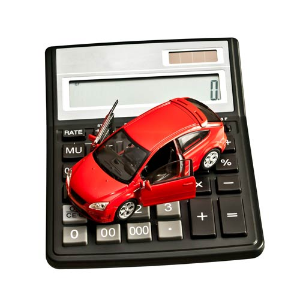
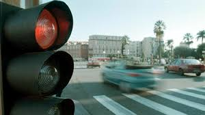
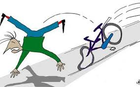
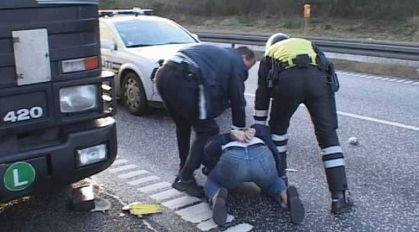
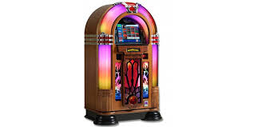
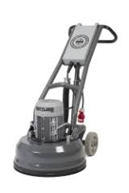
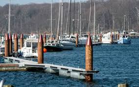

# <font color="red">Forsikring og pension<sup> Premium </font></sup>

```{r, echo=FALSE, results='asis'}

cat(readLines('npp.html'))

```


## <font color="red">Skadesforsikring<sup> Premium </font></sup>

Skadesforsikring er en aftale, hvor et forsikringsselskab overtager den økonomiske risiko for en uvis begivenheds indtræden. 

Ved skadesforsikring forstås i denne sammenhæng en forsikring, hvor selskabet kun er pligtig at erlægge forsikringsydelsen, når den sikrede har lidt en skade, der kan måles i penge, og hvor den ydelse, forsikringselskabet skal erlægge, bestemmes af den sum penge, der skal til for at erstatte skaden

Efter forsikringsaftalelovens (FAL) § 35 kan enhver lovlig interesse, der lader sig ansætte i penge, være genstand for skadesforsikring.

Forsikringen kan tegnes for forsikringstagerens eller tredjemands interesse.

---

*Hvad er forskellen på Skadesforsikring vs. Livsforsikring?*


Ordet skadeforsikring - dækker over forsikring af skader på ejendele eller personer.

Det dækker over traditionelle forsikringer, som f.eks.

Bilforsikring

Familie- og Indboforsikring

Husforsikring

Derudover dækker ordet også over sundheds- og ulykkesforsikringer hvor man kan komme til at gøre skade på sig selv eller andre (ansvarsforsikringer).

---

*"Væddemålet med forsikringsselskabet"*


Livsforsikring sikrer én eller ens families indtægter hvis én person skulle afgå ved døden. 

Det garanterer altså ikke, at man lever for altid - men den kan resultere i en økonomisk udbetaling til ens familie og de efterladte, hvis man dør for tidligt.

Størrelsen af beløbet fastsættes sammen med ens rådgiver. Pension hører ligeledes under den samme kategori - f.eks. er livrenter et godt eksempel på dette. Lever man længere er man sikret en fast indtægt. Dør man derimod tidligt, så er det forsikringsselskabet/pensionsselskabet der tjener på det.

De fleste kendte forsikringsselskaber tilbyder dog også livsforsikring. Denne forsikring henvender sig til den som ønsker at forsikre sig f.eks. imod en eventuel død. Så hvis situationen er, at ens familie er afhængig af ens indkomst, og man vil sikre sin familie såfremt man går bort, eller bliver uarbejdsdygtig. Fastsættelse af præmierne består af flere elementer, dels summen man ønsker at bliver forsikret for, men ligeledes om ens helbredsoplysninger.

Livsforsikring er således ikke skadesforsikring, men en *summaforsikring*, der er karakteriseret ved, at forsikringsselskabet skal udbetale den aftalte forsikringssum ved forsikringsbegivenhedens indtræden, uanset om der kan påvises et økonomisk tab.

---

Der skal således være tale om en *"lovlig interesse"*, der kan forsikres af skadesforsikringen. 

Justitsministeriel har i en skrivelse fra 1972 som refereret i Dansk Forsikringstidende nr. 21 af 17. juli 1972, bemærket følgende: "at den interesse, der består i at undgå de strafferetlige følger af et retsbrud, må anses for en ulovlig interesse. Forsikring kan således ikke tegnes mod faren for at blive idømt bødestraf eller konfiskation. På samme måde vil interessen i at opnå økonomisk udbytte af en strafbar handling som udgangspunkt ikke kunne anses som en lovlig interesse. Endvidere kan forsikring af en interesse være udelukket ved lov". 


Et forsikringselskab kan derfor fx ikke tilbyde forsikringer imod fartbøder, det vil ikke være en lovlig interesse.

---

Forsikringselskaberne skal ikke dække på en skadesforsikring, hvis skaden er sket i forbindelse med begået ulovligheder.


Forsikringsankenævnet har tilsyneladende strammet sin praksis, hvis det er overvejende sandsynlgt, at en stjålen genstand er hælervare:

Se **Forsikringsankenævnskendelse sagsnr.: 86.533.** Klagerens datter havde købt en helt ny computer via den blå avis: 
"Computeren var købt på en finasieringsaftale med et kreditkort, der var stjålet. Ved købet fik hun udleveret fakturaen, hvor hun kunne se, at hendes sælger ikke var den person, der havde købt computeren. Hun betalte en betydelig lavere pris for computeren end den kostede i forretningen. Efter nævnets opfattelse burde klagerens datter have indset, at sælger ikke var kommet i besiddelse af computeren på lovlig vis. At der ikke blev rejst tiltale mod datteren for hæleri, kunne ikke føre til andet resultat".

---


**Forsikringsankenævnskendelse sagsnr.: 89.051.** I dette tilfælde oplyste klageren, at han havde købt en kongekæde af nogle rockere. Han ville ikke oplyse nærmere om sælgernesidenditet. Han vidste heller ikke, hvor rockerne havde kæden fra. Kongekæden til en værdi af 180.000 kr. var nu stjålet. Nævnet fandt ikke anledning til at kritisere, at selskabet havde afvist dækning med henvisning til FAL § 35.

---

**Forsikringsankenævnskendelse sagsnr.: 90.514.** Bil købt i udlandet med en registreringsattest fra et andet land:
"Bilen indgik i en sales and lease back aftale med et leasingfirma. Bilen var af politiet indkadt til idenditetskontrol, men dagen før han skulle fremvise køretøjet, meldte han det stjålet. Ifølge Interpol var registreringsattesten falsk, idet chassisnummeret vedrørte et køretøj fra et helt tredje land - et køretøj, der i øvrigt var skrottet i 2014. Selskabet mente, at der var tale om en ikke lovlig interesse. Nævnet fandt det betænkeligt at lægge dette til grund, i det forsikringen skulle dække leasingfirmaets krav mod klager for skade på bilen. Det kunne ikke tillægges afgørende betydning, at det var usikkert, om klager og siden leasingfirmaet havde opnået ejendomsret til køretøjet. Selskabet havde derfor ikke været berettiget til at ophæve forsikringen med tilbagevirkende kraft. Nævnet viile dog ikke pålægge selskabet at betale erstatning, da det ikke fandt det sandsynliggjort, at et tyveri havde fundet sted".

---


### <font color="red">Forsikringsklasser - skadesforsikring<sup> Premium </font></sup>

Ved skadesforsikring forstås dermed begrebsmæssigt forsikringer omfattet af de forsikringsklasser (forsikringstyper), der fremgår af bilag 7 til Lov om finansiel virksomhed. 

Bilag 7 oplister de forsikringsklasser (nr. 1-18), der anses for skadesforsikring, i overensstemmelse med de bagvedliggende EU-regler herom på forsikringsområdet:

BILAG 7

Forsikringsvirksomhed - skade

Klassifikation af risici ved hjælp af forsikringsklasser.

1) Ulykker (herunder arbejdsulykker og erhvervssygdomme): summaforsikring, erstatning af økonomiske tab, kombinationer heraf og personbefordring.

2) Sygdom: summaforsikring, erstatning af økonomiske tab og kombinationer heraf.

3) Kaskoforsikring for landkøretøjer (bortset fra jernbaners rullende materiel): alle skader på motordrevne landkøretøjer og ikkemotordrevne landkøretøjer.

4) Kaskoforsikring for jernbanekøretøjer: alle skader på jernbanekøretøjer.

5) Kaskoforsikring for luftfartøjer: alle skader på luftfartøjer.

6) Kaskoforsikring for fartøjer til sejlads på have, indsøer og floder: alle skader på flodfartøjer, indsøfartøjer og havfartøjer.

7) Godstransport (herunder varer, bagage og alt andet gods): alle skader på transporterede varer eller bagage uanset arten af transportmidlet.

8) Brand og naturkræfter: alle skader på ejendom (bortset fra ejendom omfattet af klasserne 3, 4, 5, 6 og 7), når de er forårsaget af brand, eksplosion, storm, naturkræfter (bortset fra storm), kerneenergi og jordskred.

9) Andre skader på ejendom: alle skader på ejendom (bortset fra ejendom omfattet af klasserne 3, 4, 5, 6 og 7), når disse skader skyldes hagl eller frost eller har andre årsager af enhver art, f.eks. tyveri, undtagen dem, der er anført under nr. 8.

10) Ansvarsforsikring for motordrevne landkøretøjer: ethvert ansvar hidrørende fra brugen af motordrevne landkøretøjer (herunder førerens ansvar).

11) Ansvarsforsikring for luftfartøjer: ethvert ansvar hidhørende fra brugen af luftfartøjer (herunder førerens ansvar).

12) Ansvarsforsikring for fartøjer til sejlads på have, indsøer og floder: ethvert ansvar hidhørende fra anvendelsen af flod-, indsø- og havfartøjer (herunder førerens ansvar).

13) Almindelig ansvarsforsikring: ethvert ansvar, der ikke er anført under numrene 10, 11 og 12.

14) Kredit: almindelig insolvens, eksportkredit, salg på afbetaling, hypotekforsikring og landbrugsforsikring.

15) Kaution: direkte kaution og indirekte kaution.

16) Diverse økonomiske tab: arbejdsløshedsrisici, inkassotab (almindeligt), dårligt vejr, tab af fortjeneste, fortsatte generalomkostninger, uforudsete handelsudgifter, tab af salgsværdi, husleje- eller indtægtstab, indirekte handelstab bortset fra de ovenfor nævnte, ikkeforretningsmæssige økonomiske tab og andre økonomiske tab.

17) Retshjælpsforsikring: retshjælpsforsikring.

18) Assistance: assistance til personer, der kommer i vanskeligheder under befordring eller under fravær fra bopælen eller det faste opholdssted.

---


Skadesforsikring er for eksempel er således:

Bygningsforsikring, 

Løsøreforsikring, 

Erhvervsansvarsforsikring, 

Indboforsikring, 

Familieansvarsforsikring, 

Sygeforsikring, 

Personulykkesforsikring og 

Retshjælpsforsikring.

---

**Video om Forsikringsoplysningen**

<div class="video-container"><iframe src="https://www.youtube.com/embed/_AfijS3r6Sk" width="853" height="480" frameborder="0" allowfullscreen="allowfullscreen"></iframe></div>


---


Det fremgår således bl.a. af bilag 7, jf, ovenfor til Lov om finansiel virksomhed, at skadesforsikring også omfatter assistance, defineret som assistance til personer, der kommer i vanskeligheder under befordring eller under fravær fra bopælen eller det faste opholdssted (forsikringsklasse 18). 

Dette omfatter fx aftaler vedrørende vejhjælp, hjemtransport eller anden assistance, fx i medfør af en rejseforsikring, eller lignende ydelser, der falder ind under denne definition.

---

Skadesforsikringens genstand skal kunne ansættes til en økonomisk værdi før, at der kan ske dækning på skadesforsikringen:


**FED1998.942:** Konservering af fotoalbum og børnetegninger uden økonomisk værdi ansås ikke for dækket af familieforsikring, og forsikringstageren var derfor alene berettiget til erstatning for materialepriser.

---

## <font color="red">Udvalgte skadesforsikringer<sup> Premium </font></sup>^[Følgende afsnit bygger især på *Sonny Kristoffersen:* Introduktion til forsikringsreglerne, 2019, Hans Reitzels Forlag, jf. link: https://hansreitzel.dk/products/introduktion-til-forsikringsreglerne-bog-47916-9788741272849, samt materialer og afgørelser fra Ankenævnet for Forsikring og informationer fra Forsikringsoplysningen og domme fra UfR og FED udgivet af KarnovGroup.] 

---

### <font color="red">Bilforsikring<sup> Premium </font></sup> 




*Bilforsikringen*

Langt de fleste private bilejere har forsikret deres bil med en kombineret kasko- og ansvarsforsikring. 

Er der ikke gæld i bilen, og er der tale om en ældre bil, nøjes mange med den lovpligtige ansvarsforsikring. 

---

**Video: Om bilforsikringen**

<div class="video-container"><iframe src="https://www.youtube.com/embed/H9PzSmkhC48" width="853" height="480" frameborder="0" allowfullscreen="allowfullscreen"></iframe></div>

---

*Ansvar for motorkøretøjer*


Ifølge færdselsloven skal den ansvarlige for et motorkøretøj erstatte de skader, som køretøjet volder ved færdselsuheld, ved eksplosion eller ved brand. 

Det betyder, at ejeren altid er erstatningspligtig for disse uheld. 

Disse erstatningskrav vil blive betalt via motorkøretøjets lovpligtige ansvarsforsikring.

---

*Motoransvarsforsikring*


Ansvarsforsikringen for et motorkøretøj er lovpligtig og dækker det erstatningsansvar, som ejer eller bruger kan få. 

Ansvarsforsikringen dækker for et enkelt uheld personskader eller tab af forsørger op til 111 mio. kr. og tingskader op til 24 mio. kr. 

Dækningssummerne bliver reguleret hvert år pr. 1. januar. 

Ansvarsforsikringen dækker ikke skade på motorkøretøjets fører. Derimod er passagererne dækket. 

Forsikringen dækker heller ikke skade på forsikringstagerens eller brugerens ting eller skade på tilkoblet køretøj, f.eks. trailer. 

Hvis det skadevoldende køretøj ikke er forsikret eller forsvandt fra uheldsstedet (flugtbilist), har man mulighed for at få erstatning fra en fællespulje. 

Man henvender sig hos Dansk Forening for International Motorkøretøjsforsikring (DFIM). Adresse: Philip Heymans Alle 1, 2900 Hellerup, Telefon: 41 91 91 91. 

Bemærk: Er der tale om en flugtbilist, kan der også udbetales erstatning for tingskade, når der samtidig udbetales erstatning for personskade.

---

*Kaskoforsikring*

Ejere af et motordrevet køretøj (bil, motorcykler eller knallert) kan ud over den lovpligtige ansvarsforsikring også kaskoforsikre deres køretøj. 

Ordforklaring:

Ordet *”kasko”* kommer sig af det spanske ”casco”, der betyder ”skibsskrog”, og var oprindelig et ord for forsikring af skibes motorer, skrog og inventar. ... Med en kaskoforsikring, får man dækket skader på selve ens bil.

Forsikringen dækker de skader, der sker på ejerens bil. 

Har man lånt penge til at finansiere købet, er det normalt altid et krav fra bankens side, at der tegnes kaskoforsikring. 

Forsikringen dækker enhver skade på det forsikrede køretøj, samt tyveri af køretøjet, medmindre at der foreligger grov uagtsomhed hos forsikringstageren. 


---


Se **Forsikringsankenævnets sagsnr.: 73491.** Klager over afslag på dækning for en kaskoskade opstået i forbindelse med et tyveri: 
"Klager havde tegnet bilforsikring. Klagerens bil var blevet stjålet, da hendes ægtefælle havde parkeret bilen uden for en servicestation, medens han skulle handle. Bilen var ikke låst og der lå en bilnøgle i bilen. Bilen blev skadet da gerningsmanden mistede herredømmet over bilen. Nævnet fandt ifølge politirapporten at kunne lægge til grund, at klagerens ægtefælle, ved at have forladt bilen med nøgle i tændingslåsen som sket, havde forvoldt skaden ved grov uagtsomhed. Endvidere fandt nævnet, at klageren ikke havde haft kendskab til det hændte, hvorfor hun ikke derved havde udvist grov uagtsomhed. Selskabet havde dog anført i betingelserne, at der ikke var dækning, hvis den grove uagtsomhed var udvist at en ægtefælle eller en samlever. Klageren måtte således tåle at blive identificeret med sin ægtefælle. Selskab medhold".

---


Samt **Forsikringsankenævnets sagsnr.: 73618.** Klager over afslag på dækning for skade på bil: 
"Klager havde tegnet bilforsikring. Klageren punkterede og kørte herefter ca. 250 meter videre, da han ikke ville stoppe trafikken. Han parkerede herefter bilen og opdagede først der, at begge hjul var punkterede. Selskabet fandt, at klageren havde haft mulighed for, at standse langt tidligere end han havde gjort, og selskabet ville derfor ikke dække skaden. Selskabet mente, at klageren havde tilsidesat sin tabsbegrænsningspligt, og at han dermed havde fremkaldt forsikringsbegivenheden ved grov uagtsomhed. Nævnet fandt, at undladelsen af at standse efter en punktering kunne anses for en tilsidesættelse af den generelle regel i FAL § 52 om sikredes afværge- og tabsbegrænsningspligt. Nævnet fandt, at klageren havde tilsidesat pligten ved grov uagtsomhed. Selskab medhold". 

---




Endvidere **Forsikringsankenævnets sagsnr.: 73632.** Klager over afslag på dækning for kaskoskade: 
"Klager havde tegnet bilforsikring. Klager drejede af motorvejen og kørte ud i et kryds uden at registrere, at det var rødt og ramte herved 2 biler. Nævnet fandt, at klageren havde kørt over for rødt lys, og at årsagen hertil måtte være klagerens uopmærksomhed. En sådan adfærd indebar efter nævnets opfattelse en så indlysende fare for, at en skade som den omhandlende ville indtræffe, at et sådant forhold som udgangspunkt ville være at anse som groft uagtsomt, jf. FAL § 18. Efter nævnets opfattelse gav oplysningerne i sagen ikke grundlag for at fravige dette. Selskab medhold".

---

Der er dog nogle *undtagelser på bilforsikringen:* 

Kaskoforsikringen dækker ikke:

• Skader, der alene opstår i de mekaniske dele, medmindre skaden er sket ved brand, eksplosion, kortslutning, lynnedslag, røveri, tyveri og hærværk samt under transport ved hjælp af andet transportmiddel. 

• Skader sket under behandling og bearbejdning, medmindre skaden skyldes kørsel, brand eller nedstyrtning fra lift. 

• Skader opstået på grund af rust, slitage, stenslag i lak, ridser o.l.  

• Skader forvoldt med vilje eller ved grov uagtsomhed. 

• Skader forvoldt, mens køretøjet blev ført af en person, der var påvirket af spiritus, medmindre det godtgøres, at føreren var uden skyld i uheldet. 

• Skader indtrådt, mens køretøjet blev ført af en person, der ikke har kørekort, medmindre det godtgøres, at skaden ikke skyldes manglende kørefærdighed. 


---

*Se her: 10 ting ens bilforsikring ikke dækker:*

https://tv2-dk-clips.secure.footprint.net/vod/mpx/TV2dk/8/95/8r9u1xw5kc.mp4

---

*Gode råd om billeje*

https://fdm.dk/alt-om-biler/koer-selv-ferie/bliv-klar-til-ferien/gode-raad-om-billeje

---


Om Forsikringsankenævnets praksis ved færdselsskader som skyldes *selvforskyldt beruselse:*


**Sagsnr.: 88756.** Klager over regreskrav: 
"Klager mistede herredømmet over sin bil og påkørte en fodgænger. Der skete desuden skade på bil og et plankeværk. Selskabet rettede et regreskrav mod klager på 838.436,50 kr. med henvisning til, at klager havde forvoldt skaden ved grov hensynsløshed. Det fremgik, at klager havde haft en alkoholpromille på 1,64, og der var spor af sovemedicin og kokain i klagers blod/urin. Der var ulovlig dækmontering på bilen, som sammen med lavt dæktryk havde gjort bilen overstyret og med høj sandsynlighed medvirket til, at klager mistede kontrollen over bilen. Byretten havde i straffesagen vurderet, at klager før påkørslen af fodgængeren havde overtrådt straffelovens § 252, stk. 1, ved af grov kådhed eller lignende hensynsløshed at have forvoldt nærliggende fare for en cyklists liv og førlighed. Nævnet fandt det godtgjort, at klager havde forvoldt skaden ved grov hensynsløshed og kunne ikke pålægge selskabet at frafalde sit regreskrav. Nævnet forudsatte, at selskabet ved sin endelige opgørelse af regreskravet tog stilling til, at om der var grundlag for at lempe kravet efter erstatningsansvarslovens § 24, jf. U.2008.1332V. Selskab medhold".

---


**Sagsnr.: 83055.** Klager over afvisning af dækning for en totalskadet bil og over opkrævning af selvrisiko: 
"Klager kørte 24 km mod kørselsretningen på en motorvej i spirituspåvirket tilstand (målt promille på 1,62) og blev bragt til standsning ved, at en politipatruljebil påkørte hans bil. Selskabet afviste dækning for klagers totalskadede bil med henvisning til, at skaden var fremkaldt ved selvforskyldt beruselse og grov uagtsomhed. Selskabet fratrak selvrisiko under ansvarsforsikringen i betalingen for resterne af bilen. Nævnet fandt, at klager havde valgt ikke at standse, selv om politiet havde forsøgt at få ham til det. Han måtte derfor regne med, at han ville blive forsøgt standset, og hans handling indebar dermed en indlysende fare for, at skade kunne opstå. Klager havde derfor handlet groft uagtsomt, og nævnet kunne ikke pålægge selskabet at udbetale erstatning for hans bil, jf. betingelserne. Forsikringen var tegnet med selvrisiko for ansvarsskader, og nævnet kunne ikke kritisere, at selskabet havde fratrukket denne selvrisiko i betalingen for resterne. Selskab medhold".

---




**Sagsnr.: 91822**. Klager over selskabet afslag på at yde dækning for anmeldt uarbejdsdygtighed: 
"Klager var den 15/4 2017 udsat for et ulykkestilfælde, hvor han styrtede på sin cykel og pådrog sig hovedskader, og han var efterfølgende uarbejdsdygtig. På tidspunktet for ulykken havde klager en promille på ca. 1.3. Ulykken skete, da han cyklede hjem en aften efter en bytur, og han kørte ud over en rampe, som han ikke havde set, på et skoleområde. Selskabet anførte, at klager var uarbejdsdygtig som følge af selvforskyldt beruselse. Klager anførte, at han var beruset, men at dette ikke var hovedårsagen til ulykken. Han anførte, at han på tidspunktet for ulykken allerede havde cyklet 14 km, at det var mørkt og regnede, og at der ikke var afmærkninger eller advarsler omkring rampen. Nævnet fandt efter en gennemgang af sagen, at selskabet ikke havde bevist, at den væsentligste årsag til ulykken og uarbejdsdygtigheden var klagers beruselse. Klager medhold".




---

*Biltur i udlandet*

Ved kørsel i udlandet med et motorkøretøj med en tilladt totalvægt på højst 3,5 tons rummer kaskoforsikringen også en redningsforsikring. 

De nærmere forsikringsbetingelser fremgår af det røde servicekort, man kan få hos sit forsikringsselskab. (Tryg er ikke længere med fra 1/1 2018).

---

*Tilvalg på bilkaskoforsikring*

I tilknytning til den almindelige bilkaskoforsikring er det i de fleste forsikringsselskaber muligt at købe forskellige tilvalgsdækninger. 

Her skal de vigtigste dækninger kort nævnes:

• *Friskadedækning* betyder, at man undgår præmiestigning ved f.eks. skader på bilens glasdele, visse parkeringsskader, hærværk eller skader efter nedstyrtende genstande og skader som følge af tyveri og brand. 

• *Bilsavnsforsikring* giver mulighed for erstatning enten som et nærmere bestemt beløb af reparationsudgiften ved en kaskoskade eller som et beløb pr. dag, man må undvære bilen, hvis den er blevet stjålet. 

• *Værdiforringelse* betyder, at man får udbetalt en kontant erstatning, hvis ens nyere bil (normalt højst tre år gammel) kommer ud for en alvorlig skade. 

---

*Korrekt ejer/bruger af bilen*


Forsikringsankenævnet oplyser, at prisen på en autoforsikring afhænger i høj grad af, hvor gammel ejeren/brugeren af bilen er, og i hvor mange år man har kørt skadefrit. 

Det sker derfor, at en af forældrene indregistrerer en bil – som reelt ejes/bruges af barnet – i sit navn og tegner forsikringen i sit navn. 

Derved opnår barnet en billigere bilforsikring, end hvis barnet selv havde tegnet bilforsikringen.

Er barnet reelt bruger eller ejer af bilen, får forsikringsselskabet ikke den præmie, det havde krav på. 

Opdager forsikringsselskabet at ejer-/brugerforholdet ikke er korrekt – og det sker som regel, når forsikringstager anmelder en skade – kan det få store konsekvenser for erstatningen. 

Rent juridisk vil sådanne forhold efter Forsikringsankenævnets praksis blive vurderet efter forsikringsaftalelovens regler om urigtige risikooplysninger (§§4-10) eller reglerne om fareforøgelse (§§ 45-50).

---

Se eksempelvis **Forsikringsankenævnets sagsnr.: 87068 og sagsnr.:85571:**

---

**Sagsnr.: 87068.** Klager over afvisning af dækning for en totalskadet bil: 
"Nævnet fandt, at klager havde afgivet urigtige oplysninger, idet klager ikke havde oplyst til selskabet, at den reelle bruger af bilen var hendes søn. Selskabet var derfor berettiget til at opsige kaskodelen af forsikringen og undlade at dække den indtrådte kaskoskade. For så vidt angår ansvarsforsikringen - som selskabet videreførte - fandt nævnet, at selskabet var berettiget til med tilbagevirkende kraft at forhøje præmien. Selskab medhold".

---


**Sagsnr.: 85571.** Klager over præmieforhøjelse med tilbagevirkende kraft samt forhøjet selvrisiko: 
"Klagers ”bonussøn” anmeldte, at han som fører af klagers bil havde påkørt en anden bil på en parkeringsplads. Han oplyste, at han og klager skiftedes til at betale forsikringspræmien. Selskabet anførte, at klager ved grov uagtsomhed havde undladt at oplyse, at ”bonussønnen” var medbruger af bilen. Selskabet, som havde dækket ansvarsskaden, krævede forhøjet præmie med tilbagevirkende kraft og efterbetaling af selvrisikodifference. Nævnet fandt, at klager ved grov uagtsomhed havde overtrådt sin oplysningspligt vedrørende bilens brugerforhold. Nævnet fandt, at selskabet var uberettiget til at kræve præmieforhøjelse med tilbagevirkende kraft, idet en sådan retsfølge hverken var indeholdt i forsikringsaftalelovens §§ 6-7 eller §§ 45-46 eller i parternes aftale. Nævnets flertal kunne ikke kritisere, at selskabet opkrævede selvrisikodifference hos klager i medfør af forsikringsaftalelovens § 7, jf. § 6, stk. 2. Mindretallet fandt, at der ikke i § 6, stk. 2, var hjemmel til at opkræve forhøjet selvrisiko med tilbagevirkende kraft. Klager delvis medhold".

---

Hvis ens barn overtager ens gamle bil, skal man derfor huske at oplyse forsikringsselskabet herom, så selskabet kan beregne den rigtige præmie. 

Det samme gælder, hvis ens barn (eller andre) bliver fast bruger af bilen. 

Forsikringsankenævnet oplyser på deres hjemmeside, at det er svært at sige, hvornår man går fra bare at være bruger til at være fast bruger.

I nogle tilfælde bygger bilforsikringen på nogle forudsætninger om bilen (f.eks. motorstørrelse mv.) eller om forsikringstageren (f.eks. om ens kørselsbehov eller om, at man ikke er registreret i RKI). 

Har man afgivet urigtige oplysninger herom i forbindelse med tegningen af bilforsikringen, kan man efter Forsikringsankenævnets opfattelse efter omstændighederne risikere, at man ikke får erstatning eller får nedsat erstatningen, fordi man har betalt en for lav præmie på bilforsikringen. 

---


Se eksempelvis **Forsikringsankenævnets sagsnr.: 88440 og sagsnr.: 87783:**


**Sagsnr.: 88440.** Klager over afslag på dækning for en kaskoskade på en veteranbil: 
"Klager anmeldte, at hans søn var kørt galt. Selskabet konstaterede, at bilen var belagt med cyklamenfarvet film, havde sænket undervogn og fået nyt udstødningsrør. Selskabet afviste dækning og ophævede forsikringen med tilbagevirkende kraft med henvisning til, at det var en betingelse for dækning, at bilen var i original stand, og henviste til forsikringsaftalelovens § 7. Nævnet fandt, at selskabet ikke kunne påberåbe sig forsikringsaftalelovens § 7, bl.a. fordi selskabet havde afskåret sig herfra ved at fremsende en police til klager efter, at selskabet havde fået oplysninger om konstruktive ændringer på bilen. Videre fandt nævnet, at betingelsen om, at bilen skulle være i original stand alene medførte en ret for selskabet til at opsige forsikringen fremadrettet, hvis bestemmelsen blev overtrådt, ligesom forsikringsaftalelovens § 10, stk. 3, fandt anvendelse. Selskabet skulle herefter genoptage sagsbehandlingen. Klager medhold".

---


**Sagsnr.: 87783.** Klager over afvisning af dækning for tyveri af en bil: 
"Selskabet henviste til, at klager ikke havde oplyst, at der var sket en ændring af anvendelsen af bilen, hvor klager efter det oplyste fra selskabet nu benyttede bilen erhvervsmæssigt som vinduespudser. Policen indeholdt ikke oplysninger om hvilken anvendelse af bilen, der var forudsat. Af betingelserne fremgik under "ændringer af risiko", at klager skulle oplyse, hvis "der skete forandring i den i policen angivne risiko - f.eks. … anvendelse". Nævnet fandt, at bestemmelsen var for generelt og upræcist formuleret, jf. FAL § 45, og at selskabet derfor ikke kunne påberåbe sig fareforøgelse. Nævnet fandt, at selskabet ikke havde bevist, at klager havde afgivet urigtige oplysninger ved tegningen af forsikringen. Selskabet skulle derfor betale erstatning. Klager medhold".

---

### <font color="red">Forsikringer af familiens bolig<sup> Premium </font></sup>


*Familie- og indboforsikringen*

Familie-/indboforsikringen dækker skader på ens private indbo, der opstår på grund af brand, tyveri, indbrud, oversvømmelse mv. 

Det fremgår af ens police og ens forsikringsbetingelser, hvilke skader forsikringen dækker. 

Forsikringen dækker normalt ikke bedrageri, underslæb og lignende.

---

*Hvilke genstande der er omfattet af familie-/indboforsikringen*

---

**Video: Hvad dækker indboforsikringen**

<div class="video-container"><iframe src="https://www.youtube.com/embed/qF5DQPRVO3Q" width="853" height="480" frameborder="0" allowfullscreen="allowfullscreen"></iframe></div>


---

Forsikringen dækker kun skader på ens *private indbo*. 

Ved privat indbo forstås navnlig de ting, der er i ens hjem, som man kan tage med sig, hvis man skulle flytte, og som ikke har noget med ens erhverv eller med ens bil at gøre. 


Forsikringsankenævnet tog i **sagsnr.: 87984** stilling til, om en computer blev benyttet erhvervsmæssigt. Klager over afslag på erstatning for en Macbook Pro bærbar computer: 
"Klager oplyste, at han anvendte computeren til at producere musik på, men at dette ikke var hans erhverv, da han var discjockey. Han oplyste, at den producerede musik ikke havde noget at gøre med hans virke som discjockey, da han ikke optrådte med den musik, han producerede. Selskabet anførte, at klager havde oplyst, at han anvendte computeren i sit arbejde som discjockey. Nævnet fandt, at selskabet ikke havde sandsynliggjort, at computeren var anvendt erhvervsmæssigt. Klager medhold".

---

Småbåde, cykler og haveredskaber vil almindeligvis være dækket.

Forsikringen dækker genstande, som man ejer eller bærer risikoen for, jf, fx nævnssagerne **sagsnr.: 85614** og **sagsnr.:87698**: 


Forsikringsankenævnet har i **sagsnr.: 85614.** taget stilling til, om undervisningsmateriale udleveret af en skole – herunder en iPad – er omfattet af den private indboforsikring: 
"Nævnet fandt, at dette ikke var tilfældet, da genstanden ikke kunne anses for at være en privat ejendel, som klagerne eller deres datter bar risikoen for: Klager over afslag dækning for en iPad og skolebøger. Genstandene lå i klagers skoletaske, der blev stjålet. Klager anførte, at de var udlånt af gymnasiet i hendes interesse til brug for uddannelsen, hvorfor hun bar risikoen for dem. Hun henviste til både DL 5-8-1 og en underskrevet kontrakt med skolen om lån af iPad. Selskabet henviste til, at genstandene tilhørte skolen, samt til udtalelser fra Folketingets Ombudsmand og Undervisningsministeriet, hvoraf fremgik, at DL 5-8-1 ikke fandt anvendelse ved skolers udlån af undervisningsmidler, og at der ikke gyldigt kunne indgås aftale om et mere vidtrækkende ansvar for de lånte genstande, end hvad der fulgte af den almindelige erstatningsretlige culparegel. Nævnet fandt, at klager ikke ejede genstandene og heller ikke bar risikoen for disse. Nævnet måtte lægge til grund, at kontraktens vilkår om, at klager bar tyveririsikoen for iPaden var ugyldigt, da vilkåret gik videre end dansk rets almindelige regler om erstatning. Nævnet fandt, at ansvar for skader på lånte genstande efter betingelserne var undtaget dækning, når der var gået mere end 30 dage efter overtagelsen. Selskabet var derfor ikke forpligtet til at dække tyveriet. Selskab medhold". 

---




Se også **sagsnr.: 87968**, hvor Forsikringsankenævnet fandt, at en lejet jukebox (til en værdi af 37.000 kr.) var en indbogenstand: 
"Klager over afslag på dækning for en kortslutningsskade på en lejet jukebox til 37.000 kr. Selskabet anførte, at jukeboxen ikke kunne anses for at være en indbogenstand, og derfor ikke var dækket af indbo- eller ansvarsforsikringen. Nævnet fandt, at jukeboxen kunne anses for at være en indbogenstand. Nævnet fandt endvidere, at selskabet havde været berettiget til at afslå dækning af skaden i henhold til indboforsikringen, da skaden skyldtes fejlmontering. Nævnet fandt herefter, at selskabet skulle genoptage sagsbehandlingen i relation til ansvarsforsikringen, idet selskabet ikke havde vurderet om klager havde handlet ansvarspådragende i forbindelse med skaden. Klager medhold".

---

**Video: Gode råd ved indboforsikring**

<div class="video-container"><iframe src="https://www.youtube.com/embed/sWJ_F0BqvlI" width="853" height="480" frameborder="0" allowfullscreen="allowfullscreen"></iframe></div>


---

Er ens indbo ualmindeligt eller meget dyrt, skal man ofte tegne specialforsikringer eller tillægsdækninger. 

Det kan eksempelvis være tilfældet, hvis man har mange antikviteter, meget guld/sølv, værdifulde instrumenter eller mange designermøbler mv.


Sådanne genstande er mere udsat for at blive stjålet. Familie-/indboforsikringen indeholder derfor typisk særlige regler og begrænsninger for, hvornår og hvor meget man kan få i erstatning, hvis sådanne særligt tyvetækkelige genstande bliver stjålet eller beskadiget.

---

Genstande – eksempelvis værktøj – kan være af en sådan karakter, kvalitet eller omfang, at de ikke falder ind under begrebet privat indbo. 

Se en vekslende nævnspraksis i **sagsnr.: 87053, 84928 og 67965:**


I **sagsnr.: 87053** udtalte Forsikringsankenævnet, at en stor del af klagerens værktøj ikke var af en sådan karakter, at værktøjet ikke kunne karakteriseres som almindeligt privat indbo: 
"Klager over erstatningsopgørelse efter indbrud i kælderrum i beboelsesejendom. Selskabet havde anerkendt indbruddet som dækningsberettigende. Vedrørende værktøj fandt nævnet, at omfanget (anmeldt for over 100.000 kr.), men ikke karakteren af værktøjet gjorde, at ikke alt værktøjet kunne anses som omfattet som "almindeligt privat indbo". Nævnet fandt ikke, at selskabet - som ikke havde undtaget grov uagtsomhed ved indbrudstyveri - ikke havde bevist, at klager havde fremkaldt tyveriet ved grov uagtsomhed. Nævnet fandt, at klager havde dokumenteret et krav på i alt 15.000 kr. Vedr. skøjter fandt nævnet ikke grundlag for at kritisere, at selskabet havde afskrevet med 50 % pga. alder/nedsat nytteværdi. For så vidt angår fiskeudstyret fandt nævnet, at selskabet alene var berettiget til at afskrive med 30%. Klager delvis medhold".

---


Ankenævnet har i **sagsnr.: 84928** fastslået, at et stillads til en nypris på cirka 32.000 kr. var privat indbo: 
"Klager over afvisning af dækning for tyveri af et stillads. Selskabet henviste til, at et stillads ikke kunne betragtes som almindeligt privat indbo, og henviste til nævnets praksis AK 48.728. Nævnet fandt, at der siden 1999 var stadigt flere og flere private, der anskaffede sig et stillads til brug ved rensning af tagrender, småreparationer osv., og at et stillads som det pågældende i dag måtte betegnes som almindeligt privat indbo. Selskabet har derfor været uberettiget til at afvise dækning. Klager medhold".

---




Omvendt udtalte Ankenævnet i **sagsnr.: 67965**, at en gulvslibemaskine ikke var privat indbo.

---


Husdyr (f.eks. hund, kat, fugl og fisk) kan være omfattet af indboforsikringen. 

Hvis ikke husdyr er oplistet under rækken af forsikrede genstande, kan husdyr falde ind under kategorien almindeligt privat indbo. 

Efter Forsikringsankenævnets praksis afhænger det af arten og antallet, se eksempelvis **Forsikringsankenævnets sagsnr.: 85215 og 87090:**


**Sagsnr.: 85215.** Klager over selskabets afvisning af at yde erstatning for 150 afdøde fisk til en samlet værdi af 148.200 kr.: 
"Klagers fisk døde efter strømafbrydelse og derved manglende ilttilførsel til akvarierne. Nævnet fandt, at fisk i en sådan størrelsesorden og til en sådan værdi ikke kan betragtes som almindelig privat indbo, der hørte til en privat boligs normale udstyr i henhold til forsikringsbetingelserne. Selskab medhold".

---


**Sagsnr.: 87090.** Klager over erstatningsopgørelse efter brandskade: 
"Klagers udhus brændte. Nævnet fandt, at udhuse på grunden var omfattet af dækning. Under slukningsarbejdet smed brandfolkene tagplader i en havedam med fisk, hvorved folien i bunden af dammen blev beskadiget. Nævnet fandt, at havedammen var at anse som et bassin og derfor dækningsundtaget. Nævnet fandt, at fiskene i dammen ikke var erhvervsløsøre og var omfattet af forsikringen som husdyr. Nævnet kunne ikke afgøre, hvor stor en del af klagers plankeværk, der var nedbrændt. Klager delvis medhold”.

---

*Hvor dækker familie-/indboforsikringen?*

Forsikringen dækker genstande, som man opbevarer på forsikringsstedet – typisk ens folkeregisteradresse. 


Forsikringen dækker også genstande, som man har på sig eller med sig – eksempelvis ved taske- eller lommetyveri.

Genstande, som er i ens bil, kælder, på loftet, i udhuset mv., er normalt dækket, men der kan være en øvre grænse for, hvor meget man kan få erstattet – eksempelvis 10 % af forsikringssummen. 

Visse genstande – eksempelvis kontanter og særlige private værdigenstande – kan helt være undtaget fra dækning, hvis de ligger sådanne steder.

---

*Video: Ansvaret for flybagage*

<iframe title="vimeo-player" src="https://player.vimeo.com/video/305947100" width="640" height="360" frameborder="0" allowfullscreen></iframe>

---

**Video: Fastsættelsen af forsikringssummen**

<div class="video-container"><iframe src="https://www.youtube.com/embed/Y9DwajelnAI" width="853" height="480" frameborder="0" allowfullscreen="allowfullscreen"></iframe></div>

Forsikringssummen er den maksimale erstatning, man kan få udbetalt, hvis ens indbo bliver beskadiget eller stjålet, og man skal købe nyt. 

Det er derfor vigtigt, at den sum, man har forsikret ens indbo for, svarer til den faktiske værdi af ens indbo.


---

Forsikringen dækker normalt også genstande, der midlertidigt befinder sig uden for forsikringsstedet. 

For så vidt angår sommerhuse, bør man tegne en fritidshusforsikring, der foruden bygningen dækker indbogenstande i fritidshuset, se nærmere nedenfor.

Ved flytning dækker forsikringen i en kortere periode (normalt en måned) genstande i både den gamle og den nye helårsbolig.

Har man indbo stående andre steder i længere tid, skal man sørge for at indgå en aftale med forsikringsselskabet om, at forsikringen også dækker dette indbo. 

Ellers risikerer man, at der ikke er forsikringsdækning.

---

*Hvem dækker familie-/indboforsikringen?*


Forsikringen dækker husstanden. 

Se nærmere i forsikringsbetingelser, hvordan dette begreb er defineret. 

Ud over forsikringstageren er ægtefælle/samlever og børn (herunder normalt plejebørn) typisk en del af husstanden. 

Det er normalt et krav, at personerne er tilmeldt folkeregisteradresse på forsikringsstedet.

Udeboende børn under 21 år, der er ugifte og ikke lever i fast parforhold eller har fastboende børn, kan være dækket. 

Enkelte forsikringsselskaber har en dækningsgrænse helt op til 26 år for udeboende børn.

Har man hørt til husstanden, men bliver man eksempelvis skilt, er man normalt dækket i en kortere tidsperiode. 

Bliver man skilt og/eller flytter, skal man indgå en aftale med forsikringsselskabet om, at selskabet dækker på ens nye adresse. 

Ellers risikerer man, at der ikke er dækning. 

Tjek også, hvem forsikringen dækker, hvis man har personer boende i kortere eller længere tid, som ikke er en del af husstanden.

---

*Bevisbyrde og klagemulighed*


Det er forsikringstageren, der skal bevise, at der er sket en skade, der er omfattet af familie-/indboforsikringen. 

Er man uenig med forsikringsselskabet om, hvad man skal have i erstatning, er det også forsikringstageren, der skal bevise, at erstatningen skal fastsættes højere end det, forsikringsselskabet har tilbudt. 

Påberåber forsikringsselskabet sig en dækningsundtagelse – eksempelvis at forsikringstagerens bolig ikke var forsvarligt aflåst – er det dog forsikringsselskabet, der skal bevise, at en sådan dækningsundtagelse foreligger.

---


**FED 1999.57:** Tyveri af smykker og kontanter kunne efter bevisførelsen ikke antages at være sket fra forsvarligt aflåst bygning, og tyveriet var derfor ikke omfattet af forsikringen.

---


Er man uenig med forsikringsselskabet, er det en god idé, at man taler med sagsbehandleren i selskabet om, hvad man skal gøre for at bevise, at man har ret. 

Er man stadig utilfreds, kan man kontakte forsikringsselskabets klageansvarlige, hvis man mener, at sagsbehandleren er nået til et forkert resultat.

Man skal altid have klaget til sit forsikringsselskab over dets afgørelse, før man kan klage til Forsikringsankenævnet. 

Forsikringsselskabet skal med andre ord have haft en ekstra mulighed for at imødekomme ens krav.


---

*Hvilke skader er dækket af familie-/indboforsikringen?*

Det er policen og ens forsikringsbetingelser, der sætter rammen om det, man kan få dækket, og hvad man kan få i erstatning. 

Normalt dækkes skader på privat indbo, der sker ved:
 
• Brand eller tilsodning.

• Lynnedslag.

• Storm eller oversvømmelse som følge af voldsomt tø- eller skybrud, når vandet ikke kan få normalt afløb.

• Tilfældig udstrømning af væsker.

• Indbrudstyveri.


Definitionen af indbrudstyveri lyder normalt: 

"Tyveri ved indbrud i forsvarligt aflåst bygning eller lokale." 


Der findes en righoldig nævns- og retspraksis om begrebet "forsvarligt aflåst", og der henvises til kendelsesdatabasen på Forsikringsankenævnets hjemmeside:

http://ankeforsikring.dk/kendelser/Sider/kendelser.aspx#Default=%7B%22k%22%3A%22%22%2C%22o%22%3A%5B%7B%22d%22%3A%221%22%2C%22p%22%3A%22AnkeforsikringClosedDate%22%7D%5D%7D

Som udgangspunkt skal vinduer og døre være lukkede og låste/tilhaspede – også når man er hjemme.

Endvidere dækkes på forsikringen:

• Simpelt tyveri.

• Ran og røveri.

---

Ved *ran* forstås almindeligvis tyveri, som forsikringstageren eller en anden person opdager i det øjeblik, hvor gerningsmanden tager genstanden. 

Det er en betingelse, at man øjeblikkeligt gør anskrig ved ran, eller at tyveriet kan bevidnes af en anden person. 

Ordforklaring: Ran, er en ulovlig tilegnelse af løsøre, der befinder sig i en anden persons varetægt.

I middelalderens landskabslove skelnede man mellem ran og tyveri. 

Ran adskilte sig fra tyveri ved at blive foretaget åbenlyst, mens tyveri blev begået hemmeligt. 


---

Ankenævnet har flere gange taget stilling til, om definitionen af "ran" er opfyldt. 


Se eksempelvis **sagsnr.: 77996 og 75600:**

**Sagsnr.: 77996.** Klager over, at selskabet havde anset et tyveri som et simpelt tyveri: 
"Klager anmeldte, at han havde været udsat for et tyveri i Spanien. Det fremgik, at gerningsmændene havde punkteret hans ene dæk, da hans bil holdt for rødt, og derefter havde tilbudt ham at hjælpe med at skifte dækket. Dette havde klager afslået, da han følte dig truet af dem, men umiddelbart efter opdagede han, at hans taske, som befandt sig i bilen, var forsvundet. Selskabet anerkendte at dække klagers taske samt de genstande, der befandt sig i tasken, men afviste at udbetale erstatning for smykker og kontanter med henvisning til, at hændelsen blev betragtet som et simpelt tyveri. Efter klagers opfattelse var der tale om røveri, ran eller tricktyveri. Nævnet fandt, at klager allerede i forbindelse med, at dækket punkterede, og gerningsmændene parkerede deres bil og nærmede sig, følte sig truet, hvorfor han noterede bilens nummer og ringede til politiet. Henset hertil, og idet han opdagede tyveriet umiddelbart efter, at gerningsmændene havde taget tasken og var på vej væk, fandt nævnet bestemmelsen i forsikringsbetingelserne om ran opfyldt. Selskabet skulle derfor anerkende, at klager havde været udsat for et dækningsberettigende ran. Klager medhold".

---

**Sagsnr.: 75600.** Klager over, at selskabet anså tyveri som simpelt tyveri og i konsekvens deraf ikke dækkede stjålne kontanter: 
"Klager var udsat for tricktyveri og bemærkede den stjålne pung, allerede da tyvene var på vej væk fra ham. Selskabet afviste med henvisning til, at der ikke var tale om ran, idet klager ikke havde bemærket tyveriet i gerningsøjeblikket. Nævnet fandt, at der var tale om ran, når forsikringstageren eller andre har bemærket, at gerningsmanden tog det stjålne, har set pågældende være i besiddelse af det, da vedkommende forsvandt, eller har bemærket særlige omstændigheder ved tyveriet. Det er således ikke i sig selv afgørende, om blot den formodede gerningsmand er set, eller om der er gjort anskrig. Da klager hurtigt opdagede tyveriet og råbte op, fandt nævnet, at der var tale om et dækningsberettigende ran. Klagen toges derfor til følge, og selskabet skulle anerkende tyveriet som ran. Klager medhold".

---

**Video: Gode råd ved identitetstyveri**

<div class="video-container"><iframe src="https://www.youtube.com/embed/-gzZYtG_C4w" width="853" height="480" frameborder="0" allowfullscreen="allowfullscreen"></iframe></div>


---

Endvidere dækkes normalt skader på privat indbo, der sker ved:

• Hærværk, der sker i og ved den forsikredes helårsbolig.

• Færdselsuheld.

• Dybfrostskader som følge af en tilfældig strømafbrydelse.
Forsikringsankenævnet har i flere sager taget stilling til, hvornår genstande, der er angrebet af skimmelsvamp, er dækket af familie-/indboforsikringen. 

Ankenævnet afviser i nogle af sagerne dækning med henvisning til, at skimmelsvamp ikke er en dækningsberettigende skade, og at der ikke er årsagssammenhæng mellem vandskaden og følgeskaden med skimmelsvampen, og i andre sager, at der er dækning for følgeskaden for skimmelsvamp, hvis der kan påvises en årsagssammenhæng mellem vandskaden og skimmelsvampen. 

---

Se eksempelvis **sagsnr.: 87959, 86684, 85567, 85355 og 71468:**
 
**Sagsnr.: 87959.** Klager over afvisning af dækning for skimmelskadet indbo: 
"Klager gjorde gældende, at skimmelsvampen var opstået som følge af en dækningsberettigende udsivning fra et vandrør. Selskabet henviste til, at indbogenstandene ikke var blevet vandpåvirket, hvorfor der ikke var tale om en følgeskade af udsivningen. Nævnet fandt, at det var bevist, at der var årsagssammenhæng mellem skimmelsvampeangrebet og vandudsivningen, hvilket selskabet skulle anerkende. En række ubeskadigede indbogenstande blev skimmelsvampepåvirket under genhusning på anden adresse. Nævnet fandt, at den skimmelsvamp, som opstod på indboet under genhusningen, ikke kunne anses for en adækvat følge af vandudsivningen i klagers egen bolig. Selskabet skulle derfor ikke dække de indbogenstande, der havde fået skimmelsvamp under genhusning. Klager delvis medhold".

---

**Sagsnr.: 86684.** Klager over afslag på dækning for fugtskadet indbo: 
"Den 22/7 2011 trængte der i forbindelse med et skybrud vand ind i klagers kælderlejlighed, og der blev efterfølgende konstateret vækst af skimmelsvamp på en lang række af klagers indbogenstande. Nævnet fandt, at de omhandlede genstande i lejligheden ikke blev ramt af det indtrængende vand. Uanset om årsagen til, at der var sket angreb af skimmelsvamp på klagers indbogenstande i kælderen, var utilstrækkelig udtørring af kælderen efter skybruddet, fandt nævnet ikke at kunne kritisere, at selskabet havde afvist at yde forsikringsdækning. Nævnet lagde blandt andet vægt på, at skaderne var opstået på genstande, der ikke blev påvirket af vand under skybruddet, og at det ikke er ualmindeligt, at der kan komme skimmelsvamp på genstande, der opbevares i fugtige omgivelser. Selskab medhold".

---

**Sagsnr.: 85567.** Klager over selskabets afslag på at yde dækning for en anmeldt skimmelsvampeskade på klagers indbo: 
"Klager anmeldte i september 2013, at indbo, som hun opbevarede i kælderen, var ødelagt af skimmelsvamp opstået efter et skybrud den 2/7 2011. Indbogenstandene var ikke i kælderen under skybruddet. Selskabet afviste dækning med henvisning til, skimmelsvamp ikke var en dækningsberettigende skade, og at der ikke var årsagssammenhæng. Nævnet fandt ikke grundlag for at kritisere selskabets afslag på dækning under henvisning til, at der ikke indtrådt en dækningsberettigende skade. Selskab medhold".

---

**Sagsnr.: 85355.** Klager over selskabets afslag på at yde dækning for en anmeldt skimmelsvampeskade på klagers indbo: 
"Klager anmeldte i marts 2013, at indbo, som hun opbevarede i kælderen, var ødelagt af skimmelsvamp opstået efter et skybrud den 2/7 2011. Indbogenstandene var ikke blevet ramt af vandet under skybruddet. Selskabet afviste dækning med henvisning til, at skimmelsvamp ikke var en dækningsberettigende skade, og at der ikke var årsagssammenhæng. Nævnet fandt ikke grundlag for at kritisere selskabets afslag på dækning under henvisning til, at der ikke var indtrådt en dækningsberettigende skade. Selskab medhold".

---

**Sagsnr.: 71468**.Klager over afslag på dækning for skade på tøj forårsaget af mug og skimmelsvamp i garderobeskabe: 
"Nævnet finder at måtte lægge til grund, at årsagen til opfugtningen af kældervæggene og dermed skimmelsvampeskaden på klagerens tøj er en sammenbrudt kloak uden for huset. Da tilfældet efter nævnets opfattelse hermed er omfattet af dækning i henhold til forsikringsbetingelserne, finder nævnet, at skaden er erstatningsberettigende. Klager medhold".

---

Familie-/indboforsikringen dækker normalt ikke bedrageri, underslæb og lignende. 

Typisk dækker forsikringen ikke, hvis en potentiel køber af ens cykel/bil ønsker at prøvekøre ens cykel/bil, men aldrig vender tilbage med cyklen/bilen. Det skyldes, at man frivilligt har overdraget cyklen/bilen til gerningsmanden. 

Se eksempelvis **sagsnr.: 86546.** Klager over afvisning af dækning for en stjålet cykel: 
"Klager anmeldte, at hun havde haft besøg af en person, der havde henvendt sig på baggrund af en cykelsalgsannonce, at hun havde overladt ham sin cykel med henblik på prøvekørsel, og at han ikke kom tilbage med cyklen. Da det måtte formodes, at gerningsmanden ikke havde været en potentiel køber, men havde haft til hensigt at fravende klager cyklen ved at udgive sig for en sådan, forelå der hverken tyveri eller ran, men bedrageri. Tab ved bedrageri var ikke dækket af forsikringen, og nævnet fandt derfor, at selskabet havde været berettiget til at afvise dækning. Nævnet fandt, at klager ikke havde godtgjort, at en af selskabets medarbejdere i forbindelse med skadesanmeldelsen telefonisk havde givet hende et bindende dækningstilsagn. Selskab medhold".

---

Nogle familie-/indboforsikringer kan også dække visse former for *tricktyverier*. 

Om tricktyveri kan henvises til eksempelvis Forsikringsankenævnet i **sagsnr.: 86662, 86339 og 83094:**

**Sagsnr.: 86662.** Klager over afslag på dækning for tyveri af nogle smykker: 
"Klager oprettede en annonce på Den Blå Avis med henblik på at få rengøringshjælp. Hun blev kontaktet af en kvinde, der på første arbejdsdag stjal nogle af klagers smykker, mens kvinden var alene i huset. Selskabet henviste til, at der var tale om simpelt tyveri, hvorefter der ikke var dækning for smykker. Nævnets flertal fandt, at forsikringens undtagelsesbestemmelse om medhjælp førte til, at der ikke var forsikringsdækning. Mindretallet fandt, at der var tale om tricktyveri, og at klager skulle have medhold. Selskab medhold".

---

**Sagsnr.: 86339.** Klager over afvisning af dækning for et anmeldt tricktyveri: 
"Klager, der var tidligere guldsmed, gav to fremmede kvinder adgang til sin bolig. Det var hans opfattelse, at den ene via en telefon guidede en tredje til at stjæle guld og smykker fra hans uaflåste hobbyrum. Selskabet afviste dækning for tricktyveri med henvisning til, at tyveriet ikke var begået af en af de to kvinder, der havde narret klager til at give sig adgang til boligen. Nævnet fandt ikke grundlag for at kritisere denne afgørelse. Selskabet afviste at yde dækning for guldet og smykkerne med henvisning til, at særlige private værdigenstande ikke dækkes ved simpelt tyveri. Klager henviste til dækningsskemaets bestemmelse om hobbygenstande, der dækkes "uanset art". Nævnet fandt, at bestemmelsen om særlige private værdigenstande måtte gå forud for bestemmelsen om hobbygenstande. Selskab medhold".

---

**Sagsnr.: 83094.** Klager over afvisning af dækning for en stjålet guldring: 
"Klager anmeldte, at hun fik stjålet en guldring på et toilet i en lufthavn i Tyrkiet. Hun havde lagt ringen på vasken for at vaske hænder, da en person henvendte sig og fik hende til at vende sig om. Da hun kort efter kiggede tilbage, var ringen væk. Selskabet henviste til, at det anmeldte tyveri måtte karakteriseres som et simpelt tyveri, og at der ikke var dækning for simpelt tyveri af smykker. Selskabet henviste endvidere til, at tyveriet ikke omfattedes af dækningen for tricktyveri, idet tyveriet ikke var sket på forsikringsstedet. Nævnet var enig med selskabet i, at det omhandlede tyveri ikke var omfattet af dækningen for tricktyveri, idet tyveriet var sket uden for forsikringsstedet. Nævnets flertal udtalte, at et tyveri efter nævnets praksis kun blev anset for at være ran, når sikrede eller andre bemærkede, at gerningsmanden tog det stjålne, så vedkommende være i besiddelse af det stjålne, da han/hun forsvandt, eller havde bemærket særlige omstændigheder ved tyveriet. Det var således ikke i sig selv afgørende, om blot den formodede gerningsmand var set, eller om der var gjort anskrig. Flertallet fandt det ikke godtgjort, at betingelserne for dækning for ran var opfyldt i den foreliggende situation, og kunne ikke kritisere selskabets afgørelse. Mindretallet fandt efter en samlet bedømmelse, at forholdet måtte anses for ran, og stemte for at give klager medhold. Selskab medhold".

---

De enkelte forsikringsselskabers definition af, hvad der forstås ved de forskellige skadetyper, kan afvige lidt fra hinanden. 

Se derfor i forsikringsbetingelserne, hvad ens forsikringsselskab dækker, og hvad det undtager.

Man kan ofte udvide sin familie-/indboforsikring, så den dækker flere forhold. 

---

Det kan eksempelvis være: 

• Udvidet el-skadedækning. (Hvis fx udlejer har fraskrevet sig dette ansvar i lejekontrakten).

• Glas- og kummeforsikring. (Hvis fx udlejer har fraskrevet sig dette ansvar i lejekontrakten).

• Rejseforsikring.

• Dækning for windsurfere og småbåde.

• Dækning for anden pludselig skade. 

Her er det et krav, at skadevirkning og skadeårsag skal ske samtidig, og at skadeårsagen er udefrakommende. 

Skader, der sker ved almindelig brug, som f.eks. ridser, skrammer, spild af væsker osv., er som regel undtaget.

---

Bygningsdele er som udgangspunkt ikke omfattet af familie-/indboforsikringen, men af bygningsforsikringen, se nedenfor. 

Bygningsdele, man som lejer har vedligeholdelsespligten for, kan dog være tyveri- og hærværksdækket, hvis der ikke findes en bygningsforsikring, som dækker.

---

*Genstande med høj risiko for tyveri*

Nogle genstande er mere udsat for at blive stjålet end andre. 

Familie-/indboforsikringen indeholder derfor typisk særlige regler og begrænsninger for, hvornår og hvor meget man kan få i erstatning, hvis sådanne særligt tyvetækkelige genstande bliver stjålet eller beskadiget.

Familie-/indboforsikringen sondrer mellem almindeligt privat indbo, særligt privat indbo og særlige private værdigenstande. Man skal være opmærksom på, at sondringen ikke kun er relevant i forhold til tyveri. 

Se f.eks. **Ankenævnets sagsnr.: 88600** om "pludselig skade" på et guldur. Klager over afvisning af dækning for pludselig skade på guldur: 
"Nævnet fandt, at gulduret var en særlig privatværdigenstand. Der var ikke dækning for pludselig skade på særlige private værdigenstande. Selskab medhold”.

Særlige private værdigenstande er typisk guld, sølv, platin, perler og ædelstene eller ting, hvori dette indgår som væsentlig bestanddel. 

Se eksempelvis **nævnssagerne 84083 og 88600**. 

Herudover er smykker og samlinger også typisk særlige private værdigenstande: 

**Sagsnr.: 84083.** Klager over erstatningsopgørelse efter et indbrudstyveri: 
"Selskabet udbetalte 263.067,50 kr. i erstatning, herunder dækningsmaksimum på 15 % af forsikringssummen for ”særlige private værdigenstande”, idet dette dækningsmaksimum var overskredet. Klager anførte, at et guldur, et Georg Jensen-sølvkorpus samt en række antikke sølvgenstande ikke kunne henføres til punktet ”særlige private værdigenstande” og derfor skulle erstattes uden for det særlige dækningsmaksimum. Nævnet fandt, at guld og sølv indgik som en væsentlig bestanddel af de omhandlede effekter, og at forsikringsbetingelserne måtte forstås således, at effekterne dermed skulle behandles som ”særlige private værdigenstande” og være omfattet af dækningsmaksimum herfor – uanset at effekterne også kunne henføres til punktet ”særligt privat indbo”. Selskab medhold".

---

**Sagsnr.: 88600.** Klager over afvisning af dækning for pludselig skade på guldur: 
"Nævnet fandt, at gulduret var en særlig privatværdigenstand. Der var ikke dækning for pludselig skade på særlige private værdigenstande. Selskab medhold".

---

Andre tyvetækkelige eller særligt værdifulde genstande er typisk defineret som særligt privat indbo. 

Det gælder f.eks. antikviteter og ægte tæpper, ure, elektronik (af en vis værdi), skind og pelse samt vin og spiritus.

Sondringen har betydning i forhold til den dækning, man kan opnå fra forsikringsselskabet i tilfælde af blandt andet tyveri. 

For eksempel vil særlige private værdigenstande og penge oftest være dækket ved indbrudstyveri, men ikke ved simpelt tyveri.

Ved indbrudstyveri forstås normalt, at en gerningsmand bryder ind i forsvarligt aflåst bygning eller lokale. 

Der findes en rig praksis om begrebet "forsvarligt aflåst" – se kendelsesdatabasen på Forsikringsankenævnets hjemmeside. 

Som udgangspunkt efter nævnets praksis skal vinduer og døre være lukkede og låste/tilhaspede – også når man er hjemme.

**FED 2003.2505:** Tyveri fra lejlighed uden synlige spor på opbrud. Forsikringsselskabet havde ikke løftet bevisbyrden for, at lejligheden ikke havde været forsvarligt aflåst, hvorfor skaden skulle dækkes som indbrudstyveri. 

---

Er gerningsmanden kommet ind ad en dør eller et vindue – som ikke var forsvarligt aflåst, og som forsikringsselskabet kan kritisere forsikringstageren for ikke at have aflåst forsvarligt – dækker forsikringen ikke efter reglerne om indbrudstyveri, men kun efter reglerne om simpelt tyveri. 

Det kan betyde, at man ikke får dækning for eksempelvis stjålne smykker og kontanter. Se fx fra Forsikrngsankenævnets praksis, jf. **sagsnr.: 85719, 85697, 87541 og 84968:** 

Se **sagsnr.: 85719**, hvor gerningsmanden kom ind gennem et kældervindue med kattelem, men med tremmer for: 
"Klager over afvisning af dækning for stjålne smykker og kontanter. Gerningsmanden skaffede sig afgang via en kattelem i et kældervindue, der målte ca. 50x50 cm. For vinduet var der monteret jerntremmer, der indebar, at det største rum, hvor tyven kunne komme igennem, var 21x50 cm. Selskabet henviste til, at der var tale om simpelt tyveri, idet bygningen ikke var forsvarligt aflåst. Nævnets flertal fandt, at gerningsmanden uhindret havde kunnet skaffe sig adgang til boligen ved hjælp af kattelemmen. Flertallet fandt, at klager burde have kunnet indse, at en mindre person ville kunne komme igennem. Flertallet fandt derfor, at klager uagtsomt havde tilsidesat betingelsernes sikkerhedsforskrift om forsvarlig aflåsning. Mindretallet fandt, at klager ikke havde udvist uagtsomhed. Selskab medhold".

---

Se **sagsnr.: 85697**, hvor gerningsmanden kom ind gennem et åbentstående soveværelsesvindue i stueetagen, mens familien spiste morgenmad i lokalet ved siden af: 
"Klager over, at selskabet behandlede et anmeldt indbrudstyveri som simpelt tyveri. Klageren anmeldte, at der var blevet stjålet smykker, penge og en computer fra hendes lejlighed beliggende i stueetagen. Gerningsmanden var kommet ind gennem et åbenstående vindue i klagerens soveværelse, mens klageren var hjemme om morgenen. Selskabet behandlede sagen som et simpelt tyveri, da lejligheden ikke var forsvarligt aflåst på gerningstidspunktet. Nævnet fandt, at klagerens hjem ikke havde været forsvarligt aflåst, og at sikkerhedsforskriften herom i forsikringsbetingelserne ikke var overholdt. Under henvisning til at tyveriet skete, da klager spiste morgenmad sammen med sin familie i lokalet ved siden af soveværelset, og da gerningsmanden havde brugt en cykel som en stige for at skaffe sig adgang, fandt nævnet, at tilsidesættelsen af sikkerhedsforskriften ikke kunne tilregnes klager som uagtsom. Nævnet fandt derfor, at selskabet skulle yde dækning i henhold til forsikringsbetingelsernes bestemmelse om indbrudstyveri. Klager medhold".

---

Se **sagsnr.: 87541**, hvor klageren kortvarigt var ude at plukke bær i haven: 
"Klager over afslag på dækning for tyveri af smykker. Klager anmeldte, at hun den 30/7 2014 gik ud af sin havedør for at plukke bær, og at hun pludselig kunne se, at der var en fremmed person i hendes køkken. Da hun kom tilbage i huset, observerede hun endnu en fremmed person, hvorefter det lykkedes hende at jage begge personer væk. Efterfølgende konstaterede hun, at der var blevet stjålet en række guldsmykker. Nævnet lagde til grund, at der ikke havde været andre ulåste døre end havedøren, og at hun kun kortvarigt havde været ude i haven tæt ved havedøren. Nævnet fandt, at overtrædelsen af sikkerhedsforsikringen om forsvarlig aflåsning på det foreliggende grundlag ikke kunne tilregnes klager som uagtsom. Nævnet fandt, at selskabet derfor skulle opgøre klagers krav efter bestemmelserne om indbrudstyveri. Klager medhold".

---

Se **sagsnr.: 84968**, hvor Forsikringsankenævnet fandt, at der ikke var årsagssammenhæng mellem tyveriet og den ikke-forsvarlige aflåsning af boligen. Klager over erstatningsopgørelse: 
"Klager anmeldte et indbrudstyveri fra sit hus. Selskabet udbetalte 11.228 kr. i erstatning men afviste dækning for smykker og kontanter med henvisning til, at huset ikke var forsvarligt aflåst på tyveritidspunktet. Selskabet anførte desuden, at klager havde handlet groft uagtsomt, idet hun ikke havde omkodet husets låse efter et tasketyveri 5 måneder forinden, hvor identifikationspapirer og en husnøgle blev stjålet. Nævnet fandt, at klager havde tilsidesat sikkerhedsforskriften om forsvarlig aflåsning mht. en uaflåst kælderdør, men at selskabet ikke havde bevist, at der var årsagssammenhæng mellem tilsidesættelsen og det skete tyveri. Nævnet fandt det ikke bevist, at klager i øvrigt havde tilsidesat sikkerhedsforskriften om forsvarlig aflåsning. Selskabet var derfor ikke berettiget til at betragte tyveriet som et simpelt tyveri. Nævnet fandt, at selskabet ikke havde bevist, at klager ved grov uagtsomhed havde tilsidesat sin tabsbegrænsningspligt ved ikke at få omkodet sine låse efter tasketyveriet. Klager medhold".

---

Familie-/indboforsikringen vil ofte indeholde et maksimum for, hvor meget man kan få erstattet, hvis man får stjålet særlige private værdigenstande eller særligt privat indbo. 

Maksimummet kan være et beløb – eksempelvis 150.000 kr. – eller en procentdel af den forsikringssum, der gælder for ens forsikring.

Ved tyveri af eller fra en taske handler sagerne ofte om, hvorvidt det er groft uagtsomt, at man medtog særligt værdifulde genstande i tasken, og/eller at man efterlod tasken på offentlige steder uden at holde tasken under konstant opsyn. 

Handler man groft uagtsomt, får man normalt ingen erstatning. Hos nogle forsikringsselskaber får man ved grov uagtsomhed en reduceret erstatning. 

---

Se fra Ankenævnets righoldige praksis **sagsnr.: 88475, 86538, 85733, 61413 og 56609:**
 
Se **sagsnr.: 88475**, hvor klageren handlede groft uagtsomt ved at forlade sin taske med værdier for ca. 18.000 kr. på en offentlig strand i 5 minutter, mens hun talte med en mand om bådudlejning: "Klager over afslag på dækning for et anmeldt tyveri af bl.a. en iPhone 5s, Nintendo ds, smykker samt nogle kontanter (værdi i alt 18649 kr.). Nævnet fandt, at klager medbragte en taske indeholdende de pågældende genstande til en strand, hvortil der var offentlig adgang. På den baggrund - og henset til de stjålne genstandes værdi samt omstændighederne omkring disses forsvinden - fandt nævnet, at klager havde udvist grov uagtsomhed i forbindelse med tyveriet. Da selskabet i forsikringsbetingelserne havde forbeholdt sig fuldstændig ansvarsfrihed ved grov uagtsomhed, kunne nævnet ikke pålægge selskabet at udbetale erstatning. Selskab medhold".

---

Se også **sagsnr.: 86538**, hvor det var groft uagtsomt at medbringe 6.000 dollars i kontanter og for ca. 180.000 kr. smykker mv. på et vietnamesisk marked: 
"Klager over afslag på dækning for ran af bl.a. smykker og kontanter. Klager fik under et besøg på et marked i Vietnam fravristet en skuldertaske med 6.000 dollars i kontanter og genstande for ca. 180.000 kr. af to mænd på en forbipasserende mænd på scooter. Selskabet afviste bl.a. med henvisning til grov uagtsomhed. Nævnet fandt, at den anmeldte begivenhed skulle karakteriseres som ran i henhold til forsikringsbetingelserne, og at klager havde handlet groft uagtsomt jf. FAL § 18. Nævnet lagde bl.a. vægt på, at hun forud for sin afgang til markedet blev advaret om, at der var meget tyveri på det pågældende marked, og at hun desuagtet gennemførte besøget med usædvanligt værdifulde genstande i sin skuldertaske. Nævnet bemærkede, at selskabet i betingelserne ikke helt havde undtaget dækning for ran ved grov uagtsomhed, modsat hvad der gjaldt ved simpelt tyveri. Nævnet fandt, at selskabet skønsmæssigt var berettiget til afkorte 50 % i erstatningen, jf. FAL § 18, stk. 2. Nævnet tog ikke stilling til, om klager havde bevist størrelsen af sit krav. Klager delvist medhold".

---

Se **sagsnr.: 85733.** Klager over erstatningsopgørelse i forbindelse med et tyveri: 
"Klager anmeldte, at hun den 30/9 2013 fik stjålet sin taske indeholdende kr. 10.000 i kontanter og smykker for mere end kr. 100.000, da hun - på vej hen til sin bankboks - måtte stoppe i en tøjbutik. Selskabet afviste dækning for kontanter, da forsikringen ikke dækker simpelt tyveri af penge uden for den sikredes helårsbolig, og dækning for smykkerne blev afvist med henvisning til, at klager ikke havde godtgjort, at hendes taske indeholdt smykker af den oplyste værdi. Selskabet anførte også, at klager havde handlet groft uagtsomt ved tyveriet. Nævnet fandt, at klager ikke havde handlet groft uagtsomt. Nævnet fandt, at klager på tilstrækkelig vis havde bevist, at hun havde fået stjålet en taske og en pung til en værdi af henholdsvis 3.100 kr. og 700 kr. Nævnet fandt, at hun ikke havde bevist, at hun havde fået stjålet smykker til en værdi af mere end 100.000 kr. Klager delvis medhold".

---

I **sagsnr.: 61413** var det groft uagtsomt at efterlade en taske indeholdende bl.a. et kamera under et bord, mens klageren under en fredagsbar på undervisningsstedet var på toilettet: 
"Nævnet udtaler, at klageren har handlet groft uagtsomt, men at selskabet ikke har fraskrevet sig ansvaret for grov uagtsomhed i de gældende forsikringsbetingelser, hvorfor selskabet ikke har været berettiget til helt at afvise dækning. Efter graden af den udviste uagtsomhed, kan erstatningen imidlertid nedsættes til 50 %. Klager delvist medhold".

---

I **sagsnr.: 56609** fandt Forsikringsankenævnet, at det ikke var groft uagtsomt at efterlade et kamera i en barnevogn i zoo, mens klageren skiftede sit barn: Klager over selskabets afvisning af at yde dækning efter tyveri: 
"Klager var i zoo med søn. Klager skulle hurtigt skifte søn og lod taske med videokamera stå i barnevogn. Da klager kom tilbage 10 minutter efter var barnevognen incl. kamera, cd'er, sovepose mv. væk. Selskabet gør grov uagtsomhed gældende. Nævnet udtaler, at ved vurderingen af, om klager har udvist grov uagtsomhed må indgå hvilke effekter, der er tale om, hvor disse er efterladt, muligheden for at medtage effekterne, tiden og alm. handlemåde. Klagers handling var en spontan reaktion i en situation, der hverken gav anledning til særlige forudgående handlingstilrettelæggelser eller tid til nærmere overvejelser. Nævnet finder det betænkeligt at karakterisere klagers handling som grov uagtsom. Klager medhold".

---

*Hvordan man dokumenterer sit krav over for forsikringsselskabet?*

Det er forsikringstageren, der skal bevise, at der er sket en skade, der er omfattet af familie-/indboforsikringen. 

Er der tale om tyveri, skal man bevise, at en forsikret person har ejet genstanden, og at den er blevet stjålet ved dækningsberettigende tyveri. 

Er der tale om "pludselig skade", skal man bevise, at skadevirkning og skadeårsag er sket samtidigt, og at skadeårsagen er udefrakommende. 

Er der tale om brand, skal man bevise, at definitionen af brand er opfyldt.

Er man uenig med forsikringsselskabet om erstatningens størrelse, er det også forsikringstageren, der skal bevise, at erstatningen skal fastsættes højere end det, forsikringsselskabet har tilbudt. 

Det vil sige, at forsikringstageren blandt andet skal bevise, at genstandene har den alder og værdi, som der er blevet oplyst i skadesanmeldelsen.

Påberåber forsikringsselskabet sig en dækningsundtagelse – eksempelvis at forsikringstagerens bolig ikke var forsvarlig aflåst – er det dog selskabet, der skal bevise, at en sådan dækningsundtagelse foreligger.

Når forsikringstageren anmelder f.eks. et tyveri eller en brandskade, beder selskabet forsikringstageren oplyse, hvad der er stjålet eller beskadiget. 

Forsikringsselskabet vil i nogle tilfælde bede forsikringstageren om at indsende eksempelvis kvitteringer (nogle selskaber beder om originale kvitteringer) og fotos. 

Selskabet kan også bede dig om at finde ud af, hvad tilsvarende genstande koster, eller hvad prisen på en reparation er. 

Mere skal man normalt ikke gøre i første omgang.

Forsikringsselskabet tager herefter stilling til, om den anmeldte skade er dækket, hvor stor erstatningen skal være, eller om noget skal undersøges yderligere.

Hvis der er tale om en større skade eller en skade, hvor forsikringsselskabet er i tvivl om omfanget, eller om skaden er omfattet af forsikringen, sender forsikringsselskabet ofte en taksator ud til forsikringstageren for at undersøge skaden. 

Forsikringsselskabet vil også ofte bede forsikringstageren om at sende yderligere dokumentation for det beskadigede eller stjålne f.eks. i form af kvitteringer eller fotos, hvor genstandene kan ses. 

Mange mennesker smider deres kvitteringer ud ret hurtigt efter købet. Det bevirker desværre ofte, at forsikringstageren får sværere ved at bevise sit tab. 

Ved køb af dyre eller usædvanlige ting bør man altid gemme kvitteringerne. Det gælder også, hvis man køber tingene fra private.

Har forsikringstageren ikke kvitteringer, må han eller hun kunne oplyse, hvor og hvornår genstanden er købt, og hvad den cirka har kostet. 

Med de oplysninger kan forsikringsselskabet i et vist omfang kontrollere forsikringstagerens oplysninger. 

Er genstanden købt med betalingskort, kan forsikringstagerens kontoudskrifter have en vis bevisværdi.

Man må som forsikringstager regne med, at forsikringsselskabet stiller øgede krav til bevis, hvis der er tale om dyre eller nye indbogenstande. 

Man kan også blive bedt om at bevise, at der er tale om f.eks. et massivt guldsmykke, at smykket er af høj karat (og ikke plet), eller at stenene i smykket er ægte.

Der gælder også skærpede beviskrav, hvis der er omstændigheder, der forekommer mistænkelige, eller hvis forsikringstageren har købt ting, som forekommer at være væsentligt dyrere, end hvad folk med forsikringstagerens indtægtsniveau eller hans eller hendes formueforhold plejer at eje. 

Har man fået dyre gaver eller arvet værdifulde genstande, kan det være vanskeligt at bevise deres værdi. 

Forsikringstageren vil typisk blive bedt om at oplyse, hvem der har givet gaven, anledningen, eller hvornår og fra hvem man har arvet. 

Det vil ofte være en fordel, hvis man kan fremvise billeder af genstandene over en længere periode – eksempelvis et maleri eller en antikvitet, man har haft i sit hjem gennem de sidste 20 år, eller dyre smykker, som man jævnligt har båret ved festlige lejligheder.

Er genstandene blevet beskadiget – f.eks. af sod eller vand – bør forsikringstageren gemme genstandene i det omfang, det er muligt, så forsikringsselskabet kan besigtige dem og vurdere, om de kan repareres, hvilken stand de var i før skaden, og hvad de skal erstattes med. 

Smid derfor ikke noget ud, før det er aftalt med forsikringsselskabet.

Ud fra oplysningerne om genstandene vil forsikringsselskabet vurdere forsikringstagerens krav og opgøre  hans eller hendes erstatning. 
 
 Hvis forsikringsselskabet mener, at forsikringstagerens beviser ikke er gode nok, risikerer forsikringstageren, at forsikringsselskabet fastsætter en skønsmæssig erstatning for en eller flere af genstandene eller eventuelt helt afviser erstatning. 

---

Se eksempelvis Ankenævnets afgørelse i **sagsnr.: 85288**, hvor nævnet ikke havde grundlag for at kritisere de skøn, som forsikringsselskabet havde foretaget. 
 
I **sagsnr.: 86815** fandt nævnet derimod, at selskabet havde opgjort erstatningen for lavt. 

---

**Sagsnr.: 85288.** Klager over erstatningsopgørelse efter en brandskade: 
"Klager anmeldte den 12/7 2013, at der samme dag var sket en brandskade på hans hus. Klagers familie, inkl. datteren på 6 mdr., blev genhuset, mens selskabet forestod udbedring af skaden. Klager anførte, at selskabet skulle yde kompensation for en række gener, udbedre en række bygningsskader, bl.a. ridser, samt erstatte skader på løsøre. Nævnet fandt, at klager ikke beviste, at han havde krav på yderligere erstatning, men kunne ikke afvise, at en nærmere bevisførelse for en domstol kunne give et andet resultat. Selskab medhold".

---

**Sagsnr.: 86815.** "Klager over erstatningsopgørelse i forbindelse med et anmeldt indbrudstyveri: 
"Selskabet havde opgjort erstatningen skønsmæssigt for flere af de anmeldte effekter på grund af manglende dokumentation. Nævnet bemærkede, at selskabet ikke kunne skærpe det krav til dokumentation, der fremgik af forsikringsbetingelserne, men alene lade en mistanke til forsikringstager indgå som et element i skønsudøvelsen. Nævnet måtte lægge til grund, at selskabet havde anerkendt, at der forelå et dækningsberettigende indbrudstyveri, og at de anmeldte genstande havde tilhørt klager eller andre sikrede personer og ved indbrudstyveriet var blevet frastjålet ham eller disse. Nævnet fandt herefter, at selskabet for så vidt angik tv, computer og Canada Goose-jakke skulle erstatte klager i alt 4.000 kr. mere, men fandt i øvrigt ikke anledning til at kritisere selskabets skøn. Klager delvis medhold".

---

Er man uenig med forsikringsselskabet, er det en god idé, at man taler med sagsbehandleren i forsikringsselskabet om, hvad man skal gøre for at bevise, at man har ret. 

Er man stadig utilfreds, kan man kontakte forsikringsselskabets klageansvarlige, hvis man mener, at sagsbehandleren er nået til et forkert resultat.

Man skal altid have klaget til forsikringsselskabet over dets afgørelse, før man kan klage til Forsikringsankenævnet.

Forsikringsselskabet skal med andre ord have haft en ekstra mulighed for at imødekomme ens krav.

Klager man som forsikringstager til Forsikringsankenævnet, er det en god idé, at man præcist forklarer, hvad man er uenig med sit forsikringsselskab om. 

Hvis selskabet har opgjort en erstatning for mange stjålne ting, skal man nøje angive, hvilke erstatninger man er uenig med forsikringsselskabet i og hvorfor. 

Det er en stor hjælp for den videre sagsbehandling i Forsikringsankenævnet, da Ankenævnet ikke på forhånd kender ens sag.

---

*Om det den rigtige erstatning, der er blevet udbetalt*

Forsikringsselskabet kan erstatte en skade på flere forskellige måder. 

Reglerne er komplicerede og varierer fra selskab til selskab. 

Nedenstående er alene noget generelt, som Forsikringsankenævnet fremhæver, og man bør derfor læse sine egne forsikringsbetingelser grundigt.

Hvis genstanden ikke er totalskadet, kan forsikringsselskabet vælge at lade den reparere, betale for værdiforringelsen eller en kombination heraf. 

En reparation skal føre til, at genstanden bliver lige så god og anvendelig som før skaden. Forsikringstageren må normalt acceptere en vis kosmetisk ændring som følge af reparationen.


Er genstanden totalskadet (f.eks. brændt eller stjålet), kan forsikringsselskabet vælge at genlevere eller udbetale erstatning.

Erstatningen fastsættes som udgangspunkt til det beløb, som man kan købe en tilsvarende, ny genstand for på det tidspunkt, hvor skaden indtrådte. 

Erstatningen fastlægges således normalt ikke ud fra den pris, man betalte for genstanden, da man i sin tid købte den.

Hvis man mener, at forsikringsselskabets erstatning er for lav, skal man bevise, hvad man ville kunne købe en tilsvarende genstand for umiddelbart inden skaden. 

Det er derfor en god idé, at man søger efter priser hos forhandlere og sender dem til forsikringsselskabet.

Nogle selskaber har indgået rabataftaler med leverandører, som tilbyder genlevering af de beskadigede genstande, og som giver store rabatter. 

Hvis man ikke ønsker genlevering af genstanden, får man kun erstattet den rabatpris, som selskabet skulle have betalt for genstanden hos leverandøren. 

Man kan som udgangspunkt ikke kræve at få det beløb, som genstanden koster hos ens foretrukne forhandler.

Nogle selskaber har efter forsikringsbetingelserne lov til at genlevere med en tilsvarende brugt genstand. 

Det kan være tilfældet, hvis forsikringstageren selv havde købt genstanden brugt. Det kan også være tilfældet for visse særlige genstande, som selskabet har oplistet i forsikringsbetingelserne, og som har en vis alder, når de bliver beskadiget – eksempelvis at genstanden er mere end 2 år gammel.

Hvis forsikringsselskabet i en sådan situation ikke skal genlevere en brugt genstand, idet forsikringstageren i stedet ønsker at få udbetalt erstatning, kan det fremgå af forsikringsbetingelserne, at selskabet har lov til at fastsætte erstatningen til det beløb, som selskabet kunne købe en tilsvarende, brugt genstand for.

Forsikringsbetingelserne kan indeholde regler om, at selskabet kan foretage fradrag i erstatningen, fordi forsikringstagerens genstand var værdiforringet. 

Fradrag på grund af værdiforringelse kan eksempelvis ske, hvis den beskadigede genstand på skadetidspunktet var mere end (normalt) 2 år gammel, eller hvis forsikringstageren selv har købt genstanden som brugt.

Nogle elektriske apparater antages at kunne holde i ca. 10 år. Selskabet kan i så fald fradrage 50 %, når genstanden er 5 år gammel, 60 % når den er 6 år gammel osv. 

Ankenævnet for Forsikring antager i sin praksis sædvanligvis, at selskabet maksimalt kan fradrage 80 % for ting, der stadig fungerer.

Det er en betingelse, at selskabets forsikringsbetingelser er klart formuleret vedrørende fradrag på grund af værdiforringelse. 

Er dette ikke tilfældet, er selskabet omfattet af forsikringsaftalelovens § 37. 

Gælder denne bestemmelse for ens erstatning, kan selskabet kun foretage fradrag i ens erstatning, hvis genstandens nytteværdi var væsentligt nedsat før skaden. 

Se eksempelvis **sagsnr.: 87735.** Klager over erstatningsopgørelse for et indbrudstyveri: 
"Af betingelserne fremgik, at der for genstande, der ikke var indkøbt som nye inden for det sidste år før skaden, kunne "foretages et rimeligt fradrag for værdiforringelse som følge af alder, brug, mode, nedsat anvendelighed eller andre omstændigheder (dagsværdi)". Nævnet fandt, at bestemmelsen ikke på tilstrækkelig tydelig måde fraveg FAL § 37, stk. 2, jf. U.1992.360V og kendelserne 65.320 og 83.119. Nævnet fandt, at selskabet derfor skulle genoptage sagsbehandlingen og opgøre klagers erstatning i henhold til FAL § 37, stk. 2. Nævnet fandt det ikke godtgjort, at nytteværdien af en stjålet kikkert var væsentligt nedsat, hvorfor selskabet ikke var berettiget til at afskrive på den. Klager medhold".

---

Medmindre forsikringen indeholder særlige afskrivningstabeller, kan forsikringsselskabet ikke foretage fradrag på grund af genstandens alder og forventede levetid, hvis genstanden har særlig lang holdbarhed og anvendelighed – eksempelvis smykker, sølvtøj, malerier, antikviteter, designermøbler mv.


Selskabet kan i forsikringsbetingelserne have indført afskrivningstabeller for visse genstande – typisk elektriske apparater som f.eks. tv, mobiltelefoner og computere samt cykler og briller.

Forsikringsankenævnet bemærker hertil, at afskrivningen sker på den pris, som genstanden kan købes for på skadestidspunkt. 

Er dit totalskadede tv eksempelvis 5 år gammelt, og skal der efter afskrivningstabellen ske 50 % afskrivning, så har man ret til en erstatning på 50 % af den nutidige købspris. Koster et tilsvarende tv i dag 4.000 kr., får man altså 2.000 kr. i erstatning – også selvom man i sin tid betalte 10.000 kr. for sit tv.

---

Ankenævnet for Forsikring har fastslået i sin nævnspraksis, at forsikringsselskaberne ved opgørelse af erstatningen for en genstand ikke må kombinere en genleveringsrabat med en afskrivning. 

Se f.eks. **sagsnr.: 73311, 81007 og 86874:**

**Sagsnr.: 73311.** Klager over størrelsen af den erstatning, som selskabet udbetalte for et par briller: 
"Når selskabet havde afskrevet på stellet, og der dermed ikke for det udbetalte beløb kunne ske genanskaffelse, var selskabet ikke berettiget til også at fratrække rabat. Nævnet fandt derfor, at selskabet skulle udbetale rabatbeløbet til klageren. Klager medhold".

---

**Sagsnr.: 81007.** Klager over erstatningsopgørelse: 
"Klager fik stjålet sin 9-10 år gamle cykel og var efter afskrivningsreglerne berettiget til en erstatning på 39 % af nyværdien på genanskaffelsestidspunktet eller genlevering. Selskabet, der kunne indkøbe en ny cykel med en særlig rabatordning, tilbød klager at levere en fabriksny cykel, hvis han indbetalte differencebeløbet, hvilket han afslog. Selskabet opgjorde herefter erstatningen med udgangspunkt i den pris, som selskabet ville have kunnet genlevere en ny cykel for, med fradrag af afskrivning og selvrisiko. Nævnet fandt, at genlevering kun kunne gennemføres, når det stillede sikrede i samme økonomiske situation som før skaden. Når der skulle foretages afskrivning, kunne der ikke uden sikredes samtykke gennemføres genlevering, idet sikrede for at modtage genstanden ville skulle bidrage med egenbetaling. Ønskede eller havde sikrede ikke mulighed herfor, ville selskabet opnå rabat, uden at sikrede fik genoprettet sit tab. Erstatningsberegningen skulle derfor ske med udgangspunkt i genanskaffelsesprisen uden rabat. Klager medhold".

---

**Sagsnr.: 86874.** Klager over selskabets erstatningsopgørelse for en stjålen cykel: 
"Klager ønskede ikke genlevering. Selskabet tog ved erstatningsopgørelsen udgangspunkt i den af klager oplyste generhvervelsespris, fratrak 17 % i erstatningen med henvisning til selskabets rabataftale hos en samarbejdspartner og foretog derefter aldersafskrivning. Nævnets flertal fandt, at selskabet i overensstemmelse med nævnets tidligere praksis ikke kunne foretage afskrivning i forhold til den pris, som selskabet via en rabatordning kunne genanskaffe cyklen for, og at forsikringsbetingelserne ikke gav grundlag for anden afgørelse. Mindretallet fandt, at det fremgik med tilstrækkelig tydelighed af forsikringsbetingelserne, at selskabet kunne foretage afskrivning med udgangspunkt i rabatprisen. Klager medhold".

---

### <font color="red">Bygningsforsikringen<sup> Premium </font></sup> 


*Bygningsforsikringen*

En bygningsforsikring eller også benævnt som en husforsikring, villaforsikring, parcelhusforsikring eller husejerforsikring. 

Til bygningsforsikringen er også knyttet en ansvarsforsikring samt en retshjælpsforsikring. 

Man kan også have fritidshusforsikring. Bygningsforsikringen må ikke forveksles med en ejerskifteforsikring eller en såkaldt byggeskadeforsikring.  

Det er policen og forsikringsbetingelserne, der sætter rammen for, om man som forsikringstager kan få dækning, og hvad man som forsikringstager i givet fald kan få i erstatning.

Bygningsforsikringen dækker typisk skader på huset, der skyldes brand, kraftig storm, voldsomt tøbrud eller indbrud. 

Nogle forsikringer dækker også visse former for rådskader, mens andre dækker alle former for pludselig skade.

Forsikringsankenævnet opfordrer til, at man læser policen og forsikringsbetingelserne grundigt for at være sikker på, hvilke dækninger man har.

Bygningsforsikringen indeholder nogle undtagelsesbestemmelser. 

Der er ofte undtagelser for skader, som skyldes manglende vedligeholdelse af bygningen, eller hvor bygningen har konstruktionsfejl, som er hovedårsagen til skaden. 

Man skal være opmærksom på, at ens forsikringsbehov kan ændre sig med tiden. F.eks. skal man normalt tegne en tillægsforsikring, hvis man bygger om. 

Ændrer man tagbelægning, etablerer solceller eller bygger til, skal forsikringsselskabet have besked, da man i modsat fald risikerer ikke at få erstatning for en skade eller delvis erstatning.  


---

Når man anmelder et krav til sit bygningsforsikringsselskab, skal man bevise, at der er en skade på ens hus, som er dækket af forsikringen. 

Er man uenig med selskabet om, hvad reparationen koster, skal man også bevise, at reparationen er dyrere, end hvad selskabet har tilbudt.

Anmelder man en skade på sit hus, vil selskabets taksator ofte besigtige huset en eller flere gange eller lade det besigtige af en særlig byggesagkyndig, som kan være med til at belyse skadens forhold.

Bliver man uenig med selskabet om vurderingen af den anmeldte skade, kan der være behov for, at man selv indhenter en sagkyndig erklæring, hvori en sagkyndig beskriver fejl, udbedringsmetode og eventuelt udbedringspris.

Det er ofte et krav, at den sagkyndige har en god faglig indsigt og forholder sig sagligt til sagen. 

Det kan f.eks. være en bygningsingeniør, arkitekt eller en bygningskonstruktør. Udtalelser fra en håndværker kan også anvendes. 

Man bør være opmærksom på, at udtalelser fra håndværkere ikke altid kan tillægges samme bevismæssige værdi som en udtalelse fra en uafhængig byggesagkyndig.

Det kan være tilfældet, hvis håndværkeren udtaler sig om forhold, som han tidligere selv har været med til at udføre, eller hvis håndværkeren kan forvente, at han skal udbedre den skade, som man har bedt ham om at udtale sig om. 


Medmindre andet er aftalt med selskabet, skal man selv betale for den sagkyndige erklæring, man indhenter. 

Viser undersøgelsen, at der er en skade, som selskabet skal give erstatning for, kan man som udgangspunkt kræve, at selskabet refunderer ens udgifter til undersøgelsen i rimeligt omfang.

Anmelder man f.eks., at et skjult vandrør muligvis er læk på en udvidet rørskadeforsikring, vil selskabet normalt bede én om at kontakte en VVS-installatør og få trykprøvet sine rør. 

Viser det sig, at der ikke er utætheder i rørsystemet, skal man normalt selv betale regningen for trykprøvningen. 

Viser undersøgelsen omvendt, at der er dækningsberettigende utætheder, skal selskabet ud over reparationen af skaden også betale for udgiften til trykprøvningen.

Mange selskaber udarbejder i forbindelse med taksators besigtigelse en skriftlig aftaleseddel, så der ikke senere opstår tvivl om priser og det godkendte skadeomfang. 

Det er en fordel for forsikringstageren at bede om at få tilsagn eller lignende på skrift, så der ikke efterfølgende opstår tvivl om, hvad forsikringstageren og taksatoren er blevet enige om.

Hvis ens håndværker under reparationen finder ud af, at det bliver dyrere at reparere skaden, end hvad man har aftalt med selskabet, er det vigtigt, at man straks kontakter selskabet og får selskabets accept af de forøgede omkostninger. 

Også selvom det betyder, at reparationen midlertidigt må standses.

---

Det, som forsikringstageren opfatter som én skade, er ikke nødvendigvis én skade, men kan være flere skader, for hvilke der opkræves en selvrisiko pr. styk. 

Se eksempelvis **sagsnr.: 85631.** Klager over opkrævning af 3 gange selvrisiko. Råd i tre remender: 
"Klager anførte, at en remende var en “byggedel” og ikke en “bygningsdel”. Af forsikringsbetingelserne fremgik, at der opkrævedes 1 selvrisiko pr. bygningsdel. Selskabet anførte, at der er tale om bygningsdele. Klager havde i år 2005 haft samme skade, hvor 3 remender var ramt af råd. Samme selskab dækkede i 2005 skaden og opkrævede kun 1 selvrisiko. Nævnet udtalte, at en rem var en bygningsdel, og at selskabet i henhold til forsikringsbetingelserne havde været berettiget til at opkræve 3 x selvrisiko, uanset klageren ved tidligere oplevet skade alene blev opkrævet 1 x selvrisiko. Selskab medhold".

---

Er man som forsikringstager uenig i selskabets afgørelse, er det en god idé at tale med taksatoren eller sagsbehandleren i selskabet om, hvad man skal gøre for at bevise, at man har ret. 

Er man stadig utilfreds, kan man kontakte selskabets klageansvarlige, hvis man mener, at taksatoren og sagsbehandleren når til et forkert resultat.

Man skal altid have klaget til selskabet over dets afgørelse, før man kan klage til Ankenævnet. Forsikringsselskabet skal med andre ord have haft en ekstra mulighed for at imødekomme ens krav, før man kan klage til Forsikringsankenævnet.

Klager man til Ankenævnet, er det en stor hjælp for Ankenævnet, hvis man forklarer præcist, hvilken bygningsdel der er tale om, og hvad der er galt med den. 

Hvis der er mere end én skade, er det vigtigt, at man beskriver hver skade for sig. 

Husk, at Ankenævnet ikke kender ens hus, så det er en god ide at være så præcis i beskrivelserne som muligt over for nævnet i klagesagen. Tegninger og fotos kan være en stor hjælp for sagsbehandlingen i Ankenævnet.

---

*Hvilke skader der kan blive erstattet*

Det er policen og forsikringsbetingelserne, der sætter rammen for, om man kan få dækning på bygningsforsikringen, og hvad man i givet fald kan få i erstatning.

For at få erstatning skal man som forsikringstager bevise, at der er sket en forsikringsbegivenhed, der er omfattet af forsikringen – eksempelvis brand, storm eller pludselig skade.

Bygningsforsikringen indeholder nogle undtagelsesbestemmelser. 

Det er ofte undtagelser for skader, hvor skaden skyldes manglende vedligeholdelse af bygningen eller konstruktionsfejl. 
Det vil som udgangspunkt være et krav, at en konstruktionsfejl er hovedårsagen til skaden for anvendelsen af undtagelsesbestemmelsen.

Har man bevist, at der er sket en skade omfattet af en dækningsbestemmelse, og påberåber selskabet sig en undtagelsesbestemmelse, har forsikringsselskabet bevisbyrden for, at betingelserne i undtagelsesbestemmelsen er opfyldt.

Bygningsforsikringen dækker normalt kun skader, der sker, mens forsikringen er i kraft, og kun skader på ens hus og i visse situationer på enn grund. 

Har man fået skade på sit indbo, må man søge dækning via familieforsikringen. 

Er skaden opstået, inden man overtog huset, eller skyldes den en konstruktionsfejl, bør man kontakte sit *ejerskifteforsikringsselskab*, se om *ejerskifteforsikringen* nedenfor.

---

Sædvanligvis dækker bygningsforsikringen skader, der opstår på huset på grund af

• brand, eksplosioner og direkte lynnedslag.

• kortslutningsskader på ejendommens hårde hvidevarer og installationer.

• vejrligsskader på grund af storm, voldsomt skybrud og voldsomt tøbrud.

• udstrømning af vand fra røranlæg. 

---


Herudover kan man tegne tillægsdækning på bygningsforsikringen for eksempelvis

• skader på huset som følge af insekter, svamp og nogle gange også råd.

• brud på kloakker og stikledninger på grunden.

• vandskader fra skjulte rør inde i huset.

---


Nogle bygningsforsikringer dækker "anden pludselig skade". 

Det er et krav, at skadevirkning og skadeårsag sker pludseligt og samtidigt, og at skadeårsagen er udefra kommende. 

Skader, der sker ved almindelig brug, som f.eks. ridser, skrammer, spild af væsker osv. er som regel undtaget på bygningsforsikringen.

Hvis et vandrør udsættes for tæring og sprænges, hvorved der strømmer vand ud og forårsager vandskade, er skaden på røret ikke en pludselig skade. 

Derimod er vandskaden en pludselig skade.

---

*Om bygningsforsikringen giver den rigtige erstatning*

Forsikringstagerens erstatning skal som udgangspunkt fastsættes til reparationsprisen med fradrag af den selvrisiko, der fremgår af ens police.

Reparationsprisen fastsættes som udgangspunkt ud fra, hvad det vil koste at genoprette det beskadigede ud fra samme byggemåde og materialevalg, som oprindeligt er anvendt på ens hus. 

Man kan derfor ikke kræve en løsning, der er mere tidssvarende end den gamle, eller udtrykt som ”Man kan ikke få nyt for gammelt”. 

Ofte kan man aftale med bygningsforsikringsselskabet, at der foretages en mere tidssvarende løsning, og at man så selv betaler merprisen.

Hvis man ønsker erstatningen udbetalt til fri rådighed, kræver det normalt en særlig aftale med selskabet. 

Erstatningen opgøres i så fald efter dagsværdi, det vil sige med fradrag af værdiforringelse på grund af alder og slid, og kan ved større skader normalt heller ikke overstige handelsværdien før skaden. 

Ved større skader forudsætter udbetaling til forsikringstagerens frie rådighed normalt, at han eller hun indhenter panthavernes samtykke til, at der ikke foretages reparation eller genopførelse.

---

I sjældne tilfælde kan man få erstatning svarende til, at reparationen sker i overensstemmelse med det aktuelle bygningsreglement. 

Det er tilfældet, hvis man kan bevise, at der er tale om en så omfattende reparation, at byggeriet efter lovgivningen vil blive omfattet af nyeste bygningsreglement eller stærkstrømsbekendtgørelse. 

Man skal dog også bevise, at kommunen ikke vil give dispensation, således at ens byggeri ikke behøver at opfylde det nyeste lovkrav. 

Det er de færreste skader, man kan få erstattet efter disse regler, der kaldes lovliggørelseserstatning. 

Forsikringen kan indeholde et loft over, hvor stort et beløb selskabet skal udbetale i lovliggørelseserstatning.

Hvis der er tale om sliddele på huset, kan forsikringsselskabet normalt foretage fradrag i erstatningen i form af *afskrivning*, så forsikringstageren selv betaler for en andel af reparationsudgiften. 

Det skyldes, at man ved udskiftning eller reparation af nogle bygningsdele kan opnå en forbedring af huset, og at man som følge heraf vil kunne mindske sine udgifter til fremtidig vedligeholdelse af den reparerede del af huset.

Forsikringsankenævnet gør hertil opmærksom på, at det ikke kun er materialerne, forsikringsselskabet kan afskrive på, men også f.eks. arbejdsløn. 

Hvis bygningsdelens levetid ikke forlænges som følge af reparationen, eller reparationen ikke har karakter af sædvanlig løbende vedligeholdelse af bygningsdelen, kan selskabet normalt ikke afskrive. 

Skal nogle få tagsten eksempelvis udskiftes på ens tag som følge af en stormskade, vil dette ikke bevirke, at tagets levetid forlænges.

---

Bygningsforsikringsselskabet kan derfor ikke afskrive i en sådan situation. 


Se f.eks. **Ankenævnets sagsnr.: 48276** (selskabet var uberettiget til at afskrive på udgift til tapetsering af en ud af fire vægge), 

**Sagsnr.: 57310** (selskabet var uberettiget til at afskrive på udgift til 55 kvadratmeter partiel reparation af stråtag på 135 kvadratmeter), og 

**sagsnr.: 79280** (selskabet var uberettiget til at afskrive på udskiftning af ”skallen” på et spabad).

**Sagsnr.: 48276.** Hus – Reparation efter vandskade – Udstrømmende vand fra cisterne fra overbo – Selskabet kan vælge mellem to erstatningsforslag.

---


**Sagsnr.: 57310.** Hus – afskrivning på stråtag: 
"Klager over størrelsen af tilbudt erstatning efter stormskade på et stråtag. Klageren gør gældende, at selskabet ikke er berettiget til at opgøre skaden med udgangspunkt i, at taget var ca. 25 år, idet klageren kan dokumentere, at der har været udført tækkearbejde i 1993. Nævnet udtaler, at det lægges til grund, at der er foretaget en partiel reparation (55 m²) af den sydvendte tagflade på 135 m². Det er nævnets opfattelse, at reparationen ikke medfører en sådan forbedring (forøgelse af tagfladens levetid), at selskabet er berettiget til at foretage afskrivning. Selskab medhold".


---


**Sagsnr.: 79280.** Klager over selskabets afskrivning på reparationsomkostninger vedrørende et spabad: 
"Selskabet havde anerkendt skaden som dækningsberettigende, men havde afskrevet 50 % på reparationsomkostningerne med henvisning til, at der bl.a. var forudbestående skader på spabadets skal. Nævnet fandt, henset til at selskabet havde anerkendt skaden og ikke havde undersøgt skadeårsagen, at selskabet i sin erstatningsopgørelse og i sin argumentation over for nævnet ikke havde det fornødne grundlag for at lægge til grund, at skaden på spabadet var en kombination af ikke dækningsberettigende skader og dækningsberettigende skader. Selskabet var derfor uberettiget til at nedsætte erstatningen med denne begrundelse. Herefter var der alene tilbage at vurdere, om selskabet kunne foretage almindelig aldersafskrivning. Efter det oplyste, hvor det alene var skallen på spabadet, der var udskiftet, og der ikke var angivet oplysninger om, at denne udskiftning ville forlænge spabadets forventede levetid, eller reducere de forventede vedligeholdelsesudgifter væsentligt, fandt nævnet det betænkeligt at fastslå, at selskabet havde været berettiget til at foretage afskrivning. Klager medhold.
Sædvanligvis kan bygningsforsikringsselskabet kun aldersafskrive, hvis værdiforringelsen som følge af alder og slid er over 30 %. Højesteret har i afgørelsen trykt i Ugeskrift for Retsvæsen 2006.544 udtalt, at værdiforringelsesprocenten skulle beregnes på grundlag af den samlede værdi af de bygningsdele, der blev beskadiget ved forsikringsbegivenheden. Da det ikke var godtgjort, at værdiforringelsen beregnet af den samlede værdi af det beskadigede oversteg 30 % af nyværdien, var der ikke grundlag for at reducere erstatningen til dagsværdi".

---


**U 2006.544 H:** A fik i 1998 sin ejendom forsikret til fuld- og nyværdi hos et forsikringsselskab F: 
"F havde besigtiget ejendommen og ikke taget forbehold for eventuelle konstruktionsfejl. Efter en stormskade i 1999 afslog F at erstatte skader på bygningsdele, der havde konstruktionsfejl, og opgjorde erstatningen efter dagsværdi for skader på bygningsdele, hvis værdi før skaden var forringet med 30 % af nyværdien. Højesteret fastslog, at et forsikringsvilkår om dagsværdierstatning måtte forstås således, at værdiforringelsesprocenten skulle beregnes på grundlag af den samlede værdi af de bygningsdele, der blev beskadiget ved forsikringsbegivenheden. Da det ikke var godtgjort, at værdiforringelsen beregnet af den samlede værdi af det beskadigede oversteg 30 % af nyværdien, var der ikke grundlag for at reducere erstatningen til dagsværdi. Den omstændighed, at forsikringsselskabet havde besigtiget ejendommen i anledning af tegning af en sædvanlig bygningsforsikring og ikke taget forbehold for konstruktionsfejl, udelukkede ikke, at selskabet i forbindelse med en erstatningssag kunne afslå dækning under henvisning til konstruktionsfejl. Et vilkår i policen om, at erstatning udbetales, når de ødelagte bygninger var istandsat, måtte forstås som en aftale om forfaldsdagens indtræden. Da bygningerne ikke var istandsat, var der ikke grundlag for at lade erstatningen forrente".

---

Se også **sagsnr.: 85454**. Sagen vedrørte et nyere hus, der var funderet på træpæle, som var rådnet væk: 
"Selskabet ville afskrive reparationsudgiften inklusive udgiften til at fjerne gulve mv. med 80 % under henvisning til pælenes forventede levetid. ”Nævnet fandt, at der ikke kunne afskrives. Afgørelsen må forstås således, at udgiften til at fjerne i øvrigt ubeskadigede bygningsdele og ny-/genmontere dem indgår på lige vilkår med egentligt beskadigede bygningsdele i opgørelsen af, om værdiforringelsen er over 30 %".

---

Man bør læse sine forsikringsbetingelser for at se, om der er særlige regler om afskrivning. 

Nogle forsikringsselskaber har udarbejdet afskrivningstabeller, som gælder for udvalgte bygningsdele, f.eks. hårde hvidevarer. 

Forsikringsbranchen har udgivet levetidstabeller med vejledende levetider for forskellige bygningsdele.

Bygningsforsikring indeholder regler om selvrisiko. Det vil sige, at man selv skal betale en del af skaden. 

Forsikringsselskabet må derfor foretage fradrag af selvrisikoen, før de udbetaler erstatningen til forsikringstageren. 

---

Selvrisikoen fremgår af policen eller af forsikringsbetingelserne. 

Selvrisikoen gælder pr. skade.

Er ens hus totalskadet, fastsættes erstatningen som udgangspunkt til, hvad et nyt hus magen til det skadede koster at bygge. 

Man skal være opmærksom på, om der i policen er fastsat en forsikringssum for bygningen, eller om den er sumløs. 

Som regel er det kun udhuse, landbrugsbygninger og lignende, der er sumforsikrede.

De fleste bygningsforsikringer indeholder en regel, som under visse forudsætninger gør det muligt at anse bygningen for totalskadet, hvis den er mere end f.eks. 50 % skadet. 

Er dette tilfældet, har forsikringstageren valget mellem at få bygningen repareret eller få bygget en ny.

Også ved totalskadede huse kan forsikringsbetingelserne bestemme, at erstatningen fastsættes ud fra, hvad det vil koste at bygge et nyt hus ud fra samme byggemåde og materialevalg, som oprindeligt er anvendt på ens hus. 

Det nye hus skal naturligvis opfylde kravene i det aktuelle bygningsreglement, også selv om det betyder, at der må anvendes dyrere byggemåde eller dyrere materialer. 

Forsikringen kan dog også i denne situation indeholde et maksimum for, hvor stor en andel/beløb, der dækkes for at sikre, at huset er "lovligt" efter byggelovgivningen.

Som udgangspunkt udbetales der kun erstatning, hvis bygningen repareres eller genopføres. 

Dette skyldes, at der typisk er panthavere, der – ud over ejeren af huset – har interesse i at få bygningen repareret eller genopført, så den har samme værdi som før. 

Er der ikke sådanne panthavere, eller giver de alle samtykke, kan forsikringstageren normalt få erstatningen udbetalt kontant til fri rådighed. 

---

I disse tilfælde opgøres erstatningen dog til dagsværdi. 

*Dagsværdi* betyder, at der kan foretages fradrag på grund af alder og slid. 

En *kontanterstatning* kan ikke overstige den beskadigede bygnings handelsværdi, umiddelbart før skadens indtræden, ligesom en række tillægserstatninger som restværdi og lovliggørelse ikke udbetales.'

---

Hvis skaden på ens hus bevirker, at man ikke kan bo i det i en periode, er der normalt en dækning for genhusningsomkostninger. Det er kun rimelige meromkostninger, man kan få dækket, og man skal kunne dokumentere de afholdte meromkostninger over for forsikringsselskabet.

---

*Mangelfuldt arbejde*

Hvis der opstår uenighed om mangler ved det arbejde, som håndværkerne har udført, er det som udgangspunkt en sag mellem forsikringstageren og de pågældende håndværkere.

Forsikringsselskabets rolle er at betale regningen for reparationen. 

Man kan eventuelt klage over håndværkerne til *Byggeriets Ankenævn.*

Nogle gange anfører forsikringstageren, at det var *taksatoren* (den person fra forsikringsselskabet der gør skaden op), der anbefalede håndværkeren. 


Hvis dette blot er sket, fordi forsikringstageren ikke selv har kendskab til en håndværker, der kan udbedre skaden, gør dette ingen forskel.

Har taksatoren betinget sig, at en bestemt håndværker udbedrer skaden, eller er der tale om håndværkere, som forsikringsselskabet har en samarbejdsaftale med om at udbedre forsikringsskader for dem, er det som udgangspunkt forsikringsselskabet, der må sørge for, at håndværkeren retter manglerne, eller i værste fald sørge for, at en anden håndværker retter manglerne.

---

Se mere om denne problemstilling, hvortil Forsikringsankenævnet henviser i eksempelvis **sagsnr.: 57445, 73810, 81805, 86144 og 86219:**

**Sagsnr.: 57445.** Klager over afslag på erstatning for fejl ved reparationsarbejde i forbindelse med en dækningsberettigende rørskade: 
"Selskabets taksator fravalgte den af klager forslåede murer, hvis overslag han fandt for højt. Herefter kontaktede taksator en anden murer, hvis tilbud han accepterede og henviste videre til klager. Mureren oplyste klager ved første henvendelse at have fået overdraget arbejdet og forestod i efterforløbet kontakten til de øvrige håndværkere, herunder elinstallatør og VVS-mand. Under disse omstændigheder finder nævnet, at det er selskabet, der har kontraheret med mureren, som efterfølgende har forestået kontakten til de øvrige håndværkere. Nævnet finder derfor, at selskabet må forestå udbedringen af fejlen. Klager medhold".

---

**Sagsnr.: 73810.** Klager over, at selskabet anså klager for bygherre i forbindelse med udført tømrerarbejde, som var udført pga. en skade: 
"Klager var endvidere utilfreds med omfanget af en råd- og svampeskade samt over istandsættelsen af badeværelse, der var sket med mindre fliser. Klager havde tegnet husejerforsikring. Nævnet fandt, at det ikke var praksis, at selskaber påtog sig bygherrerollen eller kontrollerede byggeriets kvalitet. Nævnet fandt det ikke godtgjort, at selskabet havde accepteret at være bygherre eller ved sin ageren havde påtaget sig rollen. Nævnet kunne derfor ikke kritisere, at selskabet havde henvist klageren til entreprenøren vedr. sine mangelindsigelser. Ifølge § 14 i nævnets vedtægter måtte hver part afholde egne omkostninger i forbindelse med en klage til nævnet, hvorfor selskabet ikke kunne pålægges at betale klagegebyret. Selskab medhold".

---

**Sagsnr.: 81805** Klager over afvisning af dækning til etablering af flisefodspark under skab samt smal fliserække langs badekar, gulvrist og kanter: 
"Skaderne har forbindelse med en udbedret større skade, som selskabet har erstattet. Klagerne gør gældende, at de ikke har været involveret i udbedringsarbejdet eller bestilling af håndværkere mv. Selskabet gør gældende, at der ikke er tale om dækningsberettigende skader, og at klagerne må rette kravet mod de udførende håndværkere. Nævnet finder, at selskabet har påtaget sig at forestå udførelsen af reparationsarbejdet, hvorfor selskabet som udgangspunkt må påtage sig at dække udgifter ved mangler. Nævnet finder imidlertid at måtte lægge vægt på, at der blev afholdt afleveringsforretning i januar 2008, og at klagerne først rettede henvendelse til selskabet vedrørende de – ganske synlige – påklagede forhold i december 2010, altså næsten tre år efter afleveringsforretningen. Uanset om den påklagede fugebredde mellem fliserne i badeværelset forelå på tidspunktet for overtagelsesforretningen, eller om den først opstod i forbindelse med, at badeværelsesgulvet "kort tid efter" blev lagt om, finder nævnet, at den tid, der forløb indtil anmeldelsen til selskabet, har umuliggjort selskabets eventuelle udbedringskrav over for håndværkerne, og at klagerne må bære risikoen herfor. Selskab medhold".

---


**Sagsnr.: 86144.** Klager over behandling af en vandskade. Klager mente, at udbedringen efter vandskaden var utilstrækkelig: 
"Selskabets taksator havde anvist udbedringsmetoden. Nævnet fandt, at gulvet var blevet udtørret forsvarligt, inden selve udbedringsarbejdet blev igangsat. Nævnet fandt, at selskabet ikke hæftede for de fejl og mangler, som håndværkeren havde begået i forbindelse med udbedringsarbejdet, idet de anvisninger, som det af selskabet valgte fugtteknikfirma havde givet om udbedringsmetoden, ikke kunne danne grundlag for et erstatningsansvar. Nævnet fandt, at selskabet ikke var indtrådt som ansvarlig for den øvrige udbedringsmetode eller for den håndværksmæssige udførelse af selve udbedringsarbejdet. Selskab medhold".

---

**Sagsnr.: 86219.** Klager over afvisning af erstatning for mangler ved udført udbedringsarbejde: 
"Klager fik en dækningsberettigende vandskade. Hun tog kontakt til en entreprenør, hvis tilbud selskabet godkendte. Selskabet dækkede fakturaer for ca. 572.000 kr. En ingeniørrapport påviste væsentlige mangler ved arbejdet, og klager sagsøgte entreprenøren. Han blev frifundet som forkert sagsøgte med henvisning til, at entrepriseaftalen var indgået med tømrerens Aps – stiftet efter skadedagen og nu konkurs – og ikke tømrerens personlige virksomhed. Hverken selskabet eller klager havde opdaget denne selskabskonstruktion. Selskabet afviste at hæfte for arbejdets mangler med henvisning til, at det allerede havde opfyldt sin forpligtelse. Nævnet fandt, at klager var entreprenørens kunde, og at selskabet ikke havde påtaget sig at indestå for det udførte arbejde. Nævnet fandt, at klager ikke havde godtgjort, at selskabet havde begået ansvarspådragende forsømmelser i sin sagsbehandling eller rådgivning. Nævnet kunne derfor ikke pålægge selskabet at betale yderligere erstatning. Selskab medhold".


---

### <font color="red">Ejerskifteforsikringen<sup> Premium </font></sup> 


*Ejerskifteforsikring*

Ejerskifteforsikringen er en særlig forsikringsform som køber kan tegne i forbindelse med et køb af fast ejendom.

Forsikringen omfatter ejendommens bygninger, men ikke selve grunden. 

Der er mange betingelser, som skal være opfyldt, før man som køber af fast ejendom kan få erstatning. 

Ejerskifteforsikringen, tilstandsrapporten og elinstallationsrapporten er instrumenter, som køber og sælger kan benytte sig af, når de henholdsvis køber og sælger fast ejendom.

---

**Video**

<iframe src="https://player.vimeo.com/video/305944604" width="640" height="461" frameborder="0" allow="autoplay; fullscreen" allowfullscreen></iframe>
<p><a href="https://vimeo.com/305944604">Hvad d&aelig;kker ejerskifteforsikringen?</a> from <a href="https://vimeo.com/forbrugdk">Forbrug.dk</a> on <a href="https://vimeo.com">Vimeo</a>.</p>

---

*Betingelser der skal være opfyld for at køber kan få erstatning på ejerskifteforsikringen*

Følgende betingelser skal være opfyldt, for at forsikringstageren/køberen kan få erstatning via sin ejerskifteforsikring:

• Der skal være en skade eller nærliggende risiko for skade på det tidspunkt, hvor køber købte huset.

• Skaden må ikke fremgå af tilstandsrapporten, og køber må ikke på anden måde have haft kendskab til forholdet, da han eller hun købte huset.

• Forsikringsselskabet har ikke taget et konkret forbehold i policen for at dække forholdet. 

• Skaden skal nedsætte husets værdi eller brugbarhed nævneværdigt.

• Den nedsatte brugbarhed skal være væsentlig i forhold til den brugbarhed, køber ville have af et hus af samme alder i almindelig god vedligeholdelsesstand.

• Køber har ikke – forud for anmeldelsen af skaden – planlagt at foretage sådanne ændringer af huset, at skaden som led i dette arbejde må antages at ville blive udbedret.

• Udgiften til at udbedre skaden skal overstige bagatelgrænsen på 5.000 kr. for ejerskifteforsikringer tegnet efter den 1/5 2012.

Ejerskifteforsikringen kan have en udvidet dækning, eksempelvis i form af dækning for visse ulovlige bygningskonstruktioner eller forhold ved grunden og skader på eller ulovlige stik- og kloakledninger.

---

Den følgende tekst vedrører – hvor andet ikke er konkret anført – kun ejerskifteforsikringens basisdækning.

Når forsikringstageren/køberen anmelder et krav til sit ejerskifteforsikringsselskab, skal han eller hun bevise, at der er en skade på huset, som er dækket af forsikringen. 

Er forsikringstageren uenig med selskabet i, hvad reparationen koster, skal denne også bevise, at reparationen er dyrere, end hvad selskabet har tilbudt.

Anmelder forsikringstageren en skade på huset, vil selskabets taksator normalt besigtige huset en eller flere gange. 

Eventuelt kan forsikringstageren og taksatoren aftale, at forsikringsselskabet indhenter nogle vurderinger fra særlige byggesagkyndige, som kan være med til at belyse forholdene. 

Mange selskaber udarbejder i forbindelse med besigtigelsen en skriftlig aftaleseddel, så der ikke senere opstår tvivl om priser, og det godkendte skadeomfang. 

Alt afhængigt af situationen og karakteren af skaderne, kan det være en fordel, at forsikringstageren beder om at få tilsagn eller lignende på skrift, så der ikke efterfølgende opstår tvivl om, hvad forsikringstageren og taksatoren er blevet enige om.

---

*Nævnssager om købers brug af bygningssagkyndige undersøgelser ved skader*

I nogle sager kan der være behov for at få en byggesagkyndig til at besigtige huset for at beskrive fejl, udbedringsmetode og pris. 

Medmindre andet er aftalt med ejerskifteforsikringsselskabet, skal forsikringstageren selv betale for den byggesagkyndiges undersøgelse. 

Viser undersøgelsen, at der er en skade, som ejerskifteforsikringsselskabet skal erstatte, kan man som udgangspunkt kræve, at selskabet refunderer ens udgifter til byggesagkyndige undersøgelser i rimeligt omfang. 

---

I helt særlige tilfælde har Forsikringsankenævnet fastslået, at selskabet skal dække omkostninger til byggesagkyndige i videre omfang. 

Se eksempelvis ankenævnssagerne **sagsnr.: 85837 og 86324:**

**Sagsnr.:  85837.** Klager over afvisning af dækning for fugt- og skimmelskader på vægge, facader og terrændæk samt skader på skifertag. Ejendommen var fra 1900: 
"Den bygningssagkyndige var ved Disciplinær- og klagenævnet for beskikkede bygningssagkyndige fundet erstatningsansvarlig for skader på vægge, facader og tag pga. fejl i tilstandsrapporten, og han var blevet pålagt at betale erstatning – dog med fradrag for forbedringer. Nævnet fandt, at fugt og skimmel i vægge var af et omfang, så det i sig selv udgjorde en skade, og at selskabet derfor skulle erstatte klager 27.500 kr., som han ikke var blevet kompenseret for. Nævnet fandt, at forholdet vedrørende fugt i puds på facader var klart forkert anmærket i tilstandsrapporten, og at selskabet skulle erstatte klager 25.800 kr., som han ikke var kompenseret for. Selskabet kunne ved disse erstatninger ikke fratrække selvrisiko, som måtte anses for indeholdt i erstatningen fra den bygningssagkyndige. Nævnet fandt, at klager var kompenseret for skader på tag. Nævnet fandt, at klager ikke på det foreliggende grundlag havde bevist, at der var dækningsberettigende skader ved terrændækkonstruktionen uanset opfugtning af betonlag under fugtspærre. Nævnet fandt, at selskabet skulle genoptage sagsbehandlingen for så vidt angik genhusning, dække hans udgifter til advokat med indtil 20.000 kr. samt alle udgifter til sagkyndig bistand, uanset at rapporten vedrørende terrændækket ikke havde påvist dækningsberettigende skader. Klager delvis medhold".

---

**Sagsnr.: 86324.** Klager over afvisning af dækning for skæve gulve: "Nivelleringer viste skævheder på 68 mm over 842 cm. Klager anførte, at årsagen var sætninger af terrændæk og henviste til, at huset var efterfunderet for 32 år siden. Selskabet anførte, at det ikke var bevist, at forholdet udgjorde en dækningsberettigende skade. Nævnet fandt det bevist, at de skæve gulve udgjorde en skade. Nævnet lagde vægt på taksators og skønsmandens beskrivelser og på, at selskabet ved sin kommunikation til klager havde tilkendegivet, at forholdet opfyldte skadebegrebet og alene betinget dækning af, at det ikke kunne godtgøres, at klager havde kendskab til forholdet, før forsikringen blev tegnet. Nævnet fandt, at det var sandsynliggjort, at skaden meget vel også kunne omfatte terrændækket, og at der var risiko for fremtidige sætninger. Nævnet fandt, at selskabet skulle bekoste udgifterne til en bygningssagkyndig undersøgelse af terrændækket for at afdække omfanget af skaden. Klager delvis medhold".

---

Det er normalt et krav, at den sagkyndige har en god faglig indsigt og forholder sig sagligt til sagen. Udtalelser fra en håndværker kan også anvendes. 

Forsikringsankenævnet bemærker, at man bør dog være opmærksom på, at udtalelsen ikke altid kan tillægges samme bevismæssige værdi som en udtalelse fra en uafhængig byggesagkyndig. 

Det kan være tilfældet, hvis håndværkeren udtaler sig om forhold, som han tidligere selv har været med til at udføre, eller hvis håndværkeren kan forvente, at han skal udbedre den skade, som man har bedt ham om at udtale sig om.

Det er vigtigt, at forholdet belyses fyldestgørende. Har man eksempelvis skimmelsvamp i stuen i stueetagen og i et værelse på første sal, er det ikke nok, at man får undersøgt og beskrevet skimmelsvampen i stuen, og at man så antager, at man dermed også har bevist, at det samme gælder for værelset på førstesalen.

Er man uenig i forsikringsselskabets afgørelse, er det en god idé at tale med taksatoren eller sagsbehandleren i ejerskifteforsikringsselskabet om, hvad man skal gøre for at bevise, at man har ret. 

Er man stadig utilfreds, kan man kontakte selskabets klageansvarlige, hvis man mener, at sagsbehandleren er nået til et forkert resultat.

Man skal altid have klaget til forsikringsselskabet over dets afgørelse, før man kan klage til Forsikringsankenævnet. 

Ejerskifteforsikringsselskabet skal med andre ord have haft en ekstra mulighed for at imødekomme forsikringstagerens krav.


Klager man til Forsikringsankenævnet, er det en stor hjælp for nævnet, hvis man forklarer præcist, hvilken bygningsdel der er tale om, og hvad der er galt med den. 

Er der mere end én skade, er det vigtigt, at man beskriver hver skade for sig. 

Husk, at ankenævnet ikke kender ens hus, så det er en god ide at være så præcis i beskrivelserne som muligt. 

Tegninger og fotos kan være en stor hjælp for klagesagens behandling.

---

*Skader på huset som man kan få erstattet på ejerskifteforsikringen*

Ejerskifteforsikringen er en særlig forsikringsform. 

Og der gælder en række regler, som kan gøre, at man ikke får erstatning eller kun får delvis erstatning. 

Policen, forsikringsbetingelserne, tilstandsrapporten og elinstallationsrapporten indeholder regler eller beskrivelser af huset, som er afgørende for, hvad man som forsikringstager kan få erstattet. Det er derfor vigtigt, at man læser disse dokumenter grundigt – særligt, hvis man er uenig med sit forsikringsselskab.

Den tegnede ejerskifteforsikring kan som nævnt have en udvidet dækning. 

Den følgende tekst vedrører, hvor andet ikke er konkret anført, kun forsikringens basisdækning.

For at få erstatning skal der – på det tidspunkt, hvor man overtog huset – være en skade på ens hus eller nærliggende risiko for skade på ens hus. 

Det skal være en skade, som opfylder skadedefinitionen i ejerskifteforsikringen.

Man kan kun få dækning for skader og nærliggende risiko for skader, som ikke fremgår tilstrækkeligt klart af tilstandsrapporten eller elinstallationsrapporten, som forsikringsselskabet ikke har taget et konkret forbehold for i policen, og som man som køber ikke på anden måde havde kendskab til, da man købte huset.


En skade er i ejerskifteforsikringen defineret som brud, lækage, deformering, svækkelse, revnedannelse, ødelæggelse eller andre fysiske forhold i bygningen, der nedsætter husets værdi eller brugbarhed nævneværdigt i forhold til tilsvarende intakte huse af samme alder i almindelig god vedligeholdelsesstand. 

Manglende bygningsdele kan være en skade.

Det er som udgangspunkt kun skader på selve bygningen, der er dækket. 

Forhold ved grunden – herunder stik- og kloakledninger uden for fundamentet – er ikke omfattet af ejerskifteforsikringens basisdækning, men kan være omfattet af en eventuelt udvidet dækning på forsikringen.

Man kan i et vist omfang få dækket fysiske forhold ved bygningerne, der giver nærliggende risiko for skader på forsikrede bygninger eller bygningsdele. 

Vil man have erstatning for en nærliggende risiko for skade på ens hus, skal man sandsynliggøre, hvilken skade der kan indtræde, og hvorfor man mener, at risikoen for skadens indtræden er nærliggende.

En nærliggende risiko for skade foreligger, hvis forholdet erfaringsmæssigt vil udvikle sig til en skade, hvis man ikke foretager særligt omfattende vedligeholdelsesarbejde eller andre forebyggende foranstaltninger. 

Kan man undgå, at forholdet udvikler sig til en egentlig skade, hvis man udfører visse former for vedligeholdelsesarbejde eller andre forebyggende foranstaltninger, har man ikke ret til erstatning.

Forsikringsankenævnet udtaler, at der kun er tale om en skade, hvis fysiske forhold nedsætter husets værdi eller brugbarhed nævneværdigt i forhold til tilsvarende intakte huse af samme alder i almindelig god vedligeholdelsesstand.

For at noget anses som en skade, er det derfor ikke nok, at der er tale om en underlig, ulovlig eller uhensigtsmæssig konstruktion, hvis den fungerer rimeligt i forhold til, hvad man kan forvente. 

Det betyder, at man ikke kan få erstatning for kosmetiske forhold eller for forhold, som er almindeligt forekommende i huse på den alder, som man køber.

Man kan med andre ord ikke få erstatning, hvis huset er lidt mindre brugbart i forhold til den brugbarhed, der foreligger i et hus af tilsvarende alder. 

For huse af en vis alder kan eksempelvis kuldebroer, træk mv. være forhold, som ikke nedsætter brugbarheden af huset væsentligt, når man sammenligner med tilsvarende huse af samme alder. 

Et knirkende gulv eller mindre revner i gulvfliser er heller ikke nødvendigvis en skade, som nedsætter brugbarheden nævneværdigt.

På tilsvarende måde har man som udgangspunkt ikke krav på erstatning, hvis et hus – der oprindeligt har været kalket – efterfølgende er blevet malet med plastikmaling og derfor skaller eller har visse problemer med, at fugten indefra har svært ved at trænge ud gennem murene, idet husets brugbarhed – i forhold til andre tilsvarende huse af samme alder – normalt ikke vil være nedsat nævneværdigt som følge heraf.

Før 1972 var kravene til fugtsikring af kældre ikke særligt omfattende. 

Det er derfor normalt ikke en skade, hvis en kælder fra 1950 er fugtig, da det dengang var helt normalt at bygge kældre på den måde. Kan man bevise, at generne går langt ud over, hvad man kunne forvente i forhold til tidligere byggemåder, kan der dog alligevel være dækning. Man kan som udgangspunkt forvente mere af en kælder, der er godkendt til beboelse, end af en kælder, der ikke er godkendt til beboelse. 

---

Se eksempelvis **Forsikringsankenævnets sagsnr.: 86019**. Klager over afvisning af dækning for en fugtskadet kælder i en ejendom fra 1955: "Der var konstateret blankt vand i kælderen. Nævnet fandt, at et i policen taget dækningsforbehold om ubesigtigede bygningsdele var for generelt og ikke kunne påberåbes af selskabet. Nævnet lagde til grund, at kælderen var opført efter gængse byggemetoder i 1955, og at de omhandlede fugtproblemer i kælderen skyldtes den oprindelige konstruktion af ejendommen. Da kælderen var godkendt til beboelse i 1995-96, fandt nævnet, at kælderen skulle være i en sådan stand, at den var egnet til beboelse på sædvanlig vis. Nævnet fandt det bevist, at kælderen havde sådanne fugtproblemer, at det udgjorde en dækningsberettigende skade. Klager medhold".

---

Ovenstående illustrerer, at det kan være svært at gennemskue, hvornår der foreligger en skade eller nærliggende risiko for skade i ejerskifteforsikringens forstand. 

Lidt populært kan man sige, at skadesbegrebet er en relativ størrelse, som i høj grad relaterer sig til, hvad man som køber måtte være forberedt på. 

Der er derfor i 2012 indført et særligt afsnit i tilstandsrapporten med en hustypebeskrivelse. 

Den viser, hvilken type hus man er i færd med at købe, og hvad man især bør være opmærksom på. 

Man bør derfor læse denne beskrivelse grundigt, hvis man er uenig med sit forsikringsselskab om, hvorvidt man har ret til erstatning.

Endelig gælder den særlige regel, at forsikringsselskabet kun skal erstatte de udgifter, som er en følge af skaden. 

Det betyder eksempelvis, at hvis man har besluttet sig for at udskifte taget, og man i den forbindelse opdager, at eksempelvis undertaget er mørnet eller på andre måder er ødelagt, så vil man ikke kunne få dette erstattet via ejerskifteforsikringen. 

Det skyldes, at man under alle omstændigheder ville have udskiftet undertaget, og derfor er udgiften ikke en følge af skaden, men derimod en følge af ens beslutning om at få nyt tag.

Har man tegnet udvidet dækning for ulovlige bygningsindretninger, bør man læse forsikringsbetingelserne nøje for at vurdere, om man kan få erstatning.

*Ulovlighedsdækning* betyder, at forholdet skal være i strid med den bygningslovgivning – og dermed det bygningsreglement – der var gældende på opførelses- eller udførelsestidspunktet. 

Det er ikke tilstrækkeligt, at det i dag ville være ulovligt at udføre konstruktionen på den måde, eller at det på ud- eller opførelsestidspunktet var usædvanligt eller i strid med god håndværksskik. 

Man skal endvidere være opmærksom på, at det oftest er en betingelse for dækning, at man har søgt dispensation fra at skulle lovliggøre forholdet hos myndighederne og fået afslag.
Man har kun krav på at få erstatning, hvis man får udbedret skaden.

---

Endelig indeholder ejerskifteforsikringen som nævnt en *bagatelgrænse*, som betyder, at selskabet kan afvise at skadebehandle en anmeldt skade, hvis udbedringsomkostningen for den konkrete skade er under 5.000 kr. 

Bagatelgrænsen gælder pr. skade. For forsikringer tegnet inden den 1/5 2012 gælder der ikke en beløbsmæssig bagatelgrænse.
For at opsummere, så skal følgende være opfyldt, for at man kan få erstatning:

• Der skal være en skade eller nærliggende risiko for skade på det tidspunkt, hvor man købte huset.

• Skaden må ikke fremgå af tilstandsrapporten, og man må ikke på anden måde have haft kendskab til forholdet, da man købte huset.

• Forsikringsselskabet har ikke taget et konkret forbehold i policen for at dække forholdet. 

• Skaden skal nedsætte husets værdi eller brugbarhed nævneværdigt.

• Den nedsatte brugbarhed skal være væsentlig i forhold til den brugbarhed, man ville have af et hus af samme alder i almindelig god vedligeholdelsesstand.

• Man har ikke – forud for anmeldelsen af skaden – planlagt at foretage sådanne ændringer af huset, at skaden som led i dette arbejde må antages at ville blive udbedret.

• Udgiften til at udbedre skaden skal overstige bagatelgrænsen på 5.000 kr. for forsikringer tegnet efter den 1/5 2012.

---

*Nævnssager om erstatningsfastsættelsen på ejerskifteforsikringen*

Erstatning på ejerskifteforsikringen fastsættes som udgangspunkt til reparationsprisen med fradrag af den selvrisiko, der fremgår af policen. 

Man har som nævnt kun krav på erstatning, hvis man får udbedret skaden. Man kan med andre ord ikke bede om at få erstatning og så vælge at "leve med skaden".

Forsikringsankenævnet bemærker, at reparationsudgiften fastsættes som udgangspunkt ud fra, hvad det vil koste at genoprette det beskadigede ud fra samme byggemåde og materialevalg, som oprindeligt er anvendt på huset. 

Man kan derfor ikke kræve at få en løsning, der er mere tidssvarende end den gamle. Men ofte kan man aftale med forsikringsselskabet, at der senere gennemføres en mere tidssvarende løsning, og at man så selv betaler merprisen.

I særlige tilfælde kan man få erstatning svarende til, at reparationen sker i overensstemmelse med det aktuelle bygningsreglement. 

Det er tilfældet, hvis man kan bevise, at der er tale om en så omfattende reparation, at byggeriet efter lovgivningen vil blive omfattet det nyeste bygningsreglement. 

Man skal også bevise, at kommunen ikke vil give dispensation, således at byggeriet ikke behøver at opfylde det nyeste lovkrav. 

Er der tale om sliddele på huset, har forsikringsselskabet nogle gange lov til at afskrive, så forsikringstageren selv betaler for en andel af reparationsudgiften. 

Det skyldes, at man ved udskiftning eller reparation af nogle bygningsdele kan opnå en forbedring af huset, og at man som følge heraf vil kunne mindske sine udgifter til fremtidig vedligeholdelse af den reparerede del af huset.

Forsikringsankenævnet gør opmærksomhed på, at det ikke kun er materialerne, selskabet kan afskrive på, men også f.eks. arbejdsløn.

Er forsikringen tegnet efter den 1/5 2012, indeholder forsikringsbetingelserne nogle afskrivningstabeller, som bestemmer, hvornår og med hvilken procentsats forsikringsselskabet kan afskrive. 

Afskrivningen afhænger dels af bygningsdelen, dels af, hvad den er lavet af, og endelig af, hvor gammel bygningsdelen er. Selskabet kan kun afskrive, hvis der er tale om en bygningsdel, der er nævnt i afskrivningstabellerne. Afskrivningen sker bygningsdel for bygningsdel. 

---


Forsikringsankenævnet har behandlet problemstillinger om afskrivning i **sagsnr.: 85778 og 87692:**

**Sagsnr.: 85778.** Klager bl.a. over erstatningsopgørelse for en anerkendt skade på en udvendig trappe til hoveddøren til et hus fra 1942: 
"Der var skader i form af bl.a. løse sten og fuger bl.a. ved vange. Selskabet afskrev med henvisning til betingelsernes afskrivningstabel om vægkonstruktioner i murværk og dækkede 78 % af udbedringsomkostningerne. Klager var utilfreds hermed og gjorde endvidere gældende, at der var forkert fald på dele af trappen. Nævnet fandt, at det ikke var bevist, at der var forhold ved trappens konstruktion – f.eks. faldet – der udgjorde en dækningsberettigende skade. Nævnets flertal kunne ikke kritisere, at selskabet alene havde anerkendt at betale 78 % af udbedringsomkostningerne. Flertallet fandt modsat mindretallet, at trappen var integreret i murkonstruktionen, og at afskrivning derfor kunne ske i overensstemmelse med afskrivningstabellen. Flertallet fandt, at der ved indførelsen af de bindende afskrivningstabeller i ejerskifteforsikringen var givet selskaberne hjemmel til at foretage afskrivning også på udgifter, hvor der alene var tale om mindre beløb til udbedring. Selskab medhold".

---

**Sagsnr.: 87692.** Klager over størrelsen af erstatning for fugtskade i tagkonstruktion fra 1977: 
"Nævnet måtte lægge til grund, at der var trængt vand ind ved overgangen fra hovedtag til kvisttag, og at undertag, gulv i tagetage og loftlister herved var blevet beskadiget. Selskabet foretog afskrivning på 52 % på baggrund af undertagpladernes alder og afskrivningstabellerne herfor. Nævnet fandt ikke at kunne kritisere selskabets afskrivning. Selskab medhold".

---

Ejerskifteforsikringen indeholder regler om selvrisiko. Det vil sige, at man selv skal betale en del af skaden. 

Forsikringsselskabet er derfor berettiget til at foretage fradrag af selvrisikoen, før selskabet udbetaler erstatning til forsikringstageren. 

Selvrisikoen fremgår af policen eller af forsikringsbetingelserne. 

Selvrisikoen gælder pr. skade. Ved afgørelsen af, om der er tale om en eller flere skader, er hovedkriteriet, om der er tale om samme skadeårsag eller eventuelt, om der er en væsentlig sammenhæng mellem skadeårsagerne. 

---

Der beregnes normalt kun selvrisiko en gang, hvis flere forskellige bygningsdele er ramt af samme skadeårsag, jf. **sagsnr.: 51661 og 56266:**
 
**Sagsnr.: 51661**. Skader i to værelser skyldtes i henhold til en indhentet syns- og skønsrapport bevægelse i væggene. Forsikringsankenævnet fandt, at der var tale om én årsag, hvorfor selskabet alene var berettiget til at opkræve selvrisiko én gang.

I **sagsnr.: 56266** fandt Forsikringsankenævnet det bevist, at to rådskader på et gulv havde hver deres årsag, da rådskaderne var en følge af to forskellige fugtkilder. Selskabet var derfor berettiget til at opkræve to gange selvrisiko.

---

*Policeforbehold/klausuler for ejerskifteforsikringen*

Det fremgår af § 1 i bekendtgørelse om dækningsomfanget for ejerskifteforsikringer i henhold til Lov om forbrugerbeskyttelse ved erhvervelse af fast ejendom mv., at der på grundlag af oplysningerne i tilstandsrapporten kan tages forbehold for dækning af bestemte bygningsdele. 

Det er dog i forarbejderne til loven forudsat, at forbeholdet ikke er af generel karakter, og at forbeholdet har udgangspunkt i tilstandsrapporten.

Forsikringsankenævnet oplyser, at når Ankenævnet vurderer, om et forbehold er gyldigt i en klagesag, ser det blandt andet på, om forbeholdet tager udgangspunkt i oplysningerne i tilstandsrapporten, om det efter sin ordlyd er begrænset til bestemte bygningsdele eller bestemte installationer, og om det knytter sig til skadeoplysningerne, f.eks. K-bemærkningerne eller sælgeroplysningerne. 

Ankenævnet lægger også vægt på, hvor bredt forbeholdet er formuleret, og hvor vanskeligt forbeholdet er at forstå for klageren, herunder om forsikringsselskabet har forklaret, hvorfor det er sagligt at tage forbeholdet.

Forsikringsankenævnet har i nogle afgørelser underkendt forbehold, som selskaberne har indsat i policen, helt eller delvis. 

Ankenævnet har i sine afgørelser blandt andet henvist til, at forbeholdene har været formuleret for bredt, generelt, eller ikke har taget udgangspunkt i oplysningerne i tilstandsrapporten.

---

Hvis selskabet generelt har taget et forbehold for alle K-påtegninger i tilstandsrapporten – og især, hvis selskabet tager forbehold for årsagen til og følgerne af skader, der udspringer af disse – underminerer man K-systemet, da et sådant forbehold reelt bevirker, at alle K-påtegningerne virker som K3- eller UN-påtegninger og dermed er undtaget fra dækning. Sådanne forbehold er efter Forsikringsankenævnets vurdering ugyldige, da de ikke er i overensstemmelse med formålet med Huseftersynsordningen. 

Se til belysning heraf eksempelvis Forsikringsankenævnets **sagsnr.: 84782, 85886 og 88115:**

**Sagsnr.: 84782.** Klager over afslag på dækning for fugtskade under gulve: 
"Selskabet henviste til forbehold i policen. Nævnet lagde til grund, at terrændæk under stuen var fejlkonstrueret, hvilket havde medført vækst af skimmelsvamp i gulvkonstruktionen, der ville tiltage, såfremt forholdet ikke udbedredes. Selskabet havde i klausul taget forbehold for skade, følger af skade og årsagerne til skade, der konstateredes på eller udbredte sig fra en række forhold i tilstandsrapporten, herunder K1 vedrørende gulvene. Selskabet havde i klausulen taget forbehold for hovedparten af de forhold, der gav anledning til bemærkninger i tilstandsrapporten, og klausulen var efter nævnets opfattelse af en sådan generel karakter … ved erhvervelse af fast ejendom mv., hvorfor den ikke kunne opretholdes som gyldig, og forbeholdet kunne allerede derfor ikke udvides til at omfatte det fejlkonstruerede terrændæk. Klager medhold".

---

**Sagsnr.: 85886.** Klager over selskabets afvisning af at yde dækning i anledning af utætheder i husets tag: 
"Nævnet fandt, at et i policen taget dækningsforbehold var for generelt og ikke kunne opretholdes. Nævnet fandt, at det måtte lægges til grund, at det anmeldte forhold havde været til stedet på overtagelsestidspunktet. Nævnet fandt, at tilstandsrapportens beskrivelse af tagbelægningen var klart forkert, og at der var nærliggende risiko for skade. Nævnets flertal fandt, at selskabet efter bekendtgørelsen om dækningsomfanget for ejerskifteforsikringer var berettiget til at foretage afskrivning jf. tabellerne, også på udgifter, hvor der alene var tale om et mindre beløb til udbedring. Flertallet fandt modsat mindretallet, at afskrivning kunne ske, inden selvrisikoen blev fratrukket, hvorved der ikke var noget beløb til udbetaling. Selskab medhold".

---

**Sagsnr.: 88115.** Klager over afvisning af dækning for stuegulv, der bulede op: 
"Der var varmerør mellem strøer på betonlag i gulvkonstruktionen, men der manglede dampspærre. På parketgulvet var få måneder inden overtagelsen lagt nyt klikgulv i stedet for væg-til-væg-tæpper. Klikgulvet bulede voldsomt op få uger efter overtagelsen. Af byggeteknisk rapport og taksatorrapport fremgik, at undergulv var kraftigt opfugtet pga. manglende dampspærre, og fordi den nye konstruktion nu lukkede fugten inde. Der var tillige skimmel. Nævnet fandt, at forholdet udgjorde en skade, og at hele stuegulvet skulle fjernes. Nævnet fandt, at selskabet ikke kunne afvise dækning med henvisning til en K1 om let fjedrende og knirkede strøgulve samt sprækker flere steder. Nævnet fandt, at forsikringsaftalelovens §§ 4-6 ikke kunne gøres gældende over for klager i relation til oplysninger, der fremgik af tilstandsrapporten. Nævnet fandt, at klager heller ikke groft uagtsomt havde undladt at gøre selskabet opmærksom på faktuelle fejl i tilstandsrapporten angående væg-til-væg-tæpper, hvorfor forsikringsaftalelovens § 7 heller ikke kunne påberåbes af selskabet. Klager medhold".

---

Hvis en bygningsdel ikke har kunnet besigtiges af konstruktionsmæssige grunde (fx krybekælder uden lem, lukket paralleltagkonstruktion mv.), kan selskabet efter Ankenævnets opfattelse ikke på denne baggrund tage et gyldigt forbehold for bygningsdelen. 

Ved bygningskonstruktioner, der er udført uden mulighed for besigtigelse, og i det omfang, en sådan konstruktion er normal, er den skjulte konstruktion netop den risiko, ejerskifteforsikringsselskabet må påtage sig, se nærmere i **Forsikringsankenævnets sagsnr.: 85996.** Klager over afvisning af dækning for et forhold ved isoleringen mellem fundament og stueetage: 
"Det fremgik af tilstandsrapporten, at krybekælderen ikke var tilgængelig og derfor ikke var besigtiget. Selskabet havde derfor i policen taget forbehold for skader herfra. Krybekælderen havde en højde på 20 cm. Nævnet fandt, at der var tale om skjult konstruktion, hvilket var normalt for denne type af konstruktion. Normale, skjulte konstruktioner var netop den risiko, som ejerskifteforsikringsselskabet måtte påtage sig. Nævnet fandt, at forbeholdet vedrørende krybekælderen ikke var tilstrækkeligt konkret begrundet i tilstandsrapporten og af sådan generel karakter, at det ikke var i overensstemmelse med § 1 i bekendtgørelse om dækningsomfang for ejerskifteforsikringer. Nævnet fandt, at forbeholdet derfor ikke var gyldigt. Klager medhold".

---

Hvis der i tilstandsrapporten er gjort anmærkning om, at en bygningsdel ikke har kunnet besigtiges på grund af andre forhold (fx beplantning, sne, tunge møbler, tæpper), kan forsikringsselskabet efter Ankenævnets opfattelse tage et konkret forbehold. 

Forbeholdet skal være konkret og ikke omfatte yderligere bygningsdele end dem, der ikke har kunnet besigtiges.

---

### <font color="red">Forsikringsdækning under rejser<sup> Premium </font></sup> 

*Den private rejseforsikring*

Tænk rejseforsikring i god tid, før man tager af sted. Måske har man en rejseforsikring. 

Måske skal man ud at købe en. Rejs aldrig uden for Danmark, uden at man har taget stilling til en eventuel rejseforsikring.  

Det gælder, uanset om man skal på solferie, aktivferie, efterårsferie, studieophold, forretningsrejse eller udstationeres. 

Hvilken forsikring, man eventuelt skal vælge, kommer meget an på, hvorhen rejsen går, hvor lang tid rejsen varer, hvad man skal lave, og hvor godt man vil sikre sig.

Dækningen på de enkelte forsikringsselskabers rejseforsikringer kan være meget forskellig. 

Det er derfor vigtigt, at man læser din police og forsikringsbetingelserne, så man kan få klarhed over, om man kan få forsikringsdækning, og hvad man kan få i erstatning.

---
 
Der findes 3 hovedformer for forsikringsdækning i forbindelse med rejser.

*Afbestillingsforsikring*, hvor man kan få erstatning, hvis man er nødt til at afbestille rejsen på grund af sygdom eller lignende. Man bør bemærke, at en traditionel "rejseforsikring" som udgangspunkt ikke indeholder afbestillingsdækning.

*Rejseforsikring*, hvor man kan få forsikringsdækning, når man er ude at rejse. Det er typisk udgifter til lægelig behandling, erstatning for mistede feriedage, udgift til hjemtransport, udgift til erstatningsrejse mv., man kan få dækket via sin rejseforsikring.

*Rejsegodsforsikring*. De fleste har gennem deres indbo/familieforsikring en rejsegodsforsikring, der dækker f.eks. tyveri af bagage, man medbringer på rejsen. 

Nogle rejseforsikringer dækker også i denne situation.

---

Forsikringen kan indeholde væsentlige begrænsninger i dækningen. 

Ofte er forsikringen begrænset til at dække rejser i et specielt geografisk område – eksempelvis Europa. 

Og ofte gælder forsikringen kun, hvis rejsen er af begrænset varighed – eksempelvis rejser af maksimalt 1 måneds varighed. Forsikringen kan også indeholde et alderskrav – eksempelvis at man ikke er fyldt 70 år. 

Se **Forsikringsankenævnets sag 83386.** Klager over afvisning af dækning for behandlingsudgifter og hjemtransport i forbindelse med sygdom under en rejse i Tyrkiet: 
"Klagers datter bestilte den 24/8 2011 en rejse til Tyrkiet med afrejse den 17/8 2012 samt en årsrejseforsikring til sin far. Hun oplyste i den forbindelse telefonisk hans fødselsdato, og det blev fremhævet, at han var en ældre mand, der havde behov for at bo i stueplanet. Under ferierejsen blev klager syg og måtte behandles lokalt og hjemtransporteres. Selskabet afviste dækning med henvisning til, at klager, der var fyldt 70 år, ikke inden afrejsen havde indsendt en helbredserklæring, hvilket fremgik af betingelserne som et krav for at opnå dækning. Klager anførte, at hverken han eller hans datter var blevet vejledt om, at en helbredserklæring var en forudsætning for dækning. Nævnet fandt, at selskabet, her rejsebureauets medarbejder, burde have gjort klager opmærksom på dette ikke sædvanlige krav og derfor ikke burde have udstedt et forsikringsbevis uden at sikre sig, at klager var klar over, at forsikringen ikke var gyldig uden helbredsattest. At der på side 2 på billetten, der var udstedt den 31/7 2012 kort før afrejsen, var informeret om kravet, kunne ikke føre til et andet resultat. Nævnet fandt, at da selskabet således ikke havde ydet den nødvendige rådgivning om denne særlige betingelse, var selskabet forpligtet til at se bort fra kravet. Klager medhold".

---

Man bør også være opmærksom på, at forsikringen ikke nødvendigvis dækker, hvis ens rejse er helt eller delvist erhvervsmæssig – herunder hvis ens rejse er helt eller delvist betalt af din arbejdsgiver. 

Hvis man skal på en blandet arbejds- og privatrejse, kan man risikere, at ens private rejseforsikring ikke dækker nogen del af rejsen.

Hvis man er i tvivl, bør man – inden afrejsen – kontakte forsikringsselskabet og få en skriftlig bekræftelse på, at rejseforsikringen dækker i de ovennævnte situationer. 


Forsikringen dækker som oftest ikke, hvis den anmeldte skade (eksempelvis afbestilling eller hospitalsudgifter i udlandet) skyldes, at man lider af en kronisk lidelse eller af en forudbestående sygdom. 

---

Rejseforsikringen dækker normalt kun akut opstået sygdom. 

Rejseforsikringen dækker derfor ikke, hvis man inden afrejsen er syg, og man vælger at rejse alligevel, og denne sygdom gør, at man må søge dækning under rejsen. 

Se eksempelvis sagerne i **sagsnr.: 88319, 88241, 88056, 87284 og 85452.**

**Sagsnr.: 88319.** Klager over afslag på dækning i forbindelse med klagers afbestilling af to ferierejser: 
"Klager fik ved en helbredsundersøgelse konstateret en nyresten, og skulle have foretaget yderligere udredning. Han bestilte efterfølgende de to rejser. Det blev besluttet, at klagers ene nyre skulle fjernes. Klager anmodede selskabet om en forhåndsgodkendelse til dækning under rejserne. Selskabet indsatte en klausul vedrørende udgifter forbundet med nyre- og urinvejslidelser. Selskabet afbestilte herefter rejsen. Nævnet fandt, at selskabet havde været berettiget til at indsætte en klausul som sket, og at klagers sygdom var til stede på tidspunktet for bestillingen af rejsen. Selskab medhold".

---

**Sagsnr.: 88241.** Klager over afslag på dækning for afbestilt rejse. "Selskabet henviste til, at klager var under et udredningsforløb, da hun bestilte rejsen. Klager blev den 12/11 2014 af egen læge henvist til en koloskopi, som blev foretaget den 11/12 2014. Den 1/12 2014 bestilte hun rejsen. Nævnet fandt, at afgørende for afvisning af dækning var, om klager på tidspunktet for rejsens bestilling havde kendskab til den sygdom, der var skyld i afbestillingen. Da klager kun var henvist til koloskopi kunne hun ikke anses for at have kendskab til sin sygdom. Klager medhold".

---

**Sagsnr.: 88056.** Klager over afslag på dækning af afbestilt rejse: "Klagers datter havde haft mavekramper og var i et udredningsforløb for epileptiske kramper (tuberøs sklerose), da de bestilte en rejse. Inden afrejse tiltog kramperne og førte til, at klager afbestilte rejsen. Selskabet afviste at yde dækning med henvisning til, at klagers datter var i et udredningsforløb og måtte forvente et behandlingsforløb. Efter betingelserne ydes der ikke dækning, hvis en sygdom var til stede og med stor sandsynlighed kunne medføre et behandlingsbehov. Nævnet fandt, at selskabet ikke havde bevist, at der på bestillingstidspunktet med stor sandsynlighed kunne ventes behandlingsbehov inden afrejse, som ville føre til afbestilling. Klager medhold".

---

**Sagsnr.: 87284.** Klager over afslag på dækning for afbestilling af en rejse: 
"Klager var den 14/8 2014 til konsultation hos sin læge på grund af vandladningsforstyrrelser, og han blev henvist til videre udredning på mistanke om kræft i blærehalskirtlen. Samme dag bestilte han en rejse for perioden fra den 2/9 til den 14/9 2014. Idet han blev indkaldt til hospitalsundersøgelse den 2/9 2014 afbestilte han rejsen den 30/8 2014. Nævnet fandt ikke grundlag for at kritisere selskabets afslag på dækning for den afbestilte rejse, idet klager på tidspunktet for bestillingen af rejsen havde symptomer, der var egnet til at give ham mistanke om alvorlig sygdom, der krævede hospitalsudredning. Selskab medhold".

---

**Sagsnr.: 85452.** Klager over indsættelse af klausul i en rejseforsikring for sygdom i brysterne: 
"Klager ansøgte den 18/11 2013 om forhåndsgodkendelse forud for en rejse til Australien fra 6/12 2013 til 2/1 2014. Hun havde været til behandling i oktober og november, og statusscanningerne i august og november viste uændrede forhold og normale blodprøver. Selskabets lægekonsulent oplyste, at hun måtte anses for at være i en stabil fase, idet hun ikke inden for de sidste 2 måneder før afrejse havde fået ændret medicinering eller været hospitalsindlagt og havde gået til kontrol. Selskabet meddelte forhåndsgodkendelse med forbehold for udgifter, der relaterede sig til sygdom i brysterne og enhver følge heraf. Nævnet fandt, at selskabet ikke i forbindelse med en forhåndsgodkendelse kunne klausulere forsikringsdækningen i videre omfang, end hvad der fulgte af forsikringsaftalen. Nævnet fandt, at selskabet ikke havde hjemmel til at indføje klausulen. Klager medhold".

---

Er man kronisk syg eller er bekendt med, at man er syg, bør man kontakte sit forsikringsselskab for at høre, om man er dækket, eller om forsikringsselskabet kan give én et skriftligt forhåndstilsagn om, at forsikringsselskabet dækker, herunder hvad de dækker eller ikke dækker. 

Se mere om forhåndstilsagn i **sagsnr.: 86321 og 86490**.

Forsikringen dækker kun en særlig kreds af sikrede personer. De sikrede vil normalt være husstanden, men andre personer kan også være sikrede ifølge forsikringen. 

Rejser man med venner eller familiemedlemmer – der ikke er en del af husstanden – og er alle rejsedeltagerne ikke omfattet af en og samme rejseforsikring, kan man risikere, at der ikke er dækning for ødelagt ferie/rejseledsagelse mv., hvis eksempelvis ens svigerfar eller en ven bliver alvorligt syg under rejsen. Læs derfor forsikringsbetingelserne inden afrejse. 

Se også **sagsnr.: 77224 og 88471**.

---


I skadesituationer, der kræver øjeblikkelig bistand, skal man normalt kontakte forsikringsselskabets alarmcentral, der vejleder én og hjælper med at arrangere behandling, hjemtransport mv. 

Hvis man ikke koordinerer med forsikringsselskabets alarmcentral, risikerer man, at forsikringsselskabet afviser at betale eller kræver, at man skal betale prisforskellen mellem den løsning, man har fundet, og den billigere løsning, som selskabet ville have anvist. Se f.eks. **sagsnr.: 86567**.

Anmelder man et krav til sit selskab, skal man bevise, at man har været ude for en begivenhed, der er dækket af forsikringen. Hvis man er uenig med forsikringsselskabet om størrelsen af en erstatning, skal man bevise, at man har ret.

Det er vigtigt, at man sikrer sig at få relevant dokumentation fra læger, hospitaler, politi mv. i udlandet, da det ofte vil være afgørende for, at man kan bevise, at man har ret til dækning.

Kommer alarmcentralen med konkrete anbefalinger, er det en god ide at få det på skrift, eksempelvis via mail, så man senere kan bevise, hvad der er aftalt. 

Tjek eventuelt også, om alarmcentralen har optaget samtalen, og om man kan få en lydfil, hvis der er uenighed om, hvad der er aftalt.

Er man uenig med selskabet, er det en god idé, at man taler med sagsbehandleren i forsikringsselskabet om, hvad man skal gøre for at bevise, at man har ret. 

Er man stadig utilfreds, kan man kontakte forsikringsselskabets klageansvarlige, hvis man mener, at sagsbehandleren er nået til et forkert resultat.

Man skal altid have klaget til forsikringsselskabet over dets afgørelse, før man kan klage til Forsikringsankenævnet. Selskabet skal med andre ord have haft en ekstra mulighed for at imødekomme ens krav.

Klager man til Forsikringsankenævnet, er det en god ide, at man medsender forsikringsanmeldelser, lægejournaler, politirapporter, vidneforklaringer og udtalelser fra læger, hoteller, rejseledere, medrejsende mv., der viser, hvad der er sket.

Ofte kan der være oplysninger i ens sag, som ikke giver et helt entydigt billede af, hvad der er sket. 

Hvis der er tvivl om, hvad der er sket, vil Ankenævnet altid foretage en konkret vurdering af de oplysninger, som forsikringstager og selskabet fremlægger. 

Ankenævnet vil normalt lægge størst vægt på de oplysninger, der er fremkommet fra uvildige parter. 

Ankenævnet lægger ofte størst vægt på de forklaringer, som forsikringstager eller en anden person først har givet til forsikringsselskabet eller til en tredjemand fx politiet.

---

*Hvad dækker rejseforsikringen*

Der kan være stor forskel på, hvad forsikringsselskaberne dækker. Forsikringsankenævnet har oplistet en række af de mest almindelige dækninger nedenfor. 

Ens rejseforsikring kan indeholde andre dækninger, ligesom nogle af de anførte dækninger måske ikke er omfattet af den forsikring, man har. 

Tjek derfor altid policen og forsikringsbetingelser.

• Hjemtransport. Man kan få transport til Danmark, hvis sygdom, skade, krig, katastrofe eller lignende gør det nødvendigt at rejse hjem før tiden. Se eksempelvis **sagesnr.: 86567, 86484 og 84847**.

• Sygeledsagelse/tilkaldelse. Man kan få dækket merudgifter for medforsikrede ledsagere, der følger den syge, eller ved tilkaldelse til rejsedestinationen for pårørende.

• Hjemkaldelse. Man kan få dækket ekstra rejseudgifter til hjemrejse f.eks. ved pårørendes alvorlige sygdom/død i Danmark.

• Erstatningsrejse/ødelagte rejsedage. Man kan få dækket udgifterne til en ny rejse, eller man kan få erstatning for de rejsedage, der er ødelagte. Se eksempelvis **sagsnr.: 84580, 84400, 83728, 83660 og 82708**.

---

Erstatningsrejse er normalt betinget af, at man mindst har været ordineret indendørs ophold i mere end halvdelen af ferien.

Ødelagte feriedage er en økonomisk godtgørelse for de dage, hvor man f.eks. har været sengeliggende syg. 

Ødelagte feriedage er til forskel fra erstatningsrejse normalt relevant, hvis ens sygdom har varet kortere end halvdelen af ferien. 

Man skal huske at få relevant dokumentation fra læge eller lignende.

Bemærk, at det skal fremgå udtrykkeligt af policen, hvis man skal have ret til dækning i en situation, hvor man ikke har kunnet deltage i rejsens hovedaktivitet – eksempelvis skisport – men hvor man i øvrigt var rask nok til at "være på ferie". Se f.eks. **sagsnr.: 87625**.

---


*Bagage* 

Her dækkes tyveri/forsinkelse. 

Bliver ens bagage forsinket, skal man melde forsinkelsen til flyselskabet og sørge for at få en skriftlig bekræftelse i form af en PIR (Property Irregularity Report). 

Derudover skal man gemme kvitteringer for de erstatningskøb, som man foretager på destinationen, samt om muligt få dokumentation for, hvornår man modtager ens bagage fra flyselskabet
. 
Se eksempelvis **sagsnr.: 83945** – om en manglende PIR – og sag 83675 om, hvad der var nødvendige og rimelige indkøb på grund af forsinket bagage. Se også sag 86240 og 82638 om nødvendige indkøb.

I **sagsnr.: 86082** fandt Forsikringsankenævnet, at klageren ikke havde handlet groft uagtsom ved at efterlade sin rejsetaske – der blev stjålet – i reception i 45 min. 

Se også **sagsnr.: 86720** om en håndbagagetaske med værdifuldt indhold, som blev opbevaret i bagagerummet på en bus under transporten.

---

*Forsinket fremmøde* 

Man kan få dækket udgifter til at indhente rejseruten, hvis man f.eks. ikke når en flyafgang på grund af uforudsete begivenheder. 
 
Kan man ikke nå det planlagte transportmiddel, skal man normalt kontakte selskabets alarmcentral hurtigst muligt. 

Bemærk, at denne dækning ikke nødvendigvis gælder både ud- og hjemrejse.

---
 
*Forsinket afrejse* 

Bliver ens rejse betydeligt forsinket, kan man få dækket rimelige og nødvendige ekstraudgifter til hotelophold og fortæring. 

Man skal have dokumentation for forsinkelsen fra transportselskabet, og man skal bevise, hvilke rimelige ekstraomkostninger man har afholdt. 

Se eksempelvis **sagsnr.: 86931**.

---

*Privatansvar* 

Hvis man under en rejse pådrager sig et erstatningsansvar over for andre, kan erstatningen og eventuelle advokatudgifter mv. være dækket. 

Man bør hurtigst muligt kontakte ens selskab, hvis man kommer i en situation, som kan medføre et erstatningskrav mod én.

---

*Ulykkesforsikring*


Ulykkesforsikringen kan være inkluderet i ens rejseforsikring. 

Har man flere ulykkesforsikringer, kan man få dækning for varigt mén fra alle de ulykkesforsikringer, som man er dækket af. 

Man skal være opmærksom på, om ens "almindelige" ulykkesforsikringer har en geografisk begrænsning.

---

*Behandlingsudgifter/sygdom* 

Her dækkes udgifter til læge-/hospitalsbehandling, hvis man bliver akut syg under rejsen.

Man skal være opmærksom på, at en rejseforsikring ikke dækker i alle situationer. 

F.eks. er udgifter til behandling af kroniske lidelser, som man har fået konstateret før afrejsen, ofte undtaget. 

Udgifterne kan dog være dækket, hvis ens kritiske sygdom er i en stabil fase og har været det i en vis periode – eksempelvis i 2 måneder.

---
 
Forsikringen kan også indeholde regler om, at den kun dækker akut sygdom, det vil sige, at forsikringen ikke dækker, hvis man inden afrejsen er syg, og man alligevel vælger at rejse, og at denne sygdom gør, at man får brug for forsikringen.


I tvivlstilfælde bør man kontakte ens forsikringsselskab for at høre, om forsikringsselskabet kan give én et skriftligt forhåndstilsagn til, at eventuelle behandlingsudgifter dækkes. 

Nogle forsikringsselskaber vil bede én om helbredsoplysninger. De helbredsoplysninger, man afgiver, skal være korrekte. 

Ellers risikerer man, at ens erstatning bortfalder eller nedsættes. Se mere om forhåndstilsagn i **sagsnr.: 86321 og 86490**

---

*Afbestillingsforsikring*


Afbestillingsforsikring kan tegnes selvstændigt eller som tillæg til ens rejseforsikring eller ens familieforsikring.  


Hvis man er nødt til at aflyse sin rejse, kan en afbestillingsforsikring sikre én mulighed for at få erstattet rejsens pris. Hvis man afbestiller lige før afrejsen, får man nemlig sjældent penge tilbage fra rejsearrangøren.  


Afbestillingsforsikringen dækker bl.a. ved dødsfald, samt ved akut alvorlig sygdom eller tilskadekomst, når det medfører indlæggelse på hospital eller lægeordineret indendørsophold. Der er også dækning i tilfælde af indbrud eller brand i ens bolig eller ens virksomhed. 

---

*Aktiv ferie*

Skal man på aktiv ferie som f.eks. ski-, dykker- eller golfferie, er det muligt at tegne en rejseforsikring eller i nogle tilfælde få udvidet den bestående forsikring med en dækning for ødelagt ferie, hvis man ikke kan udføre de aktiviteter, der var formålet med ferien. 

Gælder ikke kun formålsbestemte aktive ferier, men typisk alle ferier.

---

*Årsrejseforsikring*

En årsrejseforsikring er en standardrejseforsikring, som kan købes hos forsikringsselskaberne, og som dækker rejser hele året. 

Forsikirngen dækker typisk kun rejser op til 30 dages varighed. Årsrejseforsikringen kan være et tilkøb til ens indboforsikring. 

Denne forsikring kan omfatte de rejsemål, som er omfattet af den offentlige rejsesygesikring. Men den kan også købes, så den dækker hele verden. 

Forsikringen kan indeholde en af flere dækninger. F.eks. erstatningsrejse og udgifter i forbindelse med hjemkaldelse, tilkaldelse, sygeledsagelse, transportforsinkelse, forsinket fremmøde og overfald. 

En erstatningsrejse kan komme på tale, når sygdom eller tilskadekomst medfører lægeordineret senge- og/eller indendørsophold, samt at opholdet er ordineret i mere end halvdelen af tiden under ferien.   

Det er således de alvorlige sygdomme/tilskadekomster, som berettiger til dækning. 

Det kan f.eks. være solskoldning, sneblindhed, barsk influenza, lungebetændelse og hospitalsindlæggelse. 

Det er vigtigt, at den behandlende læge i sin lægeerklæring til forsikringstageren beskriver diagnosen præcist og forklarer betingelserne for diagnosen. 

Hvis man ikke har en årsrejseforsikring, kan man købe en almindelig rejseforsikring, der dækker præcis de dage, man ønsker.

---

*Det blå sygesikringskort*


*Hvad er det blå EU-sygesikringskort?*

Det blå EU-sygesikringskort er et kort, der viser, at man har ret til behandling på samme vilkår som borgerne i det land, man rejser i. 

Man skal bruge det blå EU-sygesikringskort, når man rejser til et EU-land, Norge, Island, Liechtenstein eller Schweiz.
Kortet er gratis og er gyldigt i op til fem år. 

Hvis man skal bruge kortet til andet end ferie eller bor i udlandet kan gyldigheden være kortere. 

Det er vigtigt, at dit blå EU-sygesikringskort er gyldigt i hele den periode, man opholder sig i udlandet.

Når man rejser til andre lande end ovennævnte, dækker hverken det gule eller blå kort. Hvis man ønsker at være dækket af en sygeforsikring under rejse til disse lande, bør man tegne en privat rejseforsikring hos sit forsikringsselskab.

---

*Hvornår dækker det blå EU-sygesikringskort?*

Man skal have det blå EU-sygesikringskort med, hvis man opholder sig midlertidigt (op til 1 år) i et EU-land, Norge, Island, Liechtenstein eller Schweiz.

Det blå EU-sygesikringskort gælder fx når man skal på ferie skal i ulønnet praktik eller være au-pair skal studere eller følge en faglig uddannelse skal arbejde i udlandet og har en afgørelse om, at man er omfattet af dansk social sikring.

Man kan kun bruge kortet i EU-landene, Norge, Island, Liechtenstein og Schweiz. 

Man bør undersøge, hvordan man er dækket af det blå EU-sygesikringskort i det land, man skal rejse til og overveje, om man bør tegne en privat rejseforsikring. 

Skal man rejse til lande uden for EU-lande, Norge, Island, Liechtenstein og Schweiz bør man overveje at tegne en privat rejseforsikring.

---

*Hvad der er dækket på det blå EU-sygesikringskort*

EU-sygesikringskortet viser, at man har ret til de samme sundhedsydelser på de samme vilkår, som borgerne har i det land, man opholder sig i. 

Man kan derfor komme til at betale hele eller en del af behandlingen selv, hvis det samme gælder for sygeforsikrede borgere i landet. 

Man kan risikere, at man selv skal lægge ud for betaling af behandling.

Det blå EU-sygesikringskort dækker kun, hvis lægen, tandlægen eller sygehuset er tilknyttet den offentlige sygesikring i landet.

---

*Det dækker det blå EU-sygesikringskort ikke*

Det blå EU-sygesikringskort dækker ikke udgifter til hjemtransport, og i nogle lande heller ikke alle udgifter til sygetransport. 

Hvis man ønsker at få dækket alle udgifter til syge- og hjemtransport i forbindelse med sygdom eller dødsfald, skal man tegne en privat rejseforsikring. 

Der gælder særlige regler for hjemtransport fra Finland, Island, Norge og Sverige.

Kortet dækker ikke planlagt behandling, hvis behandlingen er den eneste grund til, at man er rejst til landet. 

Behandling, der med rimelighed kan vente, til man er tilbage i Danmark igen, er heller ikke dækket.

---

*Hvem kan få det blå EU-sygesikringskort*

Man kan få det blå EU-sygesikringskort, hvis man bor i Danmark, er statsborger i et EU-land, Norge, Island, Liechtenstein eller Schweiz, og man er dansk sygesikret.

Man kan i særlige tilfælde have ret til et EU-sygesikringskort, hvis man:

• bor i udlandet og arbejder i Danmark eller er udsendt af en dansk arbejdsgiver til at arbejde i udlandet.

• Derudover kan man have ret til et kort, hvis man er statsløs, konventionsflygtning eller familiemedlem til en dansk sikret. Et familiemedlem er ens ægtefælle eller samlever og ens børn under 18 år. 

• Dog har forældre til børn med statsborgerskab i et EU/EØS-land eller Schweiz ikke ret til et blåt EU-sygesikringskort.


---

## <font color="red">Forsikringsguiden<sup> Premium </font></sup> 

Forsikringsguiden er udviklet af Forsikring & Pension i samarbejde med Forbrugerrådet Tænk. Forsikringsguiden hjælper med at finde den bedste forsikring til prisen.

Se link:

https://forsikringsguiden.dk/om/om-os#!/

Forsikringsguiden giver forbrugerne et hurtigt og nemt overblik over en række forsikringsselskabers udbud af forsikringsprodukter. Formålet er at skabe gennemsigtighed i forsikringsmarkedet og derigennem hjælpe forbrugerne til at vælge den rigtige forsikring til den bedste pris.

--- 

**Det kan man på Forsikringsguiden*

Med Forsikringsguiden kan man hurtigt og nemt sammenligne dækning og priser for de mest almindelige forbrugerforsikringer. Man får ikke et forsikringstilbud, men et overblik over priser, dækninger og forsikringsvilkår.

*Pris, dækning og vilkår*

Priser, dækninger og vilkår er online og kommer direkte fra selskaberne på siden indenfor 10 sekunder. Det vil derfor altid være selskabernes opdaterede priser og dækninger man får vist. 

Har man spørgsmål til oplysningerne skal man kontakte det specifikke selskab direkte, da hjemmesiden ikke ligger inde med disse og derfor ikke kan svare på spørgsmål om pris og dækning.

Prisen på forsikringen er baseret på de risikooplysninger og dækningsønsker, som du indtaster og parametre (fx selvrisiko størrelse), som vi har valgt for dig. Parametrene kan justeres på siden, så det tilpasses dit specifikke behov.

Vælg forsikringstype på forsiden og følg vejledningen undervejs. man kan undersøge pris og dækning for én forsikringstype ad gangen, og man bestemmer selv, hvilke forskellige tilvalg man ønsker skal være en del af den pris, man får vist.

*Sammenligning af forsikringer*

For at kunne vise ligheder og forskelle på forsikringsvilkårene i forskellige selskaber, bruger Forsikringsguiden noget, man kalder sammenligningsgrundlag. 

Der er udarbejdet et sammenligningsgrundlag for hvert forsikringsprodukt: bilforsikring, husforsikring, indboforsikring, ulykkesforsikring, fritidshusforsikring og rejseforsikring (herunder årsrejse og enkeltrejse).

Sammenligningsgrundlagene er et udsnit af de forsikringsvilkår, som gælder for det pågældende forsikringsprodukt. Sammenligningsgrundlaget er ikke et sæt fuldstændige forsikringsvilkår – dem får man, når man indhenter et tilbud eller køber en forsikring hos et selskab. 

Det er derfor heller ikke alle oplysninger om forsikringens dækning, som er med i sammenligningsgrundlaget. I stedet har forsikringsguiden udvalgt de oplysninger, som guiden skønner, er mest relevante for kunderne, når man skal sammenligne forskellige selskaber.

Sammenligningsgrundlagene er udarbejdet af Forsikring & Pension og repræsentanter fra de medvirkende selskaber i fællesskab.

På Forsikringsguidens sammenligningsside (eller detaljeside for hvert enkelt selskab) kan man se en præcis oversigt over, hvordan et selskab dækker i forhold til det enkelte sammenligningsgrundlag. 

Nogle steder kan der være indsat en note, som beskriver flere detaljer om selskabets dækning.

---

**Video: Forsikringsguiden - Husforsikring:** 

<div class="video-container"><iframe src="https://www.youtube.com/embed/Q1DLpo0fPUo" width="853" height="480" frameborder="0" allowfullscreen="allowfullscreen"></iframe></div>

---

**Video: Bilforsikring**

<div class="video-container"><iframe src="https://www.youtube.com/embed/6JfjVjptXGs" width="853" height="480" frameborder="0" allowfullscreen="allowfullscreen"></iframe></div>

---

**Video: Forsikringsguiden om ulykkesforsikring**

<div class="video-container"><iframe src="https://www.youtube.com/embed/UZujcW6eRdg" width="853" height="480" frameborder="0" allowfullscreen="allowfullscreen"></iframe></div>

---

**Video: Forsikringsguiden om rejseforsikring**

<div class="video-container"><iframe src="https://www.youtube.com/embed/BGGOlYwvyrI" width="853" height="480" frameborder="0" allowfullscreen="allowfullscreen"></iframe></div>


---

**Video: Stormflodsordningen**

<div class="video-container"><iframe src="https://www.youtube.com/embed/np78UR2NMro" width="853" height="480" frameborder="0" allowfullscreen="allowfullscreen"></iframe></div>

---

**Video: Hvordan dækkes der ved stormflod**

<div class="video-container"><iframe src="https://www.youtube.com/embed/v0m1GJ63SHQ" width="853" height="480" frameborder="0" allowfullscreen="allowfullscreen"></iframe></div>


---

## <font color="red">Rettigheder og forpligtelser i forsikringsretten<sup> Premium </font></sup>

Hvis man graver længere ind i forsikringsretten kommer det tydeligt frem, hvilke rettigheder og forpligelser forsikringstageren og hhv. forsikringsselskabet (forsikringsiver) har efter forsikringsaftaleloven (FAL):^[Følgende afsnit bygger især på *Sonny Kristoffersen:* Introduktion til forsikringsreglerne, 2019, Hans Reitzels Forlag, jf. link: https://hansreitzel.dk/products/introduktion-til-forsikringsreglerne-bog-47916-9788741272849, samt materialer og afgørelser fra Ankenævnet for Forsikring og informationer fra Forsikringsoplysningen og domme fra UfR og FED udgivet af KarnovGroup.] 


---

## <font color="red">Forsikringsselskabets begrundelsespligt<sup> Premium </font></sup> 


Begrundelsespligten ved forsikringsselskabets afslag på at tegne en forsikring omfatter således i første række tilfælde, hvor selskabet helt afviser at tegne en forsikring. 

Reglen i FAL § 3 b omfatter imidlertid også tilfælde, hvor selskabet ikke umiddelbart kan acceptere forsikringsbegæringen, men hvor selskabet tilbyder at tegne forsikringen på andre vilkår, f.eks. til en højere præmie eller med særlige undtagelser fra forsikringsdækningen, jf. ordene i FAL § 3 b »som begæret«.   

Forsikringsselskabet skal endvidere efter anmodning begrunde enhver opsigelse af forsikringsaftalen. 

Opsigelsen skal således begrundes, uanset om den har hjemmel i lovgivningen (f.eks. forsikringsaftaleloven) eller i forsikringsbetingelserne. 

Opsigelsen skal endvidere begrundes, uanset om den foretages i forsikringstiden eller til forsikringstidens udløb (f.eks. ved etårige forsikringer, der fornys for et år ad gangen, medmindre forsikringen inden da opsiges af selskabet eller forsikringstageren).  

Begrundelsen kun skal gives efter anmodning, dvs. fra den, der har ønsket forsikringen (ved afslag) eller fra forsikringstageren (ved opsigelse). 

Det er alene selskabets (potentielle) aftalepart (forsikringstageren), der kan kræve en begrundelse. 

Begrundelsen skal indeholde en henvisning til relevante retsregler, herunder i forsikringsaftaleloven eller i forsikringsbetingelserne, jf. FAL § 3 b, stk. 2, 1. pkt. 

Dette vil navnlig have betydning ved opsigelse, hvor det skal anføres i begrundelsen, hvilke bestemmelser f.eks. i forsikringsbetingelserne der giver selskabet mulighed for at opsige forsikringen. 

Der skal kun henvises til retsregler, der er relevante for selskabets beslutning. 

Hvis selskabets afvisning af at tegne en forsikring f.eks. er begrundet i en ren risikovurdering, vil der således normalt ikke være retsregler at henvise til i selskabets begrundelse.  

Begrundelsen skal endvidere indeholde en kort redegørelse for, hvorfor forsikringen ikke kan tegnes, eller hvorfor forsikringsaftalen opsiges.  

Begrundelsen skal udformes på en sådan måde, at den fremtræder som en forklaring på, hvorfor selskabet har afvist at tegne eller har opsagt forsikringen. 

Begrundelsen skal angive de væsentligste forhold, herunder navnlig de væsentligste faktiske omstændigheder, der ligger til grund for selskabets beslutning, og skal være udformet sådan, at den må anses for egnet til i hovedtræk at give den forsikringssøgende/forsikringstageren en forståelse af baggrunden for forsikringsselskabets beslutning.

Det skal fremgå af begrundelsen, hvilke forhold der i det konkrete tilfælde gør, at selskabet ikke (længere) ønsker at tegne den pågældende forsikring, f.eks. ved angivelse af de konkrete helbredsforhold, der gør, at forsikringen ikke kan tegnes eller kun kan tegnes på skærpede vilkår. 

En generel henvisning alene til »de afgivne helbredsoplysninger« vil normalt ikke være tilstrækkelig.

Selskabets afvisning af at tegne en forsikring eller opsigelse af en allerede indgået forsikringsaftale vil i nogle tilfælde skyldes en samlet vurdering af det pågældende kundeforhold. 

I disse tilfælde behøver begrundelsen ikke at angive samtlige de forhold, som selskabet har lagt vægt på, men skal blot angive de væsentligste elementer, som ligger til grund for selskabets beslutning.

Begrundelsen skal efter anmodning gives skriftligt, jf. FAL § 3b, stk. 2, 2. pkt., hvilket også vil kunne ske f.eks. via e-mail.


Ved afslag på at tegne en forsikring, som er begrundet i alvorlig sygdom eller lignende, anmoder forsikringsselskabet i dag i visse tilfælde f.eks. den forsikringssøgendes egen læge om over for den pågældende at redegøre nærmere for indholdet af de lægeerklæringer mv., som selskabet har modtaget. 

Selskabet vil kunne henvise den forsikringssøgende til i første omgang at få gennemgået de lægelige oplysninger hos sin egen læge, men således at selskabet efterfølgende må give en skriftlig begrundelse, hvis den forsikringssøgende ønsker det. 

Det forudsættes, at forsikringsselskabet i fornødent omfang orienterer den forsikringssøgende/forsikringstageren om muligheden for at få en begrundelse, herunder at denne vil kunne fås skriftligt.

Dette vil navnlig være relevant, hvis den pågældende giver udtryk for utilfredshed med selskabets beslutning, men af en eller anden grund ikke udtrykkeligt beder om en (skriftlig) begrundelse.

Reglen indeholder ikke et krav om, at selskabet på statistisk eller andet videnskabeligt grundlag skal kunne dokumentere sin risikovurdering, eller i øvrigt skal redegøre nærmere for indholdet af sin almindelige forretningspolitik eller for den risikovurdering, der ligger til grund for selskabets beslutning. 

Det vil f.eks. således normalt være tilstrækkeligt, at selskabet henviser til et eller flere konkrete elementer i de afgivne helbredsoplysninger og meddeler, at selskabet på denne baggrund ikke ønsker at tegne forsikringen eller kun at tegne den på skærpede vilkår.

Begrundelsen giver den forsikringssøgende/forsikringstageren mulighed for at vurdere, om afvisningen/opsigelsen skyldes forhold, der kan ændres af den pågældende, således at forsikringen alligevel kan tegnes eller opretholdes (eventuelt på andre vilkår), ligesom den pågældende kan undersøge mulighederne for at tegne forsikringen i et andet selskab. 

En nærmere begrundelse for selskabets beslutning giver endvidere den forsikringssøgende/ forsikringstageren mulighed for at rette eventuelle misforståelser hos selskabet.

Reglen indebærer, at den forsikringssøgende/forsikringstageren skal gøres bekendt med grundlaget og baggrunden for forsikringsselskabets beslutning, men giver ikke den pågældende mulighed for i den konkrete situation at anfægte selskabets risikovurdering, forretningspolitik mv. 

Der er på denne baggrund ikke knyttet særlige aftaleretlige retsvirkninger til selskabets tilsidesættelse af begrundelsespligten. 

Det betyder imidlertid ikke, at overtrædelse af begrundelsespligten er usanktioneret. 

Et selskabs tilsidesættelse af begrundelsespligten må således anses for at være i strid med redelig forretningsskik og god praksis, jf. lov om finansiel virksomhed § 43.  

Dette indebærer bl.a., at Finanstilsynet kan påbyde selskabet at ændre adfærd, og overtrædelse af et sådant påbud kan straffes med bøde. 

Finanstilsynet vil dog i almindelighed ikke behandle konkrete tvister mellem et forsikringsselskab og forsikringstageren, men alene gribe ind over for en generel adfærd hos selskabet.  

---

## <font color="red">Urigtige oplysninger ved forsikringsaftalens indgåelse<sup> Premium </font></sup> 


Forsikringsselskabets vurdering af, om det vil tegne en forsikring, afhænger i vidt omfang af de risikooplysninger, som selskabet modtager fra forsikringstageren. 

Det er væsentligt, at selskabet modtager så korrekte oplysninger som muligt – dels for at selskabet kan beregne den korrekte præmie og fastsætte de korrekte vilkår for forsikringen, dels for at forsikringstageren/ sikrede undgår, at selskabet senere påberåber sig, at der er afgivet urigtige oplysninger med den virkning, at selskabet helt eller delvist bliver fri for ansvar.  

Har forsikringstageren ved forsikringens tegning svigagtig givet urigtig oplysning om eller fortiet en omstændighed, som må antages at være af betydning for forsikringsselskabet, er forsikringsaftalen ikke bindende for dette, jf. FAL § 4. 

Det samme gælder, hvis hans eller hendes forhold i øvrigt har været af en sådan art, at det ville stride mod almindelig hæderlighed at gøre forsikringsaftalen gældende. 

Det forsikringsretlige svigbegreb kan ikke sammenlignes med det aftaleretlige svigbegreb, der kan være situationer, hvor det accepteres, at forsikringstageren har afgivet urigtige oplysninger.  

---

Se fra retspraksis:

**U 2012.1031 Ø:** Ikke uagtsomt ved tegning af forsikring ikke at oplyse om ikke belastende skade og om overholdt afdragsordning i tidligere selskab. 

---

Svig i forsikringsretlig forstand forudsætter, at forsikringstageren *bevidst har afgivet urigtige oplysninger* for at opnå forsikringen eller opnå denne på mere fordelagtige vilkår. 

Den udviste svig skal være relevant, dvs. at den skal være af betydning for forsikringsselskabet. 

Angår svigen derimod et betydningsløst forhold, kan forsikringsselskabet ikke påberåbe sig FAL § 4. 

Det synes uafklaret, i hvilket omfang selskabet kan påberåbe sig svig, som kun har mindre betydning for selskabet, f.eks. i tilfælde, hvor selskabet normalt ville have tegnet forsikringen på ændrede vilkår, f.eks. til en forhøjet præmie eller med særlige klausuler i forsikringsbetingelserne.  

Forsikringsselskabet har bevisbyrden for, at forsikringstageren har udvist svig, og at den udviste svig er af betydning for forsikringsselskabet. 

---

*Svigsbegrebet er ikke helt det samme som i den almindelige aftaleret*. 

Forsikringstageren kan være i en situation, hvor det er menneskeligt forståeligt og juridisk acceptabelt, at han giver urigtige oplysninger.

---

Se følgende Højesteretsdom: 


**U 1952.278 H:** Ved tegning af en livsforsikring havde A i forsikringsbegæringen fortiet, at han led af følgerne af en skudlæsion i kæben, hidrørende fra krigstjeneste i „Frikorps Danmark“. Ca. ½ år senere blev han, der ved dette tidspunkt brugte chloral mod smerter fra læsionen, fundet død i sengen med en tom chloralflaske på natbordet. Det fandtes ikke godtgjort, at han udover nævnte fortielse, der ikke kunne antages sket i svigtagtig hensigt, havde givet urigtige oplysninger, og det fandtes ikke antageliggjort, at forsikringsselskabet ikke ville have overtaget forsikringen eller kun overtaget den på særlige vilkår, hvis der havde været givet rigtig oplysning. Selskabets påstand om frifindelse i henhold til FAL 1. §§ 4 og 6 for at udbetale forsikringssummen kunne herefter ikke tages til følge.

---

Har forsikringstageren i andre tilfælde forsætligt eller uagtsomt afgivet urigtige risikooplysninger, kan forsikringsselskabet helt eller delvist blive fri for ansvar efter FAL § 6. 

Må det antages, at forsikringstageren ved forsikringens tegning hverken vidste eller burde vide, at en af ham eller hende given oplysning var urigtig, hæfter forsikringsselskabet, som om den urigtige oplysning ikke forelå. 

Situationen er den, at forsikringstageren ikke har handlet uagtsomt ved afgivelse af oplysningen til forsikringsselskabet.

Det følger af FAL § 7, at forsikringstagerens undladelse af at give oplysning har ingen indflydelse på selskabets ansvar, medmindre han burde være klar over, at den ikke oplyste omstændighed var af betydning for selskabet, og hans forhold kan tilregnes ham som grov uagtsomhed. I så fald anses han, som om han havde givet urigtig oplysning, jf. FAL § 6

---

**Domme om fortolkningen af FAL §§ 4-7**  


**U 1973.616 Ø:** Forsikringstagers godtroende stillingsangivelse som »husmoder« afskar ikke erstatning for skade opstået på vej til deltids rengøringsjob. Har forsikringstageren, uden at forholdet omfattet af ovenstående forhold, givet urigtig oplysning, er forsikringsselskabet fri for ansvar, hvis det kan antages ikke at ville have overtaget forsikringen, om det rette forhold havde været oplyst. I denne situation har forsikringstageren handlet uagtsomt i forbindelse med afgivelse af oplysninger på forsikringsbegæringen til forsikringsselskabet ved forsikringstegning, jf. FAL § 6.

---


**U 1932.1014 H:** Ulykkesforsikring ej bindende, da forsikringstageren urigtigt havde benægtet, at han var forsikret andetsteds, og at andre selskaber havde nægtet at forsikre ham.

---



**U 2000.1567:** Ikke erstatning for tyveri af båd, da forsikringstager uagtsomt havde afgivet urigtig oplysning ved tegningen. Begæringen var affattet på engelsk og forsikringstageren oplyste, at han havde overladt udfyldelsen til bådsælgeren, da han i vidt omfang ikke forstod den engelske tekst).

---


**U 1997.683 H** undlod forsikrede ved tegning af en ulykkesforsikring at oplyse om kraniebrud efter to tidligere færdselsuheld. Retten fandt, at afgivelsen af de urigtige oplysninger kunne tilregnes forsikrede som uagtsom. Assurandør- Societetet (nu Forsikring & Pension) udtalte, at de fleste forsikringsselskaber ville have antaget den pågældende ulykkesforsikring, selv om de havde været bekendt med de rigtige oplysninger. Det fandtes herefter ikke antageliggjort, at selskabet ikke ville have tegnet forsikringen eller kun ville have tegnet den på ændrede vilkår, hvis de rigtige oplysninger var blevet givet.

---


**I FED 2000.1608 Ø** havde forsikringstageren ikke oplyst om en erklæring fra Teknologisk Institut i forbindelse med tegning af en bygningsforsikring: 
"Det fandtes imidlertid ikke godtgjort, at selskabet ville have taget forbehold, hvis selskabet ved tegningen havde haft kendskab til erklæringen, navnlig fordi forsikringen blev tegnet som en puljeforsikring omfattende 225 ejendomme. Forsikringstagerens undladelse af at give oplysning ved forsikringstegningen har ingen indflydelse på forsikringsselskabets ansvar, medmindre forsikringstageren burde være klar over, at den ikke oplyste omstændighed var af betydning for forsikringsselskabet, og forsikringstagerens forhold kan tilregnes forsikringstageren som grov uagtsomhed. I så fald anses forsikringstageren, som om forsikringstageren havde givet urigtig oplysning, Det antages ikke i praksis, at forsikringstageren har en egentlig oplysningspligt medmindre det må antages, at oplysningen vedrører forhold som forsikringstageren må vide, at det har en betydning for forsikringsselskabets risikobedømmelse. Han eller hun vil i almindelighed kunne indskrænke sig til redeligt at besvare de stillede spørgsmål i forsikringsbegæringen".

---


**Se Højesteretsdom H.D. af 17. maj 2002. Sagsnr.: I 220/2001:** Nyfødt barn var omfattet af forældrenes ulykkesforsikring. Forsikringsselskabet skulle imidlertid ikke dække sygdom i form af blindhed, idet forældrene under de konkrete omstændigheder burde have underrettet selskabet om sygdommen, før forsikringen blev antaget, jf. FAL  § 7. 

---

## <font color="red">Police og forsikringsbetingelserne<sup> Premium </font></sup>


Forsikringstageren police er et forsikringsdokument, der indeholder de generelle og specielle vilkår for en indgået forsikringsaftale. 


En police er således en af forsikringsselskabet udstedt bekræftelse på, at der er indgået en forsikringsaftale.  

Policen består normalt af en „forside“, hvor de helt individuelle oplysninger fremgår, f.eks. forsikringstager, -sted, -genstand og -omfang. 

Endvidere fremhæves sædvanligt forsikringsbetingelsernes nummer og særlige for forsikringen gældende klausuler, hvis fulde ordlyd oftest er anført på policens „bagside“.  

Den resterende del af policen er forsikringsbetingelserne – som oftest fortrykte standardvilkår – gældende for pågældende forsikringsart på tegningstidspunktet.  

Sagt med andre ord: De nøjagtige regler, som er gældende mellem forsikringstageren og forsikringsselskabet.  

---

## <font color="red">Fortrydelsesret ved tegning af forsikring<sup> Premium </font></sup> 


Når man køber en ny forsikring, kan man fortryde købet af forsikringen. Det gælder også, selv om forsikringstiden er startet. 

*"Forsikringstiden“* er det tidsrum, forsikringen er aftalt for.

Ved forsikringsaftaler, der er indgået ved fjernsalg (dvs. aftaler, der bliver indgået uden, at parterne fysisk mødes), bliver ens fortrydelsesfrist på 14 dage regnet fra det seneste af følgende tidspunkter:  

* den dag, hvor forsikringstageren og forsikringsselskabet indgår aftalen eller
  
* den dag, hvor forsikringstageren har modtaget de oplysninger, som  forsikringsselskabet, efter reglerne om oplysningspligt (jf. FAL §§ 34 d-34f), har pligt til at give forsikringstageren på papir eller andet varigt medium.  

For livsforsikring og individuel pensionsordning er fristen dog 30 dage. 

Har man fortrudt sit køb, skal man give skriftlig besked om det til sit forsikringsselskab. 

For livsforsikring og individuel pensionsordning er fristen dog 30 dage.  

Fortryder man aftalen, har forsikringsselskabet ikke krav på præmie. 

Fortryder man aftalen, og har anmeldt en skade til forsikringen, er der ingen dækning for skaden. 

Det gælder også, hvis det er en lovpligtig ansvarsforsikring, man fortryder – for eksempel en bil- eller hundeansvarsforsikring.


---

Retten til at fortryde gælder ikke ved ændring af en forsikring, man har i forvejen. 

Det gælder heller ikke for rejse- eller bagageforsikringer eller lignende forsikringer, der har en begrænset løbetid på højest en måned. 

---

*Eksempel:*


Man køber en ulykkesforsikring, der skal gælde fra den 1. februar. 

Da man modtager policen forsikringsbetingelserne den 4. februar, ønsker man alligevel ikke forsikringen. 

Man har nu en frist til og med den 18. februar til at fortælle forsikringsselskabet, at man ikke ønsker forsikringen. 

Det betyder, at oplysningen fra én skal ligge hos forsikringsselskabet den 18. februar. 

Det er for sent, at forsikringsselskabet først modtager henvendelse den 19. februar eller senere. Sker det, kan aftalen ikke fortrydes. 

---

**Video: Hvordan dækker en ulykkesforsikring**

<div class="video-container"><iframe src="https://www.youtube.com/embed/gsK8tssPiZ0" width="853" height="480" frameborder="0" allowfullscreen="allowfullscreen"></iframe></div>

---


## <font color="red">Indtrædelse af forsikringsselskabets ansvar<sup> Premium </font></sup>


Er forsikringsaftale sluttet, uden at det er bestemt, når ansvaret skal begynde, anses forsikringsselskabets ansvar at indtræde allerede på det tidspunkt, da selskabet eller forsikringstageren afsender meddelelse om, at den anden parts tilbud antages.

---

Se fra sager fra praksis:

**FED 2000.2067:** Telefonisk bestilt forsikring trådte i kraft ved fremsendelse af girokort, selv om skaden skete inden dette var betalt.

**FED 1999.1405:** Forsikringsselskab pålagt at dække en brandskade uanset generelle acceptregler, idet det blev anset for godtgjort, at en indsendt forsikringsbegæring ville være blevet antaget, hvis selskabet havde været uden kendskab til en indtruffet skade.  

---

