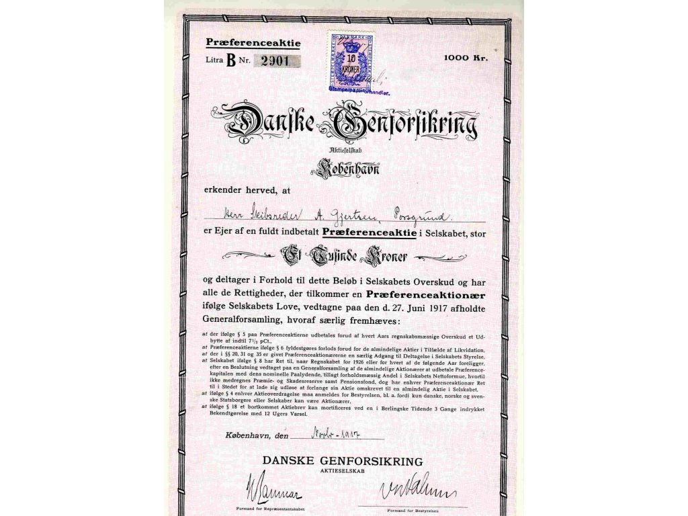

# <font color="red">Præmien (betalingen) for forsikringen<sup> Premium </font></sup>

```{r, echo=FALSE, results='asis'}

cat(readLines('npp.html'))

```

Præmiens størrelse og hvornår den skal betales af forsikringstageren fastlægges i overensstemmelse med den enkelte forsikringsaftale, hvor det f.eks. kan bestemmes, at præmien forfalder til betaling hvert år den 1. januar, således at forsikringsselskabet kan kræve præmien betalt pr. denne dato. 

Forsikringstageren kan også vælge kvartalsvis, halvårlig eller helårlig betaling af præmien.  

Betales præmien ikke rettidigt, kan forsikringsselskabet opsige forsikringsaftalen med den virkning, at aftalen ophører, hvis præmien ikke er betalt senest 21 dage efter opsigelsen.   

Forsikringsselskabet kan påberåbe sig manglende betaling af præmien, uanset om den manglende betaling beror på undskyldelige forhold hos forsikringstageren. 

Forsikringsselskabet kan opsige forsikringen ved for sen betaling af præmien. 

Forsikringstagerens manglende præmiebetaling kan i sig selv, dvs. uden at opsigelse er nødvendig, medføre, at forsikringsselskabets ansvar og dermed forsikringsdækningen ophører. 

---

Forsikringsteknisk udtryk:

*Combined ratio*, der også betegnes som erstatnings- og omkostningsprocent, er et udtryk for forholdet mellem på den ene side summen af driftsomkostninger og erstatningsudgifter og på den anden side præmieindtægter. 

Combined ratio svarer derfor til summen af erstatningsprocenten og omkostningsprocenten. 

Udgør et forsikringsselskabs combined ratio eksempelvis 100 %, betyder det, at forsikringsselskabet anvender samtlige præmieindtægter til enten erstatningsudbetalinger eller til driftsomkostninger. 

Combined ratio kan beregnes brutto eller for egen regning.

---

En typisk forbrugerforsikring som Familiens Basisforsikring indeholder f.eks. følgende vilkår:   

"Påkrav om betaling sendes til den opgivne betalingsadresse. Ændres betalingsadressen, skal selskabet straks underrettes. Betales præmien ikke, sender selskabet en påmindelse om betaling af præmien. Påmindelsen fremsendes tidligst 14 dage efter forfaldsdagen. Denne påmindelse indeholder oplysning om, at forsikringens dækning ophører, hvis præmien ikke er blevet betalt senest 14 dage efter afsendelsen af påmindelsen. Hvis selskabet har udsendt en sådan påmindelse, er det berettiget til at opkræve et ekspeditionsgebyr".

---

Forsikring & Pension (brancheorganisationen bag forsikring- og pensionsselskaber) har endvidere udtalt, at det må anses for usædvanligt og i strid med god forsikringsskik, hvis forsikringsbetingelserne ikke indeholder bestemmelser om, at der ved manglende præmiebetaling sendes forsikringstageren en påmindelse med indrømmelse af yderligere betalingsfrist.

De ovenfor citerede forsikringsbetingelser indebærer, at forsikringstageren to gange bliver mindet om betaling af præmien, ligesom han eller hun får en betalingsfrist på mindst 2 gange 14 dage. 

Der stilles samtidig krav om, at det i påmindelsen om manglende betaling udtrykkeligt er anført, at forsikringsdækningen ophører, hvis præmien ikke betales. 

Hvis forsikringsselskabet ikke overholder disse betingelser i forsikringsaftalen, indtræder retsvirkningerne af manglende præmiebetaling ikke. 

---

## <font color="red">Opsigelse af forsikringen<sup> Premium </font></sup>


Der er flere måder, man kan opsige sine private forsikringer på. 

Man kan benytte sig af det korte opsigelsesvarsel, som betyder, at man kan opsige forsikringen med 30 dages varsel til den 1. i en måned. 

Bruger man den korte opsigelse, koster det normalt et gebyr. 

Har man haft forsikringen i mere end 1 år, vil gebyret være omkring 50 kroner. 

Har man derimod haft forsikringen i mindre end 1 år, kan gebyret være væsentlig højere, f.eks. 500 kroner. 

Grunden til, at der er et gebyr, er, at forsikringsselskaberne har haft udgifter, da de oprettede forsikringen. 

Det er altid gratis at opsige sin forsikring til det normale udløb ved hovedforfald. 

Man skal bare huske at kontakte sit forsikringsselskab mindst 1 måned før hovedforfaldet. 

Opsigelsen skal være skriftlig.  

Har man været udsat for en skade, har både forsikringstageren og forsikringsselskabet mulighed for at opsige forsikringen med 14 dages varsel. 

Denne skriftlige opsigelse kan først laves efter, at man har lavet en skriftlig skadeanmeldelse til selskabet, og skal være lavet senest 1 måned efter, at man har modtaget erstatning eller afslag fra sit forsikringsselskab.  

---

## <font color="red">Begrebet "forsikringstid“<sup> Premium </font></sup>

Forsikringstiden er den periode, i hvilken forsikringsselskabet er ansvarlig for betaling af dine eller andres skader, enten fordi årsagen til skaden er indtrådt i forsikringstiden, fordi virkningen af skaden har vist sig i forsikringstiden, eller fordi kravet er rejst i forsikringstiden. 

Det afhænger af, hvilket princip der finder anvendelse. 

Det vil fremgå af de almindelige forsikringsbetingelser (det med det småtrykte), som er blevet udleveret i forbindelse med tegningen af forsikringen. 

---

Eksempel fra retspraksis:

**FED 2008.290:** Uagtet en forsikringsbegæring vedrørende ansvarsforsikring af en bil angav ikrafttræden som 19. maj, blev aftalen anset for at være trådt i kraft den 18. maj, idet assurandøren under et møde den 18. gav forsikringstager et forsikringsbevis, hvoraf ikke fremgik, at forsikringen første trådte i kraft dagen efter. Datoen var indført af assurandøren uden drøftelse med forsikringstager. Selskabet dømtes til at dække det erstatningsansvar, som forsikringstager pådrog sig ved et færdselsuheld, som han var involveret i samme aften.  

---

## <font color="red">Forsikringstagerens pligter over for forsikringsselskabet<sup> Premium </font></sup>


Man har i visse situationer pligt til at tegne forsikring, enten i henhold til lov, obligatoriske vedtægter eller i henhold til en aftale. 

F.eks. er der pligt til at tegne ansvarsforsikring for motordrevne køretøjer, og besidderen/ ejeren af en hund er pligtig til at tegne ansvarsforsikring for hunden.  

---

## <font color="red">Fareforøgelse<sup> Premium </font></sup>


Forsikringens vilkår og præmie er bestemt ud fra de risikooplysninger, der er givet ved forsikringens tegning. 

Hvis risikoforholdene ændrer sig i forsikringens løbetid, ændres forudsætningerne for forsikringen også. 

Det vil derfor i forsikringsaftalen være anført, at den forsikrede skal anmelde ændringer om nærmere bestemte forhold. 

Det kan være ændring af tagbeklædning for et forsikret hus, flytning til et dyrere risikoområde vedrørende bilforsikring eller ændring af erhvervsmæssig beskæftigelse på en ulykkesforsikring. 

Det er derfor en god idé at se i policen under *"fareforøgelse"* eller *"risikoændring"* for at sætte sig ind i, hvilke ændringer selskabet skal orienteres om.  

Ligesom ved risikooplysninger ved tegningen er der i forsikringsaftaleloven fastsat regler for, hvordan erstatningen skal gøres op, i tilfælde af at der er sket fareforøgelse. 

Reglerne svarer til dem, der gælder ved forsikringens tegning. 

Dvs. hvis selskabet trods ændringen ville have beholdt forsikringen – men til en højere præmie – beregnes erstatningen ud fra forholdet mellem den præmie, selskabet har fået, og den præmie, der skulle have været betalt.  

Hvis forsikringsselskabet ikke ville have fortsat forsikringen, hvis det havde kendt til risikoændringen (fareforøgelsen), skal forsikringsselskabet ikke betale erstatning. (Reglerne findes i FAL § 45 (skadesforsikring) og FAL § 121. (ulykkesforsikring)).  

---

*Fareomstændigheden skal være tydeligt angivet i policen*.

Se retspraksis:


**U 1996.294 H:** En bestemmelse i en hesteforsikring om, at der skulle gives meddelelse om, hvis der skete ændringer i de forsikrede dyrs forhold, opstaldning og anvendelse, opfyldte ikke kravet for så vidt angik en knælidelse, som den forsikrede hest pådrog sig. 

En hyppigste fareforøgelse forekommer i forhold til ulykkesforsikringer, hvor sikrede skifter erhverv, jf. **Forsikringsankenævnet sagsnr.: 73227, 71829, 71784, 70448, 68172, 68550 og 67175**. 

---

*Forsikringsselskabets pligter:*


Forsikringsselskabets pligt eller modydelse kaldes forsikringsydelsen. 

Dvs. erstatningen skal udbetales af selskabet, når der er indtrådt en erstatningsberettiget forsikringsbegivenhed – eller sagt på en anden måde, når der er sket en skade, som er dækket af forsikringen.

---

*Anmeldelse af forsikringsbegivenheden*

Af forsikringsbetingelserne fremgår, at man skal anmelde enhver skade så hurtigt som muligt til forsikringsselskabet. 

På den måde kan forsikringsselskabet danne sig et overblik over skadens omfang og sørge for at indhente supplerende oplysninger om skaden, hvis det er nødvendigt. 

Det kan også være, at skadede genstande bør "sikres“, så det senere er utvivlsomt,hvad skaden omfatter.  

---

## <font color="red">Urigtige risikooplysninger<sup> Premium </font></sup>


Ved forsikringsaftalens indgåelse skal man afgive risikooplysninger, således at forsikringsselskabet kan vurdere risikoen og fastsætte præmie og vilkår. 

Det er derfor vigtigt, at risikooplysningerne er korrekte. 

Hvis oplysningerne ikke er rigtige, kan det føre til nedsat erstatning eller slet ingen erstatning, hvis forsikringsselskabet annullerer forsikringen helt.  

Risikooplysningerne afgives sædvanligvis i et spørgeskema (begæringen). 

I en begæring om familieforsikring spørges der bl.a. om tidligere skadesforløb, og om man tidligere er sagt op af et andet forsikringsselskab. 

Forsikringsselskaberne går ud fra, at oplysninger, der afgives, er rigtige, men undersøger det stikprøvevis i skadesituationen. 

Hvis der er afgivet urigtige oplysninger ved tegningen, medfører det som regel, at forsikringen annulleres med tilbagevirkende kraft, hvis selskabet kan godtgøre, at det ifølge sin acceptpolitik ikke ville have tegnet forsikringen, hvis det havde kendt til de rigtige oplysninger. 

Konsekvensen er, at der heller ikke bliver udbetalt erstatning. Se nærmere i FAL § 6 samt nedenfor.

---

Se retspraksis:

**FED 2015.120:** A havde ikke oplyst F om de rigtige brugerforhold af hendes bil, hvilket var groft uagtsomt i henhold til FAL §§ 6 og 7. F kunne derfor rette et forholdsmæssigt krav mod A.  

---

**Video: Hvordan dækker familieforsikringen**

<div class="video-container"><iframe src="https://www.youtube.com/embed/FfIcQgcMKn4" width="853" height="480" frameborder="0" allowfullscreen="allowfullscreen"></iframe></div>

---

**Risikoforøgelse skal anmeldes til forsikringsselskabet**

Præmien for en forsikring beregnes ud fra risikoforholdene på tidspunktet for forsikringens tegning. 

Ifølge policen/forsikringsbetingelserne skal det anmeldes til selskabet, såfremt der sker ændringer i fx en bygnings benyttelse.  

Manglende anmeldelse af ændringer kan derfor resultere i, at der enten – hvis en risikoforøgelse bortfalder – betales for meget i præmie, eller at forsikringen – hvis risikoen forøges – yder utilstrækkelig dækning. 

---

## <font color="red">Overholdelse af sikkerhedsforskrifter<sup> Premium </font></sup>


Hvis forsikringsselskabet i forsikringstiden har betinget sig, at forsikringstageren skal iagttage visse forholdsregler, der skal forebygge risikoen for skade eller formindske en eventuel skades omfang, foreligger der en *sikkerhedsforskrift*. 

Der kan fx være tale om forbud mod tobaksrygning, pligt til at tilslutte tyverialarm uden for åbningstid o.l. 

Forsikringsselskabet vil normalt afslå at tegne forsikringen, hvis man nægter at imødekomme disse krav. 

Som følge heraf vil det være en væsentlig forudsætning for forsikringsselskabet, at sikkerhedsforskrifterne overholdes. 

En sikkerhedsforskrift skal være præcist bekrevet i policen, og såfremt forsikringsselskabet kan bevise, at forsikringstageren forsætligt eller uagtsomt har overtrådt en sikkerhedsforskrift, der medfører skade eller forøger skadens omfang, er forsikringsselskabet fri for ansvar, medmindre forsikringstageren kan bevise, at det forhold, der er udvist, har været uden betydning for forsikringsbegivenhedens indtræden og skadens størrelse. 

---

## <font color="red">Betalingsproceduren omkring forsikringspræmien<sup> Premium </font></sup>


I forsikringsvilkårene vil det være aftalt, at forsikringsselskabet skal sende et påkrav (typisk fremsendelse af et girokort) til den betalingsadresse, man har opgivet til selskabet. 

(Hvis man skifter adresse, skal man huske at meddele forsikringsselskabet om adresseændringen. 

Selskabet har med få undtagelser ingen pligt til at finde ud af, hvor man er flyttet hen).

Påkravet (girokortet) sendes som regel ud i slutningen af måneden forud for forfaldsdagen, der som regel er fastsat til den 1. i måneden. 

I påkravet vil det være anført, at præmien skal betales senest 21 dage efter forsikringsselskabets påkrav herom.  

Hvis betaling ikke er sket rettidigt, kan forsikringsselskabet, når der er gået yderligere 14 dage, opsige aftalen. 

Dog får man i den forbindelse en frist på endnu 21 dage til at betale i henhold til påkravet. 

I praksis vil en forsikringstager således have i alt 8 uger (3 uger + 2 uger + 3 uger) til at få præmiebetalingen bragt i orden, uden at det får dækningsmæssige konsekvenser.  

Er der tale om en nytegnet forsikring, kan det være aftalt, at forsikringsaftalen ophører uden opsigelse, hvis betaling ikke er sket inden en kortere frist (typisk 1 uge).  

---

Der må anses for tvivlsomt om automatisk betaling i sig selv udgør accept af ændringer i forsikringsaftale

Efter Forbrugerombudsmandens opfattelse, jf. hendes sagsnr.: **18/08244** og **18/05778** er det tvivlsomt, om en forsikringstager bindes aftaleretligt af et forsikringsselskabs ensidige ændringer blot ved at foretage en automatisk betaling via Betalingsservice.

To forsikringsselskaber havde tilføjet nogle såkaldte tilvalgsdækninger til dele af deres forsikringer.

Forsikringstagerne skulle aktivt framelde disse tilvalgsdækninger over for selskabet, hvis ikke de ønskede dækningen og den medfølgende prisstigning. Der var således tale om negativ aftalebinding/ passiv accept, jf. forbudddet i forbrugeraftalelovens § 6.

Finanstilsynet påtalte i sommeren 2017, at selskaberne ved denne fremgangsmåde havde overtrådt § 3 i bekendtgørelse om god skik for finansielle virksomheder. 

Efterfølgende blev forholdet reguleret i bekendtgørelse om god skik for forsikringsdistributører, så det efter den nugældende § 19, stk. 4, er forbudt at anvende fremgangsmåden til at indføre tilvalgsdækninger.

Forbrugerombudsmanden foretog en høring af de to selskaber og besluttede herefter ikke at foretage sig yderligere over for selskaberne. 

Forbrugerombudsmanden lagde navnlig vægt på, at selskaberne begge havde oplyst, at de efter Finanstilsynets afgørelser havde bragt den nævnte praksis til ophør.

Under høringen blev Forbrugerombudsmanden opmærksom på, at fremgangsmåden også var blevet anvendt over for de af selskabernes kunder, der var tilmeldt automatisk betaling via Betalingsservice.

Forbrugerombudsmanden udtalte i denne anledning, at Forsikringsselskaber ifølge retspraksis har en vis adgang til at foretage ændringer i løbende aftaler ved brug af negativ aftalebinding. 

Sådanne ændringer forudsætter normalt, at forsikringstageren fortsætter præmiebetalingen efter at være blevet klart og tydeligt informeret om ændringen. 

Dette skyldes, at man i dansk ret ofte anser selve betalingshandlingen som et udtryk for, at betaleren ønsker at blive bundet af aftalen. 

Efter Forbrugerombudsmandens opfattelse vil en betaling dog næppe kunne tillægges samme betydning, hvis betalingen sker automatisk via Betalingsservice, som hvis den sker som en aktiv handling fra forbrugerens side. 

Dette kan lede til tvivl om, hvorvidt en forsikringstager bliver aftaleretligt bundet af et forsikringsselskabs ændringer blot ved at foretage en automatisk betaling via Betalingsservice. 

Spørgsmålet er dog ikke prøvet ved domstolene".

 
---

## <font color="red">Generelle forhold mellem forsikringstageren og forsikringsselskabet<sup> Premium </font></sup>

Udbetaler forsikringsselskabet ikke erstatning til forsikringstageren inden 14 dage efter, at selskabet har modtaget de nødvendige oplysninger til at afgøre forsikringstagerens krav, skal selskabet betale renter af erstatningen fra denne dato. 

Det fremgår af FAL § 24.  

---

Se eksempler fra retspraksis:   

**U 2001.1143 V:** Da forsikringsselskabet hæftede for skadelidtes krav efter færdselsulykke umiddelbart i medfør af den lovpligtige ansvarsforsikring, og da selskabet 1995-11-17 kunne vurdere stationærtidspunktet, var kravet omfattet af § 24 og skulle forrentes fra 1995-12-07.

**U 2003.2269 H** – Grov uagtsomhed ikke godtgjort ved kollision efter overskridelse af dobbelt optrukket spærrelinje. Krav mod lovpligtig ansvarsforsikring ikke omfattet af forsikringsaftalelovens § 24 om forrentning eller § 29 om forældelse.

**U 2005.635 H:** Invaliderente, der var betinget af tilkendelse af offentlig invalidepension svarende til nedsættelse af erhvervsevnen med 2/3, forfaldt først til betaling 14 dage efter, at forsikringsselskabet havde modtaget meddelelse om, at der var tilkendt sådan pension.
  
**FED 2000.70:** Nedbrændt stald omfattet af bygningsbrandforsikring. Reparationsudgifterne måtte antages at overstige 50% af nyværdien, hvorfor sikrede havde været berettiget til at nedrive stalden og kræve genopførelseserstatning, som dog blev reduceret med 50% pga. slid og ælde. Erstatningen skulle forrentes fra 14 dage efter skadedatoen, da forsikringsselskabet, der fejlagtigt havde afvist skaden, selv kunne have tilvejebragt de fornødne oplysninger.

---

Skal forsikringsselskabet erstatte skaden således, at selskabet betaler indkomne fakturaer fra f.eks. håndværkere, tandlæge eller kiropraktor, skal selskabet normalt ikke betale renter til forsikringstageren. 

Betaler forsikringstageren derimod selv eksempelvis håndværkeren, og forsikringsselskabet skal erstatte forsikringstagerens udlæg, forrentes forsikringstagerens krav som udgangspunkt 14 dage efter, at forsikringsselskabet har modtaget fakturaen og forsikringstagerens meddelelse om, at forsikringstageren har betalt (forudsat, at de øvrige betingelser er opfyldt).  

---

Forsikringsselskabet skal udbetale *aconto-erstatning* til forsikringstageren, hvis en del af erstatningen kan opgøres, og det er sikkert, at selskabet under alle omstændigheder skal udbetale dette beløb i erstatning til forsikringstageren.  

Forsikringsselskabet kan altså ikke tilbageholde hele erstatningen, fordi der stadig er genstande, hvor erstatningen ikke kan fastsættes. Det fremgår nærmere af FAL § 24, stk. 1, og § 25.

---

## <font color="red">Sikkerhedsforholdsregler/sikkerhedsforskrifter<sup> Premium </font></sup>


Police og forsikringsbetingelser kan indeholde krav om, at forsikringstageren skal modvirke/forebygge, at der sker skade på hans eller hendes ting. 

Den type regler kaldes sikkerhedsforholdsregler eller sikkerhedsforskrifter. 

Reglerne findes i FAL § 51. Det er forsikringsselskabets bevisbyrde, hvis selskabet mener, at sikkerhedsforskrifterne er blevet ovetrådt af forsikringstageren.  

*Eksempler på sikkerhedsforholdsregler, som nævnes af Forsikringsankenævnet, kan være:*

* Krav i familie-/indboforsikringen om, at ens bolig skal være forsvarligt aflåst, for at man har ret til erstatning efter reglerne om indbrudstyveri.  
  
* Krav i bygningsforsikringen om, at bygningen skal være forsvarligt vedligeholdt. 

* Krav i motorkøretøjsforsikringen om, at føreren skal have gyldigt kørekort.  
  
---

**Video: Jørgen har styr på det**

<div class="video-container"><iframe src="https://www.youtube.com/embed/Oi1NnFx8NB4" width="853" height="480" frameborder="0" allowfullscreen="allowfullscreen"></iframe></div>

---

*Se praksis fra Forsikringsankenævnet og retspraksis omkring FAL § 51:*


**FED 1994.52.** (Krav om aflåsning kunne ikke anses som krav om vedvarende aflåsning. Dækning af tyveri fra skab trods uaflåst hoveddør). Den manglende aflåsning skal kunne tilregnes den pågældende som en forsømmelse.

**Forsikringsankenævnet sagsnr.: 42671:** Tyveri sker fra uaflåst bygning, mens klager for en kort periode er inde hos naboen, som har skåret sig i foden og råbt om hjælp. Den manglende aflåsning af huset i denne situation findes ikke at kunne tilregnes klageren som uagtsom, og hun havde derfor krav på erstatning.

**Forsikringsankenævnet sagsnr.: 58950:** Klager over selskabets afvisning af tyveri samt over størrelsen af tilbudt erstatning. Klagerens mor fik frastjålet ur, guldarmlænke og høreapparat. Selskabet mener ikke, at der er tale om indbrudstyveri. Genstandene forsvundet fra plejehjem efter moderens død. Selskabet mener ikke, at værelset har været forsvarligt aflåst, da flere har haft adgang til boligen. Nævnet finder, at effekterne er bortkommet ved tyveri efter forsikringstagerens død. Tyveriet er muligt begået fra ikke forsvarligt aflåst bygning eller lokale, men dette forhold kan ikke bebrejdes afdøde og heller ikke nogen, med hvem afdøde må tåle identifikation. Da sikkerhedsforskriften i forsikringsaftalelovens § 51 herefter ikke er overtrådt ved en forsømmelse af afdøde eller nogen, med hvem hun må tåle identifikation, finder nævnet, at boet efter forsikringstageren er berettiget til erstatning i henhold til reglerne om indbrudstyveri. Klageren fik medhold.

**Se U 2004.993 H:** Forsikringsselskab kunne ikke nægte udbetaling af brandforsikringssum under henvisning til, at forsikringstageren havde tilsidesat sikkerhedsforholdsregler ved halmfyring. Under fyring med halmfyr på en landbrugsejendom opstod der brand, hvorved der opstod skade på ejendommen for ca. 3,7 mio. kr. Forsikringsselskabet F, der havde brandforsikret ejendommen, nægtede at udbetale erstatning til gårdejeren G under henvisning til, at det af forsikringspolicen fremgik, at det var en betingelse, at halmfyringsanlæggets indretning og drift var i overensstemmelse med reglerne i Brandteknisk vejledning, og at disse regler på flere punkter ikke var blevet overholdt. Der havde således været gennemtæringer af lågen til fyret, og der var under branden blevet konstateret halmspild i kedelrummet. Landsretten lagde til grund, at fyrets låge ikke havde været i overensstemmelse med forskrifterne i Brandteknisk vejledning, og at halmspildet ligeledes indebar en overtrædelse heraf, og frifandt F for G's krav om udbetaling af forsikringssummen. Højesteret fandt det betænkeligt at anse det for godtgjort, at G's manglende vedligeholdelse af lågen havde været af en sådan karakter, at den kunne tilregnes ham som en forsømmelse, og fandt det tillige betænkeligt at anse det for godtgjort, at der umiddelbart før branden havde været halmspild i kedelrummet i et sådant omfang, at G havde gjort sig skyldig i forsømmelse med hensyn til overholdelse af sikkerhedsforholdsreglen herom. Højesteret dømte derfor F til at udbetale sædvanlig bygningsbrandskadeerstatning til G.

---

*Forsikringsselskabets bevisbyrde*

Forsikringsselskabet skal bevise, at forsikringstageren ikke har overholdt sikkerhedsforholdsreglen – eksempelvis at døren til lejligheden eller huset ikke var forsvarligt aflåst, eller at bygningen ikke var forsvarligt vedligeholdt.  

Det er også et krav, at forsikringstageren har overtrådt sikkerhedsforholdsreglen ved forsømmelse (uagtsomhed/culpa), og at der er årsagssammenhæng mellem forsikringstagerens forsømmelse og den opståede skade. 

Glemmer forsikringstageren at låse yderdøren, vil der være tale om en forsømmelse i forsikringsretlig forstand. 

Kommer tyven ind gennem den ulåste dør, er der årsagssammenhæng mellem forsikringstagerens forsømmelse og tyveriet. 

Forsikringsselskabet skal derfor ikke betale erstatning efter reglerne om indbrudstyveri. Det betyder, at forsikringstageren ikke får dækket eksempelvis de kontanter og smykker, som er blevet stjålet.  

---


Se **Forsikringsankenævnets sagsnr.: 91904**. En forsikringstager klager over, at selskabet havde behandlet et anmeldt indbrudstyveri som simpelt tyveri og afvist at dække stjålne smykker. Tyven var kommet ind ad vindue på 1. sal, mens der ikke var nogen hjemme. Ifølge forsikringsbetingelserne var det et krav, at vinduer var lukkede og tilhaspede, når boligen var forladt. Nævnet fandt, at selskabet havde bevist, at vinduet ikke havde været lukket og tilhaspet, og at et vindue anbragt i udluftningsposition ikke opfyldte kravet til „lukket og tilhaspet“. Da den manglende overholdelse af sikkerhedsforskriften måtte tilregnes klageren som uagtsom, og da der var årsagssammenhæng mellem tyveriet og forskriftens tilsidesættelse, kunne nævnet ikke kritisere selskabets afgørelse. Selskab medhold.  

---

Der vil ikke være tale om en forsømmelse, hvis man på vej ud ad døren får et epilepsianfald og besvimer, og en tyv i samme øjeblik begår tyveri i ens bolig: 


**Forsikringsankenævnets sagsnr.: 41133:** Klager får et epilepsianfald, lige efter hun har låst sin dør op for at gå ud. Hun må lægge sig og falder i søvn, hvorefter hendes taske indeholdende bl.a. guldur og kontanter bliver stjålet fra den uaflåste bolig. Den manglende overholdelse af sikkerhedsforskriften fandtes ikke at kunne tilregnes klageren som uagtsom. 

---

Overser tyven, at døren er ulåst, og smadrer tyven et vindue og kravler ind gennem vinduet, er der ikke årsagssammenhæng mellem, at forsikringstageren glemte at låse døren, og tyveriet. Forsikringsselskabet skal derfor udbetale erstatning:  


**Forsikringsankenævnets sagsnr.: 84958:** Klager over erstatningsopgørelse. Klager anmeldte et indbrudstyveri fra sit hus. Selskabet udbetalte 11.228 kr. i erstatning, men afviste dækning for smykker og kontanter med henvisning til, at huset ikke var forsvarligt aflåst på tyveritidspunktet. Selskabet anførte desuden, at klager havde handlet groft uagtsomt, idet hun ikke havde omkodet husets låse efter et tasketyveri 5 måneder forinden, hvor identifikationspapirer og en husnøgle blev stjålet. Nævnet fandt, at klager havde tilsidesat sikkerhedsforskriften om forsvarlig aflåsning mht. en uaflåst kælderdør, men at selskabet ikke havde bevist, at der var årsagssammenhæng mellem tilsidesættelsen og det skete tyveri. Nævnet fandt det ikke bevist, at klager i øvrigt havde tilsidesat sikkerhedsforskriften om forsvarlig aflåsning. Selskabet var derfor ikke berettiget til at betragte tyveriet som et simpelt tyveri. Nævnet fandt, at selskabet ikke havde bevist, at klager ved grov uagtsomhed havde tilsidesat sin tabsbegrænsningspligt ved ikke at få omkodet sine låse efter tasketyveriet. Klager fik dermed medhold.  

---

Har forsikringsselskabet formuleret dækningsbetingelsen helt objektivt, er der ikke tale om en sikkerhedsforholdsregel. 

Eksempelvis kan selskabet i en familie-/indboforsikring skrive, at der ved indbrudstyveri skal være "tegn på voldeligt opbrud". 

Står dette tydeligt i forsikringstagerens forsikringsbetingelser, får forsikringstageren kun erstatning efter reglerne om indbrudstyveri, hvis forsikringstageren kan bevise, at der er tegn på voldeligt opbrud af ens bolig, og det er uden betydning, om forsikringstageren har udvist nogen forsømmelse eller ej.  

---

## <font color="red">Risikooplysninger og urigtige oplysninger<sup> Premium </font></sup>


Når man tegner en forsikring, skal man som tidligere nævnt normalt give forsikringsselskabet en række oplysninger, så selskabet kan vurdere, hvor stor en risiko det løber ved at forsikre én. 

Disse oplysninger bruger selskabet blandt andet til at afgøre, om selskabet vil forsikre én, og hvad man skal betale for forsikringen. 

Det er derfor vigtigt, at ens oplysninger er korrekte. 

Hvis ens oplysninger ikke er rigtige, kan det betyde, at man får nedsat erstatningen (fordi man har betalt for lidt for forsikringen), eller at man slet ikke får nogen erstatning (fordi selskabet ikke ville have haft en som kunde), jf. FAL § 6.

Man kan også risikere, at forsikringsselskabet opsiger forsikringen, så man ikke længere er forsikret, eller ophæver forsikringen med tilbagevirkende kraft til det tidspunkt, hvor forsikringsaftalen blev indgået. 

Forsikringsselskabet kan kun ophæve forsikringen med tilbagevirkende kraft og helt afvise at betale erstatning til forsikringstageren, hvis selskabet kan sandsynliggøre, at selskabet slet ikke ville have indgået forsikringsaftalen med forsikringstageren, hvis forsikringstageren havde givet korrekte oplysninger.  

Man skal derfor være meget omhyggelig med at svare rigtigt på spørgsmålene, når man indgår en forsikringsaftale. 

Og kontrollér nøje, hvilke oplysninger – f.eks. om antal skader mv. – der fremgår af det forsikringstilbud, man får fra forsikringsselskabet. 

Husk, at det, man mundtligt oplyser til en sælger (assurandør), også skal fremgå af de papirer, man skriver under på, idet man senere hen vil have meget vanskeligt ved at bevise, at man oplyste noget andet til sælgeren end det, man skrev under på. 

Tegner man flere forsikringer på samme tid i forsikringsselskabet, kan man risikere, at de urigtige oplysninger – som man afgav for én forsikring – får betydning for alle de forsikringer, man tegnede samtidig.

---

Se eksempelvis **Forsikringsankenævnets sagsnr.: 99208.** Hvor klageren i forbindelse med køb af indbo-, bil- og ulykkesforsikring i selskabet havde sat kryds i "nej" som svar på spørgsmålet: "Har et selskab over for en i husstanden inden for de seneste tre år stillet krav om skærpede vilkår (f.eks. forhøjet præmie og/eller selvrisiko) efter anmeldelse af skade(r)?". Klagerens tidligere bilforsikringsselskab havde 4 måneder før sendt et brev til klageren, hvor det oplyste, at det forhøjede selvrisikoen. Nævnet fandt, at selskabet ved fremlæggelse af sine interne acceptregler kunne sandsynliggøre, at det, såfremt klageren havde afgivet korrekte oplysninger, ikke ville have tegnet andre forsikringer end den lovpligtige ansvarsforsikring for bilen. Nævnet kunne derfor ikke kritisere, at selskabet havde ophævet alle forsikringerne – bortset fra ansvarsforsikringen for bilen – med tilbagevirkende kraft til tegningstidspunktet. Klageren fik som konsekvens heraf ikke udbetalt erstatning for et indbrudstyveri.

---

Risikooplysningerne afgives ofte i et spørgeskema (forsikringsbegæringen). 

I begæringen om familieforsikring spørger selskabet blandt andet om tidligere skadesforløb, og om man tidligere har fået sine forsikringer opsagt af et forsikringsselskab. 

Forsikringsselskabet kan også spørge, om man er registreret som dårlig betaler. 

I stedet for begæringer stiller en del selskaber telefonisk spørgsmålene til én og beder om, at man på en mail bekræfter, at de svar, selskabet har noteret, er korrekte. 

Forsikringsselskaberne går ud fra, at ens oplysninger er rigtige.

Forsikringsselskaberne undersøger kun stikprøvevis, om ens oplysninger er korrekte. 

Oftest undersøger selskabet først, om ens oplysninger var korrekte, når man har anmeldt én eller flere skader til selskabet. 

Afgiver man oplysningerne telefonisk til forsikringsselskabet, uden at der foreligger et dokument med ens svar, som man efterfølgende har set og godkendt, skal selskabet bevise, at man telefonisk afgav urigtige oplysninger.

---

Se følgende afgørelser:  

*Forsikringsankenævnets sagsnr.: 83753** om en arbejdsløshedsforsikring, hvor selskabet ikke kunne bevise, at det havde spurgt klageren, om han var ansat i fleksjob. Selskabet skulle derfor udbetale arbejdsløshedsydelser til klageren, selv om forsikringsselskabet normalt ikke solgte forsikringer, hvis man var ansat i fleksjob.

I **Forsikringsankenævnets sagsnr.: 78797** kunne selskabet ikke bevise, at klageren telefonisk havde afgivet urigtige oplysninger. „Her var det ikke nok, at selskabet i policen, som klageren modtog efter at have indgået aftalen med selskabet, under et punkt, der hed "Øvrige forhold ved forsikringen", blandt andet havde skrevet "Du har ikke haft skader de sidste 3 år" og "Du er ikke opsagt af – eller har fået skærpede vilkår – i andet selskab". Nævnet henviste her til forsikringsaftalelovens § 10, stk. 3, hvor det fremgår, at hvis selskabet i policen har beskrevet et faktisk forhold uden at have indhentet oplysning om det fra forsikringstageren, kan det ikke komme forsikringstageren til skade, hvis det viser sig, at oplysningen var urigtig“. Reglerne om ens og forsikringsselskabets rettigheder, hvis man har givet urigtige oplysninger, finder man i FAL §§ 4-10.  

---

## <font color="red">Erstatning og renter<sup> Premium </font></sup>


Udbetaler forsikringsselskabet ikke erstatning til forsikringstageren inden 14 dage efter, at selskabet har modtaget de nødvendige oplysninger til at afgøre ens krav, skal selskabet betale renter af erstatningen fra denne dato. Det fremgår af FAL § 24.  

Skal forsikringsselskabet erstatte skaden således, at selskabet betaler indkomne fakturaer fra f.eks. håndværkere, tandlæge eller kiropraktor, skal selskabet normalt ikke betale renter til forsikringstageren. 

Betaler man derimod selv eksempelvis håndværkeren, og selskabet skal erstatte ens udlæg, forrentes ens krav som udgangspunkt 14 dage efter, at selskabet har modtaget fakturaen og forsikringstagerens meddelelse om, at man har betalt (forudsat, at de øvrige betingelser er opfyldt).  

Forsikringsselskabet skal udbetale aconto-erstatning til forsikringstageren, hvis en del af erstatningen kan opgøres, og det er sikkert, at selskabet under alle omstændigheder skal udbetale dette beløb i erstatning til forsikringstageren. 

Selskabet kan altså ikke tilbageholde hele erstatningen, fordi der stadig er genstande, hvor erstatningen ikke kan fastsættes. Det fremgår af FAL § 24, stk. 1, og § 25.

---

*Genforsikring*



Forsikringsselskabet tager ikke altid hele risikoen selv, men kan vælge at foretage en såkaldt genforsikring, dvs. risikoen bliver fordelt på flere forsikringsselskaber. 

Udtrykket genforsikring betegner således , at et forsikringsselskabs forsikringsmæssige risici delvis videregives eller afgives til et andet forsikringsselskab, der betegnes genforsikringsselskab eller reassurandør. 

Nogle forsikringsselskaber er specialiseret i genforsikring og beskæftiger sig udelukkende med at drive genforsikringsvirksomhed (indirekte forsikring), mens andre forsikringsselskaber driver både direkte og indirekte forsikring. Genforsikring involverer betaling af præmie (afgivne præmier) fra det direkte tegnende forsikringsselskab til genforsikringsselskabet. 

Til gengæld modtager det direkte tegnede forsikringsselskab delvis dækning for sine erstatningsudgifter fra genforsikringsselskabet (modtagen genforsikringsdækning). 

Genforsikringsaftaler involverer endvidere betaling af provision fra genforsikringsselskabet til det direkte tegnende selskab, og aftalen kan indebære overskudsdeling, således at genforsikringsselskabet betaler en gevinstandel til det direkte tegnende forsikringsselskab

---

## <font color="red">Under- og dobbeltforsikring<sup> Premium </font></sup>


Forsikringssummen på ens forsikring skal altid mindst svare til forsikringsværdien af f.eks. indboet. 

Dvs. hvad det vil koste at genanskaffe alt dit indbo i tilfælde af en totalskade – fx en brand. 

Forsikringstageren er selv ansvarlig for, at forsikringssummen er rigtig. 

Man er underforsikret, når forsikringssummen er mindre en værdien af ens indbo. 

I tilfælde af en skade betyder det, at erstatningen bliver mindre, end hvad det koster at genanskaffe det ødelagte. 

Ved underforsikring bliver erstatningen regnet ud efter denne formel:  

Skade x forsikringssum = Erstatning  
forsikringsværdi  

---

*Eksempel:*   

Er forsikringsværdien af ens indbo 800.000 kr. og ens forsikringssum kun på 400.000 kr., vil der blive udbetalt halv erstatning for ens skade.

Er ens forsikringssum større end ens værdier, er man overforsikret.

Forsikringsselskabet betaler i den situation alene erstatning for ens skade og ikke for det, man har betalt for meget i forsikring.  

---

## <font color="red">Forældelse af forsikringskrav<sup> Premium </font></sup>


For at man kan få fyldestgjort sit krav, skal man fremsætte det, inden det er forældet. 

Som udgangspunkt sker der forældelse efter 3 år, jf. forældelseslovens § 3, stk. 1. 

Det betyder, at man skal have fremsat sit krav overfor selskabet indenfor 3 år. 

Fristen regnes fra skadetidspunktet. 

Hvis skaden ikke kan konstateres med det samme, regnes 3-årsfristen fra det tidspunkt, hvor skaden opdages eller konstateres, dog således, at der under alle omstændigheder sker forældelse senest 30 år efter skadetidspunktet for så vidt angår erstatning og godtgørelse i anledning af personskade. 

For tingsskade er denne frist 10 år.  

Når en sag indbringes for Ankenævnet for Forsikring inden for forældelsesfristen, forældes sagen ikke, mens nævnet behandler sagen. 

Når nævnets afgørelse foreligger, har man en tillægsfrist på 1 år til at gå videre med sagen til domstolene, hvis man stadig ikke har fået sit krav opfyldt.  

Denne 1-årsfrist løber sideløbende med den almindelige 3-årsfrist, og den længste af de to frister gælder. 

I praksis skal man derfor være opmærksom på, at det ikke kan udelukkes, at ens krav mod forsikringsselskabet kan blive forældet, hvis man ikke anlægger sag mod selskabet ved domstolene inden et år fra afgørelsen i ens sag blev afsendt fra nævnet (datoen på fremsendelsesbrevet til forbrugeren). 

Har nævnet i afgørelsen afgjort, at ens krav mod selskabet allerede var forældet, betyder den omtalte 1 års frist naturligvis ikke, at man kan gøre en allerede indtruffet forældelse virkningsløs. 

Hvis man selv hæver klagesagen ved nævnet, inden nævnet træffer afgørelse i sagen, eller hvis nævnet af formelle grunde helt afviser at behandle sagen, gælder tillægsfristen på 1 år ikke.  

Reglerne kan ikke fraviges af selskabet til skade for forsikringstageren. 

Dog kan selskabet gyldigt aftale en anmeldelsesfrist i forbindelse med forsikringens ophør, hvis denne frist er mindst 6 mdr.  

---

## <font color="red">Klage over forsikringsselskabets afgørelse<sup> Premium </font></sup>


*Ankenævnet for Forsikring* er et privat klagenævn oprettet i 1975 af Forbrugerrådet Tænk og brancheforeningen Forsikring & Pension. 

Ankenævnet er godkendt af Erhvervsministeren og derfor "autoriseret" til at behandle forsikringsklager udenretligt.  

*Kriterier for at klage*  

Klagen skal vedrøre ens forsikringer. Man kan således ikke klage over en afgørelse truffet af modpartens forsikringsselskab.  

Klagen skal vedrøre privatlivets forsikringsforhold: 

Klager vedrørende erhvervslivets forsikringsforhold falder som udgangspunkt uden for Ankenævnets område.  

Klagen skal angå et konkret økonomisk mellemværende: 

Klagen skal altså angå et spørgsmål af økonomisk betydning. 

Ankenævnet kan ikke behandle klager over f.eks. ansattes opførsel, et forsikringsselskabs markedsføring eller andre generelle forhold. Ankenævnet er således ikke et disciplinærnævn eller en tilsynsmyndighed. 

---


*Afvisning af klage*

Af ankenævnets vedtægter fremgår følgende:

"Afvisning af klagesager

§ 4. Nævnet skal afvise klager, der hører under, er under behandling ved eller har været behandlet af et andet privat tvistløsningsorgan, et lovbestemt alternativt tvistløsningsorgan, eller et udenlandsk tvistløsningsorgan, som er anmeldt til Europa-Kommissionen, Konkurrence- og Forbrugerstyrelsen eller en domstol. Er klagen ikke indgivet på en dertil af sekretariatet udarbejdet eller godkendt formular, jf. § 7, eller er klagegebyret, jf. § 23, stk. 1, ikke betalt, afviser sekretariatet at behandle sagen.

Stk. 2. Nævnet kan afvise at behandle en klage over en erhvervsdrivende, der er etableret i såvel Danmark som i et eller flere andre lande, hvis sagen har en større tilknytning til et andet land.

Stk. 3. Nævnet kan afvise at behandle en klage, hvis

1) forbrugeren ikke forudgående over for den erhvervsdrivende har klaget over den erhvervsdrivendes afgørelse eller sagsbehandling,

2) klagen ikke angår et konkret økonomisk mellemværende mellem parterne eller i øvrigt er useriøs eller unødig,

3) klagen på grund af den principielle juridiske karakter, manglende oversættelse af det af parterne indsendte materiale, usikkerheden om bedømmelsen af de fremkomne faktiske oplysninger eller af andre grunde ikke skønnes egnet til behandling ved nævnet, eller

4) behandlingen af klagen i alvorlig grad vil hindre nævnet i at fungere effektivt.

Stk. 4. Er det åbenbart, at klagen ikke kan behandles af nævnet, skal nævnet afvise klagen senest 3 uger efter modtagelsen. I andre tilfælde skal nævnet afvise sagen hurtigst muligt.

Stk. 5. En afvisning skal begrundes, og forbrugeren skal oplyses om muligheden for at indbringe sagen for domstolene og for at få retshjælp og for at søge fri proces. Forbrugeren skal derudover, når det er relevant, oplyses om, at der kan ske forældelse af kravet.

§ 5. Er det åbenbart, at sagen falder uden for nævnets kompetence, kan sekretariatet afvise klagen. En sådan afgørelse skal kunne indbringes for nævnet på forbrugerens anmodning. Nævnets formand kan på nævnets vegne afgøre en sådan anmodning fra forbrugeren.

Stk. 2. Nævnets formand kan på nævnets vegne afvise sager, som ikke skønnes egnede til behandling ved nævnet i medfør af § 4, stk. 3, jf. forbrugerklagelovens § 16, stk. 2".

---

*Behandling af klage* 

Ankenævnet kan ikke behandle klagen, hvis behandling hører under offentlige myndigheder, f.eks. Finanstilsynet, eller andre anke- eller klagenævn. 

Nævnet kan heller ikke behandle klagen, hvis ens sag er afgjort ved endelig dom, gyldigt bindende voldgift eller retsforlig.  

---

*Hvornår kan man klage*  

Man kan først klage til Ankenævnet, når man har klaget til forsikringsselskabet over afgørelsen, og forsikringsselskabet har fastholdt sin afgørelse eller har undladt at besvare ens klage.  

---

*Klagegebyr*

Man skal betale et klagegebyr på 200 kr. Hvis man får medhold i sin klage, får man gebyret retur. Det samme gælder, hvis Forsikringsankenævnet ikke kan afgøre ens sag.  

---

*Sagsbehandlingstid* 

Den typiske sagsbehandlingstid er 6-8 måneder. Sagsbehandlingstiden afhænger i høj grad af, hvor mange gange klageren og forsikringsselskabet ønsker at indsende nye oplysninger eller synspunkter til sagen. 

---

Europæiske klageorganer: Ankenævnet for Forsikring er optaget på Europa-Kommissionens liste over alternative tvistbilæggelsesorganer (ATB-instanser) og kan modtage klager via Europa-Kommissionens online-tvistbilæggelsesplatform (OTB-platform). 

OTB-platformen kan med fordel anvendes, hvis man ønsker at klage over et forsikringsselskab, som er etableret i et andet land end Danmark, og som dermed har leveret en grænseoverskridende tjenesteydelse til forsikringstageren. 

Vil man klage over et dansk forsikringsselskab, anbefaler Forsikringsankenævnet, at man benytter denne hjemmeside. 

Ankenævnet for Forsikring er også tilsluttet FIN-NET – et europæisk netværk af klageorganer i Europa inden for det finansielle område. Klik ind på FIN-NET for at læse nærmere.  

Kontaktoplysninger:  
Ankenævnet for Forsikring  
Anker Heegaards Gade 2  
1572 København V  
Tlf. 33 15 89 00, telefontid 10-13  
www.ankeforsikring.dk  

Hvis klagen falder uden for Ankenævnet for Forsikrings område – det vil navnlig vedrøre klager over modpartens forsikringsselskab og erhvervsforsikring – kan forbrugeren kontakte Forsikringsoplysningen,
Konkurrence- og Forbrugerstyrelsen/Forbrugerklagenævnet eller i den sidste ende starte en sag op ved domstolene. 

---

