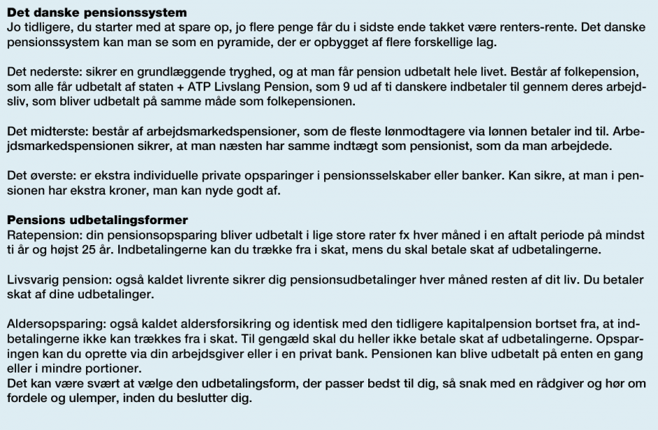
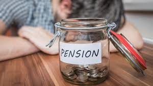

# <font color="red">Andre finansielle tvistløsningsorganer<sup> Premium </font></sup>

```{r, echo=FALSE, results='asis'}

cat(readLines('npp.html'))

```


### <font color="red">Det finansielle ankenævn<sup> Premium </font></sup>


*Hvad er Det finansielle ankenævn?*

Det finansielle ankenævn er i medfør af lov om forbrugerklager godkendt til at behandle klager over pengeinstitutter, realkreditinstitutter og investeringsfonde.

Ankenævnet er pr. 1. februar 2019 sammensat af Pengeinstitutankenævnet (1988), Realkreditankenævnet (1992) og Ankenævnet for investeringsfonde (2002).

*Hvem kan klage?*

Ankenævnet behandler klager vedrørende private kundeforhold. Ankenævnet kan behandle klager fra erhvervsdrivende, der ikke adskiller sig væsentligt fra klager vedrørende private kundeforhold. Ankenævnet behandler ikke klager indgivet af selskaber.

*Hvem kan man klage over?*

Ankenævnet behandler klager over danske og færøske pengeinstitutter, realkreditinstitutter og investeringsfonde og deres herværende datterselskaber f.eks. finansieringsselskaber. 

Se en ikke-udtømmende liste over pengeinstitutejede finansieringsselskaber ved brug af følgende link:

https://fanke.dk/det-finansielle-ankenaevn/oversigt-over-finansieringsselskaber-ejet-af-pengeinstitutter/

Man kan klage over et finansieringsselskab, der ikke er ejet af et pengeinstitut, til Ankenævnet for Finansieringsselskaber, www.finansanke.dk. 

Ankenævnet behandler ikke klager over finansielle institutters datterselskaber, der er et forsikringsselskab.

Hvis man ønsker at klage over et forsikringsselskab, kan man klage til Ankenævnet for Forsikring, www.ankeforsikring.dk.

Ankenævnet kan imidlertid behandle ens klage, hvis den vedrører et instituts rådgivning om forsikringer.

Ankenævnet behandler desuden klager over danske filialer af udenlandske pengeinstitutter, realkreditinstitutter og investeringsfonde.

Klager over grønlandske pengeinstitutter falder uden for Ankenævnets kompetence. 

---

*Hvad kan man klage over?*

Ens klage kan angå samtlige omstændigheder mellem penge- og realkreditinstituttet samt investeringsfonden og kunden.

Ankenævnet behandler dog ikke klager over eksempelvis ansattes opførsel, et instituts markedsføring eller andre generelle forhold.

Ens klage kan også vedrøre omstændigheder, der er opstået, inden et egentligt kundeforhold blev etableret.

Ankenævnet kan afvise ens klage, hvis den ikke vedrører et konkret økonomisk mellemværende.

Hvis man ønsker at klage over et instituts tilsidesættelse af reglerne om god skik for finansielle virksomheder (bekendtgørelse nr. 1094 af 14. september 2015) skal man klage til Finanstilsynet, Århusgade 110, 2100 København Ø. Se følgende link:

https://www.finanstilsynet.dk/


Ankenævnet afviser klager, der allerede er afgjort af en domstol. Se øvrige afvisningsgrunde, hvorefter Ankenævnet kan eller skal afvise klager, der følger af Ankenævnets vedtægter §§ 3-6:

"§ 3

Stk. 1. Ankenævnet kan ikke behandle sager, som er afgjort ved endelig dom, gyldig bindende voldgift eller retsforlig eller sager, der kan forventes afgjort i forbindelse med en straffesag.

Stk. 2. En voldgiftskendelse er kun bindende, såfremt klageren forinden voldgiftssagen er blevet orienteret om muligheden for ankenævnsbehandling.

Stk. 3. Så længe en klagesag verserer for Ankenævnet, kan sagens parter ikke anlægge sag ved domstolene eller voldgiftsret om de spørgsmål, som klagen omfatter.

§ 4

Sager, hvis behandling i henhold til lovgivningen er henlagt til offentlige myndigheder eller andre tvistløsningsorganer, falder uden for Ankenævnets kompetence.

---

*Afvisning af klagesager*

§ 5

Stk. 1. Ankenævnet skal afvise at behandle en klage, hvis klagen hører under, er under behandling ved, eller har været behandlet af

a) et andet privat tvistløsningsorgan, som er anmeldt til Europa-Kommissionen,

b) et lovbestemt alternativt tvistløsningsorgan, som er anmeldt til Europa-Kommissionen,

c) et udenlandsk tvistløsningsorgan, som er anmeldt til Europa-Kommissionen,

d) Nævnenes Hus eller

e) en domstol.

Stk. 2. Ankenævnet kan afvise at behandle en klage over en finansiel virksomhed, der er etableret i såvel Danmark som i et eller flere andre lande, hvis sagen har en større tilknytning til et andet land end Danmark.

Stk. 3. Ankenævnet kan afvise at behandle en klage, hvis

klageren ikke forudgående har klaget til den person eller afdeling, der i den finansielle virksomhed er ansvarlig for behandlingen af klagesager, eller hvis den finansielle virksomheds klagebehandling ikke er afsluttet. Ankenævnet kan indlede behandling af en klagesag, såfremt den finansielle virksomhed har afvist klagen, eller der ikke forinden 5 uger fra modtagelsen af en klage er opnået forlig mellem klageren og den finansielle virksomhed,

1. klagen ikke vedrører et konkret økonomisk mellemværende,

2. klagen er useriøs eller unødig,

3. klagen på grund af dens principielle juridiske karakter, usikkerheden om bedømmelsen af de fremkomne faktiske oplysninger eller af andre særlige grunde ikke skønnes egnet til behandling i Ankenævnet, eller

4. behandlingen af klagen i alvorlig grad vil hindre Ankenævnet i at fungere effektivt.
 
Stk. 4. Er det åbenbart, at en klage ikke kan behandles af Ankenævnet, afviser Ankenævnet klagen senest 3 uger efter modtagelsen. I andre tilfælde skal Ankenævnet afvise sagen hurtigst muligt.

Stk. 5. En afvisning skal begrundes, og klageren skal oplyses om muligheden for at indbringe sagen for domstolene og for at få retshjælp og for at søge fri proces. Klageren skal derudover, når det er relevant, oplyses om, at der kan ske forældelse af kravet, hvis sagen ikke indbringes for domstolene senest et år efter afvisningen.

§ 6

Stk. 1. Er det åbenbart, at sagen falder uden for Ankenævnets kompetence, kan sekretariatet afvise klagen. Afvisningen skal begrundes over for klageren, der samtidig gøres opmærksom på, at afgørelsen vil kunne indbringes for Ankenævnet, hvilket sker ved sekretariatets foranstaltning, såfremt klageren fremsætter ønske herom.

Stk. 2. De stiftende organisationer kan bemyndige Ankenævnets formand til på Ankenævnets vegne at afvise sager, som ikke skønnes egnede til behandling ved Ankenævnet i medfør af § 5, stk. 3".


---

*Hvordan indgiver man en klage?*

Før man klager til Det finansielle ankenævn, skal man have klaget til instituttet og fået afslag, et utilfredsstillende svar eller ikke modtaget svar inden fem uger, efter instituttet har modtaget din klage. 

I alle institutter er der en klageansvarlig. Ens finansielle institut kan oplyse, hvem der er klageansvarlig.

Når man er klar til at indgive sin klage, udfylder man et klageskema via denne hjemmeside. 

Man skal betale et klagegebyr på 200 kr. Ankenævnet sender gebyret tilbage, hvis man enten får helt eller delvis medhold i sin klage, hvis man tilbagekalder sin klage, eller hvis Ankenævnet ikke kan behandle ens klage.

Ankenævnet har tilrettelagt sagsbehandlingen således, at det ikke er nødvendigt at benytte en advokat eller en juridisk rådgiver. 

Sekretariatet er dermed de facto underlagt officialmaksimen og skal dermed oplyse sagen.

Men man kan altid vælge at søge uafhængig rådgivning eller lade sig repræsentere eller bistå af tredjemand. 

Hvis man vælger at lade en advokat føre ens sag, skal man være opmærksom på, at ingen af parterne i klagesagen betaler omkostninger til den anden part i forbindelse ankenævnsbehandlingen.

Man kan starte klagesagen ved anvendelse af dette link:

https://fanke.dk/det-finansielle-ankenaevn/indgivelseafklage/

Hvis man ikke har mulighed for at indgive sin klage via ankenævnets hjemmeside, kan man kontakte Sekretariatet for Det finansielle ankenævn på telefon 3543 6333. Telefontid mandag – fredag kl. 9.30-12.30.

---

*Hvordan arbejder Ankenævnet?*

Når forberedelsen af sagen er afsluttet, behandler Ankenævnet ens klage på et ankenævnsmøde.

Man skal indgive sine indlæg skriftligt og uploade dem til Ankenævnets klageportal, som man får adgang til umiddelbart efter opstart af ens klagesag.

Klagen og sagens dokumenter kan indsendes på dansk eller på engelsk. 

Sagsbehandlingen foregår på dansk, ligesom afgørelserne udfærdiges på dansk.

Den gennemsnitlige sagsbehandlingstid afhænger af den tid, der medgår til sagens forberedelse. 

Når sagen er fuldt oplyst, forventes Ankenævnet at træffe afgørelse inden for 90 dage. 

Den gennemsnitlige sagsbehandlingstid er for tiden 6 måneder, fra klagen er indgivet. 

Parterne er ikke bundet af Ankenævnets afgørelse. Instituttet skal dog, når en afgørelse går instituttet imod, inden 30 dage efter afgørelsen er forkyndt, meddele Ankenævnet, hvis instituttet ikke vil opfylde afgørelsen. 

Hvis instituttet ikke foretager sig noget, kan man, efter udløb af de 30 dage fra forkyndelsen er sket, få afgørelsen tvangsfuldbyrdet over for instituttet.

Ønsker den finansielle virksomhed ikke at opfylde afgørelsen, får man meddelelse herom fra Ankenævnet, og man vil samtidig blive orienteret om, hvilke muligheder der er for at gå videre med sagen ved domstolene, herunder om mulighederne for at få Nævnenes Hus, Toldboden 2, 8800 Viborg til at indbringe sagen for domstolene på vegne af én, og om mulighederne for at tvangsfuldbyrde afgørelsen.

Den finansielle virksomhed skal således følge Ankenævnets afgørelse, medmindre den finansielle virksomhed inden 30 kalenderdage meddeler Ankenævnet, at den ikke ønsker at være bundet af afgørelsen eller ønsker sagen genoptaget. 

Hvis den finansielle virksomhed ikke opfylder afgørelsen, kan fogedretten hjælpe én. 

Man kan læse mere om muligheden for såkaldt tvangsfuldbyrdelse/udlæg gennem fogedretten på www.domstol.dk. 

Hvis man anmoder fogedretten om tvangsfuldbyrdelse, skal man vedlægge Ankenævnets afgørelse og en erklæring fra Ankenævnet om, at den finansielle virksomhed ikke rettidigt har meddelt, at den ikke ønsker at være bundet af afgørelsen. 

Nævnenes Hus kan i visse tilfælde efter ansøgning dække udgifter i forbindelse med en tvangsfuldbyrdelse.

Man skal være opmærksom på, at sagen kan blive forældet, hvis man anmoder fogedretten om at foretage udlæg senere end ét år efter Ankenævnets afgørelse.

Hvis man ikke får medhold i sagen vil man, når det er relevant, blive vejledt om mulighederne for at få sagen genoptaget eller gå videre med sagen ved domstolene. 

Man skal som klager være opmærksom på, at sagen kan blive forældet, hvis man anlægger en eventuel retssag senere end ét år efter Ankenævnets afgørelse.

På ankenævnets hjemmeside finder man samtlige afgørelser, som Ankenævnet har truffet.

---

*Hvordan er ankenævnet sammensat?*

Ankenævnets formandskab er sammensat af en højesteretsdommer (formand) og to næstformænd, henholdsvis en højesteretsdommer og en landsdommer.

Ankenævnets medlemmer er i øvrigt udpeget af henholdsvis Finans Danmark, Realkreditrådet, Investering Danmark og Forbrugerrådet Tænk. Oversigt over Ankenævnets medlemmer kan ses her ved dette link:

https://fanke.dk/omankenaevnet/oversigt-over-naevnsmedlemmer/

Ankenævnets medlemmer udpeges for en 3-årig periode og kan genudpeges.  

Ved behandling af en klage deltager formanden eller en af næstformændene, to medlemmer fra de finansielle virksomheder 
og to medlemmer fra forbrugersiden. (paritetsprincippet; lige mange repræsentanter fra forbruger- og erhvervssiden ved en afgørelse)

---

## <font color="red">Forsikringsoplysningen<sup> Premium </font></sup>  


https://www.forsikringogpension.dk/presse/publikationer/  

https://da-dk.facebook.com/Forsikringsnoerden/  

https://forsikringsguiden.dk/forsikringsoplysningen/om-os/stil-spoergsmaal/  

https://www.forsikringogpension.dk/presse/tilmeld-nyhedsbrev/  

Godt råd: 

På forsikringsguiden, https://forsikringsguiden.dk/#!/,  
kan man sammenligne forsikringsvilkår og priser fra op til 15 forsikringsselskaber.  

Forsikringsoplysningen  
Philip Heymans Alle 1,  
2900 Hellerup  
Tlf. 33 43 55 00  
fax 33 43 55 01  
www.forsikringsoplysningen.dk  
e-mail: fp@forsikringogpension.dk  

*Ekstramateriale*

---

**Video: Sådan sikrer du din hushandel**

<div class="video-container"><iframe src="https://www.youtube.com/embed/GCogSgE3ZmU" width="853" height="480" frameborder="0" allowfullscreen="allowfullscreen"></iframe></div>


---

**Video: Dagsgebyr for manglende ansvarsforsikring:**

<div class="video-container"><iframe src="https://www.youtube.com/embed/9kHkH-8HxZI" width="853" height="480" frameborder="0" allowfullscreen="allowfullscreen"></iframe></div>

---

Efter § 43 i lov om finansiel virksomhed skal forsikringsvirksomhed udøves i overensstemmelse med redelig forretningsskik og god praksis inden for forsikringsområdet. 

Vil forsikringstageren klage over forsikringsselskabers tilsidesættelse af god forsikringsskik, skal Finanstilsynet kontaktes.  

---

## <font color="red">Finanstilsynet<sup> Premium </font></sup>


Finanstilsynet kan tage sager vedrørende overholdelsen af god skik og de udstedte bekendtgørelser op af egen drift, f.eks. i forbindelse med inspektionsbesøg eller temaundersøgelser. 

Finanstilsynet kan endvidere tage sager op efter anmodning fra Finanstilsynets bestyrelse eller Forbrugerombudsmanden. 

Finanstilsynet modtager tillige henvendelser direkte fra forbrugere, der imidlertid normalt henvises til de finansielle tvistløsningsorganer, hvis klagen også vedrører civilretlige spørgsmål om erstatning eller tilbagebetaling af uretmæssigt opkrævede beløb. 

Erhvervsdrivende henvises til domstolene. Finanstilsynet træffer en traditionel forvaltningsretlig afgørelse med mulighed for administrativ rekurs, og tilsynet har ikke en direkte søgsmålskompetence til domstolene. 

Såfremt en sag om god skik har vidtrækkende eller principiel betydning, skal Finanstilsynet forelægge sagen for Tilsynets bestyrelse.  

Se følgende kontaktoplysninger: 

Finanstilsynet  
Århusgade 110,  
2100 København Ø  
Tlf. 33 55 82 82  
www.finanstilsynet.dk  

e-mail: finanstilsynet@ftnet.dk 

Det kan anbefales, at du tilmelder dig Finanstilsynets nyhedsbreve!

---

**Video: Mandrilaftalen – Forsikringer**

<div class="video-container"><iframe src="https://www.youtube.com/embed/EGj0tVWtr6g" width="853" height="480" frameborder="0" allowfullscreen="allowfullscreen"></iframe></div> 

---

*Der følger nu en gennemgang af nogle udvalgte forsikringstyper:*


## <font color="red">Ansvarsforsikring<sup> Premium </font></sup>


Følgende betragtninger og oplysninger om det private ansvar, husejeransvaret, ansvaret for ens hund, skader på arbejdet samt skader ved udøvelse af sportsaktiviteter bygger hovedsageligt på Forsikringsankenævnets oplysninger i ankenævnets ”klageguide” samt Forsikringsankenævnets praksis, herunder på retspraksis, samt viden fra Forsikringsoplysningen.


*Privatansvarsforsikring* 

Privatansvarsforsikringen er normalt er en del af ens familie/indboforsikring. 

Forsikringen dækker den erstatning, man skal betale, hvis man som privatperson forvolder skade på andre personer eller på andres genstande. 

Der er også knyttet en ansvarsforsikring til en række andre forsikringer, bl.a. en bygningsforsikring. 

Privatansvarsforsikringen dækker kun, hvis man juridisk set er erstatningsansvarlig for den indtrufne skade. 

Forsikringen dækker således normalt ikke, hvis man ønsker at betale erstatning ud fra et “rimelighedssynspunkt” eller ud fra ens moralske opfattelse.

Efter dansk ret er man juridisk set ansvarlig for en skade, hvis man har udvist en uforsvarlig adfærd (handling eller undladelse), hvis adfærden kan tilregnes en som forsætlig eller uagtsom, og hvis den skade, som man har forvoldt, må anses for at være en forventelig (påregnelig) følge af ens adfærd. 

Denne såkaldte culparegel står ikke skrevet i nogen lov, men er udviklet gennem en langvarig retspraksis.

Hændelige skader er man ikke ansvarlig for, se f.eks. her fra retspraksis følgende afsagte domme:


---


**FED 2018.05:** 2-årigt barn A, der blev passet af gudmor B, kom alvorligt til skade, da A fik fingre i skål med skoldhed suppe, der væltede ned over A. A og B opholdt sig i et køkken, og B havde vendt ryggen til A i ca. 2 sek. Det var ikke oplyst, hvor på køkkenbordet skålen var placeret, og A havde herefter ikke bevist, at B havde udvist ansvarspådragende uagtsomhed.

---


I **Forsikringsankenævnetssagsnr.: 86059** fandt nævnet eksempelvis, at klageren havde handlet ansvarspådragende ved at lade en veninde til sin datter benytte en trampolin, hvis sikkerhedsnet ikke var monteret korrekt. 

---


*Forsikringsankenævnets sagsnr.: 88426.** Klager over afslag på dækning for en ansvarsskade, hvor klagers 12-årige søn var skadevolder. Efter afsluttet fodboldspil, hvor de var på vej ud for at samle bolde ind, gav sønnen faderen et hårdt skub i ryggen, så han faldt forover og beskadigede knæet. Selskabet henviste til, at sønnen ikke var ansvarlig for skaden. Nævnet fandt, at sønnen havde udvist en adfærd, som kunne tilregnes ham som uagtsom. Klagers tilskadekomst var derfor omfattet af hjemforsikringens dækning for ansvar ved personskade. Nævnet lagde vægt på, at skubbet ikke kunne anses for at være sket under et igangværende fodboldspil eller under farlig leg. Klager medhold.


---


**Forsikringsankenævnets sagsnr.: 87739.** Klager over afslag på at dække en ansvarsskade forvoldt af klagers søn. Sønnen beskadigede gulvet i sit værelse på efterskolen, da han tabte et tændt heksehyl, som han ville smide ud af vinduet. Forsikringen dækkede ikke ansvar på skader på ting, som den sikrede havde i sin varetægt. Nævnet fandt derfor ikke at kunne kritisere selskabets afgørelse. Selskab medhold.

---


**Forsikringsankenævnets sagsnr.: 86992.** Klager over afslag på dækning for en anmeldt ansvarsskade. Klager anmeldte, at der var sket skade på hendes nabos gulv i forbindelse med, at hun havde passet naboens hus og have og ikke havde fået lukket tilstrækkeligt for vandet efter vanding af blomster. Herved var vandet løbet gennem en haveslange dryppet ned i en spand, hvor haveslangens frie ende var placeret, hvorefter vandet løb ud på gulvet. Selskabet anførte, at der var tale om en hændelig skade. Nævnet fandt, at skaden opstod ved klagers udførelse af en vennetjeneste for naboen, hvor hun ikke fik lukket forsvarligt for vandet. Nævnet fandt, at klager herved havde handlet ansvarspådragende, og lagde bl.a. vægt på, haveslangen var placeret i stuen, og at huset henstod ubeboet på tidspunktet for skadens indtræden. Det forhold, at klagers kortfattede mail af 12/8 2014 kunne give anledning til usikkerhed om, hvem der placerede spanden i stuen, kunne efter nævnets opfattelse ikke føre til andet resultat. Selskabet skulle derfor anerkende, at klager var erstatningsansvarlig. Klager medhold.


**Forsikringsankenævnets sagsnr.: 86059.** Klager over afvisning af dækning for en knæskade, som klagers datters veninde (12 år) pådrog sig under et hop på klagers trampolin den 3/6 2013. Selskabet afviste dækning med henvisning til, at der var tale om et hændeligt uheld, og at klager ikke var ansvarlig for den skete skade. Nævnet fandt, at klager havde handlet ansvarspådragende ved at lade datterens veninde benytte en trampolin med et sikkerhedsnet, der ikke var monteret korrekt. Nævnet fandt det godtgjort, at den mangelfulde montering af sikkerhedsnettet var medvirkende årsag til, at venindens fod satte sig fast, så hun kom til skade. Selskabet skulle derfor anerkende, at klager var ansvarlig for de skader, som veninden måtte have pådraget sig. Det forhold, at skadelidte og skadelidtes mor var bekendt med sikkerhedsnettets tilstand, kunne ikke føre til andet resultat. Klager medhold.


**Forsikringsankenævnets sagsnr.: 85472.** Klager over afvisning af dækning for en ansvarsskade over en familieforsikring. Klager havde etableret et stort hul i gulvet i sin ejerlejlighed med henblik på at opsætte vindeltrappe. En maler faldt ned gennem hullet og kom til skade. Selskabet afviste ansvarsdækning med henvisning til, at der var tale om et grundejeransvar, som ikke var dækket af forsikringen. Nævnets flertal fandt, klagers eventuelle ansvar var et culpaansvar uden for kontrakt, og at han havde ageret som privatperson. Det eventuelle ansvar var derfor dækningsberettigende. Betingelsernes punkt 8.1.4 vedrørende grundejeransvar kunne alene anses for et tillæg til, og ikke en indskrænkning af, den dækning, der ydedes efter hovedreglen i punkt 8.1.1 om ansvar som privatperson. Mindretallet fandt, at betingelsernes 8.1.4 udtømmende gjorde op med dækningen for grundejeransvar, og at den anmeldte skade ikke kunne henføres herunder. Mindretallet bemærkede, at klager kunne have tegnet en entrepriseforsikring. Klager medhold.*

---

Forsikringen dækker normalt ikke, hvis man har handlet forsætligt (med vilje). Det ses eksempelvis i **Forsikringsankenævnets sagsnr.: 86464**:

---


**Forsikringsankenævnets sagsnr.: 86464.** Klager over dækning for erstatningsansvar som følge af brand i solcenter. Klager og en veninde havde i et solcenter sat ild til papirstykker i kabinerne, som fik fat i en papirdispenser, der begyndte at brænde. Pigerne forlod solcentret og den rygende papirdispenser. Der var efterfølgende sket brandskader for 2,3 mio. kr. Klager blev idømt solidarisk ansvar med veninden for skaderne. Selskabet afviste at yde dækning med henvisning til at skaderne var sket med forsæt. Klager gjorde gældende, at det ikke var hende, der konkret havde sat ild til det papirstykke, der førte til ild i papirdispenseren og de efterfølgende brandskader. Nævnet fandt, at skaderne var sket med forsæt fra klager og lagde navnlig vægt på, at et solidarisk ansvar var omfattet af dækningsundtagelsen, og at klager ved sin medvirken og ved at forlade stedet med en rygende papirdispenser, der havde været ild i måtte have indset, at der herved var nærliggende risiko for yderligere skader. Selskab medhold.

---

Har forsikringstageren handlet forsætligt, må han eller hun selv betale erstatning til den skadelidte. 

Har et barn under 14 år handlet forsætligt, dækker ansvarsforsikringen dog som udgangspunkt også sådanne forsætlige skader. 

Det samme er tilfældet, hvis man – da man forvoldte skaden – på grund af ens sindstilstand manglede evnen til at handle fornuftsmæssigt.

Man kan efter omstændighederne pålægges erstatningsansvar, hvis andre personer lider tab som følge af redningsaktioner til fordel for en selv. 

Privatansvarsforsikringen dækker også et sådant ansvar, i det omfang kravet ikke dækkes af lov om arbejdsskadeforsikring, og i det omfang redningsaktionen ikke sker som et led i redningsmandens erhverv.

Man bør som forsikringstager være tilbageholdende med at anerkende et erstatningsansvar på egen hånd, da man risikerer, at forsikringsselskabet er uenigt og derfor ikke vil dække skaden. 

Man bør derfor normalt kontakte sit forsikringsselskab og bede forsikringsselskabet om at tage stilling til, om man har pådraget sig et ansvar efter dansk rets almindelige erstatningsregler, som forsikringsselskabet vil dække i henhold til policen og forsikringsbetingelserne.

Bliver man sagsøgt af en person, der mener, at man er erstatningssvarlig som privatperson, kan det være hensigtsmæssigt at få en advokat til at føre ens sag. 

Hvis forsikringsselskabet er enigt i, at man ikke er erstatningsansvarlig, dækker forsikringen normalt også sådanne sagsomkostninger til en advokat.

Mener man, at forsikringsselskabets afvisning af at dække en skade – som man har forvoldt på andres ejendom eller på andre personer – er forkert, er det er en god ide at drøfte med sagsbehandleren i forsikringsselskabet, hvad der skal til, for at man kan bevise, at man har ret. 

Er man stadig utilfreds, kan man kontakte forsikringsselskabets klageansvarlige, hvis man mener, at sagsbehandleren, er nået til et forkert resultat i sagen.

Man skal altid have klaget til forsikringsselskabet over dets afgørelse, før man har adgang til at klage til Forsikringsankenævnet.

Det er værd at bemærke, at Forsikringsankenævnet ikke kan behandle en klage, hvis man som skadelidt mener, at skadevolderens forsikringsselskab skal erstatte de skader/tab, som skadevolderen har påført en som skadelidt. 

Det skyldes, at ankenævnet kun kan behandle klager over forsikringer, som man selv eller en i ens husstand har købt. 

Og da det ikke er skadelidtes forsikring, der rettes krav imod, kan Forsikringsankenævnet ikke behandle sagen.

Hvis man som skadelidt ikke kan blive enig med skadevolderen eller med vedkommendes forsikringsselskab, er skadelidte nødt til at anlægge en retssag ved domstolene mod skadevolderen. 

Skadelidte kan eventuelt få retshjælpsdækning til at føre en sådan retssag. Se f.eks. nævnte ankenævnssag:

Ofte kan der være oplysninger i en sag om erstatningsansvar, som ikke giver et entydigt billede af, hvad der er sket. 

Hvis der er tvivl om, hvad der er sket, vil forsikringsankenævnet altid vil foretage en konkret vurdering af validiteten af de oplysninger, som klageren (forsikringstageren) og forsikringsselskabet er fremkommet med. 

Forsikringsankenævnet vil normalt lægge størst vægt på de oplysninger, der er fremkommet fra uvildige parter. 

Og ankenævnet vil ofte lægge betydelig vægt på de forklaringer, som forsikringstageren eller en anden person først har givet til forsikringsselskabet eller til en tredjemand.

---

## <font color="red">Uagtsom, forsætlig og hændelig skade samt gæstebudsskade<sup> Premium </font></sup>


Privatansvarsforsikringen dækker som nævnt, hvis forsikringstageren juridisk set har pådraget sig et erstatningsansvar. 

For at pådrage sig et erstatningsansvar skal man bl.a. have udvist en uforsvarlig adfærd (handling eller undladelse), som kan tilregnes én som forsætlig eller uagtsom, og den skade, man har forvoldt, skal være en påregnelig følge af ens adfærd. 

Denne såkaldte culparegel står ikke skrevet i nogen lov, men er udviklet gennem langvarig retspraksis.

---

## <font color="red">Uagtsom<sup> Premium </font></sup>


Man har handlet uagtsomt, hvis man har handlet anderledes en almindelig, fornuftig person, dvs man har handlet i strid med almindelige normer for adfærd i den pågældende situation. 

Ens adfærd vil med andre ord blive betragtet som uagtsom, hvis den afviger fra de i samfundet almindeligt anerkendte, forsvarlige handlemønstre. 

Det ses eksempelvis – som allerede nævnt – i **Forsikringsankenævnets sagsnr.: 86059**, hvor ankenævnet fandt, at klageren havde handlet ansvarspådragende ved at lade en veninde til sin datter benytte en trampolin, hvis sikkerhedsnet ikke var monteret korrekt. 

Ligeledes er **Forsikringsankenævnets sagsnr.: 88426** om en 12-årig dreng, der skubber en voksen i ryggen, samt **Forsikringsankenævnets sagsnr.: 87739, 86992 og 85472** relevante.  

---

## <font color="red">Forsætlig<sup> Premium </font></sup>


Man har handlet forsætligt, hvis man havde vilje til at forårsage den skade, der indtrådte, hvis man havde indset, at skaden ville indtræde, eller hvis man ikke ville have handlet anderledes, selv om man havde indset, at skaden med stor sandsynlighed ville indtræde. 

Det ses eksempelvis i tidligere nævnte **Forsikringsankenævns sagsnr.: 86464**, hvor nævnet fandt, at brandskaderne på et solcenter var sket med forsæt, da skadevolderen måtte have indset, at der var nærliggende risiko for skade, idet en papirdispenser røg, da skadevolderen forlod solcentret.

Privatansvarsforsikringen dækker ikke, hvis man har forvoldt skaden forsætligt. 

Har man handlet forsætligt, bliver man selvfølgelig erstatningsansvarlig over for skadelidte, men det er ikke noget, som ansvarsforsikringen dækker. Her må skadevolder selv betale. 

Dette gælder dog ikke for børn under 14 år, der handler forsætligt, medmindre det klart fremgår af forsikringsbetingelserne, at børns forsætlige handlinger ikke dækkes. 

---

Det følger af forsikringsaftalelovens (Lovbekendtgørelse nr. 1237 af 9. november 2015) § 19, stk. 1:

"Bestemmelserne i FAL§ 18 om bortfald eller begrænsning af selskabets ansvar finder ikke anvendelse, når den sikrede var under 14 år eller på grund af sindssygdom, åndssvaghed, forbigående sindsforvirring eller lignende tilstand har manglet evnen til at handle fornuftsmæssigt".


---

Se følgende domme:


**U 1964.786 H:** To 7-årige drenge havde begået hærværk på en bigård og herved pådraget sig erstatningsansvar. Deres forældre havde tegnet familieansvarsforsikringer. Da de i de pågældende selskabers policer indeholdte vilkår ikke med tilstrækkelig klarhed udelukkede anvendelse af den særlige bestemmelse i forsikringsaftalelovens. § 19, stk. 1, jfr. § 18, tilpligtedes selskaberne at friholde drengene for erstatningsansvaret.

---


**U 1954.746 H:** Hvor en mand fik udbetalt en ulykkeserstatning for hustruen uanset, at han havde dræbt hende og deres 6 børn. Da han var sindssyg i gerningsøjeblikket, lidende af en psykogen sindssygdom, måtte det antages, at han ved begåelsen af drabet på grund af sindssygdom havde manglet evnen til at handle fornuftsmæssigt og da drabet måtte anses for en af forsikringen omfattet begivenhed, fandtes han i medfør af forsikringsaftalelovens § 19, stk. 1, at have krav på forsikringsydelsen.

---


**U 1982.528 H:** Hvor en mand dræbte sin hustru og hund, hvorefter han satte ild på sit hus, hvorved han indebrændte. Det var ubestridt, at han havde handlet forsætligt, jf. forsikringsaftalelovens § 18, stk. 1. Retslægerådet mente, at der ikke var sikre holdepunkter for, at mandens handling skyldtes sindssygdom eller lignende tilstand. Retten antog – på grund af det abnorme handlingsforløb – at manden havde befundet sig i en sygelig sindstilstand, hvorfor forsikringsselskabet skulle udbetale forsikringssummen.


**U 2006.1961 Ø:** Hvor en mand satte i suicidal øjemed ild til sin ejendom. Retslægerådet skønnede at han ikke var sindssyg og heller ikke var det på gerningstidspunktet. Rådet fandt dog – med henvisning til omfattende alkoholmisbrug – at manden mest sandsynlig var omfattet af straffelovens § 69. Landsretten bemærkede, at forsikringsaftalelovens § 19, stk. 1, har et bredere anvendelsesområde end straffelovens § 16, idet forsikringsaftalelovens § 19, stk. 1, blandt andet omfatter »forbigående sindsforvirring eller lignende tilstand«. Bevisbyrden for, at den sikrede ved fremkaldelse af forsikringsbegivenheden opfylder det psykiske kriterium, ligger hos kravstilleren, jf. **U 1982.528 H**, nævnt ovenfor. Det er en relativ tung bevisbyrde.

Et eksempel på en forsætlig skade er **Forsikringsankenævnets sagsnr.: 86048**, hvor nævnet fandt, at klagerens søn havde handlet forsætligt, da han – mens han stod med ryggen til og i irritation over at være blevet låst ude af nogle klassekammerater – sparkede bagud mod en dør og en siderude. Nævnet fandt, at det var overvejende sandsynligt, at ruden ville gå i stykker ved en sådan handling.

---

## <font color="red">Hændelig<sup> Premium </font></sup>


Forvolder man en skade hændeligt, dækker ens ansvarsforsikring heller ikke. At det er hændeligt, betyder, at skaden indtræffer tilfældigt, og uden at det skyldes uagtsomhed eller forsømmelse fra ens side. I den situation bliver man ikke juridisk erstatningsansvarlig efter dansk ret. 

Derfor må skadelidte i en sådan situation selv bære tabet, med mindre skadevolder alligevel betaler, fordi skadevolder føler, at skadevolder er moralsk ansvarlig. Men dette er ansvarsforsikringen uvedkommende. 

Af relevante sager kan nævnes **Forsikringssankenævnets sagsnr.: 86248**, hvor en kvinde tissede i en seng, samt **forsikringsankenævnets sagsnr.: 81840** om en kajak, der i en carport faldt ned på en bil:

---


**Forsikringsankenævnets sagsnr.: 86248.** Klager over afvisning af dækning for en skade på klagers vens seng forårsaget af klagers ufrivillige vandladning. Selskabet henviste til, at uheldet var hændeligt, og at klager ikke havde handlet uagtsomt, hvorfor selskabet ikke kunne anerkende, at hun havde handlet ansvarspådragende. Nævnet fandt, at klager ikke havde udvist fejl eller forsømmelser forud for skadens indtræden, hvorfor klager ikke kunne pålægges et ansvar for den indtrufne skade. Nævnet fandt endvidere, at klagers lejlighedsvise brug af et præparat mod ufrivillig vandladning ikke kunne ændre herpå. Selskab medhold.*


**Forsikringsankenævnets sagsnr.: 81840.** Klager over afvisning af at dækning af ansvarsskade. Klagers kajak, der var opmagasineret i hans tidligere udlejers carport, blæste under storm ned fra sin placering mellem to bjælker og forårsagede herved skade på udlejers bil. Selskabet afviste dækning med henvisning til, at skaden var hændelig. Selskab medhold.

---

## <font color="red">Gæstebudsskade<sup> Premium </font></sup>


Forvolder man skaden under almindeligt privat samvær – typisk af selskabelig karakter – dækker ansvarsforsikringen i en række situationer, hvor domstolene vil være tilbageholdende med at pålægge en et juridisk erstatningsansvar. Disse skader kaldes normalt for *“gæstebudsskader”.* 


Et eksempel er **Forsikringsankenævnets sagsnr.: 75029**, hvor klagerens datter – mens hun var på besøg – beskadigede et trægulv med sine spidse stilethæle. 


Der kan også henvises til **Forsikringsankenævnets sagsnr.: 75365**, samt sammenstød af cykler under en fælles motionsaktivitet, jf. **forsikringsankenævnets sagsnr.: 91226:**

---

**Forsikringsankenævnets sagsnr.: 91226.** Klager over afvisning af dækning for skade ved sammenstød af cykler. Klager og skadelidte havde deltaget i en fælles cykeltur, hvor klager var stødt ind i baghjulet på skadelidtes cykel. Klager ønskede, at selskabet skulle erstatte skade på baghjulet med henvisning til, at han havde handlet ansvarspådragende ved at se bagud under kørslen, alternativt at selskabet dækkede skaden som gæstebudsskade. Selskabet anførte, at klagers erstatningsansvar skulle vurderes på baggrund af den milde ansvarsvurdering, der skete ved skader forvoldt idrætsudøvere imellem under udøvelse af sportsaktiviteter. Selskabet anførte yderligere, at gæstebudsdækningen ikke var relevant, da formålet med cykelturen havde været motion og ikke den personlige relation eller samværet. Nævnet fandt, at klageren ikke havde handlet ansvarspådragende, hvorfor selskabet ikke skulle dække efter den almindelige regel om erstatningsansvar. Nævnet fandt, at der måtte sondres mellem selve motionscyklingen - som ikke ville være omfattet af reglen om gæstebudsskade - og det efterfølgende sociale samvær, hvor man ifølge klageren "får en kop kaffe og en øl til en snak efterfølgende", idet denne del af samværet ville være omfattet af den særlige dækning, som forsikringen yder ved gæstebudsskader, idet dette samvær falder ind under begrebet "almindeligt privat samvær". Klageren havde derfor ikke krav på, at skaden på cyklen blev dækket efter reglen om gæstebudsskade. Selskab medhold.


---


```{r ansvarsforsikringen, echo=FALSE}
mydf <- data.frame(
  S1 = c("Hvordan er handlingen forvoldt?" ,
         "Forsætligt", 
          "Uagtsomt", 
          "Gæstebudsskade", 
          "Hændeligt"
),
  S2 = c("Er der juridisk set erstatningsansvar?" ,
  "Ja",
"Ja",
"Ja",
"Nej"
),
  S3 = c("Dækker ansvarsforsikringen?",
         "Nej",
         "Ja",
         "Ja",
         "Nej"
)
)
names(mydf) <- NULL
mydf %>%
  kable("html", escape = FALSE, caption = "Er skaden dækket af ansvarsforsikringen?") %>%
  kable_styling(full_width = T,font_size = 10,bootstrap_options = c("responsive","bordered","striped")) %>%
  column_spec(1, bold = T, border_right = T, color = "black", background = "lightgrey") %>%
  column_spec(2, bold = T, border_right = T, color = "black", background = "lightgrey") %>%
  column_spec(3, bold = T, border_right = T, color = "black", background = "lightgrey") %>%
  row_spec(1,italic = T,bold = T,font_size = 12,color = "white", background = "darkgrey") %>%
  # row_spec(1,italic = T,bold = T,font_size = 12)
  # column_spec(0, angle = -45)%>%
  # scroll_box(width = "500px") %>%
  footnote(general = "Forsikringsankenævnets klageguide",general_title = "Kilde:")%>%
footnote(number = "Hvis skadevolder er under 14 år eller er utilregnelig, kan der dog være dækning selv om handlingen er forvoldt forsætligt")
```


Er skaden dækket af en tingsforsikring tegnet af skadelidte, f.eks. en indboforsikring eller en kaskoforsikring på hus eller bil, er skadevolder som udgangspunkt ikke erstatningsansvarlig for skaden, og skadevolders ansvarsforsikring skal derfor ikke dække. 

Skadelidte må i stedet rette henvendelse til sit eget forsikringsselskab.

Der gælder visse undtagelser fra dette princip. 

Eksempelvis er der alligevel erstatningsansvar – og dækning hos ens ansvarsforsikringsselskab – hvis man har forvoldt skaden ved grov uagtsomhed. 

Ved grov uagtsomhed forstås normalt, at den udviste adfærd indebar en indlysende fare for den skade, som faktisk skete. 

Der er ligeledes erstatningsansvar, hvis man har forvoldt skaden forsætligt, men i de tilfælde dækker ens ansvarsforsikring som ovenfor anført ikke.

---

**Video:ANSVARSFORSIKRINGER OG DÆKNINGSPRINCIPPER på 6 minutter**

<div class="video-container"><iframe src="https://www.youtube.com/embed/ZRS1HfnS6Y0" width="853" height="480" frameborder="0" allowfullscreen="allowfullscreen"></iframe></div>

---

## <font color="red">Ansvarsforsikringens undtagelser<sup> Premium </font></sup>


Privatansvarsforsikringen indeholder en række undtagelser, hvor ansvarsforsikringen ikke dækker. 

De mest almindelige undtagelser er ifølge Forsikringsankenævnet følgende:

* Ansvar for skade, der rammer den sikrede personkreds

* Ansvarsforsikringen dækker normalt ikke, hvis man kommer til at forvolde skade på en af de personer, som familie-/indboforsikringen omfatter. 

Det vil typisk være tilfældet, hvis man forvolder skade på ejendele, der tilhører en selv, da man ikke kan være erstatningsansvarlig over for sig selv, ens ægtefælle/samlevende eller ens børn. 

Dog dækker ansvarsforsikringen normalt, hvis man forvolder personskade på dem.

Ansvarsforsikringen dækker som regel kun ansvar, man pådrager sig i privatlivet.

Forvolder man skade i forbindelse med sit erhverv, skal dækning søges på en eventuel erhvervsansvarsforsikring. 

Hvis det erhvervsmæssige aspekt i aktiviteten er helt underordnet – f.eks. hvis man kommer til at ødelægge en stol, mens man er til et bestyrelsesmøde i andelsboligforeningen, der afholdes hos en anden andelshaver – vil ens ansvarsforsikring normalt dække.

---

*Ansvar for arbejde for andre*

Hvis man arbejder for andre og får løn for det, så dækker privatansvarsforsikringen ikke de skader, man forvolder som ansat.

Hvis man ikke får løn, dækker ansvarsforsikringen i nogle tilfælde. 

Man ser på, om man selv har en interesse i det arbejde, som man udfører, eller om det er en vennetjeneste. 

Herudover ser man på omfanget og intensiteten af ens arbejdsindsats. 

Hvis man kortvarigt hjælper ens nabo med f.eks. at støvsuge og taber støvsugerrøret ned på et glasbord, der smadres, vil ansvarsforsikringen normalt dække. 

---

Lignende sager:


**Forsikringsankenævnets sagsnr.: 39930.** Ansvar – ansvar. Klagers søn forvolder skade på sin brors linoliegulv, da han forsøger at fjerne tæpperester med ovnrens – anset for arbejde for andre.

**Forsikringsankenævnets sagsnr.: 60013.** Ansvar – vennetjeneste. Selskabet afviser dækning for ansvarsskade. Klageren ville være sød og støvsuge et værelse hos udlejer. Smadrede glasbord. Selskabet gør gældende, at klageren ikke er erstatningsansvarlig for den skete skade, der er sket ved simpel uagtsomhed under udøvelse af en tjeneste i skadelidtes interesse. Nævnet finder, at klageren, der ikke kan henføres under undtagelsesbestemmelsen om arbejde for andre, har handlet uagtsomt. Klageren er derved erstatningsansvarlig for den forvoldte skade. Klageren medhold.

---

## <font color="red">Ansvar i kontraktforhold<sup> Premium </font></sup>


Hvis man bliver erstatningsansvarlig, fordi man ikke overholder en aftale eller en kontrakt, dækker ansvarsforsikringen ikke.

*Ansvar for ting, der er i ens varetægt*

Ofte dækker ansvarsforsikringen ikke ansvar for skade på ting, som man har til låns, leje eller opbevaring, afbenyttelse, befordring, eller som af andre grunde befinder sig i ens varetægt. 

Låner man eksempelvis en iPad af en ven i længere tid, vil iPaden være i ens varetægt, og ansvarsforsikringen dækker ikke.

Her skal det bemærkes, at nogle ansvarsforsikringer dækker eksempelvis i den første måned, hvor man låner eller lejer en genstand.

Ens råden over genstanden skal være af en vis intensitet, for at man kan siges at have den i sin varetægt. 

Cykler man eksempelvis over til en ven med hans iPad, som han har glemt hjemme hos en, og taber man den på vejen, vil der typisk være forsikringsdækning. 

Ved kortvarig råden over en genstand med ejerens accept vil der som udgangspunkt også være dækning på ansvarsforsikringen.

Forsikringsankenævnet har i sagen 85614 taget stilling til, om undervisningsmateriale udleveret af en skole – herunder en iPad – er omfattet af den private ansvarsforsikring. 

Nævnet fandt, at dette ikke var tilfældet, da lånet af undervisningsmaterialerne ikke udelukkende var i elevens interesse:

---

**Forsikringsankenævnets sagsnr.: 85614.** Klager over afslag dækning for en iPad og skolebøger. Genstandene lå i klagers skoletaske, der blev stjålet. Klager anførte, at de var udlånt af gymnasiet i hendes interesse til brug for uddannelsen, hvorfor hun bar risikoen for dem. Hun henviste til både DL 5-8-1 (Danske Lov fra 1683) og en underskrevet kontrakt med skolen om lån af iPad. Selskabet henviste til, at genstandene tilhørte skolen, samt til udtalelser fra Folketingets Ombudsmand og Undervisningsministeriet, hvoraf fremgik, at DL 5-8-1 ikke fandt anvendelse ved skolers udlån af undervisningsmidler, og at der ikke gyldigt kunne indgås aftale om et mere vidtrækkende ansvar for de lånte genstande, end hvad der fulgte af den almindelige erstatningsretlige culparegel. Nævnet fandt, at klager ikke ejede genstandene og heller ikke bar risikoen for disse. Nævnet måtte lægge til grund, at kontraktens vilkår om, at klager bar tyveririsikoen for iPaden var ugyldigt, da vilkåret gik videre end dansk rets almindelige regler om erstatning. Nævnet fandt, at ansvar for skader på lånte genstande efter betingelserne var undtaget dækning, når der var gået mere end 30 dage efter overtagelsen. Selskabet var derfor ikke forpligtet til at dække tyveriet. Selskab medhold.

---

Skader som f.eks. tyveri, brand og lignende, der kan overgå genstande, man har lånt, lejet, eller som på anden måde er i ens varetægt, vil være omfattet af ens indboforsikring.

Det samme gælder genstande, som børn kommer til at ødelægge, fordi de har en naturlig opdagetrang. 

Et vidtgående eksempel er **U 1980.1082 Ø.** Her skulle forsikringsselskabet erstatte, at to 16-årige drenge havde formået at starte en bulldozer med en skruetrækker, hvorefter bulldozeren kørte i havnen:

---


**U 1980.1082 Ø:** To 16-årige drenge A og B brugsstjal en bulldozer på et havneområde. Kort efter at A ved hjælp af en skruetrækker, som B rakte ham, havde startet bulldozeren, kørte den i havnen. hvorved der opstod betydelig skade på bulldozeren. B’s fader havde i et forsikringsselskab tegnet en privatforsikring. Undtaget fra selskabets ansvar var “forsætlige skader”, “skader på ting, der var i den sikredes varetægt” og “skader forvoldt under benyttelse af motordrevet køretøj”. B fandtes erstatningsansvarlig efter almindelige regler, da han ansås for forsætligt at have medvirket til, at bulldozeren begyndte at køre, og da han og A ved uagtsomt forhold havde forvoldt skaden, der måtte anses for påregnelig. Skaden ansås dækket af forsikringspolicen, da skaden ikke var forårsaget ved forsæt, da et varetægtsforhold ikke ansås for opstået ved den kortvarige benyttelse af bulldozeren, og da undtagelsesbestemmelsen vedrørende motordrevet køretøj efter sit indhold ikke klart omfattede skaden på det benyttede køretøj. Erstatningen omfattede skadelidtes “egne leverancer” og et beløb til dækning af administrationsudgifter.

---

*Ansvar forvoldt ved brug af motorkøretøjer, ens ansvar som husejer eller som hundeejer*

Sådanne skader dækkes ikke, og man skal således købe en autoansvarsforsikring, en husejerforsikring med ansvarsdækning eller en hundeforsikring.

---

**Quiz**  

<h3><a href="https://quiz.tepedu.dk/juraerstatning" target="_blank">Quiz Erstatning   </h3>
</a>


## <font color="red">Pensionsforsikringer<sup> Premium </font></sup>




---

**Video: Hvad indeholder min pensionsordning?** 

<div class="video-container"><iframe src="https://www.youtube.com/embed/Vcf8Ckorb5s" width="853" height="480" frameborder="0" allowfullscreen="allowfullscreen"></iframe></div>

---


En *livrente* er en pension i forsikringsklæder. For med livrenten får man udbetalt en fast ydelse fra pensionsalderen og til man dør. 

---

**Video: Pension forklaret så man faktisk fatter det**


<div class="video-container"><iframe src="https://www.youtube.com/embed/W6i8F73jeRE" width="853" height="480" frameborder="0" allowfullscreen="allowfullscreen"></iframe></div>

---


**Video: Pensionsopsparing‐ Skal jeg vælge Livrente som en del af min pension?** 

<div class="video-container"><iframe src="https://www.youtube.com/embed/vdSRTFzuhjo" width="853" height="480" frameborder="0" allowfullscreen="allowfullscreen"></iframe></div>

---
 
*Det danske pensionssystem består af tre dele:*  

* Sociale ordninger

Det drejer sig om folkepension, førtidspension, ATP (Arbejdsmarkedets Tillægspension) og SP (Den Særlige Pensionsopsparing), LD (Lønmodtagernes Dyrtidsfond) og efterløn.  

* Arbejdsmarkedspensioner, herunder firmapensioner  

Disse pensionsordninger er aftalt mellem parterne på arbejdsmarkedet som led i overenskomsterne eller som en individuel aftale mellem en virksomhed og dens ansatte.  

* Private ordninger  

Her er der tale om pensionsordninger, man selv kan oprette i forsikringsselskaber og pengeinstitutter.  

 
---

## <font color="red">Generelt for de tre dele i pensionssystemet<sup> Premium </font></sup>




For alle tre dele gælder, at man typisk er sikret i forbindelse med dødsfald, invaliditet og ved pensionering. 

De sociale ordninger skal sikre en indtægt, så man ikke lider nød, når man når pensionsalderen. 

Arbejdsmarkedspensionerne skal sikre et rimeligt forhold mellem det, man kan få i pension, og det, man tjener, mens man er erhvervsaktiv. Og endelig giver de private ordninger mulighed for selv og på egen hånd at skaffe sig yderligere indtægt, når man bliver pensioneret.  
 
---

## <font color="red">Pension og erhvervsevnetab<sup> Premium </font></sup>

.

 


Følgende afdækning af pension og erhvervsevnetab bygger især på Forsikringsankenævnets informative oplysninger, herunder Ankenævnets praksis på området for pension og erhvervsevnetab.  

Man kan være omfattet af en eller flere forsikringer, der udbetaler løbende ydelser og/eller et engangsbeløb til én, hvis man mister en betydelig del af sin erhvervsevne.  

Forsikringsdækningen findes typisk i livsforsikringer eller i pensionsordninger. 

Forsikringerne kan være oprettet både privat og som led i et ansættelsesforhold. 

Det kan være individuelle pensionsordninger, firmapensionsordninger eller arbejdsmarkedspensionsordninger.  

Har man som forsikringstager flere forsikringer, der dækker ens erhvervsevnetab, har man som udgangspunkt ret til at få udbetalt ydelser fra hver enkelt forsikring.  

Har man en erhvervsevnetabsforsikring, kan man få økonomisk kompensation, hvis man på grund af sine helbredsmæssige forhold ikke længere er i stand til at varetage et arbejde på normale vilkår. 

Dækning for tab af erhvervsevne er betinget af, at ens erhvervsevne er nedsat med en bestemt brøkdel – typisk 1/2 eller 2/3. 

Nogle forsikringer giver halve ydelser, hvis ens erhvervsevne er nedsat med ½, og fulde ydelser, hvis ens erhvervsevne er nedsat med 2/3.  
 
Har man et dækningsberettigende erhvervsevnetab, vil man typisk også have ret til hel eller delvis præmiefritagelse. 

Det betyder, at det er forsikringsselskabet, der afholder ens udgifter til præmie i den periode, hvor ens erhvervsevne er nedsat. 

På denne måde kan man bevare hele eller dele af de aftalte dækninger – eksempelvis retten til dødsfaldsdækning eller til pensionsydelser, når man når pensionsalderen.  
 

Det er normalt en betingelse, at ens erhvervsevnetab opstår i forsikringstiden, det vil sige, mens man er omfattet af den pågældende forsikring eller indbetaler til en pensionsordning. 

Ophører man med at indbetale til en pensionsordning, vil ens erhvervsevnetabsforsikring typisk ophøre – eventuelt efter en vis overgangsperiode.  

Har man eksempelvis en arbejdsgiverbetalt pensionsordning, og ophører man med at arbejde – f.eks. fordi man bliver arbejdsløs – er det vigtigt, at man undersøger, hvordan man fremover vil være dækket. 

Mange forsikringspensionsselskaber giver mulighed for, at man kan fortsætte med selv at indbetale til pensionen og på den måde opretholde sin forsikring mod erhvervsevnetab. 

Kontakt derfor forsikringsselskabet, hvis arbejdsgiver ophører med at indbetale til ens pensionsordning.  
 
---

## <font color="red">Nævnspraksis og fortolkninger af erhvervsevnetab<sup> Premium </font></sup>


Nogle forsikringsselskaber kræver, at ens erhvervsevne ikke må være nedsat med den fastsatte brøkdel, når man optages i ordningen. 

Det vil være en konkret vurdering, om ens erhvervsevne allerede på optagelsestidspunktet er nedsat i en sådan grad, at man ikke kan få dækning ved erhvervsevnetab. 

---

Se eksempelvis **Forsikringsankenævnets sag 85493** (erhvervsevnetabet var indtrådt forud for optagelsen i en ny pensionsordning), 

**Forsikringsankenævnets sagsnr.: 73915** (ikke grundlag for at fastslå, at erhvervsevnen var nedsat ved indtræden i ordningen), 

**Forsikringsankenævnets sagsnr.: 83438** (ikke bevist, at erhvervsevnen var nedsat ved tidspunktet for optagelse i pensionsordningen)

**ForsikringsankenævnetsSagsnr.: 85493.** Klager over afvisning af at anerkende et erhvervsevnetab på 2/3, og at hun ikke blev anset for omfattet af nye forsikringsbetingelser. Klager pådrog sig en diskusprolaps i 2009 og blev opereret 3 gange i 2009 og 1 gang i 2011. Hun var sygemeldt frem til den 1/6 2012, hvor hun genoptog sit arbejde. Hun blev pr. 1/10 2013 tilkendt fleksjob med 12-14 timer/uge. Pr. 1/1 2013 fusionerede hendes selskab med AP Pension. Hun anførte, at hun ved fusionen blev omfattet af AP Pensions mere lempelige betingelser, og at selskabet derfor skulle yde fuld invalidepension og præmiefritagelse. Hun gjorde gældende, at hendes erhvervsevne var nedsat med 2/3. Selskabet afviste, at klager blev omfattet af de mere lempelige betingelser pr.  1/1 2013, da hendes erhvervsevne allerede var nedsat i dækningsberettigende grad fra den 1/2 2012, og at hun derfor ikke var fuldt arbejdsdygtig på fusionstidspunktet. Selskabet anførte også, at klagers erhvervsevne alene var nedsat med mellem 1/2 og 2/3. Nævnet fandt, at klagers erhvervsevnetab var indtrådt allerede i 2012, og at klagers sag derfor skulle vurderes efter de dagældende betingelser. Nævnet fandt, at klager ikke havde dokumenteret, at hendes erhvervsevne var nedsat med mindst 2/3. Selskab medhold.  

**Forsikringsankenævnets sagsnr.: 73915.** Klager over afslag på dækning og præmiefritagelse ved tab af erhvervsevne. Klager arbejdede som butiksansat men sygemeldte sig d. 13/3 2007 pga. smerter, der viste sig at stamme fra leddegigt.  Da klager tidligere havde været sygemeldt, mente selskabet, at leddegigten allerede var opstået inden tegningstidspunktet d. 1/3 2007, og afviste dækning. På baggrund af sagens oplysning fandt nævnet det betænkeligt at fastslå, at klagers generelle erhvervsevnetab var nedsat i dækningsberettigende grad på tegningstidspunktet, men havde ikke grundlag for at afgøre, hvorvidt det var tilfældet. Nævnet fandt, at selskabet skulle anerkende klagers påstand og genoptage sagsbehandlingen på dette grundlag. Klager medhold.

**Forsikringsankenævnets sagsnr.: 83438.** Selskabet har i henhold til § 15 og 16 i nævnets vedtægter meddelt, at selskabet ikke ønsker at være bundet af kendelsen. Af nævnets årsberetning for 2013 fremgår: Der verserer retssag. Klager over afvisning af dækning for erhvervsevnetab. Klager led af hukommelsesproblemer, hovedpine og hyppig migræne. Hun led desuden af smerter i ryggen og var blevet diskusopereret 3 gange.  Hun blev ansat den 1/4 2009 på ordinære vilkår 37 timer om ugen. I december 2010 blev hun deltidssygemeldt og i juni 2011 fuldtidssygemeldt, efter at hun i februar 2011 brækkede bækkenet og fik et tilbagefald til et stort forbrug af smertestillende medicin pga.  lændesmerter.  Hun blev tilkendt førtidspension med virkning fra den 1/3 2012. Selskabet afviste dækning med henvisning til, at klagers erhvervsevne var nedsat med 2/3, da hun blev optaget i pensionsordningen den 1/4 2009. Nævnet fandt, at selskabet ikke havde bevist, at klagers erhvervsevne allerede på optagelsestidspunktet var varigt nedsat til 1/3 eller derunder, eller at klagers lidelser havde en sådan sammenhæng med det erhvervsevnetab, som hun havde ved optagelsen i pensionsordningen. Nævnet fandt, at selskabet derfor ikke havde været berettiget til at afvise dækning. Klager medhold. 

**Forsikringsankenævnets sagsnr.:  8406**  Klager over afvisning af dækning for erhvervsevnetab. Klager blev opsagt fra et lederjob i forbindelse med en sygemelding for stress. Hun arbejdede fra 2008 til februar 2011 i butik samt i en kontorfunktion, indtil hun blev opsagt pga. nedskæringer. Hun blev sygemeldt i maj 2011 pga. stress og pr. 1/8 2012 tilkendt offentlig førtidspension. Selskabet afviste dækning med henvisning til, at klagers generelle erhvervsevne allerede var nedsat med halvdelen den 1/5 2010, hvor hun blev optaget i pensionsordningen. Nævnet fandt, at selskabet havde godtgjort, at klagers erhvervsevne som følge af hendes psykiske lidelser var betydeligt nedsat ved optagelsen i pensionsordningen pr. 1/5 2010. Nævnet fandt, at klager senere blev sygemeldt på grund af en udvikling af de samme lidelser, som udgjorde hovedårsagen til hendes erhvervsevnetab. Nævnet kunne på den baggrund ikke kritisere selskabets afgørelse. Selskab medhold.

---

Andre forsikringsselskaber dækker ikke, hvis man på optagelsestidspunktet er i eksempelvis fleksjob. 

**Forsikringsankenævnets sagsnr.:  85325.**  Klager over afvisning af dækning ved førtidspension. Klageren anførte, at hun i 2007 blev bevilliget fleksjob på grund af nakke- og skuldersmerter, og at hun i 2013 blev tilkendt førtidspension som følge af akut opståede lændesmerter. Selskabet henviste til, at de aktuelle gener havde sammenhæng med klagerens lidelser, der bestod før tilkendelsen af fleksjob. Med henvisning til bl.a. en speciallægeerklæring fra 2006 fandt nævnet, at klagerens lidelser, der havde medført arbejdsudygtighed, allerede bestod forud for hendes optagelse i pensionsordningen den 1/6 2008. Selskab medhold.

---

Det vil fremgå af ens police og/eller ens forsikringsbetingelser, hvilke betingelser man skal opfylde, for at man kan modtage dækning ved tab af erhvervsevne. 

Disse betingelser kan være ganske vanskelige at forstå, og det er derfor vigtigt, at man læser dem grundigt igennem. 

Bed eventuelt forsikringsselskabet om at forklare betingelserne, og bed eventuelt om at få pjecer eller lignende, hvori selskabet mere populært forklarer, hvordan man er dækket som forsikringstager.  

Når forsikringsselskabet vurderer ens erhvervsevne, vurderer selskabet typisk, hvor mange timer man skønnes at kunne arbejde om ugen, når man tager hensyn til helbredsmæssige begrænsninger og de mulige hjælpeforanstaltninger, man kan have til sin rådighed. 

På den baggrund vurderer forsikringsselskabet, hvor meget man vil være i stand til at tjene ved at arbejde. 

Det kan fremgå af forsikringsbetingelserne, at offentlige ydelser mv. skal medregnes, når selskabet vurderer, hvad man er i stand til at tjene.  

Denne skønnede indtjening sammenholdes herefter med, hvad raske personer på samme alder og med samme uddannelsesmæssige baggrund typisk tjener i det område, hvor man bor (sammenlignelige personer). 

Skønnes det, at  man  kun   vil  kunne  tjene  mindre  end  en  tredjedel  af, hvad sammenlignelige personer typisk tjener, er ens erhvervsevnetab 2/3. 

Skønnes det, at man kan tjene mindre end halvdelen af, hvad sammenlignelige personer typisk tjener, er ens erhvervsevnetab 1/2.  

En særlig form for erhvervsevnetabsforsikring består i, at det alene vurderes, om man er i stand til at varetage sit hidtidige (eller nært beslægtede) erhverv, og hvad man er i stand til at tjene ved at arbejde (på nedsat tid) i sådanne erhverv. 

Dette kaldes en vurdering af ens faginvaliditet. Man kan kun kræve at blive vurderet ud fra faginvaliditet, hvis dette kriterium klart fremgår af ens police eller af ens forsikringsbetingelser. 

---

Nogle forsikringer kan give ret til, at man i en periode – eksempelvis 3 år – vurderes ud fra *faginvaliditet*. 

Se eksempelvis **Forsikringsankenævnssager sagsnr.: 86821** (revisorassistent, ordning med dækning ved faginvaliditet) og 

**Forsikringsankenævnets sagsnr.: 78427** (tandlæge, ordning med dækning ved faginvaliditet).  

**Forsikringsankenævnets sagsnr.:  86821.**  Klager over afvisning af helbredsbetingede ydelser.  Klager, født i 1975, og arbejdede op til sin sygemelding som revisorassistent. Hun var sygemeldt på grund af piskesmæld. Forsikringen indeholdt en form for faginvaliditetsdækning. Der var ikke oplysninger om, at klager havde været arbejdsprøvet. Selskabet lagde til grund, at den indtægt, der udgjorde sammenligningsgrundlaget i henhold til forsikringsbetingelserne, var 28.800 kr.  månedligt.  Klager oplyste, at hun forsøgte at arbejde som revisorassistent 2-3 timer hver anden dag, hvorefter hun oplevede forværring af symptomer. Nævnet fandt, at klager ikke inden for sit fagområde var i stand til at tjene ca. halvdelen af sin tidligere indkomst. I forhold til generel erhvervsevne fandt nævnet, at klager ikke havde bevist, at hun kunne tjene mindst 14.400 kr. om måneden med relevante skånehensyn. Klager delvis medhold. 

**Forsikringsankenævnets sagsnr.:  78427.**  Klager, der havde gruppeerhvervsudygtighedsforsikring som tandlæge, klager over, at selskabet ikke længere anså hendes erhvervsevne som tandlæge nedsat med 2/3, men kun med halvdelen og derfor havde nedsat hendes ydelser. Klager anmodede første gang om udbetaling af ydelser i maj 1998, da hun som følge af slidgigt i ryggen var sygemeldt. Selskabet tilkendte klager ydelser og havde gennem årene løbende fulgt op på sagen. Selskabet havde pr. 1/1 2009 ændret udbetalingen med henvisning til, at klagers fagspecifikke erhvervsevne ikke længere ansås nedsat med mindst 2/3, men kun med halvdelen.  Nævnet havde gennemgået indholdet af det lægelige materiale og fandt ikke holdepunkter for at antage, at klagers helbredstilstand havde ændret sig til det bedre i et sådant omfang, at hun ikke længere havde mistet 2/3 af sin specifikke erhvervsevne som tandlæge. Nævnet fandt derfor, at selskabet var uberettiget til at nedsætte klagers ydelser som sket og skulle udbetale hende det manglende beløb med tillæg af renter. Klager medhold.

---

Det mest normale er, at forsikringsselskabet vurderer ens generelle erhvervsevne. 

Ved vurderingen af ens generelle erhvervsevne fastlægger selskabet, hvilke erhverv eller jobfunktioner, man – med de rette skåne- hensyn – kan varetage, og hvor mange timer man skønnes at kunne arbejde. Vurderingen sker uden at tage hensyn til ens uddannelse og ens hidtidige arbejdsfunktioner.  

Hvis man eksempelvis er uddannet som og har arbejdet som tømrer, men man rammes af en sygdom eller ulykke, der medfører, at man ikke længere kan udføre tømrerarbejde, er dette ikke ensbetydende med, at man ikke kan arbejde med eksempelvis undervisning, kontorarbejde, som pedel, chauffør eller lignende.  

Er man – med sine helbredsmæssige begrænsninger – i stand til at varetage et andet arbejde/jobfunktioner eventuelt på nedsat tid, vurderer forsikringsselskabet, hvad man vil være i stand til at tjene med en sådan arbejdsindsats. 

Er man i stand til at tjene mere end 1/3 (respektive 1/2) af, hvad personer med tilsvarende alder og uddannelse tjener i det område, hvor man bor, så er ens erhvervsevne ikke nedsat med 2/3 (respektive 1/2). 

Når man bliver ramt af en ulykke eller bliver alvorligt syg, vil der ofte være en periode i starten af ens sygeperiode, hvor det er vanskeligt at afgøre, om man kan komme tilbage til sit hidtidige job. 

Det kan fremgå af forsikringsbetingelserne, at forsikringsselskabet i denne periode laver en midlertidig vurdering af ens erhvervsevne. 

I denne periode vil selskabet skønne, i hvor høj grad man er i stand til at passe sit hidtidige arbejde. 

En vurdering af den midlertidige erhvervsevne er derfor sammenlignelig med den vurdering, der foretages ved faginvaliditet.  


Forsikringsselskabet vil normalt kun foretage en vurdering af ens midlertidige erhvervsevnetab i en begrænset periode – eksempelvis 18 måneder. 

Når denne periode er udløbet, eller hvis ens tilstand inden da er blevet stationær, vil selskabet overgå til at foretage en vurdering af ens generelle erhvervsevne. 

---

Som eksempler på klagesager om midlertidig dækning er bl.a. **Forsikringsankenævnets sagsnr.: 84592** (murer havde ret til midlertidige ydelser), 

**Forsikringsankenævnets sagsnr.: 85259** (midlertidige ydelser i en længere periode), 

**ForsikringsankenævnetsSagsnr.: 84592**, samt **Forsikringsankenævnets sagsnr.: 81873** (praksis for midlertidige udbetalinger): 

**Forsikringsankenævnets sagsnr.: 85259.** Klager over afvisning af dækning for erhvervsevnetab. Klager var den 28/4 2011 impliceret i et færdselsuheld, hvor hun pådrog sig en whiplash-læsion. Hun blev fuldtidssygemeldt i august 2011 pga. helbredsmæssige gener efter ulykken i form af smerter og problemer med støj og koncentration. Af speciallægeerklæringer fremgik, at hun havde pådraget sig et vrid af halshvirvelsøjlen, og at hun havde brug for skånehensyn i form af bl.a. nedsat arbejdstid. Hun kom i praktik fra den 26/6 2012 og var i perioden frem til februar 2013 højst i stand til at yde en ugentlig effektiv arbejdstid på 6 timer. Selskabet udbetalte midlertidige ydelser fra den 1/11 2011 til den 1/3 2012 og afviste at dække yderligere med henvisning til, at klager ikke havde godtgjort, at hendes erhvervsevne var nedsat med mindst halvdelen. Næv net fandt, at klager ikke var i stand til at varetage sit arbejde på grund af generne fra trafikuheldet, og at det var godtgjort, at hendes erhvervsevne midlertidigt var nedsat i dækningsberettigende grad, og at klager havde krav på fulde midlertidige ydelser efter den 1/3 2012 og frem til den 3/4 2013, hvor klager blev bevilget fleksjob, og den generelle erhvervsevne måtte anses for nedsat med mellem 1/2 og 2/3. Klager delvis medhold.

**Forsikringsankenævnets sagsnr.: 8459.**: Klager over afvisning af dækning for erhvervsevnetab i perioden 26/10 2010 til 1/5 2013. Klager, der var murer og født i 1957, blev sygemeldt på grund af rygsmerter. Selskabet anerkendte, at hans generelle erhvervsevne var nedsat til 1/3 fra 2013. Nævnet fandt, at klagers erhvervsevne skulle bedømmes i hans erhverv som murer frem til den 4/5 2011, og at han således var berettiget til dækning for sit midlertidige, specifikke erhvervsevnetab fra karensperiodens udløb i 2010 indtil den 4/5 2011. For så vidt angår den efterfølgende periode frem til den 1/5 2013, fandt nævnet, at klager ikke havde bevist, at hans generelle erhvervsevne var nedsat i dækningsberettigende grad. Klager delvis medhold. 

**Forsikringsankenævnets sagsnr.: 81873.** Klager over afvisning af dækning ved tab af erhvervsevne fra 1/4 2011. Selskabet har henvist til, at hans erhvervsevne ikke er nedsat med mindst 2/3 førend 1/2 2012. Klageren, der er født i 1955, har været syg siden 1/4 2011 grundet slidte led i fod, hofte og ryg. Nævnet udtaler, at der er praksis for at udbetale midlertidige ydelser på baggrund af forsikringstagers erhvervsevne inden for dennes specifikke erhverv, indtil der foreligger tilstrækkelige oplysninger, der kan danne grundlag for vurderingen af den generelle erhvervsevne. Nævnet finder, at klageren har krav på midlertidige ydelser og præmiefritagelse fra 1/7 2011 til den 22/5 2012, fra hvilket tidspunkt nævnet på baggrund af oplysningerne om hans arbejdsprøvning vurderer, at den generelle erhvervsevne ikke er nedsat med mindst 67 %. Nævnet finder, at der kun skal beregnes én karensperiode. Klager medhold.

---


Udbetalinger af løbende ydelser ved nedsat erhvervsevne begynder normalt først 3 måneder efter, at ens erhvervsevnetab er indtrådt. Det vil sige, at ens erhvervsevne har været nedsat med den aftalte brøkdel i alle 3 måneder. 

Denne periode kaldes *karenstiden*.

Bemærk, at så længe man får fuld løn fra sit hidtidige job, vil ens indtjening ikke være nedsat, og man vil derfor ikke have et erhvervsevnetab i forsikringsbetingelsernes forstand.  

Man har kun ret til forsikringsdækning, hvis dens helbred er årsagen til, at man ikke kan arbejde og tjene, hvad andre personer – som man kan sammenlignes med – kan tjene. 

Ved vurderingen af ens erhvervsevne lægges der derfor ikke vægt på sociale, praktiske og andre personlige hensyn. 

Vurderingen af, om man opfylder forsikringsbetingelserne, vil altid bero på et konkret skøn, der baseres især på lægelige og økonomiske oplysninger samt på oplysninger om arbejdsprøvninger mv.  

Det kan være, at man er blevet tilkendt førtidspension eller fleksjob af kommunen. Forsikringsselskabet er – medmindre det direkte fremgår af forsikringsbetingelserne – ikke bundet af kommunens vurdering af ens arbejdsevne. 

Det skyldes, at kriterierne for tildeling af førtidspension og fleksjob er forskellige fra den vurdering, som selskabet efter forsikringsbetingelserne foretager.  

Det er vigtigt at være opmærksom på, at man i en klagesag mod forsikringsselskabet har bevisbyrden for, at man opfylder forsikringsbetingelserne for at få dækning for tabt erhvervsevne. 

Den tvivl, der kan fremgå af eksempelvis forskellige lægelige erklæringer, kan derfor i nogle tilfælde gøre det vanskeligt for forsikringstageren at bevise, at ens erhvervsevne er nedsat med 1/2 eller 2/3. Det er derfor vigtigt, at man deltager i arbejdsprøvninger, og at der bliver foretaget alle relevante lægelige undersøgelser mv.

Forsikringsselskabet har som udgangspunkt mulighed for at foretage en fornyet vurdering af ens sag/helbred, selvom man i en årrække har modtaget dækning for erhvervsevnetab.  

Har man afgivet urigtige oplysninger til forsikringsselskabet ved tegningen af forsikringen, jf. FAL § 6, er der risiko for, at selskabet på et senere tidspunkt – ofte, når man anmelder et erhvervsevnetab – ophæver forsikringen med tilbagevirkende kraft og samtidig afviser at udbetale erstatning. 

---

**Video: Jakob oplysning: Pension**  

<div class="video-container"><iframe src="https://www.youtube.com/embed/fLnGjz9729U" width="853" height="480" frameborder="0" allowfullscreen="allowfullscreen"></iframe></div>

---

##	<font color="red">Hvordan oplyses sagen i forsikringsselskabet, og hvilke forhold der indgår i deres vurdering<sup> Premium </font></sup>


Det er mange forskellige oplysninger, der indgår i forsikringsselskabets vurdering af ens erhvervsevne. 

Der indgår bl.a. ens egne oplysninger om ens helbred, som man og ens læger giver til selskabet. 

Dette er bl.a. journalmateriale fra praktiserende læge og sygehuse samt udfyldte statusattester.  

For nærmere afdækning af, hvordan sagen oplyses i forsikringsselskaberne, og hvilke forhold der indgår i vurderingen, bygger følgende især på Forsikringsankenævnets oplysninger, herunder nævnets praksis.  

Forsikringsselskaberne vil ofte indhente en eller flere speciallægeerklæringer, der udarbejdes på baggrund af en undersøgelse af og samtale med forsikringstageren. 

Speciallægeerklæringen vil typisk indeholde oplysninger om ens tidligere sygdomme, den aktuelle lidelse, der har bevirket erhvervsevnetabet, og hvilke fund speciallægen har gjort i forbindelse med undersøgelsen. 

Der oplyses om de behandlinger og den medicin, man har fået, og resultatet heraf. 

Herudover vurderes det, om der er mulighed for yderligere behandling, medicinering eller lignende, og om lidelsen indebærer nogle indskrænkninger i ens aktuelle erhverv og andre erhverv. 

Det vurderes også, om ens tilstand er stationær/varig, eller om der er mulighed for fremtidige forbedringer af ens helbred.  

Arbejder man eksempelvis som tømrer, og man kommer til skade med sin ryg, kan en speciallæge på baggrund af en undersøgelse udtale, at man ikke længere er i stand til at udføre almindeligt tømrerarbejde, men at man godt kan varetage andre jobfunktioner, hvor der tages hensyn til ens rygskade.  

Forsikringsselskaberne vil også typisk indhente oplysninger fra ens kommune. Kommunens oplysninger vil ofte bestå af ressourceprofiler, journalrapporter, lægeskøn og rapporter vedrørende arbejdsprøvningsforløb og virksomhedspraktikker.  

Alle disse oplysninger indgår i vurderingen af ens erhvervsevne, og det vil være på baggrund af en samlet vurdering, at det konkluderes, om ens erhvervsevne er nedsat i en sådan grad, at man har ret til dækning.  

Kommunen kan på et tidspunkt i ens sygeforløb vurdere, at man ikke længere er i stand til at varetage et arbejde på normale vilkår. Kommunen har i den forbindelse mulighed for at bevilge en fleksjob. 

Fleksjob kan bevilges på forskellige vilkår og med forskellige antal timer ugentligt. 

Bevilling af fleksjob vil typisk være baseret på ens helbredsoplysninger samt oplysninger om en eller flere arbejdsprøvninger og virksomhedspraktikker, som man har deltaget i. 

Formålet med arbejdsprøvningerne er at finde ud af, i hvilke funktioner man kan arbejde, og hvor meget man kan arbejde. Fleksjob kan tilkendes med ned til ganske få timer om ugen.  


## <font color="red">Nævnspraksis om erhvervsevnetabsforsikringen<sup> Premium </font></sup>


Det forhold, at man bevilges fleksjob med eksempelvis 10 timer om ugen, medfører ikke automatisk, at ens erhvervsevnetabsforsikring vil vurdere, at ens erhvervsevne er nedsat med mere end 2/3. 

Det skyldes, at forsikringsselskabet foretager en konkret og selvstændig vurdering af forsikringstagerens erhvervsevne. 

---

Se f.eks. klagesagerne fra **Forsikringsankenævnet i sagsnr.: 86746** (8 timers fleksjob, erhvervsevne var ikke nedsat med 2/3): 

**Forsikringsankenævnets sagsnr.: 85017** (10 timers fleksjob, erhvervsevne nedsat med mindst 1/2), 

**Forsikringsankenævnets sagsnr.: 87666** (12 timers fleksjob, erhvervsevne ikke nedsat med mindst 1/2) og 

**Forsikringsankenævnets sagsnr.: 86639** (12 timers fleksjob, erhvervsevne var nedsat med 2/3), 

**Forsikringsankenævnets sagsnr.: 86746. ** Klager over afslag på dækning ved tab af erhvervsevne. Klager, der blev født i 1965 og var kontoruddannet, var involveret i et trafikuheld, hvor hun som passager i en bil blev påkørt bagfra med ca. 40 km/t. Hun havde efterfølgende gener i form af hovedpine, koncentrationsbesvær og svimmelhed. Efter kommunale praktikforløb blev hun godkendt til fleksjob, med 12-15 timer ugentligt. Pr. 1/1 2014 blev hun ansat i fleksjob med 8 timer ugentligt på sin tidligere arbejdsplads. Med henvisning til bl.a. begrænsede objektive fund ved lægelige undersøgelser samt klagers sociale forhold afviste selskabet at yde dækning. Efter en gennemgang af sagen fandt nævnet ikke grundlag for at kritisere selskabets afgørelse. Selskab medhold.

**SForsikringsankenævnets sgsnr.: 85017.** Klager over afslag på erhvervsevnetabsdækning. Klageren var den 31/12 2011 udsat for en faldulykke, hvor han pådrog sig et knusningsbrud i skinnebenet. Selskabet ydede midlertidig dækning for erhvervsevnetab i perioden mellem den 1/4 2011 og den 31/5 2012, hvorefter selskabet overgik til vurdering af klagers generelle erhvervsevne og standsede ydelserne med henvisning til, at denne ikke var nedsat i dækningsberettigende grad. Efter sin gennemgang af sagen fandt nævnet, at klagers erhvervsevne var nedsat med mindst halvdelen efter den 1/6 2012. Nævnet havde bl.a. lagt vægt på, at der var vedvarende smerter og nedsat bevægelighed i klagers fod, og at der opstod daglige hævelser i hans underben, også når han forholdt sig i ro. Nævnet lagde endvidere vægt på, at klager til trods for en række skånehensyn kun magtede 10 ugentlige arbejdstimer i sit eksterne virksomhedspraktikforløb. Klager medhold.  

**Forsikringsankenævnets sagsnr.: 87666:** Klager over afslag på udbetaling af erhvervsevnetabsydelser efter den 1/4 2015. Klager havde smerter i højre del af overkroppen. Han fik bl.a. stillet diagnoserne dobbeltsidig tennisalbue og myofascielt syndrom. Han arbejdede 12 timer om ugen i flexjob med maskinbetjening. Nævnets flertal fandt efter en samlet vurdering, at klager ikke havde bevist, at hans generelle erhvervsevne var nedsat med mindst halvdelen efter den 1/4 2015. Flertallet lagde vægt på, at han ikke var blevet arbejdsprøvet i en funktion, hvor hans skånehensyn blev varetaget tilstrækkeligt. Mindretallet fandt, at klagers erhvervsevne var nedsat med halvdelen. Selskab medhold.

**Forsikringsankenævnets sagsnr.: 86639.** Klager over afslag på at udbetale invaliderente samt fritagelse for betaling af præmie ved tab af erhvervsevne. Klager fik endeligt konstateret Parkinsons i 2013 efter symptomer og behandling herfor siden 2011. Han blev sygemeldt i 2013 og fik i 2014 et fastholdelsesfleksjob som chauffør på 16 timer om ugen, 12 timers effektiv arbejdstid, og ansøgte selskabet om udbetaling af invaliderente samt fritagelse for betaling af præmie. Selskabet afslog anmodningen og henviste til, at klagers erhvervsevne ikke var nedsat med mindst 2/3. Selskabet lagde blandt andet vægt på, at klagers fleksjob var på 16 timer om ugen, og at han ikke var søgt arbejdsprøvet i mindre fysisk krævende stillinger. Nævnet fandt, at klagers erhvervsevne var nedsat med 2/3. Nævnet lagde blandt andet vægt på, at Parkinsonslidelsen havde forværret klagers tilstand gennem årene, og at nedtrapningen i arbejdstid blandt andet skete efter forslag fra hans læger. Derudover fandt nævnet, at det ikke kunne antages, at han kunne tjene mere i en anden stilling og lagde herved vægt på, at fleksjobbet fremstod med betydelig fleksibilitet og ikke kunne anses for at være fysisk krævende. Endelig har nævnet lagt vægt på, at klager i fleksjobbet har en effektiv arbejdstid på 12 timer ugentligt. Selskabet havde derfor ikke været berettiget til at afslå anmodningen om udbetaling af invaliderente og præmiefritagelse. Klager medhold.

---

Kommunen kan også vurdere, at man ikke vil være i stand til at forsørge sig selv ved arbejde, og kan på denne baggrund tildele førtidspension. 

Ved den kommunale vurdering af, om man skal indstilles til førtidspension, lægger kommunen vægt på ens arbejdsevne, mens forsikringsselskabet vurderer ens erhvervsevne.  

Det kommunale arbejdsevnebegreb er bredere end det forsikringsretlige erhvervsevnebegreb, idet kommunen inddrager flere momenter end blot ens helbred. 

Således vil kommunen ud over ens helbred også lægge vægt på bl.a. ens sociale forhold, interesser, arbejdsrelevante ønsker mv. 

Derfor kan man ikke konkludere, at man har ret til dækning for tab af erhvervsevne, fordi man er blevet tilkendt førtidspension. 

---

Se eksempelvis klagesagerne i **Forsikringsankenævnet i sagsnr.: 85836** (bevilget førtidspension, men ikke ret til forsikringsdækning), 

**Forsikringsankenævnets sagsnr.: 84499** (bevilget førtidspension, erhvervsevne nedsat med 1/2) og 

**Forsikringsankenævnets sagsnr.: 85876** (bevilget førtidspension og erhvervsevne nedsat med 2/3),  

**Forsikringsankenævnets sagsnr.: 85836.** Klager over, at selskabet afviste dækning ved tab af erhvervsevne. Klager, født i 1959 og ufaglært, blev sygemeldt den 9/1 2009 grundet en knæoperation og smerter i ryggen. Den 10/1 2009 blev hun afskediget pga. nedskæringer. Hun var i virksomhedspraktikker i en kantine og som pædagogmedhjælper, hvor hun arbejdede mellem 15 og 20 timer ugentligt. Ved et højere timeantal blev smerterne forværret. Hun blev tilkendt førtidspension pr. 1/7 2012. Selskabet afviste, at klagers erhvervsevne var nedsat i dækningsberettigende grad, og henviste bl.a. til de foretagne arbejdsprøvninger og de lægelige oplysninger. Nævnet fandt det ikke dokumenteret, at klagers erhvervsevne var nedsat i dækningsberettigende grad. Selskab medhold.

**Forsikringsankenævnets sagsnr.: 84499:** Klager over afvisning af dækning for erhvervsevnetab. Klager blev sygemeldt i 2009 fra sit arbejde som dagplejemor på grund af smerter i leddene. Hun led desuden af astmatisk bronchitis. Fra 21/9 2010 til den 18/1 2011 var hun i kommunalt afklaringsforløb og praktik, og pr. 1/7 2011 fik hun tilkendt offentlig førtidspension. Selskabet anerkendte, at klagers erhvervsevne var nedsat med halvdelen. Selskabet afviste at udbetale invalidesum med henvisning til, at hendes erhvervsevne ikke var nedsat til 1/3. Nævnet fandt, at klager ikke havde bevist, at hendes generelle erhvervsevne varigt var nedsat til 1/3 eller derunder. Nævnet lagde bl.a. vægt på, at der var tale om flere relativt diffuse lidelser, at hendes funktionsniveau i indstillingen til førtidspension blev vurderet nedsat i moderat til svær grad, samt på forløbet af hendes arbejdsprøvning, hvor hun havde arbejdet 13,5 timer om ugen. Selskab medhold.

**Forsikringsankenævnets sagsnr.:** 85876. Klager over afslag på dækning ved tab af erhvervsevne. Selskabet anførte, at klagers generelle erhvervsevne ikke var nedsat med mindst 2/3 efter den 1/3 2010. Klager, der var født i 1961 og arbejdede som kommunal dagplejer, blev i maj 2008 sygemeldt grundet smerter i bevægeapparatet og blev i 2009 diagnosticeret med fibromyalgi i svær grad. Efter et længere arbejdsprøvningsforløb blev klager tilkendt førtidspension fra 1/4 2013. Nævnet fandt det efter en samlet bedømmelse sandsynliggjort, at klagers erhvervsevne var nedsat med mindst 2/3 efter den 1/4 2013. Klager medhold.  

Højesteret har i en dom i Ugeskrift for Retsvæsen **U 2011.2223 H** taget stilling til, at det er forsikringstageren, der skal bevise, at hans (generelle) erhvervsevne er nedsat, og at det forhold, at der var tilkendt fleksjob med 2/3 tilskud, ikke i sig selv gav en formodning for, at der forelå en nedsættelse af erhvervsevnen: 

**U 2011.2223 H:** A, der var landmand, var i 2000 udsat for en arbejdsulykke, hvorved han pådrog sig en skulderlidelse, og pådrog sig i 2002 sygdom ved udslæt. Han fik herudover en række symptomer i form af bl.a. smerter, træthed, hjertebanken mv., der ikke kunne påvises ved objektive fund. Fra 2004 var A i fleksjobbeskæftigelse med 2/3 løntilskud. A havde ifølge forsikringspolicen med Alm. Brand Liv og Pension ret til invaliderente, hvis han på grund af sygdom eller ulykke mistede 2/3 af sin erhvervsevne, og nedsættelse af erhvervsevnen forelå ifølge policen, »når den forsikrede ikke længere skønnes at være i stand til . . . at tjene mere end 1/3 af, hvad der i samme egn er sædvanligt for fuldt arbejdsdygtige personer med lignende uddannelse og alder«. Højesteret udtalte, at A havde bevisbyrden for, at hans generelle erhvervsevne var nedsat til 1/3 eller mindre som følge af ulykke eller sygdom, og bevillingen af fleksjob med 2/3 løntilskud skabte ikke i sig selv en formodning for en sådan nedsættelse af erhvervsevnen. Højesteret fandt, at A ikke havde godtgjort en nedsættelse af erhvervsevnen, der opfyldte betingelserne. Højesteret lagde vægt på, at Retslægerådet havde udtalt, at det ikke var muligt at angive mere præcist, i hvilket omfang A's funktionsniveau var nedsat, at skulderlidelsen begrænse de hans arbejdskapacitet som landmand med højst 30 %, og at han kunne arbejde på fuld tid, hvis han fik et lettere fysisk arbejde. Landsretten var nået til samme resultat.  

---

##	<font color="red">Lidelser, der er opstået, før erhvervsevnetabsforsikringen trådte i kraft<sup> Premium </font></sup>


Det fremgår ofte af forsikringsbetingelserne, at man ikke har ret til erhvervstabsdækning, hvis ens erhvervsevne allerede var nedsat med den relevante brøkdel, da man blev omfattet af forsikringen.  

Måske har kommunen bevilget en et fleksjob, og som følge af fleksjobansættelsen bliver man optaget i en pensionsordning, hvor der er tilknyttet en forsikring ved tab af erhvervsevne. 

I nogle forsikringsbetingelser fremgår det, at man ikke bliver omfattet af forsikringen ved tab af erhvervsevne, hvis man på optagelsestidspunktet er i fleksjob. 

I andre forsikringsbetingelser fremgår det alene, at ens erhvervsevne ikke må være nedsat med den fastsatte brøkdel, når man optages i ordningen. 

I sidstnævnte tilfælde vil det være en konkret vurdering, om ens erhvervsevne må anses for at være tilstrækkeligt nedsat allerede ved optagelsestidspunktet. 

---

Se f.eks. **Forsikringsankenævnets sagsnr.: 85493** (erhvervsevnetabet var indtrådt forud for optagelsen i en ny pensionsordning). Klager over afvisning af at anerkende et erhvervsevnetab på 2/3, og at hun ikke blev anset for omfattet af nye forsikringsbetingelser. Klager pådrog sig en diskusprolaps i 2009 og blev opereret 3 gange i 2009 og 1 gang i 2011. Hun var sygemeldt frem til den 1/6 2012, hvor hun genoptog sit arbejde. Hun blev pr. 1/10 2013 tilkendt fleksjob med 12-14 timer/uge. Pr. 1/1 2013 fusionerede hendes selskab med AP Pension. Hun anførte, at hun ved fusionen blev omfattet af AP Pensions mere lempelige betingelser, og at selskabet derfor skulle yde fuld invalidepension og præmie fritagelse. Hun gjorde gældende, at hendes erhvervsevne var nedsat med 2/3. Selskabet afviste, at klager blev omfattet af de mere lempelige betingelser pr. 1/1 2013, da hendes erhvervsevne allerede var nedsat i dækningsberettigende grad fra den 1/2 2012, og at hun derfor ikke var fuldt arbejdsdygtig på fusionstidspunktet. Selskabet anførte også, at klagers erhvervsevne alene var nedsat med mellem 1/2 og 2/3. Nævnet fandt, at klagers erhvervsevnetab var indtrådt allerede i 2012, og at klagers sag derfor skulle vurderes efter de dagældende betingelser. Nævnet fandt, at klager ikke havde dokumenteret, at hendes erhvervsevne var nedsat med mindst 2/3. Selskab medhold.

---

I nogle ordninger gælder det dog, at et dækningsforbehold – som generelt gælder for de lidelser, man havde, da man indtrådte i pensionsordningen –	bortfalder 10 år efter, at man er indtrådt.  


## <font color="red">Forsikringsselskabets muligheder for at standse udbetalingerne<sup> Premium </font></sup>


Dækningen for tab af erhvervsevne ydes løbende af forsikringsselskabet. 

Det betyder, at forsikringsselskabet som udgangspunkt har mulighed for at foretage en fornyet vurdering af ens sag/helbred, selvom man i en årrække har modtaget dækning for erhvervsevnetab.  

Ved en fornyet vurdering vil forsikringsselskabet ofte indhente nye kommunale og lægelige oplysninger – herunder nye speciallægeerklæringer – således, at det er opdaterede oplysninger, der danner grundlag for vurderingen.  

Om forsikringsselskabet må standse dækningen, afhænger af en konkret vurdering, hvor det på samme måde som ved den oprindelige tilkendelse af dækningen er en kombination af de foreliggende oplysninger vedrørende forsikringstagerens helbred og arbejde, der er afgørende for, om man fortsat har ret til dækning. 

---

Se eksempelvis klagesagerne i Forsikringsankenævnet i **Forsikringsankenævnets sagsnr.: 86100** (ikke ret til fortsatte ydelser efter 9 år), 

**Forsikringsankenævnets sagsnr.: 87050** (udbetalinger stoppet efter ca. 15 år), 

**Forsikringsankenævnets sagsnr.: 87506** (ikke grundlag for at standse dækning) og 

**Forsikringsankenævnets sagsnr.: 84071** (ikke grundlag for at standse dækning)-

---

**Forsikringsankenævnets sagsnr.: 86100.** Klager over, at selskabet standsede udbetalinger og præmiefritagelse pr. 1/1 2013 efter 9 år. Klager anførte endvidere, at selskabet havde givet tilsagn om udbetalinger indtil 2034. Selskabet afviste fortsatte udbetalinger og præmiefritagelse med henvisning til, at klager ikke havde sandsynliggjort, at han ikke kunne tjene langt mere som procesteknolog/sælger, end hvad der var sædvanligt. Nævnet fandt, at selskabet ikke havde givet tilsagn om fortsatte udbetalinger og præmiefritagelse, ligesom nævnet fandt, at klagers indtægt oversteg halvdelen af, hvad fuldt arbejdsdygtige personer med tilsvarende uddannelse og alder ville være i stand til at oppebære. Selskab medhold.

---

**Forsikringsankenævnets sagsnr.: 87050.** Klager over ophør med udbetaling af invalidepension efter 1/2 2015. Klager, der blev født i 1969, havde modtaget invalidepension siden december 1999, efter han var blevet overfaldet og slået i hoved og nakke. Han led efterfølgende af nakkesmerter, hovedpine og lændesmerter. Hertil havde han perioder med psykisk belastning og symptomer på PTSD. Han havde været gennem flere afklaringsforløb, og i 2007 blev han tilkendt fleksjob. Han havde varetaget forskellige jobfunktioner med timeantal mellem 12 og 25 timer. Selskabet stoppede dækningen med henvisning til, at erhvervsevnen ikke længere var nedsat i dækningsberettigende grad, og henviste bl.a. til manglende lægelig dokumentation samt klagers sociale og familiemæssige forhold. Nævnet fandt det ikke bevist, at klagers erhvervsevne også var nedsat med mindst halvdelen efter den 1/2 2015, hvorfor selskabets afgørelse ikke kunne kritiseres. Selskab medhold.

---

**Forsikringsankenævnets sagsnr.: 87506.** Klager over, at selskabet standsede udbetalinger og præmiefritagelse pr. 1/8 2014. Klager, der var født i 1958 og uddannet socialpædagog, anmeldte, at hendes erhvervsevne var nedsat grundet depression som følge af en voldsom arbejdsrelateret hændelse i 2009. Hun havde siden hændelsen været arbejdsprøvet og blev den 28/3 2014 tilkendt et fleksjob af kommunen. Fra den 1/8 2014 var hun i et praktikforløb 9 timer ugentligt med en effektiv arbejdstid på 6 timer ugentligt. Selskabet fandt det ikke dokumenteret, at hendes erhvervsevne var nedsat til mindst halvdelen. Nævnet fandt, at klager havde bevist, at hendes generelle erhvervsevne var nedsat med halvdelen eller derover. Klager medhold.

---

**Forsikringsankenævnets sagsnr.: 84071.** Klager over afvisning af fortsat dækning for erhvervsevnetab. Klager blev sygemeldt den 9/9 2002 på grund af smerter i arme, skuldre og nakke, og den 1/5 2004 blev hun tilkendt førtidspension. Selskabet udbetalte midlertidige ydelser fra den 9/12 2003 og meddelte den 10/6 2004, at hendes generelle erhvervsevne vurderedes at være nedsat med mindst 2/3, og at udbetalingerne ikke længere var midlertidige. Selskabet meddelte den 5/7 2012, at ydelserne nu ville standse, idet klager var aktiv som kunstner og IT-ansvarlig i en kunstforening. Nævnet fandt, at det ikke var godtgjort, at der var sket sådanne ændringer i klagers helbredstilstand, at de kunne begrunde ophør af forsikringsdækning. Nævnet fandt, at klagers generelle erhvervsevne måtte anses for at være nedsat med mindst halvdelen. Klager medhold.

---


## <font color="red">Helbredsoplysninger<sup> Premium </font></sup>


Nogle forsikringsselskaber kræver, at man afgiver helbredsoplysninger, når man tegner en forsikring mod erhvervsevnetab. 

Er forsikringen en integreret del af ens pensionsordning, kan selskabet bede om oplysningerne i forbindelse med, at man optages i pensionsordningen, eller når man senere udvider dækningerne. 

Disse helbredsoplysninger bruges til at vurdere, hvor stor en risiko der er for, at man senere bliver alvorligt syg. 

Det er vigtigt, at man læser spørgsmålene grundigt, og at man svarer korrekt og fyldestgørende på spørgsmålene fra forsikringsselskabet.  

Hvis man afgiver urigtige oplysninger til forsikringsselskabet ved tegningen af forsikringen, er der risiko for, at selskabet på et senere tidspunkt – ofte når man anmelder et erhvervsevnetab – ophæver forsikringen med tilbagevirkende kraft og samtidig afviser at udbetale erstatning. 

---

**Video: Styr på arven: Hvem får pensionen?**  

<div class="video-container"><iframe src="https://www.youtube.com/embed/F6Yourieo0Q" width="853" height="480" frameborder="0" allowfullscreen="allowfullscreen"></iframe></div>

---

**Video: Pensionsopsparing ‐ Aldersopsparing er afløseren for kapitalpension**

<div class="video-container"><iframe src="https://www.youtube.com/embed/XlRPMMEtnOI" width="853" height="480" frameborder="0" allowfullscreen="allowfullscreen"></iframe></div>

---

**Video: Pensionsopsparing‐Hvad får du med en ratepension?** 


<div class="video-container"><iframe src="https://www.youtube.com/embed/uM9qeWfdZfE" width="853" height="480" frameborder="0" allowfullscreen="allowfullscreen"></iframe></div>

---


## <font color="red">Livsforsikringer<sup> Premium </font></sup>


Man kan tegne en livsforsikring, hvis man ønsker at sikre sine efterladte økonomisk. 

Mange har en livsforsikring via deres arbejdsplads, fagforening, pensionsselskab eller lign.  

Er man i tvivl, om man har en livsforsikring, kan man tjekke det på „Pensionsinfo.dk“ eller spørge hos sin arbejdsgiver, fagforening eller pensionsselskab m.v.  

Forsikringsselskaberne gør i stort omfang brug af den lægelige viden, som landets læger og hospitaler kan byde på.

Det sker fx:  

*	når forsikringer ikke kan oprettes uden en helbredsvurdering 

*	hvor helbredet er afgørende for en udbetaling – enten ved tab af 
  erhvervsevnen eller en diagnose, der giver ret til udbetaling fra 
  en forsikring ved visse kritiske sygdomme  
  
*	hvis der er anledning til at undersøge, om der er afgivet rigtige 
  helbredsoplysninger, da forsikringen blev oprettet.  

Brugen af lægernes ekspertise og viden er i vidt omfang reguleret af lovgivning og aftaler. 

Det er primært for at beskytte borgerne mod et helt ufiltreret samarbejde, men også for at have klare regler for, hvad lægerne kan og skal medvirke til og på hvilke betingelser.  

Herudover er der et væsentligt element af forbrugerbeskyttelse, så der ikke indhentes oplysninger uden den forsikredes samtykke, og at man har ret til at fortryde forsikringsaftalen i op til 14 dage – for visse forsikringer 1 måned.  


## <font color="red">Når man skal give oplysninger om ens helbred<sup> Premium </font></sup> 


Tegner man en privat livsforsikring, skal man besvare en række spørgsmål om sit helbred. 

Svarene bruger forsikringsselskabet til at vurdere den helbredsmæssige risiko. 

I de fleste tilfælde får oplysningerne om helbredet ingen betydning for forsikringstegningen, men har man helbredsforhold, der medfører øget risiko for kortere levetid, sygelighed eller uarbejdsdygtighed, kan det betyde, at forsikringen bliver tilbudt på skærpede vilkår - enten med en højere præmie eller med en klausul for helbredsforholdet. 

For visse forsikringstyper, f.eks. nogle gruppelivsforsikringer, er det ikke muligt at tilbyde forsikring på skærpede vilkår. 

En helbredsmæssig forøget risiko vil derfor i nogle tilfælde betyde, at man ikke kan tegne forsikringen. 

Forsikringsselskabet kan have brug for flere oplysninger om den forsikredes helbred fra dennes læge, og i sjældnere tilfælde fra et sygehus eller en speciallæge. 

Forsikringsselskabet kan indhente lægelige oplysninger, hvis man har givet tilladelse til det ved at underskrive et samtykke. 

I nogle tilfælde skriver man også under på, at ens helbredsoplysninger kan blive registreret i „Videncenter for Helbred & Forsikring“.  

Når et forsikringsselskab har behov for at få oplysninger om helbredet, sker det i form af attester (aftalt mellem Lægeforeningen, andre sundhedsfaglige organisationer og Forsikring & Pension) eller erklæringer og skemaer, som udfyldes af den forsikringssøgende.  

Svar korrekt og fyldestgørende på spørgsmål om helbredet.

Helbredsoplysningerne bør besvares omhyggeligt. 

Det er ens eget ansvar, at svarene er korrekte og fyldestgørende. En bevidst undladt oplysning er det samme som en urigtig oplysning, og resultatet kan blive, at der ikke er ret til nogen udbetaling, når man selv eller ens efterladte får brug for forsikringen.  

---

## <font color="red">Udbetaling af forsikringerne<sup> Premium </font></sup> 


Hvem får pengene udbetalt, hvis man dør uventet? 

Når der sker vigtige ændringer i ens liv, fx at man får en samlever, bliver gift, skilt eller får børn, bør man tjekke, om ens pension skal tilpasses ens nye livssituation. 

For hvem skal have pengene fra en forsikring, hvis man pludselig dør?  

I de fleste forsikringer er "nærmeste pårørende" automatisk indsat, som modtager af forsikringsudbetalingen ved død. 

---

*Nærmeste pårørende findes i to udgaver*

Dette begreb har to betydninger. 

Og det skal man være meget opmærksom på. Også fordi man sagtens kan have pensioner eller livsforsikringer med „nærmeste pårørende“, som ikke har samme betydning. 

Det gælder også, hvis man har alders- og ratepensioner i et pengeinstitut.  

---

*Begrebet "nærmeste pårørende“*

Betydningen af begrebet „nærmeste pårørende“ blev ændret den 1. januar 2008. 

Hvad der gælder, afhænger af, hvornår man blev forsikret, eller hvornår man selv eller en pensionsleverandør har valgt „nærmeste pårørende“ som begunstiget. 

Man kan se i sin forsikringsoversigt/police, hvilken definition af „nærmeste pårørende“ der gælder.  

Man kan også se det i „PensionsInfo.dk“.

Er man kommet med 1. januar 2008 eller senere, så betyder „nærmeste pårørende“:  

1.	Ægtefælle

+ Hvis man ikke efterlader ægtefælle/registreret partner:
    
2.	Samlever i ægteskabslignende forhold, hvor et af følgende gælder:
    
+ Ved dødsfaldet bor I sammen og har boet sammen i to år inden dødsfaldet.
    
+	Ved dødsfaldet bor I sammen og har, har haft eller venter barn sammen.
    
+ Hvis man heller ikke efterlader samlever i ægteskabslignende forhold:
    
3.	Børn eller deres efterkommere (livsarvinger)

+ Hvis man heller ikke efterlader børn eller deres efterkommere:
    
4.	Arvinger ifølge testamente

---


*Hvis man heller ikke har oprettet testamente:*

5.	Øvrige arvinger efter loven:

  + Forældre og deres efterkommere
  
  +	Bedsteforældre og deres børn
  
  +	Foretag et hurtigt tjek på Forenede Gruppeliv og se, om man skal gøre noget.

Er man kommet med før 1. januar 2008 og er der ikke senere aftalt „ny nærmeste pårørende“, så betyder „nærmeste pårørende“: 

Samme regler som fra 1. januar 2008 eller senere, dog med den undtagelse, at reglerne om samlever i ægteskabslignende forhold ikke gælder.  

---

*Passer "nærmeste pårørende" til ens liv?* 

Man skal overveje, om man vil have „nærmeste pårørende“ med eller uden samlever. Hvis man vil ændre, skal man give forsikringsselskab/pengeinstitut skriftlig besked herom. 

Og man skal huske at tjekke alle sine forsikringer og pensioner.  

Det kan også være, at ingen af de to definitioner af nærmeste pårørende passer, fx fordi man ønsker at begunstige et barn i stedet for ægtefællen. 

En sådan ændring skal også ske skriftligt til forsikringsselskab/pengeinstitut. 

---


*Giv forsikringsselskabet besked om ens ønsker*

Det er altså forsikringsselskabet/pengeinstituttet, der skal have skriftlig besked om ens ønske. 

Det dur ikke at lægge beskeden i ens skrivebordsskuffe, og det er heller ikke gældende i forhold til forsikringsudbetaling at skrive ens ønske i et testamente.

Normalt kan man frit bestemme, hvem der skal være begunstiget. 

Der er dog visse begrænsninger, hvis man har haft fradragsret for indbetalinger til forsikringen/pensionen.  

---

*Samlever arver ikke automatisk*

Man skal være opmærksom på, at en samlever ikke får andel i den øvrige formue, uanset hvor mange år man har boet sammen og uanset, hvor mange børn man har sammen. 

Hvis en samlever skal arve efter en, skal man oprette et testamente.  

Udbetalinger fra ATP, hvis man registrer en samlever i ATP.

Hvis man er registreret som samlever hos ATP, kan man under visse betingelser få op til 50.000 kroner før afgift på 40 pct., hvis en samlever dør. 

---


*Reglerne for ret til udbetaling har mange undtagelser*

Reglerne er følgende:  

*	Man skal være registreret som samlevere hos ATP

*	Man skal have boet sammen på fælles folkeregisteradresse i mindst 2 år forud for dødsfaldet
  
*	Man skal kunne have indgået ægteskab med hinanden de seneste 2 år forud for dødsfaldet
  
*	Den afdøde har været med i ATP Livslang Pension i mindst to år efter 1. januar 2002
  
*	Den afdøde har indbetalt siden 1. januar 2002, hvad der svarer til mindst to års fulde indbetalinger til ATP livslang Pension 

*	Har man en samlever, som man ønsker, skal have en sum penge fra ATP, hvis man dør inden en vis alder, så registrer jer nu. Flytter  man fra hinanden, bortfalder samlevers ret til engangsudbetalingen.
  

---


Se dommen i **U 2016.1487 H** En forsikringsaftale indeholdt en ydelsesgaranti, men ikke en garanti om, at forsikringstagers løbende opsparing hvert år skulle forrentes med mindst 4,5 %:
"A tegnede i 1982 og 1986 to ratepensionsforsikringer i et pensionsforsikringsselskab, F. Forsikringerne, der blev tegnet på grundlag af det forsikringstekniske beregningsgrundlag G82, indeholdt begge en garanti for udbetaling af bestemte ydelser. Under en sag anlagt af A mod F var spørgsmålet, om A ud over betaling af bestemte ydelser var sikret, at hans løbende opsparing (forsikringsdepoter) hvert år skulle forrentes med mindst 4,5 % efter skat, herunder om en sådan minimumsforrentning kunne udledes af G82, eller om A konkret var blevet lovet en sådan minimumsforrentning. Højesteret fandt, at G82 er et offentligretligt teknisk beregningsgrundlag, som regulerer sammenhængen mellem præmier og ydelser ud fra nogle
beregningstekniske antagelser om forrentning, risiko og omkostninger, og at G82 ikke indeholder et krav om en vis årlig minimumsforrentning af den løbende opsparing. Forsikringspolicerne indeholdt ikke et løfte om en garanti for en bestemt årlig minimumsforrentning, og der var ikke efter sagens konkrete omstændigheder grundlag for at antage, at F havde afgivet et løfte herom. A havde dermed ikke godtgjort, at der var tilsagt ham en rentegaranti som påstået".
  
---

**Video: Ole Møgdahl Vil tegne livsforsikring for sin kone**

<div class="video-container"><iframe src="https://www.youtube.com/embed/UKGAt8fcHaU" width="853" height="480" frameborder="0" allowfullscreen="allowfullscreen"></iframe></div>

---

## <font color="red">Forsikringsformidling<sup> Premium </font></sup> 

Lov 2018-01-22 nr. 41 om forsikringsformidling gennemfører dele af den politiske aftale om styrket indsats mod hvidvask m.v. i den finansielle sektor af 2017–06–21, som har til formål at styrke de finansielle virksomheders fokus på efterlevelsen af reglerne på hvidvaskområdet. 
Loven har til formål at gennemføre dele af EP/Rdir 2016/97 om forsikringsdistribution (herefter betegnet forsikringsdistributionsdirektivet (IDD)) i dansk ret. 

Forsikringsdistributionsdirektivet er et minimumsdirektiv og er dermed ikke til hinder for, at medlemslandene kan indføre strengere regler for at beskytte forsikringskunderne yderligere.

Loven skærper derved ansvaret over for ledelserne, bl.a. ved at stille krav til den hvidvaskansvarliges omdømme og adfærd og ved at give Finanstilsynet bedre mulighed for at gribe ind over for ledelsesmedlemmer og hvidvaskansvarlige, der ikke lever op til deres ansvar. 

Loven indebærer desuden, at Finanstilsynet ved særligt grove overtrædelser af hvidvaskreglerne får mulighed for at inddrage en virksomheds tilladelse.

Den nye regulering vil have betydning for alle forsikringsmæglere, -agenter, -underagenter mv., der efter den nye lov om forsikringsformidling skal have tilladelse som enten forsikringsformidler eller registreres som accessorisk forsikringsformidler. 

Disse aktører skal, hvis de er omfattet af de nye regler, søge om nye tilladelser eller registreres på ny i Finanstilsynets register.

---

**Video: Ansøgning som forsikringsformidler & genforsikringsformidler**

<div class="video-container"><iframe src="https://www.youtube.com/embed/jfiEp2XIE6Y" width="853" height="480" frameborder="0" allowfullscreen="allowfullscreen"></iframe></div>


---

**Video: Sådan ansøger du om at blive accessorisk forsikringsformidler**

<div class="video-container"><iframe src="https://www.youtube.com/embed/m-oGXItShsQ" width="853" height="480" frameborder="0" allowfullscreen="allowfullscreen"></iframe></div>


---

Loven erstatter den tidligere lov om forsikringsformidling L 2013 1065 og sikrer en øget forbrugerbeskyttelse på området inden for distribution af forsikringer. 

Ved loven om forsikringsformidling sikres forbrugerne den samme beskyttelse, uanset om de køber deres forsikringer direkte fra forsikringsselskabet, fra en agent eller fra en virksomhed, der formidler forsikringer.

Den nye forsikringsformidlingslov medfører, at forsikringsagentvirksomhed vil kræve tilladelse fra Finanstilsynet både for nye og eksisterende virksomheder og personer, der hidtil har udøvet forsikringsagentvirksomhed.

Hertil kommer, at både nye og eksisterende virksomheder og personer, der ønsker at drive virksomhed som (uafhængige) forsikringsformidlere skal have tilladelse.

Loven indebærer således, at flere distributører af forsikringer skal have tilladelse og være underlagt tilsyn af Finanstilsynet, og at alle led i distributionen af en forsikring skal efterleve de samme regler. 

Der vil desuden blive stillet større krav til de enkelte aktører i form af oplysningsforpligtelser, god skik regler, aflønningsregler og kompetencekrav.


---

*Administrative forskrifter:*

Bkg 2018 363 om kompetencekrav og krav til godt omdømme for ansatte i forsikringsselskaber, genforsikringsselskaber og ansatte hos en forsikringsformidler og en genforsikringsformidler.

Bkg 2018 481 om forsikringsformidlere, genforsikringsformidlere og accessoriske forsikringsformidleres ansvarsforsikring, garantistillelse og behandling af betroede midler.

Bkg 2018 455 om god skik for forsikringsdistributører.

---

*Definitioner:*

*Forsikringsdistribution:*

Den virksomhed, der består i at rådgive om, foreslå eller udføre det indledende arbejde i forbindelse med indgåelse af forsikringsaftaler, at indgå sådanne aftaler eller at medvirke til administrationen og opfyldelsen af sådanne aftaler. 

eller

Den virksomhed, der består i levering af oplysninger om en eller flere forsikringsaftaler i overensstemmelse med kundernes valgte kriterier via en hjemmeside eller andre medier og udarbejdelse af en prioriteret liste over forsikringsprodukter, der omfatter pris- og produktsammenligninger eller rabat på prisen for en forsikringsaftale, hvis kunden er i stand til direkte eller indirekte at indgå en forsikringsaftale via det pågældende medie. 

---

**Video: Forsikringsmæglervirksomhed**

<div class="video-container"><iframe src="https://www.youtube.com/embed/PKzv-b8AhzQ" width="853" height="480" frameborder="0" allowfullscreen="allowfullscreen"></iframe></div>

---

**Video: Præsentationsvideo fra APC Forsikringsmæglere**

<div class="video-container"><iframe src="https://www.youtube.com/embed/PRMBF4KQYpU" width="853" height="480" frameborder="0" allowfullscreen="allowfullscreen"></iframe></div>


---

*Genforsikringsdistribution* er en virksomhed, der består i at rådgive om, foreslå eller udføre det indledende arbejde i forbindelse med indgåelse af genforsikringsaftaler, at indgå sådanne aftaler eller at medvirke ved administrationen og opfyldelsen af sådanne aftaler, uanset om en sådan virksomhed udøves af genforsikringsselskaber uden en genforsikringsformidlers medvirken.

---


*Forsikringsformidler* er en fysisk eller juridisk person, som ikke er et forsikrings- eller genforsikringsselskab eller dets ansatte, og som ikke er en accessorisk forsikringsformidler, der mod aflønning indleder eller udøver forsikringsdistributionsvirksomhed.

eller

er et kreditinstitut eller et investeringsselskab som defineret i artikel 4, stk. 1, nr. 1 og 2, i Europa-Parlamentets og Rådets forordning 575/2013/EU af 26. juni 2013 om tilsynsmæssige krav til kreditinstitutter og investeringsselskaber, der mod aflønning indleder eller udøver forsikringsdistributionsvirksomhed.

---

*Genforsikringsformidler* er en fysisk eller juridisk person, som ikke er et genforsikringsselskab eller dets ansatte, der mod aflønning indleder eller udøver genforsikringsdistributionsvirksomhed. 

---

*Accessorisk forsikringsformidler* er en fysisk eller juridisk person, der mod aflønning indleder eller udøver forsikringsdistributionsvirksomhed som en accessorisk aktivitet.

Som eksempler på accessoriske forsikringsformidlere, der opfylder betingelserne i definitionen, kan nævnes flyttefirmaer, der formidler en forsikring for beskadigelse af de varer, der skal flyttes, i forbindelse med en aftale om flytning, en musikforretning, der formidler en forsikring til de instrumenter, de sælger, og en elektronikforretning, der formidler forsikringer af de varer, de sælger.

Forsikringsprodukter, som kreditinstitutter distribuerer i forbindelse med kundens optagelse af et lån, er som udgangspunkt ikke atbetragte som accessoriske forsikringsydelser, medmindre forsikringsproduktet alene forsikrer kundens manglede tilbagebetaling af lånet.

Husforsikringer, bilforsikringer, indboforsikringer m.v., som distribueres i forbindelse med kundens optagelse af et lån i et kreditinstitut, kan derfor ikke anses for at være en accessorisk forsikringsydelse. 

Forsikringsproduktet knytter sig ikke til det produkt, som banken yder, men knytter sig til den ydelse, som kunden erhverver for lånet/bankens produkt.

---

*Aflønning* i forhold til loven er enten fast eller variabel.

Aflønning er fast, når den endelige værdi af løndelen er kendt på forhånd. 

Fast aflønning er kendt på forhånd, når den er gennemsigtig med hensyn til det beløb, som tildeles og udbetales, f.eks. regelmæssigt på månedsbasis til modtageren. 

Fast aflønning er endvidere af permanent karakter og uigenkaldelig. 

Fast aflønning tilskynder ikke til at anbefale eller sælge bestemte produkter frem for formidlerens andre produkter og er ikke resultatafhængig.

Aflønning er variabel, når den endelige aflønning ikke er kendt på forhånd. 

Den endelige værdi af en løndel kendes først på det tidspunkt, hvor modtageren reelt kan råde over løndelen. 

Variabel aflønning kan afspejle modtagerens resultater på kort og/eller langt sigt.

Den brede definition af aflønning skal ses i sammenhæng med hensynet bag dette i lovens § 13, der sikrer, at forsikringsformidleres og accessoriske forsikringsformidleres aflønningsstrukturer ikke må give incitament til at anbefale forsikringsprodukter til kunder i strid med formidlerens forpligtelse til at handle i kundens bedste interesse. 

Aflønning dækker også betalinger mellem virksomheder eksempelvis et forsikringsselskab, der har en samarbejdsaftale med en forsikringsformidler eller en accessorisk forsikringsformidler.

Hvis en forsikringsformidler eller en accessorisk forsikringsformidler beslutter sig for diskretionært (overladt til ens frie skøn) at foretageoverskudsdeling til de ansatte, anses overskudsdelingen som udgangspunkt for variabel løn. 

For så vidt angår sædvanlig dividende eller afkast, der tilkommer en ejer af formidleren, er det ikke variabel løn i lovens forstand, idet afkast fra eksempelvis en aktie som udgangspunkt ikke kan anses for at være aflønning.

---

*Kompetencekrav*


En forsikringsformidler og en genforsikringsformidler skal sikre, at alle virksomhedens ansatte, som udøver forsikrings- eller genforsikringsdistributionsvirksomhed, har tilstrækkelige kompetencer. 

En accessorisk forsikringsformidler skal have passende viden om de produkter, som formidleren distribuerer. 

Erhvervsministeren fastsætter nærmere regler om kompetencekrav og krav til godt omdømme for ansatte, der er direkte beskæftiget med forsikrings- eller genforsikringsdistribution hos en forsikringsformidler eller genforsikringsformidler. 

Se nærmere Bekendtgørelse 2018-04-26 nr. 363
om kompetencekrav og krav til godt omdømme for ansatte i forsikringsselskaber, genforsikringsselskaber og ansatte hos en forsikringsformidler og en genforsikringsformidler.

I bekendtgørelse om kompetencekrav gennemføres artikel 10, så det sikres, at alle forsikringsdistributørerne, herunder formidlere og ansatte i forsikringsselskaber, får passende viden og færdigheder og kan varetage deres opgaver og opfylde deres forpligtelser tilfredsstillende.

Forsikringsformidlingsloven kræver således, at en forsikringsformidler eller en genforsikringsformidler skal sikre, at alle virksomhedens ansatte, som udøver forsikrings- eller genforsikringsdistributionsvirksomhed, har tilstrækkelige kompetencer. 

En accessorisk forsikringsformidler skal have passende viden om de produkter, som formidleren distribuerer. 

Bekendtgørelsen om kompetencekrav for ansatte i forsikringsselskaber mv., indeholder således krav om, at virksomheden skal sikre, at virksomhedens ansatte, der udøver forsikrings- og genforsikringsdistribution, har bestået en prøve, der dokumenterer, at de ansatte besidder de fornødne kompetencer inden for det arbejdsområde, de varetager.

Når en ansat har bestået prøven, skal den ansatte hvert tredje år bestå en efteruddannelsesprøve for fortsat at kunne udøve forsikringsdistribution inden for det pågældende arbejdsområde. 

Bekendtgørelsen indeholder endvidere specifikke krav til den viden, som ansatte, der udøver distribution af bestemte forsikringsprodukter, skal have til bl.a.: 


1. Relevante bestemmelser i specifikt oplistet lovgivning.

2. Kundens behov og forudsætninger 
produkter.

3. Forsikringsløsningen og dens præsentation 
principper for skadesbehandling. 

Derudover stilles der krav om, at den ansatte skal kunne afdække og identificere forsikringsbehov.  

---

*God skik*

En forsikringsformidler og en accessorisk forsikringsformidler skal drive virksomhed i overensstemmelse med redelig forretningsskik og god praksis for virksomhedsområdet, jf. lovens § 12.

Bestemmelsen svarer til de bestemmelser om god skik, som allerede findes generelt på det finansielle område. 

God skik regler har til formål at sikre, at kunderne kan have tillid til markedet og de virksomheder, der agerer på markedet, og reglerne bidrager endvidere til at sikre et velfungerende marked. 

Der er tale om en dynamisk norm, der fastlægger rammerne for virksomhedernes adfærd på markedet.

Se hertil Bekendtgørelse 2018-04-30 nr. 455
om god skik for forsikringsdistributører, hvorefter, en forsikringsdistributør skal handle redeligt og loyalt over for sine kunder og må ikke vildlede, hvortil der bl.a. gengives markedsføringslovens §§ 5-7 mv.

---

En forsikringsformidler og en accessorisk forsikringsformidler skal sikre, at formidlerens aflønningsstrukturer  ikke strider mod formidlerens forpligtelse til at handle i kundens bedste interesse, herunder god skik-reglerne.


En forsikringsformidler og en accessorisk forsikringsformidler må ikke indføre aflønningsordninger eller salgsmål, som tilskynder formidleren eller dennes ansatte til at anbefale et bestemt forsikringsprodukt til en kunde, når formidleren udbyder et andet produkt, der dækker kundens behov bedre. 

Formålet med forbuddet er at mindske risikoen for interessekonflikter. 

Forbuddet mod disse aflønningsordninger og salgsmål skal sikre, at kunden alene rådgives på baggrund af sit forsikringsbehov.

Ved aflønning forstås i denne sammenhæng alle former for fast og variabel løn, provisioner, honorarer, betalinger og fordele, som tildeles eller udbetales med henblik på udøvelse af forsikringsdistribution.

Ved anbefaling forstås både kundekontakt, der fører til afgivelse af tilbud uden rådgivning, og rådgivning, som fører til en personlig anbefaling.

Loven indeholder ikke et generelt forbud mod brug af variabel løn eller salgsmål, da det beror på en konkret vurdering af bl.a.formidlerens organisation og forsikringsproduktudbud, om aflønningsordningen eller salgsmålet tilskynder formidleren eller dennes ansatte til at anbefale et bestemt forsikringsprodukt til en kunde, når formidleren udbyder et andet produkt, der dækker kundens behov bedre.

---

*Behovsanalyse*

Forsikringsdistributøren skal ifølge  forsikringsformidlingslov på baggrund af oplysninger fra kunden fastlægge kundens krav og behov, inden en forsikringsaftale indgås.

Forsikringsdistributøren skal give kunden objektive oplysninger om forsikringsproduktet på en forståelig måde, så kunden kan træffe en informeret beslutning. 

Alle forsikringsaftaler, der foreslås kunden, skal være i overensstemmelse med kundens forsikringskrav og -behov. 

Ved kombinations- og pakkesalg skal forsikringsdistributøren præcisere kundens krav og behov i forbindelse med de forsikringsprodukter, der udgør en del af den samlede pakke eller den samme aftale. 


Når en forsikringsdistributør yder rådgivning, inden en forsikringsaftale indgås, skal forsikringsdistributøren give en individuel anbefaling, der forklarer, hvorfor et bestemt produkt bedst opfylder kundens forsikringskrav og -behov.

Som led i sin rådgivning skal et forsikringsselskab endvidere oplyse om konsekvenserne af de skatteregler, der er relevante for kunden i forhold til de produkter og ydelser, rådgivningen omfatter. 

Er eller bliver forsikringsselskabet opmærksom på andre skatteretlige spørgsmål, skal forsikringsselskabet henvise kunden til anden rådgivning herom, hvis den ikke selv rådgiver om disse spørgsmål. 

Rådgiver et forsikringsselskab om forhold, som kan være af væsentlig økonomisk betydning for kundens muligheder for at modtage offentlige tilskud eller andre økonomiske fordele, og forsikringsselskabet er eller burde være opmærksom herpå, skal dette medtages i rådgivningen. 

Ellers skal kunden henvises til anden rådgivning.

---

*Egnet- og hæderlighedskrav (FIT & PROPER)*

Egnet- og hæderlighedskrav- for ledelsesmedlemmer i forsikringsformidlere ifølge forsikringsformidlingsloven.

Et ledelsesmedlem i en forsikringsformidler eller en genforsikringsformidler skal opfylde følgende betingelser: 

1. skal have tilstrækkelig viden, faglig kompetence og erfaring til at kunne varetage hvervet eller stillingen. 

2. skal have tilstrækkeligt godt omdømme og kunne udvise hæderlighed, integritet og tilstrækkelig uafhængighed ved varetagelsen af hvervet eller stillingen.

3. må ikke være pålagt strafansvar for overtrædelse af straffeloven, den finansielle lovgivning eller anden relevant lovgivning, hvis overtrædelsen indebærer risiko for, at personen ikke kan varetage sit hverv eller sin stilling på betryggende måde.

4.  må ikke have indgivet begæring om eller være under rekonstruktionsbehandling, konkurs eller gældssanering.

5. må ikke have udvist en sådan adfærd, at der er grund til at antage, at personen ikke vil varetage hvervet eller stillingen på forsvarlig måde. 

Et ledelsesmedlem i en forsikringsformidler eller en genforsikringsformidler skal meddele Finanstilsynet om forhold som nævnt i punkt 1-5 i forbindelse med sin indtræden i forsikringsformidlerens eller genforsikringsformidlerens ledelse og efterfølgende meddele, hvis disse forhold ændrer sig. 

Kravene svarer til egnet- og hæderlighedskravene til ledelsesmedlemmer i forsikringsmæglervirksomheder i den eksisterende forsikringsformidlingslov.

---

Egnet- og hæderlighedskrav- for ansatte i accessoriske forsikringsformidlere

En ansat i en accessorisk forsikringsformidler med ansvar for distribution af accessoriske forsikringer skal opfylde følgende betingelser: 

 

1. må ikke være pålagt strafansvar for overtrædelse af straffeloven, den finansielle lovgivning eller anden relevant lovgivning, hvis overtrædelsen indebærer risiko for, at personen ikke kan varetage sin stilling på betryggende måde.

2. må ikke have indgivet begæring om eller være under konkurs

3. skal have et godt omdømme, herunder ikke have udvist en adfærd, der giver grund til at antage, at personen ikke vil varetage stillingen på forsvarlig måde.

En ansat i en accessorisk forsikringsformidler med ansvar for distribution af accessoriske forsikringer skal i forbindelse med sin ansættelse som ansvarlig for distribution af accessoriske forsikringer hos forsikringsformidleren meddele den accessoriske forsikringsformidler om forhold som nævnt i punkt 1-3 og efterfølgende meddele, hvis disse forhold ændrer sig.

---


*Tavshedspligt*


En forsikringsformidler, en genforsikringsformidler og en accessorisk forsikringsformidler og deres ansatte må ikke uberettiget videregive  eller udnytte fortrolige oplysninger, som virksomheden eller dens ansatte under udøvelsen af deres hverv har fået kendskab til, jf. lovens § 15.

Den, som modtager fortrolige oplysninger, er omfattet af tavshedspligten.

Oplysninger kan kun videregives inden for en virksomhed, hvis videregivelsen er berettiget. 

Virksomhederne skal have systemer og forretningsgange, der bidrager til at sikre, at kun medarbejdere, der har et arbejdsbetinget behov herfor, har adgang til fortrolige oplysninger.

Der foreligger videregivelse af oplysninger, når disse gives til andre. 

Det er ikke en forudsætning for, at der foreligger videregivelse af oplysninger, at disse læses af modtageren.

Fortrolige oplysninger omfatter som udgangspunkt alle oplysninger. 


Hvis oplysningerne er offentligt tilgængelige, kan oplysningerne ikke anses for fortrolige og omfattes derfor ikke af tavshedspligten.

---

*Uafhængighed*


Der er supplerende krav til uafhængige forsikringsformidlere m.v., jf. lovens
§ 16:

For at kunne betegne sig som uafhængig forsikringsformidler eller forsikringsmægler eller anvende andre betegnelser, der giver indtryk af, at forsikringsformidleren er uafhængig, skal forsikringsformidleren opfylde følgende betingelser: 

Forsikringsformidleren må alene repræsentere kunden og handle i den enkelte kundes interesse og må ikke lade sig påvirke af egne eller tredjemands interesser. 

En forsikringsformidler, der betegner sig som uafhængig eller som forsikringsmægler, skal agere som kundens uvildige rådgiver. 

Det indebærer, at det er kundens interesser og forhold, som er det afgørende for formidlingens indhold. 

Dette hensyn har forrang for forsikringsformidlerens eventuelle særlige interesser i, hvilke valg kunden træffer.

Forsikringsformidleren må ikke modtage provision eller anden aflønning fra en forsikringsdistributør i tilknytning til det konkrete kundeforhold, medmindre den modtagne provision fuldt ud videresendes direkte til kunden. 

Bestemmelsen indeholder et generelt forbud, som finder anvendelse både, når den uafhængige forsikringsformidler distribuerer livs- og skadesforsikringsaftaler, og når forsikringen formidles i det konkrete kundeforhold.

Ved konkret kundeforhold forstås, at aftalen er indgået mellem en forbruger eller erhvervsdrivende på den ene side og en uafhængig forsikringsformidler på den anden.

Forsikringsformidleren må ikke direkte eller indirekte have forbindelser til en forsikringsdistributør, der er egnede til at skabe tvivl om forsikringsformidlerens uafhængighed af andre forsikringsdistributørers interesser, som ikke er en følge af virksomhedernes indbyrdes ejerforhold. 

Forsikringsformidlerens ansatte må ikke gennem ansættelse eller anden form for tilknytning til andre forsikringsdistributører eller dertil knyttede koncernselskaber være afhængige af forsikringsdistributørinteresser. 

Forsikringsformidleren skal yde rådgivning på baggrund af en analyse af et så stort antal af de på markedet disponible forsikringsaftaler, at formidleren er i stand til at rådgive kunden om, hvilken forsikringsaftale der opfylder kundens behov bedst. 

Forsikringsformidleren må ikke udøve andre former for forsikringsdistribution, der ikke opfylder kravene i loven, i samme juridiske enhed. 

En sådan aktivitet skal udøves i en anden juridisk enhed end den uafhængige forsikringsformidler. 

Aktiviteten skal betegnes på en måde, så den ikke kan forveksles med den uafhængige forsikringsformidler. 

En uafhængig forsikringsformidler må ikke placere forsikringskontrakter i virksomheder, som formidleren har snævre forbindelser med.

---

*Whistleblowerordning*


Lovens § 17:

En forsikringsformidler og en genforsikringsformidler skal have en ordning, hvor deres ansatte via en særlig, uafhængig og selvstændig kanal  kan indberette overtrædelser eller potentielle overtrædelser af den finansielle regulering begået af formidleren, herunder af ansatte eller medlemmer af bestyrelsen i formidleren. Indberetninger til ordningen skal kunne foretages anonymt. 

Kravet om en særlig kanal indebærer, at formidleren skal have etableret en ordning med det formål, at ansatte som minimum skal kunne indberette overtrædelser eller potentielle overtrædelser.

At kanalen tillige skal være uafhængig og selvstændig betyder, at der skal etableres en selvstændig funktion, der er uafhængig af den daglige ledelse, og hvor indberetning kan ske uden om de normale procedurer. 


Det kan f.eks. være direkte til den afdeling eller ansatte, som behandler indberetningerne. 

Det kan eksempelvis være en complianceansvarlig eller en anden funktion, der er uafhængig af den daglige ledelse, herunder den ansattes foresatte.

Forsikringsformidleren og genforsikringsformidleren skal følge op på indberetninger til ordningen og skriftligt kunne dokumentere, hvordan formidleren har fulgt op på indberetningerne.


At indberetninger skal kunne foretages anonymt indebærer, at den, der indberetter en overtrædelse, kan gøre dette fuldstændigt anonymt f.eks. via en løsning på formidlerens intranet, hvor der kan indsendes indberetninger uden angivelse af navn, uden mulighed for sporing af computerens IP-adresse og lignende. 

Indberetningerne bør som udgangspunkt alene være tilgængelige for den afdeling eller medarbejder, som behandler indberetningerne. Dette kan eksempelvis være den complianceansvarlige.

Anonyme henvendelser til en whistleblowerordning kan svække mulighederne for at bevise, at der er sket forskelsbehandling som følge af indberetningen, da kravet om anonymitet medfører, at formidleren i tilfælde af anonyme indberetninger ikke ved, hvem der har foretaget indberetningen. 

Det er imidlertid vigtigt at sikre, at de ansatte, der anvender ordningen, kan være fuldstændig anonyme, idet det kan være svært for en ansat at beslutte at indberette en overtrædelse til formidleren, hvis det ikke kan ske anonymt. 


En ansat kan eksempelvis være bange for at miste sit arbejde, imens andre ansatte kan føle, at de har handlet illoyalt over for en kollega eller over for formidleren.

En overtrædelse eller en potentiel overtrædelse begået af formidleren, herunder af ansatte ellermedlemmer af bestyrelsen, omfatter enhver overtrædelse eller potentiel overtrædelse af formidlerens forpligtelser, også selvom denne ikke kan henføres tilen enkelt person, men eksempelvis skyldes en grundlæggende systemfejl i formidleren. 

Der kan tillige blive indberettet om overtrædelser, der skyldes undladelser. 

Hvis en formidler har valgt at outsource en del af de forpligtelser, der påhviler den enkelte formidler til en ekstern virksomhed, kan de ansatte i formidleren også indberette til formidlerens whistleblowerordning om manglende efterlevelse af forpligtelserne, som sker hos den eksterne virksomhed. 

Ansatte hos den eksterne virksomhed kan indberette overtrædelser til Finanstilsynet.

En forsikringsformidler og en genforsikringsformidler kan outsource en whistleblowerordning til en ekstern leverandør. 

En forsikringsformidler og en genforsikringsformidler kan imidlertid ikke fraskrive sig sine forpligtelser efter lovgivningen, og en formidler, der benytter sig af outsourcing, er således fortsat ansvarlig for, at ordningen lever op til lovgivningens krav.

---

Ordningen kan etableres via kollektiv overenskomst. 

I praksis betyder det, at arbejdsmarkedets parter efter aftale med formidleren har mulighed for at etablere en ordning i f.eks. et fagforbund, hvortil ansatte i formidleren kan indberette overtrædelser. 

En whistleblowerordning, der baserer sig på en aftale mellem de forhandlingsberettigede parter, skal leve op til kravene i loven.

---

Reglerne finder alene anvendelse for en forsikringsformidler og en genforsikringsformidler, som beskæftiger flere end fem ansatte.  

Ordningen  skal være etableret, senest 3 måneder efter at formidleren har ansat den sjette ansatte.

---

*Repressalier*


Efter lovens § 18, stk. 1 må en forsikringsformidler og en genforsikringsformidler ikke udsætte ansatte eller tidligere ansatte for ufordelagtig behandling eller ufordelagtige følger, som følge af at den ansatte eller den tidligere ansatte har indberettet formidlerens overtrædelse eller potentielle overtrædelse af den finansielle regulering til Finanstilsynet eller til en ordning hos formidleren.  

Det samme gælder ved fastsættelse, tildeling og udbetaling af variabel løn til ansatte eller tidligere ansatte.

---

*Godtgørelse*

Lovens § 18, stk. 2:

Ansatte eller tidligere ansatte kan tilkendes en godtgørelse i overensstemmelse med principperne i ligebehandlingsloven, hvis deres rettigheder er blevet krænket efter lovens § 18, stk. 1.

Godtgørelsen fastsættes under hensyn til den ansattes eller den tidligere ansattes ansættelsestid og sagens omstændigheder i øvrigt.

Bestemmelsen kan ikke fraviges til ugunst for den ansatte eller tidligere ansatte.

Bestemmelsen er ikke til hinder for aftaler, der stiller den ansatte bedre, end den ansatte er stillet efter lovens bestemmelser.

Det er en forudsætning, at der er årsagssammenhæng mellem den ufordelagtige behandling eller de ufordelagtige følger og det forhold, at den ansatte har indberettet en overtrædelse til Finanstilsynet eller til formidlerens whistleblowerordning. 

Som udgangspunkt er alle former for ufordelagtig behandling eller ufordelagtige følger omfattet.

Godtgørelsen kan ikke fastsættes efter almindelige erstatningsretlige regler, da den ikke skal modsvare et tab for den ansatte. 

Der er ikke fastsat et maksimum for godtgørelsen, men denne fastsættes af domstolene og voldgiftsretterne med hensyntagen til den ansattes ansættelsestid og den enkelte sags omstændigheder, herunder med iagttagelse af det EU-retlige effektivitetsprincip.

Den ansatte kan ikke få ret til godtgørelse i medfør af flere forskellige regelsæt for samme hændelse. 

Det samme gør sig gældende, hvis den ansatte er berettiget til en godtgørelse i henhold til overenskomster og andre arbejdsretlige aftaler.

---

*Grænseoverskridende tjenesteydelsesvirksomhed*

Loven § 19:

En forsikringsformidler, en genforsikringsformidler eller en accessorisk forsikringsformidler, der er meddelt tilladelse her i landet, og som ønsker at udbyde grænseoverskridende tjenesteydelser  i et andet land inden for Den Europæiske Union eller i et land, som Unionen har indgået en aftale med på det finansielle område, skal give Finanstilsynet meddelelse herom med angivelse af

1. formidlerens navn, adresse og cvr-nummer,

2. i hvilket land eller hvilke lande forsikringsformidlingen ønskes påbegyndt,

3. hvilke aktiviteter der ønskes udøvet, og navnene på eventuelle repræsenterede forsikrings- eller genforsikringsselskaber og

4. den relevante forsikringsklasse, hvis muligt.

---


Det afhænger af en konkret vurdering, om en forsikringsformidler eller en accessorisk forsikringsformidlers distribution af forsikringsprodukter via internettet til kunder i andre lande betragtes som en grænseoverskridende tjenesteydelse. 

Indretter virksomheden sin markedsføring via internettet, så den målretter sig andre markeder end det danske, er der tale om en grænseoverskridende tjenesteydelse, der er omfattet af bestemmelsen. 

I den forbindelse skal Finanstilsynet lægge vægt på, om virksomhedens hjemmeside har et internationalt domænenavn, om virksomhedens hjemmeside anvender et andet sprog end dansk, og hvor virksomheden markedsfører sine forsikringsprodukter.

---


---


## <font color="red"> Ordforklaringer på forsikringstekniske udtryk<sup> Premium </font></sup> 


**Administrationsomkostninger** er de samlede direkte og indirekte omkostninger, et forsikringsselskab anvender til at administrere sin forsikringsbestand. Administrationsomkostninger i forbindelse med investeringsaktiviteterne holdes regnskabsmæssigt adskilt fra de øvrige administrationsomkostninger.

---

**Afgivne genforsikringspræmier** eller blot afgivne præmier betegner de præmier, som et forsikringsselskab betaler til genforsikringsselskaber med henblik på at opnå delvis dækning for sine erstatningsudgifter. Se under genforsikring.

---

**Basiskapital** er betegnelsen for den kapital, et forsikringsselskab kan benytte til at dække sin solvensmargen med. Et forsikringsselskabs basiskapital består i hovedtræk af dets regnskabsmæssige egenkapital. Basiskapitalen fremkommer som egenkapitalen med visse fradrag og visse tillæg. Det vigtigste fradrag er fradraget for datterforsikringsselskabers solvensmargen. Det væsentligste tillæg er tillægget for efterstillede kapitalindskud (ansvarlig lånekapital), der forudsat de opfylder nærmere fastsatte betingelser, i et vist omfang kan medregnes til basiskapitalen.

---

**Brutto-**. Betegnelsen brutto anvendes, når et beløb er opgjort før fradrag for genforsikringens andel. Betegnelsen kan eksempelvis anføres foran præmier eller erstatninger for at angive, at de pågældende beløb er opført før fradrag af de beløb, som er henholdsvis videregivet som afgivne præmier til genforsikringsselskaber eller modtaget fra genforsikringsselskaber til delvis dækning af de udbetalte erstatninger.

---

**Combined ratio**, der også betegnes erstatnings- og omkostningsprocent, er et udtryk for forholdet mellem på den ene side summen af driftsomkostninger og erstatningsudgifter og på den anden side præmieindtægter. Combined ratio svarer derfor til summen af erstatningsprocenten og omkostningsprocenten. Udgør et forsikringsselskabs combined ratio eksempelvis 100 %, betyder det, at forsikringsselskabet anvender samtlige præmieindtægter til enten erstatningsudbetalinger eller til driftsomkostninger. Combined ratio kan beregnes brutto eller for egen regning.

---

**Direkte forsikring** anvendes om den aktivitet, et forsikringsselskab udøver, når det mod præmiebetaling dækker sine forsikringskunders tab som følge af, at de er udsat for at blive ramt af skadesbegivenheder. Jf. indirekte forsikring.

---

**Driftsomkostninger** er summen af erhvervelsesomkostninger og administrationsomkostninger. Den del af administrationsomkostningerne, der afholdes i forbindelse med investeringsaktiviteterne, indgår dog ikke driftsomkostningerne. Driftsomkostningerne kan opgøres brutto eller for egen regning. Når driftsomkostningerne opgøres for egen regning, fratrækkes provisioner og gevinstandele modtaget fra genforsikringsselskaber. Driftsomkostninger f.e.r. indgår i det forsikringstekniske resultat.

---

**Erhvervelsesomkostninger** er de omkostninger, forsikringsselskaber afholder med henblik på at erhverve nye forsikringer eller forny forsikringsbestanden. Erhvervelsesomkostninger består væsentligst af provisioner til salgsmedarbejdere eller mæglere.

---

**Erstatningshensættelser** er det beløb, et forsikringsselskab har afsat til at dække betalingen for skader, der er indtruffet. Beløbet skal dække betaling for kendte (anmeldte) skader, som endnu ikke er (fuldt) betalt, samt betaling for ukendte skader, som er indtruffet, men endnu ikke anmeldt. Sidstnævnte del af erstatningshensættelserne må opgøres skønsmæssigt eller efter statistiske modeller. Erstatningshensættelserne indbefatter beløb til besigtigelse og vurdering af skaderne samt beløb til begrænsning og bekæmpelse af skaderne. Erstatningshensættelser er en del af de samlede forsikringsmæssige hensættelser. Erstatningshensættelser kan opgøres brutto eller for egen regning.

---

**Erstatningsprocent** er et udtryk for forholdet mellem erstatningsudgifter og præmieindtægter. Udgør et forsikringsselskabs erstatningsprocent eksempelvis 75 %, betyder det, at selskabet anvender 75 % af sine præmieindtægter til erstatningsudbetalinger. Erstatningsprocenter kan beregnes brutto eller for egen regning.

---

**Erstatningsudgifter** betegner de erstatningsbeløb, som forsikringsselskabet skal anvende for at dække alle de skadesbegivenheder, der er indtruffet i regnskabsperioden. Erstatningsudgifterne fremkommer som de udbetalte erstatninger med tillæg af ændring i erstatningshensættelser, dvs. udbetalte erstatninger plus erstatningshensættelser ved regnskabsårets slutning minus erstatningshensættelser ved regnskabsårets begyndelse. Erstatningsudgifter betegnes også hensættelsesregulerede erstatninger eller perioderegulerede erstatninger, fordi beløbet angiver de erstatninger, der vedrører regnskabsperioden. Erstatningsudgifter kan opgøres brutto eller for egen regning.

---

**For egen regning** - f.e.r. Udtrykket for egen regning forkortet f.e.r. anvendes, når et beløb er opgjort efter fradrag for genforsikringens andel. Udtrykket kan eksempelvis anvendes i forbindelse med præmier eller i forbindelse med erstatninger for at angive, at de pågældende beløb er opført efter fradrag af de beløb, som er henholdsvis videregivet som afgivne præmier eller modtaget fra genforsikringsselskaber til delvis dækning af de udbetalte erstatninger.

---

**Forsikringsmæssige hensættelser** er de samlede beløb, et forsikringsselskab har afsat til brug for afvikling af forpligtelserne på de forsikringspolicer, som selskabet har udstedt. Forsikringsmæssige hensættelser skal dække såvel udgifter til skadesbegivenheder, der har fundet sted, men endnu ikke betalt, som udgifter til fremtidige skadesbegivenheder, der er dækket under de udstedte forsikringspolicer. Forsikringsmæssige hensættelser skal endvidere kunne dække fremtidige omkostninger ved at administrere forsikringsbestanden i den periode, for hvilken der er betalt præmier. Forsikringsmæssige hensættelser kan opgøres brutto eller for egen regning. Forsikringsmæssige hensættelser opdeles i forskellige typer, hvoraf de vigtigste er præmiehensættelser og erstatningshensættelser.

---

**Forsikringsteknisk rente** er den renteindtægt, forsikringsselskaber har som følge af, at forsikringstagerne betaler præmie forud og selskabet betaler erstatninger bagud. De beløb, forsikringsselskabet i kraft heraf ligger inde med, svarer til de forsikringsmæssige hensættelser. I henhold til regnskabsreglerne skal skadesforsikringsselskaber beregne en forsikringsteknisk rente på grundlag af regnskabsårets gennemsnitlige forsikringsmæssige hensættelser f.e.r. Den rentesats, der anvendes, svarer til gennemsnittet af den korte obligationsrente ved udgangen af hver måned i regnskabsåret. Kort obligationsrente er i denne sammenhæng defineret som gennemsnitsrenten på obligationer noteret på Københavns Fondsbørs med en restløbetid på under 3 år. Den forsikringstekniske rente fratrækkes i investeringsresultat og indregnes i forsikringsteknisk resultat.

---

**Forudbetalte erhvervelsesomkostninger** er en aktivpost, hvorunder opføres den del af afholdte erhvervelsesomkostninger, der vedrører fremtidig præmieindtjening. Den andel af erhvervelsesomkostningerne, der opføres som aktiv i balancen, kan højst udgøre samme andel, som den andel præmiehensættelserne udgør af de præmier, der er modtaget i regnskabsåret.

---

**Genforsikring.** Udtrykket genforsikring betegner, at et forsikringsselskabs forsikringsmæssige risici delvis videregives eller afgives til et andet forsikringsselskab, der betegnes genforsikringsselskab eller reassurandør. Nogle forsikringsselskaber er specialiseret i genforsikring og beskæftiger sig udelukkende med at drive genforsikringsvirksomhed (indirekte forsikring), mens andre forsikringsselskaber driver både direkte og indirekte forsikring. Genforsikring involverer betaling af præmie (afgivne præmier) fra det direkte tegnende forsikringsselskab til genforsikringsselskabet. Til gengæld modtager det direkte tegnede forsikringsselskab delvis dækning for sine erstatningsudgifter fra genforsikringsselskabet (modtagen genforsikringsdækning). Genforsikringsaftaler involverer endvidere betaling af provision fra genforsikringsselskabet til det direkte tegnende selskab, og aftalen kan indebære overskudsdeling, således at genforsikringsselskabet betaler en gevinstandel til det direkte tegnende forsikringsselskab.

---

**Genforsikringsdepoter** er beløb, som afgivende forsikringsselskaber skylder deres genforsikringsselskaber. Beløbet fremkommer sædvanligvis i form af afgivne genforsikringspræmier, som det afgivende selskab i henhold til genforsikringsaftalen har ret til at tilbageholde. Det afgivende selskab opnår derved en tilsvarende sikkerhed for ikke at lide tab som følge af betalingssvigt hos genforsikringsselskabet. Genforsikringsaftalen vil sædvanligvis indeholde bestemmelser om, at det afgivende selskab skal betale rente af genforsikringsdepotet til genforsikringsselskabet. I genforsikringsselskabers regnskaber optræder genforsikringsdepoter som et aktiv, mens genforsikringsdepoter er et passiv i afgivende selskabers regnskaber.

---

**Gensidige selskaber** er forsikringsselskaber, der ejes af dets forsikringstagere. Forsikringstagerne betegnes også som selskabets medlemmer. I et gensidigt forsikringsselskab hæfter forsikringstagerne (medlemmerne) for selskabets forpligtelser.

---

**Gevinstandele.** Se under genforsikring.

---

**Grundfond** er en vedtægtsmæssigt bestemt del af egenkapitalen i nogle gensidige forsikringsselskaber. En grundfond må i henhold til selskabets vedtægter ikke formindskes. Lider et gensidigt forsikringsselskab tab, der indebærer, at grundfonden berøres, må selskabets medlemmer ved indbetalinger retablere grundfonden.

---

**Hensættelser for ikke afløben risiko** er en del af samlede forsikringsmæssige hensættelser. Beløbet afsættes i de tilfælde, hvor præmiehensættelser og fremtidige præmierater anses for utilstrækkelige til at dække de fremtidige erstatningsudgifter og omkostninger, som forsikringsselskabet har påtaget sig ved at udstede forsikringer. Hensættelser for ikke afløben risiko indgår i regnskabsposten andre forsikringsmæssige hensættelser. Hensættelser for ikke afløben risiko kan opgøres brutto eller for egen regning.

---

Hensættelser for løbende ydelser er en særlig type erstatningshensættelser, der kun anvendes af selskaber, der driver lovpligtig arbejdsskadeforsikring. Hensættelser for løbende ydelser skal dække selskabets forpligtelser over for sikrede, der er blevet tilkendt erstatning i form af løbende ydelser. Beregningen af hensættelser for løbende ydelser er detaljeret reguleret. Opgørelsesmetoden indebærer, at hensættelserne diskonteres. Hensættelser for løbende ydelser opføres særskilt i selskabernes årsbalance, men i visse regnskabsmæssige sammenhænge behandles de som en del af erstatningshensættelserne. Det gælder eksempelvis i forbindelse med hensættelsesreguleringen af erstatningerne. Se under erstatningsudgifter.

---

Hensættelser for stigende alder er en hensættelse, som afsættes i forbindelse med forsikringer, hvor selskabets risiko stiger med forsikredes alder, eksempelvis sygeforsikringer. Hensættelser for stigende alder er nødvendige, hvis præmiens størrelse er fastlåst og uafhængig af forsikredes alder. I så fald må forsikringsselskabet hensætte en del af de præmier, der modtages fra de yngre årgange, med henblik på at dække den øgede risiko, når de forsikrede bliver ældre. Hensættelser for stigende alder er en del af de samlede forsikringsmæssige hensættelser og indgår i regnskabsposten andre forsikringsmæssige hensættelser. Hensættelser for stigende alder kan opgøres brutto eller for egen regning.

---

**Hensættelser for åbent regnskabsår**. I visse tilfælde indgår beløbene vedrørende indirekte forsikring i årsregnskaberne med et års forsinkelse (forskudt regnskabsår), fordi det er vanskeligt at erhverve oplysningerne om præmier og erstatninger tids nok til, at de kan indgå i det aktuelle regnskabsår. I sådanne tilfælde foretages hensættelser for åbent regnskabsår. Beløbet svarer til de samlede nettoafregninger, der vedrører det aktuelle regnskabsår, men hvor de tilsvarende transaktioner først indgår forskudt i det kommende årsregnskab. Hensættelser for åbent regnskabsår er en del af de samlede forsikringsmæssige hensættelser. Beløbet indgår i regnskabsposten andre forsikringsmæssige hensættelser.

---

**Indirekte forsikring** anvendes om den aktivitet et forsikringsselskab udøver, når det mod præmiebetaling dækker andre forsikringsselskabers risici. Indirekte forsikring kan også betegnes modtagen genforsikring.

---

**Livsforsikringshensættelser.** I skadesforsikringsselskaber kan livsforsikringshensættelser kun forekommer i selskaber, der driver indirekte livsforsikring. Livsforsikringshensættelser udtrykker de samlede forpligtelser, som forsikringsselskabet har i kraft af de genforsikringsaftaler, det har indgået på livsforsikringsområdet. Livsforsikringshensættelser indgår i regnskabsposten andre forsikringsmæssige hensættelser. Livsforsikringshensættelser kan opgøres brutto eller for egen regning.

---

**Omkostningsprocent** er et udtryk for forholdet mellem driftsomkostninger og præmieindtægter. Udgør et forsikringsselskabs omkostningsprocent eksempelvis 25 %, betyder det, at selskabet anvender 25 % af præmieindtægterne til driftsomkostninger. Omkostningsprocenter kan beregnes brutto eller for egen regning.

---

**Provisioner** er beløb, som forsikringsselskaber betaler salgsmedarbejdere, mæglere m.v. for at tilføre selskabet nye forsikringer. Gensforsikringsselskaber betaler provision til de forsikringsselskaber, der afgiver genforsikring til dem.

---

**Præmiehensættelser** er den del af de modtagne præmier, som vedrører kommende regnskabsperioder. Beløbet afsættes som en forpligtelse i balancen som en del af de samlede forsikringsmæssige hensættelser. Beløbet skal dække risiko og omkostninger i de fremtidige perioder, for hvilke forsikringsselskabet har modtaget præmie. Præmiehensættelser opgøres sædvanligvis rent matematisk som den del af de modtagne præmier, der svarer til den del af forsikringsperioderne, der endnu ikke er forløbet. Hvis de således beregnede præmiehensættelser ikke er tilstrækkelige til at dække de forventede erstatningsudgifter og selskabets omkostninger i de pågældende perioder, skal forsikringsselskabet hensætte beløb under hensættelser for ikke afløben risiko. Præmiehensættelser kan opgøres brutto eller for egen regning.

---

**Præmieindtægter** betegner de præmier, som forsikringsselskabet har modtaget eller vil modtage til at dække regnskabsårets erstatningsudgifter og driftsomkostninger. Præmieindtægterne fremkommer som de modtagne præmier med tillæg af ændring i præmiehensættelser, dvs. modtagne præmier plus præmiehensættelser ved regnskabsårets begyndelse minus præmiehensættelser ved regnskabsårets slutning. Præmieindtægter betegnes også hensættelsesregulerede præmier eller perioderegulerede præmier, fordi beløbet angiver de præmier, der vedrører regnskabsperioden. Præmieindtægter kan opgøres brutto eller for egen regning.

---

**Sikkerhedsfond.** Beløb, som forsikringsselskaber har henlagt til sikkerhedsfonde, må i henhold til lovgivningen kun anvendes til dækning af tab ved afviklingen af de forsikringsmæssige hensættelser eller på anden måde til fordel for de forsikrede. Indtil 1990 kunne forsikringsselskaber i henhold til skattelovgivningen fratrække henlæggelser til sikkerhedsfonde i den skattepligtige indkomst. Størstedelen af de beløb, der optræder i forsikringsselskabers regnskaber under sikkerhedsfonde, er henlagt skattefrit før 1990. Sikkerhedsfonde opføres i årsregnskaberne som en særlig post under egenkapitalen.

---

**Solvensdækning** er et udtryk for forholdet mellem solvensmargenen og basiskapitalen. Hvis et forsikringsselskabs solvensdækning udgør f.eks. 350 %, betyder det, at selskabets basiskapital er så stor, at den dækker selskabets solvensmargen 3½ gang.

---

**Solvensmargen** er betegnelsen for den minimumskapital, et forsikringsselskab skal være i besiddelse af for at kunne bevare tilladelse til at drive forsikringsvirksomhed. Solvensmargenens størrelse er afhængig af forsikringsselskabets forretningsomfang. Et skadesforsikringsselskabs solvensmargen er det største af 2 beløb beregnet henholdsvis på basis af selskabets årspræmier (1. resultat) og på basis af selskabets årlige erstatningsudgifter (2. resultat). 1. resultat udgør 18 % af præmiebeløb op til 10 mio. ECU og 16 % af præmiebeløb derover. 2. resultat udgør 26 % af erstatningsudgifter op til 7 mio. ECU og 23 % af erstatningsudgifter derover. Har forsikringsselskabet genforsikret, reduceres beløbet. Solvensmargenen kan dog ikke blive mindre end nogle faste mindstebeløb, hvoraf der er fastsat 4, der gælder afhængigt af, hvilke forsikringsklasser selskabet har tilladelse til. Den kapital, der kan anvendes til at dække solvensmargenen, betegnes basiskapital.

---
