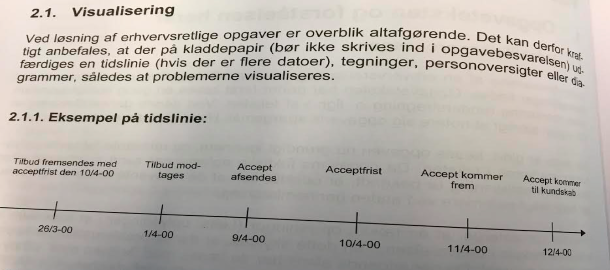
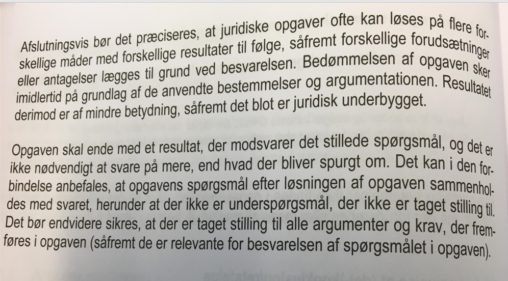

# Opgaveteknik ved løsning af juridiske skriftlige opgaver

## Besvarelsens indhold

Der skal her gives følgende gode råd, når du skal besvare skriftlige juridiske (eksamens)opgaver:^[Følgende afsnit er en gengivelse af advokat **Peter Wedel Ranch Krarup** Aspiri Opgavesamling til Erhvervsret, 2015, 5. udg., s. 9-14.]

---

## Opgaveteksten og forståelsen heraf

### Udskillelsesprocessen

---

---

### Opgaveteksten skal respekteres

---

---

---

## Tiltag inden besvarelsen

### Visualisering og eksempel på tidslinie

---

---

#### Eksempler på personoversigter/-diagrammer

---

---

### Disposition

---

---

## Besvarelsens form

### Sprogbrug mv.

---

---

### Henvisninger

---

## Besvarelsens indhold

### Generelt om besvarelsen og argumentationen

---

---

---

#### Retsreglen sammenholdes med opgavens faktum og angivelser af (del-) konklusion/retsfølge 

---

--- 

### Sammenfatning

---

---

---
