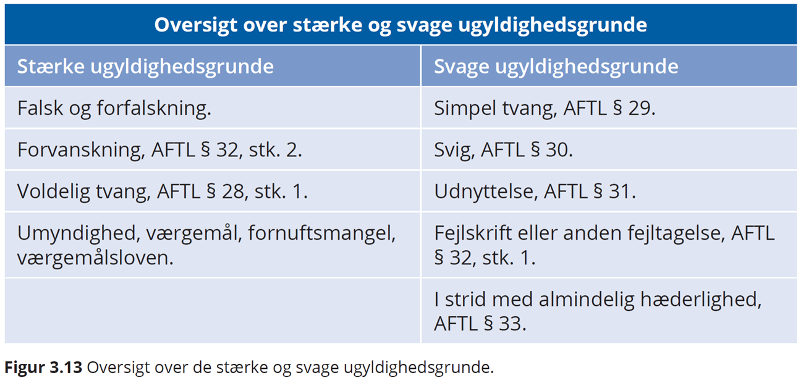

# Aftaleret


***Introduktion til aftaleretten***

---

**Video: introduktion til aftaleretten**


<div class="video-container"><iframe src="https://www.youtube.com/embed/QdPllNiV5Ck" width="853" height="480" frameborder="0" allowfullscreen="allowfullscreen"></iframe></div>


---


***Hvilke problemstillinger og aftaleretlige lovregler, du som studerende særlig skal være opmærksom på vedrørende eksamensspørgsmål indenfor aftaleretten:***


• **Opfordring contra tilbud**, aftalelovens § 9, herunder prisangivelser på nettet, netbutikker og i fysiske butikker
  
• **Aftaleindgåelse**, aftalelovens § 2-7 og § 40

• **Ugyldighed** (svig, aftalelovens § 30 fejl, aftalelovens § 32, stk. 1, udnyttelse, aftalelovens § 31)

• **Falsk/forfalskning**

• **Urimelighed** - §§ 38c, jf. 36

• **Fuldmagtstyper** (især stillingsfuldmagt, aftalelovens § 10, stk. 2), fuldmagtens omfang og konsekvenser, aftalelovens § 10, 11, 15 og 25, modificeret ved erstatningsansvarslovens § 23


---

<br>

<script async src="https://widget.spreaker.com/widgets.js"></script>


<br>


Aftalelovens principper har betydning på hele aftaleområdet,^[Følgene bygger tildels på *Torsten Iversen og Lars Hedegaard Kristensens* karnovkommentar til aftaleloven] fx i:


* Forsikringsaftaleloven, kreditaftaleloven, forbrugeraftaleloven, AB 18, købeloven, E-handelsloven m.fl.

*	Aftaleindgåelse reguleres af aftalelovens §§ 2-9.

  + Deklaratorisk, dvs. parterne kan aftale anden fremgangsmåde ved aftaleindgåelse, end den der er beskrevet i aftaleloven.


```{r aftalelov,echo=FALSE, result=TRUE,fig.cap=("Oversigt over aftalelove")}


nodes <- data.frame(id = 1:7, 
                    shape = c("box"), 
                    label = c(" Aftalelov "," Forsikringsaftalelov "," Kreditaftalelov "," Forbrugeraftalelov "," AB92 "," Købelov "," E-handelslov "),
                    font.size = c(50,25,25,25,25,25,25))
edges <- data.frame(from = c(1,1,1,1,1,1), to = c(2,3,4,5,6,7),arrows = c("to"),length = rep(20,6))

visNetwork(nodes, edges,  width = "80%") %>% 
  visNodes(color = list(background = "white", 
                        border = "white",
                        highlight = "yellow"),
           shadow = list(enabled = TRUE, size = 30))  %>%
  visHierarchicalLayout(direction = "LR",levelSeparation = 400) %>%
visEdges(color = list(color = "lightgrey", highlight = "yellow") )
  # visLayout(randomSeed = 24) # to have always the same network

```


## Aftaleindgåelse

**HR:** Aftalefrihed – vi kan frit aftale hvad vi vil

*	**U1:** Begrænsninger i præceptive lovregler:  

fx:
      +	Funktionærlovens regler om opsigelsesvarsler
      +	Forbrugeraftalelovens regler om fortrydelsesret
      
*	**U2:** Urimelige aftaler, aftalelovens §§ 38c, jf. 36

*	**U3:** "En aftale bliver også ugyldig, hvis den strider mod "lov og ærbarhed", jf. allerede Christian 5.s Danske Lov fra 1683. 

Fx er et løfte om at ville betale en anden persons fartbøde ugyldig. 

Men en aftale bliver ikke ugyldig, blot fordi der er overtrådt offentligretlige forskrifter. 

Fx er en aftale om køb af drikkevarer uden for den tilladte åbningstid bindende trods lovovertrædelsen.

I nyere tid har ugyldighed med held været påberåbt af mange, der tegnede anparter i investeringsprojekter med vindmøller, containere, hoteller mv., idet anpartstegnerne var blevet vildledt om projektets bæredygtighed.^[Jf. *Erik Werlauff*, *Karsten Revsbech*: ugyldighed i Den Store Danske, Gyldendal] 


  

<a class="spreaker-player" href="https://www.spreaker.com/show/jura" data-resource="show_id=3421279" data-width="100%" data-height="350px" data-theme="light" data-playlist="show" data-playlist-continuous="true" data-autoplay="false" data-live-autoplay="false" data-chapters-image="true" data-episode-image-position="right" data-hide-logo="true" data-hide-likes="true" data-hide-comments="true" data-hide-sharing="true" data-hide-download="true" data-cover="https://d1bm3dmew779uf.cloudfront.net/cover/82d497d128ab0adc306278c68db0041d.jpg"></a>


### Hvad er en aftale?


Ordet **”aftale”**: En aftale - jf. aftalelovens titel - består af viljeserklæringer, som to eller flere personer afgiver indbyrdes, og hvoraf mindst én erklæring er et løfte, som har karakter tilbud. 

Aftalebegrebet bruges oftest om et tilbud, som er accepteret af modparten, f.eks. en pagt, traktat, kontrakt, charter, overenskomst, vedtægt, vedtagelse, konvention og studehandel. 

Aftaler er bindende, uanset om de er mundtlige eller skriftlige, jf. aftalelovens § 1. 

Mundtlige aftaler er således lige så bindende som skriftlige, jf. Danske Lov, DL 5–1–2 og forudsætningsvis aftalelovens § 3, stk. 2, som fastslår, at tilbud, der fremsættes mundtligt skal accepteres straks. 

De mundtlige kan bare være sværere at bevise, hvis parterne bliver uenige om aftalens indhold. 

Kontrakten er skriftlig og kan håndhæves i retssystemet. 

Bevisbyrde - Den part der hævder en mundtlig aftale er indgået, har bevisbyrden (som er hovedreglen i dansk ret; en ligefrem bevisbyrde).


**Mundtlige aftaler ctr. skriftlige aftaler:**


*	Aftaler er bindende, uanset om de er mundtlige eller skriftlige. De mundtlige kan bare være sværere at bevise, hvis parterne bliver uenige om aftalens indhold. Kontrakten er skriftlig
  
  
*	**Bevisbyrde** - Den part der hævder en mundtlig aftale er indgået, har bevisbyrden herfor


Ensidigt løfte ctr. gensidigt løfte se figurer.  
Udtrykkeligt løfte ctr. stiltiende løfte.
<br>

**Hvad er forskellen på en aftale og en kontrakt?:**  


En aftale kan også være mundtlig. 


En kontrakt er skriftlig og kan påberåbes ved domstolene.  


```{r gensidigtloefte, echo=FALSE, result=TRUE,fig.cap=("Gensidigt løfte")}


nodes <- data.frame(id = 1:2, group = c("B", "A"),label = c(" Sælger "," Køber "))
edges <- data.frame(from = c(1), 
                    to = c(2),
                    arrows = c("to","from"),
                    length = c(800,500),
                    label=c("Varer/Ydelser","Penge/modydelse"),
                    smooth = TRUE
                    )

 visNetwork(nodes, edges, width = "80%") %>%
 visGroups(groupname = "A", shape = "icon", 
           icon = list(code = "f007", size = 150)) %>%
 visGroups(groupname = "B", shape = "icon", 
           icon = list(code = "f007", size = 150, color = "red",highlight = "yellow")) %>%
 addFontAwesome() %>%
 
 visEdges(shadow = TRUE,
           arrows =list(to = list(enabled = TRUE, scaleFactor = 2)),
           color = list(color = "lightblue", highlight = "red"))
```


```{r faicon2, echo=FALSE, result=TRUE,fig.cap=("Ensidigt løfte")}

nodes <- data.frame(id = 1:2, group = c("B", "A"),label = c(" Testator "," Arving "))
edges <- data.frame(from = c(1), 
                    to = c(2),
                    arrows = c("to"),
                    length = c(300),
                    label=c(" ARV "),
                    smooth = TRUE
                    )
 visNetwork(nodes, edges,  width = "80%") %>%
 visGroups(groupname = "A", shape = "icon", 
           icon = list(code = "f007", size = 150, color = "red")) %>%
 visGroups(groupname = "B", shape = "icon", 
           icon = list(code = "f007", size = 150, color = "black")) %>%
 addFontAwesome() %>%
 
 visEdges(shadow = TRUE,
           arrows =list(to = list(enabled = TRUE, scaleFactor = 2)),
           color = list(color = "lightblue", highlight = "red"))
```


***Eksemplar på juridiske aftaler mellem parter*** 


**Ejendomsmægleren tager initiativ til en formidlingsaftale om salg af et hus:**  


*	Tilbudsgiver (ejendomsmægleren): Den der afsender/giver et tilbud til en anden.
  
*	Tilbudsmodtager (boligsælgeren): Den som modtager et tilbud.   

**En kunde tager initiativ til en forsikringsaftale:**  


<br>

*	**Tilbudsgiver** (kunden): En interesseret kunde sender en begæring til et forsikringsselskab med ønske om en forsikring.

*	**Tilbudsmodtager** (sælger): Sælger modtager en ordre eller ønske om køb fra interesseret køber.

*	Et **løfte:** En ensidig erklæring fra en person om at ville påtage sig en pligt. Løftet skaber en forventning hos modtager. Løftet har følgende retsvirkninger: 

Dels at løftegiveren har pligt enten til at opfylde løftet efter dets indhold (såkaldt naturalopfyldelse) eller 

til at erstatte løftemodtagerens økonomiske interesse i løftets opfyldelse, dvs. erstatning i form af såkaldt **"positiv opfyldelsesinteresse"** (forudsat naturligvis, at der foreligger et ansvarsgrundlag).

*	**Tilbud**: Et tilbud er et løfte, som taber sin virkning, hvis det ikke accepteres i rette tid. 

F.eks. et løfte om at levere en vare eller tjenesteydelse til en bestemt pris og et bestemt sted på et bestemt tidspunkt.

*	**Accept:** En erklæring, som har karakter af antagende svar på tilbud. 

Et **svar**, hvori man siger ja til et tilbud. 

**Accepten** er både et løfte der binder acceptanten, når modtageren har hørt/læst accepten (kundskabsøjeblikket), og det er samtidig et påbud der binder modtageren, når det er kommet frem, dvs. når et svar (tilbud eller accept) er modtaget i modtagerens brevkasse, indbakke eller lignende, men indholdet er endnu ikke læst. Kommet til kundskab: 

Det øjeblik modtageren er blevet bekendt med indholdet af tilbud eller accept, dvs. har hørt eller læst.

*	**Kommet frem:** Når et svar (tilbud eller accept) er modtaget i modtagerens brevkasse, indbakke eller lignende, men indholdet er endnu ikke læst.

*	**Kommet til kundskab:** Det øjeblik modtageren er blevet bekendt med indholdet af tilbud eller accept, dvs. har hørt eller læst.

*	**Opfordring til at gøre tilbud**: er en ikke-bindende henvendelse til andre om at give tilbud.

*	**Påbud** er en erklæring: som går ud på at lægge bånd på adressaten.

*	**Reklamation**: er en indsigelse i anledning af et retsforhold.

*	**Pligtmæssig reklamation:** er en reklamation, som afgives af hensyn til adressaten og forsendes på adressatens risiko, jf. aftalelovens § 40 (og tilsvarende købelovens § 61). Aftaleloven bruger herom udtrykket »give meddelelse«.


## Aftalemodellen


*	Tilbudsgiver sender sit tilbud ………….fremsendelsestid

*	Tilbudsmodtager modtager tilbud (kommet frem)

*	Tilbudsmodtager læser tilbud (kommet til 
  kundskab) ………….betænkningstid
  
*	Tilbudsmodtager accepterer tilbud/sender accept ………….tilbagesendelsestid
  
*	Accept når frem til tilbudsgiver (kommet frem)

*	Tilbudsgiver læser accepten (kommet til kundskab)


Resultat: Der er indgået en juridisk bindende aftale


---


(Kilde; Trojka).


---

**Video: Om aftalemodellen**


<div class="video-container"><iframe src="https://www.youtube.com/embed/DvV2yhetl8M" width="853" height="480" frameborder="0" allowfullscreen="allowfullscreen"></iframe></div>


---

**Video: Om aftalers indgåelse**

<div class="video-container"><iframe src="https://www.youtube.com/embed/WbgTUpCLz00" width="853" height="480" frameborder="0"allowfullscreen="allowfullscreen"></iframe></div>


---


```{r faicon3, echo=FALSE, result=TRUE,fig.cap=("Aftale sælgers initiativ")}
nodes <- data.frame(id = 1:2, group = c("B", "A"),label = c("Sælger \n tilbudsgiver ","Køber \n tilbudsmodtager "))
edges <- data.frame(from = c(1), 
                    to = c(2),
                    arrows = c("to","from"),
                    length = c(800,500),
                    label=c("1. Sælger sender tilbud til køber","2. Køber sender accept/ordre"),
                    smooth = TRUE
                    )
 visNetwork(nodes, edges,width = "80%") %>%
 visGroups(groupname = "A", shape = "icon", 
           icon = list(code = "f007", size = 150)) %>%
 visGroups(groupname = "B", shape = "icon", 
           icon = list(code = "f007", size = 150, color = "red",highlight = "yellow")) %>%
 addFontAwesome() %>%
 
 visEdges(shadow = TRUE,
           arrows =list(to = list(enabled = TRUE, scaleFactor = 2)),
           color = list(color = "lightblue", highlight = "red"))
```


---


```{r faicon4, echo=FALSE, result=TRUE,fig.cap=("Aftale købers initiativ")}
nodes <- data.frame(id = 1:2, group = c("B", "A"),label = c("Sælger \n tilbudsmodtager ","Køber \n tilbudsgiver "))
edges <- data.frame(from = c(1), 
                    to = c(2),
                    arrows = c("to","from"),
                    length = c(800,500),
                    label=c("2. Sælger sender accept/ordrebekræftelse","1. Køber sender købstilbud/ordre"),
                    smooth = TRUE
                    )
 visNetwork(nodes, edges,width = "80%") %>%
 visGroups(groupname = "A", shape = "icon", 
           icon = list(code = "f007", size = 150)) %>%
 visGroups(groupname = "B", shape = "icon", 
           icon = list(code = "f007", size = 150, color = "red",highlight = "yellow")) %>%
 addFontAwesome() %>%
 
 visEdges(shadow = TRUE,
           arrows =list(to = list(enabled = TRUE, scaleFactor = 2)),
           color = list(color = "lightblue", highlight = "red"))
```

---

### Tilbud eller opfordring til tilbud


**HR:** Tilbud er bindende for afgiveren, jf. aftalelovens § 1:

*	Tilbuddet bliver bindende for tilbudsgiver, når   tilbudsmodtager får kendskab til tilbuddets indhold.

    +	Tilbud er bindende i butikker og butiksvinduer, medmindre køber burde indse, at der var tale om en fejl
    
    +	Tilbud er bindende i web-butikker, når sælger selv har råderet over websitet
    

**Undtagelser**: **Opfordring til tilbud**, jf. aftalelovens § 9:


*	Nogle typer tilbud er ikke bindende for sælger, fx:
  
    + Slagtilbud og ”så længe lager haves”, tilbud og priser i aviser og kataloger, på plakater, annoncer, TV- og radioreklamer, priser og tilbud på internettet, når sælger ikke selv har råderet over websitet.
    
---

**Video: Tilbud contra opfordring**


<div class="video-container"><iframe src="https://www.youtube.com/embed/j36H6TAo7Us" width="853" height="480" frameborder="0" allowfullscreen="allowfullscreen"></iframe></div>


---

#### Afslag på tilbud


*	Hvis tilbudsmodtager forholder sig passiv, bortfalder tilbuddet når acceptfristen er udløbet, og sælger kan frit sælge til anden side.

*	Hvis tilbudsmodtager afslår tilbuddet, er det bortfaldet, selvom acceptfristen ikke er udløbet, jf. aftalelovens § 5. Sælger kan frit sælge til anden side.  

**Situation**: Tilbagekaldelse af afslag. Tilbudsmodtager (potentiel køber) sender et afslag til sælger, men han fortryder sit afslag.


– Tilbuddet er stadig bindende for sælger, hvis købers tilbagekaldelse kommer til tilbudsgivers (sælgers) kundskab, senest samtidig med at sælger læser afslaget.


---

**Video: Afslag**


<div class="video-container"><iframe src="https://www.youtube.com/embed/Noq0xWiKryg" width="853" height="480" frameborder="0" allowfullscreen="allowfullscreen"></iframe></div>


---

#### Accept


**Acceptfrist er fastsat i tilbuddet:**

*	Når tilbudsmodtager har læst eller hørt om tilbuddet, har han en frist til at overveje, om han vil acceptere, fx i form af en ordrebekræftelse.

*	Accepten er rettidig, hvis den er kommet frem til tilbudsgiver inden acceptfristens udløb, jf. aftalelovens § 2.

*	Hvis acceptfristen er angivet til 8 dage, regnes fristen fra tilbuddets datering.

---

##### Accept – den legale acceptfrist


**Ingen acceptfrist i tilbud**:

*	Den legale acceptfrist, jf. aftalelovens § 3:

  Fremsendelsestid + rimelig betænkningstid + 
  tilbagesendelsestid

*	Rimelig betænkningstid” afhænger af de konkrete   omstændigheder. 


**Betænkningstid er**:

    +	Kort, hvis prisen på salgsproduktet svinger meget
    
    +	Kort, hvis der er tale om letfordærvelige varer
    
    +	Længere, hvis der er tale om komplekse og større tilbud
    
*	Mundtlige tilbud der gives uden acceptfrist, skal accepteres straks, ellers er det bortfaldet, jf. aftalelovens § 3, stk. 2.

---

##### Accept - forsinket


Accepten kommer for sent frem – fristen er sprunget - Aftalelovens § 4:

* **HR:** § 4, stk. 1: Forsinket accept betragtes som et nyt tilbud, som den oprindelige tilbudsgiver skal acceptere, før der er indgået en bindende aftale.

* **U:** § 4, stk. 2: Accepten er OK, hvis tilbudsgiver må indse at acceptanten tror at accepten er rettidig, fx hvis accept er sendt inden fristens udløb, men bliver forsinket hos postvæsen - tjek datostempel.

* **NB !!** Hvis tilbudsgiver ikke vil være bundet af en forsinket accept, skal han uden ugrundet ophold give acceptanten meddelelse om forsinkelsen. 

Lader han som ingenting, risikerer han at være bundet	og skal opfylde aftalen.


**”Give meddelelse”** se aftalelovens § 40.

---

**Video: Tilbagekaldelse efter aftalelovens § 40**


<div class="video-container"><iframe src="https://www.youtube.com/embed/w5HtkYrMXDg" width="853" height="480" frameborder="0" allowfullscreen="allowfullscreen"></iframe></div>

---

**Video: For sen accept**


<div class="video-container"><iframe src="https://www.youtube.com/embed/xoiUi_ShUJc" width="853" height="480" frameborder="0" allowfullscreen="allowfullscreen"></iframe></div>


---

**Video: Rettidig accept**


<div class="video-container"><iframe src="https://www.youtube.com/embed/dJmhJTwJzhg" width="853" height="480" frameborder="0" allowfullscreen="allowfullscreen"></iframe></div>

---

**Video: Om uoverensstemmende accept**

<div class="video-container"><iframe src="https://www.youtube.com/embed/xGnZFVV1H74" width="853" height="480" frameborder="0" allowfullscreen="allowfullscreen"></iframe></div>


---


##### Tilbagekaldelse af tilbud/accept


**Aftalelovens § 7**

**Situation: Tilbudsgiver vil annullere sit tilbud**

*	Tilbud kan tilbagekaldes af tilbudsgiver, hvis tilbagekaldelsen kommer frem inden eller samtidig med, at det oprindelige tilbud kommer til tilbudsmodtagers kundskab.


**Situation: Acceptanten vil annullere sin accept**

*	Svar/accept kan tilbagekaldes af acceptanten, hvis tilbagekaldelsen kommer frem inden eller samtidig med, at accepten kommer til tilbudsgivers kundskab.


**U:** Se den såkaldte **"Re integra-reglen"** - aftalelovens § 39, 2. pkt.: 

Under særlige omstændigheder kan tilbagekaldelse alligevel ske efter fristens udløb, hvis to betingelser er opfyldt:  

1. Tilbuddet eller accepten må ikke have virket bestemmende på modtagerens handlemåde, fx har tilbudsgiver sat produktion af ordren i gang på baggrund af accepten?

2.	Årsagen til at tilbagekaldelsen er kommet for sent frem, skyldes særlige omstændigheder.

Re integra-reglen kan ikke påberåbes bare fordi man har fortrudt. Der skal således noget særligt til.

---

*Se domspraksis vedrørende anvendelsen af aftalelovens § 39, 2. pkt.:* 

**U 1929 1084: En sælger S modtog fra køberen K et brev om annullation af en ordre, men næste morgen modtog han telegram om, at brevet var bestemt til et andet firma. Skønt S ikke havde eller burde have indset, at der forelå en fejltagelse, fandtes brevet dog ikke bindende for K, da S ikke, inden fejltagelsen oplystes, havde foretaget andet end at bestemme sig til at levere varen til en anden kunde.**

**U 1969 579 Ø: En køber, der telefonisk havde bestilt en vaskemaskine, indfandt sig fejlagtigt i en anden nærliggende forretning, hvor hun mod kvittering betalte for en vaskemaskine af den pågældende type. Da hun 4 dage senere opdagede fejlen, nægtede forretningen at tilbagebetale købesummen under påberåbelse af, at der var indgået en endelig handel. Det fandtes ikke godtgjort, at forretning nr. 2, da betalingen fandt sted, indså eller burde indse, at der forelå en fejltagelse, men da køberen havde reklameret tilstrækkeligt hurtigt, og da handelens indgåelse og tilbagekaldelse ikke havde påført forretningen arbejde eller udgift, fandtes § 39, 2. pkt., at måtte anvendes.**

**U 1989 561 H: En annullation af en slutseddel, der var underskrevet under medvirken af en ejendomsmægler, om morgenen dagen efter købet tillagt retsvirkning efter princippet i § 39, 2. pkt., idet slutsedlen blev underskrevet umiddelbart efter den første besigtigelse af ejendommen, uden at ejendomsmægleren, der var klar over den vanskelige situation som køberen befandt sig i pga. forestående tvangauktion over sit hus, forinden havde søgt klarlagt, om køberen havde økonomisk mulighed for at opfylde handelen**.

---

**Video: Om tilbagekaldelse**


<div class="video-container"><iframe src="https://www.youtube.com/embed/Pf2unCK7tME" width="853" height="480" frameborder="0" allowfullscreen="allowfullscreen"></iframe></div>
<br>

---

##### Uoverensstemmende accept


Accepten skal være i overensstemmelse med tilbuddet – spejlbillede, jf. aftalelovens § 6:

* **HR:** § 6, stk. 1: En uoverensstemmende accept er et afslag, og vil blive betragtet som et modbud (nyt tilbud), men fra acceptantens side.

* **U:** § 6, stk. 2 – En uoverensstemmende accept betragtes ikke som et modbud (nyt tilbud), hvis afsenderen tror,	at accepten er i overensstemmelse med tilbuddet og tilbudsgiveren må indse at acceptanten tror at accepten er ok.  

**NB !!** Hvis tilbudsgiver ikke vil være bundet af indholdet i den ”forkerte” accept, skal han uden ugrundet ophold give acceptanten besked. 

Lader han som ingenting, er tilbudsgiver bundet af aftalen og skal levere i henhold til indholdet af den uoverensstemmende accept.


**”Give meddelelse”** se aftalelovens § 40

---

### Eksamensopgave


***Bord og stol A/S***


**Tema: Aftaleindgåelse og handelskøb**


Firmaet ”Bord og stol A/S” producerer og handler med alle former for møbler men har i de senere år specialiseret sig i møbler til hoteller. ”Bord og stol A/S”s indkøber har fundet nogle meget elegante møbler i Østen lavet i et nyt og anderledes design. Indkøberen har på vegne ”Bord og stol A/S” fået forhandlet sig frem til en god pris mod garanti om at aftage et vist minimum af varerne.
 
”Bord og stol A/S” sender et tilbud ud til de kunder, der skal til at renovere deres hotel, med en acceptfrist til d. 10.04. Tilbuddet lyder på indkøb af min. 20 sæt, og leveringstidstidspunktet er sat til d. 1.05. Prisen angives til 11.995 kr. for et sæt bestående af en seng, et skab, et bord og to stole. Der kommer en del ordre ind inden d. 10.04. 

”Bord og stol A/S” undrer sig dog over, at en kunde, ”Parkhotellet” ikke har afgivet bestilling, da man telefonisk havde fået indtryk af at hotellet helt sikkert ville have varerne. På grund af travlhed reagerer ”Bord og stol A/S” ikke. D. 20.04. kommer så accepten fra kunden. Af den fremgår, at ”Parkhotellet” ønsker 20 sæt. Firmaet ”Bord og stol A/S” reagerer ikke på accepten, da den er kommet for sent frem. Da der d. 01.05. ikke kommer nogen møbler kontakter ”Parkhotellet” ”Bord og stol A/S”, der meddeler, at accepten kom for sent frem. ”Parkhotellet” kan ikke forstå det og undersøger sagen. Accepten er afsendt i god tid, nemlig allerede d. 07.04. Firmaet ”Bord og stol A/S” oplyser at, ”Parkhotellet” kan få møblerne men nu til 13.600 kr. pr. sæt. Efterspørgslen har nemlig vist sig at være stor. ”Parkhotellet” fastholder sin accept og forlanger havemøblerne leveret snarest. 

Bord og stol A/S modtager også en accept fra en anden kunde, nemlig Strand Hotellet. Stand Hotellet har imidlertid angivet en pris på 1.995 kr. Bord og Stol A/S reagerer heller ikke på denne accept, da de ikke ønsker at sælge møblerne til 1.995 kr. Det viser sig senere at Stand Hotellet havde lavet en fejl og ønskede møblerne til 11.995 kr. Bord og stol giver samme melding som til Parkhotellet, nemlig at prisen nu er 13.600 kr. 

3 måneder efter levering af møbler til Hotel Golf reklamerer Hotel Golf over mangler ved møblerne idet flere af stoleryggene er gået løs.  

Bord og stol afviser reklamationen, da der står på bagsiden af fakturaen, at der skal reklameres inden 8 dage fra leveringen.


**Eksamenspørgsmålene og rettevejledningen**

1.	Redegør for om Parkhotellet har krav på at få møblerne til 11.995 kr. 

Svar: Her er Bord & Stol forpligtet, jf. AFTL § 4, stk. 2 til at levere stolene til kr. 11.995 til Parkhotellet, da Parkhotellet har accepteret rettidigt og Bord & Stol må indse dette.
 
2.	Redegør for om Strand Hotellet har krav på at få møblerne til 11.995 kr. 

Strandhotellet har ikke krav på møblerne, jf. AFTL § 6, stk. 2, da prisforskellen fra kr. 11.995 til kr. 1.995 ikke medfører, at Bord & Stol måtte indse, at Strandhotellet ville købe møblerne til kr. 11.995 og blot havde lavet en fejl. 

3.	Redegør for hvilke rettigheder Hotel Golf har i forhold til de løse stolerygge. 

Faktura-teksten på bagsiden er næppe gjort klart for Hotel Golf i forbindelse med Bord & Stols fremsendelse af tilbuddet og dermed slet ikke en del af aftalen. Hotel Golf kan dermed se bort fra kravet, og har reklameret rettidigt jf KBL § 54. 

---


### Aftaleindgåelse på internettet


*	Aftaleloven gælder også ved aftaler og køb på nettet

*	Afsender bærer selv risiko for at e-mailen kommer frem til modtager

*	”kommet frem”- når mailen ligger i indbakken

*	”kommet til kundskab”- når mailen åbnes og læses

*	Aftalelovens § 40 om at ”give meddelelse” omfatter også e-mails

---

**Video om køb på nettet**


<div class="video-container"><iframe src="https://www.youtube.com/embed/l1rc2FBSjss" width="853" height="480" frameborder="0" allowfullscreen="allowfullscreen"></iframe></div>


---

**Video: Hvad er e-mærket?**


<div class="video-container"><iframe src="https://www.youtube.com/embed/SGvg5W3JRzQ" width="853" height="480" frameborder="0" allowfullscreen="allowfullscreen"></iframe></div>


---

## Aftalers ugyldighed


1. Aftalen er bindende, men den kan alligevel bortfalde, hvis aftalen rammes af ugyldighed:

Ugyldighed som kan ramme aftalen kan opstå pga:

*	**Tilblivelsesmangler** – omstændigheder ved aftalens indgåelse, fx svig, forfalskning, voldelig tvang, udnyttelse mv. (sondres mellem svage og stærke ugyldighedsgrunde)

*	**Habilitetsmangler** – en af parterne mangler habilitet eller evne til at indgå aftaler, fx pga. umyndighed, sindssygdom, demens.

*	**Indholdsmangler** – indholdet er i strid med loven, moral, almindelig hæderlighed mv.

*	**Bristende forudsætninger**

---


**Typer af mangler**


(Kilde; Trojka)


---


---

#### Forskellen på de stærke og svage ugyldighedsgrunde


---

**Ugyldighedsgrunde**



---


Der skelnes mellem stærke og svage ugyldighedsgrunde. 

De stærke kan gøres gældende også over for en kontraktpart, der var i god tro ved aftalens indgåelse. 

Stærke ugyldighedsgrunde er bl.a. forfalskning af indhold eller underskrift, underskriverens mindreårighed eller værgemål samt voldelig tvang. 


De svage ugyldighedsgrunde kan ikke gøres gældende over for en kontraktpart i god tro, og den godtroende part kan således fastholde aftalen trods ugyldighedsgrunden. 

Hvis A fx giver B et løfte pga. svigagtige oplysninger fra C, binder løftet A trods svigen, såfremt B ikke burde være klar over, at der var udvist svig.

---

##### De stærke ugyldighedsgrunde

De *stærke ugyldighedsgrunde* omfatter følgende grunde:

*	**Falsk**

*	**Forfalskning**

*	**Forvanskning**, aftalelovens § 32, stk. 2.

*	**Voldelig tvang**, aftalelovens § 28, stk. 1

*	**Umyndighed**, værgemål, fornuftsmangel  
  (Værgemålsloven)


##### De svage ugyldighedsgrunde


De *svage ugyldighedsgrunde* omfatter følgende grunde:

*	**Simpel tvang**, aftalelovens § 29

*	**Svig**, aftalelovens § 30

*	**Udnyttelse**, aftalelovens § 31

*	**Fejlskrift** eller anden fejltagelse, 
  aftalelovens § 32, stk. 1 


**Nærmere om de stærke ugyldighedsgrunde:**


*	**Falsk:** Dokumentet er falsk, fx ved falsk underskrift på en selvskyldnerkaution. Løftet er ikke ægte.

*	**Forfalskning:** Lånedokumentet er forfalsket, hvis der er ændret i dokumentet, fx et beløb – ændret fra 250.000 kr. til 550.000 kr. 

Løftet er ægte fra starten, men indholdet af løftet ændres. Eller der bliver forfalsket en underskrift.

*	**Forvanskning:** Aftaler eller beskeder der under fremsendelsen ændres eller forvanskes ved en fejl, hvorved aftalen får et andet indhold, aftalelovens § 32, stk. 2, fx af et bud eller i en fax.

+ Hvis afsenderen ikke vil være bundet af indholdet i den fejlagtige erklæring, skal afsenderen uden ugrundet ophold efter at vedkommende har opdaget fejlen, give besked til modtageren om, at afsenderen ikke vil være bundet. 

Gør afsenderen ikke det, er vedkommende bundet af indholdet i den fejlagtige aftale.
    

**Hvad er voldelig tvang?**  


*	Voldelig tvang, aftalelovens § 28, stk. 1:

    +	Aftalen ugyldig hvis løftet fra løftegiver er fremkaldt ved vold eller trussel om øjeblikkelig anvendelse af vold, fx holder en pistol for panden af løftegiver.
    
    +	Hvis det er tredjemand, som truer for at fremprovokere et løfte, og løftegiver ikke vil være bundet af løftet/aftalen, skal løftegiver uden ugrundet ophold give løftemodtager besked om, at denne er blevet truet  til at afgive løftet. Gør løftegiver ikke det, bliver vedkommende bundet af sit løfte og aftalen er bindende, jf. aftalelovens § 28, stk. 2.


**Umyndighed**


Personer under 18 år:

* **HR:** Kan ikke indgå retshandler eller råde over deres formue, fx købe på kredit, sælge sine ting, pantsætte sine ting – aftale vil være ugyldig, uanset om løftemodtager var i god tro.

* **U:** Værgemålslovens § 42 – der kan indgås gyldige aftaler med umyndige, hvis der er tale om:

    1.	Selverhvervelsesreglen (kontantreglen)
    2.	Pengereglen


**Selverhvervelsesreglen:** 


Personer over 15 år kan råde over deres egne penge som de selv har tjent, eller fået ved arv/gave, og hvad værgen har givet dem. !!NB – kun kontantkøb (ej kreditaftaler)


**Pengereglen:** 

En aftale med en umyndig, fx en 8-årig, er gyldig, hvis pengereglen er opfyldt:  

*	Pengene modtages kontant til fuld betaling, dvs. ej kreditkøb

*	Der er sammenhæng mellem varens art, den umyndiges alder og beløbets størrelse.  

Sælgers gode tro er afgørende. Er sælger i tvivl, skal han bede om værgens samtykke, jf. værgemålslovens § 44.


**Situation**: Aftale med mindreårig indgås i god tro, men aftalen rammes af ugyldighed.

*	Hver part skal tilbagelevere hvad de hver især har modtaget. Hvis det er muligt.

*	Kan den umyndige ikke tilbagelevere, og der er tale om en genstand, som har været den umyndige til nytte, fx cykel eller computer, kan den umyndige risikere at skulle betale erstatning til løftemodtager efter nyttereglen, jf. værgemålslovens § 45.

*	Har den umyndige fremvist falsk ID ved aftalens indgåelse, skal den umyndige erstatte løftemodtagers tab, uden hensyn til nyttereglen.

*	Derudover gælder de almindelige erstatningsretlige regler


---


---


**Værgemål og fornuftsmangel**

*	Personer over 18 år kan komme under værgemål/umyndiggøres, fx pga. svær demens, sindssygdom, psykisk handicap mv.

*	Ude af stand til at varetage deres økonomiske anliggender, og hvor der er en risiko for forringelse eller økonomisk udnyttelse.

*	Loven taler om *”Manglende evne til at handle fornuftsmæssigt”*

*	Der beskikkes en værge, som får ansvaret for økonomien.

*	Aftaler indgået med voksne under værgemål er ugyldige, jf.   
  værgemålslovens § 46, uanset om løftemodtager var i god tro.


**Nærmere de svage ugyldighedsgrunde:** 

*	**Simpel tvang**, aftalelovens § 29

*	**Svig**, aftalelovens § 30

*	**Udnyttelse**, aftalelovens § 31

*	**Fejlskrift/anden fejltagelse**, aftalelovens § 32, stk. 1


**Aftalers ugyldighed simpel tvang**, jf. aftalelovens § 29
<br>

**Anden tvang en voldelig tvang**:  


Kompulsiv tvang/psykisk tvang, fx trusler om boykot, skandalisering og afpresning


*	Løfter der er motiveret af simpel tvang er ikke bindende for løftegiver, hvis løftemodtager selv har udøvet tvangen.
  
*	Hvis løftet er motiveret simpel tvang udøvet af tredjemand, er  løftegiver ikke bundet af sit løfte, hvis løftemodtager indså eller burde have indset at løftet blev afgivet som følge af simpel tvang.
  
*	Hvis løftemodtager derimod var i god tro, dvs. ikke indså eller burde have indset at løftet blev afgivet som følge af tredjemands simple tvang, er løftegiver bundet af sit løfte.


**Svig**, aftalelovens § 30

Svig: Fejlinformation, urigtige oplysninger og  fortielser, der bruges eller tilbageholdes, for at få en aftale i hus.


**Situation**: Sælger af en båd påstår urigtigt, at båden har været ejet af en berømthed, og på den baggrund meddeler køber, at han vil købe båden, trods den høje købesum.

* Løftet om køb af båden kan erklæres ugyldigt, hvis modtageren af løftet var i ond tro bådesælgeren. Løftet er så ikke bindende for bådekøberen

* Bådesælgeren er i ond tro, hvis: han vidste eller burde vide om et forhold og alligevel vælger imod bedrevidende, at bruge urigtige oplysninger eller fortie sandheden, for at få en aftale i hus.


**Svig udøvet af tredjemand**


**Situation:** 


* Peter (tredjemand) har sin båd til salg hos Bo Bådesælger. Peter møder en interesseret køber på Bo's parkeringsplads, og fortæller at båden har været A P Møllers i 1990’erne. På den baggrund bliver båden solgt med det samme.


* Bo Bådesælger (løftemodtager) er i god tro, idet han intet ved om Peters fejlinformation. Aftalen mellem bådekøberen og Bo Bådesælger er bindende. 


**Svig**, er en form vildledelse med det formål at få nogen til at foretage en juridisk disposition, fx indgå en aftale, på et urigtigt grundlag, så personen lider et tab eller udsættes for en uventet risiko for et tab. 

Svig kan bestå i, at forhold forties, eller at der siges noget urigtigt mod bedre vidende, jf. også det offentligretlige vildledningsforbud i markedsføringslovens §§ 5-7 og det civilretlige vildledningsforbud i købelovens § 76, stk, 1 nr. 1-2.


Da svigagtig optræden er skadelig for det økonomiske samliv, knytter retssystemet alvorlige sanktioner hertil. 

Et løfte, der er fremkaldt ved svig, kan erklæres ugyldigt i medfør af aftaleloven § 30. 

Dertil kommer, at svig som udgangspunkt er udtryk for forsæt til formueskade, hvorved den svigagtige adfærd resulterer i en erstatningspligt.


**Aftalers ugyldighed udnyttelse**, jf. aftalelovens § 31

**Situation:** 

Bent låner Anders penge og Bent kræver urimeligt høje renter (åger-renter). Bent er vidende om at A er i økonomiske vanskeligheder, og ikke kan låne penge andre steder.  

Når Bent i aftaleøjemed udnytter viden om Anders´ vanskeligheder, eller manglende viden/indsigt mv., er der tale om udnyttelse. Bent er i ond tro og aftalen er ugyldig.  


**Fejlskrift/anden fejltagelse**, jf. aftalelovens § 32, stk. 1


**Fejlskrift**: Fx en skrivelse får et andet indhold end tilsigtet. Løftet i skrivelsen er ikke bindende for løftegiver, hvis løftemodtager indså eller burde have indset, at der var tale om en fejl, idet løftemodtager så ville være i ond tro.

Modsætningsvis: Hvis løftemodtager ikke indså eller burde have kunnet indse, at det var en fejl, er løftemodtager i god tro og aftalen er gyldig.


---

**Video om fejlskrift**


<div class="video-container"><iframe src="https://www.youtube.com/embed/-xVEbZDAZZ8" width="853" height="480" frameborder="0" allowfullscreen="allowfullscreen"></iframe></div>


---

Speak


### God og ond tro

*	**God tro**

+ Løftemodtager(LM) havde ikke viden om ugyldighedsgrunden.
      
+ Løftemodtager(LM) vidste ikke eller burde have vidst, at løftet fra løftegiver(LG) var mangelfuldt, fx afgivet pga. ulovlig
tvang eller at løftegiver var umyndig

      
*	**Ond tro**

+ Løftemodtager havde en viden om ugyldighedsgrunden. 
      
+ Løftemodtager indså eller burde have indset, at løftet fra løftegiver var mangelfuldt, fx afgivet pga. ulovlig tvang eller at løftegiver var umyndig
      
---

**Video om god og ond tro**


<div class="video-container"><iframe src="https://www.youtube.com/embed/Ax4X9V-kdGw" width="853" height="480" frameborder="0" allowfullscreen="allowfullscreen"></iframe></div>


---

* Ved **stærke ugyldighedsgrunde**:

+	LM er i ond tro = LG er ikke bundet af løftet (aftalen erklæres ugyldig
      
+	LM er i god tro = LG er ikke bundet af løftet (aftalen erklæres ugyldig)
      

* **Ved svage ugyldighedsgrunde**:

+	LM er i ond tro = LG er ikke bundet af løftet (aftalen erklæres ugyldig
      
+	LM er i god tro = LG er bundet af løftet (aftalen fortsat bindende)


### Urimelige aftaler

**Indholdsmangler** - Hvis aftalen har fået et urimeligt indhold, kan den tilsidesættes helt eller delvist

*	Aftalelovens § 33: I **strid med almindelig hæderlighed**

*	**Generalklausulen**, aftalelovens § 36: Aftalen kan tilsidesættes helt eller delvis, hvis det ville være urimeligt eller i strid med redelig handlemåde at gøre den gældende. Ved forbrugeraftaler gælder yderligere aftalelovens § 38c, stk. 2!

I urimelighedsvurderingen indgår:

*	Forholdene ved aftalens indgåelse

*	Aftalens indhold og

*	Senere indtrufne omstændigheder

---

**Video: Forudsætningslæren**


<div class="video-container"><iframe src="https://www.youtube.com/embed/VliOntGAvUU" width="853" height="480" frameborder="0" allowfullscreen="allowfullscreen"></iframe></div>


---


### Bristende forudsætninger


*	Et løfte kan afgives på baggrund af nogle forudsætninger, som ikke nødvendigvis er diskuteret eller udtrykt klart mellem parterne i en aftale.

*	Hvis forudsætningen ikke holder, taler man om bristende, svigtende eller urigtige forudsætninger, hvilket i nogle tilfælde kan medføre at aftalen ophæves.


Ophævelse kræver at 3 betingelser skal være opfyldt:

1.	Forudsætningen skal have været væsentlig for løftegiver

2.	Forudsætningen skal være kendt for løftemodtager

3.	Forudsætningen skal være relevant og rimelig efter forholdene og i forhold til løftemodtagers risiko og byrde, hvis forudsætningen svigter.


En ugyldig aftale – Parterne er ikke forpligtet af det løfte de har afgivet og aftalen ophæves.

*	Tilbagelevere allerede udvekslede ydelser (penge/varer)

*	Evt. erstatning til den part, der har handlet i tillid til aftalen, og ved ophævelsen lider et økonomisk tab.

+ **Negativ kontraktsinteresse**:
      
Erstatningskrav, hvor man i økonomisk henseende stilles som om aftalen slet ikke var indgået – tilbage til status quo.
      

### Standardkontrakter/vilkår

Standardvilkår ses eksempelvis i fortrykt lejekontrakt, salgsaftale for biler, lånedokumenter, forsikringsaftaler.

* **HR:** Standardvilkår trykt på eller vedlagt kontrakten, anses for vedtaget ved kundens underskrift.

Betingelse: Standardvilkårene skal være påtrykt eller vedhæftet kontrakten. 

Vilkår der eftersendes efter underskrift gælder ikke, da vilkårene så ikke er gensidigt vedtaget.
        
* **U:** Et standardvilkår kan tilsidesættes, hvis det vurderes som urimeligt for kunden (aftalelovens § 36 og § 38 a-d)
 

*	**Salgs- og leveringsbetingelser** skal præsenteres for kunden inden eller i forbindelse med aftalens indgåelse. 

Fremsendelse sammen med faktura anses ikke for vedtaget

*	Usædvanlige vilkår skal fremhæves i en kontrakt, hvis de skal anses for vedtaget – må ikke gemmes blandt ”de små bogstaver.” Risiko for tilsidesættelse, jf. aftalelovens §§ 38c, jf. 36.

*	**Forbrugeraftaler** – Den erhvervsdrivende, som indgår aftaler med forbrugere, skal lave aftaler på en klar og forståelig måde, jf. kravet i aftalelovens § 38b, stk. 2. 

---

Se fra retspraksis:

*U.2019.2389 V: Andelsboligforening skulle i relation til aftale om juridisk rådgivning anses som forbruger. Aftalen om honorering var åbenbart i strid med bekendtgørelsens § 3, stk. 4 til lov om juridisk rådgivning, og andelsboligforeningen kunne kræve en stor del af honoraret tilbagebetalt.Der er ikke ved lov om juridisk rådgivning taget stilling til eventuelle civilretlige konsekvenser af en overtrædelse af loven, og sådanne må derfor skulle bedømmes ud fra en fortolkning og anvendelse af de almindelige aftaleretlige regler, herunder aftalelovens § 38 c, jf. § 36.*

---

### Aftalens omfang og fortolkning


**Fortolkningsprincipper:** Ved tvivl om indholdet af en aftale.  

**Koncipistreglen:** Aftalen fortolkes til skade for ham, som har udarbejdet aftalen.

*Minimumsreglen:** Aftalen fortolkes til fordel for løftegiver. 

**Prioritetsreglen:** Aftalen fortolkes til fordel for det specielle vilkår frem for det generelle.  

*Gyldighedsreglen:* Aftalen fortolkes med henblik på at opnå en gyldig aftale, som vil kunne gennemføres.  

**Rimelighedsreglen:** Aftalen fortolkes i overensstemmelse med hvad der er rimeligt og hensigtsmæssigt.  


---


**Video: Om fortolkning af aftaler**


<div class="video-container"><iframe src="https://www.youtube.com/embed/DdFmNJpY3dE" width="853" height="480" frameborder="0" allowfullscreen="allowfullscreen"></iframe></div>


---


```{r reglerogtolkning,echo=FALSE}
options(knitr.table.format = "html")
collapse_rows_dt <- data.frame(Regel = c("Koncipistreglen", "Minimumsreglen","Prioritetsreglen", "Gyldighedsreglen","Rimelighedsreglen"),
                 Tolkning = c("Dette fortolkningsprincip kaldes også for uklarhedsreglen og betyder, at den part som har konciperet (skrevet) kontrakten må bære risikoen for tvetydighed. Er der en uklarhed i kontrakten, tolkes aftalen til skade eller ugunst for koncipisten og dermed mindst tyngende for den anden part, som ikke har haft indflydelse på aftalens formulering. Uklarhedsreglen er særlig relevant ved fortolkning af standardaftaler, der er udarbejdet af en stærk part.",
                              "Hvis der er tvivl om, hvad løftegiveren har forpligtet sig til i aftalen, vælges den forståelse af aftalen, som er
mest gunstig for løftegiveren. Hvis der fx er tvivl, om der er aftalt simpel kaution eller selvskyldnerkaution, vælges simpel kaution, der er mest gunstig for forbrugeren. Særligt hvad angår forbrugeraftaler, har minimumsreglen fundet en plads i AFTL § 38b. Bestemmelsen beskytter forbrugeren i de tilfælde, hvor et tyngende aftalevilkår ikke har været til forhandling med en erhvervsdrivende aftalepart. En sådan aftale skal tolkes på den måde, som er mest gunstig for forbrugeren.
",
                              "Ved fortolkning efter prioritetsreglen går et specielt vilkår forud for et generelt vilkår. Man kan også kalde det en fortolkning efter et lex specialis-princip, hvor en speciel og udspecificeret bestemmelse vejer tungere end en generel formuleret bestemmelse",
                              "Hvis man står overfor et valg, om aftalen er gyldig og kan gennemføres, eller ugyldig og må bortfalde, er gyldighedsreglen et fortolkningsprincip, hvor aftalen tolkes med henblik på at opnå en gyldig aftale, som vil kunne gennemføres.",
                              "Efter rimelighedsreglen fortolker man ud fra hensigtsmæssigheds- og rimelighedsbetragtninger. Ved tvivl om forståelsen af en aftale, tolkes aftalen i overensstemmelse med, hvad der er rimeligt."))
                 
kable(collapse_rows_dt, align = "l",caption = "Regler og tolkning") %>%
  kable_styling(full_width = T,bootstrap_options = c( "hover","responsive","bordered","striped")) %>%
  column_spec(1, bold = T) %>%
  collapse_rows(columns = 1:2, valign = "top") %>%
  column_spec(2,  bold = T, color = "white", background = "darkgrey")
  # row_spec(1, bold = T, color = "white", background = "red") %>%
# row_spec(5:9, bold = T, color = "Black", background = "yellow") %>%
# add_header_above(c( "Koncipistreglen" = 2),italic = TRUE)

```


---


## Quiz  

<h3><a href="https://quiz.tepedu.dk/juraaftale2" target="_blank">Quiz Aftaleindgåelse   </a></h3>

<h3><a href="https://quiz.tepedu.dk/juraaftale" target="_blank">Quiz Aftalers fortolkning og udfyldning   </a></h3>


---
