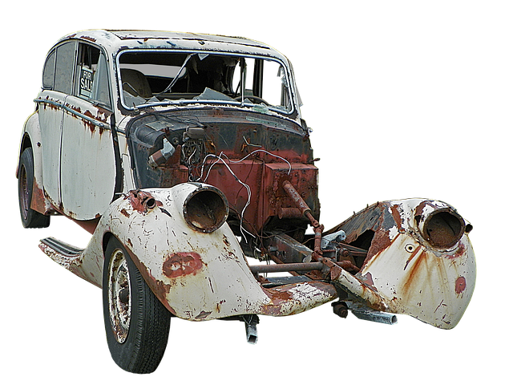
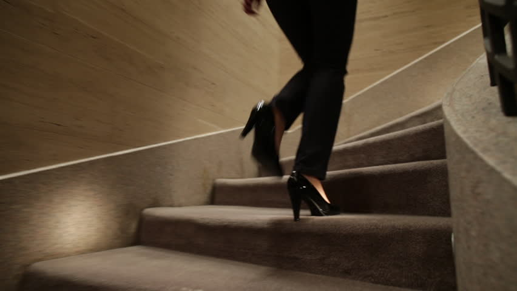
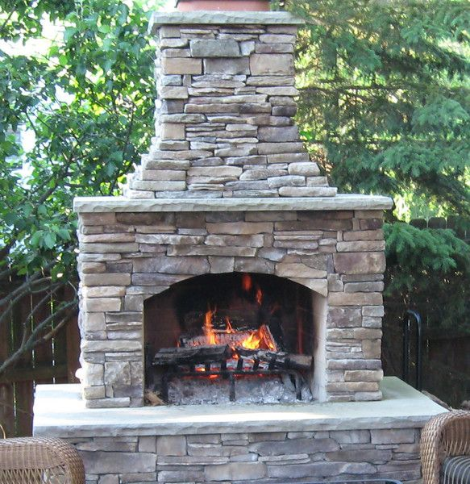
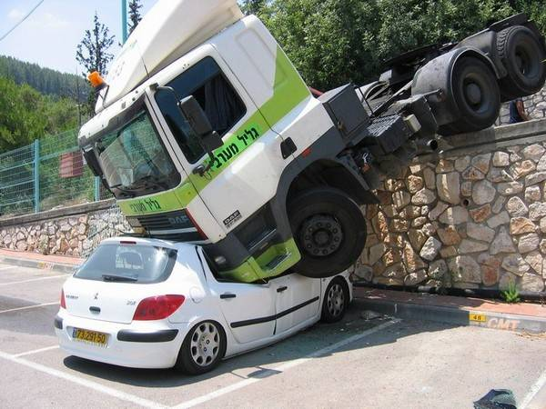
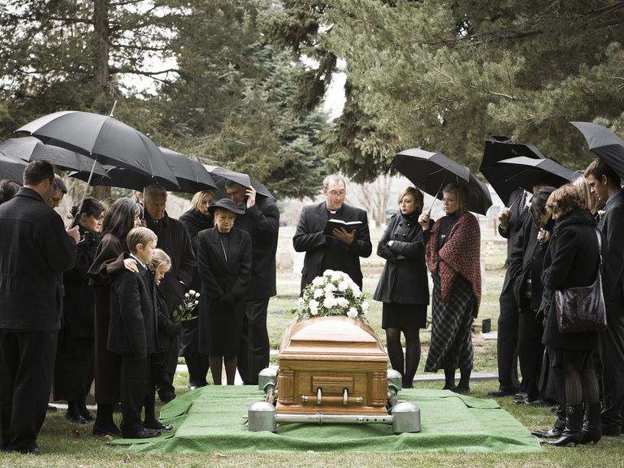

# Erstatningsreglerne og den forsikringsmæssige afdækning

---

***Indledningsvis skal du som studerende være særlig opmærksom på følgende i forbindelse med gennemgangen af erstatningsretten:***

•	**Grundlæggende erstatningsbetingelser; ansvarsgrundlag, årsagsforbindelse, påregnelighed, økonomisk tab og værnet interesse**

  
•	**Principalansvar (arbejdsgiverens hæftelsesansvar i DL 3-19-2)**

•	**Ansvarets sammenhæng med forsikringsdækning, erstatningsansvarslovens (forkortet; EAL) §§ 19 – 23** 

---

**Video: Introduktion til erstatningsretten**

<iframe src="https://www.youtube.com/embed/aUJNx9bEge4" width="853" height="480" frameborder="0" allowfullscreen="allowfullscreen"></iframe>

---

## Erstatningsansvar uden en lovgivning

Et ansvarsforsikringsselskab beskæfter sig indgående med erstatningsreglerne for at vurdere, om skadevolderen (fx. forsikringstageren) har pådraget sig et erstatningsansvar over for en skadelidt. 

Ofte findes der ingen lovgivning, som kan fortælle, hvornår man som privatperson er ansvarlig for en skade. 

I stedet er der ud af mange års domspraksis udledt en erstatningsregel, der kaldes *“den almindelige erstatningsregel”*. 

Denne regel fastslår, at man er ansvarlig for den økonomiske skade, som man har forvoldt ved uagtsomhed eller med vilje. 

Reglen hedder også culpa- eller skyldreglen ("culpa" betyder "skyld" på latin eller brøde, uagtsomhed, forseelse, synd). 

Culpa, er den grundlæggende betingelse for at pålægge erstatningsansvar uden for kontraktforhold. 

En skadevolder har udvist culpa, optrådt culpøst, overtrådt culpareglen, hvis han eller hun har handlet enten forsætligt, dvs. med vilje og viden om handlingens elementer, eller uagtsomt. 

Se følgende domme om erstatningsansvaret:  

---  

*FED 2012.2: Landsretten fandt, at en tilskuer, der ved strafbar handling løb ind på fodboldbane og afbrød landskamp, var erstatningsansvarlig for DBU’s tab ved, at næste landskamp blev flyttet til en mindre  bane samt ved betaling af bøde til UEFA (1.869.269 kr. plus renter). Der forelå ikke egen skyld eller anledning til at reducere ansvaret efter EAL (erstatningsansvarsloven) § 24.*

*FED 2006.78: Ansvarspådragende efter culpareglen, at en person, der kørte i en lånt bil, ikke sikrede sig, at der var olie og vand på bilen, uagtet temperaturlampen  lyste og uagtet, at han kort forinden med få dages mellemrum havde været nødsaget til at påfylde olie og vand. (Utrykt)*

*U 2015.572 H (U: Ugeskrift for Retsvæsen): Tobaksselskaber ikke ansvarlige for varigt mén som følge af mangeårigt forbrug af cigaretter.*

---     

Man er kun erstatningsansvarlig for skader, der kan gøres op i penge (økonomisk tab, som den skadelidte skal kunne bevise). 

Ved tingsskader vil det være værdien af eller reparation af det ødelagte. 

Ved personskader bliver det økonomiske tab beregnet efter reglerne i Lov om erstatningsansvar (EAL). 

Det er f.eks. erstatning for varige mén, tabt arbejdsfortjeneste eller tab af forsørger. 

Se følgende domme, hvor der idømmes erstatningsansvar i forskellige situationer:  

---     

*FED 2012.3: A, der sad uden for golfbanens cafeteria, blev ramt i hovedet af golfbold, da B – som deltager i en polterabend – under golfspil kom til at slå bolden for langt. B, der kun én gang tidligere havde prøvet at spille golf og ikke havde modtaget undervisning heri, fandtes erstatningsansvarlig.*

*FED 2009.114: En kvinde, som faldt i søvn som fører af en bil, påkørte og dræbte en modkørende bilist. Hun blev idømt en fængselsstraf på 10 måneder, men hendes kørsel kunne ikke karakteriseres som særlig hensynsløs, hvorfor afdødes ægtefælle ikke havde krav på godtgørelse i medfør af EAL § 26 a.*  

*FED 2008.1: En mandlig stripteasedanser B ansvarlig for øjenskade på deltager A i kvindelig polterabend, da B affyrede konfettirør. Ikke grundlag for at nedsætte erstatningen som følge af egen skyld eller accept af risiko.*

---     

### Hændeligt uheld

Er skaden forvoldt ved et **hændeligt uheld**, har vedkommende ikke gjort noget forkert og er ikke ansvarlig for skaden. 

Man skal heller ikke erstatte noget. 

Åbner en hotelgæst eksempelvis døren til sit værelse indefra, i det øjeblik en tjener går forbi på gangen med en bakke med glas, og døren rammer bakken, så glassene falder på gulvet og knuses, er der tale om et hændeligt uheld. Uheldet kan ikke bebrejdes hotelgæsten, da han ikke havde mulighed for at undgå det. Han havde opført sig som “den gode hotelgæst” og ikke begået nogen fejl. 

Se afgørelserne fra retspraksis og Forsikringsankenævnet om spørgsmålet om hændelige skader:

---     

*U.1961.167 H: At en 11-årig dreng kom til at ramme en anden dreng med en kæp i øjet, blev anset for et hændeligt uheld og derfor ikke noget erstatningsansvar.*

*FED 1998.584: Ejeren af sommerhus til udlejning havde ikke pådraget sig erstatningspligt ved, at en lejers barn kom til skade, da et sofabord, der var en del af sommerhusets møblement, væltede.*

*Ankenævnskendelse i sag nr. 35.936 – 30.12.94: Klagers “griben ud efter” sit 15 måneder gamle barn, der var ved at falde, hvorved cigaretglød ødelagde en sofa, ikke anset som uagtsom adfærd, derfor ikke nogen erstatningspligt for sofaen.*

*Ankenævnskendelse i sag nr. 39.737 – 22.01.1996: Gæstebudsskade at tabe kaffebakke under forsøg på at undgå at træde på et barn. Ikke erstatningsansvar, men dækket som gæstebudsskade over personens ansvarsforsikring.*

*Ankenævnskendelse i sag nr. 51.809 – 29. maj 2000: 8-årigt barn faldt over egne ben og væltede vase. Ikke erstatningsansvar, men dækket som gæstebudsskade.*

*FED 2003.1091: Hønseejer var ikke ansvarlig for cyklists tilskadekomst, da cykel på landevej ramte fritgående høne.*

*U 2013.84 V: Motionscyklist, der sammen med andre cyklister kørte i en gruppe, og som efter at være kommet ud i rabatten prøvede at komme op på vejen igen, hvorved han væltede, og der skete sammenstød med bagfrakommende cyklister, havde ikke handlet ansvarspådragende.*

*H.K. af 24. juni 2002. Sag: 206/2002: Museum var ikke ansvarligt for tilskadekomst, da gæst under privat besøg gled i hundeekskrementer og faldt.*

---          

### Handlet forkert eller undladt at handle

Har skadevolder handlet forkert – dvs. er ansvarlig – er det vigtigt at finde ud af, om skaden er forvoldt ved en simpel uagtsomhed, grov uagtsomhed eller med forsæt (med vilje). 

Denne vurdering af handlingen eller undladelsen har bl.a. betydning for, om skadevolderens ansvarsforsikring skal betale for skaden hos skadelidte. 

Se her følgende domsafgørelser fra retspraksis:  

---          

*FED 2016.122: Diskotek erstatningsansvarlig for personskade opstået ved, at diskotekets dørmand gik ud over det nødvendige og forsvarlige ved at skubbe eller kaste skadelidte ud af diskotekets dør.*

*Ø.L.D. af 12. maj 2005. Sag: 20. afd., a.s. nr. B-2581-04: Værtinde ifaldt erstatningsansvar, fordi hun bar et sofabord ned ad en trappe iført højhælede sko og uden at fjerne noget nips, der indskrænkede trappearealet, hvilket forårsagede, at hun tabte bordet, som ramte en gæst i hovedet. (Utrykt)*

---     

### Den almindelige fornufttige person

Når en domstol bedømmer, om skadevolder har handlet forkert, sammenligner domstolen skadevolderens handling med, hvordan en almindelig fornuftig person ville have handlet i samme situation.

Begrebet repræsenterer en uagtsomhed en adfærd, der afviger fra de adfærdsnormer, der gælder inden for det pågældende område.

Kommer en domstol til det resultat, at en skadevolder har handlet anderledes, end hvad en alimindelig fornuftig person ville have gjort i samme situation, har skadevolderen handlet forkert og vil blive pålagt et erstatningsansvar.

Det skal bevises af skadelidte (kaldet en ”ligefrem bevisbyrde”). Det er hovedreglen i dansk ret; Den der vil gøre noget gældende, har også bevisbyrden herfor.

For at kunne få erstatning fra en skadevolder skal skadelidte ifølge retspraksis (domstolene) bevise følgende over for retten: 

*	Der er sket en skade og lidt et tab. 

*	Det er skadevolders skyld – skadevolder har handlet uagtsomt eller   med forsæt.  

*	Der er årsagssammenhæng (kausalitet) mellem den skete skade og det   lidte tab, dvs. at tabet er en direkte følge af skaden.  

*	Der er påregnelighed (adækvans) mellem skaden og tabet, dvs., at    skadevolder burde kunne forudse, at skaden ville ske.  

Kan skadelidte ikke bevise det, er det ikke muligt at få erstatning fra en skadevolder eller dennes ansvarsforsikring, se følgende dom:

---     

*FED 2007.111: Forsikringstager havde ikke dokumenteret, at der var årsagsforbindelse mellem nogle anførte lidelser og et færdselsuheld.*

---     

### Ansvar for ikke at gøre noget

Det er ikke kun handlinger, man kan blive erstatningsansvarlig for. 

I visse tilfælde kan man også blive erstatningsansvarlig for sine undladelser. Det sker oftest i situationer, hvor der er pligt til at handle. 

Eksempler er husejeren, der ikke gruser et isglat fortov, eller forældre, der ikke holder øje med deres børn.

### Ansvar for psykiske personskader

Udover at der kan tilkendes erstatningsansvar ved tingsskader samt fysiske personskader, så kan der være erstatningspligt for psykiske personskader. 

Se her nævnte domme:  

---

...

*U.2012.524 H: A blev sygemeldt efter et begivenhedsforløb på en personaleweekend og rejste krav om godtgørelse for svie og smerte mod kommunen K som arbejdsgiver. Begivenhedsforløbet vedrørte en følelsesladet drøftelse i plenum af A’s sygdomsfravær, som ifølge A endte med, at hun i overværelse af sine kollegaer reelt blev fyret. K bestred ikke, at A var blevet påført en psykisk skade som følge af begivenhedsforløbet, og parterne var enige om opgørelsen af godtgørelseskravet. Højesteret udtalte bl.a., at udtrykket “personskade” i erstatningsansvarslovens § 1 må forstås i overensstemmelse med dansk rets almindelige erstatningsregler, og den psykiske skade, som A var blevet påført, var omfattet af bestemmelsen. Højesteret fandt endvidere, at personaleweekenden i forhold til A blev afviklet på en uforsvarlig måde, og at dette var ansvarspådragende for K som arbejdsgiver. Den uforsvarlige afvikling af personaleweekenden medførte en betydelig forøgelse af risikoen for en psykisk skade hos en medarbejder, som ledelsen må have forstået befandt sig i en psykisk anspændt situation, og Højesteret fandt, at A’s psykiske skade var en påregnelig følge. A var direkte skadelidt som følge af den ansvarspådragende adfærd, og der var ikke grundlag for at anse den psykiske skade for at falde uden for, hvad der var omfattet af kommunens erstatningspligt. K skulle herefter betale 50.000 kr. til A for svie og smerte. Landsretten havde frifundet K.*
 

*U 2010.1609 H: Psykisk personskade anset for omfattet af ulykkesbegrebet i ulykkesforsikring*

---

### Simpel uagtsomhed

Ved simpelt uagtsomhed (culpa levis), har skadevolder handlet mere skødesløst, end hvad en almindelig fornuftig personen ville have handlet i den samme situation – den lille dagligdags uagtsomhed – er skadevolder erstatningsansvarlig. 

Simpel uagtsomhed er en uagtsomhed som ikke kan betegnes som grov. Culpareglen omfatter som hovedregel begge former for uagtsomhed.

Forsikringsankenævnet og domstolene foretager et konkret skøn, om skadevolder har handlet simpelt uagtsomt. Hvis eksempelvis en fodgænger træder ud på vejbanen uden at se sig for og rammer en forbikørende cyklist, der vælter, kan uheldet bebrejdes fodgængeren, der har været mere skødesløs end “den gode fodgænger”. Derfor er fodgængeren erstatningsansvarlig for cyklistens økonomiske tab. 

Se følgende sager fra retspraksis og Forsikringsankenævnet, om spørgsmålet, om der er simpel uagtsomhed hos skadevolder:

---

*U 1915.242 H: (Uagtsom Brandstiftelse). En Tiltalt færdedes en Nat i et straatækket Udhus, hvor der henlaa Fourage og Halm, med en to Tommer lang; Lysestump, som han under sit Ophold i Udhuset tændte. Under sit Ophold i Udhuset røg han derhos Cigaret. Umiddelbart efter at Tiltalte havde forladt Udhuset, viste det sig, at der var Ild i dette, der nedbrændte. Antaget, at Tiltalte havde foraarsaget Ilden, og at der forelaa Tilsidesættelse af almindelig Forsigtighed.*

*Ankenævnskendelse i sag nr. 03.256 – 03.09.79: Da forsikringstageren, som under pasning af skadelidtes blomster havde forvoldt skade på dennes gulvtæppe, ikke fandtes at have udvist et så uforsvarligt forhold, at han ville kunne gøres ansvarlig for skaden, var selskabet berettiget til at afslå at erstatte denne. (Utrykt)*

*Ankenævnskendelse i sag nr. 03.308 – 03.09.79: Da forsikringstageren, som under arbejde i sin svigerfars lejlighed forvoldte skade på el-hovedkablet, ikke fandtes at have udvist et så uforsvarligt forhold, at han ville kunne gøres ansvarlig for skaden, var selskabet berettiget til at afslå at erstatte denne (utrykt).*

---

### Grov uagtsomhed
Grov uagtsomhed (latin; culpa lata) er en betydelig form for uagtsomhed. Nyere retspraksis lægger vægt på, om skadevolderens adfærd indebar en ”indlysende fare”, for den indtrådte skade. 

Skadevolderens bevidsthed om faren kan indgå i vurderingen af, om uagtsomheden er grov. 

Går en fodgænger over for rødt og vælter en cyklist, er fodgængeren nu mere uforsigtig end selv en skødesløs fodgænger. Det kan betegnes som grov uagtsomhed, og fodgængeren er erstatningsansvarlig. Det er en skønsmæssig vurdering, om domstolene og Ankenævnet for Forsikring anser en person for at have handlet groft uagtsomt.

Se her nævnte domme og ankenævnsafgørelser:

---

*U 1998.1693 H: Opbevaring af nøglen til sikringsboksen i et auktionshus på et kontor i samme bygning var grov uagtsomhed.*

*U 1999.1706 H: Død ved fald på ca. 6 meter fra et tag ikke omfattet af ulykkesforsikring, da faldet var fremkaldt ved forsikredes forsæt eller grove uagtsomhed.*

*U.1993.955 V: Da kortvarig efterladelse af kuffert ved bagagebånd i lufthavn ikke var groft uagtsom, var tyveri af kufferten dækket af tyveriforsikringen.*

*FED 2013.9: Den 16-årige A ville ved ungdomsfest hjælpe værtinden med at tænde op i en udendørs pejs. I den forbindelse hældte han væske fra en dunk, som også værtinden havde benyttet i sit forsøg på at tænde op i pejsen, direkte ind i pejsen. Herved slog ilden tilbage og antændte A’s tøj samt dunken, som han i panik kastede fra sig. Den brændende dunk ramte en trækonstruktion og huset nedbrændte. Det viste sig, at væsken var benzin. Landsretten fandt, at A havde handlet groft uagtsomt, hvorfor hans ansvar ikke bortfaldt i medfør af erstatningsanvarslovens (EAL) § 19.*

*FED 2010.93: Forsikringsselskab fik ikke medhold i, at en 13-årig dreng udviste grov uagtsomhed da han startede en bygningsbrand ved at tænde en lighter samtidig med, at en kammerat to meter derfra hældte benzin på en knallert. Tillagt betydning bl.a., at benzindampe har en forholdsvis svag lugt og løber langs gulvet, og at der er store individuelle forskelle på menneskers lugtesans.*

*FED 2001.2121: Passager, som blev dræbt under bilkørsel med beruset fører, fandtes at have handlet groft uagtsomt, hvorfor hans livsarvinger ikke var berettiget til dødsfaldsdækning fra ulykkesforsikring.*

*FED 2001.2255: Bilist, som kørte ud foran tog i jernbaneoverskæring uden at være opmærksom på lys- og lydsignaler, havde handlet groft uagtsomt. DSB var derfor berettiget til at reducere personskadeerstatningen med 1/3.*

*FED 1998.224: 16-årig rulleskøjteløber havde udvist grov uagtsomhed ved at køre ud på kørebanen foran bil. Under henvisning til alder, til at handlingen var udført i kådhed samt til områdets karakter, fandtes der dog ikke grundlag for at nedsætte personskadeerstatningen.*

*FED 2018.01 Ø.L.D. af 11. januar 2018. Sag: 20. afd. nr. B-583-17: Den 14-årige A satte ild til papir i en affaldscontainer i en skolegård og forlod herefter stedet med den 13-årige B, der forholdt sig passivt til A's aktiviteter. Skolen brændte, og forsikringsselskabet F afholdt skadeudgifter på over 10 mio. kr. F gjorde regres med krav på 3 mio. kr. over for A og B. A fandtes at have handlet groft uagtsomt, men erstatningen blev reduceret til 1 mio. kr. efter EAL § 24a. B havde ikke handlet groft uagtsomt og blev derfor frifundet. [Processbevilingsnævnet har givet tilladelse til anke til Højesteret].*

*Ankenævnskendelse i sag nr. 20.217 – 26.08.87J: Kørsel på motorcykel med 1 hånd ikke grov uagtsomhed i familie-/indboforsikring, og selskabet skulle dække beskadiget tøj efter færdselsskade. (utrykt).*

*Ankenævnskendelse i sag nr. 48.636 – 12. april 1999: Hasarderet kørsel under flugt fra politiet anset for grov uagtsomhed.*

*Ankenævnskendelse i sag nr. 63.558 – 14. februar 2005: Groft uagtsomt at efterlade ulåst bil med nøgler i tændingslås i flere timer på privat vej, men forholdsvis tæt på befærdet vej. (Utrykt)*

---

### Forsæt (med vilje)

Forsæt, er en handling der er foretaget med vilje, er ikke i dansk ret en betingelse for at ifalde erstatningsansvar. 

At skadevolderen har udvist uagtsomhed, dvs. tilsidesat den agtpågivenhed, som kræves på det pågældende område, er som hovedregel tilstrækkeligt til at pålægge erstatningsansvar, 

Kaster en person en sten efter en cyklist for at ramme denne, og det lykkes, er skaden på cyklisten lavet med vilje – med forsæt. 

Skadevolderen er selvfølgelig også her erstatningsansvarlig. 

Hovedreglen er i dansk ret, at kun forsætlige forhold er strafbare, dog en vigtig undtagelse uagtsom drab. 

Ved forsætlige handlinger afviser skadevolders ansvarsforsikring at udbetale erstatning, se her nævnte sager om vurderingen om skadevolder har handlet med forsæt – med vilje:

---

*Forsikringsankenævnskendelse i sag nr. 15.569 – 26.04.85: Skade på skolelokaler, forårsaget af 15-årig dreng ved udtømning af to pulverslukkere, anset forsætligt forvoldt, og derfor ikke dækket af ansvarsforsikringen. (utrykt)*

---

Ved simpel og grov uagtsomhed er det hovedreglen, at en ansvarsforsikring dækker (se dog afsnittet nedenfor om generelt bortfald af ansvar). Forsætlige skader dækker forsikringen ikke, med mindre skadevolder er under 14 år:

---

*H.D. 19 december 2016 i sag 235/2015 (1. afdeling): Skadelidte, der var sindssyg, forsøgte at begå selvmord ved at køre ind i en modkørende lastbil. Retten til erstatning for personskade bortfaldt som følge af forsætlig medvirken.*

---

### Objektivt ansvar

I dansk ret kan der også gælde et såkaldt “objektivt ansvar”, hvorefter skadevolderen pålægges erstatningsansvar, selv om der ikke er handlet uagtsomt (uden skyld). 

Med andre ord er der situationer, hvor man kan blive ansvarlig, selv om skaden sker ved et hændeligt uheld. 

Objektivt ansvar er bl.a. lovfæstet i produktansvarsloven, jernbaneloven, luftfartsloven, lov om drift af nukleare anlæg, søloven, hundeloven, færdselsloven og lov om formidling af fast ejendom, se følgende dom over en ejendomsmægler:  

---

*FED 1997.92: I medfør af (dagældende) lov om omsætning af fast ejendom § 24 (nu § 47) måtte en ejendomsmægler på objektivt grundlag godtgøre en forbruger (sælger) forskellen mellem det beregnede provenu og et korrekt beregnet provenu, selv om forskellen skyldtes en forkert oplysning om kursen på et lån fra et realkreditinstitut, som havde oplysningen fra Københavns Fondsbørs officielle kursliste.*

---

Men det objektive ansvar kan også være ulovhjemlet (ikke fastsat i loven). Domstolene har i visse tilfælde pålagt skadevoldere objektivt ansvar uden lovhjemmel, når skaden er indtrådt som følge af materialesvigt, f.eks. skader, der er forvoldt af brud på fjernvarmerør, el og gasledninger mv. 

Se følgende domme: 

---

*FED 2014.77: Bygherre og entreprenører var erstatningsansvarlig for udgravnings- og funderingsarbejde, der gjorde mur på nabogrund ustabil med efterfølgende sammenstyrtning til følge. Ved sammenstyrtningen skete der skader på tilgrænsende ejendom, hvorved denne bygnings ejer blandt andet led et huslejetab. Murens ejer havde inden sammenstyrtningen accepteret, at muren kunne fjernes, hvorfor murens værdi ikke skulle erstattes.*

*FED 2004.507: Kommune og underentreprenør solidarisk ansvarlige for skade på nedgravede kabler, som under udboring til stikledninger blev ødelagt. Ligedeling af ansvaret i det indbyrdes forhold.*

---

### Generelt bortfald af ansvar

Selv om skadevolder har handlet forkert – været uagtsom – er der nogle situationer, hvor skadevolder alligevel ikke er erstatningsansvarlig.

Er den skade, der er sket, i forvejen dækket af en tingsforsikring eller en driftstabsforsikring, er skadevolder ikke erstatningsansvarlig. 

Det gælder dog kun, hvis skaden ikke er forvoldt med vilje eller ved grov uagtsomhed. 

Det fremgår af Lov om erstatningsansvar (Lovbekendtgørelse nr. 1070 af 24. august 2018). Smadrer en dreng eksempelvis naboens glasrude, der er forsikret, ved en simpel uagtsomhed, er drengen ikke erstatningsansvarlig. Vinduet bliver betalt af glasforsikringen.

Lov om erstatningsansvar fastslår også, at hvis staten, en kommune eller en anden offentlig institution er selvforsikrende, skal de erstatningsmæssigt betragtes på samme måde, som hvis de havde tegnet forsikring. 

Det betyder, at der ikke er forskel på, om drengen ved en simpel uagtsomhed, smadrer naboens glasforsikrede rude eller en rude i kommunens skole, hvor kommunen er selvforsikret. 

I ingen af tilfældene er drengen erstatningsansvarlig. For kommunens vedkommende betyder det, at den selv må betale ruden.

**Man kan ikke blive erstatningsansvarlig over for sig selv**. 

De ting, som man ødelægger af sine egne ting, udløser ikke et erstatningsansvar, som der kan dækkes på ens ansvarsforsikring. Se f.eks. her nævnte dom:

---

*FED 2003.836: Som følge af identitet mellem forsikringstageren og ejeren af et sommerhus, var der ikke dækning på en erhvervsansvarsforsikring for skade forvoldt af forsikringstagerens ansatte under udførelse af entreprise på sommerhuset.*

---

## Erstatningsansvaret og EAL § 19

I det omfang en skade er dækket af en tingsforsikring eller en driftstabsforsikring, er der ikke erstatningsansvar, jf. EAL § 19, stk. 1

Hovedreglen om, at der ikke er erstatningsansvar for en forsikringsdækket skade, gælder uanset ansvarsgrundlagets karakter. Ansvaret bortfalder både i forhold til forsikringsselskabet og i forhold til skadelidte. 

Sammenholdt med undtagelserne i EAL § 19, stk. 2 og i § 21 omfatter hovedreglen imidlertid kun følgende tilfældegrupper:

1) ansvar for skader i privatlivet, der er forvoldt ved simpel uagtsomhed;

2) ansvar for skader i privatlivet, der hviler på strengere ansvarsregler end culpareglen bortset fra de i § 21 nævnte (f.eks. DL 3-19-2 ved private tjenesteforhold, hundelovens § 8);

3) arbejdstageres personlige ansvar for skader, der er forvoldt ved simpel uagtsomhed, jf. stk. 3.

Reglen gælder ikke enhver skadesforsikring, der omfattes af forsikringsaftaleloven, men kun forsikringer, hvor forsikringsydelsen bestemmes enten af tingens værdi eller af dens afkastningsinteresse i relation til en virksomheds drift. Kreditforsikringer, kautionsforsikringer og lign. falder derfor udenfor.

. 
## Erstatningskravet og erstatningsbeløbet

I Lov om erstatningsansvar kan man læse, hvad der kan kræves i erstatning af en erstatningsansvarlig skadevolders forsikringsselskab. Man kan som skadelidt kræve erstatning for følgende:

*	Udgifter til behandling
*	Tabt arbejdsfortjeneste
*	Svie og smerte
*	Varigt mén
*	Tab af erhvervsevne
*	Dødsfald
*	Skader på ejendele
*	Advokatomkostninger.

### Anmeldelse af erstatningskrav

Skadelidte skal henvende sig til den, der er skyld i skaden. Har skadevolder en ansvarsforsikring, kan vedkommende anmelde skaden til sit eget forsikringsselskab. 

Har skadevolderen ingen forsikring, må skadevolderen selv betale. Skadelidte må eventuelt rejse sit krav om erstatning gennem en retssag.

### Sådan bliver man erstatningsansvarlig i relation til ansvarsforsikringen

Flere forsikringer indeholder automatisk en ansvarsforsikring, der dækker, hvis en af de forsikrede bliver erstatningsansvarlig for en skade. 

For mange er det svært at vurdere, hvornår de er ansvarlige for en skade, og hvornår ansvarsforsikringen dækker. Derfor vil reglerne for, hvornår der er ansvar, kort blive gennemgået nedenfor.

Har man forvoldt en skade, er det naturligt, at man føler skyld og mener, at skadelidte skal have erstatning, enten fra en selv eller fra det forsikringsselskab, hvor man er ansvarsforsikret.

At føle skyld for en skade er ikke det samme som, at man juridisk er ansvarlig, og at skadelidte dermed har ret til erstatning. 

I nogle tilfælde vil det fremgå af lovgivningen, om man er erstatningsansvarlig, mens det i tilfælde, hvor der ikke er lovgivet, vil være retspraksis (domstolene), der afgør, om man er erstatningsansvarlig.

### Udgifter til behandling

Man kan få erstattet de udgifter til behandling, som ikke bliver betalt fra anden side (f.eks. den offentlige sygesikring eller sin egen ulykkesforsikring). 

Det kan være udgifter til medicin, fysioterapi, kiropraktorbehandling, hjælpemidler og hjemmehjælp, som lægen har ordineret, eller rimelige udgifter til transport til og fra et behandlingssted.

Fremtidige helbredelsesudgifter bliver erstattet med et kapitalbeløb, der udbetales på én gang og udregnes efter regler, der er fastsat i loven.

*	Erstatning for tabt arbejdsfortjeneste
*	Erstatning for erhvervsevnetab, hvis denne udbetales som en løbende ydelse
*	Renter, uanset om beløbet, de vedrører, er skattepligtigt eller ej. Erstatningen er skattefri, men der skal betales skat af eventuelle renter.

### Tabt arbejdsfortjeneste

Har man tab af indtægt som følge af uheldet, kan man kræve hele tabet erstattet. 

Man får erstatning fra det tidspunkt, hvor uheldet skete, og indtil man kan begynde at arbejde igen. 

Medfører skaden, at man vil få et varigt erhvervsevnetab, får man erstatning frem til det tidspunkt, hvor det er muligt midlertidigt eller endeligt at skønne over ens fremtidige erhvervsevne, se følgende dom.

---

*U 2009.485 H: Erstatning for fremtidig tabt arbejdsfortjeneste efter ulykke, der forsinkede studerendes uddannelsesforløb.*

---

### Svie og smerte

Godtgørelse for svie og smerte ydes som kompensation for det ubehag og de smerter, som et uheld medfører. 

Godtgørelsen kan kræves for perioden fra tidspunktet for uheldet, og normalt så længe man er sygemeldt. Godtgørelsen bliver givet efter en fast takst.

### Godtgørelse for varigt mén

Hvis man får varige gener i sin dagligdag på grund af uheldet, kan man kræve godtgørelse for varigt mén.

Størrelsen af ens mén angives i ménprocent. 

Det er et lægeligt skøn, der afgør, hvor stort ens mén bliver. 

Det skal være mindst 5 procent, for at man kan få godtgørelse. 

Er man fyldt 40 år, bliver godtgørelsen reduceret i forhold til ens alder. Godtgørelsen for varigt mén har intet med ens (evt. tidligere) erhverv at gøre. 

Derfor vil man måske opleve, at man sagtens kan passe et kontorjob, selv om man har fået erstatning for varigt mén, hvorimod man måske ville have svært ved at passe et job, der var fysisk hårdere.

### Erhvervsevnetabserstatning

Hvis uheldet betyder, at man mister mindst 15 procent af ens evne til at erhverve indtægt ved arbejde, kan man få erstatning for tab af erhvervsevne. 

Erstatningens størrelse afhænger af ens løn lige før uheldet, ens alder på uheldstidspunktet og størrelsen af ens erhvervsevnetab. 

Erstatningen bliver udregnet efter regler fastsat i loven.

Var man fyldt 30 år på tidspunktet for uheldet, bliver ens erstatning nedsat i forhold til ens alder.

Man kan også kræve erstatning, selv om man ikke har nogen egentlig indtægt. 

For børn, der normalt ingen indtægt har, bliver erstatningen fastsat ved, at ménprocenten bliver ganget med en “normalårsløn”, der er fastsat i loven. Dette resultat bliver herefter ganget med 10. 

For hjemmearbejdende og studerende bliver erstatningen fastsat ud fra et skøn over den økonomiske værdi af deres arbejdskraft på det tidspunkt, hvor de kom til skade.

Erhvervsevnetabserstatningen bliver udbetalt på én gang.

### Dødsfald

Der gives erstatning for rimelige begravelsesudgifter. 

En efterladt ægtefælle eller samlever har desuden krav på et såkaldt “overgangsbeløb”. 

Dette beløb skal gøre den økonomiske overgang fra gift/samlevende til enlig nemmere. 

Beløbets størrelse er fastsat i loven. Der kan dog ikke både gives erstatning for begravelsesudgifter og betales overgangsbeløb.

### Afdøde havde forsørgerpligt

Forsørgertabserstatning til ægtefælle eller samlever udgør 30 procent af den erstatning, som afdøde ville have fået udbetalt ved fuldstændigt tab af erhvervsevnen. 

Der er dog fastsat et minimum- og et maksimumbeløb.

Efterlevende børn får en erstatning, der svarer til summen af de børnebidrag, som afdøde på skadetidspunktet kunne være pålagt at betale. 

Erstatningen bliver fordoblet, hvis afdøde var eneforsørger.

 

## Eksamensspørgsmål indenfor erstatningsretten mv.

### Eksamensopgave og løsning - Om ejendomsmæglerens erstatningsansvar uden for kontrakt

***Ejendomsmæglerens støvler***

En fredag eftermiddag var Martin taget ud til en fremvisning af et hus beliggende i nabobyen Indby. Huset tilhørte Pernille. Martin havde i dagens anledning taget sine nye og meget dyre Armani® støvler på. Desværre havde han fået købt dem i en lidt for lille størrelse, men havde valgt at tage dem på alligevel selvom Egild ikke havde ment at det var en god idé, da han syntes at de ikke rigtig udstrålede det image som ”Udby Mæglerne ApS” gerne ville stå for.

Da Martin kommer ind i huset vil han tage støvlerne af, men finder ud af at de sidder rigtig godt fast. Han kæmper noget med støvlerne, men til sidst får han dem revet af. Desværre rammer han med sin voldsomme bevægelse det spejl der hænger i gange. Spejlet falder ned og smadrer mod gulvet. 

Ude i køkkenet står Pernille og er ved at lave kaffe. Hun bliver så forskrækket at hun taber den meget varme kaffe ned over sin hun ”Guffe”. ”Guffe”, der var en præmiehund med en værdi på 10.000 kr, måtte efterfølgende aflives.

***Eksamensspørgsmålet:***

1.	Er nogen, og i givet fald hvem, erstatningspligtig over for Pernille for tabet af ”Guffe” og det smadrede spejl? (25 %)

***Vejledende løsning***

Lovgrundlag: Lov om erstatningsansvar

Område: Erstatningsansvar, Principalansvar

Læringsmål: Du skal som studerende anvende og kunne vurdere de grundlæggende erstatningsbetingelser ved erstatning udenfor kontrakt, for derigennem at kunne vurdere reglerne for rådgivnings- og professionsansvar indenfor den finansielle sektor (God skik bekendtgørelsen og lov om formidling af fast ejendom § 24) samt reglerne om principalansvar, jf. DL (Danske Lov fra 1683) 3-19-2.

***Spørgsmålet kan løses med forskellige systematikker***. 

Besvarelsen bør dog gøre opmærksom på at erstatning i alle tilfælde kræver at de 4 grundbetingelser er opfyldt.

Der kan først ses på om Pernille har lidt et økonomisk tab. Dette må antages for både spejlet og ”Guffe”. 

Der er ligeledes kausalitet i forbindelse med begge skader. 

Det kan dog formodentlig ikke antages at der er adækvans i relation til skaden på ”Guffe”. 

Det er næppe påregneligt for Lars at hans kamp med at tage støvlerne af vil lede til en begivenhedsrække, der slutter med at Pernille hælder varm kaffe ned over sin hund. 

Pernille kan derfor nok ikke få erstatning for tabet af ”Guffe”.

---

### Eksamensopgave og løsning - Om erstatning og kaution

***Murermester Madsen***

Madsen, der er murer, står sammen med sin ansat, murerlærling Anton oppe på et stillads. De er ved at lave reparationer på Knudsens hus’ ydermurer.
 
Madsen benytter opgaven til at undervise Anton i, hvordan arbejdet bør udføres fagligt korrekt, og han forklarer også i detaljer, om sikkerhed på en farlig arbejdsplads, som en byggeplads jo er. Anton er en lærenem elev, og han udfører snart arbejdet til punkt og prikke. 

Men på et tidspunkt smider Anton en murske hen mod spanden med mørtel, men han rammer uheldigvis ved siden af. Skeen falder ud over stilladsets kant og rammer Knudsen, der netop passerer forbi med sin trillebør nedenfor. Knudsen rammes på næsen, der brækker, og pga. slaget og chokket falder Knudsen bagover, og i faldet forvrider han sin skulder. Hans dyre solbriller er også ødelagt. 

Knudsens hustru står samtidig inde i køkkenet. Hustruen ser ikke murskeen ramme Knudsen, men hun ser ud af vinduet lige da han falder bagover. Hun tror, at han er faldet om af et hjerteslag og styrter ud til telefonen i entreen for at ringe 112. I sit hastværk glider hun i et tæppe på entrégulvet og falder. Desværre er hun faldet så uheldigt, at hun slår sin ryg så slemt, at hun senere viser sig at miste sin førlighed delvist.

I det Madsen går hen for at hjælpe hustruen, bliver han bidt af Knudsens hund, der tror, han vil gøre hustruen noget. Bidet er ikke alvorligt, men det ødelægger dog Madsens jakke. 

Madsen ønsker at udvide sin forretning men det kræver en del kapital. Banken vil gerne låne ham pengene men de kræver sikkerhed i form af to kautionister. Madsen spurgte sin far der efterhånden var en ældre herre og som havde en betydelig formue. Faren afviste, da han havde en forestilling om at sønnen ingen økonomisk sans havde. Madsen skrev derfor under i sin fars navn.

Derefter spurgte han sin ansatte murelæring, der netop havde arvet, om han ville kautionere. Madsen lod ham – mellem linjerne – forstå, at hvis han afviste, ville det få ”uheldige konsekvenser” for Antons fremtidige ansættelse. Anton følte sig presset og skrev under.   

***Eksamensspørgsmålene***

1.	Kan Hr. Knudsen kræve erstatning og i givet fald for hvad og af 
    hvem? 
    
2.	Kan Hr. Knudsens hustru kræve erstatning og i givet fald for 
    hvad og af hvem?
    
3.	Kan Madsen kræve erstatning og i givet fald for hvad og af hvem?

4.	Hvis banken ønsker penge af kautionisterne, hvordan er de to 
    kautionister så stillet? 
    
***Vejledende løsning:***    

1.	Kan Hr. Knudsen kræve erstatning og i givet fald for hvad og af 
    hvem? Ja, betingelserne opfyldt. I henhold til DL 3-19-2 skal 
    arbejdsgiver betale, idet skaden skete som et led i arbejdet. 
    
2.	Kan Hr. Knudsens hustru kræve erstatning og i givet fald for 
    hvad og af hvem? Nej, ikke adækvat. 
    
3.	Kan Madsen kræve erstatning og i givet fald for hvad og af hvem?     Ja, svie og smerte, evt. personskade og tingsskade hos Knudsen, 
    jf. hundelovens § 8.
    
4.	Hvis banken ønsker penge af kautionisterne, hvordan er de to 
    kautionister så stillet? De går begge fri. Faren pga. 
    dokumentfalsk fra Madsens side og Madsen pga.kompulsiv, jf. 
    aftaleloven (stærk ugyldighedsindsigelse). 

### Eksamensopgave og løsning - Erstatning uden for kontrakt og forbrugeraftaler

***Randers Boldklub***

Hans bor i Randers og har 2 teenagedrenge. De spiller fodbold, og de kommer sammen med deres far til samtlige af Randers fodboldkampe. 

Randers har kæmpet sig op i rækkerne og spiller rigtig godt, og de er godt med i slutspillet i SAS-ligaen. Hans vil gerne støtte dem, så han køber fantrøjer og kasketter til sig selv og drengene over Internettet. De skal have trøjerne og kasketterne på til næste kamp.

Hans skriver på bestillingen, at han skal bruge det inden 14 dage men varerne når ikke at komme inden kampen.

Hans og drengene drager af sted til kampen mod Nordsjælland. Der er en god stemning på stadion. Randers spiller godt, men kommer bagud, da der bliver afsagt en tvivlsom kendelse. 

I bar frustration over den tvivlsomme kendelse og ikke at have fået trøjerne og kasketterne løber han ind på banen og slår ud efter dommeren, Albert. Albert når at undvige, men falder uheldigt lige ind i målstolpen, og han slår sit hoved ret kraftigt. Han får en dyb flænge i panden og mister bevidstheden i 10 minutter. Albert bliver kørt på hospitalet, og han får konstateret en hjernerystelse, der medfører, at han sygemeldes i 1 måned. 

Albert skulle have været på skiferie dagen efter kampen, men på grund af hjernerystelsen bliver han nødt til at aflyse sin ferie. Han har ikke tegnet nogen rejseforsikring, så han må betale for rejsen selv om han ikke kommer af sted.

Alberts søster, Emilie, der overværede det hele, gik i chok. Hun besvimede, faldt og pådrog sig en brækket arm.

Hans og drengene skynder sig hjem. De løber ned af vejen. Henne ved hjørne står fru Olsen med sin hund Rufus. Rufus er en ret stor hund. Da Hans og drengene kommer løbende, bliver Rufus bange og går til angreb på Hans. Rufus bider Hans i benet og har dermed ødelagt hans bukser, og der er et stort åbent sår, som skal sys på skadestuen. 

En uge efter kampen kommer trøjerne og kasketterne men nu vil Hans ikke længere have dem.

***Eksamensspørgsmålene:***

1.	Kan Albert få erstatning og hvilke krav kan han i givet fald 
    rejse?
    
2.	Er Emilie berettiget til erstatning?

3.	Er Hans berettiget til erstatning fra fru Olsen? 

4.	Er Hans bundet af aftalen om køb af trøjerne og kasketterne?

5.  Kan Hans rejse krav om erstatning mod sælger, hvis han er bundet     af aftalen om køb af trøjerne og kasketterne?

***Vejledende løsning:***

1.	Kan Albert få erstatning og hvilke krav kan han i givet fald 
    rejse? Ja. I henhold til EAL kan han rejse personskade, tabt 
    arbejdsfortjeneste, svie og smerte samt erstatning for rejsen, 
    idet krav om kausalitet og adækvans er opfyldt. Adækvans dog på 
    grænsen.
    
2.	Er Emilie berettiget til erstatning? Nej, adækvans ikke opfyldt.

3.	Er Hans berettiget til erstatning fra fru Olsen? Ja.  
    hundelovens § 8. Næppe nedslag i erstatningen. 
    
4.	Er Hans bundet af aftalen om køb af trøjerne og kasketterne? 
    14 dages fortrydeælsesret.
    
5.	Kan Hans rejse krav om erstatning mod sælger, hvis han er bundet     af aftalen om køb af trøjerne og kasketterne? Ingen erstatning 
    fra sælger af trøjerne som følge af for sen levering, da intet 
    økonomisk tab lidt af Hans. 

