--- 
title: "Erhvervs- og finansjura"
author: "Sonny Kristoffersen"
date: "`r Sys.Date()`"
site: bookdown::bookdown_site
output: bookdown::gitbook
documentclass: book
bibliography: [book.bib, packages.bib]
biblio-style: apalike
link-citations: yes
github-repo: rstudio/bookdown-demo
description: "JURA"
favicon: "favicon.ico"
---


#    {-}


```{r, echo=FALSE, results='asis'}
cat(readLines('fp.html'))
```


				


<h3>***Anmeldelser***</h3>

<br><br>

>E-bogen Erhvervs- og finansjura rummer rigtig mange gode ting, bl.a. de quizzer der er ved de fleste emner, det gør det muligt at lave et hurtigt brush up.<br><br> 
Derudover er den nem at navigere i, da menuen i siden gør det nemt at komme til og fra de forskellige emner. Den er skrevet i et sprog som er nemt at forstå, og der er gode eksempler.<br><br>
Egentlig har jeg ikke så meget negativt at sige, den eneste ulempe er at det ikke er muligt at overstrege men sådan er det jo generelt for E-bøger.<br><br>
***Emma***

<br><br><br>

>Jeg synes, at e-bog Erhvervs- og finansjura er sat rigtig godt op. Simpel at slå op, og nem og finde information i.<br><br>
***Nick***

<br><br><br>

>Jeg synes overordnet set den er super god.<br>
<br>Jeg selv brugte den meget til at læse til eksamen. Den er overskuelig og letlæselig, hvilket er en rigtig god ting indenfor jura, da det godt kan være svært at læse, grundet alle de begreber man ikke kender fra hverdagen.<br><br>
Derudover synes jeg det fungerer super godt, at den er så godt delt op i afsnit. Forstået på den måde, at tit og ofte er det noget meget konkret man søger, og der er din e-bog meget brugervenlig. Det spare en for en masse tid, her tænker jeg også måske i en eksamen situation hvor man er meget presset på tiden<br><br>
Så overordnet set synes jeg den fungere vildt godt. Ydermere supplere den godt til dine powerpoint, og personligt ville jeg mene, at dine PowerPoints og din e-bog ville være et rigtig godt undervisningsmateriale.<br><br>
Det var i hvert fald de to ting jeg støttede mig op af, da jeg læste til eksamen, og da jeg sad til eksamen 😊
<br><br>***Molly***

<br><br>


<h3>***Vigtigt bemærk***</h3>

***Dette materiale er kun til personligt brug. Alle rettigheder forbeholdes. Fotografering, kopiering eller anden gengivelse af dette materiale, er uden forfatterens skriftlige samtykke,  forbudt, ifølge dansk lov om ophavsret.***

***E-bogens videoer og quizer er ikke at betragte som en del af pensum, men er et supplement til pensum for at fremme din yderligere forståelse for Erhvervs- og Finansjuraen***

***Der er mulighed for selv at tilføje sine egne noter i e-bogen.***

***Om konstaterede fejl og mangler, samt spørgsmål til e-bogens indhold kan henvendelse ske på følgende e-mail:***

***sk@bkhlaw.dk***

***De bedste hilsener***

***Advokat Sonny Kristoffersen, Ph.D.***


 

---


<h3>Video sådan køber du adgang til onlinebøger på www.tepedu.dk.</h3>
<style>.embed-container { position: relative; padding-bottom: 56.25%; height: 0; overflow: hidden; max-width: 100%; } .embed-container iframe, .embed-container object, .embed-container embed { position: absolute; top: 0; left: 0; width: 100%; height: 100%; }</style><div class='embed-container'><iframe src='https://player.vimeo.com/video/283118599' frameborder='0' webkitAllowFullScreen mozallowfullscreen allowFullScreen></iframe></div>
  <br>
  <br>

---

  <br>
  <br>
<h3>Video sådan logger du ind i onlinebøger på www.tepedu.dk.</h3>
<style>.embed-container { position: relative; padding-bottom: 56.25%; height: 0; overflow: hidden; max-width: 100%; } .embed-container iframe, .embed-container object, .embed-container embed { position: absolute; top: 0; left: 0; width: 100%; height: 100%; }</style><div class='embed-container'><iframe src='https://player.vimeo.com/video/283117974' frameborder='0' webkitAllowFullScreen mozallowfullscreen allowFullScreen></iframe></div>


<!--chapter:end:index.Rmd-->

# Indledning og retsstaten  

```{r, echo=FALSE, results='asis'}
cat(readLines('np.html'))
```

```{r echo=FALSE}

BEGREB <<- c(
          "Grundloven",
          "Tinglysningsloven",
          "Aftaleloven"
          # ,
          # "h test"
          
          
          
          )
forklaring <<- c(
  "Grundloven beskriver bl.a. den enkelte borgers rettigheder og pligter, du kan se den her:><a href=\"https://www.retsinformation.dk/Forms/R0710.aspx?id=45902\" style=\"color:#3088fc\" target=\"_blank\">Grundloven</a>",
  "Tinglysningsloven indeholder reglerne for den offentlige registrering af rettigheder over fast ejendom<br><a href=\"https://www.retsinformation.dk/Forms/R0710.aspx?id=142900\" style=\"color:#3088fc\" target=\"_blank\">Tinglysningsloven</a>",
  "Aftaleloven"
#   ,
#   "Vi tester hypotesen
#   <br>H<sub>0</sub>: &mu;=34
#   <br>H<sub>1</sub>: &mu;&ne;34<br>
# <br>H<sub>0</sub>: &mu;≤34
#   <br>H<sub>1</sub>: &mu;>34<br>
#   <a href=\"https://www.retsinformation.dk/Forms/R0710.aspx?id=142900\" style=\"color:#3088fc\" target=\"_blank\">Tinglysningsloven</a>"
#   
  
  )
  
indeks <<- data.frame(BEGREB,forklaring)
  

```


---


***Kapitel 1 om retsstaten skal kun læses i hovedtræk*** 

---

## Grundloven om Danmarks forfatning


Af de mere end 1.300 love, vi har i Danmark, er der én lov, en retskilde, der er hævet over alle de andre, nemlig grundloven.  ``r tippy(indeks[1,1], size="large" ,interactive = TRUE, arrow = TRUE, tooltip = paste0("<h4>",indeks[1,2],"</h4>"))`` er Danmarks forfatning, dvs. den lov, der beskriver de grundlæggende regler for samfundet. 

EU-retten står over dansk ret, sådan at en dansk lov kan være ulovlig, nemlig, hvis den enten strider mod EU-retten eller mod grundloven.

I Danmark fejrer man hvert år grundlovens fødselsdag 5. juni. Men hvordan blev grundloven egentlig indført?

Fra 1660 til 1848 havde Danmark enevælde og i 1700-tallet begyndte modstanden mod enevældet at ulme rundt om i Europa. 

Befolkningerne stillede krav om, at folket skulle være med til at bestemme, hvordan deres land skulle styres, og flere steder blev monarkiet væltet og erstattet af en republik.

Efterhånden som den internationale udvikling tog fart, erkendte Kong Christian den 8., at Danmark også måtte have en fri forfatning. Da han døde, gjorde hans søn, Frederik den 7., arbejdet med forfatningen færdig.  
 
 
---

**Video om den danske grundlov**

<div class="video-container"><iframe src="https://www.youtube.com/embed/nRkpUt8juz0" width="853" height="480" frameborder="0" allowfullscreen="allowfullscreen"></iframe></div>  

---


## Rettigheder og pligter


``r tippy(indeks[1,1], size="large" ,interactive = TRUE, arrow = TRUE, tooltip = paste0("<h4>",indeks[1,2],"</h4>"))`` beskriver bl.a. den enkelte borgers rettigheder og pligter, f.eks. at der er ytringsfrihed, religionsfrihed og værnepligt. 

I grundloven står der også, at den øverste magt i Danmark skal deles mellem den lovgivende, den udøvende og den dømmende magt.

I grundloven kan du læse om magtens fordeling i samfundet. Om Folketinget som den demokratisk valgte forsamling, der vedtager love, der gælder for os alle. 

Om regeringen, der skal sikre, at lovene bliver overholdt af os borgere og af de myndigheder, der skal sørge for, at vi for eksempel har gode skoler, sygehuse og biblioteker. 

Om domstolene, der er uafhængige af regering og Folketing, fordi de skal dømme i konflikter mellem borgerne indbyrdes og mellem myndigheder og borgere.

``r tippy(indeks[1,1], size="large" ,interactive = TRUE, arrow = TRUE, tooltip = paste0("<h4>",indeks[1,2],"</h4>"))`` handler også om de rettigheder, du har som borger. Vi kalder dem friheds- eller menneskerettigheder.

Den ene slags frihedsrettigheder er ytringsfriheden, retten til at forsamles og demonstrere for dine synspunkter og retten til at oprette foreninger og til at være medlem af en forening. 

``r tippy(indeks[1,1], size="large" ,interactive = TRUE, arrow = TRUE, tooltip = paste0("<h4>",indeks[1,2],"</h4>"))`` sikrer også, at du har ret til at være medlem af et politisk parti og være politisk aktiv – også selv om det går imod regeringens eller flertallets synspunkter. 

Disse rettigheder skal sikre, at demokratiet kan fungere. 

Grundlovens regler om folkeafstemninger og valg til Folketinget ville for eksempel ikke være meget værd, hvis vi ikke havde ret til at diskutere politiske spørgsmål og sige vores mening.

Den anden slags frihedsrettigheder er reglerne om den personlige frihed og om ejendomsretten og boligens ukrænkelighed. 

Disse regler skal først og fremmest beskytte borgerne mod overgreb fra statsmagten. 

Hvis du bliver anholdt af politiet, har du for eksempel krav på, at en dommer tager stilling til din sag inden 24 timer. 

Hvis myndighederne vil undersøge din bolig, dine private papirer eller din pc, skal de som hovedregel have en dommers tilladelse først. 

Og hvis myndighederne vil tage dit hus for at rive det ned, fordi der skal bygges en motorvej eller en jernbane hen over grunden, ja så skal du have en erstatning, der svarer til husets og grundens værdi.

``r tippy(indeks[1,1], size="large" ,interactive = TRUE, arrow = TRUE, tooltip = paste0("<h4>",indeks[1,2],"</h4>"))`` sætter på den måde grænser for, hvordan staten kan blande sig i vores privatliv.

``r tippy(indeks[1,1], size="large" ,interactive = TRUE, arrow = TRUE, tooltip = paste0("<h4>",indeks[1,2],"</h4>"))`` skal sikre stabile rammer om det politiske liv og de politiske kampe om magten. Og grundloven skal sikre, at borgernes rettigheder ikke krænkes. 

Begge dele sikres ved, at grundloven er mere vanskelig at ændre end andre love. Den danske grundlov er kun blevet ændret få gange, siden den blev vedtaget for mere end 160 år siden. 

Og sproget i mange af paragrafferne er ikke blevet moderniseret siden. 

Derfor er der i dette hæfte nogle forklarende kommentarer til de enkelte paragraffer.


## Magtadskillelseslæren i grundlovens § 3


Grundlovens § 3 har følgende ordlyd: 

*”Den lovgivende magt er hos kongen og Folketinget i forening. Den udøvende magt er hos kongen. Den dømmende magt er hos domstolene”.*


```{r Magtenstredeling,echo=FALSE, result=TRUE, fig.cap=("Magtens tredeling")}

nodes <- data.frame(id = 1:3, 
                    shape = c("box"), 
                    level = c(1,2,2),
                    label = c("Lovgivende magt \n Folketinget",    "Dømmende magt \n Domstolene","Udøvende magt \n Regeringen"),
                    font.size = c(26,26,26))
edges <- data.frame(from = c(1,2,3), to = c(2,3,1),arrows = c(""),length = rep(300,3))

visNetwork(nodes, edges,  width = "100%",avoidOverlap=2) %>% 
  visInteraction(dragNodes = TRUE, 
                 dragView = TRUE, 
                 zoomView = FALSE) %>%
  visNodes(color = list(background = "white", 
                        border = "white",
                        highlight = "yellow"),
           shadow = list(enabled = TRUE, size = 30))  %>%
   visHierarchicalLayout(direction = "UD",levelSeparation = 100) %>%
  visEdges(color = list(color = "lightgrey", highlight = "yellow"))
  #visLayout(randomSeed = 24) # to have always the same network

```


---

**Tremagtsdelingen:**

 
*	Lovgivende magt: Folketinget

*	Dømmende magt: Domstolene

*	Udøvende magt: Regering

---

**Begrundelsen:**

*	Gensidig kontrol

*	Magtbalance  

---

**Video: Magtens tredeling | Hvorfor er magten delt i tre?**

<div class="video-container"><iframe src="https://www.youtube.com/embed/hp_DPXtkfa8" width="853" height="480" frameborder="0" allowfullscreen="allowfullscreen"></iframe></div>


---

Bestemmelsen handler om magtens tredeling i den lovgivende, den udøvende og den dømmende magt. 

Magten er delt mellem forskellige myndigheder (Folketing, regering og domstole) for at undgå, at al magt samles hos én myndighed. Det ville kunne føre til magtmisbrug.

---

Ifølge grundloven har dronningen og Folketinget i fællesskab magten til at lovgive. 

Men helt sådan er det ikke i virkeligheden. 

I praksis er det nemlig regeringen og Folketinget, som bestemmer, hvordan lovene skal se ud. 

Dronningen skriver dem bare under og derfor ingen reel magt. 

Dronningen skal "føre lovene ud i livet" – hun har formel magt. 

I dag betyder det blot, at hun rent formelt udnævner ministrene i en regering. 

Derefter er det i praksis ministrene og deres ministerier, der sørger for, at lovene bliver overholdt.

Dronningen har ingen indflydelse på, hvem der skal være ministre. Det bestemmer statsministeren. 

Hun har heller ingen indflydelse på, hvilke partier der skal danne regering.

---

Det handler grundlovens §§ 12-15 bl.a. om.

Domstolene har magten til at dømme. De afgør, om folk har overtrådt landets love og skal straffes. Og de tager stilling i sager, hvor borgere har indbyrdes konflikter. 

Domstolene afgør også, om ministerier og kommuner har overtrådt lovene, og om lovene overholder grundloven.


*I 1999 fastslog Højesteret, jf. U 1999.841 H, at den såkaldte Tvindlov var i strid med grundlovens § 3. Tvindlovens bestemmelse om, at en række Tvindskoler ikke længere skulle have penge fra det offentlige, var derfor ugyldig.*  

---

## Folketinget som den lovgivende magt

Folketinget er Danmarks parlament. Her vedtages al lovgivning i Danmark. 

Folketingets grundlæggende opgaver og nogle af arbejdsformerne er beskrevet i grundloven.  

Andre metoder er praksisser, der har udviklet sig gennem de snart 170 år, Folketinget har eksisteret.

Folketinget er den lovgivende magt. 

Folketinget og regeringen er de eneste, der kan fremsætte lovforslag, dvs. komme med forslag til nye love og lovændringer. 

Den lovgivende magt er Folketinget og regering, men det er kun Folketinget, der kan vedtage lovforslag.


``r tippy(indeks[1,1], size="large" ,interactive = TRUE, arrow = TRUE, tooltip = paste0("<h4>",indeks[1,2],"</h4>"))`` beskriver fordelingen af magten mellem Folketinget (lovgivende), regeringen (udøvende og lovgivende) og domstolene (dømmende), også kaldet magtens tredeling. 

Magten i samfundet er delt i 3 for at forhindre, at der sker magtmisbrug. 

---

### Parlamentarisk kontrol og lovgivning i Folketinget


Folketinget har 3 hovedopgaver:


*	At behandle lovforslag og vedtage landets love

*	At behandle og vedtage statens årlige budget, finansloven

*	At føre kontrol med regeringens magtudøvelse


For at kunne løfte de opgaver kræves det, at folketingsmedlemmerne ved, hvordan det politiske arbejde skal foregå. 

Reglerne for, hvordan folketingsmedlemmerne skal samarbejde, og hvordan lovgivningsprocessen er, står beskrevet i Folketingets forretningsorden. 

Reglerne kan ændre sig over tid, fordi samfundet ændrer sig, men de fleste af reglerne har mange år på bagen.


---

### Lovforslag


Love regulerer, hvordan vi skal leve sammen i Danmark, hvad vi skal drive i fællesskab – f.eks. folkeskolen og sygehusene – og hvordan det fælles skal være indrettet. 

Lovgivning handler om, hvad man skal som borger, og hvad man ikke må, herunder hvad der er strafbart. 

Lovteksterne skal derfor skrives så præcist, at borgerne ikke er i tvivl om de fælles spilleregler i samfundet.


Nye lovforslag kan fremsættes af regeringen og folketingsmedlemmerne (folketingsbeslutninger).

---

Regeringen fremsætter de fleste lovforslag, da regeringen har statsadministrationen (ministerierne og styrelser) til at hjælpe sig med udformning af lovforslag mv.

Lovforslag tager lang tid at skrive, og det kræver stor juridisk indsigt. 

Derfor er det regeringen, der fremsætter de fleste lovforslag. For regeringen har mange embedsmænd i ministerierne til at hjælpe sig, mens partierne uden for regeringen, oppositionen, har færre til at hjælpe sig – de har kun medarbejdere i deres gruppesekretariater og i Folketingets Administration.

---

Ideer til nye love kommer primært fra regeringen, men kan også komme fra:


*	Folketingsmedlemmerne

*	Interesseorganisationer, erhvervslivet, foreninger m.v.

*	Sager i medierne

*	Borgere, der henvender sig til et folketingsmedlem eller et parti 
  med en sag 
  
* Borgerforslag. Hvis 50.000 personer med stemmeret til folketingsvalg støtter et borgerforslag, kan det blive fremsat i Folketinget.
  
---

Inden et lovforslag fremsættes i Folketingssalen, har det som regel været igennem en længere process i ministerierne.


---

**Video: Lovgivningsprocessen i praksis**

<div class="video-container"><iframe src="https://www.youtube.com/embed/xQ89AVrmL-I" width="853" height="480" frameborder="0" allowfullscreen="allowfullscreen"></iframe></div>


---


## Folketingets kontrol med regeringen


Ud over at lovgive har Folketinget en anden og lige så vigtig rolle i demokratiet. 

Det er at kontrollere, om regeringen – den udøvende magt ‒ fører Folketingets love ud i livet, som de var tænkt, og om der sker magtmisbrug. Det kalder man parlamentarisk kontrol.

---

### Den kritiske opposition

Parlamentarisk kontrol med regeringen er en meget vigtig opgave i Folketinget, hvor Folketinget kontrollerer, hvordan regeringen fører lovene ud i livet, og om regeringen fører en politik, der i hovedtræk bliver støttet af et flertal i Folketinget.

Søgelyset rettes ofte mod ministrene i regeringen. For det meste går det stille af, men situationen kan også spidse til, så regering og Folketing kommer til at stå stejlt over for hinanden. 

I praksis er det oppositionen – de partier i Folketinget, som er imod regeringens politik – der udfører den parlamentariske kontrol. 

Det er dem, der har den største interesse i at være kritiske over for regeringens arbejde og afsløre, om der sker magtmisbrug.

---

Oppositionen undersøger bl.a., om regeringen:


*	Virkeliggør lovens indhold og gør det på den måde, som regeringen    har lovet

*	Overholder statsbudgettet  

Folketingsmedlemmerne fra oppositionspartierne finder den parlamentariske kontrol af regeringens magtudøvelse vigtig. 

Oppositionen har en politisk fordel i at finde fejl og mangler ved en regering, den ikke er enig med, og det giver oppositionspartierne mulighed for at forklare vælgerne, hvordan deres politik er anderledes end regeringens.

---

### Udvalgsarbejdet i Folketinget


Arbejdet i Folketinget foregår både i Folketingssalen og i Folketingets udvalg. 

Udvalgene arbejder med hvert deres fagområde og behandler både lovgivning og den brede kontrol med regeringens arbejde.  

---

## Regeringen den udøvende magt


Statsministeren er regeringens chef og den der bestemmer, hvem der skal være minister i regeringen. 

Regeringen laver landets love, mens Folketinget vedtager dem. 

Ministrene er som regel også medlemmer af Folketinget, men det er ikke et krav. 


---

### Sådan dannes en regering


``r tippy(indeks[1,1], size="large" ,interactive = TRUE, arrow = TRUE, tooltip = paste0("<h4>",indeks[1,2],"</h4>"))`` giver dronningen magt til at udpege statsministeren og de øvrige ministre. 

Men i praksis er det et flertal i Folketinget, der er afgørende for, hvem der skal være statsminister. 

Statsministeren sætter så sit ministerhold og danner sin regering.

---

### Statsministeren vælges og nedsætter sin regering


Folketingsvalg skal afholdes mindst én gang hvert 4. år. 

Det står i grundloven. Statsministeren kan dog til enhver tid udskrive folketingsvalg, så der kan sagtens gå mindre end 4 år mellem hvert valg.


Når valget er slut og mandaterne fordelt, er det nye Folketing fundet. 

Så skal man i gang med at finde ud af, hvem der skal være statsminister og danne regering.

---


### Negativ parlamentarisme


Den siddende statsminister fortsætter, hvis der ikke er et flertal imod ham eller hende - dvs. 90 eller flere ud af de 179 folketingsmedlemmer. Det kaldes negativ parlamentarisme.

Taber regeringen valget, skal der findes en ny statsminister og en ny regering.

---

### Dronningen udnævner formelt den nye regering


Den siddende statsminister skal, i samarbejde med dronningen, finde ud af, hvilken statsministerkandidat der har den bredeste opbakning hos det nye folketingsmedlemmer. Det kaldes en dronningerunde.Der kan også udnævnes af dronningen en "kongelig undersøgere", som ikke nødvendigvis er den siddeende statsminister, se f.eks. udnævelsen af Mette Frderiksen som kongelig undersøger efter folketingsvalget i  2019.

Når statsministeren har fundet sine ministre, udnævner dronningen formelt regeringen på Amalienborg. Regeringen kommer bagefter ud på slotspladsen. Her præsenterer statsministeren sin nye regering for danskerne.

---

### Sådan arbejder regeringen


Regeringens ministre leder via deres ministerier landet efter de love, Folketinget har vedtaget. 

Regeringen har stor indflydelse på de love, der vedtages i Folketinget, da det er regeringen, der kommer med langt de fleste forslag til nye love.

---

### Regeringen fremsætter lovforslagene


Den udøvende magt ligger hos regeringen. 

Det står i grundloven. Regeringen har ret og pligt til at gennemføre de regler og love, som Folketinget vedtager, så lovene bliver til virkelighed i samfundet. 

Lovgivningsarbejdet har regeringen også stor indflydelse på. Det er regeringen, der forbereder og foreslår langt de fleste nye love og ændringer i eksisterende love. 

Regeringen er ansvarlig for hele processen med forberedelse af lovforslagene inden de når til Folketinget, herunder at lægge de overordnede planer, drive de politiske forhandlinger, skrive lovudkast og sende det i høring.

Når regeringen foreslår en lov, kaldes det, at den fremsætter et lovforslag. 

Både regeringen og medlemmerne af Folketinget kan fremsætte lovforslag – men de fleste kommer fra regeringen.

---

### Lovkataloget viser regeringens mål

Når en ny regering tiltræder, vil de partier, der indgår i regeringen, sammen skrive et regeringsgrundlag eller anden form for fælleserklæring. 

Et regeringsgrundlag er en slags politisk programerklæring, som signalerer, hvilken politik regeringen gerne vil gennemføre i den kommende regeringsperiode. 

Lovkataloget er et redskab for regeringen til at omsætte den overordnede politik til konkrete initiativer. 

Regeringen forsøger at gøre de politiske mål til virkelighed via nye love. 

De lovforslag, regeringen regner med at kunne få flertal for, bliver præsenteret i regeringens lovkatalog eller lovprogram, som udarbejdes og præsenteres for et folketingsår ad gangen. 

Lovkataloget kan findes på Statsministeriets hjemmeside og giver et pejlemærke for årets politiske beslutninger.

Den formelle baggrund for lovkataloget er, at der i grundlovens § 38 står beskrevet, at statsministeren skal lave en åbningsredegørelse, når et nyt folketingsår starter. 

Åbningsredegørelsen består både af en mundtlig og en skriftlig del. Den mundtlige del er åbningstalen, som statsministeren holder på åbningsdagen, mens den skriftlige del er lovkataloget.

---

### Statsministeren


Statsministen er regeringens chef. Det er statsministeren, der bestemmer, hvem der skal være ministre, og hvilke ministerier der skal være.

---

### Statsministeren har stor magt

Statsministerposten er landets højeste ministerpost. En statsminister har en særlig stor magt og et særlig stort ansvar. Det er f.eks. kun statsministeren, der kan bestemme: 


*	hvem der skal være minister

*	hvilke ministre der eventuelt skal afskediges/udskiftes

*	hvornår der skal være folketingsvalg inden for den 4-årige    
  regeringsperiode


Statsministeren fører tilsyn med sine ministre og fordeler opgaver og fagområder imellem dem. 

---

### Ministrene


Regeringen, og dermed ministrene, har den udøvende magt i Danmark. 

Det vil sige, at ministrene har det overordnende ansvar for, at de love, som Folketinget vedtager, føres ud i livet. 

Ministrene har meget magt og ansvar, og en af deres vigtigste opgaver er at foreslå ny lovgivning.

Regeringens ministre har hver sit fagområde: Kulturministeren har ansvar for kulturområdet, skatteministeren for skatteområdet osv. 

De fleste ministerområder ligger nogenlunde fast – f.eks. er der i praksis altid et Justitsministerium, et Finansministerium osv. 

Men statsministeren kan ændre ministrenes fagområder eller oprette nye ministerier, hvis statsministeren ønsker at begrænse, fremhæve eller styrke bestemte fagområder. 

F.eks. blev der efter valget i november 2007 som noget nyt udnævnt en minister for klima og energi. 


---

### Ministrenes opgaver

At foreslå ny lovgivning er en af ministrenes fornemste opgaver. Lovforslagene bliver forberedt i ministerierne, som har mange medarbejdere til bl.a. at skrive lovforslag.

En ministers arbejde består bl.a. i at:


*	forhandle indholdet af nye love på plads 

*	svare på spørgsmål fra Folketinget, f.eks. fra Folketingets udvalg 

*	svare på henvendelser fra borgere og organisationer m.fl.

*	informere offentligheden om ministeriets arbejde, bl.a. i form af 
  hjemmesider, interviews og pressemeddelelser
  
*	træffe beslutninger i ministeriet og sørge for, at ministeriet 
  arbejder effektivt
  
*	samarbejde med internationale parter, herunder EU

*	deltage i ugentlige ministermøder med resten af regeringens    
  ministre
  
*	deltage i statsrådsmøder og regeringens udvalg

*	deltage i regeringsseminarer


---


## Domstolene


```{r domstolene,echo=FALSE, result=TRUE, fig.cap=("Oversigt over domstolene")}

nodes <- data.frame(id = 1:8, 
                    shape = c("box"), 
                    level = c(1,2,2,4,4,3,4,1),
                    label = c(" Højesteret ","Vestre \n Landsret","Østre \n Landsret","Sø og \n Handelsretten","Grønlandsdomstolen","Byretterne","Retten\npå Færøerne", " Procesbevillingsnævnet \n Den særlige klageret \n Dommerudnævnelsesrådet \n Bibeskæftigelsesnævnet"),
                    font.size = c(25,18,18,rep(12,5)))
edges <- data.frame(from = c(1,1,1,1,2,2,3,3), to = c(2,3,4,6,4,5,4,7),arrows = c(""),length = rep(100,8))

visNetwork(nodes, edges,  width = "100%",avoidOverlap=2) %>% 
  visInteraction(dragNodes = TRUE, 
                 dragView = TRUE, 
                 zoomView = FALSE) %>%
  visInteraction(dragNodes = TRUE, 
                 dragView = TRUE, 
                 zoomView = FALSE) %>%
  visNodes(color = list(background = "white", 
                        border = "white",
                        highlight = "yellow"),
           shadow = list(enabled = TRUE, size = 30))  %>%
  visHierarchicalLayout(direction = "UD",levelSeparation = 100) %>%
  visEdges(color = list(color = "lightgrey", highlight = "yellow"))
  #visLayout(randomSeed = 24) # to have always the same network

```

Uafhængige domstole er en grundlæggende del af magtens tredeling i et demokrati. Sådan er det også i Danmark. ``r tippy(indeks[1,1], size="large" ,interactive = TRUE, arrow = TRUE, tooltip = paste0("<h4>",indeks[1,2],"</h4>"))`` siger nemlig, at domstolene alene har den dømmende magt.

---

### Domstolenes opgaver


Domstolene er den dømmende magt i Danmark. De afgør, om personer har overtrådt landets love, og afgør uoverensstemmelser mellem to parter i civile sager.

Alle har ret til en retfærdig rettergang. Det står i den europæiske menneskerettighedskonvention. 

Det betyder bl.a., at en retssag skal afgøres inden for en rimelig tidsperiode og ved en domstol, der er uafhængig og upartisk. 

Domstolenes uafhængighed er bestemt i den danske grundlov. ``r tippy(indeks[1,1], size="large" ,interactive = TRUE, arrow = TRUE, tooltip = paste0("<h4>",indeks[1,2],"</h4>"))`` deler nemlig magten i tre for at forhindre magtmisbrug, jf. ``r tippy(indeks[1,1], size="large" ,interactive = TRUE, arrow = TRUE, tooltip = paste0("<h4>",indeks[1,2],"</h4>"))``s § 3:


*	den lovgivende magt (Folketinget)
*	den udøvende magt (regeringen)
*	den dømmende magt (domstolene)


Det er Folketinget, der vedtager Danmarks love. 

Regeringen regerer ud fra lovene. Men hverken Folketinget eller regeringen kan dømme på baggrund af de vedtagne love. 

Kun domstolene kan afgøre, hvordan lovene skal fortolkes, og dømme ud fra dem. 

Dommerne må kun rette sig efter, hvad der står i loven og det forarbejde, der ligger til grund for den. De må ikke lade sig påvirke af Folketinget, regeringen, pressen eller andre, når de dømmer i en sag. 

---

### Byret, landsret og Højesteret


Domstolene i Danmark har 3 instanser: byret, landsret og Højesteret. Alle retssager begynder som udgangspunkt i en byret. 

Almindelige borgere kan være med til at dømme i straffesager som domsmænd eller nævninge, afhængigt af sagens karakter. 


De almindelige domstole behandler civile sager og straffesager. 


*	Civile sager er sager, som anlægges ved domstolene for at få afgjort en 
  uenighed mellem 2 parter. Som eksempler på civile sager kan nævnes sager om 
  mangler ved fast ejendom, opsigelse af en arbejdstager, boligretssager, 
  ægteskabssager, faderskabssager og sager om adoption.

*	Straffesager er først og fremmest sager, hvor retten skal træffe beslutning, om en person 
  skal straffes for en overtrædelse af loven. Afgørelser, der træffes i forbindelse med 
  politiets efterforskning, er også straffesager. Det kan f.eks. være afgørelser om 
  varetægtsfængsling, beslaglæggelse og ransagning.

*	Byretterne behandler ligeledes skiftesager, foged- og auktionssager.

*	Tinglysning af dokumenter foregår ved Tinglysningsretten.


Alle sager kan som udgangspunkt behandles ved 2 retsinstanser, f.eks. ved byret og landsret. Visse mindre sager kan dog normalt kun behandles ved én instans, byretterne, uden mulighed for appel til landsretten.

---

### Højesteret   


Danmark har én højesteret. Den ligger ved Christiansborg Slot i København. Højesteret er den øverste domstol i Danmark. Her afgøres f.eks. sager, der har betydning for, hvordan lignende sager skal afgøres, eller sager, der har særlig samfundsmæssig interesse. 

Højesteret er en appeldomstol, som behandler domme og kendelser, der er afsagt af Østre Landsret, Vestre Landsret eller Sø- og Handelsretten. 

Man kan altså ikke anlægge sag direkte ved Højesteret.
Højesteret behandler både civile sager og straffesager og fungerer som tredje instans i skifte-, foged- og tinglysningssager. 

Ved Højesteret behandles også sager, som Procesbevillingsnævnet har tilladt indbragt for retten. Det drejer sig om sager af særlig principiel betydning, f.eks. sager, som kan have betydning for afgørelse af en række andre sager, eller om sager af særlig samfundsmæssig interesse.

I straffesager kan Højesteret ikke tage stilling til skyldsspørgsmålet.

Særlige forvaltnings- eller forfatningsdomstole anvender man i mange andre EU-lande. Det gør man ikke i Danmark. Her er det de almindelige domstole – i praksis Højesteret – der undersøger, om de afgørelser, myndighederne træffer, er lovlige, eller om en lov er i strid med ``r tippy(indeks[1,1], size="large" ,interactive = TRUE, arrow = TRUE, tooltip = paste0("<h4>",indeks[1,2],"</h4>"))``.


---

### Landsretterne


I Danmark findes der 2 landsretter: Vestre Landsret i Viborg og Østre Landsret i København. Landsretten behandler primært appelsager fra byretten.

Hvis byretten f.eks. mener, at en sag er af principiel karakter, kan den også henvise sagen direkte til behandling i landsretten.
 
Adressen: Østre Landsret i Bredgade 55, København K

Ved landsretterne er ansat ca. 100 landsdommere. Hver landsret ledes af en præsident.


Vestre Landsret ligger i Viborg og behandler sager fra Jylland.
Østre Landsret ligger i København og behandler sager fra resten af landet, Færøerne og Grønland.


Landsretterne er delt i afdelinger. 

Til hver afdeling hører tre landsdommere, som i fællesskab afgør alle afdelingens sager, både straffesager og civile sager. 

I nogle straffesager medvirker nævninger, i andre domsmænd. 

I enkelte sager deltager personer, der er særligt sagkyndige på et specielt område.

Vestre og Østre Landsret er appelinstanser for byretterne.

---

### Sø- og Handelsretten 


Sø- og Handelsretten ligger i København. 

I Sø- og Handelsretten er ansat en præsident, 2 vicepræsidenter, 2 dommere og et antal sagkyndige medlemmer. 

De sagkyndige medlemmer har særlig kendskab til sø- og handelsforhold. 

Sø- og Handelsretten behandler bl.a. sager, hvor kendskab til sø- og handelsforhold er af væsentlig betydning.

Sø- og Handelsretten behandler også sager om konkurs, rekonstruktion og gældssanering m.v. fra hele Storkøbenhavn.

---

### Den Særlige Klageret 

Den Særlige Klageret ligger i København samme sted som Højesteret. 

Klageretten er sammensat af en højesteretsdommer, en landsdommer, en byretsdommer, en advokat og en universitetslærer i retsvidenskab eller anden jurist med særlig videnskabelig uddannelse.

Den Særlige Klageret træffer afgørelser i disciplinære sager vedrørende dommere og andet juridisk personale ansat ved domstolene, herunder også ansatte på Færøerne og i Grønland.

Klageretten behandler derudover sager om genoptagelse af straffesager og udelukkelse af forsvarere fra straffesager.

---

### Byretten


Danmark har 24 byretter. De er fordelt over hele landet. Byretten behandler som nævnt bl.a.:

*	civile sager
*	straffesager
*	tinglysningssager
*	skiftesager 

---

### Byretterne


```{r byretterne,echo=FALSE, result=TRUE, fig.cap=("Byretterne")}


nodes <- data.frame(id = 1:6, 
                    shape = c("box"), 
                    level = c(1,2,2,2,2,2),
                    label = c("Byrettens afdelinger","Civilretten","Fogedretten","Skifteretten","Boligretten","Kriminalretten"),
                    font.size = c(15,15,15,15,15,15))
edges <- data.frame(from = c(1,1,1,1,1), to = c(2,3,4,5,6))

visNetwork(nodes, edges, width = "100%") %>% 
  visInteraction(dragNodes = TRUE, 
                 dragView = TRUE, 
                 zoomView = FALSE) %>%
  visNodes(color = list(background = "white", 
                        border = "white",
                        highlight = "yellow"),
           shadow = list(enabled = TRUE, size = 30))  %>%
      visHierarchicalLayout(direction = "UD",levelSeparation = 100)  %>%
      visLayout(randomSeed = 24) %>%
  visEdges(color = list(color = "lightgrey", highlight = "yellow"))

```

---

Danmark er inddelt i 24 såkaldte byretskredse.
Byretterne ledes af en byretspræsident.
Byretterne behandler civile sager, straffesager, notarialforretninger og skiftesager.

Alle sager begynder som udgangspunkt i byretten.

Byretterne kan i en række tilfælde henvise en civil sag til behandling ved landsretten. Det gælder f.eks., hvis sagen er af principiel betydning, eller sagen kan få væsentlig betydning for andre end parterne.

---

**Video: hvordan fungerer byretten?**

<div class="video-container"><iframe src="https://www.youtube.com/embed/vtR3p-7IItk" width="853" height="480" frameborder="0" allowfullscreen="allowfullscreen"></iframe></div>

---

**Video: en sag kommer på tværs**

<div class="video-container"><iframe src="https://www.youtube.com/embed/7WNie-cX1jw" width="853" height="480" frameborder="0" allowfullscreen="allowfullscreen"></iframe></div>

---

*Saglig kompetence: Hvilken ret/domstol skal behandle sagen?*

*Stedlig kompetence: Værneting – Hvor i landet skal sagen anlægges?*

---

Hvis der ikke er lavet en værnetingsaftale mellem de stridende parter, skal en retssag som hovedregel anlægges ved sagsøgtes hjemting (bopæl/kendt opholdssted) 

Værneting er således et spørgsmålet om, hvor en retssag skal anlægges og føres. Ved hvilken domstol en sag skal anlægges, hvis der opstår uenighed mellem aftaleparter med bopæl i hver sit EU-land, afhænger af, om der er indgået en værnetingsaftale og af EU-Domsforordningen.

---

Supplerende værneting, er f.eks.:

*	Virksomhedsværneting 

*	Ejendomsværneting

*	Opfyldelsesværneting

*	Forbrugerværneting

*	Deliktsværneting
 


```{r værneting, echo=FALSE, result=TRUE}


text_tbl <- data.frame(
  S1 = c("Paragraf","§239", "§240", "§241","§242","§243","§244","§246"),
  S2 = c(
    "Indhold","Regioner og kommuner har hjemting i den retskreds, hvor hovedkontoret ligger.",
    
    "Sager mod staten: Staten har hjemting i den retskreds, hvor den myndighed, som stævnes på statens vegne, har kontor.", 
    
    "Ejendomsværneting: Sager vedrørende rettigheder over fast ejendom, kan anlægges ved retten på det sted, hvor ejendommen ligger.",
    
    "Opfyldelsesværneting: Sager om kontraktsforhold kan anlægges ved retten på det sted, hvor den forpligtelse, der ligger til grund for sagen, er opfyldt eller skal opfyldes.
Bestemmelsen finder ikke anvendelse på pengekrav, medmindre kravet er opstået under ophold i retskredsen under sådanne omstændigheder, at det skulle opfyldes, inden stedet forlades.
",

"Deliktsværneting: Sager, hvorunder der påstås straf, erstatning eller oprejsning i anledning af retskrænkelser, kan anlægges ved retten på det sted, hvor retskrænkelsen er foregået (skadestedet).",

"Forbrugerværneting: I sager om forbrugeraftaler, som ikke er indgået ved personlig henvendelse på den erhvervsdrivendes faste forretningssted, kan forbrugeren anlægge sag mod den erhvervsdrivende ved sit eget hjemting.",

"Sagsøgte har ikke dansk hjemting: Stk. 1: Sager mod personer, selskaber, foreninger, private institutioner og andre sammenslutninger, der ikke har hjemting i Danmark, kan anlægges her i landet, for så vidt nogen ret efter bestemmelserne i §§ 237, 238, stk. 2, 241, 242, 243 og 245 kan anses som værneting i sagen.  

Opholdsværneting: Stk. 2: Kan ingen ret efter stk. 1 anses som værneting i sagen, kan sager vedrørende formueretsforhold mod de i stk. 1 nævnte personer anlægges ved retten på det sted, hvor de ved stævningens forkyndelse opholder sig.  

Godsværneting: Stk. 3: Sager vedrørende formueretsforhold mod de i stk. 1 nævnte personer og sammenslutninger kan endvidere, hvis der ikke er værneting efter reglen i stk. 1, anlægges ved retten på det sted, hvor den pågældende person eller sammenslutning på tidspunktet for sagens anlæg har gods, eller hvor det gods, kravet angår, befinder sig på tidspunktet for sagens anlæg. Afværges arrest i gods gennem sikkerhedsstillelse, betragtes sikkerhedsstillelsen som gods, der befinder sig på det sted, hvor arrestbegæringen er eller i givet fald skulle være indgivet."


  )
)
names(text_tbl) <- NULL
text_tbl%>%
  kable("html", escape = FALSE, caption = "Værneting") %>%
   kable_styling(full_width = T,font_size = 10,bootstrap_options = c("responsive","bordered","striped")) %>%
  column_spec(1, bold = T, border_right = T,color = "black",background = "lightgrey") %>%
  column_spec(2) %>%
  column_spec(2,  bold = T, color = "black", background = "lightgrey")
# add_header_above(c( "Koncipistreglen" = 2),italic = TRUE)
```


---

### Processuelle grundbegreber

**Forhandlingsprincippet**: Sagsøger og sagsøgte har selv ansvaret for sagens bevisførelse. Retten kan opfordre parterne til at føre et bestemt bevis, men parterne er ikke forpligtet til at følge rettens opfordring. 

**Bevisumiddelbarhedsprincippet**: Beviser skal føres umiddelbart foran dommeren. 

**Den frie bevisbedømmelse**: Retten har frihed til på objektivt grundlag, at vurdere og afgøre, hvad der findes bevist under sagen, og hvilke beviser der vægter tungere end andre.

**Bevisbyrde**: Den som påstår noget under en retssag, skal bevise at han eller hun har ret og har dermed bevisbyrden for sin påstand (kaldet en ”ligefrem bevisbyrde” som er hovedreglen i dansk ret).

---

**Video: Retssikkerhed. Hvordan kan domstolene hjælpe mig?**

<div class="video-container"><iframe src="https://www.youtube.com/embed/eZt1GQQKJsg" width="853" height="480" frameborder="0" allowfullscreen="allowfullscreen"></iframe></div>


---

### Civilretssagens forløb

Parterne: Sagsøger og sagsøgte

Sagens forberedelse:

Stævning og svarskrift

*	Evt. forberedende retsmøde

*	Evt. syn og skøn

*	Replik og duplik

*	Hovedforhandling

---

#### Hovedforhandlingen

Det retsmøde, hvor hele sagen samlet fremlægges for retten med henblik på, at gøre sagen endeligt klar til afgørelse.

Hovedforhandlingen indledes med, at parterne nedlægger deres påstande. 

Sagsøgeren giver herefter en kort fremstilling af sagen, hvorefter bevisførelsen – herunder afhøringer af vidner - finder sted. 

Oplæsning af dokumenter finder kun sted, i det omfang der er anledning dertil. 

Derefter gør sagsøgeren og sagsøgte hver for sig rede for deres opfattelse af hele sagen, og der gives til sidst parterne lejlighed til at kommentere hinandens indlæg.

Når forhandlingerne er sluttet, optages sagen til afgørelse. 

Retten kan dog med parternes samtykke udsætte sagen på parternes stillingtagen til rettens forligsforslag.

Hovedforhandling blev tidligere kaldt for domsforhandling.


---
 
### Småsagsprocessen

*	Sager under 50.000 kr.
*	Formål: Enklere, hurtigere og billigere

---

### Udenretlig tvistløsningsorganer

Klage- og ankenævn som der har betydning for den finansielle branche:

Forbrugerklagenævnet, Det Finansielle Ankenævn (Sammenlægning pr. 1. februar 2019 af Pengeinstitutankenævnet, Realkreditankenævnet og Ankenævnet for investeringsfonde) Ankenævnet for Forsikring, Ankenævnet for Finansieringsselskaber og Klagenævnet for Ejendomsformidling


Sagsbehandling efter **officialmaksimen**, dvs. nævnets sekretariatet skal oplyse klagesagen


**Mediation i det offentlige forbrugerklagesystem**

Der foregår mediation i Nævnenes Hus før, at klagen kan indbringes for Forbrugerklagenævnet. 

Følgende fremgår af Bekendtgørelse nr. 65 af 16. januar 2019 om behandling af forbrugerklager i Nævnenes Hus samt Forbrugerklagenævnet:

"§ 2. Mediationen foretages på grundlag af parternes oplysninger.

Stk. 2. Nævnenes Hus lægger i mediationen særligt vægt på

1) at bidrage til at genskabe en god dialog mellem parterne,

2) at pege på muligheder, som parterne ikke har tænkt på, og

3) at vejlede parterne om de generelle regler på området og at vejlede parterne om Forbrugerklagenævnets praksis.

Stk. 3. Nævnenes Hus og sagens parter kan foreslå en mindelig løsning af sagen.

Stk. 4. Inden parterne accepterer et konkret forslag til en mindelig løsning efter stk. 3, skal de oplyses om

1) at de kan vælge, om de vil acceptere løsningen,

2) at den foreslåede løsning kan afvige fra udfaldet af en domstolsprøvelse eller en klage ved Forbrugerklagenævnet,

3) hvad retsvirkningerne af den foreslåede løsning er, og

4) at de har ret til rimelig betænkningstid til at vurdere, om de vil acceptere løsningen.

§ 3. Nævnenes Hus foretager mediation i klager, som ikke hører under et tvistløsningsorgan omfattet af forbrugerklageloven, og som indbringes for styrelsen af en forbruger. Prisen for varen eller tjenesteydelsen, som klagen vedrører, skal være mindst de beløb, som er fastsat i medfør af stk. 3 og højst 100.000 kr.

Stk. 2. Nævnenes Hus kan i særlige tilfælde se bort fra de i stk. 1 fastsatte undergrænser.

Stk. 3. Undergrænserne for varer og tjenesteydelser som nævnt i stk. 1 reguleres hvert tredje år pr. 1. januar, første gang pr. 1. januar 2019, hvor undergrænsen er 1.050 kr., dog 680 kr. for tøj og sko. Reguleringen sker i overensstemmelse med den sats for det generelle pris- og lønindeks, som er fastsat i finansloven. Beløbene afrundes til nærmeste 10 kr. De til enhver tid gældende undergrænser for varer og tjenesteydelser fremgår af Nævnenes Hus’ hjemmeside, www.naevneneshus.dk.


---

**Retsmægling ved domstolene**

Alle retter bortset fra Højesteret tilbyder retsmægling i civile sager som alternativ til en løsning af tvisten ved en dom eller et traditionelt retsforlig.

*Hvad er retsmægling?*

Retsmægling er en frivillig måde at løse konflikter på, hvor en mægler i fortrolighed hjælper sagens parter til selv at finde frem til en løsning på deres problem. 

Mægleren kan ikke træffe afgørelse i sagen.

Retsmægleren er en dommer, en domstolsjurist eller en advokat, som har gennemgået en særlig uddannelse i retsmægling. 

Mægleren bliver udpeget af retten og skal være upartisk.

Det er mæglerens opgave at lede mæglingsprocessen. 

Mægleren hjælper parterne med at finde frem til de egentlige årsager til konflikten og hjælper parterne til at få en bedre forståelse for både deres egne og modpartens synspunkter.

Mægleren hjælper parterne til selv at finde frem til den løsning, som i størst muligt omfang tager hensyn til begge parters behov og interesser.

---

*Hvorfor vælge retsmægling?*

Når man finder ind til kernen, der ligger bag ved en konflikt, er det ikke altid, at en dom er den mest tilfredsstillende løsning for parterne.

Til forskel fra en retssag eller traditionel forligsmægling ved domstolene bliver der ved retsmægling sat fokus på, hvorfor parterne er uenige, og hvordan de bedst kommer videre. 

Det gør det lettere for parterne at fortsætte et eventuelt samarbejde efter mæglingen, og det giver bedre mulighed for at nå frem til en mere varig løsning.

Retsmægling er ofte en mindre tidskrævende måde at løse konflikter på.

---

*Hvordan foregår retsmægling?*

Retsmægleren holder møde med parterne. Hvis parterne har advokater, aftaler man, om advokaterne skal deltage. 

Gennem samtaler forsøger man i fællesskab at fastlægge omfanget af parternes konflikt og baggrunden herfor, og man taler om, hvordan parterne i fællesskab kan nå frem til en løsning.

Mæglingsmødet kan foregå i et af rettens lokaler eller et andet sted, som retsmægleren og parterne aftaler. 

Hvis retsmægleren er advokat, kan mødet foregå på advokatens kontor.

Retsmægleren planlægger i samråd med parterne retsmæglingens forløb. Normalt skal begge parter være personligt til stede. 

Det kan eventuelt aftales, at mægleren skal afholde møde med parterne hver for sig.

---

*Hvornår afsluttes retsmægling?*

Retsmæglingen bliver afsluttet, når parterne når frem til en løsning på konflikten, eller hvis en af parterne ønsker det. 

Retsmægleren kan slutte retsmæglingen, uanset om parterne ønsker at fortsætte.

Hvis parterne bliver enige om en løsning på deres konflikt, indgår de en aftale. 

Parterne kan vælge at forelægge løsningsforslaget for deres advokater eller andre rådgivere, inden de beslutter sig for, om de vil indgå en aftale.

Hvis retsmæglingen ikke resulterer i en løsning, fortsætter sagen ved retten som en almindelig retssag.

---

*Hvem kan bruge retsmægling?*

En sag kan være velegnet til retsmægling, uanset om den drejer sig om private forhold eller erhvervsforhold.

Det er en betingelse, at sagen er anlagt ved retten, og at begge parter er enige om retsmægling. Det er også en betingelse, at retten vurderer, at sagen egner sig til retsmægling.

*Hvad koster retsmægling?*
Retsmæglerens bistand er gratis, men hver part skal betale salær til egen advokat.

Retsmægling er ofte mindre tidskrævende og dermed også billigere for parterne end en retssag eller traditionel forligsmægling.

---

**Video om retsmægling**


<div class="video-container"><iframe src="https://www.youtube.com/embed/Kr4GwHuykj8" width="853" height="480" frameborder="0" allowfullscreen="allowfullscreen"></iframe></div>


---


**Voldgift** 

*	Voldgiftsloven – voldgiftsklausul i aftale

*	Ofte hurtigere sagsbehandling end ved de alm. domstole

*	Dommere med særligt fagkundskab

*	Sagen er ikke offentlig

*	Ikke mulighed for anke til højere instans

---

### Tinglysningsretten


Tinglysningsretten, som ligger i Hobro, blev etableret den 1. januar 2007 med en præsident som øverste chef.

Fra den 8. september 2009 er håndteringen af hele tinglysningsområdet samlet i Tinglysningsretten. Byretterne tinglyser altså ikke længere dokumenter.

Tinglysning er nu en digital proces, der foregår fra hjemmesiden www.tinglysning.dk.

Information og vejledning kan findes på www.tinglysningsretten.dk


---

### Procesbevillingsnævnet


Procesbevillingsnævnet blev oprettet pr. 1. januar 1996 med det formål at behandle ansøgninger om 2. og 3. instansbevillinger i civile sager og straffesager. Siden den 1. januar 2007 har Procesbevillingsnævnet endvidere haft til opgave at behandle klager over Civilstyrelsens afslag på ansøgninger om fri proces.

---

#### Appeltilladelse


En appeltilladelse indebærer, at en sag, der ikke ellers ville kunne ankes eller kæres, kan indbringes for en højere retsinstans. 

Appeltilladelse forudsætter, at sagen rejser spørgsmål af principiel karakter, eller at særlige grunde taler for tilladelse. 

---

#### Fri proces


Fri proces indebærer i grundtræk, at den pågældende får en advokat beskikket til at føre sagen, og at statskassen betaler sagens omkostninger, herunder retsafgifter, advokatsalær og eventuelle sagsomkostninger, som skal betales til modparten. 


Fri proces er især forbeholdt personer, som på den ene side ikke selv har økonomisk mulighed for at betale sagsomkostningerne, men som på den anden side har rimelig grund til at føre proces, navnlig fordi der er udsigt til at vinde sagen.

Procesbevillingsnævnets afdeling for appeltilladelser består af en højesteretsdommer (formand), en landsdommer, en byretsdommer, en advokat og et medlem, der repræsenterer retsvidenskaben.

Nævnets afdeling for fri proces består af en landsdommer (afdelingsformand), en byretsdommer og en advokat.


Beslutningerne på nævnsmøderne træffes ved almindelig stemmeflerhed. 

Der afholdes i almindelighed møde i hver afdeling ugentligt, og sagerne udsendes ca. en uge før mødet. 

Hastesager kan dog udsendes med kortere varsel. 

Nævnsmøderne er ikke offentlige, og der er ikke mulighed for at få foretræde for nævnet.


I overensstemmelse med forarbejderne til lovgivningen om Procesbevillingsnævnets virksomhed begrundes nævnets afgørelser alene med en henvisning til indholdet af de bestemmelser, der giver hjemmel for meddelelse af bevilling.

Bevillingsmæssigt og administrativt hører Procesbevillingsnævnet under Domstolsstyrelsen, men Procesbevillingsnævnet er uafhængigt af domstolene og af den offentlige forvaltning. 

Man kan derfor ikke klage over nævnets afgørelser til justitsministeren eller til Folketingets Ombudsmand.

---

### Rigsretten


Rigsretten består af indtil 15 af Højesterets dommere og et tilsvarende antal medlemmer, som udpeges af Folketinget. 

Folketingsmedlemmer kan ikke udpeges til medlem af Rigsretten.

Medlemmerne af Rigsretten vælges for 6 år. Der er udpeget medlemmer af Rigsretten i 1996.
 
Rigsretten har til opgave at påkende sager mod ministre vedrørende deres embedsførelse. 

Det er Folketinget, der beslutter, om der skal rejses tiltale mod en minister.

Folketinget har 5 gange rejst tiltale for Rigsretten. 

Den seneste sag var mod tidligere justitsminister Erik Ninn-Hansen. 

Der blev afsagt dom i sagen den 22. juni 1995.Ved den første rigsretssag siden 1910 blev han i 1995 idømt fire måneders betinget fængsel for brud på ministeransvarlighedsloven, idet rigsretten fandt, at det var ulovligt, at han som minister gennemtvang et stop for familiesammenføringer for tamilske flygtninge uden om Folketinget.

---

### Dommerudnævnelsesrådet

Dommerudnævnelsesrådet er et uafhængigt råd, der har til opgave at afgive indstillinger til justitsministeren vedrørende besættelse af dommerstillinger.

Domstolsstyrelsen stiller sekretariat til rådighed for Dommerudnævnelsesrådet.

Dommerudnævnelsesrådet blev oprettet ved lov nr. 402 af 26. juni 1998 som et led i domstolsreformen, der bl.a. havde til formål at sikre en bredere rekruttering af dommere og større gennemsigtighed ved besættelse af dommerstillinger. Rådet har været i funktion siden den 1. juli 1999, da loven trådte i kraft.


---

### Domstolsstyrelsen 


Domstolsstyrelsen har til opgave at administrere og udvikle Danmarks Domstole.

Domstolsstyrelsen blev oprettet som en ny, selvstændig statsinstitution den 1. juli 1999.

Domstolsstyrelsen ledes af en bestyrelse og en direktør. 

Domstolsstyrelsen hører ressortmæssigt under Justitsministeriet, men justitsministeren kan ikke bestemme over styrelsen og kan ikke ændre styrelsens afgørelser.

Bestyrelsen er den øverste ledelse og har det overordnede ansvar for Domstolsstyrelsens virksomhed. 

Den daglige ledelse er lagt i hænderne på direktøren, som er ansat af og kan afskediges af bestyrelsen.

Sammensætningen af Domstolsstyrelsens bestyrelse er fastsat i lov om Domstolsstyrelsen.


---

**Video: historien om de danske domstole og retssystemet**

<div class="video-container"><iframe src="https://www.youtube.com/embed/uvpuD60uLdI" width="853" height="480" frameborder="0" allowfullscreen="allowfullscreen"></iframe></div>

---

**Video: Retsmægling - Da naboen fældede mit blommetræ**

<div class="video-container"><iframe src="https://www.youtube.com/embed/Kr4GwHuykj8" width="853" height="480" frameborder="0" allowfullscreen="allowfullscreen"></iframe></div>

---

**Video: Retsmægling for virksomheder**

<div class="video-container"><iframe src="https://www.youtube.com/embed/JE83bKdqcpg" width="853" height="480" frameborder="0" allowfullscreen="allowfullscreen"></iframe></div>


---

**Video: Når du skal i retten**

<div class="video-container"><iframe src="https://www.youtube.com/embed/z_GMbA99aKs" width="853" height="480" frameborder="0" allowfullscreen="allowfullscreen"></iframe></div>


---

### EU-domstolen


Den Europæiske Unions Domstol (EU-Domstolen) fortolker EU's lovgivning for at sikre, at den anvendes på samme måde i alle EU-lande, og afgør retstvister mellem nationale regeringer og EU's institutioner. 


I visse tilfælde kan den også anvendes af enkeltpersoner, virksomheder eller organisationer til at gribe ind over for en EU-institution, hvis de mener, den på den ene eller anden måde har tilsidesat deres rettigheder.

---

### Den Europæiske Menneskerettighedsdomstol

Den Europæiske Menneskerettighedsdomstol ligger i Strasbourg, og er en institution under Europarådet. 

Menneskerettighedsdomstolen behandler klager fra borgere over medlemsstaternes overtrædelse af Den Europæiske Menneskerettighedskonvention (EMRK), men også klager fra medlemsstater over en anden medlemsstats mulige overtrædelse af EMRK. 

For at indbringe en sag for menneskerettighedsdomstolen, skal man som borger imidlertid have udtømt alle sine muligheder for at klage i den stat, hvor krænkelsen er sket. 

Klagen skal desuden være indsendt senest inden 6 måneder efter den sidste endelige nationale afgørelse. 
 
Flere oplysninger om muligheden for at indbringe en sag for domstolen kan fås hos Institut for Menneskerettigheder, www.menneskeret.dk.

---

<!--chapter:end:01.Rmd-->

# Retskilderne

```{r, echo=FALSE, results='asis'}
cat(readLines('np.html'))
```

---

***Kapitel 2 skal kun læses i hovedtræk*** 

---


## Retskilderne


Retskilder er de faktorer, som danner grundlaget for at opnå viden om, hvad der er gældende ret.^[Følgende afsnit om retskilderne bygger bl.a. på http://juridiskmetode.dk/retskilderne/index.html og http://denstoredanske.dk/Samfund,_jura_og_politik/Jura/Almindelig_retsl%C3%A6re,_retsfilosofi_og_terminologi/retskilder.] 

I bred betydning kan man definere begrebet **retskilde** som enhver tankegang, der leder retsanvenderen frem mod en konklusion om, hvad der er gældende ret på et givent område. 

I praksis anvendes begrebet retskilde om den præmis i en konklusion om gældende ret, som foreligger i autoritativ form, enten i form af et dokument udstedt af en kompetent instans (f.eks. en lov, en bekendtgørelse eller en dom) eller i form af en udtalelse om, hvad der er praksis inden for et område, afgivet af en institution med en særlig kompetence inden for området.

---

Retskildehirakiet:

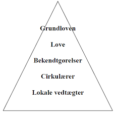


Retskilderne præsenteres i dansk ret traditionelt i et hierarki med grundloven og lovene som øverste retskilder og "forholdets natur" som den laveste.


Lovgivningen er den primære retskilde, som altid skal tages i betragtning ved fastlæggelse af retsstillingen, men retspraksis er også en vigtig retskilde, især hvis der foreligger en afgørelse fra Højesteret (se præjudikat) eller en afgørelse fra EU-Domstolen eller fra Menneskerettighedsdomstolen vedrørende Den Europæiske Menneskerettighedskonvention. 

Andre faktorer, der kan anvendes som retskilder, er fx retssædvaner, aftaler, lovforarbejder, administrativ praksis, administrative retsforskrifter, udtalelser fra Folketingets Ombudsmand samt retsvidenskabens analyser. Herudover anvendes traditionelt også forholdets natur som retskilde.

Der kan ikke opstilles en fast prioritering af retskilderne, idet de i konkrete tilfælde alle kan have betydning for, hvad der er gældende ret.

I den juridiske argumentation indtager retskilderne den vægtigste position.

Mabn kan også opdele retskilderne i 3 hovedkategorier:

 

1. National lovgivningen og EU-lovgivningen

2. National retspraksis og EU-praksis

3. Øvrige retskilder:

Retssædvaner

Aftaler

Forholdets natur

Kutymer

Retsgrundsætninger

God skik regler

---

### Lov

En lov er underlagt grundloven for 1953 og må ikke stride mod grundloven.

En lov er heirarkisk højere rangeret end en bekendtgørelse. jf. herom forneden. Love er bindende for private, virksomheder og myndigheder. 

Før en lov kan blive vedtaget, skal den behandles 3 gange i folketinget. 

Det er regeringen, der fremsætter lovforslaget, og det er folketinget, der vedtager eller forkaster den.

 
---

### Bekendtgørelse

En bekendtgørelse er en administrativ forskrift udstedt af en forvaltningsmyndighed med hjemmel i lov. 

Bekendtgørelser er bindende for borgere, virksomheder og myndigheder, medmindre andet følger af bekendtgørelsen.

--- 

### Dommenes retskildværdi (præjudikat)

Domstolsafgørelser og domstolskendelser kan have præjudikatsværdi. 

Det betyder, at afgørelsen kan have betydning for, hvordan fremtidige afgørelser inden for det pågældende område skal bedømmes. 

Præjudikatsværdien kan være underlagt en række indskrænkninger, hvilket betyder, at præjudikatsværdiens rækkevidde kan være begrænset.

Følgende momenter kan indgå i vurderingen af, hvilken præjudikatsværdi en afgørelse kan tillægges:

hvor konkret er afgørelsen, og kan den være anvendelig på lignende afgørelser?
i civilretten, hvor forhandlingsmekanismen gælder, bør der tages højde for, hvad der er fremsat af påstande og anbringender, da disse danner rammerne for, hvad domstolene skal tage stilling til om afgørelsen kan tjene som fortolkningsbidrag

om afgørelsen kan være med at fastlægge retstilstanden tager afgørelsen udgangspunkt i en nu forældet (f.eks. ophævet) eller gældende lovgivning/retstilstand?

---

### God skik regler

Undertiden støder man i lovgivningen på, at en handlemåde skal være overensstemmelse med en branchebestemt ”god skik”, en såkaldt adfærdsnorm. 

Eksempler herpå er god advokatskik, god ejendomsmæglerskik, god skik for de finansielle virksomheder, god markedsføringsskik, god revisionsskik og god forvaltningsskik m.v.  

God skik regler findes i begrænset omfang på lovniveau (eksempel herpå er bekendtgørelse om god skik for finansielle virksomheder), mens normerne for god skik i andre tilfælde er fastsat af domstolene mv. 

God skik er som udgangspunkt branchebestemt og de vage rammer sikre en tidsvarende standardnorm, der udvikles i takt med samfundsudviklingen.

---

### Retsædvane

Retssædvaner er ulovreguleret, men har en retlig værdi, da retssædvanerne er på lovniveau. 

Nogle retssædvaner er udviklet af domstolene. 

Domslæsning, læse anerkendte juridiske grundsætninger og søge i retslitteraturen er nogle af svarene på, hvor retssædvaner kan findes. 

Imidlertid er retssædvaner ikke vilkårlige, hvorfor der er flere elementer, der skal være opfyldt, før retssædvanen overhovedet kan tillægges betydning. 

Et klassisk eksempel på retssædvane er **culpareglen**.

I den juridiske litteratur er der opstillet rammer for, hvornår der er tale om en retssædvane. 

Den traditionelle opfattelse er, at det være en handlemåde, der er 

1) fulgt almindeligt, 
2) stadigt og 
3) længe ud fra 
4) den overbevisning, at man er retligt forpligtet til det.

---

### Kutyme

Kutyme er defineret ved at være en sædvane. 

Den har ikke samme retskildeværdi som retssædvane, da retssædvane er på lovniveau, og må derfor betragtes trin-lavere. 

Kutyme er en alment kendt handlemåde i en bestemt branche, hvilket aktørerne i den pågældende branche har eller bør have viden om. 

I juridisk litteratur er sædvane undertiden beskrevet som en handelssædvane, og der kan derfor være forskel på kutymerne i de forskellige brancher. 

Kutyme er tæt beslægtet med god-skik regler. 

Hvad der er kutymer, kan indhentes informationer om fra brancheforeninger såsom Dansk Erhverv og Dansk Industri.

---

### Aftalen

Aftaler (f.eks. en kontrakt) der er indgået mellem parter udgør blandt de vigtigste retskilder. 

Imidlertid er der ikke tale om en "lov", men reguleringen heraf kan være underlagt lov, og der må der sondres mellem, om aftalen er underlagt præceptive lovbestemmelser, 


aftaler der er i strid mod lov og ærbarhed (Danske Lovs 5-1-2), aftaler der uden et gyldigt grundlag binder en tredjemand, beskyttelsespræceptive (ufravigelige) lovregler og regler, der er deklaratoriske (fravigelige).

Præceptive regler er kendetegnet ved, at de ikke kan fraviges ved aftale. Aftaler i strid mod lov og ærbarhed er kendetegnet ved, at aftalen er i strid med ufravigelige regler. 

Eksempelvis kan man ikke håndhæve en aftale om sort arbejde. 

Beskyttelsespræceptive er kendetegnet ved, at de efter aftale kan stille den svage part bedre end loven (f.eks. en arbejdstager), men hvor denne ret ikke tilkommer den stærke part (f.eks. en arbejdsgiver). 

Det samme gælder ved forbrugerkøb. Forbrugerbrugen kan godt stilles bedre, men ikke dårligere efter købeloven.

Deklaratoriske regler er regler fx. i handelskøb, der kan fraviges ved aftale, og kommer i anvendelse, hvis der ikke foreligger aftale om andet.

 
---

### Forholdets natur

Det er i juridisk litteratur omdiskuteret, om hvorvidt forholdets natur overhovedet er en retskilde, og der kan i den juridiske litteratur findes flere argumenter for og imod. 

Forholdets natur er kendetegnet ved, at der tages hensyn til nogle retlige relevante hensyn og principper og rimelighedsbetragtninger. 

---

## EU-rettens retskilder

De mål, der er fastsat i traktaterne, nås gennem forskellige typer retsakter. Nogle er bindende, andre er ikke. 

Nogle angår alle EU-lande, mens andre kun angår nogle stykker.

---

### Forordninger

En "forordning" er en bindende retsakt. Det skal følges i alle enkeltheder i hele EU. 

Da EU f.eks. ønskede at garantere fælles sikkerhedsforanstaltninger for varer importeret fra lande uden for EU, vedtog Rådet en forordning.

---

### Direktiver


Et "direktiv" er en retsakt, der fastsætter et mål, som EU-landene skal opnå. 

Det er dog op til de enkelte lande at lave deres egne love for, hvordan disse mål skal opnås. 

Et eksempel er EU's direktiv om forbrugerrettigheder, som styrker forbrugernes rettigheder i EU, f.eks. ved at fjerne skjulte afgifter og omkostninger på internettet og forlænge den periode, som forbrugere kan fortryde en købsaftale i.

---

### Afgørelser

En "afgørelse" er bindende for dem, den er rettet til (f.eks. et EU-land eller en individuel virksomhed) og er direkte gældende. 

F.eks. har Kommissionen udstedt en afgørelse om EU's deltagelse i forskelige antiterrororganisationers arbejde. Afgørelsen vedrører kun sådanne organisationer.

---

### Henstillinger

En "henstilling" er ikke bindende. 

Da EU-Kommissionen rettede en henstilling til EU-landenes myndigheder om at forbedre deres brug af videokonferencer for at hjælpe domstolstjenester med at arbejde bedre sammen på tværs af grænserne, havde den ingen retslige virkninger. 

En henstilling giver institutionerne mulighed for at give deres mening til kende og foreslå en retningslinje, uden derved at pålægge dem, den er rettet til, nogen retlige forpligtelser.

---

### Udtalelser

En "udtalelse" er et instrument, der giver institutionerne mulighed for at fremsætte en ikkebindende erklæring, dvs. at den ikke pålægger dem, den er rettet mod, nogen forpligtelser. 

En udtalelse er ikke bindende. Den kan afgives af de vigtigste EU-institutioner (Kommissionen, Rådet, Parlamentet), Regionsudvalget og Det Europæiske Økonomiske og Sociale Udvalg. 

Mens lovene udformes, afgiver udvalgene udtalelser fra deres særlige regionale eller økonomiske og sociale synspunkt. For eksempel afgav Regionsudvalget en udtalelse om pakken om en politik for ren luft i Europa.

---

## Case law


Der er stor forskel på retskildeopfattelsen inden for forskellige retssystemer, se fx case law.^[Følgende afsnit om Case Law bygger på http://denstoredanske.dk/Samfund,_jura_og_politik/Jura/Retssammenligning,_komparativ_ret/case_law.]

Case law, judge-made law, dommerskabt ret.  

I common law-lande har domstolene en mere vidtgående funktion end den dømmende magt i andre retssystemer. 

Common law-domstolen skal ikke kun fortolke og anvende lovgiverens retsregler, statutory law, men skaber også sin egen ret, case law eller judge-made law. 

En domstolsafgørelse har således ikke alene betydning for parterne i en konkret tvist; afgørelsen skaber præcedens, dvs. at en lignende sag i fremtiden med stor sandsynlighed vil blive afgjort på samme måde, den såkaldte **stare decisis-doktrin**.

Betegnelsen case law er engelsk, af case 'tilfælde' og law 'lov'.
I England er de afgørelser, der hidrører fra samme eller en højere domstol, bindende. 

Andre afgørelser har kun vejledende karakter. Der sondres desuden mellem den tidligere afgørelses egentlige begrundelse, *"ratio decidendi"*, og andre udtalelser i afgørelsen, *"obiter dicta"*. 

Et "obiter dictum" er kun vejledende, uanset fra hvilken domstol det måtte hidrøre.


Selv bindende afgørelser bliver fra tid til anden tilsidesat (overruled); fx kan der bag afgørelsen ligge en forældet tankegang, og i 1966 udtalte Englands højeste domstol, House of Lords, at den ikke fremover ville betragte sig som evigt bundet af sine egne tidligere afgørelser.

I USA håndhæves stare-decisis mindre strengt end i England. USA's højesteret har enkelte gange tilsidesat sine tidligere afgørelser, selv i sager om fortolkning af USA's forfatning. 

Fx gav United States Supreme Court i 1954 sorte elever adgang til skoler og universiteter, som tidligere havde været forbeholdt de hvide, og tilsidesatte herved sin egen ældre afgørelse, der havde anerkendt doktrinen om "separate but equal", dvs. at man i undervisningen adskilte sorte og hvide.  


---

## Retskildepolycentri


Retskildepolycentri er en nyere retsvidenskabelig erkendelse af, at dannelsen af retskilder i forskellige fora i det moderne samfund kan resultere i, at en retskilde kan have forskellig virkning for forskellige retsanvendere. 

Teorien bryder med den hierarkiske retskildeopfattelse. 

Teoriens ophavsmand er den danske juraprofessor Henrik Zahle.  

---

## Juridisk metode


Juridisk metode, fremgangsmåde ved stillingtagen til juridiske problemer.  

Metoden består for det første af en beskrivelse og identifikation af de retskilder, som gyldigt kan inddrages i en juridisk argumentation; for det andet af læren om, hvordan retskilderne fortolkes. 

Juridisk metode består af 3 hovedelementer:

---

Et faktum (Hændelsesforløbet fx der er sket økonomisk misbrug af en kortholderens mistede Dankort)  
+  
Et retsfaktum (Hvilken retsregel i betalingsloven skal anvendes i forhold til tredjemandsmisbruget af Dankortet)  
=  
En retsfølge (Afgørelsen, hvem der kommer til at betale for misbruget af Dankortet banken eller kortholderen)  

---

Se f.eks. i henhold til bestemmelsen i betalingslovens § 100, stk. 4, nr. 3, hæfter betaleren for op til 8.000 kr. af misbrug, som finder sted som følge af betalerens groft uforsvarlige adfærd.

Begrebet groft uforsvarlig adfærd er ikke nærmere afgrænset i betalingsloven, men traditionelt anvendes begrebet »grov uagtsomhed« som betegnelse for »tilsidesættelse af den agtpågivenhed, som selv skødesløse personer plejer at udvise.« 

Med anvendelsen af begrebet groft uforsvarlig adfærd er det således præciseret, at grov uagtsomhed i sædvanlig forstand ikke er tilstrækkeligt til at pådrage betaleren hæftelse efter bestemmelsen. 

Der skal altså mere til. 

Groft uforsvarlig adfærd må herefter forstås som sløseri, der er præget af ligegyldighed i forbindelse med opbevaring af bl.a. pinkoden. 

Der skal derfor meget til efter praksis i Pengeinstitutankenævnet (nu Det finansielle Ankenævn), før der statueres groft uforsvarlig adfærd.


---


<br>

---

*PIA 78/2006**: 

»Det forhold, at misbrugeren på klagerens bopæl tilfældigt fik mulighed for at overhøre klageren oplyse sin kode til dankortet til kæresten sammenholdt med, at dankortet opbevaredes i hendes pung, der lå i hendes jakke på bopælen, kan ikke betegnes som groft uforsvarlig adfærd, heller ikke selv om klageren havde givet T adgang til sin bopæl, uanset om hun måtte have kendskab til T’s kriminelle baggrund«.

---

*PIA 205/2005:**:

»Klagerens Visa/Dankort blev opbevaret i en pung, som lå i en jakke, der var anbragt bag disken i klagerens butik og ikke var synlig for kunderne. Selvom det må bebrejdes klageren, at pinkoden til kortet var anført på en seddel, der lå i pungen sammen med kortet, findes klageren efter en samlet vurdering ikke at have udvist en groft uforsvarlig adfærd som omhandlet i (dagældende) lov om visse betalingsmidler § 11, stk. 3, nr. 3. Ankenævnet har herved også lagt vægt på, at det i lovens forarbejder er forudsat, at det udvidede ansvar kun ville kunne gøres gældende i et fåtal af tilfælde«.  

---

Selvforskyldt beruselse kan blive betragtet som uforsvarlig adfærd, jf. **PIA 281/2013** Spørgsmål om misbrug af kort var muliggjort ved groft uforsvarlig adfærd som følge af beruselse: 

»Som sagen foreligger oplyst, lægger vi til grund, at klageren ikke ved, hvad han foretog sig fra ca. kl. 00.30 til ca. kl. 02.00, da han vågnede i en bil, som han formoder var en pirattaxa. 

Vi finder ikke grundlag for at antage, at klagerens tilstand skyldes andre forhold end indtagelse af alkohol. Under disse omstændigheder finder vi, at misbruget af klagerens betalingskort er muliggjort, fordi han var stærkt påvirket af alkohol. Vi finder, at klageren under de beskrevne omstændigheder har udvist groft uforsvarlig adfærd. 

Vi stemmer derfor for at lade klageren hæfte med 8.000 kr. af det tab, der opstod som følge af den uberettigede brug af kortet, jf. (dagældende) lov om betalingstjenester § 62, stk. 3 nr. 3«. 

---

Det er en konkret vurdering, om der bliver statueret groft uforsvarlig adfærd, jf. fx **PIA 436/1993:**:

Natten mellem den 12. og 13. juni 1993 blev klageren, medens han opholdt sig på en restauration, frastjålet sit dankort, som var opbevaret i klagerens tegnebog. 

Klageren anmeldte den 13. juni 1993 kl. 11.10 telefonisk tyveriet til kriminalpolitiet i Sønderborg efter forinden telefonisk at have spærret dankortet ved meddelelse til PBS. 

Det viste sig efterfølgende, at der ved anvendelse af dankortet og korrekt pinkode den 13. juni 1993 mellem kl. 9.25 og 9.28 var hævet 3 x 2.000 kr. i tre forskellige dankortautomater. 

Efter de foreliggende oplysninger lagde Pengeinstitutankenævnet til grund, at tyveriet af dankortet var blevet forøvet af to unge piger, som senere blev dømt for tyveri ved den 13. juni 1993 kl. 9.25-9.28 under anvendelse af dankortet at have stjålet de 3 x 2.000 kr. fra dankortautomaterne. 

Det fremgik af en retsbogsudskrift fra straffesagen, at de sigtede havde forklaret, at den ene af dem, A, snakkede med klageren, mens den anden sigtede, B, tog pungen op af lommen på ham. 

Herefter gik de ud på toilettet, hvor de tog pengene og kortet. 

A forklarede videre, at hun havde spurgt klageren om koden, og han havde givet hende den. Han sagde noget om, at han skulle ringe til banken for at få kortet spærret, og hun tilbød at gøre det for ham. 

Hun lod, som om hun telefonerede til banken, og sagde i den forbindelse til klageren, at hun skulle bruge pinkoden, hvorefter han gav hende den. Klageren indbragte sagen for Ankenævnet med påstand om, at indklagede var tilpligtet at anerkende, at klageren ikke hæftede for de 6.000 kr. 

Ankenævnet traf følgende afgørelse: 

»Efter (dagældende) betalingskortlovens § 21, stk. 2, hæfter kortindehaveren uden beløbsbegrænsning for tab, der opstår som følge af andres uberettigede brug af betalingskortet og den dertil hørende personlige hemmelige kode, såfremt kortudstederen godtgør, at kortindehaveren har oplyst koden til den, der har foretaget den uberettigede brug. 

Ankenævnet finder imidlertid ikke, at bestemmelsen er anvendelig på et tilfælde som det foreliggende. Ankenævnet finder på den anden side, at klageren udviste groft uforsvarlig adfærd ved i det foreliggende tilfælde at oplyse sin PIN-kode. Han hæfter derfor med op til 8.000 kr. for det tab, der opstod som følge af det uberettigede brug af kortet, jf. (dagældende) betalingskortlovens § 21, stk. 3, nr. 2. Som følge af det anførte bestemmes: Den indgivne klage tages ikke til følge«.  


---

Den juridiske metode indeholder væsentlige elementer af vurdering og skøn og er derfor mindre eksakt end de metoder, der anvendes inden for mange andre fagområder.


I juridisk Ordbog (***Bo von Eyben***, 14. udg.) defineres juridisk metode som følger:"den metode, der skal anvendes for at afgøre, hvilken regel der er gældende for et bestemt retsområde. Dette forudsætter kendskab til læren om retskilderne og evne til herudfra at finde de relevante retskilder og at anvende dem korrekt på det givne forhold..." 

---

<!--chapter:end:02.Rmd-->

# <font color="red">EU-Domstolen<sup> Premium </font></sup>

```{r, echo=FALSE, results='asis'}
cat(readLines('npp.html'))
```


<!-- *(afsnittet kan læses i hovedtræk for de interesserede og er ikke en del af pensum)* -->


 

EU-Domstolen træffer afgørelser i de sager, der indbringes for den. De mest almindelige typer sager er:

Fortolkning af love (præjudicielle afgørelser) - de nationale domstole i EU-landene skal sikre, at EU-lovene anvendes korrekt, men domstolene i de forskellige lande kan fortolke reglerne forskellige. 

Hvis en national domstol er i tvivl om fortolkningen eller gyldigheden af en EU-retsakt, kan den spørge Domstolen til råds. 

Den samme mekanisme kan anvendes til at afgøre, om national ret eller praksis er forenelig med EU-retten.

Håndhævelse af loven (overtrædelsesprocedurer) - denne form for sag føres mod et medlemsland, hvis det ikke overholder EU-reglerne. 

Den kan indledes af Europa-Kommissionen eller et andet EU-land. 

Hvis landet findes skyldigt, skal det straks bringe bruddet til ophør, hvis ikke det vil risikere, at der anlægges endnu en sag, som kan medføre bødestraf.

*	Ophævelse af EU-retsakt (annullationssøgsmål) – hvis en EU-retsakt menes at være i strid med EU-traktaterne eller grundlæggende rettigheder, kan 

Domstolen blive bedt om at ophæve den - af et medlemsland, Rådet, Europa-Kommissionen eller (i visse tilfælde) Europa-Parlamentet.

Privatpersoner kan også bede Domstolen om at ophæve en EU-retsakt, som berører dem direkte.

Sikring af, at EU træffer foranstaltninger (passivitetssøgsmål) – Parlamentet, Rådet og Kommissionen skal træffe visse afgørelser i bestemte situationer. 

Undlader de dette, kan EU's institutioner eller (i visse tilfælde) enkeltpersoner eller virksomheder klage til Domstolen.

*	Sanktionering af EU-institutionerne (erstatningssøgsmål) – enhver person eller virksomhed, hvis interesser er blevet skadet som følge af EU's eller dets personales handlinger eller mangel på handlinger, kan bringe sagen for Domstolen.  

---

## <font color="red">Sammensætning<sup> Premium </font></sup>
 
 

EU-Domstolen er inddelt i 2 organer:

EU-Domstolen – som tager sig af anmodninger om præjudicielle afgørelser fra nationale domstole, visse annullationssøgsmål og appelsager. 

Retten – som træffer afgørelse i annullationssøgsmål indbragt af enkeltpersoner, virksomheder og i visse tilfælde medlemslande. 

Det vil i praksis sige, at Retten primært beskæftiger sig med konkurrenceret, statsstøtte, handel, landbrug og varemærker.  

Hver dommer og generaladvokat udnævnes i fællesskab af medlemslandene for en periode på 6 år, som kan fornyes. 

I hver domstol vælger dommerne en formand for en periode på 3 år, som kan forlænges.  

---

## <font color="red">Hvordan fungerer EU-Domstolen?<sup> Premium </font></sup>

I Domstolen tildeles hver sag én dommer (refererende dommer) og én generaladvokat. 

Sagerne behandles i to faser:  

**Den skriftlige fase**  

+	Parterne afgiver skriftlige erklæringer til Domstolen – og nationale myndigheder, EU-institutionerne og i visse tilfælde enkeltpersoner kan også fremsætte bemærkninger. 
  
+	Alt dette sammenfattes af den refererende dommer og drøftes på Domstolens almindelige møde, som beslutter: 
  
+	Hvor mange dommere, der skal behandle sagen: 
    
3, 5 eller 15 dommere (hele Domstolen) afhængig af sagens betydning og kompleksitet. 

De fleste sager behandles af 5 dommere, og det sker meget sjældent, at en sag høres af hele Domstolen.  
    
+	Om det er nødvendigt med en høring (den mundtlige fase), og om der er behov for en officiel udtalelse fra generaladvokaten.
    
**Den mundtlige fase – en offentlig høring**.  

+	Parternes advokater forelægger deres sag for dommerne og generaladvokaten, som kan stille spørgsmål til dem.

+	Hvis Domstolen har besluttet, at der er behov for en udtalelse fra generaladvokaten, afgives denne nogle uger efter høringen. 

+	Dommerne voterer så og kommer med deres afgørelse.  

*	Rettens procedure er lignende, bortset fra at de fleste sager høres af 3 dommere, og at der ikke er nogen generaladvokat.  

---

## <font color="red">EU-Domstolen og dig<sup> Premium </font></sup>


Hvis du – som privatperson eller virksomhed – har lidt skade som følge af handlinger eller mangel på handlinger fra EU's institutioners eller ansattes side, kan du indbringe en sag for Domstolen på to måder:  

*	Indirekte gennem nationale domstole (som kan beslutte at henvise sagen til EU-Domstolen)  

*	Direkte for Retten – hvis en afgørelse truffet af en EU-institution har berørt dig direkte og individuelt.  

Hvis du mener, at myndighederne i et medlemsland har overtrådt EU-reglerne, skal du følge den officielle klageprocedure. 

---

**Video: EU-domstolen**

<div class="video-container"><iframe src="https://www.youtube.com/embed/M3LPCK1eWBs" width="853" height="480" frameborder="0" allowfullscreen="allowfullscreen"></iframe></div>

---

Med ikrafttrædelsen af Lissabontraktaten den 1. december 2009 har Den Europæiske Union fået status som juridisk person og har overtaget de beføjelser, som tidligere var tildelt Det Europæiske Fællesskab. 

Fællesskabsretten er således blevet til unionsretten, som også omfatter alle de bestemmelser, der tidligere er blevet vedtaget i medfør af traktaten om Den Europæiske Union som affattet forud for Lissabontraktaten. 

I den præsentation, som følger, vil udtrykket fællesskabsretten ikke desto mindre blive anvendt, når der henvises til Domstolens praksis før ikrafttrædelsen af Lissabontraktaten.

Ved siden af Den Europæiske Union fortsætter Det Europæiske Atomenergifællesskab (Euratom) med at eksistere.

Eftersom Domstolens beføjelser vedrørende Euratom i princippet er de samme som dem, der udøves inden for rammerne af Den Europæiske Union, og for at gøre præsentationen mere læsevenlig, vil enhver henvisning til unionsretten ligeledes omfatte Euratomretten.

---

## <font color="red">Sammensætning<sup> Premium </font></sup>

	 


**Domstolen består af 28 dommere og 11 generaladvokater**. 

Dommerne og generaladvokaterne udnævnes for en periode af 6 år af medlemsstaternes regeringer efter fælles overenskomst efter høring af et udvalg, som har til opgave at udtale sig om, hvorvidt de indstillede kandidater er egnede til at varetage de omhandlede opgaver. 

De kan genudnævnes. 

Til dommere og generaladvokater ved Domstolen udnævnes personer, hvis uafhængighed er uomtvistelig. 

De skal i deres hjemland opfylde betingelserne for at indtage de højeste dommerembeder eller have faglige kvalifikationer, som er almindeligt anerkendt.

Domstolens dommere vælger af deres midte Domstolens præsident og vicepræsident for et tidsrum af tre år. Begge kan genvælges. 

Præsidenten forestår Domstolens arbejde og administration og leder retsmøderne og Domstolens voteringer i sager, der er henvist til behandling i et af de største dommerkollegier.

Vicepræsidenten bistår præsidenten i udførelsen af dennes opgaver og træder i præsidentens sted, hvis denne har forfald.

Generaladvokaterne bistår Domstolen og er den behjælpelig ved udførelsen af dens opgaver. 

De har til opgave, fuldstændig upartisk og uafhængigt, offentligt at fremsætte forslag til afgørelse af de sager, som de forelægges.

Justitssekretæren er institutionens generalsekretær og leder dens tjenestegrene under tilsyn af Domstolens præsident.

Domstolen kan sættes af samtlige medlemmer (plenum), i Den Store Afdeling (15 dommere) eller i afdelinger med 3 eller 5 dommere.

Domstolen sættes af samtlige medlemmer i særlige tilfælde, der er opregnet i statutten for Domstolen (bl.a. når den skal afskedige Den Europæiske Ombudsmand eller et medlem af Europa-Kommissionen, som har tilsidesat sine forpligtelser), og når Domstolen finder, at en sag er af særlig vigtighed.

Den sættes i Den Store Afdeling, når en medlemsstat eller en institution, som er part i sagen, anmoder herom samt i særligt omfattende eller betydelige sager.

De øvrige sager behandles i afdelinger med 5 eller 3 dommere. 

Formændene for afdelinger med 5 dommere vælges for en periode af 3 år, og formændene for afdelinger med 3 dommere for en periode af 1 år.

---

**Beføjelser**

For at kunne varetage sit hverv er Domstolen tillagt vide retlige beføjelser, som den udøver ved de præjudicielle forelæggelser og i de forskellige typer af søgsmål.

---

## <font color="red">De forskellige sagstyper<sup> Premium </font></sup>


###	 <font color="red">Præjudicielle forelæggelser<sup> Premium </font></sup>


Domstolen samarbejder med samtlige retsinstanser i medlemsstaterne, som er de ordinære retter, på unionsrettens område. 

For at sikre en effektiv og ensartet anvendelse af unionsretten og for at undgå forskelle i fortolkningen heraf kan - og i visse tilfælde skal - de nationale retter forelægge Domstolen **præjudicielle spørgsmål vedrørende fortolkningen af unionsretten**, f.eks. med henblik på, at den nationale ret kan efterprøve de nationale bestemmelsers overensstemmelse med unionsretten. 

Den præjudicielle forelæggelse kan også vedrøre spørgsmål om en unionsretsakts lovlighed.

Domstolen besvarer ikke sådanne spørgsmål ved blot at afgive en udtalelse, men i en dom eller en begrundet kendelse. 

Den forelæggende ret er bundet af Domstolens fortolkning. 

Domstolens dom binder på samme måde de øvrige nationale domstole, som måtte skulle træffe afgørelse vedrørende et identisk spørgsmål.

Det er ligeledes gennem præjudicielle forelæggelser, at enhver europæisk borger kan få afklaring på spørgsmål om de bestemmelser i unionsretten, der vedrører ham. 

Selv om et præjudicielt spørgsmål kun kan forelægges af en national domstol, har parterne i den sag, der verserer for den nationale domstol, medlemsstaterne og EU-institutionerne adgang til at deltage i proceduren for Domstolen. 

En række af unionsrettens hovedprincipper er blevet defineret på baggrund af præjudicielle spørgsmål, der også er blevet forelagt af nationale domstole, som træffer afgørelse i første instans.

---

###	 <font color="red">Traktatbrudssøgsmål<sup> Premium </font></sup>


Domstolen har herigennem adgang til at kontrollere, om medlemsstaterne overholder de forpligtelser, der påhviler dem i medfør af unionsretten. 

Forud for sagens anlæg ved Domstolen har Kommissionen gennemført en procedure, hvorunder vedkommende medlemsstat har fået lejlighed til at svare på de klagepunkter, som er rejst imod den. 

Hvis denne procedure ikke fører til, at medlemsstaten bringer traktatbruddet til ophør, kan der anlægges en traktatbrudssag ved Domstolen.

En sådan sag kan anlægges enten af Kommissionen - hvilket i praksis er det hyppigst forekommende - eller af en anden medlemsstat. 


Hvis Domstolen fastslår, at der foreligger et traktatbrud, skal medlemsstaten straks bringe det til ophør. 

Hvis Domstolen, efter at Kommissionen på ny har indbragt sagen for den, fastslår, at den pågældende medlemsstat ikke har efterkommet dens dom, kan Domstolen pålægge medlemsstaten at betale et fast beløb eller en tvangsbøde. 

Hvis Kommissionen ikke er blevet underrettet om foranstaltninger til gennemførelse af et direktiv, kan Domstolen imidlertid efter anmodning herom fra Kommissionen pålægge medlemsstaten en økonomisk sanktion allerede fra tidspunktet for afsigelsen af den første traktatbrudsdom.

---

### <font color="red">Annullationssøgsmål<sup> Premium </font></sup>


I en sådan sag nedlægger sagsøgeren påstand om annullation af en retsakt, der er udstedt af Unionens institutioner, organer, kontorer eller agenturer (bl.a. forordninger, direktiver og beslutninger). 

Domstolen er forbeholdt kompetencen i sager, der anlægges af en medlemsstat mod Europa-Parlamentet og/eller Rådet (med undtagelse af Rådets retsakter, der vedrører statsstøtte, antidumping og gennemførelsesbeføjelser), eller sager, der anlægges af en EU-institution mod en anden institution. 

Retten er kompetent til at træffe afgørelse, i første instans, i alle andre sager af denne art, herunder navnlig i sager, der er anlagt af private.

---

###	<font color="red">Passivitetssøgsmål<sup> Premium </font></sup>


Domstolen og Retten har herigennem adgang til at kontrollere, om det er lovligt, at en fællesskabsinstitution forholder sig passivt i en given situation. 

En sådan sag kan imidlertid først anlægges, efter at institutionen er blevet opfordret til at handle. 

Når det er fastslået, at undladelsen var ulovlig, har den pågældende institution pligt til at træffe egnede foranstaltninger til at bringe passiviteten til ophør. 

Beføjelsen til at påkende passivitetssøgsmål er opdelt mellem Domstolen og Retten efter de samme kriterier, som gælder ved annullationssøgsmål.

---

###	<font color="red">Appelsager<sup> Premium </font></sup>


Endelig kan domme og kendelser afsagt af Retten appelleres til Domstolen for så vidt angår retsspørgsmål. 

Såfremt appellen admitteres, og Domstolen giver appellanten medhold i realiteten, ophæver den Rettens afgørelse. 

Hvis sagen er moden til påkendelse, kan Domstolen selv træffe afgørelse i sagen. 

Finder Domstolen ikke, at sagen er moden til påkendelse, hjemviser den sagen til Retten. 

I tilfælde af hjemvisning er Retten bundet af de afgørelser, som er truffet af Domstolen under appelsagen.

---

## <font color="red">Sagsbehandling<sup> Premium </font></sup>


Uanset hvilken sagstype der er tale om, omfatter den en skriftlig fase og i givet fald en mundtlig fase, der er offentlig. 

Der er imidlertid forskel på sagsbehandlingen for så vidt angår præjudicielle forelæggelser og i de øvrige sager(direkte søgsmål og appelsager).

---

### <font color="red">Sagens anlæg og den skriftlige forhandling<sup> Premium </font></sup>

##	<font color="red">Præjudicielle forelæggelser<sup> Premium </font></sup>


Den nationale domstol forelægger Domstolen spørgsmål om fortolkningen eller gyldigheden af en bestemmelse i unionsretten, hvilket sædvanligvis sker i form af en retsafgørelse, alt efter de nationale retsplejeregler. 

Når anmodningen af Domstolens oversættelsestjeneste er oversat til alle unionssprogene, forkynder justitssekretæren den for parterne i hovedsagen samt for medlemsstaterne og EU-institutionerne. 

Justitssekretæren lader en meddelelse, der indeholder de pågældende parters navne samt spørgsmålene, offentliggøre i Den Europæiske Unions Tidende. 

Parterne, medlemsstaterne og institutionerne har herefter en frist på to måneder til at indgive skriftlige indlæg til Domstolen.

Den nationale domstol forelægger Domstolen spørgsmål om fortolkningen eller gyldigheden af en bestemmelse i unionsretten, hvilket sædvanligvis sker i form af en retsafgørelse, alt efter de nationale retsplejeregler. 

Når anmodningen af Domstolens oversættelsestjeneste er oversat til alle unionssprogene, forkynder justitssekretæren den for parterne i hovedsagen samt for medlemsstaterne og EU-institutionerne. 

Justitssekretæren lader en meddelelse, der indeholder de pågældende parters navne samt spørgsmålene, offentliggøre i Den Europæiske Unions Tidende. 

Parterne, medlemsstaterne og institutionerne har herefter en frist på to måneder til at indgive skriftlige indlæg til Domstolen.

---

##	<font color="red">Direkte søgsmål og appelsager<sup> Premium </font></sup>

Sagen anlægges ved Domstolen ved indlevering af en stævning til justitskontoret. 

Justitssekretæren lader en meddelelse om sagsanlægget offentliggøre i Den Europæiske Unions Tidende, hvori sagsøgerens søgsmålsgrunde og argumenter kort angives. Stævningen forkyndes for de øvrige parter, der har en frist på to måneder til at indgive svarskrift eller replik. 

I givet fald har sagsøgeren ret til at indgive replik og sagsøgte duplik. Den frist, der er fastsat for fremlæggelse af disse dokumenter skal overholdes.

I begge sagstyper udpeges der af henholdsvis præsidenten og førstegeneraladvokaten en refererende dommer og en generaladvokat, der følger sagen under hele forløbet.

---

## <font color="red">Sagens oplysning<sup> Premium </font></sup>


Når den skriftlige forhandling er afsluttet, opfordres parterne til inden for en frist på tre uger at tilkendegive, om og hvorfor de ønsker, at der afholdes en mundtlig forhandling. 

Domstolen beslutter på grundlag af den refererende dommers indstilling, og efter at have hørt generaladvokaten, om der skal ske bevisoptagelse, til hvilket dommerkollegium sagen skal henvises, og om der er grund til at afholde en mundtlig forhandling, for hvilken præsidenten i givet fald fastsætter en dato for.

---

### <font color="red">Offentligt retsmøde og generaladvokatens forslag til afgørelse<sup> Premium </font></sup>


Besluttes det at afholde en mundtlig forhandling, procederes sagen i et offentligt retsmøde, hvori dommerkollegiet og generaladvokaten deltager. 

Dommerne og generaladvokaten kan stille parterne de spørgsmål, som de finder hensigtsmæssige. 

Nogle uger senere fremsætter generaladvokaten i et nyt offentligt retsmøde sit forslag til afgørelse for Domstolen. 

Generaladvokaten behandler navnlig sagens retlige aspekter i enkeltheder og foreslår i al uafhængighed Domstolen, hvorledes problemet efter hans eller hendes opfattelse skal løses. 

Hermed er den mundtlige del af sagsbehandlingen afsluttet. 

Hvis det vurderes, at sagen ikke rejser nye retsspørgsmål, kan Domstolen efter at have hørt generaladvokaten bestemme, at sagen skal påkendes uden forslag til afgørelse.

---


## <font color="red">Dommene<sup> Premium </font></sup>


Dommerne voterer på grundlag af et domsudkast, som den refererende dommer har udarbejdet. 

Enhver af dommerne i det pågældende dommerkollegium kan foreslå ændringer. 

Domstolens afgørelser træffes med stemmeflerhed, og en eventuel dissens anføres ikke. 

Dommene underskrives kun af de dommere, der har deltaget i den mundtlige votering, hvorunder dommen er blevet vedtaget, med forbehold af reglen om, at den dommer i dommerkollegiet, der har den laveste anciennitet, ikke underskriver dommen, såfremt dette dommerkollegium består af et lige antal dommere. 

**Dommene afsiges i offentligt retsmøde**. 

På Domstolens websted CURIA offentliggøres dommene og generaladvokaternes forslag til afgørelse på afsigelsesdagen, henholdsvis fremsættelsesdagen. 

I de fleste tilfælde offentliggøres de efterfølgende i Samling af Afgørelser.

---

## <font color="red">Særlige rettergangsformer<sup> Premium </font></sup>


###	<font color="red">Den forenklede procedure<sup> Premium </font></sup>


Såfremt et præjudicielt spørgsmål er identisk med et spørgsmål, Domstolen allerede har afgjort, såfremt besvarelsen af et sådant spørgsmål ikke giver anledning til nogen rimelig tvivl, eller såfremt besvarelsen af spørgsmålet klart kan udledes af retspraksis, kan Domstolen efter at have hørt generaladvokaten træffe afgørelse ved begrundet kendelse, i givet fald under henvisning til den tidligere afsagte dom eller den relevante retspraksis.

---

###	<font color="red">Den fremskyndede procedure<sup> Premium </font></sup>


Den fremskyndede procedure giver Domstolen mulighed for at træffe hurtig afgørelse i uopsættelige sager ved i videst muligt omfang at behandle sagerne hurtigt og tillægge dem absolut prioritet. 

Efter begæring fra en af parterne kan Domstolens præsident efter forslag fra den refererende dommer og efter at have hørt generaladvokaten og de øvrige parter beslutte at anvende den fremskyndede procedure, når sagens særlige uopsættelighed kræver det. 

De præjudicielle forelæggelser kan ligeledes underkastes en fremskyndet procedure. 

I så fald fremsættes begæring herom af den forelæggende ret, som i begæringen skal angive de faktiske omstændigheder, som bevirker, at afgørelsen af det præjudicielle spørgsmål er uopsættelig.

---

###	<font color="red">Den præjudicielle hasteprocedure (PPU)<sup> Premium </font></sup>

Denne procedure gør det muligt for Domstolen inden for en væsentligt afkortet frist at behandle de mest følsomme spørgsmål vedrørende området for frihed, sikkerhed og retfærdighed (politisamarbejde og retligt samarbejde i civile sager og i kriminalsager samt visum, asyl, indvandring og andre politikker i forbindelse med den fri bevægelighed for personer). 

PPU-sagerne behandles i en afdeling med fem dommere, som er særligt udpeget, og den skriftlige fase gennemføres i praksis elektronisk, og er i væsentligt omfang begrænset, både hvad angår varigheden og antallet af aktører, som har ret til at indgive skriftlige indlæg. 

De fleste aktører deltager under den mundtlige fase, der er obligatorisk.

---

###	<font color="red">Begæring om foreløbige forholdsregler<sup> Premium </font></sup>


Der kan ligeledes indgives begæring om udsættelse af gennemførelsen af en retsakt, der er udstedt af en institution, eller om enhver anden foreløbig forholdsregel, som er nødvendig for at forhindre, at en part lider et alvorligt og uopretteligt tab.

---

### <font color="red">Sagsomkostninger<sup> Premium </font></sup>


Sagsbehandlingen ved Domstolen er fritaget omkostninger. 

Til gengæld dækkes omkostningerne til en advokat, der har beskikkelse i en medlemsstat, ved hvilken parterne kan lade sig repræsentere, ikke af Domstolen. 

Hvis en part er ude af stand til helt eller delvis at betale de omkostninger, der er forbundet med sagen, kan han dog uden at være repræsenteret ved en advokat, ansøge om retshjælp. 

Ansøgningen skal vedlægges alle de nødvendige oplysninger, som godtgør behovet for retshjælp.

---

### <font color="red">Sprogordning<sup> Premium </font></sup>


I direkte søgsmål bliver det sprog, som stævningen er affattet på (hvilket kan være ethvert af Den Europæiske Unions 24 officielle sprog) i princippet sagens processprog, dvs. det sprog, som sagen behandles på. 

I appelsager anvendes samme processprog som i den appellerede dom eller kendelse fra Retten. 

For så vidt angår præjudicielle forelæggelser, er processproget det, som den nationale ret har henvendt sig til Domstolen på. 

Under den mundtlige forhandling i retsmøder er der efter behov simultantolkning til forskellige af Den Europæiske Unions officielle sprog. 

Dommerne voterer uden brug af tolke på et fælles sprog, der normalt vil være fransk.

---

## <font color="red">Oversigt over rettergangsmåden<sup> Premium </font></sup>
<br>


 

----

### <font color="red">Domstolen i Den Europæiske Unions retsorden<sup> Premium </font></sup>


Med henblik på at opbygge Europa som fællesskab indgik en række stater (i dag i alt 28) indbyrdes en række traktater om oprettelse af De Europæiske Fællesskaber og herefter Den Europæiske Union, udstyret med institutioner, som vedtager retsregler på bestemte områder.


Den Europæiske Unions Domstol udgør Unionens og Det Europæiske Atomenergifællesskabs dømmende myndighed. 

Den består af Domstolen og Retten, hvis opgave i det væsentlige består i at prøve lovligheden af Fællesskabets retsakter og at sikre en ensartet fortolkning og anvendelse af EU-retten.  

Hele vejen gennem sin praksis har Domstolen knæsat pligten for forvaltninger og domstole på nationalt plan til fuldt ud at gennemføre EU-retten på deres kompetenceområder og at beskytte de rettigheder, som EU-retten tildeler borgerne (direkte anvendelse af EU-retten), hvorved en herimod stridende regel i national ret bliver uvirksom, hvad enten den er yngre eller ældre end EU-normen (EU-rettens forrang for national ret).

Domstolen har ligeledes anerkendt princippet om medlemsstaternes ansvar for tilsidesættelse af unionsretten, som udgør dels et element, der på afgørende måde beskytter de rettigheder, som er tillagt private ved unionsrettens bestemmelser, dels en faktor, der bidrager til en mere omhyggelig gennemførelse af disse bestemmelser i medlemsstaterne. 

De retskrænkelser, som disse gør sig skyldige i, vil således kunne medføre erstatningspligt, der i visse tilfælde kan få alvorlige konsekvenser for deres offentlige finanser. 

Desuden vil enhver manglende overholdelse fra en medlemsstats side af unionsretten kunne indbringes for Domstolen, og denne vil, i tilfælde af manglende opfyldelse af en dom, som fastslår et sådant retsbrud, kunne pålægge staten en tvangsbøde og/eller betaling af et fast beløb. 

Hvis Kommissionen ikke er blevet underrettet om foranstaltningerne til gennemførelse af et direktiv, kan Domstolen imidlertid efter anmodning herom fra Kommissionen pålægge medlemsstaten en økonomisk sanktion allerede fra tidspunktet for afsigelsen af den første traktatbrudsdom.

Domstolen arbejder tæt sammen med de nationale retter, som er unionsrettens ordinære domstole. Enhver national ret, der skal afgøre en tvist med berøring til unionsretten, kan, og skal undertiden, forelægge Domstolen præjudicielle spørgsmål. 

Domstolen får således lejlighed til at fremlægge sin fortolkning af en unionsretlig regel eller til at kontrollere dens lovlighed.

Udviklingen i Domstolens praksis illustrerer dens bidrag til skabelsen af et retsområde, der angår borgerne, idet den beskytter de rettigheder, som EU-lovgivningen tildeler dem på forskellige områder af deres dagligdag.

---

## <font color="red">Grundsætninger fastslået i retspraksis<sup> Premium </font></sup>
<br>

Ved en serie domme (begyndende med dommen i sagen **Van Gend & Loos-dommen** i 1963) indførte Domstolen i sin retspraksis princippet om fællesskabsrettens direkte virkning i medlemsstaterne, som nu gør det muligt for Europas borgere direkte at påberåbe sig bestemmelserne i unionsretten for deres nationale retter.

I forbindelse med indførsel fra Tyskland til Nederlandene skulle transportvirksomheden Van Gend & Loos betale told, som firmaet fandt stridende mod EØF-traktatens regel om forbud til medlemsstaterne mod at forhøje tolden i deres gensidige handelssamkvem. 

Sagen rejste spørgsmålet om konflikten mellem en national lovgivning og EØF-traktatens regler. 

En nederlandsk ret forelagde sagen for Domstolen, og den afgjorde spørgsmålet ved at hævde doktrinen om direkte virkning, således at transportvirksomheden fik en direkte sikkerhed for sine rettigheder i henhold til fællesskabsretten for den nationale ret.

---

I 1964 blev det i **Costa-dommen** fastslået, at fællesskabsretten har forrang for intern lovgivning. 

I denne sag havde en italiensk ret spurgt Domstolen, om en italiensk lov om nationalisering i sektoren for fremstilling og distribution af elektricitet var forenelig med en række regler i EØF-traktaten. 

Domstolen indførte doktrinen om fællesskabsrettens forrang, som den begrundede med den særlige karakter af Fællesskabets retsorden, der må anvendes ensartet i samtlige medlemsstater.

---

I 1991 udviklede Domstolen i dommen i sagen **Francovich m.fl.-dommen** et andet grundbegreb, nemlig grundbegrebet om medlemsstatens ansvar over for private for den skade, de måtte lide på grund af, at staten har tilsidesat fællesskabsretten. 

Siden 1991 står der altså et erstatningssøgsmål til rådighed for de europæiske borgere, som de kan rejse mod den stat, der overtræder en EF-regel.

To italienske borgere, som havde løntilgodehavender hos deres konkursramte arbejdsgivere, havde indledt sag, hvorunder de påberåbte sig den italienske stats passivitet, idet den ikke havde gennemført EF-reglerne om beskyttelse af arbejdstagere i tilfælde af deres arbejdsgivers insolvens. 

Efter at en italiensk ret havde forelagt sagen for Domstolen, udtalte denne, at det pågældende direktiv tog sigte på at tillægge private rettigheder, som de var blevet afskåret fra at udnytte som følge af, at staten havde udvist passivitet, da den ikke havde gennemført direktivet, og hermed gjorde Domstolen vejen fri for et erstatningssøgsmål mod staten selv.

---

### <font color="red">Domstolens rolle i unionsborgerens liv<sup> Premium </font></sup>


Blandt de tusinder af domme, Domstolen har afsagt, har størstedelen, navnlig de, der er afsagt under den præjudicielle procedure, helt åbenbart betydelige virkninger for de europæiske borgeres dagligliv. 

Heraf skal nævnes nogle stykker som eksempel på de væsentligste af fællesskabsrettens områder. 

---

###	<font color="red">Frie varebevægelser<sup> Premium </font></sup>
<br>

Efter dommen i sagen **Cassis de Dijon-dommen**, der blev afsagt i 1979 vedrørende grundsætningen om frie varebevægelser, kan de erhvervsdrivende til deres land indføre enhver vare med oprindelse i et andet unionsland - på den betingelse, at varen dér er blevet fremstillet lovligt og bragt i omsætning, og at ingen tvingende grund, f.eks. forbundet med beskyttelsen af sundhed og miljø, er til hinder for varens indførsel til forbrugslandet.

---

###	<font color="red">Fri bevægelighed for personer<sup> Premium </font></sup>


Adskillige domme er blevet afsagt på området for fri bevægelighed for personer.

I **Kraus-dommen** (1993) fastslog Domstolen, at retstillingen for en EF-borger, der er indehaver af et bevis for afsluttet universitetseksamen, som er erhvervet i en anden medlemsstat, og som letter adgangen til en profession eller udøvelsen af en økonomisk virksomhed, er reguleret af fællesskabsretten, endog hvad angår den pågældende borgers forhold til sin hjemstat. 

Det gælder således, at selv om en medlemsstat kan betinge anvendelsen af eksamensbeviset på sit område af en administrativ godkendelse, må godkendelsesproceduren alene have det formål at klarlægge, om beviset er blevet lovligt udstedt.

---

Blandt de øvrige domme afsagt på dette område er en af de mest kendte **Bosman-dommen** (1995), hvori Domstolen efter anmodning fra en belgisk ret tog stilling til spørgsmålet, om fodboldforbunds regler kunne anses for forenelige med arbejdskraftens frie bevægelighed. 

Domstolen udtalte, at professionel sport er en økonomisk virksomhed, hvis udøvelse ikke kan hindres af reglerne om spillertransfert eller ved en begrænsning af antallet af spillere med statsborgerskab i en andre medlemsstater. 

Sidstnævnte udtalelse er ved senere domme blevet udvidet til at gælde retsstillingen for professionelle sportsudøvere med oprindelse i tredjelande, der har indgået en associerings- (dommen i sagen **Deutscher Handballbund-dommen** fra 2003) eller partnerskabsaftale (**Simutenkov-dommen** 2005) med De Europæiske Fællesskaber.

---


###	<font color="red">Fri udveksling af tjenesteydelser<sup> Premium </font></sup>


En dom fra 1989 vedrørende fri udveksling af tjenesteydelser angik en britisk turist, der var blevet overfaldet og alvorligt såret i den parisiske metro. 

Efter en forelæggelse fra en fransk ret fastslog Domstolen, at den pågældende i sin egenskab af turist havde adgang til tjenesteydelser uden for sit land og principielt var omfattet af det grundlæggende forbud mod forskelsbehandling på grundlag af nationalitet, der er knæsat i fællesskabsretten. 

Turisten havde følgelig ret til samme erstatning, som en fransk statsborger kunne gøre krav på (**Cowan-dommen**).

Efter en præjudiciel anmodning fra luxembourgske retter fastslog Domstolen, at en national lovgivning med den virkning, at en forsikringstager får afslag på godtgørelse af udgifter ved tandbehandling med den begrundelse, at denne har fundet sted i en anden medlemsstat, udgør en uberettiget hindring for den frie udveksling af tjenesteydelser (**Kohll-dommen**, 1998), og at et afslag på godtgørelse af udgifter til køb af briller i udlandet må bedømmes som en uberettiget hindring for de frie varebevægelser (**Decker-dommen**, 1998).

---

###	<font color="red">Ligebehandling og sociale rettigheder<sup> Premium </font></sup>


En flystewardesse anlagde sag mod sin arbejdsgiver på grund af forskelsbehandling vedrørende den løn, hun oppebar i forhold til sine mandlige kolleger, der udførte samme arbejde. 

En belgisk ret forelagde sagen for Domstolen, som i 1976 fastslog, at traktatreglen med påbuddet om principiel ligebehandling med hensyn til løn til kvindelige og mandlige arbejdstagere for samme arbejde havde direkte virkning (**Defrenne-dommen**).

Ved en fortolkning af EF-reglerne vedrørende ligebehandling af mænd og kvinder har Domstolen bidraget til at beskyttelsen af kvinderne mod afskedigelse i forbindelse med barsel. 

En kvinde, der ikke længere kunne arbejde som følge af besværligheder forbundet med graviditet, blev afskediget. 

I 1998 kendte Domstolen afskedigelsen stridende mod fællesskabsretten. 

Afskedigelse af en kvinde under graviditet som følge af fravær, forårsaget af en sygdom på grund af selve graviditeten, er en forbudt forskelsbehandling på grundlag af køn (**Brown-dommen**).

Med henblik på at sikre arbejdstagernes sikkerhed og sundhed er det nødvendigt, at disse har adgang til betalt årlig ferie. 

I 1999 rejste den britiske fagforening BECTU tvivl om britiske regler, som fratog arbejdstagere med arbejdskontrakter af kort varighed denne ret med den begrundelse, at reglerne ikke var i overensstemmelse med et EF-direktiv vedrørende fastlæggelse af arbejdstiden. 

Domstolen nåede til det resultat (**BECTU-dommen**, 2001), at retten til betalt årlig ferie er en social ret, som direkte er tillagt samtlige arbejdstagere i fællesskabsretten, og at ingen arbejdstager kan afskæres herfra.

---

###	<font color="red">Grundlæggende rettigheder<sup> Premium </font></sup>


Med en udtalelse om, at overholdelsen af grundlæggende rettigheder er en integrerende del af de almindelige retsgrundsætninger, som Domstolen skal søge overholdt, har Domstolen bidraget væsentligt til højere standarder i relation til beskyttelsen af de nævnte rettigheder. 

Herved tager Domstolen hensyn til de for medlemsstaternes fælles forfatningstraditioner og folkeretlige aftaler om beskyttelse af menneskerettighederne, navnlig den europæiske konvention til beskyttelse af menneskerettigheder, som medlemsstaterne har samarbejdet om eller tiltrådt. 


Efter ikrafttrædelsen af Lissabontraktaten vil Domstolen kunne anvende og fortolke Den Europæiske Unions charter om grundlæggende rettigheder af 7. december 2000, som i medfør af Lissabontraktaten tillægges samme retsværdi som traktaterne. 

Efter talrige terroristattentater mod politiembedsmænd indførte man i Nordirland bevæbning af politistyrkerne. 

Af hensyn til den offentlige sikkerhed tillod man imidlertid ikke bevæbning (på grundlag af en attest udstedt af vedkommende minister, som ikke kunne anfægtes ved domstolene) af kvinder ansat i politiet. 

Som følge heraf var der ikke længere mulighed for fuldtidsansættelse af kvinder i det nordirske politi. 

Efter en præjudiciel forelæggelse fra en ret i Det Forenede Kongerige afgjorde Domstolen, at udelukkelsen af enhver domstolsprøvelse af en attest fra en national myndighed er i strid med princippet om en effektiv domstolsbeskyttelse, der tilkommer enhver, som finder sig ramt af kønsdiskriminering (**Johnston-dommen**, 1986).

---

### <font color="red">Unionsborgerskab<sup> Premium </font></sup>
<br>

Vedrørende unionsborgerskabet, som ifølge traktaten om Den Europæiske Unions virkemåde tilkommer enhver statsborger i medlemsstaterne, har Domstolen bekræftet, at dette indebærer retten til ophold på en anden medlemsstats område. 

Således har en mindreårig statsborger i en medlemsstat, som er sygeforsikret og har tilstrækkelige midler til sit underhold, også ret til ophold. 

Domstolen fremhævede, at fællesskabsretten ikke kræver af den mindreårige, at han selv har de nødvendige midler, og at afslaget på samtidig at meddele den mindreåriges moder, med statsborgerskab i tredjeland, ret til ophold, vil bevirke, at barnets opholdsret bliver uden enhver effektiv virkning (dommen i sagen **Zhu og Chen-dommen**, 2004).  

I samme dom præciserede Domstolen, at en medlemsstat - selv i det tilfælde, hvor erhvervelse af statsborgerskab i en medlemsstat har til formål at opnå en opholdsret i henhold til fællesskabsretten for en statsborger i en medlemsstat - ikke kan indskrænke virkningerne af tildeling af statsborgerskab i en anden medlemsstat.  

---


<!--chapter:end:03.Rmd-->

# Aftaleret

```{r, echo=FALSE, results='asis'}
cat(readLines('np.html'))
```


**Introduktion til aftaleretten**

---

**Video: introduktion til aftaleretten**


<div class="video-container"><iframe src="https://www.youtube.com/embed/QdPllNiV5Ck" width="853" height="480" frameborder="0" allowfullscreen="allowfullscreen"></iframe></div>


---


**Hvilke problemstillinger og aftaleretlige lovregler, du som studerende særlig skal være opmærksom på vedrørende eksamensspørgsmål indenfor aftaleretten:**


• **Opfordring contra tilbud**, aftalelovens § 9, herunder prisangivelser på nettet, netbutikker og i fysiske butikker
  
• **Aftaleindgåelse**, aftalelovens § 2-7 og § 40

• **Ugyldighed** (svig, aftalelovens § 30 fejl, aftalelovens § 32, stk. 1, udnyttelse, aftalelovens § 31)

• **Falsk/forfalskning**

• **Urimelighed** - §§ 38c, jf. 36

• **Fuldmagtstyper** (især stillingsfuldmagt, aftalelovens § 10, stk. 2), fuldmagtens omfang og konsekvenser, aftalelovens § 10, 11, 15 og 25, modificeret ved erstatningsansvarslovens § 23


---

Aftaleretten beskæftiger sig med reglerne for indgåelse af aftaler, fuldmagtsforhold og aftalefortolkning mv.

Et grundlæggende aftaleretligt princip er:

"Pacta sunt servanda" (latin: Aftaler skal holdes) er det grundlæggende juridiske princip inden for aftaleret, civilret og international ret om, at aftaler skal holdes.

---


Aftalelovens principper har betydning på hele aftaleområdet,^[Følgene bygger tildels på *Torsten Iversen og Lars Hedegaard Kristensens* karnovkommentar til aftaleloven] fx i:


* Forsikringsaftaleloven, kreditaftaleloven, forbrugeraftaleloven, AB 18, købeloven, E-handelsloven m.fl.

*	Aftaleindgåelse reguleres af aftalelovens §§ 2-9.

+ Deklaratorisk, dvs. parterne kan aftale anden fremgangsmåde ved aftaleindgåelse, end den der er beskrevet i aftaleloven.


---


```{r aftalelov,echo=FALSE,fig.height=4, result=TRUE,fig.cap=("Oversigt over aftalelove")}


nodes <- data.frame(id = 1:7, 
                    shape = c("box"), 
                    label = c(" Aftalelov "," Forsikringsaftalelov "," Kreditaftalelov "," Forbrugeraftalelov "," Aftale om pant "," Købelov "," Kautionsaftale "),
                    font.size = c(50,25,25,25,25,25,25))
edges <- data.frame(from = c(1,1,1,1,1,1), to = c(2,3,4,5,6,7),arrows = c("to"),length = rep(40,6))

visNetwork(nodes, fig.width=4,edges,  width = "100%") %>% 
  visInteraction(dragNodes = TRUE, 
                 dragView = TRUE, 
                 zoomView = FALSE) %>%
  visNodes(color = list(background = "white", 
                        border = "white",
                        highlight = "yellow"),
           shadow = list(enabled = TRUE, size = 30))  %>%
  visHierarchicalLayout(direction = "LR",levelSeparation = 300) %>%
visEdges(color = list(color = "lightgrey", highlight = "yellow") )
  # visLayout(randomSeed = 24) # to have always the same network

```


---

## Aftaleindgåelse

Hovedregel (HR): Aftalefrihed – vi kan frit aftale hvad vi vil

Undtagelse (U1): Begrænsninger i præceptive lovregler:  

fx:

+	Funktionærlovens regler om opsigelsesvarsler
+	Forbrugeraftalelovens regler om fortrydelsesret
      
U2: Urimelige aftaler, aftalelovens §§ 38c, jf. 36

U3: "En aftale bliver også ugyldig, hvis den strider mod "lov og ærbarhed", jf. allerede Christian 5.s Danske Lov fra 1683. 

Fx er et løfte om at ville betale en anden persons fartbøde ugyldig. 

Men en aftale bliver ikke ugyldig, blot fordi der er overtrådt offentligretlige forskrifter. 

Fx er en aftale om køb af drikkevarer uden for den tilladte åbningstid bindende trods lovovertrædelsen.

---

I nyere tid har ugyldighed med held været påberåbt af mange, der tegnede anparter i investeringsprojekter med vindmøller, containere, hoteller mv., idet anpartstegnerne var blevet vildledt om projektets bæredygtighed.^[Jf. *Erik Werlauff*, *Karsten Revsbech*: ugyldighed i Den Store Danske, Gyldendal] 

---

### Hvad er en aftale?


Ordet ”aftale”: En aftale - jf. aftalelovens titel - består af viljeserklæringer, som to eller flere personer afgiver indbyrdes, og hvoraf mindst én erklæring er et løfte, som har karakter tilbud. 

Aftalebegrebet bruges oftest om et tilbud, som er accepteret af modparten, f.eks. en pagt, traktat, kontrakt, charter, overenskomst, vedtægt, vedtagelse, konvention og studehandel. 

Aftaler er bindende, uanset om de er mundtlige eller skriftlige, jf. aftalelovens § 1. 

Mundtlige aftaler er således lige så bindende som skriftlige, jf. Danske Lov, DL 5–1–2 og forudsætningsvis aftalelovens § 3, stk. 2, som fastslår, at tilbud, der fremsættes mundtligt skal accepteres straks. 

De mundtlige kan bare være sværere at bevise, hvis parterne bliver uenige om aftalens indhold. 

Kontrakten er skriftlig og kan håndhæves i retssystemet. 

Bevisbyrde - Den part der hævder en mundtlig aftale er indgået, har bevisbyrden (som er hovedreglen i dansk ret; en ligefrem bevisbyrde).

---

**Mundtlige aftaler ctr. skriftlige aftaler:**


Aftaler er bindende, uanset om de er mundtlige eller skriftlige. De mundtlige kan bare være sværere at bevise, hvis parterne bliver uenige om aftalens indhold. Kontrakten er skriftlig
  
  
Bevisbyrde - Den part der hævder en mundtlig aftale er indgået, har bevisbyrden herfor


Ensidigt løfte ctr. gensidigt løfte se figurer.

Udtrykkeligt løfte ctr. stiltiende løfte.

---

**Hvad er forskellen på en aftale og en kontrakt?:**  


En aftale kan også være mundtlig. 

En kontrakt er skriftlig og kan påberåbes ved domstolene.  

---


```{r gensidigtloefte, echo=FALSE, fig.height=4,result=TRUE,fig.cap=("Gensidigt løfte")}


nodes <- data.frame(id = 1:2, shape = c("box"),label = c(" Sælger "," Køber "),font.size = c(30,30))
edges <- data.frame(from = c(1), 
                    to = c(2),
                    arrows = c("to","from"),
                    length = c(600,500),
                    label=c("Varer/Ydelser","Penge/modydelse"),
                    font.size = c(15,15),
                    smooth = c(TRUE,TRUE)
                    )

visNetwork(nodes, edges,  width = "100%") %>% 
  visInteraction(dragNodes = TRUE, 
                 dragView = TRUE, 
                 zoomView = FALSE) %>%
  visNodes(color = list(background = "white", 
                        border = "white",
                        highlight = "yellow"),
           
           shadow = list(enabled = TRUE, size = 30))  %>%
  visHierarchicalLayout(direction = "LR",levelSeparation = 300) %>%
  
visEdges(color = list(color = "lightgrey", highlight = "yellow") )
```


```{r faicon2, echo=FALSE, fig.height=1,result=TRUE,fig.cap=("Ensidigt løfte")}

nodes <- data.frame(id = 1:2, shape = c("box"),label = c(" Testator "," Arving "),font.size = c(30,30))
edges <- data.frame(from = c(1), 
                    to = c(2),
                    arrows = c("to"),
                    length = c(300),
                    font.size = c(15),
                    label=c(" ARV "),
                    smooth = FALSE
                    )
 visNetwork(nodes, edges,  width = "100%") %>% 
   visInteraction(dragNodes = TRUE, 
                 dragView = TRUE, 
                 zoomView = FALSE) %>%
  visNodes(color = list(background = "white", 
                        border = "white",
                        highlight = "yellow"),
           shadow = list(enabled = TRUE, size = 30))  %>%
   visHierarchicalLayout(direction = "LR",levelSeparation = 300) %>%
  visEdges(color = list(color = "lightgrey", highlight = "yellow") )
```


---

**Eksemplar på juridiske aftaler mellem parter** 


Ejendomsmægleren tager initiativ til en formidlingsaftale om salg af et hus:  


Tilbudsgiver (ejendomsmægleren): Den der afsender/giver et tilbud til en anden.
  
Tilbudsmodtager (boligsælgeren): Den som modtager et tilbud. 

---

**En kunde tager initiativ til en forsikringsaftale:**  


"Tilbudsgiver" (kunden): En interesseret kunde sender en begæring til et forsikringsselskab med ønske om en forsikring.

---

"Tilbudsmodtager" (sælger): Sælger modtager en ordre eller ønske om køb fra interesseret køber.

---

Et "løfte": En ensidig erklæring fra en person om at ville påtage sig en pligt. 

Løftet skaber en forventning hos modtager. Løftet har følgende retsvirkninger: 

Dels at løftegiveren har pligt enten til at opfylde løftet efter dets indhold (såkaldt naturalopfyldelse) eller 

til at erstatte løftemodtagerens økonomiske interesse i løftets opfyldelse, dvs. erstatning i form af såkaldt "positiv opfyldelsesinteresse" (forudsat naturligvis, at der foreligger et ansvarsgrundlag).

---

"Tilbud": Et tilbud er et løfte, som taber sin virkning, hvis det ikke accepteres i rette tid. 

F.eks. et løfte om at levere en vare eller tjenesteydelse til en bestemt pris og et bestemt sted på et bestemt tidspunkt.

---

"Accept": En erklæring, som har karakter af antagende svar på tilbud. 

Et "svar", hvori man siger ja til et tilbud. 

"Accepten" er både et løfte der binder acceptanten, når modtageren har hørt/læst accepten (kundskabsøjeblikket), og det er samtidig et påbud der binder modtageren, når det er kommet frem, dvs. når et svar (tilbud eller accept) er modtaget i modtagerens brevkasse, indbakke eller lignende, men indholdet er endnu ikke læst. Kommet til kundskab: 

Det øjeblik modtageren er blevet bekendt med indholdet af tilbud eller accept, dvs. har hørt eller læst.

---

"Kommet frem": Når et svar (tilbud eller accept) er modtaget i modtagerens brevkasse, indbakke eller lignende, men indholdet er endnu ikke læst.

"Kommet til kundskab": Det øjeblik modtageren er blevet bekendt med indholdet af tilbud eller accept, dvs. har hørt eller læst.

---

"Opfordring til at gøre tilbud": er en ikke-bindende henvendelse til andre om at give tilbud.

---

"Påbud" er en erklæring: som går ud på at lægge bånd på adressaten.

---

"Reklamation": er en indsigelse i anledning af et retsforhold.

"Pligtmæssig reklamation": er en reklamation, som afgives af hensyn til adressaten og forsendes på adressatens risiko, jf. aftalelovens § 40 (og tilsvarende købelovens § 61). Aftaleloven bruger herom udtrykket »give meddelelse«.

---


## Aftalemodellen


En bindende aftale kommer i stand via den såkaldte aftalemodel:

*	Tilbudsgiver sender sit tilbud ………….fremsendelsestid

*	Tilbudsmodtager modtager tilbud (kommet frem)

*	Tilbudsmodtager læser tilbud (kommet til kundskab) ………….betænkningstid
  
*	Tilbudsmodtager accepterer tilbud/sender accept………….tilbagesendelsestid
  
*	Accept når frem til tilbudsgiver (kommet frem)

*	Tilbudsgiver læser accepten (kommet til kundskab)


Resultat: Der er indgået en juridisk bindende aftale


---

**Video: Om aftalemodellen**


<div class="video-container"><iframe src="https://www.youtube.com/embed/DvV2yhetl8M" width="853" height="480" frameborder="0" allowfullscreen="allowfullscreen"></iframe></div>


---

**Video: Om aftalers indgåelse**

<div class="video-container"><iframe src="https://www.youtube.com/embed/WbgTUpCLz00" width="853" height="480" frameborder="0"allowfullscreen="allowfullscreen"></iframe></div>


---


```{r faicon3, echo=FALSE, result=TRUE,fig.height=4,fig.cap=("Aftale sælgers initiativ")}
nodes <- data.frame(id = 1:2, shape = c("box"),label = c("Sælger \n tilbudsgiver ","Køber \n tilbudsmodtager "),font.size = c(15,15))
edges <- data.frame(from = c(1), 
                    to = c(2),
                    arrows = c("to","from"),
                    length = c(800,500),
                    font.size = c(12,12),
                    label=c("1. Sælger sender tilbud til køber","2. Køber sender accept/ordre"),
                    smooth = TRUE
                    )
  visNetwork(nodes, edges,  width = "100%") %>% 
    visInteraction(dragNodes = TRUE, 
                 dragView = TRUE, 
                 zoomView = FALSE) %>%
  visNodes(color = list(background = "white", 
                        border = "white",
                        highlight = "yellow"),
           shadow = list(enabled = TRUE, size = 30))  %>%
  visHierarchicalLayout(direction = "LR",levelSeparation = 400) %>%
visEdges(color = list(color = "lightgrey", highlight = "yellow") )
```


---


```{r faicon4, echo=FALSE,fig.height=4, result=TRUE,fig.cap=("Aftale købers initiativ")}
nodes <- data.frame(id = 1:2, shape = c("box"),label = c("Sælger \n tilbudsmodtager ","Køber \n tilbudsgiver "),font.size = c(20,20))
edges <- data.frame(from = c(1), 
                    to = c(2),
                    arrows = c("to","from"),
                    length = c(800,500),
                    label=c("2. Sælger sender \n accept/ordrebekræftelse","1. Køber sender købstilbud/ordre"),
                    smooth = TRUE
                    )
 visNetwork(nodes, edges,  width = "100%") %>% 
   visInteraction(dragNodes = TRUE, 
                 dragView = TRUE, 
                 zoomView = FALSE) %>%
  visNodes(color = list(background = "white", 
                        border = "white",
                        highlight = "yellow"),
           shadow = list(enabled = TRUE, size = 30))  %>%
  visHierarchicalLayout(direction = "LR",levelSeparation = 400) %>%
visEdges(color = list(color = "lightgrey", highlight = "yellow") )
```

---

### Tilbud eller opfordring til tilbud


HR: Tilbud er bindende for afgiveren, jf. aftalelovens § 1:

Tilbuddet bliver bindende for tilbudsgiver, når tilbudsmodtager får kendskab til tilbuddets indhold.

+	Tilbud er bindende i butikker og butiksvinduer, medmindre køber burde indse, at der var tale om en fejl
    
+	Tilbud er bindende i web-butikker, når sælger selv har råderet over websitet
    
---

Undtagelser: "Opfordring til tilbud", jf. aftalelovens § 9:


Nogle typer tilbud er ikke bindende for sælger, fx:
  
+ Slagtilbud og ”så længe lager haves”, tilbud og priser i aviser og kataloger, på plakater, annoncer, TV- og radioreklamer, priser og tilbud på internettet, når sælger ikke selv har råderet over websitet.
    
---

**Video: Tilbud contra opfordring til tilbud**


<div class="video-container"><iframe src="https://www.youtube.com/embed/j36H6TAo7Us" width="853" height="480" frameborder="0" allowfullscreen="allowfullscreen"></iframe></div>


---

### Afslag på tilbud


Hvis tilbudsmodtager forholder sig passiv, bortfalder tilbuddet når acceptfristen er udløbet, og sælger kan frit sælge til anden side.

Hvis tilbudsmodtager afslår tilbuddet, er det bortfaldet, selvom acceptfristen ikke er udløbet, jf. aftalelovens § 5. 

Sælger kan frit sælge til anden side.  

Situation: Tilbagekaldelse af afslag. Tilbudsmodtager (potentiel køber) sender et afslag til sælger, men han fortryder sit afslag.


– Tilbuddet er stadig bindende for sælger, hvis købers tilbagekaldelse kommer til tilbudsgivers (sælgers) kundskab, senest samtidig med at sælger læser afslaget.


---

**Video: Afslag**


<div class="video-container"><iframe src="https://www.youtube.com/embed/Noq0xWiKryg" width="853" height="480" frameborder="0" allowfullscreen="allowfullscreen"></iframe></div>


---

### Accept


**Acceptfrist er fastsat i tilbuddet:**

Når tilbudsmodtager har læst eller hørt om tilbuddet, har han en frist til at overveje, om han vil acceptere, fx i form af en ordrebekræftelse.

Accepten er rettidig, hvis den er kommet frem til tilbudsgiver inden acceptfristens udløb, jf. aftalelovens § 2.

Hvis acceptfristen er angivet til 8 dage, regnes fristen fra tilbuddets datering.

---

### Accept – den legale acceptfrist


**Ingen acceptfrist i tilbuddet, så gælder den**:

Den legale acceptfrist, jf. aftalelovens § 3:

Fremsendelsestid + rimelig betænkningstid + tilbagesendelsestid.

Rimelig betænkningstid” afhænger af de konkrete omstændigheder. 


**Betænkningstid er**:


+	Kort, hvis prisen på salgsproduktet svinger meget
    
+	Kort, hvis der er tale om letfordærvelige varer
    
+	Længere, hvis der er tale om komplekse og større tilbud
    
*	Mundtlige tilbud der gives uden acceptfrist, skal accepteres straks, ellers er det bortfaldet, jf. aftalelovens § 3, stk. 2.

---

### Accept - forsinket


Accepten kommer for sent frem – fristen er sprunget - Aftalelovens § 4:

HR: § 4, stk. 1: Forsinket accept betragtes som et nyt tilbud, som den oprindelige tilbudsgiver skal acceptere, før der er indgået en bindende aftale.

U: § 4, stk. 2: Accepten er OK, hvis tilbudsgiver må indse at acceptanten tror at accepten er rettidig, fx hvis accept er sendt inden fristens udløb, men bliver forsinket hos postvæsen - tjek datostempel.

NB: Hvis tilbudsgiver ikke vil være bundet af en forsinket accept, skal han uden ugrundet ophold give acceptanten meddelelse om forsinkelsen. 

Lader han som ingenting, risikerer han at være bundet	og skal opfylde aftalen.

---


**”Give meddelelse”** se nærmere aftalelovens § 40.

---

**Video: Tilbagekaldelse efter aftalelovens § 40**


<div class="video-container"><iframe src="https://www.youtube.com/embed/w5HtkYrMXDg" width="853" height="480" frameborder="0" allowfullscreen="allowfullscreen"></iframe></div>

---

**Video: For sen accept**


<div class="video-container"><iframe src="https://www.youtube.com/embed/xoiUi_ShUJc" width="853" height="480" frameborder="0" allowfullscreen="allowfullscreen"></iframe></div>


---

**Video: Rettidig accept**


<div class="video-container"><iframe src="https://www.youtube.com/embed/dJmhJTwJzhg" width="853" height="480" frameborder="0" allowfullscreen="allowfullscreen"></iframe></div>

---

**Video: Om uoverensstemmende accept**

<div class="video-container"><iframe src="https://www.youtube.com/embed/xGnZFVV1H74" width="853" height="480" frameborder="0" allowfullscreen="allowfullscreen"></iframe></div>


---


### Tilbagekaldelse af tilbud/accept


**Aftalelovens § 7**

Situation: Tilbudsgiver vil annullere sit tilbud:

Tilbud kan tilbagekaldes af tilbudsgiver, hvis tilbagekaldelsen kommer frem inden eller samtidig med, at det oprindelige tilbud kommer til tilbudsmodtagers kundskab.


**Situation: Acceptanten vil annullere sin accept**

Svar/accept kan tilbagekaldes af acceptanten, hvis tilbagekaldelsen kommer frem inden eller samtidig med, at accepten kommer til tilbudsgivers kundskab.


U: Se den såkaldte "Re integra-reglen" - aftalelovens § 39, 2. pkt.: 

Under særlige omstændigheder kan tilbagekaldelse alligevel ske efter fristens udløb, hvis to betingelser er opfyldt:  

1. Tilbuddet eller accepten må ikke have virket bestemmende på modtagerens handlemåde, fx har tilbudsgiver sat produktion af ordren i gang på baggrund af accepten?

2.	Årsagen til at tilbagekaldelsen er kommet for sent frem, skyldes særlige omstændigheder.

Re integra-reglen kan ikke påberåbes bare fordi man har fortrudt. Der skal således noget særligt til.

---

*Se domspraksis vedrørende anvendelsen af aftalelovens § 39, 2. pkt.:* 

**U 1929 1084**: En sælger S modtog fra køberen K et brev om annullation af en ordre, men næste morgen modtog han telegram om, at brevet var bestemt til et andet firma. Skønt S ikke havde eller burde have indset, at der forelå en fejltagelse, fandtes brevet dog ikke bindende for K, da S ikke, inden fejltagelsen oplystes, havde foretaget andet end at bestemme sig til at levere varen til en anden kunde.

---

**U 1969 579 Ø:** En køber, der telefonisk havde bestilt en vaskemaskine, indfandt sig fejlagtigt i en anden nærliggende forretning, hvor hun mod kvittering betalte for en vaskemaskine af den pågældende type. Da hun 4 dage senere opdagede fejlen, nægtede forretningen at tilbagebetale købesummen under påberåbelse af, at der var indgået en endelig handel. Det fandtes ikke godtgjort, at forretning nr. 2, da betalingen fandt sted, indså eller burde indse, at der forelå en fejltagelse, men da køberen havde reklameret tilstrækkeligt hurtigt, og da handelens indgåelse og tilbagekaldelse ikke havde påført forretningen arbejde eller udgift, fandtes aftalelovens § 39, 2. pkt., at måtte anvendes.

---

**U 1989 561 H:** En annullation af en slutseddel, der var underskrevet under medvirken af en ejendomsmægler, om morgenen dagen efter købet tillagt retsvirkning efter princippet i § 39, 2. pkt., idet slutsedlen blev underskrevet umiddelbart efter den første besigtigelse af ejendommen, uden at ejendomsmægleren, der var klar over den vanskelige situation som køberen befandt sig i pga. forestående tvangauktion over sit hus, forinden havde søgt klarlagt, om køberen havde økonomisk mulighed for at opfylde handelen.

---

**Video: Om tilbagekaldelse**


<div class="video-container"><iframe src="https://www.youtube.com/embed/Pf2unCK7tME" width="853" height="480" frameborder="0" allowfullscreen="allowfullscreen"></iframe></div>
<br>

---

### Uoverensstemmende accept


Accepten skal være i overensstemmelse med tilbuddet – spejlbillede, jf. aftalelovens § 6:

HR: § 6, stk. 1: En uoverensstemmende accept er et afslag, og vil blive betragtet som et modbud (nyt tilbud), men fra acceptantens side.

U: § 6, stk. 2 – En uoverensstemmende accept betragtes ikke som et modbud (nyt tilbud), hvis afsenderen tror,	at accepten er i overensstemmelse med tilbuddet og tilbudsgiveren må indse at acceptanten tror at accepten er ok.  

NB: Hvis tilbudsgiver ikke vil være bundet af indholdet i den ”forkerte” accept, skal denne uden ugrundet ophold give acceptanten besked. 

Lader tilbudsgiver som ingenting, er tilbudsgiver bundet af aftalen og skal levere i henhold til indholdet af den uoverensstemmende accept.


---

**”Give meddelelse”** se aftalelovens § 40

---

**Eksamensopgave i aftaleret**


**Bord og stol A/S**


**Tema: Aftaleindgåelse og handelskøb**


Firmaet ”Bord og stol A/S” producerer og handler med alle former for møbler men har i de senere år specialiseret sig i møbler til hoteller. ”Bord og stol A/S”s indkøber har fundet nogle meget elegante møbler i Østen lavet i et nyt og anderledes design. 

Indkøberen har på vegne ”Bord og stol A/S” fået forhandlet sig frem til en god pris mod garanti om at aftage et vist minimum af varerne.
 
”Bord og stol A/S” sender et tilbud ud til de kunder, der skal til at renovere deres hotel, med en acceptfrist til d. 10.04. 

Tilbuddet lyder på indkøb af min. 20 sæt, og leveringstidstidspunktet er sat til d. 1.05. 

Prisen angives til 11.995 kr. for et sæt bestående af en seng, et skab, et bord og to stole. Der kommer en del ordre ind inden d. 10.04. 

”Bord og stol A/S” undrer sig dog over, at en kunde, ”Parkhotellet” ikke har afgivet bestilling, da man telefonisk havde fået indtryk af at hotellet helt sikkert ville have varerne. 

På grund af travlhed reagerer ”Bord og stol A/S” ikke. D. 20.04. kommer så accepten fra kunden. 

Af den fremgår, at ”Parkhotellet” ønsker 20 sæt. Firmaet ”Bord og stol A/S” reagerer ikke på accepten, da den er kommet for sent frem. 

Da der d. 01.05. ikke kommer nogen møbler kontakter ”Parkhotellet” ”Bord og stol A/S”, der meddeler, at accepten kom for sent frem. ”Parkhotellet” kan ikke forstå det og undersøger sagen. 

Accepten er afsendt i god tid, nemlig allerede d. 07.04. Firmaet ”Bord og stol A/S” oplyser at, ”Parkhotellet” kan få møblerne men nu til 13.600 kr. pr. sæt. 

Efterspørgslen har nemlig vist sig at være stor. ”Parkhotellet” fastholder sin accept og forlanger havemøblerne leveret snarest. 

Bord og stol A/S modtager også en accept fra en anden kunde, nemlig Strand Hotellet. Stand Hotellet har imidlertid angivet en pris på 1.995 kr. 

Bord og Stol A/S reagerer heller ikke på denne accept, da de ikke ønsker at sælge møblerne til 1.995 kr. 

Det viser sig senere at Stand Hotellet havde lavet en fejl og ønskede møblerne til 11.995 kr. Bord og stol giver samme melding som til Parkhotellet, nemlig at prisen nu er 13.600 kr. 

3 måneder efter levering af møbler til Hotel Golf reklamerer Hotel Golf over mangler ved møblerne idet flere af stoleryggene er gået løs.  

Bord og stol afviser reklamationen, da der står på bagsiden af fakturaen, at der skal reklameres inden 8 dage fra leveringen.


**Eksamenspørgsmålene og rettevejledningen**

1.	Redegør for om Parkhotellet har krav på at få møblerne til 11.995 kr. 

**Svar**: Her er Bord & Stol forpligtet, jf. AFTL § 4, stk. 2 til at levere stolene til kr. 11.995 til Parkhotellet, da Parkhotellet har accepteret rettidigt og Bord & Stol må indse dette.
 
2.	Redegør for om Strand Hotellet har krav på at få møblerne til 11.995 kr. 

**Svar**: Strandhotellet har ikke krav på møblerne, jf. AFTL § 6, stk. 2, da prisforskellen fra kr. 11.995 til kr. 1.995 ikke medfører, at Bord & Stol måtte indse, at Strandhotellet ville købe møblerne til kr. 11.995 og blot havde lavet en fejl. 

3.	Redegør for hvilke rettigheder Hotel Golf har i forhold til de løse stolerygge. 

**Svar**: Faktura-teksten på bagsiden er næppe gjort klart for Hotel Golf i forbindelse med Bord & Stols fremsendelse af tilbuddet og dermed slet ikke en del af aftalen. Hotel Golf kan dermed se bort fra kravet, og har reklameret rettidigt jf KBL § 54. 

---


### Aftaleindgåelse på internettet


*	Aftaleloven gælder også ved aftaler og køb på nettet

*	Afsender bærer selv risiko for at e-mailen kommer frem til modtager

*	”kommet frem”- når mailen ligger i indbakken

*	”kommet til kundskab”- når mailen åbnes og læses

*	Aftalelovens § 40 om at ”give meddelelse” omfatter også e-mails

---

**Video om køb på nettet**


<div class="video-container"><iframe src="https://www.youtube.com/embed/l1rc2FBSjss" width="853" height="480" frameborder="0" allowfullscreen="allowfullscreen"></iframe></div>


---

**Video: Hvad er e-mærket?**

<div class="video-container"><iframe src="https://www.youtube.com/embed/SGvg5W3JRzQ" width="853" height="480" frameborder="0" allowfullscreen="allowfullscreen"></iframe></div>


---

## Aftalers ugyldighed


Hovedreglen er, at aftalen er bindende, men den kan alligevel bortfalde, hvis aftalen rammes af ugyldighed:

Ugyldighed som kan ramme aftalen kan opstå pga:

"Tilblivelsesmangler" – omstændigheder ved aftalens indgåelse, fx svig, forfalskning, voldelig tvang, udnyttelse mv. (sondres mellem svage og stærke ugyldighedsgrunde)

"Habilitetsmangler" – en af parterne mangler habilitet eller evne til at indgå aftaler, fx pga. umyndighed, sindssygdom, demens.

"Indholdsmangler" – indholdet er i strid med loven, moral, almindelig hæderlighed mv.

"Bristende forudsætninger" - et løfte kan afgives på baggrund af nogle forudsætninger, som ikke nødvendigvis er diskuteret eller udtrykt klart mellem parterne i en aftale.


---

### Forskellen på de stærke og svage ugyldighedsgrunde


---

**Ugyldighedsgrunde**

Der skelnes mellem stærke og svage ugyldighedsgrunde. 

De stærke kan gøres gældende også over for en kontraktpart, der var i god tro ved aftalens indgåelse. 

Stærke ugyldighedsgrunde er bl.a. forfalskning af indhold eller underskrift, underskriverens mindreårighed eller værgemål samt voldelig tvang. 

De svage ugyldighedsgrunde kan ikke gøres gældende over for en kontraktpart i god tro, og den godtroende part kan således fastholde aftalen trods ugyldighedsgrunden. 

Hvis A fx giver B et løfte pga. svigagtige oplysninger fra C, binder løftet A trods svigen, såfremt B ikke burde være klar over, at der var udvist svig.

---

### De stærke ugyldighedsgrunde

De stærke ugyldighedsgrunde omfatter følgende grunde:

**Falsk**

**Forfalskning**

**Forvanskning**, aftalelovens § 32, stk. 2.

**Voldelig tvang**, aftalelovens § 28, stk. 1

**Umyndighed**, værgemål, fornuftsmangel  
  (Værgemålsloven)


---

### De svage ugyldighedsgrunde


De svage ugyldighedsgrunde omfatter følgende grunde:

**Simpel tvang**, aftalelovens § 29

**Svig**, aftalelovens § 30

*	**Udnyttelse**, aftalelovens § 31

**Fejlskrift** eller anden fejltagelse, 
  aftalelovens § 32, stk. 1 

---

**Nærmere om de stærke ugyldighedsgrunde:**


**Falsk:** Dokumentet er falsk, fx ved falsk underskrift på en selvskyldnerkaution. Løftet er ikke ægte.


**Forfalskning:** Lånedokumentet er forfalsket, hvis der er ændret i dokumentet, fx et beløb – ændret fra 250.000 kr. til 550.000 kr. 

Løftet er ægte fra starten, men indholdet af løftet ændres. Eller der bliver forfalsket en underskrift.

**Forvanskning:** Aftaler eller beskeder der under fremsendelsen ændres eller forvanskes ved en fejl, hvorved aftalen får et andet indhold, aftalelovens § 32, stk. 2, fx af et bud eller i en fax.

Hvis afsenderen ikke vil være bundet af indholdet i den fejlagtige erklæring, skal afsenderen uden ugrundet ophold efter at vedkommende har opdaget fejlen, give besked til modtageren om, at afsenderen ikke vil være bundet. 

Gør afsenderen ikke det, er vedkommende bundet af indholdet i den fejlagtige aftale.
    
---

**Hvad er voldelig tvang?**


Voldelig tvang, aftalelovens § 28, stk. 1:

Aftalen ugyldig hvis løftet fra løftegiver er fremkaldt ved vold eller trussel om øjeblikkelig anvendelse af vold, fx holder en pistol for panden af løftegiver.
    
Hvis det er tredjemand, som truer for at fremprovokere et løfte, og løftegiver ikke vil være bundet af løftet/aftalen, skal løftegiver uden ugrundet ophold give løftemodtager besked om, at denne er blevet truet  til at afgive løftet. 

Gør løftegiver ikke det, bliver vedkommende bundet af sit løfte og aftalen er bindende, jf. aftalelovens § 28, stk. 2.


---

**Umyndighed**


Personer under 18 år:

HR: Kan ikke indgå retshandler eller råde over deres formue, fx købe på kredit, sælge sine ting, pantsætte sine ting – aftale vil være ugyldig, uanset om løftemodtager var i god tro.

U: Værgemålslovens § 42 – der kan indgås gyldige aftaler med umyndige, hvis der er tale om:

1.	Selverhvervelsesreglen (kontantreglen)

2.	Pengereglen

---

**Selverhvervelsesreglen:** 


Personer over 15 år kan råde over deres egne penge som de selv har tjent, eller fået ved arv/gave, og hvad værgen har givet dem. !!NB – kun kontantkøb (ej kreditaftaler)


**Pengereglen:** 


En aftale med en umyndig, fx en 8-årig, er gyldig, hvis pengereglen er opfyldt:  

*	Pengene modtages kontant til fuld betaling, dvs. ej kreditkøb

*	Der er sammenhæng mellem varens art, den umyndiges alder og beløbets størrelse.  

Sælgers gode tro er afgørende. 

Er sælger i tvivl, skal sælgeren bede om værgens samtykke, jf. værgemålslovens § 44.

---

Situation: Aftale med mindreårig indgås i god tro, men aftalen rammes af ugyldighed.

Hver part skal tilbagelevere hvad de hver især har modtaget. Hvis det er muligt.

Kan den umyndige ikke tilbagelevere, og der er tale om en genstand, som har været den umyndige til nytte, fx cykel eller computer, kan den umyndige risikere at skulle betale erstatning til løftemodtager efter nyttereglen, jf. værgemålslovens § 45.

Har den umyndige fremvist falsk ID ved aftalens indgåelse, skal den umyndige erstatte løftemodtagers tab, uden hensyn til nyttereglen.

Derudover gælder de almindelige erstatningsretlige regler

---


---

**Værgemål og fornuftsmangel**


Personer over 18 år kan komme under værgemål/umyndiggøres, fx pga. svær demens, sindssygdom, psykisk handicap mv.

Er ude af stand til at varetage deres økonomiske anliggender, og hvor der er en risiko for forringelse eller økonomisk udnyttelse.

Loven taler om *”Manglende evne til at handle fornuftsmæssigt"*

Der beskikkes en værge, som får ansvaret for økonomien.

Aftaler indgået med voksne under værgemål er ugyldige, jf. værgemålslovens § 46, uanset om løftemodtager var i god tro.


---

Nærmere de svage ugyldighedsgrunde:


**Simpel tvang**, aftalelovens § 29

**Svig**, aftalelovens § 30

**Udnyttelse**, aftalelovens § 31

**Fejlskrift/anden fejltagelse**, aftalelovens § 32, stk. 1

**Aftalers ugyldighed simpel tvang**, jf. aftalelovens § 29

**Anden tvang en voldelig tvang**:  

---


Kompulsiv tvang/psykisk tvang, fx trusler om boykot, skandalisering og afpresning

Løfter der er motiveret af simpel tvang er ikke bindende for løftegiver, hvis løftemodtager selv har udøvet tvangen.
  
Hvis løftet er motiveret simpel tvang udøvet af tredjemand, er løftegiver ikke bundet af sit løfte, hvis løftemodtager indså eller burde have indset at løftet blev afgivet som følge af simpel tvang.
  
Hvis løftemodtager derimod var i god tro, dvs. ikke indså eller burde have indset at løftet blev afgivet som følge af tredjemands simple tvang, er løftegiver bundet af sit løfte.

---

**Svig**, aftalelovens § 30

Svig: Fejlinformation, urigtige oplysninger og  fortielser, der bruges eller tilbageholdes, for at få en aftale i hus.


Situation: Sælger af en båd påstår urigtigt, at båden har været ejet af en berømthed, og på den baggrund meddeler køber, at han vil købe båden, trods den høje købesum.

Løftet om køb af båden kan erklæres ugyldigt, hvis modtageren af løftet var i ond tro bådesælgeren. Løftet er så ikke bindende for bådekøberen

Bådesælgeren er i ond tro, hvis: han vidste eller burde vide om et forhold og alligevel vælger imod bedrevidende, at bruge urigtige oplysninger eller fortie sandheden, for at få en aftale i hus.


**Svig udøvet af tredjemand**


Situation: 


Peter (tredjemand) har sin båd til salg hos Bo Bådesælger. Peter møder en interesseret køber på Bo's parkeringsplads, og fortæller at båden har været A P Møllers i 1990’erne. På den baggrund bliver båden solgt med det samme.

Bo Bådesælger (løftemodtager) er i god tro, idet han intet ved om Peters fejlinformation. Aftalen mellem bådekøberen og Bo Bådesælger er bindende. 

---


**Svig**, er en form vildledelse med det formål at få nogen til at foretage en juridisk disposition, fx indgå en aftale, på et urigtigt grundlag, så personen lider et tab eller udsættes for en uventet risiko for et tab. 

Svig kan bestå i, at forhold forties, eller at der siges noget urigtigt mod bedre vidende, jf. også det offentligretlige vildledningsforbud i markedsføringslovens §§ 5-7 og det civilretlige vildledningsforbud i købelovens § 76, stk, 1 nr. 1-2.

Da svigagtig optræden er skadelig for det økonomiske samliv, knytter retssystemet alvorlige sanktioner hertil. 

Et løfte, der er fremkaldt ved svig, kan erklæres ugyldigt i medfør af aftaleloven § 30. 

Dertil kommer, at svig som udgangspunkt er udtryk for forsæt til formueskade, hvorved den svigagtige adfærd resulterer i en erstatningspligt.

---

**Aftalers ugyldighed udnyttelse**, jf. aftalelovens § 31

Situation:

Bent låner Anders penge og Bent kræver urimeligt høje renter (åger-renter). Bent er vidende om at A er i økonomiske vanskeligheder, og ikke kan låne penge andre steder.  

Når Bent i aftaleøjemed udnytter viden om Anders´ vanskeligheder, eller manglende viden/indsigt mv., er der tale om udnyttelse. Bent er i ond tro og aftalen er ugyldig.  

---

**Fejlskrift/anden fejltagelse**, jf. aftalelovens § 32, stk. 1


**Fejlskrift**: Fx en skrivelse får et andet indhold end tilsigtet. Løftet i skrivelsen er ikke bindende for løftegiver, hvis løftemodtager indså eller burde have indset, at der var tale om en fejl, idet løftemodtager så ville være i ond tro.

Modsætningsvis: Hvis løftemodtager ikke indså eller burde have kunnet indse, at det var en fejl, er løftemodtager i god tro og aftalen er gyldig.


---

**Video om fejlskrift**


<div class="video-container"><iframe src="https://www.youtube.com/embed/-xVEbZDAZZ8" width="853" height="480" frameborder="0" allowfullscreen="allowfullscreen"></iframe></div>


---


### God og ond tro

God tro er:

+ Løftemodtager(LM) havde ikke viden om ugyldighedsgrunden.
      
+ Løftemodtager(LM) vidste ikke eller burde have vidst, at løftet fra løftegiver(LG) var mangelfuldt, fx afgivet pga. ulovlig
tvang eller at løftegiver var umyndig

      
Ond tro er:

+ Løftemodtager (LM) havde en viden om ugyldighedsgrunden. 
      
+ Løftemodtager indså eller burde have indset, at løftet fra løftegiver var mangelfuldt, fx afgivet pga. ulovlig tvang eller at løftegiver var umyndig
      
---

**Video om god og ond tro**


<div class="video-container"><iframe src="https://www.youtube.com/embed/Ax4X9V-kdGw" width="853" height="480" frameborder="0" allowfullscreen="allowfullscreen"></iframe></div>


---

Ved stærke ugyldighedsgrunde:

+	LM er i ond tro = LG er ikke bundet af løftet (aftalen erklæres ugyldig
      
+	LM er i god tro = LG er ikke bundet af løftet (aftalen erklæres ugyldig)
      

Ved svage ugyldighedsgrunde:

+	LM er i ond tro = LG er ikke bundet af løftet (aftalen erklæres ugyldig
      
+	LM er i god tro = LG er bundet af løftet (aftalen fortsat bindende)

---

## Urimelige aftaler

"Indholdsmangler" - Hvis aftalen har fået et urimeligt indhold, kan den tilsidesættes helt eller delvist

*	Aftalelovens § 33: I *"strid med almindelig hæderlighed"*

*	**Generalklausulen**, aftalelovens § 36: *Aftalen kan tilsidesættes helt eller delvis, hvis det ville være urimeligt eller i strid med redelig handlemåde at gøre den gældende*. Ved forbrugeraftaler gælder yderligere aftalelovens § 38c, stk. 2.

---

I urimelighedsvurderingen indgår:

*	Forholdene ved aftalens indgåelse

*	Aftalens indhold og

*	Senere indtrufne omstændigheder

---

**Video: Forudsætningslæren**


<div class="video-container"><iframe src="https://www.youtube.com/embed/VliOntGAvUU" width="853" height="480" frameborder="0" allowfullscreen="allowfullscreen"></iframe></div>


---


## Bristende forudsætninger


Et løfte kan afgives på baggrund af nogle forudsætninger, som ikke nødvendigvis er diskuteret eller udtrykt klart mellem parterne i en aftale.

Hvis forudsætningen ikke holder, taler man om bristende, svigtende eller urigtige forudsætninger, hvilket i nogle tilfælde kan medføre at aftalen ophæves.


Ophævelse kræver at 3 betingelser skal være opfyldt:

1.	Forudsætningen skal have været væsentlig for løftegiver

2.	Forudsætningen skal være kendt for løftemodtager

3.	Forudsætningen skal være relevant og rimelig efter forholdene og i forhold til løftemodtagers risiko og byrde, hvis forudsætningen svigter.


En ugyldig aftale – Parterne er ikke forpligtet af det løfte de har afgivet og aftalen ophæves.

*	Tilbagelevere allerede udvekslede ydelser (penge/varer)

*	Evt. erstatning til den part, der har handlet i tillid til aftalen, og ved ophævelsen lider et økonomisk tab.


Kaldet den Negativ kontraktsinteresse:
      
Erstatningskrav, hvor man i økonomisk henseende stilles som om aftalen slet ikke var indgået – tilbage til status quo.
      
---

## Standardkontrakter/vilkår

Standardvilkår ses eksempelvis i fortrykt lejekontrakt, salgsaftale for biler, lånedokumenter, forsikringsaftaler.

**HR:** Standardvilkår trykt på eller vedlagt kontrakten, anses for vedtaget ved kundens underskrift.

Betingelse: Standardvilkårene skal være påtrykt eller vedhæftet kontrakten. 

Vilkår der eftersendes efter underskrift gælder ikke, da vilkårene så ikke er gensidigt vedtaget.
        
U: Et standardvilkår kan tilsidesættes, hvis det vurderes som urimeligt for kunden (aftalelovens § 36 og § 38 a-d)
 
---

**Salgs- og leveringsbetingelser** skal præsenteres for kunden inden eller i forbindelse med aftalens indgåelse. 

Fremsendelse sammen med faktura anses ikke for vedtaget

*	Usædvanlige vilkår skal fremhæves i en kontrakt, hvis de skal anses for vedtaget – må ikke gemmes blandt ”de små bogstaver.” Risiko for tilsidesættelse, jf. aftalelovens §§ 38c, jf. 36.

**Forbrugeraftaler** – Den erhvervsdrivende, som indgår aftaler med forbrugere, skal lave aftaler på en klar og forståelig måde, jf. kravet i aftalelovens § 38b, stk. 2. 

---

Se fra retspraksis:

**U.2019.2389 V:** Andelsboligforening skulle i relation til aftale om juridisk rådgivning anses som forbruger. Aftalen om honorering var åbenbart i strid med bekendtgørelsens § 3, stk. 4 til lov om juridisk rådgivning, og andelsboligforeningen kunne kræve en stor del af honoraret tilbagebetalt.Der er ikke ved lov om juridisk rådgivning taget stilling til eventuelle civilretlige konsekvenser af en overtrædelse af loven, og sådanne må derfor skulle bedømmes ud fra en fortolkning og anvendelse af de almindelige aftaleretlige regler, herunder aftalelovens § 38 c, jf. § 36.

---

## Aftalens omfang og fortolkning


**Fortolkningsprincipper:** Ved tvivl om indholdet af en aftale.  

**Koncipistreglen:** Aftalen fortolkes til skade for ham, som har udarbejdet aftalen.

*Minimumsreglen:** Aftalen fortolkes til fordel for løftegiver. 

**Prioritetsreglen:** Aftalen fortolkes til fordel for det specielle vilkår frem for det generelle.  

**Gyldighedsreglen:** Aftalen fortolkes med henblik på at opnå en gyldig aftale, som vil kunne gennemføres.  

**Rimelighedsreglen:** Aftalen fortolkes i overensstemmelse med hvad der er rimeligt og hensigtsmæssigt.  


---


**Video: Om fortolkning af aftaler**


<div class="video-container"><iframe src="https://www.youtube.com/embed/DdFmNJpY3dE" width="853" height="480" frameborder="0" allowfullscreen="allowfullscreen"></iframe></div>


---


```{r reglerogtolkning,echo=FALSE}
options(knitr.table.format = "html")
collapse_rows_dt <- data.frame(Regel = c("Koncipistreglen", "Minimumsreglen","Prioritetsreglen", "Gyldighedsreglen","Rimelighedsreglen"),
                 Tolkning = c("Dette fortolkningsprincip kaldes også for uklarhedsreglen og betyder, at den part som har konciperet (skrevet) kontrakten må bære risikoen for tvetydighed. Er der en uklarhed i kontrakten, tolkes aftalen til skade eller ugunst for koncipisten og dermed mindst tyngende for den anden part, som ikke har haft indflydelse på aftalens formulering. Uklarhedsreglen er særlig relevant ved fortolkning af standardaftaler, der er udarbejdet af en stærk part.",
                              "Hvis der er tvivl om, hvad løftegiveren har forpligtet sig til i aftalen, vælges den forståelse af aftalen, som er
mest gunstig for løftegiveren. Hvis der fx er tvivl, om der er aftalt simpel kaution eller selvskyldnerkaution, vælges simpel kaution, der er mest gunstig for forbrugeren. Særligt hvad angår forbrugeraftaler, har minimumsreglen fundet en plads i AFTL § 38b. Bestemmelsen beskytter forbrugeren i de tilfælde, hvor et tyngende aftalevilkår ikke har været til forhandling med en erhvervsdrivende aftalepart. En sådan aftale skal tolkes på den måde, som er mest gunstig for forbrugeren.
",
                              "Ved fortolkning efter prioritetsreglen går et specielt vilkår forud for et generelt vilkår. Man kan også kalde det en fortolkning efter et lex specialis-princip, hvor en speciel og udspecificeret bestemmelse vejer tungere end en generel formuleret bestemmelse",
                              "Hvis man står overfor et valg, om aftalen er gyldig og kan gennemføres, eller ugyldig og må bortfalde, er gyldighedsreglen et fortolkningsprincip, hvor aftalen tolkes med henblik på at opnå en gyldig aftale, som vil kunne gennemføres.",
                              "Efter rimelighedsreglen fortolker man ud fra hensigtsmæssigheds- og rimelighedsbetragtninger. Ved tvivl om forståelsen af en aftale, tolkes aftalen i overensstemmelse med, hvad der er rimeligt."))
                 
kable(collapse_rows_dt, align = "l",caption = "Regler og tolkning") %>%
  kable_styling(full_width = T,bootstrap_options = c( "hover","responsive","bordered","striped")) %>%
  column_spec(1, bold = F) %>%
  collapse_rows(columns = 1:2, valign = "top") %>%
  column_spec(1:2,  bold = F, color = "black", background = "lightgrey")%>%
  column_spec(1,  bold = T,italic = TRUE)%>%
  row_spec(0, bold = T, color = "white", background = "darkgrey") 
# row_spec(5:9, bold = T, color = "Black", background = "yellow") %>%
# add_header_above(c( "Koncipistreglen" = 2),italic = TRUE)

```


---


## Quiz


<h3><a href="https://quiz.tepedu.dk/juraaftale2" target="_blank">Quiz Aftaleindgåelse   </a></h3>

<h3><a href="https://quiz.tepedu.dk/juraaftale" target="_blank">Quiz Aftalers fortolkning og udfyldning   </a></h3>


---

<!--chapter:end:04.Rmd-->


# Fuldmagter og mellemmænd

```{r, echo=FALSE, results='asis'}
cat(readLines('np.html'))
```

<script async src="https://widget.spreaker.com/widgets.js"></script>

**Hvad er en fuldmagt?**

Fuldmagt er i dansk ret en tilladelse fra en person (fuldmagtsgiveren) om at lade en anden (fuldmægtigen) handle på sine vegne overfor andre (tredjepart). 

De danske regler for anvendelse af fuldmagt findes i aftalelovens kapitel II.

---

**Former for fuldmagter**

Stillingsfuldmagt §10,2 i Aftaleloven Fx læger, kassedamer og banksassistenter.

Forevisningsfuldmagt §16,1 i Aftaleloven fx et stykke papir der giver lov til at købe/sælge i fuldmagtsgivers navn.

Specialfuldmagt §13 Aftaleloven, når 3.mand kender FM´s (Fuldmagtsgiveren) omfang. Fx må lærere indkøbe bøger el. salgsassistent bestiller varer

Offentlig bekendtgjort FM (Fuldmagtsgiveren) § 14,1 Aftaleloven Fx hvis der afholdes reception.

---

**Opsigelse af fuldmagt kan ske ved følgende:**

* Fuldmagten opsiges/fratræde

* Rent fysisk tages tilbage

* Tilbagekalde for 3. mand

* Tilbagetrækkes som den blev bekendt gjort.

---

**Video: Aftaler via fuldmagt**

<div class="video-container"><iframe src="https://www.youtube.com/embed/ugJt8-E7xJY" width="853" height="480" frameborder="0" allowfullscreen="allowfullscreen"></iframe></div> 

---


---


**Fuldmagt** (er således reguleret af aftaleloven: Lovbekendtgørelse nr. 193 af 2. marts 2016 om aftaler og andre retshandler på formuerettens område).

De inddeles på følgende måde:

*Fuldmagt med særlig tilværelse*
  
*Fuldmagt uden særlig tilværelse*

---

Derudover findes der regler om mellemmænd:
  
*Kommission* (Kommisionsloven Lovbekendtgørelse nr. 332 af 31. marts 2014) 
  
*Handelsagenter* (Lov nr. 272 af 2. maj 1990 om handelsagenter og handelsrejsende)


---

## Fuldmagtsforhold og aftaleindgåelse 


<script async src="https://widget.spreaker.com/widgets.js"></script>


```{r network4, echo=FALSE, result=TRUE,fig.cap=("Fuldmagtsforhold og aftaleindgåelse ")}

nodes <- data.frame(id = 1:3, 
                    shape = c("box"), 
                    label = c(" Fuldmagtsgiver "," Fuldmægtig "," Trediemand "),
                    font.size = c(35,35,35))
edges <- data.frame(from = c(1,2,3),
                    to = c(2,3,1),
                    label = c("Fuldmagt", "Aftale indgås",""),
                    # arrows = c("middle"),
                    length = c(300,300,200)
                    )

visNetwork(nodes, edges, width = "100%",avoidOverlap=2) %>% 
  visInteraction(dragNodes = TRUE, 
                 dragView = TRUE, 
                 zoomView = FALSE) %>%
  visNodes(color = list(background = "white", 
                        border = "white",
                        highlight = "yellow"),
           shadow = list(enabled = TRUE, size = 30))  %>%
  # visHierarchicalLayout()
  visLayout(randomSeed = 24) %>% # to have always the same network
visEdges(color = list(color = "lightgrey", highlight = "yellow"))
```


*Fuldmagt:* Aftaleloven afsnit II, jf. aftalelovens §§ 10-27 ^[Følgende bygger tildels på *Torsten Iversens og Lars Hedegaard Kristensen* karnovkommentar til aftaleloven om fuldmagtsforhold]

HR: Fuldmagtsgiver bliver bundet af de aftaler, som fuldmægtigen indgår på fuldmagtsgivers vegne, jf. aftalelovens § 10, stk. 1:  

*”Den, som har givet en anden fuldmagt til at foretage en retshandel, bliver umiddelbart berettiget og forpligtet overfor tredjemand ved retshandel, som fuldmægtigen foretager i fuldmagtsgiverens navn og indenfor fuldmagtens grænser”*.

---

Fuldmagtsforholdet hviler normalt på en aftale mellem en fuldmagtsgiver og fuldmægtig, men kan herudover gives til kende ved en viljeserklæring til en eller flere tredjemænd eller ved en konkludent handling, der tillader tredjemand at slutte, at fuldmagtsgiveren har udstyret fuldmægtigen med en fuldmagt (således som det er tilfældet ved stillingsfuldmagten ved et ansættelsesforhold). 

---


---

Aftalelovens bestemmelser indeholder ikke nogen udtømmende opregning af de måder, hvorpå en fuldmagt kan skabes. 

Anden optræden eller adfærd fra hovedmandens side end en viljeserklæring kan skabe fuldmagt, f.eks. overgivelse af dokumenter eller ved passivitet.

---

En fuldmagt skabt ved passivitet kaldes ofte **adfærdsfuldmagt**. 

Adfærdsfuldmagt foreligger også, når hovedmanden i et tidsrum har tolereret, at en person har foretaget retshandler for ham, og hovedmanden har opfyldt de indgåede aftaler, idet tredjemand her er bibragt den opfattelse, at denne person faktisk har en fuldmagt.

En aftale kan i nogle tilfælde rammes af ugyldighed, hvis der er handlet i strid med en fuldmagt.

---

## Sondringen mellem bemyndigelse og legitimation


Aftaleloven sondrer mellem på den ene side **»legitimation«** og på den anden side **»beføjelse«**. 

Ved *»fuldmagt«* forstås således den magt eller kompetence (legitimation), fuldmægtigen har til inden for visse grænser at foretage retshandler med bindende virkning for fuldmagtsgiveren. 

Ved **»beføjelse«** (bemyndigelse) den ret eller tilladelse, fuldmægtigen iht. det mellem ham og fuldmagtsgiveren bestående retsforhold har til at optræde på dennes vegne:

* *Bemyndigelse/beføjelse:* Er således den interne instruks mellem fuldmagtsgiver og fuldmægtig. Indholdet af denne instruks er som udgangspunkt ikke kendt for omverdenen.

* *Legitimation:* Den ydre fuldmagt er synlig og kendt for omverdenen.  
 


 


<br><br><br>


<br><br><br>   


<br>

## De 2 fuldmagtsformer


Der findes som nævnt to fuldmagtsformer:

1. Fuldmagt med særlig ttilværelse

2. Fuldmagt med uden særlig tilværelse

---

**Fuldmagt med særlig tilværelse:**

+ Stillingsfuldmagt, jf. aftalelovens § 10, stk. 2

+ Specialfuldmagt, jf. aftalelovens § 13

+ Offentlig bekendtgjort fuldmagt, jf. aftalelovens § 14, stk. 1

+ Skriftlig fuldmagt/forevisningsfuldmagt, jf. aftalelovens § 16, stk. 1


**Fuldmagt uden særlig tilværelse**


Kaldes også **§ 18-fuldmagt**

---


---  

## Fuldmagt med særlig tilværelse

### Stillingsfuldmagt, jf. aftalelovens § 10, stk. 2:

*”Indtager nogen ifølge aftale med en anden en stilling, som efter lov eller sædvane medfører beføjelse for ham til indenfor visse grænser at handle på den andens vegne, anses han befuldmægtiget til at foretage retshandler, som falder indenfor disse grænser”.* 


---

**Video om stillingsfuldmagten, jf. aftalelovens § 10, stk. 2**


<div class="video-container"><iframe src="https://www.youtube.com/embed/Zrg3TkUcot0" width="853" height="480" frameborder="0" allowfullscreen="allowfullscreen"></iframe></div>


---


Når man som (fuldmagtsgiver) giver en anden (fuldmægtig) fuldmagt til at handle på ens vegne, bliver man som hovedregel bundet af den aftale ens fuldmægtig indgår med tredjemand. 

Der er kun tale om en stillingsfuldmagt i § 10’s forstand, når man efter aftale med en anden (fuldmagtsgiver/arbejdsgiveren) indtager en stilling, dvs. er ansat hos den pågældende. 

Stillingsfuldmagten stiftes ved, at man efter aftale med fuldmagtsgiver indtager en vis stilling og faktisk indtager denne fx, at man er ansat i en bank, ejendomsmæglerkæde eller i et forsikringsselskab. 

Deraf følger så, at en advokat ikke har en stillingsfuldmagt for sin klient, og en tilsynsførende arkitekt eller ingeniør ingen stillingsfuldmagt fra bygherren. 

Tredjemand fx kunden kan påberåbe sig stillingsfuldmagten, selv om han ikke kender til ansættelsen af fuldmægtigen hos fuldmagtsgiveren.

En ansat, har således via sin stilling, fuldmagt til at handle på vegne af fuldmagtsgiver (arbejdsgiver).

Fuldmægtigen (den ansatte) har udadtil fuldmagt til at handle inden for stillingens grænser, dvs. den ansatte kan indgå de aftaler med tredjemand, som er sædvanlige for stillingen, fx en ejendomsmægler kan indgå en formidlingsaftale med en sælger af et hus.

En kunderådgiver i en bank kan i sagens natur indgå aftaler om lån fra banken, men hun kan ikke indgå aftaler med et reklamebureau om ny markedsføringskampagne af bankens lån, medmindre hun har fået en udvidet bemyndigelse/særlig tilladelse fra fuldmagtsgiver fx hendes områdechef.

Situation: Fuldmægtigen indgår en aftale med tredjemand, der overskrider bemyndigelsen (den interne instruks fra fuldmagtsgiver).

Fuldmagtsgiver er bundet af de aftaler fuldmægtigen indgår med tredjemand i strid med den interne instruks, hvis tredjemand var i god tro, jf. aftalelovens § 11, stk. 1.

*God tro*: Hvis det vurderes at tredjemand ikke indså eller burde have indset, at fuldmægtigen indgik en aftale der lå uden for sine beføjelser (den interne instruks).

Situation: Fuldmægtigen indgår en aftale med tredjemand, der ligger uden for legitimationen (stillingsfuldmagtens sædvanlige grænser).

Fuldmagtsgiver er ikke bundet af de aftaler fuldmægtigen indgår med tredjemand, hvis de ligger uden for stillingens grænser, uanset tredjemands gode tro, fx at bankrådgiveren til en bankkunde giver tilsagn om et privat forbrugslån uden at lånet er bliver forrentet og uden stiftelsesomkostninger.

Stillingsfuldmagtens særlige tilværelse viser sig bl.a. derved, at fuldmagtsgiver bliver bundet over for en tredjemand i god tro, selv om fuldmagtsgiver ved konkret tilkendegivelse til fuldmægtigen har indskrænket dennes bemyndigelse, idet fuldmægtigen desuagtet stadig besidder den fuldmagt, der ifølge lov eller sædvane er forbundet med den stilling, fuldmægtigen besidder. 

Vil fuldmagtsgiveren indskrænke stillingsfuldmagten, må han degradere fuldmægtigen, dvs. afskedige ham fra stillingen og give ham en stilling med en mindre vidtgående stillingsfuldmagt, og dette må være kendeligt for omverdenen.

---


Sædvanens betydning er mange gange større end aftalelovens, når det gælder stillingsfuldmagt, men det er i sagens natur mindre sikkert, hvad der er sædvanligt, end hvad der står i loven. 

Efter almindelige bevisbyrderegler må den, der hævder, at der foreligger en fuldmagt, formentlig skulle godtgøre dennes rækkevidde, men da fuldmagtsgiver normalt er den, der sidder inde med oplysninger om stillingsbeskrivelsen, branchen, virksomheden og dens organisation og praksis, må fuldmagtsgiver være undergivet en betydelig forpligtelse til at bidrage til sagens oplysning. 

Domstolene må antages i hovedsagen at anse spørgsmålet om fuldmagtens rækkevidde som et retsspørgsmål, som det tilkommer domstolene at afgøre, jf maksimen *jura novit curia* (retten kender retsreglerne og ved, hvordan de anvendes, og gør det *ex officio*; af egen drift), og ikke som et spørgsmål om faktum, som det påhviler den ene part at føre bevis for.

Stillingsfuldmagtens grænser afhænger i første række af, hvilken stilling der er tale om, idet sædvanerne for forskellige stillinger er forskellige. 

En bankdirektør har en mere vidererækkende stillingsfuldmagt end en områdekundechef, og en områdekundechef en mere vidererækkende stillingsfuldmagt end en lokalafdelingschef. 

**Erstatning**: Hvis fuldmagtsgiver lider et dokumenteret økonomisk tab, fordi fuldmægtigen har handlet groft uagtsom eller forsætligt, kan fuldmægtigen i sjældne grove tilfælde blive erstatningsansvarlig over for arbejdsgiveren/fuldmagtsgiveren, jf. – erstatningsansvarslovens § 23, stk. 1:

*"Erstatning, som en arbejdsgiver har måttet udrede som følge af en arbejdstagers uforsvarlige adfærd, kan kun kræves betalt af denne i det omfang, det findes rimeligt  under hensyn til den udviste skyld, arbejdstagerens stilling og omstændighederne i øvrigt."*

---

De vigtigste momenter i vurderingen af, om og i hvilket omfang arbejdsgiveren kan gøre regres mod arbejdstageren, er skyldgraden (normalt ikke regres ved skader, der er forvoldt ved simpel uagtsomhed; i modsætning til erstatningsansvarslovens § 19, stk. 3, indebærer forsæt eller især grov uagtsomhed dog ikke nødvendigvis fuldt ansvar for arbejdstageren, se herved **U 2016 3069 V** (regres ved betydelig uagtsomhed) og **U 2006 356 V** om regres ved en forsætligt forvoldt skade) og arbejdstagerens stilling (indtagelse af en overordnet stilling med ledelsesfunktioner vil f.eks. kunne tale for regres).

---

**Ophør af fuldmagtsforholdet:**

En stillingsfuldmagt ophører og tilbagekaldes ved at fuldmægtigen fjernes fra stillingen, fx opsiges eller bortvises.

Arbejdsgiveren bliver bundet af de aftaler  den opsagte indgår med tredjemand i opsigelsesperioden.

I en opsigelsesperiode bør fuldmagtsgiver tage stilling til om fuldmægtigen stadig skal have  fuldmagt til at indgå de samme aftaler udadtil, eller der skal laves en ændring frem til fratrædelsestidspunktet.

---    

### Specialfuldmagt, jf. aftalelovens § 13:  

”*En fuldmagt, som er bragt til tredjemands kundskab ved en til ham særskilt rettet erklæring fra fuldmagtsgiveren, er tilbagekaldt, når særskilt erklæring om, at fuldmagten ikke længere skal gælde, er kommet frem til tredjemand*”

Det Kaldes også for legitimationsfuldmagt.

Fuldmagten er en særskilt erklæring, der meddeles direkte fra fuldmagtsgiver til tredjemand.
  
Tredjemand får direkte besked om fuldmagtens indhold.
  
Erklæringens form er ligegyldig.

Kan være både mundtlig og skriftlig.

Erklæringens fremkomst kan bevises, og dets indhold om tilbagekaldelse er klart.
  
En specialfuldmagt ophører/tilbagekaldes på samme måde som den blev stiftet.
  
Tilbagekaldelsen får virkning når den er kommet frem – behøver ikke komme til tredjemands kundskab.
 
---

### Offentlig bekendtgjort fuldmagt, jf. aftalelovens § 14:


Bestemmelsen har følgende ordlyd:

*”En fuldmagt, som af fuldmagtsgiveren er offentlig bekendtgjort i bladene eller på anden måde, tilbagekaldes ved en erklæring, som bekendtgøres på samme måde.* 

*Stk. 2. Er dette ikke muligt, skal tilbagekaldelsen tilkendegives på anden ligeså virksom måde. Fuldmagtsgiveren kan forlange, at den i § 17 omtalte myndighed skal afgøre, hvad han i så henseende har at foretage.*

*Stk. 3. Fuldmagten anses ikke som offentlig bekendtgjort, fordi den er tinglæst”.*

Offentlig bekendtgjort fuldmagt - fx kuratorfuldmagt, der får fuldmagt til at behandle et konkursbo og varetage boets interesser eller udstedelse af prokura om at kunne handle på vegne af fx et selskab eller en forening.

---

### Skriftlig fuldmagt/forevisningsfuldmagt, 

Se aftalelovens § 16:

*”En skriftlig fuldmagt, som er overgivet fuldmægtigen, og som må anses bestemt til at være i hans besiddelse og at forevises for tredjemand, tilbagekaldes derved, at den på fuldmagtsgiverens forlangende tilbagegives ham eller tilintetgøres*.

*Stk. 2. Fuldmægtigen er pligtig til på forlangende at give fuldmagten tilbage til fuldmagtsgiveren”*.


En skriftlig fuldmagt, der er beregnet til forevisning for andre – fx ”hent min pakke- fuldmagt”, generalfuldmagt.

Ophører når fuldmagten tilbagegives til fuldmagtsgiver eller fuldmagten tilintetgøres.
 

---

## Fuldmagt uden særlig tilværelse, 

Se aftalelovens § 18.

Denne type fuldmagt er kendetegnet ved, at den ikke er kendt eller synlig for omverdenen.

Kaldes også for en aftalelovens § 18-fuldmagt:

*”En fuldmagt, der alene hviler på fuldmagtsgiverens erklæring til fuldmægtigen, er tilbagekaldt, når erklæringen om, at fuldmagten ikke længere skal gælde, er kommet frem til fuldmægtigen”*.

Fuldmagten/instruksen gives ofte mundtligt, men kan også gives skriftligt.

Der sondres ikke mellem bemyndigelse og legitimation, da fuldmagtens omfang og bemyndigelsen er sammenfaldende.
 
Aftaler i strid med fuldmagten: 

Fuldmagtsgiver er ikke bundet af aftaler som fuldmægtigen indgår i strid med en § 18-fuldmagt, uanset om tredjemand var i god tro, jf. aftalelovens § 11, stk. 2.

Tilbagekaldelse af fuldmagten kan ske på samme måde som den er givet.

En tilbagekaldelse får virkning når den er kommet frem – behøver ikke at komme til kundskab.

---

**Video: Aftalelovens § 19 tilbagekaldelse af fuldmagt**


<div class="video-container"><iframe src="https://www.youtube.com/embed/JKyH0smEY9I" width="853" height="480" frameborder="0" allowfullscreen="allowfullscreen"></iframe></div>


---

## Erstatning til tredjemand:

Aftalelovens § 25.

Bestemmelsen har følgende ordlyd:

*“Den, der optræder som fuldmægtig for en anden, indestår for, at han har fornøden fuldmagt.  Oplyser han ikke, at han havde sådan eller at hans retshandel er godkendt af den opgivne fuldmagtsgiver eller af andre grunde er bindende for denne, skal han erstatte den skade, tredjemand lider ved, at retshandelen ikke kan gøres gældende mod den opgivne fuldmagtsgiver*.

*Stk. 2. Denne bestemmelse kommer ikke til anvendelse, når tredjemand vidste eller burde vide, at den, som foretog retshandelen, ikke havde fornøden fuldmagt. Ej heller kommer den til anvendelse, når den, som foretog retshandelen, handlede i henhold til en fuldmagt, der var ugyldig eller uvirksom af grunde, som han var uvidende om, og som tredjemand ikke kunne påregne, at han vidste besked om"*

---

Den der udadtil optræder som fuldmægtig for en anden, indestår for, at han rent faktisk har fornøden fuldmagt til at handle og indgå aftaler på vegne af fuldmagtsgiver.

Fuldmægtigen er ved aftalens indgåelse garant for at:

* Fuldmagten eksisterer,

* Fuldmagten ikke er tilbagekaldt og

* Fuldmagten ikke er overskredet

---

Aftalelovens § 25 – erstatning til tredjemand (fortsat):

HR: Hvis fuldmægtigen ikke havde den fornødne fuldmagt til at handle, og aftalen derfor falder til jorden, kan tredjemand forlange erstatning hos fuldmægtigen, hvis han lider et økonomisk tab.

U1: Erstatning kan ikke komme på tale, hvis tredjemand vidste eller burde vide, at fuldmægtigen ikke havde den fornødne fuldmagt.

U2: Erstatning kan ikke komme på tale, hvis fuldmægtigen indgår aftaler, og ikke ved at fuldmagten i mellemtiden er blevet tilbagekaldt.

---

Fuldmægtigen indestår for, at denne har den fornødne fuldmagt til at foretage den retshandel, han foretager (f.eks. afgivelse af tilbud eller accept af et banklån). 

Fuldmægtigen indestår efter alm regler ikke for, at fuldmagtsgiveren opfylder kontrakten, medmindre medkontrahenten har føje til at tro, at fuldmægtigen garanterer herfor. 

Fuldmægtigen kan blive ansvarlig over for medkontrahenten, hvis fuldmægtigen undlader at give medkontrahenten meddelelser, fortier fuldmagtsgiverens insolvens for medkontrahenten eller i øvrigt anvender svig.

Fuldmægtigen er altså i almindelighed ubetinget erstatningsansvarlig (objektivt ansvarlig), hvis det viser sig, at fuldmagten ikke var i orden. 

Dette stemmer med de almindelige regler om ansvaret i vanhjemmelslignende tilfælde af misligholdelse. 

Hvis fuldmægtigen er umyndig, kan et sådant ansvar ikke pålægges ham, men han kan ifalde erstatningspligt efter den almindelige culparegel, og medkontrahenten kan i så fald kræve erstatning for den *negative kontraktsinteresse* (det tab, han lider ved at stole på kontrakten), hvis fuldmægtigen har skuffet ham med forsæt eller uagtsomhed.

Aftalelovens § 25 indebærer, at tredjemand ikke selv behøver at undersøge fuldmagtens eksistens eller at forlange udtrykkelig garanti for, at fornøden fuldmagt foreligger, idet han er berettiget til at gå ud fra, at den, der optræder som fuldmægtig, også har den fornødne fuldmagt.

---

**Video: Erstatning efter aftalelovens § 25**

<div class="video-container"><iframe src="https://www.youtube.com/embed/pg3C6fbVoTs" width="853" height="480" frameborder="0" allowfullscreen="allowfullscreen"></iframe></div>


---


Fuldmægtigen skal erstatte tredjemand den positive opfyldelsesinteresse, dvs. tredjemand skal stilles som om aftalen var blevet indgået og ikke alene den negative kontraktsinteresse, dvs. stilles som om aftalen ikke var blevet indgået. 

Tredjemand kan altså kræve erstatning for det fulde tab, han lider ved, at løftet ikke kan gøres gældende imod den opgivne fuldmagtsgiver, inkl. fortjeneste. 

Tredjemand er ikke henvist til at nøjes med en erstatning for det tab, han har lidt ved at handle i tillid til fuldmagtens eksistens, han har krav på at blive stillet økonomisk, som om fuldmagten eksisterede. 

Hvis den opgivne fuldmagtgiver er kommet under konkurs, følger det af det anførte, at tredjemand kun kan kræve det beløb, som han, hvis fuldmagten havde været i orden, ville have erholdt af konkursboet.

---

**Video om fuldmagtens grænser**


<div class="video-container"><iframe src="https://www.youtube.com/embed/08Bm3t_CR9s" width="853" height="480" frameborder="0" allowfullscreen="allowfullscreen"></iframe></div>

---

**Eksamensopgave og løsning om fuldmagt/mellemmandsaftaler og ansættelsesret**


**Eksamensopgave - jem og fix**  

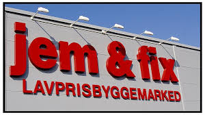


Kim er ansat i firmaet jem og fix i Odense. Han blev ansat som salgsassistent den 1. januar 2013. 

Han er meget dygtig og meget omhyggelig med sit arbejde og bliver efterhånden meget vellidt af kunderne - både de lokale håndværkere og de private kunder. 

Den 1. januar 2014 bliver Kim forfremmet til butikschef for afdelingen i Odense.

En af hans gamle klassekammerater Andreas er flyttet til Odense, hvor han har købt et helt nyt hus og skal til at etablere haven. 

Andreas kommer til jem og fix og møder Kim. De får snakket om gamle dage, og Andreas afgiver en ordre på fliser til en stor terrasse, materialer til et flot plankeværk og et sæt havemøbler i træ til 8 personer.

Andreas mener, at Kim må give en god rabat på sådan en stor ordre. Andreas får forhandlet sig frem til 25 % i rabat. 

Kim er egentlig ikke så glad bagefter, for han har en aftale med hovedkontoret om, at der max. må gives 10 % i rabat.

Andreas har lige startet sit eget firma, Swim der sælger havebassiner. Andreas præsenterer Kim for produkterne, og han får solgt 5 stk. havebassiner til jem og fix til en samlet pris på 15.000 kr. 

Kim må ellers slet ikke købe varer ind, da det skal foregå centralt.

Karina blev ansat den 1. april 2012 som salgsassistent. 

Hun er nu i maj 2014 begyndt at sygemelde sig om mandagen og passer ikke sit job, som hun plejer. Kim kalder Karina ind til en samtale. 

Han forklarer hende, at det ikke kan fortsætte, og hun lover at tage sig sammen, men hun har haft nogle problemer med sin mave. 

Hun mener, det skyldes den travlhed, der er i firmaet. 

Kim lægger mærke til, at Karina forbedrer sig i de næste par måneder. 

Men i august 2014 er den gal igen. Karina har endnu mere fravær og er blevet endnu dårligere til sit arbejde. Kim vil gerne af med hende nu.

Sanne blev ansat som ansvarlig for afdelingens lager den 1. marts 2011. 

Hun er rigtig god til sit job og har ikke fravær og går ikke altid til tiden. 

Hendes beføjelser drejer sig om at styre lageret – altså hvor varerne skal være og sikre, at der gives besked til indkøbsafdelingen, hvis en vare er ved at være udsolgt.
 
Sanne bor sammen med Torben. Hendes svigerforældre har inviteret hende og Torben 1 uge til Paris i den sidste uge af juni. 

Det er hun meget glad for, da det altid har været en af hendes drømme at komme til Paris. 

Sanne spørger Kim om at få ferie i den uge. Kim bliver helt ude af den, da det er den uge, de kører et stort tema om haven, og de har en masse gode tilbud. 

Af erfaring ved Kim, at der er meget travlt.

**Eksamensspørgsmålene:**

1.	Er jem og fix bundet af de aftaler som Kim har indgået med Andreas?

2.	Hvilke muligheder har jem og fix for at opsige Karina?

3.	Har Sanne krav på at holde ferie så hun kan komme til Paris? 
    

**Vejledende løsning fyld gerne selv på**:

1. Er jem og fix bundet af de aftaler som Kim har indgået med Andreas? Rabatten er jem og fix bundet af, da inden for stillingsfuldmagten, men udenfor bemyndigelsen, men Andreas i god tro. De 5 havebassiner er måske også indenfor stillingsfuldmagten, men udenfor bemyndigelsen, og spørgsmålet er om Andreas er i god eller ond tro. Næppe OK.

---

2.	Hvilke muligheder har jem og fix for at opsige Karina? Sygdom er jo lovligt forfald, men er de utilfredse med hende, bør hun have skriftlig advarsel, og hvis forholdene ikke forbedres, kan hun afskediges senere. Hvis hun afskediges nu, er hun formentligt berettiget til funktionærlovens § 2b-godtgørelse + 3 mdrs. opsigelsesvarsel. 

---

3.	Har Sanne krav på at holde ferie så hun kan komme til Paris? Det kommer an på, hvornår hun spørger om at få fri. Ferien ligger jo i hovedferien og det skal normalt varsles af medarbejderen med mindst 3 ugers varsel (som jeg husker det) og gør hun det, har hun krav på at komme afsted. I øvrigt dårlig stil at nægte hende at tage af sted pga. travlhed, da det jo egt. ikke er hendes problem.

---

**Video: Sådan laver du selv en Fuldmagt**

<div class="video-container"><iframe src="https://www.youtube.com/embed/oeIre44pjQU" width="853" height="480" frameborder="0" allowfullscreen="allowfullscreen"></iframe></div>


---


<!--chapter:end:05.Rmd-->


# Forbrugeraftaler og forbrugerbeskyttelse

```{r, echo=FALSE, results='asis'}
cat(readLines('np.html'))
```


---

**Indledningsvis skal du som studerende være særlig opmærksom på følgende problemstillinger ved gennemgangen af "forbrugeraftaler og forbrugerbeskyttelse":**


•	**Forbrugerbeskyttelse ved erhvervelse af fast ejendom; fortrydelsesret og tilbud, tilbagekaldelse og sælgers accept, LFFE kapitel 2** 
  
•	**Forbrugeraftaleloven, §§ 3-6** 

•	**Fortrydelsesret, §§ 18-24** 

•	**Uanmodet henvendelse (forbrugeraftalelovens § 4 og markedsføringslovens § 10)**
  
--- 

## Introduktion til forbrugeraftaleloven

Forbrugeraftalelovens (FBL) formål:.^[Følgende afsnit om forbrugeraftaler bygger på *Sonny Kristoffersen*: ”Kend forbrugerkøbsreglerne”, 2018, Samfundslitteratur.]

* Beskyttelsespræceptiv – loven kan ikke fraviges til skade for forbrugeren, FBL § 33, men forbrugeren kan godt stilles bedre end, hvad lovgivningen tilsiger.


Forbrugeraftale: Indgås mellem to parter, hvor den erhvervsdrivende indgår aftalen som led i sit erhverv, mens den anden part (forbrugeren) handler uden for sit erhverv, jf. FBL § 2, stk. 1.


Erhvervsdrivende formidlere: En erhvervsdrivende formidler, der skaber kontakt imellem private handlende, skal også overholde forbrugeraftaleloven

– se sag om QXL (internet-auktionsudbyder).


 
Skærpede krav ved B2C ift B2B: Virksomheder, der handler med forbrugere, skal overholde forbrugeraftaleloven.

*Bevisbyrde* - aftaletype: Den erhvervsdrivende, som påstår aftalen ikke er en forbrugeraftale, har bevisbyrden, jf. FBL § 2, stk. 2.


Forbrugerombudsmanden(FOB): Særligt FOB fører tilsyn med at FBL overholdes – se www.forbrug.dk
 

## Forbud mod uanmodet henvendelse


Hovedregel: Forbud mod uanmodet telefonisk eller direkte personlig henvendelse til forbrugere på deres bopæl, arbejdsplads, skoler, gymnasier, universiteter eller andre steder, hvor der ikke er almindelig adgang, fx også foreninger, hvis henvendelsen fra virksomheden har til formål at opnå en aftale med forbrugeren, jf. FBL § 4, stk. 1.
 


Undtagelser: FBL § 4, Stk. 2 – telefoniske henvendelse må gerne ske hvis det handler om:

* Bestilling af bøger,

* Tegning af abonnement på aviser, ugeblade og tidsskrifter

* Formidling af forsikringsaftaler og

* Tegning af abonnement, der omfatter redningstjeneste eller sygetransport.


 
## Telefonsalg
 
Ved telefoniske henvendelser omfattet af FBL § 4, Stk. 2, bestilling af bøger, abonnementer på aviser mv. skal forbrugeren ved hvert opkald have oplysning om:
 
* Den erhvervsdrivendes identitet

* Navnet på den person, som forbrugeren er i kontakt med i telefonen

* Telefonsælgerens forbindelse til den erhvervsdrivende, og

* Det kommercielle formål med telefonhenvendelsen.

 
Virksomheden skal tjekke	Robinson-listen inden henvendelse ellers er det en overtrædelse af markedsføringslovens § 10, stk. 4, nr. 2 og 3.

Derudover gælder markedsføringslovens § 10, stk. 6: Den erhvervsdrivende skal ved den første henvendelse til forbrugeren, oplyse om retten til at frabede sig uanmodede henvendelser fra den erhvervsdrivende i fremtiden.

---

## Salg uden for den erhvervsdrivendes faste forretningssted

Henvendelse fra en erhvervsdrivende må gerne ske:

* På offentlige steder, hvortil der er almindelig adgang, fx gader, veje, pladser og andre steder som fx togstationer og restauranter. Der kan dog være andre forbudsregler på de steder.

* Til virksomheder og offentlige institutioner, hvis henvendelse vedrører tilbud om bestilling af varer og ydelser, der anvendes i virksomheden/institutionen.

* På bopælen, hvis det ikke har med erhvervsmæssigt salg at gøre, fx henvendelser vedrørende religion, indsamlinger til velgørende formål, salg af lodsedler, spørgsmål i forbindelse med markedsundersøgelser mv.

 
*Aftalen er ugyldig*: Aftaler indgået i strid med FBL § 4 er ugyldig, jf. FBL § 5. Forbrugeren kan godt fastholde aftalen uanset ugyldighed

*Bødestraf*: Det kan være forbundet med bødestraf, for virksomheden, at handle i strid med forbrugeraftaleloven, jf. FBL § 34 - se H&M sag om opringninger på mobiltelefoner.


*Robinson-listen*: En forbrugers tilmelding til Robinson-listen skal forhindre henvendelser fr virksomheder om produkter omfattet af FBL § 4, stk. 2. Overtrædelse straffes med bøde.

--- 

## Forbud mod negativ aftalebinding

En forbruger kan som udgangspunkt ikke blive bundet ved sin passivitet, jf. fbl § 6.

Ses særligt inden for TV/sattelitaftaler,IT/internetforbindelser, avis- og blad abonnementer

Hvis en forbruger modtager en vare fra en virksomhed, som han ikke har bestilt, og det ikke skyldes en fejl, kan forbrugeren beholde varen uden at skulle betale.

Det samme gælder for tjenesteydelser/arbejde som en erhvervsdrivende udfører, uden at forbrugeren har bedt om det.

Området er tæt forbundet med princippet om god markedsføringsskik, jf. markedsføringslovens § 3 og god erhvervsskik i denne lovs § 4. 

Det kan også være en vildledning af forbrugerens retsstilling, jf. markedsføringslovens § 5.

---

## Aftaler indgået uden for den erhvervsdrivendes forretningssted


Aftalen er indgået et andet sted end der hvor den erhvervsdrivende sælger har sit forretningssted, fx

Homeparties, salgsdemonstrationer under udflugter, udstilling/messe, marked.
 
Den erhvervsdrivende har pligt til at give tydelig skriftlig oplysning om fortrydelsesretten og hvortil henvendelse kan ske. 

Oplysning skal gives:

* Ved mødet med forbrugeren.

* Ved varesalg – når varen overgives eller leveres fysisk til  
  forbrugeren.

Fortrydelsesfristen begynder først at løbe, fra det tidspunkt forbrugeren modtager oplysningerne, hvis de ikke modtages, så udskydes fortrydelsesfristens begyndelsestidspunkt med 12 måneder, se nærmere nedenfor.

---

### Fjernsalg


"Fjernsalg" er en aftale om salg af varer eller salg af tjenesteydelser, eller aftale om løbende levering af varer eller  tjenesteydelser.
  
Aftalen indgås på afstand ved fjernkommunikation, fx e-handel, aftale indgået pr. e-mail, telefonsalg, katalog- og postordresalg.
  
Den erhvervsdrivende og forbrugeren mødes ikke fysisk ved aftalens indgåelse. Forbrugeren har ikke haft mulighed for at afprøve eller   undersøge salgsgenstanden.

Aftalen skal være indgået, som led i et system for fjernsalg, og den skal drives af den erhvervsdrivende, fx en aftale om køb, indgået via virksomhedens hjemmeside.
 

I rimelig tid inden aftalen indgås,	skal den erhvervsdrivende give forbrugeren oplysninger, fx om:

* Den erhvervsdrivendes navn og forretningsadresse, tlf. numre-mailadresse m.v.
  
* Varens eller tjenesteydelsens vigtigste egenskaber.

* Den samlede pris, inkl. gebyrer, moms og afgifter, øvrige ekstraomkostninger, fx til levering, bestillingstakster, servicetakst.
  
* Betalingsvilkår, leveringsvilkår, aftaleperiode, eventuel uopsigelighedsperiode og opsigelsesvilkår.
  
* Oplysninger om der er fortrydelsesret og hvordan den kan udøves, herunder om forbrugeren skal betale for tilbagelevering af en vare
  
* Oplysningerne skal være klare og forståelige.
 
* Oplysningerne skal meddeles på papir eller andet varigt medium.

* Snarest muligt efter aftalens indgåelse, skal der gives oplysninger om:
  
* Fortrydelsesfristens begyndelsestidspunkt

* Betingelserne for at fortryde

* Fremgangsmåden ved forbrugerens brug af fortrydelsesretten og

* Hvortil/til hvem fortrydelse kan meddeles.

---

Ved køb af varer som skal sendes til forbrugeren, skal oplysning om fortrydelsesfristen gives senest ved varen overgivelse. Hvis oplysning først kommer frem senere, løber fristen fra oplysningerne er modtaget.

Hvis der ikke modtages nogen oplysninger om fortrydelsesretten så udskydes fortrydelsesrettens begyndelsestidspunkt med 12 måneder
 
---

***Varer og ikke-finansielle tjenesteydelser:***  

**Forsinkelse med levering**

 
Hvis leveringstidspunkt ikke er aftalt: Varen/tjenesteydelsen skal leveres inden 30 dage fra bestillingen, jf. FBL § 27, stk. 1.

Forbrugeren kan hæve aftalen hvis forsinkelsen er væsentlig for forbrugerne og den erhvervsdrivende burde forudsætte dette.

Forbrugeren kan vælge at give en frist for levering, overholdes den ikke, kan aftalen hæves.

Hvis en aftale hæves skal hver part tilbagelevere hvad de hver især har modtaget.

Den erhvervsdrivende skal tilbagebetale penge til forbrugeren, senest 30 dage fra den erhvervsdrivende har modtaget besked om, at forbrugeren vil fortryde

 
---

### Forbrugerens fortrydelsesret i forbrugeraftaleloven

Fortrydelsesret: En ret for forbrugeren til uden angivelse af begrundelse, at træde tilbage fra e aftale, som ellers ville være bindende for forbrugeren.
 

HR: Ingen fortrydelsesret i dansk ret i den fysiske handel, med mindre den er aftalet, fx har Elgiganten en aftalt returret i sine fysiske butikker.

Undtagelse: FBL § 18, stk. 1, hvor der er lovgivet om en fortrydelsesret:

* Forbrugeraftaler indgået ved fjernsalg.

* Forbrugeraftaler indgået uden for fast forretningssted.
 
---

**Fortrydelsesret: Andre særregler:**

Fortrydelsesret ved køb af fast ejendom, jf. lov om forbrugerbeskyttelse ved erhvervelse af fas ejendom:

* En køber kan fortryde et køb af en fast ejendom i 6 hverdage fra aftalens indgåelse mod samtidig betaling af en godtgørelse til sælger på 1% af kontantkøbesummen.

Fortrydelsesret ved indgåelse af forsikringsaftaler:

* 14 dage fra forsikringsaftalens indgåelse, og 30 dage hvis aftale om livsforsikring eller individuelle pensionsordninger, FAL § 34i-k
 
---

**Fortrydelsesfristen 14 dages beregning**:

 
Fortrydelsesfristen beregnes fra forskellige tidspunkter, jf. FBL § 19, stk. 2 – aftale om køb af:

* Tjenesteydelse – beregnes fra aftalens indgåelse

* Flere varer der leveres enkeltvis – beregnes når den sidste vare er i forbrugerens fysiske besiddelse

* Flere varer der leveres i partier – beregnes fra det sidste parti er i forbrugerens fysiske besiddelse

* Varer der leveres regelmæssigt over en periode – beregnes fra den første vare er i forbrugerens besiddelse

* Levering af vand, gas , elektricitet m.v. samt varer med digitalt indhold – beregnes fra aftalens indgåelse

* Den dag, hvor forbrugeren har modtaget de oplysninger om fortrydelsesret mv., som det påhviler den erhvervsdrivende at give   forbrugeren på papir eller andet varigt medium.
 
---

Forbrugeren har fortrydelsesret i:

* Forbrugeraftaler indgået ved fjernsalg

* Forbrugeraftaler indgået uden for den erhvervsdrivendes forretningssted fx på en messe i Bellacentreret
 
* Forbrugeren skal meddele sin fortrydelse ved en utvetydig erklæring evt. bruge standardfortrydelsesformular
  
* Meddelelse om fortrydelse skal være afsendt inden fristens udløb

* Forbrugerne skal have sine penge tilbage

* Forbrugeren skal sende varen tilbage senest 14 dage efter at den erhvervsdrivende har modtaget besked om fortrydelse
  
* Forbrugeren bærer risikoen for varen

* Ved værdiforringelse (forskellen mellem ny-pris og gensalgspris) skal forbrugeren betale. Der kan fradrages i den købesum den erhvervsdrivende skal tilbagebetale til kunden

---

### Retsvirkning ved fortrydelse

Ved tilbagetræden fra aftalen inden fortrydelsesfristens udløb, bortfalder aftalen, og:

* Hver part tilbageleverer ydelse/modydelse.

* Hvis forbrugeren har betalt helt eller delvis, skal det modtagne tilbagebetales til forbrugeren.
  
* Tilbagebetaling skal ske snarest muligt og senest 30 dage efter, at den erhvervsdrivende har modtaget forbrugerens meddelelse om ophævelse.
  
* Den erhvervsdrivende kan vente indtil varen er returneret eller indtil forbrugeren har dokumenteret at varen er tilbagesendt

--- 

### Fjernsalg - Finansielle tjenesteydelser


#### Oplysningspligt, FBL § 14

Den erhvervsdrivende skal bl.a. give oplysninger om:

* CVR-nummer, eller andet relevant identifikationsnumme.r

* Klageadgang og fremgangsmåden ved klage, herunder oplysning om en fysisk adresse.
  
* Fortrydelsesfristens begyndelsestidspunkt, varighed og betingelserne for og fremgangsmåden ved brug af fortrydelsesretten.
  
* Eventuelle særlige risici ved tjenesteydelsen som følge af ydelsens særlige karakter.
  
* En eventuel lovvalgs- eller værnetingsklausul i aftalen. 

* Forbrugeren skal have oplysningerne på papir eller et andet varigt medie.

En manglende overholdelse af pligten, kan straffes med bøde.

---

#### Fortrydelse - Fjernsalg af finansielle tjenesteydelser

**Finansiel tjenesteydelse:**

* Enhver tjeneste, der har karakter af bank-, kredit, forsikrings-, individuel pensions-, investerings- eller betalingstjenesteydelse.

---

**Fortrydelsesfristen**

* 14 dage fra aftalens indgåelse, eller fra det tidspunkt forbrugeren har modtaget oplysning om fortrydelsesret.


* 30 dage ved aftaler om individuel pensionsordning, FBL § 19, stk. 1.
  
---

**Tilbagebetale**  

* Den erhvervsdrivende skal tilbagebetale eventuelt modtagne beløb snarest mulig og inden 30 dage efter forbrugerens underretning om fortrydelse er kommet frem.

 
---

#### Fjernsalg - Finansielle tjenesteydelser: Fremgangsmåde ved fortrydelse


Der skal ske underretning til den erhvervsdrivende om, at forbrugeren vil bruge fortrydelsesretten. Underretning skal være afsendt inden udløb af fortrydelsesfristen.
  
Forbrugeren har bevisbyrden for at meddelelsen er sendt.

Meddelelsen om forbrugerens fortrydelse, skal være utvetydig – standardfortrydelsesformular.
 
---

## Urimelige aftaler

Urimelige aftaler kan tilsidesættes helt eller delvis. 

Generelle betragtninger- vurdering:

* Stridende mod hæderlig forretningsskik, jf. aftalelovens §§ 38c, stk 1, jf. 36.
  
* Redelig handlemåde.

AFTL §§ 38a – 38 d – særligt kapitel om forbrugeraftaler:

Ved tvivl om indholdet af en forbrugeraftale, tolkes aftalen til fordel for forbrugeren (koncipistreglen).

Aftaler skal være udarbejdet på en klar og tydelig måde, jf. aftalelovens § 38 b.
  
Aftalelovens § 36 – om redelig handlemåde.
 

---

## Løbende tjenesteydelser/abonnementer

En forbruger kan opsige en aftale om løbende levering af varer eller tjenesteydelser med 1 måneds varsel til udgangen af en måned, når der er gået 5 måneder efter aftalens indgåelse, jf. FBL § 28, stk. 1, fx abonnementslignende aftaler.


---

## Quiz

**Quiz: E-handel**


Kan du fortryde dit køb, når du handler på nettet? Hvad gælder for levering? Og hvad kan du gøre, hvis varen ikke dukker op? <a href="https://www.forbrug.dk/quiz/ehandelsquizzen/?rn=43716" target="_blank">Tag quizzen fra forbrug.dk, og få svar.</a>

---

**Quiz: E-handel og rejser**


Bestiller du rejser på nettet? Der gælder særlige regler ved handel på nettet, som du skal være opmærksom på. <a href="https://www.forbrug.dk/quiz/e-handel-og-rejser/?rn=43716" target="_blank">Få styr på reglerne med forbrug.dk's quiz.</a>

---

**Quiz: Elektronik**


I forbrug.dk’s quiz kan du teste, hvad du har ret til, hvis dit elektroniske udstyr, fx dit kamera, din computer eller din mobiltelefon, går i stykker. <a href="https://www.forbrug.dk/quiz/elektronik/?rn=43716" target="_blank">Tag testen her.</a>

---

**Quiz: Forbrugerrettigheder**


Har du styr på, hvad du har ret til som forbruger? Jo mere du ved, jo bedre er du klædt på, når du står i butikken eller handler på nettet. <a href="https://www.forbrug.dk/quiz/forbrugerquizzen/?rn=43716" target="_blank">Test din viden her.</a>

---

**Quiz: Kopivarer**


Har du styr på, om du må eje kopivarer i Danmark? Eller om du må tage dem med hjem fra et andet land? <a href="https://www.forbrug.dk/quiz/kopivarequizzen/?rn=43716" target="_blank">Prøv forbrug.dks quiz om kopivarer, og bliv klogere her.</a>


---


<!--chapter:end:06.Rmd-->

# Erstatningsreglerne og den forsikringsmæssige afdækning

```{r, echo=FALSE, results='asis'}
cat(readLines('np.html'))
```


**Indledningsvis skal du som studerende være særlig opmærksom på følgende i forbindelse med gennemgangen af erstatningsansvar og den forsikringsmæssige dækning i forhold til eksamen:**


•	**Grundlæggende erstatningsbetingelser; ansvarsgrundlag, årsagsforbindelse, påregnelighed, økonomisk tab og værnet interesse**

  
•	**Principalansvar (arbejdsgiverens hæftelsesansvar i DL 3-19-2)**

•	**Ansvarets sammenhæng med forsikringsdækning, erstatningsansvarslovens (forkortet; EAL) §§ 19 – 23** 

**OBS: Videoerne, domme og Forsikringsankenævnets afgørelser i herværende afsnit er ikke en del af pensum, man tjener udelukkende det formål, at bidrage med en bedre forståelse for emnerne om erstatningsansvaret og den forsikringsmæssige afdækning.**

---

**Video: Introduktion til erstatningsretten**


<div class="video-container"><iframe src="https://www.youtube.com/embed/aUJNx9bEge4" width="853" height="480" frameborder="0" allowfullscreen="allowfullscreen"></iframe></div>


---

## Erstatningsansvar uden en lovgivning

Tegning af en forsikring kan påvirke ens erstatningsansvar. Ligesom manglende tegning af en forsikring kan påvirke ens erstatningsansvar.^[Følgende afsnit om erstatningsansvaret og den forsikringsmæssige afdækning bygger hovedsagelig på **Sonny Kristoffersen** bøger "Kend Erstatningsreglerne", forlaget Samfundslitteratur, se e-bogens bibiotek, samt "Introduktion til forsikringsreglerne", forlaget Hans Reitzel, se e-bogens bibliotek.]

Et ansvarsforsikringsselskab beskæfter sig indgående med erstatningsreglerne for at vurdere, om skadevolderen (dvs. forsikringstageren) har pådraget sig et erstatningsansvar over for en skadelidt. 

Ofte findes der ingen lovgivning, som kan fortælle, hvornår man som privatperson er ansvarlig for en skade. 

I stedet er der ud af mange års domspraksis udledt en erstatningsregel, der kaldes *“den almindelige erstatningsregel”*. 

Denne regel fastslår, at man er ansvarlig for den økonomiske skade, som man har forvoldt ved uagtsomhed eller med vilje. 

Reglen hedder også culpa- eller skyldreglen ("culpa" betyder "skyld" på latin eller brøde, uagtsomhed, forseelse, synd). 

Culpa, er den grundlæggende betingelse for at pålægge erstatningsansvar uden for kontraktforhold. 

En skadevolder har udvist culpa, optrådt culpøst, overtrådt culpareglen, hvis han eller hun har handlet enten forsætligt, dvs. med vilje og viden om handlingens elementer, eller uagtsomt. 

Se følgende domme om erstatningsansvaret:  


---  


Se dommen *"FED 2012.2*: Landsretten fandt, at en tilskuer, der ved strafbar handling løb ind på fodboldbane og afbrød landskamp, var erstatningsansvarlig for DBU’s tab ved, at næste landskamp blev flyttet til en mindre  bane samt ved betaling af bøde til UEFA (1.869.269 kr. plus renter). Der forelå ikke egen skyld eller anledning til at reducere ansvaret efter EAL (erstatningsansvarsloven) § 24.

---


Se dommen **FED 2006.78:** Ansvarspådragende efter culpareglen, at en person, der kørte i en lånt bil, ikke sikrede sig, at der var olie og vand på bilen, uagtet temperaturlampen  lyste og uagtet, at han kort forinden med få dages mellemrum havde været nødsaget til at påfylde olie og vand. (Utrykt)


Se dommen **U 2015.572 H** (U: Ugeskrift for Retsvæsen): Tobaksselskaber ikke ansvarlige for varigt mén som følge af mangeårigt forbrug af cigaretter.

---     

Man er kun erstatningsansvarlig for skader, der kan gøres op i penge (økonomisk tab, som den skadelidte skal kunne bevise). 

Ved tingsskader vil det være værdien af eller reparation af det ødelagte. 

Ved personskader bliver det økonomiske tab beregnet efter reglerne i Lov om erstatningsansvar (forkortet; EAL). 

Det er f.eks. erstatning for varige mén, tabt arbejdsfortjeneste eller tab af forsørger. 

Se følgende domme, hvor der idømmes erstatningsansvar i forskellige situationer:  

---  


Se dommen **FED 2012.3:** A, der sad uden for golfbanens cafeteria, blev ramt i hovedet af golfbold, da B – som deltager i en polterabend – under golfspil kom til at slå bolden for langt. B, der kun én gang tidligere havde prøvet at spille golf og ikke havde modtaget undervisning heri, fandtes erstatningsansvarlig.*


Se dommen **FED 2009.114:** En kvinde, som faldt i søvn som fører af en bil, påkørte og dræbte en modkørende bilist. Hun blev idømt en fængselsstraf på 10 måneder, men hendes kørsel kunne ikke karakteriseres som særlig hensynsløs, hvorfor afdødes ægtefælle ikke havde krav på godtgørelse i medfør af EAL § 26 a.*

---

Se dommen **FED 2008.1:**   En mandlig stripteasedanser B ansvarlig for øjenskade på deltager A i kvindelig polterabend, da B affyrede konfettirør. Ikke grundlag for at nedsætte erstatningen som følge af egen skyld eller accept af risiko.

<br><br><br><br>


---     

## Hændeligt uheld - uden ansvar


Er skaden forvoldt ved et *hændeligt uheld*, har vedkommende ikke gjort noget forkert og er ikke ansvarlig for skaden. 

Man skal heller ikke erstatte noget. 

Åbner en hotelgæst eksempelvis døren til sit værelse indefra, i det øjeblik en tjener går forbi på gangen med en bakke med glas, og døren rammer bakken, så glassene falder på gulvet og knuses, er der tale om et hændeligt uheld. Uheldet kan ikke bebrejdes hotelgæsten, da han ikke havde mulighed for at undgå det. Han havde opført sig som “den gode hotelgæst” og ikke begået nogen fejl. 

Se afgørelserne fra retspraksis og Forsikringsankenævnet om spørgsmålet om hændelige skader:

---     

**U.1961.167 H**: At en 11-årig dreng kom til at ramme en anden dreng med en kæp i øjet, blev anset for et hændeligt uheld og derfor ikke noget erstatningsansvar.

**FED 1998.584:** Ejeren af sommerhus til udlejning havde ikke pådraget sig erstatningspligt ved, at en lejers barn kom til skade, da et sofabord, der var en del af sommerhusets møblement, væltede.

---

Afgørelser fra Ankenævnet for Forsikring:

**Ankenævnskendelse i sag nr. 35.936:** Klagers “griben ud efter” sit 15 måneder gamle barn, der var ved at falde, hvorved cigaretglød ødelagde en sofa, ikke anset som uagtsom adfærd, derfor ikke nogen erstatningspligt for sofaen.

**Ankenævnskendelse i sag nr. 39.737:** Gæstebudsskade at tabe kaffebakke under forsøg på at undgå at træde på et barn. Ikke erstatningsansvar, men dækket som gæstebudsskade over personens ansvarsforsikring.

**Ankenævnskendelse i sag nr. 51.809**: 8-årigt barn faldt over egne ben og væltede vase. Ikke erstatningsansvar, men dækket som gæstebudsskade.

---

*Gæstebudskade*: Hvis en gæst kommer til at ødelægge noget hjemme hos værten, fx vælter en dyr vase eller spilder rødvin på et tæppe, kaldes det for en gæstebudsskade. Ved gæstebudsskader er gæsten normalt ikke erstatningsansvarlig. Man har derfor ikke krav på erstatning. Som vært må man altså acceptere, at der er en vis risiko, når man har nogen på besøg.

Nogle indboforsikringer – bl.a. Topdanmarks – dækker gæstebudsskader alligevel. Det anbefales derfor, at man beder gæsten kontakte sit forsikringsselskab, da de måske dækker skaden. I så fald vil man få erstattet skaden fratrukket forsikringens selvrisiko.

---

Se dommen **FED 2003.1091:** Hønseejer var ikke ansvarlig for cyklists tilskadekomst, da cykel på landevej ramte fritgående høne.

Se dommen **U 2013.84 V:** Motionscyklist, der sammen med andre cyklister kørte i en gruppe, og som efter at være kommet ud i rabatten prøvede at komme op på vejen igen, hvorved han væltede, og der skete sammenstød med bagfrakommende cyklister, havde ikke handlet ansvarspådragende.

**H.K. af 24. juni 2002. Sag: 206/2002:** Museum var ikke ansvarligt for tilskadekomst, da gæst under privat besøg gled i hundeekskrementer og faldt.

---          

## Handlet forkert eller undladt at handle

Har skadevolder handlet forkert – dvs. er ansvarlig – er det vigtigt at finde ud af, om skaden er forvoldt ved en simpel uagtsomhed, grov uagtsomhed eller med forsæt (med vilje). 

Denne vurdering af handlingen eller undladelsen har bl.a. betydning for, om skadevolderens ansvarsforsikring skal betale for skaden hos skadelidte. 

---

Se her følgende domsafgørelser fra retspraksis:  


**FED 2016.122:** Diskotek erstatningsansvarlig for personskade opstået ved, at diskotekets dørmand gik ud over det nødvendige og forsvarlige ved at skubbe eller kaste skadelidte ud af diskotekets dør.

**Ø.L.D. af 12. maj 2005. Sag: 20. afd., a.s. nr. B-2581-04:** Værtinde ifaldt erstatningsansvar, fordi hun bar et sofabord ned ad en trappe iført højhælede sko og uden at fjerne noget nips, der indskrænkede trappearealet, hvilket forårsagede, at hun tabte bordet, som ramte en gæst i hovedet. (Utrykt)


---     


## Den almindelige fornufttige person


Når en domstol bedømmer, om skadevolder har handlet forkert, sammenligner domstolen skadevolderens handling med, hvordan en almindelig fornuftig person ville have handlet i samme situation.

Begrebet repræsenterer en uagtsomhed en adfærd, der afviger fra de adfærdsnormer, der gælder inden for det pågældende område.

Kommer en domstol til det resultat, at en skadevolder har handlet anderledes, end hvad en alimindelig fornuftig person ville have gjort i samme situation, har skadevolderen handlet forkert og vil blive pålagt et erstatningsansvar.

Det skal bevises af skadelidte (kaldet en ”*ligefrem bevisbyrde*”). Det er hovedreglen i dansk ret; Den der vil gøre noget gældende, har også bevisbyrden herfor.

For at kunne få erstatning fra en skadevolder skal skadelidte ifølge retspraksis (domstolene) bevise følgende over for retten: 


*	Der er sket en skade og lidt et tab. 

*	Det er skadevolders skyld – skadevolder har handlet uagtsomt eller med forsæt.  

*	Der er årsagssammenhæng ("*kausalitet*") mellem den skete skade og det lidte tab, dvs. at tabet er en direkte følge af skaden.  

*	Der er påregnelighed ("*adækvans*") mellem skaden og tabet, dvs., at skadevolder burde kunne forudse, at skaden ville ske.  

Kan skadelidte ikke bevise det, er det ikke muligt at få erstatning fra en skadevolder eller dennes ansvarsforsikring, se følgende dom:

---     

Se dommen **FED 2007.111:** Forsikringstager havde ikke dokumenteret, at der var årsagsforbindelse mellem nogle anførte lidelser og et færdselsuheld.


---     


## Ansvar for ikke at gøre noget

Det er ikke kun handlinger, man kan blive erstatningsansvarlig for. 

I visse tilfælde kan man også blive erstatningsansvarlig for sine undladelser. 

Det sker oftest i situationer, hvor der er pligt til at handle. 

Eksempler er husejeren, der ikke gruser et isglat fortov, eller forældre, der ikke holder øje med deres børn.

---

## Ansvar for psykiske personskader


Udover at der kan tilkendes erstatningsansvar ved tingsskader samt fysiske personskader, så kan der være erstatningspligt for psykiske personskader. 


---

Se her nævnte domme:  


**U.2012.524 H:** A blev sygemeldt efter et begivenhedsforløb på en personaleweekend og rejste krav om godtgørelse for svie og smerte mod kommunen K som arbejdsgiver. Begivenhedsforløbet vedrørte en følelsesladet drøftelse i plenum af A’s sygdomsfravær, som ifølge A endte med, at hun i overværelse af sine kollegaer reelt blev fyret. K bestred ikke, at A var blevet påført en psykisk skade som følge af begivenhedsforløbet, og parterne var enige om opgørelsen af godtgørelseskravet. Højesteret udtalte bl.a., at udtrykket “personskade” i erstatningsansvarslovens § 1 må forstås i overensstemmelse med dansk rets almindelige erstatningsregler, og den psykiske skade, som A var blevet påført, var omfattet af bestemmelsen. Højesteret fandt endvidere, at personaleweekenden i forhold til A blev afviklet på en uforsvarlig måde, og at dette var ansvarspådragende for K som arbejdsgiver. Den uforsvarlige afvikling af personaleweekenden medførte en betydelig forøgelse af risikoen for en psykisk skade hos en medarbejder, som ledelsen må have forstået befandt sig i en psykisk anspændt situation, og Højesteret fandt, at A’s psykiske skade var en påregnelig følge. A var direkte skadelidt som følge af den ansvarspådragende adfærd, og der var ikke grundlag for at anse den psykiske skade for at falde uden for, hvad der var omfattet af kommunens erstatningspligt. K skulle herefter betale 50.000 kr. til A for svie og smerte. Landsretten havde frifundet K.


**U 2010.1609 H:** Psykisk personskade anset for omfattet af ulykkesbegrebet i ulykkesforsikring.

---

## Simpel uagtsomhed

Ved simpelt uagtsomhed (Latin: culpa levis), har skadevolder handlet mere skødesløst, end hvad en almindelig fornuftig personen ville have handlet i den samme situation – den lille dagligdags uagtsomhed – er skadevolder erstatningsansvarlig. 

Simpel uagtsomhed er en uagtsomhed som ikke kan betegnes som grov. 

Culpareglen omfatter som hovedregel begge former for uagtsomhed.

Forsikringsankenævnet og domstolene foretager et konkret skøn, om skadevolder har handlet simpelt uagtsomt. 

Hvis eksempelvis en fodgænger træder ud på vejbanen uden at se sig for og rammer en forbikørende cyklist, der vælter, kan uheldet bebrejdes fodgængeren, der har været mere skødesløs end “den gode fodgænger”. 

Derfor er fodgængeren erstatningsansvarlig for cyklistens økonomiske tab. 

---

Se følgende sager fra retspraksis og Forsikringsankenævnet, om spørgsmålet, om der er simpel uagtsomhed hos skadevolder:


Se dommen **U 1915.242 H**: (Uagtsom Brandstiftelse). En Tiltalt færdedes en Nat i et straatækket Udhus, hvor der henlaa Fourage og Halm, med en to Tommer lang; Lysestump, som han under sit Ophold i Udhuset tændte. Under sit Ophold i Udhuset røg han derhos Cigaret. Umiddelbart efter at Tiltalte havde forladt Udhuset, viste det sig, at der var Ild i dette, der nedbrændte. Antaget, at Tiltalte havde foraarsaget Ilden, og at der forelaa Tilsidesættelse af almindelig Forsigtighed.

---

Ankenævnet for Forsikring:


**Ankenævnskendelse i sag nr. 03.256**: Da forsikringstageren, som under pasning af skadelidtes blomster havde forvoldt skade på dennes gulvtæppe, ikke fandtes at have udvist et så uforsvarligt forhold, at han ville kunne gøres ansvarlig for skaden, var selskabet berettiget til at afslå at erstatte denne. (Utrykt).


**Ankenævnskendelse i sag nr. 03.308:** Da forsikringstageren, som under arbejde i sin svigerfars lejlighed forvoldte skade på el-hovedkablet, ikke fandtes at have udvist et så uforsvarligt forhold, at han ville kunne gøres ansvarlig for skaden, var selskabet berettiget til at afslå at erstatte denne (utrykt).

---

## Grov uagtsomhed

Grov uagtsomhed (latin; "*culpa lata*") er en betydelig form for uagtsomhed. 

Nyere retspraksis lægger vægt på, om skadevolderens adfærd indebar en ”indlysende fare”, for den indtrådte skade. 

Skadevolderens bevidsthed om faren kan indgå i vurderingen af, om uagtsomheden er grov. 

Går en fodgænger over for rødt og vælter en cyklist, er fodgængeren nu mere uforsigtig end selv en skødesløs fodgænger. 

Det kan betegnes som grov uagtsomhed, og fodgængeren er erstatningsansvarlig. 

Det er en skønsmæssig vurdering, om domstolene og Ankenævnet for Forsikring anser en person for at have handlet groft uagtsomt.

---

Se her nævnte domme og ankenævnsafgørelser:

---


**U 1998.1693 H:** Opbevaring af nøglen til sikringsboksen i et auktionshus på et kontor i samme bygning var grov uagtsomhed.


**U 1999.1706 H:** Død ved fald på ca. 6 meter fra et tag ikke omfattet af ulykkesforsikring, da faldet var fremkaldt ved forsikredes forsæt eller grove uagtsomhed.


**U.1993.955 V:** Da kortvarig efterladelse af kuffert ved bagagebånd i lufthavn ikke var groft uagtsom, var tyveri af kufferten dækket af tyveriforsikringen.


**FED 2013.9:** Den 16-årige A ville ved ungdomsfest hjælpe værtinden med at tænde op i en udendørs pejs. I den forbindelse hældte han væske fra en dunk, som også værtinden havde benyttet i sit forsøg på at tænde op i pejsen, direkte ind i pejsen. Herved slog ilden tilbage og antændte A’s tøj samt dunken, som han i panik kastede fra sig. Den brændende dunk ramte en trækonstruktion og huset nedbrændte. Det viste sig, at væsken var benzin. Landsretten fandt, at A havde handlet groft uagtsomt, hvorfor hans ansvar ikke bortfaldt i medfør af erstatningsanvarslovens (EAL) § 19.


**FED 2010.93:** Forsikringsselskab fik ikke medhold i, at en 13-årig dreng udviste grov uagtsomhed da han startede en bygningsbrand ved at tænde en lighter samtidig med, at en kammerat to meter derfra hældte benzin på en knallert. Tillagt betydning bl.a., at benzindampe har en forholdsvis svag lugt og løber langs gulvet, og at der er store individuelle forskelle på menneskers lugtesans.

**FED 2001.2121:** Passager, som blev dræbt under bilkørsel med beruset fører, fandtes at have handlet groft uagtsomt, hvorfor hans livsarvinger ikke var berettiget til dødsfaldsdækning fra ulykkesforsikring.


**FED 2001.2255:** Bilist, som kørte ud foran tog i jernbaneoverskæring uden at være opmærksom på lys- og lydsignaler, havde handlet groft uagtsomt. DSB var derfor berettiget til at reducere personskadeerstatningen med 1/3.


**FED 1998.224:** 16-årig rulleskøjteløber havde udvist grov uagtsomhed ved at køre ud på kørebanen foran bil. Under henvisning til alder, til at handlingen var udført i kådhed samt til områdets karakter, fandtes der dog ikke grundlag for at nedsætte personskadeerstatningen.


**FED 2018.01 Ø.L.D. af 11. januar 2018. Sag: 20. afd. nr. B-583-17:** Den 14-årige A satte ild til papir i en affaldscontainer i en skolegård og forlod herefter stedet med den 13-årige B, der forholdt sig passivt til A's aktiviteter. Skolen brændte, og forsikringsselskabet F afholdt skadeudgifter på over 10 mio. kr. F gjorde regres med krav på 3 mio. kr. over for A og B. A fandtes at have handlet groft uagtsomt, men erstatningen blev reduceret til 1 mio. kr. efter EAL § 24a. B havde ikke handlet groft uagtsomt og blev derfor frifundet. [Processbevilingsnævnet har givet tilladelse til anke til Højesteret].

---

Ankenævnet for Forsikring:


**Ankenævnskendelse i sag nr. 20.217**: Kørsel på motorcykel med 1 hånd ikke grov uagtsomhed i familie-/indboforsikring, og selskabet skulle dække beskadiget tøj efter færdselsskade. (utrykt).


**Ankenævnskendelse i sag nr. 48.636**: Hasarderet kørsel under flugt fra politiet anset for grov uagtsomhed.


**Ankenævnskendelse i sag nr. 63.558**: Groft uagtsomt at efterlade ulåst bil med nøgler i tændingslås i flere timer på privat vej, men forholdsvis tæt på befærdet vej. (Utrykt)

---

## Forsæt (med vilje)

Forsæt, er en handling der er foretaget med vilje, er ikke i dansk ret en betingelse for at ifalde erstatningsansvar. 

At skadevolderen har udvist uagtsomhed, dvs. tilsidesat den agtpågivenhed, som kræves på det pågældende område, er som hovedregel tilstrækkeligt til at pålægge erstatningsansvar, 

Kaster en person en sten efter en cyklist for at ramme denne, og det lykkes, er skaden på cyklisten lavet med vilje – med forsæt. 

Skadevolderen er selvfølgelig også her erstatningsansvarlig. 

Hovedreglen er i dansk ret, at kun forsætlige forhold er strafbare, dog en vigtig undtagelse uagtsom drab. 

Ved forsætlige handlinger afviser skadevolders ansvarsforsikring at udbetale erstatning, se her nævnte sager om vurderingen om skadevolder har handlet med forsæt – med vilje:


---


**Forsikringsankenævnskendelse i sag nr. 15.569**: Skade på skolelokaler, forårsaget af 15-årig dreng ved udtømning af to pulverslukkere, anset forsætligt forvoldt, og derfor ikke dækket af ansvarsforsikringen. (utrykt)

---


Ved simpel og grov uagtsomhed er det hovedreglen, at en ansvarsforsikring dækker (se dog afsnittet nedenfor om generelt bortfald af ansvar). 

---

Forsætlige skader dækker forsikringen ikke, med mindre skadevolder er under 14 år.

---


Se Højesteretsdom **H.D. 19 december 2016 i sag 235/2015 (1. afdeling):** Skadelidte, der var sindssyg, forsøgte at begå selvmord ved at køre ind i en modkørende lastbil. Retten til erstatning for personskade bortfaldt som følge af forsætlig medvirken.

---

## Objektivt ansvar


I dansk ret kan der også gælde et såkaldt “*objektivt ansvar*”, hvorefter skadevolderen pålægges erstatningsansvar, selv om der ikke er handlet uagtsomt (uden skyld). 

Med andre ord er der situationer, hvor man kan blive ansvarlig, selv om skaden sker ved et hændeligt uheld. 

Objektivt ansvar er bl.a. lovfæstet i produktansvarsloven, jernbaneloven, luftfartsloven, lov om drift af nukleare anlæg, søloven, hundeloven, færdselsloven og lov om formidling af fast ejendom.

Se følgende dom over en ejendomsmægler:  

Se dommen **FED 1997.92:** I medfør af (dagældende) lov om omsætning af fast ejendom § 24 (nu § 47) måtte en ejendomsmægler på objektivt grundlag godtgøre en forbruger (sælger) forskellen mellem det beregnede provenu og et korrekt beregnet provenu, selv om forskellen skyldtes en forkert oplysning om kursen på et lån fra et realkreditinstitut, som havde oplysningen fra Københavns Fondsbørs officielle kursliste.

---

Men det objektive ansvar kan også være ulovhjemlet (ikke fastsat i loven). 

Domstolene har i visse tilfælde pålagt skadevoldere objektivt ansvar uden lovhjemmel, når skaden er indtrådt som følge af materialesvigt, f.eks. skader, der er forvoldt af brud på fjernvarmerør, el og gasledninger mv. 


---

Se følgende domme: 


**FED 2014.77:** Bygherre og entreprenører var erstatningsansvarlig for udgravnings- og funderingsarbejde, der gjorde mur på nabogrund ustabil med efterfølgende sammenstyrtning til følge. Ved sammenstyrtningen skete der skader på tilgrænsende ejendom, hvorved denne bygnings ejer blandt andet led et huslejetab. Murens ejer havde inden sammenstyrtningen accepteret, at muren kunne fjernes, hvorfor murens værdi ikke skulle erstattes.

**FED 2004.507:** Kommune og underentreprenør solidarisk ansvarlige for skade på nedgravede kabler, som under udboring til stikledninger blev ødelagt. Ligedeling af ansvaret i det indbyrdes forhold.

---

## Generelt bortfald af ansvar

Selv om skadevolder har handlet forkert – været uagtsom – er der nogle situationer, hvor skadevolder alligevel ikke er erstatningsansvarlig.

Er den skade, der er sket, i forvejen dækket af en tingsforsikring eller en driftstabsforsikring, er skadevolder ikke erstatningsansvarlig. 

Det gælder dog kun, hvis skaden ikke er forvoldt med vilje eller ved grov uagtsomhed. 

Det fremgår af Lov om erstatningsansvar (Lovbekendtgørelse nr. 1070 af 24. august 2018). 


Smadrer en dreng eksempelvis naboens glasrude, der er forsikret, ved en simpel uagtsomhed, er drengen ikke erstatningsansvarlig. Vinduet bliver betalt af glasforsikringen.

Lov om erstatningsansvar fastslår også, at hvis staten, en kommune eller en anden offentlig institution er selvforsikrende, skal de erstatningsmæssigt betragtes på samme måde, som hvis de havde tegnet forsikring. 

Det betyder, at der ikke er forskel på, om drengen ved en simpel uagtsomhed, smadrer naboens glasforsikrede rude eller en rude i kommunens skole, hvor kommunen er selvforsikret. 

I ingen af tilfældene er drengen erstatningsansvarlig. For kommunens vedkommende betyder det, at den selv må betale ruden.

---

**Man kan ikke blive erstatningsansvarlig over for sig selv**. 

De ting, som man ødelægger af sine egne ting, udløser ikke et erstatningsansvar, som der kan dækkes på ens ansvarsforsikring. Se f.eks. her nævnte dom:

---

Se dommen **FED 2003.836:** Som følge af identitet mellem forsikringstageren og ejeren af et sommerhus, var der ikke dækning på en erhvervsansvarsforsikring for skade forvoldt af forsikringstagerens ansatte under udførelse af entreprise på sommerhuset.

---

## Børns erstatningsansvar


Mange forældre tænker ikke umiddelbart over det, men ligesom voksne kan børn blive pålagt at betale erstatning for de skader, de forvolder på andre mennesker eller deres ting.^[Følgende afsnit om børns erstatningsansvar bygger på Justitsministeriets pjece: "Børn skal også betale - Om børns erstatningsansvar".] 

Den skadelidte kan kræve erstatning, hvis barnet har handlet mere uforsigtigt, end fornuftige børn på samme alder normalt ville have gjort. 

Børn helt ned til fire-fem år kan stilles til ansvar for de skader, de forvolder. 

Barnet skal være skyld i uheldet. Hvis der er sammenhæng mellem et barns adfærd og en skade, kan barnet blive afkrævet erstatning, hvis man kan bebrejde barnet, at skaden er sket.

Den skadelidte kan rejse erstatningskrav, hvis skaden medfører et økonomisk tab, og der kan herudover i visse særlige tilfælde rejses krav om godtgørelse for ikke-økonomisk skade. 

Der kan for eksempel kræves erstatning for tingsskade i form af ødelagte ejendele eller personskade i form af tabt arbejdsfortjeneste, udgifter til helbredelse og godtgørelse for svie og smerte eller varigt mén.

Der kan dog ved tingsskade ikke gøres erstatningsansvar gældende over for et barn, hvis skadelidte har tegnet en tingsforsikring (f.eks. en indbo- eller kaskoforsikring), der dækker skaden.

Det gælder dog ikke, hvis barnet har forvoldt forsætligt eller ved grov uagtsomhed.

Når en domstol skal afgøre, om en skadevolder skal betale erstatning, ser den på, hvordan en fornuftig borger ville have handlet i en tilsvarende situation.

Hvis skadevolder har handlet anderledes og mere uforsigtigt end en fornuftig borger, har skadevolder begået en fejl og skal som udgangspunkt betale erstatning.

---

**Fire typer ansvar**

Når det drejer sig om et barn under 15 år, sammenligner man ikke med en voksen. 

Derimod ser man på, hvordan et barn på samme alder normalt ville handle i en tilsvarende situation.

---

Situationer:

* En pige åbner en dør og rammer én på den anden side, der får ødelagt sit ur. Pigen kan ikke gøre for, at hun rammer uret. Det kaldes hændeligt uheld, og den, der har lidt skaden (den skadelidte), har ikke krav på erstatning.

* To piger pjatter på fortovet. De ser sig ikke for, og den ene går ud foran en cyklist, som vælter og brækker armen. Pigen handlede uforsigtigt. Det kaldes simpel uagtsomhed. Derfor skal hun betale erstatning.

* En dreng snupper en telefon fra en kammerat og kaster den op i luften. Han taber afspilleren, og den går i stykker. Drengen ved, at han risikerer at tabe telefonen. Alligevel kaster han rundt med den. Det kaldes grov uagtsomhed. Derfor skal han erstatte telefonen.


* En dreng kaster en sten gennem en rude på skolen, fordi han er sur over, at en lærer har skældt ham ud. Drengen ødelægger ruden med vilje. Det kaldes forsæt, og han skal betale erstatning.

Den skadelidte kan rejse erstatningskrav, hvis skaden medfører et økonomisk tab, og der kan herudover i visse særlige tilfælde rejses krav om godtgørelse for ikke-økonomisk skade. 

Der kan for eksempel kræves erstatning for tingsskade i form af ødelagte ejendele eller personskade i form af tabt arbejdsfortjeneste, udgifter til helbredelse og godtgørelse for svie og smerte eller varigt mén.

Der kan dog ved tingsskade ikke gøres erstatningsansvar gældende over for et barn, hvis skadelidte har tegnet en tingsforsikring (f.eks. en indbo- eller kaskoforsikring), der dækker skaden.

Det gælder dog ikke, hvis barnet har forvoldt forsætligt eller ved grov uagtsomhed. 

---

**Skader under leg**

Der opstår let skader, når børn kommer i kropskontakt, for eksempel når de leger og dyrker sport, og her er det sjældent, at nogen af børnene kan gøres ansvarlige. 

Dels indebærer deltagelse i leg i sig selv en vis risiko, dels er det svært at placere ansvaret
blandt børnene.

Opstår skaden under en leg, der må betegnes som farlig, vil børnene dog kunne gøres ansvarlige, for eksempel hvis de slås med køller, og den ene slår den anden i hovedet. 

Da de to børn begge har handlet uagtsomt ved at deltage i den fælles leg, vil den skadelidte som udgangspunkt kun få halvdelen af sit tab erstattet.

---

**Nedsættelse eller bortfald af børns erstatningsansvar**

I nogle tilfælde kan et barns erstatningsansvar blive nedsat eller helt falde bort. Det kan for
eksempel ske på grund af:

* Manglende udvikling hos barnet. 

**Eksempel:** Er et seksårigt barn kun udviklet som en treårig, bliver barnet sammenlignet med, hvad et treårigt barn burde vide.

* Handlingens beskaffenhed. For eksempel hvis skaden er sket på en for barnet kompliceret måde. 
**Eksempel:** Hvis to otteårige drenge leger med en drage, der vikler sig ind i nogle luftledninger, så de kortslutter, vil drengenes erstatningsansvar falde bort. Drengene er ikke gamle nok til, at de burde indse, hvad der får ledninger til at kortslutte.

---

**Forældre skal føre tilsyn**

Børns erstatningsansvar overføres ikke til forældrene, men forældrene kan idømmes
et selvstændigt ansvar, hvis deres adfærd har haft betydning for, at barnet har forvoldt
skaden. Det sker:

* Hvis de ikke har ført et rimeligt tilsyn med barnet eller ikke har fortalt barnet, hvordan det skal opføre sig.

* Og denne forsømmelse har været årsag eller medvirkende årsag til, at barnet forvoldte skaden.

Ingen kan holde øje med deres børn hele tiden, men jo mindre barnet er, desto større tilsynspligt har forældrene. 

Børn, som er ældre end 10-11 år, er ofte selv i stand til at overskue følgerne af deres handlinger.

Om tilsynspligten anses for at være tilsidesat, vurderes i hvert enkelt tilfælde. 

Da der er tale om et selvstændigt ansvar for forældrene, er det ikke en forudsætning, at man også kan
pålægge barnet et ansvar for skaden.

---

**Skader i skolen**

I skolen overtager de ansatte pligten til at føre tilsyn med børnene. Hvis en skade på en elev eller elevens ting skyldes, at en ansat ikke har holdt godt nok øje med eleverne, vil skolen kunne gøres ansvarlig. 

---

**Forældrene skal betale**

Hvis et barn er skyld i en skade, kan den, det er gået ud over, kræve en erstatning på op til 7.500 kroner pr. skadegørende handling af den, der har forældremyndigheden.


Det gælder, selv om forælderen ikke kan bebrejdes, at skaden er sket. Har forældrene fælles forældremyndighed, hæfter de solidarisk for de 7.500 kr. 

Hvis forældrene selv kan bebrejdes noget – f.eks. manglende tilsyn – kan forældrene gøres erstatningsansvarlige for hele den skade, deres barn forvolder.

Reglen om, at forældre hæfter for de første 7.500 kr. af barnets erstatningsansvar, har været gældende siden lov om hæftelse for børns erstatningsansvar trådte i kraft den 1. juli 2009. 

Udsigten til at skulle betale, hvis børnene forvolder skader, skal motivere forældre til at fokusere på deres rolle som opdragere og på opdragelsens betydning for børnenes trivsel og adfærd.

Forældrene hæfter alene for de første 7.500 kroner. Hvis der er sket skade for et mindre beløb, skal forældrene kun betale et beløb svarende til det faktiske tab. 

Er skaden større, skal barnet selv betale resten.

---


**En eller flere skader**

Hvis en mindreårig, for eksempel i forbindelse med gadeuroligheder, både skader en person med et stenkast og sætter ild til en bil, er der tale om to skadegørende handlinger. 

Det betyder, at forældrene hæfter med indtil 7.500 kroner for hver skadegørende handling.


Hvis barnet sætter ild til en bil, og ilden breder sig til andre biler, er der tale om én skadegørende handling. Dermed hæfter forældrene for højst 7.500 kroner.

Er en skade forvoldt af to søskende i forening, hæfter forældrene for i alt 15.000 kroner.

---

**Indboforsikringen kan dække**

En indboforsikring indeholder typisk også en ansvarsforsikring for både forældre og børn.

Det betyder, at ansvarsforsikringen ofte dækker både den del af en skade, forældrene hæfter for (indtil 7.500 kroner), og den del, barnet eventuelt selv skal betale. 

Uden en forsikring skal barnet og forældrene selv betale. Forældrene har dog kun pligt til at betale op til 7.500 kroner.

Når et barn er under 14 år, kan det være vanskeligt at afgøre, om en skade forvoldes med vilje, eller om den skyldes tankeløshed. 

Derfor dækker familiens ansvarsforsikring typisk skader, som børn under 14 år har forvoldt uagtsomt, og skader, som de har forvoldt med vilje ("*forsætligt*"). Det gælder også hærværk.


---

**Når barnet fylder 14 år**

Sætter et barn på 14 år eller derover ild til en bil, smider en sten igennem en rude på skolen eller laver andre skader med vilje (forsætligt), betaler ansvarsforsikringen kun de 7.500 kroner, forældrene hæfter for. 

Det er jo ikke forældrene, der har gjort noget forsætligt.

Resten må den skadelidte kræve, at barnet betaler.


---


Se fx. dommen **U.1989.278 V**: To brødre på 4 og 6 år, S og L, klatrede over hegnet til M's minkfarm og åbnede her 979 bure, hvorfra 1882 dyr løb ud. Deres ansvarsforsikringsselskab havde alene villet anerkende erstatningsansvaret for M's udgifter til indfangning af løsslupne mink (23.500 kr.), og S og L gjorde gældende, at den øvrige skade. (600.845 kr.) havde været psykologisk upåregnelig for dem og derfor ikke kunne kræves erstattet. Heri fik de ikke medhold af Vestre Landsret, idet der ikke var tale om atypiske skader, som det var rimeligt at lade M bære risikoen for. Der fandtes heller ikke grundlag for at nedsætte erstatningen efter myndighedslovens § 63, 2. led.

---

## Erstatningsansvaret og EAL § 19

I det omfang en skade er dækket af en tingsforsikring eller en driftstabsforsikring, er der ikke erstatningsansvar, jf. EAL § 19, stk. 1

Hovedreglen om, at der ikke er erstatningsansvar for en forsikringsdækket skade, gælder uanset ansvarsgrundlagets karakter. 

Ansvaret bortfalder både i forhold til forsikringsselskabet og i forhold til skadelidte. 

Sammenholdt med undtagelserne i EAL § 19, stk. 2 og i § 21 omfatter hovedreglen imidlertid kun følgende tilfældegrupper:

1) ansvar for skader i privatlivet, der er forvoldt ved simpel uagtsomhed;

2) ansvar for skader i privatlivet, der hviler på strengere ansvarsregler end culpareglen bortset fra de i § 21 nævnte (f.eks. DL 3-19-2 ved private tjenesteforhold, hundelovens § 8);

3) arbejdstageres personlige ansvar for skader, der er forvoldt ved simpel uagtsomhed, jf. stk. 3.

Reglen gælder ikke enhver skadesforsikring, der omfattes af forsikringsaftaleloven, men kun forsikringer, hvor forsikringsydelsen bestemmes enten af tingens værdi eller af dens afkastningsinteresse i relation til en virksomheds drift. Kreditforsikringer, kautionsforsikringer og lign. falder derfor udenfor.

---

## Erstatningskravet og erstatningsbeløbet

I Lov om erstatningsansvar kan man læse, hvad der kan kræves i erstatning af en erstatningsansvarlig skadevolders forsikringsselskab. Man kan som skadelidt kræve erstatning for følgende:

*	*Udgifter til behandling*

*	*Tabt arbejdsfortjeneste*

*	*Svie og smerte**

*	**Varigt mén*

*	*Tab af erhvervsevne*

*	*Dødsfald*

*	**Skader på ejendele**

*	*Advokatomkostninger*.

---

## Anmeldelse af erstatningskrav

Skadelidte skal henvende sig til den, der er skyld i skaden. 

Har skadevolder en ansvarsforsikring, kan vedkommende anmelde skaden til sit eget forsikringsselskab. 

Har skadevolderen ingen forsikring, må skadevolderen selv betale. 

Skadelidte må eventuelt rejse sit krav om erstatning gennem en retssag.

---

## Sådan bliver man erstatningsansvarlig i relation til ansvarsforsikringen

Flere forsikringer indeholder automatisk en ansvarsforsikring, der dækker, hvis en af de forsikrede bliver erstatningsansvarlig for en skade. 

For mange er det svært at vurdere, hvornår de er ansvarlige for en skade, og hvornår ansvarsforsikringen dækker. 

Derfor vil reglerne for, hvornår der er ansvar, kort blive gennemgået nedenfor.

Har man forvoldt en skade, er det naturligt, at man føler skyld og mener, at skadelidte skal have erstatning, enten fra en selv eller fra det forsikringsselskab, hvor man er ansvarsforsikret.

At føle skyld for en skade er ikke det samme som, at man juridisk er ansvarlig, og at skadelidte dermed har ret til erstatning. 

I nogle tilfælde vil det fremgå af lovgivningen, om man er erstatningsansvarlig, mens det i tilfælde, hvor der ikke er lovgivet, vil være retspraksis (domstolene), der afgør, om man er erstatningsansvarlig.

---

## Udgifter til behandling


Man kan få erstattet de udgifter til behandling, som ikke bliver betalt fra anden side (f.eks. den offentlige sygesikring eller sin egen ulykkesforsikring). 

Det kan være udgifter til medicin, fysioterapi, kiropraktorbehandling, hjælpemidler og hjemmehjælp, som lægen har ordineret, eller rimelige udgifter til transport til og fra et behandlingssted.

Fremtidige helbredelsesudgifter bliver erstattet med et kapitalbeløb, der udbetales på én gang og udregnes efter regler, der er fastsat i loven.

---

Se om følgende udbetalingerne efter EAL:

*	*Erstatning for tabt arbejdsfortjeneste*

*	*Erstatning for erhvervsevnetab, hvis denne udbetales som en løbende ydelse*

*	*Renter, uanset om beløbet, de vedrører, er skattepligtigt eller ej. Erstatningen er skattefri, men der skal betales skat af eventuelle renter.*

---

## Tabt arbejdsfortjeneste


Har man tab af indtægt som følge af uheldet, kan man kræve hele tabet erstattet. 

Man får erstatning fra det tidspunkt, hvor uheldet skete, og indtil man kan begynde at arbejde igen. 

Medfører skaden, at man vil få et varigt erhvervsevnetab, får man erstatning frem til det tidspunkt, hvor det er muligt midlertidigt eller endeligt at skønne over ens fremtidige erhvervsevne, se følgende dom:

**U 2009.485 H:** Erstatning for fremtidig tabt arbejdsfortjeneste efter ulykke, der forsinkede studerendes uddannelsesforløb.

---

## Svie og smerte


Godtgørelse for svie og smerte ydes som kompensation for det ubehag og de smerter, som et uheld medfører. 

Godtgørelsen kan kræves for perioden fra tidspunktet for uheldet, og normalt så længe man er sygemeldt. Godtgørelsen bliver givet efter en fast takst.

---

## Godtgørelse for varigt mén


Hvis man får varige gener i sin dagligdag på grund af uheldet, kan man kræve godtgørelse for varigt mén.

Størrelsen af ens mén angives i ménprocent. 

Det er et lægeligt skøn, der afgør, hvor stort ens mén bliver. 

Det skal være mindst 5 procent, for at man kan få godtgørelse. 

Er man fyldt 40 år, bliver godtgørelsen reduceret i forhold til ens alder. Godtgørelsen for varigt mén har intet med ens (evt. tidligere) erhverv at gøre. 

Derfor vil man måske opleve, at man sagtens kan passe et kontorjob, selv om man har fået erstatning for varigt mén, hvorimod man måske ville have svært ved at passe et job, der var fysisk hårdere.

---

## Erhvervsevnetabserstatning


Hvis uheldet betyder, at man mister mindst 15 procent af ens evne til at erhverve indtægt ved arbejde, kan man få erstatning for tab af erhvervsevne. 

Erstatningens størrelse afhænger af ens løn lige før uheldet, ens alder på uheldstidspunktet og størrelsen af ens erhvervsevnetab. 

Erstatningen bliver udregnet efter regler fastsat i loven.

Var man fyldt 30 år på tidspunktet for uheldet, bliver ens erstatning nedsat i forhold til ens alder.

Man kan også kræve erstatning, selv om man ikke har nogen egentlig indtægt. 

For børn, der normalt ingen indtægt har, bliver erstatningen fastsat ved, at ménprocenten bliver ganget med en “normalårsløn”, der er fastsat i loven. Dette resultat bliver herefter ganget med 10. 

For hjemmearbejdende og studerende bliver erstatningen fastsat ud fra et skøn over den økonomiske værdi af deres arbejdskraft på det tidspunkt, hvor de kom til skade.

Erhvervsevnetabserstatningen bliver udbetalt på én gang.

---

## Dødsfald


Der gives erstatning for rimelige begravelsesudgifter. 

En efterladt ægtefælle eller samlever har desuden krav på et såkaldt “overgangsbeløb”. 

Dette beløb skal gøre den økonomiske overgang fra gift/samlevende til enlig nemmere. 

Beløbets størrelse er fastsat i loven. Der kan dog ikke både gives erstatning for begravelsesudgifter og betales overgangsbeløb.

## Afdøde havde forsørgerpligt

Forsørgertabserstatning til ægtefælle eller samlever udgør 30 procent af den erstatning, som afdøde ville have fået udbetalt ved fuldstændigt tab af erhvervsevnen. 

Der er dog fastsat et minimum- og et maksimumbeløb.

Efterlevende børn får en erstatning, der svarer til summen af de børnebidrag, som afdøde på skadetidspunktet kunne være pålagt at betale. 

Erstatningen bliver fordoblet, hvis afdøde var eneforsørger.

---

**Eksamensspørgsmål indenfor erstatningsretten mv.**

**Eksamensopgave og løsning - Om ejendomsmæglerens erstatningsansvar uden for kontrakt**

**Ejendomsmæglerens støvler**


(fiktiv)

En fredag eftermiddag var Martin taget ud til en fremvisning af et hus beliggende i nabobyen Indby. Huset tilhørte Pernille. Martin havde i dagens anledning taget sine nye og meget dyre Armani® støvler på. 

Desværre havde han fået købt dem i en lidt for lille størrelse, men havde valgt at tage dem på alligevel selvom Egild ikke havde ment at det var en god idé, da han syntes at de ikke rigtig udstrålede det image som ”Udby Mæglerne ApS” gerne ville stå for.

Da Martin kommer ind i huset vil han tage støvlerne af, men finder ud af at de sidder rigtig godt fast. Han kæmper noget med støvlerne, men til sidst får han dem revet af. 

Desværre rammer han med sin voldsomme bevægelse det spejl der hænger i gange. Spejlet falder ned og smadrer mod gulvet. 

Ude i køkkenet står Pernille og er ved at lave kaffe. 

Hun bliver så forskrækket at hun taber den meget varme kaffe ned over sin hun ”Guffe”. 

”Guffe”, der var en præmiehund med en værdi på 10.000 kr, måtte efterfølgende aflives.

***Eksamensspørgsmålet:***

1.	Er nogen, og i givet fald hvem, erstatningspligtig over for Pernille for tabet af ”Guffe” og det smadrede spejl? (25 %)

***Vejledende løsning:***

Lovgrundlag: Lov om erstatningsansvar

Område: Erstatningsansvar, Principalansvar

Læringsmål: Du skal som studerende anvende og kunne vurdere de grundlæggende erstatningsbetingelser ved erstatning udenfor kontrakt, for derigennem at kunne vurdere reglerne for rådgivnings- og professionsansvar indenfor den finansielle sektor (God skik bekendtgørelsen og lov om formidling af fast ejendom § 24) samt reglerne om principalansvar, jf. DL (Danske Lov fra 1683) 3-19-2.

**Spørgsmålet kan løses med forskellige systematikker**. 

Besvarelsen bør dog gøre opmærksom på at erstatning i alle tilfælde kræver at de 4 grundbetingelser er opfyldt.

Der kan først ses på om Pernille har lidt et økonomisk tab. Dette må antages for både spejlet og ”Guffe”. 

Der er ligeledes kausalitet i forbindelse med begge skader. 

Det kan dog formodentlig ikke antages at der er adækvans i relation til skaden på ”Guffe”. 

Det er næppe påregneligt for Lars at hans kamp med at tage støvlerne af vil lede til en begivenhedsrække, der slutter med at Pernille hælder varm kaffe ned over sin hund. 

Pernille kan derfor nok ikke få erstatning for tabet af ”Guffe”.

---

**Eksamensopgave og løsning - Om erstatning og kaution**

**Murermester Madsen**


(fiktiv)

Madsen, der er murer, står sammen med sin ansat, murerlærling Anton oppe på et stillads. De er ved at lave reparationer på Knudsens hus’ ydermurer.
 
Madsen benytter opgaven til at undervise Anton i, hvordan arbejdet bør udføres fagligt korrekt, og han forklarer også i detaljer, om sikkerhed på en farlig arbejdsplads, som en byggeplads jo er. Anton er en lærenem elev, og han udfører snart arbejdet til punkt og prikke. 

Men på et tidspunkt smider Anton en murske hen mod spanden med mørtel, men han rammer uheldigvis ved siden af. 

Skeen falder ud over stilladsets kant og rammer Knudsen, der netop passerer forbi med sin trillebør nedenfor. 

Knudsen rammes på næsen, der brækker, og pga. slaget og chokket falder Knudsen bagover, og i faldet forvrider han sin skulder. Hans dyre solbriller er også ødelagt. 

Knudsens hustru står samtidig inde i køkkenet. 

Hustruen ser ikke murskeen ramme Knudsen, men hun ser ud af vinduet lige da han falder bagover. 

Hun tror, at han er faldet om af et hjerteslag og styrter ud til telefonen i entreen for at ringe 112. 

I sit hastværk glider hun i et tæppe på entrégulvet og falder. 

Desværre er hun faldet så uheldigt, at hun slår sin ryg så slemt, at hun senere viser sig at miste sin førlighed delvist.

I det Madsen går hen for at hjælpe hustruen, bliver han bidt af Knudsens hund, der tror, han vil gøre hustruen noget. 

Bidet er ikke alvorligt, men det ødelægger dog Madsens jakke. 

Madsen ønsker at udvide sin forretning men det kræver en del kapital. Banken vil gerne låne ham pengene men de kræver sikkerhed i form af to kautionister. 

Madsen spurgte sin far der efterhånden var en ældre herre og som havde en betydelig formue. Faren afviste, da han havde en forestilling om at sønnen ingen økonomisk sans havde. 

Madsen skrev derfor under i sin fars navn.

Derefter spurgte han sin ansatte murelæring, der netop havde arvet, om han ville kautionere. Madsen lod ham – mellem linjerne – forstå, at hvis han afviste, ville det få ”uheldige konsekvenser” for Antons fremtidige ansættelse. 

Anton følte sig presset og skrev under.   

***Eksamensspørgsmålene***

1.	Kan Hr. Knudsen kræve erstatning og i givet fald for hvad og af hvem? 
    
2.	Kan Hr. Knudsens hustru kræve erstatning og i givet fald for hvad og af hvem?
    
3.	Kan Madsen kræve erstatning og i givet fald for hvad og af hvem?

4.	Hvis banken ønsker penge af kautionisterne, hvordan er de to kautionister så stillet? 
    
***Vejledende løsning:***    

1.	Kan Hr. Knudsen kræve erstatning og i givet fald for hvad og af hvem? Ja, betingelserne opfyldt. I henhold til DL 3-19-2 skal arbejdsgiver betale, idet skaden skete som et led i arbejdet. 
    
2.	Kan Hr. Knudsens hustru kræve erstatning og i givet fald for hvad og af hvem? Nej, ikke adækvat. 
    
3.	Kan Madsen kræve erstatning og i givet fald for hvad og af hvem? Ja, svie og smerte, evt. personskade og tingsskade hos Knudsen, jf. hundelovens § 8.
    
4.	Hvis banken ønsker penge af kautionisterne, hvordan er de to kautionister så stillet? De går begge fri. Faren pga. dokumentfalsk fra Madsens side og Madsen pga.kompulsiv, jf.    aftaleloven (stærk ugyldighedsindsigelse). 


**Eksamensopgave og løsning - Erstatning uden for kontrakt og forbrugeraftaler**

**Randers Boldklub**

Hans bor i Randers og har 2 teenagedrenge. De spiller fodbold, og de kommer sammen med deres far til samtlige af Randers fodboldkampe. 

Randers har kæmpet sig op i rækkerne og spiller rigtig godt, og de er godt med i slutspillet i SAS-ligaen. Hans vil gerne støtte dem, så han køber fantrøjer og kasketter til sig selv og drengene over Internettet. De skal have trøjerne og kasketterne på til næste kamp.

Hans skriver på bestillingen, at han skal bruge det inden 14 dage men varerne når ikke at komme inden kampen.

Hans og drengene drager af sted til kampen mod Nordsjælland. Der er en god stemning på stadion. Randers spiller godt, men kommer bagud, da der bliver afsagt en tvivlsom kendelse. 

I bar frustration over den tvivlsomme kendelse og ikke at have fået trøjerne og kasketterne løber han ind på banen og slår ud efter dommeren, Albert. 

Albert når at undvige, men falder uheldigt lige ind i målstolpen, og han slår sit hoved ret kraftigt. Han får en dyb flænge i panden og mister bevidstheden i 10 minutter. 

Albert bliver kørt på hospitalet, og han får konstateret en hjernerystelse, der medfører, at han sygemeldes i 1 måned. 

Albert skulle have været på skiferie dagen efter kampen, men på grund af hjernerystelsen bliver han nødt til at aflyse sin ferie. Han har ikke tegnet nogen rejseforsikring, så han må betale for rejsen selv om han ikke kommer af sted.

Alberts søster, Emilie, der overværede det hele, gik i chok. Hun besvimede, faldt og pådrog sig en brækket arm.

Hans og drengene skynder sig hjem. De løber ned af vejen. Henne ved hjørne står fru Olsen med sin hund Rufus. Rufus er en ret stor hund. Da Hans og drengene kommer løbende, bliver Rufus bange og går til angreb på Hans. Rufus bider Hans i benet og har dermed ødelagt hans bukser, og der er et stort åbent sår, som skal sys på skadestuen. 

En uge efter kampen kommer trøjerne og kasketterne men nu vil Hans ikke længere have dem.

**Eksamensspørgsmålene:**

1.	Kan Albert få erstatning og hvilke krav kan han i givet fald 
    rejse?
    
2.	Er Emilie berettiget til erstatning?

3.	Er Hans berettiget til erstatning fra fru Olsen? 

4.	Er Hans bundet af aftalen om køb af trøjerne og kasketterne?

5.  Kan Hans rejse krav om erstatning mod sælger, hvis han er bundet af aftalen om køb af trøjerne og kasketterne?


**Vejledende løsning:**

1.	Kan Albert få erstatning og hvilke krav kan han i givet fald rejse? Ja. I henhold til EAL kan han rejse personskade, tabt arbejdsfortjeneste, svie og smerte samt erstatning for rejsen, 
    idet krav om kausalitet og adækvans er opfyldt. Adækvans dog på grænsen.
    
2.	Er Emilie berettiget til erstatning? Nej, adækvans ikke opfyldt.

3.	Er Hans berettiget til erstatning fra fru Olsen? Ja. hundelovens § 8. Næppe nedslag i erstatningen. 
    
4.	Er Hans bundet af aftalen om køb af trøjerne og kasketterne? 14 dages fortrydeælsesret.
    
5.	Kan Hans rejse krav om erstatning mod sælger, hvis han er bundet af aftalen om køb af trøjerne og kasketterne? Ingen erstatning fra sælger af trøjerne som følge af for sen levering, da intet økonomisk tab lidt af Hans. 

---

## Introduktion til forsikringsretten


*Forsikringer og pensioner er især reguleret i*  

*	Lov om finansiel virksomhed (FIL) 

*	Forsikringsaftaleloven (FAL)  

*	Pensionsbeskatningsloven (PBL)  

*	Pensionsopsparingsloven (POL)  


---

*Video: Forstå forsikring på 3 minutter*

<div class="video-container"><iframe src="https://www.youtube.com/embed/jhoZCUQd-n8" width="853" height="480" frameborder="0" allowfullscreen="allowfullscreen"></iframe></div>

---

**Video: Birgitte sælger forsikringer**

<div class="video-container"><iframe src="https://www.youtube.com/embed/C5MKa1y1r8I" width="853" height="480" frameborder="0" allowfullscreen="allowfullscreen"></iframe></div>

---

**Video: Bliv skadesbehandler I forsikringsselskab**

<div class="video-container"><iframe src="https://www.youtube.com/embed/j-qLQu7qECw" width="853" height="480" frameborder="0" allowfullscreen="allowfullscreen"></iframe></div>

---


## Indgåelse af en forsikringsaftale

Forsikringsaftalen omfatter enhver aftale, som indgås mellem på den ene side en forsikringsgiver (forsikringsselskabet) og på den anden side forsikringstageren.^[Følgende afsnit bygger især på **Sonny Kristoffersen:** Introduktion til forsikringsreglerne, 2019, Hans Reitzels Forlag, jf. link: https://hansreitzel.dk/products/introduktion-til-forsikringsreglerne-bog-47916-9788741272849, samt materialer og afgørelser fra Ankenævnet for Forsikring og informationer fra Forsikringsoplysningen og domme fra UfR og FED udgivet af KarnovGroup.]  

En forsikringsaftale kan således defineres som en aftale, hvor forsikringsselskabet (forsikringsgiver) overtager den økonomiske risiko for en uvis begivenheds indtræden mod et vederlag (præmie), der kan beregnes statistisk af forsikringsselskabet.  

Det kan ikke antages, at den, der tegner forsikring, har en egentlig oplysningspligt, medmindre det må antages, at oplysningen vedrører forhold som forsikrede  må vide har betydning for risikobedømmelsen, jf. FAL § 7. 

Forsikrede vil i almindelighed kunne indskrænke sig til redeligt at besvare de stillede spørgsmål i ”forsikringsbegæringen”, se nedenfor.  
 
En forsikringsaftale er normalt en standardkontrakt og vil blive fortolket imod forsikringsselskabet, hvis indholdet er uklart, jf. nærmere koncipistreglen i aftalelovens § 38 b.  

Om indgåelse af en forsikringsaftale gælder aftalelovens almindelige regler.

---

Se nævnspraksis i Forsikringsankenævnet:

**Sagsnr.: 83897:** Klager over afvisning af dækning for feriekompensation. Klager anmeldte, at hun var blevet syg under en ferierejse i Guadeloupe, der var et oversøisk fransk departement. Selskabet henviste til, at Guadeloupe ikke var omfattet af forsikringens geografiske dækningsområde, EU/EØS. Selskabet henviste til policen og påpegede bl.a., at forsikringen alene dækkede i de lande, der var omtalt i forsikringens definition af EU/EØS. Nævnet fandt, at policen og forsikringsbetingelserne var udformet på en sådan måde, at forsikringstageren ikke kunne få et klart og entydigt svar på, hvilke geografiske områder, der var dækket. Nævnet bemærkede, at opstod der tvivl om forståelsen af en aftale, og havde det pågældende aftalevilkår ikke været genstand for individuel forhandling, fortolkedes vilkåret på den måde, som var mest gunstig for forbrugeren, jf. aftalelovens § 38 b. Da Guadeloupe var en del af Frankrig, var selskabet ikke berettiget til at afvise at yde forsikringsdækning. Klager medhold.  

---

**U 1990.426 Ø:** En bils bagagerum bag bagsædet var dækket af et vandret siddende gardin, som løftedes, når bagklappen åbnedes. Der skete tyveri fra bagagerummet. Bilens døre havde været låst. Ifølge vilkårene dækkede forsikring, hvis det stjålne lå i »låst bagagerum og ikke var synligt udefra«. Antaget, at vilkårenes ordlyd ikke med tilstrækkelig klarhed angav, at der – som påstået af forsikringsselskabet – skulle være adskillelse mellem bilens kabine og bagagerummet på en sådan måde, at adgang til bagagerummet fra kabinen alene var mulig ved voldelig opbrydning. Forsikringsvilkårene var derfor opfyldt. Ifølge lov om forsikringsvirksomhed kan forsikring kun drives i selskabsform, og kun selskaber, som har opnået koncession, dvs. tilladelse, fra Finanstilsynet til at drive forsikringsvirksomhed, kan indgå forsikringsaftaler. Forsikringsaftaler er endvidere – med få undtagelser, eksempelvis arbejdsskadeforsikring – omfattet af forsikringsaftaleloven, der indeholder en række ufravigelige bestemmelser, der har til formål at beskytte forsikringstagerne mod urimelige aftalevilkår. 
 
---

Ved en forbrugerforsikring forstås en forsikringsaftale, hvor forsikringstageren (forbrugeren) ved aftalens indgåelse hovedsagelig handler uden for sit erhverv.  

---

**Video: Unge og Forsikringer | Gode råd om forsikringer**

<div class="video-container"><iframe src="https://www.youtube.com/embed/sixGZPICtew" width="853" height="480" frameborder="0" allowfullscreen="allowfullscreen"></iframe></div>
 
---


## Bevisbyrderegler 


Forsikringsselskabet har bevisbyrden for, at en forsikringsaftale ikke er en forbrugerforsikring. 

Dette er svarende til, hvad der gælder efter bl.a. aftaleloven, købeloven og forbrugeraftaleloven.  

Det er som udgangspunkt forsikringstageren, der skal bevise, at man har ret til at få erstatning fra ens forsikringsselskab. Dermed er det forsikringstageren, der har bevisbyrden.  

I nogle tilfælde er det forsikringsselskabet, der har bevisbyrden. 

Mener selskabet, at en forsikringsbegivenhed (tyveri, skade mv.) ikke er dækket af forsikringen, fordi den er omfattet af en undtagelse i forsikringsbetingelserne, skal selskabet bevise dette. 

Mener selskabet, at man ved købet af forsikringen har givet forkerte (urigtige) oplysninger, skal selskabet bevise dette. 

Har man afgivet urigtige oplysninger, kan det betyde, at selskabet opsiger ens forsikringer tilbage til tegningstidspunktet.   

Tilsvarende har selskabet bevisbyrden, hvis selskabet mener, at man er underforsikret, eller at forsikringen er ophørt, fordi selskabet har opsagt ens forsikring. 

Mener selskabet, at en anden person skulle stå som ejer eller bruger af bilen i din forsikringspolice, er det også selskabet, der skal bevise, at den pågældende person er rette ejer eller bruger. 

Det har betydning for størrelsen af præmien og for erstatningen, hvis der ikke er betalt korrekt præmie.  

Selskabet har også bevisbyrden, hvis det anfører, at man har undladt at sikre genstande på passende måde (det vil sige at der fareforøgelse), eller at man har undladt at begrænse ens tab, efter at skaden er sket. 

Eksempelvis skal forsikringsselskabet bevise, at man har kørt alkoholpåvirket, at man har kørt over for rødt, at man har kørt alt for hurtigt eller på anden måde har handlet forsætligt eller groft uagtsomt.  

Hvis selskabet gør gældende, at ens krav er forældet, er det selskabet, der skal bevise dette. I alle sager gælder, at det kan have betydning for beviset, hvis en af parterne ikke vil eller kan fremlægge visse oplysninger. 

Det kan således indgå i bevisvurderingen, hvis man ikke vil give samtykke til, at selskabet indhenter lægelige eller kommunale akter, teleoplysninger eller lignende, som er af væsentlig betydning for ens sag.  

---

Hvad menes der med ordet »forsikringstager«? Den (person eller virksomhed), der har indgået aftale om forsikring med forsikringsselskabet (forsikringsgiver). 

I livsforsikring er forsikringstager den person, der betaler og ejer forsikringen, mens „forsikrede“ er den person, hvis liv eller helbred er forsikret. 

Ved livsforsikring dog kaldet den »den begunstigede«.

Det vil – medmindre andet er aftalt – være forsikringstageren, der får forsikringen udbetalt. 

Ofte er forsikringstager og forsikrede samme person. 

---

## Har man pligt til at tegne forsikring? 


Der er en lovbestemt pligt til at tegne forsikringer inden for en række retsområder. 

Der er forsikringspligt indenfor bl.a. arbejdsskadeloven, færdselsloven, hundeloven og jagtloven.

---

Se domspraksis om en sag vedrørende jagtansvarsforsikringen:

**Forsikrings- og Erstatningsretlig Domsamling; (herefter FED), jf. FED 2012.14:** Jagt blev afbrudt og deltagerne kørte et andet sted hen for at spise frokost. Efter frokost ville jægerne A og B justere A's riffel, men ved et uheld blev A dræbt, da B utilsigtet affyrede riflen. Den lovpligtige jagtansvarsforsikring, F1, afviste at dække skaden med henvisning til, at denne forsikring kun dækker under „jagt eller i umiddelbar forbindelse med jagtens påbegyndelse eller afslutning“. B's almindelige ansvarsforsikring, F2, dækkede skaden, men gjorde regres over for F1 og gjorde bl.a. gældende, at vådeskudsulykken skete i en for jagten naturlig tilknyttet situation, hvor der blev håndteret jagtvåben. Landsretten fandt ikke, at ulykken var sket under jagt, eller at den havde haft en sådan tæt tidsmæssig og stedlig tilknytning til jagt, at ulykken kunne anses som sket i umiddelbart forbindelse med jagtens påbegyndelse eller afslutning. F1 blev derfor frifundet.* 

---

*Video: Kan alle få almindelige forsikringer?*

<div class="video-container"><iframe src="https://www.youtube.com/embed/asAt_30Pd_o" width="853" height="480" frameborder="0" allowfullscreen="allowfullscreen"></iframe></div>

---


## Hvordan man ansøger om en forsikring?


Det sker via et skema kaldet en „forsikringsbegæring“, hvor man giver forsikringsselskabet de oplysninger, som danner grundlag for forsikringens art, størrelse, risiko og antagelsesvilkår. 

Forsikringsbegæringen vil normalt indeholde oplysninger om ens person m.m. og omfatte en række spørgsmål, som man skal besvare til belysning af risikoforholdene. 

Disse spørgsmål har man pligt til at besvare i nøje overensstemmelse med de faktiske forhold. 

Forsikringsselskabet må ikke i forbindelse med eller efter indgåelse af forsikringsaftaler anmode om, indhente eller modtage og bruge oplysninger, der kan belyse en persons arveanlæg og risiko for at udvikle eller pådrage sig sygdomme, herunder kræve undersøgelser, som er nødvendige for at tilvejebringe sådanne oplysninger. 

Det gælder dog ikke oplysninger om den pågældendes nuværende eller tidligere helbredstilstand. 

Dette indebærer bl.a., at forsikringsselskaber og pensionskasser ikke må betinge indgåelsen af en aftale af, at der fremlægges såkaldte *prædiktive genetiske test*, og heller ikke senere må anmode om at få foretaget sådanne undersøgelser med henblik på eventuel ændring af aftalevilkårene eller opsigelse af aftalen. 

Ved prædiktive genetiske test forstås undersøgelser af en persons arvemasse, som belyser en sygdomsrisiko og gør det muligt at drage slutninger med hensyn til den pågældendes fremtidige helbredstilstand, som ikke direkte og på kortere sigt afspejler en udvikling i en allerede opstået sygdom. 


Eksempler på sådanne test er DNA-analyser, RNA-analyser, vævstype- og blodtypeundersøgelser.  

Forsikringsselskaberne og pensionskasserne må heller ikke spørge om, hvorvidt den pågældende tidligere har fået foretaget en prædiktiv undersøgelse.  

Et forsikringsselskab eller en pensionskasse må derimod gerne indhente oplysninger om forebyggende undersøgelser hos læger eller sygehuse, hvis oplysningerne vedrører sygdomme, forsikrings- eller pensionstager tidligere har haft, eller som allerede er i udbrud. 

Et forsikringsselskab eller en pensionskasse må ligeledes anmode om og bruge oplysninger om tidligere eller aktuelle sygdomme hos andre personer, herunder forsikrings- eller pensionstagers slægtninge. 

---

Forsikringsaftalen kommer i stand, ved at forsikringsselskabet accepterer ens forsikringsbegæring, enten i form af et antagende svar eller eventuelt blot ved fremsendelse af en police til forsikringstageren.

Et forsikringselskabs afslag på at tegne en forsikring som begæret og forsikringsselskabets opsigelse af en forsikringsaftale skal efter anmodning begrundes. 

Begrundelsen i FAL § 3 b skal indeholde en henvisning til de relevante retsregler samt en kort redegørelse for, hvorfor forsikringen ikke kan tegnes, eller hvorfor forsikringsaftalen opsiges. 

Begrundelsen skal efter anmodning være skriftlig.  

---


<!--chapter:end:07.Rmd-->

# Køb

```{r, echo=FALSE, results='asis'}
cat(readLines('np.html'))
```


---

***Kapitel 8 om køb skal kun læses i hovedtræk***

---

## Hvad er et køb? 


KBL (Lovbekendtgørelse nr. 140 af 17. februar 2014 Købelov) opstiller ikke en definition af, hvad der forstås ved køb. 

Køb forstås traditionelt som en aftale om overdragelse af et formuegode mod vederlag i penge).  

Der skal være tale om en gensidigt bebyrdende aftale, dvs. at både køberens og sælgerens ydelse forholder sig som vederlag for modydelsen. 

Sælgerens ydelse er et formuegode, dvs. en ejendomsgenstand. 

Der er hyppigst tale om overdragelse af ejendomsretten til løsøre (dvs. ting), men der kan også være tale om overdragelse af fordringsrettigheder (f.eks. aktier og skriftlige rentebærende fordringer), ophavsrettigheder eller andre immaterielle rettigheder, goodwill, valuta (dvs. penge af en anden mønt end betalingsstedets), overdragelse af en begrænset rettighed, jf. f.eks. U 1952.288/3 H (om køb af udnyttelsesretten til et mergelleje) osv. 

Selv om loven udtrykkeligt angiver kun at regulere »køb«, er købeloven i vidt omfang udtryk for almindelige *obligationsretlige grundsætninger*. 

Dette indebærer, at lovens principper i mange henseender også finder anvendelse på andre, ulovregulerede kontraktstyper fx afgrænsningsbegrebet ved tjenesteydelser, håndværksydelser og køb af fast ejendom.

 
---

## Købeloven og dens begreber

Hovedregel: Købeloven gælder for alle køb.

Undtagelse: Køb af fast ejendom og tjenesteydelser eller ved opførelse af bygning eller andet anlæg på fast ejendom, samt internationale køb (Den internationale købelov CISG -Convention on Contracts for the International Sale of Goods).  
 
Hovedregel: Købeloven er deklaratorisk i handelskøb:

* Kan fraviges ved aftale

* Må vige for handelsbrug eller sædvane:


Se **U 1984.525 H** – Den ufrugtbare orne: En leveret orne viste sig ufrugtbar, og der skete omlevering. Køberen rejste krav om erstatning for produktionstab, men ved erklæringer fra forskellige organisationer ansås godtgjort en sædvane inden for handelen med avlsorner for, at driftstab ikke kunne kræves erstattet.


---


Undtagelse: Købeloven kan ikke fraviges i forbrugerkøb, medmindre fravigelsen er til forbrugerens fordel. 

Dvs. forbrugeren bliver stillet bedre end, hvad der følger af købelovens ufravigelige forbrugerkøbsregler
 
---

## Købelovens begreber ved handelskøb
 
Et køb, der indgås mellem handlende, der handler i eller for deres bedrift, jf. KBL § 4, stk. 1.

Et køb, hvor både køber og sælger er erhvervsdrivende, og hvor købet indgås i forbindelse med deres virksomhed eller deres erhvervsmæssige aktiviteter.

Det købte skal hovedsageligt anvendes i erhvervsøjemed.

KBL opstiller i en række sammenhænge særlige regler for handelskøb, jf. fx. KBL §§ 6 og 16, § 21, stk. 3, og § 28, stk. 1, §§ 27, 32, 51 og § 52, stk. 1. 

Det er karakteristisk for de særlige regler om handelskøb, at parternes forpligtelser skærpes i forhold til, hvad der gælder i civile køb (handel mellem to private fx. i Den Blå Avis). 

Det er dog ikke udelukket, at man i nogle typer af civile køb, som har et betydeligt merkantilt præg, efter omstændighederne kan skærpe parternes forpligtelser, således at der f.eks. pålægges køberen en streng reklamationsforpligtelse ligesom i handelskøb, hvor KBL § 54’s reklamationsfrist på 2 år fraviges ved aftale.

Det er ikke en betingelse i KBL, af det købte skal anvendes til videresalg. 

Køb af inventar, kontormøbler, kontorrekvisitter, biler til brug for transport af varer eller kundebesøg udgør fx. handelskøb, når køberen og sælgeren er handlende

Landbrug eller fiskeri konstituerer ikke handelskøb. 

Heller ikke aftaler, som indgås af erhvervsdrivende, som driver liberalt erhverv, f.eks. advokater, rådgivnings- og konsulentvirksomheder mv., anses for handelskøb.

* Den handel, hvorved en forretningsdrivende etablerer sig ved køb af en forretning, er hverken et handelskøb eller et forbrugerkøb, men derimod et civilkøb, jf. dommen i **U 1988.76 V:**

---


**U 1988.76 V:** Forsinkelse med betaling af ydelse. Efter en i 1982 indgået kontrakt med ejendomsforbehold om salg af en restauration forfaldt restkøbesummen til betaling, hvis ydelser udeblev ud over 5 dage efter forfaldsdag. I juli 1986 videresolgtes restaurationen til K, der overtog gælden i henhold til købekontrakten, men ikke rettidigt betalte en den 1. august 1986 forfalden ydelse til den oprindelige ejer E. Efter at E den 12. august 1986 havde opsagt restgælden, betalte K dagen efter den forfaldne ydelse. - Da det ikke kunne udelukkes, at E, der havde været bekendt med salget til K, måtte have indset, at den manglende betaling af ydelsen måtte bero på en fejltagelse, havde forsinkelsen ikke berettiget E til at kræve restgælden betalt.

---

## Købelovens begreber ved forbrugerkøb:


Et køb, der foretages af en forbruger hos en erhvervsdrivende, der handler som led i sit erhverv, og hvor køberen hovedsagelig handler uden for sit erhverv, jf. *det civilretlige forbrugerbegreb* i KBL § 4 a, stk. 1. 

Kaldet; "B2C"

Tilsvarende definitioner på forbrugeraftaler findes bl.a. i aftalelovens § 38 a, stk. 2, kreditaftalelovens § 1, jf. § 4, nr. 1–3, forbrugeraftalelovens § 2, stk. 1, rentelovens § 7, stk. 1, og betalingslovens § 7, nr. 15, jf. også forbrugerklagelovens § 2.

Det købte skal hovedsageligt bruges privat.

Det er transaktionsfomålet med det købte i aftaleøjeblikket, der er afgørende for, om der er tale om et forbrugerkøb. 

Dvs. man ser på formålet med det købte og ikke den faktiske anvendelse af det købte. 

Det afgørende for, om en aftale har karakter af en forbrugeraftale, er derfor, om den erhvervsdrivendes ydelse på tidspunktet for aftalens indgåelse var bestemt til ikke-erhvervsmæssig anvendelse for medkontrahenten.

Det er ikke udelukket at anse et køb for et forbrugerkøb, selv om køberen skal anvende genstanden i såvel privat som erhvervsmæssigt øjemed. 

Det afgørende er, om genstanden hovedsagelig er bestemt til ikke-erhvervsmæssig anvendelse.

*Lønmodtageres indkøb* af genstande anses for forbrugerkøb, også selv om det købte skal benyttes ifm. lønmodtagerens udførelse af sit arbejde

Købeaftaler, som indgås mellem to ikke-erhvervsdrivende, er som udgangspunkt ikke forbrugerkøb, men et *civilkøb*, medmindre et erhvervsdrivende mellemled indgår eller formidler aftaleindgåelsen for den ikke-erhvervsdrivende sælger, jf. KBL § 4a, stk. 2.

Er ydelsen indkøbt mhp. anvendelse i *offentlig virksomhed*, f.eks. stat og kommune, er der ikke tale om forbrugerkøb.

---

**Både fysiske og (mindre) juridiske personer kan i dansk ret anses som forbrugere i lovens forstand**.

 


Som *»erhvervsdrivende«* i forbrugerkøbet anses personer, der udøver selvstændig, privat, økonomisk erhvervsvirksomhed inden for handel, industri, håndværk, transport, liberale erhverv, i den finansielle sektor mv., jf. også markedsføringslovens § 2, nr. 2. 

Det er ikke afgørende, om der er tale om en hoved- eller bibeskæftigelse, men aktiviteten skal have et erhvervsmæssigt præg, dvs. en fortsat karakter og et ikke helt ubetydeligt omfang. 

Et enkeltstående salg vil dermed som udgangspunkt ikke være tilstrækkeligt til at anse forbrugerens medkontrahent for erhvervsdrivende. 

En person, som i et enkelt eller enkelte lejlighedsvise tilfælde videresælger en vare med fortjeneste, vil således ikke alene på det grundlag kunne anses for erhvervsdrivende. 

Der lægges med andre ord bl.a. vægt på transaktionshyppighed og kontinuitet. 

Det er ikke en forudsætning for at blive anset som erhvervsdrivende, at man har fast forretningssted, men det kan indgå som et moment i vurderingen. 

Det er heller ikke afgørende, om der med virksomheden tilstræbes en økonomisk gevinst. 

Det kan være vejledende, men ikke afgørende, om vedkommende sælger er *momsregistreret*, bogføringspligtig, registreret i CVR-registeret, er omfattet af selskabsskatteloven eller foretager skattemæssige afskrivninger. 

Der kan desuden lægges vægt på, om den pågældende har en erhvervsmæssig markedsføring i form af annoncering, firmabrevpapir o.lign. 

Foreninger, organisationer og sammenslutninger kan efter omstændighederne være erhvervsdrivende, hvis de udøver erhvervsprægede aktiviteter.

*Organisationer, hvis formål udelukkende er velgørende, almennyttigt, politisk eller religiøst*, anses som udgangspunkt ikke for erhvervsdrivende, hvad angår deres indsamlingsaktiviteter. 

Sådanne organisationer kan imidlertid anses som erhvervsdrivende for så vidt angår organisationernes kommercielle aktiviteter, f.eks. hvis der drives forlagsvirksomhed, arrangeres medlemsrejser, drives butikker mv.

*Sportsklubber* vil ofte have karakter af almennyttige foreninger, men efter en konkret vurdering af klubbernes aktiviteter og omsætning kan de undertiden anses for erhvervsdrivende.

*Fagforeninger og a-kasser* er som udgangspunkt ikke omfattet af begrebet »erhvervsdrivende«, men sådanne organisationers aktiviteter kan efter en konkret vurdering anses for at være erhvervsmæssige.

*Andelsbolig-, grundejer- og ejerlejlighedsforeninger, gårdlav, almennyttige boligforeninger, bofællesskaber, kolonihaveforeninger, kollegier o.lign*. anses som udgangspunkt ikke som erhvervsdrivende, hvad angår de dispositioner, som har til formål at varetage medlemmernes interesser i henhold til organisationens/foreningens formål. 

Se afgørelsen i **Forbrugerredegørelse 2002–2003 6.6.1** (en ejerlejlighedsforening, der fordelte varmeudgifterne mellem medlemmerne, ansås ikke for erhvervsdrivende). 

* Se under e-bogens bibliotek se artiklen om boligforeninger mv. og deres evt. status som forbrugere, jf. **Sonny Kristoffersen** i ET 2018 102 ff.


---

## Civile køb (Ej defineret i KBL):


Et køb, hvor begge parter er privat personer, og hvor der ikke bruges en erhvervsdrivende mellemmand til at formidle salget. 

Man anvender handelskøbsreglerne analogt, som har et betydeligt merkantilt præg, medmindre andet er blevet aftalt mellem parterne. 


Et civilt køb kan fx foregå på ”Den Blå Avis” eller på et loppemarked, hvor private udveksler genstande og penge samtidigt. 

---

## Handelskøb

Et handelskøb er et køb, hvor både køber og sælger er erhvervsdrivende, og hvor aftalen om købet indgås som led i en virksomhed. kaldet "B2B". 

Købelovens regler ved handelskøb er deklaratoriske dvs., de kan fraviges ved aftale mellem de to erhvervsdrivende.


---

**Der findes forskellige former for køb under handelskøbet**:

**Genuskøb:** 


* Køb af genstande, bestemt efter art, jf. KBL § 3.

* Ved et genuskøb, købes en vis mængde af en angiven art eller type genstande.

* Sælger har valgfrihed med hensyn til, hvilke varer i det pågældende parti, han vil levere til køber for at opfylde aftalen.
 

---


**Specieskøb:**


Specieskøb er et køb af en individuelt bestemt genstand.

Genstanden kan være unik, og måske findes der kun den ene.

Der kan ikke ske omlevering med en tilsvarende vare, hvis den første vare går til grunde.

Aftalen er indgået om en specificeret salgsgenstand eller specifikke genstande - et bestemt parti varer. Køber har valgt.

Sælger har ikke valgfrihed med hensyn til, hvilken vare han vil levere til køber for at opfylde aftalen.

---

 
 

*Bestillingskøb/fremstillingskøb*:

Et bestillingskøb kan også kaldes et fremstillingskøb, da købet vedrører bestilling af genstande, som først skal fremstilles, jf. KBL § 2, stk. 1. som indeholder et element af værksleje, nemlig aftaler, hvor den ene part har påtaget sig mod vederlag at fremstille en ny genstand (i modsætning til aftaler om f.eks. reparation af en allerede eksisterende genstand). 

Skabelsen af en ny vare fx ved en ændring af en eksisterende bryllupskjole til en ny dåbskjole, er således omfattet af købelovens regler. 

Men ikke blot en reparation af en allerede eksisterende genstand, fx det at få lagt et bukseben op, eller at få udført en serviceydelse. 


Reparationer og tjenesteydelser er omfattet af forældelseslovens regler, jf. den 3 årige-forældelse i forældelseslovens § 3, stk. 1.  

 

*Fixkøb:*

Betegnelsen fixkøb bruges om et køb, hvor køber har betinget sig, at levering sker på et helt bestemt tidspunkt, fx en fødselsdagsskage, der skal leveres om formiddagen den 3. august 2019.
  
 
Samtidighedsgrundsætningen: Sælgeren har ikke pligt til at levere salgsgenstanden, medmindre købesummen samtidig betales, og køber har ikke pligt til at betale købesummen, medmindre salgsgenstanden samtidig stilles til hans rådighed, jf. KBL § 14 (kontantkøb).
 

Modtages betaling ikke samtidig med levering, overgår købet fra kontantkøb til et kreditkøb.
 
--- 

#### Sælgers og købers forpligtelser under handelskøbet
 
 
*Sælgers forpligtelser* består i at:

Levere den solgte vare i rette tid og på rette sted (leveringstidspunkt og leveringssted).

Levere den solgte vare i rette stand (uden faktiske og retlige mangler).

---

*Købers forpligtelser* består i modtage varen og at betale den aftalte købesum:

* I rette tid

* På rette sted

* Med rette betalingsmiddel


--- 

#### Levering og risikoens overgang ved handelskøbet
 
*Hvornår er levering er sket?:*

Indtil levering er sket, bærer sælgeren risikoen for salgsgenstandens hændelige undergang eller forringelse.

Når levering har fundet sted overgår risikoen fra sælger til køber.

NB! Levering kan ske inden salgsgenstanden er kommet i købers besiddelse.

---

**Video om risikoens overgang**


<div class="video-container"><iframe src="https://www.youtube.com/embed/oqJcGNfpdY0" width="853" height="480" frameborder="0" allowfullscreen="allowfullscreen"></iframe></div>

---

Leveringstidspunktet og risikoens overgang er forskellig og afhænger af, om der er tale om et:

* Afhentningskøb

* Pladskøb

* Afsendelseskøb/forsendelseskøb 

---

*Afhentningskøb*

Hvis intet er aftalt om levering, er det som hovedregel et afhentningskøb. 

Køber henter varen på sælgers forretningssted eller bopæl, jf. KBL § 9.

Handelskøb/specieskøb: 

Risikoen overgår fra sælger til køber på det aftalte afhentningstidspunkt, dvs. det tidspunkt hvor varen er klar til afhentning, også selvom varen ikke bliver afhentet af køber til tiden.

Handelskøb/genuskøb: 

Risikoen overgår fra sælger til køber på det aftalte afhentningstidspunkt, også selvom varen ikke bliver afhentet af køber til tiden.

Betingelse: 

Varerne skal være individualiseret/udskilte fra andre varer, som står hos sælger.


---

*Pladskøb og afsendelseskøb/forsendelseskøb*

*Pladskøb – udbringelseskøb*: 

Levering inden for sælgers geografiske udbringningsområde. Ofte sælger egne folk der bringer varen ud.

Levering sker og risikoen overgår fra sælger til køber, når køber har varen i sin besiddelse, jf. KBL § 11.

Det fremgår af bestemmelsen, at levering er sket, når genstanden er kommet i køberens »besiddelse«,

Afsendelseskøb/forsendelseskøb, jf. KBL § 10

Levering sker og risikoen overgår fra sælger til køber, når varen overgives til første fremmede fragtfører. 

Ved søtransport sker levering når varen er bragt inden for skibssiden.

 
---
 


---

*Afsendelseskøb med klausuler*

Købelovens leveringsklausuler:

* FOB (Free on board), KBL § 62

* CF (Cost & freight), KBL § 63, jf. § 10

* Cif (Cost, insurance, freight), KBL § 64, jf. § 63 og § 10

* Franco (Frit leveret), KBL § 65

Til internationale køb anvendes INCOTERMS 2010. 

---

### Sælgers misligholdelse

Sælger kan som udgangspunkt misligholde en aftale på tre måder:

* *Forsinkelse med levering* (afsnit 8.8.1.)
* *Faktiske mangler - mangler ved den leverede vare* (afsnit 8.8.2.) 
* *Retlige mangler – vanhjemmel* (afsnit 8.8.3.)

---

#### Forsinkelse med leveringen 

Hvis leveringstidspunkt ikke er aftalt – Levering skal ske efter påkrav, jf. KBL § 12.

Hvis der er aftalt levering:

* Primo maj/begyndelsen af maj = 1. til 10. maj
* Medio maj/midten af maj = 11. til 20. maj
* Ultimo maj/slutningen af maj = 21. til 31. maj

Er der anvendt udtryk som f.eks. »straks«, »omgående«, »prompte« eller »snarest muligt«, beror det bl.a. på brancheforhold mv., hvad der ligger heri,

Hvis der er aftalt levering 1. oktober og levering sker senere, er der tale om misligholdelse i form af forsinkelse.
 

*Hovedregel:*
Leveres varen ikke i rette tid, er der tale om forsinkelse, og køber kan gøre misligholdelsesbeføjelser gældende, jf. KBL § 21, stk. 1.      

KBL § 21, stk. 1 gælder for både genus- og specieskøb. 

Det er først og fremmest aftalen, der er afgørende for, om levering er sket rettidigt eller ej.

Lovbestemmelsen finder anvendelse, uanset om sælgeren faktisk leverer, men leverer for sent, eller om sælgeren slet ikke leverer, fx fordi en speciesgenstand er gået til grunde. 

Sælgeren har almindeligvis bevisbyrden for, at der er leveret rettidigt.

* Leverer sælgeren før det aftalte leveringstidspunkt, kan køberen afvise at modtage genstanden og kræve fornyet levering i rette tid, hvis afvigelsen fra sælgerens frigørelsestid er væsentlig,


*Undtagelser:* KBL § 21, stk. 1 gælder dog ikke:

* Hvis forsinkelsen skyldes købers forhold, fx fordringshavermora eller

* Hvis forsinkelsen skyldes en hændelig begivenhed, som sælger ikke bærer risikoen for.
 

* Tilbageholde købesummen, jf. KBL § 14

* Kræve naturalopfyldelse/fastholde købet, jf. KBL § 21, stk. 1

* Ophæve købet/annullere, jf. KBL § 21, stk. 1

* Betingelse: væsentlig forsinkelse – i handelskøb er enhver forsinkelse væsentlig, jf. KBL § 21, stk. 3

* Kræve erstatning, jf. KBL § 23 (species) og § 24 (genus – et strengt ansvar) – eventuelt dækningskøb, jf. KBL § 25


Sælgeren har bevisbyrden for, at der foreligger ansvarsfritagende omstændigheder

  
Hvis køber vil fastholde købet, har køberen reklamationspligt, jf. KBL § 26.

Dvs. skal køber uden ugrundet ophold meddele sælger, at han eller hun forlanger naturalopfyldelse - køber fastholder købet og kræver levering, selvom levering er forsinket.

Hvis køber ikke reagerer på sælgers information om forsinkelsen, mister køber sin ret til at kræve levering. 

Hvis levering ikke er sket som aftalt, og sælger ikke har informeret køber om forsinkelsen, skal køber reagere overfor sælger inden rimelig tid, hvis køber vil fastholde købet. 

Køber kan ikke lade som ingenting – der skal reklameres.

Hvis køberen meddeler, at han vil fastholde, kan han sætte en rimelig frist for levering og herefter hæve købet, hvis sælgeren ikke leverer rettidigt.

Det er et grundlæggende princip, at køberen skal reklamere, hvis han vil ændre status quo, dvs. vil skabe en forandring i den tilstand, der består.

Købelovens reklamationsbestemmelser findes i §§ 26–27 (om køberens reklamationspligt ved sælgerens forsinkelse), §§ 31–32 (om sælgerens reklamationspligt ved køberens forsinkelse), §§ 52–54 (om køberens reklamationspligt ved mangler ved salgsgenstanden) og §§ 81–85 (om forbrugerkøberens reklamationspligt ved mangler ved salgsgenstanden).

Købelovens reklamationsbestemmelser suppleres af almindelige regler om passivitet mv. 

Dette indebærer bl.a., at en reklamation kan tillægges retsvirkning, hvis modtageren ikke gør indsigelse mod reklamationen, eller hvis der indledes forhandlinger vedr. levering el.lign., uden at der tages forbehold for, at reklamationen er for sen.

Såfremt en part over for den misligholdende part tilkendegiver, hvilke(n) misligholdelsesbeføjelse(r) han eller hun vil påberåbe sig, kan parten som udgangspunkt ikke omgøre sit valg

Hvis sælger skal levere over flere gange (successiv levering), dvs. at sælgeren skal erlægge sin ydelse i rater el.lign.

Situation: Én leverance bliver forsinket

HR: Delvis ophævelse.

* Hver enkelt leverance behandles for sig.

* Køber kan hæve købet vedrørende den ene forsinkede leverance. Køber kan ikke hæve de kommende leverancer, jf. KBL §§ 22, 1. pkt.

U1: Hæve kommende aftalte leverancer, hvis de senere leverancer også ventes at blive forsinkede, jf. KBL § 22, 2. pkt.

U2: Købet kan hæves i sin helhed, hvis det er begrundet i sammenhængen mellem leveringerne, jf. KBL § 22, 2. pkt.

---

#### Mangler ved salgsgenstanden

Sælgerens forpligtelse iht. købeaftalen består i at erlægge salgsgenstanden i rette tid og på rette sted samt i rette stand og mængde.

KBl §§ 21–27 regulerer de tilfælde, hvor sælgeren ikke leverer i rette tid og på rette sted (og dette ikke skyldes køberens forhold).

KBL §§ 42–54 regulerer de tilfælde, hvor sælgeren ikke leverer i rette stand og mængde, dvs. at der foreligger faktiske (kvalitative eller kvantitative) mangler.

Om retlige mangler, herunder vanhjemmel, og rådighedsmangler, dvs. de tilfælde, hvor køberen ikke får den rådighed over salgsgenstanden, som er aftalt, eller som køberen måtte forudsætte, se KBL § 59.


Købeloven indeholder ikke uden for forbrugerkøb en definition af, hvad der forstås ved en faktisk (kvalitativ) mangel. 

Det antages imidlertid, at den definition af mangler i forbrugerkøb, som fremgår af § 76, også kan være vejledende for mangelsbedømmelsen i ikke-forbrugerkøb.

Køberen har bevisbyrden for, at salgsgenstanden er mangelfuld, jf. dog i forbrugerkøb KBL § 77a, stk. 3 formodningsreglen, hvor denne bevisbyrde er sælgerens de første 6 måneder efter købet.

---

**Kvantitetsmangel:* Mængde – leveret for lidt i forhold til det aftalte.

**Kvalitetsmangel:* Varen lever ikke op til hvad køber kunne forvente.

* Vurderingstidspunkt: Salgsgenstandens tilstand vurderes på tidspunktet for levering - dvs. tidspunktet for risikoens overgang, jf. KBL § 44.

---

*Hvad er en mangel?:* 

Se principperne i KBL § 76, § 75a, ved vurdering af kvalitetsmangel. 

Varen skal være i overensstemmelse med, hvad der er blevet aftalt mellem køber og sælger.
 

Køberen kan fastholde købet og kræve omlevering:


* Specieskøb (kan i sagens natur ikke omleveres, da der kun er én)

* Genuskøb, KBL § 43, stk. 1.


Køberen kan fastholde og kræve forholdsmæssigt afslag/nedslag i købesummen:


* Specieskøb, KBL § 42, stk. 1.

* Genuskøb, KBL § 43, stk. 1.


Køberen kan ophæve købet / annullere:


* Specieskøb, KBL § 42, stk. 1 – Betingelse: Væsentlig mangel ved salgsgenstanden

* Genuskøb, KBL § 43, stk. 1. – Betingelse: Væsentlig mangel ved salgsgenstanden


Samt kræve erstatning for købers tab:

* Specieskøb, KBL § 42, stk. 2.

* Genuskøb, KBL § 43, stk. 3.
 
---

Sælger har ret til at omlevere eller at afhjælpe manglen, fx ved reparation, jf. KBL § 49, hvis:

* Det kan ske uden ulempe for køber

* Det kan ske uden omkostninger for køber

* Køber kan ikke hæve eller forlange prisnedslag hvis sælger tilbyder afhjælpning eller omlevering, jf. KBL § 78, stk. 3.

* Køber kan forlange erstatning selvom der tilbydes afhjælpning eller omlevering, hvis erstatningsbetingelserne er opfyldt, jf. KBL § 80.

--- 

*Hvis sælger skal levere over flere gange*:

Situation: Én leverance ud af en række er mangelfuld

HR: Delvis ophævelse.

* Hver enkelt leverance behandles for sig.
* Køber kan hæve købet vedrørende den ene mangelfulde leverance. Køber kan ikke hæve de kommende leverancer, jf. KBL §§ 42,43 og 46.

U1: Hæve kommende aftalte leverancer, hvis de senere leverancer også ventes at blive mangelfulde, jf. KBL § 46, stk. 2

U2: Købet kan hæves i sin helhed, hvis det er begrundet i sammenhængen mellem leveringerne, jf. KBL § 46, stk. 2
 
---

*Købers undersøgelsespligt, KBL § 51:*

Når salgsgenstanden er leveret har køber pligt til at undersøge varen, i overensstemmelse med ordentlig forretningsbrug, ellers mister han sine misligholdelsesbeføjelser.

Købers reklamation, KBL § 52-54:

Ved mangler skal køber reklamere straks, ellers mister han sine misligholdelsesbeføjelser.

Hvis køber vil hæve købet eller kræve efterlevering eller omlevering, skal han reklamere overfor sælger uden ugrundet ophold, ellers taber køber sin ret til at afvise salgsgenstanden eller kræve efterlevering.
 
---

#### Vanhjemmel – retslig mangel

Når køber ikke opnår den forventede ejendomsret ved købet. Fx. hvis sælger ikke har ret til at sælge salgsgenstanden, fordi: 

* genstanden tilhører tredjemand,

* er pantsat, lånt, lejet,

* købt med ejendomsforbehold mv, jf. kreditaftalelovens § 34, stk. 1.
 
---

*Fastholde købet*

tredjemands ret fjernes – pant i bil indfries af sælger eller køber, ellers kan tredjemand kræve bilen tilbage fra køber

*Ophæve købet/annullere*

En retlig mangel er væsentlig, og købet kan ophæves. Hver part skal tilbagelevere, hvad de hver især har modtaget.

*Kræve erstatning for økonomisk tab:*

Uanset om køber fastholder købet eller annullerer, kan han forlange erstatning, hvis han har lidt et tab – *positive opfyldelsesinteresse*

Sælgers ansvarsgrundlag er objektivt ansvar over for køber, hvis køber er i god tro, dvs. hverken vidste eller burde vide, at der var retlige mangler.
 
---

#### Købers misligholdelse

#### Købers forsinkelse med købesummens betaling


*Købers forpligtelse:*

*Køber skal modtage varen som aftalt betale den aftalte købesum til tiden.

---

*Købers misligholdelse:*

* Forsinkelse med betaling af købesummen

* Anteciperet (forventede) forsinkelse med betaling af købesummen

* Fordringshavermora - Manglende modtagelse af varen (ikke en misligholdelse)

* Fastholde købet og forlange betaling, jf. KBL § 28, stk. 1

* Hæve købet, jf. KBL § 28, stk. 1

* Forsinkelsen skal være væsentlig. I handelskøb er enhver forsinkelse væsentlig.

* Kræve erstatning ved ophævelse, jf. KBL § 30

* Skadeserstatning efter KBL § 24

* Hvis sælger foretager et dækningssalg i rimelig tid efter ophævelsen, og salget indbringer færre penge, end det ville have gjort, hvis aftalen med den oprindelige køber var blevet opfyldt korrekt, kan sælger forlange differencebeløbet erstattet af køber, jf. KBL § 30, stk. 2.
 
---

Situation: Hvis sælger allerede har leveret uden at der samtidig er sket betaling

Hovedregel: Kreditkøb - ikke hæve og få det solgte tilbage

* Sælger må iværksætte inkasso og evt. tvangsinddrivelse

Undtagelser, fx hvis:

* Det solgte afvises af køber.

* Der er taget et kontantforbehold/ejendomsforbehold.

* Hvis det solgte er leveret til en køber på et tidspunkt, hvor køber er taget under konkursbehandling, og konkursboet ikke indtræder i aftalen eller stiller sikkerhed for købesummens betaling.
 
---

Særligt om delleverancer, KBL § 29, jf. § 28

Situation: Flere leverancer, og køber er forsinket med betaling af en enkelt leverance

* Sælger kan hæve købet for de følgende leveringer, medmindre der ikke er grund til at frygte yderligere forsinkelser med betaling.
 
---

*Anteciperet forsinkelse, KBL §§ 39-41:*

Situation: Endnu ikke forsinkelse, men sælger må forvente at forsinkelse vil opstå – fx hvis køber er insolvent, kommer under konkursbehandling, rekonstruktion mv.

Sælger har tilbageholdsret – undlade at afsende varen Holde varen tilbage indtil køber eller købers bo har stillet sikkerhed for betaling.

Sælger har standsningsret – hindre overgivelse.

Det solgte er på vej til køber. Sælger kan hindre overgivelsen til køber indtil køber eller købers bo har stillet sikkerhed for betaling.

Hæve købet: Når det er blevet tid til at levere, kan sælger hæve købet, hvis køber eller købers bo ikke har stillet sikkerhed for betaling, jf. KBL § 39, stk. 1. 

---

#### Fordringshavermora, KBL §§ 33-37

Betragtes ikke som misligholdelse, men situationen udløser en række krav og valgmuligheder for sælgeren, der ikke kan ”komme af med” varen.

* Sælger har pligt til at drage omsorg for varen for købers regning

* Sælger har tilbageholdsret indtil udgifterne er betalt

* Sælger har ret og pligt til at sælge varen til anden side

* Sælger er berettiget til at bortskaffe varen
 

 

---

## Forbrugerkøb


  

Retskilde: Købelovens forbrugerafsnit KBL §§ 72-87.

*Købelovens regler om forbrugerkøb er beskyttelsespræceptiv:* 

Reglerne om forbrugerkøb kan ikke fraviges til skade for forbrugeren, men forbrugeren kan godt stilles bedre.

Forbrugerkøb: når en erhvervsdrivende som led i sit erhverv, sælger en vare, hvor formålet er til hovedsagelig privat anvendelse, jf. KBL § 4a.

*Bevisbyrde:* Hvis der opstår uenighed om hvorvidt købet er et forbrugerkøb, er det den erhvervsdrivende, der har bevisbyrden for, at købet ikke er et forbrugerkøb, jf. KBL § 4a, stk. 1.
 
---

### Købers og sælgers forpligtelser

 
**Sælgers forpligtelser**:

* Levere den solgte vare i rette tid og på rette sted

* Levere den solgte varer i rette stand - uden mangler

 
**Forbrugerkøberens forpligtelser:**

* Modtage varen som der er aftalt

* Betale købesummen som er aftalt

* Rette tid i henhold til aftalen

* Rette sted i henhold til aftalen

* Rette betalingsmiddel i henhold til aftalen 

---

### Levering af varen og risikoens overgang


Hvis intet er aftalt om levering, skal den erhvervsdrivende stille varen til rådighed for køber på den erhvervsdrivendes forretningssted – afhentningskøb, jf. KBL § 9, som er udtryk for hovedreglen, nemlig at leveringsstedet er hos sælgeren (eller der, hvor salgsgenstanden med parternes vidende befinder sig, jf. KBL § 9, stk. 2), dvs. at lovens udgangspunkt er, at der er tale om afhentningskøb - også i forbrugerkøb, jf. KBL § 1, stk. 2 e.c.

*Afhentningskøb*: Køber henter varen på sælgers forretningssted eller bopæl, jf. KBL § 9. Risikoen for varen overgår fra sælger til køber, når varen er stillet til rådighed og klar til afhentning.

*Udbringningskøb*: Varen bringes ud til køber. Levering sker og risikoen for varen overgår fra sælger til køber (forbrugeren), når forbrugeren har varen i sin besiddelse.

*Forsendelseskøb*: Levering sker når, når varen er i købers besiddelse. Risikoen for varens forringelse eller hændelige undergang ligger hos sælger, indtil varen er i købers besiddelse, jf. KBL § 73: 

Denne bestemmelse finder kun anvendelse, såfremt sælgeren ved aftalen har påtaget sig at sende salgsgenstanden til køberen. 

- Bestemmelsen gælder også, hvis sælgeren først efter aftalens indgåelse påtager sig at sende genstanden til køberen. En pligt til at sende genstanden kan også følge af sædvane. 

Levering er ikke sket, såfremt sælgeren f.eks., uden at køberen har anmodet herom, overgiver genstanden til køberens nabo eller henstiller den uden for køberens bopæl, fordi køberen ikke træffes hjemme. 

---

### Sælgers misligholdelse af aftalen

*Sælger kan som udgangspunkt misligholde en aftale på tre måder:*

* Forsinkelse med levering af den aftalte vare

* Faktiske mangler - mangler ved den leverede vare

* Retlige mangler – vanhjemmel


*Køber kan:*

 
* Tilbageholde købesummen, jf. KBL § 14

* Samtidighedsgrundsætningen

* Kræve levering, dvs. fastholde købet, jf. KBL § 21, stk. 1

* Ophæve købet/annullere, jf. KBL § 74, stk. 2

* Hvis forsinkelse har væsentlig betydning

* Køber har reklameret med eller uden frist

* Kræve erstatning for dokumenteret økonomisk tab, KBL § 80
 
---

### Mangler ved salgsgenstanden

*Kvantitetsmangel*: Mængde – leveret for lidt i forhold til det aftalte.

*Kvalitetsmangel*: Varen lever ikke op til, hvad køber kunne forvente i forhold til aftalen.

*Hvornår skal der foreligge en mangel?* 

Ved leveringen til køberen, dvs. på tidspunktet for risikoens overgang, jf. KBL § 77a.

---

*Hvad er en mangel?* 

Se grundprincipperne i KBL §§ 75a og 76.

---

### Købers misligholdelsesbeføjelser ved mangler

*Kræve naturalopfyldelse/fastholde købet og kræve*:

* Afhjælpning (reparation), KBL § 78, stk. 1, nr. 1.

* Omlevering til en tilsvarende vare, KBL § 78, stk. 1, nr. 2 (ej speciesvare).

* Forholdsmæssigt/passende afslag, KBL § 78, stk. 1, nr. 3:

* Tilbageholde købesum indtil mangelfri vare er leveret – samtidighedsgrundsætningen, jf. KBL § 14.
 
Ophæve købet/annullere, jf. KBL § 78, stk. 1, nr. 4.

---


*Hvis manglen er væsentlig*

* Køber har reklameret med eller uden frist, jf. KBL §§ 81 og 83

Kræve erstatning for økonomisk tab ved en mangel

* Skadeserstatning ved en mangel for et økonomisk tab, jf. KBL § 80

 
--- 


**Undersøgelsespligt**

Køber har en mindre undersøgelsespligt, jf. KBL § 77b

**Reklamation**

Køber skal reklamere rettidigt, dvs. mindst 2 måneder efter manglen er opdaget, jf. KBL § 81 – ellers mister køber sine misligholdelsesbeføjelser.

Hvis man ikke kan finde bonnen for købet, kan man anvende et bankudskrift, som kvittering.

Den absolutte reklamationsfrist er 24 måneder fra salgsgenstandens overgivelse, jf. § 83, stk. 1, medmindre at sælgeren har påtaget sig at indestår for salgsgenstanden i længere tid ved et garantitilsagn (tilsikring), eller at der er tale om en reparation af det købte, som er en tjenesteydelse, hvor indsigelser på den mangelfulde reparation forældes efter 3 år, jf. forældelseslovens § 3


  

---

*Formodningsreglen, jf. købelovens § 77a, stk. 3*:

Hvis en mangel viser sig i de første 6 måneder efter levering, formodes det, at genstanden var mangelfuld ved levering.

Køber skal ikke bevise at manglen var tilstede ved leveringen – det formodes, at manglen var tilstede ved leveringen.

Køber skal dog bevise, at der er en mangel ved varen.

Hvis en mangel viser sig efter 6 måneder fra levering, og inden udløbet af den absolutte reklamationsfrist på de 24 måneder, er det køber som skal bevise, at manglen var tilstede på leveringstidspunktet.
 
---

### Købers misligholdelse med købesummens betaling

*Sælgers misligholdelsesbeføjelser*

* Fastholde købet og forlange betaling

* Hæve købet/annullere

* Sælger skal reklamere uden ugrundet ophold

* NB! Hvis levering er sket – kreditkøb

* Krav om erstatning ved økonomisk tab

* Dækningssalg

* Tilbageholdsret og standsningsret

---

**Video om forholdsmæssig afalag**

<div class="video-container"><iframe src="https://www.youtube.com/embed/2HE6yDTD0tQ" width="853" height="480" frameborder="0" allowfullscreen="allowfullscreen"></iframe></div>

---

### Fordringshavermora - Køber modtager ikke den købte vare

*Fordringshavermora*: 

Købers forhold bevirker at sælger ikke kan levere varen til tiden

Betragtes ikke som misligholdelse i købelovens forstand.

Risikoen for salgsgenstanden overgår til køber selvom købers forhold bevirker at sælger ikke kan levere.
  
Sælger har omsorgspligt, og under visse betingelser salgspligt og ret til at sælge købers varer til anden side.

---

**Video - Case: "Rolfs Damjolle." Køb, levering, mangler, reklamation

<div class="video-container"><iframe src="https://www.youtube.com/embed/J6Mo3_qkONY" width="853" height="480" frameborder="0" allowfullscreen="allowfullscreen"></iframe></div>


**Quiz**

Må bilforhandleren sælge den brugte bil som "købt som beset"? Og hvor ofte skal din bil til syn?<a href="https://www.forbrug.dk/quiz/biler/?rn=64766" target="_blank"> Tag testen her.</a>

  
---

**Eksamensopgave og løsning om forbrugerkøb, kreditsikring og inkasso**


**Børge Brugtvognsforhandler**


Børge Johansen har i mange år haft skiftende jobs. Han har svært ved at fastholde sine jobs, da han bedst kan lide selv at bestemme arbejdstempo mv. 

Han interesserer sig meget for biler og er ret god til at reparere biler, da en del jobs har været på bilværksteder. 

En af hans venner, Kasper har en 5 år gammel bil og Børge tilbyder at sælge den for ham. Børge sætter straks bilen til salg og får den solgt til den aftalte pris i løbet af 3 dage.

Nu har Børge fundet sit nye job. Han vil til at sælge brugte biler. Han vil købe dem hos private, shine dem op og sælge dem videre. Børge lejer sig ind på et værksted i et industrikvarter. Han får hurtigt gang i salget, da han sælger bilerne til rimeligt lave priser. 

Børge har bl.a. solgt en 10 år gammel bil til Merete for 15.000 kr. Hun har haft bilen i 5 dage, da den går i stykker, og nu vil Merete have sine penge tilbage. 

Børge afviser hende med den begrundelse, at der ikke er nogen reklamationsret da det er en ældre bil og da den er solgt som den er og forefindes og at Merete i øvrigt tog en prøvetur i bilen inden hun købte den. 

Da Merete fastholder sit krav tilbyder Børge, at han vil reparerer bilen, men så må hun også selv betale de nødvendige reservedele – hun skal nok få dem til indkøbspris.

Kaj har også købt en bil hos Børge - for 180.000 kr. Børge har ændret lidt i bilens papirer og det viser sig senere, at den er 2 år ældre end der står i papirerne. Børge lover at tage bilen tilbage, og så skal Kaj få sine penge tilbage. Men Børge kan ikke betale, da han har brugt alle sine penge på bil opkøb. 

Derudover har banken sendt et brev om, at der er overtræk på kassekreditten og at de ønsker sikkerhed for deres tilgodehavende. 

***Eksamensspørgsmålene***


1.	Redegør for hvilke rettigheder – om nogen - Merete har? 

2.	Redegør for hvad Kaj kan gøre for at få sine penge?

3.  Redegør for hvad kan banken gøre for at sikre kassekreditten?


**Vejledende løsning:**


1.	Redegør for hvilke rettigheder – om nogen - Merete har?  Hun har sædvanlige 2 års reklamationsret, jf. købelovens § 83, stk. 1, uanset brugt vare. Årsagen til problemet er afgørende, for bilen er jo 10 år gammel, så ingen forventning af ”ny-kvalitets-bil”, men reparation er OK, medmindre uforholdsmæssig dyr for Børge. Børge må dokumentere.

2.	Redegør for hvad Kaj kan gøre for at få sine penge? Vanhjemmelskrav, så hævebegrundende mangel, jf. købelovens § 78, stk. 1, nr. 4. Kaj er bare en simpel kreditor, men kan tilbageholde bilen indtil købesummen tilbagebetalt (KBL § 57 og § 55). Sagen kan indbringes for Ankenævnet for biler, og evt.  pant/sikkerhedsstillelse i varelageret. 

3.	Redegør for hvad kan banken gøre for at sikre kassekreditten – få virksomhedspant og evt. transport salgspriser på bilerne.  

---
  
**Quizeer**


**Quiz om køb af håndværkerydelser**


Hvad er AB-forbruger? Hvad har du ret til, hvis der er fejl ved håndværkerarbejdet? Og hvad gør du,hvis håndværkeren ikke går i gang med arbejdet til tiden? 

<a href="https://www.forbrug.dk/quiz/quiz-haandvaerkere/?rn=43716" target="_blank"> Tag testen her.</a>

---

**Quiz: Aktiv forbruger**


De fleste kan hente en gevinst ved at skifte leverandør eller forhandle om pris/produkt. Men kun få gør det. Quiz om, hvordan du opnår det bedste produkt til prisen. <a href="https://www.forbrug.dk/quiz/aktiv-forbruger/?rn=43716" target="_blank">Tag testen her.</a>

---

**Quiz: Bus, tog og Metro**


Hvert år rejser danskerne mange tusinde kilometer med bus, tog og Metro. Men kender du fx dine rettigheder, hvis toget er forsinket? Test din viden her.

<a href="https://www.forbrug.dk/quiz/quiz-bus-tog-og-metro/?rn=43716" target="_blank"> Tag testen her.</a>

---

**Quiz: El**


Må elselskabet ringe til dig med tilbud? Hvad koster det at skifte elselskab? Og hvem skal du kontakte, hvis strømmen pludselig går? Test dig selv i vores quiz.

<a href="https://www.forbrug.dk/quiz/el/?rn=43716" target="_blank"> Tag testen her.</a>

---

**Quiz: Julehandel**


Julen står for døren, og det fejrer forbrug.dk med en julequiz! Test din viden om reglerne for gavekort, fortrydelsesret og køb af julegaver på nettet. <a href="https://www.forbrug.dk/quiz/julequiz/?rn=43716" target="_blank"> Tag testen her.</a>

---

**Quiz: Udsalg**


Tag forbrug.dks udsalgsquiz, og find ud af, om du har styr på dine rettigheder, når du skal på udsalg. Bagefter kan du udfordre dine venner og familie på Facebook.<a href="https://www.forbrug.dk/quiz/udsalgsquizzen/?rn=43716" target="_blank"> Tag testen her.</a>

---

**Quiz om køb**


<h3><a href="https://quiz.tepedu.dk/jurakoeb" target="_blank">Quiz Køb</a></h3>

---

<!--chapter:end:08.Rmd-->

# <font color="red">Markedsføring<sup> Premium </font></sup>

```{r, echo=FALSE, results='asis'}
cat(readLines('npp.html'))
```


---

**Introduktion til markedsføringsloven**

Lov nr. 426 af 3. maj 2017 om markedsføring  

<div class="video-container"><iframe src="https://www.youtube.com/embed/FtVlOzjQitY" width="853" height="480" frameborder="0" allowfullscreen="allowfullscreen"></iframe></div>  

 
---

## <font color="red">Markedsføringslovens formål, opbygning og EU-regulering<sup> Premium </font></sup>

Formålet med markedsføringsloven er, at den skal understøtte fair konkurrence samt gode forbrugerforhold.^[Følgende afsnit om markedsføringsloven bygger på *Sonny Kristoffersen*: ”Forbrugerretten I. Markedsføringsloven anno 2017 i en civil- og offentligretlig kontekst, 6. udg., KarnovGroup”, 2017.]

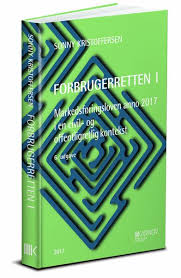

---

Markedsføringsloven udgør således en væsentlig rammebetingelse for alle virksomheder og forbrugere i Danmark 

Fair konkurrence, og en hensigtsmæssig forbrugerbeskyttelse, hvor forbrugerne er beskyttet mod fx at blive vildledt eller udsat for aggressiv markedsføring, understøtter velfungerende markeder

Målet er at lave en forenklet markedsføringslov, som, inden for rammerne af EU-reguleringen, gør op med unødige byrder for erhvervslivet og understøtter velfungerende markeder

Samtidigt skal markedsføringsloven sikre gode og ensartede forbrugerforhold, der er opdaterede i forhold til den teknologiske udvikling

Markedsføringsloven berører alle danske forbrugere og virksomheder. 

Loven skal både sikre, at virksomheder kan konkurrere effektivt, og at forbrugerne er hensigtsmæssigt beskyttet mod for eksempel meget aggressiv markedsføring 

Den skal også sikre en god balance mellem, at forbrugerne får den relevante information, de har behov for, så de kan træffe aktive valg, og samtidig skal virksomhederne ikke pålægges overdrevne og overflødige oplysningskrav 

---

## <font color="red">Opbygningen af markedsføringsloven<sup> Premium </font></sup>

* § 1 Anvendelsesområde

* § 2 Definitionsbestemmelse 

* §§ 3 og 4 om god markedsføringsskik og god erhvervsskik 

* §§ 5, 6, 7, 8 og 20 Vildledningsbestemmelserne 

* § 9 Specifikke former for handelspraksis, som altid anses for vildledende eller aggressive 

* § 10 Uanmodet henvendelse til bestemte aftagere § 10

* § 11 Handelspraksis rettet mod børn og unge

* § 12 Mærkning og emballering 

* § 13 Dokumentation af faktiske forhold 

* § 14 Oplysningsforpligtelser vedr. priser m.v. 

* § 15 Faktureringspligt for regningsarbejder 

* § 16 Gebyrer 

* § 17 om garanti 

* § 18 Markedsføring af kreditaftaler 

* § 19 Markedsføring af boligkreditaftaler 

* § 20 Vildledende og utilbørlig handelspraksis mellem erhvervsdrivende 

* § 21 Sammenlignende reklame 

* § 22 Forretningskendetegn 

* § 24 Retsmidler 

* § 25 Forbrugerombudsmanden 

* § 26 Digitalisering af Forbrugerombudsmandens virksomhed 

* § 27 Kontrolundersøgelser på stedet 

* § 28 Forhandlingsprincippet

* § 29 Retningslinjer 

* § 30 Forhåndsbesked 

* § 31 Konkurrence- og Forbrugerstyrelsens virksomhed 

* § 32 Retsforfølgning m.v. 

* § 33 Informationspligt om forældelse 

* § 34 Erstatningssøgsmål 

* § 35 Gruppesøgsmål 

* § 36 Foreløbigt forbud 

* § 37 Straf og påtale 

* § 38 Bødeforlæg 

* § 39 Henlæggelsesbeføjelser 

---

Markedsføringsloven er tæt forbundet med konkurrenceret, immaterialret, købelov, aftaleloven, kreditaftaleloven, betalingsloven, lov om finansiel virksomhed, forbrugeraftalelov, og e-handelslov m.fl..

EU-regulering af relevans for markedsføringsloven:

* Enhedsprismærkningsdirektivet (Direktiv 98/6/EF)

* Forbrugerkøbsdirektivet (Direktiv 99/44/EF)

* Direktivet om databeskyttelse inden for elektronisk kommunikation (Direktiv 2002/58/EF) og e-Privacydirektivet (Direktiv 2009/136/EF)

* Direktivet om urimelig handelspraksis (Direktiv 2005/29/E)

* Direktivet om vildledende og sammenlignende reklame (Direktiv 2006/114/EF)

* Forordningen om forbrugerbeskyttelsessamarbejde (Forordning nr. 2006/2004)

* Servicedirektivet (Direktiv 2006/123/EF)

* Forbrugerkreditdirektivet (Direktiv 2008/48/EF)

* Boligkreditdirektivet (Direktiv 2014/17/EU)


---

## <font color="red">Generalklausulen, jf. MFL § 3<sup> Premium </font></sup>

Markedsføringsloven har til formål at fastlægge normerne for erhvervsdrivendes adfærd på det danske marked, herunder i forholdet til andre erhvervsdrivende, konkurrenter, forbrugere, almene samfundsinteresser og øvrige interessenter.

Den såkaldte norm eller retlige standard er i dag udtrykt i markedsføringslovens § 3, hvorefter alle erhvervsdrivende skal udvise *”god markedsføringsskik”.* 

Herudover indeholder markedsføringsloven en række bestemmelser med et særligt sigte eller fokus, eksempelvis at beskytte forbrugere og børn og unge, jf. MFL § 11.

Den nærmere afgrænsning af, hvad der skal forstås ved ”god markedsføringsskik” er i vid udstrækning overladt til domstolene. 

Normen er ikke statisk og udvikler sig således i takt med markederne, teknologien og samfundet i øvrigt.

I praksis har bestemmelsen blandt andet været anvendt i forhold til aggressiv eller utilbørlig reklame, urimelig handelspraksis, udnyttelse af konkurrenter, efterligninger, urimelige forbrugeraftalevilkår og beskyttelse af privatlivets fred.

Det er fx god markedsføringskik, at det fremgår tydeligt af markedsføringen, hvis et produkt eller en ydelse over for en forbruger er betinget af særlige vilkår. 

Hvis du bruger bannerannoncering eller tv-reklame skal betingelserne fremgå allerede i første skærmbillede.

* Markedsføringslovens overordnede norm er, at *”Erhvervsdrivende skal udvise god markedsføringsskik under hensyntagen til forbrugere, erhvervsdrivende og almene samfundsinteresser”*, jf. MFL § 3, stk. 1

* Bestemmelsen sætter de ydre rammer og grænser for, hvad der er god markedsføringsskik.

* Bestemmelsen supplerer specialbestemmelserne i markedsføringsloven.


 

Den erhvervsdrivende skal udvise god markedsføringsskik (MFL § 3) under hensyntagen til:

* Forbrugerne

* Erhvervsdrivende

* Almene samfundsinteresser

Markedsføring, der angår forbrugernes økonomiske interesser, må ikke være egnet til mærkbart at forvride forbrugernes økonomiske adfærd – strid med god erhvervsskik-

”God markedsføringsskik” ændrer sig i takt med den samfundsmæssige, tekniske og økonomiske udvikling.

Overtrædelse må vurderes konkret fra sag til sag.
 
---

Eksempler:

Hensynet til forbrugerne og almene samfundsinteresser:

***


>En reklameavis for ure indeholdt selvmord som blikfang og sloganet "Why kill time, when you can kill yourself". Forbrugerombudsmanden fandt, at reklamen var i strid med god markedsføringsskik. Den erhvervsdrivende trak reklameavisen tilbage og underskrev et tilsagn.


>I november 1997 udsendte et urfirma som et led i en større markedsføringskampagne en reklameavis, hvor man anvendte selvmord som blikfang for reklamen for ure. Reklameavisen, der var emballeret i en "ligpose", indeholdt billeder af 8 iscenesatte selvmord og skulle omdeles på 400 caféer og restauranter landet over. Sloganet for reklameavisen var "Why kill time, when you can kill yourself".
Forbrugerombudsmanden blev gennem pressen opmærksom på reklameavisen og meddelte urfirmaet, at materialet fandtes i strid med markedsføringslovens §1 om god markedsføringsskik, idet det hos forbrugerne ville fremkalde stærke virkninger og dermed måtte anses for uetisk og utilbørlig. Forbrugerombudsmanden meddelte samtidig, at et foreløbigt forbud i henhold til markedsføringslovens § 21 [nu § 29] ville blive nedlagt, med mindre firmaet straks trak reklameavisen tilbage.
Efter forhandling med urfirmaet samt reklamebureauet blev reklameavisen trukket tilbage inden for den af Forbrugerombudsmanden angivne tidsfrist, og urfirmaet gav et tilsagn i henhold til markedsføringslovens §16 [nu § 23] om ikke at anvende reklameavisen.
I forbindelse med forhandlingerne indleverede urfirmaet en revideret udgave af reklameavisen, som Forbrugerombudsmanden blev anmodet om at tage stilling til, jf. markedsføringslovens §18 [nu § 25] (forhåndsbesked). I den reviderede udgave var billederne af de iscenesatte selvmord revet ud, men på en sådan måde at man tydeligt kunne se, at noget var revet ud af reklameavisen.
Forbrugerombudsmanden tilkendegav, at idet den reviderede udgave af reklameavisen måtte opfattes som en fortsættelse af den oprindelige kampagne, var denne tillige i strid med god markedsføringsskik. Den reviderede udgave blev på den baggrund ikke distribueret. Juridisk Årbog 1997, side 35. Sagsnummer: 1997-641/5-5.

***

>Juridisk Årbog 1993-94.119 – ”Følgende stoffer fås ikke på Christiania”:  

>Forbrugerombudsmanden fandt, at en erhvervsdrivendes annonce med teksten ”følgende stoffer fås ikke på Christiania” var i strid med god markedsføringsskik, og at stofmisbrug i øvrigt ikke egner sig til markedsføringskampagner, uanset om det sker på en humoristisk måde.


>En forretningskæde solgte tekstiler i metermål under overskriften "Følgende stoffer fås ikke på Christiania".
Forbrugerombudsmanden fandt, at den pågældende annoncering i dagblade var i strid med god markedsføringsskik, jf. markedsføringslovens § 1, idet der i annoncen på en usmagelig og uansvarlig måde skete en sammenkædning mellem uautoriseret salg af euforiserende stoffer og salg af tekstiler, samtidig med, at annoncen havde et humoristisk tilsnit.
Efter Forbrugerombudsmandens opfattelse er stofmisbrug et samfundsproblem, som ikke egner sig til markedsføringskampagner, uanset om det sker på en humoristisk måde. Den erhvervsdrivende tog påtalen til efterretning. Juridisk Årbog 1993-1994, side 119. Sagsnummer: 1993-65/5-49.

***

Hensynet til de erhvervsdrivende interesser:

* U 2004.1561 H – BR legetøj – domænenavn

* U 1992.909 SH – Superellipsebordet


 
Reklamer der forbydes efter markedsføringsloven og internationale markedsføringsregler:

>Normdannelse og praksis i henhold til markedsføringslovens § 3

>* Urimelige aftalevilkår

* Farlige eller underlødige produkter Påtrængende, overrumplende, udnyttende, generende, krænkende eller besværliggørende markedsføringsforanstaltninger

* Beskyttelse af den personlige integritet og privatlivets fred

* Kønsdiskriminerende markedsføring

* Racediskriminerende markedsføring 

* Usømmelighed, manglende respekt for almen sikkerhed, mangel på social ansvarsfølelse i markedsføringen og samfundsinteresser

 
**Det er forbudt at vise undervægtige modeller**


 
**Det er forbudt at bringe billede af barn med seksuelle fantasier.**


 

 **Det er forbudt at vise kvinder som seksuelle objekter, hvor der er fare for at børn vil se reklamen**
 
 
 

**Ryanair reklame der var for seksuel til aviserne **

**Reklamer med børn i farlige situationer er forbudt**


**For meget airbrush retouche er forbudt**


## <font color="red">God erhvervsskik, jf. MFL § 4<sup> Premium </font></sup>

En virksomhed overtræder god erhvervsskik, jf. MFL § 4, hvis der er tale om adfærd på markedet, som på en forkert måde påvirker forbrugernes økonomiske interesser, fx vildledende reklamekampagne, der får folk til at købe varen på et forkert grundlag.

* Hæderlig markedspraksis, smag, anstændighed

* God tro - vurdering

* Dynamisk begreb, der testes og ændrer sig i takt med tiden og samfundets udvikling


---
 

## <font color="red">Vildledning, jf. MFL §§ 5-7<sup> Premium </font></sup>

Afsender må ikke bruge vildledende og urigtige oplysninger i sin markedsføring, eller udelade vigtige informationer, hvis det er medvirkende til at forvride modtagerens økonomiske adfærd på markedet.

Pejlepunkt: Hvis modtageren (forbruger eller erhvervsdrivende) træffer en beslutning, som vedkommende måske ellers ikke ville have truffet, hvis oplysningen havde været korrekt, taler det for, at der er tale om vildledende markedsføring.
 

**Vildledende oplysninger - forkerte oplysninger om fx (MFL § 5):**

* produktets eksistens og art

* varens kvaliteter og egenskaber, specifikationer,
geografiske elle handelsmæssige oprindelse.

* mærkningsordninger på en vare, fx øko-mærket, svanemærket, og varen ikke lever op til kravene i mærkningsordningen.

* prisangivelser, førpriser, rabatter og tilbud.

* En virksomhed må ikke give forbrugerne det indtryk, at prisen er sat ned, hvis det rent faktisk ikke er tilfældet.

* behov for eftersyn, reservedele, udskiftning eller reparation

* forbrugerens rettigheder til fx omlevering eller tilbagebetaling

* forveksling med en konkurrents produkt, varemærke eller forretningskendetegn

---

### <font color="red">Væsentlige oplysninger skal på en forståelig måde, fx (MFL § 5):<sup> Premium </font></sup>

* Produktets væsentligste karakteristika

* Den erhvervsdrivendes fysiske adresse og navn

* Forhold vedrørende betaling og levering, hvis det fraviger fra hvad der er sædvanligt i branchen

* Fortrydelsesret, afbestillingsret eller returret, hvis det fraviger fra hvad der er sædvanligt i branchen

* Pris inklusive moms og afgifter

* Omkostninger til fragt, levering, porto m.v.


---

## <font color="red">Forbud mod skjult reklame, jf. MFL § 6, stk. 4<sup> Premium </font></sup>

En reklame skal kunne identificeres som en reklame, uanset form og uanset i hvilket medium den bringes.

Ikke skjule reklamen i sit budskab, for at påvirke eller manipulere modtagerne til at købe.

Forbuddet gælder i alle typer medier, såsom de skrevne og trykte medier (advertorial), tv- og radioprogrammer, film (productplacement), sponsorering, internettet (bannerreklamer m.v.), kunstværker, duftmarkedsføring mv.

>En erhvervsdrivende skal klart oplyse den kommercielle hensigt med enhver form for handelspraksis, herunder reklame. 
>Markedsføringslovens $6
 
 
Se eksempler i Nordisk standpunkt om skjult reklame, maj 2016 (www.forbrugerombudsmanden.dk)

* Blogs: Det skal fremgå tydeligt for læseren/seeren, hvis der er tale om reklame. Se notat om ”Gode råd til bloggere om skjult reklame” på www.forbrugerombudsmanden.dk

* YouTube mv.: Tydeligt oplyses, hvis videoen er en reklame

* Instagram: Tydeligt skrive ”reklame”, #reklame..”

* Facebook: Tydeligt markere, hvis opslag er en reklame

---

**Video: Skjult reklame**  


<div class="video-container"><iframe src="https://www.youtube.com/embed/0v3K7pusbD4" width="853" height="480" frameborder="0" allowfullscreen="allowfullscreen"></iframe></div>  

---

**Video: Influencer marketing. Hvad er reglerne?**

<div class="video-container"><iframe src="https://www.youtube.com/embed/KzSLGxLrPWs" width="853" height="480" frameborder="0" allowfullscreen="allowfullscreen"></iframe></div>  


---

**Video: Er skjulte reklamer på YouTube et problem?**

<div class="video-container"><iframe src="https://www.youtube.com/embed/x3hB3ACOb2g" width="853" height="480" frameborder="0" allowfullscreen="allowfullscreen"></iframe></div>


---

**En sag om skjult reklame for Den Blå Planet**


  
## <font color="red">Markedsføring rettet mod børn og unge, jf. MFL § 11<sup> Premium </font></sup>


Særlig hensyntagen til børn og unges naturlige godtroenhed, manglende erfaring og kritiske sans, som bevirker, at de er lette at påvirke og nemme at præge.

Ikke udnytte den særlige godtroenhed og mangel på erfaring, der karakteriserer målgruppen børn og unge. Har ikke det samme skeptiske eller analytiske filter som voksne.

Ikke direkte eller indirekte opfordre til vold, anvendelse af rusmidler, herunder alkohol, eller anden farlig eller hensynsløs adfærd, eller på utilbørlig måde benytte sig af vold, frygt, mobning eller overtro som virkemidler, jf. MFL § 11, stk. 2.

Se Forbrugerombudsmandens vejledning om ”Børn, unge og markedsføring”, juli 2014.


---

## <font color="red">Aggressiv handelspraksis, jf. MFL § 7<sup> Premium </font></sup>

Bestemmelsen i § 7 finder anvendelse på erhvervsdrivendes urimelige handelspraksis over for forbrugerne før, under og efter en handelstransaktion i forbindelse med et produkt. 

Det foreslås, at en erhvervsdrivende i sin handelspraksis ikke må benytte chikane, ulovlig tvang, herunder vold eller utilbørlig påvirkning, der er egnet til væsentligt at indskrænke forbrugerens valgfrihed i forbindelse med et produkt. 

Ulovlig tvang og vold er også reguleret i straffeloven.

Der er ikke blot forbud mod at anvende vildledende og urigtige angivelser, men forbuddet omfatter også markedsføring, som i sit indhold, sin form eller den anvendte fremgangsmåde er vildledende, aggressiv eller udsætter forbrugeren for en utilbørlig påvirkning.

Chikane skal forstås som bevidst, ondskabsfuldt drilleri eller forfølgelse.

Markedsføring betragtes som værende aggressiv, hvis den i forhold til den faktuelle sammenhæng, hvori den indgår, ved chikane, tvang, herunder fysisk vold eller anden utilbørlig påvirkning er egnet til at indskrænke forbrugerens valgfrihed eller ændre forbrugerens økonomiske adfærd, så vedkommende udviser en adfærd, vedkommende ellers ikke ville have udvist. 

Ved vurderingen af, om der foreligger en aggressiv markedsføring, skal der tages hensyn til følgende omstændigheder:

a) Tidspunktet for markedsføringen og stedet hvor den har fundet sted. Det kan tillægges betydning, om den pågældende handelspraksis foregår i det offentlige rum eller i den erhvervsdrivendes forretningslokaler, hvorfra forbrugeren let kan fjerne sig, eller på steder, hvor man som forbruger som udgangspunkt ikke forventer at blive udsat for den pågældende handelspraksis, f.eks. på forbrugerens bopæl, arbejds- sted eller på andre steder, hvortil der ikke er offentlig adgang.

b) Anvendelse af truende eller utilbørligt sprog eller adfærd.

Dette kan for eksempel være, hvis den erhvervsdrivende foranlediger forbrugeren til at betale et vederlag ved at true med inkasso eller registrering i et kreditoplysningsbureau, selvom de lovgivningsmæssige betingelser for at tage sådanne skridt ikke er opfyldt. I nr. 24-31 i bilag 1 til loven er oplistet en række former for aggressiv handelspraksis, som altid vil være ulovlig efter lovens § 9.

c) At en erhvervsdrivende har kendskab til og udnytter en konkret uheldig situation eller omstændighed, som har en så alvorlig karakter, at den indskrænker forbrugerens vurderingsevne, til at påvirke forbrugeren.

Det kan eksempelvis omfatte situationer, hvor en erhvervsdrivende udnytter, at forbrugeren står midt i en skilsmisse, eller i en begravelsessituation, ved en nærtståendes død.

d) At den erhvervsdrivende opstiller byrdefulde og uforholdsmæssig omfattende hindringer, som ikke er af kontraktuel karakter, når forbrugeren ønsker at udøve sine rettigheder i forbindelse med en kontrakt, herunder at ophæve denne eller vælge en anden vare eller tjenesteydelse eller en anden leverandør.

Som eksempel kan nævnes erhvervsdrivende, som kun har en meget kort åbningstid, eller som det i praksis er umuligt at kommunikere med, fordi vedkommende ikke tager sin telefon og nægter at modtage breve eller uden saglig grund stiller krav om, at en opsigelse f.eks. kun kan ske via telefax.

Det bemærkes, at anvendelse af ulovlig tvang og vold også er reguleret i straffeloven jf. staffelovens § 244-245, § 246 samt § 260. Der kan straffes i sammenstød med disse bestemmelser.

Utilbørlig påvirkning er defineret i lovens § 2, nr. 11, som udnyttelse af magtposition i forhold til forbrugeren til at udøve pres selv uden anvendelse eller trusler om anvendelse af fysisk vold på en måde, som væsentligt begrænser forbrugerens evne til at træffe en informeret beslutning.

Bestemmelsen omfatter aggressive salgsmetoder som f.eks. gentagende fremsendelse af produkter, som forbrugeren ikke har bestilt og pyramidesalg.

Som efter stk. 1 er det et krav, at markedsføringen har en kommerciel effekt, således at den er egnet til mærkbart at forvride modtagerens økonomiske adfærd. Se nærmere noten til stk. 1. 

---

Se hertil **U 2013 2396 SH** (moderselskab til producent af isoleringsmateriale baseret på stenuld havde overtrådt markedsføringslovens §§ 1, 3 og 5 ved i to artikler i et nyhedsbrev at have omtalt brandfaren ved skumplastisolering med brug af bl.a. dramatiske ord- og billedvalg og et unødigt skræmmende tekstindhold med følelsesladede ord og udsagn).

---

Bilag 1 til markedsføringsloven kommer med en række ikke udtømmende eksempler:

* Forbrugeren bringes til at tro, at vedkommende ikke kan forlade lokalerne, før en kontrakt er indgået.

* Der aflægges personlige besøg på forbrugerens bopæl, uden at forbrugeren har ønsket det.

* Der foretages vedholdende og uønskede henvendelser pr. telefon der ikke er omfattet af forbuddet i forbrugeraftalelovens § 4, eller pr. telefax, e-mail eller andre fjernkommunikationsmedier.

* En reklame opfordrer direkte børn til at købe eller til at overtale deres forældre eller andre voksne til at købe de produkter til dem.

* Der skabes det fejlagtige indtryk, at forbrugeren allerede har vundet, vil vinde eller ved udførelse af en bestemt handling vil vinde en præmie eller et andet tilsvarende gode.

---

## <font color="red">Uanmodet henvendelse – spam, jf. MFL § 10, stk. 1<sup> Premium </font></sup>


Hovedreglen: Den erhvervsdrivende må ikke sende reklamer, tilbud og øvrigt markedsføringsmateriale via fjernkommunikation, dvs. ved brug af e-mail, sms, mms, fax og automatisk opkaldesystem med indtalt reklame, hvis modtager ikke har bedt om det. Det gælder uanset om modtager er en forbruger eller en erhvervsdrivende.

Undtagelse 1: Hvis modtageren af reklamen forudgående har accepteret eller anmodet om at få reklamen tilsendt på den måde.

Undtagelse 2: Hvis kunden tidligere har købt varer eller tjenesteydelser hos virksomheden, og kunden har givet sin e-mailadresse eller mobiltelefonnummer, og har accepteret at modtage nyhedsbreve og tilbud. 

MEN kunden skal have mulighed for at frabede sig yderligere henvendelser.

Adresseløse husstandsomdelte reklamer kan lovligt sendes.

Ved direkte markedsføring/adresseret reklame til en person eller virksomhed, skal virksomheden sikre sig, at der ikke sendes materiale til personer, der er på Robinson-listen.

*Robinson-listen*: Virksomheden må ikke rette direkte henvendelse til forbrugeren der er registreret på Robinson-listen.

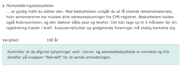

Undtagelse: Hvis forbrugeren selv har anmodet om henvendelsen

Sammenhold med forbrugeraftalelov § 4, stk. 2.

---


## <font color="red">Mærkning (MFL § 12), dokumentation (MFL § 13) og priser (MFL § 14)<sup> Premium </font></sup>

Forbud mod forkert brug af mærkning, fx øko-mærket, fair trade, svanemærket m.v.

Den erhvervsdrivende er forpligtet til at dokumentere rigtigheden af faktuelle oplysninger om det produkt der markedsføres, fx miljømæssige påstande ”Denne vare er CO2-neutral


Anprisninger og salgsgas - tilladt og skal ikke dokumenteres.

Et udtryk, som skamroser et produkt på en sådan måde at forbrugeren godt kan gennemskue, at udsagnet ikke er dokumenterbart, fx ”Danmarks kønneste campingplads” eller ”byens bedste frisør.” ”Vi udbyder Danmarks sikreste internetforbindelse” eller ”Hvert fjerde parforhold starter på netdating.dk” - skal kunne dokumenteres.

---

 
## <font color="red">Gebyrer (MFL § 16) og garantier (MFL § 17)<sup> Premium </font></sup>

Gebyrer skal være aftalt og senere ændringer i gebyrer skal varsles.

Ved brug af ord som ”garanti”, ”tilsikre”, ”vi indestår”, skal den erhvervsdrivende give forbrugeren en væsentlig bedre retsstilling, end forbrugeren ellers ville have haft uden ”garantien”, jf. MFL § 17.

Den erhvervsdrivende skal informere forbrugeren om garantiens indhold på klar og tydelig måde, fx:

Om garantiens varighed, begrænsninger, garantigivers navn og adresse.

At forbrugerens ufravigelige rettigheder efter lovgivningen ikke berøres af garantien, fx ufravigelige regler i købeloven eller anden lovgivning.

Forbrugeren kan bede den erhvervsdrivende udlevere garantien skriftligt, og vilkårene for garantien skal være affattet på dansk, såfremt markedsføringen er sket på dansk.

---
 
## <font color="red">Sammenlignelige reklamer, jf. MFL § 21<sup> Premium </font></sup>


Definition: En reklame som direkte eller indirekte henviser til en konkurrent eller til varer og tjenesteydelser, som udbydes af en konkurrent.

Budskabet være korrekt og relevant, og det skal ske loyalt for at være lovligt.

Det må ikke kritisere, latterliggøre eller omtale konkurrentens produkter på en nedsættende måde (misrekommandering).

Betingelserne for en lovlig, sammenlignende reklame	- se MFL § 21

---

**Hvad er sammenlignende reklame?**

<div class="video-container"><iframe src="https://www.youtube.com/embed/hQvnE8iPuXw" width="853" height="480" frameborder="0" allowfullscreen="allowfullscreen"></iframe></div>
  
---

## <font color="red">Standardoplysninger ved kreditaftaler, jf. MFL § 18<sup> Premium </font></sup>


Standardoplysninger ved kreditaftaler er følgende:

Debitorrenten, herunder om den er fast eller variabel eller begge, samt oplysninger om omkostninger, der indgår i forbrugerens samlede omkostninger i forbindelse med kreditten.

Det samlede kreditbeløb.

De årlige omkostninger i procent (ÅOP), som beregnet efter lov om kreditaftaler.

Kreditaftalens løbetid.

Kontantprisen og størrelsen af en eventuel forudbetaling ved kredit i form af henstand med betalingen for en specifik vare eller tjenesteydelse.

Det samlede beløb, som skal betales af forbrugeren, og ydelsernes størrelse.

 
---

## <font color="red">Standardoplysninger ved boligkreditaftaler, jf. MFL § 19<sup> Premium </font></sup>


Standardoplysninger ved boligkreditaftaler er følgende:

Boligkreditgivers eller boligkreditformidlers identitet.

Det pant eller anden sikkerhed, som ligger til grund for boligkreditaftalen.

Debitorrenten, og hvorvidt den er fast eller variabel eller begge dele, tillige med oplysninger om de gebyrer, der indgår i omkostningerne i forbindelse med boligkreditaftalen.

Det samlede kreditbeløb.

De årlige omkostninger i procent (ÅOP)

Boligkreditaftalens løbetid.

Ydelsernes størrelse.

Det samlede beløb og antallet af ydelser, der skal betales.

Advarsel om, at eventuelle udsving i valutakursen kan påvirke det beløb, der skal betales, hvis der markedsføres lån i Danmark i en anden valuta end danske kroner.

---
 
## <font color="red">Forretningskendetegn (MFL § 22) og forretningshemmeligheder<sup> Premium </font></sup>

Erhvervsdrivende må ikke benytte forretningskendetegn og lignende, der ikke tilkommer dem, eller benytte egne kendetegn på en måde, der er egnet til at fremkalde forveksling med andres, jf. MFL § 22.

* Forretningskendetegn: Logo, en udsmykning, en uniform, et slogan eller et firmanavn mv.

* Registreret som varemærke eller indarbejdet, opnået et særpræg. Se fx dommen U2004.1561H om BR’s legetøjs domænenavn.

En krænkelse kræver, at der er en vis forvekslingsrisiko,. Vurderes konkret fra sag til sag.

Se dommen **U 1997.253 H** om pølsemanden ”McAllan”.

---

### <font color="red">En virksomheds forretningshemmeligheder er beskyttet mod misbrug og uberettiget benyttelse<sup> Premium </font></sup>

 

Lovreglerne, som beskytter virksomheder mod uberettiget benyttelse af deres forretningshemmeligheder findes i Lov nr. 309 af 25. april 2018 om forretningshemmeligheder.

Loven indeholder et forbud (§ 4) mod, at en person (fysisk eller juridisk) ulovligt erhverver, bruger eller videregiver fortrolig viden om en virksomhed.

Reglerne, som beskytter virksomheder mod uberettiget benyttelse af deres forretningshemmeligheder findes i lov om forretningshemmeligheder.

Loven indeholder et forbud (§ 4) mod, at en person (fysisk eller juridisk) ulovligt erhverver, bruger eller videregiver fortrolig viden om en virksomhed.
 
---
 
### <font color="red">Hvad er en forretningshemmelighed?<sup> Premium </font></sup>

 

Der er 3 lovbetingelser, som alle skal være opfyldte for, at der er tale om en forretningshemmelighed. Oplysningerne skal iflg. Lovens § 2:

1.	være hemmelige forstået på den måde, at de ikke er almindeligt kendt

2.	have en handelsværdi, fordi de er hemmelige

3.	være underlagt rimelige foranstaltninger til hemmeligholdelse

En forretningshemmelighed kan fx være produktudvikling og opfindelser, kundeforhold, driftstekniske og produktionsmæssige forhold, kommercielle og strategiske forhold mv. 

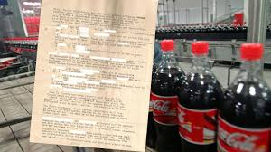

Et godt eksempel er fx opskriften på Coca Cola eller en virksomheds kundekartotek.

---
 
Hvis en person (fysisk eller juridisk) ulovligt erhverver, bruger eller videregiver en forretningshemmelighed kan domstolene sanktionere overtrædelsen på følgende måde:

* Domstolene kan tilkende virksomheden erstatning

* Domstolene kan nedlægge et midlertidigt eller endeligt forbud eller påbud mod at bruge eller videregive forretningshemmeligheden.
 

---
 
##  <font color="red">Forbrugerombudsmandens virksomhed, jf. MFL §§ 25-30<sup> Premium </font></sup>

FOBs (Forbrugerombudsmandens)tilsyn har særligt fokus på forbrugerinteresser, men kan dog også håndhæve almene samfundsmæssige interesser og erhvervsinteresser.

FOB fører bl.a. tilsyn med overholdelse af markedsføringsloven, tobaksreklameloven, forbrugeraftaleloven, e-handelsloven, købeloven, aftaleloven, kreditaftaleloven, betalingsloven, lov om juridisk rådgivning mv.

FOB kan starte en sag på eget initiativ, som følge af en klage fra en forbruger, eller en klage fra en anden erhvervsdrivende.

En afgørelse truffet af FOB, kan indbringes til bedømmelse ved domstolene, jf. grundlovens § 63.

---
 

### <font color="red">Forbrugerombudsmandens opgaver og beføjelser<sup> Premium </font></sup>

 

FOB kan i særlige tilfælde foretage *kontrolundersøgelser i en virksomhed*, jf. MFL § 27.

"*Forhandlingsprincippet*": FOB har adgang til gennem forhandling med de erhvervsdrivende, at forsøge at påvirke virksomhederne, jf. MFL § 28.

Især via relevante erhvervs- og forbrugerorganisationer at påvirke de erhvervsdrivendes adfærd gennem udarbejdelse af retningslinjer og vejledninger for markedsføring inden for væsentlige områder, jf. MFL § 29.
* Forhåndsbesked/vurdering til virksomheden om et planlagt, men endnu ikke lanceret markedsføringstiltag er lovligt, jf. MFL § 30.

---
 
**Forbrugerombudsmanden (FOB) Sanktioner**

 

De fleste overtrædelser af markedsføringsloven straffes med bøde.

*"Retsforfølgning*": Retssager kan anlægges af FOB. Der kan anlægges sag om forbud, påbud, erstatning og vederlag, jf. MFL § 32.

*"Forbud*": Handlinger, som er i strid med MFL kan forbydes ved dom. Foreløbigt forbud mod et tiltag kan gennemføres hurtigere via fogedretten.

*"Påbud*": FOB kan meddele et påbud, fx om at genoprette den tilstand, som var der inden den ulovlige handling blev foretaget, herunder tilintetgørelse eller tilbagekaldelse af produkter, udsende oplysninger der berigtiger forholdet osv.

*"Erstatning"*: Oftest en erhvervsdrivende, som har lidt et tab på grund af en anden erhvervsdrivendes utilbørlige opførsel. Den erhvervsdrivende anlægger retssagen uden om FOB.

---

**Quiz: Markedsføringsloven**


Markedsføringsloven sætter rammerne for, hvornår og hvordan virksomheder må markedsføre sig over for dig som forbruger. <a href="https://www.forbrug.dk/quiz/markedsfoeringslov/?rn=43716" target="_blank">Men hvor godt kender du egentlig reglerne?</a>  

---

**Quiz: Spam og reklamer**


Bliver du konstant kontaktet af telefonsælgere, eller er din indbakke ramt af spam? <a href="https://www.forbrug.dk/quiz/spam-og-reklamer/?rn=43716" target="_blank">Forbrug.dk sætter med denne quiz fokus på reglerne for spam og reklamer.</a>  

---

## <font color="red">E-Kursus: Regler for online handel og markedsføring<sup> Premium </font></sup>

 

Ekstra materiale som ikke er en del af pensum fra et advokatefteruddannelseskursus om ”Online handel og markedsføring ”  


<a href="https://vimeo.com/advokurser/review/302818663/7d55f9cf50" target="_blank">Intro/teaser til kurset.</a>  

<a href="https://vimeo.com/advokurser/review/302817925/6dbacf556f" target="_blank">Lektion 1</a>  
  
  
<a href="https://vimeo.com/advokurser/review/302818130/6be23a8255" target="_blank">Lektion 2</a>  


<a href="https://vimeo.com/advokurser/review/302818495/bb990da2b0" target="_blank">Lektion 3</a>


---


<!--chapter:end:09.Rmd-->

# <font color="red">Databeskyttelse<sup> Premium </font></sup>

```{r, echo=FALSE, results='asis'}
cat(readLines('npp.html'))
```


http://samfundslitteratur.dk/bog/kend-databeskyttelsesreglerne^[Følgende afsnit om databeskyttelsesreglerne bygger på *Sonny Kristoffersen*: ”Kend databeskyttelsesreglerne”, 2019, Samfundslitteratur.]  

---

## <font color="red">Hvad er databeskyttelse?<sup> Premium </font></sup>


Enhver har ret til beskyttelse af sine personoplysninger, og enhver, der behandler personoplysninger om andre i ikke-privat sammenhæng, er forpligtet til at iagttage disse rettigheder og til at beskytte personoplysningerne. 

Disse rettigheder og forpligtelser går samlet under betegnelsen "databeskyttelse".

Enhver behandling af andres personoplysninger, der ikke sker i en rent privat sammenhæng, skal ske i overensstemmelse med reglerne på databeskyttelsesområdet.

Personoplysninger er alle oplysninger, der vedrører en identificeret eller identificerbar fysisk person. 

Den, der behandles personoplysninger om, kaldes som regel *"den registrerede"*, mens den, der behandler personoplysninger om andre, er den *"dataansvarlige*  eller *"databehandleren"*, alt efter hvilken rolle vedkommende har i behandlingen af persondata. 

---

Den registrerede har en række rettigheder over for den dataansvarlige. 

Det er den registreredes rettigheder, der skal beskyttes, og den dataansvarlige og databehandleren, der har ansvaret for denne beskyttelse. 

Rettighederne har til formål at gøre det gennemsigtigt for den registrerede, hvornår der behandles oplysninger om vedkommende, og hvilke oplysninger, der behandles. 

Herudover giver rettighederne den registrerede kontrol over sine egne personoplysninger. 

Den dataansvarlige skal sikre sig, at behandlingen af personoplysninger er i overensstemmelse med en række grundprincipper, ligesom der skal være et lovligt grundlag til at behandle oplysningerne. 

Reglerne på databeskyttelsesområdet indebærer også, at den dataansvarlige skal foretage en række mere generelle vurderinger og overvejelser i forhold til selve beskyttelsen af de oplysninger.

Når du som registreret stiller spørgsmålstegn ved en behandling af oplysninger om dig, eller du påberåber dig dine rettigheder over for den dataansvarlige, skal den dataansvarlige reagere på henvendelsen.

Gør den dataansvarlige ikke det - eller er du ikke tilfreds med den dataansvarliges svar, kan du rette henvendelse til Datatilsynet, der kan vejlede dig yderligere om dine rettigheder, herunder dine muligheder for at klage.

---

**Video: Databeskyttelsesforordningen stiller krav til den finansielle sektor**

<div class="video-container"><iframe src="https://www.youtube.com/embed/5OwWsQHpsDc" width="853" height="480" frameborder="0" allowfullscreen="allowfullscreen"></iframe></div>


---

**Video: Databeskyttelsesreglerne på 7 minutter**

<div class="video-container"><iframe src="https://www.youtube.com/embed/AXnQQyVvmuM" width="853" height="480" frameborder="0" allowfullscreen="allowfullscreen"></iframe></div>


---

## <font color="red">Databeskyttelse ved behandling af personoplysninger<sup> Premium </font></sup>


Enhver person har således ret til beskyttelse af sine personoplysninger, og enhver, der behandler personoplysninger om andre i ikke-privat sammenhæng, er forpligtet til at iagttage disse rettigheder og til at beskytte disse personoplysninger.

Disse rettigheder og forpligtelser går samlet under betegnelsen *"databeskyttelse"*. 

Enhver behandling af andres personoplysninger, der ikke sker i en rent privat sammenhæng, skal ske i overensstemmelse med reglerne på databeskyttelsesområdet, jf. databeskyttelsesforordningen (også kaldet; *”GDPR”* General Data Protection Regulation), som har direkte virkning i Danmark. 


 
Den supplerende databeskyttelseslovs formål er identisk med formålet i databeskyttelsesforordningen, nemlig beskyttelse af fysiske personer i forbindelse med behandling af personoplysninger og fri udveksling af personoplysninger i EU.

Når en virksomhed behandler personoplysninger er den underlagt reglerne i persondataforordningen og databeskyttelsesloven.

Persondataforordningen pålægger virksomhederne en række forpligtelser, når de behandler personoplysninger.

Omvendt får den, der behandles oplysninger om (den registrerede) en række rettigheder.

---

**Video: Introduktion til databeskyttelsesloven**


<div class="video-container"><iframe src="https://www.youtube.com/embed/bEh-vF-C5-A" width="853" height="480" frameborder="0" allowfullscreen="allowfullscreen"></iframe></div>

---

**Video: Hvad er persondata?**


<div class="video-container"><iframe src="https://www.youtube.com/embed/jmVTmSLkkh0" width="853" height="480" frameborder="0" allowfullscreen="allowfullscreen"></iframe></div>


---
 


## <font color="red">Hvad er ”behandling” i persondataretten?<sup> Premium </font></sup>


Enhver form for oplysning, der knytter sig til en bestemt fysisk person, som gør personen identificerbar. 

Det kan fx være et personnummer, en bopælsadresse, et journalnummer, et bilregistreringsnummer, en IP-adresse osv.

Hvis oplysninger om fysiske personer er fuldstændig anonymiserede, er der ikke tale om personoplysninger.

Ifølge databeskyttelsesforordningens artikel 4, nr. 2, skal begrebet *”behandling”* forstås som enhver aktivitet eller række af aktiviteter - med eller uden brug af automatisk behandling - som personoplysninger eller en samling af personoplysninger gøres til genstand for, f.eks.: 

* indsamling, 

* registrering,

* organisering,

* systematisering,

* opbevaring, 

* tilpasning eller ændring, 

* genfinding, 

* søgning, 

* brug, 

* videregivelse ved transmission, 

* formidling eller enhver anden form for overladelse, 

* sammenstilling eller samkøring,

* begrænsning, 

* sletning eller tilintetgørelse.

---
 


Begrebet *“automatisk databehandling”* er sammenfaldende med *“edb”* eller *“elektronisk behandling”*, som blev anvendt i dagældende databeskyttelsesdirektivets artikel 3, stk. 1. 

Bestemmelsen i databeskyttelsesforordningens artikel 2 svarer således til det tidligere gældende databeskyttelsesdirektivs materielle anvendelsesområde.

Privates aktiviteter på Facebook er ikke omfattet af databeskyttelsesforordningen.  


Anderledes med *fansider på Facebook*, hvor Facebook og administratoren af en fanside har et fælles dataansvar for behandlingen af personoplysninger, som bliver indsamlet i forbindelse med besøg på den pågældende fanside.  


Behandlingsbegrebet skal forstås meget bredt og dækker over enhver form for håndtering af personoplysninger, såsom:  

* Indsamling

* Registrering

* Systematisering

* Opbevaring

* Søgning

* Tilpasning

* Sletning

* Videregivelse
 
---

## <font color="red">Opdelingen af personoplysningerne<sup> Premium </font></sup>


*Databeskyttelsesforordningen opdeler personoplysninger i tre typer:*  

* Almindelige ikke-følsomme oplysninger,

* Særlige kategorier af oplysninger (følsomme oplysninger) og

* Oplysninger om straffedomme og lovovertrædelser eller tilknyttede sikkerhedsforanstaltninger. 

Der findes to kategorier af personoplysninger:

Almindelige ikke-følsomme personoplysninger fx:

* Fx navn, adresse, telefonnummer, køn, alder

*Følsomme personoplysninger fx:*

* Race og etnisk baggrund

* Politisk, religiøs og filosofisk overbevisning

* Fagforeningsmæssigt tilhørsforhold, helbred, seksuel orientering


---

**Video: Kategorier af personoplysninger**

<div class="video-container"><iframe src="https://www.youtube.com/embed/gn5QEtgZcVc" width="853" height="480" frameborder="0" allowfullscreen="allowfullscreen"></iframe></div>


---


```{r personoplysninger, echo=FALSE}

mydf <- data.frame(
  S1 = c("Følsomme personoplysninger" ,"Race, etnisk 
oprindelse, 
politisk, religiøs el. 
filosofisk overbevisning, 
fagforeningsmæssige 
tilhørsforhold, genetiske data, 
biometriske data mhp. entydig 
identifikation, helbredsoplysninger, 
seksuelle forhold eller orientering "),
  S2 = c("" ,
  "Straffedomme og lovovertrædelser"),
  S3 = c("Almindelige personoplysninger",
    "Væsentlige sociale problemer, andre rent private 
forhold, økonomi, skat, gæld, sygedage, tjenstlige forhold, 
familieforhold, bolig, bil, eksamen, ansøgning, CV, 
ansættelsesdato, stilling, arbejdsområde, 
arbejdstelefon, navn, adresse, fødselsdato"
  )
)
names(mydf) <- NULL

mydf %>%
  kable("html", escape = FALSE, caption = "Beskyttelse af personoplysninger" ) %>%
  kable_styling(full_width = T,font_size = 10,bootstrap_options = c("responsive","bordered","striped")) %>%
  column_spec(1, bold = T, border_right = T, color = "white", background = "darkgrey") %>%
  column_spec(2, bold = T, border_right = T, color = "white", background = "black") %>%
  column_spec(3, bold = T, border_right = T, color = "white", background = "grey") %>%
  row_spec(1,italic = T,bold = T,font_size = 12) %>%
  # column_spec(0, angle = -45)%>%
  # scroll_box(width = "500px") %>%
  footnote(general = "Databeskyttelsesforordningen",general_title = "Kilde:")
```


---


---


---

En anden måde at se de forskellige kategorier af personoplysninger på. Jo højere oppe i trekanten oplysningerne er, desto strengere betingelser for at behandle dem. 


---

## <font color="red">Hvornår kan der ske behandling af ikke-følsomme oplysninger?<sup> Premium </font></sup>


Almindelige personoplysninger omfatter alle oplysninger, der ikke er klassificeret som særlige kategorier af oplysninger (følsomme personoplysninger). 

Det kan for eksempel være identifikationsoplysninger som navn og adresse eller oplysninger om økonomi, skat, gæld, væsentlige sociale problemer, andre rent private forhold, sygedage, tjenstlige forhold, familieforhold, bolig, bil, eksamen, ansøgning, CV, ansættelsesdato og -stilling, arbejdsområde og arbejdstelefon. 

En virksomhed må kun behandle almindelige ikke-følsomme personoplysninger, hvis en af følgende betingelser er opfyldt:

* Virksomheden har et lovligt samtykke

* Behandling er nødvendig for at opfylde en aftale med den registrerede

* Virksomheden er iht. lov forpligtet til at behandle oplysningerne

* Hvis virksomheden har en saglig interesse i at behandle oplysningerne, som overstiger den registreredes interesser.

---

**Videoer: ”Hvordan håndterer I personoplysninger i jeres virksomhed?”**


<div class="video-container"><iframe src="https://www.youtube.com/embed/idYfVNZbQeU" width="853" height="480" frameborder="0" allowfullscreen="allowfullscreen"></iframe></div>


---

<div class="video-container"><iframe src="https://www.youtube.com/embed/qBkWNv9_vsc" width="853" height="480" frameborder="0" allowfullscreen="allowfullscreen"></iframe></div>

---

## <font color="red">Hvornår kan der ske behandling af følsomme oplysninger?<sup> Premium </font></sup>


 

Særlige kategorier af personoplysninger (følsomme personoplysninger) følger af databeskyttelsesforordningens artikel 9, stk. 1. 

Følsomme personoplysninger er udtrykkelig afgrænset i databeskyttelsesforordningen, og adgangen til at behandle sådanne oplysninger er snævrere end ved almindelige personoplysninger. 

*Følsomme oplysninger er nærmere oplysninger om*:

* Race og etnisk oprindelse

* Politisk overbevisning

* Religiøs eller filosofisk overbevisning

* Fagforeningsmæssige tilhørsforhold

* Genetiske data

* Biometriske data med henblik på entydig identifikation

* Helbredsoplysninger

* Seksuelle forhold eller seksuel orientering

* Kun de oplysninger, der er nævnt ovenfor, er følsomme personoplysninger

Af databeskyttelsesforordningen fremgår det, hvornår der må ske behandling af følsomme oplysninger.  

De følsomme oplysninger omfattet af databeskyttelsesforordningens artikel 9, stk. 1, må dog behandles, hvis der er hjemmel til det i forordningen, hvilket særligt vil sige i databeskyttelsesforordningens artikel 9, stk. 2, litra a-j: 

Behandling af de pågældende oplysninger kan således ske på betingelse af, at den registrerede har givet et klart og udtrykkeligt samtykke til behandling af sådanne personoplysninger (litra a) 

Der skal således være tale om en frivillig, specifik og informeret viljestilkendegivelse. 

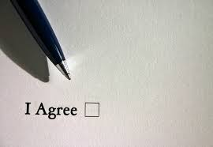

Et samtykke skal meddeles på en sådan måde, at det klart og utvetydigt fremgår, at den registrerede har meddelt sit samtykke til behandlingen. 

Herudover skal samtykket være udtrykkeligt.  

Heraf følger, at den dataansvarlige ikke vil kunne opnå stiltiende eller indirekte tilslutning til behandling af de i artikel 9, stk. 1 nævnte oplysninger. 

Et egentligt krav om skriftlighed følger ikke af bestemmelsen. 

Der bør dog i videst muligt omfang søges indhentet et skriftligt samtykke fra den registrerede, idet der herved opnås klarhed omkring samtykkets rækkevidde.

**Det kan skyldes følgende begrundelser**:
 
***At*** behandling er nødvendig for at overholde den dataansvarliges eller den registreredes arbejds-, sundheds- og socialretlige forpligtelser og specifikke rettigheder, for så vidt den har hjemmel i EU-retten eller medlemsstaternes nationale ret eller en kollektiv overenskomst i medfør af medlemsstaternes nationale ret, som giver fornødne garantier for den registreredes grundlæggende rettigheder og interesser (litra b), 

***At*** behandling er nødvendig for at beskytte den registreredes eller en anden fysisk persons vitale interesser i tilfælde, hvor den registrerede fysisk eller juridisk ikke er i stand til at give samtykke (litra c), 

***At*** behandling foretages af en stiftelse, en sammenslutning eller et andet organ, som ikke arbejder med gevinst for øje, og hvis sigte er af politisk, filosofisk, religiøs eller fagforeningsmæssig art, som led i organets legitime aktiviteter og med de fornødne garantier, og på betingelse af at behandlingen alene vedrører organets medlemmer, tidligere medlemmer eller personer, der på grund af organets formål er i regelmæssig kontakt hermed, og at personoplysningerne ikke videregives uden for organet uden den registreredes samtykke (litra d), 

***At*** behandling vedrører personoplysninger, som tydeligvis er offentliggjort af den registrerede (litra e),
 
***At*** behandling er nødvendig, for at retskrav kan fastlægges, gøres gældende eller forsvares, eller når domstole handler i deres egenskab af domstol (litra f), 

***At*** behandling er nødvendig af hensyn til væsentlige samfundsinteresser på grundlag af EU-retten eller medlemsstaternes nationale ret og står i rimeligt forhold til det mål, der forfølges, respekterer det væsentligste indhold af retten til databeskyttelse og sikrer passende og specifikke foranstaltninger til beskyttelse af den registreredes grundlæggende rettigheder og interesser (litra g), 

***At*** behandling er nødvendig med henblik på forebyggende medicin eller arbejdsmedicin til vurdering af arbejdstagerens erhvervsevne, medicinsk diagnose, ydelse af social- og sundhedsomsorg eller -behandling eller forvaltning af social- og sundhedsomsorg og -tjenester på grundlag af EU-retten eller medlemsstaternes nationale ret eller i henhold til en kontrakt med en sundhedsperson og underlagt de betingelser og garantier, der er omhandlet i databeskyttelsesforordningens artikel 9, stk. 3 (litra h), 

***At*** behandling er nødvendig af hensyn til samfundsinteresser på folkesundhedsområdet (litra i), eller
 
***At*** behandling er nødvendig til arkivformål i samfundets interesse, til videnskabelige eller historiske forskningsformål eller til statistiske formål på grundlag af EU-retten eller medlemsstaternes nationale ret og står i rimeligt forhold til det mål, der forfølges, respekterer det væsentligste indhold af retten til databeskyttelse og sikrer passende og specifikke foranstaltninger til beskyttelse af den registreredes grundlæggende rettigheder og interesser (litra j).
 


---


```{r echo=FALSE}

mydf <- data.frame(
  S1 = c("Følsomme personoplysninger" ,"Som udgangspunkt ikke, medmindre:<br><br>
- Der er givet samtykke<br><br>
- Det sker for at sikre personens vitale interesser, og der ikke kan indhentes samtykke (Sygdomsreglen)<br><br>
- Der er tale om en forening der behandler oplysningerne som led i deres aktiviteter<br><br>
- Hvis man selv har offentliggjort oplysningen<br><br>
- For at kunne fastlægge et retskrav<br><br>
- For at kunne overholde arbejdsretlige forpligtelser"),
  S2 = c("Personoplysninger med særlig beskyttelse" ,
  "Hvis:<br><br>
    - Der er givet samtykke<br><br>
    - Det følger af lovgivningen<br><br>
    - Det sker som til statistiske formål<br><br>
    - Et af kriterierne fra de følsomme oplysninger er opfyldt"),
  S3 = c("Andre personoplysninger",
    "Hvis:<br><br> 
    - Der er givet samtykke<br><br>
    - Det sker for at opfylde en kontrakt<br><br>
    - Det sker for at opfylde en retlig forpligtelse<br><br>
    - Det sker for at sikre personens vitale interesser, og der ikke kan indhentes samtykke (Sygdomsreglen)<br><br>
    - Det sker for at udføre en opgave i samfundets interesse<br><br>
    - Der er en legitim interesse hos virksomheden)"
  )
)
names(mydf) <- NULL

mydf %>%
  kable("html", escape = FALSE,caption = "Hvordan må man opsamle og behandle personoplysninger?") %>%
  kable_styling(full_width = T,font_size = 10,bootstrap_options = c("responsive","bordered","striped")) %>%
  column_spec(1, bold = T, border_right = T, color = "white", background = "black") %>%
  column_spec(2, bold = T, border_right = T, color = "white", background = "grey") %>%
  column_spec(3, bold = T, border_right = T, color = "black", background = "lightgrey") %>%
  row_spec(1,italic = T,bold = T,font_size = 12) %>%
  # column_spec(0, angle = -45)%>%
  # scroll_box(width = "500px") %>%
  footnote(general = "Datatilsynet",general_title = "Kilde:")
```


---


## <font color="red">Virksomhederne skal overholde god databehandlingsskik<sup> Premium </font></sup>


**God databehandlingsskik** er en retlig standard, som udfyldes af Datatilsynet. 

Begrebet indebærer bl.a., at behandlingen af oplysninger skal være rimelig og lovlig.

Standarden anses efter praksis fra Datatilsynet for bl.a. at omfatte krav til den dataansvarlige om forudgående underretning af den registrerede om visse behandlingsaktiviteter, en pligt til at notere den registreredes indsigelser i forhold til rigtigheden af de registrerede oplysninger og underretning af berørte personer ved brud på datasikkerheden. 

God databehandlingsskik supplerer således navnlig databeskyttelseslovens regler om den registreredes rettigheder:

* Persondatabehandlingen skal være lovlig og rimelig.

* Formålet skal være sagligt.

* Oplysningerne skal være korrekte og opdaterede.

* Ukorrekte oplysninger bør slettes eller rettes - også når der ikke længere er behov for dem i forhold til det definerede formål.

---

**Video: God behandlingsskik**

<div class="video-container"><iframe src="https://www.youtube.com/embed/3QSmFgl4V2E" width="853" height="480" frameborder="0" allowfullscreen="allowfullscreen"></iframe></div>


---

## <font color="red">Virksomhederne har en oplysningspligt når de behandler personoplysninger<sup> Premium </font></sup>


Den registrerede skal kende virksomhedens identitet og skal vide, hvordan han eller hun kommer i kontakt med virksomheden.

Den registrerede oplyses om formålet med at behandle persondata og grundlaget (fx samtykke).

---

**Video: Oplysningspligt**

<div class="video-container"><iframe src="https://www.youtube.com/embed/NMB734l1XfM" width="853" height="480" frameborder="0" allowfullscreen="allowfullscreen"></iframe></div>

---

---

## <font color="red">Nærmere om kravet til samtykke for, at der kan behandles personoplysninger<sup> Premium </font></sup>

---

**Video: Samtykket**

<div class="video-container"><iframe src="https://www.youtube.com/embed/7sQbAZSHRFU" width="853" height="480" frameborder="0" allowfullscreen="allowfullscreen"></iframe></div>

---

**Video: Behandlingshjemlen**

<div class="video-container"><iframe src="https://www.youtube.com/embed/TmYVGZ_al8M" width="853" height="480" frameborder="0" allowfullscreen="allowfullscreen"></iframe></div>

---

Ved spørgsmålet om, hvornår personoplysninger kan behandles, er den altovervejende hovedregel, at personoplysninger vil kunne behandles, såfremt der er det fornødne samtykke fra den registrerede til behandlingen. 

Det følger af databeskyttelsesforordningens artikel 7, stk. 3, at den registrerede til enhver tid har ret til at trække sit samtykke tilbage. 

Tilbagetrækning af samtykke berører ikke lovligheden af den behandling, der er baseret på samtykke inden tilbagetrækningen. 

Inden der gives samtykke, skal den registrerede oplyses om, at samtykket kan trækkes tilbage. 

Det skal være lige så let at trække sit samtykke tilbage som at give det. 

Oplysning om, at samtykket kan trækkes tilbage er således nu efter 25. maj 2018 en gyldighedsbetingelse for det afgivne samtykke. 

For både almindelige og følsomme data gælder i begge sektorer privat som offentlig, at der kan ske behandling, såfremt den registrerede samtykker hertil. 

**Tidspunkt**

Den registreredes samtykke skal være på plads inden, den dataansvarlige påbegynder behandling af de oplysninger, som samtykket angår.

**Formkrav**

Et samtykke kan både afgives mundtligt, skriftligt og digitalt. 

Det afgørende er, at den registreredes erklæring eller handling tydeligt tilkendegiver den registreredes hensigt, og et samtykke kan derfor ikke gives stiltiende eller være underforstået. 


Den dataansvarlige skal endvidere som nævnt kunne bevise, at den registrerede har givet sit samtykke til behandlingen af personoplysninger og kunne bevise, hvad det meddelte samtykke omfatter. 

Et samtykke bør derfor bør i videst mulige omfang afgives skriftligt eller på anden måde, som kan bevises. 

Kan den dataansvarlige ikke bevise, at der foreligger et gyldigt samtykke, er konsekvensen, at samtykket ikke kan anses for at være i overensstemmelse med forordningen og kan dermed ikke udgøre et lovligt behandlingsgrundlag.

**Frivilligt**

Et samtykke skal være frivilligt. Formålet med et samtykke er at give de registrerede et valg og ikke mindst kontrol over personoplysninger om dem selv. 

Et samtykke anses derfor ikke for at være afgivet frivilligt, hvis den registrerede ikke har et reelt eller frit valg. Et samtykke må f.eks. ikke være afgivet under tvang. 

Dette gælder, uanset om det er den dataansvarlige eller andre, der udøver tvang over for den registrerede. 

Den omstændighed, at den registrerede er i den dataansvarliges varetægt, f.eks. indsat i fængsel, undergivet værnepligt mv., udelukker ikke, at vedkommende kan give et gyldigt samtykke.

Eksempel - En privat sportsforening beder sine medlemmer om samtykke til at tage portrætbilleder af dem for at offentliggøre billederne på sportsforeningens hjemmeside. 

Medlemmerne anses for at have et reelt og frit valg, så længe et nægtet samtykke ikke medfører negative konsekvenser (f.eks. ekskludering af foreningen).^[Jf. Datatilsynets og Justitsministeriets pjece om vejledning om Samtykke, november 2017, s. 4.] 


---

### <font color="red">Tjekliste for samtykke<sup> Premium </font></sup>


Datatilsynet og Justitsministeriet har udarbejdet følgende nedenstående tjekliste, herunder kan den liste tjene som en rettesnor for, om man som dataansvarlig er på linje med kravene i databeskyttelsesforordningen eller ej:^[Jf. Datatilsynets og Justitsministeriets pjece om vejledning om Samtykke, november 2017, s. 18.]

**Tjeklisten for samtykke:**

* Den dataansvarlige har taget stilling til, at samtykke er den mest hensigtsmæssige hjemmel til at behandle data i den givne situation

* Samtykkeanmodningen er tydelig og adskilt fra øvrig tekst, som f.eks. salgs- og leveringsbetingelsesvilkår

* Den dataansvarlige indhenter altid samtykke via et aktivt tilvalg fra den samtykkendes side

* Den dataansvarlige indhenter aldrig samtykke via forudafkrydsede samtykkefelter eller på anden vis, der baserer sig på den samtykkendes passivitet

* Samtykket er formuleret i et klart og enkelt sprog, som er letforståeligt for en person i målgruppen

* Samtykket specificerer formålet med den påtænkte behandling af data

* Hvis den dataansvarlige ønsker samtykke til flere forskellige formål, spørges der om separat samtykke for hvert formål

* Navnet på den/de dataansvarlige fremgår af samtykketeksten

* Den dataansvarlige oplyser om muligheden for at trække samtykket tilbage Der er ikke negative konsekvenser forbundet med ikke at give samtykke

* Samtykke er ikke en betingelse for levering af en vare/ydelse

* Hvis den dataansvarlige udbyder online tjenester direkte rettet mod børn  under 13 år, anvendes der kun samtykke i det omfang, det er muligt at tjekke barnets alder, og den dataansvarlige indhenter forældresamtykke, hvis barnet er under 13 år.

* Den dataansvarlige kan dokumentere, hvem der har givet samtykke, hvornår og hvordan samtykket blev givet, hvad den enkelte har samtykket til, og at samtykket reelt er afgivet frivilligt

* Den dataansvarlige følger regelmæssigt op på, at samtykket stadig er aktuelt og korrekt, og at formålet med behandlingen eller selve behandlingen ikke har ændret sig.

---

**Video: Et overblik for virksomheden om databeskyttelsesreglerne**

<div class="video-container"><iframe src="https://www.youtube.com/embed/gzAiH6jpGVM" width="853" height="480" frameborder="0" allowfullscreen="allowfullscreen"></iframe></div>


--- 

## <font color="red">Hvad er den registreredes rettigheder?<sup> Premium </font></sup>


 
Når der behandles oplysninger om en person, kaldes personen *"den registrerede"*. 

Den registrerede har i den forbindelse en række rettigheder over for den dataansvarlige, som behandler ens oplysninger.^[[Jf. Datatilsynets oplysninger: ](https://www.datatilsynet.dk/generelt-om-databeskyttelse/hvad-er-dine-rettigheder/){target="_blank"}.]


Når den registreredes oplysninger bliver behandlet, bør den registrerede først gøre sig klart, hvem der faktisk er ansvarlig for den registrerede oplysninger. 

Det er i denne forbindelse afgørende, hvem der er den *"dataansvarlige"*. 

Den dataansvarlige er den person, virksomhed, forening eller myndighed m.v., som afgør, med hvilket formål og med hvilke hjælpemidler den registreredes personoplysninger behandles. 

*"Databehandleren"* er den, der behandler den registreredes personoplysninger på vegne af den dataansvarlige. 

Databeskyttelsesreglerne indeholder en række rettigheder, som den registrerede kan påberåbe sig over for den dataansvarlige. 

Som registreret har man således blandt andet følgende persondatarettigheder.  

---

### <font color="red">Ret til indsigt<sup> Premium </font></sup>


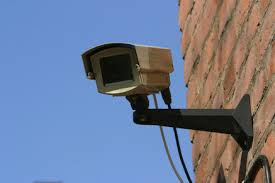

Den registrerede har ret til at se de personoplysninger, den dataansvarlige behandler om den registrerede, og få en række oplysninger om behandlingen.^[F.eks. it-systemer, men det kan også være tv-overvågningsbilleder, hvor den registrerede optræder eller oplysninger om den registreredes teletrafik mv.]  

Det fremgår f.eks. af databeskyttelsesforordningens præambelbetragtning (forord) nr. 63, at en registreret bør have ret til indsigt i personoplysninger, der er indsamlet om vedkommende, og til let og med rimelige mellemrum at udøve denne ret med henblik på at forvisse sig om og kontrollere en behandlings lovlighed. 

Dette omfatter registreredes ret til indsigt i deres helbredsoplysninger, f.eks. data i deres lægejournaler om diagnoser, undersøgelsesresultater, lægelige vurderinger samt enhver behandling og ethvert indgreb, der er foretaget.

---


### <font color="red">Ret til berigtigelse<sup> Premium </font></sup>


Den registrerede har ret til at få urigtige/forkerte personoplysninger om sig rettet. 


---

### <font color="red">Ret til sletning eller "retten til at blive glemt"<sup> Premium </font></sup>


---

**Video:  Indsigelsesret og anmodning om sletning**

<div class="video-container"><iframe src="https://www.youtube.com/embed/bJAmhsu0Xjg" width="853" height="480" frameborder="0" allowfullscreen="allowfullscreen"></iframe></div>

---

Det fremgår af bestemmelsen i forordningens artikel 17, stk. 1, hvornår en registreret har *ret* til at få personoplysninger om sig slettet af den dataansvarlige uden unødig forsinkelse, og den dataansvarlige samtidig har *pligt* til at slette personoplysninger uden unødig forsinkelse. 

Bestemmelsen i forordningens artikel 17, stk. 1, må skulle forstås således, at forpligtelsen for den dataansvarlige til at slette som udgangspunkt alene opstår, når den registrerede gør brug af sin ret. 

Dette ændrer dog ikke på, at den dataansvarlige til stadighed skal overholde principperne i forordningens artikel 5 om bl.a. formålsbegrænsning, dataminimering, rigtighed og opbevaringsbegrænsning. 

Bestemmelsen gælder for enhver, men i præambelbetragtning nr. 65 fremhæves, at retten navnlig er relevant, når den registrerede har givet sit samtykke som barn og ikke fuldt ud var bekendt med risiciene i forbindelse med behandling, og senere ønsker at fjerne sådanne oplysninger, særligt på internettet.^[Jf. betænkning nr. 1565/2017, afsnit 4.7.3.1. Ret til sletning - artikel 17, stk. 1.]  

Det fremgår desuden, at den registrerede bør kunne udøve denne rettighed, uanset om vedkommende ikke længere er barn. 


---

### <font color="red">Ret til begrænsning af behandling<sup> Premium </font></sup>


  
Den registrerede har ret til at få begrænset behandlingen af sine personoplysninger, hvis én af en række betingelser er opfyldt:

a) Den registrerede bestrider rigtigheden af personoplysningerne. 

Den dataansvarlige skal i dette tilfælde begrænse behandlingen af oplysningerne i perioden indtil, den dataansvarlige har haft mulighed for at fastslå, om personoplysningerne er korrekte.

b) Den dataansvarlige behandler oplysningerne ulovligt, og den registrerede modsætter sig sletning af oplysningerne, men anmoder om begrænsning af anvendelsen. 

Den registrerede kan f.eks. foretrække begrænset behandling, hvis den registrerede ønsker, at det skal kunne dokumenteres, hvilke oplysninger, der har indgået i behandlingen af en sag. 

c) Den dataansvarlige har ikke længere brug for personoplysningerne til en behandling, men de er nødvendige for, at et retskrav kan fastlægges, gøres gældende eller forsvares. 

d) Den registrerede har gjort indsigelse mod din behandling. Den dataansvarlige skal begrænse behandlingen af oplysningerne i den periode, hvor det kontrolleres, om den dataansvarlige legitime interesser går forud for den registreredes legitime interesser.


---

### <font color="red">Ret til dataportabilitet<sup> Premium </font></sup>


Retten til *dataportabilitet* indebærer en ret for den registrerede til at modtage egne personoplysninger, som den registrerede har givet til den dataansvarlige, i et struktureret, almindeligt anvendt og maskinlæsbart format til personlig brug uden hindring. 

Den registrerede har i visse tilfælde ret til at modtage sine personoplysninger og til at anmode om, at personoplysningerne overføres fra én dataansvarlig til en anden. 

Ved forordningens artikel 20 er der dermed indført en ny rettighed for den registrerede til dataportabilitet, som indebærer en ret til i visse tilfælde at modtage personoplysninger - som vedkommende har givet til en dataansvarlig - om sig selv i et struktureret, almindeligt anvendt og maskinlæsbart format. 

Herudover indebærer retten til dataportabilitet en rettighed for den registrerede til i visse tilfælde at få transmitteret disse oplysninger om sig selv fra én dataansvarlig til anden uden hindring fra den dataansvarlige, som personoplysningerne er blevet givet til.

Formålet med denne nye rettighed er at øge den registreredes kontrol over egne personoplysninger ved at fremme mulighederne for let at få flyttet, kopieret eller overført vedkommendes personoplysninger til sig selv eller fra én tjenesteudbyder til en anden. 

Retten til dataportabilitet finder ikke anvendelse på behandling, der er nødvendig for at udføre en opgave i samfundets interesse, eller som henhører under offentlig myndighedsudøvelse, som den dataansvarlige har fået pålagt, jf. databeskyttelsesforordningens artikel 20, stk. 3, 2. pkt.


---

**Video: Indsigtsbegæring**

<div class="video-container"><iframe src="https://www.youtube.com/embed/TeJ1xbrjDJU" width="853" height="480" frameborder="0" allowfullscreen="allowfullscreen"></iframe></div>


---

### <font color="red">Ret til indsigelse<sup> Premium </font></sup>


Den registrerede har ret til at gøre indsigelse mod en ellers lovlig behandling af sine personoplysninger. 

---

### <font color="red">Ret til ikke at være genstand for en automatisk afgørelse<sup> Premium </font></sup>


Den registrerede har ret til ikke at være genstand for en automatisk afgørelse udelukkende baseret på automatisk behandling, herunder profilering, jf. nærmere databeskyttelsesforordningens artikel 22, stk. 1.

Det er Datatilsynet, som påser at virksomhederne overholder reglerne i databeskyttelsesforordningen og databeskyttelsesloven. 

Derudover udsteder Datatilsynet retningslinjer og anbefalinger for behandling og beskyttelse af persondata.


---

### <font color="red">Dataansvarlig og databehandler<sup> Premium </font></sup>  

---

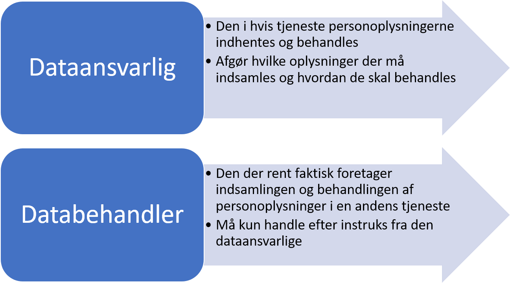


---

**Video: Dataansvarlig og databehandler**

  


<div class="video-container"><iframe src="https://www.youtube.com/embed/L49BE_nqLKU" width="853" height="480" frameborder="0" allowfullscreen="allowfullscreen"></iframe></div>

---

**Video: Data Protection Officer (DPO)**

<div class="video-container"><iframe src="https://www.youtube.com/embed/JlRCfJKrAi0" width="853" height="480" frameborder="0" allowfullscreen="allowfullscreen"></iframe></div>


---

**Video: Fortegnelse**

<div class="video-container"><iframe src="https://www.youtube.com/embed/-M8bYIHlbBA" width="853" height="480" frameborder="0" allowfullscreen="allowfullscreen"></iframe></div>

---


## <font color="red">Bøder for overtrædelse<sup> Premium </font></sup>

---

**Video: Bøder

<div class="video-container"><iframe src="https://www.youtube.com/embed/RBKJ6SBtEIY" width="853" height="480" frameborder="0" allowfullscreen="allowfullscreen"></iframe></div>

---

Hvis databeskyttelsesforordningens regler overtrædes, kan virksomheden blive straffet af domstolene med meget store bøder.

Overtrædelser kan medføre bøder på op til 20.000.000 EUR, eller hvis det drejer sig om en virksomhed, med op til 4% af virksomhedens samlede globale omsætning i det forudgående regnskabsår, hvis dette beløb er højere end 20.000.000 EUR.

Datatilsynets kompetence til at udstede administrative bødeforelæg er begrænset til tilfælde, hvor sagen er egnet hertil. 

Det vil sige i ukomplicerede sager, hvor der ikke er bevismæssige tvivlsspørgsmål. 

Det er endvidere en forudsætning, at der i retspraksis er fastlagt et tilstrækkeligt præcist bødeniveau for den pågældende overtrædelse.

Som eksempler på sager, der kan anses for egnede til at blive afsluttet ved udstedelse af et administrativt bødeforelæg, kan nævnes sager om utilsigtet offentliggørelse af oplysninger på internettet. 

Sådanne sager er karakteriseret ved, at man ved en fejl er kommet til at offentliggøre oplysninger på internettet. 

Udstedelse af administrative bødeforelæg kan også tænkes anvendt i sager om overtrædelse af reglerne om de registreredes rettigheder, herunder oplysningspligten.

---

**De første bøder sager er begyndt at komme:**


*Datatilsynet fandt efter tilsyn hos møbelvirksomheden, IDdesign A/S, i oktober 2018, at der var sket behandling af ca. 385.000 kunders personoplysninger i strid med databeskyttelsesforordningens krav om opbevaringsbegrænsning, jf. Datatilsynets j.nr.: 2018-41-0015.*

*Datatilsynet rettede i sin afgørelse kritik mod i alt fire forhold vedrørende sletning hos møbelvirksomheden. Indgivelse af politianmeldelse mod IDdesign og indstilling til bøde på 1,5 mio. kr. skete alene på baggrund af det første forhold. For så vidt angår de sidste tre, udtalte Datatilsynet "alvorlig kritik".*

*Det første forhold rettede sig mod møbelvirksomhedens behandling af kundernes personoplysninger i et ældre ERP-system, der på tidspunktet for tilsyn kun blev brugt i tre butikker. I systemet behandledes oplysninger om kundernes navn, adresse, telefonnummer, e-mail og købshistorik.* 

*I alt blev mere end 820.000 kunders personoplysninger behandlet i det gamle ERP-system. Over halvdelen af disse kunders personoplysninger blev opbevaret i henhold til bogføringslovens § 10 om opbevaring af regnskabsmateriale. Derudover blev personoplysninger om en mindre gruppe på 448 kunder opbevaret, fordi der forelå et mellemværende mellem kunden og IDdesign.* 

*For de resterende kunder forelå der efter Datatilsynets vurdering ikke længere et gyldigt behandlingsformål, og disse kunders personoplysninger blev derfor behandlet i strid med kravet om opbevaringsbegrænsning.*

*De sidste tre forhold omhandlede henholdsvis manglende fastsættelse og dokumentation af slettefrister i det gamle ERP-system, manglende efterlevelse af egne fastsatte slettefrister for personoplysningerne i det nye ERP-system samt manglende dokumentation for sletteprocedurer for virksomhedens rekrutterings- og HR-system.*

---

**Datatilsynet indstiller taxaselskab til bøde på 1,2 mio. kr. Knap 9 mio. personhenførbare taxature er blevet gemt uden et sagligt formål, vurderer Datatilsynet, jf. j.nr.: 2018-41-0016:**

*Resume*


*Datatilsynet var i efteråret 2018 på et tilsynsbesøg hos Taxa 4x35 , hvor der bl.a. blev set på, om taxaselskabet har fastsat frister for sletning af kundernes oplysninger - og om fristerne bliver efterlevet.*

*Ifølge Taxa 4x35 anonymiseres de oplysninger, der anvendes til kundens bestilling og afvikling af taxature, efter to år, da der herefter ikke længere er behov for at kunne identificere kunden.*

*Det er imidlertid kun kundens navn, der slettes efter de to år - men ikke kundens telefonnummer. Oplysninger om kundens taxature (herunder opsamlings- og afleveringsadresser) kan derfor fortsat henføres til en fysisk person via telefonnummeret, som først slettes efter fem år.*

*Grunden til, at telefonnummeret ikke slettes, er ifølge taxaselskabet, at nummeret er nøglen til systemets database og derfor er nødvendigt i forhold til virksomhedens produkt- og forretningsudvikling.*

*Efter Datatilsynets opfattelse kan man imidlertid ikke fastsætte en slettefrist, som er tre år længere end nødvendigt, blot fordi virksomhedens system gør det besværligt at efterleve reglerne i databeskyttelsesforordningen.*
 
---

## <font color="red">Spørgsmål og svar på databeskyttelsesreglerne<sup> Premium </font></sup>


Ofte stillede spørgsmål til datatilsynet:^[Følgende afsnit om spørgsmål og svar, jf. Datatilsynets hjemmeside: https://www.datatilsynet.dk/generelt-om-databeskyttelse/ofte-stillede-spoergsmaal/.]

---

**Generelt:**

*Betragtes et billede som en personoplysning?*

Ja, hvis det drejer sig om et billede af en genkendelig person, vil der være tale om en personoplysning omfattet af databeskyttelsesreglerne.

---

*Skal jeg have Datatilsynets tilladelse til at behandle personoplysninger?*

Oftest nej.

I nogle meget få tilfælde skal private virksomheder mv. dog indhente Datatilsynets tilladelse, inden behandlingen påbegyndes.

---

*Hvem er den dataansvarlige?*

Databeskyttelsesforordningen definerer ”den dataansvarlige” som den fysiske eller juridiske person, offentlige myndighed, institution mv., der alene eller sammen med andre afgør, til hvilket formål og med hvilke hjælpemidler der må foretages behandling af oplysninger.

Det afgørende er, hvem der faktisk afgør, hvordan oplysningerne skal behandles.

---

*Har jeg efter de databeskyttelsesretlige regler pligt til at udlevere oplysninger om mig?*

Nej, databeskyttelsesreglerne handler kun om, hvornår en offentlig myndighed, privat virksomhed mv. kan og må behandle personoplysninger.

Reglerne fastslår ikke, hvornår en offentlig myndighed, privat virksomhed mv. har krav på at få oplysninger om dig.

Du skal imidlertid være opmærksom på, at det i en konkret situation kan følge af anden lovgivning, at du har pligt til at udlevere oplysninger om dig, og hvilke konsekvenser det har, hvis du ikke ønsker at udlevere oplysningerne.

---

*Jeg er blevet opmærksom på, at diverse hjemmesider har oplysninger om mig, fx om min bil eller min bolig. Hvad gør jeg?*

Private virksomheder mv. kan som udgangspunkt lovligt indsamle, registrere, bearbejde og videregive personoplysninger, der er indhentet fra et eller flere offentligt tilgængelige registre såsom Statstidende, CVR, Bilbogen, Motorregistret og lignende.

Der findes ingen specifikke regler i databeskyttelsesforordningen og databeskyttelsesloven om private virksomheders mv. behandling af sådanne oplysninger, men Datatilsynet har i konkrete tilfælde tidligere vurderet lovligheden af sådanne behandlinger ud fra den såkaldte interesseafvejningsregel, hvor tilsynet har lagt særlig vægt på, at oplysningerne stammer fra offentligt tilgængelige kilder.

Du har ret til at gøre indsigelse over for den private virksomhed mv. mod dennes behandling af oplysninger om dig.

Det skal dog bemærkes, at idet behandlingen af sådanne oplysninger som udgangspunkt er lovlig, vil din indsigelse kun blive anset for berettiget, hvis særligt tungtvejende grunde, der vedrører din særlige situation, taler for, at behandlingen af dine oplysninger (alligevel) ikke må finde sted.

---

*Kan jeg få erstatning, hvis oplysninger om mig er blevet behandlet i strid med de databeskyttelsesretlige regler?*

Hvis du har lidt et økonomisk tab ved en behandling, der er sket i strid med databeskyttelsesreglerne, kan det være, at du har ret til erstatning.

Økonomisk tab som følge af overtrædelser af databeskyttelsesreglerne kan bl.a. forekomme ved ukorrekt databehandling i forbindelse med kreditoplysning, e-handel og i ansættelsessituationer.

Datatilsynet kan dog ikke hjælpe dig, hvis du mener, at du har krav på erstatning. Du skal i stedet indbringe sagen for domstolene.

---

*Kan man blive straffet, hvis man ikke overholder den databeskyttelsesretlige lovgivning?*

Ja. Du kan blive straffet med bøde eller fængsel i indtil 6 måneder, hvis du overtræder visse af databeskyttelsesreglerne.

--- 

**Foreninger**

*Jeg sidder i bestyrelsen for en lille forening. Er vi omfattet af den databeskyttelsesretlige lovgivning?*

Ja. Databeskyttelsesreglerne gælder for behandling af personoplysninger, uanset størrelsen af den organisation eller virksomhed, der foretager behandlingen.

---

*Hvilke oplysninger må man registrere om foreningens medlemmer?*

Foreningers registrering af oplysninger om medlemmerne er omfattet af databeskyttelsesreglerne.

Det er i orden, at en forening registrerer almindelige oplysninger som f.eks. indmeldelsesdato, id-oplysninger, evt. tillids- eller hvervsposter m.m. 

En forening vil som udgangspunkt også kunne registrere oplysninger af mere speciel karakter som f.eks. oplysninger om et medlems bedste score, golfhandicap, certifikat niveau m.m.

---

*Må jeg videregive oplysninger om, hvem der er medlem af foreningen?*

Du må som udgangspunkt gerne videregive sådanne oplysninger internt i foreningen, fx i form af en medlemsliste i et medlemsblad, der alene distribueres internt i foreningen, eller på en lukket internetside, hvor kun foreningens medlemmer har adgang.

Det kræver dog et samtykke fra det enkelte medlem, hvis du ønsker at offentliggøre en medlemsliste på det åbne internet.

Efter Datatilsynets opfattelse er et medlemskab af en forening, uanset at denne måtte være en ukontroversiel, fx en sportsforening, en privat sag.

---

*Skal jeg være opmærksom på noget, når jeg sender e-mails til foreningens medlemmer?*

Hvis du masseudsender en e-mail med informationer mv. til alle foreningens medlemmer, skal du være opmærksom på, hvor du angiver modtagernes e-mailadresser.

E-mailadresser på modtagere af en sådan masseudsendelse bør ikke fremgå af selve e-mailen, og du bør derfor placere modtagernes e-mailadresser i e-mailens bcc-felt, således at modtagerne ikke kan se hinandens e-mailadresser.

---

**Forskning**

*Hvem er dataansvarlig for et forskningsprojekt?*

Ved afgørelsen af hvem der er dataansvarlig for personoplysninger i et forskningsprojekt, kan der bl.a. lægges vægt på:

Hvem har taget initiativ til projektet?

Hvem finansierer projektet?

Aflønnes forskeren af f.eks. den offentlige myndighed?

På hvilket it-udstyr vil der ske behandling af forskningsoplysningerne?

Hvem har instruktionsbeføjelser i projektet?

Hvad vil der ske, hvis forskeren finder et nyt job – vil den pågældende fortsætte projektet efterfølgende?

Hvem kan tage skridt til sletning?

Hvem deltager i projektet?

Hvor længe skal forskningsprojektet forløbe?

---

*Må jeg anvende oplysninger fra et forskningsprojekt til andre formål, fx sagsbehandling eller markedsføring?*

Nej. Oplysninger, der behandles med henblik på at udføre en undersøgelse af væsentlig samfundsmæssig betydning (forskningsdata), må ikke senere behandles i andet end statistisk eller videnskabeligt øjemed.

Det betyder, at oplysningerne ikke kan anvendes til fx markedsføring, sagsbehandling eller patientbehandling.

---

*Må vi videregive personoplysninger til et forskningsprojekt?*

Oftest ja. Videregivelse af personoplysninger forudsætter dog, at databeskyttelsesreglerne overholdes, herunder at der er hjemmel til videregivelsen, og at de grundlæggende behandlingsregler om saglighed, nødvendighed og proportionalitet er overholdt.

Har vi som privat virksomhed, offentlig myndighed mv. pligt til at videregive personoplysninger til et forskningsprojekt?
Nej, databeskyttelsesreglerne fastlægger kun, hvornår offentlige myndigheder, private virksomheder mv. kan og må behandle personoplysninger.

Reglerne siger ikke noget om, hvornår en offentlig myndighed, privat virksomhed mv. er forpligtet til at udlevere personoplysninger til andre.

---

*Må vi indhente oplysninger fra patientjournaler til et forskningsprojekt?*

Der findes særlige regler om videregivelse af oplysninger fra patientjournaler mv. til en forsker til brug for et konkret sundhedsvidenskabeligt forskningsprojekt i sundhedsloven.

Styrelsen for Patientsikkerhed skal under visse omstændigheder godkende en videregivelse fra patientjournaler mv.

Du bedes kontakte Styrelsen for Patientsikkerhed, hvis du har spørgsmål herom.

---

*Hvad gælder for multinationale forskningsprojekter?*

Databeskyttelsesreglerne skal overholdes i forbindelse med gennemførelse af multinationale forskningsprojekter.

Oftest er det afgørende at få afklaret, hvor dataansvaret er placeret, samt hvorvidt der anvendes databehandlere.

---

*Hvornår skal oplysningerne i et projekt slettes?*

Oplysningerne i et projekt skal slettes, når det ikke længere er nødvendigt at behandle oplysningerne i personhenførbar form i forhold til projektets gennemførelse.

Oplysningerne skal senest slettes ved undersøgelsens afslutning, eller når en statistik er udarbejdet. 

Alternativt kan oplysningerne anonymiseres, så det ikke længere er muligt at identificere de registrerede personer, eller overføres til arkiv efter arkivlovens regler.

---

**Internet og apps**

*Kan jeg kræve, at oplysninger om mig bliver slettet fra en hjemmeside?*

Du kan gøre indsigelse mod behandling, fx en offentliggørelse, af oplysninger om dig.

Du skal i første omgang gøre indsigelse over for den private virksomhed, privatperson, offentlige myndighed mv., som har offentliggjort oplysninger om dig på en hjemmeside.

Hvis du har svært ved at finde ud af, hvem der står bag en hjemmeside, kan du eventuelt slå hjemmesiden op i DK Hostmasters WHOIS-database. 

Det er en database over alle registrerede, danske hjemmesider. Du kan finde den her.

Hvis den private virksomhed mv. ikke vil slette oplysningerne, kan du klage til Datatilsynet.

---

*Kan jeg kræve, at forkerte oplysninger om mig bliver rettet eller slettet?*

Efter databeskyttelsesreglerne har du krav på, at forkerte oplysninger om dig bliver rettet eller slettet.

Hvis du mener, at der er registreret forkerte oplysninger om dig hos en privat virksomhed, offentlig myndighed mv., skal du i første omgang kontakte virksomheden, myndigheden mv.

Hvis den private virksomhed, offentlige myndighed mv. ikke vil rette eller slette oplysningerne om dig, kan du klage til Datatilsynet. 

Der gælder dog særlige regler for det offentlige. Kommuner og andre offentlige myndigheder er normalt forpligtet til at opbevare sagsoplysninger sådan, at en sags forløb kan dokumenteres. 

Datatilsynet har afgjort en række sager, hvor det har betydet, at oplysninger hos en offentlig myndighed ikke kunne kræves slettet.

Myndigheden skal notere dine protester ned, så det ses i sagen, at du har en anden opfattelse end myndigheden.

Må jeg lægge billeder af andre op på internettet uden deres samtykke?
Det afhænger af billedet. 

Ved offentliggørelse af billeder på internettet skelnes overordnet set mellem situationsbilleder og portrætbilleder.

Som altovervejende udgangspunkt kræver det personens samtykke at offentliggøre et portrætbillede af vedkommende på internettet.

Et situationsbillede kan som udgangspunkt offentliggøres uden samtykke, hvis det er harmløst.

Her kan du læse mere om, hvornår et billede betragtes som et situations- eller portrætbillede, og hvad du i øvrigt skal være opmærksom på, når du offentliggør billeder på internettet:

https://www.datatilsynet.dk/emner/internet-og-apps/billeder-paa-internettet/

---

*Er der oplysninger om andre, som jeg ikke må offentliggøre på internettet?*

Ja. Visse oplysninger anses som følsomme oplysninger. 

Det kan fx være at en anden person lider af en bestemt sygdom, eller at en anden person har en bestemt politisk overbevisning.

Du må normalt kun offentliggøre den slags oplysninger, hvis du har et klart og tydeligt samtykke fra den person, som oplysningerne vedrører, eller hvis oplysningerne tidligere er blevet offentliggjort af personen selv.

Oplysninger om race eller etnisk oprindelse, politisk, religiøs eller filosofisk overbevisning eller fagforeningsmæssigt tilhørsforhold, helbredsoplysninger eller oplysninger om seksuelle forhold eller seksuel orientering betragtes som følsomme personoplysninger. 

Tilsvarende betragtes genetisk og biometrisk data med det formål entydigt at identificere en fysisk person som følsomme personoplysninger.

Vær i øvrigt opmærksom på, at hvis det, du skriver, er meget krænkende, kan det være, at du overtræder straffeloven.

---

**Klagemuligheder**

*Hvordan kan jeg klage?*

Datatilsynet fører tilsyn med, at offentlige myndigheder, private virksomheder mv. behandler personoplysninger i overensstemmelse med databeskyttelsesforordningen og databeskyttelsesloven.

Det er som udgangspunkt i første omgang op til den ansvarlige virksomhed, myndighed mv. at vurdere, hvorvidt behandling af oplysninger sker inden for rammerne af databeskyttelsesreglerne.

Hvis du mener, at en offentlig myndighed, privat virksomhed eller lignende behandler oplysninger om dig i strid med databeskyttelsesreglerne, bør du derfor i første omgang rette henvendelse til dem, få deres forklaring på sagen og bede dem om at tage stilling til din henvendelse.

Hvis det drejer sig om personoplysninger i forbindelse med et opslag på Facebook eller et andet socialt medie eller en debattråd på et debatforum, bør du kontakte den pågældende person, der står bag opslaget, få deres syn på sagen og bede dem om at slette eller fjerne oplysningerne.

Efterfølgende kan du overveje, om du fortsat har brug for at få Datatilsynets vurdering af sagen.

Du kan kun klage over behandling af oplysninger om dig selv og ikke om andre. 

Du kan dog altid lade en anden klage på dine vegne, hvis du giver vedkommende en fuldmagt, ligesom du kan klage på en andens vegne, hvis du har en fuldmagt fra vedkommende.

Du kan finde Datatilsynets kontaktoplysninger og telefontider her:

https://www.datatilsynet.dk/kontakt/

---

*Hvordan klager jeg over et opslag på et socialt medie?*

Hvis du ønsker at klage over behandling af personoplysninger i forbindelse med et opslag på Facebook eller et andet socialt medie eller en debattråd på et debatforum, bør du kontakte den pågældende person, der står bag opslaget, få deres syn på sagen og bede dem om at slette eller fjerne oplysningerne.

Efterfølgende kan du overveje, om du fortsat har brug for at få Datatilsynets vurdering af sagen.

Du kan kontakte Datatilsynet telefonisk, per e-mail eller brevpost, hvis du ønsker at blive vejledt om dine muligheder eller ønsker at klage over en behandling af personoplysninger om dig.

Du finder Datatilsynets kontaktoplysninger og telefontider:

https://www.datatilsynet.dk/kontakt/

---

*Kan jeg klage over oplysninger om mig i medierne?*

Mediernes behandling af personoplysninger er i vidt omfang undtaget fra databeskyttelsesreglerne og Datatilsynets tilsynskompetence.

I nogle tilfælde kan Pressenævnet behandle en klage. Du kan læse mere herom på Pressenævnets hjemmeside:

https://www.pressenaevnet.dk/


---

*Hvem skal jeg kontakte, hvis mit hemmelige telefonnummer er blevet offentliggjort af en nummeroplysningstjeneste?*

Hvis en nummeroplysningstjeneste, fx De Gule Sider, Krak mv., offentliggør oplysninger om hemmeligt telefonnummer, skal du rette henvendelse til dit teleselskab eller den pågældende nummeroplysningstjeneste, hvis du vil have stoppet offentliggørelsen.

Hvis du har spørgsmål til eller ønsker at klage over en nummeroplysningstjeneste, skal du rette henvendelse til Energistyrelsen.

Du finder Energistyrelsens kontaktinformation her:

https://ens.dk/

---

*Hvem skal jeg kontakte vedrørende helbredsoplysninger i patientjournaler?*

Hvis du ønsker at klage over en sag om aktindsigt (indsigt) eller videregivelse af helbredsoplysninger efter reglerne i sundhedsloven, kan du kontakte Styrelsen for Patientsikkerhed.

Du kan læse mere om mulighederne for at klage til Styrelsen for Patientsikkerhed her:

https://stps.dk/

---

*Mine oplysninger er blevet brugt i forbindelse med en sag ved domstolene**.

Hvis du har spørgsmål til domstolenes behandling af personoplysninger kan du kontakte Domstolsstyrelsen for at høre nærmere.

Du kan læse mere på Domstolsstyrelsens hjemmeside:

http://www.domstol.dk/OM/ORGANISATION/DOMSTOLSSTYRELSEN/Pages/default.aspx

---

*Jeg er blevet udsat for identitetstyveri. Kan I hjælpe?*

Hvis du har været udsat for identitetstyveri, fx ved at en anden person har misbrugt dit navn eller personnummer til at optage et lån, kan Datatilsynet ikke hjælpe dig. Du bør i stedet anmelde forholdet til politiet.

Du kan læse mere om identitetstyveri på www.borger.dk, hvor du også kan se 10 gode råd til, hvordan du minimerer risikoen for identitetstyveri.

---

**Personnummer**

*Skal jeg oplyse mit personnummer (CPR) til en privat virksomhed, hvis de beder om det?*

Private må efter databeskyttelsesloven bl.a. behandle oplysninger om personnummer (CPR), når det følger af lov eller bestemmelser fastsat i henhold til lov, eller når den registrerede har givet sit udtrykkelige samtykke hertil.

Du kan bede virksomheden oplyse, hvad der er grunden til, at du bliver bedt om personnummer, herunder om brugen af dit personnummer har et relevant og sagligt formål, eller om det er lovgivning, som kræver, at virksomheden registrerer dit personnummer.

Databeskyttelsesregler bestemmer dog kun, om private må registrere dit personnummer. Reglerne bestemmer ikke, hvornår en virksomhed har krav på at få dit personnummer.

Datatilsynet kan derfor ikke sige, om det i en konkret situation har konsekvenser, at du ikke ønsker at give samtykke til registrering af dit personnummer.

---

*Må en virksomhed påføre mit personnummer i deres brevpost til mig?*

Det anses almindeligvis for at være en tilstrækkelig sikker fremgangsmåde at fremsende oplysninger per brevpost.

Det er derfor ikke i strid med databeskyttelsesreglerne, at et brev indeholder et personnummer, medmindre det kan læses, fx i brevruden.

Det er i øvrigt strafbart efter straffeloven at bryde brevhemmeligheden.

---

**Rettigheder**

*Kan jeg få indsigt i, hvilke oplysninger en offentlig myndighed, privat virksomhed mv. behandler om mig?*

Du har ret til at få oplyst, hvilke oplysninger en offentlig myndighed, privat virksomhed mv. har registreret om dig elektronisk.

Du har krav på at få oplyst bl.a. hvilke oplysninger om dig, der behandles, formålet med behandlingen, kategorierne af modtagere af oplysningerne og tilgængelig information om, hvor oplysningerne kommer fra.

Du kan læse meget mere om emnet i Datatilsynets vejledning om de registreredes rettigheder:

https://www.datatilsynet.dk/media/6893/registreredes-rettigheder.pdf

---

*Hvordan kan jeg bede om indsigt?*

Der gælder ingen regler for, hvordan du skal bede om indsigt. Det kan både gøres telefonisk, per brev eller per e-mail.

---

*Hvad gør jeg, hvis en offentlig myndighed, privat virksomhed mv. behandler forkert oplysninger om mig?*

Hvis du mener, der er registreret forkerte oplysninger om dig, kan du kontakte den offentlige myndighed, private virksomhed mv., som efter din opfattelse behandler forkerte oplysninger.

Det vil være en god idé tydeligt at skrive, hvilke oplysninger, du mener, er forkerte – og hvorfor.

Du kan både henvende dig telefonisk, per brev eller per e-mail.

Når den offentlige myndighed, private virksomhed mv. har modtaget din henvendelse, skal de vurdere, om oplysningerne skal slettes, blokeres eller rettes.

Hvis de ikke vil slette, blokere eller rette oplysningerne, kan du klage til Datatilsynet.

Blokering er en særlig markering af oplysningerne, som indebærer, at man fortsat må opbevare oplysningerne, men ikke behandle eller bruge oplysningerne i øvrigt. Blokering bruges dog sjældent.

Normalt kan oplysninger hos offentlige myndigheder dog ikke slettes på grund af særlige regler i offentlighedsloven og arkivloven.

---

**Samtykke**

*Kan der ske behandling af personoplysninger uden et samtykke?*

Ja. Behandling af oplysninger kan ske på en række andre grundlag end den registreredes samtykke. 

Det konkrete grundlag afhænger af, hvilken type oplysninger, der ønskes behandlet.

---

*Kan jeg tilbagekalde mit samtykke?*

Ja, et samtykke kan til enhver tid tilbagekaldes.

Hvis et samtykke tilbagekaldes, skal behandlingen af oplysninger om den registrerede ophøre, hvis oplysningerne ikke kan behandles på et andet grundlag.

En tilbagekaldelse af et samtykke har ikke tilbagevirkende kraft, og tilbagekaldelsen påvirker derfor ikke den behandling af oplysninger, der er sket forud for tilbagekaldelsen.

Udgangspunktet er, at den dataansvarlige skal ophøre med at behandle oplysningerne så hurtigt som muligt, hvis den registrerede tilbagekalder sit samtykke.

Det er vigtigt at være opmærksom på, at opbevaring af den registreredes oplysninger også er en behandling, som derfor skal ophøre ved tilbagekaldelsen. 

Det gælder dog kun de oplysninger, der er behandlet på grundlag af samtykket, men derimod ikke oplysninger, hvor behandlingsgrundlaget er et andet end samtykke – eksempelvis en kontrakt mellem den dataansvarlige og den registrerede. 
 
Den registrerede har ret til at få oplysninger om sig selv slettet, når et samtykke er tilbagekaldt. 

Selvom den registrerede ikke selv anmoder om det, bør den dataansvarlige tage stilling til spørgsmålet om at slette oplysningerne, hvis behandlingen alene hviler på samtykke, idet der ikke længere er et lovligt grundlag i forhold til opbevaring af den registreredes oplysninger. 
 
I nogle tilfælde vil det dog være muligt at fortsætte en behandling, selvom den registrerede har tilbagekaldt sit samtykke.  
 
En fortsat behandling må således kunne finde sted, hvis den er rimelig i forhold til den registrerede. 

Vælger den dataansvarlige at fortsætte behandlingen, kan den registreredes uvilje tale imod at anse den dataansvarliges interesse for at være berettiget, og en afvejning af de modstridende interesser vil derfor kunne falde ud til den registreredes fordel. 
 
Har den dataansvarlige et andet lovligt grundlag for behandling end samtykke med et selvstændigt formål – eksempelvis opbevaring af oplysninger af hensyn til overholdelse af reglerne om bogføring – vil denne behandling endvidere fortsat kunne finde sted. 
 
Fortsættes behandlingen på et andet grundlag, skal den registrerede have information om behandlingsgrundlag, formål mv.

Du kan læse mere om emnet i Datatilsynets vejledning om samtykke:

https://www.datatilsynet.dk/media/6562/samtykke.pdf

---

**Tv-overvågning**

*Må jeg som privatperson opsætte tv-overvågning?*

Det kommer først og fremmest an på, hvilke områder, du ønsker at tv-overvåge.

Private må ikke foretage tv-overvågning af områder, der benyttes til almindelig færdsel. Det står i tv-overvågningsloven.

For andre områder regulerer loven derimod ikke, hvornår tv-overvågning er tilladt. For sådanne områder har tv-overvågningsloven kun betydning for, om der er pligt til at oplyse om, at der sker tv-overvågning.

Derudover skal tv-overvågningsbilleder opbevares, slettes mv. i overensstemmelse med databeskyttelsesreglerne. Databeskyttelsesreglerne gælder dog ikke for private personer, der foretager tv-overvågning som led i rent personlige eller familiemæssige aktiviteter.  

Som eksempel på en rent personlig eller familiemæssig aktivitet kan nævnes:

Efter gentagne indbrud vil en familie for at få billeder af tyvene sætte kameraer op i haven og i indkørslen til deres parcelhus. 

Tv-overvågningen er lovlig, da der ikke er tale om områder, som benyttes til almindelig færdsel. 

Kameraerne skal sættes op, så de ikke filmer uden for grunden, f.eks. fortovet. Familiens opbevaring af optagelserne er undtaget fra databeskyttelsesreglerne.

Det er dog vigtigt at være opmærksom på, at tv-overvågningen ikke længere vil være som led i rent personlige eller familiemæssige aktiviteter, hvis familien deler tv-overvågningsbillederne med andre end politiet.

OBS: Datatilsynet er ikke tilsynsmyndighed i forhold til tv-overvågningsloven. Hvis du mener, at der er tale om overtrædelse af tv-overvågningslovens regler, kan henvendelse ske til politiet.

---

*Kan en arbejdsgiver opsætte tv-overvågning på arbejdspladsen?*

Der gælder visse begrænsninger i arbejdsgiverens adgang til at indføre kontrolforanstaltninger, herunder tv-overvågning af ansatte. De vigtigste begrænsninger er:

Der skal foreligge et driftsmæssigt formål.

Det må ikke være krænkende for de ansatte.

Der skal søges opnået en aftale med de ansatte.

Enkeltmandskontorer må ikke tv-overvåges uden den ansattes samtykke. Det følger af straffeloven.

Den, der foretager tv-overvågning af en arbejdsplads, skal ved skiltning eller på anden tydelig måde oplyse om, at området er tv-overvåget. Det følger af tv-overvågningsloven.

Udover tv-overvågningslovens krav om skiltning mv. skal arbejdsgiveren sørge for at give medarbejdere og andre med regelmæssig gang på arbejdspladsen, fx rengøringspersonale, oplysninger som påkrævet efter databeskyttelsesreglerne. 

De ansatte skal bl.a. oplyses om formålet med tv-overvågningen og om, i hvilke tilfælde optagelserne vil blive gennemgået og videregivet til politiet. Oplysningerne kan fx gives i retningslinjer for arbejdspladsen eller i en personalehåndbog.

Informationen skal være forudgående, så f.eks. nyansatte skal have besked i forbindelse med deres ansættelse, eller når de begynder at arbejde i tv-overvågede lokaler.

OBS: Datatilsynet er ikke tilsynsmyndighed i forhold til tv-overvågningsloven. Hvis du mener, at der er tale om overtrædelse af tv-overvågningslovens regler, kan henvendelse ske til politiet.

---

*Skal der informeres om, at et område er tv-overvåget?*

Offentlige myndigheder, private virksomheder mv., der foretager tv-overvågning af steder eller lokaler, hvortil der er almindelig adgang, eller af arbejdspladser, skal ved skiltning eller på anden tydelig vis give oplysning herom. Det følger af tv-overvågningsloven.

Uanset en eventuel skiltning gælder databeskyttelsesforordningens regler om oplysningspligt. 

Det betyder, at selv om den offentlige myndighed, private virksomhed mv. informerer om tv-overvågning ved at opsætte skilte herom, så skal de også være opmærksomme på i fornødent omfang at give oplysninger som krævet i databeskyttelsesforordningen.

OBS: Datatilsynet er ikke tilsynsmyndighed i forhold til tv-overvågningsloven. Hvis du mener, at der er tale om overtrædelse af tv-overvågningslovens regler, kan henvendelse ske til politiet.

---

*Må man optage lyd i forbindelse med tv-overvågning?*

Straffeloven forbyder bl.a. hemmelig aflytning eller optagelse af samtaler mellem andre.

Forbuddet gælder overalt og altså også fx på områder, som benyttes til almindelig færdsel (vej, sti, plads mv.), i butikker og befordringsmidler mv., på kontorer og arbejdspladser og i private hjem.

Straffeloven indebærer, at det normalt vil være forbudt i tilknytning til en tv-overvågning også at aflytte eller optage lyd, medmindre aflytningen eller optagelsen sker med samtykke fra mindst en af deltagerne i den samtale, der aflyttes eller optages.

---

**Whistleblowerordninger**

*Hvad er en whistleblowerordning?*

En whistleblowerordning har til formål, at personer med tilknytning til virksomheden kan orientere en virksomhed hurtigt og fortroligt om alvorlige forseelser – eller mistanke herom – der kan få betydning for virksomheden som helhed eller enkeltpersoners liv eller helbred.

---

*Er det lovpligtigt at oprette en whistleblowerordning?*

Det er lovpligtigt for nogle virksomheder at oprette en whistleblowerordning, mens det for andre virksomheder er frivilligt.

Visse typer af finansielle virksomheder skal efter lov om finansiel virksomhed have en whistleblowerordning. 

Tilsvarende gælder for visse revisionsvirksomheder efter lov om godkendte revisorer og revisionsvirksomheder.

Derudover er visse erhvervsdrivende efter den nye hvidvasklov, der trådte i kraft den 26. juni 2017, forpligtet til at oprette en whistleblowerordning.

Ovenstående er blot eksempler på lovpligtige whistleblowerordninger, og Datatilsynet henviser herudover til den øvrige særlovgivning.

---

*Kræver det en tilladelse fra Datatilsynet, hvis en virksomhed vil oprette en whistleblowerordning?*

Nej. Tidligere krævedes det Datatilsynet tilladelse, når man ønskede at behandle følsomme personoplysninger i forbindelse med en whistleblowerordning, men det er ikke længere tilfældet efter databeskyttelsesforordningen og databeskyttelsesloven.

---

**Video: Resumé af databeskyttelsesreglerne**

<div class="video-container"><iframe src="https://www.youtube.com/embed/cnPsjUIThK8" width="853" height="480" frameborder="0" allowfullscreen="allowfullscreen"></iframe></div>

---

**Video: GDPR For Dummies**

<div class="video-container"><iframe src="https://www.youtube.com/embed/jaYdR_cPpq8" width="853" height="480" frameborder="0" allowfullscreen="allowfullscreen"></iframe></div>

---

**Video:Persondata og personaleadministration**

<div class="video-container"><iframe src="https://www.youtube.com/embed/1XFvmzxlrwo" width="853" height="480" frameborder="0" allowfullscreen="allowfullscreen"></iframe></div>

---

**Litteratur om databeskyttelsesreglerne:**

*Sonny Kristoffersen*: Kend databeskyttelsesreglerne (2019), *Henrik Waaben* og *Kristian Korfits Nielsen*: Lov om behandling af personoplysninger med kommentarer, 3. udg. (2015), *Peter Blume*: Den nye persondataret – persondataforordningen (2016), og samme: Databeskyttelsesret, 4. udg. (2013), *Peter Blume* og *Jens Kristiansen*: Persondataret i ansættelsesforhold (2011), samt – med særlig henblik på behandling af personoplysninger i den offentlige forvaltning – kapitel 8 i *Niels Fenger*, Forvaltningsloven med kommentarer (2013).


---

## <font color="red">Podcasts databeskyttelse<sup> Premium </font></sup>

---

**Spam Podcastserie #1 - Den nye spamvejledning og forhåndsafkrydsning (med Forbrugerombudsmanden).**^[Følgende podcast er hentet fra Datatilsynets hjemmeside.]

<iframe width="100%" height="300" scrolling="no" frameborder="no" allow="autoplay" src="https://w.soundcloud.com/player/?url=https%3A//api.soundcloud.com/tracks/558812247&color=%23a8a89c&auto_play=false&hide_related=false&show_comments=true&show_user=true&show_reposts=false&show_teaser=true&visual=true"></iframe>

---

**Spam Podcastserie #2 - Den nye spamvejledning, SoMe og tilsvarende varer (med Forbrugerombudsmanden)**


<iframe width="100%" height="300" scrolling="no" frameborder="no" allow="autoplay" src="https://w.soundcloud.com/player/?url=https%3A//api.soundcloud.com/tracks/563799759&color=%23a8a89c&auto_play=false&hide_related=false&show_comments=true&show_user=true&show_reposts=false&show_teaser=true&visual=true"></iframe>

---


**Geo-blocking podcast #1 - Praktiske råd om databeskyttelsesforordningen (med Dansk Erhverv)**

<iframe width="100%" height="300" scrolling="no" frameborder="no" allow="autoplay" src="https://w.soundcloud.com/player/?url=https%3A//api.soundcloud.com/tracks/535689081&color=%23a8a89c&auto_play=false&hide_related=false&show_comments=true&show_user=true&show_reposts=false&show_teaser=true&visual=true"></iframe>

---

**GDPR Podcastserie #1 - Bliv 100 metermester i GDPR på "10 minutter"**

<iframe width="100%" height="300" scrolling="no" frameborder="no" allow="autoplay" src="https://w.soundcloud.com/player/?url=https%3A//api.soundcloud.com/tracks/434422440&color=%23a8a89c&auto_play=false&hide_related=false&show_comments=true&show_user=true&show_reposts=false&show_teaser=true&visual=true"></iframe>


---

**GDPR Podcastserie #2 - Op og ned om databehandleraftaler (i og uden for EU)**

<iframe width="100%" height="300" scrolling="no" frameborder="no" allow="autoplay" src="https://w.soundcloud.com/player/?url=https%3A//api.soundcloud.com/tracks/434422758&color=%23a8a89c&auto_play=false&hide_related=false&show_comments=true&show_user=true&show_reposts=false&show_teaser=true&visual=true"></iframe>

---

**GDPR Podcastserie #3 - Videregivelse og opbevaring af informationer om dine kunder**

<iframe width="100%" height="300" scrolling="no" frameborder="no" allow="autoplay" src="https://w.soundcloud.com/player/?url=https%3A//api.soundcloud.com/tracks/439222899&color=%23a8a89c&auto_play=false&hide_related=false&show_comments=true&show_user=true&show_reposts=false&show_teaser=true&visual=true"></iframe>

---

**GDPR Podcastserie #4 - GDPR ift. brugeranmeldelser, nyhedsbreve og SOME**

<iframe width="100%" height="300" scrolling="no" frameborder="no" allow="autoplay" src="https://w.soundcloud.com/player/?url=https%3A//api.soundcloud.com/tracks/444258768&color=%23a8a89c&auto_play=false&hide_related=false&show_comments=true&show_user=true&show_reposts=false&show_teaser=true&visual=true"></iframe>

---

**GDPR Podcastserie #5 - Retten til at blive ”glemt”**

<iframe width="100%" height="300" scrolling="no" frameborder="no" allow="autoplay" src="https://w.soundcloud.com/player/?url=https%3A//api.soundcloud.com/tracks/448490415&color=%23a8a89c&auto_play=false&hide_related=false&show_comments=true&show_user=true&show_reposts=false&show_teaser=true&visual=true"></iframe>

---


**GDPR Podcastserie #6 – Den store opsamling**

<iframe width="100%" height="300" scrolling="no" frameborder="no" allow="autoplay" src="https://w.soundcloud.com/player/?url=https%3A//api.soundcloud.com/tracks/518638341&color=%23a8a89c&auto_play=false&hide_related=false&show_comments=true&show_user=true&show_reposts=false&show_teaser=true&visual=true"></iframe>

---


 

<!--chapter:end:10.Rmd-->

# <font color="red">Bekæmpelse af hvidvask og terrorfinansiering<sup> Premium </font></sup>

```{r, echo=FALSE, results='asis'}
cat(readLines('npp.html'))
```


## <font color="red">Intro til hvidvaskloven<sup> Premium </font></sup>


Lov nr. 651 af 8. juni 2017 om forebyggende foranstaltninger mod hvidvask og finansiering af terrorisme (hvidvaskloven) er et regelsæt, som skal sikre, at de virksomheder, som er omfattet af loven, kender deres kunder og de transaktioner, som de foretager. 

Hvidvasklovens formål er at sikre, at Danmark bidrager til den internationale kamp mod hvidvask af penge og finansiering af terrorisme.

---

**Video: Sådan foregår hvidvask?**

<div class="video-container"><iframe src="https://www.youtube.com/embed/67jlG9dPs54" width="853" height="480" frameborder="0" allowfullscreen="allowfullscreen"></iframe></div>

---

 
**Video: Danske Bank Hvidvask/Tæt på sandheden**

<div class="video-container"><iframe src="https://www.youtube.com/embed/1q0K01SQavk" width="853" height="480" frameborder="0" allowfullscreen="allowfullscreen"></iframe></div>

---


### <font color="red">Begrebet "hvidvask"<sup> Premium </font></sup>

---

**Video:How does money laundering work? - Delena D. Spann**

<div class="video-container"><iframe src="https://www.youtube.com/embed/257wV-AbKaE" width="853" height="480" frameborder="0" allowfullscreen="allowfullscreen"></iframe></div>


---

Definitionen af ”hvidvask” fremgår af lovens § 3, stk. 1. 

Hvidvask er uberettiget at modtage eller skaffe sig eller andre del i økonomisk udbytte eller midler, der er opnået ved en strafbar lovovertrædelse. 

Lovbestemmelsen beskriver udtrykket »hvidvask«. 

Beskrivelsen tager udgangspunkt i straffelovens § 290 om hæleri. Direktivets definition af hvidvask findes i art. 1, stk. 3.

Efter hvidvasklovens § 3, stk. 2 er hvidvask også uberettiget at skjule, opbevare, transportere, hjælpe til afhændelse eller på anden måde efterfølgende virke til at sikre det økonomiske udbytte eller midlerne fra en strafbar lovovertrædelse. 

Strafbar overtrædelse omfatter både overtrædelse og forsøg på af straffeloven og af speciallovgivningen samt tilsvarende strafbare forhold begået i udlandet.

Hvidvask er at sikre udbytte fra en strafbar handling.

Der kan være tale om penge eller andre værdier, som stammer fra handel med narko, menneskesmugling, våbensmugling, røveri, eller penge som er opnået gennem f.eks. underslæb, skatteunddragelse, bedrageri, korruption eller insiderhandel.


For at kunne bruge udbyttet fra en strafbar handling skal de personer, som har begået handlingen, sørge for at få udbyttet til at se ud, som om at det er erhvervet på lovlig vis.

Derfor skal udbyttets ulovlige oprindelse skjules.

Dette kan f.eks. ske ved at sløre pengenes oprindelse eller ændre pengenes identitet ved f.eks. at veksle til en anden valuta. 

Det kan eksempelvis også ske ved at flytte udbyttet til et sted, hvor det ikke vil få nærmere opmærksomhed.

Hvidvask omfatter både det at skaffe sig selv eller andre del i udbyttet af en strafbar handling. 

Hvidvask omfatter også gerningsmandens egne dispositioner over udbyttet (selvhvidvask).

Af hvidvasklovens § 3, stk. 2, omfatter hvidvask således også gerningsmandens egne dispositioner over udbyttet, der i dansk ret ikke straffes som hæleri, fordi straf for før forbrydelsen udtømmende gør op med strafansvar for også de senere tilknyttede dispositioner. 

Hvidvaskbegrebet i i lovens § 3, stk. 1 omfatter således både handlinger, der er udført af den, der har begået før forbrydelsen (tredjemand), og handlinger udført af gerningsmanden.

Hvidvask er ikke nødvendigvis en kompliceret proces. 

Der er tale om hvidvask fra den første fase, hvor man f.eks. indsætter kontanter på en bankkonto eller veksler til en anden valuta eller køber fast ejendom. 

Det vil eksempelvis også være tilstrækkeligt, at en person kortvarigt tillader en anden person at deponere penge på sin konto eller i en boks.

Det er vigtigt at bekæmpe hvidvask, da denne type kriminalitet gør det vanskeligt at opdage strafbare handlinger. 

Derudover er det stødende for den almindelige retsopfattelse, at kriminelle skal kunne nyde godt af udbytte, der er opnået gennem strafbare handlinger.

En effektiv bekæmpelse af hvidvask vil virke forebyggende for alt økonomisk kriminalitet, da det vil vanskeliggøre kriminelles muligheder for at sikre udbyttet.

---


```{r echo=FALSE}
library(kableExtra)

fr <- data.frame(
  Aktivitet = c(rep("Anbringelse<br><br>Det ulovlige udbytte anbringes, Det kan fx. være i det finansielle system.", 1), rep("Sløring<br><br>Det ulovlige udbytte adskilles fra dets kilde. Det kan f.eks. ske gennem (finansielle) transaktioner.",1 ),rep("Anvendelse<br><br>Udbytte tilbageføres til gerningsrmanden. Det kan f.eks. være i en form, hvor udbyttet er ændret til midler eller aktiver, der ser ud til at være lovlige.",1)),
  EksempelA = c(
    "Indbetaling af kontanter i en bank (evt. blandet med midler fra lovlig virksomhed)",
    "Elektronisk overførsel til udlandet (ofte ved brug af selskaber uden reel aktivitet. eller midlerne maskeres som udbytte fra lovlige forretninger)", 
    "Tilbageførsel som betaling for (fiktive) lån eller betaling af (fiktive) fakturaer"
  ),
  EksempelB = c(
    "Udførsel af kontanter til udlandet",
    "Indsættelse af kontanter i en bank i udlandet ", 
    "Et kompliceret net af overførsler nationalt og internationalt, der gør det næsten umuligt at spore midlernes oprindelige kilde"
  ),
  EksempelC = c(
    "Anvendelse af kontanter til køb af højværdivarer, fast ejendom eller aktiver til erhvervsvirksomhed ",
    "Salg af de købte varer/aktiver", 
    "Indtægt fra fast ejendom eller virksomhed, der fremstår som lovlig"
  )
)
names(fr) <- c("Aktivitet" ,"Eksempel 1" , "Eksempel 2" , "Eksempel 3")
kable(fr,  format = "html", escape = FALSE,caption = "Hvidvask i praksis") %>%
  kable_styling(full_width = T,font_size = 10,bootstrap_options = c("responsive","bordered","striped")) %>%
  column_spec(1, bold = T, border_right = T, color = "white", background = "black") %>%
  row_spec(0,italic = T, color = "white", background = "grey",font_size = 12) %>%
  # column_spec(0, angle = -45)%>%
  # scroll_box(width = "500px") %>%
  scroll_box(width = "100%") %>%
footnote(general = "Hvidvasksekretariatet",general_title = "Kilde: ")
```

---

### <font color="red">Kontantforbud<sup> Premium </font></sup>

Hvidvaskloven viderefører det tidligere gældende kontantforbud, jf. lovens § 5. 

Således er det forbudt for »erhvervsdrivende«, der ikke er omfattet af hvidvaskloven, jf. dennes § 1, at modtage kontantbetalinger på 50.000 kr. eller derudover, hvad enten betalingen sker på én gang eller som flere betalinger, der ser ud til at være indbyrdes forbundet.

Bestemmelsen omfatter således ikke private. 

Ikke kun erhvervsdrivendes salg af genstande, men også f.eks. deres levering af tjenesteydelser og salg af fast ejendom er omfattet af forbuddet mod at modtage kontantbetalinger på eller over beløbsgrænsen.

---

Se Højesteretsdom i U.2019.2445 H om overtrædelse af kontantforbuddet:

**"Hvidvasklovens kontantforbud overtrådt i forbindelse med kontantsalg af brugte biler. T ApS solgte i perioden fra januar 2015 til marts 2016 mere end 500 brugte biler til udenlandske opkøbere mod kontant betaling. I langt de fleste tilfælde var prisen for den enkelte bil under 50.000 kr., men i 19 tilfælde var der sket salg af en enkelt bil til en enkelt kunde, som havde betalt mere end 50.000 kr. kontant for bilen. I ni yderligere tilfælde var der sket kontantsalg af en bil til en pris af mere end 50.000 kr., men i disse tilfælde havde T også solgt andre biler for mindre end 50.000 kr. til samme kunde. I de resterende tilfælde havde T ApS foretaget kontantsalg af flere biler til samme kunde den samme dag, hvor prisen for den enkelte bil var mindre end 50.000 kr., men hvor summen af de kontante beløb havde været større end 50.000 kr. T ApS blev i landsretten idømt en bøde på 190.000 kr. for de 19 tilfælde af salg af en enkelt bil for en kontant betaling af mere end 50.000 kr., men i øvrigt frifundet. Højesteret skulle alene tage stilling til de forhold, hvori T ApS var blevet frifundet. Højesteret fandt, at der også ved salget af de ni biler til en pris af mere end 50.000 kr., men som var solgt sammen med andre biler, var sket en overtrædelse af kontantforbuddet i hvidvaskloven, og idømte T ApS en bøde på 90.000 kr. for disse forhold, jf. hvidvasklovens § 78, stk. 4, jf. stk. 1, jf. § 5. På baggrund af landsrettens bevisbedømmelse, som Højesteret ikke kunne efterprøve, jf. retsplejelovens § 933, stk. 2, jf. § 912, stk. 1, nr. 4, modsætningsvis, lagde Højesteret til grund, at T ApS ikke i videre udstrækning end ved salget af de 28 biler havde modtaget kontant betaling af 50.000 kr. eller derover på én gang eller havde modtaget flere kontantbetalinger på under 50.000 kr., som var eller så ud til at være indbyrdes forbundet på en måde, som indebar overtrædelse af hvidvasklovens kontantforbud. Højesteret stadfæstede herefter landsrettens dom med den ændring, at bødestraffen til T ApS blev forhøjet med 90.000 kr. til 280.000 kr."**

---

Kontantforbuddet vil således kun ramme betaling af f.eks. leje af hus eller husrum, leje af bil eller levering af vand, varme og gas eller elektricitet, hvis betalingen for en enkelt periode udgør 50.000 kr. eller derover. 

Hvis der derimod er tale om ratevis betaling, eksempelvis i forbindelse med køb af en løsøregenstand eller en fast ejendom eller i forbindelse med betaling for en entrepriseydelse eller en rejse, vil de enkelte rater være indbyrdes forbundne, og kontantforbuddet vil dermed ramme tilfælde, hvor den samlede betaling udgør 50.000 kr. eller derover.


---


### <font color="red">Falskmøntneri<sup> Premium </font></sup>


Det følger af hvidvasklovens § 6, stk. 1, at: 

*virksomheder og personer, der som led i deres virksomhed deltager i håndtering og udlevering af pengesedler og mønter til offentligheden, herunder personer og virksomheder, hvis aktivitet består i at veksle pengesedler og mønter i forskellig valuta, har pligt til at tage alle sedler og mønter, som de ved eller har grund til at tro er falske, ud af omløb. Sedler og mønter, der er taget ud af omløb i overensstemmelse med 1. pkt., skal straks overgives til politiet*.

Lovens bestemmelser er svarende til Rfo 1338/2001 om fastlæggelse af de foranstaltninger, der er nødvendige for at beskytte euroen mod falskmøntneri (offentliggjort i EFT 2001 L 181/6), samt Rfo 1339/2001, der udvider bestemmelserne i ovennævnte forordning 1338/2001 til også at gælde for EU-lande uden for eurosamarbejdet, herunder Danmark (offentliggjort i EFT 2001 L 181/11). 

Forordninger gælder umiddelbart i hver medlemsstat. Gengivelsen af forordningen i loven er alene begrundet i praktiske hensyn og berører ikke forordningens gyldighed i Danmark. 

Overtrædelse af pligten til at tage falske penge ud af omløb anses for omfattet af straffelovens §§ 166-170 om forbrydelser vedrørende penge.

---

## <font color="red">Kriminalitetsforebyggelse i de finansielle virksomheder<sup> Premium </font></sup>


---

**Video: Hvidvask-skandalen: Så mange advarsler fik Danske Bank**

<div class="video-container"><iframe src="https://www.youtube.com/embed/b94ktmFWP6c" width="853" height="480" frameborder="0" allowfullscreen="allowfullscreen"></iframe></div>


---

Hvidvasklovens overordnede formål er, at Danmark bidrager med reguleringsmæssige tiltag, der kan styrke indsatsen mod, at kriminelle misbruger danske virksomheder og det finansielle system til hvidvask af penge og terrorfinansiering, og at forhindre, at den finansielle stabilitet og tilliden til det finansielle system skades som følge af misbrug af finansielle institutioner til hvidvask og finansiering af terrorisme.^[Følgende afsnit bygger på Finanstilsynets vejledning om lov om forebyggende foranstaltninger mod hvidvask og finansiering af terrorisme (hvidvaskloven) af oktober 2018.] 

Hvidvask af penge og finansiering af terrorisme foregår ofte i internationalt regi, og hvidvaskloven gennemfører derfor dele af de seneste internationale standarder fra Financial Action Task Force (FATF) fra 2012 og dele af Europa-Parlamentets og Rådets direktiv 2015/849/EU af 20. maj 2015 om forebyggende foranstaltninger mod anvendelse af det finansielle system til hvidvask af penge eller finansiering af terrorisme (herefter 4. hvidvaskdirektiv).


De virksomheder og personer, der til dagligt håndterer pengeoverførsler og andre finansielle transaktioner, er væsentlige aktører i kampen mod hvidvask og terrorfinansiering. 

Der påhviler dem således et stort samfundsansvar med henblik på at begrænse risikoen for, at de bliver udnyttet til hvidvask af ulovlige midler eller terrorfinansiering. 

Med henblik på at sikre, at dette ikke sker, har virksomhederne og personerne et ansvar for og en pligt til at gennemføre de rette foranstaltninger for at forhindre, at de misbruges til hvidvask og terrorfinansiering.

---


---

Med hvidvaskloven ændres den tidligere gældende regulering fra at være primært regelbaseret til at blive mere *risikobaseret*. 

Hermed sikres grundlaget for en mere målrettet og effektiv indsats baseret på en risikobaseret tilgang til bekæmpelse af hvidvask- og terrorfinansiering hos både myndigheder og omfattede virksomheder og personer.

Ved at hvidvaskreglerne ændres til at være mere risikobaserede, sættes rammerne for et mere fleksibelt system, der giver virksomhederne mulighed for at fokusere indsatsen mod de egentlige risikoområder. 

Virksomheder og personer skal herefter individuelt vurdere, om et kundeforhold kan kategoriseres som henholdsvis begrænset, almindelig eller øget risiko. 

Det overlades således til erhvervslivet at identificere og håndtere risici, så disse har mulighed for at prioritere ressourcer til områder med øget risiko for hvidvask eller finansiering af terrorisme. 

Dog opretholdes identificerede højrisikoområder.

Et *risikobaseret system* medfører også, at tilsynsmyndighederne efter loven skal udøve et risikobaseret tilsyn. 

Dette betyder blandt andet, at der ved udførelse af tilsynet skal tages hensyn til det skøn, som den enkelte virksomhed eller person overlades i medfør af hvidvaskloven.

Hvidvaskloven indfører en *opmærksomhedspligt*, som består i, at de af loven omfattede virksomheder og personer generelt skal være *opmærksomme på kundernes aktiviteter*, som på grund af deres særlige karakter menes at kunne have tilknytning til hvidvask eller finansiering af terrorisme.

Hvidvaskloven stiller skærpede krav i forhold til den tidligere hvidvasklov for så vidt angår de af loven omfattede virksomheders og personers kendskab til deres kunder. 

Hvidvaskloven stiller krav om legitimation af kunderne med henblik på identifikation af disse med navn og cpr-nr./cvr-nr., herunder stiller hvidvaskloven krav om *kendskab til virksomhedskunders fysiske ejerkreds med kontrollerende indflydelse (reelle ejere) over disse*. 

Endvidere skal der indhentes oplysninger om kundens formål med *forretningsforbindelsen* samt om omfanget heraf, ligesom *kundeforholdet* løbende skal overvåges.

Hvidvaskloven giver mulighed for at foretage *legitimationsproceduren*, herunder tilvejebringelse af *kundekendskabet*, ud fra en risikobaseret tilgangsvinkel, således at der ikke i alle tilfælde stilles de sammen krav dertil.

Hvidvaskloven stiller dog skærpede krav til *kundekendskabet* ud fra en vurdering af, at der i visse tilfælde er en særlig risiko for hvidvask eller terrorfinansiering. 

De skærpede krav gælder især over for kunder, der er såkaldte *politisk udsatte personer*, dvs. personer, som er bosiddende i udlandet og bestrider eller har bestredet højere politiske poster. 

De øgede krav gælder også i tilfælde, hvor kunden ikke har været fysisk til stede for at legitimere sig samt over for korrespondentbanker i lande uden for EU.

Hvidvaskloven giver mulighed for at undtage fra kravene til legitimation og kundekendskab, hvor risikoen for hvidvask og terrorfinansiering vurderes at være lille. 

Endvidere giver loven mulighed for under særlige betingelser at benytte sig af identitetsoplysninger mv., der er indhentet af tredjemand.

*Underretningspligten er udvidet* i forhold til den tidligere lov på den måde, at de af loven omfattede virksomheder og personer ikke kun skal underrette Statsadvokaten for Særlig Økonomisk og International Kriminalitet ved mistanke om, at en transaktion har tilknytning til overtrædelse af straffeloven. 

Der skal også ske underretning ved mistanke om overtrædelse af særlovgivningen. 

Underretningspligten er dog begrænset til overtrædelser, der kan straffes med fængsel i over ét år.

Tilsynet med de personer og virksomheder, der er omfattet af hvidvaskloven, er delt mellem Finanstilsynet, Erhvervsstyrelsen og Advokatrådet.

---

## <font color="red">Hvem er omfattet af hvidvaskloven<sup> Premium </font></sup>


Efter hvidvasklovens § 1, stk. 1, nr. 1, er pengeinstitutter omfattet af lovens anvendelsesområde. 

*Pengeinstitutter* er virksomheder, der udøver virksomhed, som består i at modtage indlån eller andre midler fra offentligheden, der skal tilbagebetales, samt i at yde lån for egen regning. 

Sådanne virksomheder skal have tilladelse som pengeinstitut i henhold til § 7 i lov om finansiel virksomhed.

*Realkreditinstitutter* er omfattet af lovens anvendelsesområde, jf. lovens § 1, stk. 1, nr. 2. 

Realkreditinstitutter er virksomheder, der yder lån mod registreret pant i fast ejendom på grundlag af udstedelse af realkreditobligationer og særligt dækkede realkreditobligationer eller særligt dækkede obligationer. 

Sådanne virksomheder skal have tilladelse som realkreditinstitut i henhold til § 8 i lov om finansiel virksomhed.

*Fondsmæglerselskaber* er omfattet af lovens anvendelsesområde, jf. § 1, stk. 1, nr. 3. 

Fondsmæglerselskaber er virksomheder, der over for tredjemand udøver aktiviteter, som omfatter værdipapirer i nærmere angivet omfang, og som ikke har tilladelse som pengeinstitut, realkreditinstitut eller *investeringsforvaltningsselskab*. 

Sådanne virksomheder skal have tilladelse som *værdipapirhandler* i henhold til § 9 i lov om finansiel virksomhed.

Efter hvidvasklovens § 1, stk., 1, nr. 4, er *livsforsikringsselskaber og tværgående pensionskasser* omfattet af lovens anvendelsesområde. Sådanne virksomheder skal have tilladelse som forsikringsvirksomhed i henhold til § 11 i lov om finansiel virksomhed. 

Det er alene livsforsikringsselskabernes og de tværgående pensionskassers livs- og pensionsforsikringer, der er omfattet af loven. 

Selv om der siden 1995 har været hjemmel for livsforsikringsselskaber til at tegne forsikringer inden for skadesforsikringsklasserne 1 og 2, dvs. syge- og ulykkesforsikringer, er tegning af disse forsikringer ikke omfattet.

Tværgående pensionskasser er i § 304 i lov om finansiel virksomhed defineret som foreninger eller sammenslutninger, hvis medlemmer enten er uddannet inden for bestemte uddannelsesområder eller er ansat i virksomheder af en bestemt art, og som har til formål som led i ansættelsesvilkårene eller som led i en anden tilknytning til en virksomhed at sikre pension efter ensartede regler for alle medlemmerne, eller hvis medlemmer er selvstændige erhvervsdrivende inden for samme branche, og som har til formål at sikre pension efter ensartede regler for alle medlemmer. 

Sådanne virksomheder skal have tilladelse efter lov om finansiel virksomhed og behandles i det væsentlige efter samme regler som forsikringsselskaber, der driver livsforsikringsvirksomhed.

Efter hvidvasklovens § 1, stk. 1, nr. 5, er *sparevirksomheder* omfattet af lovens anvendelsesområde. Sparevirksomheder udøver virksomhed, som består i erhvervsmæssigt eller som et væsentligt led i deres drift at modtage indlån eller andre midler, der skal tilbagebetales fra offentligheden. 

Sådanne virksomheder skal have tilladelse som sparevirksomhed i henhold til § 334 i lov om finansiel virksomhed, hvis virksomheden ikke har tilladelse som pengeinstitut, realkreditinstitut eller *investeringsforvaltningsselskab* eller er oprettet i henhold til særlig lov, eller hvis oprettelse ikke er godkendt i henhold til særlig lov.

*Udbydere af betalingstjenester og udstedere af elektroniske penge* er omfattet af lovens anvendelsesområde, jf. § 1, stk. 1, nr. 6. Udøvelse af denne type virksomhed kræver tilladelse i henhold til betalingslovens § 9.  

En betalingstjeneste er f.eks. en tjeneste, der muliggør, at kontantbeløb placeres på en betalingskonto, og alle transaktioner, der er nødvendige for drift af en betalingskonto. 

*Pengeoverførselsvirksomhed er også en betalingstjeneste*. 

Ved *elektroniske penge* forstås en elektronisk eller magnetisk lagret pengeværdi, der repræsenterer et krav på udstederen, som udstedes ved modtagelse af betaling af midler medhenblik på at gennemføre betalingstransaktioner, og som accepteres som betalingsmiddel af andre end udstederen af elektroniske penge. 

Det omfatter blandt andet bredt anvendelige gavekort og forudbetalte kort, f.eks. til offentlig transport.

Efter lovens § 1, stk. 1, nr. 7, er *forsikringsmæglere* omfattet, når de formidler livsforsikring eller andre investeringsrelaterede forsikringer, er omfattet af lovens anvendelsesområde. 

*Forsikringsmæglervirksomhed* defineres i henhold til lov om forsikringsmæglervirksomhed som den aktivitet, der består i at yde kunden rådgivning på basis af en analyse af et så stort antal af de på markedet disponible forsikringsløsninger som muligt, og den aktivitet, der består i at præsentere kunden for forsikringsløsninger fra et eller flere forsikringsselskaber, uden at der er indgået udtrykkelig aftale med forsikringsselskaberne herom. 

Forsikringsmæglere skal have tilladelse i henhold til § 4 i lov om forsikringsformidling. 

Forsikringsmæglere er kun omfattet af hvidvaskloven, når de formidler livsforsikring eller andre investeringsrelaterede forsikringer.

I hvidvasklovens § 1, stk. 1, nr. 8, er øvrige virksomheder og personer, der erhvervsmæssigt udøver aktiviteter som nævnt i lovens bilag 1, omfattet af lovens anvendelsesområde. 

Virksomheder og personer, der er omfattet af nr. 8, er forpligtet til at lade sig registrere hos Finanstilsynet, som betingelse for at kunne udøve den nævnte virksomhed. 

Det er karakteristisk for denne type af erhvervsmæssig virksomhed, at der ikke i henhold til lov om finansiel virksomhed eller anden finansiel regulering er et krav om tilladelse, men at aktiviteten er omfattet af 4. hvidvaskdirektivs definition af *finansieringsinstitut*. 

Det er ikke en forudsætning, at aktiviteten udøves som hovedaktivitet, men der skal være tale om erhvervsmæssig virksomhed. 

Ved *erhvervsmæssig* skal forstås, at aktiviteten i denne sammenhæng udbydes til tredjemand, eller at aktiviteten i øvrigt antager et sådant omfang, at der bliver tale om en ikke ubetydelig del af virksomhedens omsætning. 

Det vil alene være aktiviteten, som nævnt i lovens bilag 1, der er omfattet af lovens anvendelsesområde. 

I det omfang der i øvrigt udøves anden aktivitet, som f.eks. en udbyder af finansiel leasing, der også udbyder operationel leasing, vil udbuddet af operationel leasing ikke være omfattet af hvidvasklovens anvendelsesområde. 

Nr. 8 omfatter bl.a. *factoringselskaber, leasingselskaber, kreditkortselskaber og forbrugerkreditselskaber*. 

I sjældne tilfælde vil en virksomhed ikke have mere end én kunde. Dette er i praksis set i tilfælde, f.eks. hvor en virksomhed alene er oprettet til at foretage finansiel leasing til virksomhedens reelle ejer. 

I sådanne tilfælde, hvor der alene er én kunde, der samtidigt er virksomhedens reelle ejer, ses det ikke hensigtsmæssigt at omfatte virksomheden af lovens anvendelsesområde, og en sådan virksomhed eller person vil heller ikke være registreringspligtig i Finanstilsynet.

*Udenlandske virksomheders filialer, agenter og distributører her i landet*, er omfattet af lovens anvendelsesområde, jf. § 1, stk. 1, nr. 9, hvis disse udøver virksomhed omfattet af lovens § 1, stk. 1, nr. 1-7, 10-11 og 19. 

For agenters og distributørers vedkommende forudsættes det dog, at aktiviteten har et sådant omfang, at den udenlandske virksomhed kan anses at være etableret her i landet. Filialer, agenter og distributører er omfattet, uanset om den udenlandske virksomhed har hjemsted i et land inden for EU/EØS eller et tredjeland.

Bestemmelsen indebærer, at de kompetente myndigheder her i landet i tilfælde af en agents, filials eller distributørs overtrædelse af hvidvaskloven kan strafforfølge agenten, filialen eller distributøren. 

De af virksomhedens kunder, der betjenes af agenten m.v., skal i denne sammenhæng tillige opfattes som den pågældendes kunder i relation til overholdelse af hvidvasklovens krav.

Har en finansiel virksomhed opnået tilladelse til at drive virksomhed i et EU- eller EØS-land (hjemlandet), er der i visse tilfælde mulighed for, at denne virksomhed tillige kan udøves i et andet EU- eller EØS-land (værtslandet) uden særskilt tilladelse fra værtslandet, hvis værtslandets myndigheder forinden er blevet underrettet herom (notifikation) af hjemlandets tilsynsmyndighed. 

Udøvelse af grænseoverskridende virksomhed kan i denne sammenhæng ske enten med eller uden etablering. 

Hvis der ikke er sket etablering via filial, distributør eller agent, har hjemlandets myndigheder ansvar for overholdelse af regler om forebyggende foranstaltninger mod hvidvask og finansiering af terrorisme samt tilsyn.

Hvis etablering har fundet sted, har værtslandets myndigheder ansvar for tilsynet med filialen, distributøren eller agentens overholdelse af regler om forebyggende foranstaltninger mod hvidvask og finansiering af terrorisme, mens hjemlandet bevarer tilsynet med den virksomhed, der udbyder den grænseoverskridende aktivitet, herunder at sikre at koncernen har politikker og procedurer, se herom i §§ 9 og 31 i hvidvaskloven. 4. hvidvaskdirektiv forudsætter i disse tilfælde et tæt samarbejde mellem hjemlandets og værtslandets tilsynsmyndigheder, jf. betragtning 52 i 4. hvidvaskdirektivs præambel.

Udtrykket *agent* skal forstås i overensstemmelse med § 6, nr. 34, i betalingsloven. I henhold hertil defineres en agent som en fysisk eller juridisk person, som handler på vegne af et betalingsinstitut ved udbuddet af betalingstjenester. 

Det fremgår af bemærkningerne til § 6, nr. 18, jf. Folketingstidende 2008/2009, tillæg A, s. 3525, at det forudsættes, at agenten er legitimeret til juridisk at forpligte instituttet, idet det ikke er tilstrækkeligt, at den pågældende alene bistår med markedsføring. 

For agenter af betalingsinstitutter gælder visse særregler om beføjelser for værtslandets tilsynsmyndighed. 

Dette skal ses i sammenhæng med, at beføjelserne til at give og tilbagekalde tilladelser til betalingsinstitutter og *e-pengeinstitutte*r i henhold til de bagvedliggende direktiver tilkommer hjemlandets tilsynsmyndighed.

Efter lovens § 1, stk. 1, nr. 10, er *investeringsforvaltningsselskaber* og forvaltere af alternative investeringsfonde er omfattet af hvidvasklovens anvendelsesområde, hvis disse virksomheder har direkte kundekontakt. 

Investeringsforvaltningsselskaber meddeles tilladelse i henhold til § 9 i lov om finansiel virksomhed, og forvaltere af alternative investeringsfonde skal enten registreres efter § 9 eller have tilladelse i henhold til § 11 i lov om forvaltere af alternative investeringsfonde m.v.

Disse virksomheder kan have direkte kontakt med kunder, hvis selskabet eller forvalteren indgår aftale med en kunde om køb og salg af andele i danske UCITS eller alternative investeringsfonde. 

Generelt kommunikerer investeringsforvaltningsselskaber – med den struktur der er her i landet – ikke direkte med kunder om salg af andele i de investeringsforeninger eller andre danske *UCITS* (Undertakings for Collective Investments in Transferable Securities. jf. nærmere nedenfor), som investeringsforvaltningsselskabet administrerer, da investeringsforvaltningsselskaberne typisk har indgået aftale med et eller flere pengeinstitutter om at varetage dette. 

En del forvaltere af *alternative investeringsfonde* har på samme måde indgået aftaler med pengeinstitutter eller fondsmæglere om salg af andelene i de fonde, som forvalteren har under forvaltning.

Investeringsforvaltningsselskaber og forvaltere indgår aftaler med depositarer og forskellige samarbejdspartnere om *investeringsrådgivning*, porteføljeforvaltning, market making og lignende. 

Sådanne aftaler anses ikke for direkte kunderelationer omfattet af loven.

Både investeringsforvaltningsselskaber og forvaltere af alternative investeringsfonde kan få tilladelse til at udføre forskellige investeringsserviceydelser, herunder investeringsrådgivning og skønsmæssig porteføljepleje, hvilket kan indebære direkte kundekontakt. 

Selskaberne vil i forbindelse med udøvelse heraf være omfattet af kravene i hvidvaskloven.

Der er i dag kun ganske få investeringsforvaltningsselskaber og forvaltere af alternative investeringsfonde, der har tilladelse til at udføre disse ydelser.

I hvidvasklovens § 1, stk. 1, nr. 11, er danske UCITS (Undertakings for Collective Investments in Transferable Securities) og alternative investeringsfonde er omfattet af hvidvasklovens anvendelsesområde, hvis disse virksomheder har direkte kundekontakt.

En UCITS er et investeringsinstitut omfattet af Europa- Parlamentets og Rådets direktiv 2009/65/EF af 13. juli 2009 om samordning af love og administrative bestemmelser om visse institutter for kollektiv investering i værdipapirer (investeringsinstitutter).

Danske UCITS er investeringsforeninger, *SIKAV’er* (selskaber for investering med variabel kapital) og værdipapirfonde, der reguleres i lov om investeringsforeninger m.v. 

*Investeringsforeninger* er i udgangspunktet selvadministrerende foreninger, der skal have en bestyrelse og en direktion. 

Bestyrelsen kan vælge i stedet at delegere den daglige ledelse til et investeringsforvaltningsselskab, hvilket langt de fleste investeringsforeninger har gjort. 

SIKAV’er har en bestyrelse og skal udpege et investeringsforvaltningsselskab til at varetage administrationen af selskabet.

En værdipapirfond administreres af et investeringsforvaltningsselskab og er ikke en selvstændig juridisk enhed.

*Alternative investeringsfonde er kollektive investeringsordninger*, som rejser kapital fra investorer med henblik på at investere kapitalen i overensstemmelse med en defineret investeringspolitik til fordel for disse investorer, og som ikke er en UCITS. 

Alternative investeringsfonde skal udpege en forvalter, der skal forvalte fonden, herunder udføre porteføljepleje og risikostyring i fonden. 

Såfremt fonden ikke udpeger en ekstern forvalter, betragtes fonden som selvforvaltende.

Forvaltere af alternative investeringsfonde og selvforvaltende alternative investeringsfonde er reguleret i lov om forvaltere af alternative investeringsfonde m.v.

Danske UCITS og alternative investeringsfonde vil være omfattet, hvis den danske UCITS eller den alternative investeringsfond har direkte kontakt med kunden. 

Det vil f.eks. kunne opstå i forbindelse med investeringsrådgivning af kunden eller salg af andele i den danske UCITS eller i fonden til kunden. 

Det vil blive betragtet som en direkte kunderelation, hvis den danske UCITS eller fonden selv markedsfører sine andele og aktier og i den forbindelse har kontakt med kunden. 

Kundekontakten er afgørende, idet f.eks. den omstændighed, at fonden har en hjemmeside, ikke i sig selv er nok til, at fonden omfattes af kravene i hvidvaskloven.

En investor vil skulle betragtes som den alternative investeringsfonds kunde, indtil en investering i den alternative investeringsfond er foretaget. 

Herefter vil den pågældende investor skulle betragtes som reel ejer, jf. definitionen af reel ejer i hvidvasklovens § 2, nr. 9, hvis investor i øvrigt opfylder betingelserne herfor. 

Kundeforholdet i forhold til hvidvaskreglerne anses derfor for afsluttet, når transaktionen er gennemført. 

En eksisterende investor i en dansk UCITS eller alternativ investeringsfond er at betragte som kunde, hvis investoren foretager fornyet henvendelse til den pågældende danske UCITS eller alternative investeringsfond, selvom investoren allerede har investeret i den samme danske UCIT Seller alternative investeringsfond. 

Dette svarer til gældende praksis. Langt de fleste danske UCITS og danske alternative investeringsfonde har indgået en forvaltningsaftale med et investeringsforvaltningsselskab eller en forvalter af alternative investeringsfonde, herunder aftale om markedsføring af andele i den danske UCITS eller fonden, hvorfor kun ganske få UCITS og alternative investeringsfonde vil være omfattet af loven. 

Som nævnt under hvidlovens § 1, stk. 1, nr. 10, vil investeringsforvaltningsselskabet eller forvalteren af alternative investeringsfonde herefter typisk indgå aftale med et eller flere pengeinstitutter eller fondsmæglere om at påtage sig disse ydelser.

Investeringsforeninger kan vælge at være selvadministrerende, og danske alternative investeringsfonde kan vælge at være selvforvaltende, jf. henholdsvis § 6 i lov om investeringsforeninger og § 4 i lov om forvaltere af alternative investeringsfonde m.v. 

Er en investeringsforening eller en alternativ investeringsfond enten selvadministrerende eller selvforvaltende, udføres alle funktionerne i foreningen eller fonden. 

Der findes kun få af disse foreninger og fonde. 

En selvadministrerende forening eller en selvforvaltende fond kan have indrettet sig således, at de udøver rådgivning og/ eller salg af investeringsforeningsbeviser og andele i fonden, hvorved de omfattes af hvidvaskloven. 

Hovedparten af de selvadministrerende investeringsforeninger og selvforvaltende fonde har imidlertid indrettet sig således, at de henviser investorer til pengeinstitutter, og derfor ikke selv har kundekontakten.

Hvis der i en alternativ investeringsfond udøves aktiviteter, der ikke relaterer sig til selve den kollektive investering men f.eks. til driften af en ejendom i en ejendomsfond, vil denne aktivitet ikke være omfattet af hvidvaskloven.

Det følger af lovens § 1, stk. 1, nr. 12, at operatører af regulerede markeder, der har fået tilladelse her i landet til at være auktionsplatform i henhold til Kommissionens forordning 2010/1031/EU af 12. november 2010 om det tidsmæssige og administrative forløb af *auktioner over kvoter for drivhusgasemissioner* og andre aspekter i forbindelse med sådanne
auktioner i medfør af Europa-Parlamentets og Rådets direktiv 2003/87/EF om en ordning for handel med kvoter for drivhusgasemissioner i Fællesskabet (herefter CO2-auktioneringsforordningen), er omfattet af lovens anvendelsesområde.

En operatør af en markedsplads er herefter omfattet af hvidvaskloven, når operatøren handler via sin tilladelse til at være auktionsplatform i henhold til CO2-auktioneringsforordningen. 

Bestemmelsen medvirker til at gennemføre dele af CO2-auktioneringsforordningen.

Efter lovens § 1, stk. 1, nr. 13, er aktører, som har tilladelse til at byde direkte på auktioner, der er omfattet af Europa-Kommissionens forordning 2010/1031/EU af 12. november 2010 om det tidsmæssige og administrative forløb af auktioner over kvoter for drivhusgasemissioner og andre aspekter i forbindelse med sådanne auktioner i medfør af Europa-Parlamentets og Rådets direktiv 2003/87/EF om en ordning for handel med kvoter for drivhusgasemissioner i Fællesskabet, og som ikke er et fondsmæglerselskab eller et pengeinstitut med tilladelse som værdipapirhandler, omfattet af hvidvasklovens anvendelsesområde.

Finanstilsynet skal i henhold til CO2-auktioneringsforordningen give tilladelse til fondsmæglerselskaber, pengeinstitutter med tilladelse som værdipapirhandler og CO2-kvotebydere til at byde direkte på auktioner.

Fondsmæglerselskaber og pengeinstitutter med tilladelse som værdipapirhandler er allerede omfattet af hvidvaskloven i medfør af § 1, stk. 1, nr. 1 og 3. 

Denne her bestemmelse sikrer, at juridiske personer, der har fået tilladelse til at byde på auktioner for CO2-kvoter, der er omfattet af CO2- auktioneringsforordningen, også bliver omfattet af hvidvaskloven.

Tilladelse kan gives til virksomheder, der handler for egen regning med finansielle instrumenter eller yder investeringsservice med råvarederivater eller derivataftaler, jf. bilag 5, nr. 10, til lov om finansiel virksomhed, til kunder i deres hovederhverv, dog under forudsætning af, at dette er en accessorisk aktivitet til deres hovederhverv på koncernniveau, og såfremt dette hovederhverv ikke er investeringsservice eller virksomhed som pengeinstitut eller realkreditinstitut i henhold til lov om finansiel virksomhed. 

Det kan f.eks. være et energiselskab, hvis hovederhverv er handel med el og gas (for egen regning), der som en accessorisk aktivitet yder investeringsservice med råvarederivater til kunder for at afdække kundernes risici i relation til energipriserne, eller en grovvarevirksomhed, der handler med korn.

Efter hvidvasklovens § 1, stk. 1, nr. 14, er advokater er omfattet af lovens anvendelsesområde, når de udøver de i litra a og b, opregnede
aktiviteter. 

*Advokater er kun omfattet af loven i relation til klienter*. 

Det antages, at et klientforhold som altovervejende hovedregel kommer i stand ved en udtrykkelig aftale om advokatens udførelse af det pågældende opdrag. 

Et klientforhold kan endvidere komme i stand ved, at advokaten udfører opdraget som led i en offentlig beskikkelsesordning eller i kraft af en testamentarisk bestemmelse, f.eks. når en advokat ved testamente er indsat som bobestyrer.

Derimod er der ikke tale et klientforhold, hvis der alene foreligger en henvendelse fra en person eller virksomhed med anmodning om advokatens bistand. 

Der kan f.eks. være tale om, at advokaten kontaktes telefonisk af en person, der ikke i forvejen er klient hos advokaten, men som ønsker advokatens hjælp i forbindelse med en forestående transaktion, men hvor advokaten ikke ønsker at påtage sig opgaven.

Hvidvasklovens § 1, stk. 1, nr. 14, litra a, omfatter advokater af lovens anvendelsesområde, når de yder bistand ved rådgivning om eller udførelse af transaktioner for deres klienter i forbindelse med køb og salg af fast ejendom eller virksomheder, forvaltning af klienters penge, værdipapirer eller andre aktiver, åbning eller forvaltning af bankkonti eller værdipapirdepoter, tilvejebringelse af nødvendig kapital til oprettelse, drift eller ledelse af virksomheder, eller oprettelse, drift eller ledelse af virksomheder, fonde m.v. 

*Advokaters ejendomsformidlingsvirksomhed* er omfattet af bestemmelsen i det omfang, der udføres forvaltning af klienters aktiver. 

Ejendomsformidlingsvirksomhed, der udøves af en advokat, men ikke i dennes egenskab af at være advokat eller som et led i dennes advokatvirksomhed eller advokatselskab, vil ikke være omfattet af lovens anvendelsesområde, jf. lovens § 1, stk. 1, nr. 17. 

§ 1, stk. 1, nr. 14, litra b, omfatter advokater af lovens anvendelsesområde i de situationer, hvor advokaten foretager en finansiel transaktion eller en transaktion vedrørende fast ejendom på vegne af klienten. For definition af finansiel transaktion og transaktion henvises til lovens § 2, nr. 2 og 10.

Som udgangspunkt er civile retssager, inkassovirksomhed og straffesager ikke omfattet af hvidloven, idet de typisk ikke omfatter bistand til transaktioner af den i lovens § 1, stk. 1, nr. 14, litra a og b, nævnte karakter. 

Tilsvarende gælder voldgiftssager, mediation m.v. og rådgivning om indgåelse af et frivilligt forlig.

Efter hvidvasklovens § 1, stk. 1, nr. 15, er revisorer og revisionsvirksomheder godkendt i henhold til revisorloven er omfattet af lovens anvendelsesområde. 

Bestemmelsen indebærer, at også den revisionsvirksomhed, som en revisor er tilknyttet som ansat eller partner, er omfattet af hvidvaskloven.

Pligterne efter bestemmelsen omfatter kun forhold, der ligger inden for rammerne af den opgave, som revisoren har påtaget sig. 

Revisionsvirksomhed omfatter en bred vifte af opgaver til en bred skare af kunder. 

Opgaver, der kan betegnes som en revisors kerneopgaver, kan blandt andet omfatte revision, afgivelse af andre erklæringer med sikkerhed, bogholderi, forberedelse af årsregnskaber og perioderegnskaber, skatte-, selskabs- og investeringsrådgivning, opgaver hvor kravet om revisorattestation er pålagt kunden ifølge lovgivning eller ifølge private aftaler, opgaver i forbindelse med insolvensbehandling og rådgivning om risikostyring, interne kontroller, bogholderi, regnskabsførelse m.v.

Hvis en revisor i forbindelse med revision af et årsregnskab for en virksomhed får mistanke om, at virksomheden er involveret i hvidvask eller finansiering af terrorisme, vil revisoren således være omfattet af reglerne om undersøgelses og underretningspligt som nævnt i lovens kapitel 5.

En revisionsvirksomhed kan have opgaver, der ikke omfatter revisionsopgaver, og i det tilfælde falder disse opgaver uden for lovens anvendelsesområde. 

Det kunne eksempelvis være, hvis revisionsvirksomhedens HR-afdeling står for rekrutteringer til lederstillinger hos en kunde.

Hvis revisor på baggrund af oplysninger fra en potentiel kunde vælger ikke at påtage sig opgaven, er revisor ikke omfattet af krav om kundekendskabsprocedurer, men underretningspligten i henhold til lovens § 26 gælder fra den potentielle kundes første henvendelse. 

---


---

*Ejendomsmæglere og ejendomsmæglervirksomheder* er omfattet af hvidvasklovens § 1, stk. 1, nr. 16. Begrebet ejendomsmæglere omfatter enhver erhvervsmæssig formidling af køb og salg af fast ejendom, uanset om det er til eller for forbrugere eller til eller for erhvervsdrivende. Advokaters ejendomsformidlingsvirksomhed er omfattet af lovens § 1, stk. 1, nr. 14, litra a, pkt. i.

Hvidvaskloven indebærer, at alle typer af opgaver, som ejendomsmæglere udfører for deres kunder i forbindelse med hvervet som ejendomsmægler, er omfattet af loven, herunder når ejendomsmæglere foretager værdiansættelser mod vederlag eller formidler lejemål.

Efter hvidvasklovens § 1, stk. 1, nr. 17, er virksomheder og personer, der i øvrigt erhvervsmæssigt leverer samme ydelser som de i nr. 14-16 nævnte persongrupper, herunder *revisorer*, som ikke er godkendt i henhold til revisorloven, skatterådgivere og eksterne bogholdere, omfattet af lovens anvendelsesområde.

Disse virksomheder og personer er derfor omfattet, i det omfang virksomheden eller personen i øvrigt ikke er omfattet af § 1, stk. 1. 

Omfattet er f.eks. *revisorer og revisionsvirksomheder*, der ikke er godkendt i henhold til revisorloven, skatterådgivere, eksterne bogholdere og ejendomsadministratorer, i det omfang de erhvervsmæssigt udøver samme aktivitet som en ejendomsmægler, herunder køb og salg af ejendomme, samt ejendomsformidling, der udøves af en advokat, men ikke i dennes egenskab af advokat eller som et led i dennes advokatvirksomhed eller advokatselskab, jf. oven for bemærkningerne til § 1, stk. 1, nr. 14 og 16. 

Virksomheder og personer, der erhvervsmæssigt formidler lejemål, er ikke omfattet af § 1, stk. 1, nr. 17, uanset at en ejendomsmæglers udlejning er omfattet af § 1, stk. 1, nr. 16.

Betegnelsen ”erhvervsmæssigt” skal forstås på tilsvarende måde som nævnt i stk. 1, nr. 8. Herved tydeliggøres det, at mere enkeltstående dispositioner falder uden for betegnelsen.

Også dispositioner, som ligger uden for det job, en person er ansat til, f.eks. hvis en rengøringsassistent eller hjemmehjælper bistår med betaling af regninger, falder uden for betegnelsen. 

For så vidt angår udtrykket ”samme ydelser” henvises til de ydelser, som medfører, at persongrupperne i § 1, stk. 1, nr. 14-16 er omfattet af lovens anvendelsesområde.

Det fremgår af hvidvasklovens § 1, stk. 1, nr. 18, at udbydere af tjenesteydelser til virksomheder er omfattet af lovens anvendelsesområde. Udbydere af tjenesteydelser til virksomheder er defineret i lovens § 2, nr. 12. 

Udbydere af tjenesteydelser til virksomheder er forpligtede til at lade sig registrere hos Erhvervsstyrelsen,

Bestemmelsen i nr. 18 er subsidiær i forhold til bestemmelserne i lovens § 1, nr. 14 og 15, som vedrører advokater og godkendte revisorer. 

Det medfører, at hvis en advokat eller godkendt revisor udøver virksomhed, der falder under ordlyden i såvel § 1, stk. 1, nr. 14 eller 15, og § 1, stk. 1, nr. 18, vil advokaten eller den godkendte revisor være omfattet af hvidvaskloven i henhold til § 1, stk. 1, nr. 14 eller 15 og ikke i henhold til bestemmelsen i nr. 18.

Det er også her et krav, at de omhandlede tjenesteydelser udbydes erhvervsmæssigt. 

Det indebærer, at ydelserne udbydes på markedslignende vilkår, og at virksomheden normalt modtager vederlag som modydelse for udbud af den pågældende tjenesteydelse. 

Det er ikke afgørende, om den pågældende tjenesteydelse er overskudsgivende, eller om der i den konkrete situation ikke betales vederlag. 

Enkeltstående udbud af de omhandlede tjenesteydelser, som ikke kan karakteriseres som erhvervsmæssigt, vil ikke være omfattet.

Efter hvidvasklovens § 1, stk. 1, nr. 19, at *valutavekslingsvirksomhed* er omfattet af lovens anvendelsesområde. 

---


---

Valutavekslingsvirksomheder er forpligtet til at lade sig registrere hos Erhvervsstyrelsen.

Valutaveksling dækker enhver form for veksling af valuta, hvor valutavekslingen udøves erhvervsmæssigt. 

De almindelige tilfælde, hvor en butik modtager betaling i fremmed valuta og giver tilbage idanske kroner, er derfor ikke omfattet. 

Det er dog ikke et krav, at valutaveksling er hovedaktiviteten.

Efter lovens § 1, stk. 1, nr. 20, er udbydere af spil er omfattet af hvidvasklovens anvendelsesområde. 

---


---

Hermed gennemføres artikel 2, stk.1, litra f, i 4. hvidvaskdirektiv.

En udbyder af spil defineres som en juridisk eller fysisk person etableret her i landet, der udbyder spil erhvervsmæssigt i eget navn. 

Loven omfatter ikke udbydere af spil, der ikke er etableret her i landet, og heller ikke spil udbudt ikke-erhvervsmæssigt, som f.eks. spil omfattet af lov om offentligt hasardspil i turneringsform, jf. lovbekendtgørelse nr. 83 af 22. januar 2016.

Alle *udbydere af spil*, som er omfattet af lov om spil, anses for at drive erhvervsmæssig virksomhed. Det er udbyderen af spil, der er omfattet af loven. 

De enkelte forhandlere af spil i butikker, kiosker m.v., som forhandler spillet i spiludbyderens navn, er ikke omfattet af lovens anvendelsesområde.

Har en udbyder af spil en filial, f.eks. et landbaseret kasino, eller egen butik, hvor (hovedsageligt) kun spiludbyderens spilprodukter sælges, bliver udbyderen af spil omfattet af loven, da spiludbyderen dermed betragtes som etableret her i landet.

---


---

Er en udbyder af spil etableret her i landet men udbyder spil online til et andet EU- eller EØS-land, skal Spillemyndigheden i henhold til artikel 45, stk. 2 og 3, i 4. hvidvaskdirektiv, jf. lovens § 31, sikre, at virksomheden overholder lovens regler om forebyggende foranstaltninger om hvidvask og finansiering af terrorisme ved spiludbuddet. 

På tilsvarende måde hvor en spiludbyder ikke er etableret her i landet, skal tilsynsmyndigheden i etableringslandet sikre, at spiludbyderen ved online udbud af spil her i landet overholder etableringslandets regler om forebyggende foranstaltninger om hvidvask og finansiering af terrorisme.

Efter lovens § 1, stk. 1, nr. 21, er Danmarks Nationalbank, i det
omfang den udøver tilsvarende virksomhed som de i § 1, stk. 1, nr. 1 nævnte institutter, er omfattet af lovens anvendelsesområde.

Centralbanker er ikke omfattet af 4. hvidvaskdirektivs anvendelsesområde, idet 4. hvidvaskdirektivs definition af kreditinstitutter ikke omfatter centralbanker. 

Danmarks Nationalbank har imidlertid selv ønsket at være omfattet af loven, da Danmarks Nationalbank f.eks. foretager omveksling af kontanter. Danmarks Nationalbank er ikke underlagt tilsyn i medfør af hvidvaskloven.


Hvidvaskloven indfører en opmærksomhedspligt, som består i, at de af loven omfattede virksomheder og personer generelt skal være opmærksomme på kundernes aktiviteter, som på grund af deres særlige karakter menes at kunne have tilknytning til hvidvask eller finansiering af terrorisme.

Hvidvaskloven stiller skærpede krav i forhold til den tidligere lov for så vidt angår de af loven omfattede virksomheders og personers kendskab til deres kunder. 

Loven stiller krav om legitimation af kunderne med henblik på identifikation af disse med navn og cpr-nr./cvr-nr., herunder stiller loven krav om kendskab til virksomhedskunders fysiske ejerkreds med kontrollerende indflydelse (reelle ejere) over disse. 

Endvidere skal der indhentes oplysninger om kundens formål med forretningsforbindelsen samt om omfanget heraf, ligesom kundeforholdet løbende skal overvåges.


Hvidvaskloven giver mulighed for at foretage legitimationsproceduren, herunder tilvejebringelse af *kundekendskabet*, ud fra en *risikobaseret tilgangsvinkel*, således at der ikke i alle tilfælde stilles de sammen krav dertil.

Loven stiller dog skærpede krav til kundekendskabet ud fra en vurdering af, at der i visse tilfælde er en særlig risiko for hvidvask eller terrorfinansiering. 

De skærpede krav gælder især over for kunder, der er såkaldte *politisk udsatte personer*, dvs. personer, som er bosiddende i udlandet og bestrider eller har bestredet højere politiske poster. 

De øgede krav gælder også i tilfælde, hvor kunden ikke har været fysisk til stede for at legitimere sig samt over for korrespondentbanker i lande uden for EU. 

Hvidvaskloven giver mulighed for at undtage fra kravene til legitimation og kundekendskab, hvor risikoen for hvidvask og terrorfinansiering vurderes at være lille. 

Endvidere giver loven mulighed for under særlige betingelser at benytte sig af identitetsoplysninger mv., der er indhentet af tredjemand.

*Underretningspligten* er udvidet i forhold til den tidligere lov på den måde, at de af loven omfattede virksomheder og personer ikke kun skal underrette Statsadvokaten for Særlig Økonomisk og International Kriminalitet ved mistanke om, at en transaktion har tilknytning til overtrædelse af strfl. 

Der skal også ske underretning ved mistanke om overtrædelse af speciallovgivningen. 

Underretningspligten er dog begrænset til overtrædelser, der kan straffes med fængsel i over ét år.

Tilsynet med de personer og virksomheder, der er omfattet af loven, er delt mellem Finanstilsynet, Erhvervsstyrelsen og Advokatrådet. 

Hvidvaskloven gennemfører dele af EP/Rdir 2015/849 om forebyggende foranstaltninger mod anvendelse af det finansielle system til hvidvaskning af penge og finansiering af terrorisme (4. hvidvaskdirektiv). 

Reglerne i direktivet om spillekasinoer er gennemført i spilleloven. 

De øvrige dele blev gennemført ved L 2016 262, Indførelse af register over reelle ejere, der trådte i kraft den 23. maj 2017.

Loven viderefører bestemmelser fra den tidligere lov, der gennemfører FATF’s særlige anbefalinger til bekæmpelse af terrorfinansiering, som blev vedtaget efter terrorangrebene den 11. september 2001.

Loven tager højde for store dele af forslagene i betænkning nr.  1447/2004 om hvidvasklovgivningen afgivet af Justitsministeriets udvalg om økonomisk kriminalitet og datakriminalitet.

Loven viderefører bestemmelser fra den tidligere lov, der gennemfører de forpligtelser, der følger af FN-konventionen af 9. december 1999 til bekæmpelse af finansiering af terrorisme samt FN’s Sikkerhedsråds resolution nr. 1373 af 28. september 2001 om bekæmpelse af terrorisme og finansiering af terrorisme. 

Ifølge konventionen skal finansielle virksomheder og andre virksomheder, der er involveret i finansielle transaktioner, pålægges en forpligtelse til at indberette til de kompetente myndigheder i landet alle komplicerede og usædvanlige store transaktioner og usædvanlige transaktionsmønstre, som ikke har noget tilsyneladende økonomisk eller lovligt formål. Sikkerhedsrådets resolution pålægger staterne at forbyde at der stilles finansielle midler til rådighed for personer, som begår eller har til hensigt at begå eller deltage i udførelsen af terrorhandlinger.

Ved mistanke om at en kunde er i gang med at hvidvaske penge eller finansiere terrorisme, er virksomheden forpligtet til at indberette denne mistanke til Statsadvokaten for Særlig Økonomisk og International Kriminalitet (SØIK).

Finanstilsynet fører tilsyn med de finansielle virksomheder og kontrollerer, at virksomhederne overholder hvidvasklovens regler.
 


 


---

## <font color="red">Krav om gennemførelse af kundskabsprocedurer (KYC)<sup> Premium </font></sup>


Hvidvasklovens § 10 stiller krav om, at virksomheder, der får nye kunder, gennemfører kundekendskabsprocedurer (KYC). 

Procedurerne i en finansiel virksomhed består blandt andet af:

1)	Identificering og legitimering af kunden
2)	Vurdering af formål med og omfang af det kommende kundeforhold
3)	Risikovurdering af kunden

Det er et grundlæggende krav i hvidvaskloven, at virksomheden eller personen skal have kendskab til sine kunder. 

Hvidvasklovens § 10 indeholder bestemmelser om, hvornår virksomheden eller personen skal gennemføre kundekendskabsprocedurer (kundekendskabskrav). 

Indholdet af kundekendskabsprocedurerne er nærmere beskrevet i lovens §§ 11-21. 

Kundebegrebet omfatter retssubjekter af enhver art, dvs. fysiske og juridiske personer, herunder selskaber, foreninger og fonde m.v., samt offentlige myndigheder. 

Hvidvaskloven anvender generelt betegnelsen "kundekendskabsprocedurer" i modsætning til den tidligere lov, der talte om "legitimationsprocedurer". 

Hermed markedes, at kundeforhold skal overvåges til stadighed, og at oplysninger skal opdateres, når der indtræder relevante ændringer i kundens forhold.

En kundes relevante omstændigheder kan f.eks. ændre sig, ved at der fremkommer oplysninger om, at en virksomhedskunde har ændret ejer- og kontrolstruktur. 

Hvis formålet eller omfanget af forretningsforbindelsen med kunden ændres væsentligt, skal der ud fra en risikovurdering tages stilling til, om der skal indhentes nye oplysninger om kunden og eventuelt de reelle ejere, herunder identifikationsoplysninger og kontrol af disse.

At der efter loven skal gennemføres kundekendskabsprocedurer på passende tidspunkter i kundeholdet, betyder, at der med et passende interval skal gennemføres kundekendskabsprocedurer for at sikre, at de oplysninger, en virksomhed eller person har om en eksisterende kunde, er korrekte og tilstrækkelige. 

Kravet kan ikke fraviges, heller ikke for kunder med begrænset risiko for hvidvask og terrorfinansiering, men f.eks. hvis forretningsforbindelsen er af begrænset varighed, kan en risikovurdering føre til, at det ikke er nødvendigt at gennemføre fornyede kundekendskabsprocedurer. 

---

### <font color="red">Kravet skal gennemføres på et risikobaseret grundlag<sup> Premium </font></sup> 

Intervallet kan dermed fastsættes ud fra en risikovurdering, og der kan differentieres mellem kunder med begrænset og øget risiko, jf. hvidvasklovens § 11, stk. 4. 

Det overordnede formål er, at virksomheder anvender deres ressourcer på områder med øget risiko, mens der specielt i kundeforhold med begrænset risiko ikke er behov for omfattende og jævnligt gentagne procedurer. 

I alle tilfælde vil det som oftest ikke være relevant at kontrollere en fysisk kundes cpr-nr. igen, men det kan være relevant at kontrollere, om kunden er blevet en politisk eksponeret person, om en virksomhed har fået nye reelle ejere m.v. 

Omfanget af en gentagen kundekendskabsprocedure fastlægges ud fra risikovurderingen af kundeforholdet, der også skal opdateres ved gennemførelsen af den gentagne kundekendskabsprocedure.

Der skal gennemføres kundekendskabsprocedurer, hvis kunden ønsker at dele transaktioner f.eks. i et forsøg på at undgå kundekendskabsproceduren. 

Ved konkret mistanke om hvidvask af penge eller finansiering af terrorisme skal der altid gennemføres kundekendskabsprocedurer. 

Dette gælder også ved transaktioner under 15.000 euro, henholdsvis 1.000 euro, se nærmere hvidvasklovens § 10.


---


## <font color="red">Risikovurderingen som skal foretages af virksomhederne og personer<sup> Premium </font></sup>


**Risikovurdering, hvidvasklovens § 7, stk. 1** 

Efter hvidvasklovens § 7, stk. 1 fremgår følgende risikovurdering der skal foretages af virksomhderne og personer:

*”Virksomheder og personer omfattet af denne lov skal identificere og vurdere risikoen for, at virksomheden eller personen kan blive misbrugt til hvidvask eller finansiering af terrorisme. Risikovurderingen skal foretages med udgangspunkt i virksomhedens eller personens forretningsmodel og omfatte vurderingen af risikofaktorer, der er forbundet med kunder, produkter, tjenesteydelser og transaktioner samt leveringskanaler og lande eller geografiske områder, hvor forretningsaktiviteterne udøves. Risikovurderingen skal dokumenteres og løbende opdateres.”*

---

### <font color="red">Baggrund og begrundelse for en risikovurdering<sup> Premium </font></sup>
 
Virksomheder og personer omfattet af hvidvaskloven (i det følgende virksomheder) skal således foretage en risikovurdering af virksomhedens iboende risiko for hvidvask og finansiering af terrorisme.  

Med *”iboende risiko”* menes i denne forbindelse den risiko, der er for, at virksomheden kan blive misbrugt til hvidvask eller terrorfinansiering. 

Der tages således i første omgang ikke højde for de foranstaltninger, som virksomheden har iværksat for at begrænse risikoen. 

Risikovurderingen skal foretages med udgangspunkt i *virksomhedens forretningsmodel*, og den skal klarlægge hvilke forretningsområder i virksomheden, der er eksponeret for hvidvask- og/eller terrorfinansieringsrisici, hvor store disse risici er, og hvordan de kan manifestere sig. 

Med en virksomheds forretningsmodel menes i denne forbindelse en kombination af 

• de kundetyper, som virksomheden har 
• de produkter, tjenesteydelser og transaktioner, som virksomheden tilbyder kunderne 
• virksomhedens leveringskanaler til at tilbyde og/eller udføre produkterne og tjenesteydelserne 
• lande eller geografiske områder hvor forretningsaktiviteterne udøves og 
• virksomhedens organisation 
• virksomhedens koncernstruktur 

Risikovurderingen danner grundlag for, at virksomheden kan vurdere hvilke forretningsområder, der skal prioriteres for at undgå, at virksomheden kan misbruges til hvidvask og finansiering af terrorisme samt hvilke operationelle procedurer, der skal iværksættes for de enkelte forretningsområder. 

Risikovurderingen skal dermed danne grundlaget for, *hvordan virksomheden tilrettelægger sine politikker, procedurer og kontroller*, jf. nærmere nedenfor. 

Konkret betyder den *risikobaserede tilgang*, at virksomheden skal identificere og vurdere og derfor også forstå den iboende risiko for, at virksomheden kan blive misbrugt til hvidvask eller finansiering af terrorisme. 

Virksomheden kan dermed fokusere sine ressourcer der, hvor risikoen er størst. 

Risikovurderingen skal bygge på relevante dokumenter, herunder f.eks. den supranationale og den nationale risikovurdering, erfaringer opnået via medier og samarbejde med myndigheder mv. og ikke mindst virksomhedens egne erfaringer fra kundeovervågning etc. 

På Finanstilsynets hjemmeside findes links til nationale og supranationale risikovurderinger og en række andre links til dokumenter, der i øvrigt med fordel kan indgå i risikovurderingen.

Risikovurderingens indhold og omfang skal være proportional med virksomhedens risikofaktorer, virksomhedens størrelse og forretningsomfang. Den skal holdes opdateret, så den afspejler virksomhedens aktuelle risikoprofil. 

Virksomheden skal vurdere, hvornår risikovurderingen skal opdateres. 

Som udgangspunkt skal risikovurderingen opdateres en gang årligt. 

Derudover skal den opdateres, når virksomhedens forretningsmodel ændres væsentligt, eller når der udgives nye nationale eller supranationale vurderinger. 

Nedenstående figur illustrerer processen fra konstateringen af den iboende risiko til konstateringen af den risiko, der er tilbage, når virksomheden har truffet beslutning om poltikker og procedurer mv. 

Den risiko, der er tilbage, efter de risikobegrænsende foranstaltninger er taget med i vurderingen, kan betegnes den residuale risiko, se beskrivelse nedenfor. 

Som figuren nedenfor illustrerer, er der i en virksomheds forretningsmodel en iboende risiko for at blive misbrugt til hvidvask eller terrorfinansiering. 

Denne kan ændres, hvis virksomheden beslutter at ændre forretningsmodellen, f.eks. hvis virksomheden beslutter at ændre sammensætningen af kundetyper, produkttyper eller leveringskanaler mv. 

Hvis virksomheden på denne vis vælger overordnet at fjerne nogle risikofaktorer fra forretningsmodellen, kan det påvirke den iboende risiko i nedadgående retning. 

Omvendt gør det sig gældende, hvis virksomheden som følge af nye produkter eller nye kundetyper får nye eller højere risikofaktorer. 

Hvis og når forretningsmodellen er ændret og ligger fast, er det den nye aktuelle iboende risiko, som virksomheden skal lægge til grund for udarbejdelsen af sine procedurer, politikker og kontroller. 
 
Virksomhedens politikker, procedurer og kontroller er virksomhedens *mitigerende tiltag*, dvs. det virksomheden gør for at få en effektiv forebyggelse, begrænsning og styring af risici for hvidvask og finansiering af terrorisme. 

Den residuale risiko, som virksomheden løber for at blive misbrugt til hvidvask og finansiering af terrorisme, er den risiko, der kan være tilbage, selv med en effektiv forebyggelse, begrænsning og styring. 

Risikovurderingen behøver ikke at være kompleks eller omfattende, særligt ikke for virksomheder med en enkel forretningsmodel f.eks. virksomheder, som kun udbyder få og simple produkter. 

Det væsentlige er, at virksomheden kommer omkring alle risiciene. 

Målet er, at vurderingen kan fungere som et operationelt og anvendeligt værktøj, der skaber et overblik og en forståelse for virksomhedens iboende risici og for hvilke tiltag, der er nødvendige for at begrænse risiciene. 

---

**Video: Sådan bekæmper vi hvidvask**

<div class="video-container"><iframe src="https://www.youtube.com/embed/nbVbQdu2RTg" width="853" height="480" frameborder="0" allowfullscreen="allowfullscreen"></iframe></div>


...


### <font color="red">Metode og dokumentation<sup> Premium </font></sup>

Virksomheden skal identificere sine risikofaktorer og vurdere hver enkelt af disse og den sammenhæng, der er mellem risikofaktorerne. 

Ved vurderingen skal virksomheden fastlægge, i hvilken grad de identificerede risikofaktorer påvirker den overordnede iboende risiko. 

Virksomheden skal hermed ud fra en holistisk betragtning konkret vurdere hvor og i hvilken grad, at disse faktorer kan bevirke, at virksomheden kan blive misbrugt til hvidvask eller finansiering af terrorisme. 

En måde, hvorpå virksomheden kan vurdere sine samlede risici, kan være ved at vægte de enkelte risikofaktorer. 

Vurderingen af risikofaktorerne skal tage udgangspunkt i risikoen separat for hvidvask og for finansiering af terrorisme, da disse kan være forskellige. 

Virksomheden skal dermed i sin risikovurdering have forholdt sig til begge forhold. 

Eksempelvis kan et produkt have begrænset risiko i forhold til hvidvask men øget risiko i forhold til finansiering af terrorisme. 

Et eksempel er *små pengeoverførsler til udlandet*. Små enkeltvise pengeoverførsler vil som udgangspunkt ikke udgøre en stor risiko for hvidvask af penge, da det er små beløb. 

Finansiering af terrorisme er derimod kendetegnet ved, at det kan være små overførsler, der foretages til lande eller geografiske områder, hvor der foregår terroraktivitet. 

Det illegitime formål med overførslerne er lettere at skjule, når det er små beløb. 

Det er derfor vigtigt, når virksomheden vurderer sine risici, at virksomheden holder sig for øje, at risikofaktorerne for henholdsvis hvidvask og finansiering af terrorisme ikke altid har samme karakter. 

Virksomheden skal indsamle tilstrækkelige oplysninger til at kunne identificere alle virksomhedens risikofaktorer. 

Hvidvasklovens § 7, stk. 1, opregner som nævnt risikofaktorer, som virksomheden skal vurdere i sin samlede vurdering. 

Hvidvasklovens oplistning af risikofaktorer er ikke udtømmende, hvorfor virksomheden selv i fornødent omfang kan identificere andre relevante risikofaktorer. 

Virksomheden kan også i sin vurdering af de enkelte risikofaktorer finde frem til, at nogle risikofaktorer ikke er relevante for virksomheden, og at virksomheden derfor har en meget begrænset eller slet ingen iboende risiko i forhold til disse konkrete risikofaktorer. 

Det er derfor relevant, at virksomheden sammenholder disse begrænsede risici med andre risikofaktorer i virksomheden for at vurdere, hvorvidt risikofaktorerne kan påvirke hinanden. 

Virksomheden skal dokumentere sin vurdering af risikofaktorerne. Dokumentationen skal knyttes til virksomhedens forretningsmodel, som også danner grundlaget for vurderingen. Risikovurderingen kræver derfor en tilstrækkelig grundig analyse af forretningsmodellen.

Virksomheden kan lægge sin egen viden og erfaring fra indsamlede data, kundekendskab, efterspurgte produkter mv. til grund som en del af dokumentationen for den overordnede vurdering. 

Endvidere skal dokumentationen for risikovurderingen tage udgangspunkt i virksomhedens overvejelser og beslutninger på baggrund af den supranationale og nationale risikovurdering og/eller i andre relevante former for dokumentation på området f.eks. information udsendt af FATF (Financial Action Task Force), Den Europæiske Banktilsynsmyndighed (EBA;The **European Banking Authority**) og brancheorganisationer f.eks. FinansDanmark, landerapporter om f.eks. korruption, informationer fra troværdige offentlige eller kommercielle kilder og Finanstilsynets praksis vedrørende reglerne om risikovurdering og risikostyring på hvidvaskområdet. 

Virksomheden kan få inspiration til relevant materiale på Finanstilsynets hjemmeside. 

**Dokumentationen** kan ske ved, at virksomheden gemmer alle oplysninger og dokumenter, som virksomheden lægger til grund for de vurderinger, den foretager, samt notere de konklusioner, der er foretaget. 

Dette kan dokumenteres i interne oplysninger, observationer, dokumentationer mv. såvel som i nationale eller internationale vurderinger, rapporter, statistiker mv. 

Virksomheden kan f.eks. i sin vurdering, af hvorledes et produkt indebærer en risiko for hvidvask eller finansiering af terrorisme, benytte den supranationale risikovurdering af den specifikke produkttype, og hermed vurdere og dokumentere produktets indflydelse på virksomhedens risikoprofil.

**Retsgrundlaget:**

**Henvisning til hvidvaskloven: § 7, stk. 1, sidste pkt**
**Henvisning til hvidvaskloven: § 7, stk. 1, sidste pkt.**
**Henvisning til 4. hvidvaskdirektiv: Art. 8, stk. 2, 1. pkt.**

---

**Video: Sådan snyder banker og rigmænd borgerne med hvidvask og skattely**


<div class="video-container"><iframe src="https://www.youtube.com/embed/nPXIOxi1QxE" width="853" height="480" frameborder="0" allowfullscreen="allowfullscreen"></iframe></div>


---

### <font color="red">Risikofaktorer<sup> Premium </font></sup>

Når virksomheden vurderer sine risikofaktorer, kan virksomheden bl.a. søge hjælp til at foretage vurderingerne i hvidvasklovens bilag 2 og 3, som opremser situationer, der kan være indikation for henholdsvis begrænset og høj risiko. Bilagene er ikke udtømmende. 

Virksomheden kan vurdere sine risikofaktorer som uddybet i det følgende. Uanset om en risikofaktor som udgangspunkt er høj eller lav, skal virksomheden foretage sine egne vurderinger og overvåge kunderne i overensstemmelse med hvidvasklovens regler.

---

#### <font color="red">Kundetyper<sup> Premium </font></sup>

Virksomheden skal vurdere sine kundetyper som en af virksomhedens risikofaktorer. 

Risikovurderingen efter hvidvasklovens § 7 baseres på virksomheden og dennes overordnede risikoprofil, hvorimod risikovurderingen efter hvidvasklovens § 11 foretages på virksomhedens enkelte kunder. 

Virksomheden kan inddrage faktorer og overordnede erfaringer fra virksomhedens § 11-vurderinger i sin overordnede risikovurdering, men det er vigtigt, at virksomheden sondrer mellem bestemmelsernes forskellige udgangspunkter og derfor foretager selvstændige vurderinger ud fra begge bestemmelser. 

Risikovurderingen i § 7 skal derfor ikke baseres på konkrete vurderinger af enkeltkunder. 

Vurderingen kan overordnet tage udgangspunkt i, i hvilket omfang kundetyperne er fysiske eller juridiske personer og herefter i kundetypernes professionelle og erhvervsmæssige aktiviteter, omdømme og adfærd og for juridiske personer også deres reelle ejere. 

Vurderingen skal ske på et overordnet plan. 

Virksomheden skal derfor til brug for § 7-vurderingen f.eks. ikke vurdere den enkelte kunde eller reelle ejer. 

Virksomheden skal f.eks. vurdere, i hvilken grad en kundeportefølje af juridiske personer med reelle ejere placeret i udlandet påvirker den overordnede risikoprofil. 

Hvis kunderne er juridiske personer (virksomheder mv.), er det relevant at se på virksomhedstyperne og hvilke regler, som disse typer er underlagt. 

F.eks. kan børsnoterede selskaber generelt betragtes som begrænset risiko bl.a. med baggrund i, at børsnoterede selskaber er undergivet en særlig oplysningspligt i overensstemmelse med EU-retten, hvor pengeoverførselsvirksomheder eller valutavekslingsvirksomheder generelt betragtes som højere risiko. 

Flere faktorer er relevante, når virksomheden foretager analysen af sit *kundesegment som en risikofaktor*. Det kan bl.a. vurderes, hvorvidt en kundetype: 

- har forbindelse til en sektor, der er forbundet med højere risiko for hvidvask eller terrorfinansiering 
- har forbindelse til en sektor, hvor der er store kontantbeløb i omløb 
- omfatter politisk eksponerede personer eller er nærtstående eller nære samarbejdspartnere til politisk eksponerede personer 

Ved en analyse af kundetyper kan virksomheden i øvrigt lægge vægt på: 

- formålet med etableringen af virksomheden 
- om kundetypen i anden lov er underlagt oplysningskrav, som sikrer større gennemsigtighed omkring virksomhedstypen 
- om virksomheden har kundetyper med transaktioner i/til/fra eller som er etableret i et land, som vurderes til ikke at have effektive regler til bekæmpelse af hvidvask og finansiering af terrorisme 
- om virksomheden har kundetyper, der er virksomheder etableret i et land med højere korruptionsniveau. 

Ovenstående undersøgelsespunkter er en inspiration til risikovurderingen og er ikke udtryk for hverken en obligatorisk eller udtømmende liste. Virksomheden er ansvarlig for at fastlægge de nødvendige undersøgelsespunkter.

---

#### <font color="red">Produkter, tjenesteydelser og transaktioner<sup> Premium </font></sup>

Når virksomheden skal risikovurdere sine produkter, tjenesteydelser og/eller transaktioner, kan virksomheden bl.a. afdække, om de kan tænkes at blive brugt til hvidvask eller terrorfinansiering, herunder: 

- i hvilken grad produkterne, tjenesteydelserne og transaktionerne er egnede til at fremme anonymitet 
- i hvilken grad produkterne, tjenesteydelserne og transaktionerne er komplekse, 
- produkterne, tjenesteydelserne og transaktionernes værdi og størrelse. 

Ved fastlæggelse af om produktet, tjenesteydelsen eller transaktionens er egnet til at fremme anonymitet, kan virksomheden vurdere, i hvilket omfang modtager, ved at anvende produktet, har mulighed for at skjule sin identitet. 

Dette kan f.eks. være tilfældet, hvis produktet eller tjenesteydelsen angår køb og/eller *salg af ihændehaveraktier eller transaktioner uden direkte kontakt eller kendskab til den endelige modtager af værdipapirer eller kontante midler mv.*

Ved produkternes, tjenesteydelsernes og transaktionernes kompleksitet kan virksomheden vurdere: 

- om transaktionerne med produktet involverer flere parter eller flere jurisdiktioner 
- om produkterne, tjenesteydelserne eller transaktionerne giver kunderne mulighed for at modtage betalinger fra tredjemand, og at dette kan ske fra en ukendt eller ikkeassocieret tredjemand 
- om der kan foretages betalinger, som ikke er regelmæssige, og som ikke beror på et fast mønster. 

Ved fastlæggelse af produkternes, tjenesteydelsernes og transaktionernes værdi og størrelse kan virksomheden vurdere, i hvilket omfang produkterne eller tjenesteydelserne angår kontanthåndteringer/kontante betalinger og i hvor stor grad der er høje transaktionsværdier/mange transaktioner eller mulighed herfor, f.eks. om der er bestemt et præmieniveau eller et loft, som kan begrænse risikoen. 

Produkter, tjenesteydelser eller transaktioner, der som udgangspunkt er af **begrænset risiko**, kan eksempelvis være: 

- livsforsikringer med en årlig lav præmie. 
- pensionsordninger til ansatte, hvor bidragene betales direkte via fradrag i lønnen 
- porteføljepleje hvor der alene er fuldmagt til at handle på vegne af kunden, og hvor kunden har konto eller depot i en anden finansiel virksomhed. 
- Produkter, hvor risikoen kontrolleres af andre faktorer f.eks. gennemsigtighed i forhold til ejerskab. 

Et eksempel på dette er f.eks. realkreditlån. 

For yderligere eksempler se bilag 2 til hvidvaskloven. 

Produkter, tjenesteydelser eller transaktioner, der potentielt er af **høj risiko**, kan eksempelvis være: 

- **private banking, wealth management** eller lignende, fordi det er en produkttype, der normalt tilbydes kunder med høj formue. 

Det kan også være en betegnelse for et kundesegment, der spænder fra standardprodukter til kunder med skræddersyede produkter med komplekse selskabsprodukter. 

Faktorer inden for private banking, wealth management eller lignende, der kan være forbundet med højere risiko kan være hyppige indskud og udtræk af midler. 

Det kan således være lettere at skjule et illegitimt beløb i en stor formue og erfaringsmæssigt søges sorte penge ofte vasket hvide ved at omdanne dem til afkast af værdipapirer. 

Endvidere er det en produkttype, der ofte kan skabe meget tæt kontakt og loyalitet mellem rådgiveren og kunden, som kan besværliggøre den øgede overvågning, som et risikoprodukt kræver. 

Det vil eksempelvis også være komplekst i de tilfælde, hvor det skræddersyes til den konkrete kunde og angår store transaktionssummer. 

For denne produkttype vil det derfor bl.a. vil være relevant at sikre et kendskab til midlernes oprindelse og til kundens formål med de ønskede transaktioner og investeringer mv. 

- **enkeltstående pengeoverførsler eller pengeoverførsler**, hvor der ikke etableres et reelt kundeforhold og dermed ikke opnås et godt kundekendskab eller kundeovervågning. 

Misbrug af produktet kan bl.a. sløres ved at foretage flere små overførsler, som enkeltvist ikke ser mistænkelige ud. Erfaringsmæssigt er denne produkttype benyttet til finansiering af terrorisme. 

- **valutaveksling**, fordi det er et produkt, hvor der oftest ikke indgås en fast forretningsforbindelse, og der er derfor ikke sikret et godt kendskab til kundens formål og til midlernes oprindelse. 

Derudover er der tale om transaktioner, hvor der ofte indgår kontanter. 

Valutaveksling anvendes erfaringsmæssigt til terrorfinansiering ved at veksle danske kroner til euro eller amerikanske dollars, som sendes fysisk til brug for terrorfinansiering. 

- **produkter og tjenesteydelser, der anvender nye teknologier**, og hvor der endnu ikke er erfaring med disse, og derfor heller ikke et tilstrækkeligt kendskab til de potentielle risici. 

For yderligere eksempler henvises til bilag 3 til hvidvaskloven, ligesom de nationale og supranationale risikovurderinger indeholder angivelser af, hvordan hvidvask og terrorfinansiering kan ske og hvor risiciene er store.

---

#### <font color="red">Leveringskanaler<sup> Premium </font></sup>

Virksomhedens transaktions- og leveringskanaler har også afgørende betydning for virksomhedens risikovurdering. 

I identifikationen af virksomhedens leveringskanaler kan virksomheden overordnet klarlægge:

- hvordan forretningsforbindelsen med kunderne bliver indgået og 
- hvordan virksomheden leverer produktet eller tjenesteydelsen til kunderne. 

**Virksomheden kan endvidere vurdere:**

- i hvilket omfang forretningsforbindelsen består uden fysisk kontakt med kunden eller modparter og uden f.eks. digitale sikkerhedsforanstaltninger. En fysisk kontakt med en juridisk person kan eksempelvis være, når den juridiske person repræsenteres af en anden person med prokura/fuldmagt.

- hvilke eksterne parter/modparter, der er behov for, for at kunne levere produktet eller udføre tjenesteydelsen 

- eventuelle introducerende parter eller formidlere, virksomhedens brugere og karakteren af deres forbindelse til virksomheden. 

Herunder kan virksomheden f.eks. vurdere, om kunden er introduceret af en tredjemand, og hvad virksomhedens kendskab er til denne. 

Har denne tredjemand effektive procedurer til bekæmpelse af hvidvask og finansiering af terror, er denne tredjemand baseret inden for EU, er denne tredjemand underlagt et effektivt tilsyn i det land, er denne tredjemand underlagt regler om forebyggelse af hvidvask eller finansiering af terrorisme. 

Leveringskanaler, der isoleret set kan indikere begrænset risiko, kan eksempelvis være: 

- en forretningsforbindelse, der er indgået med fysisk kontakt med kunden eller med elektroniske løsninger, der er stor tillid. 
- almindeligt indlån, hvor der ikke er en ekstern leveringskanal, dvs. hvor indskud sker som indbetaling af løn og træk sker via normale betalingstransaktioner. 
- realkreditlån, hvor formidlingen af kundeforholdet til realkreditinstituttet sker via kundens pengeinstitut. 

For yderligere eksempler se bilag 2 til hvidvaskloven.

---

#### <font color="red">Lande og geografiske områder<sup> Premium </font></sup>

Virksomheden skal vurdere de risici, som kan være forbundet med lande eller geografiske områder, hvortil virksomheden har en tilknytning. 

Hvor virksomheden har positiv viden om et kundesegment eller kunders reelle ejere i relation til lande og geografiske forhold, kan virksomheden eksempelvis inddrage: 

- I hvilket land som kundetyperne og/eller de reelle ejere er baseret 

- I hvilket land som kundetyperne og/eller de reelle ejere har deres forretninger 

- I hvilke lande kundetyperne har relevante personlige eller forretningsmæssige forbindelser. 

Virksomheden skal ikke i den overordnede risikovurdering vurdere konkrete kunder, men virksomheden skal inddrage sin viden om sine kundetyper og kunders reelle ejere. 

Har virksomheden f.eks. et kundesegment, hvor de reelle ejere er placeret i højrisikolande, bør det indgå i risikovurderingen af virksomhedens risikofaktorer i relation til lande og geografiske områder. 

Det er således ikke nødvendigt, at virksomheden undersøger enkelte kunder eller reelle ejere for at kunne udarbejde virksomhedens risikovurdering.

I forbindelse med kendskab til virksomhedens kundetyper og analysen af, hvilke lande kundetyperne er baseret i eller har deres personlige eller forretningsmæssige forbindelser i, kan virksomheden vurdere de geografiske forhold, eksempelvis: 

- om landet har tilstrækkelige regler, der forebygger og bekæmper hvidvask og finansiering af terrorisme 

- om landet har en effektiv tilsynsmyndighed på området 

- om kunder har relationer til et land eller geografisk
område, hvor der genereres penge med store hvidvaskrisici eller med mange prædikatforbrydelser på området 

- om der i relation til kunder sendes penge til lande, hvor det vides at være terroraktiviteter 

- om virksomheden har udenlandsk politisk eksponerede personer som kunder, og hvorledes disses geografisk tilknytning kan vurderes at være tegn på en øget risiko for hvidvask og finansiering af terrorisme 

- om virksomheden har kunder, der fremgår af EU's sanktionslister. 

Når virksomheden skal vurdere landets regler og tilsynsmyndigheders effektivitet, kan virksomheden bl.a. anvende FATF’s rapporter, sorte og grå lister, rapporter udarbejdet af bl.a. FSRB og OECD, Transparency Internationals korruptionsliste m.fl.

---

#### <font color="red">Sektorspecifikke eksempler fra den finansielle sektor<sup> Premium </font></sup>

Dette afsnit beskriver nogle konkrete eksempler. 

Eksemplerne er ikke udtømmende, og de er ikke bindende. Derudover er eksemplerne ikke kun indikator for høj risiko, men generelt for situationer, der viser en risiko, herunder en begrænset risiko. 

Disse er relevante, fordi også en begrænset risiko er grundlag for, at virksomheden skal foretage konkrete risikovurderinger.

---

#### <font color="red">Fondsmæglervirksomheder<sup> Premium </font></sup>

For **fondsmæglervirksomheder**, kan nedenstående eksempel illustrere en konkret vurdering. 

Fondsmæglere skal vurdere de produkter eller tjenesteydelser, som de udbyder. For fondsmæglere er lov om finansiel virksomheds bilag 4 og 5 derfor relevant i identifikationen af disse. 

Flere produkter og tjenesteydelser vil isoleret set være begrænset risiko, og derfor skal de vurderes i forhold til de andre risikofaktorer, herunder fondsmæglerens kundetyper og eventuelle geografiske tilknytninger. 

F.eks. kan en fondsmægler udbyde skønsmæssig porteføljepleje, hvor transaktionerne alene sker via et pengeinstitut hvor fondsmægleren har tilstrækkelig tillid til, at der er effektive procedurer til bekæmpelse af hvidvask og finansiering af terrorisme. 

---


---

Dette produkt vil som udgangspunkt vurderes til at være begrænset risiko, men hvis produktet udbydes til PEP’er eller andre højt profillerede kunder eller udenlandske kunder, vil selve kundetypen kunne medføre en højere risiko, hvorfor der vil være behov for kundekendskabsprocedurer, der sikrer et godt og ajourført kendskab til kunderne og til midlernes oprindelse.

---

#### <font color="red">Finansiel leasing<sup> Premium </font></sup>
 
For virksomheder, der udbyder **finansiel leasing**, kan nedenstående eksempel illustrere en konkret vurdering. 

Ved finansiel leasing af biler skal virksomheden være opmærksom på, at denne type produkt/tjenesteydelse kan misbruges til finansiering af terrorisme. 

En person kan lease en bil uden intention om at aflevere den tilbage og herefter melde bilen stjålet med formål f.eks. at benytte et salg af bilen til finansiering af terrorisme. 

Der kan også være tale om, at personen beholder bilen, for at en terrororganisation kan benytte den i kampe i konfliktzoner eller til terrorangreb i vestlige lande. 

Hvis hensigten med at lease en bil er at transportere den til en konfliktzone, vil der oftest være tale om en større bil, der er velegnet til brug i konfliktområder, f.eks. en stor SUV, 4x4 eller lignende. 

En indikator for denne kundetype kan f.eks. være personer, der går efter en bestemt type bil til brug i konfliktområder, som beskrevet ovenfor, og/eller ikke tidligere har ejet en bil. 

En faktor, der kan indikere en begrænset risiko ved leasing af produkter/tjenesteydelser, er, hvis der er tale om et produkt med lav værdi. 

---

#### <font color="red">Liv- og pensionsvirksomheder<sup> Premium </font></sup>

For **virksomheder, der udbyder pensionsordninger**, kan nedenstående eksempel illustrere en konkret vurdering: Pensionsordninger oprettet som led i ansættelsen oprettes altid via arbejdsgiver. 

Det er arbejdsgiver, som indbetaler både arbejdsgiverens og arbejdstagerens bidrag til pensionsordningen. 

Der er generelt set derfor en meget begrænset risiko for, at obligatoriske pensionsordninger oprettet som led i et ansættelsesforholdet kan anvendes til hvidvask. 

Dette billede ændres ikke, selvom ordningen giver muligheder for supplerende frivillige indbetalinger og evt. genkøb, hvilket primært kan begrundes med beskatningsmæssige forhold. 

Det er pensionsforsikringsselskabet der sørger for at afregne arbejdsmarkedsbidrag ved indbetaling af skat eller afgifter ved udbetaling. For pensionsordninger, der ikke er skattebegunstigede, er der en højere risiko for, at disse kan blive udnyttet til hvidvask end skattebegunstige ordninger. 

Som et eksempel på en ikke-skattebegunstiget ordning er en pensionsordning efter pensionsbeskatningsloven § 53 A, såkaldte § 53 A ordninger. 

§ 53 A ordninger anvendes ofte i forbindelse med udstationering og lignende, hvor en medarbejder fortsætter sine indbetalinger selv på en tidligere arbejdsgiverindbetalt ordning, men ikke længere har en indkomst i Danmark at anvende fradraget i. 

Ordningen kan dog også tegnes privat, men ordningen er mindre attraktiv for personer, der er skattepligtige i Danmark. 

Da der er tale om beskattede midler, som derfor ikke skal beskattes på udbetalingstidspunktet, står det forsikringstager og pensionsselskab friere eventuelt at aftale en kortere løbetid for udbetalingen. 

Heri ligger der således en risiko for, at pensionstageren søger at udnytte indbetalinger på ordningen til hvidvask af midler som hidrør fra kriminel aktivitet, herunder skatteunddragelse. 

Dette sammenholdt med en mulig kortere løbetid gør, at ordningen kan være mere attraktiv til forsøg på hvidvask end øvrige pensionsprodukter. 

---

#### <font color="red">Livsforsikring<sup> Premium </font></sup>

For virksomheder, der udbyder livsforsikringer, kan nedenstående eksempel illustrere en konkret vurdering: 

Lav præmie på en livsforsikring, som anført i hvidvasklovens bilag 2, kan anskues ud fra virksomhedens profil, produktet og den konkrete kunde. 

Det vil derfor være forskelligt, hvad der en lav præmie i det ene selskab henholdsvis det andet. 

Gruppelivsordninger for private er kendetegnet ved større ordninger med lav præmie, til gengæld stilles der ofte krav til helbred ved indtegning. 

Risikoen forbundet med gruppelivsforsikringer er desuden begrænset som følge af, at der skal indtræde en forsikringsbegivenhed, før der kan ske udbetaling. 

Det samme gør sig gældende for arbejdsmarkedspensionsordninger/firmapensionsordninger.

---

### <font color="red">Opdatering af risikovurderingen<sup> Premium </font></sup>

Virksomhedens risikovurdering skal løbende holdes opdateret. Det betyder, at den skal afspejle virksomhedens aktuelle risikoprofil. 

Virksomheden vurderer, hvor ofte den skal revideres. 

Det beror dog på en konkret risikovurdering i forhold til forretningsmodellen. 

Som udgangspunkt skal den opdateres mindst en gang om året. 

Undtagelsesvist kan virksomheden opdatere sin risikovurdering med længere mellemrum, hvis forholdene og risikofaktorerne er statiske og umiddelbart ikke ændrer sig.

Virksomheden kan beslutte, at risikovurderingen skal opdateres ved faste intervaller. 

Den bør dog som minimum opdateres i forbindelse med væsentlige ændringer i forretningsmodellen og/eller risikoforholdene, og når der foreligger nye nationale eller supranationale risikovurderinger med nye vurderinger, også selvom virksomheden har fastsat et fast interval for opdatering. 

Virksomheden kan afvige fra det fastsatte interval, f.eks. hvis virksomheden udskyder opdateringer få måneder, når virksomheden har en viden om, at der inden for kort tid kommer en ny national risikovurdering eller lignende. 

Hvis en virksomhed har en forretningsmodel, hvor risikofaktorerne ofte ændrer sig, som er kompleks eller hvor den foregående risikovurdering har vist, at virksomheden har en høj iboende risiko for hvidvask eller finansiering af terrorisme, skal risikovurderingen alt andet lige opdateres oftere sådan, at det sikres, at den er overensstemmende med den aktuelle risikoprofil. 

Udgangspunktet om opdatering en gang årligt betyder, at virksomheden som minimum skal vurdere, om der er behov for en opdatering af risikovurderingen. 

Når risikovurderingen opdateres, skal virksomheden vurdere, hvorvidt og hvorledes virksomhedens politikker, procedurer og kontroller også skal opdateres, så de er overensstemmende med virksomhedens overordnede og aktuelle risikoprofil. 

Hvis virksomheden ikke har ændret forretningsmodel, og der ikke er ændrede ydre risikofaktorer, som begrunder det, vil virksomheden formentlig ikke have behov for at ændre sine politikker og måske heller ikke sine procedurer og kontroller. 

Virksomheden bør løbende gennemgå sine risikofaktorer, herunder f.eks. om virksomheden har indgået forretningsforbindelser med nye kundetyper, om virksomheden har udviklet nye produkter, om virksomheden har udviklet nye systemer, eller om virksomheden udbyder tjenesteydelser i et nyt geografisk område. 

Virksomheden skal hermed vurdere risikofaktorerne for at afklare, om der er ændringer i risiciene, som påvirker den aktuelle risikoprofil. 

Dette bør ligeledes ske løbende i takt med, at virksomheden f.eks. foretager risikovurderinger som led af deres kundekendskabsprocedurer i henhold til hvidvasklovens kapitel 3. 

Virksomheden skal være opmærksom på, at hvis der sker ændringer i virksomhedens forretningsmodel, f.eks. hvis virksomheden begynder at udbyde nye produkter, tjenesteydelser eller leveringskanaler, skal der ske en opdatering af risikovurderingen, før virksomheden begynder at udbyde disse nye teknologier. Virksomhedens procedurer og kontroller skal bl.a. sikre, at nye overordnede tendenser eller ændring i virksomhedens risikofaktorer opdages, samt at relevante informationskilder gennemgås.

**Retsgrundlaget**

*Henvisning til hvidvaskloven: § 7, stk. 1, 1-2. pkt.* 
*Henvisning til 4. hvidvaskdirektiv: Art. 8, stk. 1.*

---

## <font color="red">Politikker, procedurer og kontroller hvidvasklovens § 8<sup> Premium </font></sup>

 

### <font color="red">Baggrund<sup> Premium </font></sup>

Hvidvasklovens § 8 stiller krav om, at virksomheden skal udarbejde skriftlige politikker, procedurer og kontroller. 

**”Politikker”** er i denne sammenhæng virksomhedens overordnede beslutninger om, hvordan virksomheden skal indrettes, og hvordan opgaver i relation til forebyggelse af hvidvask og finansiering af terrorisme skal løses på baggrund af den forståelse for virksomhedens risikoprofil, som er opnået i risikovurderingen. 

**”Procedurer”** er virksomhedens konkrete og operationelle udmøntning af politikkerne, således bliver vurderingerne f.eks. til forretningsgange og arbejdsbeskrivelser. 

**”Kontroller”** er virksomhedens kontrol af, at virksomhedens beslutninger og procedurer overholdes på hvidvaskområdet. 

Endvidere skal der være uafhængig intern kontrol med, at kontrollerne foretages, og at de er egnede og effektive. 

Kontrollerne skal være beskrevet i virksomhedens politikker og procedurer. Se figuren nedenfor, der illustrerer processen i forhold hvidvasklovens krav om risikovurdering og risikostyring. Processen er forsimplet ved overordnet at opdele den i tre led.


 
Politikkerne på hvidvaskområdet skal udarbejdes med grundlag i risikovurderingen, som virksomheden har foretaget i henhold til hvidvasklovens § 7, stk. 1. 

Der gælder ingen formkrav for virksomhedens politikker og procedurer, men de skal være tilgængelige og effektive for virksomheden, og de skal minimum omfatte politikker og procedurer for: 

- Risikostyring 
- Kundekendskabsprocedurer 
- Undersøgelses-, noterings-, og underretningspligt 
- Opbevaring af oplysninger 
- Screening af medarbejdere 
- Intern kontrol.

Idet der ikke gælder formkrav, er der derfor heller ikke krav om, at politikker og procedurer for de enkelte led skal udformes i særskilte dokumenter. 

Det overordnede mål er, at virksomheden har vurderet og dokumenteret sin iboende risiko, har fastsat sine overordnede strategiske mål og sine operationelle fremgangsmåder i opnåelse af disse mål og kontroller af, at de efterleves. 

Virksomhedens politikker, procedurer og kontroller på hvidvaskområdet skal godkendes af den hvidvaskansvarlige med henblik på, om de er tilstrækkelige til at opfylde kravene i hvidvaskloven. 

Virksomheden skal være opmærksom på, at der i anden lovgivning kan være krav om, at politikkerne også godkendes af bestyrelsen. 

Virksomheder, der i henhold til anden lovgivning er forpligtet til at have en compliancefunktion, skal udpege en complianceansvarlig, som skal være forpligtet til uafhængigt at vurdere om virksomhedens politikker, procedurer og kontroller er effektive til forebyggelse og bekæmpelse af hvidvask og finansiering af terrorisme. 

For virksomheder, der har en uafhængig revisionsfunktion, skal denne sikre overholdelsen af virksomhedens § 8, stk. 1-forpligtelse. 

Virksomheder, hvor det er relevant, skal desuden udpege et medlem af direktionen, som skal sikre, at virksomheden overholder hvidvasklovgivningen, herunder dermed også at § 8 opfyldes. 

Opsummerende betyder dette, at virksomheden kan have op til fire led i sin sikring af at politikkerne, procedurerne og kontrollerne er effektive, og at virksomheden overholder hvidvaskloven. 

For nogle små virksomheder er det kun relevant med en § 7, stk. 2 ansvarlig, og for små virksomheder med krav om en compliancefunktion, kan den § 7, stk. 2 ansvarlige også være den complianceansvarlige, hvis virksomheden har en berettiget begrundelse i virksomhedens størrelse eller sammensætning af aktiviteter. 

I sådanne tilfælde skal virksomheden dog have fokus på, at de opgaver, som vedkommer den hvidvaskansvarlige, som udgangspunkt ikke er opgaver, der skal varetages af virksomhedens compliancefunktion. 

Det skal derfor som minimum altid sikres, at medarbejdere ikke er involveret i udførelsen af opgaver, som de kontrollerer som led i deres compliance-opgaver.

---

### <font color="red">Politikker<sup> Premium </font></sup> 


*Virksomhedens politikker* på hvidvaskområdet skal indeholde *identifikation, vurdering og afgrænsning af virksomhedens risikofaktorer* som konklusion på virksomhedens risikovurdering, samt de overordnede strategiske mål til forebyggelse af hvidvask og finansiering af terrorisme for virksomhedens identificerede risici.

Virksomhedens iboende risiko og efterfølgende residuale risiko afspejler virksomhedens risikoprofil på hvidvaskområdet. 

Virksomhedens risikovillighed ligger derfor i den forretningsmodel, som virksomheden har opbygget. 

Med risikovillighed skal her forstås, at virksomheden i sit valg og indretning af sin forretningsmodel vælger af acceptere nogle iboende risici. 

Det betyder, at virksomheden med risikobegrænsende foranstaltninger skal nedbringe risiciene for at kunne blive misbrugt til hvidvask og finansiering af terrorisme, så de residuale risici bliver på et acceptabelt niveau. 

Den residuale risiko, som virksomheden løber for at blive misbrugt til hvidvask og terrorisme, er den risiko, der kan være tilbage, selv med en effektiv forebyggelse, begrænsning og styring. 

Et eksempel på ovenstående er, hvis virksomheden vælger at udbyde tjenesteydelser til lande uden for EU, da skal virksomheden sikre effektive procedurer, som tager højde for den øgede eksponering for risici, som virksomheden får ved at udbyde tjenesteydelser uden for EU. 

Det skal ikke forstås sådan, at det er forkert at have en forretningsmodel med en høj iboende risiko, men det betyder, at virksomheden skal have passende ressourcer og tilrettelagt effektive politikker, der reducerer de risici, som forretningsmodellen medfører, til et acceptabelt niveau. 

Endvidere skal virksomheden sikrer, at der iværksættes kundeovervågning, som står i proportionalt forhold til de risici, virksomheden har. 

Kort opsummerende skal virksomhedens poltikker derfor indeholde beskrivelser af de risikofaktorer, som virksomheden ønsker at påtage sig og anvisninger på, hvorledes virksomhedens strategiske mål opnås. 

Risikovilligheden kan som ovenfor beskrevet konkret være virksomhedens stillingtagen til, om der f.eks. er produkttyper, som virksomheden ikke vil udbyde, eller om der er særlige geografiske områder, som virksomheden ikke ønsker at basere sig i.

Virksomhedens politikker skal bl.a. omfatte en stillingtagen til: 

- Identifikation og afgrænsning af de risici, som virksomheden i sin forretningsmodel påtager sig 
- Principperne for risikostyringen 
- Risikostyringens formål 
- Virksomhedens risikoområder 
- Risikovillighed 
- Ansvarsfordeling 
- Risikoledelse
- og styring organisatorisk i virksomheden. 

Virksomhedens politikker kan skrives i et eller flere dokumenter.

---

### <font color="red">Procedurer<sup> Premium </font></sup>


*Procedurer* på hvidvaskområdet består af en beskrivelse af de aktiviteter, som virksomheden udfører med henblik på at sikre, at lovgivningen bliver overholdt, samt at virksomhedens politikker og retningslinjer efterleves. 

Procedurerne skal tage udgangspunkt i virksomhedens forretningsmodel, politikker og de særlige forhold, der gælder for den enkelte virksomhed. 

De skal være et let anvendeligt værktøj for ansatte i virksomheden, og de skal derfor på en klar og tydelig måde beskrive forretningsområdet, ansvarsplacering, herunder hvem der er ansvarlig for de enkelte opgaver, samt hvordan opgaverne skal udføres. 

Procedurerne skal beskrive, hvordan følgende områder bliver håndteret i praksis: 

- Risikostyring 
- Kundekendskabsprocedurer 
- Undersøgelses-, noterings-, og underretningspligt 
- Opbevaring af oplysninger 
- Screening af medarbejdere 
- Intern kontrol

Procedurerne skal beskrive de enkelte aktiviteter i opgaveudførelsen af hvert område. 

Et eksempel på dette i forhold til *noteringspligten* kan være en beskrivelse af, hvor de ansatte i virksomheden skal foretage deres noteringer, f.eks. på kundens profil i virksomhedens sagsstyringssystem, og hvilke typer observationer og informationer, der skal noteres. 

Det er et krav, at dokumentationen af procedurerne (f.eks. forretningsgange) er lettilgængelige og overskuelig for de ansatte, jf. de regler, der gælder herfor i ledelsesbekendtgørelserne og tilsvarende regler.

---

### <font color="red">Risikostyring<sup> Premium </font></sup> 


Virksomhedens risikostyring på hvidvaskområdet skal tage udgangspunkt i virksomhedens forretningsmodel og de risici, som virksomheden har fundet frem til i sin risikovurdering. 

Risikostyring er virksomhedens opmærksomhed på risici, og hvordan virksomheden reagerer på og indarbejder nye konstaterede risici. 

Virksomheden skal sikre sig, at dens organisering er opbygget, så den sikrer klare definerede ansvarsområder, og at der samtidig er effektive procedurer til at identificere, overvåge og rapportere om risici for, at virksomheden er eller kan blive misbrugt til hvidvask eller terrorfinansiering. 

Derudover skal virksomheden have procedurer for, hvordan den håndterer konstaterede overtrædelser af virksomhedens politikker og procedurer. 

I risikostyring ligger der også, at virksomheden skal følge risikoudviklingen inden for hvidvask og terrorfinansiering og tage højde for, hvordan denne påvirker virksomhedens risikovurdering, og dermed også politikker, procedurer og kontroller.

---

### <font color="red">Screening af medarbejdere<sup> Premium </font></sup> 


Virksomheden skal forebygge, at ansatte kan misbruge deres stilling til hvidvask og finansiering af terrorisme eller medvirken hertil. 

*Screening af ansatte består af to dele:* 

*1) Sikre at den ansatte ikke er dømt for et strafbart forhold, der øger risiciene for, at personen kan misbruge sin stilling.* 

*2) Sikre at den ansatte har tilstrækkelige kvalifikationer på hvidvaskområdet til at varetage stillingen.*

*Ad. 1)* Screening af ansatte, hvor der er en risiko for misbrug af stillingen til hvidvask eller finansiering af terrorisme, herunder medvirken hertil, skal ske forud for ansættelsen. 

Virksomheden kan f.eks. kontrollere dette ved at bede den ansatte om at indlevere sin private straffeattest. 

Der er ikke tale om, at alle strafbare forhold øger risiciene for, at personen kan misbruge sin stilling. 

For eksempel vil domme for økonomisk kriminalitet og groft skattesvig som udgangspunkt vil medføre øget risiko. 

Der kan således foretages en væsentlighedsbetragtning i forhold til hvilke domme, der medfører en øget risiko. 

Det er dog vigtigt, at screeningen altid foretages på baggrund af en risikobaseret tilgang og er proportional med ansættelsesforholdet og den konkrete funktion, som den ansatte skal varetage eller varetager. Virksomheden skal forholde sig til hvilke funktioner, der konkret er relevante at underlægge screeningsprocedurer. 

Det er ikke et krav, at alle ansatte skal screenes, men der skal ses på, hvilken funktion den ansatte skal varetage. 

Det vil for eksempel ikke være relevant for ansatte, der ikke varetager funktioner, der sikrer opfyldelse af hvidvaskloven. 

Screening af ansatte vil dog altid være relevant i tilfælde, hvor den ansatte varetager en funktion, hvor denne direkte eller indirekte kan misbruge sin stilling til at medvirke til hvidvask eller terrorfinansiering. 

Det er eksempelvis relevant ved:

- Ansatte, der udfører kundekendskabsprocedurer 
- Ansatte, der har adgang til at foretage transaktioner 
- Ansatte, der har fået uddelegeret opgaver fra den hvidvaskansvarlige 
- Ansatte, der arbejder i virksomhedens compliancefunktion 
- Ansatte, der arbejder i virksomhedens interne revision eller interne audit funktion. 

Medarbejdere i ledende og/eller betroede stillinger vil desuden være særligt relevante at screene. 

Virksomheden skal også på et risikobaseret grundlag sikre, at den bliver bekendt med, hvis en ansat i løbet af ansættelsen bliver dømt for et strafbart forhold, der øger risiciene for, at personen kan misbruge sin stilling. 

Dette kan for eksempel gøres ved: 

1) At virksomheden indsætter en oplysningspligt i sine ansættelseskontrakter, så den ansatte skal oplyse, hvis personen bliver dømt for et strafbart forhold under ansættelsen eller 

2) At virksomheden med et vist interval eller ved stikprøver beder den ansatte om at fremvise sin private straffeattest og gemmer dokumentation på, at straffeattesten er blevet fremvist. 

De foreslåede procedurer er eksempler, og de er derfor ikke udtryk for en praksis, som virksomheden er forpligtet til at følge. 

Virksomheden skal selv vurdere hvilken procedure, der er mest hensigtsmæssig for virksomheden i forhold til at opnå formålet med reglerne om screening, og som er overensstemmende med persondatalovgivningen. Hvis virksomheden screener med et vist interval, kan virksomheden fastsætte intervallet ud fra en risikovurdering. 

En ansats interne skift i virksomheden vil kunne begrunde screening af den ansatte, hvis dette ikke tidligere er sket.

Ansatte kan bestille en privat straffeattest digitalt via politiets hjemmeside, hvis de har NemID. 

**Ad. 2)** Kravet om screening indebærer også, at virksomheden skal sikre, at ansatte besidder de nødvendige kvalifikationer på hvidvaskområdet til at varetage stillingen på betryggende vis. 

Dette kan dog ske gennem uddannelse efter ansættelsen. 

Virksomheden skal dybest set sikre sig, at de ansatte har de nødvendige evner, viden og ekspertise til at udføre deres funktion i virksomheden effektivt. 

Sikring mod, at en ansat kan misbruge sin stilling, skal yderligere indarbejdes i virksomhedernes procedurer og interne kontroller og tages højde for ved udarbejdelse af disse og ved uddannelse.

---

### <font color="red">Intern kontrol<sup> Premium </font></sup> 


Virksomheden skal etablere intern kontrol, hvilket betyder at virksomheden skal sikre, at der foretages kontrol af, om virksomheden overholder lovens krav på hvidvaskområdet. 

Virksomheden skal i sine procedurer beskrive sine kontrolforanstaltninger, og samtidig skal virksomheden dokumentere de foretagne kontroller. 

Der skal således være angivelse af, hvad kontrollen skal sikre, hvor hyppigt den skal foretages, hvordan den skal foretages, og hvordan der skal rapporteres fra kontrollen til ledelsen og andre organisatoriske enheder. 

Der henvises til bestemmelser om intern kontrol i ledelsesbekendtgørelserne og lignede regler for de virksomheder, hvor det er relevant. 

For virksomheder, der har en complianceansvarlig, skal kontrol både udføres i virksomhedens drift og også af den complianceansvarlige. 

For andre virksomheder eller personer skal det fastlægges, hvordan kontrollen udføres. Se afsnit 2.2.4.2 om complianceansvarlig. 

For at der kan være tale om en effektiv kontrol, skal der være en tilstrækkelig uafhængighed mellem den, der foretager kontrollen, og den, der kontrolleres. 

I små virksomheder kan det være tilstrækkeligt, at den direkte leder kontrollerer den ansatte, mens det i større virksomheder kan være nødvendigt, at kontrollen foretages af en anden afdeling end den udførende. 

Intern kontrol består af to dele: 

1) Kontrol af, at virksomhedens politikker og procedurer overholdes 
2) Kontrol af, at kontrollerne bliver udført 

Der skal foretages kontroller med et passende interval med, at politikker, procedurer og kontroller overholdes. 

Kontroller skal foretages på følgende områder:

- Risikostyring 
- Kundekendskabsprocedurer 
- Undersøgelses-, noterings- og underretningspligt 
- Opbevaring af oplysninger 
- Screening af medarbejdere 

Kontrollerne kan for eksempel blive udført ved, at virksomheden udtager stikprøver på de forskellige områder og kontrollerer, at procedurerne på det enkelte område bliver overholdt.

**Retsgrundlaget**

**Henvisning til hvidvaskloven: § 8, stk. 1.** 
**Henvisning til 4. hvidvaskdirektiv: Art. 8, stk. 3 og 4.** 
**Bekendtgørelse nr. 1016 af 30. juni 2016 om ledelse og styring af pengeinstitutter m.fl.** 
**Bekendtgørelse nr. 1723 af 16. december 2015 om ledelse og styring i forsikringsselskaber m.v.**

---

**Video: Digital AML - På sporet af hvidvask**

<div class="video-container"><iframe src="https://www.youtube.com/embed/0tWTknimQt4" width="853" height="480" frameborder="0" allowfullscreen="allowfullscreen"></iframe></div>

---

## <font color="red">Koncerner<sup> Premium </font></sup>

Hvidvasklovens § 9 omhandler *koncernforbundne virksomheder*. 

Denne bestemmelse dækker forholdet mellem flere virksomheder i en koncern, mens § 8 regulerer den enkelte virksomhed i koncernen. 

Kravene i § 9 gælder kun de dele af koncernen, som hvidvaskloven finder anvendelse på, se hvidvasklovens § 1, stk. 1. 

Det betyder, at hvis et datterselskab ikke er omfattet af hvidvaskloven, er der ikke krav om, at de koncernfælles politikker og procedurer gælder for det pågældende datterselskab. 

Kravene i § 9 gælder ikke for koncerner, hvor kun datterselskaber er omfattet af hvidvaskloven.


### <font color="red">Udveksling af oplysninger i koncerner<sup> Premium </font></sup>


Virksomheder i koncerner skal have tilstrækkelige: 

- Skriftlige politikker for databeskyttelse 

- Skriftlige politikker og procedurer for udveksling af oplysninger inden for koncernen, der udveksles med det formål at bekæmpe hvidvask og terrorfinansiering 

Kravene er et supplement til databeskyttelseslovens regler om behandlingssikkerhed. 

Med reglerne er der adgang til, at virksomheder i en koncern kan udveksle oplysninger, hvis de overholder koncernens procedurer herom, som skal overholde kravene i hvidvaskloven. 

Procedurer for udveksling af oplysninger i en koncern skal udarbejdes i overensstemmelse med databeskyttelsesretten. 

---

### <font color="red">Koncernfælles risikovurdering, politikker og procedurer<sup> Premium </font></sup> 


Risikovurdering, politikker og procedurer i et moderselskab skal dække hele koncernen. 

Det betyder, at risikovurdering, politikker og procedurer kan udarbejdes af en central enhed i koncernen, for eksempel moderselskabet. 

Det er dog et krav, at disse er tilpasset den enkelte juridiske enheds forhold. Herunder den juridiske enheds forretningsmodel og etableringslandets risikoforhold og regler.

Det er moderselskabets ansvar, at risikovurdering, politikker og procedurer på koncernniveau bliver udarbejdet. 

Virksomheder, der er en del af en koncern, skal gennemføre koncernens politikker og procedurer. 

Helt overordnet skal den enkelte juridiske enheds politikker og procedurer være i overensstemmelse med moderselskabets. 

Udenlandske virksomheders politikker og procedurer, der har datterselskaber eller filialer etableret i Danmark, skal leve op til kravene i hvidvaskloven for så vidt angår forhold, der specifikt angår danske forhold. 

Det betyder for eksempel, at der skal inddrages risikobetragtninger, der vedrører Danmark. 

Omvendt skal danske koncerner, der har datterselskaber eller filialer i andre lande, sikre, at koncernens politikker og procedurer overholder etableringslandets regler om forebyggende foranstaltninger mod hvidvask og finansiering af terrorisme. 

Med reglerne om grænseoverskridende virksomhed følger et krav om, at moderselskabet sikrer, at den etablerede virksomheds politikker, procedurer og kontroller om risikostyring, kundekendskabsprocedurer, undersøgelses-, noterings- og underretningspligt, opbevaring af oplysninger, screening af medarbejdere og intern kontrol overholder de nationale bestemmelser i etablerings landet. 

Endvidere skal moderselskabet sikre, at der med faste intervaller føres kontrol med, at poltikker, procedurer og kontroller overholdes i den etablerede virksomhed. Dette kan ske ved stikprøve eller ved besøg i den etablerede virksomhed.

**Retsgrundlaget**

**Henvisning til hvidvaskloven: § 9, stk. 1 og 2 og § 31**
**Henvisning til 4. hvidvaskdirektiv: Art. 45, stk. 1**.


---

## <font color="red">Ansvarlige personer og funktioner<sup> Premium </font></sup>

 

Hvidvaskloven stiller krav om, at en række ansvarlige personer og funktioner varetager forskellige funktioner i forhold til krav i loven. 

Nogle af disse gælder alle virksomheder, der er underlagt lovens krav, mens andre kun gælder finansielle virksomheder. 

I det følgende kapitel er de forskellige ansvarlige personer og funktioner beskrevet.


---

### <font color="red">Hvidvaskansvarlig - den § 7,2-udpegede person<sup> Premium </font></sup> 


Den daglige ledelse, som oftest er virksomhedens direktion, skal udpege en ansat, der har fuldmagt til at træffe beslutninger på virksomhedens vegne om godkendelse af virksomheden politikker, procedurer og kontroller og vedrørende godkendelse af særlige kundeforhold. 

Kravet gælder følgende typer virksomheder: 

- Pengeinstitutter 
- Realkreditinstitutter 
- Fondsmæglerselskaber 
- Livsforsikringsselskaber og tværgående pensionskasser 
- Sparevirksomheder 
- Udbydere af betalingstjenester og udstedere af elektroniske penge 
- Forsikringsmæglere, når de formidler livsforsikringer eller andre investeringsrelaterede forsikringer 
- Virksomheder, der erhvervsmæssigt udøver aktiviteter som fremgår af hvidvasklovens bilag 1 
- Investeringsforvaltningsselskaber og forvaltere af alternative investeringsfonde, hvis disse virksomheder har direkte kundekontakt. 
- Danske UCITS og alternative investeringsfonde, hvis disse virksomheder har direkte kundekontakt. 
- Valutavekslingsvirksomheder

Filialer af udenlandske virksomheder er ikke omfattet af kravet. 

For at opfylde kravet skal den udpegede person reelt være involveret i virksomhedens arbejde med forebyggelse af hvidvask og finansiering af terrorisme. 

Den hvidvaskansvarlige kan være et medlem af virksomhedens daglige ledelse eller en anden ansat. 

Den hvidvaskansvarlige skal kunne træffe beslutninger, som vedrører virksomhedens risikoeksponering på hvidvaskområdet. 

Den hvidvaskansvarliges ansvarsopgaver og fuldmagt til godkendelse fratager ikke virksomhedens ledelse sit overordnede ansvar. 

Men fuldmagten sikrer, at den hvidvaskansvarlige, hvor denne ikke indgår i ledelsen, får en beslutningskompetence på ledelsesniveau. 

Der kan være tilfælde, hvor den hvidvaskansvarlige i sin beslutning om godkendelse af f.eks. en forretningsforbindelse med en politisk eksponeret person vælger at indhente yderligere godkendelse fra den daglige ledelse, fordi den politisk eksponerede persons risikoprofil udgør en væsentlig risiko for hvidvask eller finansiering af terrorisme. 

Hvidvasklovens krav er, at personen skal have tilstrækkelig kendskab til virksomhedens risikoprofil og specifikke risikofaktorer. 

I større virksomheder vil den administrerende direktør ikke kunne udpeges, da denne vil forestå en for omfattende opgaveportefølje og fungere på et for høj niveau til samtidig effektivt at kunne opfylde forpligtelsen i hvidvasklovens § 7, stk. 2. 

De konkrete rammer for personens involvering skal fastlægges af virksomheden. 

Det er vigtigt, at personen, for at kunne varetage ansvaret, har adgang til virksomhedens kundedatabaser og øvrige relevante oplysninger, herunder bestyrelses- og revisionsprotokoller.

---

### <font color="red">Den hvidvaskansvarliges ansvarsområder<sup> Premium </font></sup>


Den hvidvaskansvarlige skal: 

- *have fuldmagt til træffe beslutninger* på virksomhedens vegne til godkendelse af følgende: 

- politikker, procedurer og kontroller (§ 8, stk. 2) 
- etablering og videreførelse af forretningsforbindelser med PEP’er (politisk eksponerede personer) og deres nærtstående og nære samarbejdspartnere (§ 18, stk. 3) 
- etablering af grænseoverskridende korrespondentforbindelser (§ 19, stk. 1, nr. 3) 

- *have viden og indsigt i virksomhedens risici* på hvidvaskområdet og derfor kunne træffe beslutningerne, som er gavnlige for virksomheden bekæmpelse af hvidvask og finansiering af terrorisme.

Virksomheden bør tilrettelægge den hvidvaskansvarliges arbejde sådan, at medarbejdere såvel som den øverste ledelse kan konsultere den hvidvaskansvarlige på alle relevante områder og orientere, så snart der er ny viden, som den hvidvaskansvarlige bør være bekendt med. 

Endvidere skal den hvidvaskansvarlige have en tilstrækkelig grad af uafhængighed samt mulighed for at kunne rapportere direkte til direktion og direkte til bestyrelsen om forhold på området for hvidvask og finansiering af terrorisme. 

Det er vigtigt at understrege, at det er en mulighed, som den hvidvaskansvarlige kan benytte, hvis den hvidvaskansvarlige skønner det er nødvendigt. 

Det er derfor ikke en generel pligt til, at den hvidvaskansvarlige rapporterer til bestyrelsen. 

Den hvidvaskansvarlige skal følge de procedurer, som virksomheden har tilrettelagt på området for hvidvask og finansiering af terrorisme. 

Det er virksomhedens complianceansvarlige, i virksomheder, der er pålagt at have en compliancefunktion, der skal undersøge og føre uafhængig kontrol med, at den hvidvaskansvarliges procedurer og forretningsgange er effektive.

---

### <font color="red">Uddelegering<sup> Premium </font></sup>


Den hvidvaskansvarlige har mulighed for at uddelegere de opgaver, der følger af bestemmelsen, til en eller flere medarbejdere med tilstrækkeligt kendskab til virksomhedens risikoprofil i forhold til hvidvask og finansiering af terrorisme. 

En eventuel uddelegering skal omfatte en eller flere navngivne personer eller navnegivne stillinger. 

Der må aldrig kunne opstå tvivl om, hvilken person eller stilling, som opgaven er uddelegeret til. 

Der kan ikke ske uddelegering af de opgaver, der skal varetages efter hvidvasklovens § 7, stk. 2, til en enhed i virksomheden, f.eks. virksomhedens compliancefunktion. 

En uddelegering til en eller flere personer vil særligt være relevant i større virksomheder med flere afdelinger, hvis arbejde omfattes af hvidvaskloven. 

Det er vigtigt at bemærke, at ansvaret i lovens § 7, stk. 2 ikke kan uddelegeres, men påhviler den person, der er udpeget i henhold til bestemmelsen.

Fordi ansvaret altid ligger hos den hvidvaskansvarlige, vil der ved uddelegering af opgaver til en eller flere andre navngivne personer eller stillinger f.eks. kunne fastlægges et rapporteringskrav eller lignende til den hvidvaskansvarlige, sådan han eller hun fortsat kan bære det endelige ansvar.

**Retsgrundlaget**

**Henvisning til hvidvaskloven: § 7, stk. 2, § 8, stk. 2, § 18, stk. 3 og § 19, stk. 1, nr. 3**

**Henvisning til 4. hvidvaskdirektiv: Art. 3, nr. 12 og art. 8, stk. 5, art. 19, stk. 1, litra c og art. 20, stk. 1, litra b, (i).**

---

### <font color="red">Complianceansvarlig § 8, stk. 3<sup> Premium </font></sup>


Hvis en virksomhed i forbindelse med anden lovgivning er forpligtet til at have en compliancefunktion, skal virksomheden udpege en complianceansvarlig på ledelsesniveau. 

Formålet med kravet om complianceansvarlig er alene at fastlægge, at finansielle virksomheder, der allerede har en forpligtelse til at have en complianceansvarlig i anden lovgivning, at den complianceansvarliges funktion også dækker forpligtelser efter hvidvasklovgivningen. 

Kravet gælder kun for følgende virksomheder, hvis de har en compliancefunktion: 

- Pengeinstitutter 
- Realkreditinstitutter 
- Fondsmæglerselskaber 
- Livsforsikringsselskaber og tværgående pensionskasser 
- Sparevirksomheder 
- Udbydere af betalingstjenester og udstedere af elektroniske penge 
- Forsikringsmæglere, når de formidler livsforsikringer eller andre investeringsrelaterede forsikringer 

Filialer af udenlandske virksomheder er ikke omfattet af kravet. 

Den complianceansvarlige skal fungere uafhængigt. Den complianceansvarlige skal kontrollere og vurdere, at virksomheden overholder hvidvaskloven og regler udstedt i medfør heraf. 

Det betyder, at personen skal kontrollere og vurdere, om virksomhedens procedurer og metoder for bekæmpelse af hvidvask og terrorfinansiering er effektive. 

Derudover skal den complianceansvarlige også kontrollere og vurdere, om de foranstaltninger, der iværksættes for at afhjælpe eventuelle mangler, er effektive. 

Den complianceansvarlige skal som en del af virksomhedens interne kontrol foretage kontrol af, om kontrollen foretaget af virksomheden er tilstrækkelig. Se afsnit 2.3.3 om intern kontrol. 

Det kan også være den complianceansvarlige i egenskab af sin uafhængighed af den daglige ledelse, der håndterer indberetning af overtrædelser eller potentielle overtrædelser fra ansatte (whistleblower-ordning) efter lovens § 35, stk. 1.

**Retsgrundlaget**

**Henvisning til hvidvaskloven: § 8, stk. 3** 
**Henvisning til 4. hvidvaskdirektiv: Art. 8, stk. 4(a)** 

**Om kravene til en complianceansvarlig henvises til:** 

**Bekendtgørelse nr. 1026 af 30. juni 2016 om ledelse og styring af pengeinstitutter m.fl. og** 
**bekendtgørelse nr. 1723 af 16. december 2015 om ledelse og styring af forsikringsselskaber m.v.**

### <font color="red">Ansvarligt direktionsmedlem § 8, stk. 5<sup> Premium </font></sup> 


Virksomheder skal, hvor det er vurderes relevant, udpege et medlem af direktionen, der er ansvarlig for gennemførelse af kravene i hvidvaskloven og regler udstedt i medfør heraf. 

Dette betyder, at virksomheder, der ikke har en direktion, ikke er forpligtet til at udpege en person i henhold til den foreslåede bestemmelse. Bestemmelsen tilsigter derfor ikke at indføre krav om, at virksomheder skal foretage organisatoriske ændringer. 

Virksomheders indretning og drift foretages af direktionen i virksomheder, der har en direktion. Kravet om at udpege et ansvarligt direktionsmedlem har dermed til formål, at hensynet og formålet med bestemmelsen forankres ledelsesmæssigt. 

Der er ikke krav om, at virksomheder, der ikke har en direktion (f.eks. personligt ejede virksomheder), udpeger et direktionsmedlem. 

Det ansvarlige direktionsmedlem har en særlig forpligtelse til at sikre, at virksomheden efterlever reglerne i hvidvaskloven. 

Personens opgave er at sikre ledelsesmæssig forankring af og ledelsesmæssig fokus på forebyggende foranstaltninger mod hvidvask og terrorfinansiering. Dette fratager dog ikke den øvrige daglige ledelse for ansvar. 

Det ansvarlige direktionsmedlem kan f.eks. varetage opgaven ved løbende at have møder med den hvidvask- og complianceansvarlige og få status på virksomhedens overholdelse af reglerne i hvidvasklovgivningen, implementering af nye regler på hvidvaskområdet. 

Hvis virksomheden har mangler i forhold til overholdelse af hvidvasklovgivningen, skal det ansvarlige direktionsmedlem sørge for opfølgning på, at disse mangler bliver udbedret. 

Der kan i mindre virksomheder være personsammenfald mellem personen udpeget i henhold til denne bestemmelse og personen i § 7, stk. 2, eller den complianceansvarlige i § 8, stk. 3. 

Filialer i Danmark af udenlandske virksomheder Der skal ikke i en filial i Danmark af en udenlandsk virksomhed udpeges en person efter hvidvasklovens § 8, stk. 5.

*Filialer i udlandet af danske virksomheder*

Hvis en dansk virksomhed har filialer i udlandet, skal de være opmærksomme på, at det ansvarlige direktionsmedlem også er ansvarlig i forhold til eventuelle filialer beliggende i udlandet.

**REtsgrundlaget**

**Henvisning til hvidvaskloven: § 8, stk. 5**
**Henvisning til 4. hvidvaskdirektiv: Art. 46, stk. 4.**

---

### <font color="red">Intern revision § 8, stk. 4<sup> Premium </font></sup> 


Hvis en virksomhed har en *intern revision*, skal bestyrelsen i virksomheden sikre, at den interne revision vurderer, om virksomhedens politikker, procedurer og kontroller på hvidvaskområdet er tilrettelagt og fungerer på betryggende vis. 

Formålet med kravet til intern revision er alene at fastlægge, at finansielle virksomheder, der allerede har en forpligtelse til at have en uafhængig revision, at denne funktion også varetager revision med kravene i hvidvaskloven og regler udstedt i medfør heraf. 

Det betyder, at funktionsbeskrivelsen for den interne revision skal indeholde bestemmelser om, at den interne revision skal sikre virksomhedens overholdelse af skriftlige politikker, procedurer og kontroller på området for hvidvask og finansiering af terrorisme. 

Kravet gælder følgende virksomheder, hvis de har en intern revision: 

- Pengeinstitutter 
- Realkreditinstitutter 
- Fondsmæglerselskaber 
- Livsforsikringsselskaber og tværgående pensionskasser 
- Sparevirksomheder 
- Udbydere af betalingstjenester og udstedere af elektroniske penge 
- Forsikringsmæglere, når de formidler livsforsikringer eller andre investeringsrelaterede forsikringer

---

### <font color="red">Intern audit<sup> Premium </font></sup> 


En *intern auditfunktion* i en virksomhed er ikke direkte omfattet af forpligtelsen i hvidvasklovens § 8, stk. 4. 

Ledelsesbekendtgørelsen for forsikringsselskaber stiller dog en række krav til intern auditfunktionen, der kan sidestilles med forpligtelsen i hvidvaskloven. 

Intern audit har i medfør af § 21 bekendtgørelsen om ledelse og styring af forsikringsselskaber m.v. bl.a. til opgave at vurdere, om virksomhedens interne kontrolsystem, der omfatter de administrative procedurer, og andre dele af ledelsessystemet er tilstrækkelige og effektive. 

Ligesom den interne auditfunktionen bl.a. også er underlagt krav om årlig rapportering til direktionen og evt. bestyrelsen. 

En intern auditfunktion i en virksomhed vil derfor også skulle forholde sig til hvorvidt virksomhedens politikker, procedurer og kontroller fungerer i overensstemmelse med hvidvaskloven.

**Retsgrundlaget**

**Henvisning til hvidvaskloven: § 8, stk. 4**
**Henvisning til 4. hvidvaskdirektiv: Art. 8, stk. 4(b)**

**Om kravene til intern revision henvises til:**

**Bekendtgørelse nr. 1912 af 22. december 2015 om revisionens gennemførelse i finansielle virksomheder m.v. samt finansielle koncerner.**

**Om kravene til intern audit henvises til:**

**Bekendtgørelse nr. 1723 af 16. december 2015 om ledelse og styring af forsikringsselskaber m.v.**

---

## <font color="red">Uddannelse<sup> Premium </font></sup>

 

Virksomheden skal sikre, at de ansatte har modtaget tilstrækkelig undervisning i kravene i hvidvaskloven. 

Kravet gælder også undervisning af den del af virksomhedens ledelse, der beskæftiger sig med forebyggelse af hvidvask og terrorfinansiering. Kravet gælder på virksomhedens daglige og øverste ledelse. 

Det følger herudover af anden lovgivning, at bestyrelsesmedlemmer i et pengeinstitut, et realkreditinstitut eller i et forsikringsselskab skal gennemføre et grundkursus bl.a. inden for hvidvaskforebyggelse, se bekendtgørelse om grundkursus for medlemmer af bestyrelsen i pengeinstitutter, realkreditinstitutter og forsikringsselskaber. 

Virksomheden er ikke forpligtet til at undervise ansatte, der varetager funktioner, der ikke relaterer sig til hvidvask eller terrorfinansiering. 

For så vidt angår undervisning af ledelsen ligger der heri ikke et generelt krav om undervisning af hele virksomhedsledelsen men på samme måde som ved medarbejderne et krav om, at den del af en virksomhedsledelse, der beskæftiger sig med forebyggelse af hvidvask og terrorfinansiering, herunder virksomhedens daglige ledelse og øverste ledelse, har modtaget tilstrækkelig undervisning på området 

Der er krav om, at virksomheden har et egentligt undervisningsprogram. 

Virksomhedens procedurer og kontroller skal samtidig sikre, at undervisningen gennemføres i forhold til ansatte, der har med behandling af kundehold at gøre. Det er ikke tilstrækkeligt at udlevere og gennemgå virksomhedens skriftlige politikker og procedurer med de ansatte. 

Det vil ligeledes heller ikke være tale om tilstrækkelig undervisning, hvis undervisningen alene gennemgår lovgivningens krav, men denne ikke er relateret til for eksempel virksomhedens forretningsmodel, herunder dens produktudbud, kundetyper m.v. 

Virksomheden kan vælge, at de enkelte ansatte kun modtager undervisning inden for deres relevante arbejdsområde. 

Undervisningen skal sikre, at de ansatte har et betryggende kendskab til de krav, der er på området for hvidvask og terrorfinansiering, samt hvilken betydning kravene har for den enkelte ansattes varetagelse af hendes eller hans arbejdsopgaver. 

Den ansatte skal dybest set kunne varetage sin jobfunktion på fuld forsvarlig måde og sikre, at virksomheden overholder lovens krav. 

Virksomheden skal sikre, at de ansatte deltager i undervisningen. 

For særlige forretningsområder skal undervisningen være tilpasset de ansattes særlige funktioner, herunder fremhævelse af de indikatorer på hvidvask og terrorfinansiering, der kan tænkes at forekomme på disse områder. 

Sådanne særlige områder er for eksempel værdipapirhandel, import-eksportfinansiering og grænseoverskridende korrespondentforbindelser. 

Virksomhedens ansatte skal også modtage uddannelse i relevante bestemmelser om databeskyttelse for at sikre, at personoplysninger bliver behandlet i overensstemmelse med persondatalovgivningen. 

Dette skal være med til at sikre, at personoplysninger indhentet efter reglerne i hvidvaskloven alene sker med henblik på at efterleve kravene i hvidvaskloven. 

Kravet om tilstrækkelig undervisning indebærer, at virksomheden med passende intervaller skal efteruddanne sine ansatte og ledelsen. 

Ved opdatering af virksomhedens procedurer skal der ske efteruddannelse af ansatte, hvor dette har betydning for de pågældende ansattes arbejdsfunktion.

**Retsgrundlaget**

**Henvisning til hvidvaskloven: § 8, stk. 6.**
**Henvisning til 4. hvidvaskdirektiv: Art. 46, stk. 1.**

**Om kravene til grundkursus for bestyrelsesmedlemmer henvises til:**

**Bekendtgørelse nr. 1424 af 29. november 2016 om grundkursus for medlemmer af bestyrelsen i pengeinstitutter, realkreditinstitutter og forsikringsselskaber**

---

## <font color="red">Finanstilsynets praksis vedrørende hvidvasklovens regler om kundekendskabsprocedurer<sup> Premium </font></sup>

Finanstilsynets praksis vedrørende reglerne om kundekendskabsprocedurer på hvidvaskområdet henvender sig til virksomheder og personer, der er omfattet af hvidvaskloven.  

Den handler om, hvordan disse virksomheder og personer kan opfylde kravene til kundekendskabsprocedurer i hvidvaskloven. 

Den omfatter reglerne på hvidvaskområdet, idet der dog nogle steder er nævnt, hvordan der kan være sammenhæng til andre regelområder. 

Virksomheder og personer omfattet af hvidvaskloven (i det følgende virksomheder) skal imidlertid være opmærksom på, at der kan være krav i anden lovgivning, som de samtidig skal være opmærksomme på at overholde. 

Det er et grundlæggende princip i hvidvasklovgivningen, at virksomheden skal kende sine kunder. Reglerne om kundekendskabsprocedurer findes i hvidvasklovens kapitel 3, §§ 10-21. 

Formålet med kundekendskabsproceduren er, at virksomheder ved, hvem deres kunder er, og hvad der er kundens formål med forretningsforbindelsen eller den enkeltstående transaktion. 

Kundekendeskabsprocedurer er en forpligtigelse, der gælder kontinuerligt i hele kundeforholdet. 

Det betyder, at oplysninger om kunden skal opdateres med passende intervaller ud fra en risikovurdering, som tidligere nævnt om kundekendskabsprocedurer ved passende intervaller. 

Virksomheden skal som tidligere nævnt kunne dokumentere de oplysninger, som virksomheden indhenter i henhold til hvidvasklovens kapitel 3. 

**Hvad er en kunde?** 

*Begrebet kunde* dækker over både fysiske personer og juridiske personer (f.eks. selskaber, foreninger og offentlige myndigheder). 

Et kundeforhold opstår, når virksomheden enten etablerer en forretningsforbindelse med en kunde eller foretager en enkeltstående transaktion for en kunde, se nedenfor. 

Dette kan f.eks. omfatte, at virksomheden indgår aftale med en fysisk eller juridisk person om, f.eks. åbning af en konto (udlån, indlån, leasing mv.), et depot, en pengeoverførsel, valutaveksling, køb eller salg af værdipapirer, en rådgivningsopgave, en formidlingsopgave, f.eks. salg af fast ejendom m.v. eller en aftale om at udarbejde et regnskab eller udføre revision m.v. 

Kunden er den fysiske eller juridiske person, som virksomheden indgår et aftaleforhold med eller på hvis vegne virksomheden gennemfører en transaktion eller aktivitet for. 

**Eksempler på kundeforhold:** 

• Ved *værgemål og samværgemå*l betragtes værgen som en person, der handler på vegne af kunden. Det er den *umyndige*, den umyndiggjorte eller personen under samværgemål, som er kunden. 

• Ved en *børneopsparing* er det barnet, der er kunden. Opretteren af børneopsparingen handler derfor på vegne af kunden. 

• En *leasingtager er leasingselskabets kunde*. Den forhandler, som leasingselskabet køber udstyret af og/eller sælger udstyret til ved leasingaftalens udløb, er ikke omfattet af kundebegrebet i hvidvaskloven.

• En *kautionist* for en fordring, f.eks. et lån i et pengeinstitut eller realkreditinstitut, skal betragtes som en kunde ved indgåelse af lånet, da kautionisten har indgået en aftale med pengeinstituttet/realkreditinstituttet, og der er dermed etableret en forretningsforbindelse. 

Det betyder, at i sådan en situation er det både låntager og kautionist, der skal betragtes som kunde. 

• Ved *tredjemandspant* er det en konkret vurdering af det enkelte forhold, om der bliver etableret en forretningsforbindelse. 

Hvis der i forbindelse med tredjemandspant bliver oprettet en konto, vil der altid være tale om etablering af en forretningsforbindelse. 

• Ved *livsforsikringer og pensioner* er kunden den fysiske eller juridiske person, som selskabet indgår aftale med (forsikringstager) og som er indehaver af forsikringspolicen. 

Ved *arbejdsmarkedspensioner og firmaordninger*, hvor der udstedes selvstændige policer, er det således lønmodtageren, der skal identificeres og kontrolleres som kunde. 

Ved *gruppeforsikringsordninger*, hvor der ikke udstedes selvstændige policer, er det arbejdsgiveren/foreningen, der skal identificeres og kontrolleres som kunde. 

• En *revisor* kan indhente hjælp hos tredjemand (f.eks. en anden revisor eller en skatterådgiver mv.) til udførelsen af opgaver for en kunde. 

Tredjemand vil her som udgangspunkt skulle anses som underleverandør til revisor. 

De konkrete omstændigheder kan dog medføre, at tredjemand er indgået i et kundeforhold med revisors kunde. 

Dette vil f.eks. være tilfældet ved *revisors afgivelse af erklæringer*. 

Hvem der er tredjemands kunde beror derfor på en konkret vurdering af bl.a., hvem kundeforholdet her er indgået med, opgavens omfang og varighed, med hvem kontakten sker, samt til hvem ydelsen faktureres. 

• En *ejendomsmægler (sælgermægler)* som bistår ved salg af en fast ejendom skal anse både sælger og køber som kunder. 

Såfremt køber er repræsenteret af en anden ejendomsmægler, advokat eller andre som er omfattet af hvidvaskloven, skal køber ikke anses som kunde for sælgermægler. 

• En *købermægler*, uanset om denne er registret som ejendomsmægler, som bistår ved et køb af en fast ejendom skal anse både sælger og køber som kunder. 

Såfremt sælger er repræsenteret af en ejendomsmægler eller advokat, anses sælger alene for at have indgået en forretningsforbindelse med denne. 

• Ved værdipapirhandel er kunden den fysiske eller juridiske person, som virksomheden indgår den juridisk bindende aftale med. 

• Særligt om *værdipapirhandel* kan følgende eksempler på afgrænsning af kundebegrebet anføres: 

1. En modpart, som en værdipapirhandler henvender sig til med henblik på at udføre en kundes ordre er ikke kunde hos værdipapirhandleren.

2. En værdipapirhandler, der henvender sig til en virksomhed, er kunde hos virksomheden. Værdipapirhandlerens kunder er ikke kunder hos virksomheden.

3. Hvis en kunde har depot og/eller kontor hos en virksomhed, er kunden dog stadig kunde hos virksomheden, selvom kunden henvender sig gennem en *værdipapirhandler*, f.eks. gennem en *porteføljeplejeaftale* hos værdipapirhandleren. Tilsvarende gælder, hvis værdipapirhandleres kundes ordre efterfølgende gennemføres direkte mellem kunden og virksomheden. 

4. Modparter, som en virksomhed indgår handler med via medlemsskab af et reguleret marked, og hvor der gælder *delivery versus payment*, er ikke kunder.

5. En person, der ejer værdipapirer udstedt af en virksomhed, er ikke kunde hos virksomheden af den grund. 

• *Advokaters kunder/forretningsforbindelser er deres klienter*, og et klientforhold skal betragtes som etableret ved advokatens accept af at ville repræsentere klienten. 

I mange tilfælde etableres et klientforhold i løbet af det første møde med klienten. 

I tilfælde hvor der fremsendes materiale til advokaten vil advokaten typisk skriftligt besvare henvendelsen og oplyse, at han vil repræsentere klienten.

---

### <font color="red">Hvornår skal virksomheden gennemføre kundekendskabsprocedurer<sup> Premium </font></sup>


Hvidvasklovens § 10 beskriver, hvornår en virksomhed skal gennemføre kundekendskabsprocedurer:

- Ved etablering af en forretningsforbindelse 
- Når en kundes relevante omstændigheder ændrer sig 
- Ved passende tidspunkter 
- Ved enkeltstående transaktioner over et vist beløb 
- Ved udbud af spil, hvor indsatsen eller udbetalingen er over et vist beløb - Ved mistanke om hvidvask eller finansiering af terrorisme 
- Ved tvivl om tidligere indhentede oplysninger om kunden 

I de følgende afsnit vil de forskellige oplistede situationer blive nærmere beskrevet.  

---

### <font color="red">Etablering af en forretningsforbindelse<sup> Premium </font></sup> 


Det er udgangspunktet, at en virksomhed etablerer en forretningsforbindelse, når virksomheden udfører en ydelse eller sælger et produkt til en kunde. 

For kundeforhold hvor der ikke bliver etableret en forretningsforbindelse, se afsnittet om enkeltstående transaktioner. 

Når virksomheden etablerer et kundeforhold, hvor det på tidspunktet for etableringen forventes, at kundeforholdet bliver af en vis varighed, etableres der en forretningsforbindelse. 

Der vil derfor være tale om etablering af en forretningsforbindelse, hvis virksomheden vurderer, at kunden vil benytte sig af virksomhedens ydelser gentagne gange og dermed vil være en jævnlig tilbagevendende kunde. 

Der er altid tale om etablering af en forretningsforbindelse, hvis en kunde får oprettet en konto eller lignende hos virksomheden f.eks. i forhold til indlån, udlån, leasing, aftale om ejendomssalg mv. 

Der må ikke oprettes anonyme konti eller konti under falske navne, og derfor er det et krav, at der altid gennemføres kundekendskabsprocedurer ved etablering af en forretningsforbindelse.

---

### <font color="red">En kundes relevante omstændigheder ændrer sig<sup> Premium </font></sup> 


Hvis der er tale om en etableret forretningsforbindelse, og kundens relevante omstændigheder ændrer sig, skal kundeskabsprocedurerne gennemføres igen. 

Virksomheden skal reagere, hvis den bliver opmærksom på ændringer i kundeforholdet f.eks. en større udvidelse af kundeengagementet og/eller til ændringer i kundens virksomhed. 

Virksomheden skal i disse situationer ud fra en risikovurdering tage stilling til, om der skal indhentes nye oplysninger om kunden, herunder eksempelvis indhentelse af identitetsoplysninger på ny og kontrol af disse. 

---

### <font color="red">Kundekendskabsprocedurer ved passende tidspunkter<sup> Premium </font></sup>

Baggrund

Når der er tale om en etableret forretningsforbindelse, skal virksomheden gennemføre kundekendskabsprocedurerne med passende intervaller i kundeforholdet. 

Formålet med dette er at sikre, at de oplysninger, virksomheden har om en eksisterende kunde, er korrekte og tilstrækkelige. 

Virksomheden skal derfor, ud over gennemførelse af kundekendskabsprocedurer, hvis kundens relevante omstændigheder ændres, også sikre, at de gennemføres ved faste intervaller. 

Kravet om gennemførelse af kundekendskabsprocedurer ved passende intervaller skal foretages på et risikobaseret grundlag. 

Det vil sige, at virksomheden skal fastsætte intervallet ud fra en risikovurdering af kundeforholdet. 

Virksomheden kan samle kunderne i forskellige kundekategorier, f.eks. kunder med begrænset risiko og kunder med øget risiko, og kan eksempelvis fastsatte et interval for kunder med begrænset risiko og et andet interval for kunder med øget risiko. 

Virksomheden kan dog ikke beslutte, at kundekendskabsprocedurerne ikke gennemføres. 

Det er således hensigten, at virksomheden fokuserer på kundeforhold med øget risici, mens der ved kundeforhold med begrænset risici ikke er behov for samme omfattende og hyppige procedurer. 

Der er ikke fastsat en lovbestemt metode til, hvordan virksomheden gennemfører kundekendskabsprocedurer ved passende intervaller. 

Kundekendskabsprocedurerne kan derfor gennemføres ved f.eks. en automatiseret og/eller en manuel proces. Dette skal dog ske ud fra en risikobaseret tilgang. 

Hvis der er tale om et kundeforhold med en juridisk person, kan det for eksempel være relevant i tilfælde med begrænset risici med passende tidspunkter at kontrollere, om kunden har fået nye reelle ejere.

**Retsgrundlag**

**Henvisning til hvidvaskloven: § 10, stk. 1, nr. 1.** 
**Henvisning til 4. hvidvaskdirektiv: Artikel 11, litra a.**

---

### <font color="red">Enkeltstående transaktioner<sup> Premium </font></sup> 


Udgangspunktet er, at en virksomhed etablerer en forretningsforbindelse, når den udfører transaktioner for en kunde, og der dermed skal gennemføres kundekendskabsprocedurer. 

Virksomheden kan dog udføre enkeltstående transaktioner for kunder, der ikke med jævne mellemrum benytter sig af virksomheden. 

Virksomheden skal i sine procedurer for kundekendskab sikre sig, at virksomheden er i stand til at afgrænse, hvornår en kunde går fra at være en kunde, som virksomheden gennemfører enkeltstående transaktioner for, til at være en forretningsforbindelse. 

Virksomheden kan derfor fastlægge en række kriterier for at vurdere, om der er tale om en forretningsforbindelse eller ej. 

Eksempel på sådanne kriterier kan f.eks. være: 

1. Antallet af gange kunden benytter sig af virksomheden 
2. Tidsintervallet mellem to transaktioner 
3. Antallet af transaktioner 

Når der er tale om enkeltstående transaktioner, skal virksomheden gennemføre kundekendskabsprocedurer, når virksomheden udfører transaktioner for en kunde på mindst 15.000 euro. 

For pengeoverførsel og valutaveksling gælder der andre grænser. 

Der skal ved pengeoverførsel gennemføres kundekendskabsprocedurer, når virksomheden udfører en enkeltstående transaktion på mere end 1.000 euro og ved valutaveksling skal procedurerne gennemføres, når transaktionen er 500 euro eller derover. 

Kendes transaktionens størrelse ikke på forhånd, skal der gennemføres kundekendskabsprocedurer, så snart der er en formodning om, at transaktionen eller transaktionerne samlet modsvarer et beløb på henholdsvis de 15.000 euro, 1.000 euro eller 500 euro. 

De ovennævnte grænser gælder, uanset om transaktionen sker på én gang eller som flere transaktioner, der er eller ser ud til at være indbyrdes forbundet. 

Eksempler på indbyrdes forbundne transaktioner:

- En kunde beder om at få overført henholdsvis 800 euro og 900 euro og overstiger dermed grænsen på 1.000 euro 
- En kunde kommer igen flere gange samme dag eller dagen efter og foretager samme type transaktion igen 
- En kunde kommer flere dage i træk og får vekslet beløb, der tilsammen modsvarer et beløb på 500 euro eller mere. 

Der er tale om en enkeltstående transaktion, når der ikke bliver etableret en forretningsforbindelse. 

Det vil sige, at der ikke er tale om en enkeltstående transaktion, hvis der er etableret eller bliver etableret en forretningsforbindelse på grund af andre ydelser, f.eks. kontooprettelse, rådgivning eller lignende. 

Jævnligt tilbagevendende kunder hos f.eks. valutavekselvirksomheder og pengeoverførselsvirksomheder vil skulle betragtes som forretningsforbindelser. 

Det er en konkret vurdering, hvornår en kunde, der foretager gentagne enkeltstående transaktioner skal betragtes som en etableret forretningsforbindelse, og der dermed skal gennemføres kundekendskabsprocedurer. 

Det afhænger blandt andet af, hvor ofte kunden foretager en transaktion samt hvor lang en tidsperiode, der er imellem de enkelte transaktioner. 

Se afsnittet om etablering af en forretningsforbindelse. 

Hvis der er mistanke om hvidvask eller finansiering af terrorisme, skal der altid gennemføres kundekendskabsprocedurer, se afsnittet "om mistanke om hvidvask og finansiering af terrorisme". 

Virksomheden skal være opmærksom på, at virksomheden ved pengeoverførsler skal overholde kravene i pengeoverførselsforordningen om oplysninger om betaler og betalingsmodtager. 

Dette krav gælder, selvom virksomheden ikke er forpligtet til at gennemføre kundekendskabsprocedurer efter kravene i hvidvaskloven.

**Retsgrundlaget:**

**Henvisning til hvidvaskloven: § 10, stk. 1, nr. 2. 4. hvidvaskdirektiv: Artikel 11, stk. 1, litra b.** 

**Anden lovgivning: Europa-Parlamentets og Rådets forordning (EU) 2015/847 af 20. maj 2015 om oplysninger, der skal medsendes ved pengeoverførsler, og om ophævelse af forordning (EF) nr. 1781/2006.**

---

**Video:Robotter som overvåger og misbruger betalingskort, sporeringer af penge og digital valuta mod hvidvask**

<div class="video-container"><iframe src="https://www.youtube.com/embed/7Td10SE8O_U" width="853" height="480" frameborder="0" allowfullscreen="allowfullscreen"></iframe></div>


---


### <font color="red">Enkeltstående aktiviteter, der ikke er transaktioner (rådgivningsopgaver)<sup> Premium </font></sup>


Hvis en virksomhed udfører en enkeltstående aktivitet, der ikke er en transaktion, kan kravene i hvidvasklovens § 11 om indhentning og kontrol af identitetsoplysninger på kunden undlades på baggrund af en risikovurdering. 

Et eksempel på en enkeltstående aktivitet er f.eks. en rådgivningsopgave, hvor der ikke umiddelbart er udsigt til, at kunden vil henvende sig med nye opgaver, f.eks. en skatterådgivningsopgave af helt generel karakter eller en enkeltstående generel rådgivningsopgave på investeringsområdet, som ikke tager kundens konkrete indtjenings- og formueforhold i betragtning. 

I sådanne tilfælde vil der ikke være etableret en forretningsforbindelse. 

Vurderingen kan derfor foretages på baggrund af, om aktivteten er af generel karakter, eller om virksomheden for at udføre aktiviteten skal forholde sig til kundens konkrete oplysninger, herunder kundens indtjenings- og formueforhold. 

Det afgørende er, at der i den konkrete situation ikke er eller bliver indgået en forretningsforbindelse. 

Virksomheden skal efterfølgende kunne godtgøre, at der i det konkrete tilfælde har været tale om en enkeltstående aktivitet, og at risikovurderingen af den konkrete kunde har ført til, at kundekendskabsprocedurer kunne undlades. 

Oprettelse af et selskab for en kunde eller salg af et tomt selskab kan ikke betragtes som en enkeltstående aktivitet, selvom kundeforholdet må forventes at blive kortvarigt. 

Udførelse af sådanne aktiviteter for en kunde vil derfor være etablering af en forretningsforbindelse. 

Hvis der er mistanke om hvidvask eller finansiering af terrorisme, skal der altid gennemføres kundekendskabsprocedurer, se afsnittet "om mistanke om hvidvask og finansiering af terrorisme".

**Retsgrundlaget:**

**Henvisning til hvidvaskloven: § 13**. 
**Henvisning til 4. hvidvaskdirektiv: Artikel 2, stk. 3.**

---

### <font color="red">Udbud af spil, hvor indsatsen eller udbetalingen er over et vist beløb<sup> Premium </font></sup> 


Virksomheder, som udbyder spil, enten selv eller igennem en forhandler, skal gennemføre kundekendskabsprocedurer, når der gøres en indsats, udbetales en gevinst eller begge dele på mindst 2.000 euro. 

Hvilken del af processen, som udløser udførslen af kundekendskabsproceduren, er valgfri for virksomheden. 

Vurderingen af, om flere transaktioner er sammenhængende, kan vurderes ud fra den enkelte forhandler og inden for en periode på 24 timer.

Virksomheden skal uanset være opmærksom på, om der etableres en fast forretningsforbindelse, f.eks. ved oprettelse af loyalitetskort eller ordninger, hvorved en gevinst overføres til en bankkonti. Se afsnittet "om faste forretningsforbindelser".

**Retsgrundlaget:**

**Henvisning til hvidvaskloven: § 10, stk. 1, nr. 3.** 
**Henvisning til 4. hvidvaskdirektiv: Artikel 11, litra d"***. 

---

### <font color="red">Mistanke om hvidvask eller finansiering af terrorisme<sup> Premium </font></sup> 


Virksomheden skal altid gennemføre kundekendskabsprocedurer, når virksomheden har viden eller mistanke om hvidvask eller finansiering af terrorisme. 

Kravet gælder selvom, der kun er tale om en enkeltstående transaktion under et vist beløb, se afsnittet "om enkeltstående transaktioner", eller udbud af spil, hvor indsatsen eller udbetalingen er under 2.000 euro, se afsnittet "om udbud af spil", hvor indsatsen eller udbetaling er over et vist beløb. 

Der kan være situationer med mistanke, hvor det ikke er muligt at gennemføre kundekendskabsprocedurer, f.eks. hvis kunden nægter at give disse oplysninger eller kunden forlader virksomheden, når disse bliver efterspurgt. 

Virksomheden skal i disse tilfælde foretage en underretning med de oplysninger, som virksomheden er i besiddelse af. 

**Retsgrundlaget:**

**Henvisning til hvidvaskloven: § 10, stk. 1, nr. 4. 4**. 
**hvidvaskdirektiv: Artikel 11, stk. 1, litra e.**

---

### <font color="red">Tidligere indhentede oplysninger om kunden<sup> Premium </font></sup> 


Virksomheden skal gennemføre kundekendskabsprocedurer, hvis der er tvivl om, hvorvidt de indhentede oplysninger om kundens identitet mv. er korrekte og/eller tilstrækkelige. 

Det betyder, at hvis virksomheden får grund til at tro, at de indhentede oplysninger ikke er tilstrækkelige og/eller korrekte, skal der gennemføres kundekendskabsprocedurer på ny. 

Der ligger i kravet, at der skal ske gennemførelse af hele kundekendskabsproceduren eller ud fra en risikobetragtning dele af kundekendskabsproceduren. 

Det er derfor ikke nødvendigvis kun en opdatering af kundens identitetsoplysninger. 

Virksomheden skal foretage en konkret vurdering af, hvilke oplysninger, der skal indhentes. 

Virksomheden bør sondre mellem hvorvidt oplysninger ikke er tilstrækkelige eller ikke er korrekte. 

Behovet og omfanget af de yderligere kundekendskabsprocedurer, der gennemføres i sådanne tilfælde, kan tilrettelægges ud fra det konkrete forhold, eksempelvis: 

- er virksomheden i tvivl om hvorvidt nogle konkrete oplysninger er tilstrækkelige, kan virksomheden vurdere, at det kun er dele af kundekendskabsproceduren, der er nødvendig at gennemføre igen 
- er virksomheden i tvivl om, hvorvidt de indhentede oplysninger er korrekte, kan virksomheden vurdere, at hele kundekendskabsproceduren skal gennemføres igen. 

I tilfælde med utilstrækkelige oplysninger vil der ofte være tale om, at der mangler supplerende oplysninger om den pågældende kunde. 

Et eksempel på, hvornår de indhentede oplysninger ikke er tilstrækkelige, kan være, hvis virksomheden får oplysninger om kunden, der medfører, at kundens risikoprofil forøges eller formål og tilsigtede beskaffenhed ændrer sig. 

I tilfælde hvor det viser sig, at nogle af oplysningerne ikke er korrekte, kan det ofte være nødvendigt, at virksomheden kontrollerer alle oplysninger på ny, for at sikre sig, at alle oplysninger er korrekte. 

Det beror dog på, hvilke type oplysninger, der ikke er korrekte. Har kunden f.eks. afgivet et forket husnummer ved en fejl, vil det ikke nødvendigvis give anledning til, at hele kundekendskabsproceduren skal gennemføres igen. 

Er virksomheden f.eks. i tvivl om, hvorvidt de ukorrekte oplysninger er afgivet bevidst af kunden, skal kundekendskabsprocedurerne gennemføres igen på ny. 

Se afsnittet "om risikovurdering - kundekendskabsprocedurer".

**Retsgrundlaget:**

**Henvisning til hvidvaskloven: § 10, stk. 1, nr. 5. 4**. 
**hvidvaskdirektiv: Artikel 11, stk. 1, litra f**.

---

### <font color="red">Indholdet af kundekendskabsprocedurer<sup> Premium </font></sup>


Hvidvasklovens § 11 fastsætter de almindelige krav til kundekendskabsprocedurer. 

Kundekendskabsprocedurer er en forpligtelse gennem hele forløbet af forretningsforbindelsen med kunden og skal gennemføres på baggrund af en risikovurdering af kundeforholdet. 

Virksomheden skal således afdække relevante risikofaktorer og ændringer heri i det enkelte kundeforhold for at vurdere omfanget af de kundekendskabsprocedurer, der skal gennemføres. 

Der ligger i kravene i § 11, at virksomheden skal 

1) Indhente identitetsoplysninger på kunden 
2) Kontrollere de indhentede identitetsoplysninger ved en pålidelig og uafhængig kilde

---

### <font color="red">Indhentning af identitetsoplysninger<sup> Premium </font></sup>


Virksomheder skal altid indhente identitetsoplysninger om kunden. 

Identitetsoplysningerne kan eksempelvis indhentes gennem almindelig kundekontakt, f.eks.:

*ved kundens 
*personlige fremmøde, 
*ved skriftlig korrespondance mellem kunden og virksomheden, 
*ved telefonsamtale eller via virksomhedens it-systemer, herunder f.eks. ved videokontakt via en tilstrækkelig sikker linje eller via f.eks. netbank. 

**Fysiske personer**

Hvis kunden er en fysisk person, skal der indhentes navn og cpr-nr. 

Hvis den pågældende kunde ikke har et cpr-nr., skal der indhentes lignende identitetsoplysning, f.eks. for udlændinge et nationalt id-nummer. 

Når kunden ikke har et cpr-nr. eller lignende, skal identitetsoplysninger omfatte kundens fødselsdato. 

Udgangspunktet er, at det id-nummer, som virksomheden indhenter, skal være unikt og varigt. 

Et eksempel på et varigt id-nummer er et dansk cpr-nr., hvor der som udgangspunkt er tale om et id-nummer, der kun i meget specifikke tilfælde kan ændres. 

Der kan dog være tilfælde, hvor kunden ikke har et unikt og/eller varigt id-nummer. 

I disse tilfælde skal virksomheden sikre sig, at det id-nummer, de indhenter, er kundens aktive id-nummer. 

Dette kan f.eks. være relevant, hvor virksomheden bruger kundens pasnummer som det unikke id-nummer. I sådanne tilfælde, kan kun benyttes et pas, der ikke er udløbet på identifikationstidspunktet. 

Fødselsdato kan anvendes i det sjældne tilfælde, hvor kunden ikke har et unikt id-nummer. 

Det er som udgangspunkt kunden, der skal give identitetsoplysningerne. 

Det er derfor som udgangspunkt ikke tilstrækkeligt, at kunden alene oplyser sit cpr-nr., hvorefter virksomheden selv indhenter kundens navn i CPR (Det Centrale Personregister). 

I tilfælde med meget begrænset risiko kan det dog være tilstrækkeligt, hvis identitetsoplysninger om kunden indhentes fra kundens arbejdsgiver, f.eks. i tilfældet med arbejdsmarkedspensioner. 

Virksomheden skal indhente kundens fulde navn for at sikre, at kontrollen af, at kunden er den, som kunden udgiver sig for at være, er effektiv. 

Virksomheden kan dog i konkrete tilfælde anlægge en risikobetragtning i forhold til den procedure, virksomheden benytter ved indhentelse af identitetsoplysningerne fra kunden. 

Udgangspunktet er, at det af kunden oplyste navn og cpr-nr. skal stemme overens med kontrolkilden. 

Ved åbenlyse slåfejl kan virksomheden dog acceptere de indhentede oplysninger fra kunden. 

Mangler dele af kundens fulde navn f.eks. en af kundens fornavne, skal virksomheden indhente identitetsoplysninger igen hos kunden. 

I praksis vil det eksempelvis skulle ske, hvis virksomheden ikke møder kunden fysisk ved etableringen af forretningsforbindelsen, og kunden udfylder en formular med sine identitetsoplysninger, som derefter vil blive kontrolleret af virksomheden i CPR. 

Har kunden f.eks. kun angivet to af sine fire navne, skal virksomheden indhente oplysninger om kundens fulde navn fra kunden. 

Hvis virksomheden f.eks. indhenter identitetsoplysningerne via en formular og benytter sig af to kontrolkilder, som fremsendes af kunden samlet kan virksomheden vurdere, at kunden har fremsendt sit fulde navn ved de to kontrolkilder, og der er ikke tvivl om, at kunden er den, som kunden udgiver sig for at være. 

Et eksempel på to kontrolkilder kan f.eks. være kopi af kørekort og pas. 

Virksomheden skal, ved etableringen af en forretningsforbindelse til en kunde, registrere kundens fulde navn. 

Virksomheden skal altid kunne godtgøre over for den tilsynsmyndigheden, der fører tilsyn med virksomhedens overholdelse af hvidvaskloven, at virksomheden har et tilstrækkeligt kendskab til kunden. 

**Juridiske personer**

Hvis kunden er en juridisk person, skal der indhentes navn og cvr-nr. Hvis den pågældende kunde ikke har et cvr-nr., skal der indhentes lignende identitetsoplysninger. 

Ved udenlandske virksomheder kan anden form for identifikationsoplysning være et registreringsnummer, f.eks. TIN (Tax Identification Number), LEI (Legal Entity Identifier) eller et andet unikt registreringsnummer. 

Hvis kunden ikke har et cvr-nr. eller lignende, er det et krav, at virksomheden som minimum har oplysninger om kundens juridiske status (virksomhedsform), f.eks. om der er tale om et selskab med begrænset ansvar, fonde, trust mv. 

**Retsgrundlaget:**

**Henvisning til hvidvaskloven: § 11, stk. 1 og 4**. 
**4. hvidvaskdirektiv: Artikel 13**. 

---

#### <font color="red">Kontrol af identitetsoplysninger<sup> Premium </font></sup>


De identitetsoplysninger, som virksomheden har indhentet på en kunde, skal kontrolleres ved dokumenter, data eller oplysninger, der er indhentet fra en pålidelig og uafhængig kilde. 

Det betyder, at kontrol af kundens identitet skal ske gennem en anden kilde end kunden. 

Den pålidelige kilde kan være en offentlig myndighed, men det kan også være en anden pålidelig ekstern kilde. 

Det er samtidig vigtigt, at der er tale om en aktuel kilde. 

Dette er særlig relevant i forhold til fysiske id-dokumenter, hvor virksomheden skal være opmærksom på, om dokumentet stadig er gyldigt. 

Det er relevant at sikre, at dokumentet, der bruges til kontrol er gyldigt, da personens identitetsoplysninger kan have ændret sig, f.eks. oplysninger om nationalitet, ændring af unikt id-nummer mv. 

Virksomheden skal ud fra en risikobetragtning vurdere, om identitetsoplysningerne bør ajourføres på et senere tidspunkt, herunder om identitetsbeviser skal indhentes igen, fordi tidligere identitetsbeviser er udløbet i mellemtiden. 

Virksomheden skal indhente et nyt legitimationsdokument, hvis der er opstået tvivl om dokumentets ægthed. 

Det er en konkret vurdering, hvor meget dokumentation, data eller oplysninger der skal være for, at der er tale om en tilstrækkelig kontrol af en kundes identitetsoplysninger. 

Der må dog ikke være anledning til tvivl om, at kunden er den person, som kunden udgiver sig for at være. Virksomheden skal i den forbindelse risikovurdere sine kunder, og denne vurdering kan medføre, at der skal gennemføres skærpede kundekendskabsprocedurer. 

Hvis virksomheden vurderer, at der er øget risiko ved forretningsforbindelsen, skal virksomheden foretage yderligere handlinger, uanset om kundens identitetsoplysninger er kontrolleret. 

Virksomheden kan kræve yderligere dokumenter fra kunden, foretage opslag i eksterne kilder eller kræve, at første betaling sker fra en bankkonto i kundens navn m.v. 

Virksomheden skal således vurdere, hvilke procedurer den vil benytte for at sikre, at der ikke er tvivl om, at kunden er den, som kunden udgiver sig for at være. Se afsnittet "om skærpede kundekendskabsprocedurer".

---

#### <font color="red">Eksempler på kontrol ved en pålidelig og uafhængig kilde<sup> Premium </font></sup>


En kontrol ved en pålidelig og uafhængig kilde kan f.eks. være en søgning i et pålideligt og uafhængigt register eller database eller et dokument udstedt af en offentlig myndighed. 

Udgangspunktet er, at virksomheden skal have forevist originale fysiske legitimationsdokumenter, når kunden er fysisk til stede. 

Hvis kunden er fysisk til stede, bør kunden som udgangspunkt også være i stand til at fremvise legitimationsdokumenter og ikke kun en kopi af disse. 

**Fysiske personer**

For fysiske personer kan kontrollen f.eks. bestå af opslag i CPR (Det Centrale Personregister), oplysninger fra SKAT, offentligt udstedte legitimationsdokumenter, som f.eks. pas, kørekort, NemID, legitimationskort, sundhedskort, dåbs- eller navneattest. 

Der er ikke krav om, at kunden fremviser billedlegitimation. 

I de tilfælde, hvor kunden møder fysisk op hos virksomheden, vil kontrol i form af billedlegitimation, f.eks. pas eller kørekort, dog give virksomheden en øget sikkerhed for, at kunden er den person, som kunden udgiver sig for at være.


Det vil især være aktuelt i tilfælde, hvor der er tale om høj risiko. 

**Juridiske personer**

For juridiske personer kan kontrollen f.eks. bestå af et opslag i CVR (Det Centrale Virksomhedsregister), oplysninger fra SKAT, kopi af stiftelsesdokument og vedtægter. 

Hvis kunden er etableret uden for Danmark, kan lignende oplysninger fra tilsvarende offentlige myndigheder eller registre benyttes til at kontrollere den juridiske persons identitetsoplysninger. 

For juridiske personer uden et cvr-nr., f.eks. visse foreninger, kan kontrol ske ved indhentelse af kopi af foreningens stiftelsesdokument og vedtægter, hvis sådanne findes, samt oplysninger om de personer, der kan handle på vegne af foreningen. 

Stiftelsesdokumentet kan f.eks. være kopi af referat fra den stiftende generalforsamling. Oplysninger om, hvem der kan handle på vegne af foreningen, vil typisk fremgå af vedtægterne, f.eks. formand og kasserer i forening og disses navne vil typisk fremgå af referat af foreningens sidste afholdte generalforsamling. 

Der findes mange forskellige typer foreninger, herunder interesseforeninger og frivillige foreninger. 

Disse foreninger dækker et bredt spektrum, også i forhold til risiko, og virksomheden bør derfor i forbindelse med deres kundekendskabsprocedurer tage højde for dette. 

Virksomheden skal på den baggrund ud fra en risikovurdering fastlægge, hvilke oplysninger virksomheden har behov for. 

Virksomheden kan eksempelvis vurdere den enkelte forening på baggrund af en række faktorer som f.eks. foreningens formål, herunder medlemskredsen, om foreningen er medlem af et anerkendt hovedforbund eller hovedforening, om foreningen er godkendt som en folkeoplysende forening og offentlige tilgængelig information om foreningen, samt hvordan foreningen finansieres. 

Når kunden er en juridisk person, skal virksomheden være opmærksom på, kravet om kontrol af de reelle ejeres identitet, se afsnit 2.3.2.3. om reelle ejere. 

---

#### <font color="red">Praktiske eksempler<sup> Premium </font></sup>


Uanset nedenstående eksempler er det altid en konkret vurdering i det enkelte kundeforhold, hvilke oplysninger der skal indhentes fra kunden, og hvornår disse er tilstrækkeligt kontrolleret ved uafhængige og pålidelige kilde(r). 

Virksomheden skal dog som minimum altid indhente navn og cpr-nr. eller lignende, hvis den pågældende ikke har et cpr-nr. 

Et eksempel på en proces for hvordan indhentning og kontrol af en fysisk kunde kan foregå, hvor det er valgt ud fra en risikovurdering, at kontrollen sker ved brug af to kilder: 

- Kunden oplyser sit navn og cpr-nr. til virksomheden 
- Kunden foreviser virksomheden sit kørekort 
- Virksomheden kontrollerer navn og cpr-nr. ved opslag i CPR 
- Virksomheden kontrollerer, at oplysningerne på kørekortet stemmer overens med kundens oplyste navn og cpr-nr. Samtidig kontrollerer virksomheden, at billedet på kørekortet stemmer overens med kundens udseende. 
- Virksomheden opbevarer dokumentation for kontrollen af identitetsoplysningerne, dvs. i dette tilfælde kopi af kørekort og revisionsspor for opslag i CPR. 

For nogle kunder kan det være svært at fremskaffe standard legitimationsdokumenter, som f.eks. sundhedskort og kørekort. 

Denne type kunder kan f.eks. være *arbejdstagere fra udlandet, udenlandske studerende, asylansøgere, flygtninge, hjemløse, personer under værgemål og mindreårige*. 

Virksomheden bør i den forbindelse have en tilgang til kunden, der kompenserer for de udfordringer, som en sådan kunde har ved at skulle fremskaffe dokumentation for hans/hendes identitet. 

Det kan derfor i nogle tilfælde være nødvendigt for en virksomhed at benytte sig af andre kontrolkilder end sædvanlig. 

Det kan være i form af andre kilder, som kunden er i besiddelse af, men som virksomheden almindeligvis ikke benytter sig af. 

Det kan f.eks. være en forevisning af et brev fra en offentlig myndighed til kunden sammenholdt med en opholdstilladelse. 

Der kan i nogle tilfælde også være nødvendigt at kontakte en offentlig myndighed og bede denne om at bekræfte personens identitet. 

*Udenlandske arbejdstagere og studerende* vil ikke altid fra starten af deres ophold i Danmark have deres cpr-nr. eller folkeregisterregistrering. 

Dog kan disse typer kunder have behov for at oprette en dansk bankkonto til brug for at opfylde betingelserne for deres opholdstilladelse. 

Dette er tilfældet ved arbejdstagere fra ikke EU-lande, hvor udlændingeloven i visse tilfælde stiller krav til, at de får deres løn udbetalt til en konto i Danmark som betingelse for opholdstilladelse. 

I disse tilfælde kan virksomheden f.eks. benytte kundens opholdstilladelse som kilde sammen med andre kilder, som f.eks. pas. 

I tvivlstilfælde om f.eks. gyldigheden af opholdstilladelsen for arbejdstagere fra ikke EU-lande kan virksomheden rette henvendelse til Styrelsen for International Rekruttering og Integration (SIRI), der kunne bekræfte denne.

---

#### <font color="red">Distancekunder<sup> Premium </font></sup> 


Der er bedre mulighed for, at virksomheden kan sikre sig, at kunden er den person, som kunden udgiver sig for at være, når virksomheden møder kunden fysisk. 

Når kunden ikke er fysisk til stede (distanceforhold), skal virksomheden forholde sig til den potentielt øgede risiko ved dette, og billedlegitimation vil ikke give den samme sikkerhed som ved fysisk fremmøde, medmindre virksomheden f.eks. benytter sig af digitale systemer, der giver virksomheden mulighed for, at kunden fremviser sin billedlegitimation samtidig med, at virksomheden kan se kunden via digitale systemer, f.eks. via et live videolink. 

Dette vil være med til at sikre en øget sikkerhed for, at kunden er den, som kunden udgiver sig for at være. 

Omfanget af kontrollen af identitetsoplysninger om kunder, der ikke er fysisk til stede, afhænger også af egenskaber og karakteristika ved det produkt eller ydelse som forretningsforbindelsen angår i forhold til risikoen for hvidvask og finansiering af terrorisme. 

Virksomheden skal således altid ud fra en risikovurdering vurdere, hvilke kontrolkilder der er nødvendige for at sikre sig, at kendskabet til kunden er tilstrækkeligt, herunder om der skal anvendes mere end en kilde til kontrol af identitetsoplysninger eller mitigerende tiltag. 

Et eksempel på et mitigerende tiltag kan eksempelvis være, at virksomheden sender et fysisk brev med en unik kode til kundens folkeregisteradresse, som kunden efterfølgende skal oplyse virksomheden om f.eks. telefonisk eller ved at kunden logger på virksomhedens hjemmeside, se afsnit nedenfor om brug af NemID for yderligere eksempler på mitigerende tiltag.

---

#### <font color="red">Brug af NemID<sup> Premium </font></sup> 


*NemID* kan bruges i forbindelse med kontrol af kundens identitetsoplysninger ved brug af PID cpr-match til kontrol af cpr-nr. og offentlig digital signatur (OCES) til kontrol af navn. 

NemID er en pålidelig og uafhængig kilde, men i de tilfælde hvor der ikke kun er tale om begrænset risiko, vil det være nødvendigt for virksomheden at benytte sig af andre kontrolkilder eller mitigerende tiltag sammen med NemID for at kunne opnå tilstrækkeligt kendskab til kunden i forbindelse med gennemførelse af kundekendskabsproceduren. 

Virksomheden skal i den forbindelse være opmærksom på den potentielt øgede risiko, der er for kundeforhold, hvor kunden ikke møder fysisk frem. Se afsnit ovenfor om distancekunder. 

Virksomheden kan kun bruge NemID som den eneste kontrolkilde i de tilfælde, hvor virksomheden har foretaget en risikovurdering af det konkrete kundeforhold og vurderet, at der kan gennemføres lempede kundekendskabsprocedurer, og at virksomheden kan opnå tilstrækkelig kendskab til kunden ved brug af NemID. 

Virksomheden skal dog også være opmærksom på, at der i forhold til det konkrete kundeforhold kan være behov for at indhente andre oplysninger, f.eks. om forretningsforbindelsens formål og tilsigtede beskaffenhed. 

Hvis forretningsforbindelsen med kunden indeholder produkter eller ydelser, hvor det fremgår af den nationale risikovurdering for henholdsvis hvidvask og finansiering af terrorisme, at der er tale om produkter eller ydelser med en høj risiko, vil NemID ofte ikke være tilstrækkeligt til at sikre tilstrækkeligt kendskab til kunderne. 

NemID som kontrolkilde kan suppleres med andre tiltag, f.eks. andre kontrolkilder. 

Det kan også være en mulighed for virksomheden at benytte sig af mitigerende tiltag i forbindelse med brug af NemID. 

Mitigerende tiltag kan f.eks. være, at den første betaling sker via kundens Nemkonto, en unik kode sendes til et mobiltelefonnummer, der er verificeret, eller telefonisk kontakt gennem et verificeret telefonnummer.

Virksomheden skal kunne godtgøre over for den myndighed, der fører tilsyn med overholdelsen af hvidvaskloven på området, at virksomhedens kendskab til kunden er tilstrækkeligt i forhold til risikoen for hvidvask og finansiering af terrorisme. 

Virksomhedens kundekendskabsprocedurer og herunder kontrollen af identitetsoplysninger skal derfor være tilrettelagt på en sådan måde, at virksomheden har et tilstrækkeligt kendskab til den konkrete kunde.

**Retsgrundlaget:**

**Henvisning til hvidvaskloven: § 11, stk. 1, nr. 2 og stk. 4**. 
**Henvisning til 4. hvidvaskdirektiv: Artikel 13, stk. 1, litra a**. 

---

#### <font color="red">Reelle ejere<sup> Premium </font></sup> 


Begrebet *reelle ejere* anvendtes i den tidligere hvidvasklovgivning, og anvendes nu både i hvidvasklovgivningen og i regelsættet om registrering af reelle ejere. 

Begrebet i de to lovgivninger har nu samme baggrund i 4. hvidvaskdirektiv, og der er dermed tale om et fælles begreb. 

I regelsættet om registrering af reelle ejere er der krav til, at forskellige juridiske personer mv. skal registrere sine reelle ejere i et register. 

I hvidvasklovgivningen er der krav til, at virksomheder, som er omfattet af hvidvaskloven, skal identificere og kontrollere sine kunders reelle ejere. 

Nogle juridiske personer mv. er ikke omfattet af kravet om registrering af sine reelle ejere i regelsættet om registrering af reelle ejere, men denne undtagelse gælder ikke for hvidvasklovens krav til at virksomheder skal identificere og kontrollere sine kunders reelle ejere som led i sine kundekendskabsprocedurer. 

Virksomheder skal derfor også identificere reelle ejere, hvis deres kunde f.eks. er en frivillig forening eller en andelsboligforening, selvom de ikke er omfattet af reglerne om registrering af reelle ejere. 

Da reglerne om reelle ejere har samme baggrund, kan virksomheder, der efter hvidvaskloven skal identificere sine kunders reelle ejere, benytte *Erhvervsstyrelsens Vejledning om reelle ejere* til hjælp til fortolkning af begrebet og vurdering af, hvem der skal identificeres samt til fastlæggelse af ejer- og kontrolstruktur, men virksomhederne skal dog være opmærksomme på, at reglerne for kundekendskabsprocedurer er i hvidvaskloven. 

Virksomheden skal som led i sin kundekendskabsprocedurer identificere kundens reelle ejere. 

Virksomheden skal: 

- indhente identitetsoplysninger om den eller de reelle ejere 
- gennemføre rimelige foranstaltninger for at kontrollere den eller de reelle ejeres identitet og 
- hvis kunden er en juridisk person, skal virksomheden klarlægge den juridiske persons ejer- og kontrolstruktur. 

---

##### <font color="red">Definition af reelle ejer<sup> Premium </font></sup>


En kundes reelle ejer er den eller de fysiske personer, der i sidste ende ejer eller kontrollerer kunden, eller den eller de fysiske personer, på hvis vegne en transaktion eller aktivitet gennemføres. 

Reelle ejere kan kun være fysiske personer, og virksomheden skal klarlægge hele kundens ejer- og strukturkæde og finde frem til, hvem der i sidste ende ejer eller kontrollerer kunden.

Eksempelvis hvis en kunde er et selskab A, som ejes af 100 % et andet selskab B, skal virksomheden identificere den eller de fysiske personer, der ejer og kontrollerer selskab B. 

Når virksomheden skal identificere hvem der er kundens reelle ejere, skal virksomheden vurdere hvilke personer, der har en tilstrækkelig del af ejerandelene eller af kontrollen. 

En indikator for hvad der er en tilstrækkelig del vil som udgangspunkt være, at personen har mere end 25 pct. af ejerandele og/eller kontrollen. 

Det er dog vigtigt at fremhæve, at procentgrænsen kun er en indikator for reelt ejerskab eller kontrol. 

Udgangspunktet er, at kunden har reelle ejere og kan identificere dem. 

Der er dog tilfælde, hvor der ikke er nogle fysiske personer, der ejer og/eller kontrollere kunden i tilstrækkelig grad, til at de bliver omfattet af definitionen for reelle ejere. 

I disse tilfælde skal kundens daglige ledelse i stedet betragtes som den eller de reelle ejere. 

Hvis virksomheden har identificeret en eller flere reelle ejere, men der alligevel er tvivl om, hvorvidt de personer rent faktisk er de reelle ejere, skal både de identificerede personer og den daglige ledelse betragtes som reelle ejere af kunden. 

Virksomheden skal notere de foranstaltninger, som virksomheden har iværksat i forsøget på at identificerer de reelle ejere. 

Noteringen skal ske inden, virksomheden betragter den daglige ledelse som kundens reelle ejere. 

Virksomheden skal gemme de oplysninger, som virksomheden har indhentet og brugt til at identificere kundens reelle ejere. 

Det kan være, at virksomheden har udformet et diagram over den ”ejerkæde” der er fra kunden frem til kundens reelle ejere eller et udskrift af Erhvervsstyrelsens register over reelle ejere, hvis virksomheden har benyttet dette i sin undersøgelse. 

Virksomheden kan i kundeforhold, som er begrænset risiko, også indhente de oplysninger og noteringer, som kunden selv har benyttet i forbindelse med, at kunden selv har identificeret sine reelle ejere. 

Dog skal virksomheden forholde sig til kundens oplysninger og noteringer inden disse eventuelt lægges til grund som del af virksomhedens undersøgelse af kunden. 

Kravet om indhentning og kontrol af reelle ejere gælder ikke for selskaber, hvis ejerandele handles på et reguleret marked eller et tilsvarende marked, som er undergivet oplysningspligt i overensstemmelse med EU-retten eller tilsvarende internationale standarder (børsnoterede selskaber). 

I situationer, hvor kundens ejerandele handles på et sådan et marked, skal virksomheden således ikke identificere og kontrollere reelle ejere af kunden. 

---

##### <font color="red">Indhentelse af identitetsoplysninger<sup> Premium </font></sup> 


Der skal altid indhentes oplysninger om den eller de reelle ejeres identitet (bortset fra ejere af børsnoterede selskaber). 

Oplysningerne skal indeholde oplysninger om navn og cpr-nr. eller lignende, hvis den pågældende ikke har et cpr-nr. Kravet gælder f.eks., når kunden er en juridisk person, eksempelvis et selskab, en fond eller et andet juridisk enhed. 

Det gælder også f.eks. i forbindelse med en nominee-ordning, hvor det er den person på hvis vegne nomineen fungerer, der er den reelle ejer. 

Virksomheden skal indhente oplysninger, som fastlægger den eller de reelle ejeres identitet. 

Det beror på en konkret vurdering, hvordan og hvilke oplysninger, som virksomheden indhenter om kundens reelle ejere, men vurdering kan aldrig føre til, at der ikke indhentes nogle identitetsoplysninger.

---

##### <font color="red">Kontrol af reelle ejeres identitetsoplysninger<sup> Premium </font></sup> 


Kontrollen af de indhentede identitetsoplysninger skal foretages ud fra en risikovurdering. 

Det er en risikovurdering, hvad der konkret er rimelige foranstaltninger i forhold til kunden. 

Virksomheden skal dermed altid indhente identitetsoplysninger og derefter foretage en risikovurdering af, hvorvidt og hvorledes disse skal kontrolleres. 

At der skal gennemføres ”rimelige foranstaltninger” for at kontrollere en reel ejers identitetsoplysninger betyder, at der f.eks. ud fra en risikovurdering kan anvendes oplysninger om de reelle ejere, der udleveres af kunden, hvis virksomheden har vurderet, at kundeforholdet har begrænset risiko. 

Denne procedure er dog ikke tilstrækkelig i forhold til kontrollen af kundens egne oplysninger. Se afsnittet "om kontrol af identitetsoplysninger". 

Hvis virksomheden vurderer, at et kundeforhold er begrænset risiko, kan virksomheden dermed benytte *Erhvervsstyrelsens register over reelle ejere* som kilde til at identificere hvem kundens reelle ejere er og som kilde til kontrol. 

Det skal dog bemærkes, at den offentligt tilgængelige del af registeret over reelle ejere ikke indeholder oplysninger om den reelle ejers cpr-nr. 

Brug af registeret som kilde til kontrol er derfor kun muligt i tilfælde med begrænset risiko, hvor det er vurderet, at dette er tilstrækkeligt som rimelig foranstaltning for at kontrollere den reelle ejer. 

Det vil som udgangspunkt være i tilfælde, hvor både kunden og produktet er begrænset risiko. 

Hvis virksomheden vurderer, at der er en øget risiko ved kundeforholdet, vil det ikke være tilstrækkeligt alene at kontrollere identitetsoplysningerne ved at få dem udleveret af kunden. 

Her kan der være behov for, at den eller de reelle ejeres identitet kontrolleres ved en eller flere uafhængige kilder, f.eks. ved kopi af et offentligt udstedt identifikationsdokument, se afsnittet "om eksempler på kontrol ved en pålidelig og uafhængig kilde". 

---

##### <font color="red">Klarlæggelse af ejer- og kontrolstruktur<sup> Premium </font></sup>


Når kunden er en juridisk person, skal virksomheden altid klarlægge den juridiske persons ejer- og kontrolstruktur. 

Med ejer- og kontrolstruktur skal forstås, at virksomheden indhenter oplysninger om eksempelvis kundens ledelse, tegningsregler, ejeraftaler, kapitalklasser eller lignende. 

Virksomheden skal selv vurdere hvilke oplysninger, der er relevante for at klarlægge kundens ejer- og kontrolstruktur. 

Virksomhedens klarlæggelse af en kundes ejer- og kontrolstruktur bidrager til at afdække, hvem der er kundens reelle ejere. Virksomheden kan derfor ofte med fordel klarlægge ejer- og kontrolstrukturen først, for at få klarhed over, hvem virksomheden skal identificere og eventuelt kontrollerer som kundens reeelle ejere. 

Det er derfor nødvendigt, at virksomheden altid klarlægge hele kundens ejer- og kontrolstruktur, dvs. at virksomheden skal klarlægge hele ejerkæden af eventuelle juridiske personer (virksomheder) for at finde frem til de personer, der i sidste ende ejer eller kontrollerer kunden. 

En klarlæggelse af ejer- og kontrolstukturen omfatter derfor også eventuelle udenlandske juridiske eller fysiske ejere.

Virksomheden kan ud fra en risikovurdering beslutte, hvilke undersøgelser der iværksættes for at klarlægge ejer- og kontrolstrukturen. 

Det kan derfor i tilfælde med begrænset risiko være tilstrækkeligt, at virksomheden klarlægger strukturen ved et koncerndiagram, der viser ejerandelene, eller ved at virksomheden indhenter oplysningerne via CVR (Det Centrale Virksomhedsregister), herunder om virksomhedens reelle ejere. 

I tilfælde med øget risiko kan det være nødvendigt, at virksomheden indhenter dokumentation for ejerandelene i form af vedtægter, aktiebog eller lignende. 

Der skal i alle forretningsforbindelser med juridiske personer gennemføres foranstaltninger, der klarlægger ejer- og kontrolstrukturen, men virksomheden fastlægger selv omfanget af foranstaltningerne ud fra virksomhedens risikovurdering af forretningsforbindelsen. 

**Konkrete eksempler på identifikation af reelle ejere**

Uanset følgende eksempler, er det en konkret vurdering, som virksomheden selv skal foretage ved etablering af en forretningsforbindelse i henhold til hvidvaskloven. 

Virksomheden skal dog som minimum altid indhente navn og cpr-nr. eller lignende, hvis kundens reelle ejere ikke har et cpr-nr. 

**Offentlig ejet:**

I forretningsforbindelser, hvor kunden er eller ejes 100 pct. af en offentlig myndighed, kommune, statsejet virksomhed mv., vil der ikke være fysiske personer, der ejer eller kontrollerer en kunden i et sådan omfang, at vedkommende omfattes af definitionen af reel ejer, og derfor skal den daglige ledelse betragtes som reelle ejer. 

Hvis kunden er en statslig myndighed, en styrelse eller en selvstændig offentlig ejet virksomhed, er det direktøren, der skal betragtes som reel ejer. 

Hvis kunden er et ministerium er det departementschefen, der skal betragtes som reel ejer. 

Hvis kunden f.eks. er et aktieselskab, der et 100% af en statslig myndighed, er det den daglige ledelse i aktieselskabet (direktionen), der skal betragtes som reelle ejere. 

Er kunden en offentlig/kommunalt ejet daginstitution eller lignende, skal virksomheden betragte daginstitutionens daglige ledelse, som den eller de reelle ejere i henhold til hvidvaskloven. 

Hvis en daginstitution f.eks. skal lease en kaffemaskine, er det den, der dagligt leder og træffer beslutninger på vegne af institutionen, der skal betragtes som reel ejer. 

Er det selve kommunen der er kunden, er det en konkret vurdering, hvem der varetager den daglige ledelse. 

I en kommune kan det være borgmesteren eller en anden fysisk person, der har lignende beføjelser over den del af kommunen, som indgår aftalen med virksomheden, der i dette tilfælde vil være den, der varetager den daglige ledelse. Kommuner kan have administrative strukturer, f.eks. hvor de har flere borgmestre og ikke kun en borgmester. 

Er det f.eks. børne- og ungeudvalget i Københavns Kommune, der træffer beslutning om opførsel af nye spejderhytter og dermed er bygherre, kan det vurderes, at det er borgmesteren for børne- og ungeudvalget, der skal betragtes som den reelle ejer i det konkrete eksempel. 

**Frivillige foreninger og andelsboligforeninger:**

Når virksomheden skal identificere reelle ejere af en kunde, kan virksomheden tage udgangspunkt i, hvilke type virksomhed eller anden juridisk enhed, som kunden ligner. 

Er kunden f.eks. en frivillig forening eller en andelsboligforening, kan virksomheden tage udgangspunkt i, hvordan virksomheden identificerer reelle ejere i andre typer foreninger, f.eks. visse foreninger, som er omfattet af regelsættet om registrering af reelle ejere. 

Som udgangspunkt skal virksomheden finde ud af, om der er en eller flere personer, der ejer eller kontrollerer foreningen i overensstemmelse med definitionen af reelle ejere. 

Er der ingen personer, der kan identificeres, skal den daglige ledelse betragtes som reelle ejere. 

I foreninger vil det ofte enten være foreningens bestyrelse eller direktionen, hvis foreningen har en sådan, der vil udgøre foreningens daglige ledelse, og som dermed skal betragtes som reelle ejere. 

Det er dog en konkret vurdering af den enkelte forening og dennes forhold. 

Til brug for identifikation af de reelle ejere, kan virksomheden f.eks. indhente foreningens stiftelsesdokument, vedtægter eller referater fra generalforsamlingen. 

**Investeringsforeninger:** 

Når kunden er en investeringsforening eller en afdeling i en investeringsforening, skal virksomheden identificere og gennemføre rimelige foranstaltninger for at kontrollere de fysiske personer, der i sidste ende ejer og kontrollerer den juridiske enhed, som virksomheden indgår forretningsforbindelsen med. 

I dette eksempel vil det være investeringsforeningen som juridisk person med et CVR-nr., også selvom der f.eks. kun skal leveres en ydelse til en enkelt afdeling i investeringsforeningen. 

Er der ingen personer, der ejer eller kontrollerer investeringsforeningen i en sådan grad, at de kan defineres som reelle ejere, skal foreningens daglige ledelse betragtes som reel ejer. 

Til dette kan henvises til Erhvervsstyrelsen Vejledning bilag 2. 

**Alternative investeringsfonde:**

Når kunden er en alternativ investeringsfond (AIF). En AIF kan f.eks. være en private equity fond, ejendomsfond eller andet. 

Når kunden er en AIF, skal virksomheden identificere og gennemføre rimelige foranstaltninger for at kontrollere de fysiske personer, der i sidste ende ejer og kontrollerer den juridiske enhed, som virksomheden indgår forretningsforbindelsen med. 

I dette eksempel vil det være AIF’en som juridisk person med et CVR-nr. 

Er der ingen personer, der ejer eller kontrollerer AIF’en i en sådan grad, at de kan defineres som reelle ejere, skal AIF’ens daglige ledelse betragtes som reel ejer. 

**Filialer:**

Hvis kunden er en filial, skal virksomheden klarlægge ejer- og kontrolstrukturen og finde frem til, hvilke fysiske personer, der ejer eller kontroller filialens hoved/moderselskabet. 

**Folkekirkens menighedsråd:**

For folkekirkens menighedsråd er det alle medlemmerne af menighedsrådet, der skal betragtes som reelle ejere. 

**Fonde:**

Hvis en kunde er en fond, skal virksomheden vurdere hvem der i sidste ende direkte eller indirekte kontrollerer fonden.

Fonde, herunder erhvervsdrivende og ikke-erhvervsdrivende fonde, er kendetegnet ved, at de ikke har ejere. 

Som reel ejer af en fond anses den eller de fysiske personer, der i sidste ende direkte eller indirekte kontrollerer fonden eller på anden måde har ejerskabslignende beføjelser, herunder bestyrelsen og i nogle tilfælde også særligt begunstigede personer. 

Sidstnævnte skal dog som udgangspunkt kun anses som reelle ejere, hvis de med navns nævnelse efter fondens vedtægt har et retskrav på at modtage en ikke ubetydelig andel af fondens midler. 

I dansk ret kan en stifter af en fond ikke have ejerbeføjelser over fondens midler, og stifteren er derfor som udgangspunkt ikke reel ejer. 

Det er dog en konkret vurdering, og det kan ikke udelukkes, at der kan være situationer, hvor stifteren som følge af særlige beføjelser i fondens vedtægter, kan vurderes at være reel ejer. 

Stifteren kan derudover være reel ejer, hvis vedkommende er medlem af bestyrelsen i fonden. 

**Trusts og lignende retlige arrangementer:** 

Hvis en kunde f.eks. ejes af en *udenlandsk trust*, skal virksomheden identificere og gennemføre rimelige foranstaltninger for at kontrollere kundens reelle ejere. 

Virksomheden skal derfor vurdere trusten, og herunder trustens stiftere, forvaltere (trustee(s)) og protektoren, som trustens reelle ejere. 

**Virksomheder med ejerandele, der handles på et reguleret marked:**

Er kunden ejet af en *(børsnoteret) virksomhed*, hvis ejerandele handles på et reguleret marked, vil det være kundens daglige ledelse, der skal betragtes som reelle ejere, da der ikke er reelle ejere af den (børsnoterede) virksomhed. 

Ved identifikation af, hvem der er reel ejer i andre typer juridiske personer mv. kan henvises til Erhvervsstyrelsens Vejledning om reelle ejere, som bl.a. vejleder om identifikation af reelle ejere selskaber, fonde, visse foreninger og i virksomheder, som er omfattet af finansiel lovgivning mv. Erhvervsstyrelsens Vejledning bilag 2 er et fortolkningsbidrag i forbindelse med udførelse af kundekendskabsprocedurer til, hvem der skal betragtes som reelle ejere i de situationer, hvor der ikke kan identificeres nogle fysiske personer, der ejer eller kontrollerer virksomheden i en sådan grad, at de bliver reelle ejere i hvidvasklovens forstand. 

**Retsgrundlaget:**

**Henvisning til hvidvaskloven: § 11, stk. 1, nr. 3 og § 2, stk. 1, nr. 1 og 9.** 
**Henvisning til 4. hvidvaskdirektiv: Artikel 13, stk. 1, litra b**. 
**Henvisning til Erhvervsstyrelsens vejledning: Reelle ejere, vejledningen handler om reelle ejere, herunder hvem, hvad og hvor der skal registreres**. 

---

#### <font color="red">Forretningsforbindelsens formål og tilsigtede beskaffenhed<sup> Premium </font></sup> 


Virksomheden skal vurdere forretningsforbindelsens formål og tilsigtede beskaffenhed. 

Hvis det er relevant, skal virksomheden også indhente oplysninger om formålet og den tilsigtede beskaffenhed hos kunden. 

Virksomheden skal foretage en konkret vurdering af, om det er relevant at indhente oplysninger. Vurderingen kan bl.a. bero på produkttypen. 

Viden om forretningsforbindelsens formål og tilsigtede beskaffenhed hjælper virksomheden til at vurdere, om forretningsforbindelsen har et legitimt formål og til at få en dybere indsigt i forretningsforbindelsens samlede risikoprofil. 

Kravet om, at virksomheden skal vurdere forretningsforbindelsens formål, betyder, at virksomheden skal kende kundens formål med, hvorfor kunden ønsker den pågældende forretningsforbindelse, f.eks. at kunden skal bruge en indlånskonto til udbetaling af løn eller at kunden ønsker at investere i aktier og andre værdipapirer. 

Formålet med forretningsforbindelsen er relevant for virksomhedens vurdering af det konkrete kundeforhold, herunder i vurderingen af, om der er risiko for hvidvask eller finansiering af terrorisme. 

Derudover er oplysningerne relevante for virksomhedens overvågning af kundeforholdet og til virksomhedens afgørelse af, om en specifik transaktion eller lignende er udsædvanlig for kunden og for kundens formål med forretningsforbindelsen. 

Virksomheden skal have indsigt i, hvorfor kunden ønsker produktet eller ydelsen. 

Hvis virksomheden vurderer, at det er relevant at indhente oplysninger om formålet, kan virksomheden f.eks. have brug for oplysninger om: 

- hvorfor kunden ønsker et bestemt produkt eller tjenesteydelse 
- hvad der er den forventede størrelse, antal eller frekvens af transaktioner, som kunden ønsker gennemført. 

Hvis virksomheden ud fra en risikobaseret vurdering ikke indhenter oplysninger om formålet, kan virksomheden benytte sin overvågning af kunden til at vurdere, om kundens formål med forretningsforbindelsen er i overensstemmelse med virksomhedens viden herom. 

Her kan virksomheden ud fra overvågningen vurdere, hvad der er typisk eller sædvanligt for det pågældende kundetypeforhold, og om den konkrete kunde afviger fra dette. 

Kravet om, at virksomheden skal vurdere forretningsforbindelsens tilsigtede beskaffenhed, betyder, at virksomheden skal kende karakteren af forretningsforbindelsen, dvs. de egenskaber og forhold, der tilsammen giver forretningsforbindelsen sin karakter. 

Virksomheden vil oftere have behov for at indhente oplysninger om den tilsigtede beskaffenhed end om formålet, fordi formålet kan være fastlagt i eller følge af produkttypen. 

Forretningsforbindelsens tilsigtede beskaffenhed siger noget konkret om kunden og kundens anvendelse af produktet. 

Dette kan f.eks. være at forstå oprindelsen af kundens midler, eller forstå hvordan en virksomhedskunde opnår sin indtjening. 

Hvis virksomheden vurderer, at det er relevant at indhente oplysninger om den tilsigtede beskaffenhed, kan virksomheden f.eks. have brug for oplysninger om: 

- kundens konkrete forretningsmodel, hvis kunden er en juridisk person 
- kundens indtægts- og formueforhold 
- hvordan kunden påtænker at anvende midlerne.

**Retsgrundlaget:**

**Henvisning til hvidvaskloven: § 11, stk. 1, nr. 4**. 
**Henvisning til 4. hvidvaskdirektiv: Artikel 13, stk. 1, nr. c.** 

---

#### <font color="red">Løbende overvågning af forretningsforbindelsen<sup> Premium </font></sup> 


Virksomheden skal løbende overvåge den etablerede forretningsforbindelse. Kravet gælder både i forhold til overvågning af de transaktioner, som kunden foretager, og i forhold til andre aktiviteter, som f.eks. den almindelige kontakt med kunden, generelt betegnet kundens adfærd. 

Formålet med overvågningen er blandt andet at afdække, om den enkelte kundes adfærd er i overensstemmelse med virksomhedens kendskab til kunden. 

Virksomheden skal således overvåge kundens adfærd for at sikre, at denne stemmer overens med kundens forretnings- og risikoprofil og samtidig også andre kunder, der har samme forretnings- og risikoprofil. 

Ved ”kundens forretningsprofil” menes der oplysninger om kundens profil på baggrund af oplysninger om f.eks. formål med forretningsforbindelsen, omfang af transaktioner, transaktioners størrelse, regelmæssighed og varighed. 

Ved ”kundens risikoprofil” menes der, at overvågningen af forretningsforbindelsen skal ske ud fra den profil af kunden, som virksomheden er kommet frem til på baggrund af sin risikovurdering af forretningsforbindelsen med kunden, se afsnittet "om risikovurdering – kundekendskabsprocedurer". 

Overvågningen skal tilrettelægges efter den enkelte kundes forhold og løbende justeres på baggrund af kundens historik og virksomhedens viden om kunden. 

Dog kan virksomheder med en simpel forretningsmodel, vælge at overvåge alle eller en gruppe af sine kunder på samme måde, f.eks. en pengeoverførselsvirksomhed, der har samme kundetyper og kun overfører penge til et geografisk område. 

Virksomheden skal ved overvågningen sikre sig, at de transaktioner og aktiviteter, som kunden foretager, er i overensstemmelse med virksomhedens viden om kunden og dennes forretnings- og risikoprofil. 

Hvis en kundes forretnings- og risikoprofil ændrer sig, skal virksomheden justere overvågningen af kunden. 

Virksomheden skal ud fra en risikovurdering søge oplysning om oprindelsen af kundens midler (midlernes oprindelse), hvis en transaktion er udsædvanlig ud fra virksomhedens viden om kundens indtjenings- og formueforhold, herunder likviditet. 

Virksomheden skal i sådanne tilfælde kende oprindelsen af de midler, som vedrører forretningsforbindelsen. 

Det vil typisk ikke være tilstrækkeligt at få en underbygget oplysning fra kunden for at afkræfte en mistanke, men virksomheden skal indhente dokumentation f.eks. en salgsaftale, lønsedler, boopgørelse eller lignende. 

Begrebet midlernes oprindelse dækker over, hvor følgende har oprindelse: 

- kundens formue, 
- midler, der indgår i transaktionen eller 
- midlerne, der er en del af forretningsforbindelsen. 

Ønsker en kunde f.eks. at indsætte/har indsat et stort beløb, som virksomheden vurderer er udsædvanlig for kunden, kan virksomhed eksempelvis indhente oplysninger og dokumentation for oprindelsen af de midler, som kunden ønsker at indsætte/har indsat. 

I forhold til kunder med en øget risiko kan det være nødvendigt at kende midlernes oprindelse, inden virksomheden foretager en transaktion eller anden aktivitet for kunden. 

Det vil f.eks. være relevant i tilfælde, hvor virksomheden ud fra deres risikovurdering af forretningsforbindelsen har vurderet, at der er tale om et kundeforhold med øget risiko for hvidvask og finansiering af terrorisme. Se afsnit 7 om skærpede kundekendskabsprocedurer. 

I forhold til forretningsforbindelser, der handler om rådgivnings- og formidlingsopgaver, skal virksomheden overvåge, om kundens forespørgsler er usædvanlige i forhold til virksomhedens oplysninger om kunden og dennes forretnings- og risikoprofil. 

Da kravet om overvågning både gælder for transaktioner og aktiviteter, kan det være relevant både at have en manuel og systembaseret overvågning. 

En manuel overvågning kan f.eks. være, at virksomheden har fastlagt, hvordan de ansatte rapporterer mistænkelig adfærd til den hvidvaskansvarlige. 

Den systembaserede overvågning kan f.eks. være et IT-system, der overvåger kundernes transaktioner og aktiviteter og ved usædvanlig eller mistænkelig adfærd, udløser en alarm. 

Der er ikke krav om, at virksomheder har et IT-system til overvågning, men i virksomheder med et stort antal af kunder og komplekse produkter og transaktioner, kan det være nødvendigt for at sikre den fornødne overvågning. 

Det kan f.eks. være aktuelt i forbindelse med et pengeinstituts overvågning af deres kunder.

**Retsgrundlaget:**


**Henvisning til hvidvaskloven: § 11, stk. 1, nr. 5**. 
**Henvisning til 4. hvidvaskdirektiv: Artikel 13, stk. 1, litra d**.


---

#### <font color="red">Løbende ajourføring af oplysninger om kunden<sup> Premium </font></sup> 

Oplysninger, dokumenter og data, der er indhentet om en kunde, skal løbende ajourføres med henblik på, at virksomheden kan vurdere, om forretningsforbindelsens risiko er ændret. 

Det betyder, at der kan være behov for, at oplysninger, som virksomheden indhenter som led i sine kundekendskabsprocedurer, bliver opdateret i løbet af kundeforholdet. 

Virksomheden kan fastsætte procedurer for ajourføringen. Virksomheden kan f.eks. beslutte, at ajourføring af oplysninger om kunder, såfremt de er inddelt i forskellige risikoklassifikationer, kan fastsættes i forskellige intervaller ud fra om de f.eks. er henholdsvis begrænsede, mellem eller høj risiko. 

Se afsnittene "om en kundes relevante omstændigheder ændrer sig" og "om kundekendskabsprocedurer ved passende tidspunkter".

**Retsgrundlaget:**

**Henvisning til hvidvaskloven: § 11, stk. 1, nr. 5**. 
**Henvisning til 4. hvidvaskdirektiv: Artikel 13, stk. 1, litra d**.

---

### <font color="red">Når en person handler på vegne af en kunde<sup> Premium </font></sup>

Når en person handler på vegne af en kunde eller når der er tvivl om, hvorvidt en person handler på egne vegne skal virksomheden:

- Identificere personen 
- Kontrollere personens identitet ved en pålidelig og uafhængig kilde.

Kravet opstår i de tilfælde, hvor en person selv oplyser, at vedkommende handler på vegne af en anden, eller hvor virksomheden er i tvivl om, hvorvidt personen handler på vegne af sig selv. 

Den fysiske eller juridiske person, som en anden person handler på vegne af, er kunden, og det er derfor denne person, som virksomheden skal gennemføre kundekendskabsprocedurer på. 

Den person, der handler på vegne af kunden, er virksomheden alene forpligtet til at identificere og kontrollere identiteten af. 

Det betyder, at virksomheden ikke skal gennemføre andre kundekendskabsprocedurer på denne person, herunder f.eks. formål og tilsigtede beskaffenhed. 

Når fysiske eller juridiske personer handler på vegne af en kunde, skal virksomheden sikre, at den fysiske eller juridiske person har beføjelse til dette. 

Anvendelsesområdet for bestemmelsen vedrører tredjeparter, og på denne baggrund er stillingsfuldmagter ikke omfattet af hvidvasklovens § 11, stk. 2. 

Virksomheden bør dog sikre sig, at den pågældende person handler på baggrund af en stillingsfuldmagt og inden for rammerne af denne. 

Hvis virksomheden er i tvivl, om en kunde handler på egne vegne, kan det i nogle tilfælde være tilstrækkeligt at spørge kunden. 

Hvis virksomheden ikke kan afkræfte tvivlen ved at spørge kunden, eller hvis der er tvivl om, hvorvidt kundens oplysninger er korrekte, skal virksomheden kontrollere kundens identitet. 

Ved fuldmagtsforhold er det virksomheden, der skal vurdere, hvilken dokumentation, der er nødvendig. 

Der er nogle produkter, hvor der naturligt foreligger et fuldmagtsforhold, f.eks. børneopsparinger. Dette produkt er af begrænset risiko, og barnet som kunde kan f.eks. identificeres og kontrolleres ved sin dåbsattest og forældrene eller bedsteforældrene skal identificeres og kontrolleres som fuldmagtshavere, der handler på vegne af barnet. 

Der er andre fuldmagtsforhold, hvor alene ét dokument kan være tilstrækkelig dokumentation, dette kan f.eks. være en kommunalt ansat, som kan fremvise sit identitetskort, der er udstedt af kommunen, og som dokumenterer ansættelsesforholdet. 

I situationer, hvor fuldmagtsforholdet ikke er klar, eller hvor der er tvivl om fuldmagtsforholdet, skal virksomheden have oplysninger eller dokumentation fra personen, som skal bevise, at personen har den nødvendige beføjelse til at handle på kundens vegne. 

Kravet til, at virksomheden sikrer, at den fysiske eller juridiske person, der handler på vegne af kunden, har beføjelse til dette, gælder ikke, hvis den pågældende person er en advokat med beskikkelse i Danmark eller i et EU- eller EØS-land.

**Retsgrundlaget:**

**Henvisning til hvidvaskloven: § 11, stk. 2**. 
**Henvisning til 4. hvidvaskdirektiv: Artikel 13, stk. 1**. 

---

### <font color="red">Begunstigede ved livs- og pensionsforsikringer<sup> Premium </font></sup> 

Ved livs- og pensionsforsikringer skal der indhentes identitetsoplysninger på den, der er begunstiget i forhold til policen. 

Livs- og pensionsselskaber skal således som led i deres kundekendskabsprocedurer indhente navn på begunstigede. 

Hvis der er tale om en unavngiven person eller en gruppe af unavngivne personer, skal virksomheden have tilstrækkelige oplysninger til at kunne identificere de begunstigede ved udbetalingstidspunktet. 

”Tilstrækkelige oplysninger” betyder, at livs- eller pensionsforsikringsselskabet vurderer, at selskabet kan identificere den begunstigede på det tidspunkt, hvor udbetalingen finder sted. 

Indsættelse af nærmeste pårørende som begunstiget vil være tilstrækkeligt, da den begunstigede ved udbetalingstidspunkter vil kunne identificeres ud fra de gældende regler for nærmeste pårørende. 

Så snart den begunstigede er identificeret eller udpeget, skal virksomheden indhente identitetsoplysninger om vedkommende. 

Indhentning af identitetsoplysninger på den begunstigede kan f.eks. ske ved, at kunden (forsikringstager) oplyser virksomheden om navn og cpr-nr. på den pågældende. 

Formålet med at indhente oplysninger om navn på den begunstigede er, at disse oplysninger skal inddrages i risikovurderingen af kundeforholdet, herunder om der skal iværksættes skærpede kundekendskabsprocedurer. 

Hvis en begunstigede er **PEP**, skal der gennemføres skærpede kundekendskabsprocedurer, se *Finanstilsynets vejledning til reglerne om politisk eksponerede personer*. 

Kontrol af identitetsoplysninger for begunstigede Begunstigedes identitetsoplysninger skal kontrolleres på samme måde som kunder efter § 11, stk. 2.

Kontrollen skal således ske på grundlag af dokumenter, data eller oplysninger indhentet fra en pålidelig og uafhængig kilde, se afsnittet "om kontrol af identitetsoplysninger". 

Kontrollen af identitetsoplysninger skal ske før, udbetaling til den begunstigede finder sted. 

Det betyder, at kontrollen af identitetsoplysninger kan vente med at blive gennemført til et tidspunkt inden udbetalingen til den begunstigede, men indhentelse af identitetsoplysninger kan ikke vente til dette tidspunkt.

**Retsgrundlaget:**

**Henvisning til hvidvaskloven: § 12, stk.1 og 2**. 
**Henvisning til 4. hvidvaskdirektiv: Artikel 13, stk. 5.** 

---

### <font color="red">Korrespondentforbindelser<sup> Premium </font></sup> 

Indgåelse af en korrespondentforbindelse med en respondent, der er del af Den Europæiske Union (EU) og/eller af Det Europæiske Økonomiske Samarbejdsområde (EØS), er omfattet af hvidvaskloven. 

Virksomheden skal ved etablering af en korrespondentforbindelse, hvor respondenten er beliggende i EU eller EØS, gennemføre almindelige kundekendskabsprocedurer, herunder foretage en risikovurdering af den konkrete forretningsforbindelse med respondenten mv. 

En korrespondentforbindelse, der indgås med en respondent i EU/EØS kan derfor f.eks. konkret vurderes at være høj risiko, og i sådan tilfælde skal virksomheden gennemfører skærpede kundekendskabsprocedurer. 

---

#### <font color="red">Grænseoverskridende korrespondentforbindelse<sup> Premium </font></sup> 

Inden virksomheder omfattet af hvidvasklovens § 1, stk. 1, nr. 1-13 og 19 etablerer en grænseoverskridende korrespondentforbindelse, dvs. hvor respondenten er etableret i et land, der ikke er del af EU/EØS, skal virksomheden gennemføre en række skærpede foranstaltninger ud over de almindelige kundekendskabskrav. 

Det betyder, at en korrespondentforbindelse med en respondent uden for EU/EØS er betinget af, at skærpede foranstaltninger gennemføres. 

Som nævnt lige oven for betyder dette ikke, at korrespondentforbindelser beliggende inden for EU/EØS ikke kan være genstand for skærpede kundekendskabsprocedurer. 

Det er virksomheden, altså korrespondenten, der er underlagt kravene om at gennemføre skærpede kundekendskabsprocedurer. 

En korrespondentforbindelse defineres som: 

a) Levering af pengeinstitutydelser fra et pengeinstitut (korrespondenten) til et andet pengeinstitut (respondenten), herunder oprettelse af løbende konto eller passivkonto, samt øvrige ydelser som likviditetsstyring (cash management), international overførsel af midler m.v. 

b) En forbindelse mellem en virksomhed omfattet af § 1, stk. 1, nr. 1-13 eller 19, (korrespondenten) til en anden virksomhed omfattet af § 1, stk. 1, nr. 1-13 eller 19, (respondenten), hvor der leveres lignende ydelser, herunder forbindelser indgået med henblik på værdipapirtransaktioner eller overførsler af midler. 

En korrespondentforbindelse er ofte karakteriseret ved dens løbende og gentagne karakter. 

Der vil derfor i almindelighed ikke være etableret en korrespondentforbindelse ved gennemførelse af en enkeltstående transaktion. 

Virksomheden skal dog i vurderingen af, om der er tale om en enkeltstående transaktion eller etablering af en korrespondentforbindelse, tage højde for risikoen i transaktionen, herunder beløbsstørrelse og produkt. 

Virksomheden skal have klare procedurer for dette, herunder for hvordan det sikres, at det kun er tale om en enkeltstående transaktion. 

*Et eksempel på en korrespondentforbindelse:*

- En udenlandsk bank (respondenten), som er beliggende uden for EU/EØS, har en konto i bank X (korrespondenten), som er beliggende i Danmark. 
- Den udenlandske bank beder bank X om at overføre penge fra den udenlandske banks konto i bank X til XX-bank 
- Det er bank X, der leverer en pengeinstitutydelse til den udenlandske bank, hvorfor bank X er korrespondent og skal foretage skærpede kundekendskabsprocedurer over for den udenlandske bank”

---

#### <font color="red">Korrespondentens forpligtelser<sup> Premium </font></sup>


Hvis en korrespondent, f.eks. et pengeinstitut eller en pengeoverførselsvirksomhed i Danmark, skal etablere en forretningsforbindelse med en respondent fra et land, som ikke er et EU- eller EØS-land, skal korrespondenten: 

- indhente tilstrækkelige oplysninger om respondenten, så korrespondenten forstår, hvori respondentens virksomhed består 
- bedømme respondentens omdømme ud fra offentligt tilgængelige oplysninger 
- bedømme kvaliteten af det tilsyn, som føres med respondenten i det pågældende land, hvor respondenten er etableret f.eks. på baggrund af evalueringsrapporter fra FATF, IMF mv. eller ved at kontakte respondentens tilsynsmyndighed 
- indhente tilstrækkelige oplysninger til at sikre, at respondenten har effektive kontrolprocedurer med henblik på at overholde regler om bekæmpelse af hvidvask og finansiering af terrorisme 
- indhente godkendelse hos den hvidvaskansvarlige 
- dokumentere korrespondentens henholdsvis respondentens ansvar for at opfylde af reglerne i hvidvaskloven. 

Ad: Indhente tilstrækkelige oplysninger om respondentens virksomhed, omdømme og underlagte tilsyn: 

Virksomheden kan f.eks. indhente oplysninger til brug for disse vurderinger via søgninger på internettet, private udbydere af information eller fra respondenten selv. 

Ad: Indhente tilstrækkelige oplysninger til at sikre, at respondenten har effektive kontrolprocedurer med henblik på at overholde regler om bekæmpelse af hvidvask og finansiering af terrorisme: 

Når virksomheden skal indhente tilstrækkelige oplysninger, skal virksomheden vurdere det på baggrund af de krav, der gælder i henhold til internationale standarder, som er svarende til de krav, som gælder i den danske hvidvasklov. 

Korrespondenten skal altid foretage vurderingen af respondenten, og korrespondenten skal derfor selv vurdere omfanget af undersøgelsen af respondenten. 

Korrespondenten kan eksempelvis, som en del af undersøgelsen af respondenten: 

- benytte Wolfsberg Group’s Standard Anti-Money Laundering Questionnaire, til den potentielle respondentforbindelse med henblik på besvarelse 
- indhente oplysninger om respondentens politik på hvidvaskområdet - undersøge, om respondenten har været dømt, involveret eller mistænkt for hvidvask eller terrorfinansiering. 
- indhente oplysninger om respondentens procedurer for kontrol, compliancefunktion eller lignende. 

Det er af afgørende betydning, at korrespondenten, ud fra en risikovurdering, ikke alene forlader sig på information levereret af respondenten selv, f.eks. via Wolfsberg Group’s Standard Anti-Money Laundering Questionnaire. 

Ad: Indhente godkendelse hos den hvidvaskansvarlige:

Den hvidvaskansvarlige skal i sin eventuelle godkendelse af en korrespondentforbindelse foretage en reel vurdering af respondentforbindelsen på baggrund af de oplysninger, som korrespondenten har indhentet om respondenten. Der gælder ingen formkrav til godkendelsen, men virksomheden skal kunne dokumentere den. 

Ad: Dokumentere korrespondentens henholdsvis respondentens ansvar for opfyldelse af reglerne i hvidvaskloven: 

Korrespondenten skal sikre sig, at der er klare aftaler mellem korrespondenten og respondenten om ansvaret for opfyldelse af kravene i hvidvaskloven i tilfælde, hvor midler tilhørende respondentens kunder vil blive indsat på en konto, der er oprettet af korrespondenten i Danmark. 

Ansvaret skal derfor være ”dokumenteret” og det betyder, at det skal være skrevet ned, hvem der har ansvaret for de enkelte forpligtelser, og at denne aftale om ansvaret er vedtaget af både korrespondenten og respondenten. 

Der er visse faktorer, der kan indikere en øget risiko, som korrespondenten skal være opmærksom på, som bl.a.: 

- hvis kontoen kan benyttes af andre enheder i respondentbankens koncern, dvs. andre enheder, der ikke selv har været underlagt korrespondentbankens kundekendskabsprocedurer 

- hvis kontoen kan bruges af andre banker eller kunder, der har et direkte forhold til respondenten, men som ikke har et direkte forhold til korrespondenten. I sådanne tilfælde, vil det betyde, at korrespondenten leverer tjenesteydelser til andre banker, end den respondent, der er indgået en korrespondentforbindelse med. 

Der er faktorer, der modsat ovenstående, kan bidrage til at begrænse risikoen, bl.a.: 

- Når virksomheder handler som på egne vegne og derfor ikke håndterer transaktioner på vegne af deres kunder, f.eks. i forbindelse med valutatransaktioner mellem to banker, hvor bankerne er ejerne og afviklingen af transaktionerne involverer ikke en tredjemand. Dvs. transaktionen sker på respondentbankens egen regning. 

- Når transaktionen vedrører salg, køb eller pantsætning af værdipapirer på regulerede markeder, f.eks. når banken optræder som eller bruger en depotbank med direkte adgang, normalt gennem en lokal deltager til et værdipapirafviklingssystem i EU eller i et tredjeland. 

Virksomheder, der indgår korrespondentforbindelser, kan bl.a. søge vejledning i konkrete risikovurderinger og risikofaktorer i EBA’s retningslinjer for risikofaktorer.

---

#### <font color="red">Gennemstrømningskonti<sup> Premium </font></sup>

Hvis respondentforbindelsens kunde har direkte adgang til at disponere over midler indestående på en konto hos korrespondentforbindelsen, skal korrespondenten sikre sig, at respondenten gennemfører kundekendskabsprocedurer, samt at respondenten kan udlevere kundekendskabsoplysninger efter anmodning fra korrespondenten. 

Hvis respondentforbindelsens kunde har direkte adgang til at råde over midler, der indestår på en konto hos korrespondenten, såkaldt gennemstrømningskonti, skal korrespondenten sikre sig, at respondenten i det land, som respondenten er etableret i, er underlagt krav om at gennemføre kundekendskabsprocedurer. 

Korrespondenten kan f.eks. sikre dette ved at indhente stikprøver på respondentens oprettede kundeforhold. 

Det er ikke tilstrækkeligt, at respondenten i lovgivningen er underlagt krav om kundekendskabsprocedurer. 

Korrespondenten skal undersøge og dermed sikre, at respondenten faktuelt gennemfører dem. 

Derudover skal korrespondenten sikre sig, at respondenten efter anmodning kan udlevere kundekendskabsoplysninger til korrespondenten. 

Dette kan f.eks. ske i overensstemmelse med vilkår, der er fastsat i en kontrakt.  

Disse krav betyder, at korrespondenter i Danmark er ansvarlige for respondentforbindelsers kundeforbindelser på samme måde, som hvis disse kunder havde haft direkte kundeforbindelse med korrespondenten i Danmark. 

---

#### <font color="red">Virksomheden må ikke have en korrespondentforbindelse med et tomt selskab<sup> Premium </font></sup>


Et tomt selskab er i hvidvasklovens forstand et selskab, der driver samme type virksomhed som de i hvidvaskloven § 1, stk. 1, nr. 1-13 og 19, nævnte virksomheder og personer, der ikke er til stede i det land, hvor selskabet har hjemsted, ikke ledes eller administreres i det pågældende land, og som ikke indgår i en reguleret finansiel koncern. 

Virksomheden må ikke have direkte eller indirekte relationer med et tomt selskab, og derfor må virksomheden ikke etablere eller opretholde en sådan forbindelse. 

Derudover skal virksomheden træffe rimelige foranstaltninger for at undgå at etablere korrespondentforbindelser med virksomheder, hvor der foreligger offentligt tilgængelige oplysninger om, at respondentforbindelsen lader tomme bankselskaber anvende korrespondentforbindelsens konti. 

Med rimelige foranstaltninger skal forstås, at virksomheden foretager en vurdering af potentielle respondentforbindelser, inden virksomheden indgår i en forretningsforbindelse med dem. 

I vurderingen kan bl.a. indgå en afklaring af, om den potentielle respondentforbindelse tidligere har tilladt at den pågældende respondentforbindelse lader tomme selskaber anvende sine konti. 

Virksomheden må derfor f.eks. ikke oprette en korrespondentforbindelse før, virksomheden har foretaget søgninger i offentligt tilgængelige kilder om respondentforbindelsen. 

**Retsgrundlaget:**

**Henvisning til hvidvaskloven: §§ 19, 20 og 2, stk. 4**. 
**Henvisning til 4. hvidvaskdirektiv: Artikel 19 og 24***. 
**Henvisning til: European Banking Authority**, 
**Retningslinjer for risikofaktorer, JC 2017 37, 04.01.2018**

---

### <font color="red">Risikovurdering – kundekendskabsprocedurer<sup> Premium </font></sup>


Virksomheden skal gennemføre kundekendskabsprocedurer i alle forretningsforbindelser. 

Kravene i hvidvasklovens § 11, stk. 1 og 2, kan derfor aldrig undlades, heller ikke i tilfælde af begrænset risiko. 

Det betyder, at der for enhver kunde skal indhentes identitetsoplysninger. Identitetsoplysningerne skal kontrolleres, kundens forretnings- og risikoprofil skal klarlægges og kundeforholdet skal overvåges. 

Ved kunder, der er juridiske personer, skal der altid også indhentes identitetsoplysninger på reelle ejere. Se afsnit 2.3.2.3. om reelle ejere. 

Virksomhedens kundekendskabsprocedurer kan gennemføres ud fra en risikovurdering af det konkrete kundeforhold. 

Kundekendskabsproceduren og risikovurderingen fastlægger kundens risikoprofil på tidspunktet for indgåelsen af forretningsforbindelsen. Risikoprofilen kan ændres i løbet af kundeforholdet, og derfor er der. 

krav til, at virksomheden gennemfører kundekendskabsprocedurer løbende med et vist interval i hele kundeforholdet, således at oplysningerne om kunden holdes ajour se afsnittet "om kundekendskabsprocedurer ved passende tidspunkter". 

I forbindelse med indgåelsen af forretningsforbindelsen eller ved senere kundekendskabsprocedurer kan der være behov for, at virksomheden også undersøger kundens midlers oprindelse for at vurdere eventuelle risici forbundet med hvidvask eller finansiering af terrorisme. 

Risikovurderingen omfatter overordnet en vurdering af: 

- risikoen for hvidvask og/eller finansiering af terrorisme 
- at kunden er den person, som kunden udgiver sig for at være. 

Virksomheden bør tilrettelægge niveauet af sine kundekendskabsprocedurer ud fra den overordnede risikovurdering, som virksomheden har foretaget af sin forretningsmodel. 

Se Finanstilsynets praksis vedrørende reglerne om risikovurdering og risikostyring på hvidvaskområdet. 

Virksomheden kan også vurdere den enkelte forretningsforbindelse til en kunde ud fra de samme risikofaktorer. 

Dog skal risikovurderingen af den enkelte kunde foretages konkret i forhold til kunden. 

Risikovurderingen kan forholde sig til: 

- Hvem er kunden? 
- Hvilke produkter eller ydelser ønsker kunden? 
- Er der med forretningsforbindelsen til kunden nogle relevante geografiske forhold, der skal tages i betragtning? 
- Hvilke leveringskanaler er der til kunden? 

De oplistede faktorer er ikke udtømmende, og der er ikke krav om, at virksomheden tager dem alle i betragtning. 

Virksomheden skal således selv fastlægge de relevante risikofaktorer. 

I risikovurderingen skal dog indgå forretningsforbindelsens: 

- formål 
- omfang 
- regelmæssighed og 
- varighed. 

Disse fire faktorer indikerer ikke i sig selv begrænset eller høj risiko. F.eks. kan en kundes formål med forretningsforbindelsen konkret indikere en høj risiko. 

På den anden side kan en forretningsforbindelse til en kunde f.eks. indikere en begrænset risiko, hvis den har regelmæssighed og er varig. 

Det er en konkret vurdering, og virksomheden må forholde sig til hver faktor, og hvad de tilsammen indikerer for kundens risikoprofil. 

Risikovurderingen skal inddrage de faktorer, som følger af hvidvasklovens bilag 2 og 3. 

Bilagene opremser faktorer, der kan være tegn på henholdsvis begrænset og øget risiko.

 I virksomhedens vurdering af ovenstående fire oplistede forhold kan virksomheden f.eks. vurdere omfanget af de aktiver, som kunden ønsker at indsætte, størrelsen af de transaktioner, som kunden ønsker at gennemføre eller kundens forventede varighed af forretningsforbindelsen med virksomheden.

Virksomheden kan fastlægge en model for sine indledende kundekendskabsprocedurer og risikovurderinger, f.eks. at kunderne placeres i kategorier som begrænset, mellem eller høj risiko. 

Dette er relevant for, at virksomheden kan vurdere, om der i forhold til den enkelte kunde skal foretages lempede eller skærpede kundekendskabsprocedurer og med hvilken frekvens den løbende ajourføring af kundekendskabsprocedurerne skal gennemføres. 

**Retsgrundlaget:**

**Henvisning til hvidvaskloven: § 11, stk. 3**. 
**Henvisning til 4. hvidvaskdirektiv: Artikel 13, stk. 2**.

---

### <font color="red">Skærpede kundekendskabsprocedurer<sup> Premium </font></sup>


Skærpede kundekendskabsprocedurer skal anvendes ud over de almindelige kundekendskabsprocedurer. 

Det betyder, at de supplerer de almindelige procedurer i situationer, hvor forretningsforbindelsen er vurderet til at have en øget eller høj risiko for hvidvask og/eller finansiering af terrorisme. 

Der er ikke en udtømmende liste over, hvilke situationer der medfører skærpede kundekendskabsprocedurer, eller hvad disse ultimativt skal indebære. 

Det er virksomheden, der på baggrund af sin risikovurdering skal vurdere, hvad der i sådanne tilfælde kan betrygge virksomheden i sit kendskab til forretningsforbindelsen og i bekæmpelsen af den øgede risiko for hvidvask og/eller finansiering af terrorisme. 

Der er dog nogle lovbestemte situationer, hvor virksomhederne altid skal gennemføre skærpede kundekendskabsprocedurer: 

- hvis kunden har hjemsted i et land, der er opført på Europa-Kommissionens liste over lande, hvor der vurderes at være en øget risiko for hvidvask eller finansiering af terrorisme.

- det kan dog undlades på baggrund af en risikovurdering for en filial eller et majoritetsejet datterselskab af en juridisk person, hvor den juridiske person er etableret i et EU- eller EØS-land og underlagt krav, der følger af Europa-Parlamentets og Rådets direktiv 2015/849/EU af 20. maj 2015 om forebyggende foranstaltninger mod anvendelse af det finansielle system til hvidvask af penge eller finansiering af terrorisme, og filialen eller det majoritetsejede datterselskab overholder koncernens politikker og procedurer, jf. § 9, stk. 2. 

Hvis en virksomhed har kunder, der har hjemsted i et land, der er opført på Europa-Kommissionens liste over lande, hvor der vurderes at være en øget risiko for hvidvask eller finansiering af terrorisme, er det nødvendigt, at virksomheden sikrer, at virksomheden løbende har kendskab til Europa-Kommissionens liste. 

Det betyder ikke, at virksomheden ikke bør indgå forretningsforbindelser med sådanne kunder, men det forpligter virksomheden til, at gennemføre skærpede kundekendskabsprocedurer i sådanne kundeforhold. Virksomhedens skærpede kundekendskabsprocedurer skal virksomheden selv tilrettelægge ud fra en risikovurdering. 

Hvis det konkrete kundeforhold omfattes af undtagelsen, fordi det er en filial eller et majoritetsejet datterselskab af en juridisk person, der er etableret i et EU- eller EØS-land og underlagt krav, der følger 4. hvidvaskdirektiv, skal virksomheden f.eks. indhente koncernens politikker og procedurer og foretage stikprøver for at undersøge, om filialen eller datterselskab lever på til koncernens politikker og procedurer. 

Derudover skal der altid gennemføres skærpede kundekendskabsprocedurer: 

- hvis kunden er en politisk eksponeret person (PEP). 

Her kræves bl.a. en godkendelse af forretningsforbindelsen af virksomhedens hvidvaskansvarlige ved indgåelse af forretningsforbindelsen med kunden, se Finanstilsynets vejledning til reglerne om politisk eksponerede personer. 

- ved etablering af en grænseoverskridende korrespondentforbindelse med respondenter fra lande uden for Den Europæiske Union, som Unionen ikke har indgået aftale med på det finansielle område. 

I disse situationer skal virksomheden følge de procedurer, der følger af hvidvasklovens § 18 og § 19. Se Finanstilsynets vejledning til reglerne om politisk eksponerede personer og afsnittet "om korrespondentforbindelser". 

De foranstaltninger, der iværksættes ved øget eller høj risiko, kan bl.a. fastlægges ud fra, om der er en øget risiko for hvidvask og/eller for finansiering af terrorisme. 

Behovet kan være forskelligt ud fra hvilken risiko, som virksomheden har identificeret i sin risikovurdering af forretningsforbindelsen. 

Der er dog ikke krav om, at virksomheden skræddersyr de skærpede kundekendskabsprocedurer til hver forretningsforbindelse. 

Målet er, at virksomheden i henhold til sine politikker og procedurer varetager og forebygger de øgede risici, som forretningsforbindelsen konkret indebærer. 

De skærpede kundekendskabsprocedurer kan f.eks. være, at virksomheden: 

- Indhenter oplysninger om kundens adresse eller fødested. 
- Indhenter oplysninger fra andre kilder end fra kunden selv. 
- Indhenter yderligere oplysninger om kunden, f.eks. om kundens formål og tilsigtede beskaffenhed med forretningsforbindelsen. 
- Indhenter oplysninger om kundens formue og midlers oprindelse. 
- Kontrollerer kundens oplysninger ved flere uafhængige og pålidelige kilder. 
- Gennemfører kundekendskabsprocedurer oftere i løbet af kundeforholdet. 
- Løbende gennemgår kundens transaktioner. 
- Indhenter oplysninger om kundens forretningsaktiviteter. 
- Indhenter yderligere oplysninger om kundens reelle ejer/ejere. 
- Undersøger kundens tidligere forretningsaktiviteter. 
- Undersøger kunden eller kundens reelle ejeres relationer ved f.eks. at foretage internetsøgninger. 
- Sender en kontrakt eller et andet dokument til kundens adresse, med anmodning om, at kunden returnerer det i underskrevet stand (f.eks. relevant ved forretningsforbindelser, som ikke er indgået ved fysisk kontakt). 
- indhente den øverste ledelses godkendelse ved etablering eller fortsættelse af forretningsforbindelsen til kunden. 

Virksomheden skal allerede fra indgåelsen af forretningsforbindelsen med kunden vurdere, om der er tale om en høj risiko, men det kan også være nødvendigt i løbet af kundeforholdet som led i virksomhedens overvågning af kunden. 

Dette kan f.eks. være:

- Hvis kunden ændrer transaktionsmønster, f.eks. ved at foretage langt større transaktioner end sædvanligt eller til geografiske områder, som kunden ikke tidligere har været forbundet med. 
- Hvis kunden har et usædvanligt mønster eller kundens brug af transaktioner, produkter og/eller tjenesteydelser er væsentlig mere komplekse end andre lignende kunders ”normale” adfærd. 
- Hvis der opstår tvivl om, hvorvidt kundens angivne oplysninger er korrekte, eller hvis virksomheden får kendskab til et påviseligt formål, som ikke er overensstemmende med kundens oplysninger. 

Hvis virksomheden i ovenstående eller andre tilfælde vurderer, at kunden har høj risiko skal virksomheden iværksætte skærpede kundekendskabsprocedurer til trods for at kunden ikke tidligere har været i kategori for høj risiko.

**Retsgrundlaget:**

**Henvisning til hvidvaskloven: § 17**. 
**Henvisning til 4. hvidvaskdirektiv: Artikel 18**

---

### <font color="red">Lempede kundekendskabsprocedurer<sup> Premium </font></sup>


Virksomheden kan ud fra en risikovurdering anvende lempede kundekendskabsprocedurer i forhold til de forretningsforbindelser, der vurderes at have en begrænset risiko for hvidvask og finansiering af terrorisme. 

Lempede kundekendskabsprocedurer er en mulighed, som virksomheden kan benytte efter en konkret vurdering. 

Det er ikke et krav til virksomheden, som eksempelvis kravet til, at der i tilfælde med høj risiko skal gennemføres skærpede kundekendskabsprocedurer. 

De lempede procedurer er ikke en undtagelse til kravene til kundekendskabsprocedurer i hvidvaskloven. 

Det er derfor alene en mulighed for at justere den videre kundekendskabsprocedure og overvågning af kunden. 

Virksomheden kan fastlægge, om kunden eller transaktionen indebærer begrænset risiko. 

Det betyder, at virksomheden først skal vurdere konkret, om der i relation til kunden eller transaktionen er risikofaktorer, der kan indikere, at der ikke er begrænset risiko, før virksomheden må gennemføre de lempede kundekendskabsprocedurer. 

Vurderingen skal være en objektiv vurdering af kundens omstændigheder, herunder bl.a.:

- produktet eller ydelsen, som kunden ønsker 

- formålet, omfanget, regelmæssigheden og varigheden af forretningsforbindelsen med kunden. 

I vurderingen skal virksomheden tage de faktorer, der følger af hvidvasklovens bilag 2, i betragtning. 

Eksempler på lempede kundekendskabsprocedurer kan være:

- at virksomheden indhenter begrænsede identitetsoplysninger om kunden, dog skal det sikres, at kundens identitet kontrolleres 
- med begrænsede identitetsoplysninger forstås, at lovens minimumskrav, som er indhentelse af navn og cpr-nr. eller lignende, opfyldes, men at der f.eks. ikke indhentes yderligere identitetsoplysninger 
- at virksomheden alene kontrollerer kundens identitetsoplysninger på baggrund af NemID og opslag i CPR dvs. en kombination af disse to kilder 
- at virksomheden gennemfører kundekendskabsprocedurer med henblik på at opdatere kundens identitetsoplysninger sjældnere end for andre kunder, f.eks. sjældnere end for kunder med mellem og høj risiko 
- at virksomheden ikke indhenter oplysninger om kundens formål med forretningsforbindelsen, fordi det er givet i selve produkttypen, og fordi produkttypen ikke har høj risiko. 
- at virksomheden overvåger kunden i et mere begrænset omfang, end virksomheden f.eks. overvåger kunden med en højere risikoprofil. 

Overvågning af forretningsforbindelsen med kunden kan dog ikke undlades. 

**Undtagelse for udstedere af elektroniske penge**

Udsteder af elektroniske penge kan undtagelsesvist været undtaget for kravene til kundekendskabsprocedurer i hvidvasklovens §§ 11, 14 og 18. 

Undtagelsen er betinget af fem betingelser, der alle skal være opfyldt, for at undtagelsen er gældende: 

1) Betalingsinstrumentet er ikke genopfyldeligt eller har en maksimal månedlig betalingstransaktionsgrænse på 250 euro, som udelukkende kan anvendes i Danmark. 
2) Det maksimale elektronisk lagrede beløb må ikke overstige 250 euro. 
3) Betalingsinstrumentet kan udelukkende anvendes til køb af varer eller tjenesteydelser. 
4) Betalingsinstrumentet kan ikke finansieres med anonyme elektroniske penge. 
5) Udstederen skal foretage tilstrækkelig overvågning af transaktioner eller forretningsforbindelser til at kunne opdage usædvanlige eller mistænkelige transaktioner. 

Grænsen i nr. 2 forhøjes til 500 euro for betalingsinstrumenter, som udelukkende kan bruges i Danmark.

**Retsgrundlaget:**

**Henvisning til hvidvaskloven: § 21**. 
**Henvisning til 4. hvidvaskdirektiv: Artikel 15 og 16**. 
**Henvisning til: Bekendtgørelse nr. 1359 om lempede krav til kundekendskabsproceduren efter lov om forebyggende foranstaltninger mod hvidvask og finansiering af terrorisme (hvidvaskloven)**.

---

### <font color="red">Tidspunkt for gennemførelse af kundekendskabsprocedurer<sup> Premium </font></sup> 

Virksomheden skal altid identificere og kontrollere kunden og eventuelle reelle ejere inden, at virksomheden etablerer forretningsforbindelsen til kunden eller gennemfører en enkeltstående transaktion. 

Virksomheden kan dog godt etablere forretningsforbindelsen til kunden eller gennemføre transaktionen i forbindelse med, at virksomheden opfylder kravene om indhentelse af oplysninger om kundens formål og tilsigtede beskaffenhed med forretningsforbindelse. 

Dette forudsætter dog, at de indledende kundekendskabsprocedurer, der skal sikre kontrol af identiteten af kunden eller transaktionen, ikke har vist at kunden eller transaktionen har øget risiko. 

Er dette tilfældet, skal virksomheden gennemfører skærpede kundekendskabsprocedurer inden forretningsforbindelsen etableres eller transaktionen gennemføres. 

Kravene til de indledende kundekendskabsprocedurer skal virksomheden fastsætte i forhold til den risiko for hvidvask og finansiering af terrorisme, der er forbundet med den enkelte forretningsforbindelse eller transaktion.

Hvis forretningsforbindelsen eller transaktionen har øget risiko, skal virksomheden gennemføre yderligere foranstaltningerne. 

Virksomheden skal følge de krav, som hvidvaskloven stiller til skærpede kundekendskabsprocedurer, f.eks. ved en forretningsforbindelse til en PEP. 

Er forretningsforbindelsen ikke omfattet af hvidvasklovens skærpede kundekendskabskrav i §§ 18 eller 19, skal virksomheden gennemføre skærpede kundekendskabsprocedurer, som virksomheden vurderer er nødvendige for at imødegå den øgede risiko for hvidvask og finansiering af terrorisme. 

Kundekendskabsprocedurer skal gennemføres under hele forretningsforbindelsen, dvs. i hele kundeforholdet fra etableringen til den endelige afvikling af forretningsforbindelsen. 

Kundekendskabsprocedurer kan derfor aldrig afsluttes før ved afvikling af forretningsforbindelsen. 

Virksomheden har mulighed for ved begrænset risiko, at gennemføre dele af kundekendskabsprocedurerne, herunder indhentelse af oplysninger om formål og tilsigtet beskaffenhed, efter etableringen er sket. 

Virksomhedens kundekendskabsprocedurer skal altid gennemføres på baggrund af en risikovurdering. 


### <font color="red">Kontrol af identitetsoplysninger under etablering af forretningsforbindelsenforbindelse<sup> Premium </font></sup> 


Kravet til, at virksomheden altid foretager identifikation og kontrol af en kunde, inden forretningsforbindelsen etableres eller inden en enkeltstående transaktion gennemføres, kan undtagelsesvist fraviges. 

Kontrollen af identitetsoplysninger kan gennemføres under etableringen af forretningsforbindelsen, hvis: 

- det er nødvendigt for ikke at afbryde den normale forretningsgang og 
- der er begrænset risiko for hvidvask eller finansiering af terrorisme. 

De to betingelser skal begge være opfyldt, før undtagelsesmuligheden er gældende, og kontrollen af identitetsoplysninger skal i disse tilfælde gennemføres hurtigst muligt. 

Hvis det viser sig, at det ikke er muligt at gennemføre kontrollen, kan der være pligt for virksomheden til at afbryde eller afvikle forretningsforbindelsen. 

Undtagelsen giver alene adgang til, at de indledende kundekendskabsprocedurer kan foretages senere end hovedreglen, men der er ikke mulighed for, at de kan undlades. 

Det er dermed kun etableringen af forretningsforbindelsen der undtagelsesvist af praktiske og nødvendige årssager kan foregå før identitetsoplysningerne kontrolleres. 

Ad: Det er nødvendigt for ikke at afbryde den normale forretningsgang 
Med ”den normale forretningsgang” skal forstås den procedure, der i normale tilfælde foregår, når virksomheden etablerer en ny forretningsforbindelse med en kunde. 

Det er vigtigt at bemærke, at det kræver en vurdering af, at det i den konkrete situation er nødvendigt og at det derfor vurderes, at det ikke kan vente. 

Undtagelsen giver virksomheden mulighed for f.eks. at påbegynde etablering af en forretningsforbindelse ved f.eks. at oprette en konto eller indhente oplysninger til at påbegynde en rådgivningsopgave. 

Virksomheden kan dog ikke gå videre og f.eks. foretage en transaktion eller udføre rådgivningsopgaven før forretningsforbindelsens identitetsoplysninger indhentet og kontrolleret. 

Ad: Der ikke er risiko for hvidvask eller finansiering af terrorisme 
Denne betingelse skal ses i sammenhæng med den risikovurdering, som virksomheden foretager i forbindelse med en ny forretningsforbindelse og de indledende kundekendskabsprocedurer. 

Det er en ufravigelig betingelse, at forretningsforbindelsen er begrænset risiko, for at en eventuel etablering af en forretningsforbindelse kan påbegyndes uden identitetsoplysningerne er kontrolleret. 

---

### <font color="red">Transaktioner med værdipapirer for en kunde<sup> Premium </font></sup>


Der er en særlig undtagelse til kravet om, at identitetsoplysninger indhentes og kontrolleres, inden en forretningsforbindelse etableres, når det vedrører oprettelse af konto, depot eller lignende, der tillader transaktioner i værdipapirer for en kunde. 

Hvis virksomheden har indført passende sikkerhedsforanstaltninger, der sikrer, at transaktionerne ikke gennemføres, før identitetsoplysningerne er indhentet og kontrolleret, kan virksomheden f.eks. oprette kontoen til transaktioner i værdipapirer. 

Det er en betingelse for undtagelsen, at der ikke gennemføres transaktioner, før forretningsforbindelsen er identificeret og kontrolleret, og derfor skal der være foranstaltninger, der sikrer dette. 

**Retsgrundlaget:**

**Henvisning til hvidvasklovens: § 14, stk. 1-4.** 
**Henvisning til 4. hvidvaskdirektiv: Artikel 10, stk. 1 og 14, stk. 4.**


### <font color="red">Utilstrækkelige oplysninger eller oplysninger, der ikke kan ajourføres<sup> Premium </font></sup>

Hvis virksomheden bliver bekendt med, at de indhentede oplysninger er utilstrækkelige og ikke kan ajourføres, skal virksomheden træffe passende foranstaltninger for at imødegå risikoen for hvidvask og finansiering af terrorisme, herunder skal virksomheden overveje, om forretningsforbindelsen skal afvikles. 

Dette kan f.eks. være tilfældet, hvis virksomheden i sine løbende kundekendskabsprocedurer bliver bekendt med, at de indhentede oplysninger om en kunde ikke er tilstrækkelige, eller hvis virksomheden som led i sine kundekendskabsprocedurer vil ajourføre de indhentede oplysninger, og kunden ikke ønsker at udlevere dem, eller hvis virksomheden ikke kan få kontakt til kunden. 

Med passende foranstaltninger menes, at virksomheden konkret skal vurdere hvilke foranstaltninger, der skal iværksættes. 

Virksomheden bør altid forsøge at gennemfører kundekendskabsprocedurerne på en anden måde, hvis der ikke er en konkret risiko for hvidvask eller finansiering af terrorisme. 

Passende foranstaltningerne kan f.eks. være, at virksomheden:

- nægter at tilbyde kunden nye produkter 
- intensiverer overvågningen af kunden 
- sætter beløbsgrænser på kundens transaktioner 
- inddrager kundens engagement eller dele heraf, f.eks. nogle af kundens produkter. 

De foranstaltninger, som virksomheden iværksætter, skal altid være passende i forhold til den konkrete risiko der er for hvidvask og finansiering af terrorisme i forhold til kundeforholdet. 

Hvidvaskloven regulerer ikke i øvrigt regler for afvikling af et kundeforhold eller afslag af nye kundeforhold. 

I tilfælde hvor virksomheden vurderer, at kundekendskabsproceduren ikke konkret kan gennemføres på en anden måde, og at risikoen for hvidvask og finansiering af terrorisme er høj, kan virksomheden enten afbryde eller afvikle forretningsforbindelsen. 

Se afsnittet nedenfor "om virksomheders pligt til at afbryde eller afvikle et kundeforhold". 

---

**Video: Digital AML - udførlig gennemgang af hvidvasklovens krav**

<div class="video-container"><iframe src="https://www.youtube.com/embed/HIyrfFbI-7w
" width="853" height="480" frameborder="0" allowfullscreen="allowfullscreen"></iframe></div>


---


### <font color="red">Virksomhedens pligt til at afbryde eller afvikle et kundeforhold<sup> Premium </font></sup> 


Virksomheden har kun hjemmel på hvidvaskområdet til at afbryde eller afvikle en forretningsforbindelse, hvis virksomheden har udtømt alle muligheder for at gennemføre kundekendskabsprocedurer, og virksomheden på denne baggrund kan konkludere, at det ikke er muligt at gennemføre kundekendskabsprocedurerne i forhold til den konkrete forretningsforbindelse. 

Dette betyder, at virksomheden først skal forsøge at gennemføre kundekendskabsprocedurerne på en anden måde end det, der er virksomhedens normale procedure. 

Det er f.eks. ikke tilstrækkeligt, at kunden ikke ønsker at udlevere oplysningerne eller at kunden ikke er i besiddelse af den type identifikationsoplysninger, som virksomheden indsamler normalt i henhold til sine interne procedurer. 

I sådanne tilfælde skal virksomheden vurdere, om årssagen til at kunden nægter at udleverer oplysningerne medfører en risiko for hvidvask og finansiering for terrorisme. 

Hvis dette ikke er tilfældet, skal virksomheden forsøge at indhente oplysninger på anden vis. Det kunne eksempelvis være en situation, hvor en kunde ikke har et offentligt udstedt legitimationsdokument. I dette tilfælde, kan virksomheden i stedet bl.a. indhente kundens dåbsattest. 

Hvidvasklovens pligt til at afbryde eller afvikle en forretningsforbindelse er derfor betinget af, at kundekendskabsprocedurerne ikke kan gennemføres og at der vurderes at være en risiko for hvidvask og finansiering af terrorisme. 

Anvendelsesområdet for bestemmelsen er meget begrænset. Virksomheden vil i langt de fleste af sådanne tilfælde også skulle foretage indberetning til SØIK. 

Hvis virksomheden vurderer, at en forretningsforbindelse skal afbrydes eller afvikles, må virksomheden ikke foretage yderligere transaktioner eller aktiviteter for kunden. 

Hvis der er tale om faste lån, skal dette afvikles i forhold til den afviklingsprofil, der er er aftalt med kunden. Kreditrammen skal inddrages, eventuelt også i forhold til afviklingsaftalen. 

**Særligt i forhold til advokaters klientforhold** 

Ovenstående afsnit om muligheden for at afbryde eller afvikle et kundeforhold gælder ikke for advokater, når de fastslår en klients retsstilling eller forsvarer eller repræsenterer en klient under eller i forbindelse med en retssag, herunder rådgivning om indledning eller undgåelse af et sagsanlæg. 

Undtagelsen gælder ikke i disse tilfælde, fordi klientens ret til advokatbistand og retssikkerhed vejer tungere end hensynet til et tilstrækkeligt kundekendskab. Det er dog ikke formålet med denne bestemmelse at undtage advokater fra at gennemføre kundekendskabsprocedurer. 

Advokaten har samme pligt til at forsøge at gennemføre kundekendskabsprocedurerne på anden vis og derved også udtømme alle muligheder for dette. 

**Retsgrundlaget:**

**Henvisning til hvidvasklovens: § 14, stk. 5 og 15**. 
**Henvisning til 4. hvidvaskdirektiv: Artikel 14, stk. 4.** 

---


---


### <font color="red">Behandling af personoplysninger<sup> Premium </font></sup> 

Behandling af personoplysninger, der er indhentet i henhold til at opfylde kravene i hvidvaskloven, må kun behandles med henblik på at forebygge hvidvask og finansiering af terrorisme. 

Personoplysninger defineres i overensstemmelse med persondatalovgivningen. 

Inden virksomheden etablerer en forretningsforbindelse eller gennemfører en enkeltstående transaktion, skal virksomheden informere kunden, hvis denne er en fysisk person, om de regler der gælder for behandling af personoplysninger med henblik på forebyggelse af hvidvask og finansiering af terrorisme. 

Informationskravet gælder ikke, når kunden er en juridisk person. 

Alle personoplysninger, som virksomheden indhenter, dvs. f.eks. om reelle ejere, må kun behandles i overensstemmelse med hvidvaskloven. 

Virksomheden skal dog være opmærksom på eventuelle oplysningsforpligtelser i persondatalovgivningen. Hvidvasklovens krav i § 16 er derfor ikke en fravigelse til persondataloven, men et supplement til denne. 

**Retsgrundlaget:**

**Henvisning til hvidvasklovens: § 16**. 
**Henvisning til 4. hvidvaskdirektiv: Artikel 43, stk. 3.**


---

### <font color="red">Beskyttelse af medarbejderen<sup> Premium </font></sup>

Hvidvaskdirektivet indeholder i art. 61 en bestemmelse om beskyttelse af medarbejdere hos de personer og virksomheder, der er omfattet af direktivet, mod trusler og repressalier, når de indberetter mistanke om hvidvask og terrorfinansiering. 

Dette forhold er reguleret ved lovens §§ 35-36, og Politimesterforeningen udsendte i forbindelse med den tidligere lov en beskrivelse af, hvordan sagerne skal behandles, optrykt i »Aktuel Orientering« 6/2000 af 4. juli 2000, der sendes til politikredsene. Se betænkning nr. 1447/2004, s. 70.

Det fremgår af »Aktuel Orientering«, at politiet skal tage særligt hensyn til de finansielle virksomheder og deres medarbejdere, når de behandler underretninger efter hvidvaskloven. 

Baggrunden herfor er, at medarbejderne er forpligtede til at foretage indberetning. 

Den særlige hensyntagen sker for det første ved, at den kunde, der er indgivet underretning om, i videst muligt omfang ikke orienteres om underretningen. 

Hvis kunden sigtes i sagen, er underretningen dog en del af straffesagens akter, som den sigtede har adgang til.

Udgangspunktet efter retsplejeloven er, at der er vidnepligt. 

Imidlertid fremgår det af »Aktuel Orientering«, at den medarbejder, der har fået mistanke, kun indkaldes som vidne i en straffesag mod kunden, såfremt den overordnede medarbejder i den finansielle virksomhed ikke kan besvare spørgsmålene i sagen.

---

### <font color="red">Hvad er Hvidvasksekretariatet?<sup> Premium </font></sup>

Hvidvasksekretariatet hører under Statsadvokaten for Særlig Økonomisk og International Kriminalitet (SØIK) og er oprettet i 1993. 

Sekretariatet er den danske FIU (Financial Intelligence Unit), dvs. den danske finansielle efterretningsenhed.

Hvidvasksekretariatet er oprettet med henblik på at modtage, analysere og videreformidle underretninger om mulig hvidvask af udbytte fra strafbare forhold eller finansiering af terrorisme fra de virksomheder og personer, som er omfattet af hvidvaskloven. 

Sekretariatet modtager også underretninger fra offentlige myndigheder.

[På Finanstilsynets hjemmeside her findes flere informationer om hvidvask](https://www.finanstilsynet.dk/Tilsyn/Information-om-udvalgte-tilsynsomraader/Hvidvask)


---

## <font color="red">Hvidvaskreglernes konkrete anvendelse på f.eks. ejendomsmæglervirksomheden<sup> Premium </font></sup>


Hvidvaskningsloven har en direkte betydning for ejendomsmæglere og ejendomsmæglervirksomheder, jf. hvidvasklovens § 1, stk. 1, nr. 16.

Den vil f.eks. også berører *ejendomsadministratorer*, men også andre inden for ejendomsbranchen – professionelle investorer, såvel som private købere og sælgere – vil blive berørt af hvidvasklovens bestemmelser.

Det samme gælder skatterådgivere, eksterne bogholdere og ejendomsadministratorer, i det omfang de erhvervsmæssigt udøver samme aktivitet som en ejendomsmægler, herunder formidling af køb og salg af ejendomme.

Samt ejendomsformidling, der udøves af en advokat, men ikke i dennes egenskab af advokat eller som et led i dennes advokatvirksomhed eller advokatselskab, jf. hvidvaskningslovens § 1, stk. 1, nr. 14 og 16. 

Virksomheder og personer, der erhvervsmæssigt formidler lejemål, er ikke omfattet af hvidvasklovens § 1, stk. 1, nr. 17, uanset at en ejendomsmæglers udlejning er omfattet af hvidvasklovens § 1, stk. 1, nr. 16.

Efter hvidvasklovens § 7 skal ejendomsmægleren og ejendomsmæglervirksomheden identificere og vurderer risikoen for, at den kan blive misbrugt til hvidvask eller finansiering af terrorisme

Risikovurderingen skal efter hvidvaskloven § 8 bruges ved udarbejdelse af ejendomsmæglerens og ejendomsmæglervirksomhedens “Politikker, kontroller og procedure”

Risikovurderingen skal “dokumenteres”. Det betyder også, at risikovurderingen ikke blot skal bygge på ejendomsmæglerens og ejendomsmæglervirksomhedens egen opfattelse, men også skal være underbygget med eksterne kilder, som fx SØIK's risikovurdering eller lignende materiale fra EU-Kommissionen.

Kravene efter § 7 skal tages meget bogstavelige. Fx fremgår det af lovbemærkningerne, at hvis ikke alle ydelser/produkter risikovurderes, men kun nogle af dem, så står virksomheden til en bøde.

”Politikker, procedurer og kontroller” skal som hidtil være skriftlige, og kan opfyldes ved at de foreligger i papirform, men kan også lagres digitalt, være i form af videoer eller lignende.

Det understreges i lovbemærkningerne, at ”politikker, procedurer og kontrollerer” skal være udarbejdet til brug for den enkelte virksomhed og ikke have generel karakter og fx udarbejdet af en brancheorganisation som DE.

Som hidtil skal ejendomsmæglervirksomhedens krav til legitimationsprocedure fremgå af de “skriftlige politikker, procedure og kontroller”. 

De skal udarbejdes med udgangspunkt i ejendomsmæglervirksomhedens risikovurdering i forhold til kunder og produkter m.v.

Fremover betegnes legitimationsprocedurer som “kundekendskabsprocedurer” for ifølge lovbemærkningerne at understrege at legitimationsproceduren ikke alene er en procedure, som skal foretages ved ejendomsmæglerens og ejendomsmæglervirksomhedens etableringen af nye kundeforhold, men er en forpligtelse i hele kundeforholdet ud fra en risikovurdering.

Hvidvaskloven indeholder en række ændringer af kundekendskabsproceduren, som gennemgås senere. 

Desuden gennemgås senere kundekendskabsprocedurerne for politiske eksponerede personer

I den tidligere gældende hvidvasklov skulle kundens navn, adresse og cpr/cvr-nr. indhentes. Fremover skal postadresse ikke indhentes med den begrundelse at et stigende antal kundeforhold i et digitaliseret samfund etableres uden kunden er fysisk fremmødt og at virksomheden ikke på samme måde som tidligere har brug for kundens postadresse. 

2. Legitimering opfattes ofte som et krav om, at en kunde skal fremvise identitets- eller legitimationskort, som fx pas, kørekort og sygesikringsbevis. 

Det præciseres nu, at kontrollen af kundens identitetsoplysninger ikke behøver at være i form af dokumenter som identitets- eller legitimationskort, men også i form af opslag i fx cpr. eller cvr. registret. 

Ved kontrol af kunders legitimation var det tidligere tilstrækkeligt at notere pas nr. eller cpr. nr. fra forevist legitimation. 

Nu er det et krav, at der opbevares kopi af legitimationsdokumenter.

Efter den nye hvidvasklov er det fortsat ikke et krav om, at sælgeren eller køberen skal vise billedlegitimation. 

Billedlegitimation vil dog stadig være et øget bevis for kundens identitet, hvis kundeforholdet etableres ved at kunden er fysisk til stede. 

Det kommende register over reelle ejere, vil kunne anvendes i forbindelse med legitimation

Reglerne om legitimation af politisk eksponerede personer (PEP) er i princippet de samme som før, men med den væsentlige ændring, at reglerne nu ikke alene gælder for personer bosiddende i udlandet, men også i Danmark.

Politisk eksponerede personer (PEP’er) er personer, der bestrider et særligt offentligt tillidshverv og som følge af dette kan være modtagelige for bestikkelse og anden korruption. Det er i samfundets interesse at forebygge, at dette sker, og skulle det ske, er det i samfundets interesse, at det opdages i tide og herefter retsforfølges.

Der stilles fortsat krav om at skal have tilstrækkelige procedurer til at afgøre, om kunden er en politisk eksponeret person, en nærtstående eller en nær samarbejdspartner til en politisk eksponeret person


Den enkelte ejendomsmægler og ejendomsmæglervirksomhed skal foretage en analyse af, hvor stor risikoen er, for at de kan blive misbrugt til hvidvask af en kunde; af køber som af sælger. 

Finanstilsynet har offentligjort en liste over de danske politisk udsatte personer, men ikke deres pårørende eller samarbejdspartnere:

https://www.finanstilsynet.dk/Tal-og-Fakta/PEP-liste


Erhvervsministeriet har nævnt som en mulighed at abonnere på en service fra en informationsudbyder, der har specialiseret sig i at udarbejde og ajourføre lister over politisk eksponerede personer.

Det understreges dog samtidig, at det fortsat er ejendomsmæglervirksomhedens ansvar om brugen af et sådant register er tilstrækkeligt til at fastslå om kunden eventuel er en politisk eksponeret person, eller om der skal foretages yderligere handlinger.

Som det er tilfælde andre steder i hvidvaskloven, så gælder også her en risikobaseret tilgang. 

For mindre ejendomsmæglervirksomheder med et begrænset antal sælgere, vil det efter lovbemærkningerne kunne være tilstrækkelig at få den enkelte kunde til at oplyse, om denne er en politisk eksponeret person, og/eller rutinemæssigt at foretage søgninger på sælgernes navne på internettet. 

Som tidligere nævnt så beror det dog på en risikovurdering.

---

## <font color="red">”Kundeforholdet” hos ejendomsmægleren forholdet til hvidvaskningsloven<sup> Premium </font></sup>


Finanstilsynets vejledning 2013 til hvidvaskloven:

I en sædvanlig ejendomshandel, hvor en ejendomsmægler (sælgermægler) får til opgave at sælge en fast ejendom, skal ejendomsmægleren betragte både køber og sælger som kunder. 

Ejendomsmæglere skal ikke i henhold til hvidvaskloven registreres i et særligt register. 

Ejendomsmæglere er i henhold til lov om omsætning med fast ejendom særskilt registreret i Erhvervsstyrelsens ejendomsmæglerregister.

Ejeren af en ejendom er ikke kunde hos ejendomsmægleren, når der foretages vederlagsfri værdiansættelse af en ejendom uden efterfølgende indgåelse af aftale om salg af ejendommen. 

Endvidere vil personer, der optages i et køberkartotek, eller som udviser interesse for bestemte udbudte ejendomme, ikke – på dette tidspunkt – blive omfattet af begrebet kunde i forhold til hvidvaskloven. 

I de tilfælde, hvor ejendomsmægleren har indgået en salgsaftale, skal en mulig køber først betragtes som ”kunde” i forhold til hvidvaskloven fra det tidspunkt, hvor sælger accepterer købers tilbud. 

Det vil i praksis sige fra det tidspunkt, hvor sælger underskriver købsaftalen. 

I de tilfælde, hvor køber forud for købsaftalens underskrift repræsenteres af en anden ejendomsmægler eller advokat, bliver køber ikke kunde hos sælgermægler. 

Køber er i disse situationer alene i henhold til hvidvaskloven kunde hos advokaten eller egen mægler.

Er der tale om situationer, hvor en køber henvender sig til en mægler (købermægler) med henblik på, at denne skal finde en ejendom til køberen, er køberen kunde hos købermægleren fra det tidspunkt, hvor købermægler og den potentielle køber indgår aftale om opdraget. 

Finder købermægler en ejendom, som køber ønsker at erhverve, og repræsenteres sælger ikke af advokat eller mægler, bliver sælger tillige købermæglers ”kunde” i henhold til hvidvaskloven fra det tidspunkt, hvor købsaftalen underskives af den sidste underskriver. 

Har sælger selv engageret en advokat eller sælgermægler til at repræsentere sig over for købermægler/køber, bliver sælger ikke kunde hos køber-mægler. 

Hvis købermæglerens aftale med køber alene går ud på, at købermægler skal repræsentere køber over for sælger/sælgersmægler og evt. skrive skøde m.v., er kun køber kunde hos købermægler.

I sager, hvor en ejendomsmægler får til opgave at formidle udlejning af lejemål, skal ejendomsmægleren betragte både udlejer og lejer som kunde i forhold til hvidvaskloven.
 
Personer, som udviser interesse for et lejemål, er ikke ”kunder” hos ejendomsmægleren i forhold til hvidvaskloven, før en lejeaftale underskrives. 

Efter den tidligere hvidvasklov var en række juridiske personer ikke reelle ejere. Det gjaldt fx ejerforeninger og andelsboligforeninger. 

I andre situationer kan vise sig at være umuligt at få fastslået hvem som er den reelle ejer.

Efter de nye regler i hvidvaskningsloven vil den daglige ledelse i de situationer fremover skulle betragtes som den reelle ejer. 

Det betyder, at alle juridiske personer fremover vil have en eller flere reelle ejere. 

Dette gælder dog fortsat ikke børsnoterede virksomheder.


---

## <font color="red">Risikovurdering af ejendomsmæglerens kunder<sup> Premium </font></sup>


En ejendomsmæglervirksomhed skal indledningsvis foretage en risikovurdering af deres forretningsmodel, som skal afspejles i ejendomsmæglervirksomhedens skriftlige politikker, procedurer og kontroller, og i forhold til kundekendskabsprocedure bruge den til at vurdere niveauet for kundekendskabsproceduren i det enkelte sælgerforhold.

Efter hvidvaskloven kan kundegrupper på forhånd inddeles i forskellige profiler – begrænset, almindelig og øget risiko for hvidvask – på baggrund af en vurdering af risikoen for hvidvask.

Profilerne kan bruges som udgangspunkt for risikovurdering af en konkret sælger.

Det er dog fortsat en konkret vurdering, hvor meget dokumentation, data eller oplysninger, der skal foreligge. 

Der må i det enkelte sælger og køberforhold ikke være tvivl om, at sælgeren af ejendommen er den person, som han eller hun udgiver sig for at være. 

Det samme gælder ved købsformidling. 

Desuden kan en risikovurdering af sælgeren kan aldrig føre til, at der ikke foretages nogen form for legitimation af sælgeren af ejendommen.

Hvis en sælger- eller køberforholdet vurderes til at have øget risiko for hvidvask, kan det være relevant også at hente oplysninger om adresse, fødested m.v.

Her er det vigtigt at huske på, at adresse oplysning ikke mere er obligatorisk at indhente, men hvis den alligevel indhentes, så kommer den til at fungere, som yderligere oplysning ud over de obligatoriske.

Normalt vil man som ejendomsmægler have brug for at kende adressen på sælgeren og eller køberen, og dermed følger der “automatisk” en yderligere oplysning med ud over de obligatoriske og som styrker legitimation af sælgeren og køberen.

Det kræver selvfølgelig, at der også fremskaffes legitimation for adressen, men det vil tit og ofte alligevel ske i forbindelse med at fremskaffe legitimation for navn og cpr. nr.– fx hvis kunden forviser sygesikringsbevis, virksomheden foretager opslag i cpr. registeret/ cvr. registret, årsopgørelser m.v. hvor adresse også fremgår.

---

## <font color="red">Beskyttelse af persondata<sup> Premium </font></sup>


Det fremgår af hvidvaskloven, at sælgeren og køberen fremover skal informeres om de regler, der gælder for behandling af personoplysninger. 

Dette krav gælder kun ved etablering af nye kundeforhold efter lovens ikrafttræden og ikke kundeforhold der allerede er etableret. 

Oplysningerne skal alene gives til fysiske personer.

Det fremgår ikke detaljeret af hvidvaskloven, hvad det er for regler, der skal oplyses om, men det må formentligt dreje sig om:


1. Der indhentes oplysninger om identitets- og kontroloplysninger samt kopi af foreviste legitimationsdokumenter ved etablering af kundeforholdet.

2. Der indhentes dokumentation for og registreringer af transaktioner, der gennemføres som led i en forretningsforbindelse, eller en enkeltstående transaktion.

3. I tilfælde af mistanke om at sælgeren eller køberen begår hvidvask, vil der blive indhentet dokumenter og registreringer vedrørende undersøgelser. Punkt 3. vil nok kunne give anledning til spørgsmål fra sælgeren og køberen. Det er dog ikke oplysninger, som kunden har ret til indsigt i .

4. De indhentede oplysninger om sælgeren eller køberen vil alene blive brugt til at opfylde ejendomsmæglerens og ejendomsmæglervirksomhedens forpligtelser efter hvidvaskloven og ikke til f.eks. markedsføringsformål.

5. Oplysningerne kan blive videregivet til SØIK i tilfælde af mistanke om at sælgeren eller køberen begår hvidvask.

6. Sælgeren og køberen har ret til indsigt i de registrerede oplysninger.
7. Oplysningerne opbevares i mindst 5 år.

8. Sælgeren/køberen har ret til at få korrigeret de registrerede oplysninger, hvis de ikke er korrekte

Informationen om persondatareglerne skal give til sælgeren og køberen inden kundeforholdet etableres. 

Oplysningerne kan være i form af en generel meddelelse om de retlige forpligtelser i henhold til loven.

Det synes at være oplagt at denne information medtages i ejendomsmæglerens og ejendomsmæglervirksomhedens forretningsbetingelser, som en del af aftalen med kunden. 

Det er næppe tilstrækkeligt, at informationerne blot fremgår af ejendomsmæglervirksomhedens hjemmeside

Selvom det ikke fremgår direkte af hvidvaskloven, så må man formode at oplysningspligten ikke blot gælder fysiske kunder, men også befuldmægtige og reelle ejere i det omfang, der indhentes oplysninger om sådanne.

Det kan i øvrigt nævnes, at Datatilsynet kræver anmeldelse af den **whistleblowerordninger**, der med den nye hvidvasklov er blevet et krav for visse virksomheder (især finansielle virksomheder og ejendomsmæglerkæder)
 
Endeligt kan nævnes, at kravet om uddannelse af medarbejdere udvides til også at omfatte krav om uddannelse i relevante bestemmelser om databeskyttelse.

---

## <font color="red">Screening af medarbejderne og whistleblowerordning<sup> Premium </font></sup>


For at reducere risikoen for at ansatte kan misbruge deres stilling til hvidvask, så er det fremover et krav, at nye ansatte screenes afhængig af deres funktion i virksomheden.

4. hvidvaskdirektiv definere ikke hvad screening er.

I lovbemærkninger fremgår, at screening kan bestå i, at virksomheder omfattet af hvidvaskloven undersøger, om en ansøger til en stilling er dømt for et *strafbart forhold*, der konkret øger risikoen for at vedkommende vil misbruge sin stilling og begår hvidvask.

Kravet om at det strafbare forhold skal øge risikoen for misbrug betyder, at det ikke er ethvert strafbart forhold, som er relevant. F.eks. vil en dom for spirituskørsel næppe i sig selv øge risikoen for hvidvask.

Den nye hvidvasklov har ifølge lovbemærkningerne også til formål at tydeliggøre, at definitionen af hvidvask også omfatter midler, der er opnået ved *skatteunddragelse*.

Skatteunddragelse er imidlertid ikke nævnt som sådan i lovteksten, men det der formentlig tænkes på er, at der i definitionen på hvidvask, nu ikke alene er nævnt “økonomisk udbytte” fra en forbrydelse men også “midler”

---

## <font color="red">Ejendomsmægleren og ejendomsmæglervirksomheden skal etablere en "whistleblowerordning"<sup> Premium </font></sup>


Det er således nu et krav, at ejendomsmægleren og ejendomsmæglervirksomheden skal have en ordning, hvor ansatte via en *“særlig, uafhængig og selvstændig kanal”* (*whistleblowerordningen*) kan indberette overtrædelser eller potentielle overtrædelser af hvidvaskloven. 

*Kravet gælder kun, hvis virksomheden beskæftiger flere end 5 personer*.

Overtrædelserne kan være begået af ansatte, medlemmer af bestyrelsen eller af selve virksomheden.

Det er et krav, at indberetningerne kan ske anonymt uden mulighed for at opspore hvem som har foretaget indberetningen.

Indberetningerne bør som udgangspunkt alene være tilgængelige for den afdeling eller medarbejder, som behandler indberetningerne.

Dette indebærer blandt andet, at medarbejdere skal kunne indberette overtrædelser uden om for eksempel den daglige ledelse, og de skal kunne være anonyme. 

Der åbnes endvidere mulighed for at outsource håndteringen af en overtrædelse eller en potentiel overtrædelse af hvidvaskloven begået af ejendomsmæglervirksomheden eller personen, herunder af ansatte eller medlemmer af bestyrelsen, omfatter enhver overtrædelse eller potentiel overtrædelse af ejendomsmæglervirksomhedens eller personens forpligtelser i henhold til hvidvaskloven, også selvom denne ikke kan henføres til en enkelt person, men eksempelvis skyldes en grundlæggende systemfejl i ejendomsmæglervirksomheden.
 
Hvidvaskloven lægger desuden op til, at medarbejdere, der har anvendt whistleblowerordningen, skal være særligt beskyttet. 

Virksomheden må således ikke udsætte medarbejderen for ”ufordelagtig behandling” eller ”ufordelagtige følger”. 

Det kan for eksempel være afskedigelse, degradering, forflyttelse, forbigåelse eller lignende.

Såfremt en medarbejder udsættes for ufordelagtig behandling eller ufordelagtige følger, fordi at medarbejderen har foretaget en indberetning efter ordningen, vil medarbejderen efter omstændighederne have krav på en godtgørelse. 

Ved udmålingen af en sådan godtgørelse tages udgangspunkt i de principper, der gælder efter ligebehandlingsloven, og der tages hensyn til medarbejderens anciennitet og sagens øvrige omstændigheder.

Det fremgår nærmere af hvidvaskloven, at den som foretager indberetning ikke må udsættes som nævnt for “ufordelagtig” behandling eller følger. 

Dette gælder også indberetning til SØIK. 

Det fremgår ikke af loven hvilken situation, der her tænkes på, da indberetningen overtrædelser af hvidvaskloven sker anonymt og ikke kommer andre til kendskab.

Under lovbehandling har det været drøftet hvad der nærmere skal defineres ved “en ansat”. 

Det afgørende er, om den pågældende person har en ansættelseskontrakt uanset hvilken kategori af medarbejdere pågældende tilhører i virksomheden og uanset om vedkommende er på fuld tid eller deltid.

Fx vil en ansat rengøringsdame eller kok tælle med, mens de ikke tæller med, hvis de ikke er ansat af virksomheden, men af en særskilt rengøringsvirksomhed eller cateringsvirksomhed.

Indehavere af personligt ejede selskaber, interessentskaber, bestyrelsesmedlemmer eller en medarbejdende ægtefælle uden ansættelseskontrakt tæller ikke med.

Kravet om, at der skal være en særlig kanal til indberetning, skal forstås således, at kanalen skal være godkendt af Datatilsynet og være oprettet med det formål, at ansatte som minimum skal kunne indberette overtrædelser eller potentielle overtrædelser af den finansielle regulering til ordningen.

Det, at kanalen tillige skal være uafhængig og selvstændig, betyder, at der skal etableres en selvstændig funktion, der er uafhængig af den daglige ledelse, og hvor indberetning kan ske uden om de normale procedurer, f.eks. direkte til den afdeling eller medarbejder, som behandler indberetningerne.

Dette vil eksempelvis kunne være en særlig compliance-ansvarlig.

Ejendomsmæglervirksomhedernes og ejendomsmæglerens whistleblowerordning skal omfatte indberetning af såvel overtrædelser som potentielle overtrædelser af hvidvaskloven, hvilket betyder, at der kan indberettes såvel alvorlige som mindre alvorlige forseelser, og der kan ligeledes indberettes overtrædelser, som ikke er af afgørende betydning for koncernen eller virksomheden som helhed. 

Det, at indberetninger skal kunne foretages anonymt, indebærer, at den, der indberetter en overtrædelse, kan gøre dette fuldstændigt anonymt, f.eks. via en løsning på virksomhedens intranet, hvor der kan indsendes indberetninger uden angivelse af navn, uden mulighed for sporing af computerens IP-adresse og lignende. 

Indberetningerne bør som udgangspunkt alene være tilgængelige for den afdeling eller medarbejder, som behandler indberetningerne. 

Dette vil eksempelvis kunne være den compliance-ansvarlige. 

Anonyme henvendelser til en whistleblowerordning kan svække mulighederne for at bevise, at der er sket forskelsbehandling som følge af indberetningen, da kravet om anonymitet medfører, at virksomheden eller personen i tilfælde af anonyme indberetninger ikke ved, hvem der har indgivet indberetningen.

Det er imidlertid vigtigt at sikre, at ansatte, der anvender ordningen, kan være fuldstændig anonyme, idet det kan være svært for en ansat at beslutte at indberette en overtrædelse af hvidvaskloven til ejendomsmæglervirksomheden, hvis det ikke kan ske anonymt. 

En ansat kan eksempelvis være bange for at miste sit arbejde, imens andre ansatte kan føle, at de har handlet illoyalt over for en kollega eller over for ejendomsmæglervirksomheden.

En overtrædelse eller en potentiel overtrædelse af hvidvaskloven begået af ejendomsmæglervirksomheden eller personen, herunder af 

ansatte eller medlemmer af bestyrelsen, omfatter enhver overtrædelse eller potentiel overtrædelse af ejendomsmæglervirksomhedens eller personens forpligtelser i henhold til hvidvaskloven, også selvom denne ikke kan henføres til en enkelt person, men eksempelvis skyldes en grundlæggende systemfejl i ejendomsmæglervirksomheden.

Der vil tillige kunne blive indberettet overtrædelser af hvidvaskloven, der skyldes undladelser. 

Hvis ejendomsmæglervirksomheden eller person har valgt at outsource en del af de forpligtelser, der påhviler den pågældende efter hvidvaskloven til en ekstern virksomhed, vil de ansatte i virksomheden eller personen også kunne indberette til virksomhedens whistleblowerordning om manglende efterlevelse af forpligtelserne, som sker hos den eksterne virksomhed. 

Ansatte hos den eksterne virksomhed vil kunne indberette overtrædelser til den relevante tilsynsmyndighed.

En whistleblowerordning kan outsources til en ekstern leverandør. 

En virksomhed eller person kan imidlertid ikke fraskrive sig sine forpligtelser efter lovgivningen, og virksomheder eller personer, der benytter sig af outsourcing, er således fortsat ansvarlige for, at ordningerne lever op til lovgivningens krav. 

En virksomhed, som varetager, administrerer eller på anden måde håndterer en ordning på vegne af en i hvidvaskloven forpligtet virksomhed, skal være opmærksom på anden særlovgivning, der kan være til hinder herfor. 

En virksomhed, der varetager, administrerer eller på anden måde håndterer en ordning på vegne af en forpligtet virksomhed eller person, skal endvidere også være opmærksom på eventuelle lovbestemte oplysningsforpligtelser, som virksomhederne kan være underlagt efter anden lovgivning f.eks. persondatalovgivningen.

Ansattes, herunder direktionens, indberetning til whistleblowerordningen vil ikke være i strid med tavshedspligten i § 132 i selskabsloven eller særlovgivningens tavshedsregler, herunder tavshedspligten i lov om finansiel virksomhed.

Dette gælder tillige i tilfælde, hvor ordningen er outsourcet til en ekstern leverandør.

Overtrædelse af bestemmelsen i hvidvasklovens § 35 om etablering af en  whistleblowerordning er strafbelagt, jf. lovens § 78, stk. 1. 

Ansvarssubjekterne for overtrædelse af § 35, stk. 1, er de i bestemmelsen nævnte virksomheder fx ejendomsmæglerne og ejendomsmæglervirksomhederne og personer, og den strafbare handling består i ikke at have en ordning, hvor ansatte via en særlig, uafhængig og selvstændig kanal kan indberette overtrædelser eller potentielle overtrædelser af hvidvaskloven og regler udstedt i medfør heraf. 

Et eksempel på overtrædelse af bestemmelse  er en ejendomsmæglervirksomhed, hvor de ansatte alene kan foretage indberetninger til en whistleblowerordning, hvis de oplyser deres kontaktoplysninger.

Se Finanstilsynets lovsamling om hvidvask, hvor du finder de gældende love, bekendtgørelser og vejledninger:

Link: https://www.finanstilsynet.dk/Tilsyn/Information-om-udvalgte-tilsynsomraader/Hvidvask/Regler-for-hvidvask

Her finder du følgende dokumenter:

* Vejledning om lov om forebyggende foranstaltninger mod hvidvask og finansiering af terrorisme (hvidvaskloven)
* Lovsamlingen om hvidvask, herunder Finanstilsynets vejledning om lov om forebyggende foranstaltninger mod hvidvask og finansiering af terrorisme (hvidvaskloven) 9854 af 11/10/2018: Lov i pdf format:
https://www.finanstilsynet.dk/~/media/Tilsyn/hvidvask/Vejledning-til-hvidvaskloven-oktober-2018.pdf
* EU lovsamling med direktiver og forordninger 
* Forordning nr. 2015/847 om oplysninger der skal medsendes ved pengeoverførsler 
* Rådets forordning af 18. december 2008 om ændring af forordning (EF) nr. 1338/2001 om fastlæggelse af de foranstaltninger, der er nødvendige for at beskytte euroen mod falskmøntner
* Kommissionens Forordning (EU) nr. 1031/2010 af 12. november 2010 om det tidsmæssige og administrative forløb af auktioner over kvoter for drivhusgasemissioner og andre aspekter i forbindelse med sådanne auktioner i medfør af Europa-Parlamentets og Rådets direktiv 2003/87/EF om en ordning for handel med kvoter for drivhusgasemissioner i Fællesskabet.

---


<!--chapter:end:11.Rmd-->

# Virksomhedsformer og hæftelser

```{r, echo=FALSE, results='asis'}
cat(readLines('np.html'))
```


---

***Som studerende skal man være særlig opmærsom på følgende ved gennemgangen af virksomhedsformer:***


* **Overordnet om virksomhedsformer, kapitalkrav og hæftelse (enkeltmandsvirksomhed, ApS, I/S, A/S), SEL § 4 og 5**


---

**Video: Selskabsformer - hvilken selskabsform skal man vælge?**

<div class="video-container"><iframe src="https://www.youtube.com/embed/hJsMkMGjhyg" width="853" height="480" frameborder="0" allowfullscreen="allowfullscreen"></iframe></div>

---


## Hæftelse - begreber

* Juridisk person
* Fysisk person
* Personlig/ubegrænset hæftelse
* Begrænset hæftelse
* Solidarisk hæftelse
* Pro-rata hæftelse
* Direkte og indirekte hæftelse
 

### Forskellen på en juridisk person og fysisk person


En juridisk person er en organisation, som har selvstændig retsevne, som f.eks. et selskab, en fond eller en forening. 

Fysiske personer af kød og blod anses ikke for juridiske personer

En juridisk person er en retlig enhed, der opstår af en sammenslutning af personer, fx et selskab, en andelsboligforening, fonde, kommunen, staten, en organisation, et konkursbo eller dødsbo.

En juridisk person har således retsevne, dvs. har evnen til at være part i et retsforhold og agere i retssager.

En juridisk person er adskilt fra enkeltpersoner.

Hæfter for gæld med sine aktiver, fx aktiverne i et aktieselskab.

---

**En fysisk person**

* Enkeltpersoner.

* Hæfter for gæld med deres personlige formue.

--- 

### Personlig/ubegrænset hæftelse

Det betyder, at man:

Hæfter for samtlige forpligtelser i virksomheden.

Ved personlig hæftelse, stiller man sikkerhed med hele sin personlige formue, dvs. med alt, hvad man ejer og fremtidig erhverver.

---

### Begrænset hæftelse

Det betyder, at:

Skyldneren eller selskabsdeltagerens hæftelse er begrænset til bestemt angivne aktiver eller et pengebeløb, fx i form af sit indskud i virksomheden. 

Skyldneren risikerer således kun at miste en del af sin formue, da hæftelsen vedrører et begrænset beløb.

---

### Solidarisk hæftelse

Det betyder:

”Én for alle og alle for én,” fx ved drift af interessentskab (I/S).

Når flere personer driver en virksomhed sammen med solidarisk hæftelse og virksomheden ikke betaler sine regninger, kan kreditor kræve hele gælden betalt af én eller flere af de hæftende virksomhedsejere.

---

### Pro-rata hæftelse

Det betyder, at:

Hver enkelt skyldner hæfter kun for en på forhånd fastsat andel af gældsforpligtelsen.

Man kan kalde det forholdsmæssig hæftelse, hvor hver enkelt skyldner kun er forpligtet til at indfri egen andel af gælden og ikke kan forpligtes til at betale de andres.

---

### Direkte hæftelse

Det betyder, at:

Kreditorer, som har penge til gode, kan rette pengekravet direkte mod selskabsdeltagerne og forlange betaling hos dem, uden først at skulle rette kravet mod selskabet.

---

### Indirekte hæftelse

Det betyder, at:

Kreditorer kan ikke rette kravet direkte mod selskabsdeltagerne, men må først rette kravet mod selskabet.

Viser det sig, at selskabet ikke kan betale, kan kravet så rettes mod selskabsdeltageren, der fx har kautioneret for selskabets kassekredit.

 
## Virksomhedsformer


---

<h3>Video: Opstart af virksomhed og valg af virksomhedsformer</h3>

<div class="video-container"><iframe src="https://www.youtube.com/embed/UTLgb0phl28" width="853" height="480" frameborder="0" allowfullscreen="allowfullscreen"></iframe></div>

...

### Enkeltmandsvirksomhed


Det betyder, at virksomheden:

Ejes af én ejer, og ejeren tager alle nødvendige beslutninger om virksomhedens drift alene.

Enkeltmandsvirksomheden tegnes af ejeren, men der kan udstedes prokura og fuldmagt til ansatte eller andre, der herefter kan handle og indgå aftaler på virksomhedens vegne.

Eneejeren bærer tabet eller gevinsten alene.

Virksomhedens navn er navneretligt beskyttet, jf. LEV § 6, stk. 2

Hæftelse: Personligt, ubegrænset og direkte, med alt hvad han eller hun ejer

Lovgivning: Lov om visse erhvervsdrivende virksomheder (Lovbekendtgørelse nr. 1295 af 15. november 2013 om visse erhvervsdrivende virksomheder; LEV).

---
 
### Interessentskab I/S


Dermed menes, at:

Interessentskaber består af to eller flere ejere. 

Ejerne hæfter personligt, hvorfor man skal være påpasselig med oprettelse af denne type selskab.

Der er ingen stiftelseskrav ved oprettelse af et interessentskab og det kræver ingen form for startkapital. 

Dog kan det være en god idé at udarbejde en interessentskabsaftale parterne imellem - i samråd med en advokat. 

Dette for at sikre at reglerne imellem interessenterne overholdes.

*Hæftelse i interessentskaber:* Det er vigtigt at have en kontrakt med regler, da ejerne af interessentskabet hæfter solidarisk – altså efter ”de tre musketerer princippet”. 

At hæfte solidarisk vil sige, at hvis selskabet går konkurs, så har kreditorerne ret til selv at bestemme hvilken ejer de vil hente deres udestående hos. 

De kan vælge at hente lige meget fra alle parter, eller hente mere hos den ene end de resterende, hvis denne ene person nu besidder en stor personlig formue.

* *Generelle krav til et I/S:* 

Et I/S hører under loven om erhvervsdrivende virksomheder, og skal derfor sørge for at vælge et selskabsnavn, som skiller sig ud fra de eksisterende. 

Derudover skal selskabet overholde bogføringsloven. 

Om der skal udarbejdes et årsregnskab eller ej, afhænger af om interessentskabet er registreret hos Erhvervs- og Selskabsstyrelsen. 

Hvis selskabet er registreret, skal der udarbejdes et årsregnskab, og ellers er det ikke et krav. 

Derudover har SKAT også ret til at kræve at et årsregnskab udarbejdes, og så er man nødt til at sørge for det.

* *Beskatning af interessentskaber*: 

Beskatningsmæssigt vil den forholdsmæssige andel af interessentskabets indkomst og egenkapital blive beskattet ved opgørelsen af den skattepligtige indkomst i privat regi. 

Altså beskattes interessentskaber typisk som personlig indkomst, men kan også beskattes gennem ordninger som virksomhedsskatteordningen eller kapitalafkastordningen.

* *Definition I/S:*

En virksomhed, hvor alle deltagerne hæfter personligt, uden begrænsning og solidarisk over for selskabets kreditorer, jf. LEV § 2, stk. 1.

”En for alle og alle for en”: Interessenterne har hver for sig påtaget sig at hæfte for hele kreditors tilgodehavende, uanset gældens størrelse.

*Regres:* En interessent som har måttet betale hele kreditors tilgodehavende, har efterfølgende et regreskrav mod de øvrige interessenter.

Ved udtræden/indtræden af I/S, hæfter interessenten kun for den gæld, som interessentskabet havde på udtrædelsestidspunktet/indtrædelsestidspunktet.

Beslutninger: Skal ske i enighed, medmindre andet aftales.

 
#### Udarbejdelsen af Interessentskabskontrakten


**Udarbejdelse af interessentskabskontrakten skal indeholde følgende puniter:**

* Selskabets navn (i overensstemmelse med LEV § 6)

* Selskabets adresse, formål, hjemsted

* Ejerforhold og arbejdsindsats

* Loyalitetspligt, tavshedspligt, konkurrenceklausul,

  erhvervshemmeligheder osv.
  
* Ledelsesstruktur og beslutninger

* Overskuds- og underskudsdeling

* Kapitalkonti/økonomiske mellemværende med selskabet

* *Hæftelse* – eksternt solidarisk, men hvad med internt? – pro-rata, regres, hæftelse ved indtræden/udtræden osv.
  
* Overdragelse af ejerandel, salg af andel (internt eller til 3M), overtagelse af andel fra dødsbo
  
* Opsigelse af partnerskab, samarbejdsumulighed

* Tvister og værneting
 

---

### ApS og A/S (kapitalselskaber)


Efter selskabsloven, § 1, stk. 1, jf. Lovbekendtgørelse nr. 1089 af 14. september 2015 om aktie- og anpartsselskaber, finder loven anvendelse alle aktieselskaber og anpartsselskaber (kapitalselskaber). 

Det omfatter Bestemmelsen i § 1, stk. 1 angiver selskabslovens anvendelsesområde.

Ikke blot A/S’er og ApS’er, men også partnerselskaber (P/S’er), jf. kapitel 22, er omfattet af begrebet kapitalselskaber. 

Andelsselskabet (AMBA’et) er ikke omfattet af selskabsloven. 

Den tidligere definition i selskabsloven er udgået og definitionen findes nu i lov om erhvervsdrivende virksomheder § 4. 

Det er fundet unødvendigt at medtage en negativ afgrænsning heraf også i selskabsloven, hvor heller ikke andre juridiske personer, der falder uden for selskabsloven (eksempelvis fonde og foreninger) er negativt afgrænset.

*Finansielle virksomheder: er som udgangspunkt omfattet af selskabsloven, men er i øvrigt undergivet omfattende særregulering, jf. især lov om finansiel virksomheder. 

Selskabsloven gælder tillige for andre juridiske enheder i kraft af krydshenvisninger fra særlovgivningen, se eksempelvis lov om finansiel virksomhed § 23, hvorefter kapital 3 i selskabsloven med de nødvendige tilpasninger finder anvendelse på gensidige forsikringsselskaber og tværgående pensionskasser.

Udenlandsk indregistrerede selskaber omfattes ikke. En betingelse for selskabets registrering i Danmark er, at dets hjemsted er beliggende her.  

Om *advokatselskaber og advokatholdingselskaber* henvises til Bekendtgørelse nr. 1427 11. december 2007 om advokatselskaber.

---

**Video: Hvad er et holdingselskab?**

<div class="video-container"><iframe src="https://www.youtube.com/embed/XIQuq979kfg" width="853" height="480" frameborder="0" allowfullscreen="allowfullscreen"></iframe></div> 

---


#### Stiftelse af et kapitalselskab (Aps og A/S):

**Hvordan stiftes et kapitalselskab?**

* Erhvervsstyrelsen
* Stiftelsesdokument, vedtægter, tegning af selskabskapital

Kontant indskud – kapitalkrav, jf. selskabslovens § 4:

* ApS: 40.000 kr.
* A/S: 400.000 kr.

Om minimumskapitalkravet i henholdsvis aktie- og anpartsselskaber skal to forhold fremhæves:

**1.** På den ene side kan det ikke heraf uden videre udledes, at ejerne (eller stiftere og ledelse) under alle omstændigheder kan påberåbe sig den begrænsede hæftelse, der er aktie- og anpartsselskabsformens kendemærke ifølge selskabslovens § 1, stk. 2. 

Det påhviler nemlig ud over opfyldelse af minimumskapitalkravet stifterne/anpartshaverne (under hensyn til den påtænkte virksomhed) og senere ledelsen (under hensyn til den konkrete økonomiske situation) løbende at vurdere, hvor stor en selskabskapital det konkrete anpartsselskab skal have. 

For så vidt angår ledelsen påhviler pligten til løbende at udøve dette skøn forsvarligt af loven:

Kapitalberedskabet skal således til enhver tid være forsvarligt, dvs. stå i rimeligt forhold til selskabets aktiviteter. Ledelsen er personligt ansvarlig for dette forhold. 

Pligten er for hvert enkelt relevant ledelsesorgan fastslået henholdsvis i § 115, nr. 5 (som en af bestyrelsens opgaver), i § 116, nr. 5 (som en af tilsynsrådets opgaver), og i § 118, stk. 2 (som en af direktionens opgaver).


**2.** Det nævnte forhold må på den anden side ikke lede til den misforståelse, at hvis den beholdne egenkapital i et anpartsselskab kommer under minimumskravet, er der indbygget et automatisk ejer- og/eller ledelsesansvar, hvis anpartsselskabets kreditorer lider tab ved dets efterfølgende økonomiske sammenbrud.

Der gælder en lovbestemt reaktionspligt, hvis egenkapitalen i anpartsselskabet kommer under halvdelen af selskabskapitalen, jf. § 119, men der er ingen pligt til at bringe nettoegenkapitalen op på niveau med selskabskapitalen (der består altså ingen retableringspligt), hvis ledelse og ejere overholder det ovenfor beskrevne forsvarlighedskrav. 

Bryder anpartsselskabets økonomi sammen, efter at selskabet gennem længere tid ikke har opfyldt minimumskapitalkravet, kan det dog blive en for ejere og ledelse ansvarsmæssigt belastende omstændighed, hvis der har foreligget såkaldt *underkapitalisering*.

---

#### Begrænset hæftelse

Apportindskud – indskud af andre værdier end kontanter:

* Revisorvurdering af aktiver der indskydes
* Værdien af det indskudte skal minimum svare til kapitalkravet

Til gengæld for kapitalindskud modtager selskabsdeltagerne:

* ApS: Anparter - anpartshaver
* A/S: Aktier – aktionær
 
---

#### Ledelsesstruktur og beslutninger:


**Bestyrelse/tilsynsråd og direktion*** 

**Generalforsamlingen**:

Et kapitalselskabs øverste myndighed. 

Kredsen af kapitalejerne træffer beslutning om de overordnede forhold i kapitalselskabet, herunder valg af medlemmer til bestyrelse/tilsynsråd i kapitalselskabet.
 

**Tegningsret:**

Dermed menes:

Hvilke personer kan handle og indgå aftaler på kapitalselskabets vegne.

En tegningsudskrift eller et sammenskrevet resumé fra Erhvervs- og   Selskabsstyrelsen.

**Ejeraftale**:

En sådan aftale:

Regulerer det interne forhold mellem kapitalejerne (aktionær- overenskomst/anpartshaveroverenskomst).

---

<h3>Video: Indgåelse af en ejeraftale</h3>
 
<div class="video-container"><iframe src="https://www.youtube.com/embed/7ZWXsGAW2ho" width="853" height="480" frameborder="0" allowfullscreen="allowfullscreen"></iframe></div>


---

#### Selskabskapital


---

Begrebet selskabskapital, der er defineret i selskabslovens § 5, nr. 30, udgøres af det indskud, som kapitalejernes hæftelse er begrænset til i medfør af selskabslovens § 4, stk. 2.
  
Garantikapital, hvad enten denne er indbetalt eller ej, er ikke en del af selskabskapitalen.
  
*Ansvarlig lånekapital* eller ansvarlig indskudskapital er ikke en del af selskabskapitalen. 

Hverken *garantikapital* eller *ansvarlig lånekapital/indskudskapital* skal anmeldes til registrering i Erhvervsstyrelsen, men kan oplyses i årsregnskabet i noterne som et samlet tal angivende selskabskapitalen og optaget ansvarlig lånekapital, hvilket så skal ske under en anden betegnelse som f.eks. »samlet ansvarlig kapital«.
  
Et lån, der er ydet til selskabet på vilkår, at det skal stå tilbage for alle eksisterende og eller kommende selskabskreditorer, skal særskilt opregnes med noteoplysning herom i årsregnskabet, jf. årsregnskabsloven § 93, stk. 3 (der gælder for virksomheder i regnskabsklasse C (mellemstore og store selskaber) og regnskabsklasse D (navnlige statslige og børnoterede aktieselskaber). 

En årsregnskabsoplysning om, at låntagerselskabet er rådig over et ansvarligt lån, er et løfte til almenheden om at lånet indestår »indtil videre«.
  
---

**Eksamensopgavesæt med løsning i kreditorforfølgning, sikringsakter, grundlæggende selskabsret, hæftelsesformer, prioritetsstillinger, kredtisikring, selskabsformer og hæftelse, mv.**


**Justesens juristerier**


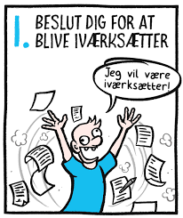


Ivar Justesen er en evig iværksætter og er altid i gang med nye ”erhvervseventyr”, desværre ikke alle lige vellykkede, så derfor har han efterhånden oparbejdet en del gæld. En af hans kreditorer, Sun-Import A/S rykker nu kraftigt for betaling i henhold til en forfalden faktura på kr. 114.870.

**Eksamensspørgsmålet:**

*1.	Hvilke muligheder – udover konkurs – har Sun-Import A/S for at inddrive det skyldige beløb hos Ivar?* 

**Vejledende løsning:**

*Kreditforfølgning:*

Udviklingsbaseret viden om anvendt teori og metoder indenfor regler og praksis for individuel kreditorforfølgning og gældssanering.

Sun–Import kan hvis der foreligger et gyldigt eksekutionsfundament søge fordringen inddrevet via fogedretten. 

Foreligger der ikke eksekutionsfundament må et sådant først etableres, fx gennem aftale, forlig eller dom.

Der skal ved bedømmelsen af besvarelsen lægges vægt på den studerendes demonstration af viden om de relevante begreber i forhold til opgavens faktum.

**Svar slut.**

---

Ivar ejer en nedlagt landejendom, der er belånt langt udover dens værdi. Han har kun almindeligt indbo, men har sidste år arvet et antikt chatol efter sin moster. Et 48” B&O TV er leaset hos Electric City. 

Ivars bil har en værdi af ca. kr. 150.000, men den er købt med ejendomsforbehold hos en autoforhandler og der skyldes fortsat 128.000 i den. 

I banken har han to indlånskonti – en NEM-konto med et indestående på kr. 2.982 og en konto med et indestående på kr. 79.000, der hidrører fra en arbejdsskadeerstatning, som han fik udbetalt efter en arbejdsulykke for en del år siden. 

Herudover har han et depot med en aktiepost i Carlsberg med en kursværdi på ca. kr. 20.000. Hos tre kunder har han nog-le tilgodehavender på i alt kr. 85.000 for levering af varer. 


**Eksamensspørgsmålet:**

*2.	Redegør for hvilke muligheder Sun-Import A/S har for at foretage udlæg i Ivars nævnte aktiver til sikkerhed for deres fordring.* 

**Vejledende løsning:**

*Kreditforfølgning:*

Udviklingsbaseret viden om anvendt teori og metoder indenfor regler og praksis for individuel kreditorforfølgning og gældssanering.

Efter som ejendommen allerede er mere end fuldt behæftet, er den næppe et attraktivt udlægsaktiv. 

Det almindelige indbo vil typisk være beskyttet af trangsbeneficiet i retsplejeloven (RPL) § 509, samt praksis for udlæg i aktiver af begrænset værdi, der skal kunne dække auktionsomkostningerne. 

Noget tilsvarende kan, afhængig af værdien, gælde det antikke chatol, der endvidere som arvestykke, kan have en personlig værdi, der afhængig af, igen, værdien og muligheden for anden fyldestgørelse, kan være beskyttet mod udlæg jf. RPL § 515, stk. 1.

Som tilhørende Electric City er TV'et uden for rækkevidde.

Bilen har en friværdi, som der kunne gøres udlæg i.
NEM-kontoen er et udlægsaktiv, som dog efter omstændighederne kan være beskyttet af trangsbeneficiet i RPL § 509.

Kontoen med den beholdne arbejdsskadeerstatning er, når den som her er adskilt og identifi-cerbar, undtaget jf. RPL § 513.
Depotet med Carlsberg aktier er et oplagt udlægsaktiv.

De tre kundetilgodehavender er ligeledes oplagte udlægsaktiver.
Der skal ved bedømmelsen af besvarelsen lægges vægt på den studerendes demonstration af viden om de relevante begreber i forhold til opgavens faktum.

**Svar slut**.


**Eksamensspørgsmål:**


*3.	Hvilke sikringsakter skal der foretages ved udlæg i aktiverne og hvorfor?* 

**Vejledende løsning:**

*Kreditorforfølgning:*

Udviklingsbaseret viden om anvendt teori og metoder indenfor regler og praksis for individuel kreditorforfølgning og gældssanering.

I givet fald skulle pant i ejendommen tinglyses jf. TL § 1, for at være beskyttet imod godtroende erhververe af konkurrerende rettigheder og retsforfølgning.

Udlæg i indbo og chatol kræver ikke sikringsakt for at være beskyttet imod godtroende erhververe af konkurrerende rettigheder eller retsforfølgning.

Udlæg i bilen tinglyses i bilbogen jf. TL § 42d, for at være beskyttet imod godtroende erhververe af konkurrerende rettigheder og retsforfølgning.

Udlægget i nem kontoen beskyttes i givet fald med en båndlæggelsesbesked til banken, for at udgå at Iver råder over aktiverne til anden side.

Udlægget i Carlsberg aktierne registreres gennem pengeinstituttet i værdipapircentralen jf. VPHL § 66, for at udgå at Iver råder over aktiverne til anden side.

Udlægget i de tre kundetilgodehavender kræver ikke sikringsakt for at være beskyttet imod godtroende erhververe af konkurrerende rettigheder.

Der skal ved bedømmelsen af besvarelsen lægges vægt på den studerendes demonstration af viden om de relevante begreber i forhold til opgavens faktum.

**Svar slut**.


En af grundene til at Ivars landejendom er overbehæftet er dels at han selv for nogle måneder siden optog et banklån mod pant i ejendommen dels at en anden af hans kredito-rer Zync Invest havde foretaget et udlæg. 

Ivar havde den 10. maj fået bevilget et lån på kr. 200.000 i sin bank, som dog havde betinget sig at få sikkerhed i et pantebrev på kr. 200.000 i ejendommen med prioritet efter de i forvejen indestående lån. 

Alle dokumenter blev udstedt og underskrevet på et møde i banken samme dag. På grund af travlhed fik banken først anmeldt pantebrevet til tinglysning den 13. maj kl. 10.42. 

Den 12. maj foretog fogedretten på begæring af en af Ivars kreditorer, Zync Invest, udlæg for kr. 53.000 i ejendommen. 

Ivar havde under fogedretsmødet oplyst Zync Invenst om pantebrevet til banken. Udlægget blev tinglyst den 13. maj kl. 10.25.

**Eksamensspørgsmålet:*

*4.	Hvordan er prioritetsstillingen i ejendommen mellem bankens panteret og Zync Invests udlæg?* 

**Vejledende løsning:**

Kreditsikring:

Anvende centrale regler om tinglysning, af relevans for den finansielle sektor.
<
Efter de allerede tinglyste hæftelser aftales bankens sikkerhed i form af pantebrevet den 10. maj, men da det først tinglyses den 13. maj, kan udlægget, foretaget den 12. maj, fortrænge bankens pant fra dets plads i prioritetsrækkefølgen jf. TL § 1, stk. 2. 

Ivars protest og henvisning til bankens utinglyste pant, er uden betydning, da udlægget ikke fordrer god tro jf. TL § 1, stk. 2. modsætningsvis. 

Så efter de allerede tinglyste hæftelser følger udlægget og så bankens pant på kr. 200.000.

Der skal ved bedømmelsen af besvarelsen lægges vægt på den studerendes anvendelse af de relevante begreber i forhold til opgavens faktum.

**Svar slut.**


Ivar vil gerne starte endnu et erhvervsprojekt op sammen med sin svoger. Men da de er to deltagere overvejer han nu bl.a. på baggrund af råd fra sin revisor, om de i stedet kan starte op i et anpartsselskab. 


**Eksamensspørgsmålet:**

*5.	Hvilke fordele og ulemper kan der være ved at starte den nye virksomhed op i et anpartsselskab?*

**Vejledende løsning:**

*Selskabsret, hæftelse:*

Forståelse for Grundlæggende selskabsret og hæftelsesformer samt betydningen af reglerne om tegningsret.

Den primære fordel for Ivar er, at han undgår den direkte, ubegrænsede og personlige hæftelse, der gælder i personselskaber. 

Ulemperne er kapitalkravet på kr. 50.000, samt de i nogen grad tungere formelle krav til anpartsselskabets administration, sammenlignet med personselskabet.

Der skal ved bedømmelsen af besvarelsen lægges vægt på den studerendes demonstration af forståelse for de relevante begreber i forhold til opgavens faktum.

**Svar slut**.


Ivar har sat familiens gamle sofa til salg på en åben Facebookgruppe ”Ting og sager til salg”. Opslaget indeholder et billede af sofaen og teksten: ”Sofa i meget fin stand sælges. Nypris 9.995. Kan afhentes hos mig efter nærmere aftale i en personlig besked – giv et bud!” Ivar får flere kommentarer og likes på sit opslag. Bl.a. skriver Lonnie Frydenlund: ”Jeg byder kr. 1.800. Hvor bor du?” Ivar sender Lonnie følgende personlige besked: ”Top sofaen er din. Du kan betale kontant eller med Mobilepay, når du henter den. Jeg bor på Løvsangervej 10 i Sundby. Hvornår kan du hente den?” Senere samme dag skriver Lonnie: 

”Når du bor så langt væk, vil jeg ikke købe sofaen alligevel. Det er alt for dyrt i transport.” 

Ivar mener, at der er indgået en aftale om køb af sofaen, hvilket Lonnie dog nægter.

**Eksamensspørgsmålet:**

*6.	Tag stilling til, om der er indgået en bindende aftale mellem Ivar og Lonnie.*

**Vejlendende løsning:**

*Aftaleret:*

Anvende centrale aftaleregler om aftalers indgåelse.

Lonnies bud på kr. 1.800, er et bindende tilbud, hvorefter aftale sluttes med Ivars accept. Detaljerne om betaling og levering er uden betydning. Der er endvidere ikke tale om en forbrugeraftale, Da Ivar ikke agerer i sit erhverv, hvorfor forbrugeraftalelovens regler om fortrydelsesret ved fjernsalg ikke bliver relevante. 

Aftalen er altså bindende.

Der skal ved bedømmelsen af besvarelsen lægges vægt på den studerendes anvendelse af de relevante begreber i forhold til opgavens faktum.

**Svar slut.**

---


### Koncern

* Et moderselskab er karakteriseret ved at selskabet ejer en stor del af aktierne eller anparterne i et andet selskab, som kaldes et datterselskab, jf. selskabslovens § 6.

* Hvert selskab inden for koncernen er en  juridisk person, som har sit ”eget liv”.
  
* I koncerner hæfter de enkelte koncernselskaber ikke for hinandens    forpligtelser. Dette gælder også med hensyn til modregning.

* Koncernforbundne selskaber kan indgå aftaler og handle med hinanden på sædvanlige vilkår.


  
### Aktieselskaber A/S 


Efter selskabslovens § 5, nr. 1 er et aktieselskab et kapitalselskab, herunder et partnerselskab, hvor kapitalejernes indskudskapital er fordelt på **aktier**. 

Aktier kan udbydes til offentligheden. 

Kapitalejerne hæfter alene med deres indskud i selskabet. 

Kun kapitalsselskabets formue hæfter for kapitalsselskabets gæld og øvrige forpligtelser, jf. også selskabslovens § 1, stk. 2:” 

I et aktie- eller anpartsselskab hæfter aktionærerne og anpartshaverne (kapitalejerne) ikke personligt for kapitalselskabets forpligtelser, men alene med deres indskud.  

Kapitalejerne har ret til andel i kapitalselskabets overskud i forhold til deres ejerandel, medmindre andet er fastsat i selskabets vedtægter.”

Tilsvarende gælder, at når en kapitalejer har indbetalt sine kapitalandele fuldt ud, jf. selskabslovens §§ 33-34, er kapitalejeren ikke selskabsretligt forpligtet til at tilføre selskabet yderligere kapital.

Udover at kapitalselskabets ejere og ledelse kan ifalde **erstatningsansvar** efter reglerne i selskabslovens kapitel 22, der i vidt omfang er modelleret over dansk rets almindelige erstatningsreger og omtales i forbindelse med det nævnte kapitels enkelte bestemmelser, kan der tænkes en såkaldt gennembrudshæftelse – som dog er meget sjældent set i praksis, men hvis grundsynspunkt kan føre til hæftelse på objektivt grundlag, altså hvor kapitalejere/ledelse ikke har handlet ansvarspådragende.

Retstilstanden kan for det i praksis mest interessante områdes vedkommende – koncerner/hovedaktionærforhold m.v. – antagelig sammenfattes i et udsagn om, at et moderselskab/en hovedaktionær på objektivt grundlag kommer til at betale en dattervirksomheds gæld, hvis moderselskabet/hovedaktionæren forretningsmæssigt har drevet koncernens selskaber som én virksomhed, hvori ligger, at moderselskabet/hovedaktionæren klart har ladet datterselskabet leve på koncernens goodwill og kreditværdighed, og at driften af datterselskabets virksomhed kun er forretningsmæssig mulig under forudsætning af, at moderselskabet/hovedaktionæren til stadighed tilfører den nødvendige kapital.

Den første danske højesteretsdom om gennembrudshæftelse er *U 1997 1642 H. Dommen vedrører gennembrudshæftelse i forhold til et »søsterselskab«*


---

### Anpartsselskab ApS


Efter selskabslovens § 5, nr. 2 er et anpartsselskab, et kapitalselskab, hvor kapitalejernes indskudskapital er fordelt på **anparter**. 

Anpartsselskaber kan ikke udbyde deres kapitalandele til offentligheden, jf. selskabslovens § 1, stk. 3. 

Kapitalejerne hæfter alene med deres indskud i selskabet.

Når man stifter et ApS skal man, ifølge selskabsloven, indskyde kr. 40.000 i anpartskapital. 

Minimumskravet på 40.000 kr. er fastsat ved L 2019 445, som indebar en nedsættelse fra 50.000 kr. Kravet er tidligere ved L 2013 616 nedsat fra 80.000 kr.

Den seneste nedsættelse af minimumskapitalkravet for anpartsselskaber til 40.000 kr. skal ses i sammenhæng med den samtidige afskaffelse af selskabsformen iværksætterselskab (IVS).

Minimumsbeløbet på 40.000 kr. (dog mindst 25 pct. af selskabskapitalen) skal være indbetalt, jf. § 33, stk. 1, hvilket er en betingelse for, at selskabet overhovedet kan registreres, jf. § 40, stk. 2.

Hvis der indskydes aktiver, kræver disse en vurderingsberetning, der laves af en revisor.

En af de helt store fordele ved at stifte et ApS er, at man har begrænset hæftelse. 

Hvis virksomheden går konkurs, mister man kun de 40.000 kroner, man har indskudt i anpartskapital. 

Det betyder, at man ikke nødvendigvis skal gå fra hus og hjem, hvis virksomheden går ned.

Et anpartsselskab kan have én eller flere ejere. 

Ejerne af selskabet kan være privatpersoner, eller det kan være selskaber. 

Ejerandelen af selskabet bestemmes af, hvor stor en del af anpartsselskabets kapital personen eller selskabet har indskudt.

**Krav ved stiftelse af anpartsselskab: Ved stiftelsen af et ApS er der visse krav, som skal overholdes:**

Det kræves, at der oprettes et stiftelsesdokument, en anpartshaverfortegnelse og en protokol. 

Stiftelsesdokumentet indeholder selskabets vedtægter, der fortæller om regler, navn, hjemsted, formål med selskabet og lignende forhold. 

Der er et krav om, at selskabet skal ledes af en direktion og/eller en bestyrelse. 

Det er direktionen eller bestyrelsen som underskriver årsregnskabet hvert år og dermed påtager sig ansvaret for, at regnskabet er retvisende og udarbejdet korrekt. 

Årsregnskabet skal være udarbejdet senest 5 måneder efter regnskabsårets afslutning.

Beskatning af et anpartsselskab: 

Anpartsselskabet beskattes for sig, mens man som ansat ejer i selskabet bliver beskattet som almindelig lønmodtager. Et anpartsselskab betaler en selskabsskat af selskabets overskud efter selskabsskattereglerne.  

Et anpartsselskab skal udarbejde og offentliggøre regnskabet, der som hovedregel skal revideres af en revisor.

**Pligt i forbindelse med bogføringsloven:** 

Et anpartsselskab er underlagt en pligt om at følge bogføringsloven, dvs. bogholderiet skal udarbejdes efter gældende lov. 

Hvis dette ikke overholdes, kan det føre til krav om supplerende oplysninger eller forbehold i årsregnskabet.

---

### Kommanditselskab K/S

**Ejerne og hæftelse:**

Ejerne i et K/S kan både være virksomheder (juridiske personer) og enkeltpersoner (fysiske personer).

**Hæftelse:**

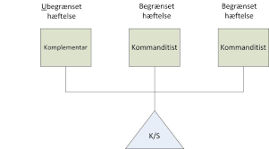

Komplementar: Hæfter personligt, uden begrænsning og solidarisk for virksomhedens forpligtelser.

Kommanditist: Hæfter begrænset for virksomhedens forpligtelser og kommanditisten kan ikke miste mere end det beløb der er indskudt i kommanditselskabet.

---

**Video-SKAT og et K/S investering**

<div class="video-container"><iframe src="https://www.youtube.com/embed/-WQOQFPIsL0" width="853" height="480" frameborder="0" allowfullscreen="allowfullscreen"></iframe></div>


---

**Video: Kommanditselskab (engelsk)**

<div class="video-container"><iframe src="https://www.youtube.com/embed/gHkN4-3GZm8" width="853" height="480" frameborder="0" allowfullscreen="allowfullscreen"></iframe></div>

---


### Partnerselskab P/S

Kaldes også kommanditaktieselskab

2 typer selskabsdeltagere: 

Mindst én komplementar og mindst én kommanditist

Kommanditisterne har indskudt kapital, som er fordelt på aktier.

Både fysiske og juridiske personer kan være komplementar i et partnerselskab.

Selskabsformen bruges især i advokatbranchen.

**Hæftelse:**

Komplementaren hæfter personligt og direkte, og hvis der er flere komplementarer hæfter de solidarisk.

Kommanditaktionæren hæfter begrænset.

Partnerselskabet adskiller sig blandt andet fra et K/S ved at der skal indbetales selskabskapital. Kommanditaktionærerne skal som minimum tegne kommanditaktier for kr. 400.000.


---

### Partrederi og partselskab


Partrederi:

Særligt inden for småskibsfarten, hvor 2 eller flere ejer et skib.

Partrederne hæfter personligt, direkte og pro-rata for partrederiets gæld, dvs. i forhold til deres andel i skibet Partselskab:

Ikke særlig udbredt, men ses dog særligt inden for tidsbegrænsede projekter, fx byggeprojekter, hvor der er et tidsbegrænset samarbejde mellem de involverede håndværkere.

Partselskabsdeltageren hæfter pro-rata med hele sin formue, men kun for sin egen del af selskabets gæld.

---

### Andelsselskab A.M.B.A

 
 


Formål: At fremme deltagernes fælles interesser gennem deres deltagelse i virksomheden som aftagere, leverandører eller på anden lignende måde, og hvor virksomhedens afkast fordeles blandt medlemmerne eller forbliver indestående i virksomheden, jf. LEV § 4.

Ses inden for landbrug, indkøbs- og brugsforeninger, vandværk, varme- og elforsyningsselskaber mv.

Hæftelsen i et andelsselskab er ikke lovreguleret. Hæftelsesformen fremgår af selskabets  vedtægter.

Oftest er der begrænset hæftelse for ejerne, som er subsidiær eller indirekte, dvs. at kreditorerne først skal have udtømt alle muligheder for inddrivelse hos andelsselskabet, før de kan gå efter andelshaverne.
 


---


---


<!--chapter:end:12.Rmd-->

# Insolvensret

```{r, echo=FALSE, results='asis'}
cat(readLines('np.html'))
```


---

***Du skal som studerende være særlig opmærksom på følgende problemstillinger ved gennemgangen af insolvensretten, herunder kreditorforfølgning:*** 


•	**Forskellen på individual- og universalforfølgning = vigtigt – herunder forskellen på tvangsauktion og konkurs**


---

•	**Individualforfølgning:**

Med individualforfølgning menes:

Når én kreditor forsøger at fremkalde betaling af sit tilgodehavende hos en skyldner f.eks. ved tvangsfuldbyrdelse via Fogedretten. Modsat universalforfølgning som f.eks. konkurs.

De juridiske udfordringer for en individualforfølgning er:

Udlægsgrundlag (eksekutionsgrundlag) – herunder betalingspåkrav, retsplejelovens kapitel 44a og § 478.
  
Udlæggets genstand (trangsbeneficiet m.m.), retsplejelovens § 
507-515.

---
  
**Universalforfølgning:**

Når kreditorerne går sammen for at inddrive deres krav (insolvensbehandling). Universalforfølgning afskærer individualforfølgning. 

Eksempler på universalforfølgning er konkurs, tvangsakkord og gældssanering. Ligelighedsprincippet er centralt. 

Der er desuden mulighed for omstødelse iht. konkursloven. 

Modsat: individualforfølgning.

---

De juridiske udfordringer ved universalforfølgning:

Hæftelse: Hæftelsestyper i enkeltmandsvirksomhed samt forskellige selskabsformer. 

Emnet har relevans for opgørelse af aktivsiden i et konkursbo samt kreditors evt. tab af restfordringen.  
  
Overordnet om rekonstruktion - anmodning, betingelser og retsvirkning: 
  
Konkursret – anmodning, 
  
Betingelser, KL § 17-21, 
  
Fristdag, KL § 1 

Nærtstående, KL § 2, 

Konkursordenen, KL kapitel 10, 
  
Separatister  og underpanthavere, KL §§ 82 og 86, 
  
omstødelse, KL kapitel 8 

---				

## Regler og definitioner

**Retsplejeloven og Konkursloven regulerer:**

*Individualforfølgning:*

+	Hver kreditor for sig, den kreditor, der kommer først, bliver først betalt af skyldner
  
+	Reguleret i Retsplejeloven (RPL; Lovbekendtgørelse nr. 1284 af 14. november 2018) og omfatter bl.a. udlæg, tvangsauktion og tvangsbeneficeret (retten til et beskedent hjem).

---
  
*Universalforfølgning:*

+	Reguleret i konkursloven (KKL; Lovbekendtgørelse nr. 11 af 6. januar 2014), og omfatter konkurs, rekonstruktion og gældssanering
  
+	Formålet er at stille kreditorerne lige i konkursboet
  
+	Kun hvis skyldner er insolvent, jf. KKL § 17:
  
”Er en skyldner insolvent, skal hans bo tages under konkursbehandling, når det begæres af skyldneren eller en fordringshaver. 

Stk. 2 En skyldner er insolvent, hvis han ikke kan opfylde sine forpligtelser, efterhånden som de forfalder, medmindre betalingsudygtigheden må antages blot at være forbigående”.
 


Ordet **”insolvent”**


* Defineret i KKL § 17

* Skyldner kan ikke betale sin gæld, efterhånden som den forfalder til betaling

* Skifteretten vurderer, om insolvensen er til stede

* Hvis skyldner selv erklærer sig insolvent, forventes det at være rigtigt

---

**Video om udlæg og trangsbeneficium**

<div class="video-container"><iframe src="https://www.youtube.com/embed/kxa-lYBFCDk" width="853" height="480" frameborder="0" allowfullscreen="allowfullscreen"></iframe></div>
  
---

**Konkurslovens § 17**


Der må ved afgørelsen om skyldnerens insolvens og dermed en konkursbehandling tages der hensyn til en række momenter i praksis:

En rigtigt opgjort status er et vægtigt indicium om skyldnerens betalingsevne, jf. dommen **U 2001 2592 Ø** (skyldner, der siden 2000-02-10 ved (delvis) betaling havde afværget 15 konkursbegæringer, var insolvent, da han ikke kunne betale 50.798 kr. ifølge en udeblivelsesdom, og da han havde yderligere gældsposter). 

Det må kræves, at der består en fordring mod skyldneren, men ikke at den er forfalden. Fordringen må endvidere tilkomme den, der indleverer konkursbegæringen til skifteretten.

At fordringen er genstand for en ikke afsluttet retssag, udelukker ikke i sig selv, at den kan tjene som grundlag for konkurs, se f.eks. dommen **U 1973 673 H**.

Kreditor skal have en retlig interesse i konkursbehandlingen. 

Denne vil normalt bestå i, at der er udsigt til dividende. 

Det forhold, at kreditor aktuelt ikke kan forvente dividende i boet, udelukker ikke konkurs. 

Den retlige interesse kan bestå i, at konkursbehandlingen kan tænkes at tilvejebringe yderligere aktiver.

Enhver fysisk person kan uanset (u)myndighed være »skyldner« i den anførte betydning i KL (konkursloven) § 17.

En juridisk person kan som »skyldner« erklæres konkurs, hvis enten ingen deltager i sammenslutningen hæfter personligt for sammenslutningens gæld, eller hvis samtlige personligt hæftende er under konkurs.

Pengeinstitutter kan erklæres konkurs, men beskikkelse af kurator sker efter forhandling med Finanstilsynet, se lov om finansiel virksomhed § 246, stk. 3. 

Om forsikringsselskabers konkurs, se lov om finansiel virksomhed §§ 264-265, hvorefter bl.a. beskikkelse af kurator sker efter forhandling med Finanstilsynet.

Ansvarlige interessentskabers boer behandles som konkursboer, når samtlige interessenter er under konkurs.


Insolvens antages i almindelighed at foreligge efter KKL § 18, hvis:

* skyldneren erkender at være insolvent, 

* skyldneren er under rekonstruktionsbehandling,

* skyldneren har standset sine betalinger eller

* der ved udlæg inden for de sidste tre måneder før skifterettens modtagelse af konkursbegæringen ikke har kunnet opnås dækning hos skyldneren. 
 

 
---

## Inkasso


Inkasso reguleres af Lovbekendtgørelse nr. 1018 af 9. september 2014 om inkassovirksomhed. 

Formålet med inkassoloven er at sikre, at privat inkassovirksomhed, dvs. den inddrivelse af fordringer på andres vegne, der sker uden fogedretternes medvirken som led i privat inkassovirksomhed, foregår på en rimelig og forsvarlig måde. 

Dette søges navnlig opnået ved en autorisationsordning for inkassofirmaer, ved krav om godkendelse af personale, der retter personlig henvendelse til skyldnere, og ved krav om, at inkassofirmaer mv. skal stille sikkerhed for pengekrav, som måtte opstå som følge af udøvelsen af deres virksomhed. 

Lovens formål søges også opnået ved regler om, at inkassovirksomhed skal udøves i overensstemmelse med god inkassoskik i forhold til både skyldnere og kunder, jf. inkassolovens § 9. 

---

<h3>Gode råd og gæld: Inkasso</h3>

<div class="video-container"><iframe src="https://www.youtube.com/embed/XbxO46Oeizw" width="853" height="480" frameborder="0" allowfullscreen="allowfullscreen"></iframe></div>

---

Inkassolovens indhold:

Inkassolovens kap. 1 fastlægger anvendelsesområdet for loven.

Kap. 2 fastsættes autorisationsordningen for inkassofirmaer og visse andre virksomheder. 

Endvidere indeholder kap. 2 regler om sikkerhedsstillelse. 

Kap. 3 fastsættes regler om godkendelse af personale, som retter personlige henvendelser til skyldnere. 

Kap. 4 indeholder regler om, hvorledes inkassovirksomhed skal udøves. 

Kap. 5 indeholder kompetence- og bemyndigelsesbestemmelser. 

Kap. 6 fastsættes regler om tilbagekaldelse og bortfald af autorisation mv.

Kap. 7 indeholder regler om tilsyn. 

Kap. 8 indeholder straffe- og ikrafttrædelsesbestemmelser.

---

### Inkassoprocessen


* Gælden sendes til inkasso, hvis skyldner ikke betaler, efter kreditor har sendt en eller flere rykkere

Inkasso kan foretages af:

+	Kreditor selv

+	Inkassofirma

+	Advokat
  
Inkassobrev med diverse oplysninger sendes til skyldner.

Formålet med inkasso er at få betalt gælden eller opnå en afdragsordning, som kaldes et frivilligt forlig.

Betaler skyldner stadig ikke, må kreditor overveje at fortsætte med tvangsinddrivelse.

---

**Video: God inkassoskik**

<div class="video-container"><iframe src="https://www.youtube.com/embed/z8QQeRFvPGQ" width="853" height="480" frameborder="0" allowfullscreen="allowfullscreen"></iframe></div>


---

**Video: Forældelsesfristen for gæld**


<div class="video-container"><iframe src="https://www.youtube.com/embed/krDpzh9ugJ0" width="853" height="480" frameborder="0" allowfullscreen="allowfullscreen"></iframe></div>

---

**Video: Inkasso i hundesalonen**


<div class="video-container"><iframe src="https://www.youtube.com/embed/4p97-bt-mYk" width="853" height="480" frameborder="0" allowfullscreen="allowfullscreen"></iframe></div>

---


## Tvangsinddrivelse


Ordet **”tvangsinddrivelse”:**

Kreditor kan via fogedretten få udlæg i skyldners aktiver og sælge dem på tvangsauktion

Provenuet fra tvangsauktionen nedbringer skyldners gæld

---

<h3>Mødet i fogedretten</h3>

<div class="video-container"><iframe src="https://www.youtube.com/embed/ozjrbeuLrTU" width="853" height="480" frameborder="0" allowfullscreen="allowfullscreen"></iframe></div>

---

<h3>Gode råd om gæld: Fogedretten</h3>

<div class="video-container"><iframe src="https://www.youtube.com/embed/th9E-UvXijE" width="853" height="480" frameborder="0" allowfullscreen="allowfullscreen"></iframe></div>

---

Tvangsinddrivelse kræver et fundament, jf. RPL § 478 fx:

* Dom eller retsforlig

* Frivillige forlig, hvis der står, det kan tvangsfuldbyrdes

* Gældsbreve, hvis der står, det kan tvangsfuldbyrdes

* Pantebreve

* Afgørelser fra Forbrugerklagenævnet og de private godkendte tvistløsningsorganger efter 30 dage

* Krav fra offentlige myndigheder fx Skat

---

<h3>Gode råd og gæld: SKAT</h3>

<div class="video-container"><iframe src="https://www.youtube.com/embed/gNK1K_cpsSw" width="853" height="480" frameborder="0" allowfullscreen="allowfullscreen"></iframe></div>

---

<h3>Gode råd om gæld: Budget</h3>

 
<div class="video-container"><iframe src="https://www.youtube.com/embed/V_ZxNcRklxE" width="853" height="480" frameborder="0" allowfullscreen="allowfullscreen"></iframe></div>

---

### Betalingspåkrav

Hvis kreditor ikke har et fundament, skal kreditor:

* Have en dom for kravet eller

* Udfylde et betalingspåkrav, jf. RPL kap. 44a

* Betalingspåkravet udfyldes af kreditor og indgives til Fogedretten

* Betalingspåkravet kan kun anvendes hvis:

  +	Kreditor har et pengekrav på højst 100.000 kr.
  +	Kravet er ubetinget og ubestridt af skyldner
  +	Skyldner har fået et ”inkassobrev”
  
* Kan med Fogedrettens påtegning på betalingspåkravet anvendes som fundament
 

### Udlæg


Hvis man skylder penge, og man ikke betaler, kan kreditor bede fogedretten om at hjælpe med at indkræve pengene.


I fogedretten vil man blive spurgt, om man har mulighed for at betale pengene. 

Hvis man ikke kan betale, kan fogedretten foretage udlæg i et eller flere af ens aktiver. 

Det kan for eksempel være ens faste ejendom eller ens bil. 

Udlæg betyder, at kreditor kan forlange, at det aktiv, der er foretaget udlæg i, sælges på auktion, så kreditor kan få sine penge.


Der kan ikke foretages udlæg i små pengebeløb, sædvanligt indbo eller i andre ting af beskeden værdi, som er nødvendige for familiens erhverv eller uddannelse, se nærmere nedenfor.

---

**HR:** Kreditor kan få udlæg i alle skyldners aktiver, medmindre følgende undtagelser:

**U1:** Tredjemands rettigheder skal respekteres.

**U2:** Særlige indlån i pengeinstitut fx bil købt på afbetaling som et kreditkøb med ejendomsforbehold.

**U3:** Endnu ikke udbetalt løn, RPL § 511.

**U4:** Udbetalt erstatning fx fra ulykkesforsikring, RPL § 513 Erstatningen skal være holdt adskilt fra øvrige midler.

**U5:** Personlige aktiver med beskeden værdi, RPL § 515, stk. 1

**U6:** Personlige hjælpemidler, RPL § 515, stk. 2

**U7:** Båndlagte gaver, RPL § 514

**U8:** Trangsbeneficiet, RPL § 509

---

**Video: Udlæg og trangsbeneficiet**

<div class="video-container"><iframe src="https://www.youtube.com/embed/kxa-lYBFCDk" width="853" height="480" frameborder="0" allowfullscreen="allowfullscreen"></iframe></div>

---
 

*Trangsbeneficiet, jf. RPL § 509:*

Kreditor kan ikke få udlæg i aktiver omfattet af trangsbeneficiet.

Omfatter aktiver, der hører til et beskedent hjem, fx seng, bord, stol, sofa.

Almindelig hvidevarer hører til et beskedent hjem, fx køleskab, fryser, almindeligt tv og almindelig computer.

Smykker, malerier, smart TV eller fjernsyn med surround sound og subwoofer og andre værdifulde aktiver er ikke omfattet af trangsbeneficiet.

Spørgsmål er i et hvilket omfan,g der kan foretages udlæg i følgende genstande og værdier: 

* Boliginventar (Opretholdelse af et beskedent hjem)

* Bil

* Kontanter (rede penge)

* Indestående på konti

* Depositum (lejebolig)

* Kæledyr

* Gaver

* Værdier med affektionsværdi

* Personskadeerstatning (Udbetalinger ved kritisk/ livstruende sygdom)

* Feriepenge

---

## Tvangsauktion


**En tvangsauktion er et "tvangssalg"**. 

Tvangsauktionssagen kan iværksættes af en person, som har penge til gode hos ejeren af ejendommen eller genstanden. 

Det kan for eksempel være en panthaver, der ikke har modtaget terminsydelser.

---

### Tvangsauktion over fast ejendom

Alle tvangsauktioner over fast ejendom sker i fogedretten i den retskreds, hvor ejendommen ligger. 

Den, der har iværksat tvangsauktionen, skal lave en salgsopstilling over ejendommen med alle oplysninger om ejendommen. Salgsopstillingen og standardauktionsvilkårene danner grundlaget for tvangsauktionen.

Vejledning i brug af salgsopstilling og Justitsministeriets tvangsauktionsvilkår findes her.

Salgsopstillingen bliver inden auktionen sendt til ejeren og til alle, der har pantebreve i ejendommen.

---

### Tvangsauktion over landbrugsejendom

Landbrugsstyrelsen har udformet vejledningen ”Endelig adkomst på landbrugsejendomme erhvervet på tvangsauktion”, som kan findes ved dette link:

https://www.domstol.dk/saadangoerdu/tvangsauktion/Documents/Endelig%20adkomst%20p%C3%A5%20landbrugsejendomme%20erhvervet%20p%C3%A5%20tvangsauktion.pdf

Formålet er at vejlede køber. 

Vejledningen indeholder blandt andet information om, at det ved erhvervelse af en landbrugsejendom på tvangsauktion er landbrugslovens regler, der gælder, samt vejledning om opfyldelse af erhvervelsesbetingelserne.

---

### Tvangsauktion over løsøre 

Tvangsauktioner over løsøre kan efter henvisning af fogeden afholdes ved en auktionsleder. 

Tvangsauktioner over registrerede skibe og luftfartøjer samt gældsbreve og andre fordringer afholdes af fogedretten, mens aktier og andre værdipapirer realiseres ved tvangssalg efter forudgående autorisation fra fogedretten af en værdipapirhandler, typisk et pengeinstitut.

En liste over beskikkede auktionsledere fordelt på de enkelte retskredse findes på dette link:

http://www.justitsministeriet.dk/arbejdsomr%C3%A5der/civilret/beskikkelse-af-auktionsledere


Auktionslederne kan også benyttes til frivillige offentlige auktioner.

Tvangsauktioner er offentlige. 

Alle, der møder, kan afgive bud på auktionen. 

Kan man ikke selv møde, kan man lade en advokat byde for én. 

Man kan også give en skriftlig fuldmagt til en anden person, der så kan byde for én.
 
---


---

**Video om tvangsauktion**

<div class="video-container"><iframe src="https://www.youtube.com/embed/drN8QtdRsfk" width="853" height="480" frameborder="0" allowfullscreen="allowfullscreen"></iframe></div>


---


## Konkurs


For at en skyldner - en person eller et selskab - kan erklæres konkurs, er det en betingelse, at skyldneren er insolvent. 

Man er insolvent, hvis man ikke kan betale sin gæld til tiden, og betalingsvanskelighederne ikke kun er midlertidige. 

Konkurs er en universalforfølgning, formålet er at dele skyldners aktiver ud til kreditorerne, så alle kreditorer stilles lige.

Begæring kan indgives til skifteretten af skyldner eller kreditor, jf. KL § 17, stk. 1.

Skyldner mister rådighed over sine aktiver ved dekretets afsigelse, jf. KL § 29

Skifteretten udpeger kurator (advokat), som handler på vegne af konkursboet

Annoncering i Statstidende - virkning for enhver, jf. KL § 30.

---
 
### Hvem kan indgive konkursbegæring?

En kreditor, der har penge til gode hos en skyldner, kan indgive konkursbegæring. 

Det er en betingelse, at årsagen til den manglende betaling er pengemangel og ikke manglende betalingsvilje, for eksempel utilfredshed med et udført arbejde. 

Er dette tilfældet, må der i stedet føres en retssag ved de almindelige domstole. 

Det samme gælder, hvis det er usikkert, om pengene skyldes.

En person eller et selskab, der er insolvent, kan indgive konkursbegæring mod sig selv.

Generelt må det anbefales at kontakte en advokat, inden man indgiver en konkursbegæring.

---

### Hvad koster det at indgive konkursbegæring?

Retsafgiften for at indgive en konkursbegæring er 750 kr.

Den, der indgiver konkursbegæringen, skal normalt stille sikkerhed for betaling af omkostningerne ved konkursbehandlingen. 

Sikkerhedens størrelse fastsættes af skifteretten og skal stilles, inden skifteretten træffer afgørelse om konkurs. 

Omkostningerne ved konkursboets behandling dækkes altid først af konkursboets midler. 

Hvis der ikke kommer nogen - eller ikke tilstrækkelige - midler frem under bobehandlingen, kommer den, der har indgivet konkursbegæringen, til at betale omkostningerne.

Er det en lønmodtager, der ikke har fået udbetalt løn eller feriepenge, der indgiver konkursbegæringen, skal der ikke stilles sikkerhed for omkostningerne. 

Statskassen betaler da omkostninger, som ikke kan dækkes af boets midler.

---

### Hvad skal der stå i begæringen?

Konkursbegæringen skal være skriftlig. 

I konkursbegæringen skal man skrive navn og adresse på skyldneren og eventuelt CVR-nummer. 

Man skal også skrive, hvilket beløb der skyldes, og lidt om, hvad beløbet skyldes for. 

Man skal også skrive sit eget navn, adresse og telefonnummer.

Hvis en skyldner begærer sig selv taget under konkursbehandling, skal skyldner vedlægge en opgørelse over sine aktiver og passiver og en liste over sine kreditorer .

---

### Hvor skal man indgive begæringen? 

Hvis skyldneren har en erhvervsvirksomhed, skal begæringen indgives til skifteretten i den retskreds, hvor erhvervsvirksomheden ligger. 

Driver skyldneren ikke erhvervsvirksomhed, skal begæringen indgives til skifteretten i den retskreds, hvor skyldneren bor.

Er det i Storkøbenhavn (København, Lyngby, Glostrup og Frederiksberg  retskreds), indgives begæringen til Sø- og Handelsretten i København.


---

### Konkursbehandling

 


**Under konkursbehandlingen sker der følgende:**

Separatistkrav bliver fyldestgjort før konkursmassen gøres op

Kurator skal sælge og opgøre alle konkursboets aktiver

Konkursboet skal overveje, om det vil indtræde i gensidigt bebyrdende aftaler

Konkursboet vurderer, om der kan være omstødelige dispositioner

Kurator opgør alle kreditorernes krav og placerer dem i konkursordenen

Når konkursboets aktiver og passiver er gjort op bliver kreditorerne fyldestgjort efter konkursordenen

---

### Konkursmassen

Boets aktiver (konkursmassen) omfatter:

**HR:**	Alt hvad skyldner ejer ved konkursdekrets afsigelse og under konkursen tilfalder ham, jf. KL § 32

**U1:**	Aktiver, som kreditor ikke kan få udlæg i, KL § 36. 

**U2:**	Skyldners arbejdsindtægter under konkursen. 

**U3:**	Separatistkrav (fx aktiver solgt med ejendomsforbehold) 


Boets passiver omfatter:  

Alle kreditorer kan anmelde deres krav, uanset om kravet er forfaldent, jf. KL § 38
 
De vigtigste niveauer i konkursordenen er i rækkefølge Konkurslovens kap. 10:

**Massekrav**, dvs. krav, som er opstået ved selve konkursbehandlingen, fx kuratorsalær,

**Privilegerede krav**, fx krav opstået under forsøg på at afværge en konkurs og lønkrav fra visse af skyldnerens ansatte, samt

**Simple krav**, dvs. krav fra skyldnerens almindelige kreditorer og derfor i  almindelighed den største post.

---
 
### Konkursordenen

Konkursordenen inddeler alle boets kreditorer i klasser.

Hver konkursklasse bliver fyldestgjort fuldt ud, før der udloddes til næste klasse.

Først dækkes omkostninger i forbindelse med konkursen (massekrav), og herefter de øvrige klasser.

* Hvis der ikke er dækning til hele klassen, fx de simple krav, bliver der udloddet en dividende. Efterstående konkursklasser får ingen dækning.

---
 
### Udlodning af dividende

En dividende på 10 % til simple krav betyder, at kreditor med et krav på 100.000 kr. får en dækning på 10.000 kr.

**Udækket gæld:**

Kreditor har stadig et restkrav på 90.000 kr. efter konkursen er afsluttet.

Kreditorernes udækkede gæld følger skyldner, hvis skyldner er en fysisk person.

Hvis skyldner er et selskab har kreditor ingen at rette kravet mod efter konkursen. Den udækkede gæld kan ikke blive fyldestgjort.

---
 
###	Konkurskarantæne


---

### Hvad er en konkurskarantæne?

Konkurskarantæne betyder, at en person i en periode får et forbud mod at deltage i ledelsen af en virksomhed, hvori den pågældende ikke hæfter personligt og ubegrænset for virksomhedens forpligtelse (aktieselskaber, anpartsselskaber m.v.)

En person kan pålægges konkurskarantæne, hvis personen på grund af groft uforsvarlig forretningsførelse vurderes uegnet til at deltage i ledelsen af en erhvervsvirksomhed.


---

**Hvem kan blive pålagt konkurskarantæne?**

Personer, som har været medlem af ledelsen i en virksomhed, der er gået konkurs, kan pålægges konkurskarantæne.

**Hvor lang tid varer en konkurskarantæne?**

Konkurskarantænen vil som udgangspunkt blive pålagt for en periode på 3 år.

---

### Overtrædelse af konkurskarantæne

Hvis en person overtræder en konkurskarantæne, kan skifteretten efter omstændighederne pålægge personen en ny karantæne. 

I den forbindelse kan karantænen udvides til et forbud mod deltagelse i enhver form for erhvervsvirksomhed, herunder den pågældendes egen personligt drevne virksomhed.

En overtrædelse af karantænen kan også medføre, at personen hæfter personligt på objektivt grundlag for selskabets forpligtelser, hvis det går konkurs.

Endvidere kan en overtrædelse af en konkurskarantæne straffes med bøde eller fængsel indtil 6 måneder efter straffelovens § 131.

---

**Hvem kan starte en sag om konkurskarantæne?**

Det er kurator eller rekonstruktør, der starter en sag om konkurskarantæne.

Kuratorer og rekonstruktører vurderer i alle konkursboer og rekonstruktionssager, om der er grundlag for at indlede en sag om konkurskarantæne.

---

### Konkurskarantæneregistret

Den, der bliver pålagt konkurskarantæne, registreres i et konkurskarantæneregister. 

Personer i dette register kan ikke blive registreret som medlem af ledelsen i et erhvervsdrivende selskab og kan ikke i strid med karantænen blive momsregistreret eller registreret som arbejdsgiver hos SKAT.

**Hvem har adgang til konkurskarantæneregistret?**

Der er ikke offentlig adgang til konkurskarantæneregistret.

Skifteretten kan videregive oplysninger fra registret til en kurator eller rekonstruktør, når skifteretten vurderer, at det er nødvendigt for kuratorens eller rekonstruktørens varetagelse af sit hverv.

---

### Omstødelse

Konkursens formål er at alle kreditorer stilles lige

Omstødelsesreglerne forhindrer, at kreditorer kan få en meget bedre retsstilling kort før konkursen indtræder

Omstødelse medfører at den begunstigede skal betale det omstødelige beløb tilbage.

Fristdagen er den dag Skifteretten har modtaget begæring om:

  +	Konkurs
  +	Rekonstruktion
  +	Gældssanering
  
Beregning af omstødelsesperioden tager udgangspunkt i fristdagen 

En konkurs starter med, at konkursboet selv eller en kreditor indleverer begæring / konkursbegæring til skifteret.

Fristdagen er derfor som udgangspunkt den dag, da skifteretten modtog begæring om rekonstruktion, konkurs eller gældssanering. 

Det er dagen hvor begæringen modtages, som er afgørende for fristdagen.

---


```{r kaution, echo=FALSE,fig.height=5}

mydf <- data.frame(
  S1 = c(
"Omstødelse",
"Gaver" ,
"Løn til nærtstående",
"Betaling af gæld", 
"Pant for gammel gæld", 
"Udlæg",
"Utilbørlige dispositioner"
),
  S2 = c(
    "Hovedregel for hvornår handlingen skal være foretaget, regnet tilbage fra fristdagen",
    "6 måneder",
    "6 måneder",
    "3 måneder",
    "3 måneder",
    "3 måneder",
    "Ingen grænse"
),
  S3 = c(
    "Hvis debitor er insolvent på tidspunktet for handlingens foretagelse, og handlingen er til fordel for en nærtstående, regnes fristen tilbage fra fristdagen",
"2 år",
"2 år",
"2 år",
"2 år",
"2 år",
"Ingen grænse"
)
  
)
names(mydf) <- NULL

mydf %>%
  kable("html", escape = FALSE,caption = "Sammenligning mellem privat kaution og erhvervskaution") %>%
  kable_styling(full_width = T,font_size = 10,bootstrap_options = c("responsive","bordered","striped")) %>%
  column_spec(1, bold = T, border_right = T, color = "black", background = "lightgrey") %>%
  column_spec(2, bold = T, border_right = T, color = "black", background = "lightgrey") %>%
  column_spec(3, bold = T, border_right = T, color = "black", background = "lightgrey") %>%
  row_spec(1,italic = T,bold = T,font_size = 12,color = "white", background = "darkgrey")
  # row_spec(1,italic = T,bold = T,font_size = 12)
  # column_spec(0, angle = -45)%>%
  # scroll_box(width = "500px") %>%
  # footnote(general = "Databeskyttelsesforordningen",general_title = "Kilde:")
```


---


```{r, echo=FALSE, result=TRUE ,fig.height=5,fig.cap=("Omstødelsesperiode for gaver")}
library(timevis)

data <- data.frame(
  id      = 1:5,
  content = c("6 måneder fra 2019-02-01 til 2019-08-01", "Omstødelsesperiode<br>starter<br>2019-02-01",
              "Overdragelse<br>af gave<br>2019-05-01", "Fristdag<br>2019-08-01","Konkursdekret<br>2019-08-22"),
  start   = c("2019-02-01", "2019-02-01",
              "2019-05-01", "2019-08-01","2019-08-22"),
  end     = c("2019-08-01", NA, NA, NA,NA) )
timevis(data, showZoom = FALSE)%>%
  setOptions(list(editable = FALSE)) %>%
  setSelection("5") %>%
  fitWindow(list(animation = TRUE))
```


---


```{r, echo=FALSE, result=TRUE ,fig.height=3,fig.cap=("Modregning før fristdag")}
library(timevis)

data <- data.frame(
  id      = 1:4,
  content = c("Fristdag",
              "Skyldners (konkursboets hovedkrav på kreditor opstår", "Kreditors modkrav opstår","Konkursdekret"),
  start   = c("2019-08-02",
              "2019-11-01", "2020-02-01","2020-02-25"),
  end     = c( NA, NA, NA,NA) )
timevis(data, showZoom = FALSE)%>%
  setOptions(list(editable = FALSE)) %>%
  setSelection("5") %>%
  fitWindow(list(animation = TRUE))
```

---


```{r, echo=FALSE, result=TRUE ,fig.height=3,fig.cap=("Modregning mellem fristdag og konkursdekret")}
library(timevis)

data <- data.frame(
  id      = 1:4,
  content = c("Fristdag",
              "Skyldners (konkursboets hovedkrav på kreditor er opstået", "Kreditors modkrav er opstået","Konkursdekret"),
  start   = c("2019-08-02",
              "2019-11-01", "2020-02-01","2020-02-25"),
  end     = c( NA, NA, NA,NA) )
timevis(data, showZoom = FALSE)%>%
  setOptions(list(editable = FALSE)) %>%
  setSelection("5") %>%
  fitWindow(list(animation = TRUE))
```

---


```{r, echo=FALSE, result=TRUE ,fig.height=4,fig.cap=("Modregning mellem fristdag og konkursdekret")}
library(timevis)

data <- data.frame(
  id      = 1:5,
  content = c("A får lavet køkken<br>Snedkers krav opstår",
              "Trælastens krav<br>på snedker opstår", "A køber<br>fordring","3 måneder","Fristdag"),
  start   = c("2019-08-02",
              "2019-11-01", "2020-02-01","2020-02-01","2020-02-25"),
  end     = c( NA, NA, NA,"2020-02-25",NA) )
timevis(data, showZoom = FALSE)%>%
  setOptions(list(editable = FALSE)) %>%
  setSelection("5") %>%
  fitWindow(list(animation = TRUE))
```

---

**Video: Hvad er forskellen på frivillig gældssanering og konkurs?**

<div class="video-container"><iframe src="https://www.youtube.com/embed/-x0_B732-Pw" width="853" height="480" frameborder="0" allowfullscreen="allowfullscreen"></iframe></div>


---

### Eksamensopgavesæt i konkurs og virksomhedsformer mv.

**Ejendomsmæglerens konkurs**


Karla Kamilla Kyrel drev ejendomsmæglerfirmaet K3 v/ Karla Kamilla Kyrel. Virksomheden, der var startet i maj 2014, havde haft svært ved at få foden indenfor på markedet og de huse, man rent faktisk havde fået til salg, havde vist sig vanskelige at sælge. 

D. 11. august 2015 modtog Retten i Odense Bank Skt. Knuds konkursbegæring mod Karla Kamilla Kyrel personligt og d. 14. august 2015 afsagde Retten i Odense konkursdekret. 

Bank Skt. Knud havde oprindeligt stillet en usikret kassekredit på 300.000 kr. til rådighed for Ejendomsmæglerfirmaet K3 v/Karla Kamilla Kyrel, men kassekreditten var blevet udvidet til 500.000 kr. d. 15. maj 2015. 

På udvidelsestidspunktet var den eksisterende kassekredit udnyttet fuldt ud. 

I forbindelse med udvidelsen havde Bank Skt. Knud fået pant for alle 500.000 kr. i Karla Kamilla Kyrels ubehæftede sommerhus, der senere – under konkursen – indbragte 1.300.000 kr. Pantet var sendt til tinglysning samme dag som aftalen om udvidelsen var lavet. 

Da banken anmeldte sit krav i konkursboet, meddelte kurator, at banken sikkerhed efter hans opfattelse kunne omstødes og at bankens krav skulle indgå i konkursordenen på lige fod med de i øvrigt anmeldte krav. Ved konkursen var K3s konto overtrukket en smule - der var trukket præcis 525.000 kr. på kontoen.

**Eksamensspørgsmålet:**

1. Giv en kort begrundet redegørelse for, hvilken virksomhedstype, der er tale om og hvorfor det er Karla Kamilla Kyrel, der personligt bliver ramt af konkursen? (5%) 

**Vejledende løsning**

Lovgrundlag: Lov om erhvervsdrivende virksomheder (erhvervsvirksomhedsloven)

Område: Selskabsret (virksomhedsformer)

Læringsmål: Den studerende har forståelse for grundlæggende selskabsret og hæftelsesformer samt betydningen af reglerne om tegningsret.

**Svaret**

Der er tale om en enkeltmandsvirksomhed – derfor hæftes personligt og ubegrænset, jf. EVL §3 modsætningsvis og derfor er det Karla Kamilla Kyrel personligt, der rammes af konkursen. 


**Eksamensspørgsmål:**

2. Giv en kort begrundet redegørelse for, hvilken dag der er fristdagen. (5%) 

**Vejledende løsning:**


Lovgrundlag: Konkursloven (Kl)

Område: Konkursret

Læringsmål: Anvende relevante regler om konkurs, rekonstruktion og individualforfølgning samt vurdere deres betydning for den finansielle sektors risiko- og kreditvurdering.

**Løsning**

Det følger af KL § 1, at fristdagen er den dag, da skifteretten modtog begæring om rekonstruktionsbehandling, konkurs eller gældssanering. I den konkrete sag modtog Retten konkursbegæringen d. 11. august 2015, der derfor er fristdagen.

**Eksamensspørgsmål:**

3. Giv en begrundet redegørelse for, om bankens sikkerhed helt eller delvist kan omstødes. (25%)

**Vejledende løsning**

Lovgrundlag: Konkursloven

Område: Konkursret - omstødelse

Læringsmål: Anvende relevante regler om konkurs, rekonstruktion og individualforfølgning samt vurdere deres betydning for den finansielle sektors risiko- og kreditvurdering.

Pant for gammel gæld – KL § 70. Omstødelse fsva. den del af pantet, der ikke er tilsagt i forbindelse med gældens stiftelse – altså de 300.000 kr. Fristen for omstødelse er 3 måneder fra sikringsakten er foretaget. De resterende 200.000 kr. kan ikke omstødes. 

**Eksamensspørgsmål:**

4. Giv en kort begrundet redegørelse for, hvor i konkursordenen den usikrede del af bankens krav skal placeres. (5%) 

**Vejledende løsning**


Lovgrundlag: Konkursloven

Område: Konkursret - konkursordenen

Læringsmål: Anvende relevante regler om konkurs, rekonstruktion og individualforfølgning samt vurdere deres betydning for den finansielle sektors risiko- og kreditvurdering.

Den usikrede del af gælden er et simpelt krav, jf. KL § 97. 
Fiona, der havde været ansat som ejendomsmægler hos K3, blev i stedet ansat som ejendomsmægler hos mæglerfirmaet VillaVillaKulla A/S, der udelukkende formidlede eksklusive huse. 

Det blev aftalt, at Fiona ville få 50% af alle salærer VillaVillaKulla A/S fik ind fra formidlingsaftaler hun skaffede firmaet. VillaVillaKulla A/S´ indehaver, Ulla Nielsen, var imidlertid meget interesserede i at fastholde firmaets eksklusive profil. 

Ud over løn og ansættelsesvilkår blev det derfor pointeret, at selvom det at indgå formidlingsaftaler var en helt normal del af en mæglers arbejde, så var det den faste regel i VillaVillaKulla, at man ikke måtte indgå formidlingsaftaler det første år af ansættelsen. Alle nye aftaler skulle i den periode indgås af Ulla.

Fiona var meget entusiastisk i forhold til sit nye arbejde og ville rigtigt gerne vise, at det i hvert fald ikke var hendes skyld, at K3 gik konkurs. 

Til den ugentlige træning i den lokale karateklub fortalte Fiona derfor glædestrålende om sit nye job og reklamerede voldsomt for VillaVillaKulla. Særligt over for holdkammeraten Tyra, der lå i skilsmisse, fik den hele armen og allerede et par dage efter var der bid. 

Tyra kontakte Fiona og bad hende besigtige Tyras rækkehus, hvilket skete samme dag. Da Fiona dagen efter gav Tyra om besked om, at hun mente, at huset kunne sælges for 1,4 mio. slog Tyra straks til. 

Samme aften kørte Fiona forbi Tyra på vej hjem fra kontoret og både Tyra og Fiona underskrev aftalen.

Næste dag da Fiona glædestrålende fortalte sin Ulla, at hun havde skaffet sin første kunde til virksomheden, blev Ulla ikke helt så glad som Fiona havde håbet. 

Faktisk gjorde Ulla det meget klart, at hun ikke ville have ”den slags huse” til salg og ringede straks Tyra op og gav hende samme besked. Tyra fastholdt, at de havde en aftale. 

**Eksamensspørgsmålet**

5. Er VillaVillaKulla A/S er forpligtede til at formidle salget af Tyras bolig? (20%)

**Vejledende løsning**

Lovgrundlag: Aftaleloven

Område: Aftaleindgåelse - fuldmagter

Læringsmål: Anvende centrale aftaleregler om aftalers indgåelse og fuldmagter, med udgangspunkt i den finansielle sektor

Fiona har som følge af sin ansættelse i VillaVillaKulla A/S en stillingsfuldmagt, jf. aftalelovens § 10, stk. 2. 

De studerende skal forholde sig til, hvad Fiona er legitimeret til i kraft af sin stilling (herunder hvordan man finder ud af, hvor langt en stillingsfuldmagt rækker) og hvad hun er bemyndiget til som følge af aftalen med Ulla. 

Det afgørende for de studerendes pointudbytte er, at de viser forståelse for reglerne og deres konkrete anvendelse. 

Det må antages at VillaVillaKulla forpligtes af aftalen. Fiona er klart uden for bemyndigelsen, men inden for legitimationen. 

erfor bliver den afgørende diskussion om hvorvidt Tyra er i god tro, hvilket der ikke er noget, der tyder på, hun ikke er. 

Et par dage efter den uheldige situation med Tyra kaldte Ulla Fiona ind på sit kontor og bad hende være ”købermægler” for en af sine gode venner Palle Sætter. 

Palle havde i noget tid drevet en mindre robotvirksomhed, OmniRobots ApS, der producerede robotter der kunne automatisere processer inden for samling, maling, svejsning og pakning. 

Virksomheden blomstrede og da de var ved at vokse ud af de lokaler, de indtil da havde lejet sig ind i, var de på udkig efter noget større, de kunne købe. 

Oven på situationen med Tyra gjorde Fiona sig yderst umage med det resultat, at OmniRobots ApS i løbet af kort tid fik købt en fabriksejendom for 5 mio. kr. 

Beliggenheden var helt igennem ideel og selvom ejendommen krævede en del tilpasning for at kunne bruge til netop OmniRobots produktion, kunne de 4 måneder senere, d. 1. december 2015, flytte deres produktionsmaskiner til den nye location.  

I forbindelse med købet af ejendommen optog OmniRobots ApS et afdragsfrit lån på 3.0 mio. kr. i Realkredit Syd, der fik pant i ejendommen for beløbet. 

Realkredit Syds pantebrev blev anmeldt til tinglysning d. 2. november 2015. Den resterende del af købesummen samt pengene til ombygningen blev skaffet ved at bruge godt 1,7 mio. kr. 

OmniRobots havde stående i likvide midler samt at trække 1,2 mio. kr. på en kassekredit OmniRobots havde haft i Bank Skt. Knud, siden de købte deres produktionsmaskiner i februar 2014. 

Til sikkerhed for kassekreditten havde Bank Skt. Knud fået virksomhedspant i alle de kategorier, det er muligt at få virksomhedspant i og der var d. 13. februar 2014 tinglyst skadesløsbrev på virksomhedens blad i tingbogen. 

D. 1. november 2017 går OmniRobots ApS konkurs og de eneste aktiver på konkursboet er:

Ejendommen – værdi 2,2 mio. kr. 

Driftsmateriel, herunder de nævnte produktionsmaskiner – værdi 0,6 mio. kr.  

Tilgodehavender hos kunder – værdi 0,3 mio. kr.

En lastbil, Volvo FH 12 480 årg. 2009 – værdi 0,1 mio. kr. 

Der skyldes fortsat 3,0 mio. kr. til Realkredit Syd og 

1,2 mio. kr. til Bank Skt. Knud. 

Realkredit Syd gør med henvisning til deres pant i ejendommen krav på værdien af ejendommen, produktionsmaskinerne og lastbilen. 

Bank Skt. Knud gør med henvisning til deres virksomhedspant krav på alle fire aktiver. Konkursboet vil bare gerne have mest muligt til de øvrige kreditorer.

**Eksamensspørgsmålet:**

6. Hvem har krav på værdien af hvilke aktiver? (30%)

**Vejledende løsning**

Lovgrundlag: Tinglysningsloven (TL)

Område: Kreditsikring – pant 

Læringsmål: Anvende, vurdere og formidle reglerne om kreditsikring og finansiel sikkerhedsstillelse i sammenhæng med andre juridiske emner, og i en praktisk sammenhæng med risiko- og kreditvurdering af private og erhvervskunder

Selve værdien af ejendommen tilfalder Realkredit Syd som primær panthaver. 

Ejendomspant ctr. virksomhedspant. De studerende skal indledningsvis slå fast, at ejendommen er omfattet af TL § 37, da den er varigt indrettet med en særlig virksomhed for øje. Dermed omfatter Realkredit Syds pant i den faste ejendom ligeledes driftsinventar og driftsmateriel – i denne sammenhæng produktionsmaskinerne. 

Det følger af TL § 47c, stk. 4, at ejendomspantet vinder over virksomhedspantet uagtet, at virksomhedspantet er tinglyst før ejendomspantet. Realkredit Syd har derfor krav på værdien af ejendommen samt værdien af produktionsmaskinerne. 

Det fremgår af opgaven, at virksomhedspantet omfatter alle de mulige kategorier og det følger derfor af TL § 47c, stk. 3, nr. 1, at virksomhedspantet omfatter fordringer hidrørende fra salg af varer og tjenesteydelser. Værdien af kundetilgodehavenderne tilfalder derfor Bank. Skt. Knud. 

Virksomhedspantet omfatter derimod ikke de i § 42c nævnte køretøjer, der har været indregistreret, jf. § 47c, stk. 3, nr. 3 modsætningsvis, og da OmniRobots ApS ikke er professionel forhandler af lastbiler, jf. §47c, stk. 3, nr. 8. Lastbilen er derfor ikke omfattet af pantet og værdien tilfalder derfor konkursboet. 

Uanset hvad du har svaret i opgave 6, skal du nu lægge til grund, at Bank Skt. Knuds virksomhedspant giver dem ret til værdien af tilgodehavenderne – 300.000 kr. Forestil dig, at banken d. 6. juni 2017 havde fået besked om, at en af OmniRobots andre kreditorer, Kreditech, d. 5. juni 2017 havde fået et udlæg på 70.000 kr. i tilgodehavenderne. 

**Eksamensspørgsmål**

7. Giv en begrundet redegørelse for hvor meget af de 300.000 kr. Kreditech og Bank Skt. Knud hver ville have krav på? (10%)

**Vejledende løsning**

Lovgrundlag: Tinglysningsloven

Område: Kreditsikring – pant 

Læringsmål: Anvende, vurdere og formidle reglerne om kreditsikring og finansiel sikkerhedsstillelse i sammenhæng med andre juridiske emner, og i en praktisk sammenhæng med risiko- og kreditvurdering af private og erhvervskunder

Det følger af TL § 47c, at tinglyst virksomhedspant skal respektere senere udlæg, hvis udlægshaveren senest 3 hverdage efter udlæggets foretagelse har givet meddelelse til virksomhedspanthaver om udlægget. 

Da udlægget er meddelt mindre end 3 hverdage efter udlæggets foretagelse, vil udlægshaver have krav på de 70.000 kr. 

De resterende 230.000 kr. vil fortsat tilfalde banken. 

Det bemærkes for en god ordens skyld, at der er fra udlæggets foretagelse til fristdagen er gået mere end 3 måneder, hvorfor udlægget ikke bortfalder efter KL § 71. 


---


 

**Hvilke dispositioner kan fx omstødes:**


**Gaver, der ikke er lejlighedsgaver, jf. KL § 64**


**Betaling af gæld, jf. KL § 67, hvis betaling er sket**:

  +	I omstødelsesperioden og
  +	Betalingen ikke er ordinær 
  
Derudover skal betaling enten være:
  
  +	Med usædvanlige betalingsmidler eller
  +	Sket før normal forfaldstid eller
  +	Med et beløb der afgørende har forringet skyldners betalingsevne
 

Pant for gammel gæld, jf. KL § 70

  +	Pant for samtidig stiftet gæld er ok, hvis sikringsakten er foretaget med det samme
  
Udlæg, jf. KL § 71

  +	alle udlæg, hvor sikringsakten er foretaget de seneste 3 måneder før fristdagen, kan omstødes
  
**Utilbørlige dispositioner**, jf. KL § 74, hvis den begunstigede er i ond tro om:

  +	Skyldners insolvens og
  +	Utilbørligheden
 
Med kravet om utilbørlighed er det markeret, at en kreditorbegunstigelse eller en forringende disposition kan savne det anstødelige præg, som er en betingelse for omstødelse. 

Ved denne bedømmelse må der dog også tages hensyn til, hvor kritisk skyldnerens situation er. 

Står konkursen for døren, indsnævres hans (og tredjemands) handlefrihed stærkt. 

Vides det, at konkursbegæring vil blive indgivet i løbet af de nærmeste dage, vil de fleste af de dispositioner, som efter begæringens indgivelse vil kunne rammes efter KL § 72, være omstødelige efter KL § 74.^[Jf. **Lars Lindencrone Petersen** elektroniske Karnovkommentar til konkursloven, note 414 KarnovGroup.]  

---

## Rekonstruktion 


 
### Hvad er en rekonstruktion?

En person eller et selskab, der er insolvent, kan på begæring tages under rekonstruktionsbehandling.

Formålet med rekonstruktion kan være at udskille levedygtige virksomheder, at opnå en akkord, eller at afvikle en drift.

Skifteretten udnævner en rekonstruktør – der typisk vil være advokat – til at stå for rekonstruktionen, og der skal også udpeges en regnskabskyndig tillidsmand.

Det er vigtigt at være opmærksom på, at en begæring om rekonstruktion ikke kan hæves eller kaldes tilbage, når den er taget til følge. 

En indledt sag om rekonstruktion kan kun ende med akkord, konkurs, eller med at skyldneren bliver solvent.


---

### Hvem kan indgive begæring om rekonstruktionsbehandling?

Begæring om rekonstruktionsbehandling kan indgives af skyldneren selv (egenbegæring) eller af dennes kreditorer

**Hvor skal begæringen indgives?**

En begæring om rekonstruktion indgives til skifteretten i den retskreds, hvor skyldneren har sin forretning eller driver sin virksomhed. 

Hvis skyldneren ikke driver virksomhed, skal begæringen indgives til skifteretten i den retskreds, hvor skyldneren har bopæl eller – hvis det er selskab - hjemsted.

I Storkøbenhavn skal man indgive begæringen til Sø- og Handelsretten i København.

---

**Hvad skal begæringen indeholde?**

En begæring om rekonstruktion skal være skriftlig og indeholde:

Navn og adresse på skyldneren, skyldnerens erhvervsgren og CVR-nr., og navnet hvorunder virksomheden drives forslag til, hvem der skal være rekonstruktør samt tillidsmand.

Ved kreditorbegæringer de omstændigheder, som begæringen støttes på.

Hvis begæringen fremsættes af en kreditor og sendes med post, skal den indgives i to eksemplarer.

---

**Begæringen skal være vedlagt:**

Erklæringer med underskrifter fra den foreslåede rekonstruktør og tillidsmand om, at de er villige til at tage opgaven, og 

at de opfylder habilitetsbetingelserne i konkurslovens § 238, for selskaber – tegningsudskrift fra Erhvervsstyrelsen, som ikke må være mere end tre måneder gammel, og

750 kr. i retsafgift, medmindre beløbet overføres til skifterettens konto. Hvis beløbet overføres, skal det fremgå af begæringen.

Ved egenbegæringer en liste over aktiver og passiver og en liste over kreditorerne

Sikkerhed for omkostningerne ved en eventuel senere konkurs. 

Hvis begæringen indgives af en kreditor, kan sikkerheden dog stilles på det møde, hvor begæringen skal behandles. 

Sikkerheden fastsættes normalt til 30.000 kr., dog alene 15.000 kr., hvis der er virksomhedspant.

Hvis der ikke er forslag til rekonstruktør og tillidsmand, eller s disses erklæringer mangler, er begæringen uden virkning.

Er en eller flere af de andre betingelser ikke opfyldt, kan skifteretten afvise begæringen, eller meddele en kort frist til at rette manglerne.

---

**Hvordan forløber en rekonstruktion?**

Er begæringen om rekonstruktion indgivet af skyldneren, indleder skifteretten straks ved modtagelsen rekonstruktionsbehandling, hvis betingelserne er opfyldt. 

Det samme gælder, når begæringen kommer fra en kreditor, og der er givet samtykke fra skyldneren.


Hvis skyldneren er en fysisk person, og såfremt skyldneren ikke samtykker i begæringen senest på mødet - for eksempel derved, at skyldneren udebliver - konverteres rekonstruktionsbegæringen til en konkursbegæring, der straks behandles.

Hvis skyldneren er et selskab (juridisk person), og selskabet ikke samtykker senest på mødet, kan skifteretten tage rekonstruktionsforslaget til følge mod ledelsens vilje. 

I de tilfælde bestemmes det samtidigt, at rekonstruktøren overtager ledelsen af selskabet.

Hvis skyldneren er et selskab, kan rekonstruktionsbegæringen der imod ikke konverteres til en konkursbegæring. 

Ønskes selskabet erklæret konkurs i tilfælde, hvor en begæring ikke er taget til følge, må der indgives en lovformelig konkursbegæring. 

Begæringer om rekonstruktion og konkurs mod et selskab kan sagtens indgives samtidigt, og indkaldelse kan ske til samme tidspunkt.

Når rekonstruktionsbehandlingen er indledt, kan begæringen ikke tilbagekaldes.        

**Så længe en begæring om rekonstruktion er under behandling, og så længe en rekonstruktionssag verserer, kan en konkursbegæring ikke behandles**.

---

Skifteretten skal ved indledningen af rekonstruktionsbehandlingen beskikke en eller flere rekonstruktører og en regnskabskyndig tillidsmand for skyldneren. 

Skifteretten bestemmer, hvem der skal beskikkes, og er ikke bundet af de forslag, som er anført i begæringen.  

Samtidig fastsætter skifteretten tidspunktet for et møde med kreditorerne (planmøde). 

Dette planmøde skal holdes inden fire uger efter rekonstruktionsbehandlingens indledning. 

Skifteretten indrykker i den forbindelse en bekendtgørelse i Statstidende, hvori rekonstruktionsbehandlingens indledning offentliggøres, og kreditorerne indkaldes til planmødet.

På planmødet behandles et af rekonstruktøren udarbejdet forslag til en rekonstruktionsplan, der skal være accepteret af skyldneren, og som skal indeholde:

En begrundet redegørelse for hvilken type forslag til rekonstruktion der agtes fremsat, og en vurdering af, om der er væsentlige forhold, som kan hindre en gennemførelse af denne rekonstruktion,

så vidt muligt oplysning om skyldnerens regnskabsmæssige balance pr. dagen for indledningen af rekonstruktionsbehandlingen,

oplysning om, hvorvidt der efter tillidsmandens opfattelse er mangler ved skyldnerens seneste årsrapport, og

en redegørelse for de væsentligste skridt, der agtes foretaget under rekonstruktionsbehandlingen.

Vedtager kreditorerne ikke en rekonstruktionsplan på mødet, ophører rekonstruktionsbehandlingen, hvorefter skyldner tages under konkursbehandling. 

Vedtages en rekonstruktionsplan, og sker der efterfølgende væsentlige ændringer i forudsætningerne for den vedtagne plan, indkaldes der igen til retsmøde i skifteretten, hvor der tages stilling til det videre forløb. 

Senest seks måneder efter planmødet, skal der holdes et afstemningsmøde i skifteretten. 

På dette møde skal kreditorerne stemme om – og skifteretten skal stadfæste – et af rekonstruktøren udarbejdet rekonstruktionsforslag. 

Forslaget kan indeholde en tvangsakkord og/eller en virksomhedsoverdragelse.  

Hvis kreditorerne ikke vedtager forslaget, eller hvis skifteretten nægter at stadfæste det, ophører rekonstruktionsbehandlingen, og skyldneren tages under konkursbehandling.

Rekonstruktøren kan ved et møde i skifteretten – og i samråd med kreditorerne – anmode om udsættelse af afstemningsmødet med indtil to måneder ad gangen, dog ikke ud over fire måneder.

En rekonstruktionsbehandling varer typisk i syv måneder og kan maksimalt vare et år. 

Er skyldneren fortsat insolvent ved rekonstruktionsbehandlingens ophør, indledes automatisk konkursbehandling.

--- 

**Eksamensopgavesæt i forbrugerret, pant, handel med fast ejendom, modregning og rekonstruktion mv.**


**Grosistens bekymringer**


"Kineserhviskeren" kalder man Vagn Vig, i gave og indbo branchen. 

Allerede mens han gik på erhvervsakademiet i Kolding, var han blevet venner med nogle af de kinesiske medstuderende, senere havde han fået en kinesisk kæreste, havde tilegnet sig noget af sproget og havde rejst i Kina. 

Han havde en særlig evne til at kommunikere med kinesere, som han nu udnyttede til at importere en bred vifte af gaveartikler, nips og pynt til hjemmet, som han solgte til en lang række detailforretninger i Nordeuropa.

Under en drøftelse med sin salgschef, Rikke Mortensen, om mulighederne for at markedsføre noget af sortimentet direkte til forbrugerne via en webshop, bemærker Vagn, at han har hørt noget om at sælgeren står rigtig dårligt over for køberen, hvis han ikke oplyser om fortrydelsesretten.


**Eksamensspørgsmålet:**

1.	Hvad er det for nogle retsvirkninger han henviser til? (15%)

**Vejledende løsning:**

Læringsmål: Anvende og formidle juridiske regler og praktis for forbrugeraftalers indgåelse og ugyldighed i relation til forskellige finansielle aftaler, herunder den erhvervsdrivendes markedsføringsbegrænsninger og oplysningspligt samt forbrugerens fortrydelsesret.

**Svar:** I henhold til Forbrugeraftalelovens § 8, stk. 1, nr. 9 skal den erhvervsdrivende inden der indgås aftale om en vare ved fjernesalg på en klar og forståelig måde give forbrugeren oplysning om hvorvidt der er en fortrydelsesret, og i givet fald, betingelser, tidsfrist og procedurer for at gøre fortrydelsesretten gældende, jf. forbrugeraftalelovens § 20.

Fortrydelsesfristen for forbrugere ved fjernsalg er 14 dage jf. Forbrugeraftalelovens § 19, stk. 1. 

Vagn henviser til at fortrydelsesfristen for forbrugeren udvides fra 14 dage til op til 12 måneder og 14 dage, hvis oplysninger om fortrydelsesfristen ikke gives INDEN fjernsalgsaftale indgås, jf. forbrugeraftaleloven § 19, stk. 4. 

Fortrydelsesfristen begynder at løbe fra det tidspunkt, hvor oplysningerne gives til forbrugeren. 

Endvidere mister den handlende muligheden for at gøre forbrugeren ansvarlig for en eventuel forringelse af af varen, hvis den erhvervsdrivende ikke har givet meddelelse om fortrydelsesretten, jf. forbrugeraftalelovens § 8, stk. 1, nr. 9.

**Slut på svaret**

Markedsføringen  over for detaijlforretningerne varetages af to salgschefer. Den ene, Rikke, varetager Jylland og Fyn, og den anden, Ole Svane, dækker Sjælland og øerne. 

På en tur til operaen i Hamburg, stopper Ole Svane i Aabenraa, hvor han kommer tilfældigt ind i en boligindretningsbutik, og bemærker, at man ikke fører nogen af Vagn Vigs produkter. 

Han henter hurtigt et katalog fra bilen, præsenterer sig med sit visitkort, og indgår en sædvanlig salgsaftale med butikkens indehaver.

Desværre viser det sig, at Vagn tidligere har mistet penge i forbindelse med indehaverens konkurs, med en anden forretning, nogle år tidligere, og derfor ikke ønsker at gøre forretninger med ham igen. Han meddeler derfor tilbage, at aftalen er ugyldig, da Ole Svane har overskredet sin fuldmagt, i det Aabenraa ligger uden for hans område.

**Eksamensspørgsmålet:**

2.	Har han ret i det? (10%)

**Vejledende løsning**:

Læringsmål: Anvende centrale aftaleregler om aftalers indgåelse og fuldmagter, med udgangspunkt i den finansielle sektor.

**Svar:** Den studerende skal gøre rede for at der er tale om en stillingsfuldmagt i henhold til aftalelovens § 10, stk. 2, og i den forbindelse for fuldmagt med særlig tilværelse. 

Den studerende skal redegøre for hvorvidt Ole handler helt uden for fuldmagtens grænse, idet Aabenraa er uden for Oles distrikt, hvilket næppe er tilfældet, hvorfor den studerende skal redegøre for betydningen af bemyndigelsen og fuldmagtens grænse og hvorvidt 3. mand her er i ond tro – samt konsekvensen heraf. 

Ole handler udenfor sin bemyndigelse, men indenfor fuldmagtens grænse, derfor er det afgørende for resultatet om 3. mand er i ond tro, jf. aftalelovens § 11, stk. 1. 

Indehaveren kender nok ikke til den interne instruks om områdefordelingen, hvorfor denne må være i god tro. Vagn kan derfor ikke træde tilbage fra aftalen.

**Eksamensspørgsmålet**

3.	Hvis aftalen er ugyldig, kan Ole så holdes ansvarlig af indehaveren? (10%)

**Vejledende løsning:**

Læringsmål: Anvende centrale aftaleregler om aftalers indgåelse og fuldmagter, med udgangspunkt i den finansielle sektor.

**Svar:** Det er fuldmægtigens objektive ansvar at fuldmagten rent faktisk eksisterer, jf. Aftl. § 25. 

Fuldmægtigen kan ifalde erstatningsansvar over for en godtroende 3. mand, såfremt fuldmagten ikke eksisterer. 

Det er omdiskuteret, om en ansat kan ifalde et ansvar efter denne bestemmelse. 

Hvorvidt 3. mand her er i god tro, afhænger af den studerendes konklusion i spm. 2. 

Relevente betragtninger i relation til spørgsmålet såvel som, om betydningen af at være ansat i denne sammenhæng skal honoreres.

**Svar slut**.

I forbindelse med planerne om etablering af en eventuel webshop overvejer Vagn, om han selv skal etablere lager og pakkeri, eller om det bedre kan betale sig at outsource denne del af virksomheden. 

I Trekandtområdet har han fundet en passende bygning til salg, tæt på motorvejen. 

Den nye bygning skal i givet fald også rumme de eksisterende lagerfunktioner og derudover ledes og administreres virksomheden fra lejede lokaler i det centrale Kolding.

Under en drøftelse om finansieringen med revisoren, foreslår denne, at et banklån til delvis finansiering af købet af den nye lagerbygning/pakkeri, samt til etableringen af webshoppen, ud over pant i ejendommen, sikkert vil kræve enten et virksomhedspant eller et fordringspant.

**Eksamensspørgsmålet:**

4.	Hvilke forskelle er der på hhv. virksomheds- og fordringspant? (15%)

**Vejledende løsning:**

Læringsmål: Anvende, vurdere og formidle reglerne om kreditsikring og finansiel sikkerhedsstillelse i sammenhæng med andre juridiske emner, og i en praktisk sammenhæng med risiko- og kreditvurdering af private- og erhvervskunder.

**Svar:** Begge dele er flydende pantformer, hvilket betyder, at også aktiver som kommer til efter pantets indgåelse er indheholdt i pantet. 

Begge pantformer er således en undtagelse til forbuddet mod tingsindbegreb og generalpant. 

Fordringspant oprettes ved tinglysning af et skadesløsbrev i personbogen jf. TL § 47 d, stk. 1 og 2. Virksomhedspant oprettes ved tinglysning af et skadesløsbrev eller et ejerpantebrev i personbogen jf. TL § 47 c, stk. 1 og 2. 

Den største forskel ligger i hvilke aktiver, der er omfattet af pantet, og efter hvilke bestemmelser panterettighederne er tinglyst. Virksomhedspant kan indeholde følgende i henhold til TL § 47 c, stk. 3: 

Simple fordringer, der stammer fra salg af varer og tjenesteydelser, lagre af råvarer, halvfabrikata og færdigvarer, køretøjer som ikke er indregistreret, driftsinventar og driftsmateriel, drivmidler og andre hjælpestoffer, besætning, goodwill, domænenavne og rettigheder i henhold til patentloven m.v., indregistrerede køretøjer, hvis pantsætter driver virksomhed med køb og salg af disse. 

I fordringspant er kun kundefordringer indeholdt. Fordringspant kan ikke være tinglyst samtidig med virksomhedspant jf. TL § 47 e, stk. 2.

Sidst men ikke mindst, er der den forskel, at virksomhedspant jf. TL § 47 c, stk. 5, viger for senere udlæg, hvilket ikke er tilfældet med fordringspant, som derfor udgør en bedre sikkerhed.

**Svar slut**

En af Vagns vigtigste kunder, en stor landsdækkende møbelkæde, har likviditetsmæssige problemer, og betaler ikke sine regninger for leverede varer. Vagn er løsningsorienteret, og aftaler med møbelkæden, at de kan levere nogle af de købte varer tilbage, som ikke sælger så godt. Idet der så modregnes på de udestående fordringer.

Godt to måneder senere modtager han et brev, der fortæller, at møbelkæden er kommet under rekonstruktion.

**Eksamensspørgsmålet:**

5.	Er der noget Vagn måske skal være opmærksom på i relation til modregningsaftalen? (15%)

**Vejledende løsning:**

Læringsmål: Anvende relevante regler om konkurs, rekonstruktion og individualforfølgning samt vurdere deres betydning for dne finansielle sektors risiko- og kreditvurdering.

**Svar**: Vagn skal være opmærksom på, at der i forbindelse med en rekonstruktionsbehandling kan ske omstødelse i henhold til KL § 12. 

I henhold til KL § 12j, stk. 3 har rekonstruktøren også mulighed for at sælge retten til at gøre et krav på omstødelse gældende. 

Vagn skal være opmærksom på, at en usædvanlig måde at blive betalt på, kan være grundlag for omstødelse af dispositionen.

Hvorvidt der er grundlag for omstødelse af modregningen i denne situation skal vurderes af den studerende. 

Vagn ved, at møbelkæden er i likviditetsmæssige problemer, og det er netop derfor han accepterer modregning som betaling. 

Her bør den studerende se på KL (konkursloven) § 67 om skyldneres usædvanlige betalinger de sidste tre måneder før fristdagen. 

Den studerende skal kunne vurdere hvornår der er fristdag og, hvorvidt der i dette tilfælde er tale om en – for møbelkæden – usædvanlig betaling.

**Svar slut**

Kun to dage forinden har Vagn og sælgeren begge underskrevet aftalen om køb af den kombinerede lagerbygning/pakkeri, og han overvejer nu, i lyset af denne udvikling, om han har ret til at fortryde købet.

**Eksamensspørgsmålet:**

6.	Har han det? (10%)

**Vejledende løsning:**

Læringsmål: At anvende og formidle centrale regler og praksis for køb og salg af fast ejendom med fokus på forbrugerbeskyttelse, samt  anvende centrale aftaleregler om aftalers indgåelse og fuldmagter, med udgangspunkt i den finansielle sektor.

**Svar:** 

Den studerende skal se, at der ikke er tale om et køb af en ejendom, som skal benyttes til bolig for Vagn, hvorfor fortrydelsesretten i LFFE § 7 i henhold til LFFE § 6 ikke kan bruges her. 

Andre relevente bemærkninger om aftalens status belønnes. 

Der er kun få ubehæftede aktiver i møbelkæden og stor usikret gæld til alle leverandørerne. 

Rekonstruktionsforslaget nævner, at de almindelige usikrede kreditorer, i tilfælde af en konkurs, står til at modtage en dividente på under 5%. 

Problemerne skyldes en meget uheldig valutadisposition og rekonstruktøren mener, at virksomheden kan og bør reddes, og foreslår, at Vagn og de andre leverandører, går med til at akkordere deres tilgodehavender med 65%.

**Eksamsspørgsmålet:**

7.	Hvilke elementer kan der indgå i en rekonstruktion? (10%)

**Vejledende løsning:**

Læringsmål: Anvende relevante regler om konkurs, rekonstruktion og individualforfølgning samt vurdere deres betydning for den finansielle sektors risiko- og kreditvurdering.

**Svar:** I henhold til KL § 10 skal rekonstruktion indeholde mindst en tvangsakkord eller et salg af virksomheden. 

Andre overvejelser om rekonstruktionens mulige elementer belønnes.

**Eksamensspørgsmålet:**

8.	Hvilke overvejelser bør Vagn gøre sig i relation til rekonstruktionsforslaget? (15%)

**Vejledende løsning:**


Læringsmål: Anvende relevante regler om konkurs, rekonstruktion og individualforfølgning samt vurdere deres betydning for den finansielle sektors risiko- og kreditvurdering.

**Svar:** Det er rekonstruktørens vurdering, at Vagn vil opnå langt større dækning af sit tilgodehavende, såfremt han går med til en akkord på 65%. 

Selv med en akkord vil der nok gå noget tid, før han modtager sit tilgodehavende, da debitor skal afdrage det akkorderede beløb, hvorimod en konkurs vil betyde en betaling af dividende i forbindelse med afslutningen af konkursbehandlingen. 
<
Den studerende bør afveje udsigten til at modtage under 5% overfor håbet om at modtage 35%, hvilket også virker sansynligt, henset til årsagen til likviditetsproblemerne blot er en uheldig valutadisposition.

Den studerende skal honoreres for relevante overvejelser, demonstrering af kendskab til formålet med rekonstruktion og forskellene på rekonstruktion og konkurs.

**Svar slut.**


---

## Gældssanering


Gældssanering er en ordning, hvor ens gæld kan blive slettet eller sat ned. 

Hvis gælden bliver sat ned, bliver der lavet en afdragsordning for resten af gælden. 

---

### Hvad er gældssanering?  

Gældssanering er en ordning, hvor man får nedsat en stor og håbløs gæld til et beløb, som man er i stand til at betale.

Skifteretten nedsætter ens gæld til en procentdel af den oprindelige gæld, og som udgangspunkt omfatter en gældssanering alle ens kreditorer. 

Betalingen sker som en afdragsordning, hvor man skal betale beløbet med månedlige afdrag over en periode på normalt 5 år.

Man skal indsætte det månedlige afdrag på en særlig konto, og én gang om året fordeles beløbet til ens kreditorer i forhold til deres tilgodehavende.

Beløbet, som man skal betale, fastsættes, så man har et bestemt rådighedsbeløb og et beløb til dækning af faste udgifter til f.eks. til husleje, el, vand og varme, bidrag til a-kasse, børnepasning og medicin.  

Hvis ens rådighedsbeløb og husleje m.v. svarer til ens indtægter, kan skifteretten træffe afgørelse om, at gælden helt bortfalder. 

Mankan læse reglerne om gældssanering i konkurslovens kapitel 25-29.

**Hvem kan søge?**

Personer kan søge gældssanering. 

Derimod kan selskaber, foreninger og lignende ikke søge gældssanering.

---

### Hvad er betingelserne for gældssanering?

Det er for det første en betingelse, at man ikke har mulighed for at betale ens gæld fuldt ud inden for en rimelig årrække, og at en gældssanering vil føre til en varig forbedring af ens økonomi.

Det er for det andet en betingelse, at ens forhold og omstændighederne i øvrigt taler for gældssanering. 

Det betyder navnlig, at gældens alder, omstændighederne ved gældens stiftelse og den hidtidige afvikling af gælden skal tale for gældssanering.

Mankan læse mere om betingelserne for gældssanering ved brug af dette her link:

http://www.domstol.dk/saadangoerdu/gaeld/gaeldssanering/betingelser/Pages/default.aspx

---

### Hvordan søger man?


Manudfylder og underskriver ansøgningsskemaet.

Ansøgningsskemaet finder du på dette her link:

http://www.domstol.dk/Selvbetjening/blanketter/Blanketter/Gaeldsanering.pdf


---

Man kan også hente ansøgningsskemaet i skifteretten. 

Man finder en vejledning til at udfylde ansøgningsskemaet her:

http://www.domstol.dk/Selvbetjening/blanketter/Blanketter/Gaeldssanering%20-%20vejledning.pdf

---

Ansøgningsskemaet indleverer man herefter til skifteretten.

Ansøgningsskemaet kan indleveres elektronisk.

Sammen med ansøgningsskemaet skal man indlevere:

* kopi af årsopgørelser fra SKAT for de seneste 3 år

* kopi af forskudsopgørelser for de seneste 2 år

* lønsedler/pensionsmeddelelser eller anden dokumentation for de seneste 3 måneders indtægt

Man skal indlevere de samme bilag for ens eventuelle ægtefælle/samlever/registreret partner. 

Hvis begge søger gældssanering, skal man udfylde hver sit ansøgningsskema.

Skifteretten kan vejlede om betingelserne for gældssanering og fremgangsmåden ved ansøgning om gældssanering.

---

### Hvor søger man?

Man skal søge om gældssanering i den retskreds, hvor man bor. 

Hvis man bor i en af følgende retskredse: Københavns Byret, Retten på Frederiksberg, Retten i Lyngby eller Retten i Glostrup, skal man søge i Sø- og Handelsretten. 

Man kan få hjælp til at finde ens retskreds her:

http://www.domstol.dk/FIND/Pages/findminretskreds.aspx

---


### Hvad sker der under sagen?

Når man har indleveret ansøgningen til skifteretten, indkalder skifteretten én normalt til et møde. 

Hvis man vil forberede sig på mødet, kan man her finde en liste over spørgsmål, som skifteretten typisk vil stille under mødet:

http://www.domstol.dk/Selvbetjening/blanketter/Blanketter/Gaeldssanering%20-%20spoergsm%C3%A5l.pdf

---

Man kan læse mere om gældssaneringssagens forløb her: 

http://www.domstol.dk/saadangoerdu/gaeld/gaeldssanering/Pages/Sagensgang.aspx


---


### Hvad omfatter gældssaneringen?

Gældssaneringen omfatter al den gæld, som man har til sine kreditorer den dag, hvor skifteretten træffer afgørelse om at indlede gældssanering for én. 

Skifteretten kan dog bestemme, at gældssaneringen kun omfatter gæld, der er stiftet før en bestemt dato forud for indledningen.

Gæld, der er sikret ved pant i for eksempel en bil eller i fast ejendom eller sikret ved ejendomsforbehold, kan ikke gældssaneres.

Hvis andre har kautioneret for ens gæld, vil gældssaneringen ikke medføre, at kravet mod kautionisten bortfalder eller bliver sat ned. 

Man skal derfor være forberedt på, at gældssaneringssagen vil medføre, at kreditor henvender sig til kautionisten og afkræver kautionisten beløbet.  

Kautionisten kan så anmelde sit krav under gældssaneringssagen på samme måde som ens andre kreditorer.

---

### Hvad koster det?

Det er gratis at indgive ansøgning om gældssanering til skifteretten. Udgifterne til skifterettens medhjælper – en advokat – vil normalt blive betalt af statskassen.

Hvis man har henvendt sig til en advokat, en revisor eller en anden privat rådgiver for at få hjælp i sagen, skal man selv betale udgiften hertil.

Hvis man under sagen får behov for at få sin egen advokat (ikke at forveksle med skifterettens medhjælper), skal man også selv betale. Skifteretten kan dog beskikke en advokat for én, når visse betingelser er opfyldt.


---

**Video: Gældssanering ja eller nej**


<div class="video-container"><iframe src="https://www.youtube.com/embed/lWPR4f96Hng" width="853" height="480" frameborder="0" allowfullscreen="allowfullscreen"></iframe></div>

---

**Video: Advokatråd om gældssanering**

<div class="video-container"><iframe src="https://www.youtube.com/embed/eUtA_eE8acg" width="853" height="480" frameborder="0" allowfullscreen="allowfullscreen"></iframe></div>

---

**Video om reglerne for gældssanering**

<div class="video-container"><iframe src="https://www.youtube.com/embed/PzVeVWnCsSw" width="853" height="480" frameborder="0" allowfullscreen="allowfullscreen"></iframe></div>


---

**Eksamenssæt om kreditforfølgning, aftaler, fuldmagt og forbrugerkøb, mv.**


**LOTTOGEVINSTEN**


19-årige Karl er en drømmer, og det er hans overbevisning, at han en dag nok skal vinde et stort beløb i Lotto – så han køber hver uge en lottokupon eller to, og en lørdag aften tjekker han ugens kupon og kan se, at han har så mange tal rigtige at han står til en gevinst på 1.245.324,00 kr.

Karl ringer straks rundt til sine venner og inviterer dem i byen til en fejring af den store gevinst. 

Det bliver en vild omgang og Karl er gavmild, så regningen for fejringen lyder på 35.500 kr., som Karl har fået skrevet på det lokale diskotek ”Til den lyse morgen”, efter at have fortalt diskoteksejeren, Lone, om gevinsten.

Søndag har Karl det meget dårligt efter fejringen, så han kommer ikke ud af sengen før mandag morgen og i stedet for at tage i skole tager han på indkøb. 

Karl køber sig en komplet garderobe hos butikken ”Når mænd er bedst”. Han betaler med sit dankort – regningen lyder på 84.000,00 kr., da det er ret dyre mærker Karl bedst kan lide. 

Der står ikke nogen penge på hans konto, så det bliver et overtræk, men det tænker Karl jo dækkes ind, når gevinsten udbetales. 

Karl føler også stor trang til at købe sig en passende bil – han tager derfor direkte fra ”Når mænd er bedst” til BMW forhandleren. 

Her forelsker han sig i en rigtig fin bil til 354.000,00 kr. 

Karl beslutter sig straks for købet og beder forhandleren klargøre bilen med det samme, så han kan komme ud at køre i løbet af et par dage. 

Han fortæller om gevinsten, og at han derfor ikke har brug for finansiering, og underskriver en købsaftale, hvorefter han skal betale hele beløbet inden 30 dage.

Onsdag tænker Karl, at han nok hellere må se at få talt med banken, og med Danske Spil om at få gevinsten udbetalt – desværre kan han ikke længere finde sin lottokupon.


**Eksamensspørgsmål:**

1: Hvilke muligheder har Lone for at opkrævet de skyldige 35.500 kr. fra Karl? (15%)

Læringsmål: Udviklingsbaseret viden om anvendt teori og metoder indenfor regler og praksis for individuel kreditorforfølgning og gældssanering.

**Svar:** Lone er henvist til individualforfølgning i form af rykkere og evt. incasso, hvilket hvis det ikke lykkes, kan føres videre med retlige skridt. 

Der foreligger næppe noget eksekutionsgrundlag, så hvis hun ikke kan få Karl til at erkende fordringen, kan hun forsøge med et betalingspåkrav, som i givet fald kan føre til en sag efter småsagsproceduren. 

Herefter skulle fogedretten kunne inddrive gælden.

**Svar slut**

Karl ringer til ”Når mænd er bedst” og siger, at han har fortrudt sit indkøb og gerne vil have sine penge tilbage. 

Af butikken får han at vide, at de gerne tager tøjet retur, men de giver ikke pengene tilbage – han kan få et tilgodebevis. 

Han beder om at tale med indehaveren, Jens, men han giver ham samme besked.

Karl vil ikke have et tilgodebevis, så han går ikke ned i butikken for at aflevere tøjet.

**Eksamensspørgsmål:**

Spm. 2: Har Karl ret til at få pengene retur? (5%)

Læringsmål: Viden om grundlæggende regler om køb med henblik på at lette forståelsen for andre juridiske område.

**Svar:** Som udgangspunkt er der ikke fortrydelsesret ved almindelige forbrugerkøb. Dog tilbyder nogle butikker bytte og/eller returret, som en del af deres service. 

Så når butikken her kun tilbyder bytte, så er det deres ret. 

Spørgsmålet er på kanten af pensum, og allerede fornuftige overvejelser i relation til emnet skal belønnes.


Karl mener ikke længere, at de forudsætninger han havde for at købe bilen er til stede, og han siger derfor til BMW forhandleren, at han ikke ser sig bundet af købsaftalen. 

BMW forhandleren er ikke enig, specielt fordi bilen er ved at være klargjort med alle de lækre tilkøb som Karl har bestilt.

**Eksamensspørgsmål:**

3: Kan Karl fortryde sit køb af bilen og træde tilbage fra købsaftalen på grund af bristede forudsætninger? (10%)

Læringsmål: Anvende centrale aftaleregler om aftalers indgåelse og fuldmagter, med udgangspunkt i den finansielle sektor.

Anvende og formidle juridiske regler og praksis for forbrugeraftalers indgåelse og ugyldighed i relation til forskellige finanselle aftaler, herunder den erhvervsdrivendes markedsføringsbegrænsninger og oplysningspligt samt fortrydelsesret.

**Svar:** Spørgsmålet kan besvares så vel ud fra forudsætningslæren som med henvisning til AFTL § 36. 

Forudsætningen i form af lotto gevinsten, er nok både væsentlig og kendt af forhandleren, men risikoen for dens brist, kan ikke naturligt lægges på forhandleren. 

Der ses heller ikke at være sådanne, eller andre, elementer ved aftalens indgåelse eller indhold, der kunne retfærdiggøre anvendelsen af AFTL§ 36.

**Svar slut**

BMW forhandleren fastholder, at købsaftalen er bindende, men bliver nervøs for, hvorvidt Karl kan betale for bilen i det lange løb, men han tænker, at han er sikret af det ejendomsforbehold, som står som standard i købsaftalen.

Karl har ikke nogen penge at betale bilen med.


**Eksamensspørgsmål:**

4: Vil BMW forhandleren kunne søge sig fyldestgjort i bilen, på baggrund af det foretagne ejendomsforbehold? (16%)

Læringsmål: Vurdere, vælge og formidle reglerne om rettigheder og pligter i forbindelse med kreditaftaler, herunder ejendomsforbehold.

Den studerende har færdighed i at afdække den finansielle sektors behov for og gennemførelsen af en given sikkerhedsstillelse.

Den studerende har kompetence i at rådgive såvel private som erhvervskunder i forhold til sikkerheds-stillelse på et lovligt og etisk forsvarligt grundlag (god skik).

Anvende, vurdere og formidle reglerne om kreditsikring og finansiel sikkerhedsstillelse i sammenhæng med andre juridiske emner, og i en praktisk sammenhæng med risiko- og kreditvurdering af private og erhvervskunder.

**Svar**: Da Karl tilsyneladende ikke har opfyldt kravet i KAL (kreditaftalelovens) § 34, stk. 1. 4), om en udbetaling på 20 %, er aftalen om ejendomsforbehold ikke gyldig, og kan ikke umiddelbart danne grundlag for fyldestgørelse. 

Dog kan den ugyldige aftale, efter omstændighederne, når der ikke er særlige interesser, der taler imod det, lade fogedretten henvise til fyldestgørelse ved tilbagetagelse af det solgte jf. KAL § 30.

**Svar slut.**

Karl tænker, at hvis han er bundet af aftalen, så må han hellere få bilen finansieret gennem banken. 

Han beder derfor om et banklån, så han kan betale bilen. 

Banken vil gerne hjælpe ham med et lån på 354.000,00, men med en rente på 25% pr. år, og sikkerhed i form af kaution. 

Karls forældre indvilger i at kautionere for lånet, men Karl har bedt banken om ikke at fortælle om ”Lottogevinsten”, og de får heller ikke anden oplysning, end at der er tale om selvskyldnerkaution for et billån på 354.000,00 kr.


**Eksamensspørgsmål:**

5: Under hvilke betingelser kan banken få udbetalt kautionsbeløbet fra Karls forældre? (16%)

Læringsmål: Forståelse for kaution i både private og erhvervsforhold.

Den studerende har færdighed i at afdække den finansielle sektors behov for og gennemførelsen af en given sikkerhedsstillelse.

Den studerende har kompetence i at rådgive såvel private som erhvervskunder i forhold til sikkerheds-stillelse på et lovligt og etisk forsvarligt grundlag (god skik).

Anvende, vurdere og formidle reglerne om kreditsikring og finansiel sikkerhedsstillelse i sammenhæng med andre juridiske emner, og i en praktisk sammenhæng med risiko- og kreditvurdering af private og erhvervskunder.

**Svar:** Ved selvskyldnerkaution indtræder kautionistens betalingforpligtelse så snart hovedmanden misligholder. 

Da der er tale om privatkaution, og da banken ikke har opfyldt sin oplysningspligt jf. FIL § 48, stk. 1, kan banken dog jF. FIL § 48, stk. 2, kun gøre kautionsforpligtelsen gældende, såfremt kautionisten på anden vis har haft et forsvarligt grundlag for at bedømme risikoen.

**Svar slut.**

”Når mænd er bedst” er en personligt ejet virksomhed. Jens sidder selv med regnskaberne, og ser, at banken nægter at udbetale de 84.000 kr. for tøjkøbet med den begrundelse, at der ikke er dækning på Karls konto. 

Jens har i nogen tid haft svært ved at få omsat sine varer, og nu hvor han ikke ved, om og hvornår han får de 84.000 kr. for Karls indkøb af tøj, bliver han rigtig nervøs for, om en af leverandørerne, eller evt. banken, som har virksomhedspant til sikkerhed for en kassekredit, som på nuværende tidspunkt er trukket til 540.000,00 – 40.000,00 over det bevilgede maxbeløb, vil begære ham konkurs.

I virksomheden, som drives fra lejede lokaler, er der aktiver i form af et varelaget til en samlet værdi af ca. 100.000 kr., inventar til en værdi af ca. 40.000 kr., It-udstyr for omtrent 10.000 kr. samt en varevogn. 

Specielt er Jens bekymret for, at en konkurs vil betyde, at den faste ejendom, som han ejer sammen med sin hustru, hvor han bor med sin familie og hvorfra hustruen driver sin frisørsalon, risikerer at blive solgt som følge af en konkurs.

Jens ejer også en motorcykel.


**Eksamensspørgsmål:**

6: Giv en begrundet redegørelse for Jens situation i tilfælde af, at han bliver begæret konkurs. (16%)

Læringsmål: Forståelse for Grundlæggende selskabsret og hæftelsesformer samt betydningen af reglerne om tegningsret. 

**Svar:** Med et personselskab hæfter Jens direkte og personligt for virksomhedens gæld. 

Det betyder at han med få undtagelser, hæfter med alt hvad han ejer, herunder sin andel af den faste ejendom og sin motorcykel samt aktiverne i virksomheden.

**Svar slut**.


**Eksamensspørgsmål:**

7: Hvordan havde Jens situation i tilfælde af en konkurs været anderledes, hvis hans virksomhed var drevet som et ApS? (10 %)

Læringsmål: Forståelse for grundlæggende selskabsret og hæftelsesformer samt betydningen af reglerne om tegningsret.

**Svar**: Så havde der været begrænset hæftelse, således at selskabets kreditorer ville være henvist til kun at søge sig fyldestgjort i selskabets aktiver: 

Varelager, inventar, it-udstyr og varevogn, mens Jens hus og motorcykel ikke ville blive berørt.


**Eksamensspørgsmål:**

8: Hvad betyder det for leverandørernes krav, at banken har et virksomhedspant? (12%)

Læringsmål: Den studerende har færdighed i at afdække den finansielle sektors behov for og gennemførelsen af en given sikkerhedsstillelse.

Anvende, vurdere og formidle reglerne om kreditsikring og finansiel sikkerhedsstillelse i sammenhæng med andre juridiske emner, og i en praktisk sammenhæng med risiko- og kreditvurdering af private og erhvervskunder.

**Svar:** Det betyder at banken har pant i varelager, inventar og it-udstyr i henhold til TL § 47 c, stk. 3, og dermed som separatist skal tilgodeses først, for hele sit tilgodehavende, inden de usikrede kreditorer, herunder leverandørerne, får del i disse aktivers værdi. 

Varevognen er ikke en del af virksomhedspantet, da den ikke er omfattet af TL § 47c, stk. 3. 

Værdien af vognen kan derfor i det omfang den i øvrigt er ubehæftet, tjene til dækning af de usikrede kreditorers krav.

**Svar slut**.

---


<!--chapter:end:13.Rmd-->

# Kreditaftaler

```{r, echo=FALSE, results='asis'}
cat(readLines('np.html'))
```

---

**Som studerende skal du være særlig opmærksom på følgende problemstillinger ved gennemgangen af kreditaftaler:**


**Underpantsforbud, KAL § 21**

**Ejendomsforbehold – gyldighedsreglerne, KAL § 34**

**Ejendomsforbeholdets betydning i forbindelse med anden**

**sikkerhedsstillelse og tilbehørspant i fast ejendom, TL §§ 37 og 38** 
  
**Oprindelig trepartsforhold, KAL § 4, nr. 15, litra b,**

**samt efterfølgende trepartsforhold, gældsbrevsloven**


---

 
**Introduktion til kreditaftaleloven** 


**Forskellen på et banklån og et kreditkøb**:


**Banklån**
```{r almbank, echo=FALSE, result=TRUE,fig.height=3,fig.cap=("Banklån er en kreditaftale om et lån indgået mellem en bank og en kunde")}

nodes <- data.frame(id = 1:2, shape = c("box"),label = c("Bank"," Kunde"),font.size = c(25,25))
edges <- data.frame(from = c(1,2), 
                    to = c(2,1),
                    arrows = c("to"),
                    length = c(100,100),
                    font.size = c(20,20),
                    label=c(" Lån ","renter/gebyrer og afdrag"),
                    smooth = c(TRUE,TRUE)
                    )
 visNetwork(nodes, edges, width = "100%") %>% 
   visInteraction(dragNodes = TRUE, 
                 dragView = TRUE, 
                 zoomView = FALSE) %>%
  visNodes(color = list(background = "white", 
                        border = "white",
                        highlight = "yellow"),
           shadow = list(enabled = TRUE, size = 30))  %>%
  visHierarchicalLayout(direction = "UD",levelSeparation = 300) %>%
visEdges(color = list(color = "lightgrey", highlight = "yellow") )
```


---


**Kreditkøb**
```{r , echo=FALSE, result=TRUE,fig.height=3,fig.cap=("Kreditkøb, to parter i et kreditkøb")}

nodes <- data.frame(id = 1:2, shape = c("box"),label = c("Sælger"," Køber"),font.size = c(25,25))
edges <- data.frame(from = c(1,2), 
                    to = c(2,1),
                    arrows = c("to"),
                    length = c(100,100),
                    font.size = c(20,20),
                    label=c(" Vare/lån ","Omkostninger \n afdrag"),
                    smooth = TRUE
                    )
 visNetwork(nodes, edges, width = "100%") %>% 
   visInteraction(dragNodes = TRUE, 
                 dragView = TRUE, 
                 zoomView = FALSE) %>%
  visNodes(color = list(background = "white", 
                        border = "white",
                        highlight = "yellow"),
           shadow = list(enabled = TRUE, size = 30))  %>%
  visHierarchicalLayout(direction = "UD",levelSeparation = 300) %>%
visEdges(color = list(color = "lightgrey", highlight = "yellow") )
```

---

Kreditaftaleloven (KAL) anvendes i de fleste aftaler om lån, kredit eller køb på kredit. 

Lovens anvendes både i forbrugerkøb, handelskøb og civilkøb.

Ordet **”kreditaftale”** er defineret i KAL § 4, stk. 1, nr. 3: 

**”En aftale, hvorved en kreditgiver yder eller giver tilsagn om at yde kredit…”**

Kreditaftaleloven regulere lån og kreditkøb. 

En kreditaftale kan indgås via en kreditformidler.  

En kreditgiver defineres nærmere i KAL § 4, nr. 2. KAL § 1, stk. 1, indeholder det civilretlige forbrugerbegreb, det indebærer, at KALs hovedområde er forbrugerkreditaftaler. 

Definitionen er overensstemmende med definitionerne af forbrugeraftaler/køb i aftalelovens § 38 a, stk. 2, købeloven § 4 a, stk. 1, 1. pkt., forbrugeraftalelovens § 1, stk. 2, og rentelovens § 7, stk. 1.

---

En **»kreditgiveren«** forstås som forbrugerens modpart. 

Kreditgiver er først og fremmest den (typisk juridiske person), der i forhold til forbrugeren yder kredit. 

Ved aftaler om ydelse af pengelån/kredit, der skal tilbagebetales, er långiver kreditgiver. 

De finansielle institutioners udlån til forbrugere er derfor omfattet af loven (pengeinstitutter, kreditinstitutter, finansieringsselskaber, realkreditinstitutter, låneforeninger, livsforsikringsselskaber (policelån), pensionskasser, erhvervsdrivende udlånsfonde osv).  

---

**Hvad er kreditformidling?**

```{r , echo=FALSE, result=TRUE,fig.height=4,fig.cap=("Kreditkøb, to parter i et kreditkøb")}

nodes <- data.frame(id = 1:3, shape = c("box"),label = c("Autoforhandler\nsælger\nkreditformidler","Køber/låntager","Finansieringsselskab\nkreditgiver"),font.size = c(25,25,25))
edges <- data.frame(from = c(1,2,3,3), 
                    to = c(2,3,1,2),
                    arrows = c("to"),
                    length = c(100,200,50,50),
                    font.size = c(20,20,20,20),
                    label=c("Vare ","Afdrag\nrenter","Købesum","Kreditaftale"),
                    smooth = TRUE
                    )
 visNetwork(nodes, edges, width = "100%") %>% 
   visInteraction(dragNodes = TRUE, 
                 dragView = TRUE, 
                 zoomView = FALSE) %>%
  visNodes(color = list(background = "white", 
                        border = "white",
                        highlight = "yellow"),
           shadow = list(enabled = TRUE, size = 30))  %>%
  visHierarchicalLayout(direction = "UD",levelSeparation = 300) %>%
visEdges(color = list(color = "lightgrey", highlight = "yellow") )
```

---
  

Kreditgiver skal være erhvervsdrivende, jf. dog KAL § 1, stk. 2, og for ikke-forbrugerkøb KAL § 2.^[Følgende afsnit om kreditaftaleloven bygger på *Sonny Kristoffersens*: Forbrugerretten II, Den civilretlige forbrugerbeskyttelse, kap. 5 om kreditaftaler, 2016., KarnovGroup.] 

Erhvervsdrivende er enhver, der driver en privat erhvervsvirksomhed, hvad enten der er tale om hoved- eller bibeskæftigelse. 

Virksomheden må dog have et vist omfang og være af en vis varighed. 

Er vedkommende bogføringspligtig, momspligtig m.v. vil vedkommende normalt være erhvervsdrivende i lovens forstand. 

Det er uden betydning, om der tilstræbes økonomisk gevinst med virksomheden. 

Offentlig virksomhed, som kan sidestilles med privat erhvervsvirksomhed, f.eks. levering af vand, transport af personer og gods, er også at betragte som erhvervsvirksomhed i lovens forstand, jf. herved princippet i markedsføringslovens § 1. 

Foreninger og sammenslutninger, hvis formål udelukkende er velgørenhed eller almennyttigt, politisk eller religiøst, kan i almindelighed ikke anses for erhvervsdrivende.  

Forarbejderne til kreditaftaleloven betoner, at en arbejdsgiver, som yder kredit til en medarbejder, normalt ikke kan anses som kreditgiver i lovens forstand, medmindre arbejdsgiveren yder kreditten som led i sin erhvervsmæssige virksomhed, f.eks. et pengeinstitut.  

KAL gælder også for kreditaftaler, hvor kreditten ydes af en ikke-erhvervsdrivende, hvis aftalen er indgået eller formidlet for kreditgiveren af en erhvervsdrivende.  

Kreditgiveren har **bevisbyrden** for, at der ikke foreligger en forbrugerkreditaftale, at en kreditaftale er omfattet af KAL § 2, stk. 2.  

---

## Krav til kreditaftalen


Før kreditaftalen indgås skal en forbruger have oplysninger om vilkår og omkostninger på et varigt medie (fx papir, CD-rom, netbank)

Kreditgiver skal bl.a. oplyse om ÅOP (årlige omkostninger i procent; kan betegnes for ”kiloprisen for lånet”)

Kreditaftalen skal indgås på varigt medie og opfylde tilsvarende oplysningskrav 

---

**Opfylder kreditgiver ikke oplysningspligten**:

+	Skal forbrugeren evt. betale færre omkostninger

+	Løber fortrydelsesretten først fra oplysningspligten er opfyldt

+	Kreditgiver kan blive pålagt en bøde

---

Kreditgiver skal vurdere forbrugerens kreditværdighed før kreditaftalen bliver indgået

I forbindelse med optagelse af realkreditlån har forbrugeren krav på en 7 dages acceptfrist, jf. KAL § 7d

Et kortfristet forbrugslån kræver at forbruger afventer mindst 48 timer med at acceptere tilbuddet, jf. KAL § 8c

Forbrugeren har ret til at fortryde en kreditaftale, jf. KAL § 19

En forbruger har altid ret til at indfri lånet før tid og dermed spare yderligere renteudgifter

+	Undtaget pantebreve med pant i fast ejendom
  
Urimelige vilkår kan blive tilsidesat, jf. KAL § 22 eller aftalelovens §§ 38c, jf. 36

---

## Kreditgiverens oplysningspligt mv.


---

Kreditaftalelovens forbrugerbeskyttende sigte kommer til udtryk i lovens bestemmelser om, at forbrugeren senest i forbindelse med kreditaftalens indgåelse skal have en række oplysninger om prisen og vilkårene for kreditten. 

Loven indeholder derfor en række formkrav til kreditaftaler og bestemmelser om, at manglende eller urigtig opfyldelse af oplysningspligten kan medføre såvel civilretlige som strafferetlige sanktioner, jf. KAL §§ 23 og 24 samt 56, stk. 2. 

---

Det påhviler som nævnt domstolene – i praksis navnlig fogedretterne – ex officio (af egen drift) at iagttage, om det dokument, der fremlægges i en (foged-)sag, er omfattet af loven, og at de foreskrevne kreditoplysninger er givet på behørigt vis, jf. **dommen i U 2000.461 V**.

---

Kapitel 2 i KAL regulerer 10 områder, der vedrører kreditgiverens oplysningspligt og andre forpligtelser, som det påhviler kreditgiveren at iagttage forud for og i forbindelse med indgåelse af en kreditaftale. 

---

Disse områder er: 

**1**. Oplysningspligt forud for aftaleindgåelsen, jf. KAL § 7 a.

**2**. Oplysningspligt forud for aftaleindgåelsen i forbindelse med visse særlige former for kreditaftaler, jf. KAL § 7 b.

**3**. Vurdering af forbrugerens kreditværdighed, jf. KAL § 7 c.

**4**. Krav til kreditaftalen, jf. KAL § 8.

**5**. Pantsikrede lån i fast ejendom, jf. KAL § 8 a.

**6**. Overtræk, jf. KAL § 8 b.

**7**. Underretning om ændring af debitorrenten, jf. KAL § 9.

**8**. Kontoudtog og underretning om ændringer i debitorrenten ved kassekreditter, jf. KAL § 10.

**9**. Beregning af de årlige omkostninger i procent, jf. KAL § 16 og endelig,

**10**. En særlig bestemmelse om kreditformidlere i KAL § 17.

---

Bestemmelserne i KAL §§ 7 a, 7 b og 7 c vedrører oplysninger, der skal gives i god tid før der indgås en kreditaftale, og bestemmelsen i KAL § 7 c vedrører den pligt, der påhviler kreditgivere til at foretage en kreditvurdering af forbrugeren, før der indgås en kreditaftale.  

Bestemmelsen i KAL § 8 vedrører formkrav til en kreditaftale og oplysninger, der skal gives i selve kreditaftalen. 

De øvrige oven for nævnte bestemmelser vedrører oplysninger, der skal gives efterfølgende samt bestemmelser om beregning af de årlige omkostninger i procent og om kreditformidlere.  

---

### Oplysningspligt forud for aftaleindgåelsen

Før en forbruger bindes af en kreditaftale eller et kredittilbud, skal kreditgiveren – eller kreditformidleren, hvis aftalen formidles af denne – i god tid give forbrugeren de oplysninger, der er nødvendige for, at denne kan sammenligne forskellige tilbud, således at forbrugerens beslutning om at indgå en kreditaftale kan træffes på et informeret grundlag, jf. KAL § 7 a, stk. 1. 

Oplysningerne skal gives dels på grundlag af de kreditvilkår og betingelser, som kreditgiveren tilbyder, dels på grundlag af de præferencer og oplysninger, som forbrugeren måtte have fremført. 

Oplysningerne skal gives i så god tid, før en eventuel aftale indgås, at forbrugeren har tid til at sætte sig ind i de udleverede oplysninger.

Hvis en kreditgiver ikke ønsker at indgå en aftale, er kreditgiveren ikke pligtig at udlevere kreditoplysninger. 

Oplysningerne gives på papir eller på et andet varigt medium ved hjælp af formularen i lovens bilag 2.

Det er kreditgiveren, der må tåle de civilretlige sanktioner, jf. KAL § 34 og § 24, der kan bringes i anvendelse, hvor formidleren ikke retmæssigt har opfyldt sin oplysningspligt. 

Kreditgiveren ofte vil have et regreskrav mod den formidler, som ikke har opfyldt sin oplysningspligt over for forbrugeren.

---

**De oplysninger, som kreditgiveren skal give forud for indgåelse af en aftale, er ifølge KAL § 7 a, stk. 2 følgende:**  

**1.** Kredittypen. (fx lån eller en kassekreditaftale)

**2.** Navn og fysisk adresse på kreditgiveren og i givet fald navn og fysisk adresse på den involverede kreditformidler, jf. definitionen i KAL § 4, nr. 6.

**3**. Det samlede kreditbeløb og betingelserne for at udnytte kreditmuligheden, jf. lovens § 4, nr. 12 om definitionen af det samlede kreditbeløb. Det lånebeløb som forbrugeren kan råde over (låneprovenuet). 

**4.** Kreditaftalens løbetid.

**5**. Ved kredit i form af henstand med betalingen for en specifik vare eller tjenesteydelse og tilknyttede kreditaftaler, varen eller tjenesteydelsen og kontantprisen herfor. 

**6**. Debitorrenten, betingelserne for anvendelsen af debitorrenten og et eventuelt indeks eller en eventuel referencesats, der skal anvendes på den oprindelige debitorrente, og tidspunkter, betingelser og procedurer for ændring af debitorrenten. 

Hvis der anvendes forskellige debitorrenter under forskellige omstændigheder, angives de nævnte oplysninger for alle de relevante debitorrenter.

**7**. De årlige omkostninger i procent og det samlede beløb, som skal betales af forbrugeren, illustreret ved et repræsentativt eksempel, som angiver alle de antagelser, der er lagt til grund for at beregne procentsatsen. 

Hvis forbrugeren har informeret kreditgiveren om et eller flere elementer i den kredit, vedkommende foretrækker, som f.eks. kreditaftalens løbetid og det samlede kreditbeløb, skal kreditgiveren tage hensyn til disse elementer. 

Hvis en kreditaftale giver forskellige muligheder for at udnytte kreditmuligheden med forskellige omkostninger eller debitorrenter, og kreditgiveren derfor anvender det loft for kreditten, som fremgår af antagelsen i lovens bilag 1, skal kreditgiveren angive, at andre muligheder for at udnytte kreditmuligheden for denne type kreditaftale kan medføre højere årlige omkostninger i procent.

**8**. Størrelse, antal og hyppighed af de betalinger, der skal foretages af forbrugeren, og i givet fald den rækkefølge, hvori betalingerne henføres til forskellige udestående saldi til forskellige debitorrenter med henblik på tilbagebetaling.

**9**. Hvor det er relevant, omkostningerne i forbindelse med forvaltning af en eller flere konti til registrering af både betalingstransaktioner og udnyttelser af kreditmuligheden, medmindre det ikke er obligatorisk at åbne en konto, tillige med omkostningerne ved anvendelse af et betalingsmiddel i forbindelse med både betalingstransaktioner og udnyttelser af kreditmuligheden, andre omkostninger i forbindelse med kreditaftalen og betingelserne for en eventuel ændring af disse omkostninger.

**10**. Hvor det er relevant, om der er omkostninger, som forbrugeren skal betale til en notar ved indgåelsen af kreditaftalen.

**11**. Den eventuelle forpligtelse til at indgå en aftale om en accessorisk tjenesteydelse i forbindelse med kreditaftalen, navnlig en forsikringspolice, såfremt indgåelsen af en aftale om en sådan accessorisk tjenesteydelse er obligatorisk for at opnå kreditten eller for at opnå kreditten på de annoncerede vilkår og betingelser. 

**12**. Den gældende sats for morarenter og måden, denne sats tilpasses på, og, hvor det er relevant, eventuelle omkostninger i forbindelse med misligholdelse. 

**13**. Oplysning om følgerne af manglende betalinger.

**14.** Hvor det er relevant, den sikkerhedsstillelse, som kræves.

**15**. Hvorvidt en fortrydelsesret finder anvendelse eller ej. 

**16**. Retten til førtidig tilbagebetaling og, hvor det er relevant, oplysninger om kreditgiverens ret til kompensation og om, hvordan denne kompensation fastsættes i overensstemmelse med KAL § 26.

**17**. Forbrugerens ret til omgående underretning uden omkostninger i henhold til KAL § 7 c, stk. 3, om resultatet af databasesøgninger, der er foretaget med henblik på vurdering af den pågældendes kreditværdighed.

**18**. Forbrugerens ret til efter anmodning og uden omkostninger at få udleveret en kopi af udkastet til kreditaftale, finder ikke anvendelse, hvis kreditgiveren på tidspunktet for anmodningen ikke er villig til at indgå kreditaftalen med forbrugeren.

**19**. Hvis det er relevant, hvor længe oplysningerne, der er afgivet forud for aftaleindgåelsen, er bindende for kreditgiveren.

---


### Vurdering af forbrugerens kreditværdighed


Før en kreditgiver indgår en kreditaftale med en forbruger, skal kreditgiveren ifølge KAL § 7 c foretage en vurdering af forbrugerens kreditværdighed. 

Vurderingen skal ske på grundlag af fyldestgørende oplysninger, der, hvor det er relevant, indhentes hos forbrugeren og, hvor det er nødvendigt, ved søgning i relevante databaser; det vil i praksis sige hos et kreditoplysningsbureau.  

Kreditvurderingspligten har til formål at beskytte forbrugeren og skal som følge heraf foretages med sigte på at vurdere, om forbrugeren på baggrund af dennes økonomiske situation ved hjælp af fx løbende indtægter, låneomlægning eller realisation af aktiver vil være i stand til at betale de forudsatte ydelser på kreditten – og altså ikke med henblik på at vurdere kreditgiverens risiko for tab.  

---

### Kravene til selve kreditaftalen


De ovenfor omtalte bestemmelser i KAL §§ 7 a, 7 b og 7 c vedrører som tidligere anført oplysninger, der skal gives, og kreditvurderinger, der skal foretages, før der indgås en kreditaftale. 

Bestemmelsen i lovens § 8 regulerer de formkrav og de oplysninger, som skal fremgå af selve kreditaftalen.  

---

**Formkrav**

En kreditaftale skal ifølge § 8, stk. 1, udfærdiges på papir eller på et andet varigt medium. Endvidere er det et krav, at alle aftalens parter skal have et eksemplar af aftalen.  

---


**Ifølge KAL § 8, stk. 2, skal en kreditaftale indeholde oplysning om**:

**1**. Kredittypen.

**2**. Navn og fysisk adresse på aftaleparterne og i givet fald på den involverede kreditformidler.

**3**. Kreditaftalens løbetid.

**4**. Det samlede kreditbeløb og betingelserne for at udnytte kreditmuligheden.

**5.** Den erhvervede vare eller tjenesteydelse og kontantprisen herfor, såfremt der er tale om en kredit i form af henstand med betalingen for en specifik vare eller tjenesteydelse eller om tilknyttede kreditaftaler.

**6.** Debitorrenten, betingelserne for anvendelsen af debitorrenten og et eventuelt indeks eller en eventuel referencesats, der skal anvendes på den oprindelige debitorrente, samt tidspunkter, betingelser og procedurer for ændring af debitorrenten. 

Hvis der anvendes forskellige debitorrenter under forskellige omstændigheder, angives de nævnte oplysninger med hensyn til alle de relevante debitorrenter.

**7**. De årlige omkostninger i procent og det samlede beløb, som skal betales af forbrugeren, beregnet på tidspunktet for indgåelse af kreditaftalen. 

Alle de antagelser, der er lagt til grund ved beregningen af denne procentsats, angives.

**8**. Størrelse, antal og hyppighed af de betalinger, der skal foretages af forbrugeren, og i givet fald den rækkefølge, hvori betalingerne henføres til forskellige udestående saldi til forskellige debitorrenter med henblik på tilbagebetaling.

**9**. Forbrugerens ret til på anmodning, til enhver tid i løbet af kreditaftalens varighed uden omkostninger, at modtage en opgørelse i form af en amortiseringsplan, såfremt der er tale om amortisation af kapitalen i forbindelse med en kreditaftale med fast løbetid. 

Amortiseringsplanen skal angive skyldige betalinger, tidspunkter og betingelser for betaling af sådanne beløb. 

Desuden skal den indeholde en specificering af den enkelte tilbagebetaling, som viser amortiseringen af kapitalen, renterne beregnet på grundlag af debitorrenten og, hvor det er relevant, eventuelle yderligere omkostninger. 

Hvis rentesatsen ikke er fast eller de yderligere omkostninger kan ændres i kreditaftalens løbetid, skal amortiseringsplanen klart og tydeligt angive, at oplysningerne i planen kun er gyldige indtil næste ændring af debitorrenten eller af de yderligere omkostninger i henhold til kreditaftalen.

**10**. En opgørelse over tidspunkter og betingelser for betaling af renter og eventuelle dermed forbundne faste omkostninger og engangsomkostninger, såfremt der skal betales omkostninger og renter uden amortisation af hovedstolen.

**11**. Omkostningerne i forbindelse med forvaltning af en eller flere konti til registrering af både betalingstransaktioner og udnyttelser af kreditmuligheden, medmindre det ikke er obligatorisk at åbne en konto, tillige med omkostningerne ved anvendelse af et betalingsmiddel i forbindelse med både betalingstransaktioner og udnyttelser af kreditmuligheden, andre omkostninger i forbindelse med kreditaftalen og betingelserne for en eventuel ændring af disse omkostninger, hvor det er relevant.

**12**. Den gældende sats for morarenter som er fastsat på tidspunktet for indgåelse af aftalen og måden, hvorpå denne sats tilpasses, og, hvor det er relevant, andre omkostninger i forbindelse med misligholdelse.

**13**. Oplysning om følgerne af manglende betalinger.

**14**. Hvor det er relevant, at der skal betales notarialgebyrer.

**15**. Den sikkerhedsstillelse og de forsikringer, som eventuelt kræves.

**16**. En eventuel fortrydelsesret og fristen for udøvelse af en sådan fortrydelsesret samt andre betingelser for udøvelsen, herunder oplysninger om forbrugerens forpligtelse til at tilbagebetale den udnyttede kapital med renter i overensstemmelse med § 19, stk. 4, og det rentebeløb, der påløber pr. dag.

**17**. Oplysninger om forbrugerens rettigheder i medfør af § 20 og betingelserne for udøvelse af disse.

**18**. Retten til førtidig tilbagebetaling, proceduren for førtidig tilbagebetaling og, hvor det er relevant, oplysninger om kreditgiverens ret til kompensation og den måde, hvorpå denne kompensation fastsættes.

**19**. Proceduren for udøvelse af retten til at opsige kreditaftalen.

**20**. Hvorvidt der er klageadgang og adgang til udenretslig bilæggelse af tvister for forbrugeren, og, hvis dette er tilfældet, hvorledes forbrugeren kan gøre brug deraf.

**21**. Hvor det er relevant, andre aftalevilkår og -betingelser.

**22**. Navn og adresse på den kompetente tilsynsmyndighed.

---

**Særligt om kassekreditter**


En kassekredit er et lån i et pengeinstitut, der gør det muligt at have et ekstra rådighedsbeløb, selvom kontoen skulle være tom.

---

**Video: Hvad er en kassekredit**

<div class="video-container"><iframe src="https://www.youtube.com/embed/cFofI0O1wP4" width="853" height="480" frameborder="0" allowfullscreen="allowfullscreen"></iframe></div>

---


Kassekreditaftaler skal ifølge KAL § 8, stk. 5, indeholde en klar og tydelig angivelse af:

**1**. Kredittypen.

**2**. Navn og fysisk adresse på aftaleparterne og i givet fald på den involverede kreditformidler.

**3**. Kreditaftalens løbetid.

**4**. Det samlede kreditbeløb og betingelserne for at udnytte kreditmuligheden.

**5**. Debitorrenten, betingelserne for anvendelsen af debitorrenten og et eventuelt indeks eller en eventuel referencesats, der skal anvendes på den oprindelige debitorrente, samt tidspunkter, betingelser og procedurer for ændring af debitorrenten. 

Hvis der anvendes forskellige debitorrenter under forskellige omstændigheder, angives de nævnte oplysninger med hensyn til alle de relevante debitorrenter.

**6**. De årlige omkostninger i procent og de samlede omkostninger, som skal betales af forbrugeren, beregnet på tidspunktet for indgåelse af kreditaftalen. 

Alle de antagelser, der er lagt til grund ved beregningen af denne procentsats, jf. § 16, stk. 3 og 4, og § 4, nr. 7 og 9, angives. 

**7**. En angivelse af, at forbrugeren til enhver tid kan blive anmodet om at betale hele kreditbeløbet tilbage.

**8**.Oplysninger om de omkostninger, der påløber fra sådanne kreditaftalers indgåelse, og, når det er relevant, om betingelserne for ændring af de pågældende omkostninger.

**9**. Proceduren for udøvelse af retten til at opsige kreditaftalen.  

---

**Oplysning om variabel rente og andre variable kreditomkostninger**

Kreditaftaleloven indeholde ikke begrænsninger af godkendte pengeinstitutters, realkreditinstitutters eller andre godkendte kreditinstitutters ret til at variere den rente og de andre omkostninger, som en forbruger skal betale for en given kredit. 

Derimod er der fastsat regler, som fastlægger andre kreditgiveres ret til at foretage ændringer i den rente og de eventuelle andre omkostninger, som en forbruger skal betale for en given kredit. 

---

Ifølge KAL § 8, stk. 6, kan der i en kreditaftale kun aftales, at renten helt eller delvist skal variere med størrelsen af Nationalbankens diskonto eller lignende forhold, som kreditgiveren er uden indflydelse på. 

Den samme begrænsning gælder ifølge KAL § 8, stk. 7, for andre kreditomkostninger end renten. 

---

**Særligt om pantsikrede lån i fast ejendom**  

I KAL § 8 a, stk. 1, er det bestemt, at ved kreditaftaler, der sikres ved pant i fast ejendom, skal de oplysninger, der er nævnt i § 8, og aftalens øvrige væsentlige vilkår gives forud for kreditaftalens indgåelse, jf. KAL § 7 a.

For så vidt angår sælgerpantebreve er det ved KAL § 8 a, stk. 2, bestemt, at hvis en sælger af en fast ejendom yder kredit mod udstedelse af (sælger-)pantebrev i den faste ejendom, skal de oplysninger, der er nævnt i stk. 1, gives i aftalen om ejendommens overdragelse; almindeligvis købsaftalen. 

Denne aftale skal endvidere indeholde oplysning om, hvilket beløb der skal betales, hvis forbrugeren kan betale kontant hos sælgeren, alias kreditgiveren, i stedet for at udstede pantebrev.

Som følge af at en aftale om ejendommens overdragelse, en købsaftale, jævnligt er af foreløbig karakter, er det ved KAL § 8 a, stk. 3, bestemt, at hvis de oplysninger, der er givet efter stk. 1 eller 2, er af foreløbig karakter, skal kreditgiveren snarest muligt sende meddelelse om de endelige kreditoplysninger til forbrugeren.

Som en ordensforskrift er det ved KAL § 8 a, stk. 4, bestemt, at KAL § 8 finder tilsvarende anvendelse på kreditaftaler efter stk. 1 og 2. 

---

**Særligt om overtræk**  


---

Hvor en kreditgiver og en forbruger har indgået aftale om oprettelse af en løbende konto, hvor det eventuelt vil kunne tillades forbrugeren at overtrække kontoen, skal aftalen ifølge KAL § 8 b, stk. 1, indeholde de oplysninger, der er omhandlet i KAL § 7 b, stk. 2, nr. 5. 

Det vil sige debitorrenten, betingelserne for anvendelsen af debitorrenten og et eventuelt indeks eller en eventuel referencesats, der skal anvendes på den oprindelige debitorrente, de omkostninger, der anvendes fra det tidspunkt, hvor kreditaftalen indgås, og i givet fald betingelserne for ændring af disse omkostninger.

En sådan kreditaftale kan være en kassekredit, men kan også være en anden konto, fx en løn- eller budgetkonto med overtræksret.

---

Oplysningerne skal gives regelmæssigt på papir eller på et andet **varigt medium**.

Hvor der er tale om et væsentligt overtræk (konkret vurdering) i en periode på over 1 kalendermåned skal kreditgiveren ifølge KAL § 8 b, stk. 2, straks på papir eller på et andet varigt medium underrette forbrugeren om følgende:

Overtrækket, det involverede beløb, debitorrenten og en eventuel bod og eventuelle omkostninger eller morarenter. 

---

**Underretning om ændring af debitorrenten**

Ifølge KAL § 9, stk. 1, skal kreditgiveren underrette forbrugeren om enhver ændring i debitorrenten. 

Underretningen skal ske på papir eller på et andet varigt medium. Underretningen skal ifølge KAL § 9, stk. 2, indeholde oplysning om betalingernes størrelse, efter at den nye debitorrente er trådt i kraft. 

Hvis betalingernes antal eller hyppighed ændres, skal underretningen tillige indeholde oplysning herom.

Underretningen skal ifølge stk. 1 som hovedregel gives, før ændringerne træder i kraft. 

---

Dog kan kreditgiveren og forbrugeren i kreditaftalen have fastsat en bestemmelse om, at oplysninger efter KAL § 9, stk. 1 og 2, gives til forbrugeren med jævne mellemrum i de tilfælde, hvor: 

**1**) ændringen i debitorrenten skyldes en ændring i en referencesats (fx Nationalbankens diskonto eller udlånsrente), 

**2**) hvor den nye referencesats er gjort tilgængelig for offentligheden på passende vis, og 

3) hvor oplysninger om den nye referencesats også er tilgængelige hos kreditgiveren.

---

For så vidt angår refinansiering af variabelt forrentede lån med pant i fast ejendom, der ydes på baggrund af obligationsudstedelse, kan underretning om en ændring i debitorrenten efter stk. 1 og 2 ifølge KAL § 9, stk. 4, ske, efter at ændringen er trådt i kraft. 

Kontoudtog og underretning om ændringer i debitorrenten ved kassekreditter 

Bestemmelsen i KAL § 10 regulerer kreditgiverens pligt til at udsende kontoudtog og underrette forbrugeren om ændringer i debitorrenten, når kreditaftalen er en kassekredit. 

Ifølge KAL § 10, stk. 1, skal kreditgiveren jævnligt orientere forbrugeren ved at sende forbrugeren et kontoudtog på papir eller på et andet varigt medium. 

Denne forpligtelse kan ikke opfyldes ved, at forbrugeren eksempelvis via adgang til netbank selv kan generere et kontoudtog, hvorimod et automatisk genereret kontoudtog, der er tilgængeligt via forbrugerens netbank, anses for at være i overensstemmelse med underretningspligten ifølge stk. 1, hvis det indeholder de foreskrevne oplysninger.

---

**Ifølge KAL § 10, stk. 2, skal et kontoudtog indeholde oplysninger om**:

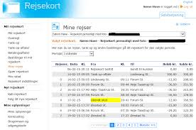

---

**1**. Den nøjagtige periode, som kontoudtoget dækker.

**2**.	Størrelsen på de udnyttede kreditmuligheder og datoerne for udnyttelserne.

**3**.	Saldoen på det foregående kontoudtog og dettes dato.

**4**.	Den nye saldo.

**5**.	Datoerne for betalinger og betalingernes størrelse.

**6**.	Den anvendte debitorrente.

**7**.	Eventuelle omkostninger, der er pålagt.

**8**.	Det eventuelle minimumsbeløb, der skal betales.

---

Ifølge KAL § 10, stk. 3, skal kreditgiveren endvidere underrette forbrugeren om enhver stigning i debitorrenten eller andre omkostninger, inden den pågældende ændring træder i kraft. 

Også denne underretning skal ske på papir eller andet varigt medium. 

Dog kan det ifølge KAL § 10, stk. 4, fastsættes i en kreditaftale, at underretning om ændring i debitorrenten gives på kontoudtog efter stk. 1 i de tilfælde, hvor ændringen i debitorrenten skyldes en ændring i en referencesats, hvor den nye referencesats er gjort tilgængelig for offentligheden, og hvor oplysning om den nye referencesats tillige er tilgængelig hos kreditgiveren. 

---

**Beregning af de årlige omkostninger i procent**


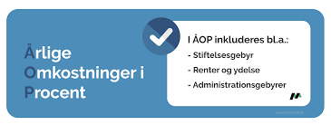
 
Ved de årlige omkostninger i procent (også betegnet som **ÅOP**) forstås ifølge KAL § 16, stk. 1, en procentsats, der på årsbasis svarer til nutidsværdien af alle fremtidige eller eksisterende forpligtelser i form af udnyttede kreditmuligheder, tilbagebetalinger og omkostninger, der er aftalt mellem kreditgiveren og forbrugeren. 

Sagt med andre ord betyder ÅOP, hvor meget det samlet koster at låne 100 kr. i ét år. *"kiloprisen for lånet"*

De årlige omkostninger i procent beregnes ud fra den matematiske formel, som er i kreditaftalelovens bilag 1.

Grundligningen, som bestemmer de årlige omkostninger i procent (ÅOP), sætter på årsbasis lighedstegn mellem den samlede nutidsværdi af udnyttede kreditmuligheder og den samlede nutidsværdi af tilbagebetalinger og betalinger af omkostninger:


---

**Kreditformidlere** 

I visse tilfælde skal en forbruger betale et gebyr til en kreditformidler for den (tjeneste-)ydelse, som formidleren har præsteret i forbindelse med indgåelse af en kreditaftale.

---

### Kreditgiverens tilsidesættelse af oplysningspligten


*Hvilke konsevenser har det, hvis kreditgiveren tilsidesætter sine oplysningsforpligtelser:*

Manglende opfyldelse af visse oplysningsforpligtelser, er civilretligt sanktioneret i KAL § 23, såfremt der ikke er givet behørig oplysning om ÅOP og de samlede omkostninger, som forbrugeren skal betale, jf. KAL § 8, stk. 2, nr. 7, eller stk. 5, nr. 6, jf. KAL § 23, stk. 1, jf. dog § 23, stk. 3, at forbrugeren ikke kan afkræves andre kreditomkostninger end en årlig rente svarende til den officielle udlånsrente med et tillæg på 5 %, se fx Juridisk Årbog 1999, s. 188 (møbler på kredit).

KAL § 23, stk. 1, medfører således ikke blot en reduktion af den aftalte rente til en rente, der svarer til den officielle udlånsrente med et tillæg på p.t. 5 %. 

Bestemmelsen medfører tillige, at kreditgiveren selv må afholde samtlige omkostninger, fx kurstab, provisioner, tinglysningsafgift og alle andre stiftelsesomkostninger, som har været forbundet med at stifte kreditten, da forbrugeren kun er pligtig at betale lånebeløbet. 

Sanktionsreglen i KAL § 23, stk. 1, gælder ikke, hvis kreditgiveren kan godtgøre, at forbrugeren på trods af de manglende eller urigtige oplysninger har haft et forsvarligt grundlag for at bedømme kreditomkostningerne, jf. KAL § 23, stk. 3. 

I betragtning af den høje detaljeringsgrad, der er i lovens bestemmelser om kreditgiverens oplysningspligt, kan det ikke antages, at bestemmelsen i KAL § 23, stk. 3, har væsentlig betydning. 

Det er desuden hensigten med bestemmelsen, at denne skal have et snævert anvendelsesområde, således at den altovervejende hovedregel er, at en tilsidesættelse af oplysningspligten fører til, at der skal ske en regulering, jf. nærmere præmisserne i dommen **U 2004.317 H** om aftale om leje af videoapparat med ret til at købe for 1 kr. efter 5 år. Dette var i strid med kreditaftaleloven.

Undtagelser i kreditaftaleloven skal således fortolkes indkrænkende grundet lovens forbrugerbeskyttende hensigt.

---

Den reduktion af det samlede beløb, som en forbruger skal betale, såfremt sanktionsreglerne i KAL § 23, stk. 1 og 2, finder anvendelse, sker ved en reduktion af den sidste eller om fornødent i de sidste ydelser, som forbrugeren skal betale, jf. § 23, stk. 4, og ikke ved en reduktion af størrelsen af de fremtidige ydelser. 

Såfremt forbrugeren har betalt mere end det, denne er pligtig at betale ifølge en korrektion af kreditaftalen, jf. lovens § 23, stk. 1 har forbrugeren som hovedregel krav på tilbagebetaling af det for meget betalte. 

Forbrugerens retsstilling fastsættes i sådanne tilfælde efter dansk rets almindelige regler om **condictio indebiti** (tilbagesøgning). 

Har sælgeren i et kreditkøb ikke givet oplysninger som foreskrevet i KAL § 8, kan kreditgiveren i almindelighed ikke kræve godtgørelse for omkostninger, som ellers ville påløbe i anledning af forbrugerens misligholdelse, jf. KAL § 24.

---

**Bøder for overtrædelse af kreditaftaleoven:**

Grove eller gentagne overtrædelser af KAL §§ 7 a, 7 b, 8, 8 a, 8 b, 9, 10 eller 17 straffes med bøde, jf. KAL § 56, stk. 2.

---

### Urimelige vilkår som der kan tilsidesættes

Det følger af KAL § 22: 

“Er det beløb, som forbrugeren efter aftalen skal betale som vederlag eller omkostninger, urimeligt, skal det nedsættes til, hvad der skønnes rimeligt.** 
Medmindre andet bestemmes af retten, sker afkortningen i det eller de sidste beløb, der skal betales efter aftalen. 

Er der afkrævet forbrugeren et urimeligt vederlag for at give den pågældende henstand eller andre lempelser i de aftalte vilkår, sker afkortningen på samme måde”.

Reduktion af en rentesats rejser ligesom andre rettelser af en kontrakt spørgsmålet om, hvor vidtgående rettelsen bør være. 

---


Dommen i **U 1960.631 H** tyder på, men fastslår dog ikke udtrykkeligt, at rentefoden er blevet nedsat til en høj sats, måske den højeste sats som ikke kunne være tilsidesat, men ikke til den lavere sats, som er almindelig eller gennemsnitlig praksis på markedet.

---


## Trepartsforhold  


Lånesituationer med tre parter:

**1.	Oprindeligt trepartsforhold**

**2.	Efterfølgende trepartsforhold**

**3.	Fritstående lån**

---

Vigtigt at skelne mellem de tre situationer for at afgøre, hvilke regler, der finder anvendelse
 
**Trepartsforhold: Oprindeligt trepartsforhold:**

Forbrugeren opnår lån hos en tredjemand gennem en kreditformidler, jf. KAL § 4, stk. 1, nr. 15 litra b

Typisk situation: Forbruger køber en vare i en butik og indgår i butikken en låneaftale med en kreditgiver

Hvis varen er mangelfuld kan forbrugeren gøre krav gældende overfor finansieringsselskabet (køberetlig identifikation mellem finansieren og sælgeren)

Kreditgiver kan få ejendomsforbehold i det solgte men ikke pant

---
 
**Trepartsforhold: Efterfølgende trepartsforhold:**

Forbrugeren indgår kreditaftale med sælger, jf. KAL § 4, stk. 1, nr. 15 litra a. Sælger overdrager efterfølgende aftalen til en tredjemand 

Typisk situation: Forbruger køber en vare i en butik og indgår en afdragsordning med butikken. Butikken sælger kravet på forbrugeren videre til et finansieringsselskab

Hvis varen er mangelfuld kan forbrugeren gøre samme krav gældende overfor finansieringsselskabet som overfor sælger 

Kreditgiver kan få ejendomsforbehold i det solgte men ikke pant
 
 
---

**Trepartsforhold og fritstående lån**

Ikke et trepartsforhold fordi sælger ikke har kontakt med långiver

Forbrugeren opnår lån hos en långiver. Låneprovenuet bliver brug til et kontantkøb 

Typisk situation: Forbruger optager lån i sin bank. 


Lånet bliver brugt til køb af fx bil. 

Bilsælger kender ikke til finansieringen

Hvis varen er mangelfuld kan forbrugeren ikke gøre krav gældende overfor banken – lånet skal tilbagebetales

Det er ikke et kreditkøb og banken kan få pant i bilen
 
Kreditaftaleloven indeholder en række bestemmelser, som skal beskytte forbrugerne i såvel oprindelige som efterfølgende trepartsforhold. 

---

### Oprindeligt trepartsforhold


```{r , echo=FALSE, result=TRUE,fig.height=4,fig.cap=("Oprindeligt trepartsforhold")}

nodes <- data.frame(id = 1:3, shape = c("box"),level = c(1,1,2),label = c("Sælger\nkreditformidler","Køber/låntager","Finansieringsselskab\nkreditgiver\nTrediemand"),font.size = c(25,25,25))
edges <- data.frame(from = c(1,2,2,3,3,1), 
                    to = c(2,1,3,2,1,3),
                    arrows = c("to"),
                    length = c(700,100,100,100,100,100),
                    font.size = c(20,20,20,20,20,20),
                    label=c("2. Vare\n3. Købesum","","3. Lån\n4. Omkostninger","","1. Aftale",""),
                    smooth = c(FALSE,FALSE,FALSE,FALSE,FALSE,FALSE)
                    )
 visNetwork(nodes, edges, width = "100%") %>% 
   visInteraction(dragNodes = TRUE, 
                 dragView = TRUE, 
                 zoomView = FALSE) %>%
  visNodes(color = list(background = "white", 
                        border = "white",
                        highlight = "yellow"),
           shadow = list(enabled = TRUE, size = 30))  %>%
  visHierarchicalLayout(direction = "UD",levelSeparation = 300) %>%
visEdges(color = list(color = "lightgrey", highlight = "yellow") )
```

---

I det **oprindelige trepartsforhold** er der fra starten tre aftaleparter involveret, idet forbrugeren dels indgår aftale med en sælger eller tjenesteyder om køb eller om præstation af en tjenesteydelse, dels indgår aftale med långiver (finansieren) om ydelse af lån til betaling af vederlaget. 

Der foreligger dog kun et oprindeligt trepartsforhold, hvis der tillige foreligger en aftalerelation mellem finansieren og sælgeren eller tjenesteyderen, således at kreditten ydes på grundlag heraf, jf. KAL § 4, nr. 15, litra b, jf. KAL § 33, stk. 4, for så vidt angår tjenesteydelser. 

Som eksempel på oprindelige trepartsforhold kan nævnes de eksterne kontosystemer, hvor en særlig kontoorganisation – kontoring eller lignende – ved aftale med en række handlende mv. har forpligtet sig til gennem ydelse af kredit at finansiere de aftaler, som kunder, der er tilsluttet organisationen, og som typisk er udstyret med et særligt kontokort, foretager hos de pågældende handlende mv. 


Endvidere kan nævnes de såkaldte lånekøb, hvor købesummen helt eller delvis tilvejebringes ved lån til forbrugeren fra tredjemand, fx et finansieringsselskab, med hvem sælgeren har truffet aftale om finansiering af købet.  

En sådan aftale kan også foreligge stiltiende, fx ved at der har udviklet sig et fast samarbejde mellem sælgeren og finansieringsselskabet. 

Fogedretten har statueret oprindeligt trepartsforhold, selv om skyldner havde haft forudgående kontakt til finansieringsselskabet. 

---

### Efterfølgende trepartsforhold


```{r , echo=FALSE, result=TRUE,fig.height=4,fig.cap=("Efterfølgende trepartsforhold")}

nodes <- data.frame(id = 1:3, shape = c("box"),level = c(1,1,2),label = c("Autoforhandler\nkreditformidler","Køber/låntager","Finansieringsselskab"),font.size = c(25,25,25))
edges <- data.frame(from = c(1,2,2,3,1), 
                    to = c(2,1,3,1,3),
                    arrows = c("to"),
                    length = c(900,100,100,100,100),
                    font.size = c(20,20,20,20,20),
                    label=c("Vare\nLåneaftale","","Afdrag\nRenter","Overdragelse af låneaftale\nBetaling for overdragelse",""),
                    smooth = c(FALSE,FALSE,FALSE,FALSE,FALSE)
                    )
 visNetwork(nodes, edges, width = "100%") %>% 
   visInteraction(dragNodes = TRUE, 
                 dragView = TRUE, 
                 zoomView = FALSE) %>%
  visNodes(color = list(background = "white", 
                        border = "white",
                        highlight = "yellow"),
           shadow = list(enabled = TRUE, size = 30))  %>%
  visHierarchicalLayout(direction = "UD",levelSeparation = 300) %>%
visEdges(color = list(color = "lightgrey", highlight = "yellow") )
```

---

Begrebet **efterfølgende trepartsforhold** omfatter de tilfælde, hvor den oprindelige kreditgivers rettigheder i henhold til kreditaftalen tiltransporteres en tredjemand. 

Begrebet er en kreditaftaleretlig term, der dækker over begreber som factoring, kontraktbelåning, kontraktsdiscontering o.lign. 

Begrebets materielle indhold er reguleret ved reglerne om personskifte i skyldforhold, herunder navnlig reglerne om kreditorskifte. 

Mens det oprindelige trepartsforhold er kendetegnet ved, at tredjemanden finansierer forbrugeren, er det efterfølgende trepartsforhold kendetegnet ved, at tredjemanden finansierer sælgeren.

Forholdet mellem forbrugeren i et kreditkøb og tredjemanden i det efterfølgende trepartsforhold reguleres dels ved de almindelige regler om kreditorskifte i skyldforhold, dels ved kreditaftalelovens §§ 31-33.

Forholdet mellem sælgeren/kreditgiveren i det oprindelige trepartsforhold og tredjemanden i det efterfølgende trepartsforhold er navnlig, men ikke kun, reguleret ved gældsbrevslovens §§ 9 og 10 og ved gældsbrevslovens §§ 29-31 samt den righoldige retspraksis, der foreligger vedrørende factoring, *fakturabelåning* og selskabsopsplitning mv. 
 
---

### Fritstående lån i forhold til det oprindelige trepartsforhold

```{r , echo=FALSE, result=TRUE,fig.height=4,fig.cap=("Fritstående lån, køber finansierer købet med lån i banken")}

nodes <- data.frame(id = 1:3, shape = c("box"),level = c(1,1,2),label = c("Sælger","Køber/låntager","Bank"),font.size = c(25,25,25))
edges <- data.frame(from = c(1,2,2,3), 
                    to = c(2,1,3,2),
                    arrows = c("to"),
                    length = c(900,100,100,100),
                    font.size = c(20,20,20,20),
                    label=c("Vare\nKøbesum","","Banklån\nAfdrag/Renter/Gebyrer","")
                    # smooth = c(FALSE,FALSE,FALSE,FALSE)
                    )
 visNetwork(nodes, edges, width = "100%") %>% 
   visInteraction(dragNodes = TRUE, 
                 dragView = TRUE, 
                 zoomView = FALSE) %>%
  visNodes(color = list(background = "white", 
                        border = "white",
                        highlight = "yellow"),
           shadow = list(enabled = TRUE, size = 30))  %>%
  visHierarchicalLayout(direction = "UD",levelSeparation = 300) %>%
visEdges(color = list(color = "lightgrey", highlight = "yellow") )
```

---

Såfremt et køb eller en tjenesteydelse finansieres ved, at forbrugeren opnår et lån hos kreditgiver, som ikke har nogen forbindelse til sælgeren eller tjenesteyderen, foreligger der ikke et oprindeligt trepartsforhold, men derimod et såkaldt **fritstående lån**. 

En sådan kreditaftale omfattes nok af kreditaftalelovens generelle bestemmelser om oplysningspligt, forbrugerens betalinger, efterfølgende trepartsforhold, mv., hvorimod lovens bestemmelser vedrørende oprindeligt trepartsforhold og kreditkøb ikke finder anvendelse. 

Finansieres et køb eller tjenesteydelse ved et fritstående lån, har kreditaftaleloven således ingen betydning for retsforholdet mellem forbrugeren og sælgeren eller tjenesteyderen. 
 
Når det skal afgøres, om der foreligger et fritstående lån eller et kreditkøb (oprindeligt trepartsforhold), som er omfattet af KAL § 4, nr. 15, litra b, er det efter lovforarbejderne afgørende, om der foreligger en sådan grad af forbindelse – et sådant samvirke mellem køb og lån – mellem sælger og långiver, at forholdet med rimelighed bør anses for et kreditkøb med de i loven angivne konsekvenser, mens lovteksten i KAL § 4, nr. 15, litra b kræver en aftale om finansiering mellem sælger og tredjemand. 

Der skal ikke efter retspraksis meget til før at en sådan aftale foreligger mellem sælgeren og tredjemand, hør om U 1995.192/2 H (Vandsengedommen):

---

Selv om **dommen U 1995.192/2** H er udtryk for, at KAL § 4, nr. 15, litra b, har et bredt anvendelsesområde, medfører bestemmelsen ikke, at alle lån, der anvendes til løsørekøb, må anses for omfattet af KAL § 4, nr. 15, litra b. 

---

Lånetilsagn, der gives af et pengeinstitut/finansieringsselskab, inden den kommende køber henvender sig til sælgeren, er eksempelvis ikke omfattet, medmindre lånetilsagnet er opnået i en institution, der har en aftale med vedkommende forhandler, og køber opnår lånet på grundlag af denne aftale. 

Det kan heller ikke antages, at sælgers medvirken – eksempelvis at han hjælper køberen med en telefonisk henvendelse til banken – i sig selv bevirker, at lånet er omfattet af KAL § 4, nr. 15, litra b.

---

**Internationale betalingskort omfattet af det oprindelige trepartsforhold**


 
---


 
---


---

Lån, der ydes af eksterne kontosystemer (og selskabskonstruktioner, der må ligestilles hermed) må antages at være omfattet af KAL § 4, nr. 15, litra b«.  

Konkurrence- og Forbrugerstyrelsen antager på baggrund af de enkelte internationale kortsystemer, at i hvert fald systemerne **MasterCard, Eurocard, samt Diners Club-kortet** er omfattet af reglerne om oprindelige trepartsforhold. 

For så vidt angår **VISA** vil afgørelsen af dette spørgsmål bero på, hvorvidt der sker en sådan forsinkelse af debiteringen efter anvendelse af kortet, at der må siges at blive ydet kredit fra kortudsteders side. 

Dette resultat er i overensstemmelse med kreditkøbsudvalgets intentioner om, at de forbrugerbeskyttende regler i loven skal omfatte hele kreditkøbsområdet, og ud fra en mere overordnet betragtning synes ulemperne for kortudsteder at være overskuelige. 

Først og fremmest vil risikoen for, at der statueres oprindeligt trepartsforhold, virke som et incitament for kortudsteder til at vælge respektable og fornuftige samarbejdspartnere. 

Endvidere har kortudsteder mulighed for at tage højde for denne risiko i forhold til det indbyrdes opgør med betalingsmodtager fx i form af modregning ved efterfølgende betalingsanmodninger fra samme betalingsmodtager. 

Endelig kan der næppe herske tvivl om, at kreditelementet indgår som et væsentligt beslutningsparameter ved kortindehavers beslutning om at anskaffe sig et af de pågældende betalingskort. 

---

### Forbrugerens adgang til at fremsætte indsigelser over for anden kreditor


I KAL kapitel 9 om kreditorskifte er der fastsat regler til beskyttelse af forbrugeren i trepartsforhold.

Når en kreditgiver har overdraget sine rettigheder i henhold til en kreditaftale til tredjemand, har forbrugeren ifølge KAL § 33, stk. 1, over for erhververen ret til at gøre enhver indsigelse gældende, som forbrugeren kunne gøre gældende over for den oprindelige kreditgiver. 

Erhververen har de samme rettigheder og forpligtelser over for forbrugeren, som den oprindelige kreditgiver.

Ifølge KAL § 33, stk. 2, skal forbrugeren underrettes om en sådan overdragelse efter stk. 1. 

Dette gælder ikke, hvis den oprindelige kreditgiver efter aftale med erhververen fortsat står for kreditten i forhold til forbrugeren. 

I tilfælde af kreditorskifte (ved det efterfølgende trepartsforhold) er reglen en gentagelse af princippet i gældsbrevslovens § 27, men reglen kan – i modsætning til gældsbrevslovens § 27 – ikke fraviges ved aftale. 

**efterfølgende trepartsforhold**


```{r , echo=FALSE, result=TRUE,fig.height=4,fig.cap=("Efterfølgende trepartsforhold, køber kan gøre samme indsigelser overfor både sælger og finansieringsselskab.")}

nodes <- data.frame(id = 1:3, shape = c("box"),level = c(1,1,2),label = c("Sælger","Køber","Finansieringsselskab"),font.size = c(25,25,25))
edges <- data.frame(from = c(1,2,2,1), 
                    to = c(2,1,3,3),
                    arrows = c("to"),
                    length = c(900,100,100,100),
                    font.size = c(20,20,20,20),
                    label=c("Kreditkøb\nKøbers indsigelser","","Afdrag\nRenter","Salg af købekontrakt")
                    # smooth = c(FALSE,FALSE,FALSE,FALSE,FALSE)
                    )
 visNetwork(nodes, edges, width = "100%") %>% 
   visInteraction(dragNodes = TRUE, 
                 dragView = TRUE, 
                 zoomView = FALSE) %>%
  visNodes(color = list(background = "white", 
                        border = "white",
                        highlight = "yellow"),
           shadow = list(enabled = TRUE, size = 30))  %>%
  visHierarchicalLayout(direction = "UD",levelSeparation = 300) %>%
visEdges(color = list(color = "lightgrey", highlight = "yellow") )
```

---

I det oprindelige trepartsforhold, hvor fordringen mod forbrugeren hidrører fra, at en tredjemand efter aftale med sælgeren eller tjenesteyderen har ydet forbrugeren et lån til finansiering af ydelsen, indebærer § 33, stk. 1, en nydannelse i forhold til gældsbrevslovens § 27, idet bestemmelsen sikrer, at forbrugeren over for en sådan tredjemand kan gøre de samme indsigelser gældende, som forbrugeren kunne mod sælgeren eller tjenesteyderen.

Realindholdet af KAL § 33, stk. 1, er, at der sker en køberetlig identifikation mellem tredjemand og den oprindelige kreditgiver (sælgeren). I lovforarbejderne betegnes trepartsforholdet som sælgers og tredjemands solidariske hæftelse over for forbrugeren.  

Bestemmelsen medfører, at forbrugeren fx i tilfælde, hvor der foreligger forsinkelse eller mangler ved det købte, kan afvise at betale til anden kreditor i samme omfang, som forbrugeren kunne afvise at betale til sælgeren. 

Har forbrugeren hævet købet, er forbrugeren ikke pligtig at betale til anden kreditor. 

Efter de almindelige obligationsretlige grundsætninger får forbrugeren ikke en bedre retsstilling over for den finansierende tredjemand, end den forbrugeren havde over for sælgeren. 

Forbrugerens adgang til at udøve køberetlige beføjelser – eksempelvis at hæve købet eller påberåbe sig en mangel – er betinget af, at forbrugeren ikke har fortabt retten hertil efter den relative eller absolutte reklamationsfrist, jf. købelovens § 81 og § 83. 

Såfremt forbrugeren har hæveadgang i henhold til købelovens § 78, må forbrugeren efter lovens § 33, stk. 1 og 3, tilbagelevere løsøret, jf. Juridisk Årbog 1994-94, s. 212 om kreditkøb af en sofagruppe.

---

### Forbrugerens adgang til at fremsætte pengekrav over for anden kreditor

Efter KAL § 33, stk. 3 og 4, kan forbrugeren i det oprindelige trepartsforhold i et nærmere angivet omfang gøre et pengekrav gældende over for såvel den finansierende tredjemand som over for den eller dem, der måtte have erhvervet den finansierende tredjemands fordring ved transport. 

---

Betingelserne for, at forbrugeren kan gøre et pengekrav gældende mod de nævnte tredjemænd, er: 

**at** forbrugeren har et pengekrav mod sælgeren eller tjenesteyderen i anledning af aftalen (fx krav på hel eller delvis tilbagebetaling af vederlaget eller på erstatning), at forbrugeren sandsynliggør, 

**at** sælgeren eller tjenesteyderen ikke opfylder sine forpligtelser, samt 

**at** beløbet ikke overstiger, hvad forbrugeren har betalt den pågældende finansierende tredjemand i anledning af aftalen. 

---

Ordlyden af bestemmelsen i KAL § 33, stk. 3, 2. pkt., hvorefter »forbrugeren må dog først sandsynliggøre, at sælgeren ikke opfylder sine forpligtelser«, er imidlertid ikke særlig klar. 

Der er ikke grundlag for at antage, at der foreligger en fuldstændig solidarisk hæftelse i sædvanlig forstand, hvor fordringshaveren kan kræve hele ydelsen af enhver af de forpligtede. 

KAL § 33, stk. 3, synes i stedet at bygge på en selvskyldnerkautionslignende ordning, hvorefter forbrugeren skal have rettet henvendelse til sælgeren eller (typisk) dennes bo, forinden kravet rejses mod en finansierende tredjemand. 

Krav om naturapræstationer i form af levering, omlevering eller afhjælpning kan ikke gøres gældende mod den finansierende tredjemand. 

Sådanne naturakrav kan, hvis de ikke opfyldes af sælger, imidlertid konverteres til pengekrav gennem udnyttelse af adgangen til at hæve, kræve forholdsmæssigt afslag eller erstatning for afhjælpningsudgiften. 


Forbrugerens krav mod den finansierende tredjemand kan som nævnt højst andrage det beløb, som denne har modtaget fra forbrugeren i anledning af købet, jf. KAL § 33, stk. 2, 2. pkt. 

Det afgørende ved beregningen af kravet er således ikke, at forbrugeren har et køberetligt krav på sælgeren på fx. 100.000 kr., men at forbrugeren har betalt eksempelvis 50.000 kr. til den pågældende tredjemand.  


Princippet er praktiseret i en række afgørelser ved Forbrugerklagenævnet, jf. fx Juridisk Årbog 1998, s. 153 og 155, Juridisk Årbog 1999, s. 214 og 216, samt Juridisk Årbog 2001, s. 112.


Det er tvivlsomt, om den finansierende tredjemand over for forbrugeren hæfter for produktskader i helt samme omfang som sælgeren. 

---

## Køb med ejendomsforbehold


**Ejendomsforbehold** er en aftale mellem køber og sælger om, at sælger kan tage varen tilbage, hvis køber ikke betaler afdrag efter kreditaftalen, jf. KAL § 34, stk. 1

Ejendomsforbehold kan være en del af kreditaftalen, men sælger kan også vælge ikke at tage ejendomsforbehold

I aftaler om kreditkøb er det udelukkende muligt at bruge ejendomsforbehold, der kan ikke tages underpant i varen


```{r , echo=FALSE, result=TRUE,fig.height=4,fig.cap=("Konflikten mellem Amalies ret efter ejendomsforbeholdet og Cecilies ret til den købte vare.")}

nodes <- data.frame(id = 1:3, shape = c("box"),label = c("A. Amalie","B. Bent","C. Cecilie"),font.size = c(25,25,25))
edges <- data.frame(from = c(1,2,3), 
                    to = c(2,3,1),
                    arrows = c("to"),
                    length = c(400,100,300),
                    font.size = c(20,20,20),
                    label=c("Ejendomsforbehold\ntil sælger","",""),
                    smooth = c(FALSE,FALSE,TRUE)
                    )
 visNetwork(nodes, edges, width = "100%") %>% 
   visInteraction(dragNodes = TRUE, 
                 dragView = TRUE, 
                 zoomView = FALSE) %>%
  visNodes(color = list(background = "white", 
                        border = "white",
                        highlight = "yellow"),
           shadow = list(enabled = TRUE, size = 30))  %>%
  visHierarchicalLayout(direction = "UD",levelSeparation = 300) %>%
visEdges(color = list(color = "lightgrey", highlight = "yellow") )
```

---

**Formkrav til et gyldigt ejendomsforbehold:**

 
**Et gyldigt ejendomsforbehold skal efter KAL § 34, stk. 1 være:**


1) det er aftalt senest ved overgivelsen af det købte til forbrugeren,

2) det samlede beløb, der skal betales, jf. § 8, stk. 2, nr. 7, inklusive den erlagte udbetaling  overstiger 2.000 kr.,

3) kreditkøbet ikke er sket i henhold til en aftale om kredit med variabelt lånebeløb og

4) sælgeren ved overgivelsen  af det købte er fyldestgjort for mindst 20 pct. af kontantprisen".


---


Desuden skal ejendomsforbehold i motorkøretøjer tinglyses i bilbogen, jf. TL § 42d, stk. 1.

OBS: Ingen krav om udbetaling i handelskøb og civilkøb for at der er taget et gyldigt ejendomsforbehold.
 


 
---

 
**Konflikt med senere rettigheder ved et gyldigt ejendomsforbehold**

**HR:** Et gyldigt stiftet ejendomsforbehold beskytter sælgers ejendomsret til aktivet overfor købers andre kreditorer og aftaleerhververe 

**U:** Hvis en godtroende forbruger har købt aktivet med ejendomsforbehold, kan køber ekstinkvere (udslette) sælger ejendomsforbehold hvis:  

**U1**: Sælger har givet tilladelse til videresalg  

**U2**: Sælger har opført sig passivt eller særlig uforsigtigt, og aktivet er udleveret til køber

**U3:** Forhandlergrundsætningen – sælger er klar over, at køber er forhandler af aktivet, og aktivet er udleveret til køber

---

### Særregler for forbrugerkøb med ejendomsforbehold

Formålet med reglerne om køb med ejendomsforbehold er at give sælgeren mulighed for at få sikkerhed for købesummens betaling og derved beskytte sine legitime fordringsrettigheder over for forbrugerens andre kreditorer og aftaleerhververe.  

Endvidere har reglerne til formål at varetage forbrugerens interesser i tilfælde af konflikt med sælgeren. 

Kreditaftalelovens regler om køb med ejendomsforbehold søger at afbalancere hensynet til forbrugerens interesse i at komme ud af et kreditkøb med ejendomsforbehold uden at efterlade sig gæld til kreditgiveren samt forbrugerens interesse i fortsat at kunne benytte det købte trods en mindre væsentlig misligholdelse af sin betalingsforpligtelse med hensynet til sælgerens interesse i at kunne sikre sig over for såvel forbrugerens faktiske som retlige dispositioner over det solgte.   

Køb med ejendomsforbehold er defineret i KAL § 4, nr. 16, hvorefter der ved køb med ejendomsforbehold forstås et kreditkøb, hvor det er aftalt, at sælgeren kan tage det solgte tilbage, hvis forbrugeren ikke opfylder sine forpligtelser.  

En indehaver af et ejendomsforbehold skal som hovedregel ikke foretage nogen sikringsakt for at opnå omsætnings- og kreditorbeskyttelse. 

Dog er det ved tinglysningslovens § 42 d bestemt, at ejendomsforbehold i køretøjer mv., jf. tinglysningslovens § 42 c, skal tinglyses i bilbogen for at opnå omsætnings- og kreditorbeskyttelse.  

Et ejendomsforbehold i fx en bil kan udmærket være gyldigt mellem parterne, selv om det ikke er tinglyst, og selv om de formkrav, der stilles for at få det tinglyst, ikke er opfyldt. 

Tinglysning af et ejendomsforbehold, der ikke er gyldigt stiftet, medfører ikke, at ejendomsforbeholdet bliver gyldigt.  

Som køb med ejendomsforbehold anses også en aftale, der er betegnet som lejekontrakt, eller en aftale, hvorefter betalingen i øvrigt fremtræder som vederlag for brug af tingen, såfremt det må antages at have været meningen, at modtageren af tingen skal blive ejer af den, jf. § 4, nr. 16:

---


Se Fona-sagerne i Højesterets dom **U 2004.317 H**, hvorefter aftale om leje af videoapparat med ret til at købe apparatet for 1 kr. efter 5 år var i strid med kreditaftaleloven:


---

"I januar 1995 indgik A en aftale med Fona F om leje af et videoapparat i 5 år. 

Samtidig udstedte F et bevis, som hjemlede A ret til efter de 5 år at købe tilsvarende udstyr for 1 kr., alene betinget af at han havde overholdt lejeaftalen i 60 måneder. 

I lejeaftalen var værdien af videoapparatet angivet, og det var opgjort, hvad der i alt skulle betales i administrationsgebyr og leje ved aftalens indgåelse. 

Endvidere var den månedlige leje opgivet. 

Derimod var de samlede kreditomkostninger ikke angivet. 

Ved oprettelsen af lejekontrakten betalte A første rate med 500 kr. Pr. oktober 1999 havde A betalt i alt 11.445 kr. i leje, og han ønskede nu at gøre brug af retten til at købe apparatet for 1 kr., når de 5 år var udløbet. 

Han gjorde herunder gældende, at lejeaftalens vilkår skulle ændres i overensstemmelse med kreditaftalelovens regler, jf. herved lovens § 7, stk. 1, under henvisning til at lejeaftalen ikke opfyldte kreditaftalelovens bestemmelser om gyldigt ejendomsforhold. 

Han krævede derfor, at F tilbagebetalte ca. 4.300 kr., der udgjorde det for meget betalte beløb, dvs. det, der var betalt ud over kontantprisen og en årlig rente. A fik medhold i sit krav ved Forbrugerklagenævnet, landsretten og Højesteret. 

For Højesteret anerkendte F, at lejeaftalen var omfattet af kreditaftalelovens § 6, stk. 2, og at der som udgangspunkt skulle ske regulering i medfør af § 23, stk. 1, men gjorde under henvisning til § 23, stk. 3, gældende, at der ikke skulle ske regulering. 

Højesteret fandt, at F ikke havde godtgjort, at A havde haft et forsvarligt grundlag for at bedømme kreditomkostningerne, og at § 23, stk. 3, derfor ikke fandt anvendelse. 

Der var heller ikke grundlag for at fritage F for tilbagebetaling efter almindelige obligationsretlige regler om passivitet, condictio indebiti eller ugrundet berigelse


---

### Krav til aftalen om ejendomsforbehold

Definitorisk stilles der ikke krav om, at et ejendomsforbehold skal aftales skriftligt. 

Da en forbrugerkreditaftale efter bestemmelsen i KAL § 8 skal udfærdiges skriftligt, og da en betingelse for, at kreditgiveren – såvel i forbrugerkøb som ikke-forbrugerkøb med ejendomsforbehold – kan tage det solgte tilbage ifølge KAL § 36, er, at ejendomsforbeholdet er indeholdt i en skriftlig kontrakt, må et ejendomsforbehold de facto aftales skriftligt. 

Der foreligger et gyldigt ejendomsforbehold, når et sådant udtrykkeligt og klart er aftalt mellem parterne,  og når betingelserne i KAL § 34 i øvrigt er opfyldt. 

Et ejendomsforbehold skal være så klart udtrykt, at køberen har mulighed for at forstå, at sælgeren har forbeholdt sig ejendomsretten til det solgte. 

Det kræves ikke, at den konkrete køber faktisk har forstået dette, men at den almindelige køber vil være i stand til at forstå dette.  

---

Sælgeren kan ikke tage et ensidigt ejendomsforbehold – fx i en faktura eller i leveringsbetingelserne, jf. dommene **U 1977.29 SH, U 1978.373 V** (et ejendomsforbehold, der var fortrykt på kontraktens bagside, fandtes ikke at være aftalt, da kontrakten var underskrevet på forsiden) og U 1983.311 H – og i hvert fald i forbrugerkøb er et sådant forbehold ikke gyldigt, selv om køber ikke reklamerer over det pågældende kontraktvilkår.  

---


### Krav til individualisering af det solgte

En betingelse for, at et ejendomsforbehold kan gøres gældende, er, at den solgte genstand er specificeret således, at den ikke er forvekslelig med en anden genstand. Kravet gælder såvel inter partes som i forhold til tredjemand. 

Der er enighed i teori og praksis om, at en rettighedshaver skal kunne godtgøre sin ret, fx i fogedretten, men der er til gengæld ikke enighed om, hvilke krav der skal stilles til salgsgenstandens individualisering i købekontrakten.  

Kravet kunne være, at det solgte skal være individualiseret på en sådan måde i købekontrakten, at det fx i forbindelse med en fogedsag kan identificeres, uanset at det måtte befinde sig sammen med sammenlignelige genstande og genstande af tilsvarende art. 

I praksis vurderes kravene konkret på grundlag af de givne forhold og omstændigheder.  

Det kunne imidlertid også være nærliggende at henvise til, at domstolene ved tinglysning af pantebreve i løsøre stiller krav om, at den pantsatte genstand skal være individualiseret – beskrevet med en sådan klarhed, at der ikke kan indskydes andre genstande under panteaftalen. 

Kravet må efter forholdets natur afhænge af, hvilken løsøregenstand (der fx også omfatter dyr) der er tale om. 

Det er kreditgiveren, der i det enkelte tilfælde må løfte bevisbyrden for, hvilken genstand denne har ejendomsforbehold i. 

Et ejendomsforbehold gælder kun for den konkrete genstand, der er taget ejendomsforbehold i. 

Findes genstanden ikke længere, eller kan den ikke identificeres, kan sælgeren ikke hævde sin rettighed. 

Forbrugeren skal foretage en normal vedligeholdelse af den genstand, der er ejendomsforbehold i.

Hvis genstanden ikke længere findes hos forbrugeren, fx fordi den er solgt eller byttet væk, kan sælgeren som hovedregel ikke gøre ejendomsforbeholdet gældende i den eventuelle nye genstand. 

Spørgsmålet om, hvorvidt sælgeren kan vindicere genstanden fra tredjemand,  må afgøres efter almindelige regler om eksstinktion.  

Udgangspunktet i dansk ret er, at kreditgiveren (sælgeren) kan *vindicere* (tilbagefører) genstanden fra en senere erhverver. 

Ifølge domspraksis fraviges dette udgangspunkt, såfremt kreditgiveren har udvist uforsigtighed eller passivitet, jf. fx dommen i **U 1984.846 V** (om videresalg af en motorcykel).


---

### Betingelser for gyldigheden af et ejendomsforbehold


Et ejendomsforbehold i forbrugerkøb er som tidligere nævnt kun gyldigt efter lovens § 34, stk. 1, såfremt:

Det er aftalt senest ved overgivelsen af det købte til forbrugeren,

det samlede beløb, der skal betales, jf. § 9, stk. 1, nr. 5, overstiger 2.000 kr.,

kreditkøbet ikke er sket i henhold til en aftale om kredit med variabelt lånebeløb, og

sælgeren ved overgivelsen af det købte er fyldestgjort for mindst 20 % af kontantprisen.

---

#### Krav til aftaletidspunktet

Efter KAL § 34, stk. 1, nr. 1, skal et ejendomsforbehold således være aftalt senest ved overgivelsen af det købte til forbrugeren. 

Dette krav harmonerer med den almindelige regel i køberetten, hvorefter sælgerens ret til at hæve (sælgerens standsningsret) går tabt, når salgsgenstanden er overgivet til køberen, jf. købelovens § 28, stk. 2 og § 39. 

Kriteriet for, at der er sket overgivelse af genstanden, er, at genstanden faktisk befinder sig hos forbrugeren, dennes repræsentant eller under forhold, der ganske må ligestilles hermed, jf. dommen i **U 1957.324 H.**  

Er en overgivelse oprindelig sket i henhold til en aftale om lån, leje, prøve eller udvalg mv., er det tilstrækkeligt, at ejendomsforbeholdet aftales senest samtidig med aftalen om køb, jf. herved dommen i **U 1967.805 H**. 

Kravet om, at ejendomsforbeholdet skal være aftalt senest ved overgivelsen, gælder både inter partes og i forhold til køberens kreditorer. 

---

#### Kreditprisen skal overstige 2.000 kr.

Et yderligere krav for, at der foreligger et gyldigt ejendomsforbehold, er, at kreditprisen skal overstige 2.000 kr., jf. KAL § 34, stk. 1, nr. 2.  

Kravet er opfyldt, når det samlede beløb, der skal betales, overstiger 2.000 kr., også selv om kontrakten omfatter flere genstande, der hver for sig er prissat til et beløb under det angivne minimumsbeløb, jf. dommen i **U 1991.124 V**.  

Det samlede beløb, der skal betales af forbrugeren, beregnes på tidspunktet for indgåelsen af kreditaftalen, jf. KAL § 8, stk. 2, nr. 7.

---

####  Købet må ikke være sket i henhold til kreditaftale med -variabelt lånebeløb

Efter KAL § 34, stk. 1, nr. 3, kan et ejendomsforbehold ikke gyldigt aftales, såfremt kreditkøbet sker i henhold til en aftale om kredit med variabelt lånebeløb, dvs. en kassekredit eller en kontoaftale med eller uden kort.

Begrundelsen for reglen er navnlig, at Kreditkøbsudvalget dels fandt køb med ejendomsforbehold uforeneligt med begrebet kontokøb, dels fandt det ønskeligt at holde den juridiske regulering af køb med ejendomsforbehold uden for reguleringen af kontokøb bl.a. af hensyn til afviklingen af kreditgiverens krav i tilfælde af køberens misligholdelse af købet. 

Ved at tillade køb med ejendomsforbehold i henhold til kreditaftale med variabelt lånebeløb (kontoaftaler) vanskeliggøres muligheden for at påvirke efterspørgsel og forbrug ved ændringer i kravet til udbetalingens størrelse. 

Bestemmelsen i KAL § 34, stk. 1, nr. 3, udelukker ikke, at en køber kan indgå en aftale om køb med ejendomsforbehold i en forretning, hvor køberen i forvejen har en kontoaftale; blot skal købet med ejendomsforbehold finansieres efter reglerne om kreditaftaler med fast lånebeløb. 

---

#### Udbetalingskrav på mindst 20 % af kontantprisen

Efter KAL § 34, stk. 1, nr. 4, er det ydermere en betingelse for et gyldigt ejendomsforbehold, at sælgeren er fyldestgjort for mindst 20 % af kontantprisen, hvilket vil sige den pris, som genstanden kunne være købt til ved kontant betaling på tidspunktet for aftalens indgåelse.  

Det er uden videre givet, at begrebet kontantprisen omfatter moms, jf. dommene i **U 1970.688 Ø og U 1980.624 V**. 

Et eksempel herpå er fx stempelafgift. 

Reglerne om mindsteudbetalingen er basalt set en social/forbrugerbeskyttende foranstaltning, medens mindsteudbetalingens vekslende størrelse imidlertid allerede fra 1950’erne først og fremmest har været dikteret af finanspolitiske hensyn, jf. fx kartoffelkuren i 1986, hvor udbetalingskravet blev forhøjet fra 20 % til 30 %. 

Udbetalingskravet er ved lov nr. 226 af 6. april 1994 blevet ændret fra 30 % til 20 % af kontantprisen.

Selvom kravets tilsidesættelse medfører, at ejendomsforbeholdet er ugyldigt, fratager det ikke forbrugeren de særlige beskyttelsesregler i kapitlet, jf. KAL § 30, stk. 2.  

Sælgeren har bevisbyrden for, at der foreligger et ikke-forbrugerkøb, jf. KAL § 1, stk. 3, og dermed for, at ejendomsforbeholdet er gyldigt, uanset at udbetalingskravet ikke er opfyldt.  

Kravet om en mindsteudbetaling på 20 % af kontantprisen er objektiv og skal tages bogstaveligt. 

Selv om der kun mangler et beskedent beløb førend, at sælgeren er fyldestgjort for 20 % af kontantprisen, er ejendomsforbeholdet ugyldigt.  

 
---

### Betingelser for tilbagetagelse fra forbrugeren

Såfremt kreditor har et dokument, som opfylder kravene i KAL § 36, stk. 1, idet dokumentet  

1. er underskrevet af forbrugeren og overgivet til den pågældende i genpart og 

2. indeholder et gyldigt ejendomsforbehold, kan kreditor tage det solgte tilbage ved en umiddelbar fogedforretning.  

Såfremt kreditor ikke er i besiddelse af et sådant dokument, må kreditor på sædvanlig vis først opnå en dom over skyldneren, som i overensstemmelse med KAL § 35 skal lyde på, at kreditor har krav på tilbagetagelse af det solgte.  

Er den solgte genstand omfattet af retsplejelovens § 509, stk. 1, eller § 515, stk. 2 (Trangsbeneficiet), kan tilbagetagelse dog ikke ske, jf. KAL § 36, stk. 2. 


---

### Forbud mod pantsætning

  
Efter KAL § 21 i kreditkøb kan kreditgiveren ikke i forbindelse med aftalens indgåelse eller leveringen af det solgte få pant i dette til sikkerhed for, at forbrugeren opfylder sine forpligtelser. 

Hvis sælgeren vil have sikkerhed, må denne følge kal § 34 for at sikker sig et et gyldigt ejendomsforbehold.

Det hindrer dog kke, at kreditgiveren efter reglerne om pantsætning af fast ejendom får pant i det solgte, når dette udgør tilbehør til eller bestanddel af en fast ejendom. 

Dette forbud gælder heller ikke ved anvendelse på kreditkøb af aktier, andre former for obligationer end præmieobligationer, sparekassers garantibeviser, beviser for ansvarlig indskudskapital i pengeinstitutter, beviser udstedt af investeringsforeninger under tilsyn og lignende værdipapirer


---

### Køber misligholder kreditaftalen


Opsigelse af en kreditkøbsaftale, jf. KAL § 29

Kreditgiver kan kun opsige hele aftalen, hvis forbrugeren er i kvalificeret misligholdelse, dvs. køber skal være i restance i mindst 30 dage og:

+	Restancen skal udgøre mindst 1/10 af det samlede beløb
  
+	Hvis flere afdrag mangler at blive betalt, skal de tilsammen udgøre mindst 1/20
  
+	Hele restgælden er i restance
  
---

**Køber misligholder kreditaftalen og der er et gyldigt ejendomsforbehold** 

Er kreditaftalen opsagt kan sælger med ejendomsforbehold tage aktivet tilbage  

 Aktiver omfattet af *trangsbeneficiet* kan ikke tages tilbage, jf. RPL § 509  

Sælger kan kun blive fyldestgjort i det solgte aktiv uden mulighed for at få betalt en evt. restgæld  

Har køber misligholdt aktivet eller lagt hindringer i vejen for tilbagetagelsen, kan sælger kræve restgælden betalt, jf. KAL § 41  
   

---

**Køber misligholder kreditaftalen og der er ikke noget gyldigt ejendomsforbehold**

**HR:** Er kreditaftalen opsagt kan sælger uden ejendomsforbehold få udlæg i alle købers aktiver

**U:** Fogedretten kan henvise sælger til at tage det solgte tilbage


En sælger uden ejendomsforbehold kan kræve hele restgælden betalt uanset værdien af det solgte aktiv

Køb med ugyldigt ejendomsforbehold:

Sælger kan:

+	Ikke få aktivet tilbage

+	Kun kræve gæld udover aktivets værdi tilbagebetalt, hvis køber har misligholdt aktivet

...

**Quiz: Forbrugslån**


Hvad betyder ÅOP? Har du mulighed for at fortryde et forbrugslån? Og hvor lang tid har du til at tilbagebetale lånet? <a href="https://www.forbrug.dk/quiz/forbrugslaan/?rn=43716" target="_blank">Test din viden i forbrug.dk’s quiz.</a>

---

**Quiz: Realkreditlån**


Hvad er kursskæring og bidragssats? Hvad er et F3-lån? Og hvad sker der, når du konverterer et realkreditlån? <a href="https://www.forbrug.dk/quiz/realkreditlaan/?rn=43716" target="_blank">Test dig selv i vores quiz om realkreditlån.</a>


...


<!--chapter:end:14.Rmd-->

# Kautionsforhold

```{r, echo=FALSE, results='asis'}
cat(readLines('np.html'))
```

<!--  -->


---

**Som studerende skal du være særlig opmærksom på følgende problemstillinger ved gennemgangen af sikkerhedsstillelse for gæld i forhold til eksamen:**

 

**Kautionsformer især sondringen mellem simpel og selvskyldnerkaution**

**Sondring mellem privat- og erhvervskaution**

**Oplysning til kautionisterne i lov om finansiel virksomhed (LFV) § 47 og 48 i forbindelse med hoveddebitors misligholdelse af betaling**
  
**Kautionisternes hæftelse og indbyrdes regres**

**Særlige forældelsesregler**

---

## Kautionsbegreber


**Kaution**, betyder overtagelse af en økonomisk risiko, som bæres af en kreditor i et skyldforhold, med den virkning, at kautionisten sammen med debitor hæfter for opfyldelsen af debitors betalingspligt.   

Ordet kaution kommer af latin cautio 'forsigtighed, sikkerhed', af cavere 'passe på, sikre'.

Kaution er en sikkerhedsstillelse for et gældsforhold

Der er tre parter i kautionsforhold (Se figuren nedenfor):

+	Låntager = hovedskyldner

+	Långiver = kreditor

+	Kautionist
  


**Parter i kautionsforhold**
```{r, echo=FALSE, result=TRUE,fig.height=3,fig.cap=("Forholdet mellem debitor, kreditor og kautionist")}
nodes <- data.frame(id = 1:3,
                    level=c(2,1,1),
                    shape = c("box"),
                    label = c("kautionist","långiver/\nkreditor","debitor/\nlåntager"),
                    font.size = c(20,20,20))
  
edges <- data.frame(from = c(1,2), to = c(2,3),
                    length = c(300,300),
                    label=c("kautionsaftale","lån/\nkredit"),
                    font.size = c(15,15),
                    arrows = c("to"),
                    smooth = FALSE)
visNetwork(nodes, edges, width = "100%") %>% 
  visInteraction(dragNodes = TRUE, 
                 dragView = TRUE, 
                 zoomView = FALSE) %>%
  visNodes(color = list(background = "white", 
                        border = "white",
                        highlight = "yellow"),
           shadow = list(enabled = TRUE, size = 30))  %>%
   visHierarchicalLayout(direction = "UD",levelSeparation = 200) %>%
  visEdges(color = list(color = "lightgrey", highlight = "yellow"))
```


---

Kautionsaftalen indgås mellem kautionisten og kreditor

Kautionisten har typisk en relation til låntager i forvejen:

+	Forældre &lrarr;	børn

+	Virksomhedsejer	&lrarr; virksomhed

+	Moderselskab &lrarr; datterselskab


```{r network5, echo=FALSE, result=TRUE,fig.height=3,fig.cap=("Eneanpartshaver stiller kaution overfor banken til sikkerhed for virksomhedens lån")}
nodes <- data.frame(id = 1:3, 
                    level=c(1,2,2),
                    shape = c("box"),
                    label = c("kautionist/\neneanpartshaver","bank","debitor/\nApS"),
                    font.size = c(20,20,20))
  
edges <- data.frame(from = c(1,2,3), to = c(2,3,1),
                    length = c(300,300,300),
                    label=c("kautionsaftale","lån","100% anparter"),
                    font.size = c(15,15,15),
                    arrows = c("to"),
                    smooth = FALSE)
visNetwork(nodes, edges, width = "100%") %>% 
  visInteraction(dragNodes = TRUE, 
                 dragView = TRUE, 
                 zoomView = FALSE) %>%
  visNodes(color = list(background = "white", 
                        border = "white",
                        highlight = "yellow"),
           shadow = list(enabled = TRUE, size = 30))  %>%
   visHierarchicalLayout(direction = "UD",levelSeparation = 200) %>%
  visEdges(color = list(color = "lightgrey", highlight = "yellow"))
```


---

## Stiftelse af kaution


---

Kautionsaftale indgås mellem kreditor og med en eller flere kautionister.


```{r , echo=FALSE, fig.height=4,result=TRUE,fig.cap=("Flere kautionister kan kautionere, enten som sam- eller medkautionister.")}
nodes <- data.frame(id = 1:6, 
                    level = c(2,3,3,3,1,3),
                    shape = c("box"),
                    label = c("kreditor","kautionist 1","kautionist 2","kautionist 3","debitor","kautionist 4"),
                    font.size = c(25,25,25,25,25,25))
  
edges <- data.frame(from = c(2,3,4,1,6), to = c(1,1,1,5,1),
                    length = c(250,250,250,250,250),
                    font.size = c(25,25,25,25,25),
                    # label=c("Hæftelse\n500.000","Hæftelse\n250.000","Hæftelse\n250.000","Lån 1 mio"),
                    # arrows = c("to"),
                    smooth = FALSE)
visNetwork(nodes, edges, width = "100%") %>% 
   
  visInteraction(dragNodes = TRUE, 
                 dragView = TRUE, 
                 zoomView = FALSE) %>%
  visNodes( color = list(background = "white", 
                        border = "white",
                        highlight = "yellow"),
           shadow = list(enabled = TRUE, size = 30)) %>%
  visLayout(randomSeed = 2) %>%
  visHierarchicalLayout(direction = "LR",levelSeparation = 400) %>%
 visEdges(shadow = TRUE,
           arrows =list(to = list(enabled = TRUE, scaleFactor = 1)),
           color = list(color = "lightgrey", highlight = "yellow"))
```

---

Aftalelovens regler gælder også for kautionsaftaler, fx:

+	Stærke og svage ugyldighedsgrunde

+	Forudsætningslæren

+	Generalklausulen om tilsidesættelse af urimelige aftaler i aftalelovens §§ 38c, jf. 36.

---
  
Kaution er også reguleret i Lov om finansiel virksomhed, se Lovbekendtgørelse nr. 1140 af 26. september 2017 om finansiel virksomhed (FIL), jf. §§ 47 (erhvervskaution) og 48 (privat kaution), hvis kaution gives overfor en finansiel virksomhed

Vigtigt at skelne mellem erhvervskaution og privat kaution.

---

## Generalklausulen på kautionsforhold

Om anvendelse af aftalelovens § 36 på kautionsforhold findes en del retspraksis (domme) på området:  


---

I dommen **U 1993.949 V** blev en kautionsaftale tilsidesat i medfør af aftalelovens § 36. En 73-årig kvinde K, der var nervesvækket og uden indsigt i økonomiske anliggender, havde over for en sparekasse S påtaget sig selvskyldnerkaution på indtil 100.000 kr. for sin stedsøn P’s ældre og fremtidige gæld til S. Ved kautionsløftets afgivelse var P’s engagement med S nødlidende på grund af overtræk på ca. 124.000 kr. og ville blive opsagt, hvis der ikke blev skaffet yderligere sikkerhed, fx ved kaution. K var ikke af S blevet informeret om P’s engagement og overtrækkene.


---


I dommen **U 1994.126 V** blev en kautionsforpligtelse ligeledes tilsidesat i medfør af aftalelovens § 36:   

---

I dommen **U 1997.522 Ø** fandtes det ikke urimeligt eller i strid med redelig handlemåde, at et pengeinstitut gjorde en låneaftale gældende, da pengeinstituttet ved et låns oprettelse ikke burde have vidst, at en 18-årig ikke inden overskuelig tid ville kunne betale de månedlige ydelser. Der blev overført godt 170.000 kr. til en bilsælger, uden at banken sikrede sig, at låntager var indforstået hermed. Selvom dette kunne anses som en fejl, fandtes det, under hensyn til at låntager havde indgået en endelig handel og modtaget bilen, ikke urimeligt eller i strid med redelig handlemåde, at pengeinstituttet gjorde aftalen gældende, jf. aftalelovens § 36.

---

I dommen **U 2010.1628 H**: Kautionsaftale delvist tilsidesat efter aftalelovens § 36**.

---

## Privat kaution eller erhvervskaution

Privatkaution stilles typisk af en fysisk person overfor en person eller virksomhed.

Der vil ofte være en nær relation mellem debitor og kautionist.

Erhvervskaution stilles både af fysiske og juridiske personer, men typisk er debitor en virksomhed.

I vurderingen erhvervskaution eller privat kaution indgår følgendeparametre (Se figuren nedenfor):

+ Ejerandel i virksomhed, der kautioneres for

+ Stilling i virksomheden

+ Indsigt i virksomhedens økonomi

+ Bestemmende indflydelse i virksomheden samlet set

---  


```{r kaution2, fig.height=3,echo=FALSE}

mydf <- data.frame(
  S1 = c(
"",
"Kautionisten ejer en del af den virksomhed, der kautioneres for, er den bestemmende indflydelse afgørende" ,
"Arbejder i virksomheden", 
"Har indsigt i økonomien", 
"Ejerandelen under 10%" 
),
  S2 = c(
    "Privat kaution",
"Ejer kautionisten mindre end 50% af virksomheden, er det som udgangspunkt en privat kaution.",
"Indtager en ubetydelig stilling uden indflydelse på driften, så er det stadigvæk en privat kaution.", 
"Ingen indsigt i virksomhedens økonomi taler det for en privat kaution.",
"Er ejerandelen lille i forhold til andres
ejerandel, er der ikke tale om en bestemmende indflydelse, og derfor er kautionen privat.
"
),
  S3 = c(
    "Erhvervskaution",
"Ejer kautionisten mere end 50 % af virksomheden, så er der tale om erhvervskaution.", 
"Har kautionisten en ledende stilling, kan det være en erhvervskaution, selvom kautionisten ejer mindre end 50% af virksomheden.",
"Har kautionisten stor indsigt i virksomhedens økonomi, kan der være tale om en erhvervskaution selvom ejerandelen er under 50%",
"")
  
)
names(mydf) <- NULL

mydf %>%
  kable("html", escape = FALSE,caption = "Sammenligning mellem privat kaution og erhvervskaution") %>%
  kable_styling(full_width = T,font_size = 10,bootstrap_options = c("responsive","bordered","striped")) %>%
  column_spec(1, bold = T, border_right = T, color = "black", background = "lightgrey") %>%
  column_spec(2, bold = T, border_right = T, color = "black", background = "lightgrey") %>%
  column_spec(3, bold = T, border_right = T, color = "black", background = "lightgrey") %>%
  row_spec(1,italic = T,bold = T,font_size = 12,color = "white", background = "darkgrey")
  # row_spec(1,italic = T,bold = T,font_size = 12)
  # column_spec(0, angle = -45)%>%
  # scroll_box(width = "500px") %>%
  # footnote(general = "Databeskyttelsesforordningen",general_title = "Kilde:")
```


---

### Erhvervskaution i et pengeinstitut


Med hensyn til erhvervskaution i et pengeinstitut følger det af FIL § 47: 

”Er der inden for erhvervsforhold stillet kaution for lån ydet af et pengeinstitut, og udebliver låntager med betaling af hovedstol, afdrag eller renter, skal der senest 6 måneder efter de pågældende ydelsers forfaldsdag skriftligt gives meddelelse til enhver af kautionisterne eller til den eller dem af disse, der er bemyndiget til at modtage meddelelsen på samtlige kautionisters vegne. 

Undladelse heraf medfører, at pengeinstituttet taber sit krav over for kautionisterne, i det omfang disses regreskrav mod låntageren er blevet forringet ved undladelsen.*

---

Skriftlighedskravet kan opfyldes i såvel papirformat som elektronisk format.


---

Se følgende domme:

**U 1992 442** (der kunne ikke ses bort fra, at kautionisten ved underretning kunne have gennemført sit regreskrav helt eller delvis mod hovedskyldneren. Finansieringsselskabet var afskåret fra nu at gøre kautionsforpligtelsen gældende).   

**U 1995 77** (da låntagers formue måtte antages at være negativ allerede inden udløbet af seksmånedersfristen, fandtes kautionisternes regreskrav ikke at være forringet ved den undladte underretning, og kautionisterne skulle indfri kautionen).

---

### Privatkaution i et pengeinstitut


Der er i FIL § 48 lovbestemmelser vedrørende privatkaution i et pengeinstitut. 

Herved forstås kaution, der ikke indgår i en erhvervsmæssig relation mellem låntager og kautionist. 

Er kautionen eksempelvis stillet for en virksomheds gæld af ejeren af virksomheden, vil forholdet ikke være omfattet af bestemmelsen i FIL § 48, men § FIL § 47. 

Kaution fra ejerens forældre vil derimod være omfattet, da der i dette tilfælde vil være tale om en kaution uden for erhvervsforhold. 

I FIL § 48 er der indsat en forpligtelse til at informere kautionisten, ligesom det er præciseret, hvilke forhold der skal oplyses om, forinden der indgås en aftale om en kautionsforpligtelse. 

Ved tilstrækkeligt informeret forstås, at informationen skal være udformet, så en kautionist uden for erhvervsforhold har mulighed for at forstå indholdet og konsekvenserne ved at påtage sig kautionsforpligtelsen. 

Der vil derfor kunne være behov for at supplere en udleveret pjece med yderligere information over for kautionister, der har svært ved at forstå indholdet og konsekvenserne ved en kautionsforpligtelse.


---

[Se pjecen om privatkaution af december 2017 her.](https://finansdanmark.dk/media/19183/information-om-privat-kaution-og-tredjemandspant.pdf)

---

Informationen kan som tidligere gives ved udlevering af denne pjece til kautionisten, der er udarbejdet i fællesskab mellem Finansrådet (nu FinansDanmark) og ForbrugerrådetTænk, for så vidt angår kaution for lån ydet af pengeinstitutter. 

Der er dog ikke krav om, at pjecen skal udleveres. 

Det står således långiver frit for at udarbejde andet informationsmateriale, så længe dette forklarer, hvad en kautionsforpligtelse indebærer og indeholder en afbalanceret beskrivelse af de risici, der er forbundet med at kautionere.


Der er endvidere indsat regler om, at kautionsforpligtelser, som står i misforhold til kautionistens økonomi, skal kunne tilsidesættes helt eller delvist. 

Derudover er bestemmelsen udvidet til at omfatte tredjemandspant og realkreditlån, jf. FIL § 53 a.

Med hensyn til privatkaution i et pengeinstitut følger det således af FIL § 48, stk. 1, at inden der indgås aftale om en kautionsforpligtelse uden for erhvervsforhold for lån eller kreditter ydet af et pengeinstitut, skal pengeinstituttet sikre sig, at kautionisten er tilstrækkeligt informeret om indholdet af aftalen og konsekvenserne af at påtage sig en kautionsforpligtelse. 

Denne information skal indeholde oplysninger om, hvad den konkrete kautionsforpligtelse indebærer, og indeholde en afbalanceret beskrivelse af de risici, der er forbundet hermed. 

Endvidere skal pengeinstituttet for den debitor, hvis gæld kautionsforpligtelsen skal sikre, med samtykke fra debitor udlevere: 

---


**Den seneste årsopgørelse fra SKAT,**

**De seneste tre lønsedler eller det seneste årsregnskab, hvis der kautioneres for en erhvervsdrivendes gæld.**

---

Samtykke til videregivelse af oplysninger skal afgives i overensstemmelse med kravene i databeskyttelseslovgivningen. 

Et samtykke kan efter databeskyttelsesforordningen både afgives mundtligt, skriftligt og digitalt. 

Det er endvidere et krav, jf. databeskyttelsesforordningens artikel 7, at den dataansvarlige kan påvise, at den registrerede har givet samtykke til behandlingen af sine personoplysninger. 

Hvis et pengeinstitut ikke får et samtykke fra debitor til at videregive de nævnte oplysninger, kan instituttet ikke efterleve informationsforpligtelsen efter dette stykke. 

Hvis instituttet alligevel indgår en kautionsaftale, beror det på en vurdering efter FIL § 48, stk. 2, om kautionsforpligtelsen kan gøres gældende.

Et pengeinstitut, som ikke har overholdt FIL § 48, stk. 1, kan kun gøre kautionsforpligtelsen gældende, såfremt kautionisten på anden vis har haft et forsvarligt grundlag for at bedømme de risici, der var forbundet med at indgå kautionsforpligtelsen, jf. FIL § 48, stk. 2. 

Det beror på en konkret vurdering, om kautionisten har haft et forsvarligt grundlag for at bedømme de risici, der er forbundet med at indgå kautionsforpligtelsen. 

Er der tvivl om, hvorvidt kautionisten har haft et forsvarligt grundlag for at bedømme de risici, der er forbundet med at indgå kautionsforpligtelsen, vil reglen føre til, at kautionsaftalen bliver tilsidesat. 

Udleverer et pengeinstitut f.eks. kun den 4., 3. og næstsidste lønseddel, men ikke den seneste lønseddel, vil der dog næppe ske tilsidesættelse af kautionsaftalen, medmindre de udeladte oplysninger har indeholdt oplysninger om, at debitors økonomiske situation er blevet forringet, og at kautionisten derved er blevet frataget et forsvarligt grundlag for at bedømme de risici, der er forbundet med at indgå kautionsforpligtelsen. 

Hvis der derimod slet ikke er udleveret nogen af de i § 48, stk. 1 anførte oplysninger, vil det som udgangspunkt være vanskeligt at føre bevis for, at kautionisten har haft et forsvarligt grundlag for at bedømme de risici, der er forbundet med kautionsforpligtelsen. 

I disse tilfælde må kautionsforpligtelsen derfor forventes tilsidesat.

---


Kautionsaftaler efter FIL § 48, stk. 1 skal udfærdiges på papir eller andet varigt medium for at kunne gøres gældende, jf. FIL § 48, stk. 3. 

Ved varigt medium forstås i overensstemmelse med § 4, nr. 13, i kreditaftaleloven en indretning, som sætter forbrugeren i stand til at lagre oplysninger rettet til forbrugeren personligt på en måde, der muliggør senere søgning i et tidsrum, som er afpasset efter oplysningernes formål, og som giver mulighed for uændret gengivelse af de lagrede oplysninger.

En kautionist kan ikke hæfte for et beløb, der er større end lånets hovedstol eller kredittens maksimum ved kautionsaftalens indgåelse., jf. FIL § 48, stk. 4. 

Bestemmelsen medfører, at der kun kan stilles kaution for fordringer med et maksimum, og sætter således en begrænsning for anvendelsen af alskyldserklæringer.

Ved kautionsaftaler efter FIL § 48, stk. 1 skal pengeinstituttet årligt skriftligt meddele kautionisten størrelsen af den gældspost, som kautionen er stillet til sikkerhed for, jf. FIL § 48, stk. 5. 

Meddelelsen er en undtagelse til reglerne om tavshedspligt i FIL § 117.

Hvis låntageren udebliver med betaling af hovedstol, afdrag eller renter, skal der senest 3 måneder efter de pågældende ydelsers forfaldsdag gives meddelelse herom til kautionisten på papir eller andet varigt medium. 1. pkt. finder tilsvarende anvendelse, hvis pengeinstituttet giver låntageren henstand, uden at kautionisten har givet samtykke hertil, jf. FIL § 48, stk. 6. 

Underretningspligten indtræder, når låntager har været i restance gennem en sammenhængende periode ved lån med en aftalt afdragsordning og ved kassekreditter, når der igennem en sammenhængende periode på 3 måneder har været ikke bevilgede overtræk. 

Underretningspligten indtræder således, uanset om låntager har foretaget indbetalinger efter tidspunktet for overtrækkets henholdsvis restancens indtræden og for så vidt angår lån, skal restancen således ikke udgøre et beløb svarende til 3 måneders ydelser. 

I modsætning til reglen i FIL § 47 om kaution inden for erhvervsforhold er det ikke muligt at give meddelelsen til »den eller dem af disse, der er bemyndiget til at modtage meddelelsen på disse kautionisters vegne«. 

Hvis der er flere kautionister, skal der som udgangspunkt gives meddelelse til hver af kautionisterne. 

Dette udelukker dog ikke, at meddelelse kan gives til andre, hvor der er en rimelig begrundelse herfor, eksempelvis hvis en blandt flere kautionister har bopæl i udlandet. 

Bestemmelsen i FIL § 48, stk. 6 in fine indebærer, at der, som det antages i gældende ret, ikke kan lægges vægt på en generel forhåndstilladelse til at indrømme henstand, der er indeholdt i kautionsaftalen.

---


Overskrides fristen i FIL § 48, stk. 6, kan kautionsforpligtelsen kun gøres gældende over for kautionisten for det beløb, som låntagerens gæld efter den sikrede fordring ville have udgjort, hvis låntageren havde betalt alle ydelser rettidigt indtil det tidspunkt, som ligger 3 måneder forud for det tidspunkt, hvor meddelelse gives, jf. FIL § 48, stk. 7. 

Fristen regnes fra kautionistens modtagelse af underretningen. Det er ikke et krav, at kautionisten kan påvise et tab som følge af manglende overholdelse af fristen. 

Hvis eksempelvis et pengeinstitut har et misligholdt lån, hvor der mangler ydelser fra en 8 måneders periode inden fremkomst af meddelelsen efter stk. 6, kan pengeinstituttet ikke kræve renter, afdrag, gebyrer o. lign., der skulle have været betalt i de 5 måneder inden perioden på 3 måneder. Kautionisten vil stadig skulle hæfte for den resterende hovedstol.

Overskridelse af fristen i FIL § 48, stk. 6 medfører uanset § 48, stk. 7, at pengeinstituttet taber sit krav over for kautionisten, i det omfang dennes regreskrav mod låntageren er blevet forringet, jf. FIL § 48, stk. 8. 

Dette medfører, at kautionsforpligtelsen kan nedsættes yderligere end efter FIL § 48, stk. 7.

En kautionsforpligtelse efter FIL § 48, stk. 1 bortfalder efter 10 år eller, hvis kautionsaftalen er indgået til sikkerhed for en kredit med variabelt beløb eller for et lån uden fast forfaldstidspunkt, efter 5 år, medmindre forpligtelsen forinden er gjort gældende af pengeinstituttet. 1. pkt. finder ikke anvendelse på lån, der efter deres vilkår kan finansieres ved udstedelse af særligt dækkede obligationer (også for lån ydet af realkreditinstitutter, jf. § 53 a.), såfremt kautionisten udtrykkeligt er oplyst herom og om virkningen heraf, jf. FIL § 48, stk. 9. 

Det vil sige, at kautionisten skal oplyses om, at lånet er finansieret på den nævnte måde, og at dette betyder, at den tidsmæssige begrænsning af kautionsforpligtelsen ikke finder anvendelse.

Er kautionen stillet for flere fordringer af forskellig karakter, vil kautionsdækningen af de enkelte fordringer bortfalde på forskellige tidspunkter. 

Tidsbegrænsningen regnes fra kautionsaftalens indgåelse. 

Efter udløb af en kautionsaftale er det muligt at aftale en forlængelse af kautionen ved at iagttage de krav, der gælder i forbindelse med en kautionsaftales indgåelse, jf. § 48, stk. 1. 

Den fastsatte tidsbegrænsning omfatter ikke tilfælde, hvor anden lovgivning har forudsat eller foreskriver kautionsaftaler, der løber længere tid end foreskrevet i dette stykke. 

Bestemmelsen berører ikke reglerne om forældelse i forældelsesloven. Forældelsesreglerne finder anvendelse, når kravet efter kautionsløftet forfalder. 

Når en fordring er sikret ved kaution, bestemmes forældelsesfristen over for kautionisten efter de regler, der gælder for forældelse af fordringen mod hovedskyldneren jf. § 11 i forældelsesloven. 

---

**En aftale om en kautionsforpligtelse efter FIL § 48, stk. 1 kan tilsidesættes helt eller delvis, hvis den står i misforhold til kautionistens økonomi, jf. FIL § 48, stk. 10.**

Ved vurderingen af, om en kaution står i misforhold til kautionistens økonomi, skal der foretages en vurdering af både kautionistens formue og betalingsevne. 

Denne vurdering skal som udgangspunkt foretages på baggrund af forholdene på tidspunktet for kautionens påtagelse. 

Hvis kautionisten kun har beskedne indtægter, bør der kun lægges vægt på formueforholdene. Der skal kun i særlige tilfælde tages hensyn til efterfølgende ændringer i kautionistens økonomi. 

Fremtidige, kendte indtægtsstigninger kan indgå i vurderingen sammen med kendte mærkbare formueforøgelser inden for rimelig tid efter påtagelsen af kautionsforpligtelsen. 

Ved kautionister med større indtægter eller ved forventninger om større indtægtsstigninger, bør de fremtidige indtægter og indtægtsforventninger indgå i vurderingen af, om kautionen står i misforhold til kautionistens økonomi. 

I sådanne tilfælde vil der kunne lægges mindre vægt på kautionistens formue. 

Ved vurderingen af, om der er et »misforhold«, skal der ses på kautionistens reelle risiko ved kautionen, dvs. hvad kautionsforpligtelsen reelt dækker over. 

Ved denne vurdering kan indgå værdien af eventuelle pantesikkerheder eller øvrige sikkerheder, der er stillet af hovedskyldneren til sikkerhed for den kautionssikrede fordring. 

Der kan endvidere efter omstændighederne lægges vægt på sikkerheder, herunder kautioner, stillet af tredjemand. 

Også her ses der som udgangspunkt på forholdene på tidspunktet for kautionsaftalens indgåelse. 

Der skal kun i særlige tilfælde tages hensyn til efterfølgende ændringer i værdien af pantsikkerheder.

Vurderingen efter bestemmelsen sker som udgangspunkt alene på baggrund af forholdene mellem kreditor, debitor og kautionist. 

Der tages således kun hensyn til, at kautionisten har påtaget sig kautions-, pantsætnings- eller debitorforpligtelser over for andre kreditorer, hvis kreditor kender til sådanne forpligtelser. 

Generalklausulen i aftalelovens §§ 36 og 38 c vil herudover forsat kunne bringes i anvendelse i øvrigt i forhold til kautionsforpligtelser.

FIL § 48, stk. 1-10 finder tilsvarende anvendelse på tredjemandspant uden for erhvervsforhold, jf. FIL § 48, stk. 11.

Tredjemandspant stillet af en privatperson minder på flere punkter om privat kaution. 

Både ved kaution og tredjemandspant er der tale om, at en fordringshaver opnår sikkerhed for en fordring ved, at en tredjemand afgiver et løfte om at indestå for, at skylderens forpligtelse opfyldes. 

I modsætning til kaution hæfter en tredjemandspantsætter dog ikke personligt for den sikrede fordring, men derimod kun med det stillede pant, medmindre andet er aftalt.


---

## Oplysningspligt


Krav om at Finansielle virksomheder giver oplysninger til private kautionister (tilsvarende regler for tredjemandspant), jf. FIL § 48 om:

**Hvad en kautionsforpligtelse indebærer skal beskrives overfor kautionsten:**

Beskrivelse af risikoen.

Oplysninger om låntagers (debitors) økonomi:

+ Årsopgørelser fra Skat

+ Lønsedler

+ Evt. årsregnskab
  
Låntagers gæld til den finansielle virksomhed.

Gennemgå pjece om kaution.

Kautionen må ikke stå i misforhold til kautionisten økonomi.

Hvis oplysningspligten ikke er overholdt kan kautionen   eventuelt tilsidesættes efter FIL § 48, stk. 2.

---

## Kautionens indhold

Hvornår kautionen kan gøres gældende afhænger af kautionstypen:


**Simpel kaution** – når det er dokumenteret, at debitor ikke kan betale lånet
  
**Selvskyldnerkaution** – når debitor har misligholdt lånet
  
**Tabskaution** – efter udtømmende retsforfølgning

---
  
Hvilket beløb kautionen kan gøres gældende for afhænger af kautionstypen:

  
**Alskyld** – for hele lånet
  
**Begrænset kaution** – for et maksimalt beløb
  
**Delkaution** – for en bestemt del af lånet

(Se figuren nedenfor)
 

```{r kautionsoversigt, fig.height=3,echo=FALSE}

mydf <- data.frame(
  S1 = c("Kautionstype" ,"Simpel kaution", 
"Selvskyldnerkaution", 
"Tabskaution", 
"Begrænset kaution", 
"Delkaution", 
"Samkaution", 
"Medkaution", 
"Efterkaution"),
  S2 = c("Definition" ,
  "Kan først gøres gældende overfor kautionisten, når det er dokumenteret, at 
debitor ikke kan betale gælden.", 
"Kan gøres gældende overfor kautionisten, når debitor misligholder lånet. ",
"Kan gøres gældende overfor kautionisten efter udtømmende retsforfølgning.",
"Omfatter hele gælden med et maksimalt beløb.",
"Kautionen omfatter en bestemt del af gælden.",
"Flere kautionister for samme gældsforhold under forudsætning af, at andre kautionister også har kautioneret.", 
"Flere kautionister for samme gældsforhold som er stillet uafhængigt af hinanden.",
"Kaution stillet overfor kreditor som effektueres, når hovedkautionist ikke kan betale")
  
)
names(mydf) <- NULL

mydf %>%
  kable("html", escape = FALSE,caption = "Kautionsoversigt") %>%
  kable_styling(full_width = T,font_size = 10,bootstrap_options = c("responsive","bordered","striped")) %>%
  column_spec(1, bold = T, border_right = T, color = "black", background = "lightgrey") %>%
  column_spec(2, bold = T, border_right = T, color = "black", background = "lightgrey") %>%
  row_spec(1,italic = T,bold = T,font_size = 12,color = "white", background = "darkgrey")
  # row_spec(1,italic = T,bold = T,font_size = 12)
  # column_spec(0, angle = -45)%>%
  # scroll_box(width = "500px") %>%
  # footnote(general = "Databeskyttelsesforordningen",general_title = "Kilde:")
```


---

## Pantesikkerhed eller kaution

Hvis en person eller bank skal yde et lån, er det ofte en forudsætning, at låntager kan stille sikkerhed for gældens tilbagebetaling.

Helt grundlæggende findes der to former for sikkerhed. 

Pantesikkerhed betyder, at låntager eller en tredjemand stiller sikkerhed ved at give långiver pant i en genstand af værdi (f.eks. fast ejendom), der kan tvangssælges via fogedretten, hvis låntager ikke tilbagebetaler lånet som aftalt.

Kaution betyder, at låntager stiller sikkerhed for lånets tilbagebetaling ved at anvise én eller flere kautionister, der hæfter for gældens betaling sammen med låntager.

Der findes forskellige former for hæftelse og kautioner, som vil blive beskrevet i det følgende.

---

### Pro rata hæftelse

```{r network11, fig.height=4, echo=FALSE, result=TRUE,fig.cap=("Pro rata hæftelse.")}
nodes <- data.frame(id = 1:5, 
                    level = c(2,3,3,3,1),
                    shape = c("box"),
                    label = c("kreditor","kautionist 1: 50%","kautionist 2: 25%","kautionist 3: 25%","debitor"),
                    font.size = c(25,25,25,25,25))
  
edges <- data.frame(from = c(2,3,4,1), to = c(1,1,1,5),
                    length = c(250,250,250,250),
                    font.size = c(25,25,25,25),
                    label=c("hæftelse\n500.000 kr.","hæftelse\n250.000 kr.","hæftelse\n250.000 kr.","lån 1 mio"),
                    # arrows = c("to"),
                    smooth = FALSE)
visNetwork(nodes, edges, width = "100%") %>% 
   
  visInteraction(dragNodes = TRUE, 
                 dragView = TRUE, 
                 zoomView = FALSE) %>%
  visNodes( color = list(background = "white", 
                        border = "white",
                        highlight = "yellow"),
           shadow = list(enabled = TRUE, size = 30)) %>%
  visLayout(randomSeed = 2) %>%
  visHierarchicalLayout(direction = "LR",levelSeparation = 400) %>%
 visEdges(shadow = TRUE,
           arrows =list(to = list(enabled = TRUE, scaleFactor = 1)),
           color = list(color = "lightgrey", highlight = "yellow"))
```

---


**Pro rata hæftelse** indebærer, at hver person alene hæfter for en bestemt andel af den samlede gæld.

Det kan eksempelvis være aftalt, at to kautionister hver især alene hæfter for 50.000 kr. af en samlet gæld på 100.000 kr.

Långiver kan i dette tilfælde alene kræve 50.000 kr. fra hver af de to kautionister.

Ved ren pro rata hæftelse har det ingen betydning for den ene kautionist, om den anden kautionist betaler sin del af gælden, da hver kautionist hæfter for en begrænset del af den samlede gæld.

Det kan dog være aftalt, at kautionisterne har regres over for hinanden, selv om de hæfter pro rata over for långiver. En sådan aftale minder om solidarisk hæftelse.


---

### Solidarisk hæftelse

**Solidarisk hæftelse** betyder, at kautionisterne hæfter for hele eller en del af gælden i fællesskab ud fra devisen én for alle, alle for én.

Der vil være solidarisk hæftelse mellem to kautionister, hvis ikke andet er aftalt eller følger af lovgivningen.

Der findes to former for solidarisk hæftelse - fuldstændig solidarisk hæftelse og delvis solidarisk hæftelse.

---

### Fuldstændig solidarisk hæftelse

Ved fuldstændig solidarisk hæftelse hæfter kautionisterne for hele gælden i fællesskab.

Långiver kan kræve hele gælden betalt af enhver af kautionisterne, men långiver kan naturligvis ikke samlet kræve mere end det samlede skyldige beløb.

---

**Delvis solidarisk hæftelse:**

Ved **delvis solidarisk hæftelse** hæfter flere kautionister alene for en del af den samlede gæld.

Eksempelvis kan det være aftalt, at to kautionister hæfter for 50.000 kr. af en samlet gæld på 100.000 kr.

Her kan långiver altså ikke kræve hele lånet tilbagebetalt af kautionisten, men alene en del af det samlede lån.

Da flere kautionister hæfter for en del af det samlede lån, bortfalder den ene kautionists hæftelsesforpligtelse over for långiver, hvis den anden kautionist betaler det samlede skyldige beløb.

Dette er ikke tilfældet ved pro rata hæftelse, hvor hver enkelt kautionist hæfter for hver sin del af låntagers gæld.

---

## Simpel kaution eller selvskyldnerkaution


**Selvskyldnerkaution** er den strengeste form for kaution set fra kautionistens synspunkt. 

Selvskyldnerkaution indebærer, at kautionisten hæfter allerede fra den dag, hvor låntageren misligholder sin betalingsforpligtelse.

Hvis kravet ikke er betalt, kan långiver allerede fra forfaldsdagen kræve betaling fra kautionisterne uden at dokumentere, at låntager er insolvent og derfor ikke kan betale gælden.

Ved simpel kaution skal långiver derimod dokumentere, at låntager ikke kan betale gælden, før der kan kræves betaling fra kautionisterne.

---

**Simpel kaution** finder anvendelse, medmindre andet er aftalt eller følger af lov.

Professionelle långivere som banker vil imidlertid normalt kræve, at en kaution stilles som selvskyldnerkaution.


---

## Privat kaution for lån i pengeinstitutter

Hvis en privatperson kautionerer for en anden privatperson eller en erhvervsvirksomhed for et lån i et pengeinstitut gælder der nogle særlige beskyttelsesregler.

Der er bl.a. nogle krav til hvilke informationer en privat kautionist skal have både før man kautionerer og under lånets løbetid. 

Desuden er der grænser for hvor længe en kaution stillet af en privat kautionist kan løbe, og pengeinstituttet skal sikre, at kautionsaftalen ikke står i misforhold til kautionistens økonomi.

De samme beskyttelsesregler gælder, hvis en privatperson stiller pantesikkerhed for en anden persons eller en virksomheds gæld til et pengeinstitut.

---

## Flere kautionister

Er der flere kautionister kan det være (Se figuren nedenfor):

+ Samkaution – afhængigt af hinanden

+ Medkaution – uafhængigt af hinanden
  
Flere kautionister hæfter solidarisk, hvis ikke andet er aftalt.

Hvis det er aftalt kan kautionisterne hæfte pro rata (Se figuren nedenfor).
  
**Samkautionister** har efter betaling af gælden regresret mod de andre kautionister.
 
 
```{r , echo=FALSE, fig.height=4,result=TRUE,fig.cap=("Flere kautionister kan kautionere, enten som sam- eller medkautionister.")}
nodes <- data.frame(id = 1:6, 
                    level = c(2,3,3,3,1,3),
                    shape = c("box"),
                    label = c("kreditor","kautionist 1","kautionist 2","kautionist 3","debitor","kautionist 4"),
                    font.size = c(25,25,25,25,25,25))
  
edges <- data.frame(from = c(2,3,4,1,6), to = c(1,1,1,5,1),
                    length = c(250,250,250,250,250),
                    font.size = c(25,25,25,25,25),
                    # label=c("Hæftelse\n500.000","Hæftelse\n250.000","Hæftelse\n250.000","Lån 1 mio"),
                    # arrows = c("to"),
                    smooth = FALSE)
visNetwork(nodes, edges, width = "100%") %>% 
   
  visInteraction(dragNodes = TRUE, 
                 dragView = TRUE, 
                 zoomView = FALSE) %>%
  visNodes( color = list(background = "white", 
                        border = "white",
                        highlight = "yellow"),
           shadow = list(enabled = TRUE, size = 30)) %>%
  visLayout(randomSeed = 2) %>%
  visHierarchicalLayout(direction = "LR",levelSeparation = 400) %>%
 visEdges(shadow = TRUE,
           arrows =list(to = list(enabled = TRUE, scaleFactor = 1)),
           color = list(color = "lightgrey", highlight = "yellow"))
```


  

 
```{r network7, echo=FALSE,fig.height=3, result=TRUE,fig.cap=("Efterkaution.")}
nodes <- data.frame(id = 1:4, shadow = TRUE,
                    shape = c("box"),
                    label = c("Kreditor","hovedkautionist/\neneanpartshaver","efterkautionist/\nægtefælle","debitor/\nbank"),
                    font.size = c(26,26,26,26))
edges <- data.frame(from = c(2,3,1), to = c(1,1,4),
                    length = c(300,300,300),
                    label=c("hæftelse 1","hæftelse 2","lån"),
                    smooth = FALSE,
                    font.size = c(16,16,16))
visNetwork(nodes, edges, width = "100%") %>% 
  visNodes(color = list(background = "white", 
                        border = "white",
                        highlight = "yellow"),
           shadow = list(enabled = TRUE, size = 30)) %>%
  visInteraction(dragNodes = TRUE, 
                 dragView = TRUE, 
                 zoomView = FALSE) %>%
  visLayout(randomSeed = 2) %>%

 visEdges(shadow = TRUE,
           arrows =list(to = list(enabled = TRUE, scaleFactor = 2)),
           color = list(color = "lightgrey", highlight = "yellow"))
``` 
  


---


## Kautionens ophør

Kautionen ophører, når gælden bliver betalt eller eftergivet.

Privat kaution bortfalder efter 5 år eller 10 år, hvis kautionen ikke forlænges.

Kautionen kan bortfalde ved kreditors henstand.

+ Privat kaution – kreditor skal give kautionisten besked inden for 3 måneder
+ Erhvervskaution – kreditor skal give kautionisten besked inden for 6 måneder
  
Kautionen forældes sammen med hovedfordring, hvis ikke andet er aftalt.

---

## Kautionistens krav på låntager


Når kautionisten har betalt kreditor det skyldige beløb, har kautionisten regresret overfor debitor:

**HR:** Kautionisten indtræder i kreditors rettigheder også i fx en panteret

+ **U1**: Kautionisten var klar over, at fordringen var ugyldig på grund af låntagers umyndighed
  
+ **U2**: Fordringen er eftergivet helt eller delvist ved tvangsakkord

---

## Regresret


**Kautionistens regresret**
```{r ,echo=FALSE, result=TRUE, fig.height=4,fig.cap=("Kautionistens regresret over for låntager")}

nodes <- data.frame(id = 1:5, 
                    shape = c("box"), 
                    level = c(1,2,3,4,5),
                    label = c("1. Kreditor har krav på låntageren","2. Låntager misligholder lånet","3. Kreditor kræver kautionen indfriet ","4. Kautionisten betaler kreditor","5. Kautionisten har et regreskrav på låntageren"),
                    font.size = c(26,26,26,26,26))
edges <- data.frame(from = c(1,2,3,4), to = c(2,3,4,5),font.size = c(30,30,30,30),arrows = c("to"),label=c("+","+","+","="),length = rep(100,4))

visNetwork(nodes, edges,  width = "100%",avoidOverlap=2) %>% 
  visInteraction(dragNodes = TRUE, 
                 dragView = TRUE, 
                 zoomView = FALSE) %>%
  visNodes(color = list(background = "white", 
                        border = "white",
                        highlight = "yellow"),
           shadow = list(enabled = TRUE, size = 30))  %>%
   visHierarchicalLayout(direction = "UD",levelSeparation = 100) %>%
  visEdges(color = list(color = "lightgrey", highlight = "yellow"))
  #visLayout(randomSeed = 24) # to have always the same network

```

---

Låntager fritages ikke fra sin gæld, fordi én af kautionisterne indbetaler de skyldige penge til långiver. 

Låntager er nemlig forpligtet til at betale gælden til de kautionister, der har betalt de skyldige penge til långiver. 

Kautionisterne har såkaldt **regres over for låntager**.

Det er ikke kun fra låntager en kautionist kan kræve betaling. 

**Hvis der er flere kautionister, og de hæfter solidarisk, er det også muligt at kræve betaling fra de øvrige kautionister, der hæfter for den samme del af gælden**. 

Hvis ikke andet er aftalt vil man gå ud fra, at to kautionister skal bære kravet 50/50.

Hvis kautionist A hæfter for 50.000 kr. af en gæld på 100.000 kr. sammen med kautionist B, og kautionist A indbetaler 50.000 kr. til långiver, kan kautionist A kræve 25.000 kr. fra kautionist B.

Herefter kan kautionist A og B kræve 25.000 kr. hver fra låntager (Se figuren nedenfor).

Det viser sig dog ofte særdeles svært at få penge fra den misligholdende låntager, da låntagers misligholdelse ofte skyldes insolvens. 

På samme måde viser det sig ofte at det ikke er alle kautionister, der faktisk har mulighed for at betale. 

---
  
## Hvad nu hvis kautionisten dør?

  


**Eksempel**:

Min mand har kautioneret for sin datter. Overtager jeg denne forpligtelse ved min mands død ?
Med venlig hilsen X"

**Svar fra advokaten:**

Hvis kautionsforpligtelsen stadig er gældende, når din mand afgår ved døden, vil kreditor anmelde kravet i dødsboet efter din mand. 

De gældsforpligtelser, som din mand har på dødsfaldstidspunktet, overtager du ikke, med mindre du vælger at sidde i uskiftet bo.

Gældsforpligtelserne skal som udgangspunkt indfries i forbindelse med bobehandlingen.

Da din mand har kautioneret over for sin datter, vil der måske være mulighed for, at din datter som en del af sin arv efter sin far udtager kautionsforpligtelsen.

Hermed menes, at kautionsforpligtelsen indfries af den del af arven, som tilkommer datteren. 

Hvis boet efter din mand viser sig at være insolvent (negativ nettoformue), vil kreditor i henhold til kautionsforpligtelsen ikke kunne rette kravet mod dig som det længstlevende ægtefælle. 

Kreditor vil alene kunne rette kravet mod datteren.

Med venlig hilsen
Advokat Sonny Kristoffersen

---


**Eksamensopgavesæt om forbrugeraftaler, erstatningsret, kreditorforfølgning, konkurs, selskabsformer og kaution mv.**


**Prinsessefødselsdagen.**

Peter Petersen er far til Fie som snart fylder 8 år, og han vil gerne invitere pigerne fra hendes klasse hjem til fødselsdag. 

Fødselsdagen må gerne have et tema – og Fie er helt vild med prinsesser, så han bestiller den helt store prinsessepakke til 1.015 kr. fra webbutikken TEMAFESTEN. 

Her kan man købe temapakker med engangsservice, pynt og tilbehør til børnefødselsdage. 

Peter modtager den 4. oktober en kasse med tilbehør til en børnefødselsdag. 

Den bliver ikke åbnet, men bare stillet på en hylde i værkstedet, for der er endnu 4 uger til festen skal holdes. 

Den 19. oktober åbner Peter pakken for at sende invitationerne ud.  

Desværre er der ikke prinsesseudstyr i pakken, men i stedet udstyr til en fødselsdag med monstertema. 

**Eksamensspørgsmålet:**

Hvilke muligheder har Peter for at fortryde sit køb eller gøre misligholdelsesbeføjelser gældenden imod Temafesten? (20%)

**Vejledende løsning:**

Læringsmål: Anvende og formidle juridiske regler og praksis for forbrugeraftalers indgåelse og ugyldighed i relation til forskellige finanselle aftaler. Viden om grundlæggende regler om køb med henblik på at lette forståelsen for andre juridiske områder.

**Svar:** Der er tale om en distanceaftale med en forbruger, jf. forbrugeraftalelovens (FBL) § 3. 1), men da fristen herfor, i FBL § 19, er sprunget, er det for sent at fortryde købet. 

Med henvisning til almindelige køberetlige betragtninger, er varen imidlertid mangelfuld, og da sælger ikke er i stand til hverken at tilbyde udbedring eller omlevering, og da manglen ikke er uvæsentlig, må aftalen kunne hæves jf. KL (konkursloven) § 78.

Da læringsmålene i relation til spørgsmålet i relation til købeloven er begrænset til en generel viden om principperne bag misligholdelsesbeføjelserne i relation til mangler, kan der ikke kræves udtømmende svar med paragrafhenvisninger. 

Besvareler der afspejler en generel forståelse for de bagved liggende hensyn og principper skal belønnes.

**Svar slut**.

---

Det lykkedes ikke for Peter at blive enig med TEMAFESTEN inden Fie skulle holde fødselsdag. 

Da dagen nærmer sig, har han sendt monsterpakken retur til TEMAFESTEN, og han har ikke noget prinsesseudstyr. 

Han går i stedet i en hobbyforretning og køber papir, glimmer, palletter, lim mv. og laver selv udstyr til en super flot prinsessefødselsdag – fødselsdagen bliver et kæmpe hit – men materialerne koster 2.300 kr. 

**Eksamensspørgsmålet:**

2. Kan Peter få refunderet hele eller dele af udgifterne til materialerne til prinsessefesten af TEMAFESTEN? (5%)

**Vejledende løsning:**

Læringsmål Viden om grundlæggende regler om køb med henblik på at lette forståelsen for andre juridiske områder. 

Anvende og vurdere de grundlæggende erstatningsbetingelser ved erstatning uden for kontrakt, for derigennem at kunne vurdere reglerne for rådgivnings- og professionsansvar inden for den finansielle sektor.

Svar: I det omfang misligholdelsen har påført Peter et tab kan han søge dette erstattet med henvisning til det objektive ansvar i KL § 43, stk.3 jf. § 80, stk. 2. 

Erstatningen beregnes efter princippet i i KL § 25 jf. § 45.

Da læringsmålene i relation til købeloven er begrænset til en generel viden om principperne, kan der ikke kræves udtømmende svar med paragrafhenvisninger mv. Besvareler der afspejler en generel forståelse for de bagved liggende hensyn og principper skal belønnes.

**Svar slut**.

---

Peter betalte for prinsessepakken, da han bestilte den – men da han skal betale på netbank kommer han til at overføre 10.150 kr. 

Det opdager han først den 3.november, hvor han undrer sig over, at der står så lidt på kontoen.

Peter Petersen kontakter TEMAFESTEN telefonisk og får den besked, at de ikke lige havde opdaget det for meget overførte beløb, men at de vil undersøge sagen og få sendt det for meget indbetalte tilbage. 

Efter et par dage refunderes de kr. 1.015 kr. men ikke det for meget indbetalte beløb. 

Peter ringer igen til TEMAFESTEN, og de lover igen at se på sagen. 

Herefter har han kontakt til TEMAFESTEN omtrent hver 3. dag – de bliver ved med at love tilbagebetaling, men det sker ikke. 

Herefter kontakter Peter en advokat for at få rådgivning om hvordan beløbet kan inddrives og hvordan forløbet i en sådan inddrivelse forventes at være.


***Eksamensspørgsmålet:***

3. Hvilken rådgivning skal advokaten give ham? (10%)

**Vejledende løsning:**

Læringsmål: Udviklingsbaseret viden om anvendt teori og metoder indenfor regler og praksis for individuel kreditorforfølgning og gældssanering.

Svar: Advokaten skal fortælle Peter, at der skal indledes en individuel kreditforfølgning.

Da læringsmålet her kun er på niveauet for viden kan der ikke forventes besvarelser med detaljeret redegørelse for de forskellige uden- og indenretlige skridt og muligheder mv. 

Besvareler der afspejler en generel forståelse for de bagved liggende hensyn og principper skal belønnes.

**Svar slut**.


---

Peter beslutter sig for, at advokaten skal forsøge at inddrive pengene for ham. Efter ca. 2 måneder skriver advokaten til Peter, at TEMAFESTEN netop er kommet under konkursbehandling, hvorfor den individuelle inddrivelse må stoppes. 

Advokaten kan oplyse, at det fremgår af konkursboets cirkulærebreve, at der næsten ingen aktiver er i konkursboet - blot et mindre varelager, som endnu ikke er værdisat.

**Eksamensspørgsmålet:**

4. Hvilken stilling har Peters tilgodehavende i TEMAFESTENs konkursbo og hvad betyder det for Peters mulighed for at få sit tilgodehavende tilbage? (15%)

**Vejledende løsning:**

Læringsmål: Anvende relevante regler om konkurs og rekonstruktion og vurdere deres betydning for den finansielle sektors risiko- og kreditvurdering.

Svar: Peter er separatist jf. KL § 82. Kravet indgår derfor ikke i konkursmassen, og pengene skal udbetales, forud for alle andre krav. 

Der er således normalt gode udsigter til at få pengene tilbage. Overvejelser omkring vanskeligheder med at udtage et pengebeløb, hvis det viser sig ikke at være til stede i virksomheden bør honoreres. 

Det gælder også svar, som demonstrerer en generel forståelse af emnet.

**Svar slut**.

---

Kurator i TEMAFESTENS konkursbo mener, at tilbagebetalingen af 1.015 kr. for monsterpakken kan omstødes, idet ingen kreditorer har fået nogen former for betaling i adskillige måneder op til konkursen blev en realitet.

**Eksamensspørgsmålet:**

5. Har kuratoren ret? (15%) 

**Vejledende løsning**:

Læringsmål: Anvende relevante regler om konkurs og rekonstruktion og vurdere deres betydning for den finansielle sektors risiko- og kreditvurdering.

**Svar**: Det bærende princip i KL kap. 8, om omstødelse er, som det udtrykkes i § 74, at "dispositioner, der på utilbørlig måde begunstiger en fordringshaver på de øvriges bekostning, eller hvorved skyldnerens ejendele unddrages fra at tjene til fordringshavernes fyldestgørelse, eller hans gæld forøges til skade for disse, kan fordres omstødt." 

Nok er Peter blevet begunstiget, men det er ikke utilbørligt og ingen af omstødelsesreglerne er relevante, hvorfor kuratoren ikke har ret.

Svar, som demonstrerer en generel forståelse af emnet bør også belønnes.

**Svar slut**.

---

Fordi Peter i flere år har gået med en drøm om at blive selvstændig, og fordi hans oplevelse med selv at lave prinsesseudstyret til fødselsdagen var så god, bestemmer Peter sig for, at han vil lave sin egen webbutik med hobbyudstyr til hjemmegjorte festartikler. 

Peter har ikke ret mange penge at starte op for, og det vil kræve betydelige beløb at starte virksomheden op. Peter kan rejse kr. 10.000,00 selv. 

Peters ekskone tror også meget på Peters ide, så hun vil gerne kautionere som selvskyldnerkautionist for et lån i SPAREBANKEN på op til 250.000,00. 

Der bliver ikke udleveret nogen form for information fra pengeinstituttet omkring konsekvenserne af at kautionere til Peters ekskone, i forbindelse med kautionsaftalens oprettelse. 

Peter ønsker at løbe så lille en personlig økonomisk risiko som overhovedet muligt. 

**Eksamensspørgsmålet:**

Spm. 6. Hvilke selskabsformer bør Peter overveje og hvad skal han vælge? (10%) 

**Vejledende løsning:**

Læringsmål: Forståelse for Grundlæggende selskabsret og hæftelsesformer samt betydningen af reglerne om tegningsret.

Svar: Svaret bør overveje de hæftelsesmæssige forskelle mellem person- og kapitalselskaber, og foretrække et kapitalselskab, hvor hæftelsen begrænses til det indskudte beløb, så Peter bør vælge et ApS eller er IVS.

**Svar slut**


--- 

Der er desværre ikke ret mange, som synes så godt om Peters festudstyr, at de vil betale en god pris for det. 

Derfor går der kun 6 måneder, før Peters virksomhed er løbet helt tør for penge og ikke længere kan betale de regninger, som kommer. 

SPAREBANKEN giver i første omgang Peter 5 måneders henstand med tilbagebetalingen, uden dog at give kautionisten besked. 

Herefter mister SPAREBANKEN tålmodigheden, og beder Peters ekskone om at indbetale de 250.000 kr. som hun har kautioneret for Peters lån.


**Eksamensspørgsmålet:**

7. Gør rede for den juridiske situation vedrørende ekskonens kaution (25%)

**Vejledende løsning:**

Læringsmål: Forståelse for kaution i både private og erhvervsforhold.

**Svar:** Betalingsforpligtelsen ved selvskyldnerkaution, indtræder så snart hovedmanden, Peter, misligholder sin forpligtelse.

Svaret bør også være opmærksom på at skelne mellem privat- og erhvervskaution, og dermed betydningen af pengeinstituttets manglende opfyldelse af sin oplysningspligt over for en privatkautionist jf. lov om finansiel virksomhed (FIL) § 48, som kan gøre aftalen ugyldig. 

Den korrekte besvarelse bør endvidere berøre konsekvensen af henstanden jf.§ 48, stk. 6-8, som uden kautionestens samtykke giver adgang til en reduktion af kautionsforpligtelsen. 

Besvarelser, der demonstrerer en generel forståelse af de hensyn, der ligger bag oplysningspligten mv. i FIL § 48, bør belønnes. 

Der fremgår ikke noget af casen, der indikerer, at kautionen ikke skulle være privat, men fornuftige argumenter i relation til erhvervskaution bør også belønnes.

**Svar slut.**

---

## Tredjemandspant


---

**Hvad menes der med tredjemandspant?**

Når låntager og pantsætter ikke er samme person

Kreditor har pant i tredjemands aktiv, som ligger til sikkerhed for lånet (Se figuren nedenfor)

Hvis der ikke er tale om et erhvervsforhold og kreditor er bank eller realkreditinstitut, skal kreditor opfylde samme oplysningsforpligtelse, som ved privatkaution, jf. FIL § 48, stk. 11:

+ Hvad tredjemandspant indebærer
  
+ Beskrivelse af risikoen
  
+ Låntagers økonomi
  
+ Låntagers gæld til den finansielle virksomhed
  
+ Gennemgå pjece om kaution
  
+ Kautionen må ikke stå i misforhold til kautionistens økonomi
  

```{r network12, echo=FALSE,fig.height=3, result=TRUE,fig.cap=("Trediemandspant")}
nodes <- data.frame(id = 1:4, shadow = TRUE,
                    shape = c("box"),
                    label = c("pantsætter","bank","låntager/\nselskab","kautionisten"))
edges <- data.frame(from = c(1,2,4), to = c(2,3,2),
                    # length = c(100,100,100,130),
                    label=c("pant","lån","kaution"),
                    # arrows = c("to"),
                    smooth = FALSE)
visNetwork(nodes, edges, width = "100%") %>% 
  visInteraction(dragNodes = TRUE, 
                 dragView = TRUE, 
                 zoomView = FALSE) %>%
  visNodes(color = list(background = "white", 
                        border = "white",
                        highlight = "yellow")) %>%
  visLayout(randomSeed = 2) %>%

 visEdges(shadow = TRUE,
           arrows =list(to = list(enabled = TRUE, scaleFactor = 1)),
           color = list(color = "lightgrey", highlight = "yellow"))
``` 
 

---

## Garantistillelse


**Hvad er en garantistillelse?**

Garantistillelse er en sikkerhedsstillelse for betaling på samme måde som kaution

+ Fx købesumsgaranti i ejendomshandel = garanti købers bank stiller som sikkerhed for købesummens betaling
  
* Parterne i garantistillelse er garantirekvirent, garant og beneficiant (Se figuren nedenfor).

**To typer af garantier**:

+ Anfordringsgaranti – kommer til udbetaling på anfordring
+ Betinget garanti – kommer til udbetaling når den stillede betingelse er opfyldt
 


```{r ,echo=FALSE, result=TRUE, fig.height=2,fig.cap=("Parterne i en garantistillelse")}

nodes <- data.frame(id = 1:3, 
                    shape = c("box"), 
                    level = c(1,2,2),
                    label = c("garant/\nbank",    "garantirekvirent/\nkøber","beneficiant/\nsælger"),
                    font.size = c(26,26,26))
edges <- data.frame(from = c(1,1,3), to = c(2,3,2),font.size = c(20,20,20),arrows = c("to"),label=c("lån til købesum","garanti for købesum","købsaftale"),length = rep(400,3))

visNetwork(nodes, edges,  width = "100%",avoidOverlap=2) %>% 
  visInteraction(dragNodes = TRUE, 
                 dragView = TRUE, 
                 zoomView = FALSE) %>%
  visNodes(color = list(background = "white", 
                        border = "white",
                        highlight = "yellow"),
           shadow = list(enabled = TRUE, size = 30))  %>%
   visHierarchicalLayout(direction = "UD",levelSeparation = 100) %>%
  visEdges(color = list(color = "lightgrey", highlight = "yellow"))
  #visLayout(randomSeed = 24) # to have always the same network

``` 


---


<!--chapter:end:15.Rmd-->

# Gældsbreve, pantebreve og fordringer

```{r, echo=FALSE, results='asis'}
cat(readLines('np.html'))
```

Her skal gennemgås de vigtige juridiske regler for fordringer, gældsbreve og pantebreve. Afsnittet er yderst relevant for eksamen.^[Herværende gennemgang af reglerne om fordringer, gældsbreve og pantebreve bygger bl.a. på oplysninger fra SKAT og **Lars Hedegaard Kristensen**: Elektroniske Karnovkommentar til gældsbrevsloven].

---

## Hvad er en fordring? 


En fordring er et krav, som en person eller et selskab (kreditor) har mod en anden part (debitor). 

Debitor er blot en anden betegnelse for skyldner.

En fordring består typisk i et pengebeløb, men den kan også bestå i andet.  

Den kan fx bestå i, at debitor skylder en arbejdsydelse, eller i at der skal leveres en ting. 

Et gaveløfte betyder, at man skal give den lovede gave, som fx kan være en ting.

---

"Debitorskifte": Når en ny debitor overtager gælden. Det kræver accept af kreditor.

---


```{r bankkrav, echo=FALSE, result=TRUE,fig.height=4,fig.cap=("Kreditor (banken) har en fordring på skyldneren (kunden), fordringen betales tilbage med afdrag og renter")}

nodes <- data.frame(id = 1:2, shape = c("box"),label  = c("Skyldner\nKunde","Kreditor\nBank"),font.size = c(25,25),levels=c(1,1))
edges <- data.frame(from = c(1,2), 
                    to = c(2,1),
                    arrows = c("from"),
                    length = c(50,50),
                    font.size = c(20,20),
                    label=c("Lån","Afdrag og renter"),
                    smooth = c(TRUE,TRUE)
                    )
 visNetwork(nodes, edges, width = "100%") %>% 
   visInteraction(dragNodes = TRUE, 
                 dragView = TRUE, 
                 zoomView = FALSE) %>%
  visNodes(color = list(background = "white", 
                        border = "white",
                        highlight = "yellow"),
           shadow = list(enabled = TRUE, size = 30))  %>%
  visHierarchicalLayout(direction = "LR",levelSeparation = 500) %>%
visEdges(color = list(color = "lightgrey", highlight = "yellow") )
```


---

*Bemærk* 

I relation til retsplejelovens regler er en fordring et krav på betaling af en pengeydelse. 

En lang række af fordringer er baseret på dokumenter i form af pantebreve, fakturaer og kontrakter mv., mens andre krav ikke foreligger i skriftlig form. 

Fælles for alle fordringer er, at de indeholder et krav om, at debitor skal betale eller give en ting/ydelse. 

Der er ikke i lovgivningen stillet formkrav til fordringer.

Efter RPL (retsplejeloven) § 508 skal en fordring kunne identificeres, for at man kan foretage udlæg i den. 

Det betyder kun, at der er et krav om, at man kan bevise, at fordringen eksisterer, men ikke at den fx foreligger i skriftlig form mv. 


---

**Som eksempler på fordringer kan nævnes**: 


* obligationer og præmieobligationer

* pantebreve i fast ejendom eller løsøre

* indeståender i pengeinstitutter

* udestående ifølge fakturaer

* tilgodehavende ifølge gensidigt bebyrdende kontrakt

* tilgodehavender ifølge afregninger

* arvekrav

* tilgodehavender bestående af gevinster

* erstatningskrav for såvel tingsskade som for personskade

* lån af penge

* koncerninterne skattekrav, fx et datterselskabs tilgodehavende hos administrationsselskabet i form af ikke-betalt skatteværdi af et udnyttet underskud 
  
---

**Video: Hvad er obligationer?**

<div class="video-container"><iframe src="https://www.youtube.com/embed/W8DnSJmntmY" width="853" height="480" frameborder="0" allowfullscreen="allowfullscreen"></iframe></div>  '


---
  

## Hvad er et gældsbrev?

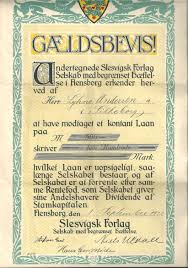

---


---
 
Principperne i gældsbrevsloven finder anvendelse både for gældsbreve og simple fordringer, jf. (Lovbekendtgørelse nr. 333 af 31. marts 2014 om gældsbreve; forkortet her ”GBL”). 

Denne lov indeholder ikke nogen direkte definition af begrebet ”gældsbrev”. 

Gældsbrevslovens forarbejder henholder sig til den gængse juridiske forståelse, nemlig at der ved et gældsbrev forstås: 

***»en skriftlig Erklæring, der hjemler en i Hovedsagen, ubetinget, ensidig Fordring på et bestemt Pengebeløb«***. 

Kravet om, at der skal foreligge en skriftlig erklæring, indebærer, at der skal foreligge et dokument. 

Det kræves endvidere, at erklæringen er dispositiv, hvilket indebærer, at der efter almindelige regler skal foreligge et løfte. 

For at være et gældsbrev skal erklæringen gå ud på at forpligte underskriveren. 

En betalingsanvisning, der alene indeholder en anmodning til tredjemand om at betale (og altså ikke går ud på at forpligte underskriveren selv) er ikke et gældsbrev. 

Som hovedregel må erklæringen være forsynet med udstederens (eller dennes fuldmægtigs) underskrift. 

Dette krav fraviges, hvor det er sædvanligt, at dokumentet ikke underskrives, f.eks. ved rente- og udbyttekuponer. 

I øvrigt kan underskriften være stemplet eller trykt.

---


**Checks og veksler** er ikke omfattet af gældsbrevsbegrebet, dels fordi disse dokumenttyper er reguleret i deres egne love (Checklov: Lovbekendtgørelse nr. 558 af 25. august 1986 og Veksellov: Lovbekendtgørelse nr. 1661 af 12. december 2018), dels grundet deres særegne karakter.
 
---

Erklæringen på gældsbrevet skal være i hovedsagen **ubetinget**. 

Det er uden betydning, at forfaldstiden eller det beløb, der skal betales, til dels er afhængig af en fremtidig uvis begivenhed, når det dog til sin tid kan afgøres, hvilket beløb der skal betales.

Da erklæringen skal være selvstændig foreligger der dog ikke et gældsbrev, hvis der i et almindeligt brev findes en udtalelse, som isoleret set indeholder et løfte om betaling af en pengesum.

Kravet om, at erklæringen skal være ensidig, indebærer at f.eks. en købekontrakt ikke er et gældsbrev: 

Sælgers krav på købesummen er afhængig af ikke-misligholdelse fra sælgers side.

---


Ud fra tilsvarende synspunkter falder også **lejekontrakter** uden for begrebet.

---


En **forsikringspolice** er ikke et gældsbrev, da sikredes krav er afhængig af sikredes opfyldelse af sine forpligtelser bl.a. præmiebetaling.

---

Erklæringen skal gå ud på at forpligte underskriveren til at betale et bestemt pengebeløb. 

Det er uden betydning, om beløbet er angivet i dansk eller fremmed valuta, eller begge dele jf. GBL § 7, om det er bestemt efter guldværdi, jf. dommen i **U 1933.703 H**, eller om det er pristalsreguleret.

Beløbet må dog ikke være helt ubestemt, hvorfor udbyttekuponer til aktier ikke er gældsbreve.

Vurderingen af, om et dokument er simpelt eller negotiabelt, foretages uafhængigt af GBL § 1, jf.  GBL § 11.

Ifølge GBL § 1 er det udgangspunktet, at den, der udsteder et gældsbrev, ikke derved mister indsigelser fra det retsforhold, der gav anledning til gældsbrevets udstedelse.

Når en person i anledning af et retsforhold mellem ham og en anden udsteder et gældsbrev, er det altså hovedreglen, at personen ikke påtager sig en forpligtelse, der er uafhængig af det pågældende retsforhold. 

Skyldneren bevarer dermed over for kreditor indsigelser om mangler, manglende levering eller ugyldighed mv. i det retsforhold, som gav anledning til gældsbrevets udstedelse. 

Skyldneren bevarer også den indsigelse, at skyldneren ikke har modtaget det lån, som skulle tilbagebetales med det beløb, som gældsbrevet lyder på. 

Alt i alt udtrykkes dette ofte på den måde, at gældsbrevet ikke er udtryk for en **novation** (afløsning af en gammel gæld gennem etablering af en ny) af skyldforholdet.  


Fra den nævnte hovedregel om, at der ikke indtræder novation (dvs. stiftelse af en ny fordring), må der ifølge ordlyden af GBL § 1 gøres undtagelse, hvis det er aftalt, at det retsforhold, der har givet anledning til gældsbrevets udstedelse, skal ophøre med at have nogen betydning og skal erstattes af retsforholdet ifølge gældsbrevet.

Udstederen kan miste indsigelser over for den, til hvem gældsbrevet er overdraget, jf. navnlig GBL §§ 15-17 om negotiable gældsbreve, hvorimod udstederen ifølge GBL § 1 ikke mister indsigelser over for den, til hvem gældsbrevet er udstedt. 

Det fordrer efteromstændighederne en afgørende stillingtagen til, om der er tale om en indsigelse over for en person, til hvem gældsbrevet er overdraget, eller om en indsigelse over for en person, til hvem gældsbrevet er udstedt. 

---

Spørgsmålet om der foreligger en overdragelsessituation eller en udstedelsessituation opstår navnlig, hvor der mellem en person, D, og en anden person, K1, består et retsforhold, og hvor D i anledning af retsforholdet udsteder et gældsbrev, men efter aftale med K1 ikke udsteder gældsbrevet til K1, men til en tredjemand, K2.

---

Selvom der i så fald formelt foreligger en overdragelsessituation, kan der reelt være tale om en udstedelsessituation, således at D ikke mister eventuelle indsigelser over for K2.

---

**Video: Hvordan laver jeg et gældsbrev?**

<div class="video-container"><iframe src="https://www.youtube.com/embed/8ufuecp-wXA" width="853" height="480" frameborder="0" allowfullscreen="allowfullscreen"></iframe></div>

---

**Video: Opret et gældsbrev online**

<div class="video-container"><iframe src="https://www.youtube.com/embed/J88adaVemVQ" width="853" height="480" frameborder="0" allowfullscreen="allowfullscreen"></iframe></div>

---

**Video: Sådan laver du en låneaftale**

<div class="video-container"><iframe src="https://www.youtube.com/embed/PPqd-fYRCg0" width="853" height="480" frameborder="0" allowfullscreen="allowfullscreen"></iframe></div>

---

## Flere skyldnere hæfter solidarisk

---


---

Flere skyldnere hæfter solidarisk, hvis ikke andet er aftalt, GBL § 2:

1. Kreditor kan vælge at kræve hele gælden betalt af hver enkelt solidarisk skyldner.

2. Har en solidarisk skyldner betalt hele gælden til kreditor, har skyldneren regresret mod de øvrige skyldnere.

---

## Skyldnerens forpligtelser

---


---


**En skyldner er forpligtet til at betale et bestemt beløb**:

**I rette tid** 

+	Forfaldstid, seneste betalingstidspunkt
+	Frigørelsestid, tidligste betalingstidspunkt
  
**På rette sted** 

+	Pengeskyld er bringeskyld, pengene skal være kommet frem til kreditor inden forfaldstid
  
**På rette måde**

+	Betalingsmiddel – betalingskort, kontanter, bankoverførsel, sms afhængig af hvad der er aftalt
  
**Til rette kreditor** – obs. på deponeringsloven

Betaling med betalingskort eller andre betalingstjenester 
(netbank, mobiltelefon mm.) er reguleret i betalingsloven (BTL)
  
En betalingstransaktion med kort går gennem betalingsmodtagers bank og kortholders bank 

---


```{r transaktion, echo=FALSE, result=TRUE,fig.height=3,fig.cap=("Transaktion, køber betaler sælger en cafe med dankort")}

nodes <- data.frame(id = 1:4, shape = c("box"),label  = c("betaler","udbyder\nkøbers bank","udbyder\nsælgers bank","betalingsmodtager\nsælger cafe"),font.size = c(25,25,25,25),level = c(2,1,1,2))
edges <- data.frame(from = c(1,2,3), 
                    to = c(2,3,4),
                    arrows = c("to"),
                    length = c(100,400,100),
                    font.size = c(20,20,20),
                    label=c("","Nets",""),
                    smooth = c(FALSE,FALSE,FALSE)
                    )
 visNetwork(nodes, edges, width = "100%") %>% 
   visInteraction(dragNodes = TRUE, 
                 dragView = TRUE, 
                 zoomView = FALSE) %>%
  visNodes(color = list(background = "white", 
                        border = "white",
                        highlight = "yellow"),
           shadow = list(enabled = TRUE, size = 30))  %>%
  visHierarchicalLayout(direction = "UD",levelSeparation = 200) %>%
visEdges(color = list(color = "lightgrey", highlight = "yellow") )
```

---


Bliver kortet brugt uberettiget skelnes mellem:

+	Kortholders træk uden dækning (kortet kan måske spærres og transaktionen kan evt. tilbageføres)
  
+	Kortmisbrug begået af andre end kortholder

---

## Tredjemandsbrug af kortholders betalingskort


---

Kortmisbrug her er, hvor kortholder ikke selv har (mis-)brugt kortet.

---

Betalerens eget misbrug reguleres derimod af aftalen mellem udbyderen og betaler og af de almindelige erstatningsregler. 

Betaler kan i medfør af almindelige kontrakt- og erstatningsretlige regler således ifalde ansvar overfor sin udbyder, hvis betaler forsætligt eller ved grov uagtsomhed har medvirket til misbruget.  

---

Ej heller tredjemands (misbrugerens) ansvar er reguleret af betalingslovens regler, men af straffelovens regler i kap. 18 om forbrydelser vedrørende penge, jf. §§ 166-170, se Lovbekendtgørelse nr. 1156 af 20. september 2018, se fx dommen **U 2003.432 V**, fængsel i 6 måneder for pengefalsk, samt dommen **U 2003.251 Ø**, bedrageri med dankort for 139.500 kr. henført under straffelovens § 286, stk. 2.

---

Tredjemandsbrug af kortholders betalingskort er reguleret af betalingsloven (forkortet; ”BTL”), jf. Lov nr. 652 af 6. juni 2017 om betalinger


---


---

**HR:** Banken hæfter for misbruget og skal dække kortholders tab, jf. BTL § 99

**U1:** Kortholder hæfter ubegrænset, hvis kortholder har handlet svigagtigt eller med vilje ikke overholdt kortreglerne fx omkring sikkerhed, jf. BTL § 100, stk. 2
 
**U2:** Har kort og pinkode været brugt, hæfter kortholder for 375 kr., jf. BTL § 100, stk. 3

**U3:** Kortholder kan hæfte for op til 8.000 kr., jf. BTL § 100, stk. 4, hvis kort og pinkode har været brugt og:

Kortet ikke er spærret med det samme (i praksis indenfor 1-1,5 timer efter man positiv er blevet opmærksom på, at man har mistet betalingskortet).

Kortholder selv har givet pinkoden til misbrugeren, og

Kortholder ved groft uforsvarlig (nærmest sløseri) adfærd har gjort misbruget muligt
    
**U4:** Kortholder hæfter ubegrænset, jf. BTL § 100, stk. 5, hvis kort og pinkode er anvendt og:
  
Kortholder selv har oplyst koden til misbrugeren og

Kortholder burde have indset risikoen for misbrug, fx i en skilsmissesituation.

---

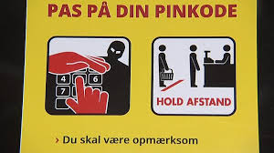
 
---

Efter kortet er spærret er banken ansvarlig for al misbrug af kortholders betalingskort.


```{r hæftelse, echo=FALSE}

mydf <- data.frame(
  S1 = c("Hæftelse i kr" ,"0", 
"0 kr.", 
"375,-kr.", 
"Højst 8000,- kr.", 
"Ubegrænset"
),
  S2 = c("Paragraf" ,
  "BL § 100, stk. 8",
"BL § 100, stk. 6",
"BL § 100, stk. 3",
"BL § 100, stk. 4",
"BL § 100, stk. 5"),
  S3 = c("Hændelse",
         "Misbrug efter kortet er spærret. ",
         "Misbrug hvor kortet og 
          pinkoden er brugt. ",
         "Hæftelse hvis kortet og 
      den pinkoden er brugt. Kunden har som minimum har handlet simpelt uagtsomt. ",
         "Misbrug af kortet, hvor pinkoden har været anvendt samt et af følgende:<br>1. Kunden har ikke oplyst at kortet er mistet<br>
          2. Kunden selv har givet en anden kortet<br>
          3. Kunden har udvist en grov uforsvarlig adfærd",
         "Misbrug af kort og pinkode, og kunden selv har udleveret kort og pinkode til misbrugeren samt at kunden burde have indset at. der var risiko for misbrug."),
  S4 = c("Eksempel",
         "En kvinde har tabt sit kort og 
          spærret dette, så snart hun opdagede tabet.<br>Efter kortet blev 
          spærret blev kortet brugt til 
          køb på internettet.",
          "En kortholder har mistet sit kort
          og pinkode, og der er 
          intet at bebrejde kortholder i 
          forbindelse med tab og misbrug",
         "En fortravlet mand har glemt sit dankort 
          i en hæveautomat, inden kortet 
          bliver spærret bliver det 
          brugt til betaling i en forretning med den 
          rigtige pinkode. ",
         "En cafegæst får stjålet sin pung med både kort og pinkode, fra sin efterladte taske, under toiletbesøg. Kortet misbruges til hævninger og køb for i alt 25.000,- kr.",
         "En pige låner en ven sit kort og pinkode, til trods for denne tidligere har misbrugt kort. Han fester på barer og diskoteker for 38.000,- kr.")
)
names(mydf) <- NULL

mydf %>%
  kable("html", escape = FALSE, caption = "Hæftelse ved kortmisbrug") %>%
  kable_styling(full_width = T,font_size = 10,bootstrap_options = c("responsive","bordered","striped")) %>%
  column_spec(1, bold = T, border_right = T, color = "black", background = "lightgrey") %>%
  column_spec(2, bold = T, border_right = T, color = "black", background = "lightgrey") %>%
  column_spec(3, bold = T, border_right = T, color = "black", background = "lightgrey") %>%
  column_spec(4, bold = T, border_right = T, color = "black", background = "lightgrey") %>%
  row_spec(1,italic = T,bold = T,font_size = 12,color = "white", background = "darkgrey")
  # row_spec(1,italic = T,bold = T,font_size = 12)
  # column_spec(0, angle = -45)%>%
  # scroll_box(width = "500px") %>%
  # footnote(general = "Databeskyttelsesforordningen",general_title = "Kilde:")
```

---

**Eksamensspørgsmål om tredjemandsmisbrug af kortholderes betalingsmiddel**


Klokken er 9.31 mandag d. 5. februar 2018, da Andreas Andersen ringer til privatrådgiver Lærke Jensens kontor i Sparekassen Pecunia. 

Han får hurtigt forklaret, at grunden til, at han har ringet er, at han har mistet sit Visa/dankort og at han gerne vil have kortet spærret. 

Lærke spærrer straks kortet og sammen gennemgår de de seneste hævninger på kontoen og finder hurtigt ud af, at der er fem hævninger, Andreas ikke kender til. 

Søndag d. 4. februar 2018 kl. 02.32 – 2.000 kr. i andet pengeinstituts hæveautomat

Søndag d. 4. februar 2018 kl. 02.44 – 5.000 kr. i Sparekassen Pecunias hæveautomat

Søndag d. 4. februar 2018 kl. 02.46 – 3.500 kr. i Sparekassen Pecunias hæveautomat

Søndag d. 4. februar 2018 kl. 03.01 – 732 kr. Restaurant Festaben – varekøb

Søndag d. 4. februar 2018 kl. 05.32 – 418 kr. Restaurant Morgengry – varekøb

Andreas forklarer, at han mandag morgen ca. kl. 8.45, da han sad i toget på vej på arbejde, fandt ud af, at hans pung var blevet væk. I hans pung var bl.a. hans Visa/Dankort og en seddel med pinkoden. 

Pinkoden, 4567, stod bag på en bon og var kamufleret som en del af et telefonnummer: Pia Kjellerup – 30 45 67 87. 

Pungen var i hans jakke som han havde glemt på et bord, da han ca. kl. 01.00 forlod semesterstartsfesten på sit studie. 

Banken kan dokumentere, at pin-koden er brugt ved alle hævninger. 

Andreas kan dokumentere, at han på hævningstidpunkteterne var sammen med en af sine kvindelige medstuderende hjemme hos hende. 


**Eksamensspørgsmålet:**

1. Giv en begrundet redegørelse for, hvordan tabet skal fordeles mellem Andreas og Sparekassen Pecunia (20%).


**Vejledende løsning:**


Lovgrundlag: Lov om betalinger 

Område: Hæftelse for betalingstjenester

Læringsmål: Anvende reglerne om fordringers ophør, herunder hæftelse for betalingstjenester (dan‐ og kreditkort).

Det følger af lov om betalinger § 100, stk. 1, at betalerens udbyder af betalingstjenester (pengeinstituttet) hæfter i forhold til betaleren (kunden) for tab som følge af andres uberettigede anvendelse af en betalingstjeneste, medmindre andet følger af stk. 2-5. 

Det følger herefter af stk. 3, at betaleren hæfter med op til 375 kr. i situationer, hvor den personlige sikkerhedsforanstaltning (PIN-koden) har været anvendt og af stk. 4, at der hæftes med op til 8.000 kr. enten hvis PIN-koden har været anvendt og betaleren ved groft uforsvarlig adfærd har muliggjort den uberettigede anvendelse (stk. 4, nr. 3) eller PIN-koden har været anvendt og kunden ikke har anmeldt at kortet var bortkommet snarest muligt efter at have fået kendskab til det (stk. 4, nr. 1). Her er der særligt stk. 4, nr. 3-situationen, der er relevant. 

Det er ifølge praksis fra PIA Pengeinstitutankenævnet; nu Det Finansielle Ankenævn) ikke i sig selv tilstrækkeligt til at konstituere groft uforsvarlig adfærd at PIN-koden (dårligt camoufleret eller ej) har ligget i pungen sammen med kortet, men det forhold at pungen er efterladt i en jakke på et bord gør, at adfærden er groft uforsvarlig – særligt når jakken efterlades efter at Andreas forlader festen. 

Andreas har derfor en hæftelse på 8.000 kr. 


---

**Quiz om betalingskort** 

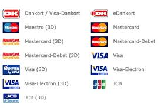

<a href="https://www.forbrug.dk/quiz/betalingskort/?rn=43716" target="_blank">Test din viden i forbrug.dk’s quiz om betalingskort</a>  

---

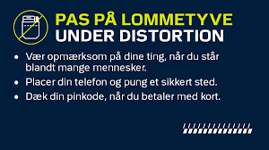

---


## Forskellige typer af pengekrav og fordringer  

---


---


---

Alle pengekrav og fordringer kan deles op i 5 slags:


*  Simple fordringer

*  Simple gældsbreve

*  Omsætningsgældsbreve

*  Tinglyste negotiable pantebreve

*  Tinglyste simple pantebreve

---

**Simple fordringer** er almindeligt pengekrav, hvor der ikke er lavet et gældsbrev, fx fakturakrav (regninger) eller en kassekredit

**Simple gældsbreve** er gældsbreve, som ikke er omsætningsgældsbreve, jf. GBL §26, jf. GBL § 11, stk. 2, fx lånedokumenter (familielån og banklån)
 
**Omsætningsgældsbreve**, er gældsbreve som beskrevet i GBL § 11, stk. 2, fx hvis det tydeligt fremgår, at det er et omsætningsgældsbrev

**Tinglyste negotiable pantebreve** – typisk pantebreve med pant i fast ejendom

***Tinglyste simple pantebreve** – typisk pantebrev med pant i andet end fast ejendom
  
---

```{r network14, echo=FALSE, result=TRUE,fig.cap=("Typer af pengekrav og fordringer")}


nodes <- data.frame(id = 1:7, 
                    level = c(1,2,2,3,3,3,3),
                    shape = c(rep("box",7)), 
                    label = c("gældsbrev?\n er det underskrevet, ensidig,\nubetinget, skyldnererklæring",
                              "pantebrev?\ngælden er sikret ved pant i et aktiv",
                              "simpel fordring",
                              "omsætningsgældsbrev\n en af de 4 kategorier\nfra GBL §11 stk. 2",
                              "simpelt gældsbrev\n ikke en af de 4 kategorier\nfra GBL §11 stk. 2",
                              "simpelt pantebrev\npant i andet end\nfast ejendom",
                              "negotiabelt pantebrev\npant i fast ejendom"
                              ),
                    font.size = c(rep(8,7)))
          edges <- data.frame(from = c(1,1,2,2,2,2),
                              to = c(2,3,4,5,6,7),
                              label = c("ja","nej","nej","nej","ja","ja"),
                              # arrows = c(""),
                              # length = rep(10,6),
                              color = list(color = "lightgrey", highlight = "yellow"),
                              font.size = c(rep(8,6))
                              
                              )

visNetwork(nodes, edges, height = "500px", width = "100%",avoidOverlap=2) %>% 
     visInteraction(dragNodes = TRUE, 
                 dragView = TRUE, 
                 zoomView = FALSE) %>%
  visNodes(color = list(background = "white", 
                        border = "white",
                        highlight = "yellow"),
           shadow = list(enabled = TRUE, size = 30))  %>%
  visHierarchicalLayout(direction = "UD",levelSeparation = 100) %>%
  visLayout(hierarchical = TRUE)

```


---

## Reguleringen af simple gældsbreve og simple fordringer  


Dette afsnit med beskriver nærmere reguleringen af simple gældsbreve og simple fordringer.

Afsnittet indeholder:   

* Lovgrundlag

* Sikringsakt

* Legitimationsvirkning

* Udlæg i borttransporterede fordringer, factoring

* Udlæg i Dankort-betalinger

* Udlæg i bankindeståender

* Sikring af et udlæg i bankindeståender

* Slutafregning

* Legitimationsvirkning ved udlæg i bankindeståender 

---

**Lovgrundlag**

Alle gældsbreve og fordringer, hvad enten de er skriftlige eller mundtlige, er omfattet af gældsbrevslovens kapitel 3 om simple fordringer.

Dette gælder dog ikke for:  

* de gældsbreve og fordringer, der er nævnt i GBL § 11, stk. 2 
* digitale pantebreve efter tinglysningslovens regler
* fondsaktiver. 

---

### Sikringsakten ved simple gældsbreve og simple fordringer?


**Begrebet "sikringsakt":**

Sikringsakten er den handling (akt), man skal foretage, for at ens pant er retsbeskyttet over for kreditorer eller aftaleerhververe. 

Sikringsakten kan være, at man skal give meddelelse (denunciere), jf. Gbl. § 31, eller sørge for tinglysning eller anden registrering eller foretage rådighedsberøvelse.

---

"Denunciation": Betyder underretning - meddelelse. Er i nogle tilfælde en betingelse for at sikre sin ret efter en aftale overfor den anden parts kreditorer.

---


Når man foretager udlæg i simple gældsbreve eller simple fordringer, er der som udgangspunkt intet krav om, at man foretager en sikringsakt. 

Den, der foretager udlægget, er sikret både over for skyldnerens øvrige kreditorer og godtroende aftaleerhververe fra udlæggets foretagelse. Se RPL § 526, stk. 1 og 2.

I modsætning til tidligere skal der dog nu foretages en sikringsakt ved udlæg i ikkenegotiable tinglyste digitale pantebreve, nemlig tinglysning af udlægget. 

Ved overdragelse af ikkenegotiable tinglyste digitale pantebreve er sikringsakten tinglysning ligesom ved de øvrige pantebreve. Se fx TL § 47, stk. 6, hvad angår løsørepantebreve.

Hvis der foretages udlæg i et papirbaseret pantebrev, skal fogeden tage dette med og sende pantebrevet til tinglysningskontoret i forbindelse med tinglysning af udlægget. 

Se § 15, stk. 3 i lov nr. 539 af 8. juni 2006, som er ændret ved § 2 i lov nr. 504 af 12. juni 2009, hvoraf fremgår, at pantebrevet ved tinglysningen skal konverteres til et digitalt pantebrev.

Hvis det simple gældsbrev eller den simple fordring er knyttet til et dokument, bør fogeden tage dokumentet i forvaring. Se RPL § 523, stk. 2. 

Dette er ikke for at iagttage en sikringsakt, men derimod af hensyn til legitimationsvirkningen hvor fratagelse af rådigheden kan få betydning. Se RPL § 524.

---

### Sikringsakt ved overdragelse af simpelt gældsbrev eller simpel fordring, herunder sekundære udlæg


Den, der får overdraget et simpelt gældsbrev eller en simpel fordring til eje eller pant, skal derimod foretage en sikringsakt for at være beskyttet mod overdragerens retsforfølgende kreditorer.

Sikringsakten består i, at fordringsskyldneren får besked om overdragelsen fra overdrageren eller erhververen. Se GBL § 31, stk. 1.  

 
---

### Dobbeltoverdragelse af fordring

```{r ,echo=FALSE,fig.height=2, result=TRUE,fig.cap=("Dobbeltoverdragelse")}


nodes <- data.frame(id = 1:3, 
                    shape = c("box"), 
                    label = c(" A "," B "," C "),
                    font.size = c(25,25,25))
edges <- data.frame(from = c(1,1), to = c(2,3),arrows = c("to"),length = rep(40,2))

visNetwork(nodes, fig.width=4,edges,  width = "100%") %>% 
  visInteraction(dragNodes = TRUE, 
                 dragView = TRUE, 
                 zoomView = FALSE) %>%
  visNodes(color = list(background = "white", 
                        border = "white",
                        highlight = "yellow"),
           shadow = list(enabled = TRUE, size = 30))  %>%
  visHierarchicalLayout(direction = "LR",levelSeparation = 300) %>%
visEdges(color = list(color = "lightgrey", highlight = "yellow") )
  # visLayout(randomSeed = 24) # to have always the same network

```

I tilfælde af at en fordring bliver overdraget flere gange af A, er den erhverver, der først meddeler fordringsskyldneren (D) om overdragelsen af fordringen, sikret retten til fordringen. 

Det er under forudsætning af, at erhververen var i god tro om, at der ikke var andre rettighedshavere ved underretningen til fordringsskyldneren. Se GBL § 31, stk. 2. 

Dette gælder, selvom erhververen først fik overdraget fordringen efter, at en anden havde erhvervet fordringen.

Ved overdragelse af simple gældsbreve eller simple fordringer får erhververen ikke bedre ret end overdrageren, hverken over for gældsbrevets eller fordringens skyldner eller over for en tidligere indehaver af fordringen. Se GBL § 27. 

En overdragelse kan derfor ikke føre til, at skyldneren mister sine indsigelser. 

De indsigelser, skyldneren havde mod overdrageren, kan han også gøre gældende mod erhververen, selv om erhververen var i god tro. 

Det gælder også, når der er foretaget udlæg i fordringen. Se GBL § 27.  

---

### Legitimationsvirkning  

Skyldneren frigøres uanset overdragelsen af det simple gældsbrev eller den simple fordring ved betaling til overdrageren. 

Det gælder dog ikke, hvis skyldneren vidste, at overdrageren ikke længere havde ret til at modtage betalingen, eller hvis skyldneren ikke har udvist den agtpågivenhed, som forholdene krævede. Se GBL § 29.

---

### Udlæg i borttransporterede fordringer – factoring     

Som et led i finansieringen af en virksomheds drift sker der ofte belåning af debitorerne (den såkaldte "factoring"-ordning). 

Ordningen indebærer, at fakturaerne forsynes med en transportpåtegning om, at betaling med frigørende virkning kun kan ske til transporthaveren. 

---

Ordningen kan etableres med fx:  

* et factoring-firma

* virksomhedens sædvanlige pengeinstitut

* et søster- eller datterselskab (såkaldt intern factoring).

---
  
Som betingelse for at virksomhedens kreditorer skal respektere fakturabelåningen, kræves det, at hver enkelt faktura til kunderne er forsynet med en tekst (eventuelt et stempel), der klart angiver, at fordringen er borttransporteret. Se GBL § 31, stk. 1.

En ordning om at belåne fakturaer medfører normalt ikke, at pantefogeden er afskåret fra at foretage udlæg i allerede udførte, men endnu ikke fakturerede arbejder eller leverancer.

---

**Video: Hvad er factoring?**

<div class="video-container"><iframe src="https://www.youtube.com/embed/zNxALT0w14U" width="853" height="480" frameborder="0" allowfullscreen="allowfullscreen"></iframe></div>


---

**Specielt om udlæg i dankort-betalinger**

Udlæg kan foretages i dankort-betalinger. Se **U 2000.715 Ø**, hvor en pantefoged havde foretaget udlæg for et skattekrav hos en forretningsindehaver.  


---

**Specielt om udlæg i bankindeståender**

Der er intet til hinder for, at der foretages udlæg i bankindeståender, fordi disse kan betragtes som skyldnerens simple fordringer mod et pengeinstitut. Hvis udlægsforretningen foretages hos pengeinstituttet, så indeståendet straks udbetales, er der dog tale om udlæg i penge og ikke i fordringer. Se RPL § 521.

---


## Reguleringen af omsætningsgældsbreve


Omsætningsgældsbreve kaldes også for negotiable gældsbreve. 

Hvis et gældsbrev ikke er et omsætningsgældsbrev, er det et simpelt gældsbrev. 

I forbindelse med indførelsen af reglerne om digital tinglysning blev der i tinglysningsloven indsat regler om omsætningsgældsbreve. 

---

Der findes herefter regler om omsætningsgældsbreve to steder i lovgivningen.  

Reglerne om omsætningsgældsbreve står herefter i følgende to love:  

**A)** Gældsbrevsloven (GBL), hvor det i GBL § 11, stk. 2, fastslås, hvad der er omsætningsgældsbreve:

**1**.	Gældsbreve, der lyder på betaling til ihændehaveren eller som ikke angiver, hvem gælden skal betales til (ihændehavergældsbreve).

**2**.	Gældsbreve, der lyder på betaling til en bestemt person eller ordre (ordregældsbreve).

**3**.	Gældsbreve, der giver pant i registreret skib eller luftfartøj, medmindre der i gældsbrevet er indføjet ordene »ikke til ordre« eller tilsvarende forbehold.

**4**. Gældsbreve, der lyder på betaling til en bestemt person (navnegældsbreve), når de tydeligt angiver, at de skal være omsætningsgældsbreve.

---

**B)** Tinglysningsloven (TL), hvor der står, at:  

**1**. Et tinglyst pantebrev, bortset fra et skadesløsbrev, der giver pant i fast ejendom, er negotiabelt, medmindre der i pantebrevet er indføjet ordene »ikke til ordre« eller tilsvarende forbehold, jf. TL § 27, stk. 2.

**2**. Et tinglyst pantebrev, herunder et ejerpantebrev, der giver pant i motorkøretøjer er ikke negotiabelt, medmindre dette klart fremgår af pantebrevet, jf. TL § 42 c. Skadesløsbreve er ikke negotiable pantebreve, jf. TL § 42g, stk. 3, 2. og 3. pkt.  

**3**. Et tinglyst pantebrev, herunder et ejerpantebrev, der giver pant i andele i andelsboligforeninger som nævnt i TL § 42 i, er ikke negotiabelt, medmindre dette klart fremgår af pantebrevet. 

Skadesløsbreve er ikke negotiable pantebreve: Se TL § 42m, stk. 2, 2. og 3. pkt.  

**4**. Et tinglyst pantebrev, herunder et ejerpantebrev, der giver pant i løsøre, er ikke negotiabelt, medmindre dette klart fremgår af pantebrevet. 

Skadesløsbreve er ikke negotiable pantebreve: Se TL § 47, stk. 7, 2. og 3. pkt.  

---

**Bemærk** 

Hvis et gældsbrev ikke falder ind under definitionen i henholdsvis GBL eller TL, og det klart fremgår af gældsbrevet, at det ikke skal være negotiabelt, er det som nævnt et simpelt gældsbrev: 

Se GBL § 11, stk. 2 og TL § 27, stk. 2, § 42g, stk. 3, 2. og 3. pkt., § 42m, stk. 2, 2. og 3. pkt. og § 47, stk. 7, 2. og 3. pkt.  

---

**Videoer om gældsbrevsloven**


<div class="video-container"><iframe src="https://www.youtube.com/embed/4SY6YPbY2YY" width="853" height="480" frameborder="0" allowfullscreen="allowfullscreen"></iframe></div>


---

<div class="video-container"><iframe src="https://www.youtube.com/embed/uODiLMSn3kg" width="853" height="480" frameborder="0" allowfullscreen="allowfullscreen"></iframe></div>

---

**Video: Om gældsbreve**

<div class="video-container"><iframe src="https://www.youtube.com/embed/nC3Sy7tBCaY" width="853" height="480" frameborder="0" allowfullscreen="allowfullscreen"></iframe></div>


---

### Tinglysning af simple (ikke-negotiable) pantebreve  


Et simpelt (ikke-negotiabelt) pantebrev skal dog også tinglyses digitalt for at opnå omsætningsbeskyttelse. 

Se fx TL § 47, stk. 6, hvad angår løsørepantebreve, der som udgangspunkt er ikkenegotiable. 

Gældsbrevslovens kapitel 3, bortset fra § 31, bruges også på tinglyste digitale ikke-negotiable (simple) pantebreve: Se GBL § 26, stk. 2.

Gældsbrevslovens kapitel 2 gælder ikke (længere) for tinglyste digitale pantebreve: Se GBL § 11, stk. 3. 

Det betyder dog ikke, at den hidtidige retstilstand er brudt, da reglerne i GBL §§ 15-17 om ekstinktion (en rettigheds ophør, ved at den fortrænges af en senere rettighed) af indsigelser finder direkte anvendelse: Se TL § 27a. 

Reglerne om ekstinktion af rettigheder er også uforandret overført til tinglysningsloven: Se TL § 27b. 

Reglerne er dog rettet til, fordi sikringsakten nu sker ved tinglysning i modsætning til tidligere, hvor sikringsakten skete ved rådighedsberøvelse. Se nedenfor.

---

### Sikringsakten ved de forskellige omsætningsgældsbreve

Når man foretager udlæg i omsætningsgældsbreve, er sikringsakten forskellig, afhængig af hvilken type omsætningsgældsbrev der er tale om. 

Nedenstående afsnit er derfor opdelt så sikringsakten for omsætningsgældsbreve, der ikke er pantebreve, beskrives først, og herefter beskrives sikringsakten ved udlæg i negotiable pantebreve.  

Sikringsakt ved udlæg i omsætningsgældsbreve, der ikke også er pantebreve.

En aftaleerhververs ret til et omsætningsgældsbrev kan ikke anfægtes af andre, hvis aftaleerhververen har fået gældsbrevet i hænde og er i god tro om overdragerens ret. Se GBL § 14.  

Sikringsakten over for aftaleerhververe er derfor rådighedsberøvelse, hvad angår disse gældsbreve. 

Det vil sige, at man ved udlæg i disse omsætningsgældsbreve efter RPL § 523, stk. 2, altid skal tage gældsbrevet i forvaring.  

Et udlæg i fordringer, herunder omsætningsgældsbreve, er beskyttet over for andre retsforfølgende kreditorer straks fra dets foretagelse. 

Udlægshaver skal derfor ikke foretage nogen særlig sikringsakt i forhold til andre kreditorer. Se RPL § 526, stk. 1 og 2.  

---

### Sikringsakt ved udlæg i negotiable pantebreve:  

Efter den digitale tinglysning er indført, skal stiftelse og ændring af rettigheder over alle pantebreve, der tinglyses digitalt, ske ved tinglysning. 

Derfor skal pantebreve, der vedrører fast ejendom, biler, andelsboliger og løsøre tinglyses, hvis man vil sikre sig de rettigheder, der knytter sig til pantebrevet. 

Se TL § 1, TL § 42j, stk. 7, (andelsboligbogen), TL § 42d, stk. 7, (bilbogen) og TL § 47, stk. 6 (løsøre).  

---

Når man foretager **udlæg i tinglyste digitale pantebreve**, skal udlægget derfor tinglyses for at opnå beskyttelse mod aftaler om pantebrevet og mod retsforfølgning. 

Se TL § 1 (fast ejendom), TL § 42j, stk. 7 (andelsboligbogen), TL § 42d, stk. 7 (bilbogen) og TL § 47, stk. 6 (løsøre). Det gælder derfor også de digitale pantebreve, der er negotiable.  
 
---

Hvis man foretager **udlæg i et papirbaseret pantebrev**, skal fogeden tage dette med og sende pantebrevet til tinglysningskontoret i forbindelse med tinglysning af udlægget. 

Se § 15, stk. 3 i lov nr. 539 af 8. juni 2006, som ændret ved § 2 i lov nr. 504 af 12. juni 2009, hvoraf fremgår, at pantebrevet ved tinglysningen skal konverteres til et digitalt pantebrev. 

---

Hvad angår de tinglyste digitale pantebreve, kan en aftaleerhververs ret til et pantebrev ikke anfægtes af andre, hvis aftaleerhververen har fået tinglyst sin ret og er i god tro om overdragerens ret. Se TL § 27 b. 

Dette gælder også bilbogen (TL § 42g stk. 3, 1. pkt.), andelsboligbogen (TL § 42m, stk. 2, 1. pkt.) og personbogen (TL § 47, stk. 7, 1. pkt.).  

---

**Legitimationsvirkning**, hvornår er man over for omverdenen angivet som berettiget til at gøre fordringen gældende?

Den, der på lovlig vis har fået omsætningsgældsbrevet i hænde, har ret til at gøre fordringen gældende. Se GBL § 13.  

---

For tinglyste digitale pantebreve er den, der er berettiget ifølge tingbogen, legitimeret til at gøre fordringen gældende. Se TL § 27a, stk. 1. 

---

Tilsvarende gælder for bilbogen (TL § 42g, stk. 3, 1. pkt., jf. TL § 27a, stk. 1), andelsboligbogen (TL § 42m, stk. 2, 1. pkt, jf. TL § 27a, stk.1) og personbogen (TL § 47, stk. 7, 1. pkt., jf. TL § 27a, stk. 1).  

---


Reglen om overdragelse af omsætningsgældsbreve og reglen om legitimationen over for skyldner bygger på GBL § 13. Se også GBL § 14 og 19. 

---

Når skyldneren betaler til den, der er legitimeret efter GBL § 13, frigøres skyldneren, såfremt skyldneren er i god tro. Se GBL § 19. 

Betalingen har frigørende virkning, selv om ihændehaverens inkompetence skyldes, at denne ikke har erhvervet ret til omsætningsgældsbrevet, eller at det var overdraget eller gjort til genstand for udlæg. 

Legitimationen omfatter også andre dispositioner end betaling, fx meddelelse af henstand eller ændring af betalingsvilkårene. 

---


Hvad angår **tinglyste digitale pantebreve** er reglerne de samme, dog med den forskel, at der ikke er krav om, at man har pantebrevet i hånden, men derimod, at man har tinglyst det. Se TL § 27b. 

Samme bestemmelse gælder også bilbogen (TL § 42g, stk. 3, 1. pkt.), andelsboligbogen (TL § 42m, stk. 2, 1. pkt.) og personbogen (TL § 47, stk. 7, 1. pkt.). 

---

For at udlægshaver kan blive legitimeret over for gældsbrevsdebitor, skal han derfor have gældsbrevet i hænde og for de tinglyste digitale pantebreves vedkommende have tinglyst sin ret. 

Se RPL § 523, stk. 2 og TL § 27a. Reglen gælder også bilbogen, andelsboligbogen og personbogen.  

---


Hvis et omsætningsgældsbrev er overdraget, men skyldneren har betalt forfaldne renter eller forfaldne, tidsfæstede afdrag til overdrageren, kan skyldneren gøre dette gældende over for en senere erhverver af omsætningsgældsbrevet. 

Se GBL § 16. 

Samme regel gælder for de tinglyste digitale pantebreve. Se TL § 27a, stk. 2, 1. pkt. 

---

Udstederen af et gældsbrev bevarer også sine indsigelser om, at gældsbrevet er udstedt under tvang, ved forfalskning m.v., og om at gældsbrevet er ophørt ved forældelse m.v. Se GBL § 17 og TL § 27a, stk. 2, 2. pkt. 

Bestemmelserne gælder også bilbogen, andelsboligbogen og personbogen.  

---

Hvis et omsætningsgældsbrev er overdraget, kan skyldneren med frigørende virkning betale forfaldne renter og forfaldne, tidsfæstede afdrag til overdrageren, medmindre skyldneren vidste, at denne ikke længere havde ret til at modtage betaling eller havde grund til mistanke derom. Se GBL § 20. 

En tilsvarende regel gælder for de tinglyste digitale pantebreve. Se TL § 29, stk. 2.  

Legitimationsvirkningen indtræder derfor, når udlægshaver meddeler gældsbrevsdebitor, at betaling med frigørende virkning kun kan ske til udlægshaveren. 

Udlæg i omsætningsgældsbreve skal derfor altid meddeles over for gældsbrevsdebitor. 

Dette gælder også for udlæg i de tinglyste digitale pantebreve. 

Debitor skal anmodes om kvittering for, at han har modtaget underretningen.  

Gældsbrevsdebitor bliver ved betaling til udlægshaver frigjort under samme betingelser som ved betaling efter overdragelse af et gældsbrev. Se RPL § 524.  

---

### Oversigt over sikringsakter på fordringer, omsætningsgældsbreve og pantebreve

**Hvad er en sikringsakt?**


En sikringsakt er den handling der skal til, for at man opnår sikkerhed mod rettigheder, der er stiftet efter ens rettigheder. 

Handlingen skal altså til for, at man ikke mister sin ret til det aktiv, som fx fogedretten efter anmodning har foretage udlæg i.

Det er typen af aktiv, der er afgørende for hvilken sikringsakt, der skal foretages. Hvis der f.eks. er tale om udlæg i livsforsikringspoler, skal der ske påtegning på policen.


Sikringsakt foretages således for at sikre erhververen mod overdragerens aftaleerhververe og kreditorer:

*  Simple fordringer – sikringsakten for overdragelse er **denunciation** (meddelelse)

*  Omsætningsgældsbreve – sikringsakten for overdragelse er **rådighedsberøvelse**

*  Pantebreve – sikringsakten for overdragelse er **tinglysning**

---

## Overdragelse af fordringer


**Som studerende skal du være særlig opmærksom på følgende problemstillinger ved gennemgangen af fordringers overdragelse**:


**Fortabelse af indsigelser og rettigheder, GBL § 27 (simple)**

**Prioritetskonflikt simple gældsbreve, GBL § 31** 

**Legitimation** 

**Omsætningsbeskyttelse**

**Begreberne vindikation og ekstinktion skal anvendes**


---

```{r fordring1,echo=FALSE, result=TRUE, fig.cap=("Skyldner, kreditor og senere erhverver eller erhververe")}


nodes <- data.frame(id = 1:4, 
                    shape = c("box"), 
                    level = c(1,2,3,4),
                    label = c("Debitor\nSkyldner","Kreditor\nOverdrager","Erhverver","Erhverver"),
                    font.size = c(15,15,15,15))
edges <- data.frame(from = c(1,2,3), to = c(2,3,4),
                    arrows = c("to"),
                    label = c("Kreditor har en fordring på debitor","Kreditor overdrager til erhverver 1","Erhverver 1 overdrager til erhverver 2"),
                    
                    shadow = TRUE)

  visNetwork(nodes, edges, width = "100%") %>% 
   visInteraction(dragNodes = TRUE, 
                 dragView = TRUE, 
                 zoomView = FALSE) %>%
  visNodes(color = list(background = "white", 
                        border = "white",
                        highlight = "yellow"),
           shadow = list(enabled = TRUE, size = 30))  %>%
      visHierarchicalLayout(direction = "UD",levelSeparation = 100)  %>%
      visLayout(randomSeed = 24) %>%
  visEdges(color = list(color = "lightgrey", highlight = "yellow"))

```

---

Lidt begreber, som vi jurister arbejder med:

"Cedent":	Overdrager af en fordring.

"Cession":	Overdragelse af en fordring.

"Cessionar":	Erhverver af en fordring.

"Cessus":	Skyldneren i fordring, der bliver overdraget.

---

*Bemærk*

I relation til retsplejelovens regler er en fordring et krav på betaling af en pengeydelse.

En lang række af fordringer er baseret på dokumenter i form af pantebreve, fakturaer og kontrakter mv., mens andre krav ikke foreligger i skriftlig form. 

Fælles for alle fordringer er, at de indeholder et krav om, at debitor skal betale eller give en ting/ydelse. 

Der er ikke i lovgivningen stillet formkrav til fordringer.

Efter RPL § 508 skal en fordring kunne identificeres, for at man kan foretage udlæg i den. 

Det betyder kun, at der er et krav om, at man kan bevise, at fordringen eksisterer, men ikke at den fx foreligger i skriftlig form mv.


---

**Video: Om overdragelse af fordringer**


<div class="video-container"><iframe src="https://www.youtube.com/embed/NqakMVHBPw4" width="853" height="480" frameborder="0" allowfullscreen="allowfullscreen"></iframe></div>

---


### Skyldners indsigelser over for den oprindelige kreditor

 

*Lovbekendtgørelse nr. 333 af 31. marts 2014 om gældsbreve*  

```{r fordring2,echo=FALSE, result=TRUE, fig.cap=("indsigelse over gældsforhold")}
nodes <- data.frame(id = 1:2, 
                    shape = c("box"), 
                    level = c(1,2),
                    label = c("debitor/\nskyldner","kreditor/\nsælger"),
                    font.size = c(15,15))
edges <- data.frame(from = c(1), to = c(2),
                    arrows = c("to"),
                    label = c("debitor har en indsigelse overfor kreditor"),
                    
                    shadow = TRUE)

visNetwork(nodes, edges, width = "100%") %>% 
   visInteraction(dragNodes = TRUE, 
                 dragView = TRUE, 
                 zoomView = FALSE) %>%
  visNodes(color = list(background = "white", 
                        border = "white",
                        highlight = "yellow"),
           shadow = list(enabled = TRUE, size = 30))  %>%
      visHierarchicalLayout(direction = "UD",levelSeparation = 100)  %>%
      visLayout(randomSeed = 24) %>%
  visEdges(color = list(color = "lightgrey", highlight = "yellow"))
```


---

Skyldner kan gøre alle indsigelser gældende overfor oprindelig kreditor, jf. GBL § 1, samt fx efter aftaleloven og købeloven:


Skyldneren bevarer dermed over for kreditor indsigelser om mangler, manglende levering eller ugyldighed mv. i det retsforhold, som gav anledning til gældsbrevets udstedelse. 

Skyldneren bevarer også den indsigelse, at han eller hun ikke har modtaget det lån, som skulle tilbagebetales med det beløb, som gældsbrevet lyder på.  

---

Fx følgende indsigelser over for kreditor bevares:

* Indsigelse efter aftaleloven – ugyldighedsgrunde, fx svig

* Indsigelse om mangler efter købeloven, jf. KBL §§ 76 og 75a

---

Det har ikke betydning om kravet er en simpel fordring, et gældsbrev eller et pantebrev

Skyldnerens indsigelsen over for kreditor kan betyde, at skyldner skal betale mindre end der står i gældsbrevet eller måske slet ingenting.

---
 
### Forholdet mellem overdrager og erhverver


---

Hvis kreditor overdrager fordringen på debitor til en erhverver bliver det juridisk karakteriseret som et **"efterfølgende trepartsforhold”:** 

---
 
```{r fordring3,echo=FALSE, result=TRUE, fig.cap=("Kreditor overdrager fordring til erhverver")}


nodes <- data.frame(id = 1:3, 
                    shape = c("box"), 
                    level = c(1,2,2),
                    label = c("debitor/\nskyldner","Kreditor/\nOverdrager","erhverver"),
                    font.size = c(15,15,15))
edges <- data.frame(from = c(1,2,1), to = c(2,3,3),
                    arrows = c("to"),
                    label = c("1. kreditor har\nen fordring på debitor","2. kreditor overdrager\n fordringen til erhververen","3. debitor skal nu\nbetale erhververen"),
                    length = c(100,300,100),
                    shadow = TRUE)

visNetwork(nodes, edges, width = "100%") %>% 
   visInteraction(dragNodes = TRUE, 
                 dragView = TRUE, 
                 zoomView = FALSE) %>%
  visNodes(color = list(background = "white", 
                        border = "white",
                        highlight = "yellow"),
           shadow = list(enabled = TRUE, size = 30))  %>%
      visHierarchicalLayout(direction = "UD",levelSeparation = 100)  %>%
      visLayout(randomSeed = 24) %>%
  visEdges(color = list(color = "lightgrey", highlight = "yellow"))

```

---

### Efterfølgende trepartsforhold  
	
Begrebet efterfølgende trepartsforhold omfatter de tilfælde, hvor den oprindelige kreditgivers rettigheder i henhold til kreditaftalen tiltransporteres en tredjemand. 

Begrebet er en kreditaftaleretlig term, der dækker over begreber som factoring, kontraktbelåning, kontraktsdiscontering o.lign. 

Begrebets materielle indhold er reguleret ved reglerne om personskifte i skyldforhold, herunder navnlig reglerne om kreditorskifte. 

Mens det oprindelige trepartsforhold er kendetegnet ved, at tredjemanden finansierer forbrugeren, er det efterfølgende trepartsforhold kendetegnet ved, at tredjemanden finansierer sælgeren.

Forholdet mellem forbrugeren i et kreditkøb og tredjemanden i det efterfølgende trepartsforhold reguleres dels ved de almindelige regler om kreditorskifte i skyldforhold, dels ved kreditaftalelovens §§ 31-33. 

Forholdet mellem sælgeren/kreditgiveren i det oprindelige trepartsforhold og tredjemanden i det efterfølgende trepartsforhold er navnlig, men ikke kun, reguleret ved gældsbrevslovens §§ 9 og 10 og ved gældsbrevslovens §§ 29-31 samt den righoldige retspraksis, der foreligger vedrørende factoring, fakturabelåning og selskabsopsplitning mv. 

For en nærmere gennemgang af det oprindelige trepartsforhold, jf. kreditaftalelovens § 4, nr. 15, 2. pkt. og det efterfølgende trepartsforhold, [se kapitel 5 i min bog Forbrugerretten II, den civilretlige forbrugerbeskyttelse:](https://shop.karnovgroup.dk/products/forbrugerretten-ii-5-udgave) 

**Se nærmere gennemgangen i kapitel 14 om det efterfølgende trepartsforhold.**

---

Fordringer kan overdrages til en anden kreditor (sælges eller pantsættes) som andre aktiver

Fx kan købekontrakt med gyldigt ejendomsforbehold sælges til en anden kreditor (erhverver):

---

```{r fordring4,echo=FALSE, result=TRUE, fig.cap=("Salg af købekontrakt fx. bilkøb")}
nodes <- data.frame(id = 1:3, 
                    shape = c("box"), 
                    level = c(1,2,2),
                    label = c("bilkøber/\ndebitor/\nskyldner","bilsælger/\nkreditor/\noverdrager","finansieringsselskab"),
                    font.size = c(10,10,10))
edges <- data.frame(from = c(1,2,1,2,3), to = c(2,3,3,1,2),
                    arrows = c("to","to","to","to","to"),
                    font.size = c(10,10,10,10,10),
                    
                    label = c("1. bilsalg på\nkøbekontrakt","2. bilsælger\nsælger\nkøbekontrakt\ntil finansieringsselskab","3. debitor skal nu\nbetale\n til finansieringsselskabet","",""),
                    length = c(300,300,300,300,300),
                    shadow = TRUE
              
                    )
  visNetwork(nodes, edges, width = "100%") %>% 
   visInteraction(dragNodes = TRUE, 
                 dragView = TRUE, 
                 zoomView = FALSE) %>%
  visNodes(color = list(background = "white", 
                        border = "white",
                        highlight = "yellow"),
           shadow = list(enabled = TRUE, size = 30))  %>%
      visHierarchicalLayout(direction = "UD",levelSeparation = 100)  %>%
      visLayout(randomSeed = 24) %>%
  visEdges(color = list(color = "lightgrey", highlight = "yellow"))
```


---

**1**. Kunden (skyldneren) køber en bil og underskriver købekontrakt til bilsælgeren (overdrageren)

**2**. Bilsælgeren (overdrageren) sælger købekontrakten til et finansieringsselskab (erhververen)

**3**. Kunden (skyldneren) skal nu betale til finansieringsselskabet (erhververen), som har købt købekontrakten af bilsælgeren (overdrageren)

**4**. Overdrager (bilsælgeren) indestår for, at fordringen består jf. GBL § 9. 

Bestemmelsen er gældsbrevslovens regel om overdragerens objektive ansvar for, at fordringen består, dvs. »nomen esse verum«. 

Det objektive ansvar gælder ikke når manglende betaling skyldes debitors manglende betalingsevne, dvs. »nomen esse bonum«, jf. GBL § 10.


---

**Video: Slå op i Bilbogen**

<div class="video-container"><iframe src="https://www.youtube.com/embed/jS9HN8OxvgI" width="853" height="480" frameborder="0" allowfullscreen="allowfullscreen"></iframe></div>

---


Overdrager (bilsælgeren) indestår således ikke for skyldners (bilkøberens) betalingsevne fremover jf. GBL § 10

---

 
### Betalingslegitimation

Hvad er en *”betalingslegitimation”* også kaldet legitimationsvirkningen?  

Den korte forklaring: Hvem kan skyldner betale til med frigørende virkning, når fordringen er overdraget – eller udtrykt på en anden måde: 

Debitor kan med frigørende virkning betale til den person som har betalingslegitimation. 

Som udgangspunkt frigøres debitor ved betaling i god tro, til den der er berettiget efter GBL § 13, jf. GBL § 19.  

---

### Hvem kan skyldner betale til med frigørende virkning, når fordringen er overdraget?  


Betaler skyldner ikke med frigørende virkning, kan han risikere at skulle betale igen  

-	svaret afhænger af, hvilket type kravet er. 

---

**Skyldners indsigelser overfor erhverver af fordringen (A-C)**

Hvad sker der med skyldners indsigelser, når kreditor har overdraget fordringen til erhverver?

Skyldner kan gøre alle indsigelser gældende over for kreditor – men ikke, når kreditor har overdraget kravet til en erhverver

-	Løsningen afhænger af, hvilken type krav, der er tale om, se nedenfor

---

**Konflikter mellem senere erhververe (C-D)**

Når en fordring overdrages flere gange kan der opstå konflikter mellem de forskellige erhververe 

---

**Kædeoverdragelse**: 

Fx hvis der er en indsigelse om svig i den tidligere overdragelse, så den sælger, man har købt fordringen af, ikke rigtigt ejede den

---

**Dobbeltoverdragelse**:

Fx hvis den samme fordring er overdraget to gange til forskellige erhververe:

Løsningen afhænger af, hvilken type krav der er tale om, se nedenfor 

---
 
### Hvordan løses konflikterne med de forskellige fordringer

Løsningen af de forskellige konflikter løses forskelligt afhængigt af fordringens type, der skelnes mellem:  

*  Simple fordringer/simple gældsbreve
*  Omsætningsgældsbreve
*  Simple pantebreve
*  Omsætningspantebreve

Gældsbreve, der ikke er omsætningsgældsbreve er simple gældsbreve.  

---  
 
## Simple fordringer og simple gældsbreve

Simple fordringer og simple gældsbreve behandles ens efter reglerne i gældsbrevsloven om simple gældsbreve, jf. reglerne i kap. 3 i gældsbrevsloven, som omhandler gældsbreve, der ikke er omsætningspapirer. 

Disse regler kan således anvendes analogt på fordringer, for hvilke der ikke er udstedt gældsbrev (såkaldte simple fordringer)

Overdragelse af fordringer kan ske til eje eller pant  

---

**Fakturabelåning er ofte overdragelse af enkelte (større) fordringer til en bank**:


---


```{r fordring5,echo=FALSE, result=TRUE, fig.cap=("Fakturabelåning bank får sikkerhed i udestående faktura")}
nodes <- data.frame(id = 1:3, 
                    shape = c("box"), 
                    level = c(1,2,2),
                    label = c("rederi/\ndebitor/\nskyldner","skibsværft/\nkreditor\noverdrager","bank"),
                    font.size = c(10,10,10))
edges <- data.frame(from = c(1,2,1,2,3), to = c(2,3,3,1,2),
                    arrows = c("to","to","to","to","to"),
                    font.size = c(10,10,10,10,10),
                    
                    label = c("1. skibsværft sælger\nskib og udsteder\nfaktura","2. skibsværft\noverdrager\nfakturaen\n på skibet til banken","3. rederiet skal nu\nbetale\n til banken","",""),
                    length = c(300,300,300,300,300),
                    shadow = TRUE
              
                    )
  visNetwork(nodes, edges, width = "100%") %>% 
   visInteraction(dragNodes = TRUE, 
                 dragView = TRUE, 
                 zoomView = FALSE) %>%
  visNodes(color = list(background = "white", 
                        border = "white",
                        highlight = "yellow"),
           shadow = list(enabled = TRUE, size = 30))  %>%
      visHierarchicalLayout(direction = "UD",levelSeparation = 100)  %>%
      visLayout(randomSeed = 24) %>%
  visEdges(color = list(color = "lightgrey", highlight = "yellow"))
```

---

Den korte forklaring: Factoring er typisk overdragelse af alle virksomhedens krav til et finansieringsselskab.

Den lange forklaring: Factoring, er en aftale, der går ud på, at en virksomhed mod betaling overlader sine kortfristede fordringer til en anden, som derefter inddriver fordringerne. 

Aftalen kan enten gå ud på, at factoringselskabet yder virksomheden et lån med sikkerhed i de nævnte tilgodehavender, såkaldt fakturabelåning, eller at factoringselskabet køber virksomhedens debitorportefølje og betaler et beløb til fuld og endelig afgørelse.

---

```{r fordring6,echo=FALSE, result=TRUE, fig.cap=("Factoringselskab køber udestående fakturaer")}
nodes <- data.frame(id = 1:6, 
                    shape = c("box"), 
                    level = c(1,1,1,1,2,2),
                    label = c("debitor\nkøber varer\naf virksomhed","debitor\nkøber varer\naf virksomhed","debitor\nkøber varer\naf virksomhed","debitor\nkøber varer\naf virksomhed","virksomhed\nsælger varer","factoringselskab\nerhverver fordring\nog modtager betaling"),
                    font.size = c(12))
edges <- data.frame(from = c(1,2,3,4,5,1,2,3,4), to = c(5,5,5,5,6,6,6,6,6),
                    arrows = c("from","from","from","from","to","to","to","to","to"),
                    font.size = c(10,10,10,10,10,10,10,10,10),
                    label = c("1. varesalg","1. varesalg","1. varesalg","1. varesalg","2. overdragelse\naf fordring\nfrigiver livkviditet\ntil virksomheden","\n\n\n      3. betaling","\n\n\n    3. betaling","3. betaling","3. betaling"),
                    length = c(100,100,100,100,600,100,100,100,100),
                    shadow = TRUE
              
                    )
  visNetwork(nodes, edges, width = "100%") %>% 
   visInteraction(dragNodes = TRUE, 
                 dragView = TRUE, 
                 zoomView = FALSE) %>%
  visNodes(color = list(background = "white", 
                        border = "white",
                        highlight = "yellow"),
           shadow = list(enabled = TRUE, size = 30))  %>%
      visHierarchicalLayout(direction = "UD",levelSeparation = 200)  %>%
      visLayout(randomSeed = 24) %>%
  visEdges(color = list(color = "lightgrey", highlight = "yellow"))
```


--- 
 
**Factoring kan have forskellige formål**:

+	Administration af debitorportefølje, kundebogholderi mv.

+	Inddrivelse af fordringer, der ikke bliver betalt til tiden – inkasso

+	Forsikring eller risikoafdækning, hvis det er aftalt, at factoringselskabet skal have risikoen for, om kunderne betaler

+	Likviditet; factoringselskabet stiller likviditet til rådighed mod at få sikkerhed i fordringer eller ved at købe fordringerne
  
  
---

### Betalingslegitimation

Betaling til overdrager GBL § 29, så længe skyldner er i god tro. 

Skyldneren frigøres uanset overdragelsen af det simple gældsbrev eller den simple fordring ved betaling til overdrageren. 

Det gælder dog ikke, hvis skyldneren vidste, at overdrageren ikke længere havde ret til at modtage betalingen, eller hvis skyldneren ikke har udvist den agtpågivenhed, som forholdene krævede. 

GBL § 29 er udtryk for den naturlige retsstilling, at den, der skylder penge til en anden, skal kunne betale med frigørende virkning til denne. 

Det samme gælder omvendt, at den der skylder penge til en person ikke kan betale med frigørende virkning til en anden. 

Reglen indeholder dog en modifikation, da skyldner ikke bliver frigjort, når han betaler til den oprindelige kreditor, hvis skyldneren vidste, at overdrageren ikke længere havde ret til at modtaget betalingen, eller hvis skyldneren ikke har udvist den agtpågivenhed, som forholdene krævede.

---

**Eksempel:**

Hvis en person, der er legitimeret som fordringshaver, overdrager en simpel fordring til først A og dernæst B, og fordringsskyldneren ikke har kendskab og ikke burde have kendskab til overdragelsen til A, men derimod først får meddelelse om overdragelsen fra B, frigøres fordringsskyldneren ved betaling til B, selv om fordringen i virkeligheden tilkom A, fordi B var i ond tro, da han gav underretningen til fordringsskyldneren. Se GBL § 31, stk. 2.

---

Overdrager og erhverver skal denuntiere (give meddelelse) til skyldner, GBL § 31

---

Betaling til erhverver er med frigørende virkning medmindre der er en stærk ugyldighedsgrund mellem overdrager og erhverver, jf. GBL § 30 (se figur \@ref(fig:fordring7))


---

```{r fordring7,echo=FALSE,fig.height=3, result=TRUE, fig.cap=("Stærk ugyldighedsgrund")}
nodes <- data.frame(id = 1:3, 
                    shape = c("box"), 
                    level = c(1,2,2),
                    label = c("debitor/\nskyldneren","kreditor/\noverdrageren","erhverver/\nny kreditor"),
                    font.size = c(10,10,10))
edges <- data.frame(from = c(1,2), to = c(2,3),
                    arrows = c("to","to"),
                    font.size = c(10,10),
                    label = c("kreditor har\nfortsat krav","stærk ugyldighedsgrund\noverdrager har fortsat et betalingskrav\nmod skyldneren"),
                    length = c(300,300),
                    shadow = TRUE
              
                    )
  visNetwork(nodes, edges, width = "100%") %>% 
   visInteraction(dragNodes = TRUE, 
                 dragView = TRUE, 
                 zoomView = FALSE) %>%
  visNodes(color = list(background = "white", 
                        border = "white",
                        highlight = "yellow"),
           shadow = list(enabled = TRUE, size = 30))  %>%
      visHierarchicalLayout(direction = "UD",levelSeparation = 100)  %>%
      visLayout(randomSeed = 24) %>%
  visEdges(color = list(color = "lightgrey", highlight = "yellow"))
```

---

Gælder både ordinære og ekstraordinære afdrag

Hvis skyldneren ikke ved, til hvem fordringen er overdraget eller ikke har modtaget betryggende meddelelse herom, men skydleren dog ikke kan betale til den tidligere kreditor, kan skyldneren frigøre sig ved at deponere efter Lovbekendtgørelse nr. 339 af 2. februar 2014 om skyldneres ret til at frigøre sig ved deponering (deponeringsloven)
 

---

### Skyldners indsigelser

Hvad sker der med skyldners indsigelser, når kreditor har overdraget fordringen til erhverver?

Erhververen får som hovedregel ikke større ret end overdrageren havde, dvs. der indtræder ikke ekstinktion (udslettelse) af indsigelser eller rettigheder

Skyldner kan gøre samme indsigelser gældende overfor erhverver, som han eller hun kunne gøre gældende over for kreditor (overdrageren), jf. GBL § 27 (se figur \@ref(fig:fordring8))


---

```{r fordring8,echo=FALSE,fig.height=3,result=TRUE, fig.cap=("Skyldnerens indsigelser: Hvem er skyldner er i konflikt afgører, hvilken bestemmelse, der skal anvendes")}
nodes <- data.frame(id = 1:4, 
                    shape = c("box"), 
                    level = c(1,2,2,2),
                    label = c("debitor/\nskyldner","kreditor/\noverdrager","erhverver 1","erhverver 2"),
                    font.size = c(10,10,10,10))
edges <- data.frame(from = c(1,2,3,1,1), to = c(2,3,4,3,4),
                    arrows = c("to","to","to","to","to"),
                    font.size = c(12,12,12,12,12),
                    label = c("GBL §1","fordring\noverdrages","fordring\noverdrages","GBL §27","GBL §27"),
                    length = c(200,100,100,200,200),
                    shadow = TRUE
              
                    )
  visNetwork(nodes, edges, width = "100%") %>% 
   visInteraction(dragNodes = TRUE, 
                 dragView = TRUE, 
                 zoomView = FALSE) %>%
  visNodes(color = list(background = "white", 
                        border = "white",
                        highlight = "yellow"),
           shadow = list(enabled = TRUE, size = 30))  %>%
      visHierarchicalLayout(direction = "UD",levelSeparation = 100)  %>%
      visLayout(randomSeed = 24) %>%
  visEdges(color = list(color = "lightgrey", highlight = "yellow"))
```


Grundlæggende er formålet med reglerne om overdragelse af simple fordringer at undgå, at skylderens byrde øges ved overdragelse. 

Dette har særligt fundet udtryk i GBL § 27, hvorefter skyldnerens indsigelser mod at være helt eller delvis forpligtet over for kreditor, også kan gøres gældende over for en senere erhverver af fordringen

**»Overdragelse«** omfatter enhver overførelse i levende live. GBL § 27 tager ikke stilling til, om et simpelt gældsbrev kan overdrages. Hovedreglen er, at dette kan ske. 

Overdragelse kan være afskåret eller begrænset ved aftale mellem skyldneren og kreditor, hvilket i givet fald må respekteres af erhververen.

Når skyldneren har betalt til erhververen, består der ikke længere nogen fordring, som der kan gøres indsigelse imod. 

Opdager skyldneren eksempelvis efter betaling, at skyldneren kan gøre misligholdelsesbeføjelser gældende i anledning af kontraktsforholdet med overdrageren, kan sådanne misligholdelsesbeføjelser ikke som et pengekrav rettes mod erhververen efter GBL § 27.

Med hensyn til skyldnerens indsigelser: 

Hvis en fordring ikke er blevet gyldig over for den oprindelige kreditor - eller fordringen efter stiftelsen er ændret eller bragt til ophør - bevarer skyldneren indsigelsen herom over for en senere erhverver, selvom denne er i god tro. 

Typiske indsigelser er f.eks. beføjelser som skyldneren i anledning af mangler eller forsinkelse kan gøre gældende som misligholdelse over for overdrageren (realdebitor), og som han tilsvarende kan gøre gældende over for erhververen som indsigelser mod at betale beløbet (eller en del heraf).

Skyldner kan kun kræve nedsættelse af gælden over for erhververen ikke fx afhjælpning eller omlevering af den mangelfulde ydelse fra overdrageren.

Skyldner kan ikke kræve flere penge tilbage, end erhverver har modtaget, jf. nærmere kreditaftalelovens (KAL) § 33, stk. 3.

---

### Konflikt mellem senere erhververe

Kædeoverdragelse (se figur \@ref(fig:fordring9))

Erhververen får ikke en bedre ret end overdrageren, jf. nærmere den obligationsretlige grundsætning i GBL § 27.


---

```{r fordring9,echo=FALSE,fig.height=3, result=TRUE, fig.cap=("Kædeoverdragelse erhververen får ikke en bedre ret end overdrageren")}
nodes <- data.frame(id = 1:4, 
                    shape = c("box"), 
                    level = c(1,2,2,2),
                    label = c("debitor/\nskyldner","kreditor/\noverdrager","erhverver\nny kreditor","erhverver\nseneste kreditor"),
                    font.size = c(10,10,10,10))
edges <- data.frame(from = c(1,2,3), to = c(2,3,4),
                    arrows = c("to","to","to"),
                    font.size = c(10,10,10),
                    label = c("","GBL §27","GBL §27"),
                    length = c(100,200,200),
                    shadow = TRUE
              
                    )
  visNetwork(nodes, edges, width = "100%") %>% 
   visInteraction(dragNodes = TRUE, 
                 dragView = TRUE, 
                 zoomView = FALSE) %>%
  visNodes(color = list(background = "white", 
                        border = "white",
                        highlight = "yellow"),
           shadow = list(enabled = TRUE, size = 30))  %>%
      visHierarchicalLayout(direction = "UD",levelSeparation = 100)  %>%
      visLayout(randomSeed = 24) %>%
  visEdges(color = list(color = "lightgrey", highlight = "yellow"))
```

---

**Dobbeltoverdragelse**:


```{r ,echo=FALSE,fig.height=3, result=TRUE, fig.cap=("Dobbeltoverdragelse, Evas mulighed for at fortrænge Carls ret afgøres af GBL § 31")}
nodes <- data.frame(id = 1:4, 
                    shape = c("box"), 
                    level = c(1,2,3,3),
                    label = c("Ali","Bo","Carl","Eva"),
                    font.size = c(25,25,25,25))
edges <- data.frame(from = c(1,2,2), to = c(2,3,4),
                    arrows = c("to","to","to"),
                    font.size = c(10,10,10),
                    label = c("","",""),
                    length = c(100,200,200),
                    shadow = TRUE
              
                    )
  visNetwork(nodes, edges, width = "100%") %>% 
   visInteraction(dragNodes = TRUE, 
                 dragView = TRUE, 
                 zoomView = FALSE) %>%
  visNodes(color = list(background = "white", 
                        border = "white",
                        highlight = "yellow"),
           shadow = list(enabled = TRUE, size = 30))  %>%
      visHierarchicalLayout(direction = "UD",levelSeparation = 100)  %>%
      visLayout(randomSeed = 24) %>%
  visEdges(color = list(color = "lightgrey", highlight = "yellow"))
```


---

**HR:** Først i tid bedst i ret (uskreven hoveregel i dansk ret)

**U1**: En erhverver ifølge aftale kan vinde over en anden aftaleerhververs ret ved at foretage sikringsakt først i god tro.  

**U2**: Udlæg får førsteret, når det er foretaget før aftaleerhververens meddelelse er kommet frem  

**U3**: Et udlæg i fordringen er beskyttet mod andre kreditorer og aftaleerhververe i et år fra udlæg er foretaget

---

> Eksempel: Tømrermester Hansen pantsætter en kreditkøbskontrakt til sin bank som sikkerhed for sin kassekredit. Hansen er i pengenød og sætter samme kontrakt til sikkerhed for et køb hos sin leverandør af byggematerialer. Afgørende for, hvem der har sikkerhed i købekontrakten, er, hvem der først denuncierer. Det vil sige hvis denunciation der først kommer frem til debitor.

---

**Dobbeltoverdragelse af fordring:**  

I tilfælde af at en fordring bliver overdraget flere gange, er den erhverver, der først meddeler fordringsskyldneren (debitor) om overdragelsen af fordringen, sikret retten til fordringen. 

Det er under forudsætning af, at erhververen var i god tro om, at der ikke var andre rettighedshavere ved underretningen til fordringsskyldneren (debitor), jf. GBL § 31, stk. 2. 

Dette gælder, selvom erhververen først fik overdraget fordringen efter, at en anden havde erhvervet fordringen (se figur \@ref(fig:fordring10)). 

---

```{r fordring10,fig.height=3,echo=FALSE, result=TRUE, fig.cap=("Dobbeltoverdragelse af fordring: Først i tid bedst i ret og i god tro")}
nodes <- data.frame(id = 1:4, 
                    shape = c("box"), 
                    level = c(1,2,3,3),
                    label = c("debitor/\nskyldner","kreditor/\noverdrager\ndobbeltoverdrager","erhverver/\nkreditor","erhverver\nkreditor"),
                    font.size = c(10,10,10,10))
edges <- data.frame(from = c(1,2,2), to = c(2,3,4),
                    arrows = c("to","to","to"),
                    font.size = c(10,10,10),
                    label = c("","GBL §31","GBL §31"),
                    length = c(100,100,100),
                    shadow = TRUE
              
                    )
  visNetwork(nodes, edges, width = "100%") %>% 
    visInteraction(dragNodes = TRUE, 
                 dragView = TRUE, 
                 zoomView = FALSE) %>%
  visNodes(color = list(background = "white", 
                        border = "white",
                        highlight = "yellow"),
           shadow = list(enabled = TRUE, size = 30))  %>%
      visHierarchicalLayout(direction = "UD",levelSeparation = 100)  %>%
      visLayout(randomSeed = 24) %>%
  visEdges(color = list(color = "lightgrey", highlight = "yellow"))
```


---

Ved overdragelse af simple gældsbreve eller simple fordringer får erhververen ikke bedre ret end overdrageren, hverken over for gældsbrevets eller fordringens skyldner eller over for en tidligere indehaver af fordringen, jf. GBL § 27. 

En overdragelse kan derfor ikke føre til, at skyldneren mister sine indsigelser. 

De indsigelser, skyldneren havde mod overdrageren, kan han også gøre gældende mod erhververen, selv om erhververen var i god tro. 

Det gælder også, når der er foretaget udlæg i fordringen, jf. GBL § 27. 

---

**Begrebet: Dobbeltoverdragelse**

Hvis en rettighedshaver (A) disponerer mere end en gang over den samme rettighed, er der en rettighedskonflikt mellem de to erhververe (B og C)


```{r ,echo=FALSE,fig.height=3, result=TRUE, fig.cap=("Dobbeltoverdragelse, Anne sælger sin brugte elcykel først til Bonnie og sidenhen til Carla ")}
nodes <- data.frame(id = 1:3, 
                    shape = c("box"), 
                    level = c(1,2,2),
                    label = c("Anne","Bonnie","Carla"),
                    font.size = c(25,25,25))
edges <- data.frame(from = c(1,1), to = c(2,3),
                    arrows = c("to","to"),
                    font.size = c(20,20),
                    label = c("Sælger elcykel til\nBonnie","Sælger bagefter\nelcykel til Bonnie"),
                    length = c(100,100),
                    shadow = TRUE
              
                    )
  visNetwork(nodes, edges, width = "100%") %>% 
   visInteraction(dragNodes = TRUE, 
                 dragView = TRUE, 
                 zoomView = FALSE) %>%
  visNodes(color = list(background = "white", 
                        border = "white",
                        highlight = "yellow"),
           shadow = list(enabled = TRUE, size = 30))  %>%
      visHierarchicalLayout(direction = "LR",levelSeparation = 500)  %>%
      visLayout(randomSeed = 24) %>%
  visEdges(color = list(color = "lightgrey", highlight = "yellow"))
```


---


### Udlæg i en simple gældsbrev eller den simple fordring 

Hvis det simple gældsbrev eller den simple fordring er knyttet til et dokument, bør fogeden tage dokumentet i forvaring, jf. RPL (retsplejeloven) § 523, stk. 2. 

Dette er ikke for at iagttage en sikringsakt, men derimod af hensyn til legitimationsvirkningen hvor fratagelse af rådigheden kan få betydning, jf. RPL § 524.

Sikringsakt ved overdragelse af simpelt gældsbrev eller simpel fordring, herunder sekundære udlæg:

Den, der får overdraget et simpelt gældsbrev eller en simpel fordring til eje eller pant, skal derimod foretage en sikringsakt for at være beskyttet mod overdragerens retsforfølgende kreditorer. 

Sikringsakten består i, at fordringsskyldneren får besked om overdragelsen fra overdrageren eller erhververen, jf. GBL § 31, stk. 1.  

---

## Omsætningsgældsbreve

### Betalingslegitimation

Betaling til den, der har gældsbrevet i hænde (besiddelse), jf. her GBL § 13

Skyldner kan betale ordinære afdrag til overdrager, hvis:

*  Skyldner er i god tro om overdragelse til erhverver og
*  Afdrag og evt. renter er forfaldne til betaling, jf. her GBL § 20
*  Skyldner skal betale restgæld og ekstraordinære afdrag til ihændehaveren, jf. her GBL § 19
*  Skyldner kan kræve gældsbrevet udleveret ved indfrielse af gælden
*  Skyldner kan kræve at gældsbrevet får en påtegning om ekstraordinære afdrag, jf. her GBL § 21, stk. 3.


---

***Den lidt længere forklaring om betalingslegitimation (legitimationsvirkningen) ved omsætningsgældsbreve:*** 

Den, der på lovlig vis har fået omsætningsgældsbrevet i hænde, har ret til at gøre fordringen gældende, jf. GBL § 13.

---


For tinglyste digitale pantebreve er den, der er berettiget ifølge tingbogen, legitimeret til at gøre fordringen gældende, jf. TL § 27a, stk. 1.   

Tilsvarende gælder for bilbogen (TL § 42g, stk. 3, 1. pkt., jf. TL § 27a, stk. 1), 

andelsboligbogen (TL § 42m, stk. 2, 1. pkt, jf. TL § 27a, stk.1) og 

personbogen (TL § 47, stk. 7, 1. pkt., jf. TL § 27a, stk. 1).  

---

Reglen om overdragelse af omsætningsgældsbreve og reglen om legitimationen over for skyldner bygger på GBL § 13, jf. GBL §§ 14 og 19. 

Når skyldneren betaler til den, der er legitimeret efter GBL § 13, frigøres skyldneren, såfremt skyldneren er i god tro, jf. GBL § 19. 

Betalingen har frigørende virkning, selv om ihændehaverens inkompetence skyldes, at han eller hun ikke har erhvervet ret til omsætningsgældsbrevet, eller at det var overdraget eller gjort til genstand for udlæg. 

Legitimationen omfatter også andre dispositioner end betaling, fx meddelelse af henstand eller ændring af betalingsvilkårene. 

Hvad angår tinglyste digitale pantebreve er reglerne de samme, dog med den forskel, at der ikke er krav om, at man har pantebrevet, men derimod, at man har tinglyst det, jf. TL § 27b.  

Samme bestemmelse gælder også bilbogen (TL § 42g, stk. 3, 1. pkt.), 

andelsboligbogen (TL § 42m, stk. 2, 1. pkt.) og 

personbogen (TL § 47, stk. 7, 1. pkt.).  

---

For at udlægshaver kan blive legitimeret over for gældsbrevsdebitor, skal denne derfor have gældsbrevet i hænde og for de tinglyste digitale pantebreves vedkommende have tinglyst sin ret, jf. RPL § 523, stk. 2 og TL § 27a. 

Reglen gælder også bilbogen, andelsboligbogen og personbogen.  

---

Hvis et omsætningsgældsbrev er overdraget, men skyldneren har betalt forfaldne renter eller forfaldne, tidsfæstede afdrag til overdrageren, kan skyldneren gøre dette gældende over for en senere erhverver af omsætningsgældsbrevet, jf. GBL § 16. 

Samme regel gælder for de tinglyste digitale pantebreve, jf. TL § 27a, stk. 2, 1. pkt. 

---

Udstederen af et gældsbrev bevarer også sine indsigelser om, at gældsbrevet er udstedt under tvang, ved forfalskning m.v., og om at gældsbrevet er ophørt ved forældelse m.v., jf. GBL § 17 og TL § 27a, stk. 2, 2. pkt. 

Bestemmelserne gælder også bilbogen, andelsboligbogen og personbogen.  


---

Hvis et omsætningsgældsbrev er overdraget, kan skyldneren med frigørende virkning betale forfaldne renter og forfaldne, tidsfæstede afdrag til overdrageren, medmindre skyldneren vidste, at denne ikke længere havde ret til at modtage betaling eller havde grund til mistanke derom, jf. GBL § 20. En tilsvarende regel gælder for de tinglyste digitale pantebreve, jf. TL § 29, stk. 2.  

---

Legitimationsvirkningen indtræder derfor, når udlægshaver meddeler gældsbrevsdebitor, at betaling med frigørende virkning kun kan ske til udlægshaveren. 

Udlæg i omsætningsgældsbreve skal derfor altid meddeles over for gældsbrevsdebitor. 

Dette gælder også for udlæg i de tinglyste digitale pantebreve. 

Debitor skal anmodes om kvittering for, at han har modtaget underretningen.  

Gældsbrevsdebitor bliver ved betaling til udlægshaver frigjort under samme betingelser som ved betaling efter overdragelse af et gældsbrev, jf. RPL § 524.  

---

### Skyldners indsigelser

Svage indsigelser går tabt for skyldner, når gældsbrevet er overdraget, jf. GBL § 15 hvis:

  + Overdragelsen til erhverver er sket ved gyldig aftale
  
  +	Erhverver er i god tro om indsigelsen
  
  +	Den gode tro er tilstede på det tidspunkt gældsbrevet bliver overdraget fysisk
  
* Skyldner bevarer stærke indsigelser også overfor en erhverver i god tro, jf. GBL § 17:

---


```{r ,echo=FALSE,fig.height=3, result=TRUE, fig.cap=("Skyldners indsigelser. Valg af bestemmelse afhænger af hvem skyldner er i konflikt med.")}
nodes <- data.frame(id = 1:4, 
                    shape = c("box"), 
                    level = c(1,2,2,2),
                    label = c("Anne\nskyldner","Bonnie Bilsælger","Finansieringsselskab\nErhverver 1","Seneste kreditor\nErvherver 2"),
                    font.size = c(25,25,25,25))
edges <- data.frame(from = c(1,1,1,2,3), to = c(2,3,4,3,4),
                    arrows = c("to","to","to","to","to"),
                    font.size = c(20,20,20,20,20),
                    label = c("GBL § 1","GBL § 15-17","GBL § 15-17","overdrager","overdrager"),
                    length = c(100,100,100,100,100),
                    shadow = TRUE
              
                    )
  visNetwork(nodes, edges, width = "100%") %>% 
   visInteraction(dragNodes = TRUE, 
                 dragView = TRUE, 
                 zoomView = FALSE) %>%
  visNodes(color = list(background = "white", 
                        border = "white",
                        highlight = "yellow"),
           shadow = list(enabled = TRUE, size = 30))  %>%
      visHierarchicalLayout(direction = "LR",levelSeparation = 500)  %>%
      visLayout(randomSeed = 24) %>%
  visEdges(color = list(color = "lightgrey", highlight = "yellow"))
```

---

```{r fordring11,fig.height=3,echo=FALSE, result=TRUE, fig.cap=("Skyldners indsigelser i forhold til hvem skyldneren er i konflikt med")}
nodes <- data.frame(id = 1:4, 
                    shape = c("box"), 
                    level = c(1,2,2,2),
                    label = c("debitor/\nskyldner","kreditor/\noverdrager","1. erhverver/\n kreditor","2. erhverver/\nseneste kreditor"),
                    font.size = c(10,10,10,10))
edges <- data.frame(from = c(1,2,2,1,1), to = c(2,3,4,3,4),
                    arrows = c("to","to","to","to","to"),
                    font.size = c(10,10,10,10,10),
                    label = c("GBL §1","","","GBL §15-17","GBL §15-17"),
                    length = c(100,100,100,100,100),
                    shadow = TRUE
              
                    )
  visNetwork(nodes, edges, width = "100%") %>% 
    visInteraction(dragNodes = TRUE, 
                 dragView = TRUE, 
                 zoomView = FALSE) %>%
  visNodes(color = list(background = "white", 
                        border = "white",
                        highlight = "yellow"),
           shadow = list(enabled = TRUE, size = 30))  %>%
      visHierarchicalLayout(direction = "UD",levelSeparation = 100)  %>%
      visLayout(randomSeed = 24) %>%
  visEdges(color = list(color = "lightgrey", highlight = "yellow"))
```
 
---

### Konflikt mellem senere erhververe


Kædeoverdragelse, jf. GBL § 14: 

En aftaleerhverver (ikke retsforfølgende kreditor) kan fortrænge en tidligere indsigelse, hvis aftaleerhverver:

+	Er i god tro om indsigelsen

+	Har fået gældsbrevet udleveret

+	Har en berettiget forventning om at overdragelsen er gyldig
  
---

```{r fordring12,fig.height=3,echo=FALSE, result=TRUE, fig.cap=("Aftaleerhververens fortrængelse af tidligere indsigelser")}
nodes <- data.frame(id = 1:4, 
                    shape = c("box"), 
                    level = c(1,2,2,2),
                    label = c("debitor/\nskyldner","kreditor/\noverdrager","1. erhverver\n kreditor","2. erhverver\nseneste kreditor"),
                    font.size = c(10,10,10,10))
edges <- data.frame(from = c(1,2,3), to = c(2,3,4),
                    arrows = c("to","to","to"),
                    font.size = c(10,10,10),
                    label = c("","GBL §14","GBL §14"),
                    length = c(100,200,200),
                    shadow = TRUE
              
                    )
  visNetwork(nodes, edges, width = "100%") %>% 
    visInteraction(dragNodes = TRUE, 
                 dragView = TRUE, 
                 zoomView = FALSE) %>%
  visNodes(color = list(background = "white", 
                        border = "white",
                        highlight = "yellow"),
           shadow = list(enabled = TRUE, size = 30))  %>%
      visHierarchicalLayout(direction = "UD",levelSeparation = 100)  %>%
      visLayout(randomSeed = 24) %>%
  visEdges(color = list(color = "lightgrey", highlight = "yellow"))
```


---

En aftaleerhververs ret til et omsætningsgældsbrev kan således ikke anfægtes af andre, hvis aftaleerhververen har fået gældsbrevet i hænde og er i god tro om overdragerens ret, jf. her GBL § 14.

Sikringsakten over for aftaleerhververe er derfor rådighedsberøvelse, hvad angår disse gældsbreve. 

Det vil sige, at man ved udlæg i disse omsætningsgældsbreve efter RPL § 523, stk. 2, altid skal tage gældsbrevet i forvaring.

Et udlæg i fordringer, herunder omsætningsgældsbreve, er beskyttet over for andre retsforfølgende kreditorer straks fra dets foretagelse. 

Udlægshaver skal derfor ikke foretage nogen særlig sikringsakt i forhold til andre kreditorer, jf. RPL § 526, stk. 1 og 2.

 

---

Dobbeltoverdragelse, jf. GBL § 14 ved salg, samt GBL § 22 ved pant (se figur \@ref(fig:fordring13) og \@ref(fig:fordring13))


---


```{r ,echo=FALSE,fig.height=3, result=TRUE, fig.cap=("Panthavers beskyttelse mod overdragerens kreditorer er reguleret af GBL § 22")}
nodes <- data.frame(id = 1:4, 
                    shape = c("box"), 
                    level = c(1,2,3,3),
                    label = c("Anne\nskyldner","Bonnie Bilsælger","Carla Panthaver","Seneste kreditor\nErvherver 2"),
                    font.size = c(25,25,25,25))
edges <- data.frame(from = c(1,2,2), to = c(2,3,4),
                    arrows = c("to","to","to"),
                    font.size = c(20,20,20),
                    label = c("","GBL § 22","GBL § 22"),
                    length = c(100,100,100),
                    shadow = TRUE
              
                    )
  visNetwork(nodes, edges, width = "100%") %>% 
   visInteraction(dragNodes = TRUE, 
                 dragView = TRUE, 
                 zoomView = FALSE) %>%
  visNodes(color = list(background = "white", 
                        border = "white",
                        highlight = "yellow"),
           shadow = list(enabled = TRUE, size = 30))  %>%
      visHierarchicalLayout(direction = "LR",levelSeparation = 500)  %>%
      visLayout(randomSeed = 24) %>%
  visEdges(color = list(color = "lightgrey", highlight = "yellow"))
```

---


---

**HR:** Først i tid bedst i ret.  

**U1**: En aftaleerhverver kan vinde over en andens ret ved at foretage sikringsakten først i god tro.  

**U2**: Et udlæg i gældsbrevet er beskyttet mod andre kreditorer fra udlægget er foretaget.

---


```{r fordring13,fig.height=3,echo=FALSE, result=TRUE, fig.cap=("Dobbeltoverdragelse ved salg GBL § 14 i hånden og i god tro")}
nodes <- data.frame(id = 1:4, 
                    shape = c("box"), 
                    level = c(1,2,3,3),
                    label = c("debitor/\nskyldner","overdrager ved salg","1. kreditor","2. kreditor"),
                    font.size = c(10,10,10,10))
edges <- data.frame(from = c(1,2,2), to = c(2,3,4),
                    arrows = c("to","to","to"),
                    font.size = c(10,10,10),
                    label = c("","HR: I hænde/\n god tro, GBL § 14","Senere kreditor"),
                    length = c(100,100,100),
                    shadow = TRUE
              
                    )
  visNetwork(nodes, edges, width = "100%") %>% 
    visInteraction(dragNodes = TRUE, 
                 dragView = TRUE, 
                 zoomView = FALSE) %>%
  visNodes(color = list(background = "white", 
                        border = "white",
                        highlight = "yellow"),
           shadow = list(enabled = TRUE, size = 30))  %>%
      visHierarchicalLayout(direction = "UD",levelSeparation = 100)  %>%
      visLayout(randomSeed = 24) %>%
  visEdges(color = list(color = "lightgrey", highlight = "yellow"))
```

---

En lidt længere forklaring om GBL § 14:  

En aftaleerhververs ret til et omsætningsgældsbrev kan ikke anfægtes af andre, hvis aftaleerhververen har fået gældsbrevet i hænde og er i god tro om overdragerens ret, jf. GBL § 14.  

Bestemmelsen i GBL § 14 indeholder regler om eksstinktion af rettigheder ved overdragelse af et omsætningsgældsbrev til en godtroende erhverver og omfatter alle former for omsætningsgældsbreve. 

Om eksstinktion af indsigelser henvises til GBL §§ 15-17.  

En erhverver af et omsætningsgældsbrev, som afleder ret fra en legitimeret overdrager, opnår – på visse betingelser - ret til gældsbrevet, selv om overdrageren var materielt uberettiget til at råde herover, jf. GBL § 14.  

Reglen i GBL § 14 gælder, uanset af hvilken grund gældsbrevet er kommet bort fra dets virkelige ejer. 

Det kan eksempelvis tænkes, at gældsbrevet er blevet stjålet fra ejeren og forsynet med en falsk transportpåtegning, hvorefter det er bragt i omsætning.  

Der antages normalt at gælde fem betingelser for ekstinktion af rettigheder i medfør af GBL § 14:  

Det er for det første en betingelse, at overdragelsen er sket i levende live ad omsætningsvejen, dvs. ved aftale (herunder ved gaveaftale). 

Der sker derimod ikke ekstinktion til fordel for en arving eller en retsforfølgende kreditor. 

Der kan heller ikke ske ekstinktion ved, at omsætningsgældsbrevet erhverves ved subrogation (en anden part indtræder i et eksisterende retsforhold).  

Det er for det andet en betingelse, at overdragelsen er gyldig. 

---

Er gældsbrevet stjålet fra A og af tyven B overdraget til C, vinder C altså kun ret, hvis aftalen mellem ham og B er gyldig. A er altså ikke afhængig af, at B (evt. dennes konkursbo) gør ugyldigheden gældende. A kan i et sådant tilfælde i kraft af den såkaldte genvejsregel rette et vindikationskrav direkte mod C. Dog hindrer det ikke erhververens ret, at overdrageren var umyndig, hvis erhververen var i god tro om umyndigheden.  

---

Det er for det tredje en betingelse, at erhververen selv har fået gældsbrevet i hænde. § 14 må dog forstås således, at det er tilstrækkeligt, at gældsbrevet overgives til en tredjemand, der besidder det på erhververens vegne.   

Det er for det fjerde en betingelse, at erhververen er i god tro, når han får gældsbrevet i hænde. 

Dette er i § 14 udtrykt således, at erhververen vinder ret, medmindre han vidste, at overdrageren manglede ret til at råde over gældsbrevet, eller han ikke har udvist den agtpågivenhed, som forholdene krævede. 

I almindelighed kan det forlanges, at erhververen foretager en undersøgelse af selve gældsbrevet. 

Den, der vil bestride erhververens ret, må bevise, at erhververen ikke har udvist den fornødne agtpågivenhed.  

Det er for det femte en betingelse, at omsætningsgældsbrevet erhverves fra en legitimeret person. Ved ihændehavergældsbreve er overdrageren legitimeret, blot han sad inde med gældsbrevet, jf. GBL § 14, stk. 1. 

Ved andre omsætningsgældsbreve skal overdrageren ifølge GBL § 14, stk. 2, være legitimeret ifølge GBL § 13, dvs. at gældsbrevet skal være udstedt til overdrageren, eller at overdrageren skal være legitimeret ved skriftlige overdragelser, der fremtræder som en sammenhængende række.  

---

Bestemmelsen kan medføre ekstinktion af enhver ret over et omsætningsgældsbrev. 

Ikke blot en ejendomsret, men også en panteret eller et udlæg, kan fortrænges, hvis erhververen opfylder ekstinktionsbetingelserne. 

Er ejeren af et omsætningsgældsbrev gået konkurs, må dokumentet fratages ham. 

Sker dette ikke, og råder fallenten over gældsbrevet på en måde, som opfylder ekstinktionsbetingelserne, vinder en godtroende erhverver ret til gældsbrevet, jf. således konkurslovens § 30, stk. 2. 

Dette gælder, selv om konkursen er bekendtgjort, jf. konkurslovens § 30, stk. 1. 

---

Er en ret til omsætningsgældsbrevet ekstingveret af en godtroende aftaleerhverver, vågner retten ikke op igen, fordi gældsbrevet senere overdrages til en erhverver, som kendte eller burde kende den ekstingverede ret. 

Dette almindelige princip er begrundet i hensynet til den godtroende erhverver, som har ekstingveret retten, og som derfor ikke skal tåle nogen indskrænkning i sine muligheder for at omsætte gældsbrevet.  

Selv om GBL § 14's betingelser ikke er opfyldt, må man være opmærksom på, at erhververen altid får den ret, som overdrageren havde, og som han naturligvis kan videregive.  

---

```{r fordring14,fig.height=3,echo=FALSE, result=TRUE, fig.cap=("Dobbeltoverdragelse pant - GBL § 22")}
nodes <- data.frame(id = 1:4, 
                    shape = c("box"), 
                    level = c(1,2,3,3),
                    label = c("debitor/\nskyldner","overdrager/\npantsætter","panthaver","kreditor"),
                    font.size = c(10,10,10,10))
edges <- data.frame(from = c(1,2,2), to = c(2,3,4),
                    arrows = c("to","to","to"),
                    font.size = c(10,10,10),
                    label = c("","panthavers beskyttelse mod\npansætters kreditorer er\nreguleret i GBL §22","GBL §22"),
                    length = c(100,100,100),
                    shadow = TRUE
              
                    )
  visNetwork(nodes, edges, width = "100%") %>% 
    visInteraction(dragNodes = TRUE, 
                 dragView = TRUE, 
                 zoomView = FALSE) %>%
  visNodes(color = list(background = "white", 
                        border = "white",
                        highlight = "yellow"),
           shadow = list(enabled = TRUE, size = 30))  %>%
      visHierarchicalLayout(direction = "UD",levelSeparation = 100)  %>%
      visLayout(randomSeed = 24) %>%
  visEdges(color = list(color = "lightgrey", highlight = "yellow"))
```


---

## Simple pantebreve

Ved tinglyste digitale simple gældsbreve forstås dels pantebreve, der giver pant i fast ejendom, og som indeholder en rektaklausul, jf. tinglysningslovens § 27, stk. 2, dvs. en klausul med ordene *"ikke til ordre"*. 

Klausulen medfører, at dokumentet er unegotiabelt og efter reglerne om simple gældsbreve ikke kan overdrages. 

Endvidere er simple pantebreve dels tinglyste digitale pantebreve,  

*  der giver pant i motorkøretøjer,
*  andele i andelsboligforeninger og 
*  løsøre

Medmindre de efter deres indhold er gjort negotiable, jf. tinglysningslovens §§ 42 g, stk. 3, 42 m, stk. 2 og 47, stk. 7.

---

### Betalingslegitimation

*  Som simple gældsbreve, jf. GBL § 26, stk. 2

*  Betaling til overdrager jf. GBL § 29, så længe skyldner er i god tro.

Skyldneren frigøres uanset overdragelsen af det simple gældsbrev eller den simple fordring ved betaling til overdrageren. Det gælder dog ikke, hvis skyldneren vidste, at overdrageren ikke længere havde ret til at modtage betalingen, eller hvis skyldneren ikke har udvist den agtpågivenhed, som forholdene krævede, jf. GBL § 29

Når erhverver har foretaget sin sikringsakt (tinglysning), kan skyldner betale med frigørende virkning til den nu tinglyste erhverver, således at gælden nedskrives eller forsvinder

Gælder både i forhold til ordinære og ekstraordinære afdrag på gælden


---
 
### Skyldners indsigelser

*  Som simple gældsbreve, jf. GBL § 26, stk. 2
*  Erhverver kan ikke få bedre ret end overdrager
*  Skyldner kan gøre samme indsigelser gældende overfor erhverver, som han eller hun kunne gøre gældende over for kreditor, jf. GBL § 27  


---
 
### Konflikt mellem senere erhververe

Kædeoverdragelse (se figur \@ref(fig:fordring15))

+	Som et simpelt gældsbrev, jf. GBL § 26, stk. 2
+	Erhverver ikke bedre ret end overdrager, jf. GBL § 27


---

```{r fordring15,fig.height=3,echo=FALSE, result=TRUE, fig.cap=("Overdragerens indsigelser over for senere erhverver - GBL § 27")}
nodes <- data.frame(id = 1:4, 
                    shape = c("box"), 
                    level = c(1,2,2,2),
                    label = c("skyldner","overdrager","erhverver 1","erhverver 2"),
                    font.size = c(10,10,10,10))
edges <- data.frame(from = c(1,2,3), to = c(2,3,4),
                    arrows = c("to","to","to"),
                    font.size = c(10,10,10),
                    label = c("","overdragers indsigelse\noverfor senere erhverver 2\nreguleres af GBL §27","overdragers indsigelse\noverfor erhverver 2\nreguleres af GBL §27"),
                    length = c(100,200,200),
                    shadow = TRUE
              
                    )
  visNetwork(nodes, edges, width = "100%") %>% 
    visInteraction(dragNodes = TRUE, 
                 dragView = TRUE, 
                 zoomView = FALSE) %>%
  visNodes(color = list(background = "white", 
                        border = "white",
                        highlight = "yellow"),
           shadow = list(enabled = TRUE, size = 30))  %>%
      visHierarchicalLayout(direction = "UD",levelSeparation = 100)  %>%
      visLayout(randomSeed = 24) %>%
  visEdges(color = list(color = "lightgrey", highlight = "yellow"))
```

---

Dobbeltoverdragelse (se figur \@ref(fig:fordring16)):

---

```{r fordring16,fig.height=3,echo=FALSE, result=TRUE, fig.cap=("Dobbeltoverdragelse pant - sikringsakt tinglysning")}
nodes <- data.frame(id = 1:4, 
                    shape = c("box"), 
                    level = c(1,2,3,3),
                    label = c("debitor/\nskyldner","overdrager/\npantsætter","1. rettighedshaver","2. rettighedshaver"),
                    font.size = c(10,10,10,10))
edges <- data.frame(from = c(1,2,2), to = c(2,3,4),
                    arrows = c("to","to","to"),
                    font.size = c(10,10,10),
                    label = c("","panthaver skal tinglyse\nsin ret for at sikre sig mod\ndobbeltoverdragelse jf. TL §1",""),
                    length = c(100,100,100),
                    shadow = TRUE
              
                    )
  visNetwork(nodes, edges, width = "100%") %>% 
    visInteraction(dragNodes = TRUE, 
                 dragView = TRUE, 
                 zoomView = FALSE) %>%
  visNodes(color = list(background = "white", 
                        border = "white",
                        highlight = "yellow"),
           shadow = list(enabled = TRUE, size = 30))  %>%
      visHierarchicalLayout(direction = "UD",levelSeparation = 100)  %>%
      visLayout(randomSeed = 24) %>%
  visEdges(color = list(color = "lightgrey", highlight = "yellow"))
```

---

**HR:** Først i tid bedst i ret  

**U:**	En senere rettighedshaver kan fortrænge en tidligere stiftet ret, hvis: 

Senere rettighedshaver har tinglyst først. 

En aftaleerhverver skal være i god tro på tinglysningstidspunktet, jf. TL § 5

---

### Sikringsakt ved udlæg i simple pantebreve

Se tinglysningsloven, hvor der står:  

Et tinglyst pantebrev, bortset fra et skadesløsbrev, der giver pant i fast ejendom, er negotiabelt, medmindre der i pantebrevet er indføjet ordene *»ikke til ordre«* eller tilsvarende forbehold, jf. TL § 27, stk. 2

Et tinglyst pantebrev, herunder et ejerpantebrev, der giver pant i motorkøretøjer er ikke negotiabelt, medmindre dette klart fremgår af pantebrevet, jf. TL § 42 c. Skadesløsbreve er ikke negotiable pantebreve, jf. TL § 42g, stk. 3, 2. og 3. pkt.  

Et tinglyst pantebrev, herunder et ejerpantebrev, der giver pant i andele i andelsboligforeninger som nævnt i TL § 42 i, er ikke negotiabelt, medmindre dette klart fremgår af pantebrevet. Skadesløsbreve er ikke negotiable pantebreve, jf. TL § 42m, stk. 2, 2. og 3. pkt.  

Et tinglyst pantebrev, herunder et ejerpantebrev, der giver pant i løsøre, er ikke negotiabelt, medmindre dette klart fremgår af pantebrevet. 

Skadesløsbreve er ikke negotiable pantebreve, jf. TL § 47, stk. 7, 2. og 3. pkt.

---

*Bemærk*

Hvis et gældsbrev ikke falder ind under definitionen i henholdsvis GBL eller TL, og det klart fremgår af gældsbrevet, at det ikke skal være negotiabelt, er det et simpelt gældsbrev, jf. GBL § 11, stk. 2 og TL § 27, stk. 2, § 42g, stk. 3, 2. og 3. pkt., § 42m, stk. 2, 2. og 3. pkt. og § 47, stk. 7, 2. og 3. pkt.  

---

*Tinglysning af simple (ikkenegotiable) pantebreve*  

Et simpelt (ikkenegotiabelt) pantebrev skal dog også tinglyses digitalt for at opnå omsætningsbeskyttelse, jf. fx TL § 47, stk. 6, hvad angår løsørepantebreve, der som udgangspunkt er ikkenegotiable. 

Gældsbrevslovens kapitel 3, bortset fra GBL § 31, bruges også på tinglyste digitale ikkenegotiable (simple) pantebreve, jf. GBL § 26, stk. 2.

Gældsbrevslovens kapitel 2 gælder ikke (længere) for tinglyste digitale pantebreve, jf. GBL § 11, stk. 3. 

Det betyder dog ikke, at den hidtidige retstilstand er brudt, da reglerne i GBL §§ 15-17 om ekstinktion (en rettigheds ophør, ved at den fortrænges af en senere rettighed) af indsigelser finder direkte anvendelse, jf. TL § 27a. 

Reglerne om ekstinktion af rettigheder er også uforandret overført til tinglysningsloven, jf. TL § 27b. 

Reglerne er dog rettet til, fordi sikringsakten nu sker ved tinglysning i modsætning til tidligere, hvor sikringsakten skete ved rådighedsberøvelse.   

I modsætning til tidligere skal der dog nu foretages en sikringsakt ved udlæg i ikkenegotiable tinglyste digitale pantebreve, nemlig tinglysning af udlægget. 

Ved overdragelse af ikkenegotiable tinglyste digitale pantebreve er sikringsakten tinglysning ligesom ved de øvrige pantebreve, jf. fx TL § 47, stk. 6, hvad angår løsørepantebreve.

Hvis der foretages udlæg i et papirbaseret pantebrev, skal fogeden tage dette med og sende pantebrevet til tinglysningskontoret i forbindelse med tinglysning af udlægget, jf. § 15, stk. 3 i lov nr. 539 af 8. juni 2006, som er ændret ved § 2 i lov nr. 504 af 12. juni 2009, hvoraf fremgår, at pantebrevet ved tinglysningen skal konverteres til et digitalt pantebrev.


---

**Video Digital tinglysning af underskrift på dokumenter og skøde**

<div class="video-container"><iframe src="https://www.youtube.com/embed/CBUM8aybRQU" width="853" height="480" frameborder="0" allowfullscreen="allowfullscreen"></iframe></div>

---

**Video: Forstå tinglysning på 45 sekunder**

<div class="video-container"><iframe src="https://www.youtube.com/embed/6Spl32wXXco" width="853" height="480" frameborder="0" allowfullscreen="allowfullscreen"></iframe></div>


---


## Negotiable pantebreve

Et tinglyst pantebrev, bortset fra et skadesløsbrev, der giver pant i fast ejendom, er negotiabelt, medmindre der i pantebrevet er indføjet ordene »ikke til ordre« eller tilsvarende forbehold. 

Skadesløsbreve er ikke negotiable pantebreve. Se TL § 42m, stk.

---

### Betalingslegitimation

Betaling til den tinglyste kreditor, TL § 29, stk. 1

Skyldner kan betale ordinære afdrag til overdrager, jf. TL § 29, stk. 2, hvis:

+	Skyldner er i god tro om overdragelse til erhverver og
+	Afdrag og evt. renter er forfaldne til betaling
  
Ved betaling af hele gælden kan skyldner krævet, at pantet skal aflyses, TL § 29a

Skyldner kan kræve at pantebrevet bliver nedlyst ved betaling af ekstraordinære afdrag, TL § 29b, stk. 1.

---
 
### Skyldners indsigelser

Som ved omsætningsgældsbreve, jf. TL § 27a
Svage indsigelser går tabt for skyldner, når gældsbrevet er overdraget, jf. nærmere GBL § 15 hvis:

+	Overdragelsen er blevet tinglyst

+	Erhverver er i god tro om indsigelsen
+	Den gode tro er tilstede på det tidspunktet hvor erhverver får tinglyst sin ret, jf. nærmere TL § 5

+	Overdragelsen til erhverver er fra den person, der havde ret til at disponere ifølge tingbogen

Skyldner bevarer stærke indsigelser også over for en erhverver i god tro, jf. TL § 27a, stk. 2 og GBL § 17

---
 
### Konflikt mellem senere erhververe

*  Som ved omsætningsgældsbrev, jf. TL § 27b
*  Kædeoverdragelse (se figur \@ref(fig:fordring17))

---

```{r fordring17,fig.height=3,echo=FALSE, result=TRUE, fig.cap=("Konflikt mellem skyldneren og senere erhververe reguleres af TL §27b")}
nodes <- data.frame(id = 1:4, 
                    shape = c("box"), 
                    level = c(1,2,2,2),
                    label = c("debitor/\nskyldner","overdrager","1. erhverver/\nny kreditor","2. erhverver\nseneste kreditor"),
                    font.size = c(10,10,10,10))
edges <- data.frame(from = c(1,2,3), to = c(2,3,4),
                    arrows = c("to","to","to"),
                    font.size = c(10,10,10),
                    label = c("","TL §27b","TL §27b"),
                    length = c(100,200,200),
                    shadow = TRUE
              
                    )
  visNetwork(nodes, edges, width = "100%") %>% 
    visInteraction(dragNodes = TRUE, 
                 dragView = TRUE, 
                 zoomView = FALSE) %>%
  visNodes(color = list(background = "white", 
                        border = "white",
                        highlight = "yellow"),
           shadow = list(enabled = TRUE, size = 30))  %>%
      visHierarchicalLayout(direction = "UD",levelSeparation = 100)  %>%
      visLayout(randomSeed = 24) %>%
  visEdges(color = list(color = "lightgrey", highlight = "yellow"))
```

---

En aftaleerhverver (ikke kreditor) kan fortrænge en tidligere indsigelse hvis:

*	Aftaleerhverver er i god tro om indsigelsen

*	Aftaleerhverver har tinglyst sin ret til pantebrevet

*	Overdrager havde tinglyst ret til pantebrevet

*  Dobbeltoverdragelse

  +	Som ovenfor beskrevet ved simple pantebreve


---


---

**Video: Tingbogens historie overgangen fra realregistrene til digital registrering**

<div class="video-container"><iframe src="https://www.youtube.com/embed/2EwMrDiABD8" width="853" height="480" frameborder="0" allowfullscreen="allowfullscreen"></iframe></div>

---


<!--chapter:end:16.Rmd-->

# Ophør af fordringer

```{r, echo=FALSE, results='asis'}
cat(readLines('np.html'))
```

---

***Som studerende skal du være særlig opmærksom på følgende problemstillinger ved gennemgangen af fordringer og deres ophør i forhold til eksamen:***


**Sondring mellem almindelige fordringer, simple gældsbreve og omsætningsgældsbreve – analog anvendelse af reglerne for simple gældsbreve jf. GBL § 26 på alm. fordringer (ved afprøvningen bør der være fokus på simple fordringer/gældsbreve og tinglyste negotiable dokumenter)**

**Sikringsakt** 

**Fordringers ophør:** 

- **Forældelse**  
- **Modregning – almindelige betingelser + GBL § 27 og 28**
- **Betaling med frigørende virkning, GBL § 29 og 30** 


---

## Definition og regel


**Modregning** er en måde at opfylde/afslutte krav på. 

Modregning bringer krav til ophør i det omfang, kravene dækker hinanden. 

---


```{r ,echo=FALSE,fig.height=3, result=TRUE, fig.cap=("Modkrav og hovedkrav, skyldner på hovedkravet Bonnie vil modregne")}
nodes <- data.frame(id = 1:2, 
                    shape = c("box"), 
                    level = c(1,2),
                    label = c("Anne\nskyldner","Bonnie\nskyldner på hovedkravet"),
                    font.size = c(20,20))
edges <- data.frame(from = c(1,2), to = c(2,1),
                    arrows = c("to","to"),
                    font.size = c(15,15),
                    label = c("Bonnie låner 100 kr. af Anne\nAnne har hovedkrav på 100 kr.\nBonnie betaler 50 kr. for Anne\nBonnie modregner sit modkrav på 50 kr. i Annes hovedkrav.",""),
                    length = c(100,100),
                    shadow = TRUE
              
                    )
  visNetwork(nodes, edges, width = "100%") %>% 
   visInteraction(dragNodes = TRUE, 
                 dragView = TRUE, 
                 zoomView = FALSE) %>%
  visNodes(color = list(background = "white", 
                        border = "white",
                        highlight = "yellow"),
           shadow = list(enabled = TRUE, size = 30))  %>%
      visHierarchicalLayout(direction = "LR",levelSeparation = 700)  %>%
      visLayout(randomSeed = 24) %>%
  visEdges(color = list(color = "lightgrey", highlight = "yellow"))
```

---


---

Det gøres ved, at den ene parts krav fratrækkes den anden parts krav.

Modregning har karakter af betaling. 

Modregning er en forenkling af betalingssystemet.

Ved modregning opgiver den ene part sit krav hos den anden part. 

Men samtidig bringer han sin gæld til den anden til ophør. 

Han får således lov til at beholde den ydelse, som han ellers skulle have betalt til opfyldelse af sin skyld.

Modregning gør ikke, at parterne slipper for at overholde reglerne i lovgivningen. 

Lovgivningen om bogføring og anden lovgivning (beregning af moms osv.) skal naturligvis overholdes.

Modregning har også karakter af privat tvangsfuldbyrdelse. 

Modregning kan nemlig ske, hvis den ene part ønsker det. 

Der behøver ikke at foreligge en aftale mellem parterne eller et samtykke fra modparten. 

Modregningen indebærer altså, at fordringen bliver opfyldt, selv om en part ikke kan eller vil betale.

Modregning sker ved, at den ene part afgiver en erklæring (modregningserklæring) om modregning til den anden.

---

I modregning gælder der et særligt sprogbrug af begreber: 


**Modregneren:** Den der ønsker at modregne og derfor afgiver en modregningserklæring

**Hovedmanden**: Modtageren af modregningserklæringen

**Modfordringen**: Modregnerens tilgodehavende hos den anden part

**Hovedfordringen**: Modregnerens skyld til den anden part

**Konneksitet** betyder, at der er tale om krav, som har fælles oprindelse.

---

Ved tvungen ikke-konneks modregning kan modregning ske, uden at der foreligger en aftale om modregning mellem parterne.

Tvungen ikke-konneks modregning iværksættes ved, at modregneren afgiver en modregningserklæring. 

Modregningserklæringen har karakter af påbud til hovedmanden. 
Han kan derfor ikke afvise erklæringen, og den har virkning, så snart den er kommet frem til ham.

Fordringer vedbliver således med at bestå med deres fulde beløb, indtil modregning er erklæret, og ophører først, når erklæringen er nået frem til hovedmanden.

---

## Betingelser for tvungen ikke-konneks modregning

For at tvungen ikke-konneks modregning må finde sted, er der en række betingelser, der skal være opfyldte.

Disse betingelser skal alle være opfyldte på det tidspunkt, hvor den tvungne ikke-konnekse modregning iværksættes.

---

**Betingelserne for modregning er følgende**:

* Kravene er udjævnelige
* Kravene er afviklingsmodne
* Kravene er gensidige
* Modkravet er retskraftigt

---

**Ad. Kravene til udjævnelighed**

Betingelsen om udjævnelighed betyder, at kravene kan benyttes til korrekt opfyldelse af hinanden. 

Betingelsen om udjævnelighed er opfyldt, når både hovedfordringen og modfordringen er pengefordringer.

Kravene behøver ikke at være lige store, for at tvungen modregning må gennemføres. 

Blot kravene er delelige, må der modregnes over for en hovedfordring, der er større end modfordringen, og modregnes med en modfordring, der er større end hovedfordringen.

---

**Ad. Kravene er afviklingsmodne**

At kravene er afviklingsmodne betyder, at modfordringens forfaldstidspunkt er kommet, mens hovedfordringens frigørelsestidspunkt skal være kommet. 

Forfaldstidspunktet er det tidspunkt, hvor kreditor kan kræve, at debitor betaler, hvad han skylder. 

Frigørelsestidspunktet er det tidspunkt, hvor debitor har ret til at frigøre sig ved at betale, hvad han skylder.

Denne betingelse er begrundet i, at en kreditor kan kræve betaling, når forfaldstidspunktet er kommet, mens en debitor kan frigøre sig fra sin gæld, når frigørelsestidspunktet er kommet.

Med **"forfaldstidspunkt"** menes sidste rettidige betalingsdag, da betaling som udgangspunkt ikke må kræves før da.

---

**Ad. Kravene er gensidige**

Modregning må kun ske, hvor to personer (fysiske og/eller juridiske personer) har krav på hinanden, således at debitor efter den ene fordring er kreditor efter den anden fordring.

---

**Ad. Modkravet er retskraftigt**

At modkravet skal være retskraftigt betyder, at modfordringen ikke må være bortfaldet, fx ved *forældelse* eller *præklusion* (En ret kan ophøre ved præklusion, hvis retten ikke gøres gældende rettidigt f.eks. en kreditors krav, når der indrykkes et proklama i et dødsbo).

Hvis modfordringen er bortfaldet, er modregning udelukket.

---

## Ophør ved forældelse


**Der bliver behandlet følgende vigtige emner vedrørende forældelse**:


* Hvorfor forældelsesregler? (afsnit 17.3.1.)

* Retsvirkningerne af forældelse (afsnit 17.3.2.)

* Om forældelsesfrister i forældelsesloven (afsnit 17.3.3.)

* Forældelsesfrister - pengelån, indlån, kaution (afsnit 17.3.4.)

* Afbrydelse af forældelse (afsnit 17.3.5.)

* Passivitetsgrundsætningen (afsnit 17.3.6.)

---

### Hvorfor forældelsesregler? 

Forældelsesreglerne er nødvendige regler, der primært er til for at udelukke gamle krav, som det kan være svært at føre bevis for eksistensen af, eller krav, som de involverede parter havde indrettet sig på ikke længere eksisterede.

Uden forældelsesreglerne kunne der opstå mange uløselige, indgribende og urimelige tvister mellem mange parter.

De almindelige forældelsesregler er samlet i forældelsesloven, men der finder også en række forældelsesfrister vedrørende særlige retsforhold i andre love, fx i købeloven.

---

Forældelsesloven (FL; Lovbekendtgørelse nr. 1238 9. november 2015 om forældelse af fordringer) omfatter:

Fordringer på penge eller andre ydelser, fx:

+ Krav på løn
+ Krav på erstatning
+ Krav efter en faktura

Forældelsesloven omfatter ikke:

+ Tinglyste pantebreve
+ Krav på andet end penge

Særlige krav kan være forældet efter andre regler, fx købelovens reklamationsregler §§ 81 og 83

Skyldner skal ikke betale, hvis kravet er forældet

Forældelsesfristen løber fra det tidligste tidspunkt kreditor kunne kræve betaling:

+ Forfaldstidspunkt, der hvor skyldner skal betale fordringen
+ Misligholdelsestidspunkt, hvis en kontrakt bliver misligholdt
+ Skadestidspunkt, hvis kravet opstår som følge af erstatningsansvar for en skade.
   
---

### Retsvirkningerne af forældelse

Når forældelsen faktisk indtræder, ophører forpligtelsen helt med at eksistere – uanset om de involverede parter har kendskab til fordringen eller ej, eller om de med vilje ikke har betalt. 

Det er heller ikke nødvendigt at meddele modparten, at kravet er forældet. Man kan forholde sig passiv.

Renter mv. af en forældet fordring bliver forældede samtidig med selve fordringen, uanset hvornår de er opstået.

Det er i mange situationer muligt at aftale, at forældelsen ikke skal indtræde. 

Dog kan forældelsesfristerne i forældelsesloven ikke på forhånd fraviges til skade for en forbruger.

---

### Om forældelsesfrister i forældelsesloven 

Forældelseslovens opbygning er lavet sådan, at der er en almindelig forældelsesfrist på 3 år. 

Det fremgår af forældelseslovens § 3, stk. 1.

---


```{r, echo=FALSE, result=TRUE ,fig.height=3,fig.cap=("Forældelsesfrister i forældelsesloven")}
library(timevis)

data <- data.frame(
  id      = 1:3,
  content = c("Krav blev fremsat",
              "Forældelsesperiode på 3 år", "Krav forældes"),
  start   = c("2019-01-01","2019-01-01","2022-01-01"),
  end     = c( NA, "2022-01-01", NA) )
timevis(data, showZoom = FALSE)%>%
  setOptions(list(editable = FALSE)) %>%
  setSelection("5") %>%
  fitWindow(list(animation = TRUE))
```

---

Denne regel er dog suppleret med en lang række andre frister og udsættelsesmuligheder, der gælder for særlige situationer og særlige retsforhold.

Alle fristerne i forældelsesloven skal som hovedregel regnes fra det tidligste tidspunkt, hvor fordringshaveren kunne kræve fordringen opfyldt. 

Det følger af forældelseslovens § 2, som der dog også er undtagelser til.

Forældelsesfrister (se tabellen nedenfor)


```{r ophør1,echo=FALSE}
mydf <- data.frame(
  S1 = c("Forældelse 3 år HR alle krav fx." ,
         "Mangler fast ejendom", 
          "Renter", 
          "Rykkergebyrer", 
          "Overtræk kontokort",
         "Rådgiveransvar",
         ""
),
  S2 = c("Forældelse 10 år, når der er en undtagelse fx." ,
  "Gældsbrev",
"Frivilligt forlig",
"Dom",
"Pengelån",
"Ubevilliget overtræk Bank",
"Kassekredit indenfor maksimum"
)
)
names(mydf) <- NULL
mydf %>%
  kable("html", escape = FALSE, caption = "Forældelse 3 og 10 år") %>%
  kable_styling(full_width = T,font_size = 10,bootstrap_options = c("responsive","bordered","striped")) %>%
  column_spec(1, bold = T, border_right = T, color = "black", background = "lightgrey") %>%
  column_spec(2, bold = T, border_right = T, color = "black", background = "lightgrey") %>%
  # column_spec(3, bold = T, border_right = T, color = "black", background = "lightgrey") %>%
  row_spec(1,italic = T,bold = T,font_size = 12,color = "white", background = "darkgrey") #%>%
  # row_spec(1,italic = T,bold = T,font_size = 12)
  # column_spec(0, angle = -45)%>%
  # scroll_box(width = "500px") %>%
  # footnote(general = "Forsikringsankenævnets klageguide",general_title = "Kilde:")%>%
# footnote(number = "Hvis skadevolder er under 14 år eller er utilregnelig, kan der dog være dækning selv om handlingen er forvoldt forsætligt")
```


---

### Forældelsesfrister - pengelån, indlån, kaution 

---


---

Forældelsesloven indeholder særlige frister for visse fordringer, der har særlig interesse for pengeinstitutter.

For pengelån og overtræk er forældelsesfristen 10 år. For renter og gebyrer heraf dog kun 3 år, jf. forældelseslovens § 6.

For indlån i pengeinstitutter er forældelsesfristen 20 år fra seneste kontobevægelse jf. forældelseslovens § 7.

Når en fordring er sikret ved kaution, forældes kautionen ligesom den fordring, der kautioneres for. Det vil sige, at kaution for pengelån forældes efter 10 år.

---

**HR:** Alle krav forældes efter 3 år, jf. FL § 3, stk. 1, fx:

   + Krav på renter og rykkergebyrer
   + Krav som følge af mangler ved fast ejendom
   + Overtræk på et kontokort
   
U: Nogle krav forældes efter 10 år, fx:

   + Underskrevet gældsbrev
   + Frivilligt forlig
   + Dom
   + Pengelån
 
---

### Afbrydelse af forældelse 

I forældelseslovens kapitel 5 findes der nogle regler om, hvordan forældelsen kan afbrydes. 

Det vil sige, at fristen kan komme til at løbe længere end det umiddelbare udgangspunkt.

Der skal sondres mellem egentlig afbrydelse og foreløbig afbrydelse.

Egentlig afbrydelse af en forældelsesfrist kan ske ved anerkendelse af gælden, eller ved at fordringshaverne foranstalter tvangsinddrivelse. 

Konsekvensen af afbrydelsen er, at fristen ikke løber længere.

* Når fristen afbrydes, starter den forfra
* Afbrydelse sker når
+ Skyldner erkender at skylde pengene, fx når:
   
* Skyldner betaler renter og afdrag
* Underskriver et frivilligt forlig
* Eller accepterer på anden måde

+ Vil skyldner ikke erkende gælden, må skyldner foretage retslige skridt, fx:

* Forfølge krav i Fogedretten
* Klage til et godkendt tvistløsningsorgan (klage- og ankenævn) ankenævn)

---

**Suspenderet forældelsesfrist:** 

Betyder at fristen løber først fra et senere tidspunkt.

Hvis kreditor ikke kendte til kravet (fx fordi kreditor ikke er klar over, at der er en skade).

Hvis kreditor ikke kendte til skyldner (fx fordi kreditor ikke ved, hvem der har ansvar for skaden).

Fristen kan ikke suspenderes ud over de lange frister på 10 eller 30 år (miljø- og personskader)

---

### Passivitetsgrundsætning

Der gælder en almindelig uskreven passivitetsgrundsætning i dansk ret.

Passivitetsgrundsætninger hviler på spørgsmålet om, hvorvidt kreditor ved at forholde sig passiv i en længere periode har givet debitor en berettiget forventning om, at kreditor ikke har til hensigt at forfølge sit krav. 

Hvis man som debitor vil påberåbe sig en ulovfæstet passivitetsgrundsætning som grundlag for, at kreditor ikke længere har en ret til at kræve betaling skal der udover at være passeret en længere rum tid også være nogle andre forhold der gør, at debitor ikke længere regnede med, at
kreditor havde til hensigt at forfølge sit krav. 

1.	Er debitor i god tro?
2.	Skyldes vildfarelsen vedrørende betaling overvejende kreditors forhold?
3.	Er fejlen opdaget og rettet hurtigt?


Sådanne nogle andre forhold skal vurderes ud fra den
konkrete situation.

Det kan således ikke udelukkes, at domstolene i en konkret situation finder, at kreditor har fortabt sin ret til at kræve betaling på baggrund af passivitetsbetragtninger.

...

**Video: Forældelse af erstatningskrav**


<div class="video-container"><iframe src="https://www.youtube.com/embed/3zskyjImReg" width="853" height="480" frameborder="0" allowfullscreen="allowfullscreen"></iframe></div>


---

**Video om forældelsesfrister ved gæld**

<div class="video-container"><iframe src="https://www.youtube.com/embed/krDpzh9ugJ0" width="853" height="480" frameborder="0" allowfullscreen="allowfullscreen"></iframe></div>

---

** Video: Gode råd om gæld og om forældelse**

<div class="video-container"><iframe src="https://www.youtube.com/embed/1W-4uy3N-3Q" width="853" height="480" frameborder="0" allowfullscreen="allowfullscreen"></iframe></div>

---

**Video om at få styr på sin gæld. Omkostninger og forældelse**

<div class="video-container"><iframe src="https://www.youtube.com/embed/hWILK4x7P_s" width="853" height="480" frameborder="0" allowfullscreen="allowfullscreen"></iframe></div>

---


## Deponering

Aftalt deponering eller efter deponeringsloven (Lovbekendtgørelse nr. 339 2. april 2014 om skyldneres ret til at frigøre sig ved deponering).


Deponeringsloven vedrører en debitors mulighed for med frigørende virkning at deponere sin ydelse i form af penge eller værdipapirer med den virkning, at debitor stilles, som om han havde opfyldt sin forpligtelse.

Deponering betyder, at debitor betaler til en konto i en bank med frigørende virkning

---

Deponering kan ske, når:

+ Debitor ikke kan betale på grund af kreditors forhold, fx hvis kreditor er væk
   
+ Kreditor ikke vil opfylde debitors betingelser, fx udlevere en kvittering
   
+ Det er uvist, hvem der er rette kreditor
   
* Deponering kan ikke ske i andre tilfælde - heller ikke fx hvis debitor er utilfreds med huslejens størrelse.

---

Lidt begreber:

"Deponering":	En betaling, som er betinget af, at visse krav bliver opfyldt.

"Depositar": Den person, der påtager sig at opbevare en værdi (ting såvel som penge) for en anden. Depositaren forpligter sig samtidig til at tilbagelevere den samme ting.


---


<!--chapter:end:17.Rmd-->

# Pant i fast ejendom, løsøre og virksomhedspant

```{r, echo=FALSE, results='asis'}
cat(readLines('np.html'))
```


---

**Som studerende skal du være særlig opmærksom på følgende forhold ved gennemlæsning af pensum om pant i fast ejendom, løsøre og virksomhedspant i forhold til eksamen**:


**Underpant i fast ejendom:**


* **Stiftelse, TL § 1**

* **Sikringsakt**  
  
* **Prioritetsrækkefølge, TL § 1 og § 1, stk. 2**

* **Underpantsætning af ejerpantebreve, TL § 1a** 
  
* **Overordnet om oprykning, § 40** 

* **Tilbehørspant, TL §§ 37-38** 

* **Prioritetskonflikt, TL § 1 (prioritetskonflikt) og TL § 5 (god tros begrebet)** 

* **Ejerpantebreve, TL § 1a**  

* **Forståelse for forskellen mellem en aftaleerhverver, arvinger og  retsforfølgende kreditorer**

* **Gyldighedsvirkningen, TL § 27 (kædekonflikt) + evt. erstatningsadgang, TL § 30 og 31**


---

**Underpant i løsøre:**


* **Underpant i løsøre (inkl. motorkøretøjer m.m.)**

* **Stiftelse**

* **Sikringsakt**

* **Prioriteter** 

---

**Virksomhedspant/fordringspant:**

* **Virksomhedspant TL § 47c - § 47f**

* **Hvad der er omfattet af virksomhedspantet også ift. til pantets omfang i fast ejendom og fordringspantet**

* **Virksomhedspant ved skadesløsbrev/ejerpantebrev (indhold, omfang, udskillelse ifølge regelmæssig drift, prioritetskonflikter, forholdet til anden pantsætning og individualforfølgning/udlæg)**

* **Fordringspant TL § 47d** 

---

## Parter, regler og definitioner


Ejeren af et aktiv har ejendomsretten til aktivet.

Den der har ejendomsretten er rettighedshaver.

Ejeren kan give pant i aktivet til panthaver. Så bliver ejer pantsætter, og panthaver bliver også rettighedshaver.

Pant reguleres i vidt omfang af reglerne i tinglysningsloven, jf. Lovbekendtgørelse nr. 1075 af 29. september 2014 om tinglysning

---

## Pant som sikkerhed


Pant i et aktiv giver kreditor større sikkerhed for, at en gæld betales tilbage.

Panthaver kan tvangssælge aktivet på tvangsauktion.

Er der flere panthaver i samme aktiv opstår en prioritetsstilling:


```{r pant1, echo=FALSE}
mydf <- data.frame(
  S1 = c("Prioritetsstilling" ,
         "1", 
          "2", 
          "3", 
          "4"
),
  S0 = c("Type af\nhæftelse" ,
         "Realkreditlån", 
          "Pantebrev", 
          "Pantebrev", 
          "Pantebrev"
),
  S1 = c("Beløb" ,
         "3.000.000 DKK", 
          "172.000 DKK", 
          "150.000 DKK", 
          "170.000 DKK"
),
  S2 = c("Tinglysningsdato" ,
         "23. august 2016", 
          "16 juli 2017", 
          "2. maj 2018", 
          "27. maj 2019"
)
)
names(mydf) <- NULL
mydf %>%
  kable("html", escape = FALSE, caption = "Eksempel på prioritetsstilling for en ejendom") %>%
  kable_styling(full_width = T,font_size = 10,bootstrap_options = c("responsive","bordered","striped")) %>%
  column_spec(1:4, bold = T, border_right = T, color = "black", background = "lightgrey") %>%
  # column_spec(2, bold = T, border_right = T, color = "black", background = "lightgrey") %>%
  # # column_spec(3, bold = T, border_right = T, color = "black", background = "lightgrey") %>%
  row_spec(1,italic = T,bold = T,font_size = 12,color = "white", background = "darkgrey") %>%
scroll_box(width = "100%")
  # row_spec(1,italic = T,bold = T,font_size = 12)
  # column_spec(0, angle = -45)%>%
  # scroll_box(width = "500px") %>%
  # footnote(general = "Forsikringsankenævnets klageguide",general_title = "Kilde:")%>%
# footnote(number = "Hvis skadevolder er under 14 år eller er utilregnelig, kan der dog være dækning selv om handlingen er forvoldt forsætligt")
```

---


Pantsætter (ejer) skal passe på det pantsatte aktiv. 

---

Pantsætteren skal sørge for almindelig vedligeholdelse af det pantsatte aktiv.

Der må ikke ske forringe pantets værdi ud over sædvanlig slid og ælde, fx:
   
* Værdiforringende ændringer

* Fjerne aktiver fra pantet

Pantsætter skal ofte sørge for at aktivet er forsikret mod tyveri og brand.
   
---

## Forskellige typer pant


**Håndpant**

Det kræver en rådighedsberøvelse af aktivet.

Det bruges ved omsætningsgældsbreve eller løsøre (fx. kunst og smykker) hvor der er fare for, at pantsætter vil forringe aktivet eller pantsætter sælger aktivet.

---

   
**Underpant**

Det oftest anvendte, da pantsætter kan beholde rådigheden over aktivet (fx pantsætning af hus eller bil)

---
   
**Retspant** – fx udlæg

---

**Lovbestemt** pant – fx ejendomsskat

---
 
## Pantebreve og aftaler om pant

Et pantebrev er et lån ydet mod sikkerhed i fast ejendom. 

Med et pantebrev stiller ejeren sin ejendom som sikkerhed over for en långiver, der så bliver panthaver. 

Afdrager boligejeren ikke på lånet som aftalt, kan panthaveren begære tvangsauktion over ejendommen uden først at skulle foretage udlæg.

**Pantebreve** – en aftale som indeholder beskrivelse af det pantsatte og hvad det ligger til sikkerhed for:

+	Kan indeholde et gældsbrev

+	Oprettes på baggrund af en pantebrevsformular

+	Skal tinglyses i Tingbogen: Personbogen, Andelsboligbogen eller Bilbogen

+	Skal være digitalt for at kunne tinglyses og underskrives med digital signatur (NemId).

	

---
 
## Pantebreve og aftaler om pant


**Typer af pantebreve**:  

Der findes følgende pantebrevsformer:

* **Realkreditpantebreve**, der både giver pant i en ejendom og er et gældsbrev, hvor køber erkender at skylde et beløb til realkreditinstituttet.

* **Ejerpantebreve**, hvor ejeren af en fast ejendom reserverer et pant i sin ejendom og underpantsætter dette fx til sin bank. 

Ejerpantebreve anvendes typisk som sikkerhed for lån i pengeinstitutter med tinglyst prioritetsstilling, men indebærer ikke i sig selv en pligt til forrentning og afdrag af et bestemt lånt beløb. 

**Skadesløsbreve**, hvor en ejer af en fast ejendom giver en bestemt kreditor sikkerhed i sin ejendom, når størrelsen af gælden ikke er endeligt fastlagt.

Skadesløsbrevet kan stilles som sikkerhed for et bestemt engagement - fx en kassekredit eller lignende.

**Sælgerpantebreve**, der både giver pant i en ejendom og er et gældsbrev, hvor køber erkender at skylde et beløb til kreditor (sælger).

Alle pantebreve skal tinglyses for at pantet gyldigt kan stiftes.

**Tinglysningsafgiften** for pantebreve er 1,5 % af lånets hovedstol oprundet til nærmeste 100 med tillæg af kr.1.660. 

Tinglysningsafgiften vil normalt blive medfinansieret i lånet.

---

*Eksempler på almindelige situationer:*

Da de færreste boligkøbere har mulighed for at betale boligen kontant, skal der normalt optages lån i forbindelse med boligkøbet. 

Som regel bliver der optaget realkreditlån, eventuelt suppleret med et banklån. 

Når realkreditinstitutter og banker yder lån, forudsættes det, at boligkøberen giver pant i boligen til sikkerhed for tilbagebetaling af lånet.

Pantet stiftes ved at der tinglyses et pantebrev.

Ved ejerlejligheder er det almindeligt, at der er tinglyst et ejerpantebrev til sikkerhed for ejers forpligtelser over for ejerforeningen. 

Da det oftest har 1. prioritet ’skubber’ det de øvrige pantebreve ned. 

Nogle ejerforeninger vælger i stedet at tinglyse vedtægterne pantstiftende for at etablere sikkerheden.

Pensionister har mulighed for at foretage indefrysning af ejendomsskatterne ved at søge lån hos kommunen. 

Her sikrer kommunen lånet ved tinglysning af skadesløsbrev på ejendommen.  

Har køber ikke mulighed for at opnå sædvanlig finansiering via bank eller realkreditinstitut, sker det at sælger tilbyder at udstede et sælgerpantebrev til sikkerhed for købesummens betaling. 

Dette indebærer i praksis, at køber afdrager på lånet direkte til sælger i stedet for banken eller realkreditinstituttet.


<a href="https://www.tinglysningsretten.dk/tinglysning/faq/pant" target="_blank">Se spørgsmål og svar om pant, fra tinglysningsrettens hjemmeside</a>


**Godt at vide inden man tinglyser:**

Al tinglysning foregår digitalt på hjemmesiden www.tinglysning.dk. Det er muligt at tinglyse i Tingbogen (fast ejendom) Bilbogen, Andelsboligbogen og Personbogen.

Alle, der har NemID, har adgang til den digitale tinglysning, men det er en god ide at gøre sig overvejelser omkring, om man har de juridiske forudsætninger for at tinglyse.

I mapperne ovenfor finder man vejledninger til de digitale tingbøger samt generelle. Sidstnævnte kategori dækker over almengyldige vejledninger til tinglysningssystemet.

---


**Rent praktisk er tinglysningsprocessen delt i tre faser:**

1. Vælg den relevante dokumenttype under ”Ny Anmeldelse” og udfyld alle trin. Personen, der har oprettet anmeldelsen, vil fremadrettet blive kaldt ”Anmelder”.

2. Når anmeldelsen er færdiggjort og lagt i underskriftsmappen, skal de relevante parter logge ind med deres NemID og underskrive digitalt.

3. Når alle underskrifter er på plads, skal anmelder sørge for at anmelde til tinglysning. Hvis der afkræves tinglysningsafgift for dokumenttypen, vil betalingen foregå her.

Vær opmærksom på at det er anmelder, der har det juridiske ansvar for indholdet i anmeldelsen.

**Hotline:**

Deres hotline kan være behjælpelig, hvis man har tekniske problemer. Tinglysningsretten kan – som domstol – ikke yde juridisk vejledning. Hotline kan kontaktes på tlf. 70 22 18 00.

---
 
## Sikringsakt

Pant kræver typisk at der foretages en sikringsakt for at panthavers ret er sikret mod andre. 

Forholdet mellem pantsætter og panthaver kræver ikke tinglysning.

Sikringsakten afhænger af aktivet og kan være:

+ Tinglysning
   
+ Registrering
   
+ Fysisk rådighedsberøvelse
   
+ Meddelelse (denuntiation)
   
+ Ingenting

---

```{r pant2, echo=FALSE}
mydf <- data.frame(
  S1 = c("Aktivtype" ,
         "Fast ejendom", 
          "Biler", 
          "Løsøre", 
          "Simple fordringer",
         "Negotiable gældsbreve", 
          "Digitale pantebreve", 
          "Værdipapirer"
),
  S2 = c("Ejendomsret" ,
         "Tinglysning i\ntingbogen", 
          "Ingen", 
          "Ingen", 
          "Denunciation til debitorer",
         "Rådighedsberøvelse", 
          "Tinglysning", 
          "Registrering hos værdipapircentralen, VP securities"
),
  S3 = c("Underpant" ,
          "Tinglysning i\ntingbogen", 
          "Ingen", 
          "Ingen", 
          "Denunciation til debitorer",
         "", 
          "Tinglysning", 
          "Registrering hos værdipapircentralen, VP securities"
),
  S4 = c("Udlæg" ,
         "", 
          "Tinglysning\nbilbogen\nrådighedsberøvelse", 
          "Intet", 
          "Intet",
         "Rådighedsberøvelse", 
          "Tinglysning", 
          "Registrering hos værdipapircentralen, VP securities"
),
  S5 = c("Ejendomsforbehold" ,
         "", 
          "Tinglysning\nbilbogen", 
          "Intet", 
          "",
         "", 
          "", 
          ""
),
  S6 = c("Håndpant" ,
         "", 
          "", 
          "Rådighedsberøvelse", 
          "",
         "Rådighedsberøvelse", 
          "", 
          ""
)
)
names(mydf) <- NULL
mydf %>%
  kable("html", escape = FALSE, caption = "Sikringsakter for aktiver") %>%
  kable_styling(full_width = T,font_size = 10,bootstrap_options = c("responsive","bordered","striped")) %>%
  column_spec(1:6, bold = T, border_right = T, color = "black", background = "lightgrey") %>%
  # column_spec(2, bold = T, border_right = T, color = "black", background = "lightgrey") %>%
  # # column_spec(3, bold = T, border_right = T, color = "black", background = "lightgrey") %>%
  row_spec(1,italic = T,bold = T,font_size = 12,color = "white", background = "darkgrey") %>%
scroll_box(width = "100%")
  # row_spec(1,italic = T,bold = T,font_size = 12)
  # column_spec(0, angle = -45)%>%
  # scroll_box(width = "500px") %>%
  # footnote(general = "Forsikringsankenævnets klageguide",general_title = "Kilde:")%>%
# footnote(number = "Hvis skadevolder er under 14 år eller er utilregnelig, kan der dog være dækning selv om handlingen er forvoldt forsætligt")
```

---

Formålet med sikringsakten er:

**Prioritetskonstaterende virkning:** 

Er der flere panthaver i samme aktiv opstår en prioritetsstilling i mellem panthaverne.

---

**Offentliggørende virkning**:  

Tinglysning af en rettighed medfører, at det bliver offentliggjort. 

Alle har ret til at slå op i tingbøgerne og se ejerskab, pant mv. 

---

**Rådighedsindskrænkende virkning:**  

Håndpantsætning medfører, at pantsætter ikke længere har adgang til aktivet. 

Andre pantformer indskrænker pantsætter ret til at råde over aktivet.  


---
 
## Aktiver kreditor kan få pant i  

**Aktivtyper:**

* Biler

* Fast ejendom

* Andelslejlighed

* Løsøre

* Virksomhedspant

* Fordringer og fordringspant

* Værdipapirer, aktier og anparter

* Fly og skibe
 
---

```{r pant3, echo=FALSE}
mydf <- data.frame(
  S1 = c("Aktivtype" ,
         "Fast ejendom samt tilbehør", 
          "Andelslejlighed", 
          "Biler", 
          "Løsøre herunder virksomhedspant og fordringspant, erhvervsfartøjer under 5 bruttoton, fritidsskibe under 20 bruttoton",
         "Børsnoterede værdipapirer også kaldet fondsaktiver", 
          "Aktier og anparter ikke børsnoterede", 
          "Fly",
         "Erhvervsfartøjer over 5 bruttoton, fritidsskibe over 20 bruttoton"
         
),
  S2 = c("Lov" ,
         "Tinglysningsloven afsnit 1, kapitel 1-6", 
          "Tinglysningsloven kapitel 6b", 
          "Tinglysningsloven kapitel 6a", 
          "Tinglysningsloven kapitel 7",
         "Kapitalmarkedsloven", 
          "Selskabsloven", 
          "Lov om registrering af rettigheder over luftfartøjer",
         "Søloven"
)
)
names(mydf) <- NULL
mydf %>%
  kable("html", escape = FALSE, caption = "Hvilken lov regulerer  sikkerhed for aktiver") %>%
  kable_styling(full_width = T,font_size = 10,bootstrap_options = c("responsive","bordered","striped")) %>%
  column_spec(1:2, bold = T, border_right = T, color = "black", background = "lightgrey") %>%
  # column_spec(2, bold = T, border_right = T, color = "black", background = "lightgrey") %>%
  # # column_spec(3, bold = T, border_right = T, color = "black", background = "lightgrey") %>%
  row_spec(1,italic = T,bold = T,font_size = 12,color = "white", background = "darkgrey") #%>%
  # row_spec(1,italic = T,bold = T,font_size = 12)
  # column_spec(0, angle = -45)%>%
  # scroll_box(width = "500px") %>%
  # footnote(general = "Forsikringsankenævnets klageguide",general_title = "Kilde:")%>%
# footnote(number = "Hvis skadevolder er under 14 år eller er utilregnelig, kan der dog være dækning selv om handlingen er forvoldt forsætligt")
```
 
---
 
## Pant i fast ejendom


Pant i fast ejendom er en sikkerhed som bruges til opfyldelse af en forpligtelse. 

Pant i fast ejendom bruges oftest til at stille sikkerhed for et lån via et pantebrev.

Når der stilles sikkerhed for et lån ved pant i fast ejendom, kan långiver kræve ejendommen på tvangsauktion, hvis forpligtelsen om gælden ikke bliver overholdt og derigennem opnår långiver en sikkerhed, når der lånes penge ud til ejeren af boligen.

Ved udbetaling af et lån, hvor der stilles sikkerhed i den faste ejendom, bliver der lavet et pantebrev, som er det juridiske dokument der indeholder forpligtelserne omkring lånet, og viser at der er givet pant i ejendommen mod lån af penge.

Pant i fast ejendom kan både bruges som sikkerhed via et pantebrev til køb af bolig og dermed som sikkerhed for et boliglån samt ved at tage lån i friværdi.

---

Alle rettigheder over fast ejendom skal tinglyses:

* Tinglyses i Tingbogen med angivelse af et eller flere matrikelnumre

* Adkomst – skøde tinglyses for at sikre ejendomsretten

* Byrder/servitutter - også kaldet en deklaration - fx en lejekontrakt, vejret, byggehøjde eller ægtepagt tinglyses for at sikre sig mod evt. køber

* Hæftelser – pant og udlæg tinglyses for at sikre prioritet på evt. tvangsauktion  

* Flere panthavere i samme ejendom – prioritetsstilling

* Skal et foranstående pant udvides, skal efterstående panthavere give tilladelse (rykningspåtegning)

* Der er oftest aftalt oprykningsret i et pantebrev, og så rykker det op i prioritetsstillingen efterhånden som gælden i foranstående pantebrev bliver nedbragt

* Kreditor kan højst give henstand med betaling på pantebrevet 1 år, ellers vil rentekravet komme sidst i prioritetsordenen

* Ejerpant kan opstå, hvis der ikke er aftalt oprykningsret, og et gælden i et foranstående pantebrev er nedbragt

---

**Video om tinglysningslovens §§ 1 og 27**


<div class="video-container"><iframe src="https://www.youtube.com/embed/hPEDQjWpyjg" width="853" height="480" frameborder="0" allowfullscreen="allowfullscreen"></iframe></div>


---


**Video: Om tinglysningslovens § 40**


<div class="video-container"><iframe src="https://www.youtube.com/embed/W-GUDkF6tIg" width="853" height="480" frameborder="0" allowfullscreen="allowfullscreen"></iframe></div>

---


Vigtigste dokumenter, der således kan tinglyses:

Endeligt skøde: Ikke andre betingelser end købesummens betaling

Betinget skøde: Endelig overdragelse er gjort betinget af andre forhold end købesummens betaling.

Alm. pantebreve: Skal udfærdiges på standardblanket. Foranstående hæftelser skal angives.

Skadesløsbreve/ejerpantebreve: Hvor der gives pant for et max. beløb, men skyldens størrelse fremgår ikke af selve pantebrevet, men af et under-liggende skyldforhold.

Servitutter: Ex. servitut vedrørende lokalplaner, vejret.

---

Pantebrevslån som alternativ boligfinansiering: 

Et pantebrevslån er et privat lån, man tager uden om banken. Man kan tage et pantebrevslån, hvis man køber fast ejendom, og dermed stiller sikkerhed i den bolig man finansierer med lånet.  

---

## Hvad omfatter pant i fast ejendom

Hvad er omfattet af fast ejendom: 

Fast ejendom dækker både over jordarealer samt bygninger. 

Et stykke jord med tilhørende bygning anses som samme faste ejendom, og har derfor en samlet værdi. 

En bygning på en lejet grund kan i nogle tilfælde være særskilt fast ejendom og pantsættes uafhængigt af grunden:  

* Et afgrænset stykke jord med tilhørende beplantning og eventuelt bygninger – samme faste ejendom

* En bygning på lejet grund kan være en særskilt fast ejendom og kan pantsættes uafhængigt af grunden

* En del løsøre er tilbehør til fast ejendom og bliver en del af den samlede faste ejendom. Ejendomspant i løsøre beskrives af:

+ Tilvækstlæren

+ TL § 38 om indlagt løsøre

+ TL § 37 om erhvervsløsøre
   
---   

```{r pant5, echo=FALSE}
mydf <- data.frame(
  S1 = c("I konflikt med" ,
          "TL § 47, individuelt løsørepant", 
          "TL § 47b, stk. 2, flydende pant i driftsmateriel", 
          " TL § 47c, virksomhedspant",
         "Ejendomsforbehold", 
          "Udlæg i løsøre"
),
  S2 = c("Løsning" ,
         "Løsørepant skal aftales før aktivet kommer ind på ejendommen.", 
         "Ingen konflikt, TL § 47b, stk. 2 finder udelukkende anvendelse i virksomheder fra lejede lokaler.", 
          "TL § 37 vinder altid over virksomhedspant jf. TL § 47c stk. 4", 
         "Ejendomsforbeholdet vinder, hvis det er gyldigt", 
          "Det er ikke muligt at få udlæg i løsøre omfattet af TL $ 37 jf. rpl. § 510"
)
)
names(mydf) <- NULL
mydf %>%
  kable("html", escape = FALSE, caption = "Tilbehør til fast ejendom, løsøre omfattet af TL § 37") %>%
  kable_styling(full_width = T,font_size = 10,bootstrap_options = c("responsive","bordered","striped")) %>%
  column_spec(1:2, bold = T, border_right = T, color = "black", background = "lightgrey") %>%
  # column_spec(2, bold = T, border_right = T, color = "black", background = "lightgrey") %>%
  # # column_spec(3, bold = T, border_right = T, color = "black", background = "lightgrey") %>%
  row_spec(1,italic = T,bold = T,font_size = 12,color = "white", background = "darkgrey") #%>%
# scroll_box(width = "100%")
  # row_spec(1,italic = T,bold = T,font_size = 12)
  # column_spec(0, angle = -45)%>%
  # scroll_box(width = "500px") %>%
  # footnote(general = "Forsikringsankenævnets klageguide",general_title = "Kilde:")%>%
# footnote(number = "Hvis skadevolder er under 14 år eller er utilregnelig, kan der dog være dækning selv om handlingen er forvoldt forsætligt")
```

---


```{r pant4, echo=FALSE}
mydf <- data.frame(
  S1 = c("I konflikt med" ,
         "TL § 37, tilbehør til fast ejendom (erhverv)", 
          "TL § 47, individuelt løsørepant", 
          "TL § 47b, stk. 2, flydende pant i driftsmateriel", 
          " TL § 47c, virksomhedspant",
         "Ejendomsforbehold", 
          "Udlæg i løsøre"
),
  S2 = c("Løsning" ,
         "Benyt TL § 38", 
          "Ikke særskilt ret over TL § 38-tilbehør, hvorfor TL § 38 anvendes", 
          "Ingen konflikt, TL § 47b, stk. 2 finder udelukkende anvendelse i virksomheder fra lejede lokaler.", 
          "Ikke særskilt ret over TL § 38-tilbehør, hvorfor TL § 38 anvendes", 
         "Ikke særskilt ret over TL § 38-tilbehør, hvorfor TL § 38 anvendes", 
          "rpl § 510 udelukker udlæg i løsøre omfattet af TL § 38"
)
)
names(mydf) <- NULL
mydf %>%
  kable("html", escape = FALSE, caption = "Tilbehør til fast ejendom, løsøre omfattet af TL § 38") %>%
  kable_styling(full_width = T,font_size = 10,bootstrap_options = c("responsive","bordered","striped")) %>%
  column_spec(1:2, bold = T, border_right = T, color = "black", background = "lightgrey") %>%
  # column_spec(2, bold = T, border_right = T, color = "black", background = "lightgrey") %>%
  # # column_spec(3, bold = T, border_right = T, color = "black", background = "lightgrey") %>%
  row_spec(1,italic = T,bold = T,font_size = 12,color = "white", background = "darkgrey") #%>%
# scroll_box(width = "100%")
  # row_spec(1,italic = T,bold = T,font_size = 12)
  # column_spec(0, angle = -45)%>%
  # scroll_box(width = "500px") %>%
  # footnote(general = "Forsikringsankenævnets klageguide",general_title = "Kilde:")%>%
# footnote(number = "Hvis skadevolder er under 14 år eller er utilregnelig, kan der dog være dækning selv om handlingen er forvoldt forsætligt")
```


---


## Tilvækstlæren 


---   


---   

Hvad betyder "tilvækstlæren"?

Når en genstand anbringes i en ejendom på en sådan måde, at det beskadiger ejendommen at fjerne genstanden, kan genstanden blive omfattet af ejndommens pant.

Tilvækstlæren omfatter således løsøreaktiver, som ikke kan fjernes fra ejendommen uden at gøre skade på den

Det omfatter fx nedgravede kabler, kloaknet, vinduer, tag – alt der er ”vokset” ind i bygningen/ejendommen

Løsøre omfattet af tilvækstlæren er en del af ejendommen og ingen kan have en særskilt ret over det. Det vokster så og sige ind i ejendommens pant. 

Dette gælder også, selvom ejeren ikke selv har betalt for løsøret.

---


**TL § 38 – Indlagt løsøre**


Omfatter løsøreaktiver, som er:

+ Indlagt i bygningen (installeret, boret ind i væggen mv.)

+ Til brug for bygningen (fx vaskemaskine, fryser, aircondition men ikke driftsaktiver til brug for virksomheden)

+ På ejerens bekostning (så hvis lejer eller en 3. mand har betalt er løsøret ikke omfattet af ejendomspantet)
   

Indlagt løsøre er omfattet af ejendomspantet og særskilt ret over det kan ikke opretholdes (hverken ejendomsforbehold eller pant)


---

TL § 38 har følgende ordlyd: 

”Når en bygning er opført, helt eller delvis, og når ledninger, varmeanlæg, husholdningsmaskiner eller lignende er blevet indlagt i bygningen på ejerens bekostning til brug for bygningen, kan særskilt ret over bygningens materialer og over nævnte tilbehør ikke forbeholdes, være sig som ejendomsret eller på anden måde. Tinglyst pantebrev i en ejendom omfatter uden særlig vedtagelse også dette tilbehør”. 

---

TL § 38 afskærer således inden for sit anvendelsesområde adgangen til at opretholde særskilte rettigheder over bestanddele og tilbehør til den faste ejendom, det være sig i form af ejendomsforbehold, løsøreunderpant, leasing eller på anden måde.^[Følgende afsnit om TL § 37 og 38 bygger på **Peter Mortensen** bemærkninger i Karnovkommentaren til Tinglysningsloven, KarnovGroup.]

Tilbehør til en erhvervsejendom nu kun omfattes af TL § 38, såfremt tilbehøret er til brug for selve bygningen (eller grunden) modsat erhvervsvirksomheden. 

Herved er der åbnet mulighed for, at maskiner og andet tilbehør til erhvervsvirksomheden kan finansieres særskilt ved salg med ejendomsforbehold, løsøreunderpant, leasing eller på anden måde. 

Der er hermed skabt ligestilling mellem erhvervsvirksomheder, der drives fra henholdsvis ejede og lejede lokaler. 

Efter retspraksis forstås ved **»indlagt«**, at genstanden varigt er anbragt på et bestemt sted i ejendommen, og at den udgør et nødvendigt, naturligt eller hensigtsmæssigt led i erhvervsvirksomheden. 

Den nærmere afgrænsning har dog givet anledning til tvivl. 

Formuleringen i TL 38: »når en bygning er opført, helt eller delvis« gælder bestemmelsen herefter uden hensyn til, om bygningen (virksomheden) er fuldført eller taget i brug. 

§ 38 kan anvendes analogt på tilbehør til grunden. 

---

**Domme:**


Dommen **U 1934 167** (centrifugalpumpe ved brønd i det fri, der anvendtes til gartneris forsyning med vand omfattet af TL § 38). 

Dommen **U 1932 603** (automatisk pumpe i ejendoms gård forbundet med rør til hovedbygning og stald omfattet af TL 38). 

---


Men dommen **VLT 1932 329** (pumpe anvendt i briketfabrik, anbragt i skur uden tilknytning til nogen bygning, ikke omfattet af TL § 38). Svinehuse, hønsehuse og mindre skure omfattes af TL § 38, selv om man ikke kan henregne dem til bygninger. 

---


Dommen **U 1939 883** (hønsehus af tynde brædder, opstillet et stykke fra ejendommens bygninger på støbt cementramme, således at det let kunne fjernes, uden for TL § 38).

---


Det er tvivlsomt, i hvilket omfang vindmøller er omfattet af TL § 38, således at særskilt pantsætning - og andre særskilte rettigheder - er afskåret i tilfælde, hvor møllen opføres på egen ejendom:

Se dommen **U 1991 447/1** V (vindmølle, der udelukkende producerede el til videresalg og ikke forsynede den ejendom, hvorpå den var beliggende, ikke omfattet af pantet i ejendommen efter TL § 38; pantsætning måtte derfor ske efter reglerne for løsøre).

---

Der lægges der vægt på i TL § 38, om tilbehøret er **indlagt i »bygningen«**. Hermed er det understreget, at en genstand kun kan anses for omfattet af TL § 38, hvis den kan anses som et tilbehør til selve bygningen, jf. også ordene **"til brug for bygningen"**. 

---

Det er således ikke tilstrækkeligt, at genstanden kan betragtes som tilbehør til en erhvervsvirksomhed, der drives i bygningen.  

Tilbehør til grunden kan også være omfattet af TL § 38, jf. ordet **»delvis«**. 

Med udtrykket »indlagt« er det bl.a. fremhævet, at der må være en vis rumlig forbindelse mellem bygning (grund) og tilbehør, selv om det ikke kræves, at anbringelsen er sket »mur- og nagelfast«. 

Generelt følger af begrebet »indlagt« dels et krav om, at genstanden skal være bestemt til stationær brug (modsat let transportabel), dels et krav om, at den skal være varigt anbragt på ejendommen (modsat blot midlertidigt): 

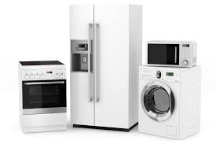

Se dommen **U 1987 854 V** (køleskabe, komfurer og elradiatorer, der var opstillet i 2 nyopførte huse, men ikke var tilsluttet elnettet, anset for omfattet af TL § 38).

---

Kravet om, at anskaffelsen skal være sket på ejerens bekostning. Udenfor falder herefter tilfælde, hvor anskaffelsen er bekostet af en lejer, idet det afgørende i denne henseende er, om vederlaget i realiteten betales af ejeren, ikke om betalingen formelt kommer fra ejeren, jf. dommen **U 1941 731 H**.

Er en genstand anskaffet af ejendommens ejers ægtefælle, må udgangspunktet være, at den ikke omfattes af TL § 38, jf. dommene **U 1983 951 V** og **U 1985 227 V**. 

Man vil dog formentlig stille ret strenge krav til beviset for, at genstanden reelt er bekostet af den anden ægtefælle, ligesom § 38 er anvendelig, hvis den ægtefælle, der har anskaffet genstanden, må antages reelt at være medejer af ejendommen, jf. dommen **U 1984 620 V**. Tilsvarende gælder ved faste samlivsforhold.

Hvis indføjelsen er foretaget af en lejer, en brugspanthaver eller anden midlertidig besidder, omfattes forholdet som nævnt ikke af TL § 38.

---

TL § 38 afskærer som nævnt navnlig ejendomsforbehold i genstande, der indlægges i en fast ejendom, men heller ikke andre særskilte rettigheder kan opretholdes over sådanne genstande, således ikke panterettigheder, der er stiftet efter reglerne om pant i løsøre, eller brugs- og lejerettigheder (leasingrettigheder). 


---

**TL § 37 – Erhvervstilbehør**


TL § 37, stk. 1 har følgende formulering;

"Hvor en fast ejendom varigt er indrettet med en særlig erhvervsvirksomhed for øje, omfatter tinglyst pantebrev i ejendommen, når intet andet er aftalt, også det dertil hørende driftsinventar og driftsmateriel - derunder maskiner og tekniske anlæg af enhver art - og ved landejendomme tillige den til ejendommen hørende besætning, gødning, afgrøder og andre frembringelser, for så vidt de ikke udskilles ifølge en regelmæssig drift af den pågældende ejendom”

---

Hvis ejendommen er:

En erhvervsejendom. I reglen skal indretningen fremgå af særlige bygningsforanstaltninger. 

Specielt inventar mv. kan i særlige tilfælde være tilstrækkeligt, medens faktisk anvendelse til erhverv ikke er nok. 

Ikke hele ejendommen behøver at være indrettet med henblik på erhvervsvirksomheden, når den blot ikke spiller en kun ubetydelig rolle.

Som er varigt indrettet: I tvivlstilfælde kan der ses hen til betydningen for pantesikkerheden, jf. dommen i **U 1934 352**. 

Det er uden betydning, om ejendommen først ved senere bygningsændring er blevet indrettet til erhvervsejendom

---

**Med en særlig erhvervsvirksomhed for øje**. 

Der ligger næppe nogen begrænsning i udtrykket »særlig«. 

Ejendommens indretning til erhverv behøver således ikke at sigte til et bestemt erhverv, men er dette tilfældet, er løsøret kun omfattet af panteretten efter TL § 37 i det omfang, det hører til en virksomhed af den art, hvortil ejendommen er indrettet,

Er driftsmateriel og driftsmidler omfattet af ejendomspantet. 

Altså - med undtagelse af biler, jf. stk. 3 - alle genstande, der varigt benyttes i driften som grundlag for denne (produktionsmidler), derimod (bortset fra landejendomme) ikke råvarer, halvfabrikata og færdige produkter:

Se hertil dommen **U 1987 586 V** (køkkener, der midlertidigt var opstillet i en køkkenfabrikants detailforretninger for at fremme salget, og som var monteret på nogenlunde samme måde som i et privat hjem, men blev udskiftet ved modelskifte mv., var ikke omfattet af en panthavers panteret efter TL § 37 og TL § 47 b, stk. 2, idet køkkenerne i princippet måtte sidestilles med enhver anden form for demonstrations/udstillingsvare, der traditionelt henregnes til en virksomheds varelager), 

Se dommen **U 1973 925 H** (et vaskeri drev også virksomhed med udlejning af arbejdstøj, duge og sengelinned mv.

Antaget, at disse genstande nærmest måtte sidestilles med et varelager og ikke kunne anses som driftsinventar eller driftsmateriel omfattet af TL § 37).

---

Bestemmelsen kan fraviges ved aftale (deklaratorisk), hvis:

+ Aftale om pant eller ejendomsforbehold indgås før løsøret bliver bragt ind på ejendommen

+ Aftale om pant bliver tiltrådt af panthaverne i ejendommen

---
   
**Løsøret kan udskilles ifølge regelmæssig drift**
 
Hvis ejendommen er en landejendom omfatter pantet også:


**Besætningen**. Dyr er i ældre retspraksis efter omstændighederne blevet opfattet som driftsmateriel, således at de ansås for omfattet af tilbehørspantet, selv om der ikke var tale om en landejendom:


Dommen **U 1981 863 V** (heste i stutteri) og dommen **U 1969 961 V** (høns i hønseri). 


Men se nu dommen **U 1987 807 H** (en ørredbestand på et dambrug kunne ikke anses for driftsmateriel) og 


Dommen **U 1995 362 H** (en minkfarms besætning af mink ikke anset som driftsinventar eller driftsmateriel). 

Under besætning falder alle dyr, der indgår i en normal landbrugsdrift, herunder avlsdyr samt afkom:

Dommen **U 1935 561**, således også høns, smågrise og får, 

Dommen **VLT 1957 159** (ekstraordinært stort fårehold, uanset at besætningen ikke kunne ernæres af gårdens produkter), men ikke kaniner, pelsdyr, duer, bier og lignende. 

Det må dog kræves, at dyrene har væsentlig betydning for ejendommen, hvorfor man snarere vil medtage høns ved husmandsbrug, dommen **U 1937 154**, end ved større landejendomme, jf. dommen **U 1935 373**.
 
* Gødning, afgrøder og andre frembringelser. En landbrugsejendoms mælkekvote er ikke omfattet af TL § 37, og det samme gælder et krav på godtgørelse for ophør med mælkeleverance, jf. dommen **U 1992 815 V**. 

Såvel den på roden værende som den indhøstede avl og afgrøde, dommen **U 1964 746 V**. 

Panthaverne i den faste ejendom må dog respektere høstpant stiftet i henhold til lov om høstpant. Om kartoffelleveringsrettigheder se dommen **U 1998 209/2 V** og dommen **U 2000 967 V**.

* En landejendom er oftest en traditionel gård med jordbrug og besætning. 

Der må være tale om en egentlig jordbrugsvirksomhed, dommen **U 1995 362 H** (minkfarm ikke omfattet), 

Dommen **U 1987 807 H** (dambrug ikke omfattet), 

Dommen **U 1981 863 V** (en ejendom, der var noteret som landbrugsejendom, men som gennem lang tid udelukkende havde været drevet som stutteri og var indrettet specielt hertil, var ikke omfattet), 

Dommen **U 1969 961 V** (hønseri ikke anset for landejendom), 

Dommen **U 1933 762** (ligeledes), 

Dommen **VLT 1935 58** (pant i smedje med tilhørende areal af 1 td land antoges ikke at omfatte 1 hest, 1 ko og nogle smågrise, selv om stald var indrettet i husets ene ende). 

Det er uden betydning, om ejendommens jorder er beliggende i en landkommune eller ikke. 

Det er ligeledes uden betydning, om ejendommen ligger i landzone eller er noteret som en landbrugsejendom efter loven herom. 

Muligvis kan antallet af dyr på en ejendom være så stort, at der ikke er tale om jordbrug i traditionel forstand, men om industri, der ikke er omfattet. 

Det er derimod ikke nødvendigt, at opdræt af en besætning udelukkende baseres på ejendommens egen avl af foder.

---

**Uden for panteretten falder personlige brugsgenstande**

Se dommen **U 1975 323 Ø**. (udsmykningsgenstande, herunder en antik våbensamling, i restaurationsvirksomhed ikke anset for omfattet af TL § 37, hvorimod et farvefjernsyn efter sin placering og anvendelse måtte betragtes som driftsinventar i forretningen). 

Personbiler er i almindelighed ikke omfattet, selv om de er anskaffet forud for 1993-06-01 og derfor ikke er undtaget efter TL § 37, stk. 3, jf. dommene **U 1979 411/1 V, U 1978 823 V og U 1973 354 V**.

Er der tvivl om, hvorvidt genstande er omfattet af TL § 37 (eller TL § 38), kan de fremhæves udtrykkeligt i pantebrevet. Løsøregenstande, som ikke er omfattet af TL § 37, kan pantsættes særskilt efter TL § 47 (individualiserbart løsøre) eller efter TL § 47 c, virksomhedspant.


---

**Video: Om pant i fast ejendom, jf. TL §§ 37 og 38**


<div class="video-container"><iframe src="https://www.youtube.com/embed/xHy4WseYSYY" width="853" height="480" frameborder="0" allowfullscreen="allowfullscreen"></iframe></div>
 
---

**Eksamensopgavesæt om pant i fast ejendom, virksomhedspnat, pantets omfang, konkurs, omstødelse, tvangsfuldbyrdelse og rekonstruktion mv.**


**Fine biler og dyre vaner**

---


---

Super Cars I/S beskæftigede sig med salg af nye og brugte, eksklusive specialbiler som Porsche, Ferrari, Maseratti, Jaguar. Desuden drev selskabet et autoværksted, der havde specialiseret sig i disse bilmærker samt faciliteter til opbevaring af kundernes biler under optimale forhold, i vinterperioden. 

Selskabet havde kreditter og lån på i alt16 mio. kr. i Erhvervsbanken, og ønskede nu at udvide engagementet til kr. 20 mio. kr. Erhvervsbanken havde oprindelig accepteret engagementet på baggrund af partnernes personlige hæftelse, da de var ganske velhavende, men forlangte nu tillige pant i selskabets aktiver, som betingelse for udvidelsen. 

Resultatet blev at Super Cars gav banken pant i sin ejendom med showroom. Værkstedet blev drevet fra en lejet ejendom, som Super Cars selvfølgelig ikke kunne pantsætte. Der blev samtidig etableret virksomhedspant med afkrydsning af alle kategorier på skadesløsbrevet. Begge aftaler blev behørigt tinglyst.

Under besøg på virksomheden havde kreditchefen fra Erhvervsbanken, set de mange fornemme sportsvogne og havde desuden hæftet sig ved det kostbare og avancerede udstyr i værkstedet. Hun var ikke i tvivl om, at sikkerheden i ejendommen sammen med virksomhedspantet ville dække engagementet.

Det var gode tider med et generelt stort forbrug i samfundet, så det gik rigtig godt for Super Cars. Desværre havde selskabet en økonomidirektør, Larsen, som også gerne ville være med på velstandsbølgen, og derfor supplerede sin løn ved at tappe selskabet ved underslæb. Det førte til at selskabet, efter egen begæring, kom under rekonstruktion.

**Eksamensspørgsmål**

A. Hvordan hæfter partnerne bag Super Cars I/S, for virksomhedens gæld?

B. Hvilke funktioner har fristdagen under rekonstruktionen?

**Rettevejledning**

Ad. A. 

Ejerne af et interessentskab hæfter personligt, solidarisk og direkte med alt hvad de ejer. Det vil sige at alle virksomhedens forpligtelser også er ejernes forpligtelser. Ejerne hæfter også for forpligtelser som ens partnere måtte have indgået. Solidarisk hæftelse betyder at, skulle interessentskabet komme i en situation, hvor det ikke er muligt at betale sin gæld, kan kreditorerne selv vælge hvem af interessenterne de vil inddrive gælden hos.

Ad. B.

Ved konkurs og rekonstruktion er fristdagen den dato hvor skifteretten modtager en begæring om konkurs eller rekonstruktion.

Når rekonstruktionsbehandlingen er indledt, kan begæringen ikke tilbagekaldes. 

Så længe en begæring om rekonstruktion er under behandling, og så længe en rekonstruktionssag verserer, kan en konkursbegæring ikke behandles.


**Eksamensspørgsmål 2:**

Ved den efterfølgende opgørelse af bankens sikkerheder opstod der diskussion mellem rekonstruktøren og banken om følgende spørgsmål: 

A. Banken gjorde gældende, at virksomhedspantet omfattede såvel virksomhedens varelager, af både nye og brugte biler, som direktørens firmabil.


**Rettevejledning:**

Emne: Virksomhedspant – panterettens omfang

Regler: Tinglysningsloven (TL) § 47c stk. 3

Læringsmål: Anvende, vurdere og formidle reglerne om kreditsikring og finansiel sikkerhedsstillelse i sammenhæng med andre juridiske emner, og i en praktisk sammenhæng med risiko- og kreditvurdering af private og erhvervskunder.


Jf. TL § 47c stk. 3, 3) og TL § 47c stk. 3, 8), er et kun den del af varelageret, der består af hhv. de nye biler, der aldrig har været indregistreret, og da der er tale om en bilforhandler, de brugte biler, der udbydes, som vil være omfattet af bankens virksomhedspant.


B. Blandt selskabets fordringer var erstatningskravet overfor Larsen, nogle købekontrakter med ejendomsforbehold i de solgte biler samt en lang række almindelige tilgodehavender fra værkstedet. Banken gjorde gældende, at alle disse fordringer var omfattet af virksomhedspantet. 

**Eksamensspørgsmålet:**

Har banken ret i disse påstande? 

**Rettevejledning**:

Emne: Virksomhedspant – panterettens omfang

Regler: TL § 47c stk. 3

Læringsmål: Anvende, vurdere og formidle reglerne om kreditsikring og finansiel sikkerhedsstillelse i sammenhæng med andre juridiske emner, og i en praktisk sammenhæng med risiko- og kreditvurdering af private og erhvervskunder.

Efter TL § 47c stk. 3, 1) er det alene simple fordringer hidrørende fra salg af varer og tjenesteydelser, der er omfattet af virksomhedspantet, hvorfor banken ikke har pant i erstatningskravet mod Larsen.

**Svar slut**.


I forbindelse med et særligt klimareguleringsanlæg til de kælderlokaler under udstillingslokalerne, hvor man opbevarede de kostbare biler under optimale temperatur- og fugtighedsforhold, opstod der uenighed om retten til anlægget mellem banken og leverandøren, som havde solgt det på kredit med gyldigt ejendomsforbehold.

**Eksamensspørgsmålet:**

Hvordan afgøres spørgsmålet?


**Rettevejledning:**

Emne: Pant i fast ejendom – panterettens omfang

Regler: TL §§ 37 og 38

Læringsmål: Anvende, vurdere og formidle reglerne om kreditsikring og finansiel sikkerhedsstillelse i sammenhæng med andre juridiske emner, og i en praktisk sammenhæng med risiko- og kreditvurdering af private og erhvervskunder.

Det kan lægges til grund at anlægget er erhvervsløsøre, der knytter sig til driften på en ejendom, varigt indrettet med særlig erhvervsvirksomhed for øje (salg og opbevaring af biler), hvorfor anlægget vil være omfattet af TL § 37. 

Bestemmelsen er deklaratorisk, hvorfor sælgers ejendomsforbehold vil gå forud for de øvrige rettigheder, såfremt aftalen er indgået inden eller samtidig med at anlægget er indført på ejendommen. (Ingen krav om sikringsakt ved ejendomsforbehold i løsøre, udover TL § 42c).

En relevant diskussion af om betingelsen om ”varig indretning med særlig erhvervsvirksomhed for øje” er opfyldt i relation til det om ejendommen oplyste (showroom /udstillingsareal og kælderareal) skal trække op ved bedømmelsen af besvarelsen.

**Svar slut**


Rekonstruktøren gjorde krav gældende overfor den ene partners datter, der som gave fra Super Cars, på hendes 18 års fødselsdag, godt 1½ år inden fristdagen, havde modtaget en temmelig kostbar Masserati.

**Eksamensspørgsmålet:**

Hvilke muligheder har rekonstruktøren for omstødelsen?


**Rettevejledning**:

Emne: Tvangsfuldbyrdelse – rekonstruktion - omstødelse

Regler: Konkursloven (KL) § 2 og § 64 stk. 2

Læringsmål: At anvende relevante regler om konkurs og rekonstruktion og vurdere deres betydning for den finansielle sektors risiko- og kreditvurdering.

Da datteren er nærtstående, jfr. KL § 2, vil der være mulighed for omstødelse af gaven efter § 64 stk. 2, 2. pkt., da den er givet senere end to år før fristdagen. Indeholder en besvarelse en relevant diskussion af undtagelsen i § 64 stk. 3 om lejlighedsgaver trækker dette op ved bedømmelsen.

**Eksamensspørgsmålet**:

5. Hvilke formål tjener omstødelse under rekonstruktion og konkurs?


**Rettevejledning:**

Emne: Tvangsfuldbyrdelse – rekonstruktion - omstødelse

Regler: KL kap. 8

Læringsmål: At anvende relevante regler om konkurs og rekonstruktion og vurdere deres betydning for den finansielle sektors risiko- og kreditvurdering.

Reglerne om omstødelse ved konkurs og rekonstruktion sikrer Konkurslovens ligedelingsprincip, således at evt. forringende og forrykkende dispositioner forud for en rekonstruktion/konkurs, kan erklæres ugyldige og en evt. berigelse tilbageføres til boet.

**Svar slut**.

---

**Video om TL §§ 37 og 38 om tilhørspant**

<div class="video-container"><iframe src="https://www.youtube.com/embed/uK1iZr2t3y8" width="853" height="480" frameborder="0" allowfullscreen="allowfullscreen"></iframe></div>

---


## Pant i løsøre

Løsøre omfatter enkelte aktiver, fx cykel, maleri, smykker, båd eller andre genstande.

Pant i løsøre kan tinglyses.

Ejendomsret til løsøre registreres ikke i et officielt register på samme måde som fast ejendom.

Ejendomsretten sikres ved individualisering.

---
 
## Biler


Motorkøretøjer er:

Typisk: Personbiler, lastbiler, varebiler, busser, campingvogne, motorcykler, påhængs- og sættevogne Typisk ikke: Knallerter, traktorer, mejetærsker, sidevogne.

Pant eller ejendomsforbehold tinglyses i Bilbogen med angivelse af stelnummer og bilens ejer.

Flere panthavere i samme bil – medfører en prioritetsstilling.

Et pantebrev har som udgangspunkt oprykningsret, efterhånden som foranstående pantebrev bliver betalt.

Pantebrev slettes fra Bilbogen efter 10 år.

---

## Pant i andet løsøre

Pant tinglyses i Personbogen med angivelse af, hvilken genstand pantet omfatter – en klar og tydelig beskrivelse anbefales.

Flere panthavere i samme løsøre – medfører en prioritetsstilling.

Ejendomsforbehold og udlæg kan ikke tinglyses i Personbogen.

Pantebrev slettes fra Personbogen efter 10 år.


---

## Flydende pant – TL § 47b, stk. 2 – pant


Bestemmelsen i TL § 47b, stk. 2 har følgende formulering: 

”Når en erhvervsvirksomhed drives fra lejet ejendom, kan indehaveren uanset bestemmelsen i stk. 1 pantsætte det til virksomheden hørende driftsinventar og driftsmateriel - derunder maskiner og tekniske anlæg af enhver art - og ved landejendomme tillige den til ejendommen hørende besætning, gødning, afgrøder og andre frembringelser. Pantsætningen er ikke til hinder for, at de nævnte genstande udskilles ifølge en regelmæssig drift af virksomheden. Reglerne i 1. og 2. pkt. gælder ikke for de i § 42 c nævnte køretøjer.”  

---

I lighed med hvad der gælder efter TL § 37, skal ejendommen være indrettet med erhvervsvirksomhed for øje, jf. dommen i **U 1990 217 H**. 

Det er en betingelse, at virksomheden virkelig kan siges at blive drevet fra lejet ejendom. 

Hvis virksomheden primært drives fra egen ejendom, medens den lejede ejendom alene er at betragte som et accessorium hertil, kan løsøre, der befinder sig på den lejede ejendom, derfor ikke gyldigt pantsættes under ét i medfør af TL § 47 b, stk. 2, jf. dommen **U 1983 425 V** og **U 1984 829/1 V**.  

Der kræves ligesom ved TL § 37 en stedlig tilknytning til ejendommen, jf. dommene i **U 1990 217 H**, jf. **U 1988 745 Ø**. 


Bestemmelsen i TL § 47b, stk. 2 giver ikke hjemmel til pantsætning af varelagre og lignende, bortset fra den særlige regel om landbrugsejendomme, jf. dommen i **U 1971 616 H**. 


Lejekontrakt og/eller goodwill kan pantsættes sammen med driftsinventar mv. 

Se også dommen i **U 1972 176 V** (pantet omfattede også genstande erhvervet ved en lejekontrakt, der i et bo tilsidesattes som en omgåelse af afbetalingsloven).  


---

En erhvervsvirksomhed, der drives fra lejede lokaler kan således give pant i: 

+ Driftsmidler og driftsinventar.

+ Rettigheder efter lejekontrakten.

+ Evt. i goodwill.

---
   
Hvis det er en landbrugsvirksomheds kan pantet også omfatte besætning og afgrøder mm.

Nye aktiver bliver automatisk omfattet af pantet.


Aktiver kan udskilles ifølge regelmæssig drift, se dommen i **U 1972 1058 V** (køberen af en opslåningsmaskine fra et bageri burde have indset, at der ikke forelå udskillelse ifølge regelmæssig drift, og dømtes til at erstatte panthaveren maskinens værdi).
 
---

## Virksomhedspant – TL § 47


Virksomhedspant er et panteretligt redskab der skal lette virksomheders adgang til finansiering, ved pantsætning af forskellige aktivkategorier.

Bestemmelsen har følgende ordlyd i TL § 47, stk. 1-2:  

“Underpant i løsøre, som ikke er nævnt i § 42 c, skal tinglyses for at opnå beskyttelse mod aftaler, der i god tro indgås med pantets ejer, og mod retsforfølgning.

Stk. 2.  Underpant i ejerpantebreve, der giver pant i løsøre, skal tinglyses for at opnå beskyttelse mod aftaler, der i god tro indgås om pantebrevet, og mod aftaler om eller retsforfølgning mod løsøret.”

---

Sikringsakten er således registrering i form af tinglysning, jf. TL § 47, stk. 2.  

TL § 47 omfatter ikke pantebreve, der giver underpant i biler mv., idet rettigheder over biler mv. er reguleret i kap. 6 a. 


---

Vedrørende underpant i andet løsøre som ikke er omfattet af TL § 47, bemærkes der følgende:


* a) **Skibe** på over 5 BRT og fly:  
   
Panterettigheder i skibe på over 5 BRT og panterettigheder i fly kan ikke tinglyses efter § 47, men skal for at opnå beskyttelse registreres i skibsregistret, henholdsvis rettighedsregistret for luftfartøjer, jf. sølovens kap. 2, og lov om registrering af rettigheder over luftfartøjer § 1. 

Disse love indeholder tillige nærmere regler om bl.a. panterettens omfang og forholdet mellem flere panthavere (stort set svarende til § 40). Med henblik på afgørelse af, om pantsætning af et skib kan ske efter § 47, kan tinglysningsdommeren forlange fremlæggelse af målebrev, jf. dommen i **U 1985 443 V**. 

---

* b) **Forbud mod generalpant og pant i tingsindbegreb**: 

Se TL §§ 47 a og 47 b. Se også TL § 47 c om virksomhedspant. 

---

* c) **Pantsætning efter § 47 af formuegoder, der ikke har karakter af løsøre**: 

Genstande, der skal pantsættes efter reglerne om fast ejendom, kan ikke pantsættes efter TL § 47, jf. dommen i **U 1962 894/1 V** (træsommerhus på lejet grund bestemt til forbliven på stedet), jf. dommen i **U 1966 608/2 V** (tilsvarende afgørelse, selv om der i pantebrevet var angivet, at huset ikke var bestemt til varig forbliven på stedet). 

---

**Patenter, varemærker og mønstre** kan pantsættes efter TL§ 47. 

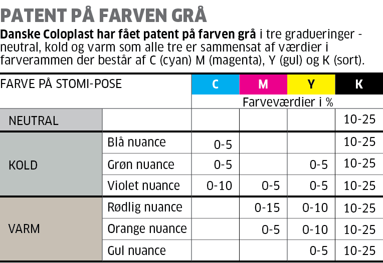


Efter varemærkelovens § 41 kan en pantsætning af et varemærke registreres i varemærkeregisteret, men dette har ikke betydning som sikringsakt.

I dommen **U 1993 543 V**, hvorefter en panteret i goodwill antoges at omfatte et varemærke samt mønstre og modeller m.m. Vedr. pantsætning efter TL § 47 af edb - produktionsretten, maskinel og/eller programmel, domænenavne m.v.  

**Domænenavne og rettigheder** i henhold til patentloven, varemærkeloven, designloven, brugsmodelloven, mønsterloven, ophavsretsloven og lov om beskyttelse af halvlederprodukters udformning kan pantsættes ved virksomhedspant, jf. TL § 47 c, stk. 3, nr. 7.  

Der kan tinglyses underpant i løsøre købt med ejendomsforbehold (retten til at blive ejer).  

I forbindelse med pantsætning af en løsøregenstand kan tillige pant i lejeindtægter af genstanden tinglyses efter TL § 47, jf. dommene **U 1986 858 H** og **U 1984 1009 V**, men anderledes med dommen i **U 1984 131/2 V**. 

I mangel af udtrykkelig bestemmelse herom er indtægter ikke omfattet af pantet, jf. dommen i **U 1983 423 V**.  

Den der driver virksomhed fra egen ejendom, kan pantsætte den til virksomheden knyttede goodwill efter TL § 47, og at den, der driver virksomhed fra lejede lokaler, kan pantsætte den til virksomheden knyttede goodwill efter TL § 47, selv om det ikke sker i forbindelse med pantsætning af en overdragelig lejekontrakt, og selv om lejekontrakten ikke er overdragelig. 

Der må herefter ved forskellige pantebreve kunne ske pantsætning af henholdsvis goodwill efter TL § 47 og driftsinventar og -materiel efter TL § 47 b, stk. 2, men der kan også fortsat foretages en fælles pantsætning af goodwill samt driftsinventar og -materiel. 

Der kan ved pantsætning af goodwill næppe kræves anden specifikation end en tydelig angivelse af, til hvilken virksomhed den pågældende goodwill er knyttet, sammenlign her dommen i **U 1993 543 V**.  

---

* d) **Specifikation af det pantsatte**:

Bortset fra de særlige undtagelser fra forbuddet mod underpant i tingsindbegreb - herunder navnlig TL § 47 b, stk. 2, § 47 c og § 47 d, er det en forudsætning for tinglysning af et pantebrev, der giver underpant i løsøre, og for beskyttelsen over for tredjemand, at pantebrevet i tilstrækkelig grad specificerer (individualiserer) det pantsatte. 

Det vil kræve, at de pantsatte genstande klart adskilles fra andre genstande tilhørende pantsætteren, således at denne ikke er i stand til at underskyde ikke-pantsatte genstande under aftalen og dermed skade de øvrige kreditorer. 

Rent praksis kunne det være stelnummer på de knallerter der er omfattet af pantet

---

Oversigt over, hvad der er omfattet af virksomhedspant, jf. TL § 47:   


```{r pant6, echo=FALSE}
mydf <- data.frame(
  S1 = c(
           
          "TL § 47b, stk. 2, flydende pant i driftsmateriel", 
          "TL § 47c, virksomhedspant",
         "Ejendomsforbehold", 
          "Udlæg i løsøre",
         "TL § 47c, virksomhedspant",
          "Ejendomsforbehold", 
          "Udlæg i løsøre",
         "Ejendomsforbehold", 
          "Udlæg i løsøre",
         "Udlæg i løsøre"
),
  S2 = c(
         
         "Individuelt løsørepant, tinglyst inden det kommer ind i virksomheden vil have førsteprioritet", 
          "Individuelt løsørepant, tinglyst inden det kommer ind i virksomheden vil have førsteprioritet",  
         "Ejendomsforbeholdet skal respekteres af pant", 
          "Løsørepant skal respekteres af udlæg",
         "Tinglysningstidspunktet afgør prioritetsstillingen",
         "Ejendomsforbeholdet skal respekteres af pant", 
         "Løsørepant skal respekteres af udlæg",
         "Ejendomsforbeholdet skal respekteres af pant", 
         "Ved meddelelse inden 3 dage, skal udlæg respekteres af virksomhedspant",
         "Ejendomsforbeholdet skal respekteres af udlæg"
)
)
names(mydf) <- NULL
mydf %>%
  kable("html", escape = FALSE, caption = "Virksomhedspant TL § 47") %>%
  kable_styling(full_width = T,font_size = 10,bootstrap_options = c("responsive","bordered","striped")) %>%
   column_spec(1:2, bold = T, border_right = T, color = "black", background = "lightgrey") %>%
  # column_spec(2, bold = T, border_right = T, color = "black", background = "lightgrey") %>%
   # column_spec(3, bold = T, border_right = T, color = "black", background = "lightgrey") %>%
  pack_rows(index = c( "TL § 47 Individuelt løsørepant" = 4, "TL § 47 b stk. 2 flydende pant" = 3,"TL § 47 c virksomhedspant" = 2,"Ejendomsforbehold" = 1),label_row_css = "background-color: #666; color: #fff;")


# scroll_box(width = "100%")
  # row_spec(1,italic = T,bold = T,font_size = 12)
  # column_spec(0, angle = -45)%>%
  # scroll_box(width = "500px") %>%
  # footnote(general = "Forsikringsankenævnets klageguide",general_title = "Kilde:")%>%
# footnote(number = "Hvis skadevolder er under 14 år eller er utilregnelig, kan der dog være dækning selv om handlingen er forvoldt forsætligt")
```

---

**Eksamensopgavesæt og løsning om pant i fast ejendom og løsøre, samt erstatning, kaution, ertatningsbetingelserne og huseftersynsordningen, mv.**


**Musik med problemer**


Johan Tuxen-Brahe bor og driver sit pladeselskab, SoundNeed ApS, fra en tidligere landejendom syd for København. 

Han bor i det gamle stuehus og lejer de tidligere produktionsbygninger ud til virksomheden, der har indrettet studie, lager og administration mv. 

Både banken og realkreditinstituttet har pant i ejendommen.

Den 12. september 2014, er han til møde med sin bankrådgiver fra Køge Kapitalbank vedrørende finansiering af nye initiativer.

Det drejer sig om en ny stor luft/vand varmepumpe, som Johan forestillede sig kunne finansieres med kredit sikret med enten ejendomsforbehold eller pant i enten selve anlægget eller alternativt i ejendommen, til enten leverandøren eller Kapitalbanken. 


**Eksamensspørgsmålet:**

1. Hvordan skal bankrådgiveren rådgive Johan i dette spørgsmål?

Emne: Pant i fast ejendom og løsøre

Regler: Tinglysningsloven (TL) § 38 – kreditaftaleloven (KAL) § 21

Læringsmål: Anvende, vurdere og formidle reglerne om kreditsikring og finansiel sikkerhedsstillelse i sammenhæng med andre juridiske emner, og i en praktisk sammenhæng med risiko- og kreditvurdering af private og erhvervskunder.

**Vejledende løsning**

Varmepumpen er bygningstilbehør, som, når den er indlagt i ejendommen på ejerens bekostning, vil blive grebet af ejendomspantet til bank og realkredit, jfr. TL § 38. 

Da bestemmelsen er præceptiv kan særskilte rettigheder over varmepumpen i form af pant eller ejendomsforbehold ikke forbeholdes. 

Sikkerhed vil herefter alene kunne ske som tinglyst underpant i den faste ejendom med prioritet efter indestående lån. 

**Svar slut**.


Banken er også i øvrigt i tvivl om hvorvidt de har tilstrækkelig sikkerhed for SoundNeeds kassekredit, og drøfter mulighederne for i øvrigt at få pant i virksomhedens aktiver.


**Eksamensspørgsmålet:**

2. Hvilke muligheder kunne der blive tale om? 

Emne: Pant i løsøre 

Regler: TL §§ 47b stk. 2 og 47c

Læringsmål: Anvende, vurdere og formidle reglerne om kreditsikring og finansiel sikkerhedsstillelse i sammenhæng med andre juridiske emner, og i en praktisk sammenhæng med risiko- og kreditvurdering af private og erhvervskunder.


**Vejledende løsning**

Selskabet drives fra lejede lokaler, hvorfor pant i selskabets aktiver kan opnås efter TL § 47b stk. 2 eller som virksomhedspant efter TL § 47c. 

Ved besvarelsen lægges vægt på den studerendes forståelse af panterettens omfang og anvendelse i de to bestemmelser. 

**Svar slut.**


Johan nævner også, at hans gamle onkel, ”Tuxen”, der er tidligere musiker, og altid har støttet hans ambitioner indenfor branchen, og desuden ejer 5% af anparterne i SoundNeed ApS, måske kunne overtales til at kautionere overfor banken, i forbindelse med køb af varmeanlægget.


**Eksamensspørgsmålet**:

3. Hvilke overvejelser må bankrådgiveren gøre sig i forhold til denne mulighed?

Emne: Kaution

Regler: Alm. Regler om kaution – lov om finansiel virksomhed (FIL) §§ 47 og 48 – God Skik Bekg. § 22, samt kautionspjecen udarbejdet af FinansDanmark og ForbrugerrådetTænk


Læringsmål: Forståelse for kaution i både private og erhvervsforhold.

**Vejledende løsning**

Den studerende skal forholde sig til, om kautionen må anses for at være privat eller erhvervsmæssig. 

Der er tale om et lån til Johan – ikke til ApS’et - og da relationen mellem Johan og onklen således overvejende er af privat karakter, må det anses for en privat kaution. 

Banken skal i den forbindelse være opmærksom på overholdelse af reglerne om privat kaution i Fil § 48 samt i God Skik Bekg. § 22. 

Kautionen bør formuleres som en selvskyldnerkaution.

**Svar slut.**


SoundNeed har også brug for en ny mixerpult til lydstudiet, og Johan forslår, at kreditten til købet finasieres med et lån i banken sikret med pant i mixerpulten.


**Eksamensspørgsmået:**

4. Hvilke muligheder har banken for at få pant i mixerpulten?

Emne: Pant i løsøre

Regler: TL § 47

Læringsmål: Anvende, vurdere og formidle reglerne om kreditsikring og finansiel sikkerhedsstillelse i sammenhæng med andre juridiske emner, og i en praktisk sammenhæng med risiko- og kreditvurdering af private og erhvervskunder.

**Vejledende løsning**

Låntager/pantsætter er nu selskabet. Der er således ingen konflikt i forhold til TL § 37. 

Banken kan opnå underpant i mixerpulten efter TL § 47 enten ved tinglysning af et alm. løsørepantebrev eller ved tinglysning af underpant i et ejerpantebrev med tinglyst pant i mixerpulten. 

Håndpant er ligeledes en mulighed, men jo ikke interessant, da sikringsakten her er effektiv rådighedsberøvelse. 

Den gode besvarelse bør dog kobles til besvarelsen af spr. 2 og konstatere, at man ved pant efter TL § 47b stk. 2 eller TL § 47c automatisk vil få pant i mixerpulten.

**Svar slut**.

I perioder med ekstraordinær travlhed hyrer Johan lydteknikeren Lars Ravn, til at bistå med arbejdet i lydstudiet. Uheldigvis kommer Lars en sen aften, hvor han nok lidt rigelig, har søgt inspiration i noget stærkt øl fra det lokale mikrobryggeri, til at vælte et næsten fyldt glas øl, ud over den nye mixerpult, som bestemt ikke har godt af denne behandling.


**Eksamensspørgsmålet**:

5. Kan Johan, og i givet fald efter hvilke regler, kræve erstatning af Lars Ravn?

Emne: Erstatning udenfor kontrakt

Regler: De alm. Erstatningsbetingelser – EAL § 23 stk. 3

Læringsmål: Anvende og vurdere de grundlæggende erstatningsbetingelser ved erstatning udenfor kontrakt, for derigennem at kunne vurdere reglerne for rådgivnings- og professionsansvar indenfor den finansielle sektor (God skik bekendtgørelsen og LOFE § 24) samt reglerne om principalansvar.

**Vejledende løsning**

I besvarelsen skal indgå en gennemgang af de almindelige erstatningsbetingelser, der alle må anses for opfyldt. 

Da skadelidte er skadevolders arbejdsgiver, skal den studerende ligeledes forholde sig til EAL § 23 stk. 3, jfr. Stk. 1. 

Der skal her indgå en drøftelse af, hvorvidt det findes rimeligt at den ansatte bliver erstatningsansvarlig overfor arbejdsgiveren, herunder især henset til skyldgraden.

**Svar slut**.

Til Ejendommen hørte en tidligere aftægtsbolig, som Johan aldrig har haft brug for, og længe har ønsket solgt. Det har nu endelig ført til, at ejendommen via ejendomsmægler Groth, er blevet solgt til folkepensionisten Mia Andersen, der har tegnet ejerskifteforsikring. 

Desværre viser det sig, at tilstandsrapporten, ikke har medtaget en ellers oplagt sætningsskade på en skillevæg mellem stuen og køkkenet. 

Samtidig har det vist sig, at der ved slagregn og vind fra en ganske bestemt retning, trænger vand ind under tagkonstruktionen.

**Eksamensspørgsmålet**:

6. Hvem kan Mia Andersen rette krav imod, i forhold til de to uheldige situationer?

Emne: Overdragelse af fast ejendom - Huseftersynsordningen

Regler: Lov om forbrugerbeskyttelse ved erhvervelse af fast ejendom (LFFE) §§ 1 - 5

Læringsmål: At anvende og formidle centrale regler og praksis for køb og salg af fast ejendom med fokus på forbrugerbeskyttelse.


**Vejledende løsning**

Ifølge det oplyste er ”Huseftersynsordningen” i LFFE benyttet ved overdragelsen af ejendommen. 

Lægges det til grund, at betingelserne i ordningen er opfyldt, kan køber ikke rette krav om mangler mod sælger, jf. § 2. 

Sætningsskaden burde ifølge det oplyste fremgå af tilstandsrapporten. 

Den bygningssagkyndige har derfor tilsidesat sine pligter og køber vil kunne rette et erstatningskrav mod denne, jf. § 3. 

Vandindtrængningen er derimod næppe en skade, der burde fremgå af rapporten, og skaden må således som udgangspunkt være omfattet af ejerskifteforsikringen. 

Krav kan ikke rettes mod den bygningssagkyndige og krav mod sælger kan alene ske i det omfang denne er bekendt med fejlen og har undladt at oplyse herom i forbindelse med handelen, jf. § 2 stk. 5 (svig eller grov uagtsomhed). 

Da Johan aldrig har boet i ejendommen kunne dette tale for, at et krav ikke kan gøres gældende. 

Der lægges ved bedømmelsen vægt på den studerendes argumentation og forståelse af reglerne. 

**Svar slut.**

 
--- 
 
 
## Fordringspant for udestående og fremtidige fordringer -  TL § 47d


Fordringspant er et såkaldt flydende pant – TL § 47d og har følgende formulering:

”Indehaveren af en erhvervsvirksomhed kan ved anvendelse af skadesløsbrev underpantsætte virksomhedens udestående og fremtidige simple fordringer hidrørende fra salg af varer og tjenesteydelser (fordringspant).

Stk. 2. Fordringspant skal tinglyses for at opnå beskyttelse mod aftaler, der i god tro indgås med pantets ejer, og mod retsforfølgning.  Skadesløsbreve som nævnt i stk. 1 kan ikke overdrages særskilt.”

---

TL § 47 d giver således en adgang til fordringspant - dvs. samlet underpantsætning af udestående og fremtidige fordringer som tingsindbegreb ved tinglysning i personbogen. 

Reglen supplerer gældsbrevslovens bestemmelser om pantsætning af simple gældsbreve, der anvendes analogt på andre simple fordringer.  

Bestemmelsen giver mulighed for et »flydende« pant i virksomhedens kundetilgodehavender således, at de enkelte fordringer omfattes af panteretten, efterhånden som de stiftes ved salg af varer m.v. på kredit, og udgår af pantet f.eks. ved indfrielse af fordringen.  

Ifølge TL § 47 e, stk. 2, kan en virksomhed ikke på samme tid pantsætte sine aktiver efter både TL § 47 c (virksomhedspant) og efter TL § 47 d (fordringspant).  

En virksomhed kan hermed give underpant i den til enhver tid værende debitorportefølje således, at virksomhedens udestående fordringer på tidspunktet for pantets stiftelse omfattes heraf, ligesom fremtidige fordringer omfattes af panteretten, efterhånden som de stiftes. 

De omhandlede fordringer hidrører fra salg af varer og tjenesteydelser og stiftes derfor ved virksomhedens indgåelse af aftaler om kreditsalg m.v. med virksomhedens kunder. 

Den enkelte fordring udgår af panteretten ved ophør, dvs. typisk ved indfrielse, herunder modregning, eller ved forældelse.  

Tinglysning i personbogen er sikringsakt for fordringspantet og giver beskyttelse mod aftaler, der i god tro indgås med pantets ejer, og mod retsforfølgning. 

Det følger heraf, at panthaveren ikke skal iagttage gældsbrevslovens § 31, stk. 1, hvorefter sikringsakten ved overdragelse til sikkerhed af simple fordringer er underretning herom til skyldner for at opnå beskyttelse mod godtroende aftaleerhververe.  

TL § 47d regulerer ikke, hvornår et utinglyst fordringspant kan ekstingveres. 

Dette må afgøres ud fra almindelige formueretlige principper om ekstinktion. 

Det følger af disse principper, at den panteret eller retsforfølgning, der skal fortrænge en utinglyst panteret, selv skal være omsætningsbeskyttet, dvs. ved tinglysning eller meddelelse i henhold til gældsbrevslovens § 31. 

Udlæg i fordringer er dog sikret ved udlæggets foretagelse. Erhververen ifølge aftale om underpant skal endvidere være i god tro på tidspunktet for aftalens anmeldelse til tinglysning.  

TL § 47d omfatter udelukkende fordringer, som stammer fra salg af varer eller tjenesteydelser

* Kan omfatte fakturakrav, betaling for rådgivning, lejebetaling, leasingydelse mm.

* TL § 47d omfatter ikke negativt momstilsvar eller krav på erstatning

---

**Eksamensopgavesæt i køb, erstatning, god skik for finansielle virksomheder,forsikringsret, erstatningsansvarsloven, konkursret** 


**Tæppehandleren fra Sorø**

---

<br>


Jonas Hansen ejer og driver virksomheden Hansen Tæpper ApS, der importerer og sælger ægte tæpper. 

Virksomheden drives fra en ejet ejendom med lager indrettet med læsserampe samt showroom og kontorlokaler mv. i Sorø. 

Lageret er fordelt på flere bygninger på den store grund, og da en af disse bygninger nedbrænder en kold forårsnat i januar 2017, får Jonas problemer med at opfylde en større ordre til Safir Tæpper i Roskilde. 

Det viser sig at branden er forårsaget af en defekt elektrisk radiator, som havde befundet sig i et personalerum i bygningen.

Med henvisning til købelovens § 23, kræver Safir Tæpper erstatning for det tab de lider som følge af den manglende leverance.


**Eksamensspørgsmålet**:

1.	Under hvilke betingelser har de ret til erstatning? (12%)

**Rettevejledning**

Læringsmål: Viden om grundlæggende regler om køb med henblik på at lette forståelsen for andre juridiske områder (aftalers indgåelse og opfyldelse – mangler ved fast ejendom – indsigelser ved fordringers overdragelse – forskellen på erstatning i og uden for kontrakt)

**Svar**: 

Ved køb og salg af ægte tæpper er der tale om specieskøb, da disse må antages at være unikke. 

Der er tale om et Handelskøb jf. købelovens (Kbl) § 4, stk. 1, leverer sælger ikke til tiden vil der foreligge forsinkelse, og det kan betyde misligholdelsesbeføjelser for køber. 

I handelskøb er al forsinkelse væsentlig, jf. Kbl § 21, stk. 3. For at køber kan gøre erstatning gældende, skal der reklameres straks Kbl § 27 (handelskøb). 

Når der er tale om brand og speciesvare, så kan køber ikke fastholde på grund af umulighed. 

Der er dog ikke tale om udefra kommende ekstreme forhold, hvorfor køber kan have krav på erstatning i form af positiv opfyldelsesinteresse jf. § 23. 

En speciessælger kan undgå at betale erstatning, hvis han kan bevise, at forsinkelsen ikke skyldes hans fejl eller fejl hos hans ansatte. (ansvarsgrundlaget for en speciessælger er culpa med omvendt bevisbyrde jf. Kbl § 23). 

Erstatningsbetingelserne skal være opfyldt – tab, årsagssammenhæng og påregnelighed. Jf. KL § 25 køber kan kræve positiv opfyldelsesinteresse hvis købet hæves.

**Svar slut.**


Jonas fætter, Ole André, havde dagen inden branden besøgt Jonas på virksomheden, da de skulle drøfte en kommende fætter-kusinefest. Det gjorde de under en lidt våd frokost. Herefter havde Ole efterladt sin gamle bil, der ikke var kaskoforsikret, og som nu var brændt sammen med lagerbygningen. 


**Eksamensspørgsmålet**:

2.	Under hvilke betingelser har Ole ret til erstatning? (10%)


**Rettevejledning**

Læringsmål: Anvende og vurdere de grundlæggende erstatningsbetingelser ved erstatning udenfor kontrakt, for derigennem at kunne vurdere reglerne for rådgivnings- og professionsansvar indenfor den finansielle sektor (God skik bekendtgørelsen og LOFE § 24) samt reglerne om principalansvar.

**Svar:**

Erstatningsbetingelserne skal være opfyldt for at Ole kan få erstatning for den brændte bil. 

Hvorvidt Jonas, evt. via principalansvaret, kan blive pålagt et ansvarsgrundlag, afhænger af en almindelig culpa vurdering. 

Det fremgår ikke af opgaven, om fx ovnens defekt og risiko var eller burde være kendt, hvorfor det ikke er muligt at tage endelig stilling til culpaspørgsmålet. 

Det afgørende er, at besvarelsen, i modsætning til situationen i spm 1., konstaterer alm. culpa med ligefrem bevisbyrde.

**Svar slut**.

Efterfølgende hævder forsikringsselskabet, at branden er forårsaget af grov uagtsomhed fra Hansen Tæppers ansatte, for hvem faren ved den defekte ovn måtte have været oplagt.


**Eksamensspørgsmålet**:

3.	Hvad kan det komme til at betyde hvis denne påstand er korrekt? (20%)

**Rettevejledning**

Læringsmål: Anvende og vurdere de grundlæggende erstatningsbetingelser ved erstatning udenfor kontrakt, for derigennem at kunne vurdere reglerne for rådgivnings- og professionsansvar indenfor den finansielle sektor (God skik bekendtgørelsen og lov om formdling af fast ejendom (LOFE) § 24) samt reglerne om principalansvar.

Udviklingsbaseret viden om anvendt teori og metode om grundlæggende forsikringsret. 

**Svar**:

Når arbejdstageren har gjort skade på en ting, som er dækket af en tingsforsikring, bliver hans ansvar jf. erstatningsansvarslovens (EAL) § 23, kun relevant, når skaden jf. EAL § 19, stk. 3, er forvoldt ved forsæt eller ved grov uagtsomhed, som forudsat her.

Der er identifikation mellem arbejdsgiver og arbejdstager. 

Hvis det er tilfældet at de ansatte ved grov uagtsomhed er ansvarlige for skaden på arbejdsgiverens bygning, bruges bestemmelsen i EAL § 23, stk. 3, som har samme udgangspunkt som EAL § 23, stk. 1. 

Det, betyder, at arbejdsgiver som udgangspunkt kan kræve erstatning af en ansat, men kun i det omfang det findes rimeligt under hensyn til den udviste skyld, arbejdstagerens stilling og omstændighederne i øvrigt.

Herudover siger forsikringsaftaleloven (FAL) § 18, stk. 2, at hvis forsikringstager ved grov uagtsomhed har fremkaldt forsikringsbegiveheden, så skal der under hensyn til skyldgraden og omstændighederne i øvrigt afgøres, om erstatning skal ydes og i bekræftende fald, med hvilket beløb. 

Der er identifikation mellem Jonas og hans ansatte, så forsikringsselskabet vil nok have mulighed for at nedsætte udbetalingen på grund af den ansattes grove uagtsomhed.

Det korrekte svar bør forholde sig til de tre ovenstående problemstillinger. 

Der er ikke tilstrækkelige oplysninger til at tage endelig stilling til konsekvenserne jf. EAL § 23, og FAL § 18.

**Svar slut**.


Virksomheden yder også service med rensning og vedligeholdelse af tæpper, og da en særlig tæpperensningsmaskine er gået tabt under branden måtte der indkøbes en ny. Den kostbare maskine købes d. 3. februar, på kredit med ejendomsforbehold til sælgeren.

Jonas er også nødsaget til at anskaffe en ny varevogn til selskabet. Handlen gennemføres den 6. februar, og ligeledes på kredit med ejendomsforbehold der tinglyses.

Der findes også elektriske radiatorer af ældre dato, i et par af de andre bygninger på grunden, som nu endelig udskiftes med moderne varmepumper, der også finansieres med kredit sikret med ejendomsforbehold.

Branden og nogle uheldige forretningsdispositioner fører imidlertid til store økonomiske problemer, og det kniber med at svare en hver sit. 

En af Hansen Tæppers vigtigste leverandører truer med at gøre udlæg, hvis han ikke modtager et anseeligt afdrag på den forfaldne gæld. 

På ejendommen har der tidligere været en porcelænsfabrikation, og Jonas skaffer hurtigt nogle ekstra penge ved at sælge to porcelænsovne, der er efterladt fra denne aktivitet, og trækker samtidig det sidste på kassekreditten, hvorefter han betaler afdraget d. 16. februar.

Jonas håber hermed at have klaret skærende, men da forsikringssagen trækker ud og banken ikke vil forstrække ham yderligere, må han smide håndklædet i ringen. 

Efter et møde med revisoren d. 13. april, indgiver han således dagen efter rekonstruktionsbegæring, hvilket skifteretten imødekommer den 18. april. 

Rekonstruktionen viser sig dog hurtigt udsigtsløs, hvorefter virksomheden overgår til konkurs.


**Eksamensspørgsmålet:**

4.	Hvilken dag er fristdag? (8%) 

**Rettevejledning**

Læringsmål: Anvende relevante regler om konkurs, rekonstruktion og individualforfølgning samt vurdere deres betydning for den finansielle sektors risiko- og kreditvurdering.

**Svar**: 

Fristdagen er i henhold til KL § 1, stk. 1, nr. 1 den dag, da skifteretten modtog begæring om rekonstruktion – dagen efter mødet d. 13., altså den 14. april.

**Svar slut**.


Vedrørende tæpperensningsmaskinen, varevognen og varmepumperne opstod der nu konflikt mellem realkreditinstituttet der har pant i ejendommen, banken, der har virksomhedspant, og sælgerne, der har ejendomsforbehold, om hvem der har ret til disse aktiver.


**Eksamensspørgsmålet:**

5.	Hvordan forholder det sig med rettighederne over de tre nævnte aktiver? (22%)

**Rettevejledning**

Læringsmål: Vurdere, vælge og formidle reglerne om rettigheder og pligter i forbindelse med kreditaftaler, herunder ejendomsforbehold. 

Anvende, vurder og formidle reglerne om kreditsikring og finansiel sikkerhedsstillelse i sammenhæng med andre juridiske emner, og i en praktisk sammenhæng med risiko og kreditvurdering af private og erhvervskunder.

**Svar:**

Tæpperensningsmaskinen: Der må være tale om driftsmateriel fordi tæpperensermaskinen er til brug for udførelse af virksomhedens ydelser. 

Den er derfor omfattet af pantet i ejendommen i henhold til TL § 37. (Jf. nævnelse af læsserampe mv må ejendommen formodes at være indrettet med særlig virksomhed for øje, hvorfor også driftsinventar og materiel er omfattet af ejendommens pant). 

Ejendomsforbeholdet er taget inden maskinen er indført på ejendommen og opfylder i øvrigt KAL § 34 betingelser for et gyldigt ejendomsforbehold, som derfor kan holdes udenfor pantet i ejendommen. 

Virksomhedspantet omfatter ikke genstande, som er omfattet af et pant i ejendommen, så her er det sælger som får ret til tæpperensermaskinen. 

Sælger er separatist i konkursboet og kan udtage tæpperensermaskinen i stedet for at skulle anmelde sit tilgodehavende i anledning af købet af maskinen i konkursboet jf. Kl § 82

*Varevogn*: Omfattes ikke af et virksomhedspant, da den ikke er omfattet i TL § 47 c, stk. 3. 

Varevogn omfattes ikke af pantet i ejendommen efter TL §§ 37 eller 38. Ejendomsforbehold – sikringsakten er tinglysning jf. Tl § 42 d, hvilken er foretaget og der er ikke noget der tyder på, at ejendomsforbeholdet ikke opfylder gyldighedsbetingelserne i KAL § 34.

*Varmepumperne*: Varmepumperne er indlagt i ejendommen på ejerens bekostning, til brug for bygningen og omfattes derfor at pantet i ejendommen efter TL § 38. § 38 er præceptiv, hvilket betyder, at rettigheder over de indlagte genstande ikke respekteres. 

Ejendomsforbeholdet gælder derfor ikke i denne situation, selvom ejendomsforbeholdet i øvrigt var gyldigt indgået.

Realkreditinstituttet vinder også ret i forhold til bankens virksomhedspant, der jf. TL § 47c, stk. 3, modsætningsvis, ikke omfatter varmepumperne, og fordi varmepumpen er reguleret i TL § 38 (minimumsreglen), som er præceptiv. 

Det er således Realkreditinstituttet som bevarer rettigheden over varmepumperne via pantet i ejendommen.

**Svar slut**.


Både realkreditinstituttet og banken mener desuden at have ret til de solgte procelænsovne, hvilket dog afvises af kuratoren.


**Eksamensspørgsmålet**:

6.	Hvem har ret? (12%)

**Rettevejledning**

Læringsmål: Anvende relevante regler om konkurs, rekonstruktion og individualforfølgning samt vurdere deres betydning for den finansielle sektors risiko- og kreditvurdering.

**Svar:** 

*Realkreditinstituttet:* De solgte porcelænsovne blev brugt i den virksomhed, som tidligere var i ejendommen – derfor er de ikke en del af driftsmateriellet i den omtalte virksomhed, og dermed ikke omfattet af pantet i ejendommen i henhold til TL § 37.

*Bank:*  Porcelænsovnene ikke driftsinventar til den drevne virksomhed, og dermed ikke omfattet af TL § 47 c, stk. 3, nr. 4.

Kuratoren har således ret i at hverken realkreditinstituttet eller banken har ret til de solgte porcelænsovne.


**Svar slut**.

Kuratoren mener desuden, at betalingen til leverandøren kan omstødes.


**Eksamensspørgsmålet**:
<br>
7.  Hvilke argumenter ligger der bag denne påstand, og har hun ret i det? (16%)

**Rettevejledning**

Læringsmål: Anvende relevante regler om konkurs, rekonstruktion og individualforfølgning samt vurdere deres betydning for den finansielle sektors risiko- og kreditvurdering.

**Svar:** 

Omstødelse bruges i tilfælde, hvor en betaling, der er foretaget af debitor i perioden op til rekonstruktionen/konkursen, afgørende forringer debitors betalingsevne. 

I dette tilfælde er der tale om et anseeligt afdrag til en leverandør, betalt på et tidspunkt, hvor virksomheden er i store økonomiske vanskeligheder. 

Beløbet skaffes ved salg af gammelt inventar og træk på kassekreditten. Kl § 67 vedrører skyldners usædvanlige betalinger de sidste 3 måneder før fristdagen og rammer blandet andet betalinger med beløb, som i sig selv afgørende forringer skyldners betalingsevne, og dermed står i misforhold til skyldners betalingsevne på betalingstidspunktet – det er nok tilfældet her, når det er nødvendigt at sælge ud for at betale. 

Vi må gå ud fra, at betalingen er faldet i februar måned og altså senere end 3 måneder før fristdagen. 

Dermed er der mulighed for omstødelse i henhold til Kl. § 67, stk. 1, hvilket betyder, at kuratoren har ret i sin påstand.

**Svar slut.**

---
 
## Rettigheder over fondsaktiver 

Området for værdipapirhandel reguleres af Lovbekendtgørelse nr. 12 af 8. januar 2018 om kapitalmarkeder. 

Kapitalmarkedsloven indeholder overordnet den samlede regulering, der gælder for udstedelse og handel med finansielle instrumenter på markedspladser. 

De væsentligste områder, der reguleres, er reglerne om betingelse for optagelse til handel på en markedsplads af et finansielt instrument, f.eks. reglerne om prospektkrav, om udstedernes og andres oplysningsforpligtigelser og om overtagelsestilbud. 

Derudover omfatter loven regler om organisation og virksomhedsudøvelse, som gælder for de af markedets virksomheder, som ikke er undergivet anden finansiel lovgivning, f.eks. markedspladserne. 

Disse virksomhedstyper er også undergivet et tilsyn og skal have en tilladelse, førend deres aktiviteter kan påbegyndes.  

Rettigheder over fondsaktiver (børsnoterede aktier og obligationer) skal registreres i værdipapircentral, jf. bekendtgørelse nr. 1175 af 31.oktober 2017 om registrering af fondsaktiver i en værdipapircentral (CSD). 

Dobbeltoverdragelse af børsnoterede værdipapirer – fondsaktiver er reguleret i kapitalmarkedslovens § 184.  
 
Fondsaktiver er defineret som omsættelige dematerialiserede/papirløse værdipapirer, der er registrerede i en værdipapircentral, jf. kapitalmarkedslovens § 3, nr. 34.  
 

Se nærmere kapitel 17 om regulering af dobbeltoverdragelser, jf. kapitalmarkedslovens § 184 og kædeoverdragelser i kapitalmarkedslovens § 186.  


---

## Om værdipapircentralen  

---
 
**Værdipapircentralens hjemmeside**

<div class="video-container"><iframe src="https://www.vp.dk/"  frameborder="0" allowfullscreen="allowfullscreen"></iframe></div>  

---

Værdipapircentraler, eller **clearing houses** på engelsk, er en vigtig del af aktiemarkedet at kende for som investor. 

Kort sagt, er centralernes opgave nemlig at passe på investorernes aktier. Det er her, de bor.  

I Danmark hedder værdipapircentralen VP Securities. 

De har monopol i Danmark på administrering og overvågning af alle danske aktier, uanset om aktierne er noterede eller ej.  

Hvad enten man handler aktier via en bank eller en børsmægler, så opbevares aktierne trygt i digitale depoter hos en værdipapircentral, der ikke har noget med de andre aktører at gøre.  

På den måde er man som investor altid sikret imod, at bank eller børsmægler går konkurs. 

Går banken ned, så overfører værdipapircentralen blot værdipapirerne til en anden udbyder.  


---

 

<!--chapter:end:18.Rmd-->

# <font color="red">Tinglysningssystemet<sup> Premium </font></sup>  

```{r, echo=FALSE, results='asis'}
cat(readLines('npp.html'))
```


Alle tinglysninger foretages i den digitale tingbog, som administreres af Tinglysningsretten i Hobro. 


---

## <font color="red">Hjemmesiden for den digitale tinglysning klik for at besøge siden<sup> Premium </font></sup>  

<a href="https://www.tinglysning.dk/tinglysning/landingpage/landingpage.xhtml" target="_blank">

</a>


Den digitale tingbog beliggende i Hobro har således 4 rettighedsregistre:
  
* Tingbogen

* Andelsboligbogen

* Bilbogen

* Personbogen

Opslag i rettighedsregistrene sker på www.tinglysning.dk.


Alle tinglysningsanmeldelser skal foretages digitalt med en digital underskrift.

Enkelte undtagelser fra digital anmeldelse og underskrift.

Fuldmagtsordning kan sørge for at give andre personer fuldmagt til at underskrive digitalt (om fuldmagter ved digital tinglysning, se afsnit \@ref(omfuldmagter).  

Anmelderordning kan give professionelle aktører fx advokater adgang til at underskrive på andres vegne uden brug af fuldmagtsordning.
 
Alle dokumenter bliver tidsstemplet ved tinglysningsanmeldelsen, og det er dette tidspunkt, der er afgørende for prioritetsstilling.

Behandling af en tinglysningsanmeldelse kan resultere i:

+ Afvisning af tinglysningen
   
+ Tinglysning med frist
   
+ Tinglysning med anmærkning
   
+ Tinglyst uden anmærkninger

---
   
Der skal betales tinglysningsafgift i forbindelse med anmeldelse af de fleste typer af dokumenter.

På www.tinglysning.dk har man desuden mulighed for at hente tingbogsattester samt udskrift af dokumenter tinglyst efter 7. september 2009, klik på billedet for at besøge siden hvor man henter tingbogsattester:  

<a href="https://www.tinglysningsretten.dk/attester/Pages/Fast%20ejendom.aspx" target="_blank">

</a>


---

## <font color="red">Hvad er tinglysning?<sup> Premium </font></sup>  


Tinglysning er en offentlig registrering af:

Rettigheder over en fast ejendom, f.eks. ejendomsret (skøder), pant (pantebreve mv.), retsforfølgning (udlæg, konkurs mv.) og begrænsede rettigheder over en ejendom (byrder, servitutter mv.). 

Siden 8. september 2009 er rettigheder over fast ejendom blevet tinglyst i Det Digitale Tinglysningssystem.

Rettigheder over biler, campingvogne mv. som f.eks. ejendomsforbehold, pant (pantebreve mv.), retsforfølgning (udlæg, konkurs mv.) og dødsfald, men ikke ejendomsret og brugsrettigheder. 

Siden 2. november 2010 er rettigheder over ovennævnte blevet tinglyst i Det Digitale Tinglysningssystem.  

Rettigheder over en andel i en andelsboligforening eller en aktie eller anpart i henholdsvis et boligaktieselskab eller boliganpartsselskab omfattet af Tinglysningslovens kapitel 6 b, f.eks. pant (pantebreve mv.), retsforfølgning (udlæg, konkurs mv.), men ikke f.eks. ejendomsret og brugsrettigheder. 

Siden 21. marts 2011 er rettigheder over disse blevet tinglyst i Det Digitale Tinglysningssystem.  

Rettigheder over en virksomheds aktiver og fremtidige erhvervelser (virksomhedspant), rettigheder over bl.a. løsøre og ægtepagter. 

Siden 21. marts 2011 er rettigheder over disse rettigheder blevet tinglyst i Det Digitale Tinglysningssystem.


---
 
## <font color="red">Tinglysning som sikringsakt<sup> Premium </font></sup>  

Tinglysning er en sikringsakt, hvor rettighedshaveren sikrer sin rettighed (ejendomsret, pant mv.) mod andre rettigheder, der stiftes efterfølgende, og som strider mod ens egen rettighed.

Vedrørende for eksempel fast ejendom bliver køb, pant og andre aftaler samt kreditorforfølgning (f.eks. udlæg) tinglyst for at sikre aftalen mod andre rettigheder over ejendommen. 

Når en ejendom bliver solgt, bliver skøde og købsaftale tinglyst for at sikre, at andre rettighedshavere kan se, at køber nu ejer ejendommen, hvis f.eks:

* sælgeren af ejendommen sælger ejendommen til andre og får tinglyst dette skøde,

* sælgeren af ejendommen pantsætter ejendommen og får tinglyst pantebrevet,

* sælgers kreditorer foretager udlæg i ejendommen og får tinglyst udlægget,

* sælger bliver erklæret konkurs eller

* sælger giver andre en begrænset rettighed over ejendommen (f.eks. en brugsret), og denne rettighed bliver tinglyst.

Tinglysning kan også være relevant for en kreditor, som yder lån mod pant i en fast ejendom. 

Kreditor sikrer sin prioritetsstilling over for andre utinglyste panterettigheder ved at få tinglyst sin rettighed.

Tinglysning sker med andre ord for at beskytte sig mod andres eventuelle krav. For ægtepagter er tinglysning en gyldighedsbetingelse.


---

## <font color="red">Tinglysning som prioritet<sup> Premium </font></sup>  

Rettigheder tinglyst som adkomst, pant eller byrde/servitut bliver opstillet i rangorden. 

Det vil sige i den rækkefølge, de har sikkerhed i ejendommen, køretøjet, andelsboligen eller løsøret. 

Rækkefølgen bliver afgjort dels af tidspunktet for tinglysning, dels af eventuelle tinglyste erklæringer om at ville respektere senere tinglyste rettigheder (rykningspåtegninger).

Hvis en ejendom bliver solgt til flere, er det som regel den køber, der først får tinglyst sit køb, der får ret til at beholde ejendommen. 

Hvis en ejendom bliver solgt, og der efterfølgende bliver foretaget udlæg over for sælger, har kreditor sikkerhed i ejendommen uanset det forudgående salg. 

Sikkerheden gælder dog kun, hvis udlægget bliver tinglyst før skødet.

Tingbøgerne har det, som man kalder ”negativ troværdighed”. 

Det betyder for eksempel, at en køber/panthaver mv. ikke kan blive mødt med krav, der ikke er tinglyst. 

Dette gælder, hvis køberen/panthaveren mv. ikke ad anden vej havde kendskab til kravets eksistens.

---

## <font color="red">Tinglysningsafgifter/-gebyrer (april 2019)<sup> Premium </font></sup> {#tinglysningsafgifter}

Her lidt information om reglerne om tinglysningsafgifter og -gebyrer.

Tinglysningsgebyrer:

Tingbogen over fast ejendom, Andelsbolig-, Bil- og Personbogen

<a href="www.tinglysning.dk" target="_blank">Opslag på tinglysning.dk</a> er gratis.

<a href="https://www.tinglysningsretten.dk/attester/Pages/Fast%20ejendom.aspx" target="_blank">

</a>


Officielle attester i Andels-, Bil-, Person- og Tingbogen for fast ejendom koster Dkk 175 pr. stk.

Bestilling af udskrifter ved Tinglysningsretten koster Dkk 175 pr. stk. Se nærmere her:

<a href="https://www.tinglysningsretten.dk/attester/Pages/Fast%20ejendom.aspx" target="_blank">

</a>

***Tinglysningsafgifter***:

Reglerne om tinglysningsafgifter fremgår af tinglysningsafgiftsloven.

SKAT har desuden lavet en omfattende tinglysningsafgiftsvejledning, som kan findes på deres hjemmeside. 

**Aflysninger:**

Det koster ikke noget at aflyse et dokument.

Endelig indførsel af betingede dokumenter, fristforlængelser, navne- og adresseændringer, udslettelse af udækket pant efter tvangsauktion og alle registreringer vedrørende retspant er alle uden afgift.

**Ejendomsforbehold**:

1,5 % af det beløb, som ejendomsforbeholdet sikrer (oprundet til nærmeste 100) + Dkk 1.660.

**Pantebreve**:

1,5 % af pantsikret beløb (oprundet til nærmeste hundrede) + Dkk 1.660.

Forhøjelser koster 1,5 % af forskelsbeløbet (oprundet til nærmeste hundrede) + Dkk 1.660.

Dokumenttypen Anden Hæftelse koster 1,5 % af det pantsikrede beløb pr. enhed + 1 x Dkk 1.660.

**Servitutter og byrder:**

Dkk 1.660.

**Skifteretsattest**:

Koster ikke noget, hvis tinglysningen sker som led i en videreoverdragelse til en ikke-arving.                                                            

Skifteretsattest lyst som adkomst for efterlevende ægtefælle koster Dkk 1.660.

Skifteretsattest lyst som adkomst for arving(er) koster 0,6 % (oprundet til nærmeste hundrede) + Dkk 1.660.

Skifteretsattest lyst som adkomst for boet koster Dkk 1.660.

**Skøder**:

<a href="https://www.tinglysningsretten.dk/hvad/afgifter/Documents/Oplysninger%20om%20handelens%20parter%20og%20afgift%20p%C3%A5%20handler.pdf" target="_blank">Find oversigt over oplysninger om handelens parter og afgift på handler her:  </a>

**Udlæg og noteringer:**

Koster ikke noget at få tinglyst.

**Ægtepagter:**

Dkk 1.660.

---

## <font color="red">Om fuldmagter ved digital tinglysning<sup> Premium </font></sup> {#omfuldmagter}  
 
I de tilfælde, hvor personer ikke kan eller ikke ønsker at underskrive digitalt, kan der anvendes en fuldmagt. 

Ved fuldmagten giver fuldmagtsgiver retten til at underskrive dokumenter videre til en tredje part, f.eks. dennes advokat. 

Fuldmagter skal altid foreligge i original for Tinglysningsretten.

Reglerne om brug af fuldmagter i forbindelse med tinglysning findes primært i tinglysningslovens kapitel 7 a og i bekendtgørelse nr. 763 af 20. juli 2009 om adgang til tinglysningssystemet og om tinglysningsmåden (adgangsbekendtgørelsen) kapitel 3.

Fuldmagten kan enten registreres inden anmeldelsen af dokumenterne til tinglysning, eller fuldmagten kan fremsendes i forlængelse af tinglysningen af dokumentet. 

Fremsendes fuldmagten i forlængelse af tinglysning af dokumentet, skal den indeholde en henvisning til dokumentets dato-løbenummer, så fristen på dokumentet kan slettes.

For at kunne danne grundlag for automatisk tinglysning, skal fuldmagter udarbejdes efter reglen i § 7 i bekendtgørelse nr. 763 af den 20. juli 2009 om adgang til tinglysningssystemet og tinglysningsmåden (adgangsbekendtgørelsen).

---

Fuldmagten oprettes digitalt på tinglysning.dk enten:

- med digital underskrift og automatisk digital registrering, eller

- ved udskrivning og underskrift på- og fremsendelse i papir. 

Hvis et selskab er registreret i cvr-registeret, sker der automatisk kontrol af selskabets tegningsregler i cvr-registeret. 

Derfor er det kun nødvendigt at udskrive og underskrive fuldmagten på papir, hvis fuldmagten er givet af selskaber, foreninger, dødsboer og andre juridiske enheder, der ikke har registrerede tegningsregler i cvr-registreret. 

Her skal medsendes dokumentation for tegningsregler og/eller de tegningsberettigede personer. <a href="https://www.tinglysningsretten.dk/hvad/Pages/Dokumentationfortegningsberettigelseforselskaber,foreningerogandrejuridiskepersoner.aspx" target="_blank">Se Dokumentation for tegningsberettigelse her.</a>

I ganske særlige tilfælde, hvor det ikke er muligt at oprette en fuldmagt efter reglen i § 7 – f.eks. hvis fuldmagten skal give mulighed for selvkontrahering – kan der anmeldes fuldmagt efter reglen i § 6 i adgangsbekendtgørelsen. 

Tinglysningsretten kan dog ikke anbefale brugen af fuldmagter efter § 6, da sagsbehandlingstiden, ved anvendelse af disse, forlænges væsentligt.  

Findes der allerede en fuldmagt, der ikke opfylder kravene i TL § 49 b og adgangsbekendtgørelsens § 6, skal der udstedes en tinglysningsfuldmagt efter bekendtgørelsens § 7 med hjemmel i papirfuldmagten, der skal vedlægges til dokumentation.  

Hvis fuldmægtigen skal have ret til at videregive fuldmagten til underskrift v/tredjemand, skal det fremgå direkte af fuldmagten, at fuldmægtigen må udstede en tinglysningsfuldmagt til tredjemand, eller at bemyndigelsen må videregives.  

---

**Skiftefuldmagter**:  

For skiftefuldmagter gælder helt særlige vilkår.  <a href="https://www.tinglysningsretten.dk/tinglysning/nyvejledninger/Documents/Tingbogen/Skiftefuldmagter%20og%20tinglysningsfuldmagter.pdf" target="_blank">Læs mere her i vejledningen ”Skiftefuldmagter og tinglysningsfuldmagter”</a>

---

**Vitterlighedsvidner**:

Ved salg og pantsætning skal alle fuldmagter bekræftes af to vitterlighedsvidner. 

Det skal fremgå af fuldmagten, at vitterlighedsvidnerne med deres underskrift bevidner dateringens rigtighed, underskriftens ægthed og fuldmagtsgivers myndighed, jf. TL § 49, stk. 2. 

Derfor bør vitterlighedsvidnerne skrive under umiddelbart efter fuldmagtsgiver. 

En efterfølgende tilføjelse af vitterlighedsvidnerne kan som udgangspunkt ikke ske.  

Vidnerne skal angive deres navn og adresse, stillingsbetegnelse, cpr-nr., datering, personlig og tydelig underskrift. 

Advokater kan skrive til vitterlighed alene.  

Hvis personer uden dansk cpr-nr. skriver under til vitterlighed, skal der anføres et tilsvarende identifikationsnummer f.eks. pas- eller kørekortnummer. 

Det skal fremgå, hvilken form for identifikation, der er anvendt. 

Der skal ikke medsendes dokumentation for vitterlighedsvidners identitet.  

Kravet om vitterlighedsvidner gælder aldrig for offentlige myndigheder.  

---

**Andre vejledninger til fuldmagter:**  

<a href="https://www.tinglysningsretten.dk/tinglysning/nyvejledninger/Documents/Tingbogen/Fuldmagt%20(digital)%20til%20brug%20for%20tinglysning.pdf" target="_blank">Digital fuldmagt til Tingbogen klik her</a>  


<a href="https://www.tinglysningsretten.dk/tinglysning/nyvejledninger/Documents/Andelsboligbogen/Fuldmagt%20(digital)%20til%20brug%20for%20tinglysning.pdf" target="_blank">Digital fuldmagt til Andelsboligbogen klik her</a>  


<a href="https://www.tinglysningsretten.dk/tinglysning/nyvejledninger/Documents/Bilbogen/Fuldmagt%20(digital)%20til%20brug%20for%20tinglysning.pdf" target="_blank">Digital fuldmagt til Bilbogen klik her</a>  


<a href="https://www.tinglysningsretten.dk/tinglysning/nyvejledninger/Documents/Personbogen/Fuldmagt%20(digital)%20til%20brug%20for%20tinglysning.pdf" target="_blank">Digital fuldmagt til Personbogen klik her</a>  

<a href="https://www.tinglysningsretten.dk/tinglysning/nyvejledninger/Documents/Tingbogen/Fuldmagt%20til%20brug%20for%20tinglysning%20(Tingbogen).pdf" target="_blank">Digital fuldmagt til Tingbogen klik her</a>  


<a href="https://www.tinglysningsretten.dk/tinglysning/faq/fuldmagt/Pages/default.aspx?FAQCategory=Generelt" target="_blank">Spørgsmål & svar om fuldmagter klik her</a>  


---

## <font color="red">Om Andelsboligbogen<sup> Premium </font></sup>  


I Andelsboligbogen kan kreditorer registrere deres rettigheder (pant, udlæg mv.) over andele i andelsboligforeninger, og aktier og anparter i henholdsvis boligaktieselskaber og boliganpartsselskaber omfattet af tinglysningslovens kapitel 6 b.

---

**Hvordan får man en rettighed tinglyst i Andelsboligbogen:**

Anmeldelser til Andelsboligbogen foregår digitalt på www.tinglysning.dk

Tinglysningsretten kan ikke rådgive én om, hvordan man får en rettighed tinglyst. 

Hvis man er i tvivl om, hvordan man får en rettighed tinglyst, bør man søge professionel rådgivning, f.eks. hos en advokat. 

---

**Forespørgsler i Andelsboligbogen**:

Forespørgsler i Andelsboligbogen skal ske via www.tinglysning.dk. <a href="https://www.tinglysningsretten.dk/tinglysning/nyvejledninger/Documents/Andelsboligbogen/Foresp%C3%B8rg%20Andelsboligbogen%20(andelsboligbogsattest).pdf" target="_blank">Man kan finde en vejledning i at lave opslag i Den Digitale Andelsboligbog her</a>  
	
---

**Hvad koster det at tinglyse i Andelsboligbogen?**

Det koster som udgangspunkt 1.660 kr. at tinglyse et dokument i Andelsboligbogen. 

Desuden skal du i nogle tilfælde betale en tillægsafgift. 

Tillægsafgiftens størrelse afhænger af værdien af den rettighed, som man vil have tinglyst.  

Spørgsmål og svar om Andelsboligbogen inden for generelle områder som f.eks. fuldmagter og prøvetinglysning finder du i deres respektive kategorier. 

Denne kategori indeholder spørgsmål og svar, der udelukkende vedrører Andelsboligbogen:  

<a href="https://www.tinglysningsretten.dk/tinglysning/faq/andel/Pages/default.aspx?FAQCategory=Generelt" target="_blank">Se spørgsmål og svar om Andelsboligbogen her</a>

---

**Spændende artikel om prisfastsættelse af andelsboliger:**

*U.2019B.219: Nye regler og retspraksis om andelsboligforeninger. Af **Kristian Graven Nielsen**. I artiklen analyseres tre nye højesteretsdomme om valuarers erstatningsansvar for forkerte skøn og om opgørelsen af købers tilbagebetalingskrav mod sælger. Forinden analysen af dommene redegøres der for de nye regler i andelsboligforeningsloven, som trådte i kraft den 1. juli 2018.

---

## <font color="red">Om bilbogen<sup> Premium </font></sup>  
 
Få oplysninger i Bilbogen om gæld i bilen

Bilbogen er et landsdækkende centralt register, hvor kreditorer kan registrere deres rettigheder (ejendomsforbehold, pant, udlæg og ejers død eller konkurs) over motorkøretøjer (biler, motorcykler, campingvogne mv.).

---

**Hvordan får man en rettighed tinglyst i Bilbogen?**

Anmeldelser til Bilbogen foregår digitalt på hjemmesiden www.tinglysning.dk.

Tinglysningsretten kan ikke rådgive én om, hvordan man får en rettighed tinglyst. 

Hvis man er i tvivl om, hvordan man får en rettighed tinglyst, bør man søge professionel rådgivning, f.eks. hos en advokat.

---

**Oplysninger fra Bilbogen?**

<!-- 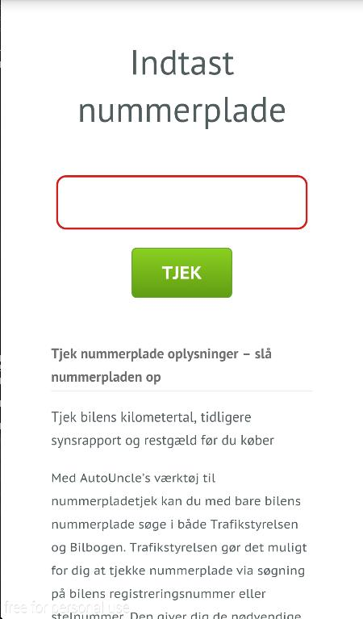 -->

Forespørgsler i Bilbogen skal ske via www.tinglysning.dk.

<a href="https://www.tinglysningsretten.dk/tinglysning/nyvejledninger/Documents/Bilbogen/Foresp%C3%B8rg%20Bilbogen%20(bilbogsattest).pdf" target="_blank">Man kan finde en vejledning i at lave opslag i Den Digitale Bilbog her</a>

---

**Hvad koster det at tinglyse i Bilbogen?**

Det koster som udgangspunkt en grundafgift på 1.660 kr. at tinglyse et dokument i Bilbogen. 

Desuden skal man i nogle tilfælde betale en tillægsafgift. 

Tillægsafgiftens størrelse afhænger af værdien af den rettighed, som man vil have tinglyst.


<a href="https://www.tinglysningsretten.dk/tinglysning/faq/bilbogen/Pages/default.aspx?FAQCategory=Generelt" target="_blank">Spørgsmål og svar om Bilbogen inden for generelle områder som f.eks. fuldmagter og prøvetinglysning finder du i deres respektive kategorier. 

Denne kategori indeholder spørgsmål og svar, der udelukkende vedrører Bilbogen</a>


---

## <font color="red">Om personbogen<sup> Premium </font></sup>  

Ægtepagter bliver registreret i Personbogen. 

I Personbogen bliver det også registreret, hvis en person kun kan råde over sin formue i begrænset omfang.

I Personbogen kan kreditorer også registrere rettigheder over andet løsøre end biler.

Notartestamenter bliver registreret i Centralregisteret for Testamenter. 
 
Hvilke rettigheder kan blive tinglyst i Personbogen?

---

**Ægtepagter**:

I et ægteskab er der som udgangspunkt fælleseje, mens almindelige pensionsordninger ikke skal deles. 

Aftaler om helt eller delvist at ændre fællesejet til særeje skal ægtefællerne skrive i en ægtepagt. 
 
Ægtepagter er kun gyldige, hvis de er tinglyst. 

Begge ægtefæller kan bede om, at en ægtepagt bliver tinglyst.
 
Afgørelser om bosondring eller om, at en ægtefælle bliver frataget retten til at disponere over sin formue, skal tinglyses.

---

**Værgemål mv.**

Afgørelse om værgemål med fratagelse af handlekraft for umyndige voksne bliver tinglyst.

---
 
**Pant i løsøre**

---

**Rettigheder over løsøre, pantebreve, ejerpantebreve eller skadesløsbreve tinglyses i Personbogen**.

---

**Fritidsfartøjer** på op til 20 bruttotonnage registreres i Personbogen. 

Fritidsfartøjer over 20 bruttotonnage og erhvervsfartøjer over 5 bruttotonnage registreres i Skibsregistret.


---

**Virksomhedspant**

Skadesløsbreve eller ejerpantebreve med pant i en virksomheds aktiver og fremtidige erhvervelser.

---


**Høstpant**, er pant i en landbrugsejendoms afgrøder, stiftet af en ejer eller bruger af ejendommen. 

Høstpant tjener til sikkerhed for gæld, der er opstået i forbindelse med indkøb af såsæd, læggekartofler, frø, kunstgødning, ukrudtsmidler o.l.

Pantebreve, der giver pant i årets høst, bliver tinglyst i Personbogen. 

Der sker automatisk notering på den faste ejendom, hvis den ejes af debitor.

---

**Hvordan får man en rettighed tinglyst i Personbogen?**

Anmeldelser til Personbogen foregår digitalt på hjemmesiden www.tinglysning.dk.

Tinglysningsretten kan ikke rådgive dig om, hvordan du får en rettighed tinglyst. 

Hvis du er i tvivl om, hvordan du får en rettighed tinglyst, bør du søge professionel rådgivning, f.eks. hos en advokat.

Forespørgsler i Personbogen skal ske via www.tinglysning.dk. <a href="https://www.tinglysningsretten.dk/tinglysning/nyvejledninger/Pages/default.aspx?RootFolder=/tinglysning/nyvejledninger/Documents/Andelsboligbogen&FolderCTID=&View={795E6871-897C-428B-BED7-CC5437B07F4B}" target="_blank">Find vejledning i at forespørge her</a>  

---

**Hvad koster det at tinglyse i Personbogen?**

Det koster som udgangspunkt en grundafgift på 1.660 kr. at tinglyse et dokument i Personbogen. 

I nogle tilfælde skal man også betale en tillægsafgift. 

Tillægsafgiftens størrelse afhænger af værdien af den rettighed, som man ønsker at få tinglyst. 

I nogle tilfælde bliver en rettighed kun noteret. Der sker i disse tilfælde ikke tinglysning, og man skal derfor ikke betale tinglysningsafgift.

Spørgsmål og svar om Personbogen inden for generelle områder som f.eks. fuldmagter og prøvetinglysning finder du i deres respektive kategorier. <a href="https://www.tinglysningsretten.dk/tinglysning/faq/person/Pages/default.aspx" target="_blank">Denne kategori indeholder spørgsmål og svar, der udelukkende vedrører Personbogen.</a>  

---

## <font color="red">Digitalisering af pantebrev<sup> Premium </font></sup>  

I forbindelse med digital tinglysning kan det være nødvendigt at konvertere et eksisterende pantebrev til et digitalt pantebrev.

Det er som udgangspunkt kun nødvendigt at digitalisere, hvis der skal tinglyses en påtegning på dokumentet. 

Der er ingen 5-års frist for konvertering af pantebreve. 

Alle pantebreve (også ejerpantebreve) bevarer deres gyldighed, indtil de aflyses på helt sædvanlig vis - uanset om det er om 10, 20 eller 30 år.

Rettigheder i pantebreve er dog kun beskyttet i 5 år fra 8. september 2009, medmindre pantebrevet inden da er konverteret, og der er registreret underpant på pantebrevet. 

Dette kan f.eks. betyde, at en underpantsætning af et pantebrev kan blive fortrængt af en ny underpantsætning, hvis pantebrevet ikke er konverteret inden 5 år.

Som udgangspunkt skal man kunne forevise pantebrevet for at konvertere det.

Det betyder, at man skal sende det originale pantebrev – inklusiv eventuelle påtegnede utinglyste transporter og oplysning om eventuelle underpanthavere – til Tinglysningsretten og bede om at få pantebrevet konverteret. 

Man skal begrunde anmodningen – for eksempel med, at det sker i forbindelse med en påtegning.

Som autoriseret anmelder (læs om anmelderordning her) med mere end debitorrettigheder kan man også selv foretage konverteringen ved at bruge dokumenttypen ”Digitaliser Pantebrev”, der er afgiftsfri, eller konvertere i forbindelse med, at man alligevel anmelder en påtegning på et dokument. Her indsætter man en erklæringstekst.  

Dette koster kun den afgift påtegningen alligevel udløser.

Visse pantedokumenter kan konverteres, uden at man foreviser pantebrevet (f.eks. servitutter og skøder tinglyst pantstiftende). 

I den situation kræves der en erklæring fra kreditor, fra debitor (eventuelt flere debitorer, hvis pantet er tinglyst på flere ejendomme) og fra eventuelt tinglyste implicitte fuldmagtshavere.

**Erklæringen skal indeholde**:

bekræftelse på, at pantebrevet begæres konverteret til digitalt pantebrev, og at det ikke er overdraget til anden kreditor kreditors identitet - inkl. cpr- eller cvr-nr orientering om, hvorvidt pantet var håndpantsat (og skal være underpantsat) plus cpr- eller cvr-nr. for denne eller disse rettighedshavere.

For vedtægter til en ejerforening, der er lyst pantstiftende for under 45.000 kr. vil det i de fleste tilfælde være tilstrækkeligt, at der foreligger ovennævnte erklæring fra kreditor.

Tinglysningsretten tager konkret stilling, når vi har modtaget anmodningen om konvertering sammen med de relevante erklæringer.

Anmodningen samt de relevante erklæringer skal fremsendes per brev til Tinglysningsretten. 

---

OBS!

**Ejendomsret**

Det bliver registreret i Tingbogen, hvem der ejer en fast ejendom. Der er ikke lovkrav om tinglysning af en ejendomsret. 

Men det er en god idé at få ejendomsretten tinglyst:

*	da man ellers kan få sin ret fortrængt af andre rettigheder, da dokumentet kan blive væk

*	da salg, pantsætning og anden disposition over ejendommen som udgangspunkt kun kan ske, når man har tinglyst ejendomsretten.

Tinglysningsloven og tinglysningsbekendtgørelsen indeholder regler om, hvilke oplysninger dokumentet skal indeholde.

Man skal anmelde dokumentet på www.tinglysning.dk.

---

## <font color="red">Hvad er servitutter?<sup> Premium </font></sup>  

Servitutter er forskellige begrænsede rettigheder over fast ejendom, for eksempel færdselsret, jagtret, aftægtsret og forkøbsret tinglyses som servitut.

Servitutter kan opdeles i privatretlige rettigheder og offentligretlige rettigheder. 

Privatretlige rettigheder er, når privatpersoner har tinglyst en ret over ejendommen. 

Offentligretlige rettigheder er, når det er en myndighed, der har fået tinglyst en ret over ejendommen. 

Det kan for eksempel være i form af en fredning af bygninger på ejendommen. 

Disse rettigheder kan være gældende uden tinglysning. 

Grunden til, at myndighederne alligevel vælger at få dem tinglyst, er, at tinglysning har en stor informationsværdi for borgerne.

Efter digitaliseringen den 8. september 2009 bliver lokalplaner og byplanvedtægter ikke længere tinglyst. 

De gældende lokalplaner og byplanvedtægter er indberettet til Plandata.dk

 

Plandata.dk er et landsdækkende digitalt system, der stiller planerne til rådighed over internettet klik herunder:

<a href="https://planinfo.erhvervsstyrelsen.dk/plandatadk/" target="_blank">

</a>
 
--- 

En aftale mellem ejeren af ejendommen og andre kan blive tinglyst. hvis den stifter (forandrer eller ophæver) en ret over ejendommen, som forpligter ejendommen ud over den pågældende ejers ejertid. 

For eksempel vil en aftale, som medfører, at andre skal have del i et provenu ved ejerens salg af ejendommen, ikke kunne blive tinglyst som en servitut. 
 
Der skal for de fleste dokumenters vedkommende være angivet en eller flere påtaleberettigede i dokumentet. 

Det er den påtaleberettigede, der skal godkende ændringer, rykninger, eller aflysning.

---

## <font color="red">Tingsrettens historie<sup> Premium </font></sup>  


Tinglysningen er samlet under Tinglysningsretten i Hobro, og al tinglysning foregår nu digitalt.<a href="https://www.tinglysningsretten.dk/om/Pages/default.aspx" target="_blank">Tinglysningens historie går langt tilbage, læs mere her</a>
 
---

## <font color="red">Love og bekendtgørelser om tinglysning<sup> Premium </font></sup>  

Hovedloven: Lovbekendtgørelse nr. 1075 af 30. september 2014 om tinglysning
<a href="https://www.tinglysningsretten.dk/hvad/lovgrundlag/Pages/default.aspx" target="_blank">Links til love, bekendtgørelser og cirkulærer om tinglysning.</a>


Retsinformation.dk indeholder alene de officielle sammenskrivninger i form af lovbekendtgørelser og datasammenskrivninger, der udarbejdes af ministerierne.

Som bruger af Retsinformation.dk skal man derfor være opmærksom på, eventuelle ændringer til den lov, der søges. Ændringer vil fremgå til højre på den pågældende side.


<a href="https://www.retsinformation.dk/Forms/R0710.aspx?id=17282" target="_blank">1. Bekendtgørelse af lov om stempelafgift</a>

<a href="https://www.retsinformation.dk/Forms/R0710.aspx?id=126094" target="_blank">2. Bekendtgørelse om adgang til tinglysningssystemet og om tinglysningsmåden</a>

<a href="https://www.retsinformation.dk/Forms/R0710.aspx?id=136901" target="_blank">3. Bekendtgørelse om afgift af tinglysning og registrering af ejer- og panterettigheder m.v.</a>

<a href="https://www.retsinformation.dk/Forms/R0710.aspx?id=48178" target="_blank">4. Bekendtgørelse om dokumentation og indberetningspligt ved tinglysning af dokumenter vedrørende fast ejendom for selskaber m.fl.</a>

<a href="https://www.retsinformation.dk/Forms/R0710.aspx?id=146023" target="_blank">5. Bekendtgørelse om dokumentation og tinglysning mv. af dokumenter vedrørende landbrugsejendomme</a>

<a href="https://www.retsinformation.dk/Forms/R0710.aspx?id=127178" target="_blank">6. Bekendtgørelse om tekniske krav og forskrifter for tinglysningssystemet</a>

<a href="https://www.retsinformation.dk/Forms/R0710.aspx?id=136166" target="_blank">7. Bekendtgørelse om tinglysning i Andelsboligbogen</a>


<a href="https://www.retsinformation.dk/Forms/R0710.aspx?id=133831" target="_blank">8. Bekendtgørelse om tinglysning i Bilbogen</a>


<a href="https://www.retsinformation.dk/Forms/R0710.aspx?id=136162" target="_blank">9. Bekendtgørelse om tinglysning i Personbogen</a>

<a href="https://www.retsinformation.dk/Forms/r0710.aspx?id=127168" target="_blank">10. Bekendtgørelse om tinglysning i tingbogen (fast ejendom)</a>


<a href="https://www.retsinformation.dk/Forms/R0710.aspx?id=2370" target="_blank">11. Lov om ændring af lov om tinglysning og forskellige andre love (Digital tinglysning)</a>


<a href="https://www.retsinformation.dk/Forms/R0710.aspx?id=17127" target="_blank">12. Tinglysningsafgiftsloven</a>  


<a href="https://www.retsinformation.dk/Forms/R0710.aspx?id=142900" target="_blank">13. Tinglysningsloven</a>  

---


<!--chapter:end:19.Rmd-->

# Tingsretlige konflikter

```{r, echo=FALSE, results='asis'}
cat(readLines('np.html'))
```

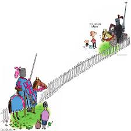

## Parter og de forskellige rettighedskonflikter


**Tingsretlige begreber**

**Aftaleerhverver** har indgået en aftale om overdragelse af aktivet fx salg eller pantsætning, se fx gældsbrevslovens kap. 2 om fortabelse af indsigelser og rettigheder til fordel for en godtroende omsætningserhverver. 

Hvis man i god tro køber et negotiabelt dokument eller får pant i det og får dokumentet i sin besiddelse, kan man fx gøre gældskravet gældende, selvom overdrageren havde stjålet dokumentet, eller skyldneren havde betalt før tiden. 

Som aftaleerhverver anses også gavemodtager, men ikke arvinger. 

Også en køber på tvangsauktion må anses som aftaleerhverver.

---


**Retsforfølgende kreditor** tvinger sit krav igennem uden aftale fx ved et udlæg.

Den aftale eller retsforfølgning, der skal kunne fortrænge en utinglyst ret, skal selv være tinglyst, og aftaleerhververen skal være i god tro, hvorimod en retsforfølgende kreditor ikke behøver at være i god tro.

---

**Arv** – her er en arving hverken at betragte som en aftaleerhverver eller som en retsforfølgende kreditor.

---

**Lovbestemt pant** er fx SKATs førsteprioritet til ejendomsskat, som ikke skal tinglyses, jf. TL § 4: 

”De på fast ejendom hvilende skatter og afgifter til stat og kommune samt forsikringsbidrag til de af staten anerkendte brandforsikringsselskaber har gyldighed mod enhver uden tinglysning”. 

Under skatter og afgifter falder ikke blot alm. ejendomsskatter, men også skatter og afgifter, der kun hviler på særlige grupper af ejendomme, jf. fx. udtrykkeligt miljøbeskyttelseslovens § 48, stk. 6, om gebyrer til affaldsordninger. 

Afgifter til andre offentlige myndigheder end stat og kommune er ikke omfattet af TL § 4.

---

**Video: Forstå tinglysning på 45 sekunder**


<div class="video-container"><iframe src="https://www.youtube.com/embed/6Spl32wXXco" width="853" height="480" frameborder="0" allowfullscreen="allowfullscreen"></iframe></div>


---

```{r ,echo=FALSE,fig.height=2, result=TRUE,fig.cap=("Dobbeltoverdragelse")}


nodes <- data.frame(id = 1:3, 
                    shape = c("box"), 
                    label = c(" A "," B "," C "),
                    font.size = c(25,25,25))
edges <- data.frame(from = c(1,1), to = c(2,3),arrows = c("to"),length = rep(40,2))

visNetwork(nodes, fig.width=4,edges,  width = "100%") %>% 
  visInteraction(dragNodes = TRUE, 
                 dragView = TRUE, 
                 zoomView = FALSE) %>%
  visNodes(color = list(background = "white", 
                        border = "white",
                        highlight = "yellow"),
           shadow = list(enabled = TRUE, size = 30))  %>%
  visHierarchicalLayout(direction = "LR",levelSeparation = 300) %>%
visEdges(color = list(color = "lightgrey", highlight = "yellow") )
  # visLayout(randomSeed = 24) # to have always the same network

```


**Dobbeltoverdragelse** – når samme rettighedshaver disponerer over samme ret mere end én gang, dvs., at overdrageren uberettiget har overdraget rettigheden aktivet til flere erhververe.

---


**Kædeoverdragelse** – når rettigheden over aktivet først overdrages fra A til B, hvorefter B overdrager dette aktiv videre til C


 
--- 

## Hvem der har ret til det pågældende aktiv i tilfælde af en rettighedskonflikt?

**Følgende skal afklares, før rettighedskonflikten kan finde sin juridiske løsning:**

* Aktivtypen

* Rettighedstypen

* Sikringsakten

* Type af rettighedskonflikt

---

### Dobbeltoverdragelse


```{r ,echo=FALSE,fig.height=2, result=TRUE,fig.cap=("Dobbeltoverdragelse")}


nodes <- data.frame(id = 1:3, 
                    shape = c("box"), 
                    label = c(" A "," B "," C "),
                    font.size = c(25,25,25))
edges <- data.frame(from = c(1,1), to = c(2,3),arrows = c("to"),length = rep(40,2))

visNetwork(nodes, fig.width=4,edges,  width = "100%") %>% 
  visInteraction(dragNodes = TRUE, 
                 dragView = TRUE, 
                 zoomView = FALSE) %>%
  visNodes(color = list(background = "white", 
                        border = "white",
                        highlight = "yellow"),
           shadow = list(enabled = TRUE, size = 30))  %>%
  visHierarchicalLayout(direction = "LR",levelSeparation = 300) %>%
visEdges(color = list(color = "lightgrey", highlight = "yellow") )
  # visLayout(randomSeed = 24) # to have always the same network

```

Hvis en rettighedshaver (A) disponerer mere end en gang over den samme rettighed, er der således en rettighedskonflikt mellem de to erhververe af samme aktiv (B og C)
(se fig.)


---

*	**HR:** Først i tid bedst i ret – B fik en rettighed over aktivet før C gjorde, og derfor har B som udgangspunkt en bedre ret

**U:** C kan fortrænge B’s ret, hvis:
  
B ikke har foretaget den nødvendige sikringsakt

C har selv foretaget sin sikringsakt

Er C aftaleerhverver, skal C være i god tro om B’s ret på det tidspunkt han foretager sikringsakten.

---

**Eksempel:** I tilfælde af at en fordring bliver overdraget flere gange, er den erhverver, der først meddeler fordringsskyldneren om overdragelsen af fordringen, sikret retten til fordringen. 

Det er under forudsætning af, at han var i god tro om, at der ikke var andre rettighedshavere ved underretningen til fordringsskyldneren, jf. GBL § 31, stk. 2. 

Dette gælder, selvom han først fik overdraget fordringen efter, at en anden havde erhvervet fordringen.

Ved overdragelse af simple gældsbreve eller simple fordringer får erhververen ikke bedre ret end overdrageren, hverken over for gældsbrevets eller fordringens skyldner eller over for en tidligere indehaver af fordringen, jf. GBL § 27. 

En overdragelse kan derfor ikke føre til, at skyldneren mister sine indsigelser. 

De indsigelser, skyldneren havde mod overdrageren, kan han også gøre gældende mod erhververen, selv om erhververen var i god tro. 

Det gælder også, når der er foretaget udlæg i fordringen, jf. GBL § 27. 

Man taler også om **”dobbeltsuccession”**, når to eller flere erhververe afleder modstridende rettigheder fra samme person. 

I forholdet mellem fx en køber og en sælger giver dobbeltsalgssituationen anledning til et krav om erstatning for **vanhjemmel** (af oldn. vanr 'manglende' og heimild 'berettigelse', egl. 'som hører til ens hjem, retmæssig ejendom'), dvs. sælgers manglende ret til at råde over salgsgenstanden. 


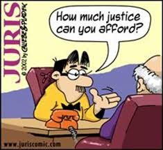

---


**Nogle aktivtyper behandles efter særlige juridiske regler**:


---

#### Fast ejendom

Rettighedskonflikten mellem B og C skal løses efter lovbestemmelsen i TL § 1, stk. 2: 

”Den aftale eller retsforfølgning, der skal kunne fortrænge en utinglyst ret, skal selv være tinglyst og erhververen ifølge aftalen være i god tro”.  

**HR:** Først i tid bedst i ret – B har indgået aftalen med A først og har derfor først fået rettigheden over ejendommen

**U:** C kan fortrænge B's rettighed hvis:  
  
B ikke har fået tinglyst sin rettighed  
C har fået tinglyst sin rettighed.

---

Hvis C er aftaleerhverver skal C være i god tro om B’s rettighed på tidspunktet for anmeldelse til tinglysning, jf. TL § 5: 
  
”Ved god tro forstås i denne lov, at erhververen ikke kender den utinglyste ret og ej heller ved grov uagtsomhed er skyld i sit ukendskab til den. God tro må være tilstede på det tidspunkt, da aftalen anmeldes til tinglysning”.  

---

Det særlige godtroskrav gælder således ved ekstinktion (udslettelse) af rettigheder over både fast ejendom, ejerpantebreve, tinglyste negotiable pantebreve, motorkøretøjer, andele i andelsboligforeninger, virksomhedspant, fordringspant og løsøre^[Afsnittet bygger bl.a. på **Peter Mortensen** Karnovkommentar til tinglysningsloven med yderligere litteraturhenvisninger.].  

---

*Ond tro* hos erhververens fuldmægtig udelukker også ekstinktion. 

Det er antaget, at det er groft uagtsomt ikke at undersøge tingbogen. 

Omvendt kan *god tro* styrkes gennem tingbogens oplysninger. 

Det er næppe groft uagtsomt ikke at efterse matrikelkort eller andet kortmateriale:

**U 1965 542/2 Ø**. Er der faktisk vist kortmateriale, der kan indicere eksistensen af f.eks. en vejret, er det groft uagtsomt ikke at foretage nærmere undersøgelse.  


**U 1948 130 H** (hjulspor tillige set i marken).

---

Konflikten mellem indehaveren af en utinglyst ret og en erhverver af ejendommen vil undertiden kunne ses ikke som et spørgsmål om erhververens gode eller onde tro, men som et spørgsmål om, hvorvidt erhververen overhovedet har fået tilsagt en ret, der strider mod den utinglyste ret:

**U 1991 27 H** (137 m² af en byejendom på 674 m² var uden matrikulering blevet fraskilt ved hegn. En senere erhverver af ejendommen fandtes alene at have erhvervet ret til det besigtigede areal, ikke til hele det matrikulerede areal).

---

*God tro* bedømmes i dansk ret i almindelighed efter forholdene på aftalens tidspunkt. 

Efter tinglysningsloven skal god tro derimod normalt foreligge ved anmeldelsen (klokkeslættet) til tinglysning, jf. nærmere TL § 14, stk. 1.

 

---

#### Udlæg i fast ejendom
 
Hvis skyldner ejer fast ejendom, kan der på fogedretsmødet foretages udlæg i denne. 

Udlægget tinglyses og får den retsvirkning, at skyldner ikke kan råde over ejendommen uden udlægshavers samtykke.

I realiteten betyder det, at skyldner ikke har mulighed for at sælge eller belåne ejendommen, og det kan selvsagt have stor betydning for skyldner og på den måde være et incitament til at betale kreditors tilgodehavende.

---

Som udlægshaver i en ejendom, har man også mulighed for at begære ejendommen solgt på tvangsauktion. 

Dette kræver dog en såkaldt *retlig interesse*. 

Det betyder, at der skal være rimelig mulighed for, at den udlægshaver, der begærer ejendommen på tvangsauktion opnår dækning. 

Herudover kan udlægshaver blive pålagt at stille sikkerhed for, at foranstående pant- og udlægshavere opnår dækning på tvangsauktionen.

En udlægshaver, der ingen udsigt har til at opnå dækning på en tvangsauktion, kan altså ikke eller kun med stor risiko benytte dennes udlæg til at tvangsrealisere ejendommen. 

---

#### Bilen


 
Konflikten om dobbeltoverdragelsen af en bil mellem B og C skal løses afhængig af, om parterne er køber, panthaver/ har ejendomsforbehold efter kreditaftalelovens § 34, stk. 1 eller er udlægshaver.


```{r ,echo=FALSE,fig.height=2, result=TRUE,fig.cap=("Dobbeltoverdragelse")}


nodes <- data.frame(id = 1:3, 
                    shape = c("box"), 
                    label = c(" A "," B "," C "),
                    font.size = c(25,25,25))
edges <- data.frame(from = c(1,1), to = c(2,3),arrows = c("to"),length = rep(40,2))

visNetwork(nodes, fig.width=4,edges,  width = "100%") %>% 
  visInteraction(dragNodes = TRUE, 
                 dragView = TRUE, 
                 zoomView = FALSE) %>%
  visNodes(color = list(background = "white", 
                        border = "white",
                        highlight = "yellow"),
           shadow = list(enabled = TRUE, size = 30))  %>%
  visHierarchicalLayout(direction = "LR",levelSeparation = 300) %>%
visEdges(color = list(color = "lightgrey", highlight = "yellow") )
  # visLayout(randomSeed = 24) # to have always the same network

```


**C kan fortrænge B’s rettighed over bilen:**
  
* Som køber, hvis C får udleveret bilen først i god tro 
 
*	Som panthaver eller indehaver af ejendomsforbehold, jf. kreditaftalelovens § 34, stk. 1, hvis C først har tinglyst rettigheden i *Bilbogen* i god tro om B’s ret, jf. TL § 5 
 
*	Som udlægshaver, hvis C først har tinglyst rettigheden i Bilbogen

---

Se dom om forbrugers tab på godt 145.000 kr. ved bilforhandlers 
dobbeltsalg skulle dækkes:  
 
Østre Landsret har den 13. juni 2012 afsagt dom i en ankesag mellem køberen af en bil og bilforhandleren. Bilkøberen havde ved slutseddel af 29. september 2009 hos forhandleren købt en bestemt fabriksny bil for 297.289 kr. til levering den 5. oktober 2009. Bilen havde forinden været markedsført som et "skarpt lagertilbud", hvor det var angivet, at bilen var nedsat fra en tidligere gældende listepris på 442.900 kr. til 297.289 kr., således at man sparede 145.611 kr. Et par dage efter slutsedlens underskrift meddelte forhandleren køberen, at bilen forud for slutsedlens underskrift var solgt, således at handlen ikke kunne gennemføres. Baggrunden herfor var, at bilen via bilimportøren var solgt til Sverige. Forhandleren kunne ikke skaffe en tilsvarende bil af samme fabrikat.
Køberen anlagde sag mod bilforhandleren med påstand om, at forhandleren skulle betale erstatning med 145.611 kr. Byretten tog køberens påstand til følge. Bilforhandleren ankede dommen og anførte, at bilen ikke var mere værd end den aftalte pris, som var markedsprisen. Køberen havde som følge heraf ikke lidt et tab.
Østre Landsret stadfæstede byrettens dom, idet landsretten blandt andet henviste til, at bilen var udbudt som et "skarpt lagertilbud" med en prisnedsættelse på 145.611 kr., og at der på tidspunktet, hvor bilkøberen skulle foretage køb af en anden bil af tilsvarende type som følge af forhandlerens dobbeltsalg, ikke var mulighed for at købe med en tilsvarende prisreduktion. Landsretten fandt, at køberens tab kunne opgøres til prisreduktionen, således at forhandleren skulle betale 145.611 kr. til køberen.
Sagen blev behandlet i Østre Landsrets 4. afdeling under j.nr. B-1947-11.

---

#### Udlæg i skyldners aktiver vedrørende køretøjer
 
Hvis skyldner ikke betaler, hvad der skyldes, kan man som kreditor få fogedrettens hjælp til at inddrive tilgodehavendet.

Udlæg i køretøjer tinglyses ligeledes. 

Som ved fast ejendom, er det forholdsvist enkelt, inden fogedretsmødet, at gøre sig bekendt med, hvorvidt skyldner er indehaver af et køretøj.

Hvis der er friværdi i køretøjet, og køretøjet har en vis værdi, kan et sådant udlæg være en god og forholdsvis hurtig mulighed for, at kreditor kan få dækning for sit tilgodehavende.

Når udlægget er foretaget i fogedretten, kan køretøjet med fogedens hjælp afhentes og dernæst bortsælges på tvangsauktion. 

Provenuet fra dette salg tilfalder pant- og udlægshavere i prioritetsrækkefølgen fra tingbogen.
 

---

**Video: Mødet i fogedretten**

<div class="video-container"><iframe src="https://www.youtube.com/embed/ozjrbeuLrTU" width="853" height="480" frameborder="0" allowfullscreen="allowfullscreen"></iframe></div>

---

**Video: Gode råd om gæld i fogedretten**

<div class="video-container"><iframe src="https://www.youtube.com/embed/th9E-UvXijE" width="853" height="480" frameborder="0" allowfullscreen="allowfullscreen"></iframe></div>


---

**Video: Fogedretten og tvangsfuldbyrdelse**

<div class="video-container"><iframe src="https://www.youtube.com/embed/GyL1vMMADkQ" width="853" height="480" frameborder="0" allowfullscreen="allowfullscreen"></iframe></div>


---

 
#### Løsøre

**HR:** Først i tid bedst i ret

**U:** Pant skal tinglyses for at være beskyttet mod senere rettigheder, jf. TL § 47. § 47 gælder ikke for underpant i biler mv., som er reguleret i TL kap. 6 a.
  
Udlæg i løsøre er beskyttet uden tinglysning. Dvs. også løsøre kan være genstand for udlæg i fogedretten. 
  
I modsætning til udlæg i fast ejendom og køretøjer, så tinglyses sådanne udlæg ikke, og udlæggene bortfalder automatisk efter et år, hvis der ikke inden da er iværksat tvangsauktion.
  
+	Særskilte rettigheder over løsøre skal tinglyses før det kommer ind i virksomheden, hvis der også er givet flydende pant i virksomhedens aktiver.
  
+	Køber af aktiver, som er omfattet af flydende pant, kan fortrænge panthavers ret, hvis han er i god tro om panthavers ret.
  
+	Udlæg fortrænger virksomhedspant, hvis udlægshaver har sendt meddelelse til panthaver inden tre dage.
 
* Konflikter mellem rettigheder over fast ejendom (tilbehør) i forhold til rettigheder over løsøre:

* Særskilte rettigheder over løsøre, skal aftales før løsøret kommer ind på ejendommen og sikringsakten skal foretages med det samme.

---

* TL § 37 fortrinsret over virksomhedspant. Aktiver, der er omfattet af en panteret i medfør af TL § 37, kan ikke omfattes af et virksomhedspant, uanset om panteretten i den faste ejendom er tinglyst før eller efter virksomhedspantet, jf. nærmere TL § 47 c, stk. 4, nr. 1.

* TL § 38 afskærer inden for sit anvendelsesområde adgangen til at opretholde særskilte rettigheder over bestanddele og tilbehør til den faste ejendom, det være sig i form af ejendomsforbehold, løsøreunderpant, leasing eller på anden måde.

---

#### Udlæg i skyldners løsøre
 
Hvis skyldner ikke betaler, hvad der skyldes, kan man som kreditor få fogedrettens hjælp til at inddrive tilgodehavendet.

Også løsøre kan være genstand for udlæg i fogedretten. 

I modsætning til udlæg i fast ejendom og køretøjer, så tinglyses sådanne udlæg ikke, og udlæggene bortfalder automatisk efter et år, hvis der ikke inden da er iværksat tvangsauktion.

Det er dog værd at bemærke, at tvangssalg af løsøre uden den store værdi, ofte ikke står mål med de omkostninger, der er forbundet hermed.


---

**Video: Hvordan sender man et betalingspåkrav til fogedretten:**

<div class="video-container"><iframe src="https://www.youtube.com/embed/2h39KNIjA3Y" width="853" height="480" frameborder="0" allowfullscreen="allowfullscreen"></iframe></div>
<br>

**Video: Unge og gæld:**

<div class="video-container"><iframe src="https://www.youtube.com/embed/kJWmIWzhHKk" width="853" height="480" frameborder="0" allowfullscreen="allowfullscreen"></iframe></div>


---

 
#### Dobbeltoverdragelser af fondsaktiver


 
**Fondsaktiv:** ”Dematerialiseret omsætteligt værdipapir, der er registreret i en værdipapircentral (CSD)”, jf. kapitalmarkedslovens § 3, nr. 34. 

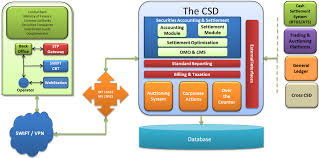


Dvs. et papir, som ikke foreligger i fysisk form, men er registreret elektronisk i den danske Værdipapircentral eller anden værdipapircentral. 

Alle børsnoterede aktier og obligationer mv. skal registreres på denne måde og foreligger således som fondsaktiver. 

Begrebet må ikke forveksles med fondsaktier eller fondsanparter.

Et fondsaktiv anses som registreret i en CSD (Central securities depository), både når den pågældende CSD opererer som issuer-CSD og forestår den første registrering af et fondsaktiv, og når CSD’en agerer som investor-CSD og foretager en teknisk registrering i sine systemer af et papir, der er udstedt af en anden CSD.
 
Om den tingsretlige regulering af dobbeltoverdragelser mv., af fondsaktivet (børsnoterede værdipapirer) se nærmere om reguleringen af registreringssystemet i kapitalmarkedslovens § 184:

* Rettigheder over fondsaktiver skal registreres i en værdipapircentral (CSD) for at opnå beskyttelse mod aftaler, der indgås om fondsaktiverne, og retsforfølgning, jf. kapitalmarkedslovens § 184, stk. 1. 

* En aftale eller retsforfølgning, der skal kunne fortrænge en ikkeregistreret ret, skal selv være registreret, og erhververen ifølge aftalen skal være i god tro ved anmeldelsen af rettigheden til det kontoførende institut, jf. kapitalmarkedslovens § 184, stk. 2.

* Registreringens retsvirkninger regnes fra tidspunktet for endelig registrering i værdipapircentralen (CSD'en), jf. kapitalmarkedslovens § 184, stk. 3. 

* Et kontoførende institut skal straks indrapportere modtagne anmeldelser til registrering i en værdipapircentral (CSD), jf. kapitalmarkedslovens § 184, stk. 5. 

Denne forpligtelse for det kontoførende institutter skal medvirke til at sikre, at retsvirkningen af en anmeldelse indtræder hurtigst muligt.  

Sikringsakten ved overdragelse af fondsaktiver til eje såvel som til sikkerhed og ved kreditorforfølgning er således registrering i en CSD^[Afsnittet bygger på **Lars Hedegaard Kristensen** og **Henrik Kure** Karnovkommentar til kapitalmarkedslovens § 184.].  

Kapitalmarkedslovens § 184, stk. 1 svarer til TL § 1, stk. 1. 

Registreringen beskytter rettigheder mod at blive fortrængt (sikringsaktens værnende funktion). pant i fondsaktiver, at registreringskravet nok er en nødvendig, men ikke en tilstrækkelig, sikringsakt, idet registreringskravet (uanset at dette ikke fremgår direkte af bestemmelsen) suppleres af det sædvanlige krav om rådighedsberøvelse – og i tilfælde af, at det tillades pantsætter at udtage fondsaktiver af depotet, at der føres kontrol med, at der ikke udtages mere end det aftalte.  

Netop ved pant i fondsaktiver gælder et skærpet krav om rådighedsherøvelse, idet blot en kortvarig adgang for pantsætter sætter ham eller hende i stand til at tømme kontoen helt ved på sekunder fra sin netbank at sælge værdipapirbeholdningen i markedet henholdsvis foretage en kontooverførsel, hvorefter den i registreringen liggende offentliggørelse alene består i en mulighed for f.eks. kurator i pantsætters konkursbo at konstatere, at depotet allerede er tømt (og at pantet er borte).  

---

Kapitalmarkedslovens § 184, stk. 2 svarer til TL § 1, stk. 2, og vedrører sikringsaktens eksstinktive funktion (muligheden for at fortrænge uregistrede rettigheder).  

Kapitalmarkedslovens indeholder ikke en særlig definition af, hvad der skal forstås ved god tro, hvorfor dette afgøres i overensstemmelse med dansk rets almindelige regler.  

Herefter er det et krav, at en aftaleerhverver ved anmeldelsen til det kontoførende institut hverken kendte eller burde kende den uregistrerede ret. 

Dermed medfører også simpel uagtsomhed hos en aftaleerhverver om en tidligere uregistreret ret, at han anses at være i ond tro.  

Som følge af den særlige måde, hvorpå fondsaktiver normalt omsættes har en aftaleerhverver som udgangspunkt ingen undersøgelsespligt, medmindre konkrete forhold giver anledning til en sådan.

I overensstemmelse med dansk rets almindelige regler, er det ikke et krav, at retsforfølgende kreditorer (f.eks. kontohaverens udlægshaver eller konkursbo) skal være i god tro for at kunne eksstingvere.  

CSD’en fastsætter tidspunkter, hvor retsvirkningen indtræder for registrering af transaktioner med fondsaktiver, der indgår i en efterfølgende nettoafviklingsblok, transaktioner med fondsaktiver, der straksafvikles i en bruttoafvikling, og for tilskrivningen af renter, udbytte og andre af udstederen af de pågældende fondsaktiver foranledigede registreringer.  

Registreringens retsvirkninger regnes fra tidspunktet for endelig registrering i CSD’en, jf. kapitalmarkedslovens § 184, stk. 3.  

Registrering på en konto i en CSD gennemføres, når indrapportering og endelig prøvelse i den pågældende CSD er afsluttet.  

CSD’en skal undersøge, om anmelderen er berettiget til at anmelde rettigheder over fondsaktiver på en konto, om de angivne fondsaktiver er til stede på kontoen, og om der er registreret andre rettigheder, som er i konflikt med det anmeldte.  

Der bemærkes, at der herved ikke er tale om en materiel prøvelse af det anmeldte, men alene en prøvelse med udgangspunkt i de forhold, som er registreret vedrørende kontoen.  

CSD’en fastsætter tidspunkter, hvor retsvirkningen indtræder for registrering af transaktioner med fondsaktiver, der indgår i en efterfølgende nettoafviklingsblok, transaktioner med fondsaktiver, der straksafvikles i en bruttoafvikling, og for tilskrivningen af renter, udbytte og andre af udstederen af de pågældende fondsaktiver foranledigede registreringer.

---

Oversigtsresume af reguleringen af dobbeltoverdragelser af fondsaktiver: 

Konflikten mellem B og C skal således løses efter kapitalmarkedslovens § 184:

**HR:** Først i tid bedst i ret – B har indgået aftalen med A først eller har først fået foretaget udlæg og har derfor først fået rettigheden over fondsaktivet

*U**: C kan fortrænge B’s ret hvis:
  
+ B ikke har registreret sin ret i CSD (Central securities depository)
+ C har registreret sin ret i CSD
+ Hvis C er aftaleerhverver skal C være i god tro om B’s ret på tidspunktet for registrering i CSD.


---
  
### Kædeoverdragelser  

* Hvis B overdrager en rettighed over et aktiv til C.  

* A havde oprindeligt rettigheden over aktivet og har en indsigelse mod B's ret.  

* Nu er konflikten om rettigheden mellem A og C.    

--- 

**HR:** Kan A gøre indsigelsen gældende overfor B, kan samme indsigelse gøres gældende overfor C

+	**U**: C kan fortrænge A's ret, hvis:

+	C er aftaleerhverver
+	A har ikke foretaget sikringsakt fx tinglyst indsigelsen
+	C er i god tro om indsigelsen
+	C har selv foretaget sikringsakt
+	A's indsigelse er ikke en stærk ugyldighedsgrund

*	Nogle aktivtyper behandles efter særlige regler

---
 
#### Kædeoverdragelser ved fast ejendom

* Rettighedskonflikten mellem A og C løses efter lovbestemmelsen i TL § 27, stk. 1. C kan fortrænge A's ret over den faste ejendom, hvis: 

* Aftalen mellem A og B er tinglyst

* C er aftaleerhverver

* C har tinglyst sin ret

* C er i god tro om A’s rettighed på tidspunktet for anmeldelse til tinglysning

* A's indsigelse ikke er en stærk ugyldighedsgrund, jf. nærmere TL § 27, stk. 2

* Hvis C mister sin rettighed til ejendommen efter TL § 27, stk. 2, kan han eller hun søge erstatning af staten, jf. TL § 31. 

Denne bestemmelse giver en godtroende erhverver ret til erstatning af statskassen, navnlig hvis erhververen bliver mødt af en stærk indsigelse om, at dokumentet er falsk, forfalsket, at det er fremkaldt retsstridigt ved personlig vold eller trussel om øjeblikkelig anvendelse af vold, eller en indsigelse om, at udstederen af dokumentet var umyndig jf. TL § 27, 2. pkt. I stedet for at opnå retten, opnår erhververen således erstatning.

---
 
#### Kædeoverdragelse af en bil

**HR:** Rettighedskonflikten mellem A og C over bilen løses som udgangspunkt til A's fordel. A's indsigelse mod B kan også gøres gældende over for C

+ **U1**: Hvis A har været uforsigtig eller meget passiv over for B, kan C fortrænge A's ret over bilen

+ **U2:** Hvis A har gyldigt ejendomsforbehold i bilen, jf. kreditaftalelovens § 34, stk. 1, men ikke tinglyst det, vil C fortrænge A's ejendomsforbehold over bilen.

...
 
#### Kædeoverdragelse af løsøre

**HR:** Rettighedskonflikten over et løsøre mellem A og C løses som udgangspunkt til A's fordel. A's indsigelse mod B kan også gøres gældende over for C

+ **U1**: Hvis A har været uforsigtig eller meget passiv over for B, kan C fortrænge A's ret over løsøret.    

Et gyldigt ejendomsforbehold i et løsøre, jf. kreditaftalelovens § 34, stk. 1 skal som udgangspunkt respekteres af senere rettighedshavere – selvom det ikke er tinglyst.

---
 
#### Kædeoverdragelser af fondsaktiver på kapitalmarkedet


 

Kædeoverdragelser er reguleret af kapitalmarkedslovens § 186:

”Når registreringen af en aftale om rettigheder over fondsaktiver er endeligt gennemført i en værdipapircentral (CSD), kan en godtroende erhverver ifølge registreret aftale ikke mødes med nogen indsigelse mod gyldigheden af aftalen. Den indsigelse, at et dokument er falsk eller forfalsket, at dets udstedelse retsstridigt er fremkaldt ved personlig vold eller ved trussel om øjeblikkelig anvendelse af sådan, eller at udstederen var umyndig ved udstedelsen, bevares over for en godtroende erhverver ifølge registreret aftale”. *^[Afsnittet bygger på **Lars Hedegaard Kristensen** og **Henrik Kure** Karnovkommentar til kapitalmarkedslovens § 186.]

Bestemmelsen i kapitalmarkedslovens § 186 er inspireret af TL § 27. 

Lovbestemmelsen i § 186 viderefører § 69 i værdipapirhandelsloven med visse præciseringer og ændringer omkring bevarelse af indsigelser.

Kun godtroende aftaleerhververe kan ekstingvere indsigelser, hvorimod reglen ikke kan påberåbes af retsforfølgende kreditorer.

Reglen kan således påberåbes af en panthaver og en erhverver af ejendomsret, men f.eks. ikke af en udlægshaver eller et konkursbo.

Når der er sket endelig registrering, indtræder beskyttelsen mod eksstinktion af indsigelser vedrørende gyldigheden af en aftale om rettigheder over registrerede fondsaktiver, jf. dog de stærke indsigelser i kapitalmarkedslovens § 186, 2. pkt.

Der er ikke blot tale om afskærelse af indsigelser mod gyldigheden af tidligere registrerede aftaler, men bestemmelsen yder tillige den godtroende erhverver beskyttelse mod indsigelser vedrørende hans egen aftale.

Bestemmelsen gælder derimod ikke udstederens indsigelser. 

Dog omfattes det tilfælde, at et fondsaktiv er transporteret til den oprindelige udsteder, der på ny overdrager det ved aftale, der er ramt af en af de nævnte stærke indsigelser.

Det følger af bestemmelsens 2. pkt., at de nævnte stærke ugyldighedsgrunde kan gøres gældende, også over for en aftaleerhverver, som har fået sin aftale registreret i god tro.

Det bemærkes herved, at kapitalmarkedsloven ikke indeholder en regel svarende til den tidligere værdipapirhandelslovs § 80, stk. 2, som pålagde Værdipapircentralen en objektiv erstatningspligt for den, der ramtes af de nævnte stærke indsigelser.

Om erstatningsansvar hedder det i afsnit 3.17.4 i lovforslaget til kapitalmarkedsloven, at der for såvel de tilsluttede kontoførende institutter som CSD'en gælder et almindeligt culpaansvar. 

Der gælder ikke som efter den tidligere værdipapircentrallov nogen regel om objektivt ansvar, når en materielt berettiget mister sin mulighed for at håndhæve stærke indsigelser eller for den erhverver, som kan mødes med sådanne indsigelser.

---
 
**Oversigt**:  

* Rettighedskonflikten mellem A og C løses således efter kapitalmarkedslovens § 186.

C kan fortrænge A's ret over fondsaktivet, hvis:

* Aftalen mellem A og B over fondsaktivet er registreret i CSD
* C er aftaleerhverver
* C har registreret sin ret over fondsaktivet i CSD
* C er i god tro om A's ret på tidspunktet for registrering i CSD
* A's indsigelse ikke er en stærk indsigelse (falsk, umyndig, voldelig tvang)

---


<!--chapter:end:20.Rmd-->

# Handel med fast ejendom

```{r, echo=FALSE, results='asis'}
cat(readLines('np.html'))
```


***Som studerende skal du være særlig opmærksom på følgende problemstillinger ved gennemgangen af handel med fast ejendom til brug for løsning af eksamensopgaverne***:


•	**Købsaftalens indgåelse (aftalelovens § 1-7 og de særlige regler i lov om forbrugerbeskyttelse ved erhvervelse af fast ejendom kapitel**
  
•	**Fortrydelsesretten på 6 hverdage og betaling af en godtgørelse på 1% af den nominelle købesum. Ejendommen skal tilbageleveres i "samme stand og mængde" for at kunne fortryde ejendomskøbet**

• **Mangler ved fast ejendom**
  
•	**Advokat – og finansieringsforbehold**

•	**Ejendomsmæglerens erstatningsansvar**


---

## Lovgivning og aktører

Lovgivning til regulering af køb af fast ejendom:

* Aftaleloven, købeloven og markedsføringsloven

* Lov om formidling af fast ejendom, jf. Lov nr. 526 af 28. maj 2014 
	om formidling af fast ejendom m.v. (LOFE)
	
* Lov om forbrugerbeskyttelse ved erhvervelse af fast ejendom, jf. Lovbekendtgørelse nr. 1123 af 22. september 2015 om forbrugerbeskyttelse ved erhvervelse af fast ejendom mv. (LFFE)


**Aktører og funktoner ved hushandlen:**

* En sælger af huset
* En køber af huset
* En ejendomsmægler som formidler salg af huset
* En advokat som berigter huskøbet og tinglyser
* En bank som finansierer
* Et realrekitinstitut som finansierer
* En bygningssagkyndig som udarbejder tilstandsrapporten
* En elinstallatør som udarbejder elinstallationsrapporten
* Et forsikringsselskab som tegner en ejerskifteforsikring for køberen
 
--- 
 
**Video: Gode råd om køb af bolig A-Z**

<div class="video-container"><iframe src="https://www.youtube.com/embed/N-0EyS75yrg" width="853" height="480" frameborder="0" allowfullscreen="allowfullscreen"></iframe></div>

---

**Video: Webinar: Nykredit giver gode råd om boligkøb**

<div class="video-container"><iframe src="https://www.youtube.com/embed/QvUETHDp7do" width="853" height="480" frameborder="0" allowfullscreen="allowfullscreen"></iframe></div>

---


## Gennemgang af en ejendomshandel

**(Afsnittet læses kun i hovedtræk, da det bliver mere detaljeret gennemgået under brancheretningsfaget for ejendomsmæglere)**


* Gennemgang af en typisk handel – køb af privat bolig med hjælp fra ejendomsmægler og advokat

* Alle aktørerne har forskellige roller og skal koordinere indsatsen, før bolighandlen er på plads

* Det kan være afgørende at tingene sker i den rigtige rækkefølge, på det rigtige tidspunkt

* Køberen har en fortrydelsesret på 6 hverdage og koster 1 pct. af den nominelle købesum

---


### Formidlingsaftalen


 
En aftale om formidlingsopdraget skal være skriftlig. LOFE § 29, stk. 1, har videreført princippet i den tidligere omsætningslovs § 10 om, at formidlingsopdraget skal være skriftligt.^[Følgende afsnit om formidlingsaftalen bygger på **Sonny Kristoffersen**: Ejendomsmægleren og ejendomsvirksomheden i et juridisk perspektiv, 2018, Hans Reitzels Forlag. Som kan anbefales for dig, der vælger ejendomsmæglerbranchen]. 


LOFE har dog indført færre formkrav til formidlingsaftalen. 

Kravet om parternes underskrift skal bl.a. sikre, at der er fuldstændig enighed om de vilkår, som fremgår af aftalen, inklusive situationer, hvor sælgeren f.eks. har anført tillægstekst i hånden.  
  
Der stilles også krav om, at vederlagets størrelse eller beregningsprincipperne herfor skal fremgå af aftalen. 

Hvis vederlagets størrelse ikke er et fast beløb, skal der i stedet angives beregningsprincipperne herfor.  

Ved beregningsprincipper forstås grundlaget for beregningen af vederlaget, således at det er muligt for forbrugeren selv at beregne den endelige pris. 

Det kan f.eks. være i form af en vis procentdel af selve købesummen eller, hvis der er aftalt vederlag efter regning, en prisliste over de tilbudte og aftalte ydelser.  
 
Som en konsekvens af LOFE § 28 om ansvarlig ejendomsmægler for hvert formidlingsopdrag skal det fremgå af formidlingsaftalen, hvem der er ansvarlig ejendomsmægler for sagen. 

---

Og som en konsekvens af lovens § 31 om maksimal længde for en aftaleperiode, når der er aftalt resultatafhængigt vederlag, og der skal betales vederlag ved opsigelse, stilles der efter LOFE § 29, stk. 2 krav om, at formidlingsaftalen skal indeholde en angivelse af aftaleperiodens længde.  

---

Ejendomsmægleren fortaber ifølge loven ikke automatisk retten til vederlag, hvis aftalen ikke er i overensstemmelse med LOFE § 29, stk. 1 og 2. 

Dette var ellers tilfældet i den tidligere omsætningslovs § 10, stk. 3.  

Konsekvensen af LOFE § 29’s bestemmelser er, at hvis en aftale ikke opfylder lovens krav, vil det skulle bedømmes ud fra en fortolkning af de almindelige aftaleretlige regler, hvad konsekvenserne heraf bør være. 

Dette er i tråd med, hvad der er gældende i Norge, hvor der ligeledes er formkrav til formidlingsaftalen, men hvor manglende overholdelse af formkrav ikke i sig selv medfører vederlagsfortabelse eller ugyldighed.  

I tilfælde, hvor ejendomsmægleren ikke har anført et vederlag, henvises til LOFE § 32, stk. 1, og bemærkningerne nedenfor.  

Tvister omkring størrelsen af ejendomsmæglernes vederlag eller retten hertil henhører under Klagenævnet for Ejendomsformidling og domstolene.  

LOFE § 29, stk. 3, er en videreførelse af den tidligere omsætningslovs § 12, stk. 2, hvorefter både sælger og ejendomsmægler har mulighed for at opsige aftalen uden varsel. 

Der er intet formkrav til bestemmelsen, men hvis sælgeren har opsagt aftalen, vil det ofte være hensigtsmæssigt for ejendomsmægleren at bekræfte opsigelsen skriftligt. 

Dermed undgås situationer, hvor der kan opstå et bevismæssigt problem om, hvem der har opsagt aftalen, hvilket kan være relevant ved aftaler med resultatafhængigt vederlag, jf. LOFE § 33, stk. 2. 

Lovens bestemmelser om mulighed for vederlag ved opsigelse følger af LOFE § 33, se nærmere nedenfor.  

Sælgers ret til at kunne opsige aftalen uden varsel kan ikke begrænses ved aftale, jf. LOFE § 2, stk. 2. 

Dette medfører blandt andet, at ejendomsmægleren ikke i forbindelse med vederlagsaftaler efter regning kan betinge sig et opsigelsesgebyr, da det vil kunne betragtes som en omgåelse af reglen.  

---

### Ejendomsformidling må ikke betinges af andre ydelser
  
Bestemmelsen i LOFE § 30, stk. 1, er en videreførelse af den tidligere omsætnings lovs § 23, stk. 1, hvor det fastslås, at ejendomsformidling ikke må betinges af, at køber eller sælger aftager andre ydelser end dem, der er nødvendige for formidlingens korrekte udførelse.  

Bestemmelsen er med til at sikre, at der ikke indgås konkurrenceforvridende aftaler. 

Større finansielle koncerner, der f.eks. står i franchisegiverforhold til ejendomsmægleren, hindres herved udtrykkeligt i at stille krav om, at forbrugeren udelukkende aftager ydelser, der udbydes af selskaber inden for samme koncern som franchisegiver.  

Således kan forbrugeren ikke forpligtes til at aftage accessoriske ydelser, som f.eks. bestemte forsikringer. 

Derimod er almindelige ydelser inden for ejendomsformidling, der ikke er obligatoriske, men alligevel ganske hyppigt forekommende og efterspurgte, såsom markedsføringstiltag, herunder annoncering, fremvisninger og eftersagsbehandling, ikke omfattet af bestemmelsens forbud.  

Bestemmelsen hindrer tillige, at en aftale om formidling af sælgers nuværende bolig betinges af, at købet af ny bolig skal foregå gennem ejendomsmægleren eller med ydelser fra ejendomsmæglerens samarbejdspartnere.

---

### Aftaleperioden for en formidlingsaftale må højst være seks måneder 

Bestemmelsen i LOFE § 31 er en delvis videreførelse af den tidligere omsætnings lovs § 12, stk. 1, og lyder, at aftaleperioden for en formidlingsaftale højst må være seks måneder. 

Bestemmelsen i LOFE § 31 er dog modsat den tidligere gældende regel alene begrænset til tilfælde, hvor der er aftalt resultatafhængigt vederlag, og hvor det også er aftalt, at sælger skal betale vederlag ved opsigelse.  

Behovet for, at aftalen udløber efter et givet tidsrum, gælder alene for aftaler med resultatafhængigt vederlag, hvor sælgeren har en forventning om, at hvis der ikke leveres et resultat, skal der ikke betales vederlag. 

Aftaler af sådan karakter begrænses derfor til en periode, der maksimalt må være på seks måneder, og når perioden ophører, kan sælger vælge ikke at gå videre med aftalen uden at skulle betale ejendomsmægleren, heller ikke et opsigelsesgebyr, jf. LOFE § 33, stk. 2.   

Hvis formidlingsaftalen, som sælger har indgået med ejendomsmægleren, ikke er en resultatafhængig aftale, men en aftale om betaling ”efter regning”, følger det modsætningsvis af LOFE § 31, at formidlingsaftalen kan indgås for en periode længere end seks måneder.  

Efter udløbet af aftalen står det således forbrugeren frit at forlade aftalen. Aftalen kan endvidere højst forlænges med tre måneder ad gangen. 

I forbindelse med den oprindelige aftales udløb, kan der således aftales en ny periode på tre måneder, som herefter kan forlænges med tre måneder ad gangen. 

Udgangspunktet må dog være, at forlængelser tidligst kan aftales umiddelbart op til tidspunktet for aftalens udløb, da forlængelsen ellers ville blive en omgåelse af hovedreglen, idet forbrugeren de facto ville have indgået en aftale på f.eks. ni måneders varighed. 

Forlængelser kan også indgås inden for rimelig tid efter, at aftalen er udløbet. Hvis der er forløbet længere tid, vil der være tale om indgåelse af en ny formidlingsaftale.  

Hvis aftalen fortsætter på de oprindeligt aftalte vilkår, og det eneste, der aftales, omhandler selve forlængelsen af aftaleperioden, stilles der ingen formkrav til forlængelsen. 

Ejendomsmægleren bærer bevisbyrden for, at der reelt er sket en forlængelse eller fornyelse af aftaleperioden. 

Forbrugeren kan således tilkendegive sin tiltrædelse af forlængelsen mundtligt, skriftligt, via sms, e-mail eller på anden måde. 

Den mundtlige tilkendegivelse vil dog kunne indebære bevismæssige problemer for ejendomsmægleren, der i tvivlstilfælde skal løfte bevisbyrden for, at der rent faktisk er indgået en aftale om forlængelse.  

Hvis aftaleperioden udløber, har ejendomsmægleren dog stadig ret til vederlag, hvis der efterfølgende indgås en købsaftale på baggrund af mæglerens indsats, jf. nærmere herom i LOFE § 32, stk. 2.  

---

**Oversigt over processen ved gennemførelse af hushandlen**:


* Formidlingsaftalen indgås mellem sælgeren og ejendomsmægleren

* Formidlingsaftalen skal indeholde betingelser om salgspris, annoncering og mæglers salær

*	Formidlingsaftalen skal overholde reglerne i LOFE § 29 og formidlingsbekendtgørelsen § 2 og 3

*	Formidlingsaftalen kan højst løbe i 6 måneder og kan herefter forlænges 3 måneder ad gangen, hvis vederlag er afhængig af resultatet, LOFE § 31

---

 
### Vederlag

Ejendomsmæglerens vederlag reguleres af LOFE §§ 32-34. 

I den tidligere omsætningslovs §§ 10-12 fremgik det, at ejendomsmæglerens vederlag var begrænset til tre former, nemlig resultatafhængigt vederlag, jf. den tidligere omsætningslovs § 11, vederlag efter regning, jf. den tidligere  omsætningslovs § 10, eller en kombination heraf.^[Følgende afsnit om vederlaget bygger på *Sonny Kristoffersen*: Ejendomsmægleren og ejendomsvirksomheden i et juridisk perspektiv, 2018, Hans Reitzels Forlag.]. 

Med loven har lovgiver ophævet de tidligere begrænsninger af vederlagsformerne, som til dels har eksisteret siden den tidligere omsætningslovs ikrafttræden i 1994. 

Som følge heraf vil der i lovens bestemmelser om vederlag reguleres så lidt, som det findes nødvendigt omkring ejendomsmæglerens vederlag, da udgangspunktet er aftalefrihed.  
	
LOFE § 32, stk. 1, bestemmer, at ejendomsmægleren har ret til det vederlag, som er aftalt med sælger. 

Bestemmelsen skal ses i sammenhæng med formkravet i LOFE § 29, stk. 1, nr. 2, til formidlingsaftalen, hvorefter vederlagets størrelse eller principperne for beregningen heraf skal være anført.  
	
Som anført ovenfor i bemærkningerne til LOFE § 29, stk. 2, fortaber ejendomsmægleren ikke retten til vederlag alene på grund af manglende overholdelse af formkravene til aftalen.   

Formålet med formkravet til oplysning om vederlagets størrelse eller beregningsprincipperne herfor i LOFE § 29, stk. 1, nr. 2, er, at ejendomsmægleren dermed får et incitament til at anføre vederlaget samt vilkårene herfor allerede ved selve aftalens indgåelse, idet en manglende overholdelse af pligten vil kunne være medvirkende til nedsættelse af vederlaget, jf. LOFE § 34.  

Bestemmelsens krav i LOFE § 32, stk. 1, om, at vederlaget skal være aftalt med sælger, skal forstås i overensstemmelse med de almindelige aftaleretlige principper om aftalers indgåelse. 

Det er formålet med bestemmelsen, at ejendomsmægleren som minimum kan dokumentere, at sælger og ejendomsmægler forud for underskrift af købsaftale har været i dialog om vederlagets størrelse eller beregningsprincipperne herfor. 

Ellers vil ejendomsmægleren ikke være berettiget til at modtage vederlag.

Det er væsentligt for en sælger at kunne træffe en beslutning om salg af ejendommen på et oplyst grundlag. 

Her vil størrelsen på vederlaget til ejendomsmægleren også spille en rolle. 

Det forhold, at der har været en dialog med sælger om vederlagets størrelse eller beregningsprincipperne herfor, medfører, at når sælgeren aktivt vælger at underskrive en købsaftale om salg af sin ejendom, så skal sælgeren svare ejendomsmægleren vederlag herfor. 

Sælgers aktive tilvalg af enten at sætte et salgsformidlingsarbejde i gang eller underskrive en købsaftale er således med til at understrege, at der f.eks. på baggrund af forudgående drøftelser om vederlagets størrelse er indgået en aftale mellem ejendomsmægleren og sælger om et vederlag.  
	
Hvorvidt vederlaget med rimelighed kan siges at fremstå så tydeligt og klart for sælgeren, at det er aftalt, skal bedømmes efter aftalelovens almindelige reger – herunder aftalelovens kapitel IV, som omhandler særlige regler om forbrugeraftaler. 

Også den såkaldte koncipistregel, jf. aftalelovens § 38 b, vil være med til at sikre, at eventuelle uklarheder om vederlaget eller størrelsen herpå vil være til ulempe for ejendomsmægleren. 

Ifølge koncipistreglen skal den part, der har affattet (konciperet) de ord, der skaber tvetydighed om fortolkningen, også bære risikoen for denne tvetydighed. 

Når der er tale om forbrugeraftaler, bestemmer aftalelovens § 38 b, stk. 1, desuden, at hvis der opstår tvivl om betydningen af et aftalevilkår, som ikke har været genstand for individuel forhandling, gælder den fortolkning, som er mest gunstig for forbrugeren. 

Fortolkningsreglen skal anvendes, når det efter inddragelse af alle fortolkningsmomenter er tvivlsomt, hvordan et aftale-vilkår skal forstås.  
	
Urimelige aftalevilkår binder ikke forbrugeren, og aftalen skal forblive bindende på i øvrigt samme vilkår, hvis den kan opretholdes uden de urimelige vilkår, jf. aftalelovens §§ 38 c og 36.  

LOFE § 32, stk. 2, bestemmer, at ejendomsmæglerens ret til vederlag ikke begrænses til tilfælde, hvor en handel kommer i stand i aftaleperioden, men at ejendomsmægleren også har ret til vederlag, når en handel gennemføres efter udløbet af aftaleperioden, men på grundlag af ejendomsmæglerens indsats. 

Bestemmelsen dækker både den situation, hvor en sælger og en køber venter med at indgå en købsaftale til formidlingsaftalen er ophørt for at spare vederlaget til ejendomsmægleren, men også hvor købsaftale mellem sælger og køber indgås på baggrund af en aftale, som ejendomsmægleren har udarbejdet, men formidlingsaftalen er udløbet.  

I den situation, hvor køber og sælger bevidst holder ejendomsmægleren ude for at spare vederlag, findes LOFE § 32, stk. 1 som udgangspunkt alene relevant i det omfang, det er aftalt mellem sælger og ejendomsmægler, at ejendomsmæglerens vederlag eller en del heraf er resultatafhængigt, og dermed udløses ved indgåelse af en bindende købsaftale. 

I sådanne tilfælde vil en sælger og en køber ellers kunne udnytte ejendomsmæglerens salgsindsats, hvis de blev enige om at vente med at indgå købsaftalen, til formidlingsaftalen var ophørt, enten ved udløb af aftaleperioden eller ved opsigelse.  

---

I andre tilfælde, hvor ejendomsmægleren eksempelvis får ret til vederlag ved levering af ydelser efter regning, og vederlaget således ikke indeholder et resultatafhængigt element, vil det som udgangspunkt følge direkte af formidlingsaftalen, at et salg efter aftaleperiodens ophør ikke vil udløse vederlag til ejendomsmægleren, alene fordi ejendomsmægleren ikke har leveret en ydelse, der udløser ret til vederlag, jf. også bemærkningerne ovenfor til lovens § 31 om sælgers ret til at kunne opsige aftalen uden varsel.  

---

Bestemmelsen i LOFE § 32, stk. 2, finder endvidere anvendelse i den situation, hvor en sælger opsiger formidlingsaftalen umiddelbart efter indgåelse af bindende købsaftale, og hvor der mellem mægler og sælger er aftalt resultatafhængigt vederlag. 

I disse situationer har ejendomsmægleren ret til vederlag, uanset LOFE § 29, stk. 3, jf. LOFE § 33, stk. 2, om mæglers krav på rimeligt vederlag ved sælgers opsigelse af formidlingsaftalen. 

Formidlingsopdraget er i disse situationer ofte ikke afsluttet på dette tidspunkt, men ejendomsmægleren har leveret sin ydelse efter aftalen, nemlig en bindende købsaftale.  

LOFE § 32, stk. 2, vil f.eks. finde anvendelse, hvis ejendomsmægleren har annonceret boligen, haft kontakt og forestået forhandlingerne med køber samt udarbejdet købsaftale.  
	
Bestemmelsen i LOFE § 32, stk. 2, sikrer dog også ejendomsmægleren vederlag i tilfælde, hvor sælger og køber vælger at handle ejendommen uden om ejendomsmægleren, hvis parterne er kommet i kontakt med hinanden på baggrund af ejendomsmæglerens indsats. 

Det vil ofte være i forbindelse med mæglerens annoncering af ejendommen på internettet og evt. i aviser, at købere bliver opmærksomme på en udbudt ejendom, 

Der kan i konkrete tilfælde alene ved ejendomsmæglerens annoncering af boligen være tale om, at købsaftalen indgås på baggrund af ejendomsmæglerens indsats.

Hvorvidt salg efter udløbet af aftaleperioden er omfattet af bestemmelsen i LOFE § 32, stk. 2, må bero på en konkret vurdering. 

Formidlingsaftalens bestemmelser om aftaleperioden, ret til vederlag samt forhold omkring opsigelse vil være af særlig relevans ved en eventuel vurdering.  

Ejendomsmægleren har dog ikke krav på vederlag, hvis en anden ejendomsmægler medvirker efter aftalens ophør. 

Ved en anden ejendomsmægler forstås ikke, at der inden for samme formidlingsvirksomhed har medvirket forskellige ejendomsmæglere, men at der er tale om medvirken af en anden ejendomsmægler fra en anden formidlingsvirksomhed. 

Dette led er indsat for at beskytte den forbruger, som har valgt at indgå en formidlingsaftale med en ejendomsmægler hos én ejendomsformidlingsvirksomhed, og hvor forbrugeren eventuelt lige har haft ejendommen til salg hos en anden ejendomsmægler i en anden ejendomsformidlingsvirksomhed, mod at skulle betale vederlag til mere end en ejendomsmægler. 

Skulle ejendomsmægler nr. 2 have handlet illoyalt i forhold til ejendomsmægler nr. 1, vil denne eventuelt kunne gøre et krav gældende mod nr. 2.  

Det afgørende ved vurderingen af, om en anden ejendomsmægler har medvirket, er, om den anden ejendomsmægler har påtaget sig et formidlingsopdrag for sælger i forhold til den pågældende faste ejendom, og i hvilket omfang mægleren har iværksat eller påbegyndt salgsbestræbelser. 

Det forhold, at køber og sælger henvender sig til en advokat eller en ejendomsmægler og beder denne udføre en afgrænset del af, hvad der normalt indeholdes i et formidlingsopdrag, eksempelvis udfærdigelse af en købsaftale, vil ikke i sig selv være at anse som, at der medvirker en anden ejendomsmægler. 

Det vil dog bero på en konkret vurdering, hvorvidt der er tale om formidling eller ej, jf. LOFE § 1, stk. 1, nr. 1.  

Endvidere har ejendomsmægleren krav på vederlag, hvis ejendomsmægleren sælger ejendommen, selvom formidlingsaftalen er udløbet, såfremt købsaftalen indgås på baggrund af ejendomsmæglerens indsats. 

Der vil som udgangspunkt ikke være tvivl herom i de situationer, hvor ejendomsmægleren efter formidlingsaftalens udløb har fortsat salgsbestræbelserne og har udarbejdet købsaftalen.   

For så vidt angår betingelserne for, hvornår det kan anføres, at der er indgået en købsaftale, skal handlen være gyldig og uden forbehold og betingelser, jf. dog bemærkningerne nedenfor vedr. handel med betinget skøde. 

Foreligger der forbehold eller betingelser, skal disse være fjernet, før retten til vederlag kan udløses. 

Endvidere skal fortrydelsesfristen efter lov om forbrugerbeskyttelse ved erhvervelse af fast ejendom også være udløbet.  

En handel er i almindelighed gennemført, når der er tinglyst anmærkningsfrit endeligt skøde. 

Det forhold, at der er solgt på et betinget skøde, og at betingelsen er, at køber betaler et beløb, f.eks. om et år, fratager imidlertid ikke ejendomsmægleren krav på vederlag. 

Det forhold, at en ellers bindende handel ikke bliver gennemført på grund af købers eller sælgers forhold, f.eks. misligholdelse, fratager heller ikke ejendomsmægleren ret til vederlag. 

Ejendomsmægleren har i disse situationer krav på vederlag i overensstemmelse med det oprindeligt aftalte i formidlingsaftalen, eller hvad der i øvrigt ville kunne dokumenteres at være aftalt med sælger, jf. nærmere LOFE § 32, stk. 1.  

Kravet udløses dog kun ved indgåelse af en bindende købsaftale. Hvis forbrugeren har valgt at lade ejendomsmægleren fortsætte salgsbestræbelserne efter udløbet af formidlingsaftalen, men enten vælger at afstå fra at sælge uanset købstilbuddets størrelse eller at afbryde samarbejdet, kan ejendomsmægleren ikke kræve vederlag for arbejde foretaget efter aftaleperiodens udløb. 

Det er således kun, når ejendomsmægleren rent faktisk leverer den helt centrale ydelse i formidlingen, nemlig en bindende købsaftale, og forbrugeren dermed får den ydelse, som var hele formålet med indgåelsen af aftalen, at det udløser vederlag til ejendomsmægleren. 

---

### Hvornår ejendomsmægleren har krav på vederlag ved opsigelse af formidlingsaftalen 

LOFE § 34, stk. 1, fastslår, at ejendomsmægleren ved forbrugerens eller ejendomsmæglerens opsigelse af formidlingsaftalen alene har krav på vederlag, hvis der er et vilkår herom i formidlings-aftalen.  

Ejendomsmæglerens ret til vederlag ved opsigelse opstår, uanset om det er ejendomsmægleren eller forbrugeren, der opsiger formidlingsaftalen inden for aftaleperioden, så længe det er aftalt i formidlingsaftalen. 

Se dog undtagelsen hertil i lovens § 34, stk. 2, når det gælder resultatafhængigt vederlag. 

Såfremt sælger misligholder aftalen, vil ejendomsmæglerens ret til vederlag i disse situationer skulle vurderes ud fra de almindelige aftaleretlige regler.  

Det er antaget i teorien, men følger også af Erhvervsstyrelsens vejledende udtalelse af 11. september 2009, at hvis der ifølge den tidligere omsætningslov var aftalt vederlag efter regning, så kunne ejendomsmægleren få vederlag for sit erlagte arbejde samt dokumenterede omkostninger til både annoncering og fremskaffelse af dokumenter, uanset om det var ejendomsmægleren eller forbrugeren, der opsagde aftalen. 

Dette princip videreføre LOFE § 34, stk. 1, uændret.  

Da sådanne aftaler fremover kan være fortløbende, findes det også af den grund rimeligt, at parterne har mulighed for at aftale spørgsmål om vederlag i tilfælde af opsigelse.  
	
Hvor formidlingsaftalen opsiges af ejendomsmægleren efter meget kort tid, kan det i forhold til en vurdering af evt. overtrædelse af god ejendomsmæglerskik efter omstændighederne være relevant at vurdere grundlaget for opsigelsen, herunder hvilke ydelser ejendomsmægleren har leveret, og om ydelserne har selvstændig værdi for sælger, jf. hertil også LOFE § 37 om de obligatoriske ydelser. 

Der kan i sådanne tilfælde lægges vægt på, om sælger har modarbejdet ejendomsmæglerens salgsbestræbelser eller der har været samarbejdsvanskeligheder i øvrigt.  

LOFE § 34, stk. 2, har videreført princippet om, at hvis der er aftalt et resultatafhængigt vederlag, har ejendomsmægleren alene krav på vederlag, hvis det er sælgeren, der opsiger aftalen, og hvis det er aftalt i formidlingsaftalen. 

Det findes rimeligt at videreføre denne begrænsning, når der er tale om et resultatafhængigt vederlag, som er direkte afhængig af ejendomsmæglerens præ-station og kun opnås, hvis der opnås et resultat, nemlig salg af boligen.

Ifølge den tidligere omsætningslovs § 12, stk. 3, var det kun, når forbrugeren opsagde aftalen, at ejendomsmægleren havde krav på et rimeligt vederlag, hvis formidlingsaftalen indeholdt vilkår herom. 

Udgangspunktet er, at der skal betales efter regning for det udførte arbejde, samt at prisen skal være rimelig i forhold hertil. 

Lyder regningen på et beløb, som er større end ¼ af det vederlag, der ville være udløst, hvis der var handlet, må ejendomsmægleren i almindelighed nøjes med ¼, der fungerer som en højestepris i denne situation. 

Dette gælder også, selvom regningen står i rimeligt forhold til det udførte arbejde, medmindre der foreligger særlige omstændigheder, som gør dette urimeligt.

I praksis har Klagenævnet for Ejendomsformidling f.eks. fundet, at der foreligger særlige omstændigheder i den situation, hvor ejendomsmægleren rent faktisk har en underskrevet købsaftale fra køber til udbudsprisen, men sælgeren ikke vil underskrive købsaftalen, måske fordi sælgeren har fortrudt at sælge ejendommen. 

I disse situationer har nævnet tilkendt ejendomsmægleren fuldt vederlag, kun undtaget et mindre beløb til eftersagsbehandlingen, som jo ikke skal finde sted. 

Det er med loven ikke intentionen at ændre på denne nævnspraksis, og ejendomsmæglerens ret til rimeligt vederlag i LOFE § 34, stk. 2, vil således i den ovenfor beskrevne situation udløse samme krav på vederlag som tidligere, medmindre andet er aftalt.
	
Desuden fastslås det i LOFE § 34, stk. 2, at vederlaget i disse situationer ikke kan overstige, hvad der er rimeligt i forhold til det udførte arbejde. 

Det vil således være en konkret afvejning af, hvor langt i salgsprocessen ejendomsmægleren er nået, hvor man bl.a. kan lægge vægt på, hvor lang tid ejendommen har været til salg, hvor meget den har været annonceret og udgifterne hertil, hvor mange åbne huse og fremvisninger der har været etc. 

Ejendomsmægleren bør altid kunne dokumentere det vederlag, som sælgeren bliver opkrævet.  

LOFE § 34 gælder også for så vidt angår ejendomsmæglerens ret til vederlag ved opsigelse og vil omfatte den situation, hvor forbrugeren opsiger aftalen med ejendomsmægleren på grund af ejendomsmæglerens ikke ubetydelige pligtforsømmelse.

---

### Ejendomsmæglerens obligatoriske opgaver ved formidling af fast ejendom


LOFE § 37, stk. 1, er en delvis videreførelse af den tidligere omsætningslovs § 17, stk. 1, hvor minimumskravene til ejendomsmæglerens obligatoriske opgaver ved formidling af salg af fast ejendom fremgår.^[Følgende afsnit om ejendomsmæglerens obligatoriske opgaver ved formidling af fast ejendom bygger på **Sonny Kristoffersen**: Ejendomsmægleren og ejendomsvirksomheden i et juridisk perspektiv, 2018, Hans Reitzels Forlag.].  

Efter lovens § 37, stk. 1, har lovgiver nedsat antallet af de obligatoriske opgaver fra fem til fire, således at ejendomsmægleren skal:

1. værdiansætte ejendommen, 

2. beregne salgsprovenu, 

3. udarbejde salgsopstilling samt 

4. udarbejde udkast til købsaftale.

Det vil sige, at ejendomsmægleren ikke længere udarbejder forslag til finansiering samt beregne brutto- og nettoudgift, jf. LOFE § 42.  

LOFE § 37, stk. 1, har til hensigt at bidrage til at skabe klarhed om ejendomsmæglerens rolle set i forhold til de andre professionelle aktørers roller i ejendomshandlen. 

Bestemmelsen sætter fokus på, hvilke opgaver der falder inden for ejendomsmæglerens absolutte kernekompetence.  

Udgangspunktet er endvidere, at færre obligatoriske opgaver kan bidrage til at øge konkurrencen og til, at der udvikles nye koncepter. 

Dermed har LOFE § 37, stk. 1, samtidig til formål at bidrage til øget konkurrence på markedet for formidling af salg af fast ejendom.  

Bestemmelsen er ikke udtømmende. 

---

Der fremgår således også pligter af en række andre bestemmelser i loven, herunder LOFE §§ 24-26 om god ejendomsmæglerskik samt LOFE §§ 36, 39 og 41.  

Ejendomsmæglerens pligt til hhv. at værdiansætte ejendommen, beregne salgsprovenu, udfærdige en salgsopstilling samt udarbejde et udkast til en købsaftale er beskrevet i stk. 1. Kravene til fremgangsmåde, indhold m.v. fremgår af LOFE §§ 37-39 og 46.  

LOFE § 37, stk. 2, er en uændret videreførelse af den tidligere omsætningslovs § 17, stk. 3, 1. pkt. 

Erhvervsstyrelsen har fastsat nærmere regler om formidlingsopdragets indhold og udførelse (formidlingsbekendtgørelsen), jf. her Bekendtgørelse nr. 1230 21. november 2014 om formidling m.v. ved salg af fast ejendom.

...

### Ejendomsmægleren skal i forbindelse med udbud af en ejendom beregne et salgsprovenu til sælgeren ud fra salg til kontantprisen 

Bestemmelsen i LOFE § 38 svarer til den tidligere omsætningslovs § 20, som vedrører ejendomsmæglerens pligt til at udarbejde salgsprovenu til sælger.  

LOFE § 38, stk. 1, bestemmer, at ejendomsmægleren i forbindelse med udbud af en ejendom skal beregne et salgsprovenu til sælgeren ud fra salg til kontantprisen. 

Beregningen skal ske umiddelbart efter formidlingsaftalens indgåelse. Da beregningen ikke er endelig, skal beregningen være i form af et salgsbudget.
	
Som et typisk eksempel på indtægt for sælger ved en handel kan nævnes kontant udbetaling og erlæggelse af købesummen. 

Typiske udgifter kan være udgifter til indfrielse af realkreditlån og private pantebreve, ejerskiftegebyr, prioriteringsomkostninger, ejendomsmæglerens vederlag, herunder udlæg til tredjemand og markedsføringsomkostninger, samt udgift til tilstandsrapport, ejer-skifteforsikring, elinstallationsrapport og energimærke. 

Uanset i hvilken form sælger betales, skal salgsprovenuet beregnes og angives med et kontantbeløb.  

Beregningen af salgsprovenuet skal i øvrigt foretages i henhold til god ejendomsmæglerskik. 

Ejendomsmægleren skal udlevere beregninger af salgsbudgettet og senere salgsprovenuet til sælger.  

LOFE § 38, stk. 2, fastsætter, at hvis der undervejs aftales en ændret udbudspris, skal ejendomsmægleren udarbejde et nyt salgsbudget.

Ændringen medfører også en tilpasning af salgsop-stillingen, som mægleren også skal tilrette i nødvendigt omfang. Således kan sælgeren følge med i og være oplyst om de økonomiske konsekvenser ved en ændret udbudspris.  

LOFE § 38, stk. 3, bestemmer, at ejendomsmægleren ved salg skal udarbejde et salgsprovenu på grundlag af købsaftalens vilkår. 

Der henvises til bemærkningerne ovenfor til LOFE § 38, stk. 1, for så vidt angår de poster, som typisk indgår i provenuberegningen.  

Hvis der mod sædvane f.eks. er tale om en overtagelse af sælgers indestående lån, skal salgsprovenuet således beregnes ud fra denne form.  

Beregningen af salgsprovenuet udleveres til sælger samtidig med sælgers underskrift af købsaftale, da provenuet kan være afgørende for, hvorvidt sælgeren rent faktisk ønsker at acceptere købstilbuddet.  

Den gæld, der eventuelt ligger bag et ejerpantebrev, skadesløsbrev og udlæg, indgår normalt ikke i beregningen, men det skal nævnes i beregningen, at der ikke er taget hensyn dertil. 

Tilsvarende bør der gives særskilt oplysning om eventuel skattepligt af provenuet, som følge af forhold som ejertidens længde, ejendommens størrelse og andre let konstaterbare forhold.

---

### Ejendomsmægleren skal umiddelbart efter formidlingsaftalens indgåelse udarbejde en specificeret salgsopstilling og herunder oplyse om ejerudgifter

Efter den tidligere omsætningslovs § 19, stk. 1, skulle ejendommen udbydes med oplysning om de årlige ejerudgifter. 

Dette princip videreføres i LOFE § 39, stk. 1, som også bestemmer, at ejendomsmægleren umiddelbart efter formidlingsaftalens indgåelse skal udarbejde en specificeret salgsopstilling. 

Salgsopstillingen skal indeholde en udførlig beskrivelse af ejendommen, og herunder altså oplysning om de årlige ejerudgifter.  

Ved den årlige ejerudgift forstås de samlede årlige udgifter forbundet med at eje ejendommen beregnet på grundlag af foreliggende oplysninger om ejendomsskat, ejendomsforsikring, gæld uden for købesummen, som overtages af køber, fællesudgifter m.v. 

Afgrænsningen af udgifterne er fastsat i formidlingsbekendtgørelsens §§ 6 (salgsopstillingen) og 12 (ejerudgiften).  

<div class="Keats">

**Formidlingsbekendtgørelsen**  

**Salgsopstillingen**  

§ 6. Salgsopstillingen skal, ud over kravene i LOFE § 39, stk. 1, indeholde oplysning om følgende:

1. Den skønnede kontantpris (udbudsprisen), jf. LOFE § 41, stk. 1.

2. Den månedlige og årlige ejerudgift som angivet i § 12.

3. Forbrugsafhængige forhold som angivet i §§ 13-16.

4. Seneste ejendoms- og grundværdi i henhold til den offentlige ejendomsvurdering med angivelse af årstal for vurderingen.

5. Grund-, bygnings- og boligareal (BBR-arealer) samt eventuelt fordelingstal, jf. dog § 7 om ejerlejligheder.

6. Ejendommens matrikelnummer, beliggenhed samt nuværende benyttelse.

7. Den hidtidige benyttelse, hvis den afviger væsentligt fra ejendommens nu-værende benyttelse, og dette er relevant.

8. Ejendommens nuværende forsikringsforhold, herunder eventuelle særlige forhold som f.eks., at ejendommen ikke er forsikret mod svamp og insekter.

9. Byrder og gæld, som måtte påhvile ejendommen eller sælger personligt, og som køber skal overtage uden for købesummen, jf. dog § 7, 2. pkt.

10. Større istandsættelsesarbejder der er besluttet på generalforsamling samt evt. oplysning om finansiering heraf.

11.	Ejendommens energimærke, såfremt der påhviler sælgeren pligt til at ud-levere energimærkning til ejendomsmægleren i henhold til lov om fremme af energibesparelser i bygninger.

12.	Særlige eller væsentlige begrænsninger i udnyttelsen af ejendommen i kraft af planbestemmelser (lokalplan m.v.) og servitutter m.v.

13.	Forurening kortlagt på vidensniveau 1 eller vidensniveau 2 eller oplysninger om lettere forurenet jord efter lov om forurenet jord, jf. stk. 3.

14.	At køber skal være opmærksom på, at der vil være udgifter i forbindelse med handlen, herunder eventuelle udgifter til købers egne rådgivere, f.eks. juridiske rådgivere og bygningssagkyndige, udgifter til tinglysning af skøde og pantebreve samt udgifter til finansiering, herunder kurssikring og bankgarantistillelse.

15.	Andre forhold af væsentlig betydning.”
</div>


<div class="Keats">

**Formidlingsbekendtgørelsen ** 

---

**Ejerudgift**  

"§ 12. Ejerudgiften det første år specificeres i salgsopstillingen. Den omfatter den aktuelle ejendomsværdiskat, grundskyld og ejendomsforsikring for den pågældende ejendom. Den omfatter endvidere de aktuelle udgifter som køber er forpligtet til at afholde som ejer af ejendommen, med undtagelse af udgifter til lovpligtige eftersyn af ejendommens forsyningsanlæg, herunder varmeanlæg. Desuden omfatter ejerudgiften ydelserne på eventuel gæld, som overtages af køber uden for købesummen. Fællesudgifter til ejerforening indgår i ejerudgiften efter fradrag af forbrugsafhængige udgifter. 

Stk. 2. I stedet for indregning af og oplysning om den aktuelle forsikringsudgift, jf. stk. 1, kan udgiften til ejendomsforsikring baseres på et konkret tilbud eller på et anslået tilbud baseret på offentlige tilgængelige priser fra et forsikringsselskab. I forbindelse hermed skal det oplyses, om forsikringstilbuddet indeholder forbehold, samt om det dækker svamp-, insekt- og rørskader. 

Stk. 3. Ejendomsværdiskatten angives med normal størrelse uden hensyn til reglerne om nedsat eller begrænset ejendomsværdiskat for særlige persongrupper."

---


### Ejendommen skal udbydes med relevante oplysninger om forbrugsafhængige forhold 

Bestemmelsen i LOFE § 40 fastsætter, at ejendommen også skal udbydes med relevante oplysninger om forbrugsafhængige forhold. 

Disse forbrugsudgifter, som er forbundet med at eje ejendommen, varierer fra ejendom til ejendom og fra bruger til bruger.
	
Ejendomsmægleren skal ikke nødvendigvis basere oplysningerne om forbrugsafhængige forhold på sælgers seneste årsforbrug, hvis der kan etableres et bedre grundlag for opfyldelse af denne oplysningspligt, jf. nærmere formidlingsbekendtgørelsens §§ 13-16 om forbrugsafhængige forhold.  

<div class="Keats">

**Formidlingsbekendtgørelsen**

**Forbrugsafhængige forhold** 

---

"§ 13. I salgsopstillinger for boliger, hvor der skal udarbejdes energimærkning for selve boligenheden, jf. lov om fremme af energibesparelser i bygninger, skal der oplyses om det årlige beregnede varmeforbrug, som fremgår af energimærkningen. Der skal angives følgende oplysninger om det beregnede forbrug:  

1.	udgiften til forbruget 

2.	størrelsen af forbruget angivet i kubikmeter for naturgas, liter for olie m.v.

3.	i hvilket år udgiften er beregne

4.	ejendommens primære varmekilde og evt. supplerende varmekilder, jf. energimærkningen.

Stk. 2. For ejendomme som nævnt i stk. 1, hvis primære varmekilde er en anden end den som er angivet i energimærkningen, skal der i stedet for oplysning i stk. 1, nr. 1 og 2, op-lyses om udgiften til og størrelsen af sælgers seneste års faktiske varmeforbrug. Er det seneste års faktiske varmeforbrug ikke repræsentativt, skal der i stedet oplyses om anslået udgift til og størrelse af forbruget.

Stk. 3. Det skal i forlængelse af oplysningerne efter stk. 1 eller 2 tydeligt fremgå, om oplysningerne vedr. udgift og størrelse af varmeforbruget stammer fra energimærkning, er baseret på sælgers seneste års faktiske varmeforbrug eller er anslået".  

---

"§ 14. I salgsopstillinger for boliger, hvor der ikke skal udarbejdes energimærkning for selve boligenheden, eller hvor der ikke er pligt til at få udarbejdet energimærkning, jf. lov om fremme af energibesparelser i bygninger, skal der oplyses om sælgers seneste års fak-tiske forbrug. Der skal angives følgende oplysninger om det faktiske varmeforbrug:  

1.	udgiften til forbruget
2.	ejendommens primære og evt. supplerende varmekilder  

Stk. 2. Såfremt udgiften m.v. indgår som en integreret del af fællesudgifterne, oplyses ud-giften til varme, jf. stk. 1, nr. 1, beregnet efter fordelingstal eller lignende.

Stk. 3. Er det seneste års faktiske udgifter ikke repræsentativt, eksempelvis hvor en ejendom har stået ubeboet eller er under opførelse, skal der i stedet oplyses om anslået udgift til forbruget.
.  
Stk. 4. Det skal i forlængelse af oplysningerne efter stk. 1 eller 3 tydeligt fremgå, om oplysningerne vedr. udgift og størrelse af varmeforbruget er baseret på sælgers seneste års faktiske varmeforbrug eller er anslået.  

§ 15. I salgsopstillinger for sommerhuse og fritidshuse skal der oplyses om ejendommens primære og evt. supplerende varmekilder.  

§ 16. Det skal i salgsopstillingen oplyses, at der vil være udgifter til energi, vand, evt. lovpligtige eftersyn af forsyningsanlæg, evt. andre forbrugsafhængige forhold samt løbende vedligeholdelse, men at disse udgifter ikke fremgår af salgsopstillingen.

Stk. 2. I det omfang ejendomsmægleren har medtaget de i stk. 1 nævnte udgifter, kan oplysning efter stk. 1 dog udelades fra salgsopstillingen.

**Stk. 3. I salgsopstillinger for sommerhuse og fritidshuse, skal det yderligere oplyses, at udgiften til og størrelsen af ejendommens varmeforbrug ikke fremgår af salgsopstillingen".  

---

Bestemmelsen skal bibringe køber gennemsigtighed og tryghed i forbindelse med søgning af boliger i markedet og i forbindelse med forbrugerens endelige købsbeslutning.

---

### Ejendommen skal udbydes til en skønnet kontantpris 

Ifølge den tidligere omsætningslovs § 4, stk. 1, skulle ejendommen udbydes til kontantprisen. 

Ejendommen kunne dog udbydes med opfordring til at afgive tilbud, men i så fald med en skønnet kontantpris.

Det er nu fastslået i LOFE i § 41, at der alene stilles krav om, at ejendommen skal udbydes til en skønnet kontantpris. 

Præciseringen skyldes, at man med den tidligere omsætningslovs formulering kunne få det indtryk, at ejendommen skulle udbydes til den kontantpris, som ejendomsmægleren havde værdiansat ejendommen til efter den tidligere omsætningslovs § 3. 

Det forholder sig dog i praksis ofte sådan, at den kontantpris, som ejendommen udbydes til, afviger fra den kontantpris, som ejendomsmægleren har vurderet ejendommen til. 

Udbudsprisen signalerer således sælgers ønske til en kontantpris og betragtes aftalemæssigt som en opfordring til køber om at afgive tilbud; et tilbud, som kan være i både opadgående eller nedadgående retning rent prismæssigt.

LOFE § 41, stk. 1, indeholder den grundlæggende regel for kontantprisprincippet, som er defineret i LOFE § 4, nr. 3.  

Bestemmelsen i LOFE § 41, stk. 1, er ikke til hinder for, at der kan sendes et signal om, at der ønskes tilbud på ejendommen, men selv i sådanne situationer skal ejendommen udbydes med en angivet, skønnet kontantpris. 
	
Ejendomsmægleren kan derfor ikke få potentielle købere til at deltage i budgivningen ved at udbyde ejendommen til en urealistisk lav pris. God ejendomsmæglerskik vil også kunne inddrages i denne vurdering.

Med LOFE § 41, stk. 2, fastslås det som en konsekvens af ønsket om at øge købernes opmærksomhed på kontantpris og ejerudgifter, at der ved annoncering og markedsføring af ejendommen skal gives oplysning om ejendommens skønnede kontantpris og årlige ejerudgifter. 

Det er ikke meningen, at ejendomsmægleren i forbindelse med udbuddet skal angive, at der er tale om en ”skønnet” kontantpris, da det forhold netop følger af ovenstående argumentation. 

Kravet om op-lysning om energimærke er bevaret på bekendtgørelsesniveau.  
	
Oplysninger i forbindelse med annoncering og markedsføring skal overholde markedsføringslovens regler. 

Markedsføringslovens §§ 5-6 bestemmer, at en erhvervsdrivendes ikke i sin handelspraksis må anvende urigtige oplysninger eller i kraft af sin fremstillingsform eller på anden måde vildlede eller kunne forventes at vildlede gennemsnitsforbrugeren, uanset om oplysningerne er faktuelt korrekte, og at en erhvervsdrivendes ikke i sin handelspraksis må vildlede ved at udelade eller skjule væsentlige oplysninger eller præsentere væsentlige oplysninger på en uklar, uforståelig, dobbelttydig eller uhensigtsmæssig måde. 

Disse bestemmelser om forbud mod vildledning gælder også inden for fast ejendom. 

Det vurderes, at markedsføringslovens bestemmelser er med til at sikre forbrugerne den fornødne beskyttelse i forbindelse med markedsføring af fast ejendom.

Hverken i Sverige, Norge, Tyskland, Storbritannien eller Holland findes der krav til omfanget af oplysninger ved markedsføring af fast ejendom.

---

### Ejendomsmægleren må ikke udarbejde eller lade udarbejde finansieringsforslag

Som konsekvens af præciseringen af ejendomsmæglerens rolle samt ophævelse af ejendomsmæglerens pligt til at opgive et brutto- og nettobeløb beregnet på baggrund af et standardfinansieringsforslag er det fastsat i LOFE § 42, stk. 1, at der er indført forbud mod, at ejendomsmægleren udarbejder eller lader udarbejde finansieringsforslag for en konkret ejendom, som f.eks. kan inkluderes i annoncering og salgsopstillinger, herunder som et brutto- og nettobeløb.  

Hvis pligten til at opgive et standardiseret brutto- og nettobeløb var blevet fjernet, uden at der samtidig var blevet indført et forbud mod beregning heraf, ville ejendomsmægleren kunne annoncere med et hvilket som helst finansieringsforslag, herunder lån, der har lavest mulige ydelser, f.eks. baseret på variabel rente og afdragsfrihed, til skade for gennemsigtigheden for forbrugerne.

Bestemmelsen i LOFE § 42, stk. 1, er derfor med til at sikre, at der ved annoncering og markedsføring af ejendomme vil være fokus på kontantpris og ejerudgifter. 

Det er herefter op til forbrugerne at søge rådgivning hos en bank eller et realkreditinstitut med henblik på at finde en egnet finansiering af boligkøbet.  
	
Forbuddet gælder ikke den situation, hvor en ejendomsmægler f.eks. via sin hjemmeside henviser til en banks eller realkreditinstituts hjemmesider, hvor en forbruger kan beregne mulige finansieringsforslag på baggrund af konkrete oplysninger om ejendommen.

Forbuddet efter denne bestemmelse samt forbuddet efter LOFE § 42, stk. 2, er heller ikke til hinder for, at ejendomsmægleren indgår samarbejdsaftaler med penge- og realkreditinstitutter med henblik på at henvise forbrugere, både sælger og køber, til disse, jf. også bemærkningerne ovenfor til LOFE § 21, stk. 1. 

Indgås sådanne aftaler, skal ejendomsmæglervirksomheden dog overholde oplysningskravene i LOFE § 21, stk. 2 og 3. Henvisningerne vurderes at være til gavn for konkurrencen på bank- og realkreditinstitutmarkedet.  

Der er i LOFE § 42, stk. 2, forbud mod, at ejendomsmæglere kan formidle finansiering til køb af fast ejendom. 

Der er alene tale om forbud mod formidling af finansiering og ikke mod, at ejendomsmægleren henviser køber til samarbejdende pengeinstitut eller realkreditinstitut, jf. ovenfor.  

Forbuddet er begrundet i at sikre en mere klar rolle for ejendomsmægleren, som ikke skal rådgive køber, heller ikke om finansiering af sit ejendomskøb.

Rådgivning herom bør gives af de rådgivere, som har forstand på alle de finansieringsformer, som i dag tilbydes på det finansielle marked. 

Forbuddet er desuden med til at adskille købers beslutning om køb af ejendom fra købers beslutning om finansiering af ejendommen.  

Desuden er der inden for de seneste år indført skærpede og særlige regler for finansielle virksomheder og rådgivere, herunder banker og realkreditinstitutter, om rådgivning om lån med sikkerhed i fast ejendom, herunder tilbud af visse lån med sikkerhed i fast ejendom.

---

### Ejendomsmægleren er sælgers mand 

Bestemmelsen i LOFE § 26 fastlægger det overordnede princip om, at ingen må være repræsentant for sælger og køber i samme handel, og er en videreførelse af den tidligere omsætningslovs § 15, dog med lovtekniske ændringer^[Følgende afsnit om LOFE § 26 bygger på *Sonny Kristoffersen*: Ejendomsmægleren og ejendomsvirksomheden i et juridisk perspektiv, 2018 Hans Reitzels Forlag].  

LOFE § 26, stk. 1, svarer til den tidligere omsætningslovs § 15, stk. 1, og klargør ejendomsmæglerens rolle som sælgers repræsentant, fordi ingen ejendomsmægler kan varetage købers og sælgers interesser lige godt i den samme ejendomshandel. 

Begge parter kan have brug for at have hver deres rådgiver, som de betaler direkte hver for sig. 

Herved forstås, at ejendomsmægleren ikke må optræde som repræsentant for både sælger og køber.  

Ejendomsmægleren kan fungere som formidler af et salg, men kan også som andre erhvervsdrivende fungere som køberrådgiver, køberrepræsentant eller yde anden bistand til køber.  

Bestemmelsen i LOFE § 26 indebærer ikke, at en ejendomsmægler ikke må medvirke til at afslutte en bindende aftale, selvom køber vælger ikke at have egen rådgiver. 

Bestemmelsen i LOFE § 26 forhindrer derimod, at ejendomsmægleren optræder som rådgiver for køberen, når ejendomsmæglerens opdrag samtidig er at sælge ejendommen.  

Hvor to parter, der begge har givet deres ejendom til formidling hos samme mægler, ønsker at erhverve hinandens ejendomme, må ejendomsmægleren sikre sig, at hver af parterne er orienteret om, at ejendomsmægleren repræsenterer hver part som sælger i hvert af salgene.  

Ejendomsmægleren kan ikke repræsentere nogen af parterne som købere i nogen af salgene, heller ikke selvom mægleren opsiger sin formidlingsaftale med den ene sælger, da mægleren ellers ville kunne udnytte den viden, som mægleren har opnået i løbet af aftaleperioden om denne sælger og denne sælgers ejendom, hvilket synes urimeligt og i øvrigt i strid med god ejendomsmægler-skik.
	
Bestemmelsen i LOFE § 26 er ikke til hinder for, at en part, der ønsker at sælge, sættes i forbindelse med en part, der ønsker at købe, f.eks. via en database.  

Bestemmelsen i LOFE § 26 medfører, at ejendomsmægleren ikke må bistå køber med udførelse af berigtigelsen af ejendomshandlen, uanset om aftale herom først indgås, efter handlen er endelig. 

Den tidligere omsætningslovs § 15, stk. 4, er blevet ophævet, for at fjerne enhver tvivl om ejendomsmæglerens rolle så vidt muligt. 

Loven gør det klart, at mægler er sælgers mand, så købere i højere grad bliver tilskyndet til at skaffe sig professionel rådgivning.  

Ved en berigtigelse forstås, at handlen gennemføres i overensstemmelse med de aftalte vilkår i købsaftalen. 

Da det ikke kan udelukkes, at der efter købsaftalens indgåelse kan opstå situationer, hvor parterne har modsatrettede interesser, og da køberen ikke må misforstå karakteren af en berigtigelse kontra karakteren af reel køberrådgivning, må ejendomsmægleren derfor ikke berigtige handlen på vegne af køber, når ejendomsmægleren har formidlet salget for sælger. 

Køber må således antage en anden rådgiver end ejendomsmægleren til at bistå sig med berigtigelsen.  

LOFE § 26, stk. 2, bestemmer, at det ikke kun er på personniveau, at man ikke kan repræsentere både sælger og køber i samme handel. 

Dette er ikke tidligere fremgået eksplicit af omsætningsloven, men af bemærkningerne til omsætningsloven. 

Nu er det anført direkte i lovteksten, at ingen inden for samme formidlingsvirksomhed, herunder ejere, ansatte eller personer med tilsvarende tilknytning til virksomheden, kan optræde som repræsentant for køber, hvis ejendommen er solgt af en ejendomsmægler inden for samme virksomhed. 
	
Det er ikke ejendomsformidlingsvirksomhedens organisationsform, der er afgørende for, hvornår der foreligger én eller flere repræsentanter. 

En ejendomsformidlingsvirksomhed, som har flere forretningssteder, medfører således ikke, at der foreligger flere repræsentanter i bestemmelsens forstand. 

Til gengæld vil der være flere repræsentanter, hvis en række selvstændige ejendomsmæglere samarbejder i en kæde.
	
Et interessentskab skal anses som én virksomhed, således at én deltager ikke kan være sælgers ejendomsmægler samtidig med, at en anden deltager er købers repræsentant.

LOFE § 26, stk. 3, er en forlængelse af god skik-reglen og er en modificeret udgave af den tidligere omsætningslovs § 15, stk. 2, 3. pkt., idet ejendomsmægleren skal oplyse – og ikke rådgive – køber om mulighed, ikke behov, for at søge egen bistand. 

Sikringen af køberens interesser skal ske ved, at mægleren henviser køberen til at søge egen rådgiver

LOFE § 26, stk. 3’s ordlyd har til hensigt at tydeliggøre, at ejendomsmægleren alene kan rådgive sin opdragsgiver, dvs. sælger, og dermed kun kan oplyse køber.  

Det er med LOFE § 26, stk. 3, ikke længere op til ejendomsmægleren at skulle rådgive køber om nogle forhold, og ejendomsmæglerens rolle vil alene være at oplyse køber om alle de relevante forhold omkring ejendommen.  

Købers vurderinger og beslutninger skal herefter træffes af køber selv, eventuelt med hjælp fra en rådgiver. 

Hvorvidt køber ønsker at benytte sig af rådgiver(e), er helt op til køber selv at beslutte.  

Sikringen af købers interesser sker ved, at ejendomsmægleren henviser køber til at søge egen rådgiver. 

Ejendomsmægleren skal ikke kun oplyse køber om muligheden for at søge juridisk rådgivning, men også rådgivning af byggeteknisk karakter samt af økonomisk og finansiel karakter.  


---

### Værdiansættelsen 

Det fremgår af LOFE § 27, stk. 1, at ejendomsmægleren skal angive, hvilken kontantpris ejendommen skønnes at kunne sælges til inden for et givet tidsrum. 

Bestemmelsen svarer til den tidligere omsætningslovs § 3^[Følgende afsnit om LOFE § 27 bygger på **Sonny Kristoffersen**: Ejendomsmægleren og ejendomsvirksomheden i et juridisk perspektiv, 2018 Hans Reitzels Forlag].  

Den værdiansættelse, som reguleres i bestemmelsen, er den, der sker i forbindelse med salg af fast ejendom, dvs. den værdiansættelse, som er direkte relateret til omsætningssituationen, uanset om der er indgået en formidlingsaftale. 
	
Bestemmelsen i LOFE § 27 gælder også for de værdiansættelser, som en ejendomsmægler foretager forud for eventuel indgåelse af en formidlingsaftale. 

Udenfor falder værdiansættelser af fast ejendom i andre situationer, f.eks. værdiansættelser, der foretages med henblik på skifteopgørelser og opgørelser ved dannelse af selskaber (apportindskud).  
	
Ved værdiansættelsen skal ejendomsmægleren tage hensyn til markedsforholdene, de fysiske omstændigheder omkring ejendommen samt andre relevante forhold. 


Ejendomsmægleren kan ikke tage et generelt forbehold for eventuelle synlige mangler. Sådanne fejl og mangler vil typisk fremgå af en byggeteknisk gennemgang, bl.a. en tilstandsrapport, el-installationsrapport eller lignende.  

Det må som udgangspunkt antages at være i strid med god ejendomsmæglerskik, hvis ikke ejendomsmægleren i forbindelse med værdiansættelse foretager en fysisk besigtigelse af ejendommen, jf. kendelse (103-2009) fra Disciplinærnævnet for Ejendomsmæglere afsagt i 2011. 

LOFE § 27, stk. 2, pålægger ejendomsmægleren at rådgive sælgeren om behov og mulighed for en byggeteknisk gennemgang i forbindelse med værdiansættelsen, herunder muligheden for at benytte sig af huseftersynsordningen. 


Dette indebærer, at der generelt skal være orienteret om risikoen for skjulte fejl og mangler samt reglerne om mangelsansvar og om mulighederne for at imødegå risikoen ved en byggeteknisk gennemgang og forsikringstegning. 

Tillige skal der være rådgivet om de juridiske konsekvenser af, at der ikke foreligger en rapport fra en byggeteknisk gennemgang. 

Efter indførelsen af huseftersynsordningen vil ejendomsmægleren ofte tage forbehold for en byggeteknisk gennemgang ved sin værdiansættelse af ejendommen.  

Ejendomsmæglerens pligt som formidler til at rådgive sælger om byggeteknisk gennemgang, huseftersynsordningen m.v. og til at oplyse køber om rapporten fra en byggeteknisk gennemgang samt muligheden for at tegne ejerskifteforsikring fremgår af LOFE §§ 44-45. 

Hvis sælgeren er utilfreds med ejendomsmæglerens værdiansættelse, så kan sælgeren ikke klage til Klagenævnet for Ejendomsformidling, men må anlægge sag ved domstolene.


---

**Video: Ejerskifteforsikring – hvorfor- og hvordan**

<div class="video-container"><iframe src="https://www.youtube.com/embed/rCSppX53zWU" width="853" height="480" frameborder="0" allowfullscreen="allowfullscreen"></iframe></div>

---


**Oversigt over processen i en ejendomshandel:**  

Når der er indgået formidlingsaftale med sælgeren skal ejendomsmægleren:

* Varetage sælgers interesser og rådgive sælger, herunder i LOFE § 37

*	Værdiansætte ejendommen og fastsætte prisen, jf. LOFE §§ 27 og 41

*	Udarbejde et finansieringsforslag

*	Beregne sælgerens provenu, jf. LOFE § 38

*	Udarbejde salgsopstilling og udkast til købsaftale jf. LOFE §§ 39 og 46 

*	Fravigelser fra standarden skal fremhæves over for køberen

*	Der indsættes ofte et advokat og/eller et finansieringsforbehold

* Købsaftalen gennemses af køberens advokat

*	Salgsmaterialet er en opfordring til at køberen afgiver tilbud

*	Give køberen alle de relevante oplysninger for ejendomshandlen

*	Ejendomsmægler må ikke rådgive både sælger og køber, men er udelukket sælgerens mand, jf. LOFE § 26

*	Køberen skal oplyses om sin fortrydelsesretten af sælgeren/formidleren

---

## Køberens fortrydelsesret ved køb af fast ejendom mv.
 
I dansk ret er udgangspunktet, at der ikke gælder en almindelig fortrydelses- og ombytningsret. 

Der er i lov om forbrugerbeskyttelse ved erhvervelse af fast ejendom mv. fastsat en generel fortrydelsesret ved erhvervelse af fast ejendom og ved indgåelse af aftale om opførelse af en bolig, jf. nærmere Lov om forbrugerbeskyttelse ved erhvervelse af fast ejendom (LFFE) kapitel 2 og 3^[Følgende afsnit om fysiske mangler bygger på *Sonny Kristoffersen*: Forbrugerretten II, Den civilretlige forbrugerbeskyttelse, 5. udg. 2016, KarnovGroup, kap. 4 om Forbrugerbeskyttelse ved erhvervelse af fast ejendom.].   

Ifølge lovforarbejderne til loven har bevæggrunden for indførelsen af fortrydelsesretten været, at der i overvejende grad er tale om ikke-sagkyndiges indgåelse af en særdeles vidtrækkende og kompliceret aftale af afgørende betydning for de pågældendes økonomi. E

En privat person har således yderst vanskeligt ved, på en begrænset tid, at foretage en fyldestgørende overvejelse af alle en ejendomshandels økonomiske og juridiske konsekvenser.  

Fortrydelsesretten skal i denne sammenhæng begrebsmæssigt ses i modsætning til annullation, hvor effekten er, at køber frigøres fra forpligtelsen til naturalopfyldelse, men derimod ikke fra pligten til at svare positiv opfyldelsesinteresse.  
 
Reglerne om en fortrydelsesret ved køb af fast ejendom har karakter af traditionel forbrugerbeskyttelse, eftersom det alene er køberen, der har fortrydelsesret. 

Anvendelsesområdet for LFFE kapitel 2 er dog ikke, som i anden civilretlig forbrugerbeskyttelseslovgivning, afgrænset til forbrugeraftaler. 

Anvendelsesområdet for kapitel 2 er på den ene side bredere end i anden forbrugerbeskyttelseslovgivning, idet fortrydelsesretten som hovedregel gælder i alle tilfælde, hvor ejendommen er bestemt til beboelse for køberen. 

Reglerne omfatter dermed ikke kun erhvervsdrivendes salg og formidling af salg til forbrugere, men også handler, hvor både køber og sælger er forbrugere. 

Anvendelsesområdet for kapitel 2 er på den anden side også snævrere end i anden forbrugerbeskyttelseslovgivning, idet fortrydelsesretten ikke gælder i alle tilfælde, hvor køberen skal bruge ejendommen ikke-erhvervsmæssigt (fx som kolonihave), men kun hvor ejendommen er bestemt til beboelse for køberen.  

Efter LFFE § 6, stk. 1, gælder fortrydelsesretten for det første for aftaler om køb af fast ejendom, når ejendommen hovedsagelig er bestemt til beboelse for køberen. 

Reglerne om fortrydelsesret gælder, uanset om sælgeren er en privatperson, en offentlig institution eller en erhvervsvirksomhed. 

Det afgørende er, hvad køberen konkret skal bruge ejendommen til. Det er uden betydning, om ejendommen sælges med eller uden professionel bistand til en af parterne. 

Har to eller flere personer købt ejendommen i fællesskab, kan fortrydelsesretten kun udøves af køberne i fællesskab. 

Hvis det kun er den ene af køberne, som ønsker at træde tilbage, kan dette således ikke ske med hjemmel i loven. 

I forhold til anvendelsesområdet for lovens kapitel 1, indeholder bestemmelsen i LFFE § 6, stk. 1, den udvidelse, at fortrydelsesretten i kapitel 2 også omfatter aftaler om køb af andel i en andelsboligforening og køb af aktie eller andet adkomstdokument med tilknyttet brugsret til bolig.

Fortrydelsesretten omfatter utvivlsomt køb af andel i en eksisterende andelsboligforening, hvorimod fortrydelsesretten ikke finder anvendelse ved stiftelsen af en andelsboligforening, hvad enten foreningen stiftes med henblik på overtagelse af en eksisterende ejendom eller med henblik på overtagelse af nybyggeri, der opføres med offentligt tilskud. 

Fortrydelsesretten gælder ej heller for aftaler om køb af fast ejendom mv. på auktion, eller når der ved aftalens indgåelse er indgivet begæring om tvangsauktion, og køberen vidste eller burde vide dette, jf. LFFE § 6, stk. 2, 1. pkt. 

Fortrydelsesretten gælder endelig ikke for køb af landbrugsejendomme, der er undergivet landbrugspligt, eller for køb, som er omfattet af lov om forbrugeraftaler, der giver brugsret til fast ejendom på timesharebasis, jf. LFFE § 6, stk. 2, 2. pkt. 

Ved køb af fast ejendom på timesharebasis gælder der særlige fortrydelsesregler, jf. lov nr. 102 af 15. februar 2011 om forbrugeraftaler om brugsret til logi på timesharebasis, længerevarende ferieprodukter mv. 

Efter timesharelovens § 9 har køberen af en timesharebolig en fortrydelsesret, som skal være gjort gældende inden for en frist på 14 dage. Fortrydelse kan som udgangspunkt, jf. dog denne lovs § 10, ske inden for en periode på 14 dage fra den dag, hvor aftalen er indgået, eller fra den dag, hvor forbrugeren har modtaget aftalen, hvis sidstnævnte tidspunkt ligger senere, jf. denne lovs § 9, stk. 2.

Har sælgeren handlet som led i sit erhverv, eller er aftalen indgået eller formidlet for sælgeren af en erhvervsdrivende som led i dennes erhverv, har sælgeren bevisbyrden for, at aftalen ikke er omfattet af reglerne om fortrydelsesret, jf. LFFE § 6, stk. 3.  

Det betyder i praksis, at sælgeren navnlig skal bevise, at køberen ikke har erhvervet ejendommen hovedsageligt med henblik beboelse. 

Det forudsættes i lovforarbejderne, at bevisbyrdereglen ikke finder anvendelse i tilfælde, hvor sælgeren eller formidleren er blevet vildledt af køberen til at tro, at køberen handlede erhvervsmæssigt, dvs. hvis køberen med vilje har givet sælgeren indtryk af, at køberen handlede som led i sit erhverv.  

---

### Generelt om fortrydelsesretten

Når der er indgået en aftale om køb, kan køberen træde tilbage fra aftalen på de betingelser, som er nævnt i LFFE §§ 8-11, jf. nærmere LFFE § 7, stk. 1.  

Fortrydelsesretten omfatter aftalen i sin helhed – ikke enkelte dele af aftalen. 

Købers fortrydelsesret gælder som udgangspunkt, selv om sælger som led i aftalen er fraflyttet ejendommen, og selv om køber er flyttet ind.  

Der skal være indgået en købsaftale, før fortrydelsesretten bliver aktuel. 

Det er uden betydning, om aftalen er endelig eller betinget af et eller flere forhold.

Fortrydelsesretten gælder fx ved siden af et eventuelt advokatforbehold, se nærmere nedenfor.  


### Tilbagekaldelse af købstilbud

Det følger af aftalelovens § 7, at et tilbud normalt kan tilbagekaldes, så længe det ikke er kommet til modtagerens kundskab. 

I visse tilfælde kan et tilbud dog tilbagekaldes, selv om det er kommet til modtagerens kundskab, jf. aftalelovens § 39, 2. pkt., hvorefter et tilbud kan tilbagekaldes, hvis det endnu ikke har virket bestemmende på modtagerens handlemåde.  

Det følger af LFFE § 7, stk. 2, at så længe et tilbud om køb ikke er antaget af sælgeren, kan køberen tilbagekalde sit tilbud ved at give underretning herom til sælgeren.  

Reglen i § 7, stk. 2, fraviger således de generelle regler i aftaleloven, da der er tale om en udvidelse af retten til at tilbagekalde tilbud, hvorefter køber kan træde tilbage fra et tilbud, som efter aftaleretlige regler er bindende, så længe tilbuddet ikke er accepteret af sælger.  

Tilbagekaldelse kan ske, indtil sælgers accept er kommet frem til køber. 

Det må således antages, at tilbagekaldelse af et købstilbud efter bestemmelsen er rettidigt, hvis underretningen herom kommer frem til sælger, før dennes accept er kommet frem til køber.  

En mundtlig underretning til sælgeren herom har samme retsvirkning som en skriftlig. 

Af bevismæssige grunde bør underretningen dog gives skriftligt.  

Køber skal ikke betale en godtgørelse, hvis underretningen til sælger om, at tilbuddet tilbagekaldes, kommer rettidigt frem, jf. LFFE § 11.  

LFFE § 7, stk. 2, kan ikke ved aftale fraviges til skade for køberen, jf. LFFE § 21, stk. 2.   

---

### Fortrydelsesfristen

Efter LFFE § 8, stk. 1 er fortrydelsesretten betinget af, at køberen senest 6 hele hverdage efter aftalens indgåelse giver skriftlig underretning til sælgeren om, at køberen vil træde tilbage fra aftalen. 

Underretningen skal være skriftlig og været kommet frem inden fristens udløb.  

Det er forudsat i lovforarbejderne, at den dag, hvor fortrydelsesfristen begynder at løbe, ikke tælles med, og at køberen således altid har en frist på 6 hele hverdage.  

Fristen på 6 hverdage indebærer, at køberen altid har mindst én hel weekend til rådighed, idet lørdag ikke regnes for en hverdag, jf. LFFE § 13. 

Juleaftensdag og nytårsaftensdag betragtes som hverdage, medmindre disse dage falder i en weekend.  

Bortset fra de tilfælde, hvor særlige helligdage kommer imellem, vil situationen være den, at hvis aftalen er indgået en fredag, lørdag eller søndag, skal køberens underretning være kommet frem til sælgeren eller formidleren senest den mandag, der ligger henholdsvis 10, 9 eller 8 dage frem i tiden. 

Er aftalen indgået mandag-torsdag skal underretningen være kommet frem senest 8 dage efter den pågældende dag. Underretningen skal på sidste dagen være kommet frem inden døgnets ophør.

Efter almindelige aftaleretlige regler vil underretningen være kommet frem, når sælgeren under normale forhold vil have haft lejlighed til at gøre sig bekendt med underretningens indhold. 

Et brev er fx kommet frem, når det er lagt i sælgerens postkasse eller kastet ind ad brevsprækken.

En telefaxmeddelelse, hvor modtageren har oplyst sit faxnummer, er almindeligvis kommet frem, når skrivelsen (inden for eventuel kontortid) er printet ud på modtagerapparatet, sml. herved afgørelsen i U 1992.495 V. 

I praksis har det navnlig givet anledning til tvivl, om et anbefalet brev er kommet frem, når der er lagt besked hos modtageren om, at brevet ligger klar til afhentning på posthuset. 

Dette vil som udgangspunkt ikke være tilfældet, idet det normalt ikke fremgår af meddelelsen fra posthuset, hvem der er afsender, eller hvad brevets nærmere indhold er. 

Det er køberen, der må sørge for, at underretningen om, at han vil træde tilbage, kommer frem til sælgeren.  

Hvis sælgeren har haft flere personer beskæftiget med salget, kan køber med frigørende virkning give meddelelse til den person, der kan modtage tilbagetrædelseserklæringen på sælgerens vegne – typisk en ejendomsformidler. 

Kravet om skriftlig underretning må antages at have til formål at forebygge efterfølgende bevistvivl om, hvorvidt fortrydelsesretten er gjort gældende, eller hvorvidt fortrydelsesfristen er overholdt, og bestemmelsen bør næppe fortolkes snævert. 

Underretning kan gives ved brev, telegram og telefax og må ligeledes antages at kunne gives via e-mail og sms.

Er aftalen indgået ved køberens antagelse af sælgerens tilbud om salg, skal underretning være kommet frem senest 6 hverdage efter, at tilbuddet er kommet til køberens kundskab, jf. nærmere LFFE § 8, stk. 2. 

---

### Tidspunkt, hvor fortrydelsesretten begynder at løbe

I LFFE § 8 sondres der mellem to situationer: 

A)	Sælgeren afgiver et salgstilbud, som accepteres af køberen (LFFE § 8, stk. 2), eller

B)	Aftalen indgås på anden måde (LFFE § 8, stk. 1).

Ad. A. Fortrydelsesperioden kan i alle tilfælde først begynde at løbe, når købsaftalen er indgået, jf. LFFE § 7, stk. 1. 

I de tilfælde, som er omfattet af LFFE § 8, stk. 2, regnes fristen fra det tidspunkt, der ligger før aftalens indgåelse, idet fristen beregnes fra den første hverdag efter, at salgstilbuddet er kommet til køberens kundskab. 

Da der som nævnt først er noget at fortryde, når der er indgået en aftale, kan reglen beskrives sådan, at køberens betænkningstid i disse tilfælde fradrages i 6-dages fristen. 

---

I lovforarbejderne til LFFE anføres det: 

**»I tilfælde, hvor aftalen indgås ved, at sælgeren afgiver et tilbud om salg, løber 6-dages fristen fra det tidspunkt, hvor sælgeren efter aftaleretlige regler ikke længere kan tilbagekalde tilbuddet, dvs. når det er kommet til køberens kundskab, jf. stk. 2. I nogle af disse tilfælde vil 6-dages fristen allerede være udløbet inden aftalen indgås, således at der slet ikke bliver nogen fortrydelsesret.«** 

Et salgstilbud er kommet til købernes kundskab, når det er blevet læst eller hørt af køberen eller en anden person, der er bemyndiget til at handle på dennes vegne. 

Det kan i praksis være vanskeligt at afgøre, om der foreligger et tilbud eller opfordring til tilbud, jf. herved aftalelovens § 9. '

En salgsopstilling, som ejendomsformidleren udleverer til alle købsinteresserede, kan normalt kun anses som en opfordring til at gøre tilbud. 

LFFE § 8, stk. 2, finder kun anvendelse på det tilbud, som køberen accepterer med den virkning, at der indgås en aftale.

Ad. B. LFFE § 8, stk. 1, gælder i situationer, hvor købsaftalen indgås på enhver anden måde end ved, at køberen accepterer et tilbud om salg. 

I praksis indgås de fleste købsaftaler vedrørende erhvervelse af fast ejendom, ved at sælgeren accepterer et tilbud fra køberen, fx når køberen underskriver købsaftalen, hvorefter sælger ved sin underskrift acceptere købet. 

Fortrydelsesfristen regnes i alle disse tilfælde fra aftalens indgåelse. 

Loven indeholder imidlertid ikke regler om, hvornår en købsaftale er indgået, og dette spørgsmål afgøres efter de almindelige aftaleretlige regler. 

Om afgørelsen af, hvornår aftalen er indgået, har Justitsministeriet som ressortmyndighed i en skrivelse af 6. februar 1996 til Finansrådet (FinansDanmark) anført, at det, efter ministeriets opfattelse, er mest nærliggende, i den foreliggende sammenhæng, generelt at lægge vægt på det tidspunkt, fra hvilket køberen er bundet af sælgerens accept. Udgangspunktet er det tidspunkt, hvor accepten er kommet frem til køberen. 

Accepten anses i almindelighed for at være kommet frem, når accepten er nået så vidt, at modtageren (tilbudsgiveren eller dennes repræsentant) under normale forhold vil have lejlighed til at gøre sig bekendt med dens indhold. 

Der må dog efter omstændighederne tages hensyn til særlige forhold hos modtageren – fx at denne er bortrejst – når disse forhold var eller burde være kendt for den, der gav accepten.

Sælgers accept af et købstilbud vil normalt ikke kunne anses for at være kommet frem til køberen, hvis accepten (den underskrevne købsaftale) alene er modtaget af en ejendomsformidler, der repræsenterer sælgeren. 

---

### Betingede aftaler (advokatforbehold mv.)


---

**Video: Fortrydelsesret og advokatforbehold i en bolighandel**

<div class="video-container"><iframe src="https://www.youtube.com/embed/eQqlGY1lm2M" width="853" height="480" frameborder="0" allowfullscreen="allowfullscreen"></iframe></div>

---

Efter § 8, stk. 1 regnes fortrydelsesfristen fra aftalens indgåelse. Det er uden betydning, om aftalen er endelig eller betinget. 

Dette betyder bl.a., at et sædvanligt advokatforbehold i en købsaftale ikke udskyder eller på anden måde påvirker fortrydelsesfristen, men blot gælder ved siden af denne.

I lovforarbejderne til LFFE anføres følgende om advokatforbehold: 

*»Fortrydelsesretten gælder, som ovenfor nævnt, fra aftalens indgåelse, uanset om aftalen er endelig eller betinget af et eller flere forhold, fx af, at købers advokat godkender aftalen*. 

*Hvis advokaten i det nævnte eksempel ikke godkender aftalen, er betingelsen for aftalen imidlertid ikke opfyldt, og der bliver i så fald ikke tale om at benytte fortrydelsesretten efter loven.* 

*Sådanne aftalte betingelser gælder således ved siden af fortrydelsesretten, og hvis de ikke opfyldes, falder handlen bort, uden at der, som tidligere nævnt, skal betales godtgørelse efter lovens § 11«.* 

Et advokatforbehold kan efter omstændighederne være formuleret således, at det tillægger køber en fakultativ ret til at træde tilbage fra handlen uden pligt til at betale godtgørelse efter LFFE § 11 og uden at have andre konsekvenser. 

Blot en meddelelse fra den pågældende advokat om, at handlen ikke kan godkendes, vil således efter omstændighederne medføre, at købsaftalen bortfalder i sin helhed.

Et forbehold, der ikke indeholder en sidste frist for meddelelse af godkendelse eller nægtelse heraf, mister sin gyldighed, hvis den pågældende advokat ikke reagerer inden rimelig tid. 

---

### Tinglysning af aftale om køb

Såfremt en aftale om køb er blevet tinglyst, er fortrydelsesretten betinget af, at køberen inden udløbet af den i LFFE § 8 nævnte frist foretager det fornødne til aflysning af aftalen, jf. LFFE § 9. 

Det er uden betydning, om skødet er endeligt eller betinget. Den nævnte 6 dages frist beregnes på samme måde som efter LFFE § 8

I tilfælde, hvor køberen har taget initiativ til tinglysning, skal køberen selv sørge for at få aftalen aflyst.

Det er køberen, der bærer risikoen for, at registreringen aflyses. 

Går der noget galt ved registreringen, har køberen ikke opfyldt sin forpligtelse inden fortrydelsesfristens udløb, hvorfor fortrydelsen ikke får virkning. 

Hvis det er sælgeren, som har sørget for tinglysning af aftalen, er det tilstrækkeligt, at køberen leverer den fornødne dokumentation til aflysning af aftalen til sælgeren.

Køberen har 6 hverdage til at bringe de nævnte forhold i orden, selv om køberen eventuelt allerede dagen efter aftalens indgåelse har givet sælgeren underretning om, at han vil træde tilbage. 

---

### Sælgerens disposition over ejendommen ved fortrydelsesretten

Har køberen taget ejendommen i brug, er fortrydelsesretten betinget af, at ejendommen inden udløbet af den i LFFE § 8 nævnte frist stilles til sælgerens disposition, jf. LFFE § 10, stk. 1. 

Det må endvidere antages, at LFFE § 10, stk. 1 også gælder i tilfælde, hvor sælgeren endnu ikke er fraflyttet, men hvor køberen har fået lov til at disponere over en del af ejendommen. 

Fortrydelsesretten er således betinget af, at ejendommen i tilfælde, hvor sælgeren er fraflyttet, og køberen har taget ejendommen i brug, stilles til sælgerens disposition på ny senest ved 6-dages fristens udløb. 

Køberen har 6 hverdage til at rømme ejendommen, uanset hvornår den pågældende har underrettet sælgeren om, at køberen vil træde tilbage fra aftalen, dvs. at køberen har hele fortrydelsesperioden på 6 hverdage til at rømme ejendommen, selv om køberen fx allerede efter 2 dage har underrettet sælgeren om tilbagetrædelsen. 

Har køberen, efter aftalens indgåelse, foretaget fysiske indgreb i eller forandringer på ejendommen, er fortrydelsesretten betinget af, at køberen inden udløbet af den i LFFE § 8 nævnte frist tilbagefører ejendommen til væsentlig samme tilstand som før indgrebet eller forandringen, jf. hertil LFFE § 10, stk. 2.

Reglen i LFFE § 10, stk. 2 indebærer, at køberen ikke kan træde tilbage fra aftalen, hvis det ikke er muligt at tilbageføre ejendommen til væsentlig samme tilstand som før indgrebet eller forandringen. 

Som eksempel herpå kan nævnes, at køberen straks efter aftalens indgåelse har fældet nogle gamle træer på grunden. 

I en sådan situation er det ikke muligt at bringe ejendommen tilbage til væsentlig samme stand. 

Det samme vil normalt gælde, hvis gamle, bonede parketgulve er blevet afhøvlet eller lakeret, gamle træpaneler fjernet osv.

Udtrykket væsentlig samme tilstand indebærer, at indgreb eller forandringer, der må betegnes som bagatelagtige, ikke vil kunne fratage køber retten til at træde tilbage fra aftalen.  

Om hvorvidt indgrebet må anses som bagatelagtig eller ej må afgøres ud fra en konkret vurdering. 

Der er ikke i bestemmelsen gjort undtagelse for indgreb, der består i udbedringer af mangler, eller som i øvrigt må betragtes som forbedringer. 

I disse tilfælde kan det naturligvis aftales, at køberen ikke skal tilbageføre ejendommen til tilstanden før forbedringen, jf. LFFE § 21, stk. 2, hvorefter reglerne i lovens kapitel 2 ved aftale kan fraviges til skade for sælgeren.  

En økonomisk kompensation til den fortrydende køber bliver alene aktuel, hvis der indgås aftale herom med sælger. 

Er ejendommen efter aftalens indgåelse blevet beskadiget eller forringet på anden måde som følge af, at køberen eller andre, der har haft adgang til ejendommen i køberens interesse, har udvist uagtsomhed, er fortrydelsesretten betinget af, at køberen inden udløbet af den i LFFE § 8 nævnte frist udbedrer forholdet, jf. LFFE § 10, stk. 3.

Bestemmelsen i LFFE § 10, stk. 3 drejer sig om de tilfælde, hvor køberen eller fx håndværkere, som køberen har engageret, har forvoldt skade på ejendommen i tilbagetrædelsesperioden.

Bestemmelsen indebærer, at sælgeren i tilfælde af, at køberen træder tilbage, bærer risikoen for hændelige skader i tilbagetrædelsesperioden, selv om køberen har taget ejendommen i brug. 

Efter LFFE § 10, stk. 3, 2. pkt., har køberen bevisbyrden for, at beskadigelsen eller forringelsen ikke skyldes uagtsomhed hos køberen eller skadevolderen. 

Denne bestemmelse må forstås således, at køberen skal sandsynliggøre, at køberens og skadevolderens handlemåde var i overensstemmelse med normerne for rigtig adfærd i den pågældende situation.

--
 
### Betaling af godtgørelse til sælgeren

Det følger af LFFE § 11, stk. 1 at køberen, som betingelse for at kunne træde tilbage fra aftalen, skal betale en godtgørelse til sælger inden 6-dages fristens udløb. 

Der skal dog ikke betales godtgørelse, hvis sælgeren er professionel bygherre eller i øvrigt har som sit væsentligste erhverv at erhverve og videresælge fast ejendom, når sælgeren har handlet som led i dette erhverv, jf. nærmere LFFE § 11, stk. 2. 

Derimod er det uden betydning, om sælgeren har haft bistand af en ejendomsformidler.

Godtgørelsen skal beregnes som 1 pct. af den nominelle købesum. Den købesum, som angives i købsaftalen, skal således lægges til grund ved beregningen af godtgørelsen. 

Dette gælder også i tilfælde, hvor køberen efter aftalen vil have ret til at få købesummen nedsat ved at præstere en større udbetaling (fx gennem indfrielse af sælgerpant til en aftalt kurs). 

Den nominelle købesum og dermed godtgørelsens størrelse afhænger bl.a. af den aftalte finansieringsmåde og afspejler ikke altid ejendommens reelle værdi på samme måde som kontantprisen. 

Når man har valgt ikke at bruge kontantprisen som grundlag for beregningen, skyldes det navnlig, at kontantprisen ikke altid fremgår af parternes aftale, mens købsaftalen altid vil angive den nominelle købesum. 

Godtgørelsen efter LFFE § 11 skal blot være betalt inden 6-dages-fristens udløb, også selv om køberen, fx allerede dagen efter aftalens indgåelse, har givet sælgeren besked om, at fortrydelsesretten vil blive benyttet. 

Hvornår 6-dages-fristen udløber, beror som nævnt på reglen i LFFE § 8, hvorefter fristen regnes fra aftalens indgåelse, jf. LFFE § 8, stk. 1, eller på den dag, sælgerens tilbud om salg er kommet til køberens kundskab, hvis aftalen er indgået ved køberens accept af salgstilbuddet, jf. LFFE § 8, stk. 2. 

Hvis køber på grund af sælgerens forhold – fx bortrejse eller uoplyst flytning – ikke er i stand til at betale rettidigt, gælder de almindelige regler for **fordringshavermora**. 

Køberens fortrydelsesret bortfalder næppe, hvis køberen har forsøgt at betale rettidigt, men har været forhindret heri på grund af sælgerens forhold. 

På den anden side bortfalder sælgerens krav på godtgørelsen ikke, og køberen må betale, når det bliver muligt. Køberen har mulighed for at frigøre sig ved deponering i et godkendt pengeinstitut efter reglerne i deponeringsloven, jf. lov nr. 29 af 16. februar 1932. 

Det præciseres i LFFE § 11, stk. 1, 2. pkt., at køberen kan betale godtgørelsesbeløbet med frigørende virkning til sælgeren eller til den erhvervsdrivende, som har indgået eller formidlet aftalen, fx en ejendomsformidler eller en advokat. 

Køberen kan også betale godtgørelsesbeløbet med frigørende virkning til andre personer, der efter almindelige fuldmagtsregler eller særlig aftale kan modtage betalingen på sælgerens vegne. 

Hvis køberen har betalt en del af købesummen i forbindelse med aftalens indgåelse, vil godtgørelseskravet kunne dækkes ved modregning, jf. LFFE § 12. 

Sælgerens krav på godtgørelse og købernes krav på tilbagebetaling er opstået i kraft af samme retsforhold, og det må antages, at almindelige regler om konneks modregning finder anvendelse. 

Det betyder bl.a., at modregningen kan ske, selv om der ikke foreligger gensidighed (fx hvor forudbetalingen er deponeret hos en medvirkende ejendomsformidler), og køberens modregning har virkning med tilbagevirkende kraft (ex tunc). 

Det er således ikke en betingelse for tilbagetrædelsesretten, at sælgeren modtager en modregningserklæring inden 6-dages-fristens udløb, og i øvrigt kan det under hensyn til bestemmelsen i LFFE § 12 i det hele taget næppe kræves, at køberen udtrykkeligt meddeler sælgeren, at godtgørelsen kan fradrages i det forudbetalte beløb. 

Hvis der ikke kan ske modregning, og parterne ikke har aftalt noget om, hvordan en eventuel godtgørelse skal betales, gælder de almindelige regler om pengefordringer. 

Det må derfor antages, at køberen er berettiget til foruden med rede penge at betale med check eller ved indbetaling eller overførsel til sælgerens konto i et pengeinstitut eller postgiro.  

Vil trassatbanken ikke honorere checken, er betalingen ikke sket, og køber kan ikke træde tilbage fra handlen. 

Godtgørelsesbeløbet skal være kommet frem til sælgeren inden fristens udløb, jf. princippet i gældsbrevslovens § 3.  

Hvis en postanvisning er kommet frem til sælgeren inden 6-dages-fristens udløb, er betalingen rettidig, også selv om sælgeren først efter fristens udløb har mulighed for at få rede penge. 

Hvis beløbet overføres til sælgernes konto, skal beløbet blot være debiteret betalerens konto, jf. betalingstjenestelovens § 69 in fine, inden 6 dages-fristens udløb.

Efter LFFE § 11, stk. 2 skal der, som tidligere omtalt, ikke betales godtgørelse til sælgere, der har opført ejendommen med salg for øje, fx køb af et typehus fra en typehusproducent, eller hvor sælger har som hovederhverv at sælge ejendomme, dvs. »har som sit væsentligste erhverv at erhverve og videresælge fast ejendom, når sælgeren har handlet som led i dette erhverv«. 

Det kan, på grund af den beskyttelsespræceptive bestemmelse i LFFE § 21, stk. 2, ikke gyldigt aftales, at køber skal betale en større godtgørelse end foreskrevet i LFFE § 11. 

Aftaler om betaling af et mindre beløb eller slet ingen godtgørelse ved købers brug af fortrydelsesretten kan derimod indgås, da dette ikke er en fravigelse til skade for køber.

Køberens benyttelse af fortrydelsesretten giver i øvrigt ikke sælgeren andre krav end kravet på godtgørelse og eventuelle erstatningskrav for skader på ejendommen mv. Med andre ord er køberens benyttelse af den lovbestemte fortrydelsesret ikke en misligholdelse af købsaftalen. 

...

### Tilbagebetaling af forudbetalte og deponerede beløb mv.

Har køberen betalt en del af købesummen, skal sælgeren ved tilbagetrædelse straks tilbagebetale det modtagne med fradrag af et eventuelt godtgørelsesbeløb efter LFFE § 11, jf. LFFE § 12, stk. 1, 1. pkt. 

Sælgerens pligt til tilbagebetaling gælder også en eventuel bankgaranti, beløb, der er indbetalt til en ejendomsformidler, samt deponerede beløb.

Denne bestemmelse betyder ikke, at køberen altid kan kræve at få det pågældende beløb tilbagebetalt samtidig med, at sælgeren underrettes om, at køberen vil benytte fortrydelsesretten, jf. LFFE § 8. 

Sælgerens pligt til at tilbagebetale indtræder først, når køberen gyldigt er trådt tilbage fra aftalen. 

Sælgeren skal således først tilbagebetale, når samtlige betingelser for, at køberen kan træde tilbage, er opfyldt, jf. LFFE §§ 8-11.

Der er i øvrigt ikke i loven knyttet særlige retsvirkninger til, at sælgeren ikke tilbagebetaler straks og der er ikke særlige regler i loven om forrentning af dette beløb. 

Det må afgøres efter de almindelige regler i renteloven.  

Efter ændringen af renteloven er det ikke længere et krav, at der – når forfaldsdagen ikke er fastsat i forvejen – fremsættes påkrav om betaling af rente. 

Efter § 3, stk. 2 i renteloven, skal der betales rente, når der er gået 30 dage efter den dag, hvor fordringshaveren har afsendt eller fremsat anmodning om betaling, og der skal således efter ændringen blot fremsættes en betalingsanmodning. Meddelelsen om brug af fortrydelsesretten må anses for en anmodning om betaling. 

I LFFE § 12, stk. 1, 2. pkt. præciseres det, at det pågældende godtgørelsesbeløb kan fradrages, selv om køberens indbetaling er sket til en ejendomsformidler eller anden mellemmand.

I praksis vil forudbetalinger mv. som regel være sket til en ejendomsformidler, en advokat eller et pengeinstitut, og der vil i så fald næppe opstå problemer for køberen med at få sine penge tilbage.

Sælgeren skal, når køberen gyldigt er trådt tilbage fra aftalen, straks tilbagegive eventuelle pantebreve mv. til køberen. 

Hvis dette ikke er muligt, fx fordi sælgeren har overdraget pantebrevet til en godtroende tredjemand, skal køberen holdes skadesløs. 

Køberen kan kræve, at sælgeren stiller en bankgaranti eller lignende sikkerhed for de pengekrav, som køberen skal opfylde i henhold til det pågældende dokument, jf. LFFE § 12, stk. 2.

Bestemmelsen beskytter ikke køberen i tilfælde, hvor sælgeren er insolvent. I så fald vil køberen lide tab.

---

### Oplysning om fortrydelsesretten

I LFFE kapitel 4 findes reglerne om oplysning om fortrydelsesretten. 

En erhvervsdrivende sælger eller formidler mv., som nævnt i LFFE § 6, stk. 3, skal, inden fortrydelsesfristen begynder at løbe, jf. LFFE § 8, i et særskilt dokument, give køberen oplysning om fortrydelsesretten efter kapitel 2, jf. LFFE § 19, stk. 1, 1. pkt. 

Oplysningspligten påhviler for det første alle sælgere, der handler som led i deres erhverv. 

Det er uden betydning, om salget sker som led i sælgernes hoved- eller bierhverv. 

Bestemmelsen er også udvidet til at omfatte fx en advokat, der uden at have formidlet kontakten mellem parterne, indgår aftalen på sælgerens eller køberens vegne. 

Ved aftale om køb eller opførelse af bygning, jf. LFFE § 14, skal entreprenøren, inden fortrydelsesfristen begynder at løbe, jf. LFFE § 16, give bestilleren oplysning om fortrydelsesretten efter kapitel 3, jf. nærmere LFFE § 19, stk. 1, 2. pkt. 

Der skal gives oplysninger om, at køberen kan træde tilbage fra aftalen, samt om størrelsen af en eventuel godtgørelse, jf. LFFE § 11. 

Kravet om anvendelse af et særskilt dokument indebærer, at det ikke er tilstrækkeligt, at oplysningen indføjes i købs- eller entrepriseaftalen, (henholdsvis i sælgerens eller entreprenørens tilbud, jf. LFFE § 8, stk. 2, og § 16, stk. 2). 

Bestemmelsen i LFFE § 19 er ikke civilretligt sanktioneret, og 6-dages fristen løber således, selv om køberen, henholdsvis bestilleren, ikke har fået oplysning om fortrydelsesretten. 

Overtrædelse af pligten til at oplyse om, at køberen har fortrydelsesret, samt af pligten til at anvende en særlig formular mv. er derimod strafsanktioneret, jf. nærmere LFFE § 22.

Strafbestemmelsen i LFFE § 22 supplerer markedsføringslovens generelle regler om god skik, jf. markedsføringslovens § 3. '

Ejendomsmæglere, der handler i strid med god skik inden for branchen, vil efter omstændighederne også kunne mødes med sanktioner efter lov om formidling af fast ejendom Såfremt overtrædelsen er begået af et selskab, en forening, en fond eller lignende, kan der pålægges den juridiske person at betale en bøde, jf. LFFE § 22, stk. 2.

Det bemærkes, at en køber, der som følge af en manglende oplysning om sin ret til tilbagetrædelse for sent bliver opmærksom på muligheden herfor, ikke personligt har nogen glæde af, at sælgeren eller formidleren kan pålægges et bødeansvar. 

Kan en køber sandsynliggøre, at han ville have benyttet sig af muligheden for tilbagetræden, hvis han havde fået behørig oplysning om denne mulighed, vil der efter almindelige erstatningsregler være mulighed for at få et tab erstattet hos den, der har tilsidesat oplysningspligten. 

Træder køberen tilbage fra en aftale efter reglerne i LFFE kapitel 2, er sælgeren med hensyn til en eventuel professionel rådgivers honorarkrav, stillet som om ejendommen ikke var solgt, jf. LFFE § 20.

Hvilke honorarregler, der gælder i denne situation, vil formentlig afhænge af, hvilken rådgivningsopgave der er tale om. 

---


### Oversigt over fortrydelsesreglerne ved køb af fast ejendom:

* Fortrydelsesretten er en fravigelse af princippet om, at aftaler skal holdes, jf. aftaleloven

* En køber kan tilbagekalde sit tilbud indtil sælgers accept er kommet frem til køber, jf. LFFE § 7

* Efter aftalen er indgået kan køber fortryde handlen, jf. LFFE § 7 og § 8

+	Meddelelse om fortrydelse skal gives til sælger/ejendomsformidler inden 6 hverdage efter aftalen er indgået, jf. LFFE § 8
+	Køber skal samtidig betale en godtgørelse på 1 % af den nominelle købesum til sælgeren, jf. LFFE § 11
  
* Sælger har ikke tilsvarende lovmæssig fortrydelsesret over køberen ved handel med fast ejendom.


---

 
## Mangler ved fast ejendom


 
Der skal gøres nogle generelle bemærkninger til området for »fysiske mangler ved fast ejendom«. 

Købeloven gælder ikke for køb af fast ejendom.  

Mange af købelovens regler udtrykker imidlertid almindelige køberetlige grundsætninger, og principperne i købeloven anvendes derfor i vidt omfang også analogt ved køb og salg af fast ejendom. 

Dette gælder bl.a. købelovens regler om mangler^[Følgende afsnit om fysiske mangler bygger på **Sonny Kristoffersen**: Forbrugerretten II, Den civilretlige forbrugerbeskyttelse, 5. udg. 2016, KarnovGroup, kap. 4 om Forbrugerbeskyttelse ved erhvervelse af fast ejendom.].  

En fysisk mangel angår ejendommens fysiske tilstand, fx fejl ved murværk, eller tag. 

Rent **kosmetiske forhold** som fx, at ejendommens gulv er slidt på overfladen, er plettet, har skjolder osv., er økonomisk set bagatelagtige forhold, som ikke bør udløse erstatning eller afslag, hvis forholdet ikke påvirker bygningens værdi eller brugbarhed. 

Kosmetiske forhold påvirker heller ikke den bygningssagkyndiges erstatningsansvar, jf. f.eks. Disciplinær- og klagenævnet for beskikkede bygningssagkyndiges sagsnr.: 15145 »Vedrørende facademurens deformation/skævhed, finder nævnet, at der er tale om et forhold, som ikke er kritisk, men alene kosmetisk. Deformationen antages at være sket i årene umiddelbart efter opførelsen og må nu antages at have nået en stabil tilstand. Der er ikke tale om et forhold, som kræver udbedring. På denne baggrund, finder nævnet, at der ikke er tilstrækkeligt grundlag for at pålægge den bygningssagkyndige erstatningsvar.«, samt afgørelsen i sagsnr.: 14148.

Omfattet af mangler ved fast ejendom kan f.eks. også være fravigelser i boligarealet, men dette medfører ikke nødvendigvis en værdiforringelse. 

---


Der synes at være en vis usikkerhed i retspraksis, hvor meget der skal til før, at **fravigelsen i boligarealet** udgør en mangel ved en hushandel;
 
Jf. **U 2015.3442 V** Afvigelse på 13 m2 i boligs areal var en mangel, men værdiforringelsen på 65.000 kr. i forhold til en købesum på 1.465.000 kr. kunne ikke føre til et afslag i købesummen samt 

**U 2015.242 V** Ikke forholdsmæssigt afslag for værdiforringelse på 50.000 kr. på grund af arealmangel på 18 m2 ved køb af ejendom til 1.450.000 kr. 

Anderledes **U 2013.3175 H** Arealafvigelse på 17,3 m2 i forhold til det oplyste i salgsopstillingen var en mangel ved fast ejendom. 

Manglen var ikke omfattet af ansvarsfritagelsen for sælger i § 2, stk. 1, i lov om forbrugerbeskyttelse ved fast ejendom. 

Den skønnede forskel i handelsværdien på 50.000 kr. var ikke et uvæsentligt beløb, og afslag i købesummen blev fastsat til dette beløb. 

**U 2013.3181 H:** Mangel ved fast ejendom i form af arealafvigelse på 28 m2 i forhold til det oplyste i salgsopstillingen var ikke omfattet af ansvarsfritagelsen for sælger i § 2, stk. 1, i lov om forbrugerbeskyttelse ved fast ejendom. Afslag i købesummen på 150.000 kr.  

---

Det følger således af lov om forbrugerbeskyttelse ved erhvervelse af fast ejendom mv. (LFFE)  § 2, stk. 1, at sælgeren er ansvarsfritaget for mangler ved ejendommen, hvis: 

køberen fra sælgeren har modtaget en tilstandsrapport og en elinstallationsrapport, jf. § 2 a, samt oplysning om ejerskifteforsikring, jf. § 5, kan køberen ikke over for sælgeren påberåbe sig, at en bygnings fysiske tilstand er mangelfuld, eller at en bygnings el-, varme-, ventilations- eller sanitetsinstallationer ikke er funktionsdygtige eller er ulovlige i henhold til offentligretlige forskrifter, jf. dog stk. 2-7. Køberen kan heller ikke over for sælgeren påberåbe sig, at en fejl burde have været nævnt i tilstands- eller elinstallationsrapporten.

---

Den, der køber noget, der er gammelt og brugt, kan ikke uden særlig vedtagelse forvente, at realydelsen vil besidde de samme egenskaber, som den der køber nyt. 

Nyere retspraksis vedrørende køb af fast ejendom modificerer tidligere praksis, således at ikke enhver fejl i teknisk forstand uden videre anses som en mangel i køberetlig forstand. 

Oplysninger i tilstandsrapporten kan ikke uden videre opfattes som en garanti, jf. **U 1998.185 Ø**. 

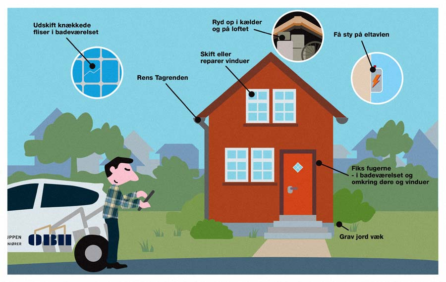

**Ulovlige bygningsindretninger** er i retspraksis blevet behandlet på samme måde som fysiske mangler, formentlig fordi en ulovlig bygningsindretning som regel kan lovliggøres ved en fysisk udbedring. 


---

Efter retspraksis foreligger der en fysisk mangel ved en fast ejendom, hvis ejendommen ikke svarer til, hvad sælgeren har garanteret, eller hvad køberen over for sælgeren har forudsat.

Endvidere foreligger der en mangel, hvis ejendommen ikke svarer til, hvad køberen med rimelighed kunne forvente, jf. princippet i købelovens §§ 75 a og 76.

Det her skitserede mangelsbegreb må siges at rumme kerneindholdet af mangelsbegrebet, som i øvrigt meget vanskeligt lader sig fastlægge på området for køb og salg af fast ejendom. 

Ved bedømmelsen af, om en ejendom er mangelfuld, lægges der vægt på forholdene på tidspunktet for risikoens overgang, hvilket normalt er overtagelsesdagen, jf. købelovens §§ 44 og 77 a, stk. 1, der antages at gælde analogt ved køb af fast ejendom.

Ved afgørelsen af om der foreligger en mangel, lægges der bl.a. vægt på en række konkrete forhold som ejendommens alder, beliggenhed og bygningsmåde, købsaftalens indhold – herunder prisen – og omstændighederne ved aftalens indgåelse. 

Afgørelsen er skønsmæssig og konkret.

---


En betingelse for (ud over, at der skal kunne påvises et ansvarsgrundlag), at der overhovedet kan kræves erstatning af en sælger af fast ejendom er, at der kan konstateres en retlig relevant mangel. 

En retlig relevant mangel vurderes på baggrund af, om de konstaterede skader går ud over, hvad man som køber af en ejendom må forvente. 

Ved køb af fast ejendom er køberens mangelsbeføjelser, efter den almindelige obligationsret, retten til at hæve aftalen, at kræve forholdsmæssigt (passende) afslag i købesummen eller at kræve erstatning, jf. princippet i købelovens § 78. 

Efter entrepriseretlige regler kan køberen have krav på, at den pågældende entreprenør afhjælper fejl ved byggeriet.

En aftale om køb af fast ejendom kan som udgangspunkt kun hæves, hvis manglen er væsentlig, eller hvis sælgeren har handlet svigagtigt. 

Væsentlighedskravet er meget strengt ved køb af fast ejendom, fordi det normalt vil være et overordentligt indgribende retsmiddel at tvinge sælgeren til at tage ejendommen tilbage, efter at handlen er berigtiget. 

Et forholdsmæssigt afslags funktion er at korrigere den købspris, som parterne har aftalt, når det viser sig, at ejendommen ikke har den værdi, som den efter aftalen skulle have.  

Køber kan derfor have krav på et forholdsmæssigt afslag, selv om der for så vidt ikke er noget at bebrejde sælgeren, idet begrundelsen for afslaget er, at den pris, som sælgeren har fået for ejendommen, på grund af manglerne skønnes for høj. 

Efter almindelige obligationsretlige regler kan køberen som udgangspunkt kræve et forholdsmæssigt afslag i købesummen, hvis der foreligger en værdiforringende mangel.  

I retspraksis har man fraveget dette udgangspunkt, »idet der ved afgørelsen af, om køberen bør tilkendes et afslag, lægges vægt på manglens omfang og betydning for køberen.« 

Formålet med et forholdsmæssigt afslag er således at gennemføre en delvis restitution.   

Et forholdsmæssigt afslag er ikke betinget af, at der foreligger et ansvarsgrundlag eller andet særligt retsgrundlag. Udgangspunktet er således, at den pågældende mangel kan siges at være værdiforringende, idet man dog ser bort fra rene bagateller, se hertil afgørelsen **U 2008.2284 V**.  

Praksis om mangler ved fast ejendom (før indførelsen af lov om forbrugerbeskyttelse ved erhvervelse af fast ejendom mv.) har – med skiftende variationer – sat bagatelgrænsen forholdsvis højt, ofte op mod 5-8 % af købesummen, førend der kunne gives køberen et forholdsmæssigt afslag.  

Efter almindelige erstatningsregler kan køberen kun kræve erstatning, hvis køberen på grund af manglen har lidt et økonomisk tab. 

Tabet skal være **adækvat** for sælgeren, og der skal foreligge et ansvarsgrundlag. 

Ved køb af fast ejendom kan ansvarsgrundlaget i praksis enten være sælgers culpa, svig, vanhjemmel eller tilsidesættelse af sælgerens loyale oplysningspligt, eller en garanti. 

Er ejendommen opført med salg for øje, hæfter sælgeren i videre omfang, herunder for håndværksmæssige fejl begået under opførelsen. 

Sælgerens loyale oplysningspligt er et centralt begreb, som indebærer, at sælgeren skal oplyse køberen om alle ikke-bagatelagtige forhold, som sælgeren kender eller burde kende, og som den pågældende må regne med, at køberen vil lægge vægt på.

Vurderingen af, hvad en ikke-bygningssagkyndig sælger burde have været bekendt med, må foretages konkret. 

Der lægges navnlig vægt på, om sælgeren i sin ejertid har haft grund til at nære mistanke om forholdet. 

Hvis det fx flere gange har været nødvendigt at reparere revner i muren, bør sælgeren som regel få mistanke om, at revnerne kan skyldes dårlig fundering. 

Hvorvidt der er givet en garanti, beror på en konkret fortolkning af aftalens ordlyd og omstændighederne ved aftalens indgåelse.

I de tilfælde, hvor garantien er aldeles klar og utvetydig, jf. kravene i de offentlige- og civilretlige standarder i markedsføringslovens § 17 hhv. aftalelovens § 38 b, stk. 2, vil der selvsagt ikke opstå noget problem.  

For at køberen kan gøre garantien gældende, må det forlanges, at den ikke alene og bestemt angiver, hvilke egenskaber der garanteres for (eller imod); fx at »ejendommens areal med garanti udgør så og så mange tønder land«, eller at »ejendommen er garanteret fri for hussvamp«, men garantien bør også angive, hvilke beføjelser køberen skal have, såfremt garantien bliver aktuel, fx ret til erstatning, hævebeføjelse eller andet. 

Oplysninger i tilstandsrapporten fra sælgeren kan ikke uden videre anses for at være garantier: 

En køber har som udgangspunkt ikke pligt til af egen drift at besigtige ejendommen før købet. 

Såfremt køberen inden købet, af en godtroende sælger, er blevet opfordret til at undersøge et bestemt angivet forhold nærmere, vil køberen normalt ikke senere kunne påberåbe sig det pågældende forhold som en mangel ved ejendommen, hvis han undlader at følge sælgers opfordring. 


Helt generelt formulerede opfordringer til at besigtige ejendommen har derimod ingen retsvirkning. 

I almindelighed stilles der ikke strenge krav til en købers evne til at opdage mangler i forbindelse med en undersøgelse af en fast ejendom. 

Det skyldes, at køberen i langt de fleste tilfælde savner de faglige forudsætninger for, at kunne vurdere ejendommens kvalitet i detaljer. 

En køber kan dog normalt ikke bevare sine mangelsindsigelser ved under besigtigelsen at holde sig i uvidenhed om fejl, som er almindeligt forekommende, og som i den pågældende ejendom kunne opdages af en ikke-fagmand, navnlig ikke hvis der er tale om et brugt hus. 

Der stilles strengere krav til køber, hvis den pågældende er bygningskyndig eller erhvervsmæssigt beskæftiger sig med opførelse eller videresalg af ejendomme.

Køberens undersøgelsespligt må i praksis ofte vejes op mod kravet til sælger om loyalt at oplyse om de mangler, som sælgeren er eller burde være bekendt med.

Skjulte fejl og mangler ved overdragelse af fast ejendom reguleres af forældelsesloven – herunder den relative forældelsesfrist på 3 år og den absolutte forældelsesfrist 10-år:


---

### Oversigt for fysiske mangler ved fast ejendom

* En fysisk mangel ved en fast ejendom er typisk karakteriseret ved en defekt, som ikke burde være i en ejendom med den alder til den pris. Hvad kunne køber med rimelighed forvente?

* Uanset at sælger har fået udarbejdet tilstandsrapport mv., kan sælger være ansvarlig for mangler over for køberen, fx:

* Ved ulovlige bygningsindretninger

* Hvis sælgeren har givet garanti over for køberen

* Hvis sælger har handlet svigagtigt eller groft uagtsomt fx ved oplysninger til den bygningssagkyndige eller køberen. 


* Køber har en undersøgelsespligt – ved siden af sælgers loyale oplysningspligt. 


* Mangler uden for bygningen fx at der på grunden er nedgravet en olietank eller septiktank er sælger ansvarlig over for køberen

* Er der mangler ved den faste ejendom kan køberen gøre følgende misligholdelsesbeføjelser gældende over for sælgeren:

* Erstatning, hvis de almindelige erstatningsbetingelser er opfyldt om økonomisk tab, ansvarsgrundlag, samt kausalitet og adækvans

* Forholdsmæssigt afslag, som i praksis er den normalt anvendte misligholdelsesbeføjelse for køberen

* Køberen kan undtagelsesvis hæve handlen, hvis manglen er væsentlig

* Mangler ved fast ejendom forældes 3 år efter køber har opdaget manglen eller burde have opdaget den, men maksimalt 10 år, jf. nærmere forældelseslovens § 3.

---

### Tilstandsrapport, el-tjek og ejerskifteforsikring


 
---

**Video: Tilstandsrapport og energimærke**

<!-- <div class="video-container"><iframe src="https://www.youtube.com/embed/EToKhmr8XFo" width="853" height="480" frameborder="0" allowfullscreen="allowfullscreen"></iframe></div> -->


<div class="video-container"><iframe src="https://www.youtube.com/embed/dsA2EXsZVsg" width="853" height="480" frameborder="0" allowfullscreen="allowfullscreen"></iframe></div>

---


* Sælger kan få udarbejdet tilstandsrapport af bygningssagkyndig

* Bygningssagkyndig gennemgår bygninger, men ikke  grunden og installationer uden for bygningen

* Den bygningssagkyndige ser efter synlige mangler – ikke de skjulte   mangler, da der er tale om en visuel bygningsgennemgang

* Alle fejl og mangler gives karakter af den bygningssagkyndige i tilstandsrapporten (se fig.):
  
* Sælger har en loyal oplysningspligt over for køberen og den bygningssagkyndige og elinstallatøren og skal supplere tilstandsrapporten og elinstallatørrapporten med alle de relevante forhold, han eller hun kender til
  
* El-tjek skal foretages af autoriseret elinstallatør

* Tillæg med udlevering af Hustypebeskrivelser

---

**Video: Sådan sikrer du din hushandel**

<div class="video-container"><iframe src="https://www.youtube.com/embed/GCogSgE3ZmU" width="853" height="480" frameborder="0" allowfullscreen="allowfullscreen"></iframe></div>

---

**Video: Sådan bruger du hustypebeskrivelserne**

<div class="video-container"><iframe src="https://www.youtube.com/embed/ioTmSBDIJ6k" width="853" height="480" frameborder="0" allowfullscreen="allowfullscreen"></iframe></div>

---

* På baggrund af tilstandsrapport og elinstallationsrapport indhenter sælgeren et tilbud om ejerskifteforsikring

* Sælger er fri for ansvar for fejl og mangler ved den faste ejendom  (jf. LFFE § 2), hvis:

*	Køberen har modtaget tilstandsrapport fra sælger, som er mindre end   6 måneder gammel

*	Køberen har modtaget en elinstallationsrapport fra sælger, som er    mindre end 12 måneder gammel

* Køberen samtidig har modtaget tilbud fra sælger på en ejerskifteforsikring
  
* Køberen har modtaget tilbud fra sælger om betaling af ½ præmie på 5-årig ejerskifteforsikring

---

**Video: Hvad dækker ejerskifteforsikringen**

<div class="video-container"><iframe src="https://www.youtube.com/embed/krfhBpCbbJg" width="853" height="480" frameborder="0" allowfullscreen="allowfullscreen"></iframe></div>

---

**Video: Gode råd om ejerskifteforsikringen**

<div class="video-container"><iframe src="https://www.youtube.com/embed/aLNod14h5rc" width="853" height="480" frameborder="0" allowfullscreen="allowfullscreen"></iframe></div>


**Video: Tjek huset før du køber**

 <div class="video-container"><iframe src="https://www.youtube.com/embed/O3nShnJ2w8c" width="853" height="480" frameborder="0" allowfullscreen="allowfullscreen"></iframe></div>
 
---
 
## Ejendomsmæglerens erstatningsansvar
 
Bestemmelsen i LOFE § 47 er en videreførelse af den tidligere omsætningslovs § 24. 

Dog er den tidligere omsætningslovs § 24, stk. 1, 2. pkt., samt en del af den tidligere omsætningslovs § 24, stk. 2, som vedrørte forslag til finansiering, ikke blevet videreført, idet ejendomsmægleren ikke længere kan formidle finansiering til køb af fast ejendom eller foretage beregninger heraf.

Ejendomsmægleren skal yde godtgørelse på objektivt grundlag for forkert provenuberegning eller forkert beregning af ejerudgift, 

uanset om fejlen kan bebrejdes ejendomsmægleren eller ej.

Udtrykket **”godtgørelse”** er valgt frem for ”erstatning” for at markere, at forbrugerens krav udløses uden hensyn til, om der er lidt et sådant tab, som ud fra et culpasynspunkt ville kunne forlanges erstattet. 

Det vil sige, at der ikke skal dokumenteres noget økonomisk tab hos forbrugeren.

Sikkerhed for forbrugerne ved handel med fast ejendom er et væsentligt formål med loven.

Det er derfor af helt afgørende betydning, at forbrugerne kan indrette sig i tillid til rigtigheden af professionelle ejendomsformidleres værdiansættelse og beregning af salgsprovenu og ejerudgift.

Når ejendomsmæglerens oplysninger på disse centrale punkter ikke er korrekte, er ejendomsmægleren nærmere end forbrugeren til at bære risikoen og langt bedre i stand dertil, fordi risikoen via prissætning og forsikring kan fordeles til en marginalomkostning spredt ud på et stort antal opdrag.

Ændringen i LOFE § 47 beskytter den tillid og forventning til korrektheden, som private forbrugere med føje har i kraft af, at oplysningerne er af den nævnte karakter og hidrører fra en professionel erhvervsudøver på området.

Forbrugeren har krav på godtgørelse, hvis denne i god tro har indrettet sin økonomi i tillid til ejendomsmæglerens beregning af salgsprovenu (sælger) eller ejerudgift (køber), og ejendomsmæglerens beregning er forkert til skade for vedkommende. 

Ejendomsmægleren må, hvis forbrugeren har handlet i god tro, godtgøre forbrugeren forskellen. Det er alene provenuberegningen ved salg, der er underlagt objektivt ansvar, jf. bestemmelsens henvisning til LOFE § 39.

Godtgørelse for fejl i oplysningerne om ejerudgiften må imidlertid fastsættes skønsmæssigt, jf. domspraksis.

Denne godtgørelse skal ikke give køberen mulighed for til evig tid at blive boende til den rigtige udgift, men alene kompensere i rimeligt omfang under hensyn til indrettelsesbetragtningen og omdisponeringsmulighederne.

Der skal ligeledes ydes en godtgørelse, hvis forbrugeren i god tro med rimelighed har disponeret i tillid til rigtigheden af en værdiansættelse foretaget af ejendomsmægleren, og denne afviger væsentligt fra, hvad den burde være efter reglen i LOFE § 27.

Værdiansættelsen danner grundlag for aftalen om udbudspris, men udbudsprisen siger intet om den tilgrundliggende værdiansættelse. 

I øvrigt bliver det sværere at bevise, at der er tale om en afvigelse, som angivet i bestemmelsen, jo længere tid der går.

At afvigelsen skal være væsentlig vil sige, at der skal foreligge et markant værdispring i forhold til den relevante ydergrænse for det skøn, som værdiansættelsen er udtryk for. 

Den forskel, som kan forlanges erstattet, fastsættes skønsmæssigt ud fra den nævnte ydergrænse.

Nedenfor følger tre eksempler fra nyere nævnspraksis, der behandler spørgsmålet om, hvorvidt mægleren skal yde godtgørelse på objektivt grundlag for forkert provenuberegning eller forkert beregning af ejerudgift, uanset om fejlen kan bebrejdes ejendomsmægleren eller ej.

I alle andre forhold kan ejendomsmægleren være erstatningsansvarlig efter dansk rets almindelige regler. 

For eksempel vil forbrugeren (køber eller sælger) have ret til erstatning efter dansk rets almindelige regler, såfremt forbrugeren lider et tab som følge af ejendomsmæglerens tilsidesættelse af sine pligter efter loven eller den indgåede formidlingsaftale. 

I almindelighed påhviler det forbrugeren, som vil kræve erstatning, at bevise, at ejendomsmæglerens indsats og rådgivning ikke har opfyldt de krav, der stilles til en sagkyndig ejendomsformidling.


---


Ejendomsmæglers rådgiveransvar vurderes efter almindelige erstatningsretlige principper:

Professionsansvar, skærpet objektiviseret culpaansvar.
  
Ejendomsmægler har et objektivt ansvar, jf. LOFE § 47, hvis 

+	Provenu er beregnet forkert af ejendomsmægleren.

+	Beregning af ejerudgifter eller forslag til finansiering er forkert.
  
+	Værdiansættelsen afviger meget og forbrugeren er i god tro om fejlen.

---


  
Køberen kan klage over ejendomsmægleren til **Klagenævnet for ejendomsformidling**, dog ikke over værdiansættelsen af ejendommen.

**Disciplinærnævnet for Ejendomsmægler** træffer afgørelse i klagesager om overtrædelse af LOFE, herunder god skik for ejendomsmæglere.

---

**Eksamensopgavesæt i ejendomshandel, forbrugerbeskyttelse, kreditsikring, omsætningsbeskyttelse, erstatningsret og professionsansvaret mv.**

**Kalle og Silles bolighandler**


Kalle og Sille er kærester og ønsker at finde drømmehuset og flytte sammen. Og heldigvis har Kalle nu endelig efter 1½ års liggetid fået solgt sin lille 2-værelses ejerlejlighed. Kalle har underskrevet købeaftalen torsdag den 16. oktober og køber modtog et brev fra ejendomsmægleren om Kalles accept dagen efter. Kalle og Sille er henrykte og benytter weekenden den 18. og 19. oktober til at se på udvalgte huse i området. Søndag ser de på ejendommen Lærkevej 10, som de falder pladask for. Mandag kontakter de deres bankrådgiver, som umiddelbart er positiv overfor købet af ejendommen, da de nu har fået solgt ejerlejligheden. Han tilføjer dog: ”I første omgang må I lige afvente fortrydelsesfristens udløb”.


**Eksamensspørgsmålet**:

1. Hvornår udløber fortrydelsesfristen vedr. ejerlejligheden?

**Rettevejledning**:

Emne: Ejendomshandel, forbrugerbeskyttelse

Regler: lov om forbrugerskytttelse ved erhvervelse af fast ejendom (LFFE) § 8 stk. 1.

Læringsmål: At anvende og formidle centrale regler og praksis for køb og salg af fast ejendom med fokus på forbrugerbeskyttelse

Kalles accept kommer frem til køberen fredag den 17. oktober, her indgås aftalen, hvorefter fristens seks hverdage, begynder at løbe mandag den 20., og den efterfølgende mandag den 27., bliver fristens sidste dag.

**Svar slut**.


**Eksamensspørgsmålet:**


2. Hvilke retsvirkninger har det for Kalle, hvis køberen fortryder aftalen indenfor fristen?

**Rettevejledning*:**

Emne: Ejendomshandel, forbrugerbeskyttelse

Regler: LFFE §§ 9, 10, 11 og 12.

Læringsmål: At anvende og formidle centrale regler og praksis for køb og salg af fast ejendom med fokus på forbrugerbeskyttelse


Kalle beholder ejendommen, salgsaftalen ophører med at eksistere og parterne skal tilbageføre eventuet udvekslede ydelser og situationen i øvrigt jf. LFFE §§ 9, 10 og 12. 

Derudover modtager han fra sælger boden på 1%, af den nominelle købesum, i henhold til LFFE § 11, evt. via modregning i deponeringen. Alt dette skal den fortrydende køber sørge for inden for fristen på 6 hverdage.

**Svar slut**.

Heldigvis ønsker køberen at gennemføre købet af ejerlejligheden og det betyder, at Kalle og Silles køb af Lærkevej 10, nu kan gå i opfyldelse. Ejendommen koster kr. 1.795.000 kontant, som de får finansieret ved et realkreditlån på 1.435.000, et banklån på kr. 260.000 og en kontant udbetaling på kr. 100.000. Til finansiering af et nyt køkken og div. istandsættelser af ejendommen får de endvidere et lån fra Silles forældre på kr. 250.000 mod sikkerhed i ejendommen.

**Eksamensspørgsmålet**

3. Forklar hvorledes henholdsvis realkredit, bank og forældrene kan opnå sikkerhed i ejendommen?

**Rettevejledning:**

Emne: Kreditsikring, omsætningsbeskyttelse.

Regler: Tinglysningslovens (TL) § 1.

Læringsmål: Den studerende har færdighed i at afdække den finansielle sektors behov for og gennemførelsen af en given sikkerhedsstillelse. Anvende, vurdere og formidle reglerne om kreditsikring og finansiel sikkerhedsstillelse i sammenhæng med andre juridiske emner. Anvende centrale regler om tinglysning, af relevans for den finansielle sektor. 

Panthaverne aftaler underpant i ejendommen, som herefter tinglyses for at opnå beskyttelse jf. TL § 1.

**Svar slut**.

Kalle og Sille underskriver lånedokumenterne i banken den 9. december. Banken får dog på grund af travlhed i afdelingen først tinglyst deres pantebrev den 12. december kl. 12.30 og samme dag kl. 10.15 var realkreditpantebrevet, som var underskrevet den 10. december, ligeledes blevet tinglyst. Den 11. december har Kalle og Sille underskrevet lånedokumenterne hos forældrenes advokat, som får tinglyst ejerpantebrevet samme dag. Dette medfører en række anmærkninger ved tinglysningen og der opstår derfor uenighed mellem de tre panthavere om prioritetsstillingen i ejendommen.

**Eksamensspørgsmålet**:

4. Hvorledes er prioritetsstillingen i ejendomme?

**Rettevejledning**:

Emne: Kreditsikring, omsætningsbeskyttelse.

Regler: TL § 1.

Læringsmål: Anvende centrale regler om tinglysning, af relevans for den finansielle sektor.


Hvis forældrene forudsættes at være i god tro, fortrænger de de to andre, i tid bedre, hæftelser jf. TL § 1 stk. 2, og opnår 1. prioritet. Tilsvarende kan realkredit pantebrevet fortrænge bankens pant, som altså bliver hhv. 2. og 3. prioritet.

Selv om casen strengt taget ikke giver noget konkret holdepunkt for mistanke, kan det forekomme naturligt at overveje forældrenes gode tro. 

Det er vanskeligt at forestille sig, at de under ”normale omstændigheder”, ikke indså eller burde indse, at der måtte være, i det mindste, et realkreditlån, som de skulle respektere. En diskussion heraf i besvarelsen bør belønnes. Konklusionerne betyder mindre. 

**Svar slut**.


Kalle og Sille har overtaget Lærkevej 10 og er begyndt at renovere ejendommen. De undrer sig dog over, at der ikke er en bygningstegning over værelserne på 1. salen, hvor loftshøjden også er noget lavere end i resten af huset. Ved en henvendelse til kommunens tekniske forvaltning finder de ud af, at 1. salen slet ikke er godkendt til beboelse. 

I salgsopstillingen, som var udarbejdet af ejendomsmægler Kryger fra MyHome stod der følgende: 

”Ejendommen har et boligareal på 156 m2, heraf 58 m2 udnyttet tagetage.”

Der var ikke udarbejdet nogen tilstandsrapport i forbindelse med handlen.

Lovliggørelse af 1. salen til beboelse vil ifølge en arkitekt koste 180.000. Sælger af ejendommen var et dødsbo og Kalle og Sille ønsker nu at gøre et erstatningskrav gældende mod ejendomsmægler Kryger, som de mener, ikke har undersøgt forholdene ved ejendommen tilstrækkeligt i forbindelse med salget. 

Kryger nægter at betale erstatning og siger, at de jo selv måtte have været opmærksomme på dette ved deres besigtigelse af ejendommen og modtagelsen af handelens dokumenter.

**Eksamensspørgsmålet:**

5. Giv en begrundet redegørelse for, om Kalle og Sille efter din opfattelse kan få medhold i deres krav mod ejendomsmægler Kryger.

**Rettevejledning:**

Emne: Erstatningsret, professionsansvar.

Regler: Erstatningsretlige grundregler samt LOFE § 47.

Læringsmål: Anvende og vurdere de grundlæggende erstatningsbetingelser ved erstatning udenfor kontrakt, for derigennem at kunne vurdere reglerne for rådgivnings- og professionsansvar indenfor den finansielle sektor.

Mægleren er ansvarlig jf. LOFE § 47: Culpa med skærpet uagtsomhedsvurdering, professionsansvar, der ser ud til at være fuldbyrdet, når mægleren, i det han henviser køberne til sagens dokumenter, ikke bare var forpligtet til at undersøge og oplyse, men også havde adgang hertil. Der er et tab i.f.t. købers berettigede forventning, som er en kausal følge af mæglerens fejl i salgsopstillingen, hvilket desuden må siges at være adækvat; egnet til at fremkalde den berettigede forventning.

Uden at det konkrete svar behøver at tillægges stor vægt, bør besvarelsen diskutere et eventuelt element af egen skyld. I en situation som denne, må en lægmand nok have lov til at stole på de oplysninger han modtager fra den professionelle mægler. Det kan næppe belaste ham, at han ved en nærme gennemgang af dokumenterne kunne have opdaget fejlen.

Samlet, er der altså gode udsigter for et søgsmål.

**Svar slut**.

Som var det ikke nok, opdager Kalle nogle måneder senere, at salgsopstillingen også havde en fejl vedrørende udgifterne til renovation, der årligt var angivet 600 kr. for lavt.

**Eksamensspørgsmålet**:

6. Hvordan er Kalles stilling i denne sag?

**Rettevejledning:**

Emne: Erstatningsret.

Regler: Erstatningsretlige grundregler samt LOFE § 47.

Læringsmål: Anvende og vurdere de grundlæggende erstatningsbetingelser ved erstatning udenfor kontrakt, for derigennem at kunne vurdere reglerne for rådgivnings- og professionsansvar indenfor den finansielle sektor.
Kalle har udsigt til godtgørelse. 

Mægleren er ansvarlig jf. LOFE § 47, 2. pkt.: culpaansvar ansvar i relation til forkert beregning af ejerudgift: "Er der til skade for forbrugeren foretaget en forkert beregning af ejerudgift ved køb, jf. § 39, stk. 1, og er forbrugeren i god tro, har forbrugeren krav på en rimelig godtgørelse af forskellen mellem den forkerte og den korrekte beregning." 

Det er alene provenuberegningen ved salg, der er underlagt objektivt ansvar, jf. bestemmelsens § 47) henvisning til § 39, stk. 3.

Besvarelsen bør identificere LOFE § 47, 2. pkt. som den relevante bestemmelse, konstatere culpaansvaret, samt kausaliteten.

Godtgørelsen vil jf. praksis udgøre differencen kapitaliseret over 10 år, svarende til 6.000 kr.

Den rigtig gode besvarelse bør desuden bemærke, at der er tale om et forventningstab, der her ganske usædvanligt erstattes, samt baggrunden herfor. 

---

## Kort oversigt over finansiering af køb af fast ejendom

(Der henvises til de andre fag på studiet)
 

**Video: Køb af fast ejendom**

<div class="video-container"><iframe src="https://www.youtube.com/embed/4jT7zb0TzZ8" width="853" height="480" frameborder="0" allowfullscreen="allowfullscreen"></iframe></div>

---

* Køberen kan forberede finansiering af huskøbet ved at få et lånebevis fra sin bank

* Banken skal yde rådgivning om finansiering af fast ejendom (se nærmere kapitel 19 om rådgivning)

* I en købsaftale kan køber og sælger vælge:

**Kontanthandel**: 

Købesummen betales til sælgeren ved at købers bank deponerer beløbet i sælgers bank. 

Næsten alle handler gennemføres i dag som kontanthandel. 

Det betyder blot, at køber, udover at deponere en kontant udbetaling hos ejendomsmægleren, får sin bank til at stille en bankgaranti for restkøbesummen. 

Bankgarantien afløses af en kontant deponering i sælgers bank på overtagelsesdagen. 

Men det er dog først, når skøde og tinglysning er endeligt- og anmærkningsfrit på plads, at sælger kan disponere over beløbet. 

Køber optager typisk et ejerskiftelån i ejendommen for at kunne fremskaffe købesummen. 

Et ejerskiftelån er egentlig bare betegnelsen for et almindeligt realkreditlån. 

Ethvert realkreditlån kan således være et ejerskiftelån. 

Realkreditlån (ejerskiftelån) kan kun optages i forbindelse med køb af fast ejendom, da der stilles sikkerhed for lånet i ejendommen. 

Det er således ikke muligt at optage realkreditlån i forbindelse med køb af andelsbolig. 

Årsagen er, at man ikke som sådan ejer sin andelsbolig, men er medejer i en større forening, der har optaget et eller flere lån. 

---

**Finansieret handel**: 

Køber overtager sælgers lån i ejendommen – evt. nye lån, som køber har optaget i sælgers navn.
 

*	Realkreditbelåning kan maksimalt udgøre 80 % af ejendommens 
  værdi
  
* I forbindelse med optagelse af realkreditlån, skal køberen 
  overveje:
  
+	Løbetid (10, 20 eller 30 år)

+	Afdragsfrihed (der betales kun renter på lånet og ikke 
  afdrag)
  
+	Fast eller variabel rente

+	Kurssikring af lån
  
---

**Video: Nye boliglån**
<
<div class="video-container"><iframe src="https://www.youtube.com/embed/XLCa5kGQ2HA" width="853" height="480" frameborder="0" allowfullscreen="allowfullscreen"></iframe></div>

---

For en nærmere gennemgang om køberes finansiering af fast ejendom, se lærebogen "Finansiel Rådgivning - privat" Hans Reitzels Forlag.

---

## Oversigt over berigtigelse af skøde og refusionsopgørelse

---

**Video: Brug en boligadvokat når du køber bolig**


<div class="video-container"><iframe src="https://www.youtube.com/embed/3GBFrCyRmvw" width="853" height="480" frameborder="0" allowfullscreen="allowfullscreen"></iframe></div>

---

* Købers advokat skal rådgive køberen om hushandlen og gennemgå hushandlens væsentlige dokumenter
  
* Advokaten skal sørge for at få tinglyst nyt skøde på ejendommen, for at sikre købers adkomst til ejendommen
  
* Skødet vil få anmærkninger om sælgers endnu ikke aflyste lån

* Efterhånden som sælgers lån bliver indfriet, vil anmærkningerne på skødet blive fjernet fra tingbogen
  
* Når skødet er anmærkningsfrit kan købesummen frigives til sælgeren
  
* Advokaten skal udarbejde en refusionsopgørelse til afslutning af ejendomshandlen


---

**Video: Vælg huslån med Karsten Engmann Jensen, Pengeministeriet.dk**

<div class="video-container"><iframe src="https://www.youtube.com/embed/PrxUe5RjQso" width="853" height="480" frameborder="0" allowfullscreen="allowfullscreen"></iframe></div>

---

**Eksamensopgave: Handel med fast ejendom**


**”Jeg fik jobbet, mor!!”** 

Martin var i fremragende humør. Han havde netop fået besked om at han var blevet ansat som ejendomsmægler hos ”Udby Mæglerne ApS” med start den 1. februar, hvor hans opgaver hovedsagelig ville bestå af salg af huse til private.

Den 1. februar mødte Martin op på sit nye arbejde og her blev han mødt af ejeren Egild. Han bød Martin velkommen og de to blev enige om at Martin sådan set bare kunne gå i gang med arbejdet, da han jo kendte al teorien fra sin tid som Finansøkonomstuderende. 

Martins første opgave var et spørgsmål som Egild var kommet i tvivl om: Egild havde en ejendom beliggende Bygaden 1, Udby til salg for Søren for 1.995.000 kr. Den 28. januar havde Keld henvendt sig til Egild, da han gerne ville købe ejendommen til prisen. Egild skyndte sig at udarbejde en købsaftale, som Keld skrev under om aftenen den 28. januar. 

Egild skyndte sig at sende købsaftalen til Søren, som skrev den under samme aften og afleverede den fysisk tilbage til Egild om morgenen den 29. januar. Egild tænkte at nu var aftalen i hus, men for god ordens skyld ville han lige sende den underskrevne købsaftale til Keld. Egild fik det dog ikke lige gjort, da hans morgenbacon var ved at brænde på. Da Egild kom tilbage til sit skrivebord kunne han se at der netop var kommet en mail fra Keld om at han fortrød købet og ikke ville have ejendommen alligevel.

**Eksamensspørgsmålet**

1.	Er der indgået en bindende aftale mellem Keld og Søren omkring købet af ejendommen?  (10%)


**Rettevejledning:**

Lovgrundlag: Lov om forbrugerbeskyttelse ved erhvervelse af fast ejendom (LFFE), Lov om aftalers indgåelse på formuerettens område

Område: Fast ejendom, aftaleindgåelse

Læringsmål: Den studerende kan anvende centrale aftaleregler om aftalers indgåelse. Den studerende kan anvende og formidle centrale regler og praksis for køb og salg af fast ejendom med fokus på forbrugerbeskyttelse.  

Besvarelsen skal her se at det tidspunkt hvor køber bliver bundet er et senere tidspunkt ved fast ejendom, i forhold til den almindelige aftaleret, jf. LFFE §7, stk. 2, hvorefter køber kan tilbagekalde sit tilbud indtil sælger har accepteret og accepten er kommet frem til køber. 

Da Egild ikke sender den underskrevne købsaftale til Keld inden at denne tilbagekalder tilbuddet, er Keld således ikke bundet af sit tilbud. 

Keld kan således fortryde købet og skal ikke i denne forbindelse betale nogen godtgørelse.

---

#### Quiz
https://www.forbrug.dk/quiz/boligquizzen/?rn=43716


---


<!--chapter:end:21.Rmd-->

# Familieret

```{r, echo=FALSE, results='asis'}
cat(readLines('np.html'))
```


---

***Som studerende skal du være særlig opmærksom på følgende problemstillinger ved gennemgangen af familieretten:***

* **Relateres til rådgivning af privatkunder**  

* **Ægtefællernes hæftelse for lån, ÆL § 3** 

* **Ægtefællers særråden, ÆL § 1** 

* **Skilsmissebodelingers betydning for privatøkonomien (delingsformue og særeje)** 

---


## Ægtefællernes rådighed under ægteskabet  

 


---


Lov nr. 548 af 30 maj 2017 om ægtefællers økonomiske forhold om ægtefællers økonomiske forhold (forkortet "ÆL")– gælder for ægtefæller – ikke for ugifte samlevende – og regulerer ægtefællernes økonomiske forhold indbyrdes. 

Under ægteskabet er ægtefællerne to selvstændige personer med hver sin økonomi. 


**Ægtefællerne har særråden og særhæften**


Særråden betyder, at uanset ægteskabets indgåelse så råder hver ægtefælle stadig over de aktiver, som den pågældende står som ejer af. 

Står bilen i mandens navn kan manden altså frit sælge den uden at spørge sin ægtefælle. 

Står bilen derimod i hans ægtefælles navn er det kun hans ægtefælle, der kan sælge bilen.  

På samme måde betyder princippet om særhæften, at hver ægtefælle, uanset ægteskabets indgåelse, alene hæfter for sin egen gæld. 

Det, at man indgår ægteskab betyder altså som klart udgangspunkt ikke, at man kommer til at hæfte for sin ægtefælles gæld. 

En enkelt generel undtagelse fra denne hovedregel er dog skattegæld, som den ene part opbygger under ægteskabet. 

Her er den anden part medhæftende på grund af princippet om sambeskatning af ægtefæller.  

I alle øvrige forhold har det til gengæld stor betydning hvem af ægtefællerne der står som ejer af de enkelte aktiver og hvem der hæfter for gælden..^[Følgende afsnit om arve og familieret bygger især på **Linda Nielsens** Karnovkommentar til arveloven og lov om ægtefællers øknomisk forhold, KarnovGroup.] 

---

**Video: Familieliv og jura**


<div class="video-container"><iframe src="https://www.youtube.com/embed/lXw-hdped28" width="853" height="480" frameborder="0" allowfullscreen="allowfullscreen"></iframe></div>

---


## Ægtefællelovens inddeling


**ÆL er inddelt i 7 afsnit**:  


* *Afsnit I indeholder almindelige bestemmelser om ægtefællers økonomiske forhold.* 

* *Afsnittet indledes med kapitel 1, der indeholder regler om ægtefællers ret til at råde over deres formue, om aftaler mellem ægtefæller, om hæftelse for gæld og om forsørgelsespligt under ægteskabet.* 

* *Kapitlet indeholder også den centrale bestemmelse om formuedelingen, der fastslår, at ægtefællers formue som udgangspunkt deles lige mellem dem ved separation, skilsmisse og død.*

* *Afsnit I indeholder endvidere regler om forbud mod salg m.v. af familiens helårsbolig uden den anden ægtefælles samtykke (kapitel 2) og om gaver til og andre aftaler med tredjemand (kapitel 3).*  

* *Afsnit II indeholder reglerne om særeje og forhåndsaftaler om formuedelingen*. 

* *I kapitel 4 og 5 fastlægges ægtefællers muligheder for ved ægtepagt at indgå aftaler om særeje og andre forhåndsaftaler om formuedelingen, mens kapitel 6 indeholder formkrav til ægtepagter*. 

* *Regler om særejebestemmelser om arv og gave fra tredjemand findes i kapitel 7, og kapitel 8 indeholder generelle regler for særeje, herunder om surrogater for og indtægter af særeje.*  

* *Afsnit III indeholder reglerne om formuedelingen ved separation og skilsmisse*. 

* *I kapitel 9 findes de grundlæggende regler om formuedelingen, herunder en oversigt over de aktiver m.v., der ikke indgår i delingen, fastlæggelse af ophørsdagen, fradrag af gæld, aftaler om formuedelingen og fravigelse af ligedelingen ved kortvarige ægteskaber*. 

* *Aktiver, der ikke indgår i formuedelingen, er reguleret i kapitel 10. Kapitel 11-13 indeholder regler om regulerings- og misbrugskrav (de nuværende vederlagskrav), om kompensationskrav (medvirken til formueforøgelse og urimeligt økonomisk stillet) samt pensionskompensation.* 

* *Endelig indeholder kapitel 14 regler om ægtefællernes ret til at udtage aktiver, der indgår i formuedelingen.*  

* *Afsnit IV (kapitel 15) indeholder særregler om formuedeling ved en ægtefælles død og ved deling af uskiftet bo.*  

* *Afsnit V (kapitel 16) indeholder regler om fastsættelse og ændring af ægtefællebidrag under ægteskabet, om statsforvaltningens og Ankestyrelsens sagsbehandling samt om klage over statsforvaltningens afgørelser.*  

* *Afsnit VI (kapitel 18) indeholder regler om internationale forhold, navnlig om lovvalget for ægtefællers økonomiske forhold.*  

* *Endelig fastlægges tidspunktet for lovens ikrafttræden (den 1. januar 2018) i afsnit VII, der også indeholder overgangsregler og bestemmelser om loven territoriale anvendelse (kapitel 19-21).*

---


Behandlingen af sager om **formuedelingen ved separation og skilsmisse** er fortsat reguleret i ægtefælleskifteloven, og arveloven og dødsboskifteloven indeholder regler om skifte af dødsboer og uskiftede boer.  

---

## Almindelige bestemmelser om ægtefællers økonomiske forhold

Det følger af ÆL § 1: 

**”Under ægteskabet råder hver ægtefælle over sin formue, uanset om formuen er erhvervet før eller efter indgåelsen af ægteskabet, dog med de begrænsninger, som følger af stk. 2, § 2 og kapitel 2 og 3”.** 

Det betyder, at hver ægtefælle har i levende live rådigheden over alt, hvad ægtefællen har indført i fællesboet. 

Denne råderet kaldes **særråden**. 

En ægtefælle kan således som udgangspunkt **frit sælge, bortgive og pantsætte sine aktiver uden at spørge den anden ægtefælle om lov**.  

Efter ÆL § 1, stk. 1, råder hver ægtefælle under ægteskabet over sin formue, uanset om formuen er erhvervet før eller efter indgåelsen af ægteskabet, dog med de **begrænsninger** som følger af § 1, stk. 2 (forringelse af formuen), og ÆL § 2 (begrænsninger i ægtefællers adgang til at indgå aftaler med hinanden), samt kapitel 2 (beskyttelse af familiens helårsbolig) og kapitel 3 (gaver til og aftaler med tredjemand).  

Efter ÆL § 1, stk. 2 skal en ægtefælle råde over sin formue på en sådan måde, at den ikke utilbørligt forringes til skade for den anden ægtefælle. 

Bestemmelsen omfatter ikke kun råden over ægtefællens delingsformue, men hele ægtefællens formue, herunder navnlig **særeje**. 

Baggrunden herfor er, at forringelse af en ægtefælles særeje m.v. kan får betydning ved formuedelingen, f.eks. hvis den ene ægtefælle har et **regulerings- og misbrugskrav** efter lovens kapitel 11, der bl.a. kan rettes mod den anden ægtefælles særeje.   


Overtrædelse af ÆL § 1, stk. 2 er ikke selvstændigt sanktioneret, men **misbrug af formuen** kan udløse misbrugskrav efter ÆL § 40, og efter ÆL § 10 kan gaver til tredjemand i visse situationer kræves tilbage.  

Bestemmelsen i ÆL § 1, stk. 2 omhandler en ægtefælles ret til at råde i forhold til tredjemand. 

Bestemmelsen vedrører adgangen til at råde i levende live, da en ægtefælles ret til at råde over sin formue ved sin død er reguleret i arveloven.  

Efter ÆL § 1, stk. 3 kan en ægtefælle under samlivet foretage dispositioner, der ikke uden ulempe kan udsættes, hvis den anden ægtefælle er forhindret i at varetage sine interesser på grund af fravær eller sygdom. 

Dette omfatter også afhændelse og pantsætning, når dette af hensyn til familiens underhold er uomgængeligt nødvendigt. 


**Fast ejendom kan dog ikke afhændes eller pantsættes uden statsforvaltningens tilladelse**.  

Anvendelse af bestemmelsen i ÆL § 1, stk. 3 forudsætter, at samlivet mellem ægtefællerne består. 

Bestemmelsen finder således ikke anvendelse, hvis samlivet er ophævet på grund af uoverensstemmelse, mens bestemmelsen finder anvendelse, selvom ægtefællerne lever adskilt af andre grunde. 

Hvis samlivet har været ophævet på grund af uoverensstemmelse, men senere genoptages, finder bestemmelsen anvendelse igen. 


Efter ÆL § 1, stk. 3 er en ægtefælle ikke forhindret i at varetage sine interesser, hvis den pågældende er i fængsel, på hospital eller institution eller på udlandsrejse, i det omfang det er muligt at komme i kontakt med den pågældende ægtefælle med henblik på at få samtykke til den omhandlede retshandel, eventuelt pr. telefon eller e-mail. 

Bestemmelsen omhandler både ægtefællens bemyndigelse i forhold til den anden ægtefælle til at handle på dennes vegne og ægtefællens legitimation til at handle i forhold til tredjemand. 

Bestemmelsen finder også anvendelse, selvom der er formuefællesskab i ægteskabet, og selvom der er tale om en disposition vedrørende et særejeaktiv. 

Dispositionsadgangen gælder ikke, hvis en anden er bemyndiget til at foretage dispositionen, eksempelvis ved en almindelig fuldmagt eller ved en **fremtidsfuldmagt** efter lov nr. 618 af 8. juni 2016 om fremtidsfuldmagter:

**En fremtidsfuldmagt er en fuldmagt, som kan sættes i kraft en gang i fremtiden, hvis du bliver syg eller svækket og mister evnen til selv at tage vare på dine økonomiske eller personlige forhold. Du kan give fremtidsfuldmagt til en eller flere personer, som du selv udpeger**.

Bemyndigelsen til at foretage dispositionen kan også tilkomme en værge, der er beskikket efter værgemålsloven.

---

Ægtefællernes adgang til at indgå aftaler og pådrage sig forpligtelser over for hinanden reguleres af ÆL § 2. 

Efter § 2, stk. 1, kan **ægtefæller under ægteskabet indgå aftaler med hinanden**, give hinanden gaver og pådrage sig **forpligtelser over for hinanden** med de undtagelser, der følger af ÆL § 2, stk. 2 og 3 samt konkurslovens § 64. 

Der kan f.eks. ske overdragelse af aktiver fra den ene ægtefælle til den anden ægtefælle, leje af hinandens aktiver, ydelse af lån og ansættelse af den ene ægtefælle i den anden ægtefælles virksomhed. 

Det gælder, uanset om de har særeje eller delingsformue, at de fx med juridisk gyldighed kan købe hinandens ting eller pantsætte dem til hinanden, indgå lejeaftaler og arbejdsaftaler mv., se dommene **U 1943 947, U 1931 294 H og U 1930 1 H**. 

Da ægtefæller ofte tager ret formløst på de aftaler, de indgår under ægteskabet, kan det i praksis være vanskeligt at afgrænse lån, gaver, sameje og forsørgelse. 

Spørgsmålet har konsekvenser dels over for ægtepars kreditorer, dels over for ægtefællerne selv i en senere bodelingssituation, især for ægtefæller med særeje. 

Den ægtefælle, der hævder at have et gældskrav på den anden, må føre bevis herfor, idet der som udgangspunkt er en formodning for, at overførsel af pengebeløb til ægtefællen sker til opfyldelse af forsørgelsespligten. 

Ægtefællerne kan også pådrage sig forpligtelser over for hinanden uden aftale, f.eks. som følge af, at en ægtefælle uagtsomt eller forsætligt forvolder skade på den anden ægtefælles ejendele eller person. 

---

Der kan være tale om **erstatnings- eller kontraktsforpligtelser**, jf. dommene: i 

**U 1986 212 (erstatningsansvar for uberettiget afhændelse)**; 

**U 1966 151 H; U 1963 1056 (drabsforsøg, personskade);** 

**U 1954 825 (regreskrav for tab af forsørger ikke anerkendt);** 

**U 1959 403 (færdselsuheld) og U 1936 636 (færdselsuheld).** 

---

Ægtefællerne kan f.eks. have en interesse i at få erstatningsansvaret fastlagt, hvor skaden er dækket af en forsikring, f.eks. ansvarsforsikring for en bil.  


Efter ÆL § 2, stk. 2 kan ægtefæller ikke ved aftale fravige reglerne i loven, medmindre andet følger af lovens kapitler 4-6 (aftaler om særeje og andre aftaler om formuedeling, samt krav om **ægtepagt** for sådanne aftaler), samt ÆL § 25, stk. 2, (aftaler om surrogater for og indtægter af særeje og ÆL § 32 (aftaler om formuedeling i forbindelse med separation og skilsmisse).

---


**Kort om ægtepagt**

En ægtepagt om særeje er en skriftlig aftale mellem to ægtefæller. 

Aftalen bestemmer, at der ikke skal gælde formuefællesskab i ægteskabet, som man ellers automatisk får, når man gifter sig. 

Formuefællesskab betyder kort sagt, at man som ægtefæller skal dele formuer i tilfælde af separation, skilsmisse eller død. 

Hvis man som ægtefæller ikke ønsker dette, kan man helt eller delvist ophæve denne betingelse med en ægtepagt om særeje.

Der er ingen regler for, hvornår en ægtepagt skal laves. 

Det betyder, at en ægtepagt både kan laves og indgås før eller efter man er blevet gift. 

Derfor er ægtepagtens gyldighed den samme, uanset hvad man vælger. 

Det er kun en **skriftlig og tinglyst ægtepagt** (i Personbogen), der vil være gyldig. 

Da en ægtepagt er en aftale, kræves det (som ved alle andre typer af aftaler), at der er enighed mellem parterne. 

Det er altså ikke nok, at den ene ægtefælle eksempelvis ønsker særeje i ægteskabet. 

Begge ægtefæller skal være enige herom og indgå en skriftlig (og tinglyst i Personbogen) ægtepagt for, at ønsket bliver en realitet.

Ægtepagter som begreb bliver behandlet senere nedenfor.

---

**Video: Tinglysning af ægtepagt**

<div class="video-container"><iframe src="https://www.youtube.com/embed/NNG8jga_q_Y" width="853" height="480" frameborder="0" allowfullscreen="allowfullscreen"></iframe></div>

---

**Video: Sådan laver du selv en ægtepagt**

<div class="video-container"><iframe src="https://www.youtube.com/embed/DQmRSVrdmrY" width="853" height="480" frameborder="0" allowfullscreen="allowfullscreen"></iframe></div>

---

**Begrænsninger i ægtefællernes aftalefrihed:**

Ægtefæller kan navnlig ikke give afkald på **retten til forsørgelse** efter ÆL § 4, stk. 1, eller på forhånd aftale fravigelse af reglerne om samtykke til dispositioner over familiens helårsbolig (lovens kapitel 2).  

Ægtefæller kan ligeledes ikke indgå forhåndsaftaler om formuedelingen ved separation, skilsmisse og død (lovens afsnit III og IV), om regulerings- og misbrugskrav (lovens kapitel 11), om retten til kompensation (lovens kapitel 12), om pensionskompensation (lovens kapitel 13) og om udtagelse af aktiver (lovens kapitel 14).  

Efter ÆL § 2, stk. 3 kan ægtefæller ikke gyldigt aftale, at det, som den ene ægtefælle fremtidigt erhverver, uden vederlag skal tilfalde den anden ægtefælle.


---

**Princippet om ægtefællens særhæften**

Efter ÆL § 3 hæfter hver af ægtefællerne med den del af delingsformuen, hvorover den pågældende ægtefælle råder, og med sit særeje for de forpligtelser, der påhviler ægtefællen, hvad enten forpligtelserne er opstået før eller under ægteskabet. 

Bestemmelsen medfører, at en ægtefælle alene hæfter for sin egen gæld. 

Dette kaldes **særhæften**. 

En ægtefælle hæfter således som udgangspunkt ikke for den anden ægtefælles gæld. Ægtefæller hæfter dog sammen for forpligtelser, som de har påtaget sig sammen, f.eks. ved i fællesskab at optage et lån. 

Ægtefæller hæfter også sammen for forpligtigelser, der følger af, at de sammen ejer et aktiv (sameje), f.eks. ejendomsskatter vedrørende en fast ejendom, som de begge er medejere af.  

Ægtefæller hæfter efter almindelige formueretlige regler sammen for forpligtelser, som de har påtaget sig sammen, f.eks. ved i fællesskab at optage et lån, herunder et realkreditlån i fast ejendom. 

Ægtefæller hæfter også sammen for forpligtigelser, der følger af, at de ejer et aktiv i **sameje**. 

Hvis de f.eks. sammen ejer fast ejendom, hæfter de begge for f.eks. ejendomsskatter. 

**Fælles hæftelse kan også følge af fuldmagt, kaution mv**. 

---

Overladelse af kreditkort eller kontokort kan efter omstændighederne anses som en særlig form for fuldmagt. 

Retspraksis har ud fra stiltiende accept eller passivitet statueret fælles hæftelse for reparationer mv. udført på en ægtefælles ejendom, selvom den anden ægtefælle har bestilt arbejdet,  se f.eks. dommene **U 1994 328, U 1991 343 og U 1987 43*.  

---

Hæftelse for den anden **ægtefælles gæld** kan også følge af lovgivningen, bl.a. § 12 i lov om inddrivelse af gæld til det offentlige, hvorefter en ægtefælle under visse betingelser hæfter for den anden ægtefælles skattegæld, og 

§ 92, stk. 2, i aktivloven, hvorefter ægtefæller hæfter solidarisk for krav på tilbagebetaling af hjælp til betaling af renter og afdrag på lån i fast ejendom, selv om kun den ene ægtefælle er ejer af ejendommen.  

---

### Gensidig forsørgelsespligt

Det følger af ÆL § 4, at ægtefællerne har en **gensidig forsørgelsespligt**. ”Under ægteskabet har ægtefæller pligt til at forsørge hinanden”, jf. ÆL § 4, stk. 1. 

Hvad en ægtefælle modtager fra den anden ægtefælle som forsørgelse efter ÆL § 4, stk. 1, tilhører modtageren. 


**Forsørgelsespligten efter § 4 er en grundlæggende del af ægteskabet**. 


Der er tale om en egentlig **retlig forpligtelse**. 

Det er imidlertid i høj grad overladt til ægtefællerne selv at indrette deres indbyrdes forsørgelse efter ønsker, behov og evner. 

Ægtefællerne aftaler således selv den indbyrdes fordeling af familiens udgifter og af forsørgelsens form. 

En ægtefælle kan således opfylde sin forsørgelsespligt ved pengeydelser, ved arbejde i hjemmet, pasning af børnene eller arbejde i en virksomhed, som den anden ægtefælle ejer, ligesom der kan være tale om forbrug af formue. 

Forsørgelsespligten omfatter i almindelighed navnlig mad, bolig, transport, forsikringer, almindelige forbrugsgoder m.v. 

Hertil kommer tøj, medicin, tandlæge- og lægeregninger, foreningskontingenter, ferie mv.  

Det, den ene ægtefælle overfører til den anden ægtefælle, er ikke et lån, der kan kræves tilbage, og der er heller ikke tale om en gave. 

Det kan således ikke kræves tilbage af en ægtefælle i forbindelse med en separation eller skilsmisse.  

Har en ægtefælle overladt den anden et pengebeløb eller afholdt udgifter for denne, vil det undertiden være vanskeligt at afgøre, om der var tale om en ydelse til fyldestgørelse af forsørgelsespligten efter ÆL § 4, et lån eller en gave. 

Spørgsmålet har konsekvenser dels over for ægtepars kreditorer, dels over for ægtefællerne selv i en senere bodelingssituation, især for ægtefæller med særeje. 

Den ægtefælle, der hævder at have et gældskrav på den anden, må føre bevis herfor, idet der som udgangspunkt er en formodning for, at overførsel af pengebeløb til ægtefællen sker til opfyldelse af forsørgelsespligten.  

Forsørgelsespligten får for boligen den konsekvens, at den ægtefælle, der har skødet på den pågældende faste ejendom eller har lejekontrakt på lejligheden, ikke kan få den anden ægtefælle udsat af boligen ved en umiddelbar fogedforretning, jf. herved **dommen U 2001 2184**.  

**Lejebolig er også beskyttet, jf. lejelovens § 81, stk. 2**: 

*”Lejeren må dog ikke uden sin ægtefælles samtykke opsige lejemål om familiens bolig eller om lokaler, hvortil ægtefællernes eller den anden ægtefælles virksomhed er knyttet”.* 

Denne bestemmelse er ufravigelig, jf. lejelovens § 92, stk. 2, se nærmere nedenfor afsnit 20.1.2.  

Forsørgelsespligten gælder kun under ægteskabet og ophører ved separation, skilsmisse og død. 

Der er i ÆL § 56, stk. 3, indført en begrænset udvidelse af forsørgelsespligten, idet adgangen til at få fastsat bidrag også skal gælde under behandlingen af en sag om separation og skilsmisse, indtil spørgsmålet om bidragspligt efter separation eller skilsmisse er endeligt afgjort.  

**Den privatretlige forsørgelsespligt går fortsat forud for offentligretlig forsørgelse**. 

Det betyder, at de socialretlige regler først bliver relevante, hvis der ikke er mulighed for, at forsørgelsen kan rummes ægtefællerne imellem. 

Den offentligretlige forsørgelse er reguleret i aktivlovens §§ 2 og 97.  

Forsørgelsen af ægtefællernes fælles børn er (fortsat) reguleret af reglerne i lov om børns forsørgelse. 

---

### Stiftelse af formuefællesskabet (delingsformue)

I forbindelse med ægteskabets indgåelse stiftes formuefællesskab (delingsformue), jf. ÆL § 5, som regulerer formuedelingen ved separation, skilsmisse og død. 

Ægtefællernes legale formueordning er den ordning, der gælder for ægtefællers økonomiske forhold, i det omfang ægtefællerne ikke har aftalt andet (se lovens kapitel 4 og 5), eller andet er bestemt af tredjemand (se lovens kapitel 7). 

Formueordningen indebærer overordnet set, at ægtefællernes formuer deles lige ved separation, skilsmisse og død. 


Efter ÆL § 5, stk. 1, 1. pkt., deler ægtefæller ved separation eller skilsmisse deres formuer lige, medmindre de har indgået en aftale om delingen af deres formue efter ÆL § 32, eller andet følger af ÆL § 26 om formuedelingen ved separation og skilsmisse. 

Denne bestemmelse fastlægger navnlig, hvilke af ægtefællernes aktiver der indgår i ligedelingen, og som dermed er delingsformue, og hvilke aktiver, der ikke indgår i ligedelingen.  

ÆL § 5, stk. 1, 2. pkt. fastlægger formuedelingen ved en ægtefælles død. 

Det følger af bestemmelsen, at ved en ægtefælles død eller ved skifte af et uskiftet bo deles ægtefællernes formuer lige mellem den længstlevende ægtefælle eller dennes dødsbo og førstafdødes dødsbo, medmindre andet følger af ÆL § 51 om formuedelingen ved den første ægtefælles død og ved skifte af uskiftet bo i den længstlevende ægtefælles levende live. 

Denne bestemmelse fastlægger navnlig, hvilke af ægtefællernes aktiver der indgår henholdsvis ikke indgår i ligedelingen af ægtefællernes formue i forbindelse med dødsboskiftet ved førstafdødes død og ved skifte af uskiftet bo i den længstlevende ægtefælles levende live.  

Det fremgår af ÆL § 5, stk. 2, at en ægtefælles formue, der efter ÆL § 5, stk. 1 ligeledes, betegnes delingsformue. 

Ægtefællernes delingsformuer udgør et formuefællesskab mellem ægtefællerne.

---

### Dispositioner over familiens helårsbolig


Efter ÆL § 6, stk. 1, må en ægtefælle ikke uden den anden ægtefælles samtykke indgå aftale om at overdrage, pantsætte, udleje eller bortforpagte **familiens helårsbolig eller en bolig, der er bestemt til familiens helårsbolig**, når boligen helt eller delvist helt eller delvist indgår i ligedelingen efter ÆL § 5, stk. 1, 1. pkt. 

Bestemmelsen i § 6, stk. 1 omfatter alle helårsboliger, bortset fra **lejeboliger**, hvor lejerægtefællens ret til at disponere over lejligheden er reguleret af lejelovens § 81, stk. 2, og almenlejelovens § 84, jf. § 87. 

Reglen er således i forhold til den gældende bestemmelse udvidet til også at omfatte andelsboliger og andre boliger omfattet af andelsboliglovens § 1 a, der blandt andet omfatter boligaktieselskaber, boliganpartsselskaber, boligsamejer, boliginteressentskaber og boligkommanditselskaber. 

Er ægtefællernes helårsbolig f.eks. en husbåd eller en campingvogn, er den også omfattet.  

I forhold til den gældende bestemmelse er bestemmelsen også begrænset, **idet den ikke omfatter erhvervsejendomme og heller ikke fritidshuse, medmindre de tillige anvendes som helårsbolig**.  

Ikke kun en ejendom, som familien aktuelt bor i, er omfattet af bestemmelsen i § 6, stk. 1, men bestemmelsen omfatter f.eks. også en nyindkøbt ejendom eller et hus under opførelse, som familien endnu ikke har nået at flytte ind i, hvilket fremgår af ordene "bestemt til“. 

Også en ejendom, der midlertidigt er udlejet under f.eks. en udstationering i udlandet, er omfattet af bestemmelsen, hvis det er hensigten, at familien skal vende tilbage til boligen efter det midlertidige ophold. 

Det afgørende er, hvor familien faktisk bor eller har til hensigt at bo, og ikke boligens status af helårs- eller fritidshus. 

Anvendes et helårshus faktisk som fritidshus, er det ikke omfattet af bestemmelsen, og anvendes et fritidshus faktisk som helårsbolig, er det omfattet. 

Flere ejendomme tilhørende ægtefællerne kan være omfattet af bestemmelsen, f.eks. hvis familien bor i ét hus i sommerhalvåret og et andet i vinterhalvåret, eller hvis familien bor i et hus, mens et nyt hus er under opførelse.  

ÆL § 6, stk. 1 beskytter kun selve helårsboligen. Det er således fortsat tilladt uden samtykke f.eks. at frasælge eller bortforpagte et jordstykke fra en ejendom. 

Det afgørende for, om salg af en del af en ejendom kræver samtykke, vil som efter hidtidig praksis være, om den del, der ønskes frasolgt, udgør en naturlig bestanddel af den faste ejendom, og dermed om ejendommen efter afhændelsen af en del af den stadig kan anvendes til familiens bolig.  

ÆL § 6, stk. 1 omfatter også ejendomme med mere end en beboelseslejlighed, hvis familien bor i en af lejlighederne. 

Det afgørende er, om dispositionen omfatter familiens helårsbolig. 

Bor familien f.eks. i en lejlighed i en udlejningsejendom, som den ene ægtefælle ejer, kan de andre lejligheder udlejes uden samtykke fra den, der ikke ejer ejendommen. 

Udstykkes en sådan ejendom i ejerlejligheder, kan de øvrige lejligheder sælges uden samtykke. Salg af hele ejendommen kræver derimod samtykke.  

Beskyttelsen af familiens bolig, kun skal omfatte bolig, hvor der er delingsformue (formuefællesskab). 

Beskyttelsen skal således alene omfatte boliger, der helt eller delvist indgår i ligedelingen efter ÆL § 5, stk. 1, 1. pkt. 

Dette indebærer, at en bolig ikke er omfattet af beskyttelsen i ÆL § 6, stk. 1, når boligen helt er særeje (skilsmissesæreje, fuldstændigt særeje eller kombinationssæreje), erhvervet for midler fra en pensionsrettighed omfattet af ÆL §§ 34 og 35, for personlige erstatninger omfattet af ÆL § 36, eller for midler omfattet af ÆL § 37 om overdragelige og personlige rettigheder.  

Hvis boligen er erhvervet for både delingsformue og særeje, er den efter ÆL § 24, stk. 1, brøkdelssæreje. Den del af boligen, der er delingsformue, indgår i formuedelingen efter ÆL § 5, stk. 1, 1. pkt., og dermed indgår boligen i formuedelingen, også selvom delingsformuen kun udgør en beskeden del af boligens værdi. 

**Boligen er således omfattet af beskyttelsen efter ÆL § 6**.  

Hvis hele ejerægtefællens formue er brøkdelssæreje, sumsæreje, eller sumdeling efter ÆL § 12, stk. 2, nr. 3-5, er ægtefællens enkelte aktiver ikke fuldt ud særeje, hvorfor boligen ligeledes er omfattet af beskyttelsen efter ÆL § 6. 

Tilsvarende gælder ved retten til at udtage den anden ægtefælles ejendele efter ÆL § 48.   

I modsætning til den tidligere gældende lovs § 18, stk. 1, 3. pkt., i retsvirkningsloven, er værgens beføjelser ikke udtrykkeligt reguleret. 

Det indebærer, at de almindelige regler om værgemål finder anvendelse. Er en ægtefælle frataget den retlige handleevne efter værgemålslovens § 6, kan værgen give samtykke på ægtefællens vegne. 

Dette forudsætter selvsagt, at værgen ikke er inhabil, f.eks. fordi ejerægtefællen selv er værge. I sådanne tilfælde kan der beskikkes en særlig værge efter værgemålslovens § 47.  

Efter ÆL § 6, stk. 2, kræves samtykke efter ÆL § 6, stk. 1, selv om ægtefællerne har ophævet samlivet, og efter det ÆL § 6, stk. 3 kræves samtykke efter § 6, stk. 1 også efter separation eller skilsmisse, indtil der efter almindelige formueretlige principper er indgået aftale, eller der er truffet endelig afgørelse om boligen efter ÆL § 48 om ægtefællernes ret til at udtage aktiver ved formuedeling i forbindelse med separation og skilsmisse. 

Hvis der ikke er taget stilling til, hvad der skal ske med ejendommen, skal ejerægtefællen også efter separation eller skilsmisse have den anden ægtefælles samtykke for at kunne foretage dispositioner omfattet af ÆL § 6, stk. 1.  

Hvis samtykke nægtes, kan ejerægtefællen anmode om tilladelse fra statsforvaltningen eller skifteretten efter ÆL § 7.  

En ægtefælle kan beskytte sig mod, at den anden ægtefælle sælger eller pantsætter en ejendom uden samtykke ved at få sin vielsesattest noteret på ejendommens blad i tingbogen. 

Dette vil efter loven også kunne ske i tilfælde, hvor ejendommen er delvis særeje.  

Har en ægtefælle indgået en aftale, der er omfattet af ÆL § 6, uden samtykke fra den anden ægtefælle og uden tilladelse efter ÆL § 7, kan aftalen efter anmodning fra den anden ægtefælle omstødes ved dom. 

Dette gælder dog ikke, hvis den anden part i aftalen godtgør, at parten ikke vidste eller burde have vidst, at den ægtefælle, der ejer boligen, ikke var berettiget til at indgå aftalen, jf. ÆL § 8, stk. 1.  

Bestemmelsen i ÆL § 9 fastslår, at beskyttelsesreglerne i ÆL §§ 6-8 kun finder anvendelse på boliger, der befinder sig i Danmark. 

Dette skyldes, at en afgørelse om dispositioner over boliger i andre lande bør træffes af myndighederne i det pågældende land, ikke mindst fordi danske afgørelser herom ikke kan forventes at blive anerkendt i andre lande.  

---

### Aftaler med tredjemand om erhvervsløsøre


I det tilfælde, hvor en ægtefælle har givet tredjemand en gave. 

Hvis bortgivelsen af gaven medfører nærliggende risiko for, at den anden ægtefælle ikke vil kunne få dækket sine krav ved en formuedeling, og tredjemand (gavemodtageren) vidste eller burde vide dette, giver bestemmelsen i ÆL § 10 denne ægtefælle mulighed for at kræve, at tredjemand giver gaven tilbage. 

De krav, som efter ÆL § 10 kan danne grundlag at kræve gaven tilbage, er navnlig regulerings- og misbrugskrav (lovens kapitel 11), krav på kompensation i særlige situationer (lovens kapitel 12) og krav på pensionskompensation (lovens kapitel 13).  

Gaven kan ikke kræves tilbage, hvis gavegiver ved gaven ikke blev insolvent (konkurslovens § 17, stk. 2), og gavegiver utvivlsomt havde tilstrækkelige midler til at dække sine forpligtelser, dvs. ikke blev insufficient. 

Efter konkurslovens § 17, stk. 2, er en skyldner insolvent, hvis den pågældende ikke kan opfylde sine forpligtelser, efterhånden som de forfalder, medmindre betalingsudygtigheden må antages blot at være forbigående.  

Gavegiver skal ikke som i konkurslovens § 64 godtgøre at have været sufficient og likvid trods gaven, men alene at gaven ikke medførte begrundet risiko for insufficiens og insolvens.  

Det forudsættes, at ÆL § 10 kun anvendes ved gaver af stor økonomisk værdi, hvilket udelukker lejlighedsgaver. 

De gaver, der kan kræves tilbage, vil typisk stå i misforhold til gavegivers økonomiske forhold, hvilket beror på en konkret vurdering af gavegivers formue- og indtægtsforhold.  

Også motivet for gaven indgår i vurderingen. 

Der vil således navnlig være grund til at kunne kræve gaven tilbage, hvis gavegiver som forberedelse af eller i forbindelse med en samlivsophævelse giver værdifulde gaver til sin nye partner eller andre familiemedlemmer eller venner, med henblik på at unddrage den anden ægtefælle fra at få dækket sine krav.  

Gaven kan ikke kræves tilbage, hvis den er givet af midler, der ikke ville være indgået i formuedelingen, typisk fordi midlerne var særeje. 

At give en gave af sit særeje m.v. kan dog være til skade for den anden ægtefælle, hvis gavegiver står tilbage med en betydelig gæld, der efter ÆL § 29, stk. 2, ville være blevet dækket helt eller delvist af gaven, men nu skal dækkes af delingsformuen. 

Det samme gælder, hvis den anden ægtefælle har regulerings- og misbrugskrav efter lovens kapitel 11, der på grund af bortgivelsen ikke kan dækkes af gavegivers resterende formue.  

Endelig kræves det, at gavemodtageren vidste eller burde vide, at gaven var givet under de foreliggende omstændigheder. 

Dette vil f.eks. være tilfældet, hvis gavegivers nye partner er klar over, at gavegiver er i færd med at overføre sin formue til partneren inden samlivsophævelse.  

Det er den ægtefælle, der kræver gaven tilbage, der har bevisbyrden herfor.  

Adgangen til at kræve en gave tilbage tilkommer kun ægtefællen selv, herunder den længstlevende ægtefælle efter gavegivers død, men ikke ægtefællens arvinger eller kreditorer. 

Bestemmelsen finder således anvendelse i relation til formuedeling ved separation og skilsmisse (lovens afsnit III) og formuedeling ved en ægtefælles død (lovens afsnit IV).  

Det er ikke en betingelse for at anvende bestemmelsen, at ægtefællerne bliver separeret eller skilt, og bestemmelsen kan således anvendes, uden at der sker formuedeling. 

Uden formuedeling kan det dog være vanskeligt for den pågældende at godtgøre, at gaven medførte nærliggende risiko for, at ægtefællen ikke ville kunne få dækket sine krav i forbindelse med formuedelingen.  

Efter bestemmelsen gives gaven tilbage til gavegiveren sådan, at den anden ægtefælle kan få dækket sine krav ved formuedelingen i gavegiverens formue.  

Hvis gavegiver erklæres konkurs, finder omstødelsesreglerne i konkursloven anvendelse.

Efter ÆL § 10, stk. 2 skal retssag om krav efter § 10, stk. 1 anlægges inden 1 år efter, at den anden ægtefælle har fået kendskab til gaven, og inden 3 år efter det tidspunkt, hvor gaven blev givet. 

Hvis tinglysning eller anden sikringsakt er nødvendig for, at gavemodtager opnår beskyttelse mod retsforfølgning fra gavegivers kreditorer, anses gaven for givet på det tidspunkt, hvor sikringsakten blev foretaget.  

Har en ægtefælle overladt løsøre til brug i den anden ægtefælles erhvervsvirksomhed, bliver den ægtefælle, der ejer løsøret, bundet af aftaler om løsøret, som den anden ægtefælle har indgået med tredjemand. 

Dette gælder dog ikke, hvis tredjemand vidste eller burde vide, at ægtefællen ikke var berettiget til at indgå aftalen, jf. ÆL § 11.  

---

### Særeje og forhåndsaftaler om formuefordelingen


Efter ÆL § 12 kan ægtefæller ved ægtepagt indgå følgende aftaler om særeje. 

En ægtepagt om særeje er en skriftlig aftale mellem to ægtefæller. 

Aftalen bestemmer, at der ikke skal gælde formuefællesskab i ægteskabet, som man ellers automatisk får, når man gifter sig. 

Formuefællesskab betyder kort sagt, at man som ægtefæller skal dele formuer i tilfælde af separation, skilsmisse eller død.  


Særeje er en formueordning, der betyder, at man ikke nødvendigvis skal dele alt i tilfælde af skilsmisse eller død. Der findes flere forskellige særejeformer:

* fuldstændigt særeje, 

* skilsmissesæreje, 

* kombinationssæreje, 

* brøkdelssæreje og 

* tidsbegrænset særeje. 


Skilsmissesæreje gælder kun ved skilsmisse.  


---

#### Fuldstændigt særeje

Hvis man har aftalt et fuldstændigt særeje, indebærer dette at der er særejevirkning under ægteskabet, ved separation og skilsmisse, samt ved en eller begge ægtefællers død. 

Med andre ord betyder det, at det man har som sit fuldstændige særeje ikke skal deles med den anden ægtefælle i forbindelse med skilsmisse. 

Har man ikke oprettet særeje vil det betyde, at i forbindelse med en skilsmisse skal der ske en deling og derved skal hver part opgøre sin bodel i form af aktiver fratrukket passiver. 

Af sin positive bodel skal man give halvdelen til sin ægtefælle – begge parter ender derved med at gå ud af ægteskabet med lige mange penge, forudsat at begge parter har en positiv bodel og derfor ikke er insolvente. 

Har man oprettet fuldstændigt særeje vil denne deling i form af bodele ikke ske hverken i tilfælde af skilsmisse eller død. 

Hvis ægteskabet ophører ved død vil den længstlevende ægtefælle dog stadig modtage arv af det fuldstændige særeje. 

Det skal dog bemærkes, at den længstlevende ægtefælle ikke har mulighed for at sidde i uskiftet bo med de midler der er fuldstændigt særeje.  

---

#### Skilsmissesæreje

Skilsmissesærejet er en kombination af de to formueretlige grundformer fælleseje og fuldstændigt særeje. 

Der er særejevirkninger under ægteskabet, samt ved separation og skilsmisse, men fællesejevirkninger ved død, uanset hvem af ægtefællerne, der dør først. Der er mulighed for at sidde i uskiftet bo. 

Ulempen ved skilsmissesærejet er, at fællesejet opstår uanset hvem af ægtefællerne, der dør først. 

Dette kan være uheldigt i de tilfælde, hvor det er den ægtefælle med megen gæld, der dør som den første. 

Den længstlevende ægtefælle er nemlig i denne situation forpligtet til at lade sin formue indgå i delingen med den førstafdøde ægtefælles kreditorer eller særarvinger. 

Derfor bør man normalt aldrig bruge et rent skilsmissesæreje, men derimod aftale et ægtefællebegunstigende kombinationssæreje.  

---

#### Kombinationssæreje

Kombinationssæreje er således en kombination af skilsmissesæreje og fuldstændigt særeje. 

Ved kombinationssæreje er der altid særeje ved separation og skilsmisse (skilsmissesæreje), og dette skilsmissesæreje bliver i bestemte situationer særeje ved en ægtefælles død (dvs. fuldstændigt særeje).  

Ægtefællerne kan aftale, i hvilke situationer der skal være særeje ved en ægtefælles død afhængigt af, hvem af ægtefællerne der dør først. 

Skilsmissesæreje kan således kombineres med særeje ved død på en række forskellige måder. 

Kombinationssærejets betydning på et dødsboskifte afhænger derfor dels af den valgte kombination af skilsmissesæreje og fuldstændigt særeje og dels af, hvem af ægtefællerne der dør først.  

Valget af, i hvilke situationer der skal være særeje ved en ægtefælles død, afhænger af, om ægtefællerne ønsker at begunstige den ene af ægtefællerne ved dødsfaldet frem for førstafdødes eller længstlevendes arvinger (ægtefællebegunstigende kombinationssæreje), eller om de ønsker at begunstige deres arvinger (arvingsbegunstigende kombinationssæreje).  

---

#### Ægtefællebegunstigende kombinationssæreje

For de fleste er det mest fordelagtige at aftale et såkaldt ægtefællebegunstigende kombinationssæreje. 

Dette indebærer, at der er særeje i tilfælde af separation og skilsmisse. 

Men når den første ægtefælle dør, bliver dennes særeje til fælleseje og skal således deles med den længstlevende. 

Den længstlevende ægtefælles særeje opretholdes imidlertid og bliver altså til fuldstændigt særeje. 

Det er derfor kun førstafdødes skilsmissesæreje, der bliver til fælleseje ved død.  

Det ægtefællebegunstigende kombinationssæreje er en særejeform, der tiltaler de fleste, idet formen kombinerer fordelene ved skilsmissesæreje og fuldstændigt særeje, således at den længstlevende ægtefælle sikres bedst muligt i forhold til førstafdødes arvinger og eventuelle kreditorer.  

Ægtefællebegunstigende kombinationssæreje anvendes således i tilfælde, hvor ægtefællerne ønsker at tilgodese den længstlevende ægtefælle fremfor ægtefællernes sær- og/eller fællesbørn. 

Ægtefæller aftaler ofte et ægtefællebegunstigende kombinationssæreje, hvor ægtefællerne har skilsmissesæreje, der skal være fuldstændigt særeje for længstlevende ved førstafdødes død, uanset hvem af ægtefællerne der dør først. 

Dette indebærer, at førstafdødes formue er delingsformue. 

Fordelene for den længstlevende er, at længstlevende har mulighed for enten at sidde i uskiftet bo med førstafdødes formue eller modtage boslod og arv af førstafdødes formue, samtidig med at længstlevendes egen formue bliver særeje og dermed ikke skal deles med førstafdødes arvinger, navnlig førstafdødes særbørn og ægtefællernes fællesbørn. 

---

#### Arvingsbegunstigende kombinationssæreje

Arvingsbegunstigende kombinationssæreje anvendes i tilfælde, hvor ægtefællerne ønsker at tilgodese enten førstafdødes eller længstlevendes arvinger frem for ægtefællen. 

Ved arvingsbegunstigende kombinationssæreje kan eksempelvis førstafdødes arvinger tilgodeses ved, at førstafdødes formue er fuldstændigt særeje, mens længstlevendes formue er delingsformue. 

Dette indebærer, at førstafdødes formue ikke deles med længstlevende, inden formuen deles med førstafdødes arvinger (ægtefællen og førstafdødes børn). 

Samtidig skal længstlevendes formue, der er delingsformue, deles lige mellem førstafdødes arvinger og længstlevende. Længstlevende har ikke mulighed for at sidde i uskiftet bo.  

---

#### Dødsfaldssæreje ikke muligt

Det er ikke muligt at etablere et såkaldt dødsfaldssæreje, hvor der er fælleseje ved skilsmisse men fuldstændigt særeje ved død. Hvis man vil have fuldstændigt særeje i tilfælde af død må man også have særeje i tilfælde af skilsmisse. 

---

#### Tidsbegrænset særeje

Man har mulighed for at tidsbegrænse særejet, således at man f.eks. har særeje de første 10 år af ægteskabet, hvorefter særejet automatisk bliver til fælleseje.  

---

#### Brøkdelssæreje

Det er muligt at aftale, at en bestemt brøkdel af ens formue eller af et bestemt aktiv skal være særeje. Der kan dog være en del praktiske vanskeligheder forbundet med en sådan særejeform. 

For som tiden går, kan midlerne blive blandet sammen eller nyt blive anskaffet, og det kan blive svært at udskille hvad der er fælleseje og hvad der er særeje.  

---

#### Hvad kan man aftale særeje om?

Det er muligt at aftale, at alt hvad man hver for sig ejer på nuværende tidspunkt, samt alt hvad man erhverver i fremtiden skal være særeje. 

Man kan også aftale, at alt hvad ægtefællerne bringer ind i ægteskabet skal være deres særeje, men alt hvad der erhverver under ægteskabet skal være fælleseje.

Det er også muligt at aftale særeje vedrørende bestemte ejendele, f.eks. sommerhuset, båden eller motorcyklen. 

---

#### Hvordan etableres særeje? 

Som tidligere nævnt er udgangspunktet, at man automatisk får fælleseje ved indgåelse af ægteskab. 

Derfor er det nødvendigt at oprette en ægtepagt, hvis man ønsker særeje.

Særeje kan også opstå, hvis det er bestemt af en gavegiver eller I forbindelse med et arveforskud, hvor det særskilt bestemmes at arveforskuddet skal være særeje. 

En arvelader kan også i et testamente bestemme, at arven skal tilfalde arvingen som særeje. Dette kan gælde både tvangsarv og friarv.  

Endelig kan man også i en begunstigelsesklausul i livs- og ulykkesforsikringer indsætte særejebestemmelser.  

---

#### Hvordan særeje stiftes  

  **Særeje stiftes ved:**
  
  *	Ægtepagt, jf. § 12 og § 20
  
  *	Gave, jf. ÆL § 23
  
  *	Testamente, jf. ÆL § 23
  
  *	Begunstigelse i forsikring, jf. forsikringsaftalelovens § 103, stk. 2
  
  *	Begunstigelse i pension, jf. Pensionsopsparingslovens  § 3, stk. 2  


Ægtefæller kan ved ægtepagt aftale, at en pensionsrettighed skal være særeje, jf. ÆL § 12. 

En sådan aftale kan også omfatte fremtidige indbetalinger på pensionsrettigheden, jf. ÆL § 13. 

Efter ÆL § 13 kan ægtefællerne ved ægtepagt aftale, at en pensionsrettighed skal være særeje i overensstemmelse med de muligheder for særeje, der findes i ÆL § 12. 

Pensionsrettigheden kan således gøres til skilsmissesæreje, fuldstændigt særeje, kombinationssæreje osv., ligesom særejet kan gøres tidsbegrænset.  

ÆL § 13 omfatter både privatpension og pension oprettet som led i ansættelsesforhold.  

Da rimelige pensioner efter ÆL § 34 ikke indgår i formuedelingen, vil det som udgangspunkt ikke være nødvendigt at aftale, at en pensionsrettighed er særeje, for at kunne holde rettigheden uden for formuedelingen. 

Der er imidlertid to situationer, hvor særejebestemmelsen især kan få betydning.  

For det første undgås, at den del af en pensionsrettighed, der overstiger det rimelige, efter ÆL § 34, stk. 4 skal indgå i formuedelingen. 

Særejet bevirker med andre ord, at den overskydende pension - ekstra pension - ikke indgår i ligedelingen. 

For det andet bevirker særejebestemmelsen, at reglerne om pensionkompensation i lovens kapitel 13 ikke kan finde anvendelse. 

Der kan således ikke ved særeje blive tale om fællesskabskompensation efter ÆL § 44 eller rimelighedskompensation efter ÆL § 45. 

Derimod kan der godt blive tale om rimelighedskompensation efter ÆL § 42, hvis betingelserne heri er opfyldt.  

Ægtefællerne kan aftale, at allerede foretagne indbetalinger skal være særeje. Herudover kan de aftale, at også fremtidige indbetalinger skal være særeje. 

Aftaler ægtefællerne, at pensionsrettigheden skal være særeje, vil dette ifølge motiverne som udgangspunkt også omfatte fremtidige indbetalinger.

Ægtefæller kan ved ægtepagt aftale, at særeje bestemt af tredjemand helt eller delvis skal være en anden form for særeje, jf. § 12, eller skal være delingsformue, jf. ÆL § 14. 

Ved ægtepagt kan ægtefællerne ikke træffe nogen bestemmelse, der strider mod gavegivers eller arveladers bestemmelse om særeje. 

Det fremgår indirekte af ÆL § 14, at ægtefæller ved ægtepagt kan aftale ændringer af tredjemandsbestemt særeje, forudsat at aftalen er i overensstemmelse med særejebestemmelsen, eksempelvis hvis tredjemand har bestemt, at ægtefællerne kan ophæve en særejebestemmelse, når de har været gift i et vist antal år. 

Tredjemandsbestemt særeje kan således kun ændres, hvis tredjemand har bestemt, at dette kan ske. 

I relation til gaver kan tredjemand efter fuldbyrdelsen af gaven give samtykke til ændring af den oprindelige særejebestemmelse. 

Hvis ægtefællerne opretter en ægtepagt i strid med tredjemands bestemmelser, er ægtepagten ugyldig. 

---

**Video: Hvilket særeje skal du vælge?**


<div class="video-container"><iframe src="https://www.youtube.com/embed/u3qv7qhAn14" width="853" height="480" frameborder="0" allowfullscreen="allowfullscreen"></iframe></div>

---

**Eksamensopgave om bodeling med løsning**


Bo og Jette er glade for hinanden og for deres ægteskab, men alle de økonomiske drøftelser har alligevel givet Bo anledning til at overveje, hvorledes deres økonomiske situation ville være, hvis de blev skilt. De har fælleseje i ægteskabet.

Foruden Jettes tøjbutik med tilhørende gæld har de en lejlighed med en friværdi på 500.000 kr. og almindeligt indbo for 600.000 kr. Lejligheden havde Bo købt og finansieret inden de blev gift. Jette har en guldkæde til en værdi af 10.000 kr. Kæden fik hun for nogle år siden i gave af sin bedstemor kort tid inden hendes død. Desuden har Jette for nylig vundet et rejsegavekort på 50.000 kr. Jette har ingen pensionsopsparing. Bo har heller ikke nogen pensionsordning i sit job, men han har til gengæld sparet 170.000 kr. op på sin private ratepension. Desuden har de en leaset Mercedes, hvor de hver måned betaler 2.900 kr. i leasingafgift. 

**Spørgsmål:** 

Lav en bodelingsopgørelse for Bo og Jette, hvis de skulle skilles nu og læg til grund, at Jette har købt tøjbutikken for 350.000 kr. og forsat den som personlig virksomhed med en tilhørende gæld på 400.000 kr. 


**Løsning på eksamensopgaven**


Bilen tilhører leasingselskabet og indgår ikke i bodelingen. Bo's pensionsopsparing er ikke en arbejdsmarkedspension, men en privat pensionsopspring. Pensionen er sparet op over nogle år og er af rimelig størrelse og skal ikke indgå i bodelingen, jf. ægtefælleloven § 34 stk.1. Jettes smykker er til hendes personlige brug og står ikke i misforhold til hendes økonomi og skal derfor heller ikke indgå i bodelingen, jf. ægtefællelovens § 31. Øvrige aktiver og passiver fordeles således jf. Ægteskabslovens § 5.


```{r opgavebodel, echo=FALSE,fig.height=5}

mydf <- data.frame(
  
  S2 = c(
    "Jette",
    "AKTIVER",
    "Tøjbutik 350.000",
    "½ indbo 300.000",
    "Gavekort	50.000",
    "Aktiver i alt	700.000",
    "PASSIVER",
    "Bankgæld 	400.000",
    "Bodel	300.000",
    "Deling 150.000",
    "Boslod	550.000"
    
),
  S3 = c(
    "Bo",
    "AKTIVER",
"Lejlighed 500.000",
"½ indbo	  300.000",
"",
"Aktiver i alt	800.000",
"PASSIVER",
"0",
"Bodel	800.000",
"Deling 400.000",
"Boslod	550.000"

)
  
)
names(mydf) <- NULL

mydf %>%
  kable("html", escape = FALSE,caption = "Bodelingsopgørelse") %>%
  kable_styling(full_width = T,font_size = 10,bootstrap_options = c("responsive","bordered","striped")) %>%
  column_spec(1, bold = F, border_right = T, color = "black", background = "lightgrey") %>%
  column_spec(2, bold = F, border_right = T, color = "black", background = "lightgrey") %>%
  # column_spec(3, bold = F, border_right = T, color = "black", background = "lightgrey") %>%
  row_spec(1,italic = T,bold = T,font_size = 14,color = "black", background = "darkgrey") %>%
  row_spec(2,italic = T,bold = T,font_size = 10,color = "black", background = "lightgrey") %>%
  row_spec(6,italic = T,bold = T,font_size = 10,color = "black", background = "lightgrey") %>%
  row_spec(7,italic = T,bold = T,font_size = 10,color = "black", background = "lightgrey") %>%
  # row_spec(1,italic = T,bold = T,font_size = 12)
  # column_spec(0, angle = -45)%>%
  # scroll_box(width = "500px") %>%
  footnote(general = "Bodelingsopgørelse mellem Jette og Bo",general_title = "")
```


---

### Forhåndsaftaler om formuedelingen  

#### Alders-, kapital- og ratepensioner

Ægtefæller kan ved ægtepagt aftale, at værdien af en alders-, kapital- eller ratepension skal indgå i formuedelingen ved separation eller skilsmisse, jf. ÆL § 15. 

Denne bestemmelse omfatter ikke aftaler om deling af pensionsrettigheder ved en ægtefælles død, da den længstlevende ægtefælles pensionsrettigheder og lignende rettigheder efter ÆL § 52, stk. 1, ikke indgår i formuedelingen ved en ægtefælles død.  

Denne regel er affødt af, at en ægtefælles rimelige pensionsrettigheder efter ÆL § 34, stk. 1, ikke indgår i formuedelingen. 

Ønsker ægtefællerne at fravige dette, giver bestemmelsen dem mulighed for ved ægtepagt at aftale, at værdien af alders-, kapital- og ratepensioner skal indgå i formuedelingen ved en separation og skilsmisse. 

Det er værdien af pensionen og ikke selve pensionen, der indgår i formuedelingen.  

ÆL § 15 omfatter ikke andre pensionsrettigheder end alders-, kapital- og ratepensioner. § 15 giver således ikke mulighed for at aftale, at værdien af en rentepension, herunder en kollektiv pensionsrettighed i fx en tværgående pensionskasse, løbende renteforsikring i et forsikringsselskab eller en tjenestemandspension skal være delingsformue. 

Der kan heller ikke efter ÆL § 15 aftales deling af privattegnede livrenter, hvilket har været kritiseret.  

En aftale efter ÆL § 15, vedrører ikke værdien af pensionsordningen ved aftalens indgåelse, men den til enhver tid værende værdi, dvs. i praksis værdien ved formuedelingen.  

Der kan også aftales deling af udbetalte alders-, kapital- og ratepensioner samt indtægter og surrogater. 

Det er uafklaret, om det er muligt at aftale, at delingen af alders-, kapital- eller ratepensioner alene skal ske i det omfang værdien af den ene ægtefælles samlede pensioner, herunder rentepensioner, overstiger værdien af den anden ægtefælles pensioner, herunder rentepensioner. 

Der kan formentlig oprettes ægtepagt om sådan deling af »overskydende pension«, således at hver af ægtefællerne får lige meget pension forlods, hvorefter resten deles. 

---

#### Personlige erstatninger

Ægtefæller kan ved ægtepagt aftale, at en personlig erstatning, godtgørelse eller forsikringsudbetaling, jf. ÆL § 36, stk. 1 og 2, helt eller delvis skal indgå i formuedelingen. 

Aftalen kan begrænses til at gælde formuedelingen ved en ægtefælles død, herunder hvis en bestemt ægtefælle dør først, eller til at omfatte førstafdødes eller længstlevendes rettigheder, jf. ÆL § 16.  

Herved får en ægtefælle, der har modtaget eksempelvis en personskadeerstatning, mulighed for at sikre den anden ægtefælle, der måske har indrettet sin tilværelse ud fra hensynet til den tilskadekomne ægtefælle, en kompensation i form af andel i erstatningen.  

Aftalen kan således begrænses til at gælde formuedelingen ved en ægtefælles død, herunder hvis en bestemt ægtefælle dør først, eller til at omfatte førstafdødes eller længstlevendes rettigheder.

Retten til forlods udtagelse af personskadeerstatning mv. fremgår af ÆL § 36.

---

#### Uoverdragelige og personlige rettigheder 

Ægtefæller kan ved ægtepagt aftale, at værdien af en rettighed omfattet af ÆL § 37 helt eller delvis skal indgå i formuedelingen. 

Aftalen kan begrænses til at gælde formuedelingen ved en ægtefælles død, herunder hvis en bestemt ægtefælle dør først, eller til at omfatte førstafdøde eller længstlevende ægtefælles rettigheder, jf. ÆL § 17. 

Sådanne aftaler kan indgås for alle typer af uoverdragelige og personlige rettigheder. 

Ægtefæller kan f.eks. aftale, at værdien af en personlig goodwill, som tilhører den ene ægtefælle, skal indgå i delingen ved separation eller skilsmisse med den virkning, at værdien skal gøres op og indgå i formuedelingen.  

En aftale efter ÆL § 17 vedrører ikke værdien af den pågældende rettighed ved aftalens indgåelse, men den til enhver tid værende værdi, dvs. i praksis værdien ved formuedelingen.  

---

#### Gæld

Ægtefæller kan ved ægtepagt aftale, i hvilket omfang gæld skal fradrages i delingsformuen ved formuedeling ved separation, skilsmisse og død, jf. ÆL § 18, stk. 1.  

Adgangen til at aftale fradrag for gæld er begrænset ved ÆL § 18, stk. 2-4 og ÆL § 30. 

En aftale om, at en gældspost ikke skal kunne fradrages ved opgørelsen af delingsformuen, får den virkning, at gælden bæres af ægtefællens særejeaktiver eller andre aktiver, der ikke indgår i formuedelingen, herunder navnlig personlige erstatninger, jf. ÆL § 36. 

Har den ægtefælle, hvis gældspost efter aftalen skal holdes udenfor delingen, ikke aktiver, der kan holdes uden for delingen, og som kan dække gælden, vil aftalen indebære, at den formue, der skal deles, deles skævt til fordel for den anden ægtefælle, således at denne bliver stillet, som om gælden ikke fandtes.  

Ægtefæller kan med denne bestemmelse holde bestemte gældsposter udenfor delingen. 

Ægtefæller kan eksempelvis aftale, at den enes studiegæld ikke skal kunne fradrages i delingsformuen, eller at halvdelen af gælden på den anden ægtefælles kontokort skal fradrages i delingsformuen.  

Der er som udgangspunkt fri adgang til at aftale, hvilken gæld der skal fradrages i delingsformuen, og hvilken gæld der ikke kan fradrages. 

Det er med de undtagelser, der følger af ÆL § 18, stk. 2, endvidere muligt at indgå aftaler om fremtidig sikret gæld, der skal fradrages i delingsformuen, og hvilken der ikke kan fradrages. 

Ægtefæller kan således f.eks. aftale, at den **studiegæld**, en af dem stifter fremover, ikke skal kunne fradrages i delingsformuen.  

Efter ÆL § 18, stk. 2 kan ægtefællerne ikke aftale, at gæld, som ikke er stiftet ved aftalens indgåelse eller stiftes i forbindelse med aftalen, og som efter ÆL § 29, stk. 2, ville skulle fradrages i formue, der ikke indgår i delingen, skal fradrages i delingsformuen. 

Denne bestemmelse har til formål at forhindre, at ægtefæller indgår aftale om, at fremtidig gæld, der efter ÆL § 29, stk. 2, påhviler særeje, skal fratrækkes i delingsformue. 

Ægtefæller kan således f.eks. ikke aftale, at al gæld, som manden fremtidig optager med sikkerhed i sin særejeejendom, skal fradrages i delingsformuen.  

Ved aftale om, at gæld, der påhviler særeje, efter ÆL § 29, stk. 2, skal fratrækkes i delingsformuen, er det således et krav, at den gæld, aftalen vedrører, er stiftet senest i forbindelse med aftalens indgåelse, således at ægtefællerne har mulighed for at overskue, hvilken gæld der er omfattet af aftalen. 

At gælden skal være stiftet "i forbindelse med aftalen" indebærer, at gælden ikke behøver at være stiftet inden indgåelsen af aftalen. 

Der er ikke noget til hinder for, at gælden først stiftes efter indgåelsen af aftalen, således gældsstiftelsen sker i forlængelse af aftalen. 

Selvom et lån først bevilges nogen tid efter aftalen, kan lånet være omfattet af bestemmelsen, hvis ægtefællen ansøgte om lånet i forbindelse med aftalen om gælden, men sagen trak ud, f.eks. på vurdering af ægtefællens kreditværdighed.  

For så vidt angår usikret gæld, der ikke er knyttet til et bestemt aktiv, og som efter ÆL § 29, stk. 3, skal fradrages med en forholdsmæssig andel i henholdsvis delingsformuen og den formue, der ikke indgår i delingen, kan ægtefæller frit aftale en anden fordeling også for gæld, der endnu ikke er stiftet. 

Ægtefællerne kan således f.eks. aftale, at hele mandens fremtidige **studiegæld** ikke skal kunne fradrages i delingsformuen, eller at intet af studiegælden skal fratrækkes i delingsformuen.  

Efter ÆL § 18, stk. 3 kan ægtefæller endvidere ikke aftale, at gæld skal fradrages i delingsformuen ved en ægtefælles død, men ikke ved separation eller skilsmisse. 

Ægtefællerne kan således ikke f.eks. aftale, at pantegælden i den ene ægtefælles særejeejendom skal fradrages i delingsformuen, hvis ægteskabet ophører ved en ægtefælles død, men ikke hvis ægtefællerne bliver separeret eller skilt.  

Efter ÆL § 18, stk. 4 kan en aftale efter ÆL § 18, stk. 1 ikke tidsbegrænses.  

Med henvisningen i ÆL § 18, stk. 1 til Æl § 30 kan en aftale om fordelingen af gæld ikke medføre, at en ægtefælle ved formuedelingen skal aflevere så meget af sin formue til den anden ægtefælle, at den pågældende ikke har tilstrækkelige midler til at dække sine forpligtelser og kreditorer.  

---

###  Ægtepagter og kravet om tinglysning

I overensstemmelse med ÆL § 19 er det lovfæstet, at såvel ægtefæller som kommende ægtefæller kan oprette en **ægtepagt**. 

Ægtepagt er et nødvendigt formkrav for etablering af særeje, jf. ÆL § 12, stk. 1. 

Ægtepagt er derimod ikke længere et formkrav for gaveoverdragelser. 

Herefter er gaver mellem ægtefæller gyldige såvel inter partes som i forhold til kreditorerne, også selvom der ikke er oprettet ægtepagt. 

Givers kreditorer er henvist til at søge gaven omstødt efter konkurslovens § 64. Kun hvis gaven skal gøres til særeje kræves ægtepagt, jf. ÆL § 12, stk. 1.  

En ægtepagt er kun gyldig, når den er underskrevet af begge ægtefæller og tinglyst i personbogen efter reglerne herom i lov om tinglysning. 

Skal en ægtefælles værge efter værgemålsloven give samtykke til ægtepagten, er ægtepagten kun gyldig, hvis også værgen har underskrevet den, jf. ÆL § 20.  

Ægtepagter anmeldes digitalt til tinglysning på samme måde som dokumenter om overdragelse og belåning af fast ejendom mv. 

I det digitale tinglysningssystem kan ægtefæller underskrive en ægtepagt digitalt samtidig med, at ægtepagten med digital underskrift anmeldes til tinglysning i tinglysningssystemet i Personbogen.  

Hvis ægtefællerne underskriver en ægtepagt i hånden, kan den indlægges (uploades) i tinglysningssystemet, og ægtefællerne kan herefter i fællesskab anmelde den til tinglysning med digital underskrift. 

Hvis kun den ene ægtefælle underskriver anmeldelsen af en ægtepagt, tinglyses ægtepagten med frist til fremvisning af den originalt underskrevne ægtepagt.  

Udover de formelle betingelser, der skal være opfyldt for en korrekt digital tinglysning, foretager Tinglysningsretten en prøvelse af ægtepagten. 

Ved prøvelsen påser Tinglysningsretten, at de aktiver, som ægtepagten vedrører, klart kan identificeres, og at aftalen i ægtepagten er i overensstemmelse med de muligheder, som retsvirkningsloven giver ægtefæller til at indgå aftale om formueordningen i deres ægteskab. 

Tinglysningsrettens prøvelse af ægtepagter følger ikke direkte af tinglysningsloven, men er udviklet i retspraksis. 

Ved tinglysning sikres, at eventuelle ægtepagter kommer frem ved ægtefællernes separation, skilsmisse og død, og at en ægtefælle ikke kan destruere en ægtepagt, som er til skade for den pågældende.  

Der gælder ingen tidsfrist efter underskrivningen af en ægtepagt til at anmelde den til tinglysning. 

En anmeldelse til tinglysning efter separation, skilsmisse eller den ene ægtefælles død har dog ingen retsvirkninger, heller ikke selvom ægtepagten skulle blive tinglyst. 

Dette gælder også i tilfælde, hvor en ægtepagt er anmeldt før en ægtefælles død, men afvist ved en fejl og efter dødsfaldet anmeldt på ny.  

En ægtepagts retsvirkninger regnes fra den dag, hvor den anmeldes til tinglysning. 

Tinglysning af en ægtepagt medfører ikke, at den ved en senere bodeling skal anses for materielt gyldig. 

Der er således ikke noget til hinder for, at en ægtefælle senere gør gældende, at eksempelvis en særejebestemmelse i en tinglyst ægtepagt er ugyldig, fordi den falder uden for, hvad ægtefællerne gyldigt kan aftale efter loven. 

Endvidere er tinglysning ikke til hinder for, at en ægtepagt tilsidesættes efter de almindelige ugyldighedsregler i aftaleloven.  

Ofte opretter ægtefæller et testamente og en ægtepagt samtidig. 

Der er ikke noget til hinder for, at ægtefællerne underskriver ægtepagten for notaren samtidig med testamentet, blot de derefter sørger for, at ægtepagten anmeldes digitalt til tinglysning.  

Der er i tinglysningslovens § 50 c, stk. 7 gennemført ændringer i offentlighedens adgang til indholdet af ægtepagter, sådan at de alene kan videregives til brug i konkrete retsforhold. 

Fuldstændige oplysninger skal dog efter anmodning videregives til den, som oplysningerne angår. 

En ægtepagt kan kun ændres eller ophæves ved ægtepagt. 

Enhver af ægtefællerne kan anmode om, at en ægtepagt tinglyses, jf. nærmere ÆL §§ 21 og 22.  

---

#### Arveladers og gavegivers bestemmelser om særeje  

Bestemmelsen i ÆL § 23 indebærer, at arv og gave indgår i formuedelingen, medmindre arvelader og gavegiver har bestemt, at arven og gaven skal være særeje.  

En særejebestemmelse gælder også, selvom ægtefællen modtog arven eller gaven inden ægteskabet.  

Arvelader og gavegiver kan som udgangspunkt træffe samme bestemmelse om særeje, som ægtefæller selv kan aftale efter ÆL § 12, som jo udtømmende gør op med, hvilke særejeaftaler, der gyldigt kan indgås. 

Ægtefællerne kan dog ikke træffe bestemmelse om sumsæreje eller sumdeling efter ÆL § 12, stk. 2, nr. 4 og 5. 

Dette skyldes, at en bestemmelse om sumsæreje bl.a. vil betyde, at en arving vil kunne forbruge hele arven og stadig kunne udtage sumsærejet ved formuedelingen. 

Tilsvarende vil arvingen ved bestemmelse om sumdeling kunne forbruge arven og alligevel ved formuedeling kunne udtage den del af arven, der oversiger delingsformuen.  

Arvelader kan således i testamente gøre arven til særeje, og det sker ofte i praksis.  

Arveforskud må behandles som gave; ikke som arv, jf. dommen U 1975 473. 

En bestemmelse om, at arveforskud skal være særeje, skal være truffet senest samtidig med, at arveforskuddet ydes. 

Det er ikke tilstrækkeligt, at det er bestemt i et testamente, at den arv, der ydes forskud på, skal være særeje.  

Generelt gælder der ingen formkrav til gaver. Bestemmelse om, at en gave skal være særeje, skal træffes senest samtidigt med gaveløftet eller gavens overgivelse til gavemodtageren.  

Afgrænsningen mellem gaver og gensidigt bebyrdende aftaler giver i praksis anledning til vanskeligheder, især hvor det overdragne aktiv enten er behæftet med gæld, eller hvor modtageren direkte eller indirekte præsterer en modydelse. 

Spørgsmålet har været, om aktivet kan siges at være givet som gave med den virkning, at det fulde aktiv omfattes af særejet. 

---

Praksis, som især vedrører fast ejendom, hvor friværdien gives som gave, er ikke entydig. 

Se fra praksis f.eks. dommen **U 1987 763 H**, hvor der lægges vægt på et kvantitativt kriterium knyttet til gavemomentets omfang. (Uanset kun ca. 13 % af ejendommens værdi blev berigtiget som gave, og gavemodtager skulle overtage rentegæld samt optage ejerskiftelån m.m., statueredes, at landbrugsejendommen i sin helhed blev særeje). 

---

Af motiverne (forarbejderne til loven) til ÆL § 24 stk. 2 fremgår, at der ikke stilles krav til udbetalingens størrelse, se nærmere ÆL § 24. 

Der skal imidlertid være tale om en gave, for at der er hjemmel til at bestemme særeje som gavegiver. 

Formentlig må der således stilles krav om, at gavemomentet er utvivlsomt.   

Det, der træder i stedet for særeje, og indtægter af særeje er særeje, jf. ÆL § 25.

---

## Formuedeling ved separation og skilsmisse


---

**Video: Guide til separation og skilsmisse**


<div class="video-container"><iframe src="https://www.youtube.com/embed/-ZXmo3X8GOQ" width="853" height="480" frameborder="0" allowfullscreen="allowfullscreen"></iframe></div>

---

**Video: Guide til bodeling ved skilsmisse**

<div class="video-container"><iframe src="https://www.youtube.com/embed/cKeZZuNhIaw" width="853" height="480" frameborder="0" allowfullscreen="allowfullscreen"></iframe></div>

---

Ligedelingsprincippet i forbindelse med formuedeling ved separation og skilsmisse er fastslået i ÆL § 5, stk. 1, 1. pkt. 

Det er de aktiver og passiver, som ægtefællerne besidder på ophørsdagen, der indgår i formuedelingen, se ÆL § 27, mens værdien efter ÆL § 28 fastsættes på udlægstidspunktet eller ved skiftets slutning. 

---

**Børns ejendele ikke indgår i ægtefællernes bodeling**.  

 
Reglerne i denne lov omhandler de materielle regler om formuedelingen ved separation og skilsmisse. 

De tidligere materielle regler om formuedeling i ægtefælleskifteloven er flyttet til ægtefælleloven (ÆL). 

Reglerne om behandling af sager om deling af ægtefællers formue findes fortsat i ægtefælleskifteloven, suppleret af regler i retsplejeloven. 

Reglerne om formuedeling ved en ægtefælles død findes i ÆL, kapitel 15.  

 

---


**Følgende aktiver og krav indgår ikke i ligedelingen af ægtefællernes delingsformue ved separation eller skilsmisse efter ÆL § 5, stk. 1, 1. pkt., jf. ÆL § 26, stk. 1**:  

**1.	Særeje**.

**2.	Personlige genstande omfattet af ÆL § 31**.

**3.	Pensionsrettigheder omfattet af ÆL §§ 34 og 35**.

**4.	Personlige erstatninger omfattet af ÆL § 36**.

**5.	Uoverdragelige og personlige rettigheder omfattet af ÆL § 37**.

**6.	Regulerings- og misbrugskrav efter kapitel 11**.

**7.	Kompensationskrav efter kapitel 12 og 13**.

**8.	En ægtefælles krav på underholdsbidrag fra den anden ægtefælle efter denne lov eller efter lov om ægteskabs indgåelse og opløsning**  

---

Ved formuedelingen indgår de aktiver og passiver, som hver ægtefælle havde ved udgangen af det døgn, hvor ”Familieretshuset” modtog anmodning om separation eller skilsmisse, jf. ÆL § 27. 


**Tidspunktet for værdiansættelsen**  

Ægtefællernes aktiver og passiver indgår i formuedelingen med værdien på udlægstidspunktet eller ved skiftets afslutning, hvis de ikke er udlagt forinden, jf. ÆL § 28.  

**Gæld**  

Ved opgørelsen af delingsformuen fradrages gæld, der har sikkerhed i aktiver, der er delingsformue. 

Endvidere fradrages usikret gæld, der er stiftet til brug for anskaffelse, forbedring eller vedligeholdelse af aktiver, der er delingsformue, eller i øvrigt kan henføres til sådanne aktiver, jf. ÆL § 29, stk. 1.  

**Personlige genstande**  

En ægtefælle kan inden formuedelingen udtage aktiver, som udelukkende tjener til ægtefællens personlige brug, i det omfang aktivernes værdi ikke står i misforhold til ægtefællernes økonomiske forhold. 

Dette gælder også aktiver, som tilhører den anden ægtefælles delingsformue, jf. ÆL § 31.  

---

**Video: Skilsmisse i børnehøjde**

<div class="video-container"><iframe src="https://www.youtube.com/embed/M2Av7OqKLtw" width="853" height="480" frameborder="0" allowfullscreen="allowfullscreen"></iframe></div>

---

### Aftaler om formuedelingen

Med ÆL § 32 lovfæstes mulighed for, at ægtefæller i forbindelse med en separation eller skilsmisse kan indgå aftale om delingen af deres formue, som anses indeholdt indirekte i ægteskabslovens § 58.  

Når en separation eller skilsmisse er aktuel, kan ægtefællerne som udgangspunkt frit indgå aftaler om, hvordan deres formue skal deles. 

De kan derfor aftale deling af formue, der ellers ikke skulle deles, og de kan aftale betaling af og afkald på kompensationer. 

De kan også indgå aftaler om, hvem af dem der skal udtage de enkelte aktiver.  

Efter bestemmelsen i ÆL § 32 indtræder aftalefriheden, når en separation eller skilsmisse er aktuel, og den således indgås med henblik på en forestående formuedeling. 

Det beror på en konkret vurdering, om en aftale er indgået med henblik på en forestående formuedeling. 

Der lægges navnlig vægt på, om der er indgivet en anmodning til statsforvaltningen om separation eller skilsmisse, eller om dette sker umiddelbart efter, at aftalen er indgået. 

Aftaler om en eventuel kommende formuedeling, når separation eller skilsmisse ikke er aktuel, kan kun indgås ved ægtepagt og inden for rammerne af bestemmelserne i lovens afsnit II.  

Aftaler om delingen af ægtefællernes ejendele, der tillige har virkning ved død, kan kun indgås ved ægtepagt efter bestemmelserne i lovens afsnit II. Herudover kan ægtefællerne hver for sig eller sammen træffe bestemmelse herom ved testamente efter arvelovens regler. 


---

### Beregn formue

Ægtefællens gæld skal trækkes fra ægtefællens formue, før den skal deles. Hvis ægtefællen skylder mere, end han eller hun ejer, og ens formue dermed er negativ, skal dette ikke indgå i delingen.


**Sådan finder man sin formue**

Først skal man lave en opgørelse over sine aktiver (fx fast ejendom, værdipapirer, bil og indbo) og derefter trækker man sin eventuelle gæld fra.

Det, der bliver tilbage, er ens formue – negativ eller positiv.

---

**1. Begge ægtefællers formue er positiv**

Når formuen er større end gælden, skal værdien deles mellem ægtefællerne. 

Hvis begge formuer er positive, skal halvdelen af hver formue afleveres til den anden ægtefælle. 

Rent praktisk lægger man de to formuer sammen og deler med to. På den måde finder man frem til den såkaldte boslod, som er den værdi, hver ægtefælle skal have.

---

**Eksempel**

Manden har en **nettoformue (bodel)** på 900.000 kr. og hustruen en på 1.600.000 kr.

Den samlede formue er på 2.500.000 kr. og hver ægtefælles **boslod** udgør 1.250.000 kr. Manden må derfor aflevere 450.000 kr. til hustruen. Hustruen skal aflevere 800.000 til manden.


```{r bodel1, echo=FALSE,fig.height=5}

mydf <- data.frame(
  S1 = c(
"Samtlige beløb angivet i antal 1.000",
"Aktiver" ,
"Passiver",
"Nettoformuel bodel", 
"Fra Ali til Birgit", 
"Fra Birgit til Ali",
"Formue efter deling boslod"
),
  S2 = c(
    "Ali",
    "1.000",
    "100",
    "900",
    "-450",
    "800",
    "1.250"
),
  S3 = c(
    "Birgit",
"2.000",
"400",
"1.600",
"450",
"-800",
"1.250"
)
  
)
names(mydf) <- NULL

mydf %>%
  kable("html", escape = FALSE,caption = "Ligedeling af delingsformuen") %>%
  kable_styling(full_width = T,font_size = 10,bootstrap_options = c("responsive","bordered","striped")) %>%
  column_spec(1, bold = F, border_right = T, color = "black", background = "lightgrey") %>%
  column_spec(2, bold = F, border_right = T, color = "black", background = "lightgrey") %>%
  column_spec(3, bold = F, border_right = T, color = "black", background = "lightgrey") %>%
  row_spec(1,italic = T,bold = T,font_size = 12,color = "black", background = "darkgrey") %>%
  row_spec(4,italic = T,bold = T,font_size = 12,color = "black", background = "lightgrey") %>%
  row_spec(7,italic = T,bold = T,font_size = 12,color = "black", background = "lightgrey") %>%
  # row_spec(1,italic = T,bold = T,font_size = 12)
  # column_spec(0, angle = -45)%>%
  # scroll_box(width = "500px") %>%
  footnote(general = "Formuedeling mellem Ali og Birgit, der har haft formuefællesskab",general_title = "")
```


---

**2. Den ene formue er positiv og den anden negativ**

Hvis kun den ene ægtefælles formue er positiv og den anden negativ, skal kun den positive formue deles.

**Eksempel**

Manden har en negativ formue på 700.000 kr., mens hustruen har en nettoformue (bodel) på 1.600.000 kr. Hustruen må afgive halvdelen af sin formue, altså 800.000 kr., til manden.


```{r bodel2, echo=FALSE,fig.height=5}

mydf <- data.frame(
  S1 = c(
"Samtlige beløb angivet i antal 1.000",
"Aktiver" ,
"Passiver",
"Nettoformuel bodel", 
"Fra Ali til Birgit", 
"Fra Birgit til Ali",
"Formue efter deling boslod"
),
  S2 = c(
    "Ali",
    "300",
    "1.000",
    "-700",
    "0",
    "800",
    "100"
),
  S3 = c(
    "Birgit",
"2.000",
"400",
"1.600",
"0",
"-800",
"800"
)
  
)
names(mydf) <- NULL

mydf %>%
  kable("html", escape = FALSE,caption = "Formuedeling med negativ bodel") %>%
  kable_styling(full_width = T,font_size = 10,bootstrap_options = c("responsive","bordered","striped")) %>%
  column_spec(1, bold = F, border_right = T, color = "black", background = "lightgrey") %>%
  column_spec(2, bold = F, border_right = T, color = "black", background = "lightgrey") %>%
  column_spec(3, bold = F, border_right = T, color = "black", background = "lightgrey") %>%
  row_spec(1,italic = T,bold = T,font_size = 12,color = "black", background = "darkgrey") %>%
  row_spec(4,italic = T,bold = T,font_size = 12,color = "black", background = "lightgrey") %>%
  row_spec(7,italic = T,bold = T,font_size = 12,color = "black", background = "lightgrey") %>%
  # row_spec(1,italic = T,bold = T,font_size = 12)
  # column_spec(0, angle = -45)%>%
  # scroll_box(width = "500px") %>%
  footnote(general = "Formuedeling mellem Ali og Birgit, hvor Ali har negativ nettoformue",general_title = "")
```


---

**3. Begge formuer er negative**

Er begge formuer negative, skal der ikke ske nogen deling. Hver ægtefælle beholder sine egne aktiver og skal betale hver sin gæld.

---

På Domstolstyrelsens hjemmeside findes det et skema som ægtefællerne skal udfylde til skifteretten til brug for opgørelsen af aktiver og passiver:

http://www.domstol.dk/Selvbetjening/blanketter/Blanketter/Oversigt%20over%20aktiver%20og%20passiver.pdf

Denne oversigt skal vise centrale oplysninger om begge ægtefællers økonomiske forhold. 

Skifteretten skal bruge oplysningerne på det første møde for at kunne vejlede og eventuelt mægle forlig.

Oplysningerne i oversigten er foreløbige. Aktiver og passiver skal så vidt muligt opgøres pr. den dag, som begge parter havde pr. den dag, der blev indgivet anmodning om separation/skilsmisse (ophørsdagen). 

Ægtefællerne behøver ikke at indhente vurderinger for at udfylde oversigten.

Ægefællerne skal indlevere oversigten til skifteretten senest 7 dage før mødet i skifteretten.

Sammen med oversigten skal der indsendes:

* en udskrift af skatteoplysninger for det seneste hele indkomstår (kan findes i skattemappen fra skattemyndighederne under ”Skatteoplysninger/Alle oplysninger”)

* kontoudskrift(er)

* udskrifter over værdipapirdepoter

* evt. ægtepagt(er)

---

**Hvad hvis man ikke er gift, men samlevende?**

Selvom et par har boet sammen i årevis uden at være gift, opstår der ikke automatisk delingsformue. 

Når samlevende går fra hinanden, tager de derfor som hovedregel hver især deres egne ejendele og penge med sig.

Nogle gange er det dog umuligt at opdele en formue efter, hvem der ejer hvad. 

I de tilfælde, kan der være opstået enten et bo eller et sameje. 

Samlevende kan kun få skifterettens hjælp til at dele boet, hvis der under samlivet er opstået et bo, hvor samlevende sammen har flere fælles rettigheder og forpligtelser. 

Der skal mere end ét aktiv til, før der er tale om et bo. 

Hvis samlevende fx er uenige om både hus, bil og indbo, så kan samlevende godt bede skifteretten om hjælp til delingen. 

Delingen vil ske efter stort set samme regler, som hvis I var gift med hinanden.

Hvis samlevende derimod kun ejer ét enkelt aktiv sammen, fx fast ejendom, er der ikke tale om et bo, men et **sameje**.


Hvis en samlevende har brug for hjælp til at få opløst og delt et sameje, så kan man fx lægge en civil sag an på  www.minretssag.dk. 

Her kan man bede civilretten om at opløse samejet over deres faste ejendom.

I nogle tilfælde kan det være en god idé at kontakte en advokat.

---

### Fravigelse af ligedelingen  

Tilhørte den væsentligste del af ægtefællernes delingsformue den ene ægtefælle ved indgåelsen af ægteskabet, eller har den ene ægtefælle under ægteskabet erhvervet den væsentligste del af delingsformuen ved arv eller gave, og vil ligedeling af formuen efter ÆL § 5, stk. 1, 1. pkt., være åbenbart urimelig, navnlig fordi ægteskabet har været kortvarigt og uden økonomisk fællesskab af betydning, kan det ved formuedeling bestemmes, at denne ægtefælle helt eller delvis kan beholde værdien af egen formue, jf. ÆL § 33.  

Betingelserne om, at ligedeling vil være åbenbart urimelig, og at ægteskabet skal have været uden økonomisk fællesskab af betydning, medfører, at bestemmelsens anvendelsesområde i praksis er snævert.  

Hvis betingelserne for skævdeling er opfyldt, fastsættes det beløb, der holdes uden for formuedelingen, skønsmæssigt.  

At indbringe den væsentligste del af fællesboet ved ægteskabets indgåelse - eller efterfølgende erhvervelser i form af arv, gave - betyder ikke nødvendigvis, at de indbragte aktiver udgør mere end halvdelen af fællesboets værdi, se hertil også U 1980 463 Ø. 

---

Afgørende er, om den ene ægtefælle har indbragt væsentligt mere end den anden, jf. **TFA 2009 92 V**, og at denne værdiforskel er et væsentligt beløb set i forhold til fællesboets samlede værdi. 

I **U 1976 752 V** nævnes boets forholdsvis beskedne værdi som argument mod skævdeling (ikke tillagt M ret til forlods udtagelse efter 1½ års ægteskab; væsentligste aktiv var en af ham indbragt sommerhusgrund ansat til 50.000 kr. Begge ægtefæller havde bidraget til den fælles husholdning). Men heraf kan næppe udledes, at skævdeling ikke kan komme på tale, hvis boet er under 100.000 kr.**

---

### Aktiver, der ikke indgår i formuedelingen  

#### Pensioner  

En ægtefælles **rimelige pensionsrettigheder** indgår ikke i formuedelingen, jf. ÆL § 34.  

Skal boet deles i tilfælde af død, kan længstlevende ægtefælle udtage sine pensioner forlods, jf. ÆL § 52.


**Deling i tilfælde af ægtefællernes separation/skilsmisse:**


Hovedreglen er at ægtefæller kan forlods udtage rimelige pensionsordninger, jf. ÆL § 34. 

Alle sædvanlige arbejdsmarkedspensioner anses for at være rimelige. Pensioner, som svarer til sædvanlig arbejdsmarkedspension er rimelig.  

”Rimelig” vurderes i forhold til økonomien på indbetalingstidspunktet, og tidspunkt for indbetaling i forhold til bodelingen.

Pensioner kan udtages forlods af ægtefællerne, hvis ægteskabet har været af kortere varighed, jf. ÆL § 35

Udtages pensionerne af ægtefællen, skal der evt. betales **fællesskabskompensation**, til den ægtefælle der f.eks. har været på børneorlov og derfor har en mindre pension, jf. ÆL § 44.

Er der stor forskel på pensionerne, kan den ene ægtefælle bliver pålagt at betale **rimelighedskompensation**, men kun hvis ægteskabet har varet i mere end 15 år, jf. nærmere ÆL § 45

Bestemmelsen om pensioners behandling ved formuedeling i anledning af separation eller skilsmisse bygger på en afvejning af det familiepolitiske hensyn, der taler for, at pensionsrettigheder behandles som traditionel formue, over for det pensionspolitiske hensyn, der taler for, at ægtefæller udtager deres egne pensionsrettigheder forlods, når fællesboet skiftes. 

---

**Loven indebærer, at ægtefæller på skifte i tilfælde af separation og skilsmisse kan udtage egne rimelige pensionsrettigheder forlods**.  

Der skal være tale om **"pensionsrettigheder"**, og disse skal være "rimelige", for at der kan ske forlods udtagelse.  

"Pensionsrettigheder " omfatter alle pensionsordninger uanset art, dvs. uanset om pensionsordningen er oprettet som led i ansættelsesforhold eller privat, uanset om den er obligatorisk eller frivillig, uanset om den er oprettet i pensionskasse, livsforsikringsselskab eller pengeinstitut og uanset om udbetalingsvilkårene giver ret til løbende udbetaling, (rentepension), rateudbetalinger (ratepension) eller engangsudbetaling (kapitalpension og alderspension).  

Således omfatter begrebet pensionsrettigheder i ÆL § 34, stk. 1 tjenestemandspensioner og lignende offentlige tilsagnsordninger, alle typer arbejdsmarkedspensioner i pensionskasser, i livs- og pensionsforsikringsselskaber og i pengeinstitutter, alle typer individuelt oprettede eller videreførte ordninger i pensionskasser og i livs- og pensionsforsikringsselskaber, ATP (Arbejdsmarkedets Tillægs Pension) samt tilsvarende udenlandske ordninger. 

Desuden omfatter begrebet pensionsrettigheder pensionsopsparingsordninger i pengeinstitutter. 

Den tidligere så almindelige kapitalpension er afløst af aldersopsparing i pengeinstitutter eller aldersforsikring i forsikringsselskaber. 

Sådanne aldersopsparinger er også omfattet af begrebet pensionsrettigheder.  

Der er dog nogle klare udgangspunkter. 

**Alle sædvanlige arbejdsmarkedspensioner er rimelige**, idet ordninger aftalt mellem arbejdsmarkedets parter, f.eks. aftalt ved overenskomst, lokal overenskomst eller fastlagt ved firmaaftale, må anses som udtryk for det pensionsopsparingsniveau, der er almindeligt accepteret som svarende til de pågældendes uddannelses- eller arbejdsmæssige situation. 

Der vil typisk være tale om kollektive ordninger. 

**Når det gælder individuelle og private pensionsordninger er billedet ikke helt så tydeligt**. 

Ægtefæller, der ikke er omfattet af en pensionsordning som led i ansættelsen, kan dog normalt indbetale tilsvarende regelmæssige pensionsbidrag til f.eks. en alders-, kapital-, rate- eller rentepension med den virkning, at pensionsordningen er rimelig.  


Også pensionsordninger for mindre grupper, der har et kortere eller anderledes opsparingsforløb end sædvanligt, som f.eks. piloter, balletdansere, sangere og lignende, falder efter motiverne ind under begrebet **rimelige pensionsrettigheder**, hvis ordningen må anses for rimelig i forhold til den pågældende ægtefælles økonomiske situation og forventede pensioneringstidspunkt.  

---

**Selvstændige erhvervsdrivende vil ofte også have et andet pensionsopsparingsforløb end lønmodtagere**. 

Ved vurderingen af, om en pensionsordning for en selvstændig erhvervsdrivende kan holdes uden for formuedelingen, må der lægges vægt på, om ordningen må anses for rimelig ud fra virksomhedens økonomiske forhold. 

**Denne vurdering kan være vanskelig**.  

Ved vurderingen af, om en pensionsordning må anses for rimelig, må der ud over den pågældende ægtefælles egen situation og indtjeningsforhold også lægges vægt på ægtefællernes samlede situation.

Pensionsindbetalinger udover en sædvanlig arbejdsmarkedspension, som har til formål at bringe den i pensionsmæssig henseende ringest stillede ægtefælle op på niveau med den anden ægtefælle, vil derfor som udgangspunkt skulle anses som en del af en rimelig pensionsordning, hvis ægtefællernes økonomiske forhold i øvrigt tilsiger en sådan ekstra opsparing. 

Ægtefællen med de mindste pensionsrettigheder kan således inden for rimelighedsbegrebet foretage såkaldt **»opfyldningsopsparing«** der bringer ægtefællens pensionsniveau på linje med den anden ægtefælles pensionsniveau.

---

Se fra retspraksis dommen **TFA 2017 49 Ø**, hvor en pensionsindbetaling på 339.000 kr. blev anset at overskride grænsen for opfyldningspension. Indbetalingen blev anset for ekstraordinær, da den i væsentlig grad oversteg, hvad M ellers havde indbetalt og skete på et tidspunkt, hvor M og H havde diskuteret separation. 

Se tillige dommen **TFA 2017 229 Ø** om en ægtefælle, der var selvstændig. Indbetalinger i en årrække ud over 18 % skulle indgå i formuedelingen. Engangssum fra gruppelivsforsikring udbetalt til H i forbindelse med bevilling af førtidspension skulle indgå i formuedelingen.

---

**Pensionsordninger, som er etableret ved gældsstiftelse kan i almindelighed ikke betragtes som rimelige ordninger**. 

Som udgangspunkt vil indbetalinger til en pensionsordning, der er større end de på et givet tidspunkt sædvanlige arbejdsmarkedspensionsindbetalinger inden for det pågældende område, eller hvad der svarer hertil, ikke kunne holdes uden for formuedelingen.   

Selvom en pensionsordning anses for rimelig og derfor kan udtages forlods ved separation og skilsmisse, kan en ægtefælle blive pålagt at betale et beløb til den anden ægtefælle efter reglerne om pensionskompensation i ÆL §§ 44 og 45. 

Endvidere indgår pensionsrettigheder, der holdes uden for formuedelingen efter ÆL § 34, efter motiverne i vurderingen af, om en ægtefælle er berettiget til kompensation efter ÆL § 42, fordi ægtefællen er stillet urimeligt økonomisk. 

Derimod omtales muligheden for kompensation efter ÆL § 43 om medvirken ikke i motiverne.  
---

Ægtefællerne kan ved ægtepagt aftale, at ratepension, alderspension eller kapitalpension, der kan udtages forlods som rimelig, alligevel skal inddrages i ligedelingen. 

De kan derimod ikke aftale dette med hensyn til **rentepension**.  

Bestemmelsen om forlods udtagelse af rimelige pensionsrettigheder i ÆL § 34 suppleres af bestemmelsen i ÆL § 35 om behandlingen af pensionsrettigheder ved kortvarige ægteskaber. 

I disse situationer udtager ægtefællerne efter stk. 1, alle pensionsrettigheder forlods, også selvom de ikke er rimelige efter ÆL § 34. 

Ved de korterevarende ægteskaber indgår ingen pensionsrettigheder således i formuedelingen.  

Et ægteskab anses som udgangspunkt for at være af kortere varighed, hvis det har varet i mindre end 5 år. 

Der skal ved opgørelsen af ægteskabets varighed normalt ikke tages hensyn til et forudgående samliv. 

Der kan dog forekomme situationer, hvor det vil være rimeligt også at lægge vægt på et forudgående samliv med økonomisk fællesskab af nogen længde.  

---

I dommen **TFA 2017 39 V** blev et ægteskab på 4 år og 10 måneder anset for kortvarigt, således at parterne kunne udtage alle deres egne pensionsrettigheder forlods. 

---

#### Personlig erstatninger  

Værdien af en ægtefælles erstatninger, godtgørelser og forsikringsudbetalinger m.v., der skyldes erhvervsevnetab, varigt men, svie og smerte, kritisk sygdom og tort m.v. som følge af personskade, **indgår ikke i formuedelingen**, i det omfang det modtagne er i behold. 

Det modtagne anses også for at være i behold, hvis det er anvendt til betaling af gæld, der bestod på tidspunktet for modtagelsen, og som ville kunne fratrækkes i delingsformuen, jf. ÆL § 36. 

Det afgørende fællestræk ved disse udbetalinger er ifølge motiverne, at **de kompenserer for et fremtidigt indtægtstab eller for en mere ideel skade i form af fysisk eller psykisk lidelse eller integritetskrænkelse, som f.eks. ved voldtægt eller frihedsberøvelse.** 

Sådanne erstatninger er således tæt knyttet til skadelidte selv, og skadelidte bør derfor kunne beholde dem efter separation og skilsmisse. 

På samme måde er en forsørgertabserstatning, der ligeledes vedrører fremtiden, knyttet til den berettigedes person.  

Med ÆL § 36 foreslås det således, at der indføres en samlet bestemmelse om hvilke erstatninger m.v., der ikke indgår i formuedelingen. 

De erstatninger, der efter bestemmelsen ikke indgår i formuedelingen, betegnes personlige erstatninger.  

Med ÆL § 36, stk. 1, fastsættes det, at værdien af en ægtefælles erstatninger, godtgørelser og forsikringsudbetalinger m.v., der skyldes erhvervsevnetab, varigt mén, svie og smerte, kritisk sygdom og tort m.v. som følge af personskade, ikke indgår i formuedelingen.  

Personskadeerstatninger kompenserer for selve skaden på skadelidtes person, herunder den lidelse der er forbundet hermed, og for et eventuelt fremtidigt indtægtstab. 

Det afgørende fællestræk ved disse udbetalinger er, at de kompenserer for et fremtidigt indtægtstab eller for en mere ideel skade i form af fysisk eller psykisk lidelse eller integritetskrænkelse, som f.eks. ved voldtægt eller frihedsberøvelse. 

Sådanne erstatninger er således tæt knyttet til skadelidte selv, og skadelidte bør derfor kunne beholde dem efter separation og skilsmisse. 

På samme måde er en forsørgertabserstatning, der ligeledes vedrører fremtiden, knyttet til den berettigedes person.  

---

Ud over de erstatninger, m.v., der i dag er omfattet af erstatningsansvarslovens § 18, stk. 2, omfatter bestemmelsen i ÆL § 36 også bl.a. erstatning efter arbejdsskadeforsikringsloven for tab af erhvervsevne, godtgørelse for varigt mén og erstatning for tab af forsørger, godtgørelser efter patientforsikringsloven og til Hiv-smittede blødere, ulykkesforsikringer samt erstatninger for arbejdsskader og patientskader.  

---

Livsforsikringer, der udbetales til en begunstiget fra en tredjemand (forsikringstager), er ikke omfatter af bestemmelsen. 

Det samme gælder **ulykkes- og sygeforsikringer** fra tredjemand. 

Disse forsikringer m.v. er ikke på samme måde knyttet til modtagerens person, men har mere karakter af arv og gave. 

Efter forsikringsaftalelovens § 103, stk. 2, jf. § 122, kan en forsikringstager bestemme, at forsikringssummen skal være den begunstigedes særeje.  

De ovennævnte nævnte personlige erstatninger holdes efter ÆL § 36, stk. 1 kun uden for formuedelingen, i det omfang det modtagne er i behold. 

Det modtagne anses også for at være i behold, hvis det er anvendt til betaling af gæld, der bestod på tidspunktet for modtagelsen, og som ville kunne fratrækkes i delingsformuen efter ÆL § 29, stk. 1.  

Efter ÆL § 36, stk. 2 gælder det samme for værdien af en forsørgertabserstatning, som en ægtefælle har modtaget, samt for værdien af andre personlige erstatninger, der ikke nødvendigvis har tilknytning til en personskade. 

Det drejer sig om godtgørelser efter erstatningsansvarslovens §§ 26 og 26 a, og godtgørelser for overtrædelse af lov om etnisk ligebehandling og ligestillingsloven.  

I ÆL § 36, stk. 3 fastsættes det, at ÆL § 36, stk. 1 og 2 ikke skal finde anvendelse på erstatninger for tabt arbejdsfortjeneste, godtgørelser for uberettiget afskedigelse og lignende godtgørelser, der udbetales i tilknytning til et ansættelsesforhold. 

De erstatninger, der er omfattet af § 36, stk. 3, har overordnet set til formål at kompensere for et tab af indtægt, der allerede er lidt, når erstatningen udbetales. 

Den indtægt, som erstatningen skal dække, ville være indgået i formuedelingen, og erstatning for indtægten skal derfor ligeledes indgå i formuedelingen.  

Opregningen ovenfor af erstatninger m.v., der er omfattet af ÆL § 36, stk. 1, 2 og 3, er ikke udtømmende. Der skal således foretages en vurdering af, om en erstatning er omfattet af de nævnte bestemmelser.  

---

***Praktisk eksempel***

**Skal konen dele lottogevinsten?**

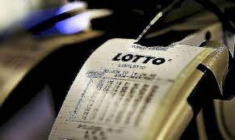

**Advokatens brevkasse**

**Spørgsmål**:

Kære advokat Monica Kromann

Først og fremmest tak for din altid nyttige brevkasse, som ofte har givet mig praktisk viden om problemstillinger vedrørende ægteskab.

Sagen er den, at min kone igennem mange år netop har anmodet om skilsmisse. Vores ægteskab har længe hængt i en tynd tråd, og jeg er ikke uenig i, at det er den rigtige beslutning, at blive skilt. Selvom vi er enige om at blive skilt, er vi dog meget uenige omkring delingen af boet, og vi skændes specielt om en større lottogevinst, som min kone vandt blot få dage inden, hun anmodede om skilsmissen.

Lottokuponen var købt for min kones løn, og hun mener derfor, at gevinsten skal tilfalde hende alene, men da vi altid har haft fælles økonomi og aldrig har oprettet en ægtepagt eller andet, mener jeg, at hun skal dele gevinsten med mig ved skilsmissen.

Jeg håber, at du vil besvare mit spørgsmål i din juridiske brevkasse.

 

Med venlig hilsen

Den fraskilte

SVAR:

Kære fraskilte

Først og fremmest tak for dit spørgsmål til min juridiske brevkasse, som jeg vil forsøge at besvare i det følgende.

Da du og din kone aldrig har oprettet ægtepagt, har I delingsformue i ægteskabet, hvilket betyder, at de af jeres aktiver, som er erhvervet før ægteskabets ophør, skal deles imellem jer ved separation eller skilsmisse.

Din kone har i og for sig ret i, at lottogevinsten tilhører hende, når kuponen er købt for hendes egne midler. Uanset tilhører gevinsten dog din kones delingsformue, da gevinsten er erhvervet før jeres delingsformue er ophørt, altså før din kone anmodede om skilsmisse. 

Ved den forestående skilsmisse står I over for en deling af jeres bo. Dette indebærer, at dine aktiver og passiver bliver stillet op mod hinanden, for at vurdere, om din bodel er solvent, ligesom sin kones aktiver og passiver stilles op mod hinanden, for at vurdere, om hendes bodel er solvent.

Viser det sig, at jeres bodele er solvente, skal I dele dem med hinanden. Dette indebærer, at din kone skal dele halvdelen af værdien af sine aktiver med dig. 

Viser det sig derimod at en eller begge af jeres bodele er insolvente, skal I ikke dele dem med hinanden. Dette følger af et almindeligt familieretligt princip, hvorefter ægtefæller ikke hæfter for hinandens gæld.

For at opsummere, opnår du altså halvdelen af værdien af lottogevinsten, hvis din kone har flere aktiver end hun har passiver. Herefter er der vel kun at sige tillykke med gevinsten!

Jeg håber, at ovenstående var svar på dit spørgsmål. Såfremt du har behov for yderligere vejledning eller assistance i forbindelse med den forestående skilsmisse og bodeling, vil jeg råde dig til at tage kontakt til en advokat med speciale i familieret. Du kan læse mere om familie- og arveretlige emner på min hjemmeside under http://www.advokatkromann.dk/brevkasse.

 

Med venlig hilsen 

Monica Kromann

---

#### Uoverdragelige og personlige rettigheder  

Rettigheder, som ikke kan overdrages eller i øvrigt har personlig karakter, indgår kun i formuedelingen, i det omfang det er foreneligt med de regler, der gælder for disse rettigheder, jf. ÆL § 37.  

**Personlige og uoverdragelige rettigheder omfatter bl.a. ophavsrettigheder, ret til biblioteksafgifter, bundne opsparinger, båndlagt arv og gave samt goodwill**.  

Nogle af disse rettigheders behandling ved formuedelingen er reguleret i anden lovgivning, herunder ophavsretsloven, biblioteksafgiftsloven og arveloven for så vidt angår båndlagt arv (arvelovens §§ 53-58). 

For så vidt angår rettigheder, der ikke er særligt lovreguleret, er der i nogle tilfælde taget stilling i retspraksis, mens andre alene er omtalt i litteraturen.  

Selvom det bliver fastslået, at en rettighed er uoverdragelig eller af personlig art, er det ikke givet, hvordan rettigheden skal behandles ved formuedelingen. 

Det afgøres ud fra en fortolkning af den enkelte rettigheds karakter.

Fravigelse af udgangspunktet om ligedeling kan ske med støtte i en anden lov, forvaltningsakt, privat viljeserklæring, retspraksis og den juridiske litteratur.  

Det følger således af fortolkningen af andre love, private viljeserklæringer m m, i hvilket omfang sådanne fravigelser skal ske. 

I visse tilfælde udtages den pågældende rettighed forlods på skifte ved separation eller skilsmisse af den berettigede, i andre tilfælde fraviges reglen om formuedeling kun i mindre omfang.  

Indtægter og surrogater af personlige rettigheder er i almindelighed delingsformue og undergivet den almindelige ligedelingsnorm. 


---

### Regulering og misbrugskrav efter loven

Hvis en ægtefælle ved misbrug af rådigheden over sin formue eller på anden uforsvarlig måde væsentligt har reduceret delingsformuen, har den anden ægtefælle krav på at blive stillet, som om formindskelsen ikke havde fundet sted. 

Sådanne krav betegnes misbrugskrav, jf. ÆL § 40, stk. 1.  

Misbrugskravet kan kun gøres gældende ved formuedelingen. 

Overstiger misbrugskravet delingsformuen, udtages halvdelen af den manglende del af kravet af særeje eller alders- og kapitalpension, supplerende engangssum og supplerende engangsydelse, jf. ÆL § 34, stk. 2, og ÆL § 35, stk. 2, der tilhører den ægtefælle, der har foretaget misbruget, jf. § 40, stk. 1.  

Misbrugskrav, der ikke er blevet dækket ved formuedelingen, kan senere gøres gældende mod den anden ægtefælle for halvdelen af den del af kravet, der ikke er blevet dækket. 

Misbrug kan bl.a. være uforholdsmæssigt stort forbrug enten af kapital eller ved optagelse af lån, påtagelse af kautionsforpligtelser, tab ved spekulationsprægede forretninger eller lignende. 

Andre dispositioner, der kan udgøre misbrug, kan være pådragelse af erstatningsansvar ved forsætligt eller groft uagtsomme forhold, spirituskørsel, vanrøgt af en ejendom eller forsætlig eller grov uagtsom ødelæggelse af egne aktiver. 

Også gaver til tredjemand kan være misbrug, navnlig hvis ægtefællerne har ophævet samlivet, eller en samlivsophævelse er nært forestående.  

Rimelige indbetalinger på pensionsordninger, jf. ÆL § 34, kan ifølge motiverne aldrig være misbrug, mens indbetalinger af uforholdsmæssigt store beløb på pensionsordninger, der kan udtages forlods i medfør af ÆL § 35 om kortvarige ægteskaber, derimod efter omstændighederne kan være misbrug. 

Ved vurderingen heraf må der lægges vægt på størrelsen af indbetalingerne, om de afviger fra et hidtidigt indbetalingsmønster, og om der er særligt store indbetalinger lige op til anmodningen om separation eller skilsmisse. 

Det kan f.eks. være relevant i tilfælde, hvor en ægtefælle på illoyal måde ved en nærtstående separation eller skilsmisse tegner en privat livrente mod et større engangsindskud, selvom ægtefællen ikke tidligere har foretaget sådanne engangsindskud. 

---

**HR:** Delingsformuen skal deles lige (hvis formuen er positiv), jf. ÆL § 5

**U1**: Har den ene ægtefælle misbrugt delingsformuen, kan den anden ægtefælle have et misbrugskrav, jf. ÆL § 40 

**U2:** Har en ægtefælle overført midler fra delingsformuen til sit særeje, kan den anden ægtefælle have et reguleringskrav, jf. ÆL § 38  

**U3:**  Har en ægtefælle overført midler fra sit særeje til delingsformuen kan denne ægtefælle have et reguleringskrav, jf. ÆL § 39   

---

Reglerne om misbrugskrav finder anvendelse på dispositioner, der er foretaget under hele ægteskabet og ikke kun på dispositioner, der er foretaget i tiden op imod separation eller skilsmisse, men det kan påvirke vurderingen om dette er tilfældet.  

Ved vurderingen af, om der er grundlag for et misbrugskrav, foretages der en samlet bedømmelse af den pågældende ægtefælles dispositioner. 

Det er ikke tilstrækkeligt at bedømme den misbrugsfremkaldende disposition isoleret. 

Der ses også på baggrunden for dispositionen, og hvornår den blev foretaget. 

Jo tættere ægtefællerne er på separation og skilsmisse, jo lavere vil grænsen være for, at der er tale om misbrug. 

Navnlig når der er tale om gaver til en ny partner, vil der skulle mindre til, før der er tale om misbrug. 

Der kan også foreligge misbrug, selvom der ikke er foretaget en, men en række dispositioner. 

Misbrug, der ligger langt tilbage i tiden vil, hvis krav overhovedet rejses, formentlig ofte kunne anses for at være stiltiende accepteret af den anden ægtefælle, hvis denne har haft kendskab til dispositionen.  

Ved misbrug forstås stort personligt forbrug i form af kostbare udlandsrejser, køb af dyr bil, påtagelse af kautionsforpligtelser, pådragelse af uforholdsmæssig stor gæld, tab ved spekulation og spil og vanrøgt i form af undladelser. 

Der må foretages en samlet bedømmelse af ægtefællens dispositioner set i forhold til ægtefællens indtægts- og formueforhold, udgifternes omfang, forbrugets karakter, hensigten med udgifterne og den tidsmæssige sammenhæng med en skiftesituation. 

Forretningsfolk i vid forstand har en bred margin, således at kun forretningsspekulationer, der i høj grad er letsindige eller åbenbart uforsvarlige kan begrunde vederlagskrav. 

---

Som eksempler på bestemmelsens anvendelse, se fra retspraksis dommen i **TFA 2016 116 Ø** (misbrugskrav afvist. Forbrug på ejendom i Spanien i form af ca. 1,3 mio. kr. til istandsættelse og køb af indbo); 

dommen i **U 2006 2792** (boets nettobeholdning var 1,7 mio. I 1998 og 1999 var H’s privatforbrug 986.000 kr. Misbrugskrav på 200.000 kr.); dommen i TFA 2006 119 (salg af andelsbolig i 2-familie hus. Ikke misbrugskrav); 

dommen i **TFA 2001 305** (ikke misbrugskrav); dommen i U 1965 820 (betydelige gaver fra M til K, som han senere giftede sig med, ej misbrug, da de var afholdt af hans løbende indtægter); 

dommen i **U 1964 174** (forbrug på 14.000 kr. i 5 mdr.-periode lige før samlivsophævelse anset som misbrug. M’s bodel var 21.000 kr.; H’s 6.000 kr.) 

samt dommen i **TFA 1997 96** (forbrug på ca. 236.000 kr. på ½ år fra samlivsophævelsen; krav på 127.500 kr.). 

---

Misbrug foreligger også, hvor ægtefællen har ydet gaver til tredjemand af en vis, relativ størrelse. 

Misbrugstærsklen vil være lav, hvor gaven ydes til en ny samlivspartner, særlig hvor en skiftesituation er aktualiseret. 

Meget betydelige arveforskud til et særbarn i en aktuel skiftesituation vil formentlig også kunne udløse misbrugskrav. 

Bodelen må være formindsket væsentligt - i form af forringelse af aktiver eller forøgelse af passiver. 

Der må udøves et samlet skøn over fællesejets værdi før og efter forringelsen, motivet for dispositionen og graden af uforsvarlighed og evt. sammenhæng med en skiftesituation.  

For at der kan rettes et misbrugskrav mod den anden ægtefælle kræves, at delingsformuen er formindsket i væsentlig grad. 

Om formindskelsen er så væsentlig, at der kan kræves misbrugskrav afgøres ved at sammenligne størrelsen af ægtefællens delingsformue før og efter den pågældende disposition. 

Kan der rejses misbrugskrav, er det afgørende for kravets størrelse, hvor stort boslodstab den anden ægtefælle har lidt ved dispositionen. 

Tabet kan derfor først opgøres, når delingsformuerne gøres op og deles mellem ægtefællerne.  

Der opstår ikke misbrugskrav, hvis den ægtefælle, der foretog dispositionen, havde en negativ delingsformue, da dispositionen blev foretaget, da den anden ægtefælle ikke lider tab ved dispositionen.  

Misbrugskrav vil altid stå tilbage for eventuelle kreditorers krav.

---

**En ægtefælle er stillet urimeligt økonomisk:**

Har en ægtefælle formue, der ikke indgår i formuedelingen, kan den anden ægtefælle ved formuedelingen få tilkendt en kompensation for at sikre, at denne ægtefælle ikke bliver stillet urimeligt økonomisk. 

Ved vurderingen lægges vægt på ægteskabets varighed, et eventuelt forudgående samliv, ægtefællernes indtægts-, formue- og pensionsforhold og omstændighederne i øvrigt., jf. ÆL § 42. 

---

### Pensionskompensation 

Efter ÆL § 44 kan der ved formuedelingen tilkendes en ægtefælle en kompensation, hvis ægtefællen under ægteskabet har foretaget en mindre pensionsopsparing, end hvad der svarer til en rimelig pensionsordning for den pågældende, og dette skyldes, at ægtefællen af hensyn til familien eller den anden ægtefælle helt eller delvis har været uden for arbejdsmarkedet, haft orlov eller arbejdet på nedsat tid. 

Kompensationen kan højst udgøre halvdelen af forskellen mellem værdien af den pensionsopsparing, hver af ægtefællerne har foretaget under ægteskabet af delingsformue.  

---

### Rimelighedskompensation


Der kan ved formuedelingen efter ÆL § 45 tilkendes en ægtefælle en kompensation for at sikre, at denne ikke stilles urimeligt i pensionsmæssig henseende, hvis  

1.	ægteskabet har været af længere varighed og 

2.	der er stor forskel i værdierne af ægtefællernes pensionsrettigheder


---

### Udtagelse af aktiver

Hver ægtefælle kan efter vurdering efter ÆL § 48 udtage aktiver, der helt eller delvis indgår i ligedelingen efter § 5, stk. 1, 1. pkt. 

Dette gælder også aktiver, der tilhører den anden ægtefælle.

Anmoder begge ægtefæller om at udtage samme aktiv, udtages aktivet af den ægtefælle, der ejer aktivet, jf. dog § 48, stk. 3, hvoraf fremgår, at uanset ÆL § 48, stk. 2 udtager den anden ægtefælle et aktiv, hvis aktivet for denne har den væsentligste betydning for opretholdelsen af hjemmet eller fortsættelse af erhverv eller i øvrigt. 

---

**Retten til at udtage et aktiv efter 1. pkt. omfatter følgende aktiver**:  

*	**Bolig, der udelukkende eller hovedsagelig er bestemt til familiens helårsbolig**.

*	**Fast ejendom med to beboelseslejligheder, hvoraf den ene udelukkende eller hovedsagelig er bestemt til familiens helårsbolig**.

*	**Fast ejendom, der er bestemt til familiens fritidsbolig**.

*	**Indbo i fælles hjem og fritidsbolig**.

*	**Løsøre, der særlig har tjent den pågældende ægtefælles behov**.

*	**Erhvervsvirksomhed og erhvervsløsøre**.

*	**Transportmidler**.

---

### Formuedeling ved en ægtefælles død


**Hovedreglen er, at delingsformuen skal deles lige, jf. ÆL § 51, med følgende undtagelser:**

**U1**: Særejeaktiver 

**U2**: Personlige rettigheder mm., jf. ÆL § 37

**U3**: Pensionsordninger, jf. ÆL § 52 

**U4**: Førstafdøde ægtefælles pensioner, som tilfalder en begunstiget 

**U5**: Regulerings-, misbrugs- eller kompensationskrav, jf. ÆL § 53 


---


---

**Aspekter af skilsmissen**

**Video: Når det går galt ved en skilsmisse: Familieretten**

<div class="video-container"><iframe src="https://www.youtube.com/embed/ZvS2L4wIKPo" width="853" height="480" frameborder="0" allowfullscreen="allowfullscreen"></iframe></div>

---

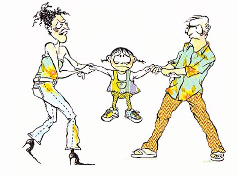

---

**Video: Regler for samvær**  


<div class="video-container"><iframe src="https://www.youtube.com/embed/tEDkwMk96r8" width="853" height="480" frameborder="0" allowfullscreen="allowfullscreen"></iframe></div>


---

**Video: Hvordan møder man skilsmissen?**

<div class="video-container"><iframe src="https://www.youtube.com/embed/o3E7r1JbvpA" width="853" height="480" frameborder="0" allowfullscreen="allowfullscreen"></iframe></div>  

---


 

<!--chapter:end:23.Rmd-->

# Arveretten

```{r, echo=FALSE, results='asis'}
cat(readLines('np.html'))
```


---

**Video: Hvem arver fra dig?**

<div class="video-container"><iframe src="https://www.youtube.com/embed/ikBxcxBSBb8" width="853" height="480" frameborder="0" allowfullscreen="allowfullscreen"></iframe></div>

---


## Introduktion til arveretten

Med arvelovsrevisionen er der blevet gennemført en styrkelse af den længstlevende ægtefælles retsstilling. 

Ægtefæller vil typisk have et ønske om, at længstlevende så vidt muligt kan fortsætte sin livsførelse. 

Arveloven (AL) er derfor søgt indrettet, så dette ønske i højere grad kan realiseres, uden at ægtefællerne behøver at oprette et testamente om begrænsning af børnenes arv. 

Dette er navnlig sket ved en forhøjelse af den legale arveret, fra 1/3 til ½ af arveladerens ejendele, når arveladeren samtidig efterlader sig børn (livsarvinger).  

Arveloven indebærer endvidere, at arvelader har fået større frihed til at disponere over sin formue ved testamente. 

Livsarvingernes tvangsarv er således nedsat fra ½ til ¼ af den legale arv. Også ægtefællens tvangsarv udgør fremover ¼ af den legale arv.  

Endvidere er indført en adgang for arvelader til at begrænse en livsarvings tvangsarv til 1 mio. kr., ligesom arveladeren har fået mulighed for at bestemme, at en livsarving skal have sin tvangsarv udbetalt kontant. 

Dette indebærer, at det bl.a. bliver lettere at ligestille sammenbragte børn i arveretlig henseende, og at gennemførelsen af generationsskifter af erhvervsvirksomheder lettes.  

Herudover giver loven mulighed for, at ugifte samlevende på en særlig nem måde kan oprette testamente om gensidig arveret (et udvidet samlevertestamente). 

I sammenhæng med revisionen af arveloven er gennemført en række ændringer i forsikringsaftalelovens og pensionsopsparingslovens regler om indsættelse af begunstigede.  

De aktiver og passiver, som en afdød efterlader sig, kaldes et dødsbo. Afviklingen af dødsboet mellem arvinger og kreditorer kaldes et skifte.  

De arveretlige regler i arveloven fastlægger, hvem der er arvinger, og hvor meget og hvad den enkelte arving skal arve af det, der er i behold i boet. 

Efterlader afdøde sig ingen gæld, men alene aktiver, og ses der bort fra de forskellige regler om arveafgift (se boafgift og gaveafgift) mv., bliver det de arveretlige regler, der afgør, hvem arvebeholdningen, dvs. boets formue, skal tilfalde. 

De arveretlige regler medfører således en overgang af ejendomsretten til afdødes formue fra den afdøde til arvingerne. Arv er en erhvervelsesmåde på linje med aftale, frembringelse mv.  

En betingelse for at arve er, at arvingen har overlevet arveladeren. 

Bevis for arveladerens død vil i almindelighed let kunne føres ved fremlæggelse af en dødsattest. 

Hvis en sådan ikke kan tilvejebringes, kan en domstol undertiden statuere, at en person er død eller må anses for død (såkaldt dødsformodningsdom).  

Beviset for, at arvingen har overlevet den afdøde, kan give vanskeligheder i visse tilfælde. 

Er der ikke vished for, at en bortebleven person har overlevet afdøde, afsættes kun arv til den pågældende, hvis der er nogen sandsynlighed for, at han/hun er i live. 

Er der vished for, at arvingen har overlevet afdøde, afsættes derimod arvelod, uanset om arvingens opholdssted måtte være ukendt.  

Hvis to personer, som havde arveret efter hinanden, er døde, uden at det vides, hvem der er død først, anses den ene ikke for at have overlevet den anden. 

Reglen har praktisk betydning f.eks. ved trafikulykker, hvor ægtefæller omkommer. 

Et barn, som er avlet forinden dødsfaldet og senere fødes levende, har også arveret. Den gravide kvindes foster er således arveberettiget.  

Det siges, at *"arven er faldet"*, når kravet på arv kan overføres ved aftale, tilegnes af arvingens kreditorer, falde i arv ved arvingens død eller indgå i arvingens eventuelle separations- eller skilsmissebo. 

Dette tidspunkt indtræder som regel ved arveladers død. 

Der gælder særregler, når arveladerens efterlevende ægtefælle overtager et fællesbo til hensidden i uskiftet bo med den førstafdødes livsarvinger.  

Arvinger kan inddeles i tre hovedgrupper: slægtninge, ægtefæller og testamentsarvinger.  

---

## Oversigt over arveloven

**KAP. 1 SLÆGTNINGES ARVERET**  

**KAP. 2 ÆGTEFÆLLENS ARVERET**  

**KAP. 3 SVOGERSKABSARV EFTER EN LÆNGSTLEVENDE ÆGTEFÆLLE**

**KAP. 4 USKIFTET BO**  

**KAP. 7 AFTALE OM ARV SAMT ARVEFORSKUD**  

**KAP. 8 UDELUKKELSE OG BORTFALD AF ARVERET** 

**KAP. 9 TESTAMENTARISK BESTEMMELSE OVER TVANGSARV**  

**KAP. 10 TESTAMENTARISK BESTEMMELSE OVER FRIARV**  

**Kap. 11 OPRETTELSE OG TILBAGEKALDELSE AF TESTAMENTE** 

**Kap. 12 TESTAMENTES UGYLDIGHED OG ANFÆGTELSE**  

---
 
## Arvens fordeling til arveklasser


Arven fordeles til arveklasse 1, 2 eller 3. Er der ingen arvinger i arveklasse 1 går man videre til arveklasse 2, og er der ingen arvinger i arveklasse 2, arver arveklasse 3.  

Ægtefælle har også legal arveret. 

Arvelader kan selv få indflydelse på fordeling af arven ved at oprette testamente. 

Er der ingen arvinger efter arvelov eller testamente tilfalder arven statskassen, jf. AL § 94.  

---

### Arveklasse 1 

Arveklasse 1 er livsarvinger, som er børn, børnebørn, oldebørn osv., jf. AL § 1. 

Børnene arver lige. 

Er et af børnene døde, træder dette barns livsarvinger i stedet og arver lige ¼ af arven er tvangsarv, jf. AL § 5. 

Børns arv kan begrænses til 1 mio. kr., jf. AL § 5, stk. 2. (1.290.000 kr. i 2019).   

AL § 1 omhandler således arv til 1. arveklasse, dvs. arveladerens livsarvinger (tvangsarvinger), som er arveladerens nærmeste slægtsarvinger. 

Børnelinjen omfatter børn, børnebørn, oldebørn osv. Slægtskab foreligger mellem en mor og hendes barn og mellem barnet og den mand, der er barnets retlige far. 

Det er en forudsætning at faderskabet er fastslået inden dødsfaldet eller efterfølgende bliver det. arver lige.  

Er et barn død, træder dets børn i dets sted og arver indbyrdes lige. På tilsvarende måde arver fjernere livsarvinger. 

Denne såkaldte stirpal-grundsætning betyder, at arven inden for hver arveklasse fordeles i »stammer« og ikke efter »hoveder«. 

Børnebørn arver således ikke, så længe barnet lever. 

Når børnebørnene arver, må de »deles« om det afdøde barns arv - det såkaldte »repræsentationsprincip«. 

På tilsvarende måde arver fjernere livsarvinger (oldebørn mv.).   

---

### Arveklasse 2 


Arveklasse 2 er arveladers forældre, jf. AL § 2. Forældrene arver lige. 

Er en af forældrene død, træder dennes børn (arveladers søskende) i stedet og arver lige. Der bliver på denne måde forskel på hel- og halvsøskende. 

Arveklasse 2 er ikke tvangsarvinger. 

Bestemmelsen i AL § 2 omhandler således arv til 2. arveklasse - forældrelinjen. 

Hvis arveladeren ikke efterlader sig livsarvinger, tilfalder arven anden arveklasse, som også kaldes udarvinger. 

Denne arveklasse udgøres af afdødes forældre og disses efterkommere, dvs. arveladerens søskende, nevøer og niecer osv. 

Lever begge arveladerens forældre, arver de hver halvdelen.

---


### Arveklasse 3


Arveklasse 3 er arveladers bedsteforældre, jf. AL § 3. 

Arven fordeles med halvdelen til moderens forældre og halvdelen til faderens forældre. 

Er en af bedsteforældrene døde, træder dennes børn (arveladers faster, moster osv.) i stedet og arver lige. 

Bedsteforældre børnebørn (fætre og kusiner) arver ikke. 

Arveklasse 3 er ikke tvangsarvinger.  

Lever alle 4 bedsteforældre deles arven i 4 portioner. 

Er en af bedsteforældrene død, træder dennes børn i stedet efter repræsentationsprincippet. 

Arveladers farbrødre, fastre, mostre og morbrødre kan således være legale arvinger. Er farfaren død og efterlader sig to børn, arver disse således 1/8. 

Derimod falder arven ikke videre til fjernere livsarvinger. 

Arveladerens kusiner og fætre samt deres børn er således ikke legale arvinger.  
 
Arven mellem bedsteforældrelinien på fædrene side og bedsteforældrene på mødrene side sker efter stirpal-grundsætningen i § 2, og fordeles således ud i ¼ til hhv. farfaren eller dennes børn, farmoren eller dennes børn, mormoren eller dennes børn samt morfaren eller dennes børn. 

Er der kun arvinger på fædrene eller mødrene side, deles arven ud med ½ til hver af disse eller deres børn. 

Efterlades en mormor og to fastre, arver mormoren således ½ og fastrene ¼, mens fætre og kusiner ikke arver.  

  

 


---

**Video: Sådan fordeles arven**

<div class="video-container"><iframe src="https://www.youtube.com/embed/EIgZkPOF0_E" width="853" height="480" frameborder="0" allowfullscreen="allowfullscreen"></iframe></div>


---

## Længstlevendes ægtefælles arveret

Her en oversigt over længstlevendes ægtefælles arveret:  

*	Ægtefællen arver ½, hvis arvelader har børn, jf. AL § 9, stk. 1, ellers det hele jf. § 9, stk. 2. 

*	¼ af arven er tvangsarv jf. AL § 10 

*	Længstlevende ægtefælles har mulighed for at sidde i uskiftet bo

*	Suppleringsarv AL § 11, stk. 2 op til 780.000 kr. (2019) – inklusive:

+	Boslod og særeje for længstlevende ægtefælle

+	Arvelod for længstlevende ægtefælle

+	Forsørgertabserstatning, livsforsikring, pension efter førstafdøde ægtefælle

+	Ægtefællepension og ægtefælleydelse

+	Ved længstlevende ægtefælles død, skal arven (som udgangspunkt) fordeles mellem begge ægtefællers arvinger, jf. AL § 16, stk. 2 
 

---

**Video: Fordeling af arv: Ugift par uden børn**

<div class="video-container"><iframe src="https://www.youtube.com/embed/qYf2gatfAWQ" width="853" height="480" frameborder="0" allowfullscreen="allowfullscreen"></iframe></div>

---

**Video: Fordeling af arv: Ugift par med fælles børn**

<div class="video-container"><iframe src="https://www.youtube.com/embed/cDriXFDNg30" width="853" height="480" frameborder="0" allowfullscreen="allowfullscreen"></iframe></div>

---

**Video: Fordeling af arv: Ugift par med stedbørn**

<div class="video-container"><iframe src="https://www.youtube.com/embed/x7WzAOJJNXQ" width="853" height="480" frameborder="0" allowfullscreen="allowfullscreen"></iframe></div>

---


  
**Video: Arv mellem sammenlevende**

<div class="video-container"><iframe src="https://www.youtube.com/embed/WVec5BYeu34" width="853" height="480" frameborder="0" allowfullscreen="allowfullscreen"></iframe></div>

---

**Video: Fordeling af arv uden børn**

<div class="video-container"><iframe src="https://www.youtube.com/embed/bNa7tt460bY" width="853" height="480" frameborder="0" allowfullscreen="allowfullscreen"></iframe></div>

---

**Video: Fordeling af arv med fællesbørn**

<div class="video-container"><iframe src="https://www.youtube.com/embed/TXaWe8-jz9s" width="853" height="480" frameborder="0" allowfullscreen="allowfullscreen"></iframe></div>

---

**Video: Fordeling af arv: Ægtepar med stedbørn**

<div class="video-container"><iframe src="https://www.youtube.com/embed/MQ6i9G5NxUc" width="853" height="480" frameborder="0" allowfullscreen="allowfullscreen"></iframe></div>


---

**Video: Arv mellem ægtefæller**

<div class="video-container"><iframe src="https://www.youtube.com/embed/UtsI4IWmajI" width="853" height="480" frameborder="0" allowfullscreen="allowfullscreen"></iframe></div>


---

## Uskiftet bo for den længstlevendes ægtefælle

Vælger ægtefællen at sidde i uskiftet bo, får ægtefællen rådighed over alle aktiver og overtager afdødes gældsforpligtelser, jf. AL §§ 24 og 25. 

Kan kun sidde i uskiftet bo med delingsformue – særejet skal skiftes, jf. AL § 17. 

Man kan ikke sidde i uskiftet bo, hvis man ikke har været gift. 

Særbørn skal give samtykke til uskiftet bo, jf. AL § 18. 

Hvis længstlevende misbruger det uskiftede bos midler, kan børnene kræve skifte, jf. AL § 29.  

---

Længstlevende ægtefælle kan således forbruge det uskiftede bos midler og give gaver mv., men kan af hensyn til førstafdøde ægtefælles arvinger ikke råde frit. 

Spørgsmål om misbrug kan indbringes for skifteretten af førstafdødes arvinger, jf. AL §§ 29-32. 

Længstlevende ægtefælle har rådighed uden at være egentlig ejer. 

Den pågældende kan således f.eks. stille sikkerhed, sælge aktiver hørende til det uskiftede bo og give gaver, men skal på den anden side tage hensyn til førstafdøde ægtefælles livsarvinger, idet længstlevende også råder over livsarvingernes potentielle arv efter førstafdødes ægtefælle.  

Når længstlevende dør, skal arven fordeles til begge ægtefællers livsarvinger, men der regnes ikke arv til ægtefællen, jf. AL § 28.  


## Arveladers testationskompetence

Testamenter giver arvelader mulighed for at få indflydelse på, hvem der skal arve, og hvad de skal arve.  

**Oversigt over arveladers testationskompetence**: 

Hovedreglen er, at arvelader kan ved testamente råde over hele sin formue. 

Undtagelsen er, hvis arvelader er gift og/eller har børn, er testationskompetencen begrænset af tvangsarven, jf. AL § 50.

Tvangsarven er som udgangspunkt ¼ af arveladers formue.

**Testationskompetence**

```{r pie,echo=FALSE, message=FALSE,result=TRUE, fig.cap=("En fjerdedel af testators formue er tvangsarv hvis der er børn eller ægtefælle")}
library("chartjs")
chartjs(height = "300px") %>%
  cjsPie(labels = c("Tvangsarv 25%","Friarv 75%")) %>%
  cjsSeries(data = c(0.25,0.75))%>%
cjsLegend(position = "top")
```


---


**Eksempel: Tvangsarv med ægtefælle og 2 børn, formue: 1.200.000,-**

```{r pie2,echo=FALSE, message=FALSE,result=TRUE, fig.cap=("Formuen 1.200.000,- Ægtefællen arver 50% af 25% af formuen  i tvangsarv, børnene hver 25% af 25% af formuen i tvangsarv")}
library("chartjs")
chartjs(height = "300px") %>%
  cjsPie(labels = c("Ægtefælle: 12.5%","Barn 1: 6.25%","Barn 2: 6.25%","Friarv: 75%")) %>%
  cjsSeries(data = c(150000,75000,75000,900000))%>%
cjsLegend(position = "top")
```


---

**OBS: Suppleringsarv er også tvangsarv**. 

Der er tale om en tvangsarveret, der ikke kan fratages ved testamente. 

Retten til forlods udtagelse indebærer, at udtagelsen ikke belaster den længstlevende ægtefælles boslodskrav ved opgørelsen af fællesboet, og heller ikke kravet i henhold til retten til suppleringsarv. 

En længstlevende ægtefælles påberåbelse af AL § 11, stk. 1 vil kunne medføre, at et dødsbo kan sluttes uden skiftebehandling. 

Reglen vil derfor også i praksis blive påberåbt af en længstlevende ægtefælle, der som enearving ville kunne overtage hele boet efter AL § 9, stk. 2. 

---
 
**Video: Hvordan opretter du et testamente?**

<div class="video-container"><iframe src="https://www.youtube.com/embed/TcZb7VCClcQ" width="853" height="480" frameborder="0" allowfullscreen="allowfullscreen"></iframe></div>


## Kravet til et gyldigt testamente  

---


---


*	at testator er fyldt 18 år (15 år for midler den umyndige selv kan råde over)

*	At testator kan handle fornuftsmæssigt

*	At testamentet opfylder kravene til:

*	**Notartestamente**

*	**Vidnetestamente**

*	**Nødtestamente**

---

### Notartestamente, jf. AL § 63


*	Notaren (i Byretten) påtegner testamentet og kontrollerer testators identitet, fornuft, mv.

*	Registrerer testamentet i Centralregistret for testamenter

*	Notartestamentet er svært at anfægte

---

### Vidnetestamente, jf. AL § 64

---


---

*	To vitterlighedsvidner, som ikke selv må være begunstiget i testamentet

*	Vidnerne kontrollerer testators underskrift, fornuft mv.

En person kan ikke være testamentsvidne, hvis:

* testamentet begunstiger den pågældende eller dennes ægtefælle, samlever, beslægtede eller besvogrede i op- eller nedstigende linje, søskende eller andre nærstående. (Forlovede vil sammen med kærester og - efter en konkret vurdering - fjernere beslægtede blive anset for at være nærstående), 

* testamentet begunstiger en person eller institution, som den pågældende ved testamentets oprettelse har en sådan tilknytning til, at testamentsvidnet har haft en særlig interesse i begunstigelsen, eller

* der i øvrigt foreligger omstændigheder, som er egnede til at vække tvivl om den pågældendes habilitet.

Hvis et testamentsvidne har medvirket til oprettelse af et testamente i strid med al § 64, stk. 3, nr. 1-3, er testamentet således anfægteligt. Bevisbyrden påhviler den, der vil arve, hvis testamentet tilsidesættes.


---

### Nødtestamente, jf. AL § 65

---


---

*	Kræver en nødsituation

*	Ingen formkrav

*	Bortfalder efter tre måneder

En nødsituation kunne f.eks. blodprop eller umiddelbart før en stor operation.

Andre nødstilfælde kan være et synkende skib, en naturkatastrofe, samt beslutning om selvmord, jf. **dommene U 1970 10 H, U 1979 108 H og U 2000 1340 H**


---

### Udvidet samlevertestamente

*	Samlevende har ingen legal arveret, kræver oprettelse af testamente

*	Samleverne kan arve hinanden – maksimalt 7/8 af formuen i konkurrence med børn 

*	Samleveren kan udtage suppleringsarv

*	Der kan udloddes svogerskabsarv efter længstlevende samlever

*	Samlevende kan ikke sidde i uskiftet bo

*	Udvidet samlevertestamente skal ændres ved nyt testamente

*	Udvidet samlevertestamente bortfalder ved indgåelse af ægteskab


Hvis et testamente skal ændres eller tilbagekaldes, skal ændringen overholde formkravene til testamenter, jf. AL § 67.  

Et uigenkaldeligt testamente indskrænker testators testationskompetence – arvelader har ikke mulighed for at ændre testamentet. 

Hvis forudsætningerne for at oprette et uigenkaldeligt testamente brister eller var urigtige, kan testamentet være ugyldigt, jf. AL § 77. 


---

**Video: Webseminar om Arv, testamenter og pensioner**

<div class="video-container"><iframe src="https://www.youtube.com/embed/exm1sAFp0dE" width="853" height="480" frameborder="0" allowfullscreen="allowfullscreen"></iframe></div>

---


<!--chapter:end:24.Rmd-->

# <font color="red">Forsikring, pension og ankenævn  <sup> Premium </font></sup>

```{r, echo=FALSE, results='asis'}
cat(readLines('npp.html'))
```

## <font color="red">Rettigheder og forpligtelser i forsikringsretten<sup> Premium </font></sup>


Hvis man graver længere ind i forsikringsretten kommer det tydeligt frem, hvilke rettigheder og forpligelser forsikringstageren og hhv. Forsikringsselskabet har efter forsikringsaftaleloven (FAL):^[Følgende afsnit bygger især på **Sonny Kristoffersen:** Introduktion til forsikringsreglerne, 2019, Hans Reitzels Forlag, jf. link: https://hansreitzel.dk/products/introduktion-til-forsikringsreglerne-bog-47916-9788741272849, samt materialer og afgørelser fra Ankenævnet for Forsikring og informationer fra Forsikringsoplysningen og domme fra UfR og FED udgivet af KarnovGroup.] 


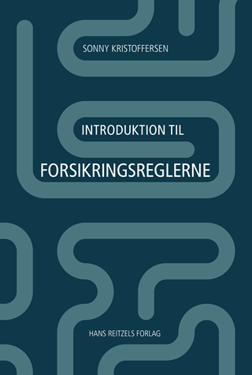

---

## <font color="red">Forsikringsselskabets begrundelsespligt<sup> Premium </font></sup> 


Begrundelsespligten ved forsikringsselskabets afslag på at tegne en forsikring omfatter således i første række tilfælde, hvor selskabet helt afviser at tegne en forsikring. 

Reglen i FAL § 3 b omfatter imidlertid også tilfælde, hvor selskabet ikke umiddelbart kan acceptere forsikringsbegæringen, men hvor selskabet tilbyder at tegne forsikringen på andre vilkår, f.eks. til en højere præmie eller med særlige undtagelser fra forsikringsdækningen, jf. ordene i FAL § 3 b »som begæret«.   

Forsikringsselskabet skal endvidere efter anmodning begrunde enhver opsigelse af forsikringsaftalen. 

Opsigelsen skal således begrundes, uanset om den har hjemmel i lovgivningen (f.eks. forsikringsaftaleloven) eller i forsikringsbetingelserne. 

Opsigelsen skal endvidere begrundes, uanset om den foretages i forsikringstiden eller til forsikringstidens udløb (f.eks. ved etårige forsikringer, der fornys for et år ad gangen, medmindre forsikringen inden da opsiges af selskabet eller forsikringstageren).  

Begrundelsen kun skal gives efter anmodning, dvs. fra den, der har ønsket forsikringen (ved afslag) eller fra forsikringstageren (ved opsigelse). 

Det er alene selskabets (potentielle) aftalepart (forsikringstageren), der kan kræve en begrundelse. 

Begrundelsen skal indeholde en henvisning til relevante retsregler, herunder i forsikringsaftaleloven eller i forsikringsbetingelserne, jf. FAL § 3 b, stk. 2, 1. pkt. 

Dette vil navnlig have betydning ved opsigelse, hvor det skal anføres i begrundelsen, hvilke bestemmelser f.eks. i forsikringsbetingelserne der giver selskabet mulighed for at opsige forsikringen. 

Der skal kun henvises til retsregler, der er relevante for selskabets beslutning. 

Hvis selskabets afvisning af at tegne en forsikring f.eks. er begrundet i en ren risikovurdering, vil der således normalt ikke være retsregler at henvise til i selskabets begrundelse.  

Begrundelsen skal endvidere indeholde en kort redegørelse for, hvorfor forsikringen ikke kan tegnes, eller hvorfor forsikringsaftalen opsiges.  

Begrundelsen skal udformes på en sådan måde, at den fremtræder som en forklaring på, hvorfor selskabet har afvist at tegne eller har opsagt forsikringen. 

Begrundelsen skal angive de væsentligste forhold, herunder navnlig de væsentligste faktiske omstændigheder, der ligger til grund for selskabets beslutning, og skal være udformet sådan, at den må anses for egnet til i hovedtræk at give den forsikringssøgende/forsikringstageren en forståelse af baggrunden for forsikringsselskabets beslutning.

Det skal fremgå af begrundelsen, hvilke forhold der i det konkrete tilfælde gør, at selskabet ikke (længere) ønsker at tegne den pågældende forsikring, f.eks. ved angivelse af de konkrete helbredsforhold, der gør, at forsikringen ikke kan tegnes eller kun kan tegnes på skærpede vilkår. 

En generel henvisning alene til »de afgivne helbredsoplysninger« vil normalt ikke være tilstrækkelig.

Selskabets afvisning af at tegne en forsikring eller opsigelse af en allerede indgået forsikringsaftale vil i nogle tilfælde skyldes en samlet vurdering af det pågældende kundeforhold. 

I disse tilfælde behøver begrundelsen ikke at angive samtlige de forhold, som selskabet har lagt vægt på, men skal blot angive de væsentligste elementer, som ligger til grund for selskabets beslutning.

Begrundelsen skal efter anmodning gives skriftligt, jf. FAL § 3b, stk. 2, 2. pkt., hvilket også vil kunne ske f.eks. via e-mail.

Ved afslag på at tegne en forsikring, som er begrundet i alvorlig sygdom eller lignende, anmoder forsikringsselskabet i dag i visse tilfælde f.eks. den forsikringssøgendes egen læge om over for den pågældende at redegøre nærmere for indholdet af de lægeerklæringer mv., som selskabet har modtaget. 


Selskabet vil kunne henvise den forsikringssøgende til i første omgang at få gennemgået de lægelige oplysninger hos sin egen læge, men således at selskabet efterfølgende må give en skriftlig begrundelse, hvis den forsikringssøgende ønsker det. 

Det forudsættes, at forsikringsselskabet i fornødent omfang orienterer den forsikringssøgende/forsikringstageren om muligheden for at få en begrundelse, herunder at denne vil kunne fås skriftligt.

Dette vil navnlig være relevant, hvis den pågældende giver udtryk for utilfredshed med selskabets beslutning, men af en eller anden grund ikke udtrykkeligt beder om en (skriftlig) begrundelse.

Reglen indeholder ikke et krav om, at selskabet på statistisk eller andet videnskabeligt grundlag skal kunne dokumentere sin risikovurdering, eller i øvrigt skal redegøre nærmere for indholdet af sin almindelige forretningspolitik eller for den risikovurdering, der ligger til grund for selskabets beslutning. 

Det vil f.eks. således normalt være tilstrækkeligt, at selskabet henviser til et eller flere konkrete elementer i de afgivne helbredsoplysninger og meddeler, at selskabet på denne baggrund ikke ønsker at tegne forsikringen eller kun at tegne den på skærpede vilkår.

Begrundelsen giver den forsikringssøgende/forsikringstageren mulighed for at vurdere, om afvisningen/opsigelsen skyldes forhold, der kan ændres af den pågældende, således at forsikringen alligevel kan tegnes eller opretholdes (eventuelt på andre vilkår), ligesom den pågældende kan undersøge mulighederne for at tegne forsikringen i et andet selskab. 

En nærmere begrundelse for selskabets beslutning giver endvidere den forsikringssøgende/ forsikringstageren mulighed for at rette eventuelle misforståelser hos selskabet.

Reglen indebærer, at den forsikringssøgende/forsikringstageren skal gøres bekendt med grundlaget og baggrunden for forsikringsselskabets beslutning, men giver ikke den pågældende mulighed for i den konkrete situation at anfægte selskabets risikovurdering, forretningspolitik mv. 

Der er på denne baggrund ikke knyttet særlige aftaleretlige retsvirkninger til selskabets tilsidesættelse af begrundelsespligten. 

Det betyder imidlertid ikke, at overtrædelse af begrundelsespligten er usanktioneret. 

Et selskabs tilsidesættelse af begrundelsespligten må således anses for at være i strid med redelig forretningsskik og god praksis, jf. lov om finansiel virksomhed § 43.  

Dette indebærer bl.a., at Finanstilsynet kan påbyde selskabet at ændre adfærd, og overtrædelse af et sådant påbud kan straffes med bøde. 

Finanstilsynet vil dog i almindelighed ikke behandle konkrete tvister mellem et forsikringsselskab og forsikringstageren, men alene gribe ind over for en generel adfærd hos selskabet.  

---

## <font color="red">Urigtige oplysninger ved forsikringsaftalens indgåelse<sup> Premium </font></sup> 


Forsikringsselskabets vurdering af, om det vil tegne en forsikring, afhænger i vidt omfang af de risikooplysninger, som selskabet modtager fra forsikringstageren. 

Det er væsentligt, at selskabet modtager så korrekte oplysninger som muligt – dels for at selskabet kan beregne den korrekte præmie og fastsætte de korrekte vilkår for forsikringen, dels for at forsikringstageren/ sikrede undgår, at selskabet senere påberåber sig, at der er afgivet urigtige oplysninger med den virkning, at selskabet helt eller delvist bliver fri for ansvar.  

Har forsikringstageren ved forsikringens tegning svigagtig givet urigtig oplysning om eller fortiet en omstændighed, som må antages at være af betydning for forsikringsselskabet, er forsikringsaftalen ikke bindende for dette, jf. FAL § 4. 

Det samme gælder, hvis hans eller hendes forhold i øvrigt har været af en sådan art, at det ville stride mod almindelig hæderlighed at gøre forsikringsaftalen gældende. 

Det forsikringsretlige svigbegreb kan ikke sammenlignes med det aftaleretlige svigbegreb, der kan være situationer, hvor det accepteres, at forsikringstageren har afgivet urigtige oplysninger.  

---

Se fra retspraksis:

**U 2012.1031 Ø:** Ikke uagtsomt ved tegning af forsikring ikke at oplyse om ikke belastende skade og om overholdt afdragsordning i tidligere selskab. 

---

Svig i forsikringsretlig forstand forudsætter, at forsikringstageren *bevidst har afgivet urigtige oplysninger* for at opnå forsikringen eller opnå denne på mere fordelagtige vilkår. 

Den udviste svig skal være relevant, dvs. at den skal være af betydning for forsikringsselskabet. 

Angår svigen derimod et betydningsløst forhold, kan forsikringsselskabet ikke påberåbe sig FAL § 4. 

Det synes uafklaret, i hvilket omfang selskabet kan påberåbe sig svig, som kun har mindre betydning for selskabet, f.eks. i tilfælde, hvor selskabet normalt ville have tegnet forsikringen på ændrede vilkår, f.eks. til en forhøjet præmie eller med særlige klausuler i forsikringsbetingelserne.  

Forsikringsselskabet har bevisbyrden for, at forsikringstageren har udvist svig, og at den udviste svig er af betydning for forsikringsselskabet. 

*Svigsbegrebet er ikke helt det samme som i den almindelige aftaleret*. 

Forsikringstageren kan være i en situation, hvor det er menneskeligt forståeligt og juridisk acceptabelt, at han giver urigtige oplysninger.

---

Se følgende Højesteretsdom: 


**U 1952.278 H:** Ved tegning af en livsforsikring havde A i forsikringsbegæringen fortiet, at han led af følgerne af en skudlæsion i kæben, hidrørende fra krigstjeneste i „Frikorps Danmark“. Ca. ½ år senere blev han, der ved dette tidspunkt brugte chloral mod smerter fra læsionen, fundet død i sengen med en tom chloralflaske på natbordet. Det fandtes ikke godtgjort, at han udover nævnte fortielse, der ikke kunne antages sket i svigtagtig hensigt, havde givet urigtige oplysninger, og det fandtes ikke antageliggjort, at forsikringsselskabet ikke ville have overtaget forsikringen eller kun overtaget den på særlige vilkår, hvis der havde været givet rigtig oplysning. Selskabets påstand om frifindelse i henhold til FAL 1. §§ 4 og 6 for at udbetale forsikringssummen kunne herefter ikke tages til følge.

---

Har forsikringstageren i andre tilfælde forsætligt eller uagtsomt afgivet urigtige risikooplysninger, kan forsikringsselskabet helt eller delvist blive fri for ansvar efter FAL § 6. 

Må det antages, at forsikringstageren ved forsikringens tegning hverken vidste eller burde vide, at en af ham eller hende given oplysning var urigtig, hæfter forsikringsselskabet, som om den urigtige oplysning ikke forelå. 

Situationen er den, at forsikringstageren ikke har handlet uagtsomt ved afgivelse af oplysningen til forsikringsselskabet.

Det følger af FAL § 7, at forsikringstagerens undladelse af at give oplysning har ingen indflydelse på selskabets ansvar, medmindre han burde være klar over, at den ikke oplyste omstændighed var af betydning for selskabet, og hans forhold kan tilregnes ham som grov uagtsomhed. I så fald anses han, som om han havde givet urigtig oplysning, jf. FAL § 6

---

**Domme om fortolkningen af FAL §§ 4-7**  


**U 1973.616 Ø:** Forsikringstagers godtroende stillingsangivelse som »husmoder« afskar ikke erstatning for skade opstået på vej til deltids rengøringsjob. Har forsikringstageren, uden at forholdet omfattet af ovenstående forhold, givet urigtig oplysning, er forsikringsselskabet fri for ansvar, hvis det kan antages ikke at ville have overtaget forsikringen, om det rette forhold havde været oplyst. I denne situation har forsikringstageren handlet uagtsomt i forbindelse med afgivelse af oplysninger på forsikringsbegæringen til forsikringsselskabet ved forsikringstegning, jf. FAL § 6.


**U 1932.1014 H:** Ulykkesforsikring ej bindende, da forsikringstageren urigtigt havde benægtet, at han var forsikret andetsteds, og at andre selskaber havde nægtet at forsikre ham.

**U 2000.1567:** Ikke erstatning for tyveri af båd, da forsikringstager uagtsomt havde afgivet urigtig oplysning ved tegningen. Begæringen var affattet på engelsk og forsikringstageren oplyste, at han havde overladt udfyldelsen til bådsælgeren, da han i vidt omfang ikke forstod den engelske tekst).

**U 1997.683 H** undlod forsikrede ved tegning af en ulykkesforsikring at oplyse om kraniebrud efter to tidligere færdselsuheld. Retten fandt, at afgivelsen af de urigtige oplysninger kunne tilregnes forsikrede som uagtsom. Assurandør- Societetet (nu Forsikring & Pension) udtalte, at de fleste forsikringsselskaber ville have antaget den pågældende ulykkesforsikring, selv om de havde været bekendt med de rigtige oplysninger. Det fandtes herefter ikke antageliggjort, at selskabet ikke ville have tegnet forsikringen eller kun ville have tegnet den på ændrede vilkår, hvis de rigtige oplysninger var blevet givet.

**I FED 2000.1608 Ø** havde forsikringstageren ikke oplyst om en erklæring fra Teknologisk Institut i forbindelse med tegning af en bygningsforsikring. Det fandtes imidlertid ikke godtgjort, at selskabet ville have taget forbehold, hvis selskabet ved tegningen havde haft kendskab til erklæringen, navnlig fordi forsikringen blev tegnet som en puljeforsikring omfattende 225 ejendomme. Forsikringstagerens undladelse af at give oplysning ved forsikringstegningen har ingen indflydelse på forsikringsselskabets ansvar, medmindre forsikringstageren burde være klar over, at den ikke oplyste omstændighed var af betydning for forsikringsselskabet, og forsikringstagerens forhold kan tilregnes forsikringstageren som grov uagtsomhed. I så fald anses forsikringstageren, som om forsikringstageren havde givet urigtig oplysning, Det antages ikke i praksis, at forsikringstageren har en egentlig oplysningspligt medmindre det må antages, at oplysningen vedrører forhold som forsikringstageren må vide, at det har en betydning for forsikringsselskabets risikobedømmelse. Han eller hun vil i almindelighed kunne indskrænke sig til redeligt at besvare de stillede spørgsmål i forsikringsbegæringen.

**Se Højesteretsdom H.D. af 17. maj 2002. Sag: I 220/2001:** Nyfødt barn var omfattet af forældrenes ulykkesforsikring. Forsikringsselskabet skulle imidlertid ikke dække sygdom i form af blindhed, idet forældrene under de konkrete omstændigheder burde have underrettet selskabet om sygdommen, før forsikringen blev antaget, jf. FAL  § 7. 

---

## <font color="red">Police og forsikringsbetingelserne<sup> Premium </font></sup>


Forsikringstageren police er et forsikringsdokument, der indeholder de generelle og specielle vilkår for en indgået forsikringsaftale. 

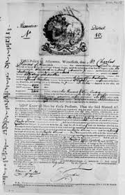

En police er således en af forsikringsselskabet udstedt bekræftelse på, at der er indgået en forsikringsaftale.  

Policen består normalt af en „forside“, hvor de helt individuelle oplysninger fremgår, f.eks. forsikringstager, -sted, -genstand og -omfang. 

Endvidere fremhæves sædvanligt forsikringsbetingelsernes nummer og særlige for forsikringen gældende klausuler, hvis fulde ordlyd oftest er anført på policens „bagside“.  

Den resterende del af policen er forsikringsbetingelserne – som oftest fortrykte standardvilkår – gældende for pågældende forsikringsart på tegningstidspunktet.  

Sagt med andre ord: De nøjagtige regler, som er gældende mellem forsikringstageren og forsikringsselskabet.  

---

## <font color="red">Fortrydelsesret ved tegning af forsikring<sup> Premium </font></sup> 


Når man køber en ny forsikring, kan man fortryde købet af forsikringen. Det gælder også, selv om forsikringstiden er startet. 

*"Forsikringstid“* er det tidsrum, forsikringen er aftalt for.

Ved forsikringsaftaler, der er indgået ved fjernsalg (dvs. aftaler, der bliver indgået uden, at parterne fysisk mødes), bliver ens fortrydelsesfrist på 14 dage regnet fra det seneste af følgende tidspunkter:  

* den dag, hvor forsikringstageren og forsikringsselskabet indgår aftalen eller
  
* den dag, hvor forsikringstageren har modtaget de oplysninger, som  forsikringsselskabet, efter reglerne om oplysningspligt (jf. FAL §§ 34 d-34f), har pligt til at give forsikringstageren på papir eller andet varigt medium.  

For livsforsikring og individuel pensionsordning er fristen dog 30 dage. 

Har man fortrudt sit køb, skal man give skriftlig besked om det til sit forsikringsselskab. 

For livsforsikring og individuel pensionsordning er fristen dog 30 dage.  

Fortryder man aftalen, har forsikringsselskabet ikke krav på præmie. 

Fortryder man aftalen, og har anmeldt en skade til forsikringen, er der ingen dækning for skaden. 

Det gælder også, hvis det er en lovpligtig ansvarsforsikring, man fortryder – for eksempel en bil- eller hundeansvarsforsikring.

---

**Video: Bilforsikring**

<div class="video-container"><iframe src="https://www.youtube.com/embed/6JfjVjptXGs" width="853" height="480" frameborder="0" allowfullscreen="allowfullscreen"></iframe></div>

---

**Video**

<div class="video-container"><iframe src="https://www.youtube.com/embed/H9PzSmkhC48" width="853" height="480" frameborder="0" allowfullscreen="allowfullscreen"></iframe></div>

---

Retten til at fortryde gælder ikke ved ændring af en forsikring, man har i forvejen. 

Det gælder heller ikke for rejse- eller bagageforsikringer eller lignende forsikringer, der har en begrænset løbetid på højest en måned. 

---

*Eksempel:*

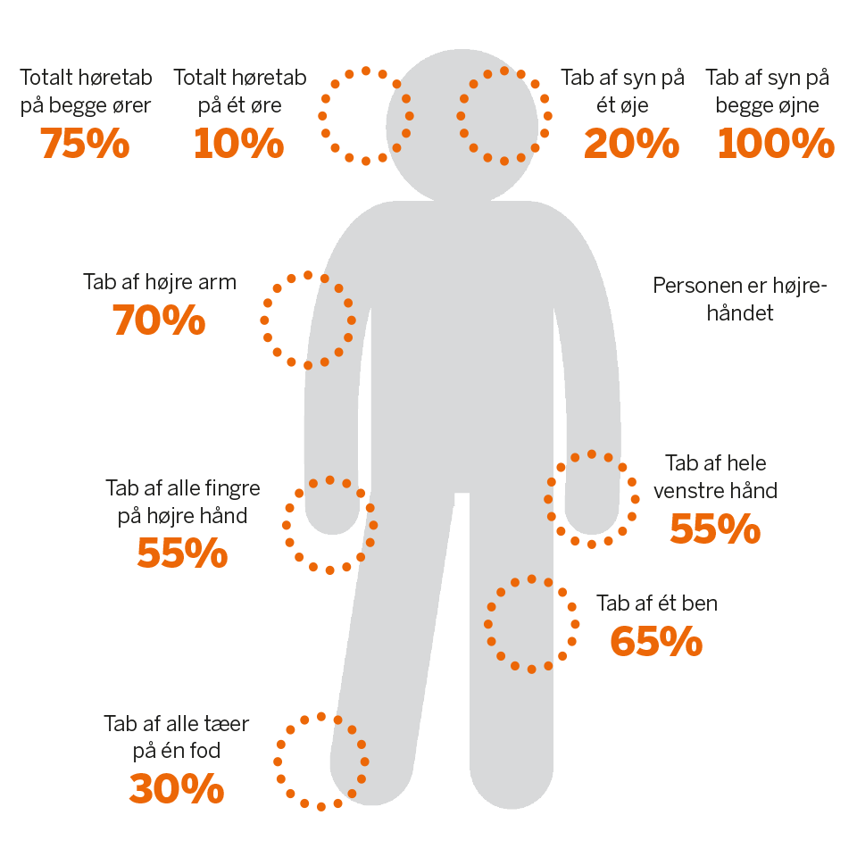

Man køber en ulykkesforsikring, der skal gælde fra den 1. februar. 

Da man modtager policen forsikringsbetingelserne den 4. februar, ønsker man alligevel ikke forsikringen. 

Man har nu en frist til og med den 18. februar til at fortælle forsikringsselskabet, at man ikke ønsker forsikringen. 

Det betyder, at oplysningen fra én skal ligge hos forsikringsselskabet den 18. februar. 

Det er for sent, at forsikringsselskabet først modtager henvendelse den 19. februar eller senere. Sker det, kan aftalen ikke fortrydes. 

---

**Video: Hvordan dækker en ulykkesforsikring**

<div class="video-container"><iframe src="https://www.youtube.com/embed/gsK8tssPiZ0" width="853" height="480" frameborder="0" allowfullscreen="allowfullscreen"></iframe></div>

---


## <font color="red">Indtrædelse af forsikringsselskabets ansvar<sup> Premium </font></sup>


Er forsikringsaftale sluttet, uden at det er bestemt, når ansvaret skal begynde, anses forsikringsselskabets ansvar at indtræde allerede på det tidspunkt, da selskabet eller forsikringstageren afsender meddelelse om, at den anden parts tilbud antages.

---

Se fra sager fra praksis:

**FED 2000.2067:** Telefonisk bestilt forsikring trådte i kraft ved fremsendelse af girokort, selv om skaden skete inden dette var betalt.

**FED 1999.1405:** Forsikringsselskab pålagt at dække en brandskade uanset generelle acceptregler, idet det blev anset for godtgjort, at en indsendt forsikringsbegæring ville være blevet antaget, hvis selskabet havde været uden kendskab til en indtruffet skade.  

---

## <font color="red">Præmien (betalingen) for forsikringen<sup> Premium </font></sup>


Præmiens størrelse og hvornår den skal betales af forsikringstageren fastlægges i overensstemmelse med den enkelte forsikringsaftale, hvor det f.eks. kan bestemmes, at præmien forfalder til betaling hvert år den 1. januar, således at forsikringsselskabet kan kræve præmien betalt pr. denne dato. 

Forsikringstageren kan også vælge kvartalsvis, halvårlig eller helårlig betaling af præmien.  

Betales præmien ikke rettidigt, kan forsikringsselskabet opsige forsikringsaftalen med den virkning, at aftalen ophører, hvis præmien ikke er betalt senest 21 dage efter opsigelsen.   

Forsikringsselskabet kan påberåbe sig manglende betaling af præmien, uanset om den manglende betaling beror på undskyldelige forhold hos forsikringstageren. 

Forsikringsselskabet kan opsige forsikringen ved for sen betaling af præmien. 

Forsikringstagerens manglende præmiebetaling kan i sig selv, dvs. uden at opsigelse er nødvendig, medføre, at forsikringsselskabets ansvar og dermed forsikringsdækningen ophører. 

---

Forsikringsteknisk udtryk:

*Combined ratio*, der også betegnes erstatnings- og omkostningsprocent, er et udtryk for forholdet mellem på den ene side summen af driftsomkostninger og erstatningsudgifter og på den anden side præmieindtægter. 

Combined ratio svarer derfor til summen af erstatningsprocenten og omkostningsprocenten. 

Udgør et forsikringsselskabs combined ratio eksempelvis 100 %, betyder det, at forsikringsselskabet anvender samtlige præmieindtægter til enten erstatningsudbetalinger eller til driftsomkostninger. 

Combined ratio kan beregnes brutto eller for egen regning.

---

En typisk forbrugerforsikring som Familiens Basisforsikring indeholder f.eks. følgende vilkår:   

"Påkrav om betaling sendes til den opgivne betalingsadresse. Ændres betalingsadressen, skal selskabet straks underrettes. Betales præmien ikke, sender selskabet en påmindelse om betaling af præmien. Påmindelsen fremsendes tidligst 14 dage efter forfaldsdagen. Denne påmindelse indeholder oplysning om, at forsikringens dækning ophører, hvis præmien ikke er blevet betalt senest 14 dage efter afsendelsen af påmindelsen. Hvis selskabet har udsendt en sådan påmindelse, er det berettiget til at opkræve et ekspeditionsgebyr«.

---

Forsikring & Pension (brancheorganisationen bag forsikring- og pensionsselskaber) har endvidere udtalt, at det må anses for usædvanligt og i strid med god forsikringsskik, hvis forsikringsbetingelserne ikke indeholder bestemmelser om, at der ved manglende præmiebetaling sendes forsikringstageren en påmindelse med indrømmelse af yderligere betalingsfrist.

De ovenfor citerede forsikringsbetingelser indebærer, at forsikringstageren to gange bliver mindet om betaling af præmien, ligesom han eller hun får en betalingsfrist på mindst 2 gange 14 dage. 

Der stilles samtidig krav om, at det i påmindelsen om manglende betaling udtrykkeligt er anført, at forsikringsdækningen ophører, hvis præmien ikke betales. 

Hvis forsikringsselskabet ikke overholder disse betingelser i forsikringsaftalen, indtræder retsvirkningerne af manglende præmiebetaling ikke. 

---

## <font color="red">Opsigelse af forsikringen<sup> Premium </font></sup>


Der er flere måder, man kan opsige sine private forsikringer på. 

Man kan benytte sig af det korte opsigelsesvarsel, som betyder, at man kan opsige forsikringen med 30 dages varsel til den 1. i en måned. 

Bruger man den korte opsigelse, koster det normalt et gebyr. 

Har man haft forsikringen i mere end 1 år, vil gebyret være omkring 50 kroner. 

Har man derimod haft forsikringen i mindre end 1 år, kan gebyret være væsentlig højere, f.eks. 500 kroner. 

Grunden til, at der er et gebyr, er, at forsikringsselskaberne har haft udgifter, da de oprettede forsikringen. 

Det er altid gratis at opsige sin forsikring til det normale udløb ved hovedforfald. 

Man skal bare huske at kontakte sit forsikringsselskab mindst 1 måned før hovedforfaldet. 

Opsigelsen skal være skriftlig.  

Har man været udsat for en skade, har både forsikringstageren og forsikringsselskabet mulighed for at opsige forsikringen med 14 dages varsel. 

Denne skriftlige opsigelse kan først laves efter, at man har lavet en skriftlig skadeanmeldelse til selskabet, og skal være lavet senest 1 måned efter, at man har modtaget erstatning eller afslag fra sit forsikringsselskab.  

---

## <font color="red">Begrebet "forsikringstid“<sup> Premium </font></sup>


Forsikringstiden er den periode, i hvilken forsikringsselskabet er ansvarlig for betaling af dine eller andres skader, enten fordi årsagen til skaden er indtrådt i forsikringstiden, fordi virkningen af skaden har vist sig i forsikringstiden, eller fordi kravet er rejst i forsikringstiden. 

Det afhænger af, hvilket princip der finder anvendelse. 

Det vil fremgå af de almindelige forsikringsbetingelser (det med det småtrykte), som er blevet udleveret i forbindelse med tegningen af forsikringen. 

---

Eksempel fra retspraksis:

**FED 2008.290:** Uagtet en forsikringsbegæring vedrørende ansvarsforsikring af en bil angav ikrafttræden som 19. maj, blev aftalen anset for at være trådt i kraft den 18. maj, idet assurandøren under et møde den 18. gav forsikringstager et forsikringsbevis, hvoraf ikke fremgik, at forsikringen første trådte i kraft dagen efter. Datoen var indført af assurandøren uden drøftelse med forsikringstager. Selskabet dømtes til at dække det erstatningsansvar, som forsikringstager pådrog sig ved et færdselsuheld, som han var involveret i samme aften.  

---

## <font color="red">Forsikringstagerens pligter over for forsikringsselskabet<sup> Premium </font></sup>


Man har i visse situationer pligt til at tegne forsikring, enten i henhold til lov, obligatoriske vedtægter eller i henhold til en aftale. 

F.eks. er der pligt til at tegne ansvarsforsikring for motordrevne køretøjer, og besidderen/ ejeren af en hund er pligtig til at tegne ansvarsforsikring for hunden.  

---

## <font color="red">Fareforøgelse<sup> Premium </font></sup>


Forsikringens vilkår og præmie er bestemt ud fra de risikooplysninger, der er givet ved forsikringens tegning. 

Hvis risikoforholdene ændrer sig i forsikringens løbetid, ændres forudsætningerne for forsikringen også. 

Det vil derfor i forsikringsaftalen være anført, at den forsikrede skal anmelde ændringer om nærmere bestemte forhold. 

Det kan være ændring af tagbeklædning for et forsikret hus, flytning til et dyrere risikoområde vedrørende bilforsikring eller ændring af erhvervsmæssig beskæftigelse på en ulykkesforsikring. 

Det er derfor en god idé at se i policen under "fareforøgelse" eller "risikoændring" for at sætte sig ind i, hvilke ændringer selskabet skal orienteres om.  

Ligesom ved risikooplysninger ved tegningen er der i forsikringsaftaleloven fastsat regler for, hvordan erstatningen skal gøres op, i tilfælde af at der er sket fareforøgelse. 

Reglerne svarer til dem, der gælder ved forsikringens tegning. 

Dvs. hvis selskabet trods ændringen ville have beholdt forsikringen – men til en højere præmie – beregnes erstatningen ud fra forholdet mellem den præmie, selskabet har fået, og den præmie, der skulle have været betalt.  

Hvis forsikringsselskabet ikke ville have fortsat forsikringen, hvis det havde kendt til risikoændringen (fareforøgelsen), skal forsikringsselskabet ikke betale erstatning. (Reglerne findes i FAL § 45 (skadesforsikring) og FAL § 121. (ulykkesforsikring)).  

---

**Fareomstændigheden skal være tydeligt angivet i policen**.

Se retspraksis:


**U 1996 294 H:** En bestemmelse i en hesteforsikring om, at der skulle gives meddelelse om, hvis der skete ændringer i de forsikrede dyrs forhold, opstaldning og anvendelse, opfyldte ikke kravet for så vidt angik en knælidelse, som den forsikrede hest pådrog sig. 

En hyppigste fareforøgelse forekommer i forhold til ulykkesforsikringer, hvor sikrede skifter erhverv, jf. **Forsikringsankenævnet sagsnr.: 73227, 71829, 71784, 70448, 68172, 68550 og 67175**. 

---

**Forsikringsselskabets pligter**


Forsikringsselskabets pligt eller modydelse kaldes forsikringsydelsen. 

Dvs. erstatningen skal udbetales af selskabet, når der er indtrådt en erstatningsberettiget forsikringsbegivenhed – eller sagt på en anden måde, når der er sket en skade, som er dækket af forsikringen.

---

**Anmeldelse af forsikringsbegivenheden**

Af forsikringsbetingelserne fremgår, at man skal anmelde enhver skade så hurtigt som muligt til forsikringsselskabet. 

På den måde kan forsikringsselskabet danne sig et overblik over skadens omfang og sørge for at indhente supplerende oplysninger om skaden, hvis det er nødvendigt. 

Det kan også være, at skadede genstande bør „sikres“, så det senere er utvivlsomt,hvad skaden omfatter.  

---

## <font color="red">Urigtige risikooplysninger<sup> Premium </font></sup>


Ved forsikringsaftalens indgåelse skal man afgive risikooplysninger, således at forsikringsselskabet kan vurdere risikoen og fastsætte præmie og vilkår. 

Det er derfor vigtigt, at risikooplysningerne er korrekte. 

Hvis oplysningerne ikke er rigtige, kan det føre til nedsat erstatning eller slet ingen erstatning, hvis forsikringsselskabet annullerer forsikringen helt.  

Risikooplysningerne afgives sædvanligvis i et spørgeskema (begæringen). 

I en begæring om familieforsikring spørges der bl.a. om tidligere skadesforløb, og om man tidligere er sagt op af et andet forsikringsselskab. 

Forsikringsselskaberne går ud fra, at oplysninger, der afgives, er rigtige, men undersøger det stikprøvevis i skadesituationen. 

Hvis der er afgivet urigtige oplysninger ved tegningen, medfører det som regel, at forsikringen annulleres med tilbagevirkende kraft, hvis selskabet kan godtgøre, at det ifølge sin acceptpolitik ikke ville have tegnet forsikringen, hvis det havde kendt til de rigtige oplysninger. 

Konsekvensen er, at der heller ikke bliver udbetalt erstatning. Se nærmere i FAL § 6 samt nedenfor.

---

Se retspraksis:

**FED 2015.120:** A havde ikke oplyst F om de rigtige brugerforhold af hendes bil, hvilket var groft uagtsomt i henhold til FAL §§ 6 og 7. F kunne derfor rette et forholdsmæssigt krav mod A.  

---

**Video: Hvordan dækker familieforsikringen**

<div class="video-container"><iframe src="https://www.youtube.com/embed/FfIcQgcMKn4" width="853" height="480" frameborder="0" allowfullscreen="allowfullscreen"></iframe></div>

---

**Risikoforøgelse skal anmeldes til forsikringsselskabet**

Præmien for en forsikring beregnes ud fra risikoforholdene på tidspunktet for forsikringens tegning. 

Ifølge policen/forsikringsbetingelserne skal det anmeldes til selskabet, såfremt der sker ændringer i fx en bygnings benyttelse.  

Manglende anmeldelse af ændringer kan derfor resultere i, at der enten – hvis en risikoforøgelse bortfalder – betales for meget i præmie, eller at forsikringen – hvis risikoen forøges – yder utilstrækkelig dækning. 

---

## <font color="red">Overholdelse af sikkerhedsforskrifter<sup> Premium </font></sup>


Hvis forsikringsselskabet i forsikringstiden har betinget sig, at forsikringstageren skal iagttage visse forholdsregler, der skal forebygge risikoen for skade eller formindske en eventuel skades omfang, foreligger der en *sikkerhedsforskrift*. 

Der kan fx være tale om forbud mod tobaksrygning, pligt til at tilslutte tyverialarm uden for åbningstid o.l. 

Forsikringsselskabet vil normalt afslå at tegne forsikringen, hvis man nægter at imødekomme disse krav. 

Som følge heraf vil det være en væsentlig forudsætning for forsikringsselskabet, at sikkerhedsforskrifterne overholdes. 

En sikkerhedsforskrift skal være præcist bekrevet i policen, og såfremt forsikringsselskabet kan bevise, at forsikringstageren forsætligt eller uagtsomt har overtrådt en sikkerhedsforskrift, der medfører skade eller forøger skadens omfang, er forsikringsselskabet fri for ansvar, medmindre forsikringstageren kan bevise, at det forhold, der er udvist, har været uden betydning for forsikringsbegivenhedens indtræden og skadens størrelse. 

---

## <font color="red">Betalingsproceduren omkring forsikringspræmien<sup> Premium </font></sup>


I forsikringsvilkårene vil det være aftalt, at forsikringsselskabet skal sende et påkrav (typisk fremsendelse af et girokort) til den betalingsadresse, man har opgivet til selskabet. 

(Hvis man skifter adresse, skal man huske at meddele forsikringsselskabet om adresseændringen. 

Selskabet har med få undtagelser ingen pligt til at finde ud af, hvor man er flyttet hen).

Påkravet (girokortet) sendes som regel ud i slutningen af måneden forud for forfaldsdagen, der som regel er fastsat til den 1. i måneden. 

I påkravet vil det være anført, at præmien skal betales senest 21 dage efter forsikringsselskabets påkrav herom.  

Hvis betaling ikke er sket rettidigt, kan forsikringsselskabet, når der er gået yderligere 14 dage, opsige aftalen. 

Dog får man i den forbindelse en frist på endnu 21 dage til at betale i henhold til påkravet. 

I praksis vil en forsikringstager således have i alt 8 uger (3 uger + 2 uger + 3 uger) til at få præmiebetalingen bragt i orden, uden at det får dækningsmæssige konsekvenser.  

Er der tale om en nytegnet forsikring, kan det være aftalt, at forsikringsaftalen ophører uden opsigelse, hvis betaling ikke er sket inden en kortere frist (typisk 1 uge).  

---

## <font color="red">Generelle forhold mellem forsikringstageren og forsikringsselskabet<sup> Premium </font></sup>

Udbetaler forsikringsselskabet ikke erstatning til forsikringstageren inden 14 dage efter, at selskabet har modtaget de nødvendige oplysninger til at afgøre forsikringstagerens krav, skal selskabet betale renter af erstatningen fra denne dato. 

Det fremgår af FAL § 24.  

---

**Se eksempler fra retspraksis:**   

**U 2001 1143 V:** Da forsikringsselskabet hæftede for skadelidtes krav efter færdselsulykke umiddelbart i medfør af den lovpligtige ansvarsforsikring, og da selskabet 1995-11-17 kunne vurdere stationærtidspunktet, var kravet omfattet af § 24 og skulle forrentes fra 1995-12-07.

**U 2003.2269 H** – Grov uagtsomhed ikke godtgjort ved kollision efter overskridelse af dobbelt optrukket spærrelinje. Krav mod lovpligtig ansvarsforsikring ikke omfattet af forsikringsaftalelovens § 24 om forrentning eller § 29 om forældelse.

**U 2005 635 H:** Invaliderente, der var betinget af tilkendelse af offentlig invalidepension svarende til nedsættelse af erhvervsevnen med 2/3, forfaldt først til betaling 14 dage efter, at forsikringsselskabet havde modtaget meddelelse om, at der var tilkendt sådan pension.
  
**FED 2000.70:** Nedbrændt stald omfattet af bygningsbrandforsikring. Reparationsudgifterne måtte antages at overstige 50% af nyværdien, hvorfor sikrede havde været berettiget til at nedrive stalden og kræve genopførelseserstatning, som dog blev reduceret med 50% pga. slid og ælde. Erstatningen skulle forrentes fra 14 dage efter skadedatoen, da forsikringsselskabet, der fejlagtigt havde afvist skaden, selv kunne have tilvejebragt de fornødne oplysninger.

---

Skal forsikringsselskabet erstatte skaden således, at selskabet betaler indkomne fakturaer fra f.eks. håndværkere, tandlæge eller kiropraktor, skal selskabet normalt ikke betale renter til forsikringstageren. 

Betaler forsikringstageren derimod selv eksempelvis håndværkeren, og forsikringsselskabet skal erstatte forsikringstagerens udlæg, forrentes forsikringstagerens krav som udgangspunkt 14 dage efter, at forsikringsselskabet har modtaget fakturaen og forsikringstagerens meddelelse om, at forsikringstageren har betalt (forudsat, at de øvrige betingelser er opfyldt).  

Forsikringsselskabet skal udbetale *aconto-erstatning* til forsikringstageren, hvis en del af erstatningen kan opgøres, og det er sikkert, at selskabet under alle omstændigheder skal udbetale dette beløb i erstatning til forsikringstageren.  

Forsikringsselskabet kan altså ikke tilbageholde hele erstatningen, fordi der stadig er genstande, hvor erstatningen ikke kan fastsættes. Det fremgår nærmere af FAL § 24, stk. 1, og § 25.

---

## <font color="red">Sikkerhedsforholdsregler/sikkerhedsforskrifter<sup> Premium </font></sup>


Police og forsikringsbetingelser kan indeholde krav om, at forsikringstageren skal modvirke/forebygge, at der sker skade på hans eller hendes ting. 

Den type regler kaldes sikkerhedsforholdsregler eller sikkerhedsforskrifter. 

Reglerne findes i FAL § 51. Det er forsikringsselskabets bevisbyrde, hvis selskabet mener, at sikkerhedsforskrifterne er blevet ovetrådt af forsikringstageren.  

*Eksempler på sikkerhedsforholdsregler, som nævnes af Forsikringsankenævnet, kan være:*

* Krav i familie-/indboforsikringen om, at ens bolig skal være forsvarligt aflåst, for at man har ret til erstatning efter reglerne om indbrudstyveri.  
  
* Krav i bygningsforsikringen om, at bygningen skal være forsvarligt   vedligeholdt. 

* Krav i motorkøretøjsforsikringen om, at føreren skal have gyldigt kørekort.  
  
---

**Video: Jørgen har styr på det**

<div class="video-container"><iframe src="https://www.youtube.com/embed/Oi1NnFx8NB4" width="853" height="480" frameborder="0" allowfullscreen="allowfullscreen"></iframe></div>

---

*Se praksis fra Forsikringsankenævnet og retspraksis omkring FAL § 51:*


**FED 1994 52.** (Krav om aflåsning kunne ikke anses som krav om vedvarende aflåsning. Dækning af tyveri fra skab trods uaflåst hoveddør). Den manglende aflåsning skal kunne tilregnes den pågældende som en forsømmelse.

**Forsikringsankenævnet sagsnr.: 42671:** Tyveri sker fra uaflåst bygning, mens klager for en kort periode er inde hos naboen, som har skåret sig i foden og råbt om hjælp. Den manglende aflåsning af huset i denne situation findes ikke at kunne tilregnes klageren som uagtsom, og hun havde derfor krav på erstatning.

**Forsikringsankenævnet sagsnr.: 58950:** Klager over selskabets afvisning af tyveri samt over størrelsen af tilbudt erstatning. Klagerens mor fik frastjålet ur, guldarmlænke og høreapparat. Selskabet mener ikke, at der er tale om indbrudstyveri. Genstandene forsvundet fra plejehjem efter moderens død. Selskabet mener ikke, at værelset har været forsvarligt aflåst, da flere har haft adgang til boligen. Nævnet finder, at effekterne er bortkommet ved tyveri efter forsikringstagerens død. Tyveriet er muligt begået fra ikke forsvarligt aflåst bygning eller lokale, men dette forhold kan ikke bebrejdes afdøde og heller ikke nogen, med hvem afdøde må tåle identifikation. Da sikkerhedsforskriften i forsikringsaftalelovens § 51 herefter ikke er overtrådt ved en forsømmelse af afdøde eller nogen, med hvem hun må tåle identifikation, finder nævnet, at boet efter forsikringstageren er berettiget til erstatning i henhold til reglerne om indbrudstyveri. Klageren fik medhold.

**Se U 2004 993 H:** Forsikringsselskab kunne ikke nægte udbetaling af brandforsikringssum under henvisning til, at forsikringstageren havde tilsidesat sikkerhedsforholdsregler ved halmfyring. Under fyring med halmfyr på en landbrugsejendom opstod der brand, hvorved der opstod skade på ejendommen for ca. 3,7 mio. kr. Forsikringsselskabet F, der havde brandforsikret ejendommen, nægtede at udbetale erstatning til gårdejeren G under henvisning til, at det af forsikringspolicen fremgik, at det var en betingelse, at halmfyringsanlæggets indretning og drift var i overensstemmelse med reglerne i Brandteknisk vejledning, og at disse regler på flere punkter ikke var blevet overholdt. Der havde således været gennemtæringer af lågen til fyret, og der var under branden blevet konstateret halmspild i kedelrummet. Landsretten lagde til grund, at fyrets låge ikke havde været i overensstemmelse med forskrifterne i Brandteknisk vejledning, og at halmspildet ligeledes indebar en overtrædelse heraf, og frifandt F for G's krav om udbetaling af forsikringssummen. Højesteret fandt det betænkeligt at anse det for godtgjort, at G's manglende vedligeholdelse af lågen havde været af en sådan karakter, at den kunne tilregnes ham som en forsømmelse, og fandt det tillige betænkeligt at anse det for godtgjort, at der umiddelbart før branden havde været halmspild i kedelrummet i et sådant omfang, at G havde gjort sig skyldig i forsømmelse med hensyn til overholdelse af sikkerhedsforholdsreglen herom. Højesteret dømte derfor F til at udbetale sædvanlig bygningsbrandskadeerstatning til G.

---

*Forsikringsselskabets bevisbyrde*

Forsikringsselskabet skal bevise, at forsikringstageren ikke har overholdt sikkerhedsforholdsreglen – eksempelvis at døren til lejligheden eller huset ikke var forsvarligt aflåst, eller at bygningen ikke var forsvarligt vedligeholdt.  

Det er også et krav, at forsikringstageren har overtrådt sikkerhedsforholdsreglen ved forsømmelse (uagtsomhed/culpa), og at der er årsagssammenhæng mellem forsikringstagerens forsømmelse og den opståede skade. 

Glemmer forsikringstageren at låse yderdøren, vil der være tale om en forsømmelse i forsikringsretlig forstand. 

Kommer tyven ind gennem den ulåste dør, er der årsagssammenhæng mellem forsikringstagerens forsømmelse og tyveriet. 

Forsikringsselskabet skal derfor ikke betale erstatning efter reglerne om indbrudstyveri. Det betyder, at forsikringstageren ikke får dækket eksempelvis de kontanter og smykker, som er blevet stjålet.  

Se Forsikringsankenævnets **sagsnr.: 91904:**. Klager over, at selskabet havde behandlet et anmeldt indbrudstyveri som simpelt tyveri og afvist at dække stjålne smykker. Tyven var kommet ind ad vindue på 1. sal, mens der ikke var nogen hjemme. Ifølge forsikringsbetingelserne var det et krav, at vinduer var lukkede og tilhaspede, når boligen var forladt. Nævnet fandt, at selskabet havde bevist, at vinduet ikke havde været lukket og tilhaspet, og at et vindue anbragt i udluftningsposition ikke opfyldte kravet til „lukket og tilhaspet“. Da den manglende overholdelse af sikkerhedsforskriften måtte tilregnes klageren som uagtsom, og da der var årsagssammenhæng mellem tyveriet og forskriftens tilsidesættelse, kunne nævnet ikke kritisere selskabets afgørelse. Selskab medhold.  

---

Der vil ikke være tale om en forsømmelse, hvis man på vej ud ad døren får et epilepsianfald og besvimer, og en tyv i samme øjeblik begår tyveri i ens bolig: 

Forsikringsankenævnets **sagsnr.: 41133:** Klager får et epilepsianfald, lige efter hun har låst sin dør op for at gå ud. Hun må lægge sig og falder i søvn, hvorefter hendes taske indeholdende bl.a. guldur og kontanter bliver stjålet fra den uaflåste bolig. Den manglende overholdelse af sikkerhedsforskriften fandtes ikke at kunne tilregnes klageren som uagtsom. 

---

Overser tyven, at døren er ulåst, og smadrer tyven et vindue og kravler ind gennem vinduet, er der ikke årsagssammenhæng mellem, at forsikringstageren glemte at låse døren, og tyveriet. Forsikringsselskabet skal derfor udbetale erstatning:  

Forsikringsankenævnets **sagsnr.: 84958:** Klager over erstatningsopgørelse. Klager anmeldte et indbrudstyveri fra sit hus. Selskabet udbetalte 11.228 kr. i erstatning, men afviste dækning for smykker og kontanter med henvisning til, at huset ikke var forsvarligt aflåst på tyveritidspunktet. Selskabet anførte desuden, at klager havde handlet groft uagtsomt, idet hun ikke havde omkodet husets låse efter et tasketyveri 5 måneder forinden, hvor identifikationspapirer og en husnøgle blev stjålet. Nævnet fandt, at klager havde tilsidesat sikkerhedsforskriften om forsvarlig aflåsning mht. en uaflåst kælderdør, men at selskabet ikke havde bevist, at der var årsagssammenhæng mellem tilsidesættelsen og det skete tyveri. Nævnet fandt det ikke bevist, at klager i øvrigt havde tilsidesat sikkerhedsforskriften om forsvarlig aflåsning. Selskabet var derfor ikke berettiget til at betragte tyveriet som et simpelt tyveri. Nævnet fandt, at selskabet ikke havde bevist, at klager ved grov uagtsomhed havde tilsidesat sin tabsbegrænsningspligt ved ikke at få omkodet sine låse efter tasketyveriet. Klager fik dermed medhold.  

---

Har forsikringsselskabet formuleret dækningsbetingelsen helt objektivt, er der ikke tale om en sikkerhedsforholdsregel. 

Eksempelvis kan selskabet i en familie-/indboforsikring skrive, at der ved indbrudstyveri skal være "tegn på voldeligt opbrud". 

Står dette tydeligt i forsikringstagerens forsikringsbetingelser, får forsikringstageren kun erstatning efter reglerne om indbrudstyveri, hvis forsikringstageren kan bevise, at der er tegn på voldeligt opbrud af ens bolig, og det er uden betydning, om forsikringstageren har udvist nogen forsømmelse eller ej.  

---

## <font color="red">Risikooplysninger og urigtige oplysninger<sup> Premium </font></sup>


Når man tegner en forsikring, skal man som tidligere nævnt normalt give forsikringsselskabet en række oplysninger, så selskabet kan vurdere, hvor stor en risiko det løber ved at forsikre én. 

Disse oplysninger bruger selskabet blandt andet til at afgøre, om selskabet vil forsikre én, og hvad man skal betale for forsikringen. 

Det er derfor vigtigt, at ens oplysninger er korrekte. 

Hvis ens oplysninger ikke er rigtige, kan det betyde, at man får nedsat erstatningen (fordi man har betalt for lidt for forsikringen), eller at man slet ikke får nogen erstatning (fordi selskabet ikke ville have haft en som kunde), jf. FAL § 6.

Man kan også risikere, at forsikringsselskabet opsiger forsikringen, så man ikke længere er forsikret, eller ophæver forsikringen med tilbagevirkende kraft til det tidspunkt, hvor forsikringsaftalen blev indgået. 

Forsikringsselskabet kan kun ophæve forsikringen med tilbagevirkende kraft og helt afvise at betale erstatning til forsikringstageren, hvis selskabet kan sandsynliggøre, at selskabet slet ikke ville have indgået forsikringsaftalen med forsikringstageren, hvis forsikringstageren havde givet korrekte oplysninger.  

Man skal derfor være meget omhyggelig med at svare rigtigt på spørgsmålene, når man indgår en forsikringsaftale. 

Og kontrollér nøje, hvilke oplysninger – f.eks. om antal skader mv. – der fremgår af det forsikringstilbud, man får fra forsikringsselskabet. 

Husk, at det, man mundtligt oplyser til en sælger (assurandør), også skal fremgå af de papirer, man skriver under på, idet man senere hen vil have meget vanskeligt ved at bevise, at man oplyste noget andet til sælgeren end det, man skrev under på. 

Tegner man flere forsikringer på samme tid i forsikringsselskabet, kan man risikere, at de urigtige oplysninger – som man afgav for én forsikring – får betydning for alle de forsikringer, man tegnede samtidig.

---

Se eksempelvis Forsikringsankenævnets sagsnr.: 99.208:  

*Sagsnr.: 99208:** Hvor klageren i forbindelse med køb af indbo-, bil- og ulykkesforsikring i selskabet havde sat kryds i "nej" som svar på spørgsmålet: "Har et selskab over for en i husstanden inden for de seneste tre år stillet krav om skærpede vilkår (f.eks. forhøjet præmie og/eller selvrisiko) efter anmeldelse af skade(r)?". Klagerens tidligere bilforsikringsselskab havde 4 måneder før sendt et brev til klageren, hvor det oplyste, at det forhøjede selvrisikoen. Nævnet fandt, at selskabet ved fremlæggelse af sine interne acceptregler kunne sandsynliggøre, at det, såfremt klageren havde afgivet korrekte oplysninger, ikke ville have tegnet andre forsikringer end den lovpligtige ansvarsforsikring for bilen. Nævnet kunne derfor ikke kritisere, at selskabet havde ophævet alle forsikringerne – bortset fra ansvarsforsikringen for bilen – med tilbagevirkende kraft til tegningstidspunktet. Klageren fik som konsekvens heraf ikke udbetalt erstatning for et indbrudstyveri.

---

Risikooplysningerne afgives ofte i et spørgeskema (forsikringsbegæringen). 

I begæringen om familieforsikring spørger selskabet blandt andet om tidligere skadesforløb, og om man tidligere har fået sine forsikringer opsagt af et forsikringsselskab. 

Forsikringsselskabet kan også spørge, om man er registreret som dårlig betaler. 

I stedet for begæringer stiller en del selskaber telefonisk spørgsmålene til én og beder om, at man på en mail bekræfter, at de svar, selskabet har noteret, er korrekte. 

Forsikringsselskaberne går ud fra, at ens oplysninger er rigtige.

Forsikringsselskaberne undersøger kun stikprøvevis, om ens oplysninger er korrekte. 

Oftest undersøger selskabet først, om ens oplysninger var korrekte, når man har anmeldt én eller flere skader til selskabet. 

Afgiver man oplysningerne telefonisk til forsikringsselskabet, uden at der foreligger et dokument med ens svar, som man efterfølgende har set og godkendt, skal selskabet bevise, at man telefonisk afgav urigtige oplysninger.

---

Se Forsikringsankenævnets sagsnr.: 83753 og 78797:  

*Sagsnr.: 83753** om en arbejdsløshedsforsikring, hvor selskabet ikke kunne bevise, at det havde spurgt klageren, om han var ansat i fleksjob. Selskabet skulle derfor udbetale arbejdsløshedsydelser til klageren, selv om forsikringsselskabet normalt ikke solgte forsikringer, hvis man var ansat i fleksjob.

I **sagsnr.: 78797** kunne selskabet ikke bevise, at klageren telefonisk havde afgivet urigtige oplysninger. „Her var det ikke nok, at selskabet i policen, som klageren modtog efter at have indgået aftalen med selskabet, under et punkt, der hed "Øvrige forhold ved forsikringen", blandt andet havde skrevet "Du har ikke haft skader de sidste 3 år" og "Du er ikke opsagt af – eller har fået skærpede vilkår – i andet selskab". Nævnet henviste her til forsikringsaftalelovens § 10, stk. 3, hvor det fremgår, at hvis selskabet i policen har beskrevet et faktisk forhold uden at have indhentet oplysning om det fra forsikringstageren, kan det ikke komme forsikringstageren til skade, hvis det viser sig, at oplysningen var urigtig“. Reglerne om ens og forsikringsselskabets rettigheder, hvis man har givet urigtige oplysninger, finder man i FAL §§ 4-10.  

---

## <font color="red">Erstatning og renter<sup> Premium </font></sup>


Udbetaler forsikringsselskabet ikke erstatning til forsikringstageren inden 14 dage efter, at selskabet har modtaget de nødvendige oplysninger til at afgøre ens krav, skal selskabet betale renter af erstatningen fra denne dato. Det fremgår af FAL § 24.  

Skal forsikringsselskabet erstatte skaden således, at selskabet betaler indkomne fakturaer fra f.eks. håndværkere, tandlæge eller kiropraktor, skal selskabet normalt ikke betale renter til forsikringstageren. 

Betaler man derimod selv eksempelvis håndværkeren, og selskabet skal erstatte ens udlæg, forrentes ens krav som udgangspunkt 14 dage efter, at selskabet har modtaget fakturaen og forsikringstagerens meddelelse om, at man har betalt (forudsat, at de øvrige betingelser er opfyldt).  

Forsikringsselskabet skal udbetale aconto-erstatning til forsikringstageren, hvis en del af erstatningen kan opgøres, og det er sikkert, at selskabet under alle omstændigheder skal udbetale dette beløb i erstatning til forsikringstageren. 

Selskabet kan altså ikke tilbageholde hele erstatningen, fordi der stadig er genstande, hvor erstatningen ikke kan fastsættes. Det fremgår af FAL § 24, stk. 1, og § 25.

---

*Genforsikring*

Forsikringsselskabet tager ikke altid hele risikoen selv, men kan vælge at foretage en såkaldt genforsikring, dvs. risikoen bliver fordelt på flere forsikringsselskaber. 

Udtrykket genforsikring betegner således , at et forsikringsselskabs forsikringsmæssige risici delvis videregives eller afgives til et andet forsikringsselskab, der betegnes genforsikringsselskab eller reassurandør. 

Nogle forsikringsselskaber er specialiseret i genforsikring og beskæftiger sig udelukkende med at drive genforsikringsvirksomhed (indirekte forsikring), mens andre forsikringsselskaber driver både direkte og indirekte forsikring. Genforsikring involverer betaling af præmie (afgivne præmier) fra det direkte tegnende forsikringsselskab til genforsikringsselskabet. 

Til gengæld modtager det direkte tegnede forsikringsselskab delvis dækning for sine erstatningsudgifter fra genforsikringsselskabet (modtagen genforsikringsdækning). 

Genforsikringsaftaler involverer endvidere betaling af provision fra genforsikringsselskabet til det direkte tegnende selskab, og aftalen kan indebære overskudsdeling, således at genforsikringsselskabet betaler en gevinstandel til det direkte tegnende forsikringsselskab

---

## <font color="red">Under- og dobbeltforsikring<sup> Premium </font></sup>


Forsikringssummen på ens forsikring skal altid mindst svare til forsikringsværdien af f.eks. indboet. 

Dvs. hvad det vil koste at genanskaffe alt dit indbo i tilfælde af en totalskade – fx en brand. 

Forsikringstageren er selv ansvarlig for, at forsikringssummen er rigtig. 

Man er underforsikret, når forsikringssummen er mindre en værdien af ens indbo. 

I tilfælde af en skade betyder det, at erstatningen bliver mindre, end hvad det koster at genanskaffe det ødelagte. 

Ved underforsikring bliver erstatningen regnet ud efter denne formel:  

Skade x forsikringssum = Erstatning  
forsikringsværdi  

---

*Eksempel:*   

Er forsikringsværdien af ens indbo 800.000 kr. og ens forsikringssum kun på 400.000 kr., vil der blive udbetalt halv erstatning for ens skade.

Er ens forsikringssum større end ens værdier, er man overforsikret.

Forsikringsselskabet betaler i den situation alene erstatning for ens skade og ikke for det, man har betalt for meget i forsikring.  

---

## <font color="red">Forældelse af forsikringskrav<sup> Premium </font></sup>


For at man kan få fyldestgjort sit krav, skal man fremsætte det, inden det er forældet. 

Som udgangspunkt sker der forældelse efter 3 år, jf. forældelseslovens § 3, stk. 1. 

Det betyder, at man skal have fremsat sit krav overfor selskabet indenfor 3 år. 

Fristen regnes fra skadetidspunktet. 

Hvis skaden ikke kan konstateres med det samme, regnes 3-årsfristen fra det tidspunkt, hvor skaden opdages eller konstateres, dog således, at der under alle omstændigheder sker forældelse senest 30 år efter skadetidspunktet for så vidt angår erstatning og godtgørelse i anledning af personskade. 

For tingsskade er denne frist 10 år.  

Når en sag indbringes for Ankenævnet for Forsikring inden for forældelsesfristen, forældes sagen ikke, mens nævnet behandler sagen. 

Når nævnets afgørelse foreligger, har man en tillægsfrist på 1 år til at gå videre med sagen til domstolene, hvis man stadig ikke har fået sit krav opfyldt.  

Denne 1-årsfrist løber sideløbende med den almindelige 3-årsfrist, og den længste af de to frister gælder. 

I praksis skal man derfor være opmærksom på, at det ikke kan udelukkes, at ens krav mod forsikringsselskabet kan blive forældet, hvis man ikke anlægger sag mod selskabet ved domstolene inden et år fra afgørelsen i ens sag blev afsendt fra nævnet (datoen på fremsendelsesbrevet til forbrugeren). 

Har nævnet i afgørelsen afgjort, at ens krav mod selskabet allerede var forældet, betyder den omtalte 1 års frist naturligvis ikke, at man kan gøre en allerede indtruffet forældelse virkningsløs. 

Hvis man selv hæver klagesagen ved nævnet, inden nævnet træffer afgørelse i sagen, eller hvis nævnet af formelle grunde helt afviser at behandle sagen, gælder tillægsfristen på 1 år ikke.  

Reglerne kan ikke fraviges af selskabet til skade for forsikringstageren. 

Dog kan selskabet gyldigt aftale en anmeldelsesfrist i forbindelse med forsikringens ophør, hvis denne frist er mindst 6 mdr.  

---

## <font color="red">Klage over forsikringsselskabets afgørelse<sup> Premium </font></sup>


*Ankenævnet for Forsikring* er et privat klagenævn oprettet i 1975 af Forbrugerrådet Tænk og brancheforeningen Forsikring & Pension. 

Ankenævnet er godkendt af Erhvervsministeren og derfor "autoriseret" til at behandle forsikringsklager udenretligt.  

**Kriterier for at klage**  

Klagen skal vedrøre ens forsikringer. Man kan således ikke klage over en afgørelse truffet af modpartens forsikringsselskab.  

Klagen skal vedrøre privatlivets forsikringsforhold: 

Klager vedrørende erhvervslivets forsikringsforhold falder som udgangspunkt uden for Ankenævnets område.  

Klagen skal angå et konkret økonomisk mellemværende: 

Klagen skal altså angå et spørgsmål af økonomisk betydning. 

Ankenævnet kan ikke behandle klager over f.eks. ansattes opførsel, et forsikringsselskabs markedsføring eller andre generelle forhold. Ankenævnet er således ikke et disciplinærnævn eller en tilsynsmyndighed. 

---


**Afvisning af klage**

Af ankenævnets vedtægter fremgår følgende:

"Afvisning af klagesager

§ 4. Nævnet skal afvise klager, der hører under, er under behandling ved eller har været behandlet af et andet privat tvistløsningsorgan, et lovbestemt alternativt tvistløsningsorgan, eller et udenlandsk tvistløsningsorgan, som er anmeldt til Europa-Kommissionen, Konkurrence- og Forbrugerstyrelsen eller en domstol. Er klagen ikke indgivet på en dertil af sekretariatet udarbejdet eller godkendt formular, jf. § 7, eller er klagegebyret, jf. § 23, stk. 1, ikke betalt, afviser sekretariatet at behandle sagen.

Stk. 2. Nævnet kan afvise at behandle en klage over en erhvervsdrivende, der er etableret i såvel Danmark som i et eller flere andre lande, hvis sagen har en større tilknytning til et andet land.

Stk. 3. Nævnet kan afvise at behandle en klage, hvis

1) forbrugeren ikke forudgående over for den erhvervsdrivende har klaget over den erhvervsdrivendes afgørelse eller sagsbehandling,

2) klagen ikke angår et konkret økonomisk mellemværende mellem parterne eller i øvrigt er useriøs eller unødig,

3) klagen på grund af den principielle juridiske karakter, manglende oversættelse af det af parterne indsendte materiale, usikkerheden om bedømmelsen af de fremkomne faktiske oplysninger eller af andre grunde ikke skønnes egnet til behandling ved nævnet, eller

4) behandlingen af klagen i alvorlig grad vil hindre nævnet i at fungere effektivt.

Stk. 4. Er det åbenbart, at klagen ikke kan behandles af nævnet, skal nævnet afvise klagen senest 3 uger efter modtagelsen. I andre tilfælde skal nævnet afvise sagen hurtigst muligt.

Stk. 5. En afvisning skal begrundes, og forbrugeren skal oplyses om muligheden for at indbringe sagen for domstolene og for at få retshjælp og for at søge fri proces. Forbrugeren skal derudover, når det er relevant, oplyses om, at der kan ske forældelse af kravet.

§ 5. Er det åbenbart, at sagen falder uden for nævnets kompetence, kan sekretariatet afvise klagen. En sådan afgørelse skal kunne indbringes for nævnet på forbrugerens anmodning. Nævnets formand kan på nævnets vegne afgøre en sådan anmodning fra forbrugeren.

Stk. 2. Nævnets formand kan på nævnets vegne afvise sager, som ikke skønnes egnede til behandling ved nævnet i medfør af § 4, stk. 3, jf. forbrugerklagelovens § 16, stk. 2".

---

**Behandling af klage** 

Ankenævnet kan ikke behandle klagen, hvis behandling hører under offentlige myndigheder, f.eks. Finanstilsynet, eller andre anke- eller klagenævn. 

Nævnet kan heller ikke behandle klagen, hvis ens sag er afgjort ved endelig dom, gyldigt bindende voldgift eller retsforlig.  

---

**Hvornår kan man klage**  

Man kan først klage til Ankenævnet, når man har klaget til forsikringsselskabet over afgørelsen, og forsikringsselskabet har fastholdt sin afgørelse eller har undladt at besvare ens klage.  

---

**Klagegebyr**

Man skal betale et klagegebyr på 200 kr. Hvis man får medhold i sin klage, får man gebyret retur. Det samme gælder, hvis Forsikringsankenævnet ikke kan afgøre ens sag.  

---

**Sagsbehandlingstid** 

Den typiske sagsbehandlingstid er 6-8 måneder. Sagsbehandlingstiden afhænger i høj grad af, hvor mange gange klageren og forsikringsselskabet ønsker at indsende nye oplysninger eller synspunkter til sagen. 

---

Europæiske klageorganer: Ankenævnet for Forsikring er optaget på Europa-Kommissionens liste over alternative tvistbilæggelsesorganer (ATB-instanser) og kan modtage klager via Europa-Kommissionens online-tvistbilæggelsesplatform (OTB-platform). 

OTB-platformen kan med fordel anvendes, hvis man ønsker at klage over et forsikringsselskab, som er etableret i et andet land end Danmark, og som dermed har leveret en grænseoverskridende tjenesteydelse til forsikringstageren. 

Vil man klage over et dansk forsikringsselskab, anbefaler Forsikringsankenævnet, at man benytter denne hjemmeside. 

Ankenævnet for Forsikring er også tilsluttet FIN-NET – et europæisk netværk af klageorganer i Europa inden for det finansielle område. Klik ind på FIN-NET for at læse nærmere.  

Kontaktoplysninger:  
Ankenævnet for Forsikring  
Anker Heegaards Gade 2  
1572 København V  
Tlf. 33 15 89 00, telefontid 10-13  
www.ankeforsikring.dk  

Hvis klagen falder uden for Ankenævnet for Forsikrings område – det vil navnlig vedrøre klager over modpartens forsikringsselskab og erhvervsforsikring – kan forbrugeren kontakte Forsikringsoplysningen,
Konkurrence- og Forbrugerstyrelsen/Forbrugerklagenævnet eller i den sidste ende starte en sag op ved domstolene. 

---

## <font color="red">Andre finansielle tvistløsningsorganer<sup> Premium </font></sup>


### <font color="red">Det finansielle ankenævn<sup> Premium </font></sup>


**1. Hvad er Det finansielle ankenævn?**

Det finansielle ankenævn er i medfør af lov om forbrugerklager godkendt til at behandle klager over pengeinstitutter, realkreditinstitutter og investeringsfonde.

Ankenævnet er pr. 1. februar 2019 sammensat af Pengeinstitutankenævnet (1988), Realkreditankenævnet (1992) og Ankenævnet for investeringsfonde (2002).

**2. Hvem kan klage?**

Ankenævnet behandler klager vedrørende private kundeforhold. Ankenævnet kan behandle klager fra erhvervsdrivende, der ikke adskiller sig væsentligt fra klager vedrørende private kundeforhold. Ankenævnet behandler ikke klager indgivet af selskaber.

**3. Hvem kan man klage over?**

Ankenævnet behandler klager over danske og færøske pengeinstitutter, realkreditinstitutter og investeringsfonde og deres herværende datterselskaber f.eks. finansieringsselskaber. 

Se en ikke-udtømmende liste over pengeinstitutejede finansieringsselskaber ved brug af følgende link:

https://fanke.dk/det-finansielle-ankenaevn/oversigt-over-finansieringsselskaber-ejet-af-pengeinstitutter/

Man kan klage over et finansieringsselskab, der ikke er ejet af et pengeinstitut, til Ankenævnet for Finansieringsselskaber, www.finansanke.dk. 

Ankenævnet behandler ikke klager over finansielle institutters datterselskaber, der er et forsikringsselskab.

Hvis man ønsker at klage over et forsikringsselskab, kan man klage til Ankenævnet for Forsikring, www.ankeforsikring.dk.

Ankenævnet kan imidlertid behandle ens klage, hvis den vedrører et instituts rådgivning om forsikringer.

Ankenævnet behandler desuden klager over danske filialer af udenlandske pengeinstitutter, realkreditinstitutter og investeringsfonde.

Klager over grønlandske pengeinstitutter falder uden for Ankenævnets kompetence. 

---

**4. Hvad kan man klage over?**

Ens klage kan angå samtlige omstændigheder mellem penge- og realkreditinstituttet samt investeringsfonden og kunden.

Ankenævnet behandler dog ikke klager over eksempelvis ansattes opførsel, et instituts markedsføring eller andre generelle forhold.

Ens klage kan også vedrøre omstændigheder, der er opstået, inden et egentligt kundeforhold blev etableret.

Ankenævnet kan afvise ens klage, hvis den ikke vedrører et konkret økonomisk mellemværende.

Hvis man ønsker at klage over et instituts tilsidesættelse af reglerne om god skik for finansielle virksomheder (bekendtgørelse nr. 1094 af 14. september 2015) skal man klage til Finanstilsynet, Århusgade 110, 2100 København Ø. Se følgende link:

https://www.finanstilsynet.dk/


Ankenævnet afviser klager, der allerede er afgjort af en domstol. Se øvrige afvisningsgrunde, hvorefter Ankenævnet kan eller skal afvise klager, der følger af Ankenævnets vedtægter §§ 3-6:

"§ 3

Stk. 1. Ankenævnet kan ikke behandle sager, som er afgjort ved endelig dom, gyldig bindende voldgift eller retsforlig eller sager, der kan forventes afgjort i forbindelse med en straffesag.

Stk. 2. En voldgiftskendelse er kun bindende, såfremt klageren forinden voldgiftssagen er blevet orienteret om muligheden for ankenævnsbehandling.

Stk. 3. Så længe en klagesag verserer for Ankenævnet, kan sagens parter ikke anlægge sag ved domstolene eller voldgiftsret om de spørgsmål, som klagen omfatter.

§ 4

Sager, hvis behandling i henhold til lovgivningen er henlagt til offentlige myndigheder eller andre tvistløsningsorganer, falder uden for Ankenævnets kompetence.

---

**Afvisning af klagesager**

§ 5

Stk. 1. Ankenævnet skal afvise at behandle en klage, hvis klagen hører under, er under behandling ved, eller har været behandlet af

a) et andet privat tvistløsningsorgan, som er anmeldt til Europa-Kommissionen,

b) et lovbestemt alternativt tvistløsningsorgan, som er anmeldt til Europa-Kommissionen,

c) et udenlandsk tvistløsningsorgan, som er anmeldt til Europa-Kommissionen,

d) Nævnenes Hus eller

e) en domstol.

Stk. 2. Ankenævnet kan afvise at behandle en klage over en finansiel virksomhed, der er etableret i såvel Danmark som i et eller flere andre lande, hvis sagen har en større tilknytning til et andet land end Danmark.

Stk. 3. Ankenævnet kan afvise at behandle en klage, hvis

klageren ikke forudgående har klaget til den person eller afdeling, der i den finansielle virksomhed er ansvarlig for behandlingen af klagesager, eller hvis den finansielle virksomheds klagebehandling ikke er afsluttet. Ankenævnet kan indlede behandling af en klagesag, såfremt den finansielle virksomhed har afvist klagen, eller der ikke forinden 5 uger fra modtagelsen af en klage er opnået forlig mellem klageren og den finansielle virksomhed,

1. klagen ikke vedrører et konkret økonomisk mellemværende,

2. klagen er useriøs eller unødig,

3. klagen på grund af dens principielle juridiske karakter, usikkerheden om bedømmelsen af de fremkomne faktiske oplysninger eller af andre særlige grunde ikke skønnes egnet til behandling i Ankenævnet, eller

4. behandlingen af klagen i alvorlig grad vil hindre Ankenævnet i at fungere effektivt.
 
Stk. 4. Er det åbenbart, at en klage ikke kan behandles af Ankenævnet, afviser Ankenævnet klagen senest 3 uger efter modtagelsen. I andre tilfælde skal Ankenævnet afvise sagen hurtigst muligt.

Stk. 5. En afvisning skal begrundes, og klageren skal oplyses om muligheden for at indbringe sagen for domstolene og for at få retshjælp og for at søge fri proces. Klageren skal derudover, når det er relevant, oplyses om, at der kan ske forældelse af kravet, hvis sagen ikke indbringes for domstolene senest et år efter afvisningen.

§ 6

Stk. 1. Er det åbenbart, at sagen falder uden for Ankenævnets kompetence, kan sekretariatet afvise klagen. Afvisningen skal begrundes over for klageren, der samtidig gøres opmærksom på, at afgørelsen vil kunne indbringes for Ankenævnet, hvilket sker ved sekretariatets foranstaltning, såfremt klageren fremsætter ønske herom.

Stk. 2. De stiftende organisationer kan bemyndige Ankenævnets formand til på Ankenævnets vegne at afvise sager, som ikke skønnes egnede til behandling ved Ankenævnet i medfør af § 5, stk. 3".


---

**5. Hvordan indgiver man en klage?**

Før man klager til Det finansielle ankenævn, skal man have klaget til instituttet og fået afslag, et utilfredsstillende svar eller ikke modtaget svar inden fem uger, efter instituttet har modtaget din klage. 

I alle institutter er der en klageansvarlig. Ens finansielle institut kan oplyse, hvem der er klageansvarlig.

Når man er klar til at indgive sin klage, udfylder man et klageskema via denne hjemmeside. 

Man skal betale et klagegebyr på 200 kr. Ankenævnet sender gebyret tilbage, hvis man enten får helt eller delvis medhold i sin klage, hvis man tilbagekalder sin klage, eller hvis Ankenævnet ikke kan behandle ens klage.

Ankenævnet har tilrettelagt sagsbehandlingen således, at det ikke er nødvendigt at benytte en advokat eller en juridisk rådgiver. 

Sekretariatet er dermed de facto underlagt officialmaksimen og skal dermed oplyse sagen.

Men man kan altid vælge at søge uafhængig rådgivning eller lade sig repræsentere eller bistå af tredjemand. 

Hvis man vælger at lade en advokat føre ens sag, skal man være opmærksom på, at ingen af parterne i klagesagen betaler omkostninger til den anden part i forbindelse ankenævnsbehandlingen.

Man kan starte klagesagen ved anvendelse af dette link:

https://fanke.dk/det-finansielle-ankenaevn/indgivelseafklage/

Hvis man ikke har mulighed for at indgive sin klage via ankenævnets hjemmeside, kan man kontakte Sekretariatet for Det finansielle ankenævn på telefon 3543 6333. Telefontid mandag – fredag kl. 9.30-12.30.

---

**6. Hvordan arbejder Ankenævnet?**

Når forberedelsen af sagen er afsluttet, behandler Ankenævnet ens klage på et ankenævnsmøde.

Man skal indgive sine indlæg skriftligt og uploade dem til Ankenævnets klageportal, som man får adgang til umiddelbart efter opstart af ens klagesag.

Klagen og sagens dokumenter kan indsendes på dansk eller på engelsk. 

Sagsbehandlingen foregår på dansk, ligesom afgørelserne udfærdiges på dansk.

Den gennemsnitlige sagsbehandlingstid afhænger af den tid, der medgår til sagens forberedelse. 

Når sagen er fuldt oplyst, forventes Ankenævnet at træffe afgørelse inden for 90 dage. 

Den gennemsnitlige sagsbehandlingstid er for tiden 6 måneder, fra klagen er indgivet. 

Parterne er ikke bundet af Ankenævnets afgørelse. Instituttet skal dog, når en afgørelse går instituttet imod, inden 30 dage efter afgørelsen er forkyndt, meddele Ankenævnet, hvis instituttet ikke vil opfylde afgørelsen. 

Hvis instituttet ikke foretager sig noget, kan man, efter udløb af de 30 dage fra forkyndelsen er sket, få afgørelsen tvangsfuldbyrdet over for instituttet.

Ønsker den finansielle virksomhed ikke at opfylde afgørelsen, får man meddelelse herom fra Ankenævnet, og man vil samtidig blive orienteret om, hvilke muligheder der er for at gå videre med sagen ved domstolene, herunder om mulighederne for at få Nævnenes Hus, Toldboden 2, 8800 Viborg til at indbringe sagen for domstolene på vegne af én, og om mulighederne for at tvangsfuldbyrde afgørelsen.

Den finansielle virksomhed skal således følge Ankenævnets afgørelse, medmindre den finansielle virksomhed inden 30 kalenderdage meddeler Ankenævnet, at den ikke ønsker at være bundet af afgørelsen eller ønsker sagen genoptaget. 

Hvis den finansielle virksomhed ikke opfylder afgørelsen, kan fogedretten hjælpe én. 

Man kan læse mere om muligheden for såkaldt tvangsfuldbyrdelse/udlæg gennem fogedretten på www.domstol.dk. 

Hvis man anmoder fogedretten om tvangsfuldbyrdelse, skal man vedlægge Ankenævnets afgørelse og en erklæring fra Ankenævnet om, at den finansielle virksomhed ikke rettidigt har meddelt, at den ikke ønsker at være bundet af afgørelsen. 

Nævnenes Hus kan i visse tilfælde efter ansøgning dække udgifter i forbindelse med en tvangsfuldbyrdelse.

Man skal være opmærksom på, at sagen kan blive forældet, hvis man anmoder fogedretten om at foretage udlæg senere end ét år efter Ankenævnets afgørelse.

Hvis man ikke får medhold i sagen vil man, når det er relevant, blive vejledt om mulighederne for at få sagen genoptaget eller gå videre med sagen ved domstolene. 

Man skal som klager være opmærksom på, at sagen kan blive forældet, hvis man anlægger en eventuel retssag senere end ét år efter Ankenævnets afgørelse.

På ankenævnets hjemmeside finder man samtlige afgørelser, som Ankenævnet har truffet.

---

**7. Hvordan er ankenævnet sammensat?**

Ankenævnets formandskab er sammensat af en højesteretsdommer (formand) og to næstformænd, henholdsvis en højesteretsdommer og en landsdommer.

Ankenævnets medlemmer er i øvrigt udpeget af henholdsvis Finans Danmark, Realkreditrådet, Investering Danmark og Forbrugerrådet Tænk. Oversigt over Ankenævnets medlemmer kan ses her ved dette link:

https://fanke.dk/omankenaevnet/oversigt-over-naevnsmedlemmer/

Ankenævnets medlemmer udpeges for en 3-årig periode og kan genudpeges.  

Ved behandling af en klage deltager formanden eller en af næstformændene, to medlemmer fra de finansielle virksomheder 
og to medlemmer fra forbrugersiden. (paritetsprincippet; lige mange repræsentanter fra forbruger- og erhvervssiden ved en afgørelse)

---

## <font color="red">Forsikringsoplysningen<sup> Premium </font></sup>  


https://www.forsikringogpension.dk/presse/publikationer/  

https://da-dk.facebook.com/Forsikringsnoerden/  

https://forsikringsguiden.dk/forsikringsoplysningen/om-os/stil-spoergsmaal/  

https://www.forsikringogpension.dk/presse/tilmeld-nyhedsbrev/  

Godt råd: 

På forsikringsguiden, https://forsikringsguiden.dk/#!/,  
kan man sammenligne forsikringsvilkår og priser fra op til 15 forsikringsselskaber.  

Forsikringsoplysningen  
Philip Heymans Alle 1,  
2900 Hellerup  
Tlf. 33 43 55 00  
fax 33 43 55 01  
www.forsikringsoplysningen.dk  
e-mail: fp@forsikringogpension.dk  


**Ekstramateriale**

---

**Video: Sådan sikrer du din hushandel**

<div class="video-container"><iframe src="https://www.youtube.com/embed/GCogSgE3ZmU" width="853" height="480" frameborder="0" allowfullscreen="allowfullscreen"></iframe></div>

---

**Video: Forsikringsguiden - Husforsikring:** 

<div class="video-container"><iframe src="https://www.youtube.com/embed/Q1DLpo0fPUo" width="853" height="480" frameborder="0" allowfullscreen="allowfullscreen"></iframe></div>

---

**Video: Dagsgebyr for manglende ansvarsforsikring:**

<div class="video-container"><iframe src="https://www.youtube.com/embed/9kHkH-8HxZI" width="853" height="480" frameborder="0" allowfullscreen="allowfullscreen"></iframe></div>

---

Efter § 43 i lov om finansiel virksomhed skal forsikringsvirksomhed udøves i overensstemmelse med redelig forretningsskik og god praksis inden for forsikringsområdet. 

Vil forsikringstageren klage over forsikringsselskabers tilsidesættelse af god forsikringsskik, skal Finanstilsynet kontaktes.  

---

## <font color="red">Finanstilsynet<sup> Premium </font></sup>


Finanstilsynet kan tage sager vedrørende overholdelsen af god skik og de udstedte bekendtgørelser op af egen drift, f.eks. i forbindelse med inspektionsbesøg eller temaundersøgelser. 

Finanstilsynet kan endvidere tage sager op efter anmodning fra Finanstilsynets bestyrelse eller Forbrugerombudsmanden. 

Finanstilsynet modtager tillige henvendelser direkte fra forbrugere, der imidlertid normalt henvises til de finansielle tvistløsningsorganer, hvis klagen også vedrører civilretlige spørgsmål om erstatning eller tilbagebetaling af uretmæssigt opkrævede beløb. 

Erhvervsdrivende henvises til domstolene. Finanstilsynet træffer en traditionel forvaltningsretlig afgørelse med mulighed for administrativ rekurs, og tilsynet har ikke en direkte søgsmålskompetence til domstolene. 

Såfremt en sag om god skik har vidtrækkende eller principiel betydning, skal Finanstilsynet forelægge sagen for Tilsynets bestyrelse.  

Se følgende kontaktoplysninger: 

Finanstilsynet  
Århusgade 110,  
2100 København Ø  
Tlf. 33 55 82 82  
www.finanstilsynet.dk  

e-mail: finanstilsynet@ftnet.dk 

Det kan anbefales, at du tilmelder dig Finanstilsynets nyhedsbreve!

---

**Video: Årsmødet I Forsikring og Pension 2018**

<div class="video-container"><iframe src="https://www.youtube.com/embed/HHljb90aVsk" width="853" height="480" frameborder="0" allowfullscreen="allowfullscreen"></iframe></div>  

---

**Video: Mandrilaftalen – Forsikringer**

<div class="video-container"><iframe src="https://www.youtube.com/embed/EGj0tVWtr6g" width="853" height="480" frameborder="0" allowfullscreen="allowfullscreen"></iframe></div> 

---

**Der følger nu en gennemgang af nogle udvalgte forsikringstyper:**


## <font color="red">Ansvarsforsikring<sup> Premium </font></sup>


Følgende betragtninger og oplysninger om det private ansvar, husejeransvaret, ansvaret for ens hund, skader på arbejdet samt skader ved udøvelse af sportsaktiviteter bygger hovedsageligt på Forsikringsankenævnets oplysninger i ankenævnets ”klageguide” samt Forsikringsankenævnets praksis, herunder på retspraksis, samt viden fra Forsikringsoplysningen.


**Privatansvarsforsikring** 

Privatansvarsforsikringen er normalt er en del af ens familie/indboforsikring. 

Forsikringen dækker den erstatning, man skal betale, hvis man som privatperson forvolder skade på andre personer eller på andres genstande. 

Der er også knyttet en ansvarsforsikring til en række andre forsikringer, bl.a. en bygningsforsikring. 

Privatansvarsforsikringen dækker kun, hvis man juridisk set er erstatningsansvarlig for den indtrufne skade. 

Forsikringen dækker således normalt ikke, hvis man ønsker at betale erstatning ud fra et “rimelighedssynspunkt” eller ud fra ens moralske opfattelse.

Efter dansk ret er man juridisk set ansvarlig for en skade, hvis man har udvist en uforsvarlig adfærd (handling eller undladelse), hvis adfærden kan tilregnes en som forsætlig eller uagtsom, og hvis den skade, som man har forvoldt, må anses for at være en forventelig (påregnelig) følge af ens adfærd. 

Denne såkaldte culparegel står ikke skrevet i nogen lov, men er udviklet gennem en langvarig retspraksis.

Hændelige skader er man ikke ansvarlig for, se f.eks. her fra retspraksis følgende afsagte domme:


---


**FED 2018.05 V.L.D. af 6. juli 2018. Sag: B-1381-17:** 2-årigt barn A, der blev passet af gudmor B, kom alvorligt til skade, da A fik fingre i skål med skoldhed suppe, der væltede ned over A. A og B opholdt sig i et køkken, og B havde vendt ryggen til A i ca. 2 sek. Det var ikke oplyst, hvor på køkkenbordet skålen var placeret, og A havde herefter ikke bevist, at B havde udvist ansvarspådragende uagtsomhed.

---


I **sag 86059** fandt Forsikringsnævnet eksempelvis, at klageren havde handlet ansvarspådragende ved at lade en veninde til sin datter benytte en trampolin, hvis sikkerhedsnet ikke var monteret korrekt. 

---


*Sag 88426:** Klager over afslag på dækning for en ansvarsskade, hvor klagers 12-årige søn var skadevolder. Efter afsluttet fodboldspil, hvor de var på vej ud for at samle bolde ind, gav sønnen faderen et hårdt skub i ryggen, så han faldt forover og beskadigede knæet. Selskabet henviste til, at sønnen ikke var ansvarlig for skaden. Nævnet fandt, at sønnen havde udvist en adfærd, som kunne tilregnes ham som uagtsom. Klagers tilskadekomst var derfor omfattet af hjemforsikringens dækning for ansvar ved personskade. Nævnet lagde vægt på, at skubbet ikke kunne anses for at være sket under et igangværende fodboldspil eller under farlig leg. Klager medhold.

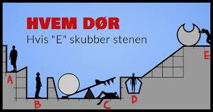

---


**Sag 87739:** Klager over afslag på at dække en ansvarsskade forvoldt af klagers søn. Sønnen beskadigede gulvet i sit værelse på efterskolen, da han tabte et tændt heksehyl, som han ville smide ud af vinduet. Forsikringen dækkede ikke ansvar på skader på ting, som den sikrede havde i sin varetægt. Nævnet fandt derfor ikke at kunne kritisere selskabets afgørelse. Selskab medhold.

---


**Sag 86992:** Klager over afslag på dækning for en anmeldt ansvarsskade. Klager anmeldte, at der var sket skade på hendes nabos gulv i forbindelse med, at hun havde passet naboens hus og have og ikke havde fået lukket tilstrækkeligt for vandet efter vanding af blomster. Herved var vandet løbet gennem en haveslange dryppet ned i en spand, hvor haveslangens frie ende var placeret, hvorefter vandet løb ud på gulvet. Selskabet anførte, at der var tale om en hændelig skade. Nævnet fandt, at skaden opstod ved klagers udførelse af en vennetjeneste for naboen, hvor hun ikke fik lukket forsvarligt for vandet. Nævnet fandt, at klager herved havde handlet ansvarspådragende, og lagde bl.a. vægt på, haveslangen var placeret i stuen, og at huset henstod ubeboet på tidspunktet for skadens indtræden. Det forhold, at klagers kortfattede mail af 12/8 2014 kunne give anledning til usikkerhed om, hvem der placerede spanden i stuen, kunne efter nævnets opfattelse ikke føre til andet resultat. Selskabet skulle derfor anerkende, at klager var erstatningsansvarlig. Klager medhold.


**Sag 86059:** Klager over afvisning af dækning for en knæskade, som klagers datters veninde (12 år) pådrog sig under et hop på klagers trampolin den 3/6 2013. Selskabet afviste dækning med henvisning til, at der var tale om et hændeligt uheld, og at klager ikke var ansvarlig for den skete skade. Nævnet fandt, at klager havde handlet ansvarspådragende ved at lade datterens veninde benytte en trampolin med et sikkerhedsnet, der ikke var monteret korrekt. Nævnet fandt det godtgjort, at den mangelfulde montering af sikkerhedsnettet var medvirkende årsag til, at venindens fod satte sig fast, så hun kom til skade. Selskabet skulle derfor anerkende, at klager var ansvarlig for de skader, som veninden måtte have pådraget sig. Det forhold, at skadelidte og skadelidtes mor var bekendt med sikkerhedsnettets tilstand, kunne ikke føre til andet resultat. Klager medhold.


**Sag 85472:** Klager over afvisning af dækning for en ansvarsskade over en familieforsikring. Klager havde etableret et stort hul i gulvet i sin ejerlejlighed med henblik på at opsætte vindeltrappe. En maler faldt ned gennem hullet og kom til skade. Selskabet afviste ansvarsdækning med henvisning til, at der var tale om et grundejeransvar, som ikke var dækket af forsikringen. Nævnets flertal fandt, klagers eventuelle ansvar var et culpaansvar uden for kontrakt, og at han havde ageret som privatperson. Det eventuelle ansvar var derfor dækningsberettigende. Betingelsernes punkt 8.1.4 vedrørende grundejeransvar kunne alene anses for et tillæg til, og ikke en indskrænkning af, den dækning, der ydedes efter hovedreglen i punkt 8.1.1 om ansvar som privatperson. Mindretallet fandt, at betingelsernes 8.1.4 udtømmende gjorde op med dækningen for grundejeransvar, og at den anmeldte skade ikke kunne henføres herunder. Mindretallet bemærkede, at klager kunne have tegnet en entrepriseforsikring. Klager medhold.*

---

Forsikringen dækker normalt ikke, hvis man har handlet forsætligt (med vilje). Det ses eksempelvis i Forsikringsankenævnets **sag 86464**:

---


**Sag 86464:** Klager over dækning for erstatningsansvar som følge af brand i solcenter. Klager og en veninde havde i et solcenter sat ild til papirstykker i kabinerne, som fik fat i en papirdispenser, der begyndte at brænde. Pigerne forlod solcentret og den rygende papirdispenser. Der var efterfølgende sket brandskader for 2,3 mio. kr. Klager blev idømt solidarisk ansvar med veninden for skaderne. Selskabet afviste at yde dækning med henvisning til at skaderne var sket med forsæt. Klager gjorde gældende, at det ikke var hende, der konkret havde sat ild til det papirstykke, der førte til ild i papirdispenseren og de efterfølgende brandskader. Nævnet fandt, at skaderne var sket med forsæt fra klager og lagde navnlig vægt på, at et solidarisk ansvar var omfattet af dækningsundtagelsen, og at klager ved sin medvirken og ved at forlade stedet med en rygende papirdispenser, der havde været ild i måtte have indset, at der herved var nærliggende risiko for yderligere skader. Selskab medhold.

---

Har forsikringstageren handlet forsætligt, må han eller hun selv betale erstatning til den skadelidte. 

Har et barn under 14 år handlet forsætligt, dækker ansvarsforsikringen dog som udgangspunkt også sådanne forsætlige skader. 

Det samme er tilfældet, hvis man – da man forvoldte skaden – på grund af ens sindstilstand manglede evnen til at handle fornuftsmæssigt.

Man kan efter omstændighederne pålægges erstatningsansvar, hvis andre personer lider tab som følge af redningsaktioner til fordel for en selv. 

Privatansvarsforsikringen dækker også et sådant ansvar, i det omfang kravet ikke dækkes af lov om arbejdsskadeforsikring, og i det omfang redningsaktionen ikke sker som et led i redningsmandens erhverv.

Man bør som forsikringstager være tilbageholdende med at anerkende et erstatningsansvar på egen hånd, da man risikerer, at forsikringsselskabet er uenigt og derfor ikke vil dække skaden. 

Man bør derfor normalt kontakte sit forsikringsselskab og bede forsikringsselskabet om at tage stilling til, om man har pådraget sig et ansvar efter dansk rets almindelige erstatningsregler, som forsikringsselskabet vil dække i henhold til policen og forsikringsbetingelserne.

Bliver man sagsøgt af en person, der mener, at man er erstatningssvarlig som privatperson, kan det være hensigtsmæssigt at få en advokat til at føre ens sag. 

Hvis forsikringsselskabet er enigt i, at man ikke er erstatningsansvarlig, dækker forsikringen normalt også sådanne sagsomkostninger til en advokat.

Mener man, at forsikringsselskabets afvisning af at dække en skade – som man har forvoldt på andres ejendom eller på andre personer – er forkert, er det er en god ide at drøfte med sagsbehandleren i forsikringsselskabet, hvad der skal til, for at man kan bevise, at man har ret. 

Er man stadig utilfreds, kan man kontakte forsikringsselskabets klageansvarlige, hvis man mener, at sagsbehandleren, er nået til et forkert resultat i sagen.

Man skal altid have klaget til forsikringsselskabet over dets afgørelse, før man har adgang til at klage til Forsikringsankenævnet.

Det er værd at bemærke, at Forsikringsankenævnet ikke kan behandle en klage, hvis man som skadelidt mener, at skadevolderens forsikringsselskab skal erstatte de skader/tab, som skadevolderen har påført en som skadelidt. 

Det skyldes, at ankenævnet kun kan behandle klager over forsikringer, som man selv eller en i ens husstand har købt. 

Og da det ikke er skadelidtes forsikring, der rettes krav imod, kan Forsikringsankenævnet ikke behandle sagen.

Hvis man som skadelidt ikke kan blive enig med skadevolderen eller med vedkommendes forsikringsselskab, er skadelidte nødt til at anlægge en retssag ved domstolene mod skadevolderen. 

Skadelidte kan eventuelt få retshjælpsdækning til at føre en sådan retssag. Se f.eks. nævnte ankenævnssag:

Ofte kan der være oplysninger i en sag om erstatningsansvar, som ikke giver et entydigt billede af, hvad der er sket. 

Hvis der er tvivl om, hvad der er sket, vil forsikringsankenævnet altid vil foretage en konkret vurdering af validiteten af de oplysninger, som klageren (forsikringstageren) og forsikringsselskabet er fremkommet med. 

Forsikringsankenævnet vil normalt lægge størst vægt på de oplysninger, der er fremkommet fra uvildige parter. 

Og ankenævnet vil ofte lægge betydelig vægt på de forklaringer, som forsikringstageren eller en anden person først har givet til forsikringsselskabet eller til en tredjemand.

---

## <font color="red">Uagtsom, forsætlig og hændelig skade samt gæstebudsskade<sup> Premium </font></sup>


Privatansvarsforsikringen dækker som nævnt, hvis forsikringstageren juridisk set har pådraget sig et erstatningsansvar. 

For at pådrage sig et erstatningsansvar skal man bl.a. have udvist en uforsvarlig adfærd (handling eller undladelse), som kan tilregnes én som forsætlig eller uagtsom, og den skade, man har forvoldt, skal være en påregnelig følge af ens adfærd. 

Denne såkaldte culparegel står ikke skrevet i nogen lov, men er udviklet gennem langvarig retspraksis.

---

## <font color="red">Uagtsom<sup> Premium </font></sup>


Man har handlet uagtsomt, hvis man har handlet anderledes en almindelig, fornuftig person, dvs man har handlet i strid med almindelige normer for adfærd i den pågældende situation. 

Ens adfærd vil med andre ord blive betragtet som uagtsom, hvis den afviger fra de i samfundet almindeligt anerkendte, forsvarlige handlemønstre. 

Det ses eksempelvis – som allerede nævnt – i Forsikringsankenævnets **sag 86059**, hvor ankenævnet fandt, at klageren havde handlet ansvarspådragende ved at lade en veninde til sin datter benytte en trampolin, hvis sikkerhedsnet ikke var monteret korrekt. 

Ligeledes er Forsikringsankenævnets **sag 88426** om en 12-årig dreng, der skubber en voksen i ryggen, samt **sagerne 87739, 86992 og 85472** relevante.  

---

## <font color="red">Forsætlig<sup> Premium </font></sup>


Man har handlet forsætligt, hvis man havde vilje til at forårsage den skade, der indtrådte, hvis man havde indset, at skaden ville indtræde, eller hvis man ikke ville have handlet anderledes, selv om man havde indset, at skaden med stor sandsynlighed ville indtræde. 

Det ses eksempelvis i tidligere nævnte Forsikringsankenævns **sag 86464**, hvor nævnet fandt, at brandskaderne på et solcenter var sket med forsæt, da skadevolderen måtte have indset, at der var nærliggende risiko for skade, idet en papirdispenser røg, da skadevolderen forlod solcentret.

Privatansvarsforsikringen dækker ikke, hvis man har forvoldt skaden forsætligt. 

Har man handlet forsætligt, bliver man selvfølgelig erstatningsansvarlig over for skadelidte, men det er ikke noget, som ansvarsforsikringen dækker. Her må skadevolder selv betale. 

Dette gælder dog ikke for børn under 14 år, der handler forsætligt, medmindre det klart fremgår af forsikringsbetingelserne, at børns forsætlige handlinger ikke dækkes. 

---

Det følger af forsikringsaftalelovens (Lovbekendtgørelse nr. 1237 af 9. november 2015) § 19, stk. 1:

"Bestemmelserne i FAL§ 18 om bortfald eller begrænsning af selskabets ansvar finder ikke anvendelse, når den sikrede var under 14 år eller på grund af sindssygdom, åndssvaghed, forbigående sindsforvirring eller lignende tilstand har manglet evnen til at handle fornuftsmæssigt".


---

Se følgende domme:


**U 1964.786 H:** To 7-årige drenge havde begået hærværk på en bigård og herved pådraget sig erstatningsansvar. Deres forældre havde tegnet familieansvarsforsikringer. Da de i de pågældende selskabers policer indeholdte vilkår ikke med tilstrækkelig klarhed udelukkede anvendelse af den særlige bestemmelse i forsikringsaftalelovens. § 19, stk. 1, jfr. § 18, tilpligtedes selskaberne at friholde drengene for erstatningsansvaret.

---


**U 1954.746 H:** Hvor en mand fik udbetalt en ulykkeserstatning for hustruen uanset, at han havde dræbt hende og deres 6 børn. Da han var sindssyg i gerningsøjeblikket, lidende af en psykogen sindssygdom, måtte det antages, at han ved begåelsen af drabet på grund af sindssygdom havde manglet evnen til at handle fornuftsmæssigt og da drabet måtte anses for en af forsikringen omfattet begivenhed, fandtes han i medfør af forsikringsaftalelovens § 19, stk. 1, at have krav på forsikringsydelsen.

---


**U 1982.528 H:** Hvor en mand dræbte sin hustru og hund, hvorefter han satte ild på sit hus, hvorved han indebrændte. Det var ubestridt, at han havde handlet forsætligt, jf. forsikringsaftalelovens § 18, stk. 1. Retslægerådet mente, at der ikke var sikre holdepunkter for, at mandens handling skyldtes sindssygdom eller lignende tilstand. Retten antog – på grund af det abnorme handlingsforløb – at manden havde befundet sig i en sygelig sindstilstand, hvorfor forsikringsselskabet skulle udbetale forsikringssummen.


**U 2006.1961 Ø:** Hvor en mand satte i suicidal øjemed ild til sin ejendom. Retslægerådet skønnede at han ikke var sindssyg og heller ikke var det på gerningstidspunktet. Rådet fandt dog – med henvisning til omfattende alkoholmisbrug – at manden mest sandsynlig var omfattet af straffelovens § 69. Landsretten bemærkede, at forsikringsaftalelovens § 19, stk. 1, har et bredere anvendelsesområde end straffelovens § 16, idet forsikringsaftalelovens § 19, stk. 1, blandt andet omfatter »forbigående sindsforvirring eller lignende tilstand«. Bevisbyrden for, at den sikrede ved fremkaldelse af forsikringsbegivenheden opfylder det psykiske kriterium, ligger hos kravstilleren, jf. **U 1982.528 H**, nævnt ovenfor. Det er en relativ tung bevisbyrde.

Et eksempel på en forsætlig skade er Forsikringsankenævnets **sag 86048**, hvor nævnet fandt, at klagerens søn havde handlet forsætligt, da han – mens han stod med ryggen til og i irritation over at være blevet låst ude af nogle klassekammerater – sparkede bagud mod en dør og en siderude. Nævnet fandt, at det var overvejende sandsynligt, at ruden ville gå i stykker ved en sådan handling.

---

## <font color="red">Hændelig<sup> Premium </font></sup>


Forvolder man en skade hændeligt, dækker ens ansvarsforsikring heller ikke. At det er hændeligt, betyder, at skaden indtræffer tilfældigt, og uden at det skyldes uagtsomhed eller forsømmelse fra ens side. I den situation bliver man ikke juridisk erstatningsansvarlig efter dansk ret. 

Derfor må skadelidte i en sådan situation selv bære tabet, med mindre skadevolder alligevel betaler, fordi skadevolder føler, at skadevolder er moralsk ansvarlig. Men dette er ansvarsforsikringen uvedkommende. 

Af relevante sager kan nævnes Forsikringssankenævnets **sag 86248**, hvor en kvinde tissede i en seng, samt forsikringsankenævnets **sag 81840** om en kajak, der i en carport faldt ned på en bil:

---


**Sag 86248:** Klager over afvisning af dækning for en skade på klagers vens seng forårsaget af klagers ufrivillige vandladning. Selskabet henviste til, at uheldet var hændeligt, og at klager ikke havde handlet uagtsomt, hvorfor selskabet ikke kunne anerkende, at hun havde handlet ansvarspådragende. Nævnet fandt, at klager ikke havde udvist fejl eller forsømmelser forud for skadens indtræden, hvorfor klager ikke kunne pålægges et ansvar for den indtrufne skade. Nævnet fandt endvidere, at klagers lejlighedsvise brug af et præparat mod ufrivillig vandladning ikke kunne ændre herpå. Selskab medhold.*


**Sag 81840:** Klager over afvisning af at dækning af ansvarsskade. Klagers kajak, der var opmagasineret i hans tidligere udlejers carport, blæste under storm ned fra sin placering mellem to bjælker og forårsagede herved skade på udlejers bil. Selskabet afviste dækning med henvisning til, at skaden var hændelig. Selskab medhold.

---

## <font color="red">Gæstebudsskade<sup> Premium </font></sup>


Forvolder man skaden under almindeligt privat samvær – typisk af selskabelig karakter – dækker ansvarsforsikringen i en række situationer, hvor domstolene vil være tilbageholdende med at pålægge en et juridisk erstatningsansvar. Disse skader kaldes normalt for *“gæstebudsskader”.* 


Et eksempel er Forsikringsankenævnets **sag 75029**, hvor klagerens datter – mens hun var på besøg – beskadigede et trægulv med sine spidse stilethæle. 


Der kan også henvises til Forsikringsankenævnets **sag 75365**, samt sammenstød af cykler under en fælles motionsaktivitet, jf. forsikringsankenævnets **sag 91226:**

---

**Sag 91226:** Klager over afvisning af dækning for skade ved sammenstød af cykler. Klager og skadelidte havde deltaget i en fælles cykeltur, hvor klager var stødt ind i baghjulet på skadelidtes cykel. Klager ønskede, at selskabet skulle erstatte skade på baghjulet med henvisning til, at han havde handlet ansvarspådragende ved at se bagud under kørslen, alternativt at selskabet dækkede skaden som gæstebudsskade. Selskabet anførte, at klagers erstatningsansvar skulle vurderes på baggrund af den milde ansvarsvurdering, der skete ved skader forvoldt idrætsudøvere imellem under udøvelse af sportsaktiviteter. Selskabet anførte yderligere, at gæstebudsdækningen ikke var relevant, da formålet med cykelturen havde været motion og ikke den personlige relation eller samværet. Nævnet fandt, at klageren ikke havde handlet ansvarspådragende, hvorfor selskabet ikke skulle dække efter den almindelige regel om erstatningsansvar. Nævnet fandt, at der måtte sondres mellem selve motionscyklingen - som ikke ville være omfattet af reglen om gæstebudsskade - og det efterfølgende sociale samvær, hvor man ifølge klageren "får en kop kaffe og en øl til en snak efterfølgende", idet denne del af samværet ville være omfattet af den særlige dækning, som forsikringen yder ved gæstebudsskader, idet dette samvær falder ind under begrebet "almindeligt privat samvær". Klageren havde derfor ikke krav på, at skaden på cyklen blev dækket efter reglen om gæstebudsskade. Selskab medhold.


---


```{r ansvarsforsikringen, echo=FALSE}
mydf <- data.frame(
  S1 = c("Hvordan er handlingen forvoldt?" ,
         "Forsætligt", 
          "Uagtsomt", 
          "Gæstebudsskade", 
          "Hændeligt"
),
  S2 = c("Er der juridisk set erstatningsansvar?" ,
  "Ja",
"Ja",
"Ja",
"Nej"
),
  S3 = c("Dækker ansvarsforsikringen?",
         "Nej",
         "Ja",
         "Ja",
         "Nej"
)
)
names(mydf) <- NULL
mydf %>%
  kable("html", escape = FALSE, caption = "Er skaden dækket af ansvarsforsikringen?") %>%
  kable_styling(full_width = T,font_size = 10,bootstrap_options = c("responsive","bordered","striped")) %>%
  column_spec(1, bold = T, border_right = T, color = "black", background = "lightgrey") %>%
  column_spec(2, bold = T, border_right = T, color = "black", background = "lightgrey") %>%
  column_spec(3, bold = T, border_right = T, color = "black", background = "lightgrey") %>%
  row_spec(1,italic = T,bold = T,font_size = 12,color = "white", background = "darkgrey") %>%
  # row_spec(1,italic = T,bold = T,font_size = 12)
  # column_spec(0, angle = -45)%>%
  # scroll_box(width = "500px") %>%
  footnote(general = "Forsikringsankenævnets klageguide",general_title = "Kilde:")%>%
footnote(number = "Hvis skadevolder er under 14 år eller er utilregnelig, kan der dog være dækning selv om handlingen er forvoldt forsætligt")
```


Er skaden dækket af en tingsforsikring tegnet af skadelidte, f.eks. en indboforsikring eller en kaskoforsikring på hus eller bil, er skadevolder som udgangspunkt ikke erstatningsansvarlig for skaden, og skadevolders ansvarsforsikring skal derfor ikke dække. 

Skadelidte må i stedet rette henvendelse til sit eget forsikringsselskab.

Der gælder visse undtagelser fra dette princip. 

Eksempelvis er der alligevel erstatningsansvar – og dækning hos ens ansvarsforsikringsselskab – hvis man har forvoldt skaden ved grov uagtsomhed. 

Ved grov uagtsomhed forstås normalt, at den udviste adfærd indebar en indlysende fare for den skade, som faktisk skete. 

Der er ligeledes erstatningsansvar, hvis man har forvoldt skaden forsætligt, men i de tilfælde dækker ens ansvarsforsikring som ovenfor anført ikke.

---

## <font color="red">Ansvarsforsikringens undtagelser<sup> Premium </font></sup>


Privatansvarsforsikringen indeholder en række undtagelser, hvor ansvarsforsikringen ikke dækker. 

De mest almindelige undtagelser er ifølge Forsikringsankenævnet følgende:

* Ansvar for skade, der rammer den sikrede personkreds

* Ansvarsforsikringen dækker normalt ikke, hvis man kommer til at forvolde skade på en af de personer, som familie-/indboforsikringen omfatter. 

Det vil typisk være tilfældet, hvis man forvolder skade på ejendele, der tilhører en selv, da man ikke kan være erstatningsansvarlig over for sig selv, ens ægtefælle/samlevende eller ens børn. 

Dog dækker ansvarsforsikringen normalt, hvis man forvolder personskade på dem.

Ansvarsforsikringen dækker som regel kun ansvar, man pådrager sig i privatlivet.

Forvolder man skade i forbindelse med sit erhverv, skal dækning søges på en eventuel erhvervsansvarsforsikring. 

Hvis det erhvervsmæssige aspekt i aktiviteten er helt underordnet – f.eks. hvis man kommer til at ødelægge en stol, mens man er til et bestyrelsesmøde i andelsboligforeningen, der afholdes hos en anden andelshaver – vil ens ansvarsforsikring normalt dække.

---

**Ansvar for arbejde for andre**

Hvis man arbejder for andre og får løn for det, så dækker privatansvarsforsikringen ikke de skader, man forvolder som ansat.

Hvis man ikke får løn, dækker ansvarsforsikringen i nogle tilfælde. 

Man ser på, om man selv har en interesse i det arbejde, som man udfører, eller om det er en vennetjeneste. 

Herudover ser man på omfanget og intensiteten af ens arbejdsindsats. 

Hvis man kortvarigt hjælper ens nabo med f.eks. at støvsuge og taber støvsugerrøret ned på et glasbord, der smadres, vil ansvarsforsikringen normalt dække. 

---

Lignende sager ses i Forsikringsankenævnet i **sagerne 39930 og 60013**:


**Sag 39930:** Ansvar – ansvar. Klagers søn forvolder skade på sin brors linoliegulv, da han forsøger at fjerne tæpperester med ovnrens – anset for arbejde for andre.

**Sag 60013:** Ansvar – vennetjeneste. Selskabet afviser dækning for ansvarsskade. Klageren ville være sød og støvsuge et værelse hos udlejer. Smadrede glasbord. Selskabet gør gældende, at klageren ikke er erstatningsansvarlig for den skete skade, der er sket ved simpel uagtsomhed under udøvelse af en tjeneste i skadelidtes interesse. Nævnet finder, at klageren, der ikke kan henføres under undtagelsesbestemmelsen om arbejde for andre, har handlet uagtsomt. Klageren er derved erstatningsansvarlig for den forvoldte skade. Klageren medhold.

---

## <font color="red">Ansvar i kontraktforhold<sup> Premium </font></sup>


Hvis man bliver erstatningsansvarlig, fordi man ikke overholder en aftale eller en kontrakt, dækker ansvarsforsikringen ikke.

*Ansvar for ting, der er i ens varetægt*

Ofte dækker ansvarsforsikringen ikke ansvar for skade på ting, som man har til låns, leje eller opbevaring, afbenyttelse, befordring, eller som af andre grunde befinder sig i ens varetægt. 

Låner man eksempelvis en iPad af en ven i længere tid, vil iPaden være i ens varetægt, og ansvarsforsikringen dækker ikke.

Her skal det bemærkes, at nogle ansvarsforsikringer dækker eksempelvis i den første måned, hvor man låner eller lejer en genstand.

Ens råden over genstanden skal være af en vis intensitet, for at man kan siges at have den i sin varetægt. 

Cykler man eksempelvis over til en ven med hans iPad, som han har glemt hjemme hos en, og taber man den på vejen, vil der typisk være forsikringsdækning. 

Ved kortvarig råden over en genstand med ejerens accept vil der som udgangspunkt også være dækning på ansvarsforsikringen.

Forsikringsankenævnet har i sagen 85614 taget stilling til, om undervisningsmateriale udleveret af en skole – herunder en iPad – er omfattet af den private ansvarsforsikring. 

Nævnet fandt, at dette ikke var tilfældet, da lånet af undervisningsmaterialerne ikke udelukkende var i elevens interesse:

---

**_Sag 85614:** Klager over afslag dækning for en iPad og skolebøger. Genstandene lå i klagers skoletaske, der blev stjålet. Klager anførte, at de var udlånt af gymnasiet i hendes interesse til brug for uddannelsen, hvorfor hun bar risikoen for dem. Hun henviste til både DL 5-8-1 (Danske Lov fra 1683) og en underskrevet kontrakt med skolen om lån af iPad. Selskabet henviste til, at genstandene tilhørte skolen, samt til udtalelser fra Folketingets Ombudsmand og Undervisningsministeriet, hvoraf fremgik, at DL 5-8-1 ikke fandt anvendelse ved skolers udlån af undervisningsmidler, og at der ikke gyldigt kunne indgås aftale om et mere vidtrækkende ansvar for de lånte genstande, end hvad der fulgte af den almindelige erstatningsretlige culparegel. Nævnet fandt, at klager ikke ejede genstandene og heller ikke bar risikoen for disse. Nævnet måtte lægge til grund, at kontraktens vilkår om, at klager bar tyveririsikoen for iPaden var ugyldigt, da vilkåret gik videre end dansk rets almindelige regler om erstatning. Nævnet fandt, at ansvar for skader på lånte genstande efter betingelserne var undtaget dækning, når der var gået mere end 30 dage efter overtagelsen. Selskabet var derfor ikke forpligtet til at dække tyveriet. Selskab medhold.

---

Skader som f.eks. tyveri, brand og lignende, der kan overgå genstande, man har lånt, lejet, eller som på anden måde er i ens varetægt, vil være omfattet af ens indboforsikring.

Det samme gælder genstande, som børn kommer til at ødelægge, fordi de har en naturlig opdagetrang. 

Et vidtgående eksempel er **U 1980.1082 Ø.** Her skulle forsikringsselskabet erstatte, at to 16-årige drenge havde formået at starte en bulldozer med en skruetrækker, hvorefter bulldozeren kørte i havnen:

---


**U 1980.1082 Ø:** To 16-årige drenge A og B brugsstjal en bulldozer på et havneområde. Kort efter at A ved hjælp af en skruetrækker, som B rakte ham, havde startet bulldozeren, kørte den i havnen. hvorved der opstod betydelig skade på bulldozeren. B’s fader havde i et forsikringsselskab tegnet en privatforsikring. Undtaget fra selskabets ansvar var “forsætlige skader”, “skader på ting, der var i den sikredes varetægt” og “skader forvoldt under benyttelse af motordrevet køretøj”. B fandtes erstatningsansvarlig efter almindelige regler, da han ansås for forsætligt at have medvirket til, at bulldozeren begyndte at køre, og da han og A ved uagtsomt forhold havde forvoldt skaden, der måtte anses for påregnelig. Skaden ansås dækket af forsikringspolicen, da skaden ikke var forårsaget ved forsæt, da et varetægtsforhold ikke ansås for opstået ved den kortvarige benyttelse af bulldozeren, og da undtagelsesbestemmelsen vedrørende motordrevet køretøj efter sit indhold ikke klart omfattede skaden på det benyttede køretøj. Erstatningen omfattede skadelidtes “egne leverancer” og et beløb til dækning af administrationsudgifter.

---

**Ansvar forvoldt ved brug af motorkøretøjer, ens ansvar som husejer eller som hundeejer**

Sådanne skader dækkes ikke, og man skal således købe en autoansvarsforsikring, en husejerforsikring med ansvarsdækning eller en hundeforsikring.

---

**Quiz**  

<h3><a href="https://quiz.tepedu.dk/juraerstatning" target="_blank">Quiz Erstatning   </h3>
</a>


## <font color="red">Pensionsforsikringer<sup> Premium </font></sup>


---

**Video: Hvad indeholder min pensionsordning?** 

<div class="video-container"><iframe src="https://www.youtube.com/embed/Vcf8Ckorb5s" width="853" height="480" frameborder="0" allowfullscreen="allowfullscreen"></iframe></div>

---

**Video: Pension forklaret så man faktisk fatter det**


<div class="video-container"><iframe src="https://www.youtube.com/embed/W6i8F73jeRE" width="853" height="480" frameborder="0" allowfullscreen="allowfullscreen"></iframe></div>

---

**Video: Pensionsopsparing‐ Skal jeg vælge Livrente som en del af min pension?** 

<div class="video-container"><iframe src="https://www.youtube.com/embed/vdSRTFzuhjo" width="853" height="480" frameborder="0" allowfullscreen="allowfullscreen"></iframe></div>

---
 
**Det danske pensionssystem består af tre dele:**  

* Sociale ordninger

Det drejer sig om folkepension, førtidspension, ATP (Arbejdsmarkedets Tillægspension) og SP (Den Særlige Pensionsopsparing), LD (Lønmodtagernes Dyrtidsfond) og efterløn.  

* Arbejdsmarkedspensioner, herunder firmapensioner  

Disse pensionsordninger er aftalt mellem parterne på arbejdsmarkedet som led i overenskomsterne eller som en individuel aftale mellem en virksomhed og dens ansatte.  

* Private ordninger  

Her er der tale om pensionsordninger, man selv kan oprette i forsikringsselskaber og pengeinstitutter.  

 
---

## <font color="red">Generelt for de tre dele i pensionssystemet<sup> Premium </font></sup>


For alle tre dele gælder, at man typisk er sikret i forbindelse med dødsfald, invaliditet og ved pensionering. 

De sociale ordninger skal sikre en indtægt, så man ikke lider nød, når man når pensionsalderen. 

Arbejdsmarkedspensionerne skal sikre et rimeligt forhold mellem det, man kan få i pension, og det, man tjener, mens man er erhvervsaktiv. Og endelig giver de private ordninger mulighed for selv og på egen hånd at skaffe sig yderligere indtægt, når man bliver pensioneret.  
 
---

## <font color="red">Pension og erhvervsevnetab<sup> Premium </font></sup>

.
 
Følgende afdækning af pension og erhvervsevnetab bygger især på Forsikringsankenævnets informative oplysninger, herunder Ankenævnets praksis på området for pension og erhvervsevnetab.  

Man kan være omfattet af en eller flere forsikringer, der udbetaler løbende ydelser og/eller et engangsbeløb til én, hvis man mister en betydelig del af sin erhvervsevne.  

Forsikringsdækningen findes typisk i livsforsikringer eller i pensionsordninger. 

Forsikringerne kan være oprettet både privat og som led i et ansættelsesforhold. 

Det kan være individuelle pensionsordninger, firmapensionsordninger eller arbejdsmarkedspensionsordninger.  

Har man som forsikringstager flere forsikringer, der dækker ens erhvervsevnetab, har man som udgangspunkt ret til at få udbetalt ydelser fra hver enkelt forsikring.  

Har man en erhvervsevnetabsforsikring, kan man få økonomisk kompensation, hvis man på grund af sine helbredsmæssige forhold ikke længere er i stand til at varetage et arbejde på normale vilkår. 

Dækning for tab af erhvervsevne er betinget af, at ens erhvervsevne er nedsat med en bestemt brøkdel – typisk 1/2 eller 2/3. 

Nogle forsikringer giver halve ydelser, hvis ens erhvervsevne er nedsat med ½, og fulde ydelser, hvis ens erhvervsevne er nedsat med 2/3.  
 
Har man et dækningsberettigende erhvervsevnetab, vil man typisk også have ret til hel eller delvis præmiefritagelse. 

Det betyder, at det er forsikringsselskabet, der afholder ens udgifter til præmie i den periode, hvor ens erhvervsevne er nedsat. 

På denne måde kan man bevare hele eller dele af de aftalte dækninger – eksempelvis retten til dødsfaldsdækning eller til pensionsydelser, når man når pensionsalderen.  
 

Det er normalt en betingelse, at ens erhvervsevnetab opstår i forsikringstiden, det vil sige, mens man er omfattet af den pågældende forsikring eller indbetaler til en pensionsordning. 

Ophører man med at indbetale til en pensionsordning, vil ens erhvervsevnetabsforsikring typisk ophøre – eventuelt efter en vis overgangsperiode.  

Har man eksempelvis en arbejdsgiverbetalt pensionsordning, og ophører man med at arbejde – f.eks. fordi man bliver arbejdsløs – er det vigtigt, at man undersøger, hvordan man fremover vil være dækket. 

Mange forsikringspensionsselskaber giver mulighed for, at man kan fortsætte med selv at indbetale til pensionen og på den måde opretholde sin forsikring mod erhvervsevnetab. 

Kontakt derfor forsikringsselskabet, hvis arbejdsgiver ophører med at indbetale til ens pensionsordning.  
 
---

## <font color="red">Nævnspraksis og fortolkninger af erhvervsevnetab<sup> Premium </font></sup>


Nogle forsikringsselskaber kræver, at ens erhvervsevne ikke må være nedsat med den fastsatte brøkdel, når man optages i ordningen. 

Det vil være en konkret vurdering, om ens erhvervsevne allerede på optagelsestidspunktet er nedsat i en sådan grad, at man ikke kan få dækning ved erhvervsevnetab. 

---

Se eksempelvis Forsikringsankenævnets **sag 85493** (erhvervsevnetabet var indtrådt forud for optagelsen i en ny pensionsordning), 

**Sagsnr.: 73915** (ikke grundlag for at fastslå, at erhvervsevnen var nedsat ved indtræden i ordningen), 

**Sagsnr.: 83438** (ikke bevist, at erhvervsevnen var nedsat ved tidspunktet for optagelse i pensionsordningen)

**Sagsnr.: 85493:** Klager over afvisning af at anerkende et erhvervsevnetab på 2/3, og at hun ikke blev anset for omfattet af nye forsikringsbetingelser. Klager pådrog sig en diskusprolaps i 2009 og blev opereret 3 gange i 2009 og 1 gang i 2011. Hun var sygemeldt frem til den 1/6 2012, hvor hun genoptog sit arbejde. Hun blev pr. 1/10 2013 tilkendt fleksjob med 12-14 timer/uge. Pr. 1/1 2013 fusionerede hendes selskab med AP Pension. Hun anførte, at hun ved fusionen blev omfattet af AP Pensions mere lempelige betingelser, og at selskabet derfor skulle yde fuld invalidepension og præmiefritagelse. Hun gjorde gældende, at hendes erhvervsevne var nedsat med 2/3. Selskabet afviste, at klager blev omfattet af de mere lempelige betingelser pr.  1/1 2013, da hendes erhvervsevne allerede var nedsat i dækningsberettigende grad fra den 1/2 2012, og at hun derfor ikke var fuldt arbejdsdygtig på fusionstidspunktet. Selskabet anførte også, at klagers erhvervsevne alene var nedsat med mellem 1/2 og 2/3. Nævnet fandt, at klagers erhvervsevnetab var indtrådt allerede i 2012, og at klagers sag derfor skulle vurderes efter de dagældende betingelser. Nævnet fandt, at klager ikke havde dokumenteret, at hendes erhvervsevne var nedsat med mindst 2/3. Selskab medhold.  

**Sagsnr.: 73915:** Klager over afslag på dækning og præmiefritagelse ved tab af erhvervsevne. Klager arbejdede som butiksansat men sygemeldte sig d. 13/3 2007 pga. smerter, der viste sig at stamme fra leddegigt.  Da klager tidligere havde været sygemeldt, mente selskabet, at leddegigten allerede var opstået inden tegningstidspunktet d. 1/3 2007, og afviste dækning. På baggrund af sagens oplysning fandt nævnet det betænkeligt at fastslå, at klagers generelle erhvervsevnetab var nedsat i dækningsberettigende grad på tegningstidspunktet, men havde ikke grundlag for at afgøre, hvorvidt det var tilfældet. Nævnet fandt, at selskabet skulle anerkende klagers påstand og genoptage sagsbehandlingen på dette grundlag. Klager medhold.

**Sagsnr.: 83438:** Selskabet har i henhold til § 15 og 16 i nævnets vedtægter meddelt, at selskabet ikke ønsker at være bundet af kendelsen. Af nævnets årsberetning for 2013 fremgår: Der verserer retssag. Klager over afvisning af dækning for erhvervsevnetab. Klager led af hukommelsesproblemer, hovedpine og hyppig migræne. Hun led desuden af smerter i ryggen og var blevet diskusopereret 3 gange.  Hun blev ansat den 1/4 2009 på ordinære vilkår 37 timer om ugen. I december 2010 blev hun deltidssygemeldt og i juni 2011 fuldtidssygemeldt, efter at hun i februar 2011 brækkede bækkenet og fik et tilbagefald til et stort forbrug af smertestillende medicin pga.  lændesmerter.  Hun blev tilkendt førtidspension med virkning fra den 1/3 2012. Selskabet afviste dækning med henvisning til, at klagers erhvervsevne var nedsat med 2/3, da hun blev optaget i pensionsordningen den 1/4 2009. Nævnet fandt, at selskabet ikke havde bevist, at klagers erhvervsevne allerede på optagelsestidspunktet var varigt nedsat til 1/3 eller derunder, eller at klagers lidelser havde en sådan sammenhæng med det erhvervsevnetab, som hun havde ved optagelsen i pensionsordningen. Nævnet fandt, at selskabet derfor ikke havde været berettiget til at afvise dækning. Klager medhold. 

**Sagsnr.:  84064:**  Klager over afvisning af dækning for erhvervsevnetab. Klager blev opsagt fra et lederjob i forbindelse med en sygemelding for stress. Hun arbejdede fra 2008 til februar 2011 i butik samt i en kontorfunktion, indtil hun blev opsagt pga. nedskæringer. Hun blev sygemeldt i maj 2011 pga. stress og pr. 1/8 2012 tilkendt offentlig førtidspension. Selskabet afviste dækning med henvisning til, at klagers generelle erhvervsevne allerede var nedsat med halvdelen den 1/5 2010, hvor hun blev optaget i pensionsordningen. Nævnet fandt, at selskabet havde godtgjort, at klagers erhvervsevne som følge af hendes psykiske lidelser var betydeligt nedsat ved optagelsen i pensionsordningen pr. 1/5 2010. Nævnet fandt, at klager senere blev sygemeldt på grund af en udvikling af de samme lidelser, som udgjorde hovedårsagen til hendes erhvervsevnetab. Nævnet kunne på den baggrund ikke kritisere selskabets afgørelse. Selskab medhold.

---

Andre forsikringsselskaber dækker ikke, hvis man på optagelsestidspunktet er i eksempelvis fleksjob. 

**Sagsnr.:  85325:**  Klager over afvisning af dækning ved førtidspension. Klageren anførte, at hun i 2007 blev bevilliget fleksjob på grund af nakke- og skuldersmerter, og at hun i 2013 blev tilkendt førtidspension som følge af akut opståede lændesmerter. Selskabet henviste til, at de aktuelle gener havde sammenhæng med klagerens lidelser, der bestod før tilkendelsen af fleksjob. Med henvisning til bl.a. en speciallægeerklæring fra 2006 fandt nævnet, at klagerens lidelser, der havde medført arbejdsudygtighed, allerede bestod forud for hendes optagelse i pensionsordningen den 1/6 2008. Selskab medhold.

---

Det vil fremgå af ens police og/eller ens forsikringsbetingelser, hvilke betingelser man skal opfylde, for at man kan modtage dækning ved tab af erhvervsevne. 

Disse betingelser kan være ganske vanskelige at forstå, og det er derfor vigtigt, at man læser dem grundigt igennem. 

Bed eventuelt forsikringsselskabet om at forklare betingelserne, og bed eventuelt om at få pjecer eller lignende, hvori selskabet mere populært forklarer, hvordan man er dækket som forsikringstager.  

Når forsikringsselskabet vurderer ens erhvervsevne, vurderer selskabet typisk, hvor mange timer man skønnes at kunne arbejde om ugen, når man tager hensyn til helbredsmæssige begrænsninger og de mulige hjælpeforanstaltninger, man kan have til sin rådighed. 

På den baggrund vurderer forsikringsselskabet, hvor meget man vil være i stand til at tjene ved at arbejde. 

Det kan fremgå af forsikringsbetingelserne, at offentlige ydelser mv. skal medregnes, når selskabet vurderer, hvad man er i stand til at tjene.  

Denne skønnede indtjening sammenholdes herefter med, hvad raske personer på samme alder og med samme uddannelsesmæssige baggrund typisk tjener i det område, hvor man bor (sammenlignelige personer). 

Skønnes det, at  man  kun   vil  kunne  tjene  mindre  end  en  tredjedel  af, hvad sammenlignelige personer typisk tjener, er ens erhvervsevnetab 2/3. 

Skønnes det, at man kan tjene mindre end halvdelen af, hvad sammenlignelige personer typisk tjener, er ens erhvervsevnetab 1/2.  

En særlig form for erhvervsevnetabsforsikring består i, at det alene vurderes, om man er i stand til at varetage sit hidtidige (eller nært beslægtede) erhverv, og hvad man er i stand til at tjene ved at arbejde (på nedsat tid) i sådanne erhverv. 

Dette kaldes en vurdering af ens faginvaliditet. Man kan kun kræve at blive vurderet ud fra faginvaliditet, hvis dette kriterium klart fremgår af ens police eller af ens forsikringsbetingelser. 

---

Nogle forsikringer kan give ret til, at man i en periode – eksempelvis 3 år – vurderes ud fra *faginvaliditet*. 

Se eksempelvis Forsikringsankenævnssager **sagsnr.: 86821** (revisorassistent, ordning med dækning ved faginvaliditet) og 

**Sagsnr.: 78427** (tandlæge, ordning med dækning ved faginvaliditet)  

**Sagsnr.:  86821:**  Klager over afvisning af helbredsbetingede ydelser.  Klager, født i 1975, og arbejdede op til sin sygemelding som revisorassistent. Hun var sygemeldt på grund af piskesmæld. Forsikringen indeholdt en form for faginvaliditetsdækning. Der var ikke oplysninger om, at klager havde været arbejdsprøvet. Selskabet lagde til grund, at den indtægt, der udgjorde sammenligningsgrundlaget i henhold til forsikringsbetingelserne, var 28.800 kr.  månedligt.  Klager oplyste, at hun forsøgte at arbejde som revisorassistent 2-3 timer hver anden dag, hvorefter hun oplevede forværring af symptomer. Nævnet fandt, at klager ikke inden for sit fagområde var i stand til at tjene ca. halvdelen af sin tidligere indkomst. I forhold til generel erhvervsevne fandt nævnet, at klager ikke havde bevist, at hun kunne tjene mindst 14.400 kr. om måneden med relevante skånehensyn. Klager delvis medhold. 

*Sagsnr.:  78427:**  Klager, der havde gruppeerhvervsudygtighedsforsikring som tandlæge, klager over, at selskabet ikke længere anså hendes erhvervsevne som tandlæge nedsat med 2/3, men kun med halvdelen og derfor havde nedsat hendes ydelser. Klager anmodede første gang om udbetaling af ydelser i maj 1998, da hun som følge af slidgigt i ryggen var sygemeldt. Selskabet tilkendte klager ydelser og havde gennem årene løbende fulgt op på sagen. Selskabet havde pr. 1/1 2009 ændret udbetalingen med henvisning til, at klagers fagspecifikke erhvervsevne ikke længere ansås nedsat med mindst 2/3, men kun med halvdelen.  Nævnet havde gennemgået indholdet af det lægelige materiale og fandt ikke holdepunkter for at antage, at klagers helbredstilstand havde ændret sig til det bedre i et sådant omfang, at hun ikke længere havde mistet 2/3 af sin specifikke erhvervsevne som tandlæge. Nævnet fandt derfor, at selskabet var uberettiget til at nedsætte klagers ydelser som sket og skulle udbetale hende det manglende beløb med tillæg af renter. Klager medhold.

---

Det mest normale er, at forsikringsselskabet vurderer ens generelle erhvervsevne. 

Ved vurderingen af ens generelle erhvervsevne fastlægger selskabet, hvilke erhverv eller jobfunktioner, man – med de rette skåne- hensyn – kan varetage, og hvor mange timer man skønnes at kunne arbejde. Vurderingen sker uden at tage hensyn til ens uddannelse og ens hidtidige arbejdsfunktioner.  

Hvis man eksempelvis er uddannet som og har arbejdet som tømrer, men man rammes af en sygdom eller ulykke, der medfører, at man ikke længere kan udføre tømrerarbejde, er dette ikke ensbetydende med, at man ikke kan arbejde med eksempelvis undervisning, kontorarbejde, som pedel, chauffør eller lignende.  

Er man – med sine helbredsmæssige begrænsninger – i stand til at varetage et andet arbejde/jobfunktioner eventuelt på nedsat tid, vurderer forsikringsselskabet, hvad man vil være i stand til at tjene med en sådan arbejdsindsats. 

Er man i stand til at tjene mere end 1/3 (respektive 1/2) af, hvad personer med tilsvarende alder og uddannelse tjener i det område, hvor man bor, så er ens erhvervsevne ikke nedsat med 2/3 (respektive 1/2). 

Når man bliver ramt af en ulykke eller bliver alvorligt syg, vil der ofte være en periode i starten af ens sygeperiode, hvor det er vanskeligt at afgøre, om man kan komme tilbage til sit hidtidige job. 

Det kan fremgå af forsikringsbetingelserne, at forsikringsselskabet i denne periode laver en midlertidig vurdering af ens erhvervsevne. 

I denne periode vil selskabet skønne, i hvor høj grad man er i stand til at passe sit hidtidige arbejde. 

En vurdering af den midlertidige erhvervsevne er derfor sammenlignelig med den vurdering, der foretages ved faginvaliditet.  


Forsikringsselskabet vil normalt kun foretage en vurdering af ens midlertidige erhvervsevnetab i en begrænset periode – eksempelvis 18 måneder. 

Når denne periode er udløbet, eller hvis ens tilstand inden da er blevet stationær, vil selskabet overgå til at foretage en vurdering af ens generelle erhvervsevne. 

---

Som eksempler på klagesager om midlertidig dækning er bl.a. Forsikringsankenævnets sagsnr.: 84592 (murer havde ret til midlertidige ydelser), 

Sagsnr.: 85259 (midlertidige ydelser i en længere periode), 

Sagsnr.: 84592, samt sagsnr.: 81873 (praksis for midlertidige udbetalinger): 

*Sagsnr.: 85259: Klager over afvisning af dækning for erhvervsevnetab. Klager var den 28/4 2011 impliceret i et færdselsuheld, hvor hun pådrog sig en whiplash-læsion. Hun blev fuldtidssygemeldt i august 2011 pga. helbredsmæssige gener efter ulykken i form af smerter og problemer med støj og koncentration. Af speciallægeerklæringer fremgik, at hun havde pådraget sig et vrid af halshvirvelsøjlen, og at hun havde brug for skånehensyn i form af bl.a. nedsat arbejdstid. Hun kom i praktik fra den 26/6 2012 og var i perioden frem til februar 2013 højst i stand til at yde en ugentlig effektiv arbejdstid på 6 timer. Selskabet udbetalte midlertidige ydelser fra den 1/11 2011 til den 1/3 2012 og afviste at dække yderligere med henvisning til, at klager ikke havde godtgjort, at hendes erhvervsevne var nedsat med mindst halvdelen. Næv net fandt, at klager ikke var i stand til at varetage sit arbejde på grund af generne fra trafikuheldet, og at det var godtgjort, at hendes erhvervsevne midlertidigt var nedsat i dækningsberettigende grad, og at klager havde krav på fulde midlertidige ydelser efter den 1/3 2012 og frem til den 3/4 2013, hvor klager blev bevilget fleksjob, og den generelle erhvervsevne måtte anses for nedsat med mellem 1/2 og 2/3. Klager delvis medhold.*

*Sagsnr.: 84592: Klager over afvisning af dækning for erhvervsevnetab i perioden 26/10 2010 til 1/5 2013. Klager, der var murer og født i 1957, blev sygemeldt på grund af rygsmerter. Selskabet anerkendte, at hans generelle erhvervsevne var nedsat til 1/3 fra 2013. Nævnet fandt, at klagers erhvervsevne skulle bedømmes i hans erhverv som murer frem til den 4/5 2011, og at han således var berettiget til dækning for sit midlertidige, specifikke erhvervsevnetab fra karensperiodens udløb i 2010 indtil den 4/5 2011. For så vidt angår den efterfølgende periode frem til den 1/5 2013, fandt nævnet, at klager ikke havde bevist, at hans generelle erhvervsevne var nedsat i dækningsberettigende grad. Klager delvis medhold.*  

*Sagsnr.: 81873: Klager over afvisning af dækning ved tab af erhvervsevne fra 1/4 2011. Selskabet har henvist til, at hans erhvervsevne ikke er nedsat med mindst 2/3 førend 1/2 2012. Klageren, der er født i 1955, har været syg siden 1/4 2011 grundet slidte led i fod, hofte og ryg. Nævnet udtaler, at der er praksis for at udbetale midlertidige ydelser på baggrund af forsikringstagers erhvervsevne inden for dennes specifikke erhverv, indtil der foreligger tilstrækkelige oplysninger, der kan danne grundlag for vurderingen af den generelle erhvervsevne. Nævnet finder, at klageren har krav på midlertidige ydelser og præmiefritagelse fra 1/7 2011 til den 22/5 2012, fra hvilket tidspunkt nævnet på baggrund af oplysningerne om hans arbejdsprøvning vurderer, at den generelle erhvervsevne ikke er nedsat med mindst 67 %. Nævnet finder, at der kun skal beregnes én karensperiode. Klager medhold.*

---


Udbetalinger af løbende ydelser ved nedsat erhvervsevne begynder normalt først 3 måneder efter, at ens erhvervsevnetab er indtrådt. Det vil sige, at ens erhvervsevne har været nedsat med den aftalte brøkdel i alle 3 måneder. 

Denne periode kaldes *karenstiden*.

Bemærk, at så længe man får fuld løn fra sit hidtidige job, vil ens indtjening ikke være nedsat, og man vil derfor ikke have et erhvervsevnetab i forsikringsbetingelsernes forstand.  

Man har kun ret til forsikringsdækning, hvis dens helbred er årsagen til, at man ikke kan arbejde og tjene, hvad andre personer – som man kan sammenlignes med – kan tjene. 

Ved vurderingen af ens erhvervsevne lægges der derfor ikke vægt på sociale, praktiske og andre personlige hensyn. 

Vurderingen af, om man opfylder forsikringsbetingelserne, vil altid bero på et konkret skøn, der baseres især på lægelige og økonomiske oplysninger samt på oplysninger om arbejdsprøvninger mv.  

Det kan være, at man er blevet tilkendt førtidspension eller fleksjob af kommunen. Forsikringsselskabet er – medmindre det direkte fremgår af forsikringsbetingelserne – ikke bundet af kommunens vurdering af ens arbejdsevne. 

Det skyldes, at kriterierne for tildeling af førtidspension og fleksjob er forskellige fra den vurdering, som selskabet efter forsikringsbetingelserne foretager.  

Det er vigtigt at være opmærksom på, at man i en klagesag mod forsikringsselskabet har bevisbyrden for, at man opfylder forsikringsbetingelserne for at få dækning for tabt erhvervsevne. 

Den tvivl, der kan fremgå af eksempelvis forskellige lægelige erklæringer, kan derfor i nogle tilfælde gøre det vanskeligt for forsikringstageren at bevise, at ens erhvervsevne er nedsat med 1/2 eller 2/3. Det er derfor vigtigt, at man deltager i arbejdsprøvninger, og at der bliver foretaget alle relevante lægelige undersøgelser mv.

Forsikringsselskabet har som udgangspunkt mulighed for at foretage en fornyet vurdering af ens sag/helbred, selvom man i en årrække har modtaget dækning for erhvervsevnetab.  

Har man afgivet urigtige oplysninger til forsikringsselskabet ved tegningen af forsikringen, jf. FAL § 6, er der risiko for, at selskabet på et senere tidspunkt – ofte, når man anmelder et erhvervsevnetab – ophæver forsikringen med tilbagevirkende kraft og samtidig afviser at udbetale erstatning. 

---

**Video: Jakob oplysning: Pension**  

<div class="video-container"><iframe src="https://www.youtube.com/embed/fLnGjz9729U" width="853" height="480" frameborder="0" allowfullscreen="allowfullscreen"></iframe></div>

---

##	<font color="red">Hvordan oplyses sagen i forsikringsselskabet, og hvilke forhold der indgår i deres vurdering<sup> Premium </font></sup>


Det er mange forskellige oplysninger, der indgår i forsikringsselskabets vurdering af ens erhvervsevne. 

Der indgår bl.a. ens egne oplysninger om ens helbred, som man og ens læger giver til selskabet. 

Dette er bl.a. journalmateriale fra praktiserende læge og sygehuse samt udfyldte statusattester.  

For nærmere afdækning af, hvordan sagen oplyses i forsikringsselskaberne, og hvilke forhold der indgår i vurderingen, bygger følgende især på Forsikringsankenævnets oplysninger, herunder nævnets praksis.  

Forsikringsselskaberne vil ofte indhente en eller flere speciallægeerklæringer, der udarbejdes på baggrund af en undersøgelse af og samtale med forsikringstageren. 

Speciallægeerklæringen vil typisk indeholde oplysninger om ens tidligere sygdomme, den aktuelle lidelse, der har bevirket erhvervsevnetabet, og hvilke fund speciallægen har gjort i forbindelse med undersøgelsen. 

Der oplyses om de behandlinger og den medicin, man har fået, og resultatet heraf. 

Herudover vurderes det, om der er mulighed for yderligere behandling, medicinering eller lignende, og om lidelsen indebærer nogle indskrænkninger i ens aktuelle erhverv og andre erhverv. 

Det vurderes også, om ens tilstand er stationær/varig, eller om der er mulighed for fremtidige forbedringer af ens helbred.  

Arbejder man eksempelvis som tømrer, og man kommer til skade med sin ryg, kan en speciallæge på baggrund af en undersøgelse udtale, at man ikke længere er i stand til at udføre almindeligt tømrerarbejde, men at man godt kan varetage andre jobfunktioner, hvor der tages hensyn til ens rygskade.  

Forsikringsselskaberne vil også typisk indhente oplysninger fra ens kommune. Kommunens oplysninger vil ofte bestå af ressourceprofiler, journalrapporter, lægeskøn og rapporter vedrørende arbejdsprøvningsforløb og virksomhedspraktikker.  

Alle disse oplysninger indgår i vurderingen af ens erhvervsevne, og det vil være på baggrund af en samlet vurdering, at det konkluderes, om ens erhvervsevne er nedsat i en sådan grad, at man har ret til dækning.  

Kommunen kan på et tidspunkt i ens sygeforløb vurdere, at man ikke længere er i stand til at varetage et arbejde på normale vilkår. Kommunen har i den forbindelse mulighed for at bevilge en fleksjob. 

Fleksjob kan bevilges på forskellige vilkår og med forskellige antal timer ugentligt. 

Bevilling af fleksjob vil typisk være baseret på ens helbredsoplysninger samt oplysninger om en eller flere arbejdsprøvninger og virksomhedspraktikker, som man har deltaget i. 

Formålet med arbejdsprøvningerne er at finde ud af, i hvilke funktioner man kan arbejde, og hvor meget man kan arbejde. Fleksjob kan tilkendes med ned til ganske få timer om ugen.  


## <font color="red">Nævnspraksis om erhvervsevnetabsforsikringen<sup> Premium </font></sup>


Det forhold, at man bevilges fleksjob med eksempelvis 10 timer om ugen, medfører ikke automatisk, at ens erhvervsevnetabsforsikring vil vurdere, at ens erhvervsevne er nedsat med mere end 2/3. 

Det skyldes, at forsikringsselskabet foretager en konkret og selvstændig vurdering af forsikringstagerens erhvervsevne. 

---

**Se f.eks. klagesagerne fra Forsikringsankenævnet i sagsnr.: 86746 (8 timers fleksjob, erhvervsevne var ikke nedsat med 2/3)**: 

**Sagsnr.: 85017** (10 timers fleksjob, erhvervsevne nedsat med mindst 1/2), 

**Sagsnr.: 87666** (12 timers fleksjob, erhvervsevne ikke nedsat med mindst 1/2) og 

**Sagsnr.: 86639** (12 timers fleksjob, erhvervsevne var nedsat med 2/3), 

**Sagsnr.: 86746:** Klager over afslag på dækning ved tab af erhvervsevne. Klager, der blev født i 1965 og var kontoruddannet, var involveret i et trafikuheld, hvor hun som passager i en bil blev påkørt bagfra med ca. 40 km/t. Hun havde efterfølgende gener i form af hovedpine, koncentrationsbesvær og svimmelhed. Efter kommunale praktikforløb blev hun godkendt til fleksjob, med 12-15 timer ugentligt. Pr. 1/1 2014 blev hun ansat i fleksjob med 8 timer ugentligt på sin tidligere arbejdsplads. Med henvisning til bl.a. begrænsede objektive fund ved lægelige undersøgelser samt klagers sociale forhold afviste selskabet at yde dækning. Efter en gennemgang af sagen fandt nævnet ikke grundlag for at kritisere selskabets afgørelse. Selskab medhold.

**Sagsnr.: 85017:** Klager over afslag på erhvervsevnetabsdækning. Klageren var den 31/12 2011 udsat for en faldulykke, hvor han pådrog sig et knusningsbrud i skinnebenet. Selskabet ydede midlertidig dækning for erhvervsevnetab i perioden mellem den 1/4 2011 og den 31/5 2012, hvorefter selskabet overgik til vurdering af klagers generelle erhvervsevne og standsede ydelserne med henvisning til, at denne ikke var nedsat i dækningsberettigende grad. Efter sin gennemgang af sagen fandt nævnet, at klagers erhvervsevne var nedsat med mindst halvdelen efter den 1/6 2012. Nævnet havde bl.a. lagt vægt på, at der var vedvarende smerter og nedsat bevægelighed i klagers fod, og at der opstod daglige hævelser i hans underben, også når han forholdt sig i ro. Nævnet lagde endvidere vægt på, at klager til trods for en række skånehensyn kun magtede 10 ugentlige arbejdstimer i sit eksterne virksomhedspraktikforløb. Klager medhold.  

**Sagsnr.: 87666:** Klager over afslag på udbetaling af erhvervsevnetabsydelser efter den 1/4 2015. Klager havde smerter i højre del af overkroppen. Han fik bl.a. stillet diagnoserne dobbeltsidig tennisalbue og myofascielt syndrom. Han arbejdede 12 timer om ugen i flexjob med maskinbetjening. Nævnets flertal fandt efter en samlet vurdering, at klager ikke havde bevist, at hans generelle erhvervsevne var nedsat med mindst halvdelen efter den 1/4 2015. Flertallet lagde vægt på, at han ikke var blevet arbejdsprøvet i en funktion, hvor hans skånehensyn blev varetaget tilstrækkeligt. Mindretallet fandt, at klagers erhvervsevne var nedsat med halvdelen. Selskab medhold.

**Sagsnr.: 86639:** Klager over afslag på at udbetale invaliderente samt fritagelse for betaling af præmie ved tab af erhvervsevne. Klager fik endeligt konstateret Parkinsons i 2013 efter symptomer og behandling herfor siden 2011. Han blev sygemeldt i 2013 og fik i 2014 et fastholdelsesfleksjob som chauffør på 16 timer om ugen, 12 timers effektiv arbejdstid, og ansøgte selskabet om udbetaling af invaliderente samt fritagelse for betaling af præmie. Selskabet afslog anmodningen og henviste til, at klagers erhvervsevne ikke var nedsat med mindst 2/3. Selskabet lagde blandt andet vægt på, at klagers fleksjob var på 16 timer om ugen, og at han ikke var søgt arbejdsprøvet i mindre fysisk krævende stillinger. Nævnet fandt, at klagers erhvervsevne var nedsat med 2/3. Nævnet lagde blandt andet vægt på, at Parkinsonslidelsen havde forværret klagers tilstand gennem årene, og at nedtrapningen i arbejdstid blandt andet skete efter forslag fra hans læger. Derudover fandt nævnet, at det ikke kunne antages, at han kunne tjene mere i en anden stilling og lagde herved vægt på, at fleksjobbet fremstod med betydelig fleksibilitet og ikke kunne anses for at være fysisk krævende. Endelig har nævnet lagt vægt på, at klager i fleksjobbet har en effektiv arbejdstid på 12 timer ugentligt. Selskabet havde derfor ikke været berettiget til at afslå anmodningen om udbetaling af invaliderente og præmiefritagelse. Klager medhold.

---

Kommunen kan også vurdere, at man ikke vil være i stand til at forsørge sig selv ved arbejde, og kan på denne baggrund tildele førtidspension. 

Ved den kommunale vurdering af, om man skal indstilles til førtidspension, lægger kommunen vægt på ens arbejdsevne, mens forsikringsselskabet vurderer ens erhvervsevne.  

Det kommunale arbejdsevnebegreb er bredere end det forsikringsretlige erhvervsevnebegreb, idet kommunen inddrager flere momenter end blot ens helbred. 

Således vil kommunen ud over ens helbred også lægge vægt på bl.a. ens sociale forhold, interesser, arbejdsrelevante ønsker mv. 

Derfor kan man ikke konkludere, at man har ret til dækning for tab af erhvervsevne, fordi man er blevet tilkendt førtidspension. 

---

*Se eksempelvis klagesagerne i Forsikringsankenævnet i sagsnr.: 85836 (bevilget førtidspension, men ikke ret til forsikringsdækning)*, 

*Sagsnr.: 84499 (bevilget førtidspension, erhvervsevne nedsat med 1/2)* og 

*Sagsnr.: 85876 (bevilget førtidspension og erhvervsevne nedsat med 2/3)*,  

**Sagsnr.: 85836:** Klager over, at selskabet afviste dækning ved tab af erhvervsevne. Klager, født i 1959 og ufaglært, blev sygemeldt den 9/1 2009 grundet en knæoperation og smerter i ryggen. Den 10/1 2009 blev hun afskediget pga. nedskæringer. Hun var i virksomhedspraktikker i en kantine og som pædagogmedhjælper, hvor hun arbejdede mellem 15 og 20 timer ugentligt. Ved et højere timeantal blev smerterne forværret. Hun blev tilkendt førtidspension pr. 1/7 2012. Selskabet afviste, at klagers erhvervsevne var nedsat i dækningsberettigende grad, og henviste bl.a. til de foretagne arbejdsprøvninger og de lægelige oplysninger. Nævnet fandt det ikke dokumenteret, at klagers erhvervsevne var nedsat i dækningsberettigende grad. Selskab medhold.

**Sagsnr.: 84499:** Klager over afvisning af dækning for erhvervsevnetab. Klager blev sygemeldt i 2009 fra sit arbejde som dagplejemor på grund af smerter i leddene. Hun led desuden af astmatisk bronchitis. Fra 21/9 2010 til den 18/1 2011 var hun i kommunalt afklaringsforløb og praktik, og pr. 1/7 2011 fik hun tilkendt offentlig førtidspension. Selskabet anerkendte, at klagers erhvervsevne var nedsat med halvdelen. Selskabet afviste at udbetale invalidesum med henvisning til, at hendes erhvervsevne ikke var nedsat til 1/3. Nævnet fandt, at klager ikke havde bevist, at hendes generelle erhvervsevne varigt var nedsat til 1/3 eller derunder. Nævnet lagde bl.a. vægt på, at der var tale om flere relativt diffuse lidelser, at hendes funktionsniveau i indstillingen til førtidspension blev vurderet nedsat i moderat til svær grad, samt på forløbet af hendes arbejdsprøvning, hvor hun havde arbejdet 13,5 timer om ugen. Selskab medhold.

**Sagsnr.:** 85876: Klager over afslag på dækning ved tab af erhvervsevne. Selskabet anførte, at klagers generelle erhvervsevne ikke var nedsat med mindst 2/3 efter den 1/3 2010. Klager, der var født i 1961 og arbejdede som kommunal dagplejer, blev i maj 2008 sygemeldt grundet smerter i bevægeapparatet og blev i 2009 diagnosticeret med fibromyalgi i svær grad. Efter et længere arbejdsprøvningsforløb blev klager tilkendt førtidspension fra 1/4 2013. Nævnet fandt det efter en samlet bedømmelse sandsynliggjort, at klagers erhvervsevne var nedsat med mindst 2/3 efter den 1/4 2013. Klager medhold.  

Højesteret har i en dom i Ugeskrift for Retsvæsen **U 2011.2223 H** taget stilling til, at det er forsikringstageren, der skal bevise, at hans (generelle) erhvervsevne er nedsat, og at det forhold, at der var tilkendt fleksjob med 2/3 tilskud, ikke i sig selv gav en formodning for, at der forelå en nedsættelse af erhvervsevnen: 

**U 2011.2223 H:** A, der var landmand, var i 2000 udsat for en arbejdsulykke, hvorved han pådrog sig en skulderlidelse, og pådrog sig i 2002 sygdom ved udslæt. Han fik herudover en række symptomer i form af bl.a. smerter, træthed, hjertebanken mv., der ikke kunne påvises ved objektive fund. Fra 2004 var A i fleksjobbeskæftigelse med 2/3 løntilskud. A havde ifølge forsikringspolicen med Alm. Brand Liv og Pension ret til invaliderente, hvis han på grund af sygdom eller ulykke mistede 2/3 af sin erhvervsevne, og nedsættelse af erhvervsevnen forelå ifølge policen, »når den forsikrede ikke længere skønnes at være i stand til . . . at tjene mere end 1/3 af, hvad der i samme egn er sædvanligt for fuldt arbejdsdygtige personer med lignende uddannelse og alder«. Højesteret udtalte, at A havde bevisbyrden for, at hans generelle erhvervsevne var nedsat til 1/3 eller mindre som følge af ulykke eller sygdom, og bevillingen af fleksjob med 2/3 løntilskud skabte ikke i sig selv en formodning for en sådan nedsættelse af erhvervsevnen. Højesteret fandt, at A ikke havde godtgjort en nedsættelse af erhvervsevnen, der opfyldte betingelserne. Højesteret lagde vægt på, at Retslægerådet havde udtalt, at det ikke var muligt at angive mere præcist, i hvilket omfang A's funktionsniveau var nedsat, at skulderlidelsen begrænse de hans arbejdskapacitet som landmand med højst 30 %, og at han kunne arbejde på fuld tid, hvis han fik et lettere fysisk arbejde. Landsretten var nået til samme resultat.  

---

##	<font color="red">Lidelser, der er opstået, før erhvervsevnetabsforsikringen trådte i kraft<sup> Premium </font></sup>


Det fremgår ofte af forsikringsbetingelserne, at man ikke har ret til erhvervstabsdækning, hvis ens erhvervsevne allerede var nedsat med den relevante brøkdel, da man blev omfattet af forsikringen.  

Måske har kommunen bevilget en et fleksjob, og som følge af fleksjobansættelsen bliver man optaget i en pensionsordning, hvor der er tilknyttet en forsikring ved tab af erhvervsevne. 

I nogle forsikringsbetingelser fremgår det, at man ikke bliver omfattet af forsikringen ved tab af erhvervsevne, hvis man på optagelsestidspunktet er i fleksjob. 

I andre forsikringsbetingelser fremgår det alene, at ens erhvervsevne ikke må være nedsat med den fastsatte brøkdel, når man optages i ordningen. 

I sidstnævnte tilfælde vil det være en konkret vurdering, om ens erhvervsevne må anses for at være tilstrækkeligt nedsat allerede ved optagelsestidspunktet. 

---

*Se f.eks. Forsikringsankenævnets sagsnr.: 85493 (erhvervsevnetabet var indtrådt forud for optagelsen i en ny pensionsordning)*:  

*Sagsnr.: 85493: Klager over afvisning af at anerkende et erhvervsevnetab på 2/3, og at hun ikke blev anset for omfattet af nye forsikringsbetingelser. Klager pådrog sig en diskusprolaps i 2009 og blev opereret 3 gange i 2009 og 1 gang i 2011. Hun var sygemeldt frem til den 1/6 2012, hvor hun genoptog sit arbejde. Hun blev pr. 1/10 2013 tilkendt fleksjob med 12-14 timer/uge. Pr. 1/1 2013 fusionerede hendes selskab med AP Pension. Hun anførte, at hun ved fusionen blev omfattet af AP Pensions mere lempelige betingelser, og at selskabet derfor skulle yde fuld invalidepension og præmie fritagelse. Hun gjorde gældende, at hendes erhvervsevne var nedsat med 2/3. Selskabet afviste, at klager blev omfattet af de mere lempelige betingelser pr. 1/1 2013, da hendes erhvervsevne allerede var nedsat i dækningsberettigende grad fra den 1/2 2012, og at hun derfor ikke var fuldt arbejdsdygtig på fusionstidspunktet. Selskabet anførte også, at klagers erhvervsevne alene var nedsat med mellem 1/2 og 2/3. Nævnet fandt, at klagers erhvervsevnetab var indtrådt allerede i 2012, og at klagers sag derfor skulle vurderes efter de dagældende betingelser. Nævnet fandt, at klager ikke havde dokumenteret, at hendes erhvervsevne var nedsat med mindst 2/3. Selskab medhold.*

---

I nogle ordninger gælder det dog, at et dækningsforbehold – som generelt gælder for de lidelser, man havde, da man indtrådte i pensionsordningen –	bortfalder 10 år efter, at man er indtrådt.  


## <font color="red">Forsikringsselskabets muligheder for at standse udbetalingerne<sup> Premium </font></sup>


Dækningen for tab af erhvervsevne ydes løbende af forsikringsselskabet. 

Det betyder, at forsikringsselskabet som udgangspunkt har mulighed for at foretage en fornyet vurdering af ens sag/helbred, selvom man i en årrække har modtaget dækning for erhvervsevnetab.  

Ved en fornyet vurdering vil forsikringsselskabet ofte indhente nye kommunale og lægelige oplysninger – herunder nye speciallægeerklæringer – således, at det er opdaterede oplysninger, der danner grundlag for vurderingen.  

Om forsikringsselskabet må standse dækningen, afhænger af en konkret vurdering, hvor det på samme måde som ved den oprindelige tilkendelse af dækningen er en kombination af de foreliggende oplysninger vedrørende forsikringstagerens helbred og arbejde, der er afgørende for, om man fortsat har ret til dækning. 

---

*Se eksempelvis klagesagerne i Forsikringsankenævnet i sagsnr.: 86100 (ikke ret til fortsatte ydelser efter 9 år)*, 

*Sagsnr.: 87050 (udbetalinger stoppet efter ca. 15 år)*, 

*Sagsnr.: 87506 (ikke grundlag for at standse dækning)* og 

*Sagsnr.: 84071 (ikke grundlag for at standse dækning)*,

*Sagsnr.: 86100: Klager over, at selskabet standsede udbetalinger og præmiefritagelse pr. 1/1 2013 efter 9 år. Klager anførte endvidere, at selskabet havde givet tilsagn om udbetalinger indtil 2034. Selskabet afviste fortsatte udbetalinger og præmiefritagelse med henvisning til, at klager ikke havde sandsynliggjort, at han ikke kunne tjene langt mere som procesteknolog/sælger, end hvad der var sædvanligt. Nævnet fandt, at selskabet ikke havde givet tilsagn om fortsatte udbetalinger og præmiefritagelse, ligesom nævnet fandt, at klagers indtægt oversteg halvdelen af, hvad fuldt arbejdsdygtige personer med tilsvarende uddannelse og alder ville være i stand til at oppebære. Selskab medhold.*

*Sagsnr.: 87050: Klager over ophør med udbetaling af invalidepension efter 1/2 2015. Klager, der blev født i 1969, havde modtaget invalidepension siden december 1999, efter han var blevet overfaldet og slået i hoved og nakke. Han led efterfølgende af nakkesmerter, hovedpine og lændesmerter. Hertil havde han perioder med psykisk belastning og symptomer på PTSD. Han havde været gennem flere afklaringsforløb, og i 2007 blev han tilkendt fleksjob. Han havde varetaget forskellige jobfunktioner med timeantal mellem 12 og 25 timer. Selskabet stoppede dækningen med henvisning til, at erhvervsevnen ikke længere var nedsat i dækningsberettigende grad, og henviste bl.a. til manglende lægelig dokumentation samt klagers sociale og familiemæssige forhold. Nævnet fandt det ikke bevist, at klagers erhvervsevne også var nedsat med mindst halvdelen efter den 1/2 2015, hvorfor selskabets afgørelse ikke kunne kritiseres. Selskab medhold.* 

*Sagsnr.: 87506: Klager over, at selskabet standsede udbetalinger og præmiefritagelse pr. 1/8 2014. Klager, der var født i 1958 og uddannet socialpædagog, anmeldte, at hendes erhvervsevne var nedsat grundet depression som følge af en voldsom arbejdsrelateret hændelse i 2009. Hun havde siden hændelsen været arbejdsprøvet og blev den 28/3 2014 tilkendt et fleksjob af kommunen. Fra den 1/8 2014 var hun i et praktikforløb 9 timer ugentligt med en effektiv arbejdstid på 6 timer ugentligt. Selskabet fandt det ikke dokumenteret, at hendes erhvervsevne var nedsat til mindst halvdelen. Nævnet fandt, at klager havde bevist, at hendes generelle erhvervsevne var nedsat med halvdelen eller derover. Klager medhold.*

*Sagsnr.: 84071: Klager over afvisning af fortsat dækning for erhvervsevnetab. Klager blev sygemeldt den 9/9 2002 på grund af smerter i arme, skuldre og nakke, og den 1/5 2004 blev hun tilkendt førtidspension. Selskabet udbetalte midlertidige ydelser fra den 9/12 2003 og meddelte den 10/6 2004, at hendes generelle erhvervsevne vurderedes at være nedsat med mindst 2/3, og at udbetalingerne ikke længere var midlertidige. Selskabet meddelte den 5/7 2012, at ydelserne nu ville standse, idet klager var aktiv som kunstner og IT-ansvarlig i en kunstforening. Nævnet fandt, at det ikke var godtgjort, at der var sket sådanne ændringer i klagers helbredstilstand, at de kunne begrunde ophør af forsikringsdækning. Nævnet fandt, at klagers generelle erhvervsevne måtte anses for at være nedsat med mindst halvdelen. Klager medhold.*

---


## <font color="red">Helbredsoplysninger<sup> Premium </font></sup>


Nogle forsikringsselskaber kræver, at man afgiver helbredsoplysninger, når man tegner en forsikring mod erhvervsevnetab. 

Er forsikringen en integreret del af ens pensionsordning, kan selskabet bede om oplysningerne i forbindelse med, at man optages i pensionsordningen, eller når man senere udvider dækningerne. 

Disse helbredsoplysninger bruges til at vurdere, hvor stor en risiko der er for, at man senere bliver alvorligt syg. 

Det er vigtigt, at man læser spørgsmålene grundigt, og at man svarer korrekt og fyldestgørende på spørgsmålene fra forsikringsselskabet.  

Hvis man afgiver urigtige oplysninger til forsikringsselskabet ved tegningen af forsikringen, er der risiko for, at selskabet på et senere tidspunkt – ofte når man anmelder et erhvervsevnetab – ophæver forsikringen med tilbagevirkende kraft og samtidig afviser at udbetale erstatning. 

---

**Video: Styr på arven: Hvem får pensionen?**  

<div class="video-container"><iframe src="https://www.youtube.com/embed/F6Yourieo0Q" width="853" height="480" frameborder="0" allowfullscreen="allowfullscreen"></iframe></div>

---

**Video: Pensionsopsparing ‐ Aldersopsparing er afløseren for kapitalpension**

<div class="video-container"><iframe src="https://www.youtube.com/embed/XlRPMMEtnOI" width="853" height="480" frameborder="0" allowfullscreen="allowfullscreen"></iframe></div>

---

**Video: Pensionsopsparing‐Hvad får du med en ratepension?** 


<div class="video-container"><iframe src="https://www.youtube.com/embed/uM9qeWfdZfE" width="853" height="480" frameborder="0" allowfullscreen="allowfullscreen"></iframe></div>

---


## <font color="red">Livsforsikringer<sup> Premium </font></sup>


Man kan tegne en livsforsikring, hvis man ønsker at sikre sine efterladte økonomisk. 

Mange har en livsforsikring via deres arbejdsplads, fagforening, pensionsselskab eller lign.  

Er man i tvivl, om man har en livsforsikring, kan man tjekke det på „Pensionsinfo.dk“ eller spørge hos sin arbejdsgiver, fagforening eller pensionsselskab m.v.  

Forsikringsselskaberne gør i stort omfang brug af den lægelige viden, som landets læger og hospitaler kan byde på.

Det sker fx:  

*	når forsikringer ikke kan oprettes uden en helbredsvurdering 

*	hvor helbredet er afgørende for en udbetaling – enten ved tab af 
  erhvervsevnen eller en diagnose, der giver ret til udbetaling fra 
  en forsikring ved visse kritiske sygdomme  
  
*	hvis der er anledning til at undersøge, om der er afgivet rigtige 
  helbredsoplysninger, da forsikringen blev oprettet.  

Brugen af lægernes ekspertise og viden er i vidt omfang reguleret af lovgivning og aftaler. 

Det er primært for at beskytte borgerne mod et helt ufiltreret samarbejde, men også for at have klare regler for, hvad lægerne kan og skal medvirke til og på hvilke betingelser.  

Herudover er der et væsentligt element af forbrugerbeskyttelse, så der ikke indhentes oplysninger uden den forsikredes samtykke, og at man har ret til at fortryde forsikringsaftalen i op til 14 dage – for visse forsikringer 1 måned.  


## <font color="red">Når man skal give oplysninger om ens helbred<sup> Premium </font></sup> 


Tegner man en privat livsforsikring, skal man besvare en række spørgsmål om sit helbred. 

Svarene bruger forsikringsselskabet til at vurdere den helbredsmæssige risiko. 

I de fleste tilfælde får oplysningerne om helbredet ingen betydning for forsikringstegningen, men har man helbredsforhold, der medfører øget risiko for kortere levetid, sygelighed eller uarbejdsdygtighed, kan det betyde, at forsikringen bliver tilbudt på skærpede vilkår - enten med en højere præmie eller med en klausul for helbredsforholdet. 

For visse forsikringstyper, f.eks. nogle gruppelivsforsikringer, er det ikke muligt at tilbyde forsikring på skærpede vilkår. 

En helbredsmæssig forøget risiko vil derfor i nogle tilfælde betyde, at man ikke kan tegne forsikringen. 

Forsikringsselskabet kan have brug for flere oplysninger om den forsikredes helbred fra dennes læge, og i sjældnere tilfælde fra et sygehus eller en speciallæge. 

Forsikringsselskabet kan indhente lægelige oplysninger, hvis man har givet tilladelse til det ved at underskrive et samtykke. 

I nogle tilfælde skriver man også under på, at ens helbredsoplysninger kan blive registreret i „Videncenter for Helbred & Forsikring“.  

Når et forsikringsselskab har behov for at få oplysninger om helbredet, sker det i form af attester (aftalt mellem Lægeforeningen, andre sundhedsfaglige organisationer og Forsikring & Pension) eller erklæringer og skemaer, som udfyldes af den forsikringssøgende.  

Svar korrekt og fyldestgørende på spørgsmål om helbredet.

Helbredsoplysningerne bør besvares omhyggeligt. 

Det er ens eget ansvar, at svarene er korrekte og fyldestgørende. En bevidst undladt oplysning er det samme som en urigtig oplysning, og resultatet kan blive, at der ikke er ret til nogen udbetaling, når man selv eller ens efterladte får brug for forsikringen.  

---

## <font color="red">Udbetaling af forsikringer<sup> Premium </font></sup> 


Hvem får pengene udbetalt, hvis man dør uventet? 

Når der sker vigtige ændringer i ens liv, fx at man får en samlever, bliver gift, skilt eller får børn, bør man tjekke, om ens pension skal tilpasses ens nye livssituation. 

For hvem skal have pengene fra en forsikring, hvis man pludselig dør?  

I de fleste forsikringer er "nærmeste pårørende" automatisk indsat, som modtager af forsikringsudbetalingen ved død. 

---

**Nærmeste pårørende findes i to udgaver**

Dette begreb har to betydninger. 

Og det skal man være meget opmærksom på. Også fordi man sagtens kan have pensioner eller livsforsikringer med „nærmeste pårørende“, som ikke har samme betydning. 

Det gælder også, hvis man har alders- og ratepensioner i et pengeinstitut.  


**Begrebet "nærmeste pårørende“**

Betydningen af begrebet „nærmeste pårørende“ blev ændret den 1. januar 2008. 

Hvad der gælder, afhænger af, hvornår man blev forsikret, eller hvornår man selv eller en pensionsleverandør har valgt „nærmeste pårørende“ som begunstiget. 

Man kan se i sin forsikringsoversigt/police, hvilken definition af „nærmeste pårørende“ der gælder.  

Man kan også se det i „PensionsInfo.dk“.

Er man kommet med 1. januar 2008 eller senere, så betyder „nærmeste pårørende“:  

1.	Ægtefælle
    + Hvis man ikke efterlader ægtefælle/registreret partner:
    
2.	Samlever i ægteskabslignende forhold, hvor et af følgende 
    gælder:
    
    + Ved dødsfaldet bor I sammen og har boet sammen i to år inden 
    dødsfaldet.
    
    +	Ved dødsfaldet bor I sammen og har, har haft eller venter barn     sammen.
    
    + Hvis man heller ikke efterlader samlever i ægteskabslignende 
    forhold:
    
3.	Børn eller deres efterkommere (livsarvinger)
    + Hvis man heller ikke efterlader børn eller deres efterkommere:
    
4.	Arvinger ifølge testamente


**Hvis man heller ikke har oprettet testamente:**

5.	Øvrige arvinger efter loven:

  + Forældre og deres efterkommere
  
  +	Bedsteforældre og deres børn
  
  +	Foretag et hurtigt tjek på Forenede Gruppeliv og se, om man skal     gøre noget.

Er man kommet med før 1. januar 2008 og er der ikke senere aftalt „ny nærmeste pårørende“, så betyder „nærmeste pårørende“: 

Samme regler som fra 1. januar 2008 eller senere, dog med den undtagelse, at reglerne om samlever i ægteskabslignende forhold ikke gælder.  


**Passer "nærmeste pårørende" til ens liv?** 

Man skal overveje, om man vil have „nærmeste pårørende“ med eller uden samlever. Hvis man vil ændre, skal man give forsikringsselskab/pengeinstitut skriftlig besked herom. 

Og man skal huske at tjekke alle sine forsikringer og pensioner.  

Det kan også være, at ingen af de to definitioner af nærmeste pårørende passer, fx fordi man ønsker at begunstige et barn i stedet for ægtefællen. 

En sådan ændring skal også ske skriftligt til forsikringsselskab/pengeinstitut. 


**Giv forsikringsselskabet besked om ens ønsker**

Det er altså forsikringsselskabet/pengeinstituttet, der skal have skriftlig besked om ens ønske. 

Det dur ikke at lægge beskeden i ens skrivebordsskuffe, og det er heller ikke gældende i forhold til forsikringsudbetaling at skrive ens ønske i et testamente.

Normalt kan man frit bestemme, hvem der skal være begunstiget. 

Der er dog visse begrænsninger, hvis man har haft fradragsret for indbetalinger til forsikringen/pensionen.  

**Samlever arver ikke automatisk**

Man skal være opmærksom på, at en samlever ikke får andel i den øvrige formue, uanset hvor mange år man har boet sammen og uanset, hvor mange børn man har sammen. 

Hvis en samlever skal arve efter en, skal man oprette et testamente.  

Udbetalinger fra ATP, hvis man registrer en samlever i ATP.

Hvis man er registreret som samlever hos ATP, kan man under visse betingelser få op til 50.000 kroner før afgift på 40 pct., hvis en samlever dør.  


**Reglerne for ret til udbetaling har mange undtagelser**

Reglerne er følgende:  

*	Man skal være registreret som samlevere hos ATP

*	Man skal have boet sammen på fælles folkeregisteradresse i mindst 
  2 år forud for dødsfaldet
  
*	Man skal kunne have indgået ægteskab med hinanden de seneste 2 år 
  forud for dødsfaldet
  
*	Den afdøde har været med i ATP Livslang Pension i mindst to år 
  efter 1. januar 2002
  
*	Den afdøde har indbetalt siden 1. januar 2002, hvad der svarer til   mindst to års fulde indbetalinger til ATP livslang Pension 

*	Har man en samlever, som man ønsker, skal have en sum penge fra 
  ATP, hvis man dør inden en vis alder, så registrer jer nu. Flytter   man fra hinanden, bortfalder samlevers ret til   
  engangsudbetalingen.
  
---

**Video: Ole Møgdahl Vil tegne livsforsikring for sin kone**

<div class="video-container"><iframe src="https://www.youtube.com/embed/UKGAt8fcHaU" width="853" height="480" frameborder="0" allowfullscreen="allowfullscreen"></iframe></div>

---


<!-- # Lejeret<sup><font color="red"> Premium </font></sup> -->
<!-- # De finansielle tvistløsningsorganer<sup><font color="red"> Premium </font></sup> -->
<!-- # Hvordan man skriver en god eksamensopgave -->
<!-- # Eksamensopgaver -->


<!--chapter:end:25.Rmd-->

# Lovsamling (Retsinformation)

```{r, echo=FALSE, results='asis'}
cat(readLines('np.html'))
```

**(Der kan også henvises til Karnovs Lovsamling)**

<h3><a href="https://www.retsinformation.dk/Forms/R0710.aspx?id=177079" target="_blank">Aftaleloven</a></h3>
<h3><a href="https://www.retsinformation.dk/Forms/R0710.aspx?id=2664" target="_blank">Arveloven</a></h3>
<h3><a href="https://www.retsinformation.dk/Forms/R0710.aspx?id=131457" target="_blank">Betalingsloven</a></h3>
<h3><a href="https://www.retsinformation.dk/Forms/R0710.aspx?id=84351" target="_blank">Checkloven</a></h3>
<h3><a href="https://www.retsinformation.dk/Forms/R0710.aspx?id=59516" target="_blank">Datasammenskrivning af Kong Christian den femtis danske lov</a></h3>
<h3><a href="https://www.retsinformation.dk/Forms/R0710.aspx?id=25854" target="_blank">E-handelsloven</a></h3>
<h3><a href="https://www.retsinformation.dk/Forms/R0710.aspx?id=28596" target="_blank">Erstatningsansvarsloven</a></h3>
<h3><a href="https://www.retsinformation.dk/Forms/R0710.aspx?id=160666" target="_blank">Forbrugeraftaleloven</a></h3>
<h3><a href="https://www.retsinformation.dk/Forms/R0710.aspx?id=164748" target="_blank">Forbrugerbeskyttelse ved erhvervelse af fast ejendom mv</a></h3>
<h3><a href="https://www.retsinformation.dk/Forms/R0710.aspx?id=143090" target="_blank">Forsikringsaftaleloven</a></h3>
<h3><a href="https://www.retsinformation.dk/Forms/R0710.aspx?id=45902" target="_blank">Grundloven</a></h3>
<h3><a href="https://www.retsinformation.dk/Forms/R0710.aspx?id=143107" target="_blank">Gældsbrevsloven</a></h3>
<h3><a href="https://www.retsinformation.dk/Forms/R0710.aspx?id=158134" target="_blank">Konkursloven</a></h3>
<h3><a href="https://www.retsinformation.dk/Forms/R0710.aspx?id=172910" target="_blank">Kreditaftaleloven</a></h3>
<h3><a href="https://www.retsinformation.dk/Forms/R0710.aspx?id=142961" target="_blank">Købeloven</a></h3>
<h3><a href="https://www.retsinformation.dk/Forms/R0710.aspx?id=173642" target="_blank">Lejeloven</a></h3>
<h3><a href="https://www.retsinformation.dk/Forms/R0710.aspx?id=203465" target="_blank">Lov om andelsboligforeninger og andre bofællesskaber</a></h3>
<h3><a href="https://www.retsinformation.dk/Forms/R0710.aspx?id=193767" target="_blank">Lov om finansiel virksomhed</a></h3>
<h3><a href="https://www.retsinformation.dk/Forms/R0710.aspx?id=163284" target="_blank">Lov om formidling af fast ejendom</a></h3>
<h3><a href="https://www.retsinformation.dk/Forms/R0710.aspx?id=191368" target="_blank">Lov om ægtefællers økonomiske forhold</a></h3>
<h3><a href="https://www.retsinformation.dk/Forms/R0710.aspx?id=188880" target="_blank">Markedsføringsloven</a></h3>
<h3><a href="https://www.retsinformation.dk/Forms/R0710.aspx?id=174205" target="_blank">Selskabsloven</a></h3>
<h3><a href="https://www.retsinformation.dk/Forms/R0710.aspx?id=142900" target="_blank">Tinglysningsloven</a></h3>
<h3><a href="https://www.retsinformation.dk/Forms/R0710.aspx?id=2681" target="_blank">Værgemålsloven</a></h3>


<!--chapter:end:26.Rmd-->

# <font color="red">Bibliotek<sup> Premium </font></sup>

```{r, echo=FALSE, results='asis'}
cat(readLines('npp.html'))
```


***Bøger samt artikler udgivet af Sonny Kristoffersen***


<h3><a href="https://www.dropbox.com/s/cgyhh147uodqo5o/Den%20publicerede%20udg.%20af%20Refleksioner%20om%20almene%20boligorg.%20og%20boligforeninger%20er%20omfattet%20af%20forbrugerbegrebet.pdf?dl=1">Refleksioner om almene boligorganisationer og boligforeninger er omfattet af forbrugerbegrebet</a></h3>

<h3><a href="https://www.dropbox.com/s/7uvp4rvqlcgkakt/Erhvervsjuridisk%20Tidsskrift%20-%202016%3A3.pdf?dl=1">Erhvervsjuridisk Tidsskrift - 2016/3</a></h3>

---


<h3><a href="https://www.dropbox.com/s/ch87qcsrfcdjush/Forbrugeraftaleloven%20med%20kommenter%203.%20udg..pdf?dl=1">Forbrugeraftaleloven med kommenter, 3. udg.</a></h3>

---


<h3><a href="https://www.dropbox.com/s/a8u59da0ebs3zd7/Forbrugerk%C3%B8b%2C%202.%20udg..pdf?dl=1">Forbrugerkøb, 2. udg.</a></h3>

---


<h3><a href="https://www.dropbox.com/s/2giwowq7jtp916u/Forbrugerretten%201%2C%203.%20udg..pdf?dl=1">Forbrugerretten 1. Markedsføringloven anno 2017 - i en civil- og offentligretlig kontekst, 6. udg.</a></h3>

---


<h3><a href="https://www.dropbox.com/s/ojupbeq3643uxsy/Forbrugerretten%20III.pdf?dl=1">Forbrugerretten III. Retshåndhævelse ved forbrugerklager</a></h3>

---


<h3><a href="https://www.dropbox.com/s/ksbuiowttivejkf/Lov%20om%20juridisk%20r%C3%A5dgivning.pdf?dl=1">Lov om juridisk rådgivning</a></h3>

---


<h3><a href="https://www.dropbox.com/s/w7q69j6lvyvirsf/Presseskik.pdf?dl=1">Presseskik</a></h3>

---

**Afgrænsning af det civilretlige forbrugerbegreb:**

<h3><a href="https://www.dropbox.com/s/uhrw1ipfhn8g82e/U_2011.B.258%5B1%5D.pdf?dl=1">U_2011.B.258</a></h3>

---


<h3><a href="https://hansreitzel.dk/soeg/introduktion-til-forsikringsreglerne-bog-47916-9788741272849" target="_blank">Introduktion til forsikringsreglerne</a></h3>

---


<h3><a href="https://hansreitzel.dk/soeg/ejendomsmaglere-og-ejendomsvirksomhed-bog-47707-9788741272382" target="_blank">Ejendomsmæglere og ejendomsvirksomhed</a></h3>

---


<h3><a href="https://shop.karnovgroup.dk/products/forbrugerretten-ii-5-udgave"target="_blank">Forbrugerretten II. Den civilretlige forbrugerbeskyttelse</a></h3>

---


<h3><a href="https://samfundslitteratur.dk/bog/kend-forbrugerk%C3%B8bsreglerne" target="_blank">Kend forbrugerkøbsreglerne</a></h3>


---


<h3><a href="https://samfundslitteratur.dk/bog/kend-erstatningsreglerne"target="_blank">Kend erstatningsreglerne</a></h3>

---


<h3><a href="https://samfundslitteratur.dk/search/node/Kend%20databeskyttelsesreglerne"target="_blank">Kend databeskyttelsesreglerne</a></h3>

---


<h3><a href="https://samfundslitteratur.dk/bog/det-offentlige-forbrugerklagesystem"target="_blank">Det offentlige forbrugerklagesystem i et retssikkerhedsmæssigt perspektiv</a></h3>

---


<!--chapter:end:27.Rmd-->

# Eksamen samt en vejledning til løsning af juridiske eksamensopgaver på finansøkonomstudiet

```{r, echo=FALSE, results='asis'}
cat(readLines('np.html'))
```

---


---

## Studieordningen

Det fremgår af studieordningen for Erhvervs- og Finansjura, at faget indeholder relevant juridisk lovning i relation til juridiske problemstillinger inden for ejendomshandel, ejendomsadministration, bank og realkredit, forsikring samt revision og økonomifunktion. 

Erhvervs- og finansjura omhandler nærmere identifikation af relevante juridiske problemstillinger, og hvordan der kan argumenteres for et problems løsning eller forebyggelse.  

---

Læringsmålet for dig som studerende er, at du får en **udviklingsbaseret viden** om praksis og centralt anvendt teori og metode inden for erhvervs- og finansjura i relation til erhvervet og, at du får forståelse for praksis, centralt anvendt teori og metode samt at du kan forstå erhvervets anvendelse af teori og metode inden for erhvervs- og finansjura. 

---

Du skal som studerende opnå **færdigheder**, så du kan anvende centrale metoder og redskaber inden for erhvervs- og finansjura samt, 

**at** du kan anvende de færdigheder, der knytter sig til beskæftigelse inden for erhvervet og at du kan vurdere praksisnære problemstillinger samt, 

**at** du kan opstille og vælge løsningsmuligheder med udgangspunkt i erhvervs- og finansjura  og 

**at** du kan formidle praksisnære problemstillinger og løsningsmuligheder inden for erhvervs- og finansjura til kunder, samarbejdspartnere og brugere. 

---

Du skal som studerende tilegne dig **kompetencer**, så du kan håndtere udviklingsorienterede situationer i relation til erhvervs- og finansjura inden for erhvervet og 

at du kan deltage i fagligt og tværfagligt samarbejde inden for erhvervs- og finansjura med en professionel tilgang og 

at du i en struktureret sammenhæng kan tilegne dig ny viden, færdigheder og kompetencer inden for erhvervs- og finansjura i relation til erhvervet.

---

Bedømmelseskriterierne for censor og eksaminators vurdering af din skriftlige eksamensbesvarelse i Erhvervs- og Finansjura er læringsmålene fra herværende Studieordning.

---


## Praktiske oplysninger om eksamen i Erhvervs- og Finansjura

Eksamens varighed er 2 timer. 

Alle skriftlige og elektroniske hjælpemidler er tilladt.  

Internettet må anvendes til informationssøgning, men det er IKKE tilladt at anvende Internettet til kommunikation med andre under eksamen.  

Du skal selv medbringe computer, forlængerledning mm.  

Tjek inden eksamen, at din computer kan kommunikere med WISEflow, så du kan uploade din besvarelse. 

Vær opmærksom på, at sikring af data under eksamen er dit eget ansvar. 

Husk løbende at gemme dit arbejde.  

Som udgangspunkt er du selv ansvarlig for dit tekniske udstyr, men der vil være IT-support til skriftlige eksamener. IT-supporten kan hjælpe med adgang til WISE-flow mv. 

Såfremt du får IT- tekniske problemer, skal du blive siddende på din plads, række hånden op og tilkalde eksamensvagten.

Eksamensopgaven frigives ved eksamens begyndelse i WI SE-flow.  

Inden eksamen skal du læse de informationer, der er i Akademiets formelle eksamensinstrukser i dokumentet ”Eksamensreglement Cphbusiness”. 

Du finder dette dokument på Moodle. 

Disse regler er gældende for alle eksaminer, der afvikles på Akademiet og har hjemmel i gældende Bekendtgørelser på området. 

Aflevering foregår elektronisk og du skal uploade din besvarelse i WISEflow. 

Der gives en karakter efter 7-trins skalaen for hver deleksamen.  

Der er ekstern censur på bedømmelsen. 

Den samlede eksamen bedømmes som Bestået/Ikke bestået ud fra et simpelt gennemsnit af karaktererne i de fire delprøver.

Ved beregningen kan der ikke rundes op, dvs. gennemsnittet skal give mindst 2,0. 

Din bedømmelse frigives på Selvbetjening. 

Karakteren påføres eksamensbeviset. 

Bestås ordinær eksamen ikke tilmeldes den studerende automatisk til reeksamen. 

Ved manglende beståelse af årsprøven, skal den studerende aflægge reeksamen i de deleksamener, hvor den studerende ikke har opnået en karakter på mindst 02. 

Beståede deleksamener fra ordinær eksamen indgår i den samlede bedømmelse af reeksamen. 

Tidsplan fremgår af semesterets eksamenskalender.

---

## Vejledning i opgavebesvarelse af de juridiske eksamensopgaver

Eksaminator udarbejder typisk 3 til 4 eksamensopgaver med tilhørende underspørgsmål. 

Det er vigtigt, at du respekterer opgaveteksten ved din opgavebesvarelse.

---

### Opbygningen betyder meget

I den skriftlige eksamensbesvarelse betyder det meget, hvordan besvarelsen er opbygget.^[Følgende afsnit om vejledning i opgavebesvarelse af juridiske eksamensopgaver bygger væsentligt på **Morten Rosenmeier** tekster på portalen www.juraeksamen.dk, jf. afsnit "2.5 – Bliv bedre til at opbygge eksamensbesvarelser" for de jurastuderende, som her er blevet tilpasset til finansøkonomstudiet.] 

Det har blandt andet betydning, hvordan du strukturerer og disponerer stoffet, hvilke spørgsmål du behandler og ikke behandler, og hvordan du argumenterer for en løsning på det juridiske problem i opgaven. 

---

### Identifikation af de relevante problemer og regler

Jura handler væsentligt om at henføre fakta under juridiske regler og nå frem til et rigtigt resultat. 

Med en traditionel terminologi drejer jura sig om 

faktum – jus – subsumtion. 

Du har et faktisk hændelsesforløb (faktum; her opgaveteksten) som passer ind i nogle juridiske regler (jus). 

Hvis du holder faktum og jus op mod hinanden (subsumption), når du frem til et juridisk resultat. 

Det, du skal kunne, er at finde de relevante regler, der passer på en sag, og bruge dem rigtigt. 

Du skal kunne identificere den relevante jus og foretage en korrekt subsumption. 

Begrebet subsumption omfatter sagens faktum (hvad der er sket), retsfaktum (de retligt relevante fakta), jus (de relevante regler) og retsfølge (resultatet/konfliktens løsning).

Konkret med de skriftlige eksamensbesvarelser: 

Cphbusiness leverer faktum. 

Din opgave til den skriftlige eksamen er så at finde jussen og foretage subsumptionen.

---

Så det du skal i en skriftlig eksamensopgave er, at:

•	Du skal identificere de juridiske problemer, opgaven drejer sig om, og finde de regler, der er relevante for en løsning af konflikten

•	Du skal argumentere på en overbevisende måde

• Du skal argumentere for hvilke argumenter parterne kan fremføre

•	Du skal nå frem til det mest rigtige resultater

---

### Hvordan identificerer du de relevante juridiske problemer og de relevante juridiske regler?

Det første du skal, når du skal løse en eksamensopgave, er at identificere de juridiske problemer og regler, opgaven giver anledning til. 

Det kræver en form for juridisk paratviden. Du kan ikke se de juridiske problemer i en sag, hvis ikke du har et eller andet basalt kendskab til de regler, der kan komme i spil. 

Det er ikke det samme som, at du skal kunne alle regler minutiøst udenad. Nogle af dem kan du søge på i e-bogen via søgefunktionen. 

Men du skal have et sådant basalt kendskab til området, at du kan se, hvilke juridiske hovedproblemer opgaven giver anledning til.

Derfor er det selvfølgelig særdeles vigtigt til skriftlig eksamen, at du som studerende kan det stof, du skal op i. 

Jo bedre du kan det, jo mere er du i stand til at identificere de spørgsmål, opgaven giver anledning til, og de regler, der skal bruges for at besvare dem.

---

### Udarbejd tjeklister før eksamen

Den bedste måde at forberede sig til den skriftlig eksamen, er at du dels sørger for at kunne sit stof godt, og dels ved herudover at bruge tjeklister. 

Det vil sige lister, som du har lavet på forhånd, og som nævner alle de regler, man skal huske at kontrollere, hvis du får en sag/en opgave, der handler om et bestemt juridisk emne. 

Hvis du f.eks. får en opgave i kaution, kan der stå på din tjekliste, at du skal huske at tjekke:

•	Hvis der er flere kautionister

•	Er det simpel- selvskyldner eller tabskaution

•	Er kautionen begrænset

•	Kautionsforpligtelsens indhold

•	Bortfald eller ophør af kautionsforpligtelsen

•	Kautionistens regresret mod skyldneren

•	Indbyrdes regres mellem flere kautionister

Etc., etc.

Tjeklister må gerne være lange og grundige og detaljerede som du kan bruge i din besvarelse af opgaven og dine tjeklister kan du også bruge, når du skal ud og arbejde som finansøkonom.

Nævn de retsregler, resultaterne udledes af, og lad være med selv at opfinde dem.

Det er vigtigt, at du altid nævner de regler, du udleder resultater af. 

---

### Gode besvarelser skal virke logiske og klare og velstrukturerede.

Behandl delproblemer hver for sig.

Skriftlige juridiske eksamensopgaver – og de fleste konkrete sager i det virkelige liv – aktualiserer normalt en række underspørgsmål og delproblemer.

I en eksamensopgave i erstatningsret uden for kontraktsforhold kan det f.eks. være et delproblem, om der er noget ansvarsgrundlag, et andet om der er adækvans, et tredje om skadelidtes interesse overhovedet er værnet.


I en opgave om kaution kan et delproblem være, om der er indgået en gyldig kautionsaftale, et andet om hvilken kaution der er aftalt, et tredje om kautionistens regresret mod skyldneren, etc.

Det er normalt udtryk for en god struktur, hvis du behandler de forskellige delproblemer hver for sig og på en måde, så det hele tiden er tydeligt for læseren, hvor i besvarelsen de forskellige delproblemer behandles. 

Behandlingen af hvert delproblem kan evt. indledes med en sigende overskrift, f.eks. 

»Er der indgået en gyldig kautionsaftale?«, 

»Er de lovpligtige oplysninger givet til kautionisten fra banken?«,

»Følgerne af manglende oplysninger om debitors økonomiske forhold« 

etc.

Hvert delproblem bør så vidt muligt behandles færdigt, før du går videre til det næste. 

Stoffet bør ordnes i veldefinerede, velstrukturerede kasser.

Løsningen af hvert delproblem bør afsluttes med en lille, men klar og tydelig konklusion, så læseren klart og tydeligt kan se, hvad løsningen på de enkelte delproblemer er.

Til sidst i besvarelsen kommer der så en afsluttende hovedkonklusion, f.eks. at der er erstatningsansvar for en skade, eller at kautionsaftalen er ugyldig.

---

### Dine konklusioner skal være klare

Konklusioner skal være klare og tydelige. Man må ikke være tvivl om, hvad det er, du når frem til.

Ofte vil opgaverne angå uafklarede spørgsmål, sådan så det er juridisk tvivlsomt, hvad det rigtige resultat egentlig er. 

Selv i den slags tilfælde bør man i eksamensbesvarelser nå frem til en klar konklusion: 

Man forklarer, at spørgsmålet er tvivlsomt, men at det efter ens opfattelse er mest korrekt at antage det og det. 

Det opleves som en form for sikkerhed, og sikkerhed betyder nu engang meget i alle eksamenssammenhænge.

Det sker, at der i en opgavetekst mangler relevante oplysninger, sådan så du ikke som studerende sikkert kan konkludere, om noget forholder sig på den ene eller den anden måde. 

Det er så meningen, at du skal »løse opgaven alternativt«, dvs. forklare, at hvis det forholder sig på den ene måde, fører det til ét bestemt resultat, hvorimod det, hvis det forholder sig på den anden måde, fører til et bestemt andet resultat.

Det er sjældent, at eksamensopgaver lægger op til den slags alternative løsninger. 

Normalt er de skrevet sådan, så der kun er én løsning, der er rigtig. 

Men selv i opgaver, der lægger op til at skulle løses alternativt, skal de alternative løsninger angives klart og tydeligt og ende med klare konklusioner.

---

### Kom frem til det væsentlige

Når du argumenterer i skriftlige eksamensopgaver, er det vigtigt, at læseren dvs. eksaminator og censor oplever alt det, du skriver, som relevant og væsentligt. 

Heri ligger blandt andet:

•	Du bør fatte sig i rimelig korthed og nå frem til sagens kerne passende hurtigt

•	Din analyse må ikke virke omstændelig og langtrukken

•	Du må ikke dvæle ved uvæsentlige detaljer

•	Det skal virke, som om du hurtigt kommer til sagen og skærer ind til benet

•	Du bør bruge længst tid på det væsentlige og mindre tid på det mindre væsentlige. Det decideret uvæsentlige skal udelades.

• Du skal huske at du er under et stort tidspres


---

### Hvordan skal man sondre mellem det væsentlige og det uvæsentlige?

Det er selvfølgelig vigtigt, at det stof, du vælger at gå let hen over, rent faktisk er mindre væsentligt. 

Det er derimod uheldigt, hvis de emner, du anser for uvæsentlige og derfor går let hen over, er nogle, som den, der skal rette ens besvarelse, anser for væsentlige og centrale. 

Det er derfor vigtigt, at du kan sit stof godt nok til, at du er i stand til sikkert at vurdere, hvad der er væsentligt, hvad der er mindre væsentligt, og hvad der er uvæsentligt.

Tit vil de opgaver, du får til eksamen, være formuleret på en måde, som inviterer én til at fokusere på nogle ganske bestemte, tvivlsomme juridiske problemstillinger. 

De problemstillinger er så givetvis væsentlige, mens de problemstillinger, der ikke giver anledning til tvivl, ikke er det på samme måde.

Typisk er opgaverne skruet sådan sammen, at du bliver stillet over for et hændelsesforløb og spurgt, hvad de juridiske konsekvenser er. 

For at tage stilling til det er du så typisk nødt til at undersøge, om en række juridiske betingelser er opfyldt. 

Nogle af betingelserne vil normalt klart være opfyldt, mens andre giver anledning til tvivl. 

Blandt de tvivlsomme betingelser er der nogle, der giver anledning til stærk tvivl, og andre, der kun giver anledning til mere moderat tvivl.

I den slags opgaver vil det typisk være et centralt og væsentligt spørgsmål, om de betingelser, der giver anledning til tvivl, er opfyldt. 

Jo mere tvivl de forskellige kriterier giver anledning til, jo mere centrale er de.

Derimod vil de betingelser, der klart er opfyldt, ikke være centrale på samme måde. 

I nogle situationer vil de være meget lidt væsentlige eller direkte uvæsentlige.

---

### Undgå udførlig genfortælling af opgavens faktum

Når du vil forklare andre mennesker om, hvordan du mener, et juridisk problem skal løses, er det selvfølgelig vigtigt, at de pågældende ved, hvad det pågældende problem går ud på. 

Derfor er der mange studerende, der indleder deres besvarelse med at opsummere, hvad opgaven drejer sig om. 

På samme måde er der mange, der opsummerer dele af opgavens faktum, når de behandler opgavens delproblemer.

Censor og eksaminator, der skal rette dine besvarelser, har opgaven liggende foran sig og ved godt, hvad den handler om. 

Eksaminator har udarbejdet eksamensopgaven og givet censor en rettevejledning til dennes brug for bedømmelsen.

Udførlig genfortælling af, hvad der står i opgaven, er derfor ikke til nogen hjælp for os der skal bedømme dine besvarelser. 

Derimod opleves udførlige referater let som uvæsentlige, overflødige omsvøb, der ikke bidrager positivt til bedømmelsen.

Det er derfor vigtigt, at du nøjes med at gengive opgavens oplysninger kort og klart. 

Langstrakt, udførlig genfortælling opleves derimod som uhensigtsmæssig systematik. 

Det er tilstrækkeligt, at du kort og klart nævner, hvad de problemer, der skal løses, går ud på.

---

### Undgå udførlige diskussioner af irrelevante spørgsmål

Decideret uvæsentlige spørgsmål skal overstås på en halv sætning eller helt udelades. 

De må ikke behandles udførligt. 

Det opleves som uhensigtsmæssig struktur og trækker ned, hvis en besvarelse bruger tid og plads på evident irrelevante spørgsmål.

Undgå lange, omstændelige redegørelser for reglerne

Når du i en eksamensbesvarelse analyserer et juridisk problem, skal du nævne de relevante regler, og henvise til de relevante retskilder.

Ud over selve henvisningen, f.eks. til en lov eller e-bogen, skal du omtale reglerne og forklare, hvad de går ud på.

Du skal i den forbindelse skrive ud fra det udgangspunkt, at den, der skal læse og rette besvarelsen, er en jurist, som allerede har kendskab til reglerne. 

Det er derfor vigtigt, at ens omtale af reglerne er kort og klar. 

Det, der skal omtales, er kun lige præcis de regler, der er relevante for løsningen af problemet. 

Derimod ønskes der ikke brede, lærebogsagtige skildringer af retsområdet. 

Der er ingen grund til at være langstrakt og omstændelig. 

Det er bedre, at du skærer ind til benet og kommer til sagen, da du også er under tidspres med kun to timer til din besvarelse af de stillede opgaver.

Det, vi måler, er din evne til at løse et juridisk problem på en klar og præcis og velstruktureret måde. 

Redegør hellere kort og præcist for, hvad reglerne går ud på, som du vil anvende til løsningen af opgaven.

---

### Argumentationen bør være logisk og klar

Det er vigtigt, at den argumentation, du har i din besvarelse, er af en god juridisk kvalitet. 

Heri ligger ikke alene, at den skal inddrage de relevante retsregler og henvise til dem på den rigtige måde. 

Det er også et krav, at selve argumentationen virker letforståelig og overbevisende. 

Det stiller krav om, at du bruger et hensigtsmæssigt, klart sprog i besvarelsen. 

Men det er ikke nok, at sproget er klart. 

Selve argumentationen, de logiske slutninger, de juridiske ræsonnementer, skal være logiske og klare.

•	Sørg for at det, du skriver, er klart og forståeligt

•	Sæt dig i læserens sted. Alle argumenter, du kommer med, skal kunne forstås uden vanskelighed

•	Der må ikke være logiske uklarheder i argumentationen. Den skal være klar og tydelig fra start til slut.

---

### Opsummering

•	Gør gerne brug af tjeklister

•	Hav en hensigtsmæssig struktur. Behandl de forskellige delproblemer hver for sig og følg dem til dørs med små klare konklusioner

•	Kom til sagen og fokuser på det væsentlige

•	Giv det mere væsentlige mere plads end det mindre væsentlige

•	Undlad udførlig genfortælling af opgavens faktum

•	Undlad udførlige, lærebogsagtige gengivelser af juridiske reglers indhold

•	Undlad at diskutere irrelevante spørgsmål

•	Tilstræb en logisk og klar og reel argumentation

---


<!--chapter:end:28.Rmd-->

# Podcasts

```{r, echo=FALSE, results='asis'}
cat(readLines('np.html'))
```


<script async src="https://widget.spreaker.com/widgets.js"></script>  
<br>
<a class="spreaker-player" href="https://www.spreaker.com/show/jura" data-resource="show_id=3421279" data-width="100%" data-height="350px" data-theme="light" data-playlist="show" data-playlist-continuous="true" data-autoplay="false" data-live-autoplay="false" data-chapters-image="true" data-episode-image-position="right" data-hide-logo="true" data-hide-likes="true" data-hide-comments="true" data-hide-sharing="true" data-hide-download="true" data-cover="https://d1bm3dmew779uf.cloudfront.net/cover/82d497d128ab0adc306278c68db0041d.jpg"></a>

<br>
<a class="spreaker-player" href="https://www.spreaker.com/show/kapitel-2-aftaleloven" data-resource="show_id=3543307" data-width="100%" data-height="350px" data-theme="light" data-playlist="show" data-playlist-continuous="true" data-autoplay="false" data-live-autoplay="false" data-chapters-image="true" data-episode-image-position="right" data-hide-logo="true" data-hide-likes="true" data-hide-comments="true" data-hide-sharing="true" data-hide-download="true" data-cover="https://d1bm3dmew779uf.cloudfront.net/cover/bb453683459dec52bf6b9b83a3192674.jpg"></a>

<br>
<br>

<!--chapter:end:29.Rmd-->

