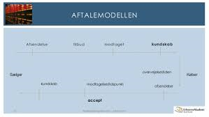
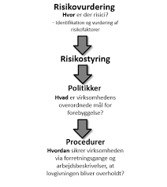

--- 
title: "Erhvervs- og finansjura"
author: "Sonny Kristoffersen"
date: "`r Sys.Date()`"
site: bookdown::bookdown_site
output: bookdown::gitbook
documentclass: book
bibliography: [book.bib, packages.bib]
biblio-style: apalike
link-citations: yes
github-repo: rstudio/bookdown-demo
description: "JURA"
favicon: "favicon.ico"
---


#    {-}
					
					


<!-- <!-- BEGIN LOGIN FORM -->
<!-- <META HTTP-EQUIV="CACHE-CONTROL" CONTENT="NO-CACHE"> -->
<!-- <META HTTP-EQUIV="PRAGMA" CONTENT="NO-CACHE"> -->
<!-- <style> -->
<!-- .handCursor { -->
<!-- cursor:pointer; -->
<!-- cursor:hand; -->
<!-- }  -->
<!-- #magicGroup form { -->
<!-- margin: 0; -->
<!-- padding: 0;  -->
<!-- } -->
<!-- #magicGroup A:link {text-decoration: none; color:black;} -->
<!-- #magicGroup A:visited {text-decoration: none; color:black;} -->
<!-- #magicGroup A:active {text-decoration: none; color:black;} -->
<!-- #magicGroup A:hover {text-decoration: none; color:black;} -->
<!-- .clearfix:after{ -->
<!--   content:".";display:block;height:0;clear:both;visibility:hidden; -->
<!-- } -->
<!--   .spacer0{clear:both; height:0px; margin:0px; padding:0px; line-height:0px; font-size:0px;} -->
<!--   .spacer{clear:both; height:1px; margin:0px; padding:0px; line-height:0px; font-size:0px;} -->
<!--   .spacer2{clear:both; height:2px; margin:0px; padding:0px; line-height:0px; font-size:0px;} -->
<!--   .spacer3{clear:both; height:3px; margin:0px; padding:0px; line-height:0px; font-size:0px;} -->
<!--   .spacer4{clear:both; height:4px; margin:0px; padding:0px; line-height:0px; font-size:0px;} -->
<!--   .spacer5{clear:both; height:5px; margin:0px; padding:0px; line-height:0px; font-size:0px;} -->
<!--   .spacer10{clear:both; height:10px; margin:0px; padding:0px; line-height:0px; font-size:0px;} -->
<!--   .spacer20{clear:both; height:20px; margin:0px; padding:0px; line-height:0px; font-size:0px;} -->
<!--   </style> -->
<!--   <script type="text/javascript" src="https://www.sentrylogin.com/sentry/scripts/Sentry_AJAX.js"></script> -->
<!--   <div id="Settings" ALIGNMENT="CENTER" MANNER="GROW" style="display:none;"></div> -->

<!--   <div id="Sentry_outermost" style="width:175px; position:relative;">  -->


<!--   <form name="Sentry_login_form" onsubmit="sentryLogin();"> -->
<!--   <div style="height:1px;"><a href="https://www.sentrylogin.com"></a></div> -->
<!--   <div id="TopBar" onclick="Sentry_onClick(this.id);" class="handCursor" style="width:175px; background-color:White; padding-top:2px; padding-bottom:2px; border-width:1px; border-style:solid; border-color:LightGray; border-radius: 6px;"> -->
<!--   <div id="Sentry_label" style="text-align: right; font-family:sans-serif; font-size:12px; font-weight:bold; margin-bottom:3px;"><span id="Sentry_label_span" style="padding-right:10px; padding-left:5px;">Member Login</span><span id="downArrow"></span></div></div> -->
<!--   <div id="magicGroup" style="z-index: 10000; background-color:white; text-align:left; position:absolute; left: -9999px; width:175px; padding-top:15px; border-style:solid; border-color:LightGray; border-top-width:0px; border-right-width:1px; border-bottom-width:1px; border-left-width:1px; border-radius: 6px;"> -->
<!--   <div id="messages" style="display:none; padding-left:15px; padding-right:15px; padding-bottom:15px; font-family: Arial; font-size:12px; color: red;">.</div> -->
<!--   <div id="Sentry_emailDiv" style="width:146px; margin-left:15px;"><span style="text-align:left;">  -->
<!--   <input type="text" id="Sentry_email" style="padding-left: 3px; border-style:solid; border-width:1px; border-color:LightGray; border-radius: 6px; width:146px; height:24px;" onfocus="Sentry_onfocus(this.id);" onkeydown="Sentry_onkeydown(event, this.id);" onkeyup="Sentry_onkeyup(this.value, this.id, event);" onblur="Sentry_onblur(this.value, this.id);" value="E-mail Address"></span></div> -->
<!--   <div id="Sentry_passwordDiv" style="width:146px; margin-left:15px; margin-top:2px;"><span style="text-align:left;">  -->
<!--   <input type="text" id="Sentry_password" style=" padding-left: 3px; border-style:solid; border-width:1px; border-color:LightGray; border-radius: 6px; width:146px; height:24px;" onfocus="Sentry_onfocus(this.id);" onkeydown="Sentry_onkeydown(event, this.id);" onkeyup="Sentry_onkeyup(this.value, this.id, event);" onblur="Sentry_onblur(this.value, this.id);" value="Password"></span> </div> -->
<!--   <div id="Sentry_HIDpasswordDiv" style="width:146px; display: none; margin-left:15px; margin-top:2px;"><span style="text-align:left;"> -->
<!--   <input type="password" id="Sentry_HIDpassword" style=" padding-left: 3px; border-style:solid; border-width:1px; border-color:LightGray; border-radius: 6px; width:146px; height:24px;" onfocus="Sentry_onfocus(this.id);" onkeydown="Sentry_onkeydown(event, this.id);" onkeyup="Sentry_onkeyup(this.value, this.id, event);" onblur="Sentry_onblur(this.value, this.id);"></span></div> -->
<!--   <div id="unHideDiv" style="margin-bottom:5px; font-family:Arial; font-size:10px;"><span id="forgotSpan" onclick="Sentry_onClick(this.id);" style="vertical-align:top; margin-left:15px; font-family:Arial; font-size:10px; color:gray;" class="handCursor">Forgot?</span>  -->
<!--   <input type="checkbox" id="unHide" style="height:12px; width:10px; margin:4px; display:none;" value="1"> -->
<!--   <span id="unHideSpan" style="width:25px; vertical-align:top; font-family: Arial;font-size:10px; color:gray; margin-left:78px;" onclick="Sentry_onClick(this.id);" class="handCursor" title="Do not reveal password in public">Show</span></div> -->
<!--   <div id="buttonDiv" style="float:left; width:45px; margin-left:15px;">  -->

<!--   <button type="button" onclick="sentryLogin();" style="height:25px; padding:2; width:45px; font-family:Arial; font-size:11px;" id="Sentry_button">Go</button></div> -->
<!--   <div id="psistDiv" style="float:left; width:98px; text-align:right; margin-top:10px; margin-right:15px;">  -->
<!--   <input id="psist" type="checkbox" value="1" style="height:10px; width:10px; margin:0; margin-bottom:2px; margin-right:2px;" class="handCursor" title="Do not use when in public" onclick="Sentry_onClick(this.id);"> -->
<!--   <span id="psistSpan" style="font-family: Arial;font-size:10px; color:gray;" onclick="Sentry_onClick(this.id);" class="handCursor" title="Do not use when in public">Stay Logged In</span></div> -->
<!--   <div class="spacer0"> </div> -->
<!--   <div class="spacer10"> </div> -->
<!--   <div id="goInside" style="font-family: Arial;font-size:12px; text-align: right; margin-top:10px; margin-right:15px; margin-bottom:5px; margin-left:15px; display:none;"><span id="goInsideSpan" class="handCursor" style="font-weight:bold;">.</span></div> -->
<!--   <div id="myProfile" onclick="Sentry_onClick(this.id);" style="font-family: Arial;font-size:12px; font-weight:bold; text-align: right; margin-top:2px; margin-right:15px; margin-left:15px;" class="handCursor">My Profile</div> -->
<!--   <div id="signUp" style="font-family: Arial;font-size:12px; font-weight:bold; text-align: right; margin-top:2px; margin-right:15px; margin-bottom:5px; margin-left:15px;"><a href="https://www.sentrylogin.com/sentry/member_signup_list.asp?Site_ID=22367" title="Click to Subscribe Now">Sign Up</a> </div> -->
<!--   <div id="logOut" style="font-family: Arial;font-size:12px; font-weight:bold; text-align: right; margin-top:2px; margin-right:15px; margin-bottom:5px; margin-left:15px; display:none;"><span class="handCursor" onClick="LogOut();">Log Out</span></div> -->
<!--   <div class="spacer0"> </div> -->
<!--   <div id="xbox" style="margin-top:12px;"></div> -->
<!--   <div class="spacer5"> </div> -->
<!--   </div> -->
<!--   <input id="Sentry_ID" type="hidden" value="22367"> -->
<!--   <input id="univ" type="hidden" value="1"> -->
<!--   <div id="Sentry_noJSLogin" style="width:175px; background-color:white;"><span style="color:red; font-family: Arial;font-size:12px; font-weight:bold;">Javascript Required</span></div> -->
<!--   </form> -->
<!--   </div> -->
<!--   <div id="Sentry_loggingIn" style="width:175px; display:none;"> -->
<!--    -->
<!--   </div> -->
<!--   <div id="Sentry_In" style="display:none;">For testing. -->
<!--   </div> -->
<!--   <script language="JavaScript" type="text/JavaScript">initializeSentry();  -->
<!--   </script> -->
<!--   <noscript>You must have JavaScript enabled in order to log in.</noscript> -->
<!--   <!-- END LOGIN FORM -->
  
  


<br>
<br>

 

  <br>
  
<!--   <h3>Video sådan køber du adgang.</h3> -->
<!-- <style>.embed-container { position: relative; padding-bottom: 56.25%; height: 0; overflow: hidden; max-width: 100%; } .embed-container iframe, .embed-container object, .embed-container embed { position: absolute; top: 0; left: 0; width: 100%; height: 100%; }</style><div class='embed-container'><iframe src='https://player.vimeo.com/video/320339623' frameborder='0' webkitAllowFullScreen mozallowfullscreen allowFullScreen></iframe></div> -->
<!--   <br> -->
<!--   <br> -->

<!-- <h3>Video sådan køber du adgang.</h3> -->
<!-- <style>.embed-container { position: relative; padding-bottom: 56.25%; height: 0; overflow: hidden; max-width: 100%; } .embed-container iframe, .embed-container object, .embed-container embed { position: absolute; top: 0; left: 0; width: 100%; height: 100%; }</style><div class='embed-container'><iframe src='https://player.vimeo.com/video/283118599' frameborder='0' webkitAllowFullScreen mozallowfullscreen allowFullScreen></iframe></div> -->
<!--   <br> -->
<!--   <br> -->
<!--   <br> -->
<!--   <br> -->
<!-- <h3>Video sådan logger du ind.</h3> -->
<!-- <style>.embed-container { position: relative; padding-bottom: 56.25%; height: 0; overflow: hidden; max-width: 100%; } .embed-container iframe, .embed-container object, .embed-container embed { position: absolute; top: 0; left: 0; width: 100%; height: 100%; }</style><div class='embed-container'><iframe src='https://player.vimeo.com/video/283117974' frameborder='0' webkitAllowFullScreen mozallowfullscreen allowFullScreen></iframe></div> -->


<!--chapter:end:index.Rmd-->

---
output: 
  html_document: 
    css: style.css
    df_print: kable
---


```{r echo=FALSE}

BEGREB <- c(
          "Grundloven",
          "Tinglysningsloven",
          "Aftaleloven"
          # ,
          # "h test"
          
          
          
          )
forklaring <- c(
  "Grundloven beskriver bl.a. den enkelte borgers rettigheder og pligter, du kan se den her:><a href=\"https://www.retsinformation.dk/Forms/R0710.aspx?id=45902\" style=\"color:#3088fc\" target=\"_blank\">Grundloven</a>",
  "Tinglysningsloven indeholder reglerne for den offentlige registrering af rettigheder over fast ejendom<br><a href=\"https://www.retsinformation.dk/Forms/R0710.aspx?id=142900\" style=\"color:#3088fc\" target=\"_blank\">Tinglysningsloven</a>",
  "Aftaleloven"
#   ,
#   "Vi tester hypotesen
#   <br>H<sub>0</sub>: &mu;=34
#   <br>H<sub>1</sub>: &mu;&ne;34<br>
# <br>H<sub>0</sub>: &mu;≤34
#   <br>H<sub>1</sub>: &mu;>34<br>
#   <a href=\"https://www.retsinformation.dk/Forms/R0710.aspx?id=142900\" style=\"color:#3088fc\" target=\"_blank\">Tinglysningsloven</a>"
#   
  
  )
  
indeks <<- data.frame(BEGREB,forklaring)
  

```


#   Indledning {-}


`r source('/cloud/project/script2.R')`


<h3>***Vigtigt bemærk!***</h3>

***Dette materiale er kun til personligt brug. Alle rettigheder forbeholdes. Fotografering, kopiering eller anden gengivelse af dette materiale, er uden forfatterens skriftlige samtykke,  forbudt, ifølge dansk lov om ophavsret.***


***E-bogens videoer og quizer er ikke at betragte som en del af pensum, men er et supplement til pensum for at fremme din yderligere forståelse for Erhvervs- og Finansjuraen***


<!-- `r icon::fa("medal")`  -->


# Retsstaten 

```{r, echo=FALSE, results='asis'}
#cat(readLines('np.html'))
```

***Kapitel 1 skal kun læses i hovedtræk*** 

## Grundloven om Danmarks forfatning


Af de mere end 1.300 love, vi har i Danmark, er der én lov, en retskilde, der er hævet over alle de andre, nemlig grundloven.  ``r tippy(indeks[1,1], size="large" ,interactive = TRUE, arrow = TRUE, tooltip = paste0("<h4>",indeks[1,2],"</h4>"))`` er Danmarks forfatning, dvs. den lov, der beskriver de grundlæggende regler for samfundet. 

EU-retten står over dansk ret, sådan at en dansk lov kan være ulovlig, nemlig, hvis den enten strider mod EU-retten eller mod grundloven.

I Danmark fejrer man hvert år grundlovens fødselsdag 5. juni. Men hvordan blev grundloven egentlig indført?

Fra 1660 til 1848 havde Danmark enevælde og i 1700-tallet begyndte modstanden mod enevældet at ulme rundt om i Europa. 

Befolkningerne stillede krav om, at folket skulle være med til at bestemme, hvordan deres land skulle styres, og flere steder blev monarkiet væltet og erstattet af en republik.

Efterhånden som den internationale udvikling tog fart, erkendte Kong Christian den 8., at Danmark også måtte have en fri forfatning. Da han døde, gjorde hans søn, Frederik den 7., arbejdet med forfatningen færdig.  
 
 
---

**Video om den danske grundlov**

<div class="video-container"><iframe src="https://www.youtube.com/embed/nRkpUt8juz0" width="853" height="480" frameborder="0" allowfullscreen="allowfullscreen"></iframe></div>  

---


## Rettigheder og pligter


``r tippy(indeks[1,1], size="large" ,interactive = TRUE, arrow = TRUE, tooltip = paste0("<h4>",indeks[1,2],"</h4>"))`` beskriver bl.a. den enkelte borgers rettigheder og pligter, f.eks. at der er ytringsfrihed, religionsfrihed og værnepligt. 

I grundloven står der også, at den øverste magt i Danmark skal deles mellem den lovgivende, den udøvende og den dømmende magt.

I grundloven kan du læse om magtens fordeling i samfundet. Om Folketinget som den demokratisk valgte forsamling, der vedtager love, der gælder for os alle. 

Om regeringen, der skal sikre, at lovene bliver overholdt af os borgere og af de myndigheder, der skal sørge for, at vi for eksempel har gode skoler, sygehuse og biblioteker. 

Om domstolene, der er uafhængige af regering og Folketing, fordi de skal dømme i konflikter mellem borgerne indbyrdes og mellem myndigheder og borgere.

``r tippy(indeks[1,1], size="large" ,interactive = TRUE, arrow = TRUE, tooltip = paste0("<h4>",indeks[1,2],"</h4>"))`` handler også om de rettigheder, du har som borger. Vi kalder dem friheds- eller menneskerettigheder.

Den ene slags frihedsrettigheder er ytringsfriheden, retten til at forsamles og demonstrere for dine synspunkter og retten til at oprette foreninger og til at være medlem af en forening. 

``r tippy(indeks[1,1], size="large" ,interactive = TRUE, arrow = TRUE, tooltip = paste0("<h4>",indeks[1,2],"</h4>"))`` sikrer også, at du har ret til at være medlem af et politisk parti og være politisk aktiv – også selv om det går imod regeringens eller flertallets synspunkter. 

Disse rettigheder skal sikre, at demokratiet kan fungere. 

Grundlovens regler om folkeafstemninger og valg til Folketinget ville for eksempel ikke være meget værd, hvis vi ikke havde ret til at diskutere politiske spørgsmål og sige vores mening.

Den anden slags frihedsrettigheder er reglerne om den personlige frihed og om ejendomsretten og boligens ukrænkelighed. 

Disse regler skal først og fremmest beskytte borgerne mod overgreb fra statsmagten. 

Hvis du bliver anholdt af politiet, har du for eksempel krav på, at en dommer tager stilling til din sag inden 24 timer. 

Hvis myndighederne vil undersøge din bolig, dine private papirer eller din pc, skal de som hovedregel have en dommers tilladelse først. 

Og hvis myndighederne vil tage dit hus for at rive det ned, fordi der skal bygges en motorvej eller en jernbane hen over grunden, ja så skal du have en erstatning, der svarer til husets og grundens værdi.

``r tippy(indeks[1,1], size="large" ,interactive = TRUE, arrow = TRUE, tooltip = paste0("<h4>",indeks[1,2],"</h4>"))`` sætter på den måde grænser for, hvordan staten kan blande sig i vores privatliv.

``r tippy(indeks[1,1], size="large" ,interactive = TRUE, arrow = TRUE, tooltip = paste0("<h4>",indeks[1,2],"</h4>"))`` skal sikre stabile rammer om det politiske liv og de politiske kampe om magten. Og grundloven skal sikre, at borgernes rettigheder ikke krænkes. 

Begge dele sikres ved, at grundloven er mere vanskelig at ændre end andre love. Den danske grundlov er kun blevet ændret få gange, siden den blev vedtaget for mere end 160 år siden. 

Og sproget i mange af paragrafferne er ikke blevet moderniseret siden. 

Derfor er der i dette hæfte nogle forklarende kommentarer til de enkelte paragraffer.
<br>

## Magtadskillelseslæren i grundlovens § 3


Grundlovens § 3 har følgende ordlyd: 

*”Den lovgivende magt er hos kongen og Folketinget i forening. Den udøvende magt er hos kongen. Den dømmende magt er hos domstolene”.*


```{r magtenstredeling, echo=FALSE,fig.cap=("Magtens tredeling")}
nodes <- data.frame(id = 1:3, shadow = FALSE,
                    shape = c("image"),
                    image = c("https://jura.tepedu.dk/img/folketing.jpg",
                    "https://jura.tepedu.dk/img/hojesteret.jpg",
                    "https://jura.tepedu.dk/img/politi.jpeg"),
                    label = c("Lovgivende magt \n Folketinget/Dronningen",    "Dømmende magt \n Domstolene","Udøvende magt \n Regering/ministerier,\nforvaltningen\npolitiet m.fl."),
                    color = "red",
                    highlight = "yellow",
                    font.size=12)
  
edges <- data.frame(from = c(1,2,3), to = c(2,3,1),
                    # length = c(400,400,400),
                    # label=c("Lån til købesum","Købsaftale","Garanti for\nkøbesum"),
                    # arrows = c("to"),
                    smooth = FALSE)
visNetwork(nodes, edges, width = "80%") %>% 
  visNodes(shapeProperties = list(useBorderWithImage = FALSE)) %>%
  visLayout(randomSeed = 2) %>%

 visEdges(shadow = TRUE,
           # arrows =list(to = list(enabled = TRUE, scaleFactor = 2)),
           color = list(color = "lightgrey", highlight = "yellow"))
``` 


 
*	Lovgivende magt: Folketinget

*	Dømmende magt: Domstolene

*	Udøvende magt: Regering/ministerier, forvaltningen, politiet m.fl.

*	Gensidig kontrol

*	Magtbalance  


Bestemmelsen handler om magtens tredeling i den lovgivende, den udøvende og den dømmende magt. 

Magten er delt mellem forskellige myndigheder (Folketing, regering og domstole) for at undgå, at al magt samles hos én myndighed. Det ville kunne føre til magtmisbrug.


Ifølge grundloven har dronningen og Folketinget i fællesskab magten til at lovgive. 

Men helt sådan er det ikke i virkeligheden. 

I praksis er det nemlig regeringen og Folketinget, som bestemmer, hvordan lovene skal se ud. 

Dronningen skriver dem bare under. 

Dronningen skal føre lovene ud i livet – hun har den udøvende magt. 

I dag betyder det blot, at hun rent formelt udnævner ministrene i en regering. 

Derefter er det i praksis ministrene og deres ministerier, der sørger for, at lovene bliver overholdt.


Dronningen har ingen indflydelse på, hvem der skal være ministre. Det bestemmer statsministeren. 

Hun har heller ingen indflydelse på, hvilke partier der skal danne regering. 

Det handler grundlovens §§ 12-15 bl.a. om.

Domstolene har magten til at dømme. De afgør, om folk har overtrådt landets love og skal straffes. Og de tager stilling i sager, hvor borgere har indbyrdes konflikter. 

Domstolene afgør også, om ministerier og kommuner har overtrådt lovene, og om lovene overholder grundloven.


*I 1999 fastslog Højesteret, jf. U 1999.841 H, at den såkaldte Tvindlov var i strid med grundlovens § 3. Tvindlovens bestemmelse om, at en række Tvindskoler ikke længere skulle have penge fra det offentlige, var derfor ugyldig.*  


## Folketinget som den lovgivende magt


Folketinget er Danmarks parlament. Her vedtages al lovgivning i Danmark. 

Folketingets grundlæggende opgaver og nogle af arbejdsformerne er beskrevet i grundloven.  

Andre metoder er praksisser, der har udviklet sig gennem de snart 170 år, Folketinget har eksisteret.


Folketinget er den lovgivende magt. 

Folketinget og regeringen er de eneste, der kan fremsætte lovforslag, dvs. komme med forslag til nye love og lovændringer. 

Den lovgivende magt er Folketinget og regering, men det er kun Folketinget, der kan vedtage lovforslag.


``r tippy(indeks[1,1], size="large" ,interactive = TRUE, arrow = TRUE, tooltip = paste0("<h4>",indeks[1,2],"</h4>"))`` beskriver fordelingen af magten mellem Folketinget (lovgivende), regeringen (udøvende og lovgivende) og domstolene (dømmende), også kaldet magtens tredeling. 

Magten i samfundet er delt i 3 for at forhindre, at der sker magtmisbrug. 


### Parlamentarisk kontrol og lovgivning i Folketinget


Folketinget har 3 hovedopgaver:


*	At behandle lovforslag og vedtage landets love

*	At behandle og vedtage statens årlige budget, finansloven

*	At føre kontrol med regeringens magtudøvelse


For at kunne løfte de opgaver kræves det, at folketingsmedlemmerne ved, hvordan det politiske arbejde skal foregå. 

Reglerne for, hvordan folketingsmedlemmerne skal samarbejde, og hvordan lovgivningsprocessen er, står beskrevet i Folketingets forretningsorden. 

Reglerne kan ændre sig over tid, fordi samfundet ændrer sig, men de fleste af reglerne har mange år på bagen.


### Lovforslag


Love regulerer, hvordan vi skal leve sammen i Danmark, hvad vi skal drive i fællesskab – f.eks. folkeskolen og sygehusene – og hvordan det fælles skal være indrettet. 

Lovgivning handler om, hvad man skal som borger, og hvad man ikke må, herunder hvad der er strafbart. 

Lovteksterne skal derfor skrives så præcist, at borgerne ikke er i tvivl om de fælles spilleregler i samfundet.


Nye lovforslag kan fremsættes af regeringen og folketingsmedlemmerne (folketingsbeslutninger).


Regeringen fremsætter de fleste lovforslag, da regeringen har statsadministrationen (ministerierne og styrelser) til at hjælpe sig med udformning af lovforslag mv.


 
Lovforslag tager lang tid at skrive, og det kræver stor juridisk indsigt. 

Derfor er det regeringen, der fremsætter de fleste lovforslag. For regeringen har mange embedsmænd i ministerierne til at hjælpe sig, mens partierne uden for regeringen, oppositionen, har færre til at hjælpe sig – de har kun medarbejdere i deres gruppesekretariater og i Folketingets Administration.


Ideer til nye love kommer primært fra regeringen, men kan også komme fra:


*	Folketingsmedlemmerne

*	Interesseorganisationer, erhvervslivet, foreninger m.v.

*	Sager i medierne

*	Borgere, der henvender sig til et folketingsmedlem eller et parti 
  med en sag 
  
  
Inden et lovforslag fremsættes i Folketingssalen, har det som regel været igennem en længere process i ministerierne.


## Folketingets kontrol med regeringen


<br>

Ud over at lovgive har Folketinget en anden og lige så vigtig rolle i demokratiet. Det er at kontrollere, om regeringen – den udøvende magt ‒ fører Folketingets love ud i livet, som de var tænkt, og om der sker magtmisbrug. Det kalder man parlamentarisk kontrol.

 
### Den kritiske opposition

Parlamentarisk kontrol med regeringen er en meget vigtig opgave i Folketinget, hvor Folketinget kontrollerer, hvordan regeringen fører lovene ud i livet, og om regeringen fører en politik, der i hovedtræk bliver støttet af et flertal i Folketinget.

Søgelyset rettes ofte mod ministrene i regeringen. For det meste går det stille af, men situationen kan også spidse til, så regering og Folketing kommer til at stå stejlt over for hinanden. 

I praksis er det oppositionen – de partier i Folketinget, som er imod regeringens politik – der udfører den parlamentariske kontrol. 

Det er dem, der har den største interesse i at være kritiske over for regeringens arbejde og afsløre, om der sker magtmisbrug.


Oppositionen undersøger bl.a., om regeringen:


*	Virkeliggør lovens indhold og gør det på den måde, som regeringen    har lovet

*	Overholder statsbudgettet  

Folketingsmedlemmerne fra oppositionspartierne finder den parlamentariske kontrol af regeringens magtudøvelse vigtig. 

Oppositionen har en politisk fordel i at finde fejl og mangler ved en regering, den ikke er enig med, og det giver oppositionspartierne mulighed for at forklare vælgerne, hvordan deres politik er anderledes end regeringens.


### Udvalgsarbejdet i Folketinget

<br>


Arbejdet i Folketinget foregår både i Folketingssalen og i Folketingets udvalg. 

Udvalgene arbejder med hvert deres fagområde og behandler både lovgivning og den brede kontrol med regeringens arbejde.  
<br>

## Regeringen den udøvende magt


Statsministeren er regeringens chef og den der bestemmer, hvem der skal være minister i regeringen. 

Regeringen laver landets love, mens Folketinget vedtager dem. 

Ministrene er som regel også medlemmer af Folketinget, men det er ikke et krav. 


### Sådan dannes en regering


``r tippy(indeks[1,1], size="large" ,interactive = TRUE, arrow = TRUE, tooltip = paste0("<h4>",indeks[1,2],"</h4>"))`` giver dronningen magt til at udpege statsministeren og de øvrige ministre. 

Men i praksis er det et flertal i Folketinget, der er afgørende for, hvem der skal være statsminister. 

Statsministeren sætter så sit ministerhold og danner sin regering.
<br>

### Statsministeren vælges og nedsætter sin regering


Folketingsvalg skal afholdes mindst én gang hvert 4. år. 

Det står i grundloven. Statsministeren kan dog til enhver tid udskrive folketingsvalg, så der kan sagtens gå mindre end 4 år mellem hvert valg.


Når valget er slut og mandaterne fordelt, er det nye Folketing fundet. 

Så skal man i gang med at finde ud af, hvem der skal være statsminister og danne regering.


### Negativ parlamentarisme


Den siddende statsminister fortsætter, hvis der ikke er et flertal imod ham eller hende - dvs. 90 eller flere ud af de 179 folketingsmedlemmer. Det kaldes negativ parlamentarisme.

Taber regeringen valget, skal der findes en ny statsminister og en ny regering.
<br>

### Dronningen udnævner formelt den nye regering


Den siddende statsminister skal, i samarbejde med dronningen, finde ud af, hvilken statsministerkandidat der har den bredeste opbakning hos det nye folketingsmedlemmer. Det kaldes en dronningerunde.Der kan også udnævnes af dronningen en "kongelig undersøgere", som ikke nødvendigvis er den siddeende statsminister, se f.eks. udnævelsen af Mette Frderiksen som kongelig undersøger efter folketingsvalget i  2019.

Når statsministeren har fundet sine ministre, udnævner dronningen formelt regeringen på Amalienborg. Regeringen kommer bagefter ud på slotspladsen. Her præsenterer statsministeren sin nye regering for danskerne.


### Sådan arbejder regeringen


Regeringens ministre leder via deres ministerier landet efter de love, Folketinget har vedtaget. 

Regeringen har stor indflydelse på de love, der vedtages i Folketinget, da det er regeringen, der kommer med langt de fleste forslag til nye love.


### Regeringen fremsætter lovforslagene


Den udøvende magt ligger hos regeringen. 

Det står i grundloven. Regeringen har ret og pligt til at gennemføre de regler og love, som Folketinget vedtager, så lovene bliver til virkelighed i samfundet. 


Lovgivningsarbejdet har regeringen også stor indflydelse på. Det er regeringen, der forbereder og foreslår langt de fleste nye love og ændringer i eksisterende love. 

Regeringen er ansvarlig for hele processen med forberedelse af lovforslagene inden de når til Folketinget, herunder at lægge de overordnede planer, drive de politiske forhandlinger, skrive lovudkast og sende det i høring.


Når regeringen foreslår en lov, kaldes det, at den fremsætter et lovforslag. 

Både regeringen og medlemmerne af Folketinget kan fremsætte lovforslag – men de fleste kommer fra regeringen.
<br>

### Lovkataloget viser regeringens mål


Når en ny regering tiltræder, vil de partier, der indgår i regeringen, sammen skrive et regeringsgrundlag eller anden form for fælleserklæring. 

Et regeringsgrundlag er en slags politisk programerklæring, som signalerer, hvilken politik regeringen gerne vil gennemføre i den kommende regeringsperiode. 

<br>
Lovkataloget er et redskab for regeringen til at omsætte den overordnede politik til konkrete initiativer. 

Regeringen forsøger at gøre de politiske mål til virkelighed via nye love. 

De lovforslag, regeringen regner med at kunne få flertal for, bliver præsenteret i regeringens lovkatalog eller lovprogram, som udarbejdes og præsenteres for et folketingsår ad gangen. 

Lovkataloget kan findes på Statsministeriets hjemmeside og giver et pejlemærke for årets politiske beslutninger.

Den formelle baggrund for lovkataloget er, at der i grundlovens § 38 står beskrevet, at statsministeren skal lave en åbningsredegørelse, når et nyt folketingsår starter. 

Åbningsredegørelsen består både af en mundtlig og en skriftlig del. Den mundtlige del er åbningstalen, som statsministeren holder på åbningsdagen, mens den skriftlige del er lovkataloget.


### Statsministeren


Statsministen er regeringens chef. Det er statsministeren, der bestemmer, hvem der skal være ministre, og hvilke ministerier der skal være.
<br>

### Statsministeren har stor magt


Statsministerposten er landets højeste ministerpost. En statsminister har en særlig stor magt og et særlig stort ansvar. Det er f.eks. kun statsministeren, der kan bestemme: 


*	hvem der skal være minister

*	hvilke ministre der eventuelt skal afskediges/udskiftes

*	hvornår der skal være folketingsvalg inden for den 4-årige    
  regeringsperiode


Statsministeren fører tilsyn med sine ministre og fordeler opgaver og fagområder imellem dem. 


### Ministrene


Regeringen, og dermed ministrene, har den udøvende magt i Danmark. 

Det vil sige, at ministrene har det overordnende ansvar for, at de love, som Folketinget vedtager, føres ud i livet. 

Ministrene har meget magt og ansvar, og en af deres vigtigste opgaver er at foreslå ny lovgivning.


Regeringens ministre har hver sit fagområde: Kulturministeren har ansvar for kulturområdet, skatteministeren for skatteområdet osv. 

De fleste ministerområder ligger nogenlunde fast – f.eks. er der i praksis altid et Justitsministerium, et Finansministerium osv. 

Men statsministeren kan ændre ministrenes fagområder eller oprette nye ministerier, hvis statsministeren ønsker at begrænse, fremhæve eller styrke bestemte fagområder. 

F.eks. blev der efter valget i november 2007 som noget nyt udnævnt en minister for klima og energi. 


### Ministrenes opgaver


At foreslå ny lovgivning er en af ministrenes fornemste opgaver. Lovforslagene bliver forberedt i ministerierne, som har mange medarbejdere til bl.a. at skrive lovforslag.

En ministers arbejde består bl.a. i at:


*	forhandle indholdet af nye love på plads 
*	svare på spørgsmål fra Folketinget, f.eks. fra Folketingets udvalg 
*	svare på henvendelser fra borgere og organisationer m.fl. 
*	informere offentligheden om ministeriets arbejde, bl.a. i form af 
  hjemmesider, interviews og pressemeddelelser
*	træffe beslutninger i ministeriet og sørge for, at ministeriet 
  arbejder effektivt
*	samarbejde med internationale parter, herunder EU
*	deltage i ugentlige ministermøder med resten af regeringens    
  ministre
*	deltage i statsrådsmøder og regeringens udvalg
*	deltage i regeringsseminarer


## Domstolene


```{r domstolene,echo=FALSE, result=TRUE, fig.cap=("Oversigt over domstolene")}

nodes <- data.frame(id = 1:9, 
                    shape = c("box"), 
                    level = c(1,2,2,4,4,4,3,4,1),
                    label = c(" Højesteret ","Vestre \n Landsret","Østre \n Landsret","Sø og \n Handelsretten","Tinglysningsretten","Grønlandsdomstolen","Byretterne","Retten\npå Færøerne", " Procesbevillingsnævnet \n Den særlige klageret \n Dommerudnævnelsesrådet \n Bibeskæftigelsesnævnet"),
                    font.size = c(25,18,18,rep(12,6)))
edges <- data.frame(from = c(1,1,1,1,2,2,2,3,3,3), to = c(2,3,4,6,4,5,7,4,7,8),arrows = c(""),length = rep(75,10))

visNetwork(nodes, edges, height = "500px", width = "80%",avoidOverlap=2) %>% 
  visNodes(color = list(background = "white", 
                        border = "white",
                        highlight = "yellow"),
           shadow = list(enabled = TRUE, size = 30))  %>%
  visHierarchicalLayout(direction = "UD",levelSeparation = 100) %>%
  visEdges(color = list(color = "lightgrey", highlight = "yellow"))
  #visLayout(randomSeed = 24) # to have always the same network

```
Uafhængige domstole er en grundlæggende del af magtens tredeling i et demokrati. Sådan er det også i Danmark. ``r tippy(indeks[1,1], size="large" ,interactive = TRUE, arrow = TRUE, tooltip = paste0("<h4>",indeks[1,2],"</h4>"))`` siger nemlig, at domstolene alene har den dømmende magt.


### Domstolenes opgaver


Domstolene er den dømmende magt i Danmark. De afgør, om personer har overtrådt landets love, og afgør uoverensstemmelser mellem to parter i civile sager.

Alle har ret til en retfærdig rettergang. Det står i den europæiske menneskerettighedskonvention. Det betyder bl.a., at en retssag skal afgøres inden for en rimelig tidsperiode og ved en domstol, der er uafhængig og upartisk. 

Domstolenes uafhængighed er bestemt i den danske grundlov. ``r tippy(indeks[1,1], size="large" ,interactive = TRUE, arrow = TRUE, tooltip = paste0("<h4>",indeks[1,2],"</h4>"))`` deler nemlig magten i tre for at forhindre magtmisbrug, jf. ``r tippy(indeks[1,1], size="large" ,interactive = TRUE, arrow = TRUE, tooltip = paste0("<h4>",indeks[1,2],"</h4>"))``s § 3:


*	den lovgivende magt (Folketinget og regeringen)
*	den udøvende magt (regeringen)
*	den dømmende magt (domstolene)


Det er Folketinget, der vedtager Danmarks love. Regeringen regerer ud fra lovene. Men hverken Folketinget eller regeringen kan dømme på baggrund af de vedtagne love. 

Kun domstolene kan afgøre, hvordan lovene skal fortolkes, og dømme ud fra dem. Dommerne må kun rette sig efter, hvad der står i loven og det forarbejde, der ligger til grund for den. De må ikke lade sig påvirke af Folketinget, regeringen, pressen eller andre, når de dømmer i en sag. 


### Byret, landsret og Højesteret

<br>
Domstolene i Danmark har 3 instanser: byret, landsret og Højesteret. Alle retssager begynder som udgangspunkt i en byret. 

Almindelige borgere kan være med til at dømme i straffesager som domsmænd eller nævninge, afhængigt af sagens karakter. 

<br>
De almindelige domstole behandler civile sager og straffesager. 


*	Civile sager er sager, som anlægges ved 
  domstolene for at få afgjort en 
  uenighed mellem 2 parter. Som eksempler på 
  civile sager kan nævnes sager om 
  mangler ved fast ejendom, opsigelse af en 
  arbejdstager, boligretssager, 
  ægteskabssager, faderskabssager og sager om 
  adoption.

*	Straffesager er først og fremmest sager, hvor 
  retten skal træffe beslutning, om en person 
  skal straffes for en overtrædelse af loven. 
  Afgørelser, der træffes i forbindelse med 
  politiets efterforskning, er også straffesager. 
  Det kan f.eks. være afgørelser om 
  varetægtsfængsling, beslaglæggelse og 
  ransagning.

*	Byretterne behandler ligeledes skiftesager, 
  foged- og auktionssager.

*	Tinglysning af dokumenter foregår ved 
  Tinglysningsretten.

<br>

Alle sager kan som udgangspunkt behandles ved 2 retsinstanser, f.eks. ved byret og landsret. Visse mindre sager kan dog normalt kun behandles ved én instans, byretterne, uden mulighed for appel til landsretten.

<br>

### Højesteret   

<br>
Danmark har én højesteret. Den ligger ved Christiansborg Slot i København. Højesteret er den øverste domstol i Danmark. Her afgøres f.eks. sager, der har betydning for, hvordan lignende sager skal afgøres, eller sager, der har særlig samfundsmæssig interesse. 

Højesteret er en appeldomstol, som behandler domme og kendelser, der er afsagt af Østre Landsret, Vestre Landsret eller Sø- og Handelsretten. 

Man kan altså ikke anlægge sag direkte ved Højesteret.
Højesteret behandler både civile sager og straffesager og fungerer som tredje instans i skifte-, foged- og tinglysningssager. 

Ved Højesteret behandles også sager, som Procesbevillingsnævnet har tilladt indbragt for retten. Det drejer sig om sager af særlig principiel betydning, f.eks. sager, som kan have betydning for afgørelse af en række andre sager, eller om sager af særlig samfundsmæssig interesse.

I straffesager kan Højesteret ikke tage stilling til skyldsspørgsmålet.

Særlige forvaltnings- eller forfatningsdomstole anvender man i mange andre EU-lande. Det gør man ikke i Danmark. Her er det de almindelige domstole – i praksis Højesteret – der undersøger, om de afgørelser, myndighederne træffer, er lovlige, eller om en lov er i strid med ``r tippy(indeks[1,1], size="large" ,interactive = TRUE, arrow = TRUE, tooltip = paste0("<h4>",indeks[1,2],"</h4>"))``.
<br>

### Landsretterne


I Danmark findes der 2 landsretter: Vestre Landsret i Viborg og Østre Landsret i København. Landsretten behandler primært appelsager fra byretten.

Hvis byretten f.eks. mener, at en sag er af principiel karakter, kan den også henvise sagen direkte til behandling i landsretten.
 
Adressen: Østre Landsret i Bredgade 55, København K

Ved landsretterne er ansat ca. 100 landsdommere. Hver landsret ledes af en præsident.


Vestre Landsret ligger i Viborg og behandler sager fra Jylland.
Østre Landsret ligger i København og behandler sager fra resten af landet, Færøerne og Grønland.


Landsretterne er delt i afdelinger. 

Til hver afdeling hører tre landsdommere, som i fællesskab afgør alle afdelingens sager, både straffesager og civile sager. 

I nogle straffesager medvirker nævninger, i andre domsmænd. 

I enkelte sager deltager personer, der er særligt sagkyndige på et specielt område.

Vestre og Østre Landsret er appelinstanser for byretterne.


### Sø- og Handelsretten 


Sø- og Handelsretten ligger i København. 

I Sø- og Handelsretten er ansat en præsident, 2 vicepræsidenter, 2 dommere og et antal sagkyndige medlemmer. 

De sagkyndige medlemmer har særlig kendskab til sø- og handelsforhold. 

Sø- og Handelsretten behandler bl.a. sager, hvor kendskab til sø- og handelsforhold er af væsentlig betydning.

Sø- og Handelsretten behandler også sager om konkurs, rekonstruktion og gældssanering m.v. fra hele Storkøbenhavn.


### Den Særlige Klageret 

Den Særlige Klageret ligger i København samme sted som Højesteret. 

Klageretten er sammensat af en højesteretsdommer, en landsdommer, en byretsdommer, en advokat og en universitetslærer i retsvidenskab eller anden jurist med særlig videnskabelig uddannelse.

Den Særlige Klageret træffer afgørelser i disciplinære sager vedrørende dommere og andet juridisk personale ansat ved domstolene, herunder også ansatte på Færøerne og i Grønland.

Klageretten behandler derudover sager om genoptagelse af straffesager og udelukkelse af forsvarere fra straffesager.


### Byretten


Danmark har 24 byretter. De er fordelt over hele landet. Byretten behandler som nævnt bl.a.:

*	civile sager
*	straffesager
*	tinglysningssager
*	skiftesager 

<br>

### Byretterne


```{r byretterne,echo=FALSE, result=TRUE, fig.cap=("Byretterne")}


nodes <- data.frame(id = 1:6, 
                    shape = c("box"), 
                    level = c(1,2,2,2,2,2),
                    label = c("Byrettens afdelinger","Civilretten","Fogedretten","Skifteretten","Boligretten","Kriminalretten"),
                    font.size = c(15,15,15,15,15,15))
edges <- data.frame(from = c(1,1,1,1,1), to = c(2,3,4,5,6))

visNetwork(nodes, edges, width = "80%") %>% 
  visNodes(color = list(background = "white", 
                        border = "white",
                        highlight = "yellow"),
           shadow = list(enabled = TRUE, size = 30))  %>%
      visHierarchicalLayout(direction = "UD",levelSeparation = 100)  %>%
      visLayout(randomSeed = 24) %>%
  visEdges(color = list(color = "lightgrey", highlight = "yellow"))

```


Danmark er inddelt i 24 såkaldte byretskredse.
Byretterne ledes af en byretspræsident.
Byretterne behandler civile sager, straffesager, notarialforretninger og skiftesager.

Alle sager begynder som udgangspunkt i byretten.

Byretterne kan i en række tilfælde henvise en civil sag til behandling ved landsretten. Det gælder f.eks., hvis sagen er af principiel betydning, eller sagen kan få væsentlig betydning for andre end parterne.

**Video: hvordan fungerer byretten?**

<div class="video-container"><iframe src="https://www.youtube.com/embed/vtR3p-7IItk" width="853" height="480" frameborder="0" allowfullscreen="allowfullscreen"></iframe></div>

**Video: en sag kommer på tværs**

<div class="video-container"><iframe src="https://www.youtube.com/embed/7WNie-cX1jw" width="853" height="480" frameborder="0" allowfullscreen="allowfullscreen"></iframe></div>

---

*Saglig kompetence: Hvilken ret/domstol skal behandle sagen?*

*Stedlig kompetence: Værneting – Hvor i landet skal sagen anlægges?*

Hvis der ikke er lavet en værnetingsaftale mellem de stridende parter, skal en retssag som hovedregel anlægges ved sagsøgtes hjemting (bopæl/kendt opholdssted) 

Værneting er således et spørgsmålet om, hvor en retssag skal anlægges og føres. Ved hvilken domstol en sag skal anlægges, hvis der opstår uenighed mellem aftaleparter med bopæl i hver sit EU-land, afhænger af, om der er indgået en værnetingsaftale og af EU-Domsforordningen.

Supplerende værneting, f.eks.:

*	Virksomhedsværneting 
*	Ejendomsværneting
*	Opfyldelsesværneting
*	Forbrugerværneting
*	Deliktsværneting
 


```{r værneting, echo=FALSE, result=TRUE}


text_tbl <- data.frame(
  Paragraf = c("§239", "§240", "§241","§242","§243","§244","§246"),
  Indhold = c(
    "Regioner og kommuner har hjemting i den retskreds, hvor hovedkontoret ligger.",
    
    "Sager mod staten: Staten har hjemting i den retskreds, hvor den myndighed, som stævnes på statens vegne, har kontor.", 
    
    "Ejendomsværneting: Sager vedrørende rettigheder over fast ejendom, kan anlægges ved retten på det sted, hvor ejendommen ligger.",
    
    "Opfyldelsesværneting: Sager om kontraktsforhold kan anlægges ved retten på det sted, hvor den forpligtelse, der ligger til grund for sagen, er opfyldt eller skal opfyldes.
Bestemmelsen finder ikke anvendelse på pengekrav, medmindre kravet er opstået under ophold i retskredsen under sådanne omstændigheder, at det skulle opfyldes, inden stedet forlades.
",

"Deliktsværneting: Sager, hvorunder der påstås straf, erstatning eller oprejsning i anledning af retskrænkelser, kan anlægges ved retten på det sted, hvor retskrænkelsen er foregået (skadestedet).",

"Forbrugerværneting: I sager om forbrugeraftaler, som ikke er indgået ved personlig henvendelse på den erhvervsdrivendes faste forretningssted, kan forbrugeren anlægge sag mod den erhvervsdrivende ved sit eget hjemting.",

"Sagsøgte har ikke dansk hjemting: Stk. 1: Sager mod personer, selskaber, foreninger, private institutioner og andre sammenslutninger, der ikke har hjemting i Danmark, kan anlægges her i landet, for så vidt nogen ret efter bestemmelserne i §§ 237, 238, stk. 2, 241, 242, 243 og 245 kan anses som værneting i sagen.  

Opholdsværneting: Stk. 2: Kan ingen ret efter stk. 1 anses som værneting i sagen, kan sager vedrørende formueretsforhold mod de i stk. 1 nævnte personer anlægges ved retten på det sted, hvor de ved stævningens forkyndelse opholder sig.  

Godsværneting: Stk. 3: Sager vedrørende formueretsforhold mod de i stk. 1 nævnte personer og sammenslutninger kan endvidere, hvis der ikke er værneting efter reglen i stk. 1, anlægges ved retten på det sted, hvor den pågældende person eller sammenslutning på tidspunktet for sagens anlæg har gods, eller hvor det gods, kravet angår, befinder sig på tidspunktet for sagens anlæg. Afværges arrest i gods gennem sikkerhedsstillelse, betragtes sikkerhedsstillelsen som gods, der befinder sig på det sted, hvor arrestbegæringen er eller i givet fald skulle være indgivet."


  )
)

kable(text_tbl,caption="Værneting") %>%
  kable_styling(full_width = T,bootstrap_options = c( "hover","responsive","bordered","striped")) %>%
  column_spec(1, bold = T, border_right = T,color = "black",background = "lightgrey") %>%
  column_spec(2) %>%
  column_spec(2,  bold = T, color = "white", background = "darkgrey")
# add_header_above(c( "Koncipistreglen" = 2),italic = TRUE)
```


  
  


### Processuelle grundbegreber

*	Forhandlingsprincippet: Sagsøger og sagsøgte har selv ansvaret for sagens bevisførelse. Retten kan opfordre parterne til at føre et bestemt bevis, men parterne er ikke forpligtet til at følge rettens opfordring. 
<br>
*	Bevisumiddelbarhedsprincippet: Beviser skal føres umiddelbart foran dommeren. 
*	Den frie bevisbedømmelse: Retten har frihed til på objektivt grundlag, at vurdere og afgøre, hvad der findes bevist under sagen, og hvilke beviser der vægter tungere end andre.
*	Bevisbyrde: Den som påstår noget under en retssag, skal bevise at han eller hun har ret og har dermed bevisbyrden for sin påstand (kaldet en ”ligefrem bevisbyrde” som er hovedreglen i dansk ret).
<br>

**Video: Retssikkerhed. Hvordan kan domstolene hjælpe mig?**

<div class="video-container"><iframe src="https://www.youtube.com/embed/eZt1GQQKJsg" width="853" height="480" frameborder="0" allowfullscreen="allowfullscreen"></iframe></div>
<br>

### Civilretssagens forløb
Parterne: Sagsøger og sagsøgte
Sagens forberedelse:
Stævning og svarskrift

*	Evt. forberedende retsmøde
*	Evt. syn og skøn
*	Replik og duplik
*	Hovedforhandling
 <br>
 
### Småsagsprocessen

*	Sager under 50.000 kr.
*	Formål: Enklere, hurtigere og billigere


### Udenretlig tvistløsningsorganer
Klage- og ankenævn som der har betydning for den finansielle branche:

*	Forbrugerklagenævn, 
Det Finansielle Ankenævn (Sammenlægning pr. 1. februar 2019 af Pengeinstitutankenævnet, Realkreditankenævnet og Ankenævnet for investeringsfonde) 
Ankenævnet for Forsikring, 
Ankenævnet for Finansieringsselskaber og 
Klagenævnet for Ejendomsformidling


*	Sagsbehandling efter officialmaksimen, dvs. nævnets sekretariatet skal oplyse klagesagen


**Mediation i det offentlige forbrugerklagesystem**

Der foregår mediation i Nævnenes Hus før, at klagen kan indbringes for Forbrugerklagenævnet. Følgende fremgår af Bekendtgørelse nr. 65 af 16. januar 2019 om behandling af forbrugerklager i Nævnenes Hus samt Forbrugerklagenævnet:

*§ 2. Mediationen foretages på grundlag af parternes oplysninger.*

*Stk. 2. Nævnenes Hus lægger i mediationen særligt vægt på*

*1) at bidrage til at genskabe en god dialog mellem parterne,*

*2) at pege på muligheder, som parterne ikke har tænkt på, og*

*3) at vejlede parterne om de generelle regler på området og at vejlede parterne om Forbrugerklagenævnets praksis.*

*Stk. 3. Nævnenes Hus og sagens parter kan foreslå en mindelig løsning af sagen.*

*Stk. 4. Inden parterne accepterer et konkret forslag til en mindelig løsning efter stk. 3, skal de oplyses om*

*1) at de kan vælge, om de vil acceptere løsningen,*

*2) at den foreslåede løsning kan afvige fra udfaldet af en domstolsprøvelse eller en klage ved Forbrugerklagenævnet,*

*3) hvad retsvirkningerne af den foreslåede løsning er, og*

*4) at de har ret til rimelig betænkningstid til at vurdere, om de vil acceptere løsningen.*

*§ 3. Nævnenes Hus foretager mediation i klager, som ikke hører under et tvistløsningsorgan omfattet af forbrugerklageloven, og som indbringes for styrelsen af en forbruger. Prisen for varen eller tjenesteydelsen, som klagen vedrører, skal være mindst de beløb, som er fastsat i medfør af stk. 3 og højst 100.000 kr.*

*Stk. 2. Nævnenes Hus kan i særlige tilfælde se bort fra de i stk. 1 fastsatte undergrænser.*

*Stk. 3. Undergrænserne for varer og tjenesteydelser som nævnt i stk. 1 reguleres hvert tredje år pr. 1. januar, første gang pr. 1. januar 2019, hvor undergrænsen er 1.050 kr., dog 680 kr. for tøj og sko. Reguleringen sker i overensstemmelse med den sats for det generelle pris- og lønindeks, som er fastsat i finansloven. Beløbene afrundes til nærmeste 10 kr. De til enhver tid gældende undergrænser for varer og tjenesteydelser fremgår af Nævnenes Hus’ hjemmeside, www.naevneneshus.dk.*


**Retsmægling ved domstolene**

Alle retter bortset fra Højesteret tilbyder retsmægling i civile sager som alternativ til en løsning af tvisten ved en dom eller et traditionelt retsforlig.

*Hvad er retsmægling?*

Retsmægling er en frivillig måde at løse konflikter på, hvor en mægler i fortrolighed hjælper sagens parter til selv at finde frem til en løsning på deres problem. Mægleren kan ikke træffe afgørelse i sagen.

Retsmægleren er en dommer, en domstolsjurist eller en advokat, som har gennemgået en særlig uddannelse i retsmægling. Mægleren bliver udpeget af retten og skal være upartisk.

Det er mæglerens opgave at lede mæglingsprocessen. Mægleren hjælper parterne med at finde frem til de egentlige årsager til konflikten og hjælper parterne til at få en bedre forståelse for både deres egne og modpartens synspunkter.

Mægleren hjælper parterne til selv at finde frem til den løsning, som i størst muligt omfang tager hensyn til begge parters behov og interesser.

*Hvorfor vælge retsmægling?*

Når man finder ind til kernen, der ligger bag ved en konflikt, er det ikke altid, at en dom er den mest tilfredsstillende løsning for parterne.

Til forskel fra en retssag eller traditionel forligsmægling ved domstolene bliver der ved retsmægling sat fokus på, hvorfor parterne er uenige, og hvordan de bedst kommer videre. Det gør det lettere for parterne at fortsætte et eventuelt samarbejde efter mæglingen, og det giver bedre mulighed for at nå frem til en mere varig løsning.

Retsmægling er ofte en mindre tidskrævende måde at løse konflikter på.

*Hvordan foregår retsmægling?*

Retsmægleren holder møde med parterne. Hvis parterne har advokater, aftaler man, om advokaterne skal deltage. Gennem samtaler forsøger man i fællesskab at fastlægge omfanget af parternes konflikt og baggrunden herfor, og man taler om, hvordan parterne i fællesskab kan nå frem til en løsning.

Mæglingsmødet kan foregå i et af rettens lokaler eller et andet sted, som retsmægleren og parterne aftaler. Hvis retsmægleren er advokat, kan mødet foregå på advokatens kontor.

Retsmægleren planlægger i samråd med parterne retsmæglingens forløb. Normalt skal begge parter være personligt til stede. Det kan eventuelt aftales, at mægleren skal afholde møde med parterne hver for sig.

*Hvornår afsluttes retsmægling?*

Retsmæglingen bliver afsluttet, når parterne når frem til en løsning på konflikten, eller hvis en af parterne ønsker det. Retsmægleren kan slutte retsmæglingen, uanset om parterne ønsker at fortsætte.

Hvis parterne bliver enige om en løsning på deres konflikt, indgår de en aftale. Parterne kan vælge at forelægge løsningsforslaget for deres advokater eller andre rådgivere, inden de beslutter sig for, om de vil indgå en aftale.

Hvis retsmæglingen ikke resulterer i en løsning, fortsætter sagen ved retten som en almindelig retssag.

*Hvem kan bruge retsmægling?*

En sag kan være velegnet til retsmægling, uanset om den drejer sig om private forhold eller erhvervsforhold.

Det er en betingelse, at sagen er anlagt ved retten, og at begge parter er enige om retsmægling. Det er også en betingelse, at retten vurderer, at sagen egner sig til retsmægling.

*Hvad koster retsmægling?*
Retsmæglerens bistand er gratis, men hver part skal betale salær til egen advokat.

Retsmægling er ofte mindre tidskrævende og dermed også billigere for parterne end en retssag eller traditionel forligsmægling.


**Voldgift** 

*	Voldgiftsloven – voldgiftsklausul i aftale
*	Ofte hurtigere sagsbehandling end alm. domstole
*	Dommere med særligt fagkundskab
*	Sagen er ikke offentlig
*	Ikke mulighed for anke til højere instans
<br>

### Tinglysningsretten
<br>

Tinglysningsretten, som ligger i Hobro, blev etableret den 1. januar 2007 med en præsident som øverste chef.
Fra den 8. september 2009 er håndteringen af hele tinglysningsområdet samlet i Tinglysningsretten. Byretterne tinglyser altså ikke længere dokumenter.
<br>
Tinglysning er nu en digital proces, der foregår fra hjemmesiden www.tinglysning.dk.
<br>
Information og vejledning kan findes på www.tinglysningsretten.dk
<br>

### Procesbevillingsnævnet
<br>

Procesbevillingsnævnet blev oprettet pr. 1. januar 1996 med det formål at behandle ansøgninger om 2. og 3. instansbevillinger i civile sager og straffesager. Siden den 1. januar 2007 har Procesbevillingsnævnet endvidere haft til opgave at behandle klager over Civilstyrelsens afslag på ansøgninger om fri proces.
<br>

#### Appeltilladelse
<br>

En appeltilladelse indebærer, at en sag, der ikke ellers ville kunne ankes eller kæres, kan indbringes for en højere retsinstans. Appeltilladelse forudsætter, at sagen rejser spørgsmål af principiel karakter, eller at særlige grunde taler for tilladelse. 
<br>

#### Fri proces
<br>

Fri proces indebærer i grundtræk, at den pågældende får en advokat beskikket til at føre sagen, og at statskassen betaler sagens omkostninger, herunder retsafgifter, advokatsalær og eventuelle sagsomkostninger, som skal betales til modparten. 

<br>
Fri proces er især forbeholdt personer, som på den ene side ikke selv har økonomisk mulighed for at betale sagsomkostningerne, men som på den anden side har rimelig grund til at føre proces, navnlig fordi der er udsigt til at vinde sagen.

<br>
Procesbevillingsnævnets afdeling for appeltilladelser består af en højesteretsdommer (formand), en landsdommer, en byretsdommer, en advokat og et medlem, der repræsenterer retsvidenskaben.

Nævnets afdeling for fri proces består af en landsdommer (afdelingsformand), en byretsdommer og en advokat.

<br>
Beslutningerne på nævnsmøderne træffes ved almindelig stemmeflerhed. Der afholdes i almindelighed møde i hver afdeling ugentligt, og sagerne udsendes ca. en uge før mødet. Hastesager kan dog udsendes med kortere varsel. Nævnsmøderne er ikke offentlige, og der er ikke mulighed for at få foretræde for nævnet.

<br>
I overensstemmelse med forarbejderne til lovgivningen om Procesbevillingsnævnets virksomhed begrundes nævnets afgørelser alene med en henvisning til indholdet af de bestemmelser, der giver hjemmel for meddelelse af bevilling.
<br>
Bevillingsmæssigt og administrativt hører Procesbevillingsnævnet under Domstolsstyrelsen, men Procesbevillingsnævnet er uafhængigt af domstolene og af den offentlige forvaltning. Man kan derfor ikke klage over nævnets afgørelser til justitsministeren eller til Folketingets Ombudsmand.
<br>

### Rigsretten

<br>
Rigsretten består af indtil 15 af Højesterets dommere og et tilsvarende antal medlemmer, som udpeges af Folketinget. Folketingsmedlemmer kan ikke udpeges til medlem af Rigsretten.

Medlemmerne af Rigsretten vælges for 6 år. Der er udpeget medlemmer af Rigsretten i 1996.
 <br>
Rigsretten har til opgave at påkende sager mod ministre vedrørende deres embedsførelse. Det er Folketinget, der beslutter, om der skal rejses tiltale mod en minister.
<br>
Folketinget har 5 gange rejst tiltale for Rigsretten. Den seneste sag var mod tidligere justitsminister Erik Ninn-Hansen. Der blev afsagt dom i sagen den 22. juni 1995.
<br>

### Dommerudnævnelsesrådet
<br>
Dommerudnævnelsesrådet er et uafhængigt råd, der har til opgave at afgive indstillinger til justitsministeren vedrørende besættelse af dommerstillinger.
<br>
Domstolsstyrelsen stiller sekretariat til rådighed for Dommerudnævnelsesrådet.

<br>
Dommerudnævnelsesrådet blev oprettet ved lov nr. 402 af 26. juni 1998 som et led i domstolsreformen, der bl.a. havde til formål at sikre en bredere rekruttering af dommere og større gennemsigtighed ved besættelse af dommerstillinger. Rådet har været i funktion siden den 1. juli 1999, da loven trådte i kraft.
<br>

### Domstolsstyrelsen 
<br>
Domstolsstyrelsen har til opgave at administrere og udvikle Danmarks Domstole.

Domstolsstyrelsen blev oprettet som en ny, selvstændig statsinstitution den 1. juli 1999.
Domstolsstyrelsen ledes af en bestyrelse og en direktør. Domstolsstyrelsen hører ressortmæssigt under Justitsministeriet, men justitsministeren kan ikke bestemme over styrelsen og kan ikke ændre styrelsens afgørelser.
<br>
Bestyrelsen er den øverste ledelse og har det overordnede ansvar for Domstolsstyrelsens virksomhed. Den daglige ledelse er lagt i hænderne på direktøren, som er ansat af og kan afskediges af bestyrelsen.

Sammensætningen af Domstolsstyrelsens bestyrelse er fastsat i lov om Domstolsstyrelsen.


---

**Video: historien om de danske domstole og retssystemet**

 <br>
<div class="video-container"><iframe src="https://www.youtube.com/embed/uvpuD60uLdI" width="853" height="480" frameborder="0" allowfullscreen="allowfullscreen"></iframe></div>

---

### EU-domstolen


Den Europæiske Unions Domstol (EU-Domstolen) fortolker EU's lovgivning for at sikre, at den anvendes på samme måde i alle EU-lande, og afgør retstvister mellem nationale regeringer og EU's institutioner. 


I visse tilfælde kan den også anvendes af enkeltpersoner, virksomheder eller organisationer til at gribe ind over for en EU-institution, hvis de mener, den på den ene eller anden måde har tilsidesat deres rettigheder.


<!--chapter:end:01.Rmd-->

# Retskilderne

***Kapitel 2 skal kun læses i hovedtræk*** 

## Retskilderne


Retskilder er de faktorer, som danner grundlaget for at opnå viden om, hvad der er gældende ret. 


Lovgivningen er den primære retskilde, som altid skal tages i betragtning ved fastlæggelse af retsstillingen, men retspraksis er også en vigtig retskilde, især hvis der foreligger en afgørelse fra Højesteret (se præjudikat) eller en afgørelse fra EU-Domstolen eller fra Menneskerettighedsdomstolen vedrørende Den Europæiske Menneskerettighedskonvention. 

Andre faktorer, der kan anvendes som retskilder, er fx retssædvaner, aftaler, lovforarbejder, administrativ praksis, administrative retsforskrifter, udtalelser fra Folketingets Ombudsmand samt retsvidenskabens analyser. Herudover anvendes traditionelt også forholdets natur som retskilde.


Der kan ikke opstilles en fast prioritering af retskilderne, idet de i konkrete tilfælde alle kan have betydning for, hvad der er gældende ret.

## EU-rettens retskilder

De mål, der er fastsat i traktaterne, nås gennem forskellige typer retsakter. Nogle er bindende, andre er ikke. Nogle angår alle EU-lande, mens andre kun angår nogle stykker.


### Forordninger

En "forordning" er en bindende retsakt. Det skal følges i alle enkeltheder i hele EU. Da EU f.eks. ønskede at garantere fælles sikkerhedsforanstaltninger for varer importeret fra lande uden for EU, vedtog Rådet en forordning.


### Direktiver

Et "direktiv" er en retsakt, der fastsætter et mål, som EU-landene skal opnå. Det er dog op til de enkelte lande at lave deres egne love for, hvordan disse mål skal opnås. 

Et eksempel er EU's direktiv om forbrugerrettigheder, som styrker forbrugernes rettigheder i EU, f.eks. ved at fjerne skjulte afgifter og omkostninger på internettet og forlænge den periode, som forbrugere kan fortryde en købsaftale i.


### Afgørelser

En "afgørelse" er bindende for dem, den er rettet til (f.eks. et EU-land eller en individuel virksomhed) og er direkte gældende. F.eks. har Kommissionen udstedt en afgørelse om EU's deltagelse i forskelige antiterrororganisationers arbejde. Afgørelsen vedrører kun sådanne organisationer.


### Henstillinger

En "henstilling" er ikke bindende. Da Kommissionen rettede en henstilling til EU-landenes myndigheder om at forbedre deres brug af videokonferencer for at hjælpe domstolstjenester med at arbejde bedre sammen på tværs af grænserne, havde den ingen retslige virkninger. 

En henstilling giver institutionerne mulighed for at give deres mening til kende og foreslå en retningslinje, uden derved at pålægge dem, den er rettet til, nogen retlige forpligtelser.


### Udtalelser

En "udtalelse" er et instrument, der giver institutionerne mulighed for at fremsætte en ikkebindende erklæring, dvs. at den ikke pålægger dem, den er rettet mod, nogen forpligtelser. En udtalelse er ikke bindende. Den kan afgives af de vigtigste EU-institutioner (Kommissionen, Rådet, Parlamentet), Regionsudvalget og Det Europæiske Økonomiske og Sociale Udvalg. 

Mens lovene udformes, afgiver udvalgene udtalelser fra deres særlige regionale eller økonomiske og sociale synspunkt. For eksempel afgav Regionsudvalget en udtalelse om pakken om en politik for ren luft i Europa.


## Case law

Der er stor forskel på retskildeopfattelsen inden for forskellige retssystemer, se fx case law.

Case law, judge-made law, dommerskabt ret.  I common law-lande har domstolene en mere vidtgående funktion end den dømmende magt i andre retssystemer. Common law-domstolen skal ikke kun fortolke og anvende lovgiverens retsregler, statutory law, men skaber også sin egen ret, case law eller judge-made law. 

En domstolsafgørelse har således ikke alene betydning for parterne i en konkret tvist; afgørelsen skaber præcedens, dvs. at en lignende sag i fremtiden med stor sandsynlighed vil blive afgjort på samme måde, den såkaldte stare decisis-doktrin.
<br>

Betegnelsen case law er engelsk, af case 'tilfælde' og law 'lov'.
I England er de afgørelser, der hidrører fra samme eller en højere domstol, bindende. Andre afgørelser har kun vejledende karakter. Der sondres desuden mellem den tidligere afgørelses egentlige begrundelse, *"ratio decidendi"*, og andre udtalelser i afgørelsen, *"obiter dicta"*. Et "obiter dictum" er kun vejledende, uanset fra hvilken domstol det måtte hidrøre.


Selv bindende afgørelser bliver fra tid til anden tilsidesat (overruled); fx kan der bag afgørelsen ligge en forældet tankegang, og i 1966 udtalte Englands højeste domstol, House of Lords, at den ikke fremover ville betragte sig som evigt bundet af sine egne tidligere afgørelser.

I USA håndhæves stare-decisis mindre strengt end i England. USA's højesteret har enkelte gange tilsidesat sine tidligere afgørelser, selv i sager om fortolkning af USA's forfatning. Fx gav United States Supreme Court i 1954 sorte elever adgang til skoler og universiteter, som tidligere havde været forbeholdt de hvide, og tilsidesatte herved sin egen ældre afgørelse, der havde anerkendt doktrinen om "separate but equal", dvs. at man i undervisningen adskilte sorte og hvide.  
<br>

## Retskildepolycentri


Retskildepolycentri er en nyere retsvidenskabelig erkendelse af, at dannelsen af retskilder i forskellige fora i det moderne samfund kan resultere i, at en retskilde kan have forskellig virkning for forskellige retsanvendere. Teorien bryder med den hierarkiske retskildeopfattelse. Teoriens ophavsmand er den danske juraprofessor Henrik Zahle.  
<br>

## Juridisk metode


Juridisk metode, fremgangsmåde ved stillingtagen til juridiske problemer.  Metoden består for det første af en beskrivelse og identifikation af de retskilder, som gyldigt kan inddrages i en juridisk argumentation; for det andet af læren om, hvordan retskilderne fortolkes. Juridisk metode består af 3 hovedelementer:


Et faktum (Hændelsesforløbet fx der er sket økonomisk misbrug af en kortholderens mistede Dankort)  
+  
Et retsfaktum (Hvilken retsregel i betalingsloven skal anvendes i forhold til tredjemandsmisbruget af Dankortet)  
=  
En retsfølge (Afgørelsen, hvem der kommer til at betale for misbruget af Dankortet banken eller kortholderen)  

Se f.eks. i henhold til bestemmelsen i betalingslovens § 100, stk. 4, nr. 3, hæfter betaleren for op til 8.000 kr. af misbrug, som finder sted som følge af betalerens groft uforsvarlige adfærd.

Begrebet groft uforsvarlig adfærd er ikke nærmere afgrænset i betalingsloven, men traditionelt anvendes begrebet »grov uagtsomhed« som betegnelse for »tilsidesættelse af den agtpågivenhed, som selv skødesløse personer plejer at udvise.« 

Med anvendelsen af begrebet groft uforsvarlig adfærd er det således præciseret, at grov uagtsomhed i sædvanlig forstand ikke er tilstrækkeligt til at pådrage betaleren hæftelse efter bestemmelsen. Der skal altså mere til. Groft uforsvarlig adfærd må herefter forstås som sløseri, der er præget af ligegyldighed i forbindelse med opbevaring af bl.a. pinkoden. Der skal derfor meget til efter praksis i Pengeinstitutankenævnet (nu Det finansielle Ankenævn), før der statueres groft uforsvarlig adfærd.


---


<br>

---

*PIA 78/2006: »Det forhold, at misbrugeren på klagerens bopæl tilfældigt fik mulighed for at overhøre klageren oplyse sin kode til dankortet til kæresten sammenholdt med, at dankortet opbevaredes i hendes pung, der lå i hendes jakke på bopælen, kan ikke betegnes som groft uforsvarlig adfærd, heller ikke selv om klageren havde givet T adgang til sin bopæl, uanset om hun måtte have kendskab til T’s kriminelle baggrund« *

---

*PIA 205/2005: »Klagerens Visa/Dankort blev opbevaret i en pung, som lå i en jakke, der var anbragt bag disken i klagerens butik og ikke var synlig for kunderne. Selvom det må bebrejdes klageren, at pinkoden til kortet var anført på en seddel, der lå i pungen sammen med kortet, findes klageren efter en samlet vurdering ikke at have udvist en groft uforsvarlig adfærd som omhandlet i lov om visse betalingsmidler § 11, stk. 3, nr. 3. Ankenævnet har herved også lagt vægt på, at det i lovens forarbejder er forudsat, at det udvidede ansvar kun ville kunne gøres gældende i et fåtal af tilfælde«.*  

---

*Selvforskyldt beruselse kan blive betragtet som uforsvarlig adfærd, jf. PIA 281/2013 Spørgsmål om misbrug af kort var muliggjort ved groft uforsvarlig adfærd som følge af beruselse: »Som sagen foreligger oplyst, lægger vi til grund, at klageren ikke ved, hvad han foretog sig fra ca. kl. 00.30 til ca. kl. 02.00, da han vågnede i en bil, som han formoder var en pirattaxa. Vi finder ikke grundlag for at antage, at klagerens tilstand skyldes andre forhold end indtagelse af alkohol. Under disse omstændigheder finder vi, at misbruget af klagerens betalingskort er muliggjort, fordi han var stærkt påvirket af alkohol. Vi finder, at klageren under de beskrevne omstændigheder har udvist groft uforsvarlig adfærd. Vi stemmer derfor for at lade klageren hæfte med 8.000 kr. af det tab, der opstod som følge af den uberettigede brug af kortet, jf. lov om betalingstjenester § 62, stk. 3 nr. 3«.* 

---

*Det er en konkret vurdering, om der bliver statueret groft uforsvarlig adfærd, jf. fx PIA 436/1993: Natten mellem den 12. og 13. juni 1993 blev klageren, medens han opholdt sig på en restauration, frastjålet sit dankort, som var opbevaret i klagerens tegnebog. Klageren anmeldte den 13. juni 1993 kl. 11.10 telefonisk tyveriet til kriminalpolitiet i Sønderborg efter forinden telefonisk at have spærret dankortet ved meddelelse til PBS. Det viste sig efterfølgende, at der ved anvendelse af dankortet og korrekt pinkode den 13. juni 1993 mellem kl. 9.25 og 9.28 var hævet 3 x 2.000 kr. i tre forskellige dankortautomater. Efter de foreliggende oplysninger lagde Pengeinstitutankenævnet til grund, at tyveriet af dankortet var blevet forøvet af to unge piger, som senere blev dømt for tyveri ved den 13. juni 1993 kl. 9.25-9.28 under anvendelse af dankortet at have stjålet de 3 x 2.000 kr. fra dankortautomaterne. Det fremgik af en retsbogsudskrift fra straffesagen, at de sigtede havde forklaret, at den ene af dem, A, snakkede med klageren, mens den anden sigtede, B, tog pungen op af lommen på ham. Herefter gik de ud på toilettet, hvor de tog pengene og kortet. A forklarede videre, at hun havde spurgt klageren om koden, og han havde givet hende den. Han sagde noget om, at han skulle ringe til banken for at få kortet spærret, og hun tilbød at gøre det for ham. Hun lod, som om hun telefonerede til banken, og sagde i den forbindelse til klageren, at hun skulle bruge pinkoden, hvorefter han gav hende den. Klageren indbragte sagen for Ankenævnet med påstand om, at indklagede var tilpligtet at anerkende, at klageren ikke hæftede for de 6.000 kr. Ankenævnet traf følgende afgørelse: »Efter betalingskortlovens § 21, stk. 2, hæfter kortindehaveren uden beløbsbegrænsning for tab, der opstår som følge af andres uberettigede brug af betalingskortet og den dertil hørende personlige hemmelige kode, såfremt kortudstederen godtgør, at kortindehaveren har oplyst koden til den, der har foretaget den uberettigede brug. Ankenævnet finder imidlertid ikke, at bestemmelsen er anvendelig på et tilfælde som det foreliggende. Ankenævnet finder på den anden side, at klageren udviste groft uforsvarlig adfærd ved i det foreliggende tilfælde at oplyse sin PIN-kode. Han hæfter derfor med op til 8.000 kr. for det tab, der opstod som følge af det uberettigede brug af kortet, jf. betalingskortlovens § 21, stk. 3, nr. 2, (nu § 11, stk. 3, nr. 3). Som følge af det anførte bestemmes: Den indgivne klage tages ikke til følge«.*  


---

Den juridiske metode indeholder væsentlige elementer af vurdering og skøn og er derfor mindre eksakt end de metoder, der anvendes inden for mange andre fagområder.


I juridisk Ordbog (***Bo von Eyben***, 14. udg.) defineres juridisk metode som følger:"den metode, der skal anvendes for at afgøre, hvilken regel der er gældende for et bestemt retsområde. Dette forudsætter kendskab til læren om retskilderne og evne til herudfra at finde de relevante retskilder og at anvende dem korrekt på det givne forhold..." 


# EU-Domstolen<sup><font color="red"> Premium </font></sup>  


 

Domstolen træffer afgørelser i de sager, der indbringes for den. De mest almindelige typer sager er:

*	Fortolkning af love (præjudicielle afgørelser) - de nationale domstole i EU-landene skal sikre, at EU-lovene anvendes korrekt, men domstolene i de forskellige lande kan fortolke reglerne forskellige. Hvis en national domstol er i tvivl om fortolkningen eller gyldigheden af en EU-retsakt, kan den spørge Domstolen til råds. Den samme mekanisme kan anvendes til at afgøre, om national ret eller praksis er forenelig med EU-retten.

*	Håndhævelse af loven (overtrædelsesprocedurer) - denne form for sag føres mod et medlemsland, hvis det ikke overholder EU-reglerne. Den kan indledes af Europa-Kommissionen eller et andet EU-land. Hvis landet findes skyldigt, skal det straks bringe bruddet til ophør, hvis ikke det vil risikere, at der anlægges endnu en sag, som kan medføre bødestraf.

*	Ophævelse af EU-retsakt (annullationssøgsmål) – hvis en EU-retsakt menes at være i strid med EU-traktaterne eller grundlæggende rettigheder, kan Domstolen blive bedt om at ophæve den - af et medlemsland, Rådet, Europa-Kommissionen eller (i visse tilfælde) Europa-Parlamentet.

Privatpersoner kan også bede Domstolen om at ophæve en EU-retsakt, som berører dem direkte.
*	Sikring af, at EU træffer foranstaltninger (passivitetssøgsmål) – Parlamentet, Rådet og Kommissionen skal træffe visse afgørelser i bestemte situationer. Undlader de dette, kan EU's institutioner eller (i visse tilfælde) enkeltpersoner eller virksomheder klage til Domstolen.

*	Sanktionering af EU-institutionerne (erstatningssøgsmål) – enhver person eller virksomhed, hvis interesser er blevet skadet som følge af EU's eller dets personales handlinger eller mangel på handlinger, kan bringe sagen for Domstolen.  

## Sammensætning
 <br>
 

EU-Domstolen er inddelt i 2 organer:

*	EU-Domstolen – som tager sig af anmodninger om præjudicielle afgørelser fra nationale domstole, visse annullationssøgsmål og appelsager. 

*	Retten – som træffer afgørelse i annullationssøgsmål indbragt af enkeltpersoner, virksomheder og i visse tilfælde medlemslande. Det vil i praksis sige, at Retten primært beskæftiger sig med konkurrenceret, statsstøtte, handel, landbrug og varemærker.  

Hver dommer og generaladvokat udnævnes i fællesskab af medlemslandene for en periode på 6 år, som kan fornyes. I hver domstol vælger dommerne en formand for en periode på 3 år, som kan forlænges.  

## Hvordan fungerer EU-Domstolen?  
I Domstolen tildeles hver sag én dommer (refererende dommer) og én generaladvokat. Sagerne behandles i to faser:  

*	Den skriftlige fase  
  +	Parterne afgiver skriftlige erklæringer til Domstolen – og nationale myndigheder, EU-institutionerne og i visse tilfælde enkeltpersoner kan også fremsætte bemærkninger.  
  +	Alt dette sammenfattes af den refererende dommer og drøftes på Domstolens almindelige møde, som beslutter:  
    +	Hvor mange dommere, der skal behandle sagen: 3, 5 eller 15 dommere (hele Domstolen) afhængig af sagens betydning og kompleksitet. De fleste sager behandles af 5 dommere, og det sker meget sjældent, at en sag høres af hele Domstolen.  
    +	Om det er nødvendigt med en høring (den mundtlige fase), og om der er behov for en officiel udtalelse fra generaladvokaten.  
*	Den mundtlige fase – en offentlig høring.  
  +	Parternes advokater forelægger deres sag for dommerne og generaladvokaten, som kan stille spørgsmål til dem.  
  +	Hvis Domstolen har besluttet, at der er behov for en udtalelse fra generaladvokaten, afgives denne nogle uger efter høringen.  
  +	Dommerne voterer så og kommer med deres afgørelse.  
*	Rettens procedure er lignende, bortset fra at de fleste sager høres af 3 dommere, og at der ikke er nogen generaladvokat.  

## EU-Domstolen og dig
<br>

Hvis du – som privatperson eller virksomhed – har lidt skade som følge af handlinger eller mangel på handlinger fra EU's institutioners eller ansattes side, kan du indbringe en sag for Domstolen på to måder:  

*	Indirekte gennem nationale domstole (som kan beslutte at henvise sagen til EU-Domstolen)  
*	Direkte for Retten – hvis en afgørelse truffet af en EU-institution har berørt dig direkte og individuelt.  
Hvis du mener, at myndighederne i et medlemsland har overtrådt EU-reglerne, skal du følge den officielle klageprocedure. (link) 

**Video: EU-domstolen**

<div class="video-container"><iframe src="https://www.youtube.com/embed/M3LPCK1eWBs" width="853" height="480" frameborder="0" allowfullscreen="allowfullscreen"></iframe></div>


Med ikrafttrædelsen af Lissabontraktaten den 1. december 2009 har Den Europæiske Union fået status som juridisk person og har overtaget de beføjelser, som tidligere var tildelt Det Europæiske Fællesskab. Fællesskabsretten er således blevet til unionsretten, som også omfatter alle de bestemmelser, der tidligere er blevet vedtaget i medfør af traktaten om Den Europæiske Union som affattet forud for Lissabontraktaten. I den præsentation, som følger, vil udtrykket fællesskabsretten ikke desto mindre blive anvendt, når der henvises til Domstolens praksis før ikrafttrædelsen af Lissabontraktaten.

Ved siden af Den Europæiske Union fortsætter Det Europæiske Atomenergifællesskab (Euratom) med at eksistere. Eftersom Domstolens beføjelser vedrørende Euratom i princippet er de samme som dem, der udøves inden for rammerne af Den Europæiske Union, og for at gøre præsentationen mere læsevenlig, vil enhver henvisning til unionsretten ligeledes omfatte Euratomretten.

 
## Sammensætning
<br>
	 


Domstolen består af 28 dommere og 11 generaladvokater. Dommerne og generaladvokaterne udnævnes for en periode af 6 år af medlemsstaternes regeringer efter fælles overenskomst efter høring af et udvalg, som har til opgave at udtale sig om, hvorvidt de indstillede kandidater er egnede til at varetage de omhandlede opgaver. De kan genudnævnes. Til dommere og generaladvokater ved Domstolen 
udnævnes personer, hvis uafhængighed er uomtvistelig. De skal i deres hjemland opfylde betingelserne for at indtage de højeste dommerembeder eller have faglige kvalifikationer, som er almindeligt anerkendt.

Domstolens dommere vælger af deres midte Domstolens præsident og vicepræsident for et tidsrum af tre år. Begge kan genvælges. Præsidenten forestår Domstolens arbejde og administration og leder retsmøderne og Domstolens voteringer i sager, der er henvist til behandling i et af de største dommerkollegier.

Vicepræsidenten bistår præsidenten i udførelsen af dennes opgaver og træder i præsidentens sted, hvis denne har forfald.

Generaladvokaterne bistår Domstolen og er den behjælpelig ved udførelsen af dens opgaver. De har til opgave, fuldstændig upartisk og uafhængigt, offentligt at fremsætte forslag til afgørelse af de sager, som de forelægges.
Justitssekretæren er institutionens generalsekretær og leder dens tjenestegrene under tilsyn af Domstolens præsident.

Domstolen kan sættes af samtlige medlemmer (plenum), i Den Store Afdeling (15 dommere) eller i afdelinger med 3 eller 5 dommere.

Domstolen sættes af samtlige medlemmer i særlige tilfælde, der er opregnet i statutten for Domstolen (bl.a. når den skal afskedige Den Europæiske Ombudsmand eller et medlem af Europa-Kommissionen, som har tilsidesat sine forpligtelser), og når Domstolen finder, at en sag er af særlig vigtighed.
Den sættes i Den Store Afdeling, når en medlemsstat eller en institution, som er part i sagen, anmoder herom samt i særligt omfattende eller betydelige sager.

De øvrige sager behandles i afdelinger med 5 eller 3 dommere. Formændene for afdelinger med 5 dommere vælges for en periode af 3 år, og formændene for afdelinger med 3 dommere for en periode af 1 år.

Beføjelser
For at kunne varetage sit hverv er Domstolen tillagt vide retlige beføjelser, som den udøver ved de præjudicielle forelæggelser og i de forskellige typer af søgsmål.

## De forskellige sagstyper
<br>

###	 Præjudicielle forelæggelser
<br>

Domstolen samarbejder med samtlige retsinstanser i medlemsstaterne, som er de ordinære retter, på unionsrettens område. For at sikre en effektiv og ensartet anvendelse af unionsretten og for at undgå forskelle i fortolkningen heraf kan - og i visse tilfælde skal - de nationale retter forelægge Domstolen præjudicielle spørgsmål vedrørende fortolkningen af unionsretten, f.eks. med henblik på, at den nationale ret kan efterprøve de nationale bestemmelsers overensstemmelse med unionsretten. 

Den præjudicielle forelæggelse kan også vedrøre spørgsmål om en unionsretsakts lovlighed.
Domstolen besvarer ikke sådanne spørgsmål ved blot at afgive en udtalelse, men i en dom eller en begrundet kendelse. Den forelæggende ret er bundet af Domstolens fortolkning. Domstolens dom binder på samme måde de øvrige nationale domstole, som måtte skulle træffe afgørelse vedrørende et identisk spørgsmål.

Det er ligeledes gennem præjudicielle forelæggelser, at enhver europæisk borger kan få afklaring på spørgsmål om de bestemmelser i unionsretten, der vedrører ham. Selv om et præjudicielt spørgsmål kun kan forelægges af en national domstol, har parterne i den sag, der verserer for den nationale domstol, medlemsstaterne og EU-institutionerne adgang til at deltage i proceduren for Domstolen. En række af unionsrettens hovedprincipper er blevet defineret på baggrund af præjudicielle spørgsmål, der også er blevet forelagt af nationale domstole, som træffer afgørelse i første instans.

###	 Traktatbrudssøgsmål
<br>

Domstolen har herigennem adgang til at kontrollere, om medlemsstaterne overholder de forpligtelser, der påhviler dem i medfør af unionsretten. Forud for sagens anlæg ved Domstolen har Kommissionen gennemført en procedure, hvorunder vedkommende medlemsstat har fået lejlighed til at svare på de klagepunkter, som er rejst imod den. Hvis denne procedure ikke fører til, at medlemsstaten bringer traktatbruddet til ophør, kan der anlægges en traktatbrudssag ved Domstolen.

En sådan sag kan anlægges enten af Kommissionen - hvilket i praksis er det hyppigst forekommende - eller af en anden medlemsstat. Hvis Domstolen fastslår, at der foreligger et traktatbrud, skal medlemsstaten straks bringe det til ophør. Hvis Domstolen, efter at Kommissionen på ny har indbragt sagen for den, fastslår, at den pågældende medlemsstat ikke har efterkommet dens dom, kan Domstolen pålægge medlemsstaten at betale et fast beløb eller en tvangsbøde. Hvis Kommissionen ikke er blevet underrettet om foranstaltninger til gennemførelse af et direktiv, kan Domstolen imidlertid efter anmodning herom fra Kommissionen pålægge medlemsstaten en økonomisk sanktion allerede fra tidspunktet for afsigelsen af den første traktatbrudsdom.

### Annullationssøgsmål
<br>

I en sådan sag nedlægger sagsøgeren påstand om annullation af en retsakt, der er udstedt af Unionens institutioner, organer, kontorer eller agenturer (bl.a. forordninger, direktiver og beslutninger). 

Domstolen er forbeholdt kompetencen i sager, der anlægges af en medlemsstat mod Europa-Parlamentet og/eller Rådet (med undtagelse af Rådets retsakter, der vedrører statsstøtte, antidumping og gennemførelsesbeføjelser), eller sager, der anlægges af en EU-institution mod en anden institution. 

Retten er kompetent til at træffe afgørelse, i første instans, i alle andre sager af denne art, herunder navnlig i sager, der er anlagt af private.

###	Passivitetssøgsmål
<br>
Domstolen og Retten har herigennem adgang til at kontrollere, om det er lovligt, at en fællesskabsinstitution forholder sig passivt i en given situation. 

En sådan sag kan imidlertid først anlægges, efter at institutionen er blevet opfordret til at handle. 

Når det er fastslået, at undladelsen var ulovlig, har den pågældende institution pligt til at træffe egnede foranstaltninger til at bringe passiviteten til ophør. 

Beføjelsen til at påkende passivitetssøgsmål er opdelt mellem Domstolen og Retten efter de samme kriterier, som gælder ved annullationssøgsmål.

###	Appelsager
<br>

Endelig kan domme og kendelser afsagt af Retten appelleres til Domstolen for så vidt angår retsspørgsmål. 

Såfremt appellen admitteres, og Domstolen giver appellanten medhold i realiteten, ophæver den Rettens afgørelse. 

Hvis sagen er moden til påkendelse, kan Domstolen selv træffe afgørelse i sagen. 

Finder Domstolen ikke, at sagen er moden til påkendelse, hjemviser den sagen til Retten. 

I tilfælde af hjemvisning er Retten bundet af de afgørelser, som er truffet af Domstolen under appelsagen.

## Sagsbehandling
<br>

Uanset hvilken sagstype der er tale om, omfatter den en skriftlig fase og i givet fald en mundtlig fase, der er offentlig. 

Der er imidlertid forskel på sagsbehandlingen for så vidt angår præjudicielle forelæggelser og i de øvrige sager(direkte søgsmål og appelsager).

### Sagens anlæg og den skriftlige forhandling

##	Præjudicielle forelæggelser
Den nationale domstol forelægger Domstolen spørgsmål om fortolkningen eller gyldigheden af en bestemmelse i unionsretten, hvilket sædvanligvis sker i form af en retsafgørelse, alt efter de nationale retsplejeregler. 

Når anmodningen af Domstolens oversættelsestjeneste er oversat til alle unionssprogene, forkynder justitssekretæren den for parterne i hovedsagen samt for medlemsstaterne og EU-institutionerne. Justitssekretæren lader en meddelelse, der indeholder de pågældende parters navne samt spørgsmålene, offentliggøre i Den Europæiske Unions Tidende. 

Parterne, medlemsstaterne og institutionerne har herefter en frist på to måneder til at indgive skriftlige indlæg til Domstolen.

Den nationale domstol forelægger Domstolen spørgsmål om fortolkningen eller gyldigheden af en bestemmelse i unionsretten, hvilket sædvanligvis sker i form af en retsafgørelse, alt efter de nationale retsplejeregler. Når anmodningen af Domstolens oversættelsestjeneste er oversat til alle unionssprogene, forkynder justitssekretæren den for parterne i hovedsagen samt for medlemsstaterne og EU-institutionerne. 

Justitssekretæren lader en meddelelse, der indeholder de pågældende parters navne samt spørgsmålene, offentliggøre i Den Europæiske Unions Tidende. 

Parterne, medlemsstaterne og institutionerne har herefter en frist på to måneder til at indgive skriftlige indlæg til Domstolen.

##	Direkte søgsmål og appelsager
Sagen anlægges ved Domstolen ved indlevering af en stævning til justitskontoret. 

Justitssekretæren lader en meddelelse om sagsanlægget offentliggøre i Den Europæiske Unions Tidende, hvori sagsøgerens søgsmålsgrunde og argumenter kort angives. Stævningen forkyndes for de øvrige parter, der har en frist på to måneder til at indgive svarskrift eller replik. 

I givet fald har sagsøgeren ret til at indgive replik og sagsøgte duplik. Den frist, der er fastsat for fremlæggelse af disse dokumenter skal overholdes.

I begge sagstyper udpeges der af henholdsvis præsidenten og førstegeneraladvokaten en refererende dommer og en generaladvokat, der følger sagen under hele forløbet.

## Sagens oplysning
<br>

Når den skriftlige forhandling er afsluttet, opfordres parterne til inden for en frist på tre uger at tilkendegive, om og hvorfor de ønsker, at der afholdes en mundtlig forhandling. 

Domstolen beslutter på grundlag af den refererende dommers indstilling, og efter at have hørt generaladvokaten, om der skal ske bevisoptagelse, til hvilket dommerkollegium sagen skal henvises, og om der er grund til at afholde en mundtlig forhandling, for hvilken præsidenten i givet fald fastsætter en dato for.

### Offentligt retsmøde og generaladvokatens forslag til afgørelse
<br>

Besluttes det at afholde en mundtlig forhandling, procederes sagen i et offentligt retsmøde, hvori dommerkollegiet og generaladvokaten deltager. Dommerne og generaladvokaten kan stille parterne de spørgsmål, som de finder hensigtsmæssige. 

Nogle uger senere fremsætter generaladvokaten i et nyt offentligt retsmøde sit forslag til afgørelse for Domstolen. 

Generaladvokaten behandler navnlig sagens retlige aspekter i enkeltheder og foreslår i al uafhængighed Domstolen, hvorledes problemet efter hans eller hendes opfattelse skal løses. 

Hermed er den mundtlige del af sagsbehandlingen afsluttet. 

Hvis det vurderes, at sagen ikke rejser nye retsspørgsmål, kan Domstolen efter at have hørt generaladvokaten bestemme, at sagen skal påkendes uden forslag til afgørelse.

## Dommene
<br>


<br>

Dommerne voterer på grundlag af et domsudkast, som den refererende dommer har udarbejdet. 

Enhver af dommerne i det pågældende dommerkollegium kan foreslå ændringer. 

Domstolens afgørelser træffes med stemmeflerhed, og en eventuel dissens anføres ikke. 

Dommene underskrives kun af de dommere, der har deltaget i den mundtlige votering, hvorunder dommen er blevet vedtaget, med forbehold af reglen om, at den dommer i dommerkollegiet, der har den laveste anciennitet, ikke underskriver dommen, såfremt dette dommerkollegium består af et lige antal dommere. 

Dommene afsiges i offentligt retsmøde. 

På Domstolens websted CURIA offentliggøres dommene og generaladvokaternes forslag til afgørelse på afsigelsesdagen, henholdsvis fremsættelsesdagen. 

I de fleste tilfælde offentliggøres de efterfølgende i Samling af Afgørelser.

## Særlige rettergangsformer
<br>

###	Den forenklede procedure
<br>

Såfremt et præjudicielt spørgsmål er identisk med et spørgsmål, Domstolen allerede har afgjort, såfremt besvarelsen af et sådant spørgsmål ikke giver anledning til nogen rimelig tvivl, eller såfremt besvarelsen af spørgsmålet klart kan udledes af retspraksis, kan Domstolen efter at have hørt generaladvokaten træffe afgørelse ved begrundet kendelse, i givet fald under henvisning til den tidligere afsagte dom eller den relevante retspraksis.

###	Den fremskyndede procedure
<br>

Den fremskyndede procedure giver Domstolen mulighed for at træffe hurtig afgørelse i uopsættelige sager ved i videst muligt omfang at behandle sagerne hurtigt og tillægge dem absolut prioritet. 

Efter begæring fra en af parterne kan Domstolens præsident efter forslag fra den refererende dommer og efter at have hørt generaladvokaten og de øvrige parter beslutte at anvende den fremskyndede procedure, når sagens særlige uopsættelighed kræver det. 

De præjudicielle forelæggelser kan ligeledes underkastes en fremskyndet procedure. I så fald fremsættes begæring herom af den forelæggende ret, som i begæringen skal angive de faktiske omstændigheder, som bevirker, at afgørelsen af det præjudicielle spørgsmål er uopsættelig.

###	Den præjudicielle hasteprocedure (PPU)

Denne procedure gør det muligt for Domstolen inden for en væsentligt afkortet frist at behandle de mest følsomme spørgsmål vedrørende området for frihed, sikkerhed og retfærdighed (politisamarbejde og retligt samarbejde i civile sager og i kriminalsager samt visum, asyl, indvandring og andre politikker i forbindelse med den fri bevægelighed for personer). 

PPU-sagerne behandles i en afdeling med fem dommere, som er særligt udpeget, og den skriftlige fase gennemføres i praksis elektronisk, og er i væsentligt omfang begrænset, både hvad angår varigheden og antallet af aktører, som har ret til at indgive skriftlige indlæg. 

De fleste aktører deltager under den mundtlige fase, der er obligatorisk.

###	Begæring om foreløbige forholdsregler
<br>

Der kan ligeledes indgives begæring om udsættelse af gennemførelsen af en retsakt, der er udstedt af en institution, eller om enhver anden foreløbig forholdsregel, som er nødvendig for at forhindre, at en part lider et alvorligt og uopretteligt tab.

### Sagsomkostninger
<br>

Sagsbehandlingen ved Domstolen er fritaget omkostninger. Til gengæld dækkes omkostningerne til en advokat, der har beskikkelse i en medlemsstat, ved hvilken parterne kan lade sig repræsentere, ikke af Domstolen. 

Hvis en part er ude af stand til helt eller delvis at betale de omkostninger, der er forbundet med sagen, kan han dog uden at være repræsenteret ved en advokat, ansøge om retshjælp. Ansøgningen skal vedlægges alle de nødvendige oplysninger, som godtgør behovet for retshjælp.

### Sprogordning
<br>

I direkte søgsmål bliver det sprog, som stævningen er affattet på (hvilket kan være ethvert af Den Europæiske Unions 24 officielle sprog) i princippet sagens processprog, dvs. det sprog, som sagen behandles på. 

I appelsager anvendes samme processprog som i den appellerede dom eller kendelse fra Retten. 

For så vidt angår præjudicielle forelæggelser, er processproget det, som den nationale ret har henvendt sig til Domstolen på. Under den mundtlige forhandling i retsmøder er der efter behov simultantolkning til forskellige af Den Europæiske Unions officielle sprog. 

Dommerne voterer uden brug af tolke på et fælles sprog, der normalt vil være fransk.

## Oversigt over rettergangsmåden
<br>


 


### Domstolen i Den Europæiske Unions retsorden
<br>

Med henblik på at opbygge Europa som fællesskab indgik en række stater (i dag i alt 28) indbyrdes en række traktater om oprettelse af De Europæiske Fællesskaber og herefter Den Europæiske Union, udstyret med institutioner, som vedtager retsregler på bestemte områder.

Den Europæiske Unions Domstol udgør Unionens og Det Europæiske Atomenergifællesskabs dømmende myndighed. Den består af Domstolen og Retten, hvis opgave i det væsentlige består i at prøve lovligheden af Fællesskabets retsakter og at sikre en ensartet fortolkning og anvendelse af EU-retten.  

Hele vejen gennem sin praksis har Domstolen knæsat pligten for forvaltninger og domstole på nationalt plan til fuldt ud at gennemføre EU-retten på deres kompetenceområder og at beskytte de rettigheder, som EU-retten tildeler borgerne (direkte anvendelse af EU-retten), hvorved en herimod stridende regel i national ret bliver uvirksom, hvad enten den er yngre eller ældre end EU-normen (EU-rettens forrang for national ret).

Domstolen har ligeledes anerkendt princippet om medlemsstaternes ansvar for tilsidesættelse af unionsretten, som udgør dels et element, der på afgørende måde beskytter de rettigheder, som er tillagt private ved unionsrettens bestemmelser, dels en faktor, der bidrager til en mere omhyggelig gennemførelse af disse bestemmelser i medlemsstaterne. 

De retskrænkelser, som disse gør sig skyldige i, vil således kunne medføre erstatningspligt, der i visse tilfælde kan få alvorlige konsekvenser for deres offentlige finanser. 

Desuden vil enhver manglende overholdelse fra en medlemsstats side af unionsretten kunne indbringes for Domstolen, og denne vil, i tilfælde af manglende opfyldelse af en dom, som fastslår et sådant retsbrud, kunne pålægge staten en tvangsbøde og/eller betaling af et fast beløb. 

Hvis Kommissionen ikke er blevet underrettet om foranstaltningerne til gennemførelse af et direktiv, kan Domstolen imidlertid efter anmodning herom fra Kommissionen pålægge medlemsstaten en økonomisk sanktion allerede fra tidspunktet for afsigelsen af den første traktatbrudsdom.

Domstolen arbejder tæt sammen med de nationale retter, som er unionsrettens ordinære domstole. Enhver national ret, der skal afgøre en tvist med berøring til unionsretten, kan, og skal undertiden, forelægge Domstolen præjudicielle spørgsmål. Domstolen får således lejlighed til at fremlægge sin fortolkning af en unionsretlig regel eller til at kontrollere dens lovlighed.
Udviklingen i Domstolens praksis illustrerer dens bidrag til skabelsen af et retsområde, der angår borgerne, idet den beskytter de rettigheder, som EU-lovgivningen tildeler dem på forskellige områder af deres dagligdag.

## Grundsætninger fastslået i retspraksis
<br>

Ved en serie domme (begyndende med dommen i sagen Van Gend & Loos i 1963) indførte Domstolen i sin retspraksis princippet om fællesskabsrettens direkte virkning i medlemsstaterne, som nu gør det muligt for Europas borgere direkte at påberåbe sig bestemmelserne i unionsretten for deres nationale retter.

I forbindelse med indførsel fra Tyskland til Nederlandene skulle transportvirksomheden Van Gend & Loos betale told, som firmaet fandt stridende mod EØF-traktatens regel om forbud til medlemsstaterne mod at forhøje tolden i deres gensidige handelssamkvem. 

Sagen rejste spørgsmålet om konflikten mellem en national lovgivning og EØF-traktatens regler. 

En nederlandsk ret forelagde sagen for Domstolen, og den afgjorde spørgsmålet ved at hævde doktrinen om direkte virkning, således at transportvirksomheden fik en direkte sikkerhed for sine rettigheder i henhold til fællesskabsretten for den nationale ret.


I 1964 blev det i Costa-dommen fastslået, at fællesskabsretten har forrang for intern lovgivning. 

I denne sag havde en italiensk ret spurgt Domstolen, om en italiensk lov om nationalisering i sektoren for fremstilling og distribution af elektricitet var forenelig med en række regler i EØF-traktaten. 

Domstolen indførte doktrinen om fællesskabsrettens forrang, som den begrundede med den særlige karakter af Fællesskabets retsorden, der må anvendes ensartet i samtlige medlemsstater.

I 1991 udviklede Domstolen i dommen i sagen Francovich m.fl. et andet grundbegreb, nemlig grundbegrebet om medlemsstatens ansvar over for private for den skade, de måtte lide på grund af, at staten har tilsidesat fællesskabsretten. 

Siden 1991 står der altså et erstatningssøgsmål til rådighed for de europæiske borgere, som de kan rejse mod den stat, der overtræder en EF-regel.

To italienske borgere, som havde løntilgodehavender hos deres konkursramte arbejdsgivere, havde indledt sag, hvorunder de påberåbte sig den italienske stats passivitet, idet den ikke havde gennemført EF-reglerne om beskyttelse af arbejdstagere i tilfælde af deres arbejdsgivers insolvens. 

Efter at en italiensk ret havde forelagt sagen for Domstolen, udtalte denne, at det pågældende direktiv tog sigte på at tillægge private rettigheder, som de var blevet afskåret fra at udnytte som følge af, at staten havde udvist passivitet, da den ikke havde gennemført direktivet, og hermed gjorde Domstolen vejen fri for et erstatningssøgsmål mod staten selv.

### Domstolens rolle i unionsborgerens liv
<br>

Blandt de tusinder af domme, Domstolen har afsagt, har størstedelen, navnlig de, der er afsagt under den præjudicielle procedure, helt åbenbart betydelige virkninger for de europæiske borgeres dagligliv. 

Heraf skal nævnes nogle stykker som eksempel på de væsentligste af fællesskabsrettens områder.  

###	Frie varebevægelser
<br>

Efter dommen i sagen Cassis de Dijon, der blev afsagt i 1979 vedrørende grundsætningen om frie varebevægelser, kan de erhvervsdrivende til deres land indføre enhver vare med oprindelse i et andet unionsland - på den betingelse, at varen dér er blevet fremstillet lovligt og bragt i omsætning, og at ingen tvingende grund, f.eks. forbundet med beskyttelsen af sundhed og miljø, er til hinder for varens indførsel til forbrugslandet.

###	Fri bevægelighed for personer
<br>

Adskillige domme er blevet afsagt på området for fri bevægelighed for personer.

I Kraus-dommen (1993) fastslog Domstolen, at retstillingen for en EF-borger, der er indehaver af et bevis for afsluttet universitetseksamen, som er erhvervet i en anden medlemsstat, og som letter adgangen til en profession eller udøvelsen af en økonomisk virksomhed, er reguleret af fællesskabsretten, endog hvad angår den pågældende borgers forhold til sin hjemstat. Det gælder således, at selv om en medlemsstat kan betinge anvendelsen af eksamensbeviset på sit område af en administrativ godkendelse, må godkendelsesproceduren alene have det formål at klarlægge, om beviset er blevet lovligt udstedt.

Blandt de øvrige domme afsagt på dette område er en af de mest kendte Bosman-dommen (1995), hvori Domstolen efter anmodning fra en belgisk ret tog stilling til spørgsmålet, om fodboldforbunds regler kunne anses for forenelige med arbejdskraftens frie bevægelighed. 

Domstolen udtalte, at professionel sport er en økonomisk virksomhed, hvis udøvelse ikke kan hindres af reglerne om spillertransfert eller ved en begrænsning af antallet af spillere med statsborgerskab i en andre medlemsstater. Sidstnævnte udtalelse er ved senere domme blevet udvidet til at gælde retsstillingen for professionelle sportsudøvere med oprindelse i tredjelande, der har indgået en associerings- (dommen i sagen Deutscher Handballbund fra 2003) eller partnerskabsaftale (Simutenkov-dommen 2005) med De Europæiske Fællesskaber.


###	Fri udveksling af tjenesteydelser


En dom fra 1989 vedrørende fri udveksling af tjenesteydelser angik en britisk turist, der var blevet overfaldet og alvorligt såret i den parisiske metro. 

Efter en forelæggelse fra en fransk ret fastslog Domstolen, at den pågældende i sin egenskab af turist havde adgang til tjenesteydelser uden for sit land og principielt var omfattet af det grundlæggende forbud mod forskelsbehandling på grundlag af nationalitet, der er knæsat i fællesskabsretten. 

Turisten havde følgelig ret til samme erstatning, som en fransk statsborger kunne gøre krav på (Cowan-dommen).

Efter en præjudiciel anmodning fra luxembourgske retter fastslog Domstolen, at en national lovgivning med den virkning, at en forsikringstager får afslag på godtgørelse af udgifter ved tandbehandling med den begrundelse, at denne har fundet sted i en anden medlemsstat, udgør en uberettiget hindring for den frie udveksling af tjenesteydelser (Kohll-dommen, 1998), og at et afslag på godtgørelse af udgifter til køb af briller i udlandet må bedømmes som en uberettiget hindring for de frie varebevægelser (Decker-dommen, 1998).

###	Ligebehandling og sociale rettigheder


En flystewardesse anlagde sag mod sin arbejdsgiver på grund af forskelsbehandling vedrørende den løn, hun oppebar i forhold til sine mandlige kolleger, der udførte samme arbejde. 

En belgisk ret forelagde sagen for Domstolen, som i 1976 fastslog, at traktatreglen med påbuddet om principiel ligebehandling med hensyn til løn til kvindelige og mandlige arbejdstagere for samme arbejde havde direkte virkning (Defrenne-dommen).

Ved en fortolkning af EF-reglerne vedrørende ligebehandling af mænd og kvinder har Domstolen bidraget til at beskyttelsen af kvinderne mod afskedigelse i forbindelse med barsel. En kvinde, der ikke længere kunne arbejde som følge af besværligheder forbundet med graviditet, blev afskediget. 

I 1998 kendte Domstolen afskedigelsen stridende mod fællesskabsretten. Afskedigelse af en kvinde under graviditet som følge af fravær, forårsaget af en sygdom på grund af selve graviditeten, er en forbudt forskelsbehandling på grundlag af køn (Brown-dommen).

Med henblik på at sikre arbejdstagernes sikkerhed og sundhed er det nødvendigt, at disse har adgang til betalt årlig ferie. 

I 1999 rejste den britiske fagforening BECTU tvivl om britiske regler, som fratog arbejdstagere med arbejdskontrakter af kort varighed denne ret med den begrundelse, at reglerne ikke var i overensstemmelse med et EF-direktiv vedrørende fastlæggelse af arbejdstiden. 

Domstolen nåede til det resultat (BECTU-dommen, 2001), at retten til betalt årlig ferie er en social ret, som direkte er tillagt samtlige arbejdstagere i fællesskabsretten, og at ingen arbejdstager kan afskæres herfra.

###	Grundlæggende rettigheder
<br>

Med en udtalelse om, at overholdelsen af grundlæggende rettigheder er en integrerende del af de almindelige retsgrundsætninger, som Domstolen skal søge overholdt, har Domstolen bidraget væsentligt til højere standarder i relation til beskyttelsen af de nævnte rettigheder. 

Herved tager Domstolen hensyn til de for medlemsstaternes fælles forfatningstraditioner og folkeretlige aftaler om beskyttelse af menneskerettighederne, navnlig den europæiske konvention til beskyttelse af menneskerettigheder, som medlemsstaterne har samarbejdet om eller tiltrådt. Efter ikrafttrædelsen af Lissabontraktaten vil Domstolen kunne anvende og fortolke Den Europæiske Unions charter om grundlæggende rettigheder af 7. december 2000, som i medfør af Lissabontraktaten tillægges samme retsværdi som traktaterne. 

Efter talrige terroristattentater mod politiembedsmænd indførte man i Nordirland bevæbning af politistyrkerne. 

Af hensyn til den offentlige sikkerhed tillod man imidlertid ikke bevæbning (på grundlag af en attest udstedt af vedkommende minister, som ikke kunne anfægtes ved domstolene) af kvinder ansat i politiet. 

Som følge heraf var der ikke længere mulighed for fuldtidsansættelse af kvinder i det nordirske politi. 

Efter en præjudiciel forelæggelse fra en ret i Det Forenede Kongerige afgjorde Domstolen, at udelukkelsen af enhver domstolsprøvelse af en attest fra en national myndighed er i strid med princippet om en effektiv domstolsbeskyttelse, der tilkommer enhver, som finder sig ramt af kønsdiskriminering (Johnston-dommen, 1986).

### Unionsborgerskab
<br>

Vedrørende unionsborgerskabet, som ifølge traktaten om Den Europæiske Unions virkemåde tilkommer enhver statsborger i medlemsstaterne, har Domstolen bekræftet, at dette indebærer retten til ophold på en anden medlemsstats område. 

Således har en mindreårig statsborger i en medlemsstat, som er sygeforsikret og har tilstrækkelige midler til sit underhold, også ret til ophold. 

Domstolen fremhævede, at fællesskabsretten ikke kræver af den mindreårige, at han selv har de nødvendige midler, og at afslaget på samtidig at meddele den mindreåriges moder, med statsborgerskab i tredjeland, ret til ophold, vil bevirke, at barnets opholdsret bliver uden enhver effektiv virkning (dommen i sagen Zhu og Chen, 2004).  

I samme dom præciserede Domstolen, at en medlemsstat - selv i det tilfælde, hvor erhvervelse af statsborgerskab i en medlemsstat har til formål at opnå en opholdsret i henhold til fællesskabsretten for en statsborger i en medlemsstat - ikke kan indskrænke virkningerne af tildeling af statsborgerskab i en anden medlemsstat.  


<!--chapter:end:02.Rmd-->

# Aftaleret


***Introduktion til aftaleretten***

---

**Video: introduktion til aftaleretten**


<div class="video-container"><iframe src="https://www.youtube.com/embed/QdPllNiV5Ck" width="853" height="480" frameborder="0" allowfullscreen="allowfullscreen"></iframe></div>


---


***Hvilke problemstillinger og aftaleretlige lovregler, du som studerende særlig skal være opmærksom på vedrørende eksamensspørgsmål indenfor aftaleretten:***


• **Opfordring contra tilbud**, aftalelovens § 9, herunder prisangivelser på nettet, netbutikker og i fysiske butikker
  
• **Aftaleindgåelse**, aftalelovens § 2-7 og § 40

• **Ugyldighed** (svig, aftalelovens § 30 fejl, aftalelovens § 32, stk. 1, udnyttelse, aftalelovens § 31)

• **Falsk/forfalskning**

• **Urimelighed** - §§ 38c, jf. 36

• **Fuldmagtstyper** (især stillingsfuldmagt, aftalelovens § 10, stk. 2), fuldmagtens omfang og konsekvenser, aftalelovens § 10, 11, 15 og 25, modificeret ved erstatningsansvarslovens § 23


---

<br>

<script async src="https://widget.spreaker.com/widgets.js"></script>


<br>


Aftalelovens principper har betydning på hele aftaleområdet,^[Følgene bygger tildels på *Torsten Iversen og Lars Hedegaard Kristensens* karnovkommentar til aftaleloven] fx i:


* Forsikringsaftaleloven, kreditaftaleloven, forbrugeraftaleloven, AB 18, købeloven, E-handelsloven m.fl.

*	Aftaleindgåelse reguleres af aftalelovens §§ 2-9.

  + Deklaratorisk, dvs. parterne kan aftale anden fremgangsmåde ved aftaleindgåelse, end den der er beskrevet i aftaleloven.


```{r aftalelov,echo=FALSE, result=TRUE,fig.cap=("Oversigt over aftalelove")}


nodes <- data.frame(id = 1:7, 
                    shape = c("box"), 
                    label = c(" Aftalelov "," Forsikringsaftalelov "," Kreditaftalelov "," Forbrugeraftalelov "," AB92 "," Købelov "," E-handelslov "),
                    font.size = c(50,25,25,25,25,25,25))
edges <- data.frame(from = c(1,1,1,1,1,1), to = c(2,3,4,5,6,7),arrows = c("to"),length = rep(20,6))

visNetwork(nodes, edges,  width = "80%") %>% 
  visNodes(color = list(background = "white", 
                        border = "white",
                        highlight = "yellow"),
           shadow = list(enabled = TRUE, size = 30))  %>%
  visHierarchicalLayout(direction = "LR",levelSeparation = 400) %>%
visEdges(color = list(color = "lightgrey", highlight = "yellow") )
  # visLayout(randomSeed = 24) # to have always the same network

```


## Aftaleindgåelse

**HR:** Aftalefrihed – vi kan frit aftale hvad vi vil

*	**U1:** Begrænsninger i præceptive lovregler:  

fx:
      +	Funktionærlovens regler om opsigelsesvarsler
      +	Forbrugeraftalelovens regler om fortrydelsesret
      
*	**U2:** Urimelige aftaler, aftalelovens §§ 38c, jf. 36

*	**U3:** "En aftale bliver også ugyldig, hvis den strider mod "lov og ærbarhed", jf. allerede Christian 5.s Danske Lov fra 1683. 

Fx er et løfte om at ville betale en anden persons fartbøde ugyldig. 

Men en aftale bliver ikke ugyldig, blot fordi der er overtrådt offentligretlige forskrifter. 

Fx er en aftale om køb af drikkevarer uden for den tilladte åbningstid bindende trods lovovertrædelsen.

I nyere tid har ugyldighed med held været påberåbt af mange, der tegnede anparter i investeringsprojekter med vindmøller, containere, hoteller mv., idet anpartstegnerne var blevet vildledt om projektets bæredygtighed.^[Jf. *Erik Werlauff*, *Karsten Revsbech*: ugyldighed i Den Store Danske, Gyldendal] 


  

<a class="spreaker-player" href="https://www.spreaker.com/show/jura" data-resource="show_id=3421279" data-width="100%" data-height="350px" data-theme="light" data-playlist="show" data-playlist-continuous="true" data-autoplay="false" data-live-autoplay="false" data-chapters-image="true" data-episode-image-position="right" data-hide-logo="true" data-hide-likes="true" data-hide-comments="true" data-hide-sharing="true" data-hide-download="true" data-cover="https://d1bm3dmew779uf.cloudfront.net/cover/82d497d128ab0adc306278c68db0041d.jpg"></a>


### Hvad er en aftale?


Ordet **”aftale”**: En aftale - jf. aftalelovens titel - består af viljeserklæringer, som to eller flere personer afgiver indbyrdes, og hvoraf mindst én erklæring er et løfte, som har karakter tilbud. 

Aftalebegrebet bruges oftest om et tilbud, som er accepteret af modparten, f.eks. en pagt, traktat, kontrakt, charter, overenskomst, vedtægt, vedtagelse, konvention og studehandel. 

Aftaler er bindende, uanset om de er mundtlige eller skriftlige, jf. aftalelovens § 1. 

Mundtlige aftaler er således lige så bindende som skriftlige, jf. Danske Lov, DL 5–1–2 og forudsætningsvis aftalelovens § 3, stk. 2, som fastslår, at tilbud, der fremsættes mundtligt skal accepteres straks. 

De mundtlige kan bare være sværere at bevise, hvis parterne bliver uenige om aftalens indhold. 

Kontrakten er skriftlig og kan håndhæves i retssystemet. 

Bevisbyrde - Den part der hævder en mundtlig aftale er indgået, har bevisbyrden (som er hovedreglen i dansk ret; en ligefrem bevisbyrde).


**Mundtlige aftaler ctr. skriftlige aftaler:**


*	Aftaler er bindende, uanset om de er mundtlige eller skriftlige. De mundtlige kan bare være sværere at bevise, hvis parterne bliver uenige om aftalens indhold. Kontrakten er skriftlig
  
  
*	**Bevisbyrde** - Den part der hævder en mundtlig aftale er indgået, har bevisbyrden herfor


Ensidigt løfte ctr. gensidigt løfte se figurer.  
Udtrykkeligt løfte ctr. stiltiende løfte.
<br>

**Hvad er forskellen på en aftale og en kontrakt?:**  


En aftale kan også være mundtlig. 


En kontrakt er skriftlig og kan påberåbes ved domstolene.  


```{r gensidigtloefte, echo=FALSE, result=TRUE,fig.cap=("Gensidigt løfte")}


nodes <- data.frame(id = 1:2, group = c("B", "A"),label = c(" Sælger "," Køber "))
edges <- data.frame(from = c(1), 
                    to = c(2),
                    arrows = c("to","from"),
                    length = c(800,500),
                    label=c("Varer/Ydelser","Penge/modydelse"),
                    smooth = TRUE
                    )

 visNetwork(nodes, edges, width = "80%") %>%
 visGroups(groupname = "A", shape = "icon", 
           icon = list(code = "f007", size = 150)) %>%
 visGroups(groupname = "B", shape = "icon", 
           icon = list(code = "f007", size = 150, color = "red",highlight = "yellow")) %>%
 addFontAwesome() %>%
 
 visEdges(shadow = TRUE,
           arrows =list(to = list(enabled = TRUE, scaleFactor = 2)),
           color = list(color = "lightblue", highlight = "red"))
```


```{r faicon2, echo=FALSE, result=TRUE,fig.cap=("Ensidigt løfte")}

nodes <- data.frame(id = 1:2, group = c("B", "A"),label = c(" Testator "," Arving "))
edges <- data.frame(from = c(1), 
                    to = c(2),
                    arrows = c("to"),
                    length = c(300),
                    label=c(" ARV "),
                    smooth = TRUE
                    )
 visNetwork(nodes, edges,  width = "80%") %>%
 visGroups(groupname = "A", shape = "icon", 
           icon = list(code = "f007", size = 150, color = "red")) %>%
 visGroups(groupname = "B", shape = "icon", 
           icon = list(code = "f007", size = 150, color = "black")) %>%
 addFontAwesome() %>%
 
 visEdges(shadow = TRUE,
           arrows =list(to = list(enabled = TRUE, scaleFactor = 2)),
           color = list(color = "lightblue", highlight = "red"))
```


***Eksemplar på juridiske aftaler mellem parter*** 


**Ejendomsmægleren tager initiativ til en formidlingsaftale om salg af et hus:**  


*	Tilbudsgiver (ejendomsmægleren): Den der afsender/giver et tilbud til en anden.
  
*	Tilbudsmodtager (boligsælgeren): Den som modtager et tilbud.   

**En kunde tager initiativ til en forsikringsaftale:**  


<br>

*	**Tilbudsgiver** (kunden): En interesseret kunde sender en begæring til et forsikringsselskab med ønske om en forsikring.

*	**Tilbudsmodtager** (sælger): Sælger modtager en ordre eller ønske om køb fra interesseret køber.

*	Et **løfte:** En ensidig erklæring fra en person om at ville påtage sig en pligt. Løftet skaber en forventning hos modtager. Løftet har følgende retsvirkninger: 

Dels at løftegiveren har pligt enten til at opfylde løftet efter dets indhold (såkaldt naturalopfyldelse) eller 

til at erstatte løftemodtagerens økonomiske interesse i løftets opfyldelse, dvs. erstatning i form af såkaldt **"positiv opfyldelsesinteresse"** (forudsat naturligvis, at der foreligger et ansvarsgrundlag).

*	**Tilbud**: Et tilbud er et løfte, som taber sin virkning, hvis det ikke accepteres i rette tid. 

F.eks. et løfte om at levere en vare eller tjenesteydelse til en bestemt pris og et bestemt sted på et bestemt tidspunkt.

*	**Accept:** En erklæring, som har karakter af antagende svar på tilbud. 

Et **svar**, hvori man siger ja til et tilbud. 

**Accepten** er både et løfte der binder acceptanten, når modtageren har hørt/læst accepten (kundskabsøjeblikket), og det er samtidig et påbud der binder modtageren, når det er kommet frem, dvs. når et svar (tilbud eller accept) er modtaget i modtagerens brevkasse, indbakke eller lignende, men indholdet er endnu ikke læst. Kommet til kundskab: 

Det øjeblik modtageren er blevet bekendt med indholdet af tilbud eller accept, dvs. har hørt eller læst.

*	**Kommet frem:** Når et svar (tilbud eller accept) er modtaget i modtagerens brevkasse, indbakke eller lignende, men indholdet er endnu ikke læst.

*	**Kommet til kundskab:** Det øjeblik modtageren er blevet bekendt med indholdet af tilbud eller accept, dvs. har hørt eller læst.

*	**Opfordring til at gøre tilbud**: er en ikke-bindende henvendelse til andre om at give tilbud.

*	**Påbud** er en erklæring: som går ud på at lægge bånd på adressaten.

*	**Reklamation**: er en indsigelse i anledning af et retsforhold.

*	**Pligtmæssig reklamation:** er en reklamation, som afgives af hensyn til adressaten og forsendes på adressatens risiko, jf. aftalelovens § 40 (og tilsvarende købelovens § 61). Aftaleloven bruger herom udtrykket »give meddelelse«.


## Aftalemodellen


*	Tilbudsgiver sender sit tilbud ………….fremsendelsestid

*	Tilbudsmodtager modtager tilbud (kommet frem)

*	Tilbudsmodtager læser tilbud (kommet til 
  kundskab) ………….betænkningstid
  
*	Tilbudsmodtager accepterer tilbud/sender accept ………….tilbagesendelsestid
  
*	Accept når frem til tilbudsgiver (kommet frem)

*	Tilbudsgiver læser accepten (kommet til kundskab)


Resultat: Der er indgået en juridisk bindende aftale


---


(Kilde; Trojka).


---

**Video: Om aftalemodellen**


<div class="video-container"><iframe src="https://www.youtube.com/embed/DvV2yhetl8M" width="853" height="480" frameborder="0" allowfullscreen="allowfullscreen"></iframe></div>


---

**Video: Om aftalers indgåelse**

<div class="video-container"><iframe src="https://www.youtube.com/embed/WbgTUpCLz00" width="853" height="480" frameborder="0"allowfullscreen="allowfullscreen"></iframe></div>


---


```{r faicon3, echo=FALSE, result=TRUE,fig.cap=("Aftale sælgers initiativ")}
nodes <- data.frame(id = 1:2, group = c("B", "A"),label = c("Sælger \n tilbudsgiver ","Køber \n tilbudsmodtager "))
edges <- data.frame(from = c(1), 
                    to = c(2),
                    arrows = c("to","from"),
                    length = c(800,500),
                    label=c("1. Sælger sender tilbud til køber","2. Køber sender accept/ordre"),
                    smooth = TRUE
                    )
 visNetwork(nodes, edges,width = "80%") %>%
 visGroups(groupname = "A", shape = "icon", 
           icon = list(code = "f007", size = 150)) %>%
 visGroups(groupname = "B", shape = "icon", 
           icon = list(code = "f007", size = 150, color = "red",highlight = "yellow")) %>%
 addFontAwesome() %>%
 
 visEdges(shadow = TRUE,
           arrows =list(to = list(enabled = TRUE, scaleFactor = 2)),
           color = list(color = "lightblue", highlight = "red"))
```


---


```{r faicon4, echo=FALSE, result=TRUE,fig.cap=("Aftale købers initiativ")}
nodes <- data.frame(id = 1:2, group = c("B", "A"),label = c("Sælger \n tilbudsmodtager ","Køber \n tilbudsgiver "))
edges <- data.frame(from = c(1), 
                    to = c(2),
                    arrows = c("to","from"),
                    length = c(800,500),
                    label=c("2. Sælger sender accept/ordrebekræftelse","1. Køber sender købstilbud/ordre"),
                    smooth = TRUE
                    )
 visNetwork(nodes, edges,width = "80%") %>%
 visGroups(groupname = "A", shape = "icon", 
           icon = list(code = "f007", size = 150)) %>%
 visGroups(groupname = "B", shape = "icon", 
           icon = list(code = "f007", size = 150, color = "red",highlight = "yellow")) %>%
 addFontAwesome() %>%
 
 visEdges(shadow = TRUE,
           arrows =list(to = list(enabled = TRUE, scaleFactor = 2)),
           color = list(color = "lightblue", highlight = "red"))
```

---

### Tilbud eller opfordring til tilbud


**HR:** Tilbud er bindende for afgiveren, jf. aftalelovens § 1:

*	Tilbuddet bliver bindende for tilbudsgiver, når   tilbudsmodtager får kendskab til tilbuddets indhold.

    +	Tilbud er bindende i butikker og butiksvinduer, medmindre køber burde indse, at der var tale om en fejl
    
    +	Tilbud er bindende i web-butikker, når sælger selv har råderet over websitet
    

**Undtagelser**: **Opfordring til tilbud**, jf. aftalelovens § 9:


*	Nogle typer tilbud er ikke bindende for sælger, fx:
  
    + Slagtilbud og ”så længe lager haves”, tilbud og priser i aviser og kataloger, på plakater, annoncer, TV- og radioreklamer, priser og tilbud på internettet, når sælger ikke selv har råderet over websitet.
    
---

**Video: Tilbud contra opfordring**


<div class="video-container"><iframe src="https://www.youtube.com/embed/j36H6TAo7Us" width="853" height="480" frameborder="0" allowfullscreen="allowfullscreen"></iframe></div>


---

#### Afslag på tilbud


*	Hvis tilbudsmodtager forholder sig passiv, bortfalder tilbuddet når acceptfristen er udløbet, og sælger kan frit sælge til anden side.

*	Hvis tilbudsmodtager afslår tilbuddet, er det bortfaldet, selvom acceptfristen ikke er udløbet, jf. aftalelovens § 5. Sælger kan frit sælge til anden side.  

**Situation**: Tilbagekaldelse af afslag. Tilbudsmodtager (potentiel køber) sender et afslag til sælger, men han fortryder sit afslag.


– Tilbuddet er stadig bindende for sælger, hvis købers tilbagekaldelse kommer til tilbudsgivers (sælgers) kundskab, senest samtidig med at sælger læser afslaget.


---

**Video: Afslag**


<div class="video-container"><iframe src="https://www.youtube.com/embed/Noq0xWiKryg" width="853" height="480" frameborder="0" allowfullscreen="allowfullscreen"></iframe></div>


---

#### Accept


**Acceptfrist er fastsat i tilbuddet:**

*	Når tilbudsmodtager har læst eller hørt om tilbuddet, har han en frist til at overveje, om han vil acceptere, fx i form af en ordrebekræftelse.

*	Accepten er rettidig, hvis den er kommet frem til tilbudsgiver inden acceptfristens udløb, jf. aftalelovens § 2.

*	Hvis acceptfristen er angivet til 8 dage, regnes fristen fra tilbuddets datering.

---

##### Accept – den legale acceptfrist


**Ingen acceptfrist i tilbud**:

*	Den legale acceptfrist, jf. aftalelovens § 3:

  Fremsendelsestid + rimelig betænkningstid + 
  tilbagesendelsestid

*	Rimelig betænkningstid” afhænger af de konkrete   omstændigheder. 


**Betænkningstid er**:

    +	Kort, hvis prisen på salgsproduktet svinger meget
    
    +	Kort, hvis der er tale om letfordærvelige varer
    
    +	Længere, hvis der er tale om komplekse og større tilbud
    
*	Mundtlige tilbud der gives uden acceptfrist, skal accepteres straks, ellers er det bortfaldet, jf. aftalelovens § 3, stk. 2.

---

##### Accept - forsinket


Accepten kommer for sent frem – fristen er sprunget - Aftalelovens § 4:

* **HR:** § 4, stk. 1: Forsinket accept betragtes som et nyt tilbud, som den oprindelige tilbudsgiver skal acceptere, før der er indgået en bindende aftale.

* **U:** § 4, stk. 2: Accepten er OK, hvis tilbudsgiver må indse at acceptanten tror at accepten er rettidig, fx hvis accept er sendt inden fristens udløb, men bliver forsinket hos postvæsen - tjek datostempel.

* **NB !!** Hvis tilbudsgiver ikke vil være bundet af en forsinket accept, skal han uden ugrundet ophold give acceptanten meddelelse om forsinkelsen. 

Lader han som ingenting, risikerer han at være bundet	og skal opfylde aftalen.


**”Give meddelelse”** se aftalelovens § 40.

---

**Video: Tilbagekaldelse efter aftalelovens § 40**


<div class="video-container"><iframe src="https://www.youtube.com/embed/w5HtkYrMXDg" width="853" height="480" frameborder="0" allowfullscreen="allowfullscreen"></iframe></div>

---

**Video: For sen accept**


<div class="video-container"><iframe src="https://www.youtube.com/embed/xoiUi_ShUJc" width="853" height="480" frameborder="0" allowfullscreen="allowfullscreen"></iframe></div>


---

**Video: Rettidig accept**


<div class="video-container"><iframe src="https://www.youtube.com/embed/dJmhJTwJzhg" width="853" height="480" frameborder="0" allowfullscreen="allowfullscreen"></iframe></div>

---

**Video: Om uoverensstemmende accept**

<div class="video-container"><iframe src="https://www.youtube.com/embed/xGnZFVV1H74" width="853" height="480" frameborder="0" allowfullscreen="allowfullscreen"></iframe></div>


---


##### Tilbagekaldelse af tilbud/accept


**Aftalelovens § 7**

**Situation: Tilbudsgiver vil annullere sit tilbud**

*	Tilbud kan tilbagekaldes af tilbudsgiver, hvis tilbagekaldelsen kommer frem inden eller samtidig med, at det oprindelige tilbud kommer til tilbudsmodtagers kundskab.


**Situation: Acceptanten vil annullere sin accept**

*	Svar/accept kan tilbagekaldes af acceptanten, hvis tilbagekaldelsen kommer frem inden eller samtidig med, at accepten kommer til tilbudsgivers kundskab.


**U:** Se den såkaldte **"Re integra-reglen"** - aftalelovens § 39, 2. pkt.: 

Under særlige omstændigheder kan tilbagekaldelse alligevel ske efter fristens udløb, hvis to betingelser er opfyldt:  

1. Tilbuddet eller accepten må ikke have virket bestemmende på modtagerens handlemåde, fx har tilbudsgiver sat produktion af ordren i gang på baggrund af accepten?

2.	Årsagen til at tilbagekaldelsen er kommet for sent frem, skyldes særlige omstændigheder.

Re integra-reglen kan ikke påberåbes bare fordi man har fortrudt. Der skal således noget særligt til.

---

*Se domspraksis vedrørende anvendelsen af aftalelovens § 39, 2. pkt.:* 

**U 1929 1084: En sælger S modtog fra køberen K et brev om annullation af en ordre, men næste morgen modtog han telegram om, at brevet var bestemt til et andet firma. Skønt S ikke havde eller burde have indset, at der forelå en fejltagelse, fandtes brevet dog ikke bindende for K, da S ikke, inden fejltagelsen oplystes, havde foretaget andet end at bestemme sig til at levere varen til en anden kunde.**

**U 1969 579 Ø: En køber, der telefonisk havde bestilt en vaskemaskine, indfandt sig fejlagtigt i en anden nærliggende forretning, hvor hun mod kvittering betalte for en vaskemaskine af den pågældende type. Da hun 4 dage senere opdagede fejlen, nægtede forretningen at tilbagebetale købesummen under påberåbelse af, at der var indgået en endelig handel. Det fandtes ikke godtgjort, at forretning nr. 2, da betalingen fandt sted, indså eller burde indse, at der forelå en fejltagelse, men da køberen havde reklameret tilstrækkeligt hurtigt, og da handelens indgåelse og tilbagekaldelse ikke havde påført forretningen arbejde eller udgift, fandtes § 39, 2. pkt., at måtte anvendes.**

**U 1989 561 H: En annullation af en slutseddel, der var underskrevet under medvirken af en ejendomsmægler, om morgenen dagen efter købet tillagt retsvirkning efter princippet i § 39, 2. pkt., idet slutsedlen blev underskrevet umiddelbart efter den første besigtigelse af ejendommen, uden at ejendomsmægleren, der var klar over den vanskelige situation som køberen befandt sig i pga. forestående tvangauktion over sit hus, forinden havde søgt klarlagt, om køberen havde økonomisk mulighed for at opfylde handelen**.

---

**Video: Om tilbagekaldelse**


<div class="video-container"><iframe src="https://www.youtube.com/embed/Pf2unCK7tME" width="853" height="480" frameborder="0" allowfullscreen="allowfullscreen"></iframe></div>
<br>

---

##### Uoverensstemmende accept


Accepten skal være i overensstemmelse med tilbuddet – spejlbillede, jf. aftalelovens § 6:

* **HR:** § 6, stk. 1: En uoverensstemmende accept er et afslag, og vil blive betragtet som et modbud (nyt tilbud), men fra acceptantens side.

* **U:** § 6, stk. 2 – En uoverensstemmende accept betragtes ikke som et modbud (nyt tilbud), hvis afsenderen tror,	at accepten er i overensstemmelse med tilbuddet og tilbudsgiveren må indse at acceptanten tror at accepten er ok.  

**NB !!** Hvis tilbudsgiver ikke vil være bundet af indholdet i den ”forkerte” accept, skal han uden ugrundet ophold give acceptanten besked. 

Lader han som ingenting, er tilbudsgiver bundet af aftalen og skal levere i henhold til indholdet af den uoverensstemmende accept.


**”Give meddelelse”** se aftalelovens § 40

---

### Eksamensopgave


***Bord og stol A/S***


**Tema: Aftaleindgåelse og handelskøb**


Firmaet ”Bord og stol A/S” producerer og handler med alle former for møbler men har i de senere år specialiseret sig i møbler til hoteller. ”Bord og stol A/S”s indkøber har fundet nogle meget elegante møbler i Østen lavet i et nyt og anderledes design. Indkøberen har på vegne ”Bord og stol A/S” fået forhandlet sig frem til en god pris mod garanti om at aftage et vist minimum af varerne.
 
”Bord og stol A/S” sender et tilbud ud til de kunder, der skal til at renovere deres hotel, med en acceptfrist til d. 10.04. Tilbuddet lyder på indkøb af min. 20 sæt, og leveringstidstidspunktet er sat til d. 1.05. Prisen angives til 11.995 kr. for et sæt bestående af en seng, et skab, et bord og to stole. Der kommer en del ordre ind inden d. 10.04. 

”Bord og stol A/S” undrer sig dog over, at en kunde, ”Parkhotellet” ikke har afgivet bestilling, da man telefonisk havde fået indtryk af at hotellet helt sikkert ville have varerne. På grund af travlhed reagerer ”Bord og stol A/S” ikke. D. 20.04. kommer så accepten fra kunden. Af den fremgår, at ”Parkhotellet” ønsker 20 sæt. Firmaet ”Bord og stol A/S” reagerer ikke på accepten, da den er kommet for sent frem. Da der d. 01.05. ikke kommer nogen møbler kontakter ”Parkhotellet” ”Bord og stol A/S”, der meddeler, at accepten kom for sent frem. ”Parkhotellet” kan ikke forstå det og undersøger sagen. Accepten er afsendt i god tid, nemlig allerede d. 07.04. Firmaet ”Bord og stol A/S” oplyser at, ”Parkhotellet” kan få møblerne men nu til 13.600 kr. pr. sæt. Efterspørgslen har nemlig vist sig at være stor. ”Parkhotellet” fastholder sin accept og forlanger havemøblerne leveret snarest. 

Bord og stol A/S modtager også en accept fra en anden kunde, nemlig Strand Hotellet. Stand Hotellet har imidlertid angivet en pris på 1.995 kr. Bord og Stol A/S reagerer heller ikke på denne accept, da de ikke ønsker at sælge møblerne til 1.995 kr. Det viser sig senere at Stand Hotellet havde lavet en fejl og ønskede møblerne til 11.995 kr. Bord og stol giver samme melding som til Parkhotellet, nemlig at prisen nu er 13.600 kr. 

3 måneder efter levering af møbler til Hotel Golf reklamerer Hotel Golf over mangler ved møblerne idet flere af stoleryggene er gået løs.  

Bord og stol afviser reklamationen, da der står på bagsiden af fakturaen, at der skal reklameres inden 8 dage fra leveringen.


**Eksamenspørgsmålene og rettevejledningen**

1.	Redegør for om Parkhotellet har krav på at få møblerne til 11.995 kr. 

Svar: Her er Bord & Stol forpligtet, jf. AFTL § 4, stk. 2 til at levere stolene til kr. 11.995 til Parkhotellet, da Parkhotellet har accepteret rettidigt og Bord & Stol må indse dette.
 
2.	Redegør for om Strand Hotellet har krav på at få møblerne til 11.995 kr. 

Strandhotellet har ikke krav på møblerne, jf. AFTL § 6, stk. 2, da prisforskellen fra kr. 11.995 til kr. 1.995 ikke medfører, at Bord & Stol måtte indse, at Strandhotellet ville købe møblerne til kr. 11.995 og blot havde lavet en fejl. 

3.	Redegør for hvilke rettigheder Hotel Golf har i forhold til de løse stolerygge. 

Faktura-teksten på bagsiden er næppe gjort klart for Hotel Golf i forbindelse med Bord & Stols fremsendelse af tilbuddet og dermed slet ikke en del af aftalen. Hotel Golf kan dermed se bort fra kravet, og har reklameret rettidigt jf KBL § 54. 

---


### Aftaleindgåelse på internettet


*	Aftaleloven gælder også ved aftaler og køb på nettet

*	Afsender bærer selv risiko for at e-mailen kommer frem til modtager

*	”kommet frem”- når mailen ligger i indbakken

*	”kommet til kundskab”- når mailen åbnes og læses

*	Aftalelovens § 40 om at ”give meddelelse” omfatter også e-mails

---

**Video om køb på nettet**


<div class="video-container"><iframe src="https://www.youtube.com/embed/l1rc2FBSjss" width="853" height="480" frameborder="0" allowfullscreen="allowfullscreen"></iframe></div>


---

**Video: Hvad er e-mærket?**


<div class="video-container"><iframe src="https://www.youtube.com/embed/SGvg5W3JRzQ" width="853" height="480" frameborder="0" allowfullscreen="allowfullscreen"></iframe></div>


---

## Aftalers ugyldighed


1. Aftalen er bindende, men den kan alligevel bortfalde, hvis aftalen rammes af ugyldighed:

Ugyldighed som kan ramme aftalen kan opstå pga:

*	**Tilblivelsesmangler** – omstændigheder ved aftalens indgåelse, fx svig, forfalskning, voldelig tvang, udnyttelse mv. (sondres mellem svage og stærke ugyldighedsgrunde)

*	**Habilitetsmangler** – en af parterne mangler habilitet eller evne til at indgå aftaler, fx pga. umyndighed, sindssygdom, demens.

*	**Indholdsmangler** – indholdet er i strid med loven, moral, almindelig hæderlighed mv.

*	**Bristende forudsætninger**

---


**Typer af mangler**


(Kilde; Trojka)


---


---

#### Forskellen på de stærke og svage ugyldighedsgrunde


---

**Ugyldighedsgrunde**


---


Der skelnes mellem stærke og svage ugyldighedsgrunde. 

De stærke kan gøres gældende også over for en kontraktpart, der var i god tro ved aftalens indgåelse. 

Stærke ugyldighedsgrunde er bl.a. forfalskning af indhold eller underskrift, underskriverens mindreårighed eller værgemål samt voldelig tvang. 


De svage ugyldighedsgrunde kan ikke gøres gældende over for en kontraktpart i god tro, og den godtroende part kan således fastholde aftalen trods ugyldighedsgrunden. 

Hvis A fx giver B et løfte pga. svigagtige oplysninger fra C, binder løftet A trods svigen, såfremt B ikke burde være klar over, at der var udvist svig.

---

##### De stærke ugyldighedsgrunde

De *stærke ugyldighedsgrunde* omfatter følgende grunde:

*	**Falsk**

*	**Forfalskning**

*	**Forvanskning**, aftalelovens § 32, stk. 2.

*	**Voldelig tvang**, aftalelovens § 28, stk. 1

*	**Umyndighed**, værgemål, fornuftsmangel  
  (Værgemålsloven)


##### De svage ugyldighedsgrunde


De *svage ugyldighedsgrunde* omfatter følgende grunde:

*	**Simpel tvang**, aftalelovens § 29

*	**Svig**, aftalelovens § 30

*	**Udnyttelse**, aftalelovens § 31

*	**Fejlskrift** eller anden fejltagelse, 
  aftalelovens § 32, stk. 1 


**Nærmere om de stærke ugyldighedsgrunde:**


*	**Falsk:** Dokumentet er falsk, fx ved falsk underskrift på en selvskyldnerkaution. Løftet er ikke ægte.

*	**Forfalskning:** Lånedokumentet er forfalsket, hvis der er ændret i dokumentet, fx et beløb – ændret fra 250.000 kr. til 550.000 kr. 

Løftet er ægte fra starten, men indholdet af løftet ændres. Eller der bliver forfalsket en underskrift.

*	**Forvanskning:** Aftaler eller beskeder der under fremsendelsen ændres eller forvanskes ved en fejl, hvorved aftalen får et andet indhold, aftalelovens § 32, stk. 2, fx af et bud eller i en fax.

+ Hvis afsenderen ikke vil være bundet af indholdet i den fejlagtige erklæring, skal afsenderen uden ugrundet ophold efter at vedkommende har opdaget fejlen, give besked til modtageren om, at afsenderen ikke vil være bundet. 

Gør afsenderen ikke det, er vedkommende bundet af indholdet i den fejlagtige aftale.
    

**Hvad er voldelig tvang?**  


*	Voldelig tvang, aftalelovens § 28, stk. 1:

    +	Aftalen ugyldig hvis løftet fra løftegiver er fremkaldt ved vold eller trussel om øjeblikkelig anvendelse af vold, fx holder en pistol for panden af løftegiver.
    
    +	Hvis det er tredjemand, som truer for at fremprovokere et løfte, og løftegiver ikke vil være bundet af løftet/aftalen, skal løftegiver uden ugrundet ophold give løftemodtager besked om, at denne er blevet truet  til at afgive løftet. Gør løftegiver ikke det, bliver vedkommende bundet af sit løfte og aftalen er bindende, jf. aftalelovens § 28, stk. 2.


**Umyndighed**


Personer under 18 år:

* **HR:** Kan ikke indgå retshandler eller råde over deres formue, fx købe på kredit, sælge sine ting, pantsætte sine ting – aftale vil være ugyldig, uanset om løftemodtager var i god tro.

* **U:** Værgemålslovens § 42 – der kan indgås gyldige aftaler med umyndige, hvis der er tale om:

    1.	Selverhvervelsesreglen (kontantreglen)
    2.	Pengereglen


**Selverhvervelsesreglen:** 


Personer over 15 år kan råde over deres egne penge som de selv har tjent, eller fået ved arv/gave, og hvad værgen har givet dem. !!NB – kun kontantkøb (ej kreditaftaler)


**Pengereglen:** 

En aftale med en umyndig, fx en 8-årig, er gyldig, hvis pengereglen er opfyldt:  

*	Pengene modtages kontant til fuld betaling, dvs. ej kreditkøb

*	Der er sammenhæng mellem varens art, den umyndiges alder og beløbets størrelse.  

Sælgers gode tro er afgørende. Er sælger i tvivl, skal han bede om værgens samtykke, jf. værgemålslovens § 44.


**Situation**: Aftale med mindreårig indgås i god tro, men aftalen rammes af ugyldighed.

*	Hver part skal tilbagelevere hvad de hver især har modtaget. Hvis det er muligt.

*	Kan den umyndige ikke tilbagelevere, og der er tale om en genstand, som har været den umyndige til nytte, fx cykel eller computer, kan den umyndige risikere at skulle betale erstatning til løftemodtager efter nyttereglen, jf. værgemålslovens § 45.

*	Har den umyndige fremvist falsk ID ved aftalens indgåelse, skal den umyndige erstatte løftemodtagers tab, uden hensyn til nyttereglen.

*	Derudover gælder de almindelige erstatningsretlige regler


---


---


**Værgemål og fornuftsmangel**

*	Personer over 18 år kan komme under værgemål/umyndiggøres, fx pga. svær demens, sindssygdom, psykisk handicap mv.

*	Ude af stand til at varetage deres økonomiske anliggender, og hvor der er en risiko for forringelse eller økonomisk udnyttelse.

*	Loven taler om *”Manglende evne til at handle fornuftsmæssigt”*

*	Der beskikkes en værge, som får ansvaret for økonomien.

*	Aftaler indgået med voksne under værgemål er ugyldige, jf.   
  værgemålslovens § 46, uanset om løftemodtager var i god tro.


**Nærmere de svage ugyldighedsgrunde:** 

*	**Simpel tvang**, aftalelovens § 29

*	**Svig**, aftalelovens § 30

*	**Udnyttelse**, aftalelovens § 31

*	**Fejlskrift/anden fejltagelse**, aftalelovens § 32, stk. 1


**Aftalers ugyldighed simpel tvang**, jf. aftalelovens § 29
<br>

**Anden tvang en voldelig tvang**:  


Kompulsiv tvang/psykisk tvang, fx trusler om boykot, skandalisering og afpresning


*	Løfter der er motiveret af simpel tvang er ikke bindende for løftegiver, hvis løftemodtager selv har udøvet tvangen.
  
*	Hvis løftet er motiveret simpel tvang udøvet af tredjemand, er  løftegiver ikke bundet af sit løfte, hvis løftemodtager indså eller burde have indset at løftet blev afgivet som følge af simpel tvang.
  
*	Hvis løftemodtager derimod var i god tro, dvs. ikke indså eller burde have indset at løftet blev afgivet som følge af tredjemands simple tvang, er løftegiver bundet af sit løfte.


**Svig**, aftalelovens § 30

Svig: Fejlinformation, urigtige oplysninger og  fortielser, der bruges eller tilbageholdes, for at få en aftale i hus.


**Situation**: Sælger af en båd påstår urigtigt, at båden har været ejet af en berømthed, og på den baggrund meddeler køber, at han vil købe båden, trods den høje købesum.

* Løftet om køb af båden kan erklæres ugyldigt, hvis modtageren af løftet var i ond tro bådesælgeren. Løftet er så ikke bindende for bådekøberen

* Bådesælgeren er i ond tro, hvis: han vidste eller burde vide om et forhold og alligevel vælger imod bedrevidende, at bruge urigtige oplysninger eller fortie sandheden, for at få en aftale i hus.


**Svig udøvet af tredjemand**


**Situation:** 


* Peter (tredjemand) har sin båd til salg hos Bo Bådesælger. Peter møder en interesseret køber på Bo's parkeringsplads, og fortæller at båden har været A P Møllers i 1990’erne. På den baggrund bliver båden solgt med det samme.


* Bo Bådesælger (løftemodtager) er i god tro, idet han intet ved om Peters fejlinformation. Aftalen mellem bådekøberen og Bo Bådesælger er bindende. 


**Svig**, er en form vildledelse med det formål at få nogen til at foretage en juridisk disposition, fx indgå en aftale, på et urigtigt grundlag, så personen lider et tab eller udsættes for en uventet risiko for et tab. 

Svig kan bestå i, at forhold forties, eller at der siges noget urigtigt mod bedre vidende, jf. også det offentligretlige vildledningsforbud i markedsføringslovens §§ 5-7 og det civilretlige vildledningsforbud i købelovens § 76, stk, 1 nr. 1-2.


Da svigagtig optræden er skadelig for det økonomiske samliv, knytter retssystemet alvorlige sanktioner hertil. 

Et løfte, der er fremkaldt ved svig, kan erklæres ugyldigt i medfør af aftaleloven § 30. 

Dertil kommer, at svig som udgangspunkt er udtryk for forsæt til formueskade, hvorved den svigagtige adfærd resulterer i en erstatningspligt.


**Aftalers ugyldighed udnyttelse**, jf. aftalelovens § 31

**Situation:** 

Bent låner Anders penge og Bent kræver urimeligt høje renter (åger-renter). Bent er vidende om at A er i økonomiske vanskeligheder, og ikke kan låne penge andre steder.  

Når Bent i aftaleøjemed udnytter viden om Anders´ vanskeligheder, eller manglende viden/indsigt mv., er der tale om udnyttelse. Bent er i ond tro og aftalen er ugyldig.  


**Fejlskrift/anden fejltagelse**, jf. aftalelovens § 32, stk. 1


**Fejlskrift**: Fx en skrivelse får et andet indhold end tilsigtet. Løftet i skrivelsen er ikke bindende for løftegiver, hvis løftemodtager indså eller burde have indset, at der var tale om en fejl, idet løftemodtager så ville være i ond tro.

Modsætningsvis: Hvis løftemodtager ikke indså eller burde have kunnet indse, at det var en fejl, er løftemodtager i god tro og aftalen er gyldig.


---

**Video om fejlskrift**


<div class="video-container"><iframe src="https://www.youtube.com/embed/-xVEbZDAZZ8" width="853" height="480" frameborder="0" allowfullscreen="allowfullscreen"></iframe></div>


---

Speak


### God og ond tro

*	**God tro**

+ Løftemodtager(LM) havde ikke viden om ugyldighedsgrunden.
      
+ Løftemodtager(LM) vidste ikke eller burde have vidst, at løftet fra løftegiver(LG) var mangelfuldt, fx afgivet pga. ulovlig
tvang eller at løftegiver var umyndig

      
*	**Ond tro**

+ Løftemodtager havde en viden om ugyldighedsgrunden. 
      
+ Løftemodtager indså eller burde have indset, at løftet fra løftegiver var mangelfuldt, fx afgivet pga. ulovlig tvang eller at løftegiver var umyndig
      
---

**Video om god og ond tro**


<div class="video-container"><iframe src="https://www.youtube.com/embed/Ax4X9V-kdGw" width="853" height="480" frameborder="0" allowfullscreen="allowfullscreen"></iframe></div>


---

* Ved **stærke ugyldighedsgrunde**:

+	LM er i ond tro = LG er ikke bundet af løftet (aftalen erklæres ugyldig
      
+	LM er i god tro = LG er ikke bundet af løftet (aftalen erklæres ugyldig)
      

* **Ved svage ugyldighedsgrunde**:

+	LM er i ond tro = LG er ikke bundet af løftet (aftalen erklæres ugyldig
      
+	LM er i god tro = LG er bundet af løftet (aftalen fortsat bindende)


### Urimelige aftaler

**Indholdsmangler** - Hvis aftalen har fået et urimeligt indhold, kan den tilsidesættes helt eller delvist

*	Aftalelovens § 33: I **strid med almindelig hæderlighed**

*	**Generalklausulen**, aftalelovens § 36: Aftalen kan tilsidesættes helt eller delvis, hvis det ville være urimeligt eller i strid med redelig handlemåde at gøre den gældende. Ved forbrugeraftaler gælder yderligere aftalelovens § 38c, stk. 2!

I urimelighedsvurderingen indgår:

*	Forholdene ved aftalens indgåelse

*	Aftalens indhold og

*	Senere indtrufne omstændigheder

---

**Video: Forudsætningslæren**


<div class="video-container"><iframe src="https://www.youtube.com/embed/VliOntGAvUU" width="853" height="480" frameborder="0" allowfullscreen="allowfullscreen"></iframe></div>


---


### Bristende forudsætninger


*	Et løfte kan afgives på baggrund af nogle forudsætninger, som ikke nødvendigvis er diskuteret eller udtrykt klart mellem parterne i en aftale.

*	Hvis forudsætningen ikke holder, taler man om bristende, svigtende eller urigtige forudsætninger, hvilket i nogle tilfælde kan medføre at aftalen ophæves.


Ophævelse kræver at 3 betingelser skal være opfyldt:

1.	Forudsætningen skal have været væsentlig for løftegiver

2.	Forudsætningen skal være kendt for løftemodtager

3.	Forudsætningen skal være relevant og rimelig efter forholdene og i forhold til løftemodtagers risiko og byrde, hvis forudsætningen svigter.


En ugyldig aftale – Parterne er ikke forpligtet af det løfte de har afgivet og aftalen ophæves.

*	Tilbagelevere allerede udvekslede ydelser (penge/varer)

*	Evt. erstatning til den part, der har handlet i tillid til aftalen, og ved ophævelsen lider et økonomisk tab.

+ **Negativ kontraktsinteresse**:
      
Erstatningskrav, hvor man i økonomisk henseende stilles som om aftalen slet ikke var indgået – tilbage til status quo.
      

### Standardkontrakter/vilkår

Standardvilkår ses eksempelvis i fortrykt lejekontrakt, salgsaftale for biler, lånedokumenter, forsikringsaftaler.

* **HR:** Standardvilkår trykt på eller vedlagt kontrakten, anses for vedtaget ved kundens underskrift.

Betingelse: Standardvilkårene skal være påtrykt eller vedhæftet kontrakten. 

Vilkår der eftersendes efter underskrift gælder ikke, da vilkårene så ikke er gensidigt vedtaget.
        
* **U:** Et standardvilkår kan tilsidesættes, hvis det vurderes som urimeligt for kunden (aftalelovens § 36 og § 38 a-d)
 

*	**Salgs- og leveringsbetingelser** skal præsenteres for kunden inden eller i forbindelse med aftalens indgåelse. 

Fremsendelse sammen med faktura anses ikke for vedtaget

*	Usædvanlige vilkår skal fremhæves i en kontrakt, hvis de skal anses for vedtaget – må ikke gemmes blandt ”de små bogstaver.” Risiko for tilsidesættelse, jf. aftalelovens §§ 38c, jf. 36.

*	**Forbrugeraftaler** – Den erhvervsdrivende, som indgår aftaler med forbrugere, skal lave aftaler på en klar og forståelig måde, jf. kravet i aftalelovens § 38b, stk. 2. 

---

Se fra retspraksis:

*U.2019.2389 V: Andelsboligforening skulle i relation til aftale om juridisk rådgivning anses som forbruger. Aftalen om honorering var åbenbart i strid med bekendtgørelsens § 3, stk. 4 til lov om juridisk rådgivning, og andelsboligforeningen kunne kræve en stor del af honoraret tilbagebetalt.Der er ikke ved lov om juridisk rådgivning taget stilling til eventuelle civilretlige konsekvenser af en overtrædelse af loven, og sådanne må derfor skulle bedømmes ud fra en fortolkning og anvendelse af de almindelige aftaleretlige regler, herunder aftalelovens § 38 c, jf. § 36.*

---

### Aftalens omfang og fortolkning


**Fortolkningsprincipper:** Ved tvivl om indholdet af en aftale.  

**Koncipistreglen:** Aftalen fortolkes til skade for ham, som har udarbejdet aftalen.

*Minimumsreglen:** Aftalen fortolkes til fordel for løftegiver. 

**Prioritetsreglen:** Aftalen fortolkes til fordel for det specielle vilkår frem for det generelle.  

*Gyldighedsreglen:* Aftalen fortolkes med henblik på at opnå en gyldig aftale, som vil kunne gennemføres.  

**Rimelighedsreglen:** Aftalen fortolkes i overensstemmelse med hvad der er rimeligt og hensigtsmæssigt.  


---


**Video: Om fortolkning af aftaler**


<div class="video-container"><iframe src="https://www.youtube.com/embed/DdFmNJpY3dE" width="853" height="480" frameborder="0" allowfullscreen="allowfullscreen"></iframe></div>


---


```{r reglerogtolkning,echo=FALSE}
options(knitr.table.format = "html")
collapse_rows_dt <- data.frame(Regel = c("Koncipistreglen", "Minimumsreglen","Prioritetsreglen", "Gyldighedsreglen","Rimelighedsreglen"),
                 Tolkning = c("Dette fortolkningsprincip kaldes også for uklarhedsreglen og betyder, at den part som har konciperet (skrevet) kontrakten må bære risikoen for tvetydighed. Er der en uklarhed i kontrakten, tolkes aftalen til skade eller ugunst for koncipisten og dermed mindst tyngende for den anden part, som ikke har haft indflydelse på aftalens formulering. Uklarhedsreglen er særlig relevant ved fortolkning af standardaftaler, der er udarbejdet af en stærk part.",
                              "Hvis der er tvivl om, hvad løftegiveren har forpligtet sig til i aftalen, vælges den forståelse af aftalen, som er
mest gunstig for løftegiveren. Hvis der fx er tvivl, om der er aftalt simpel kaution eller selvskyldnerkaution, vælges simpel kaution, der er mest gunstig for forbrugeren. Særligt hvad angår forbrugeraftaler, har minimumsreglen fundet en plads i AFTL § 38b. Bestemmelsen beskytter forbrugeren i de tilfælde, hvor et tyngende aftalevilkår ikke har været til forhandling med en erhvervsdrivende aftalepart. En sådan aftale skal tolkes på den måde, som er mest gunstig for forbrugeren.
",
                              "Ved fortolkning efter prioritetsreglen går et specielt vilkår forud for et generelt vilkår. Man kan også kalde det en fortolkning efter et lex specialis-princip, hvor en speciel og udspecificeret bestemmelse vejer tungere end en generel formuleret bestemmelse",
                              "Hvis man står overfor et valg, om aftalen er gyldig og kan gennemføres, eller ugyldig og må bortfalde, er gyldighedsreglen et fortolkningsprincip, hvor aftalen tolkes med henblik på at opnå en gyldig aftale, som vil kunne gennemføres.",
                              "Efter rimelighedsreglen fortolker man ud fra hensigtsmæssigheds- og rimelighedsbetragtninger. Ved tvivl om forståelsen af en aftale, tolkes aftalen i overensstemmelse med, hvad der er rimeligt."))
                 
kable(collapse_rows_dt, align = "l",caption = "Regler og tolkning") %>%
  kable_styling(full_width = T,bootstrap_options = c( "hover","responsive","bordered","striped")) %>%
  column_spec(1, bold = T) %>%
  collapse_rows(columns = 1:2, valign = "top") %>%
  column_spec(2,  bold = T, color = "white", background = "darkgrey")
  # row_spec(1, bold = T, color = "white", background = "red") %>%
# row_spec(5:9, bold = T, color = "Black", background = "yellow") %>%
# add_header_above(c( "Koncipistreglen" = 2),italic = TRUE)

```


---


## Quiz  

<h3><a href="https://quiz.tepedu.dk/juraaftale2" target="_blank">Quiz Aftaleindgåelse   </a></h3>

<h3><a href="https://quiz.tepedu.dk/juraaftale" target="_blank">Quiz Aftalers fortolkning og udfyldning   </a></h3>


---

<!--chapter:end:03.Rmd-->


# Aftaleret


***Introduktion til aftaleretten***

---

**Video: introduktion til aftaleretten**


<div class="video-container"><iframe src="https://www.youtube.com/embed/QdPllNiV5Ck" width="853" height="480" frameborder="0" allowfullscreen="allowfullscreen"></iframe></div>


---


***Hvilke problemstillinger og aftaleretlige lovregler, du som studerende særlig skal være opmærksom på vedrørende eksamensspørgsmål indenfor aftaleretten:***


• **Opfordring contra tilbud**, aftalelovens § 9, herunder prisangivelser på nettet, netbutikker og i fysiske butikker
  
• **Aftaleindgåelse**, aftalelovens § 2-7 og § 40

• **Ugyldighed** (svig, aftalelovens § 30 fejl, aftalelovens § 32, stk. 1, udnyttelse, aftalelovens § 31)

• **Falsk/forfalskning**

• **Urimelighed** - §§ 38c, jf. 36

• **Fuldmagtstyper** (især stillingsfuldmagt, aftalelovens § 10, stk. 2), fuldmagtens omfang og konsekvenser, aftalelovens § 10, 11, 15 og 25, modificeret ved erstatningsansvarslovens § 23


---

<br>

<script async src="https://widget.spreaker.com/widgets.js"></script>


<br>


Aftalelovens principper har betydning på hele aftaleområdet,^[Følgene bygger tildels på *Torsten Iversen og Lars Hedegaard Kristensens* karnovkommentar til aftaleloven] fx i:


* Forsikringsaftaleloven, kreditaftaleloven, forbrugeraftaleloven, AB 18, købeloven, E-handelsloven m.fl.

*	Aftaleindgåelse reguleres af aftalelovens §§ 2-9.

  + Deklaratorisk, dvs. parterne kan aftale anden fremgangsmåde ved aftaleindgåelse, end den der er beskrevet i aftaleloven.


```{r aftalelov,echo=FALSE, result=TRUE,fig.cap=("Oversigt over aftalelove")}


nodes <- data.frame(id = 1:7, 
                    shape = c("box"), 
                    label = c(" Aftalelov "," Forsikringsaftalelov "," Kreditaftalelov "," Forbrugeraftalelov "," AB92 "," Købelov "," E-handelslov "),
                    font.size = c(50,25,25,25,25,25,25))
edges <- data.frame(from = c(1,1,1,1,1,1), to = c(2,3,4,5,6,7),arrows = c("to"),length = rep(20,6))

visNetwork(nodes, edges,  width = "80%") %>% 
  visNodes(color = list(background = "white", 
                        border = "white",
                        highlight = "yellow"),
           shadow = list(enabled = TRUE, size = 30))  %>%
  visHierarchicalLayout(direction = "LR",levelSeparation = 400) %>%
visEdges(color = list(color = "lightgrey", highlight = "yellow") )
  # visLayout(randomSeed = 24) # to have always the same network

```


## Aftaleindgåelse

**HR:** Aftalefrihed – vi kan frit aftale hvad vi vil

*	**U1:** Begrænsninger i præceptive lovregler:  

fx:
      +	Funktionærlovens regler om opsigelsesvarsler
      +	Forbrugeraftalelovens regler om fortrydelsesret
      
*	**U2:** Urimelige aftaler, aftalelovens §§ 38c, jf. 36

*	**U3:** "En aftale bliver også ugyldig, hvis den strider mod "lov og ærbarhed", jf. allerede Christian 5.s Danske Lov fra 1683. 

Fx er et løfte om at ville betale en anden persons fartbøde ugyldig. 

Men en aftale bliver ikke ugyldig, blot fordi der er overtrådt offentligretlige forskrifter. 

Fx er en aftale om køb af drikkevarer uden for den tilladte åbningstid bindende trods lovovertrædelsen.

I nyere tid har ugyldighed med held været påberåbt af mange, der tegnede anparter i investeringsprojekter med vindmøller, containere, hoteller mv., idet anpartstegnerne var blevet vildledt om projektets bæredygtighed.^[Jf. *Erik Werlauff*, *Karsten Revsbech*: ugyldighed i Den Store Danske, Gyldendal] 


  

<a class="spreaker-player" href="https://www.spreaker.com/show/jura" data-resource="show_id=3421279" data-width="100%" data-height="350px" data-theme="light" data-playlist="show" data-playlist-continuous="true" data-autoplay="false" data-live-autoplay="false" data-chapters-image="true" data-episode-image-position="right" data-hide-logo="true" data-hide-likes="true" data-hide-comments="true" data-hide-sharing="true" data-hide-download="true" data-cover="https://d1bm3dmew779uf.cloudfront.net/cover/82d497d128ab0adc306278c68db0041d.jpg"></a>


### Hvad er en aftale?


Ordet **”aftale”**: En aftale - jf. aftalelovens titel - består af viljeserklæringer, som to eller flere personer afgiver indbyrdes, og hvoraf mindst én erklæring er et løfte, som har karakter tilbud. 

Aftalebegrebet bruges oftest om et tilbud, som er accepteret af modparten, f.eks. en pagt, traktat, kontrakt, charter, overenskomst, vedtægt, vedtagelse, konvention og studehandel. 

Aftaler er bindende, uanset om de er mundtlige eller skriftlige, jf. aftalelovens § 1. 

Mundtlige aftaler er således lige så bindende som skriftlige, jf. Danske Lov, DL 5–1–2 og forudsætningsvis aftalelovens § 3, stk. 2, som fastslår, at tilbud, der fremsættes mundtligt skal accepteres straks. 

De mundtlige kan bare være sværere at bevise, hvis parterne bliver uenige om aftalens indhold. 

Kontrakten er skriftlig og kan håndhæves i retssystemet. 

Bevisbyrde - Den part der hævder en mundtlig aftale er indgået, har bevisbyrden (som er hovedreglen i dansk ret; en ligefrem bevisbyrde).


**Mundtlige aftaler ctr. skriftlige aftaler:**


*	Aftaler er bindende, uanset om de er mundtlige eller skriftlige. De mundtlige kan bare være sværere at bevise, hvis parterne bliver uenige om aftalens indhold. Kontrakten er skriftlig
  
  
*	**Bevisbyrde** - Den part der hævder en mundtlig aftale er indgået, har bevisbyrden herfor


Ensidigt løfte ctr. gensidigt løfte se figurer.  
Udtrykkeligt løfte ctr. stiltiende løfte.
<br>

**Hvad er forskellen på en aftale og en kontrakt?:**  


En aftale kan også være mundtlig. 


En kontrakt er skriftlig og kan påberåbes ved domstolene.  


```{r gensidigtloefte, echo=FALSE, result=TRUE,fig.cap=("Gensidigt løfte")}


nodes <- data.frame(id = 1:2, group = c("B", "A"),label = c(" Sælger "," Køber "))
edges <- data.frame(from = c(1), 
                    to = c(2),
                    arrows = c("to","from"),
                    length = c(800,500),
                    label=c("Varer/Ydelser","Penge/modydelse"),
                    smooth = TRUE
                    )

 visNetwork(nodes, edges, width = "80%") %>%
 visGroups(groupname = "A", shape = "icon", 
           icon = list(code = "f007", size = 150)) %>%
 visGroups(groupname = "B", shape = "icon", 
           icon = list(code = "f007", size = 150, color = "red",highlight = "yellow")) %>%
 addFontAwesome() %>%
 
 visEdges(shadow = TRUE,
           arrows =list(to = list(enabled = TRUE, scaleFactor = 2)),
           color = list(color = "lightblue", highlight = "red"))
```


```{r faicon2, echo=FALSE, result=TRUE,fig.cap=("Ensidigt løfte")}

nodes <- data.frame(id = 1:2, group = c("B", "A"),label = c(" Testator "," Arving "))
edges <- data.frame(from = c(1), 
                    to = c(2),
                    arrows = c("to"),
                    length = c(300),
                    label=c(" ARV "),
                    smooth = TRUE
                    )
 visNetwork(nodes, edges,  width = "80%") %>%
 visGroups(groupname = "A", shape = "icon", 
           icon = list(code = "f007", size = 150, color = "red")) %>%
 visGroups(groupname = "B", shape = "icon", 
           icon = list(code = "f007", size = 150, color = "black")) %>%
 addFontAwesome() %>%
 
 visEdges(shadow = TRUE,
           arrows =list(to = list(enabled = TRUE, scaleFactor = 2)),
           color = list(color = "lightblue", highlight = "red"))
```


***Eksemplar på juridiske aftaler mellem parter*** 


**Ejendomsmægleren tager initiativ til en formidlingsaftale om salg af et hus:**  


*	Tilbudsgiver (ejendomsmægleren): Den der afsender/giver et tilbud til en anden.
  
*	Tilbudsmodtager (boligsælgeren): Den som modtager et tilbud.   

**En kunde tager initiativ til en forsikringsaftale:**  


<br>

*	**Tilbudsgiver** (kunden): En interesseret kunde sender en begæring til et forsikringsselskab med ønske om en forsikring.

*	**Tilbudsmodtager** (sælger): Sælger modtager en ordre eller ønske om køb fra interesseret køber.

*	Et **løfte:** En ensidig erklæring fra en person om at ville påtage sig en pligt. Løftet skaber en forventning hos modtager. Løftet har følgende retsvirkninger: 

Dels at løftegiveren har pligt enten til at opfylde løftet efter dets indhold (såkaldt naturalopfyldelse) eller 

til at erstatte løftemodtagerens økonomiske interesse i løftets opfyldelse, dvs. erstatning i form af såkaldt **"positiv opfyldelsesinteresse"** (forudsat naturligvis, at der foreligger et ansvarsgrundlag).

*	**Tilbud**: Et tilbud er et løfte, som taber sin virkning, hvis det ikke accepteres i rette tid. 

F.eks. et løfte om at levere en vare eller tjenesteydelse til en bestemt pris og et bestemt sted på et bestemt tidspunkt.

*	**Accept:** En erklæring, som har karakter af antagende svar på tilbud. 

Et **svar**, hvori man siger ja til et tilbud. 

**Accepten** er både et løfte der binder acceptanten, når modtageren har hørt/læst accepten (kundskabsøjeblikket), og det er samtidig et påbud der binder modtageren, når det er kommet frem, dvs. når et svar (tilbud eller accept) er modtaget i modtagerens brevkasse, indbakke eller lignende, men indholdet er endnu ikke læst. Kommet til kundskab: 

Det øjeblik modtageren er blevet bekendt med indholdet af tilbud eller accept, dvs. har hørt eller læst.

*	**Kommet frem:** Når et svar (tilbud eller accept) er modtaget i modtagerens brevkasse, indbakke eller lignende, men indholdet er endnu ikke læst.

*	**Kommet til kundskab:** Det øjeblik modtageren er blevet bekendt med indholdet af tilbud eller accept, dvs. har hørt eller læst.

*	**Opfordring til at gøre tilbud**: er en ikke-bindende henvendelse til andre om at give tilbud.

*	**Påbud** er en erklæring: som går ud på at lægge bånd på adressaten.

*	**Reklamation**: er en indsigelse i anledning af et retsforhold.

*	**Pligtmæssig reklamation:** er en reklamation, som afgives af hensyn til adressaten og forsendes på adressatens risiko, jf. aftalelovens § 40 (og tilsvarende købelovens § 61). Aftaleloven bruger herom udtrykket »give meddelelse«.


## Aftalemodellen


*	Tilbudsgiver sender sit tilbud ………….fremsendelsestid

*	Tilbudsmodtager modtager tilbud (kommet frem)

*	Tilbudsmodtager læser tilbud (kommet til 
  kundskab) ………….betænkningstid
  
*	Tilbudsmodtager accepterer tilbud/sender accept ………….tilbagesendelsestid
  
*	Accept når frem til tilbudsgiver (kommet frem)

*	Tilbudsgiver læser accepten (kommet til kundskab)


Resultat: Der er indgået en juridisk bindende aftale


---


(Kilde; Trojka).


---

**Video: Om aftalemodellen**


<div class="video-container"><iframe src="https://www.youtube.com/embed/DvV2yhetl8M" width="853" height="480" frameborder="0" allowfullscreen="allowfullscreen"></iframe></div>


---

**Video: Om aftalers indgåelse**

<div class="video-container"><iframe src="https://www.youtube.com/embed/WbgTUpCLz00" width="853" height="480" frameborder="0"allowfullscreen="allowfullscreen"></iframe></div>


---


```{r faicon3, echo=FALSE, result=TRUE,fig.cap=("Aftale sælgers initiativ")}
nodes <- data.frame(id = 1:2, group = c("B", "A"),label = c("Sælger \n tilbudsgiver ","Køber \n tilbudsmodtager "))
edges <- data.frame(from = c(1), 
                    to = c(2),
                    arrows = c("to","from"),
                    length = c(800,500),
                    label=c("1. Sælger sender tilbud til køber","2. Køber sender accept/ordre"),
                    smooth = TRUE
                    )
 visNetwork(nodes, edges,width = "80%") %>%
 visGroups(groupname = "A", shape = "icon", 
           icon = list(code = "f007", size = 150)) %>%
 visGroups(groupname = "B", shape = "icon", 
           icon = list(code = "f007", size = 150, color = "red",highlight = "yellow")) %>%
 addFontAwesome() %>%
 
 visEdges(shadow = TRUE,
           arrows =list(to = list(enabled = TRUE, scaleFactor = 2)),
           color = list(color = "lightblue", highlight = "red"))
```


---


```{r faicon4, echo=FALSE, result=TRUE,fig.cap=("Aftale købers initiativ")}
nodes <- data.frame(id = 1:2, group = c("B", "A"),label = c("Sælger \n tilbudsmodtager ","Køber \n tilbudsgiver "))
edges <- data.frame(from = c(1), 
                    to = c(2),
                    arrows = c("to","from"),
                    length = c(800,500),
                    label=c("2. Sælger sender accept/ordrebekræftelse","1. Køber sender købstilbud/ordre"),
                    smooth = TRUE
                    )
 visNetwork(nodes, edges,width = "80%") %>%
 visGroups(groupname = "A", shape = "icon", 
           icon = list(code = "f007", size = 150)) %>%
 visGroups(groupname = "B", shape = "icon", 
           icon = list(code = "f007", size = 150, color = "red",highlight = "yellow")) %>%
 addFontAwesome() %>%
 
 visEdges(shadow = TRUE,
           arrows =list(to = list(enabled = TRUE, scaleFactor = 2)),
           color = list(color = "lightblue", highlight = "red"))
```

---

### Tilbud eller opfordring til tilbud


**HR:** Tilbud er bindende for afgiveren, jf. aftalelovens § 1:

*	Tilbuddet bliver bindende for tilbudsgiver, når   tilbudsmodtager får kendskab til tilbuddets indhold.

    +	Tilbud er bindende i butikker og butiksvinduer, medmindre køber burde indse, at der var tale om en fejl
    
    +	Tilbud er bindende i web-butikker, når sælger selv har råderet over websitet
    

**Undtagelser**: **Opfordring til tilbud**, jf. aftalelovens § 9:


*	Nogle typer tilbud er ikke bindende for sælger, fx:
  
    + Slagtilbud og ”så længe lager haves”, tilbud og priser i aviser og kataloger, på plakater, annoncer, TV- og radioreklamer, priser og tilbud på internettet, når sælger ikke selv har råderet over websitet.
    
---

**Video: Tilbud contra opfordring**


<div class="video-container"><iframe src="https://www.youtube.com/embed/j36H6TAo7Us" width="853" height="480" frameborder="0" allowfullscreen="allowfullscreen"></iframe></div>


---

#### Afslag på tilbud


*	Hvis tilbudsmodtager forholder sig passiv, bortfalder tilbuddet når acceptfristen er udløbet, og sælger kan frit sælge til anden side.

*	Hvis tilbudsmodtager afslår tilbuddet, er det bortfaldet, selvom acceptfristen ikke er udløbet, jf. aftalelovens § 5. Sælger kan frit sælge til anden side.  

**Situation**: Tilbagekaldelse af afslag. Tilbudsmodtager (potentiel køber) sender et afslag til sælger, men han fortryder sit afslag.


– Tilbuddet er stadig bindende for sælger, hvis købers tilbagekaldelse kommer til tilbudsgivers (sælgers) kundskab, senest samtidig med at sælger læser afslaget.


---

**Video: Afslag**


<div class="video-container"><iframe src="https://www.youtube.com/embed/Noq0xWiKryg" width="853" height="480" frameborder="0" allowfullscreen="allowfullscreen"></iframe></div>


---

#### Accept


**Acceptfrist er fastsat i tilbuddet:**

*	Når tilbudsmodtager har læst eller hørt om tilbuddet, har han en frist til at overveje, om han vil acceptere, fx i form af en ordrebekræftelse.

*	Accepten er rettidig, hvis den er kommet frem til tilbudsgiver inden acceptfristens udløb, jf. aftalelovens § 2.

*	Hvis acceptfristen er angivet til 8 dage, regnes fristen fra tilbuddets datering.

---

##### Accept – den legale acceptfrist


**Ingen acceptfrist i tilbud**:

*	Den legale acceptfrist, jf. aftalelovens § 3:

  Fremsendelsestid + rimelig betænkningstid + 
  tilbagesendelsestid

*	Rimelig betænkningstid” afhænger af de konkrete   omstændigheder. 


**Betænkningstid er**:

    +	Kort, hvis prisen på salgsproduktet svinger meget
    
    +	Kort, hvis der er tale om letfordærvelige varer
    
    +	Længere, hvis der er tale om komplekse og større tilbud
    
*	Mundtlige tilbud der gives uden acceptfrist, skal accepteres straks, ellers er det bortfaldet, jf. aftalelovens § 3, stk. 2.

---

##### Accept - forsinket


Accepten kommer for sent frem – fristen er sprunget - Aftalelovens § 4:

* **HR:** § 4, stk. 1: Forsinket accept betragtes som et nyt tilbud, som den oprindelige tilbudsgiver skal acceptere, før der er indgået en bindende aftale.

* **U:** § 4, stk. 2: Accepten er OK, hvis tilbudsgiver må indse at acceptanten tror at accepten er rettidig, fx hvis accept er sendt inden fristens udløb, men bliver forsinket hos postvæsen - tjek datostempel.

* **NB !!** Hvis tilbudsgiver ikke vil være bundet af en forsinket accept, skal han uden ugrundet ophold give acceptanten meddelelse om forsinkelsen. 

Lader han som ingenting, risikerer han at være bundet	og skal opfylde aftalen.


**”Give meddelelse”** se aftalelovens § 40.

---

**Video: Tilbagekaldelse efter aftalelovens § 40**


<div class="video-container"><iframe src="https://www.youtube.com/embed/w5HtkYrMXDg" width="853" height="480" frameborder="0" allowfullscreen="allowfullscreen"></iframe></div>

---

**Video: For sen accept**


<div class="video-container"><iframe src="https://www.youtube.com/embed/xoiUi_ShUJc" width="853" height="480" frameborder="0" allowfullscreen="allowfullscreen"></iframe></div>


---

**Video: Rettidig accept**


<div class="video-container"><iframe src="https://www.youtube.com/embed/dJmhJTwJzhg" width="853" height="480" frameborder="0" allowfullscreen="allowfullscreen"></iframe></div>

---

**Video: Om uoverensstemmende accept**

<div class="video-container"><iframe src="https://www.youtube.com/embed/xGnZFVV1H74" width="853" height="480" frameborder="0" allowfullscreen="allowfullscreen"></iframe></div>


---


##### Tilbagekaldelse af tilbud/accept


**Aftalelovens § 7**

**Situation: Tilbudsgiver vil annullere sit tilbud**

*	Tilbud kan tilbagekaldes af tilbudsgiver, hvis tilbagekaldelsen kommer frem inden eller samtidig med, at det oprindelige tilbud kommer til tilbudsmodtagers kundskab.


**Situation: Acceptanten vil annullere sin accept**

*	Svar/accept kan tilbagekaldes af acceptanten, hvis tilbagekaldelsen kommer frem inden eller samtidig med, at accepten kommer til tilbudsgivers kundskab.


**U:** Se den såkaldte **"Re integra-reglen"** - aftalelovens § 39, 2. pkt.: 

Under særlige omstændigheder kan tilbagekaldelse alligevel ske efter fristens udløb, hvis to betingelser er opfyldt:  

1. Tilbuddet eller accepten må ikke have virket bestemmende på modtagerens handlemåde, fx har tilbudsgiver sat produktion af ordren i gang på baggrund af accepten?

2.	Årsagen til at tilbagekaldelsen er kommet for sent frem, skyldes særlige omstændigheder.

Re integra-reglen kan ikke påberåbes bare fordi man har fortrudt. Der skal således noget særligt til.

---

*Se domspraksis vedrørende anvendelsen af aftalelovens § 39, 2. pkt.:* 

**U 1929 1084: En sælger S modtog fra køberen K et brev om annullation af en ordre, men næste morgen modtog han telegram om, at brevet var bestemt til et andet firma. Skønt S ikke havde eller burde have indset, at der forelå en fejltagelse, fandtes brevet dog ikke bindende for K, da S ikke, inden fejltagelsen oplystes, havde foretaget andet end at bestemme sig til at levere varen til en anden kunde.**

**U 1969 579 Ø: En køber, der telefonisk havde bestilt en vaskemaskine, indfandt sig fejlagtigt i en anden nærliggende forretning, hvor hun mod kvittering betalte for en vaskemaskine af den pågældende type. Da hun 4 dage senere opdagede fejlen, nægtede forretningen at tilbagebetale købesummen under påberåbelse af, at der var indgået en endelig handel. Det fandtes ikke godtgjort, at forretning nr. 2, da betalingen fandt sted, indså eller burde indse, at der forelå en fejltagelse, men da køberen havde reklameret tilstrækkeligt hurtigt, og da handelens indgåelse og tilbagekaldelse ikke havde påført forretningen arbejde eller udgift, fandtes § 39, 2. pkt., at måtte anvendes.**

**U 1989 561 H: En annullation af en slutseddel, der var underskrevet under medvirken af en ejendomsmægler, om morgenen dagen efter købet tillagt retsvirkning efter princippet i § 39, 2. pkt., idet slutsedlen blev underskrevet umiddelbart efter den første besigtigelse af ejendommen, uden at ejendomsmægleren, der var klar over den vanskelige situation som køberen befandt sig i pga. forestående tvangauktion over sit hus, forinden havde søgt klarlagt, om køberen havde økonomisk mulighed for at opfylde handelen**.

---

**Video: Om tilbagekaldelse**


<div class="video-container"><iframe src="https://www.youtube.com/embed/Pf2unCK7tME" width="853" height="480" frameborder="0" allowfullscreen="allowfullscreen"></iframe></div>
<br>

---

##### Uoverensstemmende accept


Accepten skal være i overensstemmelse med tilbuddet – spejlbillede, jf. aftalelovens § 6:

* **HR:** § 6, stk. 1: En uoverensstemmende accept er et afslag, og vil blive betragtet som et modbud (nyt tilbud), men fra acceptantens side.

* **U:** § 6, stk. 2 – En uoverensstemmende accept betragtes ikke som et modbud (nyt tilbud), hvis afsenderen tror,	at accepten er i overensstemmelse med tilbuddet og tilbudsgiveren må indse at acceptanten tror at accepten er ok.  

**NB !!** Hvis tilbudsgiver ikke vil være bundet af indholdet i den ”forkerte” accept, skal han uden ugrundet ophold give acceptanten besked. 

Lader han som ingenting, er tilbudsgiver bundet af aftalen og skal levere i henhold til indholdet af den uoverensstemmende accept.


**”Give meddelelse”** se aftalelovens § 40

---

### Eksamensopgave


***Bord og stol A/S***


**Tema: Aftaleindgåelse og handelskøb**


Firmaet ”Bord og stol A/S” producerer og handler med alle former for møbler men har i de senere år specialiseret sig i møbler til hoteller. ”Bord og stol A/S”s indkøber har fundet nogle meget elegante møbler i Østen lavet i et nyt og anderledes design. Indkøberen har på vegne ”Bord og stol A/S” fået forhandlet sig frem til en god pris mod garanti om at aftage et vist minimum af varerne.
 
”Bord og stol A/S” sender et tilbud ud til de kunder, der skal til at renovere deres hotel, med en acceptfrist til d. 10.04. Tilbuddet lyder på indkøb af min. 20 sæt, og leveringstidstidspunktet er sat til d. 1.05. Prisen angives til 11.995 kr. for et sæt bestående af en seng, et skab, et bord og to stole. Der kommer en del ordre ind inden d. 10.04. 

”Bord og stol A/S” undrer sig dog over, at en kunde, ”Parkhotellet” ikke har afgivet bestilling, da man telefonisk havde fået indtryk af at hotellet helt sikkert ville have varerne. På grund af travlhed reagerer ”Bord og stol A/S” ikke. D. 20.04. kommer så accepten fra kunden. Af den fremgår, at ”Parkhotellet” ønsker 20 sæt. Firmaet ”Bord og stol A/S” reagerer ikke på accepten, da den er kommet for sent frem. Da der d. 01.05. ikke kommer nogen møbler kontakter ”Parkhotellet” ”Bord og stol A/S”, der meddeler, at accepten kom for sent frem. ”Parkhotellet” kan ikke forstå det og undersøger sagen. Accepten er afsendt i god tid, nemlig allerede d. 07.04. Firmaet ”Bord og stol A/S” oplyser at, ”Parkhotellet” kan få møblerne men nu til 13.600 kr. pr. sæt. Efterspørgslen har nemlig vist sig at være stor. ”Parkhotellet” fastholder sin accept og forlanger havemøblerne leveret snarest. 

Bord og stol A/S modtager også en accept fra en anden kunde, nemlig Strand Hotellet. Stand Hotellet har imidlertid angivet en pris på 1.995 kr. Bord og Stol A/S reagerer heller ikke på denne accept, da de ikke ønsker at sælge møblerne til 1.995 kr. Det viser sig senere at Stand Hotellet havde lavet en fejl og ønskede møblerne til 11.995 kr. Bord og stol giver samme melding som til Parkhotellet, nemlig at prisen nu er 13.600 kr. 

3 måneder efter levering af møbler til Hotel Golf reklamerer Hotel Golf over mangler ved møblerne idet flere af stoleryggene er gået løs.  

Bord og stol afviser reklamationen, da der står på bagsiden af fakturaen, at der skal reklameres inden 8 dage fra leveringen.


**Eksamenspørgsmålene og rettevejledningen**

1.	Redegør for om Parkhotellet har krav på at få møblerne til 11.995 kr. 

Svar: Her er Bord & Stol forpligtet, jf. AFTL § 4, stk. 2 til at levere stolene til kr. 11.995 til Parkhotellet, da Parkhotellet har accepteret rettidigt og Bord & Stol må indse dette.
 
2.	Redegør for om Strand Hotellet har krav på at få møblerne til 11.995 kr. 

Strandhotellet har ikke krav på møblerne, jf. AFTL § 6, stk. 2, da prisforskellen fra kr. 11.995 til kr. 1.995 ikke medfører, at Bord & Stol måtte indse, at Strandhotellet ville købe møblerne til kr. 11.995 og blot havde lavet en fejl. 

3.	Redegør for hvilke rettigheder Hotel Golf har i forhold til de løse stolerygge. 

Faktura-teksten på bagsiden er næppe gjort klart for Hotel Golf i forbindelse med Bord & Stols fremsendelse af tilbuddet og dermed slet ikke en del af aftalen. Hotel Golf kan dermed se bort fra kravet, og har reklameret rettidigt jf KBL § 54. 

---


### Aftaleindgåelse på internettet


*	Aftaleloven gælder også ved aftaler og køb på nettet

*	Afsender bærer selv risiko for at e-mailen kommer frem til modtager

*	”kommet frem”- når mailen ligger i indbakken

*	”kommet til kundskab”- når mailen åbnes og læses

*	Aftalelovens § 40 om at ”give meddelelse” omfatter også e-mails

---

**Video om køb på nettet**


<div class="video-container"><iframe src="https://www.youtube.com/embed/l1rc2FBSjss" width="853" height="480" frameborder="0" allowfullscreen="allowfullscreen"></iframe></div>


---

**Video: Hvad er e-mærket?**


<div class="video-container"><iframe src="https://www.youtube.com/embed/SGvg5W3JRzQ" width="853" height="480" frameborder="0" allowfullscreen="allowfullscreen"></iframe></div>


---

## Aftalers ugyldighed


1. Aftalen er bindende, men den kan alligevel bortfalde, hvis aftalen rammes af ugyldighed:

Ugyldighed som kan ramme aftalen kan opstå pga:

*	**Tilblivelsesmangler** – omstændigheder ved aftalens indgåelse, fx svig, forfalskning, voldelig tvang, udnyttelse mv. (sondres mellem svage og stærke ugyldighedsgrunde)

*	**Habilitetsmangler** – en af parterne mangler habilitet eller evne til at indgå aftaler, fx pga. umyndighed, sindssygdom, demens.

*	**Indholdsmangler** – indholdet er i strid med loven, moral, almindelig hæderlighed mv.

*	**Bristende forudsætninger**

---


**Typer af mangler**


(Kilde; Trojka)


---


---

#### Forskellen på de stærke og svage ugyldighedsgrunde


---

**Ugyldighedsgrunde**


---


Der skelnes mellem stærke og svage ugyldighedsgrunde. 

De stærke kan gøres gældende også over for en kontraktpart, der var i god tro ved aftalens indgåelse. 

Stærke ugyldighedsgrunde er bl.a. forfalskning af indhold eller underskrift, underskriverens mindreårighed eller værgemål samt voldelig tvang. 


De svage ugyldighedsgrunde kan ikke gøres gældende over for en kontraktpart i god tro, og den godtroende part kan således fastholde aftalen trods ugyldighedsgrunden. 

Hvis A fx giver B et løfte pga. svigagtige oplysninger fra C, binder løftet A trods svigen, såfremt B ikke burde være klar over, at der var udvist svig.

---

##### De stærke ugyldighedsgrunde

De *stærke ugyldighedsgrunde* omfatter følgende grunde:

*	**Falsk**

*	**Forfalskning**

*	**Forvanskning**, aftalelovens § 32, stk. 2.

*	**Voldelig tvang**, aftalelovens § 28, stk. 1

*	**Umyndighed**, værgemål, fornuftsmangel  
  (Værgemålsloven)


##### De svage ugyldighedsgrunde


De *svage ugyldighedsgrunde* omfatter følgende grunde:

*	**Simpel tvang**, aftalelovens § 29

*	**Svig**, aftalelovens § 30

*	**Udnyttelse**, aftalelovens § 31

*	**Fejlskrift** eller anden fejltagelse, 
  aftalelovens § 32, stk. 1 


**Nærmere om de stærke ugyldighedsgrunde:**


*	**Falsk:** Dokumentet er falsk, fx ved falsk underskrift på en selvskyldnerkaution. Løftet er ikke ægte.

*	**Forfalskning:** Lånedokumentet er forfalsket, hvis der er ændret i dokumentet, fx et beløb – ændret fra 250.000 kr. til 550.000 kr. 

Løftet er ægte fra starten, men indholdet af løftet ændres. Eller der bliver forfalsket en underskrift.

*	**Forvanskning:** Aftaler eller beskeder der under fremsendelsen ændres eller forvanskes ved en fejl, hvorved aftalen får et andet indhold, aftalelovens § 32, stk. 2, fx af et bud eller i en fax.

+ Hvis afsenderen ikke vil være bundet af indholdet i den fejlagtige erklæring, skal afsenderen uden ugrundet ophold efter at vedkommende har opdaget fejlen, give besked til modtageren om, at afsenderen ikke vil være bundet. 

Gør afsenderen ikke det, er vedkommende bundet af indholdet i den fejlagtige aftale.
    

**Hvad er voldelig tvang?**  


*	Voldelig tvang, aftalelovens § 28, stk. 1:

    +	Aftalen ugyldig hvis løftet fra løftegiver er fremkaldt ved vold eller trussel om øjeblikkelig anvendelse af vold, fx holder en pistol for panden af løftegiver.
    
    +	Hvis det er tredjemand, som truer for at fremprovokere et løfte, og løftegiver ikke vil være bundet af løftet/aftalen, skal løftegiver uden ugrundet ophold give løftemodtager besked om, at denne er blevet truet  til at afgive løftet. Gør løftegiver ikke det, bliver vedkommende bundet af sit løfte og aftalen er bindende, jf. aftalelovens § 28, stk. 2.


**Umyndighed**


Personer under 18 år:

* **HR:** Kan ikke indgå retshandler eller råde over deres formue, fx købe på kredit, sælge sine ting, pantsætte sine ting – aftale vil være ugyldig, uanset om løftemodtager var i god tro.

* **U:** Værgemålslovens § 42 – der kan indgås gyldige aftaler med umyndige, hvis der er tale om:

    1.	Selverhvervelsesreglen (kontantreglen)
    2.	Pengereglen


**Selverhvervelsesreglen:** 


Personer over 15 år kan råde over deres egne penge som de selv har tjent, eller fået ved arv/gave, og hvad værgen har givet dem. !!NB – kun kontantkøb (ej kreditaftaler)


**Pengereglen:** 

En aftale med en umyndig, fx en 8-årig, er gyldig, hvis pengereglen er opfyldt:  

*	Pengene modtages kontant til fuld betaling, dvs. ej kreditkøb

*	Der er sammenhæng mellem varens art, den umyndiges alder og beløbets størrelse.  

Sælgers gode tro er afgørende. Er sælger i tvivl, skal han bede om værgens samtykke, jf. værgemålslovens § 44.


**Situation**: Aftale med mindreårig indgås i god tro, men aftalen rammes af ugyldighed.

*	Hver part skal tilbagelevere hvad de hver især har modtaget. Hvis det er muligt.

*	Kan den umyndige ikke tilbagelevere, og der er tale om en genstand, som har været den umyndige til nytte, fx cykel eller computer, kan den umyndige risikere at skulle betale erstatning til løftemodtager efter nyttereglen, jf. værgemålslovens § 45.

*	Har den umyndige fremvist falsk ID ved aftalens indgåelse, skal den umyndige erstatte løftemodtagers tab, uden hensyn til nyttereglen.

*	Derudover gælder de almindelige erstatningsretlige regler


---


---


**Værgemål og fornuftsmangel**

*	Personer over 18 år kan komme under værgemål/umyndiggøres, fx pga. svær demens, sindssygdom, psykisk handicap mv.

*	Ude af stand til at varetage deres økonomiske anliggender, og hvor der er en risiko for forringelse eller økonomisk udnyttelse.

*	Loven taler om *”Manglende evne til at handle fornuftsmæssigt”*

*	Der beskikkes en værge, som får ansvaret for økonomien.

*	Aftaler indgået med voksne under værgemål er ugyldige, jf.   
  værgemålslovens § 46, uanset om løftemodtager var i god tro.


**Nærmere de svage ugyldighedsgrunde:** 

*	**Simpel tvang**, aftalelovens § 29

*	**Svig**, aftalelovens § 30

*	**Udnyttelse**, aftalelovens § 31

*	**Fejlskrift/anden fejltagelse**, aftalelovens § 32, stk. 1


**Aftalers ugyldighed simpel tvang**, jf. aftalelovens § 29
<br>

**Anden tvang en voldelig tvang**:  


Kompulsiv tvang/psykisk tvang, fx trusler om boykot, skandalisering og afpresning


*	Løfter der er motiveret af simpel tvang er ikke bindende for løftegiver, hvis løftemodtager selv har udøvet tvangen.
  
*	Hvis løftet er motiveret simpel tvang udøvet af tredjemand, er  løftegiver ikke bundet af sit løfte, hvis løftemodtager indså eller burde have indset at løftet blev afgivet som følge af simpel tvang.
  
*	Hvis løftemodtager derimod var i god tro, dvs. ikke indså eller burde have indset at løftet blev afgivet som følge af tredjemands simple tvang, er løftegiver bundet af sit løfte.


**Svig**, aftalelovens § 30

Svig: Fejlinformation, urigtige oplysninger og  fortielser, der bruges eller tilbageholdes, for at få en aftale i hus.


**Situation**: Sælger af en båd påstår urigtigt, at båden har været ejet af en berømthed, og på den baggrund meddeler køber, at han vil købe båden, trods den høje købesum.

* Løftet om køb af båden kan erklæres ugyldigt, hvis modtageren af løftet var i ond tro bådesælgeren. Løftet er så ikke bindende for bådekøberen

* Bådesælgeren er i ond tro, hvis: han vidste eller burde vide om et forhold og alligevel vælger imod bedrevidende, at bruge urigtige oplysninger eller fortie sandheden, for at få en aftale i hus.


**Svig udøvet af tredjemand**


**Situation:** 


* Peter (tredjemand) har sin båd til salg hos Bo Bådesælger. Peter møder en interesseret køber på Bo's parkeringsplads, og fortæller at båden har været A P Møllers i 1990’erne. På den baggrund bliver båden solgt med det samme.


* Bo Bådesælger (løftemodtager) er i god tro, idet han intet ved om Peters fejlinformation. Aftalen mellem bådekøberen og Bo Bådesælger er bindende. 


**Svig**, er en form vildledelse med det formål at få nogen til at foretage en juridisk disposition, fx indgå en aftale, på et urigtigt grundlag, så personen lider et tab eller udsættes for en uventet risiko for et tab. 

Svig kan bestå i, at forhold forties, eller at der siges noget urigtigt mod bedre vidende, jf. også det offentligretlige vildledningsforbud i markedsføringslovens §§ 5-7 og det civilretlige vildledningsforbud i købelovens § 76, stk, 1 nr. 1-2.


Da svigagtig optræden er skadelig for det økonomiske samliv, knytter retssystemet alvorlige sanktioner hertil. 

Et løfte, der er fremkaldt ved svig, kan erklæres ugyldigt i medfør af aftaleloven § 30. 

Dertil kommer, at svig som udgangspunkt er udtryk for forsæt til formueskade, hvorved den svigagtige adfærd resulterer i en erstatningspligt.


**Aftalers ugyldighed udnyttelse**, jf. aftalelovens § 31

**Situation:** 

Bent låner Anders penge og Bent kræver urimeligt høje renter (åger-renter). Bent er vidende om at A er i økonomiske vanskeligheder, og ikke kan låne penge andre steder.  

Når Bent i aftaleøjemed udnytter viden om Anders´ vanskeligheder, eller manglende viden/indsigt mv., er der tale om udnyttelse. Bent er i ond tro og aftalen er ugyldig.  


**Fejlskrift/anden fejltagelse**, jf. aftalelovens § 32, stk. 1


**Fejlskrift**: Fx en skrivelse får et andet indhold end tilsigtet. Løftet i skrivelsen er ikke bindende for løftegiver, hvis løftemodtager indså eller burde have indset, at der var tale om en fejl, idet løftemodtager så ville være i ond tro.

Modsætningsvis: Hvis løftemodtager ikke indså eller burde have kunnet indse, at det var en fejl, er løftemodtager i god tro og aftalen er gyldig.


---

**Video om fejlskrift**


<div class="video-container"><iframe src="https://www.youtube.com/embed/-xVEbZDAZZ8" width="853" height="480" frameborder="0" allowfullscreen="allowfullscreen"></iframe></div>


---

Speak


### God og ond tro

*	**God tro**

+ Løftemodtager(LM) havde ikke viden om ugyldighedsgrunden.
      
+ Løftemodtager(LM) vidste ikke eller burde have vidst, at løftet fra løftegiver(LG) var mangelfuldt, fx afgivet pga. ulovlig
tvang eller at løftegiver var umyndig

      
*	**Ond tro**

+ Løftemodtager havde en viden om ugyldighedsgrunden. 
      
+ Løftemodtager indså eller burde have indset, at løftet fra løftegiver var mangelfuldt, fx afgivet pga. ulovlig tvang eller at løftegiver var umyndig
      
---

**Video om god og ond tro**


<div class="video-container"><iframe src="https://www.youtube.com/embed/Ax4X9V-kdGw" width="853" height="480" frameborder="0" allowfullscreen="allowfullscreen"></iframe></div>


---

* Ved **stærke ugyldighedsgrunde**:

+	LM er i ond tro = LG er ikke bundet af løftet (aftalen erklæres ugyldig
      
+	LM er i god tro = LG er ikke bundet af løftet (aftalen erklæres ugyldig)
      

* **Ved svage ugyldighedsgrunde**:

+	LM er i ond tro = LG er ikke bundet af løftet (aftalen erklæres ugyldig
      
+	LM er i god tro = LG er bundet af løftet (aftalen fortsat bindende)


### Urimelige aftaler

**Indholdsmangler** - Hvis aftalen har fået et urimeligt indhold, kan den tilsidesættes helt eller delvist

*	Aftalelovens § 33: I **strid med almindelig hæderlighed**

*	**Generalklausulen**, aftalelovens § 36: Aftalen kan tilsidesættes helt eller delvis, hvis det ville være urimeligt eller i strid med redelig handlemåde at gøre den gældende. Ved forbrugeraftaler gælder yderligere aftalelovens § 38c, stk. 2!

I urimelighedsvurderingen indgår:

*	Forholdene ved aftalens indgåelse

*	Aftalens indhold og

*	Senere indtrufne omstændigheder

---

**Video: Forudsætningslæren**


<div class="video-container"><iframe src="https://www.youtube.com/embed/VliOntGAvUU" width="853" height="480" frameborder="0" allowfullscreen="allowfullscreen"></iframe></div>


---


### Bristende forudsætninger


*	Et løfte kan afgives på baggrund af nogle forudsætninger, som ikke nødvendigvis er diskuteret eller udtrykt klart mellem parterne i en aftale.

*	Hvis forudsætningen ikke holder, taler man om bristende, svigtende eller urigtige forudsætninger, hvilket i nogle tilfælde kan medføre at aftalen ophæves.


Ophævelse kræver at 3 betingelser skal være opfyldt:

1.	Forudsætningen skal have været væsentlig for løftegiver

2.	Forudsætningen skal være kendt for løftemodtager

3.	Forudsætningen skal være relevant og rimelig efter forholdene og i forhold til løftemodtagers risiko og byrde, hvis forudsætningen svigter.


En ugyldig aftale – Parterne er ikke forpligtet af det løfte de har afgivet og aftalen ophæves.

*	Tilbagelevere allerede udvekslede ydelser (penge/varer)

*	Evt. erstatning til den part, der har handlet i tillid til aftalen, og ved ophævelsen lider et økonomisk tab.

+ **Negativ kontraktsinteresse**:
      
Erstatningskrav, hvor man i økonomisk henseende stilles som om aftalen slet ikke var indgået – tilbage til status quo.
      

### Standardkontrakter/vilkår

Standardvilkår ses eksempelvis i fortrykt lejekontrakt, salgsaftale for biler, lånedokumenter, forsikringsaftaler.

* **HR:** Standardvilkår trykt på eller vedlagt kontrakten, anses for vedtaget ved kundens underskrift.

Betingelse: Standardvilkårene skal være påtrykt eller vedhæftet kontrakten. 

Vilkår der eftersendes efter underskrift gælder ikke, da vilkårene så ikke er gensidigt vedtaget.
        
* **U:** Et standardvilkår kan tilsidesættes, hvis det vurderes som urimeligt for kunden (aftalelovens § 36 og § 38 a-d)
 

*	**Salgs- og leveringsbetingelser** skal præsenteres for kunden inden eller i forbindelse med aftalens indgåelse. 

Fremsendelse sammen med faktura anses ikke for vedtaget

*	Usædvanlige vilkår skal fremhæves i en kontrakt, hvis de skal anses for vedtaget – må ikke gemmes blandt ”de små bogstaver.” Risiko for tilsidesættelse, jf. aftalelovens §§ 38c, jf. 36.

*	**Forbrugeraftaler** – Den erhvervsdrivende, som indgår aftaler med forbrugere, skal lave aftaler på en klar og forståelig måde, jf. kravet i aftalelovens § 38b, stk. 2. 

---

Se fra retspraksis:

*U.2019.2389 V: Andelsboligforening skulle i relation til aftale om juridisk rådgivning anses som forbruger. Aftalen om honorering var åbenbart i strid med bekendtgørelsens § 3, stk. 4 til lov om juridisk rådgivning, og andelsboligforeningen kunne kræve en stor del af honoraret tilbagebetalt.Der er ikke ved lov om juridisk rådgivning taget stilling til eventuelle civilretlige konsekvenser af en overtrædelse af loven, og sådanne må derfor skulle bedømmes ud fra en fortolkning og anvendelse af de almindelige aftaleretlige regler, herunder aftalelovens § 38 c, jf. § 36.*

---

### Aftalens omfang og fortolkning


**Fortolkningsprincipper:** Ved tvivl om indholdet af en aftale.  

**Koncipistreglen:** Aftalen fortolkes til skade for ham, som har udarbejdet aftalen.

*Minimumsreglen:** Aftalen fortolkes til fordel for løftegiver. 

**Prioritetsreglen:** Aftalen fortolkes til fordel for det specielle vilkår frem for det generelle.  

*Gyldighedsreglen:* Aftalen fortolkes med henblik på at opnå en gyldig aftale, som vil kunne gennemføres.  

**Rimelighedsreglen:** Aftalen fortolkes i overensstemmelse med hvad der er rimeligt og hensigtsmæssigt.  


---


**Video: Om fortolkning af aftaler**


<div class="video-container"><iframe src="https://www.youtube.com/embed/DdFmNJpY3dE" width="853" height="480" frameborder="0" allowfullscreen="allowfullscreen"></iframe></div>


---


```{r reglerogtolkning,echo=FALSE}
options(knitr.table.format = "html")
collapse_rows_dt <- data.frame(Regel = c("Koncipistreglen", "Minimumsreglen","Prioritetsreglen", "Gyldighedsreglen","Rimelighedsreglen"),
                 Tolkning = c("Dette fortolkningsprincip kaldes også for uklarhedsreglen og betyder, at den part som har konciperet (skrevet) kontrakten må bære risikoen for tvetydighed. Er der en uklarhed i kontrakten, tolkes aftalen til skade eller ugunst for koncipisten og dermed mindst tyngende for den anden part, som ikke har haft indflydelse på aftalens formulering. Uklarhedsreglen er særlig relevant ved fortolkning af standardaftaler, der er udarbejdet af en stærk part.",
                              "Hvis der er tvivl om, hvad løftegiveren har forpligtet sig til i aftalen, vælges den forståelse af aftalen, som er
mest gunstig for løftegiveren. Hvis der fx er tvivl, om der er aftalt simpel kaution eller selvskyldnerkaution, vælges simpel kaution, der er mest gunstig for forbrugeren. Særligt hvad angår forbrugeraftaler, har minimumsreglen fundet en plads i AFTL § 38b. Bestemmelsen beskytter forbrugeren i de tilfælde, hvor et tyngende aftalevilkår ikke har været til forhandling med en erhvervsdrivende aftalepart. En sådan aftale skal tolkes på den måde, som er mest gunstig for forbrugeren.
",
                              "Ved fortolkning efter prioritetsreglen går et specielt vilkår forud for et generelt vilkår. Man kan også kalde det en fortolkning efter et lex specialis-princip, hvor en speciel og udspecificeret bestemmelse vejer tungere end en generel formuleret bestemmelse",
                              "Hvis man står overfor et valg, om aftalen er gyldig og kan gennemføres, eller ugyldig og må bortfalde, er gyldighedsreglen et fortolkningsprincip, hvor aftalen tolkes med henblik på at opnå en gyldig aftale, som vil kunne gennemføres.",
                              "Efter rimelighedsreglen fortolker man ud fra hensigtsmæssigheds- og rimelighedsbetragtninger. Ved tvivl om forståelsen af en aftale, tolkes aftalen i overensstemmelse med, hvad der er rimeligt."))
                 
kable(collapse_rows_dt, align = "l",caption = "Regler og tolkning") %>%
  kable_styling(full_width = T,bootstrap_options = c( "hover","responsive","bordered","striped")) %>%
  column_spec(1, bold = T) %>%
  collapse_rows(columns = 1:2, valign = "top") %>%
  column_spec(2,  bold = T, color = "white", background = "darkgrey")
  # row_spec(1, bold = T, color = "white", background = "red") %>%
# row_spec(5:9, bold = T, color = "Black", background = "yellow") %>%
# add_header_above(c( "Koncipistreglen" = 2),italic = TRUE)

```


---


## Quiz  

<h3><a href="https://quiz.tepedu.dk/juraaftale2" target="_blank">Quiz Aftaleindgåelse   </a></h3>

<h3><a href="https://quiz.tepedu.dk/juraaftale" target="_blank">Quiz Aftalers fortolkning og udfyldning   </a></h3>


---


<!--chapter:end:04.Rmd-->


# Forbrugeraftaler og forbrugerbeskyttelse

---

***Indledningsvis skal du som studerende være særlig opmærksom på følgende problemstillinger ved gennemgangen af "forbrugeraftaler og forbrugerbeskyttelse":***


•	**Forbrugerbeskyttelse ved erhvervelse af fast ejendom; fortrydelsesret og tilbud, tilbagekaldelse og sælgers accept, LFFE kapitel 2** 
  
•	**Forbrugeraftaleloven, §§ 3-6** 

•	**Fortrydelsesret, §§ 18-24** 

•	**Uanmodet henvendelse (forbrugeraftalelovens § 4 og markedsføringslovens § 10)**
  
--- 

## Introduktion til forbrugeraftaleloven

Forbrugeraftalelovens (FBL) formål:.^[Følgende afsnit om forbrugeraftaler bygger på *Sonny Kristoffersen*: ”Kend forbrugerkøbsreglerne”, 2018, Samfundslitteratur.]

* Beskyttelsespræceptiv – loven kan ikke fraviges til skade for forbrugeren, FBL § 33, men forbrugeren kan godt stilles bedre end, hvad lovgivningen tilsiger.

Speak 4-1

Forbrugeraftale: Indgås mellem to parter, hvor den erhvervsdrivende indgår aftalen som led i sit erhverv, mens den anden part (forbrugeren) handler uden for sit erhverv, jf. FBL § 2, stk. 1.

Speak 4-2

Erhvervsdrivende formidlere: En erhvervsdrivende formidler, der skaber kontakt imellem private handlende, skal også overholde forbrugeraftaleloven

– se sag om QXL (internet-auktionsudbyder).

Speak 4-3 

 
Skærpede krav ved B2C ift B2B: Virksomheder, der handler med forbrugere, skal overholde forbrugeraftaleloven.

**Bevisbyrde** - aftaletype: Den erhvervsdrivende, som påstår aftalen ikke er en forbrugeraftale, har bevisbyrden, jf. FBL § 2, stk. 2.

Speak 4-4:


 
Forbrugerombudsmanden(FOB): Særligt FOB fører tilsyn med at FBL overholdes – se www.forbrug.dk
 


 

## Forbud mod uanmodet henvendelse


**Hovedregel**: Forbud mod uanmodet telefonisk eller direkte personlig henvendelse til forbrugere på deres bopæl, arbejdsplads, skoler, gymnasier, universiteter eller andre steder, hvor der ikke er almindelig adgang, fx også foreninger, hvis henvendelsen fra virksomheden har til formål at opnå en aftale med forbrugeren, jf. FBL § 4, stk. 1.
 
Speak 4-5

**Undtagelser**: FBL § 4, Stk. 2 – telefoniske henvendelse må gerne ske hvis det handler om:

* Bestilling af bøger,
* Tegning af abonnement på aviser, ugeblade og tidsskrifter
* Formidling af forsikringsaftaler og
* Tegning af abonnement, der omfatter redningstjeneste eller sygetransport.


 
## Telefonsalg
 
Ved telefoniske henvendelser omfattet af FBL § 4, Stk. 2, bestilling af bøger, abonnementer på aviser mv. skal forbrugeren ved hvert opkald have oplysning om:
 
* Den erhvervsdrivendes identitet

* Navnet på den person, som forbrugeren er i kontakt med i telefonen

* Telefonsælgerens forbindelse til den erhvervsdrivende, og

* Det kommercielle formål med telefonhenvendelsen.

 
Virksomheden skal tjekke	Robinson-listen inden henvendelse ellers er det en overtrædelse af markedsføringslovens § 10, stk. 4, nr. 2 og 3.

Derudover gælder markedsføringslovens § 10, stk. 6: Den erhvervsdrivende skal ved den første henvendelse til forbrugeren, oplyse om retten til at frabede sig uanmodede henvendelser fra den erhvervsdrivende i fremtiden.


## Salg uden for den erhvervsdrivendes faste forretningssted

Henvendelse fra en erhvervsdrivende må gerne ske:

* På offentlige steder, hvortil der er almindelig adgang, fx gader, veje, pladser og andre steder som fx togstationer og restauranter. Der kan dog være andre forbudsregler på de steder.

* Til virksomheder og offentlige institutioner, hvis henvendelse vedrører tilbud om bestilling af varer og ydelser, der anvendes i virksomheden/institutionen.

* På bopælen, hvis det ikke har med erhvervsmæssigt salg at gøre, fx henvendelser vedrørende religion, indsamlinger til velgørende formål, salg af lodsedler, spørgsmål i forbindelse med markedsundersøgelser mv.

 
**Aftalen er ugyldig**: Aftaler indgået i strid med FBL § 4 er ugyldig, jf. FBL § 5. Forbrugeren kan godt fastholde aftalen uanset ugyldighed

**Bødestraf**: Det kan være forbundet med bødestraf, for virksomheden, at handle i strid med forbrugeraftaleloven, jf. FBL § 34 - se H&M sag om opringninger på mobiltelefoner.

Speak 4-6

 
**Robinson-listen**: En forbrugers tilmelding til Robinson-listen skal forhindre henvendelser fr virksomheder om produkter omfattet af FBL § 4, stk. 2. Overtrædelse straffes med bøde.

 
## Forbud mod negativ aftalebinding

* En forbruger kan som udgangspunkt ikke blive bundet ved sin passivitet, jf. fbl § 6.

* Ses særligt inden for TV/sattelitaftaler,IT/internetforbindelser, avis- og blad abonnementer

* Hvis en forbruger modtager en vare fra en virksomhed, som han ikke har bestilt, og det ikke skyldes en fejl, kan forbrugeren beholde varen uden at skulle betale.

* Det samme gælder for tjenesteydelser/arbejde som
en erhvervsdrivende udfører, uden at forbrugeren har bedt om det.

* Området er tæt forbundet med princippet om god markedsføringsskik, jf. markedsføringslovens § 3 og god erhvervsskik i denne lovs § 4. 

Det kan også være en vildledning af forbrugerens retsstilling, jf. markedsføringslovens § 5.

Speak 4-7


 


 
## Aftaler indgået uden for den erhvervsdrivendes forretningssted


Aftalen er indgået et andet sted end der hvor den erhvervsdrivende sælger har sit forretningssted, fx

* Homeparties, salgsdemonstrationer under udflugter, 
  udstilling/messe, marked.
 
Den erhvervsdrivende har pligt til at give tydelig skriftlig oplysning om fortrydelsesretten og hvortil henvendelse kan ske. 

Oplysning skal gives:

* Ved mødet med forbrugeren.

* Ved varesalg – når varen overgives eller leveres fysisk til  
  forbrugeren.

Fortrydelsesfristen begynder først at løbe, fra det tidspunkt forbrugeren modtager oplysningerne, hvis de ikke modtages, så udskydes fortrydelsesfristens begyndelsestidspunkt med 12 måneder, se nærmere nedenfor.

 
### Fjernsalg


* Fjernsalg er en aftale om salg af varer eller salg af 
  tjenesteydelser, eller aftale om løbende levering af varer eller 
  tjenesteydelser.
  
* Aftalen indgås på afstand ved fjernkommunikation, fx e-handel, 
  aftale indgået pr. e-mail, telefonsalg, katalog- og 
  postordresalg.
  
* Den erhvervsdrivende og forbrugeren mødes ikke fysisk ved aftalens   indgåelse. Forbrugeren har ikke haft mulighed for at afprøve eller   undersøge salgsgenstanden.

* Aftalen skal være indgået, som led i et system for fjernsalg, og 
  den skal drives af den erhvervsdrivende, fx en aftale om køb, 
  indgået via virksomhedens hjemmeside.
 

I rimelig tid inden aftalen indgås,	skal den erhvervsdrivende give forbrugeren oplysninger, fx om:

* Den erhvervsdrivendes navn og forretningsadresse, tlf. 
  numre-mailadresse m.v.
  
* Varens eller tjenesteydelsens vigtigste egenskaber.

* Den samlede pris, inkl. gebyrer, moms og afgifter, øvrige 
  ekstraomkostninger, fx til levering, bestillingstakster, 
  servicetakst.
  
* Betalingsvilkår, leveringsvilkår, aftaleperiode, eventuel 
  uopsigelighedsperiode og opsigelsesvilkår.
  
* Oplysninger om der er fortrydelsesret og hvordan den kan udøves, 
  herunder om forbrugeren skal betale for tilbagelevering af en vare
  
* Oplysningerne skal være klare og forståelige.
 
* Oplysningerne skal meddeles på papir eller andet varigt medium.

* Snarest muligt efter aftalens indgåelse, skal der gives 
  oplysninger om:
  
* Fortrydelsesfristens begyndelsestidspunkt

* Betingelserne for at fortryde

* Fremgangsmåden ved forbrugerens brug af fortrydelsesretten og

* Hvortil/til hvem fortrydelse kan meddeles

Ved køb af varer som skal sendes til forbrugeren, skal oplysning om fortrydelsesfristen gives senest ved varen overgivelse. Hvis oplysning først kommer frem senere, løber fristen fra oplysningerne er modtaget.

Hvis der ikke modtages nogen oplysninger om fortrydelsesretten så udskydes fortrydelsesrettens begyndelsestidspunkt med 12 måneder
 


***Varer og ikke-finansielle tjenesteydelser:***  

**Forsinkelse med levering**

 
* Hvis leveringstidspunkt ikke er aftalt: Varen/tjenesteydelsen skal 
  leveres inden 30 dage fra bestillingen, jf. FBL § 27, stk. 1.

* Forbrugeren kan hæve aftalen hvis forsinkelsen er væsentlig for 
  forbrugerne og den erhvervsdrivende burde forudsætte dette.

* Forbrugeren kan vælge at give en frist for levering, overholdes den ikke, kan aftalen hæves.

* Hvis en aftale hæves skal hver part tilbagelevere hvad de hver især har modtaget.

* Den erhvervsdrivende skal tilbagebetale penge til forbrugeren, 
  senest 30 dage fra den erhvervsdrivende har modtaget besked om, at   forbrugeren vil fortryde

 

### Forbrugerens fortrydelsesret i forbrugeraftaleloven

Fortrydelsesret: En ret for forbrugeren til uden angivelse af begrundelse, at træde tilbage fra e aftale, som ellers ville være bindende for forbrugeren.
 

**HR:** Ingen fortrydelsesret i dansk ret i den fysiske handel.

**Undtagelse: FBL § 18, stk. 1**.

* Forbrugeraftaler indgået ved fjernsalg.
* Forbrugeraftaler indgået uden for fast forretningssted.
 

Fortrydelsesret: Andre særregler
Fortrydelsesret ved køb af fast ejendom, jf. lov om forbrugerbeskyttelse ved erhvervelse af fas ejendom.

* En køber kan fortryde et køb af en fast ejendom i 6 hverdage fra aftalens indgåelse mod samtidig betaling af en godtgørelse til sælger på 1% af kontantkøbesummen.

Fortrydelsesret ved indgåelse af forsikringsaftaler

* 14 dage fra forsikringsaftalens indgåelse, og 30 dage hvis aftale om livsforsikring eller individuelle pensionsordninger, FAL § 34i-k
 

Fortrydelsesfristen 14 dages beregning

 
Fortrydelsesfristen beregnes fra forskellige tidspunkter, jf. FBL § 19, stk. 2 – aftale om køb af:

* Tjenesteydelse – beregnes fra aftalens indgåelse

* Flere varer der leveres enkeltvis – beregnes når den sidste vare 
  er i forbrugerens fysiske besiddelse

* Flere varer der leveres i partier – beregnes fra det sidste parti 
  er i forbrugerens fysiske besiddelse

* Varer der leveres regelmæssigt over en periode – beregnes fra den 
  første vare er i forbrugerens besiddelse

* Levering af vand, gas , elektricitet m.v. samt varer med digitalt 
  indhold – beregnes fra aftalens indgåelse

* Den dag, hvor forbrugeren har modtaget de oplysninger om 
  fortrydelsesret mv., som det påhviler den erhvervsdrivende at give   forbrugeren på papir eller andet varigt medium.
 


Forbrugeren har fortrydelsesret i:

* Forbrugeraftaler indgået ved fjernsalg
* Forbrugeraftaler indgået uden for den erhvervsdrivendes forretningssted fx på en messe i Bellacentreret
 
* Forbrugeren skal meddele sin fortrydelse ved en utvetydig 
  erklæring evt. bruge standardfortrydelsesformular
  
* Meddelelse om fortrydelse skal være afsendt inden fristens udløb

* Forbrugerne skal have sine penge tilbage

* Forbrugeren skal sende varen tilbage senest 14 dage efter at den 
  erhvervsdrivende har modtaget besked om fortrydelse
  
* Forbrugeren bærer risikoen for varen

* Ved værdiforringelse (forskellen mellem ny-pris og gensalgspris) 
  skal forbrugeren betale. Der kan fradrages i den købesum den 
  erhvervsdrivende skal tilbagebetale til kunden

 
### Retsvirkning ved fortrydelse

Ved tilbagetræden fra aftalen inden fortrydelsesfristens udløb, bortfalder aftalen, og:

* Hver part tilbageleverer ydelse/modydelse.

* Hvis forbrugeren har betalt helt eller delvis, skal det modtagne 
  tilbagebetales til forbrugeren.
  
* Tilbagebetaling skal ske snarest muligt og senest 30 dage efter, 
  at den erhvervsdrivende har modtaget forbrugerens meddelelse om  
  ophævelse.
  
* Den erhvervsdrivende kan vente indtil varen er returneret eller 
  indtil forbrugeren har dokumenteret at varen er tilbagesendt

 

### Fjernsalg - Finansielle tjenesteydelser


#### Oplysningspligt, FBL § 14

Den erhvervsdrivende skal bl.a. give oplysninger om:

* CVR-nummer, eller andet relevant identifikationsnumme.r

* Klageadgang og fremgangsmåden ved klage, herunder oplysning om en 
  fysisk adresse.
  
* Fortrydelsesfristens begyndelsestidspunkt, varighed og 
  betingelserne for og fremgangsmåden ved brug af 
  fortrydelsesretten.
  
* Eventuelle særlige risici ved tjenesteydelsen som følge af 
  ydelsens særlige karakter.
  
* En eventuel lovvalgs- eller værnetingsklausul i aftalen. 

* Forbrugeren skal have oplysningerne på papir eller et andet varigt   medie.

En manglende overholdelse af pligten, kan straffes med bøde.


#### Fortrydelse - Fjernsalg af finansielle tjenesteydelser

**Finansiel tjenesteydelse:**

* Enhver tjeneste, der har karakter af bank-, kredit, forsikrings-, 
  individuel pensions-, investerings- eller betalingstjenesteydelse.

**Fortrydelsesfristen**

* 14 dage fra aftalens indgåelse, eller fra det tidspunkt 
  forbrugeren har modtaget oplysning om fortrydelsesret.


* 30 dage ved aftaler om individuel pensionsordning, FBL § 19, stk. 1.
  

**Tilbagebetale**  

* Den erhvervsdrivende skal tilbagebetale eventuelt modtagne beløb snarest mulig og inden 30 dage efter forbrugerens underretning om fortrydelse er kommet frem.

 

#### Fjernsalg - Finansielle tjenesteydelser: Fremgangsmåde ved fortrydelse

 
* Underrette den erhvervsdrivende om at forbrugeren vil bruge 
  fortrydelsesretten. Underretning skal være afsendt inden udløb af 
  fortrydelsesfristen.
  
* Forbrugeren har bevisbyrden for at meddelelsen er sendt.

* Meddelelsen om forbrugerens fortrydelse, skal være utvetydig – 
  standardfortrydelsesformular
 

## Urimelige aftaler

Urimelige aftaler kan tilsidesættes helt eller delvis. 

Generelle betragtninger- vurdering:

* Stridende mod hæderlig forretningsskik, jf. aftalelovens §§ 38c, 
  stk 1, jf. 36.
  
* Redelig handlemåde.

AFTL §§ 38a – 38 d – særligt kapitel om forbrugeraftaler:

* Ved tvivl om indholdet af en forbrugeraftale, tolkes aftalen til 
  fordel for forbrugeren (koncipistreglen).

* Aftaler skal være udarbejdet på en klar og tydelig måde, jf. 
  aftalelovens § 38b.
  
* Aftalelovens § 36 – redelig handlemåde.
 


## Løbende tjenesteydelser/abonnementer

En forbruger kan opsige en aftale om løbende levering af varer eller tjenesteydelser med 1 måneds varsel til udgangen af en måned, når der er gået 5 måneder efter aftalens indgåelse, jf. FBL § 28, stk. 1, fx abonnementslignende aftaler.

Speak 4-8:

---

## Quiz

### Quiz: E-handel

Kan du fortryde dit køb, når du handler på nettet? Hvad gælder for levering? Og hvad kan du gøre, hvis varen ikke dukker op? <a href="https://www.forbrug.dk/quiz/ehandelsquizzen/?rn=43716" target="_blank">Tag quizzen fra forbrug.dk, og få svar.</a>

---

### Quiz: E-handel og rejser

Bestiller du rejser på nettet? Der gælder særlige regler ved handel på nettet, som du skal være opmærksom på. <a href="https://www.forbrug.dk/quiz/e-handel-og-rejser/?rn=43716" target="_blank">Få styr på reglerne med forbrug.dk's quiz.</a>

---

### Quiz: Elektronik

I forbrug.dk’s quiz kan du teste, hvad du har ret til, hvis dit elektroniske udstyr, fx dit kamera, din computer eller din mobiltelefon, går i stykker. <a href="https://www.forbrug.dk/quiz/elektronik/?rn=43716" target="_blank">Tag testen her.</a>

---

### Quiz: Forbrugerrettigheder

Har du styr på, hvad du har ret til som forbruger? Jo mere du ved, jo bedre er du klædt på, når du står i butikken eller handler på nettet. <a href="https://www.forbrug.dk/quiz/forbrugerquizzen/?rn=43716" target="_blank">Test din viden her.</a>

---

### Quiz: Kopivarer

Har du styr på, om du må eje kopivarer i Danmark? Eller om du må tage dem med hjem fra et andet land? <a href="https://www.forbrug.dk/quiz/kopivarequizzen/?rn=43716" target="_blank">Prøv forbrug.dks quiz om kopivarer, og bliv klogere her.</a>


# Erstatningsreglerne og den forsikringsmæssige afdækning

---

***Indledningsvis skal du som studerende være særlig opmærksom på følgende i forbindelse med gennemgangen af erstatningsretten:***


•	**Grundlæggende erstatningsbetingelser; ansvarsgrundlag, årsagsforbindelse, påregnelighed, økonomisk tab og værnet interesse**

  
•	**Principalansvar (arbejdsgiverens hæftelsesansvar i DL 3-19-2)**

•	**Ansvarets sammenhæng med forsikringsdækning, erstatningsansvarslovens (forkortet; EAL) §§ 19 – 23** 

---

**Video: Introduktion til erstatningsretten**


<div class="video-container"><iframe src="https://www.youtube.com/embed/aUJNx9bEge4" width="853" height="480" frameborder="0" allowfullscreen="allowfullscreen"></iframe></div>


---

## Erstatningsansvar uden en lovgivning

Et ansvarsforsikringsselskab beskæfter sig indgående med erstatningsreglerne for at vurdere, om skadevolderen (fx. forsikringstageren) har pådraget sig et erstatningsansvar over for en skadelidt. 

Ofte findes der ingen lovgivning, som kan fortælle, hvornår man som privatperson er ansvarlig for en skade. 

I stedet er der ud af mange års domspraksis udledt en erstatningsregel, der kaldes *“den almindelige erstatningsregel”*. 

Denne regel fastslår, at man er ansvarlig for den økonomiske skade, som man har forvoldt ved uagtsomhed eller med vilje. 

Reglen hedder også culpa- eller skyldreglen ("culpa" betyder "skyld" på latin eller brøde, uagtsomhed, forseelse, synd). 

Culpa, er den grundlæggende betingelse for at pålægge erstatningsansvar uden for kontraktforhold. 

En skadevolder har udvist culpa, optrådt culpøst, overtrådt culpareglen, hvis han eller hun har handlet enten forsætligt, dvs. med vilje og viden om handlingens elementer, eller uagtsomt. 

Se følgende domme om erstatningsansvaret:  


---  


*FED 2012.2: Landsretten fandt, at en tilskuer, der ved strafbar handling løb ind på fodboldbane og afbrød landskamp, var erstatningsansvarlig for DBU’s tab ved, at næste landskamp blev flyttet til en mindre  bane samt ved betaling af bøde til UEFA (1.869.269 kr. plus renter). Der forelå ikke egen skyld eller anledning til at reducere ansvaret efter EAL (erstatningsansvarsloven) § 24.*


*FED 2006.78: Ansvarspådragende efter culpareglen, at en person, der kørte i en lånt bil, ikke sikrede sig, at der var olie og vand på bilen, uagtet temperaturlampen  lyste og uagtet, at han kort forinden med få dages mellemrum havde været nødsaget til at påfylde olie og vand. (Utrykt)*


*U 2015.572 H (U: Ugeskrift for Retsvæsen): Tobaksselskaber ikke ansvarlige for varigt mén som følge af mangeårigt forbrug af cigaretter.*

---     

Man er kun erstatningsansvarlig for skader, der kan gøres op i penge (økonomisk tab, som den skadelidte skal kunne bevise). 

Ved tingsskader vil det være værdien af eller reparation af det ødelagte. 

Ved personskader bliver det økonomiske tab beregnet efter reglerne i Lov om erstatningsansvar (EAL). 

Det er f.eks. erstatning for varige mén, tabt arbejdsfortjeneste eller tab af forsørger. 

Se følgende domme, hvor der idømmes erstatningsansvar i forskellige situationer:  

---     

*FED 2012.3: A, der sad uden for golfbanens cafeteria, blev ramt i hovedet af golfbold, da B – som deltager i en polterabend – under golfspil kom til at slå bolden for langt. B, der kun én gang tidligere havde prøvet at spille golf og ikke havde modtaget undervisning heri, fandtes erstatningsansvarlig.*


*FED 2009.114: En kvinde, som faldt i søvn som fører af en bil, påkørte og dræbte en modkørende bilist. Hun blev idømt en fængselsstraf på 10 måneder, men hendes kørsel kunne ikke karakteriseres som særlig hensynsløs, hvorfor afdødes ægtefælle ikke havde krav på godtgørelse i medfør af EAL § 26 a.*  


*FED 2008.1: En mandlig stripteasedanser B ansvarlig for øjenskade på deltager A i kvindelig polterabend, da B affyrede konfettirør. Ikke grundlag for at nedsætte erstatningen som følge af egen skyld eller accept af risiko.*


---     

### Hændeligt uheld


Er skaden forvoldt ved et **hændeligt uheld**, har vedkommende ikke gjort noget forkert og er ikke ansvarlig for skaden. 

Man skal heller ikke erstatte noget. 

Åbner en hotelgæst eksempelvis døren til sit værelse indefra, i det øjeblik en tjener går forbi på gangen med en bakke med glas, og døren rammer bakken, så glassene falder på gulvet og knuses, er der tale om et hændeligt uheld. Uheldet kan ikke bebrejdes hotelgæsten, da han ikke havde mulighed for at undgå det. Han havde opført sig som “den gode hotelgæst” og ikke begået nogen fejl. 

Se afgørelserne fra retspraksis og Forsikringsankenævnet om spørgsmålet om hændelige skader:

---     

*U.1961.167 H: At en 11-årig dreng kom til at ramme en anden dreng med en kæp i øjet, blev anset for et hændeligt uheld og derfor ikke noget erstatningsansvar.*


*FED 1998.584: Ejeren af sommerhus til udlejning havde ikke pådraget sig erstatningspligt ved, at en lejers barn kom til skade, da et sofabord, der var en del af sommerhusets møblement, væltede.*


*Ankenævnskendelse i sag nr. 35.936 – 30.12.94: Klagers “griben ud efter” sit 15 måneder gamle barn, der var ved at falde, hvorved cigaretglød ødelagde en sofa, ikke anset som uagtsom adfærd, derfor ikke nogen erstatningspligt for sofaen.*


*Ankenævnskendelse i sag nr. 39.737 – 22.01.1996: Gæstebudsskade at tabe kaffebakke under forsøg på at undgå at træde på et barn. Ikke erstatningsansvar, men dækket som gæstebudsskade over personens ansvarsforsikring.*


*Ankenævnskendelse i sag nr. 51.809 – 29. maj 2000: 8-årigt barn faldt over egne ben og væltede vase. Ikke erstatningsansvar, men dækket som gæstebudsskade.*


*FED 2003.1091: Hønseejer var ikke ansvarlig for cyklists tilskadekomst, da cykel på landevej ramte fritgående høne.*


*U 2013.84 V: Motionscyklist, der sammen med andre cyklister kørte i en gruppe, og som efter at være kommet ud i rabatten prøvede at komme op på vejen igen, hvorved han væltede, og der skete sammenstød med bagfrakommende cyklister, havde ikke handlet ansvarspådragende.*


*H.K. af 24. juni 2002. Sag: 206/2002: Museum var ikke ansvarligt for tilskadekomst, da gæst under privat besøg gled i hundeekskrementer og faldt.*


---          


### Handlet forkert eller undladt at handle

Har skadevolder handlet forkert – dvs. er ansvarlig – er det vigtigt at finde ud af, om skaden er forvoldt ved en simpel uagtsomhed, grov uagtsomhed eller med forsæt (med vilje). 

Denne vurdering af handlingen eller undladelsen har bl.a. betydning for, om skadevolderens ansvarsforsikring skal betale for skaden hos skadelidte. 

Se her følgende domsafgørelser fra retspraksis:  

---          

*FED 2016.122: Diskotek erstatningsansvarlig for personskade opstået ved, at diskotekets dørmand gik ud over det nødvendige og forsvarlige ved at skubbe eller kaste skadelidte ud af diskotekets dør.*


*Ø.L.D. af 12. maj 2005. Sag: 20. afd., a.s. nr. B-2581-04: Værtinde ifaldt erstatningsansvar, fordi hun bar et sofabord ned ad en trappe iført højhælede sko og uden at fjerne noget nips, der indskrænkede trappearealet, hvilket forårsagede, at hun tabte bordet, som ramte en gæst i hovedet. (Utrykt)*


---     


### Den almindelige fornufttige person

Når en domstol bedømmer, om skadevolder har handlet forkert, sammenligner domstolen skadevolderens handling med, hvordan en almindelig fornuftig person ville have handlet i samme situation.

Begrebet repræsenterer en uagtsomhed en adfærd, der afviger fra de adfærdsnormer, der gælder inden for det pågældende område.

Kommer en domstol til det resultat, at en skadevolder har handlet anderledes, end hvad en alimindelig fornuftig person ville have gjort i samme situation, har skadevolderen handlet forkert og vil blive pålagt et erstatningsansvar.

Det skal bevises af skadelidte (kaldet en ”ligefrem bevisbyrde”). Det er hovedreglen i dansk ret; Den der vil gøre noget gældende, har også bevisbyrden herfor.

For at kunne få erstatning fra en skadevolder skal skadelidte ifølge retspraksis (domstolene) bevise følgende over for retten: 


*	Der er sket en skade og lidt et tab. 

*	Det er skadevolders skyld – skadevolder har handlet uagtsomt eller   med forsæt.  

*	Der er årsagssammenhæng (kausalitet) mellem den skete skade og det   lidte tab, dvs. at tabet er en direkte følge af skaden.  

*	Der er påregnelighed (adækvans) mellem skaden og tabet, dvs., at    skadevolder burde kunne forudse, at skaden ville ske.  

Kan skadelidte ikke bevise det, er det ikke muligt at få erstatning fra en skadevolder eller dennes ansvarsforsikring, se følgende dom:

---     

*FED 2007.111: Forsikringstager havde ikke dokumenteret, at der var årsagsforbindelse mellem nogle anførte lidelser og et færdselsuheld.*


---     


### Ansvar for ikke at gøre noget

Det er ikke kun handlinger, man kan blive erstatningsansvarlig for. 

I visse tilfælde kan man også blive erstatningsansvarlig for sine undladelser. Det sker oftest i situationer, hvor der er pligt til at handle. 

Eksempler er husejeren, der ikke gruser et isglat fortov, eller forældre, der ikke holder øje med deres børn.


### Ansvar for psykiske personskader

Udover at der kan tilkendes erstatningsansvar ved tingsskader samt fysiske personskader, så kan der være erstatningspligt for psykiske personskader. 

Se her nævnte domme:  

---


...

*U.2012.524 H: A blev sygemeldt efter et begivenhedsforløb på en personaleweekend og rejste krav om godtgørelse for svie og smerte mod kommunen K som arbejdsgiver. Begivenhedsforløbet vedrørte en følelsesladet drøftelse i plenum af A’s sygdomsfravær, som ifølge A endte med, at hun i overværelse af sine kollegaer reelt blev fyret. K bestred ikke, at A var blevet påført en psykisk skade som følge af begivenhedsforløbet, og parterne var enige om opgørelsen af godtgørelseskravet. Højesteret udtalte bl.a., at udtrykket “personskade” i erstatningsansvarslovens § 1 må forstås i overensstemmelse med dansk rets almindelige erstatningsregler, og den psykiske skade, som A var blevet påført, var omfattet af bestemmelsen. Højesteret fandt endvidere, at personaleweekenden i forhold til A blev afviklet på en uforsvarlig måde, og at dette var ansvarspådragende for K som arbejdsgiver. Den uforsvarlige afvikling af personaleweekenden medførte en betydelig forøgelse af risikoen for en psykisk skade hos en medarbejder, som ledelsen må have forstået befandt sig i en psykisk anspændt situation, og Højesteret fandt, at A’s psykiske skade var en påregnelig følge. A var direkte skadelidt som følge af den ansvarspådragende adfærd, og der var ikke grundlag for at anse den psykiske skade for at falde uden for, hvad der var omfattet af kommunens erstatningspligt. K skulle herefter betale 50.000 kr. til A for svie og smerte. Landsretten havde frifundet K.*
<br>

*U 2010.1609 H: Psykisk personskade anset for omfattet af ulykkesbegrebet i ulykkesforsikring*

---

### Simpel uagtsomhed

Ved simpelt uagtsomhed (culpa levis), har skadevolder handlet mere skødesløst, end hvad en almindelig fornuftig personen ville have handlet i den samme situation – den lille dagligdags uagtsomhed – er skadevolder erstatningsansvarlig. 

Simpel uagtsomhed er en uagtsomhed som ikke kan betegnes som grov. Culpareglen omfatter som hovedregel begge former for uagtsomhed.


Forsikringsankenævnet og domstolene foretager et konkret skøn, om skadevolder har handlet simpelt uagtsomt. Hvis eksempelvis en fodgænger træder ud på vejbanen uden at se sig for og rammer en forbikørende cyklist, der vælter, kan uheldet bebrejdes fodgængeren, der har været mere skødesløs end “den gode fodgænger”. Derfor er fodgængeren erstatningsansvarlig for cyklistens økonomiske tab. 

Se følgende sager fra retspraksis og Forsikringsankenævnet, om spørgsmålet, om der er simpel uagtsomhed hos skadevolder:

---

*U 1915.242 H: (Uagtsom Brandstiftelse). En Tiltalt færdedes en Nat i et straatækket Udhus, hvor der henlaa Fourage og Halm, med en to Tommer lang; Lysestump, som han under sit Ophold i Udhuset tændte. Under sit Ophold i Udhuset røg han derhos Cigaret. Umiddelbart efter at Tiltalte havde forladt Udhuset, viste det sig, at der var Ild i dette, der nedbrændte. Antaget, at Tiltalte havde foraarsaget Ilden, og at der forelaa Tilsidesættelse af almindelig Forsigtighed.*

*Ankenævnskendelse i sag nr. 03.256 – 03.09.79: Da forsikringstageren, som under pasning af skadelidtes blomster havde forvoldt skade på dennes gulvtæppe, ikke fandtes at have udvist et så uforsvarligt forhold, at han ville kunne gøres ansvarlig for skaden, var selskabet berettiget til at afslå at erstatte denne. (Utrykt)*

*Ankenævnskendelse i sag nr. 03.308 – 03.09.79: Da forsikringstageren, som under arbejde i sin svigerfars lejlighed forvoldte skade på el-hovedkablet, ikke fandtes at have udvist et så uforsvarligt forhold, at han ville kunne gøres ansvarlig for skaden, var selskabet berettiget til at afslå at erstatte denne (utrykt).*

---

### Grov uagtsomhed
Grov uagtsomhed (latin; culpa lata) er en betydelig form for uagtsomhed. Nyere retspraksis lægger vægt på, om skadevolderens adfærd indebar en ”indlysende fare”, for den indtrådte skade. 

Skadevolderens bevidsthed om faren kan indgå i vurderingen af, om uagtsomheden er grov. 

Går en fodgænger over for rødt og vælter en cyklist, er fodgængeren nu mere uforsigtig end selv en skødesløs fodgænger. Det kan betegnes som grov uagtsomhed, og fodgængeren er erstatningsansvarlig. Det er en skønsmæssig vurdering, om domstolene og Ankenævnet for Forsikring anser en person for at have handlet groft uagtsomt.

Se her nævnte domme og ankenævnsafgørelser:

---


*U 1998.1693 H: Opbevaring af nøglen til sikringsboksen i et auktionshus på et kontor i samme bygning var grov uagtsomhed.*

*U 1999.1706 H: Død ved fald på ca. 6 meter fra et tag ikke omfattet af ulykkesforsikring, da faldet var fremkaldt ved forsikredes forsæt eller grove uagtsomhed.*

*U.1993.955 V: Da kortvarig efterladelse af kuffert ved bagagebånd i lufthavn ikke var groft uagtsom, var tyveri af kufferten dækket af tyveriforsikringen.*


*FED 2013.9: Den 16-årige A ville ved ungdomsfest hjælpe værtinden med at tænde op i en udendørs pejs. I den forbindelse hældte han væske fra en dunk, som også værtinden havde benyttet i sit forsøg på at tænde op i pejsen, direkte ind i pejsen. Herved slog ilden tilbage og antændte A’s tøj samt dunken, som han i panik kastede fra sig. Den brændende dunk ramte en trækonstruktion og huset nedbrændte. Det viste sig, at væsken var benzin. Landsretten fandt, at A havde handlet groft uagtsomt, hvorfor hans ansvar ikke bortfaldt i medfør af erstatningsanvarslovens (EAL) § 19.*

*FED 2010.93: Forsikringsselskab fik ikke medhold i, at en 13-årig dreng udviste grov uagtsomhed da han startede en bygningsbrand ved at tænde en lighter samtidig med, at en kammerat to meter derfra hældte benzin på en knallert. Tillagt betydning bl.a., at benzindampe har en forholdsvis svag lugt og løber langs gulvet, og at der er store individuelle forskelle på menneskers lugtesans.*

*FED 2001.2121: Passager, som blev dræbt under bilkørsel med beruset fører, fandtes at have handlet groft uagtsomt, hvorfor hans livsarvinger ikke var berettiget til dødsfaldsdækning fra ulykkesforsikring.*

*FED 2001.2255: Bilist, som kørte ud foran tog i jernbaneoverskæring uden at være opmærksom på lys- og lydsignaler, havde handlet groft uagtsomt. DSB var derfor berettiget til at reducere personskadeerstatningen med 1/3.*

*FED 1998.224: 16-årig rulleskøjteløber havde udvist grov uagtsomhed ved at køre ud på kørebanen foran bil. Under henvisning til alder, til at handlingen var udført i kådhed samt til områdets karakter, fandtes der dog ikke grundlag for at nedsætte personskadeerstatningen.*


*FED 2018.01 Ø.L.D. af 11. januar 2018. Sag: 20. afd. nr. B-583-17: Den 14-årige A satte ild til papir i en affaldscontainer i en skolegård og forlod herefter stedet med den 13-årige B, der forholdt sig passivt til A's aktiviteter. Skolen brændte, og forsikringsselskabet F afholdt skadeudgifter på over 10 mio. kr. F gjorde regres med krav på 3 mio. kr. over for A og B. A fandtes at have handlet groft uagtsomt, men erstatningen blev reduceret til 1 mio. kr. efter EAL § 24a. B havde ikke handlet groft uagtsomt og blev derfor frifundet. [Processbevilingsnævnet har givet tilladelse til anke til Højesteret].*

*Ankenævnskendelse i sag nr. 20.217 – 26.08.87J: Kørsel på motorcykel med 1 hånd ikke grov uagtsomhed i familie-/indboforsikring, og selskabet skulle dække beskadiget tøj efter færdselsskade. (utrykt).*

*Ankenævnskendelse i sag nr. 48.636 – 12. april 1999: Hasarderet kørsel under flugt fra politiet anset for grov uagtsomhed.*

*Ankenævnskendelse i sag nr. 63.558 – 14. februar 2005: Groft uagtsomt at efterlade ulåst bil med nøgler i tændingslås i flere timer på privat vej, men forholdsvis tæt på befærdet vej. (Utrykt)*

---

### Forsæt (med vilje)

Forsæt, er en handling der er foretaget med vilje, er ikke i dansk ret en betingelse for at ifalde erstatningsansvar. 

At skadevolderen har udvist uagtsomhed, dvs. tilsidesat den agtpågivenhed, som kræves på det pågældende område, er som hovedregel tilstrækkeligt til at pålægge erstatningsansvar, 

Kaster en person en sten efter en cyklist for at ramme denne, og det lykkes, er skaden på cyklisten lavet med vilje – med forsæt. 

Skadevolderen er selvfølgelig også her erstatningsansvarlig. 

Hovedreglen er i dansk ret, at kun forsætlige forhold er strafbare, dog en vigtig undtagelse uagtsom drab. 

Ved forsætlige handlinger afviser skadevolders ansvarsforsikring at udbetale erstatning, se her nævnte sager om vurderingen om skadevolder har handlet med forsæt – med vilje:


---

*Forsikringsankenævnskendelse i sag nr. 15.569 – 26.04.85: Skade på skolelokaler, forårsaget af 15-årig dreng ved udtømning af to pulverslukkere, anset forsætligt forvoldt, og derfor ikke dækket af ansvarsforsikringen. (utrykt)*

---


Ved simpel og grov uagtsomhed er det hovedreglen, at en ansvarsforsikring dækker (se dog afsnittet nedenfor om generelt bortfald af ansvar). Forsætlige skader dækker forsikringen ikke, med mindre skadevolder er under 14 år:


---

*H.D. 19 december 2016 i sag 235/2015 (1. afdeling): Skadelidte, der var sindssyg, forsøgte at begå selvmord ved at køre ind i en modkørende lastbil. Retten til erstatning for personskade bortfaldt som følge af forsætlig medvirken.*

---

### Objektivt ansvar

I dansk ret kan der også gælde et såkaldt “objektivt ansvar”, hvorefter skadevolderen pålægges erstatningsansvar, selv om der ikke er handlet uagtsomt (uden skyld). 

Med andre ord er der situationer, hvor man kan blive ansvarlig, selv om skaden sker ved et hændeligt uheld. 

Objektivt ansvar er bl.a. lovfæstet i produktansvarsloven, jernbaneloven, luftfartsloven, lov om drift af nukleare anlæg, søloven, hundeloven, færdselsloven og lov om formidling af fast ejendom, se følgende dom over en ejendomsmægler:  


---

*FED 1997.92: I medfør af (dagældende) lov om omsætning af fast ejendom § 24 (nu § 47) måtte en ejendomsmægler på objektivt grundlag godtgøre en forbruger (sælger) forskellen mellem det beregnede provenu og et korrekt beregnet provenu, selv om forskellen skyldtes en forkert oplysning om kursen på et lån fra et realkreditinstitut, som havde oplysningen fra Københavns Fondsbørs officielle kursliste.*

---

Men det objektive ansvar kan også være ulovhjemlet (ikke fastsat i loven). Domstolene har i visse tilfælde pålagt skadevoldere objektivt ansvar uden lovhjemmel, når skaden er indtrådt som følge af materialesvigt, f.eks. skader, der er forvoldt af brud på fjernvarmerør, el og gasledninger mv. 

Se følgende domme: 


---

*FED 2014.77: Bygherre og entreprenører var erstatningsansvarlig for udgravnings- og funderingsarbejde, der gjorde mur på nabogrund ustabil med efterfølgende sammenstyrtning til følge. Ved sammenstyrtningen skete der skader på tilgrænsende ejendom, hvorved denne bygnings ejer blandt andet led et huslejetab. Murens ejer havde inden sammenstyrtningen accepteret, at muren kunne fjernes, hvorfor murens værdi ikke skulle erstattes.*

*FED 2004.507: Kommune og underentreprenør solidarisk ansvarlige for skade på nedgravede kabler, som under udboring til stikledninger blev ødelagt. Ligedeling af ansvaret i det indbyrdes forhold.*

---

### Generelt bortfald af ansvar

Selv om skadevolder har handlet forkert – været uagtsom – er der nogle situationer, hvor skadevolder alligevel ikke er erstatningsansvarlig.

Er den skade, der er sket, i forvejen dækket af en tingsforsikring eller en driftstabsforsikring, er skadevolder ikke erstatningsansvarlig. 

Det gælder dog kun, hvis skaden ikke er forvoldt med vilje eller ved grov uagtsomhed. 

Det fremgår af Lov om erstatningsansvar (Lovbekendtgørelse nr. 1070 af 24. august 2018). Smadrer en dreng eksempelvis naboens glasrude, der er forsikret, ved en simpel uagtsomhed, er drengen ikke erstatningsansvarlig. Vinduet bliver betalt af glasforsikringen.

Lov om erstatningsansvar fastslår også, at hvis staten, en kommune eller en anden offentlig institution er selvforsikrende, skal de erstatningsmæssigt betragtes på samme måde, som hvis de havde tegnet forsikring. 

Det betyder, at der ikke er forskel på, om drengen ved en simpel uagtsomhed, smadrer naboens glasforsikrede rude eller en rude i kommunens skole, hvor kommunen er selvforsikret. 

I ingen af tilfældene er drengen erstatningsansvarlig. For kommunens vedkommende betyder det, at den selv må betale ruden.

**Man kan ikke blive erstatningsansvarlig over for sig selv**. 

De ting, som man ødelægger af sine egne ting, udløser ikke et erstatningsansvar, som der kan dækkes på ens ansvarsforsikring. Se f.eks. her nævnte dom:

---

*FED 2003.836: Som følge af identitet mellem forsikringstageren og ejeren af et sommerhus, var der ikke dækning på en erhvervsansvarsforsikring for skade forvoldt af forsikringstagerens ansatte under udførelse af entreprise på sommerhuset.*

---

## Erstatningsansvaret og EAL § 19

I det omfang en skade er dækket af en tingsforsikring eller en driftstabsforsikring, er der ikke erstatningsansvar, jf. EAL § 19, stk. 1

Hovedreglen om, at der ikke er erstatningsansvar for en forsikringsdækket skade, gælder uanset ansvarsgrundlagets karakter. Ansvaret bortfalder både i forhold til forsikringsselskabet og i forhold til skadelidte. 

Sammenholdt med undtagelserne i EAL § 19, stk. 2 og i § 21 omfatter hovedreglen imidlertid kun følgende tilfældegrupper:

1) ansvar for skader i privatlivet, der er forvoldt ved simpel uagtsomhed;

2) ansvar for skader i privatlivet, der hviler på strengere ansvarsregler end culpareglen bortset fra de i § 21 nævnte (f.eks. DL 3-19-2 ved private tjenesteforhold, hundelovens § 8);

3) arbejdstageres personlige ansvar for skader, der er forvoldt ved simpel uagtsomhed, jf. stk. 3.

Reglen gælder ikke enhver skadesforsikring, der omfattes af forsikringsaftaleloven, men kun forsikringer, hvor forsikringsydelsen bestemmes enten af tingens værdi eller af dens afkastningsinteresse i relation til en virksomheds drift. Kreditforsikringer, kautionsforsikringer og lign. falder derfor udenfor.

. 
## Erstatningskravet og erstatningsbeløbet

I Lov om erstatningsansvar kan man læse, hvad der kan kræves i erstatning af en erstatningsansvarlig skadevolders forsikringsselskab. Man kan som skadelidt kræve erstatning for følgende:

*	Udgifter til behandling
*	Tabt arbejdsfortjeneste
*	Svie og smerte
*	Varigt mén
*	Tab af erhvervsevne
*	Dødsfald
*	Skader på ejendele
*	Advokatomkostninger.

### Anmeldelse af erstatningskrav

Skadelidte skal henvende sig til den, der er skyld i skaden. Har skadevolder en ansvarsforsikring, kan vedkommende anmelde skaden til sit eget forsikringsselskab. 

Har skadevolderen ingen forsikring, må skadevolderen selv betale. Skadelidte må eventuelt rejse sit krav om erstatning gennem en retssag.

### Sådan bliver man erstatningsansvarlig i relation til ansvarsforsikringen

Flere forsikringer indeholder automatisk en ansvarsforsikring, der dækker, hvis en af de forsikrede bliver erstatningsansvarlig for en skade. 

For mange er det svært at vurdere, hvornår de er ansvarlige for en skade, og hvornår ansvarsforsikringen dækker. Derfor vil reglerne for, hvornår der er ansvar, kort blive gennemgået nedenfor.

Har man forvoldt en skade, er det naturligt, at man føler skyld og mener, at skadelidte skal have erstatning, enten fra en selv eller fra det forsikringsselskab, hvor man er ansvarsforsikret.

At føle skyld for en skade er ikke det samme som, at man juridisk er ansvarlig, og at skadelidte dermed har ret til erstatning. 

I nogle tilfælde vil det fremgå af lovgivningen, om man er erstatningsansvarlig, mens det i tilfælde, hvor der ikke er lovgivet, vil være retspraksis (domstolene), der afgør, om man er erstatningsansvarlig.

### Udgifter til behandling


Man kan få erstattet de udgifter til behandling, som ikke bliver betalt fra anden side (f.eks. den offentlige sygesikring eller sin egen ulykkesforsikring). 

Det kan være udgifter til medicin, fysioterapi, kiropraktorbehandling, hjælpemidler og hjemmehjælp, som lægen har ordineret, eller rimelige udgifter til transport til og fra et behandlingssted.

Fremtidige helbredelsesudgifter bliver erstattet med et kapitalbeløb, der udbetales på én gang og udregnes efter regler, der er fastsat i loven.

*	Erstatning for tabt arbejdsfortjeneste
*	Erstatning for erhvervsevnetab, hvis denne udbetales som en løbende ydelse
*	Renter, uanset om beløbet, de vedrører, er skattepligtigt eller ej. Erstatningen er skattefri, men der skal betales skat af eventuelle renter.

### Tabt arbejdsfortjeneste

Har man tab af indtægt som følge af uheldet, kan man kræve hele tabet erstattet. 

Man får erstatning fra det tidspunkt, hvor uheldet skete, og indtil man kan begynde at arbejde igen. 

Medfører skaden, at man vil få et varigt erhvervsevnetab, får man erstatning frem til det tidspunkt, hvor det er muligt midlertidigt eller endeligt at skønne over ens fremtidige erhvervsevne, se følgende dom.


---

*U 2009.485 H: Erstatning for fremtidig tabt arbejdsfortjeneste efter ulykke, der forsinkede studerendes uddannelsesforløb.*

---

### Svie og smerte

Godtgørelse for svie og smerte ydes som kompensation for det ubehag og de smerter, som et uheld medfører. 

Godtgørelsen kan kræves for perioden fra tidspunktet for uheldet, og normalt så længe man er sygemeldt. Godtgørelsen bliver givet efter en fast takst.

### Godtgørelse for varigt mén

Hvis man får varige gener i sin dagligdag på grund af uheldet, kan man kræve godtgørelse for varigt mén.

Størrelsen af ens mén angives i ménprocent. 

Det er et lægeligt skøn, der afgør, hvor stort ens mén bliver. 

Det skal være mindst 5 procent, for at man kan få godtgørelse. 

Er man fyldt 40 år, bliver godtgørelsen reduceret i forhold til ens alder. Godtgørelsen for varigt mén har intet med ens (evt. tidligere) erhverv at gøre. 

Derfor vil man måske opleve, at man sagtens kan passe et kontorjob, selv om man har fået erstatning for varigt mén, hvorimod man måske ville have svært ved at passe et job, der var fysisk hårdere.

### Erhvervsevnetabserstatning

Hvis uheldet betyder, at man mister mindst 15 procent af ens evne til at erhverve indtægt ved arbejde, kan man få erstatning for tab af erhvervsevne. 

Erstatningens størrelse afhænger af ens løn lige før uheldet, ens alder på uheldstidspunktet og størrelsen af ens erhvervsevnetab. 

Erstatningen bliver udregnet efter regler fastsat i loven.

Var man fyldt 30 år på tidspunktet for uheldet, bliver ens erstatning nedsat i forhold til ens alder.

Man kan også kræve erstatning, selv om man ikke har nogen egentlig indtægt. 

For børn, der normalt ingen indtægt har, bliver erstatningen fastsat ved, at ménprocenten bliver ganget med en “normalårsløn”, der er fastsat i loven. Dette resultat bliver herefter ganget med 10. 

For hjemmearbejdende og studerende bliver erstatningen fastsat ud fra et skøn over den økonomiske værdi af deres arbejdskraft på det tidspunkt, hvor de kom til skade.

Erhvervsevnetabserstatningen bliver udbetalt på én gang.

### Dødsfald


Der gives erstatning for rimelige begravelsesudgifter. 

En efterladt ægtefælle eller samlever har desuden krav på et såkaldt “overgangsbeløb”. 

Dette beløb skal gøre den økonomiske overgang fra gift/samlevende til enlig nemmere. 

Beløbets størrelse er fastsat i loven. Der kan dog ikke både gives erstatning for begravelsesudgifter og betales overgangsbeløb.

### Afdøde havde forsørgerpligt

Forsørgertabserstatning til ægtefælle eller samlever udgør 30 procent af den erstatning, som afdøde ville have fået udbetalt ved fuldstændigt tab af erhvervsevnen. 

Der er dog fastsat et minimum- og et maksimumbeløb.

Efterlevende børn får en erstatning, der svarer til summen af de børnebidrag, som afdøde på skadetidspunktet kunne være pålagt at betale. 

Erstatningen bliver fordoblet, hvis afdøde var eneforsørger.

<br>

## Eksamensspørgsmål indenfor erstatningsretten mv.

### Eksamensopgave og løsning - Om ejendomsmæglerens erstatningsansvar uden for kontrakt

***Ejendomsmæglerens støvler***


En fredag eftermiddag var Martin taget ud til en fremvisning af et hus beliggende i nabobyen Indby. Huset tilhørte Pernille. Martin havde i dagens anledning taget sine nye og meget dyre Armani® støvler på. Desværre havde han fået købt dem i en lidt for lille størrelse, men havde valgt at tage dem på alligevel selvom Egild ikke havde ment at det var en god idé, da han syntes at de ikke rigtig udstrålede det image som ”Udby Mæglerne ApS” gerne ville stå for.

Da Martin kommer ind i huset vil han tage støvlerne af, men finder ud af at de sidder rigtig godt fast. Han kæmper noget med støvlerne, men til sidst får han dem revet af. Desværre rammer han med sin voldsomme bevægelse det spejl der hænger i gange. Spejlet falder ned og smadrer mod gulvet. 

Ude i køkkenet står Pernille og er ved at lave kaffe. Hun bliver så forskrækket at hun taber den meget varme kaffe ned over sin hun ”Guffe”. ”Guffe”, der var en præmiehund med en værdi på 10.000 kr, måtte efterfølgende aflives.

***Eksamensspørgsmålet:***

1.	Er nogen, og i givet fald hvem, erstatningspligtig over for Pernille for tabet af ”Guffe” og det smadrede spejl? (25 %)

***Vejledende løsning***

Lovgrundlag: Lov om erstatningsansvar

Område: Erstatningsansvar, Principalansvar

Læringsmål: Du skal som studerende anvende og kunne vurdere de grundlæggende erstatningsbetingelser ved erstatning udenfor kontrakt, for derigennem at kunne vurdere reglerne for rådgivnings- og professionsansvar indenfor den finansielle sektor (God skik bekendtgørelsen og lov om formidling af fast ejendom § 24) samt reglerne om principalansvar, jf. DL (Danske Lov fra 1683) 3-19-2.


***Spørgsmålet kan løses med forskellige systematikker***. 

Besvarelsen bør dog gøre opmærksom på at erstatning i alle tilfælde kræver at de 4 grundbetingelser er opfyldt.

Der kan først ses på om Pernille har lidt et økonomisk tab. Dette må antages for både spejlet og ”Guffe”. 

Der er ligeledes kausalitet i forbindelse med begge skader. 

Det kan dog formodentlig ikke antages at der er adækvans i relation til skaden på ”Guffe”. 

Det er næppe påregneligt for Lars at hans kamp med at tage støvlerne af vil lede til en begivenhedsrække, der slutter med at Pernille hælder varm kaffe ned over sin hund. 

Pernille kan derfor nok ikke få erstatning for tabet af ”Guffe”.

---

### Eksamensopgave og løsning - Om erstatning og kaution

***Murermester Madsen***

Madsen, der er murer, står sammen med sin ansat, murerlærling Anton oppe på et stillads. De er ved at lave reparationer på Knudsens hus’ ydermurer.
 
Madsen benytter opgaven til at undervise Anton i, hvordan arbejdet bør udføres fagligt korrekt, og han forklarer også i detaljer, om sikkerhed på en farlig arbejdsplads, som en byggeplads jo er. Anton er en lærenem elev, og han udfører snart arbejdet til punkt og prikke. 

Men på et tidspunkt smider Anton en murske hen mod spanden med mørtel, men han rammer uheldigvis ved siden af. Skeen falder ud over stilladsets kant og rammer Knudsen, der netop passerer forbi med sin trillebør nedenfor. Knudsen rammes på næsen, der brækker, og pga. slaget og chokket falder Knudsen bagover, og i faldet forvrider han sin skulder. Hans dyre solbriller er også ødelagt. 

Knudsens hustru står samtidig inde i køkkenet. Hustruen ser ikke murskeen ramme Knudsen, men hun ser ud af vinduet lige da han falder bagover. Hun tror, at han er faldet om af et hjerteslag og styrter ud til telefonen i entreen for at ringe 112. I sit hastværk glider hun i et tæppe på entrégulvet og falder. Desværre er hun faldet så uheldigt, at hun slår sin ryg så slemt, at hun senere viser sig at miste sin førlighed delvist.

I det Madsen går hen for at hjælpe hustruen, bliver han bidt af Knudsens hund, der tror, han vil gøre hustruen noget. Bidet er ikke alvorligt, men det ødelægger dog Madsens jakke. 

Madsen ønsker at udvide sin forretning men det kræver en del kapital. Banken vil gerne låne ham pengene men de kræver sikkerhed i form af to kautionister. Madsen spurgte sin far der efterhånden var en ældre herre og som havde en betydelig formue. Faren afviste, da han havde en forestilling om at sønnen ingen økonomisk sans havde. Madsen skrev derfor under i sin fars navn.

Derefter spurgte han sin ansatte murelæring, der netop havde arvet, om han ville kautionere. Madsen lod ham – mellem linjerne – forstå, at hvis han afviste, ville det få ”uheldige konsekvenser” for Antons fremtidige ansættelse. Anton følte sig presset og skrev under.   

***Eksamensspørgsmålene***

1.	Kan Hr. Knudsen kræve erstatning og i givet fald for hvad og af 
    hvem? 
    
2.	Kan Hr. Knudsens hustru kræve erstatning og i givet fald for 
    hvad og af hvem?
    
3.	Kan Madsen kræve erstatning og i givet fald for hvad og af hvem?

4.	Hvis banken ønsker penge af kautionisterne, hvordan er de to 
    kautionister så stillet? 
    
***Vejledende løsning:***    

1.	Kan Hr. Knudsen kræve erstatning og i givet fald for hvad og af 
    hvem? Ja, betingelserne opfyldt. I henhold til DL 3-19-2 skal 
    arbejdsgiver betale, idet skaden skete som et led i arbejdet. 
    
2.	Kan Hr. Knudsens hustru kræve erstatning og i givet fald for 
    hvad og af hvem? Nej, ikke adækvat. 
    
3.	Kan Madsen kræve erstatning og i givet fald for hvad og af hvem?     Ja, svie og smerte, evt. personskade og tingsskade hos Knudsen, 
    jf. hundelovens § 8.
    
4.	Hvis banken ønsker penge af kautionisterne, hvordan er de to 
    kautionister så stillet? De går begge fri. Faren pga. 
    dokumentfalsk fra Madsens side og Madsen pga.kompulsiv, jf. 
    aftaleloven (stærk ugyldighedsindsigelse). 


### Eksamensopgave og løsning - Erstatning uden for kontrakt og forbrugeraftaler

***Randers Boldklub***

Hans bor i Randers og har 2 teenagedrenge. De spiller fodbold, og de kommer sammen med deres far til samtlige af Randers fodboldkampe. 

Randers har kæmpet sig op i rækkerne og spiller rigtig godt, og de er godt med i slutspillet i SAS-ligaen. Hans vil gerne støtte dem, så han køber fantrøjer og kasketter til sig selv og drengene over Internettet. De skal have trøjerne og kasketterne på til næste kamp.

Hans skriver på bestillingen, at han skal bruge det inden 14 dage men varerne når ikke at komme inden kampen.

Hans og drengene drager af sted til kampen mod Nordsjælland. Der er en god stemning på stadion. Randers spiller godt, men kommer bagud, da der bliver afsagt en tvivlsom kendelse. 

I bar frustration over den tvivlsomme kendelse og ikke at have fået trøjerne og kasketterne løber han ind på banen og slår ud efter dommeren, Albert. Albert når at undvige, men falder uheldigt lige ind i målstolpen, og han slår sit hoved ret kraftigt. Han får en dyb flænge i panden og mister bevidstheden i 10 minutter. Albert bliver kørt på hospitalet, og han får konstateret en hjernerystelse, der medfører, at han sygemeldes i 1 måned. 

Albert skulle have været på skiferie dagen efter kampen, men på grund af hjernerystelsen bliver han nødt til at aflyse sin ferie. Han har ikke tegnet nogen rejseforsikring, så han må betale for rejsen selv om han ikke kommer af sted.

Alberts søster, Emilie, der overværede det hele, gik i chok. Hun besvimede, faldt og pådrog sig en brækket arm.

Hans og drengene skynder sig hjem. De løber ned af vejen. Henne ved hjørne står fru Olsen med sin hund Rufus. Rufus er en ret stor hund. Da Hans og drengene kommer løbende, bliver Rufus bange og går til angreb på Hans. Rufus bider Hans i benet og har dermed ødelagt hans bukser, og der er et stort åbent sår, som skal sys på skadestuen. 

En uge efter kampen kommer trøjerne og kasketterne men nu vil Hans ikke længere have dem.

***Eksamensspørgsmålene:***

1.	Kan Albert få erstatning og hvilke krav kan han i givet fald 
    rejse?
    
2.	Er Emilie berettiget til erstatning?

3.	Er Hans berettiget til erstatning fra fru Olsen? 

4.	Er Hans bundet af aftalen om køb af trøjerne og kasketterne?

5.  Kan Hans rejse krav om erstatning mod sælger, hvis han er bundet     af aftalen om køb af trøjerne og kasketterne?


***Vejledende løsning:***

1.	Kan Albert få erstatning og hvilke krav kan han i givet fald 
    rejse? Ja. I henhold til EAL kan han rejse personskade, tabt 
    arbejdsfortjeneste, svie og smerte samt erstatning for rejsen, 
    idet krav om kausalitet og adækvans er opfyldt. Adækvans dog på 
    grænsen.
    
2.	Er Emilie berettiget til erstatning? Nej, adækvans ikke opfyldt.

3.	Er Hans berettiget til erstatning fra fru Olsen? Ja.  
    hundelovens § 8. Næppe nedslag i erstatningen. 
    
4.	Er Hans bundet af aftalen om køb af trøjerne og kasketterne? 
    14 dages fortrydeælsesret.
    
5.	Kan Hans rejse krav om erstatning mod sælger, hvis han er bundet     af aftalen om køb af trøjerne og kasketterne? Ingen erstatning 
    fra sælger af trøjerne som følge af for sen levering, da intet 
    økonomisk tab lidt af Hans. 


# Køb

***Kapitel 8 om køb skal kun læses i hovedtræk***

## Hvad er et køb? 


KBL (Lovbekendtgørelse nr. 140 af 17. februar 2014 Købelov) opstiller ikke en definition af, hvad der forstås ved køb. 

Køb forstås traditionelt som en aftale om overdragelse af et formuegode mod vederlag i penge).  

Der skal være tale om en gensidigt bebyrdende aftale, dvs. at både køberens og sælgerens ydelse forholder sig som vederlag for modydelsen. 

Sælgerens ydelse er et formuegode, dvs. en ejendomsgenstand. 

Der er hyppigst tale om overdragelse af ejendomsretten til løsøre (dvs. ting), men der kan også være tale om overdragelse af fordringsrettigheder (f.eks. aktier og skriftlige rentebærende fordringer), ophavsrettigheder eller andre immaterielle rettigheder, goodwill, valuta (dvs. penge af en anden mønt end betalingsstedets), overdragelse af en begrænset rettighed, jf. f.eks. U 1952.288/3 H (om køb af udnyttelsesretten til et mergelleje) osv. 

Selv om loven udtrykkeligt angiver kun at regulere »køb«, er købeloven i vidt omfang udtryk for almindelige *obligationsretlige grundsætninger*. 

Dette indebærer, at lovens principper i mange henseender også finder anvendelse på andre, ulovregulerede kontraktstyper fx afgrænsningsbegrebet ved tjenesteydelser, håndværksydelser og køb af fast ejendom.

 

## Købeloven og dens begreber

Hovedregel: Købeloven gælder for alle køb.

Undtagelse: Køb af fast ejendom og tjenesteydelser eller ved opførelse af bygning eller andet anlæg på fast ejendom, samt internationale køb (Den internationale købelov CISG -Convention on Contracts for the International Sale of Goods).  
 
 

*Hovedregel: Købeloven er deklaratorisk i handelskøb*

* Kan fraviges ved aftale

* Må vige for handelsbrug eller sædvane - 

Se *U 1984.525 H – Den ufrugtbare orne: En leveret orne viste sig ufrugtbar, og der skete omlevering. Køberen rejste krav om erstatning for produktionstab, men ved erklæringer fra forskellige organisationer ansås godtgjort en sædvane inden for handelen med avlsorner for, at driftstab ikke kunne kræves erstattet.*


 
Speak23

Undtagelse: Købeloven kan ikke fraviges i forbrugerkøb, medmindre fravigelsen er til forbrugerens fordel. Dvs. forbrugeren bliver stillet bedre end, hvad der følger af købelovens ufravigelige forbrugerkøbsregler
 


## Købelovens begreber ved handelskøb
 
* Et køb, der indgås mellem handlende, der handler i eller for deres bedrift, jf. KBL § 4, stk. 1.

* Et køb, hvor både køber og sælger er erhvervsdrivende, og hvor købet indgås i forbindelse med deres virksomhed eller deres erhvervsmæssige aktiviteter.

* Det købte skal hovedsageligt anvendes i erhvervsøjemed.

* KBL opstiller i en række sammenhænge særlige regler for handelskøb, jf. fx. KBL §§ 6 og 16, § 21, stk. 3, og § 28, stk. 1, §§ 27, 32, 51 og § 52, stk. 1. 

* Det er karakteristisk for de særlige regler om handelskøb, at parternes forpligtelser skærpes i forhold til, hvad der gælder i civile køb (handel mellem to private fx. i Den Blå Avis). 

* Det er dog ikke udelukket, at man i nogle typer af civile køb, som har et betydeligt merkantilt præg, efter omstændighederne kan skærpe parternes forpligtelser, således at der f.eks. pålægges køberen en streng reklamationsforpligtelse ligesom i handelskøb, hvor KBL § 54’s reklamationsfrist på 2 år fraviges ved aftale.

* Det er ikke en betingelse i KBL, af det købte skal anvendes til videresalg. Køb af inventar, kontormøbler, kontorrekvisitter, biler til brug for transport af varer eller kundebesøg udgør fx. handelskøb, når køberen og sælgeren er handlende

* Landbrug eller fiskeri konstituerer ikke handelskøb. Heller ikke aftaler, som indgås af erhvervsdrivende, som driver liberalt erhverv, f.eks. advokater, rådgivnings- og konsulentvirksomheder mv., anses for handelskøb.

* Den handel, hvorved en forretningsdrivende etablerer sig ved køb af en forretning, er hverken et handelskøb eller et forbrugerkøb, men derimod et civilkøb, jf. dommen i U 1988.76 V:

*U 1988.76 V: Forsinkelse med betaling af ydelse. Efter en i 1982 indgået kontrakt med ejendomsforbehold om salg af en restauration forfaldt restkøbesummen til betaling, hvis ydelser udeblev ud over 5 dage efter forfaldsdag. I juli 1986 videresolgtes restaurationen til K, der overtog gælden i henhold til købekontrakten, men ikke rettidigt betalte en den 1. august 1986 forfalden ydelse til den oprindelige ejer E. Efter at E den 12. august 1986 havde opsagt restgælden, betalte K dagen efter den forfaldne ydelse. - Da det ikke kunne udelukkes, at E, der havde været bekendt med salget til K, måtte have indset, at den manglende betaling af ydelsen måtte bero på en fejltagelse, havde forsinkelsen ikke berettiget E til at kræve restgælden betalt.*

 

## Købelovens begreber ved forbrugerkøb:


* Et køb, der foretages af en forbruger hos en erhvervsdrivende, der handler som led i sit erhverv, og hvor køberen hovedsagelig handler uden for sit erhverv, jf. *det civilretlige forbrugerbegreb* i KBL § 4 a, stk. 1.

* Tilsvarende definitioner på forbrugeraftaler findes bl.a. i aftalelovens § 38 a, stk. 2, kreditaftalelovens § 1, jf. § 4, nr. 1–3, forbrugeraftalelovens § 2, stk. 1, rentelovens § 7, stk. 1, og betalingslovens § 7, nr. 15, jf. også forbrugerklagelovens § 2.

* Det købte skal hovedsageligt bruges privat.

* Det er transaktionsfomålet med det købte i aftaleøjeblikket, der er afgørende for, om der er tale om et forbrugerkøb. Dvs. man ser på formålet med det købte og ikke den faktiske anvendelse af det købte. 

* Det afgørende for, om en aftale har karakter af en forbrugeraftale, er derfor, om den erhvervsdrivendes ydelse på tidspunktet for aftalens indgåelse var bestemt til ikke-erhvervsmæssig anvendelse for medkontrahenten.

* Det er ikke udelukket at anse et køb for et forbrugerkøb, selv om køberen skal anvende genstanden i såvel privat som erhvervsmæssigt øjemed. Det afgørende er, om genstanden hovedsagelig er bestemt til ikke-erhvervsmæssig anvendelse.

* *Lønmodtageres indkøb* af genstande anses for forbrugerkøb, også selv om det købte skal benyttes ifm. lønmodtagerens udførelse af sit arbejde

* Købeaftaler, som indgås mellem to ikke-erhvervsdrivende, er som udgangspunkt ikke forbrugerkøb, men et *civilkøb*, medmindre et erhvervsdrivende mellemled indgår eller formidler aftaleindgåelsen for den ikke-erhvervsdrivende sælger, jf. KBL § 4a, stk. 2.

* Er ydelsen indkøbt mhp. anvendelse i *offentlig virksomhed*, f.eks. stat og kommune, er der ikke tale om forbrugerkøb.


Et link til min artikel i U 2011.256.B ”Afgrænsning af det civilretlige forbrugerbegreb”
 
Speak23

* Både fysiske og juridiske personer kan i dansk ret anses som forbrugere i lovens forstand.

 
Speak23


* Som »erhvervsdrivende« i forbrugerkøbet anses personer, der udøver selvstændig, privat, økonomisk erhvervsvirksomhed inden for handel, industri, håndværk, transport, liberale erhverv, i den finansielle sektor mv., jf. også markedsføringslovens § 2, nr. 2. 

* Det er ikke afgørende, om der er tale om en hoved- eller bibeskæftigelse, men aktiviteten skal have et erhvervsmæssigt præg, dvs. en fortsat karakter og et ikke helt ubetydeligt omfang. Et enkeltstående salg vil dermed som udgangspunkt ikke være tilstrækkeligt til at anse forbrugerens medkontrahent for erhvervsdrivende. 

* En person, som i et enkelt eller enkelte lejlighedsvise tilfælde videresælger en vare med fortjeneste, vil således ikke alene på det grundlag kunne anses for erhvervsdrivende. Der lægges med andre ord bl.a. vægt på transaktionshyppighed og kontinuitet. 

* Det er ikke en forudsætning for at blive anset som erhvervsdrivende, at man har fast forretningssted, men det kan indgå som et moment i vurderingen. 

* Det er heller ikke afgørende, om der med virksomheden tilstræbes en økonomisk gevinst. 

* Det kan være vejledende, men ikke afgørende, om vedkommende sælger er momsregistreret, bogføringspligtig, registreret i CVR-registeret, er omfattet af selskabsskatteloven eller foretager skattemæssige afskrivninger. 

* Der kan desuden lægges vægt på, om den pågældende har en erhvervsmæssig markedsføring i form af annoncering, firmabrevpapir o.lign. 

* Foreninger, organisationer og sammenslutninger kan efter omstændighederne være erhvervsdrivende, hvis de udøver erhvervsprægede aktiviteter.

* Organisationer, hvis formål udelukkende er velgørende, almennyttigt, politisk eller religiøst, anses som udgangspunkt ikke for erhvervsdrivende, hvad angår deres indsamlingsaktiviteter. Sådanne organisationer kan imidlertid anses som erhvervsdrivende for så vidt angår organisationernes kommercielle aktiviteter, f.eks. hvis der drives forlagsvirksomhed, arrangeres medlemsrejser, drives butikker mv.

* Sportsklubber vil ofte have karakter af almennyttige foreninger, men efter en konkret vurdering af klubbernes aktiviteter og omsætning kan de undertiden anses for erhvervsdrivende.

* Fagforeninger og a-kasser er som udgangspunkt ikke omfattet af begrebet »erhvervsdrivende«, men sådanne organisationers aktiviteter kan efter en konkret vurdering anses for at være erhvervsmæssige.

* Andelsbolig-, grundejer- og ejerlejlighedsforeninger, gårdlav, almennyttige boligforeninger, bofællesskaber, kolonihaveforeninger, kollegier o.lign. anses som udgangspunkt ikke som erhvervsdrivende, hvad angår de dispositioner, som har til formål at varetage medlemmernes interesser i henhold til organisationens/foreningens formål. Se Forbrugerredegørelse 2002–2003 6.6.1 (en ejerlejlighedsforening, der fordelte varmeudgifterne mellem medlemmerne, ansås ikke for erhvervsdrivende). 

* Se om boligforeninger mv. og deres evt. status som forbrugere, jf. Sonny Kristoffersen i ET 2018 102 ff.:


 
## Civile køb (Ej defineret i KBL):


* Et køb, hvor begge parter er privat personer, og hvor der ikke bruges en erhvervsdrivende mellemmand til at formidle salget. 

Man anvender handelskøbsreglerne analogt, som har et betydeligt merkantilt præg, medmindre andet er blevet aftalt mellem parterne. 

Et civilt køb kan fx foregå på ”Den Blå Avis” eller på et loppemarked, hvor private udveksler genstande og penge samtidigt. 

 
## Handelskøb

Et handelskøb er et køb, hvor både køber og sælger er erhvervsdrivende, og hvor aftalen om købet indgås som led i en virksomhed. "B2B". Købelovens regler ved handelskøb er deklaratoriske dvs., de kan fraviges ved aftale mellem de to erhvervsdrivende.

 

Der findes forskellige former for køb under handelskøbet:

**Genuskøb:** 


* Køb af genstande, bestemt efter art, jf. KBL § 3.
* Ved et genuskøb, købes en vis mængde af en angiven art eller type genstande.
* Sælger har valgfrihed med hensyn til, hvilke varer i det pågældende parti, han vil levere til køber for at opfylde aftalen.
 
Speak23

 

**Specieskøb:**

* Køb af en individuelt bestemt genstand.

* Genstanden kan være unik, og måske findes der kun den ene.
* Der kan ikke ske omlevering med en tilsvarende vare, hvis den første vare går til grunde.

* Aftalen er indgået om en specificeret salgsgenstand eller specifikke genstande
- et bestemt parti varer. Køber har valgt.

* Sælger har ikke valgfrihed med hensyn til, hvilken vare han vil levere til køber for at opfylde aftalen.


Speak23
 
 

**Bestillingskøb/fremstillingskøb**:

Et bestillingskøb kan også kaldes et fremstillingskøb, da købet vedrører bestilling af genstande, som først skal fremstilles, jf. KBL § 2, stk. 1. som indeholder et element af værksleje, nemlig aftaler, hvor den ene part har påtaget sig mod vederlag at fremstille en ny genstand (i modsætning til aftaler om f.eks. reparation af en allerede eksisterende genstand). 

Skabelsen af en ny vare fx ved en ændring af en eksisterende bryllupskjole til en ny dåbskjole, er således omfattet af købelovens regler. 

Men ikke blot en reparation af en allerede eksisterende genstand, fx det at få lagt et bukseben op, eller at få udført en serviceydelse. 


Reparationer og tjenesteydelser er omfattet af forældelseslovens regler, jf. den 3 årige-forældelse i forældelseslovens § 3, stk. 1.  

 

**Fixkøb:**

Betegnelsen fixkøb bruges om et køb, hvor køber har betinget sig, at levering sker på et helt bestemt tidspunkt, fx en fødselsdagsskage, der skal leveres om formiddagen den 3. august 2019.
  
 
Samtidighedsgrundsætningen: Sælgeren har ikke pligt til at levere salgsgenstanden, medmindre købesummen samtidig betales, og køber har ikke pligt til at betale købesummen, medmindre salgsgenstanden samtidig stilles til hans rådighed, jf. KBL § 14 (kontantkøb).
 

Modtages betaling ikke samtidig med levering, overgår købet fra kontantkøb til et kreditkøb.
 


Speak23
 

#### Sælgers og købers forpligtelser under handelskøbet
 
 
Sælgers forpligtelser består i at:

* Levere den solgte vare i rette tid og på rette sted (leveringstidspunkt og leveringssted).
* Levere den solgte vare i rette stand (uden faktiske og retlige mangler).

Købers forpligtelser består i modtage varen og at betale den aftalte købesum:

* I rette tid
* På rette sted
* Med rette betalingsmiddel
 

#### Levering og risikoens overgang ved handelskøbet
 
*Hvornår er levering er sket?:*

* Indtil levering er sket, bærer sælgeren risikoen for salgsgenstandens hændelige undergang eller forringelse.
* Når levering har fundet sted overgår risikoen fra sælger til køber.
* NB! Levering kan ske inden salgsgenstanden er kommet i købers besiddelse


**Video om risikoens overgang**


<div class="video-container"><iframe src="https://www.youtube.com/embed/oqJcGNfpdY0" width="853" height="480" frameborder="0" allowfullscreen="allowfullscreen"></iframe></div>


Leveringstidspunktet og risikoens overgang er forskellig og afhænger af, om der er tale om et:

* Afhentningskøb
* Pladskøb
* Afsendelseskøb/forsendelseskøb 

**Afhentningskøb**

Hvis intet er aftalt om levering, er det som hovedregel et afhentningskøb. Køber henter varen på sælgers forretningssted eller bopæl, jf. KBL § 9.

* Handelskøb/specieskøb: Risikoen overgår fra sælger til køber på det aftalte afhentningstidspunkt, dvs. det tidspunkt hvor varen er klar til afhentning, også selvom varen ikke bliver afhentet af køber til tiden.

* Handelskøb/genuskøb: Risikoen overgår fra sælger til køber på det aftalte afhentningstidspunkt, også selvom varen ikke bliver afhentet af køber til tiden.

* Betingelse: Varerne skal være individualiseret/udskilte fra andre varer, som står hos sælger.


Speak23:
 


**Pladskøb og afsendelseskøb/forsendelseskøb**

* Pladskøb – udbringelseskøb: Levering inden for sælgers geografiske udbringningsområde. Ofte sælger egne folk der bringer varen ud.

* Levering sker og risikoen overgår fra sælger til køber, når køber har varen i sin besiddelse, jf. KBL § 11.

Speak23

Det fremgår af bestemmelsen, at levering er sket, når genstanden er kommet i køberens »besiddelse«,

* Afsendelseskøb/forsendelseskøb, jf. KBL § 10

* Levering sker og risikoen overgår fra sælger til køber, når varen overgives til første fremmede fragtfører. Ved søtransport sker levering når varen er bragt inden for skibssiden.

 
Speak23
 


**Afsendelseskøb med klausuler**

*Købelovens leveringsklausuler:*

* FOB (Free on board), KBL § 62
* CF (Cost & freight), KBL § 63, jf. § 10
* Cif (Cost, insurance, freight), KBL § 64, jf. § 63 og § 10
* Franco (Frit leveret), KBL § 65

Til internationale køb anvendes INCOTERMS 2010. 

### Sælgers misligholdelse

Sælger kan som udgangspunkt misligholde en aftale på tre måder:

* **Forsinkelse med levering** (afsnit 8.8.1.)
* **Faktiske mangler - mangler ved den leverede vare** (afsnit 8.8.2.) 
* **Retlige mangler – vanhjemmel** (afsnit 8.8.3.)


#### Forsinkelse med leveringen 

* Hvis leveringstidspunkt ikke er aftalt – Levering skal ske efter påkrav, jf. KBL § 12.

* Hvis der er aftalt levering:
* Primo maj/begyndelsen af maj = 1. til 10. maj
* Medio maj/midten af maj = 11. til 20. maj
* Ultimo maj/slutningen af maj = 21. til 31. maj

* Er der anvendt udtryk som f.eks. »straks«, »omgående«, »prompte« eller »snarest muligt«, beror det bl.a. på brancheforhold mv., hvad der ligger heri,

* Hvis der er aftalt levering 1. oktober og levering sker senere, er der tale om misligholdelse i form af forsinkelse.
 

**Hovedregel:** Leveres varen ikke i rette tid, er der tale om forsinkelse, og køber kan gøre misligholdelsesbeføjelser gældende, jf. KBL § 21, stk. 1.      

* KBL § 21, stk. 1 gælder for både genus- og specieskøb. Det er først og fremmest aftalen, der er afgørende for, om levering er sket rettidigt eller ej.

* Lovbestemmelsen finder anvendelse, uanset om sælgeren faktisk leverer, men leverer for sent, eller om sælgeren slet ikke leverer, fx fordi en speciesgenstand er gået til grunde. Sælgeren har almindeligvis bevisbyrden for, at der er leveret rettidigt.

* Leverer sælgeren før det aftalte leveringstidspunkt, kan køberen afvise at modtage genstanden og kræve fornyet levering i rette tid, hvis afvigelsen fra sælgerens frigørelsestid er væsentlig,


**Undtagelser:** KBL § 21, stk. 1 gælder dog ikke:

* Hvis forsinkelsen skyldes købers forhold, fx fordringshavermora eller
* Hvis forsinkelsen skyldes en hændelig begivenhed, som sælger ikke bærer risikoen for.
 

* Tilbageholde købesummen, jf. KBL § 14

* Kræve naturalopfyldelse/fastholde købet, jf. KBL § 21, stk. 1

* Ophæve købet/annullere, jf. KBL § 21, stk. 1

* Betingelse: væsentlig forsinkelse – i handelskøb er enhver forsinkelse væsentlig, jf. KBL § 21, stk. 3

* Kræve erstatning, jf. KBL § 23 (species) og § 24 (genus – et strengt ansvar) – eventuelt dækningskøb, jf. KBL § 25

Speak23

* *Sælgeren har bevisbyrden* for, at der foreligger ansvarsfritagende omstændigheder

  
Speak23

 
* Hvis køber vil fastholde købet, har køberen reklamationspligt, jf. KBL § 26.

* Dvs. skal køber uden ugrundet ophold meddele sælger, at han eller hun forlanger naturalopfyldelse - køber fastholder købet og kræver levering, selvom levering er forsinket.

* Hvis køber ikke reagerer på sælgers information om forsinkelsen, mister køber sin ret til at kræve levering. Hvis levering ikke er sket som aftalt, og sælger ikke har informeret køber om forsinkelsen, skal køber reagere overfor sælger inden rimelig tid, hvis køber vil fastholde købet. Køber kan ikke lade som ingenting – der skal reklameres.

* Hvis køberen meddeler, at han vil fastholde, kan han sætte en rimelig frist for levering og herefter hæve købet, hvis sælgeren ikke leverer rettidigt.

* Det er et grundlæggende princip, at køberen skal reklamere, hvis han vil ændre status quo, dvs. vil skabe en forandring i den tilstand, der består.

* Købelovens reklamationsbestemmelser findes i §§ 26–27 (om køberens reklamationspligt ved sælgerens forsinkelse), §§ 31–32 (om sælgerens reklamationspligt ved køberens forsinkelse), §§ 52–54 (om køberens reklamationspligt ved mangler ved salgsgenstanden) og §§ 81–85 (om forbrugerkøberens reklamationspligt ved mangler ved salgsgenstanden).

* Købelovens reklamationsbestemmelser suppleres af almindelige regler om passivitet mv. Dette indebærer bl.a., at en reklamation kan tillægges retsvirkning, hvis modtageren ikke gør indsigelse mod reklamationen, eller hvis der indledes forhandlinger vedr. levering el.lign., uden at der tages forbehold for, at reklamationen er for sen.

* Såfremt en part over for den misligholdende part tilkendegiver, hvilke(n) misligholdelsesbeføjelse(r) han vil påberåbe sig, kan parten som udgangspunkt ikke omgøre sit valg


Hvis sælger skal levere over flere gange (successiv levering), dvs. at sælgeren skal erlægge sin ydelse i rater el.lign.

Situation: Én leverance bliver forsinket

* **HR:** Delvis ophævelse.

* Hver enkelt leverance behandles for sig.

* Køber kan hæve købet vedrørende den ene forsinkede leverance. Køber kan ikke hæve de kommende leverancer, jf. KBL §§ 22, 1. pkt.

* **U1:** Hæve kommende aftalte leverancer, hvis de senere leverancer også ventes at blive forsinkede, jf. KBL § 22, 2. pkt.

* **U2:** Købet kan hæves i sin helhed, hvis det er begrundet i sammenhængen mellem leveringerne, jf. KBL § 22, 2. pkt.


#### Mangler ved salgsgenstanden

* Sælgerens forpligtelse iht. købeaftalen består i at erlægge salgsgenstanden i rette tid og på rette sted samt i rette stand og mængde.

* KBl §§ 21–27 regulerer de tilfælde, hvor sælgeren ikke leverer i rette tid og på rette sted (og dette ikke skyldes køberens forhold).

* KBL §§ 42–54 regulerer de tilfælde, hvor sælgeren ikke leverer i rette stand og mængde, dvs. at der foreligger faktiske (kvalitative eller kvantitative) mangler.

* Om retlige mangler, herunder vanhjemmel, og rådighedsmangler, dvs. de tilfælde, hvor køberen ikke får den rådighed over salgsgenstanden, som er aftalt, eller som køberen måtte forudsætte, se KBL § 59.

Speak23


* Købeloven indeholder ikke uden for forbrugerkøb en definition af, hvad der forstås ved en faktisk (kvalitativ) mangel. 

Det antages imidlertid, at den definition af mangler i forbrugerkøb, som fremgår af § 76, også kan være vejledende for mangelsbedømmelsen i ikke-forbrugerkøb.

* Køberen har bevisbyrden for, at salgsgenstanden er mangelfuld, jf. dog i forbrugerkøb KBL § 77a, stk. 3 formodningsreglen, hvor denne bevisbyrde er sælgerens de første 6 måneder efter købet.

**Kvantitetsmangel:* Mængde – leveret for lidt i forhold til det aftalte.

**Kvalitetsmangel:* Varen lever ikke op til hvad køber kunne forvente.

* Vurderingstidspunkt: Salgsgenstandens tilstand vurderes på tidspunktet for levering - dvs. tidspunktet for risikoens overgang, jf. KBL § 44.

* **Hvad er en mangel?:** 

Se principperne i KBL § 76, § 75a, ved vurdering af kvalitetsmangel. Varen skal være i overensstemmelse med, hvad der er blevet aftalt mellem køber og sælger.
 

* *Køberen kan fastholde købet og kræve omlevering:*

* Specieskøb (kan i sagens natur ikke omleveres, da der kun er én)
* Genuskøb, KBL § 43, stk. 1.

* *Køberen kan fastholde og kræve forholdsmæssigt afslag/nedslag i købesummen:*

* Specieskøb, KBL § 42, stk. 1.
* Genuskøb, KBL § 43, stk. 1.

* *Køberen kan ophæve købet / annullere:*

* Specieskøb, KBL § 42, stk. 1 – Betingelse: Væsentlig mangel ved salgsgenstanden

* Genuskøb, KBL § 43, stk. 1. – Betingelse: Væsentlig mangel ved salgsgenstanden

* samt kræve erstatning for købers tab:
* Specieskøb, KBL § 42, stk. 2.
* Genuskøb, KBL § 43, stk. 3.
 

Sælger har ret til at omlevere eller at afhjælpe manglen, fx ved reparation, jf. KBL § 49, hvis:

* Det kan ske uden ulempe for køber

* Det kan ske uden omkostninger for køber

* Køber kan ikke hæve eller forlange prisnedslag hvis sælger tilbyder afhjælpning eller omlevering, jf. KBL § 78, stk. 3.

* Køber kan forlange erstatning selvom der tilbydes afhjælpning eller omlevering, hvis erstatningsbetingelserne er opfyldt, jf. KBL § 80.
 

Hvis sælger skal levere over flere gange
Situation: Én leverance ud af en række er mangelfuld

* **HR:** Delvis ophævelse.

* Hver enkelt leverance behandles for sig.
* Køber kan hæve købet vedrørende den ene mangelfulde leverance. Køber kan ikke hæve de kommende leverancer, jf. KBL §§ 42,43 og 46.

* U1: Hæve kommende aftalte leverancer, hvis de senere leverancer også ventes at blive mangelfulde, jf. KBL § 46, stk. 2
* U2: Købet kan hæves i sin helhed, hvis det er begrundet i sammenhængen mellem leveringerne, jf. KBL § 46, stk. 2
 

*Købers undersøgelsespligt, KBL § 51:*

* Når salgsgenstanden er leveret har køber pligt til at undersøge varen, i overensstemmelse med ordentlig forretningsbrug, ellers mister han sine misligholdelsesbeføjelser.

Købers reklamation, KBL § 52-54:

* Ved mangler skal køber reklamere straks, ellers mister han sine misligholdelsesbeføjelser.
* Hvis køber vil hæve købet eller kræve efterlevering eller omlevering, skal han reklamere overfor sælger uden ugrundet ophold, ellers taber køber sin ret til at afvise salgsgenstanden eller kræve efterlevering.
 

#### Vanhjemmel – retslig mangel

Når køber ikke opnår den forventede ejendomsret ved købet. Fx. hvis sælger ikke har ret til at sælge salgsgenstanden, fordi: 

* genstanden tilhører tredjemand,
* er pantsat, lånt, lejet,
* købt med ejendomsforbehold mv, jf. kreditaftalelovens § 34, stk. 1.
 

*Fastholde købet*

* tredjemands ret fjernes – pant i bil indfries af sælger eller køber, ellers kan tredjemand kræve bilen tilbage fra køber

*Ophæve købet/annullere*

* En retlig mangel er væsentlig, og købet kan ophæves. Hver part skal tilbagelevere, hvad de hver især har modtaget.

*Kræve erstatning for økonomisk tab:*

* Uanset om køber fastholder købet eller annullerer, kan han forlange erstatning, hvis han har lidt et tab – *positive opfyldelsesinteresse*
* Sælgers ansvarsgrundlag er objektivt ansvar over for køber, hvis køber er i god tro, dvs. hverken vidste eller burde vide, at der var retlige mangler.
 

#### Købers misligholdelse

#### Købers forsinkelse med købesummens betaling


**Købers forpligtelse:**

*Køber skal modtage varen som aftalt betale den aftalte købesum til tiden.

**Købers misligholdelse:**

* Forsinkelse med betaling af købesummen
* Anteciperet (forventede) forsinkelse med betaling af købesummen
* Fordringshavermora - Manglende modtagelse af varen (ikke en misligholdelse)
 

* Fastholde købet og forlange betaling, jf. KBL § 28, stk. 1
* Hæve købet, jf. KBL § 28, stk. 1
* Forsinkelsen skal være væsentlig. I handelskøb er enhver forsinkelse væsentlig.

* Kræve erstatning ved ophævelse, jf. KBL § 30
* Skadeserstatning efter KBL § 24
* Hvis sælger foretager et dækningssalg i rimelig tid efter ophævelsen, og salget indbringer færre penge, end det ville have gjort, hvis aftalen med den oprindelige køber var blevet opfyldt korrekt, kan sælger forlange differencebeløbet erstattet af køber, jf. KBL § 30, stk. 2.
 

Situation: Hvis sælger allerede har leveret uden at der samtidig er sket betaling

* **Hovedregel:** Kreditkøb - ikke hæve og få det solgte tilbage
* Sælger må iværksætte inkasso og evt. tvangsinddrivelse

* **Undtagelser**, fx hvis:
* Det solgte afvises af køber.
* Der er taget et kontantforbehold/ejendomsforbehold.
* Hvis det solgte er leveret til en køber på et tidspunkt, hvor køber er taget under konkursbehandling, og konkursboet ikke indtræder i aftalen eller stiller sikkerhed for købesummens betaling.
 

Særligt om delleverancer, KBL § 29, jf. § 28
Situation: Flere leverancer, og køber er forsinket med betaling af en enkelt leverance

* Sælger kan hæve købet for de følgende leveringer, medmindre der ikke er grund til at frygte yderligere forsinkelser med betaling.
 

**Anteciperet forsinkelse, KBL §§ 39-41:**

Situation: Endnu ikke forsinkelse, men sælger må forvente at forsinkelse vil opstå – fx hvis køber er insolvent, kommer under konkursbehandling, rekonstruktion mv.

Sælger har tilbageholdsret – undlade at afsende varen Holde varen tilbage indtil køber eller købers bo har stillet sikkerhed for betaling.

Sælger har standsningsret – hindre overgivelse.

Det solgte er på vej til køber. Sælger kan hindre overgivelsen til køber indtil køber eller købers bo har stillet sikkerhed for betaling.

Hæve købet: Når det er blevet tid til at levere, kan sælger hæve købet, hvis køber eller købers bo ikke har stillet sikkerhed for betaling, jf. KBL § 39, stk. 1. 

#### Fordringshavermora, KBL §§ 33-37

Betragtes ikke som misligholdelse, men situationen udløser en række krav og valgmuligheder for sælgeren, der ikke kan ”komme af med” varen.

* Sælger har pligt til at drage omsorg for varen for købers regning
* Sælger har tilbageholdsret indtil udgifterne er betalt
* Sælger har ret og pligt til at sælge varen til anden side
* Sælger er berettiget til at bortskaffe varen
 

 

 

## Forbrugerkøb


  

* Retskilde: Købelovens forbrugerafsnit KBL §§ 72-87.

* **Købelovens regler om forbrugerkøb er beskyttelsespræceptiv:** 

Reglerne om forbrugerkøb kan ikke fraviges til skade for forbrugeren, men forbrugeren kan godt stilles bedre.

* Forbrugerkøb: når en erhvervsdrivende som led i sit erhverv, sælger en vare, hvor formålet er til hovedsagelig privat anvendelse, jf. KBL § 4a.

* *Bevisbyrde:* Hvis der opstår uenighed om hvorvidt købet er et forbrugerkøb, er det den erhvervsdrivende, der har bevisbyrden for, at købet ikke er et forbrugerkøb, jf. KBL § 4a, stk. 1.
 

#### Købers og sælgers forpligtelser

 
**Sælgers forpligtelser**:

* Levere den solgte vare i rette tid og på rette sted
* Levere den solgte varer i rette stand - uden mangler

 
**Forbrugerkøberens forpligtelser:**

* Modtage varen som der er aftalt
* Betale købesummen som er aftalt
* Rette tid i henhold til aftalen
* Rette sted i henhold til aftalen
* Rette betalingsmiddel i henhold til aftalen 

#### Levering af varen og risikoens overgang


Hvis intet er aftalt om levering, skal den erhvervsdrivende stille varen til rådighed for køber på den erhvervsdrivendes forretningssted – afhentningskøb, jf. KBL § 9, som er udtryk for hovedreglen, nemlig at leveringsstedet er hos sælgeren (eller der, hvor salgsgenstanden med parternes vidende befinder sig, jf. KBL § 9, stk. 2), dvs. at lovens udgangspunkt er, at der er tale om afhentningskøb - også i forbrugerkøb, jf. KBL § 1, stk. 2 e.c.

* Afhentningskøb: Køber henter varen på sælgers forretningssted eller bopæl, jf. KBL § 9. Risikoen for varen overgår fra sælger til køber, når varen er stillet til rådighed og klar til afhentning.

* Udbringningskøb: Varen bringes ud til køber. Levering sker og risikoen for varen overgår fra sælger til køber (forbrugeren), når forbrugeren har varen i sin besiddelse.

* Forsendelseskøb: Levering sker når, når varen er i købers besiddelse. Risikoen for varens forringelse eller hændelige undergang ligger hos sælger, indtil varen er i købers besiddelse, jf. KBL § 73: 

- Denne bestemmelse finder kun anvendelse, såfremt sælgeren ved aftalen har påtaget sig at sende salgsgenstanden til køberen. 

- Bestemmelsen gælder også, hvis sælgeren først efter aftalens indgåelse påtager sig at sende genstanden til køberen. En pligt til at sende genstanden kan også følge af sædvane. 

- Levering er ikke sket, såfremt sælgeren f.eks., uden at køberen har anmodet herom, overgiver genstanden til køberens nabo eller henstiller den uden for køberens bopæl, fordi køberen ikke træffes hjemme. 

#### Sælgers misligholdelse af aftalen

Sælger kan som udgangspunkt misligholde en aftale på tre måder:

* Forsinkelse med levering af den aftalte vare
* Faktiske mangler - mangler ved den leverede vare
* Retlige mangler – vanhjemmel


*Køber kan:*

 
* Tilbageholde købesummen, jf. KBL § 14
* Samtidighedsgrundsætningen
* Kræve levering, dvs. fastholde købet, jf. KBL § 21, stk. 1
* Ophæve købet/annullere, jf. KBL § 74, stk. 2
* Hvis forsinkelse har væsentlig betydning
* Køber har reklameret med eller uden frist
* Kræve erstatning for dokumenteret økonomisk tab, KBL § 80
 

#### Mangler ved salgsgenstanden

* *Kvantitetsmangel*: Mængde – leveret for lidt i forhold til det aftalte.
* *Kvalitetsmangel*: Varen lever ikke op til, hvad køber kunne forvente i forhold til aftalen.

**Hvornår skal der foreligge en mangel?** 

Ved leveringen til køberen, dvs. på tidspunktet for risikoens overgang, jf. KBL § 77a.

**Hvad er en mangel?** 

Se grundprincipperne i KBL §§ 75a og 76.


  

Speak23
 

#### Købers misligholdelsesbeføjelser ved mangler

*Kræve naturalopfyldelse/fastholde købet og kræve*:

* Afhjælpning (reparation), KBL § 78, stk. 1, nr. 1.

* Omlevering til en tilsvarende vare, KBL § 78, stk. 1, nr. 2 (ej speciesvare).

* Forholdsmæssigt/passende afslag, KBL § 78, stk. 1, nr. 3:

* Tilbageholde købesum indtil mangelfri vare er leveret – samtidighedsgrundsætningen, jf. KBL § 14.
 
Ophæve købet/annullere, jf. KBL § 78, stk. 1, nr. 4.

**Hvis manglen er væsentlig**

* Køber har reklameret med eller uden frist, jf. KBL §§ 81 og 83

Kræve erstatning for økonomisk tab ved en mangel

* Skadeserstatning ved en mangel for et økonomisk tab, jf. KBL § 80

 
 


**Undersøgelsespligt**

Køber har en mindre undersøgelsespligt, jf. KBL § 77b

**Reklamation**

* Køber skal reklamere rettidigt, dvs. mindst 2 måneder efter manglen er opdaget, jf. KBL § 81 – ellers mister køber sine misligholdelsesbeføjelser.

* Hvis man ikke kan finde bonnen for købet, kan man anvende et bankudskrift, som kvittering.

* Den absolutte reklamationsfrist er 24 måneder fra salgsgenstandens overgivelse, jf. § 83, stk. 1, medmindre at sælgeren har påtaget sig at indestår for salgsgenstanden i længere tid ved et garantitilsagn (tilsikring).

  

**Formodningsreglen, jf. købelovens § 77a, stk. 3**:

* Hvis en mangel viser sig i de første 6 måneder efter levering, formodes det, at genstanden var mangelfuld ved levering.

* Køber skal ikke bevise at manglen var tilstede ved leveringen – det formodes, at manglen var tilstede ved leveringen.

* Køber skal dog bevise, at der er en mangel ved varen.

* Hvis en mangel viser sig efter 6 måneder fra levering, og inden udløbet af den absolutte reklamationsfrist på de 24 måneder, er det køber som skal bevise, at manglen var tilstede på leveringstidspunktet.
 

#### Købers misligholdelse med købesummens betaling

**Sælgers misligholdelsesbeføjelser**

* Fastholde købet og forlange betaling
* Hæve købet/annullere
* Sælger skal reklamere uden ugrundet ophold
* NB! Hvis levering er sket – kreditkøb
* Krav om erstatning ved økonomisk tab
* Dækningssalg
* Tilbageholdsret og standsningsret

**Video om forholdsmæssig afalag**

<div class="video-container"><iframe src="https://www.youtube.com/embed/2HE6yDTD0tQ" width="853" height="480" frameborder="0" allowfullscreen="allowfullscreen"></iframe></div>


#### Fordringshavermora - Køber modtager ikke den købte vare

**Fordringshavermora**: 

Købers forhold bevirker at sælger ikke kan levere varen til tiden

* Betragtes ikke som misligholdelse i købelovens forstand.

* Risikoen for salgsgenstanden overgår til køber selvom købers forhold     
  bevirker at sælger ikke kan levere.
  
* Sælger har omsorgspligt, og under visse betingelser salgspligt og ret til at sælge købers varer til anden side.
  
---

#### Eksamensopgave og løsning om forbrugerkøb, kreditsikring og inkasso


**Børge Brugtvognsforhandler** 

Børge Johansen har i mange år haft skiftende jobs. Han har svært ved at fastholde sine jobs, da han bedst kan lide selv at bestemme arbejdstempo mv. Han interesserer sig meget for biler og er ret god til at reparere biler, da en del jobs har været på bilværksteder. 

En af hans venner, Kasper har en 5 år gammel bil og Børge tilbyder at sælge den for ham. Børge sætter straks bilen til salg og får den solgt til den aftalte pris i løbet af 3 dage.

Nu har Børge fundet sit nye job. Han vil til at sælge brugte biler. Han vil købe dem hos private, shine dem op og sælge dem videre. Børge lejer sig ind på et værksted i et industrikvarter. Han får hurtigt gang i salget, da han sælger bilerne til rimeligt lave priser. 

Børge har bl.a. solgt en 10 år gammel bil til Merete for 15.000 kr. Hun har haft bilen i 5 dage, da den går i stykker, og nu vil Merete have sine penge tilbage. Børge afviser hende med den begrundelse, at der ikke er nogen reklamationsret da det er en ældre bil og da den er solgt som den er og forefindes og at Merete i øvrigt tog en prøvetur i bilen inden hun købte den. Da Merete fastholder sit krav tilbyder Børge, at han vil reparerer bilen, men så må hun også selv betale de nødvendige reservedele – hun skal nok få dem til indkøbspris.

Kaj har også købt en bil hos Børge - for 180.000 kr. Børge har ændret lidt i bilens papirer og det viser sig senere, at den er 2 år ældre end der står i papirerne. Børge lover at tage bilen tilbage, og så skal Kaj få sine penge tilbage. Men Børge kan ikke betale, da han har brugt alle sine penge på bil opkøb. 

Derudover har banken sendt et brev om, at der er overtræk på kassekreditten og at de ønsker sikkerhed for deres tilgodehavende. 

***Eksamensspørgsmålene***


1.	Redegør for hvilke rettigheder – om nogen - Merete har?  
2.	Redegør for hvad Kaj kan gøre for at få sine penge?
3.  Redegør for hvad kan banken gøre for at sikre kassekreditten?


***Vejledende løsning***


1.	Redegør for hvilke rettigheder – om nogen - Merete har?  Hun har     sædvanlige 2 års reklamationsret, jf. købelovens § 83, stk. 1, uanset brugt vare. Årsagen til problemet er afgørende, for bilen er jo 10 år gammel, så ingen forventning af ”ny-kvalitets-bil”, men reparation er OK, medmindre uforholdsmæssig dyr for Børge. Børge må dokumentere.

2.	Redegør for hvad Kaj kan gøre for at få sine penge? Vanhjemmelskrav, så hævebegrundende mangel, jf. købelovens § 78, stk. 1, nr. 4. Kaj er bare en simpel kreditor, men kan tilbageholde bilen indtil købesummen tilbagebetalt (KBL § 57 og § 55). Sagen kan indbringes for Ankenævnet for biler, og evt.  pant/sikkerhedsstillelse i varelageret. 

3.	Redegør for hvad kan banken gøre for at sikre kassekreditten – få     virksomhedspant og evt. transport salgspriser på bilerne.  

---
  
### Quizeer

#### Quiz om køb af håndværkerydelser
Hvad er AB-forbruger? Hvad har du ret til, hvis der er fejl ved håndværkerarbejdet? Og hvad gør du,hvis håndværkeren ikke går i gang med arbejdet til tiden? 

<a href="https://www.forbrug.dk/quiz/quiz-haandvaerkere/?rn=43716" target="_blank"> Tag testen her.</a>


#### Quiz: Aktiv forbruger

De fleste kan hente en gevinst ved at skifte leverandør eller forhandle om pris/produkt. Men kun få gør det. Quiz om, hvordan du opnår det bedste produkt til prisen. <a href="https://www.forbrug.dk/quiz/aktiv-forbruger/?rn=43716" target="_blank">Tag testen her.</a>

#### Quiz: Bus, tog og Metro

Hvert år rejser danskerne mange tusinde kilometer med bus, tog og Metro. Men kender du fx dine rettigheder, hvis toget er forsinket? Test din viden her.

<a href="https://www.forbrug.dk/quiz/quiz-bus-tog-og-metro/?rn=43716" target="_blank"> Tag testen her.</a>

#### Quiz: El

Må elselskabet ringe til dig med tilbud? Hvad koster det at skifte elselskab? Og hvem skal du kontakte, hvis strømmen pludselig går? Test dig selv i vores quiz.

<a href="https://www.forbrug.dk/quiz/el/?rn=43716" target="_blank"> Tag testen her.</a>

#### Quiz: Julehandel

Julen står for døren, og det fejrer forbrug.dk med en julequiz! Test din viden om reglerne for gavekort, fortrydelsesret og køb af julegaver på nettet. <a href="https://www.forbrug.dk/quiz/julequiz/?rn=43716" target="_blank"> Tag testen her.</a>

#### Quiz: Udsalg

Tag forbrug.dks udsalgsquiz, og find ud af, om du har styr på dine rettigheder, når du skal på udsalg. Bagefter kan du udfordre dine venner og familie på Facebook.<a href="https://www.forbrug.dk/quiz/udsalgsquizzen/?rn=43716" target="_blank"> Tag testen her.</a>


#### Quiz om køb

<h3><a href="https://quiz.tepedu.dk/jurakoeb" target="_blank">Quiz Køb</a></h3>

---

# Markedsføring<sup><font color="red"> Premium </font></sup>


---

**Introduktion til markedsføringsloven**

Lov nr. 426 af 3. maj 2017 om markedsføring  

<div class="video-container"><iframe src="https://www.youtube.com/embed/FtVlOzjQitY" width="853" height="480" frameborder="0" allowfullscreen="allowfullscreen"></iframe></div>  

 

## Markedsføringslovens formål, opbygning og EU-regulering

* Formålet med markedsføringsloven er, at den skal understøtte fair konkurrence samt gode forbrugerforhold.^[Følgende afsnit om markedsføringsloven bygger på Sonny Kristoffersen: ”Forbrugerretten I. Markedsføringsloven anno 2017 i en civil- og offentligretlig kontekst, 6. udg., KarnovGroup”, 2017.]

* Markedsføringsloven udgør således en væsentlig rammebetingelse for alle virksomheder og forbrugere i Danmark 

* Fair konkurrence, og en hensigtsmæssig forbrugerbeskyttelse, hvor forbrugerne er beskyttet mod fx at blive vildledt eller udsat for aggressiv markedsføring, understøtter velfungerende markeder

* Målet er at lave en forenklet markedsføringslov, som, inden for rammerne af EU-reguleringen, gør op med unødige byrder for erhvervslivet og understøtter velfungerende markeder

* Samtidigt skal markedsføringsloven sikre gode og ensartede forbrugerforhold, der er opdaterede i forhold til den teknologiske udvikling

* Markedsføringsloven berører alle danske forbrugere og virksomheder. Loven skal både sikre, at virksomheder kan konkurrere effektivt, og at forbrugerne er hensigtsmæssigt beskyttet mod for eksempel meget aggressiv markedsføring 

* Den skal også sikre en god balance mellem, at forbrugerne får den relevante information, de har behov for, så de kan træffe aktive valg, og samtidig skal virksomhederne ikke pålægges overdrevne og overflødige oplysningskrav  

## Opbygningen af markedsføringsloven

* § 1 Anvendelsesområde 
* § 2 Definitionsbestemmelse 
* §§ 3 og 4 om god markedsføringsskik og god erhvervsskik 
* §§ 5, 6, 7, 8 og 20 Vildledningsbestemmelserne 
* § 9 Specifikke former for handelspraksis, som altid anses for vildledende eller aggressive 
* § 10 Uanmodet henvendelse til bestemte aftagere § 
* § 11 Handelspraksis rettet mod børn og unge
* § 12 Mærkning og emballering 
* § 13 Dokumentation af faktiske forhold 
* § 14 Oplysningsforpligtelser vedr. priser m.v. 
* § 15 Faktureringspligt for regningsarbejder 
* § 16 Gebyrer 
* § 17 om garanti 
* § 18 Markedsføring af kreditaftaler 
* § 19 Markedsføring af boligkreditaftaler 
* § 20 Vildledende og utilbørlig handelspraksis mellem erhvervsdrivende 
* § 21 Sammenlignende reklame 
* § 22 Forretningskendetegn 
* § 24 Retsmidler 
* § 25 Forbrugerombudsmanden 
* § 26 Digitalisering af Forbrugerombudsmandens virksomhed 
* § 27 Kontrolundersøgelser på stedet 
* § 28 Forhandlingsprincippet 
* § 29 Retningslinjer 
* § 30 Forhåndsbesked 
* § 31 Konkurrence- og Forbrugerstyrelsens virksomhed 
* § 32 Retsforfølgning m.v. 
* § 33 Informationspligt om forældelse 
* § 34 Erstatningssøgsmål 
* § 35 Gruppesøgsmål 
* § 36 Foreløbigt forbud 
* § 37 Straf og påtale 
* § 38 Bødeforlæg 
* § 39 Henlæggelsesbeføjelser 


Markedsføringsloven er tæt forbundet med konkurrenceret, immaterialret, købelov, aftaleloven, kreditaftaleloven, betalingsloven, lov om finansiel virksomhed, forbrugeraftalelov, og e-handelslov m.fl..

EU-regulering af relevans for markedsføringsloven:

* Enhedsprismærkningsdirektivet (Direktiv 98/6/EF)
* Forbrugerkøbsdirektivet (Direktiv 99/44/EF)
* Direktivet om databeskyttelse inden for elektronisk kommunikation (Direktiv 2002/58/EF) og e-Privacydirektivet (Direktiv 2009/136/EF)
* Direktivet om urimelig handelspraksis (Direktiv 2005/29/E)
* Direktivet om vildledende og sammenlignende reklame (Direktiv 2006/114/EF)
* Forordningen om forbrugerbeskyttelsessamarbejde (Forordning nr. 2006/2004)
* Servicedirektivet (Direktiv 2006/123/EF)
* Forbrugerkreditdirektivet (Direktiv 2008/48/EF)
* Boligkreditdirektivet (Direktiv 2014/17/EU)


## Generalklausulen, jf. MFL § 3

Markedsføringsloven har til formål at fastlægge normerne for erhvervsdrivendes adfærd på det danske marked, herunder i forholdet til andre erhvervsdrivende, konkurrenter, forbrugere, almene samfundsinteresser og øvrige interessenter.

Den såkaldte norm eller retlige standard er i dag udtrykt i markedsføringslovens § 3, hvorefter alle erhvervsdrivende skal udvise *”god markedsføringsskik”.* 

Herudover indeholder markedsføringsloven en række bestemmelser med et særligt sigte eller fokus, eksempelvis at beskytte forbrugere og børn og unge, jf. MFL § 11.

Den nærmere afgrænsning af, hvad der skal forstås ved ”god markedsføringsskik” er i vid udstrækning overladt til domstolene. 

Normen er ikke statisk og udvikler sig således i takt med markederne, teknologien og samfundet i øvrigt.

I praksis har bestemmelsen blandt andet været anvendt i forhold til aggressiv eller utilbørlig reklame, urimelig handelspraksis, udnyttelse af konkurrenter, efterligninger, urimelige forbrugeraftalevilkår og beskyttelse af privatlivets fred.

Det er fx god markedsføringskik, at det fremgår tydeligt af markedsføringen, hvis et produkt eller en ydelse over for en forbruger er betinget af særlige vilkår. 

Hvis du bruger bannerannoncering eller tv-reklame skal betingelserne fremgå allerede i første skærmbillede.

* Markedsføringslovens overordnede norm er, at *”Erhvervsdrivende skal udvise god markedsføringsskik under hensyntagen til forbrugere, erhvervsdrivende og almene samfundsinteresser”*, jf. MFL § 3, stk. 1

* Bestemmelsen sætter de ydre rammer og grænser for, hvad der er god markedsføringsskik.

* Bestemmelsen supplerer specialbestemmelserne i markedsføringsloven.


Speak23
 

Den erhvervsdrivende skal udvise god markedsføringsskik (MFL § 3) under hensyntagen til:

* Forbrugerne
* Erhvervsdrivende
* Almene samfundsinteresser
* Markedsføring, der angår forbrugernes økonomiske interesser, må ikke være egnet til mærkbart at forvride forbrugernes økonomiske adfærd – strid med god erhvervsskik
* ”God markedsføringsskik” ændrer sig i takt med den samfundsmæssige, tekniske og økonomiske udvikling.
* Overtrædelse må vurderes konkret fra sag til sag.
 

Eksempler:
Hensynet til forbrugerne og almene samfundsinteresser:

***


>En reklameavis for ure indeholdt selvmord som blikfang og sloganet "Why kill time, when you can kill yourself". Forbrugerombudsmanden fandt, at reklamen var i strid med god markedsføringsskik. Den erhvervsdrivende trak reklameavisen tilbage og underskrev et tilsagn.


>I november 1997 udsendte et urfirma som et led i en større markedsføringskampagne en reklameavis, hvor man anvendte selvmord som blikfang for reklamen for ure. Reklameavisen, der var emballeret i en "ligpose", indeholdt billeder af 8 iscenesatte selvmord og skulle omdeles på 400 caféer og restauranter landet over. Sloganet for reklameavisen var "Why kill time, when you can kill yourself".
Forbrugerombudsmanden blev gennem pressen opmærksom på reklameavisen og meddelte urfirmaet, at materialet fandtes i strid med markedsføringslovens §1 om god markedsføringsskik, idet det hos forbrugerne ville fremkalde stærke virkninger og dermed måtte anses for uetisk og utilbørlig. Forbrugerombudsmanden meddelte samtidig, at et foreløbigt forbud i henhold til markedsføringslovens § 21 [nu § 29] ville blive nedlagt, med mindre firmaet straks trak reklameavisen tilbage.
Efter forhandling med urfirmaet samt reklamebureauet blev reklameavisen trukket tilbage inden for den af Forbrugerombudsmanden angivne tidsfrist, og urfirmaet gav et tilsagn i henhold til markedsføringslovens §16 [nu § 23] om ikke at anvende reklameavisen.
I forbindelse med forhandlingerne indleverede urfirmaet en revideret udgave af reklameavisen, som Forbrugerombudsmanden blev anmodet om at tage stilling til, jf. markedsføringslovens §18 [nu § 25] (forhåndsbesked). I den reviderede udgave var billederne af de iscenesatte selvmord revet ud, men på en sådan måde at man tydeligt kunne se, at noget var revet ud af reklameavisen.
Forbrugerombudsmanden tilkendegav, at idet den reviderede udgave af reklameavisen måtte opfattes som en fortsættelse af den oprindelige kampagne, var denne tillige i strid med god markedsføringsskik. Den reviderede udgave blev på den baggrund ikke distribueret. Juridisk Årbog 1997, side 35. Sagsnummer: 1997-641/5-5.

***

>Juridisk Årbog 1993-94.119 – ”Følgende stoffer fås ikke på Christiania”:  

>Forbrugerombudsmanden fandt, at en erhvervsdrivendes annonce med teksten ”følgende stoffer fås ikke på Christiania” var i strid med god markedsføringsskik, og at stofmisbrug i øvrigt ikke egner sig til markedsføringskampagner, uanset om det sker på en humoristisk måde.


>En forretningskæde solgte tekstiler i metermål under overskriften "Følgende stoffer fås ikke på Christiania".
Forbrugerombudsmanden fandt, at den pågældende annoncering i dagblade var i strid med god markedsføringsskik, jf. markedsføringslovens § 1, idet der i annoncen på en usmagelig og uansvarlig måde skete en sammenkædning mellem uautoriseret salg af euforiserende stoffer og salg af tekstiler, samtidig med, at annoncen havde et humoristisk tilsnit.
Efter Forbrugerombudsmandens opfattelse er stofmisbrug et samfundsproblem, som ikke egner sig til markedsføringskampagner, uanset om det sker på en humoristisk måde. Den erhvervsdrivende tog påtalen til efterretning. Juridisk Årbog 1993-1994, side 119. Sagsnummer: 1993-65/5-49.

***

Hensynet til de erhvervsdrivende interesser:

* U 2004.1561 H – BR legetøj – domænenavn
* U 1992.909 SH – Superellipsebordet

Speak23
 
Reklamer der forbydes efter markedsføringsloven og internationale markedsføringsregler:

>Normdannelse og praksis i henhold til markedsføringslovens § 3

>* Urimelige aftalevilkår
* Farlige eller underlødige produkter Påtrængende, overrumplende, udnyttende, generende, krænkende eller besværliggørende markedsføringsforanstaltninger
* Beskyttelse af den personlige integritet og privatlivets fred
* Kønsdiskriminerende markedsføring
* Racediskriminerende markedsføring 
* Usømmelighed, manglende respekt for almen sikkerhed, mangel på social ansvarsfølelse i markedsføringen og samfundsinteresser

 
**Det er forbudt at vise undervægtige modeller**


 
**Det er forbudt at bringe billede af barn med seksuelle fantasier.**


 

 **Det er forbudt at vise kvinder som seksuelle objekter, hvor der er fare for at børn vil se reklamen**
 
 
 

**Ryanair reklame der var for seksuel til aviserne **

**Reklamer med børn i farlige situationer er forbudt**


**For meget airbrush retouche er forbudt**


## God erhvervsskik, jf. MFL § 4

En virksomhed overtræder god erhvervsskik, jf. MFL § 4, hvis der er tale om adfærd på markedet, som på en forkert måde påvirker forbrugernes økonomiske interesser, fx vildledende reklamekampagne, der får folk til at købe varen på et forkert grundlag.

* Hæderlig markedspraksis, smag, anstændighed
* God tro - vurdering
* Dynamisk begreb, der testes og ændrer sig i takt med tiden og samfundets udvikling


Speak23

 

## Vildledning, jf. MFL §§ 5-7
Afsender må ikke bruge vildledende og urigtige oplysninger i sin markedsføring, eller udelade vigtige informationer, hvis det er medvirkende til at forvride modtagerens økonomiske adfærd på markedet.

* Pejlepunkt: Hvis modtageren (forbruger eller erhvervsdrivende) træffer en beslutning, som vedkommende måske ellers ikke ville have truffet, hvis oplysningen havde været korrekt, taler det for, at der er tale om vildledende markedsføring.
 

**Vildledende oplysninger - forkerte oplysninger om fx (MFL § 5):**

* produktets eksistens og art
* varens kvaliteter og egenskaber, specifikationer, geografiske elle handelsmæssige oprindelse.
* mærkningsordninger på en vare, fx øko-mærket, svanemærket, og varen ikke lever op til kravene i mærkningsordningen.
* prisangivelser, førpriser, rabatter og tilbud. 
* En virksomhed må ikke give forbrugerne det indtryk, at prisen er sat ned, hvis det rent faktisk ikke er tilfældet.
* behov for eftersyn, reservedele, udskiftning eller reparation
* forbrugerens rettigheder til fx omlevering eller tilbagebetaling
* forveksling med en konkurrents produkt, varemærke eller forretningskendetegn

 
### Væsentlige oplysninger skal på en forståelig måde, fx (MFL § 5):

* Produktets væsentligste karakteristika
* Den erhvervsdrivendes fysiske adresse og navn
* Forhold vedrørende betaling og levering, hvis det fraviger fra hvad der er sædvanligt i branchen
* Fortrydelsesret, afbestillingsret eller returret, hvis det fraviger fra hvad der er sædvanligt i branchen
* Pris inklusive moms og afgifter
* Omkostninger til fragt, levering, porto m.v.


Speak23


 


## Forbud mod skjult reklame, jf. MFL § 6, stk. 4 

* En reklame skal kunne identificeres som en reklame, uanset form og uanset i hvilket medium den bringes.
* Ikke skjule reklamen i sit budskab, for at påvirke eller manipulere modtagerne til at købe.
* Forbuddet gælder i alle typer medier, såsom de skrevne og trykte medier (advertorial), tv- og radioprogrammer, film (productplacement), sponsorering, internettet (bannerreklamer m.v.), kunstværker, duftmarkedsføring mv.

>En erhvervsdrivende skal klart oplyse den kommercielle hensigt med enhver form for handelspraksis, herunder reklame. 
>Markedsføringslovens $6
 
 
Se eksempler i Nordisk standpunkt om skjult reklame, maj 2016 (www.forbrugerombudsmanden.dk)

* Blogs: Det skal fremgå tydeligt for læseren/seeren, hvis der er tale om reklame. Se notat om ”Gode råd til bloggere om skjult reklame” på www.forbrugerombudsmanden.dk
* YouTube mv.: Tydeligt oplyses, hvis videoen er en reklame
* Instagram: Tydeligt skrive ”reklame”, #reklame..”
* Facebook: Tydeligt markere, hvis opslag er en reklame

---

**Video: Skjult reklame**  


<div class="video-container"><iframe src="https://www.youtube.com/embed/0v3K7pusbD4" width="853" height="480" frameborder="0" allowfullscreen="allowfullscreen"></iframe></div>  


**Video: Influencer marketing. Hvad er reglerne?**

<div class="video-container"><iframe src="https://www.youtube.com/embed/KzSLGxLrPWs" width="853" height="480" frameborder="0" allowfullscreen="allowfullscreen"></iframe></div>  

Speak23


**Video: Er skjulte reklamer på YouTube et problem?**

<div class="video-container"><iframe src="https://www.youtube.com/embed/x3hB3ACOb2g" width="853" height="480" frameborder="0" allowfullscreen="allowfullscreen"></iframe></div>


---

**En sag om skjult reklame for Den Blå Planet**


  
## Markedsføring rettet mod børn og unge, jf. MFL § 11


* Særlig hensyntagen til børn og unges naturlige godtroenhed, manglende erfaring og kritiske sans, som bevirker, at de er lette at påvirke og nemme at præge.

* Ikke udnytte den særlige godtroenhed og mangel på erfaring, der karakteriserer målgruppen børn og unge. Har ikke det samme skeptiske eller analytiske filter som voksne.

* Ikke direkte eller indirekte opfordre til vold, anvendelse af rusmidler, herunder alkohol, eller anden farlig eller hensynsløs adfærd, eller på utilbørlig måde benytte sig af vold, frygt, mobning eller overtro som virkemidler, jf. MFL § 11, stk. 2.

* Forbrugerombudsmandens vejledning om ”Børn, unge og markedsføring”, juli 2014.

Speak23
 
## Aggressiv handelspraksis, jf. MFL § 7

Bestemmelsen i § 7 finder anvendelse på erhvervsdrivendes urimelige handelspraksis over for forbrugerne før, under og efter en handelstransaktion i forbindelse med et produkt. 

Det foreslås, at en erhvervsdrivende i sin handelspraksis ikke må benytte chikane, ulovlig tvang, herunder vold eller utilbørlig påvirkning, der er egnet til væsentligt at indskrænke forbrugerens valgfrihed i forbindelse med et produkt. 

Ulovlig tvang og vold er også reguleret i straffeloven.

Der er ikke blot forbud mod at anvende vildledende og urigtige angivelser, men forbuddet omfatter også markedsføring, som i sit indhold, sin form eller den anvendte fremgangsmåde er vildledende, aggressiv eller udsætter forbrugeren for en utilbørlig påvirkning.

Chikane skal forstås som bevidst, ondskabsfuldt drilleri eller forfølgelse.

Markedsføring betragtes som værende aggressiv, hvis den i forhold til den faktuelle sammenhæng, hvori den indgår, ved chikane, tvang, herunder fysisk vold eller anden utilbørlig påvirkning er egnet til at indskrænke forbrugerens valgfrihed eller ændre forbrugerens økonomiske adfærd, så vedkommende udviser en adfærd, vedkommende ellers ikke ville have udvist. Ved vurderingen af, om der foreligger en aggressiv markedsføring, skal der tages hensyn til følgende omstændigheder:

a) Tidspunktet for markedsføringen og stedet hvor den har fundet sted. Det kan tillægges betydning, om den pågældende handelspraksis foregår i det offentlige rum eller i den erhvervsdrivendes forretningslokaler, hvorfra forbrugeren let kan fjerne sig, eller på steder, hvor man som forbruger som udgangspunkt ikke forventer at blive udsat for den pågældende handelspraksis, f.eks. på forbrugerens bopæl, arbejds- sted eller på andre steder, hvortil der ikke er offentlig adgang.

b) Anvendelse af truende eller utilbørligt sprog eller adfærd.

Dette kan for eksempel være, hvis den erhvervsdrivende foranlediger forbrugeren til at betale et vederlag ved at true med inkasso eller registrering i et kreditoplysningsbureau, selvom de lovgivningsmæssige betingelser for at tage sådanne skridt ikke er opfyldt. I nr. 24-31 i bilag 1 til loven er oplistet en række former for aggressiv handelspraksis, som altid vil være ulovlig efter lovens § 9.

c) At en erhvervsdrivende har kendskab til og udnytter en konkret uheldig situation eller omstændighed, som har en så alvorlig karakter, at den indskrænker forbrugerens vurderingsevne, til at påvirke forbrugeren.

Det kan eksempelvis omfatte situationer, hvor en erhvervsdrivende udnytter, at forbrugeren står midt i en skilsmisse, eller i en begravelsessituation, ved en nærtståendes død.

d) At den erhvervsdrivende opstiller byrdefulde og uforholdsmæssig omfattende hindringer, som ikke er af kontraktuel karakter, når forbrugeren ønsker at udøve sine rettigheder i forbindelse med en kontrakt, herunder at ophæve denne eller vælge en anden vare eller tjenesteydelse eller en anden leverandør.

Som eksempel kan nævnes erhvervsdrivende, som kun har en meget kort åbningstid, eller som det i praksis er umuligt at kommunikere med, fordi vedkommende ikke tager sin telefon og nægter at modtage breve eller uden saglig grund stiller krav om, at en opsigelse f.eks. kun kan ske via telefax.

Det bemærkes, at anvendelse af ulovlig tvang og vold også er reguleret i straffeloven jf. staffelovens § 244-245, § 246 samt § 260. Der kan straffes i sammenstød med disse bestemmelser.

Utilbørlig påvirkning er defineret i lovens § 2, nr. 11, som udnyttelse af magtposition i forhold til forbrugeren til at udøve pres selv uden anvendelse eller trusler om anvendelse af fysisk vold på en måde, som væsentligt begrænser forbrugerens evne til at træffe en informeret beslutning.

Bestemmelsen omfatter aggressive salgsmetoder som f.eks. gentagende fremsendelse af produkter, som forbrugeren ikke har bestilt og pyramidesalg.

Som efter stk. 1 er det et krav, at markedsføringen har en kommerciel effekt, således at den er egnet til mærkbart at forvride modtagerens økonomiske adfærd. Se nærmere noten til stk. 1. 

*Se hertil U 2013 2396 SH (moderselskab til producent af isoleringsmateriale baseret på stenuld havde overtrådt markedsføringslovens §§ 1, 3 og 5 ved i to artikler i et nyhedsbrev at have omtalt brandfaren ved skumplastisolering med brug af bl.a. dramatiske ord- og billedvalg og et unødigt skræmmende tekstindhold med følelsesladede ord og udsagn).*

Bilag 1 til markedsføringsloven kommer med en række ikke udtømmende eksempler:

* Forbrugeren bringes til at tro, at vedkommende ikke kan forlade lokalerne, før en kontrakt er indgået.

* Der aflægges personlige besøg på forbrugerens bopæl, uden at forbrugeren har ønsket det.

* Der foretages vedholdende og uønskede henvendelser pr. telefon der ikke er omfattet af forbuddet i forbrugeraftalelovens § 4, eller pr. telefax, e-mail eller andre fjernkommunikationsmedier.

* En reklame opfordrer direkte børn til at købe eller til at overtale deres forældre eller andre voksne til at købe de produkter til dem.

* Der skabes det fejlagtige indtryk, at forbrugeren allerede har vundet, vil vinde eller ved udførelse af en bestemt handling vil vinde en præmie eller et andet tilsvarende gode.

  
## Uanmodet henvendelse – spam, jf. MFL § 10, stk. 1  


Hovedreglen: Den erhvervsdrivende må ikke sende reklamer, tilbud og øvrigt markedsføringsmateriale via fjernkommunikation, dvs. ved brug af e-mail, sms, mms, fax og automatisk opkaldesystem med indtalt reklame, hvis modtager ikke har bedt om det. Det gælder uanset om modtager er en forbruger eller en erhvervsdrivende.

* Undtagelse 1: Hvis modtageren af reklamen forudgående har accepteret eller anmodet om at få reklamen tilsendt på den måde.

* Undtagelse 2: Hvis kunden tidligere har købt varer eller tjenesteydelser hos virksomheden, og kunden har givet sin e-mailadresse eller mobiltelefonnummer, og har accepteret at modtage nyhedsbreve og tilbud. MEN kunden skal have mulighed for at frabede sig yderligere henvendelser.

* Adresseløse husstandsomdelte reklamer kan lovligt sendes.

* Ved direkte markedsføring/adresseret reklame til en person eller virksomhed, skal virksomheden sikre sig, at der ikke sendes materiale til personer, der er på Robinson-listen.

* Robinson-listen: Virksomheden må ikke rette direkte henvendelse til forbrugeren der er registreret på Robinson-listen.

* Undtagelse: Hvis forbrugeren selv har anmodet om henvendelsen
* Sammenhold med forbrugeraftalelov § 4, stk. 2.

Speak23
 
## Mærkning (MFL § 12), dokumentation (MFL § 13) og priser (MFL § 14)

* Forbud mod forkert brug af mærkning, fx øko-mærket, fair trade, svanemærket m.v.

* Den erhvervsdrivende er forpligtet til at dokumentere rigtigheden af faktuelle oplysninger om det produkt der markedsføres, fx miljømæssige påstande ”Denne vare er CO2-neutral

Speak23
	Anprisninger og salgsgas - tilladt og skal ikke dokumenteres
	
* Et udtryk, som skamroser et produkt på en sådan måde at forbrugeren godt kan gennemskue, at udsagnet ikke er dokumenterbart, fx ”Danmarks kønneste campingplads” eller ”byens bedste frisør.”

* ”Vi udbyder Danmarks sikreste internetforbindelse” eller ”Hvert fjerde parforhold starter på netdating.dk” - skal kunne dokumenteres.

 
## Gebyrer (MFL § 16) og garantier (MFL § 17)

* Gebyrer skal være aftalt og senere ændringer i gebyrer skal varsles.

* Ved brug af ord som ”garanti”, ”tilsikre”, ”vi indestår”, skal den erhvervsdrivende give forbrugeren en væsentlig bedre retsstilling, end forbrugeren ellers ville have haft uden ”garantien”, jf. MFL § 17.

* Den erhvervsdrivende skal informere forbrugeren om garantiens indhold på klar og tydelig måde, fx:

* Om garantiens varighed, begrænsninger, garantigivers navn og adresse.
* At forbrugerens ufravigelige rettigheder efter lovgivningen ikke berøres af garantien, fx ufravigelige regler i købeloven eller anden lovgivning.
* Forbrugeren kan bede den erhvervsdrivende udlevere garantien skriftligt, og 
* Vilkårene for garantien skal være affattet på dansk, såfremt markedsføringen er sket på dansk
 
## Sammenlignelige reklamer, jf. MFL § 21


Definition: En reklame som direkte eller indirekte henviser til en konkurrent eller til varer og tjenesteydelser, som udbydes af en konkurrent.

* Budskabet være korrekt og relevant, og det skal ske loyalt for at være lovligt.
* Ikke kritisere, latterliggøre eller omtale konkurrentens produkter på en nedsættende måde (misrekommandering).
* Betingelserne for en lovlig, sammenlignende reklame	- se MFL § 21


**Hvad er sammenlignende reklame?**

<div class="video-container"><iframe src="https://www.youtube.com/embed/hQvnE8iPuXw" width="853" height="480" frameborder="0" allowfullscreen="allowfullscreen"></iframe></div>
  

## Standardoplysninger ved kreditaftaler, jf. MFL § 18


* Debitorrenten, herunder om den er fast eller variabel eller begge, samt oplysninger om omkostninger, der indgår i forbrugerens samlede omkostninger i forbindelse med kreditten.

* Det samlede kreditbeløb.

* De årlige omkostninger i procent (ÅOP), som beregnet efter lov om kreditaftaler.

* Kreditaftalens løbetid.

* Kontantprisen og størrelsen af en eventuel forudbetaling ved kredit i form af henstand med betalingen for en specifik vare eller tjenesteydelse.
* Det samlede beløb, som skal betales af forbrugeren, og ydelsernes størrelse.

 

Speak23

 

## Standardoplysninger ved boligkreditaftaler, jf. MFL § 19 


* Boligkreditgivers eller boligkreditformidlers identitet.

* Det pant eller anden sikkerhed, som ligger til grund for boligkreditaftalen.

* Debitorrenten, og hvorvidt den er fast eller variabel eller begge dele, tillige med oplysninger om de gebyrer, der indgår i omkostningerne i forbindelse med boligkreditaftalen.

* Det samlede kreditbeløb.

* De årlige omkostninger i procent (ÅOP)

* Boligkreditaftalens løbetid.

* Ydelsernes størrelse.

* Det samlede beløb og antallet af ydelser, der skal betales.

* Advarsel om, at eventuelle udsving i valutakursen kan påvirke det beløb, der skal betales, hvis der markedsføres lån i Danmark i en anden valuta end danske kroner.


Speak23


 
## Forretningskendetegn (MFL § 22) og forretningshemmeligheder

Erhvervsdrivende må ikke benytte forretningskendetegn og lignende, der ikke tilkommer dem, eller benytte egne kendetegn på en måde, der er egnet til at fremkalde forveksling med andres, jf. MFL § 22.

* Forretningskendetegn: Logo, en udsmykning, en uniform, et slogan eller et firmanavn mv.

* Registreret som varemærke eller indarbejdet, opnået et særpræg. Se fx dommen U2004.1561H om BR’s legetøjs domænenavn.

En krænkelse kræver, at der er en vis forvekslingsrisiko,. Vurderes konkret fra sag til sag.

**Se dommen U1997.253H om pølsemanden ”McAllan”.**


Speak23
 

### En virksomheds forretningshemmeligheder er beskyttet mod misbrug og uberettiget benyttelse

 

Lovreglerne, som beskytter virksomheder mod uberettiget benyttelse af deres forretningshemmeligheder findes i Lov nr. 309 af 25. april 2018 om forretningshemmeligheder.

Loven indeholder et forbud (§ 4) mod, at en person (fysisk eller juridisk) ulovligt erhverver, bruger eller videregiver fortrolig viden om en virksomhed.

Reglerne, som beskytter virksomheder mod uberettiget benyttelse af deres forretningshemmeligheder findes i lov om forretningshemmeligheder.

Loven indeholder et forbud (§ 4) mod, at en person (fysisk eller juridisk) ulovligt erhverver, bruger eller videregiver fortrolig viden om en virksomhed.
 

 
### Hvad er en forretningshemmelighed?

 

Der er 3 lovbetingelser, som alle skal være opfyldte for, at der er tale om en forretningshemmelighed. Oplysningerne skal iflg. Lovens § 2:

1.	være hemmelige forstået på den måde, at de ikke er almindeligt kendt
2.	have en handelsværdi, fordi de er hemmelige
3.	være underlagt rimelige foranstaltninger til hemmeligholdelse

En forretningshemmelighed kan fx være produktudvikling og opfindelser, kundeforhold, driftstekniske og produktionsmæssige forhold, kommercielle og strategiske forhold mv. 

Et godt eksempel er fx opskriften på Coca Cola eller en virksomheds kundekartotek.
 
Hvis en person (fysisk eller juridisk) ulovligt erhverver, bruger eller videregiver en forretningshemmelighed kan domstolene sanktionere overtrædelsen på følgende måde:

* Domstolene kan tilkende virksomheden erstatning

* Domstolene kan nedlægge et midlertidigt eller endeligt forbud eller påbud mod at bruge eller videregive forretningshemmeligheden.
 
Speak23

 
##  Forbrugerombudsmandens virksomhed, jf. MFL §§ 25-30  

* FOBs tilsyn har særligt fokus på forbrugerinteresser, men kan dog også håndhæve almene samfundsmæssige interesser og erhvervsinteresser.
* FOB fører bl.a. tilsyn med overholdelse af markedsføringsloven, tobaksreklameloven, forbrugeraftaleloven, e-handelsloven, købeloven, aftaleloven, kreditaftaleloven, betalingsloven, lov om juridisk rådgivning  mv.

* FOB kan starte en sag på eget initiativ, som følge af en klage fra en forbruger, eller en klage fra en anden erhvervsdrivende.

* En afgørelse truffet af FOB, kan indbringes til bedømmelse ved domstolene.
 

### Forbrugerombudsmandens opgaver og beføjelser

 

* FOB kan i særlige tilfælde foretage *kontrolundersøgelser i en virksomhed*, jf. MFL § 27.

* *Forhandlingsprincippet*: FOB har adgang til gennem forhandling med de erhvervsdrivende, at forsøge at påvirke virksomhederne, jf. MFL § 28.

* Via relevante erhvervs- og forbrugerorganisationer at påvirke de erhvervsdrivendes adfærd gennem udarbejdelse af retningslinjer og vejledninger for markedsføring inden for væsentlige områder, jf. MFL § 29.
* Forhåndsbesked/vurdering til virksomheden om et planlagt, men endnu ikke lanceret markedsføringstiltag er lovligt, jf. MFL § 30.
 
7.14.2. Forbrugerombudsmanden (FOB) Sanktioner
 

* De fleste overtrædelser af markedsføringsloven straffes med bøde.
* Retsforfølgning: Retssager kan anlægges af FOB. Der kan anlægges sag om forbud, påbud, erstatning og vederlag, jf. MFL § 32.
* Forbud: Handlinger, som er i strid med MFL kan forbydes ved dom. Foreløbigt forbud mod et tiltag kan gennemføres hurtigere via fogedretten.
* Påbud: FOB kan meddele et påbud, fx om at genoprette den tilstand, som var der inden den ulovlige handling blev foretaget, herunder tilintetgørelse eller tilbagekaldelse af produkter, udsende oplysninger der berigtiger forholdet osv.
* Erstatning: Oftest en erhvervsdrivende, som har lidt et tab på grund af en anden erhvervsdrivendes utilbørlige opførsel. Den erhvervsdrivende anlægger retssagen uden om FOB.

---

#### Quiz: Markedsføringsloven

Markedsføringsloven sætter rammerne for, hvornår og hvordan virksomheder må markedsføre sig over for dig som forbruger. <a href="https://www.forbrug.dk/quiz/markedsfoeringslov/?rn=43716" target="_blank">Men hvor godt kender du egentlig reglerne?</a>  


#### Quiz: Spam og reklamer

Bliver du konstant kontaktet af telefonsælgere, eller er din indbakke ramt af spam? <a href="https://www.forbrug.dk/quiz/spam-og-reklamer/?rn=43716" target="_blank">Forbrug.dk sætter med denne quiz fokus på reglerne for spam og reklamer.</a>  

---

## E-Kursus: Regler for online handel og markedsføring

 
Ekstra materiale som ikke er en del af pensum om advokatefteruddannelseskursus om ”Online handel og markedsføring ”  


<a href="https://vimeo.com/advokurser/review/302818663/7d55f9cf50" target="_blank">Intro/teaser til kurset.</a>  

<a href="https://vimeo.com/advokurser/review/302817925/6dbacf556f" target="_blank">Lektion 1</a>  
  
  
<a href="https://vimeo.com/advokurser/review/302818130/6be23a8255" target="_blank">Lektion 2</a>  


<a href="https://vimeo.com/advokurser/review/302818495/bb990da2b0" target="_blank">Lektion 3</a>


---


# Persondatabeskyttelse<sup><font color="red"> Premium </font></sup>

## Hvad er databeskyttelse?


Enhver har ret til beskyttelse af sine personoplysninger, og enhver, der behandler personoplysninger om andre i ikke-privat sammenhæng, er forpligtet til at iagttage disse rettigheder og til at beskytte personoplysningerne. 

Disse rettigheder og forpligtelser går samlet under betegnelsen "databeskyttelse".

Enhver behandling af andres personoplysninger, der ikke sker i en rent privat sammenhæng, skal ske i overensstemmelse med reglerne på databeskyttelsesområdet.

Personoplysninger er alle oplysninger, der vedrører en identificeret eller identificerbar fysisk person. 

Den, der behandles personoplysninger om, kaldes som regel *"den registrerede"*, mens den, der behandler personoplysninger om andre, er den *"dataansvarlige*  eller *"databehandleren"*, alt efter hvilken rolle vedkommende har i behandlingen af persondata. 

Den registrerede har en række rettigheder over for den dataansvarlige. 

Det er den registreredes rettigheder, der skal beskyttes, og den dataansvarlige og databehandleren, der har ansvaret for denne beskyttelse. 

Rettighederne har til formål at gøre det gennemsigtigt for den registrerede, hvornår der behandles oplysninger om vedkommende, og hvilke oplysninger, der behandles. Herudover giver rettighederne den registrerede kontrol over sine egne personoplysninger. 

Den dataansvarlige skal sikre sig, at behandlingen af personoplysninger er i overensstemmelse med en række grundprincipper, ligesom der skal være et lovligt grundlag til at behandle oplysningerne. 

Reglerne på databeskyttelsesområdet indebærer også, at den dataansvarlige skal foretage en række mere generelle vurderinger og overvejelser i forhold til selve beskyttelsen af de oplysninger.


Når du som registreret stiller spørgsmålstegn ved en behandling af oplysninger om dig, eller du påberåber dig dine rettigheder over for den dataansvarlige, skal den dataansvarlige reagere på henvendelsen.

Gør den dataansvarlige ikke det - eller er du ikke tilfreds med den dataansvarliges svar, kan du rette henvendelse til Datatilsynet, der kan vejlede dig yderligere om dine rettigheder, herunder dine muligheder for at klage.

---

**Video: Databeskyttelsesforordningen stiller krav til den finansielle sektor**

<div class="video-container"><iframe src="https://www.youtube.com/embed/5OwWsQHpsDc" width="853" height="480" frameborder="0" allowfullscreen="allowfullscreen"></iframe></div>


---

**Video: Databeskyttelsesreglerne på 7 minutter**

<div class="video-container"><iframe src="https://www.youtube.com/embed/AXnQQyVvmuM" width="853" height="480" frameborder="0" allowfullscreen="allowfullscreen"></iframe></div>


---

## Databeskyttelse ved behandling af personoplysninger


Enhver person har således ret til beskyttelse af sine personoplysninger, og enhver, der behandler personoplysninger om andre i ikke-privat sammenhæng, er forpligtet til at iagttage disse rettigheder og til at beskytte disse personoplysninger.^[Følgende afsnit om databeskyttelsesreglerne bygger på Sonny Kristoffersen: ”Kend databeskyttelsesreglerne”, 2019, Samfundslitteratur.]  

Disse rettigheder og forpligtelser går samlet under betegnelsen *"databeskyttelse"*. 

Enhver behandling af andres personoplysninger, der ikke sker i en rent privat sammenhæng, skal ske i overensstemmelse med reglerne på databeskyttelsesområdet, jf. databeskyttelsesforordningen (også kaldet; *”GDPR”* General Data Protection Regulation), som har direkte virkning i Danmark. 
 
Den supplerende databeskyttelseslovs formål er identisk med formålet i databeskyttelsesforordningen, nemlig beskyttelse af fysiske personer i forbindelse med behandling af personoplysninger og fri udveksling af personoplysninger i EU.

Når en virksomhed behandler personoplysninger er den underlagt reglerne i persondataforordningen og databeskyttelsesloven.

Persondataforordningen pålægger virksomhederne en række forpligtelser, når de behandler personoplysninger.

Omvendt får den, der behandles oplysninger om (den registrerede) en række rettigheder.

---

**Video: Intro Databeskyttelsesloven**


<div class="video-container"><iframe src="https://www.youtube.com/embed/bEh-vF-C5-A" width="853" height="480" frameborder="0" allowfullscreen="allowfullscreen"></iframe></div>


**Video: Hvad er persondata?**


<div class="video-container"><iframe src="https://www.youtube.com/embed/jmVTmSLkkh0" width="853" height="480" frameborder="0" allowfullscreen="allowfullscreen"></iframe></div>


---
 


## Hvad er ”behandling” i persondataretten?


Enhver form for oplysning, der knytter sig til en bestemt fysisk person, som gør personen identificerbar. 

Det kan fx være et personnummer, en bopælsadresse, et journalnummer, et bilregistreringsnummer, en IP-adresse osv.

Hvis oplysninger om fysiske personer er fuldstændig anonymiserede, er der ikke tale om personoplysninger.

Ifølge databeskyttelsesforordningens artikel 4, nr. 2, skal begrebet *”behandling”* forstås som enhver aktivitet eller række af aktiviteter - med eller uden brug af automatisk behandling - som personoplysninger eller en samling af personoplysninger gøres til genstand for, f.eks.: 

* indsamling, 
* registrering, 
* organisering, 
* systematisering, 
* opbevaring, 
* tilpasning eller ændring, 
* *genfinding, 
* søgning, 
* brug, 
* videregivelse ved transmission, 
* formidling eller enhver anden form for overladelse, 
* sammenstilling eller samkøring, 
* begrænsning, 
* sletning eller tilintetgørelse.
 

Begrebet *“automatisk databehandling”* er sammenfaldende med *“edb”* eller *“elektronisk behandling”*, som blev anvendt i dagældende databeskyttelsesdirektivets artikel 3, stk. 1. 

Bestemmelsen i databeskyttelsesforordningens artikel 2 svarer således til det tidligere gældende databeskyttelsesdirektivs materielle anvendelsesområde.

Privates aktiviteter på Facebook er ikke omfattet af databeskyttelsesforordningen.  

Anderledes med *fansider på Facebook*, hvor Facebook og administratoren af en fanside har et fælles dataansvar for behandlingen af personoplysninger, som bliver indsamlet i forbindelse med besøg på den pågældende fanside.  
Behandlingsbegrebet skal forstås meget bredt og dækker over enhver form for håndtering af personoplysninger, såsom:  

* Indsamling
* Registrering
* Systematisering
* Opbevaring
* Søgning
* Tilpasning
* Sletning
* Videregivelse
 

## Opdelingen af personoplysningerne

*Databeskyttelsesforordningen opdeler personoplysninger i tre typer:*  

* Almindelige ikke-følsomme oplysninger,
* Særlige kategorier af oplysninger (følsomme oplysninger) og
* Oplysninger om straffedomme og lovovertrædelser eller tilknyttede sikkerhedsforanstaltninger. Der findes to kategorier af personoplysninger
Almindelige ikke-følsomme personoplysninger fx:
* Fx navn, adresse, telefonnummer, køn, alder

*Følsomme personoplysninger fx:*

* Race og etnisk baggrund
* Politisk, religiøs og filosofisk overbevisning
* Fagforeningsmæssigt tilhørsforhold, helbred, seksuel orientering


---

**Video: Kategorier af personoplysninger**

<div class="video-container"><iframe src="https://www.youtube.com/embed/gn5QEtgZcVc" width="853" height="480" frameborder="0" allowfullscreen="allowfullscreen"></iframe></div>


---


```{r personoplysninger, echo=FALSE}

mydf <- data.frame(
  S1 = c("Følsomme personoplysninger" ,"Race, etnisk 
oprindelse, 
politisk, religiøs el. 
filosofisk overbevisning, 
fagforeningsmæssige 
tilhørsforhold, genetiske data, 
biometriske data mhp. entydig 
identifikation, helbredsoplysninger, 
seksuelle forhold eller orientering "),
  S2 = c("" ,
  "Straffedomme og lovovertrædelser"),
  S3 = c("Almindelige personoplysninger",
    "Væsentlige sociale problemer, andre rent private 
forhold, økonomi, skat, gæld, sygedage, tjenstlige forhold, 
familieforhold, bolig, bil, eksamen, ansøgning, CV, 
ansættelsesdato, stilling, arbejdsområde, 
arbejdstelefon, navn, adresse, fødselsdato"
  )
)
names(mydf) <- NULL

mydf %>%
  kable("html", escape = FALSE, caption = "Beskyttelse af personoplysninger" ) %>%
  kable_styling(full_width = T,font_size = 10,bootstrap_options = c("responsive","bordered","striped")) %>%
  column_spec(1, bold = T, border_right = T, color = "white", background = "darkgrey") %>%
  column_spec(2, bold = T, border_right = T, color = "white", background = "black") %>%
  column_spec(3, bold = T, border_right = T, color = "white", background = "grey") %>%
  row_spec(1,italic = T,bold = T,font_size = 12) %>%
  # column_spec(0, angle = -45)%>%
  # scroll_box(width = "500px") %>%
  footnote(general = "Databeskyttelsesforordningen",general_title = "Kilde:")
```


---


---

En anden måde at se de forskellige kategorier af personoplysninger på. Jo højere oppe i trekanten oplysningerne er, desto strengere betingelser for at behandle dem. 


## Hvornår kan der ske behandling af ikke-følsomme oplysninger?

Almindelige personoplysninger omfatter alle oplysninger, der ikke er klassificeret som særlige kategorier af oplysninger (følsomme personoplysninger). 

Det kan for eksempel være identifikationsoplysninger som navn og adresse eller oplysninger om økonomi, skat, gæld, væsentlige sociale problemer, andre rent private forhold, sygedage, tjenstlige forhold, familieforhold, bolig, bil, eksamen, ansøgning, CV, ansættelsesdato og -stilling, arbejdsområde og arbejdstelefon. 

En virksomhed må kun behandle almindelige ikke- følsomme personoplysninger, hvis en af følgende betingelser er opfyldt:

* Virksomheden har et lovligt samtykke
* Behandling er nødvendig for at opfylde en aftale med den registrerede
* Virksomheden er iht. lov forpligtet til at behandle oplysningerne
* Hvis virksomheden har en saglig interesse i at behandle oplysningerne, som overstiger den registreredes interesser.

---

**Videoer: ”Hvordan håndterer I personoplysninger i jeres virksomhed?”**

<div class="video-container"><iframe src="https://www.youtube.com/embed/idYfVNZbQeU" width="853" height="480" frameborder="0" allowfullscreen="allowfullscreen"></iframe></div>


---

<div class="video-container"><iframe src="https://www.youtube.com/embed/qBkWNv9_vsc" width="853" height="480" frameborder="0" allowfullscreen="allowfullscreen"></iframe></div>

---

## Hvornår kan der ske behandling af følsomme oplysninger?
 

Særlige kategorier af personoplysninger (følsomme personoplysninger) følger af databeskyttelsesforordningens artikel 9, stk. 1. 

Følsomme personoplysninger er udtrykkelig afgrænset i databeskyttelsesforordningen, og adgangen til at behandle sådanne oplysninger er snævrere end ved almindelige personoplysninger. 

*Følsomme oplysninger er nærmere oplysninger om*:

* Race og etnisk oprindelse
* Politisk overbevisning
* Religiøs eller filosofisk overbevisning
* Fagforeningsmæssige tilhørsforhold
* Genetiske data
* Biometriske data med henblik på entydig identifikation
* Helbredsoplysninger
* Seksuelle forhold eller seksuel orientering.
* Kun de oplysninger, der er nævnt ovenfor, er følsomme personoplysninger.

Af databeskyttelsesforordningen fremgår det, hvornår der må ske behandling af følsomme oplysninger.  

De følsomme oplysninger omfattet af databeskyttelsesforordningens artikel 9, stk. 1, må dog behandles, hvis der er hjemmel til det i forordningen, hvilket særligt vil sige i databeskyttelsesforordningens artikel 9, stk. 2, litra a-j: 

*  Behandling af de pågældende oplysninger kan således ske på betingelse af, at den registrerede har givet et klart og udtrykkeligt samtykke til behandling af sådanne personoplysninger (litra a) 

Der skal således være tale om en frivillig, specifik og informeret viljestilkendegivelse. 

Et samtykke skal meddeles på en sådan måde, at det klart og utvetydigt fremgår, at den registrerede har meddelt sit samtykke til behandlingen. 

Herudover skal samtykket være udtrykkeligt.  

Heraf følger, at den dataansvarlige ikke vil kunne opnå stiltiende eller indirekte tilslutning til behandling af de i artikel 9, stk. 1 nævnte oplysninger. 

Et egentligt krav om skriftlighed følger ikke af bestemmelsen. 

Der bør dog i videst muligt omfang søges indhentet et skriftligt samtykke fra den registrerede, idet der herved opnås klarhed omkring samtykkets rækkevidde.

Det kan skyldes følgende begrundelser:
 
*  at behandling er nødvendig for at overholde den dataansvarliges eller den registreredes arbejds-, sundheds- og socialretlige forpligtelser og specifikke rettigheder, for så vidt den har hjemmel i EU-retten eller medlemsstaternes nationale ret eller en kollektiv overenskomst i medfør af medlemsstaternes nationale ret, som giver fornødne garantier for den registreredes grundlæggende rettigheder og interesser (litra b), 

*  at behandling er nødvendig for at beskytte den registreredes eller en anden fysisk persons vitale interesser i tilfælde, hvor den registrerede fysisk eller juridisk ikke er i stand til at give samtykke (litra c), 

*  at behandling foretages af en stiftelse, en sammenslutning eller et andet organ, som ikke arbejder med gevinst for øje, og hvis sigte er af politisk, filosofisk, religiøs eller fagforeningsmæssig art, som led i organets legitime aktiviteter og med de fornødne garantier, og på betingelse af at behandlingen alene vedrører organets medlemmer, tidligere medlemmer eller personer, der på grund af organets formål er i regelmæssig kontakt hermed, og at personoplysningerne ikke videregives uden for organet uden den registreredes samtykke (litra d), 

*  at behandling vedrører personoplysninger, som tydeligvis er offentliggjort af den registrerede (litra e),
 
*  at behandling er nødvendig, for at retskrav kan fastlægges, gøres gældende eller forsvares, eller når domstole handler i deres egenskab af domstol (litra f), 

*  at behandling er nødvendig af hensyn til væsentlige samfundsinteresser på grundlag af EU-retten eller medlemsstaternes nationale ret og står i rimeligt forhold til det mål, der forfølges, respekterer det væsentligste indhold af retten til databeskyttelse og sikrer passende og specifikke foranstaltninger til beskyttelse af den registreredes grundlæggende rettigheder og interesser (litra g), 

*  at behandling er nødvendig med henblik på forebyggende medicin  eller arbejdsmedicin til vurdering af arbejdstagerens erhvervsevne, medicinsk diagnose, ydelse af social- og sundhedsomsorg eller -behandling eller forvaltning af social- og sundhedsomsorg og -tjenester på grundlag af EU-retten eller medlemsstaternes nationale ret eller i henhold til en kontrakt med en sundhedsperson og underlagt de betingelser og garantier, der er omhandlet i databeskyttelsesforordningens artikel 9, stk. 3 (litra h), 

*  at behandling er nødvendig af hensyn til samfundsinteresser på folkesundhedsområdet (litra i), eller
 
*  at behandling er nødvendig til arkivformål i samfundets interesse, til videnskabelige eller historiske forskningsformål eller til statistiske formål på grundlag af EU-retten eller medlemsstaternes nationale ret og står i rimeligt forhold til det mål, der forfølges, respekterer det væsentligste indhold af retten til databeskyttelse og sikrer passende og specifikke foranstaltninger til beskyttelse af den registreredes grundlæggende rettigheder og interesser (litra j).
 


---


```{r echo=FALSE}

mydf <- data.frame(
  S1 = c("Følsomme personoplysninger" ,"Som udgangspunkt ikke, medmindre:<br><br>
- Der er givet samtykke<br><br>
- Det sker for at sikre personens vitale interesser, og der ikke kan indhentes samtykke (Sygdomsreglen)<br><br>
- Der er tale om en forening der behandler oplysningerne som led i deres aktiviteter<br><br>
- Hvis man selv har offentliggjort oplysningen<br><br>
- For at kunne fastlægge et retskrav<br><br>
- For at kunne overholde arbejdsretlige forpligtelser"),
  S2 = c("Personoplysninger med særlig beskyttelse" ,
  "Hvis:<br><br>
    - Der er givet samtykke<br><br>
    - Det følger af lovgivningen<br><br>
    - Det sker som til statistiske formål<br><br>
    - Et af kriterierne fra de følsomme oplysninger er opfyldt"),
  S3 = c("Andre personoplysninger",
    "Hvis:<br><br> 
    - Der er givet samtykke<br><br>
    - Det sker for at opfylde en kontrakt<br><br>
    - Det sker for at opfylde en retlig forpligtelse<br><br>
    - Det sker for at sikre personens vitale interesser, og der ikke kan indhentes samtykke (Sygdomsreglen)<br><br>
    - Det sker for at udføre en opgave i samfundets interesse<br><br>
    - Der er en legitim interesse hos virksomheden)"
  )
)
names(mydf) <- NULL

mydf %>%
  kable("html", escape = FALSE,caption = "Hvordan må man opsamle og behandle personoplysninger?") %>%
  kable_styling(full_width = T,font_size = 10,bootstrap_options = c("responsive","bordered","striped")) %>%
  column_spec(1, bold = T, border_right = T, color = "white", background = "black") %>%
  column_spec(2, bold = T, border_right = T, color = "white", background = "grey") %>%
  column_spec(3, bold = T, border_right = T, color = "black", background = "lightgrey") %>%
  row_spec(1,italic = T,bold = T,font_size = 12) %>%
  # column_spec(0, angle = -45)%>%
  # scroll_box(width = "500px") %>%
  footnote(general = "Datatilsynet",general_title = "Kilde:")
```


---


## Virksomhederne skal overholde god databehandlingsskik

**God databehandlingsskik** er en retlig standard, som udfyldes af Datatilsynet. 

Begrebet indebærer bl.a., at behandlingen af oplysninger skal være rimelig og lovlig.

Standarden anses efter praksis fra Datatilsynet for bl.a. at omfatte krav til den dataansvarlige om forudgående underretning af den registrerede om visse behandlingsaktiviteter, en pligt til at notere den registreredes indsigelser i forhold til rigtigheden af de registrerede oplysninger og underretning af berørte personer ved brud på datasikkerheden. 

God databehandlingsskik supplerer således navnlig databeskyttelseslovens regler om den registreredes rettigheder:

* Persondatabehandlingen skal være lovlig og rimelig.
* Formålet skal være sagligt.
* Oplysningerne skal være korrekte og opdaterede.
* Ukorrekte oplysninger bør slettes eller rettes - også når der ikke længere er behov for dem i forhold til det definerede formål.


## Virksomhederne har en oplysningspligt når de behandler personoplysninger

* Den registrerede skal kende virksomhedens identitet og skal vide, hvordan han eller hun kommer i kontakt med virksomheden.
* Den registrerede oplyses om formålet med at behandle persondata og grundlaget (fx samtykke).


## Nærmere om kravet til samtykke for, at der kan behandles personoplysninger

---

**VIdeo: Behandlingshjemlen**

<div class="video-container"><iframe src="https://www.youtube.com/embed/TmYVGZ_al8M" width="853" height="480" frameborder="0" allowfullscreen="allowfullscreen"></iframe></div>

---

Ved spørgsmålet om, hvornår personoplysninger kan behandles, er den altovervejende hovedregel, at personoplysninger vil kunne behandles, såfremt der er det fornødne samtykke fra den registrerede til behandlingen. 

Det følger af databeskyttelsesforordningens artikel 7, stk. 3, at den registrerede til enhver tid har ret til at trække sit samtykke tilbage. 

Tilbagetrækning af samtykke berører ikke lovligheden af den behandling, der er baseret på samtykke inden tilbagetrækningen. 

Inden der gives samtykke, skal den registrerede oplyses om, at samtykket kan trækkes tilbage. 

Det skal være lige så let at trække sit samtykke tilbage som at give det. 

Oplysning om, at samtykket kan trækkes tilbage er således nu efter 25. maj 2018 en gyldighedsbetingelse for det afgivne samtykke. 

For både almindelige og følsomme data gælder i begge sektorer privat som offentlig, at der kan ske behandling, såfremt den registrerede samtykker hertil. 

**Tidspunkt**

Den registreredes samtykke skal være på plads inden, den dataansvarlige påbegynder behandling af de oplysninger, som samtykket angår.

**Formkrav**

Et samtykke kan både afgives mundtligt, skriftligt og digitalt. Det afgørende er, at den registreredes erklæring eller handling tydeligt tilkendegiver den registreredes hensigt, og et samtykke kan derfor ikke gives stiltiende eller være underforstået. 


Den dataansvarlige skal endvidere som nævnt kunne bevise, at den registrerede har givet sit samtykke til behandlingen af personoplysninger og kunne bevise, hvad det meddelte samtykke omfatter. 

Et samtykke bør derfor bør i videst mulige omfang afgives skriftligt eller på anden måde, som kan bevises. 

Kan den dataansvarlige ikke bevise, at der foreligger et gyldigt samtykke, er konsekvensen, at samtykket ikke kan anses for at være i overensstemmelse med forordningen og kan dermed ikke udgøre et lovligt behandlingsgrundlag.

**Frivilligt**

Et samtykke skal være frivilligt. Formålet med et samtykke er at give de registrerede et valg og ikke mindst kontrol over personoplysninger om dem selv. 

Et samtykke anses derfor ikke for at være afgivet frivilligt, hvis den registrerede ikke har et reelt eller frit valg. Et samtykke må f.eks. ikke være afgivet under tvang. 

Dette gælder, uanset om det er den dataansvarlige eller andre, der udøver tvang over for den registrerede. 

Den omstændighed, at den registrerede er i den dataansvarliges varetægt, f.eks. indsat i fængsel, undergivet værnepligt mv., udelukker ikke, at vedkommende kan give et gyldigt samtykke.

Eksempel - En privat sportsforening beder sine medlemmer om samtykke til at tage portrætbilleder af dem for at offentliggøre billederne på sportsforeningens hjemmeside. 

Medlemmerne anses for at have et reelt og frit valg, så længe et nægtet samtykke ikke medfører negative konsekvenser (f.eks. ekskludering af foreningen).^[Jf. Datatilsynets og Justitsministeriets pjece om vejledning om Samtykke, november 2017, s. 4.] 

Speak 23


### Tjekliste for samtykke

Datatilsynet og Justitsministeriet har udarbejdet følgende nedenstående tjekliste, herunder kan den liste tjene som en rettesnor for, om man som dataansvarlig er på linje med kravene i databeskyttelsesforordningen eller ej:^[Jf. Datatilsynets og Justitsministeriets pjece om vejledning om Samtykke, november 2017, s. 18.]

**Tjeklisten for samtykke:**

* Den dataansvarlige har taget stilling til, at samtykke er den mest hensigtsmæssige hjemmel til at behandle data i den givne situation
* Samtykkeanmodningen er tydelig og adskilt fra øvrig tekst, som f.eks. salgs- og leveringsbetingelsesvilkår
* Den dataansvarlige indhenter altid samtykke via et aktivt tilvalg fra den samtykkendes side
* Den dataansvarlige indhenter aldrig samtykke via forudafkrydsede samtykkefelter eller på anden vis, der baserer sig på den samtykkendes passivitet
* Samtykket er formuleret i et klart og enkelt sprog, som er letforståeligt for en person i målgruppen
* Samtykket specificerer formålet med den påtænkte behandling af data
* Hvis den dataansvarlige ønsker samtykke til flere forskellige formål, spørges der om separat samtykke for hvert formål
* Navnet på den/de dataansvarlige fremgår af samtykketeksten
* Den dataansvarlige oplyser om muligheden for at trække samtykket tilbage Der er ikke negative konsekvenser forbundet med ikke at give samtykke
* Samtykke er ikke en betingelse for levering af en vare/ydelse
* Hvis den dataansvarlige udbyder online tjenester direkte rettet mod børn  under 13 år, anvendes der kun samtykke i det omfang, det er muligt at tjekke barnets alder, og den dataansvarlige indhenter forældresamtykke, hvis barnet er under 13 år.
* Den dataansvarlige kan dokumentere, hvem der har givet samtykke, hvornår og hvordan samtykket blev givet, hvad den enkelte har samtykket til, og at samtykket reelt er afgivet frivilligt
* Den dataansvarlige følger regelmæssigt op på, at samtykket stadig er aktuelt og korrekt, og at formålet med behandlingen eller selve behandlingen ikke har ændret sig.

---

**Video: Et overblik for virksomheden om databeskyttelsesreglerne**

<div class="video-container"><iframe src="https://www.youtube.com/embed/gzAiH6jpGVM" width="853" height="480" frameborder="0" allowfullscreen="allowfullscreen"></iframe></div>


--- 

## Hvad er den registreredes rettigheder?
 
Når der behandles oplysninger om en person, kaldes personen *"den registrerede"*. 

Den registrerede har i den forbindelse en række rettigheder over for den dataansvarlige, som behandler ens oplysninger.^[[Jf. Datatilsynets oplysninger: ](https://www.datatilsynet.dk/generelt-om-databeskyttelse/hvad-er-dine-rettigheder/){target="_blank"}.]


Når den registreredes oplysninger bliver behandlet, bør den registrerede først gøre sig klart, hvem der faktisk er ansvarlig for den registrerede oplysninger. 

Det er i denne forbindelse afgørende, hvem der er den *"dataansvarlige"*. 

Den dataansvarlige er den person, virksomhed, forening eller myndighed m.v., som afgør, med hvilket formål og med hvilke hjælpemidler den registreredes personoplysninger behandles. 

*"Databehandleren"* er den, der behandler den registreredes personoplysninger på vegne af den dataansvarlige. 

Databeskyttelsesreglerne indeholder en række rettigheder, som den registrerede kan påberåbe sig over for den dataansvarlige. 

Som registreret har man således blandt andet følgende persondatarettigheder.  


### Ret til indsigt  

Den registrerede har ret til at se de personoplysninger, den dataansvarlige behandler om den registrerede, og få en række oplysninger om behandlingen.^[F.eks. it-systemer, men det kan også være tv-overvågningsbilleder, hvor den registrerede optræder eller oplysninger om den registreredes teletrafik mv.]  

Det fremgår f.eks. af databeskyttelsesforordningens præambelbetragtning (forord) nr. 63, at en registreret bør have ret til indsigt i personoplysninger, der er indsamlet om vedkommende, og til let og med rimelige mellemrum at udøve denne ret med henblik på at forvisse sig om og kontrollere en behandlings lovlighed. 

Dette omfatter registreredes ret til indsigt i deres helbredsoplysninger, f.eks. data i deres lægejournaler om diagnoser, undersøgelsesresultater, lægelige vurderinger samt enhver behandling og ethvert indgreb, der er foretaget.

### Ret til berigtigelse 
Den registrerede har ret til at få urigtige/forkerte personoplysninger om sig rettet. 

Speak 23

### Ret til sletning eller "retten til at blive glemt"

Det fremgår af bestemmelsen i forordningens artikel 17, stk. 1, hvornår en registreret har *ret* til at få personoplysninger om sig slettet af den dataansvarlige uden unødig forsinkelse, og den dataansvarlige samtidig har *pligt* til at slette personoplysninger uden unødig forsinkelse. 

Bestemmelsen i forordningens artikel 17, stk. 1, må skulle forstås således, at forpligtelsen for den dataansvarlige til at slette som udgangspunkt alene opstår, når den registrerede gør brug af sin ret. 

Dette ændrer dog ikke på, at den dataansvarlige til stadighed skal overholde principperne i forordningens artikel 5 om bl.a. formålsbegrænsning, dataminimering, rigtighed og opbevaringsbegrænsning. 

Bestemmelsen gælder for enhver, men i præambelbetragtning nr. 65 fremhæves, at retten navnlig er relevant, når den registrerede har givet sit samtykke som barn og ikke fuldt ud var bekendt med risiciene i forbindelse med behandling, og senere ønsker at fjerne sådanne oplysninger, særligt på internettet.^[Jf. betænkning nr. 1565/2017, afsnit 4.7.3.1. Ret til sletning - artikel 17, stk. 1.]  

Det fremgår desuden, at den registrerede bør kunne udøve denne rettighed, uanset om vedkommende ikke længere er barn. 

Speak 23

### Ret til begrænsning af behandling
  
Den registrerede har ret til at få begrænset behandlingen af sine personoplysninger, hvis én af en række betingelser er opfyldt:

a) Den registrerede bestrider rigtigheden af personoplysningerne. Den dataansvarlige skal i dette tilfælde begrænse behandlingen af oplysningerne i perioden indtil, den dataansvarlige har haft mulighed for at fastslå, om personoplysningerne er korrekte.

b) Den dataansvarlige behandler oplysningerne ulovligt, og den registrerede modsætter sig sletning af oplysningerne, men anmoder om begrænsning af anvendelsen. Den registrerede kan f.eks. foretrække begrænset behandling, hvis den registrerede ønsker, at det skal kunne dokumenteres, hvilke oplysninger, der har indgået i behandlingen af en sag. 

c) Den dataansvarlige har ikke længere brug for personoplysningerne til en behandling, men de er nødvendige for, at et retskrav kan fastlægges, gøres gældende eller forsvares. 

d) Den registrerede har gjort indsigelse mod din behandling. Den dataansvarlige skal begrænse behandlingen af oplysningerne i den periode, hvor det kontrolleres, om den dataansvarlige legitime interesser går forud for den registreredes legitime interesser.

Speak23

### Ret til dataportabilitet 

Retten til *dataportabilitet* indebærer en ret for den registrerede til at modtage egne personoplysninger, som den registrerede har givet til den dataansvarlige, i et struktureret, almindeligt anvendt og maskinlæsbart format til personlig brug uden hindring. 

Den registrerede har i visse tilfælde ret til at modtage sine personoplysninger og til at anmode om, at personoplysningerne overføres fra én dataansvarlig til en anden. 

Ved forordningens artikel 20 er der dermed indført en ny rettighed for den registrerede til dataportabilitet, som indebærer en ret til i visse tilfælde at modtage personoplysninger - som vedkommende har givet til en dataansvarlig - om sig selv i et struktureret, almindeligt anvendt og maskinlæsbart format. 

Herudover indebærer retten til dataportabilitet en rettighed for den registrerede til i visse tilfælde at få transmitteret disse oplysninger om sig selv fra én dataansvarlig til anden uden hindring fra den dataansvarlige, som personoplysningerne er blevet givet til.

Formålet med denne nye rettighed er at øge den registreredes kontrol over egne personoplysninger ved at fremme mulighederne for let at få flyttet, kopieret eller overført vedkommendes personoplysninger til sig selv eller fra én tjenesteudbyder til en anden. 

Retten til dataportabilitet finder ikke anvendelse på behandling, der er nødvendig for at udføre en opgave i samfundets interesse, eller som henhører under offentlig myndighedsudøvelse, som den dataansvarlige har fået pålagt, jf. databeskyttelsesforordningens artikel 20, stk. 3, 2. pkt.


Speak 23

### Ret til indsigelse 

Den registrerede har ret til at gøre indsigelse mod en ellers lovlig behandling af sine personoplysninger. 


Speak 23

### Ret til ikke at være genstand for en automatisk afgørelse

Den registrerede har ret til ikke at være genstand for en automatisk afgørelse udelukkende baseret på automatisk behandling, herunder profilering, jf. nærmere databeskyttelsesforordningens artikel 22, stk. 1.
Speak 23
 
Det er Datatilsynet, som påser at virksomhederne overholder reglerne i databeskyttelsesforordningen og databeskyttelsesloven. 

Derudover udsteder Datatilsynet retningslinjer og anbefalinger for behandling og beskyttelse af persondata.

## Bøder for overtrædelse


Hvis databeskyttelsesforordningens regler overtrædes, kan virksomheden blive straffet af domstolene med meget store bøder.

Overtrædelser kan medføre bøder på op til 20.000.000 EUR, eller hvis det drejer sig om en virksomhed, med op til 4% af virksomhedens samlede globale omsætning i det forudgående regnskabsår, hvis dette beløb er højere end 20.000.000 EUR.

Datatilsynets kompetence til at udstede administrative bødeforelæg er begrænset til tilfælde, hvor sagen er egnet hertil. 

Det vil sige i ukomplicerede sager, hvor der ikke er bevismæssige tvivlsspørgsmål. 

Det er endvidere en forudsætning, at der i retspraksis er fastlagt et tilstrækkeligt præcist bødeniveau for den pågældende overtrædelse.

Som eksempler på sager, der kan anses for egnede til at blive afsluttet ved udstedelse af et administrativt bødeforelæg, kan nævnes sager om utilsigtet offentliggørelse af oplysninger på internettet. 

Sådanne sager er karakteriseret ved, at man ved en fejl er kommet til at offentliggøre oplysninger på internettet. 

Udstedelse af administrative bødeforelæg kan også tænkes anvendt i sager om overtrædelse af reglerne om de registreredes rettigheder, herunder oplysningspligten.

**De første bøder sager er begyndt at komme:**


*Datatilsynet fandt efter tilsyn hos møbelvirksomheden, IDdesign A/S, i oktober 2018, at der var sket behandling af ca. 385.000 kunders personoplysninger i strid med databeskyttelsesforordningens krav om opbevaringsbegrænsning, jf. Datatilsynets j.nr.: 2018-41-0015.*

*Datatilsynet rettede i sin afgørelse kritik mod i alt fire forhold vedrørende sletning hos møbelvirksomheden. Indgivelse af politianmeldelse mod IDdesign og indstilling til bøde på 1,5 mio. kr. skete alene på baggrund af det første forhold. For så vidt angår de sidste tre, udtalte Datatilsynet "alvorlig kritik".*

*Det første forhold rettede sig mod møbelvirksomhedens behandling af kundernes personoplysninger i et ældre ERP-system, der på tidspunktet for tilsyn kun blev brugt i tre butikker. I systemet behandledes oplysninger om kundernes navn, adresse, telefonnummer, e-mail og købshistorik.* 

*I alt blev mere end 820.000 kunders personoplysninger behandlet i det gamle ERP-system. Over halvdelen af disse kunders personoplysninger blev opbevaret i henhold til bogføringslovens § 10 om opbevaring af regnskabsmateriale. Derudover blev personoplysninger om en mindre gruppe på 448 kunder opbevaret, fordi der forelå et mellemværende mellem kunden og IDdesign.* 

*For de resterende kunder forelå der efter Datatilsynets vurdering ikke længere et gyldigt behandlingsformål, og disse kunders personoplysninger blev derfor behandlet i strid med kravet om opbevaringsbegrænsning.*

*De sidste tre forhold omhandlede henholdsvis manglende fastsættelse og dokumentation af slettefrister i det gamle ERP-system, manglende efterlevelse af egne fastsatte slettefrister for personoplysningerne i det nye ERP-system samt manglende dokumentation for sletteprocedurer for virksomhedens rekrutterings- og HR-system.*


**Datatilsynet indstiller taxaselskab til bøde på 1,2 mio. kr. Knap 9 mio. personhenførbare taxature er blevet gemt uden et sagligt formål, vurderer Datatilsynet, jf. j.nr.: 2018-41-0016:**

*Resume*

*Datatilsynet var i efteråret 2018 på et tilsynsbesøg hos Taxa 4x35 , hvor der bl.a. blev set på, om taxaselskabet har fastsat frister for sletning af kundernes oplysninger - og om fristerne bliver efterlevet.*

*Ifølge Taxa 4x35 anonymiseres de oplysninger, der anvendes til kundens bestilling og afvikling af taxature, efter to år, da der herefter ikke længere er behov for at kunne identificere kunden.*

*Det er imidlertid kun kundens navn, der slettes efter de to år - men ikke kundens telefonnummer. Oplysninger om kundens taxature (herunder opsamlings- og afleveringsadresser) kan derfor fortsat henføres til en fysisk person via telefonnummeret, som først slettes efter fem år.*

*Grunden til, at telefonnummeret ikke slettes, er ifølge taxaselskabet, at nummeret er nøglen til systemets database og derfor er nødvendigt i forhold til virksomhedens produkt- og forretningsudvikling.*

*Efter Datatilsynets opfattelse kan man imidlertid ikke fastsætte en slettefrist, som er tre år længere end nødvendigt, blot fordi virksomhedens system gør det besværligt at efterleve reglerne i databeskyttelsesforordningen.*
 
---

**Video: Resumé af databeskyttelsesreglerne**

<div class="video-container"><iframe src="https://www.youtube.com/embed/cnPsjUIThK8" width="853" height="480" frameborder="0" allowfullscreen="allowfullscreen"></iframe></div>

---

**Video: GDPR For Dummies**

<div class="video-container"><iframe src="https://www.youtube.com/embed/jaYdR_cPpq8" width="853" height="480" frameborder="0" allowfullscreen="allowfullscreen"></iframe></div>

---

**Litteratur om databeskyttelsesreglerne:**

*Sonny Kristoffersen*: Kend databeskyttelsesreglerne (2019), *Henrik Waaben* og *Kristian Korfits Nielsen*: Lov om behandling af personoplysninger med kommentarer, 3. udg. (2015), *Peter Blume*: Den nye persondataret – persondataforordningen (2016), og samme: Databeskyttelsesret, 4. udg. (2013), *Peter Blume* og *Jens Kristiansen*: Persondataret i ansættelsesforhold (2011), samt – med særlig henblik på behandling af personoplysninger i den offentlige forvaltning – kapitel 8 i *Niels Fenger*, Forvaltningsloven med kommentarer (2013).


---

 

# Bekæmpelse af hvidvask og terrorfinansiering<sup><font color="red"> Premium </font></sup>


## Intro til hvidvaskloven

Lov nr. 651 af 8. juni 2017 om forebyggende foranstaltninger mod hvidvask og finansiering af terrorisme (hvidvaskloven) er et regelsæt, som skal sikre, at de virksomheder, som er omfattet af loven, kender deres kunder og de transaktioner, som de foretager. 

Hvidvasklovens formål er at sikre, at Danmark bidrager til den internationale kamp mod hvidvask af penge og finansiering af terrorisme.

---

**Video: Sådan foregår hvidvask?**

<div class="video-container"><iframe src="https://www.youtube.com/embed/67jlG9dPs54" width="853" height="480" frameborder="0" allowfullscreen="allowfullscreen"></iframe></div>

---

 
**Video: Danske Bank Hvidvask/Tæt på sandheden**

<div class="video-container"><iframe src="https://www.youtube.com/embed/1q0K01SQavk" width="853" height="480" frameborder="0" allowfullscreen="allowfullscreen"></iframe></div>

---


### Begrebet "hvidvask"

---

**Video:How does money laundering work? - Delena D. Spann**

<div class="video-container"><iframe src="https://www.youtube.com/embed/257wV-AbKaE" width="853" height="480" frameborder="0" allowfullscreen="allowfullscreen"></iframe></div>


---

Definitionen af ”hvidvask” fremgår af lovens § 3, stk. 1. 

Hvidvask er uberettiget at modtage eller skaffe sig eller andre del i økonomisk udbytte eller midler, der er opnået ved en strafbar lovovertrædelse. 

Lovbestemmelsen beskriver udtrykket »hvidvask«. 

Beskrivelsen tager udgangspunkt i straffelovens § 290 om hæleri. Direktivets definition af hvidvask findes i art. 1, stk. 3.

Efter hvidvasklovens § 3, stk. 2 er hvidvask også uberettiget at skjule, opbevare, transportere, hjælpe til afhændelse eller på anden måde efterfølgende virke til at sikre det økonomiske udbytte eller midlerne fra en strafbar lovovertrædelse. 

Strafbar overtrædelse omfatter både overtrædelse og forsøg på af straffeloven og af speciallovgivningen samt tilsvarende strafbare forhold begået i udlandet.

Hvidvask er at sikre udbytte fra en strafbar handling.

Der kan være tale om penge eller andre værdier, som stammer fra handel med narko, menneskesmugling, våbensmugling, røveri, eller penge som er opnået gennem f.eks. underslæb, skatteunddragelse, bedrageri, korruption eller insiderhandel.


For at kunne bruge udbyttet fra en strafbar handling skal de personer, som har begået handlingen, sørge for at få udbyttet til at se ud, som om at det er erhvervet på lovlig vis.

Derfor skal udbyttets ulovlige oprindelse skjules.

Dette kan f.eks. ske ved at sløre pengenes oprindelse eller ændre pengenes identitet ved f.eks. at veksle til en anden valuta. 

Det kan eksempelvis også ske ved at flytte udbyttet til et sted, hvor det ikke vil få nærmere opmærksomhed.

Hvidvask omfatter både det at skaffe sig selv eller andre del i udbyttet af en strafbar handling. 

Hvidvask omfatter også gerningsmandens egne dispositioner over udbyttet (selvhvidvask).

Af hvidvasklovens § 3, stk. 2, omfatter hvidvask således også gerningsmandens egne dispositioner over udbyttet, der i dansk ret ikke straffes som hæleri, fordi straf for før forbrydelsen udtømmende gør op med strafansvar for også de senere tilknyttede dispositioner. 

Hvidvaskbegrebet i i lovens § 3, stk. 1 omfatter således både handlinger, der er udført af den, der har begået før forbrydelsen (tredjemand), og handlinger udført af gerningsmanden.

Hvidvask er ikke nødvendigvis en kompliceret proces. 

Der er tale om hvidvask fra den første fase, hvor man f.eks. indsætter kontanter på en bankkonto eller veksler til en anden valuta eller køber fast ejendom. 

Det vil eksempelvis også være tilstrækkeligt, at en person kortvarigt tillader en anden person at deponere penge på sin konto eller i en boks.

Det er vigtigt at bekæmpe hvidvask, da denne type kriminalitet gør det vanskeligt at opdage strafbare handlinger. 

Derudover er det stødende for den almindelige retsopfattelse, at kriminelle skal kunne nyde godt af udbytte, der er opnået gennem strafbare handlinger.

En effektiv bekæmpelse af hvidvask vil virke forebyggende for alt økonomisk kriminalitet, da det vil vanskeliggøre kriminelles muligheder for at sikre udbyttet.

---


```{r echo=FALSE}
library(kableExtra)

fr <- data.frame(
  Aktivitet = c(rep("Anbringelse<br><br>Det ulovlige udbytte anbringes, Det kan fx. være i det finansielle system.", 1), rep("Sløring<br><br>Det ulovlige udbytte adskilles fra dets kilde. Det kan f.eks. ske gennem (finansielle) transaktioner.",1 ),rep("Anvendelse<br><br>Udbytte tilbageføres til gerningsrmanden. Det kan f.eks. være i en form, hvor udbyttet er ændret til midler eller aktiver, der ser ud til at være lovlige.",1)),
  EksempelA = c(
    "Indbetaling af kontanter i en bank (evt. blandet med midler fra lovlig virksomhed)",
    "Elektronisk overførsel til udlandet (ofte ved brug af selskaber uden reel aktivitet. eller midlerne maskeres som udbytte fra lovlige forretninger)", 
    "Tilbageførsel som betaling for (fiktive) lån eller betaling af (fiktive) fakturaer"
  ),
  EksempelB = c(
    "Udførsel af kontanter til udlandet",
    "Indsættelse af kontanter i en bank i udlandet ", 
    "Et kompliceret net af overførsler nationalt og internationalt, der gør det næsten umuligt at spore midlernes oprindelige kilde"
  ),
  EksempelC = c(
    "Anvendelse af kontanter til køb af højværdivarer, fast ejendom eller aktiver til erhvervsvirksomhed ",
    "Salg af de købte varer/aktiver", 
    "Indtægt fra fast ejendom eller virksomhed, der fremstår som lovlig"
  )
)
names(fr) <- c("Aktivitet" ,"Eksempel 1" , "Eksempel 2" , "Eksempel 3")
kable(fr,  format = "html", escape = FALSE,caption = "Hvidvask i praksis") %>%
  kable_styling(full_width = T,font_size = 10,bootstrap_options = c("responsive","bordered","striped")) %>%
  column_spec(1, bold = T, border_right = T, color = "white", background = "black") %>%
  row_spec(0,italic = T, color = "white", background = "grey",font_size = 12) %>%
  # column_spec(0, angle = -45)%>%
  # scroll_box(width = "500px") %>%
  scroll_box(width = "100%") %>%
footnote(general = "Hvidvasksekretariatet",general_title = "Kilde: ")
```

---

### Kontantforbud

Hvidvaskloven viderefører det tidligere gældende kontantforbud, jf. lovens § 5. 

Således er det forbudt for »erhvervsdrivende«, der ikke er omfattet af hvidvaskloven, jf. dennes § 1, at modtage kontantbetalinger på 50.000 kr. eller derudover, hvad enten betalingen sker på én gang eller som flere betalinger, der ser ud til at være indbyrdes forbundet.

Bestemmelsen omfatter således ikke private. 

Ikke kun erhvervsdrivendes salg af genstande, men også f.eks. deres levering af tjenesteydelser og salg af fast ejendom er omfattet af forbuddet mod at modtage kontantbetalinger på eller over beløbsgrænsen.

Se Højesteretsdom i U.2019.2445 H om overtrædelse af kontantforbuddet:

**"Hvidvasklovens kontantforbud overtrådt i forbindelse med kontantsalg af brugte biler. T ApS solgte i perioden fra januar 2015 til marts 2016 mere end 500 brugte biler til udenlandske opkøbere mod kontant betaling. I langt de fleste tilfælde var prisen for den enkelte bil under 50.000 kr., men i 19 tilfælde var der sket salg af en enkelt bil til en enkelt kunde, som havde betalt mere end 50.000 kr. kontant for bilen. I ni yderligere tilfælde var der sket kontantsalg af en bil til en pris af mere end 50.000 kr., men i disse tilfælde havde T også solgt andre biler for mindre end 50.000 kr. til samme kunde. I de resterende tilfælde havde T ApS foretaget kontantsalg af flere biler til samme kunde den samme dag, hvor prisen for den enkelte bil var mindre end 50.000 kr., men hvor summen af de kontante beløb havde været større end 50.000 kr. T ApS blev i landsretten idømt en bøde på 190.000 kr. for de 19 tilfælde af salg af en enkelt bil for en kontant betaling af mere end 50.000 kr., men i øvrigt frifundet. Højesteret skulle alene tage stilling til de forhold, hvori T ApS var blevet frifundet. Højesteret fandt, at der også ved salget af de ni biler til en pris af mere end 50.000 kr., men som var solgt sammen med andre biler, var sket en overtrædelse af kontantforbuddet i hvidvaskloven, og idømte T ApS en bøde på 90.000 kr. for disse forhold, jf. hvidvasklovens § 78, stk. 4, jf. stk. 1, jf. § 5. På baggrund af landsrettens bevisbedømmelse, som Højesteret ikke kunne efterprøve, jf. retsplejelovens § 933, stk. 2, jf. § 912, stk. 1, nr. 4, modsætningsvis, lagde Højesteret til grund, at T ApS ikke i videre udstrækning end ved salget af de 28 biler havde modtaget kontant betaling af 50.000 kr. eller derover på én gang eller havde modtaget flere kontantbetalinger på under 50.000 kr., som var eller så ud til at være indbyrdes forbundet på en måde, som indebar overtrædelse af hvidvasklovens kontantforbud. Højesteret stadfæstede herefter landsrettens dom med den ændring, at bødestraffen til T ApS blev forhøjet med 90.000 kr. til 280.000 kr."**

Kontantforbuddet vil således kun ramme betaling af f.eks. leje af hus eller husrum, leje af bil eller levering af vand, varme og gas eller elektricitet, hvis betalingen for en enkelt periode udgør 50.000 kr. eller derover. 

Hvis der derimod er tale om ratevis betaling, eksempelvis i forbindelse med køb af en løsøregenstand eller en fast ejendom eller i forbindelse med betaling for en entrepriseydelse eller en rejse, vil de enkelte rater være indbyrdes forbundne, og kontantforbuddet vil dermed ramme tilfælde, hvor den samlede betaling udgør 50.000 kr. eller derover.


### Falskmøntneri


Det følger af hvidvasklovens § 6, stk. 1, at: 

*virksomheder og personer, der som led i deres virksomhed deltager i håndtering og udlevering af pengesedler og mønter til offentligheden, herunder personer og virksomheder, hvis aktivitet består i at veksle pengesedler og mønter i forskellig valuta, har pligt til at tage alle sedler og mønter, som de ved eller har grund til at tro er falske, ud af omløb. Sedler og mønter, der er taget ud af omløb i overensstemmelse med 1. pkt., skal straks overgives til politiet*.

Lovens bestemmelser er svarende til Rfo 1338/2001 om fastlæggelse af de foranstaltninger, der er nødvendige for at beskytte euroen mod falskmøntneri (offentliggjort i EFT 2001 L 181/6), samt Rfo 1339/2001, der udvider bestemmelserne i ovennævnte forordning 1338/2001 til også at gælde for EU-lande uden for eurosamarbejdet, herunder Danmark (offentliggjort i EFT 2001 L 181/11). 

Forordninger gælder umiddelbart i hver medlemsstat. Gengivelsen af forordningen i loven er alene begrundet i praktiske hensyn og berører ikke forordningens gyldighed i Danmark. 

Overtrædelse af pligten til at tage falske penge ud af omløb anses for omfattet af straffelovens §§ 166-170 om forbrydelser vedrørende penge.


## Kriminalitetsforebyggelse i de finansielle virksomheder

---

**Video: Hvidvask-skandalen: Så mange advarsler fik Danske Bank**

<div class="video-container"><iframe src="https://www.youtube.com/embed/b94ktmFWP6c" width="853" height="480" frameborder="0" allowfullscreen="allowfullscreen"></iframe></div>


---

Hvidvasklovens overordnede formål er, at Danmark bidrager med reguleringsmæssige tiltag, der kan styrke indsatsen mod, at kriminelle misbruger danske virksomheder og det finansielle system til hvidvask af penge og terrorfinansiering, og at forhindre, at den finansielle stabilitet og tilliden til det finansielle system skades som følge af misbrug af finansielle institutioner til hvidvask og finansiering af terrorisme.^[Følgende afsnit bygger på Finanstilsynets vejledning om lov om forebyggende foranstaltninger mod hvidvask og finansiering af terrorisme (hvidvaskloven) af oktober 2018.] 

Hvidvask af penge og finansiering af terrorisme foregår ofte i internationalt regi, og hvidvaskloven gennemfører derfor dele af de seneste internationale standarder fra Financial Action Task Force (FATF) fra 2012 og dele af Europa-Parlamentets og Rådets direktiv 2015/849/EU af 20. maj 2015 om forebyggende foranstaltninger mod anvendelse af det finansielle system til hvidvask af penge eller finansiering af terrorisme (herefter 4. hvidvaskdirektiv).


De virksomheder og personer, der til dagligt håndterer pengeoverførsler og andre finansielle transaktioner, er væsentlige aktører i kampen mod hvidvask og terrorfinansiering. 

Der påhviler dem således et stort samfundsansvar med henblik på at begrænse risikoen for, at de bliver udnyttet til hvidvask af ulovlige midler eller terrorfinansiering. 

Med henblik på at sikre, at dette ikke sker, har virksomhederne og personerne et ansvar for og en pligt til at gennemføre de rette foranstaltninger for at forhindre, at de misbruges til hvidvask og terrorfinansiering.

---


---

Med hvidvaskloven ændres den tidligere gældende regulering fra at være primært regelbaseret til at blive mere *risikobaseret*. 

Hermed sikres grundlaget for en mere målrettet og effektiv indsats baseret på en risikobaseret tilgang til bekæmpelse af hvidvask- og terrorfinansiering hos både myndigheder og omfattede virksomheder og personer.

Ved at hvidvaskreglerne ændres til at være mere risikobaserede, sættes rammerne for et mere fleksibelt system, der giver virksomhederne mulighed for at fokusere indsatsen mod de egentlige risikoområder. 

Virksomheder og personer skal herefter individuelt vurdere, om et kundeforhold kan kategoriseres som henholdsvis begrænset, almindelig eller øget risiko. 

Det overlades således til erhvervslivet at identificere og håndtere risici, så disse har mulighed for at prioritere ressourcer til områder med øget risiko for hvidvask eller finansiering af terrorisme. 

Dog opretholdes identificerede højrisikoområder.

Et *risikobaseret system* medfører også, at tilsynsmyndighederne efter loven skal udøve et risikobaseret tilsyn. 

Dette betyder blandt andet, at der ved udførelse af tilsynet skal tages hensyn til det skøn, som den enkelte virksomhed eller person overlades i medfør af hvidvaskloven.

Hvidvaskloven indfører en *opmærksomhedspligt*, som består i, at de af loven omfattede virksomheder og personer generelt skal være *opmærksomme på kundernes aktiviteter*, som på grund af deres særlige karakter menes at kunne have tilknytning til hvidvask eller finansiering af terrorisme.

Hvidvaskloven stiller skærpede krav i forhold til den tidligere hvidvasklov for så vidt angår de af loven omfattede virksomheders og personers kendskab til deres kunder. 

Hvidvaskloven stiller krav om legitimation af kunderne med henblik på identifikation af disse med navn og cpr-nr./cvr-nr., herunder stiller hvidvaskloven krav om *kendskab til virksomhedskunders fysiske ejerkreds med kontrollerende indflydelse (reelle ejere) over disse*. 

Endvidere skal der indhentes oplysninger om kundens formål med *forretningsforbindelsen* samt om omfanget heraf, ligesom *kundeforholdet* løbende skal overvåges.

Hvidvaskloven giver mulighed for at foretage *legitimationsproceduren*, herunder tilvejebringelse af *kundekendskabet*, ud fra en risikobaseret tilgangsvinkel, således at der ikke i alle tilfælde stilles de sammen krav dertil.

Hvidvaskloven stiller dog skærpede krav til *kundekendskabet* ud fra en vurdering af, at der i visse tilfælde er en særlig risiko for hvidvask eller terrorfinansiering. 

De skærpede krav gælder især over for kunder, der er såkaldte *politisk udsatte personer*, dvs. personer, som er bosiddende i udlandet og bestrider eller har bestredet højere politiske poster. 

De øgede krav gælder også i tilfælde, hvor kunden ikke har været fysisk til stede for at legitimere sig samt over for korrespondentbanker i lande uden for EU.

Hvidvaskloven giver mulighed for at undtage fra kravene til legitimation og kundekendskab, hvor risikoen for hvidvask og terrorfinansiering vurderes at være lille. 

Endvidere giver loven mulighed for under særlige betingelser at benytte sig af identitetsoplysninger mv., der er indhentet af tredjemand.

*Underretningspligten er udvidet* i forhold til den tidligere lov på den måde, at de af loven omfattede virksomheder og personer ikke kun skal underrette Statsadvokaten for Særlig Økonomisk og International Kriminalitet ved mistanke om, at en transaktion har tilknytning til overtrædelse af straffeloven. 

Der skal også ske underretning ved mistanke om overtrædelse af særlovgivningen. 

Underretningspligten er dog begrænset til overtrædelser, der kan straffes med fængsel i over ét år.

Tilsynet med de personer og virksomheder, der er omfattet af hvidvaskloven, er delt mellem Finanstilsynet, Erhvervsstyrelsen og Advokatrådet.

## Hvem er omfattet af hvidvaskloven

Efter hvidvasklovens § 1, stk. 1, nr. 1, er pengeinstitutter omfattet af lovens anvendelsesområde. 

*Pengeinstitutter* er virksomheder, der udøver virksomhed, som består i at modtage indlån eller andre midler fra offentligheden, der skal tilbagebetales, samt i at yde lån for egen regning. 

Sådanne virksomheder skal have tilladelse som pengeinstitut i henhold til § 7 i lov om finansiel virksomhed.

*Realkreditinstitutter* er omfattet af lovens anvendelsesområde, jf. lovens § 1, stk. 1, nr. 2. 

Realkreditinstitutter er virksomheder, der yder lån mod registreret pant i fast ejendom på grundlag af udstedelse af realkreditobligationer og særligt dækkede realkreditobligationer eller særligt dækkede obligationer. 

Sådanne virksomheder skal have tilladelse som realkreditinstitut i henhold til § 8 i lov om finansiel virksomhed.

*Fondsmæglerselskaber* er omfattet af lovens anvendelsesområde, jf. § 1, stk. 1, nr. 3. 

Fondsmæglerselskaber er virksomheder, der over for tredjemand udøver aktiviteter, som omfatter værdipapirer i nærmere angivet omfang, og som ikke har tilladelse som pengeinstitut, realkreditinstitut eller *investeringsforvaltningsselskab*. 

Sådanne virksomheder skal have tilladelse som *værdipapirhandler* i henhold til § 9 i lov om finansiel virksomhed.

Efter hvidvasklovens § 1, stk., 1, nr. 4, er *livsforsikringsselskaber og tværgående pensionskasser* omfattet af lovens anvendelsesområde. Sådanne virksomheder skal have tilladelse som forsikringsvirksomhed i henhold til § 11 i lov om finansiel virksomhed. 

Det er alene livsforsikringsselskabernes og de tværgående pensionskassers livs- og pensionsforsikringer, der er omfattet af loven. 

Selv om der siden 1995 har været hjemmel for livsforsikringsselskaber til at tegne forsikringer inden for skadesforsikringsklasserne 1 og 2, dvs. syge- og ulykkesforsikringer, er tegning af disse forsikringer ikke omfattet.

Tværgående pensionskasser er i § 304 i lov om finansiel virksomhed defineret som foreninger eller sammenslutninger, hvis medlemmer enten er uddannet inden for bestemte uddannelsesområder eller er ansat i virksomheder af en bestemt art, og som har til formål som led i ansættelsesvilkårene eller som led i en anden tilknytning til en virksomhed at sikre pension efter ensartede regler for alle medlemmerne, eller hvis medlemmer er selvstændige erhvervsdrivende inden for samme branche, og som har til formål at sikre pension efter ensartede regler for alle medlemmer. 

Sådanne virksomheder skal have tilladelse efter lov om finansiel virksomhed og behandles i det væsentlige efter samme regler som forsikringsselskaber, der driver livsforsikringsvirksomhed.

Efter hvidvasklovens § 1, stk. 1, nr. 5, er *sparevirksomheder* omfattet af lovens anvendelsesområde. Sparevirksomheder udøver virksomhed, som består i erhvervsmæssigt eller som et væsentligt led i deres drift at modtage indlån eller andre midler, der skal tilbagebetales fra offentligheden. 

Sådanne virksomheder skal have tilladelse som sparevirksomhed i henhold til § 334 i lov om finansiel virksomhed, hvis virksomheden ikke har tilladelse som pengeinstitut, realkreditinstitut eller *investeringsforvaltningsselskab* eller er oprettet i henhold til særlig lov, eller hvis oprettelse ikke er godkendt i henhold til særlig lov.

*Udbydere af betalingstjenester og udstedere af elektroniske penge* er omfattet af lovens anvendelsesområde, jf. § 1, stk. 1, nr. 6. Udøvelse af denne type virksomhed kræver tilladelse i henhold til betalingslovens § 9.  

En betalingstjeneste er f.eks. en tjeneste, der muliggør, at kontantbeløb placeres på en betalingskonto, og alle transaktioner, der er nødvendige for drift af en betalingskonto. 

*Pengeoverførselsvirksomhed er også en betalingstjeneste*. 

Ved *elektroniske penge* forstås en elektronisk eller magnetisk lagret pengeværdi, der repræsenterer et krav på udstederen, som udstedes ved modtagelse af betaling af midler medhenblik på at gennemføre betalingstransaktioner, og som accepteres som betalingsmiddel af andre end udstederen af elektroniske penge. 

Det omfatter blandt andet bredt anvendelige gavekort og forudbetalte kort, f.eks. til offentlig transport.

Efter lovens § 1, stk. 1, nr. 7, er *forsikringsmæglere* omfattet, når de formidler livsforsikring eller andre investeringsrelaterede forsikringer, er omfattet af lovens anvendelsesområde. 

*Forsikringsmæglervirksomhed* defineres i henhold til lov om forsikringsmæglervirksomhed som den aktivitet, der består i at yde kunden rådgivning på basis af en analyse af et så stort antal af de på markedet disponible forsikringsløsninger som muligt, og den aktivitet, der består i at præsentere kunden for forsikringsløsninger fra et eller flere forsikringsselskaber, uden at der er indgået udtrykkelig aftale med forsikringsselskaberne herom. 

Forsikringsmæglere skal have tilladelse i henhold til § 4 i lov om forsikringsformidling. 

Forsikringsmæglere er kun omfattet af hvidvaskloven, når de formidler livsforsikring eller andre investeringsrelaterede forsikringer.

I hvidvasklovens § 1, stk. 1, nr. 8, er øvrige virksomheder og personer, der erhvervsmæssigt udøver aktiviteter som nævnt i lovens bilag 1, omfattet af lovens anvendelsesområde. 

Virksomheder og personer, der er omfattet af nr. 8, er forpligtet til at lade sig registrere hos Finanstilsynet, som betingelse for at kunne udøve den nævnte virksomhed. 

Det er karakteristisk for denne type af erhvervsmæssig virksomhed, at der ikke i henhold til lov om finansiel virksomhed eller anden finansiel regulering er et krav om tilladelse, men at aktiviteten er omfattet af 4. hvidvaskdirektivs definition af *finansieringsinstitut*. 

Det er ikke en forudsætning, at aktiviteten udøves som hovedaktivitet, men der skal være tale om erhvervsmæssig virksomhed. 

Ved *erhvervsmæssig* skal forstås, at aktiviteten i denne sammenhæng udbydes til tredjemand, eller at aktiviteten i øvrigt antager et sådant omfang, at der bliver tale om en ikke ubetydelig del af virksomhedens omsætning. 

Det vil alene være aktiviteten, som nævnt i lovens bilag 1, der er omfattet af lovens anvendelsesområde. 

I det omfang der i øvrigt udøves anden aktivitet, som f.eks. en udbyder af finansiel leasing, der også udbyder operationel leasing, vil udbuddet af operationel leasing ikke være omfattet af hvidvasklovens anvendelsesområde. 

Nr. 8 omfatter bl.a. *factoringselskaber, leasingselskaber, kreditkortselskaber og forbrugerkreditselskaber*. 

I sjældne tilfælde vil en virksomhed ikke have mere end én kunde. Dette er i praksis set i tilfælde, f.eks. hvor en virksomhed alene er oprettet til at foretage finansiel leasing til virksomhedens reelle ejer. 

I sådanne tilfælde, hvor der alene er én kunde, der samtidigt er virksomhedens reelle ejer, ses det ikke hensigtsmæssigt at omfatte virksomheden af lovens anvendelsesområde, og en sådan virksomhed eller person vil heller ikke være registreringspligtig i Finanstilsynet.

*Udenlandske virksomheders filialer, agenter og distributører her i landet*, er omfattet af lovens anvendelsesområde, jf. § 1, stk. 1, nr. 9, hvis disse udøver virksomhed omfattet af lovens § 1, stk. 1, nr. 1-7, 10-11 og 19. 

For agenters og distributørers vedkommende forudsættes det dog, at aktiviteten har et sådant omfang, at den udenlandske virksomhed kan anses at være etableret her i landet. Filialer, agenter og distributører er omfattet, uanset om den udenlandske virksomhed har hjemsted i et land inden for EU/EØS eller et tredjeland.

Bestemmelsen indebærer, at de kompetente myndigheder her i landet i tilfælde af en agents, filials eller distributørs overtrædelse af hvidvaskloven kan strafforfølge agenten, filialen eller distributøren. 

De af virksomhedens kunder, der betjenes af agenten m.v., skal i denne sammenhæng tillige opfattes som den pågældendes kunder i relation til overholdelse af hvidvasklovens krav.

Har en finansiel virksomhed opnået tilladelse til at drive virksomhed i et EU- eller EØS-land (hjemlandet), er der i visse tilfælde mulighed for, at denne virksomhed tillige kan udøves i et andet EU- eller EØS-land (værtslandet) uden særskilt tilladelse fra værtslandet, hvis værtslandets myndigheder forinden er blevet underrettet herom (notifikation) af hjemlandets tilsynsmyndighed. 

Udøvelse af grænseoverskridende virksomhed kan i denne sammenhæng ske enten med eller uden etablering. 

Hvis der ikke er sket etablering via filial, distributør eller agent, har hjemlandets myndigheder ansvar for overholdelse af regler om forebyggende foranstaltninger mod hvidvask og finansiering af terrorisme samt tilsyn.

Hvis etablering har fundet sted, har værtslandets myndigheder ansvar for tilsynet med filialen, distributøren eller agentens overholdelse af regler om forebyggende foranstaltninger mod hvidvask og finansiering af terrorisme, mens hjemlandet bevarer tilsynet med den virksomhed, der udbyder den grænseoverskridende aktivitet, herunder at sikre at koncernen har politikker og procedurer, se herom i §§ 9 og 31 i hvidvaskloven. 4. hvidvaskdirektiv forudsætter i disse tilfælde et tæt samarbejde mellem hjemlandets og værtslandets tilsynsmyndigheder, jf. betragtning 52 i 4. hvidvaskdirektivs præambel.

Udtrykket *agent* skal forstås i overensstemmelse med § 6, nr. 34, i betalingsloven. I henhold hertil defineres en agent som en fysisk eller juridisk person, som handler på vegne af et betalingsinstitut ved udbuddet af betalingstjenester. 

Det fremgår af bemærkningerne til § 6, nr. 18, jf. Folketingstidende 2008/2009, tillæg A, s. 3525, at det forudsættes, at agenten er legitimeret til juridisk at forpligte instituttet, idet det ikke er tilstrækkeligt, at den pågældende alene bistår med markedsføring. 

For agenter af betalingsinstitutter gælder visse særregler om beføjelser for værtslandets tilsynsmyndighed. 

Dette skal ses i sammenhæng med, at beføjelserne til at give og tilbagekalde tilladelser til betalingsinstitutter og *e-pengeinstitutte*r i henhold til de bagvedliggende direktiver tilkommer hjemlandets tilsynsmyndighed.

Efter lovens § 1, stk. 1, nr. 10, er *investeringsforvaltningsselskaber* og forvaltere af alternative investeringsfonde er omfattet af hvidvasklovens anvendelsesområde, hvis disse virksomheder har direkte kundekontakt. 

Investeringsforvaltningsselskaber meddeles tilladelse i henhold til § 9 i lov om finansiel virksomhed, og forvaltere af alternative investeringsfonde skal enten registreres efter § 9 eller have tilladelse i henhold til § 11 i lov om forvaltere af alternative investeringsfonde m.v.

Disse virksomheder kan have direkte kontakt med kunder, hvis selskabet eller forvalteren indgår aftale med en kunde om køb og salg af andele i danske UCITS eller alternative investeringsfonde. 

Generelt kommunikerer investeringsforvaltningsselskaber – med den struktur der er her i landet – ikke direkte med kunder om salg af andele i de investeringsforeninger eller andre danske *UCITS* (Undertakings for Collective Investments in Transferable Securities. jf. nærmere nedenfor), som investeringsforvaltningsselskabet administrerer, da investeringsforvaltningsselskaberne typisk har indgået aftale med et eller flere pengeinstitutter om at varetage dette. 

En del forvaltere af *alternative investeringsfonde* har på samme måde indgået aftaler med pengeinstitutter eller fondsmæglere om salg af andelene i de fonde, som forvalteren har under forvaltning.

Investeringsforvaltningsselskaber og forvaltere indgår aftaler med depositarer og forskellige samarbejdspartnere om *investeringsrådgivning*, porteføljeforvaltning, market making og lignende. 

Sådanne aftaler anses ikke for direkte kunderelationer omfattet af loven.

Både investeringsforvaltningsselskaber og forvaltere af alternative investeringsfonde kan få tilladelse til at udføre forskellige investeringsserviceydelser, herunder investeringsrådgivning og skønsmæssig porteføljepleje, hvilket kan indebære direkte kundekontakt. 

Selskaberne vil i forbindelse med udøvelse heraf være omfattet af kravene i hvidvaskloven.

Der er i dag kun ganske få investeringsforvaltningsselskaber og forvaltere af alternative investeringsfonde, der har tilladelse til at udføre disse ydelser.

I hvidvasklovens § 1, stk. 1, nr. 11, er danske UCITS (Undertakings for Collective Investments in Transferable Securities) og alternative investeringsfonde er omfattet af hvidvasklovens anvendelsesområde, hvis disse virksomheder har direkte kundekontakt.

En UCITS er et investeringsinstitut omfattet af Europa- Parlamentets og Rådets direktiv 2009/65/EF af 13. juli 2009 om samordning af love og administrative bestemmelser om visse institutter for kollektiv investering i værdipapirer (investeringsinstitutter).

Danske UCITS er investeringsforeninger, *SIKAV’er* (selskaber for investering med variabel kapital) og værdipapirfonde, der reguleres i lov om investeringsforeninger m.v. 

*Investeringsforeninger* er i udgangspunktet selvadministrerende foreninger, der skal have en bestyrelse og en direktion. 

Bestyrelsen kan vælge i stedet at delegere den daglige ledelse til et investeringsforvaltningsselskab, hvilket langt de fleste investeringsforeninger har gjort. 

SIKAV’er har en bestyrelse og skal udpege et investeringsforvaltningsselskab til at varetage administrationen af selskabet.

En værdipapirfond administreres af et investeringsforvaltningsselskab og er ikke en selvstændig juridisk enhed.

*Alternative investeringsfonde er kollektive investeringsordninger*, som rejser kapital fra investorer med henblik på at investere kapitalen i overensstemmelse med en defineret investeringspolitik til fordel for disse investorer, og som ikke er en UCITS. 

Alternative investeringsfonde skal udpege en forvalter, der skal forvalte fonden, herunder udføre porteføljepleje og risikostyring i fonden. 

Såfremt fonden ikke udpeger en ekstern forvalter, betragtes fonden som selvforvaltende.

Forvaltere af alternative investeringsfonde og selvforvaltende alternative investeringsfonde er reguleret i lov om forvaltere af alternative investeringsfonde m.v.

Danske UCITS og alternative investeringsfonde vil være omfattet, hvis den danske UCITS eller den alternative investeringsfond har direkte kontakt med kunden. 

Det vil f.eks. kunne opstå i forbindelse med investeringsrådgivning af kunden eller salg af andele i den danske UCITS eller i fonden til kunden. 

Det vil blive betragtet som en direkte kunderelation, hvis den danske UCITS eller fonden selv markedsfører sine andele og aktier og i den forbindelse har kontakt med kunden. 

Kundekontakten er afgørende, idet f.eks. den omstændighed, at fonden har en hjemmeside, ikke i sig selv er nok til, at fonden omfattes af kravene i hvidvaskloven.

En investor vil skulle betragtes som den alternative investeringsfonds kunde, indtil en investering i den alternative investeringsfond er foretaget. 

Herefter vil den pågældende investor skulle betragtes som reel ejer, jf. definitionen af reel ejer i hvidvasklovens § 2, nr. 9, hvis investor i øvrigt opfylder betingelserne herfor. 

Kundeforholdet i forhold til hvidvaskreglerne anses derfor for afsluttet, når transaktionen er gennemført. 

En eksisterende investor i en dansk UCITS eller alternativ investeringsfond er at betragte som kunde, hvis investoren foretager fornyet henvendelse til den pågældende danske UCITS eller alternative investeringsfond, selvom investoren allerede har investeret i den samme danske UCIT Seller alternative investeringsfond. 

Dette svarer til gældende praksis. Langt de fleste danske UCITS og danske alternative investeringsfonde har indgået en forvaltningsaftale med et investeringsforvaltningsselskab eller en forvalter af alternative investeringsfonde, herunder aftale om markedsføring af andele i den danske UCITS eller fonden, hvorfor kun ganske få UCITS og alternative investeringsfonde vil være omfattet af loven. 

Som nævnt under hvidlovens § 1, stk. 1, nr. 10, vil investeringsforvaltningsselskabet eller forvalteren af alternative investeringsfonde herefter typisk indgå aftale med et eller flere pengeinstitutter eller fondsmæglere om at påtage sig disse ydelser.

Investeringsforeninger kan vælge at være selvadministrerende, og danske alternative investeringsfonde kan vælge at være selvforvaltende, jf. henholdsvis § 6 i lov om investeringsforeninger og § 4 i lov om forvaltere af alternative investeringsfonde m.v. 

Er en investeringsforening eller en alternativ investeringsfond enten selvadministrerende eller selvforvaltende, udføres alle funktionerne i foreningen eller fonden. 

Der findes kun få af disse foreninger og fonde. 

En selvadministrerende forening eller en selvforvaltende fond kan have indrettet sig således, at de udøver rådgivning og/ eller salg af investeringsforeningsbeviser og andele i fonden, hvorved de omfattes af hvidvaskloven. 

Hovedparten af de selvadministrerende investeringsforeninger og selvforvaltende fonde har imidlertid indrettet sig således, at de henviser investorer til pengeinstitutter, og derfor ikke selv har kundekontakten.

Hvis der i en alternativ investeringsfond udøves aktiviteter, der ikke relaterer sig til selve den kollektive investering men f.eks. til driften af en ejendom i en ejendomsfond, vil denne aktivitet ikke være omfattet af hvidvaskloven.

Det følger af lovens § 1, stk. 1, nr. 12, at operatører af regulerede markeder, der har fået tilladelse her i landet til at være auktionsplatform i henhold til Kommissionens forordning 2010/1031/EU af 12. november 2010 om det tidsmæssige og administrative forløb af *auktioner over kvoter for drivhusgasemissioner* og andre aspekter i forbindelse med sådanne
auktioner i medfør af Europa-Parlamentets og Rådets direktiv 2003/87/EF om en ordning for handel med kvoter for drivhusgasemissioner i Fællesskabet (herefter CO2-auktioneringsforordningen), er omfattet af lovens anvendelsesområde.

En operatør af en markedsplads er herefter omfattet af hvidvaskloven, når operatøren handler via sin tilladelse til at være auktionsplatform i henhold til CO2-auktioneringsforordningen. 

Bestemmelsen medvirker til at gennemføre dele af CO2-auktioneringsforordningen.

Efter lovens § 1, stk. 1, nr. 13, er aktører, som har tilladelse til at byde direkte på auktioner, der er omfattet af Europa-Kommissionens forordning 2010/1031/EU af 12. november 2010 om det tidsmæssige og administrative forløb af auktioner over kvoter for drivhusgasemissioner og andre aspekter i forbindelse med sådanne auktioner i medfør af Europa-Parlamentets og Rådets direktiv 2003/87/EF om en ordning for handel med kvoter for drivhusgasemissioner i Fællesskabet, og som ikke er et fondsmæglerselskab eller et pengeinstitut med tilladelse som værdipapirhandler, omfattet af hvidvasklovens anvendelsesområde.

Finanstilsynet skal i henhold til CO2-auktioneringsforordningen give tilladelse til fondsmæglerselskaber, pengeinstitutter med tilladelse som værdipapirhandler og CO2-kvotebydere til at byde direkte på auktioner.

Fondsmæglerselskaber og pengeinstitutter med tilladelse som værdipapirhandler er allerede omfattet af hvidvaskloven i medfør af § 1, stk. 1, nr. 1 og 3. 

Denne her bestemmelse sikrer, at juridiske personer, der har fået tilladelse til at byde på auktioner for CO2-kvoter, der er omfattet af CO2- auktioneringsforordningen, også bliver omfattet af hvidvaskloven.

Tilladelse kan gives til virksomheder, der handler for egen regning med finansielle instrumenter eller yder investeringsservice med råvarederivater eller derivataftaler, jf. bilag 5, nr. 10, til lov om finansiel virksomhed, til kunder i deres hovederhverv, dog under forudsætning af, at dette er en accessorisk aktivitet til deres hovederhverv på koncernniveau, og såfremt dette hovederhverv ikke er investeringsservice eller virksomhed som pengeinstitut eller realkreditinstitut i henhold til lov om finansiel virksomhed. 

Det kan f.eks. være et energiselskab, hvis hovederhverv er handel med el og gas (for egen regning), der som en accessorisk aktivitet yder investeringsservice med råvarederivater til kunder for at afdække kundernes risici i relation til energipriserne, eller en grovvarevirksomhed, der handler med korn.

Efter hvidvasklovens § 1, stk. 1, nr. 14, er advokater er omfattet af lovens anvendelsesområde, når de udøver de i litra a og b, opregnede
aktiviteter. 

*Advokater er kun omfattet af loven i relation til klienter*. 

Det antages, at et klientforhold som altovervejende hovedregel kommer i stand ved en udtrykkelig aftale om advokatens udførelse af det pågældende opdrag. 

Et klientforhold kan endvidere komme i stand ved, at advokaten udfører opdraget som led i en offentlig beskikkelsesordning eller i kraft af en testamentarisk bestemmelse, f.eks. når en advokat ved testamente er indsat som bobestyrer.

Derimod er der ikke tale et klientforhold, hvis der alene foreligger en henvendelse fra en person eller virksomhed med anmodning om advokatens bistand. 

Der kan f.eks. være tale om, at advokaten kontaktes telefonisk af en person, der ikke i forvejen er klient hos advokaten, men som ønsker advokatens hjælp i forbindelse med en forestående transaktion, men hvor advokaten ikke ønsker at påtage sig opgaven.

Hvidvasklovens § 1, stk. 1, nr. 14, litra a, omfatter advokater af lovens anvendelsesområde, når de yder bistand ved rådgivning om eller udførelse af transaktioner for deres klienter i forbindelse med køb og salg af fast ejendom eller virksomheder, forvaltning af klienters penge, værdipapirer eller andre aktiver, åbning eller forvaltning af bankkonti eller værdipapirdepoter, tilvejebringelse af nødvendig kapital til oprettelse, drift eller ledelse af virksomheder, eller oprettelse, drift eller ledelse af virksomheder, fonde m.v. 

*Advokaters ejendomsformidlingsvirksomhed* er omfattet af bestemmelsen i det omfang, der udføres forvaltning af klienters aktiver. 

Ejendomsformidlingsvirksomhed, der udøves af en advokat, men ikke i dennes egenskab af at være advokat eller som et led i dennes advokatvirksomhed eller advokatselskab, vil ikke være omfattet af lovens anvendelsesområde, jf. lovens § 1, stk. 1, nr. 17. 

§ 1, stk. 1, nr. 14, litra b, omfatter advokater af lovens anvendelsesområde i de situationer, hvor advokaten foretager en finansiel transaktion eller en transaktion vedrørende fast ejendom på vegne af klienten. For definition af finansiel transaktion og transaktion henvises til lovens § 2, nr. 2 og 10.

Som udgangspunkt er civile retssager, inkassovirksomhed og straffesager ikke omfattet af hvidloven, idet de typisk ikke omfatter bistand til transaktioner af den i lovens § 1, stk. 1, nr. 14, litra a og b, nævnte karakter. 

Tilsvarende gælder voldgiftssager, mediation m.v. og rådgivning om indgåelse af et frivilligt forlig.

Efter hvidvasklovens § 1, stk. 1, nr. 15, er revisorer og revisionsvirksomheder godkendt i henhold til revisorloven er omfattet af lovens anvendelsesområde. 

Bestemmelsen indebærer, at også den revisionsvirksomhed, som en revisor er tilknyttet som ansat eller partner, er omfattet af hvidvaskloven.

Pligterne efter bestemmelsen omfatter kun forhold, der ligger inden for rammerne af den opgave, som revisoren har påtaget sig. 

Revisionsvirksomhed omfatter en bred vifte af opgaver til en bred skare af kunder. 

Opgaver, der kan betegnes som en revisors kerneopgaver, kan blandt andet omfatte revision, afgivelse af andre erklæringer med sikkerhed, bogholderi, forberedelse af årsregnskaber og perioderegnskaber, skatte-, selskabs- og investeringsrådgivning, opgaver hvor kravet om revisorattestation er pålagt kunden ifølge lovgivning eller ifølge private aftaler, opgaver i forbindelse med insolvensbehandling og rådgivning om risikostyring, interne kontroller, bogholderi, regnskabsførelse m.v.

Hvis en revisor i forbindelse med revision af et årsregnskab for en virksomhed får mistanke om, at virksomheden er involveret i hvidvask eller finansiering af terrorisme, vil revisoren således være omfattet af reglerne om undersøgelses og underretningspligt som nævnt i lovens kapitel 5.

En revisionsvirksomhed kan have opgaver, der ikke omfatter revisionsopgaver, og i det tilfælde falder disse opgaver uden for lovens anvendelsesområde. 

Det kunne eksempelvis være, hvis revisionsvirksomhedens HR-afdeling står for rekrutteringer til lederstillinger hos en kunde.

Hvis revisor på baggrund af oplysninger fra en potentiel kunde vælger ikke at påtage sig opgaven, er revisor ikke omfattet af krav om kundekendskabsprocedurer, men underretningspligten i henhold til lovens § 26 gælder fra den potentielle kundes første henvendelse. 

---


---

*Ejendomsmæglere og ejendomsmæglervirksomheder* er omfattet af hvidvasklovens § 1, stk. 1, nr. 16. Begrebet ejendomsmæglere omfatter enhver erhvervsmæssig formidling af køb og salg af fast ejendom, uanset om det er til eller for forbrugere eller til eller for erhvervsdrivende. Advokaters ejendomsformidlingsvirksomhed er omfattet af lovens § 1, stk. 1, nr. 14, litra a, pkt. i.

Hvidvaskloven indebærer, at alle typer af opgaver, som ejendomsmæglere udfører for deres kunder i forbindelse med hvervet som ejendomsmægler, er omfattet af loven, herunder når ejendomsmæglere foretager værdiansættelser mod vederlag eller formidler lejemål.

Efter hvidvasklovens § 1, stk. 1, nr. 17, er virksomheder og personer, der i øvrigt erhvervsmæssigt leverer samme ydelser som de i nr. 14-16 nævnte persongrupper, herunder *revisorer*, som ikke er godkendt i henhold til revisorloven, skatterådgivere og eksterne bogholdere, omfattet af lovens anvendelsesområde.

Disse virksomheder og personer er derfor omfattet, i det omfang virksomheden eller personen i øvrigt ikke er omfattet af § 1, stk. 1. 

Omfattet er f.eks. *revisorer og revisionsvirksomheder*, der ikke er godkendt i henhold til revisorloven, skatterådgivere, eksterne bogholdere og ejendomsadministratorer, i det omfang de erhvervsmæssigt udøver samme aktivitet som en ejendomsmægler, herunder køb og salg af ejendomme, samt ejendomsformidling, der udøves af en advokat, men ikke i dennes egenskab af advokat eller som et led i dennes advokatvirksomhed eller advokatselskab, jf. oven for bemærkningerne til § 1, stk. 1, nr. 14 og 16. 

Virksomheder og personer, der erhvervsmæssigt formidler lejemål, er ikke omfattet af § 1, stk. 1, nr. 17, uanset at en ejendomsmæglers udlejning er omfattet af § 1, stk. 1, nr. 16.

Betegnelsen ”erhvervsmæssigt” skal forstås på tilsvarende måde som nævnt i stk. 1, nr. 8. Herved tydeliggøres det, at mere enkeltstående dispositioner falder uden for betegnelsen.

Også dispositioner, som ligger uden for det job, en person er ansat til, f.eks. hvis en rengøringsassistent eller hjemmehjælper bistår med betaling af regninger, falder uden for betegnelsen. 

For så vidt angår udtrykket ”samme ydelser” henvises til de ydelser, som medfører, at persongrupperne i § 1, stk. 1, nr. 14-16 er omfattet af lovens anvendelsesområde.

Det fremgår af hvidvasklovens § 1, stk. 1, nr. 18, at udbydere af tjenesteydelser til virksomheder er omfattet af lovens anvendelsesområde. Udbydere af tjenesteydelser til virksomheder er defineret i lovens § 2, nr. 12. 

Udbydere af tjenesteydelser til virksomheder er forpligtede til at lade sig registrere hos Erhvervsstyrelsen,

Bestemmelsen i nr. 18 er subsidiær i forhold til bestemmelserne i lovens § 1, nr. 14 og 15, som vedrører advokater og godkendte revisorer. 

Det medfører, at hvis en advokat eller godkendt revisor udøver virksomhed, der falder under ordlyden i såvel § 1, stk. 1, nr. 14 eller 15, og § 1, stk. 1, nr. 18, vil advokaten eller den godkendte revisor være omfattet af hvidvaskloven i henhold til § 1, stk. 1, nr. 14 eller 15 og ikke i henhold til bestemmelsen i nr. 18.

Det er også her et krav, at de omhandlede tjenesteydelser udbydes erhvervsmæssigt. 

Det indebærer, at ydelserne udbydes på markedslignende vilkår, og at virksomheden normalt modtager vederlag som modydelse for udbud af den pågældende tjenesteydelse. 

Det er ikke afgørende, om den pågældende tjenesteydelse er overskudsgivende, eller om der i den konkrete situation ikke betales vederlag. 

Enkeltstående udbud af de omhandlede tjenesteydelser, som ikke kan karakteriseres som erhvervsmæssigt, vil ikke være omfattet.

Efter hvidvasklovens § 1, stk. 1, nr. 19, at *valutavekslingsvirksomhed* er omfattet af lovens anvendelsesområde. 

---


---

Valutavekslingsvirksomheder er forpligtet til at lade sig registrere hos Erhvervsstyrelsen.

Valutaveksling dækker enhver form for veksling af valuta, hvor valutavekslingen udøves erhvervsmæssigt. 

De almindelige tilfælde, hvor en butik modtager betaling i fremmed valuta og giver tilbage idanske kroner, er derfor ikke omfattet. 

Det er dog ikke et krav, at valutaveksling er hovedaktiviteten.

Efter lovens § 1, stk. 1, nr. 20, er udbydere af spil er omfattet af hvidvasklovens anvendelsesområde. 

---


---

Hermed gennemføres artikel 2, stk.1, litra f, i 4. hvidvaskdirektiv.

En udbyder af spil defineres som en juridisk eller fysisk person etableret her i landet, der udbyder spil erhvervsmæssigt i eget navn. 

Loven omfatter ikke udbydere af spil, der ikke er etableret her i landet, og heller ikke spil udbudt ikke-erhvervsmæssigt, som f.eks. spil omfattet af lov om offentligt hasardspil i turneringsform, jf. lovbekendtgørelse nr. 83 af 22. januar 2016.

Alle *udbydere af spil*, som er omfattet af lov om spil, anses for at drive erhvervsmæssig virksomhed. Det er udbyderen af spil, der er omfattet af loven. 

De enkelte forhandlere af spil i butikker, kiosker m.v., som forhandler spillet i spiludbyderens navn, er ikke omfattet af lovens anvendelsesområde.

Har en udbyder af spil en filial, f.eks. et landbaseret kasino, eller egen butik, hvor (hovedsageligt) kun spiludbyderens spilprodukter sælges, bliver udbyderen af spil omfattet af loven, da spiludbyderen dermed betragtes som etableret her i landet.

---


---

Er en udbyder af spil etableret her i landet men udbyder spil online til et andet EU- eller EØS-land, skal Spillemyndigheden i henhold til artikel 45, stk. 2 og 3, i 4. hvidvaskdirektiv, jf. lovens § 31, sikre, at virksomheden overholder lovens regler om forebyggende foranstaltninger om hvidvask og finansiering af terrorisme ved spiludbuddet. 

På tilsvarende måde hvor en spiludbyder ikke er etableret her i landet, skal tilsynsmyndigheden i etableringslandet sikre, at spiludbyderen ved online udbud af spil her i landet overholder etableringslandets regler om forebyggende foranstaltninger om hvidvask og finansiering af terrorisme.

Efter lovens § 1, stk. 1, nr. 21, er Danmarks Nationalbank, i det
omfang den udøver tilsvarende virksomhed som de i § 1, stk. 1, nr. 1 nævnte institutter, er omfattet af lovens anvendelsesområde.

Centralbanker er ikke omfattet af 4. hvidvaskdirektivs anvendelsesområde, idet 4. hvidvaskdirektivs definition af kreditinstitutter ikke omfatter centralbanker. 

Danmarks Nationalbank har imidlertid selv ønsket at være omfattet af loven, da Danmarks Nationalbank f.eks. foretager omveksling af kontanter. Danmarks Nationalbank er ikke underlagt tilsyn i medfør af hvidvaskloven.


Hvidvaskloven indfører en opmærksomhedspligt, som består i, at de af loven omfattede virksomheder og personer generelt skal være opmærksomme på kundernes aktiviteter, som på grund af deres særlige karakter menes at kunne have tilknytning til hvidvask eller finansiering af terrorisme.

Hvidvaskloven stiller skærpede krav i forhold til den tidligere lov for så vidt angår de af loven omfattede virksomheders og personers kendskab til deres kunder. 

Loven stiller krav om legitimation af kunderne med henblik på identifikation af disse med navn og cpr-nr./cvr-nr., herunder stiller loven krav om kendskab til virksomhedskunders fysiske ejerkreds med kontrollerende indflydelse (reelle ejere) over disse. 

Endvidere skal der indhentes oplysninger om kundens formål med forretningsforbindelsen samt om omfanget heraf, ligesom kundeforholdet løbende skal overvåges.


Hvidvaskloven giver mulighed for at foretage legitimationsproceduren, herunder tilvejebringelse af *kundekendskabet*, ud fra en *risikobaseret tilgangsvinkel*, således at der ikke i alle tilfælde stilles de sammen krav dertil.

Loven stiller dog skærpede krav til kundekendskabet ud fra en vurdering af, at der i visse tilfælde er en særlig risiko for hvidvask eller terrorfinansiering. 

De skærpede krav gælder især over for kunder, der er såkaldte *politisk udsatte personer*, dvs. personer, som er bosiddende i udlandet og bestrider eller har bestredet højere politiske poster. 

De øgede krav gælder også i tilfælde, hvor kunden ikke har været fysisk til stede for at legitimere sig samt over for korrespondentbanker i lande uden for EU. 

Hvidvaskloven giver mulighed for at undtage fra kravene til legitimation og kundekendskab, hvor risikoen for hvidvask og terrorfinansiering vurderes at være lille. 

Endvidere giver loven mulighed for under særlige betingelser at benytte sig af identitetsoplysninger mv., der er indhentet af tredjemand.

*Underretningspligten* er udvidet i forhold til den tidligere lov på den måde, at de af loven omfattede virksomheder og personer ikke kun skal underrette Statsadvokaten for Særlig Økonomisk og International Kriminalitet ved mistanke om, at en transaktion har tilknytning til overtrædelse af strfl. 

Der skal også ske underretning ved mistanke om overtrædelse af speciallovgivningen. 

Underretningspligten er dog begrænset til overtrædelser, der kan straffes med fængsel i over ét år.

Tilsynet med de personer og virksomheder, der er omfattet af loven, er delt mellem Finanstilsynet, Erhvervsstyrelsen og Advokatrådet. 

Hvidvaskloven gennemfører dele af EP/Rdir 2015/849 om forebyggende foranstaltninger mod anvendelse af det finansielle system til hvidvaskning af penge og finansiering af terrorisme (4. hvidvaskdirektiv). 

Reglerne i direktivet om spillekasinoer er gennemført i spilleloven. 

De øvrige dele blev gennemført ved L 2016 262, Indførelse af register over reelle ejere, der trådte i kraft den 23. maj 2017.

Loven viderefører bestemmelser fra den tidligere lov, der gennemfører FATF’s særlige anbefalinger til bekæmpelse af terrorfinansiering, som blev vedtaget efter terrorangrebene den 11. september 2001.

Loven tager højde for store dele af forslagene i betænkning nr.  1447/2004 om hvidvasklovgivningen afgivet af Justitsministeriets udvalg om økonomisk kriminalitet og datakriminalitet.

Loven viderefører bestemmelser fra den tidligere lov, der gennemfører de forpligtelser, der følger af FN-konventionen af 9. december 1999 til bekæmpelse af finansiering af terrorisme samt FN’s Sikkerhedsråds resolution nr. 1373 af 28. september 2001 om bekæmpelse af terrorisme og finansiering af terrorisme. 

Ifølge konventionen skal finansielle virksomheder og andre virksomheder, der er involveret i finansielle transaktioner, pålægges en forpligtelse til at indberette til de kompetente myndigheder i landet alle komplicerede og usædvanlige store transaktioner og usædvanlige transaktionsmønstre, som ikke har noget tilsyneladende økonomisk eller lovligt formål. Sikkerhedsrådets resolution pålægger staterne at forbyde at der stilles finansielle midler til rådighed for personer, som begår eller har til hensigt at begå eller deltage i udførelsen af terrorhandlinger.

Ved mistanke om at en kunde er i gang med at hvidvaske penge eller finansiere terrorisme, er virksomheden forpligtet til at indberette denne mistanke til Statsadvokaten for Særlig Økonomisk og International Kriminalitet (SØIK).

Finanstilsynet fører tilsyn med de finansielle virksomheder og kontrollerer, at virksomhederne overholder hvidvasklovens regler.
 


 


## Krav om gennemførelse af kundskabsprocedurer (KYC)

Hvidvasklovens § 10 stiller krav om, at virksomheder, der får nye kunder, gennemfører kundekendskabsprocedurer (KYC). 

Procedurerne i en finansiel virksomhed består blandt andet af:

1)	Identificering og legitimering af kunden
2)	Vurdering af formål med og omfang af det kommende kundeforhold
3)	Risikovurdering af kunden

Det er et grundlæggende krav i hvidvaskloven, at virksomheden eller personen skal have kendskab til sine kunder. 

Hvidvasklovens § 10 indeholder bestemmelser om, hvornår virksomheden eller personen skal gennemføre kundekendskabsprocedurer (kundekendskabskrav). 

Indholdet af kundekendskabsprocedurerne er nærmere beskrevet i lovens §§ 11-21. 

Kundebegrebet omfatter retssubjekter af enhver art, dvs. fysiske og juridiske personer, herunder selskaber, foreninger og fonde m.v., samt offentlige myndigheder. 

Hvidvaskloven anvender generelt betegnelsen "kundekendskabsprocedurer" i modsætning til den tidligere lov, der talte om "legitimationsprocedurer". 

Hermed markedes, at kundeforhold skal overvåges til stadighed, og at oplysninger skal opdateres, når der indtræder relevante ændringer i kundens forhold.

En kundes relevante omstændigheder kan f.eks. ændre sig, ved at der fremkommer oplysninger om, at en virksomhedskunde har ændret ejer- og kontrolstruktur. 

Hvis formålet eller omfanget af forretningsforbindelsen med kunden ændres væsentligt, skal der ud fra en risikovurdering tages stilling til, om der skal indhentes nye oplysninger om kunden og eventuelt de reelle ejere, herunder identifikationsoplysninger og kontrol af disse.

At der efter loven skal gennemføres kundekendskabsprocedurer på passende tidspunkter i kundeholdet, betyder, at der med et passende interval skal gennemføres kundekendskabsprocedurer for at sikre, at de oplysninger, en virksomhed eller person har om en eksisterende kunde, er korrekte og tilstrækkelige. 

Kravet kan ikke fraviges, heller ikke for kunder med begrænset risiko for hvidvask og terrorfinansiering, men f.eks. hvis forretningsforbindelsen er af begrænset varighed, kan en risikovurdering føre til, at det ikke er nødvendigt at gennemføre fornyede kundekendskabsprocedurer. 

### Kravet skal gennemføres på et risikobaseret grundlag 

Intervallet kan dermed fastsættes ud fra en risikovurdering, og der kan differentieres mellem kunder med begrænset og øget risiko, jf. hvidvasklovens § 11, stk. 4. 

Det overordnede formål er, at virksomheder anvender deres ressourcer på områder med øget risiko, mens der specielt i kundeforhold med begrænset risiko ikke er behov for omfattende og jævnligt gentagne procedurer. 

I alle tilfælde vil det som oftest ikke være relevant at kontrollere en fysisk kundes cpr-nr. igen, men det kan være relevant at kontrollere, om kunden er blevet en politisk eksponeret person, om en virksomhed har fået nye reelle ejere m.v. 

Omfanget af en gentagen kundekendskabsprocedure fastlægges ud fra risikovurderingen af kundeforholdet, der også skal opdateres ved gennemførelsen af den gentagne kundekendskabsprocedure.

Der skal gennemføres kundekendskabsprocedurer, hvis kunden ønsker at dele transaktioner f.eks. i et forsøg på at undgå kundekendskabsproceduren. 

Ved konkret mistanke om hvidvask af penge eller finansiering af terrorisme skal der altid gennemføres kundekendskabsprocedurer. 

Dette gælder også ved transaktioner under 15.000 euro, henholdsvis 1.000 euro, se nærmere hvidvasklovens § 10.


---


## Risikovurderingen som skal foretages af virksomhederne og personer

**Risikovurdering, hvidvasklovens § 7, stk. 1** 

Efter hvidvasklovens § 7, stk. 1 fremgår følgende risikovurdering der skal foretages af virksomhderne og personer:

*”Virksomheder og personer omfattet af denne lov skal identificere og vurdere risikoen for, at virksomheden eller personen kan blive misbrugt til hvidvask eller finansiering af terrorisme. Risikovurderingen skal foretages med udgangspunkt i virksomhedens eller personens forretningsmodel og omfatte vurderingen af risikofaktorer, der er forbundet med kunder, produkter, tjenesteydelser og transaktioner samt leveringskanaler og lande eller geografiske områder, hvor forretningsaktiviteterne udøves. Risikovurderingen skal dokumenteres og løbende opdateres.”*

### Baggrund og begrundelse for en risikovurdering
 
Virksomheder og personer omfattet af hvidvaskloven (i det følgende virksomheder) skal således foretage en risikovurdering af virksomhedens iboende risiko for hvidvask og finansiering af terrorisme.  

Med *”iboende risiko”* menes i denne forbindelse den risiko, der er for, at virksomheden kan blive misbrugt til hvidvask eller terrorfinansiering. 

Der tages således i første omgang ikke højde for de foranstaltninger, som virksomheden har iværksat for at begrænse risikoen. 

Risikovurderingen skal foretages med udgangspunkt i *virksomhedens forretningsmodel*, og den skal klarlægge hvilke forretningsområder i virksomheden, der er eksponeret for hvidvask- og/eller terrorfinansieringsrisici, hvor store disse risici er, og hvordan de kan manifestere sig. 

Med en virksomheds forretningsmodel menes i denne forbindelse en kombination af 

• de kundetyper, som virksomheden har 
• de produkter, tjenesteydelser og transaktioner, som virksomheden tilbyder kunderne 
• virksomhedens leveringskanaler til at tilbyde og/eller udføre produkterne og tjenesteydelserne 
• lande eller geografiske områder hvor forretningsaktiviteterne udøves og 
• virksomhedens organisation 
• virksomhedens koncernstruktur 

Risikovurderingen danner grundlag for, at virksomheden kan vurdere hvilke forretningsområder, der skal prioriteres for at undgå, at virksomheden kan misbruges til hvidvask og finansiering af terrorisme samt hvilke operationelle procedurer, der skal iværksættes for de enkelte forretningsområder. 

Risikovurderingen skal dermed danne grundlaget for, *hvordan virksomheden tilrettelægger sine politikker, procedurer og kontroller*, jf. nærmere nedenfor. 

Konkret betyder den *risikobaserede tilgang*, at virksomheden skal identificere og vurdere og derfor også forstå den iboende risiko for, at virksomheden kan blive misbrugt til hvidvask eller finansiering af terrorisme. 

Virksomheden kan dermed fokusere sine ressourcer der, hvor risikoen er størst. 

Risikovurderingen skal bygge på relevante dokumenter, herunder f.eks. den supranationale og den nationale risikovurdering, erfaringer opnået via medier og samarbejde med myndigheder mv. og ikke mindst virksomhedens egne erfaringer fra kundeovervågning etc. 

På Finanstilsynets hjemmeside findes links til nationale og supranationale risikovurderinger og en række andre links til dokumenter, der i øvrigt med fordel kan indgå i risikovurderingen.

Risikovurderingens indhold og omfang skal være proportional med virksomhedens risikofaktorer, virksomhedens størrelse og forretningsomfang. Den skal holdes opdateret, så den afspejler virksomhedens aktuelle risikoprofil. 

Virksomheden skal vurdere, hvornår risikovurderingen skal opdateres. 

Som udgangspunkt skal risikovurderingen opdateres en gang årligt. 

Derudover skal den opdateres, når virksomhedens forretningsmodel ændres væsentligt, eller når der udgives nye nationale eller supranationale vurderinger. 

Nedenstående figur illustrerer processen fra konstateringen af den iboende risiko til konstateringen af den risiko, der er tilbage, når virksomheden har truffet beslutning om poltikker og procedurer mv. 

Den risiko, der er tilbage, efter de risikobegrænsende foranstaltninger er taget med i vurderingen, kan betegnes den residuale risiko, se beskrivelse nedenfor. 

Som figuren nedenfor illustrerer, er der i en virksomheds forretningsmodel en iboende risiko for at blive misbrugt til hvidvask eller terrorfinansiering. 

Denne kan ændres, hvis virksomheden beslutter at ændre forretningsmodellen, f.eks. hvis virksomheden beslutter at ændre sammensætningen af kundetyper, produkttyper eller leveringskanaler mv. 

Hvis virksomheden på denne vis vælger overordnet at fjerne nogle risikofaktorer fra forretningsmodellen, kan det påvirke den iboende risiko i nedadgående retning. 

Omvendt gør det sig gældende, hvis virksomheden som følge af nye produkter eller nye kundetyper får nye eller højere risikofaktorer. 

Hvis og når forretningsmodellen er ændret og ligger fast, er det den nye aktuelle iboende risiko, som virksomheden skal lægge til grund for udarbejdelsen af sine procedurer, politikker og kontroller. 
 
Virksomhedens politikker, procedurer og kontroller er virksomhedens *mitigerende tiltag*, dvs. det virksomheden gør for at få en effektiv forebyggelse, begrænsning og styring af risici for hvidvask og finansiering af terrorisme. 

Den residuale risiko, som virksomheden løber for at blive misbrugt til hvidvask og finansiering af terrorisme, er den risiko, der kan være tilbage, selv med en effektiv forebyggelse, begrænsning og styring. 

Risikovurderingen behøver ikke at være kompleks eller omfattende, særligt ikke for virksomheder med en enkel forretningsmodel f.eks. virksomheder, som kun udbyder få og simple produkter. 

Det væsentlige er, at virksomheden kommer omkring alle risiciene. 

Målet er, at vurderingen kan fungere som et operationelt og anvendeligt værktøj, der skaber et overblik og en forståelse for virksomhedens iboende risici og for hvilke tiltag, der er nødvendige for at begrænse risiciene. 

---

**Video: Sådan bekæmper vi hvidvask**

<div class="video-container"><iframe src="https://www.youtube.com/embed/nbVbQdu2RTg" width="853" height="480" frameborder="0" allowfullscreen="allowfullscreen"></iframe></div>


...


### Metode og dokumentation 

Virksomheden skal identificere sine risikofaktorer og vurdere hver enkelt af disse og den sammenhæng, der er mellem risikofaktorerne. 

Ved vurderingen skal virksomheden fastlægge, i hvilken grad de identificerede risikofaktorer påvirker den overordnede iboende risiko. 

Virksomheden skal hermed ud fra en holistisk betragtning konkret vurdere hvor og i hvilken grad, at disse faktorer kan bevirke, at virksomheden kan blive misbrugt til hvidvask eller finansiering af terrorisme. 

En måde, hvorpå virksomheden kan vurdere sine samlede risici, kan være ved at vægte de enkelte risikofaktorer. 

Vurderingen af risikofaktorerne skal tage udgangspunkt i risikoen separat for hvidvask og for finansiering af terrorisme, da disse kan være forskellige. 

Virksomheden skal dermed i sin risikovurdering have forholdt sig til begge forhold. 

Eksempelvis kan et produkt have begrænset risiko i forhold til hvidvask men øget risiko i forhold til finansiering af terrorisme. 

Et eksempel er *små pengeoverførsler til udlandet*. Små enkeltvise pengeoverførsler vil som udgangspunkt ikke udgøre en stor risiko for hvidvask af penge, da det er små beløb. 

Finansiering af terrorisme er derimod kendetegnet ved, at det kan være små overførsler, der foretages til lande eller geografiske områder, hvor der foregår terroraktivitet. 

Det illegitime formål med overførslerne er lettere at skjule, når det er små beløb. 

Det er derfor vigtigt, når virksomheden vurderer sine risici, at virksomheden holder sig for øje, at risikofaktorerne for henholdsvis hvidvask og finansiering af terrorisme ikke altid har samme karakter. 

Virksomheden skal indsamle tilstrækkelige oplysninger til at kunne identificere alle virksomhedens risikofaktorer. 

Hvidvasklovens § 7, stk. 1, opregner som nævnt risikofaktorer, som virksomheden skal vurdere i sin samlede vurdering. 

Hvidvasklovens oplistning af risikofaktorer er ikke udtømmende, hvorfor virksomheden selv i fornødent omfang kan identificere andre relevante risikofaktorer. 

Virksomheden kan også i sin vurdering af de enkelte risikofaktorer finde frem til, at nogle risikofaktorer ikke er relevante for virksomheden, og at virksomheden derfor har en meget begrænset eller slet ingen iboende risiko i forhold til disse konkrete risikofaktorer. 

Det er derfor relevant, at virksomheden sammenholder disse begrænsede risici med andre risikofaktorer i virksomheden for at vurdere, hvorvidt risikofaktorerne kan påvirke hinanden. 

Virksomheden skal dokumentere sin vurdering af risikofaktorerne. Dokumentationen skal knyttes til virksomhedens forretningsmodel, som også danner grundlaget for vurderingen. Risikovurderingen kræver derfor en tilstrækkelig grundig analyse af forretningsmodellen.

Virksomheden kan lægge sin egen viden og erfaring fra indsamlede data, kundekendskab, efterspurgte produkter mv. til grund som en del af dokumentationen for den overordnede vurdering. 

Endvidere skal dokumentationen for risikovurderingen tage udgangspunkt i virksomhedens overvejelser og beslutninger på baggrund af den supranationale og nationale risikovurdering og/eller i andre relevante former for dokumentation på området f.eks. information udsendt af FATF (Financial Action Task Force), Den Europæiske Banktilsynsmyndighed (EBA;The **European Banking Authority**) og brancheorganisationer f.eks. FinansDanmark, landerapporter om f.eks. korruption, informationer fra troværdige offentlige eller kommercielle kilder og Finanstilsynets praksis vedrørende reglerne om risikovurdering og risikostyring på hvidvaskområdet. 

Virksomheden kan få inspiration til relevant materiale på Finanstilsynets hjemmeside. 

**Dokumentationen** kan ske ved, at virksomheden gemmer alle oplysninger og dokumenter, som virksomheden lægger til grund for de vurderinger, den foretager, samt notere de konklusioner, der er foretaget. 

Dette kan dokumenteres i interne oplysninger, observationer, dokumentationer mv. såvel som i nationale eller internationale vurderinger, rapporter, statistiker mv. 

Virksomheden kan f.eks. i sin vurdering, af hvorledes et produkt indebærer en risiko for hvidvask eller finansiering af terrorisme, benytte den supranationale risikovurdering af den specifikke produkttype, og hermed vurdere og dokumentere produktets indflydelse på virksomhedens risikoprofil.

**Retsgrundlaget:**

**Henvisning til hvidvaskloven: § 7, stk. 1, sidste pkt**
**Henvisning til hvidvaskloven: § 7, stk. 1, sidste pkt.**
**Henvisning til 4. hvidvaskdirektiv: Art. 8, stk. 2, 1. pkt.**

---

**Video: Sådan snyder banker og rigmænd borgerne med hvidvask og skattely**


<div class="video-container"><iframe src="https://www.youtube.com/embed/nPXIOxi1QxE" width="853" height="480" frameborder="0" allowfullscreen="allowfullscreen"></iframe></div>


---

### Risikofaktorer 

Når virksomheden vurderer sine risikofaktorer, kan virksomheden bl.a. søge hjælp til at foretage vurderingerne i hvidvasklovens bilag 2 og 3, som opremser situationer, der kan være indikation for henholdsvis begrænset og høj risiko. Bilagene er ikke udtømmende. 

Virksomheden kan vurdere sine risikofaktorer som uddybet i det følgende. Uanset om en risikofaktor som udgangspunkt er høj eller lav, skal virksomheden foretage sine egne vurderinger og overvåge kunderne i overensstemmelse med hvidvasklovens regler.


#### Kundetyper

Virksomheden skal vurdere sine kundetyper som en af virksomhedens risikofaktorer. 

Risikovurderingen efter hvidvasklovens § 7 baseres på virksomheden og dennes overordnede risikoprofil, hvorimod risikovurderingen efter hvidvasklovens § 11 foretages på virksomhedens enkelte kunder. 

Virksomheden kan inddrage faktorer og overordnede erfaringer fra virksomhedens § 11-vurderinger i sin overordnede risikovurdering, men det er vigtigt, at virksomheden sondrer mellem bestemmelsernes forskellige udgangspunkter og derfor foretager selvstændige vurderinger ud fra begge bestemmelser. 

Risikovurderingen i § 7 skal derfor ikke baseres på konkrete vurderinger af enkeltkunder. 

Vurderingen kan overordnet tage udgangspunkt i, i hvilket omfang kundetyperne er fysiske eller juridiske personer og herefter i kundetypernes professionelle og erhvervsmæssige aktiviteter, omdømme og adfærd og for juridiske personer også deres reelle ejere. 

Vurderingen skal ske på et overordnet plan. 

Virksomheden skal derfor til brug for § 7-vurderingen f.eks. ikke vurdere den enkelte kunde eller reelle ejer. 

Virksomheden skal f.eks. vurdere, i hvilken grad en kundeportefølje af juridiske personer med reelle ejere placeret i udlandet påvirker den overordnede risikoprofil. 

Hvis kunderne er juridiske personer (virksomheder mv.), er det relevant at se på virksomhedstyperne og hvilke regler, som disse typer er underlagt. 

F.eks. kan børsnoterede selskaber generelt betragtes som begrænset risiko bl.a. med baggrund i, at børsnoterede selskaber er undergivet en særlig oplysningspligt i overensstemmelse med EU-retten, hvor pengeoverførselsvirksomheder eller valutavekslingsvirksomheder generelt betragtes som højere risiko. 

Flere faktorer er relevante, når virksomheden foretager analysen af sit *kundesegment som en risikofaktor*. Det kan bl.a. vurderes, hvorvidt en kundetype: 

- har forbindelse til en sektor, der er forbundet med højere risiko for hvidvask eller terrorfinansiering 
- har forbindelse til en sektor, hvor der er store kontantbeløb i omløb 
- omfatter politisk eksponerede personer eller er nærtstående eller nære samarbejdspartnere til politisk eksponerede personer 

Ved en analyse af kundetyper kan virksomheden i øvrigt lægge vægt på: 

- formålet med etableringen af virksomheden 
- om kundetypen i anden lov er underlagt oplysningskrav, som sikrer større gennemsigtighed omkring virksomhedstypen 
- om virksomheden har kundetyper med transaktioner i/til/fra eller som er etableret i et land, som vurderes til ikke at have effektive regler til bekæmpelse af hvidvask og finansiering af terrorisme 
- om virksomheden har kundetyper, der er virksomheder etableret i et land med højere korruptionsniveau. 

Ovenstående undersøgelsespunkter er en inspiration til risikovurderingen og er ikke udtryk for hverken en obligatorisk eller udtømmende liste. Virksomheden er ansvarlig for at fastlægge de nødvendige undersøgelsespunkter.


#### Produkter, tjenesteydelser og transaktioner

Når virksomheden skal risikovurdere sine produkter, tjenesteydelser og/eller transaktioner, kan virksomheden bl.a. afdække, om de kan tænkes at blive brugt til hvidvask eller terrorfinansiering, herunder: 

- i hvilken grad produkterne, tjenesteydelserne og transaktionerne er egnede til at fremme anonymitet 
- i hvilken grad produkterne, tjenesteydelserne og transaktionerne er komplekse, 
- produkterne, tjenesteydelserne og transaktionernes værdi og størrelse. 

Ved fastlæggelse af om produktet, tjenesteydelsen eller transaktionens er egnet til at fremme anonymitet, kan virksomheden vurdere, i hvilket omfang modtager, ved at anvende produktet, har mulighed for at skjule sin identitet. 

Dette kan f.eks. være tilfældet, hvis produktet eller tjenesteydelsen angår køb og/eller *salg af ihændehaveraktier eller transaktioner uden direkte kontakt eller kendskab til den endelige modtager af værdipapirer eller kontante midler mv.*

Ved produkternes, tjenesteydelsernes og transaktionernes kompleksitet kan virksomheden vurdere: 

- om transaktionerne med produktet involverer flere parter eller flere jurisdiktioner 
- om produkterne, tjenesteydelserne eller transaktionerne giver kunderne mulighed for at modtage betalinger fra tredjemand, og at dette kan ske fra en ukendt eller ikkeassocieret tredjemand 
- om der kan foretages betalinger, som ikke er regelmæssige, og som ikke beror på et fast mønster. 

Ved fastlæggelse af produkternes, tjenesteydelsernes og transaktionernes værdi og størrelse kan virksomheden vurdere, i hvilket omfang produkterne eller tjenesteydelserne angår kontanthåndteringer/kontante betalinger og i hvor stor grad der er høje transaktionsværdier/mange transaktioner eller mulighed herfor, f.eks. om der er bestemt et præmieniveau eller et loft, som kan begrænse risikoen. 

Produkter, tjenesteydelser eller transaktioner, der som udgangspunkt er af **begrænset risiko**, kan eksempelvis være: 

- livsforsikringer med en årlig lav præmie. 
- pensionsordninger til ansatte, hvor bidragene betales direkte via fradrag i lønnen 
- porteføljepleje hvor der alene er fuldmagt til at handle på vegne af kunden, og hvor kunden har konto eller depot i en anden finansiel virksomhed. 
- Produkter, hvor risikoen kontrolleres af andre faktorer f.eks. gennemsigtighed i forhold til ejerskab. 

Et eksempel på dette er f.eks. realkreditlån. 

For yderligere eksempler se bilag 2 til hvidvaskloven. 

Produkter, tjenesteydelser eller transaktioner, der potentielt er af **høj risiko**, kan eksempelvis være: 

- **private banking, wealth management** eller lignende, fordi det er en produkttype, der normalt tilbydes kunder med høj formue. 

Det kan også være en betegnelse for et kundesegment, der spænder fra standardprodukter til kunder med skræddersyede produkter med komplekse selskabsprodukter. 

Faktorer inden for private banking, wealth management eller lignende, der kan være forbundet med højere risiko kan være hyppige indskud og udtræk af midler. 

Det kan således være lettere at skjule et illegitimt beløb i en stor formue og erfaringsmæssigt søges sorte penge ofte vasket hvide ved at omdanne dem til afkast af værdipapirer. 

Endvidere er det en produkttype, der ofte kan skabe meget tæt kontakt og loyalitet mellem rådgiveren og kunden, som kan besværliggøre den øgede overvågning, som et risikoprodukt kræver. 

Det vil eksempelvis også være komplekst i de tilfælde, hvor det skræddersyes til den konkrete kunde og angår store transaktionssummer. 

For denne produkttype vil det derfor bl.a. vil være relevant at sikre et kendskab til midlernes oprindelse og til kundens formål med de ønskede transaktioner og investeringer mv. 

- **enkeltstående pengeoverførsler eller pengeoverførsler**, hvor der ikke etableres et reelt kundeforhold og dermed ikke opnås et godt kundekendskab eller kundeovervågning. Misbrug af produktet kan bl.a. sløres ved at foretage flere små overførsler, som enkeltvist ikke ser mistænkelige ud. Erfaringsmæssigt er denne produkttype benyttet til finansiering af terrorisme. 

- **valutaveksling**, fordi det er et produkt, hvor der oftest ikke indgås en fast forretningsforbindelse, og der er derfor ikke sikret et godt kendskab til kundens formål og til midlernes oprindelse. 

Derudover er der tale om transaktioner, hvor der ofte indgår kontanter. Valutaveksling anvendes erfaringsmæssigt til terrorfinansiering ved at veksle danske kroner til euro eller amerikanske dollars, som sendes fysisk til brug for terrorfinansiering. 

- **produkter og tjenesteydelser, der anvender nye teknologier**, og hvor der endnu ikke er erfaring med disse, og derfor heller ikke et tilstrækkeligt kendskab til de potentielle risici. 

For yderligere eksempler henvises til bilag 3 til hvidvaskloven, ligesom de nationale og supranationale risikovurderinger indeholder angivelser af, hvordan hvidvask og terrorfinansiering kan ske og hvor risiciene er store.


#### Leveringskanaler

Virksomhedens transaktions- og leveringskanaler har også afgørende betydning for virksomhedens risikovurdering. I identifikationen af virksomhedens leveringskanaler kan virksomheden overordnet klarlægge:

- hvordan forretningsforbindelsen med kunderne bliver indgået og 
- hvordan virksomheden leverer produktet eller tjenesteydelsen til kunderne. 

**Virksomheden kan endvidere vurdere:**

- i hvilket omfang forretningsforbindelsen består uden fysisk kontakt med kunden eller modparter og uden f.eks. digitale sikkerhedsforanstaltninger. En fysisk kontakt med en juridisk person kan eksempelvis være, når den juridiske person repræsenteres af en anden person med prokura/fuldmagt.

- hvilke eksterne parter/modparter, der er behov for, for at kunne levere produktet eller udføre tjenesteydelsen 

- eventuelle introducerende parter eller formidlere, virksomhedens brugere og karakteren af deres forbindelse til virksomheden. 

Herunder kan virksomheden f.eks. vurdere, om kunden er introduceret af en tredjemand, og hvad virksomhedens kendskab er til denne. 

Har denne tredjemand effektive procedurer til bekæmpelse af hvidvask og finansiering af terror, er denne tredjemand baseret inden for EU, er denne tredjemand underlagt et effektivt tilsyn i det land, er denne tredjemand underlagt regler om forebyggelse af hvidvask eller finansiering af terrorisme. 

Leveringskanaler, der isoleret set kan indikere begrænset risiko, kan eksempelvis være: 

- en forretningsforbindelse, der er indgået med fysisk kontakt med kunden eller med elektroniske løsninger, der er stor tillid. 
- almindeligt indlån, hvor der ikke er en ekstern leveringskanal, dvs. hvor indskud sker som indbetaling af løn og træk sker via normale betalingstransaktioner. 
- realkreditlån, hvor formidlingen af kundeforholdet til realkreditinstituttet sker via kundens pengeinstitut. 

For yderligere eksempler se bilag 2 til hvidvaskloven.

#### Lande og geografiske områder

Virksomheden skal vurdere de risici, som kan være forbundet med lande eller geografiske områder, hvortil virksomheden har en tilknytning. 

Hvor virksomheden har positiv viden om et kundesegment eller kunders reelle ejere i relation til lande og geografiske forhold, kan virksomheden eksempelvis inddrage: 

- I hvilket land som kundetyperne og/eller de reelle ejere er baseret - I hvilket land som kundetyperne og/eller de reelle ejere har deres forretninger 
- I hvilke lande kundetyperne har relevante personlige eller forretningsmæssige forbindelser. 

Virksomheden skal ikke i den overordnede risikovurdering vurdere konkrete kunder, men virksomheden skal inddrage sin viden om sine kundetyper og kunders reelle ejere. 

Har virksomheden f.eks. et kundesegment, hvor de reelle ejere er placeret i højrisikolande, bør det indgå i risikovurderingen af virksomhedens risikofaktorer i relation til lande og geografiske områder. 

Det er således ikke nødvendigt, at virksomheden undersøger enkelte kunder eller reelle ejere for at kunne udarbejde virksomhedens risikovurdering.

I forbindelse med kendskab til virksomhedens kundetyper og analysen af, hvilke lande kundetyperne er baseret i eller har deres personlige eller forretningsmæssige forbindelser i, kan virksomheden vurdere de geografiske forhold, eksempelvis: 

- om landet har tilstrækkelige regler, der forebygger og bekæmper hvidvask og finansiering af terrorisme 
- om landet har en effektiv tilsynsmyndighed på området 
- om kunder har relationer til et land eller geografisk område, hvor der genereres penge med store hvidvaskrisici eller med mange prædikatforbrydelser på området 
- om der i relation til kunder sendes penge til lande, hvor det vides at være terroraktiviteter 
- om virksomheden har udenlandsk politisk eksponerede personer som kunder, og hvorledes disses geografisk tilknytning kan vurderes at være tegn på en øget risiko for hvidvask og finansiering af terrorisme 
- om virksomheden har kunder, der fremgår af EU's sanktionslister. 

Når virksomheden skal vurdere landets regler og tilsynsmyndigheders effektivitet, kan virksomheden bl.a. anvende FATF’s rapporter, sorte og grå lister, rapporter udarbejdet af bl.a. FSRB og OECD, Transparency Internationals korruptionsliste m.fl.


#### Sektorspecifikke eksempler fra den finansielle sektor

Dette afsnit beskriver nogle konkrete eksempler. 

Eksemplerne er ikke udtømmende, og de er ikke bindende. Derudover er eksemplerne ikke kun indikator for høj risiko, men generelt for situationer, der viser en risiko, herunder en begrænset risiko. 

Disse er relevante, fordi også en begrænset risiko er grundlag for, at virksomheden skal foretage konkrete risikovurderinger.


##### Fondsmæglervirksomheder 

For **fondsmæglervirksomheder**, kan nedenstående eksempel illustrere en konkret vurdering. 

Fondsmæglere skal vurdere de produkter eller tjenesteydelser, som de udbyder. For fondsmæglere er lov om finansiel virksomheds bilag 4 og 5 derfor relevant i identifikationen af disse. 

Flere produkter og tjenesteydelser vil isoleret set være begrænset risiko, og derfor skal de vurderes i forhold til de andre risikofaktorer, herunder fondsmæglerens kundetyper og eventuelle geografiske tilknytninger. 

F.eks. kan en fondsmægler udbyde skønsmæssig porteføljepleje, hvor transaktionerne alene sker via et pengeinstitut hvor fondsmægleren har tilstrækkelig tillid til, at der er effektive procedurer til bekæmpelse af hvidvask og finansiering af terrorisme. 

---


---

Dette produkt vil som udgangspunkt vurderes til at være begrænset risiko, men hvis produktet udbydes til PEP’er eller andre højt profillerede kunder eller udenlandske kunder, vil selve kundetypen kunne medføre en højere risiko, hvorfor der vil være behov for kundekendskabsprocedurer, der sikrer et godt og ajourført kendskab til kunderne og til midlernes oprindelse.


##### Finansiel leasing
 
For virksomheder, der udbyder **finansiel leasing**, kan nedenstående eksempel illustrere en konkret vurdering. 

Ved finansiel leasing af biler skal virksomheden være opmærksom på, at denne type produkt/tjenesteydelse kan misbruges til finansiering af terrorisme. 

En person kan lease en bil uden intention om at aflevere den tilbage og herefter melde bilen stjålet med formål f.eks. at benytte et salg af bilen til finansiering af terrorisme. 

Der kan også være tale om, at personen beholder bilen, for at en terrororganisation kan benytte den i kampe i konfliktzoner eller til terrorangreb i vestlige lande. 

Hvis hensigten med at lease en bil er at transportere den til en konfliktzone, vil der oftest være tale om en større bil, der er velegnet til brug i konfliktområder, f.eks. en stor SUV, 4x4 eller lignende. 

En indikator for denne kundetype kan f.eks. være personer, der går efter en bestemt type bil til brug i konfliktområder, som beskrevet ovenfor, og/eller ikke tidligere har ejet en bil. 

En faktor, der kan indikere en begrænset risiko ved leasing af produkter/tjenesteydelser, er, hvis der er tale om et produkt med lav værdi. 

##### Liv- og pensionsvirksomheder

For **virksomheder, der udbyder pensionsordninger**, kan nedenstående eksempel illustrere en konkret vurdering: Pensionsordninger oprettet som led i ansættelsen oprettes altid via arbejdsgiver. 

Det er arbejdsgiver, som indbetaler både arbejdsgiverens og arbejdstagerens bidrag til pensionsordningen. 

Der er generelt set derfor en meget begrænset risiko for, at obligatoriske pensionsordninger oprettet som led i et ansættelsesforholdet kan anvendes til hvidvask. 

Dette billede ændres ikke, selvom ordningen giver muligheder for supplerende frivillige indbetalinger og evt. genkøb, hvilket primært kan begrundes med beskatningsmæssige forhold. 

Det er pensionsforsikringsselskabet der sørger for at afregne arbejdsmarkedsbidrag ved indbetaling af skat eller afgifter ved udbetaling. For pensionsordninger, der ikke er skattebegunstigede, er der en højere risiko for, at disse kan blive udnyttet til hvidvask end skattebegunstige ordninger. 

Som et eksempel på en ikke-skattebegunstiget ordning er en pensionsordning efter pensionsbeskatningsloven § 53 A, såkaldte § 53 A ordninger. 

§ 53 A ordninger anvendes ofte i forbindelse med udstationering og lignende, hvor en medarbejder fortsætter sine indbetalinger selv på en tidligere arbejdsgiverindbetalt ordning, men ikke længere har en indkomst i Danmark at anvende fradraget i. 

Ordningen kan dog også tegnes privat, men ordningen er mindre attraktiv for personer, der er skattepligtige i Danmark. 

Da der er tale om beskattede midler, som derfor ikke skal beskattes på udbetalingstidspunktet, står det forsikringstager og pensionsselskab friere eventuelt at aftale en kortere løbetid for udbetalingen. 

Heri ligger der således en risiko for, at pensionstageren søger at udnytte indbetalinger på ordningen til hvidvask af midler som hidrør fra kriminel aktivitet, herunder skatteunddragelse. 

Dette sammenholdt med en mulig kortere løbetid gør, at ordningen kan være mere attraktiv til forsøg på hvidvask end øvrige pensionsprodukter. 

##### Livsforsikring

For virksomheder, der udbyder livsforsikringer, kan nedenstående eksempel illustrere en konkret vurdering: Lav præmie på en livsforsikring, som anført i hvidvasklovens bilag 2, kan anskues ud fra virksomhedens profil, produktet og den konkrete kunde. 

Det vil derfor være forskelligt, hvad der en lav præmie i det ene selskab henholdsvis det andet. 

Gruppelivsordninger for private er kendetegnet ved større ordninger med lav præmie, til gengæld stilles der ofte krav til helbred ved indtegning. Risikoen forbundet med gruppelivsforsikringer er desuden begrænset som følge af, at der skal indtræde en forsikringsbegivenhed, før der kan ske udbetaling. 

Det samme gør sig gældende for arbejdsmarkedspensionsordninger/firmapensionsordninger.

### Opdatering af risikovurderingen

Virksomhedens risikovurdering skal løbende holdes opdateret. Det betyder, at den skal afspejle virksomhedens aktuelle risikoprofil. Virksomheden vurderer, hvor ofte den skal revideres. 

Det beror dog på en konkret risikovurdering i forhold til forretningsmodellen. 

Som udgangspunkt skal den opdateres mindst en gang om året. 

Undtagelsesvist kan virksomheden opdatere sin risikovurdering med længere mellemrum, hvis forholdene og risikofaktorerne er statiske og umiddelbart ikke ændrer sig.

Virksomheden kan beslutte, at risikovurderingen skal opdateres ved faste intervaller. 

Den bør dog som minimum opdateres i forbindelse med væsentlige ændringer i forretningsmodellen og/eller risikoforholdene, og når der foreligger nye nationale eller supranationale risikovurderinger med nye vurderinger, også selvom virksomheden har fastsat et fast interval for opdatering. 

Virksomheden kan afvige fra det fastsatte interval, f.eks. hvis virksomheden udskyder opdateringer få måneder, når virksomheden har en viden om, at der inden for kort tid kommer en ny national risikovurdering eller lignende. 

Hvis en virksomhed har en forretningsmodel, hvor risikofaktorerne ofte ændrer sig, som er kompleks eller hvor den foregående risikovurdering har vist, at virksomheden har en høj iboende risiko for hvidvask eller finansiering af terrorisme, skal risikovurderingen alt andet lige opdateres oftere sådan, at det sikres, at den er overensstemmende med den aktuelle risikoprofil. 

Udgangspunktet om opdatering en gang årligt betyder, at virksomheden som minimum skal vurdere, om der er behov for en opdatering af risikovurderingen. 

Når risikovurderingen opdateres, skal virksomheden vurdere, hvorvidt og hvorledes virksomhedens politikker, procedurer og kontroller også skal opdateres, så de er overensstemmende med virksomhedens overordnede og aktuelle risikoprofil. 

Hvis virksomheden ikke har ændret forretningsmodel, og der ikke er ændrede ydre risikofaktorer, som begrunder det, vil virksomheden formentlig ikke have behov for at ændre sine politikker og måske heller ikke sine procedurer og kontroller. 

Virksomheden bør løbende gennemgå sine risikofaktorer, herunder f.eks. om virksomheden har indgået forretningsforbindelser med nye kundetyper, om virksomheden har udviklet nye produkter, om virksomheden har udviklet nye systemer, eller om virksomheden udbyder tjenesteydelser i et nyt geografisk område. 

Virksomheden skal hermed vurdere risikofaktorerne for at afklare, om der er ændringer i risiciene, som påvirker den aktuelle risikoprofil. 

Dette bør ligeledes ske løbende i takt med, at virksomheden f.eks. foretager risikovurderinger som led af deres kundekendskabsprocedurer i henhold til hvidvasklovens kapitel 3. 

Virksomheden skal være opmærksom på, at hvis der sker ændringer i virksomhedens forretningsmodel, f.eks. hvis virksomheden begynder at udbyde nye produkter, tjenesteydelser eller leveringskanaler, skal der ske en opdatering af risikovurderingen, før virksomheden begynder at udbyde disse nye teknologier. Virksomhedens procedurer og kontroller skal bl.a. sikre, at nye overordnede tendenser eller ændring i virksomhedens risikofaktorer opdages, samt at relevante informationskilder gennemgås.

**Retsgrundlaget**

*Henvisning til hvidvaskloven: § 7, stk. 1, 1-2. pkt.* 
*Henvisning til 4. hvidvaskdirektiv: Art. 8, stk. 1.*


## Politikker, procedurer og kontroller hvidvasklovens § 8 

### Baggrund

Hvidvasklovens § 8 stiller krav om, at virksomheden skal udarbejde skriftlige politikker, procedurer og kontroller. 

**”Politikker”** er i denne sammenhæng virksomhedens overordnede beslutninger om, hvordan virksomheden skal indrettes, og hvordan opgaver i relation til forebyggelse af hvidvask og finansiering af terrorisme skal løses på baggrund af den forståelse for virksomhedens risikoprofil, som er opnået i risikovurderingen. 

**”Procedurer”** er virksomhedens konkrete og operationelle udmøntning af politikkerne, således bliver vurderingerne f.eks. til forretningsgange og arbejdsbeskrivelser. 

**”Kontroller”** er virksomhedens kontrol af, at virksomhedens beslutninger og procedurer overholdes på hvidvaskområdet. 

Endvidere skal der være uafhængig intern kontrol med, at kontrollerne foretages, og at de er egnede og effektive. 

Kontrollerne skal være beskrevet i virksomhedens politikker og procedurer. Se figuren nedenfor, der illustrerer processen i forhold hvidvasklovens krav om risikovurdering og risikostyring. Processen er forsimplet ved overordnet at opdele den i tre led.





 
Politikkerne på hvidvaskområdet skal udarbejdes med grundlag i risikovurderingen, som virksomheden har foretaget i henhold til hvidvasklovens § 7, stk. 1. 

Der gælder ingen formkrav for virksomhedens politikker og procedurer, men de skal være tilgængelige og effektive for virksomheden, og de skal minimum omfatte politikker og procedurer for: 

- Risikostyring 
- Kundekendskabsprocedurer 
- Undersøgelses-, noterings-, og underretningspligt 
- Opbevaring af oplysninger 
- Screening af medarbejdere 
- Intern kontrol.

Idet der ikke gælder formkrav, er der derfor heller ikke krav om, at politikker og procedurer for de enkelte led skal udformes i særskilte dokumenter. 

Det overordnede mål er, at virksomheden har vurderet og dokumenteret sin iboende risiko, har fastsat sine overordnede strategiske mål og sine operationelle fremgangsmåder i opnåelse af disse mål og kontroller af, at de efterleves. 

Virksomhedens politikker, procedurer og kontroller på hvidvaskområdet skal godkendes af den hvidvaskansvarlige med henblik på, om de er tilstrækkelige til at opfylde kravene i hvidvaskloven. 

Virksomheden skal være opmærksom på, at der i anden lovgivning kan være krav om, at politikkerne også godkendes af bestyrelsen. 

Virksomheder, der i henhold til anden lovgivning er forpligtet til at have en compliancefunktion, skal udpege en complianceansvarlig, som skal være forpligtet til uafhængigt at vurdere om virksomhedens politikker, procedurer og kontroller er effektive til forebyggelse og bekæmpelse af hvidvask og finansiering af terrorisme. 

For virksomheder, der har en uafhængig revisionsfunktion, skal denne sikre overholdelsen af virksomhedens § 8, stk. 1-forpligtelse. 

Virksomheder, hvor det er relevant, skal desuden udpege et medlem af direktionen, som skal sikre, at virksomheden overholder hvidvasklovgivningen, herunder dermed også at § 8 opfyldes. 

Opsummerende betyder dette, at virksomheden kan have op til fire led i sin sikring af at politikkerne, procedurerne og kontrollerne er effektive, og at virksomheden overholder hvidvaskloven. 

For nogle små virksomheder er det kun relevant med en § 7, stk. 2 ansvarlig, og for små virksomheder med krav om en compliancefunktion, kan den § 7, stk. 2 ansvarlige også være den complianceansvarlige, hvis virksomheden har en berettiget begrundelse i virksomhedens størrelse eller sammensætning af aktiviteter. 

I sådanne tilfælde skal virksomheden dog have fokus på, at de opgaver, som vedkommer den hvidvaskansvarlige, som udgangspunkt ikke er opgaver, der skal varetages af virksomhedens compliancefunktion. 

Det skal derfor som minimum altid sikres, at medarbejdere ikke er involveret i udførelsen af opgaver, som de kontrollerer som led i deres compliance-opgaver.

### Politikker 

*Virksomhedens politikker* på hvidvaskområdet skal indeholde *identifikation, vurdering og afgrænsning af virksomhedens risikofaktorer* som konklusion på virksomhedens risikovurdering, samt de overordnede strategiske mål til forebyggelse af hvidvask og finansiering af terrorisme for virksomhedens identificerede risici.

Virksomhedens iboende risiko og efterfølgende residuale risiko afspejler virksomhedens risikoprofil på hvidvaskområdet. 

Virksomhedens risikovillighed ligger derfor i den forretningsmodel, som virksomheden har opbygget. 

Med risikovillighed skal her forstås, at virksomheden i sit valg og indretning af sin forretningsmodel vælger af acceptere nogle iboende risici. 

Det betyder, at virksomheden med risikobegrænsende foranstaltninger skal nedbringe risiciene for at kunne blive misbrugt til hvidvask og finansiering af terrorisme, så de residuale risici bliver på et acceptabelt niveau. 

Den residuale risiko, som virksomheden løber for at blive misbrugt til hvidvask og terrorisme, er den risiko, der kan være tilbage, selv med en effektiv forebyggelse, begrænsning og styring. 

Et eksempel på ovenstående er, hvis virksomheden vælger at udbyde tjenesteydelser til lande uden for EU, da skal virksomheden sikre effektive procedurer, som tager højde for den øgede eksponering for risici, som virksomheden får ved at udbyde tjenesteydelser uden for EU. 

Det skal ikke forstås sådan, at det er forkert at have en forretningsmodel med en høj iboende risiko, men det betyder, at virksomheden skal have passende ressourcer og tilrettelagt effektive politikker, der reducerer de risici, som forretningsmodellen medfører, til et acceptabelt niveau. 

Endvidere skal virksomheden sikrer, at der iværksættes kundeovervågning, som står i proportionalt forhold til de risici, virksomheden har. 

Kort opsummerende skal virksomhedens poltikker derfor indeholde beskrivelser af de risikofaktorer, som virksomheden ønsker at påtage sig og anvisninger på, hvorledes virksomhedens strategiske mål opnås. 

Risikovilligheden kan som ovenfor beskrevet konkret være virksomhedens stillingtagen til, om der f.eks. er produkttyper, som virksomheden ikke vil udbyde, eller om der er særlige geografiske områder, som virksomheden ikke ønsker at basere sig i.

Virksomhedens politikker skal bl.a. omfatte en stillingtagen til: 

- Identifikation og afgrænsning af de risici, som virksomheden i sin forretningsmodel påtager sig 
- Principperne for risikostyringen 
- Risikostyringens formål 
- Virksomhedens risikoområder 
- Risikovillighed 
- Ansvarsfordeling 
- Risikoledelse
- og styring organisatorisk i virksomheden. 

Virksomhedens politikker kan skrives i et eller flere dokumenter.

### Procedurer

*Procedurer* på hvidvaskområdet består af en beskrivelse af de aktiviteter, som virksomheden udfører med henblik på at sikre, at lovgivningen bliver overholdt, samt at virksomhedens politikker og retningslinjer efterleves. 

Procedurerne skal tage udgangspunkt i virksomhedens forretningsmodel, politikker og de særlige forhold, der gælder for den enkelte virksomhed. 

De skal være et let anvendeligt værktøj for ansatte i virksomheden, og de skal derfor på en klar og tydelig måde beskrive forretningsområdet, ansvarsplacering, herunder hvem der er ansvarlig for de enkelte opgaver, samt hvordan opgaverne skal udføres. 

Procedurerne skal beskrive, hvordan følgende områder bliver håndteret i praksis: 

- Risikostyring 
- Kundekendskabsprocedurer 
- Undersøgelses-, noterings-, og underretningspligt 
- Opbevaring af oplysninger 
- Screening af medarbejdere 
- Intern kontrol

Procedurerne skal beskrive de enkelte aktiviteter i opgaveudførelsen af hvert område. 

Et eksempel på dette i forhold til *noteringspligten* kan være en beskrivelse af, hvor de ansatte i virksomheden skal foretage deres noteringer, f.eks. på kundens profil i virksomhedens sagsstyringssystem, og hvilke typer observationer og informationer, der skal noteres. 

Det er et krav, at dokumentationen af procedurerne (f.eks. forretningsgange) er lettilgængelige og overskuelig for de ansatte, jf. de regler, der gælder herfor i ledelsesbekendtgørelserne og tilsvarende regler.

##### Risikostyring 

Virksomhedens risikostyring på hvidvaskområdet skal tage udgangspunkt i virksomhedens forretningsmodel og de risici, som virksomheden har fundet frem til i sin risikovurdering. 

Risikostyring er virksomhedens opmærksomhed på risici, og hvordan virksomheden reagerer på og indarbejder nye konstaterede risici. 

Virksomheden skal sikre sig, at dens organisering er opbygget, så den sikrer klare definerede ansvarsområder, og at der samtidig er effektive procedurer til at identificere, overvåge og rapportere om risici for, at virksomheden er eller kan blive misbrugt til hvidvask eller terrorfinansiering. 

Derudover skal virksomheden have procedurer for, hvordan den håndterer konstaterede overtrædelser af virksomhedens politikker og procedurer. 

I risikostyring ligger der også, at virksomheden skal følge risikoudviklingen inden for hvidvask og terrorfinansiering og tage højde for, hvordan denne påvirker virksomhedens risikovurdering, og dermed også politikker, procedurer og kontroller.

##### Screening af medarbejdere 

Virksomheden skal forebygge, at ansatte kan misbruge deres stilling til hvidvask og finansiering af terrorisme eller medvirken hertil. 

**Screening af ansatte består af to dele:** 

**1) Sikre at den ansatte ikke er dømt for et strafbart forhold, der øger risiciene for, at personen kan misbruge sin stilling.** 

**2) Sikre at den ansatte har tilstrækkelige kvalifikationer på hvidvaskområdet til at varetage stillingen.**

**Ad. 1)** Screening af ansatte, hvor der er en risiko for misbrug af stillingen til hvidvask eller finansiering af terrorisme, herunder medvirken hertil, skal ske forud for ansættelsen. 

Virksomheden kan f.eks. kontrollere dette ved at bede den ansatte om at indlevere sin private straffeattest. 

Der er ikke tale om, at alle strafbare forhold øger risiciene for, at personen kan misbruge sin stilling. 

For eksempel vil domme for økonomisk kriminalitet og groft skattesvig som udgangspunkt vil medføre øget risiko. 

Der kan således foretages en væsentlighedsbetragtning i forhold til hvilke domme, der medfører en øget risiko. 

Det er dog vigtigt, at screeningen altid foretages på baggrund af en risikobaseret tilgang og er proportional med ansættelsesforholdet og den konkrete funktion, som den ansatte skal varetage eller varetager. Virksomheden skal forholde sig til hvilke funktioner, der konkret er relevante at underlægge screeningsprocedurer. 

Det er ikke et krav, at alle ansatte skal screenes, men der skal ses på, hvilken funktion den ansatte skal varetage. 

Det vil for eksempel ikke være relevant for ansatte, der ikke varetager funktioner, der sikrer opfyldelse af hvidvaskloven. 

Screening af ansatte vil dog altid være relevant i tilfælde, hvor den ansatte varetager en funktion, hvor denne direkte eller indirekte kan misbruge sin stilling til at medvirke til hvidvask eller terrorfinansiering. 

Det er eksempelvis relevant ved:

- Ansatte, der udfører kundekendskabsprocedurer 
- Ansatte, der har adgang til at foretage transaktioner 
- Ansatte, der har fået uddelegeret opgaver fra den hvidvaskansvarlige 
- Ansatte, der arbejder i virksomhedens compliancefunktion 
- Ansatte, der arbejder i virksomhedens interne revision eller interne audit funktion. 

Medarbejdere i ledende og/eller betroede stillinger vil desuden være særligt relevante at screene. 

Virksomheden skal også på et risikobaseret grundlag sikre, at den bliver bekendt med, hvis en ansat i løbet af ansættelsen bliver dømt for et strafbart forhold, der øger risiciene for, at personen kan misbruge sin stilling. 

Dette kan for eksempel gøres ved: 

1) At virksomheden indsætter en oplysningspligt i sine ansættelseskontrakter, så den ansatte skal oplyse, hvis personen bliver dømt for et strafbart forhold under ansættelsen eller 

2) At virksomheden med et vist interval eller ved stikprøver beder den ansatte om at fremvise sin private straffeattest og gemmer dokumentation på, at straffeattesten er blevet fremvist. 

De foreslåede procedurer er eksempler, og de er derfor ikke udtryk for en praksis, som virksomheden er forpligtet til at følge. 

Virksomheden skal selv vurdere hvilken procedure, der er mest hensigtsmæssig for virksomheden i forhold til at opnå formålet med reglerne om screening, og som er overensstemmende med persondatalovgivningen. Hvis virksomheden screener med et vist interval, kan virksomheden fastsætte intervallet ud fra en risikovurdering. 

En ansats interne skift i virksomheden vil kunne begrunde screening af den ansatte, hvis dette ikke tidligere er sket.

Ansatte kan bestille en privat straffeattest digitalt via politiets hjemmeside, hvis de har NemID. 

**Ad. 2)** Kravet om screening indebærer også, at virksomheden skal sikre, at ansatte besidder de nødvendige kvalifikationer på hvidvaskområdet til at varetage stillingen på betryggende vis. 

Dette kan dog ske gennem uddannelse efter ansættelsen. 

Virksomheden skal dybest set sikre sig, at de ansatte har de nødvendige evner, viden og ekspertise til at udføre deres funktion i virksomheden effektivt. 

Sikring mod, at en ansat kan misbruge sin stilling, skal yderligere indarbejdes i virksomhedernes procedurer og interne kontroller og tages højde for ved udarbejdelse af disse og ved uddannelse.

##### Intern kontrol 

Virksomheden skal etablere intern kontrol, hvilket betyder at virksomheden skal sikre, at der foretages kontrol af, om virksomheden overholder lovens krav på hvidvaskområdet. 

Virksomheden skal i sine procedurer beskrive sine kontrolforanstaltninger, og samtidig skal virksomheden dokumentere de foretagne kontroller. 

Der skal således være angivelse af, hvad kontrollen skal sikre, hvor hyppigt den skal foretages, hvordan den skal foretages, og hvordan der skal rapporteres fra kontrollen til ledelsen og andre organisatoriske enheder. 

Der henvises til bestemmelser om intern kontrol i ledelsesbekendtgørelserne og lignede regler for de virksomheder, hvor det er relevant. 

For virksomheder, der har en complianceansvarlig, skal kontrol både udføres i virksomhedens drift og også af den complianceansvarlige. 

For andre virksomheder eller personer skal det fastlægges, hvordan kontrollen udføres. Se afsnit 2.2.4.2 om complianceansvarlig. 

For at der kan være tale om en effektiv kontrol, skal der være en tilstrækkelig uafhængighed mellem den, der foretager kontrollen, og den, der kontrolleres. 

I små virksomheder kan det være tilstrækkeligt, at den direkte leder kontrollerer den ansatte, mens det i større virksomheder kan være nødvendigt, at kontrollen foretages af en anden afdeling end den udførende. 

Intern kontrol består af to dele: 

1) Kontrol af, at virksomhedens politikker og procedurer overholdes 
2) Kontrol af, at kontrollerne bliver udført 

Der skal foretages kontroller med et passende interval med, at politikker, procedurer og kontroller overholdes. 

Kontroller skal foretages på følgende områder:

- Risikostyring 
- Kundekendskabsprocedurer 
- Undersøgelses-, noterings- og underretningspligt 
- Opbevaring af oplysninger 
- Screening af medarbejdere 

Kontrollerne kan for eksempel blive udført ved, at virksomheden udtager stikprøver på de forskellige områder og kontrollerer, at procedurerne på det enkelte område bliver overholdt.

**Retsgrundlaget**

**Henvisning til hvidvaskloven: § 8, stk. 1.** 
**Henvisning til 4. hvidvaskdirektiv: Art. 8, stk. 3 og 4.** 
**Bekendtgørelse nr. 1016 af 30. juni 2016 om ledelse og styring af pengeinstitutter m.fl.** 
**Bekendtgørelse nr. 1723 af 16. december 2015 om ledelse og styring i forsikringsselskaber m.v.**

---

**Video: Digital AML - På sporet af hvidvask**

<div class="video-container"><iframe src="https://www.youtube.com/embed/0tWTknimQt4" width="853" height="480" frameborder="0" allowfullscreen="allowfullscreen"></iframe></div>

---

## Koncerner

Hvidvasklovens § 9 omhandler *koncernforbundne virksomheder*. 

Denne bestemmelse dækker forholdet mellem flere virksomheder i en koncern, mens § 8 regulerer den enkelte virksomhed i koncernen. 

Kravene i § 9 gælder kun de dele af koncernen, som hvidvaskloven finder anvendelse på, se hvidvasklovens § 1, stk. 1. 

Det betyder, at hvis et datterselskab ikke er omfattet af hvidvaskloven, er der ikke krav om, at de koncernfælles politikker og procedurer gælder for det pågældende datterselskab. 

Kravene i § 9 gælder ikke for koncerner, hvor kun datterselskaber er omfattet af hvidvaskloven.


### Udveksling af oplysninger i koncerner 

Virksomheder i koncerner skal have tilstrækkelige: 

- Skriftlige politikker for databeskyttelse 
- Skriftlige politikker og procedurer for udveksling af oplysninger inden for koncernen, der udveksles med det formål at bekæmpe hvidvask og terrorfinansiering 

Kravene er et supplement til databeskyttelseslovens regler om behandlingssikkerhed. 

Med reglerne er der adgang til, at virksomheder i en koncern kan udveksle oplysninger, hvis de overholder koncernens procedurer herom, som skal overholde kravene i hvidvaskloven. 

Procedurer for udveksling af oplysninger i en koncern skal udarbejdes i overensstemmelse med databeskyttelsesretten. 

### Koncernfælles risikovurdering, politikker og procedurer 

Risikovurdering, politikker og procedurer i et moderselskab skal dække hele koncernen. 

Det betyder, at risikovurdering, politikker og procedurer kan udarbejdes af en central enhed i koncernen, for eksempel moderselskabet. 

Det er dog et krav, at disse er tilpasset den enkelte juridiske enheds forhold. Herunder den juridiske enheds forretningsmodel og etableringslandets risikoforhold og regler.

Det er moderselskabets ansvar, at risikovurdering, politikker og procedurer på koncernniveau bliver udarbejdet. 

Virksomheder, der er en del af en koncern, skal gennemføre koncernens politikker og procedurer. 

Helt overordnet skal den enkelte juridiske enheds politikker og procedurer være i overensstemmelse med moderselskabets. 

Udenlandske virksomheders politikker og procedurer, der har datterselskaber eller filialer etableret i Danmark, skal leve op til kravene i hvidvaskloven for så vidt angår forhold, der specifikt angår danske forhold. 

Det betyder for eksempel, at der skal inddrages risikobetragtninger, der vedrører Danmark. 

Omvendt skal danske koncerner, der har datterselskaber eller filialer i andre lande, sikre, at koncernens politikker og procedurer overholder etableringslandets regler om forebyggende foranstaltninger mod hvidvask og finansiering af terrorisme. 

Med reglerne om grænseoverskridende virksomhed følger et krav om, at moderselskabet sikrer, at den etablerede virksomheds politikker, procedurer og kontroller om risikostyring, kundekendskabsprocedurer, undersøgelses-, noterings- og underretningspligt, opbevaring af oplysninger, screening af medarbejdere og intern kontrol overholder de nationale bestemmelser i etablerings landet. 

Endvidere skal moderselskabet sikre, at der med faste intervaller føres kontrol med, at poltikker, procedurer og kontroller overholdes i den etablerede virksomhed. Dette kan ske ved stikprøve eller ved besøg i den etablerede virksomhed.

**Retsgrundlaget**

**Henvisning til hvidvaskloven: § 9, stk. 1 og 2 og § 31**
**Henvisning til 4. hvidvaskdirektiv: Art. 45, stk. 1**.


## Ansvarlige personer og funktioner 

Hvidvaskloven stiller krav om, at en række ansvarlige personer og funktioner varetager forskellige funktioner i forhold til krav i loven. 

Nogle af disse gælder alle virksomheder, der er underlagt lovens krav, mens andre kun gælder finansielle virksomheder. 

I det følgende kapitel er de forskellige ansvarlige personer og funktioner beskrevet.


### Hvidvaskansvarlig - den § 7,2-udpegede person 

Den daglige ledelse, som oftest er virksomhedens direktion, skal udpege en ansat, der har fuldmagt til at træffe beslutninger på virksomhedens vegne om godkendelse af virksomheden politikker, procedurer og kontroller og vedrørende godkendelse af særlige kundeforhold. 

Kravet gælder følgende typer virksomheder: 

- Pengeinstitutter 
- Realkreditinstitutter 
- Fondsmæglerselskaber 
- Livsforsikringsselskaber og tværgående pensionskasser 
- Sparevirksomheder 
- Udbydere af betalingstjenester og udstedere af elektroniske penge 
- Forsikringsmæglere, når de formidler livsforsikringer eller andre investeringsrelaterede forsikringer 
- Virksomheder, der erhvervsmæssigt udøver aktiviteter som fremgår af hvidvasklovens bilag 1 
- Investeringsforvaltningsselskaber og forvaltere af alternative investeringsfonde, hvis disse virksomheder har direkte kundekontakt. 
- Danske UCITS og alternative investeringsfonde, hvis disse virksomheder har direkte kundekontakt. 
- Valutavekslingsvirksomheder

Filialer af udenlandske virksomheder er ikke omfattet af kravet. 

For at opfylde kravet skal den udpegede person reelt være involveret i virksomhedens arbejde med forebyggelse af hvidvask og finansiering af terrorisme. 

Den hvidvaskansvarlige kan være et medlem af virksomhedens daglige ledelse eller en anden ansat. 

Den hvidvaskansvarlige skal kunne træffe beslutninger, som vedrører virksomhedens risikoeksponering på hvidvaskområdet. 

Den hvidvaskansvarliges ansvarsopgaver og fuldmagt til godkendelse fratager ikke virksomhedens ledelse sit overordnede ansvar. 

Men fuldmagten sikrer, at den hvidvaskansvarlige, hvor denne ikke indgår i ledelsen, får en beslutningskompetence på ledelsesniveau. 

Der kan være tilfælde, hvor den hvidvaskansvarlige i sin beslutning om godkendelse af f.eks. en forretningsforbindelse med en politisk eksponeret person vælger at indhente yderligere godkendelse fra den daglige ledelse, fordi den politisk eksponerede persons risikoprofil udgør en væsentlig risiko for hvidvask eller finansiering af terrorisme. 

Hvidvasklovens krav er, at personen skal have tilstrækkelig kendskab til virksomhedens risikoprofil og specifikke risikofaktorer. 

I større virksomheder vil den administrerende direktør ikke kunne udpeges, da denne vil forestå en for omfattende opgaveportefølje og fungere på et for høj niveau til samtidig effektivt at kunne opfylde forpligtelsen i hvidvasklovens § 7, stk. 2. 

De konkrete rammer for personens involvering skal fastlægges af virksomheden. 

Det er vigtigt, at personen, for at kunne varetage ansvaret, har adgang til virksomhedens kundedatabaser og øvrige relevante oplysninger, herunder bestyrelses- og revisionsprotokoller.

### Den hvidvaskansvarliges ansvarsområder

Den hvidvaskansvarlige skal: 

- *have fuldmagt til træffe beslutninger* på virksomhedens vegne til godkendelse af følgende: 

- politikker, procedurer og kontroller (§ 8, stk. 2) 
- etablering og videreførelse af forretningsforbindelser med PEP’er (politisk eksponerede personer) og deres nærtstående og nære samarbejdspartnere (§ 18, stk. 3) 
- etablering af grænseoverskridende korrespondentforbindelser (§ 19, stk. 1, nr. 3) 

- *have viden og indsigt i virksomhedens risici* på hvidvaskområdet og derfor kunne træffe beslutningerne, som er gavnlige for virksomheden bekæmpelse af hvidvask og finansiering af terrorisme.

Virksomheden bør tilrettelægge den hvidvaskansvarliges arbejde sådan, at medarbejdere såvel som den øverste ledelse kan konsultere den hvidvaskansvarlige på alle relevante områder og orientere, så snart der er ny viden, som den hvidvaskansvarlige bør være bekendt med. 

Endvidere skal den hvidvaskansvarlige have en tilstrækkelig grad af uafhængighed samt mulighed for at kunne rapportere direkte til direktion og direkte til bestyrelsen om forhold på området for hvidvask og finansiering af terrorisme. 

Det er vigtigt at understrege, at det er en mulighed, som den hvidvaskansvarlige kan benytte, hvis den hvidvaskansvarlige skønner det er nødvendigt. 

Det er derfor ikke en generel pligt til, at den hvidvaskansvarlige rapporterer til bestyrelsen. 

Den hvidvaskansvarlige skal følge de procedurer, som virksomheden har tilrettelagt på området for hvidvask og finansiering af terrorisme. 

Det er virksomhedens complianceansvarlige, i virksomheder, der er pålagt at have en compliancefunktion, der skal undersøge og føre uafhængig kontrol med, at den hvidvaskansvarliges procedurer og forretningsgange er effektive.

### Uddelegering

Den hvidvaskansvarlige har mulighed for at uddelegere de opgaver, der følger af bestemmelsen, til en eller flere medarbejdere med tilstrækkeligt kendskab til virksomhedens risikoprofil i forhold til hvidvask og finansiering af terrorisme. 

En eventuel uddelegering skal omfatte en eller flere navngivne personer eller navnegivne stillinger. 

Der må aldrig kunne opstå tvivl om, hvilken person eller stilling, som opgaven er uddelegeret til. 

Der kan ikke ske uddelegering af de opgaver, der skal varetages efter hvidvasklovens § 7, stk. 2, til en enhed i virksomheden, f.eks. virksomhedens compliancefunktion. 

En uddelegering til en eller flere personer vil særligt være relevant i større virksomheder med flere afdelinger, hvis arbejde omfattes af hvidvaskloven. 

Det er vigtigt at bemærke, at ansvaret i lovens § 7, stk. 2 ikke kan uddelegeres, men påhviler den person, der er udpeget i henhold til bestemmelsen.

Fordi ansvaret altid ligger hos den hvidvaskansvarlige, vil der ved uddelegering af opgaver til en eller flere andre navngivne personer eller stillinger f.eks. kunne fastlægges et rapporteringskrav eller lignende til den hvidvaskansvarlige, sådan han eller hun fortsat kan bære det endelige ansvar.

**Retsgrundlaget**

**Henvisning til hvidvaskloven: § 7, stk. 2, § 8, stk. 2, § 18, stk. 3 og § 19, stk. 1, nr. 3**

**Henvisning til 4. hvidvaskdirektiv: Art. 3, nr. 12 og art. 8, stk. 5, art. 19, stk. 1, litra c og art. 20, stk. 1, litra b, (i).**

### Complianceansvarlig § 8, stk. 3

Hvis en virksomhed i forbindelse med anden lovgivning er forpligtet til at have en compliancefunktion, skal virksomheden udpege en complianceansvarlig på ledelsesniveau. 

Formålet med kravet om complianceansvarlig er alene at fastlægge, at finansielle virksomheder, der allerede har en forpligtelse til at have en complianceansvarlig i anden lovgivning, at den complianceansvarliges funktion også dækker forpligtelser efter hvidvasklovgivningen. 

Kravet gælder kun for følgende virksomheder, hvis de har en compliancefunktion: 

- Pengeinstitutter 
- Realkreditinstitutter 
- Fondsmæglerselskaber 
- Livsforsikringsselskaber og tværgående pensionskasser 
- Sparevirksomheder 
- Udbydere af betalingstjenester og udstedere af elektroniske penge 
- Forsikringsmæglere, når de formidler livsforsikringer eller andre investeringsrelaterede forsikringer 

Filialer af udenlandske virksomheder er ikke omfattet af kravet. 

Den complianceansvarlige skal fungere uafhængigt. Den complianceansvarlige skal kontrollere og vurdere, at virksomheden overholder hvidvaskloven og regler udstedt i medfør heraf. 

Det betyder, at personen skal kontrollere og vurdere, om virksomhedens procedurer og metoder for bekæmpelse af hvidvask og terrorfinansiering er effektive. 

Derudover skal den complianceansvarlige også kontrollere og vurdere, om de foranstaltninger, der iværksættes for at afhjælpe eventuelle mangler, er effektive. 

Den complianceansvarlige skal som en del af virksomhedens interne kontrol foretage kontrol af, om kontrollen foretaget af virksomheden er tilstrækkelig. Se afsnit 2.3.3 om intern kontrol. 

Det kan også være den complianceansvarlige i egenskab af sin uafhængighed af den daglige ledelse, der håndterer indberetning af overtrædelser eller potentielle overtrædelser fra ansatte (whistleblower-ordning) efter lovens § 35, stk. 1.

**Retsgrundlaget**

**Henvisning til hvidvaskloven: § 8, stk. 3** 
**Henvisning til 4. hvidvaskdirektiv: Art. 8, stk. 4(a)** 

**Om kravene til en complianceansvarlig henvises til:** 

**Bekendtgørelse nr. 1026 af 30. juni 2016 om ledelse og styring af pengeinstitutter m.fl. og** 
**bekendtgørelse nr. 1723 af 16. december 2015 om ledelse og styring af forsikringsselskaber m.v.**

### Ansvarligt direktionsmedlem § 8, stk. 5 

Virksomheder skal, hvor det er vurderes relevant, udpege et medlem af direktionen, der er ansvarlig for gennemførelse af kravene i hvidvaskloven og regler udstedt i medfør heraf. 

Dette betyder, at virksomheder, der ikke har en direktion, ikke er forpligtet til at udpege en person i henhold til den foreslåede bestemmelse. Bestemmelsen tilsigter derfor ikke at indføre krav om, at virksomheder skal foretage organisatoriske ændringer. 

Virksomheders indretning og drift foretages af direktionen i virksomheder, der har en direktion. Kravet om at udpege et ansvarligt direktionsmedlem har dermed til formål, at hensynet og formålet med bestemmelsen forankres ledelsesmæssigt. 

Der er ikke krav om, at virksomheder, der ikke har en direktion (f.eks. personligt ejede virksomheder), udpeger et direktionsmedlem. 

Det ansvarlige direktionsmedlem har en særlig forpligtelse til at sikre, at virksomheden efterlever reglerne i hvidvaskloven. 

Personens opgave er at sikre ledelsesmæssig forankring af og ledelsesmæssig fokus på forebyggende foranstaltninger mod hvidvask og terrorfinansiering. Dette fratager dog ikke den øvrige daglige ledelse for ansvar. 

Det ansvarlige direktionsmedlem kan f.eks. varetage opgaven ved løbende at have møder med den hvidvask- og complianceansvarlige og få status på virksomhedens overholdelse af reglerne i hvidvasklovgivningen, implementering af nye regler på hvidvaskområdet. 

Hvis virksomheden har mangler i forhold til overholdelse af hvidvasklovgivningen, skal det ansvarlige direktionsmedlem sørge for opfølgning på, at disse mangler bliver udbedret. 

Der kan i mindre virksomheder være personsammenfald mellem personen udpeget i henhold til denne bestemmelse og personen i § 7, stk. 2, eller den complianceansvarlige i § 8, stk. 3. 

Filialer i Danmark af udenlandske virksomheder Der skal ikke i en filial i Danmark af en udenlandsk virksomhed udpeges en person efter hvidvasklovens § 8, stk. 5.

*Filialer i udlandet af danske virksomheder*

Hvis en dansk virksomhed har filialer i udlandet, skal de være opmærksomme på, at det ansvarlige direktionsmedlem også er ansvarlig i forhold til eventuelle filialer beliggende i udlandet.

**REtsgrundlaget**

**Henvisning til hvidvaskloven: § 8, stk. 5**
**Henvisning til 4. hvidvaskdirektiv: Art. 46, stk. 4.**


### Intern revision § 8, stk. 4 

Hvis en virksomhed har en *intern revision*, skal bestyrelsen i virksomheden sikre, at den interne revision vurderer, om virksomhedens politikker, procedurer og kontroller på hvidvaskområdet er tilrettelagt og fungerer på betryggende vis. 

Formålet med kravet til intern revision er alene at fastlægge, at finansielle virksomheder, der allerede har en forpligtelse til at have en uafhængig revision, at denne funktion også varetager revision med kravene i hvidvaskloven og regler udstedt i medfør heraf. 

Det betyder, at funktionsbeskrivelsen for den interne revision skal indeholde bestemmelser om, at den interne revision skal sikre virksomhedens overholdelse af skriftlige politikker, procedurer og kontroller på området for hvidvask og finansiering af terrorisme. 

Kravet gælder følgende virksomheder, hvis de har en intern revision: 

- Pengeinstitutter 
- Realkreditinstitutter 
- Fondsmæglerselskaber 
- Livsforsikringsselskaber og tværgående pensionskasser 
- Sparevirksomheder 
- Udbydere af betalingstjenester og udstedere af elektroniske penge 
- Forsikringsmæglere, når de formidler livsforsikringer eller andre investeringsrelaterede forsikringer

### Intern audit 

En *intern auditfunktion* i en virksomhed er ikke direkte omfattet af forpligtelsen i hvidvasklovens § 8, stk. 4. 

Ledelsesbekendtgørelsen for forsikringsselskaber stiller dog en række krav til intern auditfunktionen, der kan sidestilles med forpligtelsen i hvidvaskloven. 

Intern audit har i medfør af § 21 bekendtgørelsen om ledelse og styring af forsikringsselskaber m.v. bl.a. til opgave at vurdere, om virksomhedens interne kontrolsystem, der omfatter de administrative procedurer, og andre dele af ledelsessystemet er tilstrækkelige og effektive. 

Ligesom den interne auditfunktionen bl.a. også er underlagt krav om årlig rapportering til direktionen og evt. bestyrelsen. 

En intern auditfunktion i en virksomhed vil derfor også skulle forholde sig til hvorvidt virksomhedens politikker, procedurer og kontroller fungerer i overensstemmelse med hvidvaskloven.

**Retsgrundlaget**

**Henvisning til hvidvaskloven: § 8, stk. 4**
**Henvisning til 4. hvidvaskdirektiv: Art. 8, stk. 4(b)**

**Om kravene til intern revision henvises til:**

**Bekendtgørelse nr. 1912 af 22. december 2015 om revisionens gennemførelse i finansielle virksomheder m.v. samt finansielle koncerner.**

**Om kravene til intern audit henvises til:**

**Bekendtgørelse nr. 1723 af 16. december 2015 om ledelse og styring af forsikringsselskaber m.v.**

## Uddannelse 

Virksomheden skal sikre, at de ansatte har modtaget tilstrækkelig undervisning i kravene i hvidvaskloven. 

Kravet gælder også undervisning af den del af virksomhedens ledelse, der beskæftiger sig med forebyggelse af hvidvask og terrorfinansiering. Kravet gælder på virksomhedens daglige og øverste ledelse. 

Det følger herudover af anden lovgivning, at bestyrelsesmedlemmer i et pengeinstitut, et realkreditinstitut eller i et forsikringsselskab skal gennemføre et grundkursus bl.a. inden for hvidvaskforebyggelse, se bekendtgørelse om grundkursus for medlemmer af bestyrelsen i pengeinstitutter, realkreditinstitutter og forsikringsselskaber. 

Virksomheden er ikke forpligtet til at undervise ansatte, der varetager funktioner, der ikke relaterer sig til hvidvask eller terrorfinansiering. 

For så vidt angår undervisning af ledelsen ligger der heri ikke et generelt krav om undervisning af hele virksomhedsledelsen men på samme måde som ved medarbejderne et krav om, at den del af en virksomhedsledelse, der beskæftiger sig med forebyggelse af hvidvask og terrorfinansiering, herunder virksomhedens daglige ledelse og øverste ledelse, har modtaget tilstrækkelig undervisning på området 

Der er krav om, at virksomheden har et egentligt undervisningsprogram. 

Virksomhedens procedurer og kontroller skal samtidig sikre, at undervisningen gennemføres i forhold til ansatte, der har med behandling af kundehold at gøre. Det er ikke tilstrækkeligt at udlevere og gennemgå virksomhedens skriftlige politikker og procedurer med de ansatte. 

Det vil ligeledes heller ikke være tale om tilstrækkelig undervisning, hvis undervisningen alene gennemgår lovgivningens krav, men denne ikke er relateret til for eksempel virksomhedens forretningsmodel, herunder dens produktudbud, kundetyper m.v. 

Virksomheden kan vælge, at de enkelte ansatte kun modtager undervisning inden for deres relevante arbejdsområde. 

Undervisningen skal sikre, at de ansatte har et betryggende kendskab til de krav, der er på området for hvidvask og terrorfinansiering, samt hvilken betydning kravene har for den enkelte ansattes varetagelse af hendes eller hans arbejdsopgaver. 

Den ansatte skal dybest set kunne varetage sin jobfunktion på fuld forsvarlig måde og sikre, at virksomheden overholder lovens krav. 

Virksomheden skal sikre, at de ansatte deltager i undervisningen. 

For særlige forretningsområder skal undervisningen være tilpasset de ansattes særlige funktioner, herunder fremhævelse af de indikatorer på hvidvask og terrorfinansiering, der kan tænkes at forekomme på disse områder. 

Sådanne særlige områder er for eksempel værdipapirhandel, import-eksportfinansiering og grænseoverskridende korrespondentforbindelser. 

Virksomhedens ansatte skal også modtage uddannelse i relevante bestemmelser om databeskyttelse for at sikre, at personoplysninger bliver behandlet i overensstemmelse med persondatalovgivningen. 

Dette skal være med til at sikre, at personoplysninger indhentet efter reglerne i hvidvaskloven alene sker med henblik på at efterleve kravene i hvidvaskloven. 

Kravet om tilstrækkelig undervisning indebærer, at virksomheden med passende intervaller skal efteruddanne sine ansatte og ledelsen. 

Ved opdatering af virksomhedens procedurer skal der ske efteruddannelse af ansatte, hvor dette har betydning for de pågældende ansattes arbejdsfunktion.

**Retsgrundlaget**

**Henvisning til hvidvaskloven: § 8, stk. 6.**
**Henvisning til 4. hvidvaskdirektiv: Art. 46, stk. 1.**

**Om kravene til grundkursus for bestyrelsesmedlemmer henvises til:**

**Bekendtgørelse nr. 1424 af 29. november 2016 om grundkursus for medlemmer af bestyrelsen i pengeinstitutter, realkreditinstitutter og forsikringsselskaber**


## Finanstilsynets praksis vedrørende hvidvasklovens regler om kundekendskabsprocedurer

### Indledning

Finanstilsynets praksis vedrørende reglerne om kundekendskabsprocedurer på hvidvaskområdet henvender sig til virksomheder og personer, der er omfattet af hvidvaskloven.  

Den handler om, hvordan disse virksomheder og personer kan opfylde kravene til kundekendskabsprocedurer i hvidvaskloven. 

Den omfatter reglerne på hvidvaskområdet, idet der dog nogle steder er nævnt, hvordan der kan være sammenhæng til andre regelområder. 

Virksomheder og personer omfattet af hvidvaskloven (i det følgende virksomheder) skal imidlertid være opmærksom på, at der kan være krav i anden lovgivning, som de samtidig skal være opmærksomme på at overholde. 

Det er et grundlæggende princip i hvidvasklovgivningen, at virksomheden skal kende sine kunder. Reglerne om kundekendskabsprocedurer findes i hvidvasklovens kapitel 3, §§ 10-21. 

Formålet med kundekendskabsproceduren er, at virksomheder ved, hvem deres kunder er, og hvad der er kundens formål med forretningsforbindelsen eller den enkeltstående transaktion. 

Kundekendeskabsprocedurer er en forpligtigelse, der gælder kontinuerligt i hele kundeforholdet. 

Det betyder, at oplysninger om kunden skal opdateres med passende intervaller ud fra en risikovurdering, som tidligere nævnt om kundekendskabsprocedurer ved passende intervaller. 

Virksomheden skal som tidligere nævnt kunne dokumentere de oplysninger, som virksomheden indhenter i henhold til hvidvasklovens kapitel 3. 

**Hvad er en kunde?** 

*Begrebet kunde* dækker over både fysiske personer og juridiske personer (f.eks. selskaber, foreninger og offentlige myndigheder). 

Et kundeforhold opstår, når virksomheden enten etablerer en forretningsforbindelse med en kunde eller foretager en enkeltstående transaktion for en kunde, se nedenfor. 

Dette kan f.eks. omfatte, at virksomheden indgår aftale med en fysisk eller juridisk person om, f.eks. åbning af en konto (udlån, indlån, leasing mv.), et depot, en pengeoverførsel, valutaveksling, køb eller salg af værdipapirer, en rådgivningsopgave, en formidlingsopgave, f.eks. salg af fast ejendom m.v. eller en aftale om at udarbejde et regnskab eller udføre revision m.v. 

Kunden er den fysiske eller juridiske person, som virksomheden indgår et aftaleforhold med eller på hvis vegne virksomheden gennemfører en transaktion eller aktivitet for. 

**Eksempler på kundeforhold:** 

• Ved *værgemål og samværgemå*l betragtes værgen som en person, der handler på vegne af kunden. Det er den *umyndige*, den umyndiggjorte eller personen under samværgemål, som er kunden. 

• Ved en *børneopsparing* er det barnet, der er kunden. Opretteren af børneopsparingen handler derfor på vegne af kunden. 

• En *leasingtager er leasingselskabets kunde*. Den forhandler, som leasingselskabet køber udstyret af og/eller sælger udstyret til ved leasingaftalens udløb, er ikke omfattet af kundebegrebet i hvidvaskloven.

• En *kautionist* for en fordring, f.eks. et lån i et pengeinstitut eller realkreditinstitut, skal betragtes som en kunde ved indgåelse af lånet, da kautionisten har indgået en aftale med pengeinstituttet/realkreditinstituttet, og der er dermed etableret en forretningsforbindelse. 

Det betyder, at i sådan en situation er det både låntager og kautionist, der skal betragtes som kunde. 

• Ved *tredjemandspant* er det en konkret vurdering af det enkelte forhold, om der bliver etableret en forretningsforbindelse. 

Hvis der i forbindelse med tredjemandspant bliver oprettet en konto, vil der altid være tale om etablering af en forretningsforbindelse. 

• Ved *livsforsikringer og pensioner* er kunden den fysiske eller juridiske person, som selskabet indgår aftale med (forsikringstager) og som er indehaver af forsikringspolicen. 

Ved *arbejdsmarkedspensioner og firmaordninger*, hvor der udstedes selvstændige policer, er det således lønmodtageren, der skal identificeres og kontrolleres som kunde. 

Ved *gruppeforsikringsordninger*, hvor der ikke udstedes selvstændige policer, er det arbejdsgiveren/foreningen, der skal identificeres og kontrolleres som kunde. 

• En *revisor* kan indhente hjælp hos tredjemand (f.eks. en anden revisor eller en skatterådgiver mv.) til udførelsen af opgaver for en kunde. 

Tredjemand vil her som udgangspunkt skulle anses som underleverandør til revisor. 

De konkrete omstændigheder kan dog medføre, at tredjemand er indgået i et kundeforhold med revisors kunde. 

Dette vil f.eks. være tilfældet ved *revisors afgivelse af erklæringer*. 

Hvem der er tredjemands kunde beror derfor på en konkret vurdering af bl.a., hvem kundeforholdet her er indgået med, opgavens omfang og varighed, med hvem kontakten sker, samt til hvem ydelsen faktureres. 

• En *ejendomsmægler (sælgermægler)* som bistår ved salg af en fast ejendom skal anse både sælger og køber som kunder. 

Såfremt køber er repræsenteret af en anden ejendomsmægler, advokat eller andre som er omfattet af hvidvaskloven, skal køber ikke anses som kunde for sælgermægler. 

• En *købermægler*, uanset om denne er registret som ejendomsmægler, som bistår ved et køb af en fast ejendom skal anse både sælger og køber som kunder. 

Såfremt sælger er repræsenteret af en ejendomsmægler eller advokat, anses sælger alene for at have indgået en forretningsforbindelse med denne. 

• Ved værdipapirhandel er kunden den fysiske eller juridiske person, som virksomheden indgår den juridisk bindende aftale med. 

• Særligt om *værdipapirhandel* kan følgende eksempler på afgrænsning af kundebegrebet anføres: 

1. En modpart, som en værdipapirhandler henvender sig til med henblik på at udføre en kundes ordre er ikke kunde hos værdipapirhandleren.

2. En værdipapirhandler, der henvender sig til en virksomhed, er kunde hos virksomheden. Værdipapirhandlerens kunder er ikke kunder hos virksomheden.

3. Hvis en kunde har depot og/eller kontor hos en virksomhed, er kunden dog stadig kunde hos virksomheden, selvom kunden henvender sig gennem en *værdipapirhandler*, f.eks. gennem en *porteføljeplejeaftale* hos værdipapirhandleren. Tilsvarende gælder, hvis værdipapirhandleres kundes ordre efterfølgende gennemføres direkte mellem kunden og virksomheden. 

4. Modparter, som en virksomhed indgår handler med via medlemsskab af et reguleret marked, og hvor der gælder *delivery versus payment*, er ikke kunder.

5. En person, der ejer værdipapirer udstedt af en virksomhed, er ikke kunde hos virksomheden af den grund. 

• *Advokaters kunder/forretningsforbindelser er deres klienter*, og et klientforhold skal betragtes som etableret ved advokatens accept af at ville repræsentere klienten. 

I mange tilfælde etableres et klientforhold i løbet af det første møde med klienten. 

I tilfælde hvor der fremsendes materiale til advokaten vil advokaten typisk skriftligt besvare henvendelsen og oplyse, at han vil repræsentere klienten.


### Hvornår skal virksomhden gennemføre kundekendskabsprocedurer

**Hvornår skal en virksomhed gennemføre kundekendskabsprocedurer?**

Hvidvasklovens § 10 beskriver, hvornår en virksomhed skal gennemføre kundekendskabsprocedurer:

- Ved etablering af en forretningsforbindelse 
- Når en kundes relevante omstændigheder ændrer sig 
- Ved passende tidspunkter 
- Ved enkeltstående transaktioner over et vist beløb 
- Ved udbud af spil, hvor indsatsen eller udbetalingen er over et vist beløb - Ved mistanke om hvidvask eller finansiering af terrorisme 
- Ved tvivl om tidligere indhentede oplysninger om kunden 

I de følgende afsnit vil de forskellige oplistede situationer blive nærmere beskrevet.  

#### Etablering af en forretningsforbindelse 

Det er udgangspunktet, at en virksomhed etablerer en forretningsforbindelse, når virksomheden udfører en ydelse eller sælger et produkt til en kunde. 

For kundeforhold hvor der ikke bliver etableret en forretningsforbindelse, se afsnittet om enkeltstående transaktioner. 

Når virksomheden etablerer et kundeforhold, hvor det på tidspunktet for etableringen forventes, at kundeforholdet bliver af en vis varighed, etableres der en forretningsforbindelse. 

Der vil derfor være tale om etablering af en forretningsforbindelse, hvis virksomheden vurderer, at kunden vil benytte sig af virksomhedens ydelser gentagne gange og dermed vil være en jævnlig tilbagevendende kunde. 

Der er altid tale om etablering af en forretningsforbindelse, hvis en kunde får oprettet en konto eller lignende hos virksomheden f.eks. i forhold til indlån, udlån, leasing, aftale om ejendomssalg mv. 

Der må ikke oprettes anonyme konti eller konti under falske navne, og derfor er det et krav, at der altid gennemføres kundekendskabsprocedurer ved etablering af en forretningsforbindelse.

#### En kundes relevante omstændigheder ændrer sig 

Hvis der er tale om en etableret forretningsforbindelse, og kundens relevante omstændigheder ændrer sig, skal kundeskabsprocedurerne gennemføres igen. 

Virksomheden skal reagere, hvis den bliver opmærksom på ændringer i kundeforholdet f.eks. en større udvidelse af kundeengagementet og/eller til ændringer i kundens virksomhed. 

Virksomheden skal i disse situationer ud fra en risikovurdering tage stilling til, om der skal indhentes nye oplysninger om kunden, herunder eksempelvis indhentelse af identitetsoplysninger på ny og kontrol af disse. 

#### Kundekendskabsprocedurer ved passende tidspunkter 

Når der er tale om en etableret forretningsforbindelse, skal virksomheden gennemføre kundekendskabsprocedurerne med passende intervaller i kundeforholdet. 

Formålet med dette er at sikre, at de oplysninger, virksomheden har om en eksisterende kunde, er korrekte og tilstrækkelige. 

Virksomheden skal derfor, ud over gennemførelse af kundekendskabsprocedurer, hvis kundens relevante omstændigheder ændres, også sikre, at de gennemføres ved faste intervaller. 

Kravet om gennemførelse af kundekendskabsprocedurer ved passende intervaller skal foretages på et risikobaseret grundlag. 

Det vil sige, at virksomheden skal fastsætte intervallet ud fra en risikovurdering af kundeforholdet. 

Virksomheden kan samle kunderne i forskellige kundekategorier, f.eks. kunder med begrænset risiko og kunder med øget risiko, og kan eksempelvis fastsatte et interval for kunder med begrænset risiko og et andet interval for kunder med øget risiko. 

Virksomheden kan dog ikke beslutte, at kundekendskabsprocedurerne ikke gennemføres. 

Det er således hensigten, at virksomheden fokuserer på kundeforhold med øget risici, mens der ved kundeforhold med begrænset risici ikke er behov for samme omfattende og hyppige procedurer. 

Der er ikke fastsat en lovbestemt metode til, hvordan virksomheden gennemfører kundekendskabsprocedurer ved passende intervaller. 

Kundekendskabsprocedurerne kan derfor gennemføres ved f.eks. en automatiseret og/eller en manuel proces. Dette skal dog ske ud fra en risikobaseret tilgang. 

Hvis der er tale om et kundeforhold med en juridisk person, kan det for eksempel være relevant i tilfælde med begrænset risici med passende tidspunkter at kontrollere, om kunden har fået nye reelle ejere.

**Retsgrundlag**

**Henvisning til hvidvaskloven: § 10, stk. 1, nr. 1.** 
**Henvisning til 4. hvidvaskdirektiv: Artikel 11, litra a.**


#### Enkeltstående transaktioner 

Udgangspunktet er, at en virksomhed etablerer en forretningsforbindelse, når den udfører transaktioner for en kunde, og der dermed skal gennemføres kundekendskabsprocedurer. 

Virksomheden kan dog udføre enkeltstående transaktioner for kunder, der ikke med jævne mellemrum benytter sig af virksomheden. 

Virksomheden skal i sine procedurer for kundekendskab sikre sig, at virksomheden er i stand til at afgrænse, hvornår en kunde går fra at være en kunde, som virksomheden gennemfører enkeltstående transaktioner for, til at være en forretningsforbindelse. 

Virksomheden kan derfor fastlægge en række kriterier for at vurdere, om der er tale om en forretningsforbindelse eller ej. 

Eksempel på sådanne kriterier kan f.eks. være: 

1. Antallet af gange kunden benytter sig af virksomheden 
2. Tidsintervallet mellem to transaktioner 
3. Antallet af transaktioner 

Når der er tale om enkeltstående transaktioner, skal virksomheden gennemføre kundekendskabsprocedurer, når virksomheden udfører transaktioner for en kunde på mindst 15.000 euro. 

For pengeoverførsel og valutaveksling gælder der andre grænser. 

Der skal ved pengeoverførsel gennemføres kundekendskabsprocedurer, når virksomheden udfører en enkeltstående transaktion på mere end 1.000 euro og ved valutaveksling skal procedurerne gennemføres, når transaktionen er 500 euro eller derover. 

Kendes transaktionens størrelse ikke på forhånd, skal der gennemføres kundekendskabsprocedurer, så snart der er en formodning om, at transaktionen eller transaktionerne samlet modsvarer et beløb på henholdsvis de 15.000 euro, 1.000 euro eller 500 euro. 

De ovennævnte grænser gælder, uanset om transaktionen sker på én gang eller som flere transaktioner, der er eller ser ud til at være indbyrdes forbundet. 

Eksempler på indbyrdes forbundne transaktioner:

- En kunde beder om at få overført henholdsvis 800 euro og 900 euro og overstiger dermed grænsen på 1.000 euro 
- En kunde kommer igen flere gange samme dag eller dagen efter og foretager samme type transaktion igen 
- En kunde kommer flere dage i træk og får vekslet beløb, der tilsammen modsvarer et beløb på 500 euro eller mere. 

Der er tale om en enkeltstående transaktion, når der ikke bliver etableret en forretningsforbindelse. 

Det vil sige, at der ikke er tale om en enkeltstående transaktion, hvis der er etableret eller bliver etableret en forretningsforbindelse på grund af andre ydelser, f.eks. kontooprettelse, rådgivning eller lignende. 

Jævnligt tilbagevendende kunder hos f.eks. valutavekselvirksomheder og pengeoverførselsvirksomheder vil skulle betragtes som forretningsforbindelser. 

Det er en konkret vurdering, hvornår en kunde, der foretager gentagne enkeltstående transaktioner skal betragtes som en etableret forretningsforbindelse, og der dermed skal gennemføres kundekendskabsprocedurer. 

Det afhænger blandt andet af, hvor ofte kunden foretager en transaktion samt hvor lang en tidsperiode, der er imellem de enkelte transaktioner. 

Se afsnittet om etablering af en forretningsforbindelse. 

Hvis der er mistanke om hvidvask eller finansiering af terrorisme, skal der altid gennemføres kundekendskabsprocedurer, se afsnittet "om mistanke om hvidvask og finansiering af terrorisme". 

Virksomheden skal være opmærksom på, at virksomheden ved pengeoverførsler skal overholde kravene i pengeoverførselsforordningen om oplysninger om betaler og betalingsmodtager. 

Dette krav gælder, selvom virksomheden ikke er forpligtet til at gennemføre kundekendskabsprocedurer efter kravene i hvidvaskloven.

**Retsgrundlaget:**

**Henvisning til hvidvaskloven: § 10, stk. 1, nr. 2. 4. hvidvaskdirektiv: Artikel 11, stk. 1, litra b.** 

**Anden lovgivning: Europa-Parlamentets og Rådets forordning (EU) 2015/847 af 20. maj 2015 om oplysninger, der skal medsendes ved pengeoverførsler, og om ophævelse af forordning (EF) nr. 1781/2006.**

---

**Video:Robotter som overvåger og misbruger betalingskort, sporeringer af penge og digital valuta mod hvidvask**

<div class="video-container"><iframe src="https://www.youtube.com/embed/7Td10SE8O_U" width="853" height="480" frameborder="0" allowfullscreen="allowfullscreen"></iframe></div>


---


#### Enkeltstående aktiviteter, der ikke er transaktioner (rådgivningsopgaver)

Hvis en virksomhed udfører en enkeltstående aktivitet, der ikke er en transaktion, kan kravene i hvidvasklovens § 11 om indhentning og kontrol af identitetsoplysninger på kunden undlades på baggrund af en risikovurdering. 

Et eksempel på en enkeltstående aktivitet er f.eks. en rådgivningsopgave, hvor der ikke umiddelbart er udsigt til, at kunden vil henvende sig med nye opgaver, f.eks. en skatterådgivningsopgave af helt generel karakter eller en enkeltstående generel rådgivningsopgave på investeringsområdet, som ikke tager kundens konkrete indtjenings- og formueforhold i betragtning. 

I sådanne tilfælde vil der ikke være etableret en forretningsforbindelse. 

Vurderingen kan derfor foretages på baggrund af, om aktivteten er af generel karakter, eller om virksomheden for at udføre aktiviteten skal forholde sig til kundens konkrete oplysninger, herunder kundens indtjenings- og formueforhold. 

Det afgørende er, at der i den konkrete situation ikke er eller bliver indgået en forretningsforbindelse. 

Virksomheden skal efterfølgende kunne godtgøre, at der i det konkrete tilfælde har været tale om en enkeltstående aktivitet, og at risikovurderingen af den konkrete kunde har ført til, at kundekendskabsprocedurer kunne undlades. 

Oprettelse af et selskab for en kunde eller salg af et tomt selskab kan ikke betragtes som en enkeltstående aktivitet, selvom kundeforholdet må forventes at blive kortvarigt. 

Udførelse af sådanne aktiviteter for en kunde vil derfor være etablering af en forretningsforbindelse. 

Hvis der er mistanke om hvidvask eller finansiering af terrorisme, skal der altid gennemføres kundekendskabsprocedurer, se afsnittet "om mistanke om hvidvask og finansiering af terrorisme".

**Retsgrundlaget:**

**Henvisning til hvidvaskloven: § 13**. 
**Henvisning til 4. hvidvaskdirektiv: Artikel 2, stk. 3.**


####Udbud af spil, hvor indsatsen eller udbetalingen er over et vist beløb 

Virksomheder, som udbyder spil, enten selv eller igennem en forhandler, skal gennemføre kundekendskabsprocedurer, når der gøres en indsats, udbetales en gevinst eller begge dele på mindst 2.000 euro. 

Hvilken del af processen, som udløser udførslen af kundekendskabsproceduren, er valgfri for virksomheden. 

Vurderingen af, om flere transaktioner er sammenhængende, kan vurderes ud fra den enkelte forhandler og inden for en periode på 24 timer.

Virksomheden skal uanset være opmærksom på, om der etableres en fast forretningsforbindelse, f.eks. ved oprettelse af loyalitetskort eller ordninger, hvorved en gevinst overføres til en bankkonti. Se afsnittet "om faste forretningsforbindelser".

**Retsgrundlaget:**

**Henvisning til hvidvaskloven: § 10, stk. 1, nr. 3.** 
**Henvisning til 4. hvidvaskdirektiv: Artikel 11, litra d"***. 


#### Mistanke om hvidvask eller finansiering af terrorisme 

Virksomheden skal altid gennemføre kundekendskabsprocedurer, når virksomheden har viden eller mistanke om hvidvask eller finansiering af terrorisme. 

Kravet gælder selvom, der kun er tale om en enkeltstående transaktion under et vist beløb, se afsnittet "om enkeltstående transaktioner", eller udbud af spil, hvor indsatsen eller udbetalingen er under 2.000 euro, se afsnittet "om udbud af spil", hvor indsatsen eller udbetaling er over et vist beløb. 

Der kan være situationer med mistanke, hvor det ikke er muligt at gennemføre kundekendskabsprocedurer, f.eks. hvis kunden nægter at give disse oplysninger eller kunden forlader virksomheden, når disse bliver efterspurgt. 

Virksomheden skal i disse tilfælde foretage en underretning med de oplysninger, som virksomheden er i besiddelse af. 

**Retsgrundlaget:**

**Henvisning til hvidvaskloven: § 10, stk. 1, nr. 4. 4**. 
**hvidvaskdirektiv: Artikel 11, stk. 1, litra e.**

#### Tidligere indhentede oplysninger om kunden 

Virksomheden skal gennemføre kundekendskabsprocedurer, hvis der er tvivl om, hvorvidt de indhentede oplysninger om kundens identitet mv. er korrekte og/eller tilstrækkelige. 

Det betyder, at hvis virksomheden får grund til at tro, at de indhentede oplysninger ikke er tilstrækkelige og/eller korrekte, skal der gennemføres kundekendskabsprocedurer på ny. 

Der ligger i kravet, at der skal ske gennemførelse af hele kundekendskabsproceduren eller ud fra en risikobetragtning dele af kundekendskabsproceduren. 

Det er derfor ikke nødvendigvis kun en opdatering af kundens identitetsoplysninger. 

Virksomheden skal foretage en konkret vurdering af, hvilke oplysninger, der skal indhentes. 

Virksomheden bør sondre mellem hvorvidt oplysninger ikke er tilstrækkelige eller ikke er korrekte. 

Behovet og omfanget af de yderligere kundekendskabsprocedurer, der gennemføres i sådanne tilfælde, kan tilrettelægges ud fra det konkrete forhold, eksempelvis: 

- er virksomheden i tvivl om hvorvidt nogle konkrete oplysninger er tilstrækkelige, kan virksomheden vurdere, at det kun er dele af kundekendskabsproceduren, der er nødvendig at gennemføre igen 
- er virksomheden i tvivl om, hvorvidt de indhentede oplysninger er korrekte, kan virksomheden vurdere, at hele kundekendskabsproceduren skal gennemføres igen. 

I tilfælde med utilstrækkelige oplysninger vil der ofte være tale om, at der mangler supplerende oplysninger om den pågældende kunde. 

Et eksempel på, hvornår de indhentede oplysninger ikke er tilstrækkelige, kan være, hvis virksomheden får oplysninger om kunden, der medfører, at kundens risikoprofil forøges eller formål og tilsigtede beskaffenhed ændrer sig. 

I tilfælde hvor det viser sig, at nogle af oplysningerne ikke er korrekte, kan det ofte være nødvendigt, at virksomheden kontrollerer alle oplysninger på ny, for at sikre sig, at alle oplysninger er korrekte. 

Det beror dog på, hvilke type oplysninger, der ikke er korrekte. Har kunden f.eks. afgivet et forket husnummer ved en fejl, vil det ikke nødvendigvis give anledning til, at hele kundekendskabsproceduren skal gennemføres igen. 

Er virksomheden f.eks. i tvivl om, hvorvidt de ukorrekte oplysninger er afgivet bevidst af kunden, skal kundekendskabsprocedurerne gennemføres igen på ny. 

Se afsnittet "om risikovurdering - kundekendskabsprocedurer".

**Retsgrundlaget:**

**Henvisning til hvidvaskloven: § 10, stk. 1, nr. 5. 4**. 
**hvidvaskdirektiv: Artikel 11, stk. 1, litra f**.

### Indholdet af kundekendskabsprocedurer 

Hvidvasklovens § 11 fastsætter de almindelige krav til kundekendskabsprocedurer. 

Kundekendskabsprocedurer er en forpligtelse gennem hele forløbet af forretningsforbindelsen med kunden og skal gennemføres på baggrund af en risikovurdering af kundeforholdet. 

Virksomheden skal således afdække relevante risikofaktorer og ændringer heri i det enkelte kundeforhold for at vurdere omfanget af de kundekendskabsprocedurer, der skal gennemføres. 

Der ligger i kravene i § 11, at virksomheden skal 

1) Indhente identitetsoplysninger på kunden 
2) Kontrollere de indhentede identitetsoplysninger ved en pålidelig og uafhængig kilde

#### Indhentning af identitetsoplysninger

Virksomheder skal altid indhente identitetsoplysninger om kunden. 

Identitetsoplysningerne kan eksempelvis indhentes gennem almindelig kundekontakt, f.eks.:

*ved kundens 
*personlige fremmøde, 
*ved skriftlig korrespondance mellem kunden og virksomheden, 
*ved telefonsamtale eller via virksomhedens it-systemer, herunder f.eks. ved videokontakt via en tilstrækkelig sikker linje eller via f.eks. netbank. 

**Fysiske personer**

Hvis kunden er en fysisk person, skal der indhentes navn og cpr-nr. 

Hvis den pågældende kunde ikke har et cpr-nr., skal der indhentes lignende identitetsoplysning, f.eks. for udlændinge et nationalt id-nummer. 

Når kunden ikke har et cpr-nr. eller lignende, skal identitetsoplysninger omfatte kundens fødselsdato. 

Udgangspunktet er, at det id-nummer, som virksomheden indhenter, skal være unikt og varigt. 

Et eksempel på et varigt id-nummer er et dansk cpr-nr., hvor der som udgangspunkt er tale om et id-nummer, der kun i meget specifikke tilfælde kan ændres. 

Der kan dog være tilfælde, hvor kunden ikke har et unikt og/eller varigt id-nummer. 

I disse tilfælde skal virksomheden sikre sig, at det id-nummer, de indhenter, er kundens aktive id-nummer. 

Dette kan f.eks. være relevant, hvor virksomheden bruger kundens pasnummer som det unikke id-nummer. I sådanne tilfælde, kan kun benyttes et pas, der ikke er udløbet på identifikationstidspunktet. 

Fødselsdato kan anvendes i det sjældne tilfælde, hvor kunden ikke har et unikt id-nummer. 

Det er som udgangspunkt kunden, der skal give identitetsoplysningerne. 

Det er derfor som udgangspunkt ikke tilstrækkeligt, at kunden alene oplyser sit cpr-nr., hvorefter virksomheden selv indhenter kundens navn i CPR (Det Centrale Personregister). 

I tilfælde med meget begrænset risiko kan det dog være tilstrækkeligt, hvis identitetsoplysninger om kunden indhentes fra kundens arbejdsgiver, f.eks. i tilfældet med arbejdsmarkedspensioner. 

Virksomheden skal indhente kundens fulde navn for at sikre, at kontrollen af, at kunden er den, som kunden udgiver sig for at være, er effektiv. 

Virksomheden kan dog i konkrete tilfælde anlægge en risikobetragtning i forhold til den procedure, virksomheden benytter ved indhentelse af identitetsoplysningerne fra kunden. 

Udgangspunktet er, at det af kunden oplyste navn og cpr-nr. skal stemme overens med kontrolkilden. 

Ved åbenlyse slåfejl kan virksomheden dog acceptere de indhentede oplysninger fra kunden. 

Mangler dele af kundens fulde navn f.eks. en af kundens fornavne, skal virksomheden indhente identitetsoplysninger igen hos kunden. 

I praksis vil det eksempelvis skulle ske, hvis virksomheden ikke møder kunden fysisk ved etableringen af forretningsforbindelsen, og kunden udfylder en formular med sine identitetsoplysninger, som derefter vil blive kontrolleret af virksomheden i CPR. 

Har kunden f.eks. kun angivet to af sine fire navne, skal virksomheden indhente oplysninger om kundens fulde navn fra kunden. 

Hvis virksomheden f.eks. indhenter identitetsoplysningerne via en formular og benytter sig af to kontrolkilder, som fremsendes af kunden samlet kan virksomheden vurdere, at kunden har fremsendt sit fulde navn ved de to kontrolkilder, og der er ikke tvivl om, at kunden er den, som kunden udgiver sig for at være. 

Et eksempel på to kontrolkilder kan f.eks. være kopi af kørekort og pas. 

Virksomheden skal, ved etableringen af en forretningsforbindelse til en kunde, registrere kundens fulde navn. 

Virksomheden skal altid kunne godtgøre over for den tilsynsmyndigheden, der fører tilsyn med virksomhedens overholdelse af hvidvaskloven, at virksomheden har et tilstrækkeligt kendskab til kunden. 

**Juridiske personer**

Hvis kunden er en juridisk person, skal der indhentes navn og cvr-nr. Hvis den pågældende kunde ikke har et cvr-nr., skal der indhentes lignende identitetsoplysninger. 

Ved udenlandske virksomheder kan anden form for identifikationsoplysning være et registreringsnummer, f.eks. TIN (Tax Identification Number), LEI (Legal Entity Identifier) eller et andet unikt registreringsnummer. 

Hvis kunden ikke har et cvr-nr. eller lignende, er det et krav, at virksomheden som minimum har oplysninger om kundens juridiske status (virksomhedsform), f.eks. om der er tale om et selskab med begrænset ansvar, fonde, trust mv. 

**Retsgrundlaget:**

**Henvisning til hvidvaskloven: § 11, stk. 1 og 4**. 
**4. hvidvaskdirektiv: Artikel 13**. 

#### Kontrol af identitetsoplysninger 

De identitetsoplysninger, som virksomheden har indhentet på en kunde, skal kontrolleres ved dokumenter, data eller oplysninger, der er indhentet fra en pålidelig og uafhængig kilde. 

Det betyder, at kontrol af kundens identitet skal ske gennem en anden kilde end kunden. 

Den pålidelige kilde kan være en offentlig myndighed, men det kan også være en anden pålidelig ekstern kilde. 

Det er samtidig vigtigt, at der er tale om en aktuel kilde. 

Dette er særlig relevant i forhold til fysiske id-dokumenter, hvor virksomheden skal være opmærksom på, om dokumentet stadig er gyldigt. 

Det er relevant at sikre, at dokumentet, der bruges til kontrol er gyldigt, da personens identitetsoplysninger kan have ændret sig, f.eks. oplysninger om nationalitet, ændring af unikt id-nummer mv. 

Virksomheden skal ud fra en risikobetragtning vurdere, om identitetsoplysningerne bør ajourføres på et senere tidspunkt, herunder om identitetsbeviser skal indhentes igen, fordi tidligere identitetsbeviser er udløbet i mellemtiden. 

Virksomheden skal indhente et nyt legitimationsdokument, hvis der er opstået tvivl om dokumentets ægthed. 

Det er en konkret vurdering, hvor meget dokumentation, data eller oplysninger der skal være for, at der er tale om en tilstrækkelig kontrol af en kundes identitetsoplysninger. 

Der må dog ikke være anledning til tvivl om, at kunden er den person, som kunden udgiver sig for at være. Virksomheden skal i den forbindelse risikovurdere sine kunder, og denne vurdering kan medføre, at der skal gennemføres skærpede kundekendskabsprocedurer. 

Hvis virksomheden vurderer, at der er øget risiko ved forretningsforbindelsen, skal virksomheden foretage yderligere handlinger, uanset om kundens identitetsoplysninger er kontrolleret. 

Virksomheden kan kræve yderligere dokumenter fra kunden, foretage opslag i eksterne kilder eller kræve, at første betaling sker fra en bankkonto i kundens navn m.v. 

Virksomheden skal således vurdere, hvilke procedurer den vil benytte for at sikre, at der ikke er tvivl om, at kunden er den, som kunden udgiver sig for at være. Se afsnittet "om skærpede kundekendskabsprocedurer".

#### Eksempler på kontrol ved en pålidelig og uafhængig kilde

En kontrol ved en pålidelig og uafhængig kilde kan f.eks. være en søgning i et pålideligt og uafhængigt register eller database eller et dokument udstedt af en offentlig myndighed. 

Udgangspunktet er, at virksomheden skal have forevist originale fysiske legitimationsdokumenter, når kunden er fysisk til stede. 

Hvis kunden er fysisk til stede, bør kunden som udgangspunkt også være i stand til at fremvise legitimationsdokumenter og ikke kun en kopi af disse. 

**Fysiske personer**

For fysiske personer kan kontrollen f.eks. bestå af opslag i CPR (Det Centrale Personregister), oplysninger fra SKAT, offentligt udstedte legitimationsdokumenter, som f.eks. pas, kørekort, NemID, legitimationskort, sundhedskort, dåbs- eller navneattest. 

Der er ikke krav om, at kunden fremviser billedlegitimation. 

I de tilfælde, hvor kunden møder fysisk op hos virksomheden, vil kontrol i form af billedlegitimation, f.eks. pas eller kørekort, dog give virksomheden en øget sikkerhed for, at kunden er den person, som kunden udgiver sig for at være.


Det vil især være aktuelt i tilfælde, hvor der er tale om høj risiko. 

**Juridiske personer**

For juridiske personer kan kontrollen f.eks. bestå af et opslag i CVR (Det Centrale Virksomhedsregister), oplysninger fra SKAT, kopi af stiftelsesdokument og vedtægter. 

Hvis kunden er etableret uden for Danmark, kan lignende oplysninger fra tilsvarende offentlige myndigheder eller registre benyttes til at kontrollere den juridiske persons identitetsoplysninger. 

For juridiske personer uden et cvr-nr., f.eks. visse foreninger, kan kontrol ske ved indhentelse af kopi af foreningens stiftelsesdokument og vedtægter, hvis sådanne findes, samt oplysninger om de personer, der kan handle på vegne af foreningen. 

Stiftelsesdokumentet kan f.eks. være kopi af referat fra den stiftende generalforsamling. Oplysninger om, hvem der kan handle på vegne af foreningen, vil typisk fremgå af vedtægterne, f.eks. formand og kasserer i forening og disses navne vil typisk fremgå af referat af foreningens sidste afholdte generalforsamling. 

Der findes mange forskellige typer foreninger, herunder interesseforeninger og frivillige foreninger. 

Disse foreninger dækker et bredt spektrum, også i forhold til risiko, og virksomheden bør derfor i forbindelse med deres kundekendskabsprocedurer tage højde for dette. 

Virksomheden skal på den baggrund ud fra en risikovurdering fastlægge, hvilke oplysninger virksomheden har behov for. 

Virksomheden kan eksempelvis vurdere den enkelte forening på baggrund af en række faktorer som f.eks. foreningens formål, herunder medlemskredsen, om foreningen er medlem af et anerkendt hovedforbund eller hovedforening, om foreningen er godkendt som en folkeoplysende forening og offentlige tilgængelig information om foreningen, samt hvordan foreningen finansieres. 

Når kunden er en juridisk person, skal virksomheden være opmærksom på, kravet om kontrol af de reelle ejeres identitet, se afsnit 2.3.2.3. om reelle ejere. 

##### Praktiske eksempler:

Uanset nedenstående eksempler er det altid en konkret vurdering i det enkelte kundeforhold, hvilke oplysninger der skal indhentes fra kunden, og hvornår disse er tilstrækkeligt kontrolleret ved uafhængige og pålidelige kilde(r). 

Virksomheden skal dog som minimum altid indhente navn og cpr-nr. eller lignende, hvis den pågældende ikke har et cpr-nr. 

Et eksempel på en proces for hvordan indhentning og kontrol af en fysisk kunde kan foregå, hvor det er valgt ud fra en risikovurdering, at kontrollen sker ved brug af to kilder: 

- Kunden oplyser sit navn og cpr-nr. til virksomheden 
- Kunden foreviser virksomheden sit kørekort 
- Virksomheden kontrollerer navn og cpr-nr. ved opslag i CPR 
- Virksomheden kontrollerer, at oplysningerne på kørekortet stemmer overens med kundens oplyste navn og cpr-nr. Samtidig kontrollerer virksomheden, at billedet på kørekortet stemmer overens med kundens udseende. 
- Virksomheden opbevarer dokumentation for kontrollen af identitetsoplysningerne, dvs. i dette tilfælde kopi af kørekort og revisionsspor for opslag i CPR. 

For nogle kunder kan det være svært at fremskaffe standard legitimationsdokumenter, som f.eks. sundhedskort og kørekort. 

Denne type kunder kan f.eks. være *arbejdstagere fra udlandet, udenlandske studerende, asylansøgere, flygtninge, hjemløse, personer under værgemål og mindreårige*. 

Virksomheden bør i den forbindelse have en tilgang til kunden, der kompenserer for de udfordringer, som en sådan kunde har ved at skulle fremskaffe dokumentation for hans/hendes identitet. 

Det kan derfor i nogle tilfælde være nødvendigt for en virksomhed at benytte sig af andre kontrolkilder end sædvanlig. 

Det kan være i form af andre kilder, som kunden er i besiddelse af, men som virksomheden almindeligvis ikke benytter sig af. 

Det kan f.eks. være en forevisning af et brev fra en offentlig myndighed til kunden sammenholdt med en opholdstilladelse. 

Der kan i nogle tilfælde også være nødvendigt at kontakte en offentlig myndighed og bede denne om at bekræfte personens identitet. 

*Udenlandske arbejdstagere og studerende* vil ikke altid fra starten af deres ophold i Danmark have deres cpr-nr. eller folkeregisterregistrering. 

Dog kan disse typer kunder have behov for at oprette en dansk bankkonto til brug for at opfylde betingelserne for deres opholdstilladelse. 

Dette er tilfældet ved arbejdstagere fra ikke EU-lande, hvor udlændingeloven i visse tilfælde stiller krav til, at de får deres løn udbetalt til en konto i Danmark som betingelse for opholdstilladelse. 

I disse tilfælde kan virksomheden f.eks. benytte kundens opholdstilladelse som kilde sammen med andre kilder, som f.eks. pas. 

I tvivlstilfælde om f.eks. gyldigheden af opholdstilladelsen for arbejdstagere fra ikke EU-lande kan virksomheden rette henvendelse til Styrelsen for International Rekruttering og Integration (SIRI), der kunne bekræfte denne.

#### Distancekunder 

Der er bedre mulighed for, at virksomheden kan sikre sig, at kunden er den person, som kunden udgiver sig for at være, når virksomheden møder kunden fysisk. 

Når kunden ikke er fysisk til stede (distanceforhold), skal virksomheden forholde sig til den potentielt øgede risiko ved dette, og billedlegitimation vil ikke give den samme sikkerhed som ved fysisk fremmøde, medmindre virksomheden f.eks. benytter sig af digitale systemer, der giver virksomheden mulighed for, at kunden fremviser sin billedlegitimation samtidig med, at virksomheden kan se kunden via digitale systemer, f.eks. via et live videolink. 

Dette vil være med til at sikre en øget sikkerhed for, at kunden er den, som kunden udgiver sig for at være. 

Omfanget af kontrollen af identitetsoplysninger om kunder, der ikke er fysisk til stede, afhænger også af egenskaber og karakteristika ved det produkt eller ydelse som forretningsforbindelsen angår i forhold til risikoen for hvidvask og finansiering af terrorisme. 

Virksomheden skal således altid ud fra en risikovurdering vurdere, hvilke kontrolkilder der er nødvendige for at sikre sig, at kendskabet til kunden er tilstrækkeligt, herunder om der skal anvendes mere end en kilde til kontrol af identitetsoplysninger eller mitigerende tiltag. 

Et eksempel på et mitigerende tiltag kan eksempelvis være, at virksomheden sender et fysisk brev med en unik kode til kundens folkeregisteradresse, som kunden efterfølgende skal oplyse virksomheden om f.eks. telefonisk eller ved at kunden logger på virksomhedens hjemmeside, se afsnit nedenfor om brug af NemID for yderligere eksempler på mitigerende tiltag.


#### Brug af NemID 

*NemID* kan bruges i forbindelse med kontrol af kundens identitetsoplysninger ved brug af PID cpr-match til kontrol af cpr-nr. og offentlig digital signatur (OCES) til kontrol af navn. 

NemID er en pålidelig og uafhængig kilde, men i de tilfælde hvor der ikke kun er tale om begrænset risiko, vil det være nødvendigt for virksomheden at benytte sig af andre kontrolkilder eller mitigerende tiltag sammen med NemID for at kunne opnå tilstrækkeligt kendskab til kunden i forbindelse med gennemførelse af kundekendskabsproceduren. 

Virksomheden skal i den forbindelse være opmærksom på den potentielt øgede risiko, der er for kundeforhold, hvor kunden ikke møder fysisk frem. Se afsnit ovenfor om distancekunder. 

Virksomheden kan kun bruge NemID som den eneste kontrolkilde i de tilfælde, hvor virksomheden har foretaget en risikovurdering af det konkrete kundeforhold og vurderet, at der kan gennemføres lempede kundekendskabsprocedurer, og at virksomheden kan opnå tilstrækkelig kendskab til kunden ved brug af NemID. 

Virksomheden skal dog også være opmærksom på, at der i forhold til det konkrete kundeforhold kan være behov for at indhente andre oplysninger, f.eks. om forretningsforbindelsens formål og tilsigtede beskaffenhed. 

Hvis forretningsforbindelsen med kunden indeholder produkter eller ydelser, hvor det fremgår af den nationale risikovurdering for henholdsvis hvidvask og finansiering af terrorisme, at der er tale om produkter eller ydelser med en høj risiko, vil NemID ofte ikke være tilstrækkeligt til at sikre tilstrækkeligt kendskab til kunderne. 

NemID som kontrolkilde kan suppleres med andre tiltag, f.eks. andre kontrolkilder. 

Det kan også være en mulighed for virksomheden at benytte sig af mitigerende tiltag i forbindelse med brug af NemID. 

Mitigerende tiltag kan f.eks. være, at den første betaling sker via kundens Nemkonto, en unik kode sendes til et mobiltelefonnummer, der er verificeret, eller telefonisk kontakt gennem et verificeret telefonnummer.

Virksomheden skal kunne godtgøre over for den myndighed, der fører tilsyn med overholdelsen af hvidvaskloven på området, at virksomhedens kendskab til kunden er tilstrækkeligt i forhold til risikoen for hvidvask og finansiering af terrorisme. 

Virksomhedens kundekendskabsprocedurer og herunder kontrollen af identitetsoplysninger skal derfor være tilrettelagt på en sådan måde, at virksomheden har et tilstrækkeligt kendskab til den konkrete kunde.

**Retsgrundlaget:**

**Henvisning til hvidvaskloven: § 11, stk. 1, nr. 2 og stk. 4**. 
**Henvisning til 4. hvidvaskdirektiv: Artikel 13, stk. 1, litra a**. 


#### Reelle ejere 

Begrebet reelle ejere anvendtes i den tidligere hvidvasklovgivning, og anvendes nu både i hvidvasklovgivningen og i regelsættet om registrering af reelle ejere. 

Begrebet i de to lovgivninger har nu samme baggrund i 4. hvidvaskdirektiv, og der er dermed tale om et fælles begreb. 

I regelsættet om registrering af reelle ejere er der krav til, at forskellige juridiske personer mv. skal registrere sine reelle ejere i et register. 

I hvidvasklovgivningen er der krav til, at virksomheder, som er omfattet af hvidvaskloven, skal identificere og kontrollere sine kunders reelle ejere. 

Nogle juridiske personer mv. er ikke omfattet af kravet om registrering af sine reelle ejere i regelsættet om registrering af reelle ejere, men denne undtagelse gælder ikke for hvidvasklovens krav til at virksomheder skal identificere og kontrollere sine kunders reelle ejere som led i sine kundekendskabsprocedurer. 

Virksomheder skal derfor også identificere reelle ejere, hvis deres kunde f.eks. er en frivillig forening eller en andelsboligforening, selvom de ikke er omfattet af reglerne om registrering af reelle ejere. 

Da reglerne om reelle ejere har samme baggrund, kan virksomheder, der efter hvidvaskloven skal identificere sine kunders reelle ejere, benytte *Erhvervsstyrelsens Vejledning om reelle ejere* til hjælp til fortolkning af begrebet og vurdering af, hvem der skal identificeres samt til fastlæggelse af ejer- og kontrolstruktur, men virksomhederne skal dog være opmærksomme på, at reglerne for kundekendskabsprocedurer er i hvidvaskloven. 

Virksomheden skal som led i sin kundekendskabsprocedurer identificere kundens reelle ejere. 

Virksomheden skal: 

- indhente identitetsoplysninger om den eller de reelle ejere 
- gennemføre rimelige foranstaltninger for at kontrollere den eller de reelle ejeres identitet og 
- hvis kunden er en juridisk person, skal virksomheden klarlægge den juridiske persons ejer- og kontrolstruktur. 

##### Definition af reelle ejer 

En kundes reelle ejer er den eller de fysiske personer, der i sidste ende ejer eller kontrollerer kunden, eller den eller de fysiske personer, på hvis vegne en transaktion eller aktivitet gennemføres. 

Reelle ejere kan kun være fysiske personer, og virksomheden skal klarlægge hele kundens ejer- og strukturkæde og finde frem til, hvem der i sidste ende ejer eller kontrollerer kunden.

Eksempelvis hvis en kunde er et selskab A, som ejes af 100 % et andet selskab B, skal virksomheden identificere den eller de fysiske personer, der ejer og kontrollerer selskab B. 

Når virksomheden skal identificere hvem der er kundens reelle ejere, skal virksomheden vurdere hvilke personer, der har en tilstrækkelig del af ejerandelene eller af kontrollen. 

En indikator for hvad der er en tilstrækkelig del vil som udgangspunkt være, at personen har mere end 25 pct. af ejerandele og/eller kontrollen. 

Det er dog vigtigt at fremhæve, at procentgrænsen kun er en indikator for reelt ejerskab eller kontrol. 

Udgangspunktet er, at kunden har reelle ejere og kan identificere dem. 

Der er dog tilfælde, hvor der ikke er nogle fysiske personer, der ejer og/eller kontrollere kunden i tilstrækkelig grad, til at de bliver omfattet af definitionen for reelle ejere. 

I disse tilfælde skal kundens daglige ledelse i stedet betragtes som den eller de reelle ejere. 

Hvis virksomheden har identificeret en eller flere reelle ejere, men der alligevel er tvivl om, hvorvidt de personer rent faktisk er de reelle ejere, skal både de identificerede personer og den daglige ledelse betragtes som reelle ejere af kunden. 

Virksomheden skal notere de foranstaltninger, som virksomheden har iværksat i forsøget på at identificerer de reelle ejere. 

Noteringen skal ske inden, virksomheden betragter den daglige ledelse som kundens reelle ejere. 

Virksomheden skal gemme de oplysninger, som virksomheden har indhentet og brugt til at identificere kundens reelle ejere. 

Det kan være, at virksomheden har udformet et diagram over den ”ejerkæde” der er fra kunden frem til kundens reelle ejere eller et udskrift af Erhvervsstyrelsens register over reelle ejere, hvis virksomheden har benyttet dette i sin undersøgelse. 

Virksomheden kan i kundeforhold, som er begrænset risiko, også indhente de oplysninger og noteringer, som kunden selv har benyttet i forbindelse med, at kunden selv har identificeret sine reelle ejere. 

Dog skal virksomheden forholde sig til kundens oplysninger og noteringer inden disse eventuelt lægges til grund som del af virksomhedens undersøgelse af kunden. 

Kravet om indhentning og kontrol af reelle ejere gælder ikke for selskaber, hvis ejerandele handles på et reguleret marked eller et tilsvarende marked, som er undergivet oplysningspligt i overensstemmelse med EU-retten eller tilsvarende internationale standarder (børsnoterede selskaber). 

I situationer, hvor kundens ejerandele handles på et sådan et marked, skal virksomheden således ikke identificere og kontrollere reelle ejere af kunden. 

##### Indhentelse af identitetsoplysninger 

Der skal altid indhentes oplysninger om den eller de reelle ejeres identitet (bortset fra ejere af børsnoterede selskaber). 

Oplysningerne skal indeholde oplysninger om navn og cpr-nr. eller lignende, hvis den pågældende ikke har et cpr-nr. Kravet gælder f.eks., når kunden er en juridisk person, eksempelvis et selskab, en fond eller et andet juridisk enhed. 

Det gælder også f.eks. i forbindelse med en nominee-ordning, hvor det er den person på hvis vegne nomineen fungerer, der er den reelle ejer. 

Virksomheden skal indhente oplysninger, som fastlægger den eller de reelle ejeres identitet. 

Det beror på en konkret vurdering, hvordan og hvilke oplysninger, som virksomheden indhenter om kundens reelle ejere, men vurdering kan aldrig føre til, at der ikke indhentes nogle identitetsoplysninger.


##### Kontrol af reelle ejeres identitetsoplysninger 

Kontrollen af de indhentede identitetsoplysninger skal foretages ud fra en risikovurdering. 

Det er en risikovurdering, hvad der konkret er rimelige foranstaltninger i forhold til kunden. 

Virksomheden skal dermed altid indhente identitetsoplysninger og derefter foretage en risikovurdering af, hvorvidt og hvorledes disse skal kontrolleres. 

At der skal gennemføres ”rimelige foranstaltninger” for at kontrollere en reel ejers identitetsoplysninger betyder, at der f.eks. ud fra en risikovurdering kan anvendes oplysninger om de reelle ejere, der udleveres af kunden, hvis virksomheden har vurderet, at kundeforholdet har begrænset risiko. 

Denne procedure er dog ikke tilstrækkelig i forhold til kontrollen af kundens egne oplysninger. Se afsnittet "om kontrol af identitetsoplysninger". 

Hvis virksomheden vurderer, at et kundeforhold er begrænset risiko, kan virksomheden dermed benytte *Erhvervsstyrelsens register over reelle ejere* som kilde til at identificere hvem kundens reelle ejere er og som kilde til kontrol. 

Det skal dog bemærkes, at den offentligt tilgængelige del af registeret over reelle ejere ikke indeholder oplysninger om den reelle ejers cpr-nr. 

Brug af registeret som kilde til kontrol er derfor kun muligt i tilfælde med begrænset risiko, hvor det er vurderet, at dette er tilstrækkeligt som rimelig foranstaltning for at kontrollere den reelle ejer. 

Det vil som udgangspunkt være i tilfælde, hvor både kunden og produktet er begrænset risiko. 

Hvis virksomheden vurderer, at der er en øget risiko ved kundeforholdet, vil det ikke være tilstrækkeligt alene at kontrollere identitetsoplysningerne ved at få dem udleveret af kunden. 

Her kan der være behov for, at den eller de reelle ejeres identitet kontrolleres ved en eller flere uafhængige kilder, f.eks. ved kopi af et offentligt udstedt identifikationsdokument, se afsnittet "om eksempler på kontrol ved en pålidelig og uafhængig kilde". 

##### Klarlæggelse af ejer- og kontrolstruktur

Når kunden er en juridisk person, skal virksomheden altid klarlægge den juridiske persons ejer- og kontrolstruktur. 

Med ejer- og kontrolstruktur skal forstås, at virksomheden indhenter oplysninger om eksempelvis kundens ledelse, tegningsregler, ejeraftaler, kapitalklasser eller lignende. 

Virksomheden skal selv vurdere hvilke oplysninger, der er relevante for at klarlægge kundens ejer- og kontrolstruktur. 

Virksomhedens klarlæggelse af en kundes ejer- og kontrolstruktur bidrager til at afdække, hvem der er kundens reelle ejere. Virksomheden kan derfor ofte med fordel klarlægge ejer- og kontrolstrukturen først, for at få klarhed over, hvem virksomheden skal identificere og eventuelt kontrollerer som kundens reeelle ejere. 

Det er derfor nødvendigt, at virksomheden altid klarlægge hele kundens ejer- og kontrolstruktur, dvs. at virksomheden skal klarlægge hele ejerkæden af eventuelle juridiske personer (virksomheder) for at finde frem til de personer, der i sidste ende ejer eller kontrollerer kunden. 

En klarlæggelse af ejer- og kontrolstukturen omfatter derfor også eventuelle udenlandske juridiske eller fysiske ejere.

Virksomheden kan ud fra en risikovurdering beslutte, hvilke undersøgelser der iværksættes for at klarlægge ejer- og kontrolstrukturen. 

Det kan derfor i tilfælde med begrænset risiko være tilstrækkeligt, at virksomheden klarlægger strukturen ved et koncerndiagram, der viser ejerandelene, eller ved at virksomheden indhenter oplysningerne via CVR (Det Centrale Virksomhedsregister), herunder om virksomhedens reelle ejere. 

I tilfælde med øget risiko kan det være nødvendigt, at virksomheden indhenter dokumentation for ejerandelene i form af vedtægter, aktiebog eller lignende. 

Der skal i alle forretningsforbindelser med juridiske personer gennemføres foranstaltninger, der klarlægger ejer- og kontrolstrukturen, men virksomheden fastlægger selv omfanget af foranstaltningerne ud fra virksomhedens risikovurdering af forretningsforbindelsen. 

**Konkrete eksempler på identifikation af reelle ejere**

Uanset følgende eksempler, er det en konkret vurdering, som virksomheden selv skal foretage ved etablering af en forretningsforbindelse i henhold til hvidvaskloven. 

Virksomheden skal dog som minimum altid indhente navn og cpr-nr. eller lignende, hvis kundens reelle ejere ikke har et cpr-nr. 

**Offentlig ejet:**

I forretningsforbindelser, hvor kunden er eller ejes 100 pct. af en offentlig myndighed, kommune, statsejet virksomhed mv., vil der ikke være fysiske personer, der ejer eller kontrollerer en kunden i et sådan omfang, at vedkommende omfattes af definitionen af reel ejer, og derfor skal den daglige ledelse betragtes som reelle ejer. 

Hvis kunden er en statslig myndighed, en styrelse eller en selvstændig offentlig ejet virksomhed, er det direktøren, der skal betragtes som reel ejer. 

Hvis kunden er et ministerium er det departementschefen, der skal betragtes som reel ejer. 

Hvis kunden f.eks. er et aktieselskab, der et 100% af en statslig myndighed, er det den daglige ledelse i aktieselskabet (direktionen), der skal betragtes som reelle ejere. 

Er kunden en offentlig/kommunalt ejet daginstitution eller lignende, skal virksomheden betragte daginstitutionens daglige ledelse, som den eller de reelle ejere i henhold til hvidvaskloven. 

Hvis en daginstitution f.eks. skal lease en kaffemaskine, er det den, der dagligt leder og træffer beslutninger på vegne af institutionen, der skal betragtes som reel ejer. 

Er det selve kommunen der er kunden, er det en konkret vurdering, hvem der varetager den daglige ledelse. 

I en kommune kan det være borgmesteren eller en anden fysisk person, der har lignende beføjelser over den del af kommunen, som indgår aftalen med virksomheden, der i dette tilfælde vil være den, der varetager den daglige ledelse. Kommuner kan have administrative strukturer, f.eks. hvor de har flere borgmestre og ikke kun en borgmester. 

Er det f.eks. børne- og ungeudvalget i Københavns Kommune, der træffer beslutning om opførsel af nye spejderhytter og dermed er bygherre, kan det vurderes, at det er borgmesteren for børne- og ungeudvalget, der skal betragtes som den reelle ejer i det konkrete eksempel. 

**Frivillige foreninger og andelsboligforeninger:**

Når virksomheden skal identificere reelle ejere af en kunde, kan virksomheden tage udgangspunkt i, hvilke type virksomhed eller anden juridisk enhed, som kunden ligner. 

Er kunden f.eks. en frivillig forening eller en andelsboligforening, kan virksomheden tage udgangspunkt i, hvordan virksomheden identificerer reelle ejere i andre typer foreninger, f.eks. visse foreninger, som er omfattet af regelsættet om registrering af reelle ejere. 

Som udgangspunkt skal virksomheden finde ud af, om der er en eller flere personer, der ejer eller kontrollerer foreningen i overensstemmelse med definitionen af reelle ejere. 

Er der ingen personer, der kan identificeres, skal den daglige ledelse betragtes som reelle ejere. 

I foreninger vil det ofte enten være foreningens bestyrelse eller direktionen, hvis foreningen har en sådan, der vil udgøre foreningens daglige ledelse, og som dermed skal betragtes som reelle ejere. 

Det er dog en konkret vurdering af den enkelte forening og dennes forhold. 

Til brug for identifikation af de reelle ejere, kan virksomheden f.eks. indhente foreningens stiftelsesdokument, vedtægter eller referater fra generalforsamlingen. 

**Investeringsforeninger:** 

Når kunden er en investeringsforening eller en afdeling i en investeringsforening, skal virksomheden identificere og gennemføre rimelige foranstaltninger for at kontrollere de fysiske personer, der i sidste ende ejer og kontrollerer den juridiske enhed, som virksomheden indgår forretningsforbindelsen med. 

I dette eksempel vil det være investeringsforeningen som juridisk person med et CVR-nr., også selvom der f.eks. kun skal leveres en ydelse til en enkelt afdeling i investeringsforeningen. 

Er der ingen personer, der ejer eller kontrollerer investeringsforeningen i en sådan grad, at de kan defineres som reelle ejere, skal foreningens daglige ledelse betragtes som reel ejer. 

Til dette kan henvises til Erhvervsstyrelsen Vejledning bilag 2. 

**Alternative investeringsfonde:**

Når kunden er en alternativ investeringsfond (AIF). En AIF kan f.eks. være en private equity fond, ejendomsfond eller andet. 

Når kunden er en AIF, skal virksomheden identificere og gennemføre rimelige foranstaltninger for at kontrollere de fysiske personer, der i sidste ende ejer og kontrollerer den juridiske enhed, som virksomheden indgår forretningsforbindelsen med. 

I dette eksempel vil det være AIF’en som juridisk person med et CVR-nr. 

Er der ingen personer, der ejer eller kontrollerer AIF’en i en sådan grad, at de kan defineres som reelle ejere, skal AIF’ens daglige ledelse betragtes som reel ejer. 

**Filialer:**

Hvis kunden er en filial, skal virksomheden klarlægge ejer- og kontrolstrukturen og finde frem til, hvilke fysiske personer, der ejer eller kontroller filialens hoved/moderselskabet. 

**Folkekirkens menighedsråd:**

For folkekirkens menighedsråd er det alle medlemmerne af menighedsrådet, der skal betragtes som reelle ejere. 

**Fonde:**

Hvis en kunde er en fond, skal virksomheden vurdere hvem der i sidste ende direkte eller indirekte kontrollerer fonden.

Fonde, herunder erhvervsdrivende og ikke-erhvervsdrivende fonde, er kendetegnet ved, at de ikke har ejere. 

Som reel ejer af en fond anses den eller de fysiske personer, der i sidste ende direkte eller indirekte kontrollerer fonden eller på anden måde har ejerskabslignende beføjelser, herunder bestyrelsen og i nogle tilfælde også særligt begunstigede personer. 

Sidstnævnte skal dog som udgangspunkt kun anses som reelle ejere, hvis de med navns nævnelse efter fondens vedtægt har et retskrav på at modtage en ikke ubetydelig andel af fondens midler. 

I dansk ret kan en stifter af en fond ikke have ejerbeføjelser over fondens midler, og stifteren er derfor som udgangspunkt ikke reel ejer. 

Det er dog en konkret vurdering, og det kan ikke udelukkes, at der kan være situationer, hvor stifteren som følge af særlige beføjelser i fondens vedtægter, kan vurderes at være reel ejer. 

Stifteren kan derudover være reel ejer, hvis vedkommende er medlem af bestyrelsen i fonden. 

**Trusts og lignende retlige arrangementer:** 

Hvis en kunde f.eks. ejes af en *udenlandsk trust*, skal virksomheden identificere og gennemføre rimelige foranstaltninger for at kontrollere kundens reelle ejere. 

Virksomheden skal derfor vurdere trusten, og herunder trustens stiftere, forvaltere (trustee(s)) og protektoren, som trustens reelle ejere. 

**Virksomheder med ejerandele, der handles på et reguleret marked:**

Er kunden ejet af en *(børsnoteret) virksomhed*, hvis ejerandele handles på et reguleret marked, vil det være kundens daglige ledelse, der skal betragtes som reelle ejere, da der ikke er reelle ejere af den (børsnoterede) virksomhed. 

Ved identifikation af, hvem der er reel ejer i andre typer juridiske personer mv. kan henvises til Erhvervsstyrelsens Vejledning om reelle ejere, som bl.a. vejleder om identifikation af reelle ejere selskaber, fonde, visse foreninger og i virksomheder, som er omfattet af finansiel lovgivning mv. Erhvervsstyrelsens Vejledning bilag 2 er et fortolkningsbidrag i forbindelse med udførelse af kundekendskabsprocedurer til, hvem der skal betragtes som reelle ejere i de situationer, hvor der ikke kan identificeres nogle fysiske personer, der ejer eller kontrollerer virksomheden i en sådan grad, at de bliver reelle ejere i hvidvasklovens forstand. 

**Retsgrundlaget:**

**Henvisning til hvidvaskloven: § 11, stk. 1, nr. 3 og § 2, stk. 1, nr. 1 og 9.** 
**Henvisning til 4. hvidvaskdirektiv: Artikel 13, stk. 1, litra b**. 
**Henvisning til Erhvervsstyrelsens vejledning: Reelle ejere, vejledningen handler om reelle ejere, herunder hvem, hvad og hvor der skal registreres**. 

#### Forretningsforbindelsens formål og tilsigtede beskaffenhed 

Virksomheden skal vurdere forretningsforbindelsens formål og tilsigtede beskaffenhed. 

Hvis det er relevant, skal virksomheden også indhente oplysninger om formålet og den tilsigtede beskaffenhed hos kunden. 

Virksomheden skal foretage en konkret vurdering af, om det er relevant at indhente oplysninger. Vurderingen kan bl.a. bero på produkttypen. 

Viden om forretningsforbindelsens formål og tilsigtede beskaffenhed hjælper virksomheden til at vurdere, om forretningsforbindelsen har et legitimt formål og til at få en dybere indsigt i forretningsforbindelsens samlede risikoprofil. 

Kravet om, at virksomheden skal vurdere forretningsforbindelsens formål, betyder, at virksomheden skal kende kundens formål med, hvorfor kunden ønsker den pågældende forretningsforbindelse, f.eks. at kunden skal bruge en indlånskonto til udbetaling af løn eller at kunden ønsker at investere i aktier og andre værdipapirer. 

Formålet med forretningsforbindelsen er relevant for virksomhedens vurdering af det konkrete kundeforhold, herunder i vurderingen af, om der er risiko for hvidvask eller finansiering af terrorisme. 

Derudover er oplysningerne relevante for virksomhedens overvågning af kundeforholdet og til virksomhedens afgørelse af, om en specifik transaktion eller lignende er udsædvanlig for kunden og for kundens formål med forretningsforbindelsen. 

Virksomheden skal have indsigt i, hvorfor kunden ønsker produktet eller ydelsen. 

Hvis virksomheden vurderer, at det er relevant at indhente oplysninger om formålet, kan virksomheden f.eks. have brug for oplysninger om: 

- hvorfor kunden ønsker et bestemt produkt eller tjenesteydelse 
- hvad der er den forventede størrelse, antal eller frekvens af transaktioner, som kunden ønsker gennemført. 

Hvis virksomheden ud fra en risikobaseret vurdering ikke indhenter oplysninger om formålet, kan virksomheden benytte sin overvågning af kunden til at vurdere, om kundens formål med forretningsforbindelsen er i overensstemmelse med virksomhedens viden herom. 

Her kan virksomheden ud fra overvågningen vurdere, hvad der er typisk eller sædvanligt for det pågældende kundetypeforhold, og om den konkrete kunde afviger fra dette. 

Kravet om, at virksomheden skal vurdere forretningsforbindelsens tilsigtede beskaffenhed, betyder, at virksomheden skal kende karakteren af forretningsforbindelsen, dvs. de egenskaber og forhold, der tilsammen giver forretningsforbindelsen sin karakter. 

Virksomheden vil oftere have behov for at indhente oplysninger om den tilsigtede beskaffenhed end om formålet, fordi formålet kan være fastlagt i eller følge af produkttypen. 

Forretningsforbindelsens tilsigtede beskaffenhed siger noget konkret om kunden og kundens anvendelse af produktet. 

Dette kan f.eks. være at forstå oprindelsen af kundens midler, eller forstå hvordan en virksomhedskunde opnår sin indtjening. 

Hvis virksomheden vurderer, at det er relevant at indhente oplysninger om den tilsigtede beskaffenhed, kan virksomheden f.eks. have brug for oplysninger om: 

- kundens konkrete forretningsmodel, hvis kunden er en juridisk person 
- kundens indtægts- og formueforhold 
- hvordan kunden påtænker at anvende midlerne.

**Retsgrundlaget:**

**Henvisning til hvidvaskloven: § 11, stk. 1, nr. 4**. 
**Henvisning til 4. hvidvaskdirektiv: Artikel 13, stk. 1, nr. c.** 

#### Løbende overvågning af forretningsforbindelsen 

Virksomheden skal løbende overvåge den etablerede forretningsforbindelse. Kravet gælder både i forhold til overvågning af de transaktioner, som kunden foretager, og i forhold til andre aktiviteter, som f.eks. den almindelige kontakt med kunden, generelt betegnet kundens adfærd. 

Formålet med overvågningen er blandt andet at afdække, om den enkelte kundes adfærd er i overensstemmelse med virksomhedens kendskab til kunden. 

Virksomheden skal således overvåge kundens adfærd for at sikre, at denne stemmer overens med kundens forretnings- og risikoprofil og samtidig også andre kunder, der har samme forretnings- og risikoprofil. 

Ved ”kundens forretningsprofil” menes der oplysninger om kundens profil på baggrund af oplysninger om f.eks. formål med forretningsforbindelsen, omfang af transaktioner, transaktioners størrelse, regelmæssighed og varighed. 

Ved ”kundens risikoprofil” menes der, at overvågningen af forretningsforbindelsen skal ske ud fra den profil af kunden, som virksomheden er kommet frem til på baggrund af sin risikovurdering af forretningsforbindelsen med kunden, se afsnittet "om risikovurdering – kundekendskabsprocedurer". 

Overvågningen skal tilrettelægges efter den enkelte kundes forhold og løbende justeres på baggrund af kundens historik og virksomhedens viden om kunden. 

Dog kan virksomheder med en simpel forretningsmodel, vælge at overvåge alle eller en gruppe af sine kunder på samme måde, f.eks. en pengeoverførselsvirksomhed, der har samme kundetyper og kun overfører penge til et geografisk område. 

Virksomheden skal ved overvågningen sikre sig, at de transaktioner og aktiviteter, som kunden foretager, er i overensstemmelse med virksomhedens viden om kunden og dennes forretnings- og risikoprofil. 

Hvis en kundes forretnings- og risikoprofil ændrer sig, skal virksomheden justere overvågningen af kunden. 

Virksomheden skal ud fra en risikovurdering søge oplysning om oprindelsen af kundens midler (midlernes oprindelse), hvis en transaktion er udsædvanlig ud fra virksomhedens viden om kundens indtjenings- og formueforhold, herunder likviditet. 

Virksomheden skal i sådanne tilfælde kende oprindelsen af de midler, som vedrører forretningsforbindelsen. 

Det vil typisk ikke være tilstrækkeligt at få en underbygget oplysning fra kunden for at afkræfte en mistanke, men virksomheden skal indhente dokumentation f.eks. en salgsaftale, lønsedler, boopgørelse eller lignende. 

Begrebet midlernes oprindelse dækker over, hvor følgende har oprindelse: 

- kundens formue, 
- midler, der indgår i transaktionen eller 
- midlerne, der er en del af forretningsforbindelsen. 

Ønsker en kunde f.eks. at indsætte/har indsat et stort beløb, som virksomheden vurderer er udsædvanlig for kunden, kan virksomhed eksempelvis indhente oplysninger og dokumentation for oprindelsen af de midler, som kunden ønsker at indsætte/har indsat. 

I forhold til kunder med en øget risiko kan det være nødvendigt at kende midlernes oprindelse, inden virksomheden foretager en transaktion eller anden aktivitet for kunden. 

Det vil f.eks. være relevant i tilfælde, hvor virksomheden ud fra deres risikovurdering af forretningsforbindelsen har vurderet, at der er tale om et kundeforhold med øget risiko for hvidvask og finansiering af terrorisme. Se afsnit 7 om skærpede kundekendskabsprocedurer. 

I forhold til forretningsforbindelser, der handler om rådgivnings- og formidlingsopgaver, skal virksomheden overvåge, om kundens forespørgsler er usædvanlige i forhold til virksomhedens oplysninger om kunden og dennes forretnings- og risikoprofil. 

Da kravet om overvågning både gælder for transaktioner og aktiviteter, kan det være relevant både at have en manuel og systembaseret overvågning. 

En manuel overvågning kan f.eks. være, at virksomheden har fastlagt, hvordan de ansatte rapporterer mistænkelig adfærd til den hvidvaskansvarlige. 

Den systembaserede overvågning kan f.eks. være et IT-system, der overvåger kundernes transaktioner og aktiviteter og ved usædvanlig eller mistænkelig adfærd, udløser en alarm. 

Der er ikke krav om, at virksomheder har et IT-system til overvågning, men i virksomheder med et stort antal af kunder og komplekse produkter og transaktioner, kan det være nødvendigt for at sikre den fornødne overvågning. 

Det kan f.eks. være aktuelt i forbindelse med et pengeinstituts overvågning af deres kunder.

**Retsgrundlaget:**


**Henvisning til hvidvaskloven: § 11, stk. 1, nr. 5**. 
**Henvisning til 4. hvidvaskdirektiv: Artikel 13, stk. 1, litra d**.


#### Løbende ajourføring af oplysninger om kunden 

Oplysninger, dokumenter og data, der er indhentet om en kunde, skal løbende ajourføres med henblik på, at virksomheden kan vurdere, om forretningsforbindelsens risiko er ændret. 

Det betyder, at der kan være behov for, at oplysninger, som virksomheden indhenter som led i sine kundekendskabsprocedurer, bliver opdateret i løbet af kundeforholdet. 

Virksomheden kan fastsætte procedurer for ajourføringen. Virksomheden kan f.eks. beslutte, at ajourføring af oplysninger om kunder, såfremt de er inddelt i forskellige risikoklassifikationer, kan fastsættes i forskellige intervaller ud fra om de f.eks. er henholdsvis begrænsede, mellem eller høj risiko. 

Se afsnittene "om en kundes relevante omstændigheder ændrer sig" og "om kundekendskabsprocedurer ved passende tidspunkter".

**Retsgrundlaget:**

**Henvisning til hvidvaskloven: § 11, stk. 1, nr. 5**. 
**Henvisning til 4. hvidvaskdirektiv: Artikel 13, stk. 1, litra d**.


### Når en person handler på vegne af en kunde

Når en person handler på vegne af en kunde eller når der er tvivl om, hvorvidt en person handler på egne vegne skal virksomheden:

- Identificere personen 
- Kontrollere personens identitet ved en pålidelig og uafhængig kilde.

Kravet opstår i de tilfælde, hvor en person selv oplyser, at vedkommende handler på vegne af en anden, eller hvor virksomheden er i tvivl om, hvorvidt personen handler på vegne af sig selv. 

Den fysiske eller juridiske person, som en anden person handler på vegne af, er kunden, og det er derfor denne person, som virksomheden skal gennemføre kundekendskabsprocedurer på. 

Den person, der handler på vegne af kunden, er virksomheden alene forpligtet til at identificere og kontrollere identiteten af. 

Det betyder, at virksomheden ikke skal gennemføre andre kundekendskabsprocedurer på denne person, herunder f.eks. formål og tilsigtede beskaffenhed. 

Når fysiske eller juridiske personer handler på vegne af en kunde, skal virksomheden sikre, at den fysiske eller juridiske person har beføjelse til dette. 

Anvendelsesområdet for bestemmelsen vedrører tredjeparter, og på denne baggrund er stillingsfuldmagter ikke omfattet af hvidvasklovens § 11, stk. 2. 

Virksomheden bør dog sikre sig, at den pågældende person handler på baggrund af en stillingsfuldmagt og inden for rammerne af denne. 

Hvis virksomheden er i tvivl, om en kunde handler på egne vegne, kan det i nogle tilfælde være tilstrækkeligt at spørge kunden. 

Hvis virksomheden ikke kan afkræfte tvivlen ved at spørge kunden, eller hvis der er tvivl om, hvorvidt kundens oplysninger er korrekte, skal virksomheden kontrollere kundens identitet. 

Ved fuldmagtsforhold er det virksomheden, der skal vurdere, hvilken dokumentation, der er nødvendig. 

Der er nogle produkter, hvor der naturligt foreligger et fuldmagtsforhold, f.eks. børneopsparinger. Dette produkt er af begrænset risiko, og barnet som kunde kan f.eks. identificeres og kontrolleres ved sin dåbsattest og forældrene eller bedsteforældrene skal identificeres og kontrolleres som fuldmagtshavere, der handler på vegne af barnet. 

Der er andre fuldmagtsforhold, hvor alene ét dokument kan være tilstrækkelig dokumentation, dette kan f.eks. være en kommunalt ansat, som kan fremvise sit identitetskort, der er udstedt af kommunen, og som dokumenterer ansættelsesforholdet. 

I situationer, hvor fuldmagtsforholdet ikke er klar, eller hvor der er tvivl om fuldmagtsforholdet, skal virksomheden have oplysninger eller dokumentation fra personen, som skal bevise, at personen har den nødvendige beføjelse til at handle på kundens vegne. 

Kravet til, at virksomheden sikrer, at den fysiske eller juridiske person, der handler på vegne af kunden, har beføjelse til dette, gælder ikke, hvis den pågældende person er en advokat med beskikkelse i Danmark eller i et EU- eller EØS-land.

**Retsgrundlaget:**

**Henvisning til hvidvaskloven: § 11, stk. 2**. 
**Henvisning til 4. hvidvaskdirektiv: Artikel 13, stk. 1**. 


### Begunstigede ved livs- og pensionsforsikringer 

Ved livs- og pensionsforsikringer skal der indhentes identitetsoplysninger på den, der er begunstiget i forhold til policen. 

Livs- og pensionsselskaber skal således som led i deres kundekendskabsprocedurer indhente navn på begunstigede. 

Hvis der er tale om en unavngiven person eller en gruppe af unavngivne personer, skal virksomheden have tilstrækkelige oplysninger til at kunne identificere de begunstigede ved udbetalingstidspunktet. 

”Tilstrækkelige oplysninger” betyder, at livs- eller pensionsforsikringsselskabet vurderer, at selskabet kan identificere den begunstigede på det tidspunkt, hvor udbetalingen finder sted. 

Indsættelse af nærmeste pårørende som begunstiget vil være tilstrækkeligt, da den begunstigede ved udbetalingstidspunkter vil kunne identificeres ud fra de gældende regler for nærmeste pårørende. 

Så snart den begunstigede er identificeret eller udpeget, skal virksomheden indhente identitetsoplysninger om vedkommende. 

Indhentning af identitetsoplysninger på den begunstigede kan f.eks. ske ved, at kunden (forsikringstager) oplyser virksomheden om navn og cpr-nr. på den pågældende. 

Formålet med at indhente oplysninger om navn på den begunstigede er, at disse oplysninger skal inddrages i risikovurderingen af kundeforholdet, herunder om der skal iværksættes skærpede kundekendskabsprocedurer. 

Hvis en begunstigede er **PEP**, skal der gennemføres skærpede kundekendskabsprocedurer, se *Finanstilsynets vejledning til reglerne om politisk eksponerede personer*. 

Kontrol af identitetsoplysninger for begunstigede Begunstigedes identitetsoplysninger skal kontrolleres på samme måde som kunder efter § 11, stk. 2.

Kontrollen skal således ske på grundlag af dokumenter, data eller oplysninger indhentet fra en pålidelig og uafhængig kilde, se afsnittet "om kontrol af identitetsoplysninger". 

Kontrollen af identitetsoplysninger skal ske før, udbetaling til den begunstigede finder sted. 

Det betyder, at kontrollen af identitetsoplysninger kan vente med at blive gennemført til et tidspunkt inden udbetalingen til den begunstigede, men indhentelse af identitetsoplysninger kan ikke vente til dette tidspunkt.

**Retsgrundlaget:**

**Henvisning til hvidvaskloven: § 12, stk.1 og 2**. 
**Henvisning til 4. hvidvaskdirektiv: Artikel 13, stk. 5.** 


### Korrespondentforbindelser 

Indgåelse af en korrespondentforbindelse med en respondent, der er del af Den Europæiske Union (EU) og/eller af Det Europæiske Økonomiske Samarbejdsområde (EØS), er omfattet af hvidvaskloven. 

Virksomheden skal ved etablering af en korrespondentforbindelse, hvor respondenten er beliggende i EU eller EØS, gennemføre almindelige kundekendskabsprocedurer, herunder foretage en risikovurdering af den konkrete forretningsforbindelse med respondenten mv. 

En korrespondentforbindelse, der indgås med en respondent i EU/EØS kan derfor f.eks. konkret vurderes at være høj risiko, og i sådan tilfælde skal virksomheden gennemfører skærpede kundekendskabsprocedurer. 


#### Grænseoverskridende korrespondentforbindelse 

Inden virksomheder omfattet af hvidvasklovens § 1, stk. 1, nr. 1-13 og 19 etablerer en grænseoverskridende korrespondentforbindelse, dvs. hvor respondenten er etableret i et land, der ikke er del af EU/EØS, skal virksomheden gennemføre en række skærpede foranstaltninger ud over de almindelige kundekendskabskrav. 

Det betyder, at en korrespondentforbindelse med en respondent uden for EU/EØS er betinget af, at skærpede foranstaltninger gennemføres. 

Som nævnt lige oven for betyder dette ikke, at korrespondentforbindelser beliggende inden for EU/EØS ikke kan være genstand for skærpede kundekendskabsprocedurer. 

Det er virksomheden, altså korrespondenten, der er underlagt kravene om at gennemføre skærpede kundekendskabsprocedurer. 

En korrespondentforbindelse defineres som: 

a) Levering af pengeinstitutydelser fra et pengeinstitut (korrespondenten) til et andet pengeinstitut (respondenten), herunder oprettelse af løbende konto eller passivkonto, samt øvrige ydelser som likviditetsstyring (cash management), international overførsel af midler m.v. 

b) En forbindelse mellem en virksomhed omfattet af § 1, stk. 1, nr. 1-13 eller 19, (korrespondenten) til en anden virksomhed omfattet af § 1, stk. 1, nr. 1-13 eller 19, (respondenten), hvor der leveres lignende ydelser, herunder forbindelser indgået med henblik på værdipapirtransaktioner eller overførsler af midler. 

En korrespondentforbindelse er ofte karakteriseret ved dens løbende og gentagne karakter. 

Der vil derfor i almindelighed ikke være etableret en korrespondentforbindelse ved gennemførelse af en enkeltstående transaktion. 

Virksomheden skal dog i vurderingen af, om der er tale om en enkeltstående transaktion eller etablering af en korrespondentforbindelse, tage højde for risikoen i transaktionen, herunder beløbsstørrelse og produkt. 

Virksomheden skal have klare procedurer for dette, herunder for hvordan det sikres, at det kun er tale om en enkeltstående transaktion. 

*Et eksempel på en korrespondentforbindelse:*

- En udenlandsk bank (respondenten), som er beliggende uden for EU/EØS, har en konto i bank X (korrespondenten), som er beliggende i Danmark. 
- Den udenlandske bank beder bank X om at overføre penge fra den udenlandske banks konto i bank X til XX-bank 
- Det er bank X, der leverer en pengeinstitutydelse til den udenlandske bank, hvorfor bank X er korrespondent og skal foretage skærpede kundekendskabsprocedurer over for den udenlandske bank”


#### Korrespondentens forpligtelser: 

Hvis en korrespondent, f.eks. et pengeinstitut eller en pengeoverførselsvirksomhed i Danmark, skal etablere en forretningsforbindelse med en respondent fra et land, som ikke er et EU- eller EØS-land, skal korrespondenten: 

- indhente tilstrækkelige oplysninger om respondenten, så korrespondenten forstår, hvori respondentens virksomhed består 
- bedømme respondentens omdømme ud fra offentligt tilgængelige oplysninger 
- bedømme kvaliteten af det tilsyn, som føres med respondenten i det pågældende land, hvor respondenten er etableret f.eks. på baggrund af evalueringsrapporter fra FATF, IMF mv. eller ved at kontakte respondentens tilsynsmyndighed 
- indhente tilstrækkelige oplysninger til at sikre, at respondenten har effektive kontrolprocedurer med henblik på at overholde regler om bekæmpelse af hvidvask og finansiering af terrorisme 
- indhente godkendelse hos den hvidvaskansvarlige 
- dokumentere korrespondentens henholdsvis respondentens ansvar for at opfylde af reglerne i hvidvaskloven. 

Ad: Indhente tilstrækkelige oplysninger om respondentens virksomhed, omdømme og underlagte tilsyn: 

Virksomheden kan f.eks. indhente oplysninger til brug for disse vurderinger via søgninger på internettet, private udbydere af information eller fra respondenten selv. 

Ad: Indhente tilstrækkelige oplysninger til at sikre, at respondenten har effektive kontrolprocedurer med henblik på at overholde regler om bekæmpelse af hvidvask og finansiering af terrorisme: 

Når virksomheden skal indhente tilstrækkelige oplysninger, skal virksomheden vurdere det på baggrund af de krav, der gælder i henhold til internationale standarder, som er svarende til de krav, som gælder i den danske hvidvasklov. 

Korrespondenten skal altid foretage vurderingen af respondenten, og korrespondenten skal derfor selv vurdere omfanget af undersøgelsen af respondenten. 

Korrespondenten kan eksempelvis, som en del af undersøgelsen af respondenten: 

- benytte Wolfsberg Group’s Standard Anti-Money Laundering Questionnaire, til den potentielle respondentforbindelse med henblik på besvarelse 
- indhente oplysninger om respondentens politik på hvidvaskområdet - undersøge, om respondenten har været dømt, involveret eller mistænkt for hvidvask eller terrorfinansiering. 
- indhente oplysninger om respondentens procedurer for kontrol, compliancefunktion eller lignende. 

Det er af afgørende betydning, at korrespondenten, ud fra en risikovurdering, ikke alene forlader sig på information levereret af respondenten selv, f.eks. via Wolfsberg Group’s Standard Anti-Money Laundering Questionnaire. 

Ad: Indhente godkendelse hos den hvidvaskansvarlige:

Den hvidvaskansvarlige skal i sin eventuelle godkendelse af en korrespondentforbindelse foretage en reel vurdering af respondentforbindelsen på baggrund af de oplysninger, som korrespondenten har indhentet om respondenten. Der gælder ingen formkrav til godkendelsen, men virksomheden skal kunne dokumentere den. 

Ad: Dokumentere korrespondentens henholdsvis respondentens ansvar for opfyldelse af reglerne i hvidvaskloven: 

Korrespondenten skal sikre sig, at der er klare aftaler mellem korrespondenten og respondenten om ansvaret for opfyldelse af kravene i hvidvaskloven i tilfælde, hvor midler tilhørende respondentens kunder vil blive indsat på en konto, der er oprettet af korrespondenten i Danmark. 

Ansvaret skal derfor være ”dokumenteret” og det betyder, at det skal være skrevet ned, hvem der har ansvaret for de enkelte forpligtelser, og at denne aftale om ansvaret er vedtaget af både korrespondenten og respondenten. 

Der er visse faktorer, der kan indikere en øget risiko, som korrespondenten skal være opmærksom på, som bl.a.: 

- hvis kontoen kan benyttes af andre enheder i respondentbankens koncern, dvs. andre enheder, der ikke selv har været underlagt korrespondentbankens kundekendskabsprocedurer 

- hvis kontoen kan bruges af andre banker eller kunder, der har et direkte forhold til respondenten, men som ikke har et direkte forhold til korrespondenten. I sådanne tilfælde, vil det betyde, at korrespondenten leverer tjenesteydelser til andre banker, end den respondent, der er indgået en korrespondentforbindelse med. 

Der er faktorer, der modsat ovenstående, kan bidrage til at begrænse risikoen, bl.a.: 

- Når virksomheder handler som på egne vegne og derfor ikke håndterer transaktioner på vegne af deres kunder, f.eks. i forbindelse med valutatransaktioner mellem to banker, hvor bankerne er ejerne og afviklingen af transaktionerne involverer ikke en tredjemand. Dvs. transaktionen sker på respondentbankens egen regning. 

- Når transaktionen vedrører salg, køb eller pantsætning af værdipapirer på regulerede markeder, f.eks. når banken optræder som eller bruger en depotbank med direkte adgang, normalt gennem en lokal deltager til et værdipapirafviklingssystem i EU eller i et tredjeland. 

Virksomheder, der indgår korrespondentforbindelser, kan bl.a. søge vejledning i konkrete risikovurderinger og risikofaktorer i EBA’s retningslinjer for risikofaktorer.


#### Gennemstrømningskonti: 

Hvis respondentforbindelsens kunde har direkte adgang til at disponere over midler indestående på en konto hos korrespondentforbindelsen, skal korrespondenten sikre sig, at respondenten gennemfører kundekendskabsprocedurer, samt at respondenten kan udlevere kundekendskabsoplysninger efter anmodning fra korrespondenten. 

Hvis respondentforbindelsens kunde har direkte adgang til at råde over midler, der indestår på en konto hos korrespondenten, såkaldt gennemstrømningskonti, skal korrespondenten sikre sig, at respondenten i det land, som respondenten er etableret i, er underlagt krav om at gennemføre kundekendskabsprocedurer. 

Korrespondenten kan f.eks. sikre dette ved at indhente stikprøver på respondentens oprettede kundeforhold. 

Det er ikke tilstrækkeligt, at respondenten i lovgivningen er underlagt krav om kundekendskabsprocedurer. 

Korrespondenten skal undersøge og dermed sikre, at respondenten faktuelt gennemfører dem. 

Derudover skal korrespondenten sikre sig, at respondenten efter anmodning kan udlevere kundekendskabsoplysninger til korrespondenten. 

Dette kan f.eks. ske i overensstemmelse med vilkår, der er fastsat i en kontrakt.  

Disse krav betyder, at korrespondenter i Danmark er ansvarlige for respondentforbindelsers kundeforbindelser på samme måde, som hvis disse kunder havde haft direkte kundeforbindelse med korrespondenten i Danmark. 


#### Virksomheden må ikke have en korrespondentforbindelse med et tomt selskab 

Et tomt selskab er i hvidvasklovens forstand et selskab, der driver samme type virksomhed som de i hvidvaskloven § 1, stk. 1, nr. 1-13 og 19, nævnte virksomheder og personer, der ikke er til stede i det land, hvor selskabet har hjemsted, ikke ledes eller administreres i det pågældende land, og som ikke indgår i en reguleret finansiel koncern. 

Virksomheden må ikke have direkte eller indirekte relationer med et tomt selskab, og derfor må virksomheden ikke etablere eller opretholde en sådan forbindelse. 

Derudover skal virksomheden træffe rimelige foranstaltninger for at undgå at etablere korrespondentforbindelser med virksomheder, hvor der foreligger offentligt tilgængelige oplysninger om, at respondentforbindelsen lader tomme bankselskaber anvende korrespondentforbindelsens konti. 

Med rimelige foranstaltninger skal forstås, at virksomheden foretager en vurdering af potentielle respondentforbindelser, inden virksomheden indgår i en forretningsforbindelse med dem. 

I vurderingen kan bl.a. indgå en afklaring af, om den potentielle respondentforbindelse tidligere har tilladt at den pågældende respondentforbindelse lader tomme selskaber anvende sine konti. 

Virksomheden må derfor f.eks. ikke oprette en korrespondentforbindelse før, virksomheden har foretaget søgninger i offentligt tilgængelige kilder om respondentforbindelsen. 

**Retsgrundlaget:**

**Henvisning til hvidvaskloven: §§ 19, 20 og 2, stk. 4**. 
**Henvisning til 4. hvidvaskdirektiv: Artikel 19 og 24***. 
**Henvisning til: European Banking Authority**, 
**Retningslinjer for risikofaktorer, JC 2017 37, 04.01.2018**


### Risikovurdering – kundekendskabsprocedurer

Virksomheden skal gennemføre kundekendskabsprocedurer i alle forretningsforbindelser. 

Kravene i hvidvasklovens § 11, stk. 1 og 2, kan derfor aldrig undlades, heller ikke i tilfælde af begrænset risiko. 

Det betyder, at der for enhver kunde skal indhentes identitetsoplysninger. Identitetsoplysningerne skal kontrolleres, kundens forretnings- og risikoprofil skal klarlægges og kundeforholdet skal overvåges. 

Ved kunder, der er juridiske personer, skal der altid også indhentes identitetsoplysninger på reelle ejere. Se afsnit 2.3.2.3. om reelle ejere. 

Virksomhedens kundekendskabsprocedurer kan gennemføres ud fra en risikovurdering af det konkrete kundeforhold. 

Kundekendskabsproceduren og risikovurderingen fastlægger kundens risikoprofil på tidspunktet for indgåelsen af forretningsforbindelsen. Risikoprofilen kan ændres i løbet af kundeforholdet, og derfor er der. 

krav til, at virksomheden gennemfører kundekendskabsprocedurer løbende med et vist interval i hele kundeforholdet, således at oplysningerne om kunden holdes ajour se afsnittet "om kundekendskabsprocedurer ved passende tidspunkter". 

I forbindelse med indgåelsen af forretningsforbindelsen eller ved senere kundekendskabsprocedurer kan der være behov for, at virksomheden også undersøger kundens midlers oprindelse for at vurdere eventuelle risici forbundet med hvidvask eller finansiering af terrorisme. 

Risikovurderingen omfatter overordnet en vurdering af: 

- risikoen for hvidvask og/eller finansiering af terrorisme 
- at kunden er den person, som kunden udgiver sig for at være. 

Virksomheden bør tilrettelægge niveauet af sine kundekendskabsprocedurer ud fra den overordnede risikovurdering, som virksomheden har foretaget af sin forretningsmodel. 

Se Finanstilsynets praksis vedrørende reglerne om risikovurdering og risikostyring på hvidvaskområdet. 

Virksomheden kan også vurdere den enkelte forretningsforbindelse til en kunde ud fra de samme risikofaktorer. 

Dog skal risikovurderingen af den enkelte kunde foretages konkret i forhold til kunden. 

Risikovurderingen kan forholde sig til: 

- Hvem er kunden? 
- Hvilke produkter eller ydelser ønsker kunden? 
- Er der med forretningsforbindelsen til kunden nogle relevante geografiske forhold, der skal tages i betragtning? 
- Hvilke leveringskanaler er der til kunden? 

De oplistede faktorer er ikke udtømmende, og der er ikke krav om, at virksomheden tager dem alle i betragtning. 

Virksomheden skal således selv fastlægge de relevante risikofaktorer. 

I risikovurderingen skal dog indgå forretningsforbindelsens: 

- formål 
- omfang 
- regelmæssighed og 
- varighed. 

Disse fire faktorer indikerer ikke i sig selv begrænset eller høj risiko. F.eks. kan en kundes formål med forretningsforbindelsen konkret indikere en høj risiko. 

På den anden side kan en forretningsforbindelse til en kunde f.eks. indikere en begrænset risiko, hvis den har regelmæssighed og er varig. 

Det er en konkret vurdering, og virksomheden må forholde sig til hver faktor, og hvad de tilsammen indikerer for kundens risikoprofil. 

Risikovurderingen skal inddrage de faktorer, som følger af hvidvasklovens bilag 2 og 3. 

Bilagene opremser faktorer, der kan være tegn på henholdsvis begrænset og øget risiko.

 I virksomhedens vurdering af ovenstående fire oplistede forhold kan virksomheden f.eks. vurdere omfanget af de aktiver, som kunden ønsker at indsætte, størrelsen af de transaktioner, som kunden ønsker at gennemføre eller kundens forventede varighed af forretningsforbindelsen med virksomheden.

Virksomheden kan fastlægge en model for sine indledende kundekendskabsprocedurer og risikovurderinger, f.eks. at kunderne placeres i kategorier som begrænset, mellem eller høj risiko. 

Dette er relevant for, at virksomheden kan vurdere, om der i forhold til den enkelte kunde skal foretages lempede eller skærpede kundekendskabsprocedurer og med hvilken frekvens den løbende ajourføring af kundekendskabsprocedurerne skal gennemføres. 

**Retsgrundlaget:**

**Henvisning til hvidvaskloven: § 11, stk. 3**. 
**Henvisning til 4. hvidvaskdirektiv: Artikel 13, stk. 2**.


### Skærpede kundekendskabsprocedurer

Skærpede kundekendskabsprocedurer skal anvendes ud over de almindelige kundekendskabsprocedurer. 

Det betyder, at de supplerer de almindelige procedurer i situationer, hvor forretningsforbindelsen er vurderet til at have en øget eller høj risiko for hvidvask og/eller finansiering af terrorisme. 

Der er ikke en udtømmende liste over, hvilke situationer der medfører skærpede kundekendskabsprocedurer, eller hvad disse ultimativt skal indebære. 

Det er virksomheden, der på baggrund af sin risikovurdering skal vurdere, hvad der i sådanne tilfælde kan betrygge virksomheden i sit kendskab til forretningsforbindelsen og i bekæmpelsen af den øgede risiko for hvidvask og/eller finansiering af terrorisme. 

Der er dog nogle lovbestemte situationer, hvor virksomhederne altid skal gennemføre skærpede kundekendskabsprocedurer: 

- hvis kunden har hjemsted i et land, der er opført på Europa-Kommissionens liste over lande, hvor der vurderes at være en øget risiko for hvidvask eller finansiering af terrorisme.

- det kan dog undlades på baggrund af en risikovurdering for en filial eller et majoritetsejet datterselskab af en juridisk person, hvor den juridiske person er etableret i et EU- eller EØS-land og underlagt krav, der følger af Europa-Parlamentets og Rådets direktiv 2015/849/EU af 20. maj 2015 om forebyggende foranstaltninger mod anvendelse af det finansielle system til hvidvask af penge eller finansiering af terrorisme, og filialen eller det majoritetsejede datterselskab overholder koncernens politikker og procedurer, jf. § 9, stk. 2. 

Hvis en virksomhed har kunder, der har hjemsted i et land, der er opført på Europa-Kommissionens liste over lande, hvor der vurderes at være en øget risiko for hvidvask eller finansiering af terrorisme, er det nødvendigt, at virksomheden sikrer, at virksomheden løbende har kendskab til Europa-Kommissionens liste. 

Det betyder ikke, at virksomheden ikke bør indgå forretningsforbindelser med sådanne kunder, men det forpligter virksomheden til, at gennemføre skærpede kundekendskabsprocedurer i sådanne kundeforhold. Virksomhedens skærpede kundekendskabsprocedurer skal virksomheden selv tilrettelægge ud fra en risikovurdering. 

Hvis det konkrete kundeforhold omfattes af undtagelsen, fordi det er en filial eller et majoritetsejet datterselskab af en juridisk person, der er etableret i et EU- eller EØS-land og underlagt krav, der følger 4. hvidvaskdirektiv, skal virksomheden f.eks. indhente koncernens politikker og procedurer og foretage stikprøver for at undersøge, om filialen eller datterselskab lever på til koncernens politikker og procedurer. 

Derudover skal der altid gennemføres skærpede kundekendskabsprocedurer: 

- hvis kunden er en politisk eksponeret person (PEP). 

Her kræves bl.a. en godkendelse af forretningsforbindelsen af virksomhedens hvidvaskansvarlige ved indgåelse af forretningsforbindelsen med kunden, se Finanstilsynets vejledning til reglerne om politisk eksponerede personer. 

- ved etablering af en grænseoverskridende korrespondentforbindelse med respondenter fra lande uden for Den Europæiske Union, som Unionen ikke har indgået aftale med på det finansielle område. 

I disse situationer skal virksomheden følge de procedurer, der følger af hvidvasklovens § 18 og § 19. Se Finanstilsynets vejledning til reglerne om politisk eksponerede personer og afsnittet "om korrespondentforbindelser". 

De foranstaltninger, der iværksættes ved øget eller høj risiko, kan bl.a. fastlægges ud fra, om der er en øget risiko for hvidvask og/eller for finansiering af terrorisme. 

Behovet kan være forskelligt ud fra hvilken risiko, som virksomheden har identificeret i sin risikovurdering af forretningsforbindelsen. 

Der er dog ikke krav om, at virksomheden skræddersyr de skærpede kundekendskabsprocedurer til hver forretningsforbindelse. 

Målet er, at virksomheden i henhold til sine politikker og procedurer varetager og forebygger de øgede risici, som forretningsforbindelsen konkret indebærer. 

De skærpede kundekendskabsprocedurer kan f.eks. være, at virksomheden: 

- Indhenter oplysninger om kundens adresse eller fødested. 
- Indhenter oplysninger fra andre kilder end fra kunden selv. 
- Indhenter yderligere oplysninger om kunden, f.eks. om kundens formål og tilsigtede beskaffenhed med forretningsforbindelsen. 
- Indhenter oplysninger om kundens formue og midlers oprindelse. 
- Kontrollerer kundens oplysninger ved flere uafhængige og pålidelige kilder. 
- Gennemfører kundekendskabsprocedurer oftere i løbet af kundeforholdet. 
- Løbende gennemgår kundens transaktioner. 
- Indhenter oplysninger om kundens forretningsaktiviteter. 
- Indhenter yderligere oplysninger om kundens reelle ejer/ejere. 
- Undersøger kundens tidligere forretningsaktiviteter. 
- Undersøger kunden eller kundens reelle ejeres relationer ved f.eks. at foretage internetsøgninger. 
- Sender en kontrakt eller et andet dokument til kundens adresse, med anmodning om, at kunden returnerer det i underskrevet stand (f.eks. relevant ved forretningsforbindelser, som ikke er indgået ved fysisk kontakt). 
- indhente den øverste ledelses godkendelse ved etablering eller fortsættelse af forretningsforbindelsen til kunden. 

Virksomheden skal allerede fra indgåelsen af forretningsforbindelsen med kunden vurdere, om der er tale om en høj risiko, men det kan også være nødvendigt i løbet af kundeforholdet som led i virksomhedens overvågning af kunden. 

Dette kan f.eks. være:

- Hvis kunden ændrer transaktionsmønster, f.eks. ved at foretage langt større transaktioner end sædvanligt eller til geografiske områder, som kunden ikke tidligere har været forbundet med. 
- Hvis kunden har et usædvanligt mønster eller kundens brug af transaktioner, produkter og/eller tjenesteydelser er væsentlig mere komplekse end andre lignende kunders ”normale” adfærd. 
- Hvis der opstår tvivl om, hvorvidt kundens angivne oplysninger er korrekte, eller hvis virksomheden får kendskab til et påviseligt formål, som ikke er overensstemmende med kundens oplysninger. 

Hvis virksomheden i ovenstående eller andre tilfælde vurderer, at kunden har høj risiko skal virksomheden iværksætte skærpede kundekendskabsprocedurer til trods for at kunden ikke tidligere har været i kategori for høj risiko.

**Retsgrundlaget:**

**Henvisning til hvidvaskloven: § 17**. 
**Henvisning til 4. hvidvaskdirektiv: Artikel 18**


### Lempede kundekendskabsprocedurer 

Virksomheden kan ud fra en risikovurdering anvende lempede kundekendskabsprocedurer i forhold til de forretningsforbindelser, der vurderes at have en begrænset risiko for hvidvask og finansiering af terrorisme. 

Lempede kundekendskabsprocedurer er en mulighed, som virksomheden kan benytte efter en konkret vurdering. 

Det er ikke et krav til virksomheden, som eksempelvis kravet til, at der i tilfælde med høj risiko skal gennemføres skærpede kundekendskabsprocedurer. 

De lempede procedurer er ikke en undtagelse til kravene til kundekendskabsprocedurer i hvidvaskloven. 

Det er derfor alene en mulighed for at justere den videre kundekendskabsprocedure og overvågning af kunden. 

Virksomheden kan fastlægge, om kunden eller transaktionen indebærer begrænset risiko. 

Det betyder, at virksomheden først skal vurdere konkret, om der i relation til kunden eller transaktionen er risikofaktorer, der kan indikere, at der ikke er begrænset risiko, før virksomheden må gennemføre de lempede kundekendskabsprocedurer. 

Vurderingen skal være en objektiv vurdering af kundens omstændigheder, herunder bl.a.:

- produktet eller ydelsen, som kunden ønsker 

- formålet, omfanget, regelmæssigheden og varigheden af forretningsforbindelsen med kunden. 

I vurderingen skal virksomheden tage de faktorer, der følger af hvidvasklovens bilag 2, i betragtning. 

Eksempler på lempede kundekendskabsprocedurer kan være:

- at virksomheden indhenter begrænsede identitetsoplysninger om kunden, dog skal det sikres, at kundens identitet kontrolleres 
- med begrænsede identitetsoplysninger forstås, at lovens minimumskrav, som er indhentelse af navn og cpr-nr. eller lignende, opfyldes, men at der f.eks. ikke indhentes yderligere identitetsoplysninger 
- at virksomheden alene kontrollerer kundens identitetsoplysninger på baggrund af NemID og opslag i CPR dvs. en kombination af disse to kilder 
- at virksomheden gennemfører kundekendskabsprocedurer med henblik på at opdatere kundens identitetsoplysninger sjældnere end for andre kunder, f.eks. sjældnere end for kunder med mellem og høj risiko 
- at virksomheden ikke indhenter oplysninger om kundens formål med forretningsforbindelsen, fordi det er givet i selve produkttypen, og fordi produkttypen ikke har høj risiko. 
- at virksomheden overvåger kunden i et mere begrænset omfang, end virksomheden f.eks. overvåger kunden med en højere risikoprofil. 

Overvågning af forretningsforbindelsen med kunden kan dog ikke undlades. 

**Undtagelse for udstedere af elektroniske penge**

Udsteder af elektroniske penge kan undtagelsesvist været undtaget for kravene til kundekendskabsprocedurer i hvidvasklovens §§ 11, 14 og 18. 

Undtagelsen er betinget af fem betingelser, der alle skal være opfyldt, for at undtagelsen er gældende: 

1) Betalingsinstrumentet er ikke genopfyldeligt eller har en maksimal månedlig betalingstransaktionsgrænse på 250 euro, som udelukkende kan anvendes i Danmark. 
2) Det maksimale elektronisk lagrede beløb må ikke overstige 250 euro. 
3) Betalingsinstrumentet kan udelukkende anvendes til køb af varer eller tjenesteydelser. 
4) Betalingsinstrumentet kan ikke finansieres med anonyme elektroniske penge. 
5) Udstederen skal foretage tilstrækkelig overvågning af transaktioner eller forretningsforbindelser til at kunne opdage usædvanlige eller mistænkelige transaktioner. 

Grænsen i nr. 2 forhøjes til 500 euro for betalingsinstrumenter, som udelukkende kan bruges i Danmark.

**Retsgrundlaget:**

**Henvisning til hvidvaskloven: § 21**. 
**Henvisning til 4. hvidvaskdirektiv: Artikel 15 og 16**. 
**Henvisning til: Bekendtgørelse nr. 1359 om lempede krav til kundekendskabsproceduren efter lov om forebyggende foranstaltninger mod hvidvask og finansiering af terrorisme (hvidvaskloven)**.


### Tidspunkt for gennemførelse af kundekendskabsprocedurer 

Virksomheden skal altid identificere og kontrollere kunden og eventuelle reelle ejere inden, at virksomheden etablerer forretningsforbindelsen til kunden eller gennemfører en enkeltstående transaktion. 

Virksomheden kan dog godt etablere forretningsforbindelsen til kunden eller gennemføre transaktionen i forbindelse med, at virksomheden opfylder kravene om indhentelse af oplysninger om kundens formål og tilsigtede beskaffenhed med forretningsforbindelse. 

Dette forudsætter dog, at de indledende kundekendskabsprocedurer, der skal sikre kontrol af identiteten af kunden eller transaktionen, ikke har vist at kunden eller transaktionen har øget risiko. 

Er dette tilfældet, skal virksomheden gennemfører skærpede kundekendskabsprocedurer inden forretningsforbindelsen etableres eller transaktionen gennemføres. 

Kravene til de indledende kundekendskabsprocedurer skal virksomheden fastsætte i forhold til den risiko for hvidvask og finansiering af terrorisme, der er forbundet med den enkelte forretningsforbindelse eller transaktion.

Hvis forretningsforbindelsen eller transaktionen har øget risiko, skal virksomheden gennemføre yderligere foranstaltningerne. 

Virksomheden skal følge de krav, som hvidvaskloven stiller til skærpede kundekendskabsprocedurer, f.eks. ved en forretningsforbindelse til en PEP. 

Er forretningsforbindelsen ikke omfattet af hvidvasklovens skærpede kundekendskabskrav i §§ 18 eller 19, skal virksomheden gennemføre skærpede kundekendskabsprocedurer, som virksomheden vurderer er nødvendige for at imødegå den øgede risiko for hvidvask og finansiering af terrorisme. 

Kundekendskabsprocedurer skal gennemføres under hele forretningsforbindelsen, dvs. i hele kundeforholdet fra etableringen til den endelige afvikling af forretningsforbindelsen. 

Kundekendskabsprocedurer kan derfor aldrig afsluttes før ved afvikling af forretningsforbindelsen. 

Virksomheden har mulighed for ved begrænset risiko, at gennemføre dele af kundekendskabsprocedurerne, herunder indhentelse af oplysninger om formål og tilsigtet beskaffenhed, efter etableringen er sket. 

Virksomhedens kundekendskabsprocedurer skal altid gennemføres på baggrund af en risikovurdering. 


#### Kontrol af identitetsoplysninger under etablering af forretningsforbindelsen 

Kravet til, at virksomheden altid foretager identifikation og kontrol af en kunde, inden forretningsforbindelsen etableres eller inden en enkeltstående transaktion gennemføres, kan undtagelsesvist fraviges. 

Kontrollen af identitetsoplysninger kan gennemføres under etableringen af forretningsforbindelsen, hvis: 

- det er nødvendigt for ikke at afbryde den normale forretningsgang og 
- der er begrænset risiko for hvidvask eller finansiering af terrorisme. 

De to betingelser skal begge være opfyldt, før undtagelsesmuligheden er gældende, og kontrollen af identitetsoplysninger skal i disse tilfælde gennemføres hurtigst muligt. 

Hvis det viser sig, at det ikke er muligt at gennemføre kontrollen, kan der være pligt for virksomheden til at afbryde eller afvikle forretningsforbindelsen. 

Undtagelsen giver alene adgang til, at de indledende kundekendskabsprocedurer kan foretages senere end hovedreglen, men der er ikke mulighed for, at de kan undlades. 

Det er dermed kun etableringen af forretningsforbindelsen der undtagelsesvist af praktiske og nødvendige årssager kan foregå før identitetsoplysningerne kontrolleres. 

Ad: Det er nødvendigt for ikke at afbryde den normale forretningsgang 
Med ”den normale forretningsgang” skal forstås den procedure, der i normale tilfælde foregår, når virksomheden etablerer en ny forretningsforbindelse med en kunde. 

Det er vigtigt at bemærke, at det kræver en vurdering af, at det i den konkrete situation er nødvendigt og at det derfor vurderes, at det ikke kan vente. 

Undtagelsen giver virksomheden mulighed for f.eks. at påbegynde etablering af en forretningsforbindelse ved f.eks. at oprette en konto eller indhente oplysninger til at påbegynde en rådgivningsopgave. 

Virksomheden kan dog ikke gå videre og f.eks. foretage en transaktion eller udføre rådgivningsopgaven før forretningsforbindelsens identitetsoplysninger indhentet og kontrolleret. 

Ad: Der ikke er risiko for hvidvask eller finansiering af terrorisme 
Denne betingelse skal ses i sammenhæng med den risikovurdering, som virksomheden foretager i forbindelse med en ny forretningsforbindelse og de indledende kundekendskabsprocedurer. 

Det er en ufravigelig betingelse, at forretningsforbindelsen er begrænset risiko, for at en eventuel etablering af en forretningsforbindelse kan påbegyndes uden identitetsoplysningerne er kontrolleret. 

#### Transaktioner med værdipapirer for en kunde 

Der er en særlig undtagelse til kravet om, at identitetsoplysninger indhentes og kontrolleres, inden en forretningsforbindelse etableres, når det vedrører oprettelse af konto, depot eller lignende, der tillader transaktioner i værdipapirer for en kunde. 

Hvis virksomheden har indført passende sikkerhedsforanstaltninger, der sikrer, at transaktionerne ikke gennemføres, før identitetsoplysningerne er indhentet og kontrolleret, kan virksomheden f.eks. oprette kontoen til transaktioner i værdipapirer. 

Det er en betingelse for undtagelsen, at der ikke gennemføres transaktioner, før forretningsforbindelsen er identificeret og kontrolleret, og derfor skal der være foranstaltninger, der sikrer dette. 

**Retsgrundlaget:**

**Henvisning til hvidvasklovens: § 14, stk. 1-4.** 
**Henvisning til 4. hvidvaskdirektiv: Artikel 10, stk. 1 og 14, stk. 4.**


### Utilstrækkelige oplysninger eller oplysninger, der ikke kan ajourføres

Hvis virksomheden bliver bekendt med, at de indhentede oplysninger er utilstrækkelige og ikke kan ajourføres, skal virksomheden træffe passende foranstaltninger for at imødegå risikoen for hvidvask og finansiering af terrorisme, herunder skal virksomheden overveje, om forretningsforbindelsen skal afvikles. 

Dette kan f.eks. være tilfældet, hvis virksomheden i sine løbende kundekendskabsprocedurer bliver bekendt med, at de indhentede oplysninger om en kunde ikke er tilstrækkelige, eller hvis virksomheden som led i sine kundekendskabsprocedurer vil ajourføre de indhentede oplysninger, og kunden ikke ønsker at udlevere dem, eller hvis virksomheden ikke kan få kontakt til kunden. 

Med passende foranstaltninger menes, at virksomheden konkret skal vurdere hvilke foranstaltninger, der skal iværksættes. 

Virksomheden bør altid forsøge at gennemfører kundekendskabsprocedurerne på en anden måde, hvis der ikke er en konkret risiko for hvidvask eller finansiering af terrorisme. 

Passende foranstaltningerne kan f.eks. være, at virksomheden:

- nægter at tilbyde kunden nye produkter 
- intensiverer overvågningen af kunden 
- sætter beløbsgrænser på kundens transaktioner 
- inddrager kundens engagement eller dele heraf, f.eks. nogle af kundens produkter. 

De foranstaltninger, som virksomheden iværksætter, skal altid være passende i forhold til den konkrete risiko der er for hvidvask og finansiering af terrorisme i forhold til kundeforholdet. 

Hvidvaskloven regulerer ikke i øvrigt regler for afvikling af et kundeforhold eller afslag af nye kundeforhold. 

I tilfælde hvor virksomheden vurderer, at kundekendskabsproceduren ikke konkret kan gennemføres på en anden måde, og at risikoen for hvidvask og finansiering af terrorisme er høj, kan virksomheden enten afbryde eller afvikle forretningsforbindelsen. 

Se afsnittet nedenfor "om virksomheders pligt til at afbryde eller afvikle et kundeforhold". 

---

**Video: Digital AML - udførlig gennemgang af hvidvasklovens krav**

<div class="video-container"><iframe src="https://www.youtube.com/embed/HIyrfFbI-7w
" width="853" height="480" frameborder="0" allowfullscreen="allowfullscreen"></iframe></div>


---


#### Virksomhedens pligt til at afbryde eller afvikle et kundeforhold 

Virksomheden har kun hjemmel på hvidvaskområdet til at afbryde eller afvikle en forretningsforbindelse, hvis virksomheden har udtømt alle muligheder for at gennemføre kundekendskabsprocedurer, og virksomheden på denne baggrund kan konkludere, at det ikke er muligt at gennemføre kundekendskabsprocedurerne i forhold til den konkrete forretningsforbindelse. 

Dette betyder, at virksomheden først skal forsøge at gennemføre kundekendskabsprocedurerne på en anden måde end det, der er virksomhedens normale procedure. 

Det er f.eks. ikke tilstrækkeligt, at kunden ikke ønsker at udlevere oplysningerne eller at kunden ikke er i besiddelse af den type identifikationsoplysninger, som virksomheden indsamler normalt i henhold til sine interne procedurer. 

I sådanne tilfælde skal virksomheden vurdere, om årssagen til at kunden nægter at udleverer oplysningerne medfører en risiko for hvidvask og finansiering for terrorisme. 

Hvis dette ikke er tilfældet, skal virksomheden forsøge at indhente oplysninger på anden vis. Det kunne eksempelvis være en situation, hvor en kunde ikke har et offentligt udstedt legitimationsdokument. I dette tilfælde, kan virksomheden i stedet bl.a. indhente kundens dåbsattest. 

Hvidvasklovens pligt til at afbryde eller afvikle en forretningsforbindelse er derfor betinget af, at kundekendskabsprocedurerne ikke kan gennemføres og at der vurderes at være en risiko for hvidvask og finansiering af terrorisme. 

Anvendelsesområdet for bestemmelsen er meget begrænset. Virksomheden vil i langt de fleste af sådanne tilfælde også skulle foretage indberetning til SØIK. 

Hvis virksomheden vurderer, at en forretningsforbindelse skal afbrydes eller afvikles, må virksomheden ikke foretage yderligere transaktioner eller aktiviteter for kunden. 

Hvis der er tale om faste lån, skal dette afvikles i forhold til den afviklingsprofil, der er er aftalt med kunden. Kreditrammen skal inddrages, eventuelt også i forhold til afviklingsaftalen. 

**Særligt i forhold til advokaters klientforhold** 

Ovenstående afsnit om muligheden for at afbryde eller afvikle et kundeforhold gælder ikke for advokater, når de fastslår en klients retsstilling eller forsvarer eller repræsenterer en klient under eller i forbindelse med en retssag, herunder rådgivning om indledning eller undgåelse af et sagsanlæg. 

Undtagelsen gælder ikke i disse tilfælde, fordi klientens ret til advokatbistand og retssikkerhed vejer tungere end hensynet til et tilstrækkeligt kundekendskab. Det er dog ikke formålet med denne bestemmelse at undtage advokater fra at gennemføre kundekendskabsprocedurer. 

Advokaten har samme pligt til at forsøge at gennemføre kundekendskabsprocedurerne på anden vis og derved også udtømme alle muligheder for dette. 

**Retsgrundlaget:**

**Henvisning til hvidvasklovens: § 14, stk. 5 og 15**. 
**Henvisning til 4. hvidvaskdirektiv: Artikel 14, stk. 4.** 

---


---


### Behandling af personoplysninger 

Behandling af personoplysninger, der er indhentet i henhold til at opfylde kravene i hvidvaskloven, må kun behandles med henblik på at forebygge hvidvask og finansiering af terrorisme. 

Personoplysninger defineres i overensstemmelse med persondatalovgivningen. 

Inden virksomheden etablerer en forretningsforbindelse eller gennemfører en enkeltstående transaktion, skal virksomheden informere kunden, hvis denne er en fysisk person, om de regler der gælder for behandling af personoplysninger med henblik på forebyggelse af hvidvask og finansiering af terrorisme. 

Informationskravet gælder ikke, når kunden er en juridisk person. 

Alle personoplysninger, som virksomheden indhenter, dvs. f.eks. om reelle ejere, må kun behandles i overensstemmelse med hvidvaskloven. 

Virksomheden skal dog være opmærksom på eventuelle oplysningsforpligtelser i persondatalovgivningen. Hvidvasklovens krav i § 16 er derfor ikke en fravigelse til persondataloven, men et supplement til denne. 

**Retsgrundlaget:**

**Henvisning til hvidvasklovens: § 16**. 
**Henvisning til 4. hvidvaskdirektiv: Artikel 43, stk. 3.**


### Beskyttelse af medarbejderen

Hvidvaskdirektivet indeholder i art. 61 en bestemmelse om beskyttelse af medarbejdere hos de personer og virksomheder, der er omfattet af direktivet, mod trusler og repressalier, når de indberetter mistanke om hvidvask og terrorfinansiering. 

Dette forhold er reguleret ved lovens §§ 35-36, og Politimesterforeningen udsendte i forbindelse med den tidligere lov en beskrivelse af, hvordan sagerne skal behandles, optrykt i »Aktuel Orientering« 6/2000 af 4. juli 2000, der sendes til politikredsene. Se betænkning nr. 1447/2004, s. 70.

Det fremgår af »Aktuel Orientering«, at politiet skal tage særligt hensyn til de finansielle virksomheder og deres medarbejdere, når de behandler underretninger efter hvidvaskloven. 

Baggrunden herfor er, at medarbejderne er forpligtede til at foretage indberetning. 

Den særlige hensyntagen sker for det første ved, at den kunde, der er indgivet underretning om, i videst muligt omfang ikke orienteres om underretningen. 

Hvis kunden sigtes i sagen, er underretningen dog en del af straffesagens akter, som den sigtede har adgang til.

Udgangspunktet efter retsplejeloven er, at der er vidnepligt. 

Imidlertid fremgår det af »Aktuel Orientering«, at den medarbejder, der har fået mistanke, kun indkaldes som vidne i en straffesag mod kunden, såfremt den overordnede medarbejder i den finansielle virksomhed ikke kan besvare spørgsmålene i sagen.


### Hvad er Hvidvasksekretariatet?

Hvidvasksekretariatet hører under Statsadvokaten for Særlig Økonomisk og International Kriminalitet (SØIK) og er oprettet i 1993. 

Sekretariatet er den danske FIU (Financial Intelligence Unit), dvs. den danske finansielle efterretningsenhed.

Hvidvasksekretariatet er oprettet med henblik på at modtage, analysere og videreformidle underretninger om mulig hvidvask af udbytte fra strafbare forhold eller finansiering af terrorisme fra de virksomheder og personer, som er omfattet af hvidvaskloven. 

Sekretariatet modtager også underretninger fra offentlige myndigheder.

[På Finanstilsynets hjemmeside her findes flere informationer om hvidvask](https://www.finanstilsynet.dk/Tilsyn/Information-om-udvalgte-tilsynsomraader/Hvidvask)


## Hvidvaskreglernes konkrete anvendelse på f.eks. ejendomsmæglervirksomheden

Hvidvaskningsloven har en direkte betydning for ejendomsmæglere og ejendomsmæglervirksomheder, jf. hvidvasklovens § 1, stk. 1, nr. 16.

Den vil f.eks. også berører *ejendomsadministratorer*, men også andre inden for ejendomsbranchen – professionelle investorer, såvel som private købere og sælgere – vil blive berørt af hvidvasklovens bestemmelser.

Det samme gælder skatterådgivere, eksterne bogholdere og ejendomsadministratorer, i det omfang de erhvervsmæssigt udøver samme aktivitet som en ejendomsmægler, herunder formidling af køb og salg af ejendomme.

Samt ejendomsformidling, der udøves af en advokat, men ikke i dennes egenskab af advokat eller som et led i dennes advokatvirksomhed eller advokatselskab, jf. hvidvaskningslovens § 1, stk. 1, nr. 14 og 16. 

Virksomheder og personer, der erhvervsmæssigt formidler lejemål, er ikke omfattet af hvidvasklovens § 1, stk. 1, nr. 17, uanset at en ejendomsmæglers udlejning er omfattet af hvidvasklovens § 1, stk. 1, nr. 16.

Efter hvidvasklovens § 7 skal ejendomsmægleren og ejendomsmæglervirksomheden identificere og vurderer risikoen for, at den kan blive misbrugt til hvidvask eller finansiering af terrorisme

Risikovurderingen skal efter hvidvaskloven § 8 bruges ved udarbejdelse af ejendomsmæglerens og ejendomsmæglervirksomhedens “Politikker, kontroller og procedure”

Risikovurderingen skal “dokumenteres”. Det betyder også, at risikovurderingen ikke blot skal bygge på ejendomsmæglerens og ejendomsmæglervirksomhedens egen opfattelse, men også skal være underbygget med eksterne kilder, som fx SØIK's risikovurdering eller lignende materiale fra EU-Kommissionen.

Kravene efter § 7 skal tages meget bogstavelige. Fx fremgår det af lovbemærkningerne, at hvis ikke alle ydelser/produkter risikovurderes, men kun nogle af dem, så står virksomheden til en bøde.

”Politikker, procedurer og kontroller” skal som hidtil være skriftlige, og kan opfyldes ved at de foreligger i papirform, men kan også lagres digitalt, være i form af videoer eller lignende.

Det understreges i lovbemærkningerne, at ”politikker, procedurer og kontrollerer” skal være udarbejdet til brug for den enkelte virksomhed og ikke have generel karakter og fx udarbejdet af en brancheorganisation som DE.

Som hidtil skal ejendomsmæglervirksomhedens krav til legitimationsprocedure fremgå af de “skriftlige politikker, procedure og kontroller”. 

De skal udarbejdes med udgangspunkt i ejendomsmæglervirksomhedens risikovurdering i forhold til kunder og produkter m.v.

Fremover betegnes legitimationsprocedurer som “kundekendskabsprocedurer” for ifølge lovbemærkningerne at understrege at legitimationsproceduren ikke alene er en procedure, som skal foretages ved ejendomsmæglerens og ejendomsmæglervirksomhedens etableringen af nye kundeforhold, men er en forpligtelse i hele kundeforholdet ud fra en risikovurdering.

Hvidvaskloven indeholder en række ændringer af kundekendskabsproceduren, som gennemgås senere. 

Desuden gennemgås senere kundekendskabsprocedurerne for politiske eksponerede personer

I den tidligere gældende hvidvasklov skulle kundens navn, adresse og cpr/cvr-nr. indhentes. Fremover skal postadresse ikke indhentes med den begrundelse at et stigende antal kundeforhold i et digitaliseret samfund etableres uden kunden er fysisk fremmødt og at virksomheden ikke på samme måde som tidligere har brug for kundens postadresse. 

2. Legitimering opfattes ofte som et krav om, at en kunde skal fremvise identitets- eller legitimationskort, som fx pas, kørekort og sygesikringsbevis. 

Det præciseres nu, at kontrollen af kundens identitetsoplysninger ikke behøver at være i form af dokumenter som identitets- eller legitimationskort, men også i form af opslag i fx cpr. eller cvr. registret. 

Ved kontrol af kunders legitimation var det tidligere tilstrækkeligt at notere pas nr. eller cpr. nr. fra forevist legitimation. 

Nu er det et krav, at der opbevares kopi af legitimationsdokumenter.

Efter den nye hvidvasklov er det fortsat ikke et krav om, at sælgeren eller køberen skal vise billedlegitimation. 

Billedlegitimation vil dog stadig være et øget bevis for kundens identitet, hvis kundeforholdet etableres ved at kunden er fysisk til stede. 

Det kommende register over reelle ejere, vil kunne anvendes i forbindelse med legitimation

Reglerne om legitimation af politisk eksponerede personer (PEP) er i princippet de samme som før, men med den væsentlige ændring, at reglerne nu ikke alene gælder for personer bosiddende i udlandet, men også i Danmark.

Politisk eksponerede personer (PEP’er) er personer, der bestrider et særligt offentligt tillidshverv og som følge af dette kan være modtagelige for bestikkelse og anden korruption. Det er i samfundets interesse at forebygge, at dette sker, og skulle det ske, er det i samfundets interesse, at det opdages i tide og herefter retsforfølges.

Der stilles fortsat krav om at skal have tilstrækkelige procedurer til at afgøre, om kunden er en politisk eksponeret person, en nærtstående eller en nær samarbejdspartner til en politisk eksponeret person


Den enkelte ejendomsmægler og ejendomsmæglervirksomhed skal foretage en analyse af, hvor stor risikoen er, for at de kan blive misbrugt til hvidvask af en kunde; af køber som af sælger. 

Finanstilsynet har offentligjort en liste over de danske politisk udsatte personer, men ikke deres pårørende eller samarbejdspartnere:

https://www.finanstilsynet.dk/Tal-og-Fakta/PEP-liste


Erhvervsministeriet har nævnt som en mulighed at abonnere på en service fra en informationsudbyder, der har specialiseret sig i at udarbejde og ajourføre lister over politisk eksponerede personer.

Det understreges dog samtidig, at det fortsat er ejendomsmæglervirksomhedens ansvar om brugen af et sådant register er tilstrækkeligt til at fastslå om kunden eventuel er en politisk eksponeret person, eller om der skal foretages yderligere handlinger.

Som det er tilfælde andre steder i hvidvaskloven, så gælder også her en risikobaseret tilgang. 

For mindre ejendomsmæglervirksomheder med et begrænset antal sælgere, vil det efter lovbemærkningerne kunne være tilstrækkelig at få den enkelte kunde til at oplyse, om denne er en politisk eksponeret person, og/eller rutinemæssigt at foretage søgninger på sælgernes navne på internettet. 

Som tidligere nævnt så beror det dog på en risikovurdering.


## ”Kundeforholdet” hos ejendomsmægleren forholdet til hvidvaskningsloven

Finanstilsynets vejledning 2013 til hvidvaskloven:

I en sædvanlig ejendomshandel, hvor en ejendomsmægler (sælgermægler) får til opgave at sælge en fast ejendom, skal ejendomsmægleren betragte både køber og sælger som kunder. 

Ejendomsmæglere skal ikke i henhold til hvidvaskloven registreres i et særligt register. 

Ejendomsmæglere er i henhold til lov om omsætning med fast ejendom særskilt registreret i Erhvervsstyrelsens ejendomsmæglerregister.

Ejeren af en ejendom er ikke kunde hos ejendomsmægleren, når der foretages vederlagsfri værdiansættelse af en ejendom uden efterfølgende indgåelse af aftale om salg af ejendommen. 

Endvidere vil personer, der optages i et køberkartotek, eller som udviser interesse for bestemte udbudte ejendomme, ikke – på dette tidspunkt – blive omfattet af begrebet kunde i forhold til hvidvaskloven. 

I de tilfælde, hvor ejendomsmægleren har indgået en salgsaftale, skal en mulig køber først betragtes som ”kunde” i forhold til hvidvaskloven fra det tidspunkt, hvor sælger accepterer købers tilbud. 

Det vil i praksis sige fra det tidspunkt, hvor sælger underskriver købsaftalen. 

I de tilfælde, hvor køber forud for købsaftalens underskrift repræsenteres af en anden ejendomsmægler eller advokat, bliver køber ikke kunde hos sælgermægler. 

Køber er i disse situationer alene i henhold til hvidvaskloven kunde hos advokaten eller egen mægler.

Er der tale om situationer, hvor en køber henvender sig til en mægler (købermægler) med henblik på, at denne skal finde en ejendom til køberen, er køberen kunde hos købermægleren fra det tidspunkt, hvor købermægler og den potentielle køber indgår aftale om opdraget. 

Finder købermægler en ejendom, som køber ønsker at erhverve, og repræsenteres sælger ikke af advokat eller mægler, bliver sælger tillige købermæglers ”kunde” i henhold til hvidvaskloven fra det tidspunkt, hvor købsaftalen underskives af den sidste underskriver. 

Har sælger selv engageret en advokat eller sælgermægler til at repræsentere sig over for købermægler/køber, bliver sælger ikke kunde hos køber-mægler. 

Hvis købermæglerens aftale med køber alene går ud på, at købermægler skal repræsentere køber over for sælger/sælgersmægler og evt. skrive skøde m.v., er kun køber kunde hos købermægler.

I sager, hvor en ejendomsmægler får til opgave at formidle udlejning af lejemål, skal ejendomsmægleren betragte både udlejer og lejer som kunde i forhold til hvidvaskloven.
 
Personer, som udviser interesse for et lejemål, er ikke ”kunder” hos ejendomsmægleren i forhold til hvidvaskloven, før en lejeaftale underskrives. 

Efter den tidligere hvidvasklov var en række juridiske personer ikke reelle ejere. Det gjaldt fx ejerforeninger og andelsboligforeninger. 

I andre situationer kan vise sig at være umuligt at få fastslået hvem som er den reelle ejer.

Efter de nye regler i hvidvaskningsloven vil den daglige ledelse i de situationer fremover skulle betragtes som den reelle ejer. 

Det betyder, at alle juridiske personer fremover vil have en eller flere reelle ejere. 

Dette gælder dog fortsat ikke børsnoterede virksomheder.


## Risikovurdering af ejendomsmæglerens kunder

En ejendomsmæglervirksomhed skal indledningsvis foretage en risikovurdering af deres forretningsmodel, som skal afspejles i ejendomsmæglervirksomhedens skriftlige politikker, procedurer og kontroller, og i forhold til kundekendskabsprocedure bruge den til at vurdere niveauet for kundekendskabsproceduren i det enkelte sælgerforhold.

Efter hvidvaskloven kan kundegrupper på forhånd inddeles i forskellige profiler – begrænset, almindelig og øget risiko for hvidvask – på baggrund af en vurdering af risikoen for hvidvask.

Profilerne kan bruges som udgangspunkt for risikovurdering af en konkret sælger.

Det er dog fortsat en konkret vurdering, hvor meget dokumentation, data eller oplysninger, der skal foreligge. 

Der må i det enkelte sælger og køberforhold ikke være tvivl om, at sælgeren af ejendommen er den person, som han eller hun udgiver sig for at være. 

Det samme gælder ved købsformidling. 

Desuden kan en risikovurdering af sælgeren kan aldrig føre til, at der ikke foretages nogen form for legitimation af sælgeren af ejendommen.

Hvis en sælger- eller køberforholdet vurderes til at have øget risiko for hvidvask, kan det være relevant også at hente oplysninger om adresse, fødested m.v.

Her er det vigtigt at huske på, at adresse oplysning ikke mere er obligatorisk at indhente, men hvis den alligevel indhentes, så kommer den til at fungere, som yderligere oplysning ud over de obligatoriske.

Normalt vil man som ejendomsmægler have brug for at kende adressen på sælgeren og eller køberen, og dermed følger der “automatisk” en yderligere oplysning med ud over de obligatoriske og som styrker legitimation af sælgeren og køberen.

Det kræver selvfølgelig, at der også fremskaffes legitimation for adressen, men det vil tit og ofte alligevel ske i forbindelse med at fremskaffe legitimation for navn og cpr. nr.– fx hvis kunden forviser sygesikringsbevis, virksomheden foretager opslag i cpr. registeret/ cvr. registret, årsopgørelser m.v. hvor adresse også fremgår.


## Beskyttelse af persondata

Det fremgår af hvidvaskloven, at sælgeren og køberen fremover skal informeres om de regler, der gælder for behandling af personoplysninger. 

Dette krav gælder kun ved etablering af nye kundeforhold efter lovens ikrafttræden og ikke kundeforhold der allerede er etableret. 

Oplysningerne skal alene gives til fysiske personer.

Det fremgår ikke detaljeret af hvidvaskloven, hvad det er for regler, der skal oplyses om, men det må formentligt dreje sig om:


1. Der indhentes oplysninger om identitets- og kontroloplysninger samt kopi af foreviste legitimationsdokumenter ved etablering af kundeforholdet.

2. Der indhentes dokumentation for og registreringer af transaktioner, der gennemføres som led i en forretningsforbindelse, eller en enkeltstående transaktion.

3. I tilfælde af mistanke om at sælgeren eller køberen begår hvidvask, vil der blive indhentet dokumenter og registreringer vedrørende undersøgelser. Punkt 3. vil nok kunne give anledning til spørgsmål fra sælgeren og køberen. Det er dog ikke oplysninger, som kunden har ret til indsigt i .

4. De indhentede oplysninger om sælgeren eller køberen vil alene blive brugt til at opfylde ejendomsmæglerens og ejendomsmæglervirksomhedens forpligtelser efter hvidvaskloven og ikke til f.eks. markedsføringsformål.

5. Oplysningerne kan blive videregivet til SØIK i tilfælde af mistanke om at sælgeren eller køberen begår hvidvask.

6. Sælgeren og køberen har ret til indsigt i de registrerede oplysninger.
7. Oplysningerne opbevares i mindst 5 år.

8. Sælgeren/køberen har ret til at få korrigeret de registrerede oplysninger, hvis de ikke er korrekte

Informationen om persondatareglerne skal give til sælgeren og køberen inden kundeforholdet etableres. 

Oplysningerne kan være i form af en generel meddelelse om de retlige forpligtelser i henhold til loven.

Det synes at være oplagt at denne information medtages i ejendomsmæglerens og ejendomsmæglervirksomhedens forretningsbetingelser, som en del af aftalen med kunden. 

Det er næppe tilstrækkeligt, at informationerne blot fremgår af ejendomsmæglervirksomhedens hjemmeside

Selvom det ikke fremgår direkte af hvidvaskloven, så må man formode at oplysningspligten ikke blot gælder fysiske kunder, men også befuldmægtige og reelle ejere i det omfang, der indhentes oplysninger om sådanne.

Det kan i øvrigt nævnes, at Datatilsynet kræver anmeldelse af den **whistleblowerordninger**, der med den nye hvidvasklov er blevet et krav for visse virksomheder (især finansielle virksomheder og ejendomsmæglerkæder)
 
Endeligt kan nævnes, at kravet om uddannelse af medarbejdere udvides til også at omfatte krav om uddannelse i relevante bestemmelser om databeskyttelse.

## Screening af medarbejderne og whistleblowerordning

For at reducere risikoen for at ansatte kan misbruge deres stilling til hvidvask, så er det fremover et krav, at nye ansatte screenes afhængig af deres funktion i virksomheden.

4. hvidvaskdirektiv definere ikke hvad screening er.

I lovbemærkninger fremgår, at screening kan bestå i, at virksomheder omfattet af hvidvaskloven undersøger, om en ansøger til en stilling er dømt for et *strafbart forhold*, der konkret øger risikoen for at vedkommende vil misbruge sin stilling og begår hvidvask.

Kravet om at det strafbare forhold skal øge risikoen for misbrug betyder, at det ikke er ethvert strafbart forhold, som er relevant. F.eks. vil en dom for spirituskørsel næppe i sig selv øge risikoen for hvidvask.

Den nye hvidvasklov har ifølge lovbemærkningerne også til formål at tydeliggøre, at definitionen af hvidvask også omfatter midler, der er opnået ved *skatteunddragelse*.

Skatteunddragelse er imidlertid ikke nævnt som sådan i lovteksten, men det der formentlig tænkes på er, at der i definitionen på hvidvask, nu ikke alene er nævnt “økonomisk udbytte” fra en forbrydelse men også “midler”


## Ejendomsmægleren og ejendomsmæglervirksomheden skal etablere en "whistleblowerordning"

Det er således nu et krav, at ejendomsmægleren og ejendomsmæglervirksomheden skal have en ordning, hvor ansatte via en *“særlig, uafhængig og selvstændig kanal”* (*whistleblowerordningen*) kan indberette overtrædelser eller potentielle overtrædelser af hvidvaskloven. 

*Kravet gælder kun, hvis virksomheden beskæftiger flere end 5 personer*.

Overtrædelserne kan være begået af ansatte, medlemmer af bestyrelsen eller af selve virksomheden.

Det er et krav, at indberetningerne kan ske anonymt uden mulighed for at opspore hvem som har foretaget indberetningen.

Indberetningerne bør som udgangspunkt alene være tilgængelige for den afdeling eller medarbejder, som behandler indberetningerne.

Dette indebærer blandt andet, at medarbejdere skal kunne indberette overtrædelser uden om for eksempel den daglige ledelse, og de skal kunne være anonyme. 

Der åbnes endvidere mulighed for at outsource håndteringen af en overtrædelse eller en potentiel overtrædelse af hvidvaskloven begået af ejendomsmæglervirksomheden eller personen, herunder af ansatte eller medlemmer af bestyrelsen, omfatter enhver overtrædelse eller potentiel overtrædelse af ejendomsmæglervirksomhedens eller personens forpligtelser i henhold til hvidvaskloven, også selvom denne ikke kan henføres til en enkelt person, men eksempelvis skyldes en grundlæggende systemfejl i ejendomsmæglervirksomheden.
 
Hvidvaskloven lægger desuden op til, at medarbejdere, der har anvendt whistleblowerordningen, skal være særligt beskyttet. 

Virksomheden må således ikke udsætte medarbejderen for ”ufordelagtig behandling” eller ”ufordelagtige følger”. 

Det kan for eksempel være afskedigelse, degradering, forflyttelse, forbigåelse eller lignende.

Såfremt en medarbejder udsættes for ufordelagtig behandling eller ufordelagtige følger, fordi at medarbejderen har foretaget en indberetning efter ordningen, vil medarbejderen efter omstændighederne have krav på en godtgørelse. 

Ved udmålingen af en sådan godtgørelse tages udgangspunkt i de principper, der gælder efter ligebehandlingsloven, og der tages hensyn til medarbejderens anciennitet og sagens øvrige omstændigheder.

Det fremgår nærmere af hvidvaskloven, at den som foretager indberetning ikke må udsættes som nævnt for “ufordelagtig” behandling eller følger. 

Dette gælder også indberetning til SØIK. 

Det fremgår ikke af loven hvilken situation, der her tænkes på, da indberetningen overtrædelser af hvidvaskloven sker anonymt og ikke kommer andre til kendskab.

Under lovbehandling har det været drøftet hvad der nærmere skal defineres ved “en ansat”. 

Det afgørende er, om den pågældende person har en ansættelseskontrakt uanset hvilken kategori af medarbejdere pågældende tilhører i virksomheden og uanset om vedkommende er på fuld tid eller deltid.

Fx vil en ansat rengøringsdame eller kok tælle med, mens de ikke tæller med, hvis de ikke er ansat af virksomheden, men af en særskilt rengøringsvirksomhed eller cateringsvirksomhed.

Indehavere af personligt ejede selskaber, interessentskaber, bestyrelsesmedlemmer eller en medarbejdende ægtefælle uden ansættelseskontrakt tæller ikke med.

Kravet om, at der skal være en særlig kanal til indberetning, skal forstås således, at kanalen skal være godkendt af Datatilsynet og være oprettet med det formål, at ansatte som minimum skal kunne indberette overtrædelser eller potentielle overtrædelser af den finansielle regulering til ordningen.

Det, at kanalen tillige skal være uafhængig og selvstændig, betyder, at der skal etableres en selvstændig funktion, der er uafhængig af den daglige ledelse, og hvor indberetning kan ske uden om de normale procedurer, f.eks. direkte til den afdeling eller medarbejder, som behandler indberetningerne.

Dette vil eksempelvis kunne være en særlig compliance-ansvarlig.

Ejendomsmæglervirksomhedernes og ejendomsmæglerens whistleblowerordning skal omfatte indberetning af såvel overtrædelser som potentielle overtrædelser af hvidvaskloven, hvilket betyder, at der kan indberettes såvel alvorlige som mindre alvorlige forseelser, og der kan ligeledes indberettes overtrædelser, som ikke er af afgørende betydning for koncernen eller virksomheden som helhed. 

Det, at indberetninger skal kunne foretages anonymt, indebærer, at den, der indberetter en overtrædelse, kan gøre dette fuldstændigt anonymt, f.eks. via en løsning på virksomhedens intranet, hvor der kan indsendes indberetninger uden angivelse af navn, uden mulighed for sporing af computerens IP-adresse og lignende. 

Indberetningerne bør som udgangspunkt alene være tilgængelige for den afdeling eller medarbejder, som behandler indberetningerne. 

Dette vil eksempelvis kunne være den compliance-ansvarlige. 

Anonyme henvendelser til en whistleblowerordning kan svække mulighederne for at bevise, at der er sket forskelsbehandling som følge af indberetningen, da kravet om anonymitet medfører, at virksomheden eller personen i tilfælde af anonyme indberetninger ikke ved, hvem der har indgivet indberetningen.

Det er imidlertid vigtigt at sikre, at ansatte, der anvender ordningen, kan være fuldstændig anonyme, idet det kan være svært for en ansat at beslutte at indberette en overtrædelse af hvidvaskloven til ejendomsmæglervirksomheden, hvis det ikke kan ske anonymt. 

En ansat kan eksempelvis være bange for at miste sit arbejde, imens andre ansatte kan føle, at de har handlet illoyalt over for en kollega eller over for ejendomsmæglervirksomheden.

En overtrædelse eller en potentiel overtrædelse af hvidvaskloven begået af ejendomsmæglervirksomheden eller personen, herunder af 

ansatte eller medlemmer af bestyrelsen, omfatter enhver overtrædelse eller potentiel overtrædelse af ejendomsmæglervirksomhedens eller personens forpligtelser i henhold til hvidvaskloven, også selvom denne ikke kan henføres til en enkelt person, men eksempelvis skyldes en grundlæggende systemfejl i ejendomsmæglervirksomheden.

Der vil tillige kunne blive indberettet overtrædelser af hvidvaskloven, der skyldes undladelser. 

Hvis ejendomsmæglervirksomheden eller person har valgt at outsource en del af de forpligtelser, der påhviler den pågældende efter hvidvaskloven til en ekstern virksomhed, vil de ansatte i virksomheden eller personen også kunne indberette til virksomhedens whistleblowerordning om manglende efterlevelse af forpligtelserne, som sker hos den eksterne virksomhed. 

Ansatte hos den eksterne virksomhed vil kunne indberette overtrædelser til den relevante tilsynsmyndighed.

En whistleblowerordning kan outsources til en ekstern leverandør. 

En virksomhed eller person kan imidlertid ikke fraskrive sig sine forpligtelser efter lovgivningen, og virksomheder eller personer, der benytter sig af outsourcing, er således fortsat ansvarlige for, at ordningerne lever op til lovgivningens krav. 

En virksomhed, som varetager, administrerer eller på anden måde håndterer en ordning på vegne af en i hvidvaskloven forpligtet virksomhed, skal være opmærksom på anden særlovgivning, der kan være til hinder herfor. 

En virksomhed, der varetager, administrerer eller på anden måde håndterer en ordning på vegne af en forpligtet virksomhed eller person, skal endvidere også være opmærksom på eventuelle lovbestemte oplysningsforpligtelser, som virksomhederne kan være underlagt efter anden lovgivning f.eks. persondatalovgivningen.

Ansattes, herunder direktionens, indberetning til whistleblowerordningen vil ikke være i strid med tavshedspligten i § 132 i selskabsloven eller særlovgivningens tavshedsregler, herunder tavshedspligten i lov om finansiel virksomhed.

Dette gælder tillige i tilfælde, hvor ordningen er outsourcet til en ekstern leverandør.

Overtrædelse af bestemmelsen i hvidvasklovens § 35 om etablering af en  whistleblowerordning er strafbelagt, jf. lovens § 78, stk. 1. 

Ansvarssubjekterne for overtrædelse af § 35, stk. 1, er de i bestemmelsen nævnte virksomheder fx ejendomsmæglerne og ejendomsmæglervirksomhederne og personer, og den strafbare handling består i ikke at have en ordning, hvor ansatte via en særlig, uafhængig og selvstændig kanal kan indberette overtrædelser eller potentielle overtrædelser af hvidvaskloven og regler udstedt i medfør heraf. 

Et eksempel på overtrædelse af bestemmelse  er en ejendomsmæglervirksomhed, hvor de ansatte alene kan foretage indberetninger til en whistleblowerordning, hvis de oplyser deres kontaktoplysninger.

Se Finanstilsynets lovsamling om hvidvask, hvor du finder de gældende love, bekendtgørelser og vejledninger:

Link: https://www.finanstilsynet.dk/Tilsyn/Information-om-udvalgte-tilsynsomraader/Hvidvask/Regler-for-hvidvask

Her finder du følgende dokumenter:

* Vejledning om lov om forebyggende foranstaltninger mod hvidvask og finansiering af terrorisme (hvidvaskloven)
* Lovsamlingen om hvidvask, herunder Finanstilsynets vejledning om lov om forebyggende foranstaltninger mod hvidvask og finansiering af terrorisme (hvidvaskloven) 9854 af 11/10/2018: Lov i pdf format:
https://www.finanstilsynet.dk/~/media/Tilsyn/hvidvask/Vejledning-til-hvidvaskloven-oktober-2018.pdf
* EU lovsamling med direktiver og forordninger 
* Forordning nr. 2015/847 om oplysninger der skal medsendes ved pengeoverførsler 
* Rådets forordning af 18. december 2008 om ændring af forordning (EF) nr. 1338/2001 om fastlæggelse af de foranstaltninger, der er nødvendige for at beskytte euroen mod falskmøntner
* Kommissionens Forordning (EU) nr. 1031/2010 af 12. november 2010 om det tidsmæssige og administrative forløb af auktioner over kvoter for drivhusgasemissioner og andre aspekter i forbindelse med sådanne auktioner i medfør af Europa-Parlamentets og Rådets direktiv 2003/87/EF om en ordning for handel med kvoter for drivhusgasemissioner i Fællesskabet


<!--chapter:end:05.Rmd-->

