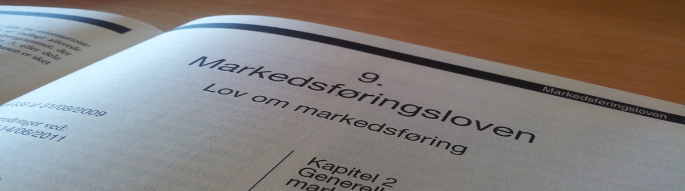

## billede


## billede med url link
<a href="https://www.tinglysning.dk/tinglysning/landingpage/landingpage.xhtml" target="_blank">

</a>

## Link target blank
<a href="https://quiz.tepedu.dk/juraerstatning" target="_blank">Quiz Erstatning</a>


## embed page
<div class="video-container"><iframe src="https://www.vp.dk/"  frameborder="0" allowfullscreen="allowfullscreen"></iframe></div> 


## links til quiz
<h3><a href="https://quiz.tepedu.dk/juraerstatning" target="_blank">Quiz Erstatning</a></h3>
<a href="https://www.forbrug.dk/quiz/ehandelsquizzen/?rn=43716" target="_blank">Tag quizzen fra forbrug.dk, og få svar.</a>

rmd image


## video billede
<div class="video-container"><iframe src="https://www.youtube.com/embed/1q0K01SQavk" width="853" height="480" frameborder="0" allowfullscreen="allowfullscreen"></iframe></div>
embed page
<div class="video-container"><iframe src="https://www.vp.dk/"  frameborder="0" allowfullscreen="allowfullscreen"></iframe></div> 


ref til figur
(se figur \@ref(fig:fordring12))

ref til overskrift 

### Om fuldmagter ved digital tinglysning {#omfuldmagter}

\@ref(omfuldmagter)


See equation \@ref(eq:linear)

\begin{equation}
a + bx = c  (\#eq:linear)
\end{equation}


```{r pant3, echo=FALSE}
mydf <- data.frame(
  S1 = c("Aktivtype" ,
         "Fast ejendom", 
          "Biler", 
          "Løsøre", 
          "Simple fordringer",
         "Negotiable gældsbreve", 
          "Digitale pantebreve", 
          "Værdipapirer"
),
  S2 = c("Ejendomsret" ,
         "Tinglysning i\ntingbogen", 
          "Ingen", 
          "Ingen", 
          "Denunciation til debitorer",
         "Rådighedsberøvelse", 
          "Tinglysning", 
          "Registrering hos værdipapircentralen, VP securities"
),
  S3 = c("Underpant" ,
          "Tinglysning i\ntingbogen", 
          "Ingen", 
          "Ingen", 
          "Denunciation til debitorer",
         "", 
          "Tinglysning", 
          "Registrering hos værdipapircentralen, VP securities"
),
  S4 = c("Udlæg" ,
         "", 
          "Tinglysning\nbilbogen\nrådighedsberøvelse", 
          "Intet", 
          "Intet",
         "Rådighedsberøvelse", 
          "Tinglysning", 
          "Registrering hos værdipapircentralen, VP securities"
),
  S5 = c("Ejendomsforbehold" ,
         "", 
          "Tinglysning\nbilbogen", 
          "Intet", 
          "",
         "", 
          "", 
          ""
),
  S6 = c("Håndpant" ,
         "", 
          "", 
          "Rådighedsberøvelse", 
          "",
         "Rådighedsberøvelse", 
          "", 
          ""
)
)
names(mydf) <- NULL
mydf %>%
  kable("html", escape = FALSE, caption = "Sikringsakter for aktiver") %>%
  kable_styling(full_width = T,font_size = 10,bootstrap_options = c("responsive","bordered","striped")) %>%
  column_spec(1:6, bold = T, border_right = T, color = "black", background = "lightgrey") %>%
  # column_spec(2, bold = T, border_right = T, color = "black", background = "lightgrey") %>%
  # # column_spec(3, bold = T, border_right = T, color = "black", background = "lightgrey") %>%
  row_spec(1,italic = T,bold = T,font_size = 12,color = "white", background = "darkgrey") %>%
scroll_box(width = "100%")
  # row_spec(1,italic = T,bold = T,font_size = 12)
  # column_spec(0, angle = -45)%>%
  # scroll_box(width = "500px") %>%
  # footnote(general = "Forsikringsankenævnets klageguide",general_title = "Kilde:")%>%
# footnote(number = "Hvis skadevolder er under 14 år eller er utilregnelig, kan der dog være dækning selv om handlingen er forvoldt forsætligt")
```


<!-- # Test -->

  <!-- ```{r echo=FALSE} -->
  <!-- # install.packages("rhandsontable") -->
  <!-- library(rhandsontable) -->
  <!-- DF = data.frame(integer = 1:10, -->
                         <!--                    numeric = rnorm(10), -->
                         <!--                    logical = rep(TRUE, 10),  -->
                         <!--                    character = LETTERS[1:10], -->
                         <!--                    factor = factor(letters[1:10], levels = letters[10:1],  -->
                                                                   <!--                                    ordered = TRUE), -->
                         <!--                    factor_allow = factor(letters[1:10], levels = letters[10:1],  -->
                                                                         <!--                                          ordered = TRUE), -->
                         <!--                    date = seq(from = Sys.Date(), by = "days", length.out = 10), -->
                         <!--                    stringsAsFactors = FALSE) -->

  <!-- rhandsontable(DF, width = 600, height = 300) %>% -->
  <!--   hot_col("factor_allow", allowInvalid = TRUE) -->

  <!-- meancalc <- mean(DF$numeric) -->
  <!-- meancalc -->
  <!-- ``` -->


```{r network7,echo=FALSE, result=TRUE}

nodes <- data.frame(id = 1:7,
                    shape = c("box"),
                    label = c("Aftalelov","Forsikringsaftalelov","Kreditaftalelov","Forbrugeraftalelov","AB92","Købelov","E-handelslov"),
                    font.size = c(50,25,25,25,25,25,25))
edges <- data.frame(from = c(1,1,1,1,1,1), to = c(2,3,4,5,6,7),arrows = c("to"),length = rep(20,6))

visNetwork(nodes, edges, height = "500px", width = "100%") %>%
  visNodes(color = list(background = "lightgrey",
                        border = "darkblue",
                        highlight = "yellow"),
           shadow = list(enabled = FALSE, size = 30))  %>%
  visHierarchicalLayout(direction = "LR",levelSeparation = 500)
# visLayout(randomSeed = 24) # to have always the same network

```


```{r echo=FALSE}
library(kableExtra)

fr <- data.frame(
  Aktivitet = c(rep("Anbringelse<br><br>Det ulovlige udbytte anbringes", 1), rep("Sløring<br><br>Det ulovlige udbytte adskilles fra dets kilde",1 ),rep("Anvendelse<br><br>Udbytte tilbageføres",1)),
  E1 = c(
    "CASH",
    "UDL",
    "Tilbageførsel som betaling"
  ),
  E2 = c(
    " CASH <br> UDL ",
    " CASH ",
    " CASH "
  ),
  E3 = c(
    "Anvendelse af",
    "Salg af de købte",
    "Indtægt fra"
  )
)
fr %>%
  mutate(
    E1 = cell_spec(E1, "html", escape = FALSE, color = "red"),
    E2 = cell_spec(E2, "html", escape = FALSE, color = "white",background="red", align = "c", angle = 90)
  ) %>%
  # names(fr) <- c("A" ,"E1" , "E2" , "E3")
  kable(fr,  format = "html", escape = FALSE) %>%
  kable_styling(full_width = T,font_size = 10,bootstrap_options = c("responsive","bordered","striped")) %>%
  column_spec(1, bold = T, border_right = T, color = "white", background = "black") %>%
  row_spec(0,italic = T, color = "white", background = "grey",font_size = 12) %>%
  # column_spec(0, angle = -45)%>%
  # scroll_box(width = "500px") %>%
  scroll_box(width = "100%") %>%
  footnote(general = "Hvidvasksekretariatet",general_title = "Kilde: ")
```
