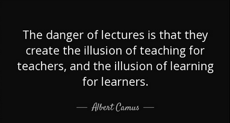

--- 
title: "Erhvervs- og finansjura"
author: "Sonny Kristoffersen"
date: "`r Sys.Date()`"
site: bookdown::bookdown_site
output: bookdown::gitbook
documentclass: book
bibliography: [book.bib, packages.bib]
biblio-style: apalike
link-citations: yes
github-repo: rstudio/bookdown-demo
description: "JURA"
favicon: "favicon.ico"
---


#    {-}


```{r, echo=FALSE, results='asis'}
cat(readLines('fp.html'))
```


				


<h3>***Anmeldelser***</h3>

<br><br>


>Erhvervs- og finansjura rummer rigtig mange gode ting, bl.a. de quizzer der er ved de fleste emner, det gør det muligt at lave et hurtigt brush up.<br><br> 
Derudover er den nem at navigere i, da menuen i siden gør det nemt at komme til og fra de forskellige emner. Den er skrevet i et sprog som er nemt at forstå, og der er gode eksempler.<br><br>

<br><br>
***Emma***

<br><br><br>

>Jeg synes, at Erhvervs- og finansjura er sat rigtig godt op. Simpel at slå op, og nem og finde information i.<br><br>
***Nick***

<br><br><br>

>Jeg synes overordnet set den er super god.<br>
<br>Jeg selv brugte den meget til at læse til eksamen. Den er overskuelig og letlæselig, hvilket er en rigtig god ting indenfor jura, da det godt kan være svært at læse, grundet alle de begreber man ikke kender fra hverdagen.<br><br>
Derudover synes jeg det fungerer super godt, at den er så godt delt op i afsnit. Forstået på den måde, at tit og ofte er det noget meget konkret man søger, og der er dit materiale meget brugervenlig. Det spare en for en masse tid, her tænker jeg også måske i en eksamen situation hvor man er meget presset på tiden<br><br>
Så overordnet set synes jeg den fungere vildt godt. Ydermere supplere den godt til dine powerpoint, og personligt ville jeg mene, at dine PowerPoints og din materialesamling ville være et rigtig godt undervisningsmateriale.<br><br>
Det var i hvert fald de to ting jeg støttede mig op af, da jeg læste til eksamen, og da jeg sad til eksamen 😊
<br><br>***Molly***

<br><br>

>Generelt er materialesamlingen skrevet i et let læseligt sprog i modsætning til den forrige lærebog. Den forklarer juraen i et sprog der ikke er overkompliceret og let at forstå for almindelige mennesker. Der er i bogen enkelte slåfejl, og jeg har fundet enkelte link der ikke var aktive eller manglede, men alt i alt en rigtigt god ”første udgave”. Jeg forstiller mig at du retter småfejlene i takt med, at du bruger materialesamlingen i undervisningen. <br><br>
Personligt kunne jeg godt tænke mig flere eksempler på hvordan de ”vigtige” love bliver anvendt, opstillet i punkform, således at materialesamlingen bredere kan anvendes som opslagsvært i eksamensøjemed, men i kraft af at der er mulighed for at tage noter, kan den studerende lave sin egen punktliste. Ydermere mener jeg personligt at det ville lette forståelsen for den studerende med uddrag fra domme hvor denne kan se loven brugt, ligesom man kan på Karnov.<br><br>
Alt i alt en godt struktureret materialesamling, hvor den studerende har rig mulighed for at dygtiggøre sig i erhvervsjura! <br><br>
**Søren** 


<h3>***Vigtigt bemærk***</h3>

***Denne materialesamling er kun til personligt brug. Alle rettigheder forbeholdes. Fotografering, kopiering eller anden gengivelse af dette materiale, er uden forfatterens skriftlige samtykke, forbudt, ifølge dansk lov om ophavsret.***

***Materialesamlingens videoer, quizer, prodcast, domme og nævnsafgørelser er ikke at betragte som en del af pensum, men er et supplement til pensum for at fremme din yderligere forståelse for Erhvervs- og Finansjuraen***

***Materialesamlingen indeholder tidligere eksamensopgaver med rettevejledninger***

***Der er mulighed for selv at tilføje sine egne noter i materialesamlingen.***

***Om konstaterede fejl og mangler, samt spørgsmål til materialesamlingens indhold kan henvendelse ske på følgende e-mail:***

***sbmk@cphbusiness.dk***

***De bedste hilsener***

***Advokat, lektor, Sonny Kristoffersen, Ph.D.***





 

---


<h3>Video sådan køber du adgang til onlinebøger på www.tepedu.dk.</h3>
<style>.embed-container { position: relative; padding-bottom: 56.25%; height: 0; overflow: hidden; max-width: 100%; } .embed-container iframe, .embed-container object, .embed-container embed { position: absolute; top: 0; left: 0; width: 100%; height: 100%; }</style><div class='embed-container'><iframe src='https://player.vimeo.com/video/354519447' frameborder='0' webkitAllowFullScreen mozallowfullscreen allowFullScreen></iframe></div>
  <br>
  <br>

---

  <br>
  <br>
<h3>Video sådan afmelder du dit abonnement på www.tepedu.dk.</h3>
<style>.embed-container { position: relative; padding-bottom: 56.25%; height: 0; overflow: hidden; max-width: 100%; } .embed-container iframe, .embed-container object, .embed-container embed { position: absolute; top: 0; left: 0; width: 100%; height: 100%; }</style><div class='embed-container'><iframe src='https://player.vimeo.com/video/354519512' frameborder='0' webkitAllowFullScreen mozallowfullscreen allowFullScreen></iframe></div>


